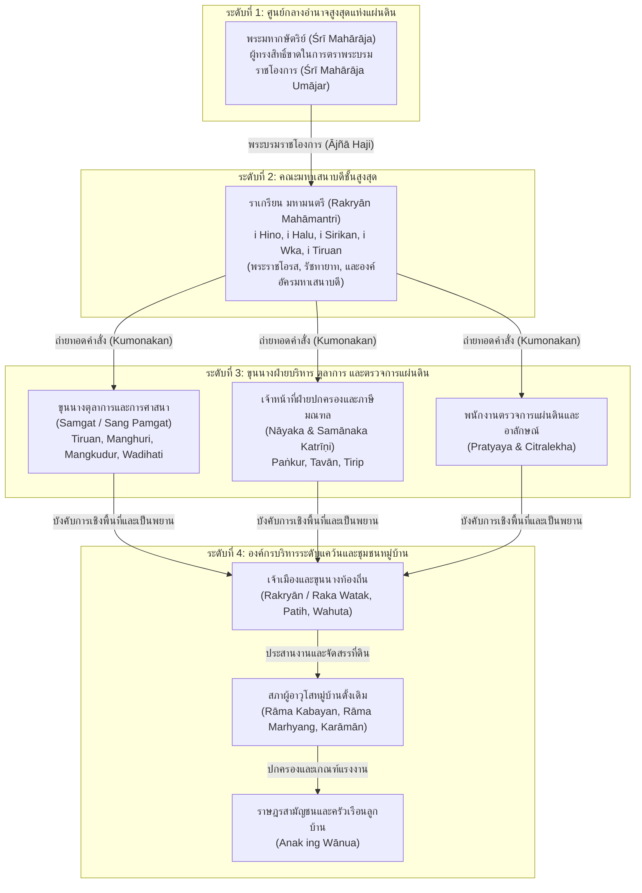
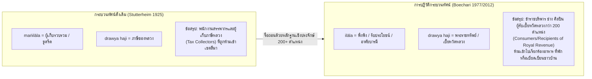
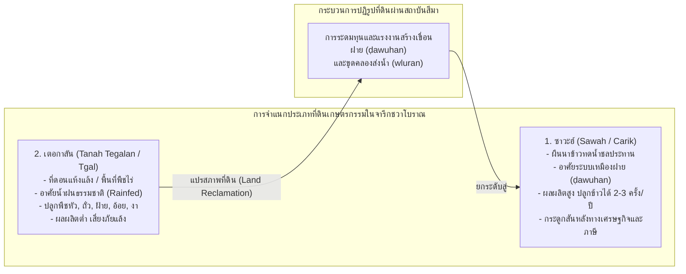
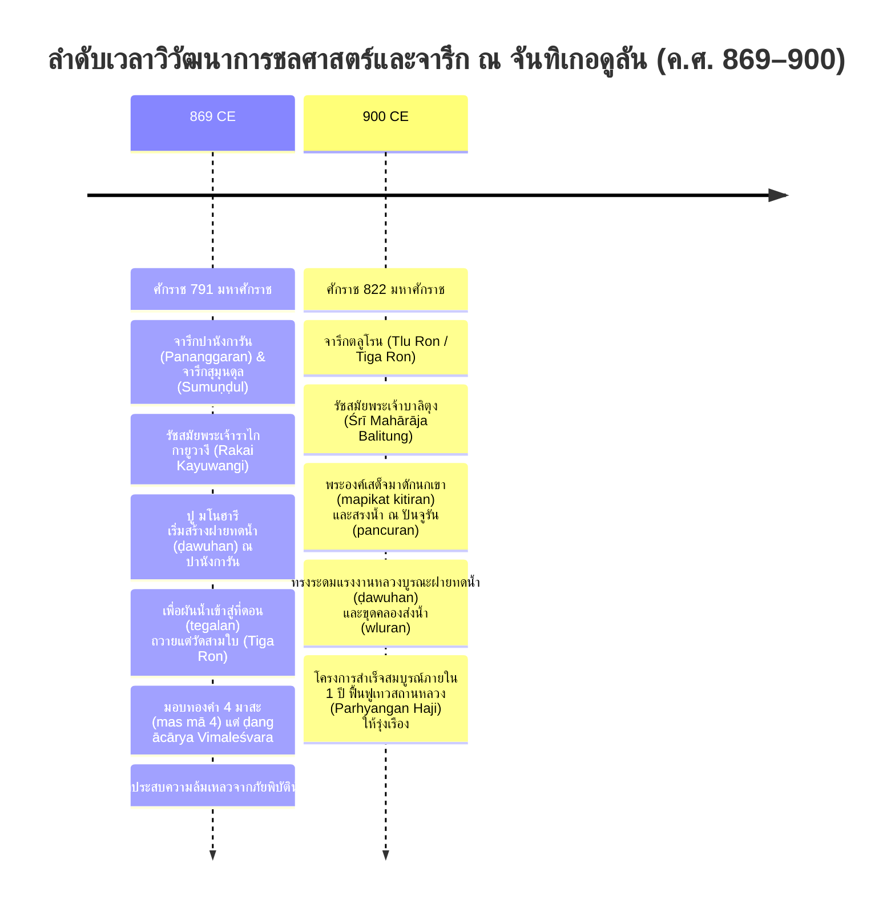

# บทที่ 5 (ตอนที่ 2): โครงสร้างลำดับชั้นทางสังคม ข้อถกเถียงกลุ่มมังงิลาลา ทรัวยะ ฮาจิ และวิศวกรรมชลศาสตร์เกษตรกรรม

---

## 5.3 โครงสร้างลำดับชั้นทางสังคม ระบบราชสำนัก และข้อถกเถียงกลุ่ม Mangilāla Drawya Haji (Social Stratification, Bureaucratic Hierarchy, and the Mangilāla Drawya Haji Controversy)

### 5.3.1 สายการบังคับบัญชา 4 ระดับและพีระมิดอำนาจในจารึกชวาโบราณ

ในประวัติศาสตร์นิพนธ์ว่าด้วยวิวัฒนาการแห่งรัฐ สถาบันการปกครอง และระเบียบสังคมของราชอาณาจักรโบราณบนเกาะชวา จารึกพระราชกฤษฎีกาสถาปนาเขตปลอดภาษีหรือ "สีมา" (*sīma*) ทำหน้าที่เป็นประจักษ์พยานชิ้นเอกที่บันทึกสายการบังคับบัญชา (*chain of command*) และโครงสร้างลำดับชั้นทางสังคมของสังคมชวาโบราณไว้อย่างเป็นรูปธรรมและกระจ่างแจ้งที่สุด [1] ตัวบทจารึกมิได้สะท้อนเพียงภาพตัวแทนเชิงอุดมคติของระเบียบเทวราชาตามคัมภีร์ธรรมศาสตร์ของอินเดียโบราณ หากแต่เผยให้เห็นกลไกการบริหารราชการแผ่นดินจริงที่มีการจัดสรรอำนาจหน้าที่อย่างเป็นระบบ โดยเป็นการประสานรอยต่อระหว่างอำนาจรวมศูนย์ของสถาบันกษัตริย์และราชสำนักส่วนกลาง กับสถาบันการปกครองตนเองของชุมชนหมู่บ้านดั้งเดิม (*wānua*) ที่มีรากฐานหยั่งลึกในวัฒนธรรมออสโตรนีเซียนโบราณมานานนับพันปี [2]

จากการประมวลจารึกพระราชกฤษฎีกากว่า 180 ฉบับในคลังจารึกดิจิทัลมาตรฐานสากล DHARMA ร่วมกับการสังเคราะห์แบบจำลองโครงสร้างรัฐโบราณของ ศาสตราจารย์ เอ็ม. บุชารี (M. Boechari) และคณะนักวิชาการจารึกวิทยาร่วมสมัย สามารถจำแนกพีระมิดแห่งอำนาจและสายการบังคับบัญชาในจารึกชวาโบราณออกเป็น 4 ระดับชั้นหลักอย่างเป็นระบบ [3]:

#### 1. สถาบันพระมหากษัตริย์ (Śrī Mahārāja): ยอดพีระมิดแห่งสิทธิธรรมและพระบรมราชโองการ
ที่จุดสูงสุดของพีระมิดอำนาจ พระมหากษัตริย์ทรงดำรงฐานะเป็น "ปาดูกา ศรีมหาราชา" (*pāduka śrī mahārāja*) ผู้ทรงเป็นตัวแทนแห่งระเบียบจักรวาลและบรมธรรมิกราช พระราชอำนาจของกษัตริย์ปรากฏในสูตรตัวบทจารึกผ่านประโยคมาตรฐานว่า *"śrī mahārāja umājar"* (สมเด็จพระศรีมหาราชาทรงมีพระบรมราชโองการตรัสสั่ง) หรือ *"irika divasa nikanang ājñā haji"* (ณ วันนั้น อันเป็นเวลาที่พระบรมราชโองการแห่งกษัตริย์ได้เสด็จลงมา) [4] 

ในเชิงทฤษฎี พระมหากษัตริย์ทรงเป็นผู้ถือครองสิทธิ์สูงสุดเหนือผืนดินทั้งปวงในราชอาณาจักร ทว่าในทางปฏิบัติทางประวัติศาสตร์ พระราชอำนาจนี้ต้องเผชิญหน้า เจรจาต่อรอง และประนีประนอมกับสิทธิ์การครอบครองดั้งเดิมของชุมชน (*hak ulayat*) การสถาปนาสีมาจึงมิใช่การริบหรือยึดครองที่ดินตามอำเภอใจของกษัตริย์ หากแต่เป็นการใช้พระราชอำนาจในการเปลี่ยนสถานะผลประโยชน์ทางภาษี (*drawya haji*) จากเดิมที่ราษฎรต้องส่งมอบเข้าสู่ท้องพระคลังหลวง ให้โอนถ่ายไปเป็นกองทุนค้ำจุนการดำเนินงานของศาสนสถาน อารามสงฆ์ และการบำรุงรักษาสาธารณูปโภคชลประทาน [5]

#### 2. คณะมหาเสนาบดีชั้นสูงสุด (Rakryān Mahāmantri): พระบรมวงศานุวงศ์และองค์รัชทายาท
ถัดลงมาจากพระมหากษัตริย์คือกลุ่มอัครมหาเสนาบดีที่เรียกว่า **"ราเกรียน มหามนตรี"** (*rakryān mahāmantri*) ซึ่งมีตำแหน่งหลัก 3 ถึง 5 ตำแหน่ง ได้แก่ ฮีโน (*i Hino*), ฮาลู (*i Halu*), สิรีกาน (*i Sirikan*), วกา (*i Wka*), และติรุวัน (*i Tiruan*) ในบางยุคสมัยอาจปรากฏตำแหน่งบาวัง (*i Bawang*) เพิ่มเติม [6] ตำแหน่งเหล่านี้มีความสำคัญสูงสุดในเชิงโครงสร้างอำนาจ เพราะสงวนไว้เฉพาะสำหรับพระราชโอรส พระอนุชา หรือเจ้านายชั้นผู้ใหญ่ที่มีสิทธิ์สืบราชสมบัติต่อไป

โดยเฉพาะอย่างยิ่ง ตำแหน่ง **"ราเกรียน มหามนตรี อี ฮีโน"** (*rakryān mahāmantri i hino*) ซึ่งเปรียบเสมือนองค์รัชทายาท มกุฎราชกุมาร หรืออัครมหาเสนาบดีผู้สำเร็จราชการแผ่นดิน ตัวอย่างที่เด่นชัดและคลาสสิกที่สุดในจารึกวิทยาชวากลางคือ เจ้าชายทักษา (Pu Dakṣa) ผู้ดำรงตำแหน่งเป็น *rakryān mapatiḥ i hino pu dakṣottama bāhubajra pratipakṣakṣaya* ในรัชสมัยของพระเจ้าบาลิตุง (Śrī Mahārāja Balitung, ครองราชย์ ค.ศ. 898–910) พระนามของปูดักษาปรากฏเป็นผู้รับพระบรมราชโองการและกำกับดูแลการสถาปนาสีมาในจารึกสำคัญจำนวนมหาศาล เช่น จารึกโปฮ์ (ค.ศ. 905), จารึกซังซัง (ค.ศ. 907), จารึกปาเลปางัน (ค.ศ. 906), และจารึกกูบู-กูบู (ค.ศ. 905) ก่อนที่พระองค์จะเสด็จขึ้นเถลิงถวัลยราชสมบัติเป็นพระมหากษัตริย์พระองค์ถัดไปในพระนาม พระเจ้าศรีทักษา (Śrī Mahārāja Dakṣa, ค.ศ. 910–919) [7]

คณะมหามนตรีเหล่านี้ทำหน้าที่เป็น "สะพานเชื่อมเชิงอำนาจ" ระหว่างพระมหากษัตริย์กับกลไกราชการส่วนล่าง โดยเมื่อได้รับพระราชโองการแล้ว จะทำหน้าที่ส่งต่อคำสั่ง (*kumonakan*) ไปยังข้าราชการฝ่ายบริหารและตุลาการเพื่อดำเนินการในพื้นที่จริง

#### 3. ขุนนางฝ่ายบริหาร ตุลาการ และตรวจการแผ่นดิน (Samgat, Nāyaka, Pratyaya, Citralekha)
ในระดับชั้นที่สาม โครงสร้างการบริหารของชวาโบราณได้จัดวางกลไกการถ่วงดุลอำนาจและการแบ่งแยกหน้าที่ตามความเชี่ยวชาญไว้อย่างซับซ้อน:
- **ขุนนางตุลาการและการศาสนา (Samgat / Sang Pamgat):** คำว่า *samgat* หรือ *pamgat* มาจากรากศัพท์ภาษาชวาโบราณ *pəgat* แปลว่า "การตัด, การตัดสิน, การชี้ขาด, หรือการสิ้นสุดข้อพิพาท" ขุนนางกลุ่มนี้ทำหน้าที่เป็นผู้พิพากษา ตุลาการ และผู้ตีความนิติศาสตร์ตามทั้งขนบจารีตประเพณีท้องถิ่น (*deśadr̥ṣṭa*) และคัมภีร์ธรรมศาสตร์ศักดิ์สิทธิ์ (*śāstradr̥ṣṭa* เช่น คัมภีร์กูฏารมานวะ / *Kūṭāra-Mānava*) [8] ตำแหน่งสังคัตมักผูกติดกับศูนย์กลางศาสนสถานหรือสำนักสงฆ์หลวง เช่น *Samgat Tiruan*, *Samgat Manghuri*, *Samgat Mangkudur*, และ *Samgat Wadihati* ขุนนางเหล่านี้มีหน้าที่ตรวจสอบความชอบธรรมทางกฎหมาย สอบสวนกรรมสิทธิ์ที่ดินเดิม เป็นพยานในการปักปันเขตแดน และกำกับพิธีกรรมสังเวยสาปแช่ง (*śapatha*) มิให้มีผู้ใดละเมิด
- **เจ้าหน้าที่ปกครองมณฑลและคณะกรรมการภาษี (Nāyaka & Samānaka Katrīṇi):** คำว่า *nāyaka* เป็นคำยืมภาษาสันสกฤต แปลว่า "ผู้นำ" ทำหน้าที่เป็นเจ้าหน้าที่ฝ่ายปกครองระดับมณฑลที่ดูแลกลุ่มหมู่บ้านและประสานงานระหว่างราชสำนักส่วนกลางกับสภาหมู่บ้าน ในมิติด้านภาษีอากร นายกะจะทำงานร่วมกับคณะเจ้าพนักงานสรรพากรสามประสานที่เรียกว่า *samānak katrīṇi* หรือ *vinawa sang māna katrīṇi* อันประกอบด้วย **ปังกูร์** (*Paṅkur*), **ตาวัน** (*Tavān*), และ **ตีริป** (*Tirip*) [9] เจ้าหน้าที่ทั้งสามฝ่ายนี้มีบทบาทสำคัญในการตรวจนับผลผลิตในไร่นา คำนวณยอดภาษีที่ดิน ตรวจสอบสินค้าในตลาดนัด และบันทึกบัญชียกเว้นภาษีในเขตแดนสีมา
- **พนักงานตรวจการแผ่นดินและรังวัดที่ดิน (Pratyaya / Parttaya):** คำว่า *pratyaya* มีรากศัพท์มาจากภาษาสันสกฤต หมายถึง "ความไว้วางใจ" (*the trusted ones*) เป็นข้าราชการผู้ได้รับความไว้วางใจจากราชสำนักให้ทำหน้าที่ตรวจสอบความถูกต้องของการรังวัดแนวเขตที่ดิน การสอบสวนประวัติที่ดิน และการป้องกันมิให้เกิดการรุกล้ำเขตแดนระหว่างแปลงนาหลวง แปลงนาวัด และแปลงนาชาวบ้าน [10]
- **อาลักษณ์ผู้จารึกพระราชโองการ (Citralekha):** ข้าราชการฝ่ายอาลักษณ์ผู้มีความเชี่ยวชาญด้านอักขรวิทยาและฉันทลักษณ์ ทำหน้าที่ร่างตัวบท แปลงพระบรมราชโองการลงสู่วัสดุถาวรวัตถุ ไม่ว่าจะเป็นแผ่นศิลา (*upala*) หรือแผ่นทองแดง (*tāmraśāsana*) พร้อมทั้งประทับตราลัญจกรราชสำนัก (เช่น ลัญจกรครุฑมุข / *Garuḍamukha* ในสมัยแอร์ลังกา) อาลักษณ์จะได้รับส่วนแบ่งของกำนัลตอบแทนการบันทึกอย่างสมเกียรติ [11]

#### 4. องค์กรบริหารระดับแคว้นและสภาหมู่บ้าน (Watak, Patih, Wahuta, Rāma)
ฐานรากของพีระมิดอำนาจวางอยู่บนดินแดนระดับแคว้นหรือมณฑลที่เรียกว่า **"วาตัก"** (*watak / karakryān*) ซึ่งปกครองโดยขุนนางศักดินาระดับ **รากะ** (*raka*) หรือ **ราเกรียน** (*rakryān*) ร่วมกับข้าราชการฝ่ายบริหารคือ **ปาติฮ์** (*patih / mapatih*) และฝ่ายปฏิบัติการคือ **วาฮูตา** (*wahuta*) [12] 

ในระดับล่างสุดคือ **"วันวา"** (*wānua*) หรือชุมชนหมู่บ้านชนบท ซึ่งเป็นหน่วยทางภูมิศาสตร์และสังคมขั้นพื้นฐานที่สุดของเกาะชวา วันวาปกครองตนเองผ่าน **"สภาผู้อาวุโสหมู่บ้าน"** (*rāma* หรือ *karāmān*) ซึ่งนำโดยบุคคลสำคัญ เช่น ผู้ใหญ่บ้านฝ่ายบริหาร (*tuha wānua*), ผู้ใหญ่บ้านฝ่ายพิธีกรรม (*rāma marhyang*), และที่ปรึกษาอาวุโส (*rāma kabayan*) คณะกรรมการรามาทำหน้าที่เป็นผู้แทนชุมชนในการเจรจาต่อรองกับข้าราชการส่วนกลาง ยินยอมโอนสิทธิ์ที่ดิน จัดสรรแรงงานเกณฑ์เพื่อการสาธารณูปโภค และดูแลความสงบเรียบร้อยภายในหมู่บ้าน [13] สมาชิกในชุมชนระดับครัวเรือนจะถูกเรียกว่า **"อานัก อิง วันวา"** (*anak ing wānua*) ซึ่งเป็นกลุ่มแรงงานผู้ผลิตที่แท้จริงในระบบเศรษฐกิจ

#### ระบบของกำนัลตอบแทนพยาน (Pasěk-pasěk / Wli) และบทบาทสตรีชนชั้นสูง
ความสัมพันธ์ระหว่างระดับชั้นในพีระมิดอำนาจนี้ มิได้ดำรงอยู่ผ่านการบังคับบัญชาด้วยกำลังอาญาเพียงอย่างเดียว หากแต่ผูกร้อยด้วย "เศรษฐกิจแห่งการให้ของกำนัลและการตอบแทนซึ่งกันและกัน" (*gift-exchange economy*) ในพิธีสถาปนาสีมา ผู้ริเริ่มโครงการหรือราชสำนักจะต้องจัดสรรของกำนัลและค่าตอบแทนอย่างเป็นทางการที่เรียกว่า **ปาเส็ก-ปาเส็ก** (*pasĕk-pasĕk*) หรือ **วลี** (*wli*) ให้แก่ขุนนางทุกระดับชั้น ตลอดจนผู้อาวุโสในสภาหมู่บ้าน เพื่อสร้างฉันทามติและการยอมรับร่วมกันทางกฎหมาย [14]

รายการของกำนัลที่บันทึกไว้อย่างละเอียดในจารึก เช่น จารึกตาจี (ค.ศ. 901) และจารึกโปฮ์ (ค.ศ. 905) ประกอบด้วย:
1. **ผ้าทอผืนนำเข้าและผ้าตัดเย็บ:** ผ้านุ่งสำหรับบุรุษ (*wdihan* / *kain sarwal*) ซึ่งแบ่งระดับคุณภาพและลวดลายอย่างเคร่งครัด เช่น ชนิด *jajar*, *kalyāga*, และ *ragi* ควบคู่กับผ้านุ่งสตรี (*ken* / *ken buat walo*) ซึ่งการมอบผ้าที่มีลวดลายและความยาวต่างกันสะท้อนถึงการจัดลำดับเกียรติยศและสถานภาพทางสังคมของขุนนางแต่ละตำแหน่ง [15]
2. **เงินตราโลหะมีค่า:** การจ่ายเหรียญทองคำและเงินตราตามน้ำหนักมาตรฐาน ได้แก่ กาฏิ (*kāṭi*), สุวรรณะ (*suvarṇa*), มาสะ (*māṣa*), และกูปัง (*kupang*) เพื่อเป็นค่าสินไหมทดแทนและค่าธรรมเนียมการเป็นพยาน [16]

นอกจากนี้ หลักฐานจารึกยังเปิดเผยบทบาทอันโดดเด่นและทรงอำนาจของ **"สตรีชนชั้นสูงและเจ้าหน้าที่ฝ่ายสตรีในระดับท้องถิ่น"** ซึ่งสะท้อนความเสมอภาคทางเพศสถานะดั้งเดิมของสังคมชวาโบราณก่อนการเข้ามาของกรอบคิดปิตาธิปไตยแบบอินเดีย ดังที่ปรากฏใน **จารึกสุมุนดุล** (Prasasti Sumuṇḍul ค.ศ. 869) ซึ่งค้นพบ ณ ลานจันทิเกอดูลัน ตัวบทจารึกบรรทัดที่ 5–6 บันทึกบทบาทของพระราชมารดาแห่งราไกปะเดอลังกานไว้อย่างชัดเจน [17]:

> **ตัวบทจารึกสุมุนดุล (BPCB DIY / Wurjantoro 2011, บรรทัดที่ 5–6):**
>
> `... tkāla rakryān wiku paḍaŋ lawan pu manoha riŋ °ibu rakai padĕlaggan anak sang dewata ing tangar manusuk dawuhan ...` [18]
>
> *(คำแปล: ...ในกาลเวลานั้น ราเกรียน วีกู แห่งปาดัง พร้อมด้วย ปู มโนฮา ได้เข้าเฝ้าพระราชมารดาแห่งระไก ปะเดอลังกาน ผู้ทรงเป็นพระราชธิดาแห่งพระผู้เสด็จสู่สรวงสวรรค์ ณ ตางาร์ เพื่อขอพระราชทานพระบรมราชานุญาตร่วมกันสถาปนาทำนบฝายทดน้ำ...)* [19]

ข้อความนี้ยืนยันว่า สตรีชนชั้นสูงในราชสำนักมตารามมิได้ถูกจำกัดบทบาทอยู่เพียงในฝ่ายใน หากแต่มีฐานะเป็นเจ้าของที่ดิน มีอำนาจตัดสินใจในกิจการสาธารณูปโภค และมีบทบาทเคียงบ่าเคียงไหล่กับนักบวชและขุนนางฝ่ายปกครอง เช่นเดียวกับกรณีของพระนางศรีคาฮูลุนนัน (Śrī Kahulunnan หรือสมเด็จพระนางเจ้าปราโมทวรรธนี) ในจารึกตระกูลตรูอีเตปูซัน (ค.ศ. 842) ผู้ทรงอุปถัมภ์มหาเจดีย์บุโรพุทโธ [20] ยิ่งไปกว่านั้น ในโครงสร้างสภาหมู่บ้านวันวา จารึกหลายหลักยังระบุตำแหน่งข้าราชการสตรี (*pejabat perempuan di tingkat wanua*) ผู้ทำหน้าที่ตรวจนับสินค้าในตลาดนัดชุมชนและร่วมรับของกำนัลปาเส็ก-ปาเส็กในฐานะพยานทางนิติกรรมอย่างเท่าเทียม [21]

---

### 5.3.2 การปฏิวัตินิยามกลุ่ม Mangilāla Drawya Haji (Boechari 2012)

ในโครงสร้างแบบแผน 8 หมวดมาตรฐานของจารึกสถาปนาสีมา หมวดที่มีความยาวและซับซ้อนที่สุดหมวดหนึ่งคือ บัญชีรายนามกลุ่มบุคคลที่ถูกห้ามมิให้ย่างกรายเข้าสู่เขตแดนสีมา ซึ่งในภาษาชวาโบราณเรียกว่า **"มังงิลาลา ทรัวยะ ฮาจิ"** (*maṅilāla drawya haji*) หรือ *maṅilāla drabya haji* [22] การทำความเข้าใจความหมาย หน้าที่ และสถานภาพทางสังคมของกลุ่มคนเหล่านี้ ได้ก่อให้เกิดข้อถกเถียงทางวิชาการและประวัติศาสตร์นิพนธ์ที่ยาวนานเกือบหนึ่งศตวรรษ

#### 1. มายาคติพนักงานเก็บภาษีของสตัตเตอร์ไฮม์ (W.F. Stutterheim 1925)
ในยุคอาณานิคมดัตช์ ดร. วิลเลม เอฟ. สตัตเตอร์ไฮม์ (W.F. Stutterheim 1925) ได้เสนอการตีความคำว่า *mangilāla drawya haji* ว่าหมายถึง "คณะเจ้าพนักงานสรรพากรหรือพนักงานจัดเก็บภาษีของพระมหากษัตริย์" (*belastingambtenaren / tax-collectors*) [23] สตัตเตอร์ไฮม์ตีความคำกริยา *mangilāla* ว่ามีความหมายเท่ากับ *mangala* หรือ *managih* ในภาษาชวา ซึ่งหมายถึง "การเรียกร้อง ทวงถาม หรือเก็บรวบรวม" ส่วน *drawya haji* แปลว่า "ภาษีส่วยสาอากรของหลวง" ดังนั้น การที่จารึกสีมาประกาศว่า *tan katamāna deni saprakāra mangilāla drawya haji* จึงถูกอธิบายว่า หมายถึง "การห้ามมิให้เจ้าพนักงานสรรพากรของหลวงเข้ามาจัดเก็บภาษีในดินแดนปลอดส่วยแห่งนี้" [24] ข้อสมมติฐานของสตัตเตอร์ไฮม์ได้รับการยอมรับและผลิตซ้ำอย่างแพร่หลายในหมู่นักบูรพคดีศึกษาชาวดัตช์และนักประวัติศาสตร์เอเชียตะวันออกเฉียงใต้รุ่นต่อมา เช่น N.J. Krom และ J.G. de Casparis นานกว่าครึ่งศตวรรษ

#### 2. การรื้อถอนระเบียบวิธีและการปฏิวัติความหมายของบุชารี (M. Boechari 2012)
ความเข้าใจผิดพลาดดังกล่าวถูกรื้อถอนลงอย่างสิ้นเชิงโดย ศาสตราจารย์ เอ็ม. บุชารี ในบทความวิจัยระดับหมุดหมาย *"Manfaat Studi Bahasa dan Sastra Jawa Kuna Ditinjau dari Segi Sejarah dan Arkeologi"* (ค.ศ. 1977) ซึ่งต่อมาได้รับการรวบรวมไว้ในหนังสือแม่บท *Melacak Sejarah Kuno Indonesia Lewat Prasasti* (2012, หน้า 21–38) [25]

บุชารีได้ใช้ระเบียบวิธีวิจัยแบบ "ประจักษ์นิยมจารึกวิทยา" (Empirical Epigraphy) โดยทำการรวบรวม ถอดรหัส และจัดหมวดหมู่รายนามตำแหน่งที่ปรากฏภายใต้หัวข้อ *mangilāla drawya haji* จากศิลาจารึกและจารึกแผ่นทองแดงทั่วเกาะชวา ทั้งในยุคชวากลางและชวาตะวันออก บุชารีค้นพบว่า ตำแหน่งบุคคลที่ระบุไว้ในกลุ่มนี้มี **มากกว่า 200 ตำแหน่ง** และข้อเท็จจริงเชิงประจักษ์ที่สำคัญที่สุดคือ: **มีตำแหน่งเพียงส่วนน้อยนิดเท่านั้นที่เกี่ยวข้องกับการจัดเก็บภาษีหรือการคลัง** (เช่น *pangurang*, *patinggi*) ส่วนตำแหน่งที่เหลืออีกเกือบสองร้อยตำแหน่งล้วนเป็นกลุ่มวิชาชีพ ช่างฝีมือ ศิลปิน ทหาร คนรับใช้ และบุคคลชายขอบในพระราชสำนัก [26]

จากการวิเคราะห์รากศัพท์ภาษาชวาโบราณ บุชารีชี้ว่าคำว่า *ilāla* มิได้แปลว่า "การเก็บภาษี" หากแต่สัมพันธ์กับคำว่า *kāla* หรือ *ngilāla* ซึ่งหมายถึง "การพึ่งพาอาศัย, การขอรับประโยชน์, การแสวงหาการดำรงชีพ, หรือการบริโภค" ส่วนคำว่า *drawya haji* หรือ *drabya haji* หมายถึง "พระราชทรัพย์, งบประมาณแผ่นดิน, หรือเบี้ยหวัดเงินปีส่วนพระองค์ของพระมหากษัตริย์" [27]

ดังนั้น นิยามที่ถูกต้องตามหลักจารึกวิทยาของกลุ่ม **Mangilāla Drawya Haji** จึงมิใช่พนักงานสรรพากร หากแต่คือ:
> **"กลุ่มข้าราชบริพาร ช่างฝีมือ นักแสดงมหรสพ ทหาร และผู้พึ่งพิงเบี้ยหวัดเงินปีจากพระราชทรัพย์หลวง" (Consumers, Beneficiaries, and Recipients of Royal Revenue)** [28]

#### 3. กายวิภาคบัญชี 200 ตำแหน่ง: การจำแนกหมวดหมู่วิชาชีพในราชสำนัก
จากการสำรวจตัวบทจารึกสำคัญ เช่น จารึกโปฮ์ (ค.ศ. 905), จารึกมุงกุต (ค.ศ. 1022), จารึกบาร์ซาฮัน, จารึกการามัน (ค.ศ. 1053), จารึกมันตยาสิห์ (ค.ศ. 907), และจารึกมาซาฮาร์ สามารถจำแนกกลุ่มตำแหน่งกว่า 200 รายการของ *mangilāla drawya haji* ออกเป็น 6 หมวดหมู่หลัก ดังนี้ [29]:

| หมวดหมู่วิชาชีพ | ตัวอย่างตำแหน่งในจารึกภาษาชวาโบราณ (IAST) | หน้าที่และความหมายเชิงสถาบันในราชสำนัก |
|:---|:---|:---|
| **1. ช่างฝีมือและหัตถกรรมหลวง** | *uṇḍahagi, paṇḍai mas, paṇḍai wsi, juru gusali, mangriga, mangapus, makisi, mamubut* | ช่างไม้สถาปัตยกรรม, ช่างทองหลวง, ช่างตีเหล็กหลวง, นายช่างเตาหลอม, ช่างปั้นหม้อ, ช่างฟั่นเชือก, ช่างทอหูก, ช่างกลึงไม้ |
| **2. ผู้ดูแลพาหนะและสัตว์หลวง** | *mahaliman / gajavāra, makuda / aśvavāra, mangranti, tuha alas, mamatuk, mamaluk* | ควาญช้างหลวง, คนดูแลม้าหลวง, คนล่ามโซ่สัตว์ป่า, ขุนนางพนักงานพิทักษ์ป่าล่าสัตว์, คนเลี้ยงเหยี่ยวล่าสัตว์ |
| **3. ทหารรักษาพระองค์และกองกำลัง** | *mamanaḥ, magalaḥ, magaṇḍi, makiṭran, senāmukha* | พลเกาทัณฑ์หลวง, พลหอกรักษาพระองค์, พลขว้างหิน, พลดาบโล่ห์, นายกองหน้าทหารม้า |
| **4. นักแสดงและมหรสพหลวง** | *vidu mangidung, matapukan, mawayang, mamirus, mabañol, mapaḍahi, mawulung-wulung* | นักร้องขับลำนำหลวง, นักแสดงระบำหน้ากาก, นายโรงเชิดหุ่นวายัง, นักแสดงละครใบ้, จำอวดหลวง, นักตีกลอง, นักระบำเครื่องขนนก |
| **5. ผู้พึ่งพิงบารมีและบริวารฝ่ายใน** | *kḍi, valyan, hulun haji, watěk i jro, sambal, sumbul, singgah, pamr̥ṣi* | คนแคระ/คนพิการ/ขันที, หมอยาหลวง, ข้าหลวงเดิม, ข้าราชบริพารฝ่ายใน, พนักงานเชิญพานหมาก, พนักงานเชิญขันน้ำชำระ |
| **6. เจ้าพนักงานการคลังและตลาด (ส่วนน้อย)** | *pangurang, pamanikan, tuha dagang, juru judi, juru jalir* | เจ้าหน้าที่เสมียนบัญชี, พนักงานตีราคาอัญมณี, นายวาณิชหลวง, ผู้ควบคุมบ่อนการพนัน, ผู้ดูแลโรงคณิกา |

ตารางข้างต้นเผยให้เห็นโครงสร้างสังคมของราชสำนักชวาโบราณอย่างน่าตื่นตะลึง บุคคลเหล่านี้คือ "ผู้รับเบี้ยหวัด" (*drawya haji*) โดยตรงจากพระเจ้าแผ่นดิน เพื่อตอบแทนการทำงานเฉพาะทาง การสร้างสรรค์งานศิลปะ หรือการรับใช้ใกล้ชิดพระองค์ [30]

ยิ่งไปกว่านั้น เมื่อทำการศึกษาเปรียบเทียบเชิงวิวัฒนาการระหว่างจารึกยุคชวากลาง (คริสต์ศตวรรษที่ 9–10) กับจารึกยุคชวาตะวันออก (คริสต์ศตวรรษที่ 11–14) พบว่า บัญชีรายนามกลุ่มมังงิลาลา ทรัวยะ ฮาจิ มีแนวโน้มขยายตัวเพิ่มขึ้นอย่างต่อเนื่อง ในจารึกยุคพระเจ้าบาลิตุง (เช่น จารึกโปฮ์ ค.ศ. 905 หรือ จารึกมันตยาสิห์ ค.ศ. 907) ปรากฏตำแหน่งในกลุ่มนี้ราว 20 ถึง 40 ตำแหน่ง แต่เมื่อล่วงเข้าสู่ยุคพระเจ้าแอร์ลังกาในคริสต์ศตวรรษที่ 11 (เช่น จารึกมุงกุต ค.ศ. 1022 หรือ จารึกการามัน ค.ศ. 1053) บัญชีตำแหน่งได้ทวีจำนวนขึ้นเป็นมากกว่า 70 ถึง 80 ตำแหน่ง และทะลุ 100 ตำแหน่งในยุคมัชปาหิต ซึ่งสะท้อนการขยายตัวของระบบข้าราชบริพารฝ่ายใน ความเชี่ยวชาญเฉพาะทางของระบบช่าง และความซับซ้อนของโครงสร้างราชสำนักโบราณ [31]

#### 4. ตัวบทจารึกปฐมภูมิ: กฎหมายห้ามการรบกวนในจารึกโปฮ์ จารึกมุงกุต และจารึกบาร์ซาฮัน
เพื่อพิสูจน์ความเข้าใจดังกล่าว ตัวบทจารึกแผ่นทองแดงโปฮ์ (Charter of Poh / Randusari I ค.ศ. 905) แผ่นที่ 1 ด้านหลัง บรรทัดที่ 4–6 ได้ระบุรายนามและเงื่อนไขทางกฎหมายไว้อย่างชัดเจน [32]:

> **ตัวบทจารึกโปฮ์ (DHARMA `INSIDENKPoh.xml`, 1v4–1v6):**
>
> `... tan katamāna deni saprakāraniṁ maṅilala drabya haji tikasan·, kriṁ, paḍam·, rumvān·, paraṇakan·, Air haji, tapa haji, tuha dagaṁ, manimpiki, makalaṅkaṁ, limus· galuḥ, taji, paṅaruhan·, kataṅgaran, pinilai, vanva I dalam·, hulun haji, pamr̥ṣi, mapaḍahi, maṅiduṁ, mahaliman· Ityevamādi saprakāra kabaiḥ tan hana deyan· tumamā Iriya, saṁ hyaṁ caitya saṁ devata saṁ lumāḥ Iṁ pastika Ataḥ basa-pramāṇā I sovarani sukhaduḥkhanya kabaiḥ ...` [33]
>
> *(คำแปล: ...ห้ามมิให้ถูกเหยียบย่างล่วงล้ำโดยบรรดาผู้พึ่งพิงพระราชทรัพย์หลวงทั้งปวง [maṅilala drabya haji] อันได้แก่ ทิกาซัน, กริง, ปาดัม, รุมวัน, ปารานากัน, แอร์ฮาจิ, ตาปาฮาจิ, หัวหน้าพ่อค้า [tuha dagang], มานิมปีกี, มากาลังกัง, ลิมุส กาลุฮ์, ตาจี, ปางารูฮัน, กาตังการัน, ปินิไล, ชุมชนชาววังฝ่ายใน [wanwa i dalam], ข้าหลวง [hulun haji], ผู้ชำระพิธี [pamr̥ṣi], นักตีกลอง [mapaḍahi], นักขับร้องลำนำ [maṅidung], ควาญช้าง [mahaliman] และตำแหน่งอื่นๆ ทั้งหลายทั้งปวงเช่นนี้เป็นต้น ห้ามมิให้มีผู้ใดเข้าไปข้องแวะ มีเพียงพระสถูปศักดิ์สิทธิ์ [saṁ hyaṁ caitya] แห่งองค์เทพผู้เสด็จสู่สวรรคาลัย ณ ปัสติกา เท่านั้นที่จะทรงมีสิทธิ์อำนาจสูงสุดเหนือผลประโยชน์และคดีความทั้งปวง...)* [34]

ในทำนองเดียวกัน จารึกแผ่นสัมฤทธิ์บาร์ซาฮัน (Barsahan Plate, DHARMA `INSIDENKBarsahan.xml`, 1r5–1r7) ได้ระบุรายนามข้าราชบริพารฝ่ายในและพลรบไว้อย่างพิสดาร [35]:

> **ตัวบทจารึกบาร์ซาฮัน (DHARMA `INSIDENKBarsahan.xml`, 1r5–1r7):**
>
> `... kḍi, valyan·, mamanaḥ, magalaḥ, magaṇḍi, makiṭran·, mahaliman·, makuda, vidu maṅiduṁ, mavuluṁ-vuluṁ, sambal·, sumbul·, hulun haji·, siṅgaḥ, pabr̥si vatək i jro Ityaivamādi kabeḥ, tan· tamā ta ya maminta drabya haji vulu-vulu Irikeṁ sīma I barsahan· ...` [36]
>
> *(คำแปล: ...คนแคระ/บัณเฑาะก์ [kḍi], หมอยาพื้นบ้าน [valyan], พลเกาทัณฑ์ [mamanaḥ], พลหอก [magalaḥ], พลขว้างหิน [magaṇḍi], พลดาบ [makiṭran], ควาญช้าง [mahaliman], คนเลี้ยงม้า [makuda], นักขับร้องลำนำ [vidu maṅiduṁ], นักแสดงระบำขนนก [mavuluṁ-vuluṁ], พนักงานเชิญพานหมาก [sambal], พนักงานเชิญขันน้ำ [sumbul], ข้าหลวง [hulun haji], พนักงานรับใช้ [siṅgaḥ], พนักงานชำระมลทิน [pabr̥si], ข้าราชบริพารฝ่ายในทั้งปวง [vatək i jro] ทั้งหลายเหล่านี้เป็นต้น ห้ามมิให้พวกมันเข้าไปเรียกร้องเบียดเบียนเอาทรัพย์สินหรืออาหาร [maminta drabya haji vulu-vulu] ในเขตสีมาแห่งบาร์ซาฮันนี้เป็นอันขาด...)* [37]

และในจารึกมุงกุต (Munggut Charter มหาศักราช 944 / ค.ศ. 1022) สมัยพระเจ้าแอร์ลังกา ตัวบทได้ขยายรายนามกลุ่มมังงิลาลา ทรัวยะ ฮาจิ ออกไปมากกว่า 50 รายการ ครอบคลุมถึงผู้คุมบ่อนการพนัน (*juru judi*), ผู้ควบคุมหญิงโคมเขียว (*juru jalir*), ผู้ปรุงเครื่องหอม (*pabisar*), ช่างทองเหลือง (*masangraha*), และชนต่างด้าวผู้รับจ้างราชสำนัก (*jəṅgi*) [38]

#### 5. เหตุผลทางนิติศาสตร์และเศรษฐศาสตร์แห่งการห้ามเข้าเขตสีมา
หากบุคคลเหล่านี้มิใช่พนักงานเก็บภาษี เหตุใดพระบรมราชโองการจึงต้องสั่งห้ามมิให้คนกลุ่มนี้เหยียบย่างเข้าสู่แดนสีมาอย่างเด็ดขาด?

บุชารี (Boechari 2012, หน้า 28–30) ได้ให้คำอธิบายเชิงประวัติศาสตร์เศรษฐกิจและสังคมที่ลึกซึ้งว่า: ในสังคมโบราณ ข้าราชบริพาร ช่างฝีมือ กองทหาร และศิลปินหลวงเหล่านี้ เมื่อเดินทางออกนอกพระนครไปปฏิบัติราชการ หรือเดินทางสัญจรไปยังหัวเมืองต่างๆ ย่อมมีอภิสิทธิ์ในการ **"เรียกร้องขอรับการปรนเปรอ"** (*maminta / pinta palaku*) จากราษฎรในชนบท ไม่ว่าจะเป็นการเกณฑ์ที่พัก การขอรับอาหารการกิน การเรียกเอาสุราเมรัย หรือการเกณฑ์สัตว์พาหนะและลูกหาบ [39]

พฤติกรรมดังกล่าวสร้างความเดือดร้อนอย่างแสนสาหัสให้แก่ชุมชนหมู่บ้าน ดั่งข้อความในจารึกบาร์ซาฮันข้างต้นที่ระบุชัดเจนถึงคำว่า *"maminta drabya haji"* (การเข้าไปเรียกร้องเอาทรัพย์สินหลวงจากราษฎร)

ดังนั้น **การประกาศห้ามกลุ่ม Mangilāla Drawya Haji เข้าสู่แดนสีมา จึงเป็นมาตรการคุ้มครองทางกฎหมาย (Legal Immunity & Exemption Protection) ขั้นสูงสุด** เพื่อประกันว่า:
1. พระอารามและราษฎรในเขตสีมาจะได้รับความคุ้มครองจากการถูกรีดไถอาหารและที่พักจากข้าราชบริพารหลวง
2. ผลผลิตส่วนเกิน ข้าวสาร สัตว์เลี้ยง และแรงงานในเขตสีมา จะถูกสงวนไว้เพื่อการประกอบพิธีกรรมทางศาสนาและค้ำจุนเทวสถานหลวงโดยเฉพาะ ปราศจากการรั่วไหลไปสู่การปรนเปรอข้าราชสำนักฝ่ายนอก [40]

การปฏิวัตินิยามของบุชารีจึงเปลี่ยนภาพจำของสังคมชวาโบราณ จากเดิมที่เคยถูกมองว่าเป็นเพียง "รัฐกดขี่ภาษี" สู่การทำความเข้าใจความสลับซับซ้อนของโครงสร้างราชสำนัก วัฒนธรรมอุปถัมภ์ศิลปวิทยาการ และนิติรัฐโบราณที่มุ่งคุ้มครองความสงบสุขของชุมชนศาสนาอย่างแท้จริง

---

## 5.4 วิศวกรรมชลศาสตร์ การจัดการน้ำ และเศรษฐกิจเกษตรกรรม (Hydraulic Engineering, Water Management, and Agrarian Economy)

### 5.4.1 นิเวศวิทยาเกษตรกรรมและการจำแนกประเภทที่ดินในชวาโบราณ

ความรุ่งเรืองของอารยธรรมชวาโบราณ ทั้งในยุคทองแห่งการสร้างมหาเทวาลัยในชวากลาง (คริสต์ศตวรรษที่ 8–10) และยุคจักรวรรดิลุ่มน้ำในชวาตะวันออก (คริสต์ศตวรรษที่ 10–15) วางรากฐานอยู่บน **"ระบบเกษตรกรรมนาข้าวทดน้ำชลประทาน"** (*wet-rice cultivation / sawah*) ควบคู่กับทำเลที่ตั้งทางธรณีวิทยาภูเขาไฟอันอุดมสมบูรณ์ ดินเถ้าถ่านภูเขาไฟ (*andosol*) ที่อุดมด้วยแร่ธาตุฟอสฟอรัส โพแทสเซียม และแมกนีเซียม จากการปะทุของภูเขาไฟเมอราปี (Mount Merapi) ในชวากลาง หรือภูเขาไฟเกอลุด (Mount Kelud) ในชวาตะวันออก ทำหน้าที่เป็นปุ๋ยธรรมชาติชั้นเลิศที่ฟื้นฟูความอุดมสมบูรณ์ของหน้าดินอย่างสม่ำเสมอ [41]

ทว่า ความอุดมสมบูรณ์ของธรรมชาติต้องอาศัยการจัดระเบียบแรงงานมนุษย์และเทคโนโลยีวิศวกรรมเข้ามาควบคุม ในจารึกภาษาชวาโบราณ ที่ดินทางการเกษตรถูกจัดจำแนกออกเป็น 2 ประเภทหลักที่มีลักษณะนิเวศวิทยาและมูลค่าทางเศรษฐกิจแตกต่างกันอย่างสิ้นเชิง [42]:

#### 1. ผืนนาข้าวทดน้ำ (Sawah / Carik)
*ซาวะฮ์* คือพื้นที่ปลูกข้าวที่มีคันนาดินกักเก็บน้ำและเชื่อมต่อเข้ากับระบบส่งน้ำชลประทาน ผืนนาซาวะฮ์ถือเป็น "กระดูกสันหลังแห่งความมั่นคงทางอาหารและการคลัง" ของราชอาณาจักร ในจารึกมักใช้คำว่า *sawah* ควบคู่กับคำว่า *carik* (แปลงนาที่ได้รับการจัดสรร) ผลผลิตข้าวสารจากนาซาวะฮ์ไม่เพียงแต่ใช้หล่อเลี้ยงประชากรและกองทัพ หากแต่เป็นสินค้าส่งออกที่สำคัญในเครือข่ายพาณิชย์นาวีข้ามสมุทร เพื่อแลกเปลี่ยนกับผ้าทออินเดีย เครื่องถ้วยชามจีน และเครื่องเทศจากโมลุกกะ [43]

#### 2. ไร่ที่ดอนแห้งแล้ง (Tanah Tegalan / Tgal)
*เตอกาลัน* หรือ *ตงัล* คือพื้นที่ดินดอน เนินเขาลาดชัน หรือที่ราบสูงที่อยู่นอกเขตชลประทาน พื้นที่เหล่านี้ต้องพึ่งพาน้ำฝนตามฤดูกาล (*rainfed agriculture*) จึงไม่สามารถปลูกข้าวนาดำได้ พืชที่เพาะปลูกในที่ดอนมักเป็นพืชทนแล้ง เช่น เผือก มัน ข้าวฟ่าง อ้อย ฝ้ายสำหรับทอผ้า และพืชตระกูลถั่ว ผลผลิตจากที่ดอนมีมูลค่าทางเศรษฐกิจต่ำกว่านาข้าวหลายเท่า และชุมชนในเขตเตอกาลันมักเผชิญกับความเสี่ยงจากวิกฤตภัยแล้งและความอดอยาก [44]

#### การรังวัดและหน่วยวัดขนาดที่ดินในจารึกชวาโบราณ
ความแม่นยำในการจัดสรรที่ดินสะท้อนผ่านระบบมาตรวิทยา (*metrology*) การรังวัดที่ดินที่มีหน่วยวัดเป็นลำดับขั้น ได้แก่ [45]:
- **ตัมปะฮ์ (Tampaḥ):** หน่วยวัดพื้นที่มาตรฐานขั้นพื้นฐานที่สุด (ประมาณ 6,000–7,000 ตารางเมตร หรือใกล้เคียงกับขนาด 4 ไร่ของไทย)
- **ลัมวิต (Lamwit):** หน่วยวัดที่ดินขนาดใหญ่ (โดยทั่วไป 1 ลัมวิต = 20 ตัมปะฮ์)
- **เจิง (Jöng / Jung):** หน่วยวัดที่ดินขนาดแปลงใหญ่ที่ใช้ในชวาตะวันออก (1 เจิง = ประมาณ 4 ตัมปะฮ์ หรือราว 2.8 เฮกตาร์)

ใน **จารึกปาเลปางัน** (Palepangan Charter มหาศักราช 828 / ค.ศ. 906, DHARMA `INSIDENKPalepangan.xml`) ได้บันทึกข้อพิพาทเรื่องการรังวัดที่ดินระหว่างคณะผู้อาวุโสหมู่บ้าน (*rāmanta i palĕpangan*) กับเจ้าหน้าที่ปกครองมณฑลนามว่า ภควังตา ชโยติษะ (*saṁ nāyaka bhagavanta jyotiṣa*) ซึ่งโต้เถียงกันเรื่องขนาดพื้นที่นาข้าวว่ามีขนาด 2 ลัมวิตหรือไม่ โดยทางราชสำนักได้ส่งพนักงานรังวัดเข้ามาใช้ **"คันนาหลวง"** (*tampaḥ haji*) ซึ่งเป็นคันไม้รังวัดความยาวมาตรฐานที่ออกโดยราชสำนักส่วนกลาง เพื่อวัดขนาดที่ดินแปลงพิพาทใหม่ให้ถูกต้องตรงกัน ปรากฏการณ์นี้สะท้อนว่ารัฐชวาโบราณมีระบบควบคุมมาตรฐานการรังวัดที่ดินและการจัดเก็บภาษีที่เป็นเอกภาพทั่วทั้งพระราชอาณาจักร [46]

---

### 5.4.2 ศัพทวิทยาและเทคโนโลยีวิศวกรรมชลศาสตร์: ฝายทดน้ำ คลองส่งน้ำ และท่อระบายน้ำศักดิ์สิทธิ์

หัวใจสำคัญของการขยายพื้นที่เกษตรกรรมในชวาโบราณ คือ "การแปรสภาพไร่ที่ดอนแห้งแล้ง (tegalan) ให้กลายเป็นผืนนาข้าวทดน้ำ (sawah)" กระบวนการนี้เรียกร้องเทคโนโลยีวิศวกรรมชลศาสตร์ชั้นสูงและการระดมแรงงานมหาศาล ซึ่งสะท้อนผ่านชุดคำศัพท์เฉพาะทางชวาโบราณ 3 คำที่ปรากฏร่วมกันอย่างมีนัยสำคัญในจารึก ได้แก่:

1. **ดาวูฮัน (Ḍawuhan / Dawuhan):** หมายถึง เขื่อนทดน้ำ ทำนบกั้นน้ำ หรือฝายน้ำล้น (weir/dam) ที่สร้างขวางลำน้ำธรรมชาติเพื่อยกระดับผิวน้ำให้สูงขึ้นจนสามารถผันเข้าสู่คลองส่งน้ำได้
2. **วลูรัน (Wluran / Wuluran):** หมายถึง ลำคลองส่งน้ำ คูเหมืองฝาย หรือร่องน้ำขุด (irrigation canal / conduit) สำหรับชักนำกระแสน้ำจากฝายทดน้ำแจกจ่ายเข้าสู่แปลงเกษตรกรรมและศาสนสถาน
3. **ปันจูรัน (Pancuran):** หมายถึง ท่อส่งน้ำ รางน้ำพุ หรือทางระบายน้ำล้นศักดิ์สิทธิ์ (sacred waterspout / drainage outlet) ประจำเทวสถาน เพื่อใช้ในพิธีกรรมชำระล้าง สรงน้ำเทวรูป และระบายน้ำส่วนเกินทิ้งอย่างเป็นระบบ [47]

#### แหล่งโบราณคดีจันทิเกอดูลันและกลุ่มจารึกชลศาสตร์ 3 หลัก
หลักฐานเชิงประจักษ์ทางโบราณคดีจารึกวิทยาที่สมบูรณ์แบบที่สุดที่ยืนยันการทำงานของระบบชลศาสตร์โบราณ ได้แก่ แหล่งโบราณสถาน **"จันทิเกอดูลัน"** (Candi Kedulan) ซึ่งตั้งอยู่ที่หมู่บ้านเกอดูลัน ตำบลตีร์โตมาร์ตานี อำเภอกาลาซัน เขตสเลอมัน จังหวัดยกยาการ์ตา ห่างจากมหาเทวาลัยปรัมบานันไปทางทิศตะวันตกเฉียงเหนือราว 3 กิโลเมตร [48]

จันทิเกอดูลันเป็นกลุ่มเทวสถานหินแอนดีไซต์ในลัทธิไศวนิกาย หันหน้าสู่ทิศตะวันออก ประกอบด้วยอาคารประธาน 1 หลัง และอาคารบริวาร 3 หลัง (ผังแบบ 1+3) โบราณสถานแห่งนี้ถูกค้นพบโดยบังเอิญในเดือนพฤศจิกายน ค.ศ. 1993 จากการขุดทรายของชาวบ้าน โดยจมอยู่ใต้ชั้นตะกอนทราย ลาวาหลาก และเถ้าถ่านภูเขาไฟ (*lahar deposits*) จากการปะทุครั้งใหญ่ของภูเขาไฟเมอราปี หนาทึบกว่า 6–7 เมตรใต้ระดับผิวดินปัจจุบัน [49]

ในระหว่างการขุดค้นกู้ภัยและการศึกษาทางโบราณคดีของสำนักอนุรักษ์มรดกทางวัฒนธรรมแห่งยกยาการ์ตา (BPCB DIY ร่วมกับสถาบันวิจัย BRIN) ได้ค้นพบศิลาจารึกอักษรกวิ ภาษาชวาโบราณ จำนวน 3 หลัก ประดิษฐานอยู่ *in situ* ณ ลานชั้นในของเทวสถาน ซึ่งกลายเป็นชุดจารึกประวัติศาสตร์ที่บันทึกวิวัฒนาการโครงการชลศาสตร์ต่อเนื่องยาวนานกว่า 31 ปี [50]:

#### 1. จารึกปานังการัน (Pananggaran ค.ศ. 869): การสถาปนาฝายทดน้ำเพื่อเปลี่ยนที่ดอน
จารึกปานังการันจารึกลงบนแท่งหินแอนดีไซต์ มีความยาว 75 คำ กำหนดอายุทางดาราศาสตร์อย่างแม่นยำในมหาศักราช 791 เดือนภัทรบท วันขึ้น 4 ค่ำ วันเมาวูลู, ปน, จันทร์ ตรงกับวันที่ **15 สิงหาคม ค.ศ. 869** ในรัชสมัยพระเจ้าราไก กายูวางี ดยาห์ โลกปาละ (Rakai Kayuwangi Dyah Lokapāla) [51]

ตัวบทจารึกบันทึกมูลเหตุแห่งการสร้างฝายทดน้ำไว้อย่างชัดเจน ดังความในตัวบทปริวรรตอักษรโรมันสากล (IAST) พร้อมบทแปลวิชาการ:

> **ตัวบทจารึกปานังการัน (DHARMA `DHARMA_INSIDENKPananggaran.xml`):**
>
> `I panaṅgaran· . svasti śaka-varṣātīta 791 bhadravāda-māsa caturthī śukla-pakṣa mavulu pon· soma-vāra tatkāla rakyān· viku paḍaṁ lvar· pu manoharī Ibu rake padəlaggan· Anak· saṁ devata I taṅar· manusuk· ḍavuhan· I panaṅgaran· uaiyaniṁ tgal·nikanaṁ parhyaṅan· Iṁ tivga haryyan· marhyaṁ Irikanaṁ kāla ḍaṁṅ ācāryya vimaleśvara Anak· vanva I muṅgv antan· vatak tira vinaiḥhan· Ikanaṁ vanva I panaṅgaran· vyavastha mas· mā 4 kunaṁ yan· halaṁ-halaṁṅanna Ikanaṁ vuAttan· tan· Asiḥnya ryy avak·nya lavan· Anak·nya putunya likhita saṁ pucaṁṅan· .` [52]
>
> *(คำแปล: ณ ปานังการัน ขอความสวัสดีจงมี! มหาศักราชล่วงไปแล้ว 791 ปี เดือนภัทรบท วันขึ้น 4 ค่ำ วันเมาวูลู [ในรอบ 6 วัน] วันปน [ในรอบ 5 วัน] วันโสมวาร [วันจันทร์] ในกาลเวลานั้น พระแม่เจ้านักพรตสตรีแห่งปาดังเหนือ นามว่า ปู มโนฮารี [pu manoharī] ผู้เป็นพระราชมารดาแห่งระไก ปะเดอลังกาน ผู้เป็นพระราชธิดาแห่งพระผู้เสด็จสู่สรวงสวรรค์ ณ ตางาร์ ได้กระทำพิธีปักปันเขตสถาปนาทำนบฝายทดน้ำ ณ ปานังการัน [manusuk ḍawuhan i panaṅgaran] เพื่อประโยชน์ในการทดน้ำเข้าสู่พื้นที่ไร่ที่ดอน [uaiyaning tgal] ของเทวสถานแห่งติวกาฮารียัน [วัดสามใบ/ตลูโรน] ผู้ดูแลเทวสถานในเวลานั้นคือ ดัง งาจารย์ วิมเลศวร ชาวบ้านมุงกวันตัน ในมณฑลตีรา ได้รับมอบหมู่บ้านปานังการัน โดยมีข้อกำหนดจ่ายทองคำจำนวน 4 มาสะ [mas mā 4] อนึ่ง หากผู้ใดคิดขัดขวางการก่อสร้างงานโยธาชลประทานนี้ ขอให้มันผู้นั้นอย่าได้มีความเจริญ ทั้งแก่ตนเอง ลูก และหลานของมัน จารึกโดย สัง ปูจังงัน)* [53]

ข้อความจารึกปานังการันเผยให้เห็นเป้าหมายทางวิศวกรรมชลศาสตร์อย่างตรงไปตรงมา: การสร้างฝายทดน้ำ (*ḍawuhan*) มีวัตถุประสงค์เพื่อนำน้ำจากแม่น้ำ (*luah*) ขึ้นมาทดน้ำหล่อเลี้ยงพื้นที่ทำกินประเภทไร่ที่ดอนแห้งแล้ง (*tgal / tegalan*) ของเทวสถาน เพื่อเปลี่ยนสภาพให้กลายเป็นนาข้าวทดน้ำ (*sawah*) อันจะสร้างผลผลิตข้าวสารมาค้ำจุนค่าใช้จ่ายในพิธีกรรมบูชาพระศิวะ [54]

#### 2. จารึกตลูโรน (Tlu Ron / Tiga Ron ค.ศ. 900): การบูรณะระบบเหมืองฝายและท่อระบายน้ำศักดิ์สิทธิ์
ทว่า โครงการสร้างฝายทดน้ำของปู มโนฮารี ในปี ค.ศ. 869 ต้องเผชิญกับอุปสรรคทางธรรมชาติอย่างรุนแรง ตะกอนทรายภูเขาไฟและกระแสน้ำหลากจากภูเขาไฟเมอราปีได้พัดพาเอาหินทรายเข้ามาทับถมจนทำนบฝายพังทลายและลำรางอุดตัน ส่งผลให้เทวสถานตกอยู่ในสภาพทรุดโทรม ขาดแคลนน้ำ และถูกทอดทิ้งนานหลายทศวรรษ [55]

จนกระทั่งล่วงเข้าสู่ปีมหาศักราช 822 (ค.ศ. 900) ในรัชสมัยของพระศรีมหาราชา บาลิทุง กษัตริย์ผู้ทรงกอบกู้ความยิ่งใหญ่ของอาณาจักรมาตาราม โครงการบูรณะระบบชลศาสตร์ครั้งมโหฬารจึงได้อุบัติขึ้น ดังที่บันทึกไว้ใน **จารึกตลูโรน** (Prasasti Tlu Ron / Tiga Ron) ซึ่งเปิดฉากด้วยคาถาภาษาสันสกฤตอันงดงามตามด้วยร้อยแก้วภาษาชวาโบราณ [56]:

> **ตัวบทจารึกตลูโรน (DHARMA `DHARMA_INSIDENKTigaRon-TluRon.xml`, บรรทัดที่ 1–4):**
>
> `. Avighnam astu . svasti śrīr vijayo ’stu vaḥ śaka-pater varṣe dvi-dasra-dvipe * dvādaśyām madhu-māsajāsita-tithau śītetara-jyotiṣi * R̥kṣe bhadrapadottare sati śubhe yoge ca caṇḍārcciṣau * kṣetreṣu tridaleśvarasya racitaḥ kulyā-vidhir bhūbhujā .`  
> `tatkālaniṁ ḍavuhan· vuAtann i savaḥ bhaṭāra I tiga ron· saṁkā Iṁ luAḥ I panaṅgaran·. suprayukta ḍataṁ vvainya I lmaḥ bhaṭāra. sambandha. śrī mahārāja śrī bāhu-vikrama-bajra-deva mapikat· kitiran· vetanniṁ parhyaṅan· haji I tlu ron·. I huvus·nira mapikat· madyus sira I pañcuran·. muliḥ sira Iṁ kaḍatvan· mataña sira I saṁ pamgat· tiruAn· pu śivāstra * ...` [57]
>
> *(คำแปล: ขออุปสรรคทั้งปวงจงสูญสิ้น! ขอความสวัสดี ชัยชนะ และสิริสวัสดิ์จงมีแด่ท่านทั้งหลาย! ในปีแห่งมหาศักราชอันประกอบด้วยเลขสอง สอง และแปด [มหาศักราช 822 / ค.ศ. 900] วันแรม 12 ค่ำ เดือนมธุมาส [เดือนจิตระ]... ในผืนนาแห่งองค์พระผู้เป็นเจ้าแห่งตรีดล [Tridaleśvara / พระศิวะแห่งวัดสามใบ] วิศวกรรมการขุดคลองส่งน้ำ [kulyā-vidhir] ได้รับการสร้างสรรค์ขึ้นโดยพระมหากษัตริย์ [bhūbhujā]`  
> `ในกาลเวลานั้น เขื่อนทดน้ำ [ḍawuhan] ได้รับการก่อสร้างขึ้นเพื่อผืนนาข้าว [sawah] ขององค์พระผู้เป็นเจ้าแห่งตีกาโรน [Tiga Ron / ตลูโรน] โดยผันน้ำมาจากแม่น้ำ ณ ปานังการัน [saṁkā Iṁ luAḥ I panaṅgaran] นำกระแสน้ำมาสู่ที่ดินขององค์พระผู้เป็นเจ้าได้อย่างสมบูรณ์แบบ มูลเหตุแห่งพระราชโองการ [sambandha]: สมเด็จพระศรีมหาราชา ศรีพาหุวิกรมวัชรเทวะ [พระเจ้าบาลิตุง] เสด็จประพาสดักนกเขา [mapikat kitiran] ณ ทิศตะวันออกของเทวสถานหลวงแห่งตลูโรน [parhyaṅan haji I tlu ron] เมื่อทรงเสร็จสิ้นการดักนกเขาแล้ว พระองค์ได้เสด็จลงสรงน้ำ ณ ท่อระบายน้ำพุศักดิ์สิทธิ์ [madyus sira I pañcuran] ครั้นเสด็จนิวัตสู่พระราชวัง จึงทรงมีพระราชกระแสไต่ถาม สัง ปัมกัต ติรุวัน ปู ศิวาสตรา...)* [58]

การค้นพบจารึกตลูโรนโดยคณะนักโบราณคดีในปี ค.ศ. 2015 และการสังเคราะห์เชิงสหวิทยาการของ Dwi Pradnyawan (2023) มอบข้อค้นพบทางประวัติศาสตร์และวิศวกรรมที่สำคัญยิ่ง 3 ประการ [59]:
1. **การยืนยันชื่อประวัติศาสตร์ที่แท้จริงของจันทิเกอดูลัน:** จารึกระบุอย่างชัดเจนว่า เทวสถานแห่งนี้มีชื่อดั้งเดิมว่า **"ปารฮยังอัน ฮาจี อิ ตลูโรน"** (*Parhyangan Haji i Tlu Ron*) ซึ่งแปลว่า "เทวสถานหลวงของราชสำนัก ณ บ้านสามใบ" (ตลูโรน หรือ ตีกาโรน ในภาษาชวาโบราณ แปลว่า สามใบ สอดรับกับคำแปลภาษาสันสกฤตในคาถาบรรทัดแรกว่า *Tridaleśvara*) [60]
2. **มิติวิศวกรรมชลศาสตร์แบบบูรณาการ:** การชลประทานมิได้มีไว้เพื่อการเกษตรเพียงอย่างเดียว หากแต่ผสานเข้ากับระบบประปาของเทวสถาน กระแสน้ำที่ผันมาจากฝายปานังการันถูกส่งผ่านคลองส่งน้ำ (*wluran*) เข้ามายังเทวสถาน เพื่อหล่อเลี้ยงท่อสรงน้ำศักดิ์สิทธิ์ (*pancuran*) ซึ่งพระมหากษัตริย์ทรงใช้สรงน้ำชำระพระวรกาย และน้ำส่วนล้นจึงไหลต่อไปหล่อเลี้ยงนาข้าว (*sawah*) ของอารามโดยรอบ
3. **ระยะเวลาการดำเนินงาน:** การระดมช่างและไพร่พลหลวงเข้ามาขุดลอกเหมืองฝายและสร้างคลองส่งน้ำครั้งที่สองในรัชสมัยบาลิทุง ต้องใช้เวลายาวนานถึง 1 ปีเต็ม จึงจะสามารถกู้ระบบชลประทานที่ถูกตะกอนภูเขาไฟทับถมให้กลับมาใช้งานได้สำเร็จ ซึ่งยืนยันว่าจันทิเกอดูลันเปิดใช้ประโยชน์มาอย่างต่อเนื่องยาวนานกว่า 31 ปี (ค.ศ. 869–900) ก่อนจะถูกฝังกลบอย่างถาวรในศตวรรษต่อมา [61]

---

### 5.4.3 มหาโครงการชลศาสตร์ระดับจักรวรรดิ: จารึกฮารินจิง (804/921 CE) และจารึกศิวคฤหะ (856 CE)

หากระบบชลประทานของจันทิเกอดูลันเป็นตัวแทนของการจัดการน้ำระดับลุ่มน้ำสาขาในท้องถิ่น **"โครงการเขื่อนฮารินจิง"** และ **"โครงการผันแม่น้ำโอปักในจารึกศิวคฤหะ"** ก็นับเป็นตัวแทนของอภิมหาวิศวกรรมชลศาสตร์ระดับชาติที่สะท้อนวิสัยทัศน์ทางภูมิรัฐศาสตร์ของชนชั้นนำชวาโบราณ

#### 1. โครงการเขื่อนและคลองฮารินจิง (Harinjing Charter 804–921 CE)
**จารึกฮารินจิง** (Harinjing Charter หรือ จารึกสุกาบูมี / Sukabumi Inscription, DHARMA `INSIDENKHarinjing.xml`) จารึกลงบนแท่งศิลาขนาดใหญ่ ค้นพบที่ตำบลปาเร (Pare) อำเภอเกอดีรี (Kediri) บนฝั่งแม่น้ำกาลีคอนตง (Kali Konto) ซึ่งเป็นแควสาขาหลักของแม่น้ำบรันตัสในชวาตะวันออก [62]

จารึกหลักนี้บันทึกประวัติศาสตร์การจัดการน้ำข้ามยุคสมัยยาวนานกว่าหนึ่งศตวรรษ โดยแบ่งข้อความออกเป็น 3 ช่วงเวลา:
- **ฮารินจิง เอ (Harinjing A):** ศักราช 726 มหาศักราช (ค.ศ. 804) ในรัชสมัยปลายยุคชวากลาง
- **ฮารินจิง บี (Harinjing B):** ศักราช 782 มหาศักราช (ค.ศ. 860) ในรัชสมัยพระเจ้าราไก ปิกาตัน (Rakai Pikatan)
- **ฮารินจิง ซี (Harinjing C):** ศักราช 843 มหาศักราช (ค.ศ. 921) ในรัชสมัยพระเจ้าราไก ลายัง ดยาห์ ตูลอดง (Rakai Layang Dyah Tulodhong) [63]

ตัวบทฮารินจิงส่วนต้น (Face A บรรทัดที่ 1–3) บันทึกโครงการชลประทานบุกเบิกของผู้นำจิตวิญญาณท้องถิ่นไว้อย่างสมบูรณ์ [64]:

> **ตัวบทจารึกฮารินจิง (DHARMA `INSIDENKHarinjing.xml`, Face A1–A3):**
>
> `// svasti śaka-varṣātīta 726 caitra-māsa tithi Ekādaśī śukla-pakṣa vāra ha, va, ca, tatkāla bhagavanta bārī I culaṅgi sumaākṣyakan· sīmaniran· muūla ḍavuhan· gavainira kali I hariñjiṁ hana ta L̥maḥ ḍapūbhī saṁṅ apatiḥ Atuha kāmbaḥ deni kali hinəlyan· L̥maḥ satampaḥ de bhagavanta bārī paməgət· saṁ paṅgumulan· parttaya saṁ kamalagyan· ...` [65]
>
> *(คำแปล: ขอความสวัสดีจงมี! มหาศักราชล่วงไปแล้ว 726 ปี [ค.ศ. 804] เดือนเจตรมาส วันขึ้น 11 ค่ำ วันฮารียัง, วาไก, จันทรวาร [วันจันทร์] ในกาลเวลานั้น องค์ภควังตา บารี แห่งสำนักสงฆ์จูลังกี ได้ทูลขอให้มีพยานรับรองเขตสีมาของท่าน อันเป็นบำเหน็จแต่เดิมมาจากการสร้างทำนบฝายทดน้ำ [ḍawuhan] และการขุดคลอง ณ ฮารินจิง [kali i hariñjiṁ] ในการนั้น ที่ดินของดาปูภี ผู้เป็นสมเด็จเจ้าพระยาผู้เฒ่า [saṅ apatih atuha] ได้ถูกคลองน้ำตัดผ่านกัดเซาะ องค์ภควังตา บารี จึงได้จัดหาที่ดินแปลงใหม่ชดเชยให้จำนวน 1 ตัมปะฮ์ [satampaḥ] โดยมีปาเมกัตแห่งปังกูมูลัน และปรัตยายะแห่งกมลากยัน เป็นพยานเจ้าหน้าที่...)* [66]

บทเรียนสำคัญจากจารึกฮารินจิงแสดงให้เห็นว่า:
1. **การรวมพลังชุมชนจากล่างขึ้นบน:** ภควังตา บารี มิได้ใช้กำลังบังคับของทหาร แต่ใช้บารมีทางธรรมระดมชาวบ้านร่วมกันสร้างฝายขวางลำน้ำคอนตง เพื่อสกัดกั้นน้ำป่าและตะกอนทรายจากภูเขาไฟเกอลุด พร้อมขุดคลองฮารินจิงความยาวหลายกิโลเมตรเพื่อผันน้ำเข้าสู่พื้นที่แห้งแล้ง เปลี่ยนป่าดงดิบให้กลายเป็นแหล่งปลูกข้าวที่สำคัญ [67]
2. **นิติธรรมโบราณและการชดเชยที่ดิน:** เมื่อแนวคลองขุดใหม่ตัดผ่านที่ดินส่วนบุคคลของเสนาบดีผู้เฒ่า (*saṅ apatih atuha*) ภควังตา บารี ได้จัดหาที่ดินแปลงใหม่ขนาด 1 ตัมปะฮ์ ชดเชยให้อย่างเป็นธรรม โดยมีพนักงานรังวัดและตุลาการของรัฐ (*paməgət* และ *parttaya*) ร่วมเป็นพยานทางนิติกรรม ซึ่งเป็นหลักฐานแสดงถึงหลักความชอบธรรมและการเคารพกรรมสิทธิ์ที่ดินในสังคมชวาโบราณ [68]
3. **ความยั่งยืนข้ามศตวรรษ:** เมื่อเวลาผ่านไปถึง ค.ศ. 921 ทายาทรุ่นเหลนของภควังตา บารี ได้นำศิลาจารึกเดิมเข้าเฝ้าทูลละอองธุลีพระบาทพระเจ้าตูลอดง เพื่อขอพระราชทานสถานะเป็น **"สีมาสวาตันตระ"** (*sīma swatantra*) ปลอดภาษีตลอดกาล ซึ่งพระมหากษัตริย์ทรงอนุมัติและโปรดให้สลักข้อความต่อท้ายลงบนศิลาหลักเดิม ยืนยันว่าผลประโยชน์จากระบบชลประทานได้รับการคุ้มครองข้ามราชวงศ์นานนับร้อยปี [69]

#### 2. อภิมหาวิศวกรรมการผันแม่น้ำโอปักในจารึกศิวคฤหะ (Śivagṛha 856 CE)
ในชวากลาง การสร้างมหาเทวาลัยศิวคฤหะ (กลุ่มปราสาทหินปรัมบานัน) ในรัชสมัยพระเจ้าราไก ปิกาตัน ได้เผชิญกับความท้าทายทางอุทกวิทยาขั้นวิกฤต เมื่อแม่น้ำโอปัก (Kali Opak) ซึ่งเป็นแม่น้ำสายหลักที่ไหลลงมาจากภูเขาไฟเมอราปี มีแนวร่องน้ำเดิมตัดผ่านใกล้กับพื้นที่ก่อสร้างเทวาลัย กระแสน้ำอันเชี่ยวกรากในฤดูมรสุมเสี่ยงที่จะกัดเซาะทำลายฐานรากของหมู่อาคารปราสาทหินยักษ์ให้พังทลาย [70]

เพื่อแก้ไขปัญหานี้ ราชสำนักมาตารามจึงได้ดำเนินโครงการวิศวกรรมชลศาสตร์ที่ยิ่งใหญ่ที่สุดชิ้นหนึ่งในประวัติศาสตร์เอเชียตะวันออกเฉียงใต้โบราณ ดังที่บันทึกไว้ใน **ศิลาจารึกศิวคฤหะ** (Śivagṛha Inscription ค.ศ. 856) คาถาที่ 25 [71]:

> **ตัวบทจารึกศิวคฤหะ (De Casparis 1956, หน้า 316, 328, คาถาที่ 25):**
>
> `... luaḥ ya inaliḥhaken apaniyānidik palmahan· / saṁ kalyan· dmuṅ maṅaran· taṅgap· pu svara ...` [72]
>
> *(คำแปล: ...ลำน้ำสายใหญ่ [แม่น้ำโอปัก] ได้ถูกขุดผันแปรเปลี่ยนทิศทางเดินของกระแสน้ำใหม่ เพื่อให้ไหลเลียบสัมผัสไปตามแนวขอบเขตของผืนดินเทวสถาน / โดยมี สัง กัลยัน ดมุง ผู้มีนามว่า ตังกัป ปู สวระ เป็นผู้รับผิดชอบกำกับงานวิศวกรรม...)* [73]

การผันแม่น้ำโอปักโดยปู สวระ มิได้สัมฤทธิผลเพียงแค่การป้องกันอุทกภัยกัดเซาะเทวสถานปรัมบานันเท่านั้น หากแต่สร้างผลลัพธ์สองประการในมิติเทววิทยาและเศรษฐกิจ:
1. **การสถาปนาแม่น้ำคงคาจำลอง (Sacred River Tīrtha):** การผันแม่น้ำให้ไหลเลียบกำแพงเทวสถาน ทำให้ลำน้ำโอปักทำหน้าที่เสมือน "แม่น้ำคงคายมุนาอันศักดิ์สิทธิ์" ที่โอบล้อมเขาพระสุเมรุ (ปราสาทประธานพระศิวะ) และเป็นแหล่งน้ำบริสุทธิ์สำหรับพิธีสรงน้ำเทวรูปและพิธีล้างบาปของนักบวช [74]
2. **การแจกจ่ายน้ำสู่พื้นที่การเกษตร:** ร่องน้ำใหม่ที่ขุดขึ้นได้กลายเป็นคลองชลประทานสายหลักที่กระจายน้ำเข้าสู่ที่ราบปรัมบานันและกาลัสน ช่วยสนับสนุนการทำนาข้าวชลประทานของชุมชนกัลปนาโดยรอบมหาเทวาลัย [75]

โครงการผันแม่น้ำโอปักนี้ยังสามารถนำไปเปรียบเทียบในเชิงประวัติศาสตร์นิพนธ์กับ **"โครงการขุดคลองจันทรภาคและโคบดี"** ของพระเจ้าปูรณวรมันแห่งอาณาจักรตารูมานคร ในศิลาจารึกตูกู (Tugu Inscription คริสต์ศตวรรษที่ 5) ในชวาตะวันตก ซึ่งแสดงให้เห็นว่า สายธารภูมิปัญญาทางวิศวกรรมชลศาสตร์และการควบคุมสายน้ำเพื่อความมั่นคงของรัฐ ได้ฝังรากลึกในวัฒนธรรมเอเชียตะวันออกเฉียงใต้ภาคพื้นสมุทรมาอย่างต่อเนื่องยาวนานหลายร้อยปี [76]

---

### 5.4.4 สรุปบทวิเคราะห์: วิภาษวิธีแห่งชลศาสตร์ ภัยพิบัติธรรมชาติ และอำนาจรัฐ

การสังเคราะห์ข้อมูลจารึกวิทยาเชิงประจักษ์ในหัวข้อ 5.3 และ 5.4 ชี้ให้เห็นถึง "วิภาษวิธีอันลึกซึ้งระหว่างระบบนิเวศชลศาสตร์ ภัยพิบัติทางธรรมชาติ และโครงสร้างอำนาจรัฐโบราณ" (Ecological-Hydraulic Dialectic) [77]:

1. **สถาบันสีมาในฐานะกลไกชลศาสตร์:** สถาบันกัลปนาสีมามิใช่เพียงสถาบันทางศาสนาที่ตัดขาดจากทางโลก หากแต่เป็น **"เครื่องมือทางเศรษฐกิจการเมืองและการคลัง"** ที่รัฐใช้ในการกระจายอำนาจและระดมทรัพยากร การยกเว้นภาษีหลวง (*drawya haji*) ให้แก่วัดและชุมชน เป็นการสร้างแรงจูงใจให้ผู้นำท้องถิ่น (เช่น ภควังตา บารี และ ปู มโนฮารี) ทุ่มเทแรงกายและทรัพย์สินในการสร้างและบำรุงรักษาเขื่อนฝาย (*ḍawuhan*) และคลองส่งน้ำ (*wluran*)
2. **การคุ้มครองแรงงานและผลผลิต:** กฎหมายการห้ามกลุ่มข้าราชบริพารและช่างหลวงกว่า 200 ตำแหน่ง (*mangilāla drawya haji*) เข้าสู่เขตสีมา ทำหน้าที่เป็นเกราะคุ้มกันมิให้ผลผลิตข้าวสาร แรงงานชาวนา และเสบียงกรัง ถูกเบียดเบียนขูดรีด ส่งผลให้ชุมชนมีผลผลิตส่วนเกินเพียงพอที่จะนำมาบำรุงรักษาระบบส่งน้ำและจัดพิธีกรรมทางศาสนาได้อย่างยั่งยืน
3. **การต่อสู้กับภัยพิบัติภูเขาไฟ:** ภูมิทัศน์ของชวากลางและชวาตะวันออกตั้งอยู่บนความเสี่ยงขั้นสูงสุดของภัยพิบัติตะกอนลาฮาร์และเถ้าถ่านภูเขาไฟ ดังที่ประจักษ์ในกรณีจันทิเกอดูลันที่ฝายทดน้ำพังทลายจนต้องบูรณะยาวนานถึง 1 ปีเต็ม และในที่สุด ทั้งเทวสถานและระบบเหมืองฝายก็ถูกฝังกลบอยู่ใต้ตะกอนภูเขาไฟเมอราปีลึกกว่า 7 เมตร [78]

ความเปราะบางของระบบนิเวศชลศาสตร์ในชวากลางเมื่อเผชิญกับการปะทุครั้งใหญ่ของภูเขาไฟเมอราปีในต้นคริสต์ศตวรรษที่ 10 ได้กลายเป็นปัจจัยชี้ขาดที่ทำลายระบบชลประทานจนไม่อาจฟื้นฟูได้ ส่งผลให้ราชธานีมาตารามต้องสูญสิ้นความชอบธรรมทางจักรวาลวิทยา และบีบขับให้พระเจ้าเอ็มปู สินดก ต้องอพยพโยกย้ายศูนย์กลางอำนาจไปยังลุ่มแม่น้ำบรันตัสในชวาตะวันออก ซึ่งมีโครงสร้างอุทกวิทยาที่ใหญ่โตและยืดหยุ่นกว่า ดังที่จะได้วิเคราะห์ในมิติคดีความ ส่วยภาษีต่างด้าว และการแพทย์ในตอนถัดไป [79]

---

## รายการเชิงอรรถอ้างอิง (Footnotes)

[1] Boechari, *Melacak Sejarah Kuno Indonesia Lewat Prasasti* (Jakarta: Kepustakaan Populer Gramedia bekerjasama dengan Departemen Arkeologi FIB UI dan EFEO, 2012), 3–20; Peter Worsley, "Book Review: Boechari, *Melacak Sejarah Kuno Indonesia Lewat Prasasti*," *Wacana, Journal of the Humanities of Indonesia* 15, no. 1 (2013): 200–201.

[2] F.H. van Naerssen, "Twee koperen oorkonden van Balitoeng," *Bijdragen tot de Taal-, Land- en Volkenkunde* (BKI) 95 (1937): 441–461; Jan Wisseman Christie, "States without Cities: Demographic Trends in Early Java," *Indonesia* 52 (1991): 23–40.

[3] Boechari, *Melacak Sejarah Kuno Indonesia Lewat Prasasti*, 16–20; Arlo Griffiths, "The Sīma Universe: Institutions, Jurisprudence, and Economy in the DHARMA Epigraphic Corpus," *DHARMA Working Paper Series* (2022): 12–18; Naufal Raffi Arrazaq and Daud Aris Tanudirjo, "Potensi Prasasti Sumuṇḍul Sebagai Sumber Pembelajaran Ilmu Pengetahuan Sosial (IPS)," *ISTORIA: Jurnal Pendidikan dan Sejarah* 17, no. 2 (2021): 5–6.

[4] Boechari, *Melacak Sejarah Kuno Indonesia Lewat Prasasti*, 18–19; Harimurti Kridalaksana, *Masa-lalu Bahasa Jawa Kuna Berdasarkan Prasasti-prasasti Abad ke-9 dan ke-10 Masehi* (Jakarta: Fakultas Sastra Universitas Indonesia, 1991), 45–52.

[5] Boechari, *Melacak Sejarah Kuno Indonesia Lewat Prasasti*, 321–344; J.G. de Casparis, *Prasasti Indonesia II: Selected Inscriptions from the 7th to the 9th Century A.D.* (Bandung: Masa Baru, 1956), 211–243.

[6] Boechari, *Melacak Sejarah Kuno Indonesia Lewat Prasasti*, 484–495; Kusen, "Raja-raja Mataram Kuna dari Sanjaya Sampai Balitung Sebuah Rekonstruksi Berdasarkan Prasasti Wanua Tengah III," *Berkala Arkeologi* 14, no. 2 (1994): 82–88.

[7] Arlo Griffiths, *Charter of Poh (Randusari I, 827 Śaka)*, Digital Critical Edition, DHARMA Corpus of Nusantara Epigraphy (DHARMA_INSIDENKPoh.xml), lines 1r1–1r3; Boechari, *Melacak Sejarah Kuno Indonesia Lewat Prasasti*, 141–155; Kusen, "Raja-raja Mataram Kuna," 88–92.

[8] Boechari, *Melacak Sejarah Kuno Indonesia Lewat Prasasti*, 59–65; cf. Robert von Heine-Geldern, *Conceptions of State and Kingship in Southeast Asia* (Ithaca: Cornell Southeast Asia Program, 1956), 1–15.

[9] De Casparis, *Prasasti Indonesia II*, 220–225; Boechari, *Melacak Sejarah Kuno Indonesia Lewat Prasasti*, 28–30; Arrazaq and Tanudirjo, "Potensi Prasasti Sumuṇḍul," 6.

[10] Boechari, *Melacak Sejarah Kuno Indonesia Lewat Prasasti*, 19–20; Griffiths, *Charter of Poh*, line 2v1.

[11] Boechari, *Melacak Sejarah Kuno Indonesia Lewat Prasasti*, 20, 289–295; Arlo Griffiths, *The Garamān Inscription (975 Śaka)*, DHARMA Corpus, lines 4r1–4r5.

[12] Boechari, *Melacak Sejarah Kuno Indonesia Lewat Prasasti*, 66–72; Arrazaq and Tanudirjo, "Potensi Prasasti Sumuṇḍul," 5–6.

[13] Jan Wisseman Christie, "Rāma and Nakhoda: Kingship, Trade and the Village in Early Java," in *Southeastern Asian Archaeology 1986*, ed. I.C. Glover and E. Glover (Oxford: BAR International Series, 1990), 101–118; Boechari, *Melacak Sejarah Kuno Indonesia Lewat Prasasti*, 345–350.

[14] Boechari, *Melacak Sejarah Kuno Indonesia Lewat Prasasti*, 350–355; De Casparis, *Prasasti Indonesia II*, 311–315.

[15] Andrea Acri, "Birds, Dancers, and the Falconers of Ancient Java," *Archipel* 88 (2014): 22–25; J.G. de Casparis, *Selected Inscriptions*, 312–314; Arlo Griffiths, *Charter of Taji (823 Śaka)*, Digital Critical Edition, DHARMA Corpus (DHARMA_INSIDENKTaji.xml), lines 2v1–3v10.

[16] Arrazaq and Tanudirjo, "Potensi Prasasti Sumuṇḍul," 7–8; Titi Surti Nastiti, *Pasar di Jawa pada Masa Mataram Kuna Abad VIII–XI Masehi* (Jakarta: Pustaka Jaya, 2003), 85–110.

[17] Arrazaq and Tanudirjo, "Potensi Prasasti Sumuṇḍul," 6–7; Edhie Wurjantoro, *Prasasti Berbahasa Jawa Kuno Abad VIII – X Masehi Bukan Koleksi Museum Nasional: Alihaksara dan Terjemahan* (Depok: Departemen Arkeologi FIB UI, 2011), 42.

[18] Prasasti Sumuṇḍul (869 M), baris 5–6; ถอดอักษรโดย Edhie Wurjantoro, *Prasasti Berbahasa Jawa Kuno*, 42; อ้างใน Arrazaq and Tanudirjo, "Potensi Prasasti Sumuṇḍul," 6.

[19] บทแปลภาษาไทยทางวิชาการ ถอดความจากภาษาชวาโบราณ เทียบเคียงกับคำอธิบายของ Arrazaq and Tanudirjo, "Potensi Prasasti Sumuṇḍul," 6–7.

[20] J.G. de Casparis, *Prasasti Indonesia I: Inscripties uit de Çailendra-tijd* (Bandung: A.C. Nix & Co., 1950), 73–95; Boechari, *Melacak Sejarah Kuno Indonesia Lewat Prasasti*, 125–135.

[21] Arrazaq and Tanudirjo, "Potensi Prasasti Sumuṇḍul," 6; Nastiti, *Pasar di Jawa*, 112–115.

[22] Boechari, *Melacak Sejarah Kuno Indonesia Lewat Prasasti*, 21–25; Worsley, "Book Review," 201.

[23] W.F. Stutterheim, "Transscriptie van twee Javaansche oorkonden op koperen platen," *Oudheidkundig Verslag 1925* (Batavia: Albrecht & Co., 1925), 208–215; W.F. Stutterheim, "Iets over de expugnatie van Bali door Soerabaja," *Tijdschrift voor Indische Taal-, Land- en Volkenkunde* (TBG) 65 (1925): 196–197.

[24] Stutterheim, "Transscriptie van twee Javaansche oorkonden," 212–214; N.J. Krom, *Hindoe-Javaansche Geschiedenis* ('s-Gravenhage: Martinus Nijhoff, 1931), 180–185.

[25] M. Boechari, "Manfaat Studi Bahasa dan Sastra Jawa Kuna Ditinjau dari Segi Sejarah dan Arkeologi," dalam *Melacak Sejarah Kuno Indonesia Lewat Prasasti* (Jakarta: KPG, 2012), 21–38; Worsley, "Book Review," 201.

[26] Boechari, *Melacak Sejarah Kuno Indonesia Lewat Prasasti*, 28; Worsley, "Book Review," 201.

[27] Boechari, *Melacak Sejarah Kuno Indonesia Lewat Prasasti*, 27–29; P.J. Zoetmulder, *Old Javanese-English Dictionary* ('s-Gravenhage: Martinus Nijhoff, 1982), s.v. "ilāla", "drawya", "haji".

[28] Boechari, *Melacak Sejarah Kuno Indonesia Lewat Prasasti*, 28; Worsley, "Book Review," 201; Griffiths, "The Sīma Universe," 18–20.

[29] การจำแนกหมวดหมู่สังเคราะห์จาก Boechari, *Melacak Sejarah Kuno Indonesia Lewat Prasasti*, 28–35; ประสานกับตัวบทจารึก `DHARMA_INSIDENKPoh.xml`, `DHARMA_INSIDENKMunggut.xml`, และ `DHARMA_INSIDENKBarsahan.xml`.

[30] Boechari, *Melacak Sejarah Kuno Indonesia Lewat Prasasti*, 29–31; Acri, "Birds, Dancers, and the Falconers," 20–23.

[31] Griffiths, *The Munggut Charter*, notes on line 348; Boechari, *Melacak Sejarah Kuno Indonesia Lewat Prasasti*, 32–35.

[32] Griffiths, *Charter of Poh*, lines 1v4–1v6; Boechari, *Melacak Sejarah Kuno Indonesia Lewat Prasasti*, 30.

[33] ตัวบทปริวรรตจากแฟ้มข้อมูลจารึกดิจิทัลโครงการ DHARMA: `DHARMA_INSIDENKPoh.xml`, lines 1v4–1v6; ชำระตัวบทโดย Arlo Griffiths (2020–2025).

[34] บทแปลภาษาไทยทางวิชาการ ถอดความจากภาษาชวาโบราณเทียบเคียงกับคำแปลภาษาดัตช์ของ F.H. van Naerssen, *Oudjavaansche Oorkonden in Duitsche en Deensche Verzamelingen* (Leiden: Stichting De Goeje, 1941), 58–62 และบทวิเคราะห์ของ Boechari, *Melacak Sejarah Kuno Indonesia Lewat Prasasti*, 28–30.

[35] Griffiths, *The Barsahan Plate*, lines 1r5–1r7; Boechari, *Melacak Sejarah Kuno Indonesia Lewat Prasasti*, 29.

[36] ตัวบทปริวรรตจากแฟ้มข้อมูลจารึกดิจิทัลโครงการ DHARMA: `DHARMA_INSIDENKBarsahan.xml`, lines 1r5–1r7; ชำระตัวบทโดย Arlo Griffiths (2020–2025).

[37] บทแปลภาษาไทยทางวิชาการ ถอดความจากภาษาชวาโบราณ เทียบเคียงกับคำแปลภาษาอังกฤษของ Arlo Griffiths ใน DHARMA Corpus.

[38] Arlo Griffiths, *The Munggut Charter (944 Śaka)*, Digital Critical Edition, DHARMA Corpus (DHARMA_INSIDENKMunggut.xml), lines 2.4–2.14, notes 348; Jiří Jákl, "The Black People of the Western Ocean: The Jəṅgi in Ancient Javanese Inscriptions," *Archipel* 94 (2017): 121–138.

[39] Boechari, *Melacak Sejarah Kuno Indonesia Lewat Prasasti*, 28–29; Worsley, "Book Review," 201.

[40] Boechari, *Melacak Sejarah Kuno Indonesia Lewat Prasasti*, 30–32; Christie, "Rāma and Nakhoda," 105–108.

[41] R.W. van Bemmelen, *The Geology of Indonesia*, vol. 1A (The Hague: Government Printing Office, 1949), 235–245; C.G. Newhall et al., "10,000 Years of Explosive Eruptions of Merapi Volcano, Central Java: Archaeological and Modern Implications," *Journal of Volcanology and Geothermal Research* 100 (2000): 9–50.

[42] Supratikno Rahardjo, *Peradaban Jawa: Dinamika Pranata Politik, Agama, dan Ekonomi Jawa Kuno* (Jakarta: Komunitas Bambu, 2011), 185–205; Arrazaq and Tanudirjo, "Potensi Prasasti Sumuṇḍul," 7.

[43] Jan Wisseman Christie, "Water from the Ancestors: Irrigation in Early Java and Bali," in *The Gift of Water: Water Management, Cosmology and the State in Southeast Asia*, ed. J.W. Christie (London: SOAS, University of London, 1992), 1–25; Boechari, *Melacak Sejarah Kuno Indonesia Lewat Prasasti*, 371–380.

[44] Rahardjo, *Peradaban Jawa*, 190–195; Arrazaq and Tanudirjo, "Potensi Prasasti Sumuṇḍul," 7.

[45] Boechari, *Melacak Sejarah Kuno Indonesia Lewat Prasasti*, 345–350; F.H. van Naerssen and R.C. de Iongh, *The Economic and Administrative History of Early Indonesia* (Leiden: E.J. Brill, 1977), 45–52.

[46] Arlo Griffiths, *Palepangan Charter (828 Śaka)*, Digital Critical Edition, DHARMA Corpus (DHARMA_INSIDENKPalepangan.xml), lines 1r1–1r6; De Casparis, *Prasasti Indonesia II*, 245–250.

[47] Dwi Pradnyawan, "Arsitektur dan Seni Candi Kedulan," *Purbawidya: Jurnal Penelitian dan Pengembangan Arkeologi* 12, no. 1 (2023): 12, 16; Arrazaq and Tanudirjo, "Potensi Prasasti Sumuṇḍul," 7.

[48] Pradnyawan, "Arsitektur dan Seni Candi Kedulan," 1–3; Véronique Degroot, *Candi, Space and Landscape: A Study on the Distribution, Orientation and Spatial Organization of Central Javanese Temple Remains* (Leiden: Sidestone Press, 2009), 162–168.

[49] Pradnyawan, "Arsitektur dan Seni Candi Kedulan," 2; Kasiyati, *Studi Kelayakan Arkeologis Pemugaran Candi Kedulan* (Kalasan: Balai Pelestarian Cagar Budaya D.I. Yogyakarta, 2019), 4–18.

[50] Pradnyawan, "Arsitektur dan Seni Candi Kedulan," 2, 12; Arrazaq and Tanudirjo, "Potensi Prasasti Sumuṇḍul," 3–4.

[51] Wurjantoro, *Prasasti Berbahasa Jawa Kuno*, 40–44; Arrazaq and Tanudirjo, "Potensi Prasasti Sumuṇḍul," 4, 7.

[52] ตัวบทปริวรรตจากแฟ้มข้อมูลจารึกดิจิทัลโครงการ DHARMA: `DHARMA_INSIDENKPananggaran.xml`, ชำระตัวบทโดย Arlo Griffiths (2020–2025).

[53] บทแปลภาษาไทยทางวิชาการ ถอดความจากภาษาชวาโบราณเทียบเคียงกับ Wurjantoro, *Prasasti Berbahasa Jawa Kuno*, 42 และ Arrazaq and Tanudirjo, "Potensi Prasasti Sumuṇḍul," 7.

[54] Arrazaq and Tanudirjo, "Potensi Prasasti Sumuṇḍul," 7; Pradnyawan, "Arsitektur dan Seni Candi Kedulan," 12.

[55] Pradnyawan, "Arsitektur dan Seni Candi Kedulan," 12; Tjahjono, Prasodjo, dan Yuwono, *Laporan Pemugaran dan Ekskavasi Candi Kedulan* (Yogyakarta: BPCB DIY, 2019), 8–31.

[56] Arlo Griffiths and Wayan Jarrah Sastrawan, *Charter of Tiga Ron also called Təlu Ron (822 Śaka)*, Digital Critical Edition, DHARMA Corpus (DHARMA_INSIDENKTigaRon-TluRon.xml), lines 1–4; Pradnyawan, "Arsitektur dan Seni Candi Kedulan," 12.

[57] ตัวบทปริวรรตจากแฟ้มข้อมูลจารึกดิจิทัลโครงการ DHARMA: `DHARMA_INSIDENKTigaRon-TluRon.xml`, lines 1–4; ชำระตัวบทโดย Arlo Griffiths และ Wayan Jarrah Sastrawan (2020–2025).

[58] บทแปลภาษาไทยทางวิชาการ ถอดความจากภาษาสันสกฤตและภาษาชวาโบราณ เทียบเคียงกับคำแปลและบทวิเคราะห์ของ Pradnyawan, "Arsitektur dan Seni Candi Kedulan," 12 และ Tjahjono, Prasodjo, dan Yuwono, *Laporan Pemugaran*, 15–20.

[59] Pradnyawan, "Arsitektur dan Seni Candi Kedulan," 12–13.

[60] Pradnyawan, "Arsitektur dan Seni Candi Kedulan," 12.

[61] Pradnyawan, "Arsitektur dan Seni Candi Kedulan," 12–13; Kasiyati, *Studi Kelayakan*, 15–18.

[62] Boechari, *Melacak Sejarah Kuno Indonesia Lewat Prasasti*, 371–375; Arlo Griffiths, *The Harinjing Charter*, Digital Critical Edition, DHARMA Corpus (DHARMA_INSIDENKHarinjing.xml), Face A, lines 1–5.

[63] Boechari, *Melacak Sejarah Kuno Indonesia Lewat Prasasti*, 372–376; J.G. de Casparis, *Selected Inscriptions*, 215–220; Arlo Griffiths, "The Epigraphical Collection of the Museum Nasional: Sukabumi/Harinjing," *DHARMA Research Dossier* (2021): 8–15.

[64] Boechari, *Melacak Sejarah Kuno Indonesia Lewat Prasasti*, 373; Griffiths, *The Harinjing Charter*, Face A1–A3.

[65] ตัวบทปริวรรตจากแฟ้มข้อมูลจารึกดิจิทัลโครงการ DHARMA: `DHARMA_INSIDENKHarinjing.xml`, Face A, lines 1–3; ชำระตัวบทโดย Arlo Griffiths (2020–2025).

[66] บทแปลภาษาไทยทางวิชาการ ถอดความจากภาษาชวาโบราณ เทียบเคียงกับ Boechari, *Melacak Sejarah Kuno Indonesia Lewat Prasasti*, 373–375.

[67] Boechari, *Melacak Sejarah Kuno Indonesia Lewat Prasasti*, 374–376; Christie, "Water from the Ancestors," 12–15.

[68] Boechari, *Melacak Sejarah Kuno Indonesia Lewat Prasasti*, 375–378; Griffiths, *The Harinjing Charter*, Face A2–A4.

[69] Boechari, *Melacak Sejarah Kuno Indonesia Lewat Prasasti*, 378–385; Griffiths, *The Harinjing Charter*, Face B, lines 1–25.

[70] De Casparis, *Prasasti Indonesia II*, 280–310; Roy E. Jordaan, *In Praise of Prambanan: Dutch Essays on the Loro Jonggrang Temple Complex* (Leiden: KITLV Press, 1996), 35–60.

[71] De Casparis, *Prasasti Indonesia II*, 316, 328; Boechari, *Melacak Sejarah Kuno Indonesia Lewat Prasasti*, 156–165.

[72] ตัวบทปริวรรตจากศิลาจารึกศิวเคราะห์ คาถาที่ 25; ตรวจสอบและชำระตัวบทโดย J.G. de Casparis, *Prasasti Indonesia II*, 316, 328; cf. Jordaan, *In Praise of Prambanan*, 42.

[73] บทแปลภาษาไทยทางวิชาการ ถอดความจากภาษาชวาโบราณ เทียบเคียงกับ De Casparis, *Prasasti Indonesia II*, 328 และ Jordaan, *In Praise of Prambanan*, 42–45.

[74] De Casparis, *Prasasti Indonesia II*, 305–312; Degroot, *Candi, Space and Landscape*, 185–190.

[75] De Casparis, *Prasasti Indonesia II*, 328–330; Boechari, *Melacak Sejarah Kuno Indonesia Lewat Prasasti*, 160–165.

[76] Arlo Griffiths and Emmanuel Francis, *Tugu Boulder Inscription of Pūrṇavarman*, DHARMA Corpus (DHARMA_INSIDENKTugu.xml); De Casparis, *Selected Inscriptions*, 15–18.

[77] Boechari, "Some Considerations on the Problem of the Shift of Matarām's Centre of Government from Central to Eastern Java in the 10th Century," in *Melacak Sejarah Kuno Indonesia Lewat Prasasti* (Jakarta: KPG, 2012), 215–244; Worsley, "Book Review," 202–203; Christie, "Water from the Ancestors," 20–25.

[78] Pradnyawan, "Arsitektur dan Seni Candi Kedulan," 2, 12–13; Newhall et al., "10,000 Years of Explosive Eruptions," 15–25.

[79] Boechari, "Some Considerations," 235–240; Worsley, "Book Review," 202; Griffiths, "The Sīma Universe," 25–28.
