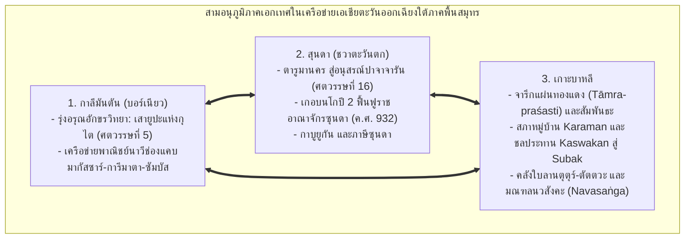
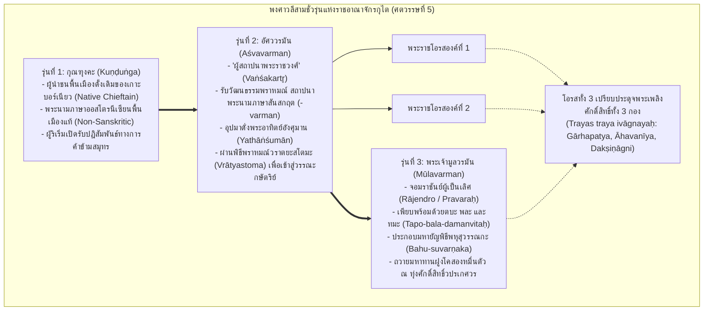
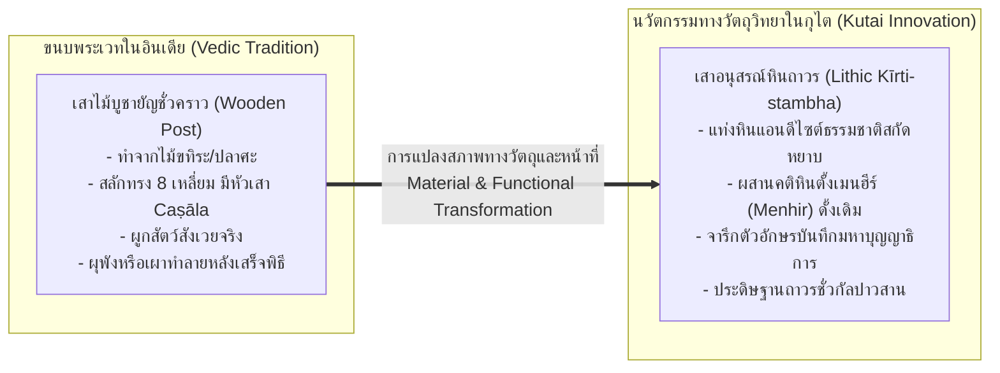
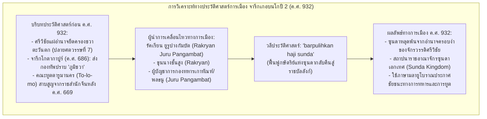
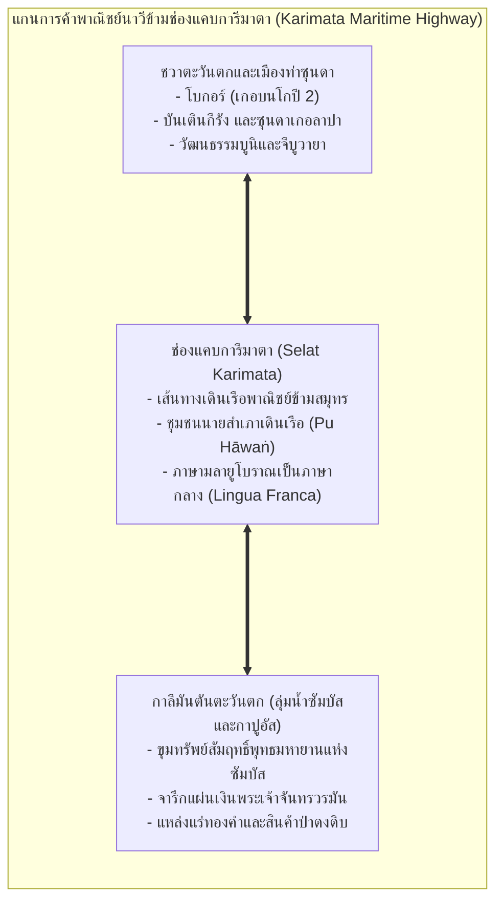
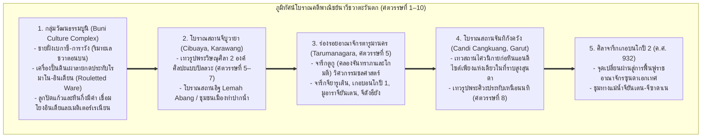

# บทที่ 6: จารึกภูมิภาคสุนดา บาหลี และกาลีมันตัน: อัตลักษณ์ ดินแดน และการสืบทอดสายธารอารยธรรมข้ามสมุทร
*(Epigraphy of the Regional Realms: Sunda, Bali, and Kalimantan in the Maritime Network)*

---

## บทนำประจำบทที่ 6: การก้าวข้ามกรอบคิดแบบชวารวมศูนย์ สู่ประวัติศาสตร์จารึกวิทยาแห่งภูมิภาคสุนดา บาหลี และกาลีมันตัน

ในประวัติศาสตร์นิพนธ์ว่าด้วยเอเชียตะวันออกเฉียงใต้ภาคพื้นสมุทรขนบดั้งเดิม กระบวนทัศน์กระแสหลักมักถูกครอบงำด้วย "อคติแบบชวารวมศูนย์" (Java-centric bias) และ "อคติแบบศรีวิชัยรวมศูนย์" (Srivijaya-centric bias) อย่างหยั่งรากลึก นักบูรพคดีศึกษาและนักประวัติศาสตร์ยุคอาณานิคมดัตช์จวบจนถึงงานประวัติศาสตร์ชาตินิยมอินโดนีเซียยุคต้น มักจัดวางให้ที่ราบลุ่มเกษตรกรรมชลประทานในชวากลางและชวาตะวันออก (อาทิ ราชอาณาจักรมาตารามโบราณ คาดีรี สิงหะส่าหรี และมัชปาหิต) ควบคู่กับจักรวรรดิทางทะเลศรีวิชัยในลุ่มแม่น้ำมูซีแห่งเกาะสุมาตรา เป็นแกนกลางเพียงสองขั้วที่ผูกขาดการสร้างสรรค์อารยธรรมและอำนาจทางการเมืองในหมู่เกาะมาเลย์ [1] ภายใต้กรอบคิดทวิขั้วอำนาจดังกล่าว ดินแดนสำคัญอื่นๆ ในหมู่เกาะ โดยเฉพาะอย่างยิ่ง ภูมิภาคสุนดาในชวาตะวันตก, เกาะบาหลี, และเกาะกาลีมันตัน (บอร์เนียวทั้งฝั่งตะวันออกและฝั่งตะวันตก) จึงมักถูกลดทอนสถานะลงเป็นเพียง "พื้นที่ชายขอบ" (Periphery) หรือเป็นเพียงดินแดนผู้รับอิทธิพลวัฒนธรรมที่ล้าหลังและขาดเอกภาพ [2]

อย่างไรก็ดี การปฏิวัติระเบียบวิธีวิจัยทางจารึกวิทยา โบราณคดีเชิงพื้นที่ และภาษาศาสตร์ประวัติศาสตร์ในช่วงสองทศวรรษแรกของคริสต์ศตวรรษที่ 21 ได้รื้อถอนกระบวนทัศน์อันคับแคบดังกล่าวลงอย่างสิ้นเชิง หลักฐานเชิงประจักษ์จากคลังจารึกดิจิทัลมาตรฐานสากลและงานวิจัยชำระตัวบทปฐมภูมิชี้ชัดว่า ภูมิภาคสุนดา บาหลี และกาลีมันตัน มิได้เป็นพื้นที่รองรับอิทธิพลแบบตั้งรับ หากแต่เป็น "ศูนย์กลางทางอารยธรรมที่เป็นเอกเทศ" (Autonomous Civilizational Spheres) ซึ่งมีวิวัฒนาการทางจารึกวิทยา ระบบตัวเขียน ภาษาศาสตร์ สถาบันการเมือง และเทววิทยาที่เป็นตัวของตัวเองอย่างเด่นชัด [3] ลักษณะร่วมทางประวัติศาสตร์ประการสำคัญของทั้งสามอนุภูมิภาคนี้ คือการธำรงไว้ซึ่งอำนาจอธิปไตย วัฒนธรรมจารึก และการสืบทอดสายธารอารยธรรมอย่างต่อเนื่องยาวนาน โดยมิได้ตกอยู่ภายใต้การกลืนกลายหรือการรวมศูนย์อำนาจเบ็ดเสร็จของราชสำนักชวากลางหรือศรีวิชัยตลอดเวลา [4]

ในการพิจารณาสายธารจารึกวิทยาของสามอนุภูมิภาคนี้ เราสามารถจำแนกลักษณะเฉพาะเชิงประจักษ์ออกได้เป็นสามมิติทางประวัติศาสตร์:
1. **อนุภูมิภาคกาลีมันตัน (บอร์เนียว):** เป็นดินแดนที่สถาปนา "รุ่งอรุณแห่งยุคประวัติศาสตร์ลายลักษณ์อักษร" ของหมู่เกาะอินโดนีเซียทั้งหมด ผ่านกลุ่มเสาศิลาจารึกยูปะ (Yūpa) ของพระเจ้ามูลวรมันแห่งแคว้นกุไต ริมแม่น้ำมหาคัมในกาลีมันตันตะวันออกตั้งแต่กลางคริสต์ศตวรรษที่ 5 [5] ควบคู่กับการเป็นจุดเชื่อมต่อของเครือข่ายพาณิชย์นาวีข้ามช่องแคบมากัสซาร์ และเครือข่ายข้ามช่องแคบการีมาตาสู่ลุ่มน้ำซัมบัสและกาปูอัสในกาลีมันตันตะวันตก ซึ่งผูกโยงการค้าทองคำและของป่าเข้ากับโลกมหาสมุทร [6]
2. **อนุภูมิภาคสุนดา (ชวาตะวันตก):** ดินแดนที่มีเอกลักษณ์ทางวัฒนธรรมและภาษาซุนดาโบราณ (Old Sundanese) อย่างเหนียวแน่น สืบสายธารจากอาณาจักรตารูมานคร (Tarumanagara) ยุคโบราณ ผ่านช่วงเวลาหัวเลี้ยวหัวต่อในคริสต์ศตวรรษที่ 10 ที่ปรากฏจารึกภาษามลายูโบราณเกอบนโกปี 2 บันทึกการฟื้นฟูกษัตริย์แห่งซุนดาให้พ้นจากอิทธิพลศรีวิชัย [7] สู่ยุคทองของราชอาณาจักรปากวนปาจาจารัน (Pakwan Pajajaran) ในปลายคริสต์ศตวรรษที่ 15 ถึง 16 ซึ่งสร้างสรรค์จารึกอนุสรณ์สถานรำลึกอดีตบูรพกษัตริย์หลังการสวรรคต (post-mortem memorials) และจารึกแผ่นทองแดงพระราชทานเขตอภัยทานกาบูยูกัน [8]
3. **อนุภูมิภาคเกาะบาหลี:** ดินแดนที่รุ่มรวยด้วยคลังจารึกแผ่นทองแดง (tāmra-praśasti) กว่าร้อยฉบับ ซึ่งทำหน้าที่เป็นประมวลกฎหมายปกครองแผ่นดินและหลักยึดเหนี่ยวคุ้มครองสิทธิชุมชนรากหญ้า [9] โดยมีโครงสร้างส่วน "สัมพันธะ" (sambandha) ที่สะท้อนประวัติศาสตร์จากเบื้องล่าง การต่อรองระหว่างสภาหมู่บ้าน (karaman/banwa) กับสภาขุนนางราชสำนัก ตลอดจนวิวัฒนาการอันน่าทึ่งของสถาบันชลประทานจากกัสวากัน (kaswakan) สู่ระบบซูบัก (subak) [10] ยิ่งไปกว่านั้น บาหลียังทำหน้าที่เป็น "เรือกล้วยไม้พิทักษ์ชีวิต" (safe haven) ที่เก็บรักษาคลังคัมภีร์ใบลานปรัชญาเทววิทยาไศวะสิทธานตะโบราณและระบบจักรวาลวิทยานวสังคะ (Navasaṅga) ไว้อย่างสมบูรณ์ที่สุด [11]

เพื่อนำเสนอพัฒนาการทางประวัติศาสตร์และจารึกวิทยาของสามอนุภูมิภาคนี้อย่างรอบด้านและลึกซึ้ง บทที่ 6 ได้รับการจัดวางสถาปัตยกรรมเนื้อหาออกเป็น 8 หัวข้อย่อยหลักตามแผนผังบูรณาการคลังหลักฐานเชิงประจักษ์ โดยสำหรับ **ตอนที่ 1 (Part 1)** ของบทนี้ จะมุ่งเน้นการเจาะลึกในสองหัวข้อแรก ซึ่งเป็นเสาหลักแห่งการก่อรูปทางประวัติศาสตร์ยุคต้นและเครือข่ายพาณิชย์นาวี ได้แก่:
- **หัวข้อ 6.1 เสายูปะแห่งกุไตและรุ่งอรุณแห่งอักขรวิทยาในบอร์เนียว (The Yūpa Inscriptions of Kutai and Early Epigraphy in Borneo):** การศึกษากลุ่มเสาศิลาจารึกหินแอนดีไซต์ธรรมชาติ 7 หลักแห่งมูอารา กามัน ริมแม่น้ำมหาคัม (ราว ค.ศ. 400–450), การวิเคราะห์พงศาวลีสามชั่วรุ่น (กุณฑุงคะ สู่ อัศววรมัน และมูลวรมัน), การชำระระบบอักขรวิทยาปัลลวะตอนต้น (Archaic Lithic Grantha) และการยกเลิกมโนทัศน์ "อักษรเวงคี", การวิเคราะห์ฉันทลักษณ์สันสกฤตและตัวบทจารึกทั้ง 7 หลัก, มหายัญพิธีพหุสุวรรณกะ ณ ลานศักดิ์สิทธิ์วปรเกศวร, การแปลงหน้าที่ทางวัตถุวิทยาจากเสาไม้ยูปะสู่เสาอนุสรณ์หินถาวร (permanent lithic kīrti-stambha), ตลอดจนเศรษฐกิจพิธีกรรมและการถวายมหาทานฝูงโคสองหมื่นตัว [12]
- **หัวข้อ 6.2 จารึกภาษามลายูโบราณในชวาตะวันตกและเครือข่ายพาณิชย์นาวี (Old Malay Inscriptions in Western Java and Maritime Networks):** การวิเคราะห์ศิลาจารึกเกอบนโกปี 2 (Kebon Kopi II / Pasir Muara ค.ศ. 932) ว่าด้วยการถอดรหัสสุริยสังขยา `kawihaji pañca pasagi` (มหาศักราช 854) และการตีความวลีประวัติศาสตร์ `barpulihkan haji sunda` (การฟื้นฟูกษัตริย์แห่งซุนดา) โดยขุนนางรัคเรียน ยูรูปางกัมบัต ภายหลังการหลุดพ้นจากอำนาจครอบงำของศรีวิชัย, พลวัตของภาษามลายูโบราณสำนวนเบี่ยงเบนในฐานะภาษากลางทางการค้าข้ามสมุทร (lingua franca) ในทะเลชวาและช่องแคบการีมาตา, การเชื่อมโยงสู่เมืองท่าลุ่มน้ำซัมบัสและกาปูอัสในกาลีมันตันตะวันตก, บทบาทของชนชั้นนายสำเภาเดินเรือพาณิชย์ (pu hāwaṅ / anāvaka) ในการอุปถัมภ์ศาสนสถานและถือครองที่ดินสีมา, และภูมิทัศน์โบราณคดีพาณิชย์นาวีของชวาตะวันตก [13]

---

## 6.1 เสายูปะแห่งกุไตและรุ่งอรุณแห่งอักขรวิทยาในบอร์เนียว (The Yūpa Inscriptions of Kutai and Early Epigraphy in Borneo)

### 6.1.1 บริบททางภูมิศาสตร์การเมือง ชัยภูมิมูอารา กามัน ริมแม่น้ำมหาคัม และประวัติศาสตร์การค้นพบเสายูปะ 7 หลัก

การปรากฏตัวของกลุ่มเสาศิลาจารึกยูปะ (Yūpa) แห่งแคว้นกุไต (Kutai) บนเกาะบอร์เนียว (กาลีมันตันตะวันออก) นับเป็นหมุดหมายที่สำคัญที่สุดในประวัติศาสตร์จารึกวิทยาของเอเชียตะวันออกเฉียงใต้ภาคพื้นสมุทร เนื่องจากจารึกกลุ่มนี้คือ "เอกสารลายลักษณ์อักษรที่เก่าแก่ที่สุดในหมู่เกาะอินโดนีเซีย" ซึ่งสถาปนารุ่งอรุณแห่งยุคประวัติศาสตร์ขึ้นในช่วงกลางคริสต์ศตวรรษที่ 5 (ราว ค.ศ. 400–450) [14] โบราณวัตถุชุดนี้ค้นพบ ณ บริเวณมูอารา กามัน (Muara Kaman) ซึ่งตั้งอยู่ลึกเข้าไปในแผ่นดินตอนในริมฝั่งแม่น้ำมหาคัม (Mahakam River) เหนือนครเปอลารัง (Pelarang) และซามารินดา (Samarinda) ขึ้นไปทางทิศตะวันตกเฉียงเหนือราว 130 กิโลเมตร [15]

ในเชิงภูมิศาสตร์การเมือง ชัยภูมิของมูอารา กามัน มิได้เป็นพื้นที่ห่างไกลที่ตัดขาดจากโลกภายนอก หากแต่เป็นจุดบรรจบทางชลศาสตร์ที่สำคัญยิ่งยวดระหว่างแม่น้ำมหาคัมอันเป็นแม่น้ำสายหลัก กับแม่น้ำเกอดัง เกอปาลา (Kedang Kepala) ซึ่งเป็นแม่น้ำสาขาขนาดใหญ่ ลำน้ำมหาคัมในบริเวณนี้มีความกว้างและลึกพอที่เรือกำปั่นเดินสมุทรโบราณจะสามารถแล่นทวนกระแสน้ำลึกเข้ามาจอดเทียบท่าได้ตลอดทั้งปี โดยได้รับความคุ้มครองจากแนวภูเขาและป่าทึบให้พ้นจากพายุลมมรสุมรุนแรงในทะเลเปิดและภัยคุกคามจากโจรสลัดชายฝั่ง [16] ยิ่งไปกว่านั้น มูอารา กามัน ยังทำหน้าที่เป็น "ชุมทางถ่ายลำสินค้าต้นน้ำ-ปลายน้ำ" (Hulu-Hilir Entrepot) ที่ผูกขาดเส้นทางการลำเลียงทรัพยากรล้ำค่าจากป่าดงดิบตอนในของเกาะบอร์เนียว โดยเฉพาะอย่างยิ่ง แหล่งลานแร่ทองคำธรรมชาติ (Alluvial Gold) ในลุ่มน้ำมหาคัมตอนบน, ไม้กฤษณา (Eaglewood / Gaharu), รังนกนางแอ่น, ยางสนหอม (Dammar Resin), และขี้ผึ้งป่า เข้าสู่เครือข่ายพาณิชย์นาวีสากล [17]

ในมิติของเส้นทางเดินเรือข้ามสมุทร ปากแม่น้ำมหาคัมเปิดออกสู่ "ช่องแคบมากัสซาร์" (Makassar Strait) ซึ่งทำหน้าที่เป็นทางหลวงพาณิชย์นาวีสายหลักทางฝั่งตะวันออกของเอเชียตะวันออกเฉียงใต้ เส้นทางสายนี้เชื่อมโยงทะเลชวา (Java Sea) เข้ากับทะเลเซเลบีส (Celebes Sea), หมู่เกาะโมลุกกะ (Moluccas), ทะเลซูลู (Sulu Sea), ฟิลิปปินส์, และชายฝั่งทางตอนใต้ของจีน การเดินเรือผ่านช่องแคบมากัสซาร์เป็นเส้นทางเดินเรือคู่ขนานที่สำคัญยิ่งต่อการค้าระหว่างประเทศควบคู่ไปกับเส้นทางช่องแคบมะละกาทางฝั่งตะวันตก [18] การผงาดขึ้นของรัฐกุไตโบราณ ณ มูอารา กามัน จึงเป็นผลลัพธ์โดยตรงจากการที่ผู้นำทางการเมืองในท้องถิ่นสามารถควบคุมจุดตัดระหว่างเศรษฐกิจลุ่มน้ำที่อุดมด้วยทองคำ กับเครือข่ายการค้าทางทะเลข้ามช่องแคบมากัสซาร์ได้อย่างเบ็ดเสร็จ [19]

ประวัติศาสตร์การค้นพบและการศึกษาจารึกเสายูปะแห่งกุไตมีวิวัฒนาการที่ยาวนานและเต็มไปด้วยพลวัตทางประวัติศาสตร์นิพนธ์:
1. **การค้นพบครั้งแรกใน ค.ศ. 1879:** เค. เอฟ. ฮอลเลอ (K. F. Holle) ที่ปรึกษาราชการอาณานิคมดัตช์ด้านภาษาพื้นเมือง ได้รายงานต่อสมาคมศิลปศาสตร์และวิทยาศาสตร์แห่งบาตาเวีย (Bataviaasch Genootschap van Kunsten en Wetenschappen) ว่า มีการค้นพบแท่งเสาหินธรรมชาติที่มีรอยจารึกอักษรโบราณจำนวน 4 หลัก พร้อมด้วยซากเรือพายโบราณและซากเรือสำเภาจีนโบราณ ณ มูอารา กามัน ในเขตปกครองของสุลต่านแห่งกุไต [20]
2. **การมอบโบราณวัตถุสู่พิพิธภัณฑ์บาตาเวียใน ค.ศ. 1880:** สุลต่านแห่งกุไตได้ทูลเกล้าฯ ถวายเสาศิลาทั้ง 4 หลักแด่รัฐบาลอาณานิคมและสมาคมบาตาเวียในเดือนสิงหาคม ค.ศ. 1880 โดยโบราณวัตถุได้รับการลำเลียงทางเรือมาถึงพิพิธภัณฑ์ก่อนสิ้นปี ค.ศ. 1880 (ปัจจุบันจัดแสดงอย่างสมเกียรติ ณ พิพิธภัณฑสถานแห่งชาติอินโดนีเซีย กรุงจาการ์ตา ภายใต้หมายเลขทะเบียน D.2a, D.2b, D.2c, และ D.2d) [21]
3. **การศึกษาบุกเบิกของ Hendrik Kern (1881–1882):** ศาสตราจารย์ เฮนดริก เคิร์น นักบูรพคดีศึกษาชาวดัตช์ ได้นำเสนอผลการถอดอ่านจารึกทั้ง 4 หลักต่อที่ประชุมราชบัณฑิตยสภาเนเธอร์แลนด์เมื่อวันที่ 13 กันยายน ค.ศ. 1880 และตีพิมพ์ผลงานวิจัยสมบูรณ์ในชื่อ *"Over het opschrift van Koetei in verband met de geschiedenis van het schrift in den Indischen Archipel"* ในปี ค.ศ. 1882 เคิร์นได้กำหนดอายุจารึกไว้ในราวคริสต์ศตวรรษที่ 5 และจำแนกเสาเป็นหลัก I, II, III (หลักที่ IV ยังอ่านไม่ออกในเวลานั้น) [22]
4. **การชำระตัวบทครั้งแม่บทของ J. Ph. Vogel (1918):** ในวารสาร *Bijdragen tot de Taal-, Land- en Volkenkunde van Nederlandsch-Indië* (BKI 74) เจ. ฟิลลิป โฟเกล (J. Ph. Vogel) นักจารึกวิทยาชั้นนำแห่งสำรวจโบราณคดีแห่งอินเดีย (Archaeological Survey of India) ได้ตีพิมพ์บทความวิจัยระดับหมุดหมาย *"The Yūpa Inscriptions of King Mūlavarman, from Koetei (East Borneo)"* โดยอาศัยภาพสำเนาหมึก (inked estampages) คุณภาพสูงที่จัดทำโดย ดร. เอฟ. ดี. เค. บ็อช (F. D. K. Bosch) โฟเกลสามารถแก้ไขข้อผิดพลาดในการอ่านของเคิร์นได้อย่างเด็ดขาด, ถอดอ่านจารึกหลักที่ 4 (หลัก D) ได้สำเร็จเป็นครั้งแรก, สถาปนาระบบรหัสเรียกชื่อเสาเป็น "หลัก A, B, C, D", และปฏิวัติการกำหนดอายุและตระกูลอักษร [23]
5. **การค้นพบเสาเพิ่มเติม 3 หลักใน ค.ศ. 1940:** ในปี ค.ศ. 1940 ได้มีการขุดค้นพบเสายูปะที่มีจารึกเพิ่มเติมอีก 3 หลักในบริเวณมูอารา กามัน ซึ่งต่อมาได้รับการชำระและตีพิมพ์โดย บี. ช. ฉบรา (B. Ch. Chhabra) ในปี ค.ศ. 1949 ในวารสาร TBG 83 ภายใต้ชื่อ *"Three More Yūpa Inscriptions of King Mūlavarman from Koetei (East Borneo)"* โดยกำหนดรหัสเป็น "หลัก E, F, G" ทำให้คลังจารึกเสายูปะแห่งกุไตมีจำนวนรวมทั้งสิ้น 7 หลักอย่างสมบูรณ์ [24]

---

### 6.1.2 พงศาวลีสามชั่วรุ่นในจารึกหลัก A: กุณฑุงคะ อัศววรมัน และมูลวรมัน

หลักฐานชิ้นเอกที่สะท้อนพลวัตการก่อรูปของรัฐโบราณและกระบวนการรับวัฒนธรรมอินเดียในเอเชียตะวันออกเฉียงใต้ ปรากฏอย่างเด่นชัดที่สุดใน **จารึกหลัก A (Inscription A / Kern II)** ซึ่งสลักด้วยภาษาสันสกฤตฉันท์อนุษฏุภจำนวน 3 โศลก (12 บรรทัด) จารึกหลักนี้ได้บันทึกสายลำดับพงศาวลีของราชสำนักกุไตไว้อย่างชัดเจนถึง 3 ชั่วรุ่น [25] ดังข้อความปริวรรตและคำแปลวิชาการดังต่อไปนี้:

> **ตัวบทปริวรรตอักษรเดิม (IAST):**
> (1) śrīmataḥ śrī-narendrasya  
> (2) Kuṇḍuṅgasya mahātmanaḥ  
> (3) putro 'śvavarmmo vikhyātaḥ  
> (4) vaṅśakarttā yathāṅśumān  
> (5) tasya putrā mahātmanaḥ  
> (6) trayas traya ivāgnayaḥ  
> (7) teṣāṁ trayāṇāṁ pravaraḥ  
> (8) tapo-bala-damanvitaḥ  
> (9) śrī-Mūlavarmmā rājendro  
> (10) yaṣṭvā bahusuvarṇṇakam  
> (11) tasya yajñasya yūpo 'yaṁ  
> (12) dvijendrais samprakalpitaḥ [26]
>
> **คำแปลภาษาไทยวิชาการ:**
> "(1) แห่งพระราชาผู้ทรงพระสิริสวัสดิ์ (2) พระนามว่า **กุณฑุงคะ** ผู้มีมหาบุญญาบารมี (3) มีพระราชโอรสผู้ทรงปรากฏพระเกียรติเลื่องลือนามว่า **อัศววรมัน** (4) ผู้ทรงเป็น **ผู้สถาปนาพระราชวงศ์** เปรียบประดุจพระอาทิตย์อังศุมาน (5) พระราชโอรสของพระองค์ผู้มีมหาบุญญาบารมีนั้น (6) มีอยู่สามพระองค์ เปรียบประดุจพระเพลิงศักดิ์สิทธิ์ทั้งสามกอง (7) ในบรรดาพระราชโอรสทั้งสามพระองค์นั้น องค์ผู้ทรงเป็นเลิศที่สุด (8) ผู้ทรงเพียบพร้อมด้วยตบะ เดชานุภาพ และการควบคุมตน (9) คือ **พระเจ้ามูลวรมัน** จอมราชันย์แห่งกษัตริย์ทั้งหลาย (10) ครั้นทรงประกอบมหายัญพิธีพหุสุวรรณกะแล้ว (11) เพื่อมหายัญพิธีนั้น เสายูปะหลักนี้ (12) จึงได้รับการจัดสร้างและสถาปนาขึ้นโดยเหล่าพราหมณ์ผู้เป็นจอมแห่งทวิชาติ" [27]

การวิเคราะห์เชิงนิรุกติศาสตร์และประวัติศาสตร์เปรียบเทียบต่อพงศาวลีสามชั่วรุ่นนี้ ได้นำไปสู่การเปลี่ยนผ่านกระบวนทัศน์ครั้งสำคัญยิ่งในวงวิชาการ:
1. **สถานะทางชาติพันธุ์และภาษาของกุณฑุงคะ (Kuṇḍuṅga):**  
   ในขณะที่พระราชโอรส (อัศววรมัน) และพระราชนัดดา (มูลวรมัน) ทรงมีพระนามส่วนพระองค์เป็นภาษาสันสกฤตอย่างสมบูรณ์ตามขนบอินโด-อารยัน พระนามของพระอัยกาคือ "กุณฑุงคะ" (*Kuṇḍuṅga*) กลับมีระบบเสียงและสัทวิทยาที่เป็นภาษาพื้นเมืองตระกูลออสโตรนีเซียนอย่างเด่นชัด [28] นักวิชาการรุ่นอาณานิคมบางท่านพยายามโยงคำว่ากุณฑุงคะเข้ากับคำทมิฬหรือภาษาสันสกฤต แต่ Vogel (1918: 196–197) ได้ยืนยันอย่างหนักแน่นว่า กุณฑุงคะมิใช่ผู้อพยพที่เดินทางข้ามน้ำข้ามทะเลมาจากชมพูทวีป หากแต่ทรงเป็น "ผู้นำชนพื้นเมืองของเกาะบอร์เนียว" (Native of Borneo) ที่มีอำนาจบารมีดั้งเดิมในลุ่มน้ำมหาคัม [29]
2. **บทบาทของอัศววรมันในฐานะ "ผู้สร้างราชวงศ์" (Vaṅśakartr̥):**  
   การที่จารึกหลัก A จงใจยกย่องอัศววรมันว่าเป็น **"วังศกรรตฤ" (*vaṅśakarttā*)** หรือผู้สถาปนาพระราชวงศ์ มิได้ยกย่องกุณฑุงคะผู้เป็นบิดา เป็นหลักฐานชี้ชัดว่า การสถาปนาระบอบกษัตริย์ตามคติเทวราชาของศาสนาพราหมณ์-ฮินดูเพิ่งเริ่มต้นขึ้นในรุ่นลูก [30] เพื่อก้าวข้ามข้อจำกัดของระบบสายตระกูลแบบหัวหน้าเผ่าดั้งเดิม อัศววรมันน่าจะทรงประกอบพิธีกรรมทางศาสนาพราหมณ์โบราณที่เรียกว่า **"วราตยะสโตมะ" (*Vrātyastoma*)** ซึ่งเป็นพิธีชำระความบริสุทธิ์เพื่อรับเอาบุคคลภายนอกหรือผู้นำชนพื้นเมืองที่อยู่นอกขนบพระเวทเข้าสู่ระบบวรรณะอารยันในฐานะวรรณะกษัตริย์ [31] ด้วยเหตุนี้ พระองค์จึงได้รับการอุปมาดั่งพระอาทิตย์อังศุมาน (*yathāṅśumān*) ผู้ส่องแสงสว่างขับไล่ความมืดมิดและให้กำเนิดราชตระกูลใหม่
3. **การอุปมาพระราชโอรสทั้งสามกับพระเพลิงศักดิ์สิทธิ์ (Trayas traya ivāgnayaḥ):**  
   ข้อความในบรรทัดที่ 6 ที่ระบุว่าพระราชโอรสทั้งสามของอัศววรมันเปรียบเสมือน "พระเพลิงทั้งสามกอง" มิใช่เพียงสำนวนกวีเปรียบเทียบโวหารลอยๆ แต่เป็นการอ้างอิงถึง **"ตรีอัคนี" (Treto-Agni)** ในระเบียบพิธีกรรมพระเวทชั้นสูง อันประกอบด้วย:
   - *คาร์หปัตยะ (Gārhapatya):* พระเพลิงประจำเรือนสำหรับประกอบพิธีภายใน
   - *อาหวนียะ (Āhavanīya):* พระเพลิงทางทิศตะวันออกสำหรับเผาเครื่องพลีกรรมส่งแด่ทวยเทพ
   - *ทักษิณาคัคนี (Dakṣiṇāgni):* พระเพลิงทางทิศใต้สำหรับพิธีพลีแด่บรรพบุรุษ [32]
   การเปรียบเทียบนี้แสดงว่า ราชสำนักกุไตในรัชสมัยของพระเจ้ามูลวรมันมีความรอบรู้และความเข้าใจอย่างลึกซึ้งในระบบเทววิทยาและปรัชญาพระเวท
4. **การเปลี่ยนผ่านจาก Indianization สู่การริเริ่มของท้องถิ่น (Regional Agency):**  
   ข้อมูลพงศาวลีนี้ได้หักล้างทฤษฎีอาณานิคมเรื่อง "การแผ่อารยธรรมอินเดียโพ้นทะเล" (Greater India) ที่เคยมองว่าชาวอินเดียได้ยกกองทัพมารุกราน ยึดครอง และตั้งถิ่นฐานอาณานิคมในบอร์เนียว Vogel (1918) ชี้ให้เห็นว่า กระบวนการที่เกิดขึ้นคือ "การซึมซับอย่างสันติ" (Peaceful Penetration) ซึ่งผู้นำท้องถิ่นบอร์เนียวเป็นฝ่ายเชื้อเชิญพราหมณ์ผู้มีความรู้ทางพิธีกรรมและเทคโนโลยีตัวเขียนให้เดินทางข้ามมหาสมุทรมายังราชสำนัก เพื่อเสริมสร้างความชอบธรรมและอำนาจบารมีทางการเมืองของตนเอง [33]

---

### 6.1.3 อักขรวิทยาปัลลวะตอนต้น (Early Pallava / Archaic Lithic Grantha): การปฏิเสธ "อักษรเวงคี" และการเปรียบเทียบข้ามภูมิภาค

ในด้านประวัติศาสตร์อักขรวิทยา (Palaeographical History) การศึกษาเสายูปะแห่งกุไตของ Vogel (1918) ได้สร้างคุณูปการครั้งสำคัญที่สุดด้วยการสถาปนาระบบการจำแนกตระกูลอักษรโบราณในเอเชียตะวันออกเฉียงใต้ที่ถูกต้องตามหลักวิชาการ:

#### การยกเลิกมโนทัศน์ "อักษรเวงคี" (Rejection of 'Vengi Alphabet')
ก่อนหน้างานวิจัยของ Vogel นักวิชาการด้านภาษาศาสตร์โบราณอินเดีย ได้แก่ เอ. ซี. เบอร์เนลล์ (A. C. Burnell) ในหนังสือ *Elements of South-Indian Palaeography* (1874) และ Hendrik Kern (1882) มักเรียกรูปแบบตัวอักษรที่พบในจารึกกุไต ตารูมานคร และจามปา ว่าเป็น "อักษรเวงคี" (Vengi alphabet) โดยสันนิษฐานว่าตัวอักษรเหล่านี้นำเข้ามาจากราชอาณาจักรเวงคี (Vengi) อันเป็นดินแดนลุ่มแม่น้ำกฤษณาและโคทาวารีในรัฐอานธรประเทศ ซึ่งปกครองโดยราชวงศ์ศาลังกายน (Śālaṅkāyana) และราชวงศ์จาลุกยะตะวันออก [34]

ทว่า Vogel (1918: 220–221) ได้วิพากษ์และหักล้างสมมติฐานดังกล่าวอย่างเป็นระบบ โดยชี้ให้เห็นข้อเท็จจริงทางประวัติศาสตร์และอักขรวิทยาว่า:
- ราชวงศ์ศาลังกายนแห่งเวงคีเป็นเพียงรัฐท้องถิ่นขนาดเล็กในแผ่นดินตอนใน มิได้มีแสนยานุภาพทางเรือหรือมีบันทึกการแผ่อิทธิพลข้ามมหาสมุทรที่โดดเด่นเทียบเท่ากับ **ราชวงศ์ปัลลวะแห่งกาญจีปุรัม (Pallavas of Kāñcīpuram)** ซึ่งเป็นมหาอำนาจทางทะเลที่คุมเมืองท่าสำคัญอย่างมหาพลีปุรัม (Mahabalipuram) บนชายฝั่งโคโรแมนเดล
- เมื่อนำลักษณะสัณฐานของตัวอักษรในเสายูปะแห่งกุไตไปเปรียบเทียบกับจารึกแผ่นทองแดงและจารึกศิลาในอินเดียใต้ พบว่าตัวอักษรกุไตมีความละม้ายใกล้ชิดเป็นหนึ่งเดียวกับตัวอักษรที่สลักในจารึกของกษัตริย์ราชวงศ์ปัลลวะยุคแรก โดยเฉพาะอย่างยิ่งจารึกถ้ำหินสกัดของพระเจ้ามเหนทรวรมันที่ 1 (Mahendravarman I) ณ มเหนทรวาฑี (Mahendravadi) และทลวานูร (Dalavanur) [35]
- ด้วยเหตุดังกล่าว Vogel จึงเสนอให้ **"ยกเลิกการใช้คำว่า อักษรเวงคี ออกไปจากระบบศัพท์บัญญัติทางจารึกวิทยาชวาและเอเชียตะวันออกเฉียงใต้อย่างสิ้นเชิง"** แล้วแทนที่ด้วยคำว่า **"อักษรปัลลวะ" (Pallava script)** หรือชื่อทางเทคนิคที่แม่นยำกว่าคือ **"อักษรครันถะศิลาแบบโบราณ" (Archaic Lithic Grantha)** [36]

#### ลักษณะเด่นทางอักขรวิทยาและการกำหนดอายุ
เสายูปะแห่งกุไตสลักด้วยอักษรปัลลวะตอนต้นที่มีลักษณะเฉพาะทางกายภาพที่งดงามและทรงพลังยิ่ง:
- **ยอดหัวอักษรทรงเหลี่ยม (Box-heads):** หัวอักษรหลายตัวมีลักษณะเป็นรูปกล่องเหลี่ยมเล็กๆ ที่เกิดจากการกดปลายสิ่วสกัดหิน ซึ่งเป็นเอกลักษณ์ร่วมกับจารึกยุคคลาสสิกของอินเดียใต้และเอเชียตะวันออกเฉียงใต้
- **เส้นตั้งที่ลากยาวดิ่ง (Vertical Elongation):** พยัญชนะที่มีเส้นตั้งดิ่ง เช่น *ก* (ka), *ร* (ra), *ล* (la) มีการลากเส้นหางยาวอย่างสง่างาม โดยเฉพาะตัวอักษรเดี่ยวในหลัก A มีความสูงเฉลี่ย 2.5 ซม. แต่เมื่อมีหางลากยาวหรือมีรูปสระประกอบจะสูงถึง 6–7 ซม. และตัวควบกล้ำซ้อนรูปมีความสูงถึง 9 ซม. [37]
- **รูปสระจมและสระลอย:** สระอุจม (*medial u*) ลากเป็นเส้นดิ่งตรงลงมาข้างล่างชัดเจน (ดั่งที่ปรากฏในคำว่า *Kuṇḍuṅgasya*), สระเอ (*medial e*) และสระโอ (*medial o*) สลักด้วยเส้นโค้งตวัดอย่างประณีต
- **การซ้อนรูปพยัญชนะ (Ligatures):** มีการซ้อนรูปพยัญชนะตามแนวดิ่งอย่างซับซ้อนโดยไม่ใช้เครื่องหมายวิรามะ (เครื่องหมายฆ่าเสียง) เช่น คำว่า *yaṣṭvā* (ษฺฏฺวา) ในหลัก A บรรทัด 10 [38]

เมื่อเปรียบเทียบกับจารึกโบราณอื่นๆ ในภูมิภาคอุษาคเนย์ Vogel (1918: 223–232) ได้จัดลำดับวิวัฒนาการทางอักขรวิทยาว่า:
1. *จารึกวัวจัญ / หว่อแก๋ง (Vo Canh Inscription)* ในเวียดนามตอนกลาง และ *จารึกโคกสระบาป (Kōk Rkā / Prasat Pram)* มีอายุเก่าแก่ที่สุดในราวปลายศตวรรษที่ 3 ถึงต้นศตวรรษที่ 4
2. *จารึกภัทรวรมันแห่งจามปา (Bhadravarman I at Cho Dinh and My Son)* มีอายุราว ค.ศ. 350–400
3. **เสายูปะแห่งกุไตของพระเจ้ามูลวรมัน:** มีอายุอยู่ในช่วง **กลางคริสต์ศตวรรษที่ 5 (ราว ค.ศ. 400–450)** ซึ่งร่วมสมัยอย่างใกล้ชิด หรืออาจเก่ากว่าเล็กน้อย เมื่อเทียบกับกลุ่มจารึกตารูมานครของพระเจ้าปูรณวรมันในชวาตะวันตก (จารึกจียารูเติน, ตูกู, เกอบอนโกปี 1) [39]

---

### 6.1.4 ฉันทลักษณ์ ภาษาสันสกฤต และการจัดวางบรรทัดแบบหนึ่งวรรคต่อหนึ่งบรรทัด (Pāda-per-line)

ในมิติของวรรณศิลป์และฉันทลักษณ์ จารึกเสายูปะแห่งกุไตได้รับการประพันธ์ขึ้นด้วยภาษาสันสกฤตคลาสสิก (Classical Sanskrit) ที่มีระเบียบแบบแผนทางกวีนิพนธ์ชั้นสูง มิใช่ภาษาสันสกฤตผสมหรือภาษาถิ่น โดยสลักเป็นคำร้อยกรองตามฉันทลักษณ์พระเวทและมหากาพย์อย่างเคร่งครัด:
- **ฉันท์อนุษฏุภ (Anuṣṭubh / Śloka):** ใช้ในจารึกหลัก A, C, D และ G ซึ่งประกอบด้วย 4 บาท (วรรค) บาทละ 8 พยางค์ รวมเป็น 32 พยางค์ต่อหนึ่งโศลก
- **ฉันท์อารยา (Āryā):** ใช้ในจารึกหลัก B ซึ่งเป็นฉันท์ประเภทนับมาตราครุ-ลหุ (mātrā-chanda) ที่มีความซับซ้อนและสง่างามสูง มักสงวนไว้สำหรับบทกวีนิพนธ์สรรเสริญชั้นเลิศในราชสำนัก [40]

ความโดดเด่นทางวัตถุวิทยาและอักขรวิธีที่ Vogel (1918: 215–216) ได้ค้นพบ คือการจัดวางบรรทัดของจารึกกุไตเป็นแบบ **"หนึ่งบาทฉันท์ต่อหนึ่งบรรทัด" (Pāda-per-line / Pādavyavasthā)** นั่นคือ ช่างจารึกมิได้สลักตัวอักษรต่อเนื่องยาวไปตามความกว้างของเนื้อหิน แต่จะตัดบรรทัดใหม่ทุกครั้งที่จบบาทฉันท์ (วรรค) แต่ละบาทพอดี ส่งผลให้:
- จารึกหลัก A (3 โศลก x 4 บาท) สลักพอดี 12 บรรทัด
- จารึกหลัก B (2 โศลก x 4 บาท) สลักพอดี 8 บรรทัด
- จารึกหลัก C (2 โศลก x 4 บาท) สลักพอดี 8 บรรทัด

การจัดระเบียบบรรทัดเช่นนี้ตรงกันอย่างสมบูรณ์แบบกับจารึกถ้ำหินสกัดของราชวงศ์ปัลลวะแห่งมเหนทรวาฑีและทลวานูรในอินเดียใต้ ซึ่งเป็นหลักฐานเชิงประจักษ์ที่ยืนยันว่า ราชบัณฑิตและพราหมณ์ผู้ร่างตัวบทในกุไตได้รับการฝึกฝนมาในสำนักกวีนิพนธ์เดียวกันกับราชสำนักปัลลวะ [41]

#### การชำระข้อผิดพลาดในการอ่านของ Kern (1882) โดย Vogel (1918)
ความก้าวหน้าของจารึกวิทยากุไตเกิดขึ้นจากการที่ Vogel สามารถตรวจสอบสำเนาหมึกของ Bosch และแก้ไขข้อผิดพลาดสะสมของ Kern ได้หลายจุดสำคัญ ดังแสดงในตารางเปรียบเทียบต่อไปนี้:

| ตำแหน่งในจารึก | การอ่านเดิมของ H. Kern (1882) | การอ่านชำระใหม่ของ J. Ph. Vogel (1918) | การวิเคราะห์ความหมายและผลกระทบทางประวัติศาสตร์ |
|:---|:---|:---|:---|
| **หลัก A, บรรทัด 2** | *Kuṇḍaṅgasya* | **Kuṇḍuṅgasya** | สำเนาหมึกยืนยันเส้นสระอุ (*medial u*) ลากดิ่งลงชัดเจน ยืนยันพระนามที่ถูกต้องคือ "กุณฑุงคะ" (หน้า 212) |
| **หลัก A, บรรทัด 3** | *'śvavarmmā* | **'śvavarmmo** | ศิลาสลักรูปสระโอตามกฎสนธิ เคิร์นแก้เป็นประธานการกโดยพลการ โฟเกลคืนรูปแท้จริงบนศิลา (หน้า 213) |
| **หลัก A, บรรทัด 9** | *rājendrah* | **rājendro** | ศิลาสลักสระโอเชื่อมสนธิต่อเนื่อง โฟเกลบันทึกตามรูปอักขระจริงบนแผ่นศิลา (หน้า 213) |
| **หลัก A, บรรทัด 10** | *yaṣṭvā* (อ่านไม่ออก) | **yaṣṭvā** | ตัวควบกล้ำ ษฺฏฺวา ชัดเจน เป็นกิริยากิตก์อดีตของ *yaj* ("บูชายัญแล้ว") มิใช่ *yayau* (หน้า 213) |
| **หลัก B, บรรทัด 2** | *rājñā* | **rājñaḥ** | สำเนาหมึกยืนยันจุดวิสรรคะสองจุดชัดเจน เป็นฉัฏฐีวิภัตติขยายพระนามมูลวรมัน (หน้า 214) |
| **หลัก B, บรรทัด 3** | *kṣatte* | **kṣetre** | เคิร์นอ่านสระเอตกไป โฟเกลอ่านคืนเป็น *kṣetre* สมาสกับ *puṇyatame* ("ในเขตแดนอันศักดิ์สิทธิ์ยิ่ง") (หน้า 214) |
| **หลัก B, บรรทัด 5** | *'gnikalpasya* | **'gnikalpebhyaḥ** | รูปจตุรถีวิภัตติพหูพจน์ *-ebhyaḥ* ขยาย *dvijātibhyaḥ* หมายถึงถวายแด่เหล่าพราหมณ์ผู้ดั่งไฟ (หน้า 214) |
| **หลัก C, บรรทัด 2** | *rājñā* | **rājñaḥ** | มีวิสรรคะชัดเจน สัมพันธ์กับคำว่า *puṇyam* (บุญกุศลแห่งพระเจ้ามูลวรมัน) (หน้า 214) |
| **หลัก D (ทั้งหมด)** | *เคิร์นอ่านไม่ออก* | **ถอดอ่านสำเร็จ 4 บรรทัด** | โฟเกลถอดรหัสข้อความเปรียบเทียบพงศาวลีกับท้าวสาครและท้าวภคีรถแห่งมหากาพย์รามายณะ (หน้า 215) |

#### คลังตัวบทจารึกหลัก B, C, D และคำแปลวิชาการ

* **จารึกหลัก B (Inscription B / Kern III): การถวายมหาทานแม่โคสองหมื่นตัว ณ วปรเกศวร (ฉันท์อารยา 2 โศลก 8 บรรทัด)**
> **ตัวบทปริวรรตอักษรเดิม (IAST):**
> (1) śrīmate nr̥pamukhyasya  
> (2) rājñaḥ śrī-Mūlavarmmaṇaḥ  
> (3) dānaṁ puṇyatame kṣetre  
> (4) yad dattam Vaprakeśvare  
> (5) dvijātibhyo 'gnikalpebhyaḥ  
> (6) viṅśatir ggosahasrikam  
> (7) tasya puṇyasya yūpo 'yaṁ  
> (8) kr̥to viprair ihāgataiḥ [42]
>
> **คำแปลภาษาไทยวิชาการ:**
> "(1) เมื่อองค์พระมหากษัตริย์ผู้ทรงพระสิริสวัสดิ์และเป็นเอกแห่งเจ้านายทั้งปวง (2) คือพระเจ้ามูลวรมัน (3) ได้ทรงพระราชทานมหาทาน ณ แดนดินอันบริสุทธิ์ศักดิ์สิทธิ์ยิ่ง (4) ซึ่งทานนั้นได้พระราชทานแล้ว ณ สถานที่อันมีนามว่า **วปรเกศวร** (5) แก่เหล่าทวิชาติ (พราหมณ์) ผู้เปรียบประดุจพระเพลิงศักดิ์สิทธิ์ (6) เป็นฝูงแม่โคจำนวน **สองหมื่นตัว (20,000 ตัว)** (7) เพื่อการบำเพ็ญบุญอันยิ่งใหญ่นั้น เสายูปะหลักนี้ (8) **จึงได้ถูกสร้างขึ้นโดยเหล่าพราหมณ์ผู้เดินทางมาถึงที่นี่**" [43]

* **จารึกหลัก C (Inscription C / Kern I): มหาทาน สิ่งมีชีวิต ต้นกัลปพฤกษ์ และที่ดิน (ฉันท์อนุษฏุภ 2 โศลก 8 บรรทัด)**
> **ตัวบทปริวรรตอักษรเดิม (IAST):**
> (1) śrīmad-virāja-kīrtteḥ  
> (2) rājñaḥ śrī-Mūlavarmmaṇaḥ puṇyam  
> (3) śr̥ṇvantu vipramukhyāḥ  
> (4) ye cānye sādhavaḥ puruṣāḥ  
> (5) bahudāna-jīvadānaṁ  
> (6) sakalpavr̥kṣaṁ sabhūmidānañ ca  
> (7) teṣāṁ puṇyagaṇānāṁ  
> (8) yūpo 'yaṁ sthāpito vipraiḥ [44]
>
> **คำแปลภาษาไทยวิชาการ:**
> "(1) แห่งองค์พระราชาผู้ทรงพระสิริและมีพระเกียรติคุณส่องสว่างเจิดจรัสปราศจากมลทิน (2) ขอจงสดับฟังบุญกุศลแห่งพระเจ้ามูลวรมัน (3) ขอเหล่าพราหมณ์ชั้นผู้ใหญ่ทั้งหลายจงสดับฟัง (4) และเหล่าสัตบุรุษผู้ทรงศีลธรรมเหล่าอื่นใดก็ดีจงสดับฟัง (5) ถึงการบริจาคทานอันมหาศาล (พหุทาน) และการถวายสิ่งมีชีวิต/ข้าทาส (ชีวทาน) (6) พร้อมทั้งต้นกัลปพฤกษ์จำลอง และการถวายที่ดิน (ภูมิทาน) (7) เพื่อมวลมหาบุญญาธิการอันไพศาลเหล่านั้น (8) เสายูปะหลักนี้จึงได้รับการประดิษฐานขึ้นโดยเหล่าพราหมณ์" [45]

* **จารึกหลัก D (Inscription D / Vogel 1918): การอ้างอิงพงศาวลีท้าวสาครและภคีรถ**
> **ตัวบทปริวรรตอักษรเดิม (IAST):**
> (1) Sāgarasya yathā rājñaḥ  
> (2) samutpanno Bhagīrathaḥ  
> (3) [........................................]  
> (4) [śrī-]Mūlavarmmā [..................] [46]
>
> **คำแปลภาษาไทยวิชาการ:**
> "(1) ดั่งเช่นที่เกิดแต่พระมหากษัตริย์ท้าวสาคร (2) คือพระภคีรถได้ถือกำเนิดขึ้นมาฉันใด... (3) [ข้อความลบเลือน เปรียบเทียบการสืบสายตระกูลกษัตริย์แห่งมหากาพย์] (4) พระเจ้ามูลวรมัน [ก็ทรงเป็นหน่อเนื้อกษัตริย์ผู้ทรงเดชานุภาพฉันนั้น]" [47]

* **สาระสังเขปของจารึกเสายูปะหลัก E, F, G (Chhabra 1949):**
  - *หลัก E:* บันทึกการถวายทานอันประณีต ได้แก่ การถวายน้ำอันบริสุทธิ์, การถวายเนยใสปรุงสุกสำหรับยัญพิธี, และการถวายเมล็ดงา (tila) แก่คณะพราหมณ์ [48]
  - *หลัก F:* บันทึกพระเดชานุภาพของพระเจ้ามูลวรมันในการทำสงครามปราบปรามกษัตริย์และผู้นำแว่นแคว้นข้างเคียง พร้อมทั้งบังคับให้กษัตริย์เหล่านั้นต้องส่งเครื่องบรรณาการและส่วยสาอากร (*kara*) มายังราชสำนักกุไต [49]
  - *หลัก G:* สลักด้วยฉันท์อนุษฏุภ บันทึกการถวายประทีปบูชาที่ใช้น้ำมันงาอันสว่างไสว พร้อมทั้งพรรณนาถึงเสาศิลาต้นนี้ในฐานะหลักชัยแห่งชัยชนะ (*jaya-cihna*) [50]

---

### 6.1.5 มหายัญพิธีพหุสุวรรณกะ (Bahu-suvarṇaka), ลานศักดิ์สิทธิ์วปรเกศวร (Vaprakeśvara), และบทบาทของคณะพราหมณ์ผู้เดินทางข้ามสมุทร

แกนกลางของพิธีกรรมทางศาสนาที่บันทึกในเสายูปะแห่งกุไต คือการประกอบ **"มหายัญพิธีพหุสุวรรณกะ" (*bahusuvarṇaka-yajña*)** ดังปรากฏในหลัก A บรรทัด 10 คำว่า *bahu-suvarṇaka* มีความหมายตามตัวอักษรว่า "ยัญพิธีอันมีทองคำเป็นทักษิณาทานอย่างล้นเหลือ" ในคัมภีร์พระเวทและคัมภีร์พราหมณะ พิธีนี้สัมพันธ์อย่างแนบแน่นกับโสมยัญชั้นสูงประเภท **พหุหิรัณยะ (*bahu-hiraṇya*)** ซึ่งกำหนดให้ผู้ประกอบพิธีกรรม (ผู้อุปถัมภ์ / ยัชม์) ต้องแจกจ่ายทองคำจำนวนมหาศาลเป็นทักษิณาทานตอบแทนแก่คณะพราหมณ์ผู้ประกอบพิธี [51] การประกอบมหายัญพิธีนี้ในกาลีมันตันตะวันออกสะท้อนความมั่งคั่งอันล้นพ้นของราชสำนักกุไตในฐานะศูนย์กลางการควบคุมแหล่งแร่ทองคำธรรมชาติในลุ่มน้ำมหาคัม ซึ่งทองคำเหล่านี้ถูกนำมาหลอมและแปรสภาพเป็นเครื่องบรรณาการทางพิธีกรรมเพื่อสถาปนาสถานะอันศักดิ์สิทธิ์ของกษัตริย์ [52]

#### การคลี่คลายปริศนาสถานศักดิ์สิทธิ์ "วปรเกศวร" (Vaprakeśvara)
ในจารึกหลัก B บรรทัด 4 ระบุว่า การถวายมหาทานฝูงโคสองหมื่นตัวเกิดขึ้น ณ สถานที่อันมีนามว่า **"วปรเกศวร" (*yad dattam Vaprakeśvare*)** ในประวัติศาสตร์นิพนธ์ยุคแรก Hendrik Kern (1882) ได้เสนอคำแปลที่ผิดพลาดโดยตีความว่า *Vaprakeśvara* คือพระนามหนึ่งของพระอัคนี (พระเพลิง) ทว่า Vogel (1918: 203–206) ได้ปฏิเสธคำแปลของเคิร์นอย่างสิ้นเชิง โดยพิสูจน์ตามหลักนิรุกติศาสตร์และจารึกวิทยาอินเดียใต้ว่า:
1. คำลงท้าย *-īśvara* ในศาสนาพราหมณ์-ฮินดู เป็นคำที่ใช้เรียกขาน **พระศิวะมหาเทพ (Śiva)** โดยเฉพาะ โดยในธรรมเนียมอินเดียใต้ มักนิยมนำนามของผู้สร้างหรือลักษณะทางกายภาพของสถานที่มาสมาสเข้ากับคำว่า *-īśvara* เพื่อตั้งชื่อเทวสถาน (เช่น Bhadresvara, Mi-son ในจามปา)
2. คำว่า *Vapra* แปลว่า "คันดิน, กำแพงดิน, ปราการ, ลานดินยกพื้นสูง, หรือเขตศักดิ์สิทธิ์ที่มีการล้อมรั้ว" ดังนั้น *Vaprakeśvara* จึงมีความหมายว่า "องค์พระศิวะผู้สถิต ณ ลานศักดิ์สิทธิ์อันมีคันดินล้อมรอบ" หรือหมายถึง **"ลานพิธีกรรมกลางแจ้งหรือเทวาลัยพระศิวะ"** ที่ตั้งอยู่ ณ มูอารา กามัน นั่นเอง [53]
3. ยิ่งไปกว่านั้น Vogel ยังได้รับข้อมูลสนับสนุนที่ทรงคุณค่ายิ่งจาก จี. พี. รูฟแฟร์ (G. P. Rouffaer) ซึ่งชี้ให้เห็นว่า คำว่า **"พปรเกศวร" (*Baprakeśvara*)** หรือ **"ภฏาระ ศรี พปรเกศวร" (*bhaṭāra i śrī Baprakeśvara*)** ปรากฏซ้ำแล้วซ้ำเล่าในศิลาจารึกภาษาชวาโบราณยุคศตวรรษที่ 9–10 ในฐานะหนึ่งในทวยเทพและเทพารักษ์พยานสำคัญที่ถูกอัญเชิญมารับรู้ในสูตรคำสาบานสถาปนาสีมา (*kamuṁ hyaṅ...*) [54] ความต่อเนื่องของคำนี้ชี้ให้เห็นว่า คติการบูชาพระศิวะ ณ วปรเกศวรได้หยั่งรากลึกจากกาลีมันตันและแพร่หลายสืบทอดต่อไปในระบบความเชื่อของชวาโบราณ

#### นัยสำคัญของวลี "kr̥to viprair ihāgataiḥ"
หลักฐานที่ทรงพลังที่สุดในการยืนยันเครือข่ายข้ามสมุทรระหว่างอินเดียใต้กับบอร์เนียว ปรากฏในบาทสุดท้ายของจารึกหลัก B:
> **"tasya puṇyasya yūpo 'yaṁ / kr̥to viprair ihāgataiḥ"**  
> *(เพื่อมหาบุญญาธิการนั้น เสายูปะหลักนี้ จึงถูกสร้างขึ้นโดยเหล่าพราหมณ์ผู้เดินทางมาถึงที่นี่)* [55]

คำว่า **อิฮาคตะ (*ihāgata*)** ซึ่งประกอบด้วยคำว่า *iha* ("ที่นี่ / ณ แผ่นดินนี้") สมาสกับ *āgata* ("ผู้เดินทางมาถึง") เป็นประจักษ์พยานทางจารึกวิทยาที่มิอาจปฏิเสธได้ว่า คณะพราหมณ์ผู้ประกอบยัญพิธีและสลักเสายูปะเหล่านี้มิใช่คนพื้นเมืองที่คิดค้นตัวอักษรและพิธีกรรมขึ้นมาเองโดยลำพัง หากแต่เป็น **"คณะพราหมณ์ผู้เชี่ยวชาญพระเวทที่เดินทางรอนแรมข้ามมหาสมุทรมาจากอินเดียใต้โดยตรง"** เพื่อมารับใช้อุปถัมภ์ราชสำนักกุไต [56] วลีนี้ตอกย้ำภาพการเคลื่อนย้ายของบุคคลชั้นนำข้ามมหาสมุทรอินเดียสู่ทะเลชวาและช่องแคบมากัสซาร์ตั้งแต่ต้นศตวรรษที่ 5 ซึ่งพราหมณ์เหล่านี้ได้รับเกียรติยศอย่างสูงสุดจากพระเจ้ามูลวรมัน โดยได้รับการยกย่องเปรียบประดุจพระเพลิงศักดิ์สิทธิ์ (*agnikalpebhyaḥ*) ผู้ทำหน้าที่เป็นสะพานเชื่อมระหว่างองค์กษัตริย์กับทวยเทพบนสรวงสวรรค์ [57]

---

### 6.1.6 การปรับเปลี่ยนหน้าที่ของวัตถุวิทยา (Material Transformation): จากเสาไม้ยูปะสู่เสาอนุสรณ์หินถาวร (Permanent Lithic Kīrti-stambha)

มิติที่น่าทึ่งที่สุดในเชิงวัตถุวิทยาและมานุษยวิทยาโบราณคดีของจารึกกุไต คือปรากฏการณ์ที่เรียกว่า **"การปรับเปลี่ยนหน้าที่ของวัตถุศักดิ์สิทธิ์" (Material Transformation)** ซึ่งสะท้อนการผสานกลืนระหว่างคติพระเวทอินเดียกับประเพณีหินใหญ่ (Megalithic Tradition) ดั้งเดิมของชาวออสโตรนีเซียนในอุษาคเนย์ [58]

#### ข้อกำหนดตามคัมภีร์พระเวทปะทะความจริงทางกายภาพในกุไต
ตามคัมภีร์พราหมณะและศเราตสูตร (อาทิ *Śatapatha Brāhmaṇa* และ *Taittirīya Saṁhitā*) เสายูปะ (*yūpa*) มีบทบาทเฉพาะในฐานะ "เสาสำหรับผูกสัตว์บูชายัญ" (Sacrificial Post) ในพิธีกรรมโสมยัญและปศุพันธะ โดยมีข้อกำหนดทางพิธีกรรมที่เคร่งครัดยิ่ง:
- เสายูปะ **ต้องทำจากไม้เท่านั้น** โดยนิยมใช้ไม้ขทิระ (*Acacia catechu*), ไม้ปลาศะ (*Butea frondosa*), หรือไม้พิลวะ (*Aegle marmelos*)
- ช่างไม้พิธีกรรมต้องถากและขัดเกลาเสาไม้นั้นให้เป็นรูปทรงแปดเหลี่ยม (*aṣṭāśri*) อย่างประณีต
- ส่วนยอดของเสาต้องมีการสวมวงแหวนไม้ที่เรียกว่า จาษาละ (*caṣāla*) และมีรอยบากสำหรับผูกเชือกมัดสัตว์สังเวย
- เมื่อเสร็จสิ้นพิธีกรรม เสาไม้นั้นมักจะถูกเผาทำลายหรือปล่อยให้ผุพังไปตามกาลเวลา [59]

ทว่า เสายูปะทั้ง 7 หลักที่ค้นพบ ณ มูอารา กามัน กลับมีความแตกต่างอย่างสิ้นเชิงจากข้อกำหนดของพระเวท:
1. **วัสดุหินธรรมชาติสกัดหยาบ:** เสาทุกหลักทำขึ้นจาก **หินแอนดีไซต์เนื้อละเอียด (fine andesite)** ซึ่งเป็นหินธรรมชาติในท้องถิ่น แท่งหินเหล่านี้ได้รับการสกัดแต่งเพียงหยาบๆ (roughly dressed) ผิวหน้าไม่เรียบเสมอกัน และมีรูปทรงที่ไม่สมมาตร (irregular shape) บางหลักมีโคนใหญ่ปลายเรียว บางหลักมีความคดโค้งตามธรรมชาติของเนื้อหิน [60]
2. **ขนาดและสัดส่วนทางกายภาพ:** เสาหลัก A มีความสูง 1.87 เมตร กว้าง 38 ซม.; หลัก B สูง 1.55 เมตร กว้าง 34 ซม.; หลัก C สูง 1.68 เมตร กว้าง 27 ซม.; และหลัก D สูง 1.21 เมตร กว้าง 33 ซม. [61]
3. **ปราศจากสัญลักษณ์ช่างไม้เวท:** เสากุไตไม่มีการสลักเป็นทรงแปดเหลี่ยม ไม่มีการสวมหัวเสาจาษาละ และไม่มีร่องรอยของการบากเสาสำหรับผูกสัตว์บูชายัญจริงแต่อย่างใด [62]

#### การเปรียบเทียบกับเสายูปะหินในอินเดีย
Vogel (1918: 198–202) ได้ชี้ให้เห็นว่า แม้ในประเทศอินเดียเอง เสายูปะที่สร้างด้วยหินก็เป็นโบราณวัตถุที่หาได้ยากยิ่งเป็นข้อยกเว้นอย่างเอกอุ โดยมีหลักฐานสำคัญเพียง 2 แห่งเท่านั้น:
1. **เสายูปะศิลาแห่งอิสาปุระ (Īśāpur Stone Yūpa):** ขุดพบในท้องน้ำแม่น้ำยมุนาตรงข้ามเมืองมถุรา สร้างขึ้นในรัชสมัยพระเจ้าวาสิษกะแห่งราชวงศ์กุษาณะ (ปีที่ 24 แห่งศักราชกนิษกะ = ค.ศ. 102) เสาหินอิสาปุระสร้างขึ้นโดยเลียนแบบงานช่างไม้ของพระเวทอย่างสมบูรณ์แบบ โดยสลักหินเป็นทรงแปดเหลี่ยม มีการจำลองวงแหวนจาษาละและเชือกผูกอย่างประณีตบรรจง [63]
2. **เสายูปะศิลาแห่งพิชยครห์ (Bijaygadh Stone Pillar):** สถาปนาขึ้นโดย มหาราชาวิษณุวรรธนะแห่งราชวงศ์วริกะ ณ รัฐราชสถาน เมื่อ ค.ศ. 371/372 ภายหลังการประกอบพิธีปุณฑรีกยัญ เสานี้สร้างขึ้นจากหินทรายแดงทรงเสากลมสูงสง่าเพื่อเป็นเสาอนุสรณ์แห่งบุญกุศล [64]

ความแตกต่างสำคัญคือ เสายูปะแห่งกุไตมิได้ลอกเลียนแบบรูปทรงช่างไม้ของเสาอิสาปุระ หากแต่เป็นการนำเอา **"แท่งหินตั้งธรรมชาติ" (Menhir / Standing Stones)** ซึ่งเป็นสัญลักษณ์ทางพิธีกรรมดั้งเดิมในวัฒนธรรมหินใหญ่ของชาวเกาะบอร์เนียว ที่ใช้ในการติดต่อกับวิญญาณบรรพบุรุษ มาสถาปนาเป็นสื่อกลางทางวัตถุ แล้วสลักตัวอักษรสันสกฤตทับลงไป เพื่อเปลี่ยนหน้าที่ของวัตถุจากเสาไม้บูชายัญชั่วคราว ให้กลายเป็น **"เสาอนุสรณ์สถานแห่งพระเกียรติคุณและบุญญาธิการอันถาวรนิรันดร์" (Permanent Lithic Kīrti-stambha / Jaya-cihna)** ที่จะคงอยู่ชั่วกัลปาวสาน [65]

---

### 6.1.7 เศรษฐกิจพิธีกรรม ความมั่งคั่งของรัฐลุ่มน้ำมหาคัม และระบบมหาทาน

ตัวบทที่ปรากฏบนเสายูปะทั้ง 7 หลัก ให้ภาพสะท้อนที่กระจ่างแจ้งอย่างยิ่งเกี่ยวกับ "เศรษฐกิจพิธีกรรม" (Ritual Economy) และโครงสร้างการสะสมความมั่งคั่งของรัฐการค้าชายฝั่งลุ่มน้ำในเอเชียตะวันออกเฉียงใต้ยุคแรกเริ่ม:

#### มหาทานแม่โคสองหมื่นตัว (Viṅśatir gosahasrikam)
ในจารึกหลัก B บรรทัด 6 ระบุว่า พระเจ้ามูลวรมันได้พระราชทานแม่โคจำนวนถึง 20,000 ตัว (*viṅśatir ggosahasrikam*) ถวายแด่คณะพราหมณ์ ณ วปรเกศวร ตัวเลขสองหมื่นตัวนี้ได้จุดชนวนข้อถกเถียงทางประวัติศาสตร์อย่างกว้างขวาง:
- นักประวัติศาสตร์บางท่านมองว่าตัวเลข 20,000 ตัว อาจเป็นเพียง "ตัวเลขสัญลักษณ์เชิงอุดมคติ" (Idealized Symbolic Number) ตามคัมภีร์พระเวท เพื่อสะท้อนความยิ่งใหญ่ระดับมหาราชา
- อย่างไรก็ดี Vogel (1918: 214) และนักโบราณคดีรุ่นหลังชี้ว่า สภาพภูมิศาสตร์ของทุ่งหญ้าและลานลุ่มน้ำมหาคัมในอดีตเอื้ออำนวยต่อการเลี้ยงปศุสัตว์ขนาดใหญ่ และแม้ว่าตัวเลขจริงอาจไม่ถึงสองหมื่นตัวพอดี แต่ย่อมสะท้อนว่าราชสำนักกุไตครอบครองฝูงปศุสัตว์และทรัพยากรการเกษตรอย่างมหาศาล ซึ่งเป็นดัชนีชี้วัดความมั่นคงทางอาหารและอำนาจในการระดมทรัพยากรของรัฐ [66]

#### จตุรมหาทานในจารึกหลัก C: ต้นเค้าแห่งสถาบันสีมา
ในจารึกหลัก C บรรทัด 5–6 ได้บันทึกการถวายทานอันยิ่งใหญ่ 4 ประการ ซึ่งสะท้อนการกระจายทรัพยากรของรัฐเข้าสู่สถาบันศาสนา:
1. **พหุทาน (*bahudāna*):** การบริจาคทรัพย์สินมีค่า แก้วแหวนเงินทอง และสิ่งของนานาประการในปริมาณมหาศาล
2. **ชีวทาน (*jīvadāna*):** การบริจาค "สิ่งมีชีวิต" ซึ่งในทางนิติศาสตร์จารึกวิทยาหมายรวมถึง ทาส ข้าทาสบริวาร ไพร่พลข้าบริการ และสัตว์เลี้ยง เพื่อให้ทำหน้าที่เป็นแรงงานอุปถัมภ์บำรุงรักษาเทวสถานและรับใช้คณะพราหมณ์
3. **สะกัลปพฤกษ์ (*sakalpavr̥kṣa*):** การถวาย "ต้นกัลปพฤกษ์จำลอง" ซึ่งสร้างขึ้นจากโครงโลหะ ประดับประดาด้วยทองคำ เพชรพลอย ลูกปัดแก้ว และผืนผ้าอาภรณ์หรูหรา เลียนแบบต้นไม้วิเศษสารพัดนึกตามคติจักรวาลวิทยาฮินดู
4. **สะภูมิทาน (*sabhūmidāna*):** **การพระราชทานที่ดิน** ถวายขาดแด่คณะพราหมณ์และเทวสถาน [67]

การระบุถึง **"ภูมิทาน" (*bhūmidāna*)** ในจารึกหลัก C นับเป็นหลักฐานทางประวัติศาสตร์ที่เก่าแก่ที่สุดในหมู่เกาะอินโดนีเซีย ที่แสดงให้เห็นการโอนกรรมสิทธิ์หรือการสถาปนาเขตคุ้มครองที่ดินเพื่อการศาสนา ซึ่งถือเป็น "ต้นเค้าดั้งเดิม (Embryonic Precursor) ของสถาบันกัลปนาสีมา (*sīma*)" ที่จะเจริญรุ่งเรืองอย่างเต็มที่ในชวาและบาหลีในศตวรรษต่อๆ มา [68]

ความสามารถในการถวายมหาทานอันไพศาลเช่นนี้ ย่อมเป็นไปไม่ได้เลยหากรัฐกุไตมิได้เป็นมหาอำนาจทางเศรษฐกิจการค้า การที่มูอารา กามัน ตั้งอยู่ ณ จุดควบคุมลานแร่ทองคำมหาคัม ทำให้พระเจ้ามูลวรมันทรงสามารถรวบรวมทองคำธรรมชาติมาประกอบพิธีพหุสุวรรณกะ และดึงดูดคณะพราหมณ์จากอินเดียใต้ให้เดินทางข้ามสมุทรมาประกอบพิธีกรรม เสายูปะแห่งกุไตจึงมิใช่เพียงอนุสรณ์แห่งศาสนา หากแต่เป็นประจักษ์พยานแห่งความรุ่งเรืองทางพาณิชย์นาวีที่เชื่อมต่อบอร์เนียวเข้ากับโครงข่ายเศรษฐกิจโลกตั้งแต่ศตวรรษที่ 5 อย่างแท้จริง [69]

---

## 6.2 จารึกภาษามลายูโบราณในชวาตะวันตกและเครือข่ายพาณิชย์นาวี (Old Malay Inscriptions in Western Java and Maritime Networks)

### 6.2.1 ศิลาจารึกเกอบนโกปี 2 (Kebon Kopi II / Pasir Muara): การถอดรหัสศักราชสุริยสังขยา kawihaji pañca pasagi = มหาศักราช 854 (ค.ศ. 932)

หากเสายูปะแห่งกุไตคือภาพสะท้อนรุ่งอรุณแห่งอักขรวิทยาในบอร์เนียว ศิลาจารึกที่ทำหน้าที่เป็นจุดเชื่อมต่ออันทรงพลังที่สุดระหว่างประวัติศาสตร์ชวาตะวันตกกับเครือข่ายพาณิชย์นาวีข้ามสมุทร คือ **ศิลาจารึกเกอบนโกปี 2 (Kebon Kopi II Inscription)** หรือที่รู้จักกันในหมู่นักโบราณคดีว่า **ศิลาจารึกปาซีร์มูอารา (Prasasti Pasir Muara)** [70] โบราณวัตถุชิ้นนี้ถูกค้นพบ ณ เนินเขาปาซีร์มูอารา หมู่บ้านเกอบนโกปี ตำบลเลอวิเลียง (Leuwiliang) อำเภอโบกอร์ (Bogor) ในจังหวัดชวาตะวันตก ซึ่งตั้งอยู่ใกล้กับจุดบรรจบระหว่างแม่น้ำจียันเตน (Cianten) กับแม่น้ำจีซาดาเน (Cisadane) อันเป็นชัยภูมิศักดิ์สิทธิ์และเส้นทางคมนาคมทางน้ำโบราณที่มีการค้นพบศิลาจารึกรอยพระพุทธบาทและรอยเท้าช้างเอราวัณของพระเจ้าปูรณวรมันแห่งตารูมานคร (ศิลาจารึกจียารูเติน และศิลาจารึกเกอบอนโกปี 1) ตั้งแต่ศตวรรษที่ 5 [71]

ในทางวัตถุวิทยาและอักขรวิทยา ศิลาจารึกเกอบนโกปี 2 สลักลงบนก้อนหินธรรมชาติขนาดใหญ่ ตัวอักษรที่ใช้สลักคือ **อักษรกวิรุ่นแรก (Early Kawi Script)** ซึ่งมีอายุสมัยอยู่ในช่วงปลายศตวรรษที่ 9 ถึงต้นศตวรรษที่ 10 ทว่า ความโดดเด่นเป็นเอกเทศที่สร้างความตื่นตะลึงแก่วงวิชาการจารึกวิทยา คือการที่จารึกหลักนี้ **"สลักด้วยภาษามลายูโบราณ (Old Malay)"** ผสมผสานกับคำยืมภาษาสันสกฤตและภาษาชวาโบราณ ทั้งๆ ที่ตั้งอยู่ในใจกลางดินแดนวัฒนธรรมสุนดาในชวาตะวันตก [72]

#### การถอดรหัสศักราชสุริยสังขยา kawihaji pañca pasagi
ข้อความจารึกบันทึกศักราชไว้ในรูปของรหัสคำแทนตัวเลขหรือ **"สุริยสังขยา" (Sūryasaṅkhyā)** ซึ่ง ดร. เอฟ. ดี. เค. บ็อช (F. D. K. Bosch) ได้นำเสนอการถอดรหัสไว้ในบทความวิจัยระดับหมุดหมายเรื่อง *"Een Maleische inscriptie in het Buitenzorgsche"* ตีพิมพ์ในวารสาร BKI เล่ม 100 ในปี ค.ศ. 1941 และได้รับการยอมรับอย่างเป็นเอกฉันท์จาก มะชี ซูฮาดี (Machi Suhadi 1983: 70) [73]

ข้อความศักราชในจารึกบรรทัดที่ 1–2 ปรากฏดังนี้:
> **`"i 854 sakavarsa kavihaji panca pasagi"`**

บ็อชและซูฮาดีได้อธิบายว่า การเรียงลำดับตัวเลขของสุริยสังขยาในจารึกฉบับนี้เป็นการอ่านตามลำดับปรกติจากซ้ายไปขวา (Left-to-Right Sūryasaṅkhyā) มิใช่การอ่านย้อนหลังจากขวาไปซ้ายตามขนบจันทรสังกลา (Candrasaṅkala) ทั่วไป โดยคำศัพท์แต่ละคำมีค่าตัวเลขเชิงสัญลักษณ์ดังนี้:
- **kawihaji (กวิหาจิ):** คำว่า *kawi* (กวี/นักปราชญ์) สมาสกับ *haji* (กษัตริย์/เจ้านาย) มีค่าเชิงตัวเลขเท่ากับ **8** (สอดคล้องกับระบบอัษฐกวี หรือท้าวโลกบาลทั้ง 8)
- **pañca (ปัญจะ):** เป็นคำภาษาสันสกฤต มีความหมายตรงตัวเท่ากับ **5** (ปัญจะ / เบญจ)
- **pasagi (ปะซากิ / ปาสะคิ):** ในภาษามลายูโบราณและภาษาชวาโบราณ หมายถึง "รูปสี่เหลี่ยม หรือสิ่งที่มีสี่ด้าน" (Quadrangular / Four-sided) จึงมีค่าเชิงตัวเลขเท่ากับ **4** [74]

เมื่อนำค่าตัวเลขมาร้อยเรียงเข้าด้วยกัน ย่อมได้ตัวเลข **8 - 5 - 4** ซึ่งตรงกับตัวเลขมหาศักราช **854 Śaka** ที่สลักกำกับไว้ข้างหน้าอย่างชัดเจน เมื่อทำการคำนวณแปลงเข้าสู่ปฏิทินสากลคริสต์ศักราช (โดยบวกด้วย 78) ศักราช 854 มหาศักราช จึงตรงกับ **ปี ค.ศ. 932 (คริสต์ศตวรรษที่ 10)** อย่างแม่นยำ [75]

#### ตัวบทจารึกเกอบนโกปี 2 และคำแปลวิชาการ
จากการตรวจสอบตัวบทปริวรรตอักษรเดิมของ Bosch (1941) และการสอบทานโดย Suhadi (1983: 76) ตัวบทจารึกเกอบนโกปี 2 มีข้อความสมบูรณ์ดังนี้:

> **ตัวบทปริวรรตอักษรเดิม (IAST):**
> (1) // ini śabdakalanda rakryān juru paṅambat i 854 śakavarṣa kavihaji  
> (2) pañca pasagi marsandeśa barpulihkan haji sunda bara tihibastana  
> (3) parpuanta savargga sari cinta kabayan panca pasagi // [76]
>
> **คำแปลภาษาไทยวิชาการ:**
> "(1) // นี่คือพระราชกฤษฎีกาและถ้อยคำดำรัสสั่งการของ **รัคเรียน ยูรูปางกัมบัต (Rakryan Juru Pangambat)** ในมหาศักราช 854 [สุริยสังขยา: กวิหาจิ (8) ปัญจะ (5) ปาสะคิ (4)]  
> (2) ได้มีบัญชาสั่งการให้ **ฟื้นฟูกษัตริย์แห่งซุนดาเสด็จกลับคืนสู่ราชบัลลังก์ (barpulihkan haji sunda)** [...]  
> (3) แด่ท่านผู้นำของเรา พร้อมด้วยเหล่าข้าราชบริพารและมิตรสหาย [...] //" [77]

---

### 6.2.2 การตีความข้อความประวัติศาสตร์ barpulihkan haji sunda และการปลดแอกอำนาจศรีวิชัย

หัวใจสำคัญยิ่งยวดในเชิงประวัติศาสตร์นิพนธ์ของจารึกเกอบนโกปี 2 สถิตอยู่ที่วลีประวัติศาสตร์ในบรรทัดที่ 2:
> **"barpulihkan haji sunda"**  
> *(นำกษัตริย์แห่งซุนดากลับคืนสู่พระราชบัลลังก์ / ฟื้นฟูเอกราชแห่งกษัตริย์ซุนดา)* [78]

#### กายวิภาคทางภาษาศาสตร์ของวลี "barpulihkan haji sunda"
ในเชิงภาษาศาสตร์ประวัติศาสตร์ วลีนี้ประกอบด้วยไวยากรณ์ภาษามลายูโบราณอย่างสมบูรณ์:
- คำว่า **บาร์ปูลิฮ์กัน (*barpulihkan*)** เกิดจากการเติมอุปสรรคภาษามลายู *bar-* (เทียบเคียงกับภาษาอินโดนีเซีย-มลายูปัจจุบัน *ber-*) เข้ากับรากศัพท์ *pulih* ซึ่งแปลว่า "คืนดี, ฟื้นคืนสภาพ, หายกลับคืนมา, หรือฟื้นฟู" และลงท้ายด้วยปัจจัยสกรรมกริยา *-kan* ส่งผลให้คำนี้ทำหน้าที่เป็นกริยาที่มีความหมายว่า **"ทำให้กลับคืนสู่สถานะเดิม, การกอบกู้เอกราชคืนมา, หรือการนำกลับคืนสู่ราชบัลลังก์"**
- คำว่า **หาจิ ซุนดา (*haji sunda*)** ประกอบด้วยคำว่า *haji* ซึ่งเป็นคำออสโตรนีเซียนโบราณแปลว่า "กษัตริย์, พระราชา, หรือองค์อธิปัตย์" (เทียบเท่ากับคำว่า *raja* หรือ *ratu*) สมาสกับคำว่า *sunda* อันเป็นชื่อเรียกดินแดน ชาติพันธุ์ และราชอาณาจักรในชวาตะวันตก [79]

#### ผู้มีบทบาททางการเมือง: รัคเรียน ยูรูปางกัมบัต
บุคคลผู้ออกพระราชกฤษฎีกานี้มิใช่องค์กษัตริย์โดยตรง หากแต่เป็นขุนนางระดับสูงนามว่า **รัคเรียน ยูรูปางกัมบัต (*Rakryan Juru Pangambat*)** ตำแหน่งนี้มีความหมายทางประวัติศาสตร์การทหารที่น่าสนใจยิ่ง:
- *Rakryan (รัคเรียน / ราเกรียน):* บรรดาศักดิ์ขุนนางชั้นผู้ใหญ่ระดับเสนาบดีในทำเนียบราชสำนักชวาและสุนดาโบราณ
- *Juru Pangambat (ยูรูปางกัมบัต):* คำว่า *juru* แปลว่า "หัวหน้า, นายกอง, หรือผู้กำกับดูแล" สมาสกับรากศัพท์ *pāṅambat* ซึ่งมาจากรากศัพท์ *ambata* หรือสัมพันธ์กับภาษาชวา-มลายูโบราณที่หมายถึง "การยิงธนู หรือการโก่งเกาทัณฑ์" (เทียบเคียงกับคำว่า *panah*) ดังนั้น ตำแหน่งนี้จึงหมายถึง **"ผู้บัญชาการกองพลธนู หรือแม่ทัพกองทหารเกาทัณฑ์หลวง"** [80]

การที่แม่ทัพผู้บัญชาการกองทหารเกาทัณฑ์เป็นผู้ออกโองการฟื้นฟูกษัตริย์ ชี้ให้เห็นว่าน่าจะเกิดเหตุการณ์รัฐประหาร การปฏิวัติทางการเมือง หรือการทำสงครามปลดแอกครั้งสำคัญในชวาตะวันตก ซึ่งนำไปสู่การอัญเชิญกษัตริย์แห่งซุนดาพระองค์เดิมหรือรัชทายาทในสายตระกูลพื้นเมืองให้เสด็จกลับคืนสู่พระราชบัลลังก์เอกราช [81]

#### บริบทความสัมพันธ์กับศรีวิชัย: การหลุดพ้นจากแอกครอบงำ 250 ปี
การตีความของ Bosch (1941) และ Suhadi (1983: 70) ได้วางจารึกเกอบนโกปี 2 ไว้ในโครงสร้างภูมิรัฐศาสตร์ระดับมหภาคของเอเชียตะวันออกเฉียงใต้ โดยอธิบายว่า:
1. **การพิชิตชวาตะวันตกของศรีวิชัยในปลายศตวรรษที่ 7:** ในศิลาจารึกโกตากาปูร์ (Kota Kapur Inscription ค.ศ. 686 / มหาศักราช 608) บนเกาะบังกา ท้ายจารึกได้ระบุข้อความชัดเจนว่า กองทัพเรือของศรีวิชัยได้เคลื่อนพลออกไปทำสงครามปราบปราม **"ภูมิชวา" (*bhūmi jāwa*)** ที่ไม่ยอมอ่อนน้อมสวามิภักดิ์ [82]
2. **การดับสูญของราชอาณาจักรตารูมานคร:** หลักฐานทางประวัติศาสตร์จีนใน *ซินถังซู* (New Book of Tang) บันทึกว่า ราชอาณาจักรตัวหลัวหมอ (*To-lo-mo* หรือ ตารูมานคร) ได้ส่งคณะราชทูตไปเจริญสัมพันธไมตรีกับราชสำนักจีนครั้งสุดท้ายในรัชศกเสียนชิ่งปีที่ 4 (ค.ศ. 669) หลังจากนั้น นามของตารูมานครได้สาบสูญไปจากบันทึกประวัติศาสตร์จีนโดยสิ้นเชิง [83] การหายไปนี้สอดคล้องอย่างสมบูรณ์กับการที่กองทัพศรีวิชัยเข้ายึดครองและผนวกดินแดนบริเวณช่องแคบซุนดาและชวาตะวันตกเข้าไว้ในเขตอิทธิพลทางการค้า
3. **การปลดแอกใน ค.ศ. 932:** ข้อความ *barpulihkan haji sunda* จึงเป็นหลักฐานชี้ขาดว่า ก่อนหน้าปี ค.ศ. 932 ดินแดนซุนดาเคยตกอยู่ใต้อำนาจอธิปไตยหรืออิทธิพลครอบงำของมหาอำนาจศรีวิชัยมาอย่างยาวนานกว่าสองศตวรรษครึ่ง จวบจนกระทั่งเมื่ออำนาจส่วนกลางของศรีวิชัยเริ่มเผชิญกับความผันผวนภายใน ราชสำนักซุนดาภายใต้การนำของรัคเรียน ยูรูปางกัมบัต จึงสามารถทำสงครามฟื้นฟูเอกราชและสถาปนาราชอาณาจักรซุนดาขึ้นมาเป็นรัฐเอกเทศได้อย่างสมบูรณ์ [84]

---

### 6.2.3 ภาษามลายูโบราณสำนวนเบี่ยงเบน (Divergent Old Malay) ในฐานะภาษากลางทางการค้าข้ามสมุทร (Lingua Franca)

การค้นพบจารึกภาษามลายูโบราณอย่างเกอบนโกปี 2 ในชวาตะวันตก มิใช่ปรากฏการณ์ที่โดดเดี่ยว หากแต่เป็นส่วนหนึ่งของโครงข่ายวัฒนธรรมทางภาษาที่กว้างขวาง มะชี ซูฮาดี (Suhadi 1983) ได้ท้าทายกรอบความเข้าใจเดิมที่เคยมองว่าเกาะชวาเป็นพื้นที่ผูกขาดของภาษาชวาโบราณและภาษาสันสกฤต โดยชี้ให้เห็นว่า **ภาษามลายูโบราณได้ทำหน้าที่เป็นภาษากลางทางการค้าและการปฏิสัมพันธ์ข้ามสมุทร (Lingua Franca) ในทะเลชวาและช่องแคบการีมาตามาตั้งแต่ศตวรรษที่ 7 จนถึงศตวรรษที่ 10 เป็นอย่างน้อย** [85]

#### แบบจำลองการแบ่งหน้าที่ทางภาษาในสังคมโบราณ (Functional Sociolinguistic Model)
ซูฮาดี (Suhadi 1983: 67–68) ได้เสนอแบบจำลองการจำแนกระดับการใช้งานภาษา (Sociolinguistic Stratification) ในสังคมเกาะชวาและพื้นที่ข้างเคียงออกเป็น 3 ระดับหน้าที่หลัก:
1. **ภาษาสันสกฤต (Sanskrit):** สงวนไว้สำหรับพิธีกรรมศักดิ์สิทธิ์ของวรรณะพราหมณ์ การสดุดีเทวราชา และวรรณศิลป์ชั้นสูงของราชสำนัก (ดังปรากฏในจารึกตุกมัซ Tuk Mas และจารึกจังกัล Canggal ค.ศ. 732)
2. **ภาษาชวาโบราณและซุนดาโบราณ (Old Javanese & Old Sundanese):** ใช้สำหรับการสื่อสารภายในประชาคมท้องถิ่น ชุมชนหมู่บ้านกสิกรรม (*wānua*) และการบริหารงานระดับแคว้น
3. **ภาษามลายูโบราณ (Old Malay):** ทำหน้าที่เป็น **"ภาษากลางข้ามสมุทร" (Trans-Oceanic Lingua Franca)** ที่ใช้ในการเจรจาทางการค้า พาณิชย์นาวี การปฏิสัมพันธ์ระหว่างเมืองท่า และการสื่อสารกับชุมชนพ่อค้าต่างถิ่นที่เข้ามาตั้งถิ่นฐาน [86]

#### การเปรียบเทียบคลังจารึกภาษามลายูโบราณทั้ง 7 หลักบนเกาะชวา
เพื่อทำความเข้าใจการแพร่กระจายของภาษามลายูโบราณ Suhadi (1983) ได้รวบรวมและวิเคราะห์จารึกภาษามลายูโบราณที่ค้นพบบนเกาะชวาจำนวน 7 หลัก ซึ่งแสดงให้เห็นว่าภาษานี้แทรกซึมอยู่ในหลายมิติทางสังคม:

| ลำดับ | ชื่อจารึกและพื้นที่ค้นพบ | ศักราช / ยุคสมัย | วัสดุและระบบตัวเขียน | สาระสำคัญทางประวัติศาสตร์และนิติศาสตร์ |
|:---:|:---|:---|:---|:---|
| 1 | **โซโจเมอร์โต (Sojomerto)** อ.บาตัง ชวากลางตอนเหนือ | ศตวรรษที่ 7–8 | หินแอนดีไซต์ธรรมชาติ อักษรปัลลวะรุ่นปลาย | ระบุพระนาม ดาปุนตา ไศเลนทร์ (*Dapunta Selendra*) บิดาชื่อสันตนุ มารดาชื่อภัทรวตี เป็นหลักฐานต้นกำเนิดในชวาของราชวงศ์ไศเลนทร์ (หน้า 67–68, 74) |
| 2 | **เดียง 3 (Dieng III / D. 11)** ที่ราบสูงเดียง ชวากลาง | ไม่ปรากฏศักราช (ราว ศตวรรษที่ 8–9) | แท่งหินสลักสองด้าน อักษรกวิรุ่นแรก | บัญชีทรัพย์สินถวายเทวสถานพระศิวะ: ทาส 20 คน (*hulun duapuluh*), ควาย 10 ตัว (*karbo sapuluh*), หม้อทองแดง, หวีงาช้าง, และหินกระจก (*batu cermin*) (หน้า 68, 75–76) |
| 3 | **มัญชุศรีคฤหะ (Manjusrigrha)** จันทิเซวู พรัมบานัน ชวากลาง | มหาศักราช 714 (ค.ศ. 792) | แท่งหินสี่เหลี่ยม อักษรชวาโบราณ | คำสั่งก่อสร้างอาคารเพิ่มเติมในหมู่วิหารจันทิเซวู โดย **อนาวกะ ลูราวา (*anāvaka Lurawa*)** ซึ่งเป็นนายสำเภาเดินเรือพาณิชย์ (หน้า 68) |
| 4 | **ปูฮาวังเกอลีส / กันดาสุลิ 1** อ.เตอมังกุง ชวากลาง | มหาศักราช 749 (ค.ศ. 827) | ก้อนหินธรรมชาติ อักษรกวิรุ่นแรก | **นายสำเภาเกอลีส (*dang pū hāwaṅ glis*)** ประกอบพิธีสถาปนาพื้นที่กัลปนาปลอดภาษี (สีมา) และถวายเครื่องใช้ในพิธีกรรม เช่น ตะเกียง และหม้อหุงข้าว (หน้า 68, 74) |
| 5 | **แผ่นเงินบูกาเตจา (Bukateja)** อ.ปูร์บาลิงกา ชวากลาง | ราว ค.ศ. 841 | แผ่นเงินสลักลายเส้น รูปพระศิวะ 4 กร | แผ่นจารึกบรรจุหรือระบุที่ประดิษฐานเถ้าอัฐิธาตุ (*bhasma*) ของขุนนางชั้นสูงนาม **ฮาวัง ปายังนัน (*Hawang Payangnan*)** ข้อความ: `// ini padehanda hawang payangnan //` (หน้า 69, 76) |
| 6 | **กันดาสุลิ 2 (Gandasuli II)** อ.เตอมังกุง ชวากลาง | มหาศักราช 754 (ค.ศ. 832) | ก้อนหินธรรมชาติขนาดใหญ่ อักษรกวิรุ่นแรก | ดัง การายัน ปาร์ตาปัน (*Dang Karayan Partapan*) สถาปนาเขตปลอดภาษีถวายแด่ *Sanghyang Wintang Prasada* ในรัชสมัยพระเจ้าสมรตุงคะ พร้อมบันทึกเครือญาติอย่างละเอียด (หน้า 69, 74–75) |
| 7 | **เกอบนโกปี 2 (Kebon Kopi II)** อ.โบกอร์ ชวาตะวันตก | มหาศักราช 854 (ค.ศ. 932) | ก้อนหินธรรมชาติ อักษรกวิรุ่นแรก | รัคเรียน ยูรูปางกัมบัต สั่งการฟื้นฟูกษัตริย์แห่งซุนดา (*barpulihkan haji sunda*) ภายหลังการหลุดพ้นจากอิทธิพลของจักรวรรดิศรีวิชัย (หน้า 70, 76) |

#### ลักษณะสัณฐานวิทยาและการผสมผสานภาษา (Linguistic Hybridity)
จารึกภาษามลายูโบราณในชวาแสดงร่องรอยของการเป็น "ภาษามลายูโบราณสำนวนเบี่ยงเบน" (Divergent Old Malay) ที่ได้รับอิทธิพลจากการสัมผัสภาษา (Language Contact) ระหว่างมลายูกลางกับภาษาชวาและซุนดาโบราณ:
- **ระบบอุปสรรคภาษามลายู:** มีการใช้อุปสรรค *bar-* (*barpulihkan*), *mar-* (*marwuat* แปลว่า กระทำ/สร้าง, *marlapas* แปลว่า ปลดปล่อย, *marsandesa* แปลว่า มีคำสั่งการ), และ *ni-* แสดงกรรมกริยา (*niparwuat* แปลว่า ถูกสร้างขึ้น, *nipahat* แปลว่า ถูกสลักลง)
- **ปัจจัยแสดงความเคารพหรือความเป็นเจ้าของ *-nda*:** เป็นเอกลักษณ์เด่นที่พบในทุกจารึก เช่น *śabdakalanda* (ถ้อยคำดำรัสของท่าน), *bapanda* (บิดาของท่าน), *ayanda* (มารดาของท่าน), *wininda* (ภรรยาของท่าน), *anakda* (บุตรของท่าน), และ *padehanda* (สรีระอัฐิธาตุของท่าน)
- **การประสมคำข้ามตระกูลภาษา:** ในจารึกแผ่นเงินบูกาเตจา คำว่า *padehanda* เกิดจากการนำคำสันสกฤต *deha* (ร่างกาย/สรีระ) มาสวมเข้ากับโครงสร้างไวยากรณ์มลายูโบราณ *pa-...-nda* เพื่อให้ความหมายว่า "สถานที่ประดิษฐานพระสรีระของท่าน" [87]

---

### 6.2.4 เครือข่ายพาณิชย์นาวีข้ามทะเลชวาและช่องแคบการีมาตาสู่ลุ่มน้ำซัมบัสและกาปูอัสในกาลีมันตันตะวันตก

ความสำคัญอีกประการหนึ่งของงานวิจัย Suhadi (1983) คือการเปิดประตูสู่การทำความเข้าใจเครือข่ายพาณิชย์นาวีที่เชื่อมโยงระหว่างชวาตะวันตกกับชายฝั่งตะวันตกของเกาะบอร์เนียว (กาลีมันตันตะวันตก) โดยเฉพาะอย่างยิ่งลุ่มน้ำซัมบัส (Sambas River Basin) และลุ่มน้ำกาปูอัส (Kapuas River Basin) [88]

#### การชำระข้อผิดพลาดทางบรรณานุกรมในสารบบเอกสารดิจิทัล
ในการสำรวจหลักฐานจารึกวิทยา มีความจำเป็นอย่างยิ่งยวดที่จะต้องชี้แจงข้อผิดพลาดทางบรรณานุกรมระดับคลังเอกสาร (Archival Cataloging Misnomer): เอกสารหมายเลข `S-1983-suhadi-01` ในสารบบดิจิทัลถูกตั้งชื่อไฟล์ผิดพลาดว่า `S-1983-suhadi-01_Seven_Inscriptions_Sambas_West_Kalimantan.pdf` ซึ่งทำให้นักวิจัยรุ่นก่อนเข้าใจผิดว่าเอกสารนี้กล่าวถึงจารึก 7 หลักในเขตซัมบัส กาลีมันตันตะวันตก แต่แท้จริงแล้วคือบทความวิจัยเรื่อง *"Seven Old-Malay Inscriptions Found in Java"* ของ Machi Suhadi ที่นำเสนอในการประชุมสัมมนา SPAFA ณ กรุงเทพฯ เมื่อปี ค.ศ. 1983 [89]

อย่างไรก็ดี ความสับสนในการจัดหมวดหมู่ดังกล่าวได้สะท้อนความจริงทางประวัติศาสตร์อย่างลึกซึ้ง เพราะในโลกความเป็นจริง เครือข่ายจารึกภาษามลายูโบราณบนเกาะชวามีความสัมพันธ์อย่างแนบแน่นในเชิงโครงสร้างพาณิชย์นาวีกับลุ่มน้ำซัมบัสในกาลีมันตันตะวันตกอย่างแยกไม่ออก [90]

#### ภูมิศาสตร์การเดินเรือช่องแคบการีมาตา (Karimata Strait)
ช่องแคบการีมาตา (Selat Karimata) ซึ่งคั่นระหว่างเกาะเบอลีตุงกับชายฝั่งตะวันตกของบอร์เนียว ทำหน้าที่เป็น "ทางหลวงพาณิชย์นาวีสายหลัก" ที่เชื่อมโยงทะเลชวาตอนบนเข้ากับทะเลจีนใต้ เรือสินค้าที่แล่นออกจากเมืองท่าทางตอนเหนือของชวาตะวันตก (อาทิ บันเตินกีรัง, ซุนดาเกอลาปา, และปากน้ำการาวัง) จะอาศัยลมมรสุมตะวันตกเฉียงใต้แล่นตัดข้ามช่องแคบการีมาตามุ่งตรงสู่ปากแม่น้ำซัมบัสและแม่น้ำกาปูอัส เพื่อแลกเปลี่ยนสินค้าเครื่องถ้วยชามเซรามิก ผ้าทอ และเกลือทะเล กับทองคำบริสุทธิ์ ยางไม้หอม และของป่าหายาก [91]

#### หลักฐานโบราณคดีและจารึกสัมฤทธิ์แห่งซัมบัส (The Sambas Bronzes)
ความเชื่อมโยงระหว่างเครือข่ายพาณิชย์นาวีภาษามลายูกับลุ่มน้ำซัมบัส ได้รับการยืนยันอย่างหนักแน่นจากการค้นพบทางโบราณคดีครั้งสำคัญ:
1. **คลังขุมทรัพย์สัมฤทธิ์แห่งซัมบัส (The Sambas Treasure):** การค้นพบกลุ่มประติมากรรมสัมฤทธิ์และทองคำรูปเคารพในพุทธศาสนามหายานจำนวน 9 องค์ ณ ลุ่มน้ำซัมบัส (ปัจจุบันจัดแสดงในบริติชมิวเซียม กรุงลอนดอน) มีอายุอยู่ในช่วงศตวรรษที่ 8–10 ซึ่งเป็นยุคสมัยเดียวกันกับจารึกมัญชุศรีคฤหะและกันดาสุลิในชวา [92]
2. **จารึกแผ่นเงินซัมบัสของพระเจ้าจันทรวรมัน:** มีการค้นพบแผ่นเงินจารึกคาถาพุทธศาสนา *เย ธรฺมา เหตุปฺรภวา...* พร้อมระบุพระนามของกษัตริย์ **"ศรี จันทรวรมัน" (*śrī candravarma-nāmā*)** โดยมีข้อความลงท้ายที่ผสมผสานสำนวนภาษามลายูโบราณ [93]
หลักฐานเหล่านี้พิสูจน์ให้เห็นว่า เครือข่ายการค้าข้ามช่องแคบการีมาตามิได้ขนส่งเพียงสินค้าอุปโภคบริโภคเท่านั้น หากแต่ยังเป็นเส้นทางถ่ายทอดวัฒนธรรมทางศาสนา ระบบตัวเขียน และภาษามลายูโบราณที่เชื่อมโยงชุมชนการค้าในชวาตะวันตก สุมาตรา และบอร์เนียวตะวันตกเข้าเป็นเครือข่ายเศรษฐกิจวัฒนธรรมเดียวกัน [94]

---

### 6.2.5 การผงาดขึ้นของชนชั้นนายสำเภาเดินเรือพาณิชย์ (pu hāwaṅ / anāvaka)

ประเด็นที่สร้างความแปลกใหม่และลึกซึ้งที่สุดในรายงานวิจัยของ Suhadi (1983: 68) คือการชี้ให้เห็นปรากฏการณ์การผงาดขึ้นมามีอำนาจของ **"ชนชั้นนายสำเภาเดินเรือพาณิชย์" (Maritime Merchant Elites)** ในฐานะผู้มีบทบาทหลักในการอุปถัมภ์ศาสนสถานและถือครองสถาบันที่ดินสีมา:

#### ศัพท์บัญญัติ: อนาวกะ (Anāvaka) และ ปูฮาวัง (Pu Hāwaṅ)
ในคลังจารึกภาษามลายูโบราณบนเกาะชวา ปรากฏคำเรียกขานผู้นำทางเรือพาณิชย์ไว้ 2 คำ:
- **อนาวกะ (*Anāvaka*):** เป็นคำยืมมาจากภาษาสันสกฤต (*an-āvaka* หรือสัมพันธ์กับ *nāvaka*) แปลว่า "กัปตันเรือ, นายสำเภา, หรือผู้นำกองเรือเดินสมุทร"
- **ปูฮาวัง (*Pu Hāwaṅ / Dang Pū Hāwaṅ*):** เป็นคำภาษาพื้นเมืองออสโตรนีเซียนดั้งเดิม (มลายูและชวาโบราณ) คำว่า *pu* หรือ *dang pu* เป็นคำนำหน้านามแสดงความยกย่องนับถือ ส่วนคำว่า *hāwaṅ* แปลว่า "นายสำเภา, กัปตันเรือกำปั่น, หรือเจ้าของเรือสินค้าข้ามสมุทร" [95]

#### กรณีศึกษาที่ 1: นายสำเภาลูราวา ในจารึกมัญชุศรีคฤหะ (ค.ศ. 792)
ในศิลาจารึกมัญชุศรีคฤหะ (Manjusrigrha Inscription) ซึ่งค้นพบ ณ จันทิเซวู (Candi Sewu) มหาพุทธสถานฝ่ายมหายานที่ยิ่งใหญ่เป็นอันดับสองรองจากโบโรบูดูร์ ได้บันทึกข้อความที่น่าทึ่งอย่างยิ่งว่า:
> การก่อสร้างอาคารและสิ่งปลูกสร้างเพิ่มเติมในหมู่วิหารพุทธมัญชุศรีคฤหะ เกิดขึ้นตาม **"คำสั่งการอุปถัมภ์ของ อนาวกะ ลูราวา (*anāvaka Lurawa*)"** ผู้เป็นนายสำเภาเดินเรือพาณิชย์ [96]

การที่นายสำเภาเดินเรือสามารถออกคำสั่งก่อสร้างในศาสนสถานระดับมหาวิหารหลวงของราชอาณาจักร ย่อมสะท้อนว่า นายเรือผู้นี้มีความมั่งคั่งมหาศาลและมีความสัมพันธ์ที่ใกล้ชิดอย่างยิ่งกับราชสำนักไศเลนทร์

#### กรณีศึกษาที่ 2: นายสำเภาเกอลีส ในจารึกกันดาสุลิ 1 (ค.ศ. 827)
ในจารึกกันดาสุลิ 1 (Gandasuli I / Pu Hawang Gelis Inscription มหาศักราช 749 / ค.ศ. 827) ปรากฏหลักฐานที่ชัดเจนว่า **นายสำเภาเกอลีส (*dang pū hāwaṅ glis*)** พร้อมด้วยภรรยาและบุตร ได้เป็นประธานในการประกอบพิธีสถาปนาพื้นที่กัลปนาปลอดภาษีหรือ **"สถาบันสีมา" (Freehold / Sīma)** ขึ้นด้วยตนเอง [97]

ในตัวบทจารึกบรรทัดที่ 8–18 ได้ระบุรายการสิ่งของเครื่องใช้มีค่าที่นายสำเภาเกอลีสบริจาคเพื่อใช้ในพิธีกรรมทางศาสนาอย่างละเอียด:
- **ปาดามารัน (*padamaran*):** ตะเกียงประทีปบูชาทำด้วยโลหะ จำนวน 1 ดวง
- **ปังลิวัตตัน (*pangliwattan*):** หม้อหุงข้าวสัมฤทธิ์สำหรับประกอบอาหารพิธีกรรม จำนวน 1 ใบ
- **ปามาปีร์นยังงัน (*pamapirnyangan*):** ภาชนะเครื่องประกอบพิธีสังเวย จำนวน 6 ชิ้น
- **จูริง (*curing*):** เครื่องดนตรีกระดิ่งสำริดหรือกำไลข้อเท้าศักดิ์สิทธิ์ จำนวน 1 ชิ้น [98]

นอกจากนี้ การสถาปนาสีมาของนายสำเภาเกอลีสยังได้รับการรับรองจากพยานบุคคลระดับผู้นำทางศาสนาชั้นสูง ได้แก่ **ดาปุนตา ลิขา (*dapunta Likha*)**, **ดาปุนตา สุราดรี (*dapunta Suradri*)**, ตลอดจนพระอาจารย์ระดับ **ฮยัง กูรู (*hyang guru Gawai, hyang guru Gowar*)** [99] ข้อมูลนี้พิสูจน์ว่า ชนชั้นนายสำเภาเดินเรือมิได้เป็นเพียงพ่อค้าเร่ร่อนในทะเล หากแต่เป็น "อภิชนพาณิชย์นาวี" (Maritime Patricians) ที่มีสถานะทางเศรษฐกิจและอำนาจต่อรองทางสังคมสูงจนสามารถถือครองที่ดิน สถาปนาเขตปลอดภาษี และได้รับการยอมรับจากสถาบันสงฆ์อย่างสมเกียรติ [100]

---

### 6.2.6 ภูมิทัศน์โบราณคดีพาณิชย์นาวีของชวาตะวันตก

การทำความเข้าใจบริบทของจารึกเกอบนโกปี 2 และเครือข่ายภาษามลายูโบราณ จำเป็นต้องมองผ่าน "ภูมิทัศน์โบราณคดีพาณิชย์นาวี" (Maritime Archaeological Landscapes) ของชวาตะวันตก ซึ่งแสดงความต่อเนื่องของการตั้งถิ่นฐานและการค้าทางทะเลมาตั้งแต่ยุคก่อนประวัติศาสตร์ตอนปลายจวบจนถึงยุคประวัติศาสตร์คลาสสิก [101]

#### 1. กลุ่มวัฒนธรรมบูนิและเครื่องปั้นดินเผาโรมาโน-อินเดียน (Buni Culture & Romano-Indian Wares)
ตามแนวชายฝั่งตอนเหนือของชวาตะวันตก ครอบคลุมเขตเบกาซี (Bekasi) และการาวัง (Karawang) นักโบราณคดีได้ค้นพบแหล่งโบราณคดีในกลุ่มวัฒนธรรมบูนิ (Buni Culture Complex) ซึ่งมีอายุตั้งแต่ศตวรรษที่ 1 ก่อนคริสตกาลจนถึงศตวรรษที่ 5 คริสต์ศักราช แหล่งโบราณคดีเหล่านี้ให้โบราณวัตถุสำคัญยิ่ง คือ **เศษภาชนะดินเผาเคลือบลายกดประทับแบบโรมาโน-อินเดียน (Romano-Indian Rouletted Ware)** ควบคู่กับลูกปัดหินคาร์เนเลียน ลูกปัดแก้วอินโด-แปซิฟิก และเครื่องมือสำริด [102] หลักฐานนี้ชี้ชัดว่า ชายฝั่งชวาตะวันตกเป็นส่วนหนึ่งของเครือข่ายการค้าทางทะเลระยะไกลข้ามมหาสมุทรอินเดียที่เชื่อมโยงกับอินเดียใต้และโลกโรมันมาตั้งแต่ต้นคริสต์ศักราช ก่อนการปรากฏตัวของจารึกตารูมานครเสียด้วยซ้ำ

#### 2. เทวรูปพระวิษณุศิลาแบบปัลลวะแห่งจีบูวายา (Cibuaya)
ณ แหล่งโบราณคดีจีบูวายา (Cibuaya) ในเขตอำเภอการาวัง ใกล้ปากแม่น้ำจีตารุม ได้มีการค้นพบเทวรูปพระวิษณุสลักจากหินจำนวน 2 องค์ (วิษณุจีบูวายา 1 และ 2) นักประวัติศาสตร์ศิลปะ (อาทิ Pierre-Yves Manguin และ Satyawati Suleiman) ได้วิเคราะห์ว่า เทวรูปเหล่านี้มีลักษณะประติมานวิทยาที่เป็น **"ศิลปะแบบปัลลวะตอนต้น (Early Pallava Style)"** อย่างบริสุทธิ์ มีอายุอยู่ในช่วงศตวรรษที่ 6–7 ซึ่งได้รับอิทธิพลโดยตรงจากอินเดียใต้ [103] การค้นพบเทวรูปพระวิษณุริมชายฝั่งเช่นนี้ตอกย้ำว่า บริเวณปากแม่น้ำการาวังทำหน้าที่เป็นเมืองท่าหน้าด่านสำคัญในการต้อนรับพ่อค้า นักเดินเรือ และพราหมณ์จากชมพูทวีป

#### 3. โบราณสถานจันทิกังควัง (Candi Cangkuang)
ในเขตหุบเขาตอนในของชวาตะวันตก ณ ตำบลเลเลส (Leles) อำเภอการุต (Garut) มีการค้นพบเทวสถานก่อหินเพียงแห่งเดียวในดินแดนสุนดา คือ **จันทิกังควัง (Candi Cangkuang)** โบราณสถานแห่งนี้สร้างขึ้นจากหินแอนดีไซต์ ภายในประดิษฐานเทวรูปพระศิวะสี่กรประทับเหนือนนทิ สันนิษฐานว่ามีอายุในราวศตวรรษที่ 8 ซึ่งเป็นหลักฐานเชิงประจักษ์ว่า ลัทธิไศวนิกายได้แผ่ขยายจากเมืองท่าชายฝั่งเข้าไปหยั่งรากลึกในหุบเขาตอนในของชวาตะวันตกก่อนการฟื้นฟูราชอาณาจักรซุนดา [104]

#### 4. ข้อถกเถียงเรื่องที่ตั้งของแคว้นโคยิง (Ko-ying) และเหอหลัวตาน (He-lo-tan)
ในงานวิจัยคลาสสิกเรื่อง *Early Indonesian Commerce* ของ โอ. ดับเบิลยู. วอลเตอร์ส (O. W. Wolters 1967) ได้ตั้งสมมติฐานสำคัญเกี่ยวกับประวัติศาสตร์ภูมิศาสตร์การเดินเรือว่า ก่อนการผงาดขึ้นของศรีวิชัยในศตวรรษที่ 7 ชุมทางการค้าที่ทรงอิทธิพลที่สุดในเอเชียตะวันออกเฉียงใต้ภาคพื้นสมุทรคือศูนย์กลางการค้าที่มีชื่อในเอกสารจีนโบราณว่า **"โคยิง" (Ko-ying / คริสต์ศตวรรษที่ 3)** และ **"เหอหลัวตาน" (He-lo-tan / คริสต์ศตวรรษที่ 5)** [105]

วอลเตอร์สและนักจารึกวิทยารุ่นหลังได้เสนอว่า ทั้งโคยิงและเหอหลัวตานน่าจะมีที่ตั้งอยู่บริเวณชายฝั่งชวาตะวันตกหรือบริเวณช่องแคบซุนดา ซึ่งทำหน้าที่เป็นศูนย์กลางถ่ายลำสินค้าข้ามสมุทรระหว่างจีนกับอินเดีย การที่จารึกเกอบนโกปี 2 บันทึกการฟื้นฟูกษัตริย์แห่งซุนดาใน ค.ศ. 932 จึงมิใช่เพียงเหตุการณ์ทางการเมืองระดับท้องถิ่น หากแต่เป็นการ "ฟื้นคืนชีพของเมืองท่าโบราณแห่งช่องแคบซุนดา" ที่เคยรุ่งเรืองมาตั้งแต่อดีตกาล ให้กลับมามีบทบาทนำในเครือข่ายพาณิชย์นาวีสากลอีกครั้งหนึ่ง [106]

---

## เชิงอรรถอ้างอิง (Notes & References)

[1] ดูบทวิพากษ์เรื่องอคติแบบชวารวมศูนย์และศรีวิชัยรวมศูนย์ใน J. L. A. Brandes, *Bijdragen tot de oudste geschiedenis van het Serendibsch en Djavasch schrift* (Batavia: Landsdrukkerij, 1889), 12–18; Hendrik Kern, *Verspreide Geschriften*, vol. 7 (The Hague: Martinus Nijhoff, 1917), 55–62; M. Boechari, *Melacak Sejarah Kuno Indonesia Lewat Prasasti* (Jakarta: Kepustakaan Populer Gramedia, 2012), 45–49; และ O. W. Wolters, *Early Indonesian Commerce: A Study of the Origins of Śrīvijaya* (Ithaca, NY: Cornell University Press, 1967), 15–23.

[2] J. Ph. Vogel, "The Yūpa Inscriptions of King Mūlavarman, from Koetei (East Borneo)," *Bijdragen tot de Taal-, Land- en Volkenkunde van Nederlandsch-Indië* 74, no. 1/2 (1918): 167–172; Aditia Gunawan and Arlo Griffiths, "Old Sundanese Inscriptions: Renewing the Philological Approach," *Archipel* 101 (2021): 131–135.

[3] ERC Synergy Project DHARMA (ERC Grant Agreement No. 809994), "DHARMA Epigraphic Corpus Dossier: Old Sundanese and Balinese Inscriptions" (DHARMA-DOSS-09, 2021–2026); I Gusti Putu Ekawana, "Sambandha dalam Beberapa Prasasti Bali," dalam *Pertemuan Ilmiah Arkeologi VI* (Jakarta: Pusat Penelitian Arkeologi Nasional, 1991), 1–15.

[4] Andrea Acri and Roy E. Jordaan, "The Dikpālas of the Śiva Temple at Prambanan and Their Significance for the Religious and Political History of Central Java," *Bijdragen tot de Taal-, Land- en Volkenkunde* 168, no. 4 (2012): 485–513; Machi Suhadi, "Seven Old-Malay Inscriptions Found in Java," in *Final Report: Consultative Workshop on Archaeological and Environmental Studies on Srivijaya (T-W3), Bangkok and South Thailand, March 29 - April 11, 1983*, Appendix 4b (Bangkok: SEAMEO SPAFA, 1983), 67–71.

[5] Vogel, "The Yūpa Inscriptions of King Mūlavarman," 167–168, 212–213.

[6] B. Ch. Chhabra, "Three More Yūpa Inscriptions of King Mūlavarman from Koetei (East Borneo)," *Tijdschrift voor Indische Taal-, Land- en Volkenkunde* 83 (1949): 370–374; Suhadi, "Seven Old-Malay Inscriptions Found in Java," 67–68.

[7] F. D. K. Bosch, "Een Maleische inscriptie in het Buitenzorgsche," *Bijdragen tot de Taal-, Land- en Volkenkunde van Nederlandsch-Indië* 100, no. 1 (1941): 49–53; Suhadi, "Seven Old-Malay Inscriptions Found in Java," 70, 76.

[8] Gunawan and Griffiths, "Old Sundanese Inscriptions," 131–155; DHARMA-DOSS-09, "Batutulis and Kebantenan Inscriptions" (2021).

[9] Roelof Goris, *Prasasti Bali: Inscripties vóór Anak Wungśu*, 2 vols. (Bandung: Masa Baru, 1954); Ekawana, "Sambandha dalam Beberapa Prasasti Bali," 2–7.

[10] Ekawana, "Sambandha dalam Beberapa Prasasti Bali," 8–12; Prasasti Pura Pamrajan Raja Purana (Goris no. 439, 994 มหาศักราช / ค.ศ. 1072).

[11] Andrea Acri, *Dharma Pātañjala: A Śaiva Scripture from West Java* (Groningen: Egbert Forsten, 2011), 12–35; Andrea Acri, "From Śaiva Siddhānta to Balinese Hinduism," in *Tracing the Relic: Epigraphy and Religious Networks in Maritime Asia* (Leiden: Brill, 2021), 101–125.

[12] Vogel, "The Yūpa Inscriptions of King Mūlavarman," 167–232.

[13] Suhadi, "Seven Old-Malay Inscriptions Found in Java," 67–81; Bosch, "Een Maleische inscriptie in het Buitenzorgsche," 49–53.

[14] Vogel, "The Yūpa Inscriptions of King Mūlavarman," 167–168; H. Kern, "Over het opschrift van Koetei in verband met de geschiedenis van het schrift in den Indischen Archipel," *Verslagen en Mededeelingen der Koninklijke Akademie van Wetenschappen, Afdeeling Letterkunde*, 2e reeks, 11 (1882): 182–185.

[15] K. F. Holle, "Snippers van de Oostkust van Borneo," *Tijdschrift voor Indische Taal-, Land- en Volkenkunde* 26 (1880): 398–400; Vogel, "The Yūpa Inscriptions of King Mūlavarman," 167.

[16] O. W. Wolters, *Early Indonesian Commerce: A Study of the Origins of Śrīvijaya* (Ithaca, NY: Cornell University Press, 1967), 173–175; Vogel, "The Yūpa Inscriptions of King Mūlavarman," 167.

[17] Vogel, "The Yūpa Inscriptions of King Mūlavarman," 198, 213; Chhabra, "Three More Yūpa Inscriptions," 370–371.

[18] Pierre-Yves Manguin, "The Transmission of Vaishnava Iconography along Maritime Routes: Cibuaya and the Early Trade Networks," *Journal of Southeast Asian Studies* 23, no. 2 (1992): 330–336; Wolters, *Early Indonesian Commerce*, 174–176.

[19] Vogel, "The Yūpa Inscriptions of King Mūlavarman," 167, 196–198.

[20] Holle, "Snippers van de Oostkust van Borneo," 398; Vogel, "The Yūpa Inscriptions of King Mūlavarman," 167.

[21] Vogel, "The Yūpa Inscriptions of King Mūlavarman," 167; Museum Nasional Indonesia, *Inventaris Prasasti Koleksi Museum Nasional* (Jakarta: Museum Nasional, 1995), no. reg. D.2a, D.2b, D.2c, D.2d.

[22] Kern, "Over het opschrift van Koetei," 182–203.

[23] Vogel, "The Yūpa Inscriptions of King Mūlavarman," 167–170, 212–215.

[24] Chhabra, "Three More Yūpa Inscriptions of King Mūlavarman from Koetei," 370–374.

[25] Vogel, "The Yūpa Inscriptions of King Mūlavarman," 196–198, 212–213.

[26] ตัวบทปริวรรตอักษรเดิม IAST จาก Vogel, "The Yūpa Inscriptions of King Mūlavarman," 212–213, Inscription A (Muara Kaman, Museum Nasional D.2a).

[27] แปลภาษาไทยเชิงวิชาการ เทียบเคียงคำแปลภาษาอังกฤษของ Vogel, "The Yūpa Inscriptions of King Mūlavarman," 213.

[28] Kern, "Over het opschrift van Koetei," 192; Vogel, "The Yūpa Inscriptions of King Mūlavarman," 196–197.

[29] Vogel, "The Yūpa Inscriptions of King Mūlavarman," 196–197.

[30] Vogel, "The Yūpa Inscriptions of King Mūlavarman," 197, 213.

[31] ดูการวิเคราะห์พิธีกรรมวราตยะสโตมะในบริบทเอเชียตะวันออกเฉียงใต้ใน F. D. K. Bosch, *Selected Studies in Indonesian Archaeology* (The Hague: Martinus Nijhoff, 1961), 8–12; Vogel, "The Yūpa Inscriptions of King Mūlavarman," 197.

[32] Vogel, "The Yūpa Inscriptions of King Mūlavarman," 213; Arthur Anthony Macdonell, *Vedic Mythology* (Strassburg: Karl J. Trübner, 1897), 95–97.

[33] Vogel, "The Yūpa Inscriptions of King Mūlavarman," 196–197; George Cœdès, *The Indianized States of Southeast Asia*, ed. Walter F. Vella, trans. Susan Brown Cowing (Honolulu: East-West Center Press, 1968), 52–54.

[34] Arthur Coke Burnell, *Elements of South-Indian Palæography, from the Fourth to the Seventeenth Century A.D.* (London: Trübner & Co., 1878), 14–16; Kern, "Over het opschrift van Koetei," 185–188.

[35] Vogel, "The Yūpa Inscriptions of King Mūlavarman," 218–221; E. Hultzsch, *Inscriptions of Asoka and Early Pallava Inscriptions*, Epigraphia Indica (Calcutta: Superintendent of Government Printing, 1892), 14–22.

[36] Vogel, "The Yūpa Inscriptions of King Mūlavarman," 220–221.

[37] Vogel, "The Yūpa Inscriptions of King Mūlavarman," 212.

[38] Vogel, "The Yūpa Inscriptions of King Mūlavarman," 213, 216–218.

[39] Vogel, "The Yūpa Inscriptions of King Mūlavarman," 223–232; Arlo Griffiths, "The Problem of the Ancient Name Java and the Role of Satyavarman in Southeast Asian International Relations," *Archipel* 85 (2013): 43–81.

[40] Vogel, "The Yūpa Inscriptions of King Mūlavarman," 215–216.

[41] Vogel, "The Yūpa Inscriptions of King Mūlavarman," 215–216.

[42] ตัวบทปริวรรตอักษรเดิม IAST จาก Vogel, "The Yūpa Inscriptions of King Mūlavarman," 214, Inscription B (Muara Kaman, Museum Nasional D.2b).

[43] แปลภาษาไทยเชิงวิชาการ เทียบเคียงคำแปลภาษาอังกฤษของ Vogel, "The Yūpa Inscriptions of King Mūlavarman," 214.

[44] ตัวบทปริวรรตอักษรเดิม IAST จาก Vogel, "The Yūpa Inscriptions of King Mūlavarman," 214–215, Inscription C (Muara Kaman, Museum Nasional D.2c).

[45] แปลภาษาไทยเชิงวิชาการ เทียบเคียงคำแปลภาษาอังกฤษของ Vogel, "The Yūpa Inscriptions of King Mūlavarman," 215.

[46] ตัวบทปริวรรตอักษรเดิม IAST จาก Vogel, "The Yūpa Inscriptions of King Mūlavarman," 215, Inscription D (Muara Kaman, Museum Nasional D.2d).

[47] แปลภาษาไทยเชิงวิชาการ เทียบเคียงบทวิเคราะห์ของ Vogel, "The Yūpa Inscriptions of King Mūlavarman," 215.

[48] Chhabra, "Three More Yūpa Inscriptions of King Mūlavarman from Koetei," 370–371, Inscription E.

[49] Chhabra, "Three More Yūpa Inscriptions of King Mūlavarman from Koetei," 371–373, Inscription F.

[50] Chhabra, "Three More Yūpa Inscriptions of King Mūlavarman from Koetei," 373–374, Inscription G.

[51] Vogel, "The Yūpa Inscriptions of King Mūlavarman," 198, 213; P. V. Kane, *History of Dharmaśāstra*, vol. 2, pt. 2 (Poona: Bhandarkar Oriental Research Institute, 1941), 1180–1182.

[52] Vogel, "The Yūpa Inscriptions of King Mūlavarman," 198, 213; Wolters, *Early Indonesian Commerce*, 173–175.

[53] Vogel, "The Yūpa Inscriptions of King Mūlavarman," 203–206.

[54] Vogel, "The Yūpa Inscriptions of King Mūlavarman," 205–206; Rouffaer to Vogel, cited in ibid.

[55] Vogel, "The Yūpa Inscriptions of King Mūlavarman," 214, Inscription B.

[56] Vogel, "The Yūpa Inscriptions of King Mūlavarman," 214, 219–221.

[57] Vogel, "The Yūpa Inscriptions of King Mūlavarman," 214.

[58] ดูแนวคิดเรื่อง Megalithic Continuity ใน H. R. van Heekeren, *The Bronze-Iron Age of Indonesia* (The Hague: Martinus Nijhoff, 1958), 44–58; Vogel, "The Yūpa Inscriptions of King Mūlavarman," 198, 202.

[59] *Śatapatha Brāhmaṇa*, trans. Julius Eggeling, Sacred Books of the East, vol. 26 (Oxford: Clarendon Press, 1885), III.6.4.1–27; Vogel, "The Yūpa Inscriptions of King Mūlavarman," 198–199.

[60] Vogel, "The Yūpa Inscriptions of King Mūlavarman," 202.

[61] Vogel, "The Yūpa Inscriptions of King Mūlavarman," 202.

[62] Vogel, "The Yūpa Inscriptions of King Mūlavarman," 202.

[63] J. Ph. Vogel, "The Sacrificial Post of Isapur," *Annual Report of the Archaeological Survey of India 1910–11* (Calcutta: Superintendent Government Printing, 1914), 40–48; Vogel, "The Yūpa Inscriptions of King Mūlavarman," 198–200.

[64] J. F. Fleet, *Inscriptions of the Early Gupta Kings and Their Successors*, Corpus Inscriptionum Indicarum, vol. 3 (Calcutta: Superintendent of Government Printing, 1888), 252–254; Vogel, "The Yūpa Inscriptions of King Mūlavarman," 200–201.

[65] Vogel, "The Yūpa Inscriptions of King Mūlavarman," 198, 202, 214.

[66] Vogel, "The Yūpa Inscriptions of King Mūlavarman," 214; Kenneth R. Hall, *Maritime Trade and State Development in Early Southeast Asia* (Honolulu: University of Hawaii Press, 1985), 38–41.

[67] Vogel, "The Yūpa Inscriptions of King Mūlavarman," 214–215, Inscription C.

[68] Boechari, *Melacak Sejarah Kuno Indonesia Lewat Prasasti*, 45–50; Vogel, "The Yūpa Inscriptions of King Mūlavarman," 214–215.

[69] Wolters, *Early Indonesian Commerce*, 173–175; Vogel, "The Yūpa Inscriptions of King Mūlavarman," 198, 213.

[70] Bosch, "Een Maleische inscriptie in het Buitenzorgsche," 49–53; Suhadi, "Seven Old-Malay Inscriptions Found in Java," 70, 76.

[71] J. Ph. Vogel, "The Earliest Sanskrit Inscriptions of Java," *Publicaties van den Oudheidkundigen Dienst in Nederlandsch-Indië* 1 (1925): 15–35; Bosch, "Een Maleische inscriptie," 49.

[72] Bosch, "Een Maleische inscriptie in het Buitenzorgsche," 50–52; Suhadi, "Seven Old-Malay Inscriptions Found in Java," 70.

[73] Bosch, "Een Maleische inscriptie in het Buitenzorgsche," 51–53; Suhadi, "Seven Old-Malay Inscriptions Found in Java," 70.

[74] Bosch, "Een Maleische inscriptie in het Buitenzorgsche," 52–53; Suhadi, "Seven Old-Malay Inscriptions Found in Java," 70.

[75] Louis-Charles Damais, "Études d'épigraphie indonésienne: III. Liste des principales inscriptions datées de l'Indonésie," *Bulletin de l'École française d'Extrême-Orient* 46, no. 1 (1952): 1–105 (เฉพาะหน้า 45); Suhadi, "Seven Old-Malay Inscriptions Found in Java," 70.

[76] ตัวบทปริวรรตอักษรเดิม IAST จาก Suhadi, "Seven Old-Malay Inscriptions Found in Java," 76; Bosch, "Een Maleische inscriptie in het Buitenzorgsche," 50.

[77] แปลภาษาไทยเชิงวิชาการ เทียบเคียงคำแปลภาษาอังกฤษของ Suhadi, "Seven Old-Malay Inscriptions Found in Java," 70; Bosch, "Een Maleische inscriptie," 52.

[78] Bosch, "Een Maleische inscriptie in het Buitenzorgsche," 52–53; Suhadi, "Seven Old-Malay Inscriptions Found in Java," 70.

[79] Harimurti Kridalaksana, *Masa Lampau Bahasa Indonesia: Sebuah Bunga Rampai* (Jakarta: Kanisius, 1991), 18–24; Suhadi, "Seven Old-Malay Inscriptions Found in Java," 70.

[80] Bosch, "Een Maleische inscriptie in het Buitenzorgsche," 52; P. J. Zoetmulder, *Old Javanese-English Dictionary* ('s-Gravenhage: Martinus Nijhoff, 1982), 1251 (s.v. pāṅambat).

[81] Suhadi, "Seven Old-Malay Inscriptions Found in Java," 70.

[82] George Cœdès, "Les inscriptions malaises de Çrīvijaya," *Bulletin de l'École française d'Extrême-Orient* 30, no. 1/2 (1930): 29–80 (เฉพาะหน้า 45–48); Suhadi, "Seven Old-Malay Inscriptions Found in Java," 77.

[83] O. W. Wolters, *Early Indonesian Commerce*, 207–211; Cœdès, *The Indianized States of Southeast Asia*, 81–83.

[84] Bosch, "Een Maleische inscriptie in het Buitenzorgsche," 53; Suhadi, "Seven Old-Malay Inscriptions Found in Java," 70.

[85] Suhadi, "Seven Old-Malay Inscriptions Found in Java," 67–68.

[86] Suhadi, "Seven Old-Malay Inscriptions Found in Java," 67–68.

[87] J. G. de Casparis, *Prasasti Indonesia II: Selected Inscriptions from the 7th to the 9th Century A.D.* (Bandung: Masa Baru, 1956), 207–211; Suhadi, "Seven Old-Malay Inscriptions Found in Java," 69, 76.

[88] Suhadi, "Seven Old-Malay Inscriptions Found in Java," 67–68; SPAFA Final Report T-W3 (1983), 15–22.

[89] ดูรายงานการชำระบรรณานุกรมในแฟ้มวิเคราะห์ `S-1983-suhadi-01.md` ส่วนที่ 1 และ 3; Suhadi, "Seven Old-Malay Inscriptions Found in Java," 67–81.

[90] Wolters, *Early Indonesian Commerce*, 173–175; Manguin, "The Transmission of Vaishnava Iconography," 330–334.

[91] Kenneth R. Hall, *A History of Early Southeast Asia: Maritime Trade and Societal Development, 100–1500* (Lanham, MD: Rowman & Littlefield, 2011), 105–112.

[92] K. A. Nilakanta Sastri, "A Note on the Sambas Finds," *Journal of the Malayan Branch of the Royal Asiatic Society* 22, no. 4 (1949): 16–19; Jan Wisseman Christie, "The Medieval Tamil-Language Inscriptions in Southeast Asia and China," *Journal of Southeast Asian Studies* 29, no. 2 (1998): 239–268.

[93] Nilakanta Sastri, "A Note on the Sambas Finds," 17–18; B. Ch. Chhabra, *Expansion of Indo-Aryan Culture during Pallava Rule* (Delhi: Munshiram Manoharlal, 1965), 55–58.

[94] Christie, "The Medieval Tamil-Language Inscriptions," 240–242; Suhadi, "Seven Old-Malay Inscriptions Found in Java," 67–68.

[95] Zoetmulder, *Old Javanese-English Dictionary*, 607 (s.v. hāwaṅ); Suhadi, "Seven Old-Malay Inscriptions Found in Java," 68.

[96] Jacques Dumarçay, *Candi Sewu et l'architecture bouddhique du centre de Java* (Paris: École française d'Extrême-Orient, 1981), 133; Suhadi, "Seven Old-Malay Inscriptions Found in Java," 68.

[97] De Casparis, *Prasasti Indonesia II*, 202–206; Suhadi, "Seven Old-Malay Inscriptions Found in Java," 68, 74.

[98] Suhadi, "Seven Old-Malay Inscriptions Found in Java," 68, 74; Zoetmulder, *Old Javanese-English Dictionary*, 336 (s.v. curing).

[99] Suhadi, "Seven Old-Malay Inscriptions Found in Java," 68, 74.

[100] Boechari, *Melacak Sejarah Kuno Indonesia Lewat Prasasti*, 112–118; Suhadi, "Seven Old-Malay Inscriptions Found in Java," 68.

[101] Pierre-Yves Manguin, "The Archaeology of Early Maritime Polities of Southeast Asia," in *Southeast Asia: From Prehistory to History*, ed. Ian Glover and Peter Bellwood (London: RoutledgeCurzon, 2004), 282–313.

[102] I. Wayan Ardika and Peter Bellwood, "Sembiran: The Beginning of Indian Contact with Bali," *Antiquity* 65 (1991): 221–232; M. J. Walker and S. Santoso, "Romano-Indian Rouletted Pottery in Indonesia," *Mankind* 11, no. 1 (1977): 39–45.

[103] Satyawati Suleiman, *The Archaeology and History of West Java* (Jakarta: Pusat Penelitian Arkeologi Nasional, 1978), 8–15; Manguin, "The Transmission of Vaishnava Iconography," 330–332.

[104] Hasan Djafar, *Kompleks Percandian Batujaya: Rekonstruksi Sejarah Kebudayaan* (Bandung: Kiblat Buku Utama, 2010), 45–52; Suleiman, *The Archaeology and History of West Java*, 16–18.

[105] Wolters, *Early Indonesian Commerce*, 49–61, 159–165.

[106] Wolters, *Early Indonesian Commerce*, 165–170; Bosch, "Een Maleische inscriptie in het Buitenzorgsche," 52–53; Suhadi, "Seven Old-Malay Inscriptions Found in Java," 70.

