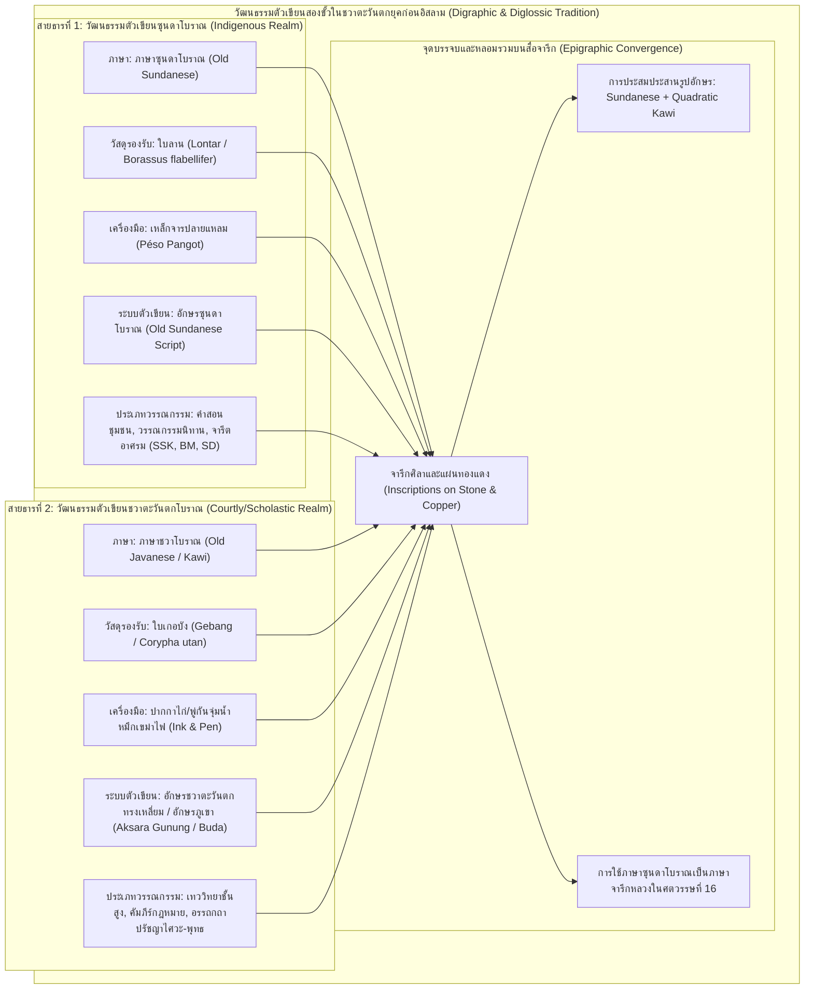
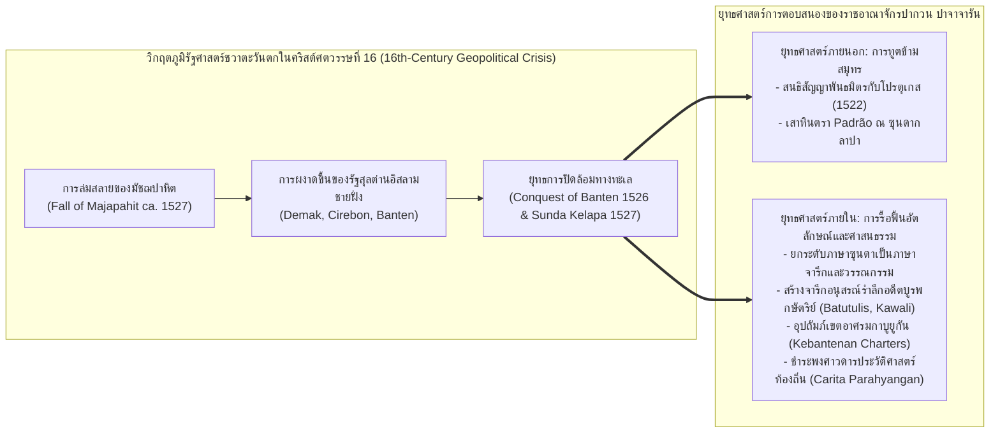

# บทที่ 6 (ตอนที่ 2): การปฏิวัติจารึกวิทยาภาษาซุนดาโบราณ ภูมิทัศน์ศักดิ์สิทธิ์ และระบบภาษีแห่งราชอาณาจักรปาจาจารัน
*(The Old Sundanese Epigraphical Revolution, Sacred Landscapes, Kabuyutan, and Taxation in the Kingdom of Pakuan Pajajaran)*

---

## บทนำประจำตอนที่ 2: จากตารูมานครสู่ปาจาจารัน และการเปลี่ยนผ่านสู่จารึกภาษาซุนดาโบราณ

ในกระบวนการศึกษาประวัติศาสตร์และจารึกวิทยาของเกาะชวา ดินแดนชวาตะวันตก (West Java) หรือภูมิภาควัฒนธรรมซุนดา (Tatar Sunda / Priangan) ดำรงสถานะเป็นพื้นที่ที่มีอัตลักษณ์เฉพาะทางภาษา สถาบันการเมือง และสายธารอารยธรรมที่เป็นเอกเทศอย่างเด่นชัดนับแต่ยุคโบราณ แม้ว่าในระยะเริ่มแรกของการรับวัฒนธรรมจากชมพูทวีปช่วงคริสต์ศตวรรษที่ 5 ราชอาณาจักรตารูมานคร (Tarumanagara) ภายใต้พระเจ้าปูรณวรมัน จะใช้ภาษาสันสกฤตคลาสสิกและอักษรปัลลวะตอนต้นในการจารึกพระราชกรณียกิจชลศาสตร์และรอยพระบาทวิษณุเฉกเช่นเดียวกับศูนย์กลางอำนาจร่วมสมัยในเอเชียตะวันออกเฉียงใต้ และต่อมาในคริสต์ศตวรรษที่ 10 ศิลาจารึกเกอบนโกปี 2 (Kebon Kopi II ค.ศ. 932) ได้บันทึกการฟื้นฟูเอกราชของกษัตริย์แห่งซุนดาผ่านภาษามลายูโบราณอันเป็นภาษากลางทางการค้าข้ามสมุทร ทว่าเมื่อพัฒนาการทางประวัติศาสตร์ก้าวเข้าสู่ยุคคลาสสิกตอนปลาย (คริสต์ศตวรรษที่ 14 ถึง 16) ภายใต้ราชอาณาจักรซุนดา-กาโฮล (Sunda-Galuh) ซึ่งมีศูนย์กลางอำนาจคู่ขนานระหว่างเมืองปากวน ปาจาจารัน (Pakuan Pajajaran ในเขตเมืองโบกอร์ปัจจุบัน) ทางภาคตะวันตก และเมืองกาวาลี (Kawali ในเขตอำเภอจีอามิสปัจจุบัน) ทางภาคตะวันออก ราชสำนักและประชาคมสงฆ์ในภูมิภาคนี้ได้สถาปนา "ประเพณีการจารึกภาษาซุนดาโบราณ" (Old Sundanese Epigraphical Tradition) ขึ้นมาอย่างทรงพลัง [1]

อย่างไรก็ดี เป็นเวลากว่าหนึ่งศตวรรษครึ่งนับแต่ยุคอาณานิคมเนเธอร์แลนด์ คลังจารึกภาษาซุนดาโบราณกลับตกอยู่ในภาวะชะงักงันและถูกบดบังด้วยอคติทางประวัติศาสตร์นิพนธ์ นักบูรพคดีศึกษาชาวดัตช์และนักประวัติศาสตร์อินโดนีเซียกระแสหลักมักมองจารึกเหล่านี้ผ่านกรอบคิดแบบ "ชวารวมศูนย์" (Java-centric) โดยจัดให้ซุนดาเป็นเพียงอาณาจักรชายขอบที่ล้าหลังทางวัฒนธรรมเมื่อเปรียบเทียบกับจักรวรรดิมัชฌปาหิตแห่งชวาตะวันออก ยิ่งไปกว่านั้น การศึกษาจารึกซุนดาในอดีตยังเผชิญกับข้อผิดพลาดสะสมทางอักขรวิทยา การพึ่งพาสำเนาลายเส้นที่คลาดเคลื่อน การแปลความหมายผ่านแว่นตาของภาษาซุนดาปัจจุบันอย่างผิดยุคสมัย (anachronism) ตลอดจนความเข้าใจผิดเกี่ยวกับการคำนวณศักราชจันทรสังกลา ส่งผลให้เกิดการตีความว่าจารึกภาษาซุนดาส่วนใหญ่เป็นเอกสารร่วมสมัยที่บันทึกการก่อตั้งบ้านเมืองในคริสต์ศตวรรษที่ 14 [2]

จุดเปลี่ยนผ่านเชิงกระบวนทัศน์ครั้งสำคัญที่สุดในประวัติศาสตร์จารึกวิทยาซุนดาเกิดขึ้นจากผลงานวิจัยระดับแม่บทของ อาดิตยา กุนาวัน และ อาร์โล กริฟฟิทส์ (Aditia Gunawan & Arlo Griffiths 2021) ในบทความวิจัย *"Old Sundanese Inscriptions: Renewing the Philological Approach"* ซึ่งตีพิมพ์ในวารสารวิชาการ *Archipel* เล่มที่ 101 งานวิจัยชิ้นประวัติศาสตร์นี้ได้รื้อถอนข้อผิดพลาดสะสมของนักวิชาการรุ่นก่อนหน้าอย่างเป็นระบบ ผ่านการชันสูตรโบราณวัตถุจริง (autopsy) การใช้ภาพถ่ายดิจิทัลความละเอียดสูง การตรวจสอบแม่พิมพ์กระดาษดั้งเดิม (estampage) และการเชื่อมผสานภาษาศาสตร์จารึกเข้ากับคลังวรรณกรรมตัวเขียนใบลานและใบเกอบังโบราณ ผลการวิจัยได้พิสูจน์ว่า จารึกศิลาภาษาซุนดาโบราณเกือบทั้งหมดมิได้ถูกสร้างขึ้นในคริสต์ศตวรรษที่ 14 แต่เป็น "วรรณกรรมอนุสรณ์รำลึกอดีตบูรพกษัตริย์หลังการสวรรคต" (post-mortem memorial discourse / *sakakala*) ที่ผลิตขึ้นในคริสต์ศตวรรษที่ 16 เพื่อตอบสนองต่อวิกฤตความมั่นคงและการคุกคามจากการแผ่ขยายอำนาจของรัฐสุลต่านอิสลามชายฝั่ง [3]

เพื่อนำเสนอพัฒนาการทางวิชาการและคลี่คลายภาพตัวแทนของอารยธรรมซุนดาก่อนการเปลี่ยนผ่านสู่ยุคอิสลาม เนื้อหาในตอนที่ 2 ของบทที่ 6 นี้ จะแบ่งการวิเคราะห์เชิงลึกออกเป็นสองหัวข้อหลักอันได้แก่:
- **หัวข้อ 6.3 การปฏิวัติจารึกวิทยาภาษาซุนดาโบราณ (The Old Sundanese Epigraphical Revolution - Gunawan & Griffiths 2021):** สำรวจประวัติศาสตร์นิพนธ์และการรื้อถอนข้อผิดพลาดสะสมของนักวิชาการรุ่นบุกเบิก; การจัดระบบอักขรวิธีและสัทวิทยาที่ถูกต้อง การพิสูจน์การไม่มีอยู่จริงของสระ *eu* และหน้าที่อันหลากหลายของเครื่องหมายปาโนลง (*panolong*); ภาวะสองระบบตัวเขียนและสองระเบียบภาษา (*digraphic and diglossic tradition*) ระหว่างใบลานกับใบเกอบัง; การถอดรหัสศักราชจันทรสังกลา 1455 มหาศักราช ในศิลาจารึกบาตูตูลิส (Batutulis) ในฐานะจารึกอนุสรณ์สถานอุทิศแด่ศรีพะดูกา มหาราชา; ตลอดจนบริบทการเมืองและยุทธศาสตร์การปรับตัวของราชสำนักปากวน ปาจาจารัน ในคริสต์ศตวรรษที่ 16 [4]
- **หัวข้อ 6.4 จารึกกาวาลีและเกอบันเตอนัน: ดินแดนศักดิ์สิทธิ์และระบบภาษีซุนดา (Sacred Landscapes, Kabuyutan, and Taxation in Sundanese Epigraphy):** ชำแหละคลังศิลาจารึกอัสตานาเกอเดแห่งกาวาลี (Kawali 1a–6) ในมิติคติธรรม "ธรรมราชา" รอยพระบาทอนุสรณ์ (*tapak valar*) และวรรณศิลป์คำสาปแช่ง; วิเคราะห์จารึกแผ่นทองแดงเกอบันเตอนัน 5 แผ่น (Kebantenan I–V) ในฐานะพระราชโองการปัจจุบันขณะเพียงกลุ่มเดียว การสถาปนาเขตอาศรมกาบูยูกัน (*kabuyutan*) และผืนดินแห่งโองการสวรรค์ (*lǝmaḥ devasasana*) ควบคู่กับการจำแนกโครงสร้างส่วย ภาษี และแรงงานเกณฑ์โบราณ; ปิดท้ายด้วยการศึกษาวิเคราะห์จารึกฮูลูดาเยอูฮ์ (Huludayeuh) ในมิติพิธีกรรมเบิกป่าปราบอสูร และจารึกลิงกาวังกี (Linggawangi) อันเป็นหมุดหมายศักราชภาษาซุนดาที่เก่าแก่ที่สุด [5]

---
## 6.3 การปฏิวัติจารึกวิทยาภาษาซุนดาโบราณ (The Old Sundanese Epigraphical Revolution - Gunawan & Griffiths 2021)

### 6.3.1 ประวัติศาสตร์นิพนธ์และการรื้อถอนข้อผิดพลาดสะสมของนักวิชาการรุ่นก่อน

ประวัติศาสตร์การศึกษาวิจัยจารึกภาษาซุนดาโบราณมีจุดเริ่มต้นย้อนหลังไปถึงช่วงกลางคริสต์ศตวรรษที่ 19 ในยุคอาณานิคมเนเธอร์แลนด์อีสต์อินดีส เมื่อ รูดอล์ฟ ฟรีเดอริก (R.H.Th. Friederich 1853, 1855) ได้เริ่มตีพิมพ์คำอ่านและคำแปลเบื้องต้นของศิลาจารึกบาตูตูลิสแห่งเมืองโบกอร์ อย่างไรก็ดี เนื่องจากในยุคสมัยดังกล่าว องค์ความรู้ด้านภาษาศาสตร์เปรียบเทียบตระกูลออสโตรนีเซียนและไวยากรณ์ภาษาซุนดาโบราณยังไม่ถือกำเนิดขึ้น ฟรีเดอริกจึงพยายามตีความตัวบทจารึกผ่านกรอบไวยากรณ์ภาษาสันสกฤตและภาษาชวาโบราณ ส่งผลให้คำอ่านและบทแปลเต็มไปด้วยข้อผิดพลาดและการคาดเดาความหมายอย่างเลื่อนลอย [6]

ต่อมาในทศวรรษ 1860 ถึง 1880 คาเรล เฟรเดอริก ฮอลเลอ (K.F. Holle 1867, 1869, 1877, 1882) ข้าราชการอาณานิคมและนักวิชาการผู้บุกเบิกการศึกษาอักขรวิทยาอินโดนีเซีย ได้จัดทำตารางวิวัฒนาการอักษรโบราณอันทรงอิทธิพล *Tabel van Oud- en Nieuw-Indische Alphabetten* (1882) ซึ่งได้รวมเอารูปอักษรซุนดาโบราณเข้าไปด้วย ทว่าแม้ฮอลเลอจะมีคุณูปการในการรวบรวมข้อมูลเชิงประจักษ์ แต่ผลงานของเขากลับสร้างข้อผิดพลาดเชิงโครงสร้างที่ตกทอดมาอย่างยาวนาน เนื่องจากการจัดทำสำเนาภาพวาดลายเส้น (lithographs / facsimiles) ของฮอลเลอ มีการคัดลอกรูปอักษรที่คลาดเคลื่อนจากโบราณวัตถุจริง มีการตัดทอนหรือแต่งเติมเส้นอักษรตามความคุ้นชินของสายตาตนเอง ทำให้เกิด "รูปอักษรผี" (ghost letterforms) ที่ไม่มีอยู่จริงในจารึก [7]

ก้าวย่างสำคัญของการศึกษาจารึกซุนดาปรากฏขึ้นในผลงานของ ซี.เอ็ม. ไพลเตอ (C.M. Pleyte 1911) เรื่อง *"Het jaartal op het Batoe-toelis-monument te Buitenzorg"* ซึ่งไพลเตอได้พยายามรวบรวมและชำระตัวบทจารึกบาตูตูลิส จารึกกาวาลี และจารึกเกอบันเตอนัน อย่างไรก็ตาม ระเบียบวิธีวิจัยของไพลเตอกลับตกอยู่ภายใต้อคติเชิงนิรุกติศาสตร์ที่ร้ายแรง นั่นคือการนำเอาคำศัพท์ ไวยากรณ์ และระบบเสียงของ "ภาษาซุนดาสมัยใหม่" (Modern Sundanese) จากพจนานุกรมของคูลส์มา (S. Coolsma 1913) และริกก์ (J. Rigg 1862) ไปสวมทับและตีความตัวบทจารึกโบราณที่มีอายุย้อนหลังไปหลายร้อยปีโดยตรง ผลลัพธ์คือคำศัพท์โบราณจำนวนมากที่มีความหมายเฉพาะทางด้านเทววิทยา สถาบันอำนาจ หรือระบบเศรษฐกิจถูกลดทอนหรือแปลความหมายผิดเพี้ยนไปเป็นคำสามัญในชีวิตประจำวันของชาวซุนดายุคอาณานิคม [8]

ในมิติการคำนวณศักราช ปูร์บาจารากา (R.Ng. Poerbatjaraka 1919–1921) และ ฮูเซน จายาดินิงรัต (Hoesein Djajadiningrat) ได้เปิดข้อถกเถียงอันดุเดือดเกี่ยวกับศักราชจันทรสังกลาในจารึกบาตูตูลิส โดยปูร์บาจารากาเสนอว่าคำว่า *ṅǝmban* ในภาษาสังกลามีค่าเท่ากับ 2 (ตามตำราจันทรสังกลาของเกาะบาหลี) ทำให้เขาคำนวณศักราชออกมาเป็นมหาศักราช 1255 (ตรงกับ ค.ศ. 1333) ขณะที่จายาดินิงรัตเสนอปีมหาศักราช 1355 ความขัดแย้งเชิงตัวเลขนี้ทำให้ลำดับเวลาทางประวัติศาสตร์ของราชอาณาจักรซุนดาสับสนอลหม่าน และตัดขาดความเชื่อมโยงระหว่างจารึกกับหลักฐานพงศาวดารท้องถิ่น [9]

แม้กระทั่งในยุคหลังเอกราชของอินโดนีเซีย นักจารึกวิทยาชั้นนำของชาติ อาทิ ศาสตราจารย์ เอ็ม. บุชารี (M. Boechari 1985–1986), ฮาซัน จาฟาร์ (Hasan Djafar 1991, 2011), และ ติตี ซูร์ตี นัสตีตี (Titi Surti Nastiti 1996, 2011) แม้จะได้อุทิศตนสำรวจและถอดอ่านจารึกซุนดาโบราณ แต่ในทางวิธีวิทยากลับยังคงพึ่งพาภาพถ่ายขาวดำเก่า สำเนาลายเส้นยุคอาณานิคม และการปริวรรตอักษรที่สืบทอดมาจากไพลเตอและปูร์บาจารากา โดยแทบไม่ได้หวนกลับไปตรวจสอบโบราณวัตถุจริงอย่างละเอียด หรือทำแม่พิมพ์กระดาษสมัยใหม่เพื่อพิสูจน์ร่องรอยการสลัก [10]

กุนาวันและกริฟฟิทส์ (Gunawan & Griffiths 2021) ได้ชี้ให้เห็นว่า ความชะงักงันของการศึกษาจารึกวิทยาภาษาซุนดาโบราณเกือบหนึ่งศตวรรษครึ่ง มีรากเหง้ามาจาก "จุดอ่อนเชิงระเบียบวิธีวิจัย 3 ประการหลัก":
1. **การพึ่งพาสำเนาลายเส้นที่ผิดพลาดและคำอ่านลวง (Faulty Facsimiles and Ghost Readings):** การที่นักวิชาการไม่อ่านจากหินจริงทำให้เกิดการสับสนของรูปอักษร เช่น การอ่านสับสนระหว่างเสียงทันตชะ *d* กับมุทธชะ *ḍ*, การมองข้ามเครื่องหมายฆ่าสระปามาเอะฮ์ (*pamaéh*), หรือการอ่านเครื่องหมายขยายเสียงสระยาวปาโนลง (*panolong*) ผิดเป็นพยัญชนะอื่น
2. **การยัดเยียดระบบภาษาซุนดาปัจจุบันลงในอดีต (Anachronistic Lexical and Phonological Projection):** การด่วนสรุปว่าภาษาซุนดาโบราณต้องมีระบบเสียงและสัทวิทยาเหมือนภาษาซุนดาในคริสต์ศตวรรษที่ 20 โดยเฉพาะการทึกทักเอาเองว่าตัวเขียนโบราณต้องมีรูปสระ *eu*
3. **การตัดขาดระหว่างจารึกวิทยากับวรรณกรรมตัวเขียนโบราณ (Divorce between Epigraphy and Manuscript Philology):** นักจารึกวิทยาปฏิเสธที่จะศึกษาเปรียบเทียบสำนวนภาษา โครงสร้างไวยากรณ์ และคำศัพท์ในจารึก กับคลังคัมภีร์ใบลาน (*lontar*) และใบเกอบัง (*gebang*) ร่วมสมัย ทั้งที่เอกสารทั้งสองประเภทถูกผลิตขึ้นในบริบทสังคมวัฒนธรรมเดียวกัน [11]

เพื่อทลายกับดักเชิงวิธีวิทยาเหล่านี้ กุนาวันและกริฟฟิทส์ได้สถาปนาระเบียบวิธีวิจัยทางนิรุกติศาสตร์และจารึกวิทยาขั้นสูงขึ้นใหม่ โดยดำเนินการ:
- **การชันสูตรโบราณวัตถุจริง (Autopsy):** เดินทางไปตรวจสอบศิลาจารึกทุกหลัก ณ แหล่งโบราณคดีจริงในชวาตะวันตก และตรวจสอบแผ่นจารึกทองแดงเกอบันเตอนันทุกแผ่นในคลังพิพิธภัณฑ์แห่งชาติอินโดนีเซีย (Museum Nasional Indonesia: MNI)
- **การถ่ายภาพดิจิทัลความละเอียดสูงด้วยแสงเฉียง (Raking-Light Digital Macro-Photography):** การจัดทิศทางแสงเพื่อขับเน้นมิติความลึกตื้นของร่องอักษรที่สึกกร่อน
- **การตรวจสอบแม่พิมพ์กระดาษดั้งเดิม (Estampage):** โดยเฉพาะการค้นคว้าแม่พิมพ์กระดาษคุณภาพสูงที่เก็บรักษาไว้ในหอจดหมายเหตุของสำนักฝรั่งเศสแห่งปลายบุรพทิศ (EFEO) ณ กรุงปารีส เช่น แม่พิมพ์กระดาษหมายเลข EFEO 2148 ของจารึกบาตูตูลิส ซึ่งบันทึกสภาพร่องอักษรที่สมบูรณ์ก่อนที่ตัวโบราณวัตถุจริงจะถูกทาสีขาวทับในคริสต์ศตวรรษที่ 20
- **การใช้ระบบปริวรรตอักขระเคร่งครัดตามมาตรฐานสากล (Strict ISO 15919 Transliteration):** การสร้างระบบการถ่ายทอดอักษรแบบหนึ่งต่อหนึ่งระหว่างรูปกราฟิกดั้งเดิมกับอักษรโรมัน เพื่อไม่ให้เกิดการสอดแทรกการตีความทางเสียงที่ผิดยุคสมัย [12]

---

### 6.3.2 กายวิภาคแห่งอักขรวิธีและสัทวิทยาซุนดาโบราณ

การชำระตัวบทจารึกอย่างเป็นระบบของกุนาวันและกริฟฟิทส์ (Gunawan & Griffiths 2021) ได้นำไปสู่การค้นพบและการจัดระเบียบอักขรวิธีและสัทวิทยาภาษาซุนดาโบราณที่ปฏิวัติความเข้าใจเดิมของวงการภาษาศาสตร์ประวัติศาสตร์อย่างสิ้นเชิง:

#### 1. การพิสูจน์การไม่มีอยู่จริงของสระ eu (paneuleung ǝ:) ในเอกสารประวัติศาสตร์
หนึ่งในข้อค้นพบที่สั่นสะเทือนวงการที่สุด คือการพิสูจน์ว่าในระบบตัวเขียนภาษาซุนดาโบราณ **"ไม่มีเครื่องหมายสระ eu หรือ ปาเนอเลิง (paneuleung ǝ:)"** อยู่จริงเลยแม้แต่แห่งเดียว หากพิจารณาคำอ่านจารึกที่เผยแพร่โดย ฟรีเดอริก, ฮอลเลอ, ไพลเตอ หรือแม้แต่ฮาซัน จาฟาร์ ผู้ศึกษาจะพบการปริวรรตคำว่า *hĕbĕl* หรือ *heubeul*, *ĕsi* หรือ *eusi*, *cĕndik* หรือ *ceundik* ซึ่งทำให้เข้าใจว่าผู้รจนาจารึกโบราณได้จำแนกความแตกต่างระหว่างสระเออะสั้น /ǝ/ (ปริวรรตเป็น *ĕ* หรือ *e*) กับสระเออยาว /ǝ:/ (ปริวรรตเป็น *ö* หรือ *eu*) ทว่าจากการตรวจสอบร่องอักษรบนโบราณวัตถุจริงและเอกสารใบลานโบราณทั้งหมด ปรากฏเครื่องหมายสระเพียงชนิดเดียวเท่านั้น คือ **ปาเมอเป็ต (*pamepet*)** ซึ่งออกเสียงเป็นสระ /ǝ/ [13]

กุนาวันและกริฟฟิทส์ได้วิพากษ์อย่างรุนแรงว่า เครื่องหมาย **ปาเนอเลิง (°ᮩ paneuleung)** ที่ได้รับการบรรจุลงในตารางรหัสยูนิโค้ดมาตรฐานสากลสำหรับอักษรซุนดา (Unicode Sundanese Block, U+1BA9) นั้น เป็นผลผลิตจากการ "ประดิษฐ์ขึ้นใหม่" ของคณะกรรมการปฏิรูปภาษาในชวาตะวันตกช่วงปลายคริสต์ศตวรรษที่ 20 ซึ่งนำเอาโครงสร้างสัทวิทยาและความคุ้นชินในการสะกดคำของภาษาซุนดาปัจจุบันไปยัดเยียดให้แก่อักษรโบราณ โดยปราศจากหลักฐานทางประวัติศาสตร์รองรับ ดังที่กุนาวันและกริฟฟิทส์ได้ระบุไว้อย่างชัดแจ้ง:

> *"The paneuleung (°ᮩ) admitted in the Unicode version of Sundanese script has no basis in the historical documents after which that script has been modeled. The imposition of this distinction is obviously based on the phonology and spelling habits familiar from MdS [Modern Sundanese]. However, we do not know how Old Sundanese was pronounced at the time of the production of the documents we have, and it seems better to avoid the risk of anachronistic phonological interpretation by maintaining a one-to-one correspondence between the graphic elements of the original and the target scripts."* [14]
>
> *(คำแปล: เครื่องหมายปาเนอเลิง [°ᮩ paneuleung] ที่ได้รับการบรรจุลงในตารางรหัสยูนิโค้ดของอักษรซุนดานั้น ปราศจากหลักฐานรองรับในเอกสารโบราณทางประวัติศาสตร์ซึ่งถูกใช้เป็นต้นแบบ การยัดเยียดความแตกต่างนี้ชัดเจนว่ามีฐานมาจากระบบสัทวิทยาและความคุ้นชินในการสะกดคำของภาษาซุนดาปัจจุบัน อย่างไรก็ดี เราไม่อาจทราบได้ว่าภาษาซุนดาโบราณออกเสียงอย่างไรในยุคสมัยที่มีการผลิตเอกสารเหล่านี้ขึ้นมา และย่อมเป็นการดีกว่าที่จะหลีกเลี่ยงความเสี่ยงจากการตีความสัทวิทยาผิดยุคสมัย ด้วยการรักษาระบบการเทียบรูปอักษรแบบหนึ่งต่อหนึ่งระหว่างองค์ประกอบกราฟิกของต้นฉบับดั้งเดิมกับอักษรโรมันเป้าหมาย)* [15]

#### 2. กลไกการทำงานของเครื่องหมายปามาเอะฮ์ (pamaéh ·) และการเรียงพยัญชนะแนวนอน
ในระบบตัวเขียนอินเดียโบราณและอักษรกวิ (Old Javanese Kawi script) เมื่อพยัญชนะสองตัวปรากฏร่วมกันเป็นคำควบกล้ำหรือตัวสะกด ระบบอักษรจะใช้การซ้อนพยัญชนะตัวที่สองลงใต้บรรทัด เรียกว่า **ปาซังงัน (*pasangan*)** ทว่าอักษรซุนดาโบราณได้พัฒนาลักษณะเฉพาะตัวที่โดดเด่นอย่างยิ่ง นั่นคือการใช้เครื่องหมายวิรามะที่เรียกว่า **ปามาเอะฮ์ (*pamaéh*)** ซึ่งมีลักษณะเป็นขีดเฉียงหรือจุดกำกับอยู่บนหรือท้ายพยัญชนะ ทำหน้าที่ "ฆ่าสระแฝงท้ายพยัญชนะ" โดยตรง [16]

การใช้ปามาเอะฮ์ทำให้ระบบตัวเขียนซุนดาโบราณสามารถวางพยัญชนะสะกดเรียงต่อกันตามแนวนอน (linear arrangement) ได้โดยไม่ต้องพึ่งพาพยัญชนะเชิงซ้อนใต้บรรทัด ด้วยเหตุนี้ รูปพยัญชนะเชิงซ้อน (*pasangan*) ในจารึกและเอกสารซุนดาโบราณจึงมีใช้น้อยมาก และจำกัดอยู่เพียงพยัญชนะ 5 ตัวเท่านั้น ได้แก่ **ca, na, ba, ka, va** ซึ่งมักพบในคำยืมภาษาสันสกฤตหรือโครงสร้างเฉพาะบางคำเท่านั้น [17]

#### 3. หน้าที่อันหลากหลายของเครื่องหมายปาโนลง (panolong :)
เครื่องหมาย **ปาโนลง (*panolong*)** ซึ่งในระบบอักษรซุนดาปัจจุบันมีค่าเป็นสระ /o/ เมื่อใช้คู่กับปาเนเลง (*panéléng*) กุนาวันและกริฟฟิทส์ได้คลี่คลายปริศนาว่า ในจารึกภาษาซุนดาโบราณ ปาโนลงทำหน้าที่สำคัญถึง 3 ประการ:
- ทำหน้าที่เป็นเครื่องหมายสระ **-o** ทั้งเมื่อใช้เดี่ยวๆ ตามหลังพยัญชนะ หรือใช้ประกบร่วมกับปาเนเลง
- ทำหน้าที่เป็น **"เครื่องหมายยืดเสียงสระยาว" (vowel length indicator)** โดยใช้แทนเครื่องหมายสระอา (*-ā*) ในคำยืมภาษาสันสกฤต เช่น คำว่า *pura:na* (แทนรูป *purāṇa*), *ka‹ñ›ca:na* (แทนรูป *kāñcana*)
- ทำหน้าที่เป็น **เครื่องหมายพยัญชนะซ้ำรูป (gemination marker)** ในเอกสารตัวเขียนใบลาน [18]

#### 4. ปรากฏการณ์อักขรวิธีและสัทวิทยาพิเศษ
นอกจากนี้ จารึกภาษาซุนดาโบราณยังปรากฏลักษณะทางภาษาศาสตร์เฉพาะถิ่นที่น่าสนใจอีกหลายประการ:
- **การละไม่เขียนพยัญชนะนาสิกสะกดท้ายพยางค์ (Non-spelling of syllable-final nasals):** ช่างจารึกมักละเลยการสลักเครื่องหมายอนุสวาระหรือปาเญอเจ็ก (*panyecek* ṁ/ṅ) และพยัญชนะนาสิกสะกด ทำให้เกิดรูปเขียนอย่าง *kaca:na* (แทน *kañcana*), *hagat* (แทน *haṁgat*), และ *su‹n›ḍasǝmbava* (แทน *Sunda-sambawa*) ซึ่งเป็นลักษณะร่วมทางอักขรวิธีที่พบได้เช่นกันในจารึกชวาโบราณยุคปลาย [19]
- **การแทนเสียงควบ /Ciya/ ด้วยรูปอักษร Cya:** การผสมผสานระหว่างสระอิหรือปังฮูลู (*panghulu* i) ร่วมกับกึ่งสระ ย หรือปามิงกัล (*pamingkal* y) เพื่อสะท้อนเสียงสระควบสองพยางค์
- **การสลับอย่างอิสระระหว่างสระประสม (hiatus) กับกึ่งสระ (semivowel):** ในจารึกชุดเดียวกัน ปรากฏการสะกดคำว่า *pakuAn* (สระ อา-อู) สลับกับ *pakvan* (พยัญชนะ ว ควบกล้ำ) อย่างเป็นธรรมชาติ สะท้อนความลื่นไหลในการออกเสียง [20]
- **ปรากฏการณ์พยัญชนะซ้ำรูป (Consonant Gemination):** การเพิ่มพยัญชนะเสียงเดียวกันเบิ้ลซ้ำในรอยต่อระหว่างหน่วยคำ เช่น *bǝnaṁṅiṁ* (bǝnaṁ + iṁ), *ḍipaEḥhan* (ḍi-paEḥ-an), และ *sugan n aya* (sugan + aya)
- **การใช้รูปอักษร ḍ แทนเสียงทันตชะ /d/:** รูปอักษรที่ช่างจารึกซุนดาใช้สลักเสียง /d/ แท้จริงแล้วมีสัณฐานเป็นรูปอักษรมุทธชะ *ḍ* ในตระกูลอักษรอินเดีย ซึ่งกุนาวันและกริฟฟิทส์ได้เลือกใช้ระบบปริวรรตอักษรตามรูปกราฟิกจริง (*ḍ*) เพื่อสะท้อนความเป็นจริงทางวัตถุวิทยา [21]

---

### 6.3.3 ภาวะสองระบบตัวเขียนและสองระเบียบภาษา (Digraphic and Diglossic Tradition)

มิติทางวัฒนธรรมตัวเขียนที่โดดเด่นและซับซ้อนที่สุดของชวาตะวันตกยุคก่อนอิสลาม คือการดำรงอยู่ของ **"ภาวะสองระบบตัวเขียนและสองระเบียบภาษา" (Digraphic and Diglossic Tradition)** ซึ่งแบ่งแยกภูมิทัศน์ทางปัญญาของสังคมซุนดาโบราณออกเป็นสองขั้วอย่างชัดเจน [22] ดังแสดงในแผนภาพวิเคราะห์:

ในชุมชนทางปัญญาและอารามอาศรมของชวาตะวันตกโบราณ มีการจัดสรรหน้าที่ของการสื่อสารอย่างเป็นระบบ:
1. **สายธารภาษาซุนดาโบราณบนใบลาน:** ใช้ **อักษรซุนดาโบราณ (Old Sundanese script)** สลักด้วยเหล็กจารลงบนใบลานปาล์มตาล (*lontar / Borassus flabellifer*) แล้วทาด้วยเขม่าผสมน้ำมันเพื่อให้อักษรเด่นชัด สายธารนี้ใช้ถ่ายทอดวรรณกรรมท้องถิ่น วรรณกรรมคำสอนศีลธรรมชุมชน และการบันทึกการเดินทาง เช่น คัมภีร์ *Sanghyang Siksa Kandang Karesian* (SSK ค.ศ. 1518), บันทึกนิราศการเดินทางของนักพรต *Bujangga Manik* (BM), และบทกวีปรัชญา *Sewaka Darma* (SD) [23]
2. **สายธารภาษาชวาโบราณบนใบเกอบัง:** ใช้ **อักษรชวาตะวันตกทรงเหลี่ยม** หรือที่เรียกในวงวิชาการว่า **อักษรภูเขา (*aksara gunung*)** หรือ **อักษรพุทธ (*aksara buda*)** ซึ่งเขียนด้วยปากกาขนห่านหรือพู่กันจุ่มน้ำหมึกดำลงบนแผ่นใบปาล์มเกอบัง (*gebang / Corypha utan*) สายธารนี้ถูกสงวนไว้สำหรับภาษาชวาโบราณ เพื่อบันทึกคัมภีร์เทววิทยาชั้นสูง บทสวดมนตรา ศาสนบัญญัติของคณะสงฆ์ และวรรณกรรมปรัชญาทางศาสนา [24]

ทว่าเมื่อระบบตัวเขียนทั้งสองถูกนำมาถ่ายทอดลงบน "สื่อจารึก" (Inscriptional Media) ไม่ว่าจะเป็นแผ่นหินแอนดีไซต์หรือแผ่นทองแดง ช่างจารึกจำเป็นต้องปรับเปลี่ยนเทคนิคการสลักให้เข้ากับเนื้อวัสดุ ส่งผลให้ลักษณะเฉพาะของอักษรซุนดาโบราณบนใบลานกับอักษรภูเขาบนใบเกอบังเกิดการหลอมรวมและประสมประสานกันอย่างแนบแน่น กุนาวันและกริฟฟิทส์ได้เตือนว่า ด้วยเหตุที่ระบบตัวเขียนบนจารึกมีลักษณะลูกผสม นักจารึกวิทยาจึง **"ไม่สามารถใช้อักขรวิทยาแต่เพียงอย่างเดียวในการกำหนดอายุสัมบูรณ์ (absolute dating) ของจารึกซุนดาได้อย่างแม่นยำ"** หากจำต้องอาศัยข้อมูลศักราชจันทรสังกลาและบริบทประวัติศาสตร์เปรียบเทียบร่วมด้วยเสมอ [25]

ยิ่งไปกว่านั้น การปฏิวัติของกุนาวันและกริฟฟิทส์ยังอยู่ที่การสถาปนา "ระเบียบวิธีวิจัยสหบท" (Intertextual Approach) ด้วยการเชื่อมโยงคลังจารึกเข้ากับคลังเอกสารตัวเขียนโบราณ การไขปริศนาคำศัพท์เฉพาะทางในจารึกที่ไม่เคยมีใครแปลได้มาก่อน ประสบความสำเร็จได้ด้วยการสืบค้นความหมายเปรียบเทียบจากคัมภีร์ร่วมสมัย เช่น:
- คำว่า **dibuhaya** และ **mibuhayakǝn** ในจารึกเกอบันเตอนัน 1 ซึ่งนักวิชาการรุ่นเก่าแปลไม่ออก เมื่อนำไปเทียบกับคำว่า *buhaya* ในภาษาชวาโบราณและคำว่า *buai* ในภาษามลายู จึงค้นพบความหมายที่แท้จริงว่าหมายถึง "การทะนุถนอมดูแลเอาใจใส่อย่างดียิ่ง"
- คำว่า **paṅgǝrǝs rǝma** ในจารึกเกอบันเตอนัน 4 เมื่อเทียบกับวรรณกรรมเกษตรกรรมโบราณ จึงทราบว่าเป็น "ส่วยหรือภาษีที่ประเมินจากพื้นที่ไร่เลื่อนลอยที่ถูกปล่อยทิ้งร้าง" (*fallow dry rice-field land*)
- คำว่า **disi** ในจารึกฮูลูดาเยอูฮ์ เมื่อเทียบกับคัมภีร์ *Sanghyang Siksa Kandang Karesian* (SSK) จึงกระจ่างชัดว่าเป็นตำแหน่ง "นักบวชผู้ประกอบพิธีขับไล่ภูตผีและจัดสรรป่าไม้ที่ดิน"
- คำว่า **kacaritaan** ซึ่งเดิมเคยแปลว่า "นิทานหรือเรื่องเล่า" แท้จริงหมายถึง "จารีตแห่งวัตรปฏิบัติทางศาสนา" ตามรากศัพท์สันสกฤต *carita* [26]

ในมิติของไวยากรณ์และวากยสัมพันธ์ กุนาวันและกริฟฟิทส์ได้จัดวางแบบแผนโครงสร้างประโยคภาษาซุนดาโบราณไว้อย่างเป็นระบบ อาทิ การระบุว่าคำว่า **na** ทำหน้าที่เป็นคำชี้เฉพาะ (*definite article*) นำหน้านาม มิใช่คำสรรพนามแสดงความเป็นเจ้าของเสมอไป (เช่น *ñusuk na pakvan* หมายถึง "ปักปันซึ่งพระนครปากวน", *mahayu na kaḍatuan* หมายถึง "บูรณะซึ่งพระราชวัง"); การชี้ให้เห็นว่าคำอนุภาค **ma** ทำหน้าที่เป็นตัวเชื่อมประโยคนาม (*copula*) และเป็นตัวชี้หัวข้อเน้นประเด็น (*topic marker*) ในประโยคเงื่อนไข; ตลอดจนการคลี่คลายบทบาทของคำบุพบท **di** ที่ครอบคลุมทั้งความหมายบอกสถานที่ ("ณ, ใน"), บอกทิศทางมุ่งไปสู่ ("ไปยัง"), เป็นตัวชี้กรรมตรง, และเป็นตัวนำหน้าชื่อสถานที่เฉพาะ [27]

---

### 6.3.4 การคำนวณศักราชจันทรสังกลาและการจัดอายุสมัยใหม่: ศิลาจารึกบาตูตูลิส (Batutulis Inscription)

ศิลาจารึกบาตูตูลิส (Batutulis Inscription, รหัสทะเบียน DHARMA `INSIDENKBatutulis.xml`) นับเป็นโบราณวัตถุจารึกวิทยาที่มีชื่อเสียงและมีความสำคัญสูงสุดในประวัติศาสตร์ราชอาณาจักรซุนดา-ปาจาจารัน ศิลาจารึกหลักนี้ตั้งตระหง่านอยู่ ณ ตำบลบาตูตูลิส อำเภอโบกอร์ตอนใต้ ชวาตะวันตก ในบริเวณซึ่งเชื่อกันว่าเป็นที่ตั้งของพระบรมมหาราชวังแห่งพระนครปากวน ปาจาจารัน เอกสารประวัติศาสตร์ของบริษัทอินเดียตะวันออกของเนเธอร์แลนด์ (VOC) ได้บันทึกการพบเห็นหินสลักหลักนี้เป็นครั้งแรกในรายงานการสำรวจป่าของคณะทหารนำโดยร้อยเอกสกีปีโอ (Captain Scipio) เมื่อปี ค.ศ. 1687 [28]

ศิลาจารึกสลักลงบนแท่งหินแอนดีไซต์ธรรมชาติทรงสามเหลี่ยมรี มีความสูงประมาณ 1.8 เมตร กว้าง 1.2 เมตร สลักด้วยอักษรซุนดาโบราณจำนวน 9 บรรทัด ร่องอักษรมีความลึกและชัดเจน ทว่าในอดีตศิลาหลักนี้เคยถูกเจ้าหน้าที่ท้องถิ่นทาสีขาวทับลงบนร่องอักษรเพื่อให้อ่านง่าย ซึ่งกลับกลายเป็นการทำลายร่องรอยการสกัดดั้งเดิม โชคดีที่สำนักฝรั่งเศสแห่งปลายบุรพทิศ (EFEO) ได้เก็บรักษาแม่พิมพ์กระดาษดั้งเดิมหมายเลข EFEO 2148 และภาพถ่ายประวัติศาสตร์ของ อีซีดอร์ ฟาน คินส์แบร์เคิน (Isidore van Kinsbergen) ตั้งแต่ทศวรรษ 1860 ทำให้กุนาวันและกริฟฟิทส์สามารถตรวจสอบและชำระตัวบทได้อย่างสมบูรณ์ [29]

#### ตัวบทจารึกบาตูตูลิสฉบับชำระและบทแปลวิชาการ
จากการตรวจสอบโบราณวัตถุจริงร่วมกับแม่พิมพ์กระดาษ EFEO 2148 ตัวบทจารึกบาตูตูลิสในระบบปริวรรตอักษรเคร่งครัด (ISO 15919 ดัดแปลง) พร้อมบทแปลภาษาไทยทางวิชาการ มีข้อความดังต่อไปนี้:

> **ตัวบทจารึกภาษาซุนดาโบราณ (DHARMA `INSIDENKBatutulis.xml` / Gunawan & Griffiths 2021: 148–150):**
>
> `(1) Ø Ø vaṁ(ṅ) a‹m›(p)un· I(n)i sakakala, pr(ә)bu ratu pura:na pun·, ḍivas·tu`  
> `(2) ḍyi, viṅaran· prәbu guru ḍe(va)ta p(ra)n· ḍivas·tu ḍyә ḍiṅaran· sri`  
> `(3) baduga maharaja, ratu ha(j)i ḍi pakvan· pajajaran· sri sa‹ṁ› ratu ḍe-`  
> `(4) vata pun· ya nu ñusuk· na pakvan· ḍyә Anak· rahyi‹ṁ› ḍeva nis·-`  
> `(5) kala, sa‹ṁ› siḍa mok(·)ta ḍi gunuṁ tiga, qә‹ñ›cu rahyiṁ (n)is·kala vas·tu`  
> `(6) ka‹ñ›ca:na, saṁ siḍa mok·ta ka nusa laraṁ, ya syi nu (ñ)yin· sakaka-`  
> `(7) la, gugun(uṅ)an·, (ṅa)balay·,, ñyin· samiḍa, ñyin· saṁ hyi‹ṁ› talaga [va-]`  
> `(8) R̥na mahavijaya, ya syi pun·,, ØØ I saka, pañca pan·ḍa-`  
> `(9) va ṅ(ә)‹m›ban· bumi Ø Ø` [30]
>
> **คำแปลภาษาไทยวิชาการ:**
>
> *"โอม ขอประทานอภัย [หากมีข้อผิดพลาดบกพร่อง] นี่คืออนุสรณ์สถาน (sakakala) แห่งพระมหากษัตริย์ในอดีต (prabu ratu pura:na pun) ผู้ได้รับการสถาปนา ณ ที่นี้ โดยมีพระนามว่า ปรภู คุรุ เทวตา [และได้รับการ] สถาปนา ณ ที่นี้ โดยมีพระนามว่า ศรีพะดูกา มหาราชา, ราชาธิราช (ratu haji) แห่งปากวน ปาจาจารัน, ศรี สัง รตู เทวตา พระองค์คือผู้ปักปันเขตแดนพระนครปากวน ณ ที่นี้ พระองค์เป็นพระราชโอรสในระหยัง เทวา นิสกะลา ผู้เสด็จดับขันธ์ ณ กูนุงตีกา (Gunung Tiga); พระราชนัดดาในระหยัง นิสกะลา วัสตู กัญจนะ ผู้เสด็จดับขันธ์สู่นูซาลารัง (Nusa Larang) พระองค์ผู้นั้นคือผู้สร้างอนุสรณ์สถาน (sakakala), เนินเขาจำลอง (gugunuṅan), ปูลาดด้วยหิน (ṅabalay); ทรงสร้างมณฑลพิธีกรรม (samiḍa); ทรงสร้างสระน้ำศักดิ์สิทธิ์ พระสังหยัง ตาลากา วรรณา มหาวิชัย (saṁ hyiṁ talaga varṇa mahavijaya) ทรงมีชัยชนะอันยิ่งใหญ่เทอญ! ในมหาศักราช: 'ห้า (5) ปาณฑพ (5) โอบอุ้ม/ค้ำจุน (4) แผ่นดิน (1)' [มหาศักราช 1455 ตรงกับ ค.ศ. 1533/1534]"* [31]

#### การถอดรหัสศักราชจันทรสังกลา 1455 มหาศักราช
ในบรรทัดที่ 8–9 ของจารึก ปรากฏสูตรคำบอกเวลาแบบบุคลาธิษฐานหรือจันทรสังกลา (*candrasaṅkala*) ว่า:
$$	ext{pañca (5)} - 	ext{paṇḍava (5)} - 	ext{ṅǝmban (4)} - 	ext{bumi (1)}$$

ตามกฎเกณฑ์โบราณของการอ่านศักราชจันทรสังกลาในเอเชียตะวันออกเฉียงใต้ ซึ่งต้องอ่านย้อนลำดับจากขวาไปซ้าย (*aṅkānāṁ vāmato gatiḥ*) ชุดตัวเลข $5 - 5 - 4 - 1$ จึงให้ค่าปีมหาศักราชเป็น **1455 มหาศักราช (Śaka 1455)** เมื่อแปลงเป็นคริสต์ศักราชสากลโดยการบวกด้วย 78/79 ปี จะตรงกับ **ค.ศ. 1533 หรือ 1534** [32]

กุนาวันและกริฟฟิทส์ได้คลี่คลายข้อกังขาที่ค้างคากว่าศตวรรษเกี่ยวกับการตีความคำว่า **ṅǝmban** โดยอธิบายว่า แม้ในตำราจันทรสังกลาของเกาะบาหลี คำว่า *ṅǝmban* (ซึ่งมีความหมายว่า "การโอบอุ้ม, การแบกหาม, หรือการเลี้ยงดู") จะมีค่าเท่ากับ 2 (สอดคล้องกับอวัยวะคู่ เช่น แขนสองข้างที่ใช้อุ้ม) ซึ่งทำให้ปูร์บาจารากาเคยคำนวณได้ปี 1255 ศักราช แต่ในบริบทประวัติศาสตร์ของชวาตะวันตก หากจารึกนี้สร้างขึ้นในปี 1255 ศักราช (ค.ศ. 1333) จะขัดแย้งกับลำดับรัชกาลและเหตุการณ์ประวัติศาสตร์อย่างรุนแรง เนื่องจากในเวลานั้นพระเจ้านิสกะลา วัสตู กัญจนะ ยังไม่เสด็จขึ้นครองราชย์ และศรีพะดูกา มหาราชา ยังไม่ประสูติ ยิ่งไปกว่านั้น ในเอกสารภาษาชวาโบราณและซุนดาโบราณ คำที่มีความหมายว่า "การค้ำจุนหรือโอบอุ้ม" สามารถสื่อถึง "ท้าวจตุโลกบาลทั้งสี่" หรือ "ทิศทั้งสี่" ซึ่งมีค่าเท่ากับ 4 การยอมรับค่า $ṅǝmban = 4$ ตามข้อเสนอเดิมของ เคิร์น, ไพลเตอ, และ ซาเลฮ์ ดานาซัสมิตา (Saleh Danasasmita) จึงเป็นทางออกที่ถูกต้องตามหลักฐานประวัติศาสตร์และวรรณคดีเปรียบเทียบ [33]

#### การสถาปนาแนวคิด "จารึกอนุสรณ์รำลึกอดีตบูรพกษัตริย์หลังการสวรรคต" (Post-Mortem Memorial / Sakakala)
หัวใจสำคัญของการปฏิวัติทางจารึกวิทยาของกุนาวันและกริฟฟิทส์ อยู่ที่การรื้อถอนสมมติฐานเดิมที่เชื่อกันมายาวนานว่า จารึกบาตูตูลิสคือ "จารึกสถาปนาพระนครปากวน" (Foundation Charter of Pakuan) นักประวัติศาสตร์ยุคก่อนมักตีความคำกริยาในบรรทัดที่ 4 ว่า **ya nu ñusuk na pakvan** ว่าเป็นการประกาศก่อตั้งเมืองปากวนในปี ค.ศ. 1533 ทว่ากุนาวันและกริฟฟิทส์ได้ชี้ให้เห็นหลักฐานเชิงประจักษ์ 3 ประการที่หักล้างสมมติฐานดังกล่าวอย่างสิ้นเชิง:

1. **ถ้อยคำระบุสถานะของผู้ล่วงลับ:** ในบรรทัดที่ 1 จารึกระบุอย่างชัดเจนว่านี่คืออนุสรณ์ของ **prabu ratu pura:na pun** คำว่า *purāṇa* เป็นคำยืมภาษาสันสกฤตที่แปลว่า "โบราณ, ในอดีต, หรือแต่ก่อน" การใช้คำว่า "พระมหากษัตริย์ในอดีต" เป็นประจักษ์พยานยืนยันว่า ขณะที่มีการสลักจารึกหลักนี้ องค์ศรีพะดูกา มหาราชา ได้เสด็จสวรรคตไปแล้ว
2. **ความสอดคล้องกับพงศาวดาร Carita Parahyangan (CP):** ตามพงศาวดารโบราณชวาตะวันตก *Carita Parahyangan* ศรีพะดูกา มหาราชา (หรือที่พงศาวดารเรียกว่า พระยาห์ยัง ชัยเทวตา / Sang Ratu Jayadewata) เสด็จสวรรคตในปี ค.ศ. 1521 และได้รับการถวายพระเพลิง ณ รัญจามายา (*Rancamaya*) ดังนั้น มหาศักราช 1455 (ค.ศ. 1533/1534) จึงเป็นช่วงเวลา **ภายหลังการสวรรคตของพระองค์ราว 12 ปี** ผู้ที่โปรดให้สร้างจารึกหลักนี้ขึ้นมาจึงมิใช่ศรีพะดูกา มหาราชา แต่เป็นพระราชโอรสผู้สืบราชบัลลังก์ ได้แก่ **พระเจ้าสุรวิเศษะ (Surawisésa)** หรือ พระรตูเทวตา (Prabu Ratu Dewata ผู้ครองราชย์ ค.ศ. 1521–1535) [34]
3. **ความหมายของคำว่า sakakala:** คำว่า *sakakala* (แผลงมาจากสันสกฤต *śakakāla*) ในภาษาซุนดาโบราณมิได้มีความหมายเพียงแค่ "ปีศักราช" แต่มีความหมายถึง "อนุสรณ์สถานแห่งความทรงจำ" หรือ "หลักหินรำลึกอดีต" (*gedenkstuk / memorial monument*) ดังที่ปรากฏคู่ขนานในเอกสารตัวเขียนใบลานหลายฉบับ [35]

ดังที่กุนาวันและกริฟฟิทส์ได้สรุปไว้อย่างลึกซึ้ง:

> *"The chronogram in this inscription, generally assumed by previous scholarship as marking the date of the founding of Pakuan, most probably does not furnish the date of the event intended by ñusuk at all, nor that of other works of the king, but rather that of the production of the memorial (sakakala) inscription itself."* [36]
>
> *(คำแปล: ศักราชจันทรสังกลาในจารึกนี้ ซึ่งนักวิชาการรุ่นก่อนมักทึกทักว่าเป็นเครื่องหมายระบุวันก่อตั้งพระนครปากวนนั้น แท้จริงแล้วมิได้ระบุวันเวลาของเหตุการณ์ที่ระบุด้วยคำว่า ñusuk หรือพระราชกรณียกิจอื่นของกษัตริย์เลยแม้แต่น้อย หากแต่ระบุช่วงเวลาของการสร้างศิลาจารึกอนุสรณ์ [sakakala] หลักนี้ขึ้นมาเองต่างหาก)* [37]

#### กายวิภาคแห่งพระราชกรณียกิจและศาสนสถาน
ตัวบทจารึกบาตูตูลิสได้รวบรวมรายการพระราชกรณียกิจอันยิ่งใหญ่ของศรีพะดูกา มหาราชา ไว้อย่างน่าสนใจ ซึ่งสะท้อนถึงการผสมผสานระหว่างเทคโนโลยีการจัดการดินน้ำกับความเชื่อในศาสนาพราหมณ์-ฮินดูและลัทธิบูชาบรรพบุรุษดั้งเดิม:
- **ñusuk na pakvan:** คำว่า *ñusuk* มีรากศัพท์เดิมสัมพันธ์กับการขุดร่องน้ำหรือคูคลองผันน้ำ (*to cut a trench/canal*) ก่อนจะพัฒนาความหมายไปสู่ "การปักปันเขตแดนพระนคร" ซึ่งเทียบเคียงได้กับคำว่า *manusuk sīma* ในจารึกภาษาชวาโบราณ
- **gugunuṅan และ ṅabalay:** การสร้าง "เนินเขาจำลอง" (*gugunuṅan*) ภายในมณฑลพระราชวัง และการ "ปูลาดกรุด้วยหินธรรมชาติ" (*ṅabalay*) ข้อความนี้สอดคล้องอย่างน่าอัศจรรย์กับหลักฐานทางโบราณคดีของชวาตะวันตก ซึ่งนิยมสร้างศาสนสถานบนลานหินลดหลั่นตามไหล่เขา เรียกว่าสถาปัตยกรรมแบบ **ปูนเด็น เบอรูนดัก (*punden berundak*)** เนินเขาจำลองที่ปูลาดด้วยหินนี้ทำหน้าที่เป็นภูเขาพระสุเมรุจำลองสำหรับการประกอบพิธีกรรมบวงสรวงดวงวิญญาณบรรพบุรุษ (*hyang*) [38]
- **ñyin samiḍa:** การสร้าง "มณฑลประกอบพิธีกรรมบูชาไฟ" คำว่า *samiḍa* หรือ *pasamiḍaan* มีรากศัพท์มาจากภาษาสันสกฤตว่า *samidh* ซึ่งหมายถึง ฟืนหรือไม้ศักดิ์สิทธิ์ที่ใช้สำหรับพิธีโหมกูณฑ์บูชาไฟของพราหมณ์ สะท้อนการดำรงอยู่ของพิธียัญกรรมในราชสำนักปากวน
- **saṁ hyiṁ talaga varṇa mahavijaya:** การขุดหรือสร้างสระน้ำศักดิ์สิทธิ์ "พระสังหยัง ตาลากา วรรณา มหาวิชัย" ซึ่งนักประวัติศาสตร์ระบุว่าคือทะเลสาบตาลากาวาร์นา (Telaga Warna) บริเวณช่องเขาปุนจัก บนไหล่เขาเกอเด (Gunung Gede) อันเป็นแหล่งต้นน้ำศักดิ์สิทธิ์ของแม่น้ำจีฮาลีวุง (Cihaliwung) ที่ไหลหล่อเลี้ยงพระนครปากวน [39]

---

### 6.3.5 บริบทการเมืองศตวรรษที่ 16: แรงกดดันจากรัฐสุลต่านอิสลามและการสร้างประวัติศาสตร์อัตลักษณ์ซุนดา

การค้นพบว่าจารึกบาตูตูลิสและคลังจารึกภาษาซุนดาโบราณส่วนใหญ่ถูกผลิตขึ้นในคริสต์ศตวรรษที่ 16 ได้เปิดมิติใหม่ในการทำความเข้าใจ "ภูมิรัฐศาสตร์และประวัติศาสตร์ความคิด" ของราชอาณาจักรซุนดา-ปาจาจารัน ในช่วงเวลาหัวเลี้ยวหัวต่อที่สำคัญที่สุดของประวัติศาสตร์อุษาคเนย์ภาคพื้นสมุทร [40]

คริสต์ศตวรรษที่ 16 เป็นยุคสมัยแห่งความผันผวนและการล่มสลายของระเบียบอำนาจเดิม ศูนย์กลางจักรวรรดิมัชฌปาหิตในชวาตะวันออกได้ล่มสลายลงอย่างสมบูรณ์ในทศวรรษ 1520 ขณะที่แนวชายฝั่งตอนเหนือของเกาะชวาได้เกิดการผงาดขึ้นของมหาอำนาจทางทะเลแห่งใหม่ นั่นคือ **รัฐสุลต่านเดอมัก (Demak Sultanate)** ควบคู่กับการเติบโตรวดเร็วของชุมชนมุสลิม ณ เมืองท่าจีเรบน (Cirebon) ภายใต้การนำของ ซูนัน กูนุง จาตี (Sunan Gunung Jati) ผู้นำทางศาสนาและการทหาร [41]

ราชอาณาจักรปากวน ปาจาจารัน ซึ่งยังคงยึดมั่นในศาสนาฮินดู-ไศวนิกายและจารีตบรรพบุรุษพื้นเมือง ต้องเผชิญกับภัยคุกคามรอบด้าน ในปี ค.ศ. 1526 กองทัพผสมของเดอมักและจีเรบน ภายใต้การนำของแม่ทัพฟาตาฮิลละฮ์ (Fatahillah) ได้เข้าโจมตีและยึดครองเมืองท่าบันเติน (Banten) ทางทิศตะวันตก และต่อมาในเดือนมิถุนายน ค.ศ. 1527 ฟาตาฮิลละฮ์ได้นำทัพเข้ายึดเมืองท่าซุนดากลาปา (Sunda Kelapa) ซึ่งเป็นประตูทางออกสู่ทะเลที่สำคัญที่สุดของปากวน ปาจาจารัน พร้อมทั้งเปลี่ยนชื่อเมืองท่าแห่งนี้เป็น "จายาการ์ตา" (Jayakarta อันเป็นที่มาของกรุงจาการ์ตาในปัจจุบัน) การสูญเสียเมืองท่าทั้งสองทำให้ราชสำนักปาจาจารันถูกตัดขาดจากเส้นทางพาณิชย์นาวีข้ามสมุทร และตกอยู่ในวงล้อมทางยุทธศาสตร์ของรัฐอิสลามโดยสมบูรณ์ [42]

เพื่อรับมือกับวิกฤตความมั่นคง ราชสำนักปากวน ปาจาจารัน ภายใต้การนำของศรีพะดูกา มหาราชา และพระเจ้าสุรวิเศษะ ได้ดำเนินยุทธศาสตร์สองแนวทางคู่ขนานกัน:
1. **ยุทธศาสตร์ทางการทูตข้ามสมุทร:** ในปี ค.ศ. 1512 และ ค.ศ. 1521 ราชสำนักปาจาจารันได้ส่งคณะราชทูตเดินทางไปยังเมืองมะละกาเพื่อเจรจาผูกสัมพันธไมตรีกับมหาอำนาจทางเรือใหม่อย่างโปรตุเกส นำไปสู่การลงนามในสนธิสัญญาทางทหารและการค้าเมื่อวันที่ 21 สิงหาคม ค.ศ. 1522 โดยฝ่ายปาจาจารันอนุญาตให้โปรตุเกสสร้างป้อมปราการและโกดังสินค้า ณ ซุนดากลาปา เพื่อแลกกับการที่โปรตุเกสจะจัดส่งกำลังเรือปืนมาช่วยคุ้มกันเมืองท่าจากการรุกรานของเดอมัก ในการนี้ได้มีการปัก **เสาหินตราผดุง (*Padrão*)** ของโปรตุเกสขึ้นเป็นหลักฐานทางนิติกรรม (ซึ่งต่อมาถูกค้นพบในระหว่างการก่อสร้าง ณ จาการ์ตา ในปี ค.ศ. 1918) แม้ว่าในท้ายที่สุดกองเรือโปรตุเกสจะเดินทางมาถึงล่าช้ากว่ากองทัพของฟาตาฮิลละฮ์ก็ตาม [43]
2. **ยุทธศาสตร์การรื้อฟื้นอัตลักษณ์และการเมืองวัฒนธรรมภายใน:** เมื่อเผชิญกับการปิดล้อมทางกายภาพ ราชสำนักปาจาจารันได้หันกลับมารวมพลังและสร้างความชอบธรรมภายในแผ่นดินอย่างเข้มข้น ดังที่กุนาวันและกริฟฟิทส์ได้ตั้งข้อสังเกตเชิงประวัติศาสตร์นิพนธ์ว่า กระบวนการที่ภาษาซุนดาได้รับการยกระดับขึ้นเป็น "ภาษาเขียนวรรณกรรมชั้นสูงและภาษาจารึกหลวง" (Literary and Epigraphical Vernacularization) เกิดขึ้นอย่างเด่นชัดที่สุดในศตวรรษที่ 16 นี้เอง [44]

การสลักศิลาจารึกอนุสรณ์สถานอย่างจารึกบาตูตูลิส และการชำระพงศาวดารประวัติศาสตร์ท้องถิ่นอย่าง *Carita Parahyangan* (CP ซึ่งแต่งขึ้นราว ค.ศ. 1580 ไม่นานหลังการล่มสลายของปากวน ปาจาจารัน) มิใช่การบันทึกเหตุการณ์ประจำวันอย่างไร้เดียงสา หากแต่เป็น **"วาทกรรมทางการเมืองและศาสนาเพื่อประกอบสร้างภาพจำเพาะเกี่ยวกับอดีต" (Ideological and Commemorative Discourse to Frame a Specific Past)** ราชสำนักต้องการสถาปนาประวัติศาสตร์ท้องถิ่นซุนดา เชิดชูเกียรติยศและคุณธรรมของบูรพกษัตริย์ในตำนาน (นิสกะลา วัสตู กัญจนะ, เทวานิสกะลา, และศรีพะดูกา มหาราชา) เพื่อเป็นศูนย์รวมขวัญกำลังใจของไพร่พลและเป็นเกราะคุ้มกันทางวัฒนธรรมในการต่อต้านการกลืนกลายจากภายนอก [45]

#### การวิพากษ์ประวัติศาสตร์นิพนธ์กระแสหลัก
ข้อค้นพบใหม่นี้ได้นำไปสู่การวิพากษ์ประวัติศาสตร์นิพนธ์กระแสหลักของอินโดนีเซียอย่างมีนัยสำคัญ:
- **การวิพากษ์แบบเรียนประวัติศาสตร์แห่งชาติอินโดนีเซีย (Sejarah Nasional Indonesia: SNI เล่ม 2):** แบบเรียนประวัติศาสตร์กระแสหลักได้จัดวางอาณาจักรซุนดา-ปาจาจารัน ไว้ใน "ยุคโบราณ" (*Zaman Kuno*) ควบคู่ไปกับมัชฌปาหิตแบบตัดขาดจากบริบทศตวรรษที่ 16 และมองจารึกเหล่านี้เสมือนบันทึกเหตุการณ์ประวัติศาสตร์ตามลำดับเวลา (*histoire événementielle*) อย่างทื่อๆ โดยมองไม่เห็นว่าจารึกคือผลผลิตทางอุดมการณ์ของศตวรรษที่ 16 ที่พยายามตอบสนองต่อแรงกดดันของยุคการเปลี่ยนผ่านสู่รัฐอิสลาม [46]
- **การวิพากษ์ แอนโธนี รีด (Anthony Reid 1988, 1993):** ในมหากาพย์ประวัติศาสตร์เอเชียตะวันออกเฉียงใต้ในยุคการค้า (*Southeast Asia in the Age of Commerce*) รีดกลับละเลยคลังเอกสารและจารึกภาษาซุนดาโบราณไปโดยสิ้นเชิง โดยมองข้ามบทบาทของที่สูงชวาตะวันตก ทั้งที่หลักฐานจากจารึกเกอบันเตอนัน (การส่งออกฝ้าย ส่วยข้าวเปลือก ภาษีศุลกากรปากน้ำ) และบันทึกของนักพรตบูจังกา มานิก (Bujangga Manik) สะท้อนอย่างชัดเจนว่า สังคมซุนดามีส่วนร่วมอย่างลึกซึ้งในระบบเศรษฐกิจการค้าข้ามสมุทรของยุคการค้าดังกล่าว [47]

---
## 6.4 จารึกกาวาลีและเกอบันเตอนัน: ดินแดนศักดิ์สิทธิ์และระบบภาษีซุนดา (Sacred Landscapes, Kabuyutan, and Taxation in Sundanese Epigraphy)

### 6.4.1 กลุ่มศิลาจารึกอัสตานาเกอเดแห่งกาวาลี (Kawali 1a–6)

หากจารึกบาตูตูลิสคือหัวใจแห่งประวัติศาสตร์ราชสำนักฝ่ายตะวันตก ณ ปากวน ปาจาจารัน กลุ่มจารึกแห่งอัสตานาเกอเด (Astana Gede) ในตำบลกาวาลี (Kawali) อำเภอจีอามิส (Ciamis) ก็นับเป็นมงกุฎแห่งประวัติศาสตร์และจารึกวิทยาของราชอาณาจักรกาโฮล (Galuh) อันเป็นศูนย์กลางอำนาจฝ่ายตะวันออกของชาวซุนดา [48]

แหล่งโบราณคดีอัสตานาเกอเดมีลักษณะเป็น "ป่าศักดิ์สิทธิ์ประจำราชตระกูลและบรรพบุรุษ" (Sacred Ancestral Grove / *kabuyutan*) ซึ่งตั้งอยู่บนเนินเขาร่มรื่น ภายในพื้นที่ประกอบด้วยโบราณสถานหินธรรมชาติ โครงสร้างชานชาลาหินลดหลั่นแบบปูนเด็น เบอรูนดัก แผ่นศิลาสลักรอยพระบาท รอยฝ่ามือ เสาศิวลึงค์หิน และกลุ่มศิลาจารึกภาษาซุนดาโบราณที่ได้รับการขึ้นทะเบียนจำนวน 6 หลัก (Kawali 1a, 1b, 2, 3, 4, 5, และ 6) ซึ่งสลักด้วยอักษรซุนดาโบราณที่มีลีลาเส้นสายวิจิตรงดงามยิ่ง [49]

#### จารึกกาวาลี 1a (Kawali 1a / DHARMA `INSIDENKKawali_1a.xml`): ธรรมราชาและคติธรรมประจำชาติ
ศิลาจารึกกาวาลี 1a สลักลงบนแผ่นหินธรรมชาติทรงตั้ง มีการสลักรูป "รอยพระพุทธบาท/รอยเท้าคู่" (*tapak valar*) ไว้ที่ส่วนบนของศิลาเหนือข้อความจารึก ตัวบทจารึกได้รับการชำระโดยกุนาวันและกริฟฟิทส์ (2021) ดังนี้:

> **ตัวบทภาษาซุนดาโบราณ (DHARMA `INSIDENKKawali_1a.xml`):**
>
> `(1) Ø nihan· tapak· valar nu syi muliA tapa Iña paR̥bu raja vas·tu maṅaḍəg· ḍi kuta kavali`  
> `(2) nu mahayu na kaḍatuAn· suravisesa nu marigi sakuliliṁ ḍayəḥ nu najur sakalaḍesa`  
> `(3) Aya ma nu panḍəri pake na gave raḥhayu pakən· həbəl· jaya ḍi na buAna` [50]
>
> **คำแปลภาษาไทยวิชาการ:**
>
> *"นี่คือรอยพระบาท (tapak valar) แห่งผู้บำเพ็ญตบะอันควรแก่การสรรเสริญ พระองค์คือ พระเจ้าราชาวัสตู (Prabu Raja Wastu) ผู้เสวยราชย์ในพระนครกาวาลี ผู้ทรงบูรณะพระราชวังสุรวิเศษะ (kaḍatuan suravisesa), ผู้ทรงขุดคูเมืองล้อมรอบพระนคร (marigi sakuliliṁ dayǝḥ), ผู้ทรงปลูกพืชพันธุ์ธัญญาหารทั่วทุกหมู่บ้าน (najur sakala-desa) หากมีผู้ใดในภายภาคหน้า จงถือปฏิบัติตามการกระทำอันชอบธรรม (pake na gave raḥhayu) เพื่อให้ความเจริญรุ่งเรืองในโลกสถิตสถาพรยาวนาน (pakǝn hǝbǝl jaya di na buana)"* [51]

ข้อความในกาวาลี 1a บันทึกเกียรติคุณของ **พระเจ้านิสกะลา วัสตู กัญจนะ (Niskala Wastu Kancana)** กษัตริย์ผู้ทรงเป็นมหาราชในความทรงจำของชาวซุนดา พระองค์ทรงได้รับการยกย่องเป็นผู้เปี่ยมด้วยตบะธรรมอันประเสริฐ (*muliA tapa*) พระราชกรณียกิจที่ระบุในจารึกสะท้อนหน้าที่ของกษัตริย์ในอุดมคติ 3 ประการ:
1. **การสร้างความมั่นคงและสง่างามแก่ราชธานี:** ทรงบูรณปฏิสังขรณ์พระบรมมหาราชวังสุรวิเศษะ (*kaḍatuan suravisesa*) ให้งดงามรุ่งเรือง
2. **การป้องกันราชอาณาจักร:** ทรงขุดคูเมืองปราการและคูน้ำล้อมรอบพระนครกาวาลี (*marigi sakuliliṁ dayǝḥ*) คำว่า *marigi* มีรากศัพท์จาก *parigi* ซึ่งแปลว่า คูเมืองหรือกำแพงดินคันคูน้ำ
3. **การพัฒนาเศรษฐกิจการเกษตรและความมั่นคงทางอาหาร:** ทรงส่งเสริมการปลูกพืชพรรณธัญญาหารให้งอกงามทั่วทุกหมู่บ้านตำบล (*najur sakala-desa*) [52]

ยิ่งไปกว่านั้น วรรคทองสุดท้ายของจารึก: **pake na gave raḥhayu pakən· həbəl· jaya ḍi na buAna** ("จงถือปฏิบัติตามการกระทำอันชอบธรรม เพื่อให้ความเจริญรุ่งเรืองในโลกสถิตสถาพรยาวนาน") ได้กลายเป็น "คติธรรมประจำชาติ" (National Moral Ethos) ของชาวซุนดาตราบจนปัจจุบัน คติธรรมนี้สะท้อนปรัชญาธรรมราชาว่า ความมั่นคง มั่งคั่ง และชัยชนะอันยั่งยืนของรัฐ มิได้ตั้งอยู่บนแสนยานุภาพทางทหารหรือการกดขี่ขูดรีด หากแต่วางรากฐานอยู่บน "การประพฤติชอบธรรม" (*gave raḥhayu*) ของผู้ปกครอง [53]

#### จารึกกาวาลี 1b (Kawali 1b / DHARMA `INSIDENKKawali_1b.xml`): วรรณศิลป์คำสาปแช่ง 4 วรรค
บนขอบสันข้างทั้งสี่ด้านของศิลาหลักเดียวกัน (กาวาลี 1b) ปรากฏคำสาปแช่งศักดิ์สิทธิ์ที่ประพันธ์ขึ้นด้วยรูปแบบฉันทลักษณ์ร้อยกรองภาษาซุนดาโบราณอย่างวิจิตร:

> **ตัวบทภาษาซุนดาโบราณ (ฉันทลักษณ์ 4 วรรค):**
>
> `(1) hayuA ḍiponaḥ-p(o)naḥ`  
> `(2) hayuA ḍicavuḥ-cavu(ḥ)`  
> `(3) IA neker Iña Ager`  
> `(4) Iña ni‹ñ›cak· Iña R̥‹m›pag·` [54]
>
> **คำแปลภาษาไทยวิชาการ:**
>
> *"อย่าได้ทำลายล้างมัน / อย่าได้ลบหลู่ย่ำยีมัน / ผู้ใดเตะมัน ผู้นั้นจะล้มคว่ำหน้า / ผู้ใดเหยียบย่ำมัน ผู้นั้นจะแหลกสลายพังทลายลงกับพื้น"* [55]

คำสาปแช่งในกาวาลี 1b แสดงถึงความก้าวหน้าทางวรรณศิลป์อย่างยอดเยี่ยม มีการใช้สัมผัสสระและสัมผัสอักษร (*purwakanti*) ระหว่างวรรคอย่างไพเราะ (*ḍiponaḥ-ponaḥ* สัมผัสกับ *ḍicavuḥ-cavuḥ*, และ *neker / Ager* สัมผัสกับ *niñcak / R̥mpag*) ทำหน้าที่เป็นพันธะทางไสยเวทและกฎหมายเพื่อปกป้องรอยพระบาทและศิลาจารึกไม่ให้ถูกผู้ใดลบลู่หรือทำลาย [56]

#### จารึกกาวาลี 2 ถึง 6: กายวิภาคแห่งคลังจารึกอัสตานาเกอเด
จารึกหลักอื่นๆ ในกลุ่มกาวาลีให้ข้อมูลเสริมที่ทรงคุณค่ายิ่ง:
- **จารึกกาวาลี 2 (Kawali 2):** สลักเตือนสติผู้ปกครองเมืองกาวาลีในอนาคตว่า:
  > `"Aya ma nu ṅəsi Iña kavali Ini pake na kəR̥ta bənəṙ pakən· nañjər na juritan·"`
  > *(หากมีผู้ใดเข้ามาพำนักครอบครองเมืองกาวาลีแห่งนี้ จงยึดมั่นในความผาสุกเที่ยงธรรม [kǝr̥ta bǝnǝr] เพื่อการตั้งมั่นยืนหยัดอย่างมีชัยในสงคราม [nañjǝr na juritan])* [57]
  จารึกนี้เชื่อมโยง "ความยุติธรรมภายใน" เข้ากับ "ชัยชนะในการสงครามภายนอก" อย่างลึกซึ้ง
- **จารึกกาวาลี 3 (Kawali 3):** สลักคำสั้นๆ เพียงคำเดียวว่า **Añana** โนร์ดอยน์ (J. Noorduyn) และกุนาวัน-กริฟฟิทส์ ได้พิสูจน์ว่าคำนี้คือรูปแผลงของคำสันสกฤตว่า **ajñāna / jñāna** (ญาณ, ความรู้แจ้ง, หรือปัญญาบริสุทธิ์) โดยมีการละรูปอักษร *j* ตามธรรมชาติอักขรวิธีซุนดาโบราณ สะท้อนการกำหนดจิตสมาธิของนักบวชในเขตอาศรม [58]
- **จารึกกาวาลี 4 และ 5 (Kawali 4 & 5):** สลักลงบนเสาศิวลึงค์หินธรรมชาติ โดยกาวาลี 4 สลักว่า **saṁ hyiṁ liṁga hyaṁ** ("พระศิวลึงค์ศักดิ์สิทธิ์แห่งดวงวิญญาณบรรพบุรุษ") และกาวาลี 5 สลักว่า **saṁ hyiṁ liṁga biṁba** ("พระศิวลึงค์รูปเคารพศักดิ์สิทธิ์") จารึกทั้งสองหลักนี้เป็นหลักฐานเชิงประจักษ์ของการหลอมรวมระหว่าง "ลัทธิไศวนิกาย" เข้ากับ "การบูชาผีบรรพบุรุษพื้นเมือง (*hyang*)" โดยศิวลึงค์มิได้เป็นเพียงตัวแทนของพระศิวะมหาเทพ หากแต่เป็นที่สถิตของดวงพระวิญญาณบูรพกษัตริย์ที่ล่วงลับ [59]
- **จารึกกาวาลี 6 (Kawali 6):** บันทึกคำเตือนทางศีลธรรมและกฎหมายชุมชนว่า:
  > `"Ini pəR̥tiṁgal· nu Atis· ti rasa Aya ma nu ṅəsi ḍayəḥ Ivə Ulaḥ bvatvaḥ bisi kvakvaro"`
  > *(นี่คือวัตถุอนุสรณ์มรดกตกทอด [pǝr̥tiṅgal] ของบรรดาผู้มีอารมณ์สงบระงับ [atis ti rasa] หากมีผู้ใดพำนักอาศัยในเมืองนี้ อย่าได้เล่นการพนัน [ulaḥ bvatvaḥ] เพราะจะนำไปสู่ความทุกข์ยากวิบัติ [kvakvaro])* [60]
  การวิเคราะห์ของกุนาวันและกริฟฟิทส์ ชี้ให้เห็นว่าคำว่า *pǝr̥tiṅgal* หมายถึง มรดกตกทอดหรือวัตถุอนุสรณ์ของบรรพบุรุษ (*relic / inheritance*) ส่วนคำว่า *bvatvaḥ* คือคำโบราณของคำว่า *bobotoh* ในภาษาซุนดาปัจจุบัน ซึ่งหมายถึงการเล่นการพนันขันต่อ จารึกนี้จึงเป็นหลักฐานชิ้นเอกว่าราชสำนักโบราณมีข้อห้ามทางกฎหมายที่เข้มงวดต่อการพนัน [61]

#### การประเมินอายุสมัยใหม่ของกลุ่มจารึกกาวาลี
จากการวิเคราะห์สำนวนภาษา โครงสร้างวรรณศิลป์คำสาปแช่ง และโดยเฉพาะการใช้คำว่า **tapak valar** (รอยเท้าอนุสรณ์) และ **pǝr̥tiṅgal** (วัตถุอนุสรณ์มรดกตกทอด) กุนาวันและกริฟฟิทส์ (2021) ได้เสนอข้อสรุปเชิงประวัติศาสตร์นิพนธ์ใหม่ว่า กลุ่มจารึกกาวาลี **มิได้ถูกสร้างขึ้นในรัชสมัยของพระเจ้านิสกะลา วัสตู กัญจนะ ในคริสต์ศตวรรษที่ 14 ตามที่เข้าใจกันมาแต่เดิม** แต่เป็น "จารึกอนุสรณ์รำลึกอดีตบูรพกษัตริย์หลังการสวรรคต" (*post-mortem memorials*) ที่สร้างขึ้นในปลายคริสต์ศตวรรษที่ 15 หรือต้นคริสต์ศตวรรษที่ 16 ในยุคสมัยของราชอาณาจักรปากวน ปาจาจารัน เช่นเดียวกับจารึกบาตูตูลิส เพื่อรำลึกถึงยุคทองแห่งความผาสุกในอดีต [62]

---

### 6.4.2 จารึกแผ่นทองแดงเกอบันเตอนัน (Kebantenan I–V): พระราชโองการปัจจุบันขณะ เขตอภัยทาน และระบบภาษี

ในบรรดาคลังจารึกภาษาซุนดาโบราณทั้งหมด **"จารึกแผ่นทองแดงเกอบันเตอนัน" (Kebantenan Copperplate Charters)** ดำรงสถานะอันเป็นเอกลักษณ์และมีความสำคัญสูงสุดในมิตินิติศาสตร์และเศรษฐกิจการคลังโบราณ จารึกชุดนี้ค้นพบเมื่อปี ค.ศ. 1867 ณ หมู่บ้านเกอบันเตอนัน ตำบลเบกาซี (Bekasi) ชวาตะวันตก โดยชาวนาท้องถิ่นได้เก็บรักษาไว้ในเรือนบูชาประจำตระกูล ปัจจุบันได้รับการอนุรักษ์ไว้ ณ พิพิธภัณฑ์แห่งชาติอินโดนีเซีย กรุงจาการ์ตา โดยแบ่งออกเป็น 5 แผ่น (รหัสทะเบียน MNI E. 42a-b, E. 43, E. 44, E. 45r, และ E. 45v) [63]

#### วัตถุวิทยาและสถานะพิเศษ "พระราชโองการปัจจุบันขณะ"
ในมิติของวัตถุวิทยา แผ่นจารึกทองแดงเกอบันเตอนันมีลักษณะแตกต่างอย่างเด่นชัดจากจารึกแผ่นทองแดง (*tāmra-praśasti*) ของจักรวรรดิมัชฌปาหิตหรือราชวงศ์ชวากลาง แผ่นทองแดงเกอบันเตอนันมีความบางมาก มีสีออกเหลืองสว่าง และที่สำคัญคือ **มีรูเจาะกลมตรงกลางแผ่นเลียนแบบสมุดใบลาน (*lontar*)** เพื่อใช้ร้อยเชือกผูกรวมกันเป็นผูก สะท้อนถึงการถ่ายทอดวัฒนธรรมตัวเขียนจากใบลานสู่แผ่นโลหะโดยตรง [64]

ยิ่งไปกว่านั้น กุนาวันและกริฟฟิทส์ (2021) ได้ชี้ให้เห็นว่า ขณะที่จารึกศิลาเกือบทั้งหมด (บาตูตูลิส, กาวาลี, ฮูลูดาเยอูฮ์) เป็นจารึกอนุสรณ์รำลึกอดีตหลังการสวรรคต (*post-mortem*) จารึกเกอบันเตอนันกลับเป็น **"พระราชโองการปัจจุบันขณะ" (Contemporary Royal Charters / *pitǝkǝt*) เพียงกลุ่มเดียวเท่านั้น** ที่ออกในขณะที่พระมหากษัตริย์ยังทรงพระชนม์อยู่ ดังปรากฏข้อความระบุพระนามกษัตริย์ผู้เสวยราชย์อยู่ในปัจจุบันอย่างชัดเจนว่า **susuhunan ayǝna ḍi pakuAn pajajaran** ("พระผู้เป็นประมุขสูงสุดผู้ทรงครองราชย์อยู่ในปัจจุบัน ณ ปากวน ปาจาจารัน") และการใช้สรรพนามบุรุษที่ 1 แทนพระองค์เองว่า **kami ratu** ("เราผู้เป็นกษัตริย์") และ **ṅaIṁ** ("ข้าพเจ้า") [65]

#### สถาบันเขตอภัยทาน: กาบูยูกัน และผืนดินแห่งโองการสวรรค์ (Lǝmaḥ Devasasana)
เนื้อหาหลักของจารึกเกอบันเตอนัน คือการประกาศพระบรมราชโองการของ **ศรีพะดูกา มหาราชา (Sri Baduga Maharaja)** แห่งปากวน ปาจาจารัน ในการสถาปนาและคุ้มครอง "เขตอภัยทานทางศาสนา" ซึ่งในจารึกเรียกว่า **ลือมะฮ์ เทวศาสนะ (*lǝmaḥ devasasana* - ผืนดินแห่งโองการสวรรค์)** หรือ **ลูระฮ์ กาวิกวัน (*lurah kavikvan* - มณฑลอาศรมของเหล่านักพรต)** ณ บริเวณเทือกเขาศักดิ์สิทธิ์ 3 แห่ง ได้แก่ ภูเขาซามายา (Gunung Samaya), ชายาคิรี (Jayagiri), และซุนดาเสิมบาวา (Sundasembawa) [66]

> **ตัวบทจารึกเกอบันเตอนัน 1 (MNI E. 42a-b / DHARMA `INSIDENKKebantenan_1.xml`):**
>
> `Plate 1, recto:`  
> `(1) // Ø // Oṁ Avighnam as·tu, nihan· sakakala ra-`  
> `(2) hyaṁ niskala vas·tu ™ kañcana pun·, turun· ka ra-`  
> `(3) hyaṁ niṁrat· kañcana, ma ™kaṅuni ka susuhunan· Ayә-`  
> `(4) na ḍi pakuAn· pajajaran· pun·, mulaḥ mo mihape`  
> `Plate 1, verso:`  
> `(1) ḍayәhan· ḍi jayagiri, ḍәṁ ḍayәhan· ḍi su‹n›ḍasәmbava,`  
> `(2) Aya ma nu ṅabayuAn· ™ Iña Ulaḥ ḍek· ṅahәryanan·`  
> `(3) Iña, ku na ḍasa, cala ™gara, kapas· timbaṁ, pare ḍoṁḍaṁ pun·,`  
> `(4) maṅ‹k›a ḍituḍi‹ṁ› ka para muhara, mulaḥ ḍek· men·-`  
> `Plate 2, recto:`  
> `(1) taAn· Iña beya pun·, kena Iña nu puraḥ ḍibuhaya,`  
> `(2) mibuhayakәn· na kacari ™taAn· pun·, nu pagәḥ ṅavaka-`  
> `(3) n· na ḍevasasan·na ™ pun· Ø , Ø` [67]
>
> **คำแปลภาษาไทยวิชาการ:**
>
> *"โอม ขอความไร้อุปสรรคจงมี! ดังต่อไปนี้คือพระราชกฤษฎีกา (sakakala) แห่งพระยาห์ยัง นิสกะลา วัสตู กัญจนะ ตกทอดลงมายังพระยาห์ยัง นิงรัต กัญจนะ และสืบเนื่องมายังพระผู้เป็นประมุขสูงสุดในปัจจุบัน ณ ปากวน ปาจาจารัน อย่าได้ละเลยที่จะทำนุบำรุงดูแลชาวเมืองชายาคิรี (Jayagiri) และชาวเมืองซุนดาเสิมบาวา (Sundasembawa) หากมีผู้ใดให้การเกื้อกูลเลี้ยงดูพวกเขา อย่าได้คิดไปรบกวนขัดขวางเขา ด้วยส่วยดาสะ (ḍasa), ส่วยจาลาการา (calagara), ฝ้ายน้ำหนักติมบัง (kapas timbaṁ), ข้าวเปลือกตระกร้าดงดัง (pare ḍoṁḍaṁ) และจงสั่งการไปยังเหล่าปากน้ำปากอ่าวทั้งหลาย อย่าได้คิดไปเรียกเก็บภาษีศุลกากร (beya) ต่อพวกเขาเลย เพราะพวกเขาคือผู้ที่สมควรได้รับการทะนุถนอมเอาใจใส่ (puraḥ ḍibuhaya) ผู้ทะนุถนอมจารีตแห่งวัตรปฏิบัติ (mibuhayakәn na kacaritaAn) ผู้ยึดมั่นปฏิบัติพระโองการสวรรค์ (nu pagәḥ ṅavakan na ḍevasasan·na) อย่างมั่นคงเทอญ"* [68]

จารึกเกอบันเตอนัน 2 (MNI E. 43) และ 4 (MNI E. 45r) ได้ตอกย้ำสายสัมพันธ์อันลึกซึ้งระหว่างสถาบันกษัตริย์กับชุมชนนักพรต โดยในเกอบันเตอนัน 2 ระบุว่า:
> `"kena na ḍevasasana saṁgar kami ratu... kenaIṁ heman·, ḍi viku pun·"`
> *(เพราะผืนดินแห่งโองการสวรรค์คือศาลบูชาส่วนพระองค์ของเราผู้เป็นกษัตริย์... เพราะเรามีความรักใคร่เสน่หาผูกพันในเหล่านักพรต)* [69]

แนวคิด **"ศาลบูชาส่วนพระองค์ของกษัตริย์" (*saṁgar kami ratu*)** ชี้ให้เห็นว่า สถาบันกษัตริย์แห่งปากวน ปาจาจารัน ถือว่าอาศรมพระป่าบนภูเขาศักดิ์สิทธิ์มิใช่ดินแดนแปลกแยก หากแต่เป็นปูชนียสถานส่วนพระองค์ที่ทำหน้าที่ค้ำจุนความมั่นคงทางจิตวิญญาณและบารมีธรรมของพระมหากษัตริย์ กษัตริย์จึงทรงมีหน้าที่ตามเทวโองการที่จะต้องปกป้องคุ้มครองเหล่านักพรต (*viku*) ด้วยความเสน่หาผูกพัน (*heman*) [70]

ยิ่งไปกว่านั้น การตีความคำว่า **เทวศาสนะ (*devasasana*)** ผ่านเอกสารชวาโบราณร่วมสมัยคัมภีร์ *R̥ṣiśāsana* เผยให้เห็นว่า คำคำนี้มิได้หมายถึงนิกายใดนิกายหนึ่งเป็นการเฉพาะ แต่หมายถึง "ประมวลศีลพรตสากล" ที่ครอบคลุมทั้งนักบวชพุทธศาสนา (*saṅ saugata*), นักบวชไศวนิกาย (*māheśvara*), พราหมณ์มหาพฤฒาจารย์ (*mahābrāhmaṇa*), ตลอดจนผู้บำเพ็ญพรตในป่าเขาทุกระดับชั้น [71]

#### กายวิภาคแห่งระบบภาษี ส่วย และแรงงานเกณฑ์ในอาณาจักรซุนดา
จารึกชุดเกอบันเตอนัน (โดยเฉพาะแผ่นที่ 1 และ 4) ได้มอบบัญชีรายชื่อภาษี ส่วยอากร และแรงงานเกณฑ์โบราณที่สมบูรณ์ที่สุดของอาณาจักรซุนดา ซึ่งพระมหากษัตริย์ทรงประกาศยกเว้นให้แก่เขตอาศรมกาบูยูกันและผู้ที่ให้การอุปถัมภ์เลี้ยงดูนักพรต (*nu ṅabayuAn*):

| รายการภาษี/ส่วย (IAST) | ประเภทภาระทางเศรษฐกิจ | นิรุกติศาสตร์และคำอธิบายเชิงจารึกวิทยา |
|:---|:---|:---|
| **Dasa** | ภาษีหรือส่วยแรงงานทาส | มาจากภาษาสันสกฤต *dāsa* หมายถึง ส่วยแรงงานเกณฑ์ที่เรียกเก็บจากทาส หรือภาษีที่เจ้าของทาสต้องส่งให้แก่ราชสำนักหลวง [72] |
| **Calagara** | ส่วยแรงงานเกณฑ์ หรือค่าปรับทางเพศ | เทียบเคียงกับคำว่า *valagara* ในภาษาชวาโบราณ (ยืมจากสันสกฤต *balātkāra* แปลว่า การใช้กำลังบังคับ) สื่อถึงแรงงานเกณฑ์โยธาธิการภาคบังคับ หรือค่าปรับความผิดล่วงละเมิดทางประเวณีและการสมรสผิดจารีต [73] |
| **Kapas timbaṁ** | ส่วยผลผลิตฝ้ายสำหรับทอผ้า | การส่งส่วยฝ้ายดิบหรือเส้นด้ายฝ้าย คำนวณตามหน่วยชั่งน้ำหนักโบราณ "ติมบัง" (*timbaṁ* มีน้ำหนักราวครึ่งถึงหนึ่งหาบ หรือ 30–60 กิโลกรัม) สะท้อนว่าที่สูงชวาตะวันตกเป็นแหล่งปลูกและทอผ้าฝ้ายที่สำคัญ [74] |
| **Pare doṁḍaṁ** | ส่วยข้าวเปลือกบรรจุตระกร้าหาบ | การส่งส่วยข้าวเปลือก (*pare*) ที่บรรจุในตระกร้าหาบขนาดใหญ่ที่เรียกว่า "ดงดัง" (*doṁḍaṁ*) ซึ่งมักใช้ในขบวนแห่พิธีกรรมหลวง [75] |
| **Upǝti** | ส่วยบรรณาการทางการเมือง | ยืมจากภาษาสันสกฤต *utpatti* สื่อถึงบรรณาการประจำปีที่ชุมชนหรือหัวเมืองต้องนำส่งเข้าสู่ท้องพระคลังหลวง [76] |
| **Paṅgǝrǝs rǝma** | ภาษีที่ดินไร่เลื่อนลอยทิ้งร้าง | คำว่า *paṅgǝrǝs* หมายถึง ค่าปรับหรือค่าธรรมเนียม ส่วน *rǝma* หมายถึง ที่ดินไร่ข้าวเลื่อนลอยที่ทำกินแล้วถูกปล่อยทิ้งร้างให้ฟื้นตัว (*fallow swidden land*) รวมความคือภาษีที่หลวงประเมินเรียกเก็บจากที่ดินไร่ที่มิได้ทำประโยชน์ [77] |
| **Palulurahan & Palǝlǝmahan** | ภาษีมณฑลและภาษีที่ดิน | การใช้คำเสริมหน้า-หลัง *pa-...-an* ซ้ำคำเพื่อสร้างคำนามภาษี *lurah* (มณฑลเขตแดน) กลายเป็น *palulurahan* (ส่วยบำรุงเขตการปกครอง) และ *lǝmaḥ* (ผืนดิน) กลายเป็น *palǝlǝmahan* (ภาษีที่ดิน) [78] |
| **Beya ka para muhara** | ภาษีศุลกากรปากน้ำปากอ่าว | คำว่า *beya* (ยืมจากสันสกฤต *vyaya* ค่าใช้จ่าย) หมายถึง ค่าธรรมเนียมผ่านทางหรือภาษีศุลกากรปากน้ำ พระบรมราชโองการสั่งห้ามนายด่านปากอ่าวเรียกเก็บภาษีเรือสินค้าของนักพรต [79] |

ความเด็ดขาดของพระบรมราชโองการปรากฏชัดแจ้งใน **จารึกเกอบันเตอนัน 3 (MNI E. 44)** ซึ่งมีข้อความกำหนดบทลงโทษขั้นสูงสุดแก่ผู้ใดก็ตามที่คิดจะรบกวนหรือขูดรีดเขตอาศรมซุนดาเสิมบาวา:
> `"lamun aya nu kəḍə paL̥baḥna luraḥ sunḍasəmbava, ku ṅaIṁ ḍititaḥ ḍipaEḥhan·, kena Eta luraḥ kavikvan·"`
> *(หากมีผู้ใดก้าวร้าวคุกคามต่อมณฑลซุนดาเสิมบาวา ผู้นั้นจะถูกข้าพเจ้า [กษัตริย์] สั่งให้ประหารชีวิตเสีย เพราะว่านั่นคือมณฑลอาศรมของเหล่านักพรต)* [80]

บทลงโทษประหารชีวิต (*ḍititaḥ ḍipaEḥhan*) ยืนยันถึงสถานะความศักดิ์สิทธิ์สูงสุดของเขตสีมากาบูยูกันในสายตาของราชสำนักปากวน ปาจาจารัน

#### จารึกเกอบันเตอนัน 5 (MNI E. 45v): ร่างโองการที่ไม่ผ่านการอนุมัติ?
สำหรับแผ่นจารึกเกอบันเตอนัน 5 ซึ่งปรากฏข้อความจารึกอยู่บนด้านหลังของแผ่นที่ 4 (E. 45v) ข้อความระบุแนวเขตแดนทางใต้ของกูนุงซามายา กุนาวันและกริฟฟิทส์ (2021) ได้ตั้งสมมติฐานทางจารึกวิทยาว่า ข้อความนี้น่าจะเป็น **"ร่างพระบรมราชโองการที่ไม่ผ่านการอนุมัติ" (Rejected Draft)** ของอาลักษณ์ หรือมิฉะนั้นก็เป็นพระราชโองการเฉพาะกิจสำหรับการขยายเขตคุ้มครองเพิ่มเติมในภายหลัง [81]

---

### 6.4.3 จารึกฮูลูดาเยอูฮ์ (Huludayeuh) และจารึกลิงกาวังกี (Linggawangi): พิธีกรรมไล่ภูตผี การสถาปนาสีมา และปริมณฑลแห่งอำนาจ

นอกจากกลุ่มจารึกบาตูตูลิส กาวาลี และเกอบันเตอนันแล้ว คลังจารึกภาษาซุนดาโบราณยังมีศิลาจารึกสำคัญอีกสองหลักที่ให้ภาพสะท้อนอันลึกซึ้งเกี่ยวกับพิธีกรรมเบิกป่าตั้งเมืองและลำดับศักราชยุคแรก ได้แก่ จารึกฮูลูดาเยอูฮ์ และจารึกลิงกาวังกี:

#### ศิลาจารึกฮูลูดาเยอูฮ์ (Huludayeuh Inscription): พิธีกรรมเบิกป่าและกำจัดอสูรกาล
ศิลาจารึกฮูลูดาเยอูฮ์ (รหัสทะเบียน DHARMA `INSIDENKHuludayeuh.xml`) ค้นพบเมื่อช่วงต้นคริสต์ทศวรรษ 1990 ณ หมู่บ้านฮูลูดาเยอูฮ์ ตำบลจีกังกุง อำเภอจีเรบน (Cirebon) ชวาตะวันตก ศิลาจารึกสลักลงบนก้อนหินแอนดีไซต์ธรรมชาติ แม้ว่าร่องอักษรบางส่วนจะสึกกร่อนไปตามกาลเวลา แต่การชำระตัวบทของกุนาวันและกริฟฟิทส์ (2021) สามารถกอบกู้เนื้อความสำคัญของจารึกไว้ได้ถึง 11 บรรทัด:

> **ตัวบทภาษาซุนดาโบราณ (DHARMA `INSIDENKHuludayeuh.xml`):**
>
> `(1) [...] (ra)tu (ṅa)rana, (ta) [...]`  
> `(2) [...] sri maḥ(ha)ra(ja) ra(t)[u]`  
> `(3) [ha](j)[i] ri pakvan· sya saṁ ra(t)[u]`  
> `(4) [de]vata pun·, masa sya`  
> `(5) ṅrәtakәn· bumi ṅaha-`  
> `(6) li‹m›pukәn· na bvan·na`  
> `(7) ñuruḥ saṁ (di)si suk·laja-`  
> `(8) (t)i ṅaR̥buḥkәn· Ikaṁ ka-`  
> `(9) yu si pr̥‹n›dakaḥ, ṅalaAn·`  
> `(10) na Udubasu, mipati-`  
> `(11) kәn·n ikaṁ kala` [82]
>
> **คำแปลภาษาไทยวิชาการ:**
>
> *"[...] พระนามว่า รตู [...] ศรีมหาราชา ราชาธิราช (ratu haji) แห่งปากวน พระองค์คือ สัง รตู เทวตา (Sang Ratu Déwata), เมื่อคราวที่พระองค์ทรงกระทำให้ผืนพิภพผาสุกรุ่งเรือง (ṅrәtakәn bumi), ทรงกระทำให้โลกกลมเกลียวสงบสุข (ṅahalimpukәn na bvanna), [โดยการ] บัญชาให้ สัง ทิสิ สุกละชาติ (saṁ disi Suklajati) ทำการโค่นต้นไม้กิ่งก้านสาขาใหญ่โต (ṅar̥buhkǝn ikaṁ kayu si pr̥ndakaḥ), กำจัดอสูรอูดูบาซู (ṅalaan na Udubasu), และประหารอสูรกาล (mipatikǝn n ikaṁ kala)"* [83]

จารึกฮูลูดาเยอูฮ์เผยให้เห็นพิธีกรรมศักดิ์สิทธิ์ในการ "เบิกป่าตั้งถิ่นฐาน" (Pioneering and Exorcism Ritual) โดยพระมหากษัตริย์ทรงมีพระบรมราชโองการสั่งการให้ **สัง ทิสิ สุกละชาติ (*saṁ disi Suklajati*)** ทำการประกอบพิธีขับไล่ภูตผีและสะเดาะเคราะห์แผ่นดิน ในคัมภีร์ *Sanghyang Siksa Kandang Karesian* (SSK) ได้ระบุว่าโครงสร้างสังคมซุนดาโบราณแบ่งออกเป็น 5 ชนชั้นหลัก เรียกว่า **ปัญจสัตยะ (*Panca-satya*)** ได้แก่:
1. *Prabu* (พระมหากษัตริย์ ผู้ปกครอง)
2. *Rama* (ผู้อาวุโส ผู้ใหญ่บ้าน)
3. *Rǝsi* (นักพรต ฤๅษี)
4. *Disi* (นักบวชผู้ประกอบพิธีกรรมขับไล่ภูตผี สะเดาะเคราะห์ และจัดสรรป่าไม้ที่ดิน)
5. *Tarahan* (ชาวเรือ กลาสีพาณิชย์ และทหารเรือ) [84]

บทบาทของนักบวช "ทิสิ" ในจารึกฮูลูดาเยอูฮ์ คือการทำพิธีโค่นต้นไม้ใหญ่ที่มีกิ่งก้านสาขาแผ่กว้าง (*kayu si pr̥ndakaḥ*) ซึ่งเชื่อว่าเป็นที่สิงสถิตของวิญญาณชั่วร้าย และขับไล่อสูรประจำป่าดงดิบนามว่า **อูดูบาซู (*Udubasu*)** และประหาร **กาล (*Kala*)** การศึกษาวิจัยทางคติชนวิทยาเปรียบเทียบชี้ให้เห็นว่า อสูรอูดูบาซูในจารึกนี้ มีสายสัมพันธ์สืบทอดมาสู่ตัวละคร **"บูดูร์ก บาซู" (*Budug Basu*)** ในมหากาพย์พื้นบ้านซุนดาเรื่อง *Wawacan Sulanjana* ซึ่งเป็นพี่ชายของพระแม่โพสพ (Dewi Sri) ผู้ควบคุมแมลง สัตว์ป่า และภูตผีในเรือกสวนไร่นา ที่ชาวบ้านจะต้องเซ่นสรวงทุกครั้งในการหักร้างถางพงเปิดที่นาใหม่ [85]

เช่นเดียวกับบาตูตูลิส จารึกฮูลูดาเยอูฮ์เป็นจารึกอนุสรณ์รำลึกอดีตหลังการสวรรคตของพระรตูเทวตา ที่ออกพระนามย้อนหลังในฐานะมหาราชผู้ทรงเบิกไพรสร้างความผาสุกรุ่งเรืองแก่แผ่นดิน (*ṅrәtakәn bumi*)

#### ศิลาจารึกลิงกาวังกี / รูมาตัก (Linggawangi / Rumatak Inscription): หมุดหมายศักราชที่เก่าแก่ที่สุด
ศิลาจารึกลิงกาวังกี (หรือที่รู้จักในชื่อ จารึกบารูตาตัก / รูมาตัก, รหัสทะเบียน DHARMA `INSIDENKLinggawangi.xml`) ค้นพบเมื่อปี ค.ศ. 1877 ณ ตำบลลิงกาวังกี อำเภอตาซิกมาลายา (Tasikmalaya) ชวาตะวันออกเฉียงใต้ จารึกสลักลงบนแท่งหินขนาดเล็ก มีข้อความสั้นๆ เพียง 2 บรรทัด แต่มีความสำคัญยิ่งยวดในฐานะที่เป็น **"จารึกภาษาซุนดาโบราณที่มีการระบุศักราชแน่นอนที่เก่าแก่ที่สุดที่หลงเหลือมาถึงปัจจุบัน"** [86]

> **ตัวบทภาษาซุนดาโบราณ (DHARMA `INSIDENKLinggawangi.xml`):**
>
> `(1) // ba 3 guna 3 Apuy· 3 di vvavvaṁ 1,`  
> `(2) Iti sakakala rumatak· disusukudisusuk ku baṭāri hyaṁ pun·` [87]
>
> **คำแปลภาษาไทยวิชาการ:**
>
> *"รุ่งเรือง/สว่างไสว (3) คุณธรรม (3) ไฟ (3) ในมนุษย์ (1) [มหาศักราช 1333 ตรงกับ ค.ศ. 1411/1412], นี่คืออนุสรณ์สถาน (sakakala) แห่งรูมาตัก ซึ่งได้รับการปักปันเขตแดนโดย ภตารี ฮยัง (Baṭārī Hyaṅ) เทอญ"* [88]

ศักราชจันทรสังกลาในบรรทัดแรก:
$$	ext{svaba (3)} - 	ext{guna (3)} - 	ext{apuy (3)} - 	ext{vvaṁ (1)} = 1333 	ext{ มหาศักราช (ค.ศ. 1411/1412)}$$

จารึกลิงกาวังกีบันทึกเหตุการณ์การปักปันเขตแดนสีมา (*disusuk*) ในดินแดนรูมาตัก โดยสตรีชนชั้นนำทางศาสนานามว่า **ภตารี ฮยัง (*Baṭārī Hyaṅ*)** ข้อความนี้สะท้อนบทบาทอันทรงอำนาจของสตรีชั้นสูงในฐานะผู้นำทางจิตวิญญาณที่มีอำนาจในการสถาปนาเขตศักดิ์สิทธิ์ กุนาวันและกริฟฟิทส์ (2021) สรุปว่า จารึกลิงกาวังกีเป็นจารึกภาษาซุนดาเพียงหลักเดียวที่ผลิตขึ้นในต้นคริสต์ศตวรรษที่ 15 ก่อนที่ประเพณีการจารึกจะเฟื่องฟูสู่จุดสูงสุดในคริสต์ศตวรรษที่ 16 [89]

---

## บทสรุปสังเคราะห์ประจำตอนที่ 2 (Synthesis of Sections 6.3 & 6.4)

การศึกษาวิเคราะห์เชิงลึกในบทที่ 6 ตอนที่ 2 ได้เผยให้เห็นภาพรวมของการปฏิวัติกระบวนทัศน์ทางจารึกวิทยาและประวัติศาสตร์ของราชอาณาจักรซุนดา-ปาจาจารัน ซึ่งสามารถสังเคราะห์ข้อค้นพบหลักได้เป็น 4 ประการ:

1. **การชำระอักขรวิทยาและการรื้อถอนข้อผิดพลาดสะสม:** ผลงานวิจัยแม่บทของ อาดิตยา กุนาวัน และ อาร์โล กริฟฟิทส์ (2021) ได้ปลดปล่อยจารึกวิทยาภาษาซุนดาโบราณออกจากภาพจำลองที่ผิดพลาดในอดีต พิสูจน์ความไม่มีอยู่จริงของสระ *eu* ในเอกสารประวัติศาสตร์, คลี่คลายหน้าที่ของเครื่องหมายปาโนลง (*panolong*) ในฐานะเครื่องหมายยืดเสียงสระยาวและพยัญชนะซ้ำรูป, และจัดระบบการปริวรรตอักษรตามมาตรฐานสากล ISO 15919 ที่สอดคล้องกับความเป็นจริงทางวัตถุวิทยา
2. **การจัดระเบียบศักราชและการค้นพบ "วาทกรรมอนุสรณ์รำลึกอดีตหลังสวรรคต":** การถอดรหัสศักราชจันทรสังกลา 1455 มหาศักราช (ค.ศ. 1533/1534) ในศิลาจารึกบาตูตูลิส และการทำความเข้าใจความหมายของคำว่า *sakakala* ได้เปลี่ยนสถานะของศิลาจารึกซุนดาเกือบทั้งหมด (ทั้งบาตูตูลิส, กาวาลี, และฮูลูดาเยอูฮ์) จากเดิมที่เคยเข้าใจว่าเป็นจารึกสถาปนาอาณาจักรในศตวรรษที่ 14 มาสู่การเป็น "จารึกอนุสรณ์สถานรำลึกอดีตบูรพกษัตริย์หลังการสวรรคต" (*post-mortem memorial discourse*) ที่สร้างขึ้นในคริสต์ศตวรรษที่ 16
3. **การตอบสนองเชิงวัฒนธรรมต่อวิกฤตความมั่นคงในศตวรรษที่ 16:** การยกระดับภาษาซุนดาโบราณขึ้นเป็นภาษาเขียนวรรณกรรมชั้นสูงและภาษาจารึกหลวงในศตวรรษที่ 16 เกิดขึ้นท่ามกลางภาวะที่ราชสำนักปากวน ปาจาจารัน ต้องเผชิญกับการปิดล้อมทางทะเลและการคุกคามจากการแผ่ขยายอำนาจของรัฐสุลต่านอิสลามชายฝั่ง (เดอมัก, จีเรบน, บันเติน) ราชสำนักจึงใช้จารึกอนุสรณ์สถานและการชำระพงศาวดาร *Carita Parahyangan* เป็นเครื่องมือฟื้นฟูความเข้มแข็งภายใน รื้อฟื้นความทรงจำแห่งยุคทองของบูรพกษัตริย์ เพื่อรวมพลังไพร่พลและสร้างอัตลักษณ์ทางวัฒนธรรมซุนดาให้ดำรงอยู่อย่างมีศักดิ์ศรี
4. **ความสัมพันธ์ทางอำนาจระหว่างกษัตริย์กับเขตอาศรมกาบูยูกัน:** จารึกแผ่นทองแดงเกอบันเตอนัน (Kebantenan I–V) ในฐานะพระราชโองการปัจจุบันขณะ เผยให้เห็นโครงสร้างเศรษฐกิจการคลัง ระบบส่วย ภาษี และแรงงานเกณฑ์โบราณ (*dasa, calagara, kapas timbaṁ, pare doṁḍaṁ, upǝti, paṅgǝrǝs rǝma, beya*) ควบคู่กับนโยบายการคุ้มครองเขตอาศรมพระป่า (*kabuyutan / lǝmaḥ devasasana*) ในฐานะศาลบูชาส่วนพระองค์ของกษัตริย์ (*saṁgar kami ratu*) ซึ่งสะท้อนการพึ่งพาอาศัยกันระหว่างอำนาจรัฐทางโลกกับพลังบารมีธรรมทางจิตวิญญาณ ก่อนที่ราชอาณาจักรปากวน ปาจาจารัน จะถึงกาลอวสานลงจากการพิชิตของรัฐสุลต่านบันเตินในปี ค.ศ. 1579 [90]

---
## รายการเชิงอรรถ (Footnotes)

[1] Aditia Gunawan and Arlo Griffiths, "Old Sundanese Inscriptions: Renewing the Philological Approach," *Archipel* 101 (2021): 131–134; J. Noorduyn and A. Teeuw, *Three Old Sundanese Poems* (Leiden: KITLV Press, 2006), 1–15; Viviane Sukanda-Tessier, *Parlons soundanais: Langue et culture sunda* (Paris: L'Harmattan, 2007), 25–38.

[2] Gunawan and Griffiths, "Old Sundanese Inscriptions," 132–134, 191–194; Hasan Djafar, *Prasasti-prasasti dari Masa Kerajaan-kerajaan Sunda* (Bogor: Alvabet, 2011), 12–25; Marwati Djoened Poesponegoro and Nugroho Notosusanto, eds., *Sejarah Nasional Indonesia II: Zaman Kuno* (Jakarta: Balai Pustaka, 2008), 380–395.

[3] Gunawan and Griffiths, "Old Sundanese Inscriptions," 134, 155–158, 193–194.

[4] Ibid., 134–146, 148–158; ERC Synergy Project DHARMA, "Batutulis Inscription," DHARMA ID `INSIDENKBatutulis.xml`, edited by Arlo Griffiths (2021).

[5] Gunawan and Griffiths, "Old Sundanese Inscriptions," 158–175, 176–181, 184–191; ERC Synergy Project DHARMA, "Kebantenan Plates," DHARMA IDs `INSIDENKKebantenan_1.xml` to `4.xml`, edited by Arlo Griffiths (2021).

[6] R.H.Th. Friederich, "Batoe Toelis te Buitenzorg," *Tijdschrift voor Indische Taal-, Land- en Volkenkunde* (TBG) 1 (1853): 441–444; R.H.Th. Friederich, "Verklaring van den Batoe Toelis te Buitenzorg," *Tijdschrift voor Indische Taal-, Land- en Volkenkunde* (TBG) 3 (1855): 149–160; Gunawan and Griffiths, "Old Sundanese Inscriptions," 132–133.

[7] K.F. Holle, "Vlugtig rapport over het oud schrift van Soenda," *Tijdschrift voor Indische Taal-, Land- en Volkenkunde* (TBG) 16 (1867): 450–458; K.F. Holle, *Tabel van Oud- en Nieuw-Indische Alphabetten: Bijdrage tot de Palaeographie van Nederlandsch-Indië* (Batavia: W. Bruining & Co. / 's-Gravenhage: M. Nijhoff, 1882), 12–18; Gunawan and Griffiths, "Old Sundanese Inscriptions," 133–134.

[8] C.M. Pleyte, "Het jaartal op het Batoe-toelis-monument te Buitenzorg," *Tijdschrift voor Indische Taal-, Land- en Volkenkunde* (TBG) 53 (1911): 155–170; S. Coolsma, *Soendaneesch-Hollandsch Woordenboek* (Leiden: A.W. Sijthoff, 1913); J. Rigg, *A Dictionary of the Sunda Language of Java* (Batavia: Lange & Co., 1862); Gunawan and Griffiths, "Old Sundanese Inscriptions," 133–134, 143–144.

[9] R.Ng. Poerbatjaraka, "De Batoe-toelis bij Buitenzorg," *Tijdschrift voor Indische Taal-, Land- en Volkenkunde* (TBG) 59 (1919–1921): 380–417; Hoesein Djajadiningrat, *Critische beschouwing over de Sadjarah Bantĕn: Bijdrage ter kenteekening van de Javaansche geschiedschrijving* (Haarlem: Joh. Enschedé en Zonen, 1913), 260–275; Gunawan and Griffiths, "Old Sundanese Inscriptions," 155–158.

[10] M. Boechari, "Prasasti Koleksi Museum Nasional," *Berkala Arkeologi* (1985–1986); Hasan Djafar, *Prasasti-prasasti dari Masa Kerajaan-kerajaan Sunda* (Jakarta: Proyek Penulisan Sejarah Jawa Barat, 1991); Titi Surti Nastiti, *Prasasti Kawali* (Jakarta: Pusat Penelitian Arkeologi Nasional, 1996); Titi Surti Nastiti, "Prasasti Batutulis Bogor," *Purbawidya* 1, no. 1 (2011): 1–14; Gunawan and Griffiths, "Old Sundanese Inscriptions," 133–134.

[11] Gunawan and Griffiths, "Old Sundanese Inscriptions," 132–134, 143–146.

[12] Ibid., 134–136, 146–148, 191–194.

[13] Ibid., 137–138.

[14] Ibid., 137.

[15] Ibid., 137–138 (แปลและสังเคราะห์ความโดยคณะวิจัย).

[16] Ibid., 134–136, 139, 197.

[17] Ibid., 135, 139, 196; Noorduyn and Teeuw, *Three Old Sundanese Poems*, 23–28.

[18] Gunawan and Griffiths, "Old Sundanese Inscriptions," 135, 141–142, 197.

[19] Ibid., 140–141; J.G. de Casparis, *Indonesian Palaeography: A History of Writing in Indonesia from the Beginnings to c. A.D. 1500* (Leiden: E.J. Brill, 1975), 45–52.

[20] Gunawan and Griffiths, "Old Sundanese Inscriptions," 138–140.

[21] Ibid., 139–141, 147–148.

[22] Ibid., 131–132, 193; Andrea Acri, "Manuscripts of West Java and the Balinese Scribal Tradition," *Journal of the Royal Asiatic Society* 28, no. 3 (2018): 455–472.

[23] Gunawan and Griffiths, "Old Sundanese Inscriptions," 131–132; Noorduyn and Teeuw, *Three Old Sundanese Poems*, 1–35; Ayatrohaedi, *Kepustakaan Sunda Kuno: Tinjauan Filologis* (Bandung: Girimukti Pasaka, 1985), 18–42.

[24] Gunawan and Griffiths, "Old Sundanese Inscriptions," 132, 193; Willem van der Molen, *Kawi dan Palawija: Kuno tapi Berguna* (Jakarta: Kepustakaan Populer Gramedia, 2011), 67–85.

[25] Gunawan and Griffiths, "Old Sundanese Inscriptions," 193.

[26] Ibid., 143–146, 160–175, 178–181.

[27] Ibid., 144–146; Noorduyn and Teeuw, *Three Old Sundanese Poems*, 38–52.

[28] Pleyte, "Het jaartal op het Batoe-toelis-monument," 155–158; F. de Haan, *Priangan: De Preanger-Regentschappen onder het Nederlandsch Bestuur tot 1811* (Batavia: Bataviaasch Genootschap van Kunsten en Wetenschappen, 1910), vol. 1, 12–25; Gunawan and Griffiths, "Old Sundanese Inscriptions," 146–147.

[29] Gunawan and Griffiths, "Old Sundanese Inscriptions," 146–148; Isidore van Kinsbergen, *Photographiën naar Oudheden van Java* (Batavia: Bataviaasch Genootschap van Kunsten en Wetenschappen, 1872).

[30] ตัวบทปริวรรตตาม Gunawan and Griffiths, "Old Sundanese Inscriptions," 148–150; เทียบเคียงกับ DHARMA ID `INSIDENKBatutulis.xml`.

[31] คำแปลภาษาไทยวิชาการ สังเคราะห์จาก Gunawan and Griffiths, "Old Sundanese Inscriptions," 150; และ DHARMA `INSIDENKBatutulis.xml`.

[32] Gunawan and Griffiths, "Old Sundanese Inscriptions," 155–158; Louis-Charles Damais, "Études d'épigraphie indonésienne: III. Liste des principales dates datées de l'Indonésie," *Bulletin de l'École française d'Extrême-Orient* 46, no. 1 (1952): 1–105.

[33] Saleh Danasasmita et al., *Sewaka Darma, Sanghyang Siksakandang Karesian, Amanat Galunggung: Transkripsi dan Terjemahan* (Bandung: Bagian Proyek Penelitian dan Pengkajian Kebudayaan Sunda, 1987), 45–62; Gunawan and Griffiths, "Old Sundanese Inscriptions," 155–157.

[34] J. Noorduyn, "Batu Tulis di Bogor: Prasasti yang Belum Menyerahkan Seluruh Rahasianya," *Pemberitaan Penelitian Arkeologi* no. 1 (1993): 1–18; J. Noorduyn, "The Eastern Boundary of the Kingdom of Sunda," *Tijdschrift voor Indische Taal-, Land- en Volkenkunde* (TBG) 83 (1959): 380–392; Gunawan and Griffiths, "Old Sundanese Inscriptions," 156–158.

[35] Gunawan and Griffiths, "Old Sundanese Inscriptions," 151–152.

[36] Ibid., 153.

[37] คำแปลโดยคณะวิจัย อ้างจาก Gunawan and Griffiths, "Old Sundanese Inscriptions," 153.

[38] Ibid., 148, 153–154; Titi Surti Nastiti, "Punden Berundak pada Situs Prasasti Batutulis," *Berkala Arkeologi* 32, no. 2 (2012): 145–158.

[39] Gunawan and Griffiths, "Old Sundanese Inscriptions," 154–155; Saleh Danasasmita, *Melacak Sejarah Pakuan Pajajaran dan Prabu Siliwangi* (Bandung: PT Kiblat Buku Utama, 2014), 78–92.

[40] Gunawan and Griffiths, "Old Sundanese Inscriptions," 191–194.

[41] H.J. de Graaf and Th.G.Th. Pigeaud, *Kerajaan-Kerajaan Islam Pertama di Jawa: Kajian Sejarah Politik Abad Ke-15 dan Ke-16* (Jakarta: Grafiti Pers, 1985), 112–135; M.C. Ricklefs, *A History of Modern Indonesia since c. 1200*, 4th ed. (Stanford: Stanford University Press, 2008), 38–45.

[42] Djajadiningrat, *Critische beschouwing over de Sadjarah Bantĕn*, 85–110; Claude Guillot, *The Sultanate of Banten* (Jakarta: Gramedia Book Publishing Division, 1990), 15–28; Gunawan and Griffiths, "Old Sundanese Inscriptions," 193–194.

[43] Armando Cortesão, ed., *The Suma Oriental of Tomé Pires* (London: The Hakluyt Society, 1944), vol. 1, 166–173; Adolf Heuken, *Sumber-sumber Asli Sejarah Jakarta: Jilid I: Dokumen-dokumen Sejarah Jakarta sampai dengan Akhir Abad ke-16* (Jakarta: Cipta Loka Caraka, 1999), 35–58; Gunawan and Griffiths, "Old Sundanese Inscriptions," 194.

[44] Gunawan and Griffiths, "Old Sundanese Inscriptions," 193–194; Sheldon Pollock, *The Language of the Gods in the World of Men: Sanskrit, Culture, and Power in Premodern India* (Berkeley: University of California Press, 2006), 380–395.

[45] Gunawan and Griffiths, "Old Sundanese Inscriptions," 193–194; J. Noorduyn, "Cimanuk, the Eastern Frontier of the Kingdom of Sunda," *Bijdragen tot de Taal-, Land- en Volkenkunde* 138, no. 4 (1982): 466–472.

[46] Poesponegoro and Notosusanto, *Sejarah Nasional Indonesia II: Zaman Kuno*, 380–395; Gunawan and Griffiths, "Old Sundanese Inscriptions," 193, 202 n. 54.

[47] Anthony Reid, *Southeast Asia in the Age of Commerce, 1450–1680: Volume One: The Lands below the Winds* (New Haven: Yale University Press, 1988); Anthony Reid, *Southeast Asia in the Age of Commerce, 1450–1680: Volume Two: Expansion and Crisis* (New Haven: Yale University Press, 1993); Gunawan and Griffiths, "Old Sundanese Inscriptions," 194, 202 n. 54.

[48] Hasan Djafar, *Kompleks Situs Astana Gede Kawali* (Ciamis: Dinas Kebudayaan dan Pariwisata Kabupaten Ciamis, 2008), 15–35; Gunawan and Griffiths, "Old Sundanese Inscriptions," 181–184.

[49] Nastiti, *Prasasti Kawali*, 12–28; Gunawan and Griffiths, "Old Sundanese Inscriptions," 181–184.

[50] ตัวบทปริวรรตตาม Gunawan and Griffiths, "Old Sundanese Inscriptions," 184–185; เทียบเคียงกับ DHARMA ID `INSIDENKKawali_1a.xml`.

[51] คำแปลภาษาไทยวิชาการ สังเคราะห์จาก Gunawan and Griffiths, "Old Sundanese Inscriptions," 184–185; และ DHARMA `INSIDENKKawali_1a.xml`.

[52] Gunawan and Griffiths, "Old Sundanese Inscriptions," 184–185; Danasasmita, *Melacak Sejarah Pakuan Pajajaran*, 95–110.

[53] Edi S. Ekadjati, *Kebudayaan Sunda: Suatu Pendekatan Sejarah* (Jakarta: Pustaka Jaya, 1995), 142–158; Gunawan and Griffiths, "Old Sundanese Inscriptions," 185.

[54] ตัวบทตาม Gunawan and Griffiths, "Old Sundanese Inscriptions," 185–186; และ DHARMA ID `INSIDENKKawali_1b.xml`.

[55] คำแปลภาษาไทยวิชาการ สังเคราะห์จาก Gunawan and Griffiths, "Old Sundanese Inscriptions," 186; และ Noorduyn and Teeuw, *Three Old Sundanese Poems*, 310.

[56] Gunawan and Griffiths, "Old Sundanese Inscriptions," 185–186; Noorduyn and Teeuw, *Three Old Sundanese Poems*, 308–312.

[57] ตัวบทและคำแปลตาม Gunawan and Griffiths, "Old Sundanese Inscriptions," 186; และ DHARMA ID `INSIDENKKawali_2.xml`.

[58] J. Noorduyn, "De zestiende-eeuwse zwerftocht van Bujangga Manik door Java en Bali," *Bijdragen tot de Taal-, Land- en Volkenkunde* 138, no. 4 (1982): 413–442; Gunawan and Griffiths, "Old Sundanese Inscriptions," 186–187; DHARMA ID `INSIDENKKawali_3.xml`.

[59] Nastiti, *Prasasti Kawali*, 35–42; Gunawan and Griffiths, "Old Sundanese Inscriptions," 187; DHARMA IDs `INSIDENKKawali_4.xml` and `5.xml`.

[60] ตัวบทและคำแปลตาม Gunawan and Griffiths, "Old Sundanese Inscriptions," 187–189; และ DHARMA ID `INSIDENKKawali_6.xml`.

[61] Gunawan and Griffiths, "Old Sundanese Inscriptions," 187–189.

[62] Ibid., 192–193.

[63] K.F. Holle, "Bespreking van eenige koperen platen met Oud-Javaansch en Oud-Soendasch schrift," *Tijdschrift voor Indische Taal-, Land- en Volkenkunde* (TBG) 16 (1867): 559–567; Pleyte, "Het jaartal op het Batoe-toelis-monument," 168–170; Gunawan and Griffiths, "Old Sundanese Inscriptions," 158–160.

[64] Gunawan and Griffiths, "Old Sundanese Inscriptions," 158–160, 168–170.

[65] Ibid., 160–162, 192; DHARMA IDs `INSIDENKKebantenan_1.xml` to `4.xml`.

[66] Gunawan and Griffiths, "Old Sundanese Inscriptions," 160–165, 172–175.

[67] ตัวบทปริวรรตตาม Gunawan and Griffiths, "Old Sundanese Inscriptions," 160–161; เทียบเคียงกับ DHARMA ID `INSIDENKKebantenan_1.xml`.

[68] คำแปลภาษาไทยวิชาการ สังเคราะห์จาก Gunawan and Griffiths, "Old Sundanese Inscriptions," 161; และ DHARMA `INSIDENKKebantenan_1.xml`.

[69] ตัวบทตาม Gunawan and Griffiths, "Old Sundanese Inscriptions," 166–167; และ DHARMA ID `INSIDENKKebantenan_2.xml`.

[70] Gunawan and Griffiths, "Old Sundanese Inscriptions," 166, 171, 173.

[71] Andrea Acri, *Dharma Pātañjala: A Śaiva Scripture from West Java* (Groningen: Egbert Forsten, 2011), 35–48; Gunawan and Griffiths, "Old Sundanese Inscriptions," 172–174.

[72] Gunawan and Griffiths, "Old Sundanese Inscriptions," 162–163; P.J. Zoetmulder, *Old Javanese-English Dictionary* (OJED) ('s-Gravenhage: Martinus Nijhoff, 1982), s.v. dāsa.

[73] Gunawan and Griffiths, "Old Sundanese Inscriptions," 162–164; Zoetmulder, *OJED*, s.v. valagara.

[74] Gunawan and Griffiths, "Old Sundanese Inscriptions," 164; Reid, *Southeast Asia in the Age of Commerce*, vol. 1, 90–95.

[75] Gunawan and Griffiths, "Old Sundanese Inscriptions," 164; Rigg, *A Dictionary of the Sunda Language*, s.v. dondang.

[76] Gunawan and Griffiths, "Old Sundanese Inscriptions," 163, 171.

[77] Ibid., 163, 171; Coolsma, *Soendaneesch-Hollandsch Woordenboek*, s.v. rəma.

[78] Gunawan and Griffiths, "Old Sundanese Inscriptions," 170–171; DHARMA ID `INSIDENKKebantenan_4.xml`.

[79] Gunawan and Griffiths, "Old Sundanese Inscriptions," 164–165; Zoetmulder, *OJED*, s.v. byaya.

[80] ตัวบทตาม Gunawan and Griffiths, "Old Sundanese Inscriptions," 168–169; และ DHARMA ID `INSIDENKKebantenan_3.xml`.

[81] Gunawan and Griffiths, "Old Sundanese Inscriptions," 168–170.

[82] ตัวบทปริวรรตตาม Gunawan and Griffiths, "Old Sundanese Inscriptions," 176–178; เทียบเคียงกับ DHARMA ID `INSIDENKHuludayeuh.xml`.

[83] คำแปลภาษาไทยวิชาการ สังเคราะห์จาก Gunawan and Griffiths, "Old Sundanese Inscriptions," 177–178; และ DHARMA `INSIDENKHuludayeuh.xml`.

[84] Danasasmita et al., *Sewaka Darma, Sanghyang Siksakandang Karesian*, 85–92; Gunawan and Griffiths, "Old Sundanese Inscriptions," 180–181.

[85] Gunawan and Griffiths, "Old Sundanese Inscriptions," 179, 181; C.M. Pleyte, "Woordenlijst tot de Sulandjana," *Tijdschrift voor Indische Taal-, Land- en Volkenkunde* (TBG) 49 (1907): 390–425.

[86] K.F. Holle, "Kawi-oorkonden," *Tijdschrift voor Indische Taal-, Land- en Volkenkunde* (TBG) 24 (1877): 442–445; Gunawan and Griffiths, "Old Sundanese Inscriptions," 189–191.

[87] ตัวบทปริวรรตตาม Gunawan and Griffiths, "Old Sundanese Inscriptions," 189–190; เทียบเคียงกับ DHARMA ID `INSIDENKLinggawangi.xml`.

[88] คำแปลภาษาไทยวิชาการ สังเคราะห์จาก Gunawan and Griffiths, "Old Sundanese Inscriptions," 190; และ DHARMA `INSIDENKLinggawangi.xml`.

[89] Gunawan and Griffiths, "Old Sundanese Inscriptions," 189–191, 193.

[90] Ibid., 191–194; Guillot, *The Sultanate of Banten*, 25–35; Danasasmita, *Melacak Sejarah Pakuan Pajajaran*, 120–135.
