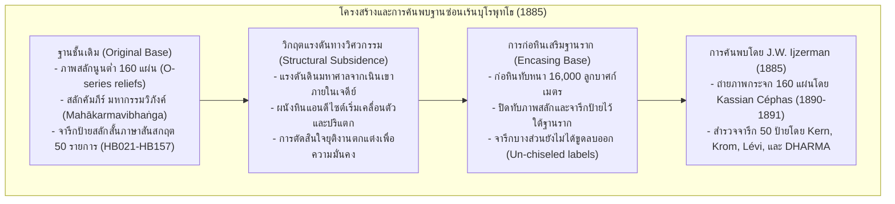
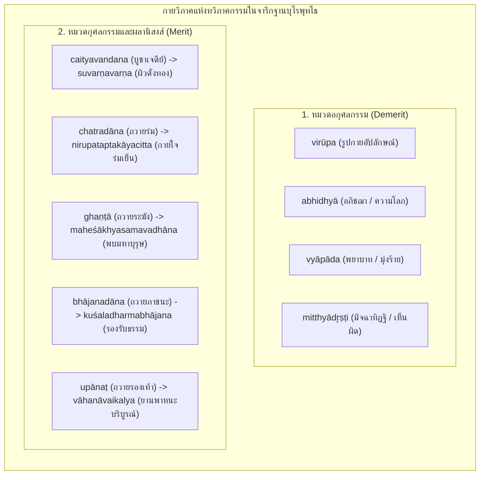
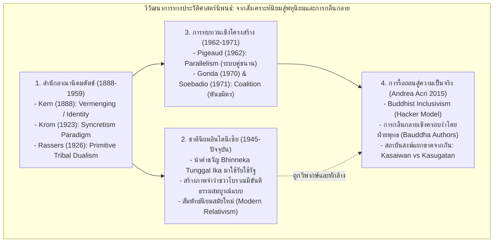
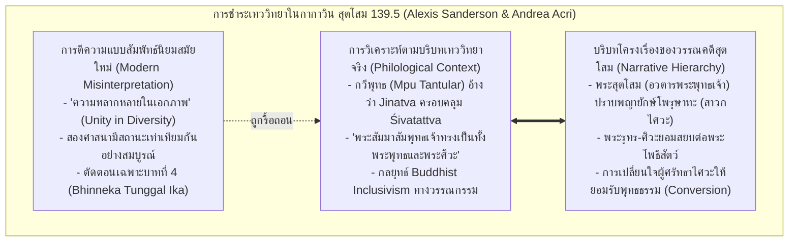
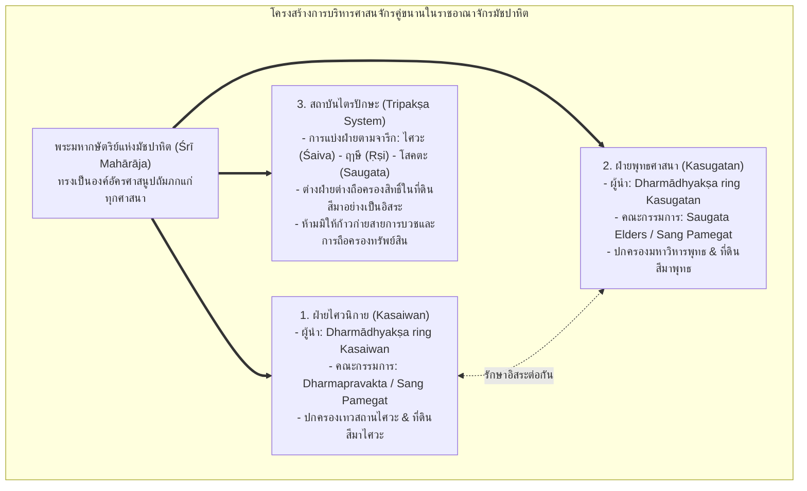
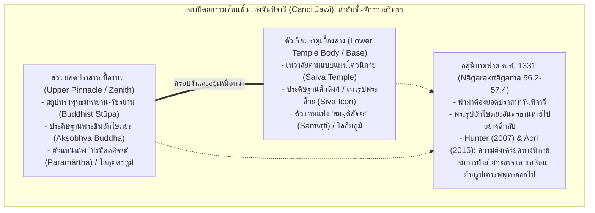

# บทที่ 7: ภูมิทัศน์ศาสนา เครือข่ายตันตรยาน และมณฑลจักรวาลวิทยาข้ามสมุทร: จารึกป้ายฐานบุโรพุทโธ คลังคาถาธารณี และปฏิสัมพันธ์ไศวะ-พุทธในเอเชียตะวันออกเฉียงใต้ภาคพื้นสมุทร
*(Chapter 7: Sacred Landscapes, Tantric Networks, and Trans-Maritime Cosmological Mandalas: Borobudur Relief Labels, Dhāraṇī Corpora, and the Śaiva-Buddhist Matrix in Maritime Southeast Asia)*

---

## บทนำประจำบทที่ 7: ภูมิทัศน์ศาสนาและเครือข่ายความเชื่อในโลกสมุทรศาสตร์ การก้าวข้ามการมองศาสนาแบบแยกส่วน สู่พหุจักรวาลวิทยาแห่งตันตรยานและไศวนิกาย

ประวัติศาสตร์นิพนธ์ว่าด้วยศาสนาและความเชื่อในเอเชียตะวันออกเฉียงใต้ภาคพื้นสมุทรขนบดั้งเดิม มักตกอยู่ภายใต้อิทธิพลของ "กระบวนทัศน์การแยกส่วนเชิงนิกาย" (Sectarian Compartmentalization Paradigm) ซึ่งเป็นมรดกทางความคิดที่ตกทอดมาจากวงวิชาการบูรพคดีศึกษายุคอาณานิคม [1] นักวิชาการสายอาณานิคมมักจัดจำแนกปรากฏการณ์ทางศาสนาในเกาะชวา เกาะสุมาตรา และคาบสมุทรมลายู ออกเป็นขั้วตรงข้ามที่แข็งทื่อและตัดขาดจากกันอย่างเด็ดขาด อาทิ การมองว่าพุทธศาสนามหายาน-วัชรยานเป็นศาสนาประจำราชวงศ์ไศเลนทร์ในพุทธศตวรรษที่ 14 ขณะที่ลัทธิไศวนิกายสังกัดอยู่กับราชวงศ์สัญชัย หรือการจัดวางให้เทวาลัยฮินดูและพุทธสถานตั้งอยู่บนฐานแห่งความขัดแย้งเชิงอำนาจและอุดมการณ์ [2] ยิ่งไปกว่านั้น เมื่อนักบูรพคดีศึกษาเผชิญหน้ากับหลักฐานทางโบราณคดี จารึกวิทยา และวรรณกรรมที่มีองค์ประกอบของทั้งสองศาสนาปรากฏร่วมกันอย่างหนาแน่น นักวิชาการเหล่านั้นก็มักจะปัดปัญหาดังกล่าวไปสู่คำอธิบายแบบผิวเผินว่า เป็นผลผลิตของ "การสังเคราะห์ความเชื่อแบบชวา" (Javanese Syncretism) ซึ่งมองว่าคนพื้นเมืองในหมู่เกาะขาดความเข้าใจในหลักปรัชญาอินเดียอันลึกซึ้ง และทำการผสมผสานเทพเจ้าและพิธีกรรมเข้าด้วยกันอย่างคลุมเครือและไร้ระเบียบแบบแผน [3]

อย่างไรก็ดี การปฏิวัติระเบียบวิธีวิจัยทางจารึกวิทยา นิรุกติศาสตร์ตัวบท และโบราณคดีศักดิ์สิทธิ์ในช่วงสองทศวรรษแรกของคริสต์ศตวรรษที่ 21 จนถึงพรมแดนความรู้ ค.ศ. 2026 ได้ทำการรื้อถอนกระบวนทัศน์อันคับแคบดังกล่าวลงอย่างสิ้นเชิง [4] หลักฐานเชิงประจักษ์ใหม่พิสูจน์ให้เห็นว่า โลกสมุทรศาสตร์นูซันตารา (Nusantara Maritime Sphere) มิได้เป็นเพียงผู้รับอิทธิพลทางศาสนาอย่างเฉื่อยชา (Passive recipients) หากแต่เป็น "ศูนย์กลางทางปัญญาอันทรงพลัง แหล่งขัดเกลาคัมภีร์ และชุมทางแห่งการแลกเปลี่ยนทางจิตวิญญาณระดับสากล" (Dynamic Nodes and Creative Centers of the Sanskrit Cosmopolis) [5] ภูมิทัศน์ศาสนาของชวาและสุมาตราดำเนินไปภายใต้โครงสร้างที่ซับซ้อนยิ่งกว่าภาพจำเดิม โดยเป็นเครือข่ายพหุจักรวาลวิทยา (Cosmological Matrix) ที่เชื่อมโยงระหว่างพุทธศาสนามนตรยาน โยคตันตระ อนุตตรโยคตันตระ ไศวสิทธันตะ ลัทธิมนตรมรรค และลัทธิปาศุปตะ เข้าไว้ด้วยกันบนเส้นทางพาณิชย์นาวีข้ามมหาสมุทร [6]

ในมิติของพุทธศาสนา ดินแดนหมู่เกาะทำหน้าที่เป็นเสาหลักแห่ง "เครือข่ายพุทธตันตระข้ามสมุทรศาสตร์" (Maritime Esoteric Buddhist Matrix) ซึ่งเชื่อมโยงมหาวิหารนาลันทาและวิกรมศิลาในอินเดียภาคเหนือ, กาญจีปุรัมในอินเดียภาคใต้, และอนุราธปุระในศรีลังกา เข้าสู่อาณาจักรศรีวิชัยในสุมาตรา ราชสำนักไศเลนทร์ในชวา ราชธานีฉางอานและลั่วหยางในจีนสมัยราชวงศ์ถัง ตลอดจนนิกายชินงอนในญี่ปุ่น และการปฏิรูปพุทธศาสนายุกต์หลังในทิเบต [7] ดังปรากฏหลักฐานการจาริกของพระมหาเถระระดับตำนาน เช่น พระวัชรโพธิ (Vajrabodhi), พระอโมฆวัชระ (Amoghavajra), พระภิกษุชาวชวานามว่า "เบียนฮง" (Bianhong) ผู้รจนาคู่มืออภิเษกจักรพรรดิราชภาษาจีนถวายราชสำนักถัง [8], และพระอติศะ ทิปังกรศรีชญาณ (Atiśa Dīpaṃkara) ผู้เดินทางข้ามสมุทรมาจำพรรษาศึกษาพระธรรมวินัยและโพธิจิตตันตระกับพระมหาราชครูธรรมกีรติแห่งสุวรรณทวีป (Serlingpa Dharmakīrti) ณ สุมาตรา เป็นเวลานานถึง 12 ปี (ค.ศ. 1012–1024) [9]

ควบคู่กันนั้น ในมิติของศาสนาพราหมณ์-ฮินดู โลกสมุทรศาสตร์แห่งนี้ยังเป็นที่สถิตของสายธารไศวนิกายที่เก่าแก่และลึกซึ้งที่สุดสายหนึ่งของโลก โดยปรากฏหลักฐานจารึกที่บันทึกคำศัพท์เทววิทยาชั้นสูงของลัทธิมนตรมรรค เช่น คำว่า "ศักติปาตะ" (*śaktipāta*) ซึ่งเป็นหมุดหมายจารึกที่เก่าแก่ที่สุดในโลก [10], คติการบูชาพระศิวะแปดภาคหรืออัษฏมูรติ (Aṣṭamūrti) ร่วมกับการถวายปลอกหุ้มศิวลึงค์ (Kośa) ข้ามสมุทรระหว่างจามปา ชวา และอินเดียใต้ [11], ระบบจักรวาลวิทยามณฑลทวยเทพ 24 + 2 + 1 องค์ ในผอบหินกรรภธาน (Peripih) แห่งริงงินลาริกและจันทิกิมปูลัน [12], และรากฐานลัทธิปาศุปตะ (Pāśupata) ที่ผสานเข้ากับระบบ "ษัทอังคโยคะ" (Ṣaḍaṅgayoga - โยคะองค์ 6) ในคัมภีร์ *ธรรมปาตัญชละ* (*Dharma Pātañjala*) [13]

```mermaid
graph TD
    subgraph MARITIME_MATRIX["พหุจักรวาลวิทยาและเครือข่ายความเชื่อข้ามสมุทรศาสตร์ในนูซันตารา"]
        BOROBUDUR["1. มหาเจดีย์บุโรพุทโธ (Borobudur)<br/>- จารึกป้ายฐานซ่อนเร้น 50 รายการ (DHARMA-DOSS-10)<br/>- คัมภีร์มหากรรมวิภังค์ & จริยธรรมสถาปัตยกรรม"]
        
        INCLUSIVISM["2. การรื้อถอนมายาคติศิวะ-พุทธ (Deconstructing Syncretism)<br/>- ทฤษฎี Buddhist Inclusivism (Hacker / Acri 2015)<br/>- สถาบันสงฆ์คู่ขนาน: Kasaiwan & Kasugatan<br/>- กากาวิน สุตโสม 139.5 & จันทิจาวี"]
        
        SAIVA_COSMOS["3. จักรวาลวิทยาไศวนิกาย (Śaiva Cosmology)<br/>- มณฑลทวยเทพ 24+2+1 องค์: ริงงินลาริก & กิมปูลัน<br/>- พระวรกายแห่งสากลจักรวาล & กลไกสหัสลึงค์ปรัมบานัน"]
        
        MANTRAMARGA["4. มนตรมรรค & ปาศุปตะข้ามสมุทร (Trans-maritime Mantramārga)<br/>- จารึกพระเจ้าประกาศธรรม: ศักติปาตะ (śaktipāta) เก่าสุดในโลก<br/>- ศึกชวาบุกจามปา 774 & อัษฏมูรติ & โกศะศิวลึงค์"]
        
        TANTRIC_NETWORKS["5. เครือข่ายพุทธตันตระ & มณฑล 3 มิติ (Esoteric Networks)<br/>- กรุสำริดสุโรโจโล 22 องค์ & ปฐมโยคินีตันตระ<br/>- มณฑลวัชรธาตุจันทิกุมปุง & พระเบียนฮง & พระอติศะ"]
        
        DHARANI_MAGIC["6. คลังธารณี & วัตถุกฤตยาคม (Dhāraṇī Corpora & Rituals)<br/>- คัมภีร์มหาปรติสรา (MPMVR): ไลเดิน-มูอาราจัมบี-เบอร์ลิน<br/>- แผ่นดีบุก-ตะกั่วยมราช-ใบพลู & เสาหินมนตราพิโรธ"]
        
        YOGA_TRADITION["7. ประเพณีโยคะสากล (Universal Yoga Tradition)<br/>- ษัทอังคโยคะ (Ṣaḍaṅgayoga) ข้ามขอบเขตศาสนา<br/>- คัมภีร์ธรรมปาตัญชละ & ท่าบำเพ็ญตบะเอกบาทพกาสนะ"]
    end
    
    BOROBUDUR <==> INCLUSIVISM
    INCLUSIVISM <==> SAIVA_COSMOS
    SAIVA_COSMOS <==> MANTRAMARGA
    MANTRAMARGA <==> TANTRIC_NETWORKS
    TANTRIC_NETWORKS <==> DHARANI_MAGIC
    DHARANI_MAGIC <==> YOGA_TRADITION
    YOGA_TRADITION <==> BOROBUDUR
```

เพื่อนำเสนอพัฒนาการอันลึกซึ้งและซับซ้อนของภูมิทัศน์ศาสนาในเอเชียตะวันออกเฉียงใต้ภาคพื้นสมุทรอย่างเป็นระบบ บทที่ 7 ได้รับการจัดวางสถาปัตยกรรมเนื้อหาออกเป็น 8 หัวข้อย่อยหลักตามแผนผังบูรณาการคลังหลักฐานเชิงประจักษ์ โดยใน **ตอนที่ 1 (Part 1)** นี้ จะมุ่งเน้นการเจาะลึกในสองหัวข้อรากฐานสำคัญ ได้แก่:
- **หัวข้อย่อย 7.1 จารึกป้ายสลักฐานซ่อนเร้นบุโรพุทโธ (Borobudur Hidden Base Inscriptions):** การวิเคราะห์อักขรวิทยาสันสกฤตบนแผ่นหินแอนดีไซต์ 50 รายการที่ยังหลงเหลืออยู่ใต้ฐานรากที่ถูกปิดทับ, การเทียบเคียงคัมภีร์ *มหากรรมวิภังค์* (*Mahākarmavibhaṅga*) ฉบับภาษาสันสกฤต ทิเบต จีน และคูฉา, กายวิภาคแห่งคำศัพท์จริยธรรมและผลกรรม, ภาพสะท้อนวัฒนธรรมวัตถุและเศรษฐกิจสังคม, ตลอดจนการพิสูจน์หน้าที่เชิงปฏิบัติการของจารึกในฐานะ "บันทึกกำกับงานช่าง" (Sculptors' Guild Instructions)
- **หัวข้อย่อย 7.2 รื้อถอนมายาคติ "ศิวะ-พุทธ สังเคราะห์":** การทบทวนประวัติศาสตร์นิพนธ์เชิงวิพากษ์ต่อกระบวนทัศน์ Syncretism ยุคอาณานิคม, การนำเสนอกรอบทฤษฎี "Buddhist Inclusivism" ของ Paul Hacker และ Andrea Acri (2015), การชำระความหมายวรรณกรรม *กากาวิน สุตโสม* (*Kakawin Sutasoma* 139.5) เพื่อรื้อถอนการตีความแบบสัมพัทธ์นิยมสมัยใหม่ของวรรคทอง *Bhinneka Tunggal Ika*, การพิสูจน์ความแยกขาดของสถาบันสงฆ์คู่ขนานฝ่ายไศวะ (*Kasaiwan*) และฝ่ายพุทธ (*Kasugatan*) ในสมัยมัชปาหิต, ตลอดจนการถอดรหัสสถาปัตยกรรมซ้อนชั้นแห่งจันทิจาวี (Candi Jawi) ใน *นาครกฤตังคม* (*Nāgarakṛtāgama*) [14]

---

## 7.1 จารึกป้ายสลักฐานซ่อนเร้นบุโรพุทโธ (Borobudur Hidden Base Inscriptions): อักขรวิทยาสันสกฤต คัมภีร์มหากรรมวิภังค์ และโปรแกรมจริยธรรมเชิงสถาปัตยกรรม

### 7.1.1 ประวัติศาสตร์การค้นพบฐานซ่อนเร้น (Hidden Foot) 160 แผ่น และการสำรวจจารึกป้ายสลักสั้น 50 รายการ

ในบรรดาหลักฐานทางจารึกวิทยาที่สลักลงบนพุทธสถาปัตยกรรมในเอเชียตะวันออกเฉียงใต้ภาคพื้นสมุทร ไม่มีคลังจารึกใดที่จะทรงคุณค่าและสร้างความตื่นตะลึงให้แก่วงวิชาการโบราณคดีเท่ากับกลุ่ม "จารึกป้ายสลักฐานซ่อนเร้นของมหาเจดีย์บุโรพุทโธ" (Borobudur Hidden Base Inscriptions) อีกแล้ว มหาเจดีย์บุโรพุทโธซึ่งสถาปนาขึ้นบนที่ราบเกอดู (Kedu Plain) ชวากลาง ในช่วงปลายพุทธศตวรรษที่ 14 ถึงต้นพุทธศตวรรษที่ 15 (ราว ค.ศ. 780–830) ภายใต้พระบรมราชูปถัมภ์ของราชวงศ์ไศเลนทร์ มีลักษณะทางสถาปัตยกรรมเป็นสถูปจำลองจักรวาลซ้อนชั้นลดหลั่นกันขึ้นไปตามคติพุทธศาสนามหายานและวัชรยาน [15]

ทว่า ฐานชั้นล่างสุดของมหาเจดีย์ ซึ่งเป็นลานประทักษิณดั้งเดิมที่ประดับด้วยภาพสลักนูนต่ำจำนวน 160 แผ่น (หรือที่รู้จักกันในหมวดหมู่ทางวิชาการว่า "แผ่นภาพชุด O" หรือ O-series reliefs) กลับมิได้เปิดเผยต่อสายตาของผู้แสวงบุญในอดีต เนื่องจากถูกหินก้อนสี่เหลี่ยมขนาดใหญ่ก่อปิดทับหนาหลายเมตรกลายเป็น "ฐานปักษฐานเสริมความมั่นคง" (Encasing base / Broadened base) ล้อมรอบฐานเดิมไว้ทั้งหมดชั่วกัลปาวสาน [16] ความลับทางวิศวกรรมและสถาปัตยกรรมนี้ถูกปิดซ่อนไว้ใต้ผืนดินและก้อนหินนานนับพันปี จนกระทั่งได้รับการค้นพบโดยบังเอิญใน ค.ศ. 1885 โดย ยัน วิลเลิม ไอเจอร์มัน (Jan Willem Ijzerman) ประธานสมาคมโบราณคดีแห่งยอกยาการ์ตา (Archaeological Society of Yogyakarta) [17]

ไอเจอร์มันได้สั่งการให้ขุดรื้อแนวก้อนหินก่อเสริมบริเวณมุมทิศตะวันออกเฉียงใต้ของฐานเจดีย์ออก และได้พบกับผนังภาพสลักหินแอนดีไซต์อันงดงามวิจิตรบรรจงที่ซ่อนอยู่เบื้องหลัง ต่อมารัฐบาลอาณานิคมดัตช์ได้อนุมัติโครงการเปิดรื้อแนวก้อนหินปิดทับออกทีละส่วนทั่วทั้ง 4 ด้าน เพื่อทำการบันทึกภาพถ่ายโบราณคดี โดยมอบหมายให้ กัสปาส เซฟาส (Kassian Céphas) ช่างภาพชาวชวาคนแรก ทำการถ่ายภาพกระจก (glass-plate negatives) แผ่นภาพสลักทั้ง 160 แผ่นอย่างเป็นระบบในระหว่าง ค.ศ. 1890–1891 ก่อนที่วิศวกรผู้ควบคุมจะทำการก่อหินปิดทับฐานเดิมกลับคืนดังเดิมเพื่อป้องกันมิให้โครงสร้างของมหาเจดีย์พังทลายลงมาตามหลักการอนุรักษ์ [18]

สิ่งที่สร้างความตื่นเต้นอย่างใหญ่หลวงให้แก่วงวิชาการจารึกวิทยาระดับโลก คือการที่บริเวณขอบบนเหนือภาพสลักหิน หรือภายในกรอบสลักของภาพบางแผ่น ปรากฏข้อความจารึกอักษรโบราณขนาดสั้นภาษาสันสกฤตสลักอยู่เป็นระยะๆ จากภาพสลักทั้งหมด 160 แผ่น มีแผ่นภาพที่ยังคงหลงเหลือข้อความจารึกป้ายสลักสั้น (Inscribed labels) ที่สามารถอ่านและถอดความได้ทั้งสิ้น **50 รายการ** (รหัสสารบบสากลของโครงการ DHARMA: `DHARMA_INSIDENKBorobudurHB021` ถึง `HB157`) [19] ขณะที่แผ่นภาพสลักส่วนใหญ่ที่เหลือนั้น ร่องรอยของข้อความจารึกได้ถูกสกัดถากหรือสิ่วลบออกไปจนเรียบเนียนก่อนการก่อหินปิดทับ สะท้อนให้เห็นว่าข้อความจารึกเหล่านี้มิได้มีเจตนาให้คงอยู่เป็นส่วนหนึ่งของอนุสรณ์สถานถาวร หากแต่เป็น "บันทึกคำสั่งชั่วคราวในการปฏิบัติงาน" ที่ช่างแกะสลักบางคนละเลยที่จะขูดลบออกก่อนที่แนวกำแพงหินชั้นนอกจะถูกก่อปิดทับไป [20]

---

### 7.1.2 อักขรวิทยาและการชำระการอ่านตัวบท: การเปลี่ยนผ่านจากปัลลวะตอนปลายสู่อักษรกวีสมัยต้น และข้อวิพากษ์ทางนิรุกติศาสตร์

ในแง่ของอักขรวิทยาและประวัติศาสตร์ตัวเขียน (Palaeography) จารึกป้ายสลักฐานซ่อนเร้นบุโรพุทโธทำหน้าที่เป็น "เอกสารกำหนดอายุอันแม่นยำ" (Chronological Anchor) สำหรับการศึกษาวิวัฒนาการของระบบตัวเขียนในเอเชียตะวันออกเฉียงใต้ภาคพื้นสมุทร ตัวอักษรที่ใช้จารึกป้ายสลักเหล่านี้จัดอยู่ในตระกูล **"อักษรกวีสมัยต้น" (Early Kawi Script)** หรือที่ในอดีตเคยเรียกว่า "อักษรชวาโบราณสมัยแรก" ซึ่งแสดงรูปสัณฐานที่กำลังเปลี่ยนผ่านอย่างชัดเจนจากอักษรปัลลวะตอนปลาย (Late Pallava) ของอินเดียใต้เข้าสู่อักษรท้องถิ่นของหมู่เกาะ [21] 

ลักษณะเด่นทางอักขรวิทยาที่ปรากฏในจารึกฐานบุโรพุทโธ ได้แก่:
1. เส้นขีดบนของตัวอักษร (Head-mark) เริ่มพัฒนาจากรูปสามเหลี่ยมคว่ำแบบปัลลวะมาเป็นเส้นนอนหนาขนานกับบรรทัด
2. สัณฐานของอักษรตัวสำคัญ เช่น `k`, `r`, `t` และสระลอย เริ่มแสดงความโค้งมนและมีหางตวัดที่เป็นเอกลักษณ์เฉพาะของเกาะชวา
3. การใช้เครื่องหมายวิรามะ (Virāma) ใต้พยัญชนะสะกดอย่างประณีต เพื่อระบุสภาวะพยัญชนะที่ปราศจากสระแทรก
4. มีการใช้พยัญชนะซ้อน (Conjuncts) ตามหลักไวยากรณ์ภาษาสันสกฤตอย่างเคร่งครัด เช่น `rt`, `rṇṇ`, `rddh`, `kṣ` [22]

จากลักษณะทางอักขรวิทยาเปรียบเทียบกับจารึกแผ่นศิลาและแผ่นทองแดงที่มีศักราชแน่นอนในชวากลาง เช่น จารึกกาลาซัน (Kalasan ค.ศ. 778) และจารึกเกอลูรัก (Kelurak ค.ศ. 782) ซึ่งใช้อักษรสิทธมาตรกา/นาครี และจารึกศิวคฤหะ (Śivagṛha ค.ศ. 856) ซึ่งใช้อักษรกวีรุ่นพัฒนาแล้ว นักจารึกวิทยาจึงสามารถกำหนดอายุการสลักจารึกป้ายฐานบุโรพุทโธได้อย่างแคบลงมาอยู่ในช่วง **ปลายพุทธศตวรรษที่ 14 (ราว ค.ศ. 790–820)** ซึ่งตรงกับยุครุ่งเรืองสูงสุดของมหาราชาแห่งราชวงศ์ไศเลนทร์ (เช่น พระเจ้าราไก ปนังกรัน และพระเจ้าราไก วารัก) [23]

อย่างไรก็ดี ประวัติศาสตร์การอ่านและชำระตัวบทจารึกกลุ่มนี้เต็มไปด้วยข้อถกเถียงและการแก้ไขข้อผิดพลาดทางนิรุกติศาสตร์ที่กินเวลายาวนานกว่าหนึ่งศตวรรษ ในระยะแรกของการค้นพบ ศาสตราจารย์ เฮนดริก เคิร์น (Hendrik Kern) และ นิโคลาส ยัน โครม (Nicolaas J. Krom) ได้ทำการอ่านและแปลตัวบทเบื้องต้นจากภาพถ่ายของเซฟาส แต่เนื่องจากยังไม่มีการระบุตัวบทคัมภีร์ที่ใช้เป็นแม่แบบอย่างแน่ชัด เคิร์นและโครมจึงมักอ่านและตีความคำศัพท์ผิดพลาดอย่างมีนัยสำคัญ [24] จนกระทั่งใน ค.ศ. 1929 ซิลแวง เลวี (Sylvain Lévi) นักบูรพคดีศึกษาชาวฝรั่งเศส ได้สร้างการค้นพบครั้งประวัติศาสตร์ในวงวิชาการ โดยการค้นพบต้นฉบับตัวเขียนภาษาสันสกฤตของคัมภีร์ **"มหากรรมวิภังค์" (*Mahākarmavibhaṅga*)** ในประเทศเนปาล ซึ่งมีเนื้อหาและลำดับของหัวข้อตรงกับภาพสลักและจารึกป้ายฐานบุโรพุทโธทุกประการ [25]

การค้นพบของเลวี ร่วมกับการชำระตัวบทดิจิทัลระดับสากลล่าสุดโดย อาร์โล กริฟฟิทส์ (Arlo Griffiths) ในโครงการ DHARMA (ERC Synergy Grant No. 809994) ได้แก้ไขข้อผิดพลาดในการอ่านของเคิร์นและโครมอย่างเด็ดขาด ดังตัวอย่างสำคัญต่อไปนี้:

| รหัสจารึก DHARMA | แผ่นภาพที่ | คำอ่านเดิมของ Kern / Krom | คำอ่านชำระใหม่โดย Lévi / Griffiths | บริบทเชิงคัมภีร์และการแปลวิชาการ |
|:---|:---:|:---|:---|:---|
| `HB124B` | O 124B | `suvarṇavarṇa` (Kern อ่านเป็นนามเฉพาะของตัวละครในอวทาน) | **`suvarṇavarṇa`** | Lévi พิสูจน์จากคัมภีร์ฉบับทิเบตว่าเป็น "ผลแห่งการกราบไหว้เจดีย์ ย่อมทำให้เกิดมามีผิวพรรณดั่งทองคำ" [26] |
| `HB125A` | O 125A | `susvara` (Kern ตาม Brandes แปลว่าเป็น "บุตรแห่งพญาครุฑ") | **`susvara`** | Lévi ชำระเป็น "เสียงอันไพเราะดั่งเสียงนกการเวก" อันเป็นผลานิสงส์แห่งการถวายดนตรีบูชา [27] |
| `HB127B` | O 127B | `vinayadharmmakāyacitta` (Kern) | **`nirupataptakāyacitta`** | Krom และ Griffiths ยืนยันคำอ่านว่า "ผู้มีกายและใจอันปราศจากความเร่าร้อน" อันเป็นผลจากการถวายร่มทาน [28] |
| `HB133` | O 133 | `pūrvasaṁjñā...` (Krom เสนอว่าหมายถึงการรับรู้เรื่องในอดีต) | **`pūrvābhijñāśabdaśravaṇa`** | Lévi ชำระโดยเทียบเคียงกับคัมภีร์ฉบับแปลภาษาจีน หมายถึง "ทิพยโสตแห่งปุพเพนิวาสานุสติญาณ" [29] |
| `HB134A` | O 134A | `goṣṭhī` (Kern เสนอว่าหมายถึงการสมาคมหรือที่ประชุมชน) | **`bhogī`** | Lévi ชำระเป็น `bhogī` ตรงกับคำว่า `mahābhoga` ในฉบับทิเบต จีน และคูฉา หมายถึง "คฤหบดีผู้มั่งคั่ง" [30] |
| `HB138A` | O 138A | (Kern มองข้ามและมิได้บันทึกการอ่าน) | **`bhājanadāna`** | Krom ค้นพบ และ Lévi ชำระ หมายถึง "การถวายภาชนะเป็นทาน" ส่งผลให้เป็นผู้รองรับกุศลธรรม [31] |
| `HB150A` | O 150A | `chatradāna` (Kern อ่านผิดพลาดเป็นร่มทาน) | **`upānaṭ`** | Krom และ Griffiths แก้ไขเป็น `upānaṭ` (อุปานหฺ) หมายถึง "การถวายรองเท้า" ส่งผลให้มียานพาหนะบริบูรณ์ [32] |

---

### 7.1.3 สหสัมพันธ์เชิงคัมภีร์วิทยา: เทียบเคียงตัวบทภาษาสันสกฤต ทิเบต จีน และคูฉา

ความสำคัญอันลึกซึ้งของจารึกฐานบุโรพุทโธ มิได้จำกัดอยู่เพียงมิติทางประวัติศาสตร์ศิลปะของเกาะชวาเท่านั้น หากแต่เป็น "พยานหลักฐานชิ้นเอกแห่งประวัติศาสตร์วรรณกรรมพุทธศาสนาระดับโลก" การจัดวางภาพสลักนูนต่ำทั้ง 160 แผ่น และการสลักป้ายคำกำกับสั้นภาษาสันสกฤต ได้รับการออกแบบขึ้นโดยอิงกับโครงสร้างเนื้อหาของคัมภีร์ **"มหากรรมวิภังค์" (*Mahākarmavibhaṅga*)** อย่างเป็นระบบ [33] คัมภีร์เล่มนี้ว่าด้วยการสนทนาระหว่างพระสัมมาสัมพุทธเจ้ากับศุกมาณพบุตรแห่งโตไทยพราหมณ์ โดยพระองค์ทรงจำแนกการกระทำ (กรรม) ออกเป็นเหตุ 10 ประการที่ส่งผลให้สรรพสัตว์ได้รับวิบากที่แตกต่างกันอย่างละเอียด เช่น เหตุที่ทำให้อายุสั้นหรืออายุยืน, เหตุที่ทำให้มีโรคน้อยหรือมีโรคมาก, เหตุที่ทำให้มีรูปงามหรือรูปอัปลักษณ์, เหตุที่ทำให้มีโภคทรัพย์มากหรือยากจน, และเหตุที่ทำให้เกิดในตระกูลสูงหรือตระกูลต่ำ [34]

การศึกษาวิจัยเชิงคัมภีร์วิทยาเปรียบเทียบ (Comparative Textual Transmission) เผยให้เห็นว่า ตัวบทจารึกป้ายสลักบนบุโรพุทโธมีความสัมพันธ์ที่แนบแน่นและเหลื่อมซ้อนกับสำนวนคัมภีร์มหากรรมวิภังค์ใน 4 แหล่งข้อมูลสำคัญของโลกยุคโบราณ:

1. **ฉบับภาษาสันสกฤตจากเนปาล (Nepalese Sanskrit Manuscript):** ต้นฉบับใบลานที่ค้นพบโดย Sylvain Lévi ใน ค.ศ. 1929 แสดงให้เห็นคำศัพท์เทคนิคทางเทววิทยาและจริยธรรมที่ตรงกับจารึกบนบุโรพุทโธเกือบคำต่อคำ เช่น คำว่า `virūpa` (O 21), `maheśākhyaḥ` (O 43), `abhidhyā` (O 121A), `vyāpāda` (O 121B), `mitthyādr̥ṣṭi` (O 122), และ `kuśaladharmabhājana` (O 138B) [35]
2. **ฉบับแปลภาษาทิเบต (*Las rnam par ’byed pa*):** ประมวลไว้ในพระไตรปิฎกทิเบตคันจูร์ (Kanjur) หมวดพระสูตร ฉบับนี้ให้คำแปลเทียบเคียงที่ตรงกับคำศัพท์ชวาโบราณอย่างน่าอัศจรรย์ เช่น การแปลคำว่า `suvarṇavarṇa` (O 124B) ว่า *gser gyi mdog lta bu* (ผิวพรรณดั่งทองคำ) และคำว่า `mahābhoga` ซึ่งช่วยยืนยันการอ่านคำว่า `bhogī` (O 126A, 134A, 139, 148B, 154B) [36]
3. **ฉบับแปลภาษาจีน (*เย่เปาเชอเปี๋ยจิง* / 分別業報經 - *Ye pao tch'a pie king*):** แปลในสมัยราชวงศ์จิ้นตะวันตก (ค.ศ. 265–316) ในพระไตรปิฎกภาษาจีนฉบับไทโช (Taishō No. 80) ตัวบทภาษาจีนช่วยให้ เลวี สามารถบูรณะคำอ่านจารึกแผ่นที่ O 133 คือ `pūrvābhijñāśabdaśravaṇa` ได้อย่างสมบูรณ์ โดยตรงกับข้อความภาษาจีนที่กล่าวถึง "การได้ยินเสียงและระลึกถึงกรรมในอดีตชาติของตนและผู้อื่น" [37]
4. **ฉบับภาษาคูฉา / โตคาเรียน บี (Koutcha / Tocharian B Fragment):** ชิ้นส่วนคัมภีร์ใบลานที่ขุดค้นพบ ณ แคว้นคูฉาบนเส้นทางสายไหมในเอเชียกลาง ซึ่งเขียนด้วยภาษาโตคาเรียน บี ได้รับการนำมาสอบทานโดย Sylvain Lévi และพบว่ามีโครงสร้างการแจกแจงวิบากกรรมและคำศัพท์ที่สอดรับกับภาพสลักและจารึกป้ายบนบุโรพุทโธอย่างแม่นยำ [38]

การที่ตัวบทจารึกขนาดสั้นบนเกาะชวากลางสามารถเทียบเคียงได้อย่างลงตัวกับคัมภีร์ในเนปาล ทิเบต จีน และเอเชียกลาง ชี้ให้เห็นอย่างประจักษ์ชัดว่า ราชสำนักไศเลนทร์และคณะสงฆ์ผู้กำกับงานช่างแห่งบุโรพุทโธได้ครอบครองและใช้งานคัมภีร์ภาษาสันสกฤตฉบับมาตรฐานสากลที่มีความสมบูรณ์และถูกต้องตามขนบพุทธวิชาการของอนุทวีปอินเดียในระดับสูงสุด [39]

---

### 7.1.4 กายวิภาคแห่งคำศัพท์จริยธรรมและผลกรรม: การวิเคราะห์ทวิภาค อกุศลกรรม-กุศลกรรม

เมื่อพิจารณาข้อความจารึกป้ายสลักทั้ง 50 รายการอย่างละเอียดถี่ถ้วน จะพบว่าจารึกกลุ่มนี้ถูกจัดวางขึ้นตามโครงสร้าง "ทวิภาคแห่งกฎแห่งกรรม" (Bipartite Structure of Karmic Retribution) อย่างเป็นระบบ โดยแบ่งออกเป็นสองหมวดหมู่ใหญ่ที่ทำหน้าที่สั่งการให้ช่างสลักภาพจำแนกเหตุและผลออกจากกันอย่างชัดเจน [40]:

#### 1. หมวดคำสั่งด้านอกุศลกรรมและรูปกายอัปลักษณ์ (Demerit & Deformity Cluster)
ในแผ่นภาพสลักช่วงแรก (แผ่นที่ 1 ถึง 122) โปรแกรมภาพสลักเน้นย้ำถึงการทำบาปและวิบากกรรมอันน่าสะพรึงกลัว คำจารึกที่ปรากฏสะท้อนถึงการกระทำที่เป็นอกุศลมูลทางจิตใจและการลงทัณฑ์ในภพชาติต่างๆ:
- **`virūpa`** (ปรากฏบนแผ่นที่ O 21 ทั้งในส่วนกรอบและพื้นหลังภาพ): มีความหมายตรงตัวว่า "(บุคคลผู้มี) รูปกายอัปลักษณ์ / สัณฐานพิกลพิการ" [41] โดยภาพสลักนูนต่ำแสดงภาพบุคคลที่มีรูปร่างเตี้ยค่อม หน้าตาบิดเบี้ยว แขนขาลีบพิการ เพื่อเป็นสัญลักษณ์เตือนใจว่ารูปกายอัปลักษณ์นี้เป็นผลลัพธ์โดยตรงจาก "ความมักโกรธ ความพยาบาท และความริษยาผู้อื่น" ตามคำสอนในคัมภีร์มหากรรมวิภังค์
- **`abhidhyā`** (แผ่นที่ O 121A): หมายถึง "อภิชฌา" หรือความโลภเพ่งเล็งอยากได้ทรัพย์สมบัติของผู้อื่นมาเป็นของตน [42]
- **`vyāpāda`** (แผ่นที่ O 121B): สลักคู่กับอภิชฌา หมายถึง "พยาบาท" หรือความปองร้าย มุ่งหมายทำลายล้างชีวิตและความสุขของผู้อื่น [43]
- **`mitthyādr̥ṣṭi`** (แผ่นที่ O 122): หมายถึง "มิจฉาทิฏฐิ" หรือความเห็นผิดจากทำนองคลองธรรม การปฏิเสธผลของกรรม ปฏิเสธโลกนี้โลกหน้า และปฏิเสธคุณความดีของบิดามารดาและสมณพราหมณ์ [44]

คำจารึกหมวดอกุศลกรรมเหล่านี้ทำหน้าที่เป็นดั่ง "สูตรย่อแห่งอกุศลกรรมบถ 10 ประการ" (Akusalakammapatha) ที่ช่างสลักต้องถ่ายทอดออกมาเป็นภาพการทำปาณาติบาต (การฆ่าสัตว์จับปลา การล่าวัวล่ากวาง), การอทินนาทาน (การลักขโมยปล้นชิง), และภาพการถูกทรมานในนรกภูมิหลุมต่างๆ อย่างน่าสยดสยอง เช่น การถูกต้มในกระทะทองแดง หรือการถูกนกปากเหล็กจิกทึ้ง [45]

#### 2. หมวดกุศลกรรม ผลานิสงส์แห่งการบูชาเจดีย์ และรูปลักษณ์อันงดงาม (Merit & Beauty Cluster)
ในทางตรงกันข้าม ตั้งแต่แผ่นที่ 123 เป็นต้นไป ข้อความจารึกได้เปลี่ยนผ่านเข้าสู่หมวด "กุศลกรรมและผลานิสงส์" เพื่อแสดงภาพบุคคลที่ได้ไปเกิดในสุคติภูมิ มีรูปกายงดงาม และเพียบพร้อมด้วยโภคทรัพย์:
- **`kuśala`** (แผ่นที่ O 123): คำจารึกเดี่ยวสั้นๆ หมายถึง "กุศลกรรม" อันเป็นจุดเริ่มต้นของการแสดงผลแห่งการทำความดี [46]
- **`caityavandana`** (แผ่นที่ O 124A): สลักกำกับภาพการกราบไหว้บูชาเจดีย์สถาน โดยภาพสลักแสดงภาพอุบาสกอุบาสิกากำลังหมอบกราบและประคองพวงมาลาบูชาสถูปเจดีย์ [47]
- **`suvarṇavarṇa`** (แผ่นที่ O 124B): สลักคู่กับภาพผลแห่งการบูชาเจดีย์ หมายถึง "การมีผิวพรรณวรรณะผุดผ่องดั่งทองคำ" แสดงภาพบุรุษสตรีผู้มีเรือนร่างสง่างามสมส่วน ใบหน้าอิ่มเอิบ และสวมใส่อาภรณ์หรูหรา [48]
- **`susvara`** (แผ่นที่ O 125A): หมายถึง "เสียงอันไพเราะเสนาะโสต" ซึ่งเป็นอานิสงส์ของการบูชาพระพุทธศาสนาด้วยดนตรีและการกล่าวถ้อยคำอ่อนหวาน [49]
- **`mahaujaskasamavadhāna`** (แผ่นที่ O 125B): หมายถึง "การได้สมาคมพบปะกับเหล่าบุคคลผู้มีอิทธิฤทธิ์อำนาจบารมีอันยิ่งใหญ่" สะท้อนอุดมคติของสังคมชนชั้นสูงในชวาโบราณ [50]
- **`maheśākhyaḥ`** (แผ่นที่ O 43) และ **`maheśākhyasamavadhāna`** (แผ่นที่ O 128, O 131B): หมายถึง "บุคคลผู้มีชื่อเสียงเกียรติยศอันยิ่งใหญ่ / มหาบุรุษผู้ทรงเกียรติ" และการได้เข้าสู่สังคมของผู้มีเกียรติ อันเป็นผลจากการไม่ริษยาผู้อื่นและเป็นผู้มีความอ่อนน้อมถ่อมตน [51]

---

### 7.1.5 ภาพสะท้อนสังคม เศรษฐกิจ และวัฒนธรรมวัตถุในจารึกฐานบุโรพุทโธ

นอกจากมิติทางศีลธรรมและเทววิทยาแล้ว จารึกป้ายสลักฐานซ่อนเร้นบุโรพุทโธยังทำหน้าที่เป็น "กระจกเงาสะท้อนวัฒนธรรมวัตถุ (Material Culture) โครงสร้างทางชนชั้น และเศรษฐกิจการแลกเปลี่ยน" ของสังคมชวากลางในพุทธศตวรรษที่ 14 ได้อย่างสมจริงและมีชีวิตชีวาที่สุด [52]

#### 1. วัฒนธรรมทานและเครื่องอุปโภคบริโภค (Dana & Material Offerings)
จารึกหลายป้ายระบุถึงการให้ทานวัตถุสิ่งของเฉพาะอย่าง ซึ่งสะท้อนสิ่งของเครื่องใช้ในชีวิตประจำวันและเครื่องประกอบพิธีกรรมทางศาสนาของยุคสมัย:
- **`chatradāna`** (แผ่นที่ O 127A): "การถวายร่มกั้นแดนเป็นทาน" สอดรับกับผลานิสงส์ในแผ่น O 127B คือ **`nirupataptakāyacitta`** (การเป็นผู้มีกายและใจอันปราศจากความเร่าร้อนแผดเผา) ร่มในสังคมชวาโบราณมิได้เป็นเพียงเครื่องบังแดดฝน แต่เป็นสัญลักษณ์แสดงสถานะทางสังคมและอำนาจยศศักดิ์ [53]
- **`vastradāna`** (แผ่นที่ O 135A): "การถวายเครื่องนุ่งห่ม/ผ้าเป็นทาน" ซึ่งส่งผลให้แผ่น O 135B เป็นผู้มีความงดงามน่าเลื่อมใส (**`prāsādika`**) ชี้ให้เห็นถึงความสำคัญของอุตสาหกรรมสิ่งทอและการค้าผ้าในหมู่เกาะ [54]
- **`bhājanadāna`** (แผ่นที่ O 138A): "การถวายภาชนะเป็นทาน" ส่งผลให้ในแผ่น O 138B กลายเป็น **`kuśaladharmabhājana`** (ผู้เป็นภาชนะอันบริสุทธิ์สำหรับรองรับกุศลธรรม) สะท้อนการเปรียบเทียบเชิงอุปมาอุปไมยระหว่างภาชนะดินเผา/สำริดกับจิตใจของมนุษย์ [55]
- **`upānaṭ`** (แผ่นที่ O 150A): "การถวายรองเท้าเป็นทาน" สอดรับกับผลานิสงส์ในแผ่น O 150B คือ **`vāhanāvaikalya`** (การมีความบริบูรณ์พร้อมเพรียงด้วยยานพาหนะ) สะท้อนว่าในชวาโบราณ รองเท้าเป็นเครื่องใช้ที่มีค่าและบ่งบอกถึงความมั่งคั่งของผู้สวมใส่ [56]
- **`puṣpadāna`**, **`gandha`**, และ **`mālādāna`** (แผ่นที่ O 152A, O 153A, O 154A): การถวายดอกไม้ ของหอม และพวงมาลัย ซึ่งเป็นหัวใจของวัฒนธรรมบูชา (Pūjā) ที่ใช้วัตถุดิบธรรมชาติจากป่าเขตร้อนของนูซันตารา [57]
- **`bhojana`** และ **`pānaka`** (แผ่นที่ O 144, O 148A): การถวายภัตตาหารและเครื่องดื่มน้ำปานะแก่พระสงฆ์และผู้ยากไร้ [58]

#### 2. วัฒนธรรมระฆังแขวนสำริด (`ghaṇṭā`)
ในแผ่นที่ O 131A ปรากฏจารึกคำว่า **`ghaṇṭā`** (ระฆังแขวน) สอดรับกับแผ่น O 131B คือ `maheśākhyasamavadhāna` ภาพสลักแสดงภาพการแขวนระฆังสำริดไร้ลูกกระทบไว้ใต้ชายคาเพื่อใช้เคาะตีในพิธีกรรมทางศาสนา [59] หลักฐานนี้เชื่อมโยงอย่างลึกซึ้งกับการค้นพบทางโบราณคดีของ กริฟฟิทส์ และ เชอร์เลียร์ (Griffiths & Scheurleer 2014) ซึ่งพบระฆังสำริดแขวนโบราณจำนวนมากในชวากลางและชวาตะวันออก ที่สลักจารึกภาษาสันสกฤตและสัญลักษณ์ตรีศูลหรือวัชระ ยืนยันว่าการสร้างและถวายระฆังสำริดเป็นหนึ่งในมหากุศลที่ชนชั้นนำในยุคนั้นนิยมปฏิบัติอย่างกว้างขวาง [60]

#### 3. ชนชั้นคฤหบดีผู้มั่งคั่งและภาพจำลองสวรรค์ภูมิ (`bhogī`, `ādhyabhogī`, `svargga`)
คำศัพท์ที่ปรากฏซ้ำมากที่สุดคำหนึ่งในจารึกฐานบุโรพุทโธ คือคำว่า **`bhogī`** (ปรากฏในแผ่น O 126A, O 134A, O 139, O 148B, O 154B) และคำว่า **`ādhyabhogī`** (แผ่น O 142) [61] คำว่า `bhogī` ในบริบทชวาโบราณมีความหมายซ้อนกันระหว่าง "ผู้เสวยสุข / ผู้มั่งคั่งด้วยทรัพย์สมบัติ" กับ "คฤหบดีผู้ถือครองกรรมสิทธิ์ในที่ดิน" (Landowner) ส่วนคำว่า `ādhyabhogī` หมายถึง "คฤหบดีมหาเศรษฐีผู้มั่งคั่งเป็นพิเศษ" ภาพสลักที่สอดคล้องกันแสดงภาพบุคคลชั้นสูงนั่งเอกเขนกบนตั่งไม้บุผ้าอย่างหรูหรา ล้อมรอบด้วยบริวาร หีบสมบัติ และถุงใส่เงินตราทองคำ [62] 

ท้ายที่สุด ผลลัพธ์อันสูงสุดของกุศลกรรมในระดับโลกิยะ คือการไปบังเกิดใน **`svargga`** (สวรรค์) ซึ่งปรากฏเป็นจารึกกำกับภาพซ้ำๆ ถึง 8 ครั้ง (O 126B, O 130, O 134B, O 137, O 140, O 147, O 149, O 151, O 153B, O 154C) ภาพสลักแสดงภาพทิพยวิมาน ต้นกัลปพฤกษ์ที่ประดับด้วยแก้วแหวนเงินทอง นางอัปสรกำลังร่ายรำ และเหล่าเทวดากำลังดื่มด่ำกับความสุขอันเป็นทิพย์ [63]

---

### 7.1.6 หน้าที่เชิงปฏิบัติการของจารึก: บันทึกกำกับงานช่าง (Sculptors' Guild Instructions) ก่อนการปิดทับใต้ฐานราก

ประเด็นที่สร้างข้อถกเถียงและมีความสำคัญอย่างยิ่งยวดในทางญาณวิทยาของจารึกวิทยา คือคำถามที่ว่า: **"จารึกป้ายสลักเหล่านี้ถูกสร้างขึ้นเพื่อให้ใครอ่าน และมีหน้าที่ทางสังคมอย่างไร?"** [64]

ในอดีต นักวิชาการบางท่านเคยตั้งสมมติฐานว่า ข้อความจารึกเหล่านี้อาจสลักไว้เพื่อเป็นคำบรรยายภาพสำหรับผู้แสวงบุญที่มาเดินประทักษิณรอบฐานเจดีย์ แต่สมมติฐานนี้ถูกหักล้างอย่างสิ้นเชิงด้วยข้อเท็จจริงทางโบราณคดีและสถาปัตยกรรม 3 ประการ:
1. **ตำแหน่งการสลัก:** จารึกเกือบทั้งหมดถูกสลักไว้บนขอบหินชั้นบนสุด ซึ่งในสภาวะปกติเมื่อก่อสร้างเสร็จจะอยู่สูงและมีบัวเชิงผนังบดบังสายตา
2. **ร่องรอยการสกัดลบ:** ภาพสลักส่วนใหญ่มีรอยสิ่วสกัดถากคำจารึกออกอย่างชัดเจนหลังจากที่ภาพสลักเสร็จสมบูรณ์ มีเพียงประมาณหนึ่งในสามเท่านั้นที่ยังหลงเหลือข้อความอยู่
3. **การปิดทับถาวร:** ฐานเดิมทั้งหมดถูกก่อหินปิดทับอย่างหนาแน่นตั้งแต่ในระหว่างการก่อสร้างมหาเจดีย์ ทำให้สาธารณชนไม่มีโอกาสได้เห็นหรืออ่านข้อความเหล่านี้เลยแม้แต่น้อย [65]

จากข้อเท็จจริงดังกล่าว นักวิชาการร่วมสมัย รวมทั้ง เลวี, โครม, และ อาร์โล กริฟฟิทส์ จึงมีข้อสรุปตรงกันว่า ข้อความจารึกป้ายสลักเหล่านี้ทำหน้าที่เป็น **"บันทึกกำกับงานช่าง" (Sculptors' Guild Instructions / Architect's Editorial Labels)** อย่างแท้จริง [66] ในกระบวนการก่อสร้าง พระมหาเถระหรือหัวหน้านายช่างใหญ่ (Architect / Sūtradhāra) ผู้มีความเชี่ยวชาญในคัมภีร์มหากรรมวิภังค์ ได้เดินตรวจแนวผนังหินแอนดีไซต์ที่เรียงไว้ล่วงหน้า แล้วใช้เหล็กจารหรือสีเขียนสลักข้อความสั้นๆ ภาษาสันสกฤตลงบนก้อนหิน เพื่อระบุว่า:
- แผ่นหินช่องนี้ต้องสลักภาพ "เหตุ" อะไร (เช่น `abhidhyā`, `vyāpāda`, `chatradāna`)
- แผ่นหินช่องถัดไปต้องสลักภาพ "ผล" อะไร (เช่น `virūpa`, `suvarṇavarṇa`, `svargga`) [67]

เมื่อช่างสลักหินพื้นเมืองในแต่ละกลุ่ม (Guild) ทำการแกะสลักภาพนูนต่ำเสร็จสมบูรณ์ตามคำสั่งแล้ว กฎเกณฑ์ตามแบบแผนของงานช่างกำหนดให้ต้องทำการ "สกัดลบคำสั่งช่างออก" เพื่อให้ผิวหินเรียบเนียนพร้อมสำหรับการประกอบพิธีเบิกเนตร ทว่า ก่อนที่ช่างจะสกัดลบข้อความออกได้ครบทั้งหมด เกิดวิกฤตการณ์ทางวิศวกรรมขึ้นอย่างกะทันหัน เนินเขาดินภายในแกนกลางของมหาเจดีย์ได้รับแรงกดทับจากน้ำหนักหินมหาศาล ประกอบกับน้ำฝนที่ซึมลงในดิน ทำให้ฐานรากเดิมเริ่มทรุดตัวและปริแตก [68] สถาปนิกใหญ่จึงต้องสั่งยุติการตกแต่งผิวหินทันที และระดมแรงงานนำก้อนหินแอนดีไซต์ขนาดใหญ่จำนวนมหาศาลมาก่อเสริมเป็นฐานปักษฐานชั้นนอกเพื่อประคองมหาเจดีย์มิให้พังทลายลงมา ส่งผลให้ข้อความจารึกคำสั่งช่างจำนวน 50 ป้าย ถูกฝังตรึงไว้ใต้กาลเวลา และกลายมาเป็นมรดกทางจารึกวิทยาอันล้ำค่าที่สุดในปัจจุบัน [69]

---

## 7.2 รื้อถอนมายาคติ "ศิวะ-พุทธ สังเคราะห์": ทฤษฎีการกลืนกลายเชิงครอบงำ (Buddhist Inclusivism) และความเป็นอิสระของสถาบันศาสนาคู่ขนาน

### 7.2.1 ทบทวนประวัติศาสตร์นิพนธ์เชิงวิพากษ์: รากเหง้าวาทกรรม "ศิวะ-พุทธ สังเคราะห์" (Syncretism Paradigm) ในงานของนักบูรพคดีศึกษาชาวดัตช์

การศึกษาความสัมพันธ์ระหว่างพุทธศาสนามหายาน-วัชรยานและลัทธิไศวนิกายในชวาโบราณและบาหลี ได้รับการครอบงำมานานกว่าหนึ่งศตวรรษด้วยแนวคิดที่เรียกว่า **"กระบวนทัศน์การสังเคราะห์ทางศาสนา" (Syncretism Paradigm)** ซึ่งมีรากฐานมาจากงานเขียนของกลุ่มนักบูรพคดีศึกษาชาวดัตช์ในยุคอาณานิคม [70] นักวิชาการรุ่นบุกเบิก อาทิ เฮนดริก เคิร์น (Hendrik Kern 1888/1916), นิโคลาส ยัน โครม (N.J. Krom 1923), รูโลฟ โฮริส (Roelof Goris 1926), วิลเลิม เอช. รัสเซอร์ส (W.H. Rassers 1926/1959), วิลเลิม เอฟ. สตัทเทอร์ไฮม์ (W.F. Stutterheim 1931), และ เจ. แอล. มุนส์ (J.L. Moens 1924) ต่างมีความเห็นพ้องต้องกันเป็นส่วนใหญ่ว่า วัฒนธรรมชวาโบราณมีคุณลักษณะพิเศษในการ "ผสมผสานหลอมรวม" (*vermenging*) สองกระแสศาสนาหลักเข้าด้วยกัน จนเกิดเป็นศาสนาใหม่ที่มีเอกลักษณ์เฉพาะตัวเรียกว่า "ลัทธิศิวะ-พุทธ" (The Cult of Śiva-Buddha หรือ Agama Siwa-Buda) [71]

ในงานเขียนคลาสสิกของ Krom (1923: 172–173) และ Goris (1926) มีการบรรยายว่า กษัตริย์ในยุคชวาตะวันออก (โดยเฉพาะในสมัยสิงหัดส่าหรีและมัชปาหิต) ทรงนับถือศาสนาลูกผสมที่นำเอาปรัชญาของพระศิวะและพระพุทธเจ้ามารวมเป็นสิ่งเดียวกันอย่างแยกไม่ออก ขณะที่ Rassers (1926/1959) ซึ่งใช้วิธีวิทยามานุษยวิทยาสายโครงสร้างนิยม ได้ผลักดันแนวคิดนี้ไปไกลถึงขั้นอ้างว่า "ลัทธิศิวะ-พุทธ" มิได้มีรากเหง้ามาจากเทววิทยาอินเดีย หากแต่เป็นภาพสะท้อนของการแบ่งขั้วโครงสร้างสองส่วน (Dual phratry / Tribal dualism) ของสังคมชนเผ่ามลายู-โพลินีเชียดั้งเดิม ที่มีมาแต่ยุคก่อนประวัติศาสตร์ [72]

ทว่า อันเดรีย อาครี (Andrea Acri 2015: S-2015-acri-01) ได้ทำการวิพากษ์และรื้อถอนสมมติฐานดั้งเดิมเหล่านี้อย่างถึงรากถึงโคน โดยชี้ให้เห็นว่า กระบวนทัศน์ "ศิวะ-พุทธ สังเคราะห์" เกิดจากข้อบกพร่องทางระเบียบวิธีวิจัย 3 ประการใหญ่:
1. **การตัดตอนข้อความวรรณกรรมออกจากบริบท:** นักวิชาการดัตช์มักดึงข้อความร้อยกรองเพียงไม่กี่บท (เช่น วรรคทอง *Bhinneka Tunggal Ika* จาก *Kakawin Sutasoma*) ออกมาตีความโดดๆ โดยเพิกเฉยต่อโครงเรื่องและน้ำเสียงสั่งสอนทางเทววิทยาของวรรณกรรมทั้งเรื่อง
2. **การฉายภาพอุดมการณ์รัฐสมัยใหม่ย้อนกลับไปในอดีต (Anachronistic Projections):** หลังการประกาศอิสรภาพของอินโดนีเซียใน ค.ศ. 1945 ปัญญาชนและนักการเมืองชาตินิยมได้นำเอาข้อความ *Bhinneka Tunggal Ika* มาสถาปนาเป็นคำขวัญประจำชาติบนตราแผ่นดิน (Garuda Pancasila) เพื่อเชิดชูอุดมการณ์ "ขันติธรรมทางศาสนา" (Religious Tolerance) และ "พหุนิยมอันเปิดกว้าง" ของบรรพบุรุษชวาโบราณ การเมืองเรื่องอัตลักษณ์นี้ได้ส่งผลกระทบย้อนกลับมาครอบงำวงวิชาการ ทำให้ไม่มีใครกล้าท้าทายมายาคติเรื่องการหลอมรวมทางศาสนาดังกล่าว [73]
3. **การละเลยหลักฐานเชิงสถาบันและกฎหมาย:** ทฤษฎีสังเคราะห์นิยมไม่สามารถอธิบายได้ว่า เหตุใดในจารึกและประมวลกฎหมายชวาโบราณ จึงปรากฏโครงสร้างการบริหารคณะสงฆ์ การจัดสรรที่ดินสีมา และการสืบทอดสายตระกูลนักบวชที่แยกขาดจากกันเป็นสองระบบอย่างเคร่งครัดมาโดยตลอด [74]

---

### 7.2.2 ทฤษฎี Inclusivism ของ Paul Hacker และการปรับประยุกต์สู่บริบทชวาโบราณโดย Andrea Acri (2015)

เพื่อก้าวข้ามทางตันของกระบวนทัศน์สังเคราะห์นิยม Andrea Acri (2015: 264–271) ได้นำเอากรอบทฤษฎีทางภารตวิทยาว่าด้วย **"Inclusivism"** ซึ่งริเริ่มและนิยามโดย เพาล์ ฮัคเคอร์ (Paul Hacker 1983) และได้รับการขยายความต่อโดย เดวิด ไซฟอร์ต รูเอ็กก์ (David Seyfort Ruegg 2008) และ อเล็กซิส แซนเดอร์สัน (Alexis Sanderson 2009) มาปรับประยุกต์ใช้วิเคราะห์หลักฐานภาษาชวาโบราณอย่างเป็นระบบ [75]

ตามคำนิยามดั้งเดิมของ Paul Hacker (1983) ซึ่งแปลโดย Seyfort Ruegg (2008: 97):

> "การกลืนกลายแบบครอบงำ (Inclusivism) หมายถึงการประกาศว่า มโนทัศน์ใจกลางของกลุ่มศาสนาหรือโลกทัศน์ภายนอก มีความเหมือนกันทุกประการกับมโนทัศน์ใจกลางของกลุ่มที่ตนเองสังกัดอยู่ และในการกลืนกลายเช่นนี้ มักจะแฝงไว้ด้วยการยืนยัน—ไม่ว่าจะอย่างเปิดเผยหรือโดยปริยาย—ว่าสิ่งภายนอกที่ถูกประกาศว่าเหมือนกับของตนนั้น มีสถานะด้อยกว่าหรืออยู่ใต้บังคับบัญชาของสิ่งที่เป็นของตนเอง ยิ่งไปกว่านั้น โดยทั่วไปแล้วมักไม่มีการแสดงข้อพิสูจน์ใดๆ สำหรับความเหมือนกันระหว่างสิ่งภายนอกกับสิ่งของตนเองนั้นเลย" [76]

เมื่อนำกรอบคิดนี้มาพิจารณาบริบทของชวาโบราณ Acri ชี้ให้เห็นปรากฏการณ์สำคัญที่ว่า **"ข้อความในวรรณกรรมและคัมภีร์ที่อ้างว่าพระศิวะและพระพุทธเจ้าเป็นสิ่งเดียวกัน เกือบทั้งหมดถูกประพันธ์ขึ้นโดยกวีหรือนักบวชฝ่ายพุทธ (Bauddha authors)"** อาทิ เอ็มปู ตันตูลาร์ (Mpu Tantular) ผู้รจนา *Kakawin Sutasoma* และ *Kakawin Arjunawijaya* หรือ เอ็มปู ดูซุน (Mpu Dusun) ผู้รจนา *Kuñjarakarṇa Dharmakathana* ในทางตรงกันข้าม ข้อความทำนองนี้แทบไม่เคยปรากฏในคัมภีร์ปรัชญาฝ่ายไศวนิกาย (ตระกูลตูตูร์และตัตตวะ เช่น *Vṛhaspatitattva*, *Tattvajñāna*, *Dharma Pātañjala*) เลยแม้แต่น้อย [77]

เหตุใดฝ่ายพุทธจึงต้องเป็นผู้ประกาศความเป็นหนึ่งเดียวกันนี้? คำตอบในเชิงประวัติศาสตร์และสังคมวิทยาศาสนาคือ ในบริบทของชวาตะวันออกยุคสิงหัดส่าหรีและมัชปาหิต **"พุทธศาสนาเป็นศาสนากลุ่มน้อย (Minority religion)"** ท่ามกลางประชากรส่วนใหญ่และชนชั้นปกครองที่นับถือไศวนิกาย [78] ฝ่ายพุทธจึงต้องใช้ยุทธศาสตร์ **"การกลืนกลายแบบครอบงำของพุทธศาสนา" (Buddhist Inclusivism)** เพื่อความอยู่รอดและแสวงหาการอุปถัมภ์จากราชสำนัก โดยการดึงเอาพระศิวะ เทพเจ้าฮินดู และคำศัพท์ทางปรัชญาไศวะ เข้ามาจัดวางไว้ในระบบของพุทธ แต่จัดให้อยู่ในสถานะที่เป็นเพียง **"สมมุติสัจจะ" (Samvṛti / Laukika)** หรือเป็นเพียงภาพสำแดงระดับปรากฏการณ์เบื้องล่าง ขณะที่ **"ปรมัตถสัจจะ" (Paramārtha / Lokottara)** สูงสุดถูกสงวนไว้ให้แก่พุทธภาวะหรือพระชินพุทธะเท่านั้น [79]

ตัวอย่างที่เด่นชัดที่สุดปรากฏในวรรณกรรม *กุญชรกรรณ ธรรมกถา* (*Kuñjarakarṇa Dharmakathana* 23.4) ซึ่งพระไวโรจนะพุทธเจ้าได้ตรัสสอนพระยมราชว่า:

> "เราคือพระไวโรจนะ ผู้เป็นบรมครูแห่งสากลโลก พระศิวะและพระพุทธเจ้าหาได้แตกต่างกันไม่ แท้จริงแล้วเรานั่นเองที่สำแดงกายออกเป็นพระศิวะในโลกิยภูมิ และเป็นพระพุทธเจ้าในโลกุตตรภูมิ" [80]

คำสอนนี้มิใช่การประนีประนอมที่เท่าเทียมกันแบบสัมพัทธ์นิยม หากแต่เป็นการประกาศว่า พระศิวะเป็นเพียงภาคสำแดงย่อย (Emanation) ของพระไวโรจนะพุทธเจ้า ซึ่งเท่ากับเป็นการลดทอนสถานะของพระศิวะลงมาอยู่ใต้ร่มเงาของพุทธศาสนามหายานอย่างเบ็ดเสร็จ [81]

---

### 7.2.3 การชำระความหมายวรรณกรรมกากาวิน สุตโสม (Kakawin Sutasoma 139.5) และการรื้อถอนการตีความวรรคทอง Bhinneka Tunggal Ika

หัวใจสำคัญของการรื้อถอนมายาคติศิวะ-พุทธสังเคราะห์ อยู่ที่การชำระตัวบทและวากยสัมพันธ์ของโศลกอันเลื่องชื่อในวรรณคดีภาษากวีชวาโบราณเรื่อง **"กากาวิน สุตโสม" (*Kakawin Sutasoma* ฉันทลักษณ์ฉันท์สารทูลวิกรีฑิต บทที่ 139 โศลกที่ 5)** ซึ่งรจนาโดย เอ็มปู ตันตูลาร์ (Mpu Tantular) กวีพุทธแห่งราชสำนักมัชปาหิต ในรัชสมัยพระเจ้าราชสนคร (ฮายัม วูรุก ครองราชย์ ค.ศ. 1350–1389) [82]

โศลกนี้ได้รับการยกย่องให้เป็นที่มาของคำขวัญประจำชาติอินโดนีเซีย แต่การตีความของสาธารณชนและนักวิชาการกระแสหลักในศตวรรษที่ 20 มักจำกัดอยู่เพียงบาทสุดท้าย และตัดตอนความหมายเพื่อรับใช้แนวคิดเอกภาพแห่งความหลากหลาย ดังตัวบทปริวรรตอักษรเดิม (IAST) และคำแปลทางวิชาการที่ถูกต้องตามบริบทเทววิทยา:

> **ตัวบทปริวรรตอักษรเดิม (IAST):**
> (1) *rwāneka dhātu vinuvus vara buddha viśva,*  
> (2) *bhīnnēki rakva ri kavangvana śivanirvāṇa,*  
> (3) *tuhun tkaṅ jinatva kalavan śivatattva tuṅgal,*  
> (4) *bhinneka tuṅgal ika tan hana dharma maṅrva.* [83]
>
> **คำแปลภาษาไทยวิชาการ:**
> "(1) พระพุทธเจ้าผู้ประเสริฐและพระศิวะผู้เป็นสากลจักรวาล ได้รับการกล่าวขานว่าเป็นสองธาตุที่ต่างกัน,  
> (2) กล่าวกันว่า พวกเขาทั้งสองมีความแตกต่างกันอย่างแท้จริงในรูปกายภายนอกและในการดับกิเลสแบบศิวะ (ศิวนิพพาน),  
> (3) ทว่า แท้จริงแล้ว แก่นแท้แห่งพุทธภาวะ (**ชินตวะ**) และสัจธรรมแห่งพระศิวะ (**ศิวตัตตวะ**) ย่อมเป็นหนึ่งเดียวกัน,  
> (4) **พวกเขาทั้งสองต่างกัน ทว่าพวกเขาทั้งสองเป็นหนึ่งเดียวกัน หามีธรรมใดแยกเป็นสองไม่**" [84]

การวิเคราะห์ทางนิรุกติศาสตร์เชิงวิพากษ์โดย อเล็กซิส แซนเดอร์สัน (Alexis Sanderson 2009: 124–125) และ อันเดรีย อาครี (Andrea Acri 2015: 270) ได้ชี้ให้เห็นความจริงที่ถูกบดบังมานาน:
1. **มุมมองของฝ่ายพุทธอย่างแท้จริง (A Thoroughly Bauddha Perspective):** ข้อความนี้มิได้ประกาศ "ทฤษฎีว่าด้วยความเท่าเทียมอย่างสมบูรณ์ระหว่างสองศาสนาภายใต้สัจธรรมที่อยู่เหนือศาสนาทั้งสอง" หากแต่เอ็มปู ตันตูลาร์ กำลังยืนยันตามกรอบคิดแบบพุทธว่า **"องค์พระพุทธเจ้าทรงเป็นทั้งพระพุทธและพระศิวะ"** สัจธรรมสูงสุดคือ "อทวยะ" (ความไม่เป็นสอง) ซึ่งเป็นธรรมชาติของพระชินพุทธะ ดังนั้น การที่ศิวตัตตวะและชินตวะเป็นหนึ่งเดียวกัน จึงหมายความว่าสัจธรรมของไศวนิกายแท้จริงแล้วหลอมรวมอยู่ภายในพุทธภาวะนั่นเอง [85]
2. **บริบทของเส้นทางโยคะที่แตกต่างกัน:** ใน *Kakawin Sutasoma* บทที่ 42.2 เอ็มปู ตันตูลาร์ ได้ระบุอย่างชัดเจนว่า เส้นทางปฏิบัติของสองศาสนายังคงแยกจากกันอย่างเด็ดขาด โดยฝ่ายพุทธปฏิบัติตาม **"อทวยชญาน" (*advayajñāna*)** ส่วนฝ่ายไศวะปฏิบัติตาม **"ษัทอังคโยคะ" (*ṣaḍaṅgayoga*)** ยิ่งไปกว่านั้น ในบทที่ 40.6 และ 41.5 กวียังได้เตือนว่า วิถีแห่งไศวะอาจกลายเป็น "กับดัก" (*pitfall*) ที่ทำให้ผู้บำเพ็ญหลงติดอยู่กับอำนาจจิตและอิทธิฤทธิ์ปาฏิหาริย์จนพลาดจากความหลุดพ้นที่แท้จริง ขณะที่วิถีพุทธเป็นมรรคาที่สูงส่งและปลอดภัยกว่า [86]
3. **โครงเรื่องหลักเชิงสั่งสอน (Didactic Narrative):** ตลอดทั้งเรื่องของ *Kakawin Sutasoma* แก่นเรื่องหลักคือการที่เจ้าชายสุตโสม (ผู้เป็นพระโพธิสัตว์อวตาร) ทรงใช้ขันติธรรมและความเมตตาปราบพญายักษ์โพรุษาทะ (Poruṣāda) ผู้กินเนื้อมนุษย์ ซึ่งเป็นสาวกที่บวงสรวงพระกาลและพระรุทร-ศิวะสายดุร้าย ในท้ายที่สุด แม้แต่พระรุทร-ไภรวะเองก็ต้องยอมจำนนและยอมรับความเหนือกว่าของพระสุตโสม วรรณกรรมเรื่องนี้จึงมีเป้าหมายเชิงอุดมการณ์ในการ "เทศนาสั่งสอนและเปลี่ยนใจผู้ศรัทธาฝ่ายไศวะให้หันมายอมรับพุทธศาสนา" (*Convert Śaiva followers to Buddhism*) มิใช่การสรรเสริญความเท่าเทียมกันแต่อย่างใด [87]

---

### 7.2.4 สถาบันศาสนาคู่ขนานในระเบียบการปกครองมัชปาหิต: Dharmādhyakṣa ring Kasaiwan และ Dharmādhyakṣa ring Kasugatan

หากพิจารณาข้ามพ้นจากระดับวรรณคดีราชสำนักเข้าสู่ "มิติทางประวัติศาสตร์เชิงสถาบัน" (Institutional History) หลักฐานจากศิลาจารึก จารึกแผ่นทองแดง (*tāmra-praśasti*) และประมวลกฎหมายปกครองแผ่นดินของอาณาจักรมัชปาหิต ได้ยืนยันอย่างปฏิเสธไม่ได้ว่า **ศาสนาพุทธและไศวนิกายมิเคยหลอมรวมโครงสร้างองค์กรเข้าด้วยกันเลย หากแต่ดำรงอยู่อย่างเป็นเอกเทศในฐานะ "สองระบบคู่ขนานที่แยกขาดจากกันอย่างชัดเจน" (Two Discrete Systems)** [88]

ในโครงสร้างการบริหารราชการแผ่นดินของมัชปาหิต พระมหากษัตริย์ทรงจัดตั้งตำแหน่งข้าราชการผู้ตรวจการศาสนาชั้นผู้ใหญ่ 2 ตำแหน่ง ซึ่งมีสมณศักดิ์เทียบเท่ามหาอำมาตย์ ทำหน้าที่กำกับดูแลศาสนจักรสองฝ่ายแยกจากกันอย่างสิ้นเชิง [89]:

1. **ธรรมัธยักษะ ริง กะไศวัน (*Dharmādhyakṣa ring Kasaiwan* / *Kaśaivan*):** ประธานสงฆ์และผู้ตรวจการสูงสุดฝ่ายไศวนิกาย ทำหน้าที่ปกครองดูแลคณะนักบวชไศวะ เทวสถานไศวะ และศาสนสมบัติของวัดฮินดูทั่วราชอาณาจักร
2. **ธรรมัธยักษะ ริง กะสุกะตัน (*Dharmādhyakṣa ring Kasugatan* / *Kaboddhan*):** ประธานสงฆ์และผู้ตรวจการสูงสุดฝ่ายพุทธศาสนาโสคตะ ทำหน้าที่ปกครองดูแลคณะสงฆ์พุทธ อารามพุทธ (Vihāra) และภิกษุสามเณร [90]

จารึกยุคมัชปาหิต (เช่น จารึกเบลาฮาน, จารึกวังกัลเรโจ, และจารึกเชติ) แสดงให้เห็นว่า เมื่อมีการพระราชทานเขตที่ดินปลอดภาษี (Sīma) แก่ศาสนสถาน พระบรมราชโองการจะระบุอย่างชัดเจนว่าที่ดินแปลงนั้นถูกถวายให้แก่ฝ่ายใด หากเป็นของไศวะจะอยู่ใต้การกำกับของ *Dharmādhyakṣa ring Kasaiwan* หากเป็นของพุทธจะอยู่ใต้ *Dharmādhyakṣa ring Kasugatan* โดยมีคณะเจ้าหน้าที่ผู้พิพากษาทางศาสนา (*sang pamegat*) ของแต่ละฝ่ายทำหน้าที่วินิจฉัยข้อพิพาทภายในของตนเอง [91]

ยิ่งไปกว่านั้น ในวรรณกรรมประวัติศาสตร์ราชสำนัก *นาครกฤตังคม* (*Nāgarakṛtāgama* หรือ *Deśavarṇana* ค.ศ. 1365) ของเอ็มปู ปราปัญจะ (Mpu Prapañca) ยังได้บันทึกถึงระบบ **"ไตรปักษะ" (Tripakṣa)** ซึ่งจัดแบ่งคณะนักบวชในอาณาจักรออกเป็น 3 ฝ่ายหลัก ได้แก่ **ไศวะ (Śaiva)**, **ฤๅษี/ภุชงค์ (Ṛṣi / Bhujaṅga)**, และ **โสคตะ/พุทธ (Saugata)** [92] ทั้งสามกลุ่มต่างรักษาความบริสุทธิ์ของสายการบวช ขนบพิธีกรรม และคัมภีร์ของตนไว้อย่างเคร่งครัด โดยไม่มีการสวดมนต์ปะปนกันในระดับพิธีกรรมภายในวัด ความเป็นอิสระทางสถาบันนี้พิสูจน์ให้เห็นอย่างแจ้งชัดว่า ในทางปฏิบัติของสังคมสงฆ์และกฎหมายบ้านเมือง ชวาโบราณมิเคยมีนิกายผสมที่เรียกว่า "ศิวะ-พุทธ" ดำรงอยู่จริงในฐานะสถาบันสงฆ์เดี่ยวเลย [93]

---

### 7.2.5 รูปเคารพสองลัทธิและสถาปัตยกรรมจันทิจาวี (Candi Jawi) ในนาครกฤตังคม: ลำดับชั้นแห่งจักรวาลวิทยา

หลักฐานทางโบราณคดีและสถาปัตยกรรมที่มักถูกสำนักสังเคราะห์นิยมยกขึ้นมาอ้างเป็นตัวแทนของ "ลัทธิศิวะ-พุทธ" มากที่สุด คือ เทวาลัย **จันทิจาวี (Candi Jawi)** ซึ่งตั้งอยู่ ณ เชิงเขาเวลิรัง (Mount Welirang) ในชวาตะวันออก ศาสนสถานแห่งนี้สร้างขึ้นในปลายคริสต์ศตวรรษที่ 13 เพื่อเป็นที่ประดิษฐานพระบรมอัฐิและพระบรมรูปจำลองหลังการสวรรคตของพระเจ้าเกียรตินคร (Kṛtanagara ครองราชย์ ค.ศ. 1268–1292) กษัตริย์องค์สุดท้ายแห่งราชอาณาจักรสิงหัดส่าหรี [94]

ในคัมภีร์ *นาครกฤตังคม* (*Deśavarṇana* บทที่ 56 โศลกที่ 1–2) ปราปัญจะ ได้พรรณนาถึงโครงสร้างสถาปัตยกรรมอันแปลกประหลาดของจันทิจาวีไว้อย่างละเอียด:

> **ตัวบทแปลวิชาการจากบทที่ 56.1–2:**  
> "จันทิจาวีแห่งนี้มีความวิจิตรพิสดารยิ่งนัก ตัวเรือนธาตุเบื้องล่างสลักเสลาตามแบบอย่างแห่งลัทธิไศวะ โดยภายในประดิษฐานเทวรูปพระศิวะอันงดงาม ทว่า ณ ส่วนยอดปราสาทเบื้องบนกลับสร้างเป็นสถูปทรงพุทธ และภายในยอดสถูปนั้นประดิษฐานพระพุทธรูปพระชินอักโษภยะ (Akṣobhya) ผู้ทรงมงกุฎอลังการ..." [95]

นักบูรพคดีศึกษารุ่นเก่ามักมองว่า จันทิจาวีคือข้อพิสูจน์เชิงประจักษ์ของการ "หลอมรวมศิวะและพุทธเข้าเป็นหนึ่งเดียว" ทว่า เมื่อวิเคราะห์ผ่านแว่นตาของทฤษฎี **Buddhist Inclusivism** สถาปัตยกรรมของจันทิจาวีกลับเปิดเผยให้เห็น **"โครงสร้างเชิงลำดับชั้นทางเทววิทยา" (Hierarchical Ordering of Space)** อย่างชัดเจน [96]:
- **เบื้องล่าง (Lower realm):** เทวรูปพระศิวะประดิษฐานอยู่ในห้องครรภคฤหะเบื้องล่าง ทำหน้าที่เป็นตัวแทนของความจริงระดับโลกิยะ (Laukika) หรือสมมุติสัจจะ ซึ่งสัมพันธ์กับมิติทางโลก การปกครอง และพลังอำนาจแห่งพิธีกรรม
- **เบื้องบน (Upper realm):** พระชินอักโษภยะประดิษฐานอยู่บนยอดสถูปสูงสุดเหนือพระเศียรของพระศิวะ ทำหน้าที่เป็นตัวแทนของโลกุตตรภูมิ (Lokottara) หรือปรมัตถสัจจะอันเป็นเป้าหมายสูงสุดแห่งความหลุดพ้น [97]

การจัดวางตำแหน่งเช่นนี้สะท้อนว่า พุทธศาสนามหายาน-วัชรยานได้จัดวางตนเองให้อยู่ในตำแหน่งที่ "ครอบงำและอยู่เหนือกว่า" ไศวนิกายในมิติจักรวาลวิทยา มิใช่การผสมปนเปอย่างไร้ระเบียบ ยิ่งไปกว่านั้น ความตึงเครียดทางนิกายที่ซ่อนอยู่เบื้องหลังสถาปัตยกรรมนี้ยังได้รับการตอกย้ำด้วยเหตุการณ์ประวัติศาสตร์ที่บันทึกไว้ใน *นาครกฤตังคม* (56.2–57.4) ว่า ในปี ค.ศ. 1331 ได้เกิดเหตุ **อสุนีบาตฟาดต้องยอดปราสาทจันทิจาวี** และส่งผลให้รูปเคารพพระอักโษภยะบนยอดปราสาท "อันตรธานหายไปอย่างลึกลับ" [98] โธมัส ฮันเตอร์ (Thomas Hunter 2007: 41) และ อันเดรีย อาครี (Acri 2015: 272) ได้ตั้งข้อสังเกตเชิงลึกว่า การอันตรธานของรูปเคารพพุทธดังกล่าว อาจเกิดจากการที่คณะนักบวชฝ่ายไศวะที่ทำหน้าที่ดูแลรักษาเทวาลัย ไม่พอใจต่อการที่พระมหากษัตริย์ทรงนำเอารูปเคารพพุทธมาประดิษฐานกดทับไว้เหนือพระศิวะ จึงได้ทำการแอบเคลื่อนย้ายหรือทำลายรูปเคารพนั้นออกไปในระหว่างเหตุการณ์ฟ้าผ่า ซึ่งสะท้อนให้เห็นว่าความขัดแย้งและการชิงไหวชิงพริบทางเทววิทยาระหว่างสองศาสนายังคงดำรงอยู่จริงตลอดประวัติศาสตร์ชวาโบราณ [99]

ท้ายที่สุด ปรากฏการณ์ที่พระเจ้าเกียรตินครทรงได้รับการเฉลิมพระนามว่า **"ภฏาระ ศิวะ-พุทธ" (Bhaṭāra Śivabuddha)** หรือการที่จารึกวูราเร (Wurare Inscription ค.ศ. 1289) สลักพระนามอภิเษกของพระองค์ว่า *Śrī Jñānaśivabajra* (ศรีชญานศิววัชระ) มิได้เป็นขบวนการทางศาสนาของมหาชน หากแต่เป็น **"นโยบายเทววิทยาการเมืองเฉพาะบุคคลของพระเจ้าเกียรตินคร" (Personal Political-Religious Hegemony)** ผู้ทรงต้องการรวมศูนย์พลังอำนาจลี้ลับของทั้งสองศาสนามาไว้ที่พระวรกายของพระองค์ เพื่อใช้ทำสงครามไสยเวท (Apotropaic War Magic) รับมือกับการคุกคามของจักรวรรดิมองโกล-ราชวงศ์หยวนภายใต้จักรพรรดิกุบไลข่าน [100]

---

## รายการเชิงอรรถอ้างอิงท้ายบท (References and Footnotes)

[1] Andrea Acri, "Revisiting the Cult of ‘Śiva-Buddha’ in Java and Bali," in *Buddhist Dynamics in Premodern and Early Modern Southeast Asia*, ed. D. Christian Lammerts (Singapore: Institute of Southeast Asian Studies, 2015), 261–262.

[2] George Coedès, *The Indianized States of Southeast Asia*, ed. Walter F. Vella, trans. Susan Brown Cowing (Honolulu: East-West Center Press, 1968), 88–92; J.G. de Casparis, *Prasasti Indonesia II: Selected Inscriptions from the 7th to the 9th Century A.D.* (Bandung: Masa Baru, 1956), 288–302.

[3] Hendrik Kern, "Over de vermenging van Sivaisme en Buddhisme op Java, naar aanleiding van het Oud-Javaansche gedicht Sutasoma," *Verslagen en Mededeelingen der Koninklijke Akademie van Wetenschappen, Afdeeling Letterkunde* 3, no. 5 (1888): 151–177; Nicolaas J. Krom, *Inleiding tot de Hindoe-Javaansche Kunst*, 2nd ed. (’s-Gravenhage: Martinus Nijhoff, 1923), 1:172–175.

[4] Andrea Acri, ed., *Esoteric Buddhism in Mediaeval Maritime Asia: Networks of Masters, Texts, Icons*, Nalanda-Sriwijaya Series, vol. 22 (Singapore: ISEAS–Yusof Ishak Institute, 2016), 1–15; Arlo Griffiths, "The Epigraphical Collection of the Museum Nasional in Jakarta," *Bijdragen tot de Taal-, Land- en Volkenkunde* 168, no. 4 (2012): 472–496.

[5] Sheldon Pollock, *The Language of the Gods in the World of Men: Sanskrit, Culture, and Power in Premodern India* (Berkeley: University of California Press, 2006), 380–395; Acri, *Esoteric Buddhism in Mediaeval Maritime Asia*, 2–5.

[6] David Seyfort Ruegg, *The Symbiosis of Buddhism with Brahmanism/Hinduism in South Asia and of Buddhism with 'Local Cults' in Tibet and the Himalayan Borderlands* (Wien: Verlag der Österreichischen Akademie der Wissenschaften, 2008), 95–104; Alexis Sanderson, "The Śaiva Age: The Rise and Dominance of Śaivism during the Early Medieval Period," in *Genesis and Development of Tantrism*, ed. Shingo Einoo (Tokyo: Institute of Oriental Culture, University of Tokyo, 2009), 124–128.

[7] Tansen Sen, *Buddhism, Diplomacy, and Trade: The Realignment of India-China Relations, 600–1400* (Honolulu: University of Hawai‘i Press, 2003), 198–215; Swati Chemburkar, "Visualising the Buddhist Mandala: Kesariya, Borobudur, and the Maritime Network," in *Esoteric Buddhism in Mediaeval Maritime Asia*, ed. Andrea Acri (Singapore: ISEAS, 2016), 191–210.

[8] Iain Sinclair, "Coronation of the Emperors: The Role of the Master Bianhong in the Tang Tantric Transmission," in *Esoteric Buddhism in Mediaeval Maritime Asia*, ed. Andrea Acri (Singapore: ISEAS, 2016), 29–65.

[9] Jan A. Schoterman, "A Tibetan Source on the Life of Ser-gling-pa," in *Esoteric Buddhism in Mediaeval Maritime Asia*, ed. Andrea Acri (Singapore: ISEAS, 2016), 113–122; Alaka Chattopadhyaya, *Atīśa and Tibet: Life and Works of Dīpaṃkara Śrījñāna* (Delhi: Motilal Banarsidass, 1981), 84–96.

[10] Dominic Goodall, Arlo Griffiths, et al., "A Forgotten Śaiva Movement in Cambodia and Champa: The Case of the Prabhāsasoma Inscriptions," *Bulletin de l'École française d'Extrême-Orient* 99 (2013): 75–88.

[11] Arlo Griffiths, "The Śrī-Satyadeveśvara Inscription of Phước Thiện (783 CE)," *Journal of the Siam Society* 95 (2007): 112–126.

[12] Mimi Savitri, Andrea Acri, and Sofwan Noerwidi, "The Ringinlarik Gold Foils: A New Discovery of a Śaiva 24+2 Consecration Deposit in Central Java," *Archipel* 107 (2024): 575–592.

[13] Andrea Acri, *Dharma Pātañjala: A Śaiva Scripture from West Java: The Text, Its Translation, and Commentary* (Groningen: Egbert Forsten, 2011), 35–58; Andrea Acri, "The Multiform Practice of Yoga in Premodern Southeast Asia," in *Routledge Handbook of Yoga and Meditation Studies*, ed. Suzanne Newcombe and Karen O'Brien-Kop (London: Routledge, 2021), 345–360.

[14] Acri, "Revisiting the Cult of ‘Śiva-Buddha’ in Java and Bali," 268–274.

[15] Jan Fontein, *The Sculpture of Indonesia* (Washington, D.C.: National Gallery of Art, 1990), 45–52; Roy E. Jordaan and Robert Wessing, "Human Sacrifice at Prambanan," *Bijdragen tot de Taal-, Land- en Volkenkunde* 155, no. 2 (1999): 201–205.

[16] W.F. Stutterheim, *Studies in Indonesian Archaeology* (’s-Gravenhage: Martinus Nijhoff, 1956), 13–28; Jacques Dumarçay, *Borobudur*, trans. Michael Smithies (Kuala Lumpur: Oxford University Press, 1978), 22–35.

[17] J.W. Ijzerman, "Ontdekking van de oorspronkelijke voet van den Boroboedoer," *Tijdschrift voor Indische Taal-, Land- en Volkenkunde* 34 (1891): 182–184.

[18] Jan Fontein, *The Law of Cause and Effect in Ancient Java* (Amsterdam: Royal Netherlands Academy of Arts and Sciences, 1989), 11–18; Gerrit Knaap, *Cephas, Yogyakarta: Photography in the Service of Tradition, Innovation and Politics* (Leiden: KITLV Press, 1999), 24–30.

[19] Arlo Griffiths, "DHARMA Epigraphic Corpus: Borobudur Hidden Base Relief Labels (HB021–HB157)," ERC Synergy Grant No. 809994, TEI/EpiDoc XML Database, 2021–2024.

[20] Sylvain Lévi, *Mahākarmavibhaṅga (La grande classification des actes) et Karmavibhaṅgopadeśa (Leçon sur la classification des actes)* (Paris: Librairie Ernest Leroux, 1932), 1–15; Nicolaas J. Krom, *Het Karmawibhangga op Baraboedoer* (Batavia: Albrecht & Co., 1900), 5–18.

[21] J.G. de Casparis, *Indonesian Palaeography: A History of Writing in Indonesia from the Beginnings to c. A.D. 1500* (Leiden: E.J. Brill, 1975), 28–37; Arlo Griffiths, "Early Kawi Script and the Epigraphic Record of Central Java," in *DHARMA Field Report*, 2022.

[22] Holle, K.F., *Tabel van Oud- en Nieuw-Indische Alphabetten* (Batavia: W. Bruining, 1882), 12–16; de Casparis, *Indonesian Palaeography*, 31–33.

[23] Roy E. Jordaan, *In Praise of Prambanan: Dutch Essays on the Loro Jonggrang Temple Complex* (Leiden: KITLV Press, 1996), 44–58; Damais, Louis-Charles, "Études d'épigraphie indonésienne: III. Liste des principales dates recalculées des inscriptions indonésiennes," *BEFEO* 46, no. 1 (1952): 1–105.

[24] Hendrik Kern, "De opschriften op den ouden voet van den Boroboedoer," *Bijdragen tot de Taal-, Land- en Volkenkunde van Nederlandsch-Indië* 53 (1901): 380–392; Krom, *Het Karmawibhangga op Baraboedoer*, 8–24.

[25] Sylvain Lévi, "Encore un mot sur le Mahākarmavibhaṅga et le Borobudur," *Bulletin de l'École française d'Extrême-Orient* 29 (1929): 444–445; Lévi, *Mahākarmavibhaṅga*, 1932, 12–16.

[26] DHARMA Inscription Database, `DHARMA_INSIDENKBorobudurHB124B.xml`, ed. Arlo Griffiths; Lévi, *Mahākarmavibhaṅga*, 84; Kern, "De opschriften op den ouden voet," 152–153.

[27] DHARMA Inscription Database, `DHARMA_INSIDENKBorobudurHB125A.xml`, ed. Arlo Griffiths; Lévi, *Mahākarmavibhaṅga*, 85.

[28] DHARMA Inscription Database, `DHARMA_INSIDENKBorobudurHB127B.xml`, ed. Arlo Griffiths; Krom, *Het Karmawibhangga op Baraboedoer*, 19–20.

[29] DHARMA Inscription Database, `DHARMA_INSIDENKBorobudurHB133.xml`, ed. Arlo Griffiths; Lévi, *Mahākarmavibhaṅga*, 88; Taishō Tripiṭaka, vol. 1, no. 80.

[30] DHARMA Inscription Database, `DHARMA_INSIDENKBorobudurHB134A.xml`, ed. Arlo Griffiths; Lévi, *Mahākarmavibhaṅga*, 89.

[31] DHARMA Inscription Database, `DHARMA_INSIDENKBorobudurHB138A.xml`, ed. Arlo Griffiths; Krom, *Het Karmawibhangga op Baraboedoer*, 22.

[32] DHARMA Inscription Database, `DHARMA_INSIDENKBorobudurHB150A.xml`, ed. Arlo Griffiths; Krom, *Het Karmawibhangga op Baraboedoer*, 25.

[33] Fontein, *The Law of Cause and Effect in Ancient Java*, 21–34; Lévi, *Mahākarmavibhaṅga*, 1–8.

[34] Kodozo Sasaki, *A Study of the Karmavibhaṅga: Historical and Philological Analysis* (Kyoto: Rinsen Book Co., 1985), 56–78.

[35] Lévi, *Mahākarmavibhaṅga*, 15–28; Sasaki, *A Study of the Karmavibhaṅga*, 112–120.

[36] Tibetan Kanjur, Peking Edition, *Las rnam par ’byed pa* (Mdo, vol. 38); Lévi, *Mahākarmavibhaṅga*, 84–92.

[37] Taishō Tripiṭaka, vol. 1, no. 80, *Fēnbié yèbào jīng* (分別業報經); Lévi, *Mahākarmavibhaṅga*, 88.

[38] Sylvain Lévi, "Fragments de textes koutchéens: Mahākarmavibhaṅga," *Cahiers de la Société Asiatique* 2 (1933): 45–68.

[39] Fontein, *The Law of Cause and Effect in Ancient Java*, 32–36.

[40] Sasaki, *A Study of the Karmavibhaṅga*, 140–155.

[41] DHARMA Inscription Database, `DHARMA_INSIDENKBorobudurHB021.xml`, ed. Arlo Griffiths.

[42] DHARMA Inscription Database, `DHARMA_INSIDENKBorobudurHB121A.xml`, ed. Arlo Griffiths.

[43] DHARMA Inscription Database, `DHARMA_INSIDENKBorobudurHB121B.xml`, ed. Arlo Griffiths.

[44] DHARMA Inscription Database, `DHARMA_INSIDENKBorobudurHB122.xml`, ed. Arlo Griffiths.

[45] Fontein, *The Law of Cause and Effect in Ancient Java*, 40–55.

[46] DHARMA Inscription Database, `DHARMA_INSIDENKBorobudurHB123.xml`, ed. Arlo Griffiths.

[47] DHARMA Inscription Database, `DHARMA_INSIDENKBorobudurHB124A.xml`, ed. Arlo Griffiths.

[48] DHARMA Inscription Database, `DHARMA_INSIDENKBorobudurHB124B.xml`, ed. Arlo Griffiths.

[49] DHARMA Inscription Database, `DHARMA_INSIDENKBorobudurHB125A.xml`, ed. Arlo Griffiths.

[50] DHARMA Inscription Database, `DHARMA_INSIDENKBorobudurHB125B.xml`, ed. Arlo Griffiths.

[51] DHARMA Inscription Database, `DHARMA_INSIDENKBorobudurHB043.xml` and `HB128.xml`, ed. Arlo Griffiths.

[52] Jan Wisseman Christie, "Patterns of Trade in Western Indonesia: Ninth through Thirteenth Centuries A.D.," Ph.D. diss., School of Oriental and African Studies, University of London, 1982, 145–168.

[53] DHARMA Inscription Database, `DHARMA_INSIDENKBorobudurHB127A.xml`, ed. Arlo Griffiths; Stutterheim, *Studies in Indonesian Archaeology*, 35–38.

[54] DHARMA Inscription Database, `DHARMA_INSIDENKBorobudurHB135A.xml` and `HB135B.xml`, ed. Arlo Griffiths; Jan Wisseman Christie, "Texts and Textiles in 'Medieval' Java," *Bulletin de l'École française d'Extrême-Orient* 80, no. 1 (1993): 181–211.

[55] DHARMA Inscription Database, `DHARMA_INSIDENKBorobudurHB138A.xml` and `HB138B.xml`, ed. Arlo Griffiths.

[56] DHARMA Inscription Database, `DHARMA_INSIDENKBorobudurHB150A.xml` and `HB150B.xml`, ed. Arlo Griffiths.

[57] DHARMA Inscription Database, `DHARMA_INSIDENKBorobudurHB152A.xml`, `HB153A.xml`, `HB154A.xml`, ed. Arlo Griffiths.

[58] DHARMA Inscription Database, `DHARMA_INSIDENKBorobudurHB144.xml` and `HB148A.xml`, ed. Arlo Griffiths.

[59] DHARMA Inscription Database, `DHARMA_INSIDENKBorobudurHB131A.xml`, ed. Arlo Griffiths.

[60] Arlo Griffiths and Pauline Lunsingh Scheurleer, "Ancient Indonesian Ritual Utensils and Their Inscriptions: Bells and Slit-Drums," *Arts Asiatiques* 69 (2014): 129–150.

[61] DHARMA Inscription Database, `DHARMA_INSIDENKBorobudurHB126A.xml`, `HB134A.xml`, `HB139.xml`, `HB142.xml`, `HB148B.xml`, `HB154B.xml`, ed. Arlo Griffiths.

[62] Jan Wisseman Christie, "Rāma and Ekaśṛṅga: Land and Status in Ancient Java," *Indonesian Environmental History Newsletter* 11 (1998): 1–12; Fontein, *The Law of Cause and Effect in Ancient Java*, 65–72.

[63] DHARMA Inscription Database, `DHARMA_INSIDENKBorobudurHB126B.xml`, `HB130.xml`, `HB137.xml`, `HB140.xml`, `HB147.xml`, `HB149.xml`, `HB151.xml`, `HB153B.xml`, `HB154C.xml`, ed. Arlo Griffiths.

[64] Fontein, *The Law of Cause and Effect in Ancient Java*, 18–24.

[65] Dumarçay, *Borobudur*, 30–34; Stutterheim, *Studies in Indonesian Archaeology*, 18–22.

[66] Lévi, *Mahākarmavibhaṅga*, 10–12; Krom, *Het Karmawibhangga op Baraboedoer*, 15–18; Griffiths, "DHARMA Epigraphic Corpus: Borobudur," 2024.

[67] Fontein, *The Law of Cause and Effect in Ancient Java*, 22–26.

[68] Jacques Dumarçay, *The Site of Borobudur* (Kuala Lumpur: Oxford University Press, 1991), 14–28.

[69] Stutterheim, *Studies in Indonesian Archaeology*, 24–28; Dumarçay, *Borobudur*, 35–38.

[70] Andrea Acri, "Revisiting the Cult of ‘Śiva-Buddha’ in Java and Bali," in *Buddhist Dynamics in Premodern and Early Modern Southeast Asia*, ed. D. Christian Lammerts (Singapore: ISEAS, 2015), 261–263.

[71] Kern, "Over de vermenging van Sivaisme en Buddhisme," 151–177; Krom, *Inleiding tot de Hindoe-Javaansche Kunst*, 1:172–175; Roelof Goris, *Bijdrage tot de kennis der Oud-Javaansche en Balineesche theologie*, Ph.D. diss., Leiden University (Leiden: A. Vros, 1926), 54–68; W.H. Rassers, *Pañji, the Culture Hero: A Structural Study of Religion in Java* (’s-Gravenhage: Martinus Nijhoff, 1959), 65–88; J.L. Moens, "Het Buddhisme op Java en Sumatra in zijn laatste bloeiperiode," *Tijdschrift voor Indische Taal-, Land- en Volkenkunde* 64 (1924): 521–579.

[72] Rassers, *Pañji, the Culture Hero*, 72–85; Acri, "Revisiting the Cult of ‘Śiva-Buddha’," 262, 274.

[73] Acri, "Revisiting the Cult of ‘Śiva-Buddha’," 268, 270–271; Michael Laffan, *Islamic Nationhood and Colonial Indonesia: The Umma Below the Winds* (London: Routledge, 2003), 180–185.

[74] John N. Miksic, "Heterogeneous Space: The Candi of the Central Javanese Period," *Journal of Southeast Asian Studies* 41, no. 3 (2010): 425–448; Hariani Santiko, "The Religion of King Kṛtanagara," *Amerta* 14 (1993): 1–14.

[75] Paul Hacker, *Inklusivismus: Eine indische Denkform*, ed. Gerhard Oberhammer (Wien: De Nobili Research Library, 1983), 11–28; Ruegg, *The Symbiosis of Buddhism with Brahmanism/Hinduism*, 95–102; Sanderson, "The Śaiva Age," 124–128.

[76] Paul Hacker, *Inklusivismus*, 1983; translated by David Seyfort Ruegg in *The Symbiosis of Buddhism with Brahmanism/Hinduism in South Asia* (Wien: ÖAW, 2008), 97; cited in Acri, "Revisiting the Cult of ‘Śiva-Buddha’," 270.

[77] Acri, "Revisiting the Cult of ‘Śiva-Buddha’," 268–271.

[78] Ibid., 270, 274–275.

[79] Ibid., 269–271; Ruegg, *The Symbiosis of Buddhism with Brahmanism/Hinduism*, 98–101.

[80] A. Teeuw, Th.P. Galestin, H.O. Robson, et al., *Siwaratrikalpa of Mpu Tanakung: An Old Javanese Poem, Its Indian Source and Balinese Illustrations* (The Hague: Martinus Nijhoff, 1969), 42–48; H. Kern, *Kuñjarakarṇa* (Amsterdam: Johannes Müller, 1901); Acri, "Revisiting the Cult of ‘Śiva-Buddha’," 269.

[81] Acri, "Revisiting the Cult of ‘Śiva-Buddha’," 269–271.

[82] P.J. Zoetmulder, *Kalangwan: A Survey of Old Javanese Literature* (The Hague: Martinus Nijhoff, 1974), 341–350.

[83] Mpu Tantular, *Kakawin Sutasoma*, ed. and trans. Soewito Santoso (New Delhi: International Academy of Indian Culture, 1975), 512; IAST transliteration cited in Acri, "Revisiting the Cult of ‘Śiva-Buddha’," 270.

[84] การแปลภาษาไทยวิชาการ โดยปรับปรุงจากคำแปลภาษาอังกฤษของ Soewito Santoso (1975: 512) และบทวิเคราะห์ของ Alexis Sanderson (2009: 124–125) ใน Acri (2015: 270).

[85] Alexis Sanderson, "The Śaiva Age," in *Genesis and Development of Tantrism*, ed. Shingo Einoo (Tokyo: University of Tokyo, 2009), 124–125; cited in Acri, "Revisiting the Cult of ‘Śiva-Buddha’," 270.

[86] Tantular, *Kakawin Sutasoma*, 40.6, 41.5, 42.2; Acri, "Revisiting the Cult of ‘Śiva-Buddha’," 269.

[87] Acri, "Revisiting the Cult of ‘Śiva-Buddha’," 269–270; Zoetmulder, *Kalangwan*, 345–348.

[88] Miksic, "Heterogeneous Space," 430–435; Santiko, "The Religion of King Kṛtanagara," 5–10; Acri, "Revisiting the Cult of ‘Śiva-Buddha’," 268–269.

[89] Th.G.Th. Pigeaud, *Java in the 14th Century: A Study in Cultural History: The Nāgara-Kěrtāgama by Rakawi Prapañca of Majapahit, 1365 A.D.*, 5 vols. (The Hague: Martinus Nijhoff, 1960–1963), 4:212–218; Slametmuljana, *A Story of Majapahit* (Singapore: Singapore University Press, 1976), 115–124.

[90] Pigeaud, *Java in the 14th Century*, 4:214–216; Acri, "Revisiting the Cult of ‘Śiva-Buddha’," 268–269.

[91] F.H. van Naerssen, *Oudjavaansche Oorkonden in Duitsche en Deensche Verzamelingen*, Ph.D. diss., Leiden University (Leiden: Eduard IJdo, 1941), 58–74; Jan Wisseman Christie, "The Sīma of Majapahit: Institutional Continuities and Discontinuities," *BKI* 154 (1998): 390–412.

[92] Prapañca, *Deśavarṇana* (*Nāgarakṛtāgama*), canto 73, stanza 3; Pigeaud, *Java in the 14th Century*, 3:85; Acri, "Revisiting the Cult of ‘Śiva-Buddha’," 269, 272.

[93] Acri, "Revisiting the Cult of ‘Śiva-Buddha’," 268–269.

[94] Krom, *Inleiding tot de Hindoe-Javaansche Kunst*, 2:256–268; Ann R. Kinney, Marijke J. Klokke, and Lydia Kieven, *Worshiping Siva and Buddha: The Temple Art of East Java* (Honolulu: University of Hawai‘i Press, 2003), 133–144.

[95] Prapañca, *Deśavarṇana*, canto 56, stanzas 1–2; Pigeaud, *Java in the 14th Century*, 3:64; English translation modified after Stuart Robson, *Desawarnana (Nagarakrtagama) by Mpu Prapanca* (Leiden: KITLV Press, 1995), 65; cited in Acri, "Revisiting the Cult of ‘Śiva-Buddha’," 271.

[96] Acri, "Revisiting the Cult of ‘Śiva-Buddha’," 271–272.

[97] Ibid., 271; Kinney et al., *Worshiping Siva and Buddha*, 138–142.

[98] Prapañca, *Deśavarṇana*, canto 56.2–57.4; Robson, *Desawarnana*, 65–66.

[99] Thomas M. Hunter, "The Body of the King: Reappraising Singhasari Period Syncretism," *Journal of Southeast Asian Studies* 38, no. 1 (2007): 41; Acri, "Revisiting the Cult of ‘Śiva-Buddha’," 272.

[100] Hunter, "The Body of the King," 41–45; David Bade, "The Tactics of King Kṛtanagara: The Apotropaic War Magic of the Tantric King," in *Esoteric Buddhism in Mediaeval Maritime Asia*, ed. Andrea Acri (Singapore: ISEAS, 2016), 141–160; Acri, "Revisiting the Cult of ‘Śiva-Buddha’," 267, 274.
