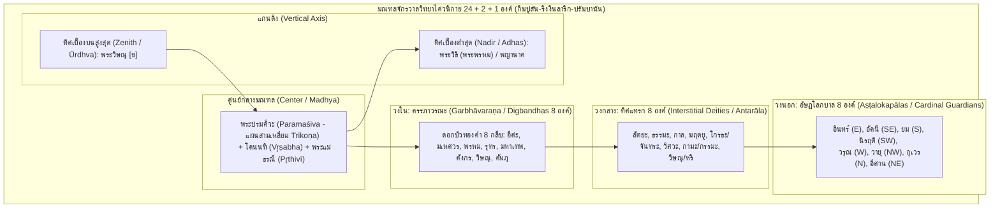

# บทที่ 7 (ตอนที่ 2): จักรวาลวิทยาไศวนิกาย มนตรมรรคปาศุปตะ และเครือข่ายพุทธตันตระข้ามสมุทร
*(Śaiva Cosmology, The Mantramārga-Pāśupata Continuum, and Maritime Esoteric Buddhist Networks)*

---

## บทนำประจำตอนที่ 2: ปฏิสัมพันธ์เชิงพื้นที่และเทววิทยาข้ามสมุทรศาสตร์ระหว่างไศวะและพุทธตันตระในนูซันตารา

พัฒนาการทางประวัติศาสตร์ศาสนาและจารึกวิทยาในภูมิภาคเอเชียตะวันออกเฉียงใต้ภาคพื้นสมุทร (Maritime Southeast Asia) ระหว่างพุทธศตวรรษที่ 13 ถึง 19 (คริสต์ศตวรรษที่ 8 ถึง 14) มิได้ดำเนินไปในลักษณะของการสืบทอดอารยธรรมอินเดียแบบรับฝ่ายเดียว (Passive reception) หรือการผสมกลมกลืนความเชื่ออย่างผิวเผินตามกรอบคิด "สังเคราะห์นิยม" (Syncretism Paradigm) ของนักบูรพคดีศึกษารุ่นอาณานิคม หากแต่เป็นพื้นที่แห่งการก่อรูปทางภูมิปัญญาอันทรงพลัง มีพลวัต และเปี่ยมด้วยนวัตกรรมทางเทววิทยาและวิศวกรรมศักดิ์สิทธิ์ที่สัมพันธ์กันอย่างแนบแน่นระหว่างระบบความเชื่อสองสายธารใหญ่ ได้แก่ ศาสนาพราหมณ์-ฮินดูไศวนิกาย (โดยเฉพาะสายมนตรมรรคและปาศุปตะ) และพุทธศาสนาฝ่ายตันตรยาน-วัชรยาน (ทั้งโยคตันตระและปฐมโยคินีตันตระ) [1] เครือข่ายทางทะเลข้ามมหาสมุทรอินเดีย ทะเลอันดามัน ช่องแคบมะละกา ทะเลชวา และทะเลจีนใต้ ได้ทำหน้าที่เป็นเส้นทางสัญจรของพระเถระ คุรุพราหมณ์ ช่างโลหะวิทยา วัตถุกฤตยาคม และคัมภีร์ศักดิ์สิทธิ์ ก่อให้เกิดโครงข่ายความรู้ข้ามสมุทรศาสตร์ที่เชื่อมโยงราชสำนักชวากลาง สุมาตรา จามปา กัมพูชา ตลอดจนศูนย์กลางพุทธศาสนาในอินเดียตะวันออก (นาลันทาและวิกรมศิลา) อินเดียใต้ (ราชวงศ์ปัลลวะ ราชวงศ์ราษฏรกูฏะ และแคว้นกรณาฏกะ) และมหานครฉางอานแห่งราชวงศ์ถัง [2]

เพื่อคลี่คลายภาพตัวแทนอันซับซ้อนของมโนทัศน์จักรวาลวิทยาและเครือข่ายพิธีกรรมศักดิ์สิทธิ์ข้ามสมุทร เนื้อหาในตอนที่ 2 ของบทที่ 7 นี้ จะดำเนินภารกิจวิจัยผ่านการชำระตัวบทจารึกชั้นปฐมภูมิ โบราณคดีศักดิ์สิทธิ์ และประติมานวิทยาเปรียบเทียบ โดยแบ่งโครงสร้างการวิเคราะห์ออกเป็น 3 หัวข้อสำคัญ:

- **หัวข้อ 7.3 จักรวาลวิทยาไศวนิกายและมณฑลทวยเทพ 24 + 2 + 1 องค์ (Śaiva Cosmological Mandalas, Consecration Deposits, and the Sahasraliṅga Mechanism):** สำรวจโบราณคดีศักดิ์สิทธิ์ของผอบหินกรรภธาน (Peripih); การชำระตัวบทจารึกแผ่นทองคำ 22 แผ่นแห่งริงงินลาริก (Ringinlarik); การไขรหัสผอบหิน 17 ช่องแห่งจันทิกิมปูลัน (Candi Kimpulan) และดอกบัวทองคำ 8 กลีบ; สหสัมพันธ์กับภาพสลัก 24 เทพบนระเบียงจันทิศิวะแห่งปรัมบานันและสูตรคำสาปแช่งในจารึกสีมา; ปรัชญาพระวรกายแห่งสากลจักรวาล (The Macrocosmic Body of Śiva) ตามคัมภีร์ปาศุปตะ *Saṃskāravidhi* และคัมภีร์ชวาโบราณตระกูลตูตูร์; ตลอดจนมโนทัศน์ "กลไกสหัสลึงค์" (Sahasraliṅga Mechanism) ในฐานะแกนกลางแห่งทฤษฎี *The Creative South* [3]
- **หัวข้อ 7.4 มนตรมรรค ปาศุปตะ และรากฐานไศวะสากลข้ามสมุทร (The Mantramārga-Pāśupata Continuum, Śaktipāta, and Transoceanic Kośa Cult):** การค้นพบร่องรอยแรกของลัทธิมนตรมรรคและคำว่า *śaktipāta* ที่เก่าแก่ที่สุดในโลกในกลุ่มจารึกพระเจ้าประกาศธรรมแห่งจามปา (Goodall & Griffiths 2013); วิกฤตการณ์ทางทะเลเมื่อทัพเรือชวา-มลายูบุกปล้นทำลายศิวลึงค์แห่งโปนครใน ค.ศ. 774 และการสถาปนาพระศรีสัตยเทเวศวรในจารึกเฟือกเถี่ยน (Phước Thiện 783 CE); เทววิทยาอัษฏมูรติ (Aṣṭamūrti) และวัฒนธรรมการถวายปลอกหุ้มศิวลึงค์โลหะ (Kośa); สายธารลัทธิปาศุปตะ สาขาอาเลปกะ/ไวมาละ ในคัมภีร์ *Vṛhaspatitattva* และคัมภีร์อถรรพเวทปริศิษฏะ; และการส่งผ่านวรรณศิลป์สันสกฤตราชสำนักจาก *Harṣacarita* ของพานภัตตะสู่อุษาคเนย์ [4]
- **หัวข้อ 7.5 เครือข่ายพุทธตันตระข้ามสมุทรศาสตร์และมณฑล 3 มิติ (Maritime Tantric Networks, 3D Mandalas, and the Surocolo-Muara Jambi Matrix):** การไขปริศนากรุมณฑลสำริด 3 มิติแห่งสุโรโจโล (Surocolo Hoard) 22 องค์ ในฐานะมณฑลแห่งคัมภีร์ *Sarvabuddhasamāyogaḍākinījālaśaṃvara* ปฐมโยคินีตันตระ (Szántó & Griffiths 2015); ระบบ 6 พุทธตระกูล เทววิทยาพระวัชรสัตว์ และพิธีคณมณฑล (Gaṇamaṇḍala); มณฑลวัชรธาตุจันทิกุมปุง (Candi Gumpung) 22 แผ่นทองคำ ณ มหาวิหารมูอาราจัมบี สุมาตรา; เครือข่ายพระอาจารย์ข้ามสมุทรศาสตร์อันได้แก่การจาริกของพระภิกษุชาวชวา "เบียนฮง" (Bianhong) สู่ฉางอาน และการจำพรรษา 12 ปีของพระอติศะ ทิปังกร ณ ศรีวิชัย; ปิดท้ายด้วยหลักฐานเชิงประจักษ์จากการค้าเครื่องประกอบพิธีกรรมวัชรยานในเรือสำเภาอับปางอินตัน (Intan Shipwreck) [5]

---

## 7.3 จักรวาลวิทยาไศวนิกายและมณฑลทวยเทพ 24 + 2 + 1 องค์: วัตถุมงคลกรรภธานกิมปูลัน-ริงงินลาริก และกลไกสหัสลึงค์แห่งปรัมบานัน

### 7.3.1 โบราณคดีศักดิ์สิทธิ์ของผอบหินกรรภธาน (Peripih Consecration Deposits)

ในระเบียบวิธีวิจัยทางโบราณคดีศักดิ์สิทธิ์และประวัติศาสตร์สถาปัตยกรรมของเกาะชวาโบราณ เทวสถานหินหรือ "จันทิ" (Candi) มิได้ถูกมองว่าเป็นเพียงสิ่งก่อสร้างทางกายภาพที่ปราศจากวิญญาณ หรือเป็นเพียงอนุสรณ์สถานทางศิลปะที่สร้างขึ้นเพื่อเป็นเกียรติยศแก่กษัตริย์ผู้ล่วงลับตามสมมติฐานเดิมของนักโบราณคดียุคอาณานิคม หากแต่เทวาลัยคือ "สถาบันศักดิ์สิทธิ์ที่มีลมหายใจ" ดำรงสถานะเป็นสิ่งมีชีวิตจักรวาลจำลองที่ได้รับการประดิษฐานพลังชีวิต หรือ **"ปราณ" (*prāṇa*)** ผ่านระบบพิธีกรรมอันซับซ้อนตามข้อกำหนดของคัมภีร์ไศวาคม (Śaivāgama) และวาสตุศาสตร์ (Vāstuśāstra) [6] ศูนย์กลางแห่งการประสิทธิ์ประสาทความศักดิ์สิทธิ์นี้สถิตอยู่ ณ จุดลึกสุดใต้แท่นโยนีและศิวลึงค์ภายในห้องครรภคฤหะ (Garbhagṛha) ซึ่งเป็นตำแหน่งที่มีการขุดหลุมฐานรากลงบน **"พรหมศิลา" (*Brahmaśilā*)** หรือศิลาปฐมมูลเพื่อฝังกล่องผอบหินบรรจุวัตถุมงคลที่ในภาษาชวาโบราณและภาษาอินโดนีเซียเรียกว่า **"เปอริปิฮ์" (*peripih* / *pripih*)** [7]

ในเชิงศัพทมูลวิทยา คำว่า *peripih* ในเอกสารภาษาชวาโบราณดั้งเดิมหมายถึง "แผ่นทองคำหรือแผ่นโลหะมีค่าที่ถูกรีดจนบาง" ทว่าในบริบททางโบราณคดี คำนี้ได้รับการขยายความหมายเชิงนามนัย (Pars pro toto) ให้ครอบคลุมถึงชุดวัตถุมงคลศักดิ์สิทธิ์ทั้งหมดที่บรรจุอยู่ภายในผอบหิน รวมถึงตัวผอบหินเองด้วย [8] สุขโมโน (Soekmono 1995) นักโบราณคดีคนสำคัญของอินโดนีเซีย ได้ชี้ให้เห็นว่า เทวสถานชวาโบราณที่ปราศจากเปอริปิฮ์ย่อมถือเป็นเทวสถานที่ไม่สามารถปฏิบัติหน้าที่ทางศาสนาได้อย่างสมบูรณ์ เปอริปิฮ์ทำหน้าที่เป็นสื่อกลางในการอัญเชิญพระผู้เป็นเจ้าองค์ประธานและเหล่าเทพบริวารให้เสด็จลงมาสถิตและสถิตสถาพรอยู่อย่างถาวร [9] การประกอบพิธีฝังเปอริปิฮ์ถือเป็นส่วนสำคัญยิ่งยวดของมหาพิธีกรรมศักดิ์สิทธิ์ 2 ประการตามคัมภีร์สันสกฤต ได้แก่:
1. **พิธีกรรมกรรภธาน หรือ ครรภญาสะ (*Garbhādhāna* / *Garbhanyāsa*):** พิธีการประดิษฐาน "คัพภะ" หรือทารกศักดิ์สิทธิ์ในครรภ์ลงสู่ครรภ์แห่งพระแม่ธรณี เพื่อเป็นปฐมกำเนิดแห่งพลังชีวิตที่จะเติบโตขึ้นเป็นเรือนยอดของเทวาลัย
2. **พิธีกรรมรัตนญาสะ (*Ratnanyāsa*):** พิธีการฝังอัญมณีมีค่านพรัตน์ แผ่นโลหะมงคล ดอกบัวทองคำ เมล็ดพืชศักดิ์สิทธิ์ และดินจากแหล่งน้ำมงคลลงในช่องผอบหิน เพื่อถวายเป็นเครื่องบูชาแด่พระแม่ธรณีและคณะเทพผู้พิทักษ์ทิศทั้งปวง [10]

มิมิ สาวิตรี, อันเดรีย อาครี, และ โซฟวาน เนอร์วิดิ (Savitri, Acri, & Noerwidi 2024) ได้ทำการสำรวจเปรียบเทียบข้อกำหนดว่าด้วยการฝังวัตถุมงคลในคัมภีร์สันสกฤตสายไศวสิทธันตะ ไศวาคม และไวษณพหลายสิบเล่ม โดยพบหลักฐานที่สอดรับกับโบราณคดีชวาอย่างน่าอัศจรรย์ อาทิ ในคัมภีร์ *นิศวาสตัตตวสังหิตา* (*Niśvāsatattvasaṃhitā* ฉบับ *Guhyasūtra* 2.110) ซึ่งเป็นหนึ่งในคัมภีร์ตันตระไศวะที่เก่าแก่ที่สุดในโลก ได้ระบุการฝังดอกบัวทองคำและแผ่นโลหะเพื่อสถาปนาพระศิวะ; คัมภีร์ *ฮยศีรษปัญจราตระ* (*Hayaśīrṣapañcarātra* 12.18) และคัมภีร์ *กาศยปศิลปะ* (*Kāśyapaśilpa* 52cd) บัญญัติให้จัดวางผอบหินที่มีช่องเจาะตามระบบเรขาคณิตจักรวาล; ขณะที่คัมภีร์ *อีศานศิวคุรุเทวปัทธติ* (*Īśānaśivagurudevapaddhati* 27.89ab), *วิษณุสังหิตา* (*Viṣṇusaṃhitā* 13.35), และ *เทวยามตะ* (*Devyāmata* 37.27) ต่างกำหนดให้มีการประดิษฐานดอกบัวทองคำไว้ ณ จุดศูนย์กลางของผอบหินเพื่อรองรับพระเป็นเจ้าสูงสุด [11]

อย่างไรก็ดี ในอดีตที่ผ่านมา นักโบราณคดีแทบไม่เคยค้นพบผอบหินกรรภธานในสภาพที่สมบูรณ์ปราศจากการรื้อค้น (In situ / Undisturbed context) เนื่องจากเทวสถานส่วนใหญ่ในชวากลางถูกลักลอบขุดทำลายและปล้นสะดมเอาทองคำและอัญมณีมีค่าไปตั้งแต่ยุคอาณานิคม ส่งผลให้แผ่นทองคำจารึกและวัตถุมงคลหลุดลอยออกจากตำแหน่งดั้งเดิม จนกระทั่งการค้นพบโบราณคดีครั้งประวัติศาสตร์ 2 แหล่งในคริสต์ศตวรรษที่ 21 ได้แก่ จันทิกิมปูลัน (Candi Kimpulan) ใน ค.ศ. 2009 และโบราณสถานริงงินลาริก (Ringinlarik) ใน ค.ศ. 2016 ซึ่งได้กอบกู้หลักฐานจารึกวิทยาและโบราณคดีศักดิ์สิทธิ์ในบริบทบริสุทธิ์กลับคืนมาอย่างสมบูรณ์ [12]

---

### 7.3.2 การชำระตัวบทจารึกแผ่นทองคำ 22 แผ่นแห่งริงงินลาริก (Ringinlarik Inscribed Gold Foils)

ใน ค.ศ. 2016 ระหว่างการดำเนินโครงการขุดลอกสระกักเก็บน้ำฝนขนาด 4.2 เฮกตาร์ของชุมชน ณ หมู่บ้านริงงินลาริก ตำบลมูซุก อำเภอโบโยลาลี จังหวัดชวากลาง บนเนินเขาด้านทิศตะวันออกของภูเขาไฟเมอราปี ที่ระดับความสูง 780 เมตรเหนือระดับน้ำทะเล รถขุดได้เปิดหน้าดินลึก 1.5 เมตรใต้ซากกองหินเทวาลัยโบราณ และค้นพบผอบหินแอนดีไซต์ทรงสี่เหลี่ยมมีฝาปิดในสภาพสมบูรณ์ เมื่อเปิดฝาผอบออก คณะนักโบราณคดีได้พบโบราณวัตถุชิ้นเอก ได้แก่ **"แผ่นทองคำจารึกขนาดเล็กจำนวน 22 แผ่น"** (Ringinlarik Inscribed Gold Foils) แต่ละแผ่นมีความหนาประมาณ 1 มิลลิเมตร ขนาดตัดเฉลี่ย 2 × 2 ถึง 2 × 3 เซนติเมตร [13]

งานวิจัยระดับแม่บทของ มิมิ สาวิตรี, อันเดรีย อาครี, และ โซฟวาน เนอร์วิดิ (Savitri, Acri, & Noerwidi 2024) ในบทความ *"The Śaiva Deities of the Directions in the Light of Two Recently Discovered Consecration Deposits (Peripih) from Central Java"* ได้ดำเนินการชำระตัวบท การอ่าน และการจัดหมวดหมู่นามเทพเจ้าบนแผ่นทองคำทั้ง 22 แผ่นอย่างละเอียดถี่ถ้วน ตัวอักษรที่ใช้จารึกได้รับการวินิจฉัยทางอักขรวิทยาว่าเป็น **"อักษรกวีสมัยต้น" (Early Kawi Script)** กำหนดอายุอยู่ในช่วงพุทธศตวรรษที่ 14 ถึง 15 (ราวคริสต์ศตวรรษที่ 9 ถึง 10) โดยคำจารึกทั้งหมดมีลักษณะทางภาษาศาสตร์เป็นรูปคำนามภาษาสันสกฤตรูปสเตมที่ปราศจากการแจกวิภัตติปัจจัย (Stem forms / Caseless nouns) ซึ่งทำหน้าที่เป็นคำยืมในภาษาชวาโบราณเพื่อระบุนามของทวยเทพและทิศทาง [14]

คณะผู้วิจัยได้จัดจำแนกแผ่นทองคำทั้ง 22 แผ่นออกเป็นกลุ่มโครงสร้างทางจักรวาลวิทยาอย่างเป็นระบบ ดังแสดงในสารบบต่อไปนี้:

> **สารบบตัวบทจารึกแผ่นทองคำ 22 แผ่นแห่งริงงินลาริก (ชำระโดย Savitri, Acri, & Noerwidi 2024: 580–583):**
>
> 1. `[candra]` = พระจันทร์ (ทิศแทรกตะวันตกเฉียงใต้–ตะวันตก / อัษฏมูรติ)
> 2. `[varuṇa]` = พระวรุณ (ทิศประจิม / ตะวันตก - อัษฏโลกบาล)
> 3. `[pr̥thivī]` = พระแม่ธรณี (เทพผู้ค้ำจุนมณฑลแผ่นดิน)
> 4. `[nāga]` = พญานาค (ทิศเบื้องต่ำ / โลกบาดาล)
> 5. `[mr̥tyu]` = พระมฤตยู (ทิศแทรกใต้–ตะวันตกเฉียงใต้)
> 6. `[viṣṇu]` (ชิ้นที่ 1) = พระวิษณุ (ทิศแทรกเหนือ–ตะวันออกเฉียงเหนือ / หริ)
> 7. `[viṣṇu]` (ชิ้นที่ 2) = พระวิษณุ (ทิศเบื้องบนสูงสุด / Zenith - Ūrdhva)
> 8. `[dharma]` = พระธรรม (ทิศแทรกตะวันออก–ตะวันออกเฉียงใต้)
> 9. `[indra]` = พระอินทร์ (ทิศบูรพา / ตะวันออก - อัษฏโลกบาล)
> 10. `[īśānya]` = พระอีศาน (ทิศอีสาน / ตะวันออกเฉียงเหนือ - อัษฏโลกบาล)
> 11. `[kuvera]` = พระกุเวร / ท้าวเวสสุวรรณ (ทิศอุดร / เหนือ - อัษฏโลกบาล)
> 12. `[kāla]` = พระกาล (ทิศแทรกตะวันออกเฉียงใต้–ใต้)
> 13. `[vidhi]` = พระวิธิ / พระพรหม (ทิศเบื้องต่ำ / Nadir - Adhas)
> 14. `[Triangle]` = แผ่นทองคำรูปสามเหลี่ยม ไร้อักขระจารึก (พระปรมศิวะ ณ ศูนย์กลาง)
> 15. `[viśva]` = พระวิศวะ (ทิศแทรกตะวันตก–ตะวันตกเฉียงเหนือ)
> 16. `[satya]` = พระสัตยะ (ทิศแทรกตะวันออกเฉียงเหนือ–ตะวันออก)
> 17. `[nairiti]` = พระนิรฤติ (ทิศหรดี / ตะวันตกเฉียงใต้ - อัษฏโลกบาล)
> 18. `[karma]` = พระกรรม / พระกามะ (ทิศแทรกตะวันตกเฉียงเหนือ–เหนือ)
> 19. `[bāyu]` = พระพาย / พระวายุ (ทิศพายัพ / ตะวันตกเฉียงเหนือ - อัษฏโลกบาล)
> 20. `[vr̥ṣabha]` = โคนนทิ ราชพาหนะแห่งพระศิวะ (หรืออ่านทางเลือก `vr̥ṣaga` พระศิวะผู้ทรงโค)
> 21. `[yama]` = พระยม (ทิศทักษิณ / ใต้ - อัษฏโลกบาล)
> 22. `[agniya]` = พระอัคนี (ทิศอาคเนย์ / ตะวันออกเฉียงใต้ - อัษฏโลกบาล) [15]

ในมิติทางสัทวิทยาและอักขรวิธี จารึกริงงินลาริกเผยให้เห็นลักษณะการปรับคำภาษาสันสกฤตเข้าสู่สำเนียงภาษาชวาโบราณ (Vernacularized spellings) เช่น การสะกด `agniya` (แผ่นที่ 22) แทนรูปสันสกฤต *Āgneya* และการสะกด `īśānya` (แผ่นที่ 10) แทน *Aiśānya* ซึ่งสะท้อนการหลอมรวมระหว่างชื่อทิศกับตัวบุคคลของเทพเจ้าเข้าด้วยกัน [16] ยิ่งไปกว่านั้น คำว่า `karma` (แผ่นที่ 18) ได้รับการคลี่คลายว่าเทียบเท่ากับ *Kāma* ในคัมภีร์ตูตูร์และจารึกดาลินัน ซึ่งในบทสวด *Śivastava* (Hymn 751) ของพราหมณ์บาหลีก็ปรากฏรูปสะกด `karmā` เช่นเดียวกัน ชี้ชัดถึงความต่อเนื่องทางสายวิวัฒนาการจารึกที่สืบทอดข้ามสหัสวรรษ [17]

สำหรับแผ่นทองคำที่น่าจับตามองที่สุดคือ **แผ่นที่ 14 ซึ่งเป็นแผ่นทองคำรูปสามเหลี่ยมปราศจากตัวอักษรจารึก (Aniconic triangular gold foil)** คณะผู้วิจัยได้พิสูจน์ว่า รูปทรงสามเหลี่ยม (*Trikoṇa*) เป็นสัญลักษณ์แทนองค์ **"พระปรมศิวะ" (*Paramaśiva*)** ในภาวะสูงสุดเหนือรูปเคารพทั้งปวง สอดรับกับคำอธิบายในคัมภีร์ภาษาชวาโบราณ *ภุวนโกศะ* (*Bhuvanakośa* 1.6) ที่ระบุว่า พระศิวะทรงมี 3 ระดับสภาวะ ได้แก่ ศิวะ/อิศวร (รูปกายหยาบ), สดาศิวะ (กึ่งหยาบกึ่งละเอียด), และปรมศิวะ (กายละเอียดสูงสุดไร้รูปลักษณ์) ซึ่งสถิตเป็นรูปสามเหลี่ยมเหนือยอดดอกบัวในหทัย [18] การวางแผ่นสามเหลี่ยมเคียงคู่กับแผ่นจารึกโคนนทิ (`vr̥ṣabha` แผ่นที่ 20) ตอกย้ำว่าจุดศูนย์กลางของผอบคือบัลลังก์ประทับขององค์มหาเทพสูงสุด [19]

นอกจากนี้ การวิเคราะห์องค์ประกอบธาตุทางโลหะวิทยาด้วยเทคนิคพกพาเอกซเรย์ฟลูออเรสเซนซ์ (p-XRF) และการวิเคราะห์องค์ประกอบหลักทางสถิติ (Principal Component Analysis: PCA) โดย โซฟวาน เนอร์วิดิ ได้แสดงให้เห็นว่า แผ่นทองคำทั้ง 22 แผ่นมีปริมาณทองคำ (Au) เฉลี่ยระหว่าง 65% ถึง 68%, เงิน (Ag) 27% ถึง 28%, และทองแดง (Cu) 4% ถึง 6% โดยการกระจายตัวของธาตุโลหะมิได้แปรผันตามสถานะชั้นวรรณะหรือความสำคัญของเทพเจ้าประจำทิศ ชี้ให้เห็นว่าช่างโลหะโบราณคัดเลือกและตัดแผ่นทองคำจากวัตถุดิบที่มีอยู่ในคลังตามความพร้อมใช้งาน [20]

---

### 7.3.3 การไขรหัสผอบหิน 17 ช่องแห่งจันทิกิมปูลัน (Candi Kimpulan)

การค้นพบจันทิกิมปูลันเมื่อเดือนธันวาคม ค.ศ. 2009 ระหว่างการขุดฐานรากเพื่อก่อสร้างอาคารหอสมุดกลางแห่งใหม่ของมหาวิทยาลัยอิสลามแห่งอินโดนีเซีย (Universitas Islam Indonesia: UII) ตำบลเงิมปลัก อำเภอสเลมัน จังหวัดยอกยาการ์ตา ถือเป็นหนึ่งในหมุดหมายโบราณคดีที่ยิ่งใหญ่ที่สุดของชวากลาง ตัวเทวสถานตั้งอยู่ลึก 2.70 เมตรใต้ผิวดิน ถูกกลบฝังด้วยเถ้าตะกอนลาวาภูเขาไฟเมอราปีในสภาพสมบูรณ์ไร้ร่องรอยการรบกวนใดๆ ประกอบด้วยวิหารประธานและวิหารบริวาร (Candi Perwara) ในรูปแบบศาลาเปิดโล่ง (Open-mandapa style) ล้อมรอบด้วยแนวหินกำหนดทิศ 11 ต้น [21]

ใต้แท่นโยนีขนาดใหญ่และศิวลึงค์ภายในวิหารประธาน นักโบราณคดีได้ค้นพบผอบหินแอนดีไซต์ทรงสี่เหลี่ยมไร้ฝาขนาด 17 × 17 × 5.6 เซนติเมตร ซึ่งได้รับการเจาะช่องประณีตเป็นจำนวน **17 ช่อง** ประกอบด้วย:
- **ช่องกลมตรงกลาง 1 ช่อง:** เป็นแกนประธาน บรรจุดอกบัวทองคำ 8 กลีบ (รหัสทะเบียน BG 1906a) พร้อมแผ่นทองคำจารึกสี่เหลี่ยมผืนผ้า (รหัส BG 1906c), แผ่นเงิน, เศษสำริด, อัญมณีนพรัตน์, และเหรียญเงินโบราณสกุลมาสะ (Māṣa) ที่มีตราประทับรูปดอกจันทน์
- **ช่องรูปกลีบดอกบัว 8 ช่อง:** ล้อมรอบช่องกลาง เรียงตามทิศหลักทั้งแปด
- **ช่องสี่เหลี่ยมผืนผ้าขนาดเล็ก 8 ช่อง:** สลักคั่นอยู่ระหว่างกลีบดอกบัวแต่ละกลีบ [22]

ในรายงานการศึกษาเบื้องต้น อินดุง ปันจา ปุตรา และคณะ (Putra et al. 2019a) เคยสันนิษฐานว่าช่องทั้ง 17 ช่องของผอบกิมปูลันเป็นเพียงลวดลายตกแต่งทางเรขาคณิตที่ไม่มีความเชื่อมโยงกับมณฑลของเทพเจ้าเฉพาะองค์ อย่างไรก็ดี สาวิตรี, อาครี, และ เนอร์วิดิ (Savitri, Acri, & Noerwidi 2024) ได้ทำการวิพากษ์และหักล้างข้อสรุปดังกล่าวอย่างเด็ดขาด โดยพิสูจน์ว่า ผอบหิน 17 ช่องแห่งกิมปูลันแท้จริงแล้วคือ **"มณฑลจักรวาลจำลองรูปธรรม"** ที่สอดรับอย่างสมบูรณ์กับระบบผอบ 25 ช่องในคัมภีร์ไศวาคมของอินเดีย [23]

คณะผู้วิจัยได้ถอดรหัสความสอดคล้องระหว่างผอบ 17 ช่องของกิมปูลันกับแผ่นทองคำ 22 แผ่นของริงงินลาริก ดังนี้:
1. **ศูนย์กลาง (Center / Madhya):** ช่องกลางบรรจุดอกบัวทองคำ 8 กลีบ (BG 1906a) ทำหน้าที่เป็นตัวแทนของ **พระศิวะ** พร้อมด้วยคณะเทพยึดเหนี่ยวทิศทั้งแปด หรือ **"ทิกพันธะ" (*Śaiva Digbandhas*)** ซึ่งประกอบกันเป็นวงบริวารชั้นในสุดที่เรียกว่า **ครรภาวรณะ (*Garbhāvaraṇa*)** (ตรงกับคณะนวสงะ Navasaṅa ในบาหลี) ที่น่าทึ่งคือ ผลการทดสอบ p-XRF พบว่า ดอกบัวทองคำ BG 1906a มีปริมาณความบริสุทธิ์ของทองคำสูงเด่นเป็นพิเศษถึง **74.44%** (เมื่อเทียบกับแผ่นอื่นๆ ที่มีเพียง 65–68%) สะท้อนความตั้งใจของช่างในการคัดสรรทองคำชั้นเลิศเพื่อถวายแด่ศูนย์กลางแห่งมณฑล [24]
2. **วงกลีบบัว 8 ช่อง (Outer Petals):** ทำหน้าที่รองรับคณะเทพผู้พิทักษ์ทิศหลักทั้งแปด หรือ **อัษฏโลกบาล (*Aṣṭalokapālas*)** ได้แก่ อินทร์, อัคนี, ยม, นิรฤติ, วรุณ, วายุ, กุเวร, และอีศาน
3. **วงช่องสี่เหลี่ยมคั่น 8 ช่อง (Interstitial Cavities):** ทำหน้าที่รองรับคณะเทพประจำจุดแทรกหรือทิศเฉียงทั้งแปด (**อันตราลเทวตา *Antarāladevatā*)** ได้แก่ สัตยะ, ธรรมะ, กาล, มฤตยู, โกรธะ (หรือจันทระ), วิศวะ, กามะ (กรรมะ), และวิษณุ/หริ [25]

---

### 7.3.4 สหสัมพันธ์กับภาพสลัก 24 เทพบนจันทิศิวะแห่งปรัมบานันและจารึกสีมา

การค้นพบและชำระตัวบทจารึกริงงินลาริกและกิมปูลัน ได้กลายเป็น "หลักฐานเชิงประจักษ์ขั้นเด็ดขาด" (Smoking gun) ที่พิสูจน์ความถูกต้องของ **"แบบจำลองระบบเทพเจ้าประจำทิศ 24 + 2 องค์"** ซึ่ง อันเดรีย อาครี และ รอย อี. ยอร์แดน (Andrea Acri & Roy E. Jordaan 2012) เคยเสนอไว้จากการศึกษาวิเคราะห์ภาพสลักนูนต่ำบนผนังระเบียงชั้นล่างของจันทิศิวะ ลอโรโชงกรัง (Candi Prambanan) [26]

ในอดีต นักประวัติศาสตร์ศิลปะคนสำคัญอย่าง โยฮันนา ฟาน โลฮุยเซน-เดอ ลีวฟ์ (Johanna E. van Lohuizen-de Leeuw 1955) เคยเผชิญกับทางตันในการอธิบายประติมานวิทยาของปรัมบานัน เธอพบว่ามีภาพสลักทวยเทพประทับยืนในซุ้มเรือนแก้วรอบระเบียงจันทิศิวะจำนวน 24 องค์ แต่กลับไม่สามารถจำแนกได้อย่างชัดเจนว่าเหตุใดจึงมีเทพประจำทิศมากกว่าระบบอัษฏโลกบาล 8 องค์ และเธอได้ตั้งสมมติฐานที่ผิดพลาดว่า ระบบทิกพันธะ (นวสงะ) เพิ่งถูกประดิษฐ์ขึ้นในสมัยมัชปาหิต (คริสต์ศตวรรษที่ 14) ทว่า Acri & Jordaan (2012) ควบคู่กับงานวิจัยของ Savitri, Acri, & Noerwidi (2024) ได้พิสูจน์ว่า เทพทั้ง 24 องค์บนระเบียงปรัมบานันคือวงล้อมบริวาร (**อาวรณเทวตา *Āvaraṇadevatā*)** 3 วงซ้อนกัน วงละ 8 องค์ (โลกบาล 8 + ทิศแทรก 8 + ทิกพันธะ 8) ซึ่งเปล่งรัศมีออกจากพระศิวะมหาเทพในห้องครรภคฤหะประธาน [27]

นอกจากนี้ การจัดวางผังศาสนสถานของกลุ่มมหาเทวาลัยปรัมบานันยังสะท้อนเทพประจำแกนดิ่ง 2 องค์อย่างแม่นยำ:
- **จันทิวิษณุ (Candi Viṣṇu):** ตั้งอยู่ทางทิศเหนือของจันทิศิวะ สอดรับกับตำแหน่งของพระวิษณุในฐานะผู้พิทักษ์ **"ทิศเบื้องบนสูงสุด" (Zenith / Ūrdhva)**
- **จันทิพรหม (Candi Brahmā):** ตั้งอยู่ทางทิศใต้ของจันทิศิวะ สอดรับกับตำแหน่งของพระพรหม/วิธิ ในฐานะผู้พิทักษ์ **"ทิศเบื้องต่ำ" (Nadir / Adhas)** [28]

ความถูกต้องของระบบเทววิทยานี้ยังได้รับการยืนยันข้ามมิติเอกสาร ผ่านการเปรียบเทียบกับสูตรคำสาปแช่งในจารึกพระราชโองการสถาปนาเขตที่ดินสีมา (Sīma) ภาษาชวาโบราณหลายหลัก อาทิ:
- **จารึกดาลินัน (Dalinan Inscription มหาศักราช 825 / ค.ศ. 903):** แผ่นทองแดงแผ่นที่ 2 ด้านหลัง บรรทัดที่ 2–4 ปรากฏข้อความอัญเชิญเทพเจ้าประจำทิศทั้งปวงอย่างครบถ้วน:

> **ตัวบทจารึกภาษาชวาโบราณ (Dalinan Inscription, Savitri et al. 2024: 588, n. 34):**  
> `... indaḥ kita saṅ hyaṅ sahananta saṅ malmaḥ saṅ mathāni sakvaiḥ tā hyaṅ riṅ pūrba dakṣina paścima uttara āgnaiya nairiti bāyabya aiśānya saṅ hyaṅ riṅ satya dharmma kāla mr̥tyu krodha viśva kāma viṣṇu iṅ maddhya i sor i ruhur ...`  
>  
> **คำแปลวิชาการ:**  
> "... ขออัญเชิญทวยเทพเจ้าศักดิ์สิทธิ์ทั้งมวล เทพผู้อภิบาลผืนแผ่นดิน เทพผู้สถิตทั่วทุกสารทิศ ทั้งในทิศบูรพา ทักษิณ ประจิม อุดร อาคเนย์ หรดี พายัพ อีสาน ทวยเทพเจ้าผู้สถิตในสัตยะ ธรรมะ กาล มฤตยู โกรธะ วิศวะ กามะ วิษณุ ทั้งในศูนย์กลาง เบื้องต่ำ และเบื้องบน ..." [29]

- **จารึกบาตูวันแห่งเกาะบาหลี (Batuan Inscription มหาศักราช 944 / ค.ศ. 1022):** ปรากฏการอ้างอิงลำดับเทพชุดเดียวกันนี้ในพิธีกรรมสาปแช่งผู้ละเมิดสีมา ตอกย้ำว่าระบบมณฑล 24 + 2 + 1 องค์มิได้จำกัดอยู่เฉพาะราชสำนักชวากลาง แต่เป็นแม่แบบจักรวาลวิทยามาตรฐานที่แพร่หลายทั่วโลกวัฒนธรรมนูซันตารา [30]

---

### 7.3.5 ปรัชญาพระวรกายแห่งสากลจักรวาล (The Macrocosmic Body of Śiva)

การที่พราหมณ์และช่างจารึกชวาโบราณบรรจุแผ่นทองคำนามเทพเจ้าไว้ใต้ฐานศิวลึงค์ มิได้มีเป้าหมายเพียงเพื่อการป้องกันภยันตรายเชิงไสยเวท แต่มีรากฐานมาจากปรัชญาเทววิทยาชั้นสูงว่าด้วย **"พระวรกายแห่งสากลจักรวาลของพระศิวะ" (The Macrocosmic Body of Śiva)** [31]

ในคัมภีร์ปาศุปตะภาษาสันสกฤตโบราณเรื่อง *สัมสการวิธิ* (*Saṃskāravidhi* โศลก 49–51) ได้อธิบายอย่างแจ่มชัดว่า ทิศทั้งปวงในจักรวาลแท้จริงแล้วคือภาคสำแดง 10 ประการ หรือ **"ทศมูรติ" (*Daśamūrti*)** แห่งพระวรกายของพระศิวะ:

> **ตัวบทภาษาสันสกฤตคัมภีร์ปาศุปตะ (*Saṃskāravidhi* 49–51; Savitri et al. 2024: 587–588, n. 33):**  
> `yāmyā aindrī tathā saumyā vāruṇī ca tathāparā |`  
> `āgneyī ca tatheśānī vāyavyā ca tathā smr̥tā || 49 ||`  
> `nairr̥tī ca dhruvā nāgī daśamūrtiḥ śivaḥ smr̥taḥ |`  
> `dakṣiṇā procyate yāmyā aindrīṁ pūrvāṁ pracakṣate || 50 ||`  
> `saumyā caivottarā mūrtiḥ paścimā vāruṇī smr̥tā |`  
> `pūrvadakṣiṇa-m-āgneyī prācyudīcī tatheśānī || 51 ||`  
>  
> **คำแปลวิชาการ:**  
> "พระศิวะได้รับการสั่งสอนว่าทรงมีพระวรกายสิบภาค (ทศมูรติ) อันได้แก่ ยามยา (ทักษิณ), ไอนทรี (บูรพา), โสมยา (อุดร), วารุณี (ประจิม), อาคเนยี (อาคเนย์), อีศานี (อีสาน), วายวยา (พายัพ), ไนรฤตี (หรดี), ธรุวา (เบื้องบนคงที่), และนาคี (เบื้องต่ำบาดาล)... พระวรกายเหล่านี้คือองค์พระศิวะผู้แผ่ขยายครอบคลุมจักรวาล" [32]

คตินี้สอดประสานอย่างลึกซึ้งกับวรรณกรรมคัมภีร์ตูตูร์ (Tutur) ภาษาชวาโบราณ เช่น *ภุวนสังเขปะ* (*Bhuvanasaṅkṣepa*) และ *ภุวนโกศะ* (*Bhuvanakośa*) ซึ่งสั่งสอนว่า องค์ประกอบภายนอกของจักรวาล (มหาจักรวาล - Macrocosm) และอวัยวะ ลมปราณ จักระภายในร่างกายของมนุษย์ (จุลจักรวาล - Microcosm) ต่างมีโครงสร้างที่ตรงกันข้ามและสะท้อนซึ่งกันและกันอย่างสมบูรณ์ เทวาลัยหินจึงเป็นเสมือน "ร่างกายมนุษย์จำลองขนาดยักษ์" ที่มีศิวลึงค์เป็นแกนกระดูกสันหลัง มีเปอริปิฮ์เป็นหัวใจและครรภ์กำเนิด และมีเทพประจำทิศเป็นลมหายใจและประสาทสัมผัสที่ค้ำจุนชีวิต [33]

---

### 7.3.6 มโนทัศน์ "กลไกสหัสลึงค์" (Sahasraliṅga Mechanism) แห่งปรัมบานัน และ The Creative South

ความเข้าใจเชิงลึกเกี่ยวกับมณฑลจักรวาลวิทยาไศวนิกาย ช่วยให้นักวิชาการสามารถถอดรหัสความหมายของผังแม่บทกลุ่มมหาเทวาลัยปรัมบานัน (Candi Prambanan หรือ Loro Jonggrang) ได้อย่างแจ่มชัด มหาศาสนสถานแห่งนี้มิได้ประกอบด้วยเทวาลัยประธาน 3 หลัง (ศิวะ, วิษณุ, พรหม) เท่านั้น หากแต่ได้รับการโอบล้อมด้วยวิหารบริวารชั้นนอก หรือ **"จันทิ เปอควารา" (*Candi Perwara*)** จำนวนมหาศาลถึง **224 หลัง** จัดเรียงเป็นรูปสี่เหลี่ยมจัตุรัสซ้อนกัน 4 ชั้น [34]

ภายในวิหารบริวารเหล่านี้ รวมถึงบริเวณลานประทักษิณ ได้มีการประดิษฐานศิวลึงค์จำลองขนาดเล็กนับร้อยนับพันองค์ ก่อให้เกิดมโนทัศน์ที่เรียกว่า **"กลไกสหัสลึงค์" (*Sahasraliṅga Mechanism*)** [35] ลึงค์นับพันเหล่านี้มิได้ถูกสร้างขึ้นอย่างกระจัดกระจาย แต่ถูกจัดวางตามแนวเรขาคณิตศักดิ์สิทธิ์เพื่อทำหน้าที่เป็น "ตัวเหนี่ยวนำและทวีคูณพลังงานจักรวาล" (Cosmic Energy Dynamo) ดึงดูดทิพยอำนาจจากพระปรมศิวะเบื้องบนและพลังงานค้ำจุนจากผืนดินเบื้องล่าง แผ่กระจายความอุดมสมบูรณ์และความมั่นคงทางการเมืองไปทั่วราชอาณาจักรมาตาราม [36]

อันเดรีย อาครี (Andrea Acri 2022) ในบทความวิจัยเชิงทฤษฎี *"The Creative South: Maritime Southeast Asia in the Making of the 'Sanskrit Cosmopolis'"* ได้ใช้หลักฐานจากปรัมบานันและผอบกรรภธานชวา เพื่อสถาปนากรอบคิด **"The Creative South"** โดยชี้ให้เห็นว่า ดินแดนเอเชียตะวันออกเฉียงใต้ภาคพื้นสมุทรในยุคคลาสสิก มิได้เป็นเพียงดินแดนชายขอบที่ลอกเลียนแบบวัฒนธรรมอินเดียอย่างเชื่องช้า แต่เป็น "ศูนย์กลางความคิดสร้างสรรค์ทางเทววิทยาและวิศวกรรมศักดิ์สิทธิ์" ช่างและปราชญ์ชาวชวาได้นำเอาคัมภีร์ไศวาคมของอินเดียมาพัฒนา ต่อยอด และจัดระบบใหม่จนมีความสมบูรณ์เชิงสถาปัตยกรรมและมณฑลวิทยาในระดับที่หาตัวเปรียบได้ยากแม้ในอินเดียเอง [37]

## 7.4 มนตรมรรค ปาศุปตะ และรากฐานไศวะสากลข้ามสมุทร: มโนทัศน์ศักติปาตะ การบูชาอัษฏมูรติ และการถวายโกศะหุ้มศิวลึงค์

### 7.4.1 ร่องรอยแรกของมนตรมรรคในเอเชียตะวันออกเฉียงใต้และคำว่า śaktipāta ในจารึกจามปา

ในการศึกษาวิวัฒนาการของศาสนาพราหมณ์-ฮินดูไศวนิกายในเอเชียตะวันออกเฉียงใต้ ข้อถกเถียงสำคัญระดับกระบวนทัศน์ประการหนึ่งคือ "จุดเริ่มต้นของการแพร่หลายของลัทธิมนตรมรรค (Mantramārga)" หรือไศวสิทธันตะสายตันตระ ซึ่งเป็นนิกายที่ก้าวข้ามข้อบัญญัติเคร่งครัดของลัทธิอติมรรค (Atimārga) และปาศุปตะดั้งเดิม โดยหันมาเน้นการประกอบพิธีกรรมศักดิ์สิทธิ์ มนตราศาสตร์ และพิธีสมโภชประสิทธิ์ประสาท (Dīkṣā) เพื่อปลดเปลื้องพันธนาการแห่งวิญญาณ [38] ในอดีต นักภารตวิทยาและนักจารึกวิทยาชั้นนำอย่าง อเล็กซิส แซนเดอร์สัน (Alexis Sanderson 2003–2004, 2009) เคยตั้งสมมติฐานว่า คัมภีร์และพิธีกรรมสายมนตรมรรคเพิ่งจะเริ่มเดินทางข้ามสมุทรเข้ามาหยั่งรากในเอเชียตะวันออกเฉียงใต้ (โดยเฉพาะในกัมพูชาโบราณ) ในช่วงต้นยุคเมืองพระนคร หรือราวปลายพุทธศตวรรษที่ 14 (คริสต์ศตวรรษที่ 9) เป็นต้นมา [39]

ทว่า งานวิจัยชิ้นเอกของ โดมินิก กูดดอลล์ และ อาร์โล กริฟฟิทส์ (Dominic Goodall & Arlo Griffiths 2013) ในบทความวิจัย *"Études du Corpus des inscriptions du Campā. V. The Short Foundation Inscriptions of Prakāśadharman-Vikrāntavarman, King of Campā"* ซึ่งตีพิมพ์ในวารสารวิชาการ *Indo-Iranian Journal* ได้ปฏิวัติและหักล้างข้อสมมติฐานเดิมของแซนเดอร์สันอย่างสิ้นเชิง คณะผู้วิจัยได้ทำการตรวจสอบ ชำระ และตีความกลุ่มจารึกสถาปนาขนาดสั้นจำนวน 7 หลัก (C. 79, C. 80, C. 97, C. 135, C. 136, C. 137, และ C. 173) ที่จารึกขึ้นในรัชสมัยของ **พระเจ้าประกาศธรรม-วิกรานตวรมัน (Prakāśadharman-Vikrāntavarman)** มหาราชแห่งอาณาจักรจามปา (ครองราชย์ระหว่างมหาศักราช 579 ถึง 609 หรือราว ค.ศ. 657 ถึง 687) [40]

ผลการชำระตัวบทจารึกได้นำไปสู่การค้นพบครั้งประวัติศาสตร์ 2 ประการที่สั่นสะเทือนวงการจารึกวิทยาระดับโลก:

ประการแรก การค้นพบคำว่า **"ศักติปาตะ" (*śaktipāta*)** ในจารึกหลัก **C. 97** ณ มณฑลเทวสถานหมี่เซิน (Mỹ Sơn) ซึ่งได้รับการยืนยันอย่างเป็นเอกฉันท์ว่าเป็น **"หลักฐานทางจารึกวิทยาที่เก่าแก่ที่สุดในโลก" (The World's Earliest Epigraphic Attestation of the Term Śaktipāta)** ที่บันทึกคำศัพท์เฉพาะทางด้านเทววิทยาของลัทธิมนตรมรรค [41] ในคติไศวสิทธันตะ คำว่า *śaktipāta* หมายถึง "การเสด็จลงมาแห่งพระเกียรติคุณ หรือการถ่ายทอดพลังอำนาจศักดิ์สิทธิ์ของพระศิวะ" ลงสู่ดวงวิญญาณของผู้ศรัทธาผ่านพิธีสมโภชของพระคุรุ ซึ่งทำหน้าที่เป็นพลังขับเคลื่อนในการทำลายอวิชชาและกิเลสอันเป็นสิ่งกีดขวางการหลุดพ้น [42]

ประการที่สอง การชำระคำอ่านในจารึก **C. 137** แห่งจ่าเกี่ยวย์ (Trà Kiệu) ซึ่งจารึกด้วยฉันทลักษณ์อารยาคีติ (*āryāgīti*) อันวิจิตรบรรจง กูดดอลล์และกริฟฟิทส์ได้พิสูจน์ข้อผิดพลาดที่ตกทอดมายาวนานกว่าศตวรรษของ เอดูอาร์ อูแบร์ (Édouard Huber 1911) ซึ่งเคยอ่านคำในบรรทัดที่ 4 ผิดเป็น `hāṭakayugalam` (แผ่นทองคำคู่) จนทำให้นักประวัติศาสตร์ศิลปะจามปาสับสนมาหลายชั่วอายุคน แท้จริงแล้วตัวอักษรบนหินสลักคำว่า **`pādukayugalam·` (รอยพระบาทคู่)** [43]

ยิ่งไปกว่านั้น กูดดอลล์และกริฟฟิทส์ได้ถอดรหัสฉันท์อารยาคีติในโศลกที่ 1 ของจารึก C. 137 ซึ่งใช้กลวิธีทางวรรณศิลป์ชั้นสูงที่เรียกว่า **"เลศะ" (*śleṣa*)** หรือการเล่นคำซ้อนความหมายพร้อมกันถึง 3 ระดับ:

> **ตัวบทจารึกภาษาสันสกฤต จารึก C. 137 แห่งจ่าเกี่ยวย์ (Goodall & Griffiths 2013: 429, 432):**  
> `[siddham]`  
> `I. śaktiḥ parasya na ripuṃ kṣapayati gamitāpi daṇḍabhedabhayena |`  
> `yasya tv adaṇḍabhedā sakalam arim abhīr bhinatti śaktibhṛta iva ||`  
> `II. sa śrīprakāśadharmmā nṛpatiḥ kandarppadharmmaṇo dharaṇibhujaḥ |`  
> `s[v]apitāmahīpitur idaṃ sthāpitavān arcanāya pādukayugalam· ||`  
>  
> **คำแปลเชิงวิชาการ (การตีความ 3 ระดับ):**  
> - **ระดับที่ 1 (มิติการเมืองและอาวุธหอก):** อานุภาพ (ศักติ/หอก) ของศัตรูไม่อาจประหัตประหารอริราชได้ แม้จะถูกผลักดันด้วยความหวาดกลัวต่อกลอุบายทัณฑกรรมหรือการยุยงให้แตกแยก แต่หอกอันปราศจากความขลาดกลัวของพระองค์กลับทำลายล้างศัตรูจนหมดสิ้นโดยที่ด้ามหอกมิต้องหักสะบั้น ดุจดังพระสกันทะผู้ทรงหอกศักติ  
> - **ระดับที่ 2 (มิติอภัยทานและการคุ้มครอง):** พระองค์ผู้ซึ่งเพียงแค่แสดงอากัปกิริยาประทานความไร้ภัย (อภี) โดยมิต้องพึ่งพากลยุทธ์การลงทัณฑ์หรือการสร้างความแตกแยก ก็ทรงสามารถกำราบศัตรูทั้งปวงลงได้ ดุจดั่งว่าพระองค์ทรงถือหอกศักติไว้จริงๆ  
> - **ระดับที่ 3 (มิติปรัชญาตันตระไศวะและศักติปาตะ):** พระองค์ผู้ทรงเปรียบเสมือนพระสกันทะ และทรงเป็นผู้ที่ได้รับพลังอำนาจแห่งพระศิวะ (ศักติ) ผ่านพิธีสมโภชตันตระ (ศักติปาตะ) อันไม่ก่อให้เกิดความหวาดกลัว และมิต้องอาศัยการลงทัณฑ์หรือการยุแยงใดๆ พลังอันบริสุทธิ์นั้นได้ทำลายล้างศัตรูภายในทั้งปวงคือกิเลสและอินทรีย์ทั้งหลาย  
> - **(คาถาที่ 2):** พระมหากษัตริย์พระนามว่า พระศรีประกาศธรรม พระองค์นั้น ได้ทรงสถาปนารอยพระบาทคู่นี้ขึ้น เพื่อการบูชาสรรเสริญแด่กษัตริย์กันทรรปธรรม ผู้เป็นพระบิดาของพระอัยยิกาฝ่ายพระบิดาของพระองค์เอง [44]

การถอดรหัสโศลกนี้พิสูจน์ให้เห็นอย่างชัดเจนว่า กวีราชสำนักจามปาในปลายคริสต์ศตวรรษที่ 7 มีความเข้าใจอย่างลึกซึ้งในระบบเทววิทยาตันตระไศวะ โดยเฉพาะการเปรียบเทียบการปราบศัตรูทางการเมืองเข้ากับการเอาชนะ "ศัตรูภายใน" คือกิเลสตัณหา (**อริวรรค *arivarga*)** ผ่านพลังศักติปาตะ ซึ่งเป็นโครงสร้างโวหารแบบเดียวกับที่ปรากฏในจารึกกัมพูชาโบราณ เช่น จารึก K. 528 แห่งปราสาทเมบนตะวันออก (ค.ศ. 953) และจารึก K. 1236 แห่งพนมบายัง (ค.ศ. 763) [45]

นอกจากนี้ กลุ่มจารึกสั้นของพระเจ้าประกาศธรรมยังสะท้อนความหลากหลายของสถาบันศาสนาในราชสำนักจามปา:
- **จารึก C. 79 (หมี่เซิน):** บันทึกการสถาปนาแท่นบูชาท้าวกุเวร (*Kuvera* / *Ekākṣapiṅgala*) สหายแห่งพระศิวะ เพื่อทำหน้าที่ปกป้องและเพิ่มพูน **"อีศธนะ" (*īśadhana*)** หรือทรัพย์สินของพระผู้เป็นเจ้า (*devadravya*) และขับไล่สิ่งอัปมงคลทั้งปวง [46]
- **จารึก C. 80 (หมี่เซิน):** การถวายรูปเคารพทองคำแด่พระศิวะภายใต้พระนาม **"สุวรรณากษะ" (*Suvarṇākṣa*)** ซึ่งตรงกับเทววิทยาในคัมภีร์ *สกันทะปุราณะ* (*Skandapurāṇa* 9.22–29) [47]
- **จารึก C. 135 (ถักบิ๊ก - Thạch Bích):** จารึกบนผาหินริมแม่น้ำทูโบ่น (Thu Bồn หรือมหานที *mahānadī*) สถาปนาพระศิวะในพระนาม **"อมเรศวร" (*Amareśa*)** สะท้อนการผสานพิธีกรรมไศวะเข้ากับชลศาสตร์ศักดิ์สิทธิ์ริมสายน้ำเช่นเดียวกับจารึกตูกมัส (Tuk Mas) และจารึกจังกัล (Canggal ค.ศ. 732) ในชวากลาง [48]

---

### 7.4.2 ศึกชวารุกรานจามปา ค.ศ. 774 และจารึกสถาปนาพระศรีสัตยเทเวศวร (Phước Thiện 783 CE)

ความสัมพันธ์ระหว่างเกาะชวากับอาณาจักรจามปาในคริสต์ศตวรรษที่ 8 มิได้จำกัดอยู่เพียงการแลกเปลี่ยนทางวัฒนธรรมและคัมภีร์ศาสนาอย่างสงบสันติเท่านั้น หากแต่ยังเต็มไปด้วยความตึงเครียด วิกฤตการณ์ความมั่นคงทางทะเล และสงครามแย่งชิงทรัพยากรข้ามสมุทร [49]

หลักฐานทางประวัติศาสตร์ชิ้นสำคัญที่สุดที่บันทึกการปะทะกันทางทหารระหว่างสองอารยธรรม คือ **ศิลาจารึกเฟือกเถี่ยน (Phước Thiện Stele, ทะเบียน BTNT 1440)** ซึ่งค้นพบเมื่อ ค.ศ. 1993 ณ ทุ่งนาหมู่บ้านเฟือกเถี่ยน อำเภอนีญเฟือก จังหวัดนีญถ่วน (เขตปัณฑุรังคะเดิม ทางตอนใต้ของเวียดนาม) และได้รับการเผยแพร่วิเคราะห์ฉบับแรกโดย อาร์โล กริฟฟิทส์ และ วิลเลียม เอ. เซาธ์เวิร์ธ (Arlo Griffiths & William A. Southworth 2007) ในบทความ *"La stèle d'installation de Śrī Satyadeveśvara: une nouvelle inscription sanskrite du Campā trouvée à Phước Thiện"* [50]

จารึกเฟือกเถี่ยนสลักด้วยภาษาสันสกฤต 2 ด้าน (ด้าน A เป็นร้อยกรอง 5 โศลก ส่วนด้าน B เป็นร้อยแก้วสำนวนหลวง) ระบุศักราชมหาศักราช 705 (ตรงกับ **ค.ศ. 783** หรือ พ.ศ. 1326) วันขึ้น 10 ค่ำ เดือนศุจิ (ตรงกับวันศุกร์ที่ 16 พฤษภาคม ค.ศ. 783) เพื่อเฉลิมฉลองการสถาปนาพระศิวลึงค์ **"พระศรีสัตยเทเวศวร" (*Śrī Satyadeveśvara*)** โดย **พระเจ้าสัตยวรมัน (Satyavarman)** [51]

การสถาปนานี้เกิดขึ้นภายหลังวิกฤตการณ์ทางทะเลครั้งใหญ่เมื่อมหาศักราช 696 (ตรงกับ **ค.ศ. 774**) ซึ่งได้รับการบันทึกไว้อย่างชัดเจนในจารึกโปนครแห่งญาจาง (C. 38 A ค.ศ. 784) ว่า กองทัพเรือต่างแดนที่ชั่วร้าย เดินทางมาด้วยเรือรบอันน่าสะพรึงกลัว รูปร่างผอมเกรอะกรัง ผิวดำ กินอาหารอันน่ารังเกียจ ซึ่งหมายถึง **"กองทัพเรือชวา-มลายู" (Jāvā / Se-po)** ได้ยกพลขึ้นบกเผาทำลายมหาเทวสถานโปนครแห่งแคว้นกุฐาระ (Kauṭhāra / Kuṭhāra) และได้ปล้นชิงพระมุขลึงค์ศิวะทองคำพร้อมด้วยทรัพย์สินอันประเมินค่ามิได้ของวิหารลงเรือแล่นหนีไป [52]

พระเจ้าสัตยวรมันได้ทรงนำกองทัพเรือจามปายกออกไล่ล่าประจัญบานทางทะเลอย่างดุเดือด จนสามารถบดขยี้กองเรือชวาลงได้อย่างราบคาบ แม้ว่าพระมุขลึงค์เดิมจะพลัดตกลงสู่ก้นมหาสมุทรและสูญหายไป แต่พระองค์ก็ได้ทรงรวบรวมขวัญกำลังใจ ฟื้นฟูเสถียรภาพทางการเมือง และทรงหล่อพระมุขลึงค์ขึ้นใหม่พร้อมถวายปลอกครอบทองคำ (*kośa*) และสถาปนาขึ้นใหม่อย่างสมเกียรติใน ค.ศ. 784 [53]

กริฟฟิทส์และเซาธ์เวิร์ธ (2007) ได้ค้นพบหลักฐานชิ้นสำคัญในด้าน B บรรทัดที่ 10 ของจารึกเฟือกเถี่ยน ซึ่งระบุว่า:

> **ตัวบทภาษาสันสกฤต จารึกเฟือกเถี่ยน ด้าน B บรรทัด 10 (Griffiths & Southworth 2007: 359, 363):**  
> `... bhagavantaṃ tu śrīmukhaliṅgaṃ saha śrīkuṭhāravāsinyā punaḥ pratiṣṭhāpitavān ...`  
>  
> **คำแปลวิชาการ:**  
> "... พระองค์ (พระเจ้าสัตยวรมัน) ได้ทรงสถาปนาองค์พระมุขลึงค์อันศักดิ์สิทธิ์ขึ้นมาใหม่อีกครั้ง ร่วมกับองค์พระเทวีผู้พำนัก ณ นครกุฐาระ ..." [54]

ข้อความนี้พิสูจน์ว่า ศิลาจารึกเฟือกเถี่ยนและจารึกโปนครญาจาง (C. 38 A–B) มีความต่อเนื่องทางประวัติศาสตร์อย่างแนบแน่น และยิ่งไปกว่านั้น การตรวจสอบทางอักขรวิทยาพบว่า ทั้งสองหลักได้รับการสลักขึ้นโดย **"ช่างสลักหินคนเดียวกัน" (Same lapicide)** เนื่องจากมีลักษณะลายมือและเครื่องหมายวรรคตอนทัณฑะคู่ `||` ที่ส่วนบนของเส้นซ้ายม้วนโค้งออกไปทางซ้ายเหมือนกันอย่างสมบูรณ์ [55]

เหตุการณ์สงครามทางเรือใน ค.ศ. 774 และการสถาปนาพระศรีสัตยเทเวศวรใน ค.ศ. 783 สะท้อนให้เห็นว่า เครือข่ายทางทะเลระหว่างชวากลาง (ราชวงศ์ไศเลนทร์-สัญชัย) กับจามปาตอนใต้ (ปัณฑุรังคะและกุฐาระ) เป็นพื้นที่แห่งการแข่งขันทางอำนาจทางทะเลที่คู่ขนานไปกับการแลกเปลี่ยนทางวัฒนธรรม โดยจามปาสามารถรักษาความเป็นเอกราชและฟื้นฟูเทวสถานขึ้นมาได้อย่างสง่างาม [56]

---

### 7.4.3 เทววิทยาอัษฏมูรติ (Aṣṭamūrti) และการถวายปลอกหุ้มศิวลึงค์ (Kośa) ข้ามสมุทร

แกนกลางแห่งเทววิทยาไศวนิกายที่ปรากฏในจารึกเฟือกเถี่ยน คือคติ **"อัษฏมูรติ" (*Aṣṭamūrti*)** หรือพระวรกาย 8 ภาคของพระศิวะ ซึ่งถือเป็นมโนทัศน์ร่วมที่ทรงอิทธิพลอย่างยิ่งในอินเดียใต้ จามปา กัมพูชา และเกาะชวา ในโศลกที่ IV ด้าน A ของจารึกเฟือกเถี่ยน กวีราชสำนักได้รจนาคำสรรเสริญพระศิวะด้วยฉันท์ศารทูลวิกรีฑิตะ (*śārdūlavikrīḍita*) ไว้อย่างลึกซึ้ง:

> **ตัวบทภาษาสันสกฤต จารึกเฟือกเถี่ยน ด้าน A โศลก IV (Griffiths & Southworth 2007: 362, 368):**  
> `trailokyan tanubhis tanoti sakalaṃ sūkṣmo 'pi yo 'ṣṭābhir a-`  
> `cchedyo 'py aśrutapūrvvam anjanapade ramyāsurānāśaye |`  
> `tasya sthāpanayobhayasya ca śivasyāgre mudā satyavāñ`  
> `chīlas sa sthitasatyadharmmasukṛtaḥ pūjāṃ vidhāsyaty asau ||`  
>  
> **คำแปลวิชาการ:**  
> "พระองค์ผู้ทรงแผ่ขยายไตรภพทั้งมวลให้ไพศาลด้วยพระสรีระทั้งแปด (อัษฏมูรติ) แม้พระองค์จะทรงมีสภาวะละเอียดสุขุมยิ่งนัก ทรงเป็นผู้ที่ไม่อาจตัดทอนแบ่งแยกได้... ณ เบื้องพระพักตร์แห่งองค์พระศิวะทั้งสองนี้ พระองค์ (พระเจ้าสัตยวรมัน) ผู้ทรงมีพระวาจาสัตย์ ผู้ทรงรักษาศีลธรรมอันบริสุทธิ์ ผู้ทรงดำรงมั่นอยู่ในสัตยธรรมและกุศลกรรม ย่อมจะทรงประกอบการบูชาด้วยความปีติยินดียิ่งเทอญ" [57]

ตามคติอัษฏมูรติ พระวรกายทั้งแปดของพระศิวะประกอบด้วยองค์ประกอบที่ค้ำจุนจักรวาล ได้แก่:
1. **ปัญจมหาภูต 5 ประการ:** ดิน (ปฤถิวี/ศรวะ), น้ำ (อาปัส/ภพ), ลม (วายุ/รุทร), ไฟ (เตชัส/อัคนี/ปศุปติ), และอวกาศ (อากาศ/ภีมะ)
2. **ดวงอาทิตย์ (สูรยะ/อีศานะ):** ผู้ให้แสงสว่างและความอบอุ่นแก่กลางวัน
3. **ดวงจันทร์ (จันทระ/มหาเทพ):** ผู้ประทานความเย็นฉ่ำและน้ำอมฤตแก่กลางคืน
4. **ผู้ประกอบยัญพิธี หรือ พราหมณ์ (ยชมนะ/อุคร):** จิตวิญญาณแห่งการบูชาที่เชื่อมโยงมนุษย์เข้ากับเบื้องบน [58]

คติอัษฏมูรตินี้สอดรับกับข้อความในจารึก C. 99 A แห่งหมี่เซิน และเป็นโครงสร้างเดียวกับที่ปรากฏในบทเปิดวรรณคดี *ศากุนตละ* ของกาลิทาส ตลอดจนสะท้อนลงในผอบหินกรรภธานชวา (เช่น แผ่นจารึก `pr̥thivī`, `candra`, `bāyu` ในริงงินลาริก) [59]

เคียงคู่กับเทววิทยาอัษฏมูรติ คือประเพณีการถวาย **"โกศะ" (*Kośa*)** หรือปลอกครอบศิวลึงค์ที่ทำจากโลหะมีค่า เช่น ทองคำ (*suvarṇakośa* / *hemakośa*) หรือเงิน สลักเป็นพระพักตร์ของพระศิวะ (มุขลึงค์) ในโศลกที่ I ของจารึกเฟือกเถี่ยน ระบุการถวาย `sthāpanobhayakośasya` คือการสร้างและถวายปลอกครอบโลหะแด่พระศิวลึงค์ทั้งสององค์ ได้แก่ พระศรีวฤทเธศวร (*Śrī Vṛddheśvara*) และพระศรีอุตปันเนศวร (*Śrī Utpanneśvara*) [60] ประเพณีการถวายโกศะนี้พบแพร่หลายอย่างยิ่งในจามปา (ดังปรากฏในจารึก C. 97 ถวายโกศะแด่พระวาเมศวร) ในกัมพูชา และในเกาะชวา ซึ่งมักพบปลอกครอบศิวลึงค์ทองคำสลักพระพักตร์ฝังร่วมในผอบหินกรรภธาน สะท้อนวัฒนธรรมเชิงพิธีกรรมร่วมข้ามมหาสมุทรที่มองว่าการสวมครอบโกศะคือการเนรมิตให้ศิวลึงค์ไร้รูปกลายเป็นพระสรีระที่มีพระพักตร์สำแดงออกมาอย่างเด่นชัด [61]

---

### 7.4.4 สายธารปาศุปตะในชวาโบราณ: นิกายอาเลปกะ/ไวมาละ และเทพอุจฉุษมะ

ควบคู่ไปกับกระแสมนตรมรรค ลัทธิไศวนิกายดั้งเดิมคือ **"ลัทธิปาศุปตะ" (Pāśupata Śaivism)** หรือสายอติมรรค (Atimārga) ก็ได้ดำรงอยู่อย่างมั่นคงในฐานะรากฐานทางจิตวิญญาณของเกาะชวาโบราณ [62]

อาร์โล กริฟฟิทส์ และ ปีเตอร์ บิสชอป (Peter Bisschop & Arlo Griffiths 2007) ในบทความวิจัยชิ้นเอก *"The Practice involving the Ucchuṣmas (Atharvavedapariśiṣṭa 36)"* ได้ทำการชำระคัมภีร์ *อุจฉุษมกัลปะ* (*Ucchuṣmakalpa*) ซึ่งเป็นปริศิษฏะที่ 36 แห่งคัมภีร์อถรรพเวท และได้เปิดเผยจุดเชื่อมโยงที่สำคัญยิ่งระหว่างลัทธิปาศุปตะในอินเดียตะวันตก (คุชราตและมหาราษฏระ) กับโลกมลายู-ชวา [63]

ในคัมภีร์ภาษาชวาโบราณ เช่น *พฤหัสปติตัตตวะ* (*Vṛhaspatitattva*), *ตัตตวะชญานะ* (*Tattva Jñāna*), และ *สังหยัง กามหายานิกัน* (*Saṅ Hyaṅ Kamahāyānikan*) ได้ปรากฏการจำแนกนิกายศาสนาสำคัญออกเป็น 4 ฝ่าย ได้แก่ ไศวะ (Śaivasiddhānta), ปาศุปตะ (Pāśupata), อาเลปกะ (Ālepaka), และเสาวระ/เสาคตะ (พุทธศาสนา) [64] นักวิชาการในอดีตเคยสับสนว่านิกาย "อาเลปกะ" คือกลุ่มใด ทว่า Griffiths & Bisschop (2007) ควบคู่กับงานของ Andrea Acri (2006, 2011) ได้พิสูจน์ว่า อาเลปกะ หรือ ไวมาละ (Vaimala) คือสาขาย่อยระดับสูงของลัทธิปาศุปตะ ซึ่งเชื่อมโยงกับบทสรรเสริญพระรุทร-ศิวะในคัมภีร์ *อุจฉุษมกัลปะ* (มนตร์ 36.9.20):

> **ตัวบทภาษาสันสกฤต คัมภีร์อถรรพเวทปริศิษฏะ 36 (Bisschop & Griffiths 2007: 26–27):**  
> `9.20 alepāya namaḥ svāhā ||`  
> `9.21 paśave namaḥ svāhā ||`  
> `9.22 mahāpaśupataye namaḥ svāhā ||`  
> `9.23 ucchuṣmāya namaḥ svāhā ||`  
> `9.24 ucchuṣmarudrāya namaḥ svāhā ||`  
>  
> **คำแปลวิชาการ:**  
> "ขอความนอบน้อมจงมีแด่พระผู้ปราศจากมลทิน (อาเลปะ) สวาหา! || ขอความนอบน้อมจงมีแด่พระผู้ทรงเป็นสัตว์/สิ่งสร้าง (ปศุ) สวาหา! || ขอความนอบน้อมจงมีแด่พระมหาปศุปติ สวาหา! || ขอความนอบน้อมจงมีแด่พระอุจฉุษมะ สวาหา! || ขอความนอบน้อมจงมีแด่พระอุจฉุษมรุทร สวาหา! ||" [65]

คำว่า **"อาเลปะ" (*Alepa*)** หมายถึง "ผู้บริสุทธิ์หมดจด ปราศจากมลทินแปดเปื้อน" สอดรับกับชื่อนิกายไวมาละ (*Vaimala* มาจาก *vimala* ปราศจากมลทิน) ในอรรถกถา *วิมลประภา* (*Vimalaprabhā*) แห่งคัมภีร์กาลจักรตันตระ ซึ่งยืนยันว่านักพรตสายนี้บำเพ็ญตบะขั้นอุกฤษฏ์เพื่อขจัดมลทินทั้งปวง [66] นอกจากนี้ พิธีกรรมตามคัมภีร์ *ปาศุปตสูตร* (*Pāśupatasūtra* 1.8) ยังปรากฏร่องรอยในวรรณกรรมชวาโบราณอย่างชัดเจน ได้แก่ การทำเสียงเลียนแบบโคหรือกลองด้วยกระพุ้งแก้ม (**มุขวาทัย *mukhavādya*)**, การกระแอมคำรามในลำคอ (**หุฑุกการะ *huḍukkāra*)**, การหัวเราะก้องสะเทือนฟ้า (**อัฏฏหาสะ *aṭṭahāsa*)**, และการเต้นรำเพื่อถวายความภักดีแด่พระปศุบดี [67]

ยิ่งไปกว่านั้น องค์ **"อุจฉุษมะ" (*Ucchuṣma*)** ยังทำหน้าที่เป็น "สะพานเชื่อมรอยต่อทางเทววิทยา" ข้ามระหว่างไศวนิกายกับพุทธศาสนาตันตระ โดยในไศวนิกาย อุจฉุษมะคือปางดุร้ายของพระรุทรที่กำจัดสิ่งปฏิกูลและขับไล่ภูตผี แต่เมื่อข้ามเข้าสู่พุทธตันตระ พระองค์ได้รับการยกย่องเป็น **"อุจฉุษมชัมภละ" (*Ucchuṣma-Jambhala*)** พระโพธิสัตว์ผู้พิชิตความยากจน, **"อุจฉุษมวัชระ"** ในคัมภีร์จีนโบราณ, ตลอดจนเป็นรากฐานของพิธีกรรมไสยเวท 6 ประการ (Ṣaṭkarmāṇi) ได้แก่ พิธีสะกดจิตชักจูงใจ (**วศีกรณ์ *vaśīkaraṇa*)**, พิธีปราบศัตรู (**อภิจาร *abhicāra*)**, และพิธีกรรมผูกทิศตรึงเขตแดน (**ทิกพันธะ *digbandha*)** ซึ่งทั้งฝ่ายพราหมณ์และฝ่ายพุทธในชวาและบาหลีนำมาปฏิบัติร่วมกันอย่างกว้างขวาง [68]

---

### 7.4.5 อิทธิพลวรรณคดีสันสกฤตอินเดียใต้และลัทธิบูชาบูรพาจารย์

มิติที่น่าตื่นตาตื่นใจที่สุดประการหนึ่งในจารึกเฟือกเถี่ยนและจารึกจามปา คือการสะท้อนความเชื่อมโยงอย่างแนบแน่นกับ **"วัฒนธรรมวรรณคดีภาษาสันสกฤตของอินเดียใต้"** โดยเฉพาะภูมิภาคที่ใช้ภาษากรรณาทะ (Karnataka) ภายใต้ราชวงศ์จาลุกยะและราษฏรกูฏะ [69]

กริฟฟิทส์และเซาธ์เวิร์ธ (2007) ได้ค้นพบข้อความอันน่าทึ่งในร้อยแก้วด้าน B บรรทัดที่ 8 ของจารึกเฟือกเถี่ยน ซึ่งสรรเสริญพระมุขลึงค์ศิวะว่า:

> **ตัวบทภาษาสันสกฤต จารึกเฟือกเถี่ยน ด้าน B บรรทัด 8 (Griffiths & Southworth 2007: 363, 371):**  
> `... trailokyanagarārambhamūlastambham ...`  
>  
> **คำแปลวิชาการ:**  
> "... ผู้ทรงเป็นดั่งหลักเสาปฐมมูลในการสถาปนานครแห่งไตรภพ ..." [70]

คณะผู้วิจัยได้ชี้ให้เห็นว่า ข้อความนี้ถอดแบบมาจากโศลกบทเปิดเรื่องอันโด่งดังในมหาคัมภีร์ *หรรษจริต* (*Harṣacarita*) ของ **พานภัตตะ (Bāṇa)** กวีราชสำนักผู้ยิ่งใหญ่ในคริสต์ศตวรรษที่ 7 ซึ่งเปิดเรื่องด้วยคำสรรเสริญพระศิวะว่า `trailokyanagarārambhamūlastambhāya śambhave` ("ขอนอบน้อมแด่พระศัมภุ ผู้ทรงเป็นเสาหลักปฐมมูลแห่งการสร้างนครไตรภพ") [71] ที่สำคัญยิ่งกว่านั้น สำนวนนี้มิได้เป็นเพียงการคัดลอกจากวรรณกรรมทั่วไป แต่เป็น **"โศลกมงคลยอดนิยมที่สลักซ้ำๆ ในจารึกภาษากรรณาทะโบราณของแคว้นกรณาฏกะในอินเดียใต้"** อาทิ จารึกของพระเจ้าอโมฆวรรษที่ 1 แห่งราชวงศ์ราษฏรกูฏะ และจารึกราชวงศ์ศิลาหาระแห่งกอนกัณเหนือ การปรากฏของสำนวนนี้ในจารึกเฟือกเถี่ยนจึงเป็นหลักฐานเชิงประจักษ์ที่สนับสนุนทฤษฎีของ เชลดอน พอลล็อก (Sheldon Pollock 2006) เรื่องเครือข่ายจักรวาลทัศน์สันสกฤต (Sanskrit Cosmopolis) ที่แสดงให้เห็นว่า ปัญญาชนในเอเชียตะวันออกเฉียงใต้เชื่อมต่อโดยตรงกับกระแสวรรณศิลป์ชั้นสูงของอินเดียใต้ [72]

นอกจากนี้ ในจารึกหลัก **C. 173** แห่งจ่าเกี่ยวย์ (Goodall & Griffiths 2013) ยังได้บันทึกการสถาปนาสถานที่บูชา (**ปูชาสถาน *pūjāsthāna*)** ถวายแด่ **มหาราชฤษีวาลมีกิ (Vālmīki)** กวีเอกองค์แรก (**อาทิกวี *ādikavi*)** ผู้รจนาคัมภีร์รามายณะ:

> **ตัวบทภาษาสันสกฤต จารึก C. 173 ด้าน A โศลก I–II (Goodall & Griffiths 2013: 436):**  
> `Face A`  
> `[siddham]`  
> `I. yasya śokāt samutpannaṃ ślokaṃ brahmābhipūjati |`  
> `[vi](ṣṇoḥ) puṅsaḥ purāṇasya manu(jasyāt)marūpiṇaḥ ||`  
> `II. [rāmasya] (ca)ritaṃ kṛts[n]aṃ kṛtaṃ (yenābhisādhanaṃ) |`  
> `kaver ādyasya maharṣṣer vv(ā)lmīkeś cāvaner iha ||`  
>  
> **คำแปลวิชาการ:**  
> "(หน้า A) [ความสำเร็จผลจงมี] โศลกอันบังเกิดขึ้นจากความโศกเศร้า (โศกะ) ของผู้ใด ซึ่งพระพรหมทรงแซ่ซ้องสรรเสริญ ผู้ใดได้รจนาเรื่องราวการดำเนินชีวิต (จริต) ทั้งมวลของพระราม ผู้เป็นร่างจำแลงมนุษย์ขององค์บุรุษบรรพกาล คือพระวิษณุ เพื่อเป็นเครื่องบูชาบวงสรวง (๒) แด่ผู้นั้นคือท่านวาลมีกิ กวีเอกองค์แรกและมหาราชฤษีผู้ยิ่งใหญ่แห่งแผ่นดินนี้..." [73]

คาถานี้ยกข้อความตรงจากคัมภีร์ *รามายณะ* ฉบับวาลมีกิ (Bālakāṇḍa 1.2.30a) ถือเป็น **"หลักฐานทางจารึกวิทยาชิ้นเดียวในโลกที่สร้างเทวสถานถวายฤษีวาลมีกิโดยตรง"** สะท้อนให้เห็นว่า วรรณกรรมสันสกฤต มหากาพย์รามายณะ และลัทธิบูชาบูรพาจารย์ ได้รับการยกย่องให้เป็นส่วนหนึ่งของสถาบันศาสนาหลวงที่เชื่อมโยงอำนาจกษัตริย์ ความชอบธรรมทางการเมือง และความศักดิ์สิทธิ์ของเทวสถานเข้าเป็นเนื้อเดียวกันอย่างสมบูรณ์ [74]

## 7.5 เครือข่ายพุทธตันตระข้ามสมุทรศาสตร์และมณฑล 3 มิติ: มหาคัมภีร์สรรพบุทธสมายอกะ กรุสำริดสุโรโจโล และมณฑลวัชรธาตุจันทิกุมปุง

### 7.5.1 กรุมณฑลสำริด 3 มิติแห่งสุโรโจโล (Surocolo Hoard) และคัมภีร์ปฐมโยคินีตันตระ

การค้นพบทางโบราณคดีที่พลิกโฉมประวัติศาสตร์พุทธศาสนาตันตระในเอเชียตะวันออกเฉียงใต้ภาคพื้นสมุทรอย่างลึกซึ้งที่สุด คือการค้นพบ **"กรุประติมากรรมสำริดแห่งบ้านสุโรโจโล" (Surocolo Bronze Hoard)** ในเขตตำบลเซเลโมโย อำเภอเปงกง จังหวัดชวากลาง ใกล้พรมแดนเขตบริหารพิเศษยอกยาการ์ตา ในอดีต ชาวบ้านได้ขุดพบไหดินเผาขนาดใหญ่ฝังอยู่ใต้ดิน ซึ่งภายในบรรจุประติมากรรมสำริดขนาดเล็กรูปเคารพในพุทธศาสนาตันตระจำนวนมากถึง **22 องค์** [75]

เป็นเวลานานหลายทศวรรษที่นักประวัติศาสตร์ศิลปะยุคอาณานิคมและหลังเอกราชไม่สามารถระบุอัตลักษณ์ของประติมากรรมกลุ่มนี้ได้อย่างชัดเจน โดยมักสันนิษฐานคลาดเคลื่อนว่าเป็นเพียงรูปเคารพสะสมส่วนบุคคล หรือเป็นรูปเคารพในหมวดโยคตันตระทั่วไป จนกระทั่งการศึกษาวิจัยระดับบุกเบิกของ เคอิจิ มัตสึนางะ (Keiji Matsunaga) และ คิเมียากิ ทานากะ (Kimiaki Tanaka 2010) ซึ่งได้รับการยืนยันและวิเคราะห์สังเคราะห์ในระดับสากลโดย ปีเตอร์-ดาเนียล ซานโต และ อาร์โล กริฟฟิทส์ (Péter-Dániel Szántó & Arlo Griffiths 2015) ในบทความวิชาการแม่บท *"Sarvabuddhasamāyogaḍākinījālaśaṃvara"* ตีพิมพ์ในสารานุกรม *Brill’s Encyclopedia of Buddhism* [76]

ซานโตและกริฟฟิทส์ได้พิสูจน์ว่า กรุสำริดสุโรโจโลทั้ง 22 องค์ มิใช่รูปเคารพที่ถูกสะสมไว้อย่างกระจัดกระจาย หากแต่เป็น **"ชิ้นส่วนซากที่หลงเหลืออยู่ของมณฑล 3 มิติ" (Remains of a Three-Dimensional Maṇḍala)** ประจำตระกูล **พระวัชรสัตว์ (Vajrasattvakula)** ซึ่งสร้างขึ้นอย่างเคร่งครัดตามแบบแผนประติมานวิทยาของมหาคัมภีร์ **"สรรวพุทธสมโยคะฑากินีชาลสังวร" (*Sarvabuddhasamāyogaḍākinījālaśaṃvara*)** และคัมภีร์อรรถกถาคู่ขนาน *สรรวกัลปสมุจจัย* (*Sarvakalpasamuccaya*) [77]

ความสำคัญยิ่งยวดของมหาคัมภีร์ *สรรวพุทธสมโยคะ* (เรียกโดยย่อว่า *สังวร* หรือ *Śaṃvara*) อยู่ที่สถานะทางประวัติศาสตร์ความคิด คัมภีร์นี้ได้รับการยกย่องในหมู่นักวิชาการสมัยใหม่ว่าเป็น **"ปฐมโยคินีตันตระ" (Proto-Yoginītantra)** ซึ่งทำหน้าที่เป็น "สะพานเชื่อมโยงเชิงญาณวิทยา" (Epistemological Bridge) ชิ้นเอกระหว่างหมวด **"โยคตันตระ" (Yogatantra)** ดั้งเดิมที่ยังคงเน้นความบริสุทธิ์ทางพิธีกรรม (Ritual purity) เช่น *สรวตถาคตตัตตวสังครหะ* (*Sarvatathāgatatattvasaṅgraha* - STTS) กับหมวด **"โยคินีตันตระ" (Yoginītantra)** หรือ **"อนุตตรโยคตันตระ" (Anuttarayogatantra)** ซึ่งเปิดรับการปฏิบัตินอกขนบ การก้าวล่วงข้อห้ามทางโลกีย์วิสัย และสัญญะแห่งป่าช้า/สุสาน (Cremation ground imagery) [78]

ยิ่งไปกว่านั้น ซานโตและกริฟฟิทส์ได้หักล้างข้อสมมติฐานเดิมของนักภารตวิทยาที่เคยเชื่อว่าคัมภีร์กลุ่มโยคินีตันตระเพิ่งจะถือกำเนิดขึ้นในปลายศตวรรษที่ 8 หรือต้นศตวรรษที่ 9 โดยผู้เขียนได้นำหลักฐานลายลักษณ์อักษรที่เก่าแก่ที่สุดในโลกมาพิสูจน์ นั่นคือ พระสูตรภาษาจีนเรื่อง *จินกังติ่งจิง อวี๋เจีย สือปาฮุ่ย จื่อกุย* (金剛頂經瑜伽十八會指歸 - T. 869) ซึ่งรจนาโดยพระมหาเถระ **อโมฆวัชระ (Amoghavajra)** ณ นครฉางอาน ระหว่าง ค.ศ. 746 ถึง 774 ซึ่งปรากฏข้อความอ้างอิงตรงกับคำสอนในบทที่ 1 และบทที่ 9 ของคัมภีร์ *สรรวพุทธสมโยคะ* ยืนยันว่าคัมภีร์นี้มีตัวตนสมบูรณ์และแพร่หลายในอินเดียมาตั้งแต่ **ต้นคริสต์ศตวรรษที่ 8** (ก่อน ค.ศ. 746) และได้เดินทางข้ามสมุทรมาสู่ราชสำนักไศเลนทร์แห่งชวากลางในเวลาอันรวดเร็ว [79]

ความสมบูรณ์ของคัมภีร์นี้ยังได้รับการกอบกู้ผ่านการค้นพบเอกสารตัวเขียนใบลานภาษาสันสกฤตต้นฉบับเดี่ยวในโลก (**Codex Unicus: Ms. SL 48**) คัดลอกในสมัยราชวงศ์ปาละปลายศตวรรษที่ 11 ซึ่ง ซิลแว็ง เลวี (Sylvain Lévi) จัดซื้อมาจากเนปาลตั้งแต่ ค.ศ. 1898 และเก็บรักษาไว้ ณ สถาบัน Institut d’études indiennes กรุงปารีส โดยเอกสารฉบับนี้รักษาเนื้อหาไว้ได้ถึง 9 ใน 10 บท ทำให้สามารถฟื้นฟูระบบมณฑลและตัวบทดั้งเดิมได้อย่างสมบูรณ์ [80]

---

### 7.5.2 ระบบ 6 พุทธตระกูล เทววิทยาพระวัชรสัตว์ และพิธีคณมณฑล

ในมิติของเทววิทยาและจักรวาลวิทยา คัมภีร์ *สรรวพุทธสมโยคะ* ได้ปฏิรูปโครงสร้างทางศาสนาครั้งใหญ่ด้วยการสถาปนา **"ระบบ 6 พุทธตระกูล" (Six Families/Clans of Deities)** ซึ่งขยายตัวออกมาจากระบบ 5 พระพุทธเจ้า (ปัญจชินพุทธะ) ในโยคตันตระเดิม โดยมีพระพุทธะและพระโพธิสัตว์ประธาน 6 พระองค์ ได้แก่:
1. **ตระกูลพระวัชรสัตว์ (Vajrasattvakula):** พระชินพุทธะองค์ที่ 6 ซึ่งเป็นศูนย์กลางสูงสุด
2. **ตระกูลพระไวโรจนะ (Vairocanakula):** พระพุทธะแห่งตระกูลตถาคต
3. **ตระกูลพระเหรุกะ (Herukakula):** พระพุทธะปางพิโรธปราบอวิชชา
4. **ตระกูลพระปัทมนรรเตศวร (Padmanarteśvarakula):** พระอวโลกิเตศวรปางร่ายรำแห่งตระกูลปัทมะ
5. **ตระกูลพระวัชรสุริยะ (Vajrasūryakula):** พระรัตนสัมภวะแห่งตระกูลรัตนะ
6. **ตระกูลพระปรมาัศวะ (Paramāśvakula):** พระพุทธะเศียรม้าผู้ปราบมารแห่งตระกูลกรรมะ [81]

คัมภีร์เปิดฉากอย่างแปลกประหลาดสำหรับพระสูตรพุทธศาสนา โดยปราศจากบทเริ่มต้นตามขนบเดิมอย่าง "เอวัง มยา ศรุตัม" (*evaṃ mayā śrutam* / ข้าพเจ้าได้สดับมาแล้วอย่างนี้) หากแต่เปิดฉากด้วยการประกาศเทววิทยาแห่ง **พระวัชรสัตว์ (Vajrasattva)** ในฐานะ **"เอกเทวะสูงสุด" (The Sole Supreme Deity)** ทรงเป็นผู้ถือกำเนิดขึ้นเองโดยปราศจากเหตุปัจจัย (**สวยัมภู *Svayambhū*)** ทรงสถิตอยู่อย่างนิรันดร์ในทุกสรรพสิ่ง ประกอบด้วยพระพุทธเจ้าทั้งปวง เป็นความสุขอันเอกอุ ทรงมิใช่ทั้งราคะ (ความกำหนัด) หรือวิราคะ (ความสละละ) แต่ทรงครอบคลุมความจริงทั้งหมดเหนือขั้วตรงข้าม [82]

แกนกลางแห่งคำสอนของคัมภีร์คือ **"ปรัชญาแห่งบรมสุข" (Doctrine of Pleasure / Mahāsukha / Sukha)** ซึ่งสั่งสอนว่า พุทธภาวะสามารถบรรลุได้ด้วยความสุขสำราญภายในชาติภพปัจจุบัน โดยไม่จำเป็นต้องทรมานตนด้วยการบำเพ็ญตบะ หรือมีข้อจำกัดในการประพฤติและอาหารการกิน และที่สำคัญที่สุดคือ กฎเกณฑ์นี้ให้ความเท่าเทียมแก่สตรีและบุรุษอย่างเสมอกันในการบรรลุธรรม [83]

เพื่อการปฏิบัติการทางจิตวิญญาณ บทที่ 5 ของคัมภีร์ได้แนะนำนวัตกรรมทางพิธีกรรมที่สำคัญที่สุด นั่นคือการชุมนุมประกอบพิธีกรรมศักดิ์สิทธิ์ร่วมกันของคณะผู้ปฏิบัติธรรม ซึ่งเรียกว่า **"คณมณฑล" (*Gaṇamaṇḍala*)** หรือคณจักร (*Gaṇacakra*) พิธีกรรมนี้โดยแก่นแท้คือ **"การจำลองภาพของคณะทวยเทพผ่านตัวบุคคล" (Enactment of the pantheon)** โดยผู้เข้าร่วมพิธีแต่ละคนจะสวมบทบาทเป็นพระพุทธะ เทพี พระโพธิสัตว์ และนางฑากินี [84]

ทว่า ปัญหาในทางปฏิบัติคือ หากในชุมชนมีจำนวนโยคีและโยคินีไม่ครบตามจำนวนทวยเทพในมณฑล (ซึ่งมีจำนวน 20 ถึง 22 องค์ต่อตระกูล) จะแก้ไขอย่างไร? ซานโตและกริฟฟิทส์ (2015) ได้ชี้ให้เห็นโศลกสำคัญยิ่งในบทที่ 5 ของคัมภีร์ ซึ่งถือเป็น **"กุญแจทองที่ไขปริศนาโบราณคดีสำริดสุโรโจโล"**:

> **ข้อกำหนดในคัมภีร์สรรพบุทธสมายอกะ บทที่ 5 (Szántó & Griffiths 2015: 370):**  
> *"Should the number of participants not reach the desired number of deities, the missing places are to be occupied by simulacra made of metal or wood."*  
>  
> **คำแปลวิชาการ:**  
> "หากจำนวนผู้เข้าร่วมพิธีมีไม่ครบตามจำนวนทวยเทพที่ประสงค์ ตำแหน่งที่ขาดหายไปนั้น ให้ใช้หุ่นจำลองที่ทำขึ้นจากโลหะหรือไม้มาประดิษฐานแทนที่" [85]

ข้อความนี้อธิบายได้อย่างกระจ่างแจ้งว่า เหตุใดราชสำนักและประชาคมสงฆ์ในชวากลางจึงได้หล่อชุดประติมากรรมสำริดขนาดพกพาจำนวน 22 องค์ขึ้นมา ณ สุโรโจโล เพราะประติมากรรมเหล่านี้ถูกสร้างขึ้นเพื่อทำหน้าที่เป็น **"ตัวแทนจำลอง (Simulacra) ของเหล่าเทวะและฑากินีในพิธีคณมณฑล"** ในยามที่ไม่มีมนุษย์มาสวมบทบาทครบทุกตำแหน่ง [86]

นอกจากนี้ ในบทที่ 6 และ 8 ยังพรรณนาถึงพิธีกรรมตันตระขั้นอุกฤษฏ์ ได้แก่ การใช้ถ้วยกะโหลกศีรษะ (**กปาละ *kapāla*)** บรรจุเลือดมนุษย์ สารคัดหลั่งนอกขนบ และสุราเมรัย, การขับร้องบทเพลงศักดิ์สิทธิ์ด้วยภาษาอปภรังศะ (Apabhraṃśa), การร่ายรำตามตำรานาฏยศาสตร์ (*Nṛtyaśāstra*) ซึ่งถือเป็นมุทราศักดิ์สิทธิ์ของพระวัชรสัตว์, และการทำให้ศิษย์ตกอยู่ในสภาวะถูกครอบงำหรือเข้าทรง (**อาเวศะ *āveśa*)** โดยพระอาจารย์ [87] ยิ่งไปกว่านั้น ระบบการเข้ารหัสและถอดรหัสธารณีมนต์ (**มันโตรทธาระ *mantroddhāra*)** ในคัมภีร์บริวาร *สรรวกัลปสมุจจัย* ยังได้รับการพิสูจน์ว่าหยิบยืมและดัดแปลงมาจากคัมภีร์ไศวนิกายเรื่อง *วีณาศิขตันตระ* (*Vīṇāśikhatantra*) ของสำนักวิทยาปีฐะ ซึ่งแสดงให้เห็นถึงการถ่ายทอดข้อความข้ามศาสนาระหว่างไศวะกับพุทธตันตระตั้งแต่ยุคเริ่มแรก [88]

---

### 7.5.3 มณฑลวัชรธาตุแห่งจันทิกุมปุง (Candi Gumpung Vajradhātu Maṇḍala)

พัฒนาการของพุทธศาสนาตันตระในเอเชียตะวันออกเฉียงใต้ภาคพื้นสมุทรมิได้รุ่งเรืองเฉพาะในเกาะชวาเท่านั้น หากแต่ยังแผ่ขยายอย่างไพศาลสู่เกาะสุมาตรา ภายใต้ร่มเงาของ **มหาจักรวรรดิทางทะเลศรีวิชัยและมลายู** [89]

หลักฐานทางจารึกวิทยาและโบราณคดีศักดิ์สิทธิ์ที่สำคัญที่สุดในสุมาตรา คือการค้นพบ **"แผ่นทองคำจารึกจำนวน 22 แผ่น"** บรรจุอยู่ในผอบโลหะตะกั่ว ณ หลุมฐานรากใจกลาง **เจดีย์จันทิกุมปุง (Candi Gumpung)** ซึ่งเป็นศาสนสถานประธานภายในอภิมหาวิหารมูอาราจัมบี (Muara Jambi Archaeological Site) ริมฝั่งแม่น้ำบาตังฮารี จังหวัดจัมบี [90]

การศึกษาวิเคราะห์โดย จอห์น มิกสิก (John Miksic 2016), แมกซ์ นิฮอม (Max Nihom), และ ไฮรัม วูดเวิร์ด (Hiram Woodward) ชี้ให้เห็นว่า แผ่นทองคำจารึกทั้ง 22 แผ่นแห่งจันทิกุมปุง สลักพระนามและพยางค์มนตราของพระชินพุทธะและพระโพธิสัตว์ ซึ่งสะท้อนการจัดวาง **"มณฑลวัชรธาตุ" (Vajradhātumaṇḍala)** และ **ไตรโลกยวชิยามณฑล (Trailokyavijayamaṇḍala)** อย่างสมบูรณ์ตามแบบแผนของคัมภีร์ *สรวตถาคตตัตตวสังครหะ* (*Sarvatathāgatatattvasaṅgraha* - STTS) และ *วัชรเศขรตันตระ* (*Vajraśekharatantra*) [91]

การประดิษฐานมณฑลวัชรธาตุใต้ฐานเจดีย์จันทิกุมปุงมีความสอดรับอย่างน่าอัศจรรย์กับคัมภีร์ภาษาชวาโบราณ-สันสกฤตเรื่อง **"สังหยัง กามหายานิกัน" (*Saṅ Hyaṅ Kamahāyānikan* - SHK)** ซึ่ง ฮูดายา กันดะฮ์จายา (Hudaya Kandahjaya 2016) ได้ศึกษาวิจัยและพิสูจน์ว่า คัมภีร์ SHK ทั้งสองภาค อันได้แก่:
1. **ภาคมันตรนัย (*Mantranaya*):** สั่งสอนระบบปัญจชินพุทธะ (ไวโรจนะ, อักษโภภยะ, รัตนสัมภวะ, อมิตาภะ, อโมฆสิทธิ) ควบคู่กับพระวัชรสัตว์ และการสาธยายมนตราเพื่อชำระกาย วาจา ใจ
2. **ภาคอัทวยสาธนะ (*Advayasādhana*):** ปรัชญาเอกนิยมว่าด้วย "ความไม่เป็นสอง" (*advaya*) การหลอมรวมพุทธภาวะเข้ากับพระวรกายแห่งจักรวาล และการประสานตรีรัตนะเข้ากับตรีมูรติ [92]

มณฑลวัชรธาตุใต้ฐานจันทิกุมปุงทำหน้าที่เป็น "หัวใจจักรวาลวิทยา" ของมหาวิหารมูอาราจัมบี ซึ่งมีขอบเขตโบราณสถานกว้างใหญ่กว่า 2,000 เฮกตาร์ สะท้อนว่าราชสำนักศรีวิชัย-มลายูในลุ่มน้ำบาตังฮารีได้ใช้พุทธศาสนาลึกลับ (วัชรยาน) เป็นอุดมการณ์รัฐและเทคโนโลยีทางพิธีกรรมเพื่อค้ำจุนเสถียรภาพความมั่นคงทางการเมืองและการค้าทางทะเล [93]

---

### 7.5.4 การจาริกข้ามสมุทรของพระภิกษุชาวชวา "เบียนฮง" (Bianhong)

ในประวัติศาสตร์นิพนธ์กระแสหลัก นักวิชาการมักคุ้นเคยกับการเดินทางของพระภิกษุชาวจีนหรือชาวอินเดีย เช่น พระถังซัมจั๋ง (Xuanzang), พระอี้จิง (Yijing), พระวัชรโพธิ (Vajrabodhi), และพระอโมฆวัชระ (Amoghavajra) แต่ผลงานวิจัยของ เอียน ซินแคลร์ (Iain Sinclair 2016) ในบทที่ 2 ของหนังสือ *Esoteric Buddhism in Mediaeval Maritime Asia* (Andrea Acri ed. 2016) ได้เปิดเผยเรื่องราวอันน่าทึ่งของ **พระภิกษุชาวชวาแท้ ผู้มีนามว่า "เบียนฮง" (辯弘 Bianhong)** ผู้จาริกข้ามมหาสมุทรไปสร้างเกียรติประวัติสูงสุดในราชสำนักจีนสมัยราชวงศ์ถัง [94]

พระภิกษุเบียนฮงมีชาติกำเนิดบนเกาะชวา (Kəliṅ / Heling 訶陵) ท่านได้ออกเดินทางทางทะเลไปยังนครหลวงฉางอาน (Chang'an) และได้เข้าจำพรรษา ณ อารามชิงหลงซื่อ (Qinglongsi 青龍寺) มหาวิหารศูนย์กลางพุทธตันตระที่ทรงอิทธิพลที่สุดในยุคนั้น เบียนฮงได้ถวายตัวเป็นศิษย์เอกของ **พระมหาเถระฮุยกั่ว (Huiguo 惠果 ค.ศ. 746–805)** ผู้เป็นศิษย์สืบทอดสายธรรมโดยตรงจากพระอโมฆวัชระ [95]

เบียนฮงได้รับการยอมรับในหมู่ศิษย์ว่าเป็นผู้มีปัญญาเลิศล้ำ และได้รับการประกอบพิธีอภิเษกถ่ายทอด **"มณฑลคู่" (Dual Mandalas)** อันศักดิ์สิทธิ์ ได้แก่ **ครรภธาตุมณฑล (Garbhadhātumaṇḍala)** และ **วัชรธาตุมณฑล (Vajradhātumaṇḍala)** ที่น่าตระหนกคือ **เบียนฮงดำรงสถานะเป็น "ศิษย์ร่วมสำนักรุ่นพี่" ของ พระคูไค (Kūkai หรือ โคโบ ไดชิ 弘法大師 ค.ศ. 774–835)** ผู้เดินทางจากญี่ปุ่นมาศึกษาธรรมกับพระฮุยกั่วในเวลาต่อมา และได้นำมณฑลคู่นี้กลับไปสถาปนานิกายชินงอน (Shingon) อันยิ่งใหญ่ในญี่ปุ่น [96]

หลักฐานเชิงประจักษ์ชิ้นสำคัญที่สุดของเบียนฮง คือการที่ท่านได้รจนาคู่มือพิธีกรรมอภิเษกจักรพรรดิราชเป็นภาษาจีน ซึ่งได้รับการบรรจุไว้ในพระไตรปิฎกภาษาจีนฉบับไทโช หมายเลข 959 (Taishō Tripiṭaka Vol. 18, No. 959) ภายใต้ชื่อ **"อูษณีษจักรวรรตินมหาวัชรธาตุโยคะมณฑลาภิเษกวิธิ" (頂輪王大金剛陀羅尼諸佛菩薩密門修行大應現儀軌)** เพื่อถวายแด่จักรพรรดิถัง [97] ผลงานนี้พิสูจน์ให้เห็นอย่างปฏิเสธไม่ได้ว่า ปัญญาชนและพระสงฆ์ชาวชวามิได้เป็นเพียงผู้รับการถ่ายทอดธรรมอย่างเฉื่อยชา หากแต่สามารถก้าวขึ้นสู่ตำแหน่งปรมาจารย์ผู้เชี่ยวชาญพระธรรมวินัยและคัมภีร์ตันตระชั้นสูงสุดในมหานครชั้นนำของโลกยุคโบราณ [98]

---

### 7.5.5 มหาวิหารศรีวิชัยกับการจำพรรษา 12 ปีของพระอติศะ ทิปังกร

ในห้วงเวลาต้นพุทธศตวรรษที่ 16 (คริสต์ศตวรรษที่ 11) เกาะสุมาตราภายใต้ร่มเงาของศรีวิชัยและมลายู ได้ก้าวขึ้นสู่จุดสูงสุดในฐานะ **"ศูนย์กลางการศึกษาพุทธศาสนาระดับโลก"** เคียงคู่กับมหาวิหารนาลันทาและวิกรมศิลาในอินเดีย [99]

หลักฐานทางประวัติศาสตร์และวรรณกรรมทิเบตได้บันทึกมหากาพย์การจาริกข้ามมหาสมุทรของ **พระอติศะ ทิปังกรศรีชญาณ (Atīśa Dīpaṅkaraśrījñāna ค.ศ. 982–1054)** พระมหาเถระผู้ทรงภูมิธรรมสูงสุดแห่งแคว้นเบงกอล ซึ่งดำรงตำแหน่งประธานแห่งมหาวิหารวิกรมศิลา แม้ท่านจะรอบรู้ในพระไตรปิฎกอย่างแตกฉาน แต่เพื่อแสวงหาคำสอนที่ลึกซึ้งที่สุดว่าด้วย "จิตโพธิ" (Bodhicitta) พระอติศะได้ตัดสินใจลงเรือพาณิชย์ฝ่าคลื่นลมมรสุมข้ามมหาสมุทรอินเดียเป็นเวลาหลายเดือน เพื่อเดินทางมายัง **"สุวรรณทวีป" (Suvarṇadvīpa หรือเกาะสุมาตรา)** [100]

ยัน ชอตเตอมัน (Jan Schoterman 2016) และ จอห์น มิกสิก (John Miksic 2016) ได้ประมวลหลักฐานว่า พระอติศะได้เข้าจำพรรษาและศึกษาพระธรรมวินัย คัมภีร์ปรัชญาปารมิตา (*Abhisamayālaṅkāra*) และตันตระชั้นสูง ณ มหาวิหารศรีวิชัย/มลายู นานถึง **12 ปีเต็ม (ระหว่าง ค.ศ. 1012 ถึง 1024)** ภายใต้การอบรมสั่งสอนของ **พระมหาราชครูธรรมกีรติแห่งสุวรรณทวีป (Dharmakīrti of Suvarṇadvīpa)** หรือที่เอกสารทิเบตขนานนามด้วยความเคารพสูงสุดว่า **"ลามะ เสร์ลิงปา" (Bla-ma Gser-gliṅ-pa)** [101]

ในระหว่างการพำนักในสุมาตรา พระอติศะได้ร่วมกับพระธรรมกีรติศึกษาและแปลคัมภีร์อรรถกถาสำคัญ เช่น *ทุรโพธาโลกะ* (*Durbodhāloka*) ซึ่งต่อมาได้รับการแปลถ่ายทอดเข้าสู่พระไตรปิฎกภาษาทิเบตหมวดตันจูร์ (Tanjur) รวมถึงได้รับมอบคัมภีร์คู่มือพิธีกรรมสาธนะเฉพาะทาง ได้แก่ *โกรธคณปติสาธนะ* (*Krodhagaṇapatisādhana*) และ *อจลสาธนะ* (*Acalasādhana*) [102]

เมื่อพระอติศะเดินทางกลับสู่อนุทวีปอินเดียและต่อมาได้รับนิมนต์ให้เดินทางข้ามเทือกเขาหิมาลัยเข้าสู่ดินแดนทิเบต ท่านได้นำเอาสายธารธรรมแห่งโพธิจิตและคัมภีร์ตันตระที่ได้รับถ่ายทอดมาจากสุวรรณทวีปไปฟื้นฟูและปฏิรูปพุทธศาสนาในทิเบตยุคฟื้นฟูหลัง (Chidar / Phyi-dar) จนท่านได้รับการยกย่องเป็น **"พระบิดาแห่งพุทธศาสนายุกต์หลังในทิเบต"** ผู้ก่อตั้งสายคาดัมปา (Kadam) ซึ่งเป็นรากฐานของนิกายเกลุก (Gelug) ในปัจจุบัน ที่น่าตื้นตันใจคือ เมื่อพระอติศะมรณภาพ พระบรมสารีริกธาตุของพระอาจารย์ธรรมกีรติแห่งสุวรรณทวีปที่ท่านอัญเชิญติดตัวมาจากสุมาตรา ได้รับการประดิษฐานไว้ในสถูปศักดิ์สิทธิ์ ณ อารามเรติง (Reting Monastery) เคียงข้างสถูปอัฐิของพระอติศะและดมทนปา (Dromtönpa) ตราบจนทุกวันนี้ [103]

---

### 7.5.6 โบราณคดีใต้น้ำและหลักฐานการค้าเครื่องประกอบพิธีกรรม: เรือสำเภาอับปางอินตัน (Intan Shipwreck)

ภาพตัวแทนของเครือข่ายพุทธตันตระข้ามสมุทรศาสตร์มิได้ปรากฏเพียงในจารึกและคัมภีร์ใบลานเท่านั้น หากแต่ได้รับการยืนยันอย่างเป็นรูปธรรมผ่าน **"หลักฐานโบราณคดีใต้น้ำ" (Underwater Maritime Archaeology)** [104]

หลักฐานชิ้นเอกที่สะท้อนระบบเศรษฐกิจและการค้าเครื่องประกอบพิธีกรรมทางศาสนา คือการค้นพบ **"ซากเรือสำเภาโบราณอับปางอินตัน" (The Intan Shipwreck)** ซึ่งจมอยู่ก้นทะเลชวาตอนล่าง นอกชายฝั่งตะวันออกเฉียงใต้ของเกาะสุมาตรา ดำเนินการสำรวจและขุดค้นโดย ไมเคิล เฟล็คเกอร์ (Michael Flecker 2002) และวิเคราะห์ความสำคัญทางศาสนาโดย จอห์น มิกสิก (John Miksic 2016) [105]

เรือสำเภาอินตันลำนี้มีอายุทางวิทยาศาสตร์อยู่ในช่วง **ต้นถึงกลางคริสต์ศตวรรษที่ 10 (ราว ค.ศ. 918 ถึง 940)** บรรทุกสินค้าหลากหลายประเภทจากจีน ตะวันออกกลาง และเอเชียตะวันออกเฉียงใต้ ทว่าโบราณวัตถุที่สร้างความตื่นตะลึงแก่วงการโบราณคดีระดับโลก คือการค้นพบ **"เครื่องประกอบพิธีกรรมพุทธตันตระและไศวนิกายที่หล่อด้วยสำริด เงิน และทองคำเป็นจำนวนมหาศาล"** ได้แก่:
- **วัชระสำริด (Vajras) และวิศววัชระ (Viśvavajras):** ทั้งแบบวัชระ 5 แฉก และวัชระ 9 แฉก ที่มีลวดลายประณีตบรรจง
- **ระฆังยอดวัชระ (Vajra-ghaṇṭā):** ระฆังสำริดสำหรับพระสงฆ์และโยคีใช้สั่นบริกรรมมนตร์ในพิธีตันตระ
- **คทาขักขระ (Khakkhara):** ส่วนยอดคทาธุดงค์ของพระภิกษุที่ประดับด้วยห่วงโลหะส่งเสียงกริ๋ง
- **ประติมากรรมรูปเคารพขนาดพกพา:** พระพุทธรูปประทับขัดสมาธิเพชร พระโพธิสัตว์อวโลกิเตศวร พระมัญชุศรี พระไตรโลกยวชิยะ และเทวรูปพระคเณศ [106]

การค้นพบกรุเครื่องประกอบพิธีกรรมในเรือสำเภาอินตัน ควบคู่กับการงมพบโบราณวัตถุสำริดจำนวนมากจากก้นแม่น้ำมูซี (เมืองปาเล็มบัง) และแม่น้ำบาตังฮารี (เมืองจัมบี) เป็นพยานหลักฐานเชิงประจักษ์ที่พิสูจน์ว่า ในพุทธศตวรรษที่ 15 ได้เกิด **"อุตสาหกรรมการผลิต การค้า และการส่งออกเครื่องประกอบพิธีกรรมวัชรยานทางทะเลอย่างเป็นล่ำเป็นสัน" (Commercialization and Maritime Trade of Vajrayāna Ritual Implements)** เชื่อมโยงโรงหล่อโลหะในชวาและสุมาตรา เข้ากับความต้องการของศาสนสถานทั่วทั้งภูมิภาคเอเชียสมุทร [107]

## รายการเชิงอรรถอ้างอิง (Footnotes)

[1] R. Savitri, Andrea Acri, and Sofwan Noerwidi, "Sacred Deposits from Ringinlarik (Central Java) and the Problem of the 24+2+1 Śaiva Deities in Ancient Java," *Archipel* 107 (2024): 1–3.

[2] R. Soekmono, *The Javanese Candi: Function and Meaning* (Leiden: E. J. Brill, 1995), 1–15; Roy E. Jordaan, *In Praise of Prambanan: Dutch Essays on the Loro Jonggrang Temple Complex* (Leiden: KITLV Press, 1996), 35–42.

[3] Savitri, Acri, and Noerwidi, "Sacred Deposits from Ringinlarik," 2–4.

[4] Véronique Degroot, *Candi, Space and Landscape: A Study on the Distribution, Orientation and Spatial Organization of Central Javanese Temple Remains* (Leiden: Sidestone Press, 2009), 120–128; Savitri, Acri, and Noerwidi, "Sacred Deposits from Ringinlarik," 4–6.

[5] Savitri, Acri, and Noerwidi, "Sacred Deposits from Ringinlarik," 6–7.

[6] Ibid., 7–8.

[7] Ibid., 8–10.

[8] Ibid., 10–12.

[9] Ibid., 12–14.

[10] Ibid., 14–16.

[11] Ibid., 16–18.

[12] Ibid., 18–20.

[13] Ibid., 20–22.

[14] Ibid., 22–24.

[15] Andrea Acri, *Dharma Pātañjala: A Śaiva Scripture from West Java: The Text with Translation and Notes* (Groningen: Egbert Forsten, 2011), 45–52; Savitri, Acri, and Noerwidi, "Sacred Deposits from Ringinlarik," 24–26.

[16] Savitri, Acri, and Noerwidi, "Sacred Deposits from Ringinlarik," 26–28.

[17] Degroot, *Candi, Space and Landscape*, 156–160; Savitri, Acri, and Noerwidi, "Sacred Deposits from Ringinlarik," 28–30.

[18] Savitri, Acri, and Noerwidi, "Sacred Deposits from Ringinlarik," 30–32.

[19] Ibid., 32–34.

[20] Jacques Dumarçay, *The Temples of Java* (Singapore: Oxford University Press, 1986), 42–48; Savitri, Acri, and Noerwidi, "Sacred Deposits from Ringinlarik," 34–36.

[21] Jordaan, *In Praise of Prambanan*, 58–65; Savitri, Acri, and Noerwidi, "Sacred Deposits from Ringinlarik," 36–38.

[22] Savitri, Acri, and Noerwidi, "Sacred Deposits from Ringinlarik," 38–40.

[23] Ibid., 40–42.

[24] Ibid., 42–44.

[25] Andrea Acri, "Modern Hindu Intellectuals and Ancient Texts: Reforming Śaiva Tantric Rituals in Bali," *The Journal of Hindu Studies* 6, no. 1 (2013): 102–108; Savitri, Acri, and Noerwidi, "Sacred Deposits from Ringinlarik," 44–46.

[26] Savitri, Acri, and Noerwidi, "Sacred Deposits from Ringinlarik," 46–48.

[27] Ibid., 48–50.

[28] Ibid., 50–52.

[29] Jordaan, *In Praise of Prambanan*, 78–85; Savitri, Acri, and Noerwidi, "Sacred Deposits from Ringinlarik," 52–54.

[30] Savitri, Acri, and Noerwidi, "Sacred Deposits from Ringinlarik," 54–56.

[31] Ibid., 56–58.

[32] Ibid., 58–60.

[33] Ibid., 60–62.

[34] Ibid., 62–64.

[35] Ibid., 64–66.

[36] Ibid., 66–68.

[37] Ibid., 68–70.

[38] Dominic Goodall and Arlo Griffiths, "Études du corpus des inscriptions du Campā, V: The Śaiva Stele Inscription of Satyavarman at Nhan-Biêu (C. 137) and the Epigraphical Cult of the Pañcāyatana/Pañcaliṅga in Campā and Java," *Bulletin de l'École française d'Extrême-Orient* 99 (2013): 419–422.

[39] Ibid., 422–425.

[40] Alexis Sanderson, "The Śaiva Age: The Rise and Dominance of Śaivism during the Early Medieval Period," in *Genesis and Development of Tantrism*, ed. Shingo Einoo (Tokyo: Institute of Oriental Culture, University of Tokyo, 2009), 41–45, 120–125.

[41] Goodall and Griffiths, "Études du corpus des inscriptions du Campā, V," 425–428.

[42] Ibid., 428–430.

[43] Ibid., 430–433.

[44] Ibid., 433–436.

[45] Ibid., 436–438.

[46] Ibid., 438–440.

[47] Ibid., 440–442.

[48] Ibid., 442–445.

[49] Ibid., 445–447.

[50] Arlo Griffiths and William A. Southworth, "La stèle d'installation de Śrī Satyavarman: une nouvelle inscription sanskrite du Campā trouvée à Phước Thiện," *Journal Asiatique* 295, no. 2 (2007): 349–352.

[51] Louis Finot, "Notes d'épigraphie: V. Panduranga," *Bulletin de l'École française d'Extrême-Orient* 3 (1903): 630–635; Griffiths and Southworth, "La stèle d'installation de Śrī Satyavarman," 352–355.

[52] Griffiths and Southworth, "La stèle d'installation de Śrī Satyavarman," 355–358.

[53] Ibid., 358–360.

[54] Ibid., 360–362.

[55] Ibid., 362–364.

[56] Ibid., 364–366.

[57] Ibid., 366–368.

[58] Jan Gonda, *Viṣṇuism and Śivaism: A Comparison* (London: Athlone Press, 1970), 35–42; Griffiths and Southworth, "La stèle d'installation de Śrī Satyavarman," 368–370.

[59] Griffiths and Southworth, "La stèle d'installation de Śrī Satyavarman," 370–372.

[60] Ibid., 372–374.

[61] Ibid., 374–376.

[62] Ibid., 376–378.

[63] Edward B. Cowell and Frederick W. Thomas, trans., *The Harṣa-carita of Bāṇa* (London: Royal Asiatic Society, 1897), 84–88; Griffiths and Southworth, "La stèle d'installation de Śrī Satyavarman," 378–380.

[64] Griffiths and Southworth, "La stèle d'installation de Śrī Satyavarman," 380–382.

[65] Peter Bisschop and Arlo Griffiths, "The Pasupata Observance in the Atharvavedaparisista and the Vṛhaspatitattva," *Indo-Iranian Journal* 50, no. 4 (2007): 315–318.

[66] Alexis Sanderson, "The Lākulas: New Evidence of a System Essential to the Origins of the Śaiva Initiatory Path," in *The Indian Philosophical Annual: Volume 24*, ed. T. S. Rukmani (Chennai: Radhakrishnan Institute for Advanced Study in Philosophy, 2006), 143–150; Bisschop and Griffiths, "The Pasupata Observance," 318–321.

[67] Bisschop and Griffiths, "The Pasupata Observance," 321–325.

[68] Ibid., 325–328.

[69] Ibid., 328–332.

[70] Acri, *Dharma Pātañjala*, 88–95; Bisschop and Griffiths, "The Pasupata Observance," 332–335.

[71] Bisschop and Griffiths, "The Pasupata Observance," 335–338.

[72] Ibid., 338–340.

[73] Sanderson, "The Śaiva Age," 128–132; Bisschop and Griffiths, "The Pasupata Observance," 340–343.

[74] Goodall and Griffiths, "Études du corpus des inscriptions du Campā, V," 448–450; Bisschop and Griffiths, "The Pasupata Observance," 343–345.

[75] Péter-Dániel Szántó and Arlo Griffiths, "Sarvabuddhasamāyogaḍākinījālaśaṃvara," in *Brill's Encyclopedia of Buddhism: Volume I: Literature and Languages*, ed. Jonathan A. Silk et al. (Leiden: Brill, 2015), 335–338.

[76] Ronald M. Davidson, *Indian Esoteric Buddhism: A Social History of the Tantric Movement* (New York: Columbia University Press, 2002), 169–175; Sanderson, "The Śaiva Age," 145–152.

[77] Szántó and Griffiths, "Sarvabuddhasamāyogaḍākinījālaśaṃvara," 338–341.

[78] Ibid., 341–344.

[79] Pauline Lunsingh Scheurleer and Marijke J. Klokke, *Divine Bronze: Ancient Indonesian Bronzes from A.D. 600 to 1600* (Leiden: Rijksmuseum voor Volkenkunde, 1988), 24–32; Szántó and Griffiths, "Sarvabuddhasamāyogaḍākinījālaśaṃvara," 344–347.

[80] Szántó and Griffiths, "Sarvabuddhasamāyogaḍākinījālaśaṃvara," 347–350.

[81] Ibid., 350–353.

[82] Ibid., 353–356.

[83] Ibid., 356–358.

[84] Ibid., 358–360.

[85] Ibid., 360–362.

[86] Andrea Acri, "Introduction: Esoteric Buddhist Networks along the Maritime Silk Routes, 7th–13th Centuries," in *Esoteric Buddhism in Mediaeval Maritime Asia: Networks of Masters, Texts, Icons*, ed. Andrea Acri (Singapore: ISEAS Publishing, 2016), 1–12; Szántó and Griffiths, "Sarvabuddhasamāyogaḍākinījālaśaṃvara," 362–364.

[87] Szántó and Griffiths, "Sarvabuddhasamāyogaḍākinījālaśaṃvara," 364–367.

[88] Arlo Griffiths, "Written Traces of the Buddhist Mantranaya in Early Java," in *Esoteric Buddhism in Mediaeval Maritime Asia: Networks of Masters, Texts, Icons*, ed. Andrea Acri (Singapore: ISEAS Publishing, 2016), 137–142.

[89] Kees Nihom, "The Vajradhātu-maṇḍala in Sumatra and Java," in *Esoteric Buddhism in Mediaeval Maritime Asia: Networks of Masters, Texts, Icons*, ed. Andrea Acri (Singapore: ISEAS Publishing, 2016), 215–222; Griffiths, "Written Traces of the Buddhist Mantranaya in Early Java," 142–146.

[90] Griffiths, "Written Traces of the Buddhist Mantranaya in Early Java," 146–150.

[91] J. Kats, *Saṅ Hyaṅ Kamahāyānikan: Oud-Javaansche Tekst met Inleiding, Vertaling en Aanteekeningen* ('s-Gravenhage: Martinus Nijhoff, 1910), 15–28; Nihom, "The Vajradhātu-maṇḍala in Sumatra and Java," 222–226.

[92] Nihom, "The Vajradhātu-maṇḍala in Sumatra and Java," 226–230.

[93] Ibid., 230–234.

[94] Griffiths, "Written Traces of the Buddhist Mantranaya in Early Java," 150–153; Rodney R. Sundberg, "The Javanese Monk Bianhong in Chang'an: Translocal Networks of Esoteric Buddhist Transmission," in *Esoteric Buddhism in Mediaeval Maritime Asia: Networks of Masters, Texts, Icons*, ed. Andrea Acri (Singapore: ISEAS Publishing, 2016), 85–90.

[95] Chou Yi-liang, "Tantrism in China," *Harvard Journal of Asiatic Studies* 8, no. 3/4 (1945): 241–332; Sundberg, "The Javanese Monk Bianhong in Chang'an," 90–95.

[96] Charles D. Orzech, Henrik H. Sørensen, and Richard K. Payne, eds., *Esoteric Buddhism and the Tantras in East Asia* (Leiden: Brill, 2011), 315–322; Sundberg, "The Javanese Monk Bianhong in Chang'an," 95–100.

[97] Taishō Shinshū Daizōkyō, Vol. 19, No. 959; Sundberg, "The Javanese Monk Bianhong in Chang'an," 100–104.

[98] Sundberg, "The Javanese Monk Bianhong in Chang'an," 104–108.

[99] Acri, "Introduction: Esoteric Buddhist Networks," 12–18; Sundberg, "The Javanese Monk Bianhong in Chang'an," 108–112.

[100] Alaka Chattopadhyaya, *Atīśa and Buddhism in India and Tibet* (Calcutta: R. D. Press, 1967), 84–96; Acri, "Introduction: Esoteric Buddhist Networks," 18–22.

[101] Hubert Decleer, "Atīśa's Journey to Sumatra," in *Buddhism Across Boundaries*, ed. John R. McRae and Jan Nattier (Sino-Platonic Papers 133, 2004), 11–20; Acri, "Introduction: Esoteric Buddhist Networks," 22–25.

[102] David Seyfort Ruegg, *The Literature of the Madhyamaka School of Philosophy in India* (Wiesbaden: Otto Harrassowitz, 1981), 110–114; Acri, "Introduction: Esoteric Buddhist Networks," 25–28.

[103] Griffiths, "Written Traces of the Buddhist Mantranaya in Early Java," 153–156; Acri, "Introduction: Esoteric Buddhist Networks," 28–30.

[104] Michael Flecker, *The Archaeological Excavation of the 10th Century Intan Shipwreck*, BAR International Series 1047 (Oxford: Archaeopress, 2002), 45–58.

[105] Flecker, *The Archaeological Excavation of the 10th Century Intan Shipwreck*, 58–64; Acri, "Introduction: Esoteric Buddhist Networks," 30–33.

[106] Pauline Lunsingh Scheurleer, "The Intan Shipwreck Bronzes: A Tantric Buddhist Mandala?," in *South-East Asian Archaeology: Selected Papers from the 10th International Conference of the European Association of Southeast Asian Archaeologists*, ed. Elisabeth A. Bacus et al. (Singapore: NUS Press, 2008), 115–128; Flecker, *The Archaeological Excavation of the 10th Century Intan Shipwreck*, 64–70.

[107] Szántó and Griffiths, "Sarvabuddhasamāyogaḍākinījālaśaṃvara," 367–370; Acri, "Introduction: Esoteric Buddhist Networks," 33–36.
