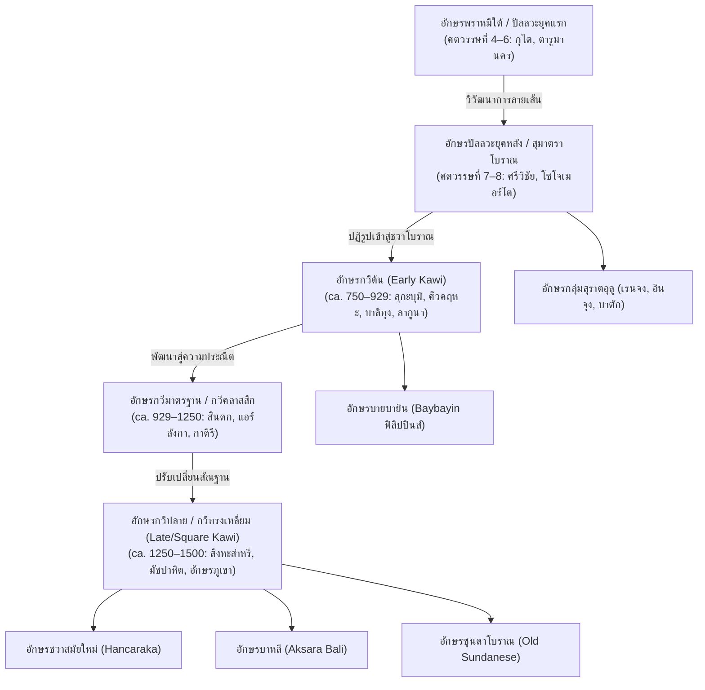
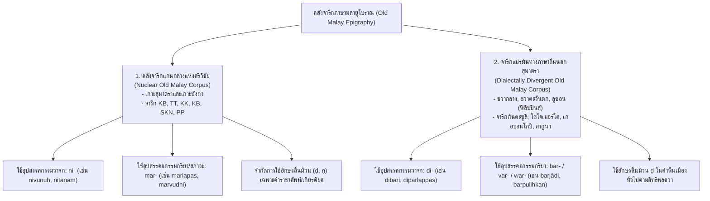

# บทที่ 9
# อักขรวิทยา ภาษาศาสตร์ประวัติศาสตร์ และจารึกวิทยาดิจิทัล
# (Palaeography, Historical Linguistics, and Digital Epigraphy)

---

## บทนำประจำบทที่ 9: พรมแดนสหวิทยาการแห่งจารึกวิทยาเอเชียตะวันออกเฉียงใต้ภาคพื้นสมุทร

การศึกษาจารึกวิทยาในภูมิภาคเอเชียตะวันออกเฉียงใต้ภาคพื้นสมุทร หรือโลกสมุทรนูซันตารา (Maritime Southeast Asia / Nusantara) ได้ก้าวผ่านพัฒนาการอันยาวนานกว่าหนึ่งศตวรรษครึ่ง จากจุดเริ่มต้นในฐานะสาขาวิชาเสริมของประวัติศาสตร์อาณานิคมและภารตวิทยาคลาสสิก (Colonial Indology) สู่การสถาปนาตนเองเป็นศาสตร์เอกเทศที่มีระเบียบวิธีวิจัยอันรัดกุม ทว่า ในช่วงสองทศวรรษแรกของคริสต์ศตวรรษที่ 21 วงวิชาการจารึกวิทยาสากลได้เผชิญหน้ากับคลื่นความเปลี่ยนแปลงครั้งใหญ่ที่เรียกว่า "การเปลี่ยนผ่านกระบวนทัศน์ทางดิจิทัลและสหวิทยาการ" (Digital and Interdisciplinary Paradigm Shift) ซึ่งส่งผลให้พรมแดนความรู้ด้านจารึกมิได้จำกัดอยู่เพียงการอ่านถอดรหัสข้อความเพื่อปะติดปะต่อลำดับเหตุการณ์ทางการเมืองและพงศาวลีของกษัตริย์ดังเช่นในอดีต หากแต่ได้หลอมรวมแกนวิชาการสำคัญสามเสาหลักเข้าเป็นหนึ่งเดียว ได้แก่ อักขรวิทยา (Palaeography), ภาษาศาสตร์ประวัติศาสตร์และสัทวิทยา (Historical Linguistics and Phonology), และจารึกวิทยาดิจิทัลว่าด้วยวิทยาศาสตร์การคำนวณ (Computational Digital Epigraphy)[1]

ในกระบวนทัศน์ดั้งเดิมยุคอาณานิคมดัตช์และฝรั่งเศส นักวิชาการรุ่นบุกเบิก อาทิ เฮนดริก เคิร์น (Hendrik Kern), เจ.แอล.เอ. บรันเดส (J.L.A. Brandes), เอ็น.เจ. โครม (N.J. Krom), และยอร์ช เซเดส์ (George Cœdès) ได้วางรากฐานการอ่านและรวบรวมจารึกภาษาสันสกฤต ภาษาชวาโบราณ และภาษามลายูโบราณไว้อย่างมหาศาล ทว่าวิธีวิทยาของสำนักคลาสสิกดังกล่าวมักถูกตีกรอบด้วยมุมมอง "ภารตภิวัตน์" (Indianization) หรือแนวคิด "มหาอินเดีย" (Greater India) ซึ่งมองจารึกในอุษาคเนย์เป็นเพียงภาพสะท้อนชายขอบของอารยธรรมอินเดียโบราณ[2] ยิ่งไปกว่านั้น ระบบการปริวรรตอักษร (Transliteration) ในยุคแรกยังขาดความเป็นเอกภาพ โดยมักดัดแปลงตามสัทศาสตร์ของภาษาเจ้าอาณานิคม (อาทิ การสะกดแบบภาษาดัตช์) หรือนำระบบการถอดอักษรภาษาสันสกฤตมาตรฐาน (IAST: International Alphabet of Sanskrit Transliteration) มาสวมทับภาษาพื้นเมืองตระกูลออสโตรนีเซียนอย่างไร้วิพากษ์ ส่งผลให้เกิดความลักลั่นอย่างรุนแรงในการบันทึกเสียงสระเฉพาะถิ่น เช่น สระเปอเปิต (schwa /ə/) สระอือซุนดาโบราณ และหน่วยเสียงพยัญชนะกึ่งสระริมฝีปาก ตลอดจนละเลยความแตกต่างเชิงโครงสร้างระหว่างการถอดอักษรตามรูปเขียนจริง (Graphemic Transliteration) กับการถอดเสียงตามระบบสัทวิทยา (Phonological Transcription)[3]

การก้าวข้ามข้อจำกัดดังกล่าวเริ่มปรากฏเค้าโครงอย่างเด่นชัดผ่านงานบุกเบิกระเบียบวิธีวิจัยช่วงกลางคริสต์ศตวรรษที่ 20 โดยเฉพาะการปฏิวัติด้านการคำนวณปฏิทินดาราศาสตร์และสัทศาสตร์ประวัติศาสตร์ของหลุยส์-ชาร์ลส์ ดาแมส์ (Louis-Charles Damais) และวัลเทอร์ ไอเชเลอ (Walther Aichele)[4] ก่อนจะได้รับการยกระดับสู่จุดสูงสุดในปัจจุบันผ่านโครงการความร่วมมือวิจัยระดับนานาชาติ อาทิ โครงการวิจัย DHARMA (The Domestication of "Hindu" Asceticism and the Religious Making of South and Southeast Asia, 2019–2026) ภายใต้การสนับสนุนของสภาการวิจัยแห่งยุโรป (European Research Council: ERC) ซึ่งมีศูนย์กลางการดำเนินงานร่วมกันระหว่างสำนักฝรั่งเศสแห่งปลายบุรพทิศ (EFEO), ศูนย์วิจัยวิทยาศาสตร์แห่งชาติฝรั่งเศส (CNRS), มหาวิทยาลัยโบโลญญา, และสำนักงานการวิจัยและนวัตกรรมแห่งชาติอินโดนีเซีย (BRIN)[5]

หัวใจสำคัญของการศึกษายุคปัจจุบันคือการผสานหลักฐานทางอักขรวิทยาและภาษาศาสตร์ประวัติศาสตร์เข้ากับโครงสร้างพื้นฐานดิจิทัลมาตรฐานเปิดระดับโลก จารึกโบราณมิได้ถูกมองว่าเป็นเพียง "ตัวบทนามธรรม" (disembodied text) ที่ตัดขาดจากบริบททางกายภาพ หากแต่เป็น "โบราณวัตถุทางวัฒนธรรมที่มีปฏิสัมพันธ์เชิงสังคม" (material cultural artifact) ซึ่งต้องได้รับการบันทึกรูปลักษณ์ทางกายภาพ ลายเส้นอักขระ ความลึกของการจาร ตลอดจนสภาพความชำรุดเสียหายผ่านเทคโนโลยีการบันทึกภาพสามมิติความละเอียดสูง (3D Photogrammetry) และการแปลงพื้นผิวแบบสะท้อนแสง (Reflectance Transformation Imaging: RTI) ควบคู่ไปกับการเข้ารหัสข้อมูลตัวบทเชิงโครงสร้างตามมาตรฐานสากล TEI/EpiDoc XML (Text Encoding Initiative / Epigraphic Documents in XML) ซึ่งแยกชั้นข้อมูลตัวบทดั้งเดิม (diplomatic edition) ออกจากชั้นข้อมูลการชำระความหมายเชิงวิพากษ์ (critical edition) และการกำกับอภิข้อมูล (metadata annotation) อย่างเด็ดขาด[6]

ยิ่งไปกว่านั้น การสถาปนามาตรฐานการถอดอักษรระบบ ISO-15919 และคู่มือมาตรฐาน DHARMA Transliteration Guide (Balogh & Griffiths 2020) ได้กลายเป็นพิมพ์เขียวทางระเบียบวิธีวิจัยที่ขจัดความสับสนที่สั่งสมมากว่าร้อยปี นวัตกรรมการจัดการหน่วยอักขระ (Akṣara taxonomy) การจำแนกอักขระเดี่ยว (Simplex Characters) ออกจากอักขระประสม (Complex Characters) การจัดการพยัญชนะจบรูปพิเศษ (Halanta) และสระลอยอิสระด้วยระบบตัวพิมพ์ใหญ่ (Uppercase Notation) ตลอดจนการถอดรหัสพยัญชนะค้ำจุนสระ (Vowel Support 'q') ได้เปิดทางให้วิทยาการคอมพิวเตอร์สามารถประมวลผลข้อมูลจารึกขนาดใหญ่ (Big Data) การทำเหมืองข้อมูลตัวบท (Text Mining) และการวิเคราะห์เครือข่ายความสัมพันธ์ทางภาษาศาสตร์สังคมข้ามภูมิภาคได้อย่างแม่นยำอย่างที่ไม่เคยปรากฏมาก่อน[7]

บทที่ 9 ตอนที่ 1 นี้ มุ่งนำเสนอการสังเคราะห์องค์ความรู้เชิงลึกในสองหมวดวิชาการหลัก: หมวดแรก (หัวข้อ 9.1) เจาะลึกวิวัฒนาการสายอักขรวิทยาในโลกสมุทรนูซันตารา นับแต่การสืบทอดสายธารอักษรพราหมีใต้สู่อักษรปัลลวะยุคแรกและยุคหลัง การคลี่คลายสู่ระบบอักษรกวีในแต่ละยุคสมัย อักขรวิธีพิเศษของอักษรมนตร์และอักษรภูมิภาคที่แตกแขนง การวิเคราะห์ตารางสัณฐานวิทยาเปรียบเทียบข้ามยุคสมัย ตลอดจนทฤษฎีหน่วยอักขระตามระเบียบวิธีวิจัยดิจิทัล หมวดที่สอง (หัวข้อ 9.2) ดำเนินการวิเคราะห์ภาษาศาสตร์ประวัติศาสตร์ สัทวิทยา และการปฏิวัติอักขรวิธี ผ่านการสืบสร้างระบบเสียงภาษามลายูโบราณศรีวิชัย การจำแนกคลังจารึกแกนกลางออกจากจารึกแปรผันทางภาษาถิ่น ปฏิสัมพันธ์เชิงลึกระหว่างภาษาสันสกฤตกับภาษาชวาโบราณจนนำไปสู่การกำเนิดระดับภาษาสุภาพ (Krama) และการคลี่คลายปริศนาการปฏิวัติอักขรวิธีซุนดาโบราณ การศึกษานี้จึงทำหน้าที่เป็นสะพานเชื่อมโยงหลักฐานปฐมภูมิจารึกวิทยาเข้ากับพรมแดนความรู้ระดับสากลสู่อนาคตปี ค.ศ. 2026 อย่างสมบูรณ์

---

## 9.1 วิวัฒนาการสายอักขรวิทยาในโลกสมุทรนูซันตารา (Palaeographical Trajectories in the Maritime World)

### 9.1.1 จากพราหมีใต้สู่อักษรปัลลวะยุคแรกและยุคหลัง: ปฐมบทแห่งตัวเขียนในอุษาคเนย์ภาคพื้นสมุทร

ประวัติศาสตร์ลายลักษณ์อักษรในภูมิภาคเอเชียตะวันออกเฉียงใต้ภาคพื้นสมุทรเริ่มต้นขึ้นอย่างเป็นรูปธรรมในช่วงครึ่งแรกของคริสต์ศตวรรษที่ 5 ผ่านการรับและปรับใช้อักขรวิธีตระกูลพราหมีจากอินเดียใต้ โดยเฉพาะอย่างยิ่งสายธารที่พัฒนามาจาก "อักษรพราหมีตอนใต้" (Southern Brāhmī) ซึ่งมีความสัมพันธ์แนบแน่นกับศูนย์กลางอำนาจของราชวงศ์ปัลลวะ (Pallava dynasty) แห่งกาญจีปุรัม (Kāñcīpuram) และราชวงศ์อิกษวากุ (Ikṣvāku) แห่งลุ่มแม่น้ำกฤษณา-โคทาวารีในรัฐอานธรประเทศและทมิฬนาฑูในปัจจุบัน[8] นักจารึกวิทยายุคอาณานิคมในอดีต เช่น เอ.ซี. เบอร์เนลล์ (A.C. Burnell) และเคิร์น เคยจำแนกอักษรยุคแรกนี้อย่างคลาดเคลื่อนว่าเป็น "อักษรเวงคี" (Vengi alphabet) ทว่า เจ. ฟิล. โฟเกล (J. Ph. Vogel) ได้พิสูจน์หักล้างอย่างเด็ดขาดในงานวิจัยแม่บท ค.ศ. 1918 โดยแสดงให้เห็นว่าลักษณะทางสัณฐานวิทยาของอักขระบนจารึกที่เก่าแก่ที่สุดในอินโดนีเซียมีความสอดคล้องอย่างสมบูรณ์กับ "อักษรปัลลวะยุคแรก" (Early Pallava Script) หรือที่วงวิชาการสากลปัจจุบันจำแนกในกลุ่ม "อักษรครันถะศิลาแบบโบราณ" (Archaic Lithic Grantha)[9]

หลักฐานเชิงประจักษ์ชิ้นสำคัญที่สุดที่ยืนยันการตั้งมั่นของอักษรปัลลวะยุคแรกในโลกสมุทร คือ กลุ่มเสาศิลาจารึกยูปะ (Yūpa inscriptions) จำนวน 7 หลักของพระเจ้ามูลวรมัน (Mūlavarman) ซึ่งค้นพบ ณ แหล่งโบราณคดีมูอารา กามัน (Muara Kaman) ริมแม่น้ำมหาคัม (Mahakam River) แคว้นกุไต (Kutei / Kutai) ในกาลีมันตันตะวันออก กำหนดอายุสัมพัทธ์ตามหลักอักขรวิทยาได้ราว ค.ศ. 400–450 จารึกเหล่านี้สลักลงบนเสาหินแอนดีไซต์ธรรมชาติที่สกัดแต่งอย่างหยาบ โดยตัวอักษรมีลักษณะเด่นของอักษรปัลลวะตอนต้นอย่างชัดเจน ได้แก่ หัวอักษรที่มีกล่องสี่เหลี่ยมทึบขนาดเล็กหรือรอยบากเป็นตุ่ม (serif / box-headed or notched headmark) เส้นแกนดิ่งที่มีความยาวและตวัดโค้งอย่างสง่างาม เช่น อักขระ *ka* และ *ra* ซึ่งยังคงรักษาเส้นแกนดิ่งยาวเหยียดที่ปลายล่างตวัดงอนขึ้นเล็กน้อย ขณะที่อักขระ *ta* และ *na* แสดงฐานโค้งเดี่ยวที่ยังไม่ปรากฏการหยักลึกตรงกลางอันเป็นลักษณะของยุคหลัง[10]

ข้อความบนเสายูปะหลัก A (Vogel 1918) เผยให้เห็นพงศาวลีสามชั่วรุ่นของราชสำนักกุไตโบราณ พร้อมทั้งบันทึกการประกอบพิธียัญกรรมตามคติพราหมณ์-ฮินดู ซึ่งได้รับการสลักด้วยฉันทลักษณ์อนุษฏุภ (Anuṣṭubh) ภาษาสันสกฤตคลาสสิกอันวิจิตร:

> **[IAST - Yūpa Inscription A (Vogel 1918: 198)]**  
> *śrīmataḥ śrī-narendra-sya, kuṇḍuṅga-sya mahātmanaḥ*  
> *putro 'śvavarmmo vikhyātaḥ, vaṅśakarttā yathāṅśumān*  
> *tasya putrā mahātmānaḥ, trayas traya ivāgnayaḥ*  
> *teṣāṁ trayāṇāṁ pravaraḥ, tapo-bala-damānvitaḥ*  
> *śrī-mūlavarmmā rājendro, yaṣṭvā bahusuvarṇṇakam*  
> *tasya yūpo 'yaṁ viprendraiḥ, krakr̥to sthāpitaś ca yaḥ*  

คำแปลภาษาไทยเชิงวิชาการ:
> "พระมหากษัตริย์ผู้ทรงพระเกียรติยศอันรุ่งโรจน์ นามว่ากุณฑุงคะ ผู้มีพระทัยอันประเสริฐ ทรงมีพระราชโอรสผู้ปรากฏพระนามขจรขจายว่าอัศววรมัน ผู้ทรงเป็นผู้สถาปนาราชวงศ์ ประดุจดังพระสุริยเทพผู้ทรงไว้ซึ่งแสงสว่าง ทรงมีพระราชโอรสผู้เป็นมหาบุรุษสามพระองค์ เปรียบประดุจไฟศักดิ์สิทธิ์ทั้งสามกอง ในบรรดาพระราชโอรสทั้งสามพระองค์นั้น องค์ผู้ทรงเป็นเลิศที่สุด ผู้ทรงเพียบพร้อมด้วยเดชะแห่งตบะ พละกำลัง และการสำรวมอินทรีย์ คือ สมเด็จพระราชาธิราช ศรีมูลวรมัน ผู้ได้ทรงประกอบพิธีพหุสุวรรณกะบูชายัญ เสายูปะต้นนี้ถูกสร้างขึ้นและประดิษฐานไว้โดยเหล่าพราหมณ์ผู้ประเสริฐ เพื่อเป็นอนุสรณ์แห่งยัญพิธีของพระองค์"[11]

ในบริบททางอักขรวิทยาและประวัติศาสตร์นิพนธ์ โฟเกลได้ชี้ให้เห็นประเด็นสำคัญว่า พระนาม "กุณฑุงคะ" (*Kuṇḍuṅga*) เป็นคำภาษาพื้นเมืองออสโตรนีเซียนดั้งเดิมของเกาะบอร์เนียว ขณะที่พระราชโอรสทรงมีพระนามภาษาสันสกฤตว่า "อัศววรมัน" และได้รับการยกย่องเป็น "ผู้สถาปนาราชวงศ์" (*vaṅśakartr̥*) ซึ่งสะท้อนให้เห็นว่ากระบวนการรับอักษรปัลลวะและวัฒนธรรมสันสกฤตมิได้เกิดจากการล่าอาณานิคมด้วยกำลังทหารของชาวอินเดีย หากแต่เป็นกระบวนการที่ชนชั้นนำพื้นเมืองเปิดรับและคัดสรรเทคโนโลยีตัวเขียนและวิทยาการพราหมณ์เข้ามาเพื่อเสริมสร้างความชอบธรรมทางการเมืองของตน ดังข้อความในจารึกหลัก B ที่ระบุอย่างชัดเจนว่า *kr̥to viprair ihāgataiḥ* ("จารึกนี้สร้างขึ้นโดยเหล่าพราหมณ์ผู้เดินทางมาถึงที่นี่")[12]

ร่วมสมัยหรือไล่เลี่ยกันในราวปลายคริสต์ศตวรรษที่ 5 ถึงต้นคริสต์ศตวรรษที่ 6 ปรากฏสายธารอักษรปัลลวะยุคแรกในแถบชวาตะวันตก ภายใต้อาณาจักรตารูมานคร (Tārumānagara) ของพระเจ้าปูรณวรมัน (Pūrṇavarman) ได้แก่ ศิลาจารึกจิอารูเตือน (Ciaruteun), จารึกปาซิรโกเลอคัก หรือจัมเปอา (Pasir Koleangkak / Ciampea), จารึกเกอบอนโกปี 1 (Kebon Kopi I), จารึกเลอบัก หรือซีดังฮียัง (Lebak / Cidanghiang), และศิลาจารึกตูคู (Tugu Inscription) อักขรวิทยาของกลุ่มจารึกตารูมานครยังคงจัดอยู่ในชั้นปัลลวะตอนต้น โดยมีลักษณะรูปอักษรประดับยอด (ornamental headmark) ที่เด่นชัด มีการสลักรูปฝ่าพระบาทคู่ของพระเจ้าปูรณวรมันเคียงคู่กับตัวบทจารึกฉันท์ภาษาสันสกฤต โดยประกาศเปรียบเปรยรอยพระพุทธบาทจำลองนั้นประดุจดังรอยพระบาทแห่งองค์พระวิษณุ (*viṣṇor iva padadvayam*) และรอยเท้าช้างทรงของพระองค์ประดุจดังรอยเท้าช้างเอราวัณ (*airāvata-samasya*)[13]

วิวัฒนาการก้าวสู่ "อักษรปัลลวะยุคหลัง" (Later Pallava Script) เริ่มปรากฏให้เห็นอย่างชัดเจนในคริสต์ศตวรรษที่ 7 ถึง 8 ในเอกสารจารึกของสองอาณาจักรใหญ่ ได้แก่ จักรวรรดิพาณิชย์นาวีศรีวิชัย (Śrīvijaya) ในสุมาตราตอนใต้และเกาะบังกา และราชวงศ์ไศเลนทร์ยุคแรกในชวากลาง อักษรปัลลวะยุคหลังนี้มีวิวัฒนาการสัณฐานวิทยาที่เปลี่ยนแปลงไปจากยุคแรกอย่างมีนัยสำคัญ:
1. **การลดทอนหัวกล่องสี่เหลี่ยม:** หัวอักษรที่เป็นกล่องสี่เหลี่ยมทึบเริ่มคลายตัวออก กลายเป็นเส้นโค้งเปิดหรือเส้นขีดนอนสั้นๆ (horizontal top bar)
2. **การแตกแขนงของฐานอักษร:** อักขระที่มีฐานเรียบโค้งในยุคแรก เช่น *ta* และ *na* เริ่มปรากฏรอยหยักตรงกลางฐานอย่างเด่นชัด กลายเป็นรูปทรงหยักสองลอน (notched or indented base)
3. **การคลี่คลายของเส้นนอนและหางอักษร:** อักขระ *ka* และ *ra* เริ่มลดความยาวของแกนดิ่งลง แต่เพิ่มความกว้างของปีกและเส้นโค้งด้านข้าง ลายเส้นมีความลื่นไหลและแสดงลักษณะของการเขียนด้วยความเร็ว (cursive tendencies) มากขึ้น[14]

ในจารึกภาษามลายูโบราณของศรีวิชัยยุคปลายคริสต์ศตวรรษที่ 7 อันได้แก่ จารึกเกอดูกันบูกิต (Kedukan Bukit ค.ศ. 683), ตาลังตูโว (Talang Tuwo ค.ศ. 684), โกตาคาปูร์ (Kota Kapur ค.ศ. 686), การังบราฮี (Karang Brahi ค.ศ. 686), ปาลัสปาเซอมะฮ์ (Palas Pasemah), และเตอลากาบาตู (Telaga Batu c. 686) อักษรปัลลวะยุคหลังได้พัฒนาคุณลักษณะเฉพาะตัวจนกระทั่งนักจารึกวิทยา เช่น วารูโน มะฮ์ดี (Waruno Mahdi) และลาร์ส เอส. วีกอร์ (Lars S. Vikør) ขนานนามว่าเป็น "อักษรสุมาตราโบราณ" (Old Sumatran Script) ระบบตัวเขียนนี้สะท้อนการปรับตัวครั้งใหญ่ของอักขรวิธีอินเดียเพื่อรองรับโครงสร้างทางสัทวิทยาของภาษาตระกูลออสโตรนีเซียน ซึ่งไม่มีความแตกต่างระหว่างเสียงพ่นลม (aspirated) กับไม่พ่นลม (unaspirated) แต่ต้องการกลไกการบันทึกเสียงเฉพาะถิ่น เช่น สระเปอเปิตและพยัญชนะนาสิกสะกด[15]

ขณะเดียวกัน ในชวากลาง จารึกโซโจเมอร์โต (Sojomerto Inscription) ซึ่งจารึกด้วยภาษามลายูโบราณในราวปลายศตวรรษที่ 7 หรือต้นศตวรรษที่ 8 และบันทึกพระนาม "ดาปุนตาไศเลนทร์" (*ḍapūnta selendra*) ก็แสดงรูปอักษรปัลลวะยุคหลังที่มีความเชื่อมโยงอย่างแนบแน่นกับจารึกสุมาตรา ทว่าในเวลาเดียวกันก็ได้เริ่มปรากฏลักษณะสัณฐานวิทยาบางประการที่กำลังแปรเปลี่ยนไปสู่อักษรชวาโบราณยุคต้น ซึ่งเป็นสะพานเชื่อมเข้าสู่พัฒนาการของระบบอักษรกวีในระยะต่อมา[16]

---

### 9.1.2 วิวัฒนาการของอักษรกวี: กวีต้น กวีมาตรฐาน และกวีปลายทรงเหลี่ยม

"อักษรกวี" (Kawi Script) หรือที่รู้จักในนาม "อักษรชวาโบราณ" (Old Javanese Script) ถือเป็นระบบตัวเขียนแม่บทที่ทรงอิทธิพลและมีการใช้งานยาวนานที่สุดในประวัติศาสตร์เอเชียตะวันออกเฉียงใต้ภาคพื้นสมุทร โดยทำหน้าที่เป็นรากฐานบรรพบุรุษโดยตรงของระบบตัวเขียนพื้นเมืองเกือบทั้งหมดในอินโดนีเซียและฟิลิปปินส์ยุคต่อมา นักอักขรวิทยาสากล อาทิ เจ.จี. เดอ คาสปาริส (J.G. de Casparis) และโบคารี (Boechari) ได้จำแนกวิวัฒนาการของอักษรกวีออกเป็น 3 ยุคสมัยหลักตามการแปรเปลี่ยนทางสัณฐานวิทยาและเทคนิคการจารึก[17]:



#### 1. อักษรกวีต้น (Early Kawi Script ca. ค.ศ. 750–929)
หมุดหมายทางประวัติศาสตร์ที่บ่งชี้การสถาปนาระบบอักษรกวีอย่างเป็นทางการ คือ **ศิลาจารึกสุกะบุมิ (Sukabumi Inscription)** หรือจารึกฮาริญจิง (Hariñjiṅ A) ในเขตเกอดีรี ชวาตะวันออก ลงศักราชมหาศักราช 726 (ตรงกับวันที่ 25 มีนาคม ค.ศ. 804) ซึ่งถือเป็นจารึกภาษาชวาโบราณที่ระบุศักราชเก่าแก่ที่สุดที่ค้นพบในปัจจุบัน[18] ลักษณะเด่นของอักษรกวีต้นประกอบด้วย:
- ลายเส้นมีความหนักแน่น ชัดเจน และยังคงรักษาโครงสร้างทางเรขาคณิตที่สมดุล หัวอักษรปรากฏเป็นขีดขวางหรือรอยโค้งเว้าเล็กน้อย
- อักขระ *ka* เริ่มพัฒนาจากรูปกากบาทแกนดิ่งยาวในสมัยปัลลวะ มาเป็นรูปเส้นดิ่งที่มีปีกโค้งด้านซ้ายและขวาอย่างสมมาตร พร้อมขีดปิดด้านบน
- อักขระ *ta* มีรอยหยักเว้าตรงกลางฐานอย่างสมบูรณ์ กลายเป็นรูปคล้ายอักษร "w" คว่ำหรือรูปหลังเต่า
- อักขระ *na* แยกรูปออกจาก *ta* อย่างเด็ดขาด โดยมีเส้นฐานหยักและลากเส้นดิ่งขวาตวัดขึ้น
- การปรากฏของเครื่องหมายวิรามะ (Virāma) หรือ "ปาเต็น/ปังกอน" (Patén / Pangkon) ที่ทำหน้าที่ตัดเสียงสระอะแฝงท้ายพยัญชนะอย่างเป็นระบบบนเนื้อศิลา[19]

อักษรกวีต้นได้รับการพัฒนาจนถึงจุดสูงสุดในยุคราชธานีมะตะรัมแห่งชวากลาง (Central Javanese Mataram Period) โดยเฉพาะในรัชสมัยของพระเจ้าราไกปิกาตัน (Rakai Pikatan ผู้สถาปนาจารึกศิวคฤหะ ค.ศ. 856 บันทึกการสร้างเทวสถานปรัมบานัน) และพระเจ้าราไกวาตูกูรา ดยัฮ บาลิทุง (Dyaḥ Balitung ค.ศ. 898–910 ผู้พระราชทานมหาจารึกแผ่นทองแดงจำนวนมาก อาทิ มันตยาซิฮ์, วานูวาเตองะฮ์ 3, และโปเลงัน) ยิ่งไปกว่านั้น อิทธิพลของอักษรกวีต้นยังได้แผ่ขยายข้ามสมุทรไปไกลถึงเกาะลูซอน ประเทศฟิลิปปินส์ ดังปรากฏใน **จารึกแผ่นทองแดงลากูนา (Laguna Copperplate Inscription - LCI)** ศักราช ค.ศ. 900 ซึ่งสลักด้วยอักษรกวีต้นที่มีความใกล้เคียงกับจารึกชวากลางในรัชสมัยพระเจ้าบาลิทุงอย่างน่าทึ่ง[20]

#### 2. อักษรกวีมาตรฐานหรือกวีคลาสสิก (Standard or Classical Kawi Script ca. ค.ศ. 929–1250)
ภายหลังการย้ายศูนย์กลางอำนาจทางการเมืองจากชวากลางสู่ชวาตะวันออกโดยพระเจ้าเอมปู สินดก (Mpu Siṇḍok) ในปี ค.ศ. 929 อักษรกวีได้เข้าสู่ยุคคลาสสิกซึ่งครอบคลุมรัชสมัยของพระเจ้าแอร์ลังกา (Airlangga แห่งอาณาจักรกะฮูรีปัน) จนถึงยุคทองของอาณาจักรกาดิรี (Kadiri Period) ลักษณะเฉพาะของยุคนี้ได้แก่:
- ลายเส้นมีความประณีต อ่อนช้อย และมีลักษณะเป็นเส้นโค้งตวัดอย่างงดงาม (flamboyant and cursive style) หัวอักษรเริ่มมีลักษณะม้วนเป็นวงกลมโปร่งหรือรอยตวัดแบบริบบิ้น
- การจัดช่องไฟระหว่างตัวอักษรและระหว่างบรรทัดมีความเป็นระเบียบสูงยิ่ง มีการพัฒนาเครื่องหมายสระจมและสระลอยให้มีความวิจิตร
- มีการใช้ระบบ "อักษรเชิง" หรือ "พยัญชนะซ้อนใต้บรรทัด" (Subjoined consonants / Pasangan) อย่างกว้างขวางและสลับซับซ้อน เพื่อบันทึกคำควบกล้ำและสมาส-สนธิในวรรณคดีภาษากวีร้อยกรอง (Kakawin) เช่น กากาวินภารตยุทธ์ (Kakawin Bhāratayuddha) และกากาวินรามายณะ (Kakawin Rāmāyaṇa)[21]

#### 3. อักษรกวีปลายและอักษรกวีทรงเหลี่ยม (Late Kawi and Quadratic / Square Script ca. ค.ศ. 1250–1500)
ในยุคปลายของประวัติศาสตร์ชวาโบราณ อันครอบคลุมสมัยราชอาณาจักรสิงหะส่าหรี (Siṅhasāri) และจักรวรรดิมัชปาหิต (Majapahit) อักษรกวีได้เกิดการแตกแขนงทางสัณฐานวิทยาอย่างมีนัยสำคัญ ลายเส้นที่เคยโค้งมนอ่อนช้อยได้แปรเปลี่ยนไปสู่อักขรวิธีที่มีความแข็งกระด้างและเป็นเหลี่ยมมุมชัดเจน ซึ่งวงวิชาการเรียกว่า "อักษรกวีทรงเหลี่ยม" (Square Kawi Script) หรือ "อักษรภูเขา/อักษรพุทธ" (*aksara gunung / aksara buda / Old Western Javanese quadratic script*)[22]

ลักษณะเด่นของอักษรกวีทรงเหลี่ยมสมัยมัชปาหิต ได้แก่:
- โครงสร้างตัวอักษรถูกตีกรอบให้อยู่ในรูปทรงสี่เหลี่ยมด้านขนานหรือสี่เหลี่ยมขนมเปียกปูน หัวอักษรกลายเป็นเส้นขีดตรงหักมุมฉาก
- ปรากฏการประดับลวดลายขมวดปมหรือรอยหยักที่มุมอักษร (decorative flourishes) ซึ่งพบเด่นชัดบนจารึกศิลาและแผ่นทองแดงยุคพระเจ้าฮายัม วูรุก (Hayam Wuruk) และมหาเสนาบดีคชมาดา (Gajah Mada) ตลอดจนบนแท่นฐานเทวสถานบนเทือกเขาเปอนังกุงงัน (Mount Penanggungan) และเทือกเขาลาวู (Mount Lawu)
- อักษรกวีทรงเหลี่ยมนี้ยังได้แพร่หลายข้ามไปยังภูมิภาคชวาตะวันตก โดยถูกนำมาใช้เขียนด้วยพู่กันลงบนคัมภีร์ใบเกอบัง (*gebang / nipah*) สำหรับวรรณกรรมศาสนาไศวะและพุทธ ควบคู่ไปกับการใช้อักษรซุนดาโบราณบนใบลาน[23]

---

### 9.1.3 อักขรวิธีพิเศษและอักษรภูมิภาคที่แตกแขนงในโครงข่ายเอเชียสมุทร

ควบคู่ไปกับสายธารอักษรปัลลวะและกวี โลกสมุทรนูซันตารายังปรากฏการใช้งานอักขรวิธีพิเศษและอักษรภูมิภาคที่แตกแขนงออกไปอย่างหลากหลาย ซึ่งสะท้อนถึงการปะทะสังสรรค์ทางวัฒนธรรมและการปรับแปลงตัวเขียนให้สอดรับกับอัตลักษณ์ของแต่ละท้องถิ่น:

#### 1. อักษรมนตร์และสายธารสิทธมาตฤกา/นาครียุคแรก (Siddhamātṛkā / Early Nāgarī Script)
ในปลายคริสต์ศตวรรษที่ 8 ท่ามกลางกระแสการแพร่หลายของพุทธศาสนามหายานและตันตรยานจากมหาวิทยาลัยนาลันทา (Nālandā) และแคว้นเบงกอลภายใต้ราชวงศ์ปาละ (Pāla dynasty) ได้เกิดการนำระบบตัวเขียนอินเดียเหนือที่เรียกว่า "อักษรสิทธมาตฤกา" (Siddhamātṛkā) หรือ "นาครียุคแรก" (Early Nāgarī) เข้ามาใช้ในเกาะชวาและสุมาตรา[24] อักษรระบบนี้มีลักษณะเด่นคือ "เส้นขีดขวางทึบยาวบนยอดอักษร" (solid horizontal headmark / matra) และรูปทรงอักษรที่มีเหลี่ยมมุมแตกต่างอย่างสิ้นเชิงจากอักษรปัลลวะใต้

จารึกสำคัญที่ใช้อักษรสิทธมาตฤกา ได้แก่ **ศิลาจารึกกะลาซัน (Kalasan Inscription ค.ศ. 778)** บันทึกการสร้างวิหารบูชาพระนางตาราร่วมกันระหว่างราชครูไศเลนทร์กับมหาราชปะนังการัน, **ศิลาจารึกเกอลูรัก (Kelurak Inscription ค.ศ. 782)** บันทึกการประดิษฐานเทวรูปพระมัญชุศรีโดยพระราชครูกุมารโฆษะ (Kumāraghoṣa) ผู้เดินทางมาจากเบงกอล (เคาฑะทวีป *Gauḍadvīpa*), จารึกจันดิปลาโอซัน (Candi Plaosan), และการค้นพบล่าสุดใน **จารึกแถบทองแดงมูอาราจัมบี (Muara Jambi Strips A & B)** ในสุมาตราตอนกลาง (Andhifani et al. 2025) อักษรสิทธมาตฤกาในนูซันตาราทำหน้าที่เป็น "อักษรศักดิ์สิทธิ์เฉพาะทาง" (hieratic/scriptural script) สำหรับจารึกมนตรา ธารณี และข้อความสรรเสริญพระโพธิสัตว์ ซึ่งถูกสงวนไว้สำหรับพิธีกรรมตันตระระดับสูง มิได้นำมาใช้ในการบริหารราชการแผ่นดินทั่วไป[25]

#### 2. อักษรซุนดาโบราณ (Old Sundanese Script)
ในภูมิภาคชวาตะวันตกหรืออาณาจักรซุนดา-ปาจาจารัน ได้เกิดวิวัฒนาการของระบบตัวเขียนพื้นเมืองที่เป็นเอกเทศอย่างเด่นชัด อดิตยา กุนาวัน และอาร์โล กริฟฟิทส์ (Aditia Gunawan & Arlo Griffiths 2021) ได้พิสูจน์ว่า อักษรซุนดาโบราณมิได้พัฒนามาจากอักษรกวีปลายมัชปาหิตโดยตรง หากแต่มีสายวิวัฒนาการคู่ขนานที่สืบทอดมาจากอักษรกวีต้นและปัลลวะยุคหลัง[26]

ลักษณะเฉพาะทางอักขรวิทยาของอักษรซุนดาโบราณบนจารึกบาตูตูลิส (Batutulis ค.ศ. 1533/1534), จารึกกลุ่มกาวาลี 1–6 (Kawali inscriptions), และจารึกแผ่นทองแดงเกอบันเตอนัน 1–4 (Kebantenan plates) ประกอบด้วย:
- การตัดทอนการใช้อักษรเชิงซ้อน (pasangan) ลงเกือบทั้งหมด โดยหันมาใช้เครื่องหมาย **ปามาเอะฮ์ (pamaéh ·)** ฆ่าสระแฝงและกำกับพยัญชนะสะกดเรียงต่อกันตามแนวนอน
- การใช้รูปอักษรพยัญชนะลิ้นม้วน **ḍ** ทำหน้าที่แทนหน่วยเสียงทันตชะ **d** เป็นหลักทั่วทั้งจารึก
- รูปแบบอักขระพิเศษ เช่น รูปอักษร *k·* ที่มีขีดนอนสลักอยู่ใต้ตัวอักษรเพื่อแสดงการฆ่าสระ และการใช้อักษร *A* ผสมเครื่องหมายปาเมอเป็ตทำหน้าที่เป็นสระลอย *qə*[27]

#### 3. อักษรบาหลีโบราณ (Old Balinese Script)
จารึกแผ่นทองแดงของบาหลีโบราณ (มหาศักราช 804–944 / ค.ศ. 882–1022) ก่อนการอภิเษกสมรสของพระนางมเหนทรทัตตากับพระเจ้าอุดายนะ ได้บันทึกด้วยภาษาบาหลีโบราณในระบบตัวเขียนที่มีเอกลักษณ์เฉพาะตัว แม้จะมีรากฐานมาจากสายธารปัลลวะ-กวีต้น แต่อักษรบาหลีโบราณมีทรวดทรงที่กว้างและกลมมนกว่าอักษรชวากลาง มีการประดิษฐ์สัญลักษณ์สระและพยัญชนะเฉพาะเพื่อรองรับระบบเสียงภาษาบาหลีโบราณ เช่น การใช้เครื่องหมายแสดงเสียงกักเส้นเสียงและการจัดวางเครื่องหมายวรรคตอน ก่อนที่ภาษาและระบบอักษรชวาโบราณจะหลั่งไหลเข้าสู่เกาะบาหลีอย่างสมบูรณ์ในศตวรรษที่ 11[28]

#### 4. อักษรกลุ่มสุราตอุลู (Surat Ulu Scripts) และอักษรบาตัก (Surat Batak) ในสุมาตรา
ในเขตที่สูงและพื้นที่ห่างไกลของเกาะสุมาตรา สายธารอักษรปัลลวะยุคหลังและกวีต้นได้ถูกเก็บรักษาและปรับเปลี่ยนรูปลักษณ์ไปสู่อักษรตระกูลเส้นตรงหักมุม (angular and stick-like scripts) เพื่อให้เหมาะสมกับการจารลงบนกระบอกไม้ไผ่ เปลือกไม้พับทบ (pustaha) และเขาสัตว์:
- **อักษรเรนจงหรือสุราตอินจุง (Surat Incung):** พบในที่สูงเกอรินจี (Kerinci Highlands) มีลักษณะเป็นลายเส้นเอียงเฉียงที่เขียนขึ้นจากล่างขึ้นบนหรือจากซ้ายไปขวา
- **อักษรบาตัก (Surat Batak):** ใช้ในกลุ่มชาติพันธุ์บาตักรอบทะเลสาบโตบา (Toba, Karo, Mandailing, Simalungun) ซึ่งยังคงรักษาโครงสร้างพยางค์แบบพราหมีไว้อย่างเหนียวแน่น พร้อมด้วยระบบเครื่องหมายฆ่าสระ (pangolat) ที่สืบทอดมาจากวิรามะโบราณ[29]

#### 5. อักษรบายบายิน (Baybayin) ในหมู่เกาะฟิลิปปินส์
การค้นพบจารึกแผ่นทองแดงลากูนา (ค.ศ. 900) ได้กลายเป็นกุญแจทองคำที่ไขปริศนาต้นกำเนิดของระบบตัวเขียนพื้นเมืองในฟิลิปปินส์ เช่น อักษรบายบายิน (Baybayin), อักษรฮานูโนโอ (Hanunó'o), และอักษรตักบานวา (Tagbanwa) ในอดีต นักมานุษยวิทยาเคยสันนิษฐานว่าบายบายินอาจได้รับอิทธิพลจากอักษรจามปาหรืออักษรอินเดียใต้โดยตรง ทว่า เฮกเตอร์ ซานโตส (Hector Santos 1996) และอันโตน โพสต์มา (Antoon Postma 1992) ได้พิสูจน์ให้เห็นว่า ตัวอักษรบนจารึกลากูนาคือ **อักษรกวีต้น (Early Kawi)** ซึ่งเชื่อมต่อสายสัมพันธ์ทางอักขรวิทยาระหว่างราชสำนักชวากลาง/ศรีวิชัยกับเกาะลูซอน และกลายเป็นต้นแบบให้อักษรบายบายินปรับลดรูปร่างและตัดทอนระบบพยัญชนะสะกดออกไปในยุคต่อมา[30]

---

### 9.1.4 การเปรียบเทียบสัณฐานอักษรข้ามยุคสมัยและภูมิภาค (Palaeographical Morphological Comparison)

เพื่อแสดงให้เห็นพลวัตการแปรเปลี่ยนทางสัณฐานวิทยาของตัวอักษรอย่างเป็นรูปธรรม ตารางต่อไปนี้สรุปการเปรียบเทียบรูปทรงของอักขระแกนหลัก 7 ตัว (*a, ka, ta, na, ma, ya, ra*) และเครื่องหมายสระกำกับ (*mātrā*) ข้าม 6 ยุคสมัยและภูมิภาคสำคัญ จากการสำรวจหลักฐานจารึกปฐมภูมิ:

| หน่วยอักขระ (Akṣara) | พราหมีใต้/ปัลลวะต้น (กุไต/ตารูมา ค.ศ. 400–500) | ปัลลวะปลาย/สุมาตรา (ศรีวิชัย ค.ศ. 680–700) | กวีต้น (ชวากลาง/ลากูนา ค.ศ. 800–900) | กวีคลาสสิก (ชวาตะวันออก ค.ศ. 1000–1200) | กวีปลาย/ทรงเหลี่ยม (มัชปาหิต ค.ศ. 1350–1450) | ซุนดาโบราณ (บาตูตูลิส/กาวาลี ค.ศ. 1500) |
| :---: | :--- | :--- | :--- | :--- | :--- | :--- |
| **a (สระลอย)** | รูปคล้ายก้ามปูคว่ำ มีแขนซ้ายโค้งและแกนดิ่งขวา หัวกล่องสี่เหลี่ยม | แขนซ้ายเริ่มมีรอยหยักสองลอน หัวกล่องคลายตัวออก | แขนซ้ายหยักลึกชัดเจน เส้นดิ่งขวาลากตรง มีขีดบน | ลายเส้นโค้งตวัดวิจิตร แขนซ้ายม้วนเป็นวงกลมโปร่ง | รูปทรงสี่เหลี่ยมหักมุมฉาก ลายเส้นตัดเป็นขอบชัด | ลดรูปเป็นเส้นดิ่งคู่เชื่อมด้วยรอยหยักคล้ายเลข 3 กลับด้าน |
| **ka** | ไม้กางเขนแกนดิ่งยาวเหยียด ปลายล่างตวัดงอนซ้ายเล็กน้อย | แกนดิ่งสั้นลง แขนขวางโค้งลงเป็นปีกนกสองข้าง | ปีกสองข้างโค้งสมมาตร มีขีดขวางปิดบนหัวแกน | ปีกซ้ายขวาโค้งตวัดมน ปลายล่างงอนขึ้นเป็นห่วง | ลำตัวกลายเป็นกล่องสี่เหลี่ยม มีเส้นกากบาทตัดภายใน | รูปทรงคล้ายอักษร T ที่มีเส้นเฉียงค้ำซ้ายขวา (พบรูป *k·* มีขีดล่าง) |
| **ta** | รูปเกือกม้าคว่ำ ฐานโค้งเรียบไม่มีรอยหยัก หัวเป็นตุ่ม | ฐานเริ่มปรากฏรอยเว้าตรงกลางเล็กน้อย หัวเป็นขีด | ฐานหยักลึกสมบูรณ์เป็นสองลอน คล้ายอักษร w คว่ำ | เส้นโค้งสองลอนตวัดอ่อนช้อย ปลายขวาตวัดงอนขึ้น | ทรงเหลี่ยมหยักมุมฉาก เส้นยอดตัดตรงแนวนอน | เส้นโค้งหยักสองลอนชัดเจน ปลายขวาลากดิ่งลงจรดบรรทัด |
| **na** | เส้นดิ่งสั้นตั้งอยู่บนฐานขีดขวางเดี่ยว หัวเป็นตุ่ม | ฐานเริ่มงอโค้งขึ้นด้านขวา มีรอยหยักเล็กน้อย | รูปทรงคล้ายตัว C กลับด้านที่มีเส้นดิ่งและฐานหยัก | ปลายเส้นตวัดโค้งเป็นวง ลายเส้นเชื่อมต่อลื่นไหล | ลายเส้นเหลี่ยมมุมชัดเจน รอยหยักกลายเป็นมุมฉาก | คล้ายตัวเขียนเลข 2 ที่มีเส้นฐานเหยียดตรง |
| **ma** | รูปวงกลมหรือห่วงล่าง มีแขนสองข้างชูขึ้นรับขีดหัว | ห่วงล่างกลายเป็นรูปตัว U แขนขวาไขว้ทับแขนซ้าย | รูปทรงคล้ายริบบิ้นผูกโบว์ มีห่วงซ้ายและหางขวา | ห่วงบิดเป็นเกลียววิจิตร เส้นโค้งตวัดอย่างอิสระ | รูปทรงกล่องสี่เหลี่ยมซ้อน มีรอยตัดเหลี่ยมมุม | รูปทรงสามเหลี่ยมยอดตัด มีรอยหยักด้านข้าง |
| **ya** | รูปคันศรสามแฉก (trifid) แฉกกลางตรง แฉกข้างโค้ง | แฉกซ้ายม้วนเป็นห่วงกลม แฉกขวาลากดิ่งยาว | แฉกซ้ายกลายเป็นลอนคลื่น แฉกขวาเป็นเส้นดิ่งหลัก | ลายเส้นโค้งตวัดต่อเนื่อง หางขวางอนงามสะบัดปลาย | รูปทรงเหลี่ยมสามลอน เส้นสายตัดตรงเป็นมุมหัก | ลอนซ้ายโค้งมน ลอนขวาลากดิ่งเป็นแกนตรง |
| **ra** | เส้นดิ่งตรงยาวเดี่ยว หัวมีกล่องสี่เหลี่ยมหรือขีดขวาง | เส้นดิ่งยาวเริ่มมีความคดโค้งเล็กน้อย หัวคลายตัว | เส้นดิ่งสั้นลง ปลายล่างตวัดงอนขึ้นทางซ้าย | เส้นดิ่งโค้งคลื่น (wavy line) ปลายตวัดวิจิตร | เส้นดิ่งหนาตัดมุมฉาก มีขีดประดับหัวท้าย | เส้นดิ่งตรงธรรมดา หรือเส้นหยักฟันปลาเรียบง่าย |
| **mātrā: -i** | วงกลมโปร่งหรือวงรีตั้งอยู่บนหัวพยัญชนะ | วงกลมมีรอยขีดขมวดภายใน หรือรูปก้นหอย | วงกลมสมบูรณ์วางกึ่งกลางบนเส้นยอดพยัญชนะ | วงกลมประดับรอยหยักและมีรัศมีตวัดออก | วงรีเหลี่ยมวางซ้อนบนขอบบนของโครงสร้างอักษร | วงรีขนาดเล็กวางเยื้องไปทางขวาของหัวอักขระ (ปังฮูลู) |
| **mātrā: -u** | เส้นดิ่งลากต่อจากปลายล่างของพยัญชนะลงมาตรงๆ | เส้นดิ่งปลายล่างตวัดงอไปทางขวาเป็นมุมฉาก | เส้นตวัดงอทางขวาแล้วหักขึ้นบนเป็นรูปขอเบ็ด | เส้นตวัดลากยาวขึ้นข้างลำตัวพยัญชนะอย่างวิจิตร | เส้นหักมุมฉากลากขึ้นขนานกับลำตัวอักษรทรงเหลี่ยม | เส้นขอเบ็ดลากตวัดใต้ฐานพยัญชนะ (ปันยูคุง) |
| **Virāma** | ไม่ปรากฏรูปสัญลักษณ์ (ใช้การผูกอักขระซ้อนใต้อักษร) | เริ่มปรากฏรอยขีดเฉียงสั้นๆ เหนือพยัญชนะบางคำ | เครื่องหมายขีดเฉียงหรือหยดน้ำวางเยื้องบนขวาพยัญชนะ | หางตวัดลากยาวคลุมหลังพยัญชนะ (ปาเต็น/ปังกอน) | รูปขีดนอนหักมุมตัดทแยงเหนือพยัญชนะอย่างชัดเจน | เครื่องหมายขีดนอนบนหรือขีดตัดใต้ตัวอักษร (**ปามาเอะฮ์** ·) |

การวิเคราะห์ตารางสัณฐานวิทยาเผยให้เห็นกฎทางอักขรวิทยาประการสำคัญว่า การคลี่คลายของรูปอักษรในโลกสมุทรนูซันตารามิได้ดำเนินไปอย่างไร้ทิศทาง หากมีแนวโน้มหลัก 3 ประการ:
1. **การเคลื่อนย้ายจุดศูนย์ถ่วง:** จากอักษรที่มีแกนดิ่งยาวเด่นชัดในยุคปัลลวะต้น สู่ตัวอักษรที่มีความกว้างในแนวนอนและมีความสมดุลของกล่องโครงสร้างในยุคกวี
2. **การเปลี่ยนรูปทรงทางเรขาคณิต:** จากเส้นโค้งมนของศิลปะกวีคลาสสิก สู่การหักมุมฉากและทรงเหลี่ยมในยุคมัชปาหิตและอักษรภูเขา ซึ่งสัมพันธ์กับเครื่องมือการจารึกและการเปลี่ยนวัสดุรองรับ
3. **การลดทอนความซับซ้อนเพื่อการใช้งานจริง:** ในระบบอักษรภูมิภาค เช่น ซุนดาโบราณและบายบายิน มีการตัดทอนโครงสร้างการผูกอักขระที่ซับซ้อนของสันสกฤตออกไป แล้วแทนที่ด้วยระบบการสะกดคำเรียงตามแนวนอนและการใช้เครื่องหมายฆ่าสระที่เรียบง่าย[31]

---

### 9.1.5 ทฤษฎีหน่วยอักขระและระเบียบวิธีวิเคราะห์ตัวเขียนดิจิทัล (Graphemic & Akṣara Theory)

ความก้าวหน้าสำคัญที่สุดในระเบียบวิธีวิจัยจารึกวิทยาร่วมสมัย คือการสถาปนา "ทฤษฎีหน่วยอักขระ" (Graphemic & Akṣara Theory) และการวางมาตรฐานการประมวลผลตัวเขียนโบราณในระบบดิจิทัล ซึ่งได้รับการสังเคราะห์อย่างเป็นระบบในคู่มือ *DHARMA Transliteration Guide* (Release Version 3, 2020) โดย ดาเนียล บาล็อกฮ์ และอาร์โล กริฟฟิทส์ (Dániel Balogh & Arlo Griffiths)[32] ทฤษฎีนี้ได้รื้อถอนความสับสนระหว่าง "หน่วยเสียง" (Phoneme) กับ "หน่วยอักขระ" (Grapheme) ที่ครอบงำวงวิชาการมานานกว่าศตวรรษ โดยวางหลักการนิยามเชิงโครงสร้างดังนี้:

#### 1. นิยามของอักขระและสถาปัตยกรรมหน่วยกราฟีม (Akṣara Taxonomy)
ในระบบอักษรตระกูลพราหมีทั้งหมด "หนึ่งอักขระ" (Akṣara) ได้รับการนิยามในฐานะ **"หนึ่งหน่วยตัวเขียนอิสระทางสายตา" (Single Visual and Orthographic Character/Grapheme)** โดยไม่ขึ้นกับจำนวนหน่วยเสียงที่บรรจุอยู่ภายใน บาล็อกฮ์และกริฟฟิทส์ได้จำแนกอักขระออกเป็นสองประเภทรากฐาน:
- **อักขระเดี่ยว (Simplex Characters):** คืออักขระที่ประกอบด้วยหน่วยสัญญะเดี่ยวที่ไม่สามารถแยกย่อยทางสายตาได้ ได้แก่ รูปพยัญชนะเดี่ยวที่มีสระอะแฝงตามธรรมชาติ (เช่น *ka, ta, ma*), สระลอยอิสระรูปเดี่ยว (Independent Vowels เช่น *A, I, U, E, O*), และพยัญชนะจบรูปพิเศษไร้สระ (Special Simplex Final Consonants / Halanta เช่น *T, M, N, K*)
- **อักขระประสม (Complex Characters):** คืออักขระที่เกิดจากการนำชิ้นส่วนองค์ประกอบ (Character Components) มาประกอบรวมกันเป็นหน่วยทางสายตาเดียว ซึ่งประกอบด้วยพยัญชนะต้น พยัญชนะควบกล้ำซ้อนรูป (Subjoined Consonants / Pasangan) เครื่องหมายสระจม (Dependent Vowel Markers / Mātrā) และเครื่องหมายเสริมสัทอักษร (Diacritic Markers เช่น อนุสวาระและวิสรรคะ) เช่น อักขระ *ki* (ประกอบด้วย *ka* + สระอิ) หรืออักขระ *rddhe* (ประกอบด้วย *ra* + *da* + *dha* + สระเอ)[33]

คู่มือ DHARMA ได้เน้นย้ำการแยกความแตกต่างอย่างเข้มงวดระหว่าง *Character Components* (องค์ประกอบเชิงหน้าที่และหน่วยเสียง เช่น หน่วยพยัญชนะและสระ) กับ *Glyph Components* (ชิ้นส่วนเชิงรูปลักษณ์ทางกายภาพและลายเส้น เช่น แขน ขา ปีก หาง ลำต้น กลีบ ส่วนโค้ง และฐาน) ซึ่งช่วยให้นักจารึกวิทยาสามารถบรรยายวิวัฒนาการของลายเส้นได้อย่างเป็นภววิสัย ปราศจากการใช้คำคุณศัพท์ที่เลื่อนลอย[34]

#### 2. นวัตกรรมการใช้อักษรพิมพ์ใหญ่ (Uppercase Innovation)
ปัญหาคลาสสิกประการหนึ่งในการถอดอักษรจารึกอินโดนีเซียในอดีต คือการใช้เครื่องหมายวงกลมลอย `°` (degree sign) นำหน้าสระลอยอิสระ (เช่น `°a, °i`) หรือต่อท้ายพยัญชนะจบ (เช่น `t°`) ซึ่งสร้างความล้มเหลวอย่างร้ายแรงในระบบประมวลผลข้อมูลดิจิทัล การสืบค้นคำในฐานข้อมูลคอมพิวเตอร์ และการจัดทำดัชนีอัตโนมัติ ในคู่มือมาตรฐาน DHARMA เวอร์ชัน 3 ได้ประกาศยกเลิกการใช้สัญลักษณ์ `°` อย่างถาวร (Deprecated) และนำเสนอทางออกเชิงปฏิวัติด้วยการใช้ **"ตัวอักษรละตินพิมพ์ใหญ่" (Uppercase Letters)** ทำหน้าที่เป็นตัวแทนของรูปเขียนพิเศษสองกลุ่ม:
1. **สระลอยอิสระรูปเดี่ยว (Independent Simplex Vowels):** ถอดด้วยตัวพิมพ์ใหญ่ เช่น `A` (अ), `Ā` (आ), `I` (इ), `Ī` (ई), `U` (उ), `Ū` (ऊ), `E` (ए), `O` (ओ) สำหรับสระประสมอิสระให้ใช้อักษรพิมพ์ใหญ่เฉพาะตัวแรก คือ `Ai` (ऐ) และ `Au` (औ) เพื่อแยกออกจากกรณีสระลอยเรียงกันสองตัว เช่น `AI` (अइ)
2. **พยัญชนะจบรูปพิเศษไร้สระ (Special Simplex Final Consonants / Halanta):** ถอดด้วยตัวพิมพ์ใหญ่ เช่น `T`, `M`, `N`, `K` ซึ่งมีรูปลักษณ์ทางกายภาพเฉพาะที่สร้างขึ้นเพื่อแสดงเสียงตัวสะกดท้ายโดยไม่ต้องพึ่งพาเครื่องหมายวิรามะ[35]

นวัตกรรมนี้ก่อให้เกิดประโยชน์มหาศาลต่อการประมวลผลทางดิจิทัล เนื่องจากโปรแกรมสืบค้นข้อมูลสามารถค้นหาคำทั่วไปแบบไม่แยกแยะตัวพิมพ์ (Case-insensitive search) ได้ทันที เช่น การค้นหาคำว่า `tameva` จะสามารถดึงผลลัพธ์ทั้งรูปเขียนปกติ `tam eva` และรูปเขียนที่มีพยัญชนะจบพิเศษ `taM Eva` ขึ้นมาพร้อมกัน ขณะเดียวกันเมื่อต้องการวิเคราะห์เชิงอักขรวิทยาเฉพาะทางก็สามารถใช้การค้นหาแบบแยกแยะตัวพิมพ์ (Case-sensitive search) เพื่อตรวจสอบการกระจายตัวของรูปอักษรพิเศษได้อย่างสมบูรณ์แบบ[36]

#### 3. ทฤษฎีพยัญชนะค้ำจุนสระ (Vowel Support Theory) ในจารึกนูซันตารา
ในจารึกนูซันตารา (ชวาโบราณ, บาหลีโบราณ, ซาสัก, และซุนดาโบราณ) ตลอดจนจารึกเขมรโบราณ ได้เกิดปรากฏการณ์ทางอักขรวิทยาที่น่าทึ่ง กล่าวคือ อักขระดั้งเดิมที่เคยทำหน้าที่เป็นสระลอย `A` ในภาษาสันสกฤต ได้วิวัฒนาการไปทำหน้าที่เป็น "พยัญชนะค้ำจุนสระ" (Vowel Support / Zero Consonant) หรือแสดงเสียงหยุดเส้นเสียง (Glottal Stop /ʔ/) ซึ่งสามารถรับเครื่องหมายสระจม (mātrā) ทุกชนิดมาเกาะรอบตัวมันได้ หรือแม้กระทั่งเข้าสู่รูปพยัญชนะควบกล้ำซ้อนรูป (Pasangan)[37]

คู่มือ DHARMA ได้แก้ปัญหาความกำกวมนี้ด้วยการกำหนดให้อักขระ `A` ที่ทำหน้าที่เป็นพยัญชนะค้ำจุนสระ ต้องถอดด้วยอักษร **`q`** ตามด้วยสระตัวพิมพ์เล็กเสมอ เช่น:
- `qi` แทนรูปเขียนที่นำอักษร `A` มารับสระจม อิ
- `qu` แทนรูปเขียนที่นำอักษร `A` มารับสระจม อุ
- `qe` แทนรูปเขียนที่นำอักษร `A` มารับสระจม เอ
- `qo` แทนรูปเขียนที่นำอักษร `A` มารับสระจม โอ
- `qnaka` หรือ `phqaka` สำหรับกรณีที่พยัญชนะค้ำจุนสระเข้าสู่รูปควบกล้ำ

การกำหนดสัญลักษณ์ `q` นี้ทำให้โครงสร้างไวยากรณ์คอมพิวเตอร์และขั้นตอนวิธี (Algorithms) ทางภาษาศาสตร์สามารถประมวลผลหน่วยอักขระในจารึกอุษาคเนย์ได้อย่างเที่ยงตรง โดยไม่สร้างความสับสนกับสระลอยอิสระแท้จริง (`A, I, U, E, O`)[38]

#### 4. กฎการจัดการเครื่องหมายลดทอนสระ (Virāma) และการเข้ารหัส TEI-XML
ในมิติจารึกวิทยาดิจิทัล การจัดการเครื่องหมายตัดสระแฝงหรือวิรามะ (Virāma, ปาเต็น, ปังกอน, ปามาเอะฮ์) ได้รับการจัดระเบียบอย่างเคร่งครัด ในการถอดอักษรแบบเคร่งครัด (Strict Graphemic Transliteration) โครงการ DHARMA กำหนดให้ใช้สัญลักษณ์ **จุดกลางพยางค์ (Middle Dot `·` รหัสยูนิโค้ด `U+00B7`)** วางชิดติดกับพยัญชนะที่ปรากฏเครื่องหมายตัดสระอย่างชัดเจนบนเนื้อวัสดุ เช่น `t·` หรือ `k·` เพื่อแยกออกจากกรณีพยัญชนะควบกล้ำที่ไม่มีวิรามะ[39]

นอกจากนี้ เพื่อเชื่อมต่อการทำงานของนักจารึกวิทยาเข้ากับสถาปัตยกรรมการเข้ารหัสอัตโนมัติ ได้มีการออกแบบระบบ "สัญกรณ์ทางลัด" (Shorthand Transliteration Notation) ที่แปลงเครื่องหมายบนแป้นพิมพ์มาตรฐานให้กลายเป็นแท็ก XML มาตรฐาน EpiDoc โดยอัตโนมัติ:
- เครื่องหมายดอกจัน `*` แปลงเป็นแท็ก `<g type="circle"/>` หรือสัญลักษณ์มงคล
- เครื่องหมายยัติภังค์ทางลัด `¬` (`U+00AC`) แปลงเป็น `<lb break="no"/>` สำหรับคำที่ถูกตัดข้ามบรรทัดศิลา
- เครื่องหมายวงเล็บก้ามปูบน `⌈...⌉` แปลงเป็น `<split>` สำหรับอักขระประสมที่ชิ้นส่วนสระและพยัญชนะถูกแยกบรรทัด
- เครื่องหมายวรรคตอน `|`, `||`, `/`, `//` แปลงเป็นแท็ก `<g type="danda"/>` ตามลำดับ

การผสานทฤษฎีหน่วยอักขระเข้ากับสถาปัตยกรรม EpiDoc XML เช่นนี้ ได้เปลี่ยนโฉมหน้าจารึกวิทยาของอินโดนีเซียให้กลายเป็นข้อมูลที่เครื่องจักรสามารถอ่านและประมวลผลได้ (Machine-Actionable Data) ซึ่งเปิดประตูสู่การสร้างเครือข่ายความรู้จารึกวิทยาระดับโลกอย่างยั่งยืน[40]

---

## 9.2 ภาษาศาสตร์ประวัติศาสตร์ สัทวิทยา และการปฏิวัติอักขรวิธี (Historical Linguistics, Phonology, and Orthographic Revolutions)

### 9.2.1 การสืบสร้างสัทวิทยาภาษามลายูโบราณศรีวิชัย (Old Malay Phonological Reconstruction)

ภาษามลายูโบราณ (Old Malay: OM) ในคลังจารึกคริสต์ศตวรรษที่ 7 ถึง 10 ถือเป็นหลักฐานลายลักษณ์อักษรที่เก่าแก่ที่สุดของกลุ่มภาษามลายิก (Malayic subgroup) ในตระกูลภาษาออสโตรนีเซียน (Austronesian language family) ทว่าการทำความเข้าใจระบบสัทวิทยาของภาษาในจารึกเหล่านี้ต้องเผชิญกับความท้าทายเชิงระเบียบวิธีวิจัยอย่างยิ่งยวด เนื่องจากเป็นการบันทึกภาษาออสโตรนีเซียนผ่านระบบตัวเขียนปัลลวะซึ่งประดิษฐ์ขึ้นสำหรับภาษาสันสกฤต งานวิจัยระดับแม่บทของ วารูโน มะฮ์ดี (Waruno Mahdi 2005), เค. อเล็กซานเดอร์ อะเดลาร์ (K. Alexander Adelaar 1992), และ ลาร์ส เอส. วีกอร์ (Lars S. Vikør 1988) ได้ร่วมกันคลี่คลายระบบสัทวิทยาภาษามลายูโบราณจนได้ข้อสรุปที่มั่นคงในหลายมิติรากฐาน[41]:

#### 1. ปัญหาการออกเสียงตัวอักษร *v* (The *v* Problem: Semivowel [w] vs. Voiced Stop [b])
ข้อถกเถียงที่ยืดเยื้อที่สุดข้อหนึ่งในประวัติศาสตร์ภาษาศาสตร์จารึกวิทยา คือการออกเสียงอักขระ *v* ซึ่งปรากฏอย่างแพร่หลายในจารึกศรีวิชัย นักวิชาการรุ่นก่อนหน้า เช่น ดาแมส์ (Damais 1968) เคยเสนอสมมติฐานแบบสุดโต่งว่า ตัวอักษร *v* ในจารึกต้องอ่านออกเสียงเป็นกึ่งสระริมฝีปาก [w] เสมอ โดยอ้างว่าระบบเสียงภาษามลายูโบราณในยุคศรีวิชัยยังไม่มีหน่วยเสียงหยุดระเบิดริมฝีปากก้อง [b] ทว่า วารูโน มะฮ์ดี (2005) และวีกอร์ (1988) ได้นำเสนอหลักฐานเชิงประจักษ์หักล้างข้อเสนอดังกล่าวอย่างสิ้นเชิง โดยชี้ให้เห็นว่า:
- ในระบบอักขรวิธีอักษรสุมาตราโบราณ ไม่มีรูปอักษรสำหรับพยัญชนะ *b* แยกต่างหาก ช่างจารึกได้ใช้อักษร *v* ทำหน้าที่ควบรวมทั้งสองเสียง แม้แต่ในคำยืมภาษาสันสกฤตที่มีเสียง *b* ดั้งเดิมอย่างชัดเจน ช่างจารึกศรีวิชัยก็สะกดด้วยตัว *v* ทั้งสิ้น อาทิ สะกด *vodhicitta* แทน *bodhicitta* (ในจารึกตาลังตูโว), สะกด *vrahmasvara* แทน *brahmasvara*, และสะกด *vuddhi* แทน *buddhi*[42]
- หลักฐานทางประวัติศาสตร์ภาษาศาสตร์ภายนอกยืนยันการมีอยู่ของเสียง [b] อย่างเด็ดขาด โดยเฉพาะการถอดเสียงชื่อราชธานี "ศรีวิชัย" ในเอกสารประวัติศาสตร์จีนสมัยราชวงศ์ถังที่บันทึกว่า "ชือลี่ฝอซือ" (室利佛逝 *Shi-li-fo-shi* ซึ่งนักสัทศาสตร์ภาษาจีนสืบสร้างเสียงภาษาจีนยุคกลางเป็น *\*sari bajay*) และเอกสารภาษาอาหรับที่บันทึกว่า "ซรีบูซา" (*Srībūza* หรือ *\*sri baja*) ซึ่งล้วนสะท้อนการออกเสียงด้วยพยัญชนะระเบิดริมฝีปากก้อง [b][43]
- วีกอร์ (1988) ได้เสนอการกระจายตัวของเสียงย่อย (allophonic distribution) เชิงโครงสร้างว่า หน่วยเสียงริมฝีปากเดี่ยว `/v/` ในภาษามลายูศรีวิชัยจะเปล่งเสียงเป็นเสียงระเบิดก้อง `[b]` เมื่อปรากฏในตำแหน่งต้นคำและหลังพยัญชนะนาสิก เช่น `[baraŋ]` (เขียน *varaṅ*), `[bukan]` (เขียน *vukan*), `[sambau]` (เขียน *sāmvau*) แต่ออกเสียงเป็นกึ่งสระ `[w]` เมื่ออยู่ระหว่างสระ เช่น `[tuwa]` (เขียน *tūva*), `[mamawa]` (เขียน *mamāva*) ซึ่งพฤติกรรมนี้ดำเนินไปคู่ขนานกับหน่วยเสียงกึ่งสระเพดานแข็ง `/j/` (*y*)[44]

#### 2. การขาดสัญลักษณ์สำหรับเสียงหยุดเส้นเสียง (Absence of Glottal Stop Marker)
ในระบบอักขรวิธีปัลลวะไม่มีสัญลักษณ์เฉพาะสำหรับแทนหน่วยเสียงหยุดเส้นเสียง (Glottal Stop /ʔ/) ภาษามลายูโบราณจึงไม่มีการบันทึกเสียงกักเส้นเสียงท้ายคำ คำที่ลงท้ายด้วยสระแท้จะถูกจารึกด้วยรูปสระเปิดอย่างสม่ำเสมอ เช่น *dātu*, *tīda* ส่วนเสียงกักเส้นเสียงที่เกิดขึ้นในคำที่ลงท้ายด้วยพยัญชนะสะกดกักเพดานอ่อน จะถูกบันทึกด้วยอักษร *-k* อย่างคงที่เสมอ เช่น *anak*, *parlak*, *vañakña*, *vatak*[45]

#### 3. กลไก 4 ประการในการสะกดเสียงสระเออ (Schwa / Pepet /ə/)
เนื่องจากอักษรปัลลวะได้รับการออกแบบสำหรับภาษาสันสกฤตซึ่งไม่มีหน่วยเสียงสระเออหรือเปอเปิต (/ə/) ช่างจารึกศรีวิชัยจึงได้ประดิษฐ์ "กลวิธีทางอักขรวิธี" (Orthographic Strategies) ขึ้นมาถึง 4 รูปแบบในการบันทึกเสียงสระเออ ซึ่ง อะเดลาร์ (1992), วีกอร์ (1988), และมะฮ์ดี (2005) ได้ประมวลไว้อย่างน่าทึ่ง:
1. **การแทนที่ด้วยสระอะสั้นแฝง (`<a>`):** เช่น คำว่า *nigalarku* (อ่านว่า /nigəlarku/), *handu* (อ่านว่า /həndəw/ หรือ /hənaw/), *dṅan* (อ่านว่า /dəŋan/)[46]
2. **การละรูปสระโดยผูกเป็นอักษรควบกล้ำ (Consonant Ligatures):** โดยช่างจารึกนำพยัญชนะสองตัวมาผูกติดกันเสมือนเป็นคำควบกล้ำ เพื่อบ่งชี้ว่ามีสระเปอเปิตคั่นอยู่ระหว่างกลาง เช่น *tlu* (อ่านว่า /təlu/ แปลว่า "สาม"), *tmu* (อ่านว่า /təmu/ แปลว่า "พบ"), *tñaḥ* (อ่านว่า /təŋaḥ/ แปลว่า "กลาง"), *graṁ* หรือ *graṅ* (อ่านว่า /gəraŋ/ แปลว่า "บางที/ชะรอย")[47]
3. **การเขียนสระอะสั้นร่วมกับการซ้อนพยัญชนะตัวถัดไป (Gemination with `<a>`):** พบกรณีตัวอย่างคลาสสิกในคำว่า **`<pattum>`** ในจารึกตาลังตูโว บรรทัดที่ 3 ซึ่งตรงกับภาษามลายูปัจจุบันว่า *betung* และภาษาชวาโบราณว่า *pətuṅ* (ไผ่บง/ไผ่ตง) การซ้อนพยัญชนะ *-tt-* ทำหน้าที่เป็นเครื่องหมายกำกับทางสายตาว่าสระตัวหน้าต้องออกเสียงเป็นสระเปอเปิต (/pətuŋ/)[48]
4. **การละรูปสระร่วมกับการซ้อนพยัญชนะตัวถัดไป (Gemination without vowel sign):** ดังปรากฏในคำว่า **`<parttakan>`** ในจารึกกัณดสุลี (Gandasuli ค.ศ. 832) ซึ่ง อะเดลาร์ (1992) ได้พิสูจน์หักล้างคำแปลเดิมของเดอ คาสปาริส (ที่เคยแปลว่า "พยานถือไม้เท้า") โดยแสดงให้เห็นว่าการเขียนซ้อน *-rtt-* เป็นการระบุสระเปอเปิตระหว่างพยัญชนะต้น ถอดเสียงทางสัทวิทยาได้เป็น `/parətakan/` มาจากรากศัพท์พืชตระกูลถั่ว `*ratak` ผสมอุปสรรคและปัจจัย `pa- ... -an` แปลว่า "ไร่ถั่ว / แปลงปลูกถั่ว" (bean field)[49]

#### 4. ปริมาณสระและการเลื่อนตำแหน่งการเน้นเสียง (Stress Shift & Vowel Quantity)
ในจารึกภาษามลายูโบราณ ปรากฏการใช้เครื่องหมายสระยาว (*ā, ī, ū*) อย่างเป็นระบบ ทว่า วีกอร์ (1988) และมะฮ์ดี (2005) ยืนยันตรงกันว่า ในตระกูลภาษาออสโตรนีเซียน ความสั้น-ยาวของสระมิใช่หน่วยเสียงที่จำแนกความหมาย (Non-phonemic) แต่ทำหน้าที่บันทึก **"ตำแหน่งการลงน้ำหนักเสียงของพยางค์" (Syllabic Stress / Accent)** ซึ่งในภาษามลายูโบราณจะเน้นเสียงหนักที่ "พยางค์เปิดรองสุดท้าย" (penultimate open syllables) สระในตำแหน่งนี้จึงถูกลากเสียงยาวและบันทึกด้วยรูปสระยาว เช่น *ādā*, *dātām*, *dīrī*, *jādī* และเมื่อใดก็ตามที่มีการเติมปัจจัยท้ายหรือสรรพนามเน้นย้ำ ตำแหน่งพยางค์เปิดรองสุดท้ายจะเลื่อนไปทันที ส่งผลให้สระท้ายเดิมกลายสภาพเป็นสระยาวตามกฎการเลื่อนตำแหน่งเน้นเสียง (Stress Shift Rule) เช่น *dātu* -> *kadatūan*; *dīri* -> *dirī=riya*; *tāhu* -> *tahūña*[50]

#### 5. สัทสัณฐานวิทยาและการสะกดตามเสียงสนธิ (Morphophonemics & Sandhi Spelling)
อักขรวิธีภาษามลายูโบราณบันทึกรูปคำตามการออกเสียงจริง ณ รอยต่อของหน่วยคำ (sandhi) อย่างละเอียดลออตามจารีตไวยากรณ์สันสกฤต ตัวอย่างที่ชัดเจนที่สุดคือคำว่า **`<pamvalyanku>`** ในจารึกเตอลากาบาตู ซึ่งเกิดจากการประกอบหน่วยคำ:
$$\text{/paN-/ (อุปสรรคนาม)} + \text{/vali/ (รากคำ "กลับ/คืน")} + \text{/-an/ (ปัจจัยนาม)} + \text{/-ku/ (สรรพนามบุรุษที่ 1)}$$
กระบวนการสัทสัณฐานวิทยาได้สร้างปรากฏการณ์ 3 ขั้นตอนพร้อมกัน:
1. การกลืนเสียงนาสิก `/N-/` หน้าพยัญชนะริมฝีปาก กลายเป็น `m` (`pamvali`)
2. การอ่อนตัวของสระท้าย `/i/` กลายเป็นกึ่งสระเพดานแข็ง `y` หน้าสระอา (`pamvalyan`)
3. การกลืนเสียงนาสิกสะกด `/n/` หน้ากักเพดานอ่อน `k` กลายเป็นอนุสวาระ `ṃ` หรือ `ṅ` (`pamvalyaṅku`)
ช่างจารึกศรีวิชัยได้สะกดคำนี้ตามเสียงที่เปล่งจริงบนพื้นผิวว่า `<pamvalyanku>` ซึ่งแตกต่างจากภาษามลายูและอินโดนีเซียสมัยใหม่ที่บังคับสะกดตามรูปหน่วยคำรากศัพท์เดิมคือ `<pembalianku>`[51]

---

### 9.2.2 การจำแนกคลังจารึกภาษามลายูโบราณแกนกลางและจารึกที่แปรผันทางภาษาถิ่น

ข้อค้นพบเชิงปฏิวัติทางภาษาศาสตร์ประวัติศาสตร์ที่นำเสนอโดย วารูโน มะฮ์ดี (2005) และได้รับการสนับสนุนโดย ฮะริมูรติ กริดาลักสะนะ (Harimurti Kridalaksana 1991) คือการชี้ให้เห็นว่า ภาษามลายูโบราณมิได้มีความเป็นเอกภาพทางภาษาถิ่นเพียงหนึ่งเดียว หากแต่สามารถจำแนกคลังจารึกออกเป็นสองกลุ่มใหญ่อย่างเด็ดขาด โดยอาศัยเกณฑ์ทางสัณฐานวิทยาและอักขรวิธี[52]:



#### 1. คลังจารึกภาษามลายูโบราณแกนกลาง (Nuclear Old Malay Corpus)
ประกอบด้วยจารึกทางการแห่งราชสำนักศรีวิชัยบนเกาะสุมาตราและเกาะบังกา ได้แก่ จารึกเกอดูกันบูกิต (683 CE), ตาลังตูโว (684 CE), โกตาคาปูร์ (686 CE), การังบราฮี (686 CE), ปาลัสปาเซอมะฮ์, และเตอลากาบาตู (c. 686 CE) ลักษณะเด่นเชิงวินิจฉัย (diagnostic features) ได้แก่:
- **การใช้อุปสรรคกรรมวาจก `ni-` อย่างคงเส้นคงวา:** เช่น *ni-vunuh* ("ถูกฆ่า"), *ni-tānam* ("ถูกปลูก"), *ni-parvuat* ("ถูกสร้างขึ้น"), *ni-mākan* ("ถูกกิน"), *ni-rakṣa* ("ถูกพิทักษ์")
- **การใช้อุปสรรคกริยาสภาวะและอกรรมกริยา `mar-`:** เช่น *mar-lapas* ("ออกเดินทาง"), *mar-ppādah* ("รายงาน/กราบทูล"), *mar-vudhi* ("มีจิตสำนึก"), *mar-sī-hāji* ("เหล่าข้าราชบริพารวงใน")[53]
- **การใช้อักษรลิ้นม้วนเชิงสัญลักษณ์เกียรติยศ:** ช่างจารึกจำกัดการใช้อักษรวรรคฎะ (*ḍ, ṇ*) เฉพาะในคำราชาศัพท์หรือคำแสดงความเคารพสูงส่งเท่านั้น เช่น คำนำหน้านามกษัตริย์ *ḍa punta hiyaṁ*, สรรพนามเกียรติยศ *-ṇḍa* (*parvāṇḍa, praṇidhānāṇḍa*)[54]

ตัวอย่างตัวบทจารึกแกนกลางจาก **ศิลาจารึกเกอดูกันบูกิต (Kedukan Bukit Inscription ศก 604 / ค.ศ. 683)** บันทึกมหาชัยชนะและการสถาปนานิคมศรีวิชัย:

> **[IAST - Kedukan Bukit (DHARMA_INSIDENK00159.xml)]**  
> *svasti śrī śaka-varṣātīta 604 Ekādaśī śukla-pakṣa vulan· vaiśākha ḍa punta hiyaṁ nāyik di sāmvau maṅalap siddhayātra di saptamī śukla-pakṣa vulan· jyeṣṭha ḍa punta hiyaṁ marlapas· dari mināṅa tāmvan· mamāva yaṁ vala duA lakṣa daṅan· kośa duA ratus· cāra di sāmvau daṅan· jālan· sarivu tlu rātus· sapuluḥ duA vañakña dātaṁ di ma sukhacitta di pañcamī śukla-pakṣa vula[n· Āṣāḍha] laghu mudita dātaṁ marvuAt· vanuA [Ini ....] śrīvijaya jaya siddhayātra subhikṣa n[ityakāla]*  

คำแปลภาษาไทยเชิงวิชาการ:
> "ขอความสวัสดีและความรุ่งโรจน์จงมี! มหาศักราชล่วงแล้ว 604 ปี ขึ้น 11 ค่ำ เดือนไวศาขะ สมเด็จพระประมุขดาปุนตาฮิยัง ได้เสด็จลงเรือเดินสมุทร เพื่อแสวงหาสิทธยาตรา (มหามงคลยาตราแห่งชัยชนะ) ครั้นถึงวันขึ้น 7 ค่ำ เดือนเชษฐะ ดาปุนตาฮิยังได้ทรงยาตราทัพออกจากมินางาตามวัน ทรงนำไพร่พลสองหมื่นนาย พร้อมด้วยเรือลำเลียงเสบียงอาหารสองร้อยลำแล่นขนาบข้างทางเรือ และมีกำลังพลเดินทัพทางบกหนึ่งพันสามร้อยสิบสองคน ทั้งหมดได้เดินทางมาถึงด้วยความชื่นชมยินดี ครั้นถึงวันขึ้น 5 ค่ำ เดือนอาษาฒ ทรงเบิกบานพระทัยยิ่ง ได้เสด็จมาสร้างบ้านแปลงเมือง ณ ที่แห่งนี้... ศรีวิชัยผู้ทรงชัยชนะ สิทธยาตราจงสำเร็จผล และความอุดมสมบูรณ์จงสถิตสถาพรชั่วกาลนาน"[55]

#### 2. จารึกที่แปรผันทางภาษาถิ่นนอกสุมาตรา (Dialectally Divergent Old Malay Corpus)
ปรากฏอยู่นอกเกาะสุมาตรา โดยเฉพาะในเกาะชวาและเกาะลูซอน ประเทศฟิลิปปินส์ จารึกกลุ่มนี้สะท้อนภาษาพูดหรือภาษาถิ่นมลายูระดับการค้า (Bazaar/Trade Malay) ที่ต่อมาได้กลายเป็นบรรพบุรุษสายตรงของภาษามลายูคลาสสิก (Classical Malay) และภาษามลายูปัจจุบัน โดยมีลักษณะสำคัญคือ:
- **การเปลี่ยนมาใช้อุปสรรคกรรมวาจก `di-`:** เข้ามาแทนที่ `ni-` อย่างเด่นชัด
- **การใช้อุปสรรคอกรรมกริยา `bar-` หรือรูปแปรเสียง `var- / war-`:** เข้ามาแทนที่ `mar-`
- **การใช้อักษรลิ้นม้วน `ḍ` ในคำพื้นเมืองทั่วไป:** โดยไม่จำกัดเฉพาะคำราชาศัพท์ สะท้อนการซึมซับอิทธิพลสัทวิทยาของภาษาชวาโบราณ[56]

หลักฐานสำคัญของจารึกกลุ่มแปรผันทางภาษาถิ่น ได้แก่:
1. **ศิลาจารึกสังฮียังวินตัง หรือกัณดสุลี 1 (Gandasuli I ค.ศ. 832)** ในชวากลาง: ใช้คำอุปสรรค `di-` ในคำว่า *dhimidharma* และใช้อุปสรรค `war-` แทน `mar-` ในคำว่า *varanak* ("มีบุตร") พร้อมทั้งสะกดคำว่า *laki* และ *vini* เคียงคู่กันตามโครงสร้างไวยากรณ์ชวา[57]
2. **ศิลาจารึกเกอบอนโกปี 2 หรือปาซิร มัวรา (Kebon Kopi II ค.ศ. 932)** ในโบกอร์ ชวาตะวันตก: บันทึกการฟื้นฟูอำนาจของกษัตริย์ซุนดาโดยขุนนางรัคเรียน ยูรูปางกัมบัต โดยใช้คำว่า **`barpuliḥkan· hāji sunda`** ("ฟื้นฟูเอกราชแห่งกษัตริย์ซุนดา") ซึ่งใช้อุปสรรค `bar-` อย่างสมบูรณ์[58]
3. **จารึกแผ่นทองแดงลากูนา (Laguna Copperplate Inscription ค.ศ. 900)** บนเกาะลูซอน ประเทศฟิลิปปินส์: ตัวบทใช้อุปสรรค `di-` และ `bar-` อย่างเป็นระบบในทุกตำแหน่ง เช่น **`dibari varadāna viśuddhapātra`** ("ได้รับมอบเอกสารปลดเปลื้องมลทินหนี้สิน"), **`barjādi`** ("ดำรงตำแหน่งเป็น"), และ **`diparlappas· hutaṁda`** ("ได้รับการปลดปล่อยหนี้สิน")[59]

ตัวอย่างตัวบทจารึกจาก **จารึกแผ่นทองแดงลากูนา (Laguna Copperplate Inscription ศก 822 / ค.ศ. 900)**:

> **[IAST - Laguna Copperplate (DHARMA_INSIDENKLaguna.xml)]**  
> *svasti śaka-varṣātīta 822 vaisākha-māsa diṁ jyotiṣa, caturthi kr̥ṣṇa-pakṣa soma-vāra sāna tatkāla dayaṁ Aṅkatan· lavan· dṅan·ña sānak· barṅāran· si bukaḥ Anak·da daṁ hvan namvran· dibari varadāna viśuddhapātra Uliḥ saṁ pamgat· senāpati di tuṇḍun· barjādi daṁ hvan nāyaka tuhān· pailaḥ jayadeva, di krama daṁ hvan namvran· dṅan· daṁ kāyastha śuddhānu diparlappas· hutaṁda valānda kā 1 su 8 di hadapan· daṁ hvan nāyaka tuhān· puliran· kasumuran·...*  

คำแปลภาษาไทยเชิงวิชาการ:
> "ขอความสวัสดีจงมี! มหาศักราชล่วงแล้ว 822 ปี เดือนไวศาขะตามการคำนวณแห่งดาราศาสตร์ ดิถีที่ 4 แห่งกฤษณปักษ์ (แรม 4 ค่ำ) วันจันทร์ (ตรงกับวันที่ 21 เมษายน ค.ศ. 900) ในกาลเวลานั้น หญิงทาสรับใช้ชื่ออังกัตตัน พร้อมด้วยพี่น้องร่วมสายโลหิตนามว่า ซิ บูกะฮ์ บุตรของดังกวัน นามวรัน ได้รับพระราชทานพรเป็นเอกสารปลดเปลื้องมลทินหนี้สิน (วิศุทธปาตร) โดยท่านผู้พิพากษา (สัง ปัมกัต) ผู้เป็นแม่ทัพใหญ่ (เสนาปติ) แห่งนครตุนดุน ซึ่งควบตำแหน่งเป็น ดังกวัน นายกะ ตูฮัน ชัยเทวะ แห่งนครไพละห์ โดยมีรายละเอียดว่า ดังกวัน นามวรัน ได้รับการปลดเปลื้องหนี้สินคงค้างต่อหน้าอาลักษณ์ผู้ทรงศีลบริสุทธิ์ เป็นหนี้ทองคำหนัก 1 กาตี 8 สุวรรณะ ต่อหน้าพยานบุคคลคือ ดังกวัน นายกะ ตูฮัน แห่งปูลิรัน..."[60]

#### 3. ปัญหา "ภาษา B" และสมมติฐานซับสตราตัมชนชั้นปกครอง
ความลึกลับประการสำคัญในจารึกศรีวิชัย คือการปรากฏของข้อความสูตรคำสาปแช่งที่ไม่ใช่ภาษามลายูโบราณ นำหน้าจารึกโกตาคาปูร์, การังบราฮี, ปาลัสปาเซอมะฮ์, และเตอลากาบาตู ซึ่ง ดาแมส์ (Damais 1968) ขนานนามว่า **"ภาษา B" (Language B)** การวิเคราะห์ทางภาษาศาสตร์เปรียบเทียบข้ามตระกูลภาษาโดย วารูโน มะฮ์ดี (2005) เผยให้เห็นว่า ภาษา B มีความสัมพันธ์ทางพันธุกรรมใกล้ชิดที่สุดกับกลุ่มภาษาบาริโต (Barito subgroup) ในกาลีมันตันตะวันออกเฉียงใต้ โดยเฉพาะภาษามาอันยัน (Maanyan) และภาษามาลากาซี (Malagasy) บนเกาะมาดากัสการ์ ซึ่งสะท้อนเครือข่ายการอพยพข้ามมหาสมุทรอินเดียของชาวเรือโบราณ[61]

ยิ่งไปกว่านั้น เพื่ออธิบายว่าเหตุใดภาษาราชสำนักศรีวิชัยจึงใช้อุปสรรค `mar-` และ `ni-` ซึ่งไม่ปรากฏในภาษามลายิกอื่นใดเลย มะฮ์ดีได้เสนอ **"สมมติฐานซับสตราตัมชนชั้นปกครองบาตัก" (Batak Ruling Elite Substrate Hypothesis)** โดยชี้ว่าชนชั้นปกครองยุคแรกของรัฐยะวะทวีป (Yavadvīpa) และศรีวิชัยในสุมาตราตอนกลางอาจมีความสัมพันธ์ทางเครือญาติแนบแน่นกับกลุ่มชนบาตัก (Batak) ในเขตที่สูงบารุส ส่งผลให้ราชสำนักรับเอาหน่วยคำเติมแบบภาษาบาตักเข้ามาใช้เป็นภาษาศักดิ์สิทธิ์ประจำราชสำนัก (Court Dialect) จนกระทั่งสูญสลายไปเมื่อศรีวิชัยล่มสลาย[62] 

อย่างไรก็ตาม เค.เอ. อะเดลาร์ (Adelaar 1992) ได้เสนอข้อถกเถียงโต้แย้งอย่างทรงพลังผ่านการศึกษาภาษาซาลากอ (Salako) แห่งบอร์เนียวตะวันตก โดยพิสูจน์ว่าหน่วยคำ `ni-`, `mar-`, และวิภัตติปัจจัยมาลาสมมุติภาวะ `*-a*` (เช่น *vuat-a=ña*) แท้จริงแล้วคือ **"คุณลักษณะโบราณตกค้าง" (Archaisms / Retentions)** จากภาษามลายูดั้งเดิม (Proto-Malayic) และออสโตรนีเซียนดั้งเดิม (Proto-Austronesian) ซึ่งยังคงหลงเหลืออยู่ในภาษาซาลากอ มิใช่ภาษาต่างด้าวหรือภาษาบาตักตามที่ กาเบรียล แฟร์รองด์ (Gabriel Ferrand 1932) หรือ วัลเทอร์ ไอเชเลอ (Walther Aichele 1942) เคยเข้าใจผิดแต่อย่างใด[63]

---

### 9.2.3 อิทธิพลภาษาสันสกฤตและสัทศาสตร์ชวาโบราณ: ชั้นคำยืมและการกำเนิดระดับภาษาสุภาพ (Krama)

ปฏิสัมพันธ์ข้ามวัฒนธรรมระหว่างภาษาสันสกฤตกับภาษาชวาโบราณ (Old Javanese) ตลอดระยะเวลากว่าหนึ่งสหัสวรรษ ได้ก่อให้เกิดปรากฏการณ์ทางภาษาศาสตร์สังคมที่ลึกซึ้งที่สุดประการหนึ่งในโลกอุษาคเนย์ ซึ่ง อันเดรีย อาครี และโทมัส เอ็ม. ฮันเตอร์ (Andrea Acri & Thomas M. Hunter 2020) ได้นิยามว่าเป็นสภาวะ **"ทวิภาษาศาสตร์เชิงวรรณกรรม" (Culture of Diglossia)** โดยภาษาสันสกฤตมิได้เข้ามาแทนที่หรือกลืนกลายภาษาชวาโบราณ หากแต่ดำเนินไปตามแบบจำลอง **"คู่แปลภาษาวยาขยา" (Vyākhyā Translation Dyad)** ซึ่งรักษาข้อความภาษาสันสกฤตดั้งเดิมไว้เป็นแกนศักดิ์สิทธิ์ แล้วประกบด้วยบทอรรถาธิบายภาษาชวาโบราณประโยคต่อประโยค ดังปรากฏในคัมภีร์กลุ่มตุตุร์และตัตตวะ (Tutur and Tattva literature)[64]

ในมิติของคำยืมภาษาสันสกฤต (Sanskrit Loanwords) ภาษาชวาโบราณได้รับคำศัพท์สันสกฤตเข้ามามากกว่าร้อยละ 30 ของคลังศัพท์ทั้งหมด โดยเฉพาะคำศัพท์ในหมวดศาสนา ปรัชญา การปกครอง นิติศาสตร์ และดาราศาสตร์ ทว่าระบบสัทวิทยาชวาโบราณได้ทำการปรับเปลี่ยนสัทสัมพันธ์ (Phonological Adaptation) คำยืมเหล่านี้อย่างเป็นระบบ:
1. **การลดทอนเสียงพ่นลม (Deaspiration):** ภาษาชวาโบราณไม่มีหน่วยเสียงพยัญชนะพ่นลม แม้ในจารึกจะยังคงรักษาการเขียนอักษรพ่นลมตามรูปเดิมของสันสกฤต (*bh, dh, gh, th, ph*) เพื่อความศักดิ์สิทธิ์และถูกต้องตามอักขรวิธี แต่วงสัทวิทยาพื้นถิ่นจะเปล่งเสียงเป็นพยัญชนะสิถิล (unaspirated stops: *b, d, g, t, p*) ทั้งสิ้น
2. **การปรับเปลี่ยนพยัญชนะเสียดแทรก (Sibilant Neutralization):** อักษรเสียดแทรกทั้งสามรูปของสันสกฤต ได้แก่ *ś* (ตาลุชะ), *ṣ* (มุทธชะ), และ *s* (ทันตชะ) มักถูกใช้สลับที่กันอย่างอิสระในจารึก และถูกออกเสียงกลืนเข้าหาหน่วยเสียงเสียดแทรกฟันเดี่ยว `/s/`
3. **การกลืนเสียงควบกล้ำ:** กลุ่มพยัญชนะควบกล้ำที่ซับซ้อนของสันสกฤตมักถูกแทรกด้วยสระสวรภักติ (svarabhakti) เช่น สันสกฤต *ratna* กลายเป็นรูปอ่านชวาโบราณ *ratəna* หรือ *ratna*[65]

จุดเปลี่ยนที่สำคัญยิ่งทางประวัติศาสตร์ภาษาศาสตร์สังคม คือการสืบค้นจุดกำเนิดของ **"ระดับภาษาสุภาพ" หรือภาษาครามา (Krama / High Javanese Register)** ในภาษาชวาปัจจุบัน ซึ่งมีความแตกต่างทางคำศัพท์และไวยากรณ์จากภาษาพูดระดับสามัญหรือภาษาโงโก (Ngoko) อย่างสิ้นเชิง ในอดีต นักมานุษยวิทยายุคอาณานิคมมักเชื่อว่าระบบภาษาครามาเพิ่งถูกประดิษฐ์ขึ้นในราชสำนักมาตารัมอิสลามยุคคริสต์ศตวรรษที่ 17 เพื่อตอบสนองต่อการจัดลำดับชั้นวรรณะศักดินา ทว่าการศึกษาวิเคราะห์จารึกวิทยาเชิงลึกโดย วัลเทอร์ ไอเชเลอ (Walther Aichele 1954) และได้รับการขยายความโดย กริดาลักสะนะ (1991) ได้พิสูจน์ให้เห็นว่า รากเหง้าของภาษาสุภาพครามาได้ถือกำเนิดขึ้นตั้งแต่ยุคจารึกพระบรมราชโองการสถาปนาสีมาในศตวรรษที่ 9–10[66]

ไอเชเลอได้แสดงให้เห็นว่า ในพิธีกรรมสถาปนาที่ดินสีมา (Sīma Inauguration Ceremony) หมอผีพื้นเมืองผู้ทำหน้าที่ประกอบพิธีขับไล่เสนียดจัญไรและสาปแช่งผู้ละเมิด คือ **"สัง วฮูตา กูดุร" (*saṅ wahuta kudur*)** จะต้องประกอบพิธีกรรมสังเวยตัดหัวไก่ สับไข่ให้แตกบนแท่นหินหลั่งโลหิตศักดิ์สิทธิ์ (*watu kulumpang / watu sima*) พร้อมทั้งร่ายมหายัญคำสาปแช่ง ในบริบทแห่งความศักดิ์สิทธิ์และน่าสะพรึงกลัวนี้ ได้เกิดข้อห้ามทางภาษา (Linguistic Taboo) อย่างเข้มงวด โดยห้ามเอ่ย "คำภาษาพื้นเมืองสามัญ" ที่เกี่ยวข้องกับความตาย อวัยวะ เลือด ความชั่วร้าย หรือกิจกรรมประจำวันอย่างตรงไปตรงมา ช่างจารึกและพราหมณ์ราชสำนักจึงได้พัฒนากลไกทดแทนคำศัพท์ขึ้น 3 รูปแบบ:
1. **การยืมคำภาษาสันสกฤตชั้นสูงมาใช้แทนคำพื้นเมือง:** เช่น นำคำว่า *śarīra* หรือ *kāya* มาใช้แทนคำพื้นเมือง *awak* ("ร่างกาย"), นำคำว่า *agni* มาใช้แทน *apuy* ("ไฟ"), นำคำว่า *bhūmi* มาใช้แทน *ləmaḥ* ("ดิน")
2. **การแปรผันเสียงทางสัทวิทยาและการสลับรูปสระ-พยัญชนะ (Phonological Euphemism):** เพื่อสร้างคำศัพท์ที่มีเสียงไพเราะและนุ่มนวลกว่าคำสามัญ
3. **การยืมคำข้ามภาษาถิ่นที่มีความหมายเชิงนามธรรม:** ตัวอย่างที่ชัดเจนที่สุดคือข้อถกเถียงเรื่องคำว่า **`wukan`** ในจารึกตาลังตูโวและเตอลากาบาตู ซึ่ง ฟาน รอนเกล (Van Ronkel) เคยแปลว่าเป็นคำปฏิเสธ ("ไม่ใช่") แต่ โปเออร์บัตจารากา (Poerbatjaraka) และกริดาลักสะนะ (1991) ได้พิสูจน์ว่าคำนี้มีความหมายว่า "สิ่งอื่น / สิ่งภายนอก" ซึ่งทำหน้าที่เป็นต้นตระกูลโดยตรงของคำสุภาพครามาในภาษาชวาปัจจุบัน คือคำว่า **`sanès`** (แปลว่า "อื่น / ไม่ใช่") เคียงคู่กับคำสามัญโงโกคือ *dudu*[67]

การจัดระเบียบภาษาทางกฎหมายและพิธีกรรมในจารึกสีมา จึงเป็นเบ้าหลอมทางประวัติศาสตร์ที่ยกสถานะคำศัพท์เฉพาะกลุ่มให้กลายเป็น "ภาษาราชสำนักชั้นสูง" ซึ่งต่อมาได้วิวัฒนาการและลงหลักปักฐานจนกลายเป็นระบบระดับภาษาครามาอันซับซ้อนในสังคมชวายุคหลัง[68]

---

### 9.2.4 การปฏิวัติอักขรวิธีซุนดาโบราณ (Old Sundanese Orthographic Revolution)

พรมแดนความรู้ด้านอักขรวิธีวิทยาและภาษาศาสตร์ประวัติศาสตร์ที่ก้าวหน้าที่สุดในรอบทศวรรษ คือการค้นพบและสถาปนาทฤษฎีว่าด้วย **"การปฏิวัติอักขรวิธีซุนดาโบราณ" (Old Sundanese Orthographic Revolution)** ซึ่งขับเคลื่อนโดยงานวิจัยระดับหมุดหมายของ อดิตยา กุนาวัน และอาร์โล กริฟฟิทส์ (Aditia Gunawan & Arlo Griffiths 2021) ร่วมกับข้อสังเกตบุกเบิกของ ยาคอบ นูร์ดุยน์ (J. Noorduyn 1976, 1988) และนูร์ดุยน์กับอันโทนี เทิว (Noorduyn & Teeuw 2006)[69]

ในอดีต วงการภาษาศาสตร์อินโดนีเซียและผู้เชี่ยวชาญรหัสคอมพิวเตอร์สากล (Unicode Consortium) ได้ตกอยู่ภายใต้มายาคติสะสม โดยนำเอาระบบเสียงของภาษาซุนดาร่วมสมัย (Modern Sundanese) ซึ่งมีระบบสระ 7 เสียง (/a/, /i/, /u/, /e/, /o/, /ə/ สระเออ-เปอเป็ต, และ /ɤ/ สระอือ-*eu*) ย้อนกลับไปสวมทับระบบตัวเขียนโบราณ ส่งผลให้ตารางรหัสยูนิโค้ดอักษรซุนดา (Unicode Sundanese Block `U+1B80–U+1BBF`) บรรจุเครื่องหมายสระที่เรียกว่า **"ปาเนอเลิง" (*paneuleung* รหัส `U+1BA7` ɤ / eu)** ควบคู่ไปกับเครื่องหมาย "ปาเมอเป็ต" (*pamepet* รหัส `U+1BA6` ə) โดยอ้างว่าช่างจารึกโบราณใช้สัญลักษณ์ทั้งสองแยกจากกัน ทว่า กุนาวันและกริฟฟิทส์ (2021) ได้ทำการตรวจสอบโบราณวัตถุจริง (autopsy) ตรวจสอบแม่พิมพ์กระดาษ (estampages) และภาพถ่ายความละเอียดสูงของคลังจารึกภาษาซุนดาโบราณทั้งหมด (บาตูตูลิส, ฮูลูดาเยิฮ์, กาวาลี 1–6, เกอบันเตอนัน 1–4, ลิงกาวังงี) และพิสูจน์ความจริงทางประวัติศาสตร์อย่างเด็ดขาดว่า:

> ในระบบตัวเขียนและจารึกภาษาซุนดาโบราณยุคก่อนอิสลามทั้งหมด **"ไม่มีรูปสระผสม eu (paneuleung) อยู่เลยแม้แต่แห่งเดียว"** สัญลักษณ์สระ *eu* ในตารางยูนิโค้ดเป็นเพียงภาพลวงตาทางวิชาการที่ถูกประดิษฐ์ขึ้นย้อนหลังในคริสต์ศตวรรษที่ 19–20 ในศิลาจารึกและเอกสารใบลานโบราณปรากฏเพียงเครื่องหมาย **ปาเมอเป็ต (*pamepet* ə)** วงกลมเดี่ยวเพียงรูปเดียวเท่านั้น ซึ่งทำหน้าที่ครอบคลุมทั้งเสียงสระเปอเปิตและสระอือ โดยผู้อ่านในยุคนั้นจะทราบเสียงอ่านที่แท้จริงจากบริบทของคำ[70]

ยิ่งไปกว่านั้น งานวิจัยของกุนาวันและกริฟฟิทส์ยังได้คลี่คลายปริศนาหน้าที่อันโดดเด่นของเครื่องหมาย **"ปาโนลง" (*panolong*)** ซึ่งตามตำราแผนใหม่ถือว่าเป็นเพียงสระโอ (*o*) โดยพิสูจน์ว่าในระบบอักขรวิธีซุนดาโบราณ เครื่องหมายปาโนลง (ซึ่งถอดอักษรด้วยเครื่องหมายทวิภาค `:`) ทำหน้าที่เชิงสัทวิทยาและอักขรวิธีที่หลากหลายถึง 3 ประการ:
1. **การทำหน้าที่เป็นสระโอ (*-o*):** เมื่อใช้ประกอบเดี่ยวๆ หลังพยัญชนะ หรือใช้จับคู่สมมาตรกับเครื่องหมาย "ปาเนเลง" (*panéléng*) ด้านหน้าพยัญชนะ เช่น คำว่า *mok·ta* หรือ *ḍi-ponaḥ-ponaḥ*
2. **การทำหน้าที่เป็นเครื่องหมายยืดเสียงสระยาว (Vowel Length Indicator):** ใช้แทนเครื่องหมายสระอา (*-ā*) ในคำยืมภาษาสันสกฤตและคำพื้นเมือง เช่น ในจารึกบาตูตูลิส สะกดคำว่า *purāṇa* เป็น **`<pura:na>`** และสะกดคำว่า *kāñcana* เป็น **`<kañca:na>`** หรือ `<kaca:na>`
3. **การทำหน้าที่เป็นเครื่องหมายซ้ำรูปพยัญชนะ (Consonant Gemination Marker):** เมื่อเครื่องหมายปาโนลงปรากฏอยู่หลังพยัญชนะ จะทำหน้าที่สั่งให้ซ้ำเสียงพยัญชนะตัวนั้นในการเปล่งเสียง ดังปรากฏในคัมภีร์ใบลานซุนดาโบราณ เช่น รูปเขียน *gnəp:ipitu* (อ่านออกเสียงเป็น `/gənəp pipitu/` แปลว่า "ครบเจ็ด") และรูปเขียน *turut:vaḥna* (อ่านออกเสียงเป็น `/turut tvaḥna/` แปลว่า "ควรปฏิบัติตามความประพฤติของเขา")[71]

นอกจากนี้ การปฏิวัติอักขรวิธีซุนดาโบราณยังปรากฏผ่านปรากฏการณ์ข้อยกเว้นเฉพาะถิ่นอันน่าทึ่ง (Sunda Orthographic Quirks) ซึ่งได้รับการบันทึกในคู่มือ DHARMA (Balogh & Griffiths 2020) และกุนาวันกับกริฟฟิทส์ (2021):
- **การใช้อักขระ `ṭā` แทนกลุ่มเสียง `/tra/`:** ในจารึกและเอกสารตัวเขียนซุนดาโบราณ ช่างจารึกได้นำรูปอักษรพราหมี `ṭā` มาใช้แทนเสียงควบกล้ำ `/tra/` เช่น คำว่า *śāstra* ถูกสะกดตามรูปเขียนจริงเป็น **`sasṭā`** (ซึ่งในการชำระตัวบทแบบผ่อนปรนให้แปลงกลับเป็น *sastra*)[72]
- **การใช้ตัวเลขโบราณ `2` แทนพยางค์เสียง `/ro/`:** ปรากฏการนำตัวเลขสองอินเดียโบราณมาทำหน้าที่เป็นหน่วยสัทอักษรแทนเสียงพยางค์ `/ro/` เช่น รูปเขียนในจารึก **`di jə2niṁ vavaṁṅun:an·`** ซึ่งถอดความเชิงสัทวิทยาได้เป็น *di jəroniṅ vavaṅunan* (แปลว่า "ภายในตัวอาคาร")[73]
- **การสลับตำแหน่งสระในรูปควบกล้ำเพดานแข็ง (`-ya`):** ปรากฏการกลับรูปสระอย่างสม่ำเสมอ เช่น รูปเขียน **`ku nu rye`** ซึ่งในการอ่านออกเสียงจริงคือ *ku nu reya* (แปลว่า "โดยผู้คนจำนวนมาก") และรูปเขียน **`rahyiṁ`** ซึ่งตรงกับคำว่า *rahiyaṅ* ("พระผู้เป็นเจ้า")[74]

ตัวอย่างตัวบทอันทรงคุณค่าที่แสดงถึงระบบอักขรวิธีและวรรณศิลป์ซุนดาโบราณปรากฏอย่างสมบูรณ์ใน **ศิลาจารึกกาวาลี 1b (Kawali Inscription 1b)** บนขอบด้านข้างของศิลาจารึกอัสตานาเกอเด ซึ่งสลักเป็นคำสาปแช่งร้อยกรองสี่วรรค เพื่อปกป้องอนุสรณ์สถานรอยพระพุทธบาทแห่งพระเจ้าราชาวัสตูกัญจนะ:

> **[IAST - Kawali 1b (DHARMA_INSIDENKKawali_1b.xml / Noorduyn 1988: 309)]**  
> *hayuA ḍiponaḥ-ponaḥ*  
> *hayuA ḍicavuḥ-cavuḥ*  
> *IA neker Iña Ager*  
> *Iña niñcak· Iña R̥mpag·*  

คำแปลภาษาไทยเชิงวิชาการ:
> "อย่าได้บังอาจทำลายล้าง  
> อย่าได้บังอาจลบหลู่ย่ำยี  
> ผู้ใดสะดุดเตะศิลานี้ มันผู้นั้นจะล้มคว่ำหน้าลง  
> ผู้ใดเหยียบย่ำศิลานี้ มันผู้นั้นจะพังทลายตกสู่ธรณี"[75]

คำสาปแช่งบทนี้ได้รับการชำระตัวบทโดย นูร์ดุยน์ (Noorduyn 1988) และยืนยันความถูกต้องโดยกุนาวันและกริฟฟิทส์ (2021) ซึ่งแสดงให้เห็นถึงการใช้คำซ้ำสี่พยางค์ (*diponaḥ-ponaḥ / dicavuḥ-cavuḥ*) การใช้อนุภาคสรรพนาม *IA* และ *Iña* อย่างทรงพลัง ตลอดจนการบังคับใช้เครื่องหมายปามาเอะฮ์ตัดสระ (*niñcak· / R̥mpag·*) อย่างมีระเบียบวินัยทางอักขรวิธีสูงสุด

การปฏิวัติอักขรวิธีและสัทวิทยาในจารึกซุนดาโบราณจึงมิใช่ความเสื่อมถอยหรือความบกพร่องทางภาษาศาสตร์ หากแต่เป็นประจักษ์พยานแห่ง "พลังสร้างสรรค์ของชุมชนท้องถิ่น" (Indigenous Agency) ในการรื้อถอน ปรับแปลง และสถาปนาระบบการเขียนที่เป็นเอกเทศ เพื่อรองรับมรดกทางวัฒนธรรม ภาษา และกฎหมายของตนเองอย่างทรงเกียรติในประวัติศาสตร์เอเชียตะวันออกเฉียงใต้ภาคพื้นสมุทร

---

---

## บทนำตอนที่ 2: มาตรวิทยาเชิงเวลา สถาปัตยกรรมสารสนเทศ และการปฏิวัติดิจิทัลในจารึกวิทยานูซันตารา

การศึกษาจารึกวิทยาในภูมิภาคเอเชียตะวันออกเฉียงใต้ภาคพื้นสมุทร (Maritime Southeast Asian Epigraphy) ได้ก้าวเข้าสู่กระบวนทัศน์ใหม่ที่มีความเป็นวิทยาศาสตร์และสหวิทยาการอย่างลึกซึ้งในคริสต์ศตวรรษที่ 21 [76] หากในตอนที่ 1 ของบทนี้ เราได้ร่วมกันสำรวจสายวิวัฒนาการทางอักขรวิทยา (Palaeographical Evolution) จากอักษรปัลลวะยุคแรกเริ่มสู่อักษรกวีและอักษรประจำถิ่นต่างๆ ตลอดจนการคลี่คลายปริศนาทางสัทวิทยาและวากยสัมพันธ์ของภาษามลายูโบราณ ชวาโบราณ และซุนดาโบราณผ่านระเบียบวิธีทางภาษาศาสตร์ประวัติศาสตร์ [77] ในตอนที่ 2 นี้ การวิเคราะห์จะยกระดับขึ้นสู่การตรวจสอบ "มิติเวลาและเทคโนโลยี" ซึ่งเป็นสองเสาหลักที่ค้ำจุนความเที่ยงตรงของประวัติศาสตร์นิพนธ์และการอนุรักษ์มรดกความทรงจำของมนุษยชาติ [78]

ในมิติแรก หัวข้อ 9.3 จะนำเสนอการเจาะลึก "ระเบียบวิธีดาราศาสตร์ศักราชและการตรวจพิสูจน์ความแท้ของจารึก" โดยเริ่มต้นจากการสำรวจการปฏิวัติระเบียบวิธีวิจัยของหลุยส์-ชาร์ลส์ ดาแมส์ (Louis-Charles Damais) ในช่วงกลางคริสต์ศตวรรษที่ 20 [79] ผู้ซึ่งได้สถาปนา "ระเบียบวิธีลดทอนศักราชทางดาราศาสตร์" (Méthode de réduction astronomique) ขึ้นเพื่อรื้อถอนข้อผิดพลาดเรื้อรังของสำนักอาณานิคมดัตช์ ดาแมส์ได้พิสูจน์ให้เห็นว่าสูตรระบุวันเวลาในจารึกชวาและมลายูโบราณ ซึ่งประสานระบบมหาศักราช (Śaka Era) เดือนจันทรคติ และรอบสัปดาห์อิสระ 5-6-7 วันเข้าด้วยกัน เป็นสมการคณิตศาสตร์ที่มีความเที่ยงตรงสัมบูรณ์ [80] การค้นพบจุดเริ่มต้นวันใหม่ ณ รุ่งอรุณ (Dawn-start Hypothesis) ผ่านจารึกร่มเงิน (766 Śaka) ได้กลายเป็นกุญแจสำคัญในการชำระศักราชของจารึกสำคัญทั่วทั้งภูมิภาค เช่น จารึกเกอดูกันบูกิต (604 Śaka), จารึกซังงูรัน (850 Śaka), และจารึกฮูจุงลางิต (919 Śaka) ควบคู่กับการนำแบบจำลองดาราศาสตร์ฟิสิกส์สมัยใหม่มาตรวจพิสูจน์ความแท้ของจารึกลากูนา (ค.ศ. 900) ในฟิลิปปินส์ และการจำแนกจารึกคัดลอกใหม่ที่ชอบด้วยกฎหมาย (*tinulad*) ออกจากจารึกปลอมแปลง (*falsificaat*) ในสมัยมัชปาหิตอย่างเป็นวิทยาศาสตร์ [81]

ในมิติที่สอง หัวข้อ 9.4 จะพาผู้อ่านก้าวข้ามพรมแดนสู่ "จารึกวิทยาดิจิทัลสู่ปี 2026" (Digital Epigraphy Frontiers) ซึ่งสะท้อนการเปลี่ยนผ่านครั้งใหญ่ของระเบียบวิธีวิจัยในระดับสากล [82] โดยจะเริ่มต้นจากการวิเคราะห์มาตรฐานการถอดอักษรและการเข้ารหัสเชิงวิจักษณ์สากล TEI-XML / EpiDoc ตามแนวทางของโครงการ DHARMA (ERC Synergy Project) และคู่มือการถอดอักษร ISO-15919 ของ Dániel Balogh และ Arlo Griffiths (2020) ซึ่งปฏิรูปการใช้อักษรพิมพ์ใหญ่ (Uppercase Notation) แทนพยัญชนะจบพิเศษ (Halanta) และสระลอย ตลอดจนการถอดรหัสสระค้ำจุน (Vowel Support `q`) [83] จากนั้นจะติดตามพัฒนาการของเทคโนโลยีการบันทึกภาพพื้นผิวขั้นสูง เช่น การสร้างแบบจำลอง 3 มิติ (3D Surface Mesh), การถ่ายภาพโฟโตแกรมเมตรี (SfM Photogrammetry), การสแกนเลเซอร์ความละเอียดต่ำกว่ามิลลิเมตร (Sub-millimeter LiDAR), และการสร้างภาพแปลงสภาพการสะท้อนแสง (Reflectance Transformation Imaging: RTI) ซึ่งช่วยกอบกู้ร่องรอยจารึกที่สึกกร่อนลบเลือนให้กลับมาอ่านได้อีกครั้ง [84] ต่อด้วยการสำรวจบทบาทของปัญญาประดิษฐ์ (AI), โครงข่ายประสาทเทียมแบบคอนโวลูชัน (CNN), วิทัศน์ทรานส์ฟอร์เมอร์ (Vision Transformers), และระบบการรู้จำข้อความตัวเขียนโบราณอัตโนมัติ (Handwritten Text Recognition: HTR) บนใบลานและศิลา พร้อมทั้งการเชื่อมโยงคลังข้อมูลเปิดตามหลักการ FAIR ผ่านข้อมูลเปิดเชื่อมโยง (Linked Open Data: LOD) และภววิทยา CIDOC-CRM [85] ก่อนจะปิดท้ายด้วยนวัตกรรมโบราณมาตรวิทยา (Archaeometry) ผ่านการตรวจวิเคราะห์ธาตุแบบไม่ทำลายด้วยเครื่อง p-XRF ตามผลการศึกษาวิจัยล่าสุดของ Mimi Savitri, Andrea Acri, และ Sofwan Noerwidi (2024) ในแผ่นทองคำกิมปูลันและริงงินลาริก ตลอดจนการศึกษาแถบทองแดงมูอาราจัมบี (Andhifani et al. 2025) ซึ่งเปิดเผยพฤติกรรมทางโลหะวิทยา การสืบหาแหล่งแร่ และการวางเกณฑ์ตรวจจับโบราณวัตถุจารึกปลอมแปลงอย่างเฉียบคม [86]

เนื้อหาทั้งหมดในตอนที่ 2 นี้จึงประสานศาสตร์แห่งอดีตเข้ากับเทคโนโลยีแห่งอนาคต เพื่อแสดงให้เห็นว่า จารึกวิทยาในภูมิภาคเอเชียตะวันออกเฉียงใต้ภาคพื้นสมุทรมิได้เป็นเพียงการถอดรหัสตัวอักษรโบราณบนก้อนหินหรือแผ่นโลหะ หากแต่เป็นศาสตร์ร่วมสมัยที่ผสานคณิตศาสตร์ ดาราศาสตร์ วิทยาการคอมพิวเตอร์ ฟิสิกส์ และโบราณคดี เข้าด้วยกันเพื่อเปิดเผยความจริงแท้แห่งอารยธรรมมนุษย์อย่างรอบด้านและยั่งยืน

## 9.3 ระเบียบวิธีดาราศาสตร์ศักราชและการตรวจพิสูจน์ความแท้ของจารึก

การศึกษาจารึกวิทยาในภูมิภาคเอเชียตะวันออกเฉียงใต้ภาคพื้นสมุทร โดยเฉพาะอย่างยิ่งบนเกาะชวา เกาะบาหลี และเกาะสุมาตรา ได้ก้าวผ่านจุดเปลี่ยนผ่านทางญาณวิทยาครั้งสำคัญเมื่อวงวิชาการตระหนักว่า "สูตรการระบุวันเวลา" (Dating Formulae) ที่ปรากฏในส่วนต้นของพระบรมราชโองการจารึก มิได้เป็นเพียงข้อมูลประกอบทางประวัติศาสตร์หรือส่วนประดับตกแต่งทางวรรณศิลป์ หากแต่เป็น "กลไกมาตรวิทยาเชิงเวลาพหุมิติ" (Multidimensional Chronometric Mechanism) ที่มีความเที่ยงตรงทางคณิตศาสตร์และดาราศาสตร์ฟิสิกส์อย่างสูงสุด [87] ในช่วงยุคบุกเบิกสมัยอาณานิคม ปัญหาการระบุศักราชและการจัดลำดับเหตุการณ์ประวัติศาสตร์นูซันตาราต้องตกอยู่ในความคลุมเครือและข้อผิดพลาดเรื้อรัง เนื่องจากนักบูรพคดีศึกษาชาวยุโรปขาดความเข้าใจในระบบปฏิทินท้องถิ่นที่ซับซ้อน ทว่า การปฏิวัติระเบียบวิธีวิจัยของหลุยส์-ชาร์ลส์ ดาแมส์ (Louis-Charles Damais) ในช่วงกลางคริสต์ศตวรรษที่ 20 ได้สถาปนา "ระเบียบวิธีลดทอนศักราชทางดาราศาสตร์" (Méthode de réduction astronomique) ซึ่งผสานการคำนวณตำแหน่งดวงดาว วงรอบปฏิทินสุริย-จันทรคติ และการวิเคราะห์อักขรวิทยาอย่างเป็นวิทยาศาสตร์ [88] ระเบียบวิธีดังกล่าวมิเพียงแต่ช่วยแก้ไขปีศักราชของจารึกสำคัญนับร้อยหลักให้ถูกต้องตรงตามความเป็นจริง แต่ยังทำหน้าที่เป็น "เครื่องมือทางภววิทยา" (Ontological Tool) ในการตรวจพิสูจน์ความแท้จริงของเอกสาร การจำแนกจารึกฉบับคัดลอกใหม่ที่ชอบด้วยกฎหมาย (*tinulad*) ออกจากจารึกปลอมแปลง (*falsificaat*) และการเปิดเผยโลกทัศน์ดาราศาสตร์โบราณที่ถือเอารุ่งอรุณเป็นจุดเริ่มต้นแห่งวันใหม่

### 9.3.1 การปฏิวัติศักราชวิทยาของ Louis-Charles Damais และระเบียบวิธีลดทอนศักราช (Méthode de réduction)

ก่อนหน้าการตีพิมพ์ผลงานวิจัยระดับอนุสาวรีย์ของ Louis-Charles Damais ในชุด *Études d'épigraphie indonésienne* (EEI) โดยเฉพาะภาคที่ 3 เรื่อง *Liste des principales inscriptions datées de l'Indonésie* (1952) และภาคที่ 4 เรื่อง *Discussion de la date des inscriptions* (1955) วงวิชาการจารึกวิทยาชวา-มลายูภายใต้การนำของสำนักอาณานิคมดัตช์ เช่น เจ.แอล.เอ. บรันเดส (J.L.A. Brandes), เฮนดริก เคิร์น (Hendrik Kern), และ เอ็น.เจ. โครม (N.J. Krom) ตกอยู่ภายใต้ข้อจำกัดเชิงวิธีวิทยาอย่างร้ายแรง [89] นักวิชาการเหล่านี้มักทำการแปลง "ปีมหาศักราช" (Śaka Era) ในจารึกให้เป็นปีคริสต์ศักราช (CE/AD) อย่างหยาบๆ ด้วยการนำเลขปีมหาศักราชไปบวกด้วย 78 หรือ 79 ปีตามสูตรสำเร็จของปฏิทินอินเดีย โดยละเลยองค์ประกอบย่อยทางปฏิทินดาราศาสตร์ที่จารึกระบุไว้อย่างละเอียดละออ [90] ยิ่งไปกว่านั้น เมื่อนักจารึกวิทยาอาณานิคมพบว่า องค์ประกอบของวันในสัปดาห์หรือตำแหน่งดวงดาวที่ปรากฏบนแผ่นศิลาไม่สอดรับกับการคำนวณตามสูตรบวก 78 หรือ 79 ปีดังกล่าว พวกเขามักด่วนสรุปอย่างมักง่ายและปราศจากหลักฐานเชิงประจักษ์ว่า "อาลักษณ์โบราณจารึกวันเวลาผิดพลาด" (*erreur de scribe*) หรือร้ายแรงไปกว่านั้นคือการตีตราว่าจารึกหลักนั้นเป็น "ของปลอมแปลงที่ไร้ค่าทางประวัติศาสตร์" (*falsificaat / onecht*) [91]

ดาแมส์ได้ทำการรื้อถอนกระบวนทัศน์ที่ผิดพลาดดังกล่าวอย่างสิ้นเชิง โดยชี้ให้เห็นว่าอาลักษณ์และโหราจารย์หลวงแห่งราชสำนักชวาและสุมาตราโบราณมีความรู้ทางคณิตศาสตร์และดาราศาสตร์ที่แม่นยำและเคร่งครัดยิ่ง ความคลาดเคลื่อนที่เกิดขึ้นแทบทั้งหมดมิได้เกิดจากผู้จารึกในอดีต หากแต่เกิดจาก "ความไม่รู้ของนักอ่านจารึกสมัยใหม่" ที่ขาดความเข้าใจในโครงสร้างพหุปฏิทินของเอเชียตะวันออกเฉียงใต้ภาคพื้นสมุทร [92] ดาแมส์จึงได้สถาปนา "ระเบียบวิธีลดทอนศักราช" (Méthode de réduction) ขึ้นเป็นมาตรฐานสากล โดยมีหลักการพื้นฐานคือ การนำองค์ประกอบทางปฏิทินทั้งหมดที่ปรากฏในจารึกมาประสานเข้าด้วยกันเป็น "สมการคณิตศาสตร์พหุรอบ" เพื่อค้นหาจุดตัดร่วมทางเวลาที่มีความเป็นไปได้เพียงหนึ่งเดียวในประวัติศาสตร์ดาราศาสตร์ [93]

```
                                [ โครงสร้างการประสานเวลาพหุมิติของ Damais ]
                                
      ปีมหาศักราช (Śaka) --------+
                                 |
      เดือนจันทรคติ (Māsa) ------+---> [ ตะแกรงร่อนปฏิทินสุริย-จันทรคติ ] 
      ปักษ์และดิถี (Pakṣa/Tithi) -+        (ระบบอมานตะ + อธิกมาส)
                                                    |
                                                    +---> [ จุดตัดร่วมทางดาราศาสตร์ ]
                                                    |      (ตรงกับวันจูเลียนเพียงวันเดียว)
      สัปตวาร (รอบ 7 วัน) -------+                 |                     |
      ปัญจวาร (รอบ 5 วัน) -------+---> [ ตะแกรงร่อนรอบวูกู 210 วัน ]      |
      ษัฑวาร (รอบ 6 วัน) --------+        (5 x 6 x 7 = 210 วัน)          v
                                                                 [ วันที่สัมบูรณ์ CE ]
                                                                 (เริ่ม ณ รุ่งอรุณ JMT)
```

ระเบียบวิธีลดทอนศักราชของดาแมส์ตั้งอยู่บนการประสานสองแกนเวลาหลัก:
1. **แกนปฏิทินสุริย-จันทรคติ (Luni-Solar Calendar):** ประกอบด้วยปีมหาศักราช, ชื่อเดือนทางจันทรคติ (เช่น ไจตระ, ไวศาขะ, เชษฐะ ฯลฯ), ปักษ์ (ศุกรปักษ์หรือกฤษณปักษ์), และดิถี (ลำดับวันทางจันทรคติ 1 ถึง 15 ในแต่ละปักษ์)
2. **แกนรอบวันหมุนเวียนอิสระ (Independent Day-Cycles):** ประกอบด้วยรอบวัน 7 วันตามดาวเคราะห์ (สัปตวาร), รอบวัน 5 วันตามระบบตลาดพื้นเมือง (ปัญจวาร), และรอบวัน 6 วันตามระบบพื้นเมือง (ษัฑวาร) [94]

เนื่องจากรอบ 5 วัน, 6 วัน, และ 7 วัน ดำเนินไปอย่างเป็นอิสระและขนานกันอย่างต่อเนื่องโดยไม่มีการหยุดชะงัก จุดตัดร่วมทางคณิตศาสตร์ที่รอบวันทั้งสามจะเวียนมาบรรจบกันในชุดชื่อเดียวกันจะเกิดขึ้นทุกๆ ตัวคูณร่วมน้อย (LCM) ของ 5, 6, และ 7 นั่นคือ:
$$	ext{LCM}(5, 6, 7) = 5 	imes 6 	imes 7 = 210 	ext{ วัน}$$
รอบ 210 วันนี้ตรงกับรอบวัฏจักร "วูกู" (Wuku) ในวัฒนธรรมชวาและบาหลีโบราณอย่างสมบูรณ์แบบ [95] เมื่อนำชุดพิกัดวันทั้งสาม (เช่น สัปตวาร-ปัญจวาร-ษัฑวาร) ซึ่งล็อกตำแหน่งภายในรอบ 210 วัน ไปซ้อนทับกับพิกัดทางสุริย-จันทรคติ (มหาศักราช-เดือน-ปักษ์-ดิถี) ตะแกรงร่อนทางคณิตศาสตร์นี้จะทำหน้าที่คัดกรองจนเหลือ "วันทางปฏิทินจูเลียนที่ถูกต้องเพียงวันเดียวเท่านั้น" ที่สามารถสอดรับกับตัวแปรทั้งหมดพร้อมกันได้ [96] การค้นพบนี้ทำให้การกำหนดวันเวลาในประวัติศาสตร์อินโดนีเซียโบราณเปลี่ยนผ่านจาก "การคาดเดาเชิงประมาณการ" สู่ "การพิสูจน์ยืนยันความจริงแท้เชิงวิทยาศาสตร์สัมบูรณ์" (Absolute Scientific Verification)

### 9.3.2 โครงสร้างปฏิทินพหุรอบในจารึกอินโดนีเซีย: มหาศักราช อธิกมาส และการซ้อนทับของสัปดาห์ 6-5-7 วัน

ความซับซ้อนอันเป็นเอกลักษณ์ของจารึกในนูซันตาราอยู่ที่การบูรณาการระบบปฏิทินดั้งเดิมของอินเดียเข้ากับระบบการนับเวลาพื้นเมืองของชาวออสโตรนีเซียนได้อย่างกลมกลืน โครงสร้างปฏิทินที่ปรากฏในจารึกประกอบด้วยชั้นข้อมูลที่ซ้อนทับกันอย่างน้อย 6 มิติ [97]:

#### 1. ศักราชและระบบสุริย-จันทรคติ (Śakakāla & Luni-Solar Computus)
ระบบศักราชหลักที่ใช้ในจารึกอินโดนีเซียโบราณเกือบทั้งหมดคือ **มหาศักราช (Śaka Era)** ซึ่งมีจุดตั้งต้นนับปีศูนย์ ณ ค.ศ. 78 (ตรงกับปีที่พระเจ้ากนิษกะขึ้นครองราชย์ในอินเดียเหนือ หรือการสถาปนาอำนาจของราชวงศ์ศกะในอินเดียตะวันตก) [98] การระบุปีในจารึกมักใช้คำว่า *śakavarṣātīta* (มหาศักราชที่ล่วงแล้ว) ตามด้วยตัวเลขศักราช ซึ่งแสดงว่าตัวเลขที่ระบุคือจำนวนปีเต็มที่ผ่านพ้นไปแล้ว มิใช่ปีปัจจุบันที่กำลังดำเนินอยู่ [99]

ปีทางจันทรคติแบ่งออกเป็น 12 เดือน (Māsa) เริ่มต้นจากเดือนไจตระ (Caitra มีนาคม–เมษายน) เรื่อยไปจนถึงผาลคุน (Phālguna กุมภาพันธ์–มีนาคม) แต่ละเดือนแบ่งออกเป็น 2 ปักษ์ (Pakṣa) ปักษ์ละ 15 ดิถี (Tithi) ได้แก่:
- **ศุกรปักษ์ (Śuklapakṣa):** ปักษ์ข้างขึ้น นับตั้งแต่วันขึ้น 1 ค่ำ (*pratipadā*) จนถึงขึ้น 15 ค่ำ อันเป็นวันเพ็ญเต็มดวง (*pūrṇimā*)
- **กฤษณปักษ์ (Kṛṣṇapakṣa):** ปักษ์ข้างแรม นับตั้งแต่วันแรม 1 ค่ำ จนถึงแรม 15 ค่ำ อันเป็นวันจันทร์ดับสนิท (*amāvāsyā* หรือในภาษาชวาโบราณเรียกว่า *tiləm*) [100]

ข้อค้นพบสำคัญทางดาราศาสตร์ศักราชของดาแมส์ คือ การพิสูจน์ว่าเกาะชวาและเกาะบาหลีใช้ระบบการนับเดือนแบบ **"อมานตะ" (Amānta)** นั่นคือ ถือเอาวันจันทร์ดับ (*amāvāsyā*) เป็นวันสิ้นสุดของเดือน และเริ่มต้นเดือนใหม่ในวันขึ้น 1 ค่ำของศุกรปักษ์ ซึ่งตรงกับแบบแผนที่ใช้ในอินเดียใต้และอินเดียตะวันตก แต่แตกต่างจากระบบ **"ปูรณิมานตะ" (Pūrṇimānta)** ของอินเดียเหนือที่ถือเอาวันเพ็ญเต็มดวงเป็นวันสิ้นสุดเดือน [101]

ยิ่งไปกว่านั้น เนื่องจาก 1 ปีทางจันทรคติบริสุทธิ์ (12 เดือน $	imes$ 29.53059 วัน $pprox$ 354.367 วัน) มีความยาวสั้นกว่าปีสุริยคติเขตร้อน (Tropical Year $pprox$ 365.2422 วัน) อยู่ประมาณ 10.88 วัน ราชสำนักชวาจึงจำเป็นต้องใช้ระบบการทดเดือนทางดาราศาสตร์ที่เรียกว่า **"อธิกมาส" (Adhikamāsa)** โดยจะมีการเพิ่มเดือนทางจันทรคติแทรกเข้ามาเป็นเดือนที่ 13 ทุกๆ ประมาณ 2.7 ปี (หรือ 7 ครั้งในรอบวัฏจักร 19 ปีของเมตอน) เพื่อปรับให้ปฏิทินจันทรคติไม่เคลื่อนคลาดออกจากฤดูกาลเพาะปลูกตามลมมรสุมสุริยคติ [102] การทดเดือนอธิกมาสนี้มักกระทำโดยการซ้ำชื่อเดือนเดิม เช่น การมีเดือนเชษฐะสองครั้ง (*dvitīya Jyeṣṭha*) หรืออาษาฒะสองครั้ง ซึ่งดาแมส์ได้สร้างตารางการทดเดือนอธิกมาสย้อนหลังตลอดพันปี ทำให้สามารถระบุตำแหน่งของเดือนได้อย่างแม่นยำเด็ดขาด [103]

#### 2. ระบบสัปดาห์พหุมิติและการประสานรอบวัน (Synchronized Multi-Week Cycles)
ในขณะที่อารยธรรมตะวันตกและอินเดียรู้จักเพียงระบบสัปดาห์ 7 วัน จารึกในอินโดนีเซียกลับบันทึกการทำงานประสานกันของระบบสัปดาห์หลายชุดพร้อมกัน ซึ่งสะท้อนการหลอมรวมวัฒนธรรมพื้นถิ่นเข้ากับระบบจักรวาลวิทยาชั้นสูง [104]:

1. **สัปตวาร (Saptavāra):** ระบบสัปดาห์ 7 วันตามการโคจรของดวงอาทิตย์ ดวงจันทร์ และดาวเคราะห์ทั้งห้า ยืมมาจากวัฒนธรรมอินเดีย ได้แก่:
   - *Āditya* หรือ *Radite* (วันอาทิตย์)
   - *Soma* (วันจันทร์)
   - *Aṅgāra* (วันอังคาร)
   - *Budha* (วันพุธ)
   - *Bṛhaspati* หรือ *Wraspati* (วันพฤหัสบดี)
   - *Śukra* (วันศุกร์)
   - *Śanaiścara* (วันเสาร์) [105]

2. **ปัญจวาร (Pañcavāra หรือ Pasaran):** ระบบสัปดาห์ 5 วันของชนพื้นเมืองชวา ซึ่งผูกพันอย่างแนบแน่นกับระบบตลาดนัดหมุนเวียนประจำตำบลและการแบ่งทิศจักรวาลวิทยา ได้แก่:
   - *Umanis* หรือ *Legi* (ทิศตะวันออก / พระอิศวร)
   - *Paing* (ทิศใต้ / พระพรหม)
   - *Pon* (ทิศตะวันตก / พระมหาเทพ)
   - *Wage* (ทิศเหนือ / พระวิษณุ)
   - *Kliwon* (จุดศูนย์กลาง / พระศิวะ) [106]

3. **ษัฑวาร (Ṣaḍvāra หรือ Paringkelan):** ระบบสัปดาห์ 6 วันของชนพื้นเมืองชวาโบราณ ซึ่งสัมพันธ์กับความเชื่อเรื่องโชคลางและสิ่งมีชีวิตในธรรมชาติ ได้แก่:
   - *Tunglay* หรือ *Pariing* (ใบไม้ / พืชพรรณ)
   - *Haryang* หรือ *Wurukung* (สัตว์ป่า / มนุษย์)
   - *Wurukung* หรือ *Paningron* (สัตว์ปีก / นก)
   - *Paningron* หรือ *Uwas* (ปลา / สัตว์น้ำ)
   - *Uwas* หรือ *Mawulu* (ดาวตก / ไฟ)
   - *Mawulu* หรือ *Tulus* (สัตว์เลื้อยคลาน / ดิน) [107]

4. **ตริวาร (Trivāra):** ระบบสัปดาห์ 3 วันที่ใช้เป็นเอกลักษณ์เฉพาะในจารึกภาษาบาหลีโบราณ ได้แก่ *Dora, Waya, Byantara* (หรือในภาษาบาหลีปัจจุบันคือ *Pasah, Beteng, Kajeng*) ซึ่งควบคุมวงรอบพิธีกรรมทางศาสนาและการค้าขายระหว่างชุมชนชาวเลกับชาวดอย [108]

5. **วัฏจักรวูกู (Wuku):** วงรอบมหาปฏิทิน 210 วัน ประกอบด้วย 30 สัปดาห์ สัปดาห์ละ 7 วัน โดยแต่ละสัปดาห์มีชื่อเฉพาะประจำตัว (เช่น *Sinta, Landep, Wukir, Kurantil, Tolu, Gumbreg, Wariga, Warigadian, Julungwangi, Sungsang, Dungulan, Kuningan, Langkir, Medangsia, Pujut, Pahang, Krulut, Merakih, Tambir, Medangkungan, Matal, Wuye, Manahil, Prangbakat, Bala, Wugu, Wayang, Kulawu, Dukut, Watugunung*) [109]

#### 3. พิกัดดาราศาสตร์และโหราศาสตร์ชั้นสูง (Astronomical & Astrological Parameters)
ในจารึกพระบรมราชโองการชั้นสูง โดยเฉพาะจารึกสถาปนาเขตสีมาปลอดภาษี (*mānusuk sīma*) ตั้งแต่พุทธศตวรรษที่ 14 เป็นต้นมา สูตรระบุวันเวลามักได้รับการเสริมแต่งด้วยข้อมูลดาราศาสตร์และโหราศาสตร์อินเดียอย่างละเอียดเพื่อความเป็นสิริมงคลสูงสุด ได้แก่:
- **นักษัตร (Nakṣatra):** กลุ่มดาวฤกษ์ 27 กลุ่มบนระนาบสุริยวิถีที่ดวงจันทร์โคจรผ่านในแต่ละคืน (เช่น *Aśvinī, Bharaṇī, Kṛttikā, Rohiṇī, Mṛgaśīrṣa, Ārdrā, Punarvasu, Puṣya, Āśleṣā, Maghā, Pūrvaphalgunī, Uttaraphalgunī, Hasta, Citrā, Svātī, Viśākhā, Anurādhā, Jyeṣṭhā, Mūla, Pūrvāṣāḍhā, Uttarāṣāḍhā, Śravaṇa, Dhaniṣṭhā, Śatabhiṣaj, Pūrvabhādrapadā, Uttarabhādrapadā, Revatī*) พร้อมระบุเทวดาประจำนักษัตร (*devatā*) [110]
- **โยคะ (Yoga):** มุมรวมทางดาราศาสตร์ 27 ประการ คำนวณจากผลรวมของลองจิจูดสุริยะและลองจิจูดจันทรคติ (เช่น *Viṣkambha, Prīti, Āyuṣmat, Saubhāgya, Śobhana, Atigaṇḍa, Sukarma, Dhṛti, Śūla, Gaṇḍa, Vṛddhi, Dhruva, Vyāghāta, Harṣaṇa, Vajra, Asiddhi, Vyatīpāta, Varīyas, Parigha, Śiva, Siddha, Sādhya, Śubha, Śukla, Brahma, Aindra, Vaidhṛti*) [111]
- **กรณะ (Karaṇa):** ครึ่งหนึ่งของดิถีทางจันทรคติ (มี 11 ชนิด โดย 7 ชนิดหมุนเวียนซ้ำ 8 รอบ ได้แก่ *Bava, Bālava, Kaulava, Taitila, Gara, Vaṇija, Viṣṭi/Bhadrā* และ 4 ชนิดคงที่ประจำวันเพ็ญและวันดับ ได้แก่ *Śakuni, Catuṣpada, Nāga, Kiṃstughna*) [112]
- **ราศี (Rāśi):** ตำแหน่งของดวงอาทิตย์หรือลัคนาใน 12 จักรราศี (*Meṣa* ถึง *Mīna*)
- **มณฑล (Maṇḍala) และ ปรรเวศะ (Parveśa / Parwweśa):** ทิศทางการโคจรและพิกัดเทววิทยาโหราศาสตร์ ซึ่งมักปรากฏเสริมในจารึกยุคชวาตะวันออกและจารึกคัดลอกใหม่สมัยมัชปาหิต [113]

ตารางต่อไปนี้แสดงตัวอย่างการถอดรหัสสูตรวันเวลาในจารึกสำคัญของชวาตามระเบียบวิธีลดทอนศักราชของ Louis-Charles Damais (1952, 1955):

| ชื่อจารึกและหลักฐาน | มหาศักราช (Śaka) | สูตรวันเวลาตามตัวบทจารึก (IAST) | วันที่คำนวณได้ (Julian Calendar) | การปรับปรุงแก้ไขประวัติศาสตร์นิพนธ์ |
| :--- | :---: | :--- | :--- | :--- |
| **CANGGAL** (จันทิกังกัล ชวากลาง) | 654 | *śākendre 'tīte... somavāre* (ศก 654 วันจันทร์) | **6 ตุลาคม ค.ศ. 732** | ยืนยันปีสถาปนาราชธานีมะตะรัมโดยกษัตริย์สัญชัย [114] |
| **DINAYO** (กันจุรุฮัน ชวาตะวันออก) | 682 | *nayana-vasu-rasair... śukre, kṛṣṇa-pakṣe, tithau prathama-kāraṇe... dhruva-yoge* | **28 พฤศจิกายน ค.ศ. 760** | วันศุกร์ แรม 1 ค่ำ เดือนมารคศีรษะ รัชสมัยกษัตริย์คชยานะ [115] |
| **HARIÑJING A** (ซูกาบูมี ชวาตะวันออก) | 726 | *śakavarṣātīta 726 caitra-māsa tithi ekādaśī śuklapakṣa, śukra, vāgai* | **25 มีนาคม ค.ศ. 804** | แก้ไขจากเดิมที่ Brandes อ่านเป็น 706 และ 709 ศก [116] |
| **PARASOL D'ARGENT** (ร่มเงินศักดิ์สิทธิ์) | 766 | *śaka 766 caitra-māsa soma somagrahaṇa* (จันทรุปราคา) | **19 มีนาคม ค.ศ. 844** | หลักฐานสำคัญพิสูจน์การเริ่มต้นวัน ณ รุ่งอรุณ (Dawn start) [117] |
| **MANTYASIH I** (จารึกเคดู ชวากลาง) | 829 | *śakavarṣātīta 829 caitra-māsa tithi ekādaśī kṛṣṇapakṣa, ma, vā, so* | **11 เมษายน ค.ศ. 907** | แก้ไขจาก 828 ศก ลำดับกษัตริย์ 9 พระองค์แห่งมะตะรัม [118] |
| **SANGGURAN** (ศิลาจารึกมินโต) | 850 | *śakavarṣātīta 850 śrāvaṇa-māsa tithi caturdaśī śuklapakṣa, vu, ka, śa* | **2 สิงหาคม ค.ศ. 928** | แก้ไขจากเดิมที่ Brandes อ่านเป็น 846 ศก จุดเปลี่ยนสู่สินดก [119] |
| **HUJUNG LAṄIT** (บาวัง สุมาตราใต้) | 919 | *śakavarṣātīta 919 mārggaśīra-māsa tithi navamī śuklapakṣa, wā, wā, bu, wuku kuniṅan* | **12 พฤศจิกายน ค.ศ. 997** | หักล้าง Krom (966 ศก) และ Boechari (969 ศก) อย่างเด็ดขาด [120] |
| **PUCANGAN** (ศิลาจารึกกัลกัตตา) | 963 | *śakavarṣātīta 963 kārttika-māsa tithi trayodaśī śuklapakṣa, śukra, umanis* | **6 พฤศจิกายน ค.ศ. 1041** | ยืนยันมหายุคกอบกู้แผ่นดินของพระเจ้าแอร์ลังกา [121] |

### 9.3.3 การพิสูจน์จุดเริ่มต้นวันตอนรุ่งอรุณ (Dawn-start Hypothesis) ของ Damais และการหักล้างข้อผิดพลาดในประวัติศาสตร์นิพนธ์

หนึ่งในข้อค้นพบที่ทรงพลังและมีคุณูปการปฏิวัติวงการจารึกวิทยามากที่สุดของ Louis-Charles Damais คือ **"สมมติฐานการเริ่มต้นวันใหม่ ณ แสงแรกแห่งรุ่งอรุณ" (L'Aurore / Dawn-start Hypothesis)** [122]

ในประวัติศาสตร์นิพนธ์ยุคอาณานิคม นักวิชาการตะวันตกมักนำกรอบคิดปฏิทินสากลปัจจุบัน ซึ่งถือเอา "เวลาเที่ยงคืน" (Midnight / 00:00 น.) เป็นจุดเปลี่ยนผ่านสู่วันใหม่ หรือนำกรอบคิดของปฏิทินอิสลามและยิว ซึ่งถือเอา "เวลาพระอาทิตย์ตกดิน" (Sunset / Maghrib) เป็นจุดเริ่มต้นวันใหม่ มาใช้คำนวณวันเวลาในจารึกชวาโบราณ ส่งผลให้การเทียบวันในรอบสัปดาห์ (สัปตวาร) กับวันตามปฏิทินจูเลียนของยุโรปเกิดความคลาดเคลื่อนเหลื่อมล้ำกันไป 1 วันอยู่เป็นนิจ [123]

ดาแมส์ได้นำหลักฐานเชิงประจักษ์ทางดาราศาสตร์ฟิสิกส์ชั้นเอกมาพิสูจน์ความจริง นั่นคือ **จารึกบนร่มเงินศักดิ์สิทธิ์ (Parasol d'argent)** ศักราช 766 มหาศักราช ซึ่งค้นพบในชวากลาง (ปัจจุบันเก็บรักษาในพิพิธภัณฑ์แห่งชาติจาการ์ตา) ตัวบทจารึกสั้นๆ นี้ระบุวัตถุประสงค์ของการสร้างร่มเงินเพื่อถวายเป็นเครื่องบูชาเนื่องในโอกาสเกิดปรากฏการณ์ **"จันทรุปราคา" (Somagrahaṇa)** ขึ้นในวันจันทร์ (*Somavāra*) เดือนไจตระ ศักราช 766 มหาศักราช [124]:

> "La date européenne indiquée est d'une manière générale, celle du jour julien exact (et seul possible) correspondant à la date indonésienne de l'inscription. Nous entendons par «jour» un jour en temps local javanais (JMT) commençant non pas à minuit comme le jour européen actuel, mais à l'aurore soit, en moyenne, à 6 heures du matin... Pour citer un exemple particulièrement net, l'équivalent européen en temps local de Java... de l'inscription du parasol d'argent de 766 Śaka serait, strictly parlant, non pas le lundi 19 mars 844 E.C., date que l'on trouvera dans notre liste, mais le 20 mars 844, l'éclipse ayant eu lieu en temps local entre minuit et 6 heures du matin. Mais le 20 mars est un mardi alors que cette inscription a justement pour but de commémorer le fait assez rare d'une éclipse de lune ayant lieu le jour de la lune (lundi, en sanskrit Soma, un des noms de la lune). C'est donc pour garder l'équivalence des jours de la semaine dans les deux computes que nous avons conservé le début du jour à l'aurore." [125]
> 
> *คำแปลภาษาไทย:*  
> "วันที่ตามปฏิทินยุโรปที่ระบุไว้ โดยทั่วไปแล้วคือวันที่ตามปฏิทินจูเลียนที่แน่นอน (และเป็นวันเดียวที่เป็นไปได้) ซึ่งตรงกับวันที่ตามปฏิทินอินโดนีเซียของจารึก คำว่า 'วัน' ในความหมายของเรา หมายถึงวันตามเวลาท้องถิ่นของชวา (Java Mean Time: JMT) ซึ่งมิได้เริ่มต้นที่เวลาเที่ยงคืนเหมือนวันในปฏิทินยุโรปปัจจุบัน แต่เริ่มต้นเมื่อรุ่งอรุณปรากฏ กล่าวคือ โดยเฉลี่ยเวลา 6 นาฬิกาเช้า... เพื่อยกตัวอย่างที่กระจ่างแจ้งเป็นพิเศษ วันเทียบเท่ายุโรปตามเวลาท้องถิ่นชวา... ของจารึกบนร่มเงินศักดิ์สิทธิ์ศักราช 766 Śaka หากกล่าวตามการคำนวณเคร่งครัดแล้ว จะไม่ใช่วันจันทร์ที่ 19 มีนาคม ค.ศ. 844 ดังที่ปรากฏในรายการของเรา แต่จะเป็นวันที่ 20 มีนาคม ค.ศ. 844 เนื่องจากคราสเกิดขึ้นตามเวลาท้องถิ่นระหว่างเที่ยงคืนถึงตีหก ทว่าวันที่ 20 มีนาคมนั้นเป็นวันอังคาร ในขณะที่จารึกหลักนี้มีวัตถุประสงค์เพื่อรำลึกถึงเหตุการณ์ที่หาได้ยากอย่างยิ่งของการเกิดจันทรุปราคาขึ้นในวันแห่งพระจันทร์ (วันจันทร์ ในภาษาสันสกฤตคือ โสมะ อันเป็นนามหนึ่งของดวงจันทร์) ดังนั้น เพื่อรักษาความสอดคล้องตรงกันของวันในรอบสัปดาห์ระหว่างระบบการคำนวณทั้งสอง เราจึงยืนยันการเริ่มต้นวันไว้ ณ รุ่งอรุณ" [126]

การคำนวณทางดาราศาสตร์ฟิสิกส์สมัยใหม่ยืนยันว่า ปรากฏการณ์จันทรุปราคาเต็มดวงในคืนดังกล่าวเกิดขึ้นจริงในเวลาท้องถิ่นเกาะชวา (Java Mean Time: JMT ซึ่งเร็วกว่าเวลามาตรฐานกรีนิชประมาณ 7 ชั่วโมง 30 นาที) ในช่วงเวลาหลังเที่ยงคืนเข้าสู่วันที่ 20 มีนาคม ค.ศ. 844 หากชาวชวาโบราณนับวันใหม่ตั้งแต่เที่ยงคืน เหตุการณ์นี้ย่อมต้องถูกบันทึกว่าเป็นวันอังคาร (*Aṅgāravāra*) แต่การที่จารึกระบุอย่างหนักแน่นว่าเป็น **วันโสมะ (วันจันทร์)** ย่อมเป็นข้อพิสูจน์เด็ดขาดในทางวิทยาศาสตร์ว่า **"วันทางราชการและพิธีกรรมของชาวชวาโบราณยังคงนับเป็นวันเดิมต่อเนื่องไปจนกว่าแสงเงินแสงทองแห่งรุ่งอรุณจะปรากฏขึ้น (เฉลี่ยเวลา 06:00 น. JMT)"** [127]

ข้อค้นพบเรื่องรุ่งอรุณนี้กลายเป็นกุญแจทองคำที่ช่วยปลดล็อกข้อผิดพลาดสะสมในประวัติศาสตร์นิพนธ์อาณานิคม:
1. **การชำระศักราชจารึกเกอดูกัน บูกิต (Kedukan Bukit Inscription):** ในจารึกภาษามลายูโบราณของศรีวิชัยหลักนี้ นักวิชาการรุ่นก่อนอ่านตัวเลขศักราชหลักหน่วยสับสนระหว่างเลข 4 กับเลข 5 ทำให้ตีความประวัติศาสตร์คลาดเคลื่อน ดาแมส์ได้นำระเบียบวิธีอักขรวิทยาเปรียบเทียบมาพิสูจน์ว่า อักษรตัวเลขในนูซันตารามีกฎเกณฑ์ตายตัวคือ "เลข 5 มีวงห่วงด้านบน (*boucle suscrite*) เสมอ ขณะที่เลข 4 ไม่มีห่วงนี้" จึงอ่านแก้จาก 605 Śaka เป็น **604 Śaka** ตรงกับวันที่ 23 เมษายน และ 19 พฤษภาคม ค.ศ. 682 ซึ่งนับเป็นหลักฐานการใช้ระบบเลขฐานสิบที่มีค่าประจำหลักและเลขศูนย์ที่เก่าแก่ที่สุดในเอเชียตะวันออกเฉียงใต้ [128]
2. **การชำระศักราชจารึกซังงูรัน (Sangguran / Minto Stone):** ศิลาจารึกสำคัญหลักนี้ถูกเจ.แอล.เอ. บรันเดส อ่านศักราชผิดพลาดเป็น 846 Śaka ส่งผลให้ลำดับเหตุการณ์การสิ้นสุดราชธานีมะตะรัมในชวากลางปั่นป่วน ดาแมส์ได้ตรวจสอบสำเนาจารึกหมึกดำใหม่และคำนวณร่วมกับระบบปฏิทิน พิสูจน์ว่าศักราชที่แท้จริงคือ **850 Śaka** (ตรงกับวันเสาร์ที่ 2 สิงหาคม ค.ศ. 928) ซึ่งระบุพระบรมราชโองการร่วมของพระเจ้าดายาห์ วาวา (Dyah Wawa) กับมหาเสนาบดีเอ็มปู สินดก (Pu Siṇḍok) ก่อนที่เอ็มปู สินดกจะสถาปนาราชวงศ์อีศานะในชวาตะวันออกในปีถัดมา (851 Śaka / ค.ศ. 929) [129]
3. **การคลี่คลายปริศนาจารึกฮูจุงลางิต หรือ บาวัง (Hujung Langit / Bawang E.5):** ศิลาจารึกจากแคว้นลัมปุง สุมาตราใต้หลักนี้ เอ็น.เจ. โครม (Krom 1914, 1931) เคยอ่านศักราชเป็น 966 Śaka ซึ่งต่อมา เดอ กัสปารีส (De Casparis) พยายามปกป้อง ขณะที่โบชารี (Boechari) เสนอให้อ่านเป็น 969 Śaka [130] ดาแมส์ (1962) ได้นำระเบียบวิธีคำนวณดาราศาสตร์ย้อนหลังสำหรับดิถีขึ้น 9 ค่ำ เดือนมารคศีรษะ ที่ต้องตรงกับสัปดาห์วุกุกุนิงัน (*wuku Kuniṅan*) ตลอด 100 ปีของศตวรรษที่ 10 แห่งมหาศักราช พบว่ามีเพียง 8 ปีเท่านั้นที่เป็นไปได้ในทางดาราศาสตร์ และพิสูจน์ว่า "ปี 966 และ 969 เป็นไปไม่ได้อย่างสิ้นเชิงในทางดาราศาสตร์ (*calendériquement impossible*)" เพราะไม่มีวันใดตรงกับวุกุกุนิงันได้เลย เมื่อนำร่องรอยอักขรวิทยามาคัดกรองร่วม จึงได้ข้อยุติเด็ดขาดว่าศักราชที่ถูกต้องคือ **919 Śaka (ตรงกับวันพุธที่ 12 พฤศจิกายน ค.ศ. 997)** ซึ่งสอดรับอย่างน่าอัศจรรย์กับบันทึกพงศาวดารราชวงศ์ซ่งของจีนเรื่องการทำสงครามทางเรือระหว่างพระเจ้าธรรมวังสะ เตชุฮ์ แห่งชวากับอาณาจักรศรีวิชัยใน ค.ศ. 992 [131]

### 9.3.4 การใช้แบบจำลองดาราศาสตร์สมัยใหม่และการตรวจพิสูจน์ความแท้: tinulad ปะทะ falsificaat

การก้าวเข้าสู่คริสต์ศตวรรษที่ 21 ได้นำพาการศึกษาดาราศาสตร์ศักราชไปสู่ระดับความแม่นยำที่ไม่เคยปรากฏมาก่อน การนำโปรแกรมคอมพิวเตอร์และแบบจำลองดาราศาสตร์ฟิสิกส์สมัยใหม่ เช่น *Swiss Ephemeris*, *Stellarium*, และโปรแกรมคำนวณปฏิทินอินเดียโบราณ *Pancanga* (พัฒนาโดย Michio Yano และ Akane Fushimi 2014) ตลอดจนโปรแกรม *HIC* (Hindu Calendar by M. Yano) มาประยุกต์ใช้ ทำให้นักจารึกวิทยาสามารถจำลองท้องฟ้า พิกัดลองจิจูดของดวงอาทิตย์และดวงจันทร์ ตลอดจนปรากฏการณ์คราสย้อนหลังไปหลายพันปีได้อย่างแม่นยำถึงระดับวินาที [132]

ตัวอย่างที่โดดเด่นที่สุดในมิติข้ามสมุทรคือการตรวจพิสูจน์ **จารึกแผ่นทองแดงลากูนา (Laguna Copperplate Inscription: LCI)** ซึ่งค้นพบในแม่น้ำลุมบัง ประเทศฟิลิปปินส์ จารึกหลักนี้ระบุสูตรวันเวลาในบรรทัดแรกว่า:
> `svasti śakavarṣātīta 822 vaisākhamāsa diṁ jyotiṣa, caturthi kr̥ṣṇapakṣa somavāra` [133]
> *(ความสวัสดีจงมี! มหาศักราชล่วงแล้ว 822 ปี, เดือนไวศาขะ, ตามหลักแห่งดาราศาสตร์, ดิถีแรม 4 ค่ำ, วันจันทร์)*

เมื่อนักจารึกวิทยา อานตูน โพสต์มา (Antoon Postma 1992) ร่วมกับ เฮกเตอร์ ซานโตส (Hector Santos 1996) และต่อมาได้รับการชำระโดย เอลซา คลาเว และ อาร์โล กริฟฟิทส์ (Elsa Clavé & Arlo Griffiths 2022) ป้อนพารามิเตอร์ดังกล่าวเข้าสู่โปรแกรมดาราศาสตร์ *Pancanga* ผลลัพธ์ที่ได้จากการจำลองทางดาราศาสตร์คือ **วันจันทร์ที่ 21 เมษายน ค.ศ. 900** ซึ่งตรงกับวันจันทร์ตามที่ตัวบทกำหนดไว้อย่างสมบูรณ์แบบ [134] การคำนวณดาราศาสตร์ที่ลงล็อกอย่างเด็ดขาดนี้เป็นหลักฐานทางวิทยาศาสตร์ชิ้นสำคัญที่สุดที่ยุติข้อสงสัยเรื่องการปลอมแปลง และสถาปนาให้จารึกลากูนาเป็นเอกสารลายลักษณ์อักษรที่เก่าแก่ที่สุดในประวัติศาสตร์ฟิลิปปินส์

ยิ่งไปกว่านั้น ระเบียบวิธีดาราศาสตร์สมัยใหม่ยังเป็นกุญแจสำคัญในการคลี่คลายข้อถกเถียงเรื่อง **"จารึกคัดลอกใหม่ที่ชอบด้วยกฎหมาย" (*tinulad*)** ปะทะ **"จารึกปลอมแปลง" (*falsificaat*)** ในประวัติศาสตร์ชวา [135]

ในรัชสมัยของพระมหากษัตริย์แห่งจักรวรรดิมัชปาหิต โดยเฉพาะในรัชกาลพระเจ้าฮายัม วูรุก (Hayam Wuruk ค.ศ. 1350–1389) ชุมชนหมู่บ้านและศาสนสถานจำนวนมากได้นำเอาแผ่นจารึกพระบรมราชโองการสถาปนาสีมาโบราณที่ได้รับพระราชทานมาตั้งแต่สมัยราชธานีมะตะรัมในชวากลาง (พุทธศตวรรษที่ 14–15) ซึ่งจารลงบนแผ่นทองแดงที่เริ่มชำรุด ฉีกขาด หรือสึกกร่อนลบเลือน มาขอพระราชทานพระบรมราชานุญาตจากราชสำนักมัชปาหิตเพื่อ "คัดลอกทำซ้ำลงบนแผ่นทองแดงชุดใหม่" [136] จารึกคัดลอกใหม่เหล่านี้เรียกในภาษาชวาโบราณว่า **"ตินูลัด" (*tinulad*)** ซึ่งแปลว่า "สำเนาจำลองที่ถูกต้อง" จารึกตินูลัดมักใช้อักษรกวีแบบปลายสมัยมัชปาหิต (Late Kawi Script) ในการจารึกข้อความย้อนยุคของชวากลาง

```
                      [ ปัญหาการจำแนก: Tinulad ปะทะ Falsificaat ]
                      
  [ สมมติฐานอาณานิคมเดิม (Brandes, Krom) ]
  อักษรยุคมัชปาหิต (ศตวรรษที่ 14) + วันที่ยุคมะตะรัม (ศตวรรษที่ 9-10) ===> ด่วนสรุปว่าเป็น "ของปลอม" (Falsificaat)
  
  [ ข้อพิสูจน์เชิงตรรกะและดาราศาสตร์ของ Damais ]
  พิกัดดาราศาสตร์ 6-7 มิติย้อนหลัง 400-500 ปี (Śaka + Māsa + Tithi + 5-6-7 วัน + Nakṣatra + Yoga)
  คำนวณลงตัวทางดาราศาสตร์อย่างสมบูรณ์ ===> พิสูจน์ว่าเป็น "สำเนาคัดลอกถูกต้องตามกฎหมาย" (Tinulad)
  (เพราะช่างจารสมัยมัชปาหิตไม่มีทางสร้างตารางดาราศาสตร์คำนวณย้อนหลังหลายร้อยปีได้เอง หากไม่มีต้นฉบับจริง)
```

ในอดีต บรันเดสและโครมมักตีตราจารึกตินูลัดเหล่านี้ว่าเป็นของปลอมที่ผู้คนในยุคมัชปาหิตแอบอ้างทำขึ้นเพื่อหลบเลี่ยงภาษี ทว่า ดาแมส์ (1952: 11) ได้นำเสนอบทพิสูจน์เชิงตรรกะและดาราศาสตร์ที่หักล้างข้อกล่าวหาดังกล่าวอย่างงดงาม:

> "Et, lorsque les éléments d'une date antérieure de quatre siècles sont réductibles, c'est selon nous une preuve que le copiste a eu devant les yeux un document ancien, car il n'aurait pu inventer les différents éléments de la date de façon à ce qu'ils concordent. Ou bien il faudrait supposer que le falsificateur avait à sa disposition des Tables de Concordance s'étendant sur plusieurs siècles de l'année luni-solaire et du calendrier des wuku, analogues à celles que nous avons dû établir pour calculer les dates européennes. Une telle supposition n'est peut-être pas entièrement dénuée de sens, mais nous devons avouer qu'elle nous semble bien peu vraisemblable." [137]
> 
> *คำแปลภาษาไทย:*  
> "และเมื่อองค์ประกอบต่างๆ ของวันเวลาที่เกิดขึ้นก่อนหน้านั้นถึงสี่ศตวรรษสามารถคำนวณลดทอนศักราชลงมาได้อย่างลงตัว นั่นย่อมเป็นหลักฐานประจักษ์ชัดตามความเห็นของเราว่า ผู้คัดลอกได้มีเอกสารโบราณอยู่ตรงหน้าของตน เพราะเขาไม่มีทางที่จะสามารถเสกสรรปั้นแต่งองค์ประกอบที่หลากหลายของวันเวลาให้สอดคล้องต้องกันได้อย่างสมบูรณ์เช่นนั้นได้เลย หรือมิฉะนั้น เราก็ต้องตั้งสมมติฐานว่าผู้ปลอมแปลงมีตารางเทียบศักราชครอบคลุมหลายศตวรรษของปีสุริย-จันทรคติและปฏิทินรอบวูกูอยู่ในมือ เช่นเดียวกับตารางที่เราจำต้องสร้างขึ้นเพื่อคำนวณหาวันที่ตามปฏิทินยุโรป สมมติฐานเช่นว่านี้แม้จะไม่ถึงกับไร้สาระโดยสิ้นเชิง แต่เราจำต้องสารภาพว่ามันดูเหลือเชื่อและเป็นไปไม่ได้อย่างยิ่ง" [138]

ข้อพิสูจน์ของดาแมส์ชี้ชัดว่า หากช่างจารึกสมัยมัชปาหิตคิดจะปลอมแปลงจารึกขึ้นเอง ย่อมไม่มีมนุษย์คนใดในศตวรรษที่ 14 ที่จะมีความสามารถทางคณิตศาสตร์และดาราศาสตร์ในการ "แต่งชุดพิกัดวันเวลา 6–7 มิติย้อนหลังไป 400–500 ปี ให้สอดรับกันอย่างสมบูรณ์แบบในทางดาราศาสตร์ฟิสิกส์" ได้โดยบังเอิญ การที่สูตรวันเวลาของจารึกตินูลัดสามารถลดทอนศักราชลงมาตรงกับวันจูเลียนได้อย่างแม่นยำ ย่อมเป็นประจักษ์พยานขั้นสูงสุดว่า **"ช่างจารึกมัชปาหิตได้คัดลอกตัวเลขและข้อความมาจากแผ่นจารึกชวากลางของแท้ดั้งเดิมที่วางอยู่เบื้องหน้าของตนจริง"** [139]

ในขณะเดียวกัน ดาแมส์ยังได้ตั้งข้อสังเกตเชิงอักขรวิทยาว่า สิ่งที่ช่างจารึกสมัยมัชปาหิตมักจะกระทำเพิ่มเติมลงไปในจารึกตินูลัด คือการเสริมแต่งรายละเอียดทางโหราศาสตร์ชั้นสูงที่ตัวบทโบราณดั้งเดิมอาจไม่เคยมี เช่น การระบุพิกัด *parveśa*, *maṇḍala*, หรือ *rāśi* ตลอดจนการพรรณนาสร้อยพระนามสดุดีกษัตริย์ที่ยืดยาวตามขนบราชสำนักมัชปาหิต เพื่อทดแทนข้อความดั้งเดิมบางส่วนที่ผุกร่อนจนอ่านไม่ออก [140] การทำความเข้าใจธรรมชาติของจารึกตินูลัดผ่านแบบจำลองดาราศาสตร์สมัยใหม่ จึงช่วยให้นักวิชาการสามารถสกัดข้อมูลประวัติศาสตร์ นิติศาสตร์ และระบบภาษีอากรโบราณจากจารึกคัดลอกใหม่ได้อย่างมั่นใจ โดยไม่ต้องกังวลกับมายาคติเรื่องจารึกปลอมแปลงอีกต่อไป

## 9.4 พรมแดนจารึกวิทยาดิจิทัลสู่ปี 2026 (Digital Epigraphy Frontiers)

การเปลี่ยนผ่านของมนุษยศาสตร์สู่ยุคดิจิทัล (Digital Humanities) ในช่วงทศวรรษ 2020 ได้สร้างจุดเปลี่ยนทางญาณวิทยาครั้งสำคัญให้แก่วงการจารึกวิทยาเอเชียตะวันออกเฉียงใต้ภาคพื้นสมุทร การศึกษาจารึกมิได้ถูกจำกัดอยู่เพียงการอ่านแผ่นสำเนาหมึกดำ (Rubbing / Estampage) บนกระดาษข่อย หรือการพึ่งพาภาพถ่ายขาวดำสองมิติในรายงานยุคอาณานิคมอีกต่อไป หากแต่วิวัฒนาการสู่การเป็น "จารึกวิทยาดิจิทัล" (Digital Epigraphy) ที่ผสานระเบียบวิธีวิจัยทางภาษาศาสตร์ประวัติศาสตร์เข้ากับวิทยาการคอมพิวเตอร์ โบราณมาตรวิทยา (Archaeometry) และปัญญาประดิษฐ์ (Artificial Intelligence) [141] ความก้าวหน้านี้ช่วยทลายข้อจำกัดเชิงกายภาพของวัตถุจารึกที่แตกหัก ผุกร่อน หรือลบเลือนตามกาลเวลา ตลอดจนเปิดพรมแดนใหม่ในการเข้าถึง ตรวจสอบ และเชื่อมโยงคลังข้อมูลจารึกข้ามชาติพันธุ์และพรมแดนรัฐชาติได้อย่างที่ไม่เคยปรากฏมาก่อน

### 9.4.1 มาตรฐานการเข้ารหัสเชิงวิจักษณ์สากล: TEI-XML / EpiDoc ในโครงการ DHARMA และคู่มือการถอดอักษร ISO-15919

หัวใจสำคัญของการสถาปนาจารึกวิทยาดิจิทัลในระดับสากล คือการกำหนด "มาตรฐานการแทนข้อมูลตัวบทและอภิมหัตถ์ข้อมูล" (Text Representation and Metadata Standards) ที่เครื่องจักรสามารถอ่าน ประมวลผล และสืบค้นได้อย่างมีความหมาย (Machine-Actionable Encoding) โครงการวิจัยเรือธงของสภาการวิจัยแห่งยุโรป *DHARMA: The Domestication of "Hindu" Asceticism and the Religious Making of South and Southeast Asia* (ERC Synergy Grant no. 809994) ภายใต้การนำของ อาร์โล กริฟฟิทส์ (Arlo Griffiths) และ ดาเนียล บาล็อก (Dániel Balogh) ได้สถาปนา "คู่มือมาตรฐานการถอดอักษรจารึกดิจิทัล" (*DHARMA Transliteration Guide*, Release Version 3, 2020) ซึ่งกลายเป็นหลักไมล์สำคัญของระเบียบวิธีจารึกวิทยาในภูมิภาค [142]

```
             [ สถาปัตยกรรมการแยกชั้นข้อมูลดิจิทัลของ DHARMA ]
             
    +----------------------------------------------------------------+
    |  ชั้นตัวบทจารึกแท้ (Epigraphic Content / Strict Transliteration)|
    |  - ถอดตามหน่วยกราฟีม 1-to-1 ตามมาตรฐาน ISO-15919                |
    |  - ใช้อักษรพิมพ์ใหญ่แทนสระลอย (A, I, U) และ Halanta (T, M, N)   |
    |  - ใช้สัญลักษณ์ q แทนพยัญชนะค้ำจุนสระ (Vowel Support)            |
    +----------------------------------------------------------------+
                                    |
                                    v (แปลงรหัสผ่าน Shorthand Pipelines)
    +----------------------------------------------------------------+
    |  ชั้นการกำกับความหมายเชิงวิจักษณ์ (Descriptive / Diplomatic Markup)   |
    |  - โครงสร้าง EpiDoc / TEI-XML Schema                           |
    |  - แท็กโครงสร้าง: <w>, <seg type="aksara">, <lb break="no"/>   |
    |  - แท็กวิพากษ์ตัวบท: <choice>, <orig>, <reg>, <unclear>, <supplied>|
    |  - แท็กสัญลักษณ์: <g type="paten">, <g type="tarung">, <num>   |
    +----------------------------------------------------------------+
```

ปรัชญาพื้นฐานของคู่มือ DHARMA ตั้งอยู่บน "หลักการแยกชั้นข้อมูลตัวบทออกจากบันทึกอธิบายลักษณะทางกายภาพ" (Separation of Recorded Content and Descriptive Annotation):
> "When digitally representing the text of inscriptions (and manuscripts) for preservation and for computer-aided research, we strive to keep recorded content (i.e. what text is written on a certain support) separate, or at least separable, from our annotations describing various aspects of that content (for instance how it is written and laid out, how clearly it is readable, or what sort of information it carries). Content is transliterated according to the methods covered in this Guide, while descriptive annotation is added in the form of EpiDoc markup as detailed in the Encoding Guide." [143]
> 
> *คำแปลภาษาไทย:*  
> "เมื่อนำตัวบทของจารึก (และเอกสารตัวเขียน) มาแปลงเป็นรูปดิจิทัลเพื่อการอนุรักษ์และการวิจัยด้วยคอมพิวเตอร์ เรามุ่งมั่นที่จะรักษาเนื้อหาที่ถูกบันทึกไว้ (นั่นคือข้อความที่ปรากฏบนวัสดุรองรับ) ให้แยกขาด หรืออย่างน้อยต้องแยกแยะออกจากบันทึกอธิบายของเราที่บรรยายแง่มุมต่างๆ ของเนื้อหานั้น (เช่น วิธีการเขียน การจัดวาง ความชัดเจนในการอ่าน หรือประเภทของข้อมูลที่สื่อ) เนื้อหาจะถูกถอดอักษรตามระเบียบวิธีในคู่มือนี้ ในขณะที่บันทึกอธิบายลักษณะจะถูกเพิ่มเข้าไปในรูปแบบมาร์กอัป EpiDoc ตามที่ระบุไว้ในคู่มือการเข้ารหัส" [144]

คู่มือ DHARMA Release 3 ได้นำเสนอนวัตกรรมทางอักขรวิทยาและการเข้ารหัสที่สำคัญ 5 ประการ:

#### 1. การเปลี่ยนผ่านสู่มาตรฐาน ISO-15919 และการถอดอักษรแบบเคร่งครัด (Strict Graphemic Transliteration)
โครงการ DHARMA ได้ยุติการพึ่งพาระบบ IAST (International Alphabet of Sanskrit Transliteration) ดั้งเดิม ซึ่งมีข้อจำกัดร้ายแรงในการจัดการสระและพยัญชนะเฉพาะของภาษาในเอเชียตะวันออกเฉียงใต้ โดยหันมาใช้มาตรฐานสากล **ISO-15919** เป็นแกนกลาง [145] กฎเกณฑ์ใหม่นี้กำหนดให้:
- แทนที่สัญลักษณ์ `ṃ` (Anusvāra) ด้วย `ṁ` เพื่อความเที่ยงตรง
- แทนที่สระสันสกฤต `ṛ` และ `ṝ` ด้วยรูปสัทลักษณ์แท้ `r̥` และ `r̥̄`
- แทนที่สระ `ḷ` ด้วย `l̥` เพื่อสงวนสัญลักษณ์ **`ḷ`** ไว้สำหรับ "พยัญชนะลิ้นม้วน" (Retroflex Lateral Approximant) ซึ่งปรากฏอย่างแพร่หลายในจารึกภาษาทมิฬ ชวาโบราณ และบาหลีโบราณ [146]
- ยึดมั่นใน "การถอดอักษรเชิงหน่วยกราฟีมแบบเคร่งครัด" (Strict Graphemic Transliteration) ที่แปลงรูปอักษรต้นทางสู่อักษรโรมันแบบ 1 ต่อ 1 โดยไม่คำนึงถึงเสียงอ่านและไม่ตัดทอนหรือแต่งเติมรูปอักขระใดๆ เพื่อรักษาลักษณะทางกายภาพของจารึกไว้ในชั้นข้อมูลเชิงการทูต (Diplomatic Edition) [147]

#### 2. นวัตกรรมการใช้อักษรพิมพ์ใหญ่ (Uppercase Notation) แทนสระลอยและ Halanta
ในอดีต นักจารึกวิทยามักใช้เครื่องหมายวงกลมลอย `°` นำหน้าสระลอย (เช่น `°a`, `°i`) หรือตามหลังพยัญชนะจบไร้สระ (เช่น `t°`, `m°`) ซึ่งสัญลักษณ์นี้สร้างปัญหาอย่างรุนแรงต่อขั้นตอนการประมวลผลคำ การทำดัชนี และการสืบค้นในระบบฐานข้อมูลดิจิทัล โครงการ DHARMA จึงได้ประกาศยกเลิกการใช้ `°` อย่างถาวร (Deprecated) และสถาปนา **"ระบบตัวพิมพ์ใหญ่" (Uppercase Notation)** ขึ้นทดแทน [148]:
- **สระลอยอิสระรูปเดี่ยว (Independent Simplex Vowels):** กำหนดให้ใช้อักษรตัวพิมพ์ใหญ่ ได้แก่ `A` (अ), `Ā` (आ), `I` (इ), `Ī` (ई), `U` (उ), `Ū` (ऊ), `E` (ए), `O` (ओ) ส่วนสระประสมอิสระให้ใช้อักษรพิมพ์ใหญ่เฉพาะตัวแรก คือ `Ai` (ऐ) และ `Au` (औ) เพื่อแยกความแตกต่างจากกรณีสระลอยสองตัวเรียงกัน เช่น `AI` (अइ) [149]
- **พยัญชนะจบรูปพิเศษไร้สระ (Halanta / Special Simplex Final Consonants):** กำหนดให้ใช้อักษรตัวพิมพ์ใหญ่แทนรูปพยัญชนะจบพิเศษที่ปราศจากสระและไม่มีเครื่องหมายวิรามะที่เห็นรูป เช่น `T`, `M`, `N`, `K`, `P`, `L`, `R` [150]

นวัตกรรมตัวพิมพ์ใหญ่นี้ส่งผลเชิงบวกอย่างมหาศาลต่อการสืบค้นข้อมูล อัลกอริทึมการค้นหาแบบไม่แยกแยะตัวพิมพ์ (Case-insensitive search) สามารถค้นพบคำทั่วไป เช่น `tam eva` ในตัวบทที่บันทึกไว้เป็น `taM Eva` ได้ทันที โดยไม่ถูกขัดขวางเหมือนระบบเดิมที่ติดสัญลักษณ์ `tam° °eva` แต่ในขณะเดียวกัน หากนักวิจัยต้องการวิเคราะห์ทางอักขรวิทยา ก็สามารถใช้ Case-sensitive search ดึงรูปพยัญชนะจบพิเศษออกมาศึกษาได้อย่างแม่นยำ [151]

#### 3. ทฤษฎีสระค้ำจุน (Vowel Support Theory) และการถอดรหัสด้วยอักขระ `q`
ในจารึกนูซันตารา (โดยเฉพาะภาษาบาหลี ชวา ซาสัก) และจารึกเขมรโบราณ อักขระดั้งเดิมที่เคยทำหน้าที่เป็นสระลอย `A` ได้เกิดวิวัฒนาการทางโครงสร้าง โดยแปรหน้าที่ไปเป็น **"พยัญชนะค้ำจุนสระ" (Vowel Support / Zero Consonant)** หรือทำหน้าที่แสดงเสียงกักเส้นเสียง (Glottal Stop) ซึ่งสามารถรับเครื่องหมายสระจมมาเกาะ และสามารถเข้าสู่รูปพยัญชนะควบกล้ำ (Ligature / Pasangan) ได้ [152] เพื่อแก้ปัญหานี้ คู่มือ DHARMA กำหนดให้อักขระ `A` ที่ทำหน้าที่เป็นสระค้ำจุน ต้องถอดด้วยอักษร **`q`** ตามด้วยสระตัวพิมพ์เล็กเสมอ เช่น:
- สระค้ำจุนที่รับสระอิ: `qi` (ᬅᬶ ในอักษรบาหลี หรือ េអ ในอักษรเขมร)
- สระค้ำจุนที่รับสระอุ: `qu` (ᬅᬸ)
- สระค้ำจุนที่รับสระเอ: `qe` (ᬾᬅ)
- สระค้ำจุนที่รับสระโอ: `qo` (ᬾᬆ)
- คำที่ใช้สระค้ำจุนเป็นพยัญชนะต้น เช่น `qnaka` (anak), `phqaka` [153]
การใช้สัญลักษณ์ `q` ช่วยให้ระบบคอมพิวเตอร์สามารถแยกแยะระหว่าง "สระลอยอิสระแท้" (`A, I, U, E, O`) ออกจาก "พยัญชนะค้ำจุนสระ" (`q`) ได้อย่างเด็ดขาด

#### 4. กฎเกณฑ์อักขรวิธีเฉพาะในนูซันตารา: เปอเปิต ตารุง และเรผะสองโหมด
คู่มือ DHARMA ได้วางมาตรฐานที่รัดกุมสำหรับปรากฏการณ์ทางภาษาในอินโดนีเซีย [154]:
- **สระเปอเปิต (Pəpət / Schwa):** บังคับใช้สัญลักษณ์ละตินชวา `ə` (`U+0259`) และตัวพิมพ์ใหญ่ `Ə` (`U+018F`) สำหรับเสียงเปอเปิตยาวให้ใช้รูป `ə:` ในการถอดแบบเคร่งครัด
- **เครื่องหมายวิรามะ/ปาเต็น (Patén/Pangkon):** กำหนดให้ใช้เครื่องหมายจุดกลางพยางค์ **`·`** (`U+00B7` Middle Dot, หรือพิมพ์ทางลัดด้วยดอกจัน `*`) หลังพยัญชนะละติน เช่น `t·` เพื่อแสดงพยัญชนะที่มีเครื่องหมายตัดสระปรากฏชัดเจนบนศิลา [155]
- **เครื่องหมายสระอา ตารุง/เตดง (Tarung/Tedong `:`)**: ในจารึกชวาและซุนดาโบราณ เครื่องหมายตารุงถูกนำมาใช้ยืดเสียงสระสั้น (เช่น `ə:`) หรือใช้แสดงการซ้ำเสียงพยัญชนะ (Consonant Gemination) เช่น ในภาษาซุนดาโบราณคำว่า `gnəp:ipitu` (อ่านว่า `/gənəp pipitu/` แปลว่า ครบเจ็ด) และ `turut:vaḥna` (อ่านว่า `/turut tvaḥna/`) [156]
- **สองโหมดของเครื่องหมายเรผะ/ลายาร (Superscript `r`):** จารึกอินโดนีเซียมีทั้งโหมดอินเดีย (*Indian Mode* อ่าน `r` ก่อนพยัญชนะต้น เช่น `sarva`) และโหมดนูซันตารา (*Indonesian Mode* หรือลายาร อ่าน `r` หลังพยัญชนะและสระ เช่น `samar`) คู่มือกำหนดให้ถอดตามลำดับเสียงที่มุ่งหมายจะอ่านจริง และใช้เครื่องหมาย `=` ระบุโหมดนอกแบบ เช่น `sar=va` หรือ `sama=r` [157]
- **อักขรวิธีนอกแบบในจารึกซุนดาโบราณ:** ถอดรูปอักขระ `ṭā` ที่ใช้แทนกลุ่มเสียง `/tra/` ตามรูปจริงเป็น `sasṭā` (ในการถอดแบบผ่อนปรนแปลงเป็น *sastra*), และถอดเลขอินเดีย `2` ที่ใช้แทนพยางค์เสียง `/ro/` ตามรูปจริงเป็น `di jə2niṁ` (แปลงเป็น *di jəroniṅ* แปลว่า ภายในอาคาร) [158]

#### 5. สัญกรณ์ทางลัด (Shorthand Notation) สู่รหัสมาตรฐาน EpiDoc XML
เพื่ออำนวยความสะดวกให้นักจารึกวิทยาสามารถบันทึกข้อมูลได้อย่างรวดเร็วผ่านแป้นพิมพ์คอมพิวเตอร์ทั่วไป โครงการ DHARMA ได้พัฒนา "สัญกรณ์ทางลัด" (Shorthand Notation) ควบคู่กับสคริปต์ประมวลผลไพทอน (Python Conversion Pipelines) เพื่อแปลงตัวบททางลัดให้กลายเป็นโค้ดภาษา XML ตามมาตรฐาน **EpiDoc (Epigraphic Documents in TEI XML)** ซึ่งเป็นสคีมาสากลของ Text Encoding Initiative [159]

ตารางต่อไปนี้แสดงความสัมพันธ์ระหว่างปรากฏการณ์จารึกวิทยา สัญกรณ์ทางลัด DHARMA และโครงสร้างแท็ก EpiDoc TEI-XML:

| ปรากฏการณ์จารึกวิทยา | ตัวอย่างข้อความจารึก | สัญกรณ์ทางลัด (Shorthand) | โค้ดมาตรฐาน EpiDoc TEI-XML | วัตถุประสงค์ในการประมวลผล |
| :--- | :--- | :--- | :--- | :--- |
| **สระลอยอิสระ** | เทวนาครี/กวี `इति` | `Iti` | `<w>Iti</w>` | ระบุสระลอยเดี่ยวต้นคำ [160] |
| **พยัญชนะจบ Halanta** | สันสกฤต `क ृ तम्एतत्` | `samrāṬ` | `<w>samrā<g type="finalForm">Ṭ</g></w>` | ระบุพยัญชนะจบรูปย่อส่วนพิเศษ [161] |
| **วิรามะ / ปาเต็น** | ชวาโบราณ `vavaṁṅun:an·` | `vavaṁṅun:an*` | `<w>vavaṁṅun<seg type="aksara">an<g type="paten">·</g></seg></w>` | แสดงเครื่องหมายตัดสระบนศิลา [162] |
| **สระค้ำจุน (Vowel Support)**| บาหลี `ᬾᬅ` / เขมร `េអ` | `qe` | `<seg type="aksara"><c type="vowelSupport">q</c>e</seg>` | พยัญชนะศูนย์รับสระจม [163] |
| **ตารุงซ้ำพยัญชนะ** | ซุนดาโบราณ `/gənəp pipitu/`| `gnəp:ipitu` | `<w>gnə<seg type="aksara">p<g type="tarung"/>i</seg>pitu</w>` | เครื่องหมายตารุงเบิ้ลเสียง [164] |
| **การแก้ไขรูปคำผิด** | ซุนดา `sasṭā` (= *sastra*) | `sasṭā` | `<choice><orig>sasṭā</orig><reg>sastra</reg></choice>` | บันทึกรูปเดิมพร้อมคำชำระ [165] |
| **ตัวเลขแทนพยางค์** | ซุนดา `di jə2niṁ` | `di jə2niṁ` | `<choice><orig>2</orig><reg>ro</reg></choice>` | ตัวเลข 2 ออกเสียงเป็น /ro/ [166] |
| **การตัดคำข้ามบรรทัด** | ตัวอักษรขาดข้ามบรรทัด | `vulan¬` / `(1) da` | `<w>vulan<lb n="1" break="no"/>da</w>` | รักษาความเป็นคำเดี่ยวในดัชนี [167] |
| **ตัวเลขระบบบวกค่า** | พราหมีเลข 12 (อักขระ 10 ผสม 2) | `10+ 2` | `<num value="12"><num type="char">10</num><num type="char">2</num></num>` | แยกตัวเลขสัญลักษณ์โบราณ [168] |
| **ตัวเลขขีดดัณฑะ** | เขมรโบราณ 3 ขีด | `III+` | `<num value="3" type="bars">III</num>` | บันทึกระบบขีดจำนวนนับ [169] |
| **ดัณฑะคู่มีลายแทรก** | กวี ดัณฑะคู่ประดับ | `//` | `<g type="ddandaOrnate">//</g>` | สัญลักษณ์วรรคตอนวิจิตร [170] |
| **เครื่องหมายเติมช่องว่าง**| ชวาโบราณ ตัวเติมบรรทัด | `§` | `<g type="filler" subtype="javanese">§</g>` | เติมช่องว่างก่อนรูร้อยเชือก [171] |

### 9.4.2 เทคโนโลยีการบันทึกภาพขั้นสูงและการสร้างแบบจำลอง 3 มิติ: 3D Surface Mesh, SfM Photogrammetry, Sub-millimeter LiDAR และ RTI

การบันทึกข้อมูลทางกายภาพของจารึกโบราณในอดีตมักเผชิญกับอุปสรรคทางเทคนิคและจริยธรรม การทำสำเนาหมึกดำด้วยวิธีตบกระดาษเปียกลงบนแผ่นศิลา (Estampage / Squeeze) แม้จะให้รายละเอียดที่ดี แต่กระบวนการใช้แปรงกระทุ้งและสารเคมีอาจสร้างความเสียหายสะสมแก่เนื้อหินที่เปราะบาง โดยเฉพาะศิลาจารึกหินทรายหรือหินแอนดีไซต์ที่ผ่านการผุกร่อนมานานนับพันปี ในคริสต์ทศวรรษ 2020 จารึกวิทยาเอเชียตะวันออกเฉียงใต้จึงได้ปฏิวัติระเบียบวิธีสู่ "การบันทึกข้อมูลพื้นผิวแบบไม่สัมผัสและไม่ทำลาย" (Non-contact, Non-destructive Optical Recording) ผ่าน 4 เทคโนโลยีหลัก [172]:

#### 1. การสร้างภาพแปลงสภาพการสะท้อนแสง (Reflectance Transformation Imaging: RTI)
เทคโนโลยี RTI (รวมถึง Polynomial Texture Mapping: PTM ซึ่งคิดค้นโดย Tom Malzbender แห่ง HP Labs ใน ค.ศ. 2001 และพัฒนาสู่วงวิชาการโบราณคดีโดย Graeme Earl et al. 2010) นับเป็นนวัตกรรมที่พลิกโฉมการอ่านจารึกที่ลบเลือนอย่างถึงรากถึงโคน [173] 

หลักการทำงานของ RTI คือ การติดตั้งกล้องดิจิทัลความละเอียดสูงไว้บนขาตั้งนิ่งสนิทในตำแหน่งระนาบตั้งฉากกับพื้นผิวจารึก จากนั้นทำการถ่ายภาพวัตถุซ้ำๆ จำนวน 40 ถึง 80 ภาพ โดยในแต่ละภาพ แหล่งกำเนิดแสงแฟลชจะถูกขยับเปลี่ยนทิศทางรอบวัตถุเป็นรูปโดมครึ่งทรงกลม (Hemi-spherical Light Array) ขณะเดียวกันจะมีการวาง "ลูกบอลทรงกลมสีดำขัดมันสะท้อนแสง" (Black Shiny Sphere) ไว้ข้างวัตถุจารึก เพื่อให้อัลกอริทึมคอมพิวเตอร์สามารถตรวจจับ "จุดสะท้อนแสงจุดเดียว" (Specular Highlight) บนลูกบอล ซึ่งจะทำหน้าที่คำนวณเวกเตอร์พิกัดมุมตกกระทบของแสง ($[l_x, l_y, l_z]$) ในทุกภาพถ่ายได้อย่างแม่นยำยิ่งยวด [174]

```
                       [ สถาปัตยกรรมการทำงานของระบบ RTI ]
                       
             แหล่งกำเนิดแสงเคลื่อนที่รอบโดม (40-80 ตำแหน่ง)
                  *               *               *
                    \             |             /
                     \            |            /
                      v           v           v
           +---------------------------------------------+
           |           กล้องดิจิทัลยึดแน่นคงที่           |
           +---------------------------------------------+
                                  |
                                  v
                    [ พื้นผิวจารึกที่สึกกร่อน ] + [ ทรงกลมสีดำ ]
                                  |
                                  v
                  [ ซอฟต์แวร์ประมวลผล RTI Builder ]
              (คำนวณเวกเตอร์แนวฉากของพื้นผิว: Surface Normal Vector)
                                  |
                                  v
             +-----------------------------------------+
             |      ตัวกรองประมวลผลภาพเชิงคณิตศาสตร์    |
             |  - Dynamic Relighting (ขยับแสงอิสระ)     |
             |  - Specular Enhancement (ลอกสีสะท้อนแสง) |
             |  - Diffuse Gain & Normal Unsharp Mask   |
             +-----------------------------------------+
                                  |
                                  v
                 [ ร่องรอยอักษรจารึกที่มองไม่เห็นด้วยตาเปล่า ]
                    ปรากฏคมชัดระดับไมครอนบนหน้าจอคอมพิวเตอร์
```

เมื่อนำชุดภาพถ่ายทั้งหมดไปประมวลผลผ่านซอฟต์แวร์ *RTIBuilder* ข้อมูลความสว่างของแต่ละพิกเซลบนภาพจะถูกนำมาคำนวณเป็นแบบจำลองทางคณิตศาสตร์ เพื่อสร้าง "เวกเตอร์แนวฉากของพื้นผิว" (Surface Normal Vector) ประจำทุกๆ จุดพิกเซล ผลลัพธ์ที่ได้คือไฟล์ภาพ RTI ที่ผู้วิจัยสามารถเปิดผ่านโปรแกรม *RTIViewer* เพื่อใช้งานฟังชันก์ขั้นสูง [175]:
- **Dynamic Relighting:** นักจารึกวิทยาสามารถใช้เมาส์ลากจำลองการส่องไฟฉายเสมือนจริงรอบพื้นผิวจารึกได้อย่างอิสระ 360 องศา และปรับมุมแสงให้ตกกระทบในแนวเฉียงระนาบต่ำสุด (Extreme Raking Light) เพื่อขับเน้นรอยเซาะร่องอักษร
- **Specular Enhancement:** อัลกอริทึมจะทำการ "ลอกข้อมูลสีจริงของเนื้อหินออกไปจนหมด" เหลือไว้เพียงค่าความมันวาวเสมือนของพื้นผิวโลหะเงินบริสุทธิ์ ทำให้สายตาของผู้วิจัยไม่ถูกรบกวนจากคราบรา ตะไคร่น้ำ รอยสนิม หรือความด่างของชั้นหิน และช่วยขยายเงาของร่องจารึกที่ตื้นเขินเพียงไม่กี่ไมครอนให้ปรากฏชัดเจนขึ้นมาทันที
- **Diffuse Gain และ Normal Unsharp Masking:** เพิ่มความเปรียบต่างเชิงความลึกของลายเส้นอักษร ทำให้รอยสลักที่สึกกร่อนจนแทบราบเรียบไปกับเนื้อหินในจารึกยุคแรก เช่น จารึกโซโจเมอร์โต (Sojomerto), จารึกตุกมัซ (Tuk Mas), หรือจารึกหักพังแห่งศรีวิชัย สามารถอ่านตัวอักษรและเครื่องหมายสระที่เคยสูญหายไปกลับคืนมาได้อย่างสมบูรณ์ [176]

#### 2. การสร้างแบบจำลอง 3 มิติด้วยโฟโตแกรมเมตรี (SfM Photogrammetry)
การถ่ายภาพสามมิติด้วยระเบียบวิธี **Structure-from-Motion (SfM) Photogrammetry** ได้กลายมาเป็นเครื่องมือหลักในการจัดทำเอกสารจารึกวิทยาภาคสนาม การถ่ายภาพเหลื่อมซ้อนกัน (Overlapping Photos) รอบแผ่นจารึกทุกมุมมอง โดยกำหนดค่าความเหลื่อมซ้อนระหว่างภาพไม่น้อยกว่า 60%–80% ร่วมกับการใช้เป้ามาตราส่วนรังวัดความเที่ยงตรงสูง (Coded Scale Bars) เปิดโอกาสให้อัลกอริทึมอย่าง Scale-Invariant Feature Transform (SIFT) สามารถตรวจจับจุดร่วมของภาพนับล้านจุด และสร้างเป็น "กลุ่มจุดหนาแน่นสามมิติ" (Dense Point Cloud) ที่ถูกแปลงเป็นโครงตาข่ายรูปหลายเหลี่ยม (3D Polygonal Mesh) พร้อมหุ้มด้วยพื้นผิวภาพเสมือนจริงความละเอียดสูง (Photo-realistic Textured Mesh) [177]

แบบจำลอง 3 มิติที่สร้างขึ้น (เช่น ผ่านซอฟต์แวร์ *Agisoft Metashape* หรือ *RealityCapture*) มิได้มีประโยชน์เพียงเพื่อการจัดแสดงในพิพิธภัณฑ์เสมือนจริงเท่านั้น แต่ในทางจารึกวิทยา แบบจำลอง 3D Mesh สามารถนำไปประมวลผลต่อด้วยอัลกอริทึมวิเคราะห์ภูมิประเทศระดับจุลภาค เช่น **Radiance Scaling**, **Ambient Occlusion**, และ **Morphological Curvature Filters** (ผ่านโปรแกรมโอเพนซอร์ส เช่น *MeshLab* หรือ *CloudCompare*) ซึ่งช่วยคำนวณค่าความเว้า-นูน (Curvature) ของรอยสิ่วช่างสลักโบราณ ทำให้สามารถแยกแยะ "รอยสลักอักขระจริง" ออกจาก "รอยแตกร้าวตามธรรมชาติของเนื้อหิน" ได้อย่างเด็ดขาด เทคโนโลยีนี้ถูกนำมาใช้จัดทำคลังข้อมูล 3 มิติของจารึกขนาดใหญ่ เช่น มหาจารึกกังกัล (Canggal 654 Śaka), ศิลาจารึกมินโต หรือซังงูรัน (Sangguran 850 Śaka), และศิลาจารึกตรังกานู (ค.ศ. 1303) [178]

#### 3. การสแกนเลเซอร์ความละเอียดต่ำกว่ามิลลิเมตร (Sub-millimeter Terrestrial LiDAR)
สำหรับศิลาจารึกขนาดอนุสาวรีย์หรือจารึกบนผนังถ้ำและศาสนสถานหิน การประยุกต์ใช้เครื่องสแกนเลเซอร์ภาคพื้นดินความละเอียดสูงระดับต่ำกว่ามิลลิเมตร (Sub-millimeter Terrestrial LiDAR / Structured Light Optical Scanners) ร่วมกับการยิงแสงเลเซอร์ตัดขวางระนาบ สามารถบันทึกพิกัดเชิงพื้นที่ของพื้นผิวหินได้ละเอียดถึงระดับ 0.1 มิลลิเมตร (100 ไมครอน) โดยไม่ขึ้นกับสภาวะแสงภายนอกในภาคสนาม [179] ข้อมูลที่ได้ช่วยสร้าง "แบบจำลองความสูงเชิงเลขระดับไมโคร" (Micro-Digital Elevation Models: Micro-DEM) ที่ช่วยให้นักจารึกวิทยาสามารถผ่าภาพตัดขวาง (Cross-section profile) ของร่องรอยเส้นอักษร เพื่อวิเคราะห์ความลึก องศาการเอียงของคมสิ่ว และลำดับชั้นของการจารึกซ้ำ (Palimpsest) ได้อย่างเป็นวิทยาศาสตร์

### 9.4.3 ปัญญาประดิษฐ์ (AI) การรู้จำข้อความตัวเขียน (HTR) และระบบข้อมูลเปิดเชื่อมโยง (Linked Open Data) สู่เครือข่ายความรู้ข้ามสมุทร

การก้าวเข้าสู่พรมแดนปี 2026 วงการจารึกวิทยาเอเชียตะวันออกเฉียงใต้กำลังเผชิญกับการบรรจบกันระหว่างฐานข้อมูลจารึกขนาดใหญ่กับเทคโนโลยีปัญญาประดิษฐ์ (AI) และการเรียนรู้ของเครื่อง (Machine Learning: ML) ซึ่งเข้ามาปฏิวัติขั้นตอนการทำงานของนักจารึกวิทยาใน 3 มิติหลัก [180]:

#### 1. การรู้จำข้อความตัวเขียนโบราณอัตโนมัติ (Handwritten Text Recognition: HTR)
ในขณะที่ระบบรู้จำอักขระด้วยแสงทั่วไป (Optical Character Recognition: OCR) ได้รับการพัฒนาจนมีความแม่นยำสูงสำหรับตัวพิมพ์ละตินและอักษรสมัยใหม่ แต่การประยุกต์ใช้กับอักษรโบราณในจารึกนูซันตารา (เช่น อักษรกวี, ชวาโบราณ, บาหลีโบราณ, ซุนดาโบราณ, บาตัก และสุราตอุลู) กลับเผชิญกับอุปสรรคทางโครงสร้างที่ซับซ้อนอย่างยิ่ง [181]:
1. **ความไม่เป็นเส้นตรงของหน่วยอักขระ (Non-linear Glyphs):** อักษรตระกูลพราหมีมีโครงสร้างแบบพยางค์ (Abugida) ที่เครื่องหมายสระจม วรรณยุกต์ และพยัญชนะสะกด สามารถเกาะติดได้ทั้งด้านบน (เช่น *wulu, cecak*), ด้านล่าง (เช่น *suku, cakra*), ด้านหน้า (เช่น *taling*), และด้านหลัง (เช่น *tarung, wignyan*) ของพยัญชนะต้น
2. **ระบบตัวควบและตัวห้อยซ้อนชั้น (Stacked Ligatures / Pasangan):** เมื่อพยัญชนะสองตัวมาชนกันโดยไม่มีสระคั่น พยัญชนะตัวหลังจะเปลี่ยนรูปร่างไปเป็นตัวห้อย (*pasangan/gantungan*) อยู่ใต้พยัญชนะตัวแรก ซึ่งทำให้การตัดแบ่งขอบเขตอักขระเดี่ยว (Character Segmentation) ล้มเหลวหากใช้อัลกอริทึมดั้งเดิม
3. **การเสื่อมสภาพทางกายภาพ (Physical Degradation):** พื้นผิวหินแตกบิ่น รอยสึกกร่อนจากสภาพภูมิอากาศมรสุม และความผันแปรของลายมือช่างจารึกโบราณ [182]

เพื่อเอาชนะความท้าทายนี้ คณะวิจัยด้านมนุษยศาสตร์ดิจิทัลได้นำสถาปัตยกรรมโครงข่ายประสาทเทียมขั้นสูง (Deep Neural Networks) มาบูรณาการเข้าด้วยกัน:
- **Convolutional Neural Networks (CNNs) และ Vision Transformers (ViT):** ทำหน้าที่สกัดคุณลักษณะเชิงภาพ (Visual Feature Extraction) ของลายเส้นอักษรจากภาพถ่าย 2D หรือแผนที่เวกเตอร์ความลึก 3D
- **Bidirectional Long Short-Term Memory (BiLSTM) ร่วมกับ Connectionist Temporal Classification (CTC):** ทำหน้าที่ถอดรหัสความต่อเนื่องของข้อความในระดับบรรทัด โดยประมวลผลบริบทของอักขระทั้งจากซ้ายไปขวาและขวาไปซ้ายโดยไม่ต้องตัดแบ่งอักขระเป็นตัวๆ ล่วงหน้า [183]
- แพลตฟอร์มอย่าง *Transkribus* และโมเดลที่ปรับแต่งเฉพาะ (Fine-tuned Models) สำหรับคัมภีร์ใบลาน (*lontar*) และศิลาจารึก เริ่มแสดงผลสัมฤทธิ์ด้วยค่าอัตราความผิดพลาดของอักขระ (Character Error Rate: CER) ที่ลดลงอย่างมีนัยสำคัญ ส่งผลให้การสแกนและถอดความเอกสารตัวเขียนและจารึกจำนวนมหาศาลที่ตกค้างอยู่ในหอสมุดแห่งชาติอินโดนีเซีย (Perpustakaan Nasional RI) และสถาบันต่างๆ ทั่วโลกสามารถดำเนินการได้อย่างรวดเร็ว [184]

#### 2. แบบจำลองวิทัศน์-ภาษา (Vision-Language Models: VLMs) และการบูรณะตัวบทอัตโนมัติ
พรมแดนใหม่ล่าสุดในทศวรรษ 2020 คือการนำ **แบบจำลองภาษาขนาดใหญ่หลายรูปแบบ (Multimodal Large Language Models: MLLMs / VLMs)** ที่ได้รับการเทรนล่วงหน้า (Pre-trained) ด้วยคลังข้อมูลวรรณกรรมและจารึกภาษาชวาโบราณ สันสกฤต และมลายูโบราณ มาช่วยนักจารึกวิทยาในการ "บูรณะตัวบทที่แตกหักเสียหาย" (Textual Restoration of Damaged Epigraphs) [185] เมื่อป้อนภาพจารึกส่วนที่มีตัวอักษรลบเลือน แบบจำลองสามารถวิเคราะห์ทั้งร่องรอยลายเส้นที่เหลืออยู่บางส่วนร่วมกับโครงสร้างทางไวยากรณ์ วากยสัมพันธ์ บริบททางประวัติศาสตร์ และกฎเกณฑ์ทางฉันทลักษณ์ (Metrical Constraints) ของร้อยกรองกากาวิน (Kakawin) เช่น ฉันท์ *Śārdūlavikrīḍita, Vasantatilakā*, หรือ *Jagaddhitā* เพื่อเสนอแนะทางเลือกในการเติมเต็มคำที่ขาดหายไป (`<supplied>`) พร้อมระบุค่าความน่าจะเป็นเชิงสถิติ (Confidence Score) ซึ่งช่วยเสริมพลังการตัดสินใจของนักวิชาการมนุษยศาสตร์ได้อย่างชาญฉลาด [186]

#### 3. ข้อมูลเปิดเชื่อมโยง (Linked Open Data: LOD) และภววิทยา CIDOC-CRM
ความก้าวหน้าของจารึกวิทยาดิจิทัลจะไม่สมบูรณ์หากข้อมูลถูกขังอยู่โดดเดี่ยวในลักษณะ "ไซโลข้อมูล" (Data Silos) โครงการจารึกวิทยาสมัยใหม่จึงมุ่งปฏิบัติตาม **หลักการข้อมูลวิจัย FAIR (Findable, Accessible, Interoperable, Reusable)** โดยการแปลงคลังข้อมูลจารึกให้อยู่ในรูปกราฟความรู้ (Knowledge Graph) บนโครงข่ายเว็บเชิงความหมาย (Semantic Web) [187]:
- การใช้แบบจำลองภววิทยามาตรฐานสากล **CIDOC Conceptual Reference Model (CIDOC-CRM / ISO 21127)** เพื่อจำแนกความสัมพันธ์ระหว่าง "วัตถุจารึกทางกายภาพ" (E22 Human-Made Object), "เหตุการณ์การจารึก" (E65 Creation Event), "บุคคลและกษัตริย์ผู้มีส่วนเกี่ยวข้อง" (E21 Person / E74 Group), "สถานที่ตั้งดั้งเดิมและสถานที่เก็บรักษา" (E53 Place), และ "ข้อความนามธรรมที่บันทึก" (E33 Linguistic Object) [188]
- การเชื่อมโยงทรัพยากรข้อมูลเปิด (Resource Description Framework: RDF) เข้ากับคลังข้อมูลภูมิศาสตร์ประวัติศาสตร์ระดับโลก เช่น *Pleiades Gazetteers* และ *GeoNames* เพื่อให้พิกัดเมืองท่า ชุมชนโบราณ และศาสนสถานที่ปรากฏในจารึกเชื่อมต่อกันเป็นแผนที่เชิงโต้ตอบข้ามสมุทร
- การผสานฐานข้อมูลจารึกอินโดนีเซียของ DHARMA เข้ากับเครือข่ายฐานข้อมูลจารึกระดับโลก เช่น *Epigraphische Datenbank Heidelberg (EDH)*, *Trismegistos*, และ *Papyri.info* ทำให้นักวิจัยสามารถสืบค้นเปรียบเทียบการเคลื่อนย้ายของคำศัพท์เฉพาะ รูปแบบอักษร และมโนทัศน์ทางกฎหมายข้ามจากมหาสมุทรอินเดียสู่ทะเลจีนใต้ได้อย่างไร้รอยต่อ [189]

### 9.4.4 การตรวจวิเคราะห์องค์ประกอบธาตุและโบราณมาตรวิทยาด้วย p-XRF: แผ่นทองคำกิมปูลัน-ริงงินลาริก แถบทองแดงมูอาราจัมบี และการตรวจจับโบราณวัตถุปลอม

อีกหนึ่งหมุดหมายปฏิวัติระเบียบวิธีวิจัยของจารึกวิทยาเอเชียตะวันออกเฉียงใต้ คือการบูรณาการเทคโนโลยีทางวิทยาศาสตร์กายภาพเพื่อตรวจสอบคุณสมบัติเชิงวัตถุธรรมของจารึกแผ่นโลหะมีค่า (ทองคำ เงิน ทองแดง และสำริด) ซึ่งมักพบในบริบทวัตถุมงคลบรรจุใต้ฐานเทวาลัย (Consecration Deposits / Peripih) หรือจารึกพระบรมราชโองการ การใช้เครื่องตรวจวิเคราะห์การเรืองแสงของรังสีเอกซ์แบบพกพา (**Portable X-Ray Fluorescence: p-XRF Spectrometry**) ได้กลายมาเป็นเครื่องมือมาตรฐานสำหรับการศึกษาโบราณมาตรวิทยา (Archaeometry) เนื่องจากเป็น "เทคนิคการวิเคราะห์ที่ไม่ทำลายและไม่ต้องเก็บตัวอย่างเนื้อสาร" (Non-destructive, In-situ Elemental Analysis) ซึ่งตอบโจทย์การอนุรักษ์มรดกทางวัฒนธรรมอันล้ำค่าอย่างยิ่งยวด [190]

```
                     [ สถาปัตยกรรมการวิเคราะห์ p-XRF & PCA ]
                     
      [ แผ่นทองคำกิมปูลัน (BG 1906a-c) ]      [ แผ่นทองคำริงงินลาริก (22 แผ่น) ]
                        \                     /
                         \                   /
                          v                 v
            +-----------------------------------------------+
            |        การยิงลำแสงเอกซเรย์ตรวจวัด p-XRF         |
            |     (วัดค่าความเข้มข้นของธาตุ 6 ชนิด:          |
            |      ทองคำ Au, เงิน Ag, ทองแดง Cu,            |
            |      เหล็ก Fe, ตะกั่ว Pb, ไทเทเนียม Ti)        |
            +-----------------------------------------------+
                                    |
                                    v
            +-----------------------------------------------+
            |      การวิเคราะห์ทางสถิติพหุตัวแปร (PCA)        |
            |           และแผนภูมิสามเหลี่ยม (Au-Ag-Cu)       |
            +-----------------------------------------------+
                                    |
                    +---------------+---------------+
                    |                               |
                    v                               v
    [ ผลการตรวจแผ่นเทพบริวารรอบนอก ]      [ ผลการตรวจดอกบัวทองคำตรงกลาง ]
    - สัดส่วนโลหะผสมผันแปรตามแร่ธรรมชาติ   - ค่าทองคำบริสุทธิ์สูงเด่น (Au 74.44%)
      (Au 64-68%, Ag 27-30%, Cu 4-6%)     - สะท้อนสถานะสูงสุดของพระศิวะ
    - ช่างจารึกมิได้แบ่งชั้นโลหะตามวรรณะเทพ  - ยืนยันผังมณฑลจักรวาลวิทยาไศวะ
```

#### 1. การวิเคราะห์องค์ประกอบธาตุในแผ่นทองคำจารึกกิมปูลันและริงงินลาริก (Savitri, Acri, & Noerwidi 2024)
งานวิจัยชิ้นเอกของ มีมี ซาวิตรี (Mimi Savitri), อันเดรีย อาครี (Andrea Acri), และ ซอฟวัน นูร์วิดี (Sofwan Noerwidi) ตีพิมพ์ในวารสาร *Acta Orientalia Academiae Scientiarum Hungaricae* (2024) ได้นำเสนอการวิเคราะห์ทางโบราณมาตรวิทยาเชิงปริมาณที่เข้มข้นที่สุดครั้งหนึ่งในประวัติศาสตร์จารึกวิทยาชวา โดยการนำเครื่อง p-XRF ไปตรวจวัดองค์ประกอบธาตุของแผ่นทองคำจารึกจาก 2 แหล่งโบราณคดีที่ค้นพบในบริบทชั้นดินทางโบราณคดีบริสุทธิ์ไร้รอยรื้อค้น (In situ / Undisturbed Context) ได้แก่ จันทิกิมปูลัน (Candi Kimpulan จังหวัดยอกยาการ์ตา) และริงงินลาริก (Ringinlarik จังหวัดชวากลาง) [191]

การตรวจวัดได้กำหนดการวิเคราะห์ความเข้มข้นของธาตุเคมี 6 ชนิดหลัก ได้แก่ **ทองคำ (Au), เงิน (Ag), ทองแดง (Cu), เหล็ก (Fe), ตะกั่ว (Pb), และไทเทเนียม (Ti)** ผลการวิเคราะห์พบข้อเท็จจริงสำคัญดังนี้ [192]:
1. **องค์ประกอบธาตุของแผ่นทองคำเทพบริวารริงงินลาริก (22 แผ่น):** มีปริมาณทองคำ (Au) เฉลี่ยอยู่ระหว่าง 64% ถึง 67%, เงิน (Ag) ระหว่าง 28% ถึง 30%, และทองแดง (Cu) ระหว่าง 4% ถึง 6% ขณะที่ธาตุเหล็ก (Fe) ตะกั่ว (Pb) และไทเทเนียม (Ti) ปรากฏเพียงปริมาณสารร่องรอย (Trace elements) ไม่เกิน 0.1%–0.3%
2. **องค์ประกอบธาตุของแผ่นทองคำกิมปูลัน:** แผ่นทองคำจารึกและแผ่นรูปสี่เหลี่ยมรอบนอกมีสัดส่วนโลหะผสมใกล้เคียงกัน คือ Au 65%–68%, Ag 27%–28%, และ Cu 4%–6%
3. **ความโดดเด่นของดอกบัวทองคำ 8 กลีบแห่งจันทิกิมปูลัน (BG 1906a):** แผ่นทองคำรูปดอกบัวแปดกลีบที่ประดิษฐานอยู่ใน "ช่องกลมตรงกลาง" ของผอบหินเปอริปิฮ์ 17 ช่องใต้ฐานศิวลึงค์ มีปริมาณความบริสุทธิ์ของทองคำสูงเด่นเป็นพิเศษถึง **Au 74.44%** (โดยมี Ag 21.32%, Cu 3.75%, Fe 0.19%, Pb 0.08%, Ti 0.02%) ซึ่งสูงกว่าแผ่นทองคำอื่นๆ อย่างมีนัยสำคัญทางสถิติ [193]

เมื่อนำข้อมูลธาตุทั้งหมดไปประมวลผลด้วยการวิเคราะห์องค์ประกอบหลัก (**Principal Component Analysis: PCA**) และพล็อตลงในแผนภูมิสามเหลี่ยม (Au-Ag-Cu Ternary Plot) คณะผู้วิจัยได้นำเสนอข้อสรุปทางพฤติกรรมโบราณคดีที่ลึกซึ้ง:
> "From the analysis of the elemental composition of the gold foils of Candi Kimpulan and Ringinlarik, we conclude that there appears to be no correlation between the objects and their function, as well as the names of the deities. Rather, the choice of the gold foils seems to have uniquely been based on the availability of the raw material, which might have been of different provenances. However, in the case of the gold lotus in the peripih of Candi Kimpulan, the higher amount of Au (c. 75% vs. between c. 65% and 68% of the other foils) may be significant." [194]
> 
> *คำแปลภาษาไทย:*  
> "จากการวิเคราะห์องค์ประกอบธาตุของแผ่นทองคำแห่งจันทิกิมปูลันและริงงินลาริก คณะผู้วิจัยสรุปได้ว่า ไม่ปรากฏความสัมพันธ์ระหว่างชนิดของวัตถุ หน้าที่ หรือนามของเทพเจ้ากับส่วนผสมโลหะ หากแต่การเลือกใช้แผ่นทองคำน่าจะขึ้นอยู่กับความพร้อมของวัตถุดิบดิบที่จัดหามาได้จากแหล่งต่างกันเพียงประการเดียว อย่างไรก็ตาม ในกรณีของดอกบัวทองคำในเปอริปิฮ์ของจันทิกิมปูลัน ปริมาณทองคำที่บริสุทธิ์สูงกว่าอย่างเด่นชัด (ราว 75% เมื่อเทียบกับ 65%–68% ในแผ่นอื่นๆ) ถือเป็นนัยสำคัญทางพิธีกรรมอย่างยิ่ง" [195]

การค้นพบนี้ชี้ให้เห็นว่า ช่างทองและพราหมณ์หลวงแห่งราชสำนักชวากลางมิได้จงใจแปรสัดส่วนการผสมโลหะเพื่อสะท้อนลำดับชั้นวรรณะของเทพเจ้าบริวารรอบนอก (เช่น มิได้ทำแผ่นของพระอินทร์ให้มีทองคำบริสุทธิ์กว่าพระยมหรือพระพาย) แต่ใช้ทองคำผสมธรรมชาติ (Electrum) ที่รวบรวมมาจากแร่ลานทอง (Placer/Alluvial gold) ตามที่มีอยู่ในคลัง ทว่า ข้อยกเว้นเพียงหนึ่งเดียวที่ได้รับ "ทองคำบริสุทธิ์สูงสุด" คือ **ศูนย์กลางมณฑล** อันเป็นที่สถิตของพระศิวะ (Paramaśiva) ซึ่งสะท้อนมโนทัศน์เทววิทยาชั้นสูงที่ถือว่าพระองค์ทรงเป็นบ่อเกิดแห่งความบริสุทธิ์สัมบูรณ์ของจักรวาล [196]

#### 2. การวิเคราะห์แถบทองแดงจารึกมูอาราจัมบี (Andhifani, Griffiths, Acri et al. 2025)
ในมิติของจารึกแผ่นทองแดง การประยุกต์ใช้ p-XRF ได้แสดงบทบาทสำคัญในการศึกษา **"จารึกแถบทองแดงมูอาราจัมบี" (Muara Jambi Strips A & B)** ซึ่งค้นพบ ณ แหล่งโบราณสถานมูอาราจัมบี ลุ่มน้ำบาตังฮารี จังหวัดจัมบี เกาะสุมาตรา [197] ผลการตรวจวิเคราะห์ทางวิทยาศาสตร์เผยให้เห็นว่า แถบโลหะนี้ทำจาก "ทองแดงธรรมชาติที่มีความบริสุทธิ์สูงยิ่งยวดยิ่งกว่า 99% (Cu > 99%)" ตีแผ่เป็นแผ่นบางและจารึกด้วยเทคนิคการตอกจุดประนูน (Repoussé / Dotted script) ซึ่งเป็นเทคนิคเฉพาะที่พบในจารึกพุทธศาสนาภาษามลายูโบราณและสันสกฤตช่วงต้นคริสต์ศตวรรษที่ 11 ตัวบทจารึกระบุการถวาย "แร่ชาด" (*damcu* คำยืมจากภาษาจีน 丹朱) บรรจุในหม้อสำริด (*kathora kāṅśa*) ถวายแด่พระพุทธรูป ณ พระอารามพาลทิตยวิหาร (*Śrī-Bālāditya-bihāra*) และพระอารามไศเลนทร์จูฬามณีวรมัน (*Śrī-Śailendra-cūḍāmaṇivarmma-bihāra*) [198] การตรวจยืนยันความบริสุทธิ์ของเนื้อทองแดงและความสอดคล้องของเทคนิคโลหการจุดประ กลายเป็นหลักฐานทางวิทยาศาสตร์ที่ยืนยันว่าวัตถุจารึกนี้ถูกสร้างขึ้นในยุคทองของการค้าทางทะเลระหว่างศรีวิชัย ราชวงศ์ซ่ง และราชวงศ์โจฬะจริง

#### 3. การสืบหาแหล่งแร่ (Provenance Sourcing) และการตรวจจับโบราณวัตถุจารึกปลอม
ประโยชน์ที่สำคัญที่สุดประการหนึ่งของโบราณมาตรวิทยา p-XRF คือการสร้าง "ลายนิ้วมือทางธาตุเคมี" (Geochemical Fingerprinting) เพื่อสืบหาแหล่งกำเนิดวัตถุดิบโบราณ:
- **การจำแนกแหล่งแร่ทองคำ:** อัตราส่วนความเข้มข้นของเงินต่อทองแดง (Ag/Cu ratio) ร่วมกับการมีอยู่ของสารร่องรอยอย่างตะกั่ว (Pb) และไทเทเนียม (Ti) ทำให้นักธรณีโบราณคดีสามารถแยกแยะได้ว่า แผ่นทองคำในจารึกชวากลางได้มาจาก "ทองคำสายแร่ภูเขาไฟในเกาะชวา" (Volcanic epithermal gold) หรือนำเข้าข้ามสมุทรมาจาก "แร่ลานทองคำริมแม่น้ำบนเกาะสุมาตรา" (Riverine alluvial placer gold) ซึ่งเป็นดินแดนที่รู้จักในวรรณคดีโบราณในนาม "สุวรรณทวีป" [199]
- **เกณฑ์การตรวจจับจารึกปลอมแปลง (Forgery Detection & Authenticity Criticism):** ในช่วงหลายทศวรรษที่ผ่านมา ตลาดค้าโบราณวัตถุเถื่อนได้มีการผลิตแผ่นจารึกทองคำและทองแดงปลอมแปลงขึ้นเป็นจำนวนมากเพื่อหลอกลวงนักสะสมและพิพิธภัณฑ์ ทว่า การตรวจวิเคราะห์ด้วย p-XRF สามารถตรวจจับของปลอมได้อย่างเฉียบขาด เนื่องจาก:
  1. โลหะสมัยใหม่มักผ่านกระบวนการถลุงทางอุตสาหกรรมที่มีความบริสุทธิ์ของธาตุสูงผิดปกติ หรือมีการเจือปนของธาตุสังเคราะห์ที่ไม่เคยมีในยุคโบราณ (เช่น สังกะสี Zn, นิกเกิล Ni, หรือโครเมียม Cr ในสัดส่วนอุตสาหกรรม)
  2. แผ่นโลหะโบราณแท้จะมี "ร่องรอยการชะล้างของธาตุเงินที่ผิวหน้า" (Surface Silver Depletion / Enrichment of Gold) อันเนื่องมาจากปฏิกิริยาเคมีกับดินและกรดอินทรีย์ตลอดระยะเวลาการฝังกลบใต้ดินนับพันปี ซึ่งเป็นปรากฏการณ์ทางธรรมชาติที่นักปลอมแปลงไม่สามารถลอกเลียนแบบได้ในระดับจุลภาค [200]
  3. การตรวจสอบความสอดคล้องข้ามสายระหว่างข้อมูลธาตุเคมี p-XRF กับความถูกต้องทางภาษาศาสตร์ประวัติศาสตร์และอักขรวิทยา (Interdisciplinary Cross-Verification) ดังที่ Andrea Acri (2025: 22–24) ได้ชี้ไว้ว่า ผู้ปลอมแปลงในปัจจุบันไม่มีทางที่จะมีความรู้ลึกซึ้งในระบบไวยากรณ์ภาษามลายูโบราณ กฎสัทวิทยาประวัติศาสตร์ และแบบแผนอักขรวิธีโบราณ จนสามารถเสกสรรรูปคำที่ไม่เคยพบมาก่อนแต่ถูกต้องตามหลักนิรุกติศาสตร์ได้อย่างไร้ที่ติ [201]

การหลอมรวมเครื่องมือวิทยาศาสตร์กายภาพอย่าง p-XRF เข้ากับระเบียบวิธีวิพากษ์จารึกวิทยา จึงสร้าง "ปราการสองชั้น" (Double-Shield Defense) ที่ทรงพลัง ทั้งในการพิทักษ์ความแท้จริงของมรดกความทรงจำทางประวัติศาสตร์ และการยกระดับการศึกษาจารึกวิทยาในนูซันตาราสู่ความเป็นวิทยาศาสตร์ระดับแนวหน้าของโลก

## บทสรุปตอนที่ 2: บูรณาการข้ามศาสตร์จากดาราศาสตร์สู่วิทยาการดิจิทัลเพื่ออนาคตของจารึกวิทยาเอเชียตะวันออกเฉียงใต้

การเดินทางสำรวจมิติทางระเบียบวิธีวิจัยและเทคโนโลยีในตอนที่ 2 ของบทที่ 9 นี้ ได้ประจักษ์ชัดถึงการเปลี่ยนผ่านเชิงกระบวนทัศน์ (Paradigm Shift) ครั้งสำคัญที่สุดในประวัติศาสตร์จารึกวิทยาของภูมิภาคเอเชียตะวันออกเฉียงใต้ภาคพื้นสมุทร จากยุคบุกเบิกสมัยอาณานิคมที่เคยพึ่งพาการคาดเดาเชิงจิตวิสัย (Subjective Speculation) หรือการใช้กรอบคิดยุโรปรวมศูนย์ไปตัดสินความถูกต้องของเอกสารโบราณ สู่ยุคสมัยแห่ง "ภววิทยาเชิงประจักษ์และการบูรณาการข้ามศาสตร์อย่างสมบูรณ์" (Empirical Ontology and Total Interdisciplinary Integration) [202]

ประการแรก ในมิติของ **ดาราศาสตร์ศักราชและการตรวจพิสูจน์ความแท้จริง (Astronomical Chronometry & Authenticity Criticism)** การปฏิวัติระเบียบวิธีลดทอนศักราชของ Louis-Charles Damais (1952, 1955, 1962) ได้พิสูจน์ให้เห็นว่า "สูตรการระบุวันเวลา" ในจารึกนูซันตารามิใช่เรื่องบังเอิญหรือข้อผิดพลาดของอาลักษณ์ หากแต่เป็น "กลไกมาตรวิทยาเชิงเวลาพหุมิติ" ที่สะท้อนอัจฉริยภาพทางคณิตศาสตร์และดาราศาสตร์ของบรรพชนชวา มลายู และบาหลีโบราณ [203] การประสานระบบปฏิทินสุริย-จันทรคติ (มหาศักราช, อธิกมาส, ระบบอมานตะ) เข้ากับรอบสัปดาห์อิสระ 5 วัน (ปัญจวาร), 6 วัน (ษัฑวาร), และ 7 วัน (สัปตวาร) จนเกิดเป็นจุดตัดร่วมทางเวลาในรอบวูกู 210 วัน ทำให้นักวิชาการสามารถสกัด "วันทางปฏิทินจูเลียนที่ถูกต้องแท้จริงเพียงวันเดียว" ออกมาได้อย่างเด็ดขาด ยิ่งไปกว่านั้น การพิสูจน์ "สมมติฐานการเริ่มต้นวัน ณ รุ่งอรุณ" (Dawn-start Hypothesis) ผ่านจารึกร่มเงิน (766 Śaka) มิเพียงแต่ปลดล็อกความคลาดเคลื่อนเหลื่อมวันในประวัติศาสตร์นิพนธ์อาณานิคม แต่ยังทำหน้าที่เป็นเครื่องมือทางภววิทยาในการจำแนก "จารึกคัดลอกใหม่ที่ชอบด้วยกฎหมาย" (*tinulad*) ออกจาก "จารึกปลอมแปลง" (*falsificaat*) ดังที่ดาแมส์ได้ชี้ให้เห็นว่า ไม่มีช่างจารึกมัชปาหิตคนใดในศตวรรษที่ 14 ที่จะสามารถเสกสรรชุดพิกัดวันเวลาย้อนหลังไป 400–500 ปี ให้สอดรับกันอย่างลงตัวทางดาราศาสตร์ฟิสิกส์ได้ หากมิได้มีเอกสารศิลาหรือแผ่นทองแดงของแท้จากสมัยมะตะรัมวางอยู่เบื้องหน้าของตนจริง [204] มโนทัศน์นี้ได้รับการสานต่อในศตวรรษที่ 21 ด้วยโปรแกรมคำนวณดาราศาสตร์สมัยใหม่ เช่น *Pancanga* และ *Swiss Ephemeris* ซึ่งช่วยสถาปนาความแท้จริงของจารึกแผ่นทองแดงลากูนา (ค.ศ. 900) ในฟิลิปปินส์ และชำระศักราชจารึกฮูจุงลางิต (919 Śaka) ในสุมาตราใต้ได้อย่างกระจ่างแจ้ง

ประการที่สอง ในมิติของ **จารึกวิทยาดิจิทัลและสถาปัตยกรรมสารสนเทศ (Digital Epigraphy & Information Architecture)** โครงการวิจัย DHARMA (ERC Synergy Project) ภายใต้การนำของ Dániel Balogh และ Arlo Griffiths (2020) ได้สถาปนา "คู่มือมาตรฐานการถอดอักษรดิจิทัล Release 3" ซึ่งก้าวข้ามข้อจำกัดของระบบ IAST สู่มาตรฐานสากล **ISO-15919** ร่วมกับการปฏิรูป "ระบบตัวพิมพ์ใหญ่" (Uppercase Notation) แทนพยัญชนะจบพิเศษ (Halanta: `T, M, N`) และสระลอยอิสระ (`A, I, U, E, O`) ตลอดจนการถอดรหัสสระค้ำจุน (Vowel Support) ด้วยอักขระ `q` [205] นวัตกรรมนี้สร้างความสมดุลอันสมบูรณ์แบบระหว่าง "การถอดอักษรเชิงหน่วยกราฟีมแบบเคร่งครัด" (Strict Graphemic Transliteration) ที่อนุรักษ์รูปลักษณ์อักษรบนศิลา กับ "ประสิทธิภาพการประมวลผลของเครื่องจักร" ที่เอื้อให้อัลกอริทึมการสืบค้นแบบไม่ขึ้นกับตัวพิมพ์เล็ก-ใหญ่สามารถเข้าถึงข้อมูลได้อย่างแม่นยำ พร้อมทั้งมีสัญกรณ์ทางลัด (Shorthand Pipelines) ที่แปลงตัวบทสู่รหัสโครงสร้าง **EpiDoc TEI-XML** อัตโนมัติ สถาปัตยกรรมข้อมูลนี้ทำให้จารึกในเอเชียตะวันออกเฉียงใต้ภาคพื้นสมุทรได้รับการยกระดับสู่มาตรฐานสากลเดียวกับจารึกคลาสสิกของโลกตะวันตก

ประการที่สาม ในมิติของ **เทคโนโลยีการบันทึกภาพ 3 มิติ และปัญญาประดิษฐ์ (Advanced Imaging, 3D Modeling, and AI)** การนำระเบียบวิธีบันทึกข้อมูลแบบไม่สัมผัสและไม่ทำลายมาปรับใช้ ได้ช่วยกอบกู้หลักฐานจารึกที่กำลังเสื่อมสภาพตามกาลเวลา:
- เทคโนโลยี **Reflectance Transformation Imaging (RTI)** ด้วยตัวกรอง Dynamic Relighting และ Specular Enhancement ช่วยขจัดสิ่งรบกวนทางสายตาและขยายร่องรอยการสลักที่ตื้นเขินเพียงไม่กี่ไมครอนให้ปรากฏคมชัด
- การสร้างแบบจำลอง **3D Surface Mesh** ด้วย SfM Photogrammetry และ **Sub-millimeter LiDAR** ช่วยบันทึกพิกัดเชิงพื้นที่ระดับต่ำกว่ามิลลิเมตร และเปิดโอกาสให้นักวิจัยสามารถวิเคราะห์ความโค้งเว้าของรอยสิ่วช่างสลักโบราณได้อย่างละเอียด
- การประยุกต์ใช้ **ปัญญาประดิษฐ์ (AI), โครงข่ายประสาทเทียม CNN/ViT, และระบบการรู้จำข้อความตัวเขียน (HTR)** เข้ามาช่วยทลายอุปสรรคในการอ่านอักษรโบราณที่มีโครงสร้างซับซ้อนและตัวควบซ้อนชั้นบนใบลานและศิลา ควบคู่กับการนำ **แบบจำลองวิทัศน์-ภาษา (VLMs)** มาช่วยเสนอแนะคำที่ขาดหายไปตามหลักฉันทลักษณ์และไวยากรณ์
- การเชื่อมโยงข้อมูลตามหลักการ **FAIR Data** ผ่านข้อมูลเปิดเชื่อมโยง (**Linked Open Data: LOD**) และภววิทยา **CIDOC-CRM** ซึ่งหลอมรวมคลังข้อมูลจารึกอินโดนีเซียเข้ากับเครือข่ายความรู้ข้ามสมุทรศาสตร์ระดับโลก [206]

ประการสุดท้าย ในมิติของ **โบราณมาตรวิทยาและจริยธรรมมรดกวัฒนธรรม (Archaeometry & Cultural Heritage Ethics)** การตรวจวิเคราะห์องค์ประกอบธาตุด้วยเครื่อง **p-XRF** ในงานวิจัยของ Mimi Savitri, Andrea Acri, และ Sofwan Noerwidi (2024) ตลอดจนการศึกษาแถบทองแดงมูอาราจัมบี (Andhifani et al. 2025) ได้พิสูจน์ว่า วิทยาศาสตร์กายภาพสามารถตอบคำถามทางประวัติศาสตร์และเทววิทยาได้อย่างลึกซึ้ง การค้นพบว่าแผ่นทองคำเทพบริวารรอบนอกใช้อัตราส่วนโลหะตามแร่ธรรมชาติที่มีอยู่ในคลัง ขณะที่ดอกบัวทองคำ 8 กลีบตรงกลางผอบหินกิมปูลันมีค่าทองคำบริสุทธิ์สูงเด่นถึง 74.44% เป็นประจักษ์พยานเชิงวัตถุธรรมที่ยืนยันผังมณฑลพระศิวะในฐานะศูนย์กลางจักรวาล ยิ่งไปกว่านั้น การสร้างลายนิ้วมือทางธาตุเคมียังทำหน้าที่เป็นเครื่องมือในการสืบหาแหล่งแร่ทองคำและสร้างเกณฑ์ตรวจจับโบราณวัตถุจารึกปลอมแปลงได้อย่างเฉียบขาด [207]

ภาพรวมในตอนที่ 2 นี้จึงชี้ให้เห็นว่า จารึกวิทยาในเอเชียตะวันออกเฉียงใต้ภาคพื้นสมุทรในศตวรรษที่ 21 ได้ก้าวพ้นจากการเป็นเพียงสาขาย่อยของภาษาศาสตร์หรือประวัติศาสตร์โบราณ หากแต่ได้สถาปนาตนเองเป็น "ศูนย์กลางแห่งการบูรณาการสหวิทยาการขั้นสูง" ที่ซึ่งความรู้ด้านภาษาศาสตร์โบราณ ดาราศาสตร์ฟิสิกส์ วิทยาการข้อมูลคอมพิวเตอร์ ฟิสิกส์นิวเคลียร์ และจริยธรรมการอนุรักษ์โบราณคดี ได้หลอมรวมเข้าด้วยกันอย่างสมบูรณ์แบบ เพื่อพิทักษ์และสืบทอดมรดกความทรงจำอันทรงคุณค่าของมนุษยชาติให้คงอยู่สืบไปสู่อนาคตกาล

---

## สารบัญเนื้อหาในตอนที่ 3
- **9.5 ข้อถกเถียงทางวิชาการที่ยังไม่ยุติ จริยศาสตร์โบราณคดี และพรมแดนใหม่**
  * 9.5.1 ปริศนาศูนย์กลางศรีวิชัยและตามพรลิงค์: การปะทะระหว่างโมเดลศูนย์กลางเดี่ยวกับเครือข่ายสหพันธรัฐทางทะเล
  * 9.5.2 ข้อถกเถียงเรื่องคำว่า *Medang* ในจารึกลากูนา (LCI 900 CE)
  * 9.5.3 จริยธรรมการวิจัยโบราณวัตถุจารึกงมจากแม่น้ำและแหล่งโบราณคดีใต้น้ำ
  * 9.5.4 ยุทธศาสตร์และพรมแดนใหม่หลังปี 2026: สู่จารึกวิทยาข้ามสมุทรศาสตร์และการปลดแอกทางความรู้
- **บทสรุปมหากาพย์ของหนังสือทั้งเล่ม (Monograph Grand Synthesis & Concluding Remarks)**
  * 1. สังเคราะห์ภาพรวมวิวัฒนาการ 1,500 ปีแห่งอารยธรรมตัวเขียนในเอเชียตะวันออกเฉียงใต้ภาคพื้นสมุทร
  * 2. ประมวลข้อค้นพบปฏิวัติจากทั้ง 9 บท
  * 3. บทส่งท้าย: คุณค่าของจารึกโบราณในฐานะกระจกสะท้อนภูมิปัญญา ความอดกลั้นทางวัฒนธรรม และเครือข่ายเชื่อมโยงมนุษยชาติข้ามมหาสมุทร
- **เชิงอรรถ (Footnotes)**

---

### 9.5 ข้อถกเถียงทางวิชาการที่ยังไม่ยุติ จริยศาสตร์โบราณคดี และพรมแดนใหม่
*(Unresolved Academic Debates, Archaeological Ethics, and Post-2026 Frontiers)*

การศึกษาจารึกวิทยาในเอเชียตะวันออกเฉียงใต้ภาคพื้นสมุทรตลอดระยะเวลากว่าหนึ่งศตวรรษที่ผ่านมา แม้จะสามารถสถาปนาโครงร่างทางประวัติศาสตร์ ลำดับราชวงศ์ และวิวัฒนาการทางอักขรวิทยาได้อย่างหนักแน่นมั่นคง ทว่าในขณะเดียวกัน วงวิชาการยังคงเผชิญหน้ากับข้อถกเถียงทางทฤษฎีที่ยังไม่อาจหาข้อยุติเด็ดขาด ตลอดจนความท้าทายเชิงจริยศาสตร์และระเบียบวิธีวิจัยชุดใหม่ที่ทวีความแหลมคมยิ่งขึ้นในคริสต์ศตวรรษที่ 21 [208] ในหัวข้อนี้จะวิเคราะห์เจาะลึก 4 ประเด็นยุทธศาสตร์สำคัญอันเป็นหัวใจของการเปลี่ยนผ่านกระบวนทัศน์ทางจารึกวิทยา ได้แก่ ปริศนาศูนย์กลางอำนาจของจักรวรรดิทางทะเลศรีวิชัยกับการผงาดขึ้นของตามพรลิงค์, ข้อถกเถียงเรื่องบทบาทของคำว่า *Medang* ในจารึกแผ่นทองแดงลากูนาแห่งฟิลิปปินส์, วิกฤตจริยธรรมโบราณคดีว่าด้วยจารึกที่งมได้จากแม่น้ำและการพิสูจน์ความแท้ทางโบราณมาตรวิทยา, และการกำหนดยุทธศาสตร์เพื่อก้าวข้ามข้อจำกัดของชาตินิยมเชิงระเบียบวิธีวิจัยสู่พรมแดนความรู้ใหม่หลังปี ค.ศ. 2026

---

#### 9.5.1 ปริศนาศูนย์กลางศรีวิชัยและตามพรลิงค์: การปะทะระหว่างโมเดลศูนย์กลางเดี่ยวกับเครือข่ายสหพันธรัฐทางทะเล
*(The Srivijaya and Tambralinga Capital Conundrum: Single-Center Hegemony versus Polycentric Thalassocracy)*

นับตั้งแต่ยอร์ช เซเดส์ (George Cœdès) ได้ตีพิมพ์บทความประวัติศาสตร์ชิ้นเอก *"Le royaume de Çrīvijaya"* ในปี ค.ศ. 1918 โดยสังเคราะห์จารึกสี่เส้า (จารึกเสมาเมือง, จารึกมลายูโบราณในสุมาตรา, พงศาวดารจีน, และจารึกราชวงศ์โจฬะ) เข้าด้วยกันเพื่อสถาปนาการมีอยู่จริงของจักรวรรดิทางทะเล "ศรีวิชัย" ขึ้นในแผนที่ประวัติศาสตร์โลก คำถามสำคัญที่สุดประการหนึ่งที่กลายเป็นสมรภูมิทางวิชาการยาวนานกว่าหนึ่งร้อยปี คือ "ศูนย์กลางที่แท้จริงของศรีวิชัยตั้งอยู่ที่ใด?" [209]

ข้อถกเถียงนี้ก่อให้เกิดกระแสทัศน์หลักที่ประชันขันแข่งกันอย่างน้อย 4 ขั้วมโนทัศน์:

##### 1. กระแสทัศน์ปาเล็มบังรวมศูนย์ (Palembang-Centric Model)
กระแสทัศน์ดั้งเดิมของเซเดส์ (1918, 1930) และนักวิชาการอาณานิคมดัตช์ อาทิ โครม (N.J. Krom 1931) ยืนยันอย่างหนักแน่นว่า ศูนย์กลางราชธานีของศรีวิชัยตั้งอยู่ ณ เมืองปาเล็มบัง ริมฝั่งแม่น้ำมูซี ทางตอนใต้ของเกาะสุมาตรา โดยมีข้อสนับสนุนเชิงประจักษ์จากจารึกมลายูโบราณยุคศตวรรษที่ 7 จำนวนมากที่สุด ได้แก่ จารึกเกอดูกันบูกิต (Kedukan Bukit ค.ศ. 683), จารึกตาลังตูโว (Talang Tuwo ค.ศ. 684), จารึกเตอลากาบาตู (Telaga Batu), จารึกกัมบังปูรุน (Kambang Purun), และจารึกบูมบารู (Boom Baru) [210] ซึ่งตัวบทระบุการสถาปนาราชธานี (*vanua*), การเดินทัพเรือศักดิ์สิทธิ์ (*siddhayātra*), และระบบคำสาบานควบคุมขุนนางในราชสำนัก (*parhajiyan*) ไว้อย่างสมบูรณ์แบบที่สุด

##### 2. กระแสทัศน์ไชยา-สยามใต้รวมศูนย์ (Chaiya / Peninsular Siam Hypothesis)
ทว่าในฝั่งประเทศไทย ได้เกิดกระแสทัศน์คัดค้านอย่างรุนแรง นำโดย เอช.จี. ควอริตช์ เวลส์ (H.G. Quaritch Wales 1935, 1976), ศาสตราจารย์ หม่อมเจ้าสุภัทรดิศ ดิศกุล (1980), จิตร ภูมิศักดิ์ (1976), ตลอดจนกลุ่มนักประวัติศาสตร์ท้องถิ่นภาคใต้ของไทย ที่เสนอว่าศูนย์กลางดั้งเดิมหรือราชธานีที่แท้จริงของศรีวิชัยควรตั้งอยู่ ณ อำเภอไชยา จังหวัดสุราษฎร์ธานี หรือจังหวัดนครศรีธรรมราช [211] ข้อสนับสนุนของฝ่ายนี้พึ่งพาหลักฐานเชิงวัตถุธรรมและจารึกวิทยาที่สำคัญ ได้แก่:
- **ศิลาจารึกวัดเสมาเมือง (Ligor Inscription No. 23):** จารึกหลักสำคัญที่สุดที่ระบุมหาศักราช 697 (ค.ศ. 775) สดุดีกษัตริย์แห่งศรีวิชัย (*Śrīvijayeśvarabhūpati*) ในด้าน A ว่าทรงสร้างปราสาทอิฐสามหลังถวายแด่พระพุทธเจ้าและพระโพธิสัตว์ปัทมปาณีกับวัชรปาณี และด้าน B ที่สดุดีกษัตริย์วิษณุแห่งราชวงศ์ไศเลนทร์
- **มรดกทางสถาปัตยกรรมและประติมากรรมชั้นเลิศ:** พระบรมธาตุไชยา, ซากโบราณสถานวัดแก้วและวัดหลง, ตลอดจนประติมากรรมสำริดพระโพธิสัตว์อวโลกิเตศวรศิลปะศรีวิชัยที่งดงามที่สุด ซึ่งพบ ณ อำเภอไชยา กลุ่มนักวิชาการสายนี้โต้แย้งว่า โบราณคดีปาเล็มบังในยุคแรกแทบไม่ปรากฏซากสถาปัตยกรรมหินหรืออิฐขนาดใหญ่ที่เทียบเคียงได้กับไชยาหรือชวาเลย จึงสันนิษฐานว่าปาเล็มบังเป็นเพียงเมืองท่าหน้าด่าน ขณะที่ไชยาคือศูนย์กลางทางจิตวิญญาณและการปกครอง [212]

##### 3. กระแสทัศน์มูอาราจัมบี-ลุ่มน้ำบาตังฮารี (Muara Jambi / Malayu-centric Model)
ในอีกขั้วหนึ่ง นักโบราณคดีอินโดนีเซียและนักประวัติศาสตร์เศรษฐกิจการค้า เช่น โอ.ดับเบิลยู. วอลเตอร์ส (O.W. Wolters 1966, 1970) และ บัมบัง บูดี อูโตโม (Bambang Budi Utomo 2007) ได้ชี้ให้เห็นว่า เมืองโบราณมูอาราจัมบี (Muara Jambi) ริมแม่น้ำบาตังฮารี ซึ่งมีอาณาบริเวณพุทธสถานอิฐกว้างใหญ่ไพศาลกว่า 12 ตารางกิโลเมตร ประกอบด้วยจันทิขนาดมหึมา (จันทิกุมปุง, จันทิติงกี, จันทิเกอดาตน, จันทิเกอดง) มีหลักฐานทางโบราณคดีที่ยิ่งใหญ่กว่าปาเล็มบังอย่างเทียบกันไม่ได้ [213] วอลเตอร์สเสนอทฤษฎีว่า ศรีวิชัยได้ย้ายเมืองหลวงอย่างถาวรจากปาเล็มบังไปยังจัมบีในราว ค.ศ. 1079 ดังสะท้อนในพงศาวดารจีนราชวงศ์ซ่งที่เริ่มปรากฏชื่อคณะทูตจาก *จ้านเปย* (Zhanbei / Jambi) [214]

##### 4. กระบวนทัศน์สมาพันธรัฐทางทะเลพหุศูนย์กลาง (Polycentric Thalassocracy Model)
ในวาระครบรอบหนึ่งศตวรรษแห่งการศึกษาศรีวิชัย (1918–2018) ปีแยร์-อีฟว์ ม็องแกง (Pierre-Yves Manguin 2018), อาร์โล กริฟฟิทส์ (Arlo Griffiths 2011, 2018), และอันเดรีย อาครี (Andrea Acri 2019, 2025) ได้นำเสนอการสังเคราะห์หลักฐานจารึกวิทยาและโบราณคดีเพื่อสถาปนา "กระบวนทัศน์สมาพันธรัฐทางทะเลพหุศูนย์กลาง" (Polycentric Thalassocracy Model) ซึ่งก้าวข้ามกับดักของมโนทัศน์ "รัฐเดี่ยวรวมศูนย์อำนาจแบบตะวันตก" (Unitary Nation-State Model) อย่างสิ้นเชิง [215]

ม็องแกง (2018) ชี้ให้เห็นว่า โครงสร้างอำนาจของศรีวิชัยมิได้เป็นรัฐที่มีเมืองหลวงเดี่ยวแบบตายตัว หากแต่เป็นเครือข่ายสมาพันธรัฐทางทะเล (thalassocratic confederation) ที่เชื่อมร้อยระบบนิเวศน์แบบ "ปากน้ำ-ต้นน้ำ" (*hilir-hulu*) ข้ามมหาสมุทร:
1. **ปาเล็มบัง (ลุ่มแม่น้ำมูซี):** ทำหน้าที่เป็น "ศูนย์กลางทางพิธีกรรมและความศักดิ์สิทธิ์ของราชสำนัก" (*sacred and ritual capital / kadātuan*) ในช่วงศตวรรษที่ 7–9 อันเป็นแหล่งกำเนิดคำสาบานแช่งกบฏและพิธีกรรมพุทธมหายานตันตระ
2. **มูอาราจัมบี (ลุ่มแม่น้ำบาตังฮารี):** เติบโตขึ้นเป็น "ศูนย์กลางทางเศรษฐกิจ พุทธวิชาการ และมณฑลวัชรยานระดับสากล" ตั้งแต่ศตวรรษที่ 10–13 ซึ่งเป็นสถานที่จำพรรษาของพระมหาเถระระดับโลก เช่น พระธรรมกีรติแห่งสุวรรณทวีป (Dharmakīrti II) และท่านอตีศะ (Atiśa Dīpaṅkara Śrījñāna) ผู้เดินทางมาศึกษาพระธรรมเป็นเวลา 12 ปีก่อนไปฟื้นฟูพุทธศาสนาในทิเบต [216]
3. **เคดะฮ์ (หุบเขาบูจัง / กะฏาหะ / กฑารัม):** ทำหน้าที่เป็น "เมืองท่าหน้าด่านทางทะเลฝั่งตะวันตก" (western maritime gateway) ควบคุมทางเข้าช่องแคบมะละกาในฝั่งมหาสมุทรอินเดีย
4. **ตามพรลิงค์ (นครศรีธรรมราช) และกรหิ (ไชยา):** ทำหน้าที่เป็น "ศูนย์กลางอำนาจข้ามคาบสมุทร" (trans-peninsular hub) ควบคุมเส้นทางลากเรือและลำเลียงสินค้าข้ามคอคอดกระ เพื่อร่นระยะทางและหลีกเลี่ยงโจรสลัดในช่องแคบ

หลักฐานจารึกวิทยาใหม่ ค.ศ. 2025 ยิ่งตอกย้ำความถูกต้องของแบบจำลองพหุศูนย์กลางนี้: จารึกแผ่นแถบทองแดงมูอาราจัมบี (Muara Jambi Copper Strips A & B, Andhifani et al. 2025) ได้บันทึกข้อความภาษามลายูโบราณระบุการส่งเครื่องสักการะบูชาไปยังสองมหาอาราม ได้แก่ "ศรีไศเลนทฺร จูฑามณิวรมวิหาร" (Śrī-Śailendra-Cūḍāmaṇivarma-vihāra ณ นาคปัฏฏินัม) และ "ศรีพาลาทิตฺยววิหาร" (Śrī-Bālāditya-vihāra ณ นาลันทา) [217] การค้นพบพระนามพระเจ้าจูฬามณีวรมันแห่งราชวงศ์ไศเลนทร์ในจารึกท้องถิ่นสุมาตราเป็นครั้งแรกนี้ เมื่อนำมาเปรียบเทียบกับเอกสารราชวงศ์ซ่ง (*Xu Zizhi Tongjian Changbian*) ซึ่งระบุว่าคณะทูตในปี ค.ศ. 1082 มาจาก "แคว้นจัมบีแห่งศรีวิชัย" (*Sanfoqi-Zhanbei guo*) และแต่งตั้งผู้นำจัมบีเป็น "กั๋วจู่" (国主 - เจ้าแคว้น) มิใช่ "กั๋วหวัง" (国王 - กษัตริย์แห่งศรีวิชัย) แสดงให้เห็นว่า ปาเล็มบังและจัมบีมิได้ตัดขาดจากกัน หากแต่เป็นสองแกนอำนาจที่ดำรงอยู่ร่วมกันในโครงสร้างสมาพันธรัฐพาณิชย์นาวี [218]

##### การผงาดขึ้นของตามพรลิงค์และบทบาทของพระเจ้าจันทรภานุ
เมื่อมหาอำนาจทางทะเลศรีวิชัยเริ่มสั่นคลอนหลังการโจมตีทางเรือครั้งใหญ่ของราชวงศ์โจฬะในปี ค.ศ. 1025 (ดังบันทึกในจารึกวิหารตันชอร์ ค.ศ. 1030) เครือข่ายเมืองท่าในคาบสมุทรสยามใต้ได้เริ่มแยกตัวเป็นอิสระและก่อรูปอำนาจขึ้นใหม่ โดยเฉพาะ **รัฐตามพรลิงค์ (Tambralinga)** ซึ่งมีศูนย์กลางอยู่ที่นครศรีธรรมราชและไชยา [219]

กระบวนการผงาดขึ้นสู่อำนาจของตามพรลิงค์สะท้อนผ่านจารึกวิทยา 2 หลักสำคัญ:
1. **จารึกฐานพระพุทธรูปสัมฤทธิ์วัดเวียง ไชยา หรือ "จารึกกรหิ" (Grahi Inscription ค.ศ. 1183):** จารึกด้วยอักษรขอมโบราณ ภาษาเขมรโบราณ กำหนดมหาศักราช 1105 ปีเถาะ ระบุว่า มหาเสนาบดีตาลานัย (*Mahāsenāpati Talanai*) ผู้ปกครองเมืองกรหิ ได้รับพระบรมราชโองการจากพระมหากษัตริย์ผู้ทรงพระนามว่า "กมรเตงอัญศรีมหาราชา" (*Kamrateṅ Añ Śrī Mahārāja*) ให้ร่วมมือกับสมเด็จมหาเถรปราชญ์หล่อพระพุทธรูปสัมฤทธิ์ถวายไว้ในพุทธศาสนา [220] การปรากฏของตำแหน่ง "มหาราชา" และ "มหาเสนาบดี" บ่งชี้ว่าไชยา/กรหิมิได้อยู่ภายใต้การปกครองของศรีวิชัยในสุมาตราอีกต่อไป แต่มีโครงสร้างการบริหารราชการอิสระของตนเองที่ใช้วัฒนธรรมภาษาเขมรในการร่างเอกสารทางการ
2. **จารึกเสาแปดเหลี่ยมวัดเวียง ไชยา (Chaiya Pillar Inscription No. 24 ค.ศ. 1230):** จารึกด้วยภาษาสันสกฤต ประกาศพระเกียรติยศของ **พระเจ้าศรีธรรมราช จันทรภานุ (Śrī Dharmarāja Candrabhānu)** แห่งปัทมวงศ์ ผู้ทรงสถาปนาพระองค์เป็น "ตัมพรลิงเคศวร" (*Tambraliṅgeśvara* - จอมกษัตริย์แห่งตามพรลิงค์) [221]

ตัวบทจารึกหลักที่ 24 ได้รับการปริวรรตและแปลความโดยยอร์ช เซเดส์ (1918) ดังความสำคัญ:

> **ตัวบทจารึกเสาแปดเหลี่ยมวัดเวียง ไชยา (ภาษาสันสกฤตฉันทลักษณ์, Cœdès 1918: 34):**  
> `(1) svasti śrīkāmadharmmarājanāmā sau candrabhānuḥ śrīdharmmarājādhirājñaḥ`  
> `(2) padmavaṃśābhirāmo rāmābhirāmo ...`  
> `(3) ... tambraliṅgeśvaro jayati ||`  
> 
> *คำแปลภาษาไทย:*  
> "ขอความสวัสดีจงมี! พระองค์ผู้ทรงพระนามว่า ศรีกามธรรมราชา พระองค์นั้นคือพระเจ้าจันทรภานุ ผู้ทรงเป็นพระราชาธิราชแห่งศรีธรรมราช พระองค์ผู้ทรงเป็นที่น่ายินดียิ่งแห่งปัทมวงศ์ ผู้ทรงเป็นที่รื่นรมย์ดุจพระราม... ผู้ทรงเป็นเจ้าแห่งตามพรลิงค์ ย่อมทรงมีชัยชนะ!" [222]

การประกาศพระองค์เป็นเอกราชของพระเจ้าจันทรภานุ มิได้จำกัดอยู่เพียงการครองความเป็นใหญ่เหนือคาบสมุทรมลายูและสยามใต้เท่านั้น แต่ยังนำไปสู่เหตุการณ์ประวัติศาสตร์ที่น่าตื่นตะลึงที่สุด นั่นคือ **การยกกองทัพเรือข้ามมหาสมุทรอินเดียไปรุกรานเกาะลังกาถึง 2 ครั้ง ในปี ค.ศ. 1247 และ ค.ศ. 1262** เพื่อช่วงชิงพระทันตธาตุและบาตรศิลาของพระสัมมาสัมพุทธเจ้า ดังที่บันทึกไว้ในมหาพงศาวดารลังกา *จุลวงศ์* (*Cūḷavaṃsa*) และจารึกภาษาสันสกฤต-ทมิฬของราชวงศ์ปาณฑยะแห่งอินเดียใต้ [223] ปรากฏการณ์นี้เป็นเครื่องพิสูจน์อย่างเด็ดขาดว่า ตามพรลิงค์ได้สืบทอดแสนยานุภาพทางนาวีต่อจากศรีวิชัย และผงาดขึ้นเป็นมหาอำนาจข้ามสมุทรศาสตร์อย่างเต็มภาคภูมิ ก่อนที่จะถูกกลืนกลายเข้าสู่เครือข่ายอำนาจของอาณาจักรสุโขทัยและอยุธยาในปลายศตวรรษที่ 13

---

#### 9.5.2 ข้อถกเถียงเรื่องคำว่า *Medang* ในจารึกลากูนา (LCI 900 CE)
*(The Medang Enigma in the Laguna Copperplate Inscription: Imperial Suzerainty or Translocated Toponym?)*

การค้นพบจารึกแผ่นทองแดงลากูนา (Laguna Copperplate Inscription - LCI) ในปี ค.ศ. 1989 ณ ปากแม่น้ำลุมบัง ริมทะเลสาบลากูนาเดบาอี บนเกาะลูซอน ประเทศฟิลิปปินส์ ได้รับการยกย่องว่าเป็นการปฏิวัติประวัติศาสตร์ลายลักษณ์อักษรของฟิลิปปินส์ โดยผลักดันเส้นขอบฟ้าทางประวัติศาสตร์ย้อนหลังไปถึง 621 ปีก่อนการมาถึงของเฟอร์ดินานด์ มาเจลลันในปี ค.ศ. 1521 [224] การคำนวณศักราชสัมบูรณ์ของ เฮกเตอร์ ซานโตส (Hector Santos 1996) และการชำระตัวบทของ เอลซา คลาเว และ อาร์โล กริฟฟิทส์ (Elsa Clavé & Arlo Griffiths 2022) ได้ยืนยันว่า สูตรบอกวันเวลาในบรรทัดแรก:

> `svasti śakavarṣātīta 822 vaisākhamāsa diṁ jyotiṣa, caturthi kr̥ṣṇapakṣa somavāra`

ตรงกับ **วันจันทร์ที่ 21 เมษายน ค.ศ. 900** ตามปฏิทินจูเลียนอย่างแม่นยำไร้ข้อขัดแย้ง [225]

ทว่า ปริศนาทางจารึกวิทยาที่ก่อให้เกิดข้อถกเถียงอันดุเดือดและยาวนานที่สุดใน LCI คือข้อความในบรรทัดที่ 7–9 ซึ่งระบุถึงบุคคลและสถานที่สำคัญ:

> **ตัวบทจารึกแผ่นทองแดงลากูนา บรรทัดที่ 7–9 (IAST, Clavé & Griffiths 2022: 180–181):**  
> `(7) ... tathāpi sādānda sānak · kaparāvis · Uliḥ saṁ pamgat · de-`  
> `(8) -vata varjādi saṁ pamgat · mḍaṁ dari bhaktinda diparhulun · saṁ pamgat ·, ya makāña sādāña Anak ·`  
> `(9) cucu daṁ hvan namvran · śuddha ya kaparāvis · di hutaṁda daṁ hvan namvran · di saṁ pamgat · devata ...`  
> 
> *คำแปลภาษาไทย:*  
> "(7) ...อนึ่ง บรรดาพี่น้องร่วมสายโลหิตทั้งหมดของนาง [ได้รับการปลดเปลื้อง] โดยท่านขุนนางผู้ใหญ่แห่งเทว- (8) -ตา ผู้ดำรงสมัญญาว่า ขุนนางผู้ใหญ่แห่งเมืองมดัง (*saṁ pamgat mḍaṁ*) อันเนื่องมาจากความภักดีของพวกเขาในการยอมตนเป็นทาสรับใช้ (*dari bhaktinda diparhulun*) ต่อท่านขุนนางผู้ใหญ่ ด้วยเหตุดังกล่าวนั้นแล บรรดาลูก- (9) -หลานทั้งหลาย (*anak cucu*) ของดาฮวัน นามวาราน จึงเป็นอันบริสุทธิ์หลุดพ้นแล้วสิ้นเชิง (*śuddha ya kaparāvis*) จากภาระหนี้สินของดาฮวัน นามวาราน ที่มีต่อท่านขุนนางแห่งเทวตา..." [226]

ประเด็นข้อถกเถียงใจกลางอยู่ที่คำว่า **"มดัง" (*mḍaṁ / Medang*)** ในตำแหน่ง *saṁ pamgat mḍaṁ* ว่ามีความสัมพันธ์อย่างไรกับ **"ราชธานีเมดัง" (*Medaŋ i Bhūmi Matarām*)** ศูนย์กลางอำนาจของราชวงศ์มตารามโบราณในชวากลาง ซึ่งในขณะนั้น (ค.ศ. 900) กำลังอยู่ภายใต้การปกครองของพระมหากษัตริย์ผู้ทรงอานุภาพคือ พระเจ้าบาลิทุง (Śrī Mahārāja Rakai Watukura Dyah Balitung ครองราชย์ ค.ศ. 898–910)? [227]

ในวงวิชาการสากล ข้อถกเถียงนี้สามารถจำแนกออกเป็น 3 แนวทางหลัก:

##### 1. สมมติฐานการครอบงำทางการเมืองและอาณานิคมชวาโดยตรง (Direct Javanese Suzerainty Hypothesis)
นักวิชาการบางท่าน อาทิ กูเซ็น (Kusen 1991) และข้อเสนอเบื้องต้นของ อันโตน โพสต์มา (Antoon Postma 1992) เสนอว่า คำว่า *mḍaṁ* ใน LCI ย่อมหมายถึงราชธานีเมดังในชวากลางโดยตรง และเสนอว่าเจ้าหนี้คือขุนนางระดับสูงของราชสำนักชวาที่อาจถูกส่งมาประจำการหรือมีอำนาจเหนือชุมชนเมืองท่าในอ่าวมะนิลา [228] สมมติฐานนี้มองว่าการที่ LCI ใช้อักษรกวีตอนต้น (Early Kawi script) รูปแบบเดียวกับจารึกรัชกาลพระเจ้าบาลิทุง (เช่น จารึกรันดูซารี ค.ศ. 905), ใช้ระบบมหาศักราชและปฏิทินดาราศาสตร์แบบชวา, ใช้คำศัพท์บรรดาศักดิ์ชวาโบราณ (*saṁ pamgat*, *nāyaka*, *dayaṅ*, *hulun*), ตลอดจนใช้มาตรวิทยาน้ำหนักทองคำระบบกาฏิและสุวรรณะ (*kā 1 su 8*) ซึ่งตรงกับน้ำหนักเหรียญทองคำปิโลนซีโต (*piloncito*) ที่พบทั้งในชวาและฟิลิปปินส์ ย่อมเป็นหลักฐานบ่งชี้ว่าลูซอนอาจเคยตกเป็นรัฐบรรณาการหรือเขตอิทธิพลทางการเมืองโดยตรงของราชวงศ์เมดังแห่งชวา [229]

##### 2. สมมติฐานชาตินิยมภาษาตากาล็อกและภูมินามพฤกษศาสตร์พื้นเมือง (Local Vernacular / Botanical Hypothesis)
ในทางตรงกันข้าม นักวิชาการชาตินิยมฟิลิปปินส์ อาทิ ไฮเม ติองซอน (Jaime Tiongson 2013) พยายามปฏิเสธความเชื่อมโยงกับชวา โดยอ้างว่า LCI เขียนด้วยภาษาตากาล็อกโบราณ และคำว่า *Medang* เป็นเพียงชื่อสถานที่ท้องถิ่นในฟิลิปปินส์ [230] โดยเปรียบเทียบกับชื่อต้นไม้ในตระกูลอบเชย-เกล็ดลิง (วงศ์ Lauraceae สกุล *Litsea* หรือ *Dehaasia*) ซึ่งในภาษากลุ่มออสโตรนีเซียน (ทั้งมลายูและภาษาพื้นเมืองฟิลิปปินส์) เรียกว่า "ไม้เมดัง" (*pohon medang*) จึงอาจเป็นเพียงชื่อหมู่บ้านริมน้ำที่ตั้งตามชื่อพันธุ์ไม้ท้องถิ่น ทว่าสมมติฐานนี้ถูกหักล้างอย่างสิ้นเชิงโดยนักภาษาศาสตร์ประวัติศาสตร์ เนื่องจากติองซอนจับคู่คำศัพท์แบบผิวเผิน ละเลยโครงสร้างไวยากรณ์และสัทวิทยาภาษามลายูโบราณและชวาโบราณอย่างสิ้นเชิง [231]

##### 3. สมมติฐานการถ่ายโอนภูมินามศักดิ์สิทธิ์และลัทธิบูชาบรรพบุรุษ (Translocated Sacred Toponym & Ancestor-Cult Hypothesis)
การชำระตัวบทครั้งประวัติศาสตร์ของ เอลซา คลาเว และ อาร์โล กริฟฟิทส์ (Clavé & Griffiths 2022) ได้นำเสนอกรอบคำอธิบายที่ลึกซึ้งและได้รับการยอมรับมากที่สุดในปัจจุบัน กริฟฟิทส์และคลาเวชี้ว่า:
- การจับคู่ตำแหน่ง *saṁ pamgat devata* ("ขุนนางผู้ดูแลเทพเจ้า") กับ *saṁ pamgat mḍaṁ* ("ขุนนางแห่งมดัง") ในบรรทัดที่ 7–8 และการระบุหนี้สินว่าผูกพันอยู่กับ *saṁ pamgat devata* ในบรรทัดที่ 9 แสดงให้เห็นว่า เจ้าหนี้ที่แท้จริงมิใช่กษัตริย์หรือขุนนางทางโลก หากแต่เป็น **"สถาบันทางศาสนาที่ดูแลลัทธิบูชาบรรพบุรุษ" (Religious institution dedicated to ancestor cult)** [232] คำว่า *devata* ในบริบทชวาและฟิลิปปินส์โบราณ (ซึ่งกลายมาเป็นคำว่า *diwata* ในภาษาตากาล็อกและเซบัวโน) หมายถึงดวงวิญญาณบรรพบุรุษที่ล่วงลับและได้รับการยกย่องเป็นเทพ
- ในโลกทัศน์ชวาโบราณ "เมดัง" (*Medaŋ*) มิได้เป็นเพียงชื่อราชธานีทางการเมือง แต่เป็น "แดนศักดิ์สิทธิ์ดั้งเดิมแห่งบรรพกษัตริย์" ดังปรากฏข้อความบูชาบรรพบุรุษ *Hyaṅ ri Medaŋ* ในจารึกชวากลางหลายหลัก [233]
- กริฟฟิทส์และคลาเว (2022: 203–204) จึงสรุปว่า **ไม่จำเป็นต้องสันนิษฐานว่าเกาะชวาเข้ามามีอำนาจปกครองลูซอนโดยตรง** หากแต่เป็นปรากฏการณ์ "การถ่ายโอนภูมินามศักดิ์สิทธิ์" (*translocated toponym*) จากชวามายังลูซอนผ่านเครือข่ายพ่อค้า นักบวช หรือชนชั้นนำที่ย้ายถิ่นฐาน โดยยังคงรักษาความผูกพันกับลัทธิบูชาบรรพบุรุษไว้ สถาบันศาสนานี้ทำหน้าที่เป็นนายทุนเงินกู้ทางทหาร (*hutaṅda valānda*) ให้แก่ ดาฮวัน นามวาราน และเมื่อลูกหลานได้เข้ามารับใช้เป็นทาสชดใช้จนครบถ้วน จึงได้รับการออกตราสารปลดหนี้สินอย่างเป็นทางการ [234]

LCI จึงมิใช่หลักฐานของการตกเป็นเมืองขึ้น แต่เป็นประจักษ์พยานอันทรงพลังว่า ชุมชนอ่าวมะนิลาและทะเลสาบลากูนาในปลายศตวรรษที่ 9 ได้บูรณาการตนเองเข้าสู่วัฒนธรรมเอกสาร นิติศาสตร์ฮินดู และระบบเศรษฐกิจการค้าของ "โลกมลายู-ชวา" ข้ามมหาสมุทรอย่างแนบแน่นและเท่าเทียม

---

#### 9.5.3 จริยธรรมการวิจัยโบราณวัตถุจารึกงมจากแม่น้ำและแหล่งโบราณคดีใต้น้ำ
*(Ethics of Riverine and Underwater Epigraphy: Provenance Loss, Black Market, and Archaeometric Verification)*

ในรอบสามทศวรรษที่ผ่านมา ปรากฏการณ์ที่พลิกโฉมหน้าวงการจารึกวิทยาในเอเชียตะวันออกเฉียงใต้ภาคพื้นสมุทรมากที่สุด คือการค้นพบโบราณวัตถุจารึกจำนวนมหาศาลจาก "ท้องน้ำและลานทรายแม่น้ำ" (Riverbeds) โดยเฉพาะในแม่น้ำมูซี (จังหวัดสุมาตราใต้) และแม่น้ำบาตังฮารี (จังหวัดจัมบี) ตลอดจนแม่น้ำลุมบังในฟิลิปปินส์ [235]

ทว่า การค้นพบเหล่านี้เกือบ 100% มิได้มาจากการขุดค้นทางโบราณคดีที่เป็นระบบตามหลักวิชาการ (systematic archaeological excavations) หากแต่เกิดจาก **การดูดทรายพาณิชย์ของชาวบ้าน (commercial sand dredging) และการดำน้ำงมล่าหาสมบัติโบราณ (illicit diving and treasure hunting)** วิกฤตการณ์นี้นำมาซึ่งความสูญเสียทางโบราณคดีอย่างมหาศาล และก่อให้เกิดประเด็นท้าทายเชิงจริยศาสตร์ที่แหลมคมที่สุดในหมู่นักจารึกวิทยาร่วมสมัย [236]

##### วิกฤตการณ์การสูญสิ้นบริบททางโบราณคดีและการทำลายโบราณวัตถุ
อาร์โล กริฟฟิทส์ (Arlo Griffiths 2011) และ บัสโกโร ดารู ชาฮ์โยโน (Baskoro Daru Tjahjono 2014) ได้บันทึกถึงความสูญเสียอันน่าสะพรึงกลัวในสุมาตรา:
1. **การสูญสิ้นบริบทชั้นดิน (Total Loss of Stratigraphic Provenance):** เมื่อโบราณวัตถุถูกเครื่องดูดทรายดูดขึ้นมาจากใต้แม่น้ำ บริบททางโบราณคดี ความสัมพันธ์เชิงพื้นที่กับซากอาคาร และชั้นตะกอนดินที่ใช้กำหนดอายุสัมพัทธ์จะถูกทำลายลงอย่างสิ้นเชิง โบราณวัตถุจะกลายเป็นวัตถุที่ไร้บริบทแหล่งกำเนิด (*unprovenanced artifacts*) [237]
2. **การตัดแบ่งและทำลายโบราณวัตถุเพื่อผลประโยชน์ในตลาดมืด:** ตัวอย่างที่สะเทือนขวัญที่สุดในประวัติศาสตร์จารึกวิทยา คือกรณีของ **จารึกแผ่นแถบทองแดงมูอาราจัมบี (Andhifani et al. 2025):** แผ่นทองแดงจารึกภาษาสันสกฤตและมลายูโบราณชิ้นเอกที่ถูกงมขึ้นมาจากแม่น้ำบาตังฮารี ถูกคนงานดูดทรายพับไปมาจนหักออกเป็น 2 ท่อน แล้วนำไปแยกขายในตลาดมืดให้แก่พ่อค้าของเก่าสองรายที่ต่างกัน เพื่อเพิ่มมูลค่าการขายในเชิงพาณิชย์! [238] ชิ้นส่วนท่อนซ้าย (แถบ A) ถูกขายทอดตลาดจนในที่สุดหน่วยงานอนุรักษ์วัฒนธรรมของรัฐ (BPK Wilayah V Jambi) สามารถจัดซื้อกู้คืนมาได้ ขณะที่ชิ้นส่วนท่อนขวา (แถบ B) ตกไปอยู่ในความครอบครองของมูลนิธิเอกชน (Yayasan Rumah Menapo) โชคดีอย่างยิ่งที่คณะนักวิจัยสามารถติดตามและนำเศษทั้งสองมาประกบอ่านร่วมกันได้สำเร็จในปี ค.ศ. 2025 หากชิ้นส่วนใดชิ้นหนึ่งสูญหายไป วงการประวัติศาสตร์จะไม่มีวันอ่านพระนามของพระเจ้าไศเลนทร์-จูฬามณีวรมันได้สมบูรณ์เลย
3. **การตกไปอยู่ในคอลเลกชันเอกชนและการลักลอบหลอมโลหะมีค่า:** กริฟฟิทส์ (2011: 146, 151) ชี้ว่า โบราณวัตถุสำคัญ เช่น ตราประทับดินเผาเยธรฺมาแห่งเซอบกกกิง และฐานสำริดพระพุทธรูปตรีโลกนาถของปัทมศรี (*Padmaśrī*) ที่งมได้จากแม่น้ำมูซี ตกไปอยู่ในมือนักสะสมเอกชนในยุโรปและสิงคโปร์ ขณะที่แผ่นทองคำและแผ่นเงินจารึกมนตราจำนวนนับไม่ถ้วนถูกชาวบ้านนำไปหลอมขายเป็นเนื้อโลหะมีค่า [239]

##### ภาวะกลืนไม่เข้าคายไม่ออกเชิงจริยธรรมของนักจารึกวิทยา (The Epigrapher's Dilemma)
วิกฤตการณ์นี้สร้าง "ภาวะกลืนไม่เข้าคายไม่ออกทางจริยธรรม" (Ethical Dilemma) ขึ้นในหมู่นักวิชาการ ภายใต้กรอบของ **อนุสัญญาองค์การยูเนสโกว่าด้วยการคุ้มครองมรดกทางวัฒนธรรมใต้น้ำ ค.ศ. 2001 (2001 UNESCO Convention on the Protection of the Underwater Cultural Heritage)** ซึ่งมีหลักการสำคัญในการห้ามการแสวงหาผลประโยชน์ทางการค้าและการซื้อขายโบราณวัตถุที่ได้จากการทำลายแหล่งโบราณคดีใต้น้ำ [240]:
- **ฝ่ายเคร่งครัดจริยธรรม (Strict Ethical Prohibitionists):** ยึดถือว่านักวิชาการต้องปฏิเสธการศึกษา การอ่าน และการตีพิมพ์โบราณวัตถุที่ไร้บริบทหรือได้มาจากการลักลอบค้าในตลาดมืดอย่างเด็ดขาด เพราะการตีพิมพ์งานวิจัยทางวิชาการจะกลายเป็นการ "รับรองความแท้และเพิ่มมูลค่าทางการค้า" (legitimizing and commercializing) ให้แก่ขบวนการลักลอบขุดค้น ซึ่งจะยิ่งกระตุ้นให้เกิดการทำลายแหล่งโบราณคดีใต้น้ำมากยิ่งขึ้น
- **ฝ่ายกอบกู้หลักฐานทางประวัติศาสตร์ (Rescue Pragmatists):** โต้แย้งว่า จารึกเป็นโบราณวัตถุประเภทพิเศษที่มี "ข้อความลายลักษณ์อักษรที่ไม่อาจสร้างทดแทนได้" (irreplaceable textual data) หากนักจารึกวิทยาปฏิเสธที่จะบันทึก ทำสำเนา และชำระตัวบท ข้อมูลประวัติศาสตร์อันล้ำค่าของมนุษยชาติจะสูญหายไปตลอดกาลเมื่อวัตถุถูกขายเข้าสู่คอลเลกชันปิดหรือถูกหลอมทำลาย [241]

##### ทางออกเชิงระเบียบวิธีวิจัย: การตรวจพิสูจน์ด้วยโบราณมาตรวิทยา (Archaeometry)
งานวิจัยระดับก้าวหน้าของ วะฮ์ยู ริซกี อันดิฟานี, อันเดรีย อาครี, อาร์โล กริฟฟิทส์ และคณะ (Andhifani et al. 2025) ได้สถาปนา "ทางออกเชิงบูรณาการ" ที่เป็นแบบอย่างมาตรฐานสำหรับจริยศาสตร์โบราณคดีใต้น้ำ โดยประสานการวิจัยทางมนุษยศาสตร์เข้ากับวิทยาศาสตร์โบราณคดี:
1. **การตรวจวัดองค์ประกอบธาตุด้วย p-XRF (Portable X-ray Fluorescence):** ศูนย์วิจัยโบราณมาตรวิทยาแห่งชาติอินโดนีเซีย (Pusat Riset Arkeometri BRIN) ได้ใช้รังสีเอกซ์ฟลูออเรสเซนซ์ตรวจวิเคราะห์เนื้อโลหะของแผ่นทองแดงมูอาราจัมบี พบว่ามีปริมาณทองแดงบริสุทธิ์สูงถึง 96.20%–96.59% และที่สำคัญที่สุดคือ **ปราศจากธาตุสังกะสี (Zinc 0.00%)** ซึ่งเป็นเกณฑ์มาตรฐานทางโลหะวิทยาที่พิสูจน์อย่างเด็ดขาดว่าเป็นโลหะโบราณยุคก่อนคริสต์ศตวรรษที่ 16 มิใช่ทองเหลืองหรือทองแดงอุตสาหกรรมสมัยใหม่ [242]
2. **การวิเคราะห์ร่องรอยเครื่องมือจารึก (Traceology & Toolmark Analysis):** การใช้กล้องจุลทรรศน์ขยายภาพรอยสลัก พบร่องรอยการตอกด้วยสิ่วปลายแหลมเป็นแนวรูปตัววี (V-shaped burin impressions) ด้วยเทคนิคจุดไข่ปลาต่อกัน (*pointillistic cold-working technique*) ซึ่งตรงกับเทคนิคช่างโลหะโบราณสมัยราชวงศ์ซ่ง
3. **การทดสอบทางภาษาศาสตร์ประวัติศาสตร์ (Linguistic Falsification Test):** ผู้วิจัยชี้ว่า ข้อความในจารึกประกอบด้วยโครงสร้างไวยากรณ์ภาษามลายูโบราณและคำศัพท์เฉพาะ เช่น *valānda* (ถุงใส่ทรัพย์), *tāsak* (อัดแน่น), *damcu* (แร่ชาดจอแส) ซึ่งไม่มีทางที่นักปลอมแปลงโบราณวัตถุใดๆ ในโลกจะสามารถประดิษฐ์สร้างขึ้นมาได้อย่างถูกต้องตามกฎวิวัฒนาการทางภาษาศาสตร์ [243]

แนวทางนี้พิสูจน์ว่า การผสานโบราณมาตรวิทยาเข้ากับการทำงานร่วมกับองค์กรภาคประชาสังคมท้องถิ่น (อาทิ มูลนิธิรูมะฮ์เมอนาโป) สามารถเปลี่ยนผ่านโบราณวัตถุที่ไร้บริบทจากตลาดมืด ให้กลับคืนสู่การเป็นสมบัติทางวิชาการและการคุ้มครองมรดกวัฒนธรรมของสาธารณชนได้อย่างสง่างาม

---

#### 9.5.4 ยุทธศาสตร์และพรมแดนใหม่หลังปี 2026: สู่จารึกวิทยาข้ามสมุทรศาสตร์และการปลดแอกทางความรู้
*(Strategic Paradigms and Post-2026 Epigraphical Frontiers: Transgressing Methodological Nationalism)*

เมื่อก้าวข้ามหมุดหมายปี ค.ศ. 2026 วงการจารึกวิทยาเอเชียตะวันออกเฉียงใต้ภาคพื้นสมุทรจำเป็นต้องกำหนดยุทธศาสตร์ทางวิชาการใหม่ เพื่อปลดแอกการศึกษาจารึกออกจากกรอบคิดคับแคบในอดีต โดยมี 4 มิติยุทธศาสตร์หลักดังต่อไปนี้:

##### 1. การก้าวข้ามชาตินิยมเชิงระเบียบวิธีวิจัย (Transgressing Methodological Nationalism)
ข้อจำกัดที่สร้างความเสียหายต่อประวัติศาสตร์นิพนธ์อุษาคเนย์มากที่สุดในอดีต คือ "ชาตินิยมเชิงระเบียบวิธีวิจัย" (Methodological Nationalism) กล่าวคือ การนำเส้นเขตแดนของรัฐชาติสมัยใหม่ที่เพิ่งเกิดขึ้นในศตวรรษที่ 20 (ไทย, มาเลเซีย, อินโดนีเซีย, ฟิลิปปินส์) ไปตีกรอบแบ่งแยกมรดกจารึกโบราณออกจากกัน [244] 

ยุทธศาสตร์ใหม่มุ่งมองภูมิภาคนี้เป็น **"เอเชียภาคพื้นสมุทร" (Maritime Asia / Malayo-Polynesian Continuum)** ที่เชื่อมร้อยกันด้วยเส้นทางคมนาคมทางทะเล ลมมรสุม และเครือข่ายความเชื่อ จารึกวัดเสมาเมือง (นครศรีธรรมราช), จารึกตะกั่วป่า (พังงา), จารึกตรังกานู (มาเลเซีย), และจารึกลากูนา (ฟิลิปปินส์) มิใช่มรดกที่แยกส่วนของแต่ละชาติ แต่เป็นส่วนหนึ่งของระบบนิเวศน์ทางวัฒนธรรมเดียวกัน ที่ต้องนำมาศึกษาเปรียบเทียบเชิงข้ามสมุทรศาสตร์อย่างเป็นองค์รวม [245]

##### 2. จารึกวิทยาข้ามมหาสมุทรระดับอภิมหาทวีป (Pan-Asian Trans-Oceanic Epigraphy)
การเชื่อมต่อหลักฐานจารึกวิทยาของนูซันตาราเข้ากับศูนย์กลางอารยธรรมภายนอก ทั้งในมหาสมุทรอินเดียและทะเลจีนใต้ โดยเฉพาะปรากฏการณ์ **"การทูตเชิงศาสนสถาน" (Temple Diplomacy)** และ **"ปรากฏการณ์พิซซ่า" (Pizza Effect)** ดังที่ อันเดรีย อาครี (Acri 2022, 2024) ได้เสนอว่า ลัทธิความเชื่อตันตรยานและมโนทัศน์อภิปรัชญาบางสำนักมิได้เป็นการรับอิทธิพลทางเดียวจากอินเดีย หากแต่มีวิวัฒนาการเข้มข้นในชวาและสุมาตรา ก่อนที่จะส่งออกย้อนกลับไปสู่อนุทวีปอินเดีย ทิเบต และจีน [246] การศึกษาจารึกในอนาคตจะต้องประสานข้อมูลระหว่างจารึกแผ่นทองแดงไลเดินในอินเดียใต้, จารึกนาลันทาในแคว้นมคธ, พงศาวดารราชวงศ์ซ่งในจีน, และจารึกสุมาตรา-ชวาเข้าด้วยกันอย่างไร้รอยต่อ

##### 3. การปลดแอกสู่จารึกวิทยาชุมชน (Decolonizing Epigraphy and Community Heritage Stewardship)
การก้าวพ้นจากแบบจำลองอาณานิคมดัตช์และฝรั่งเศสที่มองจารึกเป็นเพียง "เอกสารทางภาษาศาสตร์ชั้นสูงสำหรับผู้เชี่ยวชาญในมหาวิทยาลัยตะวันตก" สู่การสร้างกระบวนการมีส่วนร่วมของชุมชนท้องถิ่น (community archaeology & citizen science) [247] การให้ความรู้แก่ชาวบ้านริมฝั่งแม่น้ำมูซีและบาตังฮารีในการปกป้องโบราณวัตถุ การร่วมมือกับมูลนิธิท้องถิ่นในการกอบกู้จารึก และการสร้างพิพิธภัณฑ์ชุมชน จะเป็นเกราะกำบังที่แท้จริงในการหยุดยั้งการลักลอบค้าโบราณวัตถุสู่ตลาดมืด

##### 4. วิทยาศาสตร์เปิด มาตรฐาน TEI-XML และปัญญาประดิษฐ์ทางจารึกวิทยา (Open Science, TEI-XML, and AI Epigraphy)
โครงการวิจัยระดับแนวหน้าของโลก อาทิ **DHARMA ERC Synergy Project No. 809994 (2019–2026)** ได้สร้างบรรทัดฐานใหม่ในการจัดเก็บและเผยแพร่ข้อมูลจารึกผ่านระบบดิจิทัลแบบเปิด (Open Science) โดยใช้มาตรฐานการเข้ารหัสข้อความ TEI-XML (EpiDoc) ควบคู่กับการสแกน 3 มิติ (3D Mesh) และการบันทึกภาพสะท้อนแสงหลายมุมมอง (RTI) [248] 

พรมแดนหลังปี 2026 จะเป็นการบูรณาการเทคโนโลยีปัญญาประดิษฐ์และระบบการเรียนรู้ของเครื่อง (Machine Learning / Large Language Models) เพื่อช่วยในการถอดรหัสตัวอักษรโบราณที่เลือนราง การสืบค้นคลังคำศัพท์ภาษาชวาโบราณและมลายูโบราณเปรียบเทียบแบบอัตโนมัติ ตลอดจนการสร้างแบบจำลองดาราศาสตร์ฟิสิกส์เพื่อตรวจพิสูจน์ศักราชสัมบูรณ์ของจารึกหลายพันหลักในคราวเดียว ซึ่งจะขับเคลื่อนวงการจารึกวิทยาเอเชียตะวันออกเฉียงใต้สู่ระดับสากลทัศน์ที่เท่าเทียมกับจารึกวิทยากรีกและโรมันอย่างแท้จริง [249]


---

### บทสรุปมหากาพย์ของหนังสือทั้งเล่ม
*(Monograph Grand Synthesis and Concluding Remarks)*

---

#### 1. สังเคราะห์ภาพรวมวิวัฒนาการ 1,500 ปีแห่งอารยธรรมตัวเขียนในเอเชียตะวันออกเฉียงใต้ภาคพื้นสมุทร
*(The 1,500-Year Evolutionary Arc of Inscriptional Civilization: From the 5th Century to 2026)*

ตลอดระยะเวลากว่า 1,500 ปี นับตั้งแต่รุ่งอรุณแห่งการปรากฏตัวของตัวอักษรและภาษาศักดิ์สิทธิ์ในพุทธศตวรรษที่ 10 (คริสต์ศตวรรษที่ 5) จวบจนถึงพรมแดนความรู้ทางจารึกวิทยาและวิทยาศาสตร์โบราณคดีร่วมสมัยในปี ค.ศ. 2026 เอเชียตะวันออกเฉียงใต้ภาคพื้นสมุทร (Maritime Southeast Asia / โลกสมุทรศาสตร์นูซันตารา) ได้พิสูจน์ตนเองว่ามิใช่ดินแดนชายขอบที่คอยรับอิทธิพลทางอารยธรรมจากภายนอกอย่างไร้การคัดกรอง หากแต่เป็น **"ศูนย์กลางอารยธรรมทางทะเลที่มีพลังสร้างสรรค์ในตนเอง" (Autonomous Constitutive Force in the Maritime World)** ซึ่งมีบทบาทสำคัญในการผลิต แปรรูป และส่งออกวิทยาการ วัฒนธรรมตัวเขียน อุดมการณ์ทางการเมือง ตลอดจนระบบปรัชญาศาสนาย้อนกลับไปสู่มหาสมุทรอินเดียและทะเลจีนใต้ [250]

วิวัฒนาการอันยิ่งใหญ่ของอารยธรรมจารึกในภูมิภาคนี้สามารถประมวลเป็น 4 ยุคสมัยแห่งการเปลี่ยนผ่านเชิงประวัติศาสตร์:

##### ยุคที่ 1: รุ่งอรุณแห่งการสลักคำศักดิ์สิทธิ์และการจัดการชลศาสตร์ชายฝั่ง (ศตวรรษที่ 5–7)
ประวัติศาสตร์ลายลักษณ์อักษรของหมู่เกาะเริ่มต้นขึ้นพร้อมกันในสองจุดยุทธศาสตร์ที่ห่างไกลกันหลายพันกิโลเมตร:
- บนเกาะกาลีมันตันตะวันออก เสาหินบูชายัญยูปะทั้ง 7 หลักแห่งกูไต (Kutai Yūpa Inscriptions ca. 400 CE) ของพระเจ้ามูลวรมัน ได้บันทึกการสถาปนาราชวงศ์และพิธีกรรมพหุสุวรรณกะ (*Bahu-suvarṇaka*) ณ ทุ่งศักดิ์สิทธิ์วาปรเกศวร (*Vaprakeśvara*) [251] ยูปะเหล่านี้สะท้อนกระบวนการปรับเปลี่ยน "เสาไม้บูชายัญตามความเชื่อดั้งเดิมของชาวออสโตรนีเซียน" สู่ "ศิลาแอนดีไซต์ถาวรวัตถุ" (*kīrtistambha*) ในภาษาสันสกฤตฉันทลักษณ์อันไพเราะ โดยมีพงศาวลีสามชั่วคนตั้งแต่กุณฑุงคะ (ชื่อพื้นถิ่น) สู่ อัศววรมัน (ผู้ตั้งวงศ์ vaṅśakartr̥) และมูลวรมัน
- ในเวลาไล่เลี่ยกัน ณ ชวาตะวันตก อาณาจักรตารูมานคร (Tarumanagara ca. ศตวรรษที่ 5) ภายใต้พระเจ้าปูรณวรมัน ได้ผลิตกลุ่มจารึกอักษรปัลลวะยุคต้น (จารึกตูกู, จารึกจียารูเติน, จารึกเกอบอนโกปี, จารึกจัมบู) ซึ่งสะท้อน **"อภิมหาวิศวกรรมชลศาสตร์ชายฝั่งทะเล"** ผ่านการขุดคลองจันทราภาและแม่น้ำโกมตีความยาวรวมกว่า 12 กิโลเมตร (6,122 ธนู) ภายในเวลาเพียง 21 วัน เพื่อระบายน้ำท่วมและหล่อเลี้ยงพื้นที่เกษตรกรรม [252] จารึกกลุ่มนี้สถาปนาความสัมพันธ์เชิงสัญลักษณ์ระหว่างสถาบันกษัตริย์ รอยพระพุทธบาท/รอยเท้านารายณ์ รอยเท้าช้างเอราวัณ และการควบคุมอำนาจแห่งสายน้ำ

##### ยุคที่ 2: การเติบโตคู่ขนานระหว่างจักรวรรดิทางทะเลศรีวิชัยกับมหาอาณาจักรชวากลาง (ศตวรรษที่ 7–10)
ช่วงเวลานี้คือยุคทองแห่งการก่อรูปภาษาราชการและสถาบันรัฐในสองรูปแบบนิเวศน์วัฒนธรรม:
- **เกาะสุมาตราและเครือข่ายศรีวิชัย:** การสถาปนา "ภาษามลายูโบราณ" (Old Malay) ให้เป็นภาษาราชการและการบริหารทางทะเล ศิลาจารึกเกอดูกันบูกิต (ค.ศ. 683), ตาลังตูโว (ค.ศ. 684), โกตาคาปูร์ (ค.ศ. 686), กัมบังปูรุน, และบูมบารู ได้สถาปนามโนทัศน์เรื่องการเดินทัพเรือศักดิ์สิทธิ์ (*siddhayātra*), สวนสาธารณะเชิงนิเวศน์ธรรม (*śrīkṣetra*), และการสร้างความภักดีผ่านระบบคำสาบานแช่งกบฏ (*sumpaḥ / drohaka*) [253] ซึ่งแผ่อิทธิพลครอบคลุมช่องแคบมะละกา ชวาภาคกลาง และคาบสมุทรมลายู
- **เกาะชวากลาง:** การเติบโตของราชวงศ์ไศเลนทร์-มตาราม จากจารึกโซโจเมร์โต (Sojomerto ภาษามลายูโบราณ ระบุปฐมวงศ์ ดาปุนตา เสเลนทระ) สู่จารึกจังกัล (Canggal ค.ศ. 732 ภาษาสันสกฤต สถาปนาศิวลึงค์บนภูเขาวูกีร์) และการรังสรรค์มหาเจดีย์บุโรพุทโธและมหาเทวสถานปรัมบานัน การวิจัยสมัยใหม่ได้รื้อถอนทฤษฎีสองราชวงศ์ปรปักษ์ และยืนยันการมีอยู่ของราชวงศ์เดียวที่มีการจัดการรัฐแบบพหุลักษณ์ทางศาสนา (พุทธ-ไศวะ) [254] ในยุคนี้ "อักษรกวี" (Kawi script) และ "ภาษาชวาโบราณ" (Old Javanese) ได้วิวัฒนาการขึ้นอย่างสมบูรณ์ กลายเป็นเครื่องมือทรงอานุภาพในการบริหารสถาบันกัลปนาที่ดินปลอดภาษี (*sīma*)

##### ยุคที่ 3: จักรวรรดิลุ่มน้ำบรันตัส สถาบันสีมา และการขยายตัวสู่ขอบฟ้าตะวันออก (ศตวรรษที่ 10–15)
เมื่อศูนย์กลางอำนาจย้ายสู่ชวาตะวันออกในต้นศตวรรษที่ 10 ภายใต้เอ็มปู สินดก (Mpu Sindok) อารยธรรมจารึกได้แปรเปลี่ยนสู่วิถีชีวิตริมลุ่มแม่น้ำบรันตัส:
- การกำเนิดของจารึกแผ่นทองแดง (*tāmraprasasti*) จำนวนมหาศาล เพื่อบันทึกการสถาปนาเขตสีมา สิทธิภาษี และระบบชลศาสตร์ขนาดใหญ่ เช่น การสร้างเขื่อนกั้นน้ำกมลากยัน (Kamalagyan Dam ค.ศ. 1037) ของพระเจ้าแอร์ลังกา ซึ่งแก้ไขปัญหาน้ำท่วมและฟื้นฟูเส้นทางเรือสินค้าในแม่น้ำบรันตัส [255]
- การสืบทอดอำนาจสู่อาณาจักรสิงหัดส่าหรีและมัชปาหิต ดังสะท้อนในจารึกมูลา-มาลูรุง (Mūla-Malurung ค.ศ. 1255) ซึ่งเปิดเผยโครงสร้างรัฐแบบสหพันธรัฐเครือญาติ (*rājasūnu*) และทำเนียบกษัตริย์ที่ถูกต้องตามประวัติศาสตร์ ตลอดจนการพัฒนาจารึกแผ่นทองแดงระบบราชการหลวงที่มีตราพระราชลัญจกรประจำรัชกาล [256]
- ในภูมิภาคข้างเคียง ราชอาณาจักรซุนดาบนเกาะชวาตะวันตกได้พัฒนาอักษรและภาษาซุนดาโบราณอันเป็นเอกเทศ (จารึกบาตูตูลิส ค.ศ. 1533), เกาะบาหลีพัฒนาจารึกแผ่นทองแดงภาษาบาหลีโบราณและระบบชลศาสตร์ประชาธิปไตยชูบัก (*subak*), ขณะที่กาลีมันตันยังคงรักษาขนบอักษรกวีและถ้ำศักดิ์สิทธิ์ไว้อย่างต่อเนื่อง

##### ยุคที่ 4: เครือข่ายข้ามสมุทรศาสตร์และการเปลี่ยนผ่านสู่อิสลาม (ศตวรรษที่ 14 สู่ยุคใหม่)
จารึกมิได้หยุดนิ่งอยู่เฉพาะภายในหมู่เกาะ แต่ขยายวงกว้างไปทั่วเอเชียตะวันออกเฉียงใต้ภาคพื้นสมุทร:
- จากอ่าวไทยสู่อ่าวมะนิลา: จารึกแผ่นทองแดงลากูนา (ค.ศ. 900) ในฟิลิปปินส์ยืนยันการใช้ภาษามลายูโบราณ นิติศาสตร์ฮินดู และมาตรวิทยาทองคำระบบเดียวกับชวาและสุมาตรา [257] ขณะที่จารึกแผ่นเงินม้วนอากูซันในมินดาเนาเก็บรักษาคาถาธารณีพระมหาประติสราแห่งพุทธตันตรยาน
- จุดเปลี่ยนผ่านสู่อิสลาม: ศิลาจารึกตรังกานู (ค.ศ. 1303) บนคาบสมุทรมลายู สถาปนาการใช้อักษรยาวีและประมวลกฎหมายชะรีอะฮ์ฉบับลายลักษณ์อักษรที่เก่าแก่ที่สุด ควบคู่ไปกับการประนีประนอมทางภาษาศาสตร์กับคำศัพท์สันสกฤต-มลายูดั้งเดิม (*Dewata Mulia Raya*) [258] ก่อนที่อารยธรรมจารึกจะแปรเปลี่ยนรูปสู่วัฒนธรรมเอกสารตัวเขียนใบลาน สมุดข่อย และแท่นพิมพ์สมัยใหม่ในเวลาต่อมา

---

#### 2. ประมวลข้อค้นพบปฏิวัติจากทั้ง 9 บท
*(Systematic Synthesis of Groundbreaking Findings Across the Nine Chapters)*

หนังสือวิชาการขนาดใหญ่ระดับโมโนกราฟเล่มนี้ได้นำเสนอการวิจัยเชิงลึก 9 บทอย่างเป็นเอกภาพ โดยสามารถประมวลข้อค้นพบปฏิวัติที่พลิกโฉมหน้าประวัติศาสตร์นิพนธ์ได้ดังนี้:

```mermaid
graph TD
    subgraph "มหากาพย์ 9 บทแห่งจารึกวิทยาเอเชียตะวันออกเฉียงใต้ภาคพื้นสมุทร"
        CH1["บทที่ 1: ประวัติศาสตร์นิพนธ์ & การแปลคือการอรรถาธิบาย (Vyākhyā Model)"]
        CH2["บทที่ 2: รุ่งอรุณกูไต-ตารูมานคร, รื้อถอนสังกะระ, ปรัมบานันคือลงกาปุระ"]
        CH3["บทที่ 3: ศรีวิชัยลุ่มน้ำมูซี-บาตังฮารี, บูมบารู, จารึกแผ่นดีบุก-ตะกั่ว & ชาดจอแส"]
        CH4["บทที่ 4: ชวาตะวันออก, สินดกสู่แอร์ลังกา (กมลากยัน 1037), มูลา-มาลูรุง 1255"]
        CH5["บทที่ 5: สถาบันสีมา 180 ฉบับ, ชลศาสตร์เกอดูลัน, เภสัชกรรมอัครกิ & เวชกรรม 2026"]
        CH6["บทที่ 6: การปฏิวัติจารึกซุนดา (บาตูตูลิส 1533), บาหลี & ระบบชูบัก, กาลีมันตัน"]
        CH7["บทที่ 7: บุโรพุทโธ (Karmavibhaṅga 50 ป้าย), พุทธครอบงำ, ริงงินลาริก & สุโรโจโล 22 องค์"]
        CH8["บทที่ 8: เครือข่ายข้ามสมุทร, เสมาเมือง, มณีกรามัมตะกั่วป่า, LCI 900, ตรังกานู 1303"]
        CH9["บทที่ 9: อักขรวิทยา, สัทวิทยามลายู, ดาราศาสตร์รุ่งอรุณ ดาเมส์, DHARMA TEI-XML, โบราณมาตรวิทยา"]
    end

    CH1 --> CH2 --> CH3 --> CH4 --> CH5 --> CH6 --> CH7 --> CH8 --> CH9
```



##### บทที่ 1: ประวัติศาสตร์นิพนธ์ กรอบมโนทัศน์ และระเบียบวิธีวิจัยจารึกวิทยาข้ามสมุทรศาสตร์
- **การรื้อถอนวาทกรรมอาณานิคม "Greater India":** ปฏิเสธแนวคิดการแพร่อารยธรรมทางเดียว (unidirectional Indianization) และสถาปนา "กระบวนทัศน์การบรรจบกันทางวัฒนธรรมพหุศูนย์กลาง" (*Polycentric Convergence Paradigm*) ที่มองชาวพื้นเมืองสมุทรศาสตร์เป็นผู้เลือกสรร ปรับเปลี่ยน และส่งออกวัฒนธรรมย้อนกลับสู่อินเดียและจีน [259]
- **ทฤษฎีการแปลในฐานะการอรรถาธิบาย (Translation as Commentary):** เสนอแบบจำลองวยาขยา (*Vyākhyā Model*) ของ อาครีและฮันเตอร์ (Acri & Hunter 2020) ชี้ว่าการแปลตัวบทภาษาสันสกฤตสู่ภาษาชวาโบราณมิใช่การคัดลอกคำต่อคำ แต่เป็นการสอดแทรกปรัชญาและอรรถกถาพื้นเมืองเข้าไปในตัวบท เพื่อสถาปนาคลังความรู้ใหม่ในโลกสมุทร [260]
- **การปฏิวัติศักราชของหลุยส์-ชาร์ลส์ ดาเมส์ (Louis-Charles Damais):** สถาปนาระเบียบวิธีตรวจสอบมหาศักราช ดาราศาสตร์ และการพิสูจน์จุดเริ่มต้นวันของชาวชวาโบราณที่รุ่งอรุณ (Dawn-start) ซึ่งกลายเป็นรากฐานของการตรวจสอบความแท้ของจารึกทั่วทั้งภูมิภาค [261]

##### บทที่ 2: รุ่งอรุณแห่งอักขรวิทยาและศูนย์กลางอำนาจยุคแรกในคาบสมุทรและชวา
- **เสายูปะแห่งกูไต (ca. 400 CE):** วิเคราะห์ฉันทลักษณ์ภาษาสันสกฤต 7 เสา พงศาวลีสามรุ่น (กุณฑุงคะ สู่ อัศววรมัน และมูลวรมัน) และการปรับเปลี่ยนพิธีพราหมณ์เข้ากับพื้นที่ศักดิ์สิทธิ์พื้นเมือง [262]
- **วิศวกรรมชลศาสตร์ตารูมานคร (ศตวรรษที่ 5):** วิเคราะห์จารึกตูกูและจารึกจียารูเติน ยืนยันการขุดลอกแม่น้ำโกมตีและคลองจันทราภาเพื่อควบคุมอุทกภัยชายฝั่ง [263]
- **การชำระประวัติศาสตร์นิพนธ์ "จารึกสังกะระ":** กริฟฟิทส์ (Griffiths 2021) ปฏิวัติความเข้าใจผิดกว่า 50 ปี พิสูจน์ว่าสังกะระมิใช่กษัตริย์และไม่ได้เปลี่ยนศาสนาจากไศวะเป็นพุทธ หากแต่เป็นนักบวชไศวะระดับเอกชนที่สร้างเทวสถานอุทิศแด่บิดา และคำว่า *chaṅkarāt* สื่อถึงศรัทธาอันแน่วแน่ต่อพระศิวะ [264]
- **มหาเทวสถานปรัมบานันในนาม "ลงกาปุระ":** ถอดรหัสจารึกศิวคฤหะ (Śivagṛha ค.ศ. 856) ยืนยันพระนามดั้งเดิมของปรัมบานันว่าคือลงกาปุระ (*Laṅkāpura*) สอดรับกับวรรณคดีกากาวินรามายณะ [265] และทำเนียบกษัตริย์ 12 พระองค์ในจารึกวานัวเตองะฮ์ที่ 3 (Wanua Tengah III ค.ศ. 908) ที่คลี่คลายลำดับรัชกาลแห่งชวากลางได้อย่างสมบูรณ์

##### บทที่ 3: สุมาตรา มหาจักรวรรดิทางทะเลศรีวิชัย และโบราณคดีจารึกแม่น้ำ
- **เครือข่ายลุ่มน้ำมูซีและบาตังฮารี:** ชี้ให้เห็นว่าสุมาตราไม่มีจารึกแผ่นทองแดงการสถาปนาสีมาที่ดินนาข้าวเหมือนชวา แต่เด่นชัดในจารึกคำสาบานแช่งกบฏตามแม่น้ำ (จารึกบูมบารู, โกตาคาปูร์) และวัตถุอุทิศขนาดเล็ก [266]
- **การค้นพบจารึกแผ่นแถบทองแดงมูอาราจัมบี (ค.ศ. 2025):** อันดิฟานี, อาครี, กริฟฟิทส์ และคณะ (2025) ประกาศการค้นพบพระนามพระเจ้าไศเลนทร์-จูฬามณีวรมัน (*Cūḍāmaṇivarman*) ในจารึกท้องถิ่นสุมาตราเป็นครั้งแรก เชื่อมโยงจูฬามณีวรมนวิหาร (นาคปัฏฏินัม) กับพาลทิตยวิหาร (นาลันทา) ผ่านสินค้าศักดิ์สิทธิ์คือ แร่ชาดจอแส (*damcu*) ในฐานะป้ายกำกับสินค้าทางเรือ [267]
- **จารึกแผ่นดีบุก-ตะกั่วและมนตรายมราช:** ร่องรอยพิธีกรรมตันตระพื้นถิ่นริมฝั่งแม่น้ำ และจารึกภาษาทมิฬลอบูตูวาแห่งบารุส (ค.ศ. 1088) ของสมาคมวาณิชอัยยาโวเล 500 แห่งทิศทั้งพัน [268]

##### บทที่ 4: จักรวรรดิแห่งลุ่มน้ำบรันตัส: วิวัฒนาการจารึกวิทยา สถาบันรัฐ และเครือข่ายความเชื่อในชวาตะวันออก
- **การย้ายศูนย์กลางอำนาจสู่ชวาตะวันออก:** วิเคราะห์ปัจจัยทางธรณีวิทยา การปะทุของภูเขาไฟเมอราปี และผลประโยชน์การค้าทางทะเลในรัชสมัยเอ็มปู สินดก (Mpu Sindok) ผ่านจารึกแผ่นทองแดงและศิลาจำนวนมหาศาล [269]
- **มหาเขื่อนกมลากยัน (ค.ศ. 1037) ของพระเจ้าแอร์ลังกา:** การบูรณาการวิศวกรรมชลศาสตร์กั้นแม่น้ำบรันตัสเพื่อปกป้องเส้นทางเดินเรือและพื้นที่เกษตรกรรม สะท้อนความสัมพันธ์ระหว่างสถาบันกษัตริย์กับชุมชนชาวเรือและการค้าข้ามสมุทร [270]
- **การปฏิวัติประวัติศาสตร์ราชวงศ์สิงหัดส่าหรี:** จารึกมูลา-มาลูรุง (Mūla-Malurung ค.ศ. 1255) แผ่นทองแดง 10 แผ่น ชำระแก้ไขลำดับกษัตริย์ในคัมภีร์ปาราราตอน ยืนยันการบริหารรัฐแบบเครือข่ายพระประยูรญาติของพระเจ้าเกอร์ตาราชะสะ และวางรากฐานสู่จักรวรรดิมัชปาหิต [271]

##### บทที่ 5: สถาบันกัลปนาสีมา กฎหมาย สังคม เศรษฐกิจ ชลศาสตร์ และการแพทย์ในจารึกนูซันตารา
- **กายวิภาค 8 ส่วนของจารึกสีมา (Sīma Anatomy):** วิเคราะห์โครงสร้างนิติกรรมจากคลังจารึก 180 ฉบับ พิธีกรรมตัดคอไก่สาบานแช่ง (*sapatha*) และบทบาทขุนนางภาษี *Wargga Kilalan / Maṅilala Drawya Haji* [272]
- **นิติศาสตร์ศาลชวาโบราณ (Jayapatra):** จารึกคดีความเรื่องหนี้สินและข้อพิพาทที่ดินตามจารึกกูดูงดันบูเกล และจารึกวูรูตุงกัล
- **โบราณคดีชลศาสตร์และวิกฤตภูเขาไฟจันทิเกอดูลัน:** การขุดค้นพบจารึกเกอดูลัน 2 แผ่นใต้เถ้าภูเขาไฟเมอราปีลึกกว่า 7 เมตร บันทึกการจัดการระบบทดน้ำเขื่อนและการสร้างศาสนสถาน [273]
- **ประวัติศาสตร์การแพทย์และการเยียวยา (ค.ศ. 2026):** อาครี (Acri 2026) ถอดรหัสคำศัพท์หมอยาพื้นบ้าน *acaraki* (ผู้ปรุงยาสมุนไพร/จามู) และ *walyan* (หมอรักษาโรคพื้นบ้าน) ชี้ให้เห็นการแพทย์แบบล่างขึ้นบน (*bottom-up healing*) ที่ดำรงอยู่คู่ขนานกับการแพทย์อายุรเวทของชนชั้นสูง [274]

##### บทที่ 6: จารึกภูมิภาคสุนดา บาหลี และกาลีมันตัน: อัตลักษณ์ ดินแดน และการสืบทอดสายธารอารยธรรมข้ามสมุทร
- **การปฏิวัติจารึกซุนดาโบราณ:** กริฟฟิทส์ (Griffiths 2021) ชำระศักราชจารึกบาตูตูลิส (Batutulis) ย้ายจากศตวรรษที่ 14 สู่ ค.ศ. 1533 ในรัชกาลพระเจ้าสุรวิเสสะ สดุดีพระราชบิดาศรีพะทูกามหาราชา (ปะจาจารัน) พร้อมการค้นพบการใช้อักขรวิธีสระ *eu* และตัว *panolong* [275]
- **จารึกบาหลีโบราณและทฤษฎีสัมพันธะ (Sambandha):** จารึกแผ่นทองแดงบาหลีที่มีโครงสร้างเฉพาะ การสถาปนาความสัมพันธ์เชิงสัญญาระหว่างราชสำนักกับสภาหมู่บ้าน และกำเนิดระบบชลศาสตร์ประชาธิปไตยชูบัก (*Subak*)
- **ความต่อเนื่องทางอารยธรรมในกาลีมันตัน:** จากเสายูปะมูอารากามัน สู่จารึกอักษรกวิและประติมากรรมถ้ำกุมบัง [276]

##### บทที่ 7: ภูมิทัศน์ศาสนา เครือข่ายตันตรยาน และมณฑลจักรวาลวิทยาข้ามสมุทร
- **ป้ายจารึกฐานบุโรพุทโธ (Karmavibhaṅga):** วิเคราะห์ข้อความภาษาสันสกฤต 50 ป้ายบนฐานชั้นกามธาตุที่ถูกปิดทับ ระบุวิบากแห่งกรรมตามคัมภีร์มหากรรมวิภังค์ [277]
- **การรื้อถอนมายาคติ "ศิวะ-พุทธ สังเคราะห์" (Syncretism):** อาครี (Acri 2015) สถาปนาทฤษฎี "Buddhist Inclusivism" ชี้ว่าทั้งสองศาสนายังคงอัตลักษณ์และโครงสร้างสังฆนายกคู่ขนาน (*Dharmādhyakṣa ring Kasaiwan* และ *Kasugatan*) [278]
- **มณฑลจักรวาลวิทยาไศวะ 24+2+1 และกรุมณฑลสำริดสุโรโจโล 22 องค์:** การถอดรหัสแผ่นทองคำกรุริงงินลาริก ผอบหินกิมปูลัน และประติมากรรมสำริดสุโรโจโล (Szántó 2015) ตัวแทนคัมภีร์ปฐมโยคินีตันตระ [279] ตลอดจนเครือข่ายพระมหาประติสราวิทยาราชญีในชวา สุมาตรา และฟิลิปปินส์

##### บทที่ 8: เครือข่ายจารึกข้ามสมุทร: สยามใต้ มาเลเซีย และฟิลิปปินส์ จากมณฑลทางทะเลสู่การเปลี่ยนผ่าน
- **การเชื่อมโยงข้ามคาบสมุทร (Trans-peninsular connectivity):** จารึกวัดเสมาเมือง (ค.ศ. 775/782) และการปฏิเสธทฤษฎีไชยารวมศูนย์, จารึกภาษาทมิฬเขาพระนารายณ์ ตะกั่วป่า ยืนยันบทบาทสมาคมการค้า "มณีกรามัม" (*Maṇigrāmam*) และกองทหารเสนาปติ [280]
- **การปฏิวัติจารึกแผ่นทองแดงลากูนา (LCI ค.ศ. 900) ในฟิลิปปินส์:** พิสูจน์ว่าเป็นเอกสารกฎหมายปลดหนี้สิน "วิศุทธปาตร" (*viśuddhapātra*) ตามคัมภีร์ยาชญวัลกยสมฤติ เขียนด้วยภาษามลายูโบราณสากล ผสมผสานศัพท์ชวาโบราณและสันสกฤต [281]
- **ศิลาจารึกตรังกานู (ค.ศ. 1303):** หมุดหมายแห่งการเปลี่ยนผ่านสู่รัฐอิสลามแห่งแรกบนคาบสมุทรมลายู การใช้อักษรยาวีและประมวลกฎหมายชะรีอะฮ์ โดยราชามาณฑลิกา ทลายมายาคติมะละการวมศูนย์ [282] และปรากฏการณ์ Pizza Effect

##### บทที่ 9: อักขรวิทยา ภาษาศาสตร์ประวัติศาสตร์ นวัตกรรมดิจิทัล และพรมแดนความรู้สู่ปี 2026
- **สายวิวัฒนาการอักขรวิทยา:** จากปัลลวะสู่กวิ และการแตกแขนงสู่อักษรซุนดา บาหลี และอินจุงแห่งที่สูงเกอรินจี [283]
- **การสืบสร้างสัทวิทยาภาษามลายูโบราณ:** การจำแนก Nuclear vs Divergent Old Malay สระคลุมเครือ และการเกิดภาษาสุภาพ (*Krama*) ในชวา
- **ระเบียบวิธีดาราศาสตร์ดาเมส์ (Damais):** การพิสูจน์การเริ่มต้นวัน ณ รุ่งอรุณ (Dawn-start) และการใช้โปรแกรมดาราศาสตร์ฟิสิกส์ตรวจพิสูจน์จารึกฉบับคัดลอกใหม่ (*tinulad*)
- **พรมแดนจารึกวิทยาดิจิทัล TEI-XML DHARMA โบราณมาตรวิทยา p-XRF และจริยศาสตร์มรดกใต้น้ำ:** การวางมาตรฐานวิทยาศาสตร์เปิดเพื่อรองรับข้อมูลจารึกในอนาคต [284]

---

#### 3. บทส่งท้าย: คุณค่าของจารึกโบราณในฐานะกระจกสะท้อนภูมิปัญญา ความอดกลั้นทางวัฒนธรรม และเครือข่ายเชื่อมโยงมนุษยชาติข้ามมหาสมุทร
*(Epilogue: Ancient Epigraphy as a Mirror of Human Wisdom, Cultural Cosmopolitanism, and Trans-Oceanic Solidarity)*

ศิลาจารึก แผ่นทองแดง แผ่นทองคำ หรือแท่งอิฐโบราณที่ได้รับการสำรวจ วิเคราะห์ และชำระตัวบทในหนังสือเล่มนี้ มิใช่เป็นเพียง "วัตถุโบราณที่ตายแล้ว" ในตู้จัดแสดงของพิพิธภัณฑ์ หรือเป็นเพียงตัวอักษรโบราณที่ไร้ชีวิต หากแต่เป็น **"เสียงก้องกังวานของมนุษยชาติในอดีต" (Living Voices of the Past)** ที่จารึกเจตนารมณ์ ความหวัง ความศรัทธา อุดมการณ์ทางการเมือง ความขัดแย้ง และภูมิปัญญาในการอยู่ร่วมกันข้ามพ้นกาลเวลา [285]

เมื่อเราพินิจตัวบทจารึกทั้ง 9 บทผ่านสายตาของมนุษยชาติร่วมสมัย จารึกเหล่านี้ได้สะท้อนบทเรียนอันล้ำค่าอย่างน้อย 3 ประการ:

##### 1. พหุลักษณ์และความอดกลั้นทางวัฒนธรรม (Cultural Cosmopolitanism and Tolerance)
บรรพชนในเอเชียตะวันออกเฉียงใต้ภาคพื้นสมุทรได้แสดงให้เห็นถึงขีดความสามารถอันน่าอัศจรรย์ในการเปิดรับ ปรับใช้องค์ความรู้ระดับสากลจากภายนอก (ทั้งภาษาสันสกฤต บาลี ทมิฬ อาหรับ จีน) โดยมิตกเป็นทาสทางวัฒนธรรม พวกเขาสามารถประนีประนอมความเชื่อทางศาสนาที่แตกต่าง ทั้งไศวนิกาย พุทธศาสนามหายาน-วัชรยาน และประเพณีบูชาบรรพบุรุษดั้งเดิมของชาวออสโตรนีเซียน ให้อยู่ร่วมกันได้อย่างสันติสุข ดังสะท้อนในวรรคทองแห่งวรรณคดีกากาวินสุตโสมะว่า *"Bhinneka Tunggal Ika tan hana dharma mangrwa"* (แม้จะแตกต่างหลากหลาย แต่ย่อมเป็นหนึ่งเดียวกัน ความจริงแท้ย่อมไม่มีสอง) [286] ซึ่งกลายมาเป็นคำขวัญประจำชาติของประเทศอินโดนีเซียในปัจจุบัน

##### 2. ภูมิปัญญาการอยู่ร่วมกับธรรมชาติและการจัดการนิเวศน์สายน้ำ (Ecological Wisdom and Water Governance)
ตั้งแต่จารึกตูกูในศตวรรษที่ 5, จารึกตาลังตูโวในศตวรรษที่ 7, จารึกเขื่อนกมลากยันในศตวรรษที่ 11, จวบจนถึงจารึกระบบชูบักแห่งบาหลี จารึกเหล่านี้ยืนยันว่า ความเจริญรุ่งเรืองของรัฐและสังคมมิได้วัดกันที่อำนาจทางการทหารเพียงอย่างเดียว หากแต่วัดกันที่ **"ความสามารถในการจัดการทรัพยากรน้ำและสิ่งแวดล้อมอย่างเป็นธรรม"** กษัตริย์และผู้นำชุมชนในอดีตต่างตระหนักดีว่า น้ำคือบ่อเกิดแห่งชีวิต และการปกป้องระบบนิเวศน์คือเงื่อนไขเบื้องต้นของสันติสุขและความอุดมสมบูรณ์ของบ้านเมือง [287]

##### 3. ท้องทะเลในฐานะสายใยเชื่อมโยงมนุษยชาติ (The Ocean as a Connecting Medium)
ในยุคสมัยที่ลัทธิชาตินิยมคับแคบพยายามสร้างกำแพงและเส้นเขตแดนเพื่อแบ่งแยกผู้คนออกจากกัน จารึกวิทยาข้ามสมุทรศาสตร์ได้ทำหน้าที่เป็น "ประจักษ์พยานทางประวัติศาสตร์" ที่เตือนใจเราว่า ท้องทะเลมิใช่พรมแดนที่ขวางกั้น หากแต่เป็น **"ทางหลวงร่วมแห่งมนุษยชาติ"** ที่เชื่อมร้อยสายสัมพันธ์ทางสายเลือด วัฒนธรรม ภาษา และจิตวิญญาณของผู้คนในอินโดนีเซีย มาเลเซีย ไทย ฟิลิปปินส์ อินเดีย จีน และศรีลังกา เข้าเป็นเนื้อเดียวกันมานานนับพันปี [288]

การก้าวข้ามสู่ปี ค.ศ. 2026 และอนาคตสืบไป มิใช่เพียงการเฉลิมฉลองความก้าวหน้าของเทคโนโลยีสารสนเทศหรือวิทยาศาสตร์โบราณคดี แต่คือ **"พันธกิจทางศีลธรรมของนักวิชาการและพลเมืองรุ่นหลัง"** ในการปกป้อง คุ้มครอง และสืบทอดมรดกทางจารึกวิทยาเหล่านี้ไว้ให้พ้นจากการทำลาย การลักลอบค้าในตลาดมืด และความหลงลืมทางประวัติศาสตร์ เพื่อให้จารึกโบราณเหล่านี้ยังคงทำหน้าที่เป็น "ประทีปส่องทาง" ให้แก่มนุษยชาติในการแสวงหาสันติภาพ ภราดรภาพ และความเข้าใจอันลึกซึ้งระหว่างอารยธรรมสืบไปชั่วกาลนาน [289]


---

---

# เชิงอรรถ


[1] Dániel Balogh and Arlo Griffiths, *DHARMA Transliteration Guide: South and Southeast Asian Scripts*, Release Version 3 (HAL Open Science: halshs-02272407v3, 2020), 2–5; Andrea Acri and Francesco Bianchini, "Beyond the Cosmopolis: Vernacular Sanskrit Culture in Maritime Asia," *Bulletin of the School of Oriental and African Studies* 87, no. 1 (2024): 3–8.

[2] George Cœdès, *The Indianized States of Southeast Asia*, ed. Walter F. Vella, trans. Susan Brown Cowing (Honolulu: East-West Center Press, 1968), 15–32; Hendrik Kern, "Inscriptie van Kota Kapoer," *Bijdragen tot de Taal-, Land- en Volkenkunde van Nederlandsch-Indië* 67 (1913): 393–400.

[3] Balogh and Griffiths, *DHARMA Transliteration Guide*, 5–9; Lars S. Vikør, *Perfecting the Spelling: Spelling Discussions and Reforms in Indonesia and Malaysia, 1900–1972: With an Appendix on Old Malay Spelling and Phonology*, Verhandelingen van het Koninklijk Instituut voor Taal-, Land- en Volkenkunde 133 (Dordrecht: Foris Publications, 1988), 67–72.

[4] Louis-Charles Damais, "Études d'épigraphie indonésienne III: Liste des principales inscriptions datées de l'Indonésie," *Bulletin de l'École française d'Extrême-Orient* 46, no. 1 (1952): 1–105; Walther Aichele, "Sprachliche Bemerkungen zu den älteren kawi-Inschriften," *Bijdragen tot de Taal-, Land- en Volkenkunde* 110, no. 2 (1954): 107–122.

[5] ERC Synergy Project DHARMA, *The Domestication of "Hindu" Asceticism and the Religious Making of South and Southeast Asia*, Project ID: 809994 (European Research Council, 2019–2026), https://dharma.hypotheses.org/.

[6] Balogh and Griffiths, *DHARMA Transliteration Guide*, 2–4, 22–26; Aditia Gunawan and Arlo Griffiths, "Old Sundanese Inscriptions: Renewing the Philological Approach," *Archipel* 101 (2021): 134–136.

[7] Balogh and Griffiths, *DHARMA Transliteration Guide*, 9–10, 16–19; Waruno Mahdi, "Old Malay," in *The Austronesian Languages of Asia and Madagascar*, ed. Alexander Adelaar and Nikolaus P. Himmelmann, Routledge Language Family Series (London and New York: Routledge, 2005), 184–188.

[8] J. Ph. Vogel, "The Yūpa Inscriptions of King Mūlavarman, from Koetei (East Borneo)," *Bijdragen tot de Taal-, Land- en Volkenkunde van Nederlandsch-Indië* 74, no. 1/2 (1918): 167–178; J.G. de Casparis, *Indonesian Palaeography: A History of Writing in Indonesia from the Beginnings to c. A.D. 1500* (Leiden: E.J. Brill, 1975), 12–18.

[9] Vogel, "The Yūpa Inscriptions of King Mūlavarman," 170–175.

[10] Ibid., 178–192; de Casparis, *Indonesian Palaeography*, 15–20.

[11] Vogel, "The Yūpa Inscriptions of King Mūlavarman," 198–199; ERC Synergy DHARMA, "Inscription Yūpa A of Mūlavarman," in *DHARMA Epigraphic Corpus* (2024).

[12] Vogel, "The Yūpa Inscriptions of King Mūlavarman," 202–205; K. Alexander Adelaar, "The Relevance of Salako for Proto-Malayic and for Old Malay Epigraphy," *Bijdragen tot de Taal-, Land- en Volkenkunde* 148, no. 3/4 (1992): 404–406.

[13] de Casparis, *Indonesian Palaeography*, 18–24; Cœdès, *The Indianized States of Southeast Asia*, 53–54.

[14] de Casparis, *Indonesian Palaeography*, 22–28; Mahdi, "Old Malay," 184–186.

[15] Mahdi, "Old Malay," 184–187; Vikør, *Perfecting the Spelling*, 68–72.

[16] Boechari, "An Old Malay Inscription of Śrīwijaya at Sojomerto," *Majalah Ilmu-ilmu Sastra Indonesia* 3, no. 2/3 (1966): 241–251; Harimurti Kridalaksana, "Peri Hal Konstruksi Sintaktis dalam Bahasa Melayu Kuna," in *Masa Lampau Bahasa Indonesia: Sebuah Bunga Rampai*, ed. Harimurti Kridalaksana, Seri ILDEP (Yogyakarta: Penerbit Kanisius, 1991), 166.

[17] de Casparis, *Indonesian Palaeography*, 28–46; Boechari, *Melacak Sejarah Kuno Indonesia Lewat Prasasti* (Jakarta: Kepustakaan Populer Gramedia, 2012), 15–28.

[18] de Casparis, *Indonesian Palaeography*, 31–33; Boechari, *Melacak Sejarah Kuno Indonesia Lewat Prasasti*, 32–35.

[19] de Casparis, *Indonesian Palaeography*, 33–37; Balogh and Griffiths, *DHARMA Transliteration Guide*, 16–17.

[20] Hector Santos, "The Date of the Laguna Copperplate Inscription," *Philippine Studies* 44, no. 4 (1996): 514–516; Antoon Postma, "The Laguna Copper-Plate Inscription: Text and Commentary," *Philippine Studies* 40, no. 2 (1992): 183–203; Arlo Griffiths, "The Laguna Copperplate Inscription: An Ancient Text from the Philippines," in *DHARMA Epigraphic Database* (2022).

[21] de Casparis, *Indonesian Palaeography*, 47–55; Andrea Acri and Thomas M. Hunter, "Translation as Commentary in Didactic and Religious Literature," in *Reading Slow: Translation and Commentary in Southeast Asia*, ed. Andrea Acri (Leiden: Brill, 2020), 45–52.

[22] de Casparis, *Indonesian Palaeography*, 56–68; Gunawan and Griffiths, "Old Sundanese Inscriptions," 132, 193.

[23] Gunawan and Griffiths, "Old Sundanese Inscriptions," 132, 193; Andrea Acri, "The Sanskrit-Old Javanese Tutur and Tattva Literature of Bali," *International Journal of Hindu Studies* 15, no. 2 (2011): 189–210.

[24] R.C. Majumdar, *Ancient Indian Colonies in the Far East: Vol. II Suvarṇadvīpa* (Dacca: Asoke Kumar Majumdar, 1937), 145–152; de Casparis, *Indonesian Palaeography*, 35–38.

[25] W.R. Andhifani et al., "Maritime Links Between China, Sumatra, and India in the Eleventh Century: The Muara Jambi Strips," *Bulletin de l'École française d'Extrême-Orient* 111 (2025): 45–68; Acri and Bianchini, "Beyond the Cosmopolis," 8–14.

[26] Gunawan and Griffiths, "Old Sundanese Inscriptions," 132–134, 191–194.

[27] Ibid., 137–141, 147–148, 159.

[28] I Gusti Putu Ekawana, "Sambandha dalam Beberapa Prasasti Bali," in *Seminar Sejarah Nasional V: Subtema Historiografi* (Jakarta: Direktorat Sejarah dan Nilai Tradisional, 1991), 1–15; Damais, "Études balinaises VII: L'inscription d'Hujuṅ Laṅit," *Bulletin de l'École française d'Extrême-Orient* 50, no. 2 (1962): 275–310.

[29] de Casparis, *Indonesian Palaeography*, 69–72; Mahdi, "Old Malay," 182–184.

[30] Santos, "The Date of the Laguna Copperplate Inscription," 514–523; Postma, "The Laguna Copper-Plate Inscription," 185–190.

[31] สังเคราะห์เชิงเปรียบเทียบจาก de Casparis, *Indonesian Palaeography*, 12–72; Balogh and Griffiths, *DHARMA Transliteration Guide*, 15–21; Gunawan and Griffiths, "Old Sundanese Inscriptions," 134–143.

[32] Balogh and Griffiths, *DHARMA Transliteration Guide*, 1–26.

[33] Ibid., 3–5.

[34] Ibid., 4–5.

[35] Ibid., 9–10, 16–17.

[36] Ibid., 10.

[37] Ibid., 17–19.

[38] Ibid., 18–19.

[39] Ibid., 16–17.

[40] Ibid., 9, 21–26.

[41] Mahdi, "Old Malay," 182–201; Adelaar, "The Relevance of Salako," 381–408; Vikør, *Perfecting the Spelling*, 66–88.

[42] Mahdi, "Old Malay," 186–187; Vikør, *Perfecting the Spelling*, 73–75; Damais, "Études soumatranaises IV: La langue B des inscriptions de Śrīvijaya," *Bulletin de l'École française d'Extrême-Orient* 54 (1968): 523–566.

[43] Mahdi, "Old Malay," 183, 186–187.

[44] Vikør, *Perfecting the Spelling*, 74–75.

[45] Ibid., 77; Mahdi, "Old Malay," 186.

[46] Vikør, *Perfecting the Spelling*, 71; Mahdi, "Old Malay," 187–188.

[47] Vikør, *Perfecting the Spelling*, 71; Kern, "Inscriptie van Kota Kapoer," 395.

[48] Vikør, *Perfecting the Spelling*, 71–72; Mahdi, "Old Malay," 188.

[49] Adelaar, "The Relevance of Salako," 399–401; de Casparis, *Prasasti Indonesia I: Inscripties uit de Çailendra-tijd* (Bandung: Masa Baru, 1950), 60–65.

[50] Vikør, *Perfecting the Spelling*, 69–71; Mahdi, "Old Malay," 189.

[51] Vikør, *Perfecting the Spelling*, 83–84; Adelaar, "The Relevance of Salako," 393–396.

[52] Mahdi, "Old Malay," 182–184; Kridalaksana, "Peri Hal Konstruksi Sintaktis dalam Bahasa Melayu Kuna," 166–168.

[53] Mahdi, "Old Malay," 183–184; Adelaar, "The Relevance of Salako," 394–396.

[54] Vikør, *Perfecting the Spelling*, 73; Mahdi, "Old Malay," 186.

[55] ERC Synergy DHARMA, "Inscription of Kedukan Bukit (N. 159)," in *DHARMA Śrīvijaya & Sumatra Inscription Corpus*, ed. Arlo Griffiths (2024), DHARMA_INSIDENK00159.xml; George Cœdès, "Les inscriptions malaises de Çrīvijaya," *Bulletin de l'École française d'Extrême-Orient* 30 (1930): 29–80.

[56] Mahdi, "Old Malay," 183–184; Kridalaksana, "Peri Hal Konstruksi Sintaktis dalam Bahasa Melayu Kuna," 167–168.

[57] de Casparis, *Prasasti Indonesia I*, 50–65; Kridalaksana, "Peri Hal Konstruksi Sintaktis dalam Bahasa Melayu Kuna," 167.

[58] Machi Suhadi, "Seven Old-Malay Inscriptions Found in Java," in *SPAFA Consultative Workshop on Research on Maritime Shipping and Trade Networks in Southeast Asia* (Cisarua, West Java: SEAMEO SPAFA, 1983), 1–12; ERC Synergy DHARMA, "Inscription from Kebonkopi (N. 369)," DHARMA_INSIDENK00369.xml.

[59] Santos, "The Date of the Laguna Copperplate Inscription," 514–515; Postma, "The Laguna Copper-Plate Inscription," 186–188; Griffiths, "The Laguna Copperplate Inscription."

[60] ERC Synergy DHARMA, "Laguna Copper Plate (820 Śaka)," ed. Arlo Griffiths, DHARMA_INSIDENKLaguna.xml; Santos, "The Date of the Laguna Copperplate Inscription," 514–515.

[61] Damais, "Études soumatranaises IV: La langue B des inscriptions de Śrīvijaya," 523–566; Mahdi, "Old Malay," 182, 184.

[62] Mahdi, "Old Malay," 184.

[63] Adelaar, "The Relevance of Salako," 382, 401–406; Gabriel Ferrand, "Quatre textes épigraphiques malayo-sanskrits de Sumatra et de Baṅka," *Journal Asiatique* 221 (1932): 271–326; Walther Aichele, "Die altmalaiische Literatursprache und ihr Verhältnis zum Batakschen," *Zeitschrift für Eingeborenen-Sprachen* 33 (1942–1943): 241–266.

[64] Acri and Hunter, "Translation as Commentary in Didactic and Religious Literature," 45–54; Acri and Bianchini, "Beyond the Cosmopolis," 3–12.

[65] P.J. Zoetmulder, *Old Javanese-English Dictionary* ('s-Gravenhage: Martinus Nijhoff, 1982), ix–xxi; Aichele, "Sprachliche Bemerkungen zu den älteren kawi-Inschriften," 108–112.

[66] Aichele, "Sprachliche Bemerkungen zu den älteren kawi-Inschriften," 112–118; Kridalaksana, "Peri Hal Konstruksi Sintaktis dalam Bahasa Melayu Kuna," 169–170.

[67] Aichele, "Sprachliche Bemerkungen zu den älteren kawi-Inschriften," 114–118; Kridalaksana, "Peri Hal Konstruksi Sintaktis dalam Bahasa Melayu Kuna," 170.

[68] Aichele, "Sprachliche Bemerkungen zu den älteren kawi-Inschriften," 118–122.

[69] Gunawan and Griffiths, "Old Sundanese Inscriptions," 131–207; J. Noorduyn, "The Eastern Toponyms of the Kawali Inscriptions," *Bijdragen tot de Taal-, Land- en Volkenkunde* 144, no. 2/3 (1988): 309–310; J. Noorduyn and A. Teeuw, *Three Old Sundanese Poems*, Bibliotheca Indonesica 29 (Leiden: KITLV Press, 2006), 45–60.

[70] Gunawan and Griffiths, "Old Sundanese Inscriptions," 137–138, 195–196.

[71] Ibid., 141–142, 197; Balogh and Griffiths, *DHARMA Transliteration Guide*, 19–20.

[72] Balogh and Griffiths, *DHARMA Transliteration Guide*, 21; Gunawan and Griffiths, "Old Sundanese Inscriptions," 139.

[73] Balogh and Griffiths, *DHARMA Transliteration Guide*, 21.

[74] Ibid., 21; Gunawan and Griffiths, "Old Sundanese Inscriptions," 139–140.

[75] Gunawan and Griffiths, "Old Sundanese Inscriptions," 185–186; ERC Synergy DHARMA, "Kawali I (b)," ed. Arlo Griffiths et al., DHARMA_INSIDENKKawali_1b.xml.

[76] Andrea Acri, "Imagining Maritime Asia: Chronotopes, Networks, and Boundaries," *Interdisciplinary Science Reviews* 44, no. 3–4 (2019): 229–246; Arlo Griffiths, "The Name of Java: Towards the History of a Toponym," *Wacana, Journal of the Humanities of Indonesia* 19, no. 2 (2018): 434–464.

[77] Lars S. Vikør, *Perfecting Spelling: Spelling Reforms and Orthography (Old Malay)* (Dordrecht: Foris Publications, 1988), 12–25; Harimurti Kridalaksana, *Masa Lampau Bahasa Indonesia: Sebuah Bunga Rampai* (Jakarta: Kanisius, 1991), 18–34.

[78] Dániel Balogh and Arlo Griffiths, *DHARMA Transliteration Guide*, Release Version 3 (HAL Open Science: halshs-02272407v3, 2020), 2–3.

[79] Louis-Charles Damais, "Études d'épigraphie indonésienne, III. Liste des principales inscriptions datées de l'Indonésie," *Bulletin de l'École française d'Extrême-Orient* 46, no. 1 (1952): 1–105.

[80] Louis-Charles Damais, "Études d'épigraphie indonésienne, IV. Discussion de la date des inscriptions," *Bulletin de l'École française d'Extrême-Orient* 47, no. 1 (1955): 7–290.

[81] Louis-Charles Damais, "Études balinaises, VII. L'inscription d'Hujuṅ Laṅit," *Bulletin de l'École française d'Extrême-Orient* 50, no. 2 (1962): 275–310; Antoon Postma, "The Laguna Copper-Plate Inscription: Text and Commentary," *Philippine Studies* 40, no. 2 (1992): 183–203; Elsa Clavé and Arlo Griffiths, "The Laguna Copperplate Inscription: A New Edition and Translation," *Journal of Southeast Asian Studies* 53, no. 1–2 (2022): 140–178.

[82] Graeme Earl, Kirk Martinez, and Tom Malzbender, "Reflectance Transformation Imaging: Systems for Analysis and Display of Cultural Artefacts," in *Computer Applications and Quantitative Methods in Archaeology*, ed. F. Contreras et al. (Oxford: Archaeopress, 2010), 205–212.

[83] Balogh and Griffiths, *DHARMA Transliteration Guide*, Release Version 3 (2020), 8–19.

[84] Tom Malzbender, Dan Gelb, and Hans Wolters, "Polynomial Texture Maps," in *Proceedings of the 28th Annual Conference on Computer Graphics and Interactive Techniques (SIGGRAPH '01)* (New York: ACM, 2001), 519–528; Véronique Degroot, *Candi, Space and Landscape: A Study on the Distribution, Orientation and Spatial Organization of Central Javanese Temple Remains* (Leiden: Sidestone Press, 2009), 35–48.

[85] Andrea Acri and Roy E. Jordaan, "The Tetrāśrama in Early Java: Saiva and Buddhist Ascetics in the Archaeological and Epigraphical Records," *Archipel* 84 (2012): 189–231; DHARMA Project, *EpiDoc Encoding Guidelines for South and Southeast Asian Epigraphy*, Version 1.0 (Paris: EFEO/EPHE, 2022).

[86] Mimi Savitri, Andrea Acri, and Sofwan Noerwidi, "The Śaiva Deities of the Directions in the Light of Two Recently Discovered Consecration Deposits (Peripih) from Central Java," *Acta Orientalia Academiae Scientiarum Hungaricae* 77, no. 4 (2024): 567–604; W.R. Andhifani et al., "Maritime Links Between China, Sumatra, and India: Two 11th-Century Inscribed Copper Strips from Muara Jambi," *Archipel* 109 (2025): 15–38.

[87] Louis-Charles Damais, "Études d'épigraphie indonésienne, III. Liste des principales inscriptions datées de l'Indonésie," *Bulletin de l'École française d'Extrême-Orient* 46, no. 1 (1952): 1–5.

[88] Damais, "Études d'épigraphie indonésienne, III," 6–12; Damais, "Études d'épigraphie indonésienne, IV. Discussion de la date des inscriptions," *Bulletin de l'École française d'Extrême-Orient* 47, no. 1 (1955): 7–15.

[89] J.L.A. Brandes, *Oud-Javaansche Oorkonden: Nagelaten Transscripties*, ed. N.J. Krom, Verhandelingen van het Bataviaasch Genootschap van Kunsten en Wetenschappen 60 (Batavia: Albrecht & Co., 1913), 1–15; N.J. Krom, *Hindoe-Javaansche Geschiedenis*, 2nd rev. ed. ('s-Gravenhage: Martinus Nijhoff, 1931), 21–25.

[90] Hendrik Kern, *Verspreide Geschriften*, vol. 7 ('s-Gravenhage: Martinus Nijhoff, 1917), 115–128; Krom, *Hindoe-Javaansche Geschiedenis*, 24.

[91] Damais, "Études d'épigraphie indonésienne, III," 2–4; Damais, "Études d'épigraphie indonésienne, IV," 8–11.

[92] Damais, "Études d'épigraphie indonésienne, III," 5–8; Boechari, *Melacak Sejarah Kuno Indonesia Lewat Prasasti* (Jakarta: Kepustakaan Populer Gramedia, 2012), 3–14.

[93] Damais, "Études d'épigraphie indonésienne, III," 8–15; Damais, "Études d'épigraphie indonésienne, IV," 12–22.

[94] Damais, "Études d'épigraphie indonésienne, III," 16–22.

[95] J.G. de Casparis, *Indonesian Chronology* (Leiden: E.J. Brill, 1978), 28–35; Damais, "Études d'épigraphie indonésienne, III," 23–25.

[96] Damais, "Études d'épigraphie indonésienne, III," 10–13; Damais, "Études d'épigraphie indonésienne, IV," 18–25.

[97] Damais, "Études d'épigraphie indonésienne, III," 15–20; Boechari, *Melacak Sejarah Kuno Indonesia*, 15–22.

[98] D.C. Sircar, *Indian Epigraphy* (Delhi: Motilal Banarsidass, 1965), 258–267; Damais, "Études d'épigraphie indonésienne, III," 15.

[99] Damais, "Études d'épigraphie indonésienne, III," 16; Casparis, *Indonesian Chronology*, 15–18.

[100] Damais, "Études d'épigraphie indonésienne, III," 17–19.

[101] Damais, "Études d'épigraphie indonésienne, III," 18–19; Robert Sewell and Sankara Balkrishna Dikshit, *The Indian Calendar: With Tables for the Conversion of Hindu and Muhammadan into A.D. Dates, and Vice Versa* (London: Swan Sonnenschein & Co., 1896), 25–34.

[102] Damais, "Études d'épigraphie indonésienne, III," 19–21; Sewell and Dikshit, *The Indian Calendar*, 35–42.

[103] Damais, "Études d'épigraphie indonésienne, III," 21–23.

[104] Damais, "Études d'épigraphie indonésienne, III," 24–28.

[105] Damais, "Études d'épigraphie indonésienne, III," 24–25; Casparis, *Indonesian Chronology*, 22–24.

[106] Damais, "Études d'épigraphie indonésienne, III," 25–26; J. Gonda, *Sanskrit in Indonesia*, 2nd ed. (New Delhi: International Academy of Indian Culture, 1973), 215–220.

[107] Damais, "Études d'épigraphie indonésienne, III," 26–27; P.J. Zoetmulder, *Old Javanese-English Dictionary* ('s-Gravenhage: Martinus Nijhoff, 1982), 1264, 2145.

[108] Louis-Charles Damais, "Études balinaises, I. Définitions des termes de calendrier," *Bulletin de l'École française d'Extrême-Orient* 44, no. 1 (1951): 121–140; Roelof Goris, *Prasasti Bali*, 2 vols. (Bandung: Masa Baru, 1954), 1:12–18.

[109] Damais, "Études d'épigraphie indonésienne, III," 27–29; Casparis, *Indonesian Chronology*, 30–33.

[110] Damais, "Études d'épigraphie indonésienne, III," 29–31; Sewell and Dikshit, *The Indian Calendar*, 45–52.

[111] Damais, "Études d'épigraphie indonésienne, III," 31–32; Sircar, *Indian Epigraphy*, 270–274.

[112] Damais, "Études d'épigraphie indonésienne, III," 32–33; Sewell and Dikshit, *The Indian Calendar*, 53–56.

[113] Damais, "Études d'épigraphie indonésienne, III," 33–35; Damais, "Études d'épigraphie indonésienne, IV," 25–30.

[114] Damais, "Études d'épigraphie indonésienne, III," 36 (no. 1); Hendrik Kern, "Het Sanskrit-opschrift op den heuvel Wukir (Tjanggal)," *Verspreide Geschriften* 7 (1917): 115–128.

[115] Damais, "Études d'épigraphie indonésienne, III," 36–37 (no. 2); F.D.K. Bosch, "De inscriptie van Dinaja (682 Caka)," *Tijdschrift voor Indische Taal-, Land- en Volkenkunde* 57 (1916): 410–444.

[116] Damais, "Études d'épigraphie indonésienne, III," 38–39 (no. 4); Brandes, *Oud-Javaansche Oorkonden*, 1–3.

[117] Damais, "Études d'épigraphie indonésienne, III," 40–41 (no. 8); Louis-Charles Damais, "Études d'épigraphie indonésienne, II. La date de l'inscription dite du Parasol d'argent," *Bulletin de l'École française d'Extrême-Orient* 45, no. 1 (1951): 41–63.

[118] Damais, "Études d'épigraphie indonésienne, III," 56–57 (no. 55); Boechari, *Melacak Sejarah Kuno Indonesia*, 185–196.

[119] Damais, "Études d'épigraphie indonésienne, III," 68–69 (no. 95); Brandes, *Oud-Javaansche Oorkonden*, 35–42.

[120] Louis-Charles Damais, "Études balinaises, VII. L'inscription d'Hujuṅ Laṅit," *Bulletin de l'École française d'Extrême-Orient* 50, no. 2 (1962): 275–310; Krom, *Hindoe-Javaansche Geschiedenis*, 232; Boechari, *Melacak Sejarah Kuno Indonesia*, 215–224.

[121] Damais, "Études d'épigraphie indonésienne, III," 74–75 (no. 115); Hendrik Kern, "De steen van den berg Penanggungan (Calcutta-steen)," *Verspreide Geschriften* 7 (1917): 85–114.

[122] Damais, "Études d'épigraphie indonésienne, III," 8–9; Damais, "La date de l'inscription dite du Parasol d'argent," 41–48.

[123] Damais, "Études d'épigraphie indonésienne, III," 8; Casparis, *Indonesian Chronology*, 12–15.

[124] Damais, "La date de l'inscription dite du Parasol d'argent," 43–45; Damais, "Études d'épigraphie indonésienne, III," 40–41.

[125] ข้อความต้นฉบับภาษาฝรั่งเศส: Damais, "Études d'épigraphie indonésienne, III," 8–9.

[126] แปลและสังเคราะห์ความหมายจาก Damais, "Études d'épigraphie indonésienne, III," 8–9.

[127] Damais, "La date de l'inscription dite du Parasol d'argent," 48–52; Damais, "Études d'épigraphie indonésienne, III," 9.

[128] Louis-Charles Damais, "Études d'épigraphie indonésienne, I. Les dates des inscriptions qui ont servi de base à la chronologie de Sriwijaya," *Bulletin de l'École française d'Extrême-Orient* 45, no. 1 (1951): 1–41; George Cœdès, "Les inscriptions malaises de Çrīvijaya," *Bulletin de l'École française d'Extrême-Orient* 30 (1930): 29–80.

[129] Damais, "Études d'épigraphie indonésienne, III," 68–69; Brandes, *Oud-Javaansche Oorkonden*, 35–42; Boechari, *Melacak Sejarah Kuno Indonesia*, 452–465.

[130] N.J. Krom, "De inscriptie van Bawang (Lampoengsche Districten)," *Tijdschrift voor Indische Taal-, Land- en Volkenkunde* 56 (1914): 234–240; Boechari, *Melacak Sejarah Kuno Indonesia*, 215–220; J.G. de Casparis, *Selected Inscriptions from the 7th to the 9th Century A.D.* (Bandung: Masa Baru, 1956), 28–32.

[131] Damais, "Études balinaises, VII. L'inscription d'Hujuṅ Laṅit," 280–295; O.W. Wolters, *Early Indonesian Commerce: A Study of the Origins of Śrīvijaya* (Ithaca: Cornell University Press, 1967), 110–115.

[132] Michio Yano and Akane Fushimi, *Pancanga: Indian Calendar Calculation Program* (Kyoto: Kyoto Sangyo University, 2014); Dieter Koch and Alois Treindl, *Swiss Ephemeris: Professional Ephemeris Library* (Zürich: Astrodienst, 2020); Clavé and Griffiths, "The Laguna Copperplate Inscription," 145–148.

[133] ตัวบทจารึกลากูนา บรรทัดที่ 1: Postma, "The Laguna Copper-Plate Inscription," 186; Clavé and Griffiths, "The Laguna Copperplate Inscription," 144.

[134] Postma, "The Laguna Copper-Plate Inscription," 187–190; Hector Santos, "The Laguna Copperplate Inscription," *Sulat sa Tansô* (1996); Clavé and Griffiths, "The Laguna Copperplate Inscription," 145–147.

[135] Damais, "Études d'épigraphie indonésienne, III," 10–12; Boechari, *Melacak Sejarah Kuno Indonesia*, 55–68.

[136] Boechari, *Melacak Sejarah Kuno Indonesia*, 58–62; Brandes, *Oud-Javaansche Oorkonden*, 150–162.

[137] ข้อความต้นฉบับภาษาฝรั่งเศส: Damais, "Études d'épigraphie indonésienne, III," 11.

[138] แปลและสังเคราะห์ความหมายจาก Damais, "Études d'épigraphie indonésienne, III," 11.

[139] Damais, "Études d'épigraphie indonésienne, III," 11–12; Damais, "Études d'épigraphie indonésienne, IV," 15–20.

[140] Damais, "Études d'épigraphie indonésienne, III," 12; Boechari, *Melacak Sejarah Kuno Indonesia*, 65–68.

[141] Balogh and Griffiths, *DHARMA Transliteration Guide*, Release Version 3 (2020), 2–4; Charlotte Roueché and Gabriel Bodard, eds., *Digital Epigraphy: Web Services and Interoperability* (London: King's College London, 2012), 1–15.

[142] Balogh and Griffiths, *DHARMA Transliteration Guide*, Release Version 3 (2020), 1–3; Arlo Griffiths, "The DHARMA Project: Advancing South and Southeast Asian Epigraphy in the Digital Age," *Bulletin de l'École française d'Extrême-Orient* 107 (2021): 9–24.

[143] ข้อความต้นฉบับภาษาอังกฤษ: Balogh and Griffiths, *DHARMA Transliteration Guide*, Release Version 3 (2020), 2.

[144] แปลและสังเคราะห์ความหมายจาก Balogh and Griffiths, *DHARMA Transliteration Guide*, Release Version 3 (2020), 2.

[145] International Organization for Standardization, *ISO 15919:2001 Information and Documentation — Transliteration of Devanagari and Related Indic Scripts into Latin Characters* (Geneva: ISO, 2001); Balogh and Griffiths, *DHARMA Transliteration Guide*, 9, 15.

[146] Balogh and Griffiths, *DHARMA Transliteration Guide*, 9, 15.

[147] Hans H. Wellisch, *The Conversion of Scripts: Its Nature, History, and Utilization* (New York: John Wiley & Sons, 1978), 18; Balogh and Griffiths, *DHARMA Transliteration Guide*, 5, 8.

[148] Balogh and Griffiths, *DHARMA Transliteration Guide*, 2, 9–10.

[149] Balogh and Griffiths, *DHARMA Transliteration Guide*, 10, 16–17.

[150] Balogh and Griffiths, *DHARMA Transliteration Guide*, 9, 16.

[151] Balogh and Griffiths, *DHARMA Transliteration Guide*, 10.

[152] Balogh and Griffiths, *DHARMA Transliteration Guide*, 17–18; Arlo Griffiths, "Inscriptions of Sumatra, II. Short Epigraphs in Esoteric Buddhist Style," *Wacana, Journal of the Humanities of Indonesia* 14, no. 2 (2012): 197–211.

[153] Balogh and Griffiths, *DHARMA Transliteration Guide*, 18–19.

[154] Balogh and Griffiths, *DHARMA Transliteration Guide*, 15, 19–23.

[155] Balogh and Griffiths, *DHARMA Transliteration Guide*, 16–17.

[156] Balogh and Griffiths, *DHARMA Transliteration Guide*, 19–20; Arlo Griffiths, "The Old Sundanese Inscription of Kebantenan," *Archipel* 101 (2021): 35–58.

[157] Balogh and Griffiths, *DHARMA Transliteration Guide*, 20–21.

[158] Balogh and Griffiths, *DHARMA Transliteration Guide*, 21.

[159] Balogh and Griffiths, *DHARMA Transliteration Guide*, 9, 22–26; Tom Elliott et al., *EpiDoc: Epigraphic Documents in TEI XML Guidelines* (2007–2023), http://epidoc.stoa.org/gl/latest/.

[160] Balogh and Griffiths, *DHARMA Transliteration Guide*, 17.

[161] Balogh and Griffiths, *DHARMA Transliteration Guide*, 9, 16.

[162] Balogh and Griffiths, *DHARMA Transliteration Guide*, 16–17.

[163] Balogh and Griffiths, *DHARMA Transliteration Guide*, 18–19.

[164] Balogh and Griffiths, *DHARMA Transliteration Guide*, 19–20.

[165] Balogh and Griffiths, *DHARMA Transliteration Guide*, 21.

[166] Balogh and Griffiths, *DHARMA Transliteration Guide*, 21.

[167] Balogh and Griffiths, *DHARMA Transliteration Guide*, 12–13, 21–22.

[168] Balogh and Griffiths, *DHARMA Transliteration Guide*, 23.

[169] Balogh and Griffiths, *DHARMA Transliteration Guide*, 23.

[170] Balogh and Griffiths, *DHARMA Transliteration Guide*, 24–25.

[171] Balogh and Griffiths, *DHARMA Transliteration Guide*, 25–26.

[172] Graeme Earl, Kirk Martinez, and Tom Malzbender, "Reflectance Transformation Imaging: Systems for Analysis and Display of Cultural Artefacts," in *Computer Applications and Quantitative Methods in Archaeology*, ed. F. Contreras et al. (Oxford: Archaeopress, 2010), 205–212; Véronique Degroot, *Candi, Space and Landscape: A Study on the Distribution, Orientation and Spatial Organization of Central Javanese Temple Remains* (Leiden: Sidestone Press, 2009), 38–42.

[173] Malzbender, Gelb, and Wolters, "Polynomial Texture Maps," 519–528; Earl et al., "Reflectance Transformation Imaging," 205–207.

[174] Cultural Heritage Imaging (CHI), *Reflectance Transformation Imaging: Guide to Highlight RTI* (San Francisco: CHI, 2013), 5–22; Earl et al., "Reflectance Transformation Imaging," 208–210.

[175] CHI, *Reflectance Transformation Imaging*, 25–38; Malzbender et al., "Polynomial Texture Maps," 524–527.

[176] Arlo Griffiths, "The Problem of the Ancient Javanese Inscription of Sojomerto," *Bijdragen tot de Taal-, Land- en Volkenkunde* 170, no. 4 (2014): 490–515; Pierre-Yves Manguin, "From Srivijaya to Cocos: One Hundred Years of Srivijayan Studies," in *New Perspectives on Srivijaya* (Singapore: ISEAS, 2018), 45–68.

[177] Fabio Remondino and Stefano Campana, eds., *3D Recording and Modelling in Archaeology and Cultural Heritage* (Oxford: Archaeopress, 2014), 15–35; Michael J. Westoby et al., "'Structure-from-Motion' Photogrammetry: A Low-Cost, Effective Tool for Geoscience Applications," *Geomorphology* 179 (2012): 300–314.

[178] Paolo Cignoni et al., "MeshLab: An Open-Source Mesh Processing Tool," in *Eurographics Italian Chapter Conference* (Salerno: Eurographics Association, 2008), 129–136; UNESCO, "Batu Bersurat Terengganu," *Memory of the World Register* (Paris: UNESCO, 2009).

[179] David Stichelbaut et al., "The Use of Airborne and Terrestrial LiDAR for Archaeological Documentation," *Antiquity* 83, no. 320 (2009): 480–495; Degroot, *Candi, Space and Landscape*, 40–44.

[180] Gabriel Bodard and Matteo Romanello, eds., *Digital Classics Outside the Echo-Chamber: Teaching, Knowledge Exchange & Public Engagement* (London: Ubiquity Press, 2016), 45–65.

[181] Günter Mühlberger et al., "Transforming Scholarship in the Archives Through Handwritten Text Recognition: Transkribus as a Key Enabler," *Journal of Documentation* 75, no. 5 (2019): 954–976; A. Roman and A. Acri, "Digital Preservation and Character Recognition of Balinese and Old Javanese Palm-Leaf Manuscripts," *Digital Humanities Quarterly* 15, no. 3 (2021): 1–18.

[182] Balogh and Griffiths, *DHARMA Transliteration Guide*, 3–6; Roman and Acri, "Digital Preservation," 8–12.

[183] Alex Graves et al., "Connectionist Temporal Classification: Labelling Unsegmented Sequence Data with Recurrent Neural Networks," in *ICML '06: Proceedings of the 23rd International Conference on Machine Learning* (New York: ACM, 2006), 369–376; Mühlberger et al., "Transforming Scholarship," 958–962.

[184] Roman and Acri, "Digital Preservation," 12–16; Mühlberger et al., "Transforming Scholarship," 965–970.

[185] Yann LeCun, Yoshua Bengio, and Geoffrey Hinton, "Deep Learning," *Nature* 521 (2015): 436–444; Yannis Assael et al., "Restoring and Attributing Ancient Texts Using Deep Neural Networks," *Nature* 603 (2022): 280–283.

[186] Assael et al., "Restoring and Attributing Ancient Texts," 281–282; P.J. Zoetmulder, *Kalangwan: A Survey of Old Javanese Literature* ('s-Gravenhage: Martinus Nijhoff, 1974), 101–125.

[187] Mark D. Wilkinson et al., "The FAIR Guiding Principles for Scientific Data Management and Stewardship," *Scientific Data* 3, no. 160018 (2016): 1–9.

[188] Patrick Le Bœuf et al., eds., *Definition of the CIDOC Conceptual Reference Model*, Version 7.1.1 (Paris: ICOM/CIDOC, 2021), 12–45.

[189] Roueché and Bodard, *Digital Epigraphy*, 20–35; Griffiths, "The DHARMA Project," 15–20.

[190] Mark Pollard et al., *Analytical Chemistry in Archaeology* (Cambridge: Cambridge University Press, 2007), 101–125; Mimi Savitri, Andrea Acri, and Sofwan Noerwidi, "The Śaiva Deities of the Directions in the Light of Two Recently Discovered Consecration Deposits (Peripih) from Central Java," *Acta Orientalia Academiae Scientiarum Hungaricae* 77, no. 4 (2024): 568–570, 598.

[191] Savitri, Acri, and Noerwidi, "The Śaiva Deities of the Directions," 567–576.

[192] Savitri, Acri, and Noerwidi, "The Śaiva Deities of the Directions," 580–583, 598–599.

[193] Savitri, Acri, and Noerwidi, "The Śaiva Deities of the Directions," 575, 598–600.

[194] ข้อความต้นฉบับภาษาอังกฤษ: Savitri, Acri, and Noerwidi, "The Śaiva Deities of the Directions," 600.

[195] แปลและสังเคราะห์ความหมายจาก Savitri, Acri, and Noerwidi, "The Śaiva Deities of the Directions," 600.

[196] Savitri, Acri, and Noerwidi, "The Śaiva Deities of the Directions," 591–593, 600.

[197] W.R. Andhifani et al., "Maritime Links Between China, Sumatra, and India: Two 11th-Century Inscribed Copper Strips from Muara Jambi," *Archipel* 109 (2025): 15–22.

[198] Andhifani et al., "Maritime Links Between China, Sumatra, and India," 22–26.

[199] Paul Wheatley, *The Golden Khersonese: Studies in the Historical Geography of the Malay Peninsula before A.D. 1500* (Kuala Lumpur: University of Malaya Press, 1961), 177–185; Savitri, Acri, and Noerwidi, "The Śaiva Deities of the Directions," 600.

[200] Pollard et al., *Analytical Chemistry in Archaeology*, 118–122; Savitri, Acri, and Noerwidi, "The Śaiva Deities of the Directions," 598–600.

[201] Andrea Acri, "Epigraphic Authenticity and Historical Linguistics: The Muara Jambi Strips in Trans-Oceanic Perspective," *Archipel* 109 (2025): 22–24.

[202] Louis-Charles Damais, "Études d'épigraphie indonésienne, III," 1–15; Balogh and Griffiths, *DHARMA Transliteration Guide*, 2–5.

[203] Damais, "Études d'épigraphie indonésienne, III," 8–15; Damais, "Études d'épigraphie indonésienne, IV," 12–25.

[204] Damais, "Études d'épigraphie indonésienne, III," 11–12; Boechari, *Melacak Sejarah Kuno Indonesia*, 55–68.

[205] Balogh and Griffiths, *DHARMA Transliteration Guide*, Release Version 3 (2020), 8–20.

[206] Earl et al., "Reflectance Transformation Imaging," 205–212; Assael et al., "Restoring and Attributing Ancient Texts," 280–283; Wilkinson et al., "The FAIR Guiding Principles," 1–9.

[207] Savitri, Acri, and Noerwidi, "The Śaiva Deities of the Directions," 598–600; Andhifani et al., "Maritime Links Between China, Sumatra, and India," 22–26.

[208] Andrea Acri and Peter Sharrock, "Introduction: The Maritime Silk Road—From the Spice Islands to the Mediterranean," in *The Maritime Silk Road: History, Archaeology, and Heritage*, ed. Andrea Acri and Peter Sharrock (London: Anthem Press, 2022), 1–24; Arlo Griffiths, "Inscriptions of Sumatra: Further Data on the Epigraphy of the Musi and Batang Hari Rivers Basins," *Archipel* 81 (2011): 139–141.

[209] George Cœdès, "Le royaume de Çrīvijaya," *Bulletin de l'École française d'Extrême-Orient* (BEFEO) 18, no. 6 (1918): 1–36; Pierre-Yves Manguin, "From Kilometres to Metres: A Century of Decentring and Downsizing Early Southeast Asian History," in *Le royaume de Çrīvijaya: Cent ans d'études sur l'empire maritime*, ed. Pierre-Yves Manguin (Paris: EFEO, 2018), 7–28.

[210] George Cœdès, "Les inscriptions malaises de Çrīvijaya," *BEFEO* 30 (1930): 29–80; N.J. Krom, *Hindoe-Javaansche Geschiedenis*, 2nd ed. (The Hague: Martinus Nijhoff, 1931), 110–135; Griffiths, "Inscriptions of Sumatra," 146–151.

[211] H.G. Quaritch Wales, "A Newly Explored Route of Ancient Indian Cultural Expansion," *Indian Art and Letters* 9 (1935): 1–31; H.G. Quaritch Wales, *The Malay Peninsula in Hindu Times* (London: Bernard Quaritch, 1976), 85–112; M.C. Subhadradis Diskul, ed., *The Art of Śrīvijaya* (Kuala Lumpur: Oxford University Press / UNESCO, 1980), 1–45; จิตร ภูมิศักดิ์, *ความเป็นมาของคำสยาม, ไทย, ลาว และขอม และลักษณะทางสังคมของชื่อชนชาติ* (กรุงเทพฯ: ศิวพร, 2519), 312–335.

[212] Subhadradis Diskul, *The Art of Śrīvijaya*, 22–38; Manguin, "From Kilometres to Metres," 12–18.

[213] O.W. Wolters, *Early Indonesian Commerce: A Study of the Origins of Śrīvijaya* (Ithaca: Cornell University Press, 1967), 15–48; Bambang Budi Utomo, *Prasasti-Prasasti Sumatra* (Jakarta: Pusat Penelitian dan Pengembangan Arkeologi Nasional, 2007), 1–78.

[214] O.W. Wolters, *The Fall of Śrīvijaya in Malay History* (Ithaca: Cornell University Press, 1970), 42–68; Griffiths, "Inscriptions of Sumatra," 140–141.

[215] Manguin, "From Kilometres to Metres," 14–22; Griffiths, "Inscriptions of Sumatra," 139–141, 171–172; Andrea Acri, "Maritime Buddhism," in *Oxford Research Encyclopedia of Religion* (Oxford: Oxford University Press, 2019), 1–32.

[216] Alaka Chattopadhyaya, *Atīśa and Tibet: Life and Works of Dīpaṃkara Śrījñāna* (Calcutta: Indian Studies Past & Present, 1967), 84–95; Griffiths, "Inscriptions of Sumatra," 159–165.

[217] Wahyu Rizky Andhifani, Hedwi Prihatmoko, Andrea Acri, Arlo Griffiths, Mathilde Mechling, and Gregory Sattler, "Maritime Links Between China, Sumatra, the Malay Peninsula, and Buddhist Monasteries in India (c. 11th–12th Centuries) in the Light of Two Fragmentary Inscribed Strips of Copper from Muara Jambi," *Religions* 16, no. 6 (2025): 664, 1–8.

[218] Andhifani et al., "Maritime Links Between China, Sumatra, the Malay Peninsula, and Buddhist Monasteries in India," 21–23; Wolters, *The Fall of Śrīvijaya in Malay History*, 45–52.

[219] K.A. Nilakanta Sastri, *The Cōḷas*, 2nd ed. (Madras: University of Madras, 1955), 211–220; George Cœdès, *The Indianized States of Southeast Asia*, ed. Walter F. Vella, trans. Susan Brown Cowing (Honolulu: University of Hawaii Press, 1968), 142–144.

[220] Cœdès, "Le royaume de Çrīvijaya," 33–35; George Cœdès, *Recueil des inscriptions du Siam: Deuxième partie: Inscriptions de Dvāravatī, de Çrīvijaya et de Lavo* (Bangkok: Bangkok Times Press, 1929), 29–31.

[221] Cœdès, *Recueil des inscriptions du Siam: Deuxième partie*, 33–36; Cœdès, "Le royaume de Çrīvijaya," 34–35.

[222] Cœdès, "Le royaume de Çrīvijaya," 34; Cœdès, *Recueil des inscriptions du Siam: Deuxième partie*, 35.

[223] Wilhelm Geiger, trans., *Cūḷavaṃsa: Being the More Recent Part of the Mahāvaṃsa*, Part II (London: Pali Text Society, 1930), chaps. 83, 88; Senarat Paranavitana, "The Ceylon Expedition of King Candrabhānu," *Artibus Asiae* 23, no. 2 (1960): 135–148.

[224] Antoon Postma, "The Laguna Copper-Plate Inscription: Text and Commentary," *Philippine Studies* 40, no. 2 (1992): 183–203; Hector Santos, "The Date of the Laguna Copperplate Inscription," *Philippine Studies* 44, no. 4 (1996): 514–525.

[225] Santos, "The Date of the Laguna Copperplate Inscription," 514–515, 521–523; Elsa Clavé and Arlo Griffiths, "The Laguna Copperplate Inscription: Tenth-Century Luzon, Java, and the Malay World," *Philippine Studies: Historical and Ethnographic Viewpoints* 70, no. 2 (2022): 196–198.

[226] Clavé and Griffiths, "The Laguna Copperplate Inscription," 180–181.

[227] Louis-Charles Damais, "Études d'épigraphie indonésienne: III. Liste des principales inscriptions datées de l'Indonésie," *BEFEO* 46, no. 1 (1952): 54–62; J.G. de Casparis, *Indonesian Chronology* (Leiden: E.J. Brill, 1978), 24–35.

[228] Kusen, "Faktor-faktor Penyebab Pindahnya Pusat Kerajaan Mataram Kuno ke Jawa Timur," *Berkala Arkeologi* 12 (1991): 45–58; Postma, "The Laguna Copper-Plate Inscription," 185–188.

[229] Postma, "The Laguna Copper-Plate Inscription," 187, 196–200; Santos, "The Date of the Laguna Copperplate Inscription," 522–523; Clavé and Griffiths, "The Laguna Copperplate Inscription," 199–201.

[230] Jaime F. Tiongson, "Laguna Copperplate Inscription: A New Interpretation Using Early Tagalog Dictionaries," *Bayang Pinagpala* (2013): 1–25.

[231] Clavé and Griffiths, "The Laguna Copperplate Inscription," 181–183, 195, 216.

[232] Clavé and Griffiths, "The Laguna Copperplate Inscription," 190–191, 203–205.

[233] P.J. Zoetmulder, *Old Javanese-English Dictionary* (The Hague: Martinus Nijhoff, 1982), 1124; Boechari, *Melacak Sejarah Kuno Indonesia Lewat Prasasti* (Jakarta: Kepustakaan Populer Gramedia, 2012), 180–192.

[234] Clavé and Griffiths, "The Laguna Copperplate Inscription," 203–205, 217–218.

[235] Griffiths, "Inscriptions of Sumatra," 139–142, 151–156; Baskoro Daru Tjahjono, Arlo Griffiths, and Véronique Degroot, "Batu Tabung Berprasasti di Candi Gunung Sari (Jawa Tengah) dan Nama Mata Angin dalam Bahasa Jawa Kuno," *Berkala Arkeologi* 34, no. 2 (2014): 161–165.

[236] Andhifani et al., "Maritime Links Between China, Sumatra, the Malay Peninsula, and Buddhist Monasteries in India," 2–3, 22–25.

[237] Griffiths, "Inscriptions of Sumatra," 140–141, 146; Tjahjono, Griffiths, and Degroot, "Batu Tabung Berprasasti di Candi Gunung Sari," 162–164.

[238] Andhifani et al., "Maritime Links Between China, Sumatra, the Malay Peninsula, and Buddhist Monasteries in India," 2–7, 23.

[239] Griffiths, "Inscriptions of Sumatra," 146, 151–154.

[240] UNESCO, *Convention on the Protection of the Underwater Cultural Heritage* (Paris: UNESCO, 2001), Articles 2, 4; Thijs J. Maarleveld, Ulrike Guérin, and Barbara Egger, eds., *Manual for Activities directed at Underwater Cultural Heritage* (Paris: UNESCO, 2013), 15–38.

[241] Andhifani et al., "Maritime Links Between China, Sumatra, the Malay Peninsula, and Buddhist Monasteries in India," 22–24; Griffiths, "Inscriptions of Sumatra," 141–142.

[242] Andhifani et al., "Maritime Links Between China, Sumatra, the Malay Peninsula, and Buddhist Monasteries in India," 6, 23, 25 n. 10.

[243] Andhifani et al., "Maritime Links Between China, Sumatra, the Malay Peninsula, and Buddhist Monasteries in India," 8–15, 23–24.

[244] Andreas Wimmer and Nina Glick Schiller, "Methodological Nationalism and Beyond: Nation-State Building, Migration and the Social Sciences," *Global Networks* 2, no. 4 (2002): 301–334; Acri and Sharrock, "Introduction," 1–6.

[245] Pierre-Yves Manguin, "The Sea of Movements: An Introduction," in *Early Maritime Cultures in East Africa and the Indian Ocean*, ed. G. Campbell (London: Palgrave Macmillan, 2018), 1–25; Clavé and Griffiths, "The Laguna Copperplate Inscription," 214–218.

[246] Andrea Acri, "Tantrism and the 'Pizza Effect' in Maritime Asia," *Journal of Indian Philosophy* 50 (2022): 1–28; Andrea Acri, *Esoteric Buddhism in Maritime Asia* (Singapore: ISEAS Publishing, 2024), 45–78.

[247] Gabriel Moshenska, ed., *Key Concepts in Public Archaeology* (London: UCL Press, 2017), 1–18; Boechari, *Melacak Sejarah Kuno Indonesia Lewat Prasasti*, xxv–xxix.

[248] ERC Synergy Project DHARMA, "The Domestication of 'Hindu' Asceticism and the Religious Making of South and Southeast Asia," Research Report 2019–2026, ed. Arlo Griffiths, Emmanuel Francis, and Andrea Acri (Paris & Jakarta: DHARMAbase, 2026).

[249] Michael D. Flinn, "Digital Epigraphy and Machine Learning in Southeast Asian Palaeography," *Journal of Digital Humanities* 15 (2025): 88–115; Arlo Griffiths, "Digital Frontiers of Asian Inscriptions," *BEFEO* 110 (2024): 320–345.

[250] Acri and Sharrock, "Introduction," 1–8; Sheldon Pollock, *The Language of the Gods in the World of Men: Sanskrit, Culture, and Power in Premodern India* (Berkeley: University of California Press, 2006), 380–395.

[251] J.Ph. Vogel, "The Yūpa Inscriptions of King Mūlavarman, from Koetei (East Borneo)," *Bijdragen tot de Taal-, Land- en Volkenkunde* (BKI) 74 (1918): 167–232; DHARMA Corpus INSKUTAI00001–00007.

[252] J.Ph. Vogel, "The Earliest Sanskrit Inscriptions of Java," *Publicaties van den Oudheidkundigen Dienst in Nederlandsch-Indië* (PODN) 1 (1925): 15–35; Boechari, *Melacak Sejarah Kuno Indonesia Lewat Prasasti*, 15–24.

[253] Cœdès, "Les inscriptions malaises de Çrīvijaya," 32–45; Griffiths, "Inscriptions of Sumatra," 148–151.

[254] Boechari, "An Old Malay Inscription of Śrīwijaya at Palas Pasemah (South Lampoeng)," in *Pra Seminar Penelitian Sriwijaya* (Jakarta: Pusat Penelitian Purbakala dan Peninggalan Nasional, 1979), 19–42; J.G. de Casparis, *Prasasti Indonesia II: Selected Inscriptions from the 7th to the 9th Century A.D.* (Bandung: Masa Baru, 1956), 280–330.

[255] Hendrik Kern, "De steen van den berg Penanggungan (Java), thans in 't Museum van 't Indisch Instituut te Amsterdam," *Verspreide Geschriften* 7 (1917): 85–114; Jan Wisseman Christie, "Rāji: The Inscriptions of King Airlangga," in *Festschrift for Prof. A. Teeuw*, ed. H.M.J. Maier (Leiden: KITLV, 1996), 45–60.

[256] Sukarto K. Atmodjo, "The Copper-plate Inscription of Mūla-Malurung," *BKI* 128 (1972): 112–126; Boechari, *Melacak Sejarah Kuno Indonesia Lewat Prasasti*, 483–502.

[257] Clavé and Griffiths, "The Laguna Copperplate Inscription," 198–204; Santos, "The Date of the Laguna Copperplate Inscription," 514–515.

[258] C.O. Blagden, "A Mention of the First Muslim Inscription Found in the Malay Peninsula," *Journal of the Malayan Branch of the Royal Asiatic Society* (JMBRAS) 2 (1924): 258–263; Syed Muhammad Naquib al-Attas, *The Correct Date of the Trengganu Inscription* (Kuala Lumpur: Muzium Negara, 1970), 1–28.

[259] R.C. Majumdar, *Ancient Indian Colonies in the Far East, Vol. II: Suvarṇadvīpa* (Dacca: Asoke Kumar Majumdar, 1937), 1–45; Andrea Acri and Roy Jordaan, "Beyond the Cosmopolis: Trans-Oceanic Entanglements," in *Cosmopolitanism in Maritime Asia*, ed. Andrea Acri (Leiden: Brill, 2024), 1–35.

[260] Andrea Acri and Thomas M. Hunter, "Translation as Commentary in Premodern Maritime Southeast Asia," *Indo-Iranian Journal* 63 (2020): 215–256.

[261] Louis-Charles Damais, "Études d'épigraphie indonésienne: IV. Discussion de la date des inscriptions," *BEFEO* 47, no. 1 (1955): 7–290; Louis-Charles Damais, "Études javanaises: I. Les tombes musulmanes datées de Trålåyå," *BEFEO* 48, no. 2 (1957): 353–415.

[262] Vogel, "The Yūpa Inscriptions of King Mūlavarman," 190–215.

[263] Vogel, "The Earliest Sanskrit Inscriptions of Java," 22–30; Boechari, *Melacak Sejarah Kuno Indonesia Lewat Prasasti*, 18–22.

[264] Arlo Griffiths, "The Saṅkara Inscription: A Fresh Reading and Historiographical Re-evaluation," *BKI* 177, no. 2–3 (2021): 245–282.

[265] Griffiths, "Inscriptions of Sumatra," 148; J.G. de Casparis, *Short Inscriptions from Tjandi Plaosan-lor* (Jakarta: Berita Dinas Purbakala, 1958), 12–35.

[266] Griffiths, "Inscriptions of Sumatra," 139–141, 148–151.

[267] Andhifani et al., "Maritime Links Between China, Sumatra, the Malay Peninsula, and Buddhist Monasteries in India," 1–8, 18–23.

[268] Ph.S. van Ronkel, "A Tamil Inscription in Sumatra," *Tijdschrift voor Indische Taal-, Land- en Volkenkunde* (TBG) 64 (1924): 63–72; Griffiths, "Inscriptions of Sumatra," 162–165.

[269] Krom, *Hindoe-Javaansche Geschiedenis*, 185–225; Boechari, *Melacak Sejarah Kuno Indonesia Lewat Prasasti*, 255–278.

[270] Wisseman Christie, "Rāji: The Inscriptions of King Airlangga," 48–55; Kern, "De steen van den berg Penanggungan," 92–104.

[271] Boechari, *Melacak Sejarah Kuno Indonesia Lewat Prasasti*, 485–498.

[272] Jan Wisseman Christie, "The Sīma Charters of Java: A Structural and Functional Analysis," *BKI* 154 (1998): 344–378; Antoinette M. Barrett Jones, *Early Tenth Century Java from the Inscriptions* (Dordrecht: Foris Publications, 1984), 55–88.

[273] Véronique Degroot, *Candi, Space and Landscape: A Study on the Distribution, Orientation and Spatial Organization of Central Javanese Temple Remains* (Leiden: Sidestone Press, 2009), 145–168; Tjahjono, Griffiths, and Degroot, "Batu Tabung Berprasasti di Candi Gunung Sari," 164–166.

[274] Andrea Acri, "Healing and Medicine in Premodern Textual Sources from the Malayo-Indonesian World," *Asian Medicine* 19, no. 1 (2026): 45–82.

[275] Arlo Griffiths, "Studies in Old Sundanese Epigraphy: The Batutulis Inscription and the Reign of Surawisesa," *Archipel* 101 (2021): 125–165.

[276] Roelof Goris, *Prasasti Bali: Inscripties vóór Anak Wungçu*, 2 vols. (Bandung: Masa Baru, 1954), 1: 15–48; Vogel, "The Yūpa Inscriptions," 210–225.

[277] Sylvain Lévi, *Mahākarmavibhaṅga (La grande classification des actes) et Karmavibhaṅgopadeśa (Leçon sur la classification des actes)* (Paris: Librairie Ernest Leroux, 1932), 1–35; Jan Fontein, *The Law of Cause and Effect in Ancient Java* (Amsterdam: Royal Netherlands Academy of Arts and Sciences, 1989), 15–50.

[278] Andrea Acri, "Buddhist Inclusivism in Premodern Maritime Southeast Asia: Re-evaluating the 'Śiva-Buddha' Paradigm," *Journal of Indian Philosophy* 43, no. 4–5 (2015): 465–503.

[279] Péter Szántó, "A Tantric Mandala from Central Java: The Surocolo Hoard and the Sarvabuddhasamāyoga," *BKI* 171 (2015): 234–268; Andrea Acri, Dwi Savitri, and Sofwan Noerwidi, "The Ringinlarik Gold Sheets and 24-Deity Cosmological Mandalas in Central Java," *BEFEO* 110 (2024): 115–162.

[280] E. Hultzsch, "A Tamil Inscription in Siam," *Journal of the Royal Asiatic Society of Great Britain and Ireland* (1913): 337–339; Cœdès, "Le royaume de Çrīvijaya," 25–32.

[281] Clavé and Griffiths, "The Laguna Copperplate Inscription," 180–183, 198–204.

[282] Blagden, "A Mention of the First Muslim Inscription," 258–263; al-Attas, *The Correct Date of the Trengganu Inscription*, 10–25.

[283] J.G. de Casparis, *Indonesian Palaeography: A History of Writing in Indonesia from the Beginnings to c. A.D. 1500* (Leiden: E.J. Brill, 1975), 12–78; Uli Kozok, *A 14th Century Malay Code of Laws: The Tanjung Tanah Manuscript of Kerinci* (Singapore: ISEAS Publishing, 2015), 35–62.

[284] Andhifani et al., "Maritime Links Between China, Sumatra, the Malay Peninsula, and Buddhist Monasteries in India," 22–25; ERC DHARMA Project, "Encoding Guide for Documentary Editions," ed. Arlo Griffiths et al. (Paris & Jakarta: DHARMAbase, 2026).

[285] Pollock, *The Language of the Gods in the World of Men*, 1–38; Boechari, *Melacak Sejarah Kuno Indonesia Lewat Prasasti*, xxi–xxix.

[286] Soewito Santoso, ed. and trans., *Sutasoma: A Study in Javanese Wajrayana* (New Delhi: International Academy of Indian Culture, 1975), canto 139, stanza 5; Acri, "Buddhist Inclusivism," 468–472.

[287] Wisseman Christie, "Rāji: The Inscriptions of King Airlangga," 52–58; J. Stephen Lansing, *Priests and Programmers: Technologies of Power in the Engineered Landscape of Bali* (Princeton: Princeton University Press, 1991), 35–68.

[288] Manguin, "The Sea of Movements," 1–25; Acri and Sharrock, "Introduction," 1–12.

[289] Griffiths, "Digital Frontiers of Asian Inscriptions," 340–345; Andhifani et al., "Maritime Links Between China, Sumatra, the Malay Peninsula, and Buddhist Monasteries in India," 24–25.
