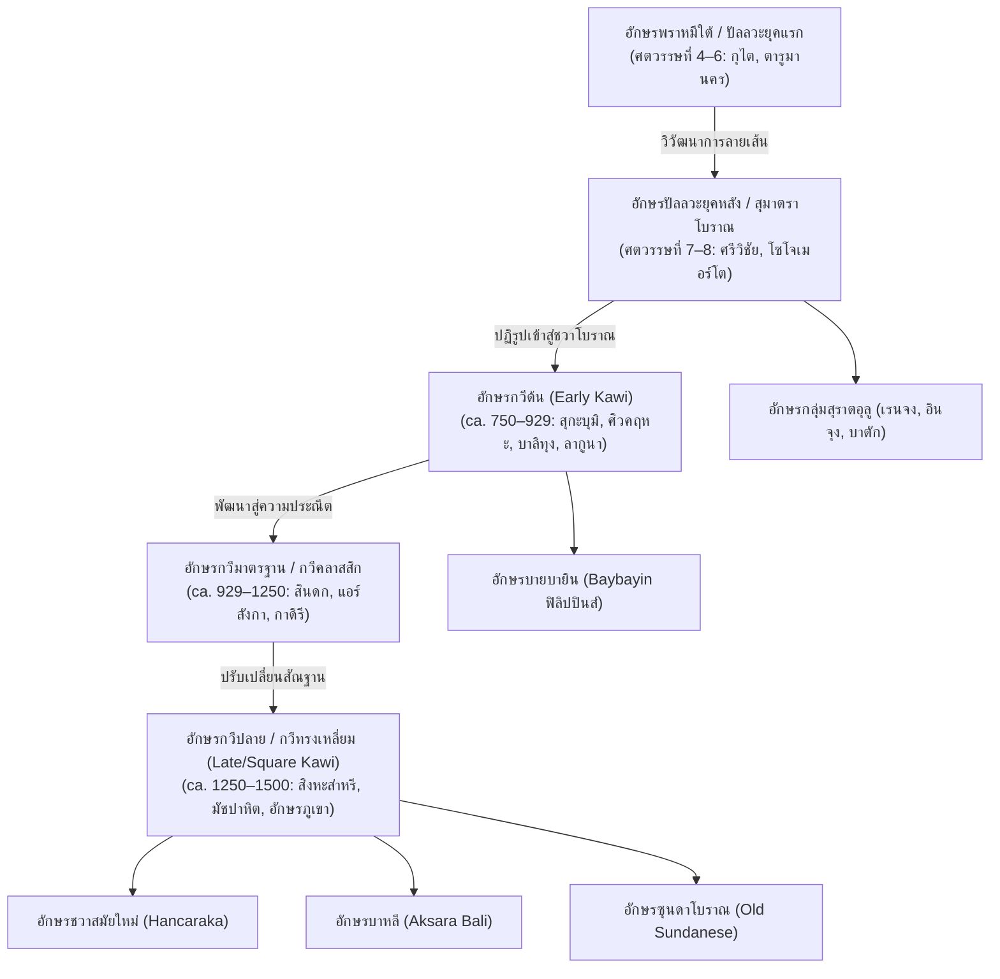
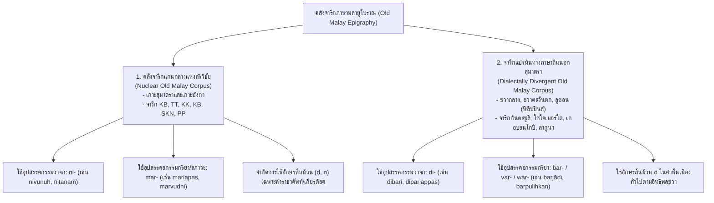

# บทที่ 9
# อักขรวิทยา ภาษาศาสตร์ประวัติศาสตร์ และจารึกวิทยาดิจิทัล
# (Palaeography, Historical Linguistics, and Digital Epigraphy)

---

## บทนำประจำบทที่ 9: พรมแดนสหวิทยาการแห่งจารึกวิทยาเอเชียตะวันออกเฉียงใต้ภาคพื้นสมุทร

การศึกษาจารึกวิทยาในภูมิภาคเอเชียตะวันออกเฉียงใต้ภาคพื้นสมุทร หรือโลกสมุทรนูซันตารา (Maritime Southeast Asia / Nusantara) ได้ก้าวผ่านพัฒนาการอันยาวนานกว่าหนึ่งศตวรรษครึ่ง จากจุดเริ่มต้นในฐานะสาขาวิชาเสริมของประวัติศาสตร์อาณานิคมและภารตวิทยาคลาสสิก (Colonial Indology) สู่การสถาปนาตนเองเป็นศาสตร์เอกเทศที่มีระเบียบวิธีวิจัยอันรัดกุม ทว่า ในช่วงสองทศวรรษแรกของคริสต์ศตวรรษที่ 21 วงวิชาการจารึกวิทยาสากลได้เผชิญหน้ากับคลื่นความเปลี่ยนแปลงครั้งใหญ่ที่เรียกว่า "การเปลี่ยนผ่านกระบวนทัศน์ทางดิจิทัลและสหวิทยาการ" (Digital and Interdisciplinary Paradigm Shift) ซึ่งส่งผลให้พรมแดนความรู้ด้านจารึกมิได้จำกัดอยู่เพียงการอ่านถอดรหัสข้อความเพื่อปะติดปะต่อลำดับเหตุการณ์ทางการเมืองและพงศาวลีของกษัตริย์ดังเช่นในอดีต หากแต่ได้หลอมรวมแกนวิชาการสำคัญสามเสาหลักเข้าเป็นหนึ่งเดียว ได้แก่ อักขรวิทยา (Palaeography), ภาษาศาสตร์ประวัติศาสตร์และสัทวิทยา (Historical Linguistics and Phonology), และจารึกวิทยาดิจิทัลว่าด้วยวิทยาศาสตร์การคำนวณ (Computational Digital Epigraphy)[1]

ในกระบวนทัศน์ดั้งเดิมยุคอาณานิคมดัตช์และฝรั่งเศส นักวิชาการรุ่นบุกเบิก อาทิ เฮนดริก เคิร์น (Hendrik Kern), เจ.แอล.เอ. บรันเดส (J.L.A. Brandes), เอ็น.เจ. โครม (N.J. Krom), และยอร์ช เซเดส์ (George Cœdès) ได้วางรากฐานการอ่านและรวบรวมจารึกภาษาสันสกฤต ภาษาชวาโบราณ และภาษามลายูโบราณไว้อย่างมหาศาล ทว่าวิธีวิทยาของสำนักคลาสสิกดังกล่าวมักถูกตีกรอบด้วยมุมมอง "ภารตภิวัตน์" (Indianization) หรือแนวคิด "มหาอินเดีย" (Greater India) ซึ่งมองจารึกในอุษาคเนย์เป็นเพียงภาพสะท้อนชายขอบของอารยธรรมอินเดียโบราณ[2] ยิ่งไปกว่านั้น ระบบการปริวรรตอักษร (Transliteration) ในยุคแรกยังขาดความเป็นเอกภาพ โดยมักดัดแปลงตามสัทศาสตร์ของภาษาเจ้าอาณานิคม (อาทิ การสะกดแบบภาษาดัตช์) หรือนำระบบการถอดอักษรภาษาสันสกฤตมาตรฐาน (IAST: International Alphabet of Sanskrit Transliteration) มาสวมทับภาษาพื้นเมืองตระกูลออสโตรนีเซียนอย่างไร้วิพากษ์ ส่งผลให้เกิดความลักลั่นอย่างรุนแรงในการบันทึกเสียงสระเฉพาะถิ่น เช่น สระเปอเปิต (schwa /ə/) สระอือซุนดาโบราณ และหน่วยเสียงพยัญชนะกึ่งสระริมฝีปาก ตลอดจนละเลยความแตกต่างเชิงโครงสร้างระหว่างการถอดอักษรตามรูปเขียนจริง (Graphemic Transliteration) กับการถอดเสียงตามระบบสัทวิทยา (Phonological Transcription)[3]

การก้าวข้ามข้อจำกัดดังกล่าวเริ่มปรากฏเค้าโครงอย่างเด่นชัดผ่านงานบุกเบิกระเบียบวิธีวิจัยช่วงกลางคริสต์ศตวรรษที่ 20 โดยเฉพาะการปฏิวัติด้านการคำนวณปฏิทินดาราศาสตร์และสัทศาสตร์ประวัติศาสตร์ของหลุยส์-ชาร์ลส์ ดาแมส์ (Louis-Charles Damais) และวัลเทอร์ ไอเชเลอ (Walther Aichele)[4] ก่อนจะได้รับการยกระดับสู่จุดสูงสุดในปัจจุบันผ่านโครงการความร่วมมือวิจัยระดับนานาชาติ อาทิ โครงการวิจัย DHARMA (The Domestication of "Hindu" Asceticism and the Religious Making of South and Southeast Asia, 2019–2026) ภายใต้การสนับสนุนของสภาการวิจัยแห่งยุโรป (European Research Council: ERC) ซึ่งมีศูนย์กลางการดำเนินงานร่วมกันระหว่างสำนักฝรั่งเศสแห่งปลายบุรพทิศ (EFEO), ศูนย์วิจัยวิทยาศาสตร์แห่งชาติฝรั่งเศส (CNRS), มหาวิทยาลัยโบโลญญา, และสำนักงานการวิจัยและนวัตกรรมแห่งชาติอินโดนีเซีย (BRIN)[5]

หัวใจสำคัญของการศึกษายุคปัจจุบันคือการผสานหลักฐานทางอักขรวิทยาและภาษาศาสตร์ประวัติศาสตร์เข้ากับโครงสร้างพื้นฐานดิจิทัลมาตรฐานเปิดระดับโลก จารึกโบราณมิได้ถูกมองว่าเป็นเพียง "ตัวบทนามธรรม" (disembodied text) ที่ตัดขาดจากบริบททางกายภาพ หากแต่เป็น "โบราณวัตถุทางวัฒนธรรมที่มีปฏิสัมพันธ์เชิงสังคม" (material cultural artifact) ซึ่งต้องได้รับการบันทึกรูปลักษณ์ทางกายภาพ ลายเส้นอักขระ ความลึกของการจาร ตลอดจนสภาพความชำรุดเสียหายผ่านเทคโนโลยีการบันทึกภาพสามมิติความละเอียดสูง (3D Photogrammetry) และการแปลงพื้นผิวแบบสะท้อนแสง (Reflectance Transformation Imaging: RTI) ควบคู่ไปกับการเข้ารหัสข้อมูลตัวบทเชิงโครงสร้างตามมาตรฐานสากล TEI/EpiDoc XML (Text Encoding Initiative / Epigraphic Documents in XML) ซึ่งแยกชั้นข้อมูลตัวบทดั้งเดิม (diplomatic edition) ออกจากชั้นข้อมูลการชำระความหมายเชิงวิพากษ์ (critical edition) และการกำกับอภิข้อมูล (metadata annotation) อย่างเด็ดขาด[6]

ยิ่งไปกว่านั้น การสถาปนามาตรฐานการถอดอักษรระบบ ISO-15919 และคู่มือมาตรฐาน DHARMA Transliteration Guide (Balogh & Griffiths 2020) ได้กลายเป็นพิมพ์เขียวทางระเบียบวิธีวิจัยที่ขจัดความสับสนที่สั่งสมมากว่าร้อยปี นวัตกรรมการจัดการหน่วยอักขระ (Akṣara taxonomy) การจำแนกอักขระเดี่ยว (Simplex Characters) ออกจากอักขระประสม (Complex Characters) การจัดการพยัญชนะจบรูปพิเศษ (Halanta) และสระลอยอิสระด้วยระบบตัวพิมพ์ใหญ่ (Uppercase Notation) ตลอดจนการถอดรหัสพยัญชนะค้ำจุนสระ (Vowel Support 'q') ได้เปิดทางให้วิทยาการคอมพิวเตอร์สามารถประมวลผลข้อมูลจารึกขนาดใหญ่ (Big Data) การทำเหมืองข้อมูลตัวบท (Text Mining) และการวิเคราะห์เครือข่ายความสัมพันธ์ทางภาษาศาสตร์สังคมข้ามภูมิภาคได้อย่างแม่นยำอย่างที่ไม่เคยปรากฏมาก่อน[7]

บทที่ 9 ตอนที่ 1 นี้ มุ่งนำเสนอการสังเคราะห์องค์ความรู้เชิงลึกในสองหมวดวิชาการหลัก: หมวดแรก (หัวข้อ 9.1) เจาะลึกวิวัฒนาการสายอักขรวิทยาในโลกสมุทรนูซันตารา นับแต่การสืบทอดสายธารอักษรพราหมีใต้สู่อักษรปัลลวะยุคแรกและยุคหลัง การคลี่คลายสู่ระบบอักษรกวีในแต่ละยุคสมัย อักขรวิธีพิเศษของอักษรมนตร์และอักษรภูมิภาคที่แตกแขนง การวิเคราะห์ตารางสัณฐานวิทยาเปรียบเทียบข้ามยุคสมัย ตลอดจนทฤษฎีหน่วยอักขระตามระเบียบวิธีวิจัยดิจิทัล หมวดที่สอง (หัวข้อ 9.2) ดำเนินการวิเคราะห์ภาษาศาสตร์ประวัติศาสตร์ สัทวิทยา และการปฏิวัติอักขรวิธี ผ่านการสืบสร้างระบบเสียงภาษามลายูโบราณศรีวิชัย การจำแนกคลังจารึกแกนกลางออกจากจารึกแปรผันทางภาษาถิ่น ปฏิสัมพันธ์เชิงลึกระหว่างภาษาสันสกฤตกับภาษาชวาโบราณจนนำไปสู่การกำเนิดระดับภาษาสุภาพ (Krama) และการคลี่คลายปริศนาการปฏิวัติอักขรวิธีซุนดาโบราณ การศึกษานี้จึงทำหน้าที่เป็นสะพานเชื่อมโยงหลักฐานปฐมภูมิจารึกวิทยาเข้ากับพรมแดนความรู้ระดับสากลสู่อนาคตปี ค.ศ. 2026 อย่างสมบูรณ์

---

## 9.1 วิวัฒนาการสายอักขรวิทยาในโลกสมุทรนูซันตารา (Palaeographical Trajectories in the Maritime World)

### 9.1.1 จากพราหมีใต้สู่อักษรปัลลวะยุคแรกและยุคหลัง: ปฐมบทแห่งตัวเขียนในอุษาคเนย์ภาคพื้นสมุทร

ประวัติศาสตร์ลายลักษณ์อักษรในภูมิภาคเอเชียตะวันออกเฉียงใต้ภาคพื้นสมุทรเริ่มต้นขึ้นอย่างเป็นรูปธรรมในช่วงครึ่งแรกของคริสต์ศตวรรษที่ 5 ผ่านการรับและปรับใช้อักขรวิธีตระกูลพราหมีจากอินเดียใต้ โดยเฉพาะอย่างยิ่งสายธารที่พัฒนามาจาก "อักษรพราหมีตอนใต้" (Southern Brāhmī) ซึ่งมีความสัมพันธ์แนบแน่นกับศูนย์กลางอำนาจของราชวงศ์ปัลลวะ (Pallava dynasty) แห่งกาญจีปุรัม (Kāñcīpuram) และราชวงศ์อิกษวากุ (Ikṣvāku) แห่งลุ่มแม่น้ำกฤษณา-โคทาวารีในรัฐอานธรประเทศและทมิฬนาฑูในปัจจุบัน[8] นักจารึกวิทยายุคอาณานิคมในอดีต เช่น เอ.ซี. เบอร์เนลล์ (A.C. Burnell) และเคิร์น เคยจำแนกอักษรยุคแรกนี้อย่างคลาดเคลื่อนว่าเป็น "อักษรเวงคี" (Vengi alphabet) ทว่า เจ. ฟิล. โฟเกล (J. Ph. Vogel) ได้พิสูจน์หักล้างอย่างเด็ดขาดในงานวิจัยแม่บท ค.ศ. 1918 โดยแสดงให้เห็นว่าลักษณะทางสัณฐานวิทยาของอักขระบนจารึกที่เก่าแก่ที่สุดในอินโดนีเซียมีความสอดคล้องอย่างสมบูรณ์กับ "อักษรปัลลวะยุคแรก" (Early Pallava Script) หรือที่วงวิชาการสากลปัจจุบันจำแนกในกลุ่ม "อักษรครันถะศิลาแบบโบราณ" (Archaic Lithic Grantha)[9]

หลักฐานเชิงประจักษ์ชิ้นสำคัญที่สุดที่ยืนยันการตั้งมั่นของอักษรปัลลวะยุคแรกในโลกสมุทร คือ กลุ่มเสาศิลาจารึกยูปะ (Yūpa inscriptions) จำนวน 7 หลักของพระเจ้ามูลวรมัน (Mūlavarman) ซึ่งค้นพบ ณ แหล่งโบราณคดีมูอารา กามัน (Muara Kaman) ริมแม่น้ำมหาคัม (Mahakam River) แคว้นกุไต (Kutei / Kutai) ในกาลีมันตันตะวันออก กำหนดอายุสัมพัทธ์ตามหลักอักขรวิทยาได้ราว ค.ศ. 400–450 จารึกเหล่านี้สลักลงบนเสาหินแอนดีไซต์ธรรมชาติที่สกัดแต่งอย่างหยาบ โดยตัวอักษรมีลักษณะเด่นของอักษรปัลลวะตอนต้นอย่างชัดเจน ได้แก่ หัวอักษรที่มีกล่องสี่เหลี่ยมทึบขนาดเล็กหรือรอยบากเป็นตุ่ม (serif / box-headed or notched headmark) เส้นแกนดิ่งที่มีความยาวและตวัดโค้งอย่างสง่างาม เช่น อักขระ *ka* และ *ra* ซึ่งยังคงรักษาเส้นแกนดิ่งยาวเหยียดที่ปลายล่างตวัดงอนขึ้นเล็กน้อย ขณะที่อักขระ *ta* และ *na* แสดงฐานโค้งเดี่ยวที่ยังไม่ปรากฏการหยักลึกตรงกลางอันเป็นลักษณะของยุคหลัง[10]

ข้อความบนเสายูปะหลัก A (Vogel 1918) เผยให้เห็นพงศาวลีสามชั่วรุ่นของราชสำนักกุไตโบราณ พร้อมทั้งบันทึกการประกอบพิธียัญกรรมตามคติพราหมณ์-ฮินดู ซึ่งได้รับการสลักด้วยฉันทลักษณ์อนุษฏุภ (Anuṣṭubh) ภาษาสันสกฤตคลาสสิกอันวิจิตร:

> **[IAST - Yūpa Inscription A (Vogel 1918: 198)]**  
> *śrīmataḥ śrī-narendra-sya, kuṇḍuṅga-sya mahātmanaḥ*  
> *putro 'śvavarmmo vikhyātaḥ, vaṅśakarttā yathāṅśumān*  
> *tasya putrā mahātmānaḥ, trayas traya ivāgnayaḥ*  
> *teṣāṁ trayāṇāṁ pravaraḥ, tapo-bala-damānvitaḥ*  
> *śrī-mūlavarmmā rājendro, yaṣṭvā bahusuvarṇṇakam*  
> *tasya yūpo 'yaṁ viprendraiḥ, krakr̥to sthāpitaś ca yaḥ*  

คำแปลภาษาไทยเชิงวิชาการ:
> "พระมหากษัตริย์ผู้ทรงพระเกียรติยศอันรุ่งโรจน์ นามว่ากุณฑุงคะ ผู้มีพระทัยอันประเสริฐ ทรงมีพระราชโอรสผู้ปรากฏพระนามขจรขจายว่าอัศววรมัน ผู้ทรงเป็นผู้สถาปนาราชวงศ์ ประดุจดังพระสุริยเทพผู้ทรงไว้ซึ่งแสงสว่าง ทรงมีพระราชโอรสผู้เป็นมหาบุรุษสามพระองค์ เปรียบประดุจไฟศักดิ์สิทธิ์ทั้งสามกอง ในบรรดาพระราชโอรสทั้งสามพระองค์นั้น องค์ผู้ทรงเป็นเลิศที่สุด ผู้ทรงเพียบพร้อมด้วยเดชะแห่งตบะ พละกำลัง และการสำรวมอินทรีย์ คือ สมเด็จพระราชาธิราช ศรีมูลวรมัน ผู้ได้ทรงประกอบพิธีพหุสุวรรณกะบูชายัญ เสายูปะต้นนี้ถูกสร้างขึ้นและประดิษฐานไว้โดยเหล่าพราหมณ์ผู้ประเสริฐ เพื่อเป็นอนุสรณ์แห่งยัญพิธีของพระองค์"[11]

ในบริบททางอักขรวิทยาและประวัติศาสตร์นิพนธ์ โฟเกลได้ชี้ให้เห็นประเด็นสำคัญว่า พระนาม "กุณฑุงคะ" (*Kuṇḍuṅga*) เป็นคำภาษาพื้นเมืองออสโตรนีเซียนดั้งเดิมของเกาะบอร์เนียว ขณะที่พระราชโอรสทรงมีพระนามภาษาสันสกฤตว่า "อัศววรมัน" และได้รับการยกย่องเป็น "ผู้สถาปนาราชวงศ์" (*vaṅśakartr̥*) ซึ่งสะท้อนให้เห็นว่ากระบวนการรับอักษรปัลลวะและวัฒนธรรมสันสกฤตมิได้เกิดจากการล่าอาณานิคมด้วยกำลังทหารของชาวอินเดีย หากแต่เป็นกระบวนการที่ชนชั้นนำพื้นเมืองเปิดรับและคัดสรรเทคโนโลยีตัวเขียนและวิทยาการพราหมณ์เข้ามาเพื่อเสริมสร้างความชอบธรรมทางการเมืองของตน ดังข้อความในจารึกหลัก B ที่ระบุอย่างชัดเจนว่า *kr̥to viprair ihāgataiḥ* ("จารึกนี้สร้างขึ้นโดยเหล่าพราหมณ์ผู้เดินทางมาถึงที่นี่")[12]

ร่วมสมัยหรือไล่เลี่ยกันในราวปลายคริสต์ศตวรรษที่ 5 ถึงต้นคริสต์ศตวรรษที่ 6 ปรากฏสายธารอักษรปัลลวะยุคแรกในแถบชวาตะวันตก ภายใต้อาณาจักรตารูมานคร (Tārumānagara) ของพระเจ้าปูรณวรมัน (Pūrṇavarman) ได้แก่ ศิลาจารึกจิอารูเตือน (Ciaruteun), จารึกปาซิรโกเลอคัก หรือจัมเปอา (Pasir Koleangkak / Ciampea), จารึกเกอบอนโกปี 1 (Kebon Kopi I), จารึกเลอบัก หรือซีดังฮียัง (Lebak / Cidanghiang), และศิลาจารึกตูคู (Tugu Inscription) อักขรวิทยาของกลุ่มจารึกตารูมานครยังคงจัดอยู่ในชั้นปัลลวะตอนต้น โดยมีลักษณะรูปอักษรประดับยอด (ornamental headmark) ที่เด่นชัด มีการสลักรูปฝ่าพระบาทคู่ของพระเจ้าปูรณวรมันเคียงคู่กับตัวบทจารึกฉันท์ภาษาสันสกฤต โดยประกาศเปรียบเปรยรอยพระพุทธบาทจำลองนั้นประดุจดังรอยพระบาทแห่งองค์พระวิษณุ (*viṣṇor iva padadvayam*) และรอยเท้าช้างทรงของพระองค์ประดุจดังรอยเท้าช้างเอราวัณ (*airāvata-samasya*)[13]

วิวัฒนาการก้าวสู่ "อักษรปัลลวะยุคหลัง" (Later Pallava Script) เริ่มปรากฏให้เห็นอย่างชัดเจนในคริสต์ศตวรรษที่ 7 ถึง 8 ในเอกสารจารึกของสองอาณาจักรใหญ่ ได้แก่ จักรวรรดิพาณิชย์นาวีศรีวิชัย (Śrīvijaya) ในสุมาตราตอนใต้และเกาะบังกา และราชวงศ์ไศเลนทร์ยุคแรกในชวากลาง อักษรปัลลวะยุคหลังนี้มีวิวัฒนาการสัณฐานวิทยาที่เปลี่ยนแปลงไปจากยุคแรกอย่างมีนัยสำคัญ:
1. **การลดทอนหัวกล่องสี่เหลี่ยม:** หัวอักษรที่เป็นกล่องสี่เหลี่ยมทึบเริ่มคลายตัวออก กลายเป็นเส้นโค้งเปิดหรือเส้นขีดนอนสั้นๆ (horizontal top bar)
2. **การแตกแขนงของฐานอักษร:** อักขระที่มีฐานเรียบโค้งในยุคแรก เช่น *ta* และ *na* เริ่มปรากฏรอยหยักตรงกลางฐานอย่างเด่นชัด กลายเป็นรูปทรงหยักสองลอน (notched or indented base)
3. **การคลี่คลายของเส้นนอนและหางอักษร:** อักขระ *ka* และ *ra* เริ่มลดความยาวของแกนดิ่งลง แต่เพิ่มความกว้างของปีกและเส้นโค้งด้านข้าง ลายเส้นมีความลื่นไหลและแสดงลักษณะของการเขียนด้วยความเร็ว (cursive tendencies) มากขึ้น[14]

ในจารึกภาษามลายูโบราณของศรีวิชัยยุคปลายคริสต์ศตวรรษที่ 7 อันได้แก่ จารึกเกอดูกันบูกิต (Kedukan Bukit ค.ศ. 683), ตาลังตูโว (Talang Tuwo ค.ศ. 684), โกตาคาปูร์ (Kota Kapur ค.ศ. 686), การังบราฮี (Karang Brahi ค.ศ. 686), ปาลัสปาเซอมะฮ์ (Palas Pasemah), และเตอลากาบาตู (Telaga Batu c. 686) อักษรปัลลวะยุคหลังได้พัฒนาคุณลักษณะเฉพาะตัวจนกระทั่งนักจารึกวิทยา เช่น วารูโน มะฮ์ดี (Waruno Mahdi) และลาร์ส เอส. วีกอร์ (Lars S. Vikør) ขนานนามว่าเป็น "อักษรสุมาตราโบราณ" (Old Sumatran Script) ระบบตัวเขียนนี้สะท้อนการปรับตัวครั้งใหญ่ของอักขรวิธีอินเดียเพื่อรองรับโครงสร้างทางสัทวิทยาของภาษาตระกูลออสโตรนีเซียน ซึ่งไม่มีความแตกต่างระหว่างเสียงพ่นลม (aspirated) กับไม่พ่นลม (unaspirated) แต่ต้องการกลไกการบันทึกเสียงเฉพาะถิ่น เช่น สระเปอเปิตและพยัญชนะนาสิกสะกด[15]

ขณะเดียวกัน ในชวากลาง จารึกโซโจเมอร์โต (Sojomerto Inscription) ซึ่งจารึกด้วยภาษามลายูโบราณในราวปลายศตวรรษที่ 7 หรือต้นศตวรรษที่ 8 และบันทึกพระนาม "ดาปุนตาไศเลนทร์" (*ḍapūnta selendra*) ก็แสดงรูปอักษรปัลลวะยุคหลังที่มีความเชื่อมโยงอย่างแนบแน่นกับจารึกสุมาตรา ทว่าในเวลาเดียวกันก็ได้เริ่มปรากฏลักษณะสัณฐานวิทยาบางประการที่กำลังแปรเปลี่ยนไปสู่อักษรชวาโบราณยุคต้น ซึ่งเป็นสะพานเชื่อมเข้าสู่พัฒนาการของระบบอักษรกวีในระยะต่อมา[16]

---

### 9.1.2 วิวัฒนาการของอักษรกวี: กวีต้น กวีมาตรฐาน และกวีปลายทรงเหลี่ยม

"อักษรกวี" (Kawi Script) หรือที่รู้จักในนาม "อักษรชวาโบราณ" (Old Javanese Script) ถือเป็นระบบตัวเขียนแม่บทที่ทรงอิทธิพลและมีการใช้งานยาวนานที่สุดในประวัติศาสตร์เอเชียตะวันออกเฉียงใต้ภาคพื้นสมุทร โดยทำหน้าที่เป็นรากฐานบรรพบุรุษโดยตรงของระบบตัวเขียนพื้นเมืองเกือบทั้งหมดในอินโดนีเซียและฟิลิปปินส์ยุคต่อมา นักอักขรวิทยาสากล อาทิ เจ.จี. เดอ คาสปาริส (J.G. de Casparis) และโบคารี (Boechari) ได้จำแนกวิวัฒนาการของอักษรกวีออกเป็น 3 ยุคสมัยหลักตามการแปรเปลี่ยนทางสัณฐานวิทยาและเทคนิคการจารึก[17]:

#### 1. อักษรกวีต้น (Early Kawi Script ca. ค.ศ. 750–929)
หมุดหมายทางประวัติศาสตร์ที่บ่งชี้การสถาปนาระบบอักษรกวีอย่างเป็นทางการ คือ **ศิลาจารึกสุกะบุมิ (Sukabumi Inscription)** หรือจารึกฮาริญจิง (Hariñjiṅ A) ในเขตเกอดีรี ชวาตะวันออก ลงศักราชมหาศักราช 726 (ตรงกับวันที่ 25 มีนาคม ค.ศ. 804) ซึ่งถือเป็นจารึกภาษาชวาโบราณที่ระบุศักราชเก่าแก่ที่สุดที่ค้นพบในปัจจุบัน[18] ลักษณะเด่นของอักษรกวีต้นประกอบด้วย:
- ลายเส้นมีความหนักแน่น ชัดเจน และยังคงรักษาโครงสร้างทางเรขาคณิตที่สมดุล หัวอักษรปรากฏเป็นขีดขวางหรือรอยโค้งเว้าเล็กน้อย
- อักขระ *ka* เริ่มพัฒนาจากรูปกากบาทแกนดิ่งยาวในสมัยปัลลวะ มาเป็นรูปเส้นดิ่งที่มีปีกโค้งด้านซ้ายและขวาอย่างสมมาตร พร้อมขีดปิดด้านบน
- อักขระ *ta* มีรอยหยักเว้าตรงกลางฐานอย่างสมบูรณ์ กลายเป็นรูปคล้ายอักษร "w" คว่ำหรือรูปหลังเต่า
- อักขระ *na* แยกรูปออกจาก *ta* อย่างเด็ดขาด โดยมีเส้นฐานหยักและลากเส้นดิ่งขวาตวัดขึ้น
- การปรากฏของเครื่องหมายวิรามะ (Virāma) หรือ "ปาเต็น/ปังกอน" (Patén / Pangkon) ที่ทำหน้าที่ตัดเสียงสระอะแฝงท้ายพยัญชนะอย่างเป็นระบบบนเนื้อศิลา[19]

อักษรกวีต้นได้รับการพัฒนาจนถึงจุดสูงสุดในยุคราชธานีมะตะรัมแห่งชวากลาง (Central Javanese Mataram Period) โดยเฉพาะในรัชสมัยของพระเจ้าราไกปิกาตัน (Rakai Pikatan ผู้สถาปนาจารึกศิวคฤหะ ค.ศ. 856 บันทึกการสร้างเทวสถานปรัมบานัน) และพระเจ้าราไกวาตูกูรา ดยัฮ บาลิทุง (Dyaḥ Balitung ค.ศ. 898–910 ผู้พระราชทานมหาจารึกแผ่นทองแดงจำนวนมาก อาทิ มันตยาซิฮ์, วานูวาเตองะฮ์ 3, และโปเลงัน) ยิ่งไปกว่านั้น อิทธิพลของอักษรกวีต้นยังได้แผ่ขยายข้ามสมุทรไปไกลถึงเกาะลูซอน ประเทศฟิลิปปินส์ ดังปรากฏใน **จารึกแผ่นทองแดงลากูนา (Laguna Copperplate Inscription - LCI)** ศักราช ค.ศ. 900 ซึ่งสลักด้วยอักษรกวีต้นที่มีความใกล้เคียงกับจารึกชวากลางในรัชสมัยพระเจ้าบาลิทุงอย่างน่าทึ่ง[20]

#### 2. อักษรกวีมาตรฐานหรือกวีคลาสสิก (Standard or Classical Kawi Script ca. ค.ศ. 929–1250)
ภายหลังการย้ายศูนย์กลางอำนาจทางการเมืองจากชวากลางสู่ชวาตะวันออกโดยพระเจ้าเอมปู สินดก (Mpu Siṇḍok) ในปี ค.ศ. 929 อักษรกวีได้เข้าสู่ยุคคลาสสิกซึ่งครอบคลุมรัชสมัยของพระเจ้าแอร์ลังกา (Airlangga แห่งอาณาจักรกะฮูรีปัน) จนถึงยุคทองของอาณาจักรกาดิรี (Kadiri Period) ลักษณะเฉพาะของยุคนี้ได้แก่:
- ลายเส้นมีความประณีต อ่อนช้อย และมีลักษณะเป็นเส้นโค้งตวัดอย่างงดงาม (flamboyant and cursive style) หัวอักษรเริ่มมีลักษณะม้วนเป็นวงกลมโปร่งหรือรอยตวัดแบบริบบิ้น
- การจัดช่องไฟระหว่างตัวอักษรและระหว่างบรรทัดมีความเป็นระเบียบสูงยิ่ง มีการพัฒนาเครื่องหมายสระจมและสระลอยให้มีความวิจิตร
- มีการใช้ระบบ "อักษรเชิง" หรือ "พยัญชนะซ้อนใต้บรรทัด" (Subjoined consonants / Pasangan) อย่างกว้างขวางและสลับซับซ้อน เพื่อบันทึกคำควบกล้ำและสมาส-สนธิในวรรณคดีภาษากวีร้อยกรอง (Kakawin) เช่น กากาวินภารตยุทธ์ (Kakawin Bhāratayuddha) และกากาวินรามายณะ (Kakawin Rāmāyaṇa)[21]

#### 3. อักษรกวีปลายและอักษรกวีทรงเหลี่ยม (Late Kawi and Quadratic / Square Script ca. ค.ศ. 1250–1500)
ในยุคปลายของประวัติศาสตร์ชวาโบราณ อันครอบคลุมสมัยราชอาณาจักรสิงหะส่าหรี (Siṅhasāri) และจักรวรรดิมัชปาหิต (Majapahit) อักษรกวีได้เกิดการแตกแขนงทางสัณฐานวิทยาอย่างมีนัยสำคัญ ลายเส้นที่เคยโค้งมนอ่อนช้อยได้แปรเปลี่ยนไปสู่อักขรวิธีที่มีความแข็งกระด้างและเป็นเหลี่ยมมุมชัดเจน ซึ่งวงวิชาการเรียกว่า "อักษรกวีทรงเหลี่ยม" (Square Kawi Script) หรือ "อักษรภูเขา/อักษรพุทธ" (*aksara gunung / aksara buda / Old Western Javanese quadratic script*)[22]

ลักษณะเด่นของอักษรกวีทรงเหลี่ยมสมัยมัชปาหิต ได้แก่:
- โครงสร้างตัวอักษรถูกตีกรอบให้อยู่ในรูปทรงสี่เหลี่ยมด้านขนานหรือสี่เหลี่ยมขนมเปียกปูน หัวอักษรกลายเป็นเส้นขีดตรงหักมุมฉาก
- ปรากฏการประดับลวดลายขมวดปมหรือรอยหยักที่มุมอักษร (decorative flourishes) ซึ่งพบเด่นชัดบนจารึกศิลาและแผ่นทองแดงยุคพระเจ้าฮายัม วูรุก (Hayam Wuruk) และมหาเสนาบดีคชมาดา (Gajah Mada) ตลอดจนบนแท่นฐานเทวสถานบนเทือกเขาเปอนังกุงงัน (Mount Penanggungan) และเทือกเขาลาวู (Mount Lawu)
- อักษรกวีทรงเหลี่ยมนี้ยังได้แพร่หลายข้ามไปยังภูมิภาคชวาตะวันตก โดยถูกนำมาใช้เขียนด้วยพู่กันลงบนคัมภีร์ใบเกอบัง (*gebang / nipah*) สำหรับวรรณกรรมศาสนาไศวะและพุทธ ควบคู่ไปกับการใช้อักษรซุนดาโบราณบนใบลาน[23]

---

### 9.1.3 อักขรวิธีพิเศษและอักษรภูมิภาคที่แตกแขนงในโครงข่ายเอเชียสมุทร

ควบคู่ไปกับสายธารอักษรปัลลวะและกวี โลกสมุทรนูซันตารายังปรากฏการใช้งานอักขรวิธีพิเศษและอักษรภูมิภาคที่แตกแขนงออกไปอย่างหลากหลาย ซึ่งสะท้อนถึงการปะทะสังสรรค์ทางวัฒนธรรมและการปรับแปลงตัวเขียนให้สอดรับกับอัตลักษณ์ของแต่ละท้องถิ่น:

#### 1. อักษรมนตร์และสายธารสิทธมาตฤกา/นาครียุคแรก (Siddhamātṛkā / Early Nāgarī Script)
ในปลายคริสต์ศตวรรษที่ 8 ท่ามกลางกระแสการแพร่หลายของพุทธศาสนามหายานและตันตรยานจากมหาวิทยาลัยนาลันทา (Nālandā) และแคว้นเบงกอลภายใต้ราชวงศ์ปาละ (Pāla dynasty) ได้เกิดการนำระบบตัวเขียนอินเดียเหนือที่เรียกว่า "อักษรสิทธมาตฤกา" (Siddhamātṛkā) หรือ "นาครียุคแรก" (Early Nāgarī) เข้ามาใช้ในเกาะชวาและสุมาตรา[24] อักษรระบบนี้มีลักษณะเด่นคือ "เส้นขีดขวางทึบยาวบนยอดอักษร" (solid horizontal headmark / matra) และรูปทรงอักษรที่มีเหลี่ยมมุมแตกต่างอย่างสิ้นเชิงจากอักษรปัลลวะใต้

จารึกสำคัญที่ใช้อักษรสิทธมาตฤกา ได้แก่ **ศิลาจารึกกะลาซัน (Kalasan Inscription ค.ศ. 778)** บันทึกการสร้างวิหารบูชาพระนางตาราร่วมกันระหว่างราชครูไศเลนทร์กับมหาราชปะนังการัน, **ศิลาจารึกเกอลูรัก (Kelurak Inscription ค.ศ. 782)** บันทึกการประดิษฐานเทวรูปพระมัญชุศรีโดยพระราชครูกุมารโฆษะ (Kumāraghoṣa) ผู้เดินทางมาจากเบงกอล (เคาฑะทวีป *Gauḍadvīpa*), จารึกจันดิปลาโอซัน (Candi Plaosan), และการค้นพบล่าสุดใน **จารึกแถบทองแดงมูอาราจัมบี (Muara Jambi Strips A & B)** ในสุมาตราตอนกลาง (Andhifani et al. 2025) อักษรสิทธมาตฤกาในนูซันตาราทำหน้าที่เป็น "อักษรศักดิ์สิทธิ์เฉพาะทาง" (hieratic/scriptural script) สำหรับจารึกมนตรา ธารณี และข้อความสรรเสริญพระโพธิสัตว์ ซึ่งถูกสงวนไว้สำหรับพิธีกรรมตันตระระดับสูง มิได้นำมาใช้ในการบริหารราชการแผ่นดินทั่วไป[25]

#### 2. อักษรซุนดาโบราณ (Old Sundanese Script)
ในภูมิภาคชวาตะวันตกหรืออาณาจักรซุนดา-ปาจาจารัน ได้เกิดวิวัฒนาการของระบบตัวเขียนพื้นเมืองที่เป็นเอกเทศอย่างเด่นชัด อดิตยา กุนาวัน และอาร์โล กริฟฟิทส์ (Aditia Gunawan & Arlo Griffiths 2021) ได้พิสูจน์ว่า อักษรซุนดาโบราณมิได้พัฒนามาจากอักษรกวีปลายมัชปาหิตโดยตรง หากแต่มีสายวิวัฒนาการคู่ขนานที่สืบทอดมาจากอักษรกวีต้นและปัลลวะยุคหลัง[26]

ลักษณะเฉพาะทางอักขรวิทยาของอักษรซุนดาโบราณบนจารึกบาตูตูลิส (Batutulis ค.ศ. 1533/1534), จารึกกลุ่มกาวาลี 1–6 (Kawali inscriptions), และจารึกแผ่นทองแดงเกอบันเตอนัน 1–4 (Kebantenan plates) ประกอบด้วย:
- การตัดทอนการใช้อักษรเชิงซ้อน (pasangan) ลงเกือบทั้งหมด โดยหันมาใช้เครื่องหมาย **ปามาเอะฮ์ (pamaéh ·)** ฆ่าสระแฝงและกำกับพยัญชนะสะกดเรียงต่อกันตามแนวนอน
- การใช้รูปอักษรพยัญชนะลิ้นม้วน **ḍ** ทำหน้าที่แทนหน่วยเสียงทันตชะ **d** เป็นหลักทั่วทั้งจารึก
- รูปแบบอักขระพิเศษ เช่น รูปอักษร *k·* ที่มีขีดนอนสลักอยู่ใต้ตัวอักษรเพื่อแสดงการฆ่าสระ และการใช้อักษร *A* ผสมเครื่องหมายปาเมอเป็ตทำหน้าที่เป็นสระลอย *qə*[27]

#### 3. อักษรบาหลีโบราณ (Old Balinese Script)
จารึกแผ่นทองแดงของบาหลีโบราณ (มหาศักราช 804–944 / ค.ศ. 882–1022) ก่อนการอภิเษกสมรสของพระนางมเหนทรทัตตากับพระเจ้าอุดายนะ ได้บันทึกด้วยภาษาบาหลีโบราณในระบบตัวเขียนที่มีเอกลักษณ์เฉพาะตัว แม้จะมีรากฐานมาจากสายธารปัลลวะ-กวีต้น แต่อักษรบาหลีโบราณมีทรวดทรงที่กว้างและกลมมนกว่าอักษรชวากลาง มีการประดิษฐ์สัญลักษณ์สระและพยัญชนะเฉพาะเพื่อรองรับระบบเสียงภาษาบาหลีโบราณ เช่น การใช้เครื่องหมายแสดงเสียงกักเส้นเสียงและการจัดวางเครื่องหมายวรรคตอน ก่อนที่ภาษาและระบบอักษรชวาโบราณจะหลั่งไหลเข้าสู่เกาะบาหลีอย่างสมบูรณ์ในศตวรรษที่ 11[28]

#### 4. อักษรกลุ่มสุราตอุลู (Surat Ulu Scripts) และอักษรบาตัก (Surat Batak) ในสุมาตรา
ในเขตที่สูงและพื้นที่ห่างไกลของเกาะสุมาตรา สายธารอักษรปัลลวะยุคหลังและกวีต้นได้ถูกเก็บรักษาและปรับเปลี่ยนรูปลักษณ์ไปสู่อักษรตระกูลเส้นตรงหักมุม (angular and stick-like scripts) เพื่อให้เหมาะสมกับการจารลงบนกระบอกไม้ไผ่ เปลือกไม้พับทบ (pustaha) และเขาสัตว์:
- **อักษรเรนจงหรือสุราตอินจุง (Surat Incung):** พบในที่สูงเกอรินจี (Kerinci Highlands) มีลักษณะเป็นลายเส้นเอียงเฉียงที่เขียนขึ้นจากล่างขึ้นบนหรือจากซ้ายไปขวา
- **อักษรบาตัก (Surat Batak):** ใช้ในกลุ่มชาติพันธุ์บาตักรอบทะเลสาบโตบา (Toba, Karo, Mandailing, Simalungun) ซึ่งยังคงรักษาโครงสร้างพยางค์แบบพราหมีไว้อย่างเหนียวแน่น พร้อมด้วยระบบเครื่องหมายฆ่าสระ (pangolat) ที่สืบทอดมาจากวิรามะโบราณ[29]

#### 5. อักษรบายบายิน (Baybayin) ในหมู่เกาะฟิลิปปินส์
การค้นพบจารึกแผ่นทองแดงลากูนา (ค.ศ. 900) ได้กลายเป็นกุญแจทองคำที่ไขปริศนาต้นกำเนิดของระบบตัวเขียนพื้นเมืองในฟิลิปปินส์ เช่น อักษรบายบายิน (Baybayin), อักษรฮานูโนโอ (Hanunó'o), และอักษรตักบานวา (Tagbanwa) ในอดีต นักมานุษยวิทยาเคยสันนิษฐานว่าบายบายินอาจได้รับอิทธิพลจากอักษรจามปาหรืออักษรอินเดียใต้โดยตรง ทว่า เฮกเตอร์ ซานโตส (Hector Santos 1996) และอันโตน โพสต์มา (Antoon Postma 1992) ได้พิสูจน์ให้เห็นว่า ตัวอักษรบนจารึกลากูนาคือ **อักษรกวีต้น (Early Kawi)** ซึ่งเชื่อมต่อสายสัมพันธ์ทางอักขรวิทยาระหว่างราชสำนักชวากลาง/ศรีวิชัยกับเกาะลูซอน และกลายเป็นต้นแบบให้อักษรบายบายินปรับลดรูปร่างและตัดทอนระบบพยัญชนะสะกดออกไปในยุคต่อมา[30]

---

### 9.1.4 การเปรียบเทียบสัณฐานอักษรข้ามยุคสมัยและภูมิภาค (Palaeographical Morphological Comparison)

เพื่อแสดงให้เห็นพลวัตการแปรเปลี่ยนทางสัณฐานวิทยาของตัวอักษรอย่างเป็นรูปธรรม ตารางต่อไปนี้สรุปการเปรียบเทียบรูปทรงของอักขระแกนหลัก 7 ตัว (*a, ka, ta, na, ma, ya, ra*) และเครื่องหมายสระกำกับ (*mātrā*) ข้าม 6 ยุคสมัยและภูมิภาคสำคัญ จากการสำรวจหลักฐานจารึกปฐมภูมิ:

| หน่วยอักขระ (Akṣara) | พราหมีใต้/ปัลลวะต้น (กุไต/ตารูมา ค.ศ. 400–500) | ปัลลวะปลาย/สุมาตรา (ศรีวิชัย ค.ศ. 680–700) | กวีต้น (ชวากลาง/ลากูนา ค.ศ. 800–900) | กวีคลาสสิก (ชวาตะวันออก ค.ศ. 1000–1200) | กวีปลาย/ทรงเหลี่ยม (มัชปาหิต ค.ศ. 1350–1450) | ซุนดาโบราณ (บาตูตูลิส/กาวาลี ค.ศ. 1500) |
| :---: | :--- | :--- | :--- | :--- | :--- | :--- |
| **a (สระลอย)** | รูปคล้ายก้ามปูคว่ำ มีแขนซ้ายโค้งและแกนดิ่งขวา หัวกล่องสี่เหลี่ยม | แขนซ้ายเริ่มมีรอยหยักสองลอน หัวกล่องคลายตัวออก | แขนซ้ายหยักลึกชัดเจน เส้นดิ่งขวาลากตรง มีขีดบน | ลายเส้นโค้งตวัดวิจิตร แขนซ้ายม้วนเป็นวงกลมโปร่ง | รูปทรงสี่เหลี่ยมหักมุมฉาก ลายเส้นตัดเป็นขอบชัด | ลดรูปเป็นเส้นดิ่งคู่เชื่อมด้วยรอยหยักคล้ายเลข 3 กลับด้าน |
| **ka** | ไม้กางเขนแกนดิ่งยาวเหยียด ปลายล่างตวัดงอนซ้ายเล็กน้อย | แกนดิ่งสั้นลง แขนขวางโค้งลงเป็นปีกนกสองข้าง | ปีกสองข้างโค้งสมมาตร มีขีดขวางปิดบนหัวแกน | ปีกซ้ายขวาโค้งตวัดมน ปลายล่างงอนขึ้นเป็นห่วง | ลำตัวกลายเป็นกล่องสี่เหลี่ยม มีเส้นกากบาทตัดภายใน | รูปทรงคล้ายอักษร T ที่มีเส้นเฉียงค้ำซ้ายขวา (พบรูป *k·* มีขีดล่าง) |
| **ta** | รูปเกือกม้าคว่ำ ฐานโค้งเรียบไม่มีรอยหยัก หัวเป็นตุ่ม | ฐานเริ่มปรากฏรอยเว้าตรงกลางเล็กน้อย หัวเป็นขีด | ฐานหยักลึกสมบูรณ์เป็นสองลอน คล้ายอักษร w คว่ำ | เส้นโค้งสองลอนตวัดอ่อนช้อย ปลายขวาตวัดงอนขึ้น | ทรงเหลี่ยมหยักมุมฉาก เส้นยอดตัดตรงแนวนอน | เส้นโค้งหยักสองลอนชัดเจน ปลายขวาลากดิ่งลงจรดบรรทัด |
| **na** | เส้นดิ่งสั้นตั้งอยู่บนฐานขีดขวางเดี่ยว หัวเป็นตุ่ม | ฐานเริ่มงอโค้งขึ้นด้านขวา มีรอยหยักเล็กน้อย | รูปทรงคล้ายตัว C กลับด้านที่มีเส้นดิ่งและฐานหยัก | ปลายเส้นตวัดโค้งเป็นวง ลายเส้นเชื่อมต่อลื่นไหล | ลายเส้นเหลี่ยมมุมชัดเจน รอยหยักกลายเป็นมุมฉาก | คล้ายตัวเขียนเลข 2 ที่มีเส้นฐานเหยียดตรง |
| **ma** | รูปวงกลมหรือห่วงล่าง มีแขนสองข้างชูขึ้นรับขีดหัว | ห่วงล่างกลายเป็นรูปตัว U แขนขวาไขว้ทับแขนซ้าย | รูปทรงคล้ายริบบิ้นผูกโบว์ มีห่วงซ้ายและหางขวา | ห่วงบิดเป็นเกลียววิจิตร เส้นโค้งตวัดอย่างอิสระ | รูปทรงกล่องสี่เหลี่ยมซ้อน มีรอยตัดเหลี่ยมมุม | รูปทรงสามเหลี่ยมยอดตัด มีรอยหยักด้านข้าง |
| **ya** | รูปคันศรสามแฉก (trifid) แฉกกลางตรง แฉกข้างโค้ง | แฉกซ้ายม้วนเป็นห่วงกลม แฉกขวาลากดิ่งยาว | แฉกซ้ายกลายเป็นลอนคลื่น แฉกขวาเป็นเส้นดิ่งหลัก | ลายเส้นโค้งตวัดต่อเนื่อง หางขวางอนงามสะบัดปลาย | รูปทรงเหลี่ยมสามลอน เส้นสายตัดตรงเป็นมุมหัก | ลอนซ้ายโค้งมน ลอนขวาลากดิ่งเป็นแกนตรง |
| **ra** | เส้นดิ่งตรงยาวเดี่ยว หัวมีกล่องสี่เหลี่ยมหรือขีดขวาง | เส้นดิ่งยาวเริ่มมีความคดโค้งเล็กน้อย หัวคลายตัว | เส้นดิ่งสั้นลง ปลายล่างตวัดงอนขึ้นทางซ้าย | เส้นดิ่งโค้งคลื่น (wavy line) ปลายตวัดวิจิตร | เส้นดิ่งหนาตัดมุมฉาก มีขีดประดับหัวท้าย | เส้นดิ่งตรงธรรมดา หรือเส้นหยักฟันปลาเรียบง่าย |
| **mātrā: -i** | วงกลมโปร่งหรือวงรีตั้งอยู่บนหัวพยัญชนะ | วงกลมมีรอยขีดขมวดภายใน หรือรูปก้นหอย | วงกลมสมบูรณ์วางกึ่งกลางบนเส้นยอดพยัญชนะ | วงกลมประดับรอยหยักและมีรัศมีตวัดออก | วงรีเหลี่ยมวางซ้อนบนขอบบนของโครงสร้างอักษร | วงรีขนาดเล็กวางเยื้องไปทางขวาของหัวอักขระ (ปังฮูลู) |
| **mātrā: -u** | เส้นดิ่งลากต่อจากปลายล่างของพยัญชนะลงมาตรงๆ | เส้นดิ่งปลายล่างตวัดงอไปทางขวาเป็นมุมฉาก | เส้นตวัดงอทางขวาแล้วหักขึ้นบนเป็นรูปขอเบ็ด | เส้นตวัดลากยาวขึ้นข้างลำตัวพยัญชนะอย่างวิจิตร | เส้นหักมุมฉากลากขึ้นขนานกับลำตัวอักษรทรงเหลี่ยม | เส้นขอเบ็ดลากตวัดใต้ฐานพยัญชนะ (ปันยูคุง) |
| **Virāma** | ไม่ปรากฏรูปสัญลักษณ์ (ใช้การผูกอักขระซ้อนใต้อักษร) | เริ่มปรากฏรอยขีดเฉียงสั้นๆ เหนือพยัญชนะบางคำ | เครื่องหมายขีดเฉียงหรือหยดน้ำวางเยื้องบนขวาพยัญชนะ | หางตวัดลากยาวคลุมหลังพยัญชนะ (ปาเต็น/ปังกอน) | รูปขีดนอนหักมุมตัดทแยงเหนือพยัญชนะอย่างชัดเจน | เครื่องหมายขีดนอนบนหรือขีดตัดใต้ตัวอักษร (**ปามาเอะฮ์** ·) |

การวิเคราะห์ตารางสัณฐานวิทยาเผยให้เห็นกฎทางอักขรวิทยาประการสำคัญว่า การคลี่คลายของรูปอักษรในโลกสมุทรนูซันตารามิได้ดำเนินไปอย่างไร้ทิศทาง หากมีแนวโน้มหลัก 3 ประการ:
1. **การเคลื่อนย้ายจุดศูนย์ถ่วง:** จากอักษรที่มีแกนดิ่งยาวเด่นชัดในยุคปัลลวะต้น สู่ตัวอักษรที่มีความกว้างในแนวนอนและมีความสมดุลของกล่องโครงสร้างในยุคกวี
2. **การเปลี่ยนรูปทรงทางเรขาคณิต:** จากเส้นโค้งมนของศิลปะกวีคลาสสิก สู่การหักมุมฉากและทรงเหลี่ยมในยุคมัชปาหิตและอักษรภูเขา ซึ่งสัมพันธ์กับเครื่องมือการจารึกและการเปลี่ยนวัสดุรองรับ
3. **การลดทอนความซับซ้อนเพื่อการใช้งานจริง:** ในระบบอักษรภูมิภาค เช่น ซุนดาโบราณและบายบายิน มีการตัดทอนโครงสร้างการผูกอักขระที่ซับซ้อนของสันสกฤตออกไป แล้วแทนที่ด้วยระบบการสะกดคำเรียงตามแนวนอนและการใช้เครื่องหมายฆ่าสระที่เรียบง่าย[31]

---

### 9.1.5 ทฤษฎีหน่วยอักขระและระเบียบวิธีวิเคราะห์ตัวเขียนดิจิทัล (Graphemic & Akṣara Theory)

ความก้าวหน้าสำคัญที่สุดในระเบียบวิธีวิจัยจารึกวิทยาร่วมสมัย คือการสถาปนา "ทฤษฎีหน่วยอักขระ" (Graphemic & Akṣara Theory) และการวางมาตรฐานการประมวลผลตัวเขียนโบราณในระบบดิจิทัล ซึ่งได้รับการสังเคราะห์อย่างเป็นระบบในคู่มือ *DHARMA Transliteration Guide* (Release Version 3, 2020) โดย ดาเนียล บาล็อกฮ์ และอาร์โล กริฟฟิทส์ (Dániel Balogh & Arlo Griffiths)[32] ทฤษฎีนี้ได้รื้อถอนความสับสนระหว่าง "หน่วยเสียง" (Phoneme) กับ "หน่วยอักขระ" (Grapheme) ที่ครอบงำวงวิชาการมานานกว่าศตวรรษ โดยวางหลักการนิยามเชิงโครงสร้างดังนี้:

#### 1. นิยามของอักขระและสถาปัตยกรรมหน่วยกราฟีม (Akṣara Taxonomy)
ในระบบอักษรตระกูลพราหมีทั้งหมด "หนึ่งอักขระ" (Akṣara) ได้รับการนิยามในฐานะ **"หนึ่งหน่วยตัวเขียนอิสระทางสายตา" (Single Visual and Orthographic Character/Grapheme)** โดยไม่ขึ้นกับจำนวนหน่วยเสียงที่บรรจุอยู่ภายใน บาล็อกฮ์และกริฟฟิทส์ได้จำแนกอักขระออกเป็นสองประเภทรากฐาน:
- **อักขระเดี่ยว (Simplex Characters):** คืออักขระที่ประกอบด้วยหน่วยสัญญะเดี่ยวที่ไม่สามารถแยกย่อยทางสายตาได้ ได้แก่ รูปพยัญชนะเดี่ยวที่มีสระอะแฝงตามธรรมชาติ (เช่น *ka, ta, ma*), สระลอยอิสระรูปเดี่ยว (Independent Vowels เช่น *A, I, U, E, O*), และพยัญชนะจบรูปพิเศษไร้สระ (Special Simplex Final Consonants / Halanta เช่น *T, M, N, K*)
- **อักขระประสม (Complex Characters):** คืออักขระที่เกิดจากการนำชิ้นส่วนองค์ประกอบ (Character Components) มาประกอบรวมกันเป็นหน่วยทางสายตาเดียว ซึ่งประกอบด้วยพยัญชนะต้น พยัญชนะควบกล้ำซ้อนรูป (Subjoined Consonants / Pasangan) เครื่องหมายสระจม (Dependent Vowel Markers / Mātrā) และเครื่องหมายเสริมสัทอักษร (Diacritic Markers เช่น อนุสวาระและวิสรรคะ) เช่น อักขระ *ki* (ประกอบด้วย *ka* + สระอิ) หรืออักขระ *rddhe* (ประกอบด้วย *ra* + *da* + *dha* + สระเอ)[33]

คู่มือ DHARMA ได้เน้นย้ำการแยกความแตกต่างอย่างเข้มงวดระหว่าง *Character Components* (องค์ประกอบเชิงหน้าที่และหน่วยเสียง เช่น หน่วยพยัญชนะและสระ) กับ *Glyph Components* (ชิ้นส่วนเชิงรูปลักษณ์ทางกายภาพและลายเส้น เช่น แขน ขา ปีก หาง ลำต้น กลีบ ส่วนโค้ง และฐาน) ซึ่งช่วยให้นักจารึกวิทยาสามารถบรรยายวิวัฒนาการของลายเส้นได้อย่างเป็นภววิสัย ปราศจากการใช้คำคุณศัพท์ที่เลื่อนลอย[34]

#### 2. นวัตกรรมการใช้อักษรพิมพ์ใหญ่ (Uppercase Innovation)
ปัญหาคลาสสิกประการหนึ่งในการถอดอักษรจารึกอินโดนีเซียในอดีต คือการใช้เครื่องหมายวงกลมลอย `°` (degree sign) นำหน้าสระลอยอิสระ (เช่น `°a, °i`) หรือต่อท้ายพยัญชนะจบ (เช่น `t°`) ซึ่งสร้างความล้มเหลวอย่างร้ายแรงในระบบประมวลผลข้อมูลดิจิทัล การสืบค้นคำในฐานข้อมูลคอมพิวเตอร์ และการจัดทำดัชนีอัตโนมัติ ในคู่มือมาตรฐาน DHARMA เวอร์ชัน 3 ได้ประกาศยกเลิกการใช้สัญลักษณ์ `°` อย่างถาวร (Deprecated) และนำเสนอทางออกเชิงปฏิวัติด้วยการใช้ **"ตัวอักษรละตินพิมพ์ใหญ่" (Uppercase Letters)** ทำหน้าที่เป็นตัวแทนของรูปเขียนพิเศษสองกลุ่ม:
1. **สระลอยอิสระรูปเดี่ยว (Independent Simplex Vowels):** ถอดด้วยตัวพิมพ์ใหญ่ เช่น `A` (अ), `Ā` (आ), `I` (इ), `Ī` (ई), `U` (उ), `Ū` (ऊ), `E` (ए), `O` (ओ) สำหรับสระประสมอิสระให้ใช้อักษรพิมพ์ใหญ่เฉพาะตัวแรก คือ `Ai` (ऐ) และ `Au` (औ) เพื่อแยกออกจากกรณีสระลอยเรียงกันสองตัว เช่น `AI` (अइ)
2. **พยัญชนะจบรูปพิเศษไร้สระ (Special Simplex Final Consonants / Halanta):** ถอดด้วยตัวพิมพ์ใหญ่ เช่น `T`, `M`, `N`, `K` ซึ่งมีรูปลักษณ์ทางกายภาพเฉพาะที่สร้างขึ้นเพื่อแสดงเสียงตัวสะกดท้ายโดยไม่ต้องพึ่งพาเครื่องหมายวิรามะ[35]

นวัตกรรมนี้ก่อให้เกิดประโยชน์มหาศาลต่อการประมวลผลทางดิจิทัล เนื่องจากโปรแกรมสืบค้นข้อมูลสามารถค้นหาคำทั่วไปแบบไม่แยกแยะตัวพิมพ์ (Case-insensitive search) ได้ทันที เช่น การค้นหาคำว่า `tameva` จะสามารถดึงผลลัพธ์ทั้งรูปเขียนปกติ `tam eva` และรูปเขียนที่มีพยัญชนะจบพิเศษ `taM Eva` ขึ้นมาพร้อมกัน ขณะเดียวกันเมื่อต้องการวิเคราะห์เชิงอักขรวิทยาเฉพาะทางก็สามารถใช้การค้นหาแบบแยกแยะตัวพิมพ์ (Case-sensitive search) เพื่อตรวจสอบการกระจายตัวของรูปอักษรพิเศษได้อย่างสมบูรณ์แบบ[36]

#### 3. ทฤษฎีพยัญชนะค้ำจุนสระ (Vowel Support Theory) ในจารึกนูซันตารา
ในจารึกนูซันตารา (ชวาโบราณ, บาหลีโบราณ, ซาสัก, และซุนดาโบราณ) ตลอดจนจารึกเขมรโบราณ ได้เกิดปรากฏการณ์ทางอักขรวิทยาที่น่าทึ่ง กล่าวคือ อักขระดั้งเดิมที่เคยทำหน้าที่เป็นสระลอย `A` ในภาษาสันสกฤต ได้วิวัฒนาการไปทำหน้าที่เป็น "พยัญชนะค้ำจุนสระ" (Vowel Support / Zero Consonant) หรือแสดงเสียงหยุดเส้นเสียง (Glottal Stop /ʔ/) ซึ่งสามารถรับเครื่องหมายสระจม (mātrā) ทุกชนิดมาเกาะรอบตัวมันได้ หรือแม้กระทั่งเข้าสู่รูปพยัญชนะควบกล้ำซ้อนรูป (Pasangan)[37]

คู่มือ DHARMA ได้แก้ปัญหาความกำกวมนี้ด้วยการกำหนดให้อักขระ `A` ที่ทำหน้าที่เป็นพยัญชนะค้ำจุนสระ ต้องถอดด้วยอักษร **`q`** ตามด้วยสระตัวพิมพ์เล็กเสมอ เช่น:
- `qi` แทนรูปเขียนที่นำอักษร `A` มารับสระจม อิ
- `qu` แทนรูปเขียนที่นำอักษร `A` มารับสระจม อุ
- `qe` แทนรูปเขียนที่นำอักษร `A` มารับสระจม เอ
- `qo` แทนรูปเขียนที่นำอักษร `A` มารับสระจม โอ
- `qnaka` หรือ `phqaka` สำหรับกรณีที่พยัญชนะค้ำจุนสระเข้าสู่รูปควบกล้ำ

การกำหนดสัญลักษณ์ `q` นี้ทำให้โครงสร้างไวยากรณ์คอมพิวเตอร์และขั้นตอนวิธี (Algorithms) ทางภาษาศาสตร์สามารถประมวลผลหน่วยอักขระในจารึกอุษาคเนย์ได้อย่างเที่ยงตรง โดยไม่สร้างความสับสนกับสระลอยอิสระแท้จริง (`A, I, U, E, O`)[38]

#### 4. กฎการจัดการเครื่องหมายลดทอนสระ (Virāma) และการเข้ารหัส TEI-XML
ในมิติจารึกวิทยาดิจิทัล การจัดการเครื่องหมายตัดสระแฝงหรือวิรามะ (Virāma, ปาเต็น, ปังกอน, ปามาเอะฮ์) ได้รับการจัดระเบียบอย่างเคร่งครัด ในการถอดอักษรแบบเคร่งครัด (Strict Graphemic Transliteration) โครงการ DHARMA กำหนดให้ใช้สัญลักษณ์ **จุดกลางพยางค์ (Middle Dot `·` รหัสยูนิโค้ด `U+00B7`)** วางชิดติดกับพยัญชนะที่ปรากฏเครื่องหมายตัดสระอย่างชัดเจนบนเนื้อวัสดุ เช่น `t·` หรือ `k·` เพื่อแยกออกจากกรณีพยัญชนะควบกล้ำที่ไม่มีวิรามะ[39]

นอกจากนี้ เพื่อเชื่อมต่อการทำงานของนักจารึกวิทยาเข้ากับสถาปัตยกรรมการเข้ารหัสอัตโนมัติ ได้มีการออกแบบระบบ "สัญกรณ์ทางลัด" (Shorthand Transliteration Notation) ที่แปลงเครื่องหมายบนแป้นพิมพ์มาตรฐานให้กลายเป็นแท็ก XML มาตรฐาน EpiDoc โดยอัตโนมัติ:
- เครื่องหมายดอกจัน `*` แปลงเป็นแท็ก `<g type="circle"/>` หรือสัญลักษณ์มงคล
- เครื่องหมายยัติภังค์ทางลัด `¬` (`U+00AC`) แปลงเป็น `<lb break="no"/>` สำหรับคำที่ถูกตัดข้ามบรรทัดศิลา
- เครื่องหมายวงเล็บก้ามปูบน `⌈...⌉` แปลงเป็น `<split>` สำหรับอักขระประสมที่ชิ้นส่วนสระและพยัญชนะถูกแยกบรรทัด
- เครื่องหมายวรรคตอน `|`, `||`, `/`, `//` แปลงเป็นแท็ก `<g type="danda"/>` ตามลำดับ

การผสานทฤษฎีหน่วยอักขระเข้ากับสถาปัตยกรรม EpiDoc XML เช่นนี้ ได้เปลี่ยนโฉมหน้าจารึกวิทยาของอินโดนีเซียให้กลายเป็นข้อมูลที่เครื่องจักรสามารถอ่านและประมวลผลได้ (Machine-Actionable Data) ซึ่งเปิดประตูสู่การสร้างเครือข่ายความรู้จารึกวิทยาระดับโลกอย่างยั่งยืน[40]

---

## 9.2 ภาษาศาสตร์ประวัติศาสตร์ สัทวิทยา และการปฏิวัติอักขรวิธี (Historical Linguistics, Phonology, and Orthographic Revolutions)

### 9.2.1 การสืบสร้างสัทวิทยาภาษามลายูโบราณศรีวิชัย (Old Malay Phonological Reconstruction)

ภาษามลายูโบราณ (Old Malay: OM) ในคลังจารึกคริสต์ศตวรรษที่ 7 ถึง 10 ถือเป็นหลักฐานลายลักษณ์อักษรที่เก่าแก่ที่สุดของกลุ่มภาษามลายิก (Malayic subgroup) ในตระกูลภาษาออสโตรนีเซียน (Austronesian language family) ทว่าการทำความเข้าใจระบบสัทวิทยาของภาษาในจารึกเหล่านี้ต้องเผชิญกับความท้าทายเชิงระเบียบวิธีวิจัยอย่างยิ่งยวด เนื่องจากเป็นการบันทึกภาษาออสโตรนีเซียนผ่านระบบตัวเขียนปัลลวะซึ่งประดิษฐ์ขึ้นสำหรับภาษาสันสกฤต งานวิจัยระดับแม่บทของ วารูโน มะฮ์ดี (Waruno Mahdi 2005), เค. อเล็กซานเดอร์ อะเดลาร์ (K. Alexander Adelaar 1992), และ ลาร์ส เอส. วีกอร์ (Lars S. Vikør 1988) ได้ร่วมกันคลี่คลายระบบสัทวิทยาภาษามลายูโบราณจนได้ข้อสรุปที่มั่นคงในหลายมิติรากฐาน[41]:

#### 1. ปัญหาการออกเสียงตัวอักษร *v* (The *v* Problem: Semivowel [w] vs. Voiced Stop [b])
ข้อถกเถียงที่ยืดเยื้อที่สุดข้อหนึ่งในประวัติศาสตร์ภาษาศาสตร์จารึกวิทยา คือการออกเสียงอักขระ *v* ซึ่งปรากฏอย่างแพร่หลายในจารึกศรีวิชัย นักวิชาการรุ่นก่อนหน้า เช่น ดาแมส์ (Damais 1968) เคยเสนอสมมติฐานแบบสุดโต่งว่า ตัวอักษร *v* ในจารึกต้องอ่านออกเสียงเป็นกึ่งสระริมฝีปาก [w] เสมอ โดยอ้างว่าระบบเสียงภาษามลายูโบราณในยุคศรีวิชัยยังไม่มีหน่วยเสียงหยุดระเบิดริมฝีปากก้อง [b] ทว่า วารูโน มะฮ์ดี (2005) และวีกอร์ (1988) ได้นำเสนอหลักฐานเชิงประจักษ์หักล้างข้อเสนอดังกล่าวอย่างสิ้นเชิง โดยชี้ให้เห็นว่า:
- ในระบบอักขรวิธีอักษรสุมาตราโบราณ ไม่มีรูปอักษรสำหรับพยัญชนะ *b* แยกต่างหาก ช่างจารึกได้ใช้อักษร *v* ทำหน้าที่ควบรวมทั้งสองเสียง แม้แต่ในคำยืมภาษาสันสกฤตที่มีเสียง *b* ดั้งเดิมอย่างชัดเจน ช่างจารึกศรีวิชัยก็สะกดด้วยตัว *v* ทั้งสิ้น อาทิ สะกด *vodhicitta* แทน *bodhicitta* (ในจารึกตาลังตูโว), สะกด *vrahmasvara* แทน *brahmasvara*, และสะกด *vuddhi* แทน *buddhi*[42]
- หลักฐานทางประวัติศาสตร์ภาษาศาสตร์ภายนอกยืนยันการมีอยู่ของเสียง [b] อย่างเด็ดขาด โดยเฉพาะการถอดเสียงชื่อราชธานี "ศรีวิชัย" ในเอกสารประวัติศาสตร์จีนสมัยราชวงศ์ถังที่บันทึกว่า "ชือลี่ฝอซือ" (室利佛逝 *Shi-li-fo-shi* ซึ่งนักสัทศาสตร์ภาษาจีนสืบสร้างเสียงภาษาจีนยุคกลางเป็น *\*sari bajay*) และเอกสารภาษาอาหรับที่บันทึกว่า "ซรีบูซา" (*Srībūza* หรือ *\*sri baja*) ซึ่งล้วนสะท้อนการออกเสียงด้วยพยัญชนะระเบิดริมฝีปากก้อง [b][43]
- วีกอร์ (1988) ได้เสนอการกระจายตัวของเสียงย่อย (allophonic distribution) เชิงโครงสร้างว่า หน่วยเสียงริมฝีปากเดี่ยว `/v/` ในภาษามลายูศรีวิชัยจะเปล่งเสียงเป็นเสียงระเบิดก้อง `[b]` เมื่อปรากฏในตำแหน่งต้นคำและหลังพยัญชนะนาสิก เช่น `[baraŋ]` (เขียน *varaṅ*), `[bukan]` (เขียน *vukan*), `[sambau]` (เขียน *sāmvau*) แต่ออกเสียงเป็นกึ่งสระ `[w]` เมื่ออยู่ระหว่างสระ เช่น `[tuwa]` (เขียน *tūva*), `[mamawa]` (เขียน *mamāva*) ซึ่งพฤติกรรมนี้ดำเนินไปคู่ขนานกับหน่วยเสียงกึ่งสระเพดานแข็ง `/j/` (*y*)[44]

#### 2. การขาดสัญลักษณ์สำหรับเสียงหยุดเส้นเสียง (Absence of Glottal Stop Marker)
ในระบบอักขรวิธีปัลลวะไม่มีสัญลักษณ์เฉพาะสำหรับแทนหน่วยเสียงหยุดเส้นเสียง (Glottal Stop /ʔ/) ภาษามลายูโบราณจึงไม่มีการบันทึกเสียงกักเส้นเสียงท้ายคำ คำที่ลงท้ายด้วยสระแท้จะถูกจารึกด้วยรูปสระเปิดอย่างสม่ำเสมอ เช่น *dātu*, *tīda* ส่วนเสียงกักเส้นเสียงที่เกิดขึ้นในคำที่ลงท้ายด้วยพยัญชนะสะกดกักเพดานอ่อน จะถูกบันทึกด้วยอักษร *-k* อย่างคงที่เสมอ เช่น *anak*, *parlak*, *vañakña*, *vatak*[45]

#### 3. กลไก 4 ประการในการสะกดเสียงสระเออ (Schwa / Pepet /ə/)
เนื่องจากอักษรปัลลวะได้รับการออกแบบสำหรับภาษาสันสกฤตซึ่งไม่มีหน่วยเสียงสระเออหรือเปอเปิต (/ə/) ช่างจารึกศรีวิชัยจึงได้ประดิษฐ์ "กลวิธีทางอักขรวิธี" (Orthographic Strategies) ขึ้นมาถึง 4 รูปแบบในการบันทึกเสียงสระเออ ซึ่ง อะเดลาร์ (1992), วีกอร์ (1988), และมะฮ์ดี (2005) ได้ประมวลไว้อย่างน่าทึ่ง:
1. **การแทนที่ด้วยสระอะสั้นแฝง (`<a>`):** เช่น คำว่า *nigalarku* (อ่านว่า /nigəlarku/), *handu* (อ่านว่า /həndəw/ หรือ /hənaw/), *dṅan* (อ่านว่า /dəŋan/)[46]
2. **การละรูปสระโดยผูกเป็นอักษรควบกล้ำ (Consonant Ligatures):** โดยช่างจารึกนำพยัญชนะสองตัวมาผูกติดกันเสมือนเป็นคำควบกล้ำ เพื่อบ่งชี้ว่ามีสระเปอเปิตคั่นอยู่ระหว่างกลาง เช่น *tlu* (อ่านว่า /təlu/ แปลว่า "สาม"), *tmu* (อ่านว่า /təmu/ แปลว่า "พบ"), *tñaḥ* (อ่านว่า /təŋaḥ/ แปลว่า "กลาง"), *graṁ* หรือ *graṅ* (อ่านว่า /gəraŋ/ แปลว่า "บางที/ชะรอย")[47]
3. **การเขียนสระอะสั้นร่วมกับการซ้อนพยัญชนะตัวถัดไป (Gemination with `<a>`):** พบกรณีตัวอย่างคลาสสิกในคำว่า **`<pattum>`** ในจารึกตาลังตูโว บรรทัดที่ 3 ซึ่งตรงกับภาษามลายูปัจจุบันว่า *betung* และภาษาชวาโบราณว่า *pətuṅ* (ไผ่บง/ไผ่ตง) การซ้อนพยัญชนะ *-tt-* ทำหน้าที่เป็นเครื่องหมายกำกับทางสายตาว่าสระตัวหน้าต้องออกเสียงเป็นสระเปอเปิต (/pətuŋ/)[48]
4. **การละรูปสระร่วมกับการซ้อนพยัญชนะตัวถัดไป (Gemination without vowel sign):** ดังปรากฏในคำว่า **`<parttakan>`** ในจารึกกัณดสุลี (Gandasuli ค.ศ. 832) ซึ่ง อะเดลาร์ (1992) ได้พิสูจน์หักล้างคำแปลเดิมของเดอ คาสปาริส (ที่เคยแปลว่า "พยานถือไม้เท้า") โดยแสดงให้เห็นว่าการเขียนซ้อน *-rtt-* เป็นการระบุสระเปอเปิตระหว่างพยัญชนะต้น ถอดเสียงทางสัทวิทยาได้เป็น `/parətakan/` มาจากรากศัพท์พืชตระกูลถั่ว `*ratak` ผสมอุปสรรคและปัจจัย `pa- ... -an` แปลว่า "ไร่ถั่ว / แปลงปลูกถั่ว" (bean field)[49]

#### 4. ปริมาณสระและการเลื่อนตำแหน่งการเน้นเสียง (Stress Shift & Vowel Quantity)
ในจารึกภาษามลายูโบราณ ปรากฏการใช้เครื่องหมายสระยาว (*ā, ī, ū*) อย่างเป็นระบบ ทว่า วีกอร์ (1988) และมะฮ์ดี (2005) ยืนยันตรงกันว่า ในตระกูลภาษาออสโตรนีเซียน ความสั้น-ยาวของสระมิใช่หน่วยเสียงที่จำแนกความหมาย (Non-phonemic) แต่ทำหน้าที่บันทึก **"ตำแหน่งการลงน้ำหนักเสียงของพยางค์" (Syllabic Stress / Accent)** ซึ่งในภาษามลายูโบราณจะเน้นเสียงหนักที่ "พยางค์เปิดรองสุดท้าย" (penultimate open syllables) สระในตำแหน่งนี้จึงถูกลากเสียงยาวและบันทึกด้วยรูปสระยาว เช่น *ādā*, *dātām*, *dīrī*, *jādī* และเมื่อใดก็ตามที่มีการเติมปัจจัยท้ายหรือสรรพนามเน้นย้ำ ตำแหน่งพยางค์เปิดรองสุดท้ายจะเลื่อนไปทันที ส่งผลให้สระท้ายเดิมกลายสภาพเป็นสระยาวตามกฎการเลื่อนตำแหน่งเน้นเสียง (Stress Shift Rule) เช่น *dātu* -> *kadatūan*; *dīri* -> *dirī=riya*; *tāhu* -> *tahūña*[50]

#### 5. สัทสัณฐานวิทยาและการสะกดตามเสียงสนธิ (Morphophonemics & Sandhi Spelling)
อักขรวิธีภาษามลายูโบราณบันทึกรูปคำตามการออกเสียงจริง ณ รอยต่อของหน่วยคำ (sandhi) อย่างละเอียดลออตามจารีตไวยากรณ์สันสกฤต ตัวอย่างที่ชัดเจนที่สุดคือคำว่า **`<pamvalyanku>`** ในจารึกเตอลากาบาตู ซึ่งเกิดจากการประกอบหน่วยคำ:
$$\text{/paN-/ (อุปสรรคนาม)} + \text{/vali/ (รากคำ "กลับ/คืน")} + \text{/-an/ (ปัจจัยนาม)} + \text{/-ku/ (สรรพนามบุรุษที่ 1)}$$
กระบวนการสัทสัณฐานวิทยาได้สร้างปรากฏการณ์ 3 ขั้นตอนพร้อมกัน:
1. การกลืนเสียงนาสิก `/N-/` หน้าพยัญชนะริมฝีปาก กลายเป็น `m` (`pamvali`)
2. การอ่อนตัวของสระท้าย `/i/` กลายเป็นกึ่งสระเพดานแข็ง `y` หน้าสระอา (`pamvalyan`)
3. การกลืนเสียงนาสิกสะกด `/n/` หน้ากักเพดานอ่อน `k` กลายเป็นอนุสวาระ `ṃ` หรือ `ṅ` (`pamvalyaṅku`)
ช่างจารึกศรีวิชัยได้สะกดคำนี้ตามเสียงที่เปล่งจริงบนพื้นผิวว่า `<pamvalyanku>` ซึ่งแตกต่างจากภาษามลายูและอินโดนีเซียสมัยใหม่ที่บังคับสะกดตามรูปหน่วยคำรากศัพท์เดิมคือ `<pembalianku>`[51]

---

### 9.2.2 การจำแนกคลังจารึกภาษามลายูโบราณแกนกลางและจารึกที่แปรผันทางภาษาถิ่น

ข้อค้นพบเชิงปฏิวัติทางภาษาศาสตร์ประวัติศาสตร์ที่นำเสนอโดย วารูโน มะฮ์ดี (2005) และได้รับการสนับสนุนโดย ฮะริมูรติ กริดาลักสะนะ (Harimurti Kridalaksana 1991) คือการชี้ให้เห็นว่า ภาษามลายูโบราณมิได้มีความเป็นเอกภาพทางภาษาถิ่นเพียงหนึ่งเดียว หากแต่สามารถจำแนกคลังจารึกออกเป็นสองกลุ่มใหญ่อย่างเด็ดขาด โดยอาศัยเกณฑ์ทางสัณฐานวิทยาและอักขรวิธี[52]:

#### 1. คลังจารึกภาษามลายูโบราณแกนกลาง (Nuclear Old Malay Corpus)
ประกอบด้วยจารึกทางการแห่งราชสำนักศรีวิชัยบนเกาะสุมาตราและเกาะบังกา ได้แก่ จารึกเกอดูกันบูกิต (683 CE), ตาลังตูโว (684 CE), โกตาคาปูร์ (686 CE), การังบราฮี (686 CE), ปาลัสปาเซอมะฮ์, และเตอลากาบาตู (c. 686 CE) ลักษณะเด่นเชิงวินิจฉัย (diagnostic features) ได้แก่:
- **การใช้อุปสรรคกรรมวาจก `ni-` อย่างคงเส้นคงวา:** เช่น *ni-vunuh* ("ถูกฆ่า"), *ni-tānam* ("ถูกปลูก"), *ni-parvuat* ("ถูกสร้างขึ้น"), *ni-mākan* ("ถูกกิน"), *ni-rakṣa* ("ถูกพิทักษ์")
- **การใช้อุปสรรคกริยาสภาวะและอกรรมกริยา `mar-`:** เช่น *mar-lapas* ("ออกเดินทาง"), *mar-ppādah* ("รายงาน/กราบทูล"), *mar-vudhi* ("มีจิตสำนึก"), *mar-sī-hāji* ("เหล่าข้าราชบริพารวงใน")[53]
- **การใช้อักษรลิ้นม้วนเชิงสัญลักษณ์เกียรติยศ:** ช่างจารึกจำกัดการใช้อักษรวรรคฎะ (*ḍ, ṇ*) เฉพาะในคำราชาศัพท์หรือคำแสดงความเคารพสูงส่งเท่านั้น เช่น คำนำหน้านามกษัตริย์ *ḍa punta hiyaṁ*, สรรพนามเกียรติยศ *-ṇḍa* (*parvāṇḍa, praṇidhānāṇḍa*)[54]

ตัวอย่างตัวบทจารึกแกนกลางจาก **ศิลาจารึกเกอดูกันบูกิต (Kedukan Bukit Inscription ศก 604 / ค.ศ. 683)** บันทึกมหาชัยชนะและการสถาปนานิคมศรีวิชัย:

> **[IAST - Kedukan Bukit (DHARMA_INSIDENK00159.xml)]**  
> *svasti śrī śaka-varṣātīta 604 Ekādaśī śukla-pakṣa vulan· vaiśākha ḍa punta hiyaṁ nāyik di sāmvau maṅalap siddhayātra di saptamī śukla-pakṣa vulan· jyeṣṭha ḍa punta hiyaṁ marlapas· dari mināṅa tāmvan· mamāva yaṁ vala duA lakṣa daṅan· kośa duA ratus· cāra di sāmvau daṅan· jālan· sarivu tlu rātus· sapuluḥ duA vañakña dātaṁ di ma sukhacitta di pañcamī śukla-pakṣa vula[n· Āṣāḍha] laghu mudita dātaṁ marvuAt· vanuA [Ini ....] śrīvijaya jaya siddhayātra subhikṣa n[ityakāla]*  

คำแปลภาษาไทยเชิงวิชาการ:
> "ขอความสวัสดีและความรุ่งโรจน์จงมี! มหาศักราชล่วงแล้ว 604 ปี ขึ้น 11 ค่ำ เดือนไวศาขะ สมเด็จพระประมุขดาปุนตาฮิยัง ได้เสด็จลงเรือเดินสมุทร เพื่อแสวงหาสิทธยาตรา (มหามงคลยาตราแห่งชัยชนะ) ครั้นถึงวันขึ้น 7 ค่ำ เดือนเชษฐะ ดาปุนตาฮิยังได้ทรงยาตราทัพออกจากมินางาตามวัน ทรงนำไพร่พลสองหมื่นนาย พร้อมด้วยเรือลำเลียงเสบียงอาหารสองร้อยลำแล่นขนาบข้างทางเรือ และมีกำลังพลเดินทัพทางบกหนึ่งพันสามร้อยสิบสองคน ทั้งหมดได้เดินทางมาถึงด้วยความชื่นชมยินดี ครั้นถึงวันขึ้น 5 ค่ำ เดือนอาษาฒ ทรงเบิกบานพระทัยยิ่ง ได้เสด็จมาสร้างบ้านแปลงเมือง ณ ที่แห่งนี้... ศรีวิชัยผู้ทรงชัยชนะ สิทธยาตราจงสำเร็จผล และความอุดมสมบูรณ์จงสถิตสถาพรชั่วกาลนาน"[55]

#### 2. จารึกที่แปรผันทางภาษาถิ่นนอกสุมาตรา (Dialectally Divergent Old Malay Corpus)
ปรากฏอยู่นอกเกาะสุมาตรา โดยเฉพาะในเกาะชวาและเกาะลูซอน ประเทศฟิลิปปินส์ จารึกกลุ่มนี้สะท้อนภาษาพูดหรือภาษาถิ่นมลายูระดับการค้า (Bazaar/Trade Malay) ที่ต่อมาได้กลายเป็นบรรพบุรุษสายตรงของภาษามลายูคลาสสิก (Classical Malay) และภาษามลายูปัจจุบัน โดยมีลักษณะสำคัญคือ:
- **การเปลี่ยนมาใช้อุปสรรคกรรมวาจก `di-`:** เข้ามาแทนที่ `ni-` อย่างเด่นชัด
- **การใช้อุปสรรคอกรรมกริยา `bar-` หรือรูปแปรเสียง `var- / war-`:** เข้ามาแทนที่ `mar-`
- **การใช้อักษรลิ้นม้วน `ḍ` ในคำพื้นเมืองทั่วไป:** โดยไม่จำกัดเฉพาะคำราชาศัพท์ สะท้อนการซึมซับอิทธิพลสัทวิทยาของภาษาชวาโบราณ[56]

หลักฐานสำคัญของจารึกกลุ่มแปรผันทางภาษาถิ่น ได้แก่:
1. **ศิลาจารึกสังฮียังวินตัง หรือกัณดสุลี 1 (Gandasuli I ค.ศ. 832)** ในชวากลาง: ใช้คำอุปสรรค `di-` ในคำว่า *dhimidharma* และใช้อุปสรรค `war-` แทน `mar-` ในคำว่า *varanak* ("มีบุตร") พร้อมทั้งสะกดคำว่า *laki* และ *vini* เคียงคู่กันตามโครงสร้างไวยากรณ์ชวา[57]
2. **ศิลาจารึกเกอบอนโกปี 2 หรือปาซิร มัวรา (Kebon Kopi II ค.ศ. 932)** ในโบกอร์ ชวาตะวันตก: บันทึกการฟื้นฟูอำนาจของกษัตริย์ซุนดาโดยขุนนางรัคเรียน ยูรูปางกัมบัต โดยใช้คำว่า **`barpuliḥkan· hāji sunda`** ("ฟื้นฟูเอกราชแห่งกษัตริย์ซุนดา") ซึ่งใช้อุปสรรค `bar-` อย่างสมบูรณ์[58]
3. **จารึกแผ่นทองแดงลากูนา (Laguna Copperplate Inscription ค.ศ. 900)** บนเกาะลูซอน ประเทศฟิลิปปินส์: ตัวบทใช้อุปสรรค `di-` และ `bar-` อย่างเป็นระบบในทุกตำแหน่ง เช่น **`dibari varadāna viśuddhapātra`** ("ได้รับมอบเอกสารปลดเปลื้องมลทินหนี้สิน"), **`barjādi`** ("ดำรงตำแหน่งเป็น"), และ **`diparlappas· hutaṁda`** ("ได้รับการปลดปล่อยหนี้สิน")[59]

ตัวอย่างตัวบทจารึกจาก **จารึกแผ่นทองแดงลากูนา (Laguna Copperplate Inscription ศก 822 / ค.ศ. 900)**:

> **[IAST - Laguna Copperplate (DHARMA_INSIDENKLaguna.xml)]**  
> *svasti śaka-varṣātīta 822 vaisākha-māsa diṁ jyotiṣa, caturthi kr̥ṣṇa-pakṣa soma-vāra sāna tatkāla dayaṁ Aṅkatan· lavan· dṅan·ña sānak· barṅāran· si bukaḥ Anak·da daṁ hvan namvran· dibari varadāna viśuddhapātra Uliḥ saṁ pamgat· senāpati di tuṇḍun· barjādi daṁ hvan nāyaka tuhān· pailaḥ jayadeva, di krama daṁ hvan namvran· dṅan· daṁ kāyastha śuddhānu diparlappas· hutaṁda valānda kā 1 su 8 di hadapan· daṁ hvan nāyaka tuhān· puliran· kasumuran·...*  

คำแปลภาษาไทยเชิงวิชาการ:
> "ขอความสวัสดีจงมี! มหาศักราชล่วงแล้ว 822 ปี เดือนไวศาขะตามการคำนวณแห่งดาราศาสตร์ ดิถีที่ 4 แห่งกฤษณปักษ์ (แรม 4 ค่ำ) วันจันทร์ (ตรงกับวันที่ 21 เมษายน ค.ศ. 900) ในกาลเวลานั้น หญิงทาสรับใช้ชื่ออังกัตตัน พร้อมด้วยพี่น้องร่วมสายโลหิตนามว่า ซิ บูกะฮ์ บุตรของดังกวัน นามวรัน ได้รับพระราชทานพรเป็นเอกสารปลดเปลื้องมลทินหนี้สิน (วิศุทธปาตร) โดยท่านผู้พิพากษา (สัง ปัมกัต) ผู้เป็นแม่ทัพใหญ่ (เสนาปติ) แห่งนครตุนดุน ซึ่งควบตำแหน่งเป็น ดังกวัน นายกะ ตูฮัน ชัยเทวะ แห่งนครไพละห์ โดยมีรายละเอียดว่า ดังกวัน นามวรัน ได้รับการปลดเปลื้องหนี้สินคงค้างต่อหน้าอาลักษณ์ผู้ทรงศีลบริสุทธิ์ เป็นหนี้ทองคำหนัก 1 กาตี 8 สุวรรณะ ต่อหน้าพยานบุคคลคือ ดังกวัน นายกะ ตูฮัน แห่งปูลิรัน..."[60]

#### 3. ปัญหา "ภาษา B" และสมมติฐานซับสตราตัมชนชั้นปกครอง
ความลึกลับประการสำคัญในจารึกศรีวิชัย คือการปรากฏของข้อความสูตรคำสาปแช่งที่ไม่ใช่ภาษามลายูโบราณ นำหน้าจารึกโกตาคาปูร์, การังบราฮี, ปาลัสปาเซอมะฮ์, และเตอลากาบาตู ซึ่ง ดาแมส์ (Damais 1968) ขนานนามว่า **"ภาษา B" (Language B)** การวิเคราะห์ทางภาษาศาสตร์เปรียบเทียบข้ามตระกูลภาษาโดย วารูโน มะฮ์ดี (2005) เผยให้เห็นว่า ภาษา B มีความสัมพันธ์ทางพันธุกรรมใกล้ชิดที่สุดกับกลุ่มภาษาบาริโต (Barito subgroup) ในกาลีมันตันตะวันออกเฉียงใต้ โดยเฉพาะภาษามาอันยัน (Maanyan) และภาษามาลากาซี (Malagasy) บนเกาะมาดากัสการ์ ซึ่งสะท้อนเครือข่ายการอพยพข้ามมหาสมุทรอินเดียของชาวเรือโบราณ[61]

ยิ่งไปกว่านั้น เพื่ออธิบายว่าเหตุใดภาษาราชสำนักศรีวิชัยจึงใช้อุปสรรค `mar-` และ `ni-` ซึ่งไม่ปรากฏในภาษามลายิกอื่นใดเลย มะฮ์ดีได้เสนอ **"สมมติฐานซับสตราตัมชนชั้นปกครองบาตัก" (Batak Ruling Elite Substrate Hypothesis)** โดยชี้ว่าชนชั้นปกครองยุคแรกของรัฐยะวะทวีป (Yavadvīpa) และศรีวิชัยในสุมาตราตอนกลางอาจมีความสัมพันธ์ทางเครือญาติแนบแน่นกับกลุ่มชนบาตัก (Batak) ในเขตที่สูงบารุส ส่งผลให้ราชสำนักรับเอาหน่วยคำเติมแบบภาษาบาตักเข้ามาใช้เป็นภาษาศักดิ์สิทธิ์ประจำราชสำนัก (Court Dialect) จนกระทั่งสูญสลายไปเมื่อศรีวิชัยล่มสลาย[62] 

อย่างไรก็ตาม เค.เอ. อะเดลาร์ (Adelaar 1992) ได้เสนอข้อถกเถียงโต้แย้งอย่างทรงพลังผ่านการศึกษาภาษาซาลากอ (Salako) แห่งบอร์เนียวตะวันตก โดยพิสูจน์ว่าหน่วยคำ `ni-`, `mar-`, และวิภัตติปัจจัยมาลาสมมุติภาวะ `*-a*` (เช่น *vuat-a=ña*) แท้จริงแล้วคือ **"คุณลักษณะโบราณตกค้าง" (Archaisms / Retentions)** จากภาษามลายูดั้งเดิม (Proto-Malayic) และออสโตรนีเซียนดั้งเดิม (Proto-Austronesian) ซึ่งยังคงหลงเหลืออยู่ในภาษาซาลากอ มิใช่ภาษาต่างด้าวหรือภาษาบาตักตามที่ กาเบรียล แฟร์รองด์ (Gabriel Ferrand 1932) หรือ วัลเทอร์ ไอเชเลอ (Walther Aichele 1942) เคยเข้าใจผิดแต่อย่างใด[63]

---

### 9.2.3 อิทธิพลภาษาสันสกฤตและสัทศาสตร์ชวาโบราณ: ชั้นคำยืมและการกำเนิดระดับภาษาสุภาพ (Krama)

ปฏิสัมพันธ์ข้ามวัฒนธรรมระหว่างภาษาสันสกฤตกับภาษาชวาโบราณ (Old Javanese) ตลอดระยะเวลากว่าหนึ่งสหัสวรรษ ได้ก่อให้เกิดปรากฏการณ์ทางภาษาศาสตร์สังคมที่ลึกซึ้งที่สุดประการหนึ่งในโลกอุษาคเนย์ ซึ่ง อันเดรีย อาครี และโทมัส เอ็ม. ฮันเตอร์ (Andrea Acri & Thomas M. Hunter 2020) ได้นิยามว่าเป็นสภาวะ **"ทวิภาษาศาสตร์เชิงวรรณกรรม" (Culture of Diglossia)** โดยภาษาสันสกฤตมิได้เข้ามาแทนที่หรือกลืนกลายภาษาชวาโบราณ หากแต่ดำเนินไปตามแบบจำลอง **"คู่แปลภาษาวยาขยา" (Vyākhyā Translation Dyad)** ซึ่งรักษาข้อความภาษาสันสกฤตดั้งเดิมไว้เป็นแกนศักดิ์สิทธิ์ แล้วประกบด้วยบทอรรถาธิบายภาษาชวาโบราณประโยคต่อประโยค ดังปรากฏในคัมภีร์กลุ่มตุตุร์และตัตตวะ (Tutur and Tattva literature)[64]

ในมิติของคำยืมภาษาสันสกฤต (Sanskrit Loanwords) ภาษาชวาโบราณได้รับคำศัพท์สันสกฤตเข้ามามากกว่าร้อยละ 30 ของคลังศัพท์ทั้งหมด โดยเฉพาะคำศัพท์ในหมวดศาสนา ปรัชญา การปกครอง นิติศาสตร์ และดาราศาสตร์ ทว่าระบบสัทวิทยาชวาโบราณได้ทำการปรับเปลี่ยนสัทสัมพันธ์ (Phonological Adaptation) คำยืมเหล่านี้อย่างเป็นระบบ:
1. **การลดทอนเสียงพ่นลม (Deaspiration):** ภาษาชวาโบราณไม่มีหน่วยเสียงพยัญชนะพ่นลม แม้ในจารึกจะยังคงรักษาการเขียนอักษรพ่นลมตามรูปเดิมของสันสกฤต (*bh, dh, gh, th, ph*) เพื่อความศักดิ์สิทธิ์และถูกต้องตามอักขรวิธี แต่วงสัทวิทยาพื้นถิ่นจะเปล่งเสียงเป็นพยัญชนะสิถิล (unaspirated stops: *b, d, g, t, p*) ทั้งสิ้น
2. **การปรับเปลี่ยนพยัญชนะเสียดแทรก (Sibilant Neutralization):** อักษรเสียดแทรกทั้งสามรูปของสันสกฤต ได้แก่ *ś* (ตาลุชะ), *ṣ* (มุทธชะ), และ *s* (ทันตชะ) มักถูกใช้สลับที่กันอย่างอิสระในจารึก และถูกออกเสียงกลืนเข้าหาหน่วยเสียงเสียดแทรกฟันเดี่ยว `/s/`
3. **การกลืนเสียงควบกล้ำ:** กลุ่มพยัญชนะควบกล้ำที่ซับซ้อนของสันสกฤตมักถูกแทรกด้วยสระสวรภักติ (svarabhakti) เช่น สันสกฤต *ratna* กลายเป็นรูปอ่านชวาโบราณ *ratəna* หรือ *ratna*[65]

จุดเปลี่ยนที่สำคัญยิ่งทางประวัติศาสตร์ภาษาศาสตร์สังคม คือการสืบค้นจุดกำเนิดของ **"ระดับภาษาสุภาพ" หรือภาษาครามา (Krama / High Javanese Register)** ในภาษาชวาปัจจุบัน ซึ่งมีความแตกต่างทางคำศัพท์และไวยากรณ์จากภาษาพูดระดับสามัญหรือภาษาโงโก (Ngoko) อย่างสิ้นเชิง ในอดีต นักมานุษยวิทยายุคอาณานิคมมักเชื่อว่าระบบภาษาครามาเพิ่งถูกประดิษฐ์ขึ้นในราชสำนักมาตารัมอิสลามยุคคริสต์ศตวรรษที่ 17 เพื่อตอบสนองต่อการจัดลำดับชั้นวรรณะศักดินา ทว่าการศึกษาวิเคราะห์จารึกวิทยาเชิงลึกโดย วัลเทอร์ ไอเชเลอ (Walther Aichele 1954) และได้รับการขยายความโดย กริดาลักสะนะ (1991) ได้พิสูจน์ให้เห็นว่า รากเหง้าของภาษาสุภาพครามาได้ถือกำเนิดขึ้นตั้งแต่ยุคจารึกพระบรมราชโองการสถาปนาสีมาในศตวรรษที่ 9–10[66]

ไอเชเลอได้แสดงให้เห็นว่า ในพิธีกรรมสถาปนาที่ดินสีมา (Sīma Inauguration Ceremony) หมอผีพื้นเมืองผู้ทำหน้าที่ประกอบพิธีขับไล่เสนียดจัญไรและสาปแช่งผู้ละเมิด คือ **"สัง วฮูตา กูดุร" (*saṅ wahuta kudur*)** จะต้องประกอบพิธีกรรมสังเวยตัดหัวไก่ สับไข่ให้แตกบนแท่นหินหลั่งโลหิตศักดิ์สิทธิ์ (*watu kulumpang / watu sima*) พร้อมทั้งร่ายมหายัญคำสาปแช่ง ในบริบทแห่งความศักดิ์สิทธิ์และน่าสะพรึงกลัวนี้ ได้เกิดข้อห้ามทางภาษา (Linguistic Taboo) อย่างเข้มงวด โดยห้ามเอ่ย "คำภาษาพื้นเมืองสามัญ" ที่เกี่ยวข้องกับความตาย อวัยวะ เลือด ความชั่วร้าย หรือกิจกรรมประจำวันอย่างตรงไปตรงมา ช่างจารึกและพราหมณ์ราชสำนักจึงได้พัฒนากลไกทดแทนคำศัพท์ขึ้น 3 รูปแบบ:
1. **การยืมคำภาษาสันสกฤตชั้นสูงมาใช้แทนคำพื้นเมือง:** เช่น นำคำว่า *śarīra* หรือ *kāya* มาใช้แทนคำพื้นเมือง *awak* ("ร่างกาย"), นำคำว่า *agni* มาใช้แทน *apuy* ("ไฟ"), นำคำว่า *bhūmi* มาใช้แทน *ləmaḥ* ("ดิน")
2. **การแปรผันเสียงทางสัทวิทยาและการสลับรูปสระ-พยัญชนะ (Phonological Euphemism):** เพื่อสร้างคำศัพท์ที่มีเสียงไพเราะและนุ่มนวลกว่าคำสามัญ
3. **การยืมคำข้ามภาษาถิ่นที่มีความหมายเชิงนามธรรม:** ตัวอย่างที่ชัดเจนที่สุดคือข้อถกเถียงเรื่องคำว่า **`wukan`** ในจารึกตาลังตูโวและเตอลากาบาตู ซึ่ง ฟาน รอนเกล (Van Ronkel) เคยแปลว่าเป็นคำปฏิเสธ ("ไม่ใช่") แต่ โปเออร์บัตจารากา (Poerbatjaraka) และกริดาลักสะนะ (1991) ได้พิสูจน์ว่าคำนี้มีความหมายว่า "สิ่งอื่น / สิ่งภายนอก" ซึ่งทำหน้าที่เป็นต้นตระกูลโดยตรงของคำสุภาพครามาในภาษาชวาปัจจุบัน คือคำว่า **`sanès`** (แปลว่า "อื่น / ไม่ใช่") เคียงคู่กับคำสามัญโงโกคือ *dudu*[67]

การจัดระเบียบภาษาทางกฎหมายและพิธีกรรมในจารึกสีมา จึงเป็นเบ้าหลอมทางประวัติศาสตร์ที่ยกสถานะคำศัพท์เฉพาะกลุ่มให้กลายเป็น "ภาษาราชสำนักชั้นสูง" ซึ่งต่อมาได้วิวัฒนาการและลงหลักปักฐานจนกลายเป็นระบบระดับภาษาครามาอันซับซ้อนในสังคมชวายุคหลัง[68]

---

### 9.2.4 การปฏิวัติอักขรวิธีซุนดาโบราณ (Old Sundanese Orthographic Revolution)

พรมแดนความรู้ด้านอักขรวิธีวิทยาและภาษาศาสตร์ประวัติศาสตร์ที่ก้าวหน้าที่สุดในรอบทศวรรษ คือการค้นพบและสถาปนาทฤษฎีว่าด้วย **"การปฏิวัติอักขรวิธีซุนดาโบราณ" (Old Sundanese Orthographic Revolution)** ซึ่งขับเคลื่อนโดยงานวิจัยระดับหมุดหมายของ อดิตยา กุนาวัน และอาร์โล กริฟฟิทส์ (Aditia Gunawan & Arlo Griffiths 2021) ร่วมกับข้อสังเกตบุกเบิกของ ยาคอบ นูร์ดุยน์ (J. Noorduyn 1976, 1988) และนูร์ดุยน์กับอันโทนี เทิว (Noorduyn & Teeuw 2006)[69]

ในอดีต วงการภาษาศาสตร์อินโดนีเซียและผู้เชี่ยวชาญรหัสคอมพิวเตอร์สากล (Unicode Consortium) ได้ตกอยู่ภายใต้มายาคติสะสม โดยนำเอาระบบเสียงของภาษาซุนดาร่วมสมัย (Modern Sundanese) ซึ่งมีระบบสระ 7 เสียง (/a/, /i/, /u/, /e/, /o/, /ə/ สระเออ-เปอเป็ต, และ /ɤ/ สระอือ-*eu*) ย้อนกลับไปสวมทับระบบตัวเขียนโบราณ ส่งผลให้ตารางรหัสยูนิโค้ดอักษรซุนดา (Unicode Sundanese Block `U+1B80–U+1BBF`) บรรจุเครื่องหมายสระที่เรียกว่า **"ปาเนอเลิง" (*paneuleung* รหัส `U+1BA7` ɤ / eu)** ควบคู่ไปกับเครื่องหมาย "ปาเมอเป็ต" (*pamepet* รหัส `U+1BA6` ə) โดยอ้างว่าช่างจารึกโบราณใช้สัญลักษณ์ทั้งสองแยกจากกัน ทว่า กุนาวันและกริฟฟิทส์ (2021) ได้ทำการตรวจสอบโบราณวัตถุจริง (autopsy) ตรวจสอบแม่พิมพ์กระดาษ (estampages) และภาพถ่ายความละเอียดสูงของคลังจารึกภาษาซุนดาโบราณทั้งหมด (บาตูตูลิส, ฮูลูดาเยิฮ์, กาวาลี 1–6, เกอบันเตอนัน 1–4, ลิงกาวังงี) และพิสูจน์ความจริงทางประวัติศาสตร์อย่างเด็ดขาดว่า:

> ในระบบตัวเขียนและจารึกภาษาซุนดาโบราณยุคก่อนอิสลามทั้งหมด **"ไม่มีรูปสระผสม eu (paneuleung) อยู่เลยแม้แต่แห่งเดียว"** สัญลักษณ์สระ *eu* ในตารางยูนิโค้ดเป็นเพียงภาพลวงตาทางวิชาการที่ถูกประดิษฐ์ขึ้นย้อนหลังในคริสต์ศตวรรษที่ 19–20 ในศิลาจารึกและเอกสารใบลานโบราณปรากฏเพียงเครื่องหมาย **ปาเมอเป็ต (*pamepet* ə)** วงกลมเดี่ยวเพียงรูปเดียวเท่านั้น ซึ่งทำหน้าที่ครอบคลุมทั้งเสียงสระเปอเปิตและสระอือ โดยผู้อ่านในยุคนั้นจะทราบเสียงอ่านที่แท้จริงจากบริบทของคำ[70]

ยิ่งไปกว่านั้น งานวิจัยของกุนาวันและกริฟฟิทส์ยังได้คลี่คลายปริศนาหน้าที่อันโดดเด่นของเครื่องหมาย **"ปาโนลง" (*panolong*)** ซึ่งตามตำราแผนใหม่ถือว่าเป็นเพียงสระโอ (*o*) โดยพิสูจน์ว่าในระบบอักขรวิธีซุนดาโบราณ เครื่องหมายปาโนลง (ซึ่งถอดอักษรด้วยเครื่องหมายทวิภาค `:`) ทำหน้าที่เชิงสัทวิทยาและอักขรวิธีที่หลากหลายถึง 3 ประการ:
1. **การทำหน้าที่เป็นสระโอ (*-o*):** เมื่อใช้ประกอบเดี่ยวๆ หลังพยัญชนะ หรือใช้จับคู่สมมาตรกับเครื่องหมาย "ปาเนเลง" (*panéléng*) ด้านหน้าพยัญชนะ เช่น คำว่า *mok·ta* หรือ *ḍi-ponaḥ-ponaḥ*
2. **การทำหน้าที่เป็นเครื่องหมายยืดเสียงสระยาว (Vowel Length Indicator):** ใช้แทนเครื่องหมายสระอา (*-ā*) ในคำยืมภาษาสันสกฤตและคำพื้นเมือง เช่น ในจารึกบาตูตูลิส สะกดคำว่า *purāṇa* เป็น **`<pura:na>`** และสะกดคำว่า *kāñcana* เป็น **`<kañca:na>`** หรือ `<kaca:na>`
3. **การทำหน้าที่เป็นเครื่องหมายซ้ำรูปพยัญชนะ (Consonant Gemination Marker):** เมื่อเครื่องหมายปาโนลงปรากฏอยู่หลังพยัญชนะ จะทำหน้าที่สั่งให้ซ้ำเสียงพยัญชนะตัวนั้นในการเปล่งเสียง ดังปรากฏในคัมภีร์ใบลานซุนดาโบราณ เช่น รูปเขียน *gnəp:ipitu* (อ่านออกเสียงเป็น `/gənəp pipitu/` แปลว่า "ครบเจ็ด") และรูปเขียน *turut:vaḥna* (อ่านออกเสียงเป็น `/turut tvaḥna/` แปลว่า "ควรปฏิบัติตามความประพฤติของเขา")[71]

นอกจากนี้ การปฏิวัติอักขรวิธีซุนดาโบราณยังปรากฏผ่านปรากฏการณ์ข้อยกเว้นเฉพาะถิ่นอันน่าทึ่ง (Sunda Orthographic Quirks) ซึ่งได้รับการบันทึกในคู่มือ DHARMA (Balogh & Griffiths 2020) และกุนาวันกับกริฟฟิทส์ (2021):
- **การใช้อักขระ `ṭā` แทนกลุ่มเสียง `/tra/`:** ในจารึกและเอกสารตัวเขียนซุนดาโบราณ ช่างจารึกได้นำรูปอักษรพราหมี `ṭā` มาใช้แทนเสียงควบกล้ำ `/tra/` เช่น คำว่า *śāstra* ถูกสะกดตามรูปเขียนจริงเป็น **`sasṭā`** (ซึ่งในการชำระตัวบทแบบผ่อนปรนให้แปลงกลับเป็น *sastra*)[72]
- **การใช้ตัวเลขโบราณ `2` แทนพยางค์เสียง `/ro/`:** ปรากฏการนำตัวเลขสองอินเดียโบราณมาทำหน้าที่เป็นหน่วยสัทอักษรแทนเสียงพยางค์ `/ro/` เช่น รูปเขียนในจารึก **`di jə2niṁ vavaṁṅun:an·`** ซึ่งถอดความเชิงสัทวิทยาได้เป็น *di jəroniṅ vavaṅunan* (แปลว่า "ภายในตัวอาคาร")[73]
- **การสลับตำแหน่งสระในรูปควบกล้ำเพดานแข็ง (`-ya`):** ปรากฏการกลับรูปสระอย่างสม่ำเสมอ เช่น รูปเขียน **`ku nu rye`** ซึ่งในการอ่านออกเสียงจริงคือ *ku nu reya* (แปลว่า "โดยผู้คนจำนวนมาก") และรูปเขียน **`rahyiṁ`** ซึ่งตรงกับคำว่า *rahiyaṅ* ("พระผู้เป็นเจ้า")[74]

ตัวอย่างตัวบทอันทรงคุณค่าที่แสดงถึงระบบอักขรวิธีและวรรณศิลป์ซุนดาโบราณปรากฏอย่างสมบูรณ์ใน **ศิลาจารึกกาวาลี 1b (Kawali Inscription 1b)** บนขอบด้านข้างของศิลาจารึกอัสตานาเกอเด ซึ่งสลักเป็นคำสาปแช่งร้อยกรองสี่วรรค เพื่อปกป้องอนุสรณ์สถานรอยพระพุทธบาทแห่งพระเจ้าราชาวัสตูกัญจนะ:

> **[IAST - Kawali 1b (DHARMA_INSIDENKKawali_1b.xml / Noorduyn 1988: 309)]**  
> *hayuA ḍiponaḥ-ponaḥ*  
> *hayuA ḍicavuḥ-cavuḥ*  
> *IA neker Iña Ager*  
> *Iña niñcak· Iña R̥mpag·*  

คำแปลภาษาไทยเชิงวิชาการ:
> "อย่าได้บังอาจทำลายล้าง  
> อย่าได้บังอาจลบหลู่ย่ำยี  
> ผู้ใดสะดุดเตะศิลานี้ มันผู้นั้นจะล้มคว่ำหน้าลง  
> ผู้ใดเหยียบย่ำศิลานี้ มันผู้นั้นจะพังทลายตกสู่ธรณี"[75]

คำสาปแช่งบทนี้ได้รับการชำระตัวบทโดย นูร์ดุยน์ (Noorduyn 1988) และยืนยันความถูกต้องโดยกุนาวันและกริฟฟิทส์ (2021) ซึ่งแสดงให้เห็นถึงการใช้คำซ้ำสี่พยางค์ (*diponaḥ-ponaḥ / dicavuḥ-cavuḥ*) การใช้อนุภาคสรรพนาม *IA* และ *Iña* อย่างทรงพลัง ตลอดจนการบังคับใช้เครื่องหมายปามาเอะฮ์ตัดสระ (*niñcak· / R̥mpag·*) อย่างมีระเบียบวินัยทางอักขรวิธีสูงสุด

การปฏิวัติอักขรวิธีและสัทวิทยาในจารึกซุนดาโบราณจึงมิใช่ความเสื่อมถอยหรือความบกพร่องทางภาษาศาสตร์ หากแต่เป็นประจักษ์พยานแห่ง "พลังสร้างสรรค์ของชุมชนท้องถิ่น" (Indigenous Agency) ในการรื้อถอน ปรับแปลง และสถาปนาระบบการเขียนที่เป็นเอกเทศ เพื่อรองรับมรดกทางวัฒนธรรม ภาษา และกฎหมายของตนเองอย่างทรงเกียรติในประวัติศาสตร์เอเชียตะวันออกเฉียงใต้ภาคพื้นสมุทร

---

### รายการเชิงอรรถอ้างอิง (Notes)

[1] Dániel Balogh and Arlo Griffiths, *DHARMA Transliteration Guide: South and Southeast Asian Scripts*, Release Version 3 (HAL Open Science: halshs-02272407v3, 2020), 2–5; Andrea Acri and Francesco Bianchini, "Beyond the Cosmopolis: Vernacular Sanskrit Culture in Maritime Asia," *Bulletin of the School of Oriental and African Studies* 87, no. 1 (2024): 3–8.

[2] George Cœdès, *The Indianized States of Southeast Asia*, ed. Walter F. Vella, trans. Susan Brown Cowing (Honolulu: East-West Center Press, 1968), 15–32; Hendrik Kern, "Inscriptie van Kota Kapoer," *Bijdragen tot de Taal-, Land- en Volkenkunde van Nederlandsch-Indië* 67 (1913): 393–400.

[3] Balogh and Griffiths, *DHARMA Transliteration Guide*, 5–9; Lars S. Vikør, *Perfecting the Spelling: Spelling Discussions and Reforms in Indonesia and Malaysia, 1900–1972: With an Appendix on Old Malay Spelling and Phonology*, Verhandelingen van het Koninklijk Instituut voor Taal-, Land- en Volkenkunde 133 (Dordrecht: Foris Publications, 1988), 67–72.

[4] Louis-Charles Damais, "Études d'épigraphie indonésienne III: Liste des principales inscriptions datées de l'Indonésie," *Bulletin de l'École française d'Extrême-Orient* 46, no. 1 (1952): 1–105; Walther Aichele, "Sprachliche Bemerkungen zu den älteren kawi-Inschriften," *Bijdragen tot de Taal-, Land- en Volkenkunde* 110, no. 2 (1954): 107–122.

[5] ERC Synergy Project DHARMA, *The Domestication of "Hindu" Asceticism and the Religious Making of South and Southeast Asia*, Project ID: 809994 (European Research Council, 2019–2026), https://dharma.hypotheses.org/.

[6] Balogh and Griffiths, *DHARMA Transliteration Guide*, 2–4, 22–26; Aditia Gunawan and Arlo Griffiths, "Old Sundanese Inscriptions: Renewing the Philological Approach," *Archipel* 101 (2021): 134–136.

[7] Balogh and Griffiths, *DHARMA Transliteration Guide*, 9–10, 16–19; Waruno Mahdi, "Old Malay," in *The Austronesian Languages of Asia and Madagascar*, ed. Alexander Adelaar and Nikolaus P. Himmelmann, Routledge Language Family Series (London and New York: Routledge, 2005), 184–188.

[8] J. Ph. Vogel, "The Yūpa Inscriptions of King Mūlavarman, from Koetei (East Borneo)," *Bijdragen tot de Taal-, Land- en Volkenkunde van Nederlandsch-Indië* 74, no. 1/2 (1918): 167–178; J.G. de Casparis, *Indonesian Palaeography: A History of Writing in Indonesia from the Beginnings to c. A.D. 1500* (Leiden: E.J. Brill, 1975), 12–18.

[9] Vogel, "The Yūpa Inscriptions of King Mūlavarman," 170–175.

[10] Ibid., 178–192; de Casparis, *Indonesian Palaeography*, 15–20.

[11] Vogel, "The Yūpa Inscriptions of King Mūlavarman," 198–199; ERC Synergy DHARMA, "Inscription Yūpa A of Mūlavarman," in *DHARMA Epigraphic Corpus* (2024).

[12] Vogel, "The Yūpa Inscriptions of King Mūlavarman," 202–205; K. Alexander Adelaar, "The Relevance of Salako for Proto-Malayic and for Old Malay Epigraphy," *Bijdragen tot de Taal-, Land- en Volkenkunde* 148, no. 3/4 (1992): 404–406.

[13] de Casparis, *Indonesian Palaeography*, 18–24; Cœdès, *The Indianized States of Southeast Asia*, 53–54.

[14] de Casparis, *Indonesian Palaeography*, 22–28; Mahdi, "Old Malay," 184–186.

[15] Mahdi, "Old Malay," 184–187; Vikør, *Perfecting the Spelling*, 68–72.

[16] Boechari, "An Old Malay Inscription of Śrīwijaya at Sojomerto," *Majalah Ilmu-ilmu Sastra Indonesia* 3, no. 2/3 (1966): 241–251; Harimurti Kridalaksana, "Peri Hal Konstruksi Sintaktis dalam Bahasa Melayu Kuna," in *Masa Lampau Bahasa Indonesia: Sebuah Bunga Rampai*, ed. Harimurti Kridalaksana, Seri ILDEP (Yogyakarta: Penerbit Kanisius, 1991), 166.

[17] de Casparis, *Indonesian Palaeography*, 28–46; Boechari, *Melacak Sejarah Kuno Indonesia Lewat Prasasti* (Jakarta: Kepustakaan Populer Gramedia, 2012), 15–28.

[18] de Casparis, *Indonesian Palaeography*, 31–33; Boechari, *Melacak Sejarah Kuno Indonesia Lewat Prasasti*, 32–35.

[19] de Casparis, *Indonesian Palaeography*, 33–37; Balogh and Griffiths, *DHARMA Transliteration Guide*, 16–17.

[20] Hector Santos, "The Date of the Laguna Copperplate Inscription," *Philippine Studies* 44, no. 4 (1996): 514–516; Antoon Postma, "The Laguna Copper-Plate Inscription: Text and Commentary," *Philippine Studies* 40, no. 2 (1992): 183–203; Arlo Griffiths, "The Laguna Copperplate Inscription: An Ancient Text from the Philippines," in *DHARMA Epigraphic Database* (2022).

[21] de Casparis, *Indonesian Palaeography*, 47–55; Andrea Acri and Thomas M. Hunter, "Translation as Commentary in Didactic and Religious Literature," in *Reading Slow: Translation and Commentary in Southeast Asia*, ed. Andrea Acri (Leiden: Brill, 2020), 45–52.

[22] de Casparis, *Indonesian Palaeography*, 56–68; Gunawan and Griffiths, "Old Sundanese Inscriptions," 132, 193.

[23] Gunawan and Griffiths, "Old Sundanese Inscriptions," 132, 193; Andrea Acri, "The Sanskrit-Old Javanese Tutur and Tattva Literature of Bali," *International Journal of Hindu Studies* 15, no. 2 (2011): 189–210.

[24] R.C. Majumdar, *Ancient Indian Colonies in the Far East: Vol. II Suvarṇadvīpa* (Dacca: Asoke Kumar Majumdar, 1937), 145–152; de Casparis, *Indonesian Palaeography*, 35–38.

[25] W.R. Andhifani et al., "Maritime Links Between China, Sumatra, and India in the Eleventh Century: The Muara Jambi Strips," *Bulletin de l'École française d'Extrême-Orient* 111 (2025): 45–68; Acri and Bianchini, "Beyond the Cosmopolis," 8–14.

[26] Gunawan and Griffiths, "Old Sundanese Inscriptions," 132–134, 191–194.

[27] Ibid., 137–141, 147–148, 159.

[28] I Gusti Putu Ekawana, "Sambandha dalam Beberapa Prasasti Bali," in *Seminar Sejarah Nasional V: Subtema Historiografi* (Jakarta: Direktorat Sejarah dan Nilai Tradisional, 1991), 1–15; Damais, "Études balinaises VII: L'inscription d'Hujuṅ Laṅit," *Bulletin de l'École française d'Extrême-Orient* 50, no. 2 (1962): 275–310.

[29] de Casparis, *Indonesian Palaeography*, 69–72; Mahdi, "Old Malay," 182–184.

[30] Santos, "The Date of the Laguna Copperplate Inscription," 514–523; Postma, "The Laguna Copper-Plate Inscription," 185–190.

[31] สังเคราะห์เชิงเปรียบเทียบจาก de Casparis, *Indonesian Palaeography*, 12–72; Balogh and Griffiths, *DHARMA Transliteration Guide*, 15–21; Gunawan and Griffiths, "Old Sundanese Inscriptions," 134–143.

[32] Balogh and Griffiths, *DHARMA Transliteration Guide*, 1–26.

[33] Ibid., 3–5.

[34] Ibid., 4–5.

[35] Ibid., 9–10, 16–17.

[36] Ibid., 10.

[37] Ibid., 17–19.

[38] Ibid., 18–19.

[39] Ibid., 16–17.

[40] Ibid., 9, 21–26.

[41] Mahdi, "Old Malay," 182–201; Adelaar, "The Relevance of Salako," 381–408; Vikør, *Perfecting the Spelling*, 66–88.

[42] Mahdi, "Old Malay," 186–187; Vikør, *Perfecting the Spelling*, 73–75; Damais, "Études soumatranaises IV: La langue B des inscriptions de Śrīvijaya," *Bulletin de l'École française d'Extrême-Orient* 54 (1968): 523–566.

[43] Mahdi, "Old Malay," 183, 186–187.

[44] Vikør, *Perfecting the Spelling*, 74–75.

[45] Ibid., 77; Mahdi, "Old Malay," 186.

[46] Vikør, *Perfecting the Spelling*, 71; Mahdi, "Old Malay," 187–188.

[47] Vikør, *Perfecting the Spelling*, 71; Kern, "Inscriptie van Kota Kapoer," 395.

[48] Vikør, *Perfecting the Spelling*, 71–72; Mahdi, "Old Malay," 188.

[49] Adelaar, "The Relevance of Salako," 399–401; de Casparis, *Prasasti Indonesia I: Inscripties uit de Çailendra-tijd* (Bandung: Masa Baru, 1950), 60–65.

[50] Vikør, *Perfecting the Spelling*, 69–71; Mahdi, "Old Malay," 189.

[51] Vikør, *Perfecting the Spelling*, 83–84; Adelaar, "The Relevance of Salako," 393–396.

[52] Mahdi, "Old Malay," 182–184; Kridalaksana, "Peri Hal Konstruksi Sintaktis dalam Bahasa Melayu Kuna," 166–168.

[53] Mahdi, "Old Malay," 183–184; Adelaar, "The Relevance of Salako," 394–396.

[54] Vikør, *Perfecting the Spelling*, 73; Mahdi, "Old Malay," 186.

[55] ERC Synergy DHARMA, "Inscription of Kedukan Bukit (N. 159)," in *DHARMA Śrīvijaya & Sumatra Inscription Corpus*, ed. Arlo Griffiths (2024), DHARMA_INSIDENK00159.xml; George Cœdès, "Les inscriptions malaises de Çrīvijaya," *Bulletin de l'École française d'Extrême-Orient* 30 (1930): 29–80.

[56] Mahdi, "Old Malay," 183–184; Kridalaksana, "Peri Hal Konstruksi Sintaktis dalam Bahasa Melayu Kuna," 167–168.

[57] de Casparis, *Prasasti Indonesia I*, 50–65; Kridalaksana, "Peri Hal Konstruksi Sintaktis dalam Bahasa Melayu Kuna," 167.

[58] Machi Suhadi, "Seven Old-Malay Inscriptions Found in Java," in *SPAFA Consultative Workshop on Research on Maritime Shipping and Trade Networks in Southeast Asia* (Cisarua, West Java: SEAMEO SPAFA, 1983), 1–12; ERC Synergy DHARMA, "Inscription from Kebonkopi (N. 369)," DHARMA_INSIDENK00369.xml.

[59] Santos, "The Date of the Laguna Copperplate Inscription," 514–515; Postma, "The Laguna Copper-Plate Inscription," 186–188; Griffiths, "The Laguna Copperplate Inscription."

[60] ERC Synergy DHARMA, "Laguna Copper Plate (820 Śaka)," ed. Arlo Griffiths, DHARMA_INSIDENKLaguna.xml; Santos, "The Date of the Laguna Copperplate Inscription," 514–515.

[61] Damais, "Études soumatranaises IV: La langue B des inscriptions de Śrīvijaya," 523–566; Mahdi, "Old Malay," 182, 184.

[62] Mahdi, "Old Malay," 184.

[63] Adelaar, "The Relevance of Salako," 382, 401–406; Gabriel Ferrand, "Quatre textes épigraphiques malayo-sanskrits de Sumatra et de Baṅka," *Journal Asiatique* 221 (1932): 271–326; Walther Aichele, "Die altmalaiische Literatursprache und ihr Verhältnis zum Batakschen," *Zeitschrift für Eingeborenen-Sprachen* 33 (1942–1943): 241–266.

[64] Acri and Hunter, "Translation as Commentary in Didactic and Religious Literature," 45–54; Acri and Bianchini, "Beyond the Cosmopolis," 3–12.

[65] P.J. Zoetmulder, *Old Javanese-English Dictionary* ('s-Gravenhage: Martinus Nijhoff, 1982), ix–xxi; Aichele, "Sprachliche Bemerkungen zu den älteren kawi-Inschriften," 108–112.

[66] Aichele, "Sprachliche Bemerkungen zu den älteren kawi-Inschriften," 112–118; Kridalaksana, "Peri Hal Konstruksi Sintaktis dalam Bahasa Melayu Kuna," 169–170.

[67] Aichele, "Sprachliche Bemerkungen zu den älteren kawi-Inschriften," 114–118; Kridalaksana, "Peri Hal Konstruksi Sintaktis dalam Bahasa Melayu Kuna," 170.

[68] Aichele, "Sprachliche Bemerkungen zu den älteren kawi-Inschriften," 118–122.

[69] Gunawan and Griffiths, "Old Sundanese Inscriptions," 131–207; J. Noorduyn, "The Eastern Toponyms of the Kawali Inscriptions," *Bijdragen tot de Taal-, Land- en Volkenkunde* 144, no. 2/3 (1988): 309–310; J. Noorduyn and A. Teeuw, *Three Old Sundanese Poems*, Bibliotheca Indonesica 29 (Leiden: KITLV Press, 2006), 45–60.

[70] Gunawan and Griffiths, "Old Sundanese Inscriptions," 137–138, 195–196.

[71] Ibid., 141–142, 197; Balogh and Griffiths, *DHARMA Transliteration Guide*, 19–20.

[72] Balogh and Griffiths, *DHARMA Transliteration Guide*, 21; Gunawan and Griffiths, "Old Sundanese Inscriptions," 139.

[73] Balogh and Griffiths, *DHARMA Transliteration Guide*, 21.

[74] Ibid., 21; Gunawan and Griffiths, "Old Sundanese Inscriptions," 139–140.

[75] Gunawan and Griffiths, "Old Sundanese Inscriptions," 185–186; ERC Synergy DHARMA, "Kawali I (b)," ed. Arlo Griffiths et al., DHARMA_INSIDENKKawali_1b.xml.
