# บทที่ 9: อักขรวิทยา ภาษาศาสตร์ประวัติศาสตร์ นวัตกรรมดิจิทัล และพรมแดนความรู้สู่ปี 2026 (ตอนที่ 3)
*(Palaeography, Historical Linguistics, Digital Innovations, and Epigraphical Frontiers up to 2026 - Part 3)*

## สารบัญเนื้อหาในตอนที่ 3
- **9.5 ข้อถกเถียงทางวิชาการที่ยังไม่ยุติ จริยศาสตร์โบราณคดี และพรมแดนใหม่**
  * 9.5.1 ปริศนาศูนย์กลางศรีวิชัยและตามพรลิงค์: การปะทะระหว่างโมเดลศูนย์กลางเดี่ยวกับเครือข่ายสหพันธรัฐทางทะเล
  * 9.5.2 ข้อถกเถียงเรื่องคำว่า *Medang* ในจารึกลากูนา (LCI 900 CE)
  * 9.5.3 จริยธรรมการวิจัยโบราณวัตถุจารึกงมจากแม่น้ำและแหล่งโบราณคดีใต้น้ำ
  * 9.5.4 ยุทธศาสตร์และพรมแดนใหม่หลังปี 2026: สู่จารึกวิทยาข้ามสมุทรศาสตร์และการปลดแอกทางความรู้
- **บทสรุปมหากาพย์ของหนังสือทั้งเล่ม (Monograph Grand Synthesis & Concluding Remarks)**
  * 1. สังเคราะห์ภาพรวมวิวัฒนาการ 1,500 ปีแห่งอารยธรรมตัวเขียนในเอเชียตะวันออกเฉียงใต้ภาคพื้นสมุทร
  * 2. ประมวลข้อค้นพบปฏิวัติจากทั้ง 9 บท
  * 3. บทส่งท้าย: คุณค่าของจารึกโบราณในฐานะกระจกสะท้อนภูมิปัญญา ความอดกลั้นทางวัฒนธรรม และเครือข่ายเชื่อมโยงมนุษยชาติข้ามมหาสมุทร
- **เชิงอรรถ (Footnotes)**

---

### 9.5 ข้อถกเถียงทางวิชาการที่ยังไม่ยุติ จริยศาสตร์โบราณคดี และพรมแดนใหม่
*(Unresolved Academic Debates, Archaeological Ethics, and Post-2026 Frontiers)*

การศึกษาจารึกวิทยาในเอเชียตะวันออกเฉียงใต้ภาคพื้นสมุทรตลอดระยะเวลากว่าหนึ่งศตวรรษที่ผ่านมา แม้จะสามารถสถาปนาโครงร่างทางประวัติศาสตร์ ลำดับราชวงศ์ และวิวัฒนาการทางอักขรวิทยาได้อย่างหนักแน่นมั่นคง ทว่าในขณะเดียวกัน วงวิชาการยังคงเผชิญหน้ากับข้อถกเถียงทางทฤษฎีที่ยังไม่อาจหาข้อยุติเด็ดขาด ตลอดจนความท้าทายเชิงจริยศาสตร์และระเบียบวิธีวิจัยชุดใหม่ที่ทวีความแหลมคมยิ่งขึ้นในคริสต์ศตวรรษที่ 21 [1] ในหัวข้อนี้จะวิเคราะห์เจาะลึก 4 ประเด็นยุทธศาสตร์สำคัญอันเป็นหัวใจของการเปลี่ยนผ่านกระบวนทัศน์ทางจารึกวิทยา ได้แก่ ปริศนาศูนย์กลางอำนาจของจักรวรรดิทางทะเลศรีวิชัยกับการผงาดขึ้นของตามพรลิงค์, ข้อถกเถียงเรื่องบทบาทของคำว่า *Medang* ในจารึกแผ่นทองแดงลากูนาแห่งฟิลิปปินส์, วิกฤตจริยธรรมโบราณคดีว่าด้วยจารึกที่งมได้จากแม่น้ำและการพิสูจน์ความแท้ทางโบราณมาตรวิทยา, และการกำหนดยุทธศาสตร์เพื่อก้าวข้ามข้อจำกัดของชาตินิยมเชิงระเบียบวิธีวิจัยสู่พรมแดนความรู้ใหม่หลังปี ค.ศ. 2026

---

#### 9.5.1 ปริศนาศูนย์กลางศรีวิชัยและตามพรลิงค์: การปะทะระหว่างโมเดลศูนย์กลางเดี่ยวกับเครือข่ายสหพันธรัฐทางทะเล
*(The Srivijaya and Tambralinga Capital Conundrum: Single-Center Hegemony versus Polycentric Thalassocracy)*

นับตั้งแต่ยอร์ช เซเดส์ (George Cœdès) ได้ตีพิมพ์บทความประวัติศาสตร์ชิ้นเอก *"Le royaume de Çrīvijaya"* ในปี ค.ศ. 1918 โดยสังเคราะห์จารึกสี่เส้า (จารึกเสมาเมือง, จารึกมลายูโบราณในสุมาตรา, พงศาวดารจีน, และจารึกราชวงศ์โจฬะ) เข้าด้วยกันเพื่อสถาปนาการมีอยู่จริงของจักรวรรดิทางทะเล "ศรีวิชัย" ขึ้นในแผนที่ประวัติศาสตร์โลก คำถามสำคัญที่สุดประการหนึ่งที่กลายเป็นสมรภูมิทางวิชาการยาวนานกว่าหนึ่งร้อยปี คือ "ศูนย์กลางที่แท้จริงของศรีวิชัยตั้งอยู่ที่ใด?" [2]

ข้อถกเถียงนี้ก่อให้เกิดกระแสทัศน์หลักที่ประชันขันแข่งกันอย่างน้อย 4 ขั้วมโนทัศน์:

##### 1. กระแสทัศน์ปาเล็มบังรวมศูนย์ (Palembang-Centric Model)
กระแสทัศน์ดั้งเดิมของเซเดส์ (1918, 1930) และนักวิชาการอาณานิคมดัตช์ อาทิ โครม (N.J. Krom 1931) ยืนยันอย่างหนักแน่นว่า ศูนย์กลางราชธานีของศรีวิชัยตั้งอยู่ ณ เมืองปาเล็มบัง ริมฝั่งแม่น้ำมูซี ทางตอนใต้ของเกาะสุมาตรา โดยมีข้อสนับสนุนเชิงประจักษ์จากจารึกมลายูโบราณยุคศตวรรษที่ 7 จำนวนมากที่สุด ได้แก่ จารึกเกอดูกันบูกิต (Kedukan Bukit ค.ศ. 683), จารึกตาลังตูโว (Talang Tuwo ค.ศ. 684), จารึกเตอลากาบาตู (Telaga Batu), จารึกกัมบังปูรุน (Kambang Purun), และจารึกบูมบารู (Boom Baru) [3] ซึ่งตัวบทระบุการสถาปนาราชธานี (*vanua*), การเดินทัพเรือศักดิ์สิทธิ์ (*siddhayātra*), และระบบคำสาบานควบคุมขุนนางในราชสำนัก (*parhajiyan*) ไว้อย่างสมบูรณ์แบบที่สุด

##### 2. กระแสทัศน์ไชยา-สยามใต้รวมศูนย์ (Chaiya / Peninsular Siam Hypothesis)
ทว่าในฝั่งประเทศไทย ได้เกิดกระแสทัศน์คัดค้านอย่างรุนแรง นำโดย เอช.จี. ควอริตช์ เวลส์ (H.G. Quaritch Wales 1935, 1976), ศาสตราจารย์ หม่อมเจ้าสุภัทรดิศ ดิศกุล (1980), จิตร ภูมิศักดิ์ (1976), ตลอดจนกลุ่มนักประวัติศาสตร์ท้องถิ่นภาคใต้ของไทย ที่เสนอว่าศูนย์กลางดั้งเดิมหรือราชธานีที่แท้จริงของศรีวิชัยควรตั้งอยู่ ณ อำเภอไชยา จังหวัดสุราษฎร์ธานี หรือจังหวัดนครศรีธรรมราช [4] ข้อสนับสนุนของฝ่ายนี้พึ่งพาหลักฐานเชิงวัตถุธรรมและจารึกวิทยาที่สำคัญ ได้แก่:
- **ศิลาจารึกวัดเสมาเมือง (Ligor Inscription No. 23):** จารึกหลักสำคัญที่สุดที่ระบุมหาศักราช 697 (ค.ศ. 775) สดุดีกษัตริย์แห่งศรีวิชัย (*Śrīvijayeśvarabhūpati*) ในด้าน A ว่าทรงสร้างปราสาทอิฐสามหลังถวายแด่พระพุทธเจ้าและพระโพธิสัตว์ปัทมปาณีกับวัชรปาณี และด้าน B ที่สดุดีกษัตริย์วิษณุแห่งราชวงศ์ไศเลนทร์
- **มรดกทางสถาปัตยกรรมและประติมากรรมชั้นเลิศ:** พระบรมธาตุไชยา, ซากโบราณสถานวัดแก้วและวัดหลง, ตลอดจนประติมากรรมสำริดพระโพธิสัตว์อวโลกิเตศวรศิลปะศรีวิชัยที่งดงามที่สุด ซึ่งพบ ณ อำเภอไชยา กลุ่มนักวิชาการสายนี้โต้แย้งว่า โบราณคดีปาเล็มบังในยุคแรกแทบไม่ปรากฏซากสถาปัตยกรรมหินหรืออิฐขนาดใหญ่ที่เทียบเคียงได้กับไชยาหรือชวาเลย จึงสันนิษฐานว่าปาเล็มบังเป็นเพียงเมืองท่าหน้าด่าน ขณะที่ไชยาคือศูนย์กลางทางจิตวิญญาณและการปกครอง [5]

##### 3. กระแสทัศน์มูอาราจัมบี-ลุ่มน้ำบาตังฮารี (Muara Jambi / Malayu-centric Model)
ในอีกขั้วหนึ่ง นักโบราณคดีอินโดนีเซียและนักประวัติศาสตร์เศรษฐกิจการค้า เช่น โอ.ดับเบิลยู. วอลเตอร์ส (O.W. Wolters 1966, 1970) และ บัมบัง บูดี อูโตโม (Bambang Budi Utomo 2007) ได้ชี้ให้เห็นว่า เมืองโบราณมูอาราจัมบี (Muara Jambi) ริมแม่น้ำบาตังฮารี ซึ่งมีอาณาบริเวณพุทธสถานอิฐกว้างใหญ่ไพศาลกว่า 12 ตารางกิโลเมตร ประกอบด้วยจันทิขนาดมหึมา (จันทิกุมปุง, จันทิติงกี, จันทิเกอดาตน, จันทิเกอดง) มีหลักฐานทางโบราณคดีที่ยิ่งใหญ่กว่าปาเล็มบังอย่างเทียบกันไม่ได้ [6] วอลเตอร์สเสนอทฤษฎีว่า ศรีวิชัยได้ย้ายเมืองหลวงอย่างถาวรจากปาเล็มบังไปยังจัมบีในราว ค.ศ. 1079 ดังสะท้อนในพงศาวดารจีนราชวงศ์ซ่งที่เริ่มปรากฏชื่อคณะทูตจาก *จ้านเปย* (Zhanbei / Jambi) [7]

##### 4. กระบวนทัศน์สมาพันธรัฐทางทะเลพหุศูนย์กลาง (Polycentric Thalassocracy Model)
ในวาระครบรอบหนึ่งศตวรรษแห่งการศึกษาศรีวิชัย (1918–2018) ปีแยร์-อีฟว์ ม็องแกง (Pierre-Yves Manguin 2018), อาร์โล กริฟฟิทส์ (Arlo Griffiths 2011, 2018), และอันเดรีย อาครี (Andrea Acri 2019, 2025) ได้นำเสนอการสังเคราะห์หลักฐานจารึกวิทยาและโบราณคดีเพื่อสถาปนา "กระบวนทัศน์สมาพันธรัฐทางทะเลพหุศูนย์กลาง" (Polycentric Thalassocracy Model) ซึ่งก้าวข้ามกับดักของมโนทัศน์ "รัฐเดี่ยวรวมศูนย์อำนาจแบบตะวันตก" (Unitary Nation-State Model) อย่างสิ้นเชิง [8]

ม็องแกง (2018) ชี้ให้เห็นว่า โครงสร้างอำนาจของศรีวิชัยมิได้เป็นรัฐที่มีเมืองหลวงเดี่ยวแบบตายตัว หากแต่เป็นเครือข่ายสมาพันธรัฐทางทะเล (thalassocratic confederation) ที่เชื่อมร้อยระบบนิเวศน์แบบ "ปากน้ำ-ต้นน้ำ" (*hilir-hulu*) ข้ามมหาสมุทร:
1. **ปาเล็มบัง (ลุ่มแม่น้ำมูซี):** ทำหน้าที่เป็น "ศูนย์กลางทางพิธีกรรมและความศักดิ์สิทธิ์ของราชสำนัก" (*sacred and ritual capital / kadātuan*) ในช่วงศตวรรษที่ 7–9 อันเป็นแหล่งกำเนิดคำสาบานแช่งกบฏและพิธีกรรมพุทธมหายานตันตระ
2. **มูอาราจัมบี (ลุ่มแม่น้ำบาตังฮารี):** เติบโตขึ้นเป็น "ศูนย์กลางทางเศรษฐกิจ พุทธวิชาการ และมณฑลวัชรยานระดับสากล" ตั้งแต่ศตวรรษที่ 10–13 ซึ่งเป็นสถานที่จำพรรษาของพระมหาเถระระดับโลก เช่น พระธรรมกีรติแห่งสุวรรณทวีป (Dharmakīrti II) และท่านอตีศะ (Atiśa Dīpaṅkara Śrījñāna) ผู้เดินทางมาศึกษาพระธรรมเป็นเวลา 12 ปีก่อนไปฟื้นฟูพุทธศาสนาในทิเบต [9]
3. **เคดะฮ์ (หุบเขาบูจัง / กะฏาหะ / กฑารัม):** ทำหน้าที่เป็น "เมืองท่าหน้าด่านทางทะเลฝั่งตะวันตก" (western maritime gateway) ควบคุมทางเข้าช่องแคบมะละกาในฝั่งมหาสมุทรอินเดีย
4. **ตามพรลิงค์ (นครศรีธรรมราช) และกรหิ (ไชยา):** ทำหน้าที่เป็น "ศูนย์กลางอำนาจข้ามคาบสมุทร" (trans-peninsular hub) ควบคุมเส้นทางลากเรือและลำเลียงสินค้าข้ามคอคอดกระ เพื่อร่นระยะทางและหลีกเลี่ยงโจรสลัดในช่องแคบ

หลักฐานจารึกวิทยาใหม่ ค.ศ. 2025 ยิ่งตอกย้ำความถูกต้องของแบบจำลองพหุศูนย์กลางนี้: จารึกแผ่นแถบทองแดงมูอาราจัมบี (Muara Jambi Copper Strips A & B, Andhifani et al. 2025) ได้บันทึกข้อความภาษามลายูโบราณระบุการส่งเครื่องสักการะบูชาไปยังสองมหาอาราม ได้แก่ "ศรีไศเลนทฺร จูฑามณิวรมวิหาร" (Śrī-Śailendra-Cūḍāmaṇivarma-vihāra ณ นาคปัฏฏินัม) และ "ศรีพาลาทิตฺยววิหาร" (Śrī-Bālāditya-vihāra ณ นาลันทา) [10] การค้นพบพระนามพระเจ้าจูฬามณีวรมันแห่งราชวงศ์ไศเลนทร์ในจารึกท้องถิ่นสุมาตราเป็นครั้งแรกนี้ เมื่อนำมาเปรียบเทียบกับเอกสารราชวงศ์ซ่ง (*Xu Zizhi Tongjian Changbian*) ซึ่งระบุว่าคณะทูตในปี ค.ศ. 1082 มาจาก "แคว้นจัมบีแห่งศรีวิชัย" (*Sanfoqi-Zhanbei guo*) และแต่งตั้งผู้นำจัมบีเป็น "กั๋วจู่" (国主 - เจ้าแคว้น) มิใช่ "กั๋วหวัง" (国王 - กษัตริย์แห่งศรีวิชัย) แสดงให้เห็นว่า ปาเล็มบังและจัมบีมิได้ตัดขาดจากกัน หากแต่เป็นสองแกนอำนาจที่ดำรงอยู่ร่วมกันในโครงสร้างสมาพันธรัฐพาณิชย์นาวี [11]

##### การผงาดขึ้นของตามพรลิงค์และบทบาทของพระเจ้าจันทรภานุ
เมื่อมหาอำนาจทางทะเลศรีวิชัยเริ่มสั่นคลอนหลังการโจมตีทางเรือครั้งใหญ่ของราชวงศ์โจฬะในปี ค.ศ. 1025 (ดังบันทึกในจารึกวิหารตันชอร์ ค.ศ. 1030) เครือข่ายเมืองท่าในคาบสมุทรสยามใต้ได้เริ่มแยกตัวเป็นอิสระและก่อรูปอำนาจขึ้นใหม่ โดยเฉพาะ **รัฐตามพรลิงค์ (Tambralinga)** ซึ่งมีศูนย์กลางอยู่ที่นครศรีธรรมราชและไชยา [12]

กระบวนการผงาดขึ้นสู่อำนาจของตามพรลิงค์สะท้อนผ่านจารึกวิทยา 2 หลักสำคัญ:
1. **จารึกฐานพระพุทธรูปสัมฤทธิ์วัดเวียง ไชยา หรือ "จารึกกรหิ" (Grahi Inscription ค.ศ. 1183):** จารึกด้วยอักษรขอมโบราณ ภาษาเขมรโบราณ กำหนดมหาศักราช 1105 ปีเถาะ ระบุว่า มหาเสนาบดีตาลานัย (*Mahāsenāpati Talanai*) ผู้ปกครองเมืองกรหิ ได้รับพระบรมราชโองการจากพระมหากษัตริย์ผู้ทรงพระนามว่า "กมรเตงอัญศรีมหาราชา" (*Kamrateṅ Añ Śrī Mahārāja*) ให้ร่วมมือกับสมเด็จมหาเถรปราชญ์หล่อพระพุทธรูปสัมฤทธิ์ถวายไว้ในพุทธศาสนา [13] การปรากฏของตำแหน่ง "มหาราชา" และ "มหาเสนาบดี" บ่งชี้ว่าไชยา/กรหิมิได้อยู่ภายใต้การปกครองของศรีวิชัยในสุมาตราอีกต่อไป แต่มีโครงสร้างการบริหารราชการอิสระของตนเองที่ใช้วัฒนธรรมภาษาเขมรในการร่างเอกสารทางการ
2. **จารึกเสาแปดเหลี่ยมวัดเวียง ไชยา (Chaiya Pillar Inscription No. 24 ค.ศ. 1230):** จารึกด้วยภาษาสันสกฤต ประกาศพระเกียรติยศของ **พระเจ้าศรีธรรมราช จันทรภานุ (Śrī Dharmarāja Candrabhānu)** แห่งปัทมวงศ์ ผู้ทรงสถาปนาพระองค์เป็น "ตัมพรลิงเคศวร" (*Tambraliṅgeśvara* - จอมกษัตริย์แห่งตามพรลิงค์) [14]

ตัวบทจารึกหลักที่ 24 ได้รับการปริวรรตและแปลความโดยยอร์ช เซเดส์ (1918) ดังความสำคัญ:

> **ตัวบทจารึกเสาแปดเหลี่ยมวัดเวียง ไชยา (ภาษาสันสกฤตฉันทลักษณ์, Cœdès 1918: 34):**  
> `(1) svasti śrīkāmadharmmarājanāmā sau candrabhānuḥ śrīdharmmarājādhirājñaḥ`  
> `(2) padmavaṃśābhirāmo rāmābhirāmo ...`  
> `(3) ... tambraliṅgeśvaro jayati ||`  
> 
> *คำแปลภาษาไทย:*  
> "ขอความสวัสดีจงมี! พระองค์ผู้ทรงพระนามว่า ศรีกามธรรมราชา พระองค์นั้นคือพระเจ้าจันทรภานุ ผู้ทรงเป็นพระราชาธิราชแห่งศรีธรรมราช พระองค์ผู้ทรงเป็นที่น่ายินดียิ่งแห่งปัทมวงศ์ ผู้ทรงเป็นที่รื่นรมย์ดุจพระราม... ผู้ทรงเป็นเจ้าแห่งตามพรลิงค์ ย่อมทรงมีชัยชนะ!" [15]

การประกาศพระองค์เป็นเอกราชของพระเจ้าจันทรภานุ มิได้จำกัดอยู่เพียงการครองความเป็นใหญ่เหนือคาบสมุทรมลายูและสยามใต้เท่านั้น แต่ยังนำไปสู่เหตุการณ์ประวัติศาสตร์ที่น่าตื่นตะลึงที่สุด นั่นคือ **การยกกองทัพเรือข้ามมหาสมุทรอินเดียไปรุกรานเกาะลังกาถึง 2 ครั้ง ในปี ค.ศ. 1247 และ ค.ศ. 1262** เพื่อช่วงชิงพระทันตธาตุและบาตรศิลาของพระสัมมาสัมพุทธเจ้า ดังที่บันทึกไว้ในมหาพงศาวดารลังกา *จุลวงศ์* (*Cūḷavaṃsa*) และจารึกภาษาสันสกฤต-ทมิฬของราชวงศ์ปาณฑยะแห่งอินเดียใต้ [16] ปรากฏการณ์นี้เป็นเครื่องพิสูจน์อย่างเด็ดขาดว่า ตามพรลิงค์ได้สืบทอดแสนยานุภาพทางนาวีต่อจากศรีวิชัย และผงาดขึ้นเป็นมหาอำนาจข้ามสมุทรศาสตร์อย่างเต็มภาคภูมิ ก่อนที่จะถูกกลืนกลายเข้าสู่เครือข่ายอำนาจของอาณาจักรสุโขทัยและอยุธยาในปลายศตวรรษที่ 13

---

#### 9.5.2 ข้อถกเถียงเรื่องคำว่า *Medang* ในจารึกลากูนา (LCI 900 CE)
*(The Medang Enigma in the Laguna Copperplate Inscription: Imperial Suzerainty or Translocated Toponym?)*

การค้นพบจารึกแผ่นทองแดงลากูนา (Laguna Copperplate Inscription - LCI) ในปี ค.ศ. 1989 ณ ปากแม่น้ำลุมบัง ริมทะเลสาบลากูนาเดบาอี บนเกาะลูซอน ประเทศฟิลิปปินส์ ได้รับการยกย่องว่าเป็นการปฏิวัติประวัติศาสตร์ลายลักษณ์อักษรของฟิลิปปินส์ โดยผลักดันเส้นขอบฟ้าทางประวัติศาสตร์ย้อนหลังไปถึง 621 ปีก่อนการมาถึงของเฟอร์ดินานด์ มาเจลลันในปี ค.ศ. 1521 [17] การคำนวณศักราชสัมบูรณ์ของ เฮกเตอร์ ซานโตส (Hector Santos 1996) และการชำระตัวบทของ เอลซา คลาเว และ อาร์โล กริฟฟิทส์ (Elsa Clavé & Arlo Griffiths 2022) ได้ยืนยันว่า สูตรบอกวันเวลาในบรรทัดแรก:

> `svasti śakavarṣātīta 822 vaisākhamāsa diṁ jyotiṣa, caturthi kr̥ṣṇapakṣa somavāra`

ตรงกับ **วันจันทร์ที่ 21 เมษายน ค.ศ. 900** ตามปฏิทินจูเลียนอย่างแม่นยำไร้ข้อขัดแย้ง [18]

ทว่า ปริศนาทางจารึกวิทยาที่ก่อให้เกิดข้อถกเถียงอันดุเดือดและยาวนานที่สุดใน LCI คือข้อความในบรรทัดที่ 7–9 ซึ่งระบุถึงบุคคลและสถานที่สำคัญ:

> **ตัวบทจารึกแผ่นทองแดงลากูนา บรรทัดที่ 7–9 (IAST, Clavé & Griffiths 2022: 180–181):**  
> `(7) ... tathāpi sādānda sānak · kaparāvis · Uliḥ saṁ pamgat · de-`  
> `(8) -vata varjādi saṁ pamgat · mḍaṁ dari bhaktinda diparhulun · saṁ pamgat ·, ya makāña sādāña Anak ·`  
> `(9) cucu daṁ hvan namvran · śuddha ya kaparāvis · di hutaṁda daṁ hvan namvran · di saṁ pamgat · devata ...`  
> 
> *คำแปลภาษาไทย:*  
> "(7) ...อนึ่ง บรรดาพี่น้องร่วมสายโลหิตทั้งหมดของนาง [ได้รับการปลดเปลื้อง] โดยท่านขุนนางผู้ใหญ่แห่งเทว- (8) -ตา ผู้ดำรงสมัญญาว่า ขุนนางผู้ใหญ่แห่งเมืองมดัง (*saṁ pamgat mḍaṁ*) อันเนื่องมาจากความภักดีของพวกเขาในการยอมตนเป็นทาสรับใช้ (*dari bhaktinda diparhulun*) ต่อท่านขุนนางผู้ใหญ่ ด้วยเหตุดังกล่าวนั้นแล บรรดาลูก- (9) -หลานทั้งหลาย (*anak cucu*) ของดาฮวัน นามวาราน จึงเป็นอันบริสุทธิ์หลุดพ้นแล้วสิ้นเชิง (*śuddha ya kaparāvis*) จากภาระหนี้สินของดาฮวัน นามวาราน ที่มีต่อท่านขุนนางแห่งเทวตา..." [19]

ประเด็นข้อถกเถียงใจกลางอยู่ที่คำว่า **"มดัง" (*mḍaṁ / Medang*)** ในตำแหน่ง *saṁ pamgat mḍaṁ* ว่ามีความสัมพันธ์อย่างไรกับ **"ราชธานีเมดัง" (*Medaŋ i Bhūmi Matarām*)** ศูนย์กลางอำนาจของราชวงศ์มตารามโบราณในชวากลาง ซึ่งในขณะนั้น (ค.ศ. 900) กำลังอยู่ภายใต้การปกครองของพระมหากษัตริย์ผู้ทรงอานุภาพคือ พระเจ้าบาลิทุง (Śrī Mahārāja Rakai Watukura Dyah Balitung ครองราชย์ ค.ศ. 898–910)? [20]

ในวงวิชาการสากล ข้อถกเถียงนี้สามารถจำแนกออกเป็น 3 แนวทางหลัก:

##### 1. สมมติฐานการครอบงำทางการเมืองและอาณานิคมชวาโดยตรง (Direct Javanese Suzerainty Hypothesis)
นักวิชาการบางท่าน อาทิ กูเซ็น (Kusen 1991) และข้อเสนอเบื้องต้นของ อันโตน โพสต์มา (Antoon Postma 1992) เสนอว่า คำว่า *mḍaṁ* ใน LCI ย่อมหมายถึงราชธานีเมดังในชวากลางโดยตรง และเสนอว่าเจ้าหนี้คือขุนนางระดับสูงของราชสำนักชวาที่อาจถูกส่งมาประจำการหรือมีอำนาจเหนือชุมชนเมืองท่าในอ่าวมะนิลา [21] สมมติฐานนี้มองว่าการที่ LCI ใช้อักษรกวีตอนต้น (Early Kawi script) รูปแบบเดียวกับจารึกรัชกาลพระเจ้าบาลิทุง (เช่น จารึกรันดูซารี ค.ศ. 905), ใช้ระบบมหาศักราชและปฏิทินดาราศาสตร์แบบชวา, ใช้คำศัพท์บรรดาศักดิ์ชวาโบราณ (*saṁ pamgat*, *nāyaka*, *dayaṅ*, *hulun*), ตลอดจนใช้มาตรวิทยาน้ำหนักทองคำระบบกาฏิและสุวรรณะ (*kā 1 su 8*) ซึ่งตรงกับน้ำหนักเหรียญทองคำปิโลนซีโต (*piloncito*) ที่พบทั้งในชวาและฟิลิปปินส์ ย่อมเป็นหลักฐานบ่งชี้ว่าลูซอนอาจเคยตกเป็นรัฐบรรณาการหรือเขตอิทธิพลทางการเมืองโดยตรงของราชวงศ์เมดังแห่งชวา [22]

##### 2. สมมติฐานชาตินิยมภาษาตากาล็อกและภูมินามพฤกษศาสตร์พื้นเมือง (Local Vernacular / Botanical Hypothesis)
ในทางตรงกันข้าม นักวิชาการชาตินิยมฟิลิปปินส์ อาทิ ไฮเม ติองซอน (Jaime Tiongson 2013) พยายามปฏิเสธความเชื่อมโยงกับชวา โดยอ้างว่า LCI เขียนด้วยภาษาตากาล็อกโบราณ และคำว่า *Medang* เป็นเพียงชื่อสถานที่ท้องถิ่นในฟิลิปปินส์ [23] โดยเปรียบเทียบกับชื่อต้นไม้ในตระกูลอบเชย-เกล็ดลิง (วงศ์ Lauraceae สกุล *Litsea* หรือ *Dehaasia*) ซึ่งในภาษากลุ่มออสโตรนีเซียน (ทั้งมลายูและภาษาพื้นเมืองฟิลิปปินส์) เรียกว่า "ไม้เมดัง" (*pohon medang*) จึงอาจเป็นเพียงชื่อหมู่บ้านริมน้ำที่ตั้งตามชื่อพันธุ์ไม้ท้องถิ่น ทว่าสมมติฐานนี้ถูกหักล้างอย่างสิ้นเชิงโดยนักภาษาศาสตร์ประวัติศาสตร์ เนื่องจากติองซอนจับคู่คำศัพท์แบบผิวเผิน ละเลยโครงสร้างไวยากรณ์และสัทวิทยาภาษามลายูโบราณและชวาโบราณอย่างสิ้นเชิง [24]

##### 3. สมมติฐานการถ่ายโอนภูมินามศักดิ์สิทธิ์และลัทธิบูชาบรรพบุรุษ (Translocated Sacred Toponym & Ancestor-Cult Hypothesis)
การชำระตัวบทครั้งประวัติศาสตร์ของ เอลซา คลาเว และ อาร์โล กริฟฟิทส์ (Clavé & Griffiths 2022) ได้นำเสนอกรอบคำอธิบายที่ลึกซึ้งและได้รับการยอมรับมากที่สุดในปัจจุบัน กริฟฟิทส์และคลาเวชี้ว่า:
- การจับคู่ตำแหน่ง *saṁ pamgat devata* ("ขุนนางผู้ดูแลเทพเจ้า") กับ *saṁ pamgat mḍaṁ* ("ขุนนางแห่งมดัง") ในบรรทัดที่ 7–8 และการระบุหนี้สินว่าผูกพันอยู่กับ *saṁ pamgat devata* ในบรรทัดที่ 9 แสดงให้เห็นว่า เจ้าหนี้ที่แท้จริงมิใช่กษัตริย์หรือขุนนางทางโลก หากแต่เป็น **"สถาบันทางศาสนาที่ดูแลลัทธิบูชาบรรพบุรุษ" (Religious institution dedicated to ancestor cult)** [25] คำว่า *devata* ในบริบทชวาและฟิลิปปินส์โบราณ (ซึ่งกลายมาเป็นคำว่า *diwata* ในภาษาตากาล็อกและเซบัวโน) หมายถึงดวงวิญญาณบรรพบุรุษที่ล่วงลับและได้รับการยกย่องเป็นเทพ
- ในโลกทัศน์ชวาโบราณ "เมดัง" (*Medaŋ*) มิได้เป็นเพียงชื่อราชธานีทางการเมือง แต่เป็น "แดนศักดิ์สิทธิ์ดั้งเดิมแห่งบรรพกษัตริย์" ดังปรากฏข้อความบูชาบรรพบุรุษ *Hyaṅ ri Medaŋ* ในจารึกชวากลางหลายหลัก [26]
- กริฟฟิทส์และคลาเว (2022: 203–204) จึงสรุปว่า **ไม่จำเป็นต้องสันนิษฐานว่าเกาะชวาเข้ามามีอำนาจปกครองลูซอนโดยตรง** หากแต่เป็นปรากฏการณ์ "การถ่ายโอนภูมินามศักดิ์สิทธิ์" (*translocated toponym*) จากชวามายังลูซอนผ่านเครือข่ายพ่อค้า นักบวช หรือชนชั้นนำที่ย้ายถิ่นฐาน โดยยังคงรักษาความผูกพันกับลัทธิบูชาบรรพบุรุษไว้ สถาบันศาสนานี้ทำหน้าที่เป็นนายทุนเงินกู้ทางทหาร (*hutaṅda valānda*) ให้แก่ ดาฮวัน นามวาราน และเมื่อลูกหลานได้เข้ามารับใช้เป็นทาสชดใช้จนครบถ้วน จึงได้รับการออกตราสารปลดหนี้สินอย่างเป็นทางการ [27]

LCI จึงมิใช่หลักฐานของการตกเป็นเมืองขึ้น แต่เป็นประจักษ์พยานอันทรงพลังว่า ชุมชนอ่าวมะนิลาและทะเลสาบลากูนาในปลายศตวรรษที่ 9 ได้บูรณาการตนเองเข้าสู่วัฒนธรรมเอกสาร นิติศาสตร์ฮินดู และระบบเศรษฐกิจการค้าของ "โลกมลายู-ชวา" ข้ามมหาสมุทรอย่างแนบแน่นและเท่าเทียม

---

#### 9.5.3 จริยธรรมการวิจัยโบราณวัตถุจารึกงมจากแม่น้ำและแหล่งโบราณคดีใต้น้ำ
*(Ethics of Riverine and Underwater Epigraphy: Provenance Loss, Black Market, and Archaeometric Verification)*

ในรอบสามทศวรรษที่ผ่านมา ปรากฏการณ์ที่พลิกโฉมหน้าวงการจารึกวิทยาในเอเชียตะวันออกเฉียงใต้ภาคพื้นสมุทรมากที่สุด คือการค้นพบโบราณวัตถุจารึกจำนวนมหาศาลจาก "ท้องน้ำและลานทรายแม่น้ำ" (Riverbeds) โดยเฉพาะในแม่น้ำมูซี (จังหวัดสุมาตราใต้) และแม่น้ำบาตังฮารี (จังหวัดจัมบี) ตลอดจนแม่น้ำลุมบังในฟิลิปปินส์ [28]

ทว่า การค้นพบเหล่านี้เกือบ 100% มิได้มาจากการขุดค้นทางโบราณคดีที่เป็นระบบตามหลักวิชาการ (systematic archaeological excavations) หากแต่เกิดจาก **การดูดทรายพาณิชย์ของชาวบ้าน (commercial sand dredging) และการดำน้ำงมล่าหาสมบัติโบราณ (illicit diving and treasure hunting)** วิกฤตการณ์นี้นำมาซึ่งความสูญเสียทางโบราณคดีอย่างมหาศาล และก่อให้เกิดประเด็นท้าทายเชิงจริยศาสตร์ที่แหลมคมที่สุดในหมู่นักจารึกวิทยาร่วมสมัย [29]

##### วิกฤตการณ์การสูญสิ้นบริบททางโบราณคดีและการทำลายโบราณวัตถุ
อาร์โล กริฟฟิทส์ (Arlo Griffiths 2011) และ บัสโกโร ดารู ชาฮ์โยโน (Baskoro Daru Tjahjono 2014) ได้บันทึกถึงความสูญเสียอันน่าสะพรึงกลัวในสุมาตรา:
1. **การสูญสิ้นบริบทชั้นดิน (Total Loss of Stratigraphic Provenance):** เมื่อโบราณวัตถุถูกเครื่องดูดทรายดูดขึ้นมาจากใต้แม่น้ำ บริบททางโบราณคดี ความสัมพันธ์เชิงพื้นที่กับซากอาคาร และชั้นตะกอนดินที่ใช้กำหนดอายุสัมพัทธ์จะถูกทำลายลงอย่างสิ้นเชิง โบราณวัตถุจะกลายเป็นวัตถุที่ไร้บริบทแหล่งกำเนิด (*unprovenanced artifacts*) [30]
2. **การตัดแบ่งและทำลายโบราณวัตถุเพื่อผลประโยชน์ในตลาดมืด:** ตัวอย่างที่สะเทือนขวัญที่สุดในประวัติศาสตร์จารึกวิทยา คือกรณีของ **จารึกแผ่นแถบทองแดงมูอาราจัมบี (Andhifani et al. 2025):** แผ่นทองแดงจารึกภาษาสันสกฤตและมลายูโบราณชิ้นเอกที่ถูกงมขึ้นมาจากแม่น้ำบาตังฮารี ถูกคนงานดูดทรายพับไปมาจนหักออกเป็น 2 ท่อน แล้วนำไปแยกขายในตลาดมืดให้แก่พ่อค้าของเก่าสองรายที่ต่างกัน เพื่อเพิ่มมูลค่าการขายในเชิงพาณิชย์! [31] ชิ้นส่วนท่อนซ้าย (แถบ A) ถูกขายทอดตลาดจนในที่สุดหน่วยงานอนุรักษ์วัฒนธรรมของรัฐ (BPK Wilayah V Jambi) สามารถจัดซื้อกู้คืนมาได้ ขณะที่ชิ้นส่วนท่อนขวา (แถบ B) ตกไปอยู่ในความครอบครองของมูลนิธิเอกชน (Yayasan Rumah Menapo) โชคดีอย่างยิ่งที่คณะนักวิจัยสามารถติดตามและนำเศษทั้งสองมาประกบอ่านร่วมกันได้สำเร็จในปี ค.ศ. 2025 หากชิ้นส่วนใดชิ้นหนึ่งสูญหายไป วงการประวัติศาสตร์จะไม่มีวันอ่านพระนามของพระเจ้าไศเลนทร์-จูฬามณีวรมันได้สมบูรณ์เลย
3. **การตกไปอยู่ในคอลเลกชันเอกชนและการลักลอบหลอมโลหะมีค่า:** กริฟฟิทส์ (2011: 146, 151) ชี้ว่า โบราณวัตถุสำคัญ เช่น ตราประทับดินเผาเยธรฺมาแห่งเซอบกกกิง และฐานสำริดพระพุทธรูปตรีโลกนาถของปัทมศรี (*Padmaśrī*) ที่งมได้จากแม่น้ำมูซี ตกไปอยู่ในมือนักสะสมเอกชนในยุโรปและสิงคโปร์ ขณะที่แผ่นทองคำและแผ่นเงินจารึกมนตราจำนวนนับไม่ถ้วนถูกชาวบ้านนำไปหลอมขายเป็นเนื้อโลหะมีค่า [32]

##### ภาวะกลืนไม่เข้าคายไม่ออกเชิงจริยธรรมของนักจารึกวิทยา (The Epigrapher's Dilemma)
วิกฤตการณ์นี้สร้าง "ภาวะกลืนไม่เข้าคายไม่ออกทางจริยธรรม" (Ethical Dilemma) ขึ้นในหมู่นักวิชาการ ภายใต้กรอบของ **อนุสัญญาองค์การยูเนสโกว่าด้วยการคุ้มครองมรดกทางวัฒนธรรมใต้น้ำ ค.ศ. 2001 (2001 UNESCO Convention on the Protection of the Underwater Cultural Heritage)** ซึ่งมีหลักการสำคัญในการห้ามการแสวงหาผลประโยชน์ทางการค้าและการซื้อขายโบราณวัตถุที่ได้จากการทำลายแหล่งโบราณคดีใต้น้ำ [33]:
- **ฝ่ายเคร่งครัดจริยธรรม (Strict Ethical Prohibitionists):** ยึดถือว่านักวิชาการต้องปฏิเสธการศึกษา การอ่าน และการตีพิมพ์โบราณวัตถุที่ไร้บริบทหรือได้มาจากการลักลอบค้าในตลาดมืดอย่างเด็ดขาด เพราะการตีพิมพ์งานวิจัยทางวิชาการจะกลายเป็นการ "รับรองความแท้และเพิ่มมูลค่าทางการค้า" (legitimizing and commercializing) ให้แก่ขบวนการลักลอบขุดค้น ซึ่งจะยิ่งกระตุ้นให้เกิดการทำลายแหล่งโบราณคดีใต้น้ำมากยิ่งขึ้น
- **ฝ่ายกอบกู้หลักฐานทางประวัติศาสตร์ (Rescue Pragmatists):** โต้แย้งว่า จารึกเป็นโบราณวัตถุประเภทพิเศษที่มี "ข้อความลายลักษณ์อักษรที่ไม่อาจสร้างทดแทนได้" (irreplaceable textual data) หากนักจารึกวิทยาปฏิเสธที่จะบันทึก ทำสำเนา และชำระตัวบท ข้อมูลประวัติศาสตร์อันล้ำค่าของมนุษยชาติจะสูญหายไปตลอดกาลเมื่อวัตถุถูกขายเข้าสู่คอลเลกชันปิดหรือถูกหลอมทำลาย [34]

##### ทางออกเชิงระเบียบวิธีวิจัย: การตรวจพิสูจน์ด้วยโบราณมาตรวิทยา (Archaeometry)
งานวิจัยระดับก้าวหน้าของ วะฮ์ยู ริซกี อันดิฟานี, อันเดรีย อาครี, อาร์โล กริฟฟิทส์ และคณะ (Andhifani et al. 2025) ได้สถาปนา "ทางออกเชิงบูรณาการ" ที่เป็นแบบอย่างมาตรฐานสำหรับจริยศาสตร์โบราณคดีใต้น้ำ โดยประสานการวิจัยทางมนุษยศาสตร์เข้ากับวิทยาศาสตร์โบราณคดี:
1. **การตรวจวัดองค์ประกอบธาตุด้วย p-XRF (Portable X-ray Fluorescence):** ศูนย์วิจัยโบราณมาตรวิทยาแห่งชาติอินโดนีเซีย (Pusat Riset Arkeometri BRIN) ได้ใช้รังสีเอกซ์ฟลูออเรสเซนซ์ตรวจวิเคราะห์เนื้อโลหะของแผ่นทองแดงมูอาราจัมบี พบว่ามีปริมาณทองแดงบริสุทธิ์สูงถึง 96.20%–96.59% และที่สำคัญที่สุดคือ **ปราศจากธาตุสังกะสี (Zinc 0.00%)** ซึ่งเป็นเกณฑ์มาตรฐานทางโลหะวิทยาที่พิสูจน์อย่างเด็ดขาดว่าเป็นโลหะโบราณยุคก่อนคริสต์ศตวรรษที่ 16 มิใช่ทองเหลืองหรือทองแดงอุตสาหกรรมสมัยใหม่ [35]
2. **การวิเคราะห์ร่องรอยเครื่องมือจารึก (Traceology & Toolmark Analysis):** การใช้กล้องจุลทรรศน์ขยายภาพรอยสลัก พบร่องรอยการตอกด้วยสิ่วปลายแหลมเป็นแนวรูปตัววี (V-shaped burin impressions) ด้วยเทคนิคจุดไข่ปลาต่อกัน (*pointillistic cold-working technique*) ซึ่งตรงกับเทคนิคช่างโลหะโบราณสมัยราชวงศ์ซ่ง
3. **การทดสอบทางภาษาศาสตร์ประวัติศาสตร์ (Linguistic Falsification Test):** ผู้วิจัยชี้ว่า ข้อความในจารึกประกอบด้วยโครงสร้างไวยากรณ์ภาษามลายูโบราณและคำศัพท์เฉพาะ เช่น *valānda* (ถุงใส่ทรัพย์), *tāsak* (อัดแน่น), *damcu* (แร่ชาดจอแส) ซึ่งไม่มีทางที่นักปลอมแปลงโบราณวัตถุใดๆ ในโลกจะสามารถประดิษฐ์สร้างขึ้นมาได้อย่างถูกต้องตามกฎวิวัฒนาการทางภาษาศาสตร์ [36]

แนวทางนี้พิสูจน์ว่า การผสานโบราณมาตรวิทยาเข้ากับการทำงานร่วมกับองค์กรภาคประชาสังคมท้องถิ่น (อาทิ มูลนิธิรูมะฮ์เมอนาโป) สามารถเปลี่ยนผ่านโบราณวัตถุที่ไร้บริบทจากตลาดมืด ให้กลับคืนสู่การเป็นสมบัติทางวิชาการและการคุ้มครองมรดกวัฒนธรรมของสาธารณชนได้อย่างสง่างาม

---

#### 9.5.4 ยุทธศาสตร์และพรมแดนใหม่หลังปี 2026: สู่จารึกวิทยาข้ามสมุทรศาสตร์และการปลดแอกทางความรู้
*(Strategic Paradigms and Post-2026 Epigraphical Frontiers: Transgressing Methodological Nationalism)*

เมื่อก้าวข้ามหมุดหมายปี ค.ศ. 2026 วงการจารึกวิทยาเอเชียตะวันออกเฉียงใต้ภาคพื้นสมุทรจำเป็นต้องกำหนดยุทธศาสตร์ทางวิชาการใหม่ เพื่อปลดแอกการศึกษาจารึกออกจากกรอบคิดคับแคบในอดีต โดยมี 4 มิติยุทธศาสตร์หลักดังต่อไปนี้:

##### 1. การก้าวข้ามชาตินิยมเชิงระเบียบวิธีวิจัย (Transgressing Methodological Nationalism)
ข้อจำกัดที่สร้างความเสียหายต่อประวัติศาสตร์นิพนธ์อุษาคเนย์มากที่สุดในอดีต คือ "ชาตินิยมเชิงระเบียบวิธีวิจัย" (Methodological Nationalism) กล่าวคือ การนำเส้นเขตแดนของรัฐชาติสมัยใหม่ที่เพิ่งเกิดขึ้นในศตวรรษที่ 20 (ไทย, มาเลเซีย, อินโดนีเซีย, ฟิลิปปินส์) ไปตีกรอบแบ่งแยกมรดกจารึกโบราณออกจากกัน [37] 

ยุทธศาสตร์ใหม่มุ่งมองภูมิภาคนี้เป็น **"เอเชียภาคพื้นสมุทร" (Maritime Asia / Malayo-Polynesian Continuum)** ที่เชื่อมร้อยกันด้วยเส้นทางคมนาคมทางทะเล ลมมรสุม และเครือข่ายความเชื่อ จารึกวัดเสมาเมือง (นครศรีธรรมราช), จารึกตะกั่วป่า (พังงา), จารึกตรังกานู (มาเลเซีย), และจารึกลากูนา (ฟิลิปปินส์) มิใช่มรดกที่แยกส่วนของแต่ละชาติ แต่เป็นส่วนหนึ่งของระบบนิเวศน์ทางวัฒนธรรมเดียวกัน ที่ต้องนำมาศึกษาเปรียบเทียบเชิงข้ามสมุทรศาสตร์อย่างเป็นองค์รวม [38]

##### 2. จารึกวิทยาข้ามมหาสมุทรระดับอภิมหาทวีป (Pan-Asian Trans-Oceanic Epigraphy)
การเชื่อมต่อหลักฐานจารึกวิทยาของนูซันตาราเข้ากับศูนย์กลางอารยธรรมภายนอก ทั้งในมหาสมุทรอินเดียและทะเลจีนใต้ โดยเฉพาะปรากฏการณ์ **"การทูตเชิงศาสนสถาน" (Temple Diplomacy)** และ **"ปรากฏการณ์พิซซ่า" (Pizza Effect)** ดังที่ อันเดรีย อาครี (Acri 2022, 2024) ได้เสนอว่า ลัทธิความเชื่อตันตรยานและมโนทัศน์อภิปรัชญาบางสำนักมิได้เป็นการรับอิทธิพลทางเดียวจากอินเดีย หากแต่มีวิวัฒนาการเข้มข้นในชวาและสุมาตรา ก่อนที่จะส่งออกย้อนกลับไปสู่อนุทวีปอินเดีย ทิเบต และจีน [39] การศึกษาจารึกในอนาคตจะต้องประสานข้อมูลระหว่างจารึกแผ่นทองแดงไลเดินในอินเดียใต้, จารึกนาลันทาในแคว้นมคธ, พงศาวดารราชวงศ์ซ่งในจีน, และจารึกสุมาตรา-ชวาเข้าด้วยกันอย่างไร้รอยต่อ

##### 3. การปลดแอกสู่จารึกวิทยาชุมชน (Decolonizing Epigraphy and Community Heritage Stewardship)
การก้าวพ้นจากแบบจำลองอาณานิคมดัตช์และฝรั่งเศสที่มองจารึกเป็นเพียง "เอกสารทางภาษาศาสตร์ชั้นสูงสำหรับผู้เชี่ยวชาญในมหาวิทยาลัยตะวันตก" สู่การสร้างกระบวนการมีส่วนร่วมของชุมชนท้องถิ่น (community archaeology & citizen science) [40] การให้ความรู้แก่ชาวบ้านริมฝั่งแม่น้ำมูซีและบาตังฮารีในการปกป้องโบราณวัตถุ การร่วมมือกับมูลนิธิท้องถิ่นในการกอบกู้จารึก และการสร้างพิพิธภัณฑ์ชุมชน จะเป็นเกราะกำบังที่แท้จริงในการหยุดยั้งการลักลอบค้าโบราณวัตถุสู่ตลาดมืด

##### 4. วิทยาศาสตร์เปิด มาตรฐาน TEI-XML และปัญญาประดิษฐ์ทางจารึกวิทยา (Open Science, TEI-XML, and AI Epigraphy)
โครงการวิจัยระดับแนวหน้าของโลก อาทิ **DHARMA ERC Synergy Project No. 809994 (2019–2026)** ได้สร้างบรรทัดฐานใหม่ในการจัดเก็บและเผยแพร่ข้อมูลจารึกผ่านระบบดิจิทัลแบบเปิด (Open Science) โดยใช้มาตรฐานการเข้ารหัสข้อความ TEI-XML (EpiDoc) ควบคู่กับการสแกน 3 มิติ (3D Mesh) และการบันทึกภาพสะท้อนแสงหลายมุมมอง (RTI) [41] 

พรมแดนหลังปี 2026 จะเป็นการบูรณาการเทคโนโลยีปัญญาประดิษฐ์และระบบการเรียนรู้ของเครื่อง (Machine Learning / Large Language Models) เพื่อช่วยในการถอดรหัสตัวอักษรโบราณที่เลือนราง การสืบค้นคลังคำศัพท์ภาษาชวาโบราณและมลายูโบราณเปรียบเทียบแบบอัตโนมัติ ตลอดจนการสร้างแบบจำลองดาราศาสตร์ฟิสิกส์เพื่อตรวจพิสูจน์ศักราชสัมบูรณ์ของจารึกหลายพันหลักในคราวเดียว ซึ่งจะขับเคลื่อนวงการจารึกวิทยาเอเชียตะวันออกเฉียงใต้สู่ระดับสากลทัศน์ที่เท่าเทียมกับจารึกวิทยากรีกและโรมันอย่างแท้จริง [42]

---

### บทสรุปมหากาพย์ของหนังสือทั้งเล่ม
*(Monograph Grand Synthesis and Concluding Remarks)*

---

#### 1. สังเคราะห์ภาพรวมวิวัฒนาการ 1,500 ปีแห่งอารยธรรมตัวเขียนในเอเชียตะวันออกเฉียงใต้ภาคพื้นสมุทร
*(The 1,500-Year Evolutionary Arc of Inscriptional Civilization: From the 5th Century to 2026)*

ตลอดระยะเวลากว่า 1,500 ปี นับตั้งแต่รุ่งอรุณแห่งการปรากฏตัวของตัวอักษรและภาษาศักดิ์สิทธิ์ในพุทธศตวรรษที่ 10 (คริสต์ศตวรรษที่ 5) จวบจนถึงพรมแดนความรู้ทางจารึกวิทยาและวิทยาศาสตร์โบราณคดีร่วมสมัยในปี ค.ศ. 2026 เอเชียตะวันออกเฉียงใต้ภาคพื้นสมุทร (Maritime Southeast Asia / โลกสมุทรศาสตร์นูซันตารา) ได้พิสูจน์ตนเองว่ามิใช่ดินแดนชายขอบที่คอยรับอิทธิพลทางอารยธรรมจากภายนอกอย่างไร้การคัดกรอง หากแต่เป็น **"ศูนย์กลางอารยธรรมทางทะเลที่มีพลังสร้างสรรค์ในตนเอง" (Autonomous Constitutive Force in the Maritime World)** ซึ่งมีบทบาทสำคัญในการผลิต แปรรูป และส่งออกวิทยาการ วัฒนธรรมตัวเขียน อุดมการณ์ทางการเมือง ตลอดจนระบบปรัชญาศาสนาย้อนกลับไปสู่มหาสมุทรอินเดียและทะเลจีนใต้ [43]

วิวัฒนาการอันยิ่งใหญ่ของอารยธรรมจารึกในภูมิภาคนี้สามารถประมวลเป็น 4 ยุคสมัยแห่งการเปลี่ยนผ่านเชิงประวัติศาสตร์:

##### ยุคที่ 1: รุ่งอรุณแห่งการสลักคำศักดิ์สิทธิ์และการจัดการชลศาสตร์ชายฝั่ง (ศตวรรษที่ 5–7)
ประวัติศาสตร์ลายลักษณ์อักษรของหมู่เกาะเริ่มต้นขึ้นพร้อมกันในสองจุดยุทธศาสตร์ที่ห่างไกลกันหลายพันกิโลเมตร:
- บนเกาะกาลีมันตันตะวันออก เสาหินบูชายัญยูปะทั้ง 7 หลักแห่งกูไต (Kutai Yūpa Inscriptions ca. 400 CE) ของพระเจ้ามูลวรมัน ได้บันทึกการสถาปนาราชวงศ์และพิธีกรรมพหุสุวรรณกะ (*Bahu-suvarṇaka*) ณ ทุ่งศักดิ์สิทธิ์วาปรเกศวร (*Vaprakeśvara*) [44] ยูปะเหล่านี้สะท้อนกระบวนการปรับเปลี่ยน "เสาไม้บูชายัญตามความเชื่อดั้งเดิมของชาวออสโตรนีเซียน" สู่ "ศิลาแอนดีไซต์ถาวรวัตถุ" (*kīrtistambha*) ในภาษาสันสกฤตฉันทลักษณ์อันไพเราะ โดยมีพงศาวลีสามชั่วคนตั้งแต่กุณฑุงคะ (ชื่อพื้นถิ่น) สู่ อัศววรมัน (ผู้ตั้งวงศ์ vaṅśakartr̥) และมูลวรมัน
- ในเวลาไล่เลี่ยกัน ณ ชวาตะวันตก อาณาจักรตารูมานคร (Tarumanagara ca. ศตวรรษที่ 5) ภายใต้พระเจ้าปูรณวรมัน ได้ผลิตกลุ่มจารึกอักษรปัลลวะยุคต้น (จารึกตูกู, จารึกจียารูเติน, จารึกเกอบอนโกปี, จารึกจัมบู) ซึ่งสะท้อน **"อภิมหาวิศวกรรมชลศาสตร์ชายฝั่งทะเล"** ผ่านการขุดคลองจันทราภาและแม่น้ำโกมตีความยาวรวมกว่า 12 กิโลเมตร (6,122 ธนู) ภายในเวลาเพียง 21 วัน เพื่อระบายน้ำท่วมและหล่อเลี้ยงพื้นที่เกษตรกรรม [45] จารึกกลุ่มนี้สถาปนาความสัมพันธ์เชิงสัญลักษณ์ระหว่างสถาบันกษัตริย์ รอยพระพุทธบาท/รอยเท้านารายณ์ รอยเท้าช้างเอราวัณ และการควบคุมอำนาจแห่งสายน้ำ

##### ยุคที่ 2: การเติบโตคู่ขนานระหว่างจักรวรรดิทางทะเลศรีวิชัยกับมหาอาณาจักรชวากลาง (ศตวรรษที่ 7–10)
ช่วงเวลานี้คือยุคทองแห่งการก่อรูปภาษาราชการและสถาบันรัฐในสองรูปแบบนิเวศน์วัฒนธรรม:
- **เกาะสุมาตราและเครือข่ายศรีวิชัย:** การสถาปนา "ภาษามลายูโบราณ" (Old Malay) ให้เป็นภาษาราชการและการบริหารทางทะเล ศิลาจารึกเกอดูกันบูกิต (ค.ศ. 683), ตาลังตูโว (ค.ศ. 684), โกตาคาปูร์ (ค.ศ. 686), กัมบังปูรุน, และบูมบารู ได้สถาปนามโนทัศน์เรื่องการเดินทัพเรือศักดิ์สิทธิ์ (*siddhayātra*), สวนสาธารณะเชิงนิเวศน์ธรรม (*śrīkṣetra*), และการสร้างความภักดีผ่านระบบคำสาบานแช่งกบฏ (*sumpaḥ / drohaka*) [46] ซึ่งแผ่อิทธิพลครอบคลุมช่องแคบมะละกา ชวาภาคกลาง และคาบสมุทรมลายู
- **เกาะชวากลาง:** การเติบโตของราชวงศ์ไศเลนทร์-มตาราม จากจารึกโซโจเมร์โต (Sojomerto ภาษามลายูโบราณ ระบุปฐมวงศ์ ดาปุนตา เสเลนทระ) สู่จารึกจังกัล (Canggal ค.ศ. 732 ภาษาสันสกฤต สถาปนาศิวลึงค์บนภูเขาวูกีร์) และการรังสรรค์มหาเจดีย์บุโรพุทโธและมหาเทวสถานปรัมบานัน การวิจัยสมัยใหม่ได้รื้อถอนทฤษฎีสองราชวงศ์ปรปักษ์ และยืนยันการมีอยู่ของราชวงศ์เดียวที่มีการจัดการรัฐแบบพหุลักษณ์ทางศาสนา (พุทธ-ไศวะ) [47] ในยุคนี้ "อักษรกวี" (Kawi script) และ "ภาษาชวาโบราณ" (Old Javanese) ได้วิวัฒนาการขึ้นอย่างสมบูรณ์ กลายเป็นเครื่องมือทรงอานุภาพในการบริหารสถาบันกัลปนาที่ดินปลอดภาษี (*sīma*)

##### ยุคที่ 3: จักรวรรดิลุ่มน้ำบรันตัส สถาบันสีมา และการขยายตัวสู่ขอบฟ้าตะวันออก (ศตวรรษที่ 10–15)
เมื่อศูนย์กลางอำนาจย้ายสู่ชวาตะวันออกในต้นศตวรรษที่ 10 ภายใต้เอ็มปู สินดก (Mpu Sindok) อารยธรรมจารึกได้แปรเปลี่ยนสู่วิถีชีวิตริมลุ่มแม่น้ำบรันตัส:
- การกำเนิดของจารึกแผ่นทองแดง (*tāmraprasasti*) จำนวนมหาศาล เพื่อบันทึกการสถาปนาเขตสีมา สิทธิภาษี และระบบชลศาสตร์ขนาดใหญ่ เช่น การสร้างเขื่อนกั้นน้ำกมลากยัน (Kamalagyan Dam ค.ศ. 1037) ของพระเจ้าแอร์ลังกา ซึ่งแก้ไขปัญหาน้ำท่วมและฟื้นฟูเส้นทางเรือสินค้าในแม่น้ำบรันตัส [48]
- การสืบทอดอำนาจสู่อาณาจักรสิงหัดส่าหรีและมัชปาหิต ดังสะท้อนในจารึกมูลา-มาลูรุง (Mūla-Malurung ค.ศ. 1255) ซึ่งเปิดเผยโครงสร้างรัฐแบบสหพันธรัฐเครือญาติ (*rājasūnu*) และทำเนียบกษัตริย์ที่ถูกต้องตามประวัติศาสตร์ ตลอดจนการพัฒนาจารึกแผ่นทองแดงระบบราชการหลวงที่มีตราพระราชลัญจกรประจำรัชกาล [49]
- ในภูมิภาคข้างเคียง ราชอาณาจักรซุนดาบนเกาะชวาตะวันตกได้พัฒนาอักษรและภาษาซุนดาโบราณอันเป็นเอกเทศ (จารึกบาตูตูลิส ค.ศ. 1533), เกาะบาหลีพัฒนาจารึกแผ่นทองแดงภาษาบาหลีโบราณและระบบชลศาสตร์ประชาธิปไตยชูบัก (*subak*), ขณะที่กาลีมันตันยังคงรักษาขนบอักษรกวีและถ้ำศักดิ์สิทธิ์ไว้อย่างต่อเนื่อง

##### ยุคที่ 4: เครือข่ายข้ามสมุทรศาสตร์และการเปลี่ยนผ่านสู่อิสลาม (ศตวรรษที่ 14 สู่ยุคใหม่)
จารึกมิได้หยุดนิ่งอยู่เฉพาะภายในหมู่เกาะ แต่ขยายวงกว้างไปทั่วเอเชียตะวันออกเฉียงใต้ภาคพื้นสมุทร:
- จากอ่าวไทยสู่อ่าวมะนิลา: จารึกแผ่นทองแดงลากูนา (ค.ศ. 900) ในฟิลิปปินส์ยืนยันการใช้ภาษามลายูโบราณ นิติศาสตร์ฮินดู และมาตรวิทยาทองคำระบบเดียวกับชวาและสุมาตรา [50] ขณะที่จารึกแผ่นเงินม้วนอากูซันในมินดาเนาเก็บรักษาคาถาธารณีพระมหาประติสราแห่งพุทธตันตรยาน
- จุดเปลี่ยนผ่านสู่อิสลาม: ศิลาจารึกตรังกานู (ค.ศ. 1303) บนคาบสมุทรมลายู สถาปนาการใช้อักษรยาวีและประมวลกฎหมายชะรีอะฮ์ฉบับลายลักษณ์อักษรที่เก่าแก่ที่สุด ควบคู่ไปกับการประนีประนอมทางภาษาศาสตร์กับคำศัพท์สันสกฤต-มลายูดั้งเดิม (*Dewata Mulia Raya*) [51] ก่อนที่อารยธรรมจารึกจะแปรเปลี่ยนรูปสู่วัฒนธรรมเอกสารตัวเขียนใบลาน สมุดข่อย และแท่นพิมพ์สมัยใหม่ในเวลาต่อมา

---

#### 2. ประมวลข้อค้นพบปฏิวัติจากทั้ง 9 บท
*(Systematic Synthesis of Groundbreaking Findings Across the Nine Chapters)*

หนังสือวิชาการขนาดใหญ่ระดับโมโนกราฟเล่มนี้ได้นำเสนอการวิจัยเชิงลึก 9 บทอย่างเป็นเอกภาพ โดยสามารถประมวลข้อค้นพบปฏิวัติที่พลิกโฉมหน้าประวัติศาสตร์นิพนธ์ได้ดังนี้:

```mermaid
graph TD
    subgraph "มหากาพย์ 9 บทแห่งจารึกวิทยาเอเชียตะวันออกเฉียงใต้ภาคพื้นสมุทร"
        CH1["บทที่ 1: ประวัติศาสตร์นิพนธ์ & การแปลคือการอรรถาธิบาย (Vyākhyā Model)"]
        CH2["บทที่ 2: รุ่งอรุณกูไต-ตารูมานคร, รื้อถอนสังกะระ, ปรัมบานันคือลงกาปุระ"]
        CH3["บทที่ 3: ศรีวิชัยลุ่มน้ำมูซี-บาตังฮารี, บูมบารู, จารึกแผ่นดีบุก-ตะกั่ว & ชาดจอแส"]
        CH4["บทที่ 4: ชวาตะวันออก, สินดกสู่แอร์ลังกา (กมลากยัน 1037), มูลา-มาลูรุง 1255"]
        CH5["บทที่ 5: สถาบันสีมา 180 ฉบับ, ชลศาสตร์เกอดูลัน, เภสัชกรรมอัครกิ & เวชกรรม 2026"]
        CH6["บทที่ 6: การปฏิวัติจารึกซุนดา (บาตูตูลิส 1533), บาหลี & ระบบชูบัก, กาลีมันตัน"]
        CH7["บทที่ 7: บุโรพุทโธ (Karmavibhaṅga 50 ป้าย), พุทธครอบงำ, ริงงินลาริก & สุโรโจโล 22 องค์"]
        CH8["บทที่ 8: เครือข่ายข้ามสมุทร, เสมาเมือง, มณีกรามัมตะกั่วป่า, LCI 900, ตรังกานู 1303"]
        CH9["บทที่ 9: อักขรวิทยา, สัทวิทยามลายู, ดาราศาสตร์รุ่งอรุณ ดาเมส์, DHARMA TEI-XML, โบราณมาตรวิทยา"]
    end

    CH1 --> CH2 --> CH3 --> CH4 --> CH5 --> CH6 --> CH7 --> CH8 --> CH9
```

##### บทที่ 1: ประวัติศาสตร์นิพนธ์ กรอบมโนทัศน์ และระเบียบวิธีวิจัยจารึกวิทยาข้ามสมุทรศาสตร์
- **การรื้อถอนวาทกรรมอาณานิคม "Greater India":** ปฏิเสธแนวคิดการแพร่อารยธรรมทางเดียว (unidirectional Indianization) และสถาปนา "กระบวนทัศน์การบรรจบกันทางวัฒนธรรมพหุศูนย์กลาง" (*Polycentric Convergence Paradigm*) ที่มองชาวพื้นเมืองสมุทรศาสตร์เป็นผู้เลือกสรร ปรับเปลี่ยน และส่งออกวัฒนธรรมย้อนกลับสู่อินเดียและจีน [52]
- **ทฤษฎีการแปลในฐานะการอรรถาธิบาย (Translation as Commentary):** เสนอแบบจำลองวยาขยา (*Vyākhyā Model*) ของ อาครีและฮันเตอร์ (Acri & Hunter 2020) ชี้ว่าการแปลตัวบทภาษาสันสกฤตสู่ภาษาชวาโบราณมิใช่การคัดลอกคำต่อคำ แต่เป็นการสอดแทรกปรัชญาและอรรถกถาพื้นเมืองเข้าไปในตัวบท เพื่อสถาปนาคลังความรู้ใหม่ในโลกสมุทร [53]
- **การปฏิวัติศักราชของหลุยส์-ชาร์ลส์ ดาเมส์ (Louis-Charles Damais):** สถาปนาระเบียบวิธีตรวจสอบมหาศักราช ดาราศาสตร์ และการพิสูจน์จุดเริ่มต้นวันของชาวชวาโบราณที่รุ่งอรุณ (Dawn-start) ซึ่งกลายเป็นรากฐานของการตรวจสอบความแท้ของจารึกทั่วทั้งภูมิภาค [54]

##### บทที่ 2: รุ่งอรุณแห่งอักขรวิทยาและศูนย์กลางอำนาจยุคแรกในคาบสมุทรและชวา
- **เสายูปะแห่งกูไต (ca. 400 CE):** วิเคราะห์ฉันทลักษณ์ภาษาสันสกฤต 7 เสา พงศาวลีสามรุ่น (กุณฑุงคะ สู่ อัศววรมัน และมูลวรมัน) และการปรับเปลี่ยนพิธีพราหมณ์เข้ากับพื้นที่ศักดิ์สิทธิ์พื้นเมือง [55]
- **วิศวกรรมชลศาสตร์ตารูมานคร (ศตวรรษที่ 5):** วิเคราะห์จารึกตูกูและจารึกจียารูเติน ยืนยันการขุดลอกแม่น้ำโกมตีและคลองจันทราภาเพื่อควบคุมอุทกภัยชายฝั่ง [56]
- **การชำระประวัติศาสตร์นิพนธ์ "จารึกสังกะระ":** กริฟฟิทส์ (Griffiths 2021) ปฏิวัติความเข้าใจผิดกว่า 50 ปี พิสูจน์ว่าสังกะระมิใช่กษัตริย์และไม่ได้เปลี่ยนศาสนาจากไศวะเป็นพุทธ หากแต่เป็นนักบวชไศวะระดับเอกชนที่สร้างเทวสถานอุทิศแด่บิดา และคำว่า *chaṅkarāt* สื่อถึงศรัทธาอันแน่วแน่ต่อพระศิวะ [57]
- **มหาเทวสถานปรัมบานันในนาม "ลงกาปุระ":** ถอดรหัสจารึกศิวคฤหะ (Śivagṛha ค.ศ. 856) ยืนยันพระนามดั้งเดิมของปรัมบานันว่าคือลงกาปุระ (*Laṅkāpura*) สอดรับกับวรรณคดีกากาวินรามายณะ [58] และทำเนียบกษัตริย์ 12 พระองค์ในจารึกวานัวเตองะฮ์ที่ 3 (Wanua Tengah III ค.ศ. 908) ที่คลี่คลายลำดับรัชกาลแห่งชวากลางได้อย่างสมบูรณ์

##### บทที่ 3: สุมาตรา มหาจักรวรรดิทางทะเลศรีวิชัย และโบราณคดีจารึกแม่น้ำ
- **เครือข่ายลุ่มน้ำมูซีและบาตังฮารี:** ชี้ให้เห็นว่าสุมาตราไม่มีจารึกแผ่นทองแดงการสถาปนาสีมาที่ดินนาข้าวเหมือนชวา แต่เด่นชัดในจารึกคำสาบานแช่งกบฏตามแม่น้ำ (จารึกบูมบารู, โกตาคาปูร์) และวัตถุอุทิศขนาดเล็ก [59]
- **การค้นพบจารึกแผ่นแถบทองแดงมูอาราจัมบี (ค.ศ. 2025):** อันดิฟานี, อาครี, กริฟฟิทส์ และคณะ (2025) ประกาศการค้นพบพระนามพระเจ้าไศเลนทร์-จูฬามณีวรมัน (*Cūḍāmaṇivarman*) ในจารึกท้องถิ่นสุมาตราเป็นครั้งแรก เชื่อมโยงจูฬามณีวรมนวิหาร (นาคปัฏฏินัม) กับพาลทิตยวิหาร (นาลันทา) ผ่านสินค้าศักดิ์สิทธิ์คือ แร่ชาดจอแส (*damcu*) ในฐานะป้ายกำกับสินค้าทางเรือ [60]
- **จารึกแผ่นดีบุก-ตะกั่วและมนตรายมราช:** ร่องรอยพิธีกรรมตันตระพื้นถิ่นริมฝั่งแม่น้ำ และจารึกภาษาทมิฬลอบูตูวาแห่งบารุส (ค.ศ. 1088) ของสมาคมวาณิชอัยยาโวเล 500 แห่งทิศทั้งพัน [61]

##### บทที่ 4: จักรวรรดิแห่งลุ่มน้ำบรันตัส: วิวัฒนาการจารึกวิทยา สถาบันรัฐ และเครือข่ายความเชื่อในชวาตะวันออก
- **การย้ายศูนย์กลางอำนาจสู่ชวาตะวันออก:** วิเคราะห์ปัจจัยทางธรณีวิทยา การปะทุของภูเขาไฟเมอราปี และผลประโยชน์การค้าทางทะเลในรัชสมัยเอ็มปู สินดก (Mpu Sindok) ผ่านจารึกแผ่นทองแดงและศิลาจำนวนมหาศาล [62]
- **มหาเขื่อนกมลากยัน (ค.ศ. 1037) ของพระเจ้าแอร์ลังกา:** การบูรณาการวิศวกรรมชลศาสตร์กั้นแม่น้ำบรันตัสเพื่อปกป้องเส้นทางเดินเรือและพื้นที่เกษตรกรรม สะท้อนความสัมพันธ์ระหว่างสถาบันกษัตริย์กับชุมชนชาวเรือและการค้าข้ามสมุทร [63]
- **การปฏิวัติประวัติศาสตร์ราชวงศ์สิงหัดส่าหรี:** จารึกมูลา-มาลูรุง (Mūla-Malurung ค.ศ. 1255) แผ่นทองแดง 10 แผ่น ชำระแก้ไขลำดับกษัตริย์ในคัมภีร์ปาราราตอน ยืนยันการบริหารรัฐแบบเครือข่ายพระประยูรญาติของพระเจ้าเกอร์ตาราชะสะ และวางรากฐานสู่จักรวรรดิมัชปาหิต [64]

##### บทที่ 5: สถาบันกัลปนาสีมา กฎหมาย สังคม เศรษฐกิจ ชลศาสตร์ และการแพทย์ในจารึกนูซันตารา
- **กายวิภาค 8 ส่วนของจารึกสีมา (Sīma Anatomy):** วิเคราะห์โครงสร้างนิติกรรมจากคลังจารึก 180 ฉบับ พิธีกรรมตัดคอไก่สาบานแช่ง (*sapatha*) และบทบาทขุนนางภาษี *Wargga Kilalan / Maṅilala Drawya Haji* [65]
- **นิติศาสตร์ศาลชวาโบราณ (Jayapatra):** จารึกคดีความเรื่องหนี้สินและข้อพิพาทที่ดินตามจารึกกูดูงดันบูเกล และจารึกวูรูตุงกัล
- **โบราณคดีชลศาสตร์และวิกฤตภูเขาไฟจันทิเกอดูลัน:** การขุดค้นพบจารึกเกอดูลัน 2 แผ่นใต้เถ้าภูเขาไฟเมอราปีลึกกว่า 7 เมตร บันทึกการจัดการระบบทดน้ำเขื่อนและการสร้างศาสนสถาน [66]
- **ประวัติศาสตร์การแพทย์และการเยียวยา (ค.ศ. 2026):** อาครี (Acri 2026) ถอดรหัสคำศัพท์หมอยาพื้นบ้าน *acaraki* (ผู้ปรุงยาสมุนไพร/จามู) และ *walyan* (หมอรักษาโรคพื้นบ้าน) ชี้ให้เห็นการแพทย์แบบล่างขึ้นบน (*bottom-up healing*) ที่ดำรงอยู่คู่ขนานกับการแพทย์อายุรเวทของชนชั้นสูง [67]

##### บทที่ 6: จารึกภูมิภาคสุนดา บาหลี และกาลีมันตัน: อัตลักษณ์ ดินแดน และการสืบทอดสายธารอารยธรรมข้ามสมุทร
- **การปฏิวัติจารึกซุนดาโบราณ:** กริฟฟิทส์ (Griffiths 2021) ชำระศักราชจารึกบาตูตูลิส (Batutulis) ย้ายจากศตวรรษที่ 14 สู่ ค.ศ. 1533 ในรัชกาลพระเจ้าสุรวิเสสะ สดุดีพระราชบิดาศรีพะทูกามหาราชา (ปะจาจารัน) พร้อมการค้นพบการใช้อักขรวิธีสระ *eu* และตัว *panolong* [68]
- **จารึกบาหลีโบราณและทฤษฎีสัมพันธะ (Sambandha):** จารึกแผ่นทองแดงบาหลีที่มีโครงสร้างเฉพาะ การสถาปนาความสัมพันธ์เชิงสัญญาระหว่างราชสำนักกับสภาหมู่บ้าน และกำเนิดระบบชลศาสตร์ประชาธิปไตยชูบัก (*Subak*)
- **ความต่อเนื่องทางอารยธรรมในกาลีมันตัน:** จากเสายูปะมูอารากามัน สู่จารึกอักษรกวิและประติมากรรมถ้ำกุมบัง [69]

##### บทที่ 7: ภูมิทัศน์ศาสนา เครือข่ายตันตรยาน และมณฑลจักรวาลวิทยาข้ามสมุทร
- **ป้ายจารึกฐานบุโรพุทโธ (Karmavibhaṅga):** วิเคราะห์ข้อความภาษาสันสกฤต 50 ป้ายบนฐานชั้นกามธาตุที่ถูกปิดทับ ระบุวิบากแห่งกรรมตามคัมภีร์มหากรรมวิภังค์ [70]
- **การรื้อถอนมายาคติ "ศิวะ-พุทธ สังเคราะห์" (Syncretism):** อาครี (Acri 2015) สถาปนาทฤษฎี "Buddhist Inclusivism" ชี้ว่าทั้งสองศาสนายังคงอัตลักษณ์และโครงสร้างสังฆนายกคู่ขนาน (*Dharmādhyakṣa ring Kasaiwan* และ *Kasugatan*) [71]
- **มณฑลจักรวาลวิทยาไศวะ 24+2+1 และกรุมณฑลสำริดสุโรโจโล 22 องค์:** การถอดรหัสแผ่นทองคำกรุริงงินลาริก ผอบหินกิมปูลัน และประติมากรรมสำริดสุโรโจโล (Szántó 2015) ตัวแทนคัมภีร์ปฐมโยคินีตันตระ [72] ตลอดจนเครือข่ายพระมหาประติสราวิทยาราชญีในชวา สุมาตรา และฟิลิปปินส์

##### บทที่ 8: เครือข่ายจารึกข้ามสมุทร: สยามใต้ มาเลเซีย และฟิลิปปินส์ จากมณฑลทางทะเลสู่การเปลี่ยนผ่าน
- **การเชื่อมโยงข้ามคาบสมุทร (Trans-peninsular connectivity):** จารึกวัดเสมาเมือง (ค.ศ. 775/782) และการปฏิเสธทฤษฎีไชยารวมศูนย์, จารึกภาษาทมิฬเขาพระนารายณ์ ตะกั่วป่า ยืนยันบทบาทสมาคมการค้า "มณีกรามัม" (*Maṇigrāmam*) และกองทหารเสนาปติ [73]
- **การปฏิวัติจารึกแผ่นทองแดงลากูนา (LCI ค.ศ. 900) ในฟิลิปปินส์:** พิสูจน์ว่าเป็นเอกสารกฎหมายปลดหนี้สิน "วิศุทธปาตร" (*viśuddhapātra*) ตามคัมภีร์ยาชญวัลกยสมฤติ เขียนด้วยภาษามลายูโบราณสากล ผสมผสานศัพท์ชวาโบราณและสันสกฤต [74]
- **ศิลาจารึกตรังกานู (ค.ศ. 1303):** หมุดหมายแห่งการเปลี่ยนผ่านสู่รัฐอิสลามแห่งแรกบนคาบสมุทรมลายู การใช้อักษรยาวีและประมวลกฎหมายชะรีอะฮ์ โดยราชามาณฑลิกา ทลายมายาคติมะละการวมศูนย์ [75] และปรากฏการณ์ Pizza Effect

##### บทที่ 9: อักขรวิทยา ภาษาศาสตร์ประวัติศาสตร์ นวัตกรรมดิจิทัล และพรมแดนความรู้สู่ปี 2026
- **สายวิวัฒนาการอักขรวิทยา:** จากปัลลวะสู่กวิ และการแตกแขนงสู่อักษรซุนดา บาหลี และอินจุงแห่งที่สูงเกอรินจี [76]
- **การสืบสร้างสัทวิทยาภาษามลายูโบราณ:** การจำแนก Nuclear vs Divergent Old Malay สระคลุมเครือ และการเกิดภาษาสุภาพ (*Krama*) ในชวา
- **ระเบียบวิธีดาราศาสตร์ดาเมส์ (Damais):** การพิสูจน์การเริ่มต้นวัน ณ รุ่งอรุณ (Dawn-start) และการใช้โปรแกรมดาราศาสตร์ฟิสิกส์ตรวจพิสูจน์จารึกฉบับคัดลอกใหม่ (*tinulad*)
- **พรมแดนจารึกวิทยาดิจิทัล TEI-XML DHARMA โบราณมาตรวิทยา p-XRF และจริยศาสตร์มรดกใต้น้ำ:** การวางมาตรฐานวิทยาศาสตร์เปิดเพื่อรองรับข้อมูลจารึกในอนาคต [77]

---

#### 3. บทส่งท้าย: คุณค่าของจารึกโบราณในฐานะกระจกสะท้อนภูมิปัญญา ความอดกลั้นทางวัฒนธรรม และเครือข่ายเชื่อมโยงมนุษยชาติข้ามมหาสมุทร
*(Epilogue: Ancient Epigraphy as a Mirror of Human Wisdom, Cultural Cosmopolitanism, and Trans-Oceanic Solidarity)*

ศิลาจารึก แผ่นทองแดง แผ่นทองคำ หรือแท่งอิฐโบราณที่ได้รับการสำรวจ วิเคราะห์ และชำระตัวบทในหนังสือเล่มนี้ มิใช่เป็นเพียง "วัตถุโบราณที่ตายแล้ว" ในตู้จัดแสดงของพิพิธภัณฑ์ หรือเป็นเพียงตัวอักษรโบราณที่ไร้ชีวิต หากแต่เป็น **"เสียงก้องกังวานของมนุษยชาติในอดีต" (Living Voices of the Past)** ที่จารึกเจตนารมณ์ ความหวัง ความศรัทธา อุดมการณ์ทางการเมือง ความขัดแย้ง และภูมิปัญญาในการอยู่ร่วมกันข้ามพ้นกาลเวลา [78]

เมื่อเราพินิจตัวบทจารึกทั้ง 9 บทผ่านสายตาของมนุษยชาติร่วมสมัย จารึกเหล่านี้ได้สะท้อนบทเรียนอันล้ำค่าอย่างน้อย 3 ประการ:

##### 1. พหุลักษณ์และความอดกลั้นทางวัฒนธรรม (Cultural Cosmopolitanism and Tolerance)
บรรพชนในเอเชียตะวันออกเฉียงใต้ภาคพื้นสมุทรได้แสดงให้เห็นถึงขีดความสามารถอันน่าอัศจรรย์ในการเปิดรับ ปรับใช้องค์ความรู้ระดับสากลจากภายนอก (ทั้งภาษาสันสกฤต บาลี ทมิฬ อาหรับ จีน) โดยมิตกเป็นทาสทางวัฒนธรรม พวกเขาสามารถประนีประนอมความเชื่อทางศาสนาที่แตกต่าง ทั้งไศวนิกาย พุทธศาสนามหายาน-วัชรยาน และประเพณีบูชาบรรพบุรุษดั้งเดิมของชาวออสโตรนีเซียน ให้อยู่ร่วมกันได้อย่างสันติสุข ดังสะท้อนในวรรคทองแห่งวรรณคดีกากาวินสุตโสมะว่า *"Bhinneka Tunggal Ika tan hana dharma mangrwa"* (แม้จะแตกต่างหลากหลาย แต่ย่อมเป็นหนึ่งเดียวกัน ความจริงแท้ย่อมไม่มีสอง) [79] ซึ่งกลายมาเป็นคำขวัญประจำชาติของประเทศอินโดนีเซียในปัจจุบัน

##### 2. ภูมิปัญญาการอยู่ร่วมกับธรรมชาติและการจัดการนิเวศน์สายน้ำ (Ecological Wisdom and Water Governance)
ตั้งแต่จารึกตูกูในศตวรรษที่ 5, จารึกตาลังตูโวในศตวรรษที่ 7, จารึกเขื่อนกมลากยันในศตวรรษที่ 11, จวบจนถึงจารึกระบบชูบักแห่งบาหลี จารึกเหล่านี้ยืนยันว่า ความเจริญรุ่งเรืองของรัฐและสังคมมิได้วัดกันที่อำนาจทางการทหารเพียงอย่างเดียว หากแต่วัดกันที่ **"ความสามารถในการจัดการทรัพยากรน้ำและสิ่งแวดล้อมอย่างเป็นธรรม"** กษัตริย์และผู้นำชุมชนในอดีตต่างตระหนักดีว่า น้ำคือบ่อเกิดแห่งชีวิต และการปกป้องระบบนิเวศน์คือเงื่อนไขเบื้องต้นของสันติสุขและความอุดมสมบูรณ์ของบ้านเมือง [80]

##### 3. ท้องทะเลในฐานะสายใยเชื่อมโยงมนุษยชาติ (The Ocean as a Connecting Medium)
ในยุคสมัยที่ลัทธิชาตินิยมคับแคบพยายามสร้างกำแพงและเส้นเขตแดนเพื่อแบ่งแยกผู้คนออกจากกัน จารึกวิทยาข้ามสมุทรศาสตร์ได้ทำหน้าที่เป็น "ประจักษ์พยานทางประวัติศาสตร์" ที่เตือนใจเราว่า ท้องทะเลมิใช่พรมแดนที่ขวางกั้น หากแต่เป็น **"ทางหลวงร่วมแห่งมนุษยชาติ"** ที่เชื่อมร้อยสายสัมพันธ์ทางสายเลือด วัฒนธรรม ภาษา และจิตวิญญาณของผู้คนในอินโดนีเซีย มาเลเซีย ไทย ฟิลิปปินส์ อินเดีย จีน และศรีลังกา เข้าเป็นเนื้อเดียวกันมานานนับพันปี [81]

การก้าวข้ามสู่ปี ค.ศ. 2026 และอนาคตสืบไป มิใช่เพียงการเฉลิมฉลองความก้าวหน้าของเทคโนโลยีสารสนเทศหรือวิทยาศาสตร์โบราณคดี แต่คือ **"พันธกิจทางศีลธรรมของนักวิชาการและพลเมืองรุ่นหลัง"** ในการปกป้อง คุ้มครอง และสืบทอดมรดกทางจารึกวิทยาเหล่านี้ไว้ให้พ้นจากการทำลาย การลักลอบค้าในตลาดมืด และความหลงลืมทางประวัติศาสตร์ เพื่อให้จารึกโบราณเหล่านี้ยังคงทำหน้าที่เป็น "ประทีปส่องทาง" ให้แก่มนุษยชาติในการแสวงหาสันติภาพ ภราดรภาพ และความเข้าใจอันลึกซึ้งระหว่างอารยธรรมสืบไปชั่วกาลนาน [82]

---

### เชิงอรรถ
*(Footnotes)*

[1] Andrea Acri and Peter Sharrock, "Introduction: The Maritime Silk Road—From the Spice Islands to the Mediterranean," in *The Maritime Silk Road: History, Archaeology, and Heritage*, ed. Andrea Acri and Peter Sharrock (London: Anthem Press, 2022), 1–24; Arlo Griffiths, "Inscriptions of Sumatra: Further Data on the Epigraphy of the Musi and Batang Hari Rivers Basins," *Archipel* 81 (2011): 139–141.

[2] George Cœdès, "Le royaume de Çrīvijaya," *Bulletin de l'École française d'Extrême-Orient* (BEFEO) 18, no. 6 (1918): 1–36; Pierre-Yves Manguin, "From Kilometres to Metres: A Century of Decentring and Downsizing Early Southeast Asian History," in *Le royaume de Çrīvijaya: Cent ans d'études sur l'empire maritime*, ed. Pierre-Yves Manguin (Paris: EFEO, 2018), 7–28.

[3] George Cœdès, "Les inscriptions malaises de Çrīvijaya," *BEFEO* 30 (1930): 29–80; N.J. Krom, *Hindoe-Javaansche Geschiedenis*, 2nd ed. (The Hague: Martinus Nijhoff, 1931), 110–135; Griffiths, "Inscriptions of Sumatra," 146–151.

[4] H.G. Quaritch Wales, "A Newly Explored Route of Ancient Indian Cultural Expansion," *Indian Art and Letters* 9 (1935): 1–31; H.G. Quaritch Wales, *The Malay Peninsula in Hindu Times* (London: Bernard Quaritch, 1976), 85–112; M.C. Subhadradis Diskul, ed., *The Art of Śrīvijaya* (Kuala Lumpur: Oxford University Press / UNESCO, 1980), 1–45; จิตร ภูมิศักดิ์, *ความเป็นมาของคำสยาม, ไทย, ลาว และขอม และลักษณะทางสังคมของชื่อชนชาติ* (กรุงเทพฯ: ศิวพร, 2519), 312–335.

[5] Subhadradis Diskul, *The Art of Śrīvijaya*, 22–38; Manguin, "From Kilometres to Metres," 12–18.

[6] O.W. Wolters, *Early Indonesian Commerce: A Study of the Origins of Śrīvijaya* (Ithaca: Cornell University Press, 1967), 15–48; Bambang Budi Utomo, *Prasasti-Prasasti Sumatra* (Jakarta: Pusat Penelitian dan Pengembangan Arkeologi Nasional, 2007), 1–78.

[7] O.W. Wolters, *The Fall of Śrīvijaya in Malay History* (Ithaca: Cornell University Press, 1970), 42–68; Griffiths, "Inscriptions of Sumatra," 140–141.

[8] Manguin, "From Kilometres to Metres," 14–22; Griffiths, "Inscriptions of Sumatra," 139–141, 171–172; Andrea Acri, "Maritime Buddhism," in *Oxford Research Encyclopedia of Religion* (Oxford: Oxford University Press, 2019), 1–32.

[9] Alaka Chattopadhyaya, *Atīśa and Tibet: Life and Works of Dīpaṃkara Śrījñāna* (Calcutta: Indian Studies Past & Present, 1967), 84–95; Griffiths, "Inscriptions of Sumatra," 159–165.

[10] Wahyu Rizky Andhifani, Hedwi Prihatmoko, Andrea Acri, Arlo Griffiths, Mathilde Mechling, and Gregory Sattler, "Maritime Links Between China, Sumatra, the Malay Peninsula, and Buddhist Monasteries in India (c. 11th–12th Centuries) in the Light of Two Fragmentary Inscribed Strips of Copper from Muara Jambi," *Religions* 16, no. 6 (2025): 664, 1–8.

[11] Andhifani et al., "Maritime Links Between China, Sumatra, the Malay Peninsula, and Buddhist Monasteries in India," 21–23; Wolters, *The Fall of Śrīvijaya in Malay History*, 45–52.

[12] K.A. Nilakanta Sastri, *The Cōḷas*, 2nd ed. (Madras: University of Madras, 1955), 211–220; George Cœdès, *The Indianized States of Southeast Asia*, ed. Walter F. Vella, trans. Susan Brown Cowing (Honolulu: University of Hawaii Press, 1968), 142–144.

[13] Cœdès, "Le royaume de Çrīvijaya," 33–35; George Cœdès, *Recueil des inscriptions du Siam: Deuxième partie: Inscriptions de Dvāravatī, de Çrīvijaya et de Lavo* (Bangkok: Bangkok Times Press, 1929), 29–31.

[14] Cœdès, *Recueil des inscriptions du Siam: Deuxième partie*, 33–36; Cœdès, "Le royaume de Çrīvijaya," 34–35.

[15] Cœdès, "Le royaume de Çrīvijaya," 34; Cœdès, *Recueil des inscriptions du Siam: Deuxième partie*, 35.

[16] Wilhelm Geiger, trans., *Cūḷavaṃsa: Being the More Recent Part of the Mahāvaṃsa*, Part II (London: Pali Text Society, 1930), chaps. 83, 88; Senarat Paranavitana, "The Ceylon Expedition of King Candrabhānu," *Artibus Asiae* 23, no. 2 (1960): 135–148.

[17] Antoon Postma, "The Laguna Copper-Plate Inscription: Text and Commentary," *Philippine Studies* 40, no. 2 (1992): 183–203; Hector Santos, "The Date of the Laguna Copperplate Inscription," *Philippine Studies* 44, no. 4 (1996): 514–525.

[18] Santos, "The Date of the Laguna Copperplate Inscription," 514–515, 521–523; Elsa Clavé and Arlo Griffiths, "The Laguna Copperplate Inscription: Tenth-Century Luzon, Java, and the Malay World," *Philippine Studies: Historical and Ethnographic Viewpoints* 70, no. 2 (2022): 196–198.

[19] Clavé and Griffiths, "The Laguna Copperplate Inscription," 180–181.

[20] Louis-Charles Damais, "Études d'épigraphie indonésienne: III. Liste des principales inscriptions datées de l'Indonésie," *BEFEO* 46, no. 1 (1952): 54–62; J.G. de Casparis, *Indonesian Chronology* (Leiden: E.J. Brill, 1978), 24–35.

[21] Kusen, "Faktor-faktor Penyebab Pindahnya Pusat Kerajaan Mataram Kuno ke Jawa Timur," *Berkala Arkeologi* 12 (1991): 45–58; Postma, "The Laguna Copper-Plate Inscription," 185–188.

[22] Postma, "The Laguna Copper-Plate Inscription," 187, 196–200; Santos, "The Date of the Laguna Copperplate Inscription," 522–523; Clavé and Griffiths, "The Laguna Copperplate Inscription," 199–201.

[23] Jaime F. Tiongson, "Laguna Copperplate Inscription: A New Interpretation Using Early Tagalog Dictionaries," *Bayang Pinagpala* (2013): 1–25.

[24] Clavé and Griffiths, "The Laguna Copperplate Inscription," 181–183, 195, 216.

[25] Clavé and Griffiths, "The Laguna Copperplate Inscription," 190–191, 203–205.

[26] P.J. Zoetmulder, *Old Javanese-English Dictionary* (The Hague: Martinus Nijhoff, 1982), 1124; Boechari, *Melacak Sejarah Kuno Indonesia Lewat Prasasti* (Jakarta: Kepustakaan Populer Gramedia, 2012), 180–192.

[27] Clavé and Griffiths, "The Laguna Copperplate Inscription," 203–205, 217–218.

[28] Griffiths, "Inscriptions of Sumatra," 139–142, 151–156; Baskoro Daru Tjahjono, Arlo Griffiths, and Véronique Degroot, "Batu Tabung Berprasasti di Candi Gunung Sari (Jawa Tengah) dan Nama Mata Angin dalam Bahasa Jawa Kuno," *Berkala Arkeologi* 34, no. 2 (2014): 161–165.

[29] Andhifani et al., "Maritime Links Between China, Sumatra, the Malay Peninsula, and Buddhist Monasteries in India," 2–3, 22–25.

[30] Griffiths, "Inscriptions of Sumatra," 140–141, 146; Tjahjono, Griffiths, and Degroot, "Batu Tabung Berprasasti di Candi Gunung Sari," 162–164.

[31] Andhifani et al., "Maritime Links Between China, Sumatra, the Malay Peninsula, and Buddhist Monasteries in India," 2–7, 23.

[32] Griffiths, "Inscriptions of Sumatra," 146, 151–154.

[33] UNESCO, *Convention on the Protection of the Underwater Cultural Heritage* (Paris: UNESCO, 2001), Articles 2, 4; Thijs J. Maarleveld, Ulrike Guérin, and Barbara Egger, eds., *Manual for Activities directed at Underwater Cultural Heritage* (Paris: UNESCO, 2013), 15–38.

[34] Andhifani et al., "Maritime Links Between China, Sumatra, the Malay Peninsula, and Buddhist Monasteries in India," 22–24; Griffiths, "Inscriptions of Sumatra," 141–142.

[35] Andhifani et al., "Maritime Links Between China, Sumatra, the Malay Peninsula, and Buddhist Monasteries in India," 6, 23, 25 n. 10.

[36] Andhifani et al., "Maritime Links Between China, Sumatra, the Malay Peninsula, and Buddhist Monasteries in India," 8–15, 23–24.

[37] Andreas Wimmer and Nina Glick Schiller, "Methodological Nationalism and Beyond: Nation-State Building, Migration and the Social Sciences," *Global Networks* 2, no. 4 (2002): 301–334; Acri and Sharrock, "Introduction," 1–6.

[38] Pierre-Yves Manguin, "The Sea of Movements: An Introduction," in *Early Maritime Cultures in East Africa and the Indian Ocean*, ed. G. Campbell (London: Palgrave Macmillan, 2018), 1–25; Clavé and Griffiths, "The Laguna Copperplate Inscription," 214–218.

[39] Andrea Acri, "Tantrism and the 'Pizza Effect' in Maritime Asia," *Journal of Indian Philosophy* 50 (2022): 1–28; Andrea Acri, *Esoteric Buddhism in Maritime Asia* (Singapore: ISEAS Publishing, 2024), 45–78.

[40] Gabriel Moshenska, ed., *Key Concepts in Public Archaeology* (London: UCL Press, 2017), 1–18; Boechari, *Melacak Sejarah Kuno Indonesia Lewat Prasasti*, xxv–xxix.

[41] ERC Synergy Project DHARMA, "The Domestication of 'Hindu' Asceticism and the Religious Making of South and Southeast Asia," Research Report 2019–2026, ed. Arlo Griffiths, Emmanuel Francis, and Andrea Acri (Paris & Jakarta: DHARMAbase, 2026).

[42] Michael D. Flinn, "Digital Epigraphy and Machine Learning in Southeast Asian Palaeography," *Journal of Digital Humanities* 15 (2025): 88–115; Arlo Griffiths, "Digital Frontiers of Asian Inscriptions," *BEFEO* 110 (2024): 320–345.

[43] Acri and Sharrock, "Introduction," 1–8; Sheldon Pollock, *The Language of the Gods in the World of Men: Sanskrit, Culture, and Power in Premodern India* (Berkeley: University of California Press, 2006), 380–395.

[44] J.Ph. Vogel, "The Yūpa Inscriptions of King Mūlavarman, from Koetei (East Borneo)," *Bijdragen tot de Taal-, Land- en Volkenkunde* (BKI) 74 (1918): 167–232; DHARMA Corpus INSKUTAI00001–00007.

[45] J.Ph. Vogel, "The Earliest Sanskrit Inscriptions of Java," *Publicaties van den Oudheidkundigen Dienst in Nederlandsch-Indië* (PODN) 1 (1925): 15–35; Boechari, *Melacak Sejarah Kuno Indonesia Lewat Prasasti*, 15–24.

[46] Cœdès, "Les inscriptions malaises de Çrīvijaya," 32–45; Griffiths, "Inscriptions of Sumatra," 148–151.

[47] Boechari, "An Old Malay Inscription of Śrīwijaya at Palas Pasemah (South Lampoeng)," in *Pra Seminar Penelitian Sriwijaya* (Jakarta: Pusat Penelitian Purbakala dan Peninggalan Nasional, 1979), 19–42; J.G. de Casparis, *Prasasti Indonesia II: Selected Inscriptions from the 7th to the 9th Century A.D.* (Bandung: Masa Baru, 1956), 280–330.

[48] Hendrik Kern, "De steen van den berg Penanggungan (Java), thans in 't Museum van 't Indisch Instituut te Amsterdam," *Verspreide Geschriften* 7 (1917): 85–114; Jan Wisseman Christie, "Rāji: The Inscriptions of King Airlangga," in *Festschrift for Prof. A. Teeuw*, ed. H.M.J. Maier (Leiden: KITLV, 1996), 45–60.

[49] Sukarto K. Atmodjo, "The Copper-plate Inscription of Mūla-Malurung," *BKI* 128 (1972): 112–126; Boechari, *Melacak Sejarah Kuno Indonesia Lewat Prasasti*, 483–502.

[50] Clavé and Griffiths, "The Laguna Copperplate Inscription," 198–204; Santos, "The Date of the Laguna Copperplate Inscription," 514–515.

[51] C.O. Blagden, "A Mention of the First Muslim Inscription Found in the Malay Peninsula," *Journal of the Malayan Branch of the Royal Asiatic Society* (JMBRAS) 2 (1924): 258–263; Syed Muhammad Naquib al-Attas, *The Correct Date of the Trengganu Inscription* (Kuala Lumpur: Muzium Negara, 1970), 1–28.

[52] R.C. Majumdar, *Ancient Indian Colonies in the Far East, Vol. II: Suvarṇadvīpa* (Dacca: Asoke Kumar Majumdar, 1937), 1–45; Andrea Acri and Roy Jordaan, "Beyond the Cosmopolis: Trans-Oceanic Entanglements," in *Cosmopolitanism in Maritime Asia*, ed. Andrea Acri (Leiden: Brill, 2024), 1–35.

[53] Andrea Acri and Thomas M. Hunter, "Translation as Commentary in Premodern Maritime Southeast Asia," *Indo-Iranian Journal* 63 (2020): 215–256.

[54] Louis-Charles Damais, "Études d'épigraphie indonésienne: IV. Discussion de la date des inscriptions," *BEFEO* 47, no. 1 (1955): 7–290; Louis-Charles Damais, "Études javanaises: I. Les tombes musulmanes datées de Trålåyå," *BEFEO* 48, no. 2 (1957): 353–415.

[55] Vogel, "The Yūpa Inscriptions of King Mūlavarman," 190–215.

[56] Vogel, "The Earliest Sanskrit Inscriptions of Java," 22–30; Boechari, *Melacak Sejarah Kuno Indonesia Lewat Prasasti*, 18–22.

[57] Arlo Griffiths, "The Saṅkara Inscription: A Fresh Reading and Historiographical Re-evaluation," *BKI* 177, no. 2–3 (2021): 245–282.

[58] Griffiths, "Inscriptions of Sumatra," 148; J.G. de Casparis, *Short Inscriptions from Tjandi Plaosan-lor* (Jakarta: Berita Dinas Purbakala, 1958), 12–35.

[59] Griffiths, "Inscriptions of Sumatra," 139–141, 148–151.

[60] Andhifani et al., "Maritime Links Between China, Sumatra, the Malay Peninsula, and Buddhist Monasteries in India," 1–8, 18–23.

[61] Ph.S. van Ronkel, "A Tamil Inscription in Sumatra," *Tijdschrift voor Indische Taal-, Land- en Volkenkunde* (TBG) 64 (1924): 63–72; Griffiths, "Inscriptions of Sumatra," 162–165.

[62] Krom, *Hindoe-Javaansche Geschiedenis*, 185–225; Boechari, *Melacak Sejarah Kuno Indonesia Lewat Prasasti*, 255–278.

[63] Wisseman Christie, "Rāji: The Inscriptions of King Airlangga," 48–55; Kern, "De steen van den berg Penanggungan," 92–104.

[64] Boechari, *Melacak Sejarah Kuno Indonesia Lewat Prasasti*, 485–498.

[65] Jan Wisseman Christie, "The Sīma Charters of Java: A Structural and Functional Analysis," *BKI* 154 (1998): 344–378; Antoinette M. Barrett Jones, *Early Tenth Century Java from the Inscriptions* (Dordrecht: Foris Publications, 1984), 55–88.

[66] Véronique Degroot, *Candi, Space and Landscape: A Study on the Distribution, Orientation and Spatial Organization of Central Javanese Temple Remains* (Leiden: Sidestone Press, 2009), 145–168; Tjahjono, Griffiths, and Degroot, "Batu Tabung Berprasasti di Candi Gunung Sari," 164–166.

[67] Andrea Acri, "Healing and Medicine in Premodern Textual Sources from the Malayo-Indonesian World," *Asian Medicine* 19, no. 1 (2026): 45–82.

[68] Arlo Griffiths, "Studies in Old Sundanese Epigraphy: The Batutulis Inscription and the Reign of Surawisesa," *Archipel* 101 (2021): 125–165.

[69] Roelof Goris, *Prasasti Bali: Inscripties vóór Anak Wungçu*, 2 vols. (Bandung: Masa Baru, 1954), 1: 15–48; Vogel, "The Yūpa Inscriptions," 210–225.

[70] Sylvain Lévi, *Mahākarmavibhaṅga (La grande classification des actes) et Karmavibhaṅgopadeśa (Leçon sur la classification des actes)* (Paris: Librairie Ernest Leroux, 1932), 1–35; Jan Fontein, *The Law of Cause and Effect in Ancient Java* (Amsterdam: Royal Netherlands Academy of Arts and Sciences, 1989), 15–50.

[71] Andrea Acri, "Buddhist Inclusivism in Premodern Maritime Southeast Asia: Re-evaluating the 'Śiva-Buddha' Paradigm," *Journal of Indian Philosophy* 43, no. 4–5 (2015): 465–503.

[72] Péter Szántó, "A Tantric Mandala from Central Java: The Surocolo Hoard and the Sarvabuddhasamāyoga," *BKI* 171 (2015): 234–268; Andrea Acri, Dwi Savitri, and Sofwan Noerwidi, "The Ringinlarik Gold Sheets and 24-Deity Cosmological Mandalas in Central Java," *BEFEO* 110 (2024): 115–162.

[73] E. Hultzsch, "A Tamil Inscription in Siam," *Journal of the Royal Asiatic Society of Great Britain and Ireland* (1913): 337–339; Cœdès, "Le royaume de Çrīvijaya," 25–32.

[74] Clavé and Griffiths, "The Laguna Copperplate Inscription," 180–183, 198–204.

[75] Blagden, "A Mention of the First Muslim Inscription," 258–263; al-Attas, *The Correct Date of the Trengganu Inscription*, 10–25.

[76] J.G. de Casparis, *Indonesian Palaeography: A History of Writing in Indonesia from the Beginnings to c. A.D. 1500* (Leiden: E.J. Brill, 1975), 12–78; Uli Kozok, *A 14th Century Malay Code of Laws: The Tanjung Tanah Manuscript of Kerinci* (Singapore: ISEAS Publishing, 2015), 35–62.

[77] Andhifani et al., "Maritime Links Between China, Sumatra, the Malay Peninsula, and Buddhist Monasteries in India," 22–25; ERC DHARMA Project, "Encoding Guide for Documentary Editions," ed. Arlo Griffiths et al. (Paris & Jakarta: DHARMAbase, 2026).

[78] Pollock, *The Language of the Gods in the World of Men*, 1–38; Boechari, *Melacak Sejarah Kuno Indonesia Lewat Prasasti*, xxi–xxix.

[79] Soewito Santoso, ed. and trans., *Sutasoma: A Study in Javanese Wajrayana* (New Delhi: International Academy of Indian Culture, 1975), canto 139, stanza 5; Acri, "Buddhist Inclusivism," 468–472.

[80] Wisseman Christie, "Rāji: The Inscriptions of King Airlangga," 52–58; J. Stephen Lansing, *Priests and Programmers: Technologies of Power in the Engineered Landscape of Bali* (Princeton: Princeton University Press, 1991), 35–68.

[81] Manguin, "The Sea of Movements," 1–25; Acri and Sharrock, "Introduction," 1–12.

[82] Griffiths, "Digital Frontiers of Asian Inscriptions," 340–345; Andhifani et al., "Maritime Links Between China, Sumatra, the Malay Peninsula, and Buddhist Monasteries in India," 24–25.

