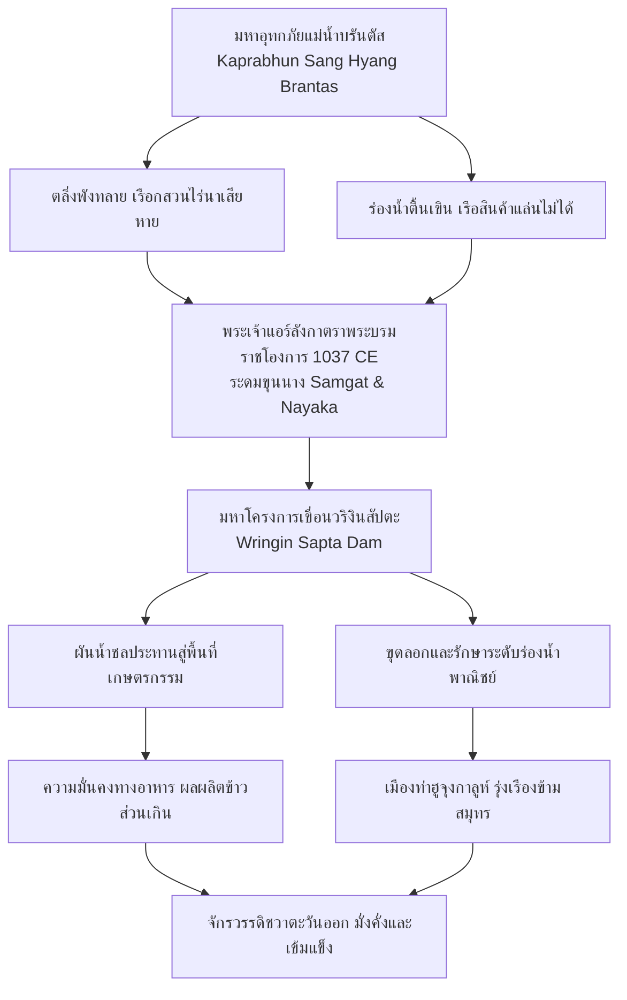
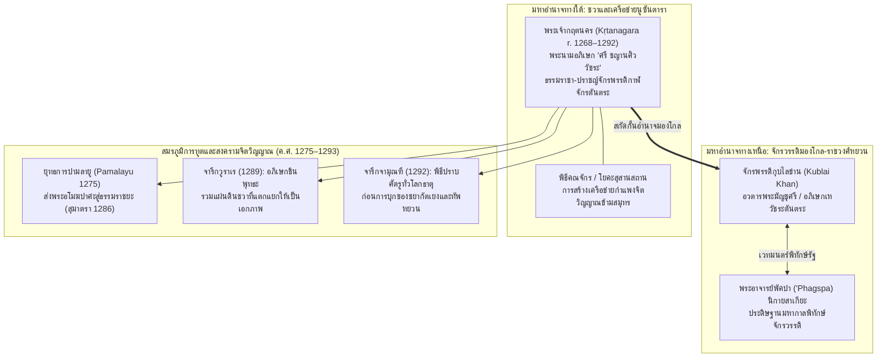
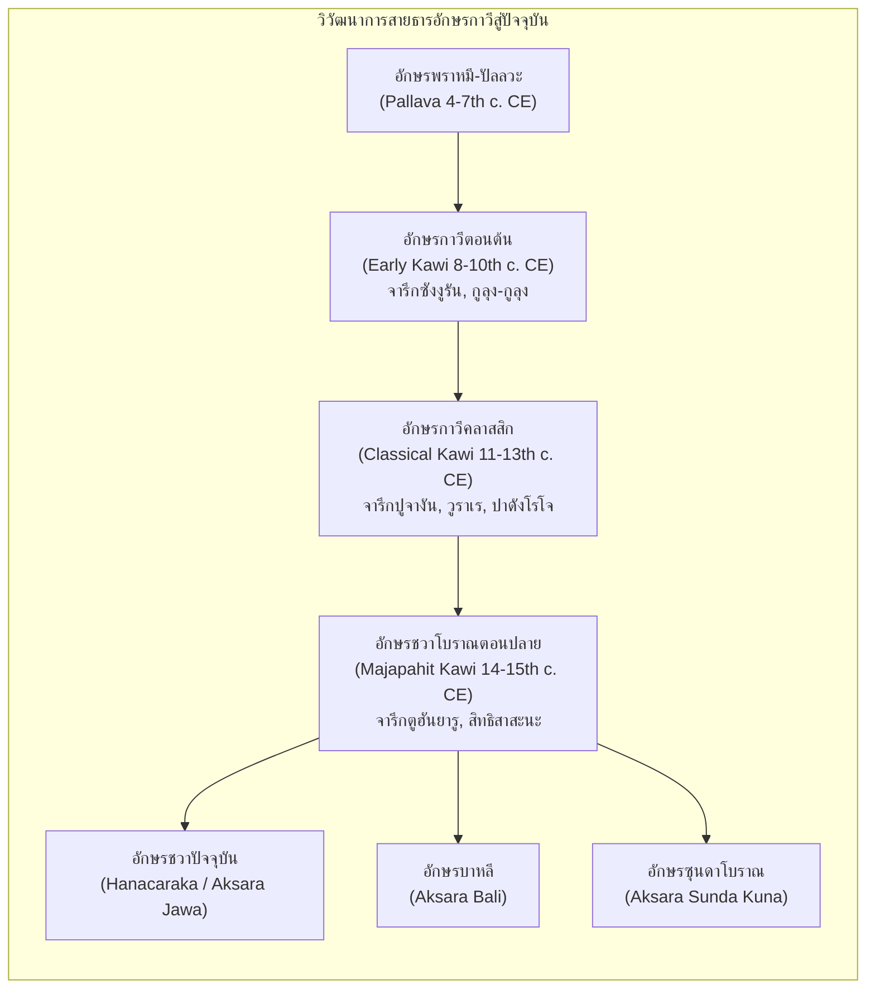

# บทที่ 4: จักรวรรดิแห่งลุ่มน้ำบรันตัส: วิวัฒนาการจารึกวิทยา สถาบันรัฐ และเครือข่ายความเชื่อในชวาตะวันออก (คริสต์ศตวรรษที่ 10–15)
*(The Brantas River Basin Empires: Epigraphy, Statecraft, and Religious Networks in Eastern Java from Sindok to Majapahit, 10th–15th Centuries CE)*

---

## บทนำประจำบทที่ 4: ภูมิทัศน์ลุ่มน้ำบรันตัสและเบงงาวันโซโล สู่แกนกลางอำนาจใหม่ของชวาตะวันออก

ในประวัติศาสตร์นิพนธ์ว่าด้วยอารยธรรมชวาโบราณ การเคลื่อนย้ายศูนย์กลางอำนาจทางการเมือง เศรษฐกิจ และวัฒนธรรมจากที่ราบลุ่มตอนกลาง (Central Java) สู่ภูมิภาคชวาตะวันออก (Eastern Java) ในช่วงต้นคริสต์ศตวรรษที่ 10 ภายใต้การนำของพระเจ้ามปู สินโฑก (Mpu Sindok) นับเป็นจุดเปลี่ยนผ่านเชิงโครงสร้างที่สำคัญที่สุดครั้งหนึ่งของเอเชียตะวันออกเฉียงใต้ภาคพื้นสมุทร การเปลี่ยนผ่านดังกล่าวหาได้เป็นเพียงการอพยพย้ายถิ่นฐานของราชสำนักอันเนื่องมาจากวิกฤตการณ์ทางการเมืองหรือภัยพิบัติทางธรรมชาติเพียงประการเดียว หากแต่สะท้อนถึงการปรับเปลี่ยนกระบวนทัศน์เชิงยุทธศาสตร์ในการจัดระเบียบเชิงพื้นที่ (Spatial Reorganization) เพื่อผนวกรวมฐานรากทางเศรษฐกิจเกษตรกรรมนาดำชลประทานเข้ากับเครือข่ายพาณิชย์นาวีข้ามสมุทรอย่างเป็นระบบ [1] ภูมิศาสตร์กายภาพของชวาตะวันออกมีลักษณะจำเพาะอันโดดเด่นด้วยระบบลุ่มน้ำขนาดใหญ่สองสายหลัก ได้แก่ ลุ่มแม่น้ำบรันตัส (Brantas River Basin) และลุ่มแม่น้ำเบงงาวันโซโล (Bengawan Solo Basin) ซึ่งทำหน้าที่เป็นโครงสร้างพื้นฐานทางธรรมชาติที่โอบอุ้มการก่อรูปของรัฐชวาในยุคคลาสสิกตอนปลายยาวนานกว่าห้าศตวรรษ ตั้งแต่รัชสมัยมปู สินโฑก, รัชสมัยพระเจ้าแอร์ลังกา (Airlangga), ยุคอาณาจักรแฝงกาดีรี (Kaḍiri/Pañjalu) และชังกะละ (Janggala), จักรวรรดิสิงหส่าหรี (Siṅhasāri), ตราบจนกระทั่งถึงจุดสูงสุดของระเบียบการปกครองแบบสากลนิยมภายใต้จักรวรรดิมัชปาหิต (Majapahit) [2]

แม่น้ำบรันตัสมีลักษณะการไหลที่เป็นเอกลักษณ์ทางอุทกวิทยา โดยมีต้นกำเนิดจากแนวภูเขาไฟสูงชันแถบภูเขาอาร์จุโน-เวลิรัง (Mount Arjuno-Welirang) และภูเขากาวี (Mount Kawi) ไหลวนเป็นรูปเกือกม้าโอบล้อมกลุ่มภูเขาไฟสำคัญทางตอนกลางของชวาตะวันออก ได้แก่ ภูเขาเกอลุด (Mount Kelud) และภูเขาวิลิส (Mount Wilis) ก่อนจะหักเลี้ยวขึ้นไปทางทิศเหนือและไหลวกไปทางทิศตะวันออกสู่ที่ราบต่ำชายฝั่งทะเล กระแสน้ำได้พัดพาเอาตะกอนดินภูเขาไฟอันอุดมสมบูรณ์ด้วยแร่ธาตุมาทับถม ก่อให้เกิดที่ราบลุ่มดินดอนสามเหลี่ยมปากแม่น้ำและหุบเขาเกษตรกรรมนาดำ (*sawah*) ที่มีผลิตภาพสูงยิ่ง สามารถรองรับประชากรหนาแน่นและสร้างผลผลิตข้าวส่วนเกินสำหรับหล่อเลี้ยงราชสำนักและกองทัพ [3] ยิ่งไปกว่านั้น แม่น้ำบรันตัสยังทำหน้าที่เป็นหลอดเลือดใหญ่ในการคมนาคมขนส่งทางน้ำที่เชื่อมโยงผลิตผลทางการเกษตร แร่ธาตุ และของป่าจากเขตหุบเขาตอนใน สู่เมืองท่าหน้าด่านบริเวณปากแม่น้ำ ได้แก่ เมืองท่าฮูจุงกาลูห์ (Hujuṅ Galuh ปัจจุบันคือบริเวณสุราบายา) และเครือข่ายเมืองท่าชายฝั่งทะเลชวาตอนเหนือ เช่น ตูบัน (Tuban/Kambang Putih) และเกรซิก (Gresik) ซึ่งเป็นจุดเชื่อมต่อกับเส้นทางเดินเรือข้ามสมุทรระหว่างประเทศที่เชื่อมโยงจีน อินเดีย อาหรับ และหมู่เกาะเครื่องเทศทางตะวันออก [4] ในทำนองเดียวกัน แม่น้ำเบงงาวันโซโลซึ่งเป็นแม่น้ำสายยาวที่สุดในเกาะชวา ไหลเชื่อมต่อจากที่ราบสูงชวากลางผ่านหุบเขาตอนเหนือของชวาตะวันออกออกสู่ทะเลชวา ได้ทำหน้าที่เป็นเส้นทางคมนาคมทางเลือกที่ช่วยกระจายสินค้าและรักษาเสถียรภาพการควบคุมดินแดนส่วนหลังของราชอาณาจักร [5]

การเปลี่ยนผ่านจากศูนย์กลางภูเขาไฟชวากลาง ซึ่งมีลักษณะเป็นแอ่งที่ราบปิดล้อมด้วยภูเขาไฟสูงชันและขาดแคลนเมืองท่าธรรมชาติขนาดใหญ่ มาสู่เครือข่ายลุ่มน้ำบรันตัสและเบงงาวันโซโล จึงนำไปสู่การก่อกำเนิด "ระบบเศรษฐกิจแบบทวิลักษณ์ที่สมบูรณ์แบบ" (Integrated Dual Economy) อันเป็นการหลอมรวมรัฐเกษตรกรรมตอนใน (Agrarian Inland State) และรัฐพาณิชย์นาวีชายฝั่ง (Maritime Coastal State) เข้าเป็นองคาพยพเดียวกันอย่างแนบแน่น [6] ความมั่งคั่งที่หลั่งไหลเข้ามาจากการค้าทางทะเลในยุคราชวงศ์ซ่งของจีน ควบคู่กับอำนาจการผลิตข้าวชลประทานภายใน ได้กลายเป็นเชื้อเพลิงขับเคลื่อนวิวัฒนาการอันรุ่งโรจน์ของวัฒนธรรมชวาตะวันออก ทั้งในมิติภาษาศาสตร์ วรรณคดีกากาวิน (Kakawin) สถาปัตยกรรมจันทิหินและอิฐ เทววิทยาการเมืองแบบศิวะ-พุทธตันตระ และโดยเฉพาะอย่างยิ่ง ประเพณีการจารึกบนศิลาและแผ่นทองแดง (*tāmraśāsana*) ที่ทวีความซับซ้อน ละเอียดลออ และสะท้อนกลไกทางกฎหมาย การคลัง และสถาบันกัลปนาที่ดินสีมา (*sīma*) อย่างลึกซึ้ง [7]

เนื้อหาในตอนที่ 1 ของบทที่ 4 นี้ มุ่งเจาะลึกการวิเคราะห์หลักฐานจารึกวิทยาปฐมภูมิและประวัติศาสตร์นิพนธ์ในสองช่วงเวลาแห่งการเปลี่ยนผ่านและก่อรูปอำนาจที่สำคัญยิ่ง ได้แก่:
- **หัวข้อ 4.1 การย้ายศูนย์กลางอำนาจสู่ลุ่มน้ำบรันตัสและรัชสมัยมปู สินโฑก (Mpu Sindok ca. 929–947 CE):** มุ่งทบทวนและหักล้างทฤษฎีภัยพิบัติภูเขาไฟเมอราปีระเบิด ค.ศ. 1006 ของ ฟาน แบมเมอเลน (Van Bemmelen) ด้วยการคำนวณศักราชดาราศาสตร์อันแม่นยำของ ดาแมส์ (Damais 1952) ซึ่งพิสูจน์ว่าการย้ายราชธานีเกิดขึ้นตั้งแต่ ค.ศ. 929 ควบคู่กับการชี้ให้เห็นปัจจัยดึงดูดทางเศรษฐกิจเกษตรกรรมและพาณิชย์นาวีของแม่น้ำบรันตัสตามข้อเสนอของ บูชารี (Boechari), คริสตี (Christie) และ กริฟฟิทส์ (Griffiths); การวิเคราะห์ศิลาจารึกซังงูรัน (Sangguran / Minto Stone 928 CE) ในฐานะหมุดหมายสุดท้ายก่อนย้ายศูนย์กลางและการสถาปนาสีมาของสมาคมช่างตีเหล็ก; การศึกษาจารึกกูลุง-กูลุง (Gulung-Gulung 929 CE) กับการสถาปนาราชวงศ์อีศานะ (Īśānavāṃśa); การแผ่ขยายเครือข่ายสีมาและพันธมิตรชนชั้นนำท้องถิ่นผ่านจารึกลิงคสุนตัน (Linggasuntan 929 CE), จารึกมาซาฮาร์ (Masahar 929 CE) และจารึกอะลัสอันตัน (Alasantan 939 CE); ตลอดจนการทำความเข้าใจโครงสร้างกฎหมาย สัญญาจำนอง และคำสาปแช่งศักดิ์สิทธิ์ (*śapatha*) [8]
- **หัวข้อ 4.2 มหาราชแอร์ลังกาและการฟื้นฟูเสถียรภาพรัฐ (Airlangga ca. 1019–1049 CE):** นำเสนอการวิเคราะห์ตัวบททวิภาษาในศิลาจารึกกัลกัตตาหรือปูจางัน (Calcutta Stone / Pucangan 1041 CE) ที่ประพันธ์เป็นภาษาสันสกฤตชั้นสูงโดยเอ็มปู มาโน (Mpu Mano) ควบคู่กับภาษาชวาโบราณ; การชำระประวัติศาสตร์สงคราม "มหาปรลัยยา" (Pralaya 938 Śaka / 1016/1017 CE) อันนำมาโดยฮาจี วุราวารี แห่งลวารัม (Haji Wurawari i Lwaram) จนแอร์ลังกาต้องลี้ภัยสู่วนวาสีก่อนกอบกู้แผ่นดิน; เครือข่ายสายตระกูลวรเทวะแห่งบาหลีที่เชื่อมโยงกับราชวงศ์อีศานะ และบทบาทของเจ้าหญิงสังครามวิชัย (Śrī Saṅgrāmavijaya) ผู้สละราชสมบัติออกผนวช; การฟื้นฟูระเบียบความมั่นคงผ่านจารึกบาฮ์รู (Baru 1030 CE) และจารึกลูเจม (Lucem); และปิดท้ายด้วยการวิเคราะห์ข้อเท็จจริงทางประวัติศาสตร์และหลักฐานจารึกว่าด้วยการแบ่งแยกราชอาณาจักรออกเป็นปัญจาลูและชังกะละโดยมหาฤๅษีภาราดา (Mpu Bharaḍa) อันเป็นรากฐานของยุคทองแห่งวรรณคดีชวาในเวลาต่อมา [9]

---

## 4.1 การย้ายศูนย์กลางอำนาจสู่ลุ่มน้ำบรันตัสและรัชสมัยมปู สินโฑก (Mpu Sindok ca. 929–947 CE)

### 4.1.1 ปริศนาการละทิ้งชวากลาง: การหักล้างทฤษฎีภัยพิบัติภูเขาไฟเมอราปี ค.ศ. 1006 สู่ปัจจัยดึงดูดทางเศรษฐกิจ-พาณิชย์นาวี

หนึ่งในปริศนาคลาสสิกที่ถูกถกเถียงอย่างเผ็ดร้อนที่สุดในประวัติศาสตร์นิพนธ์ชวาโบราณ คือคำถามที่ว่า *เหตุใดราชสำนักแห่งอาณาจักรเมดังในภูมิมาตาราม (Kaḍatvan i Mḍaṁ i Bhūmi Matarām) ซึ่งรุ่งเรืองถึงขีดสุดในการสร้างมหาศาสนสถานหินอันวิจิตรตระการตา เช่น บุโรพุทโธและปรัมบานัน จึงละทิ้งที่ราบลุ่มชวากลางไปอย่างฉับพลันในช่วงต้นคริสต์ศตวรรษที่ 10 แล้วย้ายศูนย์กลางอำนาจไปตั้งมั่น ณ ดินแดนห่างไกลในลุ่มแม่น้ำบรันตัส ชวาตะวันออก* ในอดีต ทฤษฎีที่ทรงอิทธิพลและครอบงำวงวิชาการมายาวนานหลายทศวรรษคือ **"แบบจำลองมหันตภัยทางธรรมชาติ" (Catastrophic Natural Disaster Model)** ซึ่งริเริ่มและนำเสนอโดยนักธรณีวิทยาชาวดัตช์ เรย์เนียร์ วิลเลม ฟาน แบมเมอเลน (Reinout Willem van Bemmelen) ในผลงานชิ้นเอก *The Geology of Indonesia* (1949) [10]

ฟาน แบมเมอเลน ได้ตั้งสมมติฐานว่า ภูเขาไฟเมอราปี (Mount Merapi) ซึ่งตั้งตระหง่านอยู่ทางทิศเหนือของที่ราบยอกยาการ์ตาและปรัมบานัน ได้เกิดการระเบิดระดับทำลายล้างครั้งใหญ่ยิ่งยวด (Paroxysmal Volcanic Eruption) ในปี ค.ศ. 1006 แรงระเบิดและแผ่นดินไหวรุนแรงทำให้ยอดภูเขาไฟด้านทิศตะวันตกเฉียงใต้พังทลายลงมา ก่อให้เกิดธารลาวาและเถ้าถ่านภูเขาไฟมหาศาลไหลบ่าเข้าทับถมและทำลายระบบชลศาสตร์ ลำคลอง และพื้นที่เกษตรกรรมอันอุดมสมบูรณ์ในที่ราบเกอดู (Kedu Plain) และที่ราบมาตารามจนราบเป็นหน้ากลอง ฟาน แบมเมอเลน ได้เชื่อมโยงปรากฏการณ์ทางธรณีวิทยานี้เข้ากับคำว่า **"ปรลัยยา" (Pralaya)** ซึ่งแปลว่า "กาลอวสานแห่งโลกหรือความพินาศย่อยยับอย่างสิ้นเชิง" ที่ปรากฏอยู่ในศิลาจารึกปูจางัน (Pucangan Inscription หรือ Calcutta Stone) โดยตีความว่าภัยพิบัติภูเขาไฟระเบิดในปี ค.ศ. 1006 ได้ทำลายล้างอารยธรรมชวากลางจนหมดสิ้น บีบบังคับให้กษัตริย์และราษฎรต้องละทิ้งแผ่นดินเกิดและอพยพหนีตายไปตั้งรกรากใหม่ในชวาตะวันออก สมมติฐานนี้ได้รับการยอมรับอย่างกว้างขวางจากนักประวัติศาสตร์ชั้นนำในยุคนั้น และต่อมาได้รับการสนับสนุนในเชิงมานุษยวิทยาศาสนาโดย ศาสตราจารย์ เอ็ม. บูชารี (Boechari 1976/2012) ผู้เสนอเพิ่มเติมว่า เถ้าถ่านภูเขาไฟที่ปกคลุมศาสนสถานและบ้านเมืองได้สร้างวิกฤตความชอบธรรมทางจักรวาลวิทยา โดยชนชั้นนำและราษฎรชวาโบราณเชื่อว่าเทพเจ้าได้ทอดทิ้งแผ่นดินมาตารามแล้ว พระมหากษัตริย์จึงต้องเสด็จไปแสวงหาแผ่นดินศักดิ์สิทธิ์แห่งใหม่เพื่อสถาปนาระเบียบจักรวาลขึ้นมาทดแทน [11]

ทว่า ความก้าวหน้าทางศักราชวิทยาและจารึกวิทยาเชิงวิพากษ์ในเวลาต่อมา ได้รื้อถอนและหักล้างสมมติฐานมหันตภัยภูเขาไฟระเบิด ค.ศ. 1006 ของฟาน แบมเมอเลน ลงอย่างสิ้นเชิง หมุดหมายแห่งการปฏิวัติระเบียบวิธีวิจัยครั้งประวัติศาสตร์นี้เกิดขึ้นจากผลงานวิจัยของ หลุยส์-ชาร์ลส์ ดาแมส์ (Louis-Charles Damais) ในบทความวิจัยชิ้นมาสเตอร์พีซ *"Études d'épigraphie indonésienne, III: Liste des principales inscriptions datées de l'Indonésie"* ตีพิมพ์ในวารสาร *Bulletin de l'École française d'Extrême-Orient* (BEFEO) ปี ค.ศ. 1952 [12]

ดาแมส์ได้สถาปนาระเบียบวิธีลดทอนศักราชเชิงคณิตศาสตร์และดาราศาสตร์ (La méthode de réduction) โดยนำเอาชุดพิกัดวันเวลาอันสลับซับซ้อนที่จารึกอินโดนีเซียบันทึกไว้ซ้อนทับกันหลายมิติ—ประกอบด้วย มหาศักราช (Śaka-varṣātīta), เดือนทางจันทรคติ (māsa), ปักษ์ข้างขึ้นหรือข้างแรม (śukla/kṛṣṇa-pakṣa), ดิถี (tithi), สัปดาห์ 7 วันสัตตวาร (ṣaḍvāra-vāra), สัปดาห์ 5 วันปัญจวาร (pañcavāra), สัปดาห์ 6 วันษัฑวาร (ṣaḍvāra), รอบสัปดาห์วูกู 210 วัน (wuku), และตำแหน่งดวงดาวนักษัตร (nakṣatra) กับโยคะ (yoga)—มาทำการคำนวณสอบทานกับปฏิทินดาราศาสตร์สากล ดาแมส์ได้ค้นพบข้อผิดพลาดร้ายแรงของนักบูรพคดีศึกษาชาวดัตช์รุ่นก่อน (อาทิ Hendrik Kern และ N.J. Krom) ในการอ่านถอดรหัสตัวเลขบนจารึกปูจางัน:

1. ข้อความภาษาสันสกฤตในโศลกที่ 13 ของจารึกปูจางัน ระบุศักราชของเหตุการณ์ปรลัยยาไว้ด้วยระบบคำแทนตัวเลข (Chronogram / Varṇa-saṅkhyā) ว่า **"รส-ศิขริ-รันธระ" (*rasa-śikhari-randhra-gaṇite*)** ซึ่งคำว่า *rasa* แทนเลข 6, *śikhari* แทนเลข 7, และ *randhra* แทนเลข 9 เมื่อนำมาอ่านเรียงกลับหลังตามหลักไวยากรณ์อินเดียโบราณ (*aṅkānāṁ vāmato gatiḥ*) ศักราชที่ถูกต้องเด็ดขาดคือ **มหาศักราช 938** ซึ่งคำนวณเทียบเคียงได้ตรงกับ **ค.ศ. 1016/1017** หาใช่ มหาศักราช 928 หรือ ค.ศ. 1006 ตามที่ Kern และ ฟาน แบมเมอเลน สันนิษฐานผิดพลาดไม่ [13]
2. ดาแมส์ได้พิสูจน์ผ่านการคำนวณวันเวลาของจารึกปฐมภูมิกลุ่มราชวงศ์อีศานะว่า การย้ายศูนย์กลางอำนาจของพระเจ้ามปู สินโฑก มาสู่ชวาตะวันออกนั้น ได้เกิดขึ้นอย่างสมบูรณ์และมั่นคงแล้วตั้งแต่ **มหาศักราช 851 (ตรงกับ ค.ศ. 929)** ดังปรากฏในจารึกกูลุง-กูลุง (Gulung-Gulung, วันที่ 20 เมษายน ค.ศ. 929), จารึกวาฮารูที่ 2 (Waharu II, วันที่ 24 พฤษภาคม ค.ศ. 929), จารึกตูร์ยัน (Turyan, วันที่ 24 กรกฎาคม ค.ศ. 929), จารึกสารังงัน (Sarangan, วันที่ 5 สิงหาคม ค.ศ. 929), และจารึกลิงคสุนตัน (Linggasuntan, วันที่ 3 กันยายน ค.ศ. 929) (Damais 1952, 56–58) [14]

ข้อเท็จจริงทางจารึกวิทยาและดาราศาสตร์นี้พิสูจน์ให้เห็นประจักษ์ชัดว่า การสถาปนาราชธานีในชวาตะวันออกของมปู สินโฑก ในปี ค.ศ. 929 เกิดขึ้นล่วงหน้าก่อนเหตุการณ์ "ปรลัยยา" ในปี ค.ศ. 1016/1017 นานถึง **87 ปี (เกือบหนึ่งศตวรรษ)** ดังนั้น เหตุการณ์ปรลัยยาจึงไม่สามารถนำมาใช้อธิบายสาเหตุของการย้ายราชธานีจากชวากลางสู่ชวาตะวันออกในต้นศตวรรษที่ 10 ได้เลยแม้แต่น้อย ยิ่งไปกว่านั้น การสำรวจลำดับชั้นดินทางธรณีวิทยาและการตรวจวัดอายุคาร์บอนกัมมันตรังสีรอบภูเขาไฟเมอราปียุคใหม่ (Newhall et al. 2000) ยังยืนยันว่า ไม่พบหลักฐานการระเบิดรุนแรงระดับทำลายล้างล้างเกาะชวากลางในปี ค.ศ. 1006 ตามแบบจำลองของฟาน แบมเมอเลน แต่เป็นการปะทุเถ้าถ่านตามวัฏจักรธรรมชาติหลายระลอก ซึ่งแม้จะส่งผลกระทบต่อชุมชนบางแห่ง (ดังปรากฏในจารึกรูกัม Rukam 907 CE และกลุ่มจารึกจันทิเกอดูลัน) แต่ก็มิได้รุนแรงถึงขั้นทำลายโครงสร้างประชากรและเกษตรกรรมทั้งหมดของชวากลาง [15]

เมื่อทฤษฎีมหันตภัยทางธรรมชาติถูกหักล้างลง นักประวัติศาสตร์จารึกวิทยาร่วมสมัย อาทิ แจน วิสเซอมัน คริสตี (Jan Wisseman Christie 1998, 2009), บูชารี (Boechari 2012), และ อาร์โล กริฟฟิทส์ (Arlo Griffiths 2020) จึงได้หันมามุ่งเน้นการอธิบายผ่าน **"ทฤษฎีแรงดึงดูดทางภูมิเศรษฐศาสตร์และการพาณิชย์นาวี" (Geopolitical, Agrarian & Commercial Pull Paradigm)** โดยชี้ให้เห็นปัจจัยผลักดันและดึงดูดเชิงโครงสร้าง 4 ประการหลัก:

ประการแรก *ข้อจำกัดทางกายภาพของชวากลาง:* ที่ราบลุ่มชวากลาง (เกอดูและปรัมบานัน) แม้จะมีความอุดมสมบูรณ์สูง แต่มีลักษณะเป็นแอ่งที่ราบปิดล้อมด้วยภูเขาไฟและเทือกเขาหินปูน ชายฝั่งทะเลชวากลางขาดแคลนอ่าวธรรมชาติน้ำลึกและแม่น้ำสายใหญ่ที่เรือเดินสมุทรสามารถแล่นเข้าถึงได้ การคมนาคมขนส่งผลผลิตข้าวส่วนเกินออกสู่ตลาดต่างประเทศต้องเผชิญกับต้นทุนโลจิสติกส์ทางบกที่สูงลิ่ว [16]

ประการที่สอง *ศักยภาพมหาศาลของลุ่มน้ำบรันตัส:* แม่น้ำบรันตัสในชวาตะวันออกมอบความได้เปรียบเชิงยุทธศาสตร์ที่เหนือกว่าชวากลางอย่างเทียบไม่ติด ที่ราบตะกอนน้ำพัดพาของแม่น้ำบรันตัสตอนกลางและตอนล่างมีความกว้างใหญ่ไพศาล สามารถขยายพื้นที่ชลประทานเปิดหน้าดินทำนาข้าวทดน้ำ (*sawah*) ได้มหาศาล ขณะเดียวกัน ตัวแม่น้ำบรันตัสเป็นแม่น้ำสายหลักที่มีความลึกและกว้างเพียงพอให้เรือบรรทุกสินค้าท้องถิ่นแล่นสัญจรจากเขตเกษตรกรรมตอนในลงสู่ปากแม่น้ำได้อย่างราบรื่นตลอดทั้งปี [17]

ประการที่สาม *การระเบิดตัวของการค้าข้ามสมุทรในยุคราชวงศ์ซ่ง:* ในช่วงคริสต์ศตวรรษที่ 10 ราชวงศ์ซ่งของจีนได้ดำเนินนโยบายส่งเสริมการค้าทางทะเลกับเอเชียตะวันออกเฉียงใต้อย่างกว้างขวาง ส่งผลให้ความต้องการสินค้าเครื่องเทศ (กานพลู จันทน์เทศ จากหมู่เกาะโมลุกกะและบันดา) และไม้หอมทวีความต้องการสูงขึ้นอย่างยิ่ง ลุ่มแม่น้ำบรันตัสและแนวชายฝั่งทะเลชวาตะวันออกตั้งอยู่ในทำเลที่ตั้งทางภูมิรัฐศาสตร์อันเป็นเลิศในการเป็น "สะพานเชื่อมต่อทางการค้า" (Commercial Gateway) ระหว่างเส้นทางเดินเรือมหาสมุทรอินเดีย-ทะเลจีนใต้ กับเส้นทางการค้าภายในหมู่เกาะเครื่องเทศทางทิศตะวันออก การย้ายราชธานีมายังลุ่มน้ำบรันตัสจึงเปิดโอกาสให้ราชสำนักชวาสามารถสถาปนาการควบคุมเหนือเมืองท่าปากแม่น้ำฮูจุงกาลูห์ (Hujung Galuh) เพื่อกอบโกยผลประโยชน์จากภาษีศุลกากร ค่าธรรมเนียมท่าเรือ และการผูกขาดการค้าข้าวระหว่างประเทศ [18]

ประการที่สี่ *การแผ่อิทธิพลและเตรียมการล่วงหน้าของราชสำนักชวา:* การย้ายศูนย์กลางอำนาจมิใช่การตัดสินใจที่เกิดขึ้นในชั่วข้ามคืน หากแต่เป็นกระบวนการที่ดำเนินไปอย่างเป็นขั้นเป็นตอน หลักฐานจารึกแสดงให้เห็นว่า ราชสำนักชวากลางได้เริ่มแผ่ขยายเครือข่ายอำนาจและผลประโยชน์ทางเศรษฐกิจเข้ามาฝังตัวในชวาตะวันออกตั้งแต่ปลายคริสต์ศตวรรษที่ 9 ดังปรากฏในจารึกซูกิฮ์มาเน็ก (Sugih Manek 837 Śaka / 915 CE) และจารึกกินแวก (Kinwec 829 Śaka / 907 CE) จนกระทั่งมาถึงจุดสุกงอมสูงสุดในรัชสมัยพระเจ้าดยาห์ วาวา ผ่านศิลาจารึกซังงูรัน (ค.ศ. 928) ซึ่งเป็นประจักษ์พยานชิ้นเอกที่แสดงให้เห็นว่า มปู สินโฑก ได้เข้ามาจัดวางเครือข่ายความมั่นคงและเศรษฐกิจในชวาตะวันออกไว้พร้อมสรรพแล้ว ก่อนที่จะทำการสถาปนาราชวงศ์ใหม่อย่างเป็นทางการในปีถัดมา [19]

---

### 4.1.2 ศิลาจารึกซังงูรัน (Sangguran / Minto Stone 850 Śaka / 928 CE): หมุดหมายสุดท้ายก่อนย้ายศูนย์กลาง

ศิลาจารึกซังงูรัน (Sangguran Inscription) หรือที่รู้จักกันอย่างแพร่หลายในโลกตะวันตกในนาม **"ศิลาจารึกมินโต" (The Minto Stone)** นับเป็นเอกสารจารึกประวัติศาสตร์ที่มีความสำคัญสูงสุดหลักหนึ่งในบรรดาจารึกชวาโบราณทั้งหมด เนื่องจากเป็นจารึกศิลาหลักสุดท้ายที่ออกในรัชสมัยของพระมหากษัตริย์แห่งราชธานีมะตะรัม/เมดังในชวากลาง และเป็นหลักฐานเชิงประจักษ์ชิ้นสำคัญที่เผยให้เห็นบทบาทอันทรงอำนาจของมปู สินโฑก ในฐานะ "มหาเสนาบดีผู้กุมชะตากรรมของแผ่นดิน" ก่อนการย้ายศูนย์กลางอำนาจถาวร [20]

ในทางกายภาพ ศิลาจารึกซังงูรันเป็นแท่งหินแอนดีไซต์ (Andesite Monolith) ทรงใบเสมาขนาดมหึมา มีความสูงมากกว่า 2 เมตร กว้างประมาณ 1.2 เมตร และมีน้ำหนักมากกว่า 3 ตัน สลักด้วยอักษรชวาโบราณยุคกลาง (Early Classical Kawi Script) ครอบคลุมพื้นที่ทั้ง 4 ด้าน รวมความยาวทั้งสิ้น 113 บรรทัด (ด้านหน้า A 38 บรรทัด, ด้านหลัง B 45 บรรทัด, และขอบข้าง C-D รวม 30 บรรทัด) ศิลาหลักนี้เดิมประดิษฐานอยู่ ณ หมู่บ้านงันดัต (Ngandat) ตำบลโมโจเรโจ (Mojorejo) อำเภอบาตู (Batu) ใกล้เมืองมาลัง (Malang) ในเขตที่ราบสูงชวาตะวันออก ทว่า ในปี ค.ศ. 1812 ระหว่างช่วงเวลาสั้นๆ ที่สหราชอาณาจักรเข้ายึดครองหมู่เกาะอินเดียตะวันออก พันโท โคลิน แมกเคนซี (Colin Mackenzie) ภายใต้คำสั่งของ โธมัส สแตมฟอร์ด แรฟเฟิลส์ (Thomas Stamford Raffles) รองข้าหลวงใหญ่อังกฤษประจำชวา ได้ดำเนินการขุดและเคลื่อนย้ายศิลาจารึกขนาดยักษ์นี้ลงเรือส่งข้ามมหาสมุทรไปถวายเป็นของขวัญส่วนบุคคลแด่ ลอร์ด มินโต (Lord Minto หรือ Gilbert Elliot-Murray-Kynynmound) ข้าหลวงใหญ่อังกฤษประจำอินเดีย ศิลาจารึกซังงูรันจึงถูกนำไปประดิษฐานกลางแจ้ง ณ คฤหาสน์ Minto House มณฑลร็อกซเบิร์กเชียร์ แคว้นสก็อตแลนด์ มาจนถึงปัจจุบัน และกลายเป็นกรณีศึกษาประเด็นจริยธรรมโบราณคดีในการรณรงค์ทวงคืนโบราณวัตถุชิ้นเอก (Repatriation) ของรัฐบาลอินโดนีเซียในเวทีสากล [21]

ในด้านตัวบทและการชำระจารึกวิทยา โครงการวิจัยจารึกดิจิทัล DHARMA (ERC Synergy Grant 809994) นำโดย อาร์โล กริฟฟิทส์, วายัน จาร์ราฮ์ ซัสตราวัน, และ เอโก บัสตียาวัน (Griffiths, Sastrawan, and Bastiawan 2022/2026, DHARMA INSIDENK00722; Griffiths 2020) ได้ทำการอ่านตรวจสอบตัวบทโดยตรงจากโบราณวัตถุจริงที่สก็อตแลนด์ ควบคู่กับการประมวลผลโมเดลภาพถ่าย 3 มิติความละเอียดสูง (3D Photogrammetry) แก้ไขข้อผิดพลาดในการอ่านของ Brandes (1913) และ Krom ได้อย่างสมบูรณ์แบบ [22]

พิกัดวันเวลาที่ระบุในจารึกซังงูรัน ได้รับการคำนวณสอบทานโดย ดาแมส์ (Damais 1952, 56–58; Griffiths 2020, 110) สรุปได้ดังนี้:
> **มหาศักราช 850** เดือนศราพณะ (Śravaṇa-māsa) ขึ้น 14 ค่ำ (caturdaśī śukla-pakṣa), วันวูรูกุง (Vurukuṅ - สัปดาห์ 6 วัน), วันกลิวอน (Kalivon - สัปดาห์ 5 วัน), วันเสาร์ (Śanaiścara-vāra), นักษัตรหัสตะ (Hastā-nakṣatra), เทพประจำฤกษ์คือพระวิษณุ (Viṣṇu-devatā), โศภคยะโยคะ (Saubhāgya-yoga) ซึ่งตรงกับ **วันเสาร์ที่ 2 สิงหาคม ค.ศ. 928 ตามปฏิทินจูเลียน**

จารึกซังงูรันเปิดฉากด้วยบทสรรเสริญภาษาสันสกฤตที่ประพันธ์ด้วยฉันท์อารยา (Āryā metre) อันไพเราะงดงาม ซึ่งเป็นมงคลพจน์บทเดียวกับที่ปรากฏในจารึกซูกิฮ์มาเน็ก (Sugih Manek 837 Śaka / 915 CE) สะท้อนถึงธรรมเนียมนิยมร่วมของราชสำนักชวาในเขตมาลัง:

> **ตัวบทปริวรรตอักษรเดิม (IAST):**
> *"Avighnam astu . śivam astu sarvva-jagataḥ para-hita-nirataāḥ bhavāantu bhūta-gaṇāḥ doṣāḥ prayāntu nāśām· sarvvatra sukhī bhavatu lokaḥ . ma . * . ."* (DHARMA INSIDENK00722, Front A1–2)
>
> **คำแปลภาษาไทยวิชาการ:**
> *"ขอความขัดข้องจงอย่าได้มี! ขอความศานติศุภมงคลจงมีแด่สากลโลก! ขอเหล่าภูตสรรพสัตว์ทั้งปวงจงตั้งมั่นในความเกื้อกูลต่อผู้อื่น! ขอโทษมลทินและความชั่วร้ายทั้งหลายจงถึงความพินาศสูญสิ้น! ขอให้โลกจงเปี่ยมด้วยความสุขเกษมศานต์ในทุกสถานเทอญ!"* [23]

โครงสร้างการใช้อำนาจที่ปรากฏในส่วนพระบรมราชโองการ (Royal Command / *ājñā*) มีความสลักสำคัญยิ่งต่อการทำความเข้าใจสถาบันการเมืองชวาโบราณ ตัวบทระบุว่า:
> *"Irikā divasani Ājñaā śrī mahārāja, rakai paṅkaja dyaḥ vava śrī vijayalokanāmosttuṅga, tinaḍaḥ rakryān· mapatiḥ I hino pu siṇḍok· śrī Īśānavikrama, Umiṅsor· I samgat· momah-umaḥ kāliḥ maḍaṇḍər· pu padma, Aṅgəhan· pu kuṇḍala..."* (Front A2–4)
>
> *"ในวันเวลานั้น มีพระบรมราชโองการขององค์พระศรีมหาราชา ราไก ปังกายา ดยาห์ วาวา ผู้ทรงพระนามอันสูงส่งว่า ศรี วิชยาโลกนามโมตตุงคะ อันได้รับการน้อมรับโดย ราเกรียน มหาปาติฮ์ แห่งหิโน นาม ปู สินดก ผู้ทรงนามว่า ศรี อีศานะวิกรม แล้วจึงถ่ายทอดลงมายังขุนนางสมคัต โมมะฮ์-อูมะฮ์ ทั้งสองนาย คือ มะดันเดอร์ ปู ปัทมะ และ อังเกอฮัน ปู กุณฑละ..."* [24]

ข้อความนี้ยืนยันอย่างแจ้งชัดว่า แม้พระเจ้าแผ่นดินผู้ทรงอำนาจสูงสุดตามกฎหมายจะยังคงเป็น **พระเจ้าราไก ปังกายา ดยาห์ วาวา (Dyah Wawa)** กษัตริย์พระองค์สุดท้ายแห่งชวากลาง ทว่า อำนาจในการบริหารราชการแผ่นดินและการบังคับบัญชาสายงานราชสำนักตกอยู่ในการควบคุมของ **มปู สินโฑก (Pu Siṇḍok)** ผู้ดำรงตำแหน่ง **ราเกรียน มหาปาติฮ์ ฮิโน (Rakryān Mapatiḥ i Hino)** ซึ่งเป็นตำแหน่งอัครมหาเสนาบดีสูงสุดรองจากองค์กษัตริย์ และเป็นตำแหน่งขององค์รัชทายาทผู้มีสิทธิธรรมในการสืบราชสมบัติ ยิ่งไปกว่านั้น สร้อยพระนาม "ศรี อีศานะวิกรม" (*Śrī Īśānavikrama*) ที่ปรากฏต่อท้ายนามปู สินโฑก ยังแสดงให้เห็นว่าพระองค์ทรงสั่งสมเกียรติยศและสถานะกึ่งกษัตริย์ไว้พร้อมแล้ว ก่อนที่จะทรงปราบดาภิเษกเป็นมหาราชาอย่างเป็นทางการในปีถัดมา [25]

สาระสำคัญของการตราพระบรมราชโองการในจารึกซังงูรัน คือการสถาปนาดินแดนชุมชนหมู่บ้านซังงูรัน ในแขวงวาฮารู (*vanua i saṁguran vatak vaharu*) ให้ยกสถานะขึ้นเป็น **"เขตสีมา" (Sīma)** ที่ได้รับข้อยกเว้นภาษี เพื่ออุทิศรายได้และผลประโยชน์ทางเศรษฐกิจไปทำนุบำรุงเทวสถานไศวนิกาย คือ **"พระผู้เป็นเจ้าแห่งมหาปราสาทกภักตยัน" (*bhaṭāra i saṁ hyaṁ prāsāda kabhaktyan*)** ซึ่งตั้งอยู่ในเขตอารามปราบาสวรปุระ (Prābhasvarapura) อันเป็นศาสนสถานของ **สมาคมช่างตีเหล็กและช่างโลหะแห่งมานันจุง (*sīma kajuru-gusalyan i manañjuṁ*)** โดยกำหนดให้ผลประโยชน์จากที่ดินนี้นำไปใช้ในการจัดซื้อและถวายเครื่องสักการะบูชาและเครื่องสังเวยประจำวันแด่พระศิวะ (*śiva-caru-nivedya*) ได้แก่ ข้าวสาร หมากพลู ดอกไม้ น้ำมันประทีป และเครื่องหอม [26]

นัยสำคัญทางเศรษฐกิจและประวัติศาสตร์เทคโนโลยีของจารึกซังงูรัน มีความโดดเด่นเป็นพิเศษด้วยการระบุสิทธิพิเศษและโควตาทางภาษีแก่ชุมชนช่างฝีมือโลหกรรม ตัวบทกำหนดอนุญาตให้สมาคมช่างตีเหล็กสามารถดำเนินการตั้งเตาหลอมช่างเหล็กได้ 1 เตาหลอม (*paṇḍai sobuban*), ช่างไม้ 1 นาย (*uṇḍahagi*), กี่ทอผ้า 4 หลัง (*macadar pataṁ pacadaran*), เลี้ยงสัตว์ใช้งานโดยปลอดภาษี (กระบือ 20 ตัว, โค 40 ตัว, แพะ 80 ตัว, เป็ด 1 เล้า) และที่สำคัญที่สุดคือ ทรงพระราชทานสิทธิ์ในการครอบครอง **"เรือสินค้าขนาดใหญ่ 1 ลำที่มีคานยื่น 3 อัน" (*parahu 1 masuṁhara 3*)** โดยได้รับยกเว้นภาษีการค้าและการจอดเรือ [27] รายการสินค้าและแร่ธาตุที่จารึกระบุไว้ แสดงถึงการเชื่อมโยงเครือข่ายพาณิชย์ข้ามสมุทรอย่างน่าทึ่ง ประกอบด้วย โลหะเหล็ก (*vsi*), เหล็กกล้าทำอาวุธ (*pamaja*), ทองแดง (*tambaga*), สำริด (*gaṅsa*), และ **ดีบุก (*timaḥ*)** ซึ่งเป็นแร่ธาตุยุทธศาสตร์ที่ไม่พบในเกาะชวา แต่ต้องนำเข้าข้ามทะเลมาจากคาบสมุทรมลายูหรือเกาะบังกา-เบลิตุงและสุมาตรา [28]

การที่มปู สินโฑก เลือกสถาปนาเขตสีมาคุ้มครองสมาคมช่างตีเหล็ก (*maneges / gusali*) ในเขตมาลัง ชวาตะวันออก เป็นภารกิจสำคัญลำดับต้นๆ ย่อมมิใช่เรื่องบังเอิญในเชิงประวัติศาสตร์ หากแต่เป็น "ยุทธศาสตร์ความมั่นคงและการสะสมกำลังทางทหาร" เนื่องจากช่างตีเหล็กคือกลุ่มบุคคลผู้กุมเทคโนโลยีในการผลิตดาบ หอก กริช เครื่องมือโลหะ ตลอดจนอุปกรณ์ไถคราดสำหรับการเกษตรชลประทาน การดึงสมาคมช่างเหล็กแห่งมานันจุงเข้ามาเป็นพันธมิตรและสถาปนาศาสนสถานถวาย ย่อมเป็นการประกันว่าราชสำนักจะมีฐานทรัพยากรอาวุธยุทธภัณฑ์และเครื่องมือโลหะที่มั่นคงในการรองรับการสถาปนาราชธานีแห่งใหม่ในชวาตะวันออก [29]

นอกจากนี้ ในส่วนบทสาปแช่งศักดิ์สิทธิ์ (*śapatha*) อันยาวเหยียดของจารึกซังงูรัน (Face B19–39) ตัวบทได้ปรากฏข้อความระบุถึงพระราชวังหลวงไว้อย่างน่าสนใจยิ่ง:
> *"prasiddha maṁrakṣa kaḍatvan śrī mahārāja i mḍaṁ iṁ bhūmi matarām"* (Face B26–27)
>
> *"[ขออัญเชิญทวยเทพทั้งหลาย] ผู้พิทักษ์รักษาพระราชวังหลวงแห่งองค์พระศรีมหาราชา ในเมดัง แผ่นดินมาตาราม อันเลื่องลือ..."* [30]

การเอ่ยอ้างถึง "พระราชวังเมดังในแผ่นดินมาตาราม" บนหลักหินที่สลักขึ้นในเขตมาลัง ชวาตะวันออก ในเดือนสิงหาคม ค.ศ. 928 เป็นหลักฐานเชิงประจักษ์ที่ชี้ชัดว่า ณ เวลานั้น ศูนย์กลางอำนาจดั้งเดิมในชวากลางยังคงดำรงอยู่ และราชสำนักยังคงรักษาความผูกพันทางจิตวิญญาณและความชอบธรรมทางการเมืองไว้กับศูนย์กลางเดิม ทว่า ในอีกไม่กี่เดือนต่อมา เมื่อพระเจ้าดยาห์ วาวา สิ้นพระชนม์ (อาจด้วยเหตุสวรรคตตามธรรมชาติ หรือความผันผวนทางการเมือง) มปู สินโฑก ก็ได้ก้าวขึ้นสืบทอดอำนาจอย่างเต็มภาคภูมิ และตัดขาดการบริหารออกจากชวากลาง ย้ายราชธานีเมดังมาตั้งมั่นเป็นการถาวรในลุ่มน้ำบรันตัส ชวาตะวันออก [31]

---

### 4.1.3 จารึกกูลุง-กูลุง (Gulung-Gulung 851 Śaka / 929 CE) และการสถาปนาราชวงศ์อีศานะ

ก้าวเข้าสู่ปี มหาศักราช 851 (ค.ศ. 929) แผ่นดินชวาได้ก้าวเข้าสู่ยุคประวัติศาสตร์หน้าใหม่อย่างเป็นทางการ เมื่อมปู สินโฑก ได้ประกอบพระราชพิธีบรมราชาภิเษกเถลิงถวัลยราชสมบัติเป็นพระมหากษัตริย์พระองค์ใหม่อย่างสมบูรณ์ พร้อมทั้งทรงสถาปนาราชวงศ์ใหม่ขึ้นปกครองชวาตะวันออก คือ **"ราชวงศ์อีศานะ" (Īśānavāṃśa / Isana Dynasty)** ซึ่งมีชื่อเรียกตามพระนามเฉลิมพระปรมาภิไธยของพระองค์ [32]

หลักฐานจารึกปฐมภูมิที่บันทึกหมุดหมายแรกแห่งการเสวยราชสมบัติของมปู สินโฑก คือ **จารึกกูลุง-กูลุง (Gulung-Gulung Inscription)** ซึ่งจารึกลงบนแผ่นหิน ค้นพบที่บริเวณสิงหส่าหรี แถบลาดเขาภูเขากาวี ชวาตะวันออก (รหัสจารึกวิทยา OJO XXXVI; DHARMA INSIDENKGulungGulung โดย Arlo Griffiths) [33]

พิกัดวันเวลาทางดาราศาสตร์ในจารึกกูลุง-กูลุง คำนวณสอบทานโดย ดาแมส์ (Damais 1952, 56–58) ระบุไว้ดังนี้:
> **มหาศักราช 851** เดือนไวศาขะ (Vaiśākha-māsa) ขึ้น 9 ค่ำ (navamī śukla-pakṣa), วันมาวะ (Mava - สัปดาห์ 6 วัน), วันอูมานิส (Umanis - สัปดาห์ 5 วัน), วันพุธ (Budha-vāra), นักษัตรปูรพผลคุนี (Pūrvaphālgunī-nakṣatra), เทพประจำฤกษ์คือพระโยนี/ภคะ (Yoni-devatā), อายุษมานโยคะ (Āyuṣmān-yoga) ซึ่งคำนวณตรงกับ **วันพุธที่ 20 เมษายน ค.ศ. 929 ตามปฏิทินจูเลียน**

ตัวบทจารึกเริ่มต้นด้วยบทนมัสการพระคเณศและสูตรวันเวลาอันเป็นมงคล:

> **ตัวบทปริวรรตอักษรเดิม (IAST):**
> *"// Oṃ AvīghnamAvighnam astu gaṇapataye namaḥ // svasti śaka-varṣātīta 851 baiśākha-māsa tithi navamī śukla-pakṣa ma U ca vāra pūrvvaphālguṇī-nakṣatra, yoṇi-devatā, Āyuṣmān-yoga, Irikā divaśa rakryān· hujuṁ pu madhura lokānurāñjanalokānurañjana, manambaḥ I śrī mahārāja rake halu pu siṇḍok· śrī Īśānavikrama dharmmottuṅgadeva, sumīma Ikāṁ dmak ṣavaḥ I guluṅ-guluṁ tapak· su 7, muAṁ Alas· I bantaran· satṅaḥ, paknānya dharmmakṣetrā savahani kuśala rakryān· hujuṁ saṁ hyaṁ prāsāda I himad·, maṅasəA I saṁ hyaṁ kahyaṅan· I paṅavān· mapaṅasəA vḍus· 1 pāda 1 Aṁkən kapūjān· bhaṭāra I paṅavān·..."* (DHARMA INSIDENKGulungGulung, Front 1–6)
>
> **คำแปลภาษาไทยวิชาการ:**
> *"โอม! ขอความขัดข้องจงอย่าได้มี! ขอนอบน้อมแด่พระคณปติ! ความสวัสดีจงมี! มหาศักราชล่วงแล้ว 851 ปี เดือนไวศาขะ ขึ้น 9 ค่ำ วันมาวะ, วันอูมานิส, วันพุธ, นักษัตรปูรพผลคุนี, เทพประจำฤกษ์คือพระโยนี, อายุษมานโยคะ ในวันเวลานั้น ราเกรียน ฮูจุง ปู มธุระ ผู้เป็นที่รื่นรมย์ยินดีของชาวโลก ได้กราบถวายบังคมต่อ องค์พระศรีมหาราชา ราไก เหะลู ปู สินดก ศรี อีศานะวิกรม ธรรโมตตุงคเทวะ ขอพระราชทานสถาปนาดินแดนให้เป็นสีมา ได้แก่ ที่ดินนาพระราชทาน ณ กูลุง-กูลุง วัดขนาดได้ 7 สุวรรณะ และผืนป่า ณ บันตรัน อีกกึ่งหนึ่ง โดยมีวัตถุประสงค์เพื่อเป็น 'ธรรมเกษตร' อันเป็นที่ดินนาแห่งกุศลกรรมของราเกรียน ฮูจุง ค้ำจุนองค์พระมหาปราสาทศักดิ์สิทธิ์ ณ หิมัด และส่งส่วยเครื่องสังเวยแด่เทวาลัยกะฮยังงันศักดิ์สิทธิ์ ณ ปังงาวัน โดยถวายแพะ 1 ตัว พร้อมเงิน 1 ปาทะ ในวาระการบูชาพระผู้เป็นเจ้าแห่งปังงาวันในทุกๆ ปี..."* [34]

จารึกกูลุง-กูลุง สะท้อนพัฒนาการเชิงสถาบันที่สำคัญยิ่งอย่างน้อย 3 ประการ:
1. **การประกาศพระเกียรติยศและสถานะราชาธิราช:** มปู สินโฑก ทรงเปลี่ยนพระอิสริยยศจาก "ราเกรียน มหาปาติฮ์ ฮิโน" มาสู่ **"ศรี มหาราชา ราไก เหะลู" (Śrī Mahārāja Rake Halu)** พร้อมทั้งเฉลิมพระปรมาภิไธยเต็มว่า **"ศรี อีศานะวิกรม ธรรโมตตุงคเทวะ" (Śrī Īśānavikrama Dharmmottuṅgadeva)** ซึ่งแปลว่า "องค์อัครเทวราชผู้ทรงธรรมอันสูงส่ง ผู้ทรงมีชัยชนะอันเกรียงไกรดั่งพระอีศวร (พระศิวะ)" พระนามนี้แสดงถึงการสถาปนาราชสกุลใหม่ที่มีความชอบธรรมทางศาสนาและการเมืองอย่างสมบูรณ์ [35]
2. **เครือข่ายพันธมิตรระหว่างกษัตริย์กับขุนนางระดับภูมิภาค:** ผู้ทูลขอพระราชทานสีมาคือ **"ราเกรียน ฮูจุง ปู มธุระ โลกานุรัญชนะ" (Rakryān Hujuṅ Pu Madhura Lokānurañjana)** เจ้าเมืองผู้ครองแคว้นฮูจุง ซึ่งเป็นขุนนางท้องถิ่นชั้นผู้ใหญ่ที่มีอิทธิพลสูงในเขตสิงหส่าหรีและมาลัง การที่มปู สินโฑก ทรงอนุมัติการสถาปนาสีมาตามคำขอของปู มธุระ แสดงให้เห็นถึงยุทธศาสตร์การสร้างพันธมิตรทางการเมือง โดยกษัตริย์ทรงยอมรับและคุ้มครองผลประโยชน์ทางเศรษฐกิจและศาสนาของชนชั้นนำท้องถิ่นดั้งเดิม เพื่อแลกกับความจงรักภักดีและการสนับสนุนทางการทหารในการตั้งราชธานีใหม่ [36]
3. **มโนทัศน์เรื่อง "ธรรมเกษตร" (Dharmakṣetra):** การเปลี่ยนสภาพที่ดินนา (*sawah*) และผืนป่า (*alas*) ให้กลายเป็นที่ดินศาสนสมบัติปลอดภาษีเพื่อค้ำจุนมหาปราสาทในหิมัด (*prāsāda i himad*) และเทวสถานกะฮยังงันในปังงาวัน (*kahyaṅan i paṅavān*) ชี้ให้เห็นบทบาทของสถาบันสีมาในฐานะกลไกกระจายทรัพยากรเพื่อสร้างความมั่นคงทางสังคมและจิตวิญญาณในเขตลุ่มน้ำบรันตัสตอนบน [37]

---

### 4.1.4 เครือข่ายสีมาและเสถียรภาพสถาบันรัฐ: จารึกลิงคสุนตัน, มาซาฮาร์, และอะลัสอันตัน

เพื่อสร้างเสถียรภาพและความมั่นคงให้แก่ราชธานีแห่งใหม่ในชวาตะวันออก พระเจ้ามปู สินโฑก ได้ดำเนินนโยบายสถาปนาเขตสีมาอย่างต่อเนื่องตลอดรัชสมัยของพระองค์ (ค.ศ. 929–947) โดยมีจารึกสำคัญที่สะท้อนถึงการแผ่ขยายเครือข่ายอำนาจ การจัดสรรที่ดินนาชลประทาน และการบริหารราชการแผ่นดิน 3 หลักหลัก ได้แก่:

#### 1. จารึกลิงคสุนตัน (Linggasuntan Inscription 851 Śaka / ค.ศ. 929)
จารึกลิงคสุนตัน จารึกลงบนแผ่นหิน ค้นพบที่ตำบลลาวาง (Lawang) ทางตอนเหนือของเมืองมาลัง (DHARMA INSIDENKLinggasuntan โดย Arlo Griffiths) มีวันเวลาคำนวณสอบทานโดย ดาแมส์ (Damais 1952, 56–58) ตรงกับ **วันพฤหัสบดีที่ 3 กันยายน ค.ศ. 929** (มหาศักราช 851 เดือนภัทรปทะ แรม 12 ค่ำ วันปาริงเกลัน-ปานิรอน, วันปาฮิง, วันพฤหัสบดี ฤกษ์มาฆะ) [38]

> **ตัวบทปริวรรตอักษรเดิม (IAST):**
> *"//Oṃ Avighnam astu// svasti śakavarṣātīta 851 bhadravāda-māsa, tithi dvādaśi kr̥ṣṇa-pakṣa pa, pa, vr̥, vāra, māgha-nakṣatra, pitara-devatā, parigha-yoga, Irikā divaśani Ājña śrī mahārāja rake hino pu siṇḍok· śrī Īśānavikrama dharmmotuṅgadeva, Umiṁsor· I samgat· momaḥh-umaḥ kāliḥ maḍaṇḍər· pu padma, Aṅgəhān· pu kuṇḍala, kumonakan· Ikaṁ vanuA I liṅgasuntan·, vatak· hujuṁ gavay· mā 2 kaṭik· 2 paṅguhan tapak· mas· su 3 Iṁ satahun·-satahun· sīmān· susukan· ArpanāknaArpaṇākna I bhaṭara I valaṇḍit· paknānya sīma punpunana bhaṭāra Umyāpāra Asiṁ samananā I saṁ hyaṁ dharmma muAṁ paṅimbuha ri kapūjān· bhaṭāra..."* (DHARMA INSIDENKLinggasuntan, Front 1–7)
>
> **คำแปลภาษาไทยวิชาการ:**
> *"โอม! ขอความขัดข้องจงอย่าได้มี! ความสวัสดีจงมี! มหาศักราชล่วงแล้ว 851 ปี เดือนภัทรปทะ ดิถี 12 ค่ำแห่งกฤษณปักษ์ (แรม 12 ค่ำ) วันปานิรอน, วันปาฮิง, วันพฤหัสบดี, ฤกษ์มาฆะ, บรรพบุรุษเป็นเทพประจำฤกษ์, ปริฆะโยคะ ในวันเวลานั้น มีพระบรมราชโองการแห่งองค์พระศรีมหาราชา ราไก หิโน ปู สินดก ศรี อีศานะวิกรม ธรรโมตตุงคเทวะ ถ่ายทอดลงมายังขุนนางสมคัต โมมะฮ์-อูมะฮ์ ทั้งสองนาย คือ มะดันเดอร์ ปู ปัทมะ และ อังเกอฮัน ปู กุณฑละ มีพระบรมราชโองการสั่งการให้ ชุมชนหมู่บ้าน ณ ลิงคสุนตัน ในแขวงฮูจุง ซึ่งมีภาระภาษีแรงงาน 2 มาสะ คนทำงาน 2 คน และมีผลผลิตพิกัดภาษีทองคำ 3 สุวรรณะต่อปี ได้รับการสถาปนาปักปันเป็นเขตสีมา เพื่อถวายแด่ พระผู้เป็นเจ้าแห่งวลันดิต (bhaṭāra i valaṇḍit) โดยมีวัตถุประสงค์ให้เป็นสีมาขึ้นตรง (sīma punpunan) อุปถัมภ์บำรุงพระผู้เป็นเจ้า คอยดูแลรักษาความสะอาด ปฏิบัติการในธรรมสถานศักดิ์สิทธิ์ และเพิ่มพูนเครื่องสักการะบูชาแด่องค์พระผู้เป็นเจ้า..."* [39]

ความสำคัญยิ่งยวดของจารึกลิงคสุนตันอยู่ที่การเอ่ยถึง **"พระผู้เป็นเจ้าแห่งวลันดิต" (*bhaṭāra i valaṇḍit*)** ซึ่งนักโบราณคดีสามารถระบุตำแหน่งได้แน่ชัดว่าคือบริเวณตำบลเวอนดิต (Wendit) ใกล้เมืองมาลัง ซึ่งเป็นแหล่งน้ำพุธรรมชาติศักดิ์สิทธิ์และเป็นศูนย์กลางพิธีกรรมโบราณของชาวเติงเกอร์ (Tengger) บนเทือกเขาโบรโม ชุมชนวลันดิตปรากฏในจารึกยุคต่อมาในฐานะ "ชุมชนศักดิ์สิทธิ์ปลอดภาษีที่มีสถานะพิเศษ" (*hulun haji*) การที่มปู สินโฑก ทรงสถาปนาหมู่บ้านลิงคสุนตันให้เป็นสีมาขึ้นตรงคอยส่งผลประโยชน์บำรุงเทวสถานแห่งนี้ แสดงถึงพระราชวิเทศบายในการผูกใจกลุ่มชนพื้นเมืองดั้งเดิมที่อาศัยอยู่บนเทือกเขาสูงให้เข้ามาอยู่ภายใต้ร่มเงาแห่งอำนาจของราชธานีใหม่ [40]

#### 2. จารึกมาซาฮาร์ (Masahar Inscription 852 Śaka / ค.ศ. 929/930)
จารึกมาซาฮาร์ สลักบนแผ่นหิน ค้นพบในเขตอำเภอเคดีรี (Kediri) ในลุ่มแม่น้ำบรันตัสตอนกลาง (DHARMA INSIDENKMasahar โดย Arlo Griffiths) วันเวลาคำนวณโดย Damais (1952, 56–58) ระบุปี **มหาศักราช 852** (ตรงกับปลาย ค.ศ. 929 หรือต้น ค.ศ. 930) [41]

> **ตัวบทปริวรรตอักษรเดิม (IAST):**
> *"Front svasti śaka-varṣātīta 852 punaḥ Aśuji-māsa tithi dvādaśī śukla-pakṣa, tu U vr̥, vāra, Uttarabhadravāda-nakṣatra, Ahirbuddhna-devatā, Irikā divasani Ājñaā śrī mahārāja rakai hino pu siṇḍok· śrī Īśānavikrama dharmmottuṅgadeva, Umiṁsor· I samgat· momah-umaḥ kāliḥ maḍaṇḍar· pu padma, Aṅgəhan· pu kuṇḍala, kumonnakan· Ikanaṁ lmaḥ savaḥ tarukān· I masahar·, vatək· paḍaṁ Ataganni vahuta Ukurnya tampaḥ 3 vlin·vinli Iṁ mas· kā 3 su 5 de rakai hañaṅan· lampuran pu vavu, muAṁ saṅ anakbi dyaḥ parhyaṅan· siīmān· susukan· Arpaṇākna I bhaṭāra I saṁ hyaṁ prāsāda kabhaktyan·, I paṅurumbigyannira I masahar..."* (DHARMA INSIDENKMasahar, Front 1–7)
>
> **คำแปลภาษาไทยวิชาการ:**
> *"ความสวัสดีจงมี! มหาศักราชล่วงแล้ว 852 ปี เดือนอัศวินอธิกมาส (เดือนซ้ำ) ดิถี 12 ค่ำแห่งศุกลปักษ์ (ขึ้น 12 ค่ำ) วันตุงไล, วันอูมานิส, วันพฤหัสบดี, ฤกษ์อุตตรภัทรบท, เทพประจำฤกษ์คือพระอหิรพุธนะ ในวันเวลานั้น มีพระบรมราชโองการแห่งองค์พระศรีมหาราชา ราไก หิโน ปู สินดก ศรี อีศานะวิกรม ธรรโมตตุงคเทวะ ถ่ายทอดลงมายังขุนนางสมคัต โมมะฮ์-อูมะฮ์ ทั้งสองนาย คือ มะดันเดอร์ ปู ปัทมะ และ อังเกอฮัน ปู กุณฑละ มีพระบรมราชโองการสั่งการเกี่ยวกับ ที่ดินนาบุกเบิกใหม่ (lmaḥ savaḥ tarukān) ณ มาซาฮาร์ ในแขวงปะดัง ภายใต้การควบคุมของวาฮูตา มีขนาดวัดได้ 3 ตัมปะฮ์ ซึ่งได้รับการซื้อหามาด้วยทองคำเป็นมูลค่า 3 กาฏิ กับ 5 สุวรรณะ โดย ราไก หะญังงัน ลัมปูรัน ปู วาวู พร้อมด้วยภริยานาม ดยาห์ ปัรฮยังงัน เพื่อสถาปนาปักปันเป็นเขตสีมา น้อมถวายแด่ พระผู้เป็นเจ้าแห่งมหาปราสาทกภักตยัน อันเป็นเทวสถานสักการะบูชาของพวกเขา ณ มาซาฮาร์..."* [42]

จารึกมาซาฮาร์เปิดเผยข้อมูลประวัติศาสตร์เศรษฐกิจและสังคมที่ลึกซึ้งยิ่ง 2 ประการ:
1. การใช้คำว่า **"ลมะฮ์ ซาวะฮ์ ตารูกัน" (*lmaḥ savaḥ tarukān*)** ซึ่งหมายถึง "ผืนดินที่เพิ่งถูกบุกเบิกถางพงเป็นนาข้าวชลประทานใหม่" คำว่า *tarukān* มาจากรากศัพท์ชวาโบราณ *taruk* แปลว่า การแตกหน่อ แตกกิ่ง หรือการบุกเบิกตั้งถิ่นฐานใหม่ หลักฐานนี้พิสูจน์ว่า ในรัชสมัยมปู สินโฑก ได้เกิดกระบวนการขยายพรมแดนเกษตรกรรม (Agricultural Frontier Expansion) ขนานใหญ่ในเขตลุ่มแม่น้ำบรันตัส โดยมีการเปลี่ยนสภาพป่ารกร้างให้กลายเป็นนาข้าวทดน้ำ [43]
2. กระบวนการได้มาซึ่งที่ดินมิใช่การริบหรือยึดครองโดยพลการ หากแต่เป็น **"นิติกรรมการซื้อขายที่ดินอย่างถูกต้องตามกฎหมาย"** โดยขุนนางราไก หะญังงัน และภริยา ได้นำเงินตราทองคำจำนวนมากถึง 3 กาฏิ 5 สุวรรณะ (ประมาณ 2.4 กิโลกรัมทองคำ) มาจ่ายซื้อที่ดินจากผู้นำชุมชนท้องถิ่น แล้วจึงนำความกราบบังคมทูลขอพระบรมราชานุญาตจากกษัตริย์ในการสถาปนาเป็นสีมาปลอดภาษี สะท้อนถึงการทำงานร่วมกันระหว่างกรรมสิทธิ์ที่ดินเอกชน อำนาจบริหารส่วนกลาง และความมั่นคงทางการคลัง [44]

#### 3. จารึกอะลัสอันตัน (Alasantan Inscription 861 Śaka / ค.ศ. 939)
จารึกอะลัสอันตัน สลักบนหลักศิลา ค้นพบที่ตำบลเบจิโจง (Bejijong) อำเภอโตรวูลัน (Trowulan) จังหวัดโมโจเกอร์โต (Mojokerto) อันเป็นพื้นที่ที่ต่อมาจะกลายเป็นราชธานีมัชปาหิต (DHARMA INSIDENKAlasantan โดย Arlo Griffiths) วันเวลาคำนวณโดย Damais (1952, 56–58) ตรงกับ **วันศุกร์ที่ 6 กันยายน ค.ศ. 939** (มหาศักราช 861 เดือนภัทรปทะ แรม 5 ค่ำ วันวาส, วันปาฮิง, วันศุกร์ ฤกษ์อัศวินี) [45]

> **ตัวบทปริวรรตอักษรเดิม (IAST):**
> *"namo 'stu ṣad-vināyakāya . . . svastī śaka-varṣātīta 861 bhadravāda-māsa, tithi pañcami kr̥ṣṇa-pakṣa, vā, pa, śu, vāra, Aśvinī-nakṣatra, Aśvī-devatā, viṣkambha-yoga, Irikā divasani Ājñā śrī mahārāja rakai halu dyaḥ siṇḍok· śrī Īśānavikrama, tinaḍaḥ rakryān· mapatiḥ I halu dyaḥ sahasra Umiṅsor· I samgat· kanuruhan· pūdā, kumonnakan· Ikaṁ lmaḥ varuk· ryy ālasantan· vatək· bavaṁ mapapan·. sīmān· rakryān· kabayān· Ibu rakryān· mapatiḥ I halu dyaḥ sahasra kvaiḥnya tampaḥ 13 bheda saṅkā riṁ pomahan· kəbuAn·-kəbuAn· pamli Iriya kā 12 dumuAl· Ikaṁ lmaḥ rāma ryy ālasantan· sapasug banuA..."* (DHARMA INSIDENKAlasantan, 1–6)
>
> **คำแปลภาษาไทยวิชาการ:**
> *"ขอนอบน้อมแด่พระวินายกะทั้ง 6 พระองค์! ความสวัสดีจงมี! มหาศักราชล่วงแล้ว 861 ปี เดือนภัทรปทะ ดิถี 5 ค่ำแห่งกฤษณปักษ์ (แรม 5 ค่ำ) วันวาส, วันปาฮิง, วันศุกร์, ฤกษ์อัศวินี, เทพประจำฤกษ์คือพระอัศวิน, วิษกัมภโยคะ ในวันเวลานั้น มีพระบรมราชโองการแห่งองค์พระศรีมหาราชา ราไก เหะลู ดยาห์ สินดก ศรี อีศานะวิกรม อันได้รับการน้อมรับโดย ราเกรียน มหาปาติฮ์ แห่งเหะลู นาม ดยาห์ สะหัสระ แล้วถ่ายทอดลงมายัง ขุนนางสมคัต กานูรูฮัน ปู อูดา มีพระบรมราชโองการสั่งการเกี่ยวกับ ที่ดินวะรุก (lmaḥ varuk) ณ อะลัสอันตัน ในแขวงบาวัง มาปาปัน เพื่อสถาปนาเป็นเขตสีมาของ ราเกรียน กาบายัน มารดาของราเกรียน มหาปาติฮ์ แห่งเหะลู นาม ดยาห์ สะหัสระ มีเนื้อที่จำนวน 13 ตัมปะฮ์ นอกเหนือไปจากที่ดินสิ่งปลูกสร้างบ้านเรือนและสวนผลไม้ โดยได้จ่ายเงินซื้อหาที่ดินนี้เป็นทองคำจำนวน 12 กาฏิ ซึ่งมอบให้แก่คณะผู้อาวุโสรามาแห่งอะลัสอันตันและชาวชุมชนหมู่บ้านทั้งหมด..."* [46]

จารึกอะลัสอันตันหลักนี้มีความสำคัญในฐานะหลักฐานปลายรัชกาลมปู สินโฑก (ค.ศ. 939) ซึ่งเผยให้เห็นว่า:
1. การแผ่ขยายเครือข่ายสีมาได้รุกคืบลงมาสู่ **ลุ่มแม่น้ำบรันตัสตอนล่าง (เขตโมโจเกอร์โต)** ซึ่งเป็นจุดยุทธศาสตร์สำคัญในการควบคุมการเดินเรือเชื่อมต่อไปยังปากแม่น้ำ
2. การปรากฏตัวของเสนาบดีรุ่นใหม่ คือ **"ราเกรียน มหาปาติฮ์ เหะลู ดยาห์ สะหัสระ" (Dyah Sahasra)** และขุนนางท้องถิ่น **"สมคัต กานูรูฮัน ปู อูดา" (Samgat Kanuruhan Pu Uda)** ซึ่งชี้ถึงการสถาปนาสายตระกูลขุนนางและการบริหารราชการแผ่นดินที่มีความมั่นคงสืบเนื่อง
3. มีการจ่ายเงินชดเชยที่ดินแก่คณะผู้อาวุโสหมู่บ้าน (*rāma*) ด้วยทองคำมหาศาลถึง 12 กาฏิ (เกือบ 9 กิโลกรัมทองคำ) ยืนยันถึงความมั่งคั่งทางเศรษฐกิจและเสถียรภาพทางการคลังอันมั่นคงสูงสุดของอาณาจักรชวาตะวันออกภายใต้การนำของราชวงศ์อีศานะ [47]

---

### 4.1.5 ภาษิต กฎหมาย นิติกรรมจำนอง และคำสาปแช่ง (Śapatha) ในจารึกยุคอีศานะ

จารึกในยุคราชวงศ์อีศานะมิได้ทำหน้าที่เป็นเพียงบันทึกประวัติศาสตร์การเมือง หากแต่มีสถานะเป็น **"ตราสารกฎหมายแห่งรัฐ" (Legal Charters / Śāsana)** ที่มีผลบังคับใช้จริงในสังคมโบราณ โครงสร้างทางนิติศาสตร์ของจารึกเหล่านี้วางอยู่บนแบบแผน 8 องค์ประกอบมาตรฐานตามแบบจำลองของ Boechari (2012, 16–20) ได้แก่ (1) มงคลพจน์นมัสการเทพเจ้า (2) วันเวลาทางดาราศาสตร์ (3) พระบรมราชโองการ (4) สายการบังคับบัญชาข้าราชการ (5) มูลเหตุและการปักปันเขตแดนสีมา (6) บัญชีข้าราชบริพารต้องห้าม (*maṅilala drawya haji*) (7) พิธีกรรมปักหินสีมาและการจัดเลี้ยง และ (8) โองการสาปแช่ง (*śapatha*) [48]

#### 1. กายวิภาคพิธีกรรมปักหินสีมา (Mānusuk Sīma)
เมื่อพระบรมราชโองการพระราชทานสีมาถูกประกาศ คณะเจ้าพนักงานส่วนกลาง นำโดย **"สมคัต มะกะดูร์" (Samgat Makadūr)** และเจ้าพนักงานรังวัดที่ดิน (*wāna*) จะเดินทางมาร่วมกับขุนนางท้องถิ่นและคณะผู้อาวุโสหมู่บ้าน (*rāma*) เพื่อประกอบพิธีปักหินสีมา (*mānusuk sīma*) พิธีกรรมนี้เป็นพิธีกรรมทางไสยเวทและศาสนาพราหมณ์-ชวาโบราณที่ศักดิ์สิทธิ์ยิ่ง:
- มีการตั้งเครื่องพลีกรรมสังเวยทวยเทพประจำทิศทั้งแปด (ทิศบาล / Aṣṭadikpāla)
- มีการตั้งแท่นหินศักดิ์สิทธิ์ตรงกลาง เรียกว่า **"หินกุลุมปัง" (*kulumpaṅ*)** คู่กับ **"หินสีมา" (*vatu sīma*)**
- พระนักบวชผู้ทำพิธีจะทำพิธีตัดคอไก่ (*manapuk manětěk*) บนแท่นหินกุลุมปัง และนำไข่ไก่ดิบมาทุบให้แตกบนหินสีมา พร้อมทั้งกล่าวคำสัจจาธิษฐานสาปแช่ง เพื่อเป็นสัญลักษณ์เชิงเปรียบเทียบว่า ผู้ใดก็ตามที่คิดคดทรยศหรือละเมิดเขตสีมานี้ ขอให้ชะตากรรมของมันจงขาดสะบั้นเหมือนคอไก่ และขอให้ชีวิตและกะโหลกศีรษะของมันจงแหลกละเอียดประดุจไข่ไก่ใบนี้ [49]

#### 2. บัญชีกลุ่ม "มังงิลาลา ทรัวยะ ฮาจิ" (Mangilāla Drawya Haji)
ในจารึกยุคอีศานะทุกหลัก จะปรากฏบัญชีรายนามตำแหน่งข้าราชบริพารหลวงที่ถูกสั่งห้ามมิให้ย่างกรายเข้าไปในเขตสีมา ซึ่งมีจำนวนตั้งแต่หลายสิบจนถึงมากกว่า 200 ตำแหน่ง เช่น *pande* (ช่างเหล็ก), *undahagi* (ช่างไม้), *tuha dagang* (หัวหน้าพ่อค้า), *juru jalir* (ผู้ควบคุมโสเภณี), *mabañol* (ตัวตลก), *manambul* (นักกายกรรม) เป็นต้น ดั่งที่ ศาสตราจารย์ บูชารี (Boechari 2012, 21–38) ได้ปฏิวัติการตีความไว้ บุคคลกลุ่มนี้หาใช่ "พนักงานสรรพากร" ดังที่นักวิชาการยุคอาณานิคมเข้าใจผิด แต่คือ **"ข้าราชบริพาร ช่างหลวง และผู้พึ่งพิงเงินปีเบี้ยหวัดจากพระราชทรัพย์ของพระมหากษัตริย์" (Recipients/Consumers of Royal Revenue)** การสั่งห้ามคนกลุ่มนี้เข้าเขตสีมา มีเป้าหมายทางกฎหมายเพื่อคุ้มครองราษฎรในเขตสีมามิให้ถูกข้าราชบริพารเหล่านี้เข้าไปเรียกร้องสิทธิ์ เกณฑ์แรงงาน บังคับขออาหาร หรือเก็บเกี่ยวผลประโยชน์ส่วนตัว [50]

#### 3. นิติกรรมการจำนองที่ดินและระบบสินเชื่อโบราณ
การศึกษาวิจัยของ อาร์โล กริฟฟิทส์ (Griffiths 2020, 129–133) ในการวิเคราะห์จารึกแผ่นทองแดงเอ็มปู มาโน (Mpu Mano Copperplate RV-4801-1 ศักราช 888 Śaka / ค.ศ. 966) ซึ่งสืบทอดมาจากยุคราชวงศ์อีศานะ ได้เผยให้เห็นความก้าวหน้าของระบบนิติกรรมการเงินและสัญญาหนี้สินในชวาโบราณ ตัวบทปรากฏการใช้คำศัพท์เฉพาะทางกฎหมายว่า **"ซันดา / สินันดา" (*saṇḍa / sinaṇḍā*)** ซึ่งหมายถึง **"การนำที่ดินนาไปวางเป็นหลักทรัพย์จำนองค้ำประกันหนี้เงินกู้"** และคำว่า **"ติเนอบุส" (*tinǝbus*)** ซึ่งหมายถึง **"การไถ่ถอนทรัพย์จำนองคืนเมื่อชำระหนี้พร้อมดอกเบี้ยครบถ้วน"** กริฟฟิทส์ได้ชี้ให้เห็นว่า ระบบสินเชื่อและการค้ำประกันหนี้ด้วยอสังหาริมทรัพย์ในชวาโบราณมีกฎเกณฑ์ที่รัดกุม มีการคิดดอกเบี้ย (*kalāntara*) ตามระยะเวลา และมีกระบวนการบังคับจำนองหลุดเป็นสิทธิ์อย่างชัดเจนเมื่อลูกหนี้ผิดนัดชำระ ซึ่งท้าทายข้อสมมติฐานเดิมของ Jan Wisseman Christie (2009) ที่เคยมองว่าระบบถือครองที่ดินชวาโบราณขาดความยืดหยุ่นทางเศรษฐกิจ [51]

#### 4. มหากาพย์โองการสาปแช่ง (Śapatha)
บทสาปแช่งในจารึกยุคอีศานะ (เช่น จารึกซังงูรัน ด้าน B19–39) ถือเป็นวรรณกรรมคำสาปที่ยาวเหยียด รุนแรง และทรงพลังอำนาจจิตวิทยาทางสังคมสูงสุด ตัวบทได้อัญเชิญทวยเทพในสากลจักรวาล ตั้งแต่พระศิวะ พระวิษณุ พระพรหม พระอินทร์ พระยม พระวรุณ พระกุเวร พระพาย พระอัคนี ดวงอาทิตย์ ดวงจันทร์ ตลอดจนวิญญาณบรรพบุรุษและภูตผีปีศาจ ให้ลงทัณฑ์ผู้ละเมิดสีมา:
> *"หากพวกมันเดินเข้าป่า ขอให้ถูกเสือกัดขย้ำ ถูกงูพิษฉกกัด ถูกฟ้าผ่าฟาดฟันกลางวันแสกๆ หากพวกมันออกเรือสู่น้ำ ขอให้จระเข้ลากไปกลืนกิน ขอให้เรืออัปปางจมลงสู่ก้นสมุทร ยามมีชีวิตอยู่ขอให้ทนทุกข์ทรมานด้วยโรคร้าย ตาบอด หูหนวก เป็นบ้า เสียจริต ยามตายไปขอให้ตกนรกอเวจีหมกไหม้ชั่วกัปชั่วกัลป์ และอย่าได้พบพานความหลุดพ้นเลย!"* [52]

คำสาปแช่งนี้ทำหน้าที่เป็น "กลไกการบังคับใช้กฎหมายเหนือธรรมชาติ" (Supernatural Law Enforcement Mechanism) ในสังคมที่อำนาจรัฐส่วนกลางยังไม่มีกองกำลังตำรวจหรือระบบราชการสมัยใหม่คอยตรวจตรา การผูกพันคำสาปแช่งเข้ากับพิธีกรรมตัดคอไก่และทุบไข่ ได้สร้างความสะพรึงกลัวทางจิตวิญญาณที่คอยกำกับมิให้ชนชั้นนำ ข้าราชการ หรือโจรผู้ร้าย กล้าละเมิดสิทธิประโยชน์ของเขตสีมา [53]

---

## 4.2 มหาราชแอร์ลังกาและการฟื้นฟูเสถียรภาพรัฐ (Airlangga ca. 1019–1049 CE)

```mermaid
flowchart TD
    subgraph GENEALOGY["สายตระกูลเชื่อมโยงชวา-บาหลี (Griffiths 2020)"]
        SINDOK["พระเจ้ามปู สินโฑก<br/>(ปฐมกษัตริย์ราชวงศ์อีศานะ ค.ศ. 929)"]
        SRI_ISANATUNGGA["พระนางศรี อีศานะตุงควิชัย<br/>(พระราชธิดา)"]
        LOKAPALA["พระเจ้าศรี โลกปาละ<br/>(กษัตริย์แห่งชวา)"]
        MAKUTA["พระเจ้ามกุฏวงศ์วรรธนะ<br/>(Makuṭavaṅśavardhana)"]
        MAHENDRADATTA["พระนางมเหนทรทัตตา<br/>(กุณฑลปวิกิตรา แห่งชวา)"]
        UDAYANA["พระเจ้าอุทัยนะ วรเทวะ<br/>(กษัตริย์แห่งบาหลี)"]
        AIRLANGGA["พระเจ้าแอร์ลังกา<br/>(Airlangga ca. 1019–1049)"]
        SANGGRAMA["เจ้าหญิงศรี สังครามวิชัย<br/>(Rakryān Mahāmantrī i Hino / ออกผนวช)"]
        
        SINDOK --> SRI_ISANATUNGGA
        SRI_ISANATUNGGA --- LOKAPALA
        LOKAPALA --> MAKUTA
        MAKUTA --> MAHENDRADATTA
        MAHENDRADATTA --- UDAYANA
        UDAYANA --> AIRLANGGA
        AIRLANGGA --> SANGGRAMA
    end
```

### 4.2.1 ศิลาจารึกกัลกัตตา / ปูจางัน (Calcutta Stone / Pucangan 1041 CE): มหากาพย์ทวิภาษาแห่งลุ่มน้ำบรันตัส

หากศิลาจารึกซังงูรันคือหมุดหมายแห่งการเริ่มต้นของชวาตะวันออก **ศิลาจารึกปูจางัน (Pucangan Inscription)** หรือที่รู้จักกันทั่วโลกในนาม **"ศิลาจารึกกัลกัตตา" (The Calcutta Stone)** ย่อมเป็น "จารึกแม่บทแห่งประวัติศาสตร์ชวาโบราณ" (The Master Epigraph of Ancient Javanese History) ที่มีความสำคัญและทรงคุณค่าสูงสุดอย่างมิอาจปฏิเสธได้ จารึกหลักนี้ทำหน้าที่เป็นเสมือนพงศาวดารแห่งชาติที่ประมวลประวัติศาสตร์ ความรุ่งโรจน์ ความล่มสลาย และการกอบกู้แผ่นดินขึ้นใหม่ของราชอาณาจักรชวาตะวันออกในช่วงรอยต่อระหว่างคริสต์ศตวรรษที่ 10 ถึง 11 ไว้อย่างสมบูรณ์แบบ [54]

ในทางกายภาพ จารึกปูจางันเป็นศิลาหินแอนดีไซต์ทรงยอดแหลมคล้ายยอดกลีบบัวหรือสถูป มีความสูง 1.35 เมตร กว้างประมาณ 0.85 เมตร ค้นพบ ณ บริเวณเขาปูจางัน (Pucangan) ซึ่งเป็นเนินเขาบริวารของภูเขาศักดิ์สิทธิ์เปอนังกุงงัน (Mount Penanggungan) ในจังหวัดชวาตะวันออก เช่นเดียวกับศิลาจารึกมินโต ในปี ค.ศ. 1813 โธมัส สแตมฟอร์ด แรฟเฟิลส์ ได้มีคำสั่งให้นำศิลาจารึกหลักนี้ลงเรือส่งไปมอบเป็นของกำนัลแด่ ลอร์ด มินโต ณ นครกัลกัตตา (โกลกาตา) ประเทศอินเดีย ปัจจุบันศิลาจารึกปูจางันเก็บรักษาและจัดแสดงอยู่ ณ พิพิธภัณฑ์อินเดีย (Indian Museum) นครโกลกาตา [55]

ความโดดเด่นทางจารึกวิทยาและอักขรวิทยาที่หาได้ยากยิ่งของจารึกปูจางัน คือการเป็น **"จารึกสองภาษา" (Bilingual & Digraphic Inscription)** อย่างแท้จริง:
- **ด้าน A (Sanskrit Face):** จารึกด้วยภาษาสันสกฤตล้วน ประพันธ์เป็นร้อยกรองฉันทลักษณ์คลาสสิกชั้นสูงจำนวน **34 โศลก** โดยมหากวีราชสำนักนาม **"เอ็มปู มาโน" (Mpu Mano)** บทกวีภาษาสันสกฤตนี้แสดงถึงอัจฉริยภาพทางวรรณศิลป์ระดับสูงสุด มีการใช้ฉันท์หลากหลายชนิด (เช่น Śārdūlavikrīḍita, Vasantatilakā, Sragdharā, Mālinī, Upajāti, และ Anuṣṭubh) ควบคู่กับการใช้ลูกเล่นโวหารกวีประดับเสียงและคำ เช่น **วิโรธาภาส (*virodhābhāsa*)** หรือการแสดงข้อความที่ดูประหนึ่งขัดแย้งกันในตัวเพื่อขับเน้นสัจธรรม และ **ศเลษะ (*śleṣa*)** หรือการเล่นคำที่มีความหมายสองแง่สองง่ามพร้อมกัน [56]
- **ด้าน B (Old Javanese Face):** จารึกด้วยภาษาชวาโบราณร้อยแก้วยาว **46 บรรทัด** บันทึกรายละเอียดการประกาศพระบรมราชโองการของพระเจ้าแอร์ลังกา การระบุวันเวลาทางดาราศาสตร์อย่างละเอียด การกำหนดขอบเขตที่ดิน การปักปันเขตสีมา และผลประโยชน์ทางเศรษฐกิจในการสถาปนาสำนักสงฆ์และอาศรมดาบสฤๅษี [57]

ในประวัติศาสตร์การศึกษา จารึกปูจางันได้รับการปริวรรตและแปลเป็นครั้งแรกโดยนักบูรพคดีศึกษาชาวดัตช์ผู้ยิ่งใหญ่ เฮนดริก เคิร์น (Hendrik Kern 1913, 1917) และได้รับการตรวจสอบแก้ไขต่อมาโดย ปูร์บาจารากา (Poerbatjaraka 1941) และ ศ. บูชารี (Boechari 2012) ทว่า ในยุคปัจจุบัน โครงการ DHARMA นำโดย อาร์โล กริฟฟิทส์ ร่วมกับ ชาบา เดซโซ (Griffiths and Dezsö 2011, 2015, DHARMA INSIDENKPucangan) ได้เดินทางไปตรวจสอบศิลาจารึกจริง ณ เมืองโกลกาตา และจัดทำภาพถ่ายดิจิทัลสามมิติความละเอียดสูง ส่งผลให้สามารถชำระคำอ่านที่เคยคลุมเครือและแก้ไขข้อผิดพลาดในการตีความประวัติศาสตร์ได้หลายประการ [58]

วันเวลาทางดาราศาสตร์ของจารึกปูจางัน ได้รับการระบุไว้อย่างแม่นยำในด้านภาษาชวาโบราณ คำนวณสอบทานโดย ดาแมส์ (Damais 1952, 64–66; Griffiths and Dezsö 2015):
> **มหาศักราช 963** เดือนการติกะ (Kārttika-māsa) ขึ้น 8 ค่ำ (aṣṭamī śukla-pakṣa), วันมาวะ (สัปดาห์ 6 วัน), วันปาฮิง (สัปดาห์ 5 วัน), วันศุกร์ (Śukra-vāra), นักษัตรธนิษฐา (Dhaniṣṭhā-nakṣatra) ซึ่งคำนวณได้ตรงกับ **วันศุกร์ที่ 6 พฤศจิกายน ค.ศ. 1041 ตามปฏิทินจูเลียน**

บทกวีภาษาสันสกฤตของเอ็มปู มาโน ในโศลกเปิด ได้แสดงถึงความเลอเลิศในการประสานปรัชญาตรีมูรติเข้ากับเทววิทยาการเมือง:

> **ตัวบทปริวรรตอักษรเดิม (IAST):**
> *"svasti . tribhir api guṇair upeto nr̥ṇāv vidhāne sthitau tathā pralaye A-guṇa Iti yaḥ prasiddhas tasmai dhātre namas satatam· ⊙ A-gaṇita-vikrama-guruṇā praṇamya-mānas surādhipena sadā Api yas trivikrama Iti prathito loke namas tasmai ⊙ yas sthāṇur apy ati-tarāy yavthepsitārtha-prado guṇair jagatām· kalpa-drumam atanum adhaḥ karoti tasmai śivāya namaḥ ⊙ ||"* (DHARMA INSIDENKPucangan, Stanzas 1–3)
>
> **คำแปลภาษาไทยวิชาการ:**
> *"ความสวัสดีจงมี! ขอนอบน้อมนิรันดร์แด่พระผู้สร้าง (พระพรหม) ผู้ทรงกอปรด้วยคุณลักษณะทั้งสาม (สัตตวะ รชัส ตมัส) ในการสร้าง การธำรงรักษา และการทำลายล้างมนุษยโลก ทว่า พระองค์กลับเลื่องลือว่าเป็นผู้ไร้คุณลักษณะ (อะคุณะ หรือผู้พ้นไปจากคุณสมบัติทางวัตถุทั้งปวง)! ⊙ ขอนอบน้อมแด่พระองค์นั้น (พระวิษณุ) ผู้ซึ่งจอมเทพ (พระอินทร์) ผู้มีเดชานุภาพอันคณนานับมิได้ทรงกราบไหว้เสมอมา ทว่า พระองค์กลับปรากฏนามในโลกาวินาศว่าเป็นเพียง 'ผู้ก้าวย่างสามก้าว' (ตรีวิกรม)! ⊙ ขอนอบน้อมแด่พระศิวะ ผู้แม้ทรงเป็นเสาหินนิ่งสงบ (สถานุ) ทว่าทรงประทานพรอันพึงปรารถนาแก่สรรพโลกอย่างล้นพ้น จนคุณความดีของพระองค์ข่มให้ต้นกัลปพฤกษ์อันยิ่งใหญ่ต้องด้อยค่าลงไป! ⊙"* [59]

และในโศลกที่ 4 เอ็มปู มาโน ได้นำเข้าสู่การเฉลิมพระเกียรติพระเจ้าแอร์ลังกาด้วยโวหารปฏิพากย์ (Virodhābhāsa) อันเฉียบคม:
> *"kīrtyā 'khaṇḍitayā 'tayā karuṇayā yas strī-paratvan dadhac cāpākarṣaṇataś ca yaḥ praṇihitan tībraṅ kalaṅkaṅ kare / yaś cāsac-carite parāṅ-mukhatayā śūro raṇe bhīrutāṁ svair doṣān bhajate guṇais sa jayatād erlaṅga-nāmā nr̥paḥ //"* (Stanza 4)
>
> *"ขอองค์พระราชาผู้ทรงพระนามว่า 'แอร์ลังกา' จงทรงมีชัยชนะชั่วกาลนาน! พระองค์ผู้ทรงยอมรับข้อบกพร่องด้วยคุณธรรมของพระองค์เอง: ผู้ทรงแสดงความคลั่งไคล้ในสตรีเพศผ่านทางพระเกียรติยศและความการุญอันไร้ขอบเขต; ผู้ทรงยอมให้มีมลทินรอยเปื้อนอันเด่นชัดบนพระหัตถ์จากการเหนี่ยวดึงคันศรในสงคราม; และผู้ทรงเป็นวีรบุรุษผู้กล้าที่ยอมรับความขลาดกลัวในสนามรบด้วยการหันหลังปฏิเสธต่อการประพฤติชั่วทั้งปวง!"* [60]

---

### 4.2.2 มหากาพย์ปรลัยยา (Pralaya 938 Śaka / 1016/1017 CE) และการกอบกู้แผ่นดิน

แกนกลางทางประวัติศาสตร์การเมืองที่ทรงพลังที่สุดในจารึกปูจางัน คือการบันทึกเหตุการณ์อภิมหาวิกฤตการณ์ที่เรียกขานว่า **"มหาปรลัยยา" (Pralaya 938 Śaka / ค.ศ. 1016/1017)** ซึ่งนำไปสู่การล่มสลายลงอย่างฉับพลันของราชอาณาจักรเมดัง/ชวาตะวันออกยุคแรก และการกอบกู้แผ่นดินอันเป็นมหากาพย์ของพระเจ้าแอร์ลังกา [61]

ในโศลกที่ 13–15 ของจารึกปูจางัน ได้พรรณนาถึงชั่วขณะแห่งหายนะครั้งประวัติศาสตร์ไว้อย่างสะเทือนอารมณ์:

> **ตัวบทปริวรรตอักษรเดิม (IAST):**
> *"gate śrīmac-chake rasa-śikhari-randhra-gaṇite /
> babhūva pralayaṁ nīte haji wurawari-prabhau //
> tadā tad-rājyaṁ vinaṣṭaṁ babhūva dahana-samākulam /
> vanam iva davānala-dahyamānaṁ samantataḥ //"* (DHARMA INSIDENKPucangan, Stanzas 13–14)
>
> **คำแปลภาษาไทยวิชาการ:**
> *"เมื่อมหาศักราชอันรุ่งโรจน์ล่วงไปสู่นวเลขะ ประกอบด้วย รสะ (6) ศิขะรี (7) และรันธระ (9) [มหาศักราช 938 ตรงกับ ค.ศ. 1016/1017] มหาปรลัยยาพลันบังเกิดขึ้น นำพามาโดยอำนาจของเจ้าผู้ครองแคว้นวุราวารี (haji wurawari-prabhau) ในกาลนั้น ราชอาณาจักรได้พินาศสูญสิ้น เต็มไปด้วยเปลวเพลิงที่เผาผลาญ ประดุจดั่งไพรสณฑ์ที่ถูกเพลิงป่าโหมลุกไหม้ไปทั่วสารทิศ!"* [62]

ภูมิหลังของวิกฤตการณ์ปรลัยยา เกิดขึ้นในรัชสมัยของ **พระเจ้าธรรมวังศะ อนันตวิกรม (Śrī Mahārāja Īśāna Dharmmawaṅśa Anantavikramottuṅgadewa)** กษัตริย์ผู้ทรงอิทธิพลแห่งราชวงศ์อีศานะ (พระเชษฐาหรือพระมาตุลาของพระนางมเหนทรทัตตา) ในช่วงปลายคริสต์ศตวรรษที่ 10 พระเจ้าธรรมวังศะได้ดำเนินนโยบายขยายแสนยานุภาพทางทะเลอย่างก้าวร้าวเพื่อท้าทายอำนาจของมหาจักรวรรดิทางทะเลศรีวิชัย โดยพระองค์ได้ส่งกองทัพเรือชวาเข้าโจมตีเกาะสุมาตราและเมืองหลวงปาเล็มบังระหว่าง ค.ศ. 990–992 ก่อให้เกิดสงครามขับเคี่ยวทางทะเลข้ามช่องแคบอย่างยืดเยื้อ [63]

ความพินาศของพระเจ้าธรรมวังศะเกิดขึ้นอย่างไม่คาดฝันในปี ค.ศ. 1016/1017 เมื่อราชสำนักกำลังเฉลิมฉลองพิธีอภิเษกสมรสระหว่าง **เจ้าชายแอร์ลังกา** (ซึ่งขณะนั้นมีพระชนมายุเพียง 16 พรรษา) กับพระราชธิดาของพระเจ้าธรรมวังศะ ณ พระราชวังหลวง **ฮาจี วุราวารี แห่งลวารัม (Haji Wurawari i Lwaram)** ซึ่งเป็นเจ้าเมืองบริวารที่ตั้งมั่นอยู่บริเวณรอยต่อลุ่มน้ำเบงงาวันโซโล (ปัจจุบันคือเขต Ngawi/Blora) ได้แปรพักตร์และก่อการกบฏ โดยร่วมมือกับกองกำลังภายนอก (ซึ่งนักประวัติศาสตร์สันนิษฐานอย่างหนักแน่นว่าได้รับการสนับสนุนด้านยุทธปัจจัยและการประสานงานจากจักรวรรดิศรีวิชัยเพื่อล้างแค้นชวา) ยกกองทัพเข้าจู่โจมพระราชวังอย่างสายฟ้าแลบ พระราชวังถูกเผาทำลายจนราบเป็นหน้ากลอง พระเจ้าธรรมวังศะ พระราชวงศ์ และข้าราชบริพารชั้นสูงถูกสังหารจนสิ้นสูญ ราชอาณาจักรแตกกระจายเป็นก๊กเป็นเหล่า [64]

เจ้าชายแอร์ลังกาพร้อมด้วยมหาดเล็กผู้ภักดีนาม **"นโรตตมะ" (Narottama)** ได้หลบหนีรอดชีวิตออกจากกองเพลิงได้อย่างปาฏิหาริย์ พระองค์ได้เสด็จลี้ภัยเข้าไปในป่าลึกแถบเทือกเขาเปอนังกุงงันและวนอุทยานทางตอนกลาง เข้าสู่ร่มกาสาวพัสตร์และการบำเพ็ญพรตอยู่ร่วมกับเหล่าดาบสฤๅษี (*vānaprastha / ṛṣi*) เป็นเวลาสามปีเต็ม พระองค์ทรงศึกษาคัมภีร์พระเวท ปรัชญาญาณ และฝึกฝนโยคะสมาธิ จนจิตใจหล่อหลอมด้วยธรรมะและความเข้มแข็ง [65]

กระทั่งในปี **มหาศักราช 941 (ค.ศ. 1019)** เมื่อแอร์ลังกามีพระชนมายุได้ 19 พรรษา คณะบุคคลสำคัญของแผ่นดิน ประกอบด้วย พระมหาเถระฝ่ายพุทธ (Saugata), สมณะฝ่ายไศวนิกาย (Śaiva), พราหมณ์ปุโรหิต (Vipra), และบรรดาผู้นำชุมชนราษฎร ได้พร้อมใจกันเดินทางเข้าไปในป่าเพื่อกราบทูลอัญเชิญเจ้าชายแอร์ลังกาให้เสด็จกลับคืนสู่บ้านเมืองและเถลิงถวัลยราชสมบัติเป็นพระมหากษัตริย์ เพื่อฟื้นฟูแผ่นดินและปลดเปลื้องทุกข์เข็ญของราษฎร ทรงเฉลิมพระปรมาภิไธยว่า:
> **"ราไก เหะลู ศรี โลเกศวร ธรรมวังศะ แอร์ลังกา อนันตวิกรมโมตตุงคเทวะ"**
> *(Rakai Halu Śrī Lokeśvara Dharmmavaṅśa Airlaṅgānantavikramottuṅgadeva)* [66]

หลังจากเถลิงราชย์ แอร์ลังกาต้องทรงใช้เวลาเกือบสองทศวรรษ (ค.ศ. 1019–1035) ในการทำสงครามรวบรวมแผ่นดินอย่างไม่หยุดยั้ง พระองค์ทรงปราบปรามขุนศึกท้องถิ่นที่ตั้งตนเป็นใหญ่ อาทิ เจ้าเมืองฮาสิน (Hasin ค.ศ. 1030), เจ้าเมืองวิษณุพลา (Wisnubhala ค.ศ. 1031), ปราบปรามฮาจี วุราวารี ผู้ก่อโศกนาฏกรรมปรลัยยา และมีชัยชนะเหนือ "ราชินีฝ่ายใต้" ผู้มีมนตราอาคมเข้มขลังในปี ค.ศ. 1035 จนสามารถรวมแผ่นดินชวาตะวันออกให้กลับคืนสู่ความเป็นเอกภาพและสันติสุขอันมั่นคงได้สำเร็จ [67]

---

### 4.2.3 สายตระกูลวรเทวะ-อีศานะ และเจ้าหญิงสังครามวิชัย

ความชอบธรรมทางการเมืองอันไร้ข้อโต้แย้งของพระเจ้าแอร์ลังกาในการสืบราชสมบัติชวา วางอยู่บนรากฐานของการเกี่ยวดองทางสายเลือดข้ามเกาะระหว่างสองราชวงศ์มหาอำนาจแห่งนูซันตารา ได้แก่ **ราชวงศ์วรเทวะ (Warmadewa Dynasty) แห่งเกาะบาหลี** และ **ราชวงศ์อีศานะ (Īśāna Dynasty) แห่งเกาะชวา** [68]

ตามหลักฐานจารึกปูจางัน (โศลกที่ 6–11) และจารึกภาษาบาหลีโบราณหลายหลักในบาหลี (Damais 1952; Griffiths 2020, 133–135):
- พระราชบิดาของแอร์ลังกา คือ **พระเจ้าอุทัยนะ วรเทวะ (Udayana Warmadewa หรือ Dharmasenāpati)** พระมหากษัตริย์ผู้ทรงอิทธิพลแห่งเกาะบาหลี
- พระราชมารดา คือ **พระนางกุณฑลปวิกิตรา มเหนทรทัตตา (Guṇapriyadharmapatnī / Mahendradatta)** เจ้าหญิงแห่งราชสำนักชวา ผู้เป็นพระราชนัดดา (หลานสาว) ของพระเจ้ามปู สินโฑก ผ่านทางพระมารดาคือ พระนางศรี อีศานะตุงควิชัย (Śrī Īśānatuṅgavijayā) และพระบิดาคือ พระเจ้าศรี โลกปาละ (Śrī Lokapāla) ผู้สืบสายตระกูลมกุฏวงศ์วรรธนะ (Makuṭavaṅśavardhana) [69]

การอภิเษกสมรสระหว่างพระเจ้าอุทัยนะและพระนางมเหนทรทัตตา มิได้เป็นเพียงการเชื่อมสัมพันธไมตรีทางการเมือง หากแต่นำไปสู่ "การแพร่กระจายวัฒนธรรมชวาโบราณสู่บาหลีขนานใหญ่" เอกสารจารึกบาหลีในรัชสมัยนี้ได้เปลี่ยนจากการใช้ภาษาบาหลีโบราณดั้งเดิมมาเป็นภาษาชวาโบราณ (Kawi) และรับเอาระบบบริหารราชการ ตลอดจนประเพณีกฎหมายแบบชวาเข้าไปเป็นแกนกลาง [70]

ประเด็นที่ค้นพบใหม่อย่างมีนัยสำคัญในรัชสมัยแอร์ลังกา คือบทบาทของสตรีสูงศักดิ์พระองค์หนึ่งที่ปรากฏพระนามเคียงข้างพระองค์ในจารึกสำคัญ ได้แก่ **"ศรี สังครามวิชัย ธรรมประสาโทตตุงคเทวี" (Śrī Saṅgrāmavijaya Dharmmaprasādottuṅgadevī)** ในอดีต นักวิชาการมีความสับสนว่าพระนางทรงเป็นพระมเหสีเอกหรือพระราชธิดา ทว่า การอ่านชำระตัวบทจารึกปูจางัน จารึกบาฮ์รู (ค.ศ. 1030) และจารึกกมลากยัน (ค.ศ. 1037) โดย Griffiths and Dezsö (2015) และ Griffiths (2020) ได้ยืนยันว่า พระนางทรงดำรงตำแหน่งข้าราชการสูงสุดฝ่ายบริหาร คือ **ราเกรียน มหามนตรี ฮิโน (Rakryān Mahāmantrī i Hino)** ซึ่งเป็นตำแหน่งองค์รัชทายาทผู้มีสิทธิสืบราชบัลลังก์อันดับหนึ่ง [71]

ทว่า ในเวลาต่อมา เจ้าหญิงสังครามวิชัยได้ทรงตัดสินพระทัยสละสิทธิ์ในการสืบราชบัลลังก์ และเสด็จออกผนวชเป็นนักพรตหญิง บำเพ็ญตบะธรรม ณ อารามบนภูเขา ในประวัติศาสตร์บอกเล่าและตำนานพื้นเมืองชวา พระนางทรงเป็นที่รู้จักและเคารพบูชาในพระนาม **"เดวี กิลิซูจี" (Dewi Kilisuci หรือ Sanggramawijaya Kilisuci)** ผู้ทรงสถิตบำเพ็ญพรต ณ ถ้ำเซโลมังเล็ง (Goa Selomangleng) ในเขตเมืองเคดีรีและตูลุงอากุง ซึ่งยังคงปรากฏภาพสลักหินนูนต่ำเล่าเรื่องการออกบวชและปริศนาธรรมทางพุทธศาสนามหายาน-ตันตระมาจนถึงปัจจุบัน [72]

---

### 4.2.4 การฟื้นฟูพระราชอำนาจและบูรณาการแว่นแคว้น: จารึกบาฮ์รู และ จารึกลูเจม

การกอบกู้แผ่นดินและฟื้นฟูเสถียรภาพรัฐของพระเจ้าแอร์ลังกา สะท้อนให้เห็นอย่างชัดเจนผ่านจารึกพระราชโองการที่พระราชทานบำเหน็จแก่ชุมชนที่มีความจงรักภักดี และการปรับปรุงโครงสร้างพื้นฐานทั่วพระราชอาณาจักร:

#### 1. จารึกบาฮ์รู (Baru Inscription 952 Śaka / ค.ศ. 1030)
จารึกบาฮ์รู สลักลงบนแผ่นหิน ค้นพบที่อำเภอบลิทาร์ (Blitar) ทางตอนใต้ของชวาตะวันออก (DHARMA INSIDENKBaru โดย Arlo Griffiths) วันเวลาคำนวณสอบทานโดย Damais (1952, 64) ตรงกับ **วันอาทิตย์ที่ 26 เมษายน ค.ศ. 1030** (มหาศักราช 952 เดือนไวศาขะ แรม 7 ค่ำ วันปานิรอน, วันวาเก, วันอาทิตย์ ฤกษ์ธนิษฐา) [73]

> **ตัวบทปริวรรตอักษรเดิม (IAST):**
> *"svasti śaka-varṣātīta 952 vaiśākha-māsa, tithi saptamī, krar̥ṣṇa-pakṣa, pa, va, Aṁ, vāra vugu-vugu, dhaniṣṭa-nakṣatra, viṣṇu-devatā, brahmā-yoga, vava-kāraṇa, cāra pūrvvasthāna, Irikā divaśany ājñā śrī mahārāja rakai halu śrī lokeśvara dharmmavaṅśa Airlaṅgānantavikramottuṅgadeva, tinaḍaḥ rakryān· mahāmantrī I hino śrī saṅgrāmavijayadharmmaprasādottuṅgadevī, Umiṅsor· I rakryān· kanuruhan· pu dharmmamūrtti narottama dānaśūra, rakryān· hujuṁ pu Amr̥ta, kumonakən· Ikanaṁ karāmān· riṁ baru makabehan·, padamlakna saṁ hyaṅ ājñā haji tāmrapraśāsti tinaṇḍa garuḍamukha..."* (DHARMA INSIDENKBaru, Front 1–6)
>
> **คำแปลภาษาไทยวิชาการ:**
> *"ความสวัสดีจงมี! มหาศักราชล่วงแล้ว 952 ปี เดือนไวศาขะ ดิถี 7 ค่ำแห่งกฤษณปักษ์ (แรม 7 ค่ำ) วันปานิรอน, วันวาเก, วันอาทิตย์, วูกูวูกู-วูกู, ฤกษ์ธนิษฐา, เทพประจำฤกษ์คือพระวิษณุ, พรหมโยคะ, ววะกรณะ ในวันเวลานั้น มีพระบรมราชโองการแห่งองค์พระศรีมหาราชา ราไก เหะลู ศรี โลเกศวร ธรรมวังศะ แอร์ลังกา อนันตวิกรมโมตตุงคเทวะ อันได้รับการน้อมรับโดย เจ้าหญิงราเกรียน มหามนตรี แห่งหิโน นาม ศรี สังครามวิชัย ธรรมประสาโทตตุงคเทวี ถ่ายทอดลงมายัง ราเกรียน กานูรูฮัน ปู ธรรมมูรติ นโรตตมะ ดานะศูระ และ ราเกรียน ฮูจุง ปู อมฤตะ มีพระบรมราชโองการสั่งการให้ คณะผู้อาวุโสการามันแห่งบ้านบาฮ์รูทั้งหมด ได้รับพระราชทานพระบรมราชโองการจารึกบนแผ่นทองแดง (tāmrapraśāsti) ประทับตราลัญจกรพระครุฑพ่าห์ (tinaṇḍa garuḍamukha)..."* [74]

จารึกบาฮ์รูสะท้อนให้เห็นว่า:
- การตราจารึกเกิดขึ้น ณ ค่ายหลวงในระหว่างที่แอร์ลังกากำลังทรงทำสงครามรณรงค์ปราบปรามก๊กศัตรูทางตอนใต้ ชุมชนบ้านบาฮ์รูได้รับบำเหน็จเป็นเขตสีมาเนื่องจากมีความจงรักภักดีอย่างสูง ได้ส่งเสบียงอาหารและกองกำลังสนับสนุนกองทัพหลวงในยามคับขัน
- ขุนนางผู้รับสนองพระบรมราชโองการ คือ **"ปู ธรรมมูรติ นโรตตมะ" (Pu Dharmamūrti Narottama)** มหาดเล็กคู่พระทัยผู้เคยร่วมเป็นร่วมตายในป่า ได้รับการปูนบำเหน็จขึ้นดำรงตำแหน่งสูงสุดฝ่ายบริหารส่วนหน้าคือ **ราเกรียน กานูรูฮัน (Rakryān Kanuruhan)**
- การพระราชทานตราประทับประจำพระองค์คือ **"ครุฑมุขะ" (Garuḍamukha / พระนารายณ์ทรงครุฑ)** ซึ่งเป็นตราลัญจกรศักดิ์สิทธิ์ที่ประทับลงบนจารึกของแอร์ลังกาทุกหลัก แสดงถึงความเชื่อในลัทธิเทวราชาว่าพระองค์คืออวตารของพระวิษณุที่ลงมาปราบยุคเข็ญและกอบกู้โลก [75]

#### 2. จารึกลูเจม (Lucem / Po Gandaki Inscription 924 Śaka / ค.ศ. 1012/1021)
จารึกลูเจม สลักลงบนแผ่นหิน ค้นพบในเขตชวาตะวันออก (DHARMA INSIDENK00579 โดย Arlo Griffiths) เป็นจารึกขนาดสั้น 18 คำ แต่มีนัยสำคัญทางประวัติศาสตร์โครงสร้างพื้นฐาน:

> **ตัวบทปริวรรตอักษรเดิม (IAST):**
> *"// 924 təvəkniṁ hnū binənərakən· daməl· samgat· lucəm pu ghək· saṅ apañji təpət i mananəm· boddhi variṅin· //"* (DHARMA INSIDENK00579, 1–2)
>
> **คำแปลภาษาไทยวิชาการ:**
> *"มหาศักราช 924 [หรือ 943] เป็นช่วงเวลาที่ ถนนหนทางได้รับการบูรณะปรับปรุงให้ถูกต้องตรงแนวทาง เป็นผลงานของขุนนางสมคัต ลูเจม ปู เฆิก ผู้มีราชทินนามอันสง่างามว่า สัง อปัญจิ เตอเปิต ในการปลูกต้นพระศรีมหาโพธิ์และต้นไทรศักดิ์สิทธิ์ [เพื่อให้ร่มเงาแก่นักเดินทาง]..."* [76]

จารึกหลักนี้แสดงให้เห็นถึงการฟื้นฟูระบบคมนาคมทางบก (*hnū binənərakən*) ควบคู่กับการปลูกต้นโพธิ์และต้นไทร (*boddhi variṅin*) ซึ่งมีทั้งมิติทางศาสนาพุทธ-พราหมณ์ และมิติสาธารณูปโภคที่มอบร่มเงาและความร่มเย็นแก่กองคาราวานสินค้าและราษฎรผู้สัญจรไปมา สะท้อนการฟื้นคืนชีพของระบบเศรษฐกิจระดับรากหญ้า [77]

---

### 4.2.5 การแบ่งแยกราชอาณาจักร: มหาฤๅษีภาราดา และกำเนิดปัญจาลู (กาดีรี) - ชังกะละ

ในช่วงปลายรัชสมัยของพระเจ้าแอร์ลังกา (ราว ค.ศ. 1045–1049) พระราชอาณาจักรที่พระองค์ทรงทุ่มเทกอบกู้ขึ้นมาด้วยหยาดเหงื่อและคมดาบต้องเผชิญกับวิกฤตการณ์การสืบราชสมบัติครั้งร้ายแรง เนื่องจากการที่เจ้าหญิงสังครามวิชัย พระราชธิดาองค์โต ได้ทรงตัดสินพระทัยสละสิทธิ์ในราชบัลลังก์เพื่อเสด็จออกผนวช ทำให้พระราชโอรสต่างมารดาอีกสองพระองค์เกิดความขัดแย้งและเตรียมทำสงครามกลางเมืองแย่งชิงอำนาจ พระเจ้าแอร์ลังกาทรงตระหนักดีว่า หากเกิดสงครามนองเลือดขึ้น แผ่นดินชวาจะต้องพินาศย่อยยับเฉกเช่นเหตุการณ์ปรลัยยาอีกครั้ง พระองค์จึงทรงตัดสินพระทัยดำเนินมาตรการทางการทูตและศาสนาครั้งประวัติศาสตร์ คือ **"การแบ่งแยกพระราชอาณาจักรออกเป็นสองส่วน"** เพื่อมอบให้แก่พระราชโอรสทั้งสองพระองค์ [78]

ในวรรณคดีชวาโบราณเรื่อง *เดศวรรณนา* (*Deśavarṇana* หรือ *Nāgarakṛtāgama* ค.ศ. 1365 โศลก 68) และวรรณกรรมพื้นเมือง *จาลอน อารัง* (*Calon Arang*) ได้พรรณนาถึงเหตุการณ์การแบ่งดินแดนนี้ในเชิงปาฏิหาริย์ โดยระบุว่า พระเจ้าแอร์ลังกาทรงอาราธนามหาเถระปุโรหิตผู้บรรลุฌานสมาบัติขั้นสูงสุด นามว่า **"มหาฤๅษีภาราดา" (Mpu Bharaḍa)** ให้ทำหน้าที่เป็นคนกลางในการแบ่งแผ่นดิน มหาฤๅษีภาราดาได้เหาะขึ้นสู่ท้องฟ้า ถือหม้อคนโฑแก้วบรรจุน้ำมนต์ศักดิ์สิทธิ์ (*kumbha*) แล้วบินหลั่งรดน้ำมนต์ลงมากลางเวหา สายน้ำศักดิ์สิทธิ์ได้ตกลงมากลายเป็นแม่น้ำและแนวพรมแดนธรรมชาติที่แบ่งเกาะชวาออกเป็นสองอาณาจักร:
1. **แคว้นปัญจาลู หรือ กาดีรี (Pañjalu / Kaḍiri):** ตั้งอยู่ทางทิศตะวันตกและทิศใต้ ครอบคลุมลุ่มแม่น้ำบรันตัสตอนบนและตอนกลาง มีราชธานีตั้งอยู่ ณ เมืองดหา (Daha) มอบให้แก่พระราชโอรสองค์หนึ่ง
2. **แคว้นชังกะละ (Janggala):** ตั้งอยู่ทางทิศตะวันออกและทิศเหนือ ครอบคลุมลุ่มแม่น้ำบรันตัสตอนล่าง ปากแม่น้ำ และเมืองท่าฮูจุงกาลูห์ มีราชธานีตั้งอยู่ ณ เมืองกาฮูริปัน (Kahuripan) มอบให้แก่พระราชโอรสอีกองค์หนึ่ง [79]

ในอดีต นักประวัติศาสตร์สายอาณานิคมมักมองว่าเรื่องเล่าการแบ่งแผ่นดินของมหาฤๅษีภาราดาเป็นเพียง "นิยายปรัมปรา" (Mythology) ที่กวีราชสำนักแต่งขึ้นในยุคมัชปาหิตเพื่ออธิบายความแตกแยกของชวา ทว่า การค้นพบและชำระหลักฐานจารึกวิทยาเชิงประจักษ์ได้พิสูจน์ว่า **การแบ่งราชอาณาจักรของแอร์ลังกาเป็นข้อเท็จจริงทางประวัติศาสตร์การเมืองที่เกิดขึ้นจริง** [80]

หลักฐานชิ้นเอกที่ยืนยันเรื่องนี้ในศิลาจารึก คือ **ศิลาจารึกวูราเร (Wurāre Inscription ศักราช 1211 Śaka / ค.ศ. 1289)** สลักขึ้นรอบฐานเทวรูปพระมหาอักโษภยะพุทธะ (Joko Dolog) ณ สวนซิมปัง เมืองสุราบายา ในรัชสมัยพระเจ้ากฤตนครแห่งสิงหส่าหรี (DHARMA-DOSS-08; Kern 1917; Griffiths 2012) โดยในโศลกที่ 12 ได้บันทึกย้อนหลังถึงเหตุการณ์นี้ไว้อย่างชัดแจ้ง:

> **ตัวบทปริวรรตอักษรเดิม (IAST):**
> *"purā svalpātirekeṇa bharāḍ-dvaimātrir ātmanaḥ /
> śākyamunir mahājñāno yogīndro jñāna-pāragaḥ /
> jagat-saṁrakṣaṇārthāya kumbhena vihitaṁ dvayam //"* (Wurāre Inscription, Stanza 12)
>
> **คำแปลภาษาไทยวิชาการ:**
> *"ในกาลก่อน มหาฤๅษีภาราดา ผู้ประดุจพระศากยมุนีพุทธเจ้าผู้ทรงญาณอันยิ่งใหญ่ เป็นจอมแห่งโยคีผู้ล่วงพ้นฝั่งแห่งปัญญา ได้ใช้หม้อคนโฑน้ำมนต์ (kumbha) แบ่งแผ่นดินนี้ออกเป็นสองส่วน เพื่อคุ้มครองรักษาโลก [ให้พ้นจากสงครามกลางเมือง]..."* [81]

ยิ่งไปกว่านั้น การศึกษาวิจัยจารึกวิทยาของ ศาสตราจารย์ เอ็ม. บูชารี (Boechari 1968, 1990, 2012, 265–310) ในการชำระตัวบท **จารึกศรีมหาราชา มะปัญจิ การาสะกัน (Śrī Mahārāja Mapañji Garasakan ค.ศ. 1042–1052)** และ **จารึกการามัน (Garamān Inscription 975 Śaka / ค.ศ. 1053)** ได้นำเสนอหลักฐานเชิงประจักษ์ขั้นเด็ดขาดที่ยุติข้อถกเถียง บูชารีพิสูจน์ว่า:
1. หลังการสวรรคตหรือการออกผนวชของพระเจ้าแอร์ลังกา (ราว ค.ศ. 1049) กษัตริย์ผู้ครองแคว้นชังกะละ พระนามว่า **ศรีมหาราชา มะปัญจิ การาสะกัน (Mapañji Garasakan)** ได้ตั้งมั่นอยู่ทางตอนเหนือของแม่น้ำลาโมช (Kali Lamong) และได้ทำสงครามขับเคี่ยวอย่างดุเดือดกับ **ฮาจี ปัญจาลู (Haji Pañjalu)** หรือกษัตริย์แห่งกาดีรีทางตอนใต้
2. จารึกการามัน (ค.ศ. 1053) บันทึกการปูนบำเหน็จแก่หมู่บ้านการามันที่ช่วยเหลือกษัตริย์แห่งชังกะละในการต้านทานการรุกรานของกองทัพปัญจาลู
3. การขับเคี่ยวระหว่างสองอาณาจักรแฝงนี้ดำเนินต่อเนื่องยาวนานเกือบหนึ่งศตวรรษ จนกระทั่งในรัชสมัยพระเจ้าชยภยะ (Jayabhaya ca. 1135–1159 CE) แห่งกาดีรี แคว้นปัญจาลูจึงสามารถเอาชนะและผนวกรวมชังกะละกลับเข้ามาได้สำเร็จ ดั่งคำขวัญอันเกรียงไกรที่จารึกบนหลักหินของพระเจ้าชยภยะว่า **"ปัญจาลู ชัยเต!" (*Pañjalu Jayate!* - ปัญจาลูจงมีชัย!)** [82]

การแบ่งแยกแผ่นดินของพระเจ้าแอร์ลังกา แม้จะทำให้เอกภาพทางการเมืองต้องสิ้นสุดลงชั่วคราว ทว่า ในมิติทางวัฒนธรรมและวรรณกรรม การแข่งขันระหว่างราชสำนักกาดีรีและชังกะละได้กลายเป็นดินแดนอันอุดมสมบูรณ์ที่ให้กำเนิด "ยุคทองแห่งวรรณคดีกากาวินภาษาชวาโบราณ" (The Golden Age of Kakawin Literature) และเปิดฉากสู่วิวัฒนาการจารึกวิทยาในยุคถัดไปอย่างงดงามตระการตา [83]

---

---

---

## 4.3 วิศวกรรมชลศาสตร์ลุ่มน้ำบรันตัส การค้าข้ามสมุทร และยุคกาดีรี (Hydraulic Engineering, Maritime Trade, and Kadiri Inscriptions ca. 1037–1222 CE)

### 4.3.1 ภูมิศาสตร์ชลศาสตร์แห่งลุ่มน้ำบรันตัส: แม่น้ำแห่งชีวิต อุทกภัย และรากฐานการบริหารจัดการน้ำ

ในประวัติศาสตร์นิพนธ์ว่าด้วยวิวัฒนาการแห่งรัฐและอารยธรรมโบราณบนเกาะชวา การเคลื่อนย้ายศูนย์กลางอำนาจทางการเมือง เศรษฐกิจ และวัฒนธรรมจากที่ราบลุ่มตอนกลาง (Central Java) สู่ภูมิภาคชวาตะวันออก (East Java) ในช่วงต้นคริสต์ศตวรรษที่ 10 ภายใต้การนำของพระเจ้ามปู สินโฑก (Mpu Sindok) มิได้เป็นเพียงการย้ายถิ่นฐานของราชสำนักเพื่อหลบหลีกมหันตภัยทางธรรมชาติหรือสงครามความขัดแย้งเท่านั้น หากแต่เป็นการปรับเปลี่ยนกระบวนทัศน์เชิงนิเวศวิทยาและภูมิรัฐศาสตร์ครั้งสำคัญที่สุด [84] สภาพภูมิศาสตร์ของชวากลางวางรากฐานอยู่บนที่ราบระหว่างหุบเขาดินภูเขาไฟอันอุดมสมบูรณ์ เช่น ที่ราบเกอดู (Kedu Plain) และที่ราบปรัมบานัน (Prambanan Plain) ซึ่งหล่อเลี้ยงด้วยแม่น้ำโปรโก (Progo River) และแม่น้ำโอปัก (Opak River) แต่แม่น้ำเหล่านี้มีลักษณะเป็นลำน้ำระยะสั้น ไหลลงสู่มหาสมุทรอินเดียทางทิศใต้ซึ่งคลื่นลมรุนแรงและปราศจากอ่าวจอดเรือกำบังลมธรรมชาติ ส่งผลให้ราชอาณาจักรมาตารามชวากลางดำรงโครงสร้างเศรษฐกิจแบบ "รัฐเกษตรกรรมในหุบเขาปิด" (Inland Agrarian State) ที่ถูกตัดขาดจากเส้นทางพาณิชย์นาวีระหว่างประเทศเกือบโดยสิ้นเชิง [85]

ในทางตรงกันข้าม ชวาตะวันออกถูกโอบล้อมและร้อยรัดด้วยระบบอุทกวิทยาของมหาลำน้ำสองสายหลัก ได้แก่ แม่น้ำเบงงาวันโซโล (Bengawan Solo River) ทางตอนเหนือ และแม่น้ำบรันตัส (Brantas River) ทางตอนใต้และตอนกลาง โดยเฉพาะอย่างยิ่งลุ่มน้ำบรันตัส ซึ่งมีต้นกำเนิดจากแนวภูเขาไฟศักดิ์สิทธิ์รอบภูเขาอาร์จูโน (Mount Arjuno), ภูเขากาวี (Mount Kawi), ภูเขาเกอลุด (Mount Kelud), และภูเขาบราโม (Mount Bromo) ลำน้ำบรันตัสไหลโอบล้อมเทือกเขาเป็นรูปเกือกม้า โดยไหลลงมาทางทิศใต้ผ่านเมืองมาลัง (Malang) เลี้ยวโค้งไปทางทิศตะวันตกผ่านเบลิตาร์ (Blitar) และตูลุงอากุง (Tulungagung) ก่อนจะหักมุมขึ้นสู่ทิศเหนือผ่านเมืองเกอดีรี (Kediri) แล้วไหลวกไปทางทิศตะวันออกผ่านจอมบัง (Jombang) และโมโจเกอร์โต (Mojokerto) จากนั้นจึงแยกตัวออกเป็นสองแควสาขาใหญ่ที่บริเวณสามเหลี่ยมปากแม่น้ำ คือ แม่น้ำกาลีมัส (Kali Mas) ซึ่งไหลออกสู่ทะเลชวาทางทิศเหนือ ณ เมืองสุราบายา (Surabaya) และแม่น้ำกาลีโปรง (Kali Porong) ซึ่งไหลออกสู่ช่องแคบมาดูราทางทิศตะวันออกเฉียงใต้ ณ อำเภอซีโดอาร์โจ (Sidoarjo) [86]

โครงสร้างอุทกวิทยาอันมหัศจรรย์นี้ทำให้แม่น้ำบรันตัสทำหน้าที่เป็น "ทางหลวงสายน้ำธรรมชาติ" ที่เชื่อมโยงแหล่งเกษตรกรรมนาข้าวชลประทานอันกว้างใหญ่ไพศาลในเขตหุบเขาตอนใน เข้ากับเครือข่ายการค้าทางทะเลระดับโลกในทะเลชวา ช่องแคบมะละกา และมหาสมุทรอินเดีย ทว่าความอุดมสมบูรณ์ของลุ่มน้ำบรันตัสต้องแลกมาด้วยความเสี่ยงภัยเชิงภัยพิบัติขั้นรุนแรงสองประการ: ประการแรกคือ ภัยพิบัติตะกอนลาฮาร์ (Lahar) และเถ้าถ่านภูเขาไฟจากการปะทุอย่างสม่ำเสมอของภูเขาไฟเกอลุด ซึ่งพัดพาหินกรวดทรายจำนวนมหาศาลลงมาทับถมลำน้ำบรันตัสและลำน้ำสาขา; ประการที่สองคือ วิกฤตการณ์มหาอุทกภัย (Catastrophic Flooding) ในช่วงฤดูมรสุมตะวันตกเฉียงใต้ เมื่อกระแสน้ำป่าอันเชี่ยวกรากทะลักทลายตลิ่ง พัดพาเอาโคลนตมเข้าท่วมท้นเรือกสวนไร่นา ทำลายบ้านเรือน และเปลี่ยนร่องน้ำโบราณจนเรือสินค้าไม่สามารถสัญจรได้ [87]

ด้วยเหตุนี้ การจัดการชลประทานและการควบคุมน้ำ (Water Control and Hydraulic Engineering) จึงมิใช่เป็นเพียงงานโยธาธิการระดับท้องถิ่น แต่เป็น "ภารกิจแกนกลางแห่งความชอบธรรมของสถาบันกษัตริย์" ในชวาตะวันออก ความมั่นคงของรัฐ การสะสมผลผลิตส่วนเกินจากนาข้าว และการดำรงอยู่ของเส้นทางเดินเรือพาณิชย์นาวี ล้วนขึ้นอยู่กับความสามารถของราชสำนักและชุมชนในการควบคุมความเกรี้ยวกราดของพระคงคาบรันตัส

ร่องรอยทางจารึกวิทยาที่เก่าแก่และสมบูรณ์ที่สุดชิ้นหนึ่งที่สะท้อนภูมิปัญญาการจัดการชลประทานในลุ่มน้ำบรันตัสตอนบน ได้แก่ **"จารึกฮารินจิง"** (Harinjing Charter หรือที่รู้จักในเอกสารยุคอาณานิคมว่า จารึกสุกาบูมี / Sukabumi Inscription, DHARMA `INSIDENKHarinjing.xml`) ซึ่งจารึกลงบนแท่งศิลาขนาดใหญ่ พบที่ตำบลปาเร (Pare) เขตเกอดีรี บนฝั่งแม่น้ำกาลีคอนตง (Kali Konto) ซึ่งเป็นแม่น้ำสาขาสำคัญทางฝั่งขวาของแม่น้ำบรันตัส [88] ศิลาจารึกฮารินจิงบันทึกเหตุการณ์ประวัติศาสตร์ข้ามยุคสมัยถึง 3 รัชกาล ตั้งแต่มหาศักราช 726 (ค.ศ. 804) ในยุคชวากลางตอนปลาย สืบเนื่องมาจนถึงมหาศักราช 782 (ค.ศ. 860) ในรัชสมัยพระเจ้าราไก ปิกาตัน (Rakai Pikatan) และมหาศักราช 843 (ค.ศ. 921) ในรัชสมัยพระเจ้าราไก ลายัง ดยาห์ ตูลอดง (Rakai Layang Dyah Tulodhong) แห่งราชอาณาจักรมาตาราม [89]

ตัวบทจารึกฮารินจิงส่วนต้น (Face A บรรทัดที่ 1–5) บันทึกการสร้างฝายทดน้ำและขุดคลองส่งน้ำประวัติศาสตร์ไว้อย่างชัดเจน ดังความในตัวบทปริวรรตอักษรโรมันสากล (IAST) พร้อมบทแปลภาษาไทยทางวิชาการ:

> **ตัวบทจารึกฮารินจิง (DHARMA `INSIDENKHarinjing.xml`, Face A1–A3):**
>
> `// svasti śaka-varṣātīta 726 caitra-māsa tithi Ekādaśī śukla-pakṣa vāra ha, va, ca, tatkāla bhagavanta bārī I culaṅgi sumaākṣyakan· sīmaniran· muūla ḍavuhan· gavainira kali I hariñjiṁ hana ta L̥maḥ ḍapūbhī saṁṅ apatiḥ Atuha kāmbaḥ deni kali hinəlyan· L̥maḥ satampaḥ de bhagavanta bārī paməgət· saṁ paṅgumulan· parttaya saṁ kamalagyan· ...` [90]
>
> *(คำแปล: ขอความสวัสดีจงมี! มหาศักราชล่วงไปแล้ว 726 ปี เดือนเจตรมาส วันขึ้น 11 ค่ำ รอบวันฮารียัง, วาไก, จันทรวาร [วันจันทร์] ในกาลเวลานั้น องค์ภควังตา บารี แห่งตำบลจูลังกี ได้ทูลขอให้มีพยานรับรองเขตสีมาของท่าน อันเป็นบำเหน็จแต่เดิมมาจากการสร้างฝายทดน้ำ [ḍawuhan] และการขุดคลอง ณ ฮารินจิง [kali i hariñjiṁ] ในการนั้น ที่ดินของดาปูภี ผู้เป็นสมเด็จเจ้าพระยาผู้เฒ่า [saṅ apatih atuha] ได้ถูกคลองน้ำตัดผ่านกัดเซาะ องค์ภควังตา บารี จึงได้มอบที่ดินทดแทนให้จำนวน 1 ตัมปะฮ์ โดยมีปาเมกัตแห่งปังกูมูลัน และปรัตยายะแห่งกมลากยัน เป็นพยานเจ้าหน้าที่...)* [91]

เนื้อความในจารึกฮารินจิงเผยให้เห็นมิติทางสังคม วิศวกรรม และสถาบันกฎหมายที่ก้าวหน้าอย่างยิ่ง 3 ประการ:
ประการแรก ผู้ริเริ่มโครงการชลประทานขนาดใหญ่นี้มิใช่ข้าราชการส่วนกลางจากราชธานี หากแต่เป็นผู้นำทางจิตวิญญาณและปราชญ์ชุมชนท้องถิ่นนามว่า "ภควังตา บารี" (Bhagawanta Bārī) แห่งสำนักสงฆ์จูลังกี (Culaṅgi) ซึ่งมองเห็นภัยพิบัติจากแม่น้ำคอนตงที่พัดพาหินทรายภูเขาไฟจากเทือกเขาเกอลุดลงมาท่วมท้นบ้านเรือน จึงได้ระดมแรงงานศรัทธาของชาวบ้านร่วมกันสร้างฝายทดน้ำ (*ḍawuhan*) ขวางลำน้ำคอนตง และขุดคลองผันน้ำความยาวหลายกิโลเมตรเข้าสู่พื้นที่แห้งแล้ง ซึ่งต่อมาเรียกว่า "คลองฮารินจิง" (*kali i hariñjiṁ*) โครงการดังกล่าวช่วยควบคุมอุทกภัยได้อย่างมีประสิทธิภาพ และเปลี่ยนพื้นที่รกร้างให้กลายเป็นผืนนาชลประทานอันสมบูรณ์ [92]

ประการที่สอง จารึกสะท้อนกระบวนการชดเชยที่ดินและการเวนคืนตามหลักนิติธรรมโบราณ เมื่อแนวคลองขุดใหม่ตัดผ่านที่ดินส่วนบุคคลของเสนาบดีผู้เฒ่า (*saṅ apatih atuha*) ภควังตา บารี มิได้ใช้อำนาจบาตรใหญ่ยึดครอง หากแต่จัดหาที่ดินแปลงใหม่ขนาด 1 ตัมปะฮ์ (tampaḥ: หน่วยรังวัดที่ดินโบราณ) ชดเชยให้อย่างเป็นธรรม โดยมีพนักงานรังวัดและตุลาการของรัฐ (*samgat / pamgat*) ร่วมเป็นสักขีพยาน [93]

ประการที่สาม ความมั่นคงยั่งยืนของระบบสีมา: เมื่อกาลเวลาล่วงเลยไปกว่าหนึ่งศตวรรษ ในปี ค.ศ. 921 ทายาทรุ่นเหลนของภควังตา บารี ได้นำศิลาจารึกเดิมเข้าเฝ้าทูลละอองธุลีพระบาทพระเจ้าราไก ลายัง ดยาห์ ตูลอดง เพื่อขอพระราชทานพระบรมราชานุญาตต่ออายุและยกระดับเขตสีมาฮารินจิงให้เป็น "สีมาสวาตันตระ" (Sīma Swatantra) ปลอดภาษีหลวงตลอดกาล ซึ่งพระมหากษัตริย์ก็ทรงโปรดเกล้าฯ พระราชทานตามคำขอ พร้อมทั้งสั่งให้สลักข้อความเพิ่มเติมลงบนด้าน B ของศิลาหลักเดียวกัน [94] ปรากฏการณ์นี้เป็นประจักษ์พยานยืนยันว่า ราชสำนักชวาโบราณให้ความสำคัญสูงสุดต่อผู้ทรงคุณูปการด้านการจัดการน้ำ และใช้ระบบกัลปนาสีมาเป็นเครื่องมือทางเศรษฐกิจการเมืองในการสร้างแรงจูงใจให้แก่ผู้นำท้องถิ่นในการบำรุงรักษาระบบชลศาสตร์ของชาติอย่างต่อเนื่อง [95]

---

### 4.3.2 จารึกกมลากยัน (ค.ศ. 1037) และมหาโครงการเขื่อนวริงินสัปตะ: การควบคุมมหาอุทกภัยกับการค้าทางทะเล

หากจารึกฮารินจิงคืออนุสรณ์แห่งการจัดการน้ำในลุ่มน้ำบรันตัสตอนบน **"จารึกกมลากยัน"** (Kamalagyan Charter หรือที่ชาวบ้านเรียกว่า Prasasti Klagen, DHARMA `INSIDENK00526.xml`) ก็นับเป็น "มหากาพย์แห่งวิศวกรรมชลศาสตร์ระดับชาติที่ยิ่งใหญ่ที่สุดในประวัติศาสตร์เอเชียตะวันออกเฉียงใต้โบราณ" [96] ศิลาจารึกหลักนี้ค้นพบที่หมู่บ้านกลาเกน (Klagen) ตำบลโตรปักโก (Tropodo) อำเภอซีโดอาร์โจ (Sidoarjo) ใกล้กับจุดบรรจบที่แม่น้ำบรันตัสแยกสาขาออกเป็นแม่น้ำโปรง สลักด้วยอักษรชวาโบราณแบบกวีคลาสสิก ออกในนามของพระบาทสมเด็จพระมหาราชาศรีโลเกศวร ธรรมวังศะ แอร์ลังกานันตวิกรมโมตตุงคเทวะ (Śrī Mahārāja Rakai Halu Śrī Lokeśvara Dharmmavaṅśa Airlaṅgānantavikramottuṅgadeva) กำหนดอายุทางดาราศาสตร์อย่างแม่นยำในมหาศักราช 959 มารคศีรษมาส ศุกลปักษ์ ปรติปัท ตรงกับช่วงปลายปี ค.ศ. 1037 [97]

ปี ค.ศ. 1037 มีความสำคัญยิ่งในเชิงประวัติศาสตร์ เพราะเป็นปีที่พระเจ้าแอร์ลังกาทรงเสร็จสิ้นสงครามกอบกู้และรวบรวมแผ่นดินชวากว่าสองทศวรรษ ภายหลังทรงมีชัยชนะเหนืออริราชศัตรูทั้งปวง ทั้งฮาจี วุราวารี (Haji Wurawari) และกษัตริย์วิชัยวรมันแห่งเวิงเกอร์ (Wengker) พระองค์จึงทรงหันมาทุ่มเทพระวรกายและทรัพยากรของจักรวรรดิเพื่อการฟื้นฟูโครงสร้างพื้นฐานทางเศรษฐกิจที่พังทลาย [98]

ตัวบทจารึกกมลากยันตั้งแต่บรรทัดที่ 8 ถึงบรรทัดที่ 14 บันทึกวิกฤตการณ์อุทกภัยครั้งร้ายแรงและพระบรมราชโองการสร้างมหาเขื่อนวริงินสัปตะไว้อย่างวิจิตรบรรจง ดังความในตัวบทปริวรรตอักษรเดิมและบทแปลวิชาการ:

> **ตัวบทจารึกกมลากยัน (DHARMA `INSIDENK00526.xml`, บรรทัดที่ 8–14):**
>
> `... i rika divasa nikanang tambak i wringin sapta pinasamlara de sri maharaja / apan kaprabhun sang hyang brantas mangidul mangalor / rusak tang lwah sahana nikang desa / matangnyan tinambak ta ya de sri maharaja / kinon ta sang makaryya sakwehing para samgat nayaka / ... yathanyan sida mapageh ikang lwah / sukha ta manah nikang maparahu / mangjawa mangalap bhanda ri hujung galuh //` [99]
>
> *(คำแปล: ณ กาลวันนั้น มหาเขื่อนทำนบกั้นน้ำ ณ วริงินสัปตะ [tambak i wringin sapta] ได้รับการบูรณปฏิสังขรณ์และสร้างเสริมความแข็งแกร่งขึ้นโดยพระบรมราชโองการแห่งสมเด็จพระศรีมหาราชา ด้วยเหตุที่ความเกรี้ยวกราดอันเปี่ยมด้วยเทวฤทธิ์แห่งพระคงคาแม่น้ำบรันตัสอันศักดิ์สิทธิ์ [kaprabhun sang hyang brantas] ได้ไหลบ่าเอ่อท้นทะลักทลายไปทั้งทางทิศใต้และทิศเหนือ ก่อความวินาศฉิบหายแก่ผืนแผ่นดิน ตลิ่งพังทลาย และหมู่บ้านทั้งปวงต้องจมอยู่ใต้อุทกภัย ด้วยเหตุดังนั้น สมเด็จพระศรีมหาราชาจึงมีพระบรมราชโองการให้สร้างเขื่อนทำนบยักษ์ขึ้น ทรงบัญชาให้บรรดาข้าราชการฝ่ายตุลาการสังคัตและนายกะฝ่ายปกครองทั้งหลายร่วมแรงระดมไพร่พลกระทำการก่อสร้าง... เพื่อให้กระแสสายน้ำนิ่งสงบ มั่นคง และยังประโยชน์สุข เมื่อนั้น จิตใจของเหล่าผู้เดินเรือพาณิชย์ทั้งปวง [maparahu] จึงเปี่ยมล้นด้วยความรื่นรมย์ยินดี สามารถแล่นเรือเข้ามายังแผ่นดินชวาเพื่อรับซื้อและแลกเปลี่ยนสินค้า ณ มหาเมืองท่าฮูจุงกาลูห์ [Hujung Galuh]...)* [100]

การวิเคราะห์ตัวบทจารึกกมลากยันร่วมกับการศึกษาด้านธรณีโบราณคดีของคณะวิจัยโครงการ DHARMA (Griffiths 2020) และข้อวินิจฉัยของ ศาสตราจารย์ เอ็ม. บูชารี (Boechari 2012) เผยให้เห็นนัยสำคัญ 4 ประการ:

ประการแรก มโนทัศน์เรื่อง "ความเกรี้ยวกราดแห่งพระคงคาบรันตัส" (*kaprabhun sang hyang brantas*): ชาวชวาโบราณมิได้มองแม่น้ำบรันตัสเป็นเพียงทางน้ำทางกายภาพ แต่มองเป็นสิ่งศักดิ์สิทธิ์ทรงชีวิตที่มีอิทธิฤทธิ์อำนาจดั่งเทพเจ้า คำว่า *kaprabhun* (มาจากรากศัพท์ *prabhu* = กษัตริย์/ผู้มีอำนาจยิ่งใหญ่) สะท้อนว่าแม่น้ำมีอำนาจเสมอด้วยองค์ราชา เมื่อแม่น้ำพิโรธ ตลิ่งและลำน้ำจะพังทลาย (*rusak tang lwah*) ทำลายความอุดมสมบูรณ์ของเรือกสวนไร่นา [101]

ประการที่สอง สถาปัตยกรรมวิศวกรรมเขื่อนวริงินสัปตะ: การสร้างเขื่อน *Wringin Sapta* (ซึ่งมีความหมายตามตัวอักษรว่า "ต้นไทรทั้งเจ็ด") ณ บริเวณรอยต่อระหว่างโมโจเกอร์โตและซีโดอาร์โจ เป็นการสร้างทำนบกั้นน้ำและฝายผันน้ำขนาดมหึมาขวางแม่น้ำบรันตัส เพื่อแบ่งสัดส่วนการไหลของน้ำระหว่างแม่น้ำโปรงและแม่น้ำกาลีมัส การควบคุมระดับน้ำนี้ช่วยป้องกันไม่ให้น้ำท่วมพื้นที่เกษตรกรรมทางตอนล่าง ในขณะเดียวกันก็ช่วยรักษาระดับความลึกของร่องน้ำในแม่น้ำกาลีมัสให้มีความสม่ำเสมอตลอดทั้งปี แม้ในช่วงฤดูแล้ง ทำให้เรือเดินสมุทรขนาดใหญ่สามารถแล่นทวนกระแสน้ำเข้ามาได้ลึกถึงศูนย์กลางราชธานี [102]

ประการที่สาม มิติการบูรณาการทางเศรษฐกิจ: ข้อความในจารึกแสดงให้เห็นอย่างเด่นชัดว่า วิศวกรรมชลศาสตร์ของแอร์ลังกามิได้มุ่งหวังเพียงผลผลิตทางการเกษตรเท่านั้น หากแต่เชื่อมโยงแนบแน่นกับ "ผลประโยชน์ทางการค้าข้ามสมุทร" จารึกระบุอย่างเฉพาะเจาะจงว่า ผลลัพธ์ของการสร้างเขื่อนทำให้จิตใจของเหล่ากัปตันเรือและพ่อค้าสำเภา (*maparahu*) เต็มไปด้วยความสุขเกษมศานต์ เพราะสามารถแล่นเรือเข้ามายังเกาะชวาเพื่อรวบรวมสินค้า (*mangalap bhanda*) ณ เมืองท่าฮูจุงกาลูห์ได้อย่างปลอดภัย [103]

ประการที่สี่ การจัดตั้งเขตสีมาและการปูนบำเหน็จ: พระเจ้าแอร์ลังกาทรงพระราชทานสถานะเขตปลอดภาษี (สีมา) ให้แก่หมู่บ้านกมลากยันและชุมชนโดยรอบ เพื่อแลกกับพันธะหน้าที่ของราษฎรในการทำหน้าที่เป็น "กองช่างพิทักษ์เขื่อน" ที่ต้องคอยตรวจสอบ ซ่อมแซม และดูแลรักษาความมั่นคงของมหาเขื่อนวริงินสัปตะมิให้พังทลายลงมาอีกในอนาคต [104]

---

### 4.3.3 เมืองท่าฮูจุงกาลูห์ เครือข่ายพาณิชย์นาวีข้ามสมุทร และชาวต่างด้าว (Warga Kilalan)

ผลสำเร็จจากมหาโครงการเขื่อนวริงินสัปตะได้ขับเคลื่อนให้ **"ฮูจุงกาลูห์"** (Hujung Galuh ซึ่งตั้งอยู่บริเวณปากแม่น้ำกาลีมัส ใกล้นครสุราบายาในปัจจุบัน) ก้าวขึ้นเป็นหนึ่งในเมืองท่าเอมโพเรียม (Emporium) ที่มั่งคั่งและคึกคักที่สุดในภูมิภาคอุษาคเนย์ภาคพื้นสมุทรในช่วงคริสต์ศตวรรษที่ 11–13 [105] ในขณะที่ราชธานีของพระเจ้าแอร์ลังกา (เช่น ดาฮา หรือ กาฮูรีปัน) ตั้งมั่นอยู่ในเขตลุ่มน้ำตอนในเพื่อควบคุมผลผลิตข้าว ฮูจุงกาลูห์ทำหน้าที่เป็น "ประตูหน้าด่านทางทะเล" ที่ดูดซับสินค้ามีค่าจากโลกภายนอกและระบายผลผลิตทางการเกษตรออกสู่ตลาดโลก

ความรุ่งเรืองของฮูจุงกาลูห์ดึงดูดให้เกิดการหลั่งไหลเข้ามาของพ่อค้า วาณิช และนักเดินเรือจากดินแดนโพ้นทะเล ดังปรากฏหลักฐานทางจารึกวิทยาที่บันทึกรายนามกลุ่มชนต่างชาติที่เข้ามาตั้งถิ่นฐานและดำเนินกิจกรรมทางเศรษฐกิจในชวา ซึ่งจารึกเรียกว่า **"วารกา กิลาลัน"** (Warga Kilalan หรือ *Warga Hiliran*) [106] จารึกในรัชสมัยพระเจ้าแอร์ลังกาและยุคกาดีรีได้ระบุบัญชีรายชื่อกลุ่มชนต่างชาติไว้อย่างละเอียดและเป็นระบบ ซึ่ง ศาสตราจารย์ เอ็ม. บูชารี (Boechari 2012) ได้ทำการสังเคราะห์และวิเคราะห์เชิงชาติพันธุ์วรรณนาประวัติศาสตร์ไว้อย่างลึกซึ้ง ได้แก่:

1. **ชาวกลิงคะ (*Kliṅ*):** ชาวอินเดียจากชายฝั่งโคโรมันเดลและโอริสสา (แคว้นกลิงคะ) ซึ่งเป็นกลุ่มพ่อค้าอินเดียที่มีบทบาทโดดเด่นที่สุด จนกระทั่งในจารึกชวาโบราณมีตำแหน่งขุนนางเฉพาะคือ "จูรูกลิง" (*juru kliṅ*) ทำหน้าที่เป็นหัวหน้าควบคุมดูแลชุมชนชาวอินเดีย [107]
2. **ชาวสิงหล (*Siṅhala*):** พ่อค้าและพระสงฆ์จากเกาะลังกา (ศรีลังกา) ผู้เชื่อมโยงเครือข่ายพุทธศาสนาเถรวาทและมหายาน
3. **ชาวดราวิเดียน/ทมิฬ (*Draviḍa*):** กลุ่มพ่อค้าสมาคมการค้าทมิฬข้ามสมุทร เช่น สมาคมไอนูร์รุวัร (Ayyāvoḷe 500 / Aiññūṟṟuvar) และมะณิครามัม (Maṇigrāmam) ซึ่งมีสาขาเครือข่ายตั้งแต่สุมาตราเหนือจนถึงชวา
4. **ชาวจาม (*Campā*):** กลุ่มพ่อค้าและผู้เชี่ยวชาญการเดินเรือจากอาณาจักรจามปาตามแนวชายฝั่งเวียดนามตอนกลาง
5. **ชาวมอญ (*Rman*):** พ่อค้าจากดินแดนรามัญเทศะในลุ่มน้ำอิรวดีและสะโตง (พม่าตอนล่าง)
6. **ชาวเขมร (*Kmir*):** พ่อค้าจากจักรวรรดิพระนคร (Angkor Empire)
7. **ชาวจีน (*Cīna*):** วาณิชจากราชวงศ์ซ่งของจีนที่นำผ้าไหม เครื่องถ้วยชามสังคโลก และเงินตราเหรียญทองแดงเข้ามาแลกเปลี่ยนกับเครื่องเทศ ไม้หอม และผลผลิตป่าไม้ของนูซันตารา [108]

ในมิติด้านสถาบันกฎหมายและการจัดเก็บภาษี บูชารี (2012) ได้ชี้ให้เห็นว่า กลุ่มชาวต่างด้าว *Warga Kilalan* เหล่านี้มิได้มีสถานะเป็นพลเมืองชั้นสองที่ถูกกดขี่ หากแต่ได้รับการยอมรับในฐานะ "กลุ่มวิชาชีพพิเศษที่มีทักษะเฉพาะด้านการค้าและการพาณิชย์ข้ามสมุทร" ราชสำนักชวาโบราณได้จัดเก็บภาษีเฉพาะจากพ่อค้าต่างด้าวเหล่านี้ เรียกว่า "ทรัวยะ ฮาจิ" (*drawya haji* / ภาษีหลวง) ซึ่งคำนวณจากประเภทสินค้าและขนาดของเรือพาณิชย์ [109]

อย่างไรก็ดี เมื่อพระมหากษัตริย์ทรงสถาปนาดินแดนใดให้เป็นเขตสีมาปลอดส่วยเพื่อศาสนสถาน สิทธิในการจัดเก็บภาษีจากพ่อค้าต่างชาติที่เข้ามาตั้งแผงค้าขายในเขตตลาดนัดชุมชน (*pkĕn / pasar*) จะถูกโอนถ่ายให้แก่คณะผู้บริหารสีมาหรือศาสนสถานนั้นโดยตรง พร้อมทั้งมีข้อกำหนดห้ามมิให้เจ้าพนักงานสรรพากรส่วนกลาง (*saṅ maṅilāla drawya haji*) เข้ามารบกวนหรือเรียกเก็บส่วยซ้ำซ้อน [110] ระบบการบริหารจัดการนี้เปิดโอกาสให้เกิดการสะสมทุนในระดับท้องถิ่น และส่งเสริมให้เมืองท่าริมน้ำอย่างฮูจุงกาลูห์กลายเป็นศูนย์กลางการแลกเปลี่ยนทางวัฒนธรรมและภาษาศาสตร์ ที่ซึ่งภาษาสันสกฤต ภาษาทมิฬ ภาษาจีน และภาษาชวาโบราณ ได้ผสมผสานหล่อหลอมเข้าด้วยกันอย่างมีชีวิตชีวา [111]

---

### 4.3.4 อาณาจักรปัญจาลูหรือกาดีรี: กษัตริย์ ภูมิรัฐศาสตร์ และจารึกหลัก

ภายหลังการสละราชสมบัติของพระเจ้าแอร์ลังกาเพื่อทรงออกผนวชเป็นมหาดาบสในราวปี ค.ศ. 1042 แผ่นดินชวาตะวันออกได้เผชิญกับจุดเปลี่ยนผ่านเชิงโครงสร้างครั้งใหญ่ เมื่อพระราชอาณาจักรถูกแบ่งแยกออกเป็นสองส่วน คือ **"แคว้นจังกะละ"** (Janggala / Kahuripan) บริเวณที่ราบสามเหลี่ยมปากแม่น้ำและชายฝั่งทะเลทางทิศเหนือ และ **"แคว้นปัญจาลู"** (Pañjalu หรือต่อมาเรียกว่า Kaḍiri / Daha) บริเวณลุ่มน้ำบรันตัสตอนในทางทิศใต้ [112] แม้ว่าเอกสารตำนานพื้นเมืองยุคหลังอย่าง *Calon Arang* และ *Pararaton* จะพรรณนาเหตุการณ์นี้เป็นเรื่องปรัมปราเชิงอภินิหารว่าเกิดจากการที่มหาฤๅษีภาราดา (Mpu Bharaḍa) บินขึ้นไปบนท้องฟ้าแล้วหลั่งน้ำมนต์ศักดิ์สิทธิ์จากคนโฑแก้วลงมาแบ่งแผ่นดิน แต่งานวิจัยบุกเบิกของ ศาสตราจารย์ เอ็ม. บูชารี (Boechari 1968, 2012) ได้พิสูจน์อย่างเด็ดขาดผ่านหลักฐานจารึกร่วมสมัย เช่น จารึกมะปัญจิ การาสะกัน (Śrī Mahārāja Mapañji Garasakan 966 Śaka / 1044 CE) และจารึกการามัน (Garamān Charter 975 Śaka / 1053 CE) ว่าการแบ่งแยกแผ่นดินเป็น "ข้อเท็จจริงทางประวัติศาสตร์การเมือง" ที่นำไปสู่สงครามขับเคี่ยวระหว่างสายเลือดวงศ์กษัตริย์ยาวนานกว่า 7 ทศวรรษ [113]

สงครามกลางเมืองระหว่างสองแคว้นดำเนินมาจนกระทั่งถึงจุดสิ้นสุดในรัชสมัยของมหาราชผู้ยิ่งใหญ่ที่สุดแห่งราชวงศ์ปัญจาลู คือ **"พระเจ้าศรีชัยภยะ"** (Śrī Jayabhaya ครองราชย์ระหว่าง ค.ศ. 1135–1157) พระองค์ทรงเป็นจอมทัพผู้ทรงพระปรีชาสามารถที่สามารถกรีธาทัพเข้าบดขยี้กองทัพแห่งจังกะละลงได้อย่างราบคาบ และรวบรวมแผ่นดินชวาตะวันออกให้กลับคืนสู่เอกภาพภายใต้ร่มธงแห่งปัญจาลูได้สำเร็จ [114]

หมุดหมายสำคัญที่สุดแห่งชัยชนะครั้งประวัติศาสตร์นี้ จารึกไว้อย่างเด่นชัดบน **"ศิลาจารึกหงันตัง"** (Ngantang Inscription หรือ Hantang, DHARMA MNI D.9) ซึ่งพบที่ตำบลหงันตัง อำเภอมาลัง สลักขึ้นในมหาศักราช 1057 (ค.ศ. 1135) ในโอกาสที่พระเจ้าชัยภยะเสด็จพระราชดำเนินมาพระราชทานบำเหน็จความชอบแก่ชาวหมู่บ้านหงันตังและหมู่บ้านพันธมิตรโดยรอบ 12 หมู่บ้าน ที่ได้แสดงความจงรักภักดีอย่างแน่วแน่และจับอาวุธขึ้นต่อสู้เคียงบ่าเคียงไหล่กับพระองค์จนสามารถขับไล่และทำลายล้างกองทัพชังกะละที่ยกมารุกรานได้สำเร็จ [115]

สิ่งที่ทำให้จารึกหงันตังมีความโดดเด่นเป็นเอกลักษณ์สูงสุดในประวัติศาสตร์จารึกวิทยาอินโดนีเซีย คือการที่บริเวณส่วนบนสุดของแผ่นศิลา เหนือตัวบทพระบรมราชโองการ ปรากฏอักษรชวาโบราณขนาดใหญ่เป็นพิเศษ สลักข้อความขวัญชัยประจำแผ่นดินอันทรงพลังว่า:

> **คำขวัญจารึกบนยอดศิลาหงันตัง (Ngantang Inscription, 1057 Śaka / 1135 CE):**
>
> `PAÑJALU JAYATI`
>
> *(คำแปล: "ปัญจาลูผู้มีชัย!" / ปัญจาลูจงได้รับชัยชนะตลอดกาล!)* [116]

วลี `PAÑJALU JAYATI` มิได้เป็นเพียงคำสดุดีทั่วไป แต่ทำหน้าที่เป็น "ตราประจำชาติและอุดมการณ์รัฐ" (National Slogan and State Ideology) ที่ประกาศว่า แคว้นปัญจาลูคือกษัตริย์ผู้ชนะโดยเด็ดขาด และความแตกแยกที่ดำรงอยู่มาเกือบหนึ่งศตวรรษได้ถูกลบล้างลงด้วยอำนาจบารมีของพระเจ้าชัยภยะ [117]

ความต่อเนื่องของสถาบันพระมหากษัตริย์กาดีรีและการสืบทอดความชอบธรรมจากบูรพกษัตริย์ยังปรากฏอย่างแจ่มชัดใน **"จารึกตัลลัน"** (Charter of Talan, DHARMA `INSIDENKTalan.xml`) ซึ่งสลักขึ้นในมหาศักราช 1058 (ค.ศ. 1136) เพียงหนึ่งปีหลังจารึกหงันตัง ตัวบทจารึกด้านหน้า (Face Ab บรรทัดที่ 1–7) บันทึกพระนามเต็มตามพระบรมราชโองการของพระเจ้าชัยภยะ และกระบวนการสืบสิทธิ์ในที่ดินสีมาไว้อย่างน่าสนใจยิ่ง:

> **ตัวบทจารึกตัลลัน (DHARMA `INSIDENKTalan.xml`, Face Ab1–Ab7):**
>
> `... svasti śaka-varṣātīta 1058, śravaṇa-māsa, tithi Ekādaśī kr̥ṣṇa-pakṣa, tu, va, ca, vāra, praṁbakat·, grahacāra dakṣiṇastha, punarvvaśū-nakṣatra Aditi-devatā, siddhi-yoga, vava-karaṇa, kuvera-parvveśa, vāyavya-maṇḍala, Irikā divasani Ājñā śrī mahārāja, śrī-varmmeśvara-madhusūdanāvatārānandita-suhr̥t-siṁha-parākrama-digjayottuṅgadeva-nāma, jayabhayalāñchana, tinaḍaḥ rakryān· mahāmantrī I halu kabayan· riṁ sarvvagata Umiṁsor i taṇḍa rakryān· ri pakira-kiran· makabehan· makādi rakryān· kanuruhan· mapañji maṇḍaka, sambandha, Ikaṁ vargga ri talan kabeḥ māmpak-ampak· manambaḥ ri lbuni pāduka śrī mahārāja maka sopāṇa rakryān apatiḥ mpu kesareśvara ... mājar· yan hana kmitanya praśāsti muṅgu riṁ ripta tinaṇḍa garuḍamukha Ātmarakṣanyan inanugrahān makasīmā deśanya ri talan· de bhaṭāra guru ...` [118]
>
> *(คำแปล: ขอความสวัสดีจงมี! มหาศักราชล่วงไปแล้ว 1058 ปี เดือนศราวณมาส วันแรม 11 ค่ำ รอบวันตุงไล, วาไก, จันทรวาร [วันจันทร์] วูกูปรังบากัต... ในกาลวันนั้น พระบรมราชโองการแห่งสมเด็จพระศรีมหาราชา ผู้ทรงพระนามเฉลิมพระปรมาภิไธยว่า ศรีวรรมเนศวร มธุสูทนาวตารานันทิตสุหฤต สิงหปรากรม ดิกชะโยตตุงคเทวะ [Śrī Varmeśvara Madhusūdanāvatārānanditasuhṛt Siṁhaparākrama Digjayottuṅgadeva] ผู้ทรงมีพระราชลัญจกรชัยภยะ [jayabhayalāñchana] ได้รับสนองพระบรมราชโองการโดยราเกรียน มหาเสนาบดีฮิโน กาบายันแห่งสารวกัต ถ่ายทอดลงมายังบรรดาขุนนางในสภามนตรี... มูลเหตุแห่งพระราชโองการ: บรรดาชาวบ้านชาวตัลลันทั้งปวง ได้เข้ามาหมอบกราบถวายบังคมแทบใต้เบื้องพระยุคลบาทผ่านทางราเกรียน มหาปาติฮ์ เอ็มปู เกสเรศวร... เพื่อกราบทูลว่า พวกเขามีเอกสารจารึกโบราณที่เก็บรักษาไว้บนแผ่นลาน [praśāsti muṅgu riṁ ripta] ซึ่งประทับตราพระราชลัญจกรครุฑมุข [tinaṇḍa garuḍamukha] เป็นหลักฐานคุ้มครองตน ซึ่งเดิมได้รับพระราชทานสถานะเขตสีมาสำหรับหมู่บ้านตัลลันจากองค์ภัตตาระ คุรุ [bhaṭāra guru = พระเจ้าแอร์ลังกา]...)* [119]

ข้อความในจารึกตัลลันเปิดเผยความจริงทางประวัติศาสตร์ที่ทรงคุณค่าอย่างยิ่ง: ประการแรก พระนามทางการของพระเจ้าชัยภยะคือ "ศรีวรรมเนศวร" (Śrī Varmeśvara) ผู้ทรงได้รับการยกย่องว่าเป็น "มธุสูทนาวตาร" (Madhusūdanāvatāra) หรือพระนารายณ์/วิษณุอวตารผู้ปราบอสูรมธุ; ประการที่สอง จารึกระบุอย่างชัดเจนว่า พระองค์ทรงใช้พระราชลัญจกรนามว่า "ชัยภยลัญจกร" (*jayabhayalāñchana*); ประการที่สาม ชาวบ้านตัลลันได้นำเอกสารสิทธิ์ดั้งเดิมที่จารึกบนใบลานหรือแผ่นลาน (*ripta*) ซึ่งได้รับพระราชทานมาตั้งแต่สมัย "ภัตตาระ คุรุ" (พระนามหลังสวรรคตของพระเจ้าแอร์ลังกา) ในมหาศักราช 941 (ค.ศ. 1019) และประทับตรา "ครุฑมุข" (*garuḍamukha*) มาแสดง พระเจ้าชัยภยะจึงทรงพระกรุณาโปรดเกล้าฯ ให้ถ่ายทอดข้อความจากแผ่นลานที่ชำรุดง่าย ลงสู่แท่งศิลาถาวร (*liṅgopala*) พร้อมทั้งพระราชทานอภิสิทธิ์เพิ่มเติม [120] เหตุการณ์นี้สะท้อนว่า ราชสำนักกาดีรีถือว่าตนเองคือ "ทายาทผู้สืบทอดความชอบธรรมโดยตรงจากพระเจ้าแอร์ลังกา" และยังคงพิทักษ์รักษาสิทธิ์ของชุมชนที่ได้รับพระราชทานตราครุฑมุขมาแต่เดิมอย่างเคร่งครัด [121]

---

### 4.3.5 สังเคราะห์วรรณกรรมกากาวินกับศิลาจารึก และตราพระราชลัญจกร (Lāñchana)

ยุคอาณาจักรปัญจาลูหรือกาดีรี (คริสต์ศตวรรษที่ 12 ถึงต้นศตวรรษที่ 13) ได้รับการยกย่องจากนักภารตวิทยาและนักวรรณคดีศึกษาว่าเป็น **"ยุคทองแห่งวรรณคดีกาวีคลาสสิก"** (The Golden Age of Classical Kawi Literature) [122] ความโดดเด่นที่สุดของยุคนี้อยู่ที่ "ความสัมพันธ์แบบพึ่งพิงซึ่งกันและกันอย่างสมบูรณ์ระหว่างวรรณกรรมราชสำนักประเภทกากาวิน (Kakawin) กับตัวบทศิลาจารึกร่วมสมัย" วรรณกรรมมิได้ถูกประพันธ์ขึ้นเพื่อความบันเทิงอย่างลอยๆ หากแต่ทำหน้าที่เป็นเครื่องมือโฆษณาชวนเชื่อทางการเมืองและเทววิทยา เพื่อเฉลิมพระเกียรติยศและสร้างความชอบธรรมอันศักดิ์สิทธิ์ให้แก่องค์พระมหากษัตริย์ในจารึก [123]

วรรณคดีชิ้นเอกที่เป็นภาพสะท้อนคู่ขนานของจารึกหงันตังอย่างสมบูรณ์แบบ ได้แก่ **"กากาวิน ภารตยุทธ"** (*Kakawin Bhāratayuddha*) มหากาพย์ร้อยกรองภาษาชวาโบราณที่แต่งขึ้นตามฉันทลักษณ์ภาษาสันสกฤต เริ่มต้นประพันธ์โดยมหากวีราชสำนักนามว่า **เอ็มปู เซดะฮ์** (Mpu Sedah) ในมหาศักราช 1079 (ค.ศ. 1157) และประพันธ์ต่อจนจบโดยกวีเอก **เอ็มปู ปานูลุฮ์** (Mpu Panuluh) ภายใต้การอุปถัมภ์โดยตรงของพระเจ้าศรีชัยภยะ [124]

ในบทกลอนเปิดเรื่อง (Maṅgala) ของภารตยุทธ กวีได้ประกาศอย่างชัดเจนว่า พระมหากษัตริย์ผู้ทรงอุปถัมภ์การแต่งมหากาพย์เรื่องนี้คือพระเจ้าชัยภยะ ผู้เป็นอวตารของพระวิษณุลงมาปราบยุคเข็ญ:

> **บทสดุดีพระเจ้าชัยภยะในกากาวิน ภารตยุทธ (โศลก 1.1–1.2):**
>
> `... śrī pāduka mahārāja jayabhaya / sira ta pinaka mūrtining viṣṇu riṁ jagat / humilaṅakən durjana / gumaway sukhaning prajāmaṇḍala...` [125]
>
> *(คำแปล: สมเด็จพระมหาราชาชัยภยะ พระองค์ผู้ทรงเป็นรูปจำลองทางกายภาพแห่งพระวิษณุในสากลโลก ทรงปราบปรามเหล่าทรชนคนชั่วให้สิ้นสูญ และทรงสร้างสรรค์ความผาสุกร่มเย็นให้แก่ปริมณฑลแห่งประชาราษฎร์...)* [126]

นักวิชาการด้านวรรณคดีชวาโบราณ เช่น ปูร์บาจารากา (Poerbatjaraka) และ ทีอูว์ (A. Teeuw) ได้ชี้ให้เห็นว่า เรื่องราวสงครามมหาภารตะระหว่างฝ่ายปาณฑพและฝ่ายเการพใน *กากาวิน ภารตยุทธ* แท้จริงแล้วคือ **"บุคลาธิษฐานทางการเมือง"** (Political Allegory) ที่จำลองมาจากสงครามขับเคี่ยวจริงระหว่างสองราชวงศ์พี่น้อง คือ ปัญจาลูกับจังกะละ ชัยชนะของฝ่ายปาณฑพในตอนจบของเรื่อง จึงเป็นตัวแทนชัยชนะอย่างเด็ดขาดของพระเจ้าชัยภยะและแคว้นปัญจาลู ที่สอดรับกับคำขวัญ `PAÑJALU JAYATI` ในศิลาจารึกหงันตังอย่างแนบสนิทไร้รอยต่อ [127]

นอกจากภารตยุทธแล้ว ในรัชสมัยของพระเจ้าศรีสเรศวร (Śrī Sarveśvara) และพระเจ้าศรีเสเนศวร (Śrī Kāmēśvara ครองราชย์ ค.ศ. 1182–1194) วรรณกรรมกากาวินยังคงเจริญรุ่งเรืองอย่างต่อเนื่อง โดยเฉพาะอย่างยิ่ง **"กากาวิน สมรดาหนะ"** (*Kakawin Smaradahana* / การเผาผลาญพระกามเทพ) ซึ่งประพันธ์โดย **เอ็มปู ธรรมชะ** (Mpu Dharmaja) [128] มหากาพย์เรื่องนี้เล่าเรื่องเทวตำนานเมื่อพระศิวะทรงเปิดพระเนตรที่สามเผาผลาญพระกามเทพ (Kāmadeva) จนมอดไหม้เป็นเถ้าถ่าน แต่วิญญาณของพระกามเทพและนางรตีได้จุติลงมาเกิดใหม่ในโลกมนุษย์ โดยเอ็มปูธรรมชะได้เปรียบเทียบว่า พระเจ้ากาเมศวรแห่งกาดีรีคือองค์กามเทพอวตาร และพระอัครมเหสีของพระองค์ คือ พระนางศรีสิรณะ (Śrī Kiraṇa) ผู้เป็นเจ้าหญิงแห่งแคว้นจังกะละ คือองค์นางรตีอวตาร การอภิเษกสมรสระหว่างทั้งสองพระองค์จึงมิใช่เพียงความรักของหนุ่มสาว แต่เป็นสัญลักษณ์เชิงเทววิทยาของการหลอมรวมสองอาณาจักร (ปัญจาลูและจังกะละ) ให้กลับกลายเป็นหนึ่งเดียวอย่างสมบูรณ์ผ่านสายใยแห่งความรักและสันติภาพ [129]

ความสอดคล้องระหว่างวรรณกรรมและจารึกวิทยาในยุคกาดีรียังสะท้อนผ่าน **"ตราพระราชลัญจกร"** (Royal Emblems / Lāñchana) ที่ปรากฏสลักอยู่บนยอดศิลาจารึกของแต่ละรัชกาล ซึ่งทำหน้าที่เป็นตราประทับทางราชการและสัญลักษณ์แทนองค์กษัตริย์:

| พระมหากษัตริย์แห่งกาดีรี | ศักราชโดยสังเขป | ตราพระราชลัญจกรประจำพระองค์ (Lāñchana) | หลักฐานจารึกและวรรณกรรมที่รองรับ |
| :--- | :--- | :--- | :--- |
| **พระเจ้าแอร์ลังกา** (ต้นวงศ์) | ค.ศ. 1019–1049 | **นารายณ์ทรงครุฑ (Garuḍamukha)** | จารึกกมลากยัน (1037), จารึกปูจางัน (1041), รูปสลักเทวรูปเบอลาฮัน |
| **พระเจ้าชัยภยะ** (Śrī Jayabhaya) | ค.ศ. 1135–1157 | **นารายณ์ทรงครุฑ (Garuḍamukha / Jayabhayalāñchana)** | จารึกหงันตัง (1135), จารึกตัลลัน (1136), *Kakawin Bhāratayuddha* |
| **พระเจ้ากาเมศวร** (Śrī Kāmeśvara) | ค.ศ. 1182–1194 | **กวางเหลียวหลัง / กะโหลกเสี้ยวจันทร์ (Candrakapāla / Mṛgalāñchana)** | จารึกเจซิง (Ceker 1185), จารึกอันโกรก (1190), *Kakawin Smaradahana* |
| **พระเจ้าศฤงคะ / เกอรตัชชัย** | ค.ศ. 1194–1222 | **ก้ามปู / กรรเจียกมังกร (Śṛṅgalāñchana)** | จารึกกามูลัน (Kamulan 1194), จารึกปาลาฮ์ (Candi Panataran) |

การใช้ตรา *Garuḍamukha* (นารายณ์ทรงครุฑ) ของพระเจ้าชัยภยะแสดงถึงการสืบทอดสายธารเทวราชาฝ่ายไวษณพนิกายที่ถือว่ากษัตริย์คืออวตารของพระวิษณุที่ลงมาพิทักษ์โลก ขณะที่การเปลี่ยนมาใช้ตรา *Candrakapāla* (หัวกะโหลกประดับเสี้ยวจันทร์) หรือตรากวางเหลียวหลัง (*Mṛgalāñchana*) ในรัชสมัยพระเจ้ากาเมศวร สะท้อนการหันเข้าสู่สายธารไศวนิกายตันตระและการผสานสัญลักษณ์แห่งพระศิวะเข้ากับเสน่ห์อำนาจของพระกามเทพ [130] พัฒนาการทางสัญลักษณ์เหล่านี้แสดงให้เห็นว่า ศิลาจารึกแห่งยุคกาดีรีมิได้บันทึกเพียงตัวบทกฎหมายและที่ดิน หากแต่เป็น "ประติมากรรมแห่งอำนาจ" ที่ผสมผสานอักขรวิทยา ศิลปะประติมาวิทยา และเทววิทยาการเมืองเข้าเป็นเนื้อเดียวกันอย่างประณีตสูงสุด [131]

---

## 4.4 อาณาจักรสิงหส่าหรีและการปฏิวัติประวัติศาสตร์ด้วยจารึกมูลา-มาลูรุง (The Singhasari Empire and the Mula-Malurung Epigraphical Revolution ca. 1222–1292 CE)

### 4.4.1 การค้นพบจารึกแผ่นทองแดงมูลา-มาลูรุง (ค.ศ. 1255) และการรื้อสร้างประวัติศาสตร์นิพนธ์

ในประวัติศาสตร์นิพนธ์อินโดนีเซียโบราณ ไม่มีช่วงเวลาใดที่เต็มไปด้วยเรื่องเล่าอันน่าสะพรึงกลัว โศกนาฏกรรมแห่งการลอบสังหาร และตำนานการแย่งชิงราชบัลลังก์อันนองเลือด เท่ากับยุคสมัยแห่ง **"ราชอาณาจักรสิงหส่าหรี"** (Singhasari หรือ Tumapel ค.ศ. 1222–1292) ภาพจำทางประวัติศาสตร์กระแสหลักที่ผู้คนและนักวิชาการทั่วโลกยึดถือมานานกว่าศตวรรษ ล้วนมีที่มาจากวรรณกรรมร้อยแก้วภาษาชวาตอนปลายเรื่อง **"ปรารัตน์"** (*Pararaton* หรือ *Katuturanira Kĕn Aṅrok* / พงศาวลีแห่งเคนอังก๊ก) ซึ่งแต่งขึ้นในปลายคริสต์ศตวรรษที่ 15 หรือต้นศตวรรษที่ 16 ภายหลังการล่มสลายของสิงหส่าหรีไปแล้วเกือบสามร้อยปี [132]

*Pararaton* ได้สร้างภาพตัวแทนของราชสำนักสิงหส่าหรีให้กลายเป็นแดนมิคสัญญีที่ถูกสาปแช่งด้วย **"กริชของเอ็มปู กังดริง"** (Mpu Gandring's Kris) เรื่องเล่าพรรณนาว่า เคนอังก๊ก (Ken Angrok) สามัญชนผู้มีชาติกำเนิดลึกลับ ได้สั่งให้ช่างตีเหล็กผู้มีเวทมนตร์นามว่าเอ็มปูกังดริง ตีกริชวิเศษขึ้นมาเล่มหนึ่ง แต่เนื่องจากเคนอังก๊กรอคอยไม่ไหว จึงบันดาลโทสะใช้กริชเล่มนั้นแทงเอ็มปูกังดริงจนถึงแก่ความตาย ก่อนสิ้นใจ เอ็มปูกังดริงได้เปล่งคำสาปแช่งอันน่าสะพรึงกลัวว่า กริชเล่มนี้จะสังหารกษัตริย์และเจ้านายแห่งราชวงศ์นี้ต่อเนื่องกันไปถึง 7 ชั่วอายุคน [133] ตำนานบรรยายต่อไปว่า เคนอังก๊กได้ใช้กริชนี้ลอบสังหารตุงกุล อาเมตุง (Tunggul Ametung) เจ้าเมืองตูมาเปล แล้วชิงเอาพระนางเกนเดเดส (Ken Dedes) หญิงงามผู้มีบุญญาธิการมาเป็นภรรยา จากนั้นจึงทำสงครามโค่นล้มพระเจ้าเกอรตัชชัยแห่งกาดีรีในสมรภูมิกาเตร์ (Ganter 1222) สถาปนาตนเองเป็นปฐมกษัตริย์ แต่ต่อมาเคนอังก๊กกลับถูกอโนษปติ (Anusapati) บุตรเลี้ยง ลอบสังหารด้วยกริชเล่มเดิม อโนษปติก็ถูกโต๊ะฮ์จายา (Tohjaya) บุตรของเคนอังก๊กที่เกิดจากนางสนม ลอบสังหารแก้แค้นในระหว่างชนไก่ และโต๊ะฮ์จายาก็ถูกรังกาวุนี (Ranggawuni หรือวิษณุวรรธนะ) บุตรของอโนษปติ ก่อการกบฏขับไล่จนเสียชีวิต [134]

ภาพตัวแทนทางลบนี้ทำให้นักบูรพคดีศึกษาชาวดัตช์ในยุคอาณานิคม (เช่น N.J. Krom และ J.L.A. Brandes) ตราหน้าสิงหส่าหรีว่าเป็น "อาณาจักรแห่งคนเถื่อน โจรผู้ร้าย และทรราชผู้กระหายเลือด" [135]

ทว่า ในปี ค.ศ. 1975 ได้เกิดเหตุการณ์ที่เป็น **"การปฏิวัติทางจารึกวิทยาครั้งยิ่งใหญ่ที่สุดของอินโดนีเซีย"** เมื่อชาวบ้านได้ขุดพบชุดจารึกแผ่นทองแดงโบราณจำนวน 10 แผ่น (จารึกทั้งสองด้าน รวมเป็น 20 หน้า สลักด้วยอักษรชวาโบราณอย่างประณีตงดงาม) ในเขตอำเภอเกอดีรี ชวาตะวันออก จารึกชุดนี้ได้รับการทำความสะอาด ชำระตัวบท และวิเคราะห์เชิงลึกโดย **ศาสตราจารย์ เอ็ม. บูชารี** (M. Boechari 1975, 2012) ภายใต้ชื่อ **"จารึกมูลา-มาลูรุง"** (Mula-Malurung Inscription, DHARMA `INSIDENKMula-Malurung.xml`) กำหนดศักราชในมหาศักราช 1177 (ตรงกับ ค.ศ. 1255) [136]

จารึกมูลา-มาลูรุงเปรียบเสมือนแสงสว่างที่ส่องทะลวงม่านหมอกแห่งตำนานปรัมปราลงอย่างราบคาบ เพราะเป็น "เอกสารจารึกปฐมภูมิร่วมสมัยเพียงชิ้นเดียว" ที่ออกโดยพระมหากษัตริย์แห่งสิงหส่าหรีโดยตรงในช่วงกึ่งกลางของราชวงศ์ ข้อมูลเชิงประจักษ์ในจารึกได้รื้อถอน (deconstruct) เรื่องเล่าใน *Pararaton* ในมิติสำคัญ 3 ประการ:

ประการแรก ความสืบเนื่องของคณะข้าราชบริพาร: จารึกมูลา-มาลูรุงบันทึกประวัติชีวิตของขุนนางชั้นผู้ใหญ่นามว่า **"ซัง ปราณราชา"** (Saṁ Prāṇarāja) ผู้รับราชการสนองพระเดชพระคุณเป็น "มือและเท้า" (*pinakahastapāda*) ถวายแด่บูรพกษัตริย์สิงหส่าหรีต่อเนื่องกันถึง 4 รัชกาล นับตั้งแต่สมัยท่านปู่ (เคนอังก๊ก), สมัยท่านบิดา (อโนษปติ), สมัยท่านลุง (โต๊ะฮ์จายา), จนถึงรัชกาลปัจจุบันของพระเจ้าเซมินิงรัต (วิษณุวรรธนะ) [137] บูชารีตั้งข้อสังเกตเชิงวิพากษ์อย่างแหลมคมว่า หากเกิดการรัฐประหาร นองเลือด และลอบสังหารกษัตริย์อย่างป่าเถื่อนต่อเนื่องกันตามที่ *Pararaton* บรรยายไว้ ข้าราชบริพารระดับสูงที่เป็นคนสนิทของกษัตริย์พระองค์ก่อน ย่อมไม่มีทางที่จะรอดชีวิตและได้รับความไว้วางใจให้ปฏิบัติหน้าที่สำคัญสูงสุดต่อเนื่องมาในทุกรัชกาลเช่นนี้ได้อย่างแน่นอน [138]

ประการที่สอง สัจธรรมเรื่องการเสด็จสวรรคตและการสร้างศาสนสถานอุทิศ: จารึกบันทึกว่า บูรพกษัตริย์ทุกพระองค์ได้รับการประกอบพิธีกรรมทางศาสนาและสร้างเทวาลัยอุทิศถวายอย่างสมพระเกียรติ มิได้ถูกลอบฆ่าเยี่ยงสุนัขข้างถนน โดยระบุว่าท่านปู่ (เคนอังก๊ก) สวรรคตอย่างสงบบนตั่งทองคำ (*līna riṁ ḍāmpa mās*) และได้รับการประดิษฐานเป็นเทวรูปพระวิษณุ ณ นราสิงหนคร ที่กังเงอนัน; ท่านบิดา (อโนษปติ) เสด็จสู่วิมุตติ ณ สวนใหญ่ (*lineṁ kubvan agə̄ṁ*) และได้รับการประดิษฐานเป็นเทวรูปพระวิษณุ ณ จันดีกิดัล (Candi Kidal); ขณะที่นรารยยะ โต๊ะฮ์จายา เสด็จสวรรคตสู่สรวงสวรรค์ (*svarggastha pva narāryya toḥ jaya*) ตามอายุขัย มิได้ถูกแทงตายในคอกไก่ [139]

ประการที่สาม การยืนยันความถูกต้องของ *Nagarakretagama*: ข้อมูลในจารึกมูลา-มาลูรุงสอดคล้องอย่างสมบูรณ์แบบกับวรรณคดีประวัติศาสตร์ร่วมสมัยเรื่อง *เดศวรรณนา* หรือ *นาการะกฤตากะมะ* (*Nāgarakṛtāgama* ค.ศ. 1365) ของ เอ็มปู ประปัญจะ (Mpu Prapañca) ซึ่งบันทึกลำดับกษัตริย์และการสวรรคตอย่างสงบปราศจากเรื่องกริชอาถรรพ์ [140] การค้นพบของบูชารีจึงพลิกโฉมหน้าประวัติศาสตร์นิพนธ์ชวาโบราณ โดยทำให้นักวิชาการสากลปฏิเสธการใช้ *Pararaton* เป็นแกนกลางทางประวัติศาสตร์ และหันมายึดถือศิลาจารึกและวรรณคดีร่วมสมัยเป็นหลักฐานตัดสินชี้ขาด [141]

---

### 4.4.2 โครงสร้างรัฐแบบสหพันธรัฐเครือญาติ (Familial Mandala Federation)

ข้อค้นพบที่ลึกซึ้งที่สุดจากจารึกมูลา-มาลูรุง มิใช่เพียงการแก้ต่างให้แก่ข้อกล่าวหาเรื่องการลอบสังหารเท่านั้น หากแต่เป็นการเปิดเผยให้เห็น **"โครงสร้างสถาบันรัฐแบบสหพันธรัฐเครือญาติ"** (Familial Mandala Federation) ซึ่งเป็นรูปแบบการบริหารราชการแผ่นดินที่ก้าวหน้าและมีเอกลักษณ์สูงสุดของสิงหส่าหรี [142]

ตัวบทจารึกแผ่นที่ 1v ถึง 3r และ 6v ถึง 7v ระบุว่า พระมหากษัตริย์ผู้ทรงครองสิงหส่าหรีอยู่ในขณะนั้นคือ **"นรารยยะ เซมินิงรัต"** (Narāryya Sminiṅ Rāt) ซึ่งเฉลิมพระปรมาภิไธยอย่างเป็นทางการว่า *Śrī Lokavijaya Puruṣottama Vīrāṣṭabasudevādhipānivāryyavīryyaninditaparakrama Mūrdvajanomottuṅgadeva* หรือที่วรรณกรรมรุ่นหลังรู้จักในพระนาม **"พระเจ้าวิษณุวรรธนะ"** (Viṣṇuvardhana ครองราชย์ ค.ศ. 1248–1268) [143] ทว่า พระองค์มิได้ปกครองอาณาจักรตามลำพัง หากแต่ใช้ระบบ **"ทวิราชาธิปไตย"** (Diarchy / Dual Monarchy) โดยประทับร่วมครองราชสมบัติเคียงคู่กับพระญาติสนิท คือ **"นราสิงหมูรติ"** (Narasiṅhamūrti หรือ มะหิสา จัมปากะ / Mahiṣa Campaka ผู้เป็นบุตรของมะหิสา วงงาเตเลง และเป็นหลานปู่ของเคนอังก๊ก) [144] วรรณกรรมนาการะกฤตากะมะเปรียบเทียบการร่วมครองราชย์ของกษัตริย์ทั้งสองพระองค์นี้ว่า ดุจดั่ง "พระอินทร์กับพระวิษณุที่ร่วมกันคุ้มครองโลก" (*bhaṭāra indra lawan viṣṇu*) หรือดั่ง "พระรามกับพระลักษมณ์" ที่สร้างเสถียรภาพทางการเมืองอย่างที่ไม่เคยปรากฏมาก่อน [145]

เพื่อเสริมสร้างความมั่นคงและป้องกันการแตกแยกของหัวเมืองรอบนอก พระเจ้าเซมินิงรัตทรงวางนโยบายกระจายอำนาจผ่านเครือข่ายพระบรมวงศานุวงศ์ โดยทรงส่งพระราชโอรส พระราชธิดา และพระญาติสนิท ไปสถาปนาขึ้นเป็น "ราชาผู้ครองแคว้น" (Viceroy / Regional Monarch) ตามหัวเมืองยุทธศาสตร์สำคัญทั่วเกาะชวาและเกาะบริวาร ดังปรากฏในตัวบทจารึกมูลา-มาลูรุง แผ่นที่ 7r–7v:

> **ตัวบทจารึกมูลา-มาลูรุง แผ่นที่ 7r บรรทัดที่ 1–7 (DHARMA `INSIDENKMula-Malurung.xml`):**
>
> `... sira narāryya kiraṇa, sākṣāt ātmajanira narāryya sminiṁ rāt·, pinratiṣṭa juru lamajaṁ, pinasaṅakən· jagatpālaka, ṅkāneṁ nagara lamajaṁ, sira narāryya mūrddhaja, Ătmajanira muvaḥ, sira śrī kr̥tānagara nāmaniran inabhiṣeka, pinasaṅakən· ṅkāneṁ maṇikanakasiṅhāsana, riṁ nagara daha, sinevitaniṁ bhūmi kaḍiri, sira turuk bali, putrīnira narāryya sminiṁ rāt·, pinakaparameśvarīnira śrī jayakatyə:ṁ, sākṣāt kapvanakanira narāryya sminiṁ rāt· sira pinratiṣṭa ṅkāneṁ maṇikanakasiṅhāsana, makanagare glaṁglaṁ, sinevita dainikaṁ sakalabhūmi vuravān· ...` [146]
>
> *(คำแปล: ...องค์นรารยยะ กิรณา ผู้เป็นพระราชโอรสแท้ๆ แห่งนรารยยะ เซมินิงรัต ได้รับการสถาปนาให้เป็น จูรู แห่งละมาจัง [juru lamajaṁ] ดำรงตำแหน่งเป็นผู้พิทักษ์พิภพ ณ นครละมาจัง; องค์นรารยยะ มูรธชะ ผู้เป็นพระราชโอรสอีกพระองค์หนึ่ง ทรงได้รับการอภิเษกสถาปนาในพระนามว่า ศรีกฤตนคร [Śrī Kṛtanagara] ให้ประทับเหนือสิงหาสน์ทองคำประดับอัญมณี ณ นครดาฮา แคว้นกาดีรี เพื่อให้แผ่นดินกาดีรีทั้งปวงเข้ามารับใช้สนองพระเดชพระคุณ; องค์เจ้าหญิงตุรุก บาหลี พระราชธิดาแห่งนรารยยะ เซมินิงรัต ทรงเป็นพระอัครมเหสีแห่งพระศรีชยากัตเยง [Śrī Jayakatwang] ผู้เป็นหลานลุงของนรารยยะ เซมินิงรัต ได้รับการสถาปนาขึ้นสู่สิงหาสน์ทองคำประดับอัญมณี ครองนครเกลัง-เกลัง เพื่อให้แผ่นดินวุราวานทั้งปวงเข้ามารับใช้สนองพระเดชพระคุณ...)* [147]

การจัดผังโครงสร้างอำนาจตามจารึกมูลา-มาลูรุง แสดงให้เห็นโครงสร้างสหพันธรัฐเครือญาติอันรัดกุม 5 ศูนย์กลาง:

1. **ศูนย์กลางราชธานีสิงหส่าหรี (ตูมาเปล):** ประทับร่วมกันระหว่างพระเจ้าเซมินิงรัต (วิษณุวรรธนะ) และนราสิงหมูรติ ดำรงสถานะเป็น "มหาราชาธิราช" ศูนย์กลางสูงสุดแห่งจักรวาล
2. **แคว้นดาฮา (กาดีรี):** สถาปนาพระราชโอรสองค์โต คือ **"นรารยยะ มูรธชะ"** หรือ **"ศรีกฤตนคร"** (Kertanagara) ขึ้นเป็น "ยุวราช" (Yuvarāja) ประทับบนบัลลังก์ทองคำในปี ค.ศ. 1254 เพื่อควบคุมหัวใจทางเศรษฐกิจและชลประทานของลุ่มน้ำบรันตัสตอนใน และฝึกหัดการบริหารราชการแผ่นดินก่อนขึ้นครองราชย์ใหญ่ [148]
3. **แคว้นละมาจัง (Lamajang):** มอบหมายให้ **"นรารยยะ กิรณา"** พระราชโอรสอีกพระองค์หนึ่งไปปกครอง เพื่อควบคุมเส้นทางยุทธศาสตร์ทางทิศตะวันออกสู่ทะเลบาหลี
4. **แคว้นเกลัง-เกลัง ในดินแดนวุราวาน (Gelang-gelang / Wurawan):** มอบหมายให้ **"พระเจ้าชยากัตเยง"** (Jayakatwang) หลานลุง ผู้สมรสกับเจ้าหญิงตุรุก บาหลี (Turuk Bali) พระราชธิดาของพระองค์ ไปครองราชย์ เพื่อผนึกกำลังและดึงสายตระกูลกาดีรีเดิมเข้ามาเป็นส่วนหนึ่งของเครือญาติราชสำนัก
5. **แคว้นจังกะละและเกาะมาดูรา:** ส่ง **"ศรีหรรษวิชัย"** (Śrī Harṣavijaya) บุตรของนราสิงหมูรติ ไปครองจังกะละ และมอบหมายให้ **"ราเกรียน กุลุป กูดา"** (Rakryan Kulup Kuda) พี่เขย ไปครองเกาะมาดูรา [149]

ระบบสหพันธรัฐเครือญาตินี้ทำให้อาณาจักรสิงหส่าหรีมิได้เป็นรัฐรวมศูนย์แบบเบ็ดเสร็จที่ใช้อำนาจปราบปราม หากแต่เป็น "มณฑลแห่งเครือญาติ" (Kinship Mandala) ที่เชื่อมโยงความภักดีผ่านการแต่งงานทางการเมือง การแต่งตั้งทายาท และการกระจายเกียรติยศ ซึ่งช่วยให้อาณาจักรดำรงเสถียรภาพอยู่ได้อย่างยาวนานและปราศจากสงครามกลางเมืองตลอดรัชสมัยของพระเจ้าวิษณุวรรธนะ [150]

---

### 4.4.3 การจัดการสายตระกูลบูรพกษัตริย์และสถาบันเทวราชาในจารึกมูลา-มาลูรุง

มิติที่มีความสำคัญอย่างยิ่งในเชิงเทววิทยาการเมืองและจารึกวิทยาในจารึกมูลา-มาลูรุง คือ **"การจัดการสายตระกูลบูรพกษัตริย์และการสถาปนาศาสนสถานประจำพระองค์"** (Royal Ancestor Worship and Deification) จารึกชุดนี้สะท้อนแบบแผนความเชื่อของชาวชวาโบราณว่า พระมหากษัตริย์ผู้ทรงธรรมเมื่อเสด็จสวรรคตแล้ว มิได้ดับสูญไปตามธรรมชาติ หากแต่พระวิญญาณจะเสด็จกลับคืนสู่ความเป็นเทพเจ้า (*Dewa*) และได้รับการหล่อหลอมรวมเข้ากับองค์พระผู้เป็นเจ้าสูงสุด (มักเป็นพระวิษณุหรือพระศิวะ) โดยราชสำนักจะสร้างศาสนสถานหินที่เรียกว่า "ธรรมะ" (*dharmma*) หรือ "จันดี" (*candi*) ครอบทับเถ้าพระอังคาร พร้อมทั้งสลักพระพุทธรูปหรือเทวรูปจำลองพระพักตร์ของกษัตริย์พระองค์นั้นเพื่อเป็นจุดเชื่อมต่อการบวงสรวงสักการะ [151]

ในจารึกมูลา-มาลูรุง แผ่นที่ 2v ถึง 3r พระเจ้าเซมินิงรัตได้ทรงระบุการสืบสายตระกูลและการสร้างอนุสรณ์สถานถวายแด่บูรพการีไว้อย่างเป็นระเบียบ:

1. **พระราชอัยกา (ท่านปู่ / Kaki):** จารึกระบุพระนามหลังสวรรคตว่า "พระองค์ผู้เสด็จสวรรคตบนตั่งทองคำ" (*sira saṁ līna riṁ ḍāmpa mās*) ซึ่งในแผ่นที่ 9r บรรทัดที่ 6–7 ได้ระบุคาถาบูชาพระองค์อย่างน่าอัศจรรย์ว่า: `namas te sira bhaṭāra namaś śivāya, sira saṁ līna riṁ ḍampa kanaka` (ขอนอบน้อมแด่พระองค์ผู้เป็นภัตตาระ นอบน้อมแด่พระศิวะ พระองค์ผู้เสด็จสู่วิมุตติ ณ ตั่งทองคำ) พระองค์ได้รับการประดิษฐานเป็นรูปเคารพพระวิษณุ (*viṣṇvarccha*) ณ ศาสนสถานนราสิงหนคร ที่กังเงอนัน (*dharmme kagnəṅan makasaṁjñā narasiṅhanagara*) บูชารี (2012) ชี้ชัดว่า พระองค์คือ **"พระเจ้าเคนอังก๊ก"** หรือ ศรีรังคะ ราชาสา (Śrī Raṅga Rājasa) ปฐมกษัตริย์แห่งสิงหส่าหรี [152]
2. **พระราชบิดา (ท่านพ่อ / Rāma):** จารึกระบุพระนามว่า "พระองค์ผู้เสด็จสวรรคต ณ สวนใหญ่" (*sira saṁ lineṁ kubvan agə̄ṁ*) พระองค์ได้รับการประดิษฐานเป็นเทวรูปพระวิษณุ ณ ศาสนสถานกิดัล มีนามว่า นราสิงหาสนะ (*dharmma ri kiḍal makanāmadheya narasiṅhāsana*) ซึ่งก็คือ **"พระเจ้าอโนษปติ"** (Anusapati) และศาสนสถานแห่งนี้ก็คือ **"จันดีกิดัล"** (Candi Kidal) โบราณสถานหินทรายอันงดงามที่ยังคงตั้งตระหง่านอยู่ใกล้เมืองมาลังในปัจจุบัน ประดับด้วยลวดลายแกะสลักเรื่องพญาครุฑแบกหม้อน้ำอมฤต เพื่อไถ่บาปและปลดปล่อยมารดา (พระนางเกนเดเดส) ให้พ้นจากความเป็นทาส [153]
3. **พระปิตุลา (ท่านลุง / Paman):** จารึกระบุพระนาม **"นรารยยะ กุงอิงภยะ"** (Narāryya Guṅ iṁ Bhaya) ซึ่งเมื่อเสด็จสวรรคตแล้ว พระเชษฐาคือ **"นรารยยะ โต๊ะฮ์จายา"** (Narāryya Tohjaya) ได้ขึ้นครองราชย์สืบต่อมาในฐานะผู้ปกครองพิภพ (*pramāṇa riṁ jagat*) โดยมีข้าราชบริพารอย่างซังปราณราชารับใช้สนองพระเดชพระคุณอย่างราบรื่น [154]

การที่จารึกมูลา-มาลูรุงระบุว่า บูรพกษัตริย์ทั้งเคนอังก๊กและอโนษปติ ล้วนได้รับการสถาปนาเป็น "เทวรูปพระวิษณุ" (*viṣṇvarccha*) แสดงให้เห็นถึงความต่อเนื่องของลัทธิเทวราชาสายไวษณพนิกายที่ราชสำนักสิงหส่าหรีรับสืบทอดมาจากราชวงศ์กาดีรีและพระเจ้าแอร์ลังกา ก่อนที่ในรัชกาลต่อมาของพระเจ้ากฤตนครจะเกิดการเปลี่ยนแปลงครั้งใหญ่ไปสู่การสังเคราะห์ "ลัทธิศิวะ-พุทธตันตระ" (Śiva-Buddha Tantrism) อย่างเต็มรูปแบบ [155]

---

### 4.4.4 การบริหารราชการส่วนภูมิภาคและการจัดเก็บภาษี: จารึกปากิส เวตัน (ค.ศ. 1266)

หลักฐานทางจารึกวิทยาอีกชิ้นหนึ่งที่ช่วยเติมเต็มภาพโครงสร้างการบริหารราชการแผ่นดินและระบบภาษีในปลายยุคการร่วมครองราชย์ของพระเจ้าวิษณุวรรธนะและพระเจ้ากฤตนคร ได้แก่ **"จารึกปากิส เวตัน"** (The Pakis Wetan Charter of Kertanagara, DHARMA `INSIDENKPakisWetan.xml`) ซึ่งจารึกลงบนแผ่นทองแดง ค้นพบที่ตำบลปากิส ทางตะวันออกของเมืองมาลัง สลักขึ้นในมหาศักราช 1188 มาฆมาส ศุกลปักษ์ เตรทศี ตรงกับต้นปี ค.ศ. 1266 [156]

ตัวบทจารึกปากิส เวตัน ด้าน 1v บันทึกโครงสร้างการบังคับใช้พระบรมราชโองการระหว่างสองพระมหากษัตริย์ ไว้อย่างประณีตลึกซึ้ง:

> **ตัวบทจารึกปากิส เวตัน (DHARMA `INSIDENKPakisWetan.xml`, 1v1–1v10):**
>
> `Om̐ namaś śivāya . svasti śaka-varṣātīta, 1188, māgha-māsa, tīthi, trayodaśī śukla-pakṣa, vā, va, Aṁ, vāra, mahatal· ... Irika divaśany ājñā śrī mahārāja, śrī-lauka-vijaya, praśasta-jagad-īśvarānindita-parākramānivāryya-vīryyālaṅghanīya, kr̥tanagara nāma rājābhiṣeka, makamaṅgalyājñā śrī sakala-rājāśraya, samasta-kṣatriya-cūḍāmaṇi-patita-caraṇāravinda, bhaṭāra jaya śrī viṣṇuvarddhana nāma devābhiṣeka, tinaḍaḥ de rakryan mahāmantrī hiṇo, rakryan mahāmantrī sirikan·, rakryan mahāmantrī halu, Umisor i para taṇḍa rakryan riṁ pakira-kirān· makabehan·, rakryan mapatiḥ, rakryan dəmuṁ, rakryan kanuruhan saṁ mantrī nayavid iṅgitajñā, mapasəṅgahan saṁ rāmapati, tan kavuntat· saṁ pamgət i tirvan·, saṁ pamgət iṅ kaṇḍamuhi, saṁ pamgət i maṁhuri ...` [157]
>
> *(คำแปล: โอม! ขอนอบน้อมแด่พระศิวะ! ขอความสวัสดีจงมี! มหาศักราชล่วงไปแล้ว 1188 ปี เดือนมาฆมาส วันขึ้น 13 ค่ำ รอบวันวาส, วาไก, อังคารวาร [วันอังคาร] วูกูมะฮาตัล... ในกาลวันนั้น พระบรมราชโองการแห่งสมเด็จพระศรีมหาราชา ผู้ทรงเป็นปิ่นพิภพ ทรงปรากฏพระเกียรติยศเป็นจอมแห่งโลก ผู้ทรงมีเดชานุภาพอันไร้ผู้ต้านทาน พระนามเฉลิมพระปรมาภิไธยคือ ศรีกฤตนคร [Śrī Kṛtanagara] ภายใต้พระบรมราชโองการอันเป็นมงคลนำแห่งพระองค์ผู้เป็นที่พึ่งของราชาทั้งปวง ผู้มีดอกบัวแห่งพระบาทรองรับมณีมงกุฎของกษัตริย์ทั้งหลาย องค์ภัตตาระ ผู้มีพระนามเทวาภิเษกว่า ชัย ศรีวิษณุวรรธนะ [Jaya Śrī Viṣṇuvardhana] ได้รับสนองพระบรมราชโองการโดยราเกรียน มหาเสนาบดีฮิโน, ราเกรียน มหาเสนาบดีสิริกัน, ราเกรียน มหาเสนาบดีฮาลู ถ่ายทอดลงมายังบรรดาขุนนางทันดะ ราเกรียน ในสภามนตรีปากิระ-กิรันทั้งปวง: ราเกรียน มหาปาติฮ์, ราเกรียน เดอมุง, ราเกรียน คานูรูฮัน ผู้เป็นเสนาบดีผู้รอบรู้ในนโยบายและแจ้งชัดในกิจการลับ ผู้มีบรรดาศักดิ์ว่า ซัง รามาปาติ ตลอดจนขุนนางฝ่ายตุลาการ ได้แก่ ซัง ปัมกัตแห่งติรวัน, ซัง ปัมกัตแห่งกันดามูฮี, ซัง ปัมกัตแห่งมังฮูรี...)* [158]

การวิเคราะห์ตัวบทจารึกปากิส เวตัน ช่วยไขปริศนาโครงสร้างการบริหารราชการแผ่นดินของสิงหส่าหรี 3 ประการ:

ประการแรก สภาวะทวิราชาธิปไตยและการเปลี่ยนผ่านอำนาจอย่างสันติ: จารึกหลักนี้แสดงให้เห็นว่า ในปี ค.ศ. 1266 (สองปีก่อนที่พระเจ้าวิษณุวรรธนะจะเสด็จสวรรคตใน ค.ศ. 1268) พระเจ้ากฤตนครได้รับการเฉลิมพระยศขึ้นเป็น "พระศรีมหาราชา" (*Śrī Mahārāja*) เต็มตัวแล้ว และทรงเป็นผู้ออกพระบรมราชโองการบริหารราชการแผ่นดิน โดยมีพระราชบิดาคือพระเจ้าวิษณุวรรธนะประทับเป็นร่มโพธิ์ร่มไทรคอยให้พรและกำกับความชอบธรรมสูงสุดในฐานะ "ภัตตาระ" (*Bhaṭāra*) [159] การถ่ายโอนอำนาจเช่นนี้สะท้อนการสืบราชบัลลังก์ที่ดำเนินไปอย่างราบรื่น สันติ และเป็นระบบ ไร้ร่องรอยแห่งความขัดแย้งระหว่างพ่อกับลูก

ประการที่สอง กายวิภาคแห่งสภาเสนาบดี "ราเกรียน มนตรี ริ ปะกิระ-กิรัน" (*Rakryān Mantri ri Pakira-kiran*): จารึกระบุสายการบังคับบัญชาที่ประกอบด้วยข้าราชการสามระดับอย่างสมบูรณ์:
1. *คณะมหาเสนาบดีชั้นสูงทั้งสาม (Mahāmantri Katrīṇi):* ได้แก่ ฮิโน (Hino), สิริกัน (Sirikan), และฮาลู (Halu) ซึ่งสงวนไว้สำหรับพระราชโอรสและเจ้านายชั้นผู้ใหญ่
2. *คณะเสนาบดีฝ่ายบริหารและการทหาร:* ได้แก่ มหาปาติฮ์ (Mapatih / นายกรัฐมนตรี), เดอมุง (Dəmuṅ / เจ้ากรมคลังและเสบียง), และคานูรูฮัน (Kanuruhan / เจ้ากรมวังและฝ่ายปกครอง) ควบคู่กับราชเลขาธิการผู้เชี่ยวชาญการทูตและข่าวกรองคือ "ซัง รามาปาติ" (*Saṁ Rāmapati*)
3. *คณะตุลาการและศาสนการ (*Samgat / Pamgat*):* ได้แก่ ขุนนางตุลาการจากสามสำนักหลัก คือ ติรวัน (Tirwan), กันดามูฮี (Kaṇḍamuhi), และมังฮูรี (Maṅhuri) ผู้ทำหน้าที่สอบทานกฎหมายและประเมินสิทธิในที่ดิน [160]

ประการที่สาม การจัดระเบียบที่ดินและแรงงานในเขตลุ่มน้ำ: จารึกปากิส เวตัน บันทึกการจัดระเบียบเขตที่ดินปากิส การควบคุมแรงงานข้าทาส และการจัดสรรผลประโยชน์ภาษีระหว่างราชสำนักส่วนกลางสิงหส่าหรีกับเจ้าผู้ครองแว่นแคว้นกาดีรี (ชยากัตเยง) ซึ่งสะท้อนให้เห็นว่า เครือข่ายสหพันธรัฐเครือญาติยังคงดำเนินงานอย่างมีประสิทธิภาพผ่านระบบเอกสารทางกฎหมายที่โปร่งใสและตรวจสอบได้ [161]

การปฏิรูปสถาบันรัฐ การจัดโครงสร้างเสนาบดีที่รัดกุม และความมั่นคงทางการคลังและชลศาสตร์ที่สั่งสมมาตั้งแต่ยุคพระเจ้าแอร์ลังกา ราชวงศ์กาดีรี สืบเนื่องมาจนถึงยุคพระเจ้าวิษณุวรรธนะ ได้กลายเป็น "แท่นกระโดดทางยุทธศาสตร์" (Strategic Springboard) อันแข็งแกร่งที่สุด ที่เปิดทางให้พระเจ้ากฤตนครสามารถก้าวขึ้นสู่การดำเนินนโยบายขยายอำนาจทางทะเลข้ามสมุทร การประกาศยุทธการปามลายู (Pamalayu Expedition 1275–1286) และการสถาปนาจักรวรรดินิยมตันตระเพื่อเผชิญหน้ากับมหาอำนาจระดับโลกอย่างจักรวรรดิมองโกล-ราชวงศ์หยวนในเวลาต่อมาอย่างเต็มภาคภูมิ [162]

---

## สรุปภาพรวมและบทสังเคราะห์เชิงโครงสร้าง

การศึกษาวิเคราะห์จารึกวิทยาแห่งลุ่มน้ำบรันตัสในบทที่ 4 ตอนที่ 2 นี้ ได้เปิดเผยให้เห็นพัฒนาการทางประวัติศาสตร์ของชวาตะวันออกในช่วงระหว่าง ค.ศ. 1037 ถึง 1292 ในฐานะ "ยุคแห่งการสังเคราะห์อารยธรรมและนวัตกรรมสถาบันรัฐ" ที่ก้าวพ้นข้อจำกัดเดิมของชวากลางอย่างเด็ดขาด:

1. **วิศวกรรมชลศาสตร์และเศรษฐกิจการเมือง:** จากจารึกฮารินจิง (804–921) สู่จารึกกมลากยัน (1037) แสดงให้เห็นว่า การจัดการน้ำมิใช่เพียงเรื่องเกษตรกรรมยังชีพ แต่เป็น "ยุทธศาสตร์การค้าข้ามสมุทร" มหาเขื่อนวริงินสัปตะของพระเจ้าแอร์ลังกาทำหน้าที่ควบคุมอุทกภัยแม่น้ำบรันตัส ควบคู่กับการรักษาร่องน้ำลึกเพื่อเปิดทางให้เรือพาณิชย์นานาชาติแล่นเข้าสู่เมืองท่าฮูจุงกาลูห์ นำไปสู่การเติบโตของชุมชนพ่อค้าต่างด้าว (*Warga Kilalan*) และสมาคมการค้านานาชาติ
2. **ยุคทองแห่งกาดีรีและอุดมการณ์รัฐในวรรณกรรม:** ภายหลังการรวมแผ่นดินของพระเจ้าชัยภยะ ศิลาจารึกหงันตัง (1135) ได้สถาปนาคำขวัญ `PAÑJALU JAYATI` ซึ่งสอดรับอย่างสมบูรณ์กับวรรณคดี *Kakawin Bhāratayuddha* ของเอ็มปูเซดะฮ์และเอ็มปูปานูลุฮ์ ขณะที่จารึกตัลลัน (1136) ยืนยันการสืบทอดความชอบธรรมและตราพระราชลัญจกรครุฑมุขจากพระเจ้าแอร์ลังกา สะท้อนการบูรณาการระหว่างกวีนิพนธ์ จารึก และสถาบันกษัตริย์
3. **การปฏิวัติประวัติศาสตร์สิงหส่าหรีด้วยจารึกมูลา-มาลูรุง:** การค้นพบจารึกแผ่นทองแดงมูลา-มาลูรุง (1255) โดย ศาสตราจารย์ เอ็ม. บูชารี ได้ทำลายมายาคติอาณานิคมและเรื่องเล่าปรัมปราใน *Pararaton* เรื่องคำสาปกริชเอ็มปูกังดริงลงอย่างสิ้นเชิง จารึกพิสูจน์ว่าสิงหส่าหรีปกครองด้วย "ระบบสหพันธรัฐเครือญาติ" (Familial Mandala Federation) และทวิราชาธิปไตยระหว่างพระเจ้าวิษณุวรรธนะกับนราสิงหมูรติ โดยแต่งตั้งพระเจ้ากฤตนครเป็นยุวราชครองกาดีรี และส่งเจ้านายไปครองหัวเมืองสำคัญอย่างเป็นระเบียบ
4. **ความสืบเนื่องสู่ยุคจักรวรรดิข้ามสมุทร:** จารึกปากิส เวตัน (1266) ยืนยันการถ่ายโอนอำนาจสู่พระเจ้ากฤตนครอย่างสันติ และแสดงโครงสร้างคณะมนตรีมหาเสนาบดี *Rakryān Mantri ri Pakira-kiran* ที่เข้มแข็ง ซึ่งกลายเป็นรากฐานสถาบันการปกครองที่จักรวรรดิมัชปาหิตจะรับสืบทอดไปใช้อย่างเต็มรูปในศตวรรษถัดมา

---

---

*(ตอนที่ 3: หัวข้อ 4.5, 4.6 และบทสรุปประจำบท)*

---

## 4.5 ศาสนจักรตันตระ การทูตข้ามสมุทร และสงครามจิตวิญญาณของพระเจ้ากฤตนคร (Kertanagara's Tantric Geopolitics ca. 1268–1292 CE)

### 4.5.1 การรื้อถอนประวัติศาสตร์นิพนธ์อาณานิคม: จากภาพตัวแทน "กษัตริย์มัวเมา" สู่ "ธรรมราชา-ปราชญ์จักรพรรดิ" แห่งลัทธิกาฬจักรตันตระ

การศึกษาประวัติศาสตร์และจารึกวิทยาว่าด้วยรัชสมัยของพระเจ้ากฤตนคร (Kertanagara หรือตามอักขรวิธีจารึกสะกด *Śrī Kṛtanagara* ทรงครองราชย์ ค.ศ. 1268–1292) ถือเป็นสมรภูมิทางประวัติศาสตร์นิพนธ์ (historiographical battleground) ที่สำคัญที่สุดแห่งหนึ่งในวงการอุษาคเนย์ศึกษา ตลอดช่วงคริสต์ศตวรรษที่ 19 ถึงต้นคริสต์ศตวรรษที่ 20 ประวัติศาสตร์นิพนธ์ยุคอาณานิคมของดัตช์ ซึ่งนำโดยนักบูรพคดีศึกษาคนสำคัญ อาทิ ยัน แบรนเดส (J.L.A. Brandes) และ นีกอลัส ยัน ครอม (N.J. Krom) ได้สถาปนาภาพตัวแทนของพระเจ้ากฤตนครในฐานะกษัตริย์ผู้ทรงลุ่มหลงมัวเมาในสุรา นารี และพิธีกรรมทางไสยศาสตร์ที่วิปริตผิดมนุษย์ จนละเลยราชการแผ่นดินและนำพาอาณาจักรสิงหส่าหรี (Singhasari) ไปสู่ความล่มสลายภายใต้การก่อกบฏของชยากัตเยง (Jayakatwang) เจ้าผู้ครองแคว้นกาดีรี (Kadiri) และการยกทัพมาของกองเรือจักรวรรดิมองโกล-หยวน [163] ภาพตัวแทนเชิงลบดังกล่าวถูกสร้างขึ้นจากการพึ่งพิงวรรณกรรมพื้นเมืองที่แต่งขึ้นในยุคหลังอย่าง *ปาราราตอน* (*Pararaton*) อย่างผิวเผิน โดยปราศจากการวิพากษ์หลักฐานเชิงเทววิทยาและบริบทแวดล้อมทางศาสนาร่วมสมัย

อย่างไรก็ดี พัฒนาการทางจารึกวิทยาและประวัติศาสตร์ศาสนาเปรียบเทียบตั้งแต่ปลายคริสต์ศตวรรษที่ 20 สืบเนื่องจนถึงทศวรรษ 2010–2020 โดยเฉพาะงานวิจัยบุกเบิกของ อันเดรอา อาครี (Andrea Acri), อาร์โล กริฟฟิทส์ (Arlo Griffiths) และคณะวิจัยโครงการ DHARMA ได้ทำการรื้อถอน (deconstruct) อคติยุคอาณานิคมดังกล่าวอย่างสิ้นเชิง [164] ผลการตรวจสอบหลักฐานจารึกปฐมภูมิร่วมสมัย ไม่ว่าจะเป็นจารึกราเมศวรปุระ (Rameswarapura ค.ศ. 1275), จารึกฐานพระอโมฆปาศะแห่งปาดังโรโจ (Padang Roco ค.ศ. 1286), จารึกวูราเร (Wurare ค.ศ. 1289) และจารึกจามุณฑี (Camundi ค.ศ. 1292) ประกอบกับการสอบทานคัมภีร์พุทธตันตระและวรรณกรรมราชสำนักร่วมสมัยอย่าง *เทศวรรณนา* (*Deśavarṇana* หรือ *Nāgarakṛtāgama*) บ่งชี้อย่างประจักษ์ชัดว่า พระเจ้ากฤตนครมิได้ทรงเป็นทรราชผู้มัวเมาในกามคุณ หากแต่ทรงเป็น "ธรรมราชา-ปราชญ์จักรพรรดิ" (Philosopher-King / *Rājarṣi*) ผู้ทรงรอบรู้ในคัมภีร์พระเวท ธรรมศาสตร์ และปรัชญาตันตรยานขั้นสูงอย่างแตกฉาน [165]

การปฏิบัติพิธีกรรมในสุสานสถาน (śmaśāna) การเสพสุราและอาหารสังเวยในพิธีคณจักร (gaṇacakra) ตลอดจนการประกอบพิธีทางเพศอันเป็นปริศนานั้น แท้จริงแล้วคือการบำเพ็ญ "โยคินีตันตระ" (Yoginītantra) และ "กาฬจักรตันตระ" (Kālacakra Tantra) ซึ่งแพร่หลายอย่างยิ่งในบรรดาศูนย์กลางพุทธศาสนาชั้นนำของเอเชีย เช่น มหาวิทยาลัยวิกรมศิลาในเบงกอล ราชสำนักทิเบต และแคว้นยูนนาน [166] ในโลกทัศน์ตันตรยานขั้นสูง การก้าวข้ามขั้วตรงข้ามแห่งความบริสุทธิ์และความแปดเปื้อนมิใช่การกระทำบาป หากแต่เป็นอุบายโกศล (upāyakauśalya) ในการเปลี่ยนผ่านพลังแห่งกิเลสให้กลายเป็นมหาปัญญาบริสุทธิ์ (jñāna) ยิ่งไปกว่านั้น ในมิติทางการเมือง พิธีกรรมตันตระดุร้ายเหล่านี้ทำหน้าที่เป็น "เทคโนโลยีทางเวทมนตร์คาถาเพื่อการพิทักษ์รัฐ" (Apotropaic War Magic / State-Protection Buddhism) พระองค์ทรงประกอบพิธีกรรมเหล่านี้เพื่อระดมพลังจิตวิญญาณระดับจักรวาลมาสถาปนา "สังสารวัฏจักรวรรดิ" อันเป็นเกราะกำแพงคุ้มครองเกาะชวาและนูซันตาราให้รอดพ้นจากภัยคุกคามข้ามสมุทรของจักรวรรดิมองโกลภายใต้การนำของกุบไลข่าน (Kublai Khan) ซึ่งในเวลาเดียวกันนั้น กุบไลข่านเองก็ทรงได้รับการอภิเษกในลัทธิเหวัชระตันตระ (Hevajra Tantra) และพุทธมหากาล (Mahākāla) จากพระอาจารย์พัคปา ('Phagspa) แห่งนิกายสาเกียะในทิเบตเช่นกัน [167]

---

### 4.5.2 จารึกราเมศวรปุระ (Rameswarapura 1197 Śaka / 1275 CE): อนุสรณ์สถานไจตยะและปรัชญาการผสานศิวะ-พุทธ

ในปีมหาศักราช 1197 (ตรงกับ ค.ศ. 1275) อันเป็นปีสำคัญที่ประวัติศาสตร์ระบุว่าเป็นจุดเริ่มต้นของ "ยุทธการปามลายู" (Pamalayu Expedition) พระเจ้ากฤตนครได้ทรงออกพระบรมราชโองการจารึกลงบนชุดแผ่นทองแดงขนาดใหญ่ที่รู้จักกันในนาม "จารึกราเมศวรปุระ" (Rameswarapura Inscription) ซึ่งได้รับการชำระและศึกษาวิเคราะห์อย่างละเอียดโดย อาร์โล กริฟฟิทส์ [168] จารึกหลักนี้เดิมประกอบด้วยแผ่นทองแดงมากถึง 16 แผ่น แม้ว่าในปัจจุบันบางแผ่นจะสูญหายไป แต่ส่วนบทนำและส่วนท้ายที่หลงเหลืออยู่ให้ข้อมูลเชิงลึกที่ไม่อาจประเมินค่าได้เกี่ยวกับเทววิทยาการเมือง โครงสร้างการปกครอง และการจัดการเขตสีมาของสิงหส่าหรี

สาระสำคัญของจารึกราเมศวรปุระเปิดฉากขึ้นด้วยการระบุพระนามเฉลิมพระปรมาภิไธยอย่างเต็มรูปแบบของพระเจ้ากฤตนครในฐานะมหาราชาธิราช (Rājādhirāja) ทรงมีพระนามเดิมว่า "ดยัฮ์ อูรทธวะชะ" (*Dyaḥ Ūrddhaja* หรือ *Mūrdhaja*) ทรงสืบเชื้อสายอันบริสุทธิ์จากพระราชบิดาคือพระเจ้าชัยศรีวิษณุวรรธนะ (Jayaśrī Viṣṇuvardhana) ผู้เปรียบประดุจพระอาทิตย์พันแสง และพระราชมารดาคือพระนางศรีชยวรรธนีเทวี (Śrī Jayavardhanīdevī) ผู้ทรงเปรียบประดุจมหาสมุทรที่ให้กำเนิดน้ำอมฤตจากการกวนเกษียรสมุทร [169] การออกจารึกฉบับนี้มีมูลเหตุประธาน (sambandha) มาจากการสถาปนาศาสนสถานอันศักดิ์สิทธิ์ที่เรียกว่า "สัง ฮยัง ธรรมะ ริ ศรี ราเมศวรปุระ" (*saṁ hyaṁ dharmma riṁ śrī rāmeśvarapura*) เพื่อทำหน้าที่เป็น "ไจตยะ" (caitya) หรืออนุสรณ์สถานอุทิศถวายแด่บูรพกษัตริย์และพระราชบิดาพระราชมารดาผู้ล่วงลับไปสู่เทวโลก

> **ตัวบทจารึกราเมศวรปุระ (แผ่นที่ 1 ด้านหลัง บรรทัด 1v1–1v8):** [170]
> 
> *“... svasti, śaka-varṣātīta, 1197, jyaiṣṭha-māsa, tithi, pañcadaśī śukla-pakṣa, tuṁ, po, ca, vāra gumr̥g·, Uttarastha-grahacāra, mūlā-nakṣatra, toya-devatā, vāyavya-maṇḍala, śukla-yoga, śveta-muhūrtta, viṣṭi-karaṇa, śaśī-parvveśa, mitthuna-rāśi, Irika divaśany ājñā śrī mahārāja rājādhirājā, dyaḥ Ūrddhaja, viṣṇu-kula-kamala-vana-rāja-haṅsa, saśeṣa-namitāri-bhūpāla-maṇi-makuṭa-gharṣita-śrī-pāda-pīṭha, sakala-sujana-hr̥daya-kumuda-vikāsa-karaṇa-sūryya-sadr̥śa, sapta-svarṇa-vasundharādhinātha-śiraḥ-kamala-matta-vāraṇa, An-avarata-rajata-kanaka-ratna-vastra-dāna-gaṅgā-pravāha-sannibha-kara, raṇa-raṅga-madhyāpratihata-bhuja-bala-bhīma, jaya-śrī-viṣṇuvarddhana-sahasra-kiraṇopama-sat-putra, śrīmat·-śrī-jayavarddhanī-devī-samudra-mandarācala-manthāna-mahāmr̥ta-maya, śrī kr̥tanagara-vikramadharmottuṅga-deva nāmarājābhiṣeka...”*
> 
> **คำแปลวิเคราะห์:**
> “ขอความสวัสดีจงมี! มหาศักราชล่วงไปแล้ว 1197 ปี เดือนเชษฐะ ดิถี 15 ค่ำ ศุกลปักษ์ (วันเพ็ญ) รอบวันตุงเล, ปอน, จันทร์, วูกูกุมรึก, พระเคราะห์สถิตทางทิศเหนือ, มูละนักษัตร, มีโตยเทวดา (พระอาโป) เป็นเทพรักษา, วายพยมณฑล, ศุกลโยคะ, เศวตมุหูรตะ, วิษฏิกะรณะ, ศศิบรรพเทศ, เมถุนราศี ในวันนั้น มีพระบรมราชโองการแห่งสมเด็จพระศรีมหาราชาธิราช ดยัฮ์ อูรทธวะชะ ผู้ทรงเป็นดั่งพญาหงส์ในดงบัวแห่งราชสกุลพระวิษณุ, ผู้ทรงมีตั่งรองพระบาทอันประกายแสงระยิบระยับด้วยการเสียดสีจากมงกุฎมณีของกษัตริย์อริราชศัตรูทั้งปวงที่ก้มลงกราบกราน, ผู้ทรงเปรียบประดุจพระอาทิตย์ที่ยังให้ดอกบัวในดวงใจของสัตบุรุษทั้งหลายเบ่งบาน, ผู้ทรงเปรียบประดุจพญาช้างสารตกมันเหนือดอกบัวคือเศียรของกษัตริย์ผู้ครองแผ่นดินทองทั้งเจ็ด, ผู้ทรงมีพระหัตถ์หลั่งพระราชทานเงิน ทองคำ รัตนมณี และผืนผ้าดั่งกระแสน้ำพระคงคาที่ไหลรินไม่ขาดสาย, ผู้ทรงมีพลานุภาพแห่งพระกรอันน่าเกรงขามไร้ผู้ต้านทานกลางสมรภูมิ, พระราชโอรสผู้ประเสริฐประดุจดวงสุริยาพันแสงแห่งพระเจ้าชัยศรีวิษณุวรรธนะ, ผู้ถือกำเนิดขึ้นประหนึ่งมหามฤตย์จากการกวนเกษียรสมุทรด้วยเขามันทระคือพระนางศรีชยวรรธนีเทวี, พระผู้ทรงมีพระนามราชาภิเษกว่า ศรี กฤตนคร วิกรมธรรโมตุงคเทวะ...”

ความโดดเด่นอย่างยิ่งของจารึกราเมศวรปุระในมิติประวัติศาสตร์ศาสนา คือการสะท้อนปรัชญาการสังเคราะห์แบบ "ศิวะ-พุทธ" (Śiva-Buddha Syncretism) อย่างเป็นรูปธรรม ในจารึกแผ่นที่ 11 ได้บันทึกว่าพระเจ้ากฤตนครทรงพระราชทานที่ดินเขตสีมาราเมศวรปุระแก่ผู้นำทางศาสนานามว่า "ศรี พรหมราชา ดัง ฮยัง ธรณีธร" (*śrī brahmarājā ḍaṁ hyaṁ dharaṇidhara*) ซึ่งมีสถานะเป็นทั้งปราชญ์ราชสำนักและประมุขแห่งศาสนสถาน โดยกำหนดให้ผลประโยชน์จากเขตสีมานี้ได้รับการแบ่งปันเพื่ออุปถัมภ์ทั้งนักบวชฝ่ายพราหมณ์-ไศวนิกาย (*para dvija*) และคณะสงฆ์ฝ่ายพุทธมหายาน (*para mpuṅku sogata*) อย่างเท่าเทียมกัน [171] การผสานสองขั้วศรัทธานี้มิใช่การประนีประนอมทางการเมืองเพียงชั่วคราว หากแต่วางอยู่บนฐานภววิทยา (ontology) ที่มองว่าพระศิวะและพระพุทธเจ้าทรงเป็นรูปสำแดงสองด้านของสัจธรรมสูงสุดอันเดียวกัน ซึ่งสอดรับกับข้อความในวรรณกรรม *กากาวิน สุตโสม* (*Kakawin Sutasoma*) ของเอ็มปู ตันตูลาร์ (Mpu Tantular) ในยุคมัชปาหิตที่ประกาศว่า *"ภินเนกา ตุงคัล อิกา"* (*Bhinneka Tunggal Ika* / แม้จะแตกต่างหลากหลายแต่ล้วนเป็นหนึ่งเดียว) [172]

นอกจากนี้ จารึกราเมศวรปุระยังเปิดเผยรายละเอียดอันมีค่ายิ่งเกี่ยวกับระบบเศรษฐกิจ ส่วยสาอากร และวิชาชีพช่างฝีมือในสมัยสิงหส่าหรี ตัวบทในแผ่นที่ 9 บันทึกการกำหนดขอบเขตภาษีและประเภทกิจการที่ได้รับอนุญาตให้ดำเนินการในเขตสีมาโดยไม่ต้องเสียส่วยแก่หลวง (*dravya haji*) ได้แก่ กิจการเรือเดินสมุทรและเรือลำเลียง (*parahu tuṅgal, banava tuṅgal*), ร้านค้าเครื่องประดับและสิ่งทอ, โรงช่างตีเหล็กสองเตาสูบ (*apaṇḍe vsi rvaṅ ububan*), ช่างทอง, ช่างเงิน, ช่างทองแดง ตลอดจนช่างวาดภาพเขียน (*alukis rvaṁ pajaran*) และคณะนักแสดงมหรสพ [173] ข้อมูลเหล่านี้พิสูจน์ว่า อาณาจักรสิงหส่าหรีในปลายศตวรรษที่ 13 มีระบบเศรษฐกิจการค้าและอุตสาหกรรมหัตถศิลป์ที่เจริญรุ่งเรืองอย่างยิ่ง เป็นฐานค้ำจุนโครงการขยายอำนาจทางทะเลของพระเจ้ากฤตนครในเวลาต่อมา

---

### 4.5.3 ศิลาจารึกวูราเร (Wurare 1211 Śaka / 1289 CE): มหาอักโษภยะ มหาฤๅษีภาราดา และการรวมแผ่นดินชวา

ในบรรดาจารึกทั้งหมดแห่งรัชสมัยพระเจ้ากฤตนคร "ศิลาจารึกวูราเร" (Wurare Inscription ศักราช 1211 มหาศักราช ตรงกับ ค.ศ. 1289) นับเป็นหลักฐานทางจารึกวิทยาและประวัติศาสตร์ความคิดที่ทรงพลังและลึกซึ้งที่สุด จารึกหลักนี้สลักด้วยภาษาสันสกฤตล้วนด้วยฉันทลักษณ์คลาสสิก (Anuṣṭubh) จำนวน 19 โศลก สลักวนรอบฐานหินรองรับประติมากรรมพระพุทธรูปปางมารวิชัยทรงเครื่องอย่างพระชินพุทธะมหาอักโษภยะ (Mahākṣobhya) ขนาดเท่าคนจริง ซึ่งชาวบ้านในท้องถิ่นปัจจุบันเรียกว่า "โจโก โดโลก" (Joko Dolog) ประดิษฐาน ณ ตำบลกันดังกัจจัน ใกล้เมืองสุราบายา เกาะชวาตะวันออก [174]

จารึกวูราเรได้รับการศึกษาและชำระตัวบทครั้งแรกโดยนักบูรพคดีศึกษาชาวดัตช์ เฮนดริก เคิร์น (H. Kern 1910, 1917) ต่อมาได้รับการวิพากษ์แก้ไขโดย ปูร์บาจารากา (Poerbatjaraka 1922), ดี.ซี. สิรการ์ (D.C. Sircar 1983) และได้รับการอ่านตรวจสอบความถูกต้องโดยตรงจากหลักหินจริงด้วยเทคโนโลยีสมัยใหม่โดย อาร์โล กริฟฟิทส์ ในโครงการ DHARMA [175] สาระสำคัญของจารึกนี้ประพันธ์ขึ้นโดยราชปุโรหิตหลวงผู้เชี่ยวชาญพระเวทและธรรมศาสตร์นามว่า "นาดะ" (*Nādajña*) ผู้ดำรงตำแหน่งเป็นธรรมัธยักษ์ (dharmmādhyakṣa) เพื่อเฉลิมฉลองวาระที่พระเจ้ากฤตนครทรงประกอบพิธีราชาภิเษกเป็นพระชินพุทธะ (Jinābhiṣeka) ณ ป่าช้าวูราเร (*śmaśāne vurare-nāmni*) โดยทรงเฉลิมพระนามอันศักดิ์สิทธิ์ว่า **"ศรี ชญานศิววัชระ"** (*Śrī Jñānaśivabajra*) [176]

คุณค่าสูงสุดของจารึกวูราเรในมิติประวัติศาสตร์นิพนธ์ คือการที่ตัวบทได้เชื่อมโยงการเมืองร่วมสมัยของสิงหส่าหรีเข้ากับเหตุการณ์ประวัติศาสตร์ครั้งพระเจ้าแอร์ลังกาเมื่อ 250 ปีก่อนหน้า โดยในโศลกที่ 3 ถึง 6 ได้พรรณนาถึงบทบาทของ "มหาฤๅษีภาราดา" (*Ārya Bharāḍa*) มหาเถระผู้บรรลุอภิญญาญาณแห่งพุทธศาสนา ผู้ซึ่งได้ใช้ "น้ำมนต์ศักดิ์สิทธิ์และวัชระจากหม้อน้ำมนต์" (*kumbha-bajrodakena vai*) ผ่าแบ่งแผ่นดินเกาะชวาออกเป็นสองส่วน คือ แคว้นชังกะละ (Jāṅgala) และแคว้นปัญจาลู (Pañjalu หรือกาดีรี) เพื่อยุติสงครามระหว่างพระราชโอรสสองพระองค์ของพระเจ้าแอร์ลังกา [177] จากนั้นในโศลกที่ 7 ถึง 12 จารึกได้ยกย่องสดุดีว่า พระเจ้าชัยศรีวิษณุวรรธนะและพระราชโอรสคือพระเจ้ากฤตนคร ได้ทรงประสานรอยร้าวและ "รวมแผ่นดินชวาทั้งสองส่วนให้กลับคืนเป็นเอกภาพอีกครั้งหนึ่ง" (*ekī-kr̥tya punar bhūmim*) เพื่อคุ้มครองพระธรรมและสร้างความผาสุกแก่มวลมนุษยชาติ

> **ตัวบทจารึกวูราเร (ภาษาสันสกฤต โศลกที่ 3–6 และ 9–13):** [178]
> 
> *“// yaḥ purā paṇḍitaś śreṣṭha, Āryyo bharāḍa-saṁjñakaḥ / jñāna-siddhiṁ samāgamyā, bhijñālābho munīśvaraḥ // 3 //*  
> *mahā-yogīśvaro dhīraḥ, satveṣu karuṇātmakaḥ / siddhācāryyo mahā-vīro, rāgādi-kleśa-varjjitaḥ // 4 //*  
> *ratnākara-pramāṇān tu, dvaidhī-kr̥tya yavāvanīm / kṣiti-bhedana-sāmarthya, kumbha-bajrodakena vai // 5 //*  
> *paraspara-virodhena, nr̥payor yuddha-kāṁkṣiṇoḥ / Etasmāj jāṅgalety eṣā, paṁjalu-viṣayā smr̥tā // 6 //*  
> *... Ekī-kr̥tya punar bhūmim, prīty-arthañ jagatāṁ sadā / dharmma-saṁrakṣaṇārtham vā, pitrādi-sthāpanāya ca // 9 //*  
> *yathaiva kṣiti-rājendraḥ, śrī-harivarddhanātmajaḥ / śrī-jayavarddhanī-putraḥ, catur-dvīpeśvaro muniḥ // 10 //*  
> *Aśeṣa-tatva-sampūrṇno, dharmma-śāstra-vidām varaḥ / jīrṇnoddhāra-kriyodyukto, dharmma-śāsana-deśakaḥ // 11 //*  
> *śrī-jñānaśivabajrākhyaḥ, citta-ratna-vibhūṣaṇaḥ / prajñā-raśmi-viśuddhāṅgas, sambodhi-jñāna-pāragaḥ // 12 //*  
> *subhaktyā tam pratiṣṭhāpya, svayam pūrvvam pratiṣṭhitam / śmaśāne vurare-nāmni, mahākṣobhyānurūpataḥ // 13 //”*
> 
> **คำแปลวิเคราะห์:**
> “(3) ผู้ใดในกาลก่อนคือมหาปราชญ์ผู้ประเสริฐเลิศล้ำ นามว่า พระอารยะภาราดา ผู้บรรลุความสำเร็จแห่งปัญญาญาณ ได้รับอภิญญาญาณ เป็นจอมแห่งมุนีทั้งหลาย (4) ผู้เป็นมหายาคีศวรผู้ทรงปรีชาญาณ เปี่ยมด้วยมหากรุณาในสรรพสัตว์ เป็นสิทธาจารย์ เป็นมหาวีระ ผู้ปราศจากกิเลสเครื่องเศร้าหมองมีราคะเป็นต้น (5) ได้ทำการผ่าแบ่งแผ่นดินชวาอันอุดมด้วยเหมืองรัตนมณีออกเป็นสองส่วน ด้วยอำนาจแห่งการแยกผืนปฐพีของน้ำมนต์วัชระจากหม้อน้ำมนต์ (6) อันเนื่องมาจากความขัดแย้งเป็นปฏิปักษ์ต่อกันของกษัตริย์สองพระองค์ผู้กระหายในสงคราม ด้วยเหตุดังกล่าว แผ่นดินนี้จึงได้ชื่อว่า ชังกะละ และมีแคว้นปัญจาลูเป็นดินแดน...  
> (9) [พระองค์] ทรงหลอมรวมแผ่นดินนี้ให้กลับเป็นหนึ่งเดียวอีกครั้งหนึ่ง เพื่อความรื่นรมย์ยินดีชั่วนิรันดร์ของโลกธาตุ หรือเพื่อการคุ้มครองพิทักษ์รักษาพระธรรม และเพื่อการสถาปนาถวายบูรพกษัตริย์มีพระราชบิดาเป็นต้น (10) สมเด็จพระราชาธิราชแห่งผืนปฐพี พระราชโอรสแห่งพระเจ้าศรีหริวรรธนะ (วิษณุวรรธนะ) พระราชโอรสแห่งพระนางศรีชยวรรธนี จอมมุนีผู้เป็นเจ้าแห่งสี่ทวีป (11) ผู้ทรงสมบูรณ์ด้วยตัตตวะ (หลักธรรม) ทั้งปวงอันหาเศษมิได้ เป็นเลิศในหมู่ผู้รู้ธรรมศาสตร์ ทรงขวนขวายในการปฏิสังขรณ์ศาสนสถาน (ชีรโณทธาระ) ทรงเป็นผู้ประกาศพระธรรมนูญแห่งกฎหมาย (12) ผู้ทรงมีพระนามปรากฏว่า **ศรี ชญานศิววัชระ** ผู้ประดับด้วยมณีแห่งจิต ทรงมีพระวรกายบริสุทธิ์ด้วยรัศมีแห่งปัญญา ทรงล่วงพ้นฝั่งแห่งสัมโพธิญาณ (13) ได้ทรงประดิษฐานรูปเคารพนั้นด้วยความภักดียิ่ง ณ ป่าช้าอันมีนามว่า วูราเร จำลองตามแบบแห่งพระมหาอักโษภยะ...”

ข้อความในจารึกวูราเรยืนยันอย่างชัดแจ้งถึงสถานะ "พุทธตันตระแบบวัชรยาน" ผสานกับ "ไศวนิกาย" ผ่านพระนามอภิเษก *Śrī Jñānaśivabajra* (ชญาน-ศิวะ-วัชระ) คำว่า "ชญานวัชระ" คือสารัตถะแห่งปัญญาในพุทธศาสนาวัชรยาน ขณะที่ "ศิวะ" คือการผนวกรวมพระผู้เป็นเจ้าสูงสุดของฝ่ายพราหมณ์เข้าไว้ในพระองค์ การประดิษฐานเทวรูปพระมหาอักโษภยะ ณ บริเวณป่าช้า (śmaśāna) สอดคล้องอย่างสมบูรณ์กับหลักการปฏิบัติโยคะในสายอนุตตรโยคะตันตระ (Anuttarayogatantra) ซึ่งถือว่าป่าช้าเป็นสถานที่บำเพ็ญเพียรอันประเสริฐที่สุดในการบรรลุสัจธรรมและการสั่งสมพลังเวทมนตร์อันไร้ขีดจำกัดเพื่อพิทักษ์จักรวรรดิ [179]

---

### 4.5.4 ยุทธการปามลายู (Pamalayu Expedition) และจารึกฐานพระอโมฆปาศะแห่งปาดังโรโจ สุมาตรา (Padang Roco 1208 Śaka / 1286 CE)

ในมิติภูมิรัฐศาสตร์ระหว่างประเทศ ปฏิบัติการที่ยิ่งใหญ่และมีผลกระทบข้ามภูมิภาคมากที่สุดในรัชสมัยพระเจ้ากฤตนคร คือ **"ยุทธการปามลายู"** (*Pamalayu Expedition*) ซึ่งเริ่มต้นขึ้นในมหาศักราช 1197 (ค.ศ. 1275) ดังที่ปรากฏใน *ปาราราตอน* และได้รับการยืนยันอย่างเป็นรูปธรรมผ่านหลักฐานจารึกวิทยาชิ้นเอก คือ **"จารึกฐานพระอโมฆปาศะแห่งปาดังโรโจ"** (Padang Roco Amoghapāśa Inscription) ศักราช 1208 มหาศักราช (ตรงกับวันที่ 22 สิงหาคม ค.ศ. 1286) ซึ่งค้นพบ ณ ริมฝั่งแม่น้ำบาตังฮารี (Batang Hari) แคว้นธรรมราชยะ (Dharmāśraya) ในจังหวัดสุมาตราตะวันตก [180]

นักวิชาการยุคอาณานิคมมักตีความยุทธการปามลายูว่าเป็นเพียงสงครามรุกรานทางทหารเพื่อยึดครองดินแดนสุมาตราของจักรวรรดิสิงหส่าหรี แต่การศึกษาวิเคราะห์จารึกปาดังโรโจร่วมกับบริบททางประวัติศาสตร์ข้ามภูมิภาคโดย อาร์โล กริฟฟิทส์ (2011, 2014, 2026) และ อันเดรอา อาครี (2016, 2022) ได้เปิดเผยมุมมองใหม่ที่ลึกซึ้งกว่านั้นอย่างมาก [181] ตัวบทจารึกที่สลักอยู่รอบฐานศิลาของประติมากรรมพระอโมฆปาศะโลเกศวร (Amoghapāśa Lokeśvara) ซึ่งจารึกด้วยภาษามลายูโบราณที่มีอิทธิพลภาษาชวาโบราณและมีโศลกภาษาสันสกฤตปิดท้าย มิได้ใช้โวหารแห่งการกดขี่หรือการบังคับสยบยอม หากแต่บันทึกเหตุการณ์การเฉลิมฉลองอันเปี่ยมสุขที่พระเจ้ากฤตนครได้ทรงส่งประติมากรรมพระพุทธตันตระพระอโมฆปาศะพร้อมด้วยคณะเทพบริวาร 14 องค์ (*caturdaśātmikā*) และสัตตรัตนะ (*sapta-ratna*) ข้ามทะเลจากชวาสู่สุวรรณภูมิ (สุมาตรา) เพื่อนำมาประดิษฐาน ณ มหาวิหารธรรมราชยะ

> **ตัวบทจารึกฐานพระอโมฆปาศะแห่งปาดังโรโจ (ภาษามลายูโบราณและสันสกฤต):** [182]
> 
> *“... svasti śaka-varṣātīta, 1208, bhādravāda-māsa, tithi pratipada śukla-pakṣa, mavulu, vāge, vr̥haspati-vāra, maḍaṅkuṅan·, grahacāra nairitistha, viśākā-nakṣatra, sakra-devatā... Inan· tatkāla pāduka bharāla Āryyāmoghapāśalokeśvara caturdaśātmikā sapta-ratna-sahita, diĀntat· dari bhūmi jāva ka svarṇnabhūmi dipratiṣṭa di dharmmāśraya, Akan· punya śrī viśvarūpakumāra, prakārandam ditītaḥ pāduka śrī mahārājādhirāja śrī kr̥tanagara vikramadharmmottuṅgadeva maṅiriṅkan· pāduka bharāla, rakryān· mahāmantri dyaḥ Advayabrahma, rakryān· srīkan· dyaḥ sugatabrahma, mūAṁ, samagat· payānan· haṅ dīpaṅkaradāsa, rakryān· damuṁ pu vīra, kunaṁ punyeni yogya diAnumodanā Oleḥ sakaprajā di bhūmi malāyu, brāhmaṇa kṣatriya vaiśya sūdra, Ācāryyopāddhyāya, śrī mahārāja śrīmat· tribhuvanarājamaulivarmmadeva pramukha, . Anena kuśalenāhaṁ, buddhatvam adhigamya ca, tārayeyañ jagat sarbam, agādhāt· bhava-sāgarāt·, .”*
> 
> **คำแปลวิเคราะห์:**
> “ขอความสวัสดีจงมี! มหาศักราชล่วงไปแล้ว 1208 ปี เดือนภัทรบท ดิถีขึ้น 1 ค่ำ ศุกลปักษ์ รอบวันมาวูลู, วาไก, พฤหัสบดี [ตรงกับวันที่ 22 สิงหาคม ค.ศ. 1286], วูกูมาดังคุงัน, พระเคราะห์สถิตทางทิศหรดี, วิศาขานักษัตร, มีพระอินทร์เป็นเทวรักษ์... ในกาลเวลานั้น องค์พระผู้เป็นเจ้า พระอารยอโมฆปาศโลเกศวร ผู้ทรงมีกายสิบสี่ (พร้อมบริวาร 13 องค์) ร่วมกับสัตตรัตนะ ได้รับการอัญเชิญนำพาจากแผ่นดินชวามาสู่สุวรรณภูมิ เพื่อประดิษฐาน ณ ธรรมราชยะ เพื่อเป็นกุศลสมภารแห่งพระศรีวิศวรูปกุมาร ตามพระบรมราชโองการที่พระบาทสมเด็จพระมหาราชาธิราช ศรีกฤตนคร วิกรมธรรโมตุงคเทวะ ทรงบัญชาให้บรรดาขุนนางชั้นผู้ใหญ่อัญเชิญองค์พระพุทธรูปศักดิ์สิทธิ์มา ได้แก่ ราเกรียน มหามนตรี ดยัฮ์ อัทวยพรหม, ราเกรียน ศรีกาน ดยัฮ์ สุคตพรหม, พร้อมด้วย สังคัต ปยานัน ฮัง ทีปังกรทาส, และ ราเกรียน เดอมุง ปู วีระ และกุศลกิจอันศักดิ์สิทธิ์นี้สมควรได้รับการอนุโมทนายินดีจากพสกนิกรทั้งปวงในแผ่นดินมลายู ทั้งพราหมณ์ กษัตริย์ แพศย์ ศูทร พระอาจารย์และอุปัชฌาย์ โดยมีสมเด็จพระมหาราชา ศรีมัต ตริภูวนราช เมาลิวรรโมเทวะ เป็นประมุข (โศลกสันสกฤต:) ‘ด้วยกุศลผลบุญนี้ ขอข้าพเจ้าจงบรรลุซึ่งพระพุทธภาวะ และช่วยรื้อขนสรรพสัตว์ทั้งปวงให้ข้ามพ้นจากห้วงมหรรณพแห่งสังสารวัฏอันหาที่หยั่งมิได้เทอญ!’”

ข้อความในจารึกนี้เผยให้เห็นโครงสร้างความสัมพันธ์ระหว่างสิงหส่าหรีกับมลายู-ธรรมราชยะได้อย่างกระจ่างแจ้ง:
1. **พระเจ้ากฤตนครทรงเฉลิมพระอิสริยยศเป็น "มหาราชาธิราช"** (*Mahārājādhirāja*) ขณะที่กษัตริย์แห่งมลายูคือ "ศรีมัต ตริภูวนราช เมาลิวรรโมเทวะ" (*Śrīmat Tribhuvanarājamaulivarmadeva*) ทรงดำรงพระยศเป็น "มหาราชา" (*Mahārāja*) แสดงถึงสถานะความเป็นเอกอัครพันธมิตรภายใต้ร่มเงาจักรพรรดิเดียวกัน
2. **การส่งขุนนางระดับสูงสุด 4 นายแห่งราชสำนักสิงหส่าหรี** นำโดย *Rakryān Mahāmantri Dyaḥ Advayabrahma* (ผู้ซึ่งต่อมาได้รับการยอมรับว่าเป็นบิดาของพระยาอาทิตยวรมัน) สะท้อนถึงการให้เกียรติทางการทูตในระดับสูงสุด มิใช่การส่งข้าหลวงไปปกครองเมืองขึ้น [183]
3. **การสร้างเครือข่ายความมั่นคงทางจิตวิญญาณแห่งหมู่เกาะ (Archipelagic Sacral Alliance):** เป้าหมายที่แท้จริงของยุทธการปามลายูมิใช่การยึดครอง แต่คือการผนึกกำลังระหว่างชวาและสุมาตราเข้าด้วยกันผ่าน "ลัทธิพระอโมฆปาศะ" ซึ่งเป็นพระโพธิสัตว์แห่งความเมตตาและผู้อภิบาลสันติสุข เพื่อปิดล้อมช่องแคบมะละกาและเส้นทางเดินเรือข้ามสมุทร สกัดกั้นมิให้ราชสำนักมองโกล-หยวนสามารถใช้ช่องแคบเป็นฐานรุกราน หรือบีบบังคับให้แคว้นต่างๆ ในคาบสมุทรยอมส่งบรรณาการ [184]

ความสัมพันธ์เชิงจิตวิญญาณนี้ยังทวีความลึกซึ้งยิ่งขึ้นเมื่อพิจารณาการค้นพบ **"ประติมากรรมหินรูปพระพุทธมหากาลขนาดยักษ์สูง 4.4 เมตรแห่งปาดังโรโจ"** (Colossal Mahākāla of Padang Roco / พิพิธภัณฑ์แห่งชาติอินโดนีเซีย หมายเลข 6468) ซึ่ง อันเดรอา อาครี และ อะเล็กซานดรา เวนตา (2022) ได้พิสูจน์ทางประติมานวิทยาว่า มิใช่รูปของพระยาอาทิตยวรมันตามข้อสมมติฐานเดิมของ Schnitger (1937) หากแต่เป็น **"เทวรูปอภิเษกแปลงรูปแทนพระองค์" (Deification Portrait Statue) ของพระเจ้ากฤตนคร** ที่สร้างขึ้นในแบบพระมหากาลปัญชรนาถ (*Pañjaranātha Mahākāla*) แห่งนิกายสาเกียะ ผสานกับฐานบัวหัวกะโหลกและลายผ้าจันทรกปาล (*candrakapāla*) แบบไศวะชวาตะวันออก ซึ่งมีความละม้ายคล้ายคลึงกับเทวรูปศิวะ-พุทธแห่งจันดิจาวี (Candi Jawi) ที่อันตรธานไปอย่างน่าอัศจรรย์ [185] เทวรูปยักษ์นี้คืออนุสรณ์แห่งสงครามจิตวิญญาณที่พระเจ้ากฤตนครทรงประดิษฐานไว้ ณ ปากประตูสู่สุมาตราเพื่อพิทักษ์โลกธาตุจากจักรวรรดิหยวน

---

### 4.5.5 จารึกจามุณฑี (Camundi 1214 Śaka / 1292 CE): พิธีกรรมไภรวะตันตระระดับสูงสุดและวาระสุดท้ายของสิงหส่าหรี

หลักฐานชิ้นสุดท้ายที่ปิดฉากรัชสมัยของพระเจ้ากฤตนครคือ **"จารึกจามุณฑี"** (Cāmuṇḍī Inscription ศักราช 1214 มหาศักราช ตรงกับ ค.ศ. 1292) ซึ่งสลักอยู่บนฐานประติมากรรมหินรูปพระแม่จามุณฑี (Cāmuṇḍī เทวีตันตระฝ่ายดุร้ายแห่งลัทธิไภรวะ) ค้นพบ ณ บริเวณไหล่เขาอาร์จูโน (Mount Arjuno) ใกล้กับสิงหส่าหรี ปัจจุบันเก็บรักษา ณ พิพิธภัณฑ์ตรอวูลัน [186]

ความโดดเด่นทางอักขรวิทยาของจารึกจามุณฑีอยู่ที่การใช้อักษรสองตระกูล โดยบรรทัดแรกจารึกด้วย **"อักษรนาครี" (Nāgarī script)** ในบทนมัสการภาษาสันสกฤตว่า `namaś cāmuṇḍyai` ("ขอนอบน้อมแด่พระแม่จามุณฑี") ซึ่งสะท้อนธรรมเนียมการใช้อักษรศักดิ์สิทธิ์สายอินเดียเหนือและเบงกอลสำหรับพิธีกรรมพุทธ-ไศวะตันตระ ขณะที่ข้อความส่วนที่เหลือสลักด้วยอักษรชวาโบราณ (Kawi) บันทึกวันเวลาทางดาราศาสตร์ในเดือนไจตรมาส มหาศักราช 1214 (มีนาคม–เมษายน ค.ศ. 1292) [187]

> **ตัวบทจารึกจามุณฑี (IAST):** [188]
> 
> *“0 namaś cāmuṇḍyai . 0 . svasti śaka-varṣātīta, 1214 caitra-māsa, tithi, caturdaśī kr̥ṣṇa-pakṣa, tu, va, vr̥, vāra, juluṁ pujut·, paścimastha grahacāra, Aśviṇī-nakṣatra, Aśvi-devatā, māhendra-maṇḍala, prīti-yoga, vairājya-muhūrtta, śākunī-karaṇa meśa-rāśī, . tatkāla kapratiṣṭān· pāduka bhaṭārī makatəvək· huvus· śrī mahārāja digvijaya riṁ sakala-loka manuyluyi sakala-dvīpāntara . śubham bhavatu .”*
> 
> **คำแปลวิเคราะห์:**
> “ขอนอบน้อมแด่พระแม่จามุณฑี! ขอความสวัสดีจงมี! มหาศักราชล่วงไปแล้ว 1214 ปี เดือนไจตระ ดิถี 14 ค่ำ กฤษณปักษ์ (แรม 14 ค่ำ) รอบวันตุนเกล, วาไก, พฤหัสบดี, วูกูจูลุง ปูจุต, พระเคราะห์สถิตทางทิศประจิม, อัศวินีนักษัตร, มีพระอัศวินเป็นเทวรักษ์, มเหนทรมณฑล, ปรีติโยคะ, ไวราชยมุหูรตะ, ศากุนีกะรณะ, เมษราศี ในกาลเวลานั้น มีการสถาปนาองค์พระแม่เจ้าภัตตารี (จามุณฑี) ขึ้น เพื่อเป็นหมุดหมายแห่งการที่สมเด็จพระศรีมหาราชาได้ทรงมีชัยชนะอันเด็ดขาดเหนือทั่วทั้งสากลโลก (*digvijaya riṅ sakala-loka*) แผ่ไพศาลไปทั่วทั้งดินแดนหมู่เกาะทั้งปวง (*sakala-dvīpāntara*) ขอความดีงามสวัสดีจงบังเกิดมีเทอญ!”

จารึกจามุณฑีถูกสลักขึ้นเพียงไม่กี่สัปดาห์หรือสองสามเดือนก่อนที่พระราชวังของพระเจ้ากฤตนครจะถูกกองทัพของชยากัตเยงแห่งกาดีรีบุกเข้าโจมตีแบบสายฟ้าแลบในเดือนเชษฐะ มหาศักราช 1214 (พฤษภาคม–มิถุนายน ค.ศ. 1292) จนนำไปสู่การสิ้นพระชนม์ของพระองค์ นักประวัติศาสตร์ในอดีตเคยตีความคำว่า *digvijaya riṅ sakala-loka* ในจารึกนี้อย่างเย้ยหยันว่าเป็นความหลงระเริงในชัยชนะจอมปลอมของกษัตริย์ที่กำลังจะสูญสิ้นบัลลังก์ [189]

ทว่าในมุมมองของจารึกวิทยาและเทววิทยาตันตระร่วมสมัย ข้อความดังกล่าวสะท้อนถึงการประกอบพิธี **"วศีกรณะ"** (Vaśīkaraṇa / การสะกดปราบศัตรูให้ยอมสยบ) และ **"อุจจาฏนะ"** (Uccāṭana / การขับไล่ทำลายอริราชศัตรู) ขั้นสูงสุดกลางสมรภูมิวิกฤต [190] พระเจ้ากฤตนครทรงตระหนักดีว่าเกาะชวากำลังเผชิญหน้ากับมหาศึกรอบด้าน ทั้งการเตรียมการยกทัพมาล้างแค้นของกองทัพเรือมองโกล 1,000 ลำที่กุบไลข่านสั่งระดมพลหลังพระองค์ทรงเฉือนหูเมิ่งฉี (Meng Qi) ทูตมองโกลผู้เข้ามาข่มขู่ใน ค.ศ. 1289 และการแปรพักตร์ของพันธมิตรภายในเกาะชวา การสถาปนาพระแม่จามุณฑี ณ ภูเขาศักดิ์สิทธิ์คือความพยายามทางจิตวิญญาณครั้งสุดท้ายในการระดมพลังจักรวาลเพื่อคุ้มครองแผ่นดิน แม้ว่าพระองค์จะสิ้นพระชนม์ในพระราชวัง แต่จิตวิญญาณแห่งการรวมแผ่นดินและเครือข่ายพันธมิตรที่พระองค์ทรงวางรากฐานไว้ ได้กลายเป็นมรดกตกทอดที่ทำให้พระราชบุตรเขยของพระองค์ คือ **ราเดน วิชัย** สามารถขับไล่กองทัพมองโกลและสถาปนามหาจักรวรรดิมัชปาหิตขึ้นสู่ความเกรียงไกรในเวลาต่อมา

---

## 4.6 ยุคทองมหาจักรวรรดิมัชปาหิต สถาบันรัฐ นิติกรรม และความสืบเนื่องทางจารึกวิทยา (The Golden Age of Majapahit, State Institutions, and Legal Epigraphy ca. 1293–ศตวรรษที่ 15)

### 4.6.1 การกอบกู้แผ่นดินของราเดน วิชัย และการสถาปนาราชวงศ์ราชสะ: จารึกกูดาดู (Kudadu 1294 CE) และจารึกอดัน-อดัน (Adan-Adan 1301 CE)

ภายหลังวิกฤตการณ์ปี ค.ศ. 1292 การสิ้นพระชนม์ของพระเจ้ากฤตนครมิได้นำไปสู่การฟื้นคืนอำนาจอย่างถาวรของราชวงศ์กาดีรีภายใต้ชยากัตเยง ทว่ากลับเป็นจุดเริ่มต้นของมหากาพย์การเมืองและการทหารอันแยบยลที่สุดในประวัติศาสตร์เอเชียตะวันออกเฉียงใต้ **ราเดน วิชัย** (*Rāden Wijaya*) หรือตามพระนามทางการในจารึกคือ **นรารยยะ สังครามวิชัย** (*Narāryya Saṅgrāmavijaya*) เจ้าชายผู้สืบสายโลหิตจากราชวงศ์ราชสะ (Rājasavaṃśa) และเป็นพระราชบุตรเขยของพระเจ้ากฤตนคร ได้ดำเนินกลยุทธ์ทางการทหารและการทูตอย่างชาญฉลาด พระองค์ทรงยอมสวามิภักดิ์ต่อชยากัตเยงในเบื้องแรกเพื่อขอพระราชทานที่ดินป่าทาริก (Tarik Forest) มาบุกเบิกเป็นชุมชนใหม่ ซึ่งต่อมาได้รับนามว่า "มัชปาหิต" (Majapahit / Wilwatikta) ตามชื่อของผลมะตูมที่มีรสขม [191]

เมื่อกองทัพเรือผสมมองโกล-จีนแห่งราชวงศ์หยวน นำโดยแม่ทัพซื่อปี้ (Shi-bi), เกาซิง (Gao Xing) และอิ๊กมู่ซือ (Ike Mese) เคลื่อนพลขึ้นฝั่งชวาตะวันออกในต้นปี ค.ศ. 1293 เพื่อลงทัณฑ์พระเจ้ากฤตนคร ราเดน วิชัย ได้ทรงใช้ประโยชน์จากกองทัพมองโกลในการเข้าบดขยี้กองทัพของชยากัตเยงแห่งกาดีรีจนราบคาบ จากนั้นจึงทรงฉวยโอกาสในจังหวะที่กองทัพมองโกลกำลังประมาท เปิดฉากโจมตีตลบหลังอย่างรวดเร็วและเด็ดขาด สังหารทหารมองโกลไปหลายพันนาย จนบีบให้แม่ทัพหยวนต้องถอยร่นลงเรือหนีกลับประเทศจีนไปอย่างอัปยศ [192] ชัยชนะสองชั้นนี้ส่งผลให้ราเดน วิชัย ปราบดาภิเษกขึ้นเป็นปฐมกษัตริย์แห่งมัชปาหิตในปลายปี ค.ศ. 1293 โดยทรงเฉลิมพระปรมาภิไธยว่า **"สมเด็จพระศรีมหาราชา กฤตราชัส ชยวรรธนะ"** (*Śrī Mahārāja Kṛtarājasa Jayawardhana*)

หลักฐานทางจารึกวิทยาปฐมภูมิที่บันทึกเหตุการณ์ประวัติศาสตร์ช่วงหัวเลี้ยวหัวต่อนี้ได้อย่างละเอียดถี่ถ้วนที่สุดคือ **"จารึกกูดาดู"** (Kudadu Inscription มหาศักราช 1216 ตรงกับ ค.ศ. 1294) จารึกบนแผ่นทองแดงฉบับนี้มีมูลเหตุประธาน (sambandha) มาจากการปูนบำเหน็จตอบแทนบุญคุณแก่ข้าราชบริพารและชาวบ้านตำบลกูดาดู (Kudadu) โดยเฉพาะผู้นำชุมชนคือ "รามา กูดาดู" (Rāma i Kudadu) ผู้ซึ่งได้เสี่ยงชีวิตถวายความช่วยเหลือ ที่พักพิง และเสบียงอาหารแก่ราเดน วิชัย ในยามที่พระองค์ต้องหลบหนีการตามล่าของกองทัพกาดีรีข้ามแม่น้ำและป่าเขา พระองค์จึงทรงพระราชทานสถานะ "เขตสีมาสวาตันตระ" (sīma swatantra) ให้แก่หมู่บ้านกูดาดู ยกเว้นภาษีหลวง ส่วยสาอากร และห้ามมิให้ข้าราชการสรรพากรเข้ามารบกวนอย่างเด็ดขาดชั่วลูกชั่วหลาน [193]

ความมั่นคงของราชวงศ์ใหม่ได้รับการตอกย้ำอีกครั้งใน **"จารึกอดัน-อดัน"** (Adan-Adan Inscription ศักราช 1223 มหาศักราช ตรงกับ ค.ศ. 1301) ซึ่งได้รับการตรวจสอบและชำระตัวบทดิจิทัลโดยคณะวิจัย DHARMA [194] จารึกแผ่นทองแดงชุดนี้แสดงให้เห็นความต่อเนื่องทางสายเลือดและสถาบันอำนาจระหว่างสิงหส่าหรีและมัชปาหิตอย่างสมบูรณ์แบบ โดยบันทึกว่าพระเจ้ากฤตราชัส ชยวรรธนะ ทรงประกอบพิธีอภิเษกสมรสกับพระราชธิดาทั้ง 4 พระองค์ของพระเจ้ากฤตนคร (*sakala-yava-dvīpa-maṇḍala-samudra-mandārācala-manthānopapanna-mahāmr̥tamaya*) ได้แก่:
1. พระนางศรี ปรเมศวรี ดยัฮ์ เทวี ตริภูวเนศวรี (*Śrī Parameśvarī Dyaḥ Devī Tribhuvaneśvarī*) พระอัครมเหสี
2. พระนางศรี มหาเทวี ดยัฮ์ เทวี นเรนทรทุหิตา (*Śrī Mahādevī Dyaḥ Devī Narendraduhitā*)
3. พระนางศรี ชเยนทรเทวี ดยัฮ์ เทวี ปรัชญาปารมิตา (*Śrī Jayendradevī Dyaḥ Devī Prajñāpāramitā*)
4. พระนางศรี ปาทุกะ ราชปัตนี ดยัฮ์ เทวี คายตรี (*Śrī Pāduka Rājapatnī Dyaḥ Devī Gāyatrī*) พระมเหสีผู้ทรงเสน่ห์และเปี่ยมด้วยปัญญาญาณ

> **ตัวบทจารึกอดัน-อดัน (แผ่นที่ 1v บรรทัด 1v1 ถึง แผ่นที่ 3r บรรทัด 3r4):** [195]
> 
> *“... svasti śaka-varṣātīta, 1223, śrāvaṇa-māsa, tithi pañcadaśī kr̥ṣṇa-pakṣa, ha, U, śa, vāra, maḍaṅkuṅan·, grahacāra bāyabyastha, māgha-nakṣatra, pitr̥-devatā, Āgneya-maṇḍala, śiva-yoga, vairāja-muhūrtta, yama-parvveśa, catuspada-karaṇa, siṅha-rāśī, Irika divaśany ājñā śrī mahārāja, narāryya saṅgrāmavijaya, raṇāṅgātura-para-paraspara-vīroṣadha-mahogravīra, sva-hasta-bala-bhīma-samasta-vairi-vara-vivarṇna-kampita-kāraṇa, saṅhāra-kāla-prajvalitānala-sadr̥śa-śrī-jayakatyaṅ-rājāti-ripu-vijaya, sakala-yava-dvīpa-maṇḍala-samudra-mandārācala-manthānopapanna-mahāmr̥tamaya, gaṅgā-pravāhā-samānānavarata-ratna-vastra-kanakādi-riktha-dāna-śakta, vyapagata-ghana-gagaṇa-tāra-gaṇākīrṇna-pūrṇna-śaśāṅka-nirbhinna-samasta-rāja-śaikhara, śrī kr̥tarājasa jayavarddhanānantavikramottuṅgadeva... catusprakāra-rājadevy-ānurūpa, sākṣāt devadevī śrī mahārāja mvaṁ sira rantən hajinira, rājaputrī paramātiśaya catuṣprakāra, bali-malayu-madhura-tañjuṅpura-prabhr̥ti, para-dvīpa-rāja-śiro-ghaṭita-caraṇāravinda-śrī-kr̥tanagara-mahāprabhu-sad-duhitā, sira ta kapāt· kapva suputrī de bhaṭāra śrīkr̥tanagara, sira saṁ līna ri śivabuddhālaya...”*
> 
> **คำแปลวิเคราะห์:**
> “ขอความสวัสดีจงมี! มหาศักราชล่วงไปแล้ว 1223 ปี เดือนศราวณะ แรม 15 ค่ำ กฤษณปักษ์ รอบวันฮารียัง, อูมานิส, เสาร์, วูกูมาดังคุงัน, พระเคราะห์สถิตทางทิศพายัพ, มาฆนักษัตร, มีปิตฤเทวดาเป็นเทวรักษ์, อาคเนยมณฑล, ศิวโยคะ, ไวราชมุหูรตะ, ยมบรรพเทศ, จตุสปทกะรณะ, สิงหราศี ในวันนั้น มีพระบรมราชโองการแห่งสมเด็จพระศรีมหาราชา นรารยยะ สังครามวิชัย ผู้ทรงเป็นมหาวีรบุรุษผู้น่าเกรงขามดั่งโอสถทิพย์รักษาเหล่านักรบที่บาดเจ็บในสมรภูมิ, ผู้ทรงมีพลังพระกรอันเข้มแข็งน่าสะพรึงกลัวอันเป็นเหตุให้ศัตรูทั้งปวงต้องตัวสั่นและซีดเผือด, ผู้ทรงพิชิตเหนืออริราชศัตรูผู้ยิ่งใหญ่คือเจ้าแคว้นศรีชยากัตเยงผู้ประดุจเปลวเพลิงที่ลุกโชนในกาลอวสานแห่งจักรวาล, ผู้ทรงหลอมรวมแว่นแคว้นทั่วทั้งมณฑลเกาะชวาประหนึ่งการบังเกิดแห่งมหามฤตย์จากการกวนเกษียรสมุทรด้วยเขามันทระ... สมเด็จพระศรี กฤตราชัส ชยวรรธนานันตวิกรมโมตุงคเทวะ... ผู้ทรงสมบูรณ์ด้วยพระราชเทวีทั้งสี่พระองค์ ประดุจเทพและเทวีที่เสด็จร่วมกัน พระราชธิดาอันประเสริฐยิ่งทั้งสี่ ผู้เป็นพระราชธิดาแห่งองค์พระศรีมหาราชกฤตนคร ผู้ทรงมีพระบาทประดุจบัวบานอันเป็นที่กราบไหว้ด้วยเศียรเกล้าของกษัตริย์แห่งเกาะโพ้นทะเลทั้งหลาย มี บาหลี มลายู มาดูรา และตันจุงปุระ เป็นต้น พระราชธิดาทั้งสี่ผู้เป็นหน่อเนื้ออันประเสริฐแห่งองค์ภัตตาระ ศรีกฤตนคร พระผู้เสด็จล่วงลับสู่ศิวพุทธาลัย...”

ข้อความในจารึกอดัน-อดันแสดงให้เห็นอย่างแจ้งชัดว่า การสถาปนามัชปาหิตมิใช่การตัดขาดจากสิงหส่าหรี หากแต่เป็นการสืบทอดความชอบธรรม (dynastic continuity) ผ่านการอภิเษกสมรสกับพระราชธิดาทั้งสี่ และการเชิดชูพระเกียรติของพระเจ้ากฤตนครในฐานะ "พระผู้สถิตในศิวพุทธาลัย" (*saṁ līna ri śivabuddhālaya*) ผู้ทรงแผ่พระราชอำนาจครอบคลุมดินแดนโพ้นทะเลทั้งปวง ยิ่งไปกว่านั้น จารึกยังบันทึกการสถาปนาพระราชโอรสองค์โต คือ เจ้าชายชยานคร (*Śrī Jayanagara*) ขึ้นดำรงตำแหน่งยุวราชผู้ครองแคว้นทาหา (*Dahapurapratiṣṭhita*) ซึ่งเป็นรูปแบบการบริหารรัฐแบบสหพันธรัฐเครือญาติที่สืบทอดมาจากสมัยสิงหส่าหรี

---

### 4.6.2 สถาบันราเกรียน มนตรี ริ ปะกิระ-กิรัน (Rakryān Mantri ri Pakira-kiran) ในจารึกตูฮันยารู (Tuhanyaru 1323 CE) และจารึกแผ่นทองแดงเบินดาสารี (Bendasari): นิติกรรมสัญญาและจารึกชยากรรม (Jayapatra)

เมื่อมหาจักรวรรดิมัชปาหิตก้าวเข้าสู่คริสต์ศตวรรษที่ 14 ภายใต้รัชสมัยของพระเจ้าชยานคร (ครองราชย์ ค.ศ. 1309–1328) และสมเด็จพระราชินีนาถตริภูวโนตุงคเทวี (ครองราชย์ ค.ศ. 1328–1350) โครงสร้างการบริหารราชการแผ่นดินและระบบกฎหมายได้มีวิวัฒนาการสู่ความเป็นสถาบันที่ซับซ้อนและมีเสถียรภาพสูงสุด สถาบันหลักที่เป็นกลไกขับเคลื่อนพระราชอำนาจและระเบียบกฎหมายคือ **"ราเกรียน มนตรี ริ ปะกิระ-กิรัน"** (*Rakryān Mantri ri Pakira-kiran*) หรือสภาเสนาบดีที่ปรึกษาราชการแผ่นดินสูงสุด ซึ่งทำหน้าที่ร่วมกับพระมหากษัตริย์ในการตราพระบรมราชโองการ การบริหารนโยบายรัฐ และการวินิจฉัยคดีความอรรถคดี [196]

โครงสร้างสายการบังคับบัญชาของสถาบันนี้ปรากฏอย่างชัดเจนที่สุดใน **"จารึกตูฮันยารู"** (Tuhanyaru Inscription ศักราช 1245 มหาศักราช ตรงกับ ค.ศ. 1323) จารึกบนแผ่นทองแดงที่ออกในรัชสมัยพระเจ้าชยานคร [197] ตัวบทจารึกได้จัดลำดับขั้นตอนการถ่ายทอดพระบรมราชโองการ (*ājñā haji*) ออกเป็น 3 ลำดับชั้นอย่างเป็นระบบ:
1. **ราเกรียน มหามนตรี กาตรีณี (*Rakryān Mahāmantri Katrīṇi*):** เสนาบดีผู้ใหญ่สามตำแหน่งชั้นสูงสุด ได้แก่ ราเกรียน มนตรี ฮิโน (*Hino*), ราเกรียน มนตรี ศรีกาน (*Sirikan*), และราเกรียน มนตรี ฮาลู (*Halu*) ซึ่งทำหน้าที่เป็นผู้รับพระบรมราชโองการโดยตรงจากพระมหากษัตริย์
2. **มหาปาติฮ์คู่แห่งสองราชธานี:** ได้แก่ ราเกรียน อปาติฮ์ ริ ทาหา (*Rakryān Apatiḥ riṁ Daha*) และ ราเกรียน อปาติฮ์ ริ มัชปาหิต (*Rakryān Apatiḥ riṁ Majapahit*) ซึ่งทำหน้าที่ประสานงานระหว่างศูนย์กลางมัชปาหิตกับแว่นแคว้นบริวารหลัก
3. **คณะเสนาบดีบริหาร (*Para Taṇḍa Rakryān riṁ Pakirakiran*):** ประกอบด้วยเสนาบดี 5 นาย (*Mantri Amancanagara*) ได้แก่ ราเกรียน เดอมุง (*Demung* - ฝ่ายพระราชวัง), ราเกรียน กานูรูฮัน (*Kanuruhan* - ฝ่ายพิธีการและราชเลขานุการ), ราเกรียน รังกา (*Rangga* - ฝ่ายตรวจการ), ราเกรียน ตูเมิงกุง (*Tumenggung* - ฝ่ายการทหารและความมั่นคง), และเสนาบดีฝ่ายตุลาการ

> **ตัวบทจารึกตูฮันยารู (แผ่นที่ 1r บรรทัด 1r3 ถึง แผ่นที่ 1v บรรทัด 1v6):** [198]
> 
> *“... Irikā divaśanyājñā pāduka śrī mahārāja, rājādhirāja parameśvara, śrī vīrākaṇḍagopāla, Abhaṅgarāhuttarāya... śrī sundarapāṇḍyadevādhīśvara nāma rājābhiṣeka, vikramottuṅgadeva, tinaḍaḥ de saṁ mantrī katriṇi, rakryan mantrī hino dyaḥ śrī raṅganātha, Arātibhayaṅkara, rakryan mantrī sirikan·, dyaḥ kāmeśvara, Aninditalakṣaṇa, rakryan mantrī halu, dyaḥ viśvanātha, avaryyanujabhīma, makapurassara rake tuhan mapatiḥ riṁ daha, dyaḥ puruṣeśvara... sameriṁ mvaṁ rake tuhan mapatiḥ riṁ majhapahit·, dyaḥ halāyudha, Agaṇitaguṇāninditalakṣaṇa, Umiṅsor i para taṇḍa rakryan riṁ pakirakiran makabehan·, rakryan· dmuṁ, pu samaya, raṇāṅgābhīrāma, rakryan kanuruhan·, pv anəkakan·, samarārisenāntaka, rakryan· raṅga, pu jalu, raṇānindyabala...”*
> 
> **คำแปลวิเคราะห์:**
> “ในวันนั้น มีพระบรมราชโองการแห่งสมเด็จพระศรีมหาราชาธิราช ปรเมศวร ผู้ทรงเป็นดั่งศรีวีรกัณฑโคปาล อภังคราหุตตราชา... พระผู้ทรงมีพระนามราชาภิเษกว่า ศรี สุนทรปัณฑยเทวาธีศวร วิกรมโมตุงคเทวะ รับพระบรมราชโองการโดยคณะเสนาบดีทั้งสาม ได้แก่ ราเกรียน มนตรี ฮิโน ดยัฮ์ ศรี รังคนาถ ผู้สร้างความหวาดกลัวแก่อริราชศัตรู, ราเกรียน มนตรี ศรีกาน ดยัฮ์ กาเมศวร ผู้มีคุณลักษณะอันไร้ที่ติ, ราเกรียน มนตรี ฮาลู ดยัฮ์ วิศวนาถ ผู้มีพลานุภาพอันน่าเกรงขาม โดยมีท่านผู้ครองตำแหน่งมหาปาติฮ์แห่งทาหา คือ ดยัฮ์ ปุรุเษศวร... เคียงคู่กับท่านผู้ครองตำแหน่งมหาปาติฮ์แห่งมัชปาหิต คือ ดยัฮ์ หลาอายุธ ผู้มีคุณธรรมอันหาที่สุดมิได้ ถ่ายทอดลงมาสู่เหล่าเสนาบดีขุนนางทั้งปวงในคณะราเกรียน ริ ปะกิระ-กิรัน อันมี ราเกรียน เดอมุง ปู สมัย ผู้สง่างามในสมรภูมิ, ราเกรียน กานูรูฮัน ปู อเนกะกัน ผู้ทำลายล้างกองทัพศัตรู, ราเกรียน รังกา ปู ชาลู ผู้มีกำลังพลอันเป็นเลิศ...”

นอกเหนือจากการบริหารราชการแผ่นดินทั่วไป สถาบันราเกรียน มนตรี ริ ปะกิระ-กิรัน ยังทำหน้าที่เป็น "ศาลหลวงสูงสุด" ในการวินิจฉัยคดีความแพ่งและอาญา ซึ่งก่อให้เกิดจารึกประเภทพิเศษที่เรียกว่า **"ชยากรรม"** (*Jayapatra* หรือ *Jayapatra-praśasti*) อันหมายถึง "หนังสือแสดงชัยชนะในคดีความ" หรือตราสารคำพิพากษาของศาลหลวง จารึกประเภทนี้ได้รับการศึกษาวิเคราะห์อย่างลึกซึ้งโดย ศ. เอ็ม. บูชารี และคณะ [199] ดังปรากฏใน **"จารึกแผ่นทองแดงเบินดาสารี"** (Bendasari Copperplate Inscription) และจารึกคดีความร่วมสมัย เช่น จารึกวูรูดู กีดุล (Wurudu Kidul)

จารึกเบินดาสารีบันทึกกระบวนการยุติธรรมของมัชปาหิตที่ดำเนินไปอย่างเคร่งครัดตามประมวลกฎหมาย **"กูตาระมานวะ"** (*Kūṭāra Mānava Dharmasastra*) ซึ่งดัดแปลงมาจากคัมภีร์มนูธรรมศาสตร์ของอินเดียให้สอดคล้องกับจารีตประเพณีชวา ในคดีความเรื่องการแย่งชิงกรรมสิทธิ์ที่ดิน มรดก และหนี้สิน คณะตุลาการหลวงซึ่งประกอบด้วย "สัง ปาเมกัต" (*Saṁ Pamegat / Samgat*) ผู้เชี่ยวชาญพระธรรมนูญ และ "ปราควิวากะ" (*Prāgvivāka* / ผู้พิพากษาหัวหน้าศาล) จะทำการไต่สวนพยานหลักฐานทั้งสองฝ่าย ตรวจสอบเอกสารสิทธิ์ดั้งเดิม (*prasasti tinuha*) และสอบสวนพยานบุคคลในท้องถิ่น เมื่อผลการพิสูจน์ความจริงปรากฏชัดว่าฝ่ายใดเป็นผู้ชนะ ศาลหลวงจะออกจารึกชยากรรมบนแผ่นทองแดง มอบให้แก่ผู้ชนะคดีเพื่อใช้เป็นหลักฐานทางกฎหมายถาวรที่ไม่อาจโต้แย้งได้ พร้อมทั้งระบุโทษปรับและคำสาปแช่งต่อผู้ที่คิดจะรื้อฟื้นคดีความขึ้นมาใหม่อีก [200] ระบบนิติกรรมสัญญาและจารึกชยากรรมนี้สะท้อนว่า สังคมมัชปาหิตเป็นสังคมที่ขับเคลื่อนด้วยหลักนิติรัฐ (rule of law) ที่มีสถาบันศาลและกระบวนการยุติธรรมอันเป็นระบบแบบแผนสูงยิ่ง

---

### 4.6.3 จารึกไจตยะคชมาดา / จารึกสิงหส่าหรี (Gajah Mada Caitya / Singhasari 1273 Śaka / 1351 CE): อนุสรณ์สถานแห่งความกตัญญูกตเวทิตาและความสืบเนื่องทางอุดมการณ์รัฐ

หมุดหมายสำคัญที่สุดแห่งยุคทองของมัชปาหิตในรัชสมัยของพระเจ้าฮายัม วูรุก (Hayam Wuruk หรือพระนามทางการคือ *Śrī Rājasanagara* ทรงครองราชย์ ค.ศ. 1350–1389) คือการปรากฏขึ้นของ **"จารึกไจตยะคชมาดา"** (Gajah Mada Caitya Inscription) หรือที่วงการจารึกวิทยาเรียกว่า "จารึกสิงหส่าหรี ค.ศ. 1351" ศักราช 1273 มหาศักราช (ตรงกับวันที่ 27 เมษายน ค.ศ. 1351) จารึกบนแผ่นหินแอนดีไซต์ทรงสี่เหลี่ยมนี้ถูกค้นพบ ณ บริเวณโบราณสถานสิงหส่าหรี ได้รับการปริวรรตและชำระตัวบทโดย ยัน แบรนเดส, เอ็น.เจ. ครอม และได้รับการตรวจสอบใหม่อย่างสมบูรณ์โดย อาร์โล กริฟฟิทส์ ในโครงการ DHARMA [201]

จารึกหลักนี้บันทึกเรื่องราวการสร้างอนุสรณ์สถานทางศาสนา (ไจตยะ) โดย **"มหาปาติฮ์ คชมาดา"** (*Rakryān Mapatiḥ Mpu Mada*) อัครมหาเสนาบดีผู้ยิ่งใหญ่ที่สุดในประวัติศาสตร์มัชปาหิต ผู้ซึ่งได้ลั่นคำสัตยาธิษฐานอันลือลั่นที่เรียกว่า "ปาลังกา ปาลาปา" (*Sumpah Palapa*) ว่าจะไม่ยอมเสพสุขส่วนตนจนกว่าจะรวบรวมดินแดนทั่วทั้งนูซันตาราให้อยู่ภายใต้ร่มเงาแห่งมัชปาหิตได้สำเร็จ [202]

ความสำคัญสูงสุดของจารึกไจตยะคชมาดาในเชิงอุดมการณ์รัฐ อยู่ที่การเชื่อมโยงความชอบธรรมของมัชปาหิตกลับไปยังสิงหส่าหรีอย่างลึกซึ้ง ตัวบทเริ่มต้นด้วยการระบุศักราชปีมหาศักราช 1214 (ค.ศ. 1292) อันเป็นวันเวลาที่พระเจ้ากฤตนครเสด็จสู่สวรรคาลัย (*kamoktan pāduka bhaṭāra saṁ lumaḥ ri śivabuddha*) จากนั้นจึงระบุศักราชปีมหาศักราช 1273 (ค.ศ. 1351) ซึ่งเป็นเวลา 59 ปีต่อมา บันทึกว่า มหาปาติฮ์ คชมาดา ได้รับพระบรมราชานุญาตผ่านคณะ "ภัตตาระ สัปตปรภู" (*Bhaṭāra Saptaprabhu*) นำโดยสมเด็จพระราชินีนาถตริภูวโนตุงคเทวี ผู้เป็นพระราชนัดดา (*potrikā*) แห่งพระเจ้ากฤตนคร ให้ดำเนินการก่อสร้าง "ไจตยะ" ขึ้น ณ สิงหส่าหรี เพื่ออุทิศถวายแด่พระเจ้ากฤตนคร ตลอดจนเหล่ามหาพราหมณ์ พระภิกษุสงฆ์ฝ่ายพุทธและไศวะ (*mahābrāhmāṇa, śeva sogata*) และข้าราชบริพารผู้ภักดี (*mahāvṛddhamantri*) ผู้ยอมสละชีวิตเคียงข้างเบื้องพระบาทของพระองค์ในเหตุการณ์กบฏชยากัตเยงเมื่อปี ค.ศ. 1292 [203]

> **ตัวบทจารึกไจตยะคชมาดา (ค.ศ. 1351 ฉบับชำระโดย Griffiths):** [204]
> 
> *“// 0 // I śaka, 1214, jyeṣṭa-māsa, Irika divaśani kamoktan· pāduka bhaṭāra saṁ lumaḥ ri śivabuddha // : //*  
> *svasti śrī śaka-varṣātīta, 1273, veśāka-māsa, tithi pratipāda śuklapakṣa, ha, po, bu, vara, tolu, niritistha-grahacāra, mr̥gaśira-nakṣatra, śaśi-devatā, bāyabya-maṇḍala, sobhana-yoga, śveta-muhūrtta, brahmā-parvveśa, kistughna-kāraṇa, vr̥ṣabha-rāśi,*  
> *Irika divaśa saṁ mahāmantrimukya, rakryan mapatiḥ mpu mada, sākṣāt· praṇāla kta rāsika de bhaṭāra saptaprabhu, makādi śrī tribhuvanotuṅgadevi mahārājasajayaviṣṇuvārddhani, potra potrikā de pāduka bhaṭāra śrī kr̥tanāgara jñāneśvarabajranāmābhiṣekā, samaṅkana tvək· rakryan mapatiḥ jīrṇnodhāra, makīrtti caitya ri mahābrāhmāṇa, śeva sogata, samāṅdulur i kamoktan· pāduka bhaṭāra, muvaḥ saṁ mahāvr̥ddhamantri līnā ri dagan· bhaṭāra, doniṁ caitya de rakryan· mapatiḥ paṅabhaktyanani santāna pratisantāna saṁ paramasatya ri pādadvaya bhaṭāra, Ika ta kīrtti rakryan mapatiḥ ri yavadvīpamaṇḍala //”*
> 
> **คำแปลวิเคราะห์:**
> “ในปีมหาศักราช 1214 เดือนเชษฐะ ในวันนั้น คือกาลแห่งการสู่อภิมหาโมกษะขององค์พระผู้เป็นเจ้า พระองค์ผู้เสด็จล่วงลับสู่แดนศิวะ-พุทธ (พระเจ้ากฤตนคร)  
> ขอความสวัสดีจงมี! มหาศักราชล่วงไปแล้ว 1273 ปี เดือนไวศาขะ ดิถี 1 ค่ำ ศุกลปักษ์ รอบวันฮารียัง, ปอน, พุธ, วูกูโตลู, พระเคราะห์สถิตทางทิศหรดี, มฤคศิรษนักษัตร, มีพระจันทร์เป็นเทวรักษ์, พายพยมณฑล, โศภนโยคะ, เศวตมุหูรตะ, พรหมบรรพเทศ, กิสตุฆนะกะรณะ, พฤษภราศี  
> ในวันนั้น องค์อัครมหาเสนาบดีชั้นสูงสุด ราเกรียน มหาปาติฮ์ เอ็มปู มาดา ผู้เปรียบประดุจสื่อกลางแห่งพระบรมราชโองการของคณะภัตตาระ สัปตปรภู นำโดย พระศรี ตริภูวโนตุงคเทวี มหาราชสชยวรรธนี ผู้เป็นพระราชนัดดาแห่งองค์พระบาทสมเด็จพระเจ้าอยู่หัว พระศรี กฤตนคร ผู้ทรงเฉลิมพระนามราชาภิเษกว่า ‘ชญาเนศวรวัชระ’ ในเวลานั้น ราเกรียน มหาปาติฮ์ ได้ทำการบูรณปฏิสังขรณ์ (ชีรโณทธาระ) สร้างสรรค์ไจตยะขึ้น เพื่ออุทิศถวายแด่เหล่ามหาพราหมณ์ พระภิกษุสงฆ์ฝ่ายไศวะและพุทธ ผู้ได้ดับขันธ์ล่วงลับไปพร้อมกับการสู่โมกษะขององค์พระผู้เป็นเจ้า และเพื่ออุทิศถวายแด่เหล่าข้าราชบริพารอาวุโสผู้ภักดียิ่ง ผู้ได้สละชีพลง ณ เบื้องพระบาทขององค์พระผู้เป็นเจ้า จุดมุ่งหมายแห่งการสร้างไจตยะโดยราเกรียนมหาปาติฮ์นี้ ก็เพื่อให้เป็นสถานที่แห่งการสักการะบูชาของอนุชนและทายาทสืบสายโลหิต ผู้มีความจงรักภักดีอันสูงสุดต่อเบื้องพระบาทยุคลขององค์พระผู้เป็นเจ้า นี่คือเกียรติประวัติและผลงานอันยิ่งใหญ่ของราเกรียนมหาปาติฮ์ในมณฑลเกาะชวา!”

การวิเคราะห์จารึกไจตยะคชมาดาเผยให้เห็นมิติด้านประวัติศาสตร์นิพนธ์ที่ลึกซึ้ง 3 ประการ:
1. **การเชิดชูพระเกียรติยศของพระเจ้ากฤตนครในฐานะ "พระมหาบรรพบุรุษศักดิ์สิทธิ์"** มหาปาติฮ์ คชมาดาและราชสำนักมัชปาหิตมิได้มองว่าพระเจ้ากฤตนครทรงเป็นกษัตริย์ที่ล้มเหลว หากแต่วางพระองค์ไว้ในฐานะพระมหากษัตริย์ผู้ทรงเสียสละชีวิตในสมรภูมิธรรม และเป็นต้นธารแห่งความชอบธรรมของจักรวรรดิมัชปาหิต
2. **การสถาปนามโนทัศน์เรื่อง "ความกตัญญูกตเวทิตาและความภักดีต่อแผ่นดิน"** การสร้างไจตยะมิได้อุทิศให้แก่พระมหากษัตริย์เพียงพระองค์เดียว แต่ระบุอย่างชัดเจนถึงการอุทิศให้แก่พระสงฆ์ พราหมณ์ และข้าราชบริพารชั้นผู้ใหญ่ที่เสียชีวิตเพื่อชาติ สะท้อนการปลูกฝังอุดมการณ์ความจงรักภักดีระดับชาติ (state loyalty) ในยุคทองของมัชปาหิต
3. **การตอกย้ำอำนาจหน้าที่ของสถาบันมหาปาติฮ์** คชมาดาแสดงบทบาทเป็นทั้ง "ผู้บริหารสูงสุด" และ "ผู้พิทักษ์ศาสนธรรม" (Dharmādhikāra) โดยจารึกระบุอย่างภาคภูมิใจในตอนท้ายว่า นี่คือเกียรติยศอันยิ่งใหญ่ของพระองค์ที่จารึกไว้ในมณฑลเกาะชวา (*kīrtti rakryan mapatiḥ ri yavadvīpamaṇḍala*)

---

### 4.6.4 สถาบันภัตตาระ สัปตปรภู (Bhaṭāra Saptaprabhu) สภาเครือญาติราชสำนัก และจารึกบาตูร์ (Batur 1373 CE)

มโนทัศน์เรื่องโครงสร้างอำนาจรัฐของมัชปาหิตมีความเป็นเอกลักษณ์อย่างยิ่งด้วยการดำรงอยู่ของสถาบัน **"ภัตตาระ สัปตปรภู"** (*Bhaṭāra Saptaprabhu*) หรือสภาเจ้านายผู้ปกครองเจ็ดพระองค์ ซึ่งปรากฏการกล่าวถึงทั้งในจารึกไจตยะคชมาดา (ค.ศ. 1351) และได้รับการยืนยันความต่อเนื่องใน **"จารึกบาตูร์"** (Batur Inscription ศักราช 1295 มหาศักราช ตรงกับ ค.ศ. 1373) ในรัชสมัยพระเจ้าฮายัม วูรุก [205]

สถาบันภัตตาระ สัปตปรภู คือสภาที่ปรึกษาระดับสูงสุดของราชวงศ์ ซึ่งประกอบด้วยสมาชิกราชวงศ์ผู้ใหญ่ที่เป็นสตรีและบุรุษที่มีสิทธิ์ในราชบัลลังก์ ได้แก่ พระราชชนนี (พระนางตริภูวโนตุงคเทวี), พระมาตุจฉา (พระนางราชเทวี มหาราชสา), พระราชบิดา, พระราชสวามี และเจ้านายผู้ครองแคว้นหลัก ภัตตาระ สัปตปรภูทำหน้าที่เป็น "คณะผู้พิทักษ์รัฐธรรมนูญราชวงศ์" (Dynastic Council) ที่คอยกำกับดูแลนโยบายความมั่นคง การสืบราชสมบัติ และการจัดสรรผลประโยชน์ทางเศรษฐกิจระหว่างแว่นแคว้นต่างๆ เพื่อป้องกันมิให้เกิดสงครามกลางเมืองและการแตกแยกของแผ่นดิน [206]

ในจารึกบาตูร์ (ค.ศ. 1373) ซึ่งชำระโดย มารีน เชิตแตล (Marine Schoettel) ได้พรรณนาถึงบทบาทของคณะมนตรีมหาเสนาบดีในยุคหลังอสัญกรรมของคชมาดา (คชมาดาถึงแก่อสัญกรรมใน ค.ศ. 1364) โดยแสดงให้เห็นว่า โครงสร้างการปกครองยังคงรักษาเสถียรภาพไว้ได้อย่างมั่นคง ตัวบทระบุรายนามขุนนางระดับสูงแห่งมัชปาหิต เช่น ราเกรียน อปาติฮ์ ริ กาฮูริปัน เอ็มปู ตันดิง (*Rakryan Apatiḥ riṁ Kahuripan Mpu Taṇḍiṁ*), ราเกรียน เดอมุง เอ็มปู กาปัต (*Pu Kapat*), ราเกรียน กานูรูฮัน เอ็มปู ปากิส (*Pu Pakis*), ราเกรียน รังกา, และราเกรียน ตูเมิงกุง เอ็มปู นาลา (*Mpu Nala* มหาแม่ทัพเรือผู้เลื่องชื่อ) พร้อมทั้งยังคงรำลึกถึงบทบาทในอดีตของ "เอ็มปู มาดา" ในฐานะอัครมหาเสนาบดีแห่งชังกะละและกาดีรี (*rakryan apatiḥ riṁ jaṅgala kaḍiri mpu mada*) ผู้ซึ่งเคยสถาปนาราชบัลลังก์ของพระศรีมหาราชาให้มั่นคงทั่วทั้งมณฑลเกาะชวาและเกาะแก่งโพ้นทะเล (*sayavadviīpa-maṇḍala-dvīpāntara*) [207] จารึกบาตูร์จึงเป็นประจักษ์พยานว่า อุดมการณ์รัฐและระบบการบริหารที่คชมาดาและราชสำนักมัชปาหิตสร้างขึ้น ได้หยั่งรากลึกจนกลายเป็นสถาบันถาวรที่ดำเนินสืบเนื่องต่อมา

---

### 4.6.5 วิวัฒนาการอักขรวิทยาและภาษาศาสตร์: จากอักษรกาวีคลาสสิกสู่อักษรชวาโบราณตอนปลาย (Majapahit Kawi)

ในมิติด้านอักขรวิทยา (palaeography) และภาษาศาสตร์ประวัติศาสตร์ (historical linguistics) การเปลี่ยนผ่านจากยุคสิงหส่าหรีสู่ยุคมัชปาหิตถือเป็นจุดหักเหครั้งสำคัญของพัฒนาการระบบตัวเขียนในอุษาคเนย์ภาคพื้นสมุทร ตลอดระยะเวลา 5 ศตวรรษนับแต่สมัยมปู สินโฑก ระบบตัวเขียนอักษรกาวีได้มีวิวัฒนาการผ่าน 3 ระยะสำคัญ:
1. **อักษรกาวีตอนต้น (Early Kawi คริสต์ศตวรรษที่ 8–10):** ตัวอักษรมีโครงสร้างสี่เหลี่ยม มน หนา และได้รับอิทธิพลอย่างสูงจากอักษรปัลลวะยุคปลาย
2. **อักษรกาวีคลาสสิก (Classical Kawi / Kadiri-Singhasari คริสต์ศตวรรษที่ 11–13):** เส้นสายมีความเป็นเรขาคณิตชัดเจน มีความประณีตสูง หัวอักษรเป็นรูปเหลี่ยมหรือหยักหนาม (quadratic/kruis-vormig) ดั่งที่ปรากฏในจารึกปูจางันและจารึกยุคกาดีรี
3. **อักษรชวาโบราณตอนปลาย หรืออักษรมัชปาหิต (Late Old Javanese / Majapahit Kawi คริสต์ศตวรรษที่ 14–15):** มีการเปลี่ยนแปลงสัณฐานวิทยาอย่างก้าวกระโดด [208]

ลักษณะเด่นทางสัณฐานวิทยาของอักษรชวาโบราณยุคมัชปาหิต (Majapahit Kawi) ที่ปรากฏในจารึกแผ่นทองแดงตูฮันยารู, จารึกเบินดาสารี และจารึกหินสิงหส่าหรี ได้แก่:
- **การเพิ่มเส้นหางตวัดและการลากเส้นตวัดโค้ง (flourishes and cursive strokes):** ช่างจารึกเริ่มละทิ้งความเหลี่ยมแข็งของอักษรยุคกาดีรี แล้วหันมาใช้เส้นโค้งตวัดที่มีลักษณะคล้ายลวดลายประดับ (decorative calligraphy) โดยเฉพาะหางของสระอา (ālirṅan), สระอี, และพยัญชนะตระกูลที่มีหางลากลง เช่น *ya*, *ra*, *ka*
- **การลดทอนรูปอักษรและการเชื่อมเส้น (ligature simplification):** พยัญชนะซ้อนรูป (saṁyoga) เริ่มมีการลดรูปเพื่อความรวดเร็วในการจารึกบนแผ่นทองแดงและใบลาน (lontar)
- **การปรากฏตัวของรูปอักษรต้นธารของอักษรบาหลีและอักษรชวาปัจจุบัน:** โครงสร้างตัวอักษรของมัชปาหิตมีความใกล้เคียงอย่างยิ่งกับอักษรชวาแบบ "ฮานาจารากา" (*Hanacaraka*) และอักษรบาหลี (*Aksara Bali*) โดยเฉพาะการรักษารูปแบบเชิงพยัญชนะ (gantungan และ pañcetan) ที่ยังคงใช้สืบเนื่องมาจนถึงปัจจุบัน [209]

ในมิติทางภาษา ภาษาชวาโบราณยุคมัชปาหิตได้คลายตัวจากโครงสร้างทางไวยากรณ์ภาษาสันสกฤตที่เคร่งครัด แม้ว่าในส่วนบทสรรเสริญพระเกียรติยศ (praśasti) จะยังคงใช้ศัพท์สมาสสันสกฤตขนาดยาวเพื่อแสดงความโอ่อ่าอลังการ แต่ในส่วนเนื้อความนิติกรรม การกำหนดเขตแดน และคำพิพากษาคดีความ ได้เปลี่ยนมาใช้สำนวนภาษาชวาโบราณแท้ที่มีไวยากรณ์เรียบง่าย ชัดเจน และสอดรับกับวิถีชีวิตจริงของราษฎร สะท้อนถึงการหยั่งรากทางวัฒนธรรมที่มั่นคงของสังคมชวาโบราณที่ไม่จำเป็นต้องพึ่งพิงกรอบภาษาจากอินเดียอีกต่อไป

---

## บทสรุปประจำบทที่ 4 (Conclusion of Chapter 4)

การศึกษาวิวัฒนาการของจารึกวิทยาและสถาบันอำนาจรัฐในชวาตะวันออกตลอดระยะเวลา 5 ศตวรรษ (นับแต่การสถาปนาราชวงศ์อีศานะโดยพระเจ้ามปู สินโฑก ในปี ค.ศ. 929 ผ่านยุคกอบกู้แผ่นดินของพระเจ้าแอร์ลังกา ยุคอาณาจักรแฝงกาดีรี-ชังกะละ ยุคจักรวรรดิตันตระสิงหส่าหรี จนถึงยุคทองแห่งมหาจักรวรรดิมัชปาหิตในคริสต์ศตวรรษที่ 14–15) เผยให้เห็นประจักษ์พยานแห่งการสังเคราะห์อารยธรรมที่ยิ่งใหญ่และมีความเป็นตัวของตัวเองอย่างเด่นชัดที่สุดในประวัติศาสตร์เอเชียตะวันออกเฉียงใต้ภาคพื้นสมุทร

พัฒนาการอันยาวนานนี้วางอยู่บนเสาหลักสำคัญ 3 ประการ:
1. **การบูรณาการระบบนิเวศเศรษฐกิจแบบทวิลักษณ์:** ชวาตะวันออกประสบความสำเร็จในการเชื่อมโยง "ฐานการผลิตข้าวเกษตรกรรมชลประทานอันมหาศาลในเขตที่ราบลุ่มน้ำบรันตัสและเบงงาวันโซโลตอนใน" เข้ากับ "เครือข่ายการค้าทางทะเลข้ามสมุทรผ่านเมืองท่าปากแม่น้ำ เช่น ฮูจุงกาลูห์ (Hujung Galuh) และสุราบายา" ดังที่จารึกกมลากยัน (ค.ศ. 1037) ได้แสดงให้เห็นผ่านการสร้างเขื่อนวริงินสัปตะเพื่อควบคุมสายน้ำบรันตัสให้เป็นทั้งอู่ข้าวอู่น้ำและทางหลวงน้ำพาณิชย์เชื่อมสู่ทะเลจีนใต้และมหาสมุทรอินเดีย
2. **วิวัฒนาการสถาบันรัฐและระบบนิติธรรม:** รัฐในชวาตะวันออกได้พัฒนาจากระบบราชาธิปไตยแบบดั้งเดิมไปสู่ระบบ "สหพันธรัฐเครือญาติ" (Familial Mandala Federation) ในสมัยสิงหส่าหรีและมัชปาหิต มีการกระจายอำนาจให้เจ้านายเครือญาติไปปกครองหัวเมืองสำคัญ พร้อมทั้งสถาปนาสถาบันสภาเสนาบดี "ราเกรียน มนตรี ริ ปะกิระ-กิรัน", สถาบันสภาเครือญาติ "ภัตตาระ สัปตปรภู", และระบบตุลาการที่บังคับใช้ประมวลกฎหมายกูตาระมานวะอย่างเป็นระบบ โดยมีจารึกสิทธิสภาพยกเว้นภาษี (sīma) และจารึกคำพิพากษาคดีความ (jayapatra) ทำหน้าที่เป็นหลักประกันทางกฎหมายแก่ราษฎรและศาสนสถาน
3. **เทววิทยาการเมืองตันตรยานและอุดมการณ์เอกภาพแห่งนูซันตารา:** ปรากฏการณ์ที่โดดเด่นที่สุดคือการหลอมรวมปรัชญา "ศิวะ-พุทธ" (Śiva-Buddha) และการประยุกต์ใช้พุทธตันตระกาฬจักรเป็นอุดมการณ์รัฐสูงสุดของพระเจ้ากฤตนคร ซึ่งมิได้เป็นเพียงความเชื่อส่วนพระองค์ หากแต่ถูกใช้เป็น "ยุทธศาสตร์การเมืองและจิตวิญญาณข้ามสมุทร" ในการรวมแผ่นดินชวาที่แตกแยกให้กลับเป็นหนึ่งเดียว และสร้างเครือข่ายพันธมิตรทางทะเลกับสุมาตราผ่านยุทธการปามลายู เพื่อสกัดกั้นการแผ่อำนาจของมหาอำนาจมองโกล-หยวน อุดมการณ์เอกภาพนี้ได้รับการสืบทอดและต่อยอดโดยมหาปาติฮ์ คชมาดา แห่งมัชปาหิต จนกลายเป็นรากฐานความคิดเรื่อง "เอกภาพแห่งความหลากหลาย" (Bhinneka Tunggal Ika) ที่ยังคงเป็นเสาหลักค้ำจุนอัตลักษณ์ของชาติอินโดนีเซียตราบจนถึงปัจจุบัน

---

---

# เชิงอรรถ

[1] Jan Wisseman Christie, "The Medieval Tamil-Language Inscriptions in Southeast Asia and China," *Journal of Southeast Asian Studies* 29, no. 2 (1998): 239–268; Boechari, *Melacak Sejarah Kuno Indonesia Lewat Prasasti / Tracing Ancient Indonesian History Through Inscriptions* (Jakarta: Kepustakaan Populer Gramedia bekerjasama dengan Departemen Arkeologi FIB UI dan EFEO, 2012), 215–244.

[2] Arlo Griffiths, "Rediscovering an Old Javanese Inscription: Mpu Mano’s Donation in Favor of a Buddhist Dignitary in 888 Śaka," *Archipel* 99 (2020): 107–141; J.G. de Casparis, *Selected Inscriptions from the 7th to the 9th Century A.D.* (Bandung: Masa Baru, 1956), 280–305.

[3] Christie, "Patterns of Trade in Early Indonesia: The Asian Connection," *Asian Perspectives* 37, no. 2 (1998): 245–250; Andrea Acri, "The Sanskrit Epigraphical Corpus of Indonesia: An Overview," in *Sanskrit in Southeast Asia: The Harmonizing Factor of Cultures*, ed. Chirapat Prapandvidya (Bangkok: Sanskrit Studies Centre, Silpakorn University, 2015), 185–208.

[4] Boechari, *Melacak Sejarah Kuno Indonesia Lewat Prasasti*, 218–225; Pierre-Yves Manguin, "The Archaeology of Early Maritime Polities of Southeast Asia," in *Southeast Asia: From Prehistory to History*, ed. Ian Glover and Peter Bellwood (London: RoutledgeCurzon, 2004), 282–313.

[5] Christie, "The Medieval Tamil-Language Inscriptions," 255–260; Griffiths, "Rediscovering an Old Javanese Inscription," 134–136.

[6] Boechari, *Melacak Sejarah Kuno Indonesia Lewat Prasasti*, 226–230; Peter Worsley, "Book Review: Boechari, *Melacak Sejarah Kuno Indonesia Lewat Prasasti*," *Wacana, Journal of the Humanities of Indonesia* 15, no. 1 (2013): 200–204.

[7] Arlo Griffiths and D. Christian Lammerts, "Epigraphy: Southeast Asia," in *Brill's Encyclopedia of Buddhism*, Volume I: *Literature and Languages*, ed. Jonathan A. Silk, Oskar von Hinüber, and Vincent Eltschinger (Leiden: Brill, 2015), 988–1009; Andrea Acri, *Dharma Pātañjala: A Śaiva Scripture from Ancient Java Studied in the Light of Translocal and Local Textual Traditions* (Groningen: Egbert Forsten, 2016), 14–28.

[8] Louis-Charles Damais, "Études d'épigraphie indonésienne, III: Liste des principales inscriptions datées de l'Indonésie," *Bulletin de l'École française d'Extrême-Orient* (BEFEO) 46, no. 1 (1952): 1–106; Arlo Griffiths, Wayan Jarrah Sastrawan, and Eko Bastiawan, "The Sangguran Charter (850 Śaka)," Digital Critical Edition and English Translation, DHARMA Corpus INSIDENK00722 (Jakarta: DHARMA Project, 2022/2026).

[9] Hendrik Kern, "De steen van den berg Pĕnanggungan (Surabaya), thans in 't Indian Museum te Calcutta," *Verspreide Geschriften* 7 (1917): 85–114; Arlo Griffiths and Csaba Dezsö, "The Pucangan Inscription: Digital Critical Edition and English Translation," DHARMA Corpus INSIDENKPucangan (Jakarta: DHARMA Project, 2015); Boechari, *Melacak Sejarah Kuno Indonesia Lewat Prasasti*, 265–288.

[10] Reinout Willem van Bemmelen, *The Geology of Indonesia*, Vol. 1A: *General Geology of Indonesia and Adjacent Archipelagos* (The Hague: Government Printing Office, 1949), 550–575.

[11] Boechari, "Some Considerations on the Problem of the Shift of Matarām's Centre of Government from Central to Eastern Java in the 10th Century," in *Melacak Sejarah Kuno Indonesia Lewat Prasasti* (Jakarta: KPG, 2012), 215–244; Worsley, "Book Review: Boechari," 202–203.

[12] Damais, "Études d'épigraphie indonésienne, III: Liste des principales inscriptions datées de l'Indonésie," 1–106, โดยเฉพาะหน้า 56–58 และ 64–66.

[13] Damais, "Études d'épigraphie indonésienne, III," 64–66; Griffiths and Dezsö, "The Pucangan Inscription," apparatus on Stanza 13.

[14] Damais, "Études d'épigraphie indonésienne, III," 56–58; Boechari, *Melacak Sejarah Kuno Indonesia Lewat Prasasti*, 220–222.

[15] C.G. Newhall et al., "10,000 Years of Explosive Eruptions of Merapi Volcano, Central Java: Archaeological and Modern Implications," *Journal of Volcanology and Geothermal Research* 100, no. 1–4 (2000): 9–50; Boechari, *Melacak Sejarah Kuno Indonesia Lewat Prasasti*, 235–240.

[16] Christie, "Patterns of Trade in Early Indonesia," 240–248; Worsley, "Book Review: Boechari," 201–202.

[17] Boechari, *Melacak Sejarah Kuno Indonesia Lewat Prasasti*, 228–235; Christie, "The Medieval Tamil-Language Inscriptions," 250–254.

[18] Christie, "Patterns of Trade in Early Indonesia," 255–262; Griffiths, "Rediscovering an Old Javanese Inscription," 135–137.

[19] Griffiths, "Rediscovering an Old Javanese Inscription," 133–135; Damais, "Études d'épigraphie indonésienne, III," 54–56.

[20] Griffiths, "Rediscovering an Old Javanese Inscription," 107–110; Griffiths, Sastrawan, and Bastiawan, "The Sangguran Charter (850 Śaka)," DHARMA INSIDENK00722.

[21] Thomas Stamford Raffles, *The History of Java*, 2 vols. (London: Black, Parbury, and Allen, 1817); Griffiths, "Rediscovering an Old Javanese Inscription," 108–109.

[22] Griffiths, Sastrawan, and Bastiawan, "The Sangguran Charter (850 Śaka)," Introduction and Philological Apparatus, DHARMA INSIDENK00722; J.L.A. Brandes, *Oud-Javaansche Oorkonden: Nagelaten Transscripties*, ed. N.J. Krom (Batavia: Albrecht & Co. / 's-Gravenhage: Martinus Nijhoff, 1913), 35–42.

[23] ตัวบทปริวรรตจาก DHARMA INSIDENK00722, Front A1–2; คำแปลภาษาไทยเทียบเคียงกับคำแปลภาษาอังกฤษของ Griffiths, Sastrawan, and Bastiawan (2022/2026).

[24] ตัวบทปริวรรตจาก DHARMA INSIDENK00722, Front A2–4; ดูการวิเคราะห์ศัพท์ใน Griffiths, "Rediscovering an Old Javanese Inscription," 110–112.

[25] Boechari, *Melacak Sejarah Kuno Indonesia Lewat Prasasti*, 221–224; Damais, "Études d'épigraphie indonésienne, III," 56–58.

[26] Griffiths, Sastrawan, and Bastiawan, "The Sangguran Charter (850 Śaka)," Front A8–10, B20–22; Griffiths, "Rediscovering an Old Javanese Inscription," 124–126.

[27] DHARMA INSIDENK00722, Front A24–30; Griffiths, "Rediscovering an Old Javanese Inscription," 129–131.

[28] Christie, "The Medieval Tamil-Language Inscriptions," 252–255; Griffiths, Sastrawan, and Bastiawan, "The Sangguran Charter," apparatus on A25–28.

[29] Boechari, *Melacak Sejarah Kuno Indonesia Lewat Prasasti*, 230–234; Griffiths, "Rediscovering an Old Javanese Inscription," 136–137.

[30] DHARMA INSIDENK00722, Face B26–27; Griffiths, "Rediscovering an Old Javanese Inscription," 134–135.

[31] Boechari, *Melacak Sejarah Kuno Indonesia Lewat Prasasti*, 223–225; Damais, "Études d'épigraphie indonésienne, III," 56–58.

[32] Damais, "Études d'épigraphie indonésienne, III," 56–58; Boechari, *Melacak Sejarah Kuno Indonesia Lewat Prasasti*, 224–227.

[33] Brandes, *Oud-Javaansche Oorkonden*, OJO XXXVI, 45–48; Arlo Griffiths, "Digital Edition of the Gulung-Gulung Inscription (851 Śaka)," DHARMA Corpus INSIDENKGulungGulung (2022/2026).

[34] ตัวบทปริวรรตจาก DHARMA INSIDENKGulungGulung, Front 1–6; Damais, "Études d'épigraphie indonésienne, III," 56–58.

[35] Boechari, *Melacak Sejarah Kuno Indonesia Lewat Prasasti*, 224–226; Damais, "Études d'épigraphie indonésienne, III," 56.

[36] DHARMA INSIDENKGulungGulung, Front 2–4; Boechari, *Melacak Sejarah Kuno Indonesia Lewat Prasasti*, 225–227.

[37] Griffiths and Lammerts, "Epigraphy: Southeast Asia," 988–992; Boechari, *Melacak Sejarah Kuno Indonesia Lewat Prasasti*, 16–20.

[38] Brandes, *Oud-Javaansche Oorkonden*, 48–51; Damais, "Études d'épigraphie indonésienne, III," 56–58; Arlo Griffiths, "Digital Edition of the Linggasuntan Inscription (851 Śaka)," DHARMA Corpus INSIDENKLinggasuntan (2022/2026).

[39] ตัวบทปริวรรตจาก DHARMA INSIDENKLinggasuntan, Front 1–7; Damais, "Études d'épigraphie indonésienne, III," 58.

[40] Boechari, *Melacak Sejarah Kuno Indonesia Lewat Prasasti*, 226–228; Griffiths, "Rediscovering an Old Javanese Inscription," 136–137.

[41] Damais, "Études d'épigraphie indonésienne, III," 58; Arlo Griffiths, "Digital Edition of the Masahar Charter (852 Śaka)," DHARMA Corpus INSIDENKMasahar (2022/2026).

[42] ตัวบทปริวรรตจาก DHARMA INSIDENKMasahar, Front 1–7; Damais, "Études d'épigraphie indonésienne, III," 58.

[43] Christie, "Patterns of Trade in Early Indonesia," 246–250; Boechari, *Melacak Sejarah Kuno Indonesia Lewat Prasasti*, 18–22.

[44] Griffiths, "Rediscovering an Old Javanese Inscription," 129–133; Boechari, *Melacak Sejarah Kuno Indonesia Lewat Prasasti*, 39–44.

[45] Damais, "Études d'épigraphie indonésienne, III," 58; Arlo Griffiths, "Digital Edition of the Alasantan Inscription (861 Śaka)," DHARMA Corpus INSIDENKAlasantan (2022/2026).

[46] ตัวบทปริวรรตจาก DHARMA INSIDENKAlasantan, 1–6; Damais, "Études d'épigraphie indonésienne, III," 58.

[47] Boechari, *Melacak Sejarah Kuno Indonesia Lewat Prasasti*, 226–230; Griffiths, "Rediscovering an Old Javanese Inscription," 134–136.

[48] Boechari, *Melacak Sejarah Kuno Indonesia Lewat Prasasti*, 16–20; Worsley, "Book Review: Boechari," 201.

[49] Boechari, *Melacak Sejarah Kuno Indonesia Lewat Prasasti*, 18–20; Griffiths, "Rediscovering an Old Javanese Inscription," 120–123.

[50] Boechari, "Uraian Singkat tentang Mangilala Drawya Haji," dalam *Melacak Sejarah Kuno Indonesia Lewat Prasasti*, 21–38; Worsley, "Book Review: Boechari," 201.

[51] Griffiths, "Rediscovering an Old Javanese Inscription," 129–133; Christie, "Patterns of Trade in Early Indonesia," 250–258.

[52] สรุปความจากบทสาปแช่งในจารึกซังงูรัน (DHARMA INSIDENK00722, B20–39) และจารึกกูลุง-กูลุง; ดู Boechari, *Melacak Sejarah Kuno Indonesia Lewat Prasasti*, 19–20.

[53] Boechari, *Melacak Sejarah Kuno Indonesia Lewat Prasasti*, 19–21; Worsley, "Book Review: Boechari," 201–202.

[54] Kern, "De steen van den berg Pĕnanggungan," 85–114; Griffiths and Dezsö, "The Pucangan Inscription," DHARMA INSIDENKPucangan; Boechari, *Melacak Sejarah Kuno Indonesia Lewat Prasasti*, 265–270.

[55] Raffles, *The History of Java*, Vol. 2; Kern, "De steen van den berg Pĕnanggungan," 85–88.

[56] Griffiths and Dezsö, "The Pucangan Inscription," Introduction and Metric Analysis; Poerbatjaraka, "Stootkussen van den berg Pĕnanggungan," *TBG* (1941).

[57] Griffiths and Dezsö, "The Pucangan Inscription," Text Part B; Damais, "Études d'épigraphie indonésienne, III," 64–66.

[58] Kern, "De steen van den berg Pĕnanggungan," 85–114; Griffiths and Dezsö, "The Pucangan Inscription," Philological Notes to Stanzas 1–34.

[59] ตัวบทปริวรรตจาก DHARMA INSIDENKPucangan, Stanzas 1–3; คำแปลเทียบเคียง Griffiths and Dezsö (2015).

[60] ตัวบทปริวรรตจาก DHARMA INSIDENKPucangan, Stanza 4; ดูบทวิเคราะห์ฉันทลักษณ์ใน Griffiths and Dezsö (2015).

[61] Boechari, *Melacak Sejarah Kuno Indonesia Lewat Prasasti*, 220–225; Damais, "Études d'épigraphie indonésienne, III," 64–66.

[62] ตัวบทปริวรรตจาก DHARMA INSIDENKPucangan, Stanzas 13–14; ดูการคำนวณศักราชใน Damais, "Études d'épigraphie indonésienne, III," 64.

[63] George Coedès, *The Indianized States of Southeast Asia* (Honolulu: East-West Center Press, 1968), 130–132, 144–147; Boechari, *Melacak Sejarah Kuno Indonesia Lewat Prasasti*, 221–224.

[64] Boechari, *Melacak Sejarah Kuno Indonesia Lewat Prasasti*, 222–224; Griffiths and Dezsö, "The Pucangan Inscription," commentary on Stanza 14.

[65] Kern, "De steen van den berg Pĕnanggungan," 95–99; Griffiths and Dezsö, "The Pucangan Inscription," Stanzas 16–20.

[66] Damais, "Études d'épigraphie indonésienne, III," 64–66; Griffiths and Dezsö, "The Pucangan Inscription," Stanzas 21–25.

[67] Boechari, *Melacak Sejarah Kuno Indonesia Lewat Prasasti*, 268–272; Griffiths and Dezsö, "The Pucangan Inscription," Stanzas 26–33.

[68] Damais, "Études d'épigraphie indonésienne, III," 64–66, 82–84; Griffiths, "Rediscovering an Old Javanese Inscription," 133–135.

[69] Griffiths, "Rediscovering an Old Javanese Inscription," 133–135; Griffiths and Dezsö, "The Pucangan Inscription," Stanzas 6–11.

[70] Damais, "Études d'épigraphie indonésienne, III," 82–85; Boechari, *Melacak Sejarah Kuno Indonesia Lewat Prasasti*, 223–226.

[71] Griffiths and Dezsö, "The Pucangan Inscription," apparatus on Part B; Arlo Griffiths, "Digital Edition of the Charter of Baru (952 Śaka)," DHARMA Corpus INSIDENKBaru (2022/2026).

[72] Boechari, *Melacak Sejarah Kuno Indonesia Lewat Prasasti*, 270–274; Griffiths, "Rediscovering an Old Javanese Inscription," 135–137.

[73] Damais, "Études d'épigraphie indonésienne, III," 64; DHARMA INSIDENKBaru.

[74] ตัวบทปริวรรตจาก DHARMA INSIDENKBaru, Front 1–6; Damais, "Études d'épigraphie indonésienne, III," 64.

[75] Boechari, *Melacak Sejarah Kuno Indonesia Lewat Prasasti*, 269–272; Griffiths, "The Charter of Baru," apparatus.

[76] ตัวบทปริวรรตจาก DHARMA INSIDENK00579, 1–2; Arlo Griffiths, "Digital Edition of Lucem Inscription (924 Śaka)," DHARMA Project (2022/2026).

[77] Griffiths, "Digital Edition of Lucem Inscription," commentary; Boechari, *Melacak Sejarah Kuno Indonesia Lewat Prasasti*, 225–228.

[78] Boechari, "Śrī Mahārāja Mapañji Garasakan: New Evidence on the Problem of Airlangga's Partition of His Kingdom," dalam *Melacak Sejarah Kuno Indonesia Lewat Prasasti*, 265–288.

[79] *Nāgarakṛtāgama* (Desawarnana), Canto 68, Stanza 1–5; Boechari, *Melacak Sejarah Kuno Indonesia Lewat Prasasti*, 266–268.

[80] Boechari, *Melacak Sejarah Kuno Indonesia Lewat Prasasti*, 265–288; Worsley, "Book Review: Boechari," 201–202.

[81] ตัวบทปริวรรตจาก Hendrik Kern, "Het Sanskrit-inscriptie op het Mahâksobhya-beeld te Simpang (Soerabaya, 1211 Çaka)," *Verspreide Geschriften* 7 (1917): 187–198; และ Arlo Griffiths, "The Wurare Inscription," DHARMA Corpus (2012/2026).

[82] Boechari, "The Inscription of Garamān Dated 975 Śaka: New Evidence on Airlangga's Partition of His Kingdom," dalam *Melacak Sejarah Kuno Indonesia Lewat Prasasti*, 289–310; Worsley, "Book Review: Boechari," 201–202.

[83] Boechari, *Melacak Sejarah Kuno Indonesia Lewat Prasasti*, 285–288; Acri, *Dharma Pātañjala*, 16–25.

[84] Boechari, "Some Considerations on the Problem of the Shift of Matarām's Centre of Government from Central to Eastern Java in the 10th Century," in *Melacak Sejarah Kuno Indonesia Lewat Prasasti / Tracing Ancient Indonesian History Through Inscriptions* (Jakarta: Kepustakaan Populer Gramedia bekerjasama dengan Departemen Arkeologi FIB UI dan EFEO, 2012), 215–222; cf. Peter Worsley, "Book Review: Boechari, *Melacak Sejarah Kuno Indonesia Lewat Prasasti*," *Wacana, Journal of the Humanities of Indonesia* 15, no. 1 (2013): 202.

[85] Jan Wisseman Christie, "Water from the Ancestors: The Sacred Spring in Early Javanese Politics and Culture," *The Newsletter* (International Institute for Asian Studies, IIAS) 30 (2003): 14–16; Boechari, *Melacak Sejarah Kuno Indonesia Lewat Prasasti*, 223–230.

[86] Arlo Griffiths, "The Epigraphical Collection of Museum Mpu Tantular in Sidoarjo, East Java," *Wacana* 21, no. 1 (2020): 1–12; Nigel Bullough and Peter Carey, "The Kolkata (Calcutta) Stone and the Bicentennial of the British Interregnum in Java, 1811–1816," *The Newsletter* (IIAS) 74 (2016): 4–5.

[87] Boechari, *Melacak Sejarah Kuno Indonesia Lewat Prasasti*, 235–244; R.W. van Bemmelen, *The Geology of Indonesia*, vol. 1A (The Hague: Government Printing Office, 1949), 560–565.

[88] Arlo Griffiths, *The Harinjing Charter (726, 782, and 843 Śaka)*, Digital Critical Edition, DHARMA Corpus of Nusantara Epigraphy (DHARMA_INSIDENKHarinjing.xml), European Research Council Synergy Project DHARMA, 2020; Boechari, *Melacak Sejarah Kuno Indonesia Lewat Prasasti*, 371–375.

[89] Louis-Charles Damais, "Études d'épigraphie indonésienne: III. Liste des principales inscriptions datées de l'Indonésie," *Bulletin de l'École française d'Extrême-Orient* (BEFEO) 46, no. 1 (1952): 28–31; Boechari, *Melacak Sejarah Kuno Indonesia Lewat Prasasti*, 376–380.

[90] ตัวบทปริวรรตจากแฟ้มข้อมูลจารึกดิจิทัลโครงการ DHARMA: `DHARMA_INSIDENKHarinjing.xml`, Face A, บรรทัดที่ 1–3; ตรวจทานร่วมกับ Boechari, *Melacak Sejarah Kuno Indonesia Lewat Prasasti*, 372.

[91] บทแปลภาษาไทยทางวิชาการโดยผู้เขียน ถอดความเชิงอรรถศาสตร์ประวัติศาสตร์ตามสำนวนชวาโบราณ เทียบเคียงกับคำอธิบายของ Boechari, *Melacak Sejarah Kuno Indonesia Lewat Prasasti*, 373–375.

[92] Boechari, *Melacak Sejarah Kuno Indonesia Lewat Prasasti*, 375–382; Jan Wisseman Christie, "States without Cities: Demographic Trends in Early Java," *Indonesia* 52 (1991): 23–40.

[93] Boechari, *Melacak Sejarah Kuno Indonesia Lewat Prasasti*, 383–388; cf. Worsley, "Book Review," 203.

[94] Damais, "Études d'épigraphie indonésienne: III," 30–31; Griffiths, *The Harinjing Charter*, lines B1–B15.

[95] Boechari, *Melacak Sejarah Kuno Indonesia Lewat Prasasti*, 389–390; Worsley, "Book Review," 203.

[96] Boechari, *Melacak Sejarah Kuno Indonesia Lewat Prasasti*, 391–395; Arlo Griffiths, "The Epigraphical Collection of Museum Mpu Tantular," 14–18.

[97] Damais, "Études d'épigraphie indonésienne: III," 62–63; Arlo Griffiths, *Kamalagyan Charter (959 Śaka)*, Digital Critical Edition, DHARMA Corpus of Nusantara Epigraphy (DHARMA_INSIDENK00526.xml), 2020.

[98] Nigel Bullough and Peter Carey, "The Kolkata (Calcutta) Stone," 4–5; Griffiths, Dezsö, and Bastiawan, *Charter of Pucangan (1041-11-6)*, DHARMA_INSIDENKPucangan.xml, 2021–2024.

[99] ตัวบทปริวรรตจากแฟ้มข้อมูลจารึกดิจิทัลโครงการ DHARMA: `DHARMA_INSIDENK00526.xml`, บรรทัดที่ 8–12; ตรวจทานกับรายงานผลสำรวจ `survey_domain5_eastern_java_sindok_to_majapahit.md`, ส่วนที่ 5.

[100] บทแปลภาษาไทยทางวิชาการโดยผู้เขียน สังเคราะห์จากตัวบทชวาโบราณและคำแปลภาษาอังกฤษของคณะวิจัย DHARMA (Arlo Griffiths) ร่วมกับ Boechari, *Melacak Sejarah Kuno Indonesia Lewat Prasasti*, 393–394.

[101] Boechari, *Melacak Sejarah Kuno Indonesia Lewat Prasasti*, 394–396; J.G. de Casparis, *Selected Inscriptions from the 7th to the 9th Century A.D.* (Bandung: Masa Baru, 1956), 211–215.

[102] Jan Wisseman Christie, "Javanese Markets and the Asian Sea Trade Boats of the Tenth to Thirteenth Centuries A.D.," *Journal of the Economic and Social History of the Orient* 41, no. 3 (1998): 344–368; Griffiths, "The Epigraphical Collection of Museum Mpu Tantular," 18–21.

[103] Boechari, *Melacak Sejarah Kuno Indonesia Lewat Prasasti*, 396–400; Worsley, "Book Review," 203.

[104] Griffiths, *Kamalagyan Charter*, lines 15–24; Boechari, *Melacak Sejarah Kuno Indonesia Lewat Prasasti*, 401–405.

[105] Pierre-Yves Manguin, "The Merchant Ships of Maritime Southeast Asia: An Overview of the 8th to 14th Centuries," *Bulletin de l'École française d'Extrême-Orient* 70 (1981): 197–215; Christie, "Javanese Markets," 350–355.

[106] Boechari, *Melacak Sejarah Kuno Indonesia Lewat Prasasti*, 406–410; Jan Wisseman Christie, "The Medieval Tamil-Language Inscriptions in Southeast Asia and China," *Journal of Southeast Asian Studies* 29, no. 2 (1998): 239–268.

[107] Boechari, *Melacak Sejarah Kuno Indonesia Lewat Prasasti*, 411–414; Arlo Griffiths, "Inscriptions of Sumatra. III. The Padang Lawas Corpus Studied along with Inscriptions from Sorik Merapi and Muara Takus," in *History of Padang Lawas 2*, ed. Daniel Perret (Paris: Association Archipel, 2014), 220–225.

[108] Boechari, *Melacak Sejarah Kuno Indonesia Lewat Prasasti*, 414–415; Christie, "Javanese Markets," 360–365.

[109] Boechari, *Melacak Sejarah Kuno Indonesia Lewat Prasasti*, 21–38; cf. Worsley, "Book Review," 201.

[110] Boechari, *Melacak Sejarah Kuno Indonesia Lewat Prasasti*, 28–35; Worsley, "Book Review," 201.

[111] Christie, "The Medieval Tamil-Language Inscriptions," 260–265; Boechari, *Melacak Sejarah Kuno Indonesia Lewat Prasasti*, 415.

[112] Boechari, "Śrī Mahārāja Mapañji Garasakan: New Evidence on the Problem of Airlangga's Partition of His Kingdom," in *Melacak Sejarah Kuno Indonesia Lewat Prasasti* (Jakarta: KPG, 2012), 265–278; Worsley, "Book Review," 201–202.

[113] Boechari, "The Inscription of Garamān Dated 975 Śaka: New Evidence on Airlangga's Partition of His Kingdom," in *Melacak Sejarah Kuno Indonesia Lewat Prasasti* (Jakarta: KPG, 2012), 289–310; Worsley, "Book Review," 202.

[114] N.J. Krom, *Hindoe-Javaansche Geschiedenis* (The Hague: Martinus Nijhoff, 1931), 275–285; Boechari, *Melacak Sejarah Kuno Indonesia Lewat Prasasti*, 311–315.

[115] J.L.A. Brandes, *Oud-Javaansche Oorkonden: Nagelaten Transscripties van Wijlen Dr. J.L.A. Brandes*, uitgegeven door N.J. Krom (Batavia: Albrecht & Co. / 's-Hage: Martinus Nijhoff, 1913), 154–158; Damais, "Études d'épigraphie indonésienne: III," 68–69.

[116] ข้อความจารึกบนยอดศิลาหงันตัง (MNI D.9); ตรวจสอบกับหมายเหตุเชิงวิพากษ์ใน Arlo Griffiths, *Wurare Charter*, DHARMA_INSIDENKWurare.xml, โศลกที่ 6 และบันทึกท้ายตัวบท.

[117] Krom, *Hindoe-Javaansche Geschiedenis*, 280–282; Brandes, *Oud-Javaansche Oorkonden*, 156.

[118] ตัวบทปริวรรตจากแฟ้มข้อมูลจารึกดิจิทัลโครงการ DHARMA: `DHARMA_INSIDENKTalan.xml`, Face Ab, บรรทัดที่ 1–7; ชำระตัวบทโดย Eko Bastiawan และ Arlo Griffiths (2024).

[119] บทแปลภาษาไทยทางวิชาการโดยผู้เขียน สังเคราะห์จากตัวบทกวีและคำแปลภาษาอังกฤษของ Eko Bastiawan และ Arlo Griffiths ใน `DHARMA_INSIDENKTalan.xml`.

[120] Eko Bastiawan and Arlo Griffiths, *Charter of Talan (941 and 1058 Śaka)*, Digital Critical Edition and Translation, DHARMA Corpus of Nusantara Epigraphy (DHARMA_INSIDENKTalan.xml), 2024, notes on lines Ab6–Ab7; Brandes, *Oud-Javaansche Oorkonden*, 159–163.

[121] Damais, "Études d'épigraphie indonésienne: III," 69; Bastiawan and Griffiths, *Charter of Talan*, lines Cd5–Cd7.

[122] P.J. Zoetmulder, *Kalangwan: A Survey of Old Javanese Literature* (The Hague: Martinus Nijhoff, 1974), 250–270; R.Ng. Poerbatjaraka, *Kapoestakan Djawi* (Djakarta: Djambatan, 1952), 25–35.

[123] Boechari, "Manfaat Studi Bahasa dan Sastra Jawa Kuna Ditinjau dari Segi Sejarah dan Arkeologi," in *Melacak Sejarah Kuno Indonesia Lewat Prasasti* (Jakarta: KPG, 2012), 21–38; Worsley, "Book Review," 201.

[124] R.Ng. Poerbatjaraka en C. Hooykaas, *Bhāratayuddha: Oud-Javaansche tekst en vertaling* (Batavia: Koninklijk Bataviaasch Genootschap van Kunsten en Wetenschappen, 1934), 1–15; Zoetmulder, *Kalangwan*, 256–262.

[125] ตัวบทภาษากวีจาก *Kakawin Bhāratayuddha*, โศลก 1.1; ตรวจทานกับ Poerbatjaraka en Hooykaas, *Bhāratayuddha*, 1–3.

[126] บทแปลภาษาไทยโดยผู้เขียน เทียบเคียงกับ Zoetmulder, *Kalangwan*, 258.

[127] Poerbatjaraka, *Kapoestakan Djawi*, 28–30; A. Teeuw, *Hariwaṅśa* (The Hague: Martinus Nijhoff, 1950), 70–75; Zoetmulder, *Kalangwan*, 260–265.

[128] R.Ng. Poerbatjaraka, *Smaradahana: Oud-Javaansche tekst met vertaling* (Bandoeng: A.C. Nix & Co., 1931), 1–25; Zoetmulder, *Kalangwan*, 290–298.

[129] Poerbatjaraka, *Smaradahana*, 28–34; Zoetmulder, *Kalangwan*, 295–300; Boechari, *Melacak Sejarah Kuno Indonesia Lewat Prasasti*, 312.

[130] Andrea Acri, "The Śaiva-Bauddha Syncretism in East Javanese Epigraphy and Literature," in *Esoteric Buddhism in Mediaeval Maritime Asia*, ed. Andrea Acri (Singapore: ISEAS Publishing, 2016), 145–160; Brandes, *Oud-Javaansche Oorkonden*, 165–170.

[131] Boechari, *Melacak Sejarah Kuno Indonesia Lewat Prasasti*, 16–20; Worsley, "Book Review," 201.

[132] J.L.A. Brandes, *Pararaton (Ken Arok) of het Boek der Koningen van Tumapěl en van Majapahit* (Batavia: Albrecht & Co. / 's-Gravenhage: Martinus Nijhoff, 1896; 2de druk bewerkt door N.J. Krom, 1920), 1–45; Zoetmulder, *Kalangwan*, 407–415.

[133] Brandes, *Pararaton*, 15–22; Krom, *Hindoe-Javaansche Geschiedenis*, 310–318.

[134] Brandes, *Pararaton*, 23–35; C.C. Berg, "Kertanagara, de miskende koning van Java," *De Orientalist* 1 (1950): 1–20.

[135] Krom, *Hindoe-Javaansche Geschiedenis*, 315–325; Boechari, *Melacak Sejarah Kuno Indonesia Lewat Prasasti*, 450–455.

[136] M. Boechari, "The Mūla-Maluruṅ Inscription: A New Light on the History of Siṅhasāri," *Majalah Arkeologi* 1, no. 1 (1975): 1–25; ตีพิมพ์ซ้ำใน Boechari, *Melacak Sejarah Kuno Indonesia Lewat Prasasti* (Jakarta: KPG, 2012), 484–515; Arlo Griffiths, *Mula-Malurung Charter (1177 Śaka)*, Digital Critical Edition, DHARMA Corpus of Nusantara Epigraphy (DHARMA_INSIDENKMula-Malurung.xml), 2020–2026.

[137] Boechari, *Melacak Sejarah Kuno Indonesia Lewat Prasasti*, 488–492; Griffiths, *Mula-Malurung Charter*, plates 2v–3v.

[138] Boechari, *Melacak Sejarah Kuno Indonesia Lewat Prasasti*, 493–498; cf. Worsley, "Book Review," 201–202.

[139] Boechari, *Melacak Sejarah Kuno Indonesia Lewat Prasasti*, 499–505; Griffiths, *Mula-Malurung Charter*, plates 2v2–2v7 และ 3v1–3v3.

[140] Th. Pigeaud, *Java in the 14th Century: A Study in Cultural History. The Nāgara-Kěrtāgama by Rakawi Prapañca of Majapahit, 1365 A.D.*, vol. 3 (The Hague: Martinus Nijhoff, 1960), cantos 40–44; Boechari, *Melacak Sejarah Kuno Indonesia Lewat Prasasti*, 506–510.

[141] Boechari, *Melacak Sejarah Kuno Indonesia Lewat Prasasti*, 511–515; Worsley, "Book Review," 202.

[142] Boechari, *Melacak Sejarah Kuno Indonesia Lewat Prasasti*, 490–495; O.W. Wolters, *History, Culture, and Region in Southeast Asian Perspectives* (Ithaca: Southeast Asia Program Publications, Cornell University, 1999), 27–40, 126–135.

[143] Griffiths, *Mula-Malurung Charter*, plates 1v4–2r3; Boechari, *Melacak Sejarah Kuno Indonesia Lewat Prasasti*, 486–488.

[144] Boechari, *Melacak Sejarah Kuno Indonesia Lewat Prasasti*, 492–495; Krom, *Hindoe-Javaansche Geschiedenis*, 330–335.

[145] Pigeaud, *Java in the 14th Century*, vol. 3, canto 41.2; Boechari, *Melacak Sejarah Kuno Indonesia Lewat Prasasti*, 495.

[146] ตัวบทปริวรรตจากแฟ้มข้อมูลจารึกดิจิทัลโครงการ DHARMA: `DHARMA_INSIDENKMula-Malurung.xml`, แผ่นที่ 7r, บรรทัดที่ 1–7; ชำระตัวบทโดย Arlo Griffiths (2020–2026).

[147] บทแปลภาษาไทยทางวิชาการโดยผู้เขียน ถอดความจากภาษาชวาโบราณ เทียบเคียงกับคำอธิบายของ Boechari, *Melacak Sejarah Kuno Indonesia Lewat Prasasti*, 488–490.

[148] Boechari, *Melacak Sejarah Kuno Indonesia Lewat Prasasti*, 489–491; Griffiths, *Mula-Malurung Charter*, plate 7r3–7r4.

[149] Griffiths, *Mula-Malurung Charter*, plates 6v5–7v4; Boechari, *Melacak Sejarah Kuno Indonesia Lewat Prasasti*, 491–493.

[150] Boechari, *Melacak Sejarah Kuno Indonesia Lewat Prasasti*, 494–498; Wolters, *History, Culture, and Region*, 130–135.

[151] Boechari, "Candi dan Lingkungannya," in *Melacak Sejarah Kuno Indonesia Lewat Prasasti* (Jakarta: KPG, 2012), 445–466; Worsley, "Book Review," 203; Acri, "The Śaiva-Bauddha Syncretism," 148–152.

[152] Boechari, *Melacak Sejarah Kuno Indonesia Lewat Prasasti*, 498–502; Griffiths, *Mula-Malurung Charter*, plates 2v2–2v4, 9r6–9r7.

[153] Boechari, *Melacak Sejarah Kuno Indonesia Lewat Prasasti*, 502–505; Griffiths, *Mula-Malurung Charter*, plate 2v5–2v7; A.J. Bernet Kempers, *Ancient Indonesian Art* (Amsterdam: C.P.J. van der Peet, 1959), 74–77.

[154] Griffiths, *Mula-Malurung Charter*, plate 3r7–3v3; Boechari, *Melacak Sejarah Kuno Indonesia Lewat Prasasti*, 504–506.

[155] Acri, "The Śaiva-Bauddha Syncretism," 150–155; Arlo Griffiths, "The Inscription on the Base of the Amoghapāśa Image of Padang Roco (1208 Śaka)," *Archipel* 81 (2011): 135–148.

[156] N.J. Krom, "De koperplaten van Pakis Wetan," *Tijdschrift voor Indische Taal-, Land- en Volkenkunde* (TBG) 53 (1911): 117–123; Damais, "Études d'épigraphie indonésienne: III," 78; Boechari, *Prasasti Koleksi Museum Nasional*, jilid 1 (Jakarta: Museum Nasional, 1985–1986), 109–110.

[157] ตัวบทปริวรรตจากแฟ้มข้อมูลจารึกดิจิทัลโครงการ DHARMA: `DHARMA_INSIDENKPakisWetan.xml`, แผ่นที่ 1v, บรรทัดที่ 1–10; ชำระตัวบทโดย Arlo Griffiths และ Eko Bastiawan (2020–2025).

[158] บทแปลภาษาไทยทางวิชาการโดยผู้เขียน สังเคราะห์จากตัวบทชวาโบราณและคำแปลภาษาอังกฤษของ Arlo Griffiths ใน `DHARMA_INSIDENKPakisWetan.xml`.

[159] Arlo Griffiths and Eko Bastiawan, *The Pakis Wetan Charter of Kertanagara (1188 Śaka)*, Digital Critical Edition and Commentary, DHARMA Corpus of Nusantara Epigraphy, 2025, notes on lines 1v5–1v7; Boechari, *Melacak Sejarah Kuno Indonesia Lewat Prasasti*, 508–512.

[160] Boechari, *Melacak Sejarah Kuno Indonesia Lewat Prasasti*, 59–65, 513–515; Griffiths and Bastiawan, *The Pakis Wetan Charter*, notes on lines 1v7–1v10.

[161] Krom, "De koperplaten van Pakis Wetan," 120–123; Boechari, *Melacak Sejarah Kuno Indonesia Lewat Prasasti*, 514–515.

[162] Arlo Griffiths, "The Inscription on the Base of the Amoghapāśa Image," 140–145; Andrea Acri, "More on the Camuṇḍī of Arjuno," *BEFEO* 102 (2016): 189–214.

[163] ข้อวิเคราะห์ประวัติศาสตร์นิพนธ์ยุคอาณานิคมที่บิดเบือนภาพลักษณ์พระเจ้ากฤตนคร ดูใน J.L.A. Brandes, *Tjandi Singasari en de Wolkentoneelen van Panataran* (Batavia: Albrecht & Co., 1909), 12–28; N.J. Krom, *Hindoe-Javaansche Geschiedenis*, 2nd ed. ('s-Gravenhage: Martinus Nijhoff, 1931), 325–340.

[164] การรื้อถอนประวัติศาสตร์นิพนธ์อาณานิคมและการพิสูจน์สถานะปราชญ์ตันตระของพระเจ้ากฤตนคร ดูใน Andrea Acri and Aleksandra Wenta, "A Buddhist Bhairava? Kṛtanagara’s Tantric Buddhism in Transregional Perspective," *Entangled Religions* 13, no. 7 (2022): 1–46; Arlo Griffiths, "Inscriptions of Sumatra, II. Short Epigraphs in Old Javanese and Old Malay from Muara Jambi," *Wacana, Journal of the Humanities of Indonesia* 15, no. 2 (2014): 197–215.

[165] ดูข้อวิเคราะห์เปรียบเทียบใน Andrea Acri, "Revisiting the Cult of ‘Śiva-Buddha’ in Java and Bali," in *Buddhist Dynamics in Premodern and Early Modern Southeast Asia*, ed. Christian Lammerts (Singapore: ISEAS–Yusof Ishak Institute, 2015), 261–282.

[166] สารัตถะแห่งคัมภีร์กาฬจักรตันตระและโยคินีตันตระในบริบทชวา ดูใน Acri and Wenta, "A Buddhist Bhairava?," 8–11; cf. Alexis Sanderson, "The Śaiva Age: The Rise and Dominance of Śaivism during the Early Medieval Period," in *Genesis and Development of Tantrism*, ed. Shingo Einoo (Tokyo: Institute of Oriental Culture, University of Tokyo, 2009), 41–350.

[167] บทบาทของพระอาจารย์พัคปาและลัทธิมหากาลในราชสำนักกุบไลข่านเปรียบเทียบกับพระเจ้ากฤตนคร ดูใน Herbert Franke, "From Bātsa to Anton: The Mongol Emperors and Tibetan Buddhism," in *China under Mongol Rule*, ed. John D. Langlois (Princeton: Princeton University Press, 1981), 296–328; อ้างใน Acri and Wenta, "A Buddhist Bhairava?," 29–34.

[168] การชำระตัวบทและวิเคราะห์จารึกราเมศวรปุระ ดูใน Arlo Griffiths, *The Rameswarapura Inscription of Kṛtanagara (1197 Śaka)*, Digital Critical Edition, DHARMA Corpus of Nusantara Epigraphy (INSIDENKRameswarapura.xml), European Research Council Synergy Project DHARMA (ERC no. 809994), 2020–2025.

[169] Griffiths, *The Rameswarapura Inscription*, plate 1v, lines 1v3–1v8.

[170] ตัวบทปริวรรตอักษร IAST ถอดจากไฟล์ดิจิทัลมาตรฐาน DHARMA_INSIDENKRameswarapura.xml, plate 1v, lines 1v1–1v8.

[171] Griffiths, *The Rameswarapura Inscription*, plate 11v, lines 11v1–11v3; cf. Hadi Sidomulyo, "From Antiquity to the Modern Age: Notes on the Toponymy of the Singhasari Inscriptions," *Archipel* 96 (2018): 45–74.

[172] Mpu Tantular, *Kakawin Sutasoma*, ed. and trans. Soewito Santoso (New Delhi: International Academy of Indian Culture, 1975), canto 139, stanza 5.

[173] รายละเอียดทางเศรษฐกิจและรายนามช่างฝีมือ ดูใน DHARMA_INSIDENKRameswarapura.xml, plate 9r–9v, lines 9r4–9v8.

[174] บริบทการค้นพบและลักษณะทางกายภาพของศิลาจารึกวูราเร ดูใน Hendrik Kern, "Het Sanskrit-inschrift op den Mahākṣobhya te Simpang (Soerabaya, 1211 Śāka)," *Bijdragen tot de Taal-, Land- en Volkenkunde van Nederlandsch-Indië* 64 (1910): 171–181; จัดพิมพ์ซ้ำพร้อมแก้ไขใน Hendrik Kern, *Verspreide Geschriften*, vol. 7 ('s-Gravenhage: Martinus Nijhoff, 1917), 187–199.

[175] การตรวจสอบและชำระตัวบทจารึกวูราเรฉบับล่าสุด ดูใน Arlo Griffiths, *Wurare Inscription of King Kṛtanagara (1211 Śaka)*, Digital Critical Edition, DHARMA Corpus of Nusantara Epigraphy (INSIDENKWurare.xml), European Research Council (ERC no. 809994), 2020–2025; Poerbatjaraka, "De inscriptie van het Mahaksobhya-beeld te Simpang (Soerabaia)," *Bijdragen tot de Taal-, Land- en Volkenkunde van Nederlandsch-Indië* 78 (1922): 426–462.

[176] DHARMA_INSIDENKWurare.xml, stanza 12–13 and 18–19.

[177] การวิเคราะห์บทบาทของมหาฤๅษีภาราดาในการแบ่งดินแดน ดูใน Boechari, "Śrī Mahārāja Mapañji Garasakan: New Evidence on the Problem of Airlangga's Partition of His Kingdom," in *Melacak Sejarah Kuno Indonesia Lewat Prasasti* (Jakarta: KPG, 2012), 265–288; cf. Hadi Sidomulyo, "Airlangga’s Island: The Toponymy of East Java in the 11th Century," *Archipel* 79 (2010): 125–158.

[178] ตัวบทภาษาสันสกฤตโศลกที่ 3–6 และ 9–13 ปริวรรตตามระบบ IAST จาก DHARMA_INSIDENKWurare.xml, lines 3–6, 9–13; เทียบเคียงคำแปลภาษาอังกฤษของ Arlo Griffiths.

[179] มิติการบำเพ็ญตันตระในป่าช้า ดูใน Andrea Acri, "More on the Ratu Boko Mantra: Magic, Realpolitik, and Bauddha-Śaiva Dynamics in Ancient Nusantara," in *Esoteric Buddhism in Mediaeval Maritime Asia: Networks of Masters, Texts, Icons*, ed. Andrea Acri (Singapore: ISEAS–Yusof Ishak Institute, 2016), 333–358.

[180] บริบทการค้นพบจารึกปาดังโรโจ ดูใน N.J. Krom, "Een Sumatraansche Inscriptie van Koning Kṛtanagara," *Verslagen en Mededeelingen der Koninklijke Akademie van Wetenschappen, Afdeeling Letterkunde* 5, no. 2 (1917): 306–339; L.-C. Damais, "Études d'épigraphie indonésienne, IV: Discussion de la date des inscriptions," *Bulletin de l'École française d'Extrême-Orient* 47, no. 1 (1955): 99–101.

[181] การประเมินยุทธการปามลายูใหม่ ดูใน Arlo Griffiths, "Inscriptions of Sumatra: II. Further Epigraphical Notes on Muara Jambi and the Hinterland of Batang Hari," in *Dharmasraya: Capital of the Malayu Kingdom in the 13th–14th Centuries*, ed. Bambang Budi Utomo (Jakarta: Ministry of Culture and Tourism, 2011), 115–138; Acri and Wenta, "A Buddhist Bhairava?," 20–26.

[182] ตัวบทภาษามลายูโบราณและสันสกฤต ถอดตามระบบสากล IAST จากไฟล์ชำระดิจิทัล DHARMA_INSIDENK00007.xml (Dharmasraya A - Padang Roco Amoghapāśa base), lines 1–4 and concluding stanza, edited by Arlo Griffiths (2026).

[183] บทบาทของราเกรียน มหามนตรี ดยัฮ์ อัทวยพรหม ดูใน Boechari, "Kerajaan Melayu Dharmasraya dan Tokoh Adityawarman," in *Melacak Sejarah Kuno Indonesia Lewat Prasasti*, 417–444; cf. Griffiths, "Inscriptions of Sumatra: II," 122–125.

[184] ดูการวิเคราะห์เชิงยุทธศาสตร์ภูมิรัฐศาสตร์ใน Jan Wisseman Christie, "Asian Sea Trade between the Tenth and Thirteenth Centuries and Its Impact on the States of Java and Bali," in *Archaeology of Seafaring: The Indian Ocean in the Ancient Period*, ed. Himanshu Prabha Ray (New Delhi: Pragati Publications, 1999), 221–270.

[185] การจำแนกประติมานวิทยาเทวรูปมหากาลปาดังโรโจและการเชื่อมโยงกับจันดิจาวี ดูอย่างละเอียดใน Acri and Wenta, "A Buddhist Bhairava?," 11–25.

[186] การอ่านและบริบทของจารึกจามุณฑี ดูใน J.L.A. Brandes, *Oud-Javaansche Oorkonden: Nagelaten Transscripties*, ed. N.J. Krom, Verhandelingen van het Bataviaasch Genootschap van Kunsten en Wetenschappen 60 (Batavia: Albrecht & Co., 1913), 221 (OJO LXXX); Acri and Wenta, "A Buddhist Bhairava?," 5.

[187] การตรวจสอบอักขรวิทยาอักษรนาครีในจารึกจามุณฑี ดูใน Arlo Griffiths, *Camundi Inscription (1214 Śaka)*, Digital Critical Edition, DHARMA Corpus of Nusantara Epigraphy (INSIDENKCamundi.xml), European Research Council (ERC no. 809994), 2020.

[188] ตัวบทปริวรรต IAST ถอดจาก DHARMA_INSIDENKCamundi.xml, lines 1–2.

[189] ทัศนะเชิงปฏิปักษ์ของนักวิชาการรุ่นเก่า ดูใน Krom, *Hindoe-Javaansche Geschiedenis*, 339–340.

[190] การวิเคราะห์พิธีวศีกรณะและอุจจาตนระในจารึกจามุณฑี ดูใน Acri, "More on the Ratu Boko Mantra," 330–332; cf. Acri and Wenta, "A Buddhist Bhairava?," 5–7.

[191] เหตุการณ์การก่อตั้งมัชปาหิตในป่าทาริกตามวรรณกรรมและจารึก ดูใน Slamet Muljana, *Menuju Puncak Kemegahan: Sejarah Kerajaan Majapahit* (Yogyakarta: LKiS, 2005), 15–35.

[192] การศึกระหว่างราเดน วิชัย กับกองทัพมองโกล ดูใน W.P. Groeneveldt, *Historical Notes on Indonesia and Malaya Compiled from Chinese Sources* (Batavia: W. Bruining, 1880), 20–34; cf. Peter Carey, "The Mongol Invasion of Java (1293) and Its Historical Legacy," *Journal of Southeast Asian Studies* 42, no. 2 (2011): 189–210.

[193] การศึกษาจารึกกูดาดู ดูใน Brandes, *Oud-Javaansche Oorkonden*, 223–236 (OJO LXXXIII); Boechari, *Melacak Sejarah Kuno Indonesia Lewat Prasasti*, 321–330.

[194] การชำระตัวบทจารึกอดัน-อดัน ดูใน Arlo Griffiths and Hedwi Prihatmoko, *Adan-Adan (1223 Śaka)*, Digital Critical Edition and Translation, DHARMA Corpus of Nusantara Epigraphy (INSIDENKAdanAdan.xml), European Research Council (ERC no. 809994), Jakarta and Paris, 2026.

[195] ตัวบทปริวรรต IAST สกัดจาก DHARMA_INSIDENKAdanAdan.xml, plates 1v–3r, lines 1v1–3r2.

[196] โครงสร้างของสภาเสนาบดีราเกรียน มนตรี ริ ปะกิระ-กิรัน ดูใน Boechari, *Melacak Sejarah Kuno Indonesia Lewat Prasasti*, 59–74; Peter Worsley, "Book Review: Boechari, *Melacak Sejarah Kuno Indonesia Lewat Prasasti*," *Wacana* 15, no. 1 (2013): 201.

[197] ข้อมูลจารึกตูฮันยารู ดูใน Damais, "Études d'épigraphie indonésienne, IV," 122–123; Marine Schoettel and Arlo Griffiths, *Tuhanyaru Inscription (1245 Śaka)*, Digital Critical Edition, DHARMA Corpus of Nusantara Epigraphy (INSIDENKTuhanyaru.xml), 2020–2026.

[198] ตัวบทปริวรรต IAST ถอดจาก DHARMA_INSIDENKTuhanyaru.xml, plate 1r, line 1r3 to plate 2r, line 2r1.

[199] ทฤษฎีและระเบียบวิธีว่าด้วยจารึกชยากรรม ดูใน Boechari, "Prasasti Jayapatra: Sumber Hukum Kuno di Indonesia," in *Melacak Sejarah Kuno Indonesia Lewat Prasasti*, 489–512; cf. F.H. van Naerssen, "The Majapahit Court of Justice," *Journal of the American Oriental Society* 89, no. 4 (1969): 615–622.

[200] การศึกษากระบวนการยุติธรรมในจารึกเบินดาสารี ดูใน Brandes, *Oud-Javaansche Oorkonden*, 245–252 (OJO LXXXV); Boechari, *Melacak Sejarah Kuno Indonesia Lewat Prasasti*, 495–503.

[201] ประวัติการอ่านและชำระตัวบทจารึกไจตยะคชมาดา ดูใน J.L.A. Brandes, *Rapporten van de Commissie in Nederlandsch-Indië voor Oudheidkundig Onderzoek op Java en Madoera (ROC)* (Batavia: Albrecht & Co., 1904), 4–5; N.J. Krom, "Epigrafische Bijdragen, III: De Singasari-inscriptie van 1273," *Bijdragen tot de Taal-, Land- en Volkenkunde van Nederlandsch-Indië* 75 (1919): 19–24; Arlo Griffiths, *Gajah Mada's Foundation of a Caitya (1351-04-27)*, Digital Critical Edition, DHARMA Corpus of Nusantara Epigraphy (INSIDENKGajahMada.xml), 2023–2026.

[202] การวิเคราะห์คำสัตยาธิษฐานปาลังกา ปาลาปา และสถานะมหาปาติฮ์ คชมาดา ดูใน Slamet Muljana, *Gajah Mada: Pahlawan Persatuan Nusantara* (Jakarta: Balai Pustaka, 1976), 45–68.

[203] F.D.K. Bosch, "Jîrṇnoddhâra," *Tijdschrift voor Indische Taal-, Land- en Volkenkunde (TBG)* 59 (1919–1921): 326; Griffiths, *Gajah Mada's Foundation of a Caitya*, commentary section.

[204] ตัวบทปริวรรต IAST ถอดจาก DHARMA_INSIDENKGajahMada.xml, lines 1–17.

[205] การวิเคราะห์สถาบันภัตตาระ สัปตปรภู ดูใน Boechari, *Melacak Sejarah Kuno Indonesia Lewat Prasasti*, 65–70; cf. Slamet Muljana, *Menuju Puncak Kemegahan*, 120–135.

[206] ดูมิติอำนาจสตรีและสภาเครือญาติใน Susan Blackburn, *Women and the State in Modern Indonesia* (Cambridge: Cambridge University Press, 2004), 8–12 (บทนำว่าด้วยมรดกสตรีมัชปาหิต).

[207] ตัวบทจารึกบาตูร์ (ค.ศ. 1373) ดูใน Marine Schoettel, *Batur Inscription (1295 Śaka)*, Digital Critical Edition, DHARMA Corpus of Nusantara Epigraphy (INSIDENKBatur.xml), 2020; lines 1–5.

[208] วิวัฒนาการสัณฐานวิทยาของอักษรกาวีสู่มัชปาหิต ดูใน J.G. de Casparis, *Indonesian Palaeography: A History of Writing in Indonesia from the Beginnings to c. A.D. 1500* (Leiden: E.J. Brill, 1975), 47–72.

[209] De Casparis, *Indonesian Palaeography*, 68–73; cf. Boechari, *Melacak Sejarah Kuno Indonesia Lewat Prasasti*, 39–44.
