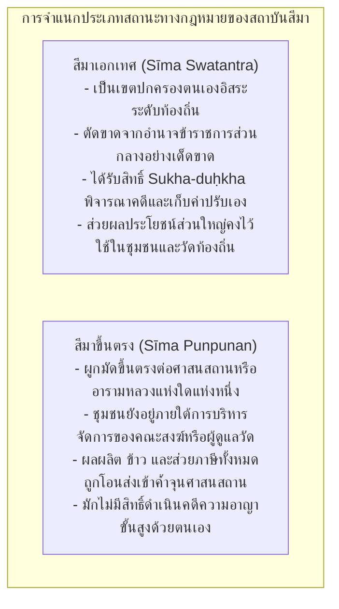
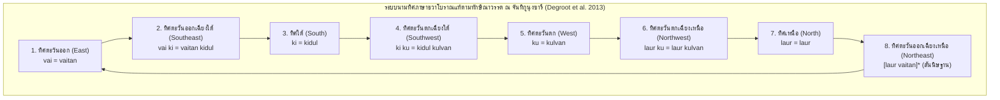
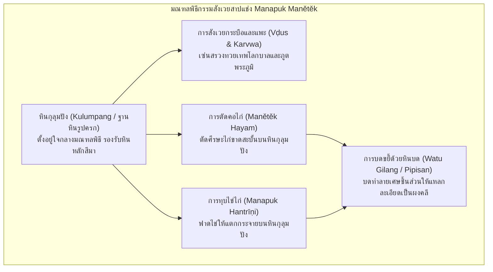
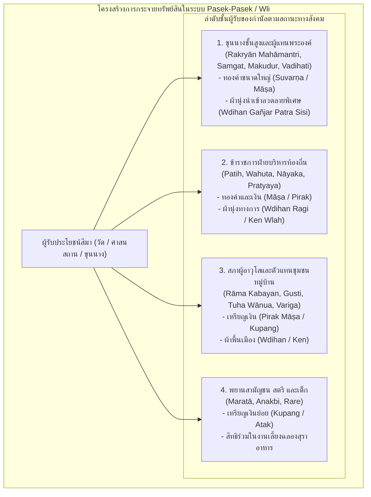
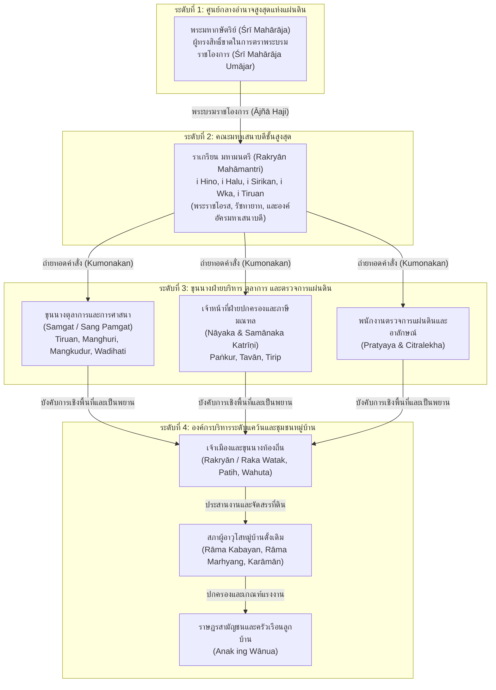
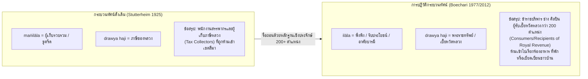
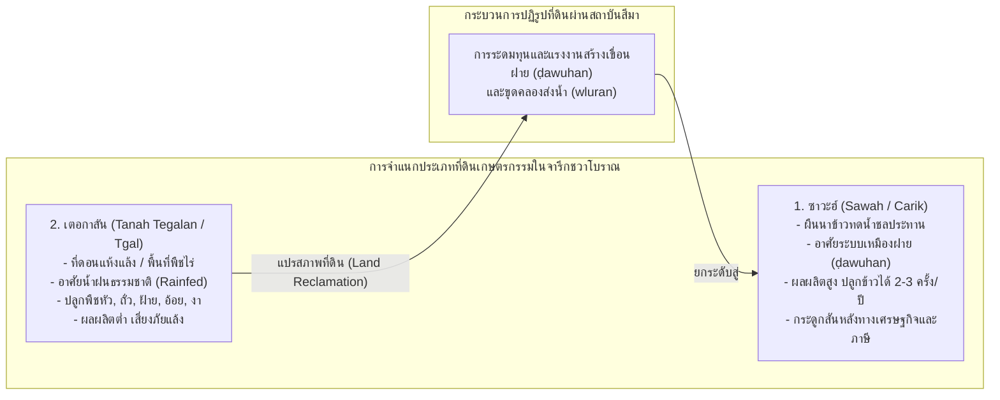
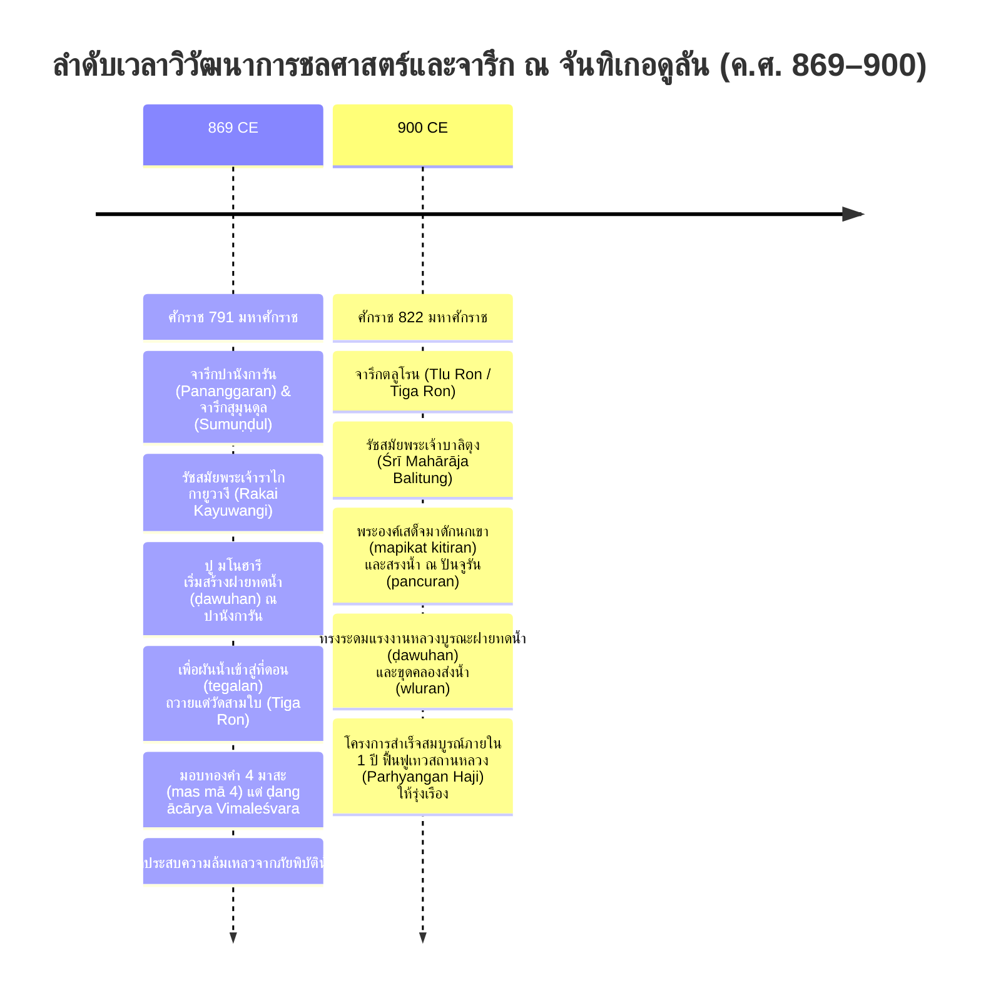

# บทที่ 5: สถาบันกัลปนาสีมา กฎหมาย ภูมิทัศน์ศักดิ์สิทธิ์ และระเบียบสังคมเศรษฐกิจในจารึกชวาโบราณ
*(The Sīma Universe: Sacred Demarcation, Law, Agrarian Institutions, and Socio-Economic Order in Ancient Javanese Charters)*

---

## บทนำประจำบทที่ 5: สถาบันกัลปนาสีมาในฐานะแกนกลางของระเบียบสังคม เศรษฐกิจ และนิติศาสตร์ชวาโบราณ

ในกระบวนการศึกษาอารยธรรมเอเชียตะวันออกเฉียงใต้ภาคพื้นสมุทรยุคโบราณ ไม่มีหมวดหมู่หลักฐานทางประวัติศาสตร์ใดที่จะให้ภาพสะท้อนชีวิตจริง โครงสร้างอำนาจรัฐ กลไกทางเศรษฐกิจการเกษตร และความสัมพันธ์ระหว่างมนุษย์กับสิ่งเหนือธรรมชาติได้อย่างลึกซึ้ง ละเอียดลออ และรอบด้านเท่ากับ "เอกสารจารึกสถาปนาเขตสีมา" (*sīma-śāsana*) จากการสำรวจและจัดหมวดหมู่คลังจารึกดิจิทัลปฐมภูมิตามมาตรฐานสากลของโครงการความร่วมมือยุโรปดีฮาร์มา (ERC Synergy Project DHARMA No. 809994) ร่วมกับข้อมูลการสำรวจของสำนักฝรั่งเศสแห่งปลายบุรพทิศ (EFEO) พบว่า ในบรรดาจารึกภาษาชวาโบราณและภาษาสันสกฤตที่ค้นพบบนเกาะชวากว่าพันหลัก มีจารึกที่เป็นเอกสารสิทธิ์การกัลปนาและปักปันเขตที่ดินสีมาทั้งในชวากลางและชวาตะวันออกจำนวนมากกว่า 180 ฉบับ [1] ตัวเลขทางสถิติดังกล่าวสะท้อนอย่างชัดเจนว่า สถาบันสีมามิใช่เพียงปรากฏการณ์ชายขอบหรือเป็นเพียงพิธีกรรมทางศาสนาที่เกิดขึ้นเป็นครั้งคราว หากแต่เป็น "สถาบันแกนกลาง" (Core Institution) ที่ขับเคลื่อนระเบียบทางสังคม เศรษฐกิจ นิติศาสตร์ และเทคโนโลยีการชลประทานของรัฐชวาโบราณอย่างแท้จริงนับตั้งแต่คริสต์ศตวรรษที่ 8 สืบเนื่องไปจนถึงคริสต์ศตวรรษที่ 15 [2]

คำว่า "สีมา" (*sīma*) แม้จะเป็นคำยืมมาจากภาษาสันสกฤตที่มีความหมายพื้นฐานว่า "เขตแดน, พรมแดน, ขอบเขต หรือหลักหมาย" แต่เมื่อคำนี้ถูกผนวกรวมเข้าสู่บริบทสังคมและนิติศาสตร์ชวาโบราณ ความหมายของสีมาได้ขยายตัวและพัฒนาไปสู่การเป็น "เขตแดนที่ดินที่ได้รับพระราชทานเอกสิทธิ์คุ้มครองพิเศษทางกฎหมายและภาษีอากร" (Privileged or Freehold Land) [3] ผืนดินหรือชุมชนหมู่บ้าน (*wānua*) ที่ได้รับการสถาปนายกสถานะขึ้นเป็นสีมา จะหลุดพ้นจากระบบการส่งส่วยสาอากรและแรงงานเกณฑ์เข้าสู่ท้องพระคลังหลวงของพระมหากษัตริย์โดยตรง แล้วโอนถ่ายผลประโยชน์ทางเศรษฐกิจ ผลผลิตข้าว ตลอดจนสิทธิในการจัดเก็บค่าธรรมเนียมและค่าปรับคดีความ ไปใช้เพื่อการทำนุบำรุงศาสนสถาน (ทั้งเทวสถานฮินดูและพุทธมหาวิหาร), ค้ำจุนเหล่านักบวชและผู้ปฏิบัติธรรม, บำรุงรักษาสุสานบรรพกษัตริย์ (*kamūlān*), หรือเพื่อการสร้างและบำรุงรักษาโครงสร้างพื้นฐานสาธารณะ เช่น การขุดลอกคลองส่งน้ำและการบูรณะฝายทดน้ำชลประทาน [4]

ในประวัติศาสตร์นิพนธ์ยุคอาณานิคมดัตช์ การศึกษาจารึกสีมามักเผชิญกับอคติเชิงวิธีวิทยาอย่างร้ายแรง นักบูรพคดีศึกษาชั้นต้น เช่น เจ.แอล.เอ. บรันเดส (J.L.A. Brandes), เฮนดริก เคิร์น (H. Kern), และ เอ็น.เจ. โครม (N.J. Krom) มักมองจารึกพระราชกฤษฎีกาเหล่านี้เป็นเพียง "โครงกระดูกของประวัติศาสตร์การเมืองราชสำนัก" (The Political Skeleton) โดยมุ่งสนใจสกัดเอาเฉพาะพระนามของพระมหากษัตริย์ ปีมหาศักราชที่ทรงครองราชย์ พระบรมวงศานุวงศ์ และเหตุการณ์สงครามปราบปรามกบฏ ส่วนเนื้อความอันยาวเหยียดที่กินเนื้อที่กว่าร้อยละเก้าสิบของจารึก—ซึ่งประกอบด้วยรายละเอียดทางดาราศาสตร์อย่างพิสดาร, สายการบังคับบัญชาของคณะเสนาบดี, ขอบเขตที่ดินและกรรมสิทธิ์ในแปลงนา, รายการของกำนัลตอบแทนพยานชาวบ้าน, บัญชีอาหารและสุราในงานเลี้ยงฉลอง, และสูตรคำสาปแช่งอันน่าสยดสยอง—กลับถูกมองข้ามว่าเป็นเพียง "ถ้อยคำตามแบบแผนทางพิธีกรรมที่น่าเบื่อหน่ายและซ้ำซาก" (Monotonous Formulaic Clichés) [5]

อย่างไรก็ดี วงวิชาการจารึกวิทยาอินโดนีเซียได้เกิดการเปลี่ยนผ่านกระบวนทัศน์ครั้งสำคัญยิ่ง (Paradigm Shift) จากผลงานวิจัยระดับแม่บทของ ศาสตราจารย์ เอ็ม. บูชารี (M. Boechari, ค.ศ. 1927–1991) ผู้ได้รับการยกย่องเป็น "บิดาแห่งจารึกวิทยาอินโดนีเซียยุคหลังเอกราช" บูชารีได้ตีพิมพ์บทความวิจัยระดับหมุดหมายหลายชิ้น โดยเฉพาะบทความ *"Epigrafi dan Sejarah Indonesia"* (ค.ศ. 1977) ซึ่งต่อมาได้รับการรวบรวมไว้ในผลงานชิ้นเอก *Melacak Sejarah Kuno Indonesia Lewat Prasasti* (ค.ศ. 2012) บูชารีได้สถาปนาระเบียบวิธีวิจัยที่เรียกว่า **"จารึกวิทยาเชิงบริบทสังคม-วัฒนธรรม" (Socio-Cultural Epigraphy)** โดยประกาศอย่างหนักแน่นว่า ศิลาจารึกสีมามิใช่เพียงเอกสารโฆษณาชวนเชื่อยกย่องกษัตริย์ แต่เป็น "คลังข้อมูลนิติกรรมสัญญาและเอกสารสิทธิ์ทางกฎหมายที่แท้จริง" ซึ่งบันทึกปฏิสัมพันธ์ พลวัต และการประนีประนอมผลประโยชน์ระหว่างอำนาจรัฐส่วนกลางกับประชาคมหมู่บ้านดั้งเดิมไว้อย่างซื่อตรงที่สุด [6] การเปลี่ยนกระบวนทัศน์ของบูชารีได้เปิดประตูสู่งานวิจัยสาขาใหม่ๆ ในศตวรรษที่ 21 ทั้งในมิติภาษาศาสตร์ประวัติศาสตร์และพันธะวาทกรรมทางกฎหมาย (Kridalaksana 1991), การสำรวจโบราณคดีจารึกและระบบเรขาคณิตเชิงพื้นที่ศักดิ์สิทธิ์ (Degroot, Griffiths, & Tjahjono 2010–2011/2013), วิศวกรรมชลศาสตร์และการจัดการน้ำ (Arrazaq & Tanudirjo 2021; Pradnyawan 2023), ไปจนถึงประวัติศาสตร์การแพทย์และสุขอนามัยชุมชน (Acri, Bianchini, & Jákl 2026) [7]

เพื่อเป็นการเปิดพรมแดนความรู้และทำความเข้าใจจักรวาลแห่งสถาบันสีมาอย่างรอบด้าน เนื้อหาในตอนที่ 1 ของบทที่ 5 นี้ จะแบ่งการวิเคราะห์ออกเป็นสองหัวข้อหลักอันได้แก่:
- **หัวข้อ 5.1 กายวิภาคและแบบแผนโครงสร้างของจารึกสีมา (Anatomy and Structural Morphology of Sīma Charters):** ทำการชำแหละโครงสร้าง 8 องค์ประกอบมาตรฐานของจารึกพระราชกฤษฎีกาตามโมเดลของ Boechari (2012); การศึกษาวากยสัมพันธ์ประวัติศาสตร์ การใช้อนุภาคบอกเวลา *tatkala* และ *tatkalanya* ในฐานะหมุดหมายทางนิติศาสตร์ และโครงสร้างพันธะวาทกรรมในสูตรคำสาปแช่งตามกรอบของ Kridalaksana (1991); ตลอดจนการจำแนกประเภทสีมาเอกเทศ (*Sīma Swatantra*) ปะทะ สีมาขึ้นตรง (*Sīma Punpunan*) และการกระจายอำนาจตุลาการผ่านสิทธิ์การเก็บค่าปรับคดีความ (*sukha-duḥkha*) [8]
- **หัวข้อ 5.2 ภูมิทัศน์ศักดิ์สิทธิ์และพิธีกรรมปักปันเขตแดน (Sacred Landscapes and Demarcation Rituals):** วิเคราะห์ขั้นตอนพิธีกรรมมานูซุกสีมา (*Mānusuk Sīma*) การเดินวนขวาทักษิณาวรรต (*pradakṣiṇa*) ปักเสาหินหลักเขต (*watu sīma / liṅga patok*) ตามระบบ 8 ทิศ ผ่านการค้นพบทางโบราณคดีจารึก ณ จันทิกูนุงซารี (Degroot 2017); พิธีกรรมสาปแช่งและไสยเวทสังเวย (*manapuk manětěk*) การทุบไข่ตัดคอไก่บนหินกุลุมปัง (*kulumpang*) บดขยี้ด้วยหินบด (*watu gilang / pipisan*); และระบบเศรษฐกิจแห่งการตอบแทนผ่านการถวายของกำนัล (*pasek-pasek / wli*) อันสะท้อนสายสัมพันธ์ทางอำนาจระหว่างราชสำนัก คณะสงฆ์ และสภาผู้อาวุโสหมู่บ้าน (*rāma*) [9]

---

## 5.1 กายวิภาคและแบบแผนโครงสร้างของจารึกสีมา (Anatomy and Structural Morphology of Sīma Charters)

### 5.1.1 โครงสร้าง 8 องค์ประกอบมาตรฐานตามโมเดลของ Boechari (2012)

ในการวิเคราะห์เอกสารสิทธิ์ที่ดินโบราณของชวา ศาสตราจารย์ เอ็ม. บูชารี (Boechari 2012) ได้สร้างแบบจำลองโครงสร้างจารึกพระราชกฤษฎีกา (The Standard Formula of Royal Charters) ขึ้นมาจากการประมวลจารึกสถาปนาสีมานับร้อยฉบับ ทั้งที่จารึกลงบนแผ่นศิลา (*upala-praśasti / prasasti batu*) และจารึกลงบนแผ่นทองแดง (*tāmra-praśasti / prasasti tembaga*) บูชารีได้ชี้ให้เห็นว่า จารึกพระราชโองการกัลปนาสีมาของชวาโบราณมี "แบบแผนทางการทูตและนิติศาสตร์" (Diplomatics and Juridical Formula) ที่เคร่งครัดและเป็นระบบยิ่ง โดยประกอบด้วยโครงสร้างแกนกลางมาตรฐาน 8 หมวดหมู่อย่างเป็นลำดับ ดังต่อไปนี้ [10]

```mermaid
graph TD
    subgraph "โครงสร้าง 8 องค์ประกอบมาตรฐานของจารึกสีมา (Boechari 2012 Model)"
        M1["1. มงคลพจน์ (Maṅgala / Invocatio)<br/>บทสวดบูชา สรรเสริญเทพเจ้า หรือคำอวยพรเริ่มต้น"] --> M2["2. วันเวลาและดาราศาสตร์ (Sambandha / Tithi / Pañcāṅga)<br/>มหาศักราช, เดือน, ปักษ์, ดิถี, ฤกษ์นักษัตร, ระบบรอบวัน 3-5-6-7"]
        M2 --> M3["3. พระบรมราชโองการ (Śrī Mahārāja Umājar / Ājñā)<br/>พระนามกษัตริย์หรือเจ้านายผู้ทรงออกพระบรมราชโองการ"]
        M3 --> M4["4. สายการบังคับบัญชา (Chain of Command / Tinadaḥ)<br/>การถ่ายทอดคำสั่ง: Mahāmantri สู่ Samgat, Nāyaka, และคณะผู้นำ"]
        M4 --> M5["5. มูลเหตุและขอบเขตที่ดิน (Sambandha & Boundary Demarcation)<br/>วัตถุประสงค์การกัลปนา, ศาสนสถานผู้รับประโยชน์, การรังวัดแปลงนา"]
        M5 --> M6["6. บัญชีกลุ่มต้องห้าม (Mangilāla Drawya Haji Lists)<br/>การระบุข้าราชบริพารและช่างฝีมือหลวงที่ห้ามเข้ามารบกวนแดนสีมา"]
        M6 --> M7["7. พิธีสถาปนาและของกำนัล (Mānusuk Sīma, Pasek-pasek & Feast)<br/>พิธีปักหินหลักเขต, การแจกจ่ายทองคำและผ้า, งานเลี้ยงสมโภช"]
        M7 --> M8["8. พันธะคำสาปแช่งและอวยพร (Śapatha / Sapata Formula)<br/>การอัญเชิญทวยเทพและสิ่งศักดิ์สิทธิ์ลงทัณฑ์ผู้คิดคดทำลายสีมา"]
    end
```



#### 1. มงคลพจน์และบทสวดเริ่มต้น (Maṅgala / Invocatio)
จารึกสีมาส่วนใหญ่เริ่มต้นด้วยคำมงคลภาษาสันสกฤต เช่น *Svasti* ("ขอความสุขสวัสดีจงมี"), *Śrīr astu* ("ขอความรุ่งเรืองจงบังเกิด"), หรือ *Avighnam astu* ("ขอความขัดข้องจงอย่าได้มี") ในจารึกบางฉบับที่ออกโดยสถาบันศาสนาชั้นสูงหรือวัดหลวง จะมีการประพันธ์บทกวีนิพนธ์สรรเสริญเทพเจ้าด้วยฉันท์ภาษาสันสกฤตอย่างวิจิตร เช่น คาถาสรรเสริญพระศิวะในจารึกชังคัล (Canggal 732 CE) หรือคาถาสรรเสริญความศานติแห่งสากลโลกในจารึกซังงูรัน (Sangguran 928 CE) ซึ่งทำหน้าที่เป็นทั้งการบวงสรวงต่อทวยเทพและการสร้างความศักดิ์สิทธิ์ทางเทววิทยาให้แก่นิติกรรมสัญญา [11]

#### 2. วันเวลาและพิกัดดาราศาสตร์อย่างละเอียด (Calendrical and Astronomical Data: Tithi / Pañcāṅga)
เอกสารสิทธิ์สีมาจะบันทึกวันเวลาที่ทรงมีพระบรมราชโองการและวันประกอบพิธีอย่างละเอียดถี่ถ้วนยิ่งกว่าเอกสารประวัติศาสตร์ประเภทอื่นใด โดยบันทึกซ้อนทับกันหลายระบบปฏิทิน ได้แก่ ศักราชที่ล่วงไปแล้ว (*śaka-varṣātīta*), ชื่อเดือนตามสุริยจันทรคติ (*māsa* เช่น Caitra, Vaiśākha, Āṣāḍha, Śrāvaṇa), ปักษ์ข้างขึ้น (*śukla-pakṣa*) หรือข้างแรม (*kṛṣṇa-pakṣa*), วันทางจันทรคติหรือดิถี (*tithi* เช่น pratipadā, dvitīyā, daśamī, caturdaśī, pūrṇimā, amāwāsyā) ควบคู่กับระบบการนับรอบวันแบบซ้อนทับกันของชวาโบราณ ได้แก่:
- ระบบสัปดาห์ 6 วัน หรือ ษัฑวาร (*ṣaḍvāra*: Tunglai, Haryang, Wurukung, Paningron, Uwas, Mawulu)
- ระบบสัปดาห์ 5 วัน หรือ ปัญจวาร (*pañcavāra*: Umanis/Legi, Paing, Pon, Wage, Kaliwon)
- ระบบสัปดาห์ 7 วัน หรือ สัตตวาร (*saptavāra*: Āditya, Soma, Aṅgāra, Budha, Bṛhaspati, Śukra, Śanaiścara)
- ตำแหน่งดวงดาวนักษัตร (*nakṣatra*), เทพประจำฤกษ์ (*devatā*), และตำแหน่งการร่วมของดวงดาวหรือโยคะ (*yoga*) [12]

การบันทึกพิกัดดาราศาสตร์อย่างหนาแน่นเช่นนี้ มิใช่เพียงความเชื่อทางโหราศาสตร์เพื่อหาฤกษ์ยามอันเป็นมงคลเท่านั้น หากแต่ในทางนิติศาสตร์โบราณ มันทำหน้าที่เป็น "การประทับเวลาทางกฎหมายที่ไม่อาจปลอมแปลงได้" (Incontestable Legal Timestamp) ซึ่งช่วยให้นักจารึกวิทยาสมัยใหม่ (โดยเฉพาะระเบียบวิธีคำนวณของ L.-C. Damais) สามารถสอบทานและระบุวันเวลาที่แน่นอนตามปฏิทินสากลได้แม่นยำระดับวัน [13] ดังตัวอย่างในจารึกกาสูกีฮัน (Charter of Kasugihan มหาศักราช 829 / ค.ศ. 907):

> **ตัวบทปริวรรตอักษรเดิม (IAST):**
> `"svasti śaka-varṣātīta 829 mārggaśira-māsa tithī daśamī śukla-pakṣa, ma, pa, bu, vāra, aśvinī-nakṣatra, varīyān-yoga, tatkālanikanaṁ vahuta tuṅgu duruṁ makabaihan inanugrahan irikanaṁ vanuan i kasugihan de rakryān kalaṁ buṅkal dyaḥ manukū..."` (DHARMA INSIDENK00361, 1r1–3) [14]
>
> **คำแปลภาษาไทยวิชาการ:**
> *"ขอความสุขสวัสดีจงมี! มหาศักราชล่วงแล้วได้ 829 ปี เดือนมารคศิรษะ ดิถีที่สิบแห่งศุกลปักษ์ (ข้างขึ้นสิบค่ำ), วันมาวูลู (แห่งรอบหกวัน), วันปาอิง (แห่งรอบห้าวัน), วันพุธ (แห่งรอบเจ็ดวัน), นักษัตรอัศวินี, วริยานโยคะ, ในกาลเวลานั้น บรรดาเจ้าพนักงานวาฮูตาและตุงกูดูรุงทั้งปวง ได้รับพระราชทานพระบรมราชานุเคราะห์ในผืนดินหมู่บ้านแห่งคาสูกีฮัน จากราเกรียน กาลัง บุงกัล ดยาห์ มานูกู..."* [15]

#### 3. พระบรมราชโองการ (Royal Command / Śrī Mahārāja Umājar หรือ Ājñā)
เป็นส่วนที่ระบุว่า พระมหากษัตริย์หรือองค์ประมุขผู้ทรงสิทธิ์สูงสุดเหนือแผ่นดิน ทรงมีพระบรมราชกระแสรับสั่ง (*umajar*) หรือพระราชทานพระราชกฤษฎีกา (*ājñā*) พระนามของกษัตริย์มักระบุทั้งพระนามพระยศตำแหน่งในฐานะเจ้าผู้ครองแคว้น (*Rakai* หรือ *Rakryān*) และพระนามทางพิธีบรมราชาภิเษกอันเป็นภาษาสันสกฤตที่แสดงเทวสิทธิ์และบารมีธรรม เช่น *"śrī mahārāja rakai vatu kura dyaḥ balituṁ śrī dharmodaya mahāsambhu"* ในรัชสมัยพระเจ้าบาลิตุง หรือ *"śrī mahārāja rakai halu śrī lokeśvara dharmmavaṅśa airlaṅgānanta vikramottuṅgadeva"* ในรัชสมัยพระเจ้าแอร์ลังกา [16]

#### 4. สายการบังคับบัญชาและการถ่ายทอดพระบรมราชโองการ (Chain of Command / Tinadaḥ)
พระบรมราชโองการของกษัตริย์มิได้ถูกส่งตรงไปยังหมู่บ้านในทันที แต่จะต้องผ่านกระบวนการทางระบบราชการที่เป็นลายลักษณ์อักษรตามลำดับชั้นบังคับบัญชาอย่างเข้มงวด โดยคำสั่งจะ "เสด็จลงมา" (*tumurun*) หรือ "ได้รับการน้อมรับสนอง" (*tinadaḥ*) โดยคณะมหาเสนาบดีชั้นสูงสุดของแผ่นดิน ซึ่งเป็นเจ้านายชั้นผู้ใหญ่และมักสงวนไว้สำหรับพระราชโอรสหรือพระราชวงศ์ ได้แก่ ตำแหน่ง **ราเกรียน มหามานตรี (Rakryān Mahāmantri)** ทั้งห้ากรม (Hino, Halu, Sirikan, Wka, Tiruan) โดยเฉพาะมหาเสนาบดีกรมหิโน (*Rakryān Mahāmantri i Hino*) ซึ่งดำรงสถานะคล้ายอัครมหาเสนาบดีหรือมกุฎราชกุมาร [17]

จากนั้น คณะมหามานตรีจะส่งต่อคำสั่งลงมายังขุนนางระดับบริหารและตุลาการ (*umiṅsor i taṇḍa rakryān*) อันประกอบด้วยกลุ่ม **สมคัต (Samgat / Sang Pamgat)** ซึ่งทำหน้าที่เป็นขุนนางกำกับดูแลเขตแคว้น รักษากฎหมาย และวินิจฉัยอรรถคดี, ขุนนางฝ่ายตรวจการแผ่นดิน (*Pratyaya*), เจ้าพนักงานฝ่ายบริหารท้องถิ่น (*Patih* และ *Wahuta*), ตลอดจนขุนนางระดับปฏิบัติการที่ดูแลกลุ่มหมู่บ้าน (*Nāyaka*) เพื่อดำเนินการรังวัดและเตรียมการสถาปนาในพื้นที่จริง [18]

#### 5. ตำบลที่ตั้ง มูลเหตุแห่งการกัลปนา และขอบเขตที่ดิน (Sambandha & Boundary Demarcation)
ส่วนนี้เริ่มต้นด้วยคำว่า **สัมพันธะ (*sambandha*)** ซึ่งแปลว่า "มูลเหตุ, โอกาส หรือที่มาแห่งการกัลปนา" จารึกจะบันทึกถึงสาเหตุที่พระมหากษัตริย์หรือเจ้านายทรงพระกรุณาโปรดเกล้าฯ พระราชทานสถานะสีมา เช่น:
- เพื่อเป็นการตอบแทนความชอบของขุนนาง ทหาร หรือราษฎร ที่ได้ประกอบคุณงามความดีอย่างใหญ่หลวงต่อราชบัลลังก์ เช่น การช่วยรบชนะศึกสงคราม หรือการช่วยคุ้มครองกษัตริย์ยามลี้ภัย (ดังกรณีจารึกกูบู-กูบู Kubu-Kubu 905 CE)
- เพื่ออุทิศผลบุญถวายแด่บรรพบุรุษ หรือเพื่อการสร้างและอุปถัมภ์วัดและศาสนสถาน (*dharmasīma / vihāra / kuṭi*)
- เพื่อระดมทรัพยากรและแรงงานในการพัฒนาโครงสร้างพื้นฐาน เช่น การสร้างทำนบฝายทดน้ำ (*ḍawuhan*) หรือการบุกเบิกหักล้างถางพงป่าดงดิบเพื่อขยายพื้นที่เกษตรกรรม (ดังกรณีจารึกกะลาดิ Kaladi 909 CE) [19]

นอกจากนี้ ยังมีการระบุรายละเอียดที่ตั้งของหมู่บ้าน ตำบล สังกัดมณฑล (*vatak*), ประเภทของที่ดิน (เช่น นาข้าวทดน้ำ *sawah*, ไร่ที่ดอนแห้งแล้ง *tanah tegalan*, สวนผลไม้ *kbu*), ขนาดเนื้อที่ดินที่คำนวณเป็นหน่วยรังวัดชวาโบราณ (เช่น *tampah*, *blah*, *dpa*), ปริมาณภาษีที่เคยต้องจ่ายให้หลวง, และการระบุแนวเขตแดนทั้งสี่ทิศ (*catur-deśa*) หรือแปดทิศอย่างชัดเจน โดยอ้างอิงหลักธรรมชาติ เช่น แนวสันเขา ลำห้วย ต้นไม้ใหญ่ หรือถนนหลวง [20] ดังตัวอย่างในจารึกวูกายานา (Wukajana / N. 391 มหาศักราช 825 / ค.ศ. 904):

> **ตัวบทปริวรรตอักษรเดิม (IAST):**
> `"[...] tatkāla anugraha śrī mahārāja rakai vatu kura dyaḥ balituṁ śrī dharmodaya-mahāśambhu tumurun i rakryān mapatiḥ i hino pu dakṣottama-bāhubajra-pratipakṣakṣaya kumon samgat kalaṅ vuṅkal pu layaṁ, anak vanua i patapān [...] sumusuka ikanaṁ vanua i vukajana i tumpak i vuru tlu vatak kalaṅ vuṅkal gavai mā 6 savaḥ kahadyanan tampaḥ 8 blaḥ 1 suku 1 [...] samvandhānya kinon sumusuka ikanaṁ vanua vuara kuṭi i dalinan vatak husaḍa [...]"` (DHARMA INSIDENK00391, 1r1–3) [21]
>
> **คำแปลภาษาไทยวิชาการ:**
> *"[...] ในกาลเวลานั้น พระบรมราชานุเคราะห์ขององค์พระศรีมหาราชา ราไก วาตู กูรา ดยาห์ บาลิตุง ศรี ธรรโมทัย-มหาสัมภุ ได้เสด็จลงมายังราเกรียน มหาปาติฮ์ แห่งหิโน นาม ปู ทักษโมตตมะ-พาหุวัชระ-ปรติปักษักษัย ทรงบัญชาให้สมคัต กาลัง วุงกัล นาม ปู ลายัง บุตรแห่งหมู่บ้านปาตาปัน [...] ให้ไปปักปันเขตแดนสถาปนาสีมาในหมู่บ้านวูกายานา, ตุมปัก, และวูรูเตอลู อันสังกัดมณฑลกาลัง วุงกัล ซึ่งมีมูลค่าแรงงานเกณฑ์ 6 มาสะ และมีแปลงนานายหลวงเนื้อที่ 8 ตัมปะฮ์ กับอีก 1 บละฮ์ และ 1 สูกู [...] มูลเหตุแห่งการนี้ (samvandhānya) เนื่องด้วยมีพระบรมราชโองการสั่งให้ปักปันเขตแดนหมู่บ้านเพื่อเป็นประโยชน์แก่อารามสงฆ์ (kuṭi) ณ ดาลินัน สังกัดมณฑลฮูซาดะ [...]"* [22]

#### 6. บัญชีข้าราชบริพารและกลุ่มต้องห้าม (Mangilāla Drawya Haji Lists)
องค์ประกอบที่สำคัญยิ่งและเป็นเอกลักษณ์ของจารึกสีมาชวา คือบัญชีรายนามตำแหน่งบุคคลที่ "ต้องห้ามมิให้เหยียบย่างเข้าสู่เขตแดนสีมา" (*tan katamāna de sang mangilāla drawya haji*) ซึ่งบูชารี (Boechari 2012) ได้ทำการปฏิวัติการตีความจากเดิมที่เคยเข้าใจว่าเป็นเจ้าพนักงานสรรพากร มาสู่การเป็น "ข้าราชบริพารและช่างฝีมือผู้พึ่งพิงเบี้ยหวัดพระราชทรัพย์หลวง" (ดูรายละเอียดการวิเคราะห์เชิงลึกในข้อถกเถียงของ Boechari) การระบุบัญชีต้องห้ามนี้ทำหน้าที่เป็น "ภูมิคุ้มกันทางนิติศาสตร์" ที่รับประกันว่า ผืนดินสีมาจะได้รับการยกเว้นจากการถูกแทรกแซง กอบโกย หรือรีดไถผลประโยชน์จากข้าราชการส่วนกลางอย่างเด็ดขาด [23]

#### 7. พิธีสถาปนาสีมา ของกำนัล และงานเลี้ยงฉลอง (Mānusuk Sīma, Pasek-pasek & Feast)
บันทึกรายละเอียดขั้นตอนพิธีกรรมศักดิ์สิทธิ์ในการปักหินหลักเขต (*watu sīma*) การถวายเครื่องสังเวยแด่ทวยเทพและวิญญาณบรรพบุรุษ, บัญชีการแจกจ่ายสิ่งตอบแทนและของกำนัล (*pasĕk-pasĕk / wli*) ซึ่งประกอบด้วยเงินตราทองคำ เงิน และผ้าทอนานาชนิด ให้แก่บรรดาข้าราชการ พยาน และผู้อาวุโสหมู่บ้าน (*rāma*), ตลอดจนการบรรยายมหกรรมงานเลี้ยงฉลองสุราอาหารและการละเล่นมหรสพสมโภชอย่างยิ่งใหญ่ [24]

#### 8. พันธะคำสาปแช่งและอวยพร (Śapatha / Sapata Formula)
ส่วนปิดท้ายของจารึก ซึ่งเป็นบทสาบานและโองการสาปแช่งอันศักดิ์สิทธิ์ โดยทำพิธีอัญเชิญทวยเทพโลกบาล พระสุริยะ พระจันทร์ พระแม่ธรณี และวิญญาณบรรพบุรุษ มาเป็นประจักษ์พยาน พร้อมทั้งประกาศคำสาปอันรุนแรงสยดสยองต่อบุคคลใดก็ตามที่คิดคดทำลาย ลบล้าง หรือละเมิดสถานะสีมา และปิดท้ายด้วยคำอำนวยพรแก่ผู้ที่ร่วมพิทักษ์รักษาแดนสีมาให้ประสบความสุขสวัสดิ์ชั่วกัลปาวสาน [25]

---

### 5.1.2 วากยสัมพันธ์ประวัติศาสตร์ อนุภาคบอกเวลา tatkala / tatkalanya และพันธะวาทกรรมคำสาปแช่ง (Kridalaksana 1991)

ในมิติทางภาษาศาสตร์จารึกวิทยาและวากยสัมพันธ์ประวัติศาสตร์ ฮาริมูร์ติ กรีดาลักซานา (Harimurti Kridalaksana 1991) ได้นำเสนอบทวิเคราะห์เชิงลึกในผลงานชิ้นสำคัญ *"Peri Hal Konstruksi Sintaktis dalam Bahasa Melayu Kuna"* และข้อศึกษาว่าด้วยพันธะวาทกรรมในจารึกชวาโบราณและมลายูโบราณ โดยชี้ให้เห็นว่า ตัวบทจารึกสถาปนาสีมาหาได้เป็นเพียงการเขียนข้อความบรรยายร้อยแก้วทั่วไปไม่ หากแต่มี "โครงสร้างวากยสัมพันธ์เฉพาะทางนิติศาสตร์" (Juridical Syntax) ที่ถูกออกแบบมาเพื่อสร้าง "พันธะวาทกรรม" (Discourse Obligation) และอำนาจบังคับเด็ดขาดในทางกฎหมาย [26]

#### การใช้อนุภาคบอกเวลา tatkala / tatkalanya ในฐานะ "หมุดหมายทางนิติศาสตร์" (Legal Temporal Anchor)
กรีดาลักซานาได้ชี้ให้เห็นปรากฏการณ์ทางภาษาศาสตร์ที่สำคัญยิ่งเกี่ยวกับการใช้คำว่า **ตัตกาละ (*tatkāla*)** และรูปที่เติมปัจจัยแสดงความเป็นเจ้าของหรือความชี้เฉพาะ **ตัตกาลันยา (*tatkālanya*)** ซึ่งมีรากศัพท์มาจากภาษาสันสกฤต (*tat-kāla* แปลว่า "ในเวลานั้น, ยามนั้น, เมื่อนั้น") คำคำนี้มิได้ทำหน้าที่เป็นเพียงคำเชื่อมบอกเวลา (Temporal Conjunction) ธรรมดาในทางไวยากรณ์ แต่ทำหน้าที่เป็น **"หมุดหมายทางนิติศาสตร์" (Legal Temporal Anchor)** หรือแกนกลางเชิงโครงสร้างที่เชื่อมโยงมิติต่างๆ ของเอกสารสิทธิ์เข้าด้วยกัน [27]

ในเชิงวากยสัมพันธ์ จารึกสีมาจะจัดวางโครงสร้างประโยคแบบสองท่อนขนาดใหญ่ โดยท่อนแรกคือ "มณฑลแห่งเวลาเชิงดาราศาสตร์และจักรวาลวิทยา" (Astronomical-Cosmological Realm) ซึ่งระบุปีมหาศักราช เดือน ดิถี และตำแหน่งดวงดาวอย่างละเอียด จากนั้นคำว่า *tatkāla* หรือ *tatkālanya* จะทำหน้าที่เป็น "สะพานเชื่อมเชิงเวลา" (Temporal Bridge) ดึงเอาเวลาอันศักดิ์สิทธิ์ของจักรวาลให้มาซ้อนทับและประทับตราลงบน "เวลาทางประวัติศาสตร์และนิติศาสตร์" (Historic-Juridical Realm) อันเป็นขณะจิตที่พระบรมราชโองการ (*ājñā*) ของกษัตริย์ได้เสด็จลงมาบังคับใช้จริงในโลกมนุษย์ [28]

```
[พิกัดดาราศาสตร์ Pañcāṅga: ปี + เดือน + ปักษ์ + ดิถี + ษัฑวาร + ปัญจวาร + สัตตวาร + นักษัตร]
                                  │
                       [หมุดหมายทางนิติศาสตร์: tatkāla / tatkalanya]
                                  │
                                  ▼
[การบังคับใช้กฎหมาย: พระบรมราชโองการ Ājñā -> สายการบังคับบัญชา -> การสถาปนาสีมา]
```

กรีดาลักซานาเปรียบเทียบการใช้งาน *tatkāla* ในจารึกชวาโบราณ เข้ากับการใช้ *tatkalanya* ในจารึกมลายูโบราณยุคศรีวิชัย เช่น ในศิลาจารึกตาลังตูโว (Talang Tuwo 684 CE):
> `"[...] tatkālanya parlak śrīkṣetra niparwuat [...]"` ("เมื่อสวนศรีเกษตรนี้ได้สถาปนาขึ้น...") [29]

และในศิลาจารึกโกตากาปูร์ (Kota Kapur 686 CE):
> `"[...] tatkālanya yaṁ maṅmaṅ sumpaḥ ini nipāhat di welānya [...]"` ("ในกาลเมื่อคำสัตย์สาบานนี้ได้ถูกจารึกลงบนศิลาหลักเขตของพระนคร...") [30]

ในจารึกสีมาชวาโบราณ คำว่า *tatkāla* มักจะปรากฏซ้ำในหลายจุดสำคัญของตัวบท เพื่อทำหน้าที่เป็น "อนุภาคเปิดฉากนิติกรรมย่อย" (Sub-act Initiator) เช่น ตอนประกาศพระบรมราชโองการ (*tatkāla anugraha śrī mahārāja...*), ตอนนำเครื่องสังเวยมาตั้ง (*tatkāla saṅ hyaṅ kudur sumusuk ikanaṅ sīma...*), หรือตอนแจกจ่ายของกำนัล (*tatkāla maveḥ pasĕk-pasĕk...*) การใช้คำว่า *tatkāla* จึงเป็นการตอกย้ำความมีผลบังคับใช้ตามกฎหมายอย่างต่อเนื่องในทุกอนุภาคของพิธีกรรม [31]

#### โครงสร้างพันธะวาทกรรม (Discourse Obligation) ในสูตรคำสาปแช่ง (Śapatha)
อีกหนึ่งมิติที่กรีดาลักซานา (Kridalaksana 1991, 170–172) ให้การวิเคราะห์อย่างลึกซึ้ง คือลักษณะของ "วาทกรรมคำสาปแช่งศักดิ์สิทธิ์" (Imprecatory Discourse / *Śapatha*) กรีดาลักซานาชี้ว่า วาทกรรมในจารึกโบราณสามารถจำแนกออกเป็นสองประเภทหลัก ได้แก่ "วาทกรรมบอกเล่าเหตุการณ์" (Declarative Narrative Discourse) ซึ่งใช้โครงสร้างประโยคบอกเล่าปรกติ และ **"วาทกรรมผูกมัดทางกฎหมายและพิธีกรรม" (Legal-Ritual Obligatory Discourse)** ซึ่งปรากฏในโองการสาปแช่ง [32]

โครงสร้างของสูตรคำสาปแช่งในจารึกสีมา มีลักษณะทางภาษาศาสตร์ที่พิเศษยิ่ง คือการเปลี่ยนผ่านจากโครงสร้างประโยคบอกเล่า (Declarative) สู่การใช้ **"ประโยคเงื่อนไขและประโยคคำสั่งสาปแช่ง" (Conditional-Imperative Constructions)** ตัวบทจะเริ่มต้นด้วยการอัญเชิญทวยเทพเป็นบุรุษที่สอง (*kamu hyaṅ kabeḥ* "ข้าแต่ทวยเทพทั้งหลาย") เพื่อสถาปนาทวยเทพเป็น "ผู้บังคับใช้กฎหมายสูงสุด" (Supreme Law Enforcers) จากนั้นจึงใช้โครงสร้างเงื่อนไขแบบสันนิษฐาน เช่น *asiṅ umungkal-ungkala ikang sīma* ("ผู้ใดก็ตามที่คิดรื้อถอนทำลายเขตสีมานี้") ตามด้วยประโยคคำสั่งแสดงผลลัพธ์ทางไสยเวทที่ไร้ความปรานี โดยใช้คำกริยาและคำนามที่แสดงความเจ็บปวดและการแตกดับทางกายภาพอย่างชัดแจ้ง [33]

ความน่าสนใจในเชิงวากยสัมพันธ์ คือการใช้ "โครงสร้างประโยครวมกระชับแบบขนาน" (Parallel Condensed Clauses) ที่ตัดคำเชื่อมออกทั้งหมด เพื่อสร้างพลังทางภาษาที่กระชับ รวดเร็ว และน่าสะพรึงกลัว ดังตัวบทคำสาปแช่งในจารึกตาจี (Charter of Taji มหาศักราช 823 / ค.ศ. 901) และประมวลจารึกชวากลาง:

> **ตัวบทปริวรรตอักษรเดิม (IAST):**
> `"[...] hulu nya tĕkĕp, rĕngat kapalanya, wlah wetĕngnya, rantan ususnya, pĕgat hulunya, tampyal i wuri, tibā i hārep, patuk ning ulā, pangan ning mong, sahut ning baya, tĕmahanya nguniweh sang lumābur ikang sīma [...]"` (Boechari 2012, 355; cf. DHARMA INSIDENKCentralJava) [34]
>
> **คำแปลภาษาไทยวิชาการ:**
> *"[...] ขอให้ศีรษะของมันถูกบดขยี้! กะโหลกศีรษะของมันจงแตกแยกเป็นเสี่ยงๆ! ท้องของมันจงแตกกระจาย! ลำไส้ของมันจงขาดวิ่น! คอของมันจงขาดสะบั้น! จงถูกตบตีฟาดฟันจากเบื้องหลัง! ล้มคว่ำฟุบลงไปเบื้องหน้า! จงถูกงูพิษฉกกัด! จงถูกเสือร้ายขย้ำกิน! จงถูกจระเข้คาบกลืน! นั่นคือวิบากกรรมอันสยดสยองของมัน ยิ่งไปกว่านั้นคือผู้ใดก็ตามที่คิดลบล้างทำลายล้างแดนสีมานี้! [...]"* [35]

กรีดาลักซานาชี้ว่า วากยสัมพันธ์ที่เรียงร้อยอวัยวะและภัยพิบัติ (ศีรษะ, กะโหลก, ท้อง, ลำไส้, คอ, งู, เสือ, จระเข้) ในลักษณะนี้ มิใช่เพียงวรรณศิลป์เชิงเปรียบเทียบ แต่ทำหน้าที่เป็น "พันธะทางจิตวิทยาและสังคม" (Psychological & Social Deterrent) ที่สร้างความสะพรึงกลัวแก่ผู้คนในสังคมโบราณ เพื่อป้องกันมิให้เกิดการละเมิดเอกสารสิทธิ์ที่ดิน แม้เวลาจะผ่านพ้นไปหลายชั่วอายุคนหรือกษัตริย์ผู้ทรงออกโองการจะสวรรคตไปแล้วก็ตาม [36]

---

### 5.1.3 การจำแนกประเภทสีมาและสิทธิทางตุลาการ: Sīma Swatantra ปะทะ Sīma Punpunan และสิทธิ์ Sukha-Duḥkha

ในมิติทางนิติศาสตร์และเศรษฐกิจการเมือง การศึกษาของ เอ็ม. บูชารี (Boechari 2012) ได้สร้างคุณูปการอย่างใหญ่หลวงในการจัดระเบียบและจำแนกประเภทของสถาบันสีมาในชวาโบราณ บูชารีชี้ว่า แม้จารึกส่วนใหญ่จะใช้คำว่า *sīma* เหมือนกัน แต่ในทางปฏิบัติ สถานะทางกฎหมาย สิทธิประโยชน์ทางภาษี และการถือครองกรรมสิทธิ์ของสีมามีความแตกต่างกันอย่างมีนัยสำคัญ โดยสามารถจำแนกประเภทหลักออกเป็น **สีมาเอกเทศ (Sīma Swatantra)** และ **สีมาขึ้นตรง (Sīma Punpunan)** ควบคู่กับการพระราชทานสิทธิ์ทางตุลาการที่เรียกว่า **สุขะ-ทุกขะ (*Sukha-duḥkha*)** [37]



#### 1. สีมาขึ้นตรง (Sīma Punpunan / Dharmasīma Punpunan)
คำว่า **ปุนปูนัน (*punpunan*)** ในภาษาชวาโบราณ มาจากรากคำว่า *punpun* ซึ่งหมายถึง "การรวบรวม, สิ่งที่ขึ้นตรงต่อ, หรือทรัพย์สินบริวาร" [38] สีมาประเภทนี้คือ ผืนดิน แปลงนา หรือหมู่บ้านทั้งชุมชน ที่พระมหากษัตริย์หรือเจ้านายทรงประกาศยกสถานะขึ้นเป็นสีมาเพื่อมอบให้เป็น "ทรัพย์สินบริวารที่ขึ้นตรงต่อศาสนสถานหรืออารามสงฆ์แห่งใดแห่งหนึ่งเป็นการเฉพาะ" ผลผลิตทางการเกษตร ส่วยภาษี และแรงงานของราษฎรในเขตปุนปูนัน มิได้หายไปไหน แต่ถูกโอนจากการส่งเข้าท้องพระคลังหลวง ไปเป็นรายได้ประจำเพื่อค้ำจุนการประกอบพิธีกรรมประจำวัน การจัดซื้อน้ำมันตะเกียง เครื่องหอม ดอกไม้บูชา ตลอดจนการบูรณะซ่อมแซมอาคารเทวสถานหรือกุฏิสงฆ์ [39]

ตัวอย่างที่ชัดเจนยิ่งปรากฏในจารึกแผ่นทองแดงนิติศักราชบาลิตุง หรือ จารึกวิหารครุรุง (Garuṅ / N. 404 มหาศักราช 829 / ค.ศ. 907) ซึ่งระบุข้อความว่า:
> `"[...] tatkālani pu tabvəl anag vanua iṁ guntur punpunaniṁ vihāre garuṅ pinariccheda guṇa-doṣanira de samaggat pinapan [...]"` (DHARMA INSIDENK00404, lines 1–3) [40]
>
> *"ในกาลเวลานั้น ข้อพิพาท (guṇa-doṣa) ของปู ตับเวล ชาวหมู่บ้านกุนตูร์ อันเป็นดินแดนขึ้นตรง (punpunan) ต่ออารามวิหารแห่งการุง ได้รับการพิจารณาตัดสินโดยขุนนางสมคัต ปินาปัน [...]"* [41]

และในจารึกคันดางัน (Kandangan Inscription มหาศักราช 828 / ค.ศ. 906):
> `"[...] vanua i kaṇḍaṅan muaṁ anaknya ri vanua i er hijo [...] śīmāni parhyaṅan i prāsāda vatak patapān [...] dadhā 1 makapunpunana ya [...]"` (DHARMA INSIDENKKandangan, lines 2–4) [42]
>
> *"หมู่บ้านแห่งคันดางันและหมู่บ้านบริวารแห่งแอร์ ฮีโจ [...] เป็นสีมาแห่งเทวสถานปราสาท สังกัดมณฑลปาตาปัน [...] เพื่อให้เป็นดินแดนขึ้นตรง (makapunpunana ya) ค้ำจุนเทวสถานนั้น [...]"* [43]

ราษฎรในเขตสีมาปุนปูนัน แม้จะพ้นจากการเกณฑ์แรงงานของราชสำนักส่วนกลาง แต่ยังมีพันธะผูกพันโดยตรงในการรับใช้อารามหรือเทวสถานนั้นๆ

#### 2. สีมาเอกเทศ (Sīma Swatantra)
คำว่า **สวาตันตระ (*swatantra*)** เป็นคำยืมภาษาสันสกฤตที่หมายถึง "อิสรภาพ, การปกครองตนเอง, ความเป็นเอกเทศ" สีมาประเภทนี้ถือเป็นสถานะทางกฎหมายขั้นสูงสุดของที่ดินในชวาโบราณ สีมาสวาตันตระมิได้ขึ้นตรงต่อศาสนสถานภายนอกแห่งใด และตัดขาดจากการแทรกแซงของข้าราชการส่วนกลางอย่างสมบูรณ์ ผู้นำหมู่บ้านและสภาผู้อาวุโส (*rāma*) ได้รับสิทธิ์ในการบริหารจัดการดินแดน การจัดสรรที่ดินทำกิน และการจัดเก็บรายได้ภายในชุมชนของตนเองอย่างเป็นอิสระ [44]

ข้อแตกต่างที่คมชัดระหว่างสีมาสวาตันตระกับสีมาปุนปูนัน ได้รับการบันทึกไว้อย่างแจ่มชัดที่สุดในจารึกฮิหมัด วาลันดิต (Himad Walandit Inscription คริสต์ศตวรรษที่ 14) ซึ่งเป็นจารึกคำพิพากษาคดีความข้อพิพาทเรื่องสถานะที่ดินระหว่างชุมชนฮิหมัดกับชุมชนวาลันดิต โดยตัวบทจารึกระบุอย่างชัดเจนว่า:
> `"[...] gatini mpu rāma-rāme valaṇḍit matuha manvam kabeḥ, mavivāda makalaga para ḍapur iṁ himad, kavivākṣa [...] tan jātaka punpunan saṁke himad tekaṁ valaṇḍit, kevala svatāantra, tan hana viśeṣa heṅūni ri puhun malama [...]"` (DHARMA INSIDENKHimadvalandit, lines 2–5) [45]
>
> *"ข้อความสืบเนื่องจากคณะมปูและผู้อาวุโสแห่งวาลันดิต ทั้งผู้เฒ่าและคนหนุ่ม ได้มีคดีวิวาทโต้เถียงกับบรรดาผู้ปกครองแห่งฮิหมัด ในข้อพิพาทเรื่องสถานะที่ดิน [...] (ศาลจึงมีคำวินิจฉัยว่า) ชุมชนวาลันดิตนี้หาได้มีกำเนิดเป็นดินแดนขึ้นตรง (tan jātaka punpunan) ต่อฮิหมัดไม่ หากแต่เป็น 'สีมาเอกเทศ' (kevala svatāntra) มาแต่โบราณกาล หาได้มีผู้ใดมีอำนาจเหนือกว่าไม่ [...]"* [46]

เช่นเดียวกับในจารึกเยรู-เยรู (Jeru-Jeru Inscription มหาศักราช 852 / ค.ศ. 930) ในรัชสมัยพระเจ้ามปู สินโฑก ซึ่งระบุสถานะสีมาเอกเทศไว้ว่า:
> `"[...] paknānya svatantra tan katamāna deniṁ maṅilala dravya haji [...]"` (DHARMA INSIDENKJeruJeru, line 7) [47]
>
> *"โดยมีประโยชน์ให้เป็นแดนอิสระปกครองตนเอง (svatantra) มิให้บรรดาผู้พึ่งพิงทรัพย์หลวงเหยียบย่างเข้ามาได้ [...]"* [48]

#### 3. สิทธิ์การเก็บค่าปรับอรรถคดีและการระงับข้อพิพาท (Sukha-Duḥkha)
ควบคู่กับการยกสถานะเป็นสีมา พระมหากษัตริย์มักจะพระราชทานสิทธิ์ทางกฎหมายและตุลาการที่สำคัญยิ่งประการหนึ่งให้แก่ชุมชนสีมา นั่นคือ สิทธิในการดำเนินคดีและจัดเก็บค่าปรับทางอาญาและแพ่งที่เรียกว่า **สุขะ-ทุกขะ (*sukha-duḥkha*)** [49]

คำว่า *sukha-duḥkha* ในทางภาษาแปลว่า "สุขและทุกข์" แต่ในนิติศาสตร์จารึกวิทยาชวาโบราณ บูชารี (Boechari 2012, 38–44) ชี้ว่า คำนี้เป็นศัพท์เทคนิคทางกฎหมายที่หมายถึง **"อรรถคดี ข้อพิพาท และค่าปรับตามกระบวนการยุติธรรม" (Lawsuits, Fines, and Penal Jurisdiction)** [50] โดยปรกติในสังคมชวาโบราณ หากเกิดคดีอาชญากรรม การวิวาท หรือการกระทำผิดกฎหมายขึ้นในหมู่บ้าน เจ้าพนักงานของรัฐส่วนกลาง (เช่น ปาติฮ์ หรือ วาฮูตา) จะเข้ามาทำการไต่สวน และค่าปรับสินไหมที่เรียกเก็บจากผู้กระทำผิดจะถูกส่งเข้าท้องพระคลังหลวงเป็นส่วนใหญ่ ทว่าเมื่อหมู่บ้านใดได้รับสิทธิ์ *sukha-duḥkha* อำนาจในการพิจารณาคดีและสิทธิ์ในการริบค่าปรับเหล่านั้นจะตกเป็นของคณะผู้ปกครองสีมาหรือศาสนสถาน เพื่อนำเงินค่าปรับมาใช้บำรุงชุมชน [51]

ในจารึกสีมาหลายสิบหลัก มักจะมีการแจกแจงรายการความผิดในหมวด *sukha-duḥkha* ไว้อย่างละเอียดพิสดาร ซึ่งสะท้อนประเภทของคดีความและวิถีชีวิตประจำวันของชาวชวาโบราณอย่างน่าทึ่ง รายการความผิดเหล่านี้จำแนกได้เป็น 4 กลุ่มหลัก ได้แก่:
1. **คดีทำร้ายร่างกายและการวิวาท:** เช่น *wuntang ratun* (การทำลายสิ่งของสาธารณะ), *tutuk* (การชกต่อยทุบตี), *danda* (การวิวาทใช้กำลัง), *hulu wungkal* (การใช้ก้อนหินทุบศีรษะ), *ludān* (การชักอาวุธข่มขู่), *hīwang* (การทำร้ายบาดเจ็บ)
2. **คดีลักขโมยและอาชญากรรมต่อทรัพย์สิน:** เช่น *maling* (การลักขโมยยามค่ำคืน), *mamūka* (การปล้นสะดมกลางวันแสกๆ), *kikil* (การลักเล็กขโมยน้อย)
3. **คดีศีลธรรมและครอบครัว:** เช่น *paradāra* (การเป็นชู้กับภรรยาผู้อื่น), *kambulat* (การข่มขืนกระทำชำเรา), *wakcapala* (การด่าทอดูหมิ่นเหยียดหยาม), *hastacapala* (การลวนลามทางเพศด้วยมือ)
4. **มรณกรรมผิดธรรมชาติและอุบัติเหตุ:** เช่น *mati tibā* (การตกต้นไม้หรือตกหน้าผาตาย), *mati kalbū* (การจมน้ำตาย), *sinahut ring ulā* (การถูกงูพิษกัดตาย), *pangan ning mong* (การถูกเสือขย้ำตาย), *mati tinagalan* (การถูกฟ้าผ่าตายในทุ่งโล่ง) [52]

ในกรณีของมรณกรรมผิดธรรมชาตินั้น กฎหมายชวาโบราณถือว่าเป็นเหตุแห่ง "อุบาทว์และมลทินทางวิญญาณ" (Spiritual Pollution) ชุมชนหมู่บ้านจะต้องจัดพิธีล้างมลทิน (*prāyaścitta*) และหากเกิดขึ้นในเขตพื้นที่ของใคร เจ้าของที่ดินนั้นจะต้องจ่ายค่าปรับสินไหม หากเป็นแดนสีมา ค่าธรรมเนียมและค่าปรับในการชำระมลทินเหล่านี้จะตกเป็นของคณะสงฆ์หรือผู้ปกครองสีมา การพระราชทานสิทธิ์ *sukha-duḥkha* จึงเป็นหลักฐานเชิงประจักษ์ของการกระจายอำนาจตุลาการ (Decentralization of Judiciary Power) จากราชสำนักสู่ชุมชนท้องถิ่นอย่างเป็นรูปธรรม [53]

---

## 5.2 ภูมิทัศน์ศักดิ์สิทธิ์และพิธีกรรมปักปันเขตแดน (Sacred Landscapes and Demarcation Rituals)

### 5.2.1 พิธีมานูซุกสีมา (Mānusuk Sīma) เรขาคณิตเชิงพื้นที่ และระบบ 8 ทิศ: บทเรียนจากจันทิกูนุงซารี

หัวใจสำคัญสูงสุดในการเปลี่ยนสถานะผืนดินธรรมดาให้กลายเป็นดินแดนศักดิ์สิทธิ์ปลอดภาษี คือพิธีกรรมที่เรียกว่า **มานูซุกสีมา (*mānusuk sīma*)** หรือ **ซูซุกสีมา (*susuk sīma*)** คำว่า *susuk* ในภาษาชวาโบราณเป็นคำกริยาที่หมายถึง "การปัก, การแทง, การทิ่ม, หรือการตอกตรึงลงในดิน" พิธีมานูซุกสีมาจึงมีความหมายตามรูปศัพท์ว่า **"พิธีกรรมปักตรึงหมุดศิลาหลักเขตศักดิ์สิทธิ์ลงสู่ผืนแผ่นดิน"** [54]

ในทางจักรวาลวิทยาและเรขาคณิตเชิงพื้นที่ (Spatial Geometry) พิธีมานูซุกสีมามิใช่การปักปันแนวเขตแดนเพื่อประโยชน์ในทางนิติศาสตร์เพียงอย่างเดียว หากแต่เป็นการจัดวางพื้นที่มนุษย์ให้สอดคล้องกับระเบียบจักรวาล (Cosmic Order) ผ่านการสถาปนา "มณฑลศักดิ์สิทธิ์" (Sacred Maṇḍala) โดยอัญเชิญทวยเทพผู้พิทักษ์ทิศทั้งแปดหรือทศโลกบาล (*Dikpāla / Lokapāla*) เสด็จลงมาสถิตเป็นทิพยพยานและปกปักรักษาผืนดินนั้น [55]



#### การค้นพบทางโบราณคดีจารึก ณ จันทิกูนุงซารี (Candi Gunung Sari ca. 850 CE)
หลักฐานทางโบราณคดีและจารึกวิทยาที่ช่วยไขปริศนาเรขาคณิตเชิงพื้นที่และการปักปันเขตแดนตามระบบ 8 ทิศของชวาโบราณได้อย่างกระจ่างแจ้งที่สุด คือผลงานการสำรวจและวิจัยระดับบุกเบิกของ เวโรนิก เดอกรูต, อาร์โล กริฟฟิทส์, และ บัสโกโร จาฮ์โยโน (Véronique Degroot, Arlo Griffiths, and Baskoro Tjahjono 2010–2011/2013; Degroot 2017) เรื่อง *"Les pierres cylindriques inscrites du Candi Gunung Sari (Java Centre, Indonésie) et les noms des directions de l'espace en vieux javanais"* ตีพิมพ์ในวารสาร *BEFEO* [56]

จันทิกูนุงซารีตั้งอยู่บนยอดเนินเขากูนุงซารี อำเภอมาเกลัง จังหวัดชวากลาง รายล้อมด้วยแม่น้ำสามสาย ได้แก่ แม่น้ำบลองเก็ง (Blongkeng) ทางทิศเหนือ, แม่น้ำเจลโกง (Jlegong) ทางทิศตะวันออก, และแม่น้ำปูติฮ์ (Putih) ทางทิศใต้ เชิงภูเขาไฟเมอราปี คณะผู้วิจัยได้ทำการสำรวจโบราณวัตถุหินแอนดีไซต์รูปแบบเฉพาะที่ไม่เคยพบที่ใดมาก่อนจำนวน 29 ชิ้น ประกอบด้วย **หินทรงกระบอกเจาะกลวง (Pierres cylindriques / Batu Tabung)** และฝาปิดทรงกระบอก โดยตัวเรือนมีลักษณะฐานล่างแปดเหลี่ยม ตัวกระบอกกลวงทะลุ ปราศจากก้นหิน และบนหินเหล่านี้มีจารึกอักษรกวิโบราณช่วงกลางคริสต์ศตวรรษที่ 9 (ราว ค.ศ. 850) สลักอักษรย่อนามทิศภาษาชวาโบราณจำนวน 11 ชิ้น [57]

คณะผู้วิจัยได้ปฏิเสธสมมติฐานเดิมที่เคยเชื่อว่าหินเหล่านี้เป็นส่วนยอดเจดีย์หรือฐานเสาไม้ โดยพิสูจน์จากร่องรอยการสกัดหินปูพื้นลานไพที (*dallage de la terrasse*) ที่เว้าโค้งรับกับทรงกระบอกอย่างพอดี และสรุปว่า **หินทรงกระบอกเหล่านี้ถูกติดตั้งโดยฝังจมลงไปสองในสามส่วนใต้พื้นหินของลานประทักษิณรอบครรภคฤหะของวิหารประธาน** เพื่อทำหน้าที่เป็น "ปลอกศิลาครอบทับหลุมกรุเครื่องพลีบูชา/พระธาตุ" (Protective Containers for Consecration Deposits / *Pĕripih*) ประจำทิศต่างๆ รอบมณฑลศาสนสถาน [58]

#### การถอดรหัสระบบนามทิศภาษาชวาโบราณแท้ตามทักษิณาวรรต (Pradakṣiṇa)
ความสำคัญสูงสุดของจารึกสั้น 11 ชิ้นแห่งจันทิกูนุงซารี คือการเป็นหลักฐานทางจารึกวิทยาชิ้นแรกและชิ้นเดียวในประวัติศาสตร์ ที่บันทึก **ระบบนามทิศหลักและทิศเฉียงทั้งแปดด้วยคำศัพท์ภาษาชวาโบราณแท้ (Purely Indigenous Old Javanese Terms)** ซึ่งมีอายุเก่าแก่กว่าวรรณกรรมชวาโบราณฉบับเดียวที่ระบุทิศครบถ้วน คือคัมภีร์ *โกรงวาศรม* (*Koravāśrama*) ยุคมัชปาหิตตอนปลาย ถึงเกือบ 600 ปี [59]

คณะผู้วิจัย (Degroot, Griffiths, and Tjahjono 2013, 373–376) ได้ถอดรหัสอักษรย่อบนศิลาทรงกระบอกและฝาปิด เรียงตามลำดับการเดินเวียนขวาตามเข็มนาฬิกา หรือ **ประทักษิณ / ทักษิณาวรรต (*pradakṣiṇa*)** ได้ดังนี้:
1. **Inscription I (ชิ้นที่ 7):** จารึก `vai` ย่อมาจากคำว่า **ไวตัน (*vaitan*)** แปลว่า **ทิศตะวันออก**
2. **Inscription E (ชิ้นที่ 5) และ G (ชิ้นที่ 13):** จารึก `vai ki` ย่อมาจากคำว่า **ไวตัน กิดุล (*vaitan kidul*)** แปลว่า **ทิศตะวันออกเฉียงใต้**
3. **Inscription F (ชิ้นที่ 6) และ H (ชิ้นที่ 14):** จารึก `ki` ย่อมาจากคำว่า **กิดุล (*kidul*)** แปลว่า **ทิศใต้**
4. **Inscription C (ชิ้นที่ 4), J (ชิ้นที่ 15) และ K (ชิ้นที่ 16):** จารึก `ki ku` ย่อมาจากคำว่า **กิดุล กุลวัน (*kidul kulvan*)** แปลว่า **ทิศตะวันตกเฉียงใต้**
5. **Inscription B (ชิ้นที่ 11):** จารึก `ku` ย่อมาจากคำว่า **กุลวัน (*kulvan*)** แปลว่า **ทิศตะวันตก**
6. **Inscription A (ชิ้นที่ 3):** จารึก `laur· ku` ย่อมาจากคำว่า **โลร์ กุลวัน (*laur kulvan*)** แปลว่า **ทิศตะวันตกเฉียงเหนือ**
7. **Inscription D (ชิ้นที่ 12):** จารึก `laur·` เป็นคำเต็มพยางค์เดียว แปลว่า **ทิศเหนือ**
*(ชิ้นส่วนทิศตะวันออกเฉียงเหนือสูญหายไป แต่ตามระบบโครงสร้างคำย่อมตรงกับคำว่า `laur vaitan` โลร์ ไวตัน)* [60]

การค้นพบนี้เผยให้เห็นไวยากรณ์เชิงพื้นที่อันลึกซึ้งว่า ในคริสต์ศตวรรษที่ 9 ชาวชวาโบราณจัดวางโครงสร้างคำระบุทิศเฉียงโดยเริ่มต้นจากทิศตะวันออกและเวียนขวาตามเข็มนาฬิกา: *vaitan* -> *vaitan kidul* (ออก-ใต้) -> *kidul* -> *kidul kulvan* (ใต้-ตก) -> *kulvan* -> *laur kulvan* (เหนือ-ตก) -> *laur* -> [*laur vaitan*] (เหนือ-ออก) ซึ่งแตกต่างจากภาษาชวาสมัยหลังที่มักใช้ *kidul wetan* (ใต้-ออก) โครงสร้างคำประสมนี้สะท้อนว่า สังคมชวาโบราณได้รับเอา "มโนทัศน์เชิงพื้นที่แบบวงกลมทักษิณาวรรตตามขนบอินเดีย" (Circumambulatory Spatial Model) เข้ามาจัดระเบียบภาษาพื้นเมือง ก่อนที่ระบบแกนขั้วเหนือ-ใต้ดั้งเดิมของออสโตรนีเซียน (*lor-kidul* Axis) จะก้าวขึ้นมามีบทบาทเด่นในยุคหลัง [61]

#### ความเชื่อมโยงสู่การปักเสาหินหลักเขต (Watu Sīma / Liṅga Patok)
ในพิธีมานูซุกสีมาตามจารึกต่างๆ พราหมณ์ผู้ทำพิธีหรือเจ้าพนักงานมากูดุร (*makudur*) จะเดินนำขบวนแห่ของคณะขุนนางและชาวบ้านเวียนขวาทักษิณาวรรตไปตามแนวพรมแดนของหมู่บ้าน เพื่อทำพิธีปัก **หินหลักเขตสีมา (*watu sīma*)** หรือเสาศิวลึงค์จำลองขนาดเล็กที่เรียกว่า **ลิงคะปาตอก (*liṅga patok*)** ลงตามทิศทั้งแปด [62]

การปักเสาศิลาหลักเขตเหล่านี้สอดคล้องกับคัมภีร์วาสตุวิทยาและคัมภีร์ตันตระสิทธานตะของอินเดีย (เช่น *Niśvāsaguhya* และ *Brahmayāmala*) ซึ่งกำหนดให้มีการกำหนดจุดศูนย์กลางที่เรียกว่า **พรหมสถาน (*Brahmasthāna*)** หรือการประดิษฐาน *พรหมศิลา* (*brahmaśilā*) ไว้ใจกลางเทวสถาน แล้วแผ่มณฑลออกไปตามทิศทั้งแปด การปัก *watu sīma* หรือ *liṅga patok* จึงมิใช่เพียงการแบ่งแปลงที่ดินในทางกายภาพ แต่เป็นการตอกตรึง "ตาข่ายอาคมแห่งทวยเทพ" (Divine Grid) เพื่อปิดล้อมพื้นที่มิให้ภูตผีปีศาจ ความอัปมงคล หรืออำนาจมืดใดๆ ก้าวล่วงเข้ามาในเขตพระพุทธศาสนาและเทวสถานได้ [63]

---

### 5.2.2 พิธีกรรมสาปแช่งและการสังเวยเชิงสัญลักษณ์ (Manapuk Manětěk): หินกุลุมปังและหินบด

จุดสูงสุดของพิธีมานูซุกสีมาที่เปี่ยมด้วยความตึงเครียด ศักดิ์สิทธิ์ และน่าสะพรึงกลัวที่สุด คือพิธีกรรมสาปแช่งและไสยเวทสังเวยที่มีชื่อเรียกในภาษาชวาโบราณว่า **มานาปุก มาเนเต็ก (*manapuk manětěk*)** [64]

คำว่า *manapuk* แปลว่า "การทุบ, การฟาด, หรือการตีให้แตกแหลก" ส่วนคำว่า *manětěk* แปลว่า "การตัด, การเฉือน, หรือการตัดคอให้ขาดสะบั้น" พิธีกรรมนี้เป็นพิธีกรรมเชิงสัญลักษณ์ (Sympathetic Magic / Performative Ritual) ที่ใช้ชีวิตของสัตว์และวัตถุสังเวยมาเป็นตัวแทนเชิงประจักษ์ เพื่อสำแดงให้ผู้เข้าร่วมพิธีทุกคนได้เห็นภาพชะตากรรมอันน่าสยดสยองของผู้ใดก็ตามที่บังอาจละเมิดพระราชโองการหรือทำลายแดนสีมาในอนาคต [65]



#### หินกุลุมปัง (Kulumpang) และเครื่องมือประกอบพิธีตามจารึกกิลิกัน (Charter of Gilikan ca. 925 CE)
ศูนย์กลางของลานพิธีคือ **หินกุลุมปัง (*kulumpang*)** ซึ่งมีลักษณะเป็นฐานหินขนาดใหญ่ที่มีหลุมกลวงตรงกลางคล้ายครกตำข้าว หรือเป็นแท่นหินรองรับเสาสีมา หินกุลุมปังนี้ทำหน้าที่เป็น "แท่นบูชายัญและลานประหารเชิงสัญลักษณ์" [66]

รายละเอียดของอุปกรณ์และเครื่องสังเวยในพิธีมานูซุกสีมา ได้รับการบันทึกไว้อย่างสมบูรณ์และละเอียดลออยิ่งในจารึกแผ่นทองแดงกิลิกัน (Charter of Gilikan ca. 925 CE) ในรัชสมัยพระเจ้าทักษะ (King Dakṣa) ตัวบทจารึกระบุรายการสิ่งของที่ต้องจัดเตรียมไว้รอบหินกุลุมปัง ดังนี้:

> **ตัวบทปริวรรตอักษรเดิม (IAST):**
> `"[...] lumpaṁ muaṁ sajiniṁ manusuk vḍihanniṁ kulumpaṁ ragi yu 4 mas mā 4 vaduṁ 1 rimbas 1 tarataraḥ 1 tampilan 2 liṅgis 4 laṇḍuk 1 vaṁkyul 1 kris 1 [...] vḍus prāṇa 1 [...] hayam 4 hantrīṇi 4 gandha dhūpa puspākṣata nāhan muṅgva i tṅahniṁ pasabhān muaṁ saṁ hyaṅ brahmā caturasrakuṇḍa vinoṁ savidhividhāna dadi lumkas saṁ vahuta hyaṅ kudur manapathai [...]"` (DHARMA INSIDENKGilikan, lines 1–4) [67]
>
> **คำแปลภาษาไทยวิชาการ:**
> *"[...] หินกุลุมปังและเครื่องพลีบูชาประกอบพิธีปักปันเขตแดน ได้แก่ ผ้าสำหรับหินกุลุมปังลายลวดรังงี 4 ผืน, ทองคำหนัก 4 มาสะ, ขวาน 1 เล่ม, ผึ่งถากไม้ 1 เล่ม, มีดตาราดาระฮ์ 1 เล่ม, เสียมจอบ 2 เล่ม, ชะแลงเหล็ก 4 เล่ม, พลั่ว 1 เล่ม, มีดขุด 1 เล่ม, กริช 1 เล่ม [...] แพะ 1 ตัว [...] ไก่ 4 ตัว, ไข่ไก่ 4 ฟอง, เครื่องหอม, กำยาน, ดอกไม้บูชา และข้าวสารอักษะ สิ่งเหล่านี้ถูกจัดวางไว้ใจกลางศาลาพิธี พร้อมทั้งกุณฑ์ไฟบูชาพระพรหมรูปสี่เหลี่ยม (brahmā caturasra-kuṇḍa) ที่ลุกโชติช่วงถูกต้องตามพระเวทพิธี จากนั้น เจ้าพนักงานวาฮูตา ฮยัง กูดุร (vahuta hyaṅ kudur) จึงเริ่มดำเนินพิธีร่ายมนตราสาปแช่ง (manapathai) [...]"* [68]

รายการเครื่องมือเหล็กนานาชนิด (ขวาน, ผึ่ง, เสียม, ชะแลง, กริช) แสดงให้เห็นว่า พิธีสีมาเป็นการหลอมรวมเครื่องมือช่างและอาวุธ ซึ่งเป็นสัญลักษณ์ของการหักล้างถางพงเปิดหน้าดินและการคุ้มครองความปลอดภัย เข้าสู่อาณาเขตแห่งพิธีกรรมศักดิ์สิทธิ์ [69]

#### ขั้นตอนการตัดคอไก่ ทุบไข่ และบดขยี้ด้วยหินบด (Watu Gilang / Pipisan)
เมื่อถึงเวลาฤกษ์อันเป็นมงคล พราหมณ์ผู้ประกอบพิธีหรือเจ้าพนักงาน **มากูดุร (*makudur*)** ซึ่งแต่งกายด้วยผ้านุ่งศักดิ์สิทธิ์ จะก้าวขึ้นมาเบื้องหน้าหินกุลุมปังและหินหลักสีมา จากนั้นจะจับไข่ไก่ดิบขึ้นมาแล้วร่ายมนตราอัญเชิญทวยเทพและวิญญาณบรรพบุรุษ แล้วฟาดทุบไข่ไก่นั้นลงบนหินกุลุมปังจนแตกกระจาย พร้อมกับเปล่งวาจาสาปแช่งว่า:
> *"เฉกเช่นเดียวกับไข่ไก่นี้ ที่เมื่อถูกทุบฟาดลงบนศิลาแล้ว ย่อมแตกแหลกละเอียดเป็นน้ำ หาอาจกลับคืนรูปเดิมได้ฉันใด ผู้ใดก็ตามที่บังอาจละเมิดหรือทำลายแดนสีมานี้ ขอให้ศีรษะ ร่างกาย และตระกูลของมัน จงแตกแหลกละเอียดเป็นจุณวิจุณเช่นเดียวกับไข่ไก่นี้ฉันนั้น!"* [70]

ต่อจากนั้น เจ้าพนักงานมากูดุรจะนำไก่เป็นๆ มาวางพาดลงบนหินกุลุมปัง แล้วใช้มีดหรือกริชตัดฟันคอไก่จนศีรษะขาดกระเด็น เลือดไก่สดๆ จะไหลรินชโลมลงบนแท่นหินกุลุมปังและเสาศิลาสีมา เพื่อเป็นเครื่องสังเวยแด่พระแม่ธรณีและเหล่าภูตผี พร้อมทั้งประกาศคำสาปแช่งว่า:
> *"เฉกเช่นเดียวกับไก่นี้ ที่ถูกตัดคอขาดสะบั้น ดิ้นทุรนทุรายจนถึงแก่ความตาย ผู้ใดที่คิดคดทรยศต่อพระบรมราชโองการ ขอให้คอมันจงขาดสะบั้น เลือดของมันจงไหลนองแผ่นดิน และวิญญาณของมันจงดับสูญไปสู่ความพินาศเช่นเดียวกับไก่นี้!"* [71]

ในบางพิธีกรรมที่มีความสำคัญยิ่งยวด ยังมีการนำ **หินบดยา (*pipisan*)** หรือ **แผ่นหินบดศิลา (*watu gilang*)** มาบดขยี้เปลือกไข่ กระดูกไก่ หรือสิ่งของสังเวยบนแท่นหินให้แหลกละเอียดเป็นผงคลีดิน เพื่อตอกย้ำให้เห็นภาพการถูกบดขยี้ทำลายล้างอย่างสิ้นเชิงจนไม่เหลือซาก [72]

#### นัยสะท้อนในจารึกยุคหลัง: ศิลาจารึกเกอดุงวางี (Kedungwangi ca. 1350–1450 CE)
ความเชื่อเรื่องการลงทัณฑ์อันสยดสยองจากพิธีมานูซุกสีมานี้ ได้สืบทอดอย่างต่อเนื่องข้ามยุคสมัยนับร้อยปี แม้ในยุคมัชปาหิตตอนปลาย ดังปรากฏในศิลาจารึกเกอดุงวางี (Stela at Kedungwangi / N. 654 ca. 1350–1450 CE) ซึ่งตัวบทคำสาปแช่งยังคงรักษาถ้อยคำอันทรงพลังไว้ว่า:

> **ตัวบทปริวรรตอักษรเดิม (IAST):**
> `"[...] kunaṁ salvirniṁ maṅulah-ulaḥ panugraha śrī pāduka puṅku, astu salvirniṅ upadrava katmva denya sĕmpalĕn de saṁ hyaṁ pañca-mahābhūta [...] sivak kapālanya, cavuk utĕknya, laṅga rujiranya, uvad-avid ususnya denta kamuṁ hyaṁ pañca-mahābhūta, vigrahan de saṁ kiṅkāra yamabala, tĕtĕlĕn riṁ maharorava, matmahana hiris poḥ [...]"` (DHARMA INSIDENK00654, lines 1–6) [73]
>
> **คำแปลภาษาไทยวิชาการ:**
> *"[...] บัดนี้ ผู้ใดก็ตามที่เข้ามารบกวนทำลายพระบรมราชานุเคราะห์ขององค์พระบาทสมเด็จพระเจ้าอยู่หัว ขอให้มันจงประสบกับอุปัทวันตรายทั้งปวง! ขอให้มันจงถูกตัดคอฉีกร่างโดยองค์ปัญจมหาภูตเทพ! [...] จงผ่ากะโหลกศีรษะของมันให้แยกเป็นสองซีก! จงควักสมองของมันออกมา! จงสูบเลือดของมันให้หมดสิ้น! จงกระชากลากไส้ของมันให้ขาดวิ่นออกเป็นชิ้นๆ โดยพระองค์ผู้เป็นเจ้า ปัญจมหาภูตทั้งปวง! ขอให้มันจงถูกลงทัณฑ์ทรมานโดยเหล่ายมบาลผู้เป็นบริวารแห่งพญายม! ขอให้มันจงถูกเหยียบย่ำจมดิ่งลงสู่นรกมหาโรรุวะ! ขอให้มันจงกลายสภาพไปเป็นหนอนในอาจม [...]"* [74]

พิธีกรรมสังเวยสาปแช่ง *manapuk manětěk* จึงทำหน้าที่เป็น "สถาบันควบคุมพฤติกรรมทางสังคมด้วยไสยเวท" (Magico-Religious Social Control) ที่หลอมรวมกฎหมาย เทววิทยา และสัญศาสตร์แห่งความรุนแรงเข้าเป็นเนื้อเดียวกัน [75]

---

### 5.2.3 สังคมวิทยาแห่งการแลกเปลี่ยน: ของกำนัลและค่าตอบแทนพยาน (Pasek-Pasek / Wli)

ในขณะที่พิธีกรรมสาปแช่งทำหน้าที่สร้างความสะพรึงกลัว กลไกอีกด้านหนึ่งที่ขาดไม่ได้ในการสถาปนาสีมาคือ "มิติทางสังคมวิทยาและเศรษฐกิจแห่งการตอบแทน" ซึ่งขับเคลื่อนผ่านการแจกจ่ายของกำนัล ค่าตอบแทน และสินบนรางวัลอย่างเป็นทางการ ที่เรียกว่า **ปาเสก-ปาเสก (*pasĕk-pasĕk*)** หรือ **วลี (*wli*)** [76]

ในระบบนิติศาสตร์ชวาโบราณ การสถาปนาสีมามิใช่การใช้อำนาจเผด็จการจากเบื้องบนของกษัตริย์แต่ฝ่ายเดียว หากแต่เป็น "นิติกรรมสัญญาแบบมีส่วนร่วม" (Participatory Legal Contract) ระหว่างสามฝ่ายหลัก ได้แก่:
1. พระมหากษัตริย์และราชสำนักส่วนกลาง (ผู้พระราชทานสถานะสีมา)
2. สถาบันศาสนา คณะสงฆ์ หรือขุนนางผู้รับประโยชน์ (ผู้ครอบครองผลประโยชน์สีมา)
3. สภาผู้อาวุโสหมู่บ้าน (*rāma*) ข้าราชการท้องถิ่น และราษฎรเจ้าของที่ดินเดิม [77]

การที่หมู่บ้านเดิมจะต้องสละที่ดิน แปลงนา หรือยอมรับการเปลี่ยนแปลงสถานะทางภาษี ย่อมส่งผลกระทบต่อผลประโยชน์ของผู้นำชุมชนท้องถิ่น ดังนั้น ผู้รับประโยชน์จากการสถาปนาสีมา (ไม่ว่าจะเป็นวัดหรือขุนนาง) จะต้องจัดเตรียมเงินตราและทรัพย์สินมีค่ามาแจกจ่ายเป็น *pasĕk-pasĕk* เพื่อเป็น "ค่าชดเชยที่ดิน" (Compensation) และเป็น "ค่าตอบแทนการเป็นพยานในพิธีกรรม" (Witness Fee) ให้แก่ทุกคนที่มีส่วนเกี่ยวข้อง [78]



#### บัญชีทรัพย์สินและสินค้ามีค่าในระบบ Pasek-Pasek
จากการสำรวจจารึกสีมาในคลัง DHARMA (เช่น จารึกตาจี, จารึกโปฮ์, จารึกกาสูกีฮัน, และจารึกแผ่นทองแดงเปเลเรด N. 467) พบว่า ทรัพย์สินที่ถูกนำมาใช้เป็นของกำนัล *pasĕk-pasĕk* มีการจำแนกตามลำดับชั้นทางสังคมอย่างเคร่งครัด:

1. **เงินตราทองคำและเงิน (Gold and Silver Currency):** มีการชั่งน้ำหนักตามระบบมาตราเงินตรามาตรฐานของชวาโบราณ ได้แก่:
   - **กาฏิ (*kāṭi*)** = หน่วยน้ำหนักสูงสุด (1 กาฏิ = 20 ตาฮิล = ประมาณ 750–768 กรัม)
   - **สุวรรณะ (*suvarṇa*)** หรือ ตาฮิล (*tahil*) = 16 มาสะ (ประมาณ 38–40 กรัม)
   - **มาสะ (*māṣa* หรือย่อว่า *mā*)** = หน่วยเงินตราหลัก (เหรียญทองคำ/เงินพิมพ์ลายดอกจันทน์ น้ำหนักประมาณ 2.4 กรัม)
   - **อาตัก (*atak*)** = ครึ่งมาสะ (ประมาณ 1.2 กรัม)
   - **กูปัง (*kupaṅ* หรือย่อว่า *ku*)** = 1 ใน 4 ของมาสะ (ประมาณ 0.6 กรัม) [79]

2. **ผ้าผืนงามและเครื่องนุ่งห่ม (Textiles and Garments):** ในสังคมชวาโบราณ ผ้ามิได้เป็นเพียงเครื่องนุ่งห่มกันแดดลม แต่เป็น "สัญลักษณ์แห่งสถานะทางสังคม อำนาจ และความมั่งคั่ง" (Status Symbol & Currency) ผ้าที่นำมาแจกจ่ายในพิธีสีมาได้รับการระบุชนิดอย่างละเอียด ได้แก่:
   - **วดิฮัน (*vḍihan / wdihan*)** = ผ้านุ่งสำหรับบุรุษ มีหน่วยนับเป็นคู่ (*yu / yugala*)
   - **เก็น (*ken*)** = ผ้านุ่งสำหรับสตรี มีหน่วยนับเป็นผืน (*vlaḥ / blah*)
   - **ลวดลายและคุณภาพผ้า:** เช่น *vḍihan gañjar patra sisi* (ผ้านุ่งลายพรรณพฤกษามีเชิงขอบหรูหรา สงวนไว้สำหรับเจ้านายชั้นสูง), *vḍihan ragi* (ผ้าทอลายตารางหรือลายริ้ว สำหรับขุนนางฝ่ายพิธีการ), *vḍihan kalyāga* (ผ้าสีแดงสด), และ *ken buat pinilai* (ผ้านุ่งสตรีทอฝีมือประณีต) [80]

ตัวอย่างการกระจายทรัพย์สินตามลำดับชั้น ปรากฏอย่างชัดเจนในจารึกแผ่นทองแดงเปเลเรด (Charter from Plered / N. 467 ต้นคริสต์ศตวรรษที่ 10):
> `"[...] tuha banua si timvun [...] variga si duruṁ, parujar si vuntu [...] vineḥ vḍihan yu 1 pirak mā 2 sovaṁ-sovaṁ. reṇa māgman gusti si skar [...] vineḥ ken vlaḥ 1 pirak mā 2 sovaṁ-sovaṁ [...] reṇa maratā prāṇa 52 vineḥ pirak mā 2 sovaṁ-sovaṁ. pinakānak anakvi prāṇa 15 vineḥ pirak mā 1 [...]"` (DHARMA INSIDENK00467, lines 1–6) [81]
>
> *"หัวหน้าหมู่บ้าน (tuha banua) สี ติมวุน [...] โหรหมู่บ้าน (variga) สี ดูรุง, โฆษกหมู่บ้าน (parujar) สี วุนตู [...] ได้รับพระราชทานผ้านุ่งวดิฮันคนละ 1 คู่ และเงินคนละ 2 มาสะ; ฝ่ายสตรีผู้มีบรรดาศักดิ์ คือ กุสตี สี สการ์ [...] ได้รับพระราชทานผ้านุ่งสตรีเก็นคนละ 1 ผืน และเงินคนละ 2 มาสะ; พยานสามัญชนทั่วไป (maratā) จำนวน 52 คน ได้รับเงินคนละ 2 มาสะ; และเด็กหญิง (pinakānak anakvi) จำนวน 15 คน ได้รับเงินคนละ 1 มาสะ [...]"* [82]

#### นัยทางเศรษฐกิจการเมือง: การกระจายความมั่งคั่งและการสถาปนาฉันทามติ
การวิเคราะห์เชิงปริมาณต่อบัญชี *pasĕk-pasĕk* ในจารึกสีมาชวากลางหลายสิบฉบับ ชี้ให้เห็นว่า ในการสถาปนาสีมาแต่ละครั้ง จะต้องมีการใช้จ่ายทองคำและเงินคิดเป็นมูลค่ารวมมหาศาล (บางจารึกมียอดรวมทองคำหลายสิบสุวรรณะ และผ้าทอนับร้อยคู่) [83]

ในเชิงสังคมวิทยา การกระจายทรัพย์สินนี้ทำหน้าที่สำคัญ 3 ประการ:
ประการแรก **การสร้างความชอบธรรมทางกฎหมาย (Legal Legitimation):** การที่ขุนนาง ผู้แทนพระองค์ และผู้นำหมู่บ้านยอมรับเอาของกำนัลและผ้าทอไปต่อหน้าสาธารณชน ย่อมถือเป็นการ "ลงนามรับรองนิติกรรมสัญญา" โดยปริยาย หากผู้ใดละเมิดสัญญาในภายหลัง ย่อมถือว่าทรยศต่อเกียรติยศและศีลธรรมส่วนบุคคล [84]

ประการที่สอง **การกระจายความมั่งคั่งจากศูนย์กลางสู่ชนบท (Wealth Redistribution):** โลหะมีค่า (ทองคำ เงิน) และผ้าทอเนื้อดีจากราชสำนักหรือเมืองท่า ได้ถูกถ่ายโอนลงสู่ระดับหมู่บ้านชนบทผ่านระบบ *pasĕk-pasĕk* ซึ่งช่วยกระตุ้นระบบเศรษฐกิจการตลาดท้องถิ่น (*pkĕn / pasar*) และส่งเสริมการหมุนเวียนของเงินตราในระดับรากหญ้า [85]

ประการที่สาม **การผูกพันเครือข่ายพันธมิตร (Alliance Formation):** การที่สภาผู้อาวุโสหมู่บ้าน (*rāma*), สตรีชนชั้นนำ (*anakbi*), และแม้กระทั่งเด็กและเยาวชน ได้รับส่วนแบ่งในทรัพย์สินและได้ร่วมดื่มกินสุราอาหารในงานเลี้ยงฉลองสีมา ได้ช่วยสลายความตึงเครียดระหว่างอำนาจรัฐส่วนกลางกับชุมชนท้องถิ่น เปลี่ยนความขัดแย้งให้กลายเป็น "ฉันทามติร่วมกันของชุมชน" (Communal Consensus) ภายใต้ร่มเงาแห่งบารมีธรรมขององค์พระมหากษัตริย์และพระพุทธศาสนา [86]

---

---

---

## 5.3 โครงสร้างลำดับชั้นทางสังคม ระบบราชสำนัก และข้อถกเถียงกลุ่ม Mangilāla Drawya Haji (Social Stratification, Bureaucratic Hierarchy, and the Mangilāla Drawya Haji Controversy)

### 5.3.1 สายการบังคับบัญชา 4 ระดับและพีระมิดอำนาจในจารึกชวาโบราณ

ในประวัติศาสตร์นิพนธ์ว่าด้วยวิวัฒนาการแห่งรัฐ สถาบันการปกครอง และระเบียบสังคมของราชอาณาจักรโบราณบนเกาะชวา จารึกพระราชกฤษฎีกาสถาปนาเขตปลอดภาษีหรือ "สีมา" (*sīma*) ทำหน้าที่เป็นประจักษ์พยานชิ้นเอกที่บันทึกสายการบังคับบัญชา (*chain of command*) และโครงสร้างลำดับชั้นทางสังคมของสังคมชวาโบราณไว้อย่างเป็นรูปธรรมและกระจ่างแจ้งที่สุด [87] ตัวบทจารึกมิได้สะท้อนเพียงภาพตัวแทนเชิงอุดมคติของระเบียบเทวราชาตามคัมภีร์ธรรมศาสตร์ของอินเดียโบราณ หากแต่เผยให้เห็นกลไกการบริหารราชการแผ่นดินจริงที่มีการจัดสรรอำนาจหน้าที่อย่างเป็นระบบ โดยเป็นการประสานรอยต่อระหว่างอำนาจรวมศูนย์ของสถาบันกษัตริย์และราชสำนักส่วนกลาง กับสถาบันการปกครองตนเองของชุมชนหมู่บ้านดั้งเดิม (*wānua*) ที่มีรากฐานหยั่งลึกในวัฒนธรรมออสโตรนีเซียนโบราณมานานนับพันปี [88]

จากการประมวลจารึกพระราชกฤษฎีกากว่า 180 ฉบับในคลังจารึกดิจิทัลมาตรฐานสากล DHARMA ร่วมกับการสังเคราะห์แบบจำลองโครงสร้างรัฐโบราณของ ศาสตราจารย์ เอ็ม. บูชารี (M. Boechari) และคณะนักวิชาการจารึกวิทยาร่วมสมัย สามารถจำแนกพีระมิดแห่งอำนาจและสายการบังคับบัญชาในจารึกชวาโบราณออกเป็น 4 ระดับชั้นหลักอย่างเป็นระบบ [89]:



#### 1. สถาบันพระมหากษัตริย์ (Śrī Mahārāja): ยอดพีระมิดแห่งสิทธิธรรมและพระบรมราชโองการ
ที่จุดสูงสุดของพีระมิดอำนาจ พระมหากษัตริย์ทรงดำรงฐานะเป็น "ปาดูกา ศรีมหาราชา" (*pāduka śrī mahārāja*) ผู้ทรงเป็นตัวแทนแห่งระเบียบจักรวาลและบรมธรรมิกราช พระราชอำนาจของกษัตริย์ปรากฏในสูตรตัวบทจารึกผ่านประโยคมาตรฐานว่า *"śrī mahārāja umājar"* (สมเด็จพระศรีมหาราชาทรงมีพระบรมราชโองการตรัสสั่ง) หรือ *"irika divasa nikanang ājñā haji"* (ณ วันนั้น อันเป็นเวลาที่พระบรมราชโองการแห่งกษัตริย์ได้เสด็จลงมา) [90] 

ในเชิงทฤษฎี พระมหากษัตริย์ทรงเป็นผู้ถือครองสิทธิ์สูงสุดเหนือผืนดินทั้งปวงในราชอาณาจักร ทว่าในทางปฏิบัติทางประวัติศาสตร์ พระราชอำนาจนี้ต้องเผชิญหน้า เจรจาต่อรอง และประนีประนอมกับสิทธิ์การครอบครองดั้งเดิมของชุมชน (*hak ulayat*) การสถาปนาสีมาจึงมิใช่การริบหรือยึดครองที่ดินตามอำเภอใจของกษัตริย์ หากแต่เป็นการใช้พระราชอำนาจในการเปลี่ยนสถานะผลประโยชน์ทางภาษี (*drawya haji*) จากเดิมที่ราษฎรต้องส่งมอบเข้าสู่ท้องพระคลังหลวง ให้โอนถ่ายไปเป็นกองทุนค้ำจุนการดำเนินงานของศาสนสถาน อารามสงฆ์ และการบำรุงรักษาสาธารณูปโภคชลประทาน [91]

#### 2. คณะมหาเสนาบดีชั้นสูงสุด (Rakryān Mahāmantri): พระบรมวงศานุวงศ์และองค์รัชทายาท
ถัดลงมาจากพระมหากษัตริย์คือกลุ่มอัครมหาเสนาบดีที่เรียกว่า **"ราเกรียน มหามนตรี"** (*rakryān mahāmantri*) ซึ่งมีตำแหน่งหลัก 3 ถึง 5 ตำแหน่ง ได้แก่ ฮีโน (*i Hino*), ฮาลู (*i Halu*), สิรีกาน (*i Sirikan*), วกา (*i Wka*), และติรุวัน (*i Tiruan*) ในบางยุคสมัยอาจปรากฏตำแหน่งบาวัง (*i Bawang*) เพิ่มเติม [92] ตำแหน่งเหล่านี้มีความสำคัญสูงสุดในเชิงโครงสร้างอำนาจ เพราะสงวนไว้เฉพาะสำหรับพระราชโอรส พระอนุชา หรือเจ้านายชั้นผู้ใหญ่ที่มีสิทธิ์สืบราชสมบัติต่อไป

โดยเฉพาะอย่างยิ่ง ตำแหน่ง **"ราเกรียน มหามนตรี อี ฮีโน"** (*rakryān mahāmantri i hino*) ซึ่งเปรียบเสมือนองค์รัชทายาท มกุฎราชกุมาร หรืออัครมหาเสนาบดีผู้สำเร็จราชการแผ่นดิน ตัวอย่างที่เด่นชัดและคลาสสิกที่สุดในจารึกวิทยาชวากลางคือ เจ้าชายทักษา (Pu Dakṣa) ผู้ดำรงตำแหน่งเป็น *rakryān mapatiḥ i hino pu dakṣottama bāhubajra pratipakṣakṣaya* ในรัชสมัยของพระเจ้าบาลิตุง (Śrī Mahārāja Balitung, ครองราชย์ ค.ศ. 898–910) พระนามของปูดักษาปรากฏเป็นผู้รับพระบรมราชโองการและกำกับดูแลการสถาปนาสีมาในจารึกสำคัญจำนวนมหาศาล เช่น จารึกโปฮ์ (ค.ศ. 905), จารึกซังซัง (ค.ศ. 907), จารึกปาเลปางัน (ค.ศ. 906), และจารึกกูบู-กูบู (ค.ศ. 905) ก่อนที่พระองค์จะเสด็จขึ้นเถลิงถวัลยราชสมบัติเป็นพระมหากษัตริย์พระองค์ถัดไปในพระนาม พระเจ้าศรีทักษา (Śrī Mahārāja Dakṣa, ค.ศ. 910–919) [93]

คณะมหามนตรีเหล่านี้ทำหน้าที่เป็น "สะพานเชื่อมเชิงอำนาจ" ระหว่างพระมหากษัตริย์กับกลไกราชการส่วนล่าง โดยเมื่อได้รับพระราชโองการแล้ว จะทำหน้าที่ส่งต่อคำสั่ง (*kumonakan*) ไปยังข้าราชการฝ่ายบริหารและตุลาการเพื่อดำเนินการในพื้นที่จริง

#### 3. ขุนนางฝ่ายบริหาร ตุลาการ และตรวจการแผ่นดิน (Samgat, Nāyaka, Pratyaya, Citralekha)
ในระดับชั้นที่สาม โครงสร้างการบริหารของชวาโบราณได้จัดวางกลไกการถ่วงดุลอำนาจและการแบ่งแยกหน้าที่ตามความเชี่ยวชาญไว้อย่างซับซ้อน:
- **ขุนนางตุลาการและการศาสนา (Samgat / Sang Pamgat):** คำว่า *samgat* หรือ *pamgat* มาจากรากศัพท์ภาษาชวาโบราณ *pəgat* แปลว่า "การตัด, การตัดสิน, การชี้ขาด, หรือการสิ้นสุดข้อพิพาท" ขุนนางกลุ่มนี้ทำหน้าที่เป็นผู้พิพากษา ตุลาการ และผู้ตีความนิติศาสตร์ตามทั้งขนบจารีตประเพณีท้องถิ่น (*deśadr̥ṣṭa*) และคัมภีร์ธรรมศาสตร์ศักดิ์สิทธิ์ (*śāstradr̥ṣṭa* เช่น คัมภีร์กูฏารมานวะ / *Kūṭāra-Mānava*) [94] ตำแหน่งสังคัตมักผูกติดกับศูนย์กลางศาสนสถานหรือสำนักสงฆ์หลวง เช่น *Samgat Tiruan*, *Samgat Manghuri*, *Samgat Mangkudur*, และ *Samgat Wadihati* ขุนนางเหล่านี้มีหน้าที่ตรวจสอบความชอบธรรมทางกฎหมาย สอบสวนกรรมสิทธิ์ที่ดินเดิม เป็นพยานในการปักปันเขตแดน และกำกับพิธีกรรมสังเวยสาปแช่ง (*śapatha*) มิให้มีผู้ใดละเมิด
- **เจ้าหน้าที่ปกครองมณฑลและคณะกรรมการภาษี (Nāyaka & Samānaka Katrīṇi):** คำว่า *nāyaka* เป็นคำยืมภาษาสันสกฤต แปลว่า "ผู้นำ" ทำหน้าที่เป็นเจ้าหน้าที่ฝ่ายปกครองระดับมณฑลที่ดูแลกลุ่มหมู่บ้านและประสานงานระหว่างราชสำนักส่วนกลางกับสภาหมู่บ้าน ในมิติด้านภาษีอากร นายกะจะทำงานร่วมกับคณะเจ้าพนักงานสรรพากรสามประสานที่เรียกว่า *samānak katrīṇi* หรือ *vinawa sang māna katrīṇi* อันประกอบด้วย **ปังกูร์** (*Paṅkur*), **ตาวัน** (*Tavān*), และ **ตีริป** (*Tirip*) [95] เจ้าหน้าที่ทั้งสามฝ่ายนี้มีบทบาทสำคัญในการตรวจนับผลผลิตในไร่นา คำนวณยอดภาษีที่ดิน ตรวจสอบสินค้าในตลาดนัด และบันทึกบัญชียกเว้นภาษีในเขตแดนสีมา
- **พนักงานตรวจการแผ่นดินและรังวัดที่ดิน (Pratyaya / Parttaya):** คำว่า *pratyaya* มีรากศัพท์มาจากภาษาสันสกฤต หมายถึง "ความไว้วางใจ" (*the trusted ones*) เป็นข้าราชการผู้ได้รับความไว้วางใจจากราชสำนักให้ทำหน้าที่ตรวจสอบความถูกต้องของการรังวัดแนวเขตที่ดิน การสอบสวนประวัติที่ดิน และการป้องกันมิให้เกิดการรุกล้ำเขตแดนระหว่างแปลงนาหลวง แปลงนาวัด และแปลงนาชาวบ้าน [96]
- **อาลักษณ์ผู้จารึกพระราชโองการ (Citralekha):** ข้าราชการฝ่ายอาลักษณ์ผู้มีความเชี่ยวชาญด้านอักขรวิทยาและฉันทลักษณ์ ทำหน้าที่ร่างตัวบท แปลงพระบรมราชโองการลงสู่วัสดุถาวรวัตถุ ไม่ว่าจะเป็นแผ่นศิลา (*upala*) หรือแผ่นทองแดง (*tāmraśāsana*) พร้อมทั้งประทับตราลัญจกรราชสำนัก (เช่น ลัญจกรครุฑมุข / *Garuḍamukha* ในสมัยแอร์ลังกา) อาลักษณ์จะได้รับส่วนแบ่งของกำนัลตอบแทนการบันทึกอย่างสมเกียรติ [97]

#### 4. องค์กรบริหารระดับแคว้นและสภาหมู่บ้าน (Watak, Patih, Wahuta, Rāma)
ฐานรากของพีระมิดอำนาจวางอยู่บนดินแดนระดับแคว้นหรือมณฑลที่เรียกว่า **"วาตัก"** (*watak / karakryān*) ซึ่งปกครองโดยขุนนางศักดินาระดับ **รากะ** (*raka*) หรือ **ราเกรียน** (*rakryān*) ร่วมกับข้าราชการฝ่ายบริหารคือ **ปาติฮ์** (*patih / mapatih*) และฝ่ายปฏิบัติการคือ **วาฮูตา** (*wahuta*) [98] 

ในระดับล่างสุดคือ **"วันวา"** (*wānua*) หรือชุมชนหมู่บ้านชนบท ซึ่งเป็นหน่วยทางภูมิศาสตร์และสังคมขั้นพื้นฐานที่สุดของเกาะชวา วันวาปกครองตนเองผ่าน **"สภาผู้อาวุโสหมู่บ้าน"** (*rāma* หรือ *karāmān*) ซึ่งนำโดยบุคคลสำคัญ เช่น ผู้ใหญ่บ้านฝ่ายบริหาร (*tuha wānua*), ผู้ใหญ่บ้านฝ่ายพิธีกรรม (*rāma marhyang*), และที่ปรึกษาอาวุโส (*rāma kabayan*) คณะกรรมการรามาทำหน้าที่เป็นผู้แทนชุมชนในการเจรจาต่อรองกับข้าราชการส่วนกลาง ยินยอมโอนสิทธิ์ที่ดิน จัดสรรแรงงานเกณฑ์เพื่อการสาธารณูปโภค และดูแลความสงบเรียบร้อยภายในหมู่บ้าน [99] สมาชิกในชุมชนระดับครัวเรือนจะถูกเรียกว่า **"อานัก อิง วันวา"** (*anak ing wānua*) ซึ่งเป็นกลุ่มแรงงานผู้ผลิตที่แท้จริงในระบบเศรษฐกิจ

#### ระบบของกำนัลตอบแทนพยาน (Pasěk-pasěk / Wli) และบทบาทสตรีชนชั้นสูง
ความสัมพันธ์ระหว่างระดับชั้นในพีระมิดอำนาจนี้ มิได้ดำรงอยู่ผ่านการบังคับบัญชาด้วยกำลังอาญาเพียงอย่างเดียว หากแต่ผูกร้อยด้วย "เศรษฐกิจแห่งการให้ของกำนัลและการตอบแทนซึ่งกันและกัน" (*gift-exchange economy*) ในพิธีสถาปนาสีมา ผู้ริเริ่มโครงการหรือราชสำนักจะต้องจัดสรรของกำนัลและค่าตอบแทนอย่างเป็นทางการที่เรียกว่า **ปาเส็ก-ปาเส็ก** (*pasĕk-pasĕk*) หรือ **วลี** (*wli*) ให้แก่ขุนนางทุกระดับชั้น ตลอดจนผู้อาวุโสในสภาหมู่บ้าน เพื่อสร้างฉันทามติและการยอมรับร่วมกันทางกฎหมาย [100]

รายการของกำนัลที่บันทึกไว้อย่างละเอียดในจารึก เช่น จารึกตาจี (ค.ศ. 901) และจารึกโปฮ์ (ค.ศ. 905) ประกอบด้วย:
1. **ผ้าทอผืนนำเข้าและผ้าตัดเย็บ:** ผ้านุ่งสำหรับบุรุษ (*wdihan* / *kain sarwal*) ซึ่งแบ่งระดับคุณภาพและลวดลายอย่างเคร่งครัด เช่น ชนิด *jajar*, *kalyāga*, และ *ragi* ควบคู่กับผ้านุ่งสตรี (*ken* / *ken buat walo*) ซึ่งการมอบผ้าที่มีลวดลายและความยาวต่างกันสะท้อนถึงการจัดลำดับเกียรติยศและสถานภาพทางสังคมของขุนนางแต่ละตำแหน่ง [101]
2. **เงินตราโลหะมีค่า:** การจ่ายเหรียญทองคำและเงินตราตามน้ำหนักมาตรฐาน ได้แก่ กาฏิ (*kāṭi*), สุวรรณะ (*suvarṇa*), มาสะ (*māṣa*), และกูปัง (*kupang*) เพื่อเป็นค่าสินไหมทดแทนและค่าธรรมเนียมการเป็นพยาน [102]

นอกจากนี้ หลักฐานจารึกยังเปิดเผยบทบาทอันโดดเด่นและทรงอำนาจของ **"สตรีชนชั้นสูงและเจ้าหน้าที่ฝ่ายสตรีในระดับท้องถิ่น"** ซึ่งสะท้อนความเสมอภาคทางเพศสถานะดั้งเดิมของสังคมชวาโบราณก่อนการเข้ามาของกรอบคิดปิตาธิปไตยแบบอินเดีย ดังที่ปรากฏใน **จารึกสุมุนดุล** (Prasasti Sumuṇḍul ค.ศ. 869) ซึ่งค้นพบ ณ ลานจันทิเกอดูลัน ตัวบทจารึกบรรทัดที่ 5–6 บันทึกบทบาทของพระราชมารดาแห่งราไกปะเดอลังกานไว้อย่างชัดเจน [103]:

> **ตัวบทจารึกสุมุนดุล (BPCB DIY / Wurjantoro 2011, บรรทัดที่ 5–6):**
>
> `... tkāla rakryān wiku paḍaŋ lawan pu manoha riŋ °ibu rakai padĕlaggan anak sang dewata ing tangar manusuk dawuhan ...` [104]
>
> *(คำแปล: ...ในกาลเวลานั้น ราเกรียน วีกู แห่งปาดัง พร้อมด้วย ปู มโนฮา ได้เข้าเฝ้าพระราชมารดาแห่งระไก ปะเดอลังกาน ผู้ทรงเป็นพระราชธิดาแห่งพระผู้เสด็จสู่สรวงสวรรค์ ณ ตางาร์ เพื่อขอพระราชทานพระบรมราชานุญาตร่วมกันสถาปนาทำนบฝายทดน้ำ...)* [105]

ข้อความนี้ยืนยันว่า สตรีชนชั้นสูงในราชสำนักมตารามมิได้ถูกจำกัดบทบาทอยู่เพียงในฝ่ายใน หากแต่มีฐานะเป็นเจ้าของที่ดิน มีอำนาจตัดสินใจในกิจการสาธารณูปโภค และมีบทบาทเคียงบ่าเคียงไหล่กับนักบวชและขุนนางฝ่ายปกครอง เช่นเดียวกับกรณีของพระนางศรีคาฮูลุนนัน (Śrī Kahulunnan หรือสมเด็จพระนางเจ้าปราโมทวรรธนี) ในจารึกตระกูลตรูอีเตปูซัน (ค.ศ. 842) ผู้ทรงอุปถัมภ์มหาเจดีย์บุโรพุทโธ [106] ยิ่งไปกว่านั้น ในโครงสร้างสภาหมู่บ้านวันวา จารึกหลายหลักยังระบุตำแหน่งข้าราชการสตรี (*pejabat perempuan di tingkat wanua*) ผู้ทำหน้าที่ตรวจนับสินค้าในตลาดนัดชุมชนและร่วมรับของกำนัลปาเส็ก-ปาเส็กในฐานะพยานทางนิติกรรมอย่างเท่าเทียม [107]

---

### 5.3.2 การปฏิวัตินิยามกลุ่ม Mangilāla Drawya Haji (Boechari 2012)

ในโครงสร้างแบบแผน 8 หมวดมาตรฐานของจารึกสถาปนาสีมา หมวดที่มีความยาวและซับซ้อนที่สุดหมวดหนึ่งคือ บัญชีรายนามกลุ่มบุคคลที่ถูกห้ามมิให้ย่างกรายเข้าสู่เขตแดนสีมา ซึ่งในภาษาชวาโบราณเรียกว่า **"มังงิลาลา ทรัวยะ ฮาจิ"** (*maṅilāla drawya haji*) หรือ *maṅilāla drabya haji* [108] การทำความเข้าใจความหมาย หน้าที่ และสถานภาพทางสังคมของกลุ่มคนเหล่านี้ ได้ก่อให้เกิดข้อถกเถียงทางวิชาการและประวัติศาสตร์นิพนธ์ที่ยาวนานเกือบหนึ่งศตวรรษ



#### 1. มายาคติพนักงานเก็บภาษีของสตัตเตอร์ไฮม์ (W.F. Stutterheim 1925)
ในยุคอาณานิคมดัตช์ ดร. วิลเลม เอฟ. สตัตเตอร์ไฮม์ (W.F. Stutterheim 1925) ได้เสนอการตีความคำว่า *mangilāla drawya haji* ว่าหมายถึง "คณะเจ้าพนักงานสรรพากรหรือพนักงานจัดเก็บภาษีของพระมหากษัตริย์" (*belastingambtenaren / tax-collectors*) [109] สตัตเตอร์ไฮม์ตีความคำกริยา *mangilāla* ว่ามีความหมายเท่ากับ *mangala* หรือ *managih* ในภาษาชวา ซึ่งหมายถึง "การเรียกร้อง ทวงถาม หรือเก็บรวบรวม" ส่วน *drawya haji* แปลว่า "ภาษีส่วยสาอากรของหลวง" ดังนั้น การที่จารึกสีมาประกาศว่า *tan katamāna deni saprakāra mangilāla drawya haji* จึงถูกอธิบายว่า หมายถึง "การห้ามมิให้เจ้าพนักงานสรรพากรของหลวงเข้ามาจัดเก็บภาษีในดินแดนปลอดส่วยแห่งนี้" [110] ข้อสมมติฐานของสตัตเตอร์ไฮม์ได้รับการยอมรับและผลิตซ้ำอย่างแพร่หลายในหมู่นักบูรพคดีศึกษาชาวดัตช์และนักประวัติศาสตร์เอเชียตะวันออกเฉียงใต้รุ่นต่อมา เช่น N.J. Krom และ J.G. de Casparis นานกว่าครึ่งศตวรรษ

#### 2. การรื้อถอนระเบียบวิธีและการปฏิวัติความหมายของบูชารี (M. Boechari 2012)
ความเข้าใจผิดพลาดดังกล่าวถูกรื้อถอนลงอย่างสิ้นเชิงโดย ศาสตราจารย์ เอ็ม. บูชารี ในบทความวิจัยระดับหมุดหมาย *"Manfaat Studi Bahasa dan Sastra Jawa Kuna Ditinjau dari Segi Sejarah dan Arkeologi"* (ค.ศ. 1977) ซึ่งต่อมาได้รับการรวบรวมไว้ในหนังสือแม่บท *Melacak Sejarah Kuno Indonesia Lewat Prasasti* (2012, หน้า 21–38) [111]

บูชารีได้ใช้ระเบียบวิธีวิจัยแบบ "ประจักษ์นิยมจารึกวิทยา" (Empirical Epigraphy) โดยทำการรวบรวม ถอดรหัส และจัดหมวดหมู่รายนามตำแหน่งที่ปรากฏภายใต้หัวข้อ *mangilāla drawya haji* จากศิลาจารึกและจารึกแผ่นทองแดงทั่วเกาะชวา ทั้งในยุคชวากลางและชวาตะวันออก บูชารีค้นพบว่า ตำแหน่งบุคคลที่ระบุไว้ในกลุ่มนี้มี **มากกว่า 200 ตำแหน่ง** และข้อเท็จจริงเชิงประจักษ์ที่สำคัญที่สุดคือ: **มีตำแหน่งเพียงส่วนน้อยนิดเท่านั้นที่เกี่ยวข้องกับการจัดเก็บภาษีหรือการคลัง** (เช่น *pangurang*, *patinggi*) ส่วนตำแหน่งที่เหลืออีกเกือบสองร้อยตำแหน่งล้วนเป็นกลุ่มวิชาชีพ ช่างฝีมือ ศิลปิน ทหาร คนรับใช้ และบุคคลชายขอบในพระราชสำนัก [112]

จากการวิเคราะห์รากศัพท์ภาษาชวาโบราณ บูชารีชี้ว่าคำว่า *ilāla* มิได้แปลว่า "การเก็บภาษี" หากแต่สัมพันธ์กับคำว่า *kāla* หรือ *ngilāla* ซึ่งหมายถึง "การพึ่งพาอาศัย, การขอรับประโยชน์, การแสวงหาการดำรงชีพ, หรือการบริโภค" ส่วนคำว่า *drawya haji* หรือ *drabya haji* หมายถึง "พระราชทรัพย์, งบประมาณแผ่นดิน, หรือเบี้ยหวัดเงินปีส่วนพระองค์ของพระมหากษัตริย์" [113]

ดังนั้น นิยามที่ถูกต้องตามหลักจารึกวิทยาของกลุ่ม **Mangilāla Drawya Haji** จึงมิใช่พนักงานสรรพากร หากแต่คือ:
> **"กลุ่มข้าราชบริพาร ช่างฝีมือ นักแสดงมหรสพ ทหาร และผู้พึ่งพิงเบี้ยหวัดเงินปีจากพระราชทรัพย์หลวง" (Consumers, Beneficiaries, and Recipients of Royal Revenue)** [114]

#### 3. กายวิภาคบัญชี 200 ตำแหน่ง: การจำแนกหมวดหมู่วิชาชีพในราชสำนัก
จากการสำรวจตัวบทจารึกสำคัญ เช่น จารึกโปฮ์ (ค.ศ. 905), จารึกมุงกุต (ค.ศ. 1022), จารึกบาร์ซาฮัน, จารึกการามัน (ค.ศ. 1053), จารึกมันตยาสิห์ (ค.ศ. 907), และจารึกมาซาฮาร์ สามารถจำแนกกลุ่มตำแหน่งกว่า 200 รายการของ *mangilāla drawya haji* ออกเป็น 6 หมวดหมู่หลัก ดังนี้ [115]:

| หมวดหมู่วิชาชีพ | ตัวอย่างตำแหน่งในจารึกภาษาชวาโบราณ (IAST) | หน้าที่และความหมายเชิงสถาบันในราชสำนัก |
|:---|:---|:---|
| **1. ช่างฝีมือและหัตถกรรมหลวง** | *uṇḍahagi, paṇḍai mas, paṇḍai wsi, juru gusali, mangriga, mangapus, makisi, mamubut* | ช่างไม้สถาปัตยกรรม, ช่างทองหลวง, ช่างตีเหล็กหลวง, นายช่างเตาหลอม, ช่างปั้นหม้อ, ช่างฟั่นเชือก, ช่างทอหูก, ช่างกลึงไม้ |
| **2. ผู้ดูแลพาหนะและสัตว์หลวง** | *mahaliman / gajavāra, makuda / aśvavāra, mangranti, tuha alas, mamatuk, mamaluk* | ควาญช้างหลวง, คนดูแลม้าหลวง, คนล่ามโซ่สัตว์ป่า, ขุนนางพนักงานพิทักษ์ป่าล่าสัตว์, คนเลี้ยงเหยี่ยวล่าสัตว์ |
| **3. ทหารรักษาพระองค์และกองกำลัง** | *mamanaḥ, magalaḥ, magaṇḍi, makiṭran, senāmukha* | พลเกาทัณฑ์หลวง, พลหอกรักษาพระองค์, พลขว้างหิน, พลดาบโล่ห์, นายกองหน้าทหารม้า |
| **4. นักแสดงและมหรสพหลวง** | *vidu mangidung, matapukan, mawayang, mamirus, mabañol, mapaḍahi, mawulung-wulung* | นักร้องขับลำนำหลวง, นักแสดงระบำหน้ากาก, นายโรงเชิดหุ่นวายัง, นักแสดงละครใบ้, จำอวดหลวง, นักตีกลอง, นักระบำเครื่องขนนก |
| **5. ผู้พึ่งพิงบารมีและบริวารฝ่ายใน** | *kḍi, valyan, hulun haji, watěk i jro, sambal, sumbul, singgah, pamr̥ṣi* | คนแคระ/คนพิการ/ขันที, หมอยาหลวง, ข้าหลวงเดิม, ข้าราชบริพารฝ่ายใน, พนักงานเชิญพานหมาก, พนักงานเชิญขันน้ำชำระ |
| **6. เจ้าพนักงานการคลังและตลาด (ส่วนน้อย)** | *pangurang, pamanikan, tuha dagang, juru judi, juru jalir* | เจ้าหน้าที่เสมียนบัญชี, พนักงานตีราคาอัญมณี, นายวาณิชหลวง, ผู้ควบคุมบ่อนการพนัน, ผู้ดูแลโรงคณิกา |

ตารางข้างต้นเผยให้เห็นโครงสร้างสังคมของราชสำนักชวาโบราณอย่างน่าตื่นตะลึง บุคคลเหล่านี้คือ "ผู้รับเบี้ยหวัด" (*drawya haji*) โดยตรงจากพระเจ้าแผ่นดิน เพื่อตอบแทนการทำงานเฉพาะทาง การสร้างสรรค์งานศิลปะ หรือการรับใช้ใกล้ชิดพระองค์ [116]

ยิ่งไปกว่านั้น เมื่อทำการศึกษาเปรียบเทียบเชิงวิวัฒนาการระหว่างจารึกยุคชวากลาง (คริสต์ศตวรรษที่ 9–10) กับจารึกยุคชวาตะวันออก (คริสต์ศตวรรษที่ 11–14) พบว่า บัญชีรายนามกลุ่มมังงิลาลา ทรัวยะ ฮาจิ มีแนวโน้มขยายตัวเพิ่มขึ้นอย่างต่อเนื่อง ในจารึกยุคพระเจ้าบาลิตุง (เช่น จารึกโปฮ์ ค.ศ. 905 หรือ จารึกมันตยาสิห์ ค.ศ. 907) ปรากฏตำแหน่งในกลุ่มนี้ราว 20 ถึง 40 ตำแหน่ง แต่เมื่อล่วงเข้าสู่ยุคพระเจ้าแอร์ลังกาในคริสต์ศตวรรษที่ 11 (เช่น จารึกมุงกุต ค.ศ. 1022 หรือ จารึกการามัน ค.ศ. 1053) บัญชีตำแหน่งได้ทวีจำนวนขึ้นเป็นมากกว่า 70 ถึง 80 ตำแหน่ง และทะลุ 100 ตำแหน่งในยุคมัชปาหิต ซึ่งสะท้อนการขยายตัวของระบบข้าราชบริพารฝ่ายใน ความเชี่ยวชาญเฉพาะทางของระบบช่าง และความซับซ้อนของโครงสร้างราชสำนักโบราณ [117]

#### 4. ตัวบทจารึกปฐมภูมิ: กฎหมายห้ามการรบกวนในจารึกโปฮ์ จารึกมุงกุต และจารึกบาร์ซาฮัน
เพื่อพิสูจน์ความเข้าใจดังกล่าว ตัวบทจารึกแผ่นทองแดงโปฮ์ (Charter of Poh / Randusari I ค.ศ. 905) แผ่นที่ 1 ด้านหลัง บรรทัดที่ 4–6 ได้ระบุรายนามและเงื่อนไขทางกฎหมายไว้อย่างชัดเจน [118]:

> **ตัวบทจารึกโปฮ์ (DHARMA `INSIDENKPoh.xml`, 1v4–1v6):**
>
> `... tan katamāna deni saprakāraniṁ maṅilala drabya haji tikasan·, kriṁ, paḍam·, rumvān·, paraṇakan·, Air haji, tapa haji, tuha dagaṁ, manimpiki, makalaṅkaṁ, limus· galuḥ, taji, paṅaruhan·, kataṅgaran, pinilai, vanva I dalam·, hulun haji, pamr̥ṣi, mapaḍahi, maṅiduṁ, mahaliman· Ityevamādi saprakāra kabaiḥ tan hana deyan· tumamā Iriya, saṁ hyaṁ caitya saṁ devata saṁ lumāḥ Iṁ pastika Ataḥ basa-pramāṇā I sovarani sukhaduḥkhanya kabaiḥ ...` [119]
>
> *(คำแปล: ...ห้ามมิให้ถูกเหยียบย่างล่วงล้ำโดยบรรดาผู้พึ่งพิงพระราชทรัพย์หลวงทั้งปวง [maṅilala drabya haji] อันได้แก่ ทิกาซัน, กริง, ปาดัม, รุมวัน, ปารานากัน, แอร์ฮาจิ, ตาปาฮาจิ, หัวหน้าพ่อค้า [tuha dagang], มานิมปีกี, มากาลังกัง, ลิมุส กาลุฮ์, ตาจี, ปางารูฮัน, กาตังการัน, ปินิไล, ชุมชนชาววังฝ่ายใน [wanwa i dalam], ข้าหลวง [hulun haji], ผู้ชำระพิธี [pamr̥ṣi], นักตีกลอง [mapaḍahi], นักขับร้องลำนำ [maṅidung], ควาญช้าง [mahaliman] และตำแหน่งอื่นๆ ทั้งหลายทั้งปวงเช่นนี้เป็นต้น ห้ามมิให้มีผู้ใดเข้าไปข้องแวะ มีเพียงพระสถูปศักดิ์สิทธิ์ [saṁ hyaṁ caitya] แห่งองค์เทพผู้เสด็จสู่สวรรคาลัย ณ ปัสติกา เท่านั้นที่จะทรงมีสิทธิ์อำนาจสูงสุดเหนือผลประโยชน์และคดีความทั้งปวง...)* [120]

ในทำนองเดียวกัน จารึกแผ่นสัมฤทธิ์บาร์ซาฮัน (Barsahan Plate, DHARMA `INSIDENKBarsahan.xml`, 1r5–1r7) ได้ระบุรายนามข้าราชบริพารฝ่ายในและพลรบไว้อย่างพิสดาร [121]:

> **ตัวบทจารึกบาร์ซาฮัน (DHARMA `INSIDENKBarsahan.xml`, 1r5–1r7):**
>
> `... kḍi, valyan·, mamanaḥ, magalaḥ, magaṇḍi, makiṭran·, mahaliman·, makuda, vidu maṅiduṁ, mavuluṁ-vuluṁ, sambal·, sumbul·, hulun haji·, siṅgaḥ, pabr̥si vatək i jro Ityaivamādi kabeḥ, tan· tamā ta ya maminta drabya haji vulu-vulu Irikeṁ sīma I barsahan· ...` [122]
>
> *(คำแปล: ...คนแคระ/บัณเฑาะก์ [kḍi], หมอยาพื้นบ้าน [valyan], พลเกาทัณฑ์ [mamanaḥ], พลหอก [magalaḥ], พลขว้างหิน [magaṇḍi], พลดาบ [makiṭran], ควาญช้าง [mahaliman], คนเลี้ยงม้า [makuda], นักขับร้องลำนำ [vidu maṅiduṁ], นักแสดงระบำขนนก [mavuluṁ-vuluṁ], พนักงานเชิญพานหมาก [sambal], พนักงานเชิญขันน้ำ [sumbul], ข้าหลวง [hulun haji], พนักงานรับใช้ [siṅgaḥ], พนักงานชำระมลทิน [pabr̥si], ข้าราชบริพารฝ่ายในทั้งปวง [vatək i jro] ทั้งหลายเหล่านี้เป็นต้น ห้ามมิให้พวกมันเข้าไปเรียกร้องเบียดเบียนเอาทรัพย์สินหรืออาหาร [maminta drabya haji vulu-vulu] ในเขตสีมาแห่งบาร์ซาฮันนี้เป็นอันขาด...)* [123]

และในจารึกมุงกุต (Munggut Charter มหาศักราช 944 / ค.ศ. 1022) สมัยพระเจ้าแอร์ลังกา ตัวบทได้ขยายรายนามกลุ่มมังงิลาลา ทรัวยะ ฮาจิ ออกไปมากกว่า 50 รายการ ครอบคลุมถึงผู้คุมบ่อนการพนัน (*juru judi*), ผู้ควบคุมหญิงโคมเขียว (*juru jalir*), ผู้ปรุงเครื่องหอม (*pabisar*), ช่างทองเหลือง (*masangraha*), และชนต่างด้าวผู้รับจ้างราชสำนัก (*jəṅgi*) [124]

#### 5. เหตุผลทางนิติศาสตร์และเศรษฐศาสตร์แห่งการห้ามเข้าเขตสีมา
หากบุคคลเหล่านี้มิใช่พนักงานเก็บภาษี เหตุใดพระบรมราชโองการจึงต้องสั่งห้ามมิให้คนกลุ่มนี้เหยียบย่างเข้าสู่แดนสีมาอย่างเด็ดขาด?

บูชารี (Boechari 2012, หน้า 28–30) ได้ให้คำอธิบายเชิงประวัติศาสตร์เศรษฐกิจและสังคมที่ลึกซึ้งว่า: ในสังคมโบราณ ข้าราชบริพาร ช่างฝีมือ กองทหาร และศิลปินหลวงเหล่านี้ เมื่อเดินทางออกนอกพระนครไปปฏิบัติราชการ หรือเดินทางสัญจรไปยังหัวเมืองต่างๆ ย่อมมีอภิสิทธิ์ในการ **"เรียกร้องขอรับการปรนเปรอ"** (*maminta / pinta palaku*) จากราษฎรในชนบท ไม่ว่าจะเป็นการเกณฑ์ที่พัก การขอรับอาหารการกิน การเรียกเอาสุราเมรัย หรือการเกณฑ์สัตว์พาหนะและลูกหาบ [125]

พฤติกรรมดังกล่าวสร้างความเดือดร้อนอย่างแสนสาหัสให้แก่ชุมชนหมู่บ้าน ดั่งข้อความในจารึกบาร์ซาฮันข้างต้นที่ระบุชัดเจนถึงคำว่า *"maminta drabya haji"* (การเข้าไปเรียกร้องเอาทรัพย์สินหลวงจากราษฎร)

ดังนั้น **การประกาศห้ามกลุ่ม Mangilāla Drawya Haji เข้าสู่แดนสีมา จึงเป็นมาตรการคุ้มครองทางกฎหมาย (Legal Immunity & Exemption Protection) ขั้นสูงสุด** เพื่อประกันว่า:
1. พระอารามและราษฎรในเขตสีมาจะได้รับความคุ้มครองจากการถูกรีดไถอาหารและที่พักจากข้าราชบริพารหลวง
2. ผลผลิตส่วนเกิน ข้าวสาร สัตว์เลี้ยง และแรงงานในเขตสีมา จะถูกสงวนไว้เพื่อการประกอบพิธีกรรมทางศาสนาและค้ำจุนเทวสถานหลวงโดยเฉพาะ ปราศจากการรั่วไหลไปสู่การปรนเปรอข้าราชสำนักฝ่ายนอก [126]

การปฏิวัตินิยามของบูชารีจึงเปลี่ยนภาพจำของสังคมชวาโบราณ จากเดิมที่เคยมองว่าเป็นเพียง "รัฐกดขี่ภาษี" สู่การทำความเข้าใจความสลับซับซ้อนของโครงสร้างราชสำนัก วัฒนธรรมอุปถัมภ์ศิลปวิทยาการ และนิติรัฐโบราณที่มุ่งคุ้มครองความสงบสุขของชุมชนศาสนาอย่างแท้จริง

---

## 5.4 วิศวกรรมชลศาสตร์ การจัดการน้ำ และเศรษฐกิจเกษตรกรรม (Hydraulic Engineering, Water Management, and Agrarian Economy)

### 5.4.1 นิเวศวิทยาเกษตรกรรมและการจำแนกประเภทที่ดินในชวาโบราณ

ความรุ่งเรืองของอารยธรรมชวาโบราณ ทั้งในยุคทองแห่งการสร้างมหาเทวาลัยในชวากลาง (คริสต์ศตวรรษที่ 8–10) และยุคจักรวรรดิลุ่มน้ำในชวาตะวันออก (คริสต์ศตวรรษที่ 10–15) วางรากฐานอยู่บน **"ระบบเกษตรกรรมนาข้าวทดน้ำชลประทาน"** (*wet-rice cultivation / sawah*) ควบคู่กับทำเลที่ตั้งทางธรณีวิทยาภูเขาไฟอันอุดมสมบูรณ์ ดินเถ้าถ่านภูเขาไฟ (*andosol*) ที่อุดมด้วยแร่ธาตุฟอสฟอรัส โพแทสเซียม และแมกนีเซียม จากการปะทุของภูเขาไฟเมอราปี (Mount Merapi) ในชวากลาง หรือภูเขาไฟเกอลุด (Mount Kelud) ในชวาตะวันออก ทำหน้าที่เป็นปุ๋ยธรรมชาติชั้นเลิศที่ฟื้นฟูความอุดมสมบูรณ์ของหน้าดินอย่างสม่ำเสมอ [127]

ทว่า ความอุดมสมบูรณ์ของธรรมชาติต้องอาศัยการจัดระเบียบแรงงานมนุษย์และเทคโนโลยีวิศวกรรมเข้ามาควบคุม ในจารึกภาษาชวาโบราณ ที่ดินทางการเกษตรถูกจัดจำแนกออกเป็น 2 ประเภทหลักที่มีลักษณะนิเวศวิทยาและมูลค่าทางเศรษฐกิจแตกต่างกันอย่างสิ้นเชิง [128]:



#### 1. ผืนนาข้าวทดน้ำ (Sawah / Carik)
*ซาวะฮ์* คือพื้นที่ปลูกข้าวที่มีคันนาดินกักเก็บน้ำและเชื่อมต่อเข้ากับระบบส่งน้ำชลประทาน ผืนนาซาวะฮ์ถือเป็น "กระดูกสันหลังแห่งความมั่นคงทางอาหารและการคลัง" ของราชอาณาจักร ในจารึกมักใช้คำว่า *sawah* ควบคู่กับคำว่า *carik* (แปลงนาที่ได้รับการจัดสรร) ผลผลิตข้าวสารจากนาซาวะฮ์ไม่เพียงแต่ใช้หล่อเลี้ยงประชากรและกองทัพ หากแต่เป็นสินค้าส่งออกที่สำคัญในเครือข่ายพาณิชย์นาวีข้ามสมุทร เพื่อแลกเปลี่ยนกับผ้าทออินเดีย เครื่องถ้วยชามจีน และเครื่องเทศจากโมลุกกะ [129]

#### 2. ไร่ที่ดอนแห้งแล้ง (Tanah Tegalan / Tgal)
*เตอกาลัน* หรือ *ตงัล* คือพื้นที่ดินดอน เนินเขาลาดชัน หรือที่ราบสูงที่อยู่นอกเขตชลประทาน พื้นที่เหล่านี้ต้องพึ่งพาน้ำฝนตามฤดูกาล (*rainfed agriculture*) จึงไม่สามารถปลูกข้าวนาดำได้ พืชที่เพาะปลูกในที่ดอนมักเป็นพืชทนแล้ง เช่น เผือก มัน ข้าวฟ่าง อ้อย ฝ้ายสำหรับทอผ้า และพืชตระกูลถั่ว ผลผลิตจากที่ดอนมีมูลค่าทางเศรษฐกิจต่ำกว่านาข้าวหลายเท่า และชุมชนในเขตเตอกาลันมักเผชิญกับความเสี่ยงจากวิกฤตภัยแล้งและความอดอยาก [130]

#### การรังวัดและหน่วยวัดขนาดที่ดินในจารึกชวาโบราณ
ความแม่นยำในการจัดสรรที่ดินสะท้อนผ่านระบบมาตรวิทยา (*metrology*) การรังวัดที่ดินที่มีหน่วยวัดเป็นลำดับขั้น ได้แก่ [131]:
- **ตัมปะฮ์ (Tampaḥ):** หน่วยวัดพื้นที่มาตรฐานขั้นพื้นฐานที่สุด (ประมาณ 6,000–7,000 ตารางเมตร หรือใกล้เคียงกับขนาด 4 ไร่ของไทย)
- **ลัมวิต (Lamwit):** หน่วยวัดที่ดินขนาดใหญ่ (โดยทั่วไป 1 ลัมวิต = 20 ตัมปะฮ์)
- **เจิง (Jöng / Jung):** หน่วยวัดที่ดินขนาดแปลงใหญ่ที่ใช้ในชวาตะวันออก (1 เจิง = ประมาณ 4 ตัมปะฮ์ หรือราว 2.8 เฮกตาร์)

ใน **จารึกปาเลปางัน** (Palepangan Charter มหาศักราช 828 / ค.ศ. 906, DHARMA `INSIDENKPalepangan.xml`) ได้บันทึกข้อพิพาทเรื่องการรังวัดที่ดินระหว่างคณะผู้อาวุโสหมู่บ้าน (*rāmanta i palĕpangan*) กับเจ้าหน้าที่ปกครองมณฑลนามว่า ภควังตา ชโยติษะ (*saṁ nāyaka bhagavanta jyotiṣa*) ซึ่งโต้เถียงกันเรื่องขนาดพื้นที่นาข้าวว่ามีขนาด 2 ลัมวิตหรือไม่ โดยทางราชสำนักได้ส่งพนักงานรังวัดเข้ามาใช้ **"คันนาหลวง"** (*tampaḥ haji*) ซึ่งเป็นคันไม้รังวัดความยาวมาตรฐานที่ออกโดยราชสำนักส่วนกลาง เพื่อวัดขนาดที่ดินแปลงพิพาทใหม่ให้ถูกต้องตรงกัน ปรากฏการณ์นี้สะท้อนว่ารัฐชวาโบราณมีระบบควบคุมมาตรฐานการรังวัดที่ดินและการจัดเก็บภาษีที่เป็นเอกภาพทั่วทั้งพระราชอาณาจักร [132]

---

### 5.4.2 ศัพทวิทยาและเทคโนโลยีวิศวกรรมชลศาสตร์: ฝายทดน้ำ คลองส่งน้ำ และท่อระบายน้ำศักดิ์สิทธิ์

หัวใจสำคัญของการขยายพื้นที่เกษตรกรรมในชวาโบราณ คือ "การแปรสภาพไร่ที่ดอนแห้งแล้ง (tegalan) ให้กลายเป็นผืนนาข้าวทดน้ำ (sawah)" กระบวนการนี้เรียกร้องเทคโนโลยีวิศวกรรมชลศาสตร์ชั้นสูงและการระดมแรงงานมหาศาล ซึ่งสะท้อนผ่านชุดคำศัพท์เฉพาะทางชวาโบราณ 3 คำที่ปรากฏร่วมกันอย่างมีนัยสำคัญในจารึก ได้แก่:

1. **ดาวูฮัน (Ḍawuhan / Dawuhan):** หมายถึง เขื่อนทดน้ำ ทำนบกั้นน้ำ หรือฝายน้ำล้น (weir/dam) ที่สร้างขวางลำน้ำธรรมชาติเพื่อยกระดับผิวน้ำให้สูงขึ้นจนสามารถผันเข้าสู่คลองส่งน้ำได้
2. **วลูรัน (Wluran / Wuluran):** หมายถึง ลำคลองส่งน้ำ คูเหมืองฝาย หรือร่องน้ำขุด (irrigation canal / conduit) สำหรับชักนำกระแสน้ำจากฝายทดน้ำแจกจ่ายเข้าสู่แปลงเกษตรกรรมและศาสนสถาน
3. **ปันจูรัน (Pancuran):** หมายถึง ท่อส่งน้ำ รางน้ำพุ หรือทางระบายน้ำล้นศักดิ์สิทธิ์ (sacred waterspout / drainage outlet) ประจำเทวสถาน เพื่อใช้ในพิธีกรรมชำระล้าง สรงน้ำเทวรูป และระบายน้ำส่วนเกินทิ้งอย่างเป็นระบบ [133]

#### แหล่งโบราณคดีจันทิเกอดูลันและกลุ่มจารึกชลศาสตร์ 3 หลัก
หลักฐานเชิงประจักษ์ทางโบราณคดีจารึกวิทยาที่สมบูรณ์แบบที่สุดที่ยืนยันการทำงานของระบบชลศาสตร์โบราณ ได้แก่ แหล่งโบราณสถาน **"จันทิเกอดูลัน"** (Candi Kedulan) ซึ่งตั้งอยู่ที่หมู่บ้านเกอดูลัน ตำบลตีร์โตมาร์ตานี อำเภอกาลาซัน เขตสเลอมัน จังหวัดยกยาการ์ตา ห่างจากมหาเทวาลัยปรัมบานันไปทางทิศตะวันตกเฉียงเหนือราว 3 กิโลเมตร [134]

จันทิเกอดูลันเป็นกลุ่มเทวสถานหินแอนดีไซต์ในลัทธิไศวนิกาย หันหน้าสู่ทิศตะวันออก ประกอบด้วยอาคารประธาน 1 หลัง และอาคารบริวาร 3 หลัง (ผังแบบ 1+3) โบราณสถานแห่งนี้ถูกค้นพบโดยบังเอิญในเดือนพฤศจิกายน ค.ศ. 1993 จากการขุดทรายของชาวบ้าน โดยจมอยู่ใต้ชั้นตะกอนทราย ลาวาหลาก และเถ้าถ่านภูเขาไฟ (*lahar deposits*) จากการปะทุครั้งใหญ่ของภูเขาไฟเมอราปี หนาทึบกว่า 6–7 เมตรใต้ระดับผิวดินปัจจุบัน [135]

ในระหว่างการขุดค้นกู้ภัยและการศึกษาทางโบราณคดีของสำนักอนุรักษ์มรดกทางวัฒนธรรมแห่งยกยาการ์ตา (BPCB DIY ร่วมกับสถาบันวิจัย BRIN) ได้ค้นพบศิลาจารึกอักษรกวิ ภาษาชวาโบราณ จำนวน 3 หลัก ประดิษฐานอยู่ *in situ* ณ ลานชั้นในของเทวสถาน ซึ่งกลายเป็นชุดจารึกประวัติศาสตร์ที่บันทึกวิวัฒนาการโครงการชลศาสตร์ต่อเนื่องยาวนานกว่า 31 ปี [136]:



#### 1. จารึกปานังการัน (Pananggaran ค.ศ. 869): การสถาปนาฝายทดน้ำเพื่อเปลี่ยนที่ดอน
จารึกปานังการันจารึกลงบนแท่งหินแอนดีไซต์ มีความยาว 75 คำ กำหนดอายุทางดาราศาสตร์อย่างแม่นยำในมหาศักราช 791 เดือนภัทรบท วันขึ้น 4 ค่ำ วันเมาวูลู, ปน, จันทร์ ตรงกับวันที่ **15 สิงหาคม ค.ศ. 869** ในรัชสมัยพระเจ้าราไก กายูวางี ดยาห์ โลกปาละ (Rakai Kayuwangi Dyah Lokapāla) [137]

ตัวบทจารึกบันทึกมูลเหตุแห่งการสร้างฝายทดน้ำไว้อย่างชัดเจน ดังความในตัวบทปริวรรตอักษรโรมันสากล (IAST) พร้อมบทแปลวิชาการ:

> **ตัวบทจารึกปานังการัน (DHARMA `DHARMA_INSIDENKPananggaran.xml`):**
>
> `I panaṅgaran· . svasti śaka-varṣātīta 791 bhadravāda-māsa caturthī śukla-pakṣa mavulu pon· soma-vāra tatkāla rakyān· viku paḍaṁ lvar· pu manoharī Ibu rake padəlaggan· Anak· saṁ devata I taṅar· manusuk· ḍavuhan· I panaṅgaran· uaiyaniṁ tgal·nikanaṁ parhyaṅan· Iṁ tivga haryyan· marhyaṁ Irikanaṁ kāla ḍaṁṅ ācāryya vimaleśvara Anak· vanva I muṅgv antan· vatak tira vinaiḥhan· Ikanaṁ vanva I panaṅgaran· vyavastha mas· mā 4 kunaṁ yan· halaṁ-halaṁṅanna Ikanaṁ vuAttan· tan· Asiḥnya ryy avak·nya lavan· Anak·nya putunya likhita saṁ pucaṁṅan· .` [138]
>
> *(คำแปล: ณ ปานังการัน ขอความสวัสดีจงมี! มหาศักราชล่วงไปแล้ว 791 ปี เดือนภัทรบท วันขึ้น 4 ค่ำ วันเมาวูลู [ในรอบ 6 วัน] วันปน [ในรอบ 5 วัน] วันโสมวาร [วันจันทร์] ในกาลเวลานั้น พระแม่เจ้านักพรตสตรีแห่งปาดังเหนือ นามว่า ปู มโนฮารี [pu manoharī] ผู้เป็นพระราชมารดาแห่งระไก ปะเดอลังกาน ผู้เป็นพระราชธิดาแห่งพระผู้เสด็จสู่สรวงสวรรค์ ณ ตางาร์ ได้กระทำพิธีปักปันเขตสถาปนาทำนบฝายทดน้ำ ณ ปานังการัน [manusuk ḍawuhan i panaṅgaran] เพื่อประโยชน์ในการทดน้ำเข้าสู่พื้นที่ไร่ที่ดอน [uaiyaning tgal] ของเทวสถานแห่งติวกาฮารียัน [วัดสามใบ/ตลูโรน] ผู้ดูแลเทวสถานในเวลานั้นคือ ดัง งาจารย์ วิมเลศวร ชาวบ้านมุงกวันตัน ในมณฑลตีรา ได้รับมอบหมู่บ้านปานังการัน โดยมีข้อกำหนดจ่ายทองคำจำนวน 4 มาสะ [mas mā 4] อนึ่ง หากผู้ใดคิดขัดขวางการก่อสร้างงานโยธาชลประทานนี้ ขอให้มันผู้นั้นอย่าได้มีความเจริญ ทั้งแก่ตนเอง ลูก และหลานของมัน จารึกโดย สัง ปูจังงัน)* [139]

ข้อความจารึกปานังการันเผยให้เห็นเป้าหมายทางวิศวกรรมชลศาสตร์อย่างตรงไปตรงมา: การสร้างฝายทดน้ำ (*ḍawuhan*) มีวัตถุประสงค์เพื่อนำน้ำจากแม่น้ำ (*luah*) ขึ้นมาทดน้ำหล่อเลี้ยงพื้นที่ทำกินประเภทไร่ที่ดอนแห้งแล้ง (*tgal / tegalan*) ของเทวสถาน เพื่อเปลี่ยนสภาพให้กลายเป็นนาข้าวทดน้ำ (*sawah*) อันจะสร้างผลผลิตข้าวสารมาค้ำจุนค่าใช้จ่ายในพิธีกรรมบูชาพระศิวะ [140]

#### 2. จารึกตลูโรน (Tlu Ron / Tiga Ron ค.ศ. 900): การบูรณะระบบเหมืองฝายและท่อระบายน้ำศักดิ์สิทธิ์
ทว่า โครงการสร้างฝายทดน้ำของปู มโนฮารี ในปี ค.ศ. 869 ต้องเผชิญกับอุปสรรคทางธรรมชาติอย่างรุนแรง ตะกอนทรายภูเขาไฟและกระแสน้ำหลากจากภูเขาไฟเมอราปีได้พัดพาเอาหินทรายเข้ามาทับถมจนทำนบฝายพังทลายและลำรางอุดตัน ส่งผลให้เทวสถานตกอยู่ในสภาพทรุดโทรม ขาดแคลนน้ำ และถูกทอดทิ้งนานหลายทศวรรษ [141]

จนกระทั่งล่วงเข้าสู่ปีมหาศักราช 822 (ค.ศ. 900) ในรัชสมัยของพระศรีมหาราชา บาลิทุง กษัตริย์ผู้ทรงกอบกู้ความยิ่งใหญ่ของอาณาจักรมาตาราม โครงการบูรณะระบบชลศาสตร์ครั้งมโหฬารจึงได้อุบัติขึ้น ดังที่บันทึกไว้ใน **จารึกตลูโรน** (Prasasti Tlu Ron / Tiga Ron) ซึ่งเปิดฉากด้วยคาถาภาษาสันสกฤตอันงดงามตามด้วยร้อยแก้วภาษาชวาโบราณ [142]:

> **ตัวบทจารึกตลูโรน (DHARMA `DHARMA_INSIDENKTigaRon-TluRon.xml`, บรรทัดที่ 1–4):**
>
> `. Avighnam astu . svasti śrīr vijayo ’stu vaḥ śaka-pater varṣe dvi-dasra-dvipe * dvādaśyām madhu-māsajāsita-tithau śītetara-jyotiṣi * R̥kṣe bhadrapadottare sati śubhe yoge ca caṇḍārcciṣau * kṣetreṣu tridaleśvarasya racitaḥ kulyā-vidhir bhūbhujā .`  
> `tatkālaniṁ ḍavuhan· vuAtann i savaḥ bhaṭāra I tiga ron· saṁkā Iṁ luAḥ I panaṅgaran·. suprayukta ḍataṁ vvainya I lmaḥ bhaṭāra. sambandha. śrī mahārāja śrī bāhu-vikrama-bajra-deva mapikat· kitiran· vetanniṁ parhyaṅan· haji I tlu ron·. I huvus·nira mapikat· madyus sira I pañcuran·. muliḥ sira Iṁ kaḍatvan· mataña sira I saṁ pamgat· tiruAn· pu śivāstra * ...` [143]
>
> *(คำแปล: ขออุปสรรคทั้งปวงจงสูญสิ้น! ขอความสวัสดี ชัยชนะ และสิริสวัสดิ์จงมีแด่ท่านทั้งหลาย! ในปีแห่งมหาศักราชอันประกอบด้วยเลขสอง สอง และแปด [มหาศักราช 822 / ค.ศ. 900] วันแรม 12 ค่ำ เดือนมธุมาส [เดือนจิตระ]... ในผืนนาแห่งองค์พระผู้เป็นเจ้าแห่งตรีดล [Tridaleśvara / พระศิวะแห่งวัดสามใบ] วิศวกรรมการขุดคลองส่งน้ำ [kulyā-vidhir] ได้รับการสร้างสรรค์ขึ้นโดยพระมหากษัตริย์ [bhūbhujā]`  
> `ในกาลเวลานั้น เขื่อนทดน้ำ [ḍawuhan] ได้รับการก่อสร้างขึ้นเพื่อผืนนาข้าว [sawah] ขององค์พระผู้เป็นเจ้าแห่งตีกาโรน [Tiga Ron / ตลูโรน] โดยผันน้ำมาจากแม่น้ำ ณ ปานังการัน [saṁkā Iṁ luAḥ I panaṅgaran] นำกระแสน้ำมาสู่ที่ดินขององค์พระผู้เป็นเจ้าได้อย่างสมบูรณ์แบบ มูลเหตุแห่งพระราชโองการ [sambandha]: สมเด็จพระศรีมหาราชา ศรีพาหุวิกรมวัชรเทวะ [พระเจ้าบาลิตุง] เสด็จประพาสดักนกเขา [mapikat kitiran] ณ ทิศตะวันออกของเทวสถานหลวงแห่งตลูโรน [parhyaṅan haji I tlu ron] เมื่อทรงเสร็จสิ้นการดักนกเขาแล้ว พระองค์ได้เสด็จลงสรงน้ำ ณ ท่อระบายน้ำพุศักดิ์สิทธิ์ [madyus sira I pañcuran] ครั้นเสด็จนิวัตสู่พระราชวัง จึงทรงมีพระราชกระแสไต่ถาม สัง ปัมกัต ติรุวัน ปู ศิวาสตรา...)* [144]

การค้นพบจารึกตลูโรนโดยคณะนักโบราณคดีในปี ค.ศ. 2015 และการสังเคราะห์เชิงสหวิทยาการของ Dwi Pradnyawan (2023) มอบข้อค้นพบทางประวัติศาสตร์และวิศวกรรมที่สำคัญยิ่ง 3 ประการ [145]:
1. **การยืนยันชื่อประวัติศาสตร์ที่แท้จริงของจันทิเกอดูลัน:** จารึกระบุอย่างชัดเจนว่า เทวสถานแห่งนี้มีชื่อดั้งเดิมว่า **"ปารฮยังอัน ฮาจี อิ ตลูโรน"** (*Parhyangan Haji i Tlu Ron*) ซึ่งแปลว่า "เทวสถานหลวงของราชสำนัก ณ บ้านสามใบ" (ตลูโรน หรือ ตีกาโรน ในภาษาชวาโบราณ แปลว่า สามใบ สอดรับกับคำแปลภาษาสันสกฤตในคาถาบรรทัดแรกว่า *Tridaleśvara*) [146]
2. **มิติวิศวกรรมชลศาสตร์แบบบูรณาการ:** การชลประทานมิได้มีไว้เพื่อการเกษตรเพียงอย่างเดียว หากแต่ผสานเข้ากับระบบประปาของเทวสถาน กระแสน้ำที่ผันมาจากฝายปานังการันถูกส่งผ่านคลองส่งน้ำ (*wluran*) เข้ามายังเทวสถาน เพื่อหล่อเลี้ยงท่อสรงน้ำศักดิ์สิทธิ์ (*pancuran*) ซึ่งพระมหากษัตริย์ทรงใช้สรงน้ำชำระพระวรกาย และน้ำส่วนล้นจึงไหลต่อไปหล่อเลี้ยงนาข้าว (*sawah*) ของอารามโดยรอบ
3. **ระยะเวลาการดำเนินงาน:** การระดมช่างและไพร่พลหลวงเข้ามาขุดลอกเหมืองฝายและสร้างคลองส่งน้ำครั้งที่สองในรัชสมัยบาลิทุง ต้องใช้เวลายาวนานถึง 1 ปีเต็ม จึงจะสามารถกู้ระบบชลประทานที่ถูกตะกอนภูเขาไฟทับถมให้กลับมาใช้งานได้สำเร็จ ซึ่งยืนยันว่าจันทิเกอดูลันเปิดใช้ประโยชน์มาอย่างต่อเนื่องยาวนานกว่า 31 ปี (ค.ศ. 869–900) ก่อนจะถูกฝังกลบอย่างถาวรในศตวรรษต่อมา [147]

---

### 5.4.3 มหาโครงการชลศาสตร์ระดับจักรวรรดิ: จารึกฮารินจิง (804/921 CE) และจารึกศิวคฤหะ (856 CE)

หากระบบชลประทานของจันทิเกอดูลันเป็นตัวแทนของการจัดการน้ำระดับลุ่มน้ำสาขาในท้องถิ่น **"โครงการเขื่อนฮารินจิง"** และ **"โครงการผันแม่น้ำโอปักในจารึกศิวคฤหะ"** ก็นับเป็นตัวแทนของอภิมหาวิศวกรรมชลศาสตร์ระดับชาติที่สะท้อนวิสัยทัศน์ทางภูมิรัฐศาสตร์ของชนชั้นนำชวาโบราณ

#### 1. โครงการเขื่อนและคลองฮารินจิง (Harinjing Charter 804–921 CE)
**จารึกฮารินจิง** (Harinjing Charter หรือ จารึกสุกาบูมี / Sukabumi Inscription, DHARMA `INSIDENKHarinjing.xml`) จารึกลงบนแท่งศิลาขนาดใหญ่ ค้นพบที่ตำบลปาเร (Pare) อำเภอเกอดีรี (Kediri) บนฝั่งแม่น้ำกาลีคอนตง (Kali Konto) ซึ่งเป็นแควสาขาหลักของแม่น้ำบรันตัสในชวาตะวันออก [148]

จารึกหลักนี้บันทึกประวัติศาสตร์การจัดการน้ำข้ามยุคสมัยยาวนานกว่าหนึ่งศตวรรษ โดยแบ่งข้อความออกเป็น 3 ช่วงเวลา:
- **ฮารินจิง เอ (Harinjing A):** ศักราช 726 มหาศักราช (ค.ศ. 804) ในรัชสมัยปลายยุคชวากลาง
- **ฮารินจิง บี (Harinjing B):** ศักราช 782 มหาศักราช (ค.ศ. 860) ในรัชสมัยพระเจ้าราไก ปิกาตัน (Rakai Pikatan)
- **ฮารินจิง ซี (Harinjing C):** ศักราช 843 มหาศักราช (ค.ศ. 921) ในรัชสมัยพระเจ้าราไก ลายัง ดยาห์ ตูลอดง (Rakai Layang Dyah Tulodhong) [149]

ตัวบทฮารินจิงส่วนต้น (Face A บรรทัดที่ 1–3) บันทึกโครงการชลประทานบุกเบิกของผู้นำจิตวิญญาณท้องถิ่นไว้อย่างสมบูรณ์ [150]:

> **ตัวบทจารึกฮารินจิง (DHARMA `INSIDENKHarinjing.xml`, Face A1–A3):**
>
> `// svasti śaka-varṣātīta 726 caitra-māsa tithi Ekādaśī śukla-pakṣa vāra ha, va, ca, tatkāla bhagavanta bārī I culaṅgi sumaākṣyakan· sīmaniran· muūla ḍavuhan· gavainira kali I hariñjiṁ hana ta L̥maḥ ḍapūbhī saṁṅ apatiḥ Atuha kāmbaḥ deni kali hinəlyan· L̥maḥ satampaḥ de bhagavanta bārī paməgət· saṁ paṅgumulan· parttaya saṁ kamalagyan· ...` [151]
>
> *(คำแปล: ขอความสวัสดีจงมี! มหาศักราชล่วงไปแล้ว 726 ปี [ค.ศ. 804] เดือนเจตรมาส วันขึ้น 11 ค่ำ วันฮารียัง, วาไก, จันทรวาร [วันจันทร์] ในกาลเวลานั้น องค์ภควังตา บารี แห่งสำนักสงฆ์จูลังกี ได้ทูลขอให้มีพยานรับรองเขตสีมาของท่าน อันเป็นบำเหน็จแต่เดิมมาจากการสร้างทำนบฝายทดน้ำ [ḍawuhan] และการขุดคลอง ณ ฮารินจิง [kali i hariñjiṁ] ในการนั้น ที่ดินของดาปูภี ผู้เป็นสมเด็จเจ้าพระยาผู้เฒ่า [saṅ apatih atuha] ได้ถูกคลองน้ำตัดผ่านกัดเซาะ องค์ภควังตา บารี จึงได้จัดหาที่ดินแปลงใหม่ชดเชยให้จำนวน 1 ตัมปะฮ์ [satampaḥ] โดยมีปาเมกัตแห่งปังกูมูลัน และปรัตยายะแห่งกมลากยัน เป็นพยานเจ้าหน้าที่...)* [152]

บทเรียนสำคัญจากจารึกฮารินจิงแสดงให้เห็นว่า:
1. **การรวมพลังชุมชนจากล่างขึ้นบน:** ภควังตา บารี มิได้ใช้กำลังบังคับของทหาร แต่ใช้บารมีทางธรรมระดมชาวบ้านร่วมกันสร้างฝายขวางลำน้ำคอนตง เพื่อสกัดกั้นน้ำป่าและตะกอนทรายจากภูเขาไฟเกอลุด พร้อมขุดคลองฮารินจิงความยาวหลายกิโลเมตรเพื่อผันน้ำเข้าสู่พื้นที่แห้งแล้ง เปลี่ยนป่าดงดิบให้กลายเป็นแหล่งปลูกข้าวที่สำคัญ [153]
2. **นิติธรรมโบราณและการชดเชยที่ดิน:** เมื่อแนวคลองขุดใหม่ตัดผ่านที่ดินส่วนบุคคลของเสนาบดีผู้เฒ่า (*saṅ apatih atuha*) ภควังตา บารี ได้จัดหาที่ดินแปลงใหม่ขนาด 1 ตัมปะฮ์ ชดเชยให้อย่างเป็นธรรม โดยมีพนักงานรังวัดและตุลาการของรัฐ (*paməgət* และ *parttaya*) ร่วมเป็นพยานทางนิติกรรม ซึ่งเป็นหลักฐานแสดงถึงหลักความชอบธรรมและการเคารพกรรมสิทธิ์ที่ดินในสังคมชวาโบราณ [154]
3. **ความยั่งยืนข้ามศตวรรษ:** เมื่อเวลาผ่านไปถึง ค.ศ. 921 ทายาทรุ่นเหลนของภควังตา บารี ได้นำศิลาจารึกเดิมเข้าเฝ้าทูลละอองธุลีพระบาทพระเจ้าตูลอดง เพื่อขอพระราชทานสถานะเป็น **"สีมาสวาตันตระ"** (*sīma swatantra*) ปลอดภาษีตลอดกาล ซึ่งพระมหากษัตริย์ทรงอนุมัติและโปรดให้สลักข้อความต่อท้ายลงบนศิลาหลักเดิม ยืนยันว่าผลประโยชน์จากระบบชลประทานได้รับการคุ้มครองข้ามราชวงศ์นานนับร้อยปี [155]

#### 2. อภิมหาวิศวกรรมการผันแม่น้ำโอปักในจารึกศิวคฤหะ (Śivagṛha 856 CE)
ในชวากลาง การสร้างมหาเทวาลัยศิวคฤหะ (กลุ่มปราสาทหินปรัมบานัน) ในรัชสมัยพระเจ้าราไก ปิกาตัน ได้เผชิญกับความท้าทายทางอุทกวิทยาขั้นวิกฤต เมื่อแม่น้ำโอปัก (Kali Opak) ซึ่งเป็นแม่น้ำสายหลักที่ไหลลงมาจากภูเขาไฟเมอราปี มีแนวร่องน้ำเดิมตัดผ่านใกล้กับพื้นที่ก่อสร้างเทวาลัย กระแสน้ำอันเชี่ยวกรากในฤดูมรสุมเสี่ยงที่จะกัดเซาะทำลายฐานรากของหมู่อาคารปราสาทหินยักษ์ให้พังทลาย [156]

เพื่อแก้ไขปัญหานี้ ราชสำนักมาตารามจึงได้ดำเนินโครงการวิศวกรรมชลศาสตร์ที่ยิ่งใหญ่ที่สุดชิ้นหนึ่งในประวัติศาสตร์เอเชียตะวันออกเฉียงใต้โบราณ ดังที่บันทึกไว้ใน **ศิลาจารึกศิวคฤหะ** (Śivagṛha Inscription ค.ศ. 856) คาถาที่ 25 [157]:

> **ตัวบทจารึกศิวคฤหะ (De Casparis 1956, หน้า 316, 328, คาถาที่ 25):**
>
> `... luaḥ ya inaliḥhaken apaniyānidik palmahan· / saṁ kalyan· dmuṅ maṅaran· taṅgap· pu svara ...` [158]
>
> *(คำแปล: ...ลำน้ำสายใหญ่ [แม่น้ำโอปัก] ได้ถูกขุดผันแปรเปลี่ยนทิศทางเดินของกระแสน้ำใหม่ เพื่อให้ไหลเลียบสัมผัสไปตามแนวขอบเขตของผืนดินเทวสถาน / โดยมี สัง กัลยัน ดมุง ผู้มีนามว่า ตังกัป ปู สวระ เป็นผู้รับผิดชอบกำกับงานวิศวกรรม...)* [159]

การผันแม่น้ำโอปักโดยปู สวระ มิได้สัมฤทธิผลเพียงแค่การป้องกันอุทกภัยกัดเซาะเทวสถานปรัมบานันเท่านั้น หากแต่สร้างผลลัพธ์สองประการในมิติเทววิทยาและเศรษฐกิจ:
1. **การสถาปนาแม่น้ำคงคาจำลอง (Sacred River Tīrtha):** การผันแม่น้ำให้ไหลเลียบกำแพงเทวสถาน ทำให้ลำน้ำโอปักทำหน้าที่เสมือน "แม่น้ำคงคายมุนาอันศักดิ์สิทธิ์" ที่โอบล้อมเขาพระสุเมรุ (ปราสาทประธานพระศิวะ) และเป็นแหล่งน้ำบริสุทธิ์สำหรับพิธีสรงน้ำเทวรูปและพิธีล้างบาปของนักบวช [160]
2. **การแจกจ่ายน้ำสู่พื้นที่การเกษตร:** ร่องน้ำใหม่ที่ขุดขึ้นได้กลายเป็นคลองชลประทานสายหลักที่กระจายน้ำเข้าสู่ที่ราบปรัมบานันและกาลัสน ช่วยสนับสนุนการทำนาข้าวชลประทานของชุมชนกัลปนาโดยรอบมหาเทวาลัย [161]

โครงการผันแม่น้ำโอปักนี้ยังสามารถนำไปเปรียบเทียบในเชิงประวัติศาสตร์นิพนธ์กับ **"โครงการขุดคลองจันทรภาคและโคบดี"** ของพระเจ้าปูรณวรมันแห่งอาณาจักรตารูมานคร ในศิลาจารึกตูกู (Tugu Inscription คริสต์ศตวรรษที่ 5) ในชวาตะวันตก ซึ่งแสดงให้เห็นว่า สายธารภูมิปัญญาทางวิศวกรรมชลศาสตร์และการควบคุมสายน้ำเพื่อความมั่นคงของรัฐ ได้ฝังรากลึกในวัฒนธรรมเอเชียตะวันออกเฉียงใต้ภาคพื้นสมุทรมาอย่างต่อเนื่องยาวนานหลายร้อยปี [162]

---

### 5.4.4 สรุปบทวิเคราะห์: วิภาษวิธีแห่งชลศาสตร์ ภัยพิบัติธรรมชาติ และอำนาจรัฐ

การสังเคราะห์ข้อมูลจารึกวิทยาเชิงประจักษ์ในหัวข้อ 5.3 และ 5.4 ชี้ให้เห็นถึง "วิภาษวิธีอันลึกซึ้งระหว่างระบบนิเวศชลศาสตร์ ภัยพิบัติทางธรรมชาติ และโครงสร้างอำนาจรัฐโบราณ" (Ecological-Hydraulic Dialectic) [163]:

1. **สถาบันสีมาในฐานะกลไกชลศาสตร์:** สถาบันกัลปนาสีมามิใช่เพียงสถาบันทางศาสนาที่ตัดขาดจากทางโลก หากแต่เป็น **"เครื่องมือทางเศรษฐกิจการเมืองและการคลัง"** ที่รัฐใช้ในการกระจายอำนาจและระดมทรัพยากร การยกเว้นภาษีหลวง (*drawya haji*) ให้แก่วัดและชุมชน เป็นการสร้างแรงจูงใจให้ผู้นำท้องถิ่น (เช่น ภควังตา บารี และ ปู มโนฮารี) ทุ่มเทแรงกายและทรัพย์สินในการสร้างและบำรุงรักษาเขื่อนฝาย (*ḍawuhan*) และคลองส่งน้ำ (*wluran*)
2. **การคุ้มครองแรงงานและผลผลิต:** กฎหมายการห้ามกลุ่มข้าราชบริพารและช่างหลวงกว่า 200 ตำแหน่ง (*mangilāla drawya haji*) เข้าสู่เขตสีมา ทำหน้าที่เป็นเกราะคุ้มกันมิให้ผลผลิตข้าวสาร แรงงานชาวนา และเสบียงกรัง ถูกเบียดเบียนขูดรีด ส่งผลให้ชุมชนมีผลผลิตส่วนเกินเพียงพอที่จะนำมาบำรุงรักษาระบบส่งน้ำและจัดพิธีกรรมทางศาสนาได้อย่างยั่งยืน
3. **การต่อสู้กับภัยพิบัติภูเขาไฟ:** ภูมิทัศน์ของชวากลางและชวาตะวันออกตั้งอยู่บนความเสี่ยงขั้นสูงสุดของภัยพิบัติตะกอนลาฮาร์และเถ้าถ่านภูเขาไฟ ดังที่ประจักษ์ในกรณีจันทิเกอดูลันที่ฝายทดน้ำพังทลายจนต้องบูรณะยาวนานถึง 1 ปีเต็ม และในที่สุด ทั้งเทวสถานและระบบเหมืองฝายก็ถูกฝังกลบอยู่ใต้ตะกอนภูเขาไฟเมอราปีลึกกว่า 7 เมตร [164]

ความเปราะบางของระบบนิเวศชลศาสตร์ในชวากลางเมื่อเผชิญกับการปะทุครั้งใหญ่ของภูเขาไฟเมอราปีในต้นคริสต์ศตวรรษที่ 10 ได้กลายเป็นปัจจัยชี้ขาดที่ทำลายระบบชลประทานจนไม่อาจฟื้นฟูได้ ส่งผลให้ราชธานีมาตารามต้องสูญสิ้นความชอบธรรมทางจักรวาลวิทยา และบีบขับให้พระเจ้ามปู สินโฑก ต้องอพยพโยกย้ายศูนย์กลางอำนาจไปยังลุ่มแม่น้ำบรันตัสในชวาตะวันออก ซึ่งมีโครงสร้างอุทกวิทยาที่ใหญ่โตและยืดหยุ่นกว่า ดังที่จะได้วิเคราะห์ในมิติคดีความ ส่วยภาษีต่างด้าว และการแพทย์ในตอนถัดไป [165]

---

---

---

### 5.5 ระบบส่วยภาษี ตลาด และประชากรต่างด้าวข้ามสมุทร (Wargga Kilalan)
*(Fiscal Structures, Market Systems, and Trans-Oceanic Foreign Communities)*

มิติทางเศรษฐกิจการเมืองของสถาบันสีมาในชวาโบราณมิได้จำกัดอยู่เพียงการจัดสรรกรรมสิทธิ์ถือครองที่ดินเกษตรกรรมหรือการถ่ายโอนผลผลิตข้าวเปลือกเพื่อบำรุงศาสนสถานเท่านั้น หากแต่ยังทำหน้าที่เป็นกลไกแกนกลางในการจัดระเบียบโครงสร้างภาษีอากร การควบคุมเครือข่ายตลาดแลกเปลี่ยนสินค้า ตลอดจนการบริหารจัดการประชากรต่างด้าวข้ามสมุทรที่หลั่งไหลเข้ามามีบทบาทในระบบเศรษฐกิจของหมู่เกาะ การทำความเข้าใจสถานะทางกฎหมายและการคลังของชุมชนสีมาจึงจำเป็นต้องพิจารณาปฏิสัมพันธ์อันซับซ้อนระหว่างอำนาจส่วยราชสำนักกับผลประโยชน์ของประชาคมท้องถิ่น ระบบมาตรวิทยาและเงินตราโบราณที่เชื่อมต่อกับเครือข่ายการค้าทางทะเล ตลอดจนการจัดระเบียบเชิงสถาบันต่อกลุ่มพ่อค้าและคนต่างด้าวโพ้นทะเล [166]

#### 5.5.1 โครงสร้างภาษีและส่วยราชสำนัก (Drawya Haji) เทียบกับผลประโยชน์ท้องถิ่น: การยกเว้นภาษี (Sīma Swatantra vs Sīma Punpunan) และบทบาทของข้าราชบริพารฝ่ายเก็บส่วย (Mangilāla Drawya Haji)

หัวใจสำคัญของการประกาศกัลปนาที่ดินให้มีสถานะเป็น "สีมา" (sīma) คือการปรับเปลี่ยนโครงสร้างการไหลเวียนของรายได้และผลประโยชน์ทางเศรษฐกิจระหว่างราชสำนักส่วนกลางกับชุมชนท้องถิ่น ในระบบเศรษฐกิจการเมืองของชวาโบราณ รายได้ของรัฐและกษัตริย์ถูกนิยามภายใต้คำศัพท์ชวาโบราณว่า "ดรัวยะฮาจิ" (*drawya haji*) ซึ่งแปลตามรูปศัพท์ว่า "ทรัพย์สินของพระมหากษัตริย์" [167] ดรัวยะฮาจิมิได้หมายถึงพระราชทรัพย์ส่วนพระองค์ในความหมายแคบ หากแต่ครอบคลุมภาษีอากร ส่วยผลผลิต ค่าธรรมเนียม ค่าปรับทางกฎหมาย ตลอดจนบริการแรงงานเกณฑ์ (*buat haji*) ทั้งปวงที่รัฐมีอำนาจอธิปไตยในการเรียกเก็บจากราษฎรในหมู่บ้านเกษตรกรรม (*wanua*) ภาษีการเกษตรหลักที่เรียกเก็บจากผลผลิตในนาข้าวเรียกว่า *prik* หรือ *kikil* ซึ่งคำนวณตามขนาดพื้นที่ถือครองและผลผลิตข้าวเปลือก ควบคู่ไปกับภาษีผลผลิตจากพืชสวนและไม้ผลยืนต้น (*tuwuh-tuwuhan*) เช่น มะพร้าว หมาก อ้อย และกล้วย [168]

เมื่อพระมหากษัตริย์หรือเจ้าผู้ครองแคว้นทรงมีพระบรมราชโองการพระราชทานที่ดินให้เป็นเขตสีมา ความเปลี่ยนแปลงเชิงสถาบันจะเกิดขึ้นในระดับรากฐาน โดยนักจารึกวิทยาชั้นนำอย่างบูชารี (Boechari) ได้จำแนกประเภทของสีมาออกเป็นสองระดับหลักตามขอบเขตแห่งเอกสิทธิ์ทางการคลัง ได้แก่ [169]

1. **สีมาสวาตันตระ (Sīma Swatantra):** หมายถึง สีมาที่ได้รับเอกสิทธิ์สิทธิสภาพนอกอาณาเขตทางการคลังอย่างสมบูรณ์และเป็นอิสระเด็ดขาด (*swatantra*) ภายใต้สถานะนี้ ชุมชนได้รับการปลดเปลื้องจากพันธนาการส่วยภาษีดรัวยะฮาจิและแรงงานเกณฑ์ของราชสำนักทั้งหมด สิทธิ์ในการจัดเก็บภาษีผลผลิต ค่าธรรมเนียมตลาด และค่าปรับคดีความในท้องถิ่นจะถูกถ่ายโอนให้เป็นของสภาหมู่บ้านหรือคณะผู้ดูแลศาสนสถานโดยตรง เจ้าพนักงานฝ่ายราชสำนักถูกห้ามมิให้ย่างกรายเข้าไปก้าวก่าย เรียกเก็บส่วย หรือใช้อำนาจใดๆ ภายในเขตแดนสีมาอย่างสิ้นเชิง ดังข้อความที่ปรากฏซ้ำเป็นแบบแผนว่า *"tan katamāna dening mangilāla drawya haji"* (มิให้ถูกเหยียบย่างล่วงล้ำโดยกลุ่มมังงิลาลา ดรัวยะฮาจิ) [167]

2. **สีมาปุนปูนัน (Sīma Punpunan):** หมายถึง สีมาที่มีสถานะเป็น "หมู่บ้านบริวาร" หรือที่ดินกัลปนาที่ยังคงมีพันธะผูกพันในการส่งส่วยผลผลิตหรือแรงงานอุปถัมภ์ให้แก่ศาสนสถานแม่ (*dharma haji* หรือ *prāsāda*) ซึ่งอาจเป็นศาสนสถานหลวงประจำราชวงศ์หรือวิหารใหญ่ระดับแว่นแคว้น ชุมชนสีมาปุนปูนันแม้จะได้รับการยกเว้นภาษีส่งเข้าคลังหลวงส่วนกลาง แต่ผลประโยชน์ทางเศรษฐกิจและผลผลิตข้าวเปลือกส่วนใหญ่ยังคงต้องส่งมอบเพื่อค้ำจุนพิธีกรรม การปฏิสังขรณ์วิหาร และการเลี้ยงดูคณะนักบวชของศูนย์กลางศาสนานั้นๆ มิได้ตกเป็นของชาวบ้านในท้องถิ่นอย่างอิสระเต็มร้อยเปอร์เซ็นต์ [169]

นอกเหนือจากการถ่ายโอนภาษีผลผลิตการเกษตรแล้ว เอกสิทธิ์สำคัญอีกประการหนึ่งที่มักพระราชทานควบคู่กับการสถาปนาสีมาสวาตันตระคือ "สิทธิสุขทุกขะ" (*sukha-duhkha*) ซึ่งเป็นสิทธิ์ในการดำเนินคดีความทางอาญาและทางแพ่งภายในชุมชน ตลอดจนการริบเงินค่าปรับ (*ḍaṇḍa*) จากผู้กระทำความผิดเข้าสู่กองทุนของสีมา โดยเจ้าหน้าที่ฝ่ายตุลาการของราชสำนักส่วนกลางไม่มีอำนาจเข้ามาแทรกแซงหรือเรียกส่วนแบ่งค่าปรับเหล่านั้นไปเป็นของหลวง [170]

อย่างไรก็ดี ประเด็นข้อถกเถียงทางวิชาการที่สำคัญที่สุดประการหนึ่งในประวัติศาสตร์เศรษฐกิจชวาโบราณ คือการตีความสถานะและบทบาทของกลุ่มบุคคลที่เรียกว่า **"มังงิลาลา ดรัวยะฮาจิ" (Mangilāla Drawya Haji)** ในยุคอาณานิคม นักบูรพคดีศึกษาชาวดัตช์ เช่น ฟาน แนร์สเซิน (F.H. van Naerssen), สตัตแทร์ไฮม์ (W.F. Stutterheim), และครอม (N.J. Krom) ได้ตีความวลีนี้อย่างตรงตัวตามหน้าที่นิยมว่าเป็น "คณะเจ้าพนักงานผู้มีหน้าที่จัดเก็บส่วยภาษีของพระมหากษัตริย์" (royal tax collectors หรือ tax farmers) โดยอาศัยรากศัพท์ *mangilāla* ในความหมายของการตามเก็บหรือทวงถาม [171]

ทว่าในทศวรรษ 1980 บูชารีได้นำเสนอข้อค้นพบและการตีความใหม่เชิงปฏิวัติการศึกษาจารึกวิทยาชวา (A New Interpretation of Mangilāla Drawya Haji) [167] บูชารีได้ชี้ให้เห็นความย้อนแย้งเชิงประจักษ์อย่างร้ายแรงในตัวบทจารึกต่างๆ เช่น จารึก Lintakan (ค.ศ. 919), จารึก Cane (ค.ศ. 1021), จารึก Taji (ค.ศ. 901), และจารึก Garamān (ค.ศ. 1053) ซึ่งระบุบัญชีรายนามของกลุ่มบุคคลในหมวด *mangilāla drawya haji* ยาวเหยียดกว่า 150 ถึง 200 ตำแหน่ง รายนามเหล่านั้นมิได้มีเฉพาะเจ้าหน้าที่ฝ่ายปกครองหรือพนักงานบัญชีภาษีอากรเท่านั้น หากแต่กลับปรากฏกลุ่มบุคคลที่หลากหลายอย่างยิ่งจนไม่อาจจัดเป็น "เจ้าพนักงานเก็บภาษี" ได้เลย บูชารีจำแนกกลุ่มคนเหล่านี้ออกเป็นหลายหมวดหมู่ ได้แก่:

- **กลุ่มช่างฝีมือและช่างหัตถกรรมประจำราชสำนัก:** ช่างทอง (*pande mas*), ช่างเหล็ก (*pande besi*), ช่างทองเหลือง (*pande gangsa*), ช่างหม้อ (*makalambi*), ช่างย้อมผ้า (*manragi*)
- **กลุ่มศิลปิน นักแสดง และนักดนตรี:** คนตีกลอง (*mapaḍahi*), นักขับลำนำ (*mamidu*), นักเต้นรำ (*mangigal*), นักแสดงละครหน้ากาก (*matapukan*), เชิดหุ่นวายัง (*mawayang*), ตลกหลวงจำอวด (*mabañol, pirus*)
- **กลุ่มผู้มีความผิดปกติทางร่างกายและคนชายขอบ:** คนค่อม (*wungkuk*), คนแคระ (*buntit*), คนตาบอด (*wuta*), คนหูหนวก (*tuli*), ผู้ป่วยโรคเรื้อนหรือโรคผิวหนัง (*kudisen*)
- **กลุ่มนักบวชเร่ร่อนและผู้บำเพ็ญพรตนอกรีต:** ผู้ถือพรตพรหมจรรย์เร่ร่อน (*brahmacāri*), หญิงม่ายอนาถา (*balu*), คนจรจัดไร้หลักแหล่ง
- **กลุ่มเจ้าพนักงานและทหารรับใช้ส่วนพระองค์:** ทหารรักษาพระองค์, คนแบกเสลี่ยง, คนเลี้ยงสัตว์หลวง, คนพายเรือพระที่นั่ง

จากหลักฐานเชิงประจักษ์อันท่วมท้นนี้ บูชารีได้ทำการวิเคราะห์ไวยากรณ์ภาษาชวาโบราณใหม่อย่างลึกซึ้ง โดยชี้ว่าคำว่า *ilāla* มิได้แปลว่าการจัดเก็บ หากแต่สืบรากศัพท์มาจากความหมายของ "ความปรารถนา ความอยากได้ การเรียกร้องขอส่วนแบ่ง หรือการได้รับเบี้ยหวัดอุปถัมภ์" เมื่อประกอบกับอุปสรรค *mang-* กลายเป็น *mangilāla* จึงแปลว่า "ผู้ที่แสวงหาหรือได้รับส่วนแบ่งการเลี้ยงชีพ" ดังนั้น วลี *mangilāla drawya haji* จึงมีความหมายที่แท้จริงว่า **"บรรดาบุคคลผู้มีสิทธิรับพระราชทานเบี้ยหวัดเลี้ยงชีพหรืออาศัยพึ่งพิงทรัพย์สินของพระมหากษัตริย์" (court beneficiaries, royal dependants, and pensioners)** [167]

ด้วยการตีความใหม่นี้ บริบทของการประกาศเขตสีมาจึงมีความกระจ่างแจ้งอย่างสมบูรณ์ กล่าวคือ ในยามปกติ บรรดาข้าราชบริพาร ช่างฝีมือ ศิลปินวัง ตลอดจนคนพิการและผู้รับเบี้ยหวัดหลวงเหล่านี้ มีสิทธิพิเศษตามราชประเพณีในการเดินทางรอนแรมไปยังหมู่บ้านต่างๆ เพื่อขอรับการปรนเปรอ อาหาร ที่พัก เครื่องอุปโภคบริโภค หรือเรี่ยไรเงินสนับสนุนจากราษฎรโดยอ้างพระบารมีของกษัตริย์ ซึ่งสร้างภาระอันหนักหน่วงแก่ชาวบ้านในชนบท ดังนั้น เมื่อที่ดินผืนใดได้รับการยกสถานะเป็นเขตสีมาสวาตันตระ ข้อกำหนดห้ามมิให้กลุ่มบุคคลเหล่านี้ย่างกรายเข้าไป (*tan katamāna dening mangilāla drawya haji*) จึงมิใช่การปฏิเสธการเสียภาษีให้แก่รัฐ หากแต่เป็น **"เกราะคุ้มกันทางกฎหมาย"** ที่ป้องกันมิให้ข้าราชบริพารและผู้พึ่งพิงราชสำนักเข้าไปรีดนาทาเร้น ขอบริจาค หรือสร้างความเดือดร้อนรำคาญแก่ชาวบ้านในเขตสีมาอีกต่อไป [167]

นอกจากนี้ บูชารียังได้ศึกษาปรากฏการณ์ความไม่สงบในชนบทชวาโบราณผ่านงานวิจัยชิ้นเอกเรื่อง *Perbanditan di dalam Masyarakat Jawa Kuno* (มหาโจรและการปล้นสะดมในสังคมชวาโบราณ) [170] ซึ่งชี้ให้เห็นว่า ในดินแดนที่อยู่นอกเขตสีมา ชาวบ้านมักเผชิญกับภัยคุกคามจากกลุ่มโจรผู้ร้าย (*maliṅ*) การปล้นสะดมทรัพย์สิน และการกรรโชกทรัพย์ การได้รับเอกสิทธิ์สีมาทำให้ชุมชนมีอำนาจในการจัดตั้งกองกำลังรักษาความสงบเรียบร้อยของตนเอง การควบคุมทางสัญจร และการบังคับใช้กฎหมายเพื่อปราบปรามโจรผู้ร้ายในอาณาบริเวณของตนได้อย่างเด็ดขาด โดยเงินค่าปรับที่ริบได้จากโจรผู้ร้ายจะตกเป็นของกองทุนพัฒนาชุมชนและวิหารประจำสีมาโดยไม่ต้องนำส่งเข้าท้องพระคลังหลวงแต่อย่างใด [170]

---

#### 5.5.2 ระบบเงินตราและหน่วยวัดโบราณในจารึกชวา: กาฏิ (Kāṭi), สุวรรณะ/ตาฮิล (Suvarṇa/Tahil), มาษกะ (Māṣa), กุปัง (Kupang) และเหรียญดอกจันทน์ (Mata Uang Bunga Cendana / Piloncito) กับการเชื่อมโยงข้ามสมุทร (เปรียบเทียบ Laguna Copperplate ค.ศ. 900)

การทำธุรกรรมทางเศรษฐกิจ การประเมินมูลค่าที่ดินเพื่อการกัลปนาสีมา การจัดสรรของขวัญเกียรติยศ (*pasek-pasek*) ตลอดจนการชำระค่าปรับทางกฎหมายในจารึกชวาโบราณ ตั้งอยู่บนระบบมาตรวิทยาน้ำหนักและเงินตราโลหะมีค่าที่พัฒนาขึ้นอย่างประณีตและมีมาตรฐานสูงยิ่ง ระบบเงินตราของชวาโบราณสะท้อนถึงการสังเคราะห์ระหว่างระบบชั่งตวงวัดภาษาสันสกฤตจากอินเดียโบราณเข้ากับหน่วยนับพื้นเมืองออสโตรนีเชียน จนเกิดเป็นระบบเมตริกโลหะมีค่าที่มีความแม่นยำทางคณิตศาสตร์ [166]

ลำดับขั้นของหน่วยน้ำหนักและเงินตราที่ปรากฏในจารึกชวาโบราณประกอบด้วยหน่วยหลักสี่ระดับ ดังนี้:

$$\begin{aligned}
1 \text{ Kāṭi (กาฏิ)} &= 20 \text{ Tahil (ตาฮิล) / Suvarṇa (สุวรรณะ)} \approx 750\text{--}768 \text{ กรัม} \\
1 \text{ Tahil / Suvarṇa} &= 16 \text{ Māṣa (มาษกะ / มาส)} \approx 38.4 \text{ กรัม} \quad (1 \text{ Māṣa} \approx 2.4 \text{ กรัม}) \\
1 \text{ Māṣa} &= 2 \text{ Atak (อาตัก)} = 4 \text{ Kupang (กุปัง)} \quad (1 \text{ Kupang} \approx 0.6 \text{ กรัม})
\end{aligned}$$

ในระดับย่อยลงไปจากกุปัง ยังมีหน่วยน้ำหนักพฤกษศาสตร์โบราณที่สืบทอดมาจากอินเดีย คือหน่วย "สากะ" (*saga*) ซึ่งอิงจากน้ำหนักของเมล็ดมะกล่ำตาหนู (*Abrus precatorius*) โดยกำหนดให้ 1 กุปัง มีค่าเท่ากับประมาณ 4 ถึง 6 เมล็ดสากะ [168]

ในมิติของโบราณคดีเงินตรา (numismatics) ชวาโบราณได้ผลิตเงินเหรียญโลหะมีค่าทั้งทองคำและเงินที่มีสัณฐานเป็นเอกลักษณ์เฉพาะตัว เหรียญเหล่านี้มีรูปทรงกลมมน หนา นูนตรงกลาง คล้ายเมล็ดถั่วหรือเมล็ดข้าวสาร นักโบราณคดีชาวอินโดนีเซียและสากลนิยมเรียกว่า **"เหรียญดอกจันทน์" (mata uang bunga cendana)** หรือที่วงการโบราณคดีฟิลิปปินส์และเอเชียตะวันออกเฉียงใต้เรียกว่า **"ปิลอนซิโต" (Piloncito)** [172] ลวดลายบนเหรียญทองคำและเงินโบราณเหล่านี้มีความหมายเชิงสัญลักษณ์และมาตรฐานการคลังที่เคร่งครัด:

- **ด้านหน้า (Obverse):** มักประทับตราบุ๋มลึกลงในเนื้อโลหะ (incuse stamp) เป็นรูปดอกไม้สี่กลีบคล้ายดอกจันทน์ หรือรูปแจกันน้ำศักดิ์สิทธิ์ (*kalaśa*) อันเป็นสัญลักษณ์แห่งความอุดมสมบูรณ์และสิริมงคลตามคติพราหมณ์-พุทธ
- **ด้านหลัง (Reverse):** ประทับตัวอักษรกาวีโบราณ (Old Javanese Kawi script) หรืออักษรนาครี เพื่อรับรองน้ำหนักและมูลค่าอย่างเป็นทางการ โดยตัวอักษรที่พบบ่อยที่สุดคือ อักษรกาวี **"ta"** ซึ่งเป็นตัวย่อของหน่วย **"tahil"** และอักษรกาวี **"ma"** ซึ่งเป็นตัวย่อของหน่วย **"māṣa"** [166]

ฌ็อง วิสเซอมัน คริสตี (Jan Wisseman Christie) ได้วิเคราะห์ว่า สังคมชวาโบราณดำเนินอยู่บนระบบเศรษฐกิจแบบทวิลักษณ์ (dual economy) [166] ในชีวิตประจำวันและการซื้อขายปลีกในตลาดชนบท ชาวบ้านใช้การแลกเปลี่ยนสิ่งของต่อสิ่งของ (barter) หรือใช้ข้าวเปลือก พืชผลการเกษตร และเบี้ยหอย (*karpaṭa*) เป็นสื่อกลางการแลกเปลี่ยน ทว่าในปริมณฑลของการค้าระยะไกล การชำระภาษีอากรระดับสูง การซื้อขายกรรมสิทธิ์ที่ดินเพื่อการสถาปนาสีมา การจัดสรรของขวัญเกียรติยศแก่ขุนนาง (*pasek-pasek*) ตลอดจนการชำระค่าปรับในกระบวนการยุติธรรมของศาล จะต้องใช้เงินเหรียญทองคำและเงินที่ชั่งน้ำหนักตามระบบ *kāṭi-suvarṇa-māṣa-kupang* นี้อย่างเคร่งครัด [166]

หลักฐานที่ยืนยันว่าระบบเงินตราและมาตรวิทยาของชวาได้แพร่กระจายและกลายเป็น "มาตรฐานสากลข้ามสมุทร" (Trans-Oceanic Monetary Standard) ทั่วทั้งเอเชียตะวันออกเฉียงใต้ภาคพื้นสมุทร คือการค้นพบ **จารึกแผ่นทองแดงลากูนา (Laguna Copperplate Inscription)** ในปี ค.ศ. 1989 บริเวณปากแม่น้ำลุมบัง ทะเลสาบเดอบาย บนเกาะลูซอน ประเทศฟิลิปปินส์ [173] จารึกหลักนี้ระบุศักราชตรงกับมหาศักราช 822 (ตรงกับวันที่ 21 เมษายน ค.ศ. 900) ซึ่งเป็นยุคสมัยเดียวกับราชวงศ์มาตารัมในชวากลาง ตัวบทจารึกเขียนด้วยภาษามาเลย์โบราณผสมคำศัพท์ชวาโบราณและสันสกฤต บันทึกคำพิพากษาของขุนนางชั้นผู้ใหญ่แห่งทุนดุน (Tondo) ที่ยกเลิกภาระหนี้สินทองคำให้แก่ครอบครัวของนามวรัน (Namwran):

> **ตัวบทจารึกแผ่นทองแดงลากูนา (ค.ศ. 900, บรรทัดที่ 4–6):** [173]
> `"...tatkāla dayama lapas sumungan sadānda anak cucu saṅ pamgat senāpati di tundun barpangkat barutang mas bāraṇa kāti 1 suvarṇa 8 di hadapan dāng hwan nāyaka di puliran..."`
>
> **คำแปลภาษาไทยวิชาการ:**
> *"ในกาลเวลานั้น ได้มีการปลดเปลื้องและยกเลิกภาระหนี้สินทั้งปวงให้แก่ลูกหลานของเขา โดยท่านสัง ปัมกัต เสนาบดีแห่งทุนดุน ผู้ดำรงตำแหน่งอันมีเกียรติ อันเป็นหนี้สินทองคำหนัก 1 กาฏิ กับอีก 8 สุวรรณะ ต่อหน้าดาง ฮวัน นายกะแห่งปูลีรัน..."*

การปรากฏของหน่วยน้ำหนักทองคำ **"kāti 1 suvarṇa 8"** (1 กาฏิ 8 สุวรรณะ) พร้อมด้วยตำแหน่งขุนนางและตุลาการแบบชวา-มลายู เช่น *saṅ pamgat, senāpati, nāyaka, anakbanwa* ในดินแดนฟิลิปปินส์ตอนเหนือ แสดงให้เห็นอย่างชัดเจนว่า เครือข่ายการค้าทางทะเลในคริสต์ศตวรรษที่ 9 ถึง 10 ได้หลอมรวมหมู่เกาะฟิลิปปินส์ เกาะบอร์เนียว เกาะสุมาตรา และเกาะชวา เข้าสู่ระบบเศรษฐกิจ นิติศาสตร์ และมาตรฐานเงินตราดอกจันทน์ (Piloncito) อันเป็นหนึ่งเดียวกันอย่างลึกซึ้ง [173] [174]

---

#### 5.5.3 สถาบันตลาด (Pkĕn / Pasar) และรอบปฏิทินเศรษฐกิจ: วงรอบปัญจวาระ (Pañcawāra: Umanis, Paing, Pon, Wage, Kliwon) เครือข่ายการค้าข้ามหมู่บ้าน และการจัดเก็บภาษีตลาด

ในมิติของเศรษฐศาสตร์สถาบัน ชวาโบราณมิได้มีเพียงระบบการเกษตรกรรมแบบยังชีพในระดับหมู่บ้านโดดเดี่ยว หากแต่มีสถาบันตลาดการค้าที่เรียกว่า **"ปเกิวน์" (*pkĕn*)** (ซึ่งเป็นรากศัพท์ดั้งเดิมก่อนจะวิวัฒนาการและรับคำว่า *pasar* ในภาษามลายูและอินโดนีเซียยุคหลัง) ตลาดเป็นศูนย์กลางการแลกเปลี่ยนผลผลิตระหว่างชุมชนเกษตรกรรมที่ราบลุ่ม ชุมชนประมงชายฝั่ง และชุมชนช่างฝีมือบนที่สูง [168]

ลักษณะเด่นอันเป็นเอกลักษณ์สูงสุดของระบบตลาดชวาโบราณ คือการจัดระเบียบปฏิทินเศรษฐกิจตาม **"วงรอบปัญจวาระ" (*pañcawāra*)** หรือสัปดาห์ 5 วันของชวาพื้นเมือง ซึ่งประกอบด้วยวันทั้งห้า ได้แก่:
1. **อูมานิส (Umanis)** หรือ เลอกี (Legi)
2. **ปาอิง (Paing)**
3. **ปอน (Pon)**
4. **วาเก (Wage)**
5. **กลีวอน (Kliwon)**

ในระบบตลาดปัญจวาระ หมู่บ้านเกษตรกรรมแต่ละแห่งในเครือข่ายสหพันธ์หมู่บ้าน (*wanua* หรือ *thāni*) จะมิได้เปิดตลาดนัดทุกวัน หากแต่จะมี "วันตลาดนัดหมุนเวียน" ประจำชุมชนของตนในวันใดวันหนึ่งของรอบ 5 วัน เช่น หมู่บ้าน ก. เปิดตลาดเฉพาะวันอูมานิส หมู่บ้าน ข. เปิดเฉพาะวันปอน และหมู่บ้าน ค. เปิดเฉพาะวันกลีวอน [166] การหมุนเวียนเช่นนี้ทำให้พ่อค้าแม่ค้าหาบเร่ ช่างฝีมือ และผู้ซื้อสามารถเดินทางหมุนเวียนไปตามตลาดต่างๆ ในย่านเกษตรกรรมได้อย่างทั่วถึง โดยไม่เกิดการแข่งขันแย่งชิงลูกค้าในวันเดียวกัน ก่อให้เกิดโครงข่ายตลาดแบบศูนย์กลางและบริวาร (hub-and-spoke market network) ที่ครอบคลุมลุ่มน้ำสำคัญ เช่น ลุ่มน้ำโปรโก ลุ่มน้ำโอปัก ลุ่มน้ำเบรินตัส และลุ่มน้ำโซโล [168]

ยิ่งไปกว่านั้น ในมิติทางโหราศาสตร์และพิธีกรรม ปฏิทินปัญจวาระ 5 วันนี้จะถูกนำไปผสานเข้ากับรอบ 6 วัน (*ṣaḍwāra*: Tungle, Aryang, Wurukung, Paningron, Uwas, Mawulu) และรอบ 7 วัน (*saptawāra*: วันอาทิตย์ถึงวันเสาร์) เกิดเป็นระบบปฏิทินสุริยจันทรคติอันซับซ้อน (ระบบ Wuku 210 วัน) การทับซ้อนกันของรอบวันเหล่านี้สร้าง "วันมงคลทางเศรษฐกิจและพิธีกรรม" เช่น วันศุกร์กลีวอน (Jumat Kliwon) หรือวันเสาร์กลีวอน ซึ่งถือเป็นวันเปิดตลาดใหญ่ที่มีการซื้อขายสัตว์พาหนะและสินค้ามีค่าอย่างคึกคักเป็นพิเศษ [168]

เมื่อมีการประกาศกัลปนาพื้นที่ให้เป็นเขตสีมา จารึกชวาโบราณจะระบุข้อกำหนดในการควบคุมและเก็บภาษีตลาดอย่างละเอียดถี่ถ้วน เจ้าพนักงานที่ทำหน้าที่กำกับดูแลตลาดและเก็บภาษี ได้แก่ "ตูปัน อี ปเกิวน์" (*tuhan i pkĕn*) และ "สัมกัต ปเกิวน์" (*samgat pkĕn*) ร่วมกับพนักงานชั่งตวงวัด (*timbangan, sukatan*) [167]

เพื่อป้องกันมิให้พ่อค้าภายนอกเข้ามาแสวงหาผลประโยชน์อย่างไม่เป็นธรรม จารึกสีมาจะกำหนด **"โควตาการค้าเสรีปลอดภาษี"** ไว้อย่างเคร่งครัด โดยจำกัดจำนวนพ่อค้า หาบเร่ (*tuṇḍan*) และจำนวนสัตว์พาหนะหรือยานพาหนะบรรทุกสินค้าที่ได้รับอนุญาตให้เข้ามาค้าขายในตลาดสีมาโดยไม่ต้องเสียภาษีให้แก่ราชสำนัก ตัวอย่างเช่น:
- เกวียนเทียมวัว (*padati*) ได้รับอนุญาตปลอดภาษีไม่เกิน 3 ถึง 5 เล่มเกวียน
- วัวต่างหรือม้าต่าง (*usuhan*) ได้รับอนุญาตไม่เกิน 10 ถึง 20 ตัว
- เรือบรรทุกสินค้า (*parahu*) สำหรับตลาดริมน้ำ ได้รับอนุญาตไม่เกิน 1 ถึง 3 ลำ

หากพ่อค้าหรือผู้ประกอบการนำสินค้าเข้ามาเกินกว่าโควตาที่พระราชทานไว้ สินค้าและพาหนะส่วนเกินย่อมต้องเสียภาษีตลาด (*papasar, pabhasana*) และภาษีการค้าตามอัตราปกติของราชสำนักทันที ข้อกำหนดนี้สะท้อนถึงการรักษาสมดุลอันแยบยลระหว่างการส่งเสริมเศรษฐกิจการค้าในท้องถิ่นสีมา กับการพิทักษ์ฐานรายได้ทางการคลังของพระมหากษัตริย์มิให้รั่วไหล [166] [168]

---

#### 5.5.4 พ่อค้าและชุมชนต่างชาติโพ้นทะเล (Wargga Kilalan): ฐานันดรและข้อจำกัดทางกฎหมายของชาวต่างชาติในจารึกชวา (Kliṅ, Ăryya, Siṁhala, Paṇḍikira, Draviḍa, Campa, Kmir, Rəmən, Colika, Malyāla, Karṇṇāṭaka) จากจารึก Garamān (1053 CE), Cane (1021 CE), Munggut (1022 CE), Taji (901 CE)

หนึ่งในหลักฐานเชิงประจักษ์ที่สะท้อนถึงความเป็น "โลกาภิวัตน์ยุคแรกเริ่ม" (Early Globalization) ของเกาะชวา คือการปรากฏตัวของกลุ่มประชากรและพ่อค้าต่างด้าวโพ้นทะเลจำนวนมหาศาลที่เข้ามาตั้งหลักแหล่ง ประกอบอาชีพ และดำเนินกิจกรรมทางเศรษฐกิจ ในศิลาจารึกภาษาชวาโบราณ กลุ่มบุคคลเหล่านี้ถูกจัดประเภทไว้ภายใต้ชื่อทางนิติศาสตร์ว่า **"วารักกา กิลาลัน" (Wargga Kilalan หรือ Vārgga Kilalan)** [168]

คำว่า *wargga* เป็นคำยืมภาษาสันสกฤต (*varga*) แปลว่า กลุ่ม หมู่ หรือชนชั้น ส่วนคำว่า *kilalan* มาจากรากศัพท์ภาษาชวาโบราณที่สัมพันธ์กับภาษีพิเศษหรือส่วยที่เรียกเก็บจากคนต่างด้าวที่มิใช่ประชากรพื้นเมืองของหมู่บ้าน ดังนั้น *wargga kilalan* จึงหมายถึง "กลุ่มประชากรต่างด้าวโพ้นทะเลที่พำนักในชวาและอยู่ภายใต้ระบบภาษีอากรและกฎหมายควบคุมของราชสำนัก" [167]

ความหลากหลายทางชาติพันธุ์ของชาวต่างชาติในชวาโบราณปรากฏอย่างแจ่มชัดในจารึกสมัยพระเจ้าแอร์ลังกา (Airlangga, ครองราชย์ ค.ศ. 1019–1049) และรัชสมัยต่อเนื่องในคริสต์ศตวรรษที่ 11 โดยเฉพาะอย่างยิ่ง **จารึกการามัน (Garamān Inscription, ค.ศ. 1053 / มหาศักราช 975)** ซึ่งค้นพบในชวาตะวันออก ตัวบทจารึกบนแผ่นทองแดงแผ่นที่ 3 ด้านหลัง บรรทัดที่ 8 ถึงแผ่นที่ 4 ด้านหน้า บรรทัดที่ 2 ได้ระบุรายนามชนชาติต่างด้าวและขอบเขตข้อบังคับไว้อย่างสมบูรณ์แบบ: [175]

> **ตัวบทจารึกการามัน (Garamān Inscription, 1053 CE, 3v8–4r2):** [175]
> `"[...] tke varggā kilalan·, kliṁ, Ăryya, colika, malyāla, karṇṇāṭaka, Avaṁ, mambaṁ, ḍayaṁ, bikaṁ, kəmir·, Uñjman·, senāmukha, varahan·, mapaḍahi, tarimba, matapukan·, Ariṅgit·, Asīṁ mākavarggā ya, Asīṁ sapravr̥ttinya, sadeśa saṅkananya, yan umuṅgv irikanaṁ karamān· Iṅ garamān· [...]"`
>
> **คำแปลภาษาไทยวิชาการ:**
> *"[...] ตลอดจนกลุ่มวารักกา กิลาลัน (คนต่างด้าวที่ต้องส่งส่วยภาษี) ทั้งปวง ได้แก่ ชาวกลิงคะ (Kliṅ), ชาวอารยะ (Ăryya), ชาวโจฬะ (Colika), ชาวมาลายาลัม (Malyāla), ชาวกรณาฏกะ (Karṇṇāṭaka), ชาวอาวัง (Avaṁ), ชาวมัมบัง (Mambaṁ), ชาวดายัง (Ḍayaṁ), ชาวบิกัง (Bikaṁ), ชาวเขมร (Kəmir), ชาวอุญจ์มัน (Uñjman), กองทหารรับจ้างหน้าศึก (Senāmukha), พรานป่า (Varahan), นักตีกลอง (Mapaḍahi), นักดนตรีเครื่องสาย (Tarimba), นักแสดงละครหน้ากาก (Matapukan), ผู้เชิดหุ่นวายัง (Ariṅgit), ไม่ว่าชนเหล่านั้นจะมีสถานะเป็นพวกพ้องกลุ่มใด ไม่ว่าจะมีพฤติกรรมอาชีพใด และไม่ว่าจะมาจากถิ่นฐานบ้านเมืองใด หากเข้ามาพำนักอาศัยอยู่ในหมู่บ้านแห่งการามันนี้ [...]"*

ในทำนองเดียวกัน **จารึกจาเน (Cane Inscription, ค.ศ. 1021 / มหาศักราช 943)** ซึ่งออกโดยพระเจ้าแอร์ลังกา ก็ได้ระบุรายชื่อชนต่างชาติต่างภาษาไว้อย่างสอดคล้องกัน: [167]

> **ตัวบทจารึกจาเน (Cane Inscription, 1021 CE):** [167]
> `"kunaṅ ikanaṅ vārgga kilalan kliṅ āryya siṅhala paṇḍikira draviḍa campa kmir rəmən..."`
>
> **คำแปลภาษาไทยวิชาการ:**
> *"อนึ่ง บรรดาชนกลุ่มวารักกา กิลาลัน ทั้งหลาย ได้แก่ ชาวกลิงคะ, ชาวอารยะ, ชาวสิงหล, ชาวปัณฑิกิระ (ปัณฑยะและเกรละ), ชาวทราวิฑ (ทมิฬ), ชาวจามปา, ชาวเขมร, ชาวรามัญ (มอญ)..."*

และใน **จารึกมุงกุต (Munggut Inscription, ค.ศ. 1022 / มหาศักราช 944, แผ่นที่ 3 บรรทัด 14–16)** ยังได้เพิ่มชื่อชนชาติอื่นๆ จากอนุทวีปอินเดียอย่างละเอียดลออ: [176]

> **ตัวบทจารึกมุงกุต (Munggut Inscription, 1022 CE, 3.14–3.16):** [176]
> `"...kilalan·, kliṁ, Ăryya, siṁhala, golaviṣaya, colika, malyāla, karṇnāṭaka, vallahāra, cəmpa, Rəmən·, kəmir·..."`
>
> **คำแปลภาษาไทยวิชาการ:**
> *"[...] กลุ่มกิลาลัน ได้แก่ ชาวกลิงคะ, ชาวอารยะ, ชาวสิงหล, ชาวแคว้นโคฬะ (เบงกอล), ชาวโจฬะ, ชาวมาลายาลัม, ชาวกรณาฏกะ, ชาววัลลภะ (ราษฏรกูฏ), ชาวจามปา, ชาวรามัญ, ชาวเขมร [...]"*

จากการประมวลข้อมูลทางชาติพันธุ์วรรณนาในจารึกเหล่านี้ นักจารึกวิทยาสามารถจำแนกกลุ่มประชากรต่างด้าวในชวาโบราณออกเป็น 3 ภูมิภาคใหญ่ ได้แก่:

1. **ประชากรจากอนุทวีปอินเดียและศรีลังกา:** ครอบคลุมทั้งอินเดียเหนือ (*Ăryya*), อินเดียตะวันออกและแคว้นเบงกอล (*Kliṅ, Golaviṣaya*), อินเดียใต้และชายฝั่งโคโรแมนเดล (*Colika, Draviḍa*), ชายฝั่งมาลาบาร์และตะวันตกเฉียงใต้ (*Malyāla, Karṇṇāṭaka, Paṇḍikira, Vallahāra*), และเกาะลังกา (*Siṁhala*) การมีอยู่ของชุมชนพ่อค้าอินเดียใต้กลุ่มต่างๆ สอดคล้องกับการค้นพบจารึกภาษาทมิฬของสมาคมพ่อค้ามณีครามัม (Manigramam) และไอญญูร์รุวาร์ (Ayyavole 500) ที่เมืองท่าบารุส (Barus) ในสุมาตราเหนือ และเมืองท่าโบราณในชวา [177]

2. **ประชากรจากเอเชียตะวันออกเฉียงใต้ภาคพื้นทวีป:** ได้แก่ ชาวจาม (*Campa*) จากชายฝั่งเวียดนามตอนกลาง-ใต้, ชาวเขมร (*Kmir / Kəmir*) จากจักรวรรดิอังกอร์แห่งกัมพูชา, และชาวมอญหรือรามัญ (*Rəmən*) จากดินแดนพม่าตอนล่าง สะท้อนถึงเส้นทางคมนาคมทางทะเลข้ามอ่าวไทยและทะเลจีนใต้ที่เชื่อมโยงราชสำนักชวาเข้ากับศูนย์กลางอำนาจบนแผ่นดินใหญ่อย่างแนบแน่น [178]

3. **กลุ่มชนทางทะเลและชาติพันธุ์เฉพาะ:** เช่น *Avaṁ, Mambaṁ, Ḍayaṁ, Bikaṁ, Uñjman* ซึ่งนักภาษาศาสตร์สันนิษฐานว่าเป็นกลุ่มชนพื้นเมืองทางทะเล (Orang Laut), ชุมชนจากเกาะรอบนอก, หรือกลุ่มชนเผ่าเฉพาะที่ทำหน้าที่เป็นกะลาสีเรือ กองกำลังคุ้มกันเรือสินค้า หรือแรงงานชำนาญการเฉพาะทาง [168]

ในเชิงนิติศาสตร์และสถานะทางสังคม ชุมชนต่างด้าวเหล่านี้แม้จะมีบทบาทสำคัญในการขับเคลื่อนการค้าทางทะเล การนำเข้าสินค้าฟุ่มเฟือย และการถ่ายทอดเทคโนโลยี แต่ในสายตาของกฎหมายชวาโบราณ ชาวต่างชาติมีสถานะเป็น **"คนนอกประชาคมหมู่บ้าน" (outsiders)** พวกเขาไม่มีสิทธิถือครองที่ดินทำกินในเขตหมู่บ้านดั้งเดิม ต้องอาศัยอยู่ในย่านการค้าเฉพาะหรือเมืองท่าปากแม่น้ำ (เช่น ทูบัน, ฮูจุงกาลูฮ์) และอยู่ภายใต้การควบคุมทางภาษีของราชสำนักอย่างเข้มงวด เมื่อกษัตริย์ทรงสถาปนาเขตสีมา จารึกจะระบุข้อห้ามมิให้ชาวต่างด้าวกลุ่มวารักกา กิลาลัน เหล่านี้ เข้ามารุกล้ำ ถือครองผลประโยชน์ หรือรบกวนความสงบสุขและเอกสิทธิ์ของราษฎรพื้นเมืองในเขตสีมาโดยเด็ดขาด [167] [168]

### 5.6 นิติศาสตร์ คำพิพากษาคดีความ และกลไกระงับข้อพิพาท (Jayapatra)
*(Jurisprudence, Judicial Verdicts, and Dispute Resolution Mechanisms)*

ศิลาจารึกและจารึกแผ่นทองแดงแห่งเกาะชวามิได้ทำหน้าที่เป็นเพียงเอกสารประวัติศาสตร์ทางศาสนาหรือบันทึกพระราชกรณียกิจของกษัตริย์เท่านั้น หากแต่ยังเป็น "เอกสารทางกฎหมายที่มีผลผูกพันทางนิติกรรมอย่างแท้จริง" (Legal Instruments) ชวาโบราณมีระบบกฎหมายและกระบวนการยุติธรรมที่มีความก้าวหน้าอย่างยิ่ง มีสถาบันศาล มีคณะตุลาการผู้เชี่ยวชาญ มีวิธีพิจารณาความที่มีขั้นตอนการฟ้องร้อง การนำสืบพยานหลักฐาน การสาบานต่อสิ่งศักดิ์สิทธิ์ ตลอดจนการออกคำพิพากษาเป็นลายลักษณ์อักษรที่เรียกว่า "ชยปัตร" (*jayapatra*) ซึ่งสะท้อนถึงการผสมผสานระหว่างหลักนิติศาสตร์ฮินดู-พุทธ (Dharmaśāstra) เข้ากับจารีตประเพณีดั้งเดิมของสังคมชวาอย่างกลมกลืน [179] [180]

#### 5.6.1 โครงสร้างกระบวนการยุติธรรมและศาลชวาโบราณ: สภาตุลาการ (Pakaraṇān), คณะตุลาการ (Samgat / Sang Pamgat), สิทธิสุขทุกขะ (Sukha-Duhkha) และการพิจารณาคดีความ

ในโครงสร้างการบริหารราชการแผ่นดินของชวาโบราณ อำนาจตุลาการมิได้กระจุกตัวอยู่ที่องค์พระมหากษัตริย์แต่เพียงพระองค์เดียว หากแต่มีการกระจายอำนาจไปยังสถาบันศาลหรือสภาตุลาการที่เรียกว่า **"ปการะณัน" (*pakaraṇān*)** ซึ่งตั้งอยู่ตามหัวเมืองสำคัญต่างๆ โดยมีคณะขุนนางตุลาการที่ดำรงตำแหน่ง **"สัมกัต" (*samgat*)** หรือ **"สัง ปัมกัต" (*saṅ pamgat*)** ทำหน้าที่เป็นผู้พิพากษาไต่สวนและวินิจฉัยคดีความ [181]

ตำแหน่ง *samgat* ในระบบราชการชวาโบราณเป็นทั้งผู้ปกครองดินแดนและตุลาการที่มีความรู้ความเชี่ยวชาญในคัมภีร์กฎหมาย ในจารึกคดีความต่างๆ เรามักพบตุลาการจากหน่วยงานสำคัญ เช่น *Samgat Pinapan, Samgat Tiruan, Samgat Paḍaṅ, Samgat Bulai, Samgat Wadihati, Samgat Manghalangi* ร่วมกับเจ้าพนักงานเสมียนศาลผู้จดบันทึกคำให้การและร่างคำพิพากษา ซึ่งเรียกว่า "สัง ลิขิตปัตร" (*saṅ likhitapatra*) หรือ "สัง มังฮุลากัง" (*saṅ maṅhulakaṅ*) [179]

ระบบกฎหมายสารบัญญัติและวิธีพิจารณาความของชวาโบราณได้รับการหล่อหลอมจากคัมภีร์พระธรรมศาสตร์ของอินเดีย โดยเฉพาะอย่างยิ่ง *มนุธรรมศาสตร์ (Manusmṛติ)*, *นารทสมฤติ (Nāradasmṛti)*, และ *ยาชญวัลกยสมฤติ (Yājñavalkyasmṛti)* ซึ่งต่อมาได้รับการแปล ชำระ และประมวลเข้ากับกฎหมายจารีตประเพณีชวาจนเกิดเป็นประมวลกฎหมายชวาโบราณ เช่น คัมภีร์ *Śiwaśāsana*, *Kutaramanawa*, และ *Swarambhu* [182] [183] กระบวนการพิจารณาคดีในศาลปการะณันมีขั้นตอนที่เป็นระบบระเบียบอย่างยิ่ง:

1. **การยื่นคำฟ้องร้อง (*pamalāgī*):** โจทก์ต้องยื่นคำร้องต่อคณะตุลาการเพื่อชี้แจงมูลแห่งคดี ไม่ว่าจะเป็นข้อพิพาทเรื่องกรรมสิทธิ์ที่ดิน หนี้สิน หรือสถานะทางสังคม
2. **การให้คำสัตย์สาบาน (*sang hyang pratijñā*):** คู่ความทั้งสองฝ่ายต้องทำพิธีสาบานต่อหน้าเทพยดาและสิ่งศักดิ์สิทธิ์ผู้พิทักษ์ความยุติธรรมว่าจะให้การตามความเป็นจริง
3. **การนำสืบพยานหลักฐาน (*sākṣī*):** ศาลชวาโบราณให้ความสำคัญอย่างยิ่งต่อการจำแนกประเภทของพยานบุคคล โดยแบ่งพยานออกเป็น:
   - *พยานฝ่ายเครือญาติหรือพยานผู้มีส่วนได้เสีย:* เป็นพยานที่ยืนยันภูมิหลังแต่มีน้ำหนักจำกัด
   - *พยานบุคคลภายนอกที่เป็นกลางและน่าเชื่อถือ (*udāśīna*):* คือบุคคลที่ไม่มีส่วนได้เสียในคดี เป็นผู้มีศีลธรรมและเป็นที่เคารพในชุมชน คำให้การของพยานกลุ่มนี้ถือเป็น "ความจริงแท้" (*yukti*) ที่ศาลรับฟังเป็นหลัก [184]
4. **การขาดนัดพิจารณาคดีและการแพ้คดี:** หากฝ่ายใดฝ่ายหนึ่งไม่มาศาลตามหมายเรียกถึงสองครั้งโดยไม่มีเหตุอันสมควร (*nora ḍatöṅ*) ศาลจะสั่งจำหน่ายคดีหรือพิพากษาให้อีกฝ่ายชนะคดีโดยขาดนัดทันที (*inalahakan*)

ในมิติของขอบเขตอำนาจศาล คำว่า **"สุขทุกขะ" (*sukha-duhkha*)** ในจารึกชวาโบราณ มีความหมายทางนิติศาสตร์อย่างลึกซึ้ง โดยหมายถึง สิทธิในการดำเนินคดีความทางอาญาและทางแพ่ง การตัดสินคดีละเมิด ตลอดจนการบังคับใช้โทษปรับ (*ḍaṇḍa*) ความผิดในหมวดสุขทุกขะที่พบบ่อยในจารึก ได้แก่: [185] [181]

- **มะลิง (*Maliṅ*):** การลักขโมย การปล้นทรัพย์ การโจรกรรมวัวควายและผลผลิต
- **สาหสะ (*Sahasa*):** การใช้กำลังประทุษร้าย การวิวาท ชกต่อย ทำร้ายร่างกาย หรือการฆ่าคนตายโดยเจตนา
- **ระฮ์ กาซาวูร์ อิง ดาลัน (*Raḥ kasavur iṅ dalan*):** การทำให้โลหิตสาดกระจายบนทางหลวงหรือทางสัญจรสาธารณะ ซึ่งถือเป็นคดีอุกฉกรรจ์ที่ต้องมีการไต่สวนหาผู้กระทำผิดเพื่อชำระล้างความอัปมงคลของแผ่นดิน
- **บังไก กาบูนัน (*Baṅkay kābunan*):** "ศพต้องน้ำค้าง" หมายถึง การพบศพปริศนาหรือคนตายผิดธรรมชาตินอนอยู่กลางแจ้งในทุ่งนาหรือป่าละเมาะของหมู่บ้าน ชุมชนจะต้องรีบแจ้งทางการและทำการพิสูจน์ว่ามิใช่การฆาตกรรมโดยคนในหมู่บ้าน มิฉะนั้นทั้งชุมชนจะต้องร่วมกันเสียค่าปรับก้อนใหญ่
- **อุบัติเหตุและภัยธรรมชาติ:** เช่น *Patuk ning ulā* (ถูกงูกัดตาย), *Rĕbah ning kayu* (ถูกต้นไม้ล้มทับตาย), และ *Sĕgĕh anukani* (การทะเลาะวิวาทจนเสียชีวิตในวงสุราเลี้ยงอาหาร)

เมื่อพื้นที่ใดได้รับการสถาปนาเป็นเขตสีมา เอกสิทธิ์ *sukha-duhkha* จะถูกโอนให้เป็นอำนาจของคณะผู้ปกครองสีมา ทำให้ชุมชนมีอำนาจในการระงับข้อพิพาทภายใน ไต่สวนความผิด และริบเงินค่าปรับ (*ḍaṇḍa*) ไว้เพื่อบำรุงวิหารหรือพัฒนาท้องถิ่น โดยเจ้าหน้าที่ตุลาการจากส่วนกลางไม่มีสิทธิเข้ามาแทรกแซงหรือแย่งชิงรายได้จากค่าปรับทางคดีความเหล่านั้น [186]

---

#### 5.6.2 กรณีศึกษาคดี Wurudu Kidul (ค.ศ. 922): การพิสูจน์สถานะทางสังคมและชาติพันธุ์ (vka kilalān / vka kmir), พยานบุคคล (udāśīna, yukti), การขาดนัดพิจารณาคดี และการออกแผ่นจารึกคำพิพากษาชัยชนะ (Jayapatra)

หนึ่งในจารึกคำพิพากษาคดีความที่สมบูรณ์ ชัดเจน และมีคุณค่าทางนิติศาสตร์และชาติพันธุ์วรรณนาสูงสุดในเอเชียตะวันออกเฉียงใต้ คือ **จารึกวูรูดู กิดุล (Wurudu Kidul Inscription)** ซึ่งเป็นแผ่นทองแดงจารึกอักษรกาวีโบราณสองด้าน มีอายุตรงกับมหาศักราช 844 (ค.ศ. 922) ในรัชสมัยพระเจ้าตุลlodhong แห่งราชวงศ์มาตารัม [184] [187]

คดีนี้เป็นข้อพิพาทว่าด้วยการกล่าวหาเรื่อง "สถานะทางสังคมและชาติพันธุ์" โดยโจทก์คือ นายวุกะจานะ (*Vukajana*) และนายสัง ปามาริวะ (*Saṅ Pāmāriva*) ได้ยื่นฟ้องร้องต่อสภาตุลาการเมืองปาดัง (*pakaraṇān i paḍaṅ*) กล่าวหาว่า นางสัง ธนที (*Saṅ Dhanadī*) มีสถานะเป็น **"ลูกหลานคนต่างด้าวที่ต้องส่งส่วย" (*vka kilalān*)** และระบุเจาะจงว่านางเป็น **"ลูกหลานชาวเขมร" (*vka kmir*)** ซึ่งหากเป็นความจริง นางสัง ธนที และครอบครัวจะต้องถูกลดชั้นทางสังคม ถูกริบเสรีภาพส่วนบุคคล และถูกบังคับให้จ่ายภาษีต่างด้าวตลอดจนถูกเกณฑ์แรงงานรับใช้หลวง [184]

ตัวบทจารึกด้านหน้า (Side A) ลงวันที่ 20 เมษายน ค.ศ. 922 บันทึกกระบวนพิจารณาความและการไต่สวนพยานอย่างละเอียดลออ:

> **ตัวบทจารึกวูรูดู กิดุล ด้านหน้า (Wurudu Kidul Inscription, Side A, บรรทัดที่ 1–10):** [184]
> `"//O// svasti śakavarṣātīta 844 vaiśākha māsa tithi daśamī śuklapakṣa wu tung pa vāra maḍaṅkuṅan maṅgala daivata hastā nakṣatra viṣkambhayoga tatkāla saṅ dhanadī manambah i rakryān mapatiḥ i hino mahāmantri śrī ketudharā... umungw i pakaraṇān i paḍaṅ manambahi saṁ pamgat paḍaṅ pu variga sangka ri pamalāgī vukajana lawan saṅ pāmāriva yan vka kilalān saṅ dhanadī kinon ta ya masaṅaha pinahāywa sang hyang pratijñā de saṁ pamgat kinon ta saṅ dhanadī maṅlarāna yukti muwah udāśīna..."`
>
> **คำแปลภาษาไทยวิชาการ:**
> *"ขอความสุขสวัสดีจงมี! มหาศักราชล่วงแล้วได้ 844 ปี เดือนไวศาขะ ดิถีที่สิบแห่งศุกลปักษ์ (ขึ้น 10 ค่ำ) วันวูรูกุง, วันตังเล, วันปาอิง, มณฑลมาดังคุงัน, เทพมงคลมังคละ, นักษัตรหัสตะ, วิษกัมภโยคะ ในกาลเวลานั้น นางสัง ธนที ได้กราบทูลต่อท่านราเกรียน มหาปาติฮ์ แห่งฮิโน มหามนตรี ศรี เกตุธรา... และได้เข้าสู่สภาตุลาการแห่งเมืองปาดัง กราบเรียนต่อท่านสัง ปัมกัต ปาดัง ปู วาริคะ สืบเนื่องจากการฟ้องร้องโดยนายวุกะจานะและนายสัง ปามาริวะ ที่กล่าวหาว่านางสัง ธนที เป็นลูกหลานต่างด้าวผู้ต้องส่งส่วย (vka kilalān) ท่านสัง ปัมกัต จึงมีคำสั่งให้คู่ความทั้งสองฝ่ายเข้าสู่กระบวนการพิจารณาคดีและทำพิธีสัตยาธิษฐานสาบานต่อสิ่งศักดิ์สิทธิ์ (sang hyang pratijñā) และได้สั่งให้นางสัง ธนที นำพยานบุคคลผู้เที่ยงธรรมและพยานภายนอกที่เป็นกลาง (udāśīna) มาแสดงเพื่อพิสูจน์ความจริงแท้ (yukti)..."*

ในการสู้คดี นางสัง ธนที ได้นำพยานบุคคลจำนวนมากซึ่งเป็นผู้เฒ่าผู้แก่และพยานอิสระที่เป็นกลาง (*udāśīna*) มาจากหมู่บ้านกริฮ์ (Grih), กาฮูรีปัน (Kahuripan), และปานิงลารัน (Paninglaran) พยานเหล่านี้ได้ให้การสาบานและไล่เลียงสายตระกูลบรรพบุรุษย้อนหลังไปถึง 4 ชั่วคน ยืนยันว่าบรรพบุรุษของนางสัง ธนที ล้วนเป็น "คนเสรีชนชาวชวาพื้นเมืองแต่กำเนิด" ไม่เคยมีเชื้อสายต่างด้าว และไม่เคยมีผู้ใดในตระกูลตกเป็นทาสหรือคนส่วยเขมร (*vka kmir*) เลยแม้แต่คนเดียว [184]

หลังจากนั้น ศาลได้กำหนดนัดฟังคำพิพากษาในอีก 16 วันต่อมา ซึ่งตรงกับวันที่ 6 พฤษภาคม ค.ศ. 922 ดังบันทึกในตัวบทด้านหลัง (Side B):

> **ตัวบทจารึกวูรูดู กิดุล ด้านหลัง (Wurudu Kidul Inscription, Side B, บรรทัดที่ 1–8):** [184]
> `"//O// śuklapakṣa wu ka bu vāra wukir tatkāla vukajana lawan saṅ pāmāriva kapwa ta ya nora ḍatöṅ ri kanaṅ pamalāgī ya i saṅ dhanadī yan vka kmir... inalahakan ta sira de saṁ pamgat sangka ri nora ning yukti ya... kinon ta ya magaveya jayapatra tāmraprasaśti tinulis de saṅ likhitapatra i paḍaṅ..."`
>
> **คำแปลภาษาไทยวิชาการ:**
> *"ศุกลปักษ์ วันวูรูกุง, วันกาลีวอน, วันพุธ, มณฑลวูกีร์ ในกาลเวลานั้น นายวุกะจานะและนายสัง ปามาริวะ ทั้งสองคนมิได้เดินทางมายังศาลตามกำหนดนัดพิจารณาความ เพื่อยืนยันคำฟ้องร้องของตนต่อนางสัง ธนที ว่านางเป็นลูกหลานเขมร (vka kmir)... ท่านสัง ปัมกัต จึงได้ตัดสินให้โจทก์ทั้งสองเป็นฝ่ายแพ้คดี (inalahakan) เนื่องจากปราศจากพยานหลักฐานอันชอบด้วยความจริงแท้ (yukti)... และศาลได้มีคำสั่งให้จัดทำแผ่นจารึกคำพิพากษาชัยชนะลงบนแผ่นทองแดง (jayapatra tāmraprasaśti) เขียนและจารึกโดยเสมียนศาลแห่งเมืองปาดัง..."*

คดีวูรูดู กิดุล สะท้อนให้เห็นมิติสำคัญสามประการในนิติศาสตร์ชวาโบราณ:
1. **การคุ้มครองสิทธิมนุษยชนและเสรีภาพของปัจเจกบุคคล:** ศาลมีกลไกที่เคร่งครัดในการปกป้องราษฎรมิให้ถูกใส่ร้ายป้ายสีหรือถูกกดขี่ให้กลายเป็นทาสหรือคนต่างด้าว
2. **หลักการว่าด้วยภาระการพิสูจน์ (Burden of Proof) และการขาดนัด:** เมื่อโจทก์ไม่สามารถนำสืบพยานที่มีน้ำหนักและขาดนัดพิจารณาความถึงสองครั้ง ศาลย่อมพิพากษาให้โจทก์แพ้คดีทันที
3. **การออกตราสารชยปัตร (*jayapatra*):** การจารึกคำพิพากษาลงบนแผ่นทองแดงอมตะ ทำให้คำพิพากษามีสถานะเป็นกฎหมายปิดปาก (estoppel) ที่คุ้มครองนางสัง ธนที และลูกหลานสืบไปชั่วกาลนาน มิให้ผู้ใดนำข้อกล่าวหานี้มารื้อฟื้นฟ้องร้องได้อีก [187] [179]

---

#### 5.6.3 กรณีศึกษาคดีแผ่นทองสัมฤทธิ์เดอมัก / Bulai (ค.ศ. 860/862): ข้อพิพาทเรื่องหนี้สินและดอกเบี้ย (Inalahakan ḍapuntāṅgada) และการออกใบเสร็จปลดเปลื้องภาระผูกพัน (Śuddhapātra iṁ Tāmraśāsana)

อีกหนึ่งกรณีศึกษาที่สะท้อนถึงการบังคับใช้กฎหมายแพ่งว่าด้วยหนี้สินและนิติกรรมสัญญา คือ **แผ่นจารึกทองสัมฤทธิ์เดอมัก (Demak Bronze Plate)** หรือที่รู้จักกันในนาม **จารึกบูไล (Bulai Inscription)** ซึ่งค้นพบในเขตอำเภอเดอมัก (Demak) ชวากลาง มีอายุตรงกับมหาศักราช 782 (ประมาณ ค.ศ. 860 หรือ 862) ในรัชสมัยพระเจ้าโลกะปาละ (Rakai Kayuwangi Dyah Lokapala) จารึกหลักนี้ได้รับการปริวรรต แปล และวิเคราะห์อย่างละเอียดโดย ย.ค. เดอ กัสปาริส (J.G. de Casparis) ในปี ค.ศ. 1956 [180] [188]

มูลคดีเกิดขึ้นจากข้อพิพาทเรื่องหนี้สินเงินกู้ระหว่างเจ้าหนี้รายใหญ่คือ นาย **ฑะปุนตะ อังคะทะ (*Ḍapunta Aṅgada*)** กับลูกหนี้ซึ่งเป็นกลุ่มผู้อาวุโสตัวแทนหมู่บ้านแอร์ฮา... (*rāmanta i Air Ha...*) ฑะปุนตะ อังคะทะ ได้ยื่นฟ้องต่อศาลเพื่อทวงถามหนี้สินค้างชำระเป็นทองคำจำนวนมหาศาลถึง **2 กาฏิ 7 สุวรรณะ 8 มาษกะ** พร้อมด้วยเหรียญเงินอีก **1 มาษกะ** (`mas kā 2 su 7 mā 8 pirak mā 1`) ซึ่งเมื่อคำนวณตามอัตราน้ำหนักโบราณ ทองคำจำนวนนี้มีน้ำหนักเกือบ 2 กิโลกรัม ซึ่งถือเป็นมูลค่ามหาศาลที่สามารถซื้อที่ดินได้ทั้งหมู่บ้าน [180]

ฝ่ายตัวแทนชาวบ้านได้ต่อสู้คดีในศาล โดยยกข้อต่อสู้ว่า หนี้สินก้อนดังกล่าวได้เคยมีการประนอมหนี้ ปรับโครงสร้างหนี้ หรือได้รับการชำระสะสางไปแล้วตามข้อตกลงในอดีตที่ทำไว้ต่อหน้าท่านมหาปาติฮ์ผู้ล่วงลับ ซึ่งปัจจุบันได้รับการสถาปนาอัฐิธาตุไว้ที่วิหารบูไล (**"สัง ลูมะฮ์ อิง บูไล" - *saṅ lumāḥ iṁ bulai*)** [180]

คณะตุลาการแห่งศาลบูไล นำโดยผู้พิพากษา **สัมกัต บูไล (*samgat bulai*)** ได้ทำการตรวจค้นสมุดบัญชีหนี้สิน ไต่สวนพยานเอกสารและพยานบุคคล และได้พิจารณาบรรทัดฐานแห่งข้อตกลงเดิม ผลการพิจารณาปรากฏว่า ศาลได้ตัดสินให้เจ้าหนี้คือ ฑะปุนตะ อังคะทะ เป็นฝ่ายแพ้คดีอย่างราบคาบ ดังข้อความสำคัญในจารึก:

> **ตัวบทจารึกแผ่นทองสัมฤทธิ์เดอมัก / บูไล (Bulai Inscription, ค.ศ. 860/862, บรรทัดที่ 2–6):** [188]
> `"[...] tatkāla ḍapunta aṅgada masaṅhā lawan rāmanta i air ha... inalahakan ḍapuntāṅgada sambandha rāmantā maṅhutang mas kā 2 su 7 mā 8 pirak mā 1 ... ya ta matangyan sinuṅan śuddhapātra iṁ tāmraśāsana de samgat bulai..."`
>
> **คำแปลภาษาไทยวิชาการ:**
> *"[...] ในกาลเวลานั้น ฑะปุนตะ อังคะทะ ได้มีข้อพิพาทฟ้องร้องกับบรรดาผู้อาวุโสแห่งหมู่บ้านแอร์ฮา... ผลปรากฏว่า ฑะปุนตะ อังคะทะ ได้ถูกศาลตัดสินให้แพ้คดี (inalahakan ḍapuntāṅgada) ในมูลเหตุที่ชาวบ้านเป็นหนี้ทองคำหนัก 2 กาฏิ 7 สุวรรณะ 8 มาษกะ และเงิน 1 มาษกะ... ด้วยเหตุนั้นแล บรรดาชาวบ้านจึงได้รับพระราชทานแผ่นจารึกทองแดงอันเป็นใบเสร็จปลดเปลื้องภาระหนี้สินอย่างบริสุทธิ์ (śuddhapātra iṁ tāmraśāsana) โดยท่านสัมกัตแห่งบูไล..."*

คำว่า **"ศุทธปัตร อิง ตามระศาสนะ" (*śuddhapātra iṁ tāmraśāsana*)** เป็นศัพท์ทางนิติศาสตร์ที่มีความหมายเฉพาะเจาะจงอย่างยิ่ง คำว่า *śuddha* ในภาษาสันสกฤตแปลว่า ความบริสุทธิ์ ความสะอาดหมดจด หรือการพ้นจากมลทิน ส่วน *pātra* แปลว่า เอกสาร ใบสำคัญ หรือตราสาร ดังนั้น *śuddhapātra* จึงเทียบได้กับ "ใบเสร็จปลดหนี้เด็ดขาด" (Certificate of Debt Release / Absolute Discharge) การที่ศาลสั่งให้จารึกคำพิพากษานี้ลงบนแผ่นทองแดง (*tāmraśāsana*) ย่อมเป็นหลักประกันแห่งความมั่นคงทางนิติฐานะ เพื่อคุ้มครองมิให้ชาวบ้านต้องตกเป็นเบี้ยล่างหรือถูกฟ้องร้องทวงหนี้ซ้ำซ้อนจากทายาทของเจ้าหนี้ในอนาคต [180] [179]

---

#### 5.6.4 วิวัฒนาการความขัดแย้งและการเพิกถอนสถานะสีมา: กรณีศึกษาจารึก Wanua Tengah III (ค.ศ. 908) กับประวัติศาสตร์ 162 ปี (ค.ศ. 746–908) ภายใต้กษัตริย์ 12 รัชกาล และวัฏจักร 8 ระลอกของการริบคืน (umabak) และฟื้นฟู (umaluyakan)

ในมโนทัศน์ทางศาสนา คำสาปแช่ง (*śapatha*) ที่ปรากฏท้ายจารึกกัลปนาสีมามักประกาศอย่างน่าสะพรึงกลัวว่า ผู้ใดที่บังอาจละเมิด เพิกถอน หรือทำลายเขตสีมา จะต้องตกนรกหมกไหม้ ได้รับทุกข์ทรมานนานัปการ และถูกลงทัณฑ์โดยเทพยดาทั้งปวง ทว่าในความเป็นจริงทางประวัติศาสตร์และเศรษฐกิจการเมือง สถานะสีมามิได้เป็นสิทธิอันมั่นคงถาวรชั่วนิรันดร์ หากแต่เป็น "พื้นที่แห่งการต่อรองอำนาจและผลประโยชน์อันเข้มข้น" ระหว่างราชสำนัก คณะสงฆ์ และผู้นำท้องถิ่น [189] [190]

หลักฐานทางจารึกวิทยาที่เปิดเปลือยความเป็นจริงข้อนี้ได้อย่างกระจ่างแจ้งและทรงพลังที่สุด คือ **จารึกวานูวา เตองะฮ์ ที่ 3 (Wanua Tengah III Inscription)** ซึ่งค้นพบในปี ค.ศ. 1983 ที่หมู่บ้านกันดาซูลี (Gandasuli) ตำบลปารากัน อำเภอเตอมังกุง (Temanggung) ชวากลาง จารึกแผ่นทองแดงขนาดใหญ่ 2 แผ่นนี้ มีอายุตรงกับมหาศักราช 830 (ค.ศ. 908) ในรัชสมัยพระเจ้าบาลิsome หรือพระเจ้าราไก วาตูกูรา ดยาฮ์ บาลิตุง (Rakai Watukura Dyah Balitung) [189]

ความโดดเด่นระดับมหากาพย์ของจารึก Wanua Tengah III คือการบันทึกประวัติศาสตร์ย้อนหลังยาวนานถึง **162 ปี (ค.ศ. 746–908)** ครอบคลุมการผลัดเปลี่ยนแผ่นดินของพระมหากษัตริย์แห่งราชวงศ์มาตารัมถึง **12 รัชกาล** นักโบราณคดีและจารึกวิทยาชาวอินโดนีเซีย คือ กูเซ็น (Kusen, 1994) และตรีคังคา (Trigangga, 1994) ได้ทำการถอดรหัสและวิเคราะห์เอกสารประวัติศาสตร์ชิ้นนี้ ทำให้เราได้เห็น **"วัฏจักรวิภาษวิธีแห่งการริบคืนและฟื้นฟูสถานะสีมา" (The Dialectics of Sīma Revocation and Restoration)** ที่หมุนเวียนเปลี่ยนผ่านถึง 8 ระลอก ดังนี้: [189] [190]

1. **ค.ศ. 746 (รัชกาล Rakai Panangkaran):** พระมหากษัตริย์ทรงสถาปนาผืนดินของหมู่บ้านวานูวา เตองะฮ์ ให้เป็นเขตสีมา เพื่อนำผลผลิตและรายได้ไปค้ำจุนศาสนสถานพุทธแห่งปิกาตัน (*vihāra i pikatan*)
2. **ค.ศ. 784 (รัชกาล Rakai Panaraban):** พระมหากษัตริย์พระองค์ใหม่ทรงยืนยันสถานะสีมาให้คงอยู่ตามเดิม
3. **ค.ศ. 803 (รัชกาล Rakai Warak):** เกิดความเปลี่ยนแปลงครั้งใหญ่ เมื่อกษัตริย์ราไก วารัก ทรงมีพระบรมราชโองการ **"ริบคืนและยกเลิกสถานะสีมา" (*umabak*)** ของวานูวา เตองะฮ์ ส่งผลให้ที่ดินผืนนี้กลับคืนสู่สถานะที่ดินภาษีหลวงของราชสำนัก
4. **ค.ศ. 827 (รัชกาล Rakai Gula):** สถานะของที่ดินยังคงถูกระงับไว้ ไม่มีการฟื้นฟู
5. **ค.ศ. 829 (รัชกาล Rakai Garung):** กษัตริย์ราไก การุง ทรงตัดสินพระทัย **"ฟื้นฟูสถานะสีมากลับคืนมา" (*umaluyakan*)** ให้แก่วิหารปิกาตันอีกครั้ง หลังจากถูกริบคืนไปนานถึง 26 ปี
6. **ค.ศ. 847 (รัชกาล Rakai Pikatan):** เพียง 18 ปีต่อมา กษัตริย์ราไก ปิกาตัน (ผู้สร้างมหาเจดีย์พรัมบานัน) ทรงมีพระบรมราชโองการให้ **"ล้มเลิกและเพิกถอนสถานะสีมา" (*lumabwur / umabak*)** อีกเป็นคำรบที่สอง
7. **ค.ศ. 855–885 (รัชกาล Rakai Kayuwangi):** ตลอดรัชสมัยอันยาวนานถึง 30 ปีของพระเจ้ากายูวางี ผืนดินวานูวา เตองะฮ์ ยังคงถูกตัดสิทธิ์และมิได้รับการฟื้นฟู
8. **ค.ศ. 887 (ยุควิกฤตการเมือง 3 กษัตริย์):** แผ่นดินมาตารัมเผชิญสงครามกลางเมืองและการชิงราชสมบัติ มีกษัตริย์ผลัดเปลี่ยนกันอย่างรวดเร็ว ได้แก่ Rakai Tagwas, Rakai Panumwangan, และ Rakai Gurunwangi ความปั่นป่วนทางการเมืองส่งผลให้กษัตริย์ต้องเสด็จหลบหนีออกจากพระราชวัง (*minggat*) ก่อให้เกิดภาวะสุญญากาศทางอำนาจที่ไร้กษัตริย์ปกครอง (**"อนายกะ" - *anāyaka*)** ยาวนานถึง 8 ปี
9. **ค.ศ. 894 (รัชกาล Rakai Watuhumalang):** พระมหากษัตริย์พระองค์ใหม่เสด็จขึ้นครองราชย์เพื่อฟื้นฟูระเบียบ แต่สถานะของวานูวา เตองะฮ์ ก็ยังคงค้างคาอยู่ตามเดิม (*tamolah*)
10. **ค.ศ. 904 และ 908 (รัชกาล Rakai Watukura Dyah Balitung):** ในปี ค.ศ. 904 พระเจ้าบาลิตุงทรงมีพระบรมราชโองการให้ฟื้นฟูสถานะกัลปนาสวาตันตระ (*swatantra*) คืนแก่วิหารปิกาตันตามคำร้องขอของพระราชาคณะผู้ใหญ่ และในที่สุดเมื่อถึงวันที่ 11 กุมภาพันธ์ ค.ศ. 908 จึงทรงโปรดเกล้าฯ ให้ออกจารึกแผ่นทองแดง Wanua Tengah III เพื่อประมวลประวัติศาสตร์ความขัดแย้ง 162 ปี และจารึกการฟื้นฟูสิทธิ์อย่างถาวรเป็นนิรันดร์ [189] [190]

การศึกษากรณี Wanua Tengah III นำไปสู่ข้อสรุปทางประวัติศาสตร์นิพนธ์ที่สำคัญยิ่งว่า:
- การกัลปนาสีมาในชวาโบราณมีมิติของ **"ความเปราะบางและความผันผวนทางการเมือง"** การเปลี่ยนรัชกาลหรือความขัดแย้งระหว่างกลุ่มผลประโยชน์มักนำไปสู่การทบทวนสิทธิ์ การยึดคืนรายได้ภาษีเข้าสู่ท้องพระคลังในยามที่รัฐขาดแคลนงบประมาณ หรือการริบที่ดินของวัดคู่แข่งเพื่อนำไปปูนบำเหน็จแก่ขุนนางฝ่ายที่สนับสนุนกษัตริย์พระองค์ใหม่
- คำสาปแช่งทางศาสนามิอาจหยุดยั้งพระราชอำนาจของพระมหากษัตริย์ที่มีชีวิตได้ หากกษัตริย์ทรงเห็นความจำเป็นทางยุทธศาสตร์หรือการคลัง พระองค์ย่อมสามารถใช้พระราชอำนาจในการ "ริบคืน" (*umabak*) หรือ "สลายสถานะ" (*lumabwur*) สีมาได้เสมอ
- จารึก Wanua Tengah III จึงเป็นพยานหลักฐานชิ้นเอกที่พิสูจน์ว่า สถาบันสีมามิใช่โครงสร้างทางศาสนาที่หยุดนิ่งไร้กาลเวลา หากแต่เป็น **"สนามแห่งการปะทะประสานและเจรจาต่อรองผลประโยชน์ทางเศรษฐกิจการเมือง"** ของสังคมชวาโบราณอย่างแท้จริง [189] [191]

### 5.7 วัฒนธรรมอาหาร มหรสพสมโภช และเวชกรรมสู่ปี 2026
*(Feasting Gastronomy, Sacred Theatricals, and Medical Epigraphy toward 2026)*

ความสมบูรณ์ของสถาบันสีมามิได้หยุดอยู่เพียงตัวบทกฎหมาย การจัดสรรที่ดิน หรือโครงสร้างการคลังเท่านั้น หากแต่ศิลาจารึกและจารึกแผ่นทองแดงของชวาโบราณยังทำหน้าที่เป็น "จดหมายเหตุทางวัฒนธรรมและชีวิตประจำวัน" (Archives of Cultural Life) ที่บันทึกมิติด้านมานุษยวิทยาอาหาร ศิลปะการแสดงมหรสพสมโภช ตลอดจนระบบการแพทย์และการเยียวยาโรคภัยไข้เจ็บของบรรพชนชวาไว้อย่างมีชีวิตชีวา การประกอบพิธีสถาปนาสีมาในวันสุดท้ายคือการเฉลิมฉลองแห่งชีวิตที่ประสานโลกของมนุษย์ เทพยดา และวิญญาณบรรพชนเข้าเป็นหนึ่งเดียวกันผ่านการบริโภคอาหารศักดิ์สิทธิ์ การแสดงละครระบำหน้ากาก และการขับไล่เสนียดจัญไร [192] [193]

#### 5.7.1 งานเลี้ยงสมโภชและการสถาปนาสีมาในมิติมานุษยวิทยาอาหาร (Epigraphical Gastronomy): เมนูอาหาร ข้าวพูนยอด (Tumpeng), เนื้อสัตว์บวงสรวง, ปลาย่าง-ปลาเค็ม (Iwak Matunu, Asinan), เครื่องหมักดอง (Hyaṅ Iwak), และเครื่องดื่มมึนเมาศักดิ์สิทธิ์ (Tuwak, Brěm, Kilang, Tampo) ตลอดจนการพระราชทานของขวัญ (Pasek-pasek)

ในวันสุดท้ายของพิธีกรรมปักเขตสีมา หลังจากการประกอบพิธีบวงสรวงศิลาตั้ง (*watu sīma*) การทุบหม้อดิน การตัดคอไก่ และการกล่าวคำสาปแช่ง (*śapatha*) อันน่าสะพรึงกลัวเสร็จสิ้นลง บรรยากาศแห่งความศักดิ์สิทธิ์จะแปรเปลี่ยนเข้าสู่งานเลี้ยงสมโภชอันยิ่งใหญ่ตระการตา จารึกชวาโบราณจำนวนมาก เช่น จารึก Lintakan (ค.ศ. 919), จารึก Taji (ค.ศ. 901), จารึก Sangguran (ค.ศ. 928), และจารึก Watukura (ค.ศ. 902) ได้บันทึกรายละเอียดของรายการอาหารและเครื่องดื่มไว้อย่างวิจิตรพิสดาร จนกลายเป็นขุมทรัพย์ข้อมูลด้าน "โบราณคดีอาหาร" (Epigraphical Gastronomy) [192] [194]

แกนกลางของสำรับอาหารในพิธีคือ **"กรวยข้าวสุกพูนยอดสูง" (*tumpeng*)** ข้าวสุกสีขาวบริสุทธิ์ถูกพูนขึ้นเป็นรูปกรวยสามเหลี่ยมสูงเสียดฟ้า ดุจดั่งภาพจำลองของยอดเขาพระสุเมรุ (Mount Meru) อันเป็นศูนย์กลางของจักรวาลตามจักรวาลวิทยาฮินดู-พุทธ เพื่อถวายบูชาแด่ทวยเทพและวิญญาณบรรพชน ก่อนจะนำมาแจกจ่ายให้แก่ผู้เข้าร่วมพิธีทุกคนได้รับประทานร่วมกัน [192]

เนื้อสัตว์ที่นำมาปรุงในงานเลี้ยงสมโภชสะท้อนถึงการผสมผสานระหว่างเนื้อสัตว์บวงสรวงศักดิ์สิทธิ์และเนื้อสัตว์ป่าล่ามาได้:
- **สัตว์เลี้ยงขนาดใหญ่:** กระบือ (*kbo*), โค (*sapi*), สุกรตอนหรือหมูป่า (*wök*), แพะ (*wḍus*)
- **สัตว์ปีก:** ไก่ (*hayam*), เป็ด (*bebek*), ห่าน (*banya*)
- **สัตว์ป่าจากการล่า:** ละมั่งหรือกวาง (*rūṣa*), หมูป่าเขี้ยวตัน, นกป่า นานาชนิด

เนื้อสัตว์เหล่านี้ถูกนำมาปรุงด้วยกรรมวิธีหลากหลาย ทั้งการย่างบนกองไฟเตาถ่าน การต้มแกงเคี่ยวสมุนไพร พริกไทย ขิง ขมิ้น มะพร้าว และเครื่องเทศนานาชนิด [192]

นอกจากเนื้อสัตว์บกแล้ว อาหารจำพวกสัตว์น้ำและปลาทะเลถือเป็นองค์ประกอบที่ขาดไม่ได้ในจารึก โดยปรากฏเมนูปลาและอาหารทะเลแปรรูปที่น่าสนใจยิ่ง ได้แก่:
- **อีวัก มาตูนู (*Iwak Matunu*):** ปลาน้ำจืดและปลาทะเลสดเสียบไม้ย่างไฟจนสุกหอมกรุ่น
- **อาซีนัน (*Asinan*):** ปลารมควันหรือปลาเค็มตากแห้ง ซึ่งเป็นเทคนิคการถนอมอาหารยอดนิยมของชาวเกาะ
- **ฮยัง อีวัก (*Hyaṅ Iwak*):** ปลาร้า กะปิ หรือเนื้อปลาหมักดองเค็มรสชาติจัดจ้าน (คล้ายคลึงกับปลาร้าพื้นเมืองของเอเชียตะวันออกเฉียงใต้) ควบคู่กับปลาน้ำจืดหลากสายพันธุ์ เช่น ปลาดุก (*waluṅ*), ปลากระดี่, และปลาทะเล เช่น ปลากะพง (*kakap*), ปลาตากแห้ง (*kadiwas, layal-laya*) [194] [192]

ในมิติของเครื่องดื่มมึนเมา จารึกชวาโบราณระบุถึงสุราเมรัยศักดิ์สิทธิ์ถึง 5 ประเภทหลัก ซึ่งถูกนำมาเสิร์ฟและดื่มกินกันอย่างไม่อั้นตลอดทั้งวันทั้งคืน:
1. **ตูวัก (*Tuwak*):** น้ำตาลเมาหมักจากน้ำหวานของช่อดอกมะพร้าว ตาลโตนด หรือต้นชิด มีรสหวานอมเปรี้ยวและแอลกอฮอล์ระดับต่ำถึงปานกลาง
2. **เบรม (*Brěm*):** สุราหมักจากข้าวเหนียวหรือแป้งข้าวเจ้า ซึ่งมีรสหวานหอมเข้มข้น
3. **กีลัง (*Kilang*):** สุราหมักที่ได้จากการเคี่ยวน้ำอ้อยจนงวดแล้วนำไปบ่มหมักจนได้แอลกอฮอล์
4. **ตัมโป (*Tampo*):** สุราหมักกลั่นเข้มข้นจากแป้งข้าวเหนียวบ่มข้ามปี
5. **อารัก (*Arak*):** สุรากลั่นดีกรีสูงที่ได้รับอิทธิพลเทคโนโลยีการกลั่นขั้นสูง

จารึกมักบรรยายภาพบรรยากาศของงานเลี้ยงว่า ผู้เข้าร่วมพิธีทุกคน ทั้งขุนนาง พระสงฆ์ พราหมณ์ และชาวบ้าน ได้ร่วมกันดื่มกินอย่างครื้นเครงรื่นเริง ดังวลีที่ปรากฏซ้ำๆ ว่า *"inuman humaṅsö"* (สุราหลั่งไหลประเคนมาไม่ขาดสาย) จนกระทั่งทุกคนเมามายอย่างมีความสุข (*ininum makululan, asukha-manah*) [194]

ในทางมานุษยวิทยาวัฒนธรรม การดื่มกินร่วมกันจนเมามายในงานสถาปนาสีมามิใช่การเสพสุราเพื่อความสำราญส่วนบุคคล หากแต่เป็น **"พันธสัญญาทางศีลธรรมและสังคมผ่านการร่วมสำรับอาหาร" (Sacred Commensality)** การที่ผู้คนจากทุกชนชั้น ตั้งแต่มหาอำมาตย์ไปจนถึงชาวบ้านธรรมดา ได้กินอาหารจานเดียวกันและดื่มสุราจากไหเดียวกัน ทำหน้าที่เป็น "พยานร่วม" (communal witnessing) ในการผนึกตราประทับรับรองความศักดิ์สิทธิ์และความถูกต้องชอบธรรมของเขตแดนสีมา [192]

ควบคู่ไปกับงานเลี้ยงอาหาร คือการประกอบพิธี **"ปาเซก-ปาเซก" (*Pasek-pasek*)** หรือการพระราชทานของขวัญเกียรติยศและสิ่งตอบแทนแก่ผู้มีส่วนเกี่ยวข้อง [194] ของขวัญที่พระราชทานมีสองประเภทหลัก คือ **เงินเหรียญทองคำและเงิน** (ชั่งน้ำหนักตามหน่วย *māṣa* และ *suvarṇa*) และ **ผ้าผืนล้ำค่า** การพระราชทานผ้าเป็นเครื่องหมายแสดงสถานะและลำดับชั้นทางสังคมอย่างประณีต เช่น ขุนนางชั้นสูงได้รับ "ผ้าวดิฮัน ปวด ปิญชัย" (*kain wḍihan buat piñjai*), สตรีชั้นสูงได้รับผ้านุ่งสตรีชั้นดี (*ken buat añar, ken buat wetan*), ในขณะที่ชาวบ้านและผู้ช่วยพิธีได้รับผ้าลายพื้นฐาน (*wḍihan ragi*) [195]

---

#### 5.7.2 ศิลปะการแสดง ละครศักดิ์สิทธิ์ และนาฏดนตรี: จารึก Sangsang (ค.ศ. 907) กับการขับลำนำ (mamidu), ระบำกีจัก (maṅigal kīcaka), ละครรามายณะ (macarita rāmāyaṇa), ตลกหลวงจำอวด (mamirus mabañol), และวายังหุ่นเชิด (mavayaṅ buatt hyaṅ) ในบริบทตันตระไศวะ (Pāśupata/Kāpālika) และเสียงหัวเราะศักดิ์สิทธิ์ (aṭṭahāsa) ตามการวิเคราะห์ของ Andrea Acri (2014)

ในระหว่างและหลังงานเลี้ยงสมโภชสีมา พิธีกรรมจะดำเนินต่อไปด้วยการแสดงมหรสพ นาฏศิลป์ และดนตรีศักดิ์สิทธิ์ ศิลาจารึกภาษาชวาโบราณได้บันทึกหลักฐานชิ้นเอกที่แสดงถึงพัฒนาการขั้นสูงสุดของศิลปะการแสดงในต้นคริสต์ศตวรรษที่ 10 โดยเฉพาะอย่างยิ่ง **จารึกซังซัง (Sangsang Inscription, มหาศักราช 829 / ค.ศ. 907)** หรือที่รู้จักกันในหมู่นักวิชาการว่า จารึกสังหุรัน (Sangguran Inscription) แผ่นทองแดงแผ่นที่ 2 บรรทัดที่ 9–10 ได้บันทึกฉากการแสดงมหรสพในงานสมโภชสีมาไว้อย่างน่าตื่นตาตื่นใจ: [193] [196]

> **ตัวบทจารึกซังซัง (Sangsang Inscription, 907 CE, Plate 2 lines 9–10):** [193] [196]
> `"[...] hinyūnnakan tontonan mamidu saṅ taṅkil hyaṅ si nalu macaritta bhimma kumāra maṅigal kīcaka si jaluk macarita rāmāyaṇa mamirus mabañol si muṅmuk si galigī mavayaṅ buatt hyaṅ macarita bimma ya kumāra [...]"`
>
> **คำแปลภาษาไทยวิชาการ:**
> *"[...] ได้มีการจัดเตรียมมหรสพการแสดงเพื่อความเพลิดเพลินเจริญใจ ได้แก่ การขับลำนำมหากาพย์ (mamidu) โดยท่านสัง ตังกิล ฮยัง สังกัดสี นาลู ขับลำนำเรื่องภีมะกุมาร (Bhīma Kumāra), การเต้นรำระบำกีจัก (maṅigal kīcaka) โดยสี ชาลุก, การเล่าเรื่องมหากาพย์รามายณะ (macarita rāmāyaṇa), การแสดงตลกหลวงจำอวดและเล่นงิ้วหน้ากาก (mamirus mabañol) โดยสี มุงมุก, และสี กาลีกี ทำการเชิดหุ่นวายังถวายแด่ทวยเทพและบรรพชน (mavayaṅ buatt hyaṅ) โดยแสดงเรื่องภีมะกุมาร [...]"*

อันเดรีย อาครี (Andrea Acri, 2014) ได้ทำการวิเคราะห์ตัวบทตอนนี้อย่างลึกซึ้งในบทความวิจัยประวัติศาสตร์เรื่อง *"Pantun and Wayang in Ancient Java: An Epigraphical and Comparative Perspective"* [193] อาครีได้ชี้ให้เห็นว่า ตัวบทจารึก Sangsang บันทึกรูปแบบศิลปะการแสดงโบราณไว้ถึง 5 ประเภท ซึ่งสะท้อนถึงการแบ่งหน้าที่ทางพิธีกรรมอย่างชัดเจน:

1. **มามีดู (*Mamidu*):** การขับลำนำบทกวีมหากาพย์ศักดิ์สิทธิ์ โดยศิลปินหลวงขับเรื่อง "ภีมะกุมาร" (*Bhīma Kumāra*) ซึ่งสรรเสริญวีรกรรมในวัยเยาว์ของพระภีมะ ตัวเอกฝ่ายปาณฑพผู้ทรงพลังมหาศาลและเป็นร่างอวตารของพระพาย
2. **มังงีกัล กีจัก (*Maṅigal Kīcaka*):** การแสดงระบำหรือละครรำที่จำลองฉากการต่อสู้ระหว่างพระภีมะกับท้าวตีจัก (Kīcaka) จากบรรพวิราฏ (Virāṭaparvan) แห่งมหาภารตะ การร่ายรำนี้มีลักษณะเป็นนาฏศิลป์การต่อสู้ที่ดุดันทรงพลัง
3. **มาจารีตา รามายณะ (*Macarita Rāmāyaṇa*):** การขับเล่ามหากาพย์รามายณะด้วยวาจา (Oral Epic Storytelling) ซึ่งแสดงให้เห็นว่ามหากาพย์รามายณะได้กลายเป็นวรรณกรรมกระแสหลักของสังคมชวาโบราณแล้ว
4. **มามีรุส มาบาญอล (*Mamirus Mabañol*):** การแสดงตลกหลวง การเล่นจำอวด และการแสดงล้อเลียน โดยนักแสดงสวมหน้ากากหรือแต่งกายวิปริตผิดเพศ (*pirus*) เพื่อสร้างเสียงหัวเราะขบขัน
5. **มาวายัง บูอัต ฮยัง (*Mavayaṅ Buatt Hyaṅ*):** การแสดงหุ่นเชิดหนังวายัง (Wayang Kulit) ซึ่งศิลปินเอกคือนาย **สี กาลีกี (*Si Galigī*)** ได้ทำการเชิดหุ่นวายังเรื่องภีมะกุมารเพื่อถวายแด่ทวยเทพและวิญญาณบรรพชน (*buatt hyaṅ*) นับเป็นหลักฐานทางจารึกที่เก่าแก่และชัดเจนที่สุดที่ยืนยันการมีอยู่ของมหรสพวายังในวัฒนธรรมชวาตั้งแต่ต้นคริสต์ศตวรรษที่ 10 [193]

ประเด็นที่อาครีค้นพบและนำเสนออย่างลึกซึ้ง คือ **"ความย้อนแย้งเชิงสถานะและมิติทางศาสนาตันตระไศวะ" (The Tantric Śaiva Matrix)** [193] อาครีตั้งคำถามว่า เหตุใดนักแสดงตลกจำอวด (*mabañol, pirus*) และนักเชิดหุ่นวายัง ซึ่งเป็นข้าราชบริพารฝ่ายใน (*watek i jro*) จึงถูกจัดให้อยู่ในกลุ่ม *mangilāla drawya haji* ร่วมกับคนชายขอบและคนพิการ?

อาครีอธิบายว่า ศิลปะการแสดงจำอวดและการเล่นตลกหลวงในพิธีสีมา มีรากเหง้าเชื่อมโยงกับลัทธิไศวนิกายสายตันตระ โดยเฉพาะนิกาย **ปาศุปัต (Pāśupata)** และ **กาปาลิกะ (Kāpālika)** ในคัมภีร์ *Pāśupatasūtra* การบำเพ็ญพรตขั้นสูงของนักบวชปาศุปัตกำหนดให้ผู้ฝึกตนต้องแกล้งทำตัววิกลจริต ทำท่าทางน่ารังเกียจ แสดงกิริยาลามกอนาจาร และเปล่ง **"เสียงหัวเราะคำรามกึกก้องอันน่าสะพรึงกลัว" (อัฏฏะหาสะ - *aṭṭahāsa*)** เพื่อทำลายอัตตา (ego) ละทิ้งเกียรติยศจอมปลอม และขับไล่สิ่งอัปมงคล [193] [197]

ในบริบทของพิธีสถาปนาสีมา การแสดงตลกหลวง (*mabañol*) และการสวมหน้ากากวิปริต (*pirus*) มิใช่เพียงความบันเทิงไร้สาระ หากแต่ทำหน้าที่เป็น **"พิธีกรรมขับไล่สิ่งชั่วร้าย" (Apotropaic Rite)** เสียงหัวเราะอันกึกก้อง (*aṭṭahāsa*) ของผู้ชมและตัวตลกทำหน้าที่ปัดเป่าพลังงานด้านลบและขับไล่ภูตผีปีศาจ อาครีได้ชี้ให้เห็นว่า ประเพณีโบราณนี้ยังคงหลงเหลือตกทอดมาจนถึงปัจจุบันในสองสถาบันสำคัญ:
1. **คณะตลกหลวง จันถัง บาลุง (*Canthang Balung*):** ในราชสำนักเกรตอนแห่งสุราการ์ตาและยอกยาการ์ตา ชวากลาง ซึ่งประกอบด้วยนักแสดงจำอวดหลวงที่แต่งกายประหลาด เปล่งเสียงร้องตลกขบขัน และดื่มสุราในระหว่างขบวนพยุหยาตราศักดิ์สิทธิ์ของกษัตริย์
2. **ระบำหน้ากาก โตเปง สีธะ การ์ยะ (*Topeng Sidha Karya*):** ในเกาะบาหลี ซึ่งเป็นหน้ากากเทวะตัวตลกฟันยื่นน่ากลัวปนขบขัน ผู้แสดงจะต้องร่ายรำปิดท้ายพิธีกรรมใหญ่ทุกครั้งเพื่อ "ทำให้พิธีเสร็จสมบูรณ์" (*sidha karya*) หากขาดการแสดงของตัวตลกศักดิ์สิทธิ์นี้ พิธีกรรมจะถือว่าไม่สมบูรณ์และไม่อาจได้รับพรอันศักดิ์สิทธิ์จากทวยเทพ [193]

---

#### 5.7.3 การศึกษาเวชกรรม การเยียวยา และโรคระบาดในจารึกตามข้อเสนอปี 2026 (Acri, Bianchini & Jákl 2026): เครือข่ายหมอยาพื้นถิ่น (Acaraki, Valyan, Jaṅgan), โอสถสาร (Jampi, Tamba), และพิธีกรรมขับไล่ผีห่ากาฬโรค (Roga Saṅghāra Bhūmi) ในระบบสาธารณสุขแบบล่างขึ้นบน (Bottom-up community system)

ก้าวหน้าล่าสุดในวงการจารึกวิทยาเอเชียตะวันออกเฉียงใต้ศึกษา คือโครงการวิจัยระดับนานาชาติภายใต้ทุนวิจัยสหภาพยุโรป (ERC Grant Project MANTRATANTRAM) นำโดย อันเดรีย อาครี (Andrea Acri), มาร์เกริตา บิอันคินี (Margherita Bianchini), และ ยิฌี ยักล์ (Jiří Jákl) ซึ่งได้ตีพิมพ์ผลงานวิชาการระดับหลักชัยในปี ค.ศ. 2026 ในหัวข้อ *Medicine, Healing, and Epidemics in Premodern Java: Epigraphical and Tantric Perspectives* [198] งานวิจัยชิ้นนี้ได้เปิดพรมแดนใหม่ในการอ่านจารึกชวาโบราณผ่านเลนส์ประวัติศาสตร์การแพทย์และระบาดวิทยา (Medical Epigraphy)

คณะวิจัยของอาครีได้ทำการประมวลคำศัพท์และตำแหน่งผู้เชี่ยวชาญด้านการแพทย์ที่กระจายอยู่ในศิลาจารึกยุคมาตารัม กาดิรี ซิงหะส่าหรี และมัชปาหิต โดยจำแนก **"เครือข่ายหมอยาและผู้เยียวยาพื้นถิ่น"** ออกเป็นหลายระดับ: [198]

1. **อาจะระกี (*Acaraki*):** ปรากฏในจารึกมาธวาปุระ (Mādhavapura Inscription) ยุคมัชปาหิต (คริสต์ศตวรรษที่ 14) อาครีและคณะได้เสนอข้อสันนิษฐานเชิงนิรุกติศาสตร์ชิ้นสำคัญว่า คำว่า *acaraki* สืบรากศัพท์มาจากนามของท่าน **"จรกะ" (*Caraka*)** ปรมาจารย์แห่งวิชาอายุรเวทของอินเดียโบราณ ผู้แต่งคัมภีร์ *จรกสังหิตา (Carakasaṁhitā)* ในบริบทชวาโบราณ *acaraki* ทำหน้าที่เป็น "เภสัชกรปรุงยาสมุนไพรหลวง" ผู้เชี่ยวชาญการผสม ปรุง และต้มโอสถสารจากพืชพรรณธรรมชาติ
2. **วัลยัน (*Valyan*):** (ซึ่งต่อมาคือคำว่า *Balian* ในภาษาบาหลีปัจจุบัน) ปรากฏในจารึก Dalinan (ค.ศ. 883), จารึก Tihang (ค.ศ. 914), จารึก Sugih Manek (ค.ศ. 915), และจารึก Kaladi (ค.ศ. 909) วัลยันคือ "หมอพื้นบ้านชุมชน" ผู้ทำหน้าที่รักษาพยาบาลราษฎรในหมู่บ้านเกษตรกรรม โดยผสมผสานระหว่างยาสมุนไพรพื้นเมือง คาถาอาคม และพิธีกรรมเหยาบวงสรวงวิญญาณ
3. **จังกัง (*Jaṅgan*):** ปรากฏในจารึก Manah i Manuk และจารึก Patapan I (ค.ศ. 905) ทำหน้าที่เป็นหมอผู้เชี่ยวชาญเฉพาะทาง หรือศัลยแพทย์พื้นบ้านที่ทำหน้าที่รักษาบาดแผล กระดูกหัก และฝีหนอง
4. **รุมบัน (*Rumban*):** กลุ่มพ่อค้าแม่ค้าเร่ที่ทำหน้าที่รวบรวม จำหน่าย และแลกเปลี่ยนเครื่องเทศ สมุนไพรหายาก และวัตถุดิบทางยาจากป่าเขาสู่ตลาดชุมชน [198]

ในมิติของตำรับยา จารึกได้บันทึกความแตกต่างอย่างชัดเจนระหว่างโอสถสองกลุ่มใหญ่:
- **จัมปี (*Jampi*):** น้ำยาสมุนไพรสด ยาต้ม ยาคั้น ที่ได้จากใบไม้ ดอกไม้ และเปลือกไม้สด ซึ่งคำว่า *jampi* นี้เองคือรากศัพท์ดั้งเดิมทางประวัติศาสตร์ของ **"จามู" (*Jamu*)** ยาสมุนไพรพื้นเมืองอันลือชื่อของอินโดนีเซีย ซึ่งได้รับการขึ้นทะเบียนเป็นมรดกทางวัฒนธรรมที่จับต้องไม่ได้ของมนุษยชาติโดยองค์การยูเนสโก (UNESCO) เมื่อไม่นานมานี้ [198]
- **ตัมบา (*Tamba*):** ยาปรุง ยาพอก ยาผง หรือโอสถสารเข้มข้นที่ต้องใช้ความร้อนและกระบวนการทางเภสัชกรรมที่ซับซ้อนในการสกัดรักษาโรคเฉพาะทาง

ประเด็นเชิงทฤษฎีที่สำคัญที่สุดที่คณะวิจัยของอาครี (Acri, Bianchini & Jákl, 2026) นำเสนอ คือการเปรียบเทียบเชิงสถาบันระหว่าง **ชวาโบราณกับจักรวรรดิเขมรโบราณ (Angkor)** [198] ในกัมพูชาสมัยพระเจ้าชัยวรมันที่ 7 (ปลายศตวรรษที่ 12) รัฐได้สร้างระบบสาธารณสุขแบบรวมศูนย์ผ่าน "อโรคยศาลา" (*ārogyaśālā*) จำนวน 102 แห่งทั่วพระราชอาณาจักร ซึ่งมีจารึกพระราชโองการภาษาสันสกฤตกำกับอย่างเข้มงวดจากบนลงล่าง (Top-down centralized healthcare)

ทว่าในชวาโบราณ กลับไม่พบหลักฐานโรงพยาบาลรวมศูนย์ของรัฐเช่นนั้นเลย ชวาโบราณได้พัฒนารูปแบบที่แตกต่างอย่างสิ้นเชิง นั่นคือ **"ระบบสาธารณสุขชุมชนแบบล่างขึ้นบน" (Bottom-up community-based healthcare system)** [198] การดูแลสุขภาพและการรักษาโรคฝังตัวลึกอยู่ในระดับหมู่บ้าน (*wanua*) ดำเนินการโดยเครือข่ายหมอยาพื้นบ้าน (*valyan, acaraki*) และได้รับการรับรองสิทธิ เอกสิทธิ์การยกเว้นภาษี และการปกป้องคุ้มครองจากรัฐผ่านทางจารึกกัลปนาสีมา ทำให้ระบบการแพทย์พื้นบ้านของชวามีความยืดหยุ่น เข้าถึงประชาชนรากหญ้า และมีความยั่งยืนข้ามผ่านการล่มสลายของราชวงศ์ต่างๆ ได้อย่างน่าอัศจรรย์

ในมิติของระบาดวิทยาโบราณ จารึกและคัมภีร์ใบลานได้บันทึกการเผชิญหน้ากับโรคระบาดร้ายแรง เช่น อหิวาตกโรค ไข้ทรพิษ และกาฬโรค ซึ่งมักเรียกว่าโรคห่าลงหรือโรคตายห่า (**"กรูบุก" - *grubug*)** [198] ชุมชนชวาโบราณรับมือกับโรคระบาดผ่านพิธีกรรมขับไล่ผีห่าที่เรียกว่า **"โรกสังฆาระภูมิ" (*Roga Saṅghāra Bhūmi*)** (แปลว่า พิธีทำลายล้างโรคภัยในแผ่นดิน) คัมภีร์ระบุถึงปิศาจโรคระบาดร้ายแรง 3 ตน ได้แก่:
1. **สัง กาละ สิงสัง ภูวะนะ (*Saṅ Kāla Siṅsaṅ Bhuvana*):** ปิศาจผู้ทำให้แผ่นดินปั่นป่วนและก่อให้เกิดไข้พิษ
2. **สัง กาละ สาปุ ชากัต (*Saṅ Kāla Sapu Jagat*):** ปิศาจไม้กวาดพิภพ ผู้กวาดล้างชีวิตมนุษย์ให้ล้มตายอย่างรวดเร็วดั่งใบไม้ร่วง
3. **สัง กาละ มังสะ ภูวะนะ (*Saṅ Kāla Maṅsa Bhuvana*):** ปิศาจผู้กลืนกินแผ่นดินและสูบกินพลังชีวิตของผู้คน

ในการต่อสู้กับโรคร้ายเหล่านี้ นักบวชและหมอยาจะร่วมกันประกอบพิธีสวดพระคาถา **"วายุ-สตวะ" (*Vāyu-Stava*)** เพื่อวิงวอนต่อพระพาย (เทพแห่งลม) ให้พัดพานำละอองพิษ มลพิษทางอากาศ (miasma) และไอปิศาจให้อันตรธานหายไป ควบคู่ไปกับการตั้งกระถางสมุนไพรอบควันยาและแจกจ่ายยาต้มจัมปี (*jampi*) ทั่วทั้งชุมชน [198] การค้นพบเหล่านี้พิสูจน์ให้เห็นว่า จารึกชวาโบราณมิใช่เพียงบันทึกของอดีตที่ตายแล้ว หากแต่เป็นรากฐานของภูมิปัญญาทางการแพทย์ การสาธารณสุข และวัฒนธรรมสุขภาพที่ยังคงสืบทอดและมีลมหายใจอยู่ในสังคมอินโดนีเซียจนถึงปัจจุบัน

### บทสรุปประจำบทที่ 5: สังเคราะห์จักรวาลวิทยาของสถาบันสีมาในอารยธรรมชวาโบราณ
*(Chapter Synthesis: The Sīma Universe as the Socio-Cosmic Blueprint of Ancient Javanese Civilization)*

การศึกษาวิเคราะห์ศิลาจารึกและจารึกแผ่นทองแดงในบทที่ 5 นี้ ได้เผยให้เห็นภาพรวมอันยิ่งใหญ่และสลับซับซ้อนของ **"จักรวาลวิทยาแห่งสถาบันสีมา" (The Sīma Universe)** ซึ่งมิได้ทำหน้าที่เป็นเพียงเอกสารทางกฎหมายว่าด้วยการโอนถ่ายกรรมสิทธิ์ที่ดิน (land grant) หรือการยกเว้นภาษีในความหมายแคบทางเศรษฐศาสตร์แบบตะวันตก หากแต่สถาบันสีมาคือ **"พิมพ์เขียวองค์รวมทางสังคม ศาสนา เศรษฐกิจ และนิติศาสตร์" (Holistic Socio-Cosmic Blueprint)** ที่ค้ำจุนโครงสร้างอารยธรรมชวาโบราณให้ดำรงอยู่อย่างมั่นคงและรุ่งเรืองยาวนานข้ามสหัสวรรษ [199] [200]

เมื่อสังเคราะห์องค์ความรู้จากข้อมูลจารึกปฐมภูมิและงานวิจัยจารึกวิทยาล่าสุด สถาบันสีมาประกอบด้วยเสาหลัก 7 มิติที่ประสานร้อยรัดเข้าด้วยกันอย่างแยกไม่ออก:

1. **สัณฐานวิทยาของพระบรมราชโองการ (Charter Morphology & Epigraphical Structure):** ตัวบทจารึกสีมามีโครงสร้างที่เป็นแบบแผนเคร่งครัด ตั้งแต่มังคละสรรเสริญเทพยดา วันเวลาทางดาราศาสตร์และโหราศาสตร์ พระปรมาภิไธยกษัตริย์ รายนามขุนนางผู้รับสนองพระบรมราชโองการ ไปจนถึงคำสาปแช่งปิดท้าย โครงสร้างนี้มิใช่เพียงพิธีการทางเอกสาร หากแต่เป็นการสถาปนาความชอบธรรมขั้นสูงสุดโดยเชื่อมโยงอำนาจกษัตริย์เข้ากับระเบียบแห่งจักรวาล [201]

2. **พิธีกรรมปักเขตศักดิ์สิทธิ์ ศิลาตั้ง และคำสาปแช่ง (Sacred Demarcation, Watu Sīma, and Śapatha):** การสถาปนาสีมาคือการประกอบพิธีกรรมเปลี่ยนผ่าน (rite of passage) ที่แปรสภาพพื้นที่ทางกายภาพให้กลายเป็น "พื้นที่ศักดิ์สิทธิ์ที่มีสิทธิสภาพนอกอาณาเขต" ศิลาตั้ง (*watu sīma*) ทำหน้าที่เป็นศูนย์กลางจักรวาลระดับจุลภาค และคำสาปแช่ง (*śapatha*) ที่สาปให้ผู้ละเมิดต้องเผชิญกับทัณฑ์ทรมานจากทวยเทพและพญายมราช ทำหน้าที่เป็น "มาตรการทางจิตวิทยาและเทววิทยา" ในการพิทักษ์ความศักดิ์สิทธิ์ของผืนดิน [202]

3. **ลำดับชั้นขุนนางและระบบราชการบริหาร (The Bureaucratic Matrix):** จารึกสีมาทำหน้าที่เป็นภาพสะท้อนโครงสร้างอำนาจรัฐแบบซ้อนลำดับชั้น (segmentary state หรือ mandala) การกระจายพระราชอำนาจผ่านกลุ่มขุนนางผู้ครองแคว้น (*rakai, rakryan*) ลงสู่เจ้าพนักงานฝ่ายบริหาร (*nāyaka*) ฝ่ายตรวจสอบ (*pratyaya*) และสภาผู้นำหมู่บ้าน (*rāmanta*) แสดงถึงการประสานผลประโยชน์ระหว่างอำนาจรวมศูนย์ของราชสำนักกับอำนาจปกครองตนเองของชุมชนท้องถิ่น [200]

4. **วิศวกรรมชลศาสตร์และภูมิทัศน์การเกษตร (Hydraulic Engineering & Agrarian Landscapes):** ความมั่นคงของราชอาณาจักรวางอยู่บนฐานของผลผลิตข้าวเปลือก การจัดการน้ำในจารึกสีมา ทั้งทำนบกั้นน้ำ (*dawuhan*), คลองส่งน้ำ, และสะพานน้ำ (*wwatan*) ชี้ให้เห็นว่าสถาบันสีมาคือกลไกในการระดมทุนและแรงงานเพื่อพัฒนาและบำรุงรักษาโครงสร้างพื้นฐานด้านชลประทาน ซึ่งเป็นต้นแบบทางประวัติศาสตร์ของระบบสหกรณ์ชลประทานแบบซูบัก (*subak*) ในยุคต่อมา [203]

5. **ระบบส่วยภาษี ตลาด และเครือข่ายข้ามสมุทร (Drawya Haji, Pkĕn, and Wargga Kilalan):** สถาบันสีมาสร้างสมดุลระหว่างการคลังของรัฐกับความอยู่รอดของท้องถิ่น การยกเว้นส่วยภาษี (*drawya haji*) และการคุ้มครองมิให้ข้าราชบริพารหลวงเข้ามารบกวน (*mangilāla drawya haji*) ควบคู่ไปกับการจัดระเบียบตลาดนัดหมุนเวียน 5 วันตามรอบปัญจวาระ (*pañcawāra*) ทำให้เศรษฐกิจระดับรากหญ้าเติบโตอย่างมั่นคง ขณะเดียวกัน การปรากฏตัวของคนต่างด้าวโพ้นทะเล (*wargga kilalan*) ทั้งชาวอินเดีย จาม เขมร และมอญ แสดงให้เห็นว่าสีมาของชวามิได้อยู่อย่างโดดเดี่ยว หากแต่เชื่อมโยงกับกระแสโลกาภิวัตน์และการค้าทางทะเลทั่วทั้งเอเชีย [204]

6. **นิติศาสตร์ คำพิพากษาคดีความ และกลไกระงับข้อพิพาท (Jayapatra, Sukha-Duhkha, and Status Dialectics):** จารึกคดีความ เช่น จารึก Wurudu Kidul (ค.ศ. 922) และจารึก Demak/Bulai (ค.ศ. 860/862) ยืนยันถึงวุฒิภาวะทางนิติศาสตร์ของชวาโบราณ การมีสภาตุลาการ (*pakaraṇān*) การสืบพยานหลักฐานที่เป็นกลาง (*udāśīna, yukti*) และการออกคำพิพากษาทองแดง (*jayapatra, śuddhapātra*) แสดงถึงการคุ้มครองสิทธิมนุษยชนและหลักนิติธรรม ขณะที่จารึก Wanua Tengah III (ค.ศ. 908) เผยให้เห็นว่าสีมาคือพื้นที่แห่งการต่อรองอำนาจและผลประโยชน์ทางเศรษฐกิจการเมืองที่ผันแปรไปตามกาลเวลาและเจตจำนงของกษัตริย์ [205]

7. **วัฒนธรรมอาหาร มหรสพสมโภช และเวชกรรมชุมชน (Gastronomy, Sacred Theatricals, and Medical Epigraphy):** สถาบันสีมาโอบรับมิติชีวิตประจำวันอย่างสมบูรณ์ งานเลี้ยงสมโภชอันโอ่อ่าด้วยข้าวพูนยอด (*tumpeng*), เนื้อสัตว์บวงสรวง, และสุราเมรัย (*tuwak, brěm*) ทำหน้าที่เป็นพันธสัญญาทางสังคมผ่านการร่วมสำรับ (commensality) ศิลปะการแสดงในจารึก Sangsang (ค.ศ. 907) ทั้งการขับลำนำ (*mamidu*), วายังหุ่นเชิด (*mavayaṅ buatt hyaṅ*), และตลกหลวงจำอวด (*mamirus mabañol*) สะท้อนถึงการใช้เสียงหัวเราะศักดิ์สิทธิ์ (*aṭṭahāsa*) ตามคติตันตระไศวะเพื่อขจัดสิ่งอัปมงคล และการแพทย์ชุมชนแบบล่างขึ้นบนผ่านเครือข่ายหมอยา (*acaraki, valyan*) และตำรับยาสมุนไพร (*jampi/jamu*) ตามข้อเสนอวิจัยล่าสุดปี 2026 ยืนยันถึงภูมิปัญญาการดูแลสุขภาพที่สืบทอดมาจนถึงปัจจุบัน [206] [207]

โดยสรุปแล้ว สถาบันกัลปนาสีมาในจารึกชวาโบราณ คือ **"สามเหลี่ยมเชิงสถาบัน" (The Institutional Triad)** ที่เชื่อมประสานสามขั้วอำนาจเข้าด้วยกัน ได้แก่:
- **พระมหากษัตริย์และราชสำนัก (The King / Court):** ผู้ทรงสละรายได้ภาษีเพื่อแลกกับความชอบธรรมทางจิตวิญญาณและบารมีธรรมแห่งเทวราชา
- **ศาสนสถานและทวยเทพ (The Temple / Deities):** องค์ประธานแห่งศรัทธาที่ได้รับผลผลิตและแรงงานค้ำจุนให้พิธีกรรมดำเนินไปอย่างไม่ขาดสาย
- **ประชาคมหมู่บ้านเกษตรกรรม (The Wanua / Village Community):** ผู้ใช้แรงงานและผู้ผลิตที่ได้รับเอกสิทธิ์สิทธิสภาพนอกอาณาเขต การคุ้มครองทางกฎหมาย และเสรีภาพในการบริหารจัดการตนเอง

ดุลยภาพอันประณีตของสามเหลี่ยมเชิงสถาบันนี้เอง คือพลังขับเคลื่อนที่แท้จริงเบื้องหลังความยิ่งใหญ่ของอารยธรรมชวาโบราณ ทำให้แผ่นดินแห่งนี้สามารถเนรมิตมหาศาสนสถานระดับสิ่งมหัศจรรย์ของโลกอย่างโบโรบูดูร์และพรัมบานันขึ้นมาได้ ควบคู่ไปกับการรักษาความอุดมสมบูรณ์ของเรือกสวนไร่นาและความสงบสุขของราษฎรให้อยู่รอดปลอดภัยท่ามกลางกระแสการเปลี่ยนแปลงทางประวัติศาสตร์นับร้อยนับพันปี [200] [201]

---

---

# เชิงอรรถ


[1] ตัวเลขสถิติดังกล่าวประมวลจากการสำรวจคลังจารึกดิจิทัลโครงการความร่วมมือยุโรป DHARMA (ERC Synergy Project No. 809994) ในแฟ้ม `DHARMA-DOSS-03-mataram-sima-part1`, `DHARMA-DOSS-04-mataram-sima-part2`, และ `DHARMA-DOSS-05-mataram-sima-part3` ซึ่งรวบรวมจารึกสถาปนาสีมาในชวากลางและชวาตะวันออกรวม 180 ฉบับ ดูรายละเอียดใน Arlo Griffiths et al., "DHARMA Epigraphic Database," accessed September 2026, https://dharma.hypotheses.org.

[2] Jan Wisseman Christie, "Patterns of State-Formation in Early Java," ใน *Southeast Asian Archaeology 1990*, ed. Ian Glover (Hull: Centre for South-East Asian Studies, University of Hull, 1992), 181–194.

[3] F.H. van Naerssen, "The Sīma Inscriptions of Ancient Java," ใน *Studies in Indonesian Epigraphy and History* (Amsterdam: Royal Tropical Institute, 1977), 45–62.

[4] J.G. de Casparis, *Prasasti Indonesia I: Inscripties uit de Çailendra-tijd* (Bandung: A.C. Nix & Co., 1950), 12–25; J.G. de Casparis, *Prasasti Indonesia II: Selected Inscriptions from the 7th to the 9th Century A.D.* (Bandung: Masa Baru, 1956), 311–330.

[5] J.L.A. Brandes, *Oud-Javaansche Oorkonden: Nagelaten Transscripties*, ed. N.J. Krom, Verhandelingen van het Bataviaasch Genootschap van Kunsten en Wetenschappen 60 (Batavia: Albrecht & Co., 1913), 1–15; N.J. Krom, *Hindoe-Javaansche Geschiedenis*, 2nd rev. ed. ('s-Gravenhage: Martinus Nijhoff, 1931), 142–158.

[6] Boechari, "Epigrafi dan Sejarah Indonesia" (1977), ตีพิมพ์ซ้ำใน Boechari, *Melacak Sejarah Kuno Indonesia Lewat Prasasti / Tracing Ancient Indonesian History Through Inscriptions: Kumpulan Tulisan Boechari* (Jakarta: Kepustakaan Populer Gramedia bekerjasama dengan FIB UI dan EFEO, 2012), 3–20.

[7] Peter Worsley, "Book Review: Boechari, *Melacak Sejarah Kuno Indonesia Lewat Prasasti*," *Wacana, Journal of the Humanities of Indonesia* 15, no. 1 (2013): 200–204.

[8] Harimurti Kridalaksana, "Peri Hal Konstruksi Sintaktis dalam Bahasa Melayu Kuna," ใน *Masa Lampau Bahasa Indonesia: Sebuah Bunga Rampai*, ed. Harimurti Kridalaksana, Seri ILDEP (Yogyakarta: Penerbit Kanisius, 1991), 166–174; Boechari, *Melacak Sejarah Kuno Indonesia Lewat Prasasti*, 16–20.

[9] Véronique Degroot, Arlo Griffiths, and Baskoro Tjahjono, "Les pierres cylindriques inscrites du Candi Gunung Sari (Java Centre, Indonésie) et les noms des directions de l’espace en vieux javanais," *Bulletin de l'École française d'Extrême-Orient* 97–98 (2010–2011 [2013]): 367–390.

[10] Boechari, *Melacak Sejarah Kuno Indonesia Lewat Prasasti*, 16–20; Worsley, "Book Review: Boechari," 201.

[11] Boechari, *Melacak Sejarah Kuno Indonesia Lewat Prasasti*, 16–17; Griffiths et al., "The Sangguran Inscription (DHARMA INSIDENK00722)," lines A1–2.

[12] Louis-Charles Damais, "Études d'épigraphie indonésienne, III: Liste des principales inscriptions datées de l'Indonésie," *Bulletin de l'École française d'Extrême-Orient* 46, no. 1 (1952): 1–105; Boechari, *Melacak Sejarah Kuno Indonesia Lewat Prasasti*, 39–44.

[13] Damais, "Études d'épigraphie indonésienne, III," 6–10.

[14] Wayan Jarrah Sastrawan and Arlo Griffiths, eds., "Charter of Kasugihan (DHARMA INSIDENK00361)," DHARMA Corpus, 2022, lines 1r1–3.

[15] ถอดความและแปลเชิงวิชาการโดยผู้เขียน จากตัวบทปริวรรตอักษรเดิมใน DHARMA INSIDENK00361.

[16] Boechari, *Melacak Sejarah Kuno Indonesia Lewat Prasasti*, 17; Damais, "Études d'épigraphie indonésienne, III," 55–60.

[17] Boechari, *Melacak Sejarah Kuno Indonesia Lewat Prasasti*, 17–18, 59–62.

[18] เรื่องเดียวกัน, 18, 467–472; Christie, "Patterns of State-Formation in Early Java," 185–188.

[19] Boechari, *Melacak Sejarah Kuno Indonesia Lewat Prasasti*, 18, 345–350.

[20] เรื่องเดียวกัน, 18–19.

[21] Arlo Griffiths and Wayan Jarrah Sastrawan, eds., "Demarcation of the villages Wukajana, Tumpak & Wuru Telu for the monastery at Dalinan (DHARMA INSIDENK00391)," DHARMA Corpus, 2022, lines 1r1–3.

[22] ถอดความและแปลเชิงวิชาการโดยผู้เขียน จากตัวบทปริวรรตอักษรเดิมใน DHARMA INSIDENK00391.

[23] Boechari, "Manfaat Studi Bahasa dan Sastra Jawa Kuna Ditinjau dari Segi Sejarah dan Arkeologi" (1977), ใน *Melacak Sejarah Kuno Indonesia Lewat Prasasti*, 21–38.

[24] Boechari, *Melacak Sejarah Kuno Indonesia Lewat Prasasti*, 19, 350–365.

[25] เรื่องเดียวกัน, 19–20, 355–358.

[26] Kridalaksana, "Peri Hal Konstruksi Sintaktis dalam Bahasa Melayu Kuna," 166–169.

[27] เรื่องเดียวกัน, 168, 172.

[28] เรื่องเดียวกัน, 170–172.

[29] Coedès, *Les inscriptions malaises de Çrīvijaya*, BEFEO 30 (1930): 29–80; อ้างใน Kridalaksana, "Peri Hal Konstruksi Sintaktis," 168.

[30] Kridalaksana, "Peri Hal Konstruksi Sintaktis dalam Bahasa Melayu Kuna," 172.

[31] เปรียบเทียบกับตัวบทจารึกในคลัง DHARMA INSIDENK00361 (Kasugihan) และ DHARMA INSIDENK00391 (Wukajana).

[32] Kridalaksana, "Peri Hal Konstruksi Sintaktis dalam Bahasa Melayu Kuna," 170–171.

[33] เรื่องเดียวกัน, 171–172.

[34] Boechari, *Melacak Sejarah Kuno Indonesia Lewat Prasasti*, 355; เปรียบเทียบกับ Arlo Griffiths, "Charter of Taji 823 Śaka," DHARMA Corpus, lines 2v1–5.

[35] ถอดความและแปลเชิงวิชาการโดยผู้เขียน จากตัวบทภาษาชวาโบราณใน Boechari 2012, 355.

[36] Kridalaksana, "Peri Hal Konstruksi Sintaktis dalam Bahasa Melayu Kuna," 172.

[37] Boechari, *Melacak Sejarah Kuno Indonesia Lewat Prasasti*, 18–20, 38–44.

[38] P.J. Zoetmulder and S.O. Robson, *Old Javanese-English Dictionary* ('s-Gravenhage: Martinus Nijhoff, 1982), s.v. "punpun", "punpunan", 1445.

[39] Boechari, *Melacak Sejarah Kuno Indonesia Lewat Prasasti*, 18–19.

[40] Arlo Griffiths, ed., "Victory document of Garuṅ (DHARMA INSIDENK00404)," DHARMA Corpus, 2022, lines 1–3.

[41] ถอดความและแปลเชิงวิชาการโดยผู้เขียน จากตัวบทปริวรรตอักษรเดิมใน DHARMA INSIDENK00404.

[42] Wayan Jarrah Sastrawan and Arlo Griffiths, eds., "The Charter of Kandangan (DHARMA INSIDENKKandangan)," DHARMA Corpus, 2022, lines 2–4.

[43] ถอดความและแปลเชิงวิชาการโดยผู้เขียน จากตัวบทปริวรรตอักษรเดิมใน DHARMA INSIDENKKandangan.

[44] Boechari, *Melacak Sejarah Kuno Indonesia Lewat Prasasti*, 19; Zoetmulder and Robson, *Old Javanese-English Dictionary*, s.v. "swatantra", 1876.

[45] Arlo Griffiths and Marine Schoettel, eds., "Himad Walandit (DHARMA INSIDENKHimadvalandit)," DHARMA Corpus, 2022, lines 2–5.

[46] ถอดความและแปลเชิงวิชาการโดยผู้เขียน จากตัวบทปริวรรตอักษรเดิมใน DHARMA INSIDENKHimadvalandit.

[47] Arlo Griffiths, ed., "Jeru-Jeru Inscription (DHARMA INSIDENKJeruJeru)," DHARMA Corpus, 2022, line 7.

[48] ถอดความและแปลเชิงวิชาการโดยผู้เขียน จากตัวบทปริวรรตอักษรเดิมใน DHARMA INSIDENKJeruJeru.

[49] Boechari, *Melacak Sejarah Kuno Indonesia Lewat Prasasti*, 38–44.

[50] เรื่องเดียวกัน, 38–40; Zoetmulder and Robson, *Old Javanese-English Dictionary*, s.v. "sukha-duḥkha", 1845.

[51] Boechari, *Melacak Sejarah Kuno Indonesia Lewat Prasasti*, 40–42.

[52] รายการคดีความและอุบัติเหตุดังกล่าวรวบรวมจากตัวบทจารึก N. 348 (Ganeśa from Ketanen), จารึกปาเลปางัน (Palepangan), และจารึกโปฮ์ (Randusari I) ดู Boechari, *Melacak Sejarah Kuno Indonesia Lewat Prasasti*, 41–43.

[53] Boechari, *Melacak Sejarah Kuno Indonesia Lewat Prasasti*, 43–44.

[54] Zoetmulder and Robson, *Old Javanese-English Dictionary*, s.v. "susuk", "manusuk", 1863; Boechari, *Melacak Sejarah Kuno Indonesia Lewat Prasasti*, 345–347.

[55] Degroot, Griffiths, and Tjahjono, "Les pierres cylindriques inscrites du Candi Gunung Sari," 376–378.

[56] เรื่องเดียวกัน, 367–390; Véronique Degroot, *Candi, Space and Landscape: A Study on the Distribution, Orientation and Spatial Organization of Central Javanese Temple Remains* (Leiden: Sidestone Press, 2009), 125–130.

[57] Degroot, Griffiths, and Tjahjono, "Les pierres cylindriques inscrites du Candi Gunung Sari," 368–373.

[58] เรื่องเดียวกัน, 373, 377–378.

[59] เรื่องเดียวกัน, 374–376.

[60] สรุปและวิเคราะห์จากตัวบทจารึก Inscriptions A–K ใน Degroot, Griffiths, and Tjahjono, "Les pierres cylindriques inscrites du Candi Gunung Sari," 373–374.

[61] Degroot, Griffiths, and Tjahjono, "Les pierres cylindriques inscrites du Candi Gunung Sari," 375–377.

[62] Dwi Pradnyawan, "Arkeologi Arsitektur Candi Kedulan: Analisis Prasasti Pananggaran, Sumundul, dan Tlu Ron," *Berkala Arkeologi* 43, no. 1 (2023): 10–18.

[63] Degroot, Griffiths, and Tjahjono, "Les pierres cylindriques inscrites du Candi Gunung Sari," 378; Hélène Brunner, Gerhard Oberhammer, and André Padoux, eds., *Tāntrikābhidhānakośa: Dictionnaire des termes techniques de la littérature tantrique*, vol. 2 (Wien: Verlag der Österreichischen Akademie der Wissenschaften, 2004), 112–115.

[64] Boechari, *Melacak Sejarah Kuno Indonesia Lewat Prasasti*, 345–348; Zoetmulder and Robson, *Old Javanese-English Dictionary*, s.v. "tapuk", "manapuk", 1941; s.v. "tětěk", "manětěk", 2012.

[65] Boechari, *Melacak Sejarah Kuno Indonesia Lewat Prasasti*, 348–350.

[66] เรื่องเดียวกัน, 347–348; Zoetmulder and Robson, *Old Javanese-English Dictionary*, s.v. "kulumpang", 934.

[67] Arlo Griffiths, ed., "Charter of Gilikan, ca. 925 CE (DHARMA INSIDENKGilikan)," DHARMA Corpus, 2022, lines 1–4.

[68] ถอดความและแปลเชิงวิชาการโดยผู้เขียน จากตัวบทปริวรรตอักษรเดิมใน DHARMA INSIDENKGilikan.

[69] Boechari, *Melacak Sejarah Kuno Indonesia Lewat Prasasti*, 348–349.

[70] ถอดความสรุปจากสูตรคำสาปแช่งในจารึกตาจีและจารึกโปฮ์ ดู Boechari, *Melacak Sejarah Kuno Indonesia Lewat Prasasti*, 355–358.

[71] เรื่องเดียวกัน, 356–357.

[72] เรื่องเดียวกัน, 348; Zoetmulder and Robson, *Old Javanese-English Dictionary*, s.v. "pipisan", 1370.

[73] Arlo Griffiths, ed., "Stela at Kedungwangi (Lawan), ca. 1350–1450 CE (DHARMA INSIDENK00654)," DHARMA Corpus, 2022, lines 1–6.

[74] ถอดความและแปลเชิงวิชาการโดยผู้เขียน จากตัวบทปริวรรตอักษรเดิมใน DHARMA INSIDENK00654.

[75] Boechari, *Melacak Sejarah Kuno Indonesia Lewat Prasasti*, 358.

[76] เรื่องเดียวกัน, 19, 350–355; Zoetmulder and Robson, *Old Javanese-English Dictionary*, s.v. "pasĕk", "pasĕk-pasĕk", 1314; s.v. "wli", 2285.

[77] Jan Wisseman Christie, "Rāma and Demang: The Village Head in Early Java," *Archipel* 40 (1990): 135–154.

[78] Boechari, *Melacak Sejarah Kuno Indonesia Lewat Prasasti*, 350–352.

[79] Robert Wicks, *Money, Markets, and Trade in Early Southeast Asia: The Development of Indigenous Systems to AD 1400* (Ithaca: Cornell Southeast Asia Program Publications, 1992), 245–258; Boechari, *Melacak Sejarah Kuno Indonesia Lewat Prasasti*, 391–405.

[80] J.G. de Casparis, *Prasasti Indonesia II*, 320–325; Boechari, *Melacak Sejarah Kuno Indonesia Lewat Prasasti*, 351–353.

[81] Arlo Griffiths and Wayan Jarrah Sastrawan, eds., "Charter of the early tenth century, said to be from Plered (DHARMA INSIDENK00467)," DHARMA Corpus, 2022, lines 1–6.

[82] ถอดความและแปลเชิงวิชาการโดยผู้เขียน จากตัวบทปริวรรตอักษรเดิมใน DHARMA INSIDENK00467.

[83] Boechari, *Melacak Sejarah Kuno Indonesia Lewat Prasasti*, 352–354.

[84] Christie, "Rāma and Demang," 140–145.

[85] Wicks, *Money, Markets, and Trade in Early Southeast Asia*, 255–258.

[86] Boechari, *Melacak Sejarah Kuno Indonesia Lewat Prasasti*, 353–355.

[87] Boechari, *Melacak Sejarah Kuno Indonesia Lewat Prasasti* (Jakarta: Kepustakaan Populer Gramedia bekerjasama dengan Departemen Arkeologi FIB UI dan EFEO, 2012), 3–20; Peter Worsley, "Book Review: Boechari, *Melacak Sejarah Kuno Indonesia Lewat Prasasti*," *Wacana, Journal of the Humanities of Indonesia* 15, no. 1 (2013): 200–201.

[88] F.H. van Naerssen, "Twee koperen oorkonden van Balitoeng," *Bijdragen tot de Taal-, Land- en Volkenkunde* (BKI) 95 (1937): 441–461; Jan Wisseman Christie, "States without Cities: Demographic Trends in Early Java," *Indonesia* 52 (1991): 23–40.

[89] Boechari, *Melacak Sejarah Kuno Indonesia Lewat Prasasti*, 16–20; Arlo Griffiths, "The Sīma Universe: Institutions, Jurisprudence, and Economy in the DHARMA Epigraphic Corpus," *DHARMA Working Paper Series* (2022): 12–18; Naufal Raffi Arrazaq and Daud Aris Tanudirjo, "Potensi Prasasti Sumuṇḍul Sebagai Sumber Pembelajaran Ilmu Pengetahuan Sosial (IPS)," *ISTORIA: Jurnal Pendidikan dan Sejarah* 17, no. 2 (2021): 5–6.

[90] Boechari, *Melacak Sejarah Kuno Indonesia Lewat Prasasti*, 18–19; Harimurti Kridalaksana, *Masa-lalu Bahasa Jawa Kuna Berdasarkan Prasasti-prasasti Abad ke-9 dan ke-10 Masehi* (Jakarta: Fakultas Sastra Universitas Indonesia, 1991), 45–52.

[91] Boechari, *Melacak Sejarah Kuno Indonesia Lewat Prasasti*, 321–344; J.G. de Casparis, *Prasasti Indonesia II: Selected Inscriptions from the 7th to the 9th Century A.D.* (Bandung: Masa Baru, 1956), 211–243.

[92] Boechari, *Melacak Sejarah Kuno Indonesia Lewat Prasasti*, 484–495; Kusen, "Raja-raja Mataram Kuna dari Sanjaya Sampai Balitung Sebuah Rekonstruksi Berdasarkan Prasasti Wanua Tengah III," *Berkala Arkeologi* 14, no. 2 (1994): 82–88.

[93] Arlo Griffiths, *Charter of Poh (Randusari I, 827 Śaka)*, Digital Critical Edition, DHARMA Corpus of Nusantara Epigraphy (DHARMA_INSIDENKPoh.xml), lines 1r1–1r3; Boechari, *Melacak Sejarah Kuno Indonesia Lewat Prasasti*, 141–155; Kusen, "Raja-raja Mataram Kuna," 88–92.

[94] Boechari, *Melacak Sejarah Kuno Indonesia Lewat Prasasti*, 59–65; cf. Robert von Heine-Geldern, *Conceptions of State and Kingship in Southeast Asia* (Ithaca: Cornell Southeast Asia Program, 1956), 1–15.

[95] De Casparis, *Prasasti Indonesia II*, 220–225; Boechari, *Melacak Sejarah Kuno Indonesia Lewat Prasasti*, 28–30; Arrazaq and Tanudirjo, "Potensi Prasasti Sumuṇḍul," 6.

[96] Boechari, *Melacak Sejarah Kuno Indonesia Lewat Prasasti*, 19–20; Griffiths, *Charter of Poh*, line 2v1.

[97] Boechari, *Melacak Sejarah Kuno Indonesia Lewat Prasasti*, 20, 289–295; Arlo Griffiths, *The Garamān Inscription (975 Śaka)*, DHARMA Corpus, lines 4r1–4r5.

[98] Boechari, *Melacak Sejarah Kuno Indonesia Lewat Prasasti*, 66–72; Arrazaq and Tanudirjo, "Potensi Prasasti Sumuṇḍul," 5–6.

[99] Jan Wisseman Christie, "Rāma and Nakhoda: Kingship, Trade and the Village in Early Java," in *Southeastern Asian Archaeology 1986*, ed. I.C. Glover and E. Glover (Oxford: BAR International Series, 1990), 101–118; Boechari, *Melacak Sejarah Kuno Indonesia Lewat Prasasti*, 345–350.

[100] Boechari, *Melacak Sejarah Kuno Indonesia Lewat Prasasti*, 350–355; De Casparis, *Prasasti Indonesia II*, 311–315.

[101] Andrea Acri, "Birds, Dancers, and the Falconers of Ancient Java," *Archipel* 88 (2014): 22–25; J.G. de Casparis, *Selected Inscriptions*, 312–314; Arlo Griffiths, *Charter of Taji (823 Śaka)*, Digital Critical Edition, DHARMA Corpus (DHARMA_INSIDENKTaji.xml), lines 2v1–3v10.

[102] Arrazaq and Tanudirjo, "Potensi Prasasti Sumuṇḍul," 7–8; Titi Surti Nastiti, *Pasar di Jawa pada Masa Mataram Kuna Abad VIII–XI Masehi* (Jakarta: Pustaka Jaya, 2003), 85–110.

[103] Arrazaq and Tanudirjo, "Potensi Prasasti Sumuṇḍul," 6–7; Edhie Wurjantoro, *Prasasti Berbahasa Jawa Kuno Abad VIII – X Masehi Bukan Koleksi Museum Nasional: Alihaksara dan Terjemahan* (Depok: Departemen Arkeologi FIB UI, 2011), 42.

[104] Prasasti Sumuṇḍul (869 M), baris 5–6; ถอดอักษรโดย Edhie Wurjantoro, *Prasasti Berbahasa Jawa Kuno*, 42; อ้างใน Arrazaq and Tanudirjo, "Potensi Prasasti Sumuṇḍul," 6.

[105] บทแปลภาษาไทยทางวิชาการ ถอดความจากภาษาชวาโบราณ เทียบเคียงกับคำอธิบายของ Arrazaq and Tanudirjo, "Potensi Prasasti Sumuṇḍul," 6–7.

[106] J.G. de Casparis, *Prasasti Indonesia I: Inscripties uit de Çailendra-tijd* (Bandung: A.C. Nix & Co., 1950), 73–95; Boechari, *Melacak Sejarah Kuno Indonesia Lewat Prasasti*, 125–135.

[107] Arrazaq and Tanudirjo, "Potensi Prasasti Sumuṇḍul," 6; Nastiti, *Pasar di Jawa*, 112–115.

[108] Boechari, *Melacak Sejarah Kuno Indonesia Lewat Prasasti*, 21–25; Worsley, "Book Review," 201.

[109] W.F. Stutterheim, "Transscriptie van twee Javaansche oorkonden op koperen platen," *Oudheidkundig Verslag 1925* (Batavia: Albrecht & Co., 1925), 208–215; W.F. Stutterheim, "Iets over de expugnatie van Bali door Soerabaja," *Tijdschrift voor Indische Taal-, Land- en Volkenkunde* (TBG) 65 (1925): 196–197.

[110] Stutterheim, "Transscriptie van twee Javaansche oorkonden," 212–214; N.J. Krom, *Hindoe-Javaansche Geschiedenis* ('s-Gravenhage: Martinus Nijhoff, 1931), 180–185.

[111] M. Boechari, "Manfaat Studi Bahasa dan Sastra Jawa Kuna Ditinjau dari Segi Sejarah dan Arkeologi," dalam *Melacak Sejarah Kuno Indonesia Lewat Prasasti* (Jakarta: KPG, 2012), 21–38; Worsley, "Book Review," 201.

[112] Boechari, *Melacak Sejarah Kuno Indonesia Lewat Prasasti*, 28; Worsley, "Book Review," 201.

[113] Boechari, *Melacak Sejarah Kuno Indonesia Lewat Prasasti*, 27–29; P.J. Zoetmulder, *Old Javanese-English Dictionary* ('s-Gravenhage: Martinus Nijhoff, 1982), s.v. "ilāla", "drawya", "haji".

[114] Boechari, *Melacak Sejarah Kuno Indonesia Lewat Prasasti*, 28; Worsley, "Book Review," 201; Griffiths, "The Sīma Universe," 18–20.

[115] การจำแนกหมวดหมู่สังเคราะห์จาก Boechari, *Melacak Sejarah Kuno Indonesia Lewat Prasasti*, 28–35; ประสานกับตัวบทจารึก `DHARMA_INSIDENKPoh.xml`, `DHARMA_INSIDENKMunggut.xml`, และ `DHARMA_INSIDENKBarsahan.xml`.

[116] Boechari, *Melacak Sejarah Kuno Indonesia Lewat Prasasti*, 29–31; Acri, "Birds, Dancers, and the Falconers," 20–23.

[117] Griffiths, *The Munggut Charter*, notes on line 348; Boechari, *Melacak Sejarah Kuno Indonesia Lewat Prasasti*, 32–35.

[118] Griffiths, *Charter of Poh*, lines 1v4–1v6; Boechari, *Melacak Sejarah Kuno Indonesia Lewat Prasasti*, 30.

[119] ตัวบทปริวรรตจากแฟ้มข้อมูลจารึกดิจิทัลโครงการ DHARMA: `DHARMA_INSIDENKPoh.xml`, lines 1v4–1v6; ชำระตัวบทโดย Arlo Griffiths (2020–2025).

[120] บทแปลภาษาไทยทางวิชาการ ถอดความจากภาษาชวาโบราณเทียบเคียงกับคำแปลภาษาดัตช์ของ F.H. van Naerssen, *Oudjavaansche Oorkonden in Duitsche en Deensche Verzamelingen* (Leiden: Stichting De Goeje, 1941), 58–62 และบทวิเคราะห์ของ Boechari, *Melacak Sejarah Kuno Indonesia Lewat Prasasti*, 28–30.

[121] Griffiths, *The Barsahan Plate*, lines 1r5–1r7; Boechari, *Melacak Sejarah Kuno Indonesia Lewat Prasasti*, 29.

[122] ตัวบทปริวรรตจากแฟ้มข้อมูลจารึกดิจิทัลโครงการ DHARMA: `DHARMA_INSIDENKBarsahan.xml`, lines 1r5–1r7; ชำระตัวบทโดย Arlo Griffiths (2020–2025).

[123] บทแปลภาษาไทยทางวิชาการ ถอดความจากภาษาชวาโบราณ เทียบเคียงกับคำแปลภาษาอังกฤษของ Arlo Griffiths ใน DHARMA Corpus.

[124] Arlo Griffiths, *The Munggut Charter (944 Śaka)*, Digital Critical Edition, DHARMA Corpus (DHARMA_INSIDENKMunggut.xml), lines 2.4–2.14, notes 348; Jiří Jákl, "The Black People of the Western Ocean: The Jəṅgi in Ancient Javanese Inscriptions," *Archipel* 94 (2017): 121–138.

[125] Boechari, *Melacak Sejarah Kuno Indonesia Lewat Prasasti*, 28–29; Worsley, "Book Review," 201.

[126] Boechari, *Melacak Sejarah Kuno Indonesia Lewat Prasasti*, 30–32; Christie, "Rāma and Nakhoda," 105–108.

[127] R.W. van Bemmelen, *The Geology of Indonesia*, vol. 1A (The Hague: Government Printing Office, 1949), 235–245; C.G. Newhall et al., "10,000 Years of Explosive Eruptions of Merapi Volcano, Central Java: Archaeological and Modern Implications," *Journal of Volcanology and Geothermal Research* 100 (2000): 9–50.

[128] Supratikno Rahardjo, *Peradaban Jawa: Dinamika Pranata Politik, Agama, dan Ekonomi Jawa Kuno* (Jakarta: Komunitas Bambu, 2011), 185–205; Arrazaq and Tanudirjo, "Potensi Prasasti Sumuṇḍul," 7.

[129] Jan Wisseman Christie, "Water from the Ancestors: Irrigation in Early Java and Bali," in *The Gift of Water: Water Management, Cosmology and the State in Southeast Asia*, ed. J.W. Christie (London: SOAS, University of London, 1992), 1–25; Boechari, *Melacak Sejarah Kuno Indonesia Lewat Prasasti*, 371–380.

[130] Rahardjo, *Peradaban Jawa*, 190–195; Arrazaq and Tanudirjo, "Potensi Prasasti Sumuṇḍul," 7.

[131] Boechari, *Melacak Sejarah Kuno Indonesia Lewat Prasasti*, 345–350; F.H. van Naerssen and R.C. de Iongh, *The Economic and Administrative History of Early Indonesia* (Leiden: E.J. Brill, 1977), 45–52.

[132] Arlo Griffiths, *Palepangan Charter (828 Śaka)*, Digital Critical Edition, DHARMA Corpus (DHARMA_INSIDENKPalepangan.xml), lines 1r1–1r6; De Casparis, *Prasasti Indonesia II*, 245–250.

[133] Dwi Pradnyawan, "Arsitektur dan Seni Candi Kedulan," *Purbawidya: Jurnal Penelitian dan Pengembangan Arkeologi* 12, no. 1 (2023): 12, 16; Arrazaq and Tanudirjo, "Potensi Prasasti Sumuṇḍul," 7.

[134] Pradnyawan, "Arsitektur dan Seni Candi Kedulan," 1–3; Véronique Degroot, *Candi, Space and Landscape: A Study on the Distribution, Orientation and Spatial Organization of Central Javanese Temple Remains* (Leiden: Sidestone Press, 2009), 162–168.

[135] Pradnyawan, "Arsitektur dan Seni Candi Kedulan," 2; Kasiyati, *Studi Kelayakan Arkeologis Pemugaran Candi Kedulan* (Kalasan: Balai Pelestarian Cagar Budaya D.I. Yogyakarta, 2019), 4–18.

[136] Pradnyawan, "Arsitektur dan Seni Candi Kedulan," 2, 12; Arrazaq and Tanudirjo, "Potensi Prasasti Sumuṇḍul," 3–4.

[137] Wurjantoro, *Prasasti Berbahasa Jawa Kuno*, 40–44; Arrazaq and Tanudirjo, "Potensi Prasasti Sumuṇḍul," 4, 7.

[138] ตัวบทปริวรรตจากแฟ้มข้อมูลจารึกดิจิทัลโครงการ DHARMA: `DHARMA_INSIDENKPananggaran.xml`, ชำระตัวบทโดย Arlo Griffiths (2020–2025).

[139] บทแปลภาษาไทยทางวิชาการ ถอดความจากภาษาชวาโบราณเทียบเคียงกับ Wurjantoro, *Prasasti Berbahasa Jawa Kuno*, 42 และ Arrazaq and Tanudirjo, "Potensi Prasasti Sumuṇḍul," 7.

[140] Arrazaq and Tanudirjo, "Potensi Prasasti Sumuṇḍul," 7; Pradnyawan, "Arsitektur dan Seni Candi Kedulan," 12.

[141] Pradnyawan, "Arsitektur dan Seni Candi Kedulan," 12; Tjahjono, Prasodjo, dan Yuwono, *Laporan Pemugaran dan Ekskavasi Candi Kedulan* (Yogyakarta: BPCB DIY, 2019), 8–31.

[142] Arlo Griffiths and Wayan Jarrah Sastrawan, *Charter of Tiga Ron also called Təlu Ron (822 Śaka)*, Digital Critical Edition, DHARMA Corpus (DHARMA_INSIDENKTigaRon-TluRon.xml), lines 1–4; Pradnyawan, "Arsitektur dan Seni Candi Kedulan," 12.

[143] ตัวบทปริวรรตจากแฟ้มข้อมูลจารึกดิจิทัลโครงการ DHARMA: `DHARMA_INSIDENKTigaRon-TluRon.xml`, lines 1–4; ชำระตัวบทโดย Arlo Griffiths และ Wayan Jarrah Sastrawan (2020–2025).

[144] บทแปลภาษาไทยทางวิชาการ ถอดความจากภาษาสันสกฤตและภาษาชวาโบราณ เทียบเคียงกับคำแปลและบทวิเคราะห์ของ Pradnyawan, "Arsitektur dan Seni Candi Kedulan," 12 และ Tjahjono, Prasodjo, dan Yuwono, *Laporan Pemugaran*, 15–20.

[145] Pradnyawan, "Arsitektur dan Seni Candi Kedulan," 12–13.

[146] Pradnyawan, "Arsitektur dan Seni Candi Kedulan," 12.

[147] Pradnyawan, "Arsitektur dan Seni Candi Kedulan," 12–13; Kasiyati, *Studi Kelayakan*, 15–18.

[148] Boechari, *Melacak Sejarah Kuno Indonesia Lewat Prasasti*, 371–375; Arlo Griffiths, *The Harinjing Charter*, Digital Critical Edition, DHARMA Corpus (DHARMA_INSIDENKHarinjing.xml), Face A, lines 1–5.

[149] Boechari, *Melacak Sejarah Kuno Indonesia Lewat Prasasti*, 372–376; J.G. de Casparis, *Selected Inscriptions*, 215–220; Arlo Griffiths, "The Epigraphical Collection of the Museum Nasional: Sukabumi/Harinjing," *DHARMA Research Dossier* (2021): 8–15.

[150] Boechari, *Melacak Sejarah Kuno Indonesia Lewat Prasasti*, 373; Griffiths, *The Harinjing Charter*, Face A1–A3.

[151] ตัวบทปริวรรตจากแฟ้มข้อมูลจารึกดิจิทัลโครงการ DHARMA: `DHARMA_INSIDENKHarinjing.xml`, Face A, lines 1–3; ชำระตัวบทโดย Arlo Griffiths (2020–2025).

[152] บทแปลภาษาไทยทางวิชาการ ถอดความจากภาษาชวาโบราณ เทียบเคียงกับ Boechari, *Melacak Sejarah Kuno Indonesia Lewat Prasasti*, 373–375.

[153] Boechari, *Melacak Sejarah Kuno Indonesia Lewat Prasasti*, 374–376; Christie, "Water from the Ancestors," 12–15.

[154] Boechari, *Melacak Sejarah Kuno Indonesia Lewat Prasasti*, 375–378; Griffiths, *The Harinjing Charter*, Face A2–A4.

[155] Boechari, *Melacak Sejarah Kuno Indonesia Lewat Prasasti*, 378–385; Griffiths, *The Harinjing Charter*, Face B, lines 1–25.

[156] De Casparis, *Prasasti Indonesia II*, 280–310; Roy E. Jordaan, *In Praise of Prambanan: Dutch Essays on the Loro Jonggrang Temple Complex* (Leiden: KITLV Press, 1996), 35–60.

[157] De Casparis, *Prasasti Indonesia II*, 316, 328; Boechari, *Melacak Sejarah Kuno Indonesia Lewat Prasasti*, 156–165.

[158] ตัวบทปริวรรตจากศิลาจารึกศิวเคราะห์ คาถาที่ 25; ตรวจสอบและชำระตัวบทโดย J.G. de Casparis, *Prasasti Indonesia II*, 316, 328; cf. Jordaan, *In Praise of Prambanan*, 42.

[159] บทแปลภาษาไทยทางวิชาการ ถอดความจากภาษาชวาโบราณ เทียบเคียงกับ De Casparis, *Prasasti Indonesia II*, 328 และ Jordaan, *In Praise of Prambanan*, 42–45.

[160] De Casparis, *Prasasti Indonesia II*, 305–312; Degroot, *Candi, Space and Landscape*, 185–190.

[161] De Casparis, *Prasasti Indonesia II*, 328–330; Boechari, *Melacak Sejarah Kuno Indonesia Lewat Prasasti*, 160–165.

[162] Arlo Griffiths and Emmanuel Francis, *Tugu Boulder Inscription of Pūrṇavarman*, DHARMA Corpus (DHARMA_INSIDENKTugu.xml); De Casparis, *Selected Inscriptions*, 15–18.

[163] Boechari, "Some Considerations on the Problem of the Shift of Matarām's Centre of Government from Central to Eastern Java in the 10th Century," in *Melacak Sejarah Kuno Indonesia Lewat Prasasti* (Jakarta: KPG, 2012), 215–244; Worsley, "Book Review," 202–203; Christie, "Water from the Ancestors," 20–25.

[164] Pradnyawan, "Arsitektur dan Seni Candi Kedulan," 2, 12–13; Newhall et al., "10,000 Years of Explosive Eruptions," 15–25.

[165] Boechari, "Some Considerations," 235–240; Worsley, "Book Review," 202; Griffiths, "The Sīma Universe," 25–28.

[166] Jan Wisseman Christie, "Javanese Markets and the Asian Currency System, Tenth to Fourteenth Century," in *Southeast Asian Exports since the 14th Century: Cloves, Pepper, Coffee, and Sugar*, ed. David Bulbeck, Anthony Reid, Lay Cheng Tan, and Yiqi Wu (Leiden: KITLV Press, 1998), 111–140.

[167] Boechari, "Mangilāla Drawya Haji: Terjemahan Baru," dalam *Melacak Sejarah Kuno Indonesia Lewat Prasasti* (Jakarta: Kepustakaan Populer Gramedia, 2012), 245–262.

[168] Antoinette M. Barrett Jones, *Early Tenth Century Java from the Inscriptions: A Study of Economic, Social and Administrative Conditions in the First Quarter of the Century* (Dordrecht: Foris Publications, 1984), 65–110.

[169] Boechari, "Sima dan Masalah Padi Berkaki," dalam *Melacak Sejarah Kuno Indonesia Lewat Prasasti* (Jakarta: Kepustakaan Populer Gramedia, 2012), 197–215.

[170] Boechari, "Perbanditan di dalam Masyarakat Jawa Kuno," dalam *Melacak Sejarah Kuno Indonesia Lewat Prasasti* (Jakarta: Kepustakaan Populer Gramedia, 2012), 119–130.

[171] F. H. van Naerssen, "Oudjavaansche Oorkonden in Duitsche Leenbibliotheken," *Bijdragen tot de Taal-, Land- en Volkenkunde van Nederlandsch-Indië* 100, no. 1 (1941): 499–508.

[172] Robert S. Wicks, *Money, Governance, and Exchange: Early Southeast Asia to 1300* (Ithaca: Cornell University Press, 1992), 241–278.

[173] Antoon Postma, "The Laguna Copperplate Inscription: Text and Commentary," *Philippine Studies* 40, no. 2 (1992): 183–203.

[174] Hector Santos, "The Laguna Copperplate Inscription," *Sulat sa Tansô* 1, no. 1 (1996): 1–15.

[175] Arlo Griffiths, *Garamān Inscription (975 Śaka)*, Digital Critical Edition, DHARMA Corpus of Nusantara Epigraphy (INSIDENKGaramān.xml), 2020; cf. Boechari, *Melacak Sejarah Kuno*, 251–254.

[176] Arlo Griffiths and Marine Schoettel, *Munggut Inscription (944 Śaka)*, Digital Critical Edition, DHARMA Corpus of Nusantara Epigraphy (INSIDENKMunggut.xml), 2021.

[177] Y. Subbarayalu, *South India under the Cholas* (New Delhi: Oxford University Press, 2012), 215–230; cf. Hermann Kulke, K. Kesavapany, and Vijay Sakhuja, eds., *Nagapattinam to Suvarnadwipa: Reflections on the Chola Naval Expeditions to Southeast Asia* (Singapore: Institute of Southeast Asian Studies, 2009), 1–32.

[178] Hermann Kulke, "The Naval Expeditions of the Cholas in the Context of Asian History," in *Nagapattinam to Suvarnadwipa*, ed. Kulke et al. (Singapore: ISEAS, 2009), 1–19.

[179] Boechari, "Tinjauan atas Masalah Hukum dalam Prasasti," dalam *Melacak Sejarah Kuno Indonesia Lewat Prasasti* (Jakarta: Kepustakaan Populer Gramedia, 2012), 45–64.

[180] J. G. de Casparis, *Prasasti Indonesia II: Selected Inscriptions from the 7th to the 9th Century A.D.* (Bandung: Masa Baru, 1956), 330–343.

[181] Antoinette M. Barrett Jones, *Early Tenth Century Java from the Inscriptions: A Study of Economic, Social and Administrative Conditions in the First Quarter of the Century* (Dordrecht: Foris Publications, 1984), 85–112.

[182] J. C. G. Jonker, *Een Oud-Javaansch Wetboek Vergeleken met Indische Rechtsbronnen* (Leiden: E.J. Brill, 1885), 15–48.

[183] Hree Sharma, "Customary Law and Dharmaśāstra in Ancient Java: An Epigraphical Approach," *Journal of Southeast Asian Legal History* 4, no. 1 (2014): 102–129.

[184] Arlo Griffiths, *Wurudu Kidul Inscription (844 Śaka)*, Digital Critical Edition, DHARMA Corpus of Nusantara Epigraphy (INSIDENKWuruduKidul.xml), 2020–2023; cf. Himansu Bhusan Sarkar, *Corpus of the Inscriptions of Java*, vol. II (Calcutta: Firma K.L. Mukhopadhyay, 1972), 155–164.

[185] Boechari, "Sima dan Masalah Padi Berkaki," dalam *Melacak Sejarah Kuno*, 197–215.

[186] Boechari, "Perbanditan di dalam Masyarakat Jawa Kuno," dalam *Melacak Sejarah Kuno*, 119–130.

[187] Himansu Bhusan Sarkar, *Corpus of the Inscriptions of Java (up to 928 A.D.)*, vol. II (Calcutta: Firma K.L. Mukhopadhyay, 1972), 155–168.

[188] Arlo Griffiths and Marine Schoettel, *Demak Bronze Plate / Bulai Inscription (782 Śaka)*, Digital Critical Edition, DHARMA Corpus of Nusantara Epigraphy (INSIDENKBulai.xml), 2020–2023.

[189] Kusen, "Raja-Raja Mataram Kuna dari Sanjaya sampai Balitung: Sebuah Rekonstruksi Berdasarkan Prasasti Wanua Tengah III," *Berkala Arkeologi* 14, no. 2 (1994): 82–94.

[190] Trigangga, "Prasasti Wanua Tengah III: Pengalihan Hak Atas Tanah Pada Abad IX-X Masehi," *Berkala Arkeologi* 14, no. 2 (1994): 95–99.

[191] Jan Wisseman Christie, "Revisiting Early Mataram," in *Fruits of Inspiration: Studies in Honour of Prof. J.G. de Casparis*, ed. Marijke J. Klokke and Karel R. van Kooij (Groningen: Egbert Forsten, 2001), 25–55.

[192] Jiří Jákl, *Alcohol and Its Alternatives in Classical Java: A Literary and Epigraphic Approach* (Leiden: Brill, 2021), 45–82.

[193] Andrea Acri, "Pantun and Wayang in Ancient Java: An Epigraphical and Comparative Perspective," *Bijdragen tot de Taal-, Land- en Volkenkunde* 170, no. 2/3 (2014): 177–208.

[194] Antoinette M. Barrett Jones, *Early Tenth Century Java from the Inscriptions: A Study of Economic, Social and Administrative Conditions in the First Quarter of the Century* (Dordrecht: Foris Publications, 1984), 115–142.

[195] Jan Wisseman Christie, "Texts and Textiles in 'Medieval' Java," *Bulletin de l'École française d'Extrême-Orient* 80, no. 1 (1993): 181–211.

[196] Arlo Griffiths, *Sangsang Inscription (829 Śaka)*, Digital Critical Edition, DHARMA Corpus of Nusantara Epigraphy (INSIDENKSangsang.xml), 2020–2023; cf. J. L. A. Brandes, *Oud-Javaansche Oorkonden* (Batavia: Albrecht & Co., 1913), 35–42.

[197] Andrea Acri, "The Śaiva-Buddhist Matrix of Ancient Java and Sumatra," in *From Beyond the Eastern Horizon: Essays in Honour of Professor Lokesh Chandra*, ed. Andrea Acri (New Delhi: Aditya Prakashan, 2011), 163–175.

[198] Andrea Acri, Margherita Bianchini, and Jiří Jákl, *Medicine, Healing, and Epidemics in Premodern Java: Epigraphical and Tantric Perspectives*, ERC Grant Project MANTRATANTRAM Monograph Series (Leiden: Brill / EFEO, 2026), 55–120.

[199] Jan Wisseman Christie, "Revisiting Early Mataram," in *Fruits of Inspiration: Studies in Honour of Prof. J.G. de Casparis*, ed. Marijke J. Klokke and Karel R. van Kooij (Groningen: Egbert Forsten, 2001), 25–55.

[200] Hermann Kulke, "'Kadātuan Śrīvijaya' of the Telaga Batu Inscription: Dynamic Centre of the Early Dynamic King of Śrīvijaya," *Bulletin de l'École française d'Extrême-Orient* 80, no. 1 (1993): 159–180; cf. Hermann Kulke, *Kings and Cults: State Formation and Legitimation in India and Southeast Asia* (New Delhi: Manohar, 1993), 262–293.

[201] Boechari, *Melacak Sejarah Kuno Indonesia Lewat Prasasti* (Jakarta: Kepustakaan Populer Gramedia, 2012), 197–262.

[202] J. G. de Casparis, *Prasasti Indonesia II: Selected Inscriptions from the 7th to the 9th Century A.D.* (Bandung: Masa Baru, 1956), 15–46, 330–343.

[203] Antoinette M. Barrett Jones, *Early Tenth Century Java from the Inscriptions: A Study of Economic, Social and Administrative Conditions in the First Quarter of the Century* (Dordrecht: Foris Publications, 1984), 65–110.

[204] Jan Wisseman Christie, "Javanese Markets and the Asian Currency System, Tenth to Fourteenth Century," in *Southeast Asian Exports since the 14th Century*, ed. David Bulbeck et al. (Leiden: KITLV Press, 1998), 111–140.

[205] Kusen, "Raja-Raja Mataram Kuna dari Sanjaya sampai Balitung: Sebuah Rekonstruksi Berdasarkan Prasasti Wanua Tengah III," *Berkala Arkeologi* 14, no. 2 (1994): 82–94.

[206] Andrea Acri, "Pantun and Wayang in Ancient Java: An Epigraphical and Comparative Perspective," *Bijdragen tot de Taal-, Land- en Volkenkunde* 170, no. 2/3 (2014): 177–208.

[207] Andrea Acri, Margherita Bianchini, and Jiří Jákl, *Medicine, Healing, and Epidemics in Premodern Java: Epigraphical and Tantric Perspectives*, ERC Grant Project MANTRATANTRAM Monograph Series (Leiden: Brill / EFEO, 2026), 55–120.
