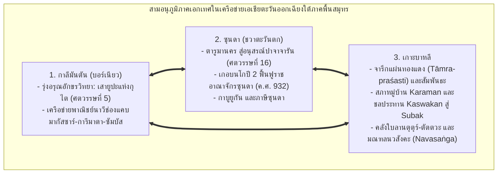
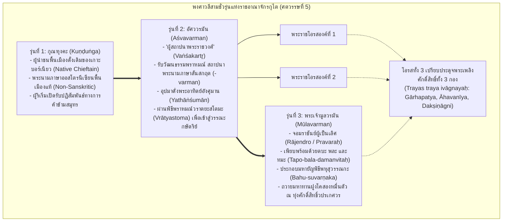
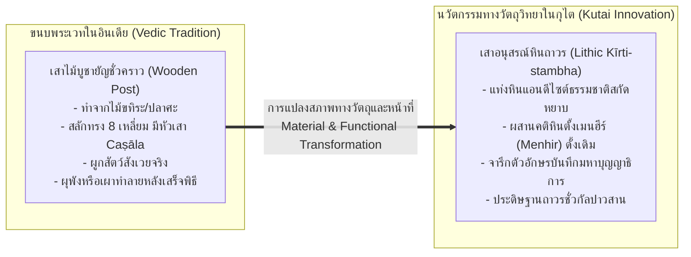
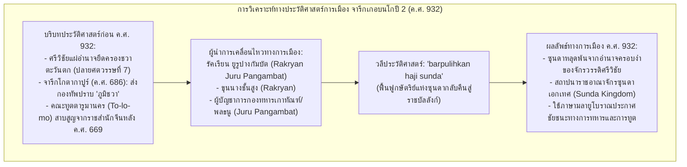
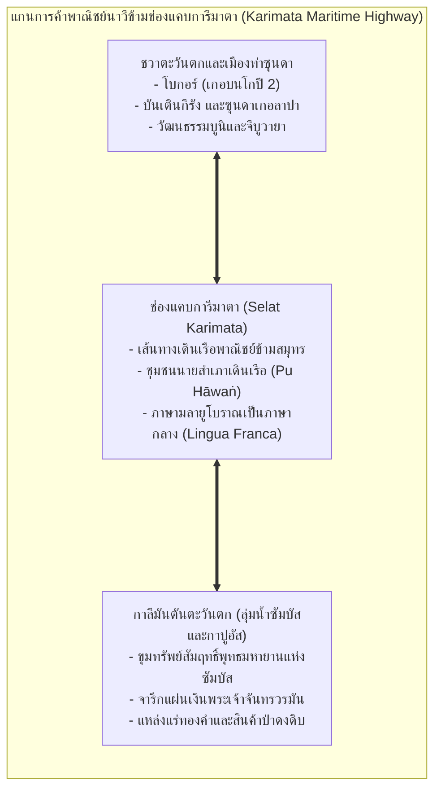
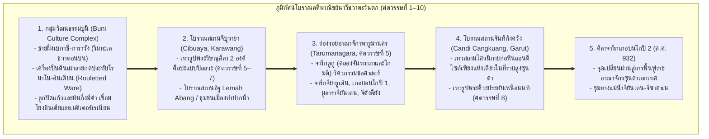
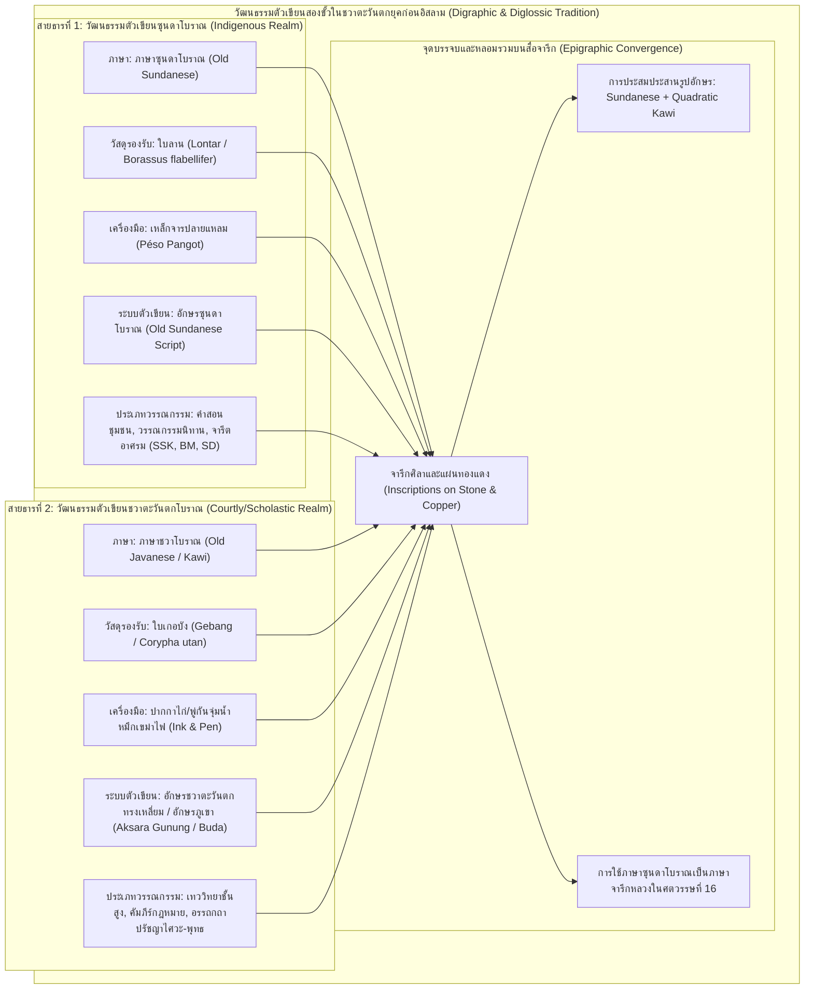
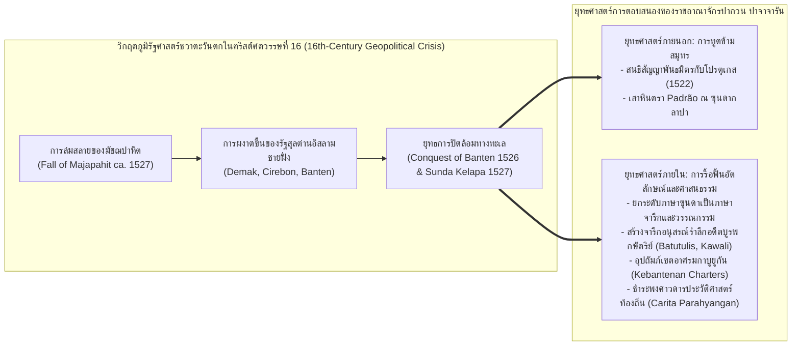

# บทที่ 6: จารึกภูมิภาคซุนดา บาหลี และกาลีมันตัน: อัตลักษณ์ ดินแดน และการสืบทอดสายธารอารยธรรมข้ามสมุทร
*(Epigraphy of the Regional Realms: Sunda, Bali, and Kalimantan in the Maritime Network)*

---

## บทนำประจำบทที่ 6: การก้าวข้ามกรอบคิดแบบชวารวมศูนย์ สู่ประวัติศาสตร์จารึกวิทยาแห่งภูมิภาคซุนดา บาหลี และกาลีมันตัน

ในประวัติศาสตร์นิพนธ์ว่าด้วยเอเชียตะวันออกเฉียงใต้ภาคพื้นสมุทรขนบดั้งเดิม กระบวนทัศน์กระแสหลักมักถูกครอบงำด้วย "อคติแบบชวารวมศูนย์" (Java-centric bias) และ "อคติแบบศรีวิชัยรวมศูนย์" (Srivijaya-centric bias) อย่างหยั่งรากลึก นักบูรพคดีศึกษาและนักประวัติศาสตร์ยุคอาณานิคมดัตช์จวบจนถึงงานประวัติศาสตร์ชาตินิยมอินโดนีเซียยุคต้น มักจัดวางให้ที่ราบลุ่มเกษตรกรรมชลประทานในชวากลางและชวาตะวันออก (อาทิ ราชอาณาจักรมาตารามโบราณ คาดีรี สิงหะส่าหรี และมัชปาหิต) ควบคู่กับจักรวรรดิทางทะเลศรีวิชัยในลุ่มแม่น้ำมูซีแห่งเกาะสุมาตรา เป็นแกนกลางเพียงสองขั้วที่ผูกขาดการสร้างสรรค์อารยธรรมและอำนาจทางการเมืองในหมู่เกาะมาเลย์ [1] ภายใต้กรอบคิดทวิขั้วอำนาจดังกล่าว ดินแดนสำคัญอื่นๆ ในหมู่เกาะ โดยเฉพาะอย่างยิ่ง ภูมิภาคซุนดาในชวาตะวันตก, เกาะบาหลี, และเกาะกาลีมันตัน (บอร์เนียวทั้งฝั่งตะวันออกและฝั่งตะวันตก) จึงมักถูกลดทอนสถานะลงเป็นเพียง "พื้นที่ชายขอบ" (Periphery) หรือเป็นเพียงดินแดนผู้รับอิทธิพลวัฒนธรรมที่ล้าหลังและขาดเอกภาพ [2]

อย่างไรก็ดี การปฏิวัติระเบียบวิธีวิจัยทางจารึกวิทยา โบราณคดีเชิงพื้นที่ และภาษาศาสตร์ประวัติศาสตร์ในช่วงสองทศวรรษแรกของคริสต์ศตวรรษที่ 21 ได้รื้อถอนกระบวนทัศน์อันคับแคบดังกล่าวลงอย่างสิ้นเชิง หลักฐานเชิงประจักษ์จากคลังจารึกดิจิทัลมาตรฐานสากลและงานวิจัยชำระตัวบทปฐมภูมิชี้ชัดว่า ภูมิภาคซุนดา บาหลี และกาลีมันตัน มิได้เป็นพื้นที่รองรับอิทธิพลแบบตั้งรับ หากแต่เป็น "ศูนย์กลางทางอารยธรรมที่เป็นเอกเทศ" (Autonomous Civilizational Spheres) ซึ่งมีวิวัฒนาการทางจารึกวิทยา ระบบตัวเขียน ภาษาศาสตร์ สถาบันการเมือง และเทววิทยาที่เป็นตัวของตัวเองอย่างเด่นชัด [3] ลักษณะร่วมทางประวัติศาสตร์ประการสำคัญของทั้งสามอนุภูมิภาคนี้ คือการธำรงไว้ซึ่งอำนาจอธิปไตย วัฒนธรรมจารึก และการสืบทอดสายธารอารยธรรมอย่างต่อเนื่องยาวนาน โดยมิได้ตกอยู่ภายใต้การกลืนกลายหรือการรวมศูนย์อำนาจเบ็ดเสร็จของราชสำนักชวากลางหรือศรีวิชัยตลอดเวลา [4]

ในการพิจารณาสายธารจารึกวิทยาของสามอนุภูมิภาคนี้ เราสามารถจำแนกลักษณะเฉพาะเชิงประจักษ์ออกได้เป็นสามมิติทางประวัติศาสตร์:
1. **อนุภูมิภาคกาลีมันตัน (บอร์เนียว):** เป็นดินแดนที่สถาปนา "รุ่งอรุณแห่งยุคประวัติศาสตร์ลายลักษณ์อักษร" ของหมู่เกาะอินโดนีเซียทั้งหมด ผ่านกลุ่มเสาศิลาจารึกยูปะ (Yūpa) ของพระเจ้ามูลวรมันแห่งแคว้นกุไต ริมแม่น้ำมหาคัมในกาลีมันตันตะวันออกตั้งแต่กลางคริสต์ศตวรรษที่ 5 [5] ควบคู่กับการเป็นจุดเชื่อมต่อของเครือข่ายพาณิชย์นาวีข้ามช่องแคบมากัสซาร์ และเครือข่ายข้ามช่องแคบการีมาตาสู่ลุ่มน้ำซัมบัสและกาปูอัสในกาลีมันตันตะวันตก ซึ่งผูกโยงการค้าทองคำและของป่าเข้ากับโลกมหาสมุทร [6]
2. **อนุภูมิภาคซุนดา (ชวาตะวันตก):** ดินแดนที่มีเอกลักษณ์ทางวัฒนธรรมและภาษาซุนดาโบราณ (Old Sundanese) อย่างเหนียวแน่น สืบสายธารจากอาณาจักรตารูมานคร (Tarumanagara) ยุคโบราณ ผ่านช่วงเวลาหัวเลี้ยวหัวต่อในคริสต์ศตวรรษที่ 10 ที่ปรากฏจารึกภาษามลายูโบราณเกอบนโกปี 2 บันทึกการฟื้นฟูกษัตริย์แห่งซุนดาให้พ้นจากอิทธิพลศรีวิชัย [7] สู่ยุคทองของราชอาณาจักรปากวนปาจาจารัน (Pakwan Pajajaran) ในปลายคริสต์ศตวรรษที่ 15 ถึง 16 ซึ่งสร้างสรรค์จารึกอนุสรณ์สถานรำลึกอดีตบูรพกษัตริย์หลังการสวรรคต (post-mortem memorials) และจารึกแผ่นทองแดงพระราชทานเขตอภัยทานกาบูยูกัน [8]
3. **อนุภูมิภาคเกาะบาหลี:** ดินแดนที่รุ่มรวยด้วยคลังจารึกแผ่นทองแดง (tāmra-praśasti) กว่าร้อยฉบับ ซึ่งทำหน้าที่เป็นประมวลกฎหมายปกครองแผ่นดินและหลักยึดเหนี่ยวคุ้มครองสิทธิชุมชนรากหญ้า [9] โดยมีโครงสร้างส่วน "สัมพันธะ" (sambandha) ที่สะท้อนประวัติศาสตร์จากเบื้องล่าง การต่อรองระหว่างสภาหมู่บ้าน (karaman/banwa) กับสภาขุนนางราชสำนัก ตลอดจนวิวัฒนาการอันน่าทึ่งของสถาบันชลประทานจากกัสวากัน (kaswakan) สู่ระบบซูบัก (subak) [10] ยิ่งไปกว่านั้น บาหลียังทำหน้าที่เป็น "เรือกล้วยไม้พิทักษ์ชีวิต" (safe haven) ที่เก็บรักษาคลังคัมภีร์ใบลานปรัชญาเทววิทยาไศวะสิทธานตะโบราณและระบบจักรวาลวิทยานวสังคะ (Navasaṅga) ไว้อย่างสมบูรณ์ที่สุด [11]

เพื่อนำเสนอพัฒนาการทางประวัติศาสตร์และจารึกวิทยาของสามอนุภูมิภาคนี้อย่างรอบด้านและลึกซึ้ง บทที่ 6 ได้รับการจัดวางสถาปัตยกรรมเนื้อหาออกเป็น 8 หัวข้อย่อยหลักตามแผนผังบูรณาการคลังหลักฐานเชิงประจักษ์ โดยสำหรับ **ตอนที่ 1 (Part 1)** ของบทนี้ จะมุ่งเน้นการเจาะลึกในสองหัวข้อแรก ซึ่งเป็นเสาหลักแห่งการก่อรูปทางประวัติศาสตร์ยุคต้นและเครือข่ายพาณิชย์นาวี ได้แก่:
- **หัวข้อ 6.1 เสายูปะแห่งกุไตและรุ่งอรุณแห่งอักขรวิทยาในบอร์เนียว (The Yūpa Inscriptions of Kutai and Early Epigraphy in Borneo):** การศึกษากลุ่มเสาศิลาจารึกหินแอนดีไซต์ธรรมชาติ 7 หลักแห่งมูอารา กามัน ริมแม่น้ำมหาคัม (ราว ค.ศ. 400–450), การวิเคราะห์พงศาวลีสามชั่วรุ่น (กุณฑุงคะ สู่ อัศววรมัน และมูลวรมัน), การชำระระบบอักขรวิทยาปัลลวะตอนต้น (Archaic Lithic Grantha) และการยกเลิกมโนทัศน์ "อักษรเวงคี", การวิเคราะห์ฉันทลักษณ์สันสกฤตและตัวบทจารึกทั้ง 7 หลัก, มหายัญพิธีพหุสุวรรณกะ ณ ลานศักดิ์สิทธิ์วปรเกศวร, การแปลงหน้าที่ทางวัตถุวิทยาจากเสาไม้ยูปะสู่เสาอนุสรณ์หินถาวร (permanent lithic kīrti-stambha), ตลอดจนเศรษฐกิจพิธีกรรมและการถวายมหาทานฝูงโคสองหมื่นตัว [12]
- **หัวข้อ 6.2 จารึกภาษามลายูโบราณในชวาตะวันตกและเครือข่ายพาณิชย์นาวี (Old Malay Inscriptions in Western Java and Maritime Networks):** การวิเคราะห์ศิลาจารึกเกอบนโกปี 2 (Kebon Kopi II / Pasir Muara ค.ศ. 932) ว่าด้วยการถอดรหัสสุริยสังขยา `kawihaji pañca pasagi` (มหาศักราช 854) และการตีความวลีประวัติศาสตร์ `barpulihkan haji sunda` (การฟื้นฟูกษัตริย์แห่งซุนดา) โดยขุนนางรัคเรียน ยูรูปางกัมบัต ภายหลังการหลุดพ้นจากอำนาจครอบงำของศรีวิชัย, พลวัตของภาษามลายูโบราณสำนวนเบี่ยงเบนในฐานะภาษากลางทางการค้าข้ามสมุทร (lingua franca) ในทะเลชวาและช่องแคบการีมาตา, การเชื่อมโยงสู่เมืองท่าลุ่มน้ำซัมบัสและกาปูอัสในกาลีมันตันตะวันตก, บทบาทของชนชั้นนายสำเภาเดินเรือพาณิชย์ (pu hāwaṅ / anāvaka) ในการอุปถัมภ์ศาสนสถานและถือครองที่ดินสีมา, และภูมิทัศน์โบราณคดีพาณิชย์นาวีของชวาตะวันตก [13]

---

## 6.1 เสายูปะแห่งกุไตและรุ่งอรุณแห่งอักขรวิทยาในบอร์เนียว (The Yūpa Inscriptions of Kutai and Early Epigraphy in Borneo)

### 6.1.1 บริบททางภูมิศาสตร์การเมือง ชัยภูมิมูอารา กามัน ริมแม่น้ำมหาคัม และประวัติศาสตร์การค้นพบเสายูปะ 7 หลัก

การปรากฏตัวของกลุ่มเสาศิลาจารึกยูปะ (Yūpa) แห่งแคว้นกุไต (Kutai) บนเกาะบอร์เนียว (กาลีมันตันตะวันออก) นับเป็นหมุดหมายที่สำคัญที่สุดในประวัติศาสตร์จารึกวิทยาของเอเชียตะวันออกเฉียงใต้ภาคพื้นสมุทร เนื่องจากจารึกกลุ่มนี้คือ "เอกสารลายลักษณ์อักษรที่เก่าแก่ที่สุดในหมู่เกาะอินโดนีเซีย" ซึ่งสถาปนารุ่งอรุณแห่งยุคประวัติศาสตร์ขึ้นในช่วงกลางคริสต์ศตวรรษที่ 5 (ราว ค.ศ. 400–450) [14] โบราณวัตถุชุดนี้ค้นพบ ณ บริเวณมูอารา กามัน (Muara Kaman) ซึ่งตั้งอยู่ลึกเข้าไปในแผ่นดินตอนในริมฝั่งแม่น้ำมหาคัม (Mahakam River) เหนือนครเปอลารัง (Pelarang) และซามารินดา (Samarinda) ขึ้นไปทางทิศตะวันตกเฉียงเหนือราว 130 กิโลเมตร [15]

ในเชิงภูมิศาสตร์การเมือง ชัยภูมิของมูอารา กามัน มิได้เป็นพื้นที่ห่างไกลที่ตัดขาดจากโลกภายนอก หากแต่เป็นจุดบรรจบทางชลศาสตร์ที่สำคัญยิ่งยวดระหว่างแม่น้ำมหาคัมอันเป็นแม่น้ำสายหลัก กับแม่น้ำเกอดัง เกอปาลา (Kedang Kepala) ซึ่งเป็นแม่น้ำสาขาขนาดใหญ่ ลำน้ำมหาคัมในบริเวณนี้มีความกว้างและลึกพอที่เรือกำปั่นเดินสมุทรโบราณจะสามารถแล่นทวนกระแสน้ำลึกเข้ามาจอดเทียบท่าได้ตลอดทั้งปี โดยได้รับความคุ้มครองจากแนวภูเขาและป่าทึบให้พ้นจากพายุลมมรสุมรุนแรงในทะเลเปิดและภัยคุกคามจากโจรสลัดชายฝั่ง [16] ยิ่งไปกว่านั้น มูอารา กามัน ยังทำหน้าที่เป็น "ชุมทางถ่ายลำสินค้าต้นน้ำ-ปลายน้ำ" (Hulu-Hilir Entrepot) ที่ผูกขาดเส้นทางการลำเลียงทรัพยากรล้ำค่าจากป่าดงดิบตอนในของเกาะบอร์เนียว โดยเฉพาะอย่างยิ่ง แหล่งลานแร่ทองคำธรรมชาติ (Alluvial Gold) ในลุ่มน้ำมหาคัมตอนบน, ไม้กฤษณา (Eaglewood / Gaharu), รังนกนางแอ่น, ยางสนหอม (Dammar Resin), และขี้ผึ้งป่า เข้าสู่เครือข่ายพาณิชย์นาวีสากล [17]

ในมิติของเส้นทางเดินเรือข้ามสมุทร ปากแม่น้ำมหาคัมเปิดออกสู่ "ช่องแคบมากัสซาร์" (Makassar Strait) ซึ่งทำหน้าที่เป็นทางหลวงพาณิชย์นาวีสายหลักทางฝั่งตะวันออกของเอเชียตะวันออกเฉียงใต้ เส้นทางสายนี้เชื่อมโยงทะเลชวา (Java Sea) เข้ากับทะเลเซเลบีส (Celebes Sea), หมู่เกาะโมลุกกะ (Moluccas), ทะเลซูลู (Sulu Sea), ฟิลิปปินส์, และชายฝั่งทางตอนใต้ของจีน การเดินเรือผ่านช่องแคบมากัสซาร์เป็นเส้นทางเดินเรือคู่ขนานที่สำคัญยิ่งต่อการค้าระหว่างประเทศควบคู่ไปกับเส้นทางช่องแคบมะละกาทางฝั่งตะวันตก [18] การผงาดขึ้นของรัฐกุไตโบราณ ณ มูอารา กามัน จึงเป็นผลลัพธ์โดยตรงจากการที่ผู้นำทางการเมืองในท้องถิ่นสามารถควบคุมจุดตัดระหว่างเศรษฐกิจลุ่มน้ำที่อุดมด้วยทองคำ กับเครือข่ายการค้าทางทะเลข้ามช่องแคบมากัสซาร์ได้อย่างเบ็ดเสร็จ [19]

ประวัติศาสตร์การค้นพบและการศึกษาจารึกเสายูปะแห่งกุไตมีวิวัฒนาการที่ยาวนานและเต็มไปด้วยพลวัตทางประวัติศาสตร์นิพนธ์:
1. **การค้นพบครั้งแรกใน ค.ศ. 1879:** เค. เอฟ. ฮอลเลอ (K. F. Holle) ที่ปรึกษาราชการอาณานิคมดัตช์ด้านภาษาพื้นเมือง ได้รายงานต่อสมาคมศิลปศาสตร์และวิทยาศาสตร์แห่งบาตาเวีย (Bataviaasch Genootschap van Kunsten en Wetenschappen) ว่า มีการค้นพบแท่งเสาหินธรรมชาติที่มีรอยจารึกอักษรโบราณจำนวน 4 หลัก พร้อมด้วยซากเรือพายโบราณและซากเรือสำเภาจีนโบราณ ณ มูอารา กามัน ในเขตปกครองของสุลต่านแห่งกุไต [20]
2. **การมอบโบราณวัตถุสู่พิพิธภัณฑ์บาตาเวียใน ค.ศ. 1880:** สุลต่านแห่งกุไตได้ทูลเกล้าฯ ถวายเสาศิลาทั้ง 4 หลักแด่รัฐบาลอาณานิคมและสมาคมบาตาเวียในเดือนสิงหาคม ค.ศ. 1880 โดยโบราณวัตถุได้รับการลำเลียงทางเรือมาถึงพิพิธภัณฑ์ก่อนสิ้นปี ค.ศ. 1880 (ปัจจุบันจัดแสดงอย่างสมเกียรติ ณ พิพิธภัณฑสถานแห่งชาติอินโดนีเซีย กรุงจาการ์ตา ภายใต้หมายเลขทะเบียน D.2a, D.2b, D.2c, และ D.2d) [21]
3. **การศึกษาบุกเบิกของ Hendrik Kern (1881–1882):** ศาสตราจารย์ เฮนดริก เคิร์น นักบูรพคดีศึกษาชาวดัตช์ ได้นำเสนอผลการถอดอ่านจารึกทั้ง 4 หลักต่อที่ประชุมราชบัณฑิตยสภาเนเธอร์แลนด์เมื่อวันที่ 13 กันยายน ค.ศ. 1880 และตีพิมพ์ผลงานวิจัยสมบูรณ์ในชื่อ *"Over het opschrift van Koetei in verband met de geschiedenis van het schrift in den Indischen Archipel"* ในปี ค.ศ. 1882 เคิร์นได้กำหนดอายุจารึกไว้ในราวคริสต์ศตวรรษที่ 5 และจำแนกเสาเป็นหลัก I, II, III (หลักที่ IV ยังอ่านไม่ออกในเวลานั้น) [22]
4. **การชำระตัวบทครั้งแม่บทของ J. Ph. Vogel (1918):** ในวารสาร *Bijdragen tot de Taal-, Land- en Volkenkunde van Nederlandsch-Indië* (BKI 74) เจ. ฟิลลิป โฟเกล (J. Ph. Vogel) นักจารึกวิทยาชั้นนำแห่งสำรวจโบราณคดีแห่งอินเดีย (Archaeological Survey of India) ได้ตีพิมพ์บทความวิจัยระดับหมุดหมาย *"The Yūpa Inscriptions of King Mūlavarman, from Koetei (East Borneo)"* โดยอาศัยภาพสำเนาหมึก (inked estampages) คุณภาพสูงที่จัดทำโดย ดร. เอฟ. ดี. เค. บ็อช (F. D. K. Bosch) โฟเกลสามารถแก้ไขข้อผิดพลาดในการอ่านของเคิร์นได้อย่างเด็ดขาด, ถอดอ่านจารึกหลักที่ 4 (หลัก D) ได้สำเร็จเป็นครั้งแรก, สถาปนาระบบรหัสเรียกชื่อเสาเป็น "หลัก A, B, C, D", และปฏิวัติการกำหนดอายุและตระกูลอักษร [23]
5. **การค้นพบเสาเพิ่มเติม 3 หลักใน ค.ศ. 1940:** ในปี ค.ศ. 1940 ได้มีการขุดค้นพบเสายูปะที่มีจารึกเพิ่มเติมอีก 3 หลักในบริเวณมูอารา กามัน ซึ่งต่อมาได้รับการชำระและตีพิมพ์โดย บี. ช. ฉบรา (B. Ch. Chhabra) ในปี ค.ศ. 1949 ในวารสาร TBG 83 ภายใต้ชื่อ *"Three More Yūpa Inscriptions of King Mūlavarman from Koetei (East Borneo)"* โดยกำหนดรหัสเป็น "หลัก E, F, G" ทำให้คลังจารึกเสายูปะแห่งกุไตมีจำนวนรวมทั้งสิ้น 7 หลักอย่างสมบูรณ์ [24]

---

### 6.1.2 พงศาวลีสามชั่วรุ่นในจารึกหลัก A: กุณฑุงคะ อัศววรมัน และมูลวรมัน

หลักฐานชิ้นเอกที่สะท้อนพลวัตการก่อรูปของรัฐโบราณและกระบวนการรับวัฒนธรรมอินเดียในเอเชียตะวันออกเฉียงใต้ ปรากฏอย่างเด่นชัดที่สุดใน **จารึกหลัก A (Inscription A / Kern II)** ซึ่งสลักด้วยภาษาสันสกฤตฉันท์อนุษฏุภจำนวน 3 โศลก (12 บรรทัด) จารึกหลักนี้ได้บันทึกสายลำดับพงศาวลีของราชสำนักกุไตไว้อย่างชัดเจนถึง 3 ชั่วรุ่น [25] ดังข้อความปริวรรตและคำแปลวิชาการดังต่อไปนี้:

> **ตัวบทปริวรรตอักษรเดิม (IAST):**
> (1) śrīmataḥ śrī-narendrasya  
> (2) Kuṇḍuṅgasya mahātmanaḥ  
> (3) putro 'śvavarmmo vikhyātaḥ  
> (4) vaṅśakarttā yathāṅśumān  
> (5) tasya putrā mahātmanaḥ  
> (6) trayas traya ivāgnayaḥ  
> (7) teṣāṁ trayāṇāṁ pravaraḥ  
> (8) tapo-bala-damanvitaḥ  
> (9) śrī-Mūlavarmmā rājendro  
> (10) yaṣṭvā bahusuvarṇṇakam  
> (11) tasya yajñasya yūpo 'yaṁ  
> (12) dvijendrais samprakalpitaḥ [26]
>
> **คำแปลภาษาไทยวิชาการ:**
> "(1) แห่งพระราชาผู้ทรงพระสิริสวัสดิ์ (2) พระนามว่า **กุณฑุงคะ** ผู้มีมหาบุญญาบารมี (3) มีพระราชโอรสผู้ทรงปรากฏพระเกียรติเลื่องลือนามว่า **อัศววรมัน** (4) ผู้ทรงเป็น **ผู้สถาปนาพระราชวงศ์** เปรียบประดุจพระอาทิตย์อังศุมาน (5) พระราชโอรสของพระองค์ผู้มีมหาบุญญาบารมีนั้น (6) มีอยู่สามพระองค์ เปรียบประดุจพระเพลิงศักดิ์สิทธิ์ทั้งสามกอง (7) ในบรรดาพระราชโอรสทั้งสามพระองค์นั้น องค์ผู้ทรงเป็นเลิศที่สุด (8) ผู้ทรงเพียบพร้อมด้วยตบะ เดชานุภาพ และการควบคุมตน (9) คือ **พระเจ้ามูลวรมัน** จอมราชันย์แห่งกษัตริย์ทั้งหลาย (10) ครั้นทรงประกอบมหายัญพิธีพหุสุวรรณกะแล้ว (11) เพื่อมหายัญพิธีนั้น เสายูปะหลักนี้ (12) จึงได้รับการจัดสร้างและสถาปนาขึ้นโดยเหล่าพราหมณ์ผู้เป็นจอมแห่งทวิชาติ" [27]

การวิเคราะห์เชิงนิรุกติศาสตร์และประวัติศาสตร์เปรียบเทียบต่อพงศาวลีสามชั่วรุ่นนี้ ได้นำไปสู่การเปลี่ยนผ่านกระบวนทัศน์ครั้งสำคัญยิ่งในวงวิชาการ:
1. **สถานะทางชาติพันธุ์และภาษาของกุณฑุงคะ (Kuṇḍuṅga):**  
   ในขณะที่พระราชโอรส (อัศววรมัน) และพระราชนัดดา (มูลวรมัน) ทรงมีพระนามส่วนพระองค์เป็นภาษาสันสกฤตอย่างสมบูรณ์ตามขนบอินโด-อารยัน พระนามของพระอัยกาคือ "กุณฑุงคะ" (*Kuṇḍuṅga*) กลับมีระบบเสียงและสัทวิทยาที่เป็นภาษาพื้นเมืองตระกูลออสโตรนีเซียนอย่างเด่นชัด [28] นักวิชาการรุ่นอาณานิคมบางท่านพยายามโยงคำว่ากุณฑุงคะเข้ากับคำทมิฬหรือภาษาสันสกฤต แต่ Vogel (1918: 196–197) ได้ยืนยันอย่างหนักแน่นว่า กุณฑุงคะมิใช่ผู้อพยพที่เดินทางข้ามน้ำข้ามทะเลมาจากชมพูทวีป หากแต่ทรงเป็น "ผู้นำชนพื้นเมืองของเกาะบอร์เนียว" (Native of Borneo) ที่มีอำนาจบารมีดั้งเดิมในลุ่มน้ำมหาคัม [29]
2. **บทบาทของอัศววรมันในฐานะ "ผู้สร้างราชวงศ์" (Vaṅśakartr̥):**  
   การที่จารึกหลัก A จงใจยกย่องอัศววรมันว่าเป็น **"วังศกรรตฤ" (*vaṅśakarttā*)** หรือผู้สถาปนาพระราชวงศ์ มิได้ยกย่องกุณฑุงคะผู้เป็นบิดา เป็นหลักฐานชี้ชัดว่า การสถาปนาระบอบกษัตริย์ตามคติเทวราชาของศาสนาพราหมณ์-ฮินดูเพิ่งเริ่มต้นขึ้นในรุ่นลูก [30] เพื่อก้าวข้ามข้อจำกัดของระบบสายตระกูลแบบหัวหน้าเผ่าดั้งเดิม อัศววรมันน่าจะทรงประกอบพิธีกรรมทางศาสนาพราหมณ์โบราณที่เรียกว่า **"วราตยะสโตมะ" (*Vrātyastoma*)** ซึ่งเป็นพิธีชำระความบริสุทธิ์เพื่อรับเอาบุคคลภายนอกหรือผู้นำชนพื้นเมืองที่อยู่นอกขนบพระเวทเข้าสู่ระบบวรรณะอารยันในฐานะวรรณะกษัตริย์ [31] ด้วยเหตุนี้ พระองค์จึงได้รับการอุปมาดั่งพระอาทิตย์อังศุมาน (*yathāṅśumān*) ผู้ส่องแสงสว่างขับไล่ความมืดมิดและให้กำเนิดราชตระกูลใหม่
3. **การอุปมาพระราชโอรสทั้งสามกับพระเพลิงศักดิ์สิทธิ์ (Trayas traya ivāgnayaḥ):**  
   ข้อความในบรรทัดที่ 6 ที่ระบุว่าพระราชโอรสทั้งสามของอัศววรมันเปรียบเสมือน "พระเพลิงทั้งสามกอง" มิใช่เพียงสำนวนกวีเปรียบเทียบโวหารลอยๆ แต่เป็นการอ้างอิงถึง **"ตรีอัคนี" (Treto-Agni)** ในระเบียบพิธีกรรมพระเวทชั้นสูง อันประกอบด้วย:
   - *คาร์หปัตยะ (Gārhapatya):* พระเพลิงประจำเรือนสำหรับประกอบพิธีภายใน
   - *อาหวนียะ (Āhavanīya):* พระเพลิงทางทิศตะวันออกสำหรับเผาเครื่องพลีกรรมส่งแด่ทวยเทพ
   - *ทักษิณาคัคนี (Dakṣiṇāgni):* พระเพลิงทางทิศใต้สำหรับพิธีพลีแด่บรรพบุรุษ [32]
   การเปรียบเทียบนี้แสดงว่า ราชสำนักกุไตในรัชสมัยของพระเจ้ามูลวรมันมีความรอบรู้และความเข้าใจอย่างลึกซึ้งในระบบเทววิทยาและปรัชญาพระเวท
4. **การเปลี่ยนผ่านจาก Indianization สู่การริเริ่มของท้องถิ่น (Regional Agency):**  
   ข้อมูลพงศาวลีนี้ได้หักล้างทฤษฎีอาณานิคมเรื่อง "การแผ่อารยธรรมอินเดียโพ้นทะเล" (Greater India) ที่เคยมองว่าชาวอินเดียได้ยกกองทัพมารุกราน ยึดครอง และตั้งถิ่นฐานอาณานิคมในบอร์เนียว Vogel (1918) ชี้ให้เห็นว่า กระบวนการที่เกิดขึ้นคือ "การซึมซับอย่างสันติ" (Peaceful Penetration) ซึ่งผู้นำท้องถิ่นบอร์เนียวเป็นฝ่ายเชื้อเชิญพราหมณ์ผู้มีความรู้ทางพิธีกรรมและเทคโนโลยีตัวเขียนให้เดินทางข้ามมหาสมุทรมายังราชสำนัก เพื่อเสริมสร้างความชอบธรรมและอำนาจบารมีทางการเมืองของตนเอง [33]

---

### 6.1.3 อักขรวิทยาปัลลวะตอนต้น (Early Pallava / Archaic Lithic Grantha): การปฏิเสธ "อักษรเวงคี" และการเปรียบเทียบข้ามภูมิภาค

ในด้านประวัติศาสตร์อักขรวิทยา (Palaeographical History) การศึกษาเสายูปะแห่งกุไตของ Vogel (1918) ได้สร้างคุณูปการครั้งสำคัญที่สุดด้วยการสถาปนาระบบการจำแนกตระกูลอักษรโบราณในเอเชียตะวันออกเฉียงใต้ที่ถูกต้องตามหลักวิชาการ:

#### การยกเลิกมโนทัศน์ "อักษรเวงคี" (Rejection of 'Vengi Alphabet')
ก่อนหน้างานวิจัยของ Vogel นักวิชาการด้านภาษาศาสตร์โบราณอินเดีย ได้แก่ เอ. ซี. เบอร์เนลล์ (A. C. Burnell) ในหนังสือ *Elements of South-Indian Palaeography* (1874) และ Hendrik Kern (1882) มักเรียกรูปแบบตัวอักษรที่พบในจารึกกุไต ตารูมานคร และจามปา ว่าเป็น "อักษรเวงคี" (Vengi alphabet) โดยสันนิษฐานว่าตัวอักษรเหล่านี้นำเข้ามาจากราชอาณาจักรเวงคี (Vengi) อันเป็นดินแดนลุ่มแม่น้ำกฤษณาและโคทาวารีในรัฐอานธรประเทศ ซึ่งปกครองโดยราชวงศ์ศาลังกายน (Śālaṅkāyana) และราชวงศ์จาลุกยะตะวันออก [34]

ทว่า Vogel (1918: 220–221) ได้วิพากษ์และหักล้างสมมติฐานดังกล่าวอย่างเป็นระบบ โดยชี้ให้เห็นข้อเท็จจริงทางประวัติศาสตร์และอักขรวิทยาว่า:
- ราชวงศ์ศาลังกายนแห่งเวงคีเป็นเพียงรัฐท้องถิ่นขนาดเล็กในแผ่นดินตอนใน มิได้มีแสนยานุภาพทางเรือหรือมีบันทึกการแผ่อิทธิพลข้ามมหาสมุทรที่โดดเด่นเทียบเท่ากับ **ราชวงศ์ปัลลวะแห่งกาญจีปุรัม (Pallavas of Kāñcīpuram)** ซึ่งเป็นมหาอำนาจทางทะเลที่คุมเมืองท่าสำคัญอย่างมหาพลีปุรัม (Mahabalipuram) บนชายฝั่งโคโรแมนเดล
- เมื่อนำลักษณะสัณฐานของตัวอักษรในเสายูปะแห่งกุไตไปเปรียบเทียบกับจารึกแผ่นทองแดงและจารึกศิลาในอินเดียใต้ พบว่าตัวอักษรกุไตมีความละม้ายใกล้ชิดเป็นหนึ่งเดียวกับตัวอักษรที่สลักในจารึกของกษัตริย์ราชวงศ์ปัลลวะยุคแรก โดยเฉพาะอย่างยิ่งจารึกถ้ำหินสกัดของพระเจ้ามเหนทรวรมันที่ 1 (Mahendravarman I) ณ มเหนทรวาฑี (Mahendravadi) และทลวานูร (Dalavanur) [35]
- ด้วยเหตุดังกล่าว Vogel จึงเสนอให้ **"ยกเลิกการใช้คำว่า อักษรเวงคี ออกไปจากระบบศัพท์บัญญัติทางจารึกวิทยาชวาและเอเชียตะวันออกเฉียงใต้อย่างสิ้นเชิง"** แล้วแทนที่ด้วยคำว่า **"อักษรปัลลวะ" (Pallava script)** หรือชื่อทางเทคนิคที่แม่นยำกว่าคือ **"อักษรครันถะศิลาแบบโบราณ" (Archaic Lithic Grantha)** [36]

#### ลักษณะเด่นทางอักขรวิทยาและการกำหนดอายุ
เสายูปะแห่งกุไตสลักด้วยอักษรปัลลวะตอนต้นที่มีลักษณะเฉพาะทางกายภาพที่งดงามและทรงพลังยิ่ง:
- **ยอดหัวอักษรทรงเหลี่ยม (Box-heads):** หัวอักษรหลายตัวมีลักษณะเป็นรูปกล่องเหลี่ยมเล็กๆ ที่เกิดจากการกดปลายสิ่วสกัดหิน ซึ่งเป็นเอกลักษณ์ร่วมกับจารึกยุคคลาสสิกของอินเดียใต้และเอเชียตะวันออกเฉียงใต้
- **เส้นตั้งที่ลากยาวดิ่ง (Vertical Elongation):** พยัญชนะที่มีเส้นตั้งดิ่ง เช่น *ก* (ka), *ร* (ra), *ล* (la) มีการลากเส้นหางยาวอย่างสง่างาม โดยเฉพาะตัวอักษรเดี่ยวในหลัก A มีความสูงเฉลี่ย 2.5 ซม. แต่เมื่อมีหางลากยาวหรือมีรูปสระประกอบจะสูงถึง 6–7 ซม. และตัวควบกล้ำซ้อนรูปมีความสูงถึง 9 ซม. [37]
- **รูปสระจมและสระลอย:** สระอุจม (*medial u*) ลากเป็นเส้นดิ่งตรงลงมาข้างล่างชัดเจน (ดั่งที่ปรากฏในคำว่า *Kuṇḍuṅgasya*), สระเอ (*medial e*) และสระโอ (*medial o*) สลักด้วยเส้นโค้งตวัดอย่างประณีต
- **การซ้อนรูปพยัญชนะ (Ligatures):** มีการซ้อนรูปพยัญชนะตามแนวดิ่งอย่างซับซ้อนโดยไม่ใช้เครื่องหมายวิรามะ (เครื่องหมายฆ่าเสียง) เช่น คำว่า *yaṣṭvā* (ษฺฏฺวา) ในหลัก A บรรทัด 10 [38]

เมื่อเปรียบเทียบกับจารึกโบราณอื่นๆ ในภูมิภาคอุษาคเนย์ Vogel (1918: 223–232) ได้จัดลำดับวิวัฒนาการทางอักขรวิทยาว่า:
1. *จารึกวัวจัญ / หว่อแก๋ง (Vo Canh Inscription)* ในเวียดนามตอนกลาง และ *จารึกโคกสระบาป (Kōk Rkā / Prasat Pram)* มีอายุเก่าแก่ที่สุดในราวปลายศตวรรษที่ 3 ถึงต้นศตวรรษที่ 4
2. *จารึกภัทรวรมันแห่งจามปา (Bhadravarman I at Cho Dinh and My Son)* มีอายุราว ค.ศ. 350–400
3. **เสายูปะแห่งกุไตของพระเจ้ามูลวรมัน:** มีอายุอยู่ในช่วง **กลางคริสต์ศตวรรษที่ 5 (ราว ค.ศ. 400–450)** ซึ่งร่วมสมัยอย่างใกล้ชิด หรืออาจเก่ากว่าเล็กน้อย เมื่อเทียบกับกลุ่มจารึกตารูมานครของพระเจ้าปูรณวรมันในชวาตะวันตก (จารึกจียารูเติน, ตูกู, เกอบอนโกปี 1) [39]

---

### 6.1.4 ฉันทลักษณ์ ภาษาสันสกฤต และการจัดวางบรรทัดแบบหนึ่งวรรคต่อหนึ่งบรรทัด (Pāda-per-line)

ในมิติของวรรณศิลป์และฉันทลักษณ์ จารึกเสายูปะแห่งกุไตได้รับการประพันธ์ขึ้นด้วยภาษาสันสกฤตคลาสสิก (Classical Sanskrit) ที่มีระเบียบแบบแผนทางกวีนิพนธ์ชั้นสูง มิใช่ภาษาสันสกฤตผสมหรือภาษาถิ่น โดยสลักเป็นคำร้อยกรองตามฉันทลักษณ์พระเวทและมหากาพย์อย่างเคร่งครัด:
- **ฉันท์อนุษฏุภ (Anuṣṭubh / Śloka):** ใช้ในจารึกหลัก A, C, D และ G ซึ่งประกอบด้วย 4 บาท (วรรค) บาทละ 8 พยางค์ รวมเป็น 32 พยางค์ต่อหนึ่งโศลก
- **ฉันท์อารยา (Āryā):** ใช้ในจารึกหลัก B ซึ่งเป็นฉันท์ประเภทนับมาตราครุ-ลหุ (mātrā-chanda) ที่มีความซับซ้อนและสง่างามสูง มักสงวนไว้สำหรับบทกวีนิพนธ์สรรเสริญชั้นเลิศในราชสำนัก [40]

ความโดดเด่นทางวัตถุวิทยาและอักขรวิธีที่ Vogel (1918: 215–216) ได้ค้นพบ คือการจัดวางบรรทัดของจารึกกุไตเป็นแบบ **"หนึ่งบาทฉันท์ต่อหนึ่งบรรทัด" (Pāda-per-line / Pādavyavasthā)** นั่นคือ ช่างจารึกมิได้สลักตัวอักษรต่อเนื่องยาวไปตามความกว้างของเนื้อหิน แต่จะตัดบรรทัดใหม่ทุกครั้งที่จบบาทฉันท์ (วรรค) แต่ละบาทพอดี ส่งผลให้:
- จารึกหลัก A (3 โศลก x 4 บาท) สลักพอดี 12 บรรทัด
- จารึกหลัก B (2 โศลก x 4 บาท) สลักพอดี 8 บรรทัด
- จารึกหลัก C (2 โศลก x 4 บาท) สลักพอดี 8 บรรทัด

การจัดระเบียบบรรทัดเช่นนี้ตรงกันอย่างสมบูรณ์แบบกับจารึกถ้ำหินสกัดของราชวงศ์ปัลลวะแห่งมเหนทรวาฑีและทลวานูรในอินเดียใต้ ซึ่งเป็นหลักฐานเชิงประจักษ์ที่ยืนยันว่า ราชบัณฑิตและพราหมณ์ผู้ร่างตัวบทในกุไตได้รับการฝึกฝนมาในสำนักกวีนิพนธ์เดียวกันกับราชสำนักปัลลวะ [41]

#### การชำระข้อผิดพลาดในการอ่านของ Kern (1882) โดย Vogel (1918)
ความก้าวหน้าของจารึกวิทยากุไตเกิดขึ้นจากการที่ Vogel สามารถตรวจสอบสำเนาหมึกของ Bosch และแก้ไขข้อผิดพลาดสะสมของ Kern ได้หลายจุดสำคัญ ดังแสดงในตารางเปรียบเทียบต่อไปนี้:

| ตำแหน่งในจารึก | การอ่านเดิมของ H. Kern (1882) | การอ่านชำระใหม่ของ J. Ph. Vogel (1918) | การวิเคราะห์ความหมายและผลกระทบทางประวัติศาสตร์ |
|:---|:---|:---|:---|
| **หลัก A, บรรทัด 2** | *Kuṇḍaṅgasya* | **Kuṇḍuṅgasya** | สำเนาหมึกยืนยันเส้นสระอุ (*medial u*) ลากดิ่งลงชัดเจน ยืนยันพระนามที่ถูกต้องคือ "กุณฑุงคะ" (หน้า 212) |
| **หลัก A, บรรทัด 3** | *'śvavarmmā* | **'śvavarmmo** | ศิลาสลักรูปสระโอตามกฎสนธิ เคิร์นแก้เป็นประธานการกโดยพลการ โฟเกลคืนรูปแท้จริงบนศิลา (หน้า 213) |
| **หลัก A, บรรทัด 9** | *rājendrah* | **rājendro** | ศิลาสลักสระโอเชื่อมสนธิต่อเนื่อง โฟเกลบันทึกตามรูปอักขระจริงบนแผ่นศิลา (หน้า 213) |
| **หลัก A, บรรทัด 10** | *yaṣṭvā* (อ่านไม่ออก) | **yaṣṭvā** | ตัวควบกล้ำ ษฺฏฺวา ชัดเจน เป็นกิริยากิตก์อดีตของ *yaj* ("บูชายัญแล้ว") มิใช่ *yayau* (หน้า 213) |
| **หลัก B, บรรทัด 2** | *rājñā* | **rājñaḥ** | สำเนาหมึกยืนยันจุดวิสรรคะสองจุดชัดเจน เป็นฉัฏฐีวิภัตติขยายพระนามมูลวรมัน (หน้า 214) |
| **หลัก B, บรรทัด 3** | *kṣatte* | **kṣetre** | เคิร์นอ่านสระเอตกไป โฟเกลอ่านคืนเป็น *kṣetre* สมาสกับ *puṇyatame* ("ในเขตแดนอันศักดิ์สิทธิ์ยิ่ง") (หน้า 214) |
| **หลัก B, บรรทัด 5** | *'gnikalpasya* | **'gnikalpebhyaḥ** | รูปจตุรถีวิภัตติพหูพจน์ *-ebhyaḥ* ขยาย *dvijātibhyaḥ* หมายถึงถวายแด่เหล่าพราหมณ์ผู้ดั่งไฟ (หน้า 214) |
| **หลัก C, บรรทัด 2** | *rājñā* | **rājñaḥ** | มีวิสรรคะชัดเจน สัมพันธ์กับคำว่า *puṇyam* (บุญกุศลแห่งพระเจ้ามูลวรมัน) (หน้า 214) |
| **หลัก D (ทั้งหมด)** | *เคิร์นอ่านไม่ออก* | **ถอดอ่านสำเร็จ 4 บรรทัด** | โฟเกลถอดรหัสข้อความเปรียบเทียบพงศาวลีกับท้าวสาครและท้าวภคีรถแห่งมหากาพย์รามายณะ (หน้า 215) |

#### คลังตัวบทจารึกหลัก B, C, D และคำแปลวิชาการ

* **จารึกหลัก B (Inscription B / Kern III): การถวายมหาทานแม่โคสองหมื่นตัว ณ วปรเกศวร (ฉันท์อารยา 2 โศลก 8 บรรทัด)**
> **ตัวบทปริวรรตอักษรเดิม (IAST):**
> (1) śrīmate nr̥pamukhyasya  
> (2) rājñaḥ śrī-Mūlavarmmaṇaḥ  
> (3) dānaṁ puṇyatame kṣetre  
> (4) yad dattam Vaprakeśvare  
> (5) dvijātibhyo 'gnikalpebhyaḥ  
> (6) viṅśatir ggosahasrikam  
> (7) tasya puṇyasya yūpo 'yaṁ  
> (8) kr̥to viprair ihāgataiḥ [42]
>
> **คำแปลภาษาไทยวิชาการ:**
> "(1) เมื่อองค์พระมหากษัตริย์ผู้ทรงพระสิริสวัสดิ์และเป็นเอกแห่งเจ้านายทั้งปวง (2) คือพระเจ้ามูลวรมัน (3) ได้ทรงพระราชทานมหาทาน ณ แดนดินอันบริสุทธิ์ศักดิ์สิทธิ์ยิ่ง (4) ซึ่งทานนั้นได้พระราชทานแล้ว ณ สถานที่อันมีนามว่า **วปรเกศวร** (5) แก่เหล่าทวิชาติ (พราหมณ์) ผู้เปรียบประดุจพระเพลิงศักดิ์สิทธิ์ (6) เป็นฝูงแม่โคจำนวน **สองหมื่นตัว (20,000 ตัว)** (7) เพื่อการบำเพ็ญบุญอันยิ่งใหญ่นั้น เสายูปะหลักนี้ (8) **จึงได้ถูกสร้างขึ้นโดยเหล่าพราหมณ์ผู้เดินทางมาถึงที่นี่**" [43]

* **จารึกหลัก C (Inscription C / Kern I): มหาทาน สิ่งมีชีวิต ต้นกัลปพฤกษ์ และที่ดิน (ฉันท์อนุษฏุภ 2 โศลก 8 บรรทัด)**
> **ตัวบทปริวรรตอักษรเดิม (IAST):**
> (1) śrīmad-virāja-kīrtteḥ  
> (2) rājñaḥ śrī-Mūlavarmmaṇaḥ puṇyam  
> (3) śr̥ṇvantu vipramukhyāḥ  
> (4) ye cānye sādhavaḥ puruṣāḥ  
> (5) bahudāna-jīvadānaṁ  
> (6) sakalpavr̥kṣaṁ sabhūmidānañ ca  
> (7) teṣāṁ puṇyagaṇānāṁ  
> (8) yūpo 'yaṁ sthāpito vipraiḥ [44]
>
> **คำแปลภาษาไทยวิชาการ:**
> "(1) แห่งองค์พระราชาผู้ทรงพระสิริและมีพระเกียรติคุณส่องสว่างเจิดจรัสปราศจากมลทิน (2) ขอจงสดับฟังบุญกุศลแห่งพระเจ้ามูลวรมัน (3) ขอเหล่าพราหมณ์ชั้นผู้ใหญ่ทั้งหลายจงสดับฟัง (4) และเหล่าสัตบุรุษผู้ทรงศีลธรรมเหล่าอื่นใดก็ดีจงสดับฟัง (5) ถึงการบริจาคทานอันมหาศาล (พหุทาน) และการถวายสิ่งมีชีวิต/ข้าทาส (ชีวทาน) (6) พร้อมทั้งต้นกัลปพฤกษ์จำลอง และการถวายที่ดิน (ภูมิทาน) (7) เพื่อมวลมหาบุญญาธิการอันไพศาลเหล่านั้น (8) เสายูปะหลักนี้จึงได้รับการประดิษฐานขึ้นโดยเหล่าพราหมณ์" [45]

* **จารึกหลัก D (Inscription D / Vogel 1918): การอ้างอิงพงศาวลีท้าวสาครและภคีรถ**
> **ตัวบทปริวรรตอักษรเดิม (IAST):**
> (1) Sāgarasya yathā rājñaḥ  
> (2) samutpanno Bhagīrathaḥ  
> (3) [........................................]  
> (4) [śrī-]Mūlavarmmā [..................] [46]
>
> **คำแปลภาษาไทยวิชาการ:**
> "(1) ดั่งเช่นที่เกิดแต่พระมหากษัตริย์ท้าวสาคร (2) คือพระภคีรถได้ถือกำเนิดขึ้นมาฉันใด... (3) [ข้อความลบเลือน เปรียบเทียบการสืบสายตระกูลกษัตริย์แห่งมหากาพย์] (4) พระเจ้ามูลวรมัน [ก็ทรงเป็นหน่อเนื้อกษัตริย์ผู้ทรงเดชานุภาพฉันนั้น]" [47]

* **สาระสังเขปของจารึกเสายูปะหลัก E, F, G (Chhabra 1949):**
  - *หลัก E:* บันทึกการถวายทานอันประณีต ได้แก่ การถวายน้ำอันบริสุทธิ์, การถวายเนยใสปรุงสุกสำหรับยัญพิธี, และการถวายเมล็ดงา (tila) แก่คณะพราหมณ์ [48]
  - *หลัก F:* บันทึกพระเดชานุภาพของพระเจ้ามูลวรมันในการทำสงครามปราบปรามกษัตริย์และผู้นำแว่นแคว้นข้างเคียง พร้อมทั้งบังคับให้กษัตริย์เหล่านั้นต้องส่งเครื่องบรรณาการและส่วยสาอากร (*kara*) มายังราชสำนักกุไต [49]
  - *หลัก G:* สลักด้วยฉันท์อนุษฏุภ บันทึกการถวายประทีปบูชาที่ใช้น้ำมันงาอันสว่างไสว พร้อมทั้งพรรณนาถึงเสาศิลาต้นนี้ในฐานะหลักชัยแห่งชัยชนะ (*jaya-cihna*) [50]

---

### 6.1.5 มหายัญพิธีพหุสุวรรณกะ (Bahu-suvarṇaka), ลานศักดิ์สิทธิ์วปรเกศวร (Vaprakeśvara), และบทบาทของคณะพราหมณ์ผู้เดินทางข้ามสมุทร

แกนกลางของพิธีกรรมทางศาสนาที่บันทึกในเสายูปะแห่งกุไต คือการประกอบ **"มหายัญพิธีพหุสุวรรณกะ" (*bahusuvarṇaka-yajña*)** ดังปรากฏในหลัก A บรรทัด 10 คำว่า *bahu-suvarṇaka* มีความหมายตามตัวอักษรว่า "ยัญพิธีอันมีทองคำเป็นทักษิณาทานอย่างล้นเหลือ" ในคัมภีร์พระเวทและคัมภีร์พราหมณะ พิธีนี้สัมพันธ์อย่างแนบแน่นกับโสมยัญชั้นสูงประเภท **พหุหิรัณยะ (*bahu-hiraṇya*)** ซึ่งกำหนดให้ผู้ประกอบพิธีกรรม (ผู้อุปถัมภ์ / ยัชม์) ต้องแจกจ่ายทองคำจำนวนมหาศาลเป็นทักษิณาทานตอบแทนแก่คณะพราหมณ์ผู้ประกอบพิธี [51] การประกอบมหายัญพิธีนี้ในกาลีมันตันตะวันออกสะท้อนความมั่งคั่งอันล้นพ้นของราชสำนักกุไตในฐานะศูนย์กลางการควบคุมแหล่งแร่ทองคำธรรมชาติในลุ่มน้ำมหาคัม ซึ่งทองคำเหล่านี้ถูกนำมาหลอมและแปรสภาพเป็นเครื่องบรรณาการทางพิธีกรรมเพื่อสถาปนาสถานะอันศักดิ์สิทธิ์ของกษัตริย์ [52]

#### การคลี่คลายปริศนาสถานศักดิ์สิทธิ์ "วปรเกศวร" (Vaprakeśvara)
ในจารึกหลัก B บรรทัด 4 ระบุว่า การถวายมหาทานฝูงโคสองหมื่นตัวเกิดขึ้น ณ สถานที่อันมีนามว่า **"วปรเกศวร" (*yad dattam Vaprakeśvare*)** ในประวัติศาสตร์นิพนธ์ยุคแรก Hendrik Kern (1882) ได้เสนอคำแปลที่ผิดพลาดโดยตีความว่า *Vaprakeśvara* คือพระนามหนึ่งของพระอัคนี (พระเพลิง) ทว่า Vogel (1918: 203–206) ได้ปฏิเสธคำแปลของเคิร์นอย่างสิ้นเชิง โดยพิสูจน์ตามหลักนิรุกติศาสตร์และจารึกวิทยาอินเดียใต้ว่า:
1. คำลงท้าย *-īśvara* ในศาสนาพราหมณ์-ฮินดู เป็นคำที่ใช้เรียกขาน **พระศิวะมหาเทพ (Śiva)** โดยเฉพาะ โดยในธรรมเนียมอินเดียใต้ มักนิยมนำนามของผู้สร้างหรือลักษณะทางกายภาพของสถานที่มาสมาสเข้ากับคำว่า *-īśvara* เพื่อตั้งชื่อเทวสถาน (เช่น Bhadresvara, Mi-son ในจามปา)
2. คำว่า *Vapra* แปลว่า "คันดิน, กำแพงดิน, ปราการ, ลานดินยกพื้นสูง, หรือเขตศักดิ์สิทธิ์ที่มีการล้อมรั้ว" ดังนั้น *Vaprakeśvara* จึงมีความหมายว่า "องค์พระศิวะผู้สถิต ณ ลานศักดิ์สิทธิ์อันมีคันดินล้อมรอบ" หรือหมายถึง **"ลานพิธีกรรมกลางแจ้งหรือเทวาลัยพระศิวะ"** ที่ตั้งอยู่ ณ มูอารา กามัน นั่นเอง [53]
3. ยิ่งไปกว่านั้น Vogel ยังได้รับข้อมูลสนับสนุนที่ทรงคุณค่ายิ่งจาก จี. พี. รูฟแฟร์ (G. P. Rouffaer) ซึ่งชี้ให้เห็นว่า คำว่า **"พปรเกศวร" (*Baprakeśvara*)** หรือ **"ภฏาระ ศรี พปรเกศวร" (*bhaṭāra i śrī Baprakeśvara*)** ปรากฏซ้ำแล้วซ้ำเล่าในศิลาจารึกภาษาชวาโบราณยุคศตวรรษที่ 9–10 ในฐานะหนึ่งในทวยเทพและเทพารักษ์พยานสำคัญที่ถูกอัญเชิญมารับรู้ในสูตรคำสาบานสถาปนาสีมา (*kamuṁ hyaṅ...*) [54] ความต่อเนื่องของคำนี้ชี้ให้เห็นว่า คติการบูชาพระศิวะ ณ วปรเกศวรได้หยั่งรากลึกจากกาลีมันตันและแพร่หลายสืบทอดต่อไปในระบบความเชื่อของชวาโบราณ

#### นัยสำคัญของวลี "kr̥to viprair ihāgataiḥ"
หลักฐานที่ทรงพลังที่สุดในการยืนยันเครือข่ายข้ามสมุทรระหว่างอินเดียใต้กับบอร์เนียว ปรากฏในบาทสุดท้ายของจารึกหลัก B:
> **"tasya puṇyasya yūpo 'yaṁ / kr̥to viprair ihāgataiḥ"**  
> *(เพื่อมหาบุญญาธิการนั้น เสายูปะหลักนี้ เหล่าพราหมณ์ผู้เดินทางมาถึงที่นี่จึงได้สถาปนาขึ้นไว้)* [55]

คำว่า **อิฮาคตะ (*ihāgata*)** ซึ่งประกอบด้วยคำว่า *iha* ("ที่นี่ / ณ แผ่นดินนี้") สมาสกับ *āgata* ("ผู้เดินทางมาถึง") เป็นประจักษ์พยานทางจารึกวิทยาที่มิอาจปฏิเสธได้ว่า คณะพราหมณ์ผู้ประกอบยัญพิธีและสลักเสายูปะเหล่านี้มิใช่คนพื้นเมืองที่คิดค้นตัวอักษรและพิธีกรรมขึ้นมาเองโดยลำพัง หากแต่เป็น **"คณะพราหมณ์ผู้เชี่ยวชาญพระเวทที่เดินทางรอนแรมข้ามมหาสมุทรมาจากอินเดียใต้โดยตรง"** เพื่อมารับใช้อุปถัมภ์ราชสำนักกุไต [56] วลีนี้ตอกย้ำภาพการเคลื่อนย้ายของบุคคลชั้นนำข้ามมหาสมุทรอินเดียสู่ทะเลชวาและช่องแคบมากัสซาร์ตั้งแต่ต้นศตวรรษที่ 5 ซึ่งพราหมณ์เหล่านี้ได้รับเกียรติยศอย่างสูงสุดจากพระเจ้ามูลวรมัน โดยได้รับการยกย่องเปรียบประดุจพระเพลิงศักดิ์สิทธิ์ (*agnikalpebhyaḥ*) ผู้ทำหน้าที่เป็นสะพานเชื่อมระหว่างองค์กษัตริย์กับทวยเทพบนสรวงสวรรค์ [57]

---

### 6.1.6 การปรับเปลี่ยนหน้าที่ของวัตถุวิทยา (Material Transformation): จากเสาไม้ยูปะสู่เสาอนุสรณ์หินถาวร (Permanent Lithic Kīrti-stambha)

มิติที่น่าทึ่งที่สุดในเชิงวัตถุวิทยาและมานุษยวิทยาโบราณคดีของจารึกกุไต คือปรากฏการณ์ที่เรียกว่า **"การปรับเปลี่ยนหน้าที่ของวัตถุศักดิ์สิทธิ์" (Material Transformation)** ซึ่งสะท้อนการผสานกลืนระหว่างคติพระเวทอินเดียกับประเพณีหินใหญ่ (Megalithic Tradition) ดั้งเดิมของชาวออสโตรนีเซียนในอุษาคเนย์ [58]

#### ข้อกำหนดตามคัมภีร์พระเวทปะทะความจริงทางกายภาพในกุไต
ตามคัมภีร์พราหมณะและศเราตสูตร (อาทิ *Śatapatha Brāhmaṇa* และ *Taittirīya Saṁhitā*) เสายูปะ (*yūpa*) มีบทบาทเฉพาะในฐานะ "เสาสำหรับผูกสัตว์บูชายัญ" (Sacrificial Post) ในพิธีกรรมโสมยัญและปศุพันธะ โดยมีข้อกำหนดทางพิธีกรรมที่เคร่งครัดยิ่ง:
- เสายูปะ **ต้องทำจากไม้เท่านั้น** โดยนิยมใช้ไม้ขทิระ (*Acacia catechu*), ไม้ปลาศะ (*Butea frondosa*), หรือไม้พิลวะ (*Aegle marmelos*)
- ช่างไม้พิธีกรรมต้องถากและขัดเกลาเสาไม้นั้นให้เป็นรูปทรงแปดเหลี่ยม (*aṣṭāśri*) อย่างประณีต
- ส่วนยอดของเสาต้องมีการสวมวงแหวนไม้ที่เรียกว่า จาษาละ (*caṣāla*) และมีรอยบากสำหรับผูกเชือกมัดสัตว์สังเวย
- เมื่อเสร็จสิ้นพิธีกรรม เสาไม้นั้นมักจะถูกเผาทำลายหรือปล่อยให้ผุพังไปตามกาลเวลา [59]

ทว่า เสายูปะทั้ง 7 หลักที่ค้นพบ ณ มูอารา กามัน กลับมีความแตกต่างอย่างสิ้นเชิงจากข้อกำหนดของพระเวท:
1. **วัสดุหินธรรมชาติสกัดหยาบ:** เสาทุกหลักทำขึ้นจาก **หินแอนดีไซต์เนื้อละเอียด (fine andesite)** ซึ่งเป็นหินธรรมชาติในท้องถิ่น แท่งหินเหล่านี้ได้รับการสกัดแต่งเพียงหยาบๆ (roughly dressed) ผิวหน้าไม่เรียบเสมอกัน และมีรูปทรงที่ไม่สมมาตร (irregular shape) บางหลักมีโคนใหญ่ปลายเรียว บางหลักมีความคดโค้งตามธรรมชาติของเนื้อหิน [60]
2. **ขนาดและสัดส่วนทางกายภาพ:** เสาหลัก A มีความสูง 1.87 เมตร กว้าง 38 ซม.; หลัก B สูง 1.55 เมตร กว้าง 34 ซม.; หลัก C สูง 1.68 เมตร กว้าง 27 ซม.; และหลัก D สูง 1.21 เมตร กว้าง 33 ซม. [61]
3. **ปราศจากสัญลักษณ์ช่างไม้เวท:** เสากุไตไม่มีการสลักเป็นทรงแปดเหลี่ยม ไม่มีการสวมหัวเสาจาษาละ และไม่มีร่องรอยของการบากเสาสำหรับผูกสัตว์บูชายัญจริงแต่อย่างใด [62]

#### การเปรียบเทียบกับเสายูปะหินในอินเดีย
Vogel (1918: 198–202) ได้ชี้ให้เห็นว่า แม้ในประเทศอินเดียเอง เสายูปะที่สร้างด้วยหินก็เป็นโบราณวัตถุที่หาได้ยากยิ่งเป็นข้อยกเว้นอย่างเอกอุ โดยมีหลักฐานสำคัญเพียง 2 แห่งเท่านั้น:
1. **เสายูปะศิลาแห่งอิสาปุระ (Īśāpur Stone Yūpa):** ขุดพบในท้องน้ำแม่น้ำยมุนาตรงข้ามเมืองมถุรา สร้างขึ้นในรัชสมัยพระเจ้าวาสิษกะแห่งราชวงศ์กุษาณะ (ปีที่ 24 แห่งศักราชกนิษกะ = ค.ศ. 102) เสาหินอิสาปุระสร้างขึ้นโดยเลียนแบบงานช่างไม้ของพระเวทอย่างสมบูรณ์แบบ โดยสลักหินเป็นทรงแปดเหลี่ยม มีการจำลองวงแหวนจาษาละและเชือกผูกอย่างประณีตบรรจง [63]
2. **เสายูปะศิลาแห่งพิชยครห์ (Bijaygadh Stone Pillar):** สถาปนาขึ้นโดย มหาราชาวิษณุวรรธนะแห่งราชวงศ์วริกะ ณ รัฐราชสถาน เมื่อ ค.ศ. 371/372 ภายหลังการประกอบพิธีปุณฑรีกยัญ เสานี้สร้างขึ้นจากหินทรายแดงทรงเสากลมสูงสง่าเพื่อเป็นเสาอนุสรณ์แห่งบุญกุศล [64]

ความแตกต่างสำคัญคือ เสายูปะแห่งกุไตมิได้ลอกเลียนแบบรูปทรงช่างไม้ของเสาอิสาปุระ หากแต่เป็นการนำเอา **"แท่งหินตั้งธรรมชาติ" (Menhir / Standing Stones)** ซึ่งเป็นสัญลักษณ์ทางพิธีกรรมดั้งเดิมในวัฒนธรรมหินใหญ่ของชาวเกาะบอร์เนียว ที่ใช้ในการติดต่อกับวิญญาณบรรพบุรุษ มาสถาปนาเป็นสื่อกลางทางวัตถุ แล้วสลักตัวอักษรสันสกฤตทับลงไป เพื่อเปลี่ยนหน้าที่ของวัตถุจากเสาไม้บูชายัญชั่วคราว ให้กลายเป็น **"เสาอนุสรณ์สถานแห่งพระเกียรติคุณและบุญญาธิการอันถาวรนิรันดร์" (Permanent Lithic Kīrti-stambha / Jaya-cihna)** ที่จะคงอยู่ชั่วกัลปาวสาน [65]

---

### 6.1.7 เศรษฐกิจพิธีกรรม ความมั่งคั่งของรัฐลุ่มน้ำมหาคัม และระบบมหาทาน

ตัวบทที่ปรากฏบนเสายูปะทั้ง 7 หลัก ให้ภาพสะท้อนที่กระจ่างแจ้งอย่างยิ่งเกี่ยวกับ "เศรษฐกิจพิธีกรรม" (Ritual Economy) และโครงสร้างการสะสมความมั่งคั่งของรัฐการค้าชายฝั่งลุ่มน้ำในเอเชียตะวันออกเฉียงใต้ยุคแรกเริ่ม:

#### มหาทานแม่โคสองหมื่นตัว (Viṅśatir gosahasrikam)
ในจารึกหลัก B บรรทัด 6 ระบุว่า พระเจ้ามูลวรมันได้พระราชทานแม่โคจำนวนถึง 20,000 ตัว (*viṅśatir ggosahasrikam*) ถวายแด่คณะพราหมณ์ ณ วปรเกศวร ตัวเลขสองหมื่นตัวนี้ได้จุดชนวนข้อถกเถียงทางประวัติศาสตร์อย่างกว้างขวาง:
- นักประวัติศาสตร์บางท่านมองว่าตัวเลข 20,000 ตัว อาจเป็นเพียง "ตัวเลขสัญลักษณ์เชิงอุดมคติ" (Idealized Symbolic Number) ตามคัมภีร์พระเวท เพื่อสะท้อนความยิ่งใหญ่ระดับมหาราชา
- อย่างไรก็ดี Vogel (1918: 214) และนักโบราณคดีรุ่นหลังชี้ว่า สภาพภูมิศาสตร์ของทุ่งหญ้าและลานลุ่มน้ำมหาคัมในอดีตเอื้ออำนวยต่อการเลี้ยงปศุสัตว์ขนาดใหญ่ และแม้ว่าตัวเลขจริงอาจไม่ถึงสองหมื่นตัวพอดี แต่ย่อมสะท้อนว่าราชสำนักกุไตครอบครองฝูงปศุสัตว์และทรัพยากรการเกษตรอย่างมหาศาล ซึ่งเป็นดัชนีชี้วัดความมั่นคงทางอาหารและอำนาจในการระดมทรัพยากรของรัฐ [66]

#### จตุรมหาทานในจารึกหลัก C: ต้นเค้าแห่งสถาบันสีมา
ในจารึกหลัก C บรรทัด 5–6 ได้บันทึกการถวายทานอันยิ่งใหญ่ 4 ประการ ซึ่งสะท้อนการกระจายทรัพยากรของรัฐเข้าสู่สถาบันศาสนา:
1. **พหุทาน (*bahudāna*):** การบริจาคทรัพย์สินมีค่า แก้วแหวนเงินทอง และสิ่งของนานาประการในปริมาณมหาศาล
2. **ชีวทาน (*jīvadāna*):** การบริจาค "สิ่งมีชีวิต" ซึ่งในทางนิติศาสตร์จารึกวิทยาหมายรวมถึง ทาส ข้าทาสบริวาร ไพร่พลข้าบริการ และสัตว์เลี้ยง เพื่อให้ทำหน้าที่เป็นแรงงานอุปถัมภ์บำรุงรักษาเทวสถานและรับใช้คณะพราหมณ์
3. **สะกัลปพฤกษ์ (*sakalpavr̥kṣa*):** การถวาย "ต้นกัลปพฤกษ์จำลอง" ซึ่งสร้างขึ้นจากโครงโลหะ ประดับประดาด้วยทองคำ เพชรพลอย ลูกปัดแก้ว และผืนผ้าอาภรณ์หรูหรา เลียนแบบต้นไม้วิเศษสารพัดนึกตามคติจักรวาลวิทยาฮินดู
4. **สะภูมิทาน (*sabhūmidāna*):** **การพระราชทานที่ดิน** ถวายขาดแด่คณะพราหมณ์และเทวสถาน [67]

การระบุถึง **"ภูมิทาน" (*bhūmidāna*)** ในจารึกหลัก C นับเป็นหลักฐานทางประวัติศาสตร์ที่เก่าแก่ที่สุดในหมู่เกาะอินโดนีเซีย ที่แสดงให้เห็นการโอนกรรมสิทธิ์หรือการสถาปนาเขตคุ้มครองที่ดินเพื่อการศาสนา ซึ่งถือเป็น "ต้นเค้าดั้งเดิม (Embryonic Precursor) ของสถาบันกัลปนาสีมา (*sīma*)" ที่จะเจริญรุ่งเรืองอย่างเต็มที่ในชวาและบาหลีในศตวรรษต่อๆ มา [68]

ความสามารถในการถวายมหาทานอันไพศาลเช่นนี้ ย่อมเป็นไปไม่ได้เลยหากรัฐกุไตมิได้เป็นมหาอำนาจทางเศรษฐกิจการค้า การที่มูอารา กามัน ตั้งอยู่ ณ จุดควบคุมลานแร่ทองคำมหาคัม ทำให้พระเจ้ามูลวรมันทรงสามารถรวบรวมทองคำธรรมชาติมาประกอบพิธีพหุสุวรรณกะ และดึงดูดคณะพราหมณ์จากอินเดียใต้ให้เดินทางข้ามสมุทรมาประกอบพิธีกรรม เสายูปะแห่งกุไตจึงมิใช่เพียงอนุสรณ์แห่งศาสนา หากแต่เป็นประจักษ์พยานแห่งความรุ่งเรืองทางพาณิชย์นาวีที่เชื่อมต่อบอร์เนียวเข้ากับโครงข่ายเศรษฐกิจโลกตั้งแต่ศตวรรษที่ 5 อย่างแท้จริง [69]

---

## 6.2 จารึกภาษามลายูโบราณในชวาตะวันตกและเครือข่ายพาณิชย์นาวี (Old Malay Inscriptions in Western Java and Maritime Networks)

### 6.2.1 ศิลาจารึกเกอบนโกปี 2 (Kebon Kopi II / Pasir Muara): การถอดรหัสศักราชสุริยสังขยา kawihaji pañca pasagi = มหาศักราช 854 (ค.ศ. 932)

หากเสายูปะแห่งกุไตคือภาพสะท้อนรุ่งอรุณแห่งอักขรวิทยาในบอร์เนียว ศิลาจารึกที่ทำหน้าที่เป็นจุดเชื่อมต่ออันทรงพลังที่สุดระหว่างประวัติศาสตร์ชวาตะวันตกกับเครือข่ายพาณิชย์นาวีข้ามสมุทร คือ **ศิลาจารึกเกอบนโกปี 2 (Kebon Kopi II Inscription)** หรือที่รู้จักกันในหมู่นักโบราณคดีว่า **ศิลาจารึกปาซีร์มูอารา (Prasasti Pasir Muara)** [70] โบราณวัตถุชิ้นนี้ถูกค้นพบ ณ เนินเขาปาซีร์มูอารา หมู่บ้านเกอบนโกปี ตำบลเลอวิเลียง (Leuwiliang) อำเภอโบกอร์ (Bogor) ในจังหวัดชวาตะวันตก ซึ่งตั้งอยู่ใกล้กับจุดบรรจบระหว่างแม่น้ำจียันเตน (Cianten) กับแม่น้ำจีซาดาเน (Cisadane) อันเป็นชัยภูมิศักดิ์สิทธิ์และเส้นทางคมนาคมทางน้ำโบราณที่มีการค้นพบศิลาจารึกรอยพระพุทธบาทและรอยเท้าช้างเอราวัณของพระเจ้าปูรณวรมันแห่งตารูมานคร (ศิลาจารึกจียารูเติน และศิลาจารึกเกอบอนโกปี 1) ตั้งแต่ศตวรรษที่ 5 [71]

ในทางวัตถุวิทยาและอักขรวิทยา ศิลาจารึกเกอบนโกปี 2 สลักลงบนก้อนหินธรรมชาติขนาดใหญ่ ตัวอักษรที่ใช้สลักคือ **อักษรกวิรุ่นแรก (Early Kawi Script)** ซึ่งมีอายุสมัยอยู่ในช่วงปลายศตวรรษที่ 9 ถึงต้นศตวรรษที่ 10 ทว่า ความโดดเด่นเป็นเอกเทศที่สร้างความตื่นตะลึงแก่วงวิชาการจารึกวิทยา คือการที่จารึกหลักนี้ **"สลักด้วยภาษามลายูโบราณ (Old Malay)"** ผสมผสานกับคำยืมภาษาสันสกฤตและภาษาชวาโบราณ ทั้งๆ ที่ตั้งอยู่ในใจกลางดินแดนวัฒนธรรมซุนดาในชวาตะวันตก [72]

#### การถอดรหัสศักราชสุริยสังขยา kawihaji pañca pasagi
ข้อความจารึกบันทึกศักราชไว้ในรูปของรหัสคำแทนตัวเลขหรือ **"สุริยสังขยา" (Sūryasaṅkhyā)** ซึ่ง ดร. เอฟ. ดี. เค. บ็อช (F. D. K. Bosch) ได้นำเสนอการถอดรหัสไว้ในบทความวิจัยระดับหมุดหมายเรื่อง *"Een Maleische inscriptie in het Buitenzorgsche"* ตีพิมพ์ในวารสาร BKI เล่ม 100 ในปี ค.ศ. 1941 และได้รับการยอมรับอย่างเป็นเอกฉันท์จาก มะชี ซูฮาดี (Machi Suhadi 1983: 70) [73]

ข้อความศักราชในจารึกบรรทัดที่ 1–2 ปรากฏดังนี้:
> **`"i 854 sakavarsa kavihaji panca pasagi"`**

บ็อชและซูฮาดีได้อธิบายว่า การเรียงลำดับตัวเลขของสุริยสังขยาในจารึกฉบับนี้เป็นการอ่านตามลำดับปรกติจากซ้ายไปขวา (Left-to-Right Sūryasaṅkhyā) มิใช่การอ่านย้อนหลังจากขวาไปซ้ายตามขนบจันทรสังกลา (Candrasaṅkala) ทั่วไป โดยคำศัพท์แต่ละคำมีค่าตัวเลขเชิงสัญลักษณ์ดังนี้:
- **kawihaji (กวิหาจิ):** คำว่า *kawi* (กวี/นักปราชญ์) สมาสกับ *haji* (กษัตริย์/เจ้านาย) มีค่าเชิงตัวเลขเท่ากับ **8** (สอดคล้องกับระบบอัษฐกวี หรือท้าวโลกบาลทั้ง 8)
- **pañca (ปัญจะ):** เป็นคำภาษาสันสกฤต มีความหมายตรงตัวเท่ากับ **5** (ปัญจะ / เบญจ)
- **pasagi (ปะซากิ / ปาสะคิ):** ในภาษามลายูโบราณและภาษาชวาโบราณ หมายถึง "รูปสี่เหลี่ยม หรือสิ่งที่มีสี่ด้าน" (Quadrangular / Four-sided) จึงมีค่าเชิงตัวเลขเท่ากับ **4** [74]

เมื่อนำค่าตัวเลขมาร้อยเรียงเข้าด้วยกัน ย่อมได้ตัวเลข **8 - 5 - 4** ซึ่งตรงกับตัวเลขมหาศักราช **854 Śaka** ที่สลักกำกับไว้ข้างหน้าอย่างชัดเจน เมื่อทำการคำนวณแปลงเข้าสู่ปฏิทินสากลคริสต์ศักราช (โดยบวกด้วย 78) ศักราช 854 มหาศักราช จึงตรงกับ **ปี ค.ศ. 932 (คริสต์ศตวรรษที่ 10)** อย่างแม่นยำ [75]

#### ตัวบทจารึกเกอบนโกปี 2 และคำแปลวิชาการ
จากการตรวจสอบตัวบทปริวรรตอักษรเดิมของ Bosch (1941) และการสอบทานโดย Suhadi (1983: 76) ตัวบทจารึกเกอบนโกปี 2 มีข้อความสมบูรณ์ดังนี้:

> **ตัวบทปริวรรตอักษรเดิม (IAST):**
> (1) // ini śabdakalanda rakryān juru paṅambat i 854 śakavarṣa kavihaji  
> (2) pañca pasagi marsandeśa barpulihkan haji sunda bara tihibastana  
> (3) parpuanta savargga sari cinta kabayan panca pasagi // [76]
>
> **คำแปลภาษาไทยวิชาการ:**
> "(1) // นี่คือพระราชกฤษฎีกาและถ้อยคำดำรัสสั่งการของ **รัคเรียน ยูรูปางกัมบัต (Rakryan Juru Pangambat)** ในมหาศักราช 854 [สุริยสังขยา: กวิหาจิ (8) ปัญจะ (5) ปาสะคิ (4)]  
> (2) ได้มีบัญชาสั่งการให้ **ฟื้นฟูกษัตริย์แห่งซุนดาเสด็จกลับคืนสู่ราชบัลลังก์ (barpulihkan haji sunda)** [...]  
> (3) แด่ท่านผู้นำของเรา พร้อมด้วยเหล่าข้าราชบริพารและมิตรสหาย [...] //" [77]

---

### 6.2.2 การตีความข้อความประวัติศาสตร์ barpulihkan haji sunda และการปลดแอกอำนาจศรีวิชัย

หัวใจสำคัญยิ่งยวดในเชิงประวัติศาสตร์นิพนธ์ของจารึกเกอบนโกปี 2 สถิตอยู่ที่วลีประวัติศาสตร์ในบรรทัดที่ 2:
> **"barpulihkan haji sunda"**  
> *(นำกษัตริย์แห่งซุนดากลับคืนสู่พระราชบัลลังก์ / ฟื้นฟูเอกราชแห่งกษัตริย์ซุนดา)* [78]

#### กายวิภาคทางภาษาศาสตร์ของวลี "barpulihkan haji sunda"
ในเชิงภาษาศาสตร์ประวัติศาสตร์ วลีนี้ประกอบด้วยไวยากรณ์ภาษามลายูโบราณอย่างสมบูรณ์:
- คำว่า **บาร์ปูลิฮ์กัน (*barpulihkan*)** เกิดจากการเติมอุปสรรคภาษามลายู *bar-* (เทียบเคียงกับภาษาอินโดนีเซีย-มลายูปัจจุบัน *ber-*) เข้ากับรากศัพท์ *pulih* ซึ่งแปลว่า "คืนดี, ฟื้นคืนสภาพ, หายกลับคืนมา, หรือฟื้นฟู" และลงท้ายด้วยปัจจัยสกรรมกริยา *-kan* ส่งผลให้คำนี้ทำหน้าที่เป็นกริยาที่มีความหมายว่า **"ทำให้กลับคืนสู่สถานะเดิม, การกอบกู้เอกราชคืนมา, หรือการนำกลับคืนสู่ราชบัลลังก์"**
- คำว่า **หาจิ ซุนดา (*haji sunda*)** ประกอบด้วยคำว่า *haji* ซึ่งเป็นคำออสโตรนีเซียนโบราณแปลว่า "กษัตริย์, พระราชา, หรือองค์อธิปัตย์" (เทียบเท่ากับคำว่า *raja* หรือ *ratu*) สมาสกับคำว่า *sunda* อันเป็นชื่อเรียกดินแดน ชาติพันธุ์ และราชอาณาจักรในชวาตะวันตก [79]

#### ผู้มีบทบาททางการเมือง: รัคเรียน ยูรูปางกัมบัต
บุคคลผู้ออกพระราชกฤษฎีกานี้มิใช่องค์กษัตริย์โดยตรง หากแต่เป็นขุนนางระดับสูงนามว่า **รัคเรียน ยูรูปางกัมบัต (*Rakryan Juru Pangambat*)** ตำแหน่งนี้มีความหมายทางประวัติศาสตร์การทหารที่น่าสนใจยิ่ง:
- *Rakryan (รัคเรียน / ราเกรียน):* บรรดาศักดิ์ขุนนางชั้นผู้ใหญ่ระดับเสนาบดีในทำเนียบราชสำนักชวาและซุนดาโบราณ
- *Juru Pangambat (ยูรูปางกัมบัต):* คำว่า *juru* แปลว่า "หัวหน้า, นายกอง, หรือผู้กำกับดูแล" สมาสกับรากศัพท์ *pāṅambat* ซึ่งมาจากรากศัพท์ *ambata* หรือสัมพันธ์กับภาษาชวา-มลายูโบราณที่หมายถึง "การยิงธนู หรือการโก่งเกาทัณฑ์" (เทียบเคียงกับคำว่า *panah*) ดังนั้น ตำแหน่งนี้จึงหมายถึง **"ผู้บัญชาการกองพลธนู หรือแม่ทัพกองทหารเกาทัณฑ์หลวง"** [80]

การที่แม่ทัพผู้บัญชาการกองทหารเกาทัณฑ์เป็นผู้ออกโองการฟื้นฟูกษัตริย์ ชี้ให้เห็นว่าน่าจะเกิดเหตุการณ์รัฐประหาร การปฏิวัติทางการเมือง หรือการทำสงครามปลดแอกครั้งสำคัญในชวาตะวันตก ซึ่งนำไปสู่การอัญเชิญกษัตริย์แห่งซุนดาพระองค์เดิมหรือรัชทายาทในสายตระกูลพื้นเมืองให้เสด็จกลับคืนสู่พระราชบัลลังก์เอกราช [81]

#### บริบทความสัมพันธ์กับศรีวิชัย: การหลุดพ้นจากแอกครอบงำ 250 ปี
การตีความของ Bosch (1941) และ Suhadi (1983: 70) ได้วางจารึกเกอบนโกปี 2 ไว้ในโครงสร้างภูมิรัฐศาสตร์ระดับมหภาคของเอเชียตะวันออกเฉียงใต้ โดยอธิบายว่า:
1. **การพิชิตชวาตะวันตกของศรีวิชัยในปลายศตวรรษที่ 7:** ในศิลาจารึกโกตากาปูร์ (Kota Kapur Inscription ค.ศ. 686 / มหาศักราช 608) บนเกาะบังกา ท้ายจารึกได้ระบุข้อความชัดเจนว่า กองทัพเรือของศรีวิชัยได้เคลื่อนพลออกไปทำสงครามปราบปราม **"ภูมิชวา" (*bhūmi jāwa*)** ที่ไม่ยอมอ่อนน้อมสวามิภักดิ์ [82]
2. **การดับสูญของราชอาณาจักรตารูมานคร:** หลักฐานทางประวัติศาสตร์จีนใน *ซินถังซู* (New Book of Tang) บันทึกว่า ราชอาณาจักรตัวหลัวหมอ (*To-lo-mo* หรือ ตารูมานคร) ได้ส่งคณะราชทูตไปเจริญสัมพันธไมตรีกับราชสำนักจีนครั้งสุดท้ายในรัชศกเสียนชิ่งปีที่ 4 (ค.ศ. 669) หลังจากนั้น นามของตารูมานครได้สาบสูญไปจากบันทึกประวัติศาสตร์จีนโดยสิ้นเชิง [83] การหายไปนี้สอดคล้องอย่างสมบูรณ์กับการที่กองทัพศรีวิชัยเข้ายึดครองและผนวกดินแดนบริเวณช่องแคบซุนดาและชวาตะวันตกเข้าไว้ในเขตอิทธิพลทางการค้า
3. **การปลดแอกใน ค.ศ. 932:** ข้อความ *barpulihkan haji sunda* จึงเป็นหลักฐานชี้ขาดว่า ก่อนหน้าปี ค.ศ. 932 ดินแดนซุนดาเคยตกอยู่ใต้อำนาจอธิปไตยหรืออิทธิพลครอบงำของมหาอำนาจศรีวิชัยมาอย่างยาวนานกว่าสองศตวรรษครึ่ง จวบจนกระทั่งเมื่ออำนาจส่วนกลางของศรีวิชัยเริ่มเผชิญกับความผันผวนภายใน ราชสำนักซุนดาภายใต้การนำของรัคเรียน ยูรูปางกัมบัต จึงสามารถทำสงครามฟื้นฟูเอกราชและสถาปนาราชอาณาจักรซุนดาขึ้นมาเป็นรัฐเอกเทศได้อย่างสมบูรณ์ [84]

---

### 6.2.3 ภาษามลายูโบราณสำนวนเบี่ยงเบน (Divergent Old Malay) ในฐานะภาษากลางทางการค้าข้ามสมุทร (Lingua Franca)

การค้นพบจารึกภาษามลายูโบราณอย่างเกอบนโกปี 2 ในชวาตะวันตก มิใช่ปรากฏการณ์ที่โดดเดี่ยว หากแต่เป็นส่วนหนึ่งของโครงข่ายวัฒนธรรมทางภาษาที่กว้างขวาง มะชี ซูฮาดี (Suhadi 1983) ได้ท้าทายกรอบความเข้าใจเดิมที่เคยมองว่าเกาะชวาเป็นพื้นที่ผูกขาดของภาษาชวาโบราณและภาษาสันสกฤต โดยชี้ให้เห็นว่า **ภาษามลายูโบราณได้ทำหน้าที่เป็นภาษากลางทางการค้าและการปฏิสัมพันธ์ข้ามสมุทร (Lingua Franca) ในทะเลชวาและช่องแคบการีมาตามาตั้งแต่ศตวรรษที่ 7 จนถึงศตวรรษที่ 10 เป็นอย่างน้อย** [85]

#### แบบจำลองการแบ่งหน้าที่ทางภาษาในสังคมโบราณ (Functional Sociolinguistic Model)
ซูฮาดี (Suhadi 1983: 67–68) ได้เสนอแบบจำลองการจำแนกระดับการใช้งานภาษา (Sociolinguistic Stratification) ในสังคมเกาะชวาและพื้นที่ข้างเคียงออกเป็น 3 ระดับหน้าที่หลัก:
1. **ภาษาสันสกฤต (Sanskrit):** สงวนไว้สำหรับพิธีกรรมศักดิ์สิทธิ์ของวรรณะพราหมณ์ การสดุดีเทวราชา และวรรณศิลป์ชั้นสูงของราชสำนัก (ดังปรากฏในจารึกตุกมัซ Tuk Mas และจารึกจังกัล Canggal ค.ศ. 732)
2. **ภาษาชวาโบราณและซุนดาโบราณ (Old Javanese & Old Sundanese):** ใช้สำหรับการสื่อสารภายในประชาคมท้องถิ่น ชุมชนหมู่บ้านกสิกรรม (*wānua*) และการบริหารงานระดับแคว้น
3. **ภาษามลายูโบราณ (Old Malay):** ทำหน้าที่เป็น **"ภาษากลางข้ามสมุทร" (Trans-Oceanic Lingua Franca)** ที่ใช้ในการเจรจาทางการค้า พาณิชย์นาวี การปฏิสัมพันธ์ระหว่างเมืองท่า และการสื่อสารกับชุมชนพ่อค้าต่างถิ่นที่เข้ามาตั้งถิ่นฐาน [86]

#### การเปรียบเทียบคลังจารึกภาษามลายูโบราณทั้ง 7 หลักบนเกาะชวา
เพื่อทำความเข้าใจการแพร่กระจายของภาษามลายูโบราณ Suhadi (1983) ได้รวบรวมและวิเคราะห์จารึกภาษามลายูโบราณที่ค้นพบบนเกาะชวาจำนวน 7 หลัก ซึ่งแสดงให้เห็นว่าภาษานี้แทรกซึมอยู่ในหลายมิติทางสังคม:

| ลำดับ | ชื่อจารึกและพื้นที่ค้นพบ | ศักราช / ยุคสมัย | วัสดุและระบบตัวเขียน | สาระสำคัญทางประวัติศาสตร์และนิติศาสตร์ |
|:---:|:---|:---|:---|:---|
| 1 | **โซโจเมอร์โต (Sojomerto)** อ.บาตัง ชวากลางตอนเหนือ | ศตวรรษที่ 7–8 | หินแอนดีไซต์ธรรมชาติ อักษรปัลลวะรุ่นปลาย | ระบุพระนาม ดาปุนตา ไศเลนทร์ (*Dapunta Selendra*) บิดาชื่อสันตนุ มารดาชื่อภัทรวตี เป็นหลักฐานต้นกำเนิดในชวาของราชวงศ์ไศเลนทร์ (หน้า 67–68, 74) |
| 2 | **เดียง 3 (Dieng III / D. 11)** ที่ราบสูงเดียง ชวากลาง | ไม่ปรากฏศักราช (ราว ศตวรรษที่ 8–9) | แท่งหินสลักสองด้าน อักษรกวิรุ่นแรก | บัญชีทรัพย์สินถวายเทวสถานพระศิวะ: ทาส 20 คน (*hulun duapuluh*), ควาย 10 ตัว (*karbo sapuluh*), หม้อทองแดง, หวีงาช้าง, และหินกระจก (*batu cermin*) (หน้า 68, 75–76) |
| 3 | **มัญชุศรีคฤหะ (Manjusrigrha)** จันทิเซวู พรัมบานัน ชวากลาง | มหาศักราช 714 (ค.ศ. 792) | แท่งหินสี่เหลี่ยม อักษรชวาโบราณ | คำสั่งก่อสร้างอาคารเพิ่มเติมในหมู่วิหารจันทิเซวู โดย **อนาวกะ ลูราวา (*anāvaka Lurawa*)** ซึ่งเป็นนายสำเภาเดินเรือพาณิชย์ (หน้า 68) |
| 4 | **ปูฮาวังเกอลีส / กันดาสุลิ 1** อ.เตอมังกุง ชวากลาง | มหาศักราช 749 (ค.ศ. 827) | ก้อนหินธรรมชาติ อักษรกวิรุ่นแรก | **นายสำเภาเกอลีส (*dang pū hāwaṅ glis*)** ประกอบพิธีสถาปนาพื้นที่กัลปนาปลอดภาษี (สีมา) และถวายเครื่องใช้ในพิธีกรรม เช่น ตะเกียง และหม้อหุงข้าว (หน้า 68, 74) |
| 5 | **แผ่นเงินบูกาเตจา (Bukateja)** อ.ปูร์บาลิงกา ชวากลาง | ราว ค.ศ. 841 | แผ่นเงินสลักลายเส้น รูปพระศิวะ 4 กร | แผ่นจารึกบรรจุหรือระบุที่ประดิษฐานเถ้าอัฐิธาตุ (*bhasma*) ของขุนนางชั้นสูงนาม **ฮาวัง ปายังนัน (*Hawang Payangnan*)** ข้อความ: `// ini padehanda hawang payangnan //` (หน้า 69, 76) |
| 6 | **กันดาสุลิ 2 (Gandasuli II)** อ.เตอมังกุง ชวากลาง | มหาศักราช 754 (ค.ศ. 832) | ก้อนหินธรรมชาติขนาดใหญ่ อักษรกวิรุ่นแรก | ดัง การายัน ปาร์ตาปัน (*Dang Karayan Partapan*) สถาปนาเขตปลอดภาษีถวายแด่ *Sanghyang Wintang Prasada* ในรัชสมัยพระเจ้าสมรตุงคะ พร้อมบันทึกเครือญาติอย่างละเอียด (หน้า 69, 74–75) |
| 7 | **เกอบนโกปี 2 (Kebon Kopi II)** อ.โบกอร์ ชวาตะวันตก | มหาศักราช 854 (ค.ศ. 932) | ก้อนหินธรรมชาติ อักษรกวิรุ่นแรก | รัคเรียน ยูรูปางกัมบัต สั่งการฟื้นฟูกษัตริย์แห่งซุนดา (*barpulihkan haji sunda*) ภายหลังการหลุดพ้นจากอิทธิพลของจักรวรรดิศรีวิชัย (หน้า 70, 76) |

#### ลักษณะสัณฐานวิทยาและการผสมผสานภาษา (Linguistic Hybridity)
จารึกภาษามลายูโบราณในชวาแสดงร่องรอยของการเป็น "ภาษามลายูโบราณสำนวนเบี่ยงเบน" (Divergent Old Malay) ที่ได้รับอิทธิพลจากการสัมผัสภาษา (Language Contact) ระหว่างมลายูกลางกับภาษาชวาและซุนดาโบราณ:
- **ระบบอุปสรรคภาษามลายู:** มีการใช้อุปสรรค *bar-* (*barpulihkan*), *mar-* (*marwuat* แปลว่า กระทำ/สร้าง, *marlapas* แปลว่า ปลดปล่อย, *marsandesa* แปลว่า มีคำสั่งการ), และ *ni-* แสดงกรรมกริยา (*niparwuat* แปลว่า ถูกสร้างขึ้น, *nipahat* แปลว่า ถูกสลักลง)
- **ปัจจัยแสดงความเคารพหรือความเป็นเจ้าของ *-nda*:** เป็นเอกลักษณ์เด่นที่พบในทุกจารึก เช่น *śabdakalanda* (ถ้อยคำดำรัสของท่าน), *bapanda* (บิดาของท่าน), *ayanda* (มารดาของท่าน), *wininda* (ภรรยาของท่าน), *anakda* (บุตรของท่าน), และ *padehanda* (สรีระอัฐิธาตุของท่าน)
- **การประสมคำข้ามตระกูลภาษา:** ในจารึกแผ่นเงินบูกาเตจา คำว่า *padehanda* เกิดจากการนำคำสันสกฤต *deha* (ร่างกาย/สรีระ) มาสวมเข้ากับโครงสร้างไวยากรณ์มลายูโบราณ *pa-...-nda* เพื่อให้ความหมายว่า "สถานที่ประดิษฐานพระสรีระของท่าน" [87]

---

### 6.2.4 เครือข่ายพาณิชย์นาวีข้ามทะเลชวาและช่องแคบการีมาตาสู่ลุ่มน้ำซัมบัสและกาปูอัสในกาลีมันตันตะวันตก

ความสำคัญอีกประการหนึ่งของงานวิจัย Suhadi (1983) คือการเปิดประตูสู่การทำความเข้าใจเครือข่ายพาณิชย์นาวีที่เชื่อมโยงระหว่างชวาตะวันตกกับชายฝั่งตะวันตกของเกาะบอร์เนียว (กาลีมันตันตะวันตก) โดยเฉพาะอย่างยิ่งลุ่มน้ำซัมบัส (Sambas River Basin) และลุ่มน้ำกาปูอัส (Kapuas River Basin) [88]

#### การชำระข้อผิดพลาดทางบรรณานุกรมในสารบบเอกสารดิจิทัล
ในการสำรวจหลักฐานจารึกวิทยา มีความจำเป็นอย่างยิ่งยวดที่จะต้องชี้แจงข้อผิดพลาดทางบรรณานุกรมระดับคลังเอกสาร (Archival Cataloging Misnomer): เอกสารหมายเลข `S-1983-suhadi-01` ในสารบบดิจิทัลถูกตั้งชื่อไฟล์ผิดพลาดว่า `S-1983-suhadi-01_Seven_Inscriptions_Sambas_West_Kalimantan.pdf` ซึ่งทำให้นักวิจัยรุ่นก่อนเข้าใจผิดว่าเอกสารนี้กล่าวถึงจารึก 7 หลักในเขตซัมบัส กาลีมันตันตะวันตก แต่แท้จริงแล้วคือบทความวิจัยเรื่อง *"Seven Old-Malay Inscriptions Found in Java"* ของ Machi Suhadi ที่นำเสนอในการประชุมสัมมนา SPAFA ณ กรุงเทพฯ เมื่อปี ค.ศ. 1983 [89]

อย่างไรก็ดี ความสับสนในการจัดหมวดหมู่ดังกล่าวได้สะท้อนความจริงทางประวัติศาสตร์อย่างลึกซึ้ง เพราะในโลกความเป็นจริง เครือข่ายจารึกภาษามลายูโบราณบนเกาะชวามีความสัมพันธ์อย่างแนบแน่นในเชิงโครงสร้างพาณิชย์นาวีกับลุ่มน้ำซัมบัสในกาลีมันตันตะวันตกอย่างแยกไม่ออก [90]

#### ภูมิศาสตร์การเดินเรือช่องแคบการีมาตา (Karimata Strait)
ช่องแคบการีมาตา (Selat Karimata) ซึ่งคั่นระหว่างเกาะเบอลีตุงกับชายฝั่งตะวันตกของบอร์เนียว ทำหน้าที่เป็น "ทางหลวงพาณิชย์นาวีสายหลัก" ที่เชื่อมโยงทะเลชวาตอนบนเข้ากับทะเลจีนใต้ เรือสินค้าที่แล่นออกจากเมืองท่าทางตอนเหนือของชวาตะวันตก (อาทิ บันเตินกีรัง, ซุนดาเกอลาปา, และปากน้ำการาวัง) จะอาศัยลมมรสุมตะวันตกเฉียงใต้แล่นตัดข้ามช่องแคบการีมาตามุ่งตรงสู่ปากแม่น้ำซัมบัสและแม่น้ำกาปูอัส เพื่อแลกเปลี่ยนสินค้าเครื่องถ้วยชามเซรามิก ผ้าทอ และเกลือทะเล กับทองคำบริสุทธิ์ ยางไม้หอม และของป่าหายาก [91]

#### หลักฐานโบราณคดีและจารึกสัมฤทธิ์แห่งซัมบัส (The Sambas Bronzes)
ความเชื่อมโยงระหว่างเครือข่ายพาณิชย์นาวีภาษามลายูกับลุ่มน้ำซัมบัส ได้รับการยืนยันอย่างหนักแน่นจากการค้นพบทางโบราณคดีครั้งสำคัญ:
1. **คลังขุมทรัพย์สัมฤทธิ์แห่งซัมบัส (The Sambas Treasure):** การค้นพบกลุ่มประติมากรรมสัมฤทธิ์และทองคำรูปเคารพในพุทธศาสนามหายานจำนวน 9 องค์ ณ ลุ่มน้ำซัมบัส (ปัจจุบันจัดแสดงในบริติชมิวเซียม กรุงลอนดอน) มีอายุอยู่ในช่วงศตวรรษที่ 8–10 ซึ่งเป็นยุคสมัยเดียวกันกับจารึกมัญชุศรีคฤหะและกันดาสุลิในชวา [92]
2. **จารึกแผ่นเงินซัมบัสของพระเจ้าจันทรวรมัน:** มีการค้นพบแผ่นเงินจารึกคาถาพุทธศาสนา *เย ธรฺมา เหตุปฺรภวา...* พร้อมระบุพระนามของกษัตริย์ **"ศรี จันทรวรมัน" (*śrī candravarma-nāmā*)** โดยมีข้อความลงท้ายที่ผสมผสานสำนวนภาษามลายูโบราณ [93]
หลักฐานเหล่านี้พิสูจน์ให้เห็นว่า เครือข่ายการค้าข้ามช่องแคบการีมาตามิได้ขนส่งเพียงสินค้าอุปโภคบริโภคเท่านั้น หากแต่ยังเป็นเส้นทางถ่ายทอดวัฒนธรรมทางศาสนา ระบบตัวเขียน และภาษามลายูโบราณที่เชื่อมโยงชุมชนการค้าในชวาตะวันตก สุมาตรา และบอร์เนียวตะวันตกเข้าเป็นเครือข่ายเศรษฐกิจวัฒนธรรมเดียวกัน [94]

---

### 6.2.5 การผงาดขึ้นของชนชั้นนายสำเภาเดินเรือพาณิชย์ (pu hāwaṅ / anāvaka)

ประเด็นที่สร้างความแปลกใหม่และลึกซึ้งที่สุดในรายงานวิจัยของ Suhadi (1983: 68) คือการชี้ให้เห็นปรากฏการณ์การผงาดขึ้นมามีอำนาจของ **"ชนชั้นนายสำเภาเดินเรือพาณิชย์" (Maritime Merchant Elites)** ในฐานะผู้มีบทบาทหลักในการอุปถัมภ์ศาสนสถานและถือครองสถาบันที่ดินสีมา:

#### ศัพท์บัญญัติ: อนาวกะ (Anāvaka) และ ปูฮาวัง (Pu Hāwaṅ)
ในคลังจารึกภาษามลายูโบราณบนเกาะชวา ปรากฏคำเรียกขานผู้นำทางเรือพาณิชย์ไว้ 2 คำ:
- **อนาวกะ (*Anāvaka*):** เป็นคำยืมมาจากภาษาสันสกฤต (*an-āvaka* หรือสัมพันธ์กับ *nāvaka*) แปลว่า "กัปตันเรือ, นายสำเภา, หรือผู้นำกองเรือเดินสมุทร"
- **ปูฮาวัง (*Pu Hāwaṅ / Dang Pū Hāwaṅ*):** เป็นคำภาษาพื้นเมืองออสโตรนีเซียนดั้งเดิม (มลายูและชวาโบราณ) คำว่า *pu* หรือ *dang pu* เป็นคำนำหน้านามแสดงความยกย่องนับถือ ส่วนคำว่า *hāwaṅ* แปลว่า "นายสำเภา, กัปตันเรือกำปั่น, หรือเจ้าของเรือสินค้าข้ามสมุทร" [95]

#### กรณีศึกษาที่ 1: นายสำเภาลูราวา ในจารึกมัญชุศรีคฤหะ (ค.ศ. 792)
ในศิลาจารึกมัญชุศรีคฤหะ (Manjusrigrha Inscription) ซึ่งค้นพบ ณ จันทิเซวู (Candi Sewu) มหาพุทธสถานฝ่ายมหายานที่ยิ่งใหญ่เป็นอันดับสองรองจากโบโรบูดูร์ ได้บันทึกข้อความที่น่าทึ่งอย่างยิ่งว่า:
> การก่อสร้างอาคารและสิ่งปลูกสร้างเพิ่มเติมในหมู่วิหารพุทธมัญชุศรีคฤหะ เกิดขึ้นตาม **"คำสั่งการอุปถัมภ์ของ อนาวกะ ลูราวา (*anāvaka Lurawa*)"** ผู้เป็นนายสำเภาเดินเรือพาณิชย์ [96]

การที่นายสำเภาเดินเรือสามารถออกคำสั่งก่อสร้างในศาสนสถานระดับมหาวิหารหลวงของราชอาณาจักร ย่อมสะท้อนว่า นายเรือผู้นี้มีความมั่งคั่งมหาศาลและมีความสัมพันธ์ที่ใกล้ชิดอย่างยิ่งกับราชสำนักไศเลนทร์

#### กรณีศึกษาที่ 2: นายสำเภาเกอลีส ในจารึกกันดาสุลิ 1 (ค.ศ. 827)
ในจารึกกันดาสุลิ 1 (Gandasuli I / Pu Hawang Gelis Inscription มหาศักราช 749 / ค.ศ. 827) ปรากฏหลักฐานที่ชัดเจนว่า **นายสำเภาเกอลีส (*dang pū hāwaṅ glis*)** พร้อมด้วยภรรยาและบุตร ได้เป็นประธานในการประกอบพิธีสถาปนาพื้นที่กัลปนาปลอดภาษีหรือ **"สถาบันสีมา" (Freehold / Sīma)** ขึ้นด้วยตนเอง [97]

ในตัวบทจารึกบรรทัดที่ 8–18 ได้ระบุรายการสิ่งของเครื่องใช้มีค่าที่นายสำเภาเกอลีสบริจาคเพื่อใช้ในพิธีกรรมทางศาสนาอย่างละเอียด:
- **ปาดามารัน (*padamaran*):** ตะเกียงประทีปบูชาทำด้วยโลหะ จำนวน 1 ดวง
- **ปังลิวัตตัน (*pangliwattan*):** หม้อหุงข้าวสัมฤทธิ์สำหรับประกอบอาหารพิธีกรรม จำนวน 1 ใบ
- **ปามาปีร์นยังงัน (*pamapirnyangan*):** ภาชนะเครื่องประกอบพิธีสังเวย จำนวน 6 ชิ้น
- **จูริง (*curing*):** เครื่องดนตรีกระดิ่งสำริดหรือกำไลข้อเท้าศักดิ์สิทธิ์ จำนวน 1 ชิ้น [98]

นอกจากนี้ การสถาปนาสีมาของนายสำเภาเกอลีสยังได้รับการรับรองจากพยานบุคคลระดับผู้นำทางศาสนาชั้นสูง ได้แก่ **ดาปุนตา ลิขา (*dapunta Likha*)**, **ดาปุนตา สุราดรี (*dapunta Suradri*)**, ตลอดจนพระอาจารย์ระดับ **ฮยัง กูรู (*hyang guru Gawai, hyang guru Gowar*)** [99] ข้อมูลนี้พิสูจน์ว่า ชนชั้นนายสำเภาเดินเรือมิได้เป็นเพียงพ่อค้าเร่ร่อนในทะเล หากแต่เป็น "อภิชนพาณิชย์นาวี" (Maritime Patricians) ที่มีสถานะทางเศรษฐกิจและอำนาจต่อรองทางสังคมสูงจนสามารถถือครองที่ดิน สถาปนาเขตปลอดภาษี และได้รับการยอมรับจากสถาบันสงฆ์อย่างสมเกียรติ [100]

---

### 6.2.6 ภูมิทัศน์โบราณคดีพาณิชย์นาวีของชวาตะวันตก

การทำความเข้าใจบริบทของจารึกเกอบนโกปี 2 และเครือข่ายภาษามลายูโบราณ จำเป็นต้องมองผ่าน "ภูมิทัศน์โบราณคดีพาณิชย์นาวี" (Maritime Archaeological Landscapes) ของชวาตะวันตก ซึ่งแสดงความต่อเนื่องของการตั้งถิ่นฐานและการค้าทางทะเลมาตั้งแต่ยุคก่อนประวัติศาสตร์ตอนปลายจวบจนถึงยุคประวัติศาสตร์คลาสสิก [101]

#### 1. กลุ่มวัฒนธรรมบูนิและเครื่องปั้นดินเผาโรมาโน-อินเดียน (Buni Culture & Romano-Indian Wares)
ตามแนวชายฝั่งตอนเหนือของชวาตะวันตก ครอบคลุมเขตเบกาซี (Bekasi) และการาวัง (Karawang) นักโบราณคดีได้ค้นพบแหล่งโบราณคดีในกลุ่มวัฒนธรรมบูนิ (Buni Culture Complex) ซึ่งมีอายุตั้งแต่ศตวรรษที่ 1 ก่อนคริสตกาลจนถึงศตวรรษที่ 5 คริสต์ศักราช แหล่งโบราณคดีเหล่านี้ให้โบราณวัตถุสำคัญยิ่ง คือ **เศษภาชนะดินเผาเคลือบลายกดประทับแบบโรมาโน-อินเดียน (Romano-Indian Rouletted Ware)** ควบคู่กับลูกปัดหินคาร์เนเลียน ลูกปัดแก้วอินโด-แปซิฟิก และเครื่องมือสำริด [102] หลักฐานนี้ชี้ชัดว่า ชายฝั่งชวาตะวันตกเป็นส่วนหนึ่งของเครือข่ายการค้าทางทะเลระยะไกลข้ามมหาสมุทรอินเดียที่เชื่อมโยงกับอินเดียใต้และโลกโรมันมาตั้งแต่ต้นคริสต์ศักราช ก่อนการปรากฏตัวของจารึกตารูมานครเสียด้วยซ้ำ

#### 2. เทวรูปพระวิษณุศิลาแบบปัลลวะแห่งจีบูวายา (Cibuaya)
ณ แหล่งโบราณคดีจีบูวายา (Cibuaya) ในเขตอำเภอการาวัง ใกล้ปากแม่น้ำจีตารุม ได้มีการค้นพบเทวรูปพระวิษณุสลักจากหินจำนวน 2 องค์ (วิษณุจีบูวายา 1 และ 2) นักประวัติศาสตร์ศิลปะ (อาทิ Pierre-Yves Manguin และ Satyawati Suleiman) ได้วิเคราะห์ว่า เทวรูปเหล่านี้มีลักษณะประติมานวิทยาที่เป็น **"ศิลปะแบบปัลลวะตอนต้น (Early Pallava Style)"** อย่างบริสุทธิ์ มีอายุอยู่ในช่วงศตวรรษที่ 6–7 ซึ่งได้รับอิทธิพลโดยตรงจากอินเดียใต้ [103] การค้นพบเทวรูปพระวิษณุริมชายฝั่งเช่นนี้ตอกย้ำว่า บริเวณปากแม่น้ำการาวังทำหน้าที่เป็นเมืองท่าหน้าด่านสำคัญในการต้อนรับพ่อค้า นักเดินเรือ และพราหมณ์จากชมพูทวีป

#### 3. โบราณสถานจันทิกังควัง (Candi Cangkuang)
ในเขตหุบเขาตอนในของชวาตะวันตก ณ ตำบลเลเลส (Leles) อำเภอการุต (Garut) มีการค้นพบเทวสถานก่อหินเพียงแห่งเดียวในดินแดนซุนดา คือ **จันทิกังควัง (Candi Cangkuang)** โบราณสถานแห่งนี้สร้างขึ้นจากหินแอนดีไซต์ ภายในประดิษฐานเทวรูปพระศิวะสี่กรประทับเหนือนนทิ สันนิษฐานว่ามีอายุในราวศตวรรษที่ 8 ซึ่งเป็นหลักฐานเชิงประจักษ์ว่า ลัทธิไศวนิกายได้แผ่ขยายจากเมืองท่าชายฝั่งเข้าไปหยั่งรากลึกในหุบเขาตอนในของชวาตะวันตกก่อนการฟื้นฟูราชอาณาจักรซุนดา [104]

#### 4. ข้อถกเถียงเรื่องที่ตั้งของแคว้นโคยิง (Ko-ying) และเหอหลัวตาน (He-lo-tan)
ในงานวิจัยคลาสสิกเรื่อง *Early Indonesian Commerce* ของ โอ. ดับเบิลยู. วอลเตอร์ส (O. W. Wolters 1967) ได้ตั้งสมมติฐานสำคัญเกี่ยวกับประวัติศาสตร์ภูมิศาสตร์การเดินเรือว่า ก่อนการผงาดขึ้นของศรีวิชัยในศตวรรษที่ 7 ชุมทางการค้าที่ทรงอิทธิพลที่สุดในเอเชียตะวันออกเฉียงใต้ภาคพื้นสมุทรคือศูนย์กลางการค้าที่มีชื่อในเอกสารจีนโบราณว่า **"โคยิง" (Ko-ying / คริสต์ศตวรรษที่ 3)** และ **"เหอหลัวตาน" (He-lo-tan / คริสต์ศตวรรษที่ 5)** [105]

วอลเตอร์สและนักจารึกวิทยารุ่นหลังได้เสนอว่า ทั้งโคยิงและเหอหลัวตานน่าจะมีที่ตั้งอยู่บริเวณชายฝั่งชวาตะวันตกหรือบริเวณช่องแคบซุนดา ซึ่งทำหน้าที่เป็นศูนย์กลางถ่ายลำสินค้าข้ามสมุทรระหว่างจีนกับอินเดีย การที่จารึกเกอบนโกปี 2 บันทึกการฟื้นฟูกษัตริย์แห่งซุนดาใน ค.ศ. 932 จึงมิใช่เพียงเหตุการณ์ทางการเมืองระดับท้องถิ่น หากแต่เป็นการ "ฟื้นคืนชีพของเมืองท่าโบราณแห่งช่องแคบซุนดา" ที่เคยรุ่งเรืองมาตั้งแต่อดีตกาล ให้กลับมามีบทบาทนำในเครือข่ายพาณิชย์นาวีสากลอีกครั้งหนึ่ง [106]

---

---

*(The Old Sundanese Epigraphical Revolution, Sacred Landscapes, Kabuyutan, and Taxation in the Kingdom of Pakuan Pajajaran)*

---

## บทนำประจำตอนที่ 2: จากตารูมานครสู่ปาจาจารัน และการเปลี่ยนผ่านสู่จารึกภาษาซุนดาโบราณ

ในกระบวนการศึกษาประวัติศาสตร์และจารึกวิทยาของเกาะชวา ดินแดนชวาตะวันตก (West Java) หรือภูมิภาควัฒนธรรมซุนดา (Tatar Sunda / Priangan) ดำรงสถานะเป็นพื้นที่ที่มีอัตลักษณ์เฉพาะทางภาษา สถาบันการเมือง และสายธารอารยธรรมที่เป็นเอกเทศอย่างเด่นชัดนับแต่ยุคโบราณ แม้ว่าในระยะเริ่มแรกของการรับวัฒนธรรมจากชมพูทวีปช่วงคริสต์ศตวรรษที่ 5 ราชอาณาจักรตารูมานคร (Tarumanagara) ภายใต้พระเจ้าปูรณวรมัน จะใช้ภาษาสันสกฤตคลาสสิกและอักษรปัลลวะตอนต้นในการจารึกพระราชกรณียกิจชลศาสตร์และรอยพระบาทวิษณุเฉกเช่นเดียวกับศูนย์กลางอำนาจร่วมสมัยในเอเชียตะวันออกเฉียงใต้ และต่อมาในคริสต์ศตวรรษที่ 10 ศิลาจารึกเกอบนโกปี 2 (Kebon Kopi II ค.ศ. 932) ได้บันทึกการฟื้นฟูเอกราชของกษัตริย์แห่งซุนดาผ่านภาษามลายูโบราณอันเป็นภาษากลางทางการค้าข้ามสมุทร ทว่าเมื่อพัฒนาการทางประวัติศาสตร์ก้าวเข้าสู่ยุคคลาสสิกตอนปลาย (คริสต์ศตวรรษที่ 14 ถึง 16) ภายใต้ราชอาณาจักรซุนดา-กาโฮล (Sunda-Galuh) ซึ่งมีศูนย์กลางอำนาจคู่ขนานระหว่างเมืองปากวน ปาจาจารัน (Pakuan Pajajaran ในเขตเมืองโบกอร์ปัจจุบัน) ทางภาคตะวันตก และเมืองกาวาลี (Kawali ในเขตอำเภอจีอามิสปัจจุบัน) ทางภาคตะวันออก ราชสำนักและประชาคมสงฆ์ในภูมิภาคนี้ได้สถาปนา "ประเพณีการจารึกภาษาซุนดาโบราณ" (Old Sundanese Epigraphical Tradition) ขึ้นมาอย่างทรงพลัง [107]

อย่างไรก็ดี เป็นเวลากว่าหนึ่งศตวรรษครึ่งนับแต่ยุคอาณานิคมเนเธอร์แลนด์ คลังจารึกภาษาซุนดาโบราณกลับตกอยู่ในภาวะชะงักงันและถูกบดบังด้วยอคติทางประวัติศาสตร์นิพนธ์ นักบูรพคดีศึกษาชาวดัตช์และนักประวัติศาสตร์อินโดนีเซียกระแสหลักมักมองจารึกเหล่านี้ผ่านกรอบคิดแบบ "ชวารวมศูนย์" (Java-centric) โดยจัดให้ซุนดาเป็นเพียงอาณาจักรชายขอบที่ล้าหลังทางวัฒนธรรมเมื่อเปรียบเทียบกับจักรวรรดิมัชฌปาหิตแห่งชวาตะวันออก ยิ่งไปกว่านั้น การศึกษาจารึกซุนดาในอดีตยังเผชิญกับข้อผิดพลาดสะสมทางอักขรวิทยา การพึ่งพาสำเนาลายเส้นที่คลาดเคลื่อน การแปลความหมายผ่านแว่นตาของภาษาซุนดาปัจจุบันอย่างผิดยุคสมัย (anachronism) ตลอดจนความเข้าใจผิดเกี่ยวกับการคำนวณศักราชจันทรสังกลา ส่งผลให้เกิดการตีความว่าจารึกภาษาซุนดาส่วนใหญ่เป็นเอกสารร่วมสมัยที่บันทึกการก่อตั้งบ้านเมืองในคริสต์ศตวรรษที่ 14 [108]

จุดเปลี่ยนผ่านเชิงกระบวนทัศน์ครั้งสำคัญที่สุดในประวัติศาสตร์จารึกวิทยาซุนดาเกิดขึ้นจากผลงานวิจัยระดับแม่บทของ อาดิตยา กุนาวัน และ อาร์โล กริฟฟิทส์ (Aditia Gunawan & Arlo Griffiths 2021) ในบทความวิจัย *"Old Sundanese Inscriptions: Renewing the Philological Approach"* ซึ่งตีพิมพ์ในวารสารวิชาการ *Archipel* เล่มที่ 101 งานวิจัยชิ้นประวัติศาสตร์นี้ได้รื้อถอนข้อผิดพลาดสะสมของนักวิชาการรุ่นก่อนหน้าอย่างเป็นระบบ ผ่านการชันสูตรโบราณวัตถุจริง (autopsy) การใช้ภาพถ่ายดิจิทัลความละเอียดสูง การตรวจสอบแม่พิมพ์กระดาษดั้งเดิม (estampage) และการเชื่อมผสานภาษาศาสตร์จารึกเข้ากับคลังวรรณกรรมตัวเขียนใบลานและใบเกอบังโบราณ ผลการวิจัยได้พิสูจน์ว่า จารึกศิลาภาษาซุนดาโบราณเกือบทั้งหมดมิได้ถูกสร้างขึ้นในคริสต์ศตวรรษที่ 14 แต่เป็น "วรรณกรรมอนุสรณ์รำลึกอดีตบูรพกษัตริย์หลังการสวรรคต" (post-mortem memorial discourse / *sakakala*) ที่ผลิตขึ้นในคริสต์ศตวรรษที่ 16 เพื่อตอบสนองต่อวิกฤตความมั่นคงและการคุกคามจากการแผ่ขยายอำนาจของรัฐสุลต่านอิสลามชายฝั่ง [109]

เพื่อนำเสนอพัฒนาการทางวิชาการและคลี่คลายภาพตัวแทนของอารยธรรมซุนดาก่อนการเปลี่ยนผ่านสู่ยุคอิสลาม เนื้อหาในตอนที่ 2 ของบทที่ 6 นี้ จะแบ่งการวิเคราะห์เชิงลึกออกเป็นสองหัวข้อหลักอันได้แก่:
- **หัวข้อ 6.3 การปฏิวัติจารึกวิทยาภาษาซุนดาโบราณ (The Old Sundanese Epigraphical Revolution - Gunawan & Griffiths 2021):** สำรวจประวัติศาสตร์นิพนธ์และการรื้อถอนข้อผิดพลาดสะสมของนักวิชาการรุ่นบุกเบิก; การจัดระบบอักขรวิธีและสัทวิทยาที่ถูกต้อง การพิสูจน์การไม่มีอยู่จริงของสระ *eu* และหน้าที่อันหลากหลายของเครื่องหมายปาโนลง (*panolong*); ภาวะสองระบบตัวเขียนและสองระเบียบภาษา (*digraphic and diglossic tradition*) ระหว่างใบลานกับใบเกอบัง; การถอดรหัสศักราชจันทรสังกลา 1455 มหาศักราช ในศิลาจารึกบาตูตูลิส (Batutulis) ในฐานะจารึกอนุสรณ์สถานอุทิศแด่ศรีพะดูกา มหาราชา; ตลอดจนบริบทการเมืองและยุทธศาสตร์การปรับตัวของราชสำนักปากวน ปาจาจารัน ในคริสต์ศตวรรษที่ 16 [110]
- **หัวข้อ 6.4 จารึกกาวาลีและเกอบันเตอนัน: ดินแดนศักดิ์สิทธิ์และระบบภาษีซุนดา (Sacred Landscapes, Kabuyutan, and Taxation in Sundanese Epigraphy):** ชำแหละคลังศิลาจารึกอัสตานาเกอเดแห่งกาวาลี (Kawali 1a–6) ในมิติคติธรรม "ธรรมราชา" รอยพระบาทอนุสรณ์ (*tapak valar*) และวรรณศิลป์คำสาปแช่ง; วิเคราะห์จารึกแผ่นทองแดงเกอบันเตอนัน 5 แผ่น (Kebantenan I–V) ในฐานะพระราชโองการปัจจุบันขณะเพียงกลุ่มเดียว การสถาปนาเขตอาศรมกาบูยูกัน (*kabuyutan*) และผืนดินแห่งโองการสวรรค์ (*lǝmaḥ devasasana*) ควบคู่กับการจำแนกโครงสร้างส่วย ภาษี และแรงงานเกณฑ์โบราณ; ปิดท้ายด้วยการศึกษาวิเคราะห์จารึกฮูลูดาเยอูฮ์ (Huludayeuh) ในมิติพิธีกรรมเบิกป่าปราบอสูร และจารึกลิงกาวังกี (Linggawangi) อันเป็นหมุดหมายศักราชภาษาซุนดาที่เก่าแก่ที่สุด [111]

---
## 6.3 การปฏิวัติจารึกวิทยาภาษาซุนดาโบราณ (The Old Sundanese Epigraphical Revolution - Gunawan & Griffiths 2021)

### 6.3.1 ประวัติศาสตร์นิพนธ์และการรื้อถอนข้อผิดพลาดสะสมของนักวิชาการรุ่นก่อน

ประวัติศาสตร์การศึกษาวิจัยจารึกภาษาซุนดาโบราณมีจุดเริ่มต้นย้อนหลังไปถึงช่วงกลางคริสต์ศตวรรษที่ 19 ในยุคอาณานิคมเนเธอร์แลนด์อีสต์อินดีส เมื่อ รูดอล์ฟ ฟรีเดอริก (R.H.Th. Friederich 1853, 1855) ได้เริ่มตีพิมพ์คำอ่านและคำแปลเบื้องต้นของศิลาจารึกบาตูตูลิสแห่งเมืองโบกอร์ อย่างไรก็ดี เนื่องจากในยุคสมัยดังกล่าว องค์ความรู้ด้านภาษาศาสตร์เปรียบเทียบตระกูลออสโตรนีเซียนและไวยากรณ์ภาษาซุนดาโบราณยังไม่ถือกำเนิดขึ้น ฟรีเดอริกจึงพยายามตีความตัวบทจารึกผ่านกรอบไวยากรณ์ภาษาสันสกฤตและภาษาชวาโบราณ ส่งผลให้คำอ่านและบทแปลเต็มไปด้วยข้อผิดพลาดและการคาดเดาความหมายอย่างเลื่อนลอย [112]

ต่อมาในทศวรรษ 1860 ถึง 1880 คาเรล เฟรเดอริก ฮอลเลอ (K.F. Holle 1867, 1869, 1877, 1882) ข้าราชการอาณานิคมและนักวิชาการผู้บุกเบิกการศึกษาอักขรวิทยาอินโดนีเซีย ได้จัดทำตารางวิวัฒนาการอักษรโบราณอันทรงอิทธิพล *Tabel van Oud- en Nieuw-Indische Alphabetten* (1882) ซึ่งได้รวมเอารูปอักษรซุนดาโบราณเข้าไปด้วย ทว่าแม้ฮอลเลอจะมีคุณูปการในการรวบรวมข้อมูลเชิงประจักษ์ แต่ผลงานของเขากลับสร้างข้อผิดพลาดเชิงโครงสร้างที่ตกทอดมาอย่างยาวนาน เนื่องจากการจัดทำสำเนาภาพวาดลายเส้น (lithographs / facsimiles) ของฮอลเลอ มีการคัดลอกรูปอักษรที่คลาดเคลื่อนจากโบราณวัตถุจริง มีการตัดทอนหรือแต่งเติมเส้นอักษรตามความคุ้นชินของสายตาตนเอง ทำให้เกิด "รูปอักษรผี" (ghost letterforms) ที่ไม่มีอยู่จริงในจารึก [113]

ก้าวย่างสำคัญของการศึกษาจารึกซุนดาปรากฏขึ้นในผลงานของ ซี.เอ็ม. ไพลเตอ (C.M. Pleyte 1911) เรื่อง *"Het jaartal op het Batoe-toelis-monument te Buitenzorg"* ซึ่งไพลเตอได้พยายามรวบรวมและชำระตัวบทจารึกบาตูตูลิส จารึกกาวาลี และจารึกเกอบันเตอนัน อย่างไรก็ตาม ระเบียบวิธีวิจัยของไพลเตอกลับตกอยู่ภายใต้อคติเชิงนิรุกติศาสตร์ที่ร้ายแรง นั่นคือการนำเอาคำศัพท์ ไวยากรณ์ และระบบเสียงของ "ภาษาซุนดาสมัยใหม่" (Modern Sundanese) จากพจนานุกรมของคูลส์มา (S. Coolsma 1913) และริกก์ (J. Rigg 1862) ไปสวมทับและตีความตัวบทจารึกโบราณที่มีอายุย้อนหลังไปหลายร้อยปีโดยตรง ผลลัพธ์คือคำศัพท์โบราณจำนวนมากที่มีความหมายเฉพาะทางด้านเทววิทยา สถาบันอำนาจ หรือระบบเศรษฐกิจถูกลดทอนหรือแปลความหมายผิดเพี้ยนไปเป็นคำสามัญในชีวิตประจำวันของชาวซุนดายุคอาณานิคม [114]

ในมิติการคำนวณศักราช ปูร์บาจารากา (R.Ng. Poerbatjaraka 1919–1921) และ ฮูเซน จายาดินิงรัต (Hoesein Djajadiningrat) ได้เปิดข้อถกเถียงอันดุเดือดเกี่ยวกับศักราชจันทรสังกลาในจารึกบาตูตูลิส โดยปูร์บาจารากาเสนอว่าคำว่า *ṅǝmban* ในภาษาสังกลามีค่าเท่ากับ 2 (ตามตำราจันทรสังกลาของเกาะบาหลี) ทำให้เขาคำนวณศักราชออกมาเป็นมหาศักราช 1255 (ตรงกับ ค.ศ. 1333) ขณะที่จายาดินิงรัตเสนอปีมหาศักราช 1355 ความขัดแย้งเชิงตัวเลขนี้ทำให้ลำดับเวลาทางประวัติศาสตร์ของราชอาณาจักรซุนดาสับสนอลหม่าน และตัดขาดความเชื่อมโยงระหว่างจารึกกับหลักฐานพงศาวดารท้องถิ่น [115]

แม้กระทั่งในยุคหลังเอกราชของอินโดนีเซีย นักจารึกวิทยาชั้นนำของชาติ อาทิ ศาสตราจารย์ เอ็ม. บูชารี (M. Boechari 1985–1986), ฮาซัน จาฟาร์ (Hasan Djafar 1991, 2011), และ ติตี ซูร์ตี นัสตีตี (Titi Surti Nastiti 1996, 2011) แม้จะได้อุทิศตนสำรวจและถอดอ่านจารึกซุนดาโบราณ แต่ในทางวิธีวิทยากลับยังคงพึ่งพาภาพถ่ายขาวดำเก่า สำเนาลายเส้นยุคอาณานิคม และการปริวรรตอักษรที่สืบทอดมาจากไพลเตอและปูร์บาจารากา โดยแทบไม่ได้หวนกลับไปตรวจสอบโบราณวัตถุจริงอย่างละเอียด หรือทำแม่พิมพ์กระดาษสมัยใหม่เพื่อพิสูจน์ร่องรอยการสลัก [116]

กุนาวันและกริฟฟิทส์ (Gunawan & Griffiths 2021) ได้ชี้ให้เห็นว่า ความชะงักงันของการศึกษาจารึกวิทยาภาษาซุนดาโบราณเกือบหนึ่งศตวรรษครึ่ง มีรากเหง้ามาจาก "จุดอ่อนเชิงระเบียบวิธีวิจัย 3 ประการหลัก":
1. **การพึ่งพาสำเนาลายเส้นที่ผิดพลาดและคำอ่านลวง (Faulty Facsimiles and Ghost Readings):** การที่นักวิชาการไม่อ่านจากหินจริงทำให้เกิดการสับสนของรูปอักษร เช่น การอ่านสับสนระหว่างเสียงทันตชะ *d* กับมุทธชะ *ḍ*, การมองข้ามเครื่องหมายฆ่าสระปามาเอะฮ์ (*pamaéh*), หรือการอ่านเครื่องหมายขยายเสียงสระยาวปาโนลง (*panolong*) ผิดเป็นพยัญชนะอื่น
2. **การยัดเยียดระบบภาษาซุนดาปัจจุบันลงในอดีต (Anachronistic Lexical and Phonological Projection):** การด่วนสรุปว่าภาษาซุนดาโบราณต้องมีระบบเสียงและสัทวิทยาเหมือนภาษาซุนดาในคริสต์ศตวรรษที่ 20 โดยเฉพาะการทึกทักเอาเองว่าตัวเขียนโบราณต้องมีรูปสระ *eu*
3. **การตัดขาดระหว่างจารึกวิทยากับวรรณกรรมตัวเขียนโบราณ (Divorce between Epigraphy and Manuscript Philology):** นักจารึกวิทยาปฏิเสธที่จะศึกษาเปรียบเทียบสำนวนภาษา โครงสร้างไวยากรณ์ และคำศัพท์ในจารึก กับคลังคัมภีร์ใบลาน (*lontar*) และใบเกอบัง (*gebang*) ร่วมสมัย ทั้งที่เอกสารทั้งสองประเภทถูกผลิตขึ้นในบริบทสังคมวัฒนธรรมเดียวกัน [117]

เพื่อทลายกับดักเชิงวิธีวิทยาเหล่านี้ กุนาวันและกริฟฟิทส์ได้สถาปนาระเบียบวิธีวิจัยทางนิรุกติศาสตร์และจารึกวิทยาขั้นสูงขึ้นใหม่ โดยดำเนินการ:
- **การชันสูตรโบราณวัตถุจริง (Autopsy):** เดินทางไปตรวจสอบศิลาจารึกทุกหลัก ณ แหล่งโบราณคดีจริงในชวาตะวันตก และตรวจสอบแผ่นจารึกทองแดงเกอบันเตอนันทุกแผ่นในคลังพิพิธภัณฑ์แห่งชาติอินโดนีเซีย (Museum Nasional Indonesia: MNI)
- **การถ่ายภาพดิจิทัลความละเอียดสูงด้วยแสงเฉียง (Raking-Light Digital Macro-Photography):** การจัดทิศทางแสงเพื่อขับเน้นมิติความลึกตื้นของร่องอักษรที่สึกกร่อน
- **การตรวจสอบแม่พิมพ์กระดาษดั้งเดิม (Estampage):** โดยเฉพาะการค้นคว้าแม่พิมพ์กระดาษคุณภาพสูงที่เก็บรักษาไว้ในหอจดหมายเหตุของสำนักฝรั่งเศสแห่งปลายบุรพทิศ (EFEO) ณ กรุงปารีส เช่น แม่พิมพ์กระดาษหมายเลข EFEO 2148 ของจารึกบาตูตูลิส ซึ่งบันทึกสภาพร่องอักษรที่สมบูรณ์ก่อนที่ตัวโบราณวัตถุจริงจะถูกทาสีขาวทับในคริสต์ศตวรรษที่ 20
- **การใช้ระบบปริวรรตอักขระเคร่งครัดตามมาตรฐานสากล (Strict ISO 15919 Transliteration):** การสร้างระบบการถ่ายทอดอักษรแบบหนึ่งต่อหนึ่งระหว่างรูปกราฟิกดั้งเดิมกับอักษรโรมัน เพื่อไม่ให้เกิดการสอดแทรกการตีความทางเสียงที่ผิดยุคสมัย [118]

---

### 6.3.2 กายวิภาคแห่งอักขรวิธีและสัทวิทยาซุนดาโบราณ

การชำระตัวบทจารึกอย่างเป็นระบบของกุนาวันและกริฟฟิทส์ (Gunawan & Griffiths 2021) ได้นำไปสู่การค้นพบและการจัดระเบียบอักขรวิธีและสัทวิทยาภาษาซุนดาโบราณที่ปฏิวัติความเข้าใจเดิมของวงการภาษาศาสตร์ประวัติศาสตร์อย่างสิ้นเชิง:

#### 1. การพิสูจน์การไม่มีอยู่จริงของสระ eu (paneuleung ǝ:) ในเอกสารประวัติศาสตร์
หนึ่งในข้อค้นพบที่สั่นสะเทือนวงการที่สุด คือการพิสูจน์ว่าในระบบตัวเขียนภาษาซุนดาโบราณ **"ไม่มีเครื่องหมายสระ eu หรือ ปาเนอเลิง (paneuleung ǝ:)"** อยู่จริงเลยแม้แต่แห่งเดียว หากพิจารณาคำอ่านจารึกที่เผยแพร่โดย ฟรีเดอริก, ฮอลเลอ, ไพลเตอ หรือแม้แต่ฮาซัน จาฟาร์ ผู้ศึกษาจะพบการปริวรรตคำว่า *hĕbĕl* หรือ *heubeul*, *ĕsi* หรือ *eusi*, *cĕndik* หรือ *ceundik* ซึ่งทำให้เข้าใจว่าผู้รจนาจารึกโบราณได้จำแนกความแตกต่างระหว่างสระเออะสั้น /ǝ/ (ปริวรรตเป็น *ĕ* หรือ *e*) กับสระเออยาว /ǝ:/ (ปริวรรตเป็น *ö* หรือ *eu*) ทว่าจากการตรวจสอบร่องอักษรบนโบราณวัตถุจริงและเอกสารใบลานโบราณทั้งหมด ปรากฏเครื่องหมายสระเพียงชนิดเดียวเท่านั้น คือ **ปาเมอเป็ต (*pamepet*)** ซึ่งออกเสียงเป็นสระ /ǝ/ [119]

กุนาวันและกริฟฟิทส์ได้วิพากษ์อย่างรุนแรงว่า เครื่องหมาย **ปาเนอเลิง (°ᮩ paneuleung)** ที่ได้รับการบรรจุลงในตารางรหัสยูนิโค้ดมาตรฐานสากลสำหรับอักษรซุนดา (Unicode Sundanese Block, U+1BA9) นั้น เป็นผลผลิตจากการ "ประดิษฐ์ขึ้นใหม่" ของคณะกรรมการปฏิรูปภาษาในชวาตะวันตกช่วงปลายคริสต์ศตวรรษที่ 20 ซึ่งนำเอาโครงสร้างสัทวิทยาและความคุ้นชินในการสะกดคำของภาษาซุนดาปัจจุบันไปยัดเยียดให้แก่อักษรโบราณ โดยปราศจากหลักฐานทางประวัติศาสตร์รองรับ ดังที่กุนาวันและกริฟฟิทส์ได้ระบุไว้อย่างชัดแจ้ง:

> *"The paneuleung (°ᮩ) admitted in the Unicode version of Sundanese script has no basis in the historical documents after which that script has been modeled. The imposition of this distinction is obviously based on the phonology and spelling habits familiar from MdS [Modern Sundanese]. However, we do not know how Old Sundanese was pronounced at the time of the production of the documents we have, and it seems better to avoid the risk of anachronistic phonological interpretation by maintaining a one-to-one correspondence between the graphic elements of the original and the target scripts."* [120]
>
> *(คำแปล: เครื่องหมายปาเนอเลิง [°ᮩ paneuleung] ที่ได้รับการบรรจุลงในตารางรหัสยูนิโค้ดของอักษรซุนดานั้น ปราศจากหลักฐานรองรับในเอกสารโบราณทางประวัติศาสตร์ซึ่งถูกใช้เป็นต้นแบบ การยัดเยียดความแตกต่างนี้ชัดเจนว่ามีฐานมาจากระบบสัทวิทยาและความคุ้นชินในการสะกดคำของภาษาซุนดาปัจจุบัน อย่างไรก็ดี เราไม่อาจทราบได้ว่าภาษาซุนดาโบราณออกเสียงอย่างไรในยุคสมัยที่มีการผลิตเอกสารเหล่านี้ขึ้นมา และย่อมเป็นการดีกว่าที่จะหลีกเลี่ยงความเสี่ยงจากการตีความสัทวิทยาผิดยุคสมัย ด้วยการรักษาระบบการเทียบรูปอักษรแบบหนึ่งต่อหนึ่งระหว่างองค์ประกอบกราฟิกของต้นฉบับดั้งเดิมกับอักษรโรมันเป้าหมาย)* [121]

#### 2. กลไกการทำงานของเครื่องหมายปามาเอะฮ์ (pamaéh ·) และการเรียงพยัญชนะแนวนอน
ในระบบตัวเขียนอินเดียโบราณและอักษรกวิ (Old Javanese Kawi script) เมื่อพยัญชนะสองตัวปรากฏร่วมกันเป็นคำควบกล้ำหรือตัวสะกด ระบบอักษรจะใช้การซ้อนพยัญชนะตัวที่สองลงใต้บรรทัด เรียกว่า **ปาซังงัน (*pasangan*)** ทว่าอักษรซุนดาโบราณได้พัฒนาลักษณะเฉพาะตัวที่โดดเด่นอย่างยิ่ง นั่นคือการใช้เครื่องหมายวิรามะที่เรียกว่า **ปามาเอะฮ์ (*pamaéh*)** ซึ่งมีลักษณะเป็นขีดเฉียงหรือจุดกำกับอยู่บนหรือท้ายพยัญชนะ ทำหน้าที่ "ฆ่าสระแฝงท้ายพยัญชนะ" โดยตรง [122]

การใช้ปามาเอะฮ์ทำให้ระบบตัวเขียนซุนดาโบราณสามารถวางพยัญชนะสะกดเรียงต่อกันตามแนวนอน (linear arrangement) ได้โดยไม่ต้องพึ่งพาพยัญชนะเชิงซ้อนใต้บรรทัด ด้วยเหตุนี้ รูปพยัญชนะเชิงซ้อน (*pasangan*) ในจารึกและเอกสารซุนดาโบราณจึงมีใช้น้อยมาก และจำกัดอยู่เพียงพยัญชนะ 5 ตัวเท่านั้น ได้แก่ **ca, na, ba, ka, va** ซึ่งมักพบในคำยืมภาษาสันสกฤตหรือโครงสร้างเฉพาะบางคำเท่านั้น [123]

#### 3. หน้าที่อันหลากหลายของเครื่องหมายปาโนลง (panolong :)
เครื่องหมาย **ปาโนลง (*panolong*)** ซึ่งในระบบอักษรซุนดาปัจจุบันมีค่าเป็นสระ /o/ เมื่อใช้คู่กับปาเนเลง (*panéléng*) กุนาวันและกริฟฟิทส์ได้คลี่คลายปริศนาว่า ในจารึกภาษาซุนดาโบราณ ปาโนลงทำหน้าที่สำคัญถึง 3 ประการ:
- ทำหน้าที่เป็นเครื่องหมายสระ **-o** ทั้งเมื่อใช้เดี่ยวๆ ตามหลังพยัญชนะ หรือใช้ประกบร่วมกับปาเนเลง
- ทำหน้าที่เป็น **"เครื่องหมายยืดเสียงสระยาว" (vowel length indicator)** โดยใช้แทนเครื่องหมายสระอา (*-ā*) ในคำยืมภาษาสันสกฤต เช่น คำว่า *pura:na* (แทนรูป *purāṇa*), *ka‹ñ›ca:na* (แทนรูป *kāñcana*)
- ทำหน้าที่เป็น **เครื่องหมายพยัญชนะซ้ำรูป (gemination marker)** ในเอกสารตัวเขียนใบลาน [124]

#### 4. ปรากฏการณ์อักขรวิธีและสัทวิทยาพิเศษ
นอกจากนี้ จารึกภาษาซุนดาโบราณยังปรากฏลักษณะทางภาษาศาสตร์เฉพาะถิ่นที่น่าสนใจอีกหลายประการ:
- **การละไม่เขียนพยัญชนะนาสิกสะกดท้ายพยางค์ (Non-spelling of syllable-final nasals):** ช่างจารึกมักละเลยการสลักเครื่องหมายอนุสวาระหรือปาเญอเจ็ก (*panyecek* ṁ/ṅ) และพยัญชนะนาสิกสะกด ทำให้เกิดรูปเขียนอย่าง *kaca:na* (แทน *kañcana*), *hagat* (แทน *haṁgat*), และ *su‹n›ḍasǝmbava* (แทน *Sunda-sambawa*) ซึ่งเป็นลักษณะร่วมทางอักขรวิธีที่พบได้เช่นกันในจารึกชวาโบราณยุคปลาย [125]
- **การแทนเสียงควบ /Ciya/ ด้วยรูปอักษร Cya:** การผสมผสานระหว่างสระอิหรือปังฮูลู (*panghulu* i) ร่วมกับกึ่งสระ ย หรือปามิงกัล (*pamingkal* y) เพื่อสะท้อนเสียงสระควบสองพยางค์
- **การสลับอย่างอิสระระหว่างสระประสม (hiatus) กับกึ่งสระ (semivowel):** ในจารึกชุดเดียวกัน ปรากฏการสะกดคำว่า *pakuAn* (สระ อา-อู) สลับกับ *pakvan* (พยัญชนะ ว ควบกล้ำ) อย่างเป็นธรรมชาติ สะท้อนความลื่นไหลในการออกเสียง [126]
- **ปรากฏการณ์พยัญชนะซ้ำรูป (Consonant Gemination):** การเพิ่มพยัญชนะเสียงเดียวกันเบิ้ลซ้ำในรอยต่อระหว่างหน่วยคำ เช่น *bǝnaṁṅiṁ* (bǝnaṁ + iṁ), *ḍipaEḥhan* (ḍi-paEḥ-an), และ *sugan n aya* (sugan + aya)
- **การใช้รูปอักษร ḍ แทนเสียงทันตชะ /d/:** รูปอักษรที่ช่างจารึกซุนดาใช้สลักเสียง /d/ แท้จริงแล้วมีสัณฐานเป็นรูปอักษรมุทธชะ *ḍ* ในตระกูลอักษรอินเดีย ซึ่งกุนาวันและกริฟฟิทส์ได้เลือกใช้ระบบปริวรรตอักษรตามรูปกราฟิกจริง (*ḍ*) เพื่อสะท้อนความเป็นจริงทางวัตถุวิทยา [127]

---

### 6.3.3 ภาวะสองระบบตัวเขียนและสองระเบียบภาษา (Digraphic and Diglossic Tradition)

มิติทางวัฒนธรรมตัวเขียนที่โดดเด่นและซับซ้อนที่สุดของชวาตะวันตกยุคก่อนอิสลาม คือการดำรงอยู่ของ **"ภาวะสองระบบตัวเขียนและสองระเบียบภาษา" (Digraphic and Diglossic Tradition)** ซึ่งแบ่งแยกภูมิทัศน์ทางปัญญาของสังคมซุนดาโบราณออกเป็นสองขั้วอย่างชัดเจน [128] ดังแสดงในแผนภาพวิเคราะห์:

ในชุมชนทางปัญญาและอารามอาศรมของชวาตะวันตกโบราณ มีการจัดสรรหน้าที่ของการสื่อสารอย่างเป็นระบบ:
1. **สายธารภาษาซุนดาโบราณบนใบลาน:** ใช้ **อักษรซุนดาโบราณ (Old Sundanese script)** สลักด้วยเหล็กจารลงบนใบลานปาล์มตาล (*lontar / Borassus flabellifer*) แล้วทาด้วยเขม่าผสมน้ำมันเพื่อให้อักษรเด่นชัด สายธารนี้ใช้ถ่ายทอดวรรณกรรมท้องถิ่น วรรณกรรมคำสอนศีลธรรมชุมชน และการบันทึกการเดินทาง เช่น คัมภีร์ *Sanghyang Siksa Kandang Karesian* (SSK ค.ศ. 1518), บันทึกนิราศการเดินทางของนักพรต *Bujangga Manik* (BM), และบทกวีปรัชญา *Sewaka Darma* (SD) [129]
2. **สายธารภาษาชวาโบราณบนใบเกอบัง:** ใช้ **อักษรชวาตะวันตกทรงเหลี่ยม** หรือที่เรียกในวงวิชาการว่า **อักษรภูเขา (*aksara gunung*)** หรือ **อักษรพุทธ (*aksara buda*)** ซึ่งเขียนด้วยปากกาขนห่านหรือพู่กันจุ่มน้ำหมึกดำลงบนแผ่นใบปาล์มเกอบัง (*gebang / Corypha utan*) สายธารนี้ถูกสงวนไว้สำหรับภาษาชวาโบราณ เพื่อบันทึกคัมภีร์เทววิทยาชั้นสูง บทสวดมนตรา ศาสนบัญญัติของคณะสงฆ์ และวรรณกรรมปรัชญาทางศาสนา [130]

ทว่าเมื่อระบบตัวเขียนทั้งสองถูกนำมาถ่ายทอดลงบน "สื่อจารึก" (Inscriptional Media) ไม่ว่าจะเป็นแผ่นหินแอนดีไซต์หรือแผ่นทองแดง ช่างจารึกจำเป็นต้องปรับเปลี่ยนเทคนิคการสลักให้เข้ากับเนื้อวัสดุ ส่งผลให้ลักษณะเฉพาะของอักษรซุนดาโบราณบนใบลานกับอักษรภูเขาบนใบเกอบังเกิดการหลอมรวมและประสมประสานกันอย่างแนบแน่น กุนาวันและกริฟฟิทส์ได้เตือนว่า ด้วยเหตุที่ระบบตัวเขียนบนจารึกมีลักษณะลูกผสม นักจารึกวิทยาจึง **"ไม่สามารถใช้อักขรวิทยาแต่เพียงอย่างเดียวในการกำหนดอายุสัมบูรณ์ (absolute dating) ของจารึกซุนดาได้อย่างแม่นยำ"** หากจำต้องอาศัยข้อมูลศักราชจันทรสังกลาและบริบทประวัติศาสตร์เปรียบเทียบร่วมด้วยเสมอ [131]

ยิ่งไปกว่านั้น การปฏิวัติของกุนาวันและกริฟฟิทส์ยังอยู่ที่การสถาปนา "ระเบียบวิธีวิจัยสหบท" (Intertextual Approach) ด้วยการเชื่อมโยงคลังจารึกเข้ากับคลังเอกสารตัวเขียนโบราณ การไขปริศนาคำศัพท์เฉพาะทางในจารึกที่ไม่เคยมีใครแปลได้มาก่อน ประสบความสำเร็จได้ด้วยการสืบค้นความหมายเปรียบเทียบจากคัมภีร์ร่วมสมัย เช่น:
- คำว่า **dibuhaya** และ **mibuhayakǝn** ในจารึกเกอบันเตอนัน 1 ซึ่งนักวิชาการรุ่นเก่าแปลไม่ออก เมื่อนำไปเทียบกับคำว่า *buhaya* ในภาษาชวาโบราณและคำว่า *buai* ในภาษามลายู จึงค้นพบความหมายที่แท้จริงว่าหมายถึง "การทะนุถนอมดูแลเอาใจใส่อย่างดียิ่ง"
- คำว่า **paṅgǝrǝs rǝma** ในจารึกเกอบันเตอนัน 4 เมื่อเทียบกับวรรณกรรมเกษตรกรรมโบราณ จึงทราบว่าเป็น "ส่วยหรือภาษีที่ประเมินจากพื้นที่ไร่เลื่อนลอยที่ถูกปล่อยทิ้งร้าง" (*fallow dry rice-field land*)
- คำว่า **disi** ในจารึกฮูลูดาเยอูฮ์ เมื่อเทียบกับคัมภีร์ *Sanghyang Siksa Kandang Karesian* (SSK) จึงกระจ่างชัดว่าเป็นตำแหน่ง "นักบวชผู้ประกอบพิธีขับไล่ภูตผีและจัดสรรป่าไม้ที่ดิน"
- คำว่า **kacaritaan** ซึ่งเดิมเคยแปลว่า "นิทานหรือเรื่องเล่า" แท้จริงหมายถึง "จารีตแห่งวัตรปฏิบัติทางศาสนา" ตามรากศัพท์สันสกฤต *carita* [132]

ในมิติของไวยากรณ์และวากยสัมพันธ์ กุนาวันและกริฟฟิทส์ได้จัดวางแบบแผนโครงสร้างประโยคภาษาซุนดาโบราณไว้อย่างเป็นระบบ อาทิ การระบุว่าคำว่า **na** ทำหน้าที่เป็นคำชี้เฉพาะ (*definite article*) นำหน้านาม มิใช่คำสรรพนามแสดงความเป็นเจ้าของเสมอไป (เช่น *ñusuk na pakvan* หมายถึง "ปักปันซึ่งพระนครปากวน", *mahayu na kaḍatuan* หมายถึง "บูรณะซึ่งพระราชวัง"); การชี้ให้เห็นว่าคำอนุภาค **ma** ทำหน้าที่เป็นตัวเชื่อมประโยคนาม (*copula*) และเป็นตัวชี้หัวข้อเน้นประเด็น (*topic marker*) ในประโยคเงื่อนไข; ตลอดจนการคลี่คลายบทบาทของคำบุพบท **di** ที่ครอบคลุมทั้งความหมายบอกสถานที่ ("ณ, ใน"), บอกทิศทางมุ่งไปสู่ ("ไปยัง"), เป็นตัวชี้กรรมตรง, และเป็นตัวนำหน้าชื่อสถานที่เฉพาะ [133]

---

### 6.3.4 การคำนวณศักราชจันทรสังกลาและการจัดอายุสมัยใหม่: ศิลาจารึกบาตูตูลิส (Batutulis Inscription)

ศิลาจารึกบาตูตูลิส (Batutulis Inscription, รหัสทะเบียน DHARMA `INSIDENKBatutulis.xml`) นับเป็นโบราณวัตถุจารึกวิทยาที่มีชื่อเสียงและมีความสำคัญสูงสุดในประวัติศาสตร์ราชอาณาจักรซุนดา-ปาจาจารัน ศิลาจารึกหลักนี้ตั้งตระหง่านอยู่ ณ ตำบลบาตูตูลิส อำเภอโบกอร์ตอนใต้ ชวาตะวันตก ในบริเวณซึ่งเชื่อกันว่าเป็นที่ตั้งของพระบรมมหาราชวังแห่งพระนครปากวน ปาจาจารัน เอกสารประวัติศาสตร์ของบริษัทอินเดียตะวันออกของเนเธอร์แลนด์ (VOC) ได้บันทึกการพบเห็นหินสลักหลักนี้เป็นครั้งแรกในรายงานการสำรวจป่าของคณะทหารนำโดยร้อยเอกสกีปีโอ (Captain Scipio) เมื่อปี ค.ศ. 1687 [134]

ศิลาจารึกสลักลงบนแท่งหินแอนดีไซต์ธรรมชาติทรงสามเหลี่ยมรี มีความสูงประมาณ 1.8 เมตร กว้าง 1.2 เมตร สลักด้วยอักษรซุนดาโบราณจำนวน 9 บรรทัด ร่องอักษรมีความลึกและชัดเจน ทว่าในอดีตศิลาหลักนี้เคยถูกเจ้าหน้าที่ท้องถิ่นทาสีขาวทับลงบนร่องอักษรเพื่อให้อ่านง่าย ซึ่งกลับกลายเป็นการทำลายร่องรอยการสกัดดั้งเดิม โชคดีที่สำนักฝรั่งเศสแห่งปลายบุรพทิศ (EFEO) ได้เก็บรักษาแม่พิมพ์กระดาษดั้งเดิมหมายเลข EFEO 2148 และภาพถ่ายประวัติศาสตร์ของ อีซีดอร์ ฟาน คินส์แบร์เคิน (Isidore van Kinsbergen) ตั้งแต่ทศวรรษ 1860 ทำให้กุนาวันและกริฟฟิทส์สามารถตรวจสอบและชำระตัวบทได้อย่างสมบูรณ์ [135]

#### ตัวบทจารึกบาตูตูลิสฉบับชำระและบทแปลวิชาการ
จากการตรวจสอบโบราณวัตถุจริงร่วมกับแม่พิมพ์กระดาษ EFEO 2148 ตัวบทจารึกบาตูตูลิสในระบบปริวรรตอักษรเคร่งครัด (ISO 15919 ดัดแปลง) พร้อมบทแปลภาษาไทยทางวิชาการ มีข้อความดังต่อไปนี้:

> **ตัวบทจารึกภาษาซุนดาโบราณ (DHARMA `INSIDENKBatutulis.xml` / Gunawan & Griffiths 2021: 148–150):**
>
> `(1) Ø Ø vaṁ(ṅ) a‹m›(p)un· I(n)i sakakala, pr(ә)bu ratu pura:na pun·, ḍivas·tu`  
> `(2) ḍyi, viṅaran· prәbu guru ḍe(va)ta p(ra)n· ḍivas·tu ḍyә ḍiṅaran· sri`  
> `(3) baduga maharaja, ratu ha(j)i ḍi pakvan· pajajaran· sri sa‹ṁ› ratu ḍe-`  
> `(4) vata pun· ya nu ñusuk· na pakvan· ḍyә Anak· rahyi‹ṁ› ḍeva nis·-`  
> `(5) kala, sa‹ṁ› siḍa mok(·)ta ḍi gunuṁ tiga, qә‹ñ›cu rahyiṁ (n)is·kala vas·tu`  
> `(6) ka‹ñ›ca:na, saṁ siḍa mok·ta ka nusa laraṁ, ya syi nu (ñ)yin· sakaka-`  
> `(7) la, gugun(uṅ)an·, (ṅa)balay·,, ñyin· samiḍa, ñyin· saṁ hyi‹ṁ› talaga [va-]`  
> `(8) R̥na mahavijaya, ya syi pun·,, ØØ I saka, pañca pan·ḍa-`  
> `(9) va ṅ(ә)‹m›ban· bumi Ø Ø` [136]
>
> **คำแปลภาษาไทยวิชาการ:**
>
> *"โอม ขอประทานอภัย [หากมีข้อผิดพลาดบกพร่อง] นี่คืออนุสรณ์สถาน (sakakala) แห่งพระมหากษัตริย์ในอดีต (prabu ratu pura:na pun) ผู้ได้รับการสถาปนา ณ ที่นี้ โดยมีพระนามว่า ปรภู คุรุ เทวตา [และได้รับการ] สถาปนา ณ ที่นี้ โดยมีพระนามว่า ศรีพะดูกา มหาราชา, ราชาธิราช (ratu haji) แห่งปากวน ปาจาจารัน, ศรี สัง รตู เทวตา พระองค์คือผู้ปักปันเขตแดนพระนครปากวน ณ ที่นี้ พระองค์เป็นพระราชโอรสในระหยัง เทวา นิสกะลา ผู้เสด็จดับขันธ์ ณ กูนุงตีกา (Gunung Tiga); พระราชนัดดาในระหยัง นิสกะลา วัสตู กัญจนะ ผู้เสด็จดับขันธ์สู่นูซาลารัง (Nusa Larang) พระองค์ผู้นั้นคือผู้สร้างอนุสรณ์สถาน (sakakala), เนินเขาจำลอง (gugunuṅan), ปูลาดด้วยหิน (ṅabalay); ทรงสร้างมณฑลพิธีกรรม (samiḍa); ทรงสร้างสระน้ำศักดิ์สิทธิ์ พระสังหยัง ตาลากา วรรณา มหาวิชัย (saṁ hyiṁ talaga varṇa mahavijaya) ทรงมีชัยชนะอันยิ่งใหญ่เทอญ! ในมหาศักราช: 'ห้า (5) ปาณฑพ (5) โอบอุ้ม/ค้ำจุน (4) แผ่นดิน (1)' [มหาศักราช 1455 ตรงกับ ค.ศ. 1533/1534]"* [137]

#### การถอดรหัสศักราชจันทรสังกลา 1455 มหาศักราช
ในบรรทัดที่ 8–9 ของจารึก ปรากฏสูตรคำบอกเวลาแบบบุคลาธิษฐานหรือจันทรสังกลา (*candrasaṅkala*) ว่า:
$$	ext{pañca (5)} - 	ext{paṇḍava (5)} - 	ext{ṅǝmban (4)} - 	ext{bumi (1)}$$

ตามกฎเกณฑ์โบราณของการอ่านศักราชจันทรสังกลาในเอเชียตะวันออกเฉียงใต้ ซึ่งต้องอ่านย้อนลำดับจากขวาไปซ้าย (*aṅkānāṁ vāmato gatiḥ*) ชุดตัวเลข $5 - 5 - 4 - 1$ จึงให้ค่าปีมหาศักราชเป็น **1455 มหาศักราช (Śaka 1455)** เมื่อแปลงเป็นคริสต์ศักราชสากลโดยการบวกด้วย 78/79 ปี จะตรงกับ **ค.ศ. 1533 หรือ 1534** [138]

กุนาวันและกริฟฟิทส์ได้คลี่คลายข้อกังขาที่ค้างคากว่าศตวรรษเกี่ยวกับการตีความคำว่า **ṅǝmban** โดยอธิบายว่า แม้ในตำราจันทรสังกลาของเกาะบาหลี คำว่า *ṅǝmban* (ซึ่งมีความหมายว่า "การโอบอุ้ม, การแบกหาม, หรือการเลี้ยงดู") จะมีค่าเท่ากับ 2 (สอดคล้องกับอวัยวะคู่ เช่น แขนสองข้างที่ใช้อุ้ม) ซึ่งทำให้ปูร์บาจารากาเคยคำนวณได้ปี 1255 ศักราช แต่ในบริบทประวัติศาสตร์ของชวาตะวันตก หากจารึกนี้สร้างขึ้นในปี 1255 ศักราช (ค.ศ. 1333) จะขัดแย้งกับลำดับรัชกาลและเหตุการณ์ประวัติศาสตร์อย่างรุนแรง เนื่องจากในเวลานั้นพระเจ้านิสกะลา วัสตู กัญจนะ ยังไม่เสด็จขึ้นครองราชย์ และศรีพะดูกา มหาราชา ยังไม่ประสูติ ยิ่งไปกว่านั้น ในเอกสารภาษาชวาโบราณและซุนดาโบราณ คำที่มีความหมายว่า "การค้ำจุนหรือโอบอุ้ม" สามารถสื่อถึง "ท้าวจตุโลกบาลทั้งสี่" หรือ "ทิศทั้งสี่" ซึ่งมีค่าเท่ากับ 4 การยอมรับค่า $ṅǝmban = 4$ ตามข้อเสนอเดิมของ เคิร์น, ไพลเตอ, และ ซาเลฮ์ ดานาซัสมิตา (Saleh Danasasmita) จึงเป็นทางออกที่ถูกต้องตามหลักฐานประวัติศาสตร์และวรรณคดีเปรียบเทียบ [139]

#### การสถาปนาแนวคิด "จารึกอนุสรณ์รำลึกอดีตบูรพกษัตริย์หลังการสวรรคต" (Post-Mortem Memorial / Sakakala)
หัวใจสำคัญของการปฏิวัติทางจารึกวิทยาของกุนาวันและกริฟฟิทส์ อยู่ที่การรื้อถอนสมมติฐานเดิมที่เชื่อกันมายาวนานว่า จารึกบาตูตูลิสคือ "จารึกสถาปนาพระนครปากวน" (Foundation Charter of Pakuan) นักประวัติศาสตร์ยุคก่อนมักตีความคำกริยาในบรรทัดที่ 4 ว่า **ya nu ñusuk na pakvan** ว่าเป็นการประกาศก่อตั้งเมืองปากวนในปี ค.ศ. 1533 ทว่ากุนาวันและกริฟฟิทส์ได้ชี้ให้เห็นหลักฐานเชิงประจักษ์ 3 ประการที่หักล้างสมมติฐานดังกล่าวอย่างสิ้นเชิง:

1. **ถ้อยคำระบุสถานะของผู้ล่วงลับ:** ในบรรทัดที่ 1 จารึกระบุอย่างชัดเจนว่านี่คืออนุสรณ์ของ **prabu ratu pura:na pun** คำว่า *purāṇa* เป็นคำยืมภาษาสันสกฤตที่แปลว่า "โบราณ, ในอดีต, หรือแต่ก่อน" การใช้คำว่า "พระมหากษัตริย์ในอดีต" เป็นประจักษ์พยานยืนยันว่า ขณะที่มีการสลักจารึกหลักนี้ องค์ศรีพะดูกา มหาราชา ได้เสด็จสวรรคตไปแล้ว
2. **ความสอดคล้องกับพงศาวดาร Carita Parahyangan (CP):** ตามพงศาวดารโบราณชวาตะวันตก *Carita Parahyangan* ศรีพะดูกา มหาราชา (หรือที่พงศาวดารเรียกว่า พระยาห์ยัง ชัยเทวตา / Sang Ratu Jayadewata) เสด็จสวรรคตในปี ค.ศ. 1521 และได้รับการถวายพระเพลิง ณ รัญจามายา (*Rancamaya*) ดังนั้น มหาศักราช 1455 (ค.ศ. 1533/1534) จึงเป็นช่วงเวลา **ภายหลังการสวรรคตของพระองค์ราว 12 ปี** ผู้ที่โปรดให้สร้างจารึกหลักนี้ขึ้นมาจึงมิใช่ศรีพะดูกา มหาราชา แต่เป็นพระราชโอรสผู้สืบราชบัลลังก์ ได้แก่ **พระเจ้าสุรวิเศษะ (Surawisésa)** หรือ พระรตูเทวตา (Prabu Ratu Dewata ผู้ครองราชย์ ค.ศ. 1521–1535) [140]
3. **ความหมายของคำว่า sakakala:** คำว่า *sakakala* (แผลงมาจากสันสกฤต *śakakāla*) ในภาษาซุนดาโบราณมิได้มีความหมายเพียงแค่ "ปีศักราช" แต่มีความหมายถึง "อนุสรณ์สถานแห่งความทรงจำ" หรือ "หลักหินรำลึกอดีต" (*gedenkstuk / memorial monument*) ดังที่ปรากฏคู่ขนานในเอกสารตัวเขียนใบลานหลายฉบับ [141]

ดังที่กุนาวันและกริฟฟิทส์ได้สรุปไว้อย่างลึกซึ้ง:

> *"The chronogram in this inscription, generally assumed by previous scholarship as marking the date of the founding of Pakuan, most probably does not furnish the date of the event intended by ñusuk at all, nor that of other works of the king, but rather that of the production of the memorial (sakakala) inscription itself."* [142]
>
> *(คำแปล: ศักราชจันทรสังกลาในจารึกนี้ ซึ่งนักวิชาการรุ่นก่อนมักทึกทักว่าเป็นเครื่องหมายระบุวันก่อตั้งพระนครปากวนนั้น แท้จริงแล้วมิได้ระบุวันเวลาของเหตุการณ์ที่ระบุด้วยคำว่า ñusuk หรือพระราชกรณียกิจอื่นของกษัตริย์เลยแม้แต่น้อย หากแต่ระบุช่วงเวลาของการสร้างศิลาจารึกอนุสรณ์ [sakakala] หลักนี้ขึ้นมาเองต่างหาก)* [143]

#### กายวิภาคแห่งพระราชกรณียกิจและศาสนสถาน
ตัวบทจารึกบาตูตูลิสได้รวบรวมรายการพระราชกรณียกิจอันยิ่งใหญ่ของศรีพะดูกา มหาราชา ไว้อย่างน่าสนใจ ซึ่งสะท้อนถึงการผสมผสานระหว่างเทคโนโลยีการจัดการดินน้ำกับความเชื่อในศาสนาพราหมณ์-ฮินดูและลัทธิบูชาบรรพบุรุษดั้งเดิม:
- **ñusuk na pakvan:** คำว่า *ñusuk* มีรากศัพท์เดิมสัมพันธ์กับการขุดร่องน้ำหรือคูคลองผันน้ำ (*to cut a trench/canal*) ก่อนจะพัฒนาความหมายไปสู่ "การปักปันเขตแดนพระนคร" ซึ่งเทียบเคียงได้กับคำว่า *manusuk sīma* ในจารึกภาษาชวาโบราณ
- **gugunuṅan และ ṅabalay:** การสร้าง "เนินเขาจำลอง" (*gugunuṅan*) ภายในมณฑลพระราชวัง และการ "ปูลาดกรุด้วยหินธรรมชาติ" (*ṅabalay*) ข้อความนี้สอดคล้องอย่างน่าอัศจรรย์กับหลักฐานทางโบราณคดีของชวาตะวันตก ซึ่งนิยมสร้างศาสนสถานบนลานหินลดหลั่นตามไหล่เขา เรียกว่าสถาปัตยกรรมแบบ **ปูนเด็น เบอรูนดัก (*punden berundak*)** เนินเขาจำลองที่ปูลาดด้วยหินนี้ทำหน้าที่เป็นภูเขาพระสุเมรุจำลองสำหรับการประกอบพิธีกรรมบวงสรวงดวงวิญญาณบรรพบุรุษ (*hyang*) [144]
- **ñyin samiḍa:** การสร้าง "มณฑลประกอบพิธีกรรมบูชาไฟ" คำว่า *samiḍa* หรือ *pasamiḍaan* มีรากศัพท์มาจากภาษาสันสกฤตว่า *samidh* ซึ่งหมายถึง ฟืนหรือไม้ศักดิ์สิทธิ์ที่ใช้สำหรับพิธีโหมกูณฑ์บูชาไฟของพราหมณ์ สะท้อนการดำรงอยู่ของพิธียัญกรรมในราชสำนักปากวน
- **saṁ hyiṁ talaga varṇa mahavijaya:** การขุดหรือสร้างสระน้ำศักดิ์สิทธิ์ "พระสังหยัง ตาลากา วรรณา มหาวิชัย" ซึ่งนักประวัติศาสตร์ระบุว่าคือทะเลสาบตาลากาวาร์นา (Telaga Warna) บริเวณช่องเขาปุนจัก บนไหล่เขาเกอเด (Gunung Gede) อันเป็นแหล่งต้นน้ำศักดิ์สิทธิ์ของแม่น้ำจีฮาลีวุง (Cihaliwung) ที่ไหลหล่อเลี้ยงพระนครปากวน [145]

---

### 6.3.5 บริบทการเมืองศตวรรษที่ 16: แรงกดดันจากรัฐสุลต่านอิสลามและการสร้างประวัติศาสตร์อัตลักษณ์ซุนดา

การค้นพบว่าจารึกบาตูตูลิสและคลังจารึกภาษาซุนดาโบราณส่วนใหญ่ถูกผลิตขึ้นในคริสต์ศตวรรษที่ 16 ได้เปิดมิติใหม่ในการทำความเข้าใจ "ภูมิรัฐศาสตร์และประวัติศาสตร์ความคิด" ของราชอาณาจักรซุนดา-ปาจาจารัน ในช่วงเวลาหัวเลี้ยวหัวต่อที่สำคัญที่สุดของประวัติศาสตร์อุษาคเนย์ภาคพื้นสมุทร [146]

คริสต์ศตวรรษที่ 16 เป็นยุคสมัยแห่งความผันผวนและการล่มสลายของระเบียบอำนาจเดิม ศูนย์กลางจักรวรรดิมัชฌปาหิตในชวาตะวันออกได้ล่มสลายลงอย่างสมบูรณ์ในทศวรรษ 1520 ขณะที่แนวชายฝั่งตอนเหนือของเกาะชวาได้เกิดการผงาดขึ้นของมหาอำนาจทางทะเลแห่งใหม่ นั่นคือ **รัฐสุลต่านเดอมัก (Demak Sultanate)** ควบคู่กับการเติบโตรวดเร็วของชุมชนมุสลิม ณ เมืองท่าจีเรบน (Cirebon) ภายใต้การนำของ ซูนัน กูนุง จาตี (Sunan Gunung Jati) ผู้นำทางศาสนาและการทหาร [147]

ราชอาณาจักรปากวน ปาจาจารัน ซึ่งยังคงยึดมั่นในศาสนาฮินดู-ไศวนิกายและจารีตบรรพบุรุษพื้นเมือง ต้องเผชิญกับภัยคุกคามรอบด้าน ในปี ค.ศ. 1526 กองทัพผสมของเดอมักและจีเรบน ภายใต้การนำของแม่ทัพฟาตาฮิลละฮ์ (Fatahillah) ได้เข้าโจมตีและยึดครองเมืองท่าบันเติน (Banten) ทางทิศตะวันตก และต่อมาในเดือนมิถุนายน ค.ศ. 1527 ฟาตาฮิลละฮ์ได้นำทัพเข้ายึดเมืองท่าซุนดากลาปา (Sunda Kelapa) ซึ่งเป็นประตูทางออกสู่ทะเลที่สำคัญที่สุดของปากวน ปาจาจารัน พร้อมทั้งเปลี่ยนชื่อเมืองท่าแห่งนี้เป็น "จายาการ์ตา" (Jayakarta อันเป็นที่มาของกรุงจาการ์ตาในปัจจุบัน) การสูญเสียเมืองท่าทั้งสองทำให้ราชสำนักปาจาจารันถูกตัดขาดจากเส้นทางพาณิชย์นาวีข้ามสมุทร และตกอยู่ในวงล้อมทางยุทธศาสตร์ของรัฐอิสลามโดยสมบูรณ์ [148]

เพื่อรับมือกับวิกฤตความมั่นคง ราชสำนักปากวน ปาจาจารัน ภายใต้การนำของศรีพะดูกา มหาราชา และพระเจ้าสุรวิเศษะ ได้ดำเนินยุทธศาสตร์สองแนวทางคู่ขนานกัน:
1. **ยุทธศาสตร์ทางการทูตข้ามสมุทร:** ในปี ค.ศ. 1512 และ ค.ศ. 1521 ราชสำนักปาจาจารันได้ส่งคณะราชทูตเดินทางไปยังเมืองมะละกาเพื่อเจรจาผูกสัมพันธไมตรีกับมหาอำนาจทางเรือใหม่อย่างโปรตุเกส นำไปสู่การลงนามในสนธิสัญญาทางทหารและการค้าเมื่อวันที่ 21 สิงหาคม ค.ศ. 1522 โดยฝ่ายปาจาจารันอนุญาตให้โปรตุเกสสร้างป้อมปราการและโกดังสินค้า ณ ซุนดากลาปา เพื่อแลกกับการที่โปรตุเกสจะจัดส่งกำลังเรือปืนมาช่วยคุ้มกันเมืองท่าจากการรุกรานของเดอมัก ในการนี้ได้มีการปัก **เสาหินตราผดุง (*Padrão*)** ของโปรตุเกสขึ้นเป็นหลักฐานทางนิติกรรม (ซึ่งต่อมาถูกค้นพบในระหว่างการก่อสร้าง ณ จาการ์ตา ในปี ค.ศ. 1918) แม้ว่าในท้ายที่สุดกองเรือโปรตุเกสจะเดินทางมาถึงล่าช้ากว่ากองทัพของฟาตาฮิลละฮ์ก็ตาม [149]
2. **ยุทธศาสตร์การรื้อฟื้นอัตลักษณ์และการเมืองวัฒนธรรมภายใน:** เมื่อเผชิญกับการปิดล้อมทางกายภาพ ราชสำนักปาจาจารันได้หันกลับมารวมพลังและสร้างความชอบธรรมภายในแผ่นดินอย่างเข้มข้น ดังที่กุนาวันและกริฟฟิทส์ได้ตั้งข้อสังเกตเชิงประวัติศาสตร์นิพนธ์ว่า กระบวนการที่ภาษาซุนดาได้รับการยกระดับขึ้นเป็น "ภาษาเขียนวรรณกรรมชั้นสูงและภาษาจารึกหลวง" (Literary and Epigraphical Vernacularization) เกิดขึ้นอย่างเด่นชัดที่สุดในศตวรรษที่ 16 นี้เอง [150]

การสลักศิลาจารึกอนุสรณ์สถานอย่างจารึกบาตูตูลิส และการชำระพงศาวดารประวัติศาสตร์ท้องถิ่นอย่าง *Carita Parahyangan* (CP ซึ่งแต่งขึ้นราว ค.ศ. 1580 ไม่นานหลังการล่มสลายของปากวน ปาจาจารัน) มิใช่การบันทึกเหตุการณ์ประจำวันอย่างไร้เดียงสา หากแต่เป็น **"วาทกรรมทางการเมืองและศาสนาเพื่อประกอบสร้างภาพจำเพาะเกี่ยวกับอดีต" (Ideological and Commemorative Discourse to Frame a Specific Past)** ราชสำนักต้องการสถาปนาประวัติศาสตร์ท้องถิ่นซุนดา เชิดชูเกียรติยศและคุณธรรมของบูรพกษัตริย์ในตำนาน (นิสกะลา วัสตู กัญจนะ, เทวานิสกะลา, และศรีพะดูกา มหาราชา) เพื่อเป็นศูนย์รวมขวัญกำลังใจของไพร่พลและเป็นเกราะคุ้มกันทางวัฒนธรรมในการต่อต้านการกลืนกลายจากภายนอก [151]

#### การวิพากษ์ประวัติศาสตร์นิพนธ์กระแสหลัก
ข้อค้นพบใหม่นี้ได้นำไปสู่การวิพากษ์ประวัติศาสตร์นิพนธ์กระแสหลักของอินโดนีเซียอย่างมีนัยสำคัญ:
- **การวิพากษ์แบบเรียนประวัติศาสตร์แห่งชาติอินโดนีเซีย (Sejarah Nasional Indonesia: SNI เล่ม 2):** แบบเรียนประวัติศาสตร์กระแสหลักได้จัดวางอาณาจักรซุนดา-ปาจาจารัน ไว้ใน "ยุคโบราณ" (*Zaman Kuno*) ควบคู่ไปกับมัชฌปาหิตแบบตัดขาดจากบริบทศตวรรษที่ 16 และมองจารึกเหล่านี้เสมือนบันทึกเหตุการณ์ประวัติศาสตร์ตามลำดับเวลา (*histoire événementielle*) อย่างทื่อๆ โดยมองไม่เห็นว่าจารึกคือผลผลิตทางอุดมการณ์ของศตวรรษที่ 16 ที่พยายามตอบสนองต่อแรงกดดันของยุคการเปลี่ยนผ่านสู่รัฐอิสลาม [152]
- **การวิพากษ์ แอนโธนี รีด (Anthony Reid 1988, 1993):** ในมหากาพย์ประวัติศาสตร์เอเชียตะวันออกเฉียงใต้ในยุคการค้า (*Southeast Asia in the Age of Commerce*) รีดกลับละเลยคลังเอกสารและจารึกภาษาซุนดาโบราณไปโดยสิ้นเชิง โดยมองข้ามบทบาทของที่สูงชวาตะวันตก ทั้งที่หลักฐานจากจารึกเกอบันเตอนัน (การส่งออกฝ้าย ส่วยข้าวเปลือก ภาษีศุลกากรปากน้ำ) และบันทึกของนักพรตบูจังกา มานิก (Bujangga Manik) สะท้อนอย่างชัดเจนว่า สังคมซุนดามีส่วนร่วมอย่างลึกซึ้งในระบบเศรษฐกิจการค้าข้ามสมุทรของยุคการค้าดังกล่าว [153]

---
## 6.4 จารึกกาวาลีและเกอบันเตอนัน: ดินแดนศักดิ์สิทธิ์และระบบภาษีซุนดา (Sacred Landscapes, Kabuyutan, and Taxation in Sundanese Epigraphy)

### 6.4.1 กลุ่มศิลาจารึกอัสตานาเกอเดแห่งกาวาลี (Kawali 1a–6)

หากจารึกบาตูตูลิสคือหัวใจแห่งประวัติศาสตร์ราชสำนักฝ่ายตะวันตก ณ ปากวน ปาจาจารัน กลุ่มจารึกแห่งอัสตานาเกอเด (Astana Gede) ในตำบลกาวาลี (Kawali) อำเภอจีอามิส (Ciamis) ก็นับเป็นมงกุฎแห่งประวัติศาสตร์และจารึกวิทยาของราชอาณาจักรกาโฮล (Galuh) อันเป็นศูนย์กลางอำนาจฝ่ายตะวันออกของชาวซุนดา [154]

แหล่งโบราณคดีอัสตานาเกอเดมีลักษณะเป็น "ป่าศักดิ์สิทธิ์ประจำราชตระกูลและบรรพบุรุษ" (Sacred Ancestral Grove / *kabuyutan*) ซึ่งตั้งอยู่บนเนินเขาร่มรื่น ภายในพื้นที่ประกอบด้วยโบราณสถานหินธรรมชาติ โครงสร้างชานชาลาหินลดหลั่นแบบปูนเด็น เบอรูนดัก แผ่นศิลาสลักรอยพระบาท รอยฝ่ามือ เสาศิวลึงค์หิน และกลุ่มศิลาจารึกภาษาซุนดาโบราณที่ได้รับการขึ้นทะเบียนจำนวน 6 หลัก (Kawali 1a, 1b, 2, 3, 4, 5, และ 6) ซึ่งสลักด้วยอักษรซุนดาโบราณที่มีลีลาเส้นสายวิจิตรงดงามยิ่ง [155]

#### จารึกกาวาลี 1a (Kawali 1a / DHARMA `INSIDENKKawali_1a.xml`): ธรรมราชาและคติธรรมประจำชาติ
ศิลาจารึกกาวาลี 1a สลักลงบนแผ่นหินธรรมชาติทรงตั้ง มีการสลักรูป "รอยพระพุทธบาท/รอยเท้าคู่" (*tapak valar*) ไว้ที่ส่วนบนของศิลาเหนือข้อความจารึก ตัวบทจารึกได้รับการชำระโดยกุนาวันและกริฟฟิทส์ (2021) ดังนี้:

> **ตัวบทภาษาซุนดาโบราณ (DHARMA `INSIDENKKawali_1a.xml`):**
>
> `(1) Ø nihan· tapak· valar nu syi muliA tapa Iña paR̥bu raja vas·tu maṅaḍəg· ḍi kuta kavali`  
> `(2) nu mahayu na kaḍatuAn· suravisesa nu marigi sakuliliṁ ḍayəḥ nu najur sakalaḍesa`  
> `(3) Aya ma nu panḍəri pake na gave raḥhayu pakən· həbəl· jaya ḍi na buAna` [156]
>
> **คำแปลภาษาไทยวิชาการ:**
>
> *"นี่คือรอยพระบาท (tapak valar) แห่งผู้บำเพ็ญตบะอันควรแก่การสรรเสริญ พระองค์คือ พระเจ้าราชาวัสตู (Prabu Raja Wastu) ผู้เสวยราชย์ในพระนครกาวาลี ผู้ทรงบูรณะพระราชวังสุรวิเศษะ (kaḍatuan suravisesa), ผู้ทรงขุดคูเมืองล้อมรอบพระนคร (marigi sakuliliṁ dayǝḥ), ผู้ทรงปลูกพืชพันธุ์ธัญญาหารทั่วทุกหมู่บ้าน (najur sakala-desa) หากมีผู้ใดในภายภาคหน้า จงถือปฏิบัติตามการกระทำอันชอบธรรม (pake na gave raḥhayu) เพื่อให้ความเจริญรุ่งเรืองในโลกสถิตสถาพรยาวนาน (pakǝn hǝbǝl jaya di na buana)"* [157]

ข้อความในกาวาลี 1a บันทึกเกียรติคุณของ **พระเจ้านิสกะลา วัสตู กัญจนะ (Niskala Wastu Kancana)** กษัตริย์ผู้ทรงเป็นมหาราชในความทรงจำของชาวซุนดา พระองค์ทรงได้รับการยกย่องเป็นผู้เปี่ยมด้วยตบะธรรมอันประเสริฐ (*muliA tapa*) พระราชกรณียกิจที่ระบุในจารึกสะท้อนหน้าที่ของกษัตริย์ในอุดมคติ 3 ประการ:
1. **การสร้างความมั่นคงและสง่างามแก่ราชธานี:** ทรงบูรณปฏิสังขรณ์พระบรมมหาราชวังสุรวิเศษะ (*kaḍatuan suravisesa*) ให้งดงามรุ่งเรือง
2. **การป้องกันราชอาณาจักร:** ทรงขุดคูเมืองปราการและคูน้ำล้อมรอบพระนครกาวาลี (*marigi sakuliliṁ dayǝḥ*) คำว่า *marigi* มีรากศัพท์จาก *parigi* ซึ่งแปลว่า คูเมืองหรือกำแพงดินคันคูน้ำ
3. **การพัฒนาเศรษฐกิจการเกษตรและความมั่นคงทางอาหาร:** ทรงส่งเสริมการปลูกพืชพรรณธัญญาหารให้งอกงามทั่วทุกหมู่บ้านตำบล (*najur sakala-desa*) [158]

ยิ่งไปกว่านั้น วรรคทองสุดท้ายของจารึก: **pake na gave raḥhayu pakən· həbəl· jaya ḍi na buAna** ("จงถือปฏิบัติตามการกระทำอันชอบธรรม เพื่อให้ความเจริญรุ่งเรืองในโลกสถิตสถาพรยาวนาน") ได้กลายเป็น "คติธรรมประจำชาติ" (National Moral Ethos) ของชาวซุนดาตราบจนปัจจุบัน คติธรรมนี้สะท้อนปรัชญาธรรมราชาว่า ความมั่นคง มั่งคั่ง และชัยชนะอันยั่งยืนของรัฐ มิได้ตั้งอยู่บนแสนยานุภาพทางทหารหรือการกดขี่ขูดรีด หากแต่วางรากฐานอยู่บน "การประพฤติชอบธรรม" (*gave raḥhayu*) ของผู้ปกครอง [159]

#### จารึกกาวาลี 1b (Kawali 1b / DHARMA `INSIDENKKawali_1b.xml`): วรรณศิลป์คำสาปแช่ง 4 วรรค
บนขอบสันข้างทั้งสี่ด้านของศิลาหลักเดียวกัน (กาวาลี 1b) ปรากฏคำสาปแช่งศักดิ์สิทธิ์ที่ประพันธ์ขึ้นด้วยรูปแบบฉันทลักษณ์ร้อยกรองภาษาซุนดาโบราณอย่างวิจิตร:

> **ตัวบทภาษาซุนดาโบราณ (ฉันทลักษณ์ 4 วรรค):**
>
> `(1) hayuA ḍiponaḥ-p(o)naḥ`  
> `(2) hayuA ḍicavuḥ-cavu(ḥ)`  
> `(3) IA neker Iña Ager`  
> `(4) Iña ni‹ñ›cak· Iña R̥‹m›pag·` [160]
>
> **คำแปลภาษาไทยวิชาการ:**
>
> *"อย่าได้ทำลายล้างมัน / อย่าได้ลบหลู่ย่ำยีมัน / ผู้ใดเตะมัน ผู้นั้นจะล้มคว่ำหน้า / ผู้ใดเหยียบย่ำมัน ผู้นั้นจะแหลกสลายพังทลายลงกับพื้น"* [161]

คำสาปแช่งในกาวาลี 1b แสดงถึงความก้าวหน้าทางวรรณศิลป์อย่างยอดเยี่ยม มีการใช้สัมผัสสระและสัมผัสอักษร (*purwakanti*) ระหว่างวรรคอย่างไพเราะ (*ḍiponaḥ-ponaḥ* สัมผัสกับ *ḍicavuḥ-cavuḥ*, และ *neker / Ager* สัมผัสกับ *niñcak / R̥mpag*) ทำหน้าที่เป็นพันธะทางไสยเวทและกฎหมายเพื่อปกป้องรอยพระบาทและศิลาจารึกไม่ให้ถูกผู้ใดลบลู่หรือทำลาย [162]

#### จารึกกาวาลี 2 ถึง 6: กายวิภาคแห่งคลังจารึกอัสตานาเกอเด
จารึกหลักอื่นๆ ในกลุ่มกาวาลีให้ข้อมูลเสริมที่ทรงคุณค่ายิ่ง:
- **จารึกกาวาลี 2 (Kawali 2):** สลักเตือนสติผู้ปกครองเมืองกาวาลีในอนาคตว่า:
  > `"Aya ma nu ṅəsi Iña kavali Ini pake na kəR̥ta bənəṙ pakən· nañjər na juritan·"`
  > *(หากมีผู้ใดเข้ามาพำนักครอบครองเมืองกาวาลีแห่งนี้ จงยึดมั่นในความผาสุกเที่ยงธรรม [kǝr̥ta bǝnǝr] เพื่อการตั้งมั่นยืนหยัดอย่างมีชัยในสงคราม [nañjǝr na juritan])* [163]
  จารึกนี้เชื่อมโยง "ความยุติธรรมภายใน" เข้ากับ "ชัยชนะในการสงครามภายนอก" อย่างลึกซึ้ง
- **จารึกกาวาลี 3 (Kawali 3):** สลักคำสั้นๆ เพียงคำเดียวว่า **Añana** โนร์ดอยน์ (J. Noorduyn) และกุนาวัน-กริฟฟิทส์ ได้พิสูจน์ว่าคำนี้คือรูปแผลงของคำสันสกฤตว่า **ajñāna / jñāna** (ญาณ, ความรู้แจ้ง, หรือปัญญาบริสุทธิ์) โดยมีการละรูปอักษร *j* ตามธรรมชาติอักขรวิธีซุนดาโบราณ สะท้อนการกำหนดจิตสมาธิของนักบวชในเขตอาศรม [164]
- **จารึกกาวาลี 4 และ 5 (Kawali 4 & 5):** สลักลงบนเสาศิวลึงค์หินธรรมชาติ โดยกาวาลี 4 สลักว่า **saṁ hyiṁ liṁga hyaṁ** ("พระศิวลึงค์ศักดิ์สิทธิ์แห่งดวงวิญญาณบรรพบุรุษ") และกาวาลี 5 สลักว่า **saṁ hyiṁ liṁga biṁba** ("พระศิวลึงค์รูปเคารพศักดิ์สิทธิ์") จารึกทั้งสองหลักนี้เป็นหลักฐานเชิงประจักษ์ของการหลอมรวมระหว่าง "ลัทธิไศวนิกาย" เข้ากับ "การบูชาผีบรรพบุรุษพื้นเมือง (*hyang*)" โดยศิวลึงค์มิได้เป็นเพียงตัวแทนของพระศิวะมหาเทพ หากแต่เป็นที่สถิตของดวงพระวิญญาณบูรพกษัตริย์ที่ล่วงลับ [165]
- **จารึกกาวาลี 6 (Kawali 6):** บันทึกคำเตือนทางศีลธรรมและกฎหมายชุมชนว่า:
  > `"Ini pəR̥tiṁgal· nu Atis· ti rasa Aya ma nu ṅəsi ḍayəḥ Ivə Ulaḥ bvatvaḥ bisi kvakvaro"`
  > *(นี่คือวัตถุอนุสรณ์มรดกตกทอด [pǝr̥tiṅgal] ของบรรดาผู้มีอารมณ์สงบระงับ [atis ti rasa] หากมีผู้ใดพำนักอาศัยในเมืองนี้ อย่าได้เล่นการพนัน [ulaḥ bvatvaḥ] เพราะจะนำไปสู่ความทุกข์ยากวิบัติ [kvakvaro])* [166]
  การวิเคราะห์ของกุนาวันและกริฟฟิทส์ ชี้ให้เห็นว่าคำว่า *pǝr̥tiṅgal* หมายถึง มรดกตกทอดหรือวัตถุอนุสรณ์ของบรรพบุรุษ (*relic / inheritance*) ส่วนคำว่า *bvatvaḥ* คือคำโบราณของคำว่า *bobotoh* ในภาษาซุนดาปัจจุบัน ซึ่งหมายถึงการเล่นการพนันขันต่อ จารึกนี้จึงเป็นหลักฐานชิ้นเอกว่าราชสำนักโบราณมีข้อห้ามทางกฎหมายที่เข้มงวดต่อการพนัน [167]

#### การประเมินอายุสมัยใหม่ของกลุ่มจารึกกาวาลี
จากการวิเคราะห์สำนวนภาษา โครงสร้างวรรณศิลป์คำสาปแช่ง และโดยเฉพาะการใช้คำว่า **tapak valar** (รอยเท้าอนุสรณ์) และ **pǝr̥tiṅgal** (วัตถุอนุสรณ์มรดกตกทอด) กุนาวันและกริฟฟิทส์ (2021) ได้เสนอข้อสรุปเชิงประวัติศาสตร์นิพนธ์ใหม่ว่า กลุ่มจารึกกาวาลี **มิได้ถูกสร้างขึ้นในรัชสมัยของพระเจ้านิสกะลา วัสตู กัญจนะ ในคริสต์ศตวรรษที่ 14 ตามที่เข้าใจกันมาแต่เดิม** แต่เป็น "จารึกอนุสรณ์รำลึกอดีตบูรพกษัตริย์หลังการสวรรคต" (*post-mortem memorials*) ที่สร้างขึ้นในปลายคริสต์ศตวรรษที่ 15 หรือต้นคริสต์ศตวรรษที่ 16 ในยุคสมัยของราชอาณาจักรปากวน ปาจาจารัน เช่นเดียวกับจารึกบาตูตูลิส เพื่อรำลึกถึงยุคทองแห่งความผาสุกในอดีต [168]

---

### 6.4.2 จารึกแผ่นทองแดงเกอบันเตอนัน (Kebantenan I–V): พระราชโองการปัจจุบันขณะ เขตอภัยทาน และระบบภาษี

ในบรรดาคลังจารึกภาษาซุนดาโบราณทั้งหมด **"จารึกแผ่นทองแดงเกอบันเตอนัน" (Kebantenan Copperplate Charters)** ดำรงสถานะอันเป็นเอกลักษณ์และมีความสำคัญสูงสุดในมิตินิติศาสตร์และเศรษฐกิจการคลังโบราณ จารึกชุดนี้ค้นพบเมื่อปี ค.ศ. 1867 ณ หมู่บ้านเกอบันเตอนัน ตำบลเบกาซี (Bekasi) ชวาตะวันตก โดยชาวนาท้องถิ่นได้เก็บรักษาไว้ในเรือนบูชาประจำตระกูล ปัจจุบันได้รับการอนุรักษ์ไว้ ณ พิพิธภัณฑ์แห่งชาติอินโดนีเซีย กรุงจาการ์ตา โดยแบ่งออกเป็น 5 แผ่น (รหัสทะเบียน MNI E. 42a-b, E. 43, E. 44, E. 45r, และ E. 45v) [169]

#### วัตถุวิทยาและสถานะพิเศษ "พระราชโองการปัจจุบันขณะ"
ในมิติของวัตถุวิทยา แผ่นจารึกทองแดงเกอบันเตอนันมีลักษณะแตกต่างอย่างเด่นชัดจากจารึกแผ่นทองแดง (*tāmra-praśasti*) ของจักรวรรดิมัชฌปาหิตหรือราชวงศ์ชวากลาง แผ่นทองแดงเกอบันเตอนันมีความบางมาก มีสีออกเหลืองสว่าง และที่สำคัญคือ **มีรูเจาะกลมตรงกลางแผ่นเลียนแบบสมุดใบลาน (*lontar*)** เพื่อใช้ร้อยเชือกผูกรวมกันเป็นผูก สะท้อนถึงการถ่ายทอดวัฒนธรรมตัวเขียนจากใบลานสู่แผ่นโลหะโดยตรง [170]

ยิ่งไปกว่านั้น กุนาวันและกริฟฟิทส์ (2021) ได้ชี้ให้เห็นว่า ขณะที่จารึกศิลาเกือบทั้งหมด (บาตูตูลิส, กาวาลี, ฮูลูดาเยอูฮ์) เป็นจารึกอนุสรณ์รำลึกอดีตหลังการสวรรคต (*post-mortem*) จารึกเกอบันเตอนันกลับเป็น **"พระราชโองการปัจจุบันขณะ" (Contemporary Royal Charters / *pitǝkǝt*) เพียงกลุ่มเดียวเท่านั้น** ที่ออกในขณะที่พระมหากษัตริย์ยังทรงพระชนม์อยู่ ดังปรากฏข้อความระบุพระนามกษัตริย์ผู้เสวยราชย์อยู่ในปัจจุบันอย่างชัดเจนว่า **susuhunan ayǝna ḍi pakuAn pajajaran** ("พระผู้เป็นประมุขสูงสุดผู้ทรงครองราชย์อยู่ในปัจจุบัน ณ ปากวน ปาจาจารัน") และการใช้สรรพนามบุรุษที่ 1 แทนพระองค์เองว่า **kami ratu** ("เราผู้เป็นกษัตริย์") และ **ṅaIṁ** ("ข้าพเจ้า") [171]

#### สถาบันเขตอภัยทาน: กาบูยูกัน และผืนดินแห่งโองการสวรรค์ (Lǝmaḥ Devasasana)
เนื้อหาหลักของจารึกเกอบันเตอนัน คือการประกาศพระบรมราชโองการของ **ศรีพะดูกา มหาราชา (Sri Baduga Maharaja)** แห่งปากวน ปาจาจารัน ในการสถาปนาและคุ้มครอง "เขตอภัยทานทางศาสนา" ซึ่งในจารึกเรียกว่า **ลือมะฮ์ เทวศาสนะ (*lǝmaḥ devasasana* - ผืนดินแห่งโองการสวรรค์)** หรือ **ลูระฮ์ กาวิกวัน (*lurah kavikvan* - มณฑลอาศรมของเหล่านักพรต)** ณ บริเวณเทือกเขาศักดิ์สิทธิ์ 3 แห่ง ได้แก่ ภูเขาซามายา (Gunung Samaya), ชายาคิรี (Jayagiri), และซุนดาเสิมบาวา (Sundasembawa) [172]

> **ตัวบทจารึกเกอบันเตอนัน 1 (MNI E. 42a-b / DHARMA `INSIDENKKebantenan_1.xml`):**
>
> `Plate 1, recto:`  
> `(1) // Ø // Oṁ Avighnam as·tu, nihan· sakakala ra-`  
> `(2) hyaṁ niskala vas·tu ™ kañcana pun·, turun· ka ra-`  
> `(3) hyaṁ niṁrat· kañcana, ma ™kaṅuni ka susuhunan· Ayә-`  
> `(4) na ḍi pakuAn· pajajaran· pun·, mulaḥ mo mihape`  
> `Plate 1, verso:`  
> `(1) ḍayәhan· ḍi jayagiri, ḍәṁ ḍayәhan· ḍi su‹n›ḍasәmbava,`  
> `(2) Aya ma nu ṅabayuAn· ™ Iña Ulaḥ ḍek· ṅahәryanan·`  
> `(3) Iña, ku na ḍasa, cala ™gara, kapas· timbaṁ, pare ḍoṁḍaṁ pun·,`  
> `(4) maṅ‹k›a ḍituḍi‹ṁ› ka para muhara, mulaḥ ḍek· men·-`  
> `Plate 2, recto:`  
> `(1) taAn· Iña beya pun·, kena Iña nu puraḥ ḍibuhaya,`  
> `(2) mibuhayakәn· na kacari ™taAn· pun·, nu pagәḥ ṅavaka-`  
> `(3) n· na ḍevasasan·na ™ pun· Ø , Ø` [173]
>
> **คำแปลภาษาไทยวิชาการ:**
>
> *"โอม ขอความไร้อุปสรรคจงมี! ดังต่อไปนี้คือพระราชกฤษฎีกา (sakakala) แห่งพระยาห์ยัง นิสกะลา วัสตู กัญจนะ ตกทอดลงมายังพระยาห์ยัง นิงรัต กัญจนะ และสืบเนื่องมายังพระผู้เป็นประมุขสูงสุดในปัจจุบัน ณ ปากวน ปาจาจารัน อย่าได้ละเลยที่จะทำนุบำรุงดูแลชาวเมืองชายาคิรี (Jayagiri) และชาวเมืองซุนดาเสิมบาวา (Sundasembawa) หากมีผู้ใดให้การเกื้อกูลเลี้ยงดูพวกเขา อย่าได้คิดไปรบกวนขัดขวางเขา ด้วยส่วยดาสะ (ḍasa), ส่วยจาลาการา (calagara), ฝ้ายน้ำหนักติมบัง (kapas timbaṁ), ข้าวเปลือกตระกร้าดงดัง (pare ḍoṁḍaṁ) และจงสั่งการไปยังเหล่าปากน้ำปากอ่าวทั้งหลาย อย่าได้คิดไปเรียกเก็บภาษีศุลกากร (beya) ต่อพวกเขาเลย เพราะพวกเขาคือผู้ที่สมควรได้รับการทะนุถนอมเอาใจใส่ (puraḥ ḍibuhaya) ผู้ทะนุถนอมจารีตแห่งวัตรปฏิบัติ (mibuhayakәn na kacaritaAn) ผู้ยึดมั่นปฏิบัติพระโองการสวรรค์ (nu pagәḥ ṅavakan na ḍevasasan·na) อย่างมั่นคงเทอญ"* [174]

จารึกเกอบันเตอนัน 2 (MNI E. 43) และ 4 (MNI E. 45r) ได้ตอกย้ำสายสัมพันธ์อันลึกซึ้งระหว่างสถาบันกษัตริย์กับชุมชนนักพรต โดยในเกอบันเตอนัน 2 ระบุว่า:
> `"kena na ḍevasasana saṁgar kami ratu... kenaIṁ heman·, ḍi viku pun·"`
> *(เพราะผืนดินแห่งโองการสวรรค์คือศาลบูชาส่วนพระองค์ของเราผู้เป็นกษัตริย์... เพราะเรามีความรักใคร่เสน่หาผูกพันในเหล่านักพรต)* [175]

แนวคิด **"ศาลบูชาส่วนพระองค์ของกษัตริย์" (*saṁgar kami ratu*)** ชี้ให้เห็นว่า สถาบันกษัตริย์แห่งปากวน ปาจาจารัน ถือว่าอาศรมพระป่าบนภูเขาศักดิ์สิทธิ์มิใช่ดินแดนแปลกแยก หากแต่เป็นปูชนียสถานส่วนพระองค์ที่ทำหน้าที่ค้ำจุนความมั่นคงทางจิตวิญญาณและบารมีธรรมของพระมหากษัตริย์ กษัตริย์จึงทรงมีหน้าที่ตามเทวโองการที่จะต้องปกป้องคุ้มครองเหล่านักพรต (*viku*) ด้วยความเสน่หาผูกพัน (*heman*) [176]

ยิ่งไปกว่านั้น การตีความคำว่า **เทวศาสนะ (*devasasana*)** ผ่านเอกสารชวาโบราณร่วมสมัยคัมภีร์ *R̥ṣiśāsana* เผยให้เห็นว่า คำคำนี้มิได้หมายถึงนิกายใดนิกายหนึ่งเป็นการเฉพาะ แต่หมายถึง "ประมวลศีลพรตสากล" ที่ครอบคลุมทั้งนักบวชพุทธศาสนา (*saṅ saugata*), นักบวชไศวนิกาย (*māheśvara*), พราหมณ์มหาพฤฒาจารย์ (*mahābrāhmaṇa*), ตลอดจนผู้บำเพ็ญพรตในป่าเขาทุกระดับชั้น [177]

#### กายวิภาคแห่งระบบภาษี ส่วย และแรงงานเกณฑ์ในอาณาจักรซุนดา
จารึกชุดเกอบันเตอนัน (โดยเฉพาะแผ่นที่ 1 และ 4) ได้มอบบัญชีรายชื่อภาษี ส่วยอากร และแรงงานเกณฑ์โบราณที่สมบูรณ์ที่สุดของอาณาจักรซุนดา ซึ่งพระมหากษัตริย์ทรงประกาศยกเว้นให้แก่เขตอาศรมกาบูยูกันและผู้ที่ให้การอุปถัมภ์เลี้ยงดูนักพรต (*nu ṅabayuAn*):

| รายการภาษี/ส่วย (IAST) | ประเภทภาระทางเศรษฐกิจ | นิรุกติศาสตร์และคำอธิบายเชิงจารึกวิทยา |
|:---|:---|:---|
| **Dasa** | ภาษีหรือส่วยแรงงานทาส | มาจากภาษาสันสกฤต *dāsa* หมายถึง ส่วยแรงงานเกณฑ์ที่เรียกเก็บจากทาส หรือภาษีที่เจ้าของทาสต้องส่งให้แก่ราชสำนักหลวง [178] |
| **Calagara** | ส่วยแรงงานเกณฑ์ หรือค่าปรับทางเพศ | เทียบเคียงกับคำว่า *valagara* ในภาษาชวาโบราณ (ยืมจากสันสกฤต *balātkāra* แปลว่า การใช้กำลังบังคับ) สื่อถึงแรงงานเกณฑ์โยธาธิการภาคบังคับ หรือค่าปรับความผิดล่วงละเมิดทางประเวณีและการสมรสผิดจารีต [179] |
| **Kapas timbaṁ** | ส่วยผลผลิตฝ้ายสำหรับทอผ้า | การส่งส่วยฝ้ายดิบหรือเส้นด้ายฝ้าย คำนวณตามหน่วยชั่งน้ำหนักโบราณ "ติมบัง" (*timbaṁ* มีน้ำหนักราวครึ่งถึงหนึ่งหาบ หรือ 30–60 กิโลกรัม) สะท้อนว่าที่สูงชวาตะวันตกเป็นแหล่งปลูกและทอผ้าฝ้ายที่สำคัญ [180] |
| **Pare doṁḍaṁ** | ส่วยข้าวเปลือกบรรจุตระกร้าหาบ | การส่งส่วยข้าวเปลือก (*pare*) ที่บรรจุในตระกร้าหาบขนาดใหญ่ที่เรียกว่า "ดงดัง" (*doṁḍaṁ*) ซึ่งมักใช้ในขบวนแห่พิธีกรรมหลวง [181] |
| **Upǝti** | ส่วยบรรณาการทางการเมือง | ยืมจากภาษาสันสกฤต *utpatti* สื่อถึงบรรณาการประจำปีที่ชุมชนหรือหัวเมืองต้องนำส่งเข้าสู่ท้องพระคลังหลวง [182] |
| **Paṅgǝrǝs rǝma** | ภาษีที่ดินไร่เลื่อนลอยทิ้งร้าง | คำว่า *paṅgǝrǝs* หมายถึง ค่าปรับหรือค่าธรรมเนียม ส่วน *rǝma* หมายถึง ที่ดินไร่ข้าวเลื่อนลอยที่ทำกินแล้วถูกปล่อยทิ้งร้างให้ฟื้นตัว (*fallow swidden land*) รวมความคือภาษีที่หลวงประเมินเรียกเก็บจากที่ดินไร่ที่มิได้ทำประโยชน์ [183] |
| **Palulurahan & Palǝlǝmahan** | ภาษีมณฑลและภาษีที่ดิน | การใช้คำเสริมหน้า-หลัง *pa-...-an* ซ้ำคำเพื่อสร้างคำนามภาษี *lurah* (มณฑลเขตแดน) กลายเป็น *palulurahan* (ส่วยบำรุงเขตการปกครอง) และ *lǝmaḥ* (ผืนดิน) กลายเป็น *palǝlǝmahan* (ภาษีที่ดิน) [184] |
| **Beya ka para muhara** | ภาษีศุลกากรปากน้ำปากอ่าว | คำว่า *beya* (ยืมจากสันสกฤต *vyaya* ค่าใช้จ่าย) หมายถึง ค่าธรรมเนียมผ่านทางหรือภาษีศุลกากรปากน้ำ พระบรมราชโองการสั่งห้ามนายด่านปากอ่าวเรียกเก็บภาษีเรือสินค้าของนักพรต [185] |

ความเด็ดขาดของพระบรมราชโองการปรากฏชัดแจ้งใน **จารึกเกอบันเตอนัน 3 (MNI E. 44)** ซึ่งมีข้อความกำหนดบทลงโทษขั้นสูงสุดแก่ผู้ใดก็ตามที่คิดจะรบกวนหรือขูดรีดเขตอาศรมซุนดาเสิมบาวา:
> `"lamun aya nu kəḍə paL̥baḥna luraḥ sunḍasəmbava, ku ṅaIṁ ḍititaḥ ḍipaEḥhan·, kena Eta luraḥ kavikvan·"`
> *(หากมีผู้ใดก้าวร้าวคุกคามต่อมณฑลซุนดาเสิมบาวา ผู้นั้นจะถูกข้าพเจ้า [กษัตริย์] สั่งให้ประหารชีวิตเสีย เพราะว่านั่นคือมณฑลอาศรมของเหล่านักพรต)* [186]

บทลงโทษประหารชีวิต (*ḍititaḥ ḍipaEḥhan*) ยืนยันถึงสถานะความศักดิ์สิทธิ์สูงสุดของเขตสีมากาบูยูกันในสายตาของราชสำนักปากวน ปาจาจารัน

#### จารึกเกอบันเตอนัน 5 (MNI E. 45v): ร่างโองการที่ไม่ผ่านการอนุมัติ?
สำหรับแผ่นจารึกเกอบันเตอนัน 5 ซึ่งปรากฏข้อความจารึกอยู่บนด้านหลังของแผ่นที่ 4 (E. 45v) ข้อความระบุแนวเขตแดนทางใต้ของกูนุงซามายา กุนาวันและกริฟฟิทส์ (2021) ได้ตั้งสมมติฐานทางจารึกวิทยาว่า ข้อความนี้น่าจะเป็น **"ร่างพระบรมราชโองการที่ไม่ผ่านการอนุมัติ" (Rejected Draft)** ของอาลักษณ์ หรือมิฉะนั้นก็เป็นพระราชโองการเฉพาะกิจสำหรับการขยายเขตคุ้มครองเพิ่มเติมในภายหลัง [187]

---

### 6.4.3 จารึกฮูลูดาเยอูฮ์ (Huludayeuh) และจารึกลิงกาวังกี (Linggawangi): พิธีกรรมไล่ภูตผี การสถาปนาสีมา และปริมณฑลแห่งอำนาจ

นอกจากกลุ่มจารึกบาตูตูลิส กาวาลี และเกอบันเตอนันแล้ว คลังจารึกภาษาซุนดาโบราณยังมีศิลาจารึกสำคัญอีกสองหลักที่ให้ภาพสะท้อนอันลึกซึ้งเกี่ยวกับพิธีกรรมเบิกป่าตั้งเมืองและลำดับศักราชยุคแรก ได้แก่ จารึกฮูลูดาเยอูฮ์ และจารึกลิงกาวังกี:

#### ศิลาจารึกฮูลูดาเยอูฮ์ (Huludayeuh Inscription): พิธีกรรมเบิกป่าและกำจัดอสูรกาล
ศิลาจารึกฮูลูดาเยอูฮ์ (รหัสทะเบียน DHARMA `INSIDENKHuludayeuh.xml`) ค้นพบเมื่อช่วงต้นคริสต์ทศวรรษ 1990 ณ หมู่บ้านฮูลูดาเยอูฮ์ ตำบลจีกังกุง อำเภอจีเรบน (Cirebon) ชวาตะวันตก ศิลาจารึกสลักลงบนก้อนหินแอนดีไซต์ธรรมชาติ แม้ว่าร่องอักษรบางส่วนจะสึกกร่อนไปตามกาลเวลา แต่การชำระตัวบทของกุนาวันและกริฟฟิทส์ (2021) สามารถกอบกู้เนื้อความสำคัญของจารึกไว้ได้ถึง 11 บรรทัด:

> **ตัวบทภาษาซุนดาโบราณ (DHARMA `INSIDENKHuludayeuh.xml`):**
>
> `(1) [...] (ra)tu (ṅa)rana, (ta) [...]`  
> `(2) [...] sri maḥ(ha)ra(ja) ra(t)[u]`  
> `(3) [ha](j)[i] ri pakvan· sya saṁ ra(t)[u]`  
> `(4) [de]vata pun·, masa sya`  
> `(5) ṅrәtakәn· bumi ṅaha-`  
> `(6) li‹m›pukәn· na bvan·na`  
> `(7) ñuruḥ saṁ (di)si suk·laja-`  
> `(8) (t)i ṅaR̥buḥkәn· Ikaṁ ka-`  
> `(9) yu si pr̥‹n›dakaḥ, ṅalaAn·`  
> `(10) na Udubasu, mipati-`  
> `(11) kәn·n ikaṁ kala` [188]
>
> **คำแปลภาษาไทยวิชาการ:**
>
> *"[...] พระนามว่า รตู [...] ศรีมหาราชา ราชาธิราช (ratu haji) แห่งปากวน พระองค์คือ สัง รตู เทวตา (Sang Ratu Déwata), เมื่อคราวที่พระองค์ทรงกระทำให้ผืนพิภพผาสุกรุ่งเรือง (ṅrәtakәn bumi), ทรงกระทำให้โลกกลมเกลียวสงบสุข (ṅahalimpukәn na bvanna), [โดยการ] บัญชาให้ สัง ทิสิ สุกละชาติ (saṁ disi Suklajati) ทำการโค่นต้นไม้กิ่งก้านสาขาใหญ่โต (ṅar̥buhkǝn ikaṁ kayu si pr̥ndakaḥ), กำจัดอสูรอูดูบาซู (ṅalaan na Udubasu), และประหารอสูรกาล (mipatikǝn n ikaṁ kala)"* [189]

จารึกฮูลูดาเยอูฮ์เผยให้เห็นพิธีกรรมศักดิ์สิทธิ์ในการ "เบิกป่าตั้งถิ่นฐาน" (Pioneering and Exorcism Ritual) โดยพระมหากษัตริย์ทรงมีพระบรมราชโองการสั่งการให้ **สัง ทิสิ สุกละชาติ (*saṁ disi Suklajati*)** ทำการประกอบพิธีขับไล่ภูตผีและสะเดาะเคราะห์แผ่นดิน ในคัมภีร์ *Sanghyang Siksa Kandang Karesian* (SSK) ได้ระบุว่าโครงสร้างสังคมซุนดาโบราณแบ่งออกเป็น 5 ชนชั้นหลัก เรียกว่า **ปัญจสัตยะ (*Panca-satya*)** ได้แก่:
1. *Prabu* (พระมหากษัตริย์ ผู้ปกครอง)
2. *Rama* (ผู้อาวุโส ผู้ใหญ่บ้าน)
3. *Rǝsi* (นักพรต ฤๅษี)
4. *Disi* (นักบวชผู้ประกอบพิธีกรรมขับไล่ภูตผี สะเดาะเคราะห์ และจัดสรรป่าไม้ที่ดิน)
5. *Tarahan* (ชาวเรือ กลาสีพาณิชย์ และทหารเรือ) [190]

บทบาทของนักบวช "ทิสิ" ในจารึกฮูลูดาเยอูฮ์ คือการทำพิธีโค่นต้นไม้ใหญ่ที่มีกิ่งก้านสาขาแผ่กว้าง (*kayu si pr̥ndakaḥ*) ซึ่งเชื่อว่าเป็นที่สิงสถิตของวิญญาณชั่วร้าย และขับไล่อสูรประจำป่าดงดิบนามว่า **อูดูบาซู (*Udubasu*)** และประหาร **กาล (*Kala*)** การศึกษาวิจัยทางคติชนวิทยาเปรียบเทียบชี้ให้เห็นว่า อสูรอูดูบาซูในจารึกนี้ มีสายสัมพันธ์สืบทอดมาสู่ตัวละคร **"บูดูร์ก บาซู" (*Budug Basu*)** ในมหากาพย์พื้นบ้านซุนดาเรื่อง *Wawacan Sulanjana* ซึ่งเป็นพี่ชายของพระแม่โพสพ (Dewi Sri) ผู้ควบคุมแมลง สัตว์ป่า และภูตผีในเรือกสวนไร่นา ที่ชาวบ้านจะต้องเซ่นสรวงทุกครั้งในการหักร้างถางพงเปิดที่นาใหม่ [191]

เช่นเดียวกับบาตูตูลิส จารึกฮูลูดาเยอูฮ์เป็นจารึกอนุสรณ์รำลึกอดีตหลังการสวรรคตของพระรตูเทวตา ที่ออกพระนามย้อนหลังในฐานะมหาราชผู้ทรงเบิกไพรสร้างความผาสุกรุ่งเรืองแก่แผ่นดิน (*ṅrәtakәn bumi*)

#### ศิลาจารึกลิงกาวังกี / รูมาตัก (Linggawangi / Rumatak Inscription): หมุดหมายศักราชที่เก่าแก่ที่สุด
ศิลาจารึกลิงกาวังกี (หรือที่รู้จักในชื่อ จารึกบารูตาตัก / รูมาตัก, รหัสทะเบียน DHARMA `INSIDENKLinggawangi.xml`) ค้นพบเมื่อปี ค.ศ. 1877 ณ ตำบลลิงกาวังกี อำเภอตาซิกมาลายา (Tasikmalaya) ชวาตะวันออกเฉียงใต้ จารึกสลักลงบนแท่งหินขนาดเล็ก มีข้อความสั้นๆ เพียง 2 บรรทัด แต่มีความสำคัญยิ่งยวดในฐานะที่เป็น **"จารึกภาษาซุนดาโบราณที่มีการระบุศักราชแน่นอนที่เก่าแก่ที่สุดที่หลงเหลือมาถึงปัจจุบัน"** [192]

> **ตัวบทภาษาซุนดาโบราณ (DHARMA `INSIDENKLinggawangi.xml`):**
>
> `(1) // ba 3 guna 3 Apuy· 3 di vvavvaṁ 1,`  
> `(2) Iti sakakala rumatak· disusukudisusuk ku baṭāri hyaṁ pun·` [193]
>
> **คำแปลภาษาไทยวิชาการ:**
>
> *"รุ่งเรือง/สว่างไสว (3) คุณธรรม (3) ไฟ (3) ในมนุษย์ (1) [มหาศักราช 1333 ตรงกับ ค.ศ. 1411/1412], นี่คืออนุสรณ์สถาน (sakakala) แห่งรูมาตัก ซึ่งได้รับการปักปันเขตแดนโดย ภตารี ฮยัง (Baṭārī Hyaṅ) เทอญ"* [194]

ศักราชจันทรสังกลาในบรรทัดแรก:
$$	ext{svaba (3)} - 	ext{guna (3)} - 	ext{apuy (3)} - 	ext{vvaṁ (1)} = 1333 	ext{ มหาศักราช (ค.ศ. 1411/1412)}$$

จารึกลิงกาวังกีบันทึกเหตุการณ์การปักปันเขตแดนสีมา (*disusuk*) ในดินแดนรูมาตัก โดยสตรีชนชั้นนำทางศาสนานามว่า **ภตารี ฮยัง (*Baṭārī Hyaṅ*)** ข้อความนี้สะท้อนบทบาทอันทรงอำนาจของสตรีชั้นสูงในฐานะผู้นำทางจิตวิญญาณที่มีอำนาจในการสถาปนาเขตศักดิ์สิทธิ์ กุนาวันและกริฟฟิทส์ (2021) สรุปว่า จารึกลิงกาวังกีเป็นจารึกภาษาซุนดาเพียงหลักเดียวที่ผลิตขึ้นในต้นคริสต์ศตวรรษที่ 15 ก่อนที่ประเพณีการจารึกจะเฟื่องฟูสู่จุดสูงสุดในคริสต์ศตวรรษที่ 16 [195]

---

## บทสรุปสังเคราะห์ประจำตอนที่ 2 (Synthesis of Sections 6.3 & 6.4)

การศึกษาวิเคราะห์เชิงลึกในบทที่ 6 ตอนที่ 2 ได้เผยให้เห็นภาพรวมของการปฏิวัติกระบวนทัศน์ทางจารึกวิทยาและประวัติศาสตร์ของราชอาณาจักรซุนดา-ปาจาจารัน ซึ่งสามารถสังเคราะห์ข้อค้นพบหลักได้เป็น 4 ประการ:

1. **การชำระอักขรวิทยาและการรื้อถอนข้อผิดพลาดสะสม:** ผลงานวิจัยแม่บทของ อาดิตยา กุนาวัน และ อาร์โล กริฟฟิทส์ (2021) ได้ปลดปล่อยจารึกวิทยาภาษาซุนดาโบราณออกจากภาพจำลองที่ผิดพลาดในอดีต พิสูจน์ความไม่มีอยู่จริงของสระ *eu* ในเอกสารประวัติศาสตร์, คลี่คลายหน้าที่ของเครื่องหมายปาโนลง (*panolong*) ในฐานะเครื่องหมายยืดเสียงสระยาวและพยัญชนะซ้ำรูป, และจัดระบบการปริวรรตอักษรตามมาตรฐานสากล ISO 15919 ที่สอดคล้องกับความเป็นจริงทางวัตถุวิทยา
2. **การจัดระเบียบศักราชและการค้นพบ "วาทกรรมอนุสรณ์รำลึกอดีตหลังสวรรคต":** การถอดรหัสศักราชจันทรสังกลา 1455 มหาศักราช (ค.ศ. 1533/1534) ในศิลาจารึกบาตูตูลิส และการทำความเข้าใจความหมายของคำว่า *sakakala* ได้เปลี่ยนสถานะของศิลาจารึกซุนดาเกือบทั้งหมด (ทั้งบาตูตูลิส, กาวาลี, และฮูลูดาเยอูฮ์) จากเดิมที่เคยเข้าใจว่าเป็นจารึกสถาปนาอาณาจักรในศตวรรษที่ 14 มาสู่การเป็น "จารึกอนุสรณ์สถานรำลึกอดีตบูรพกษัตริย์หลังการสวรรคต" (*post-mortem memorial discourse*) ที่สร้างขึ้นในคริสต์ศตวรรษที่ 16
3. **การตอบสนองเชิงวัฒนธรรมต่อวิกฤตความมั่นคงในศตวรรษที่ 16:** การยกระดับภาษาซุนดาโบราณขึ้นเป็นภาษาเขียนวรรณกรรมชั้นสูงและภาษาจารึกหลวงในศตวรรษที่ 16 เกิดขึ้นท่ามกลางภาวะที่ราชสำนักปากวน ปาจาจารัน ต้องเผชิญกับการปิดล้อมทางทะเลและการคุกคามจากการแผ่ขยายอำนาจของรัฐสุลต่านอิสลามชายฝั่ง (เดอมัก, จีเรบน, บันเติน) ราชสำนักจึงใช้จารึกอนุสรณ์สถานและการชำระพงศาวดาร *Carita Parahyangan* เป็นเครื่องมือฟื้นฟูความเข้มแข็งภายใน รื้อฟื้นความทรงจำแห่งยุคทองของบูรพกษัตริย์ เพื่อรวมพลังไพร่พลและสร้างอัตลักษณ์ทางวัฒนธรรมซุนดาให้ดำรงอยู่อย่างมีศักดิ์ศรี
4. **ความสัมพันธ์ทางอำนาจระหว่างกษัตริย์กับเขตอาศรมกาบูยูกัน:** จารึกแผ่นทองแดงเกอบันเตอนัน (Kebantenan I–V) ในฐานะพระราชโองการปัจจุบันขณะ เผยให้เห็นโครงสร้างเศรษฐกิจการคลัง ระบบส่วย ภาษี และแรงงานเกณฑ์โบราณ (*dasa, calagara, kapas timbaṁ, pare doṁḍaṁ, upǝti, paṅgǝrǝs rǝma, beya*) ควบคู่กับนโยบายการคุ้มครองเขตอาศรมพระป่า (*kabuyutan / lǝmaḥ devasasana*) ในฐานะศาลบูชาส่วนพระองค์ของกษัตริย์ (*saṁgar kami ratu*) ซึ่งสะท้อนการพึ่งพาอาศัยกันระหว่างอำนาจรัฐทางโลกกับพลังบารมีธรรมทางจิตวิญญาณ ก่อนที่ราชอาณาจักรปากวน ปาจาจารัน จะถึงกาลอวสานลงจากการพิชิตของรัฐสุลต่านบันเตินในปี ค.ศ. 1579 [196]

---

---

*(Epigraphy of the Regional Realms: Sunda, Bali, and Kalimantan in the Maritime Network - Part 3)*

---

### 6.5 คลังจารึกแผ่นทองแดงบาหลีโบราณและทฤษฎี "สัมพันธะ" (The Old Balinese Copperplate Corpus and the Sambandha Theory - Ekawana 1991)

ในภูมิทัศน์จารึกวิทยาแห่งเอเชียตะวันออกเฉียงใต้ภาคพื้นสมุทร เกาะบาหลีดั่งปรากฏเป็นปริมณฑลทางวัฒนธรรมที่มีความโดดเด่นและมีอัตลักษณ์เป็นเอกเทศอย่างลึกซึ้ง แม้ว่าในมิติประวัติศาสตร์นิพนธ์แบบเดิม วงวิชาการมักจัดวางให้บาหลีอยู่ภายใต้อิทธิพลของศูนย์กลางอำนาจในชวากลางและชวาตะวันออก หรือมองว่าเป็นเพียง "ดินแดนผู้รับมรดกทางวัฒนธรรม" ที่รับเอาคติความเชื่อและรูปแบบราชสำนักมาจากชวา ทว่าการพิจารณาหลักฐานเชิงประจักษ์จากจารึกลายลักษณ์อักษรกลับเผยให้เห็นภาพตรงกันข้ามอย่างสิ้นเชิง สังคมบาหลีโบราณมีวิวัฒนาการของโครงสร้างสถาบันการปกครอง ธรรมเนียมปฏิบัติของประชาคมหมู่บ้าน ระบบกฎหมาย จารีตนิติศาสตร์ ตลอดจนระบบตัวเขียนที่มีพัฒนาการต่อเนื่องยาวนานและมีความเป็นตัวของตัวเองอย่างสูง เอกสารลายลักษณ์อักษรปฐมภูมิที่ทำหน้าที่เป็นประจักษ์พยานสำคัญที่สุดในการศึกษาสังคมบาหลีโบราณ คือคลังจารึกบนแผ่นโลหะทองแดง ซึ่งเรียกตามรูปศัพท์ทางจารึกวิทยาว่า "ตามระปรัศัสติ" (*tāmra-praśasti*) คลังจารึกกลุ่มนี้มีจำนวนมากกว่าร้อยหลัก กระจายตัวสถิตอยู่ตามหมู่บ้านโบราณ วัดวาอาราม (*pura*) และหอเก็บรักษาสมบัติศักดิ์สิทธิ์ประจำชุมชนสืบทอดกันมานับพันปี โดยเฉพาะอย่างยิ่งในเขตภูเขาไฟรอบทะเลสาบบาตูร์และแนวชายฝั่งทะเลตอนเหนือของเกาะ [197]

#### 6.5.1 กายวิภาค สัณฐานวิทยา และหน้าที่ทางกฎหมายของจารึกแผ่นทองแดงบาหลี (Tāmra-praśasti)

จารึกแผ่นทองแดงในบาหลีโบราณมีสัณฐานวิทยาทางวัตถุที่เป็นแบบแผนเฉพาะตัว แผ่นจารึกส่วนใหญ่ทำจากโลหะทองแดงผสมหรือสัมฤทธิ์ ตีแผ่ออกเป็นแผ่นสี่เหลี่ยมผืนผ้าแนวนอนที่มีความหนาพอเหมาะเพื่อความทนทานต่อสภาพดินฟ้าอากาศ บริเวณขอบด้านซ้ายหรือกึ่งกลางค่อนไปทางริมของแผ่นโลหะมักมีการเจาะรูกลมหนึ่งหรือสองรู เพื่อใช้สำหรับร้อยห่วงโลหะหรือร้อยเชือกผูกรวบรวมแผ่นจารึกในชุดเดียวกันเข้าด้วยกันเป็นสำรับ คล้ายคลึงกับรูปทรงและระบบการจัดเก็บของคัมภีร์ใบลาน (*ripta* หรือ *lontar*) ตัวอักษรที่ใช้จารึกลงบนแผ่นทองแดงมีวิวัฒนาการสอดคล้องกับลำดับกาลเวลา โดยในยุคแรกเริ่มนับตั้งแต่ปลายคริสต์ศตวรรษที่ 9 ถึงปลายคริสต์ศตวรรษที่ 10 มีการใช้อักษรบาหลีโบราณ ซึ่งมีลักษณะเฉพาะตัวที่สืบทอดมาจากอักษรปัลลวะตอนปลาย ก่อนที่จะค่อยๆ เปลี่ยนผ่านสู่อักษรกวิหรืออักษรชวาโบราณตั้งแต่ปลายคริสต์ศตวรรษที่ 10 เป็นต้นมา [198]

ในมิติของประวัติศาสตร์สถาบันและนิติศาสตร์โบราณ รูโลฟ โฮริส (Roelof Goris) นักบูรพคดีศึกษาชาวดัตช์ผู้บุกเบิกการจัดระบบจารึกบาหลี และ อี กุสตี ปูตู เอกาวานา (I Gusti Putu Ekawana) นักจารึกวิทยาชาวบาหลี ได้ชี้ให้เห็นตรงกันว่า จารึกแผ่นทองแดงในสังคมบาหลีมิได้ทำหน้าที่เป็นเพียงวรรณกรรมเฉลิมพระเกียรติหรือเอกสารประกาศอำนาจของพระมหากษัตริย์ในความหมายแคบ หากแต่ทำหน้าที่เป็น "ประมวลกฎหมายปกครองแผ่นดิน" (*undang-undang*) และเป็น "หลักยึดเหนี่ยวคุ้มครองสิทธิอันชอบธรรม" (*agem-agem*) ของชุมชนบ้านเมือง [197] [199] คำว่า *agem-agem* ในภาษาบาหลีหมายถึงหลักการ ยึดเหนี่ยว หรือข้อกำหนดทางนิติศาสตร์อันศักดิ์สิทธิ์ที่มีผลผูกพันทางกฎหมายอย่างเด็ดขาด ทุกระดับชั้นในสังคมต้องยึดถือปฏิบัติร่วมกันอย่างเคร่งครัด นับตั้งแต่องค์พระมหากษัตริย์ พระบรมวงศานุวงศ์ ขุนนางราชสำนักส่วนกลาง เจ้าพนักงานตรวจการระดับภูมิภาค ไปจนถึงราษฎรสามัญในระดับฐานราก

หน้าที่ของจารึกแผ่นทองแดงในฐานะหลักประกันทางกฎหมายถาวรปรากฏหลักฐานเชิงประจักษ์อย่างแจ่มชัดในกระบวนการสืบสำเนาตัวบทจากใบลานสู่แผ่นทองแดง (*transcription from ripta to tāmra*) ในสภาพภูมิอากาศเขตร้อนชื้นของหมู่เกาะอินโดนีเซีย สื่อบันทึกที่ทำจากวัสดุอินทรีย์ธรรมชาติ เช่น ใบลาน (*ripta*) หรือใบเกอบัง ย่อมมีความเปราะบาง เสื่อมสลาย ผุพัง หรือถูกแมลงกัดกินได้ง่ายตามกาลเวลา เมื่อเอกสารสิทธิ์เดิมที่บันทึกพระราชโองการคุ้มครองสิทธิของชุมชนเริ่มเปื่อยเน่าเสียหาย ชุมชนบ้านเมืองจะตกอยู่ในภาวะเปราะบางและสุ่มเสี่ยงต่อการถูกลิดรอนสิทธิ ถูกละเมิดเขตแดน หรือถูกขูดรีดรีดไถจากเจ้าพนักงานท้องถิ่นทันที ชุมชนจึงต้องระดมกำลังและแต่งตั้งตัวแทนเดินทางไปยังราชสำนักส่วนกลางเพื่อกราบทูลขอพระบรมราชานุญาตให้นำข้อความจากใบลานเดิมมาจารึกลงบนแผ่นโลหะทองแดงทดแทน ดังกรณีศึกษาอันเลื่องชื่อที่บันทึกไว้ใน **จารึกตรุนยัน เอ 2 (Prasasti Trunyan A II / Goris no. 402)** มหาศักราช 971 (ค.ศ. 1049) ในรัชสมัยของพระเจ้าอนักวุงซู (Anak Wuṅśu) [197] [200]

> **ตัวบทจารึกตรุนยัน เอ 2 (Prasasti Trunyan A II, มหาศักราช 971 / ค.ศ. 1049, IVb.2–3):** [200]
> `"...sambandha ni panambah nikang karaman i turunan sapasuk thani, ri paduka haji, anghyang amintanugraha, an pagêhakna sarasani prasastinya mula ateher tambrakna, makanimitta wok riptanya, ya ta karannyan anghyang anambah ri paduka haji..."`
> 
> **คำแปลภาษาไทยวิชาการ:**
> "...มูลเหตุแห่งการเข้าเฝ้าถวายบังคมของชุมชนราษฎรแห่งตรุนยันพร้อมด้วยราษฎรทั่วทั้งเขตแคว้น ต่อเบื้องพระยุคลบาทขององค์พระมหากษัตริย์ เพื่อกราบทูลขอพระราชทานพระบรมราชานุญาตในการยืนยันความหนักแน่นแห่งเนื้อหาในจารึกดั้งเดิมของตน และขอให้ถ่ายทอดจารึกลงบนแผ่นทองแดง (*ateher tambrakna*) โดยมีสาเหตุเนื่องมาจากตัวบทในเอกสารใบลานเดิมได้เปื่อยชำรุดผุพังเสียหาย (*makanimitta wok riptanya*) นั่นคือเหตุผลที่พวกเขาเดินทางมาเข้าเฝ้า..." [197] [200]

ข้อความ *makanimitta wok riptanya* (เนื่องจากเอกสารใบลานเดิมเปื่อยชำรุดเสียหาย) และ *ateher tambrakna* (ขอให้จารึกลงบนแผ่นทองแดงทดแทน) ตอกย้ำให้เห็นว่า แผ่นทองแดง (*tāmra*) ได้รับการยกย่องในฐานะสื่อบันทึกสถานะทางกฎหมายที่มีความมั่นคงถาวรสูงสุด ชุมชนราษฎรแห่งตรุนยันยินดีที่จะแบกรับภาระค่าใช้จ่ายในการจัดหาแผ่นโลหะทองแดง ค่าธรรมเนียมพระราชทาน และค่าจ้างช่างจารึก เพื่อให้ได้มาซึ่งเอกสารสิทธิ์ถาวรที่จะทำหน้าที่เป็นเกราะคุ้มกันทางกฎหมายมิให้เจ้าพนักงานหรือบุคคลภายนอกล่วงละเมิดสิทธิของตนได้อีกต่อไป แผ่นทองแดงจารึกเหล่านี้จึงได้รับการเก็บรักษาไว้อย่างหวงแหนในฐานะสมบัติศักดิ์สิทธิ์ประจำชุมชน (*pusaka*) สืบทอดกันมาหลายชั่วอายุคนจนถึงปัจจุบัน [197]

จากการศึกษาคลังจารึกแผ่นทองแดงภาษาบาหลีโบราณและชวาโบราณจำนวน 13 ฉบับหลัก (Goris no. 302 ถึง 804, ครอบคลุมช่วงเวลาระหว่างมหาศักราช 915–1246 / ค.ศ. 993–1324) เอกาวานาได้จำแนกมิติของปัญหาและความทุกข์ยากของราษฎรที่นำไปสู่การตราจารึกออกเป็น 6 มิติหลัก ได้แก่: [197]
1. ปัญหาความเดือดร้อนจากอัตราภาษีและส่วยหลวงที่ไม่ได้สัดส่วนกับจำนวนประชากรจริงอันเนื่องมาจากภัยพิบัติหรือสงคราม
2. ความต้องการเจรจาขอแยกชุมชนบ้านเมืองออกเป็นเอกเทศเพื่อความเป็นอิสระในการปกครองตนเอง
3. ผลกระทบจากภัยสงคราม การปล้นสะดมทำลายล้าง และการล่มสลายของประชากร
4. ความต้องการบุกเบิกที่ดินเกษตรกรรมและพัฒนาระบบชลประทานแปลงใหม่
5. การเผชิญหน้ากับการฉ้อฉล รีดไถ และกลั่นแกล้งโดยเจ้าพนักงานตรวจการส่วนกลาง
6. ความจำเป็นในการคัดลอกตัวบทจารึกลงแผ่นทองแดงทดแทนเอกสารใบลานเดิมที่ชำรุดเสียหาย

โครงสร้างปัญหาทั้งหกประการนี้สะท้อนให้เห็นว่า คลังจารึกบาหลีคือบันทึกประวัติศาสตร์สถาบันที่มีชีวิตและมีความแนบแน่นกับความเป็นจริงทางเศรษฐกิจสังคมในระดับรากหญ้าอย่างลึกซึ้ง

#### 6.5.2 ทฤษฎีสัมพันธะ (Sambandha): อารัมภบทแห่งข้อเท็จจริงและประวัติศาสตร์จากเบื้องล่าง (Bottom-up History)

หัวใจสำคัญของการศึกษาวิจัยของ อี กุสตี ปูตู เอกาวานา (1991) คือการนำเสนอทฤษฎีและกรอบการวิเคราะห์ส่วนประกอบทางแบบแผนของจารึกที่เรียกว่า **"สัมพันธะ" (*sambandha*)** ในแบบแผนทางจารึกวิทยาของอินโดนีเซียโบราณ โดยทั่วไปโครงสร้างของจารึกจะประกอบด้วยส่วนมงคลคาถาและศักราช (*maṅgala* และ *tithi*), พระนามกษัตริย์และคณะขุนนาง, รายละเอียดของพระราชโองการ, และคำสาปแช่งผู้ละเมิด (*śāpa*) ทว่าในจารึกบาหลีโบราณ มักปรากฏส่วนสำคัญอย่างยิ่งที่คั่นอยู่ระหว่างการประกาศพระนามกษัตริย์กับเนื้อหาพระบรมราชโองการ นั่นคือส่วน "สัมพันธะ" [197] [201]

คำว่า *sambandha* เป็นคำยืมจากภาษาสันสกฤต ซึ่งในทางไวยากรณ์และพจนานุกรมชวาโบราณมีความหมายหลากหลาย เช่น ความผูกพัน ความเกี่ยวข้อง พันธะ หรือลำดับเครือญาติ ทว่าในบริบทของนิติศาสตร์จารึกวิทยา เอกาวานาได้อิงความหมายตามพจนานุกรมภาษาชวาโบราณของ มาร์ดิวาร์ซีโต (Mardiwarsito 1981: 498) และข้อเสนอของนักจารึกวิทยาชั้นนำอย่าง เอ็ม.เอ็ม. ซูการ์โต เค. อัตโมโจ (M.M. Sukarto K. Atmodjo 1981: 14) โดยระบุว่า *sambandha* ทำหน้าที่เป็น "อารัมภบทแห่งข้อเท็จจริง" ซึ่งระบุถึง "ต้นเหตุ มูลเหตุจูงใจ เจตจำนง หรือเหตุผลเบื้องหลัง" ที่พระมหากษัตริย์ทรงมีพระบรมราชโองการโปรดเกล้าฯ พระราชทานจารึกให้แก่ชุมชน [197] [201]

การให้ความสำคัญกับส่วนสัมพันธะนำไปสู่การรื้อถอนกระบวนทัศน์ทางประวัติศาสตร์นิพนธ์แบบเดิมที่เน้นชนชั้นนำเป็นศูนย์กลาง (Top-down elitist history) ซึ่งเคยมองว่าจารึกโบราณเป็นผลผลิตจากพระราชอำนาจตามอำเภอใจของกษัตริย์ผู้ปกครองแต่เพียงฝ่ายเดียว ทว่าเอกาวานาได้พิสูจน์ให้เห็นอย่างหนักแน่นว่า จารึกแผ่นทองแดงของบาหลีโบราณแท้จริงแล้วคือผลลัพธ์ของการเคลื่อนไหว เรียกร้อง และต่อรองจากระดับฐานรากของชุมชนชาวบ้าน เป็นภาพสะท้อนของ "ประวัติศาสตร์จากเบื้องล่าง" (Bottom-up historical reality) ข้อความในส่วนสัมพันธะเผยให้เห็นชีวิตจริง ความเดือดร้อน ข้อขัดแย้ง และแรงกดดันทางเศรษฐกิจสังคมที่ชาวบ้านเผชิญอยู่ ซึ่งผลักดันให้พวกเขาต้องรวมตัวกันลุกขึ้นมาขับเคลื่อนเพื่อเรียกร้องความยุติธรรมและการคุ้มครองจากอำนาจรัฐส่วนกลาง [197]

กลไกสำคัญประการแรกที่สะท้อนประชาธิปไตยชุมชนโบราณในบาหลี คือการทำประชาคมหมู่บ้านที่เรียกว่า **"ปารัสปารา" (*paraspara*)** ก่อนที่คณะผู้แทนราษฎรจะออกเดินทางมุ่งหน้าสู่ราชธานีเพื่อเข้าเฝ้าทูลละอองธุลีพระบาท สมาชิกในชุมชนจะต้องจัดให้มีการประชุมหารือร่วมกันอย่างเปิดเผยและรอบคอบภายในสภาหมู่บ้าน เพื่อชี้แจงปัญหา ประเมินสภาพความเป็นจริง และร่วมกันลงมติสร้างฉันทามติร่วมของชุมชน ดังปรากฏหลักฐานชัดเจนใน **จารึกเซิมบีรัน เอ 3 (Prasasti Sembiran A III / Goris no. 351)** มหาศักราช 938 (ค.ศ. 1016) ในรัชสมัยของพระนางซังราตูศรีสังอัชญาเทวี (Sang Ratu Śrī Sangājñādewī) ซึ่งใช้ข้อความว่า *"makatahwang ram paraspara..."* (กราบทูลผลการประชุมปรึกษาหารือของราษฎรทั้งปวง) [197] [199] และใน **จารึกซาวัน เอ 1 หรือ บีลา เอ 1 (Prasasti Sawan A I = Bila A I / Goris no. 353)** มหาศักราช 945 (ค.ศ. 1023) ในรัชสมัยของพระเจ้ามารกฏปังกชัสถาโนตตุงคเทวะ (Marakatapaṅkajasthānottuṅgadewa) ซึ่งระบุว่า *"paraspara ni hambanya sakaraman..."* (ผลการประชุมประชาคมของเหล่าข้าพระพุทธเจ้าทั้งหมู่บ้าน) [197] [199]

ประเด็นความทุกข์ยากที่โดดเด่นที่สุดในส่วนสัมพันธะ คือปรากฏการณ์ **"วิกฤตการณ์ประชากรล่มสลายกับภาระภาษีคงที่" (Demographic Collapse and Fixed Tax Burden)** ในระบบการจัดเก็บส่วยภาษีโบราณ ราชสำนักมักประเมินอัตราภาษีและแรงงานเกณฑ์เป็นยอดรวมต่อหมู่บ้านตามสำมะโนครัวเดิม ทว่าเมื่อชุมชนประสบภัยพิบัติทางธรรมชาติ ภัยแล้ง โรคระบาด หรือภัยสงครามและการปล้นสะดม ทำให้จำนวนประชากรลดลงอย่างฮวบฮาบ แต่อัตราภาษียอดรวมที่ราชสำนักเรียกเก็บกลับมิได้ปรับลดลงตามสัดส่วน ส่งผลให้ภาระภาษีและแรงงานเกณฑ์ต่อหัวของประชากรที่หลงเหลืออยู่เพิ่มสูงขึ้นอย่างมหาศาลจนเกินขีดความสามารถที่จะแบกรับได้ [197]

กรณีศึกษาอันแจ่มชัดที่สุดปรากฏใน **จารึกเซิมบีรัน เอ 3 (Prasasti Sembiran A III, มหาศักราช 938 / ค.ศ. 1016)** ซึ่งเป็นชุมชนชายฝั่งทะเลทางตอนเหนือของบาหลี ตัวบทจารึกได้บันทึกโศกนาฏกรรมของชุมชนไว้อย่างสะเทือนใจ: [197] [199]

> **ตัวบทจารึกเซิมบีรัน เอ 3 (Prasasti Sembiran A III, มหาศักราช 938 / ค.ศ. 1016, VIa.3–6):** [199]
> `"...makatahwang ram paraspara urana habanwa, mati, me tyaban musuh, nguniweh lwas majengan di banwa johan, kawkas ta ya kurn 50 ghyani, mula kurn 300 kunang sangka ri tani prah misinin to drabyahajina senangna paripurnna tki di halyun buncang haji saprakara, ya ta mangjadyang sakit kepwan di ya, ya ta haitu na manambah di sang ratu, mangidhih anugraha titisyanambrta..."`
> 
> **คำแปลภาษาไทยวิชาการ:**
> "...กราบทูลผลการประชุมปรึกษาหารือของราษฎรทั้งปวงว่า เกิดความระส่ำระสายทั่วทั้งแว่นแคว้นบ้านเมือง ราษฎรถูกฆ่าตายและถูกข้าศึกกวาดต้อนไปเป็นเชลย (*tyaban musuh*) ยิ่งไปกว่านั้นยังมีผู้หลบหนีไปขอลี้ภัย (*majengan*) ยังหมู่บ้านที่ห่างไกลออกไป จนบัดนี้เหลือราษฎรเพียง 50 ครัวเรือน (*kuran 50*) จากเดิมที่เคยมีอยู่ถึง 300 ครัวเรือน (*mula kuran 300*) ด้วยเหตุที่พวกเขาไม่สามารถชำระส่วยหลวง (*drabyahaji*) ได้อย่างครบถ้วนตามกำหนดเวลา ตลอดจนไม่อาจแบกรับภาระแรงงานเกณฑ์หลวง (*buncang haji*) นานาประการได้อีกต่อไป สิ่งนี้สร้างความเจ็บช้ำน้ำใจและความทุกข์ยากแก่พวกเขายิ่งนัก จึงเป็นเหตุให้เดินทางมาถวายบังคมต่อองค์พระมหากษัตริย์ ขอพระราชทานหยาดน้ำอมฤตแห่งพระเมตตา (*anugraha titisyanambrta*)..." [197] [199]

ตัวเลขประชากรที่ลดลงจาก 300 ครัวเรือนเหลือเพียง 50 ครัวเรือน (ลดลงถึงร้อยละ 83) อันเนื่องมาจากสงครามการปล้นสะดมทางทะเลและการกวาดต้อนเชลย (*tyaban musuh*) สะท้อนถึงสภาวะวิกฤตความมั่นคงทางทะเลของบาหลีตอนเหนือในช่วงต้นคริสต์ศตวรรษที่ 11 ได้เป็นอย่างดี เมื่อประชากรหายไปเกือบทั้งหมด แต่ส่วยหลวงและแรงงานเกณฑ์ยังคงถูกเรียกเก็บในอัตราเดิม ชาวบ้านจึงตกอยู่ในภาวะจนตรอก หากราชสำนักไม่ยอมผ่อนปรน ประชากรที่เหลืออยู่อีก 50 ครอบครัวก็จำเป็นต้องละทิ้งถิ่นฐานและหลบหนีลี้ภัย (*majengan*) ไปยังถิ่นอื่น จนทำให้หมู่บ้านกลายเป็นแดนร้าง ซึ่งจะส่งผลเสียต่อฐานรายได้ของรัฐในระยะยาว ราชสำนักจึงต้องมีพระบรมราชโองการจารึกแผ่นทองแดงเพื่อปรับลดอัตราส่วยหลวงให้สอดคล้องกับสภาพความเป็นจริง [197]

ในทำนองเดียวกัน ใน **จารึกซาวัน เอ 1 หรือ บีลา เอ 1 (Prasasti Sawan A I, มหาศักราช 945 / ค.ศ. 1023)** ชุมชนซาวันได้เผชิญกับปัญหาวิกฤตประชากรเช่นเดียวกัน โดยจำนวนครัวเรือนลดลงจากเดิม 50 ครัวเรือน เหลือเพียง 10 ครัวเรือน ทำให้ชาวบ้านไม่สามารถแบกรับภาระส่วยหลวง (*drwya haji*), แรงงานเกณฑ์หลวง (*buncang haji*), ภาษีเรี่ยไรจัดซื้อสิ่งของสำหรับราชสำนัก (*pinta palaku pamli*), และส่วยแรงงานหาบหามขนส่งเสบียง (*pikul-pikulan*) ได้อีกต่อไป [197] [199]

> **ตัวบทจารึกซาวัน เอ 1 (Prasasti Sawan A I, มหาศักราช 945 / ค.ศ. 1023, Ib.2–3):** [199]
> `"...sambandha majarakĕn paraspara ni hambanya sakaraman mula 50 kurn kwehnya nguni ring muhun malama, maseṣa ta ya 10 kurn, kunang sangka ri kabyetanya ring drwya haji, mwang buncang haji magongadmyt, tka ring pinta palaku pamli, pikupikulan..."`
> 
> **คำแปลภาษาไทยวิชาการ:**
> "...มูลเหตุแห่งพระราชโองการ คือการเข้ามากราบทูลผลการประชุมประชาคมของเหล่าข้าพระพุทธเจ้าทั้งหมู่บ้านว่า เดิมทีมีจำนวนถึง 50 ครัวเรือนในกาลก่อน แต่บัดนี้หลงเหลือเพียง 10 ครัวเรือนเท่านั้น สืบเนื่องจากความหนักหน่วงในการจ่ายส่วยหลวง (*drwya haji*) และการเกณฑ์แรงงานหลวง (*buncang haji*) ทั้งการใหญ่และการน้อย รวมไปถึงภาษีเรี่ยไรจัดซื้อ (*pinta palaku pamli*) และส่วยแรงงานหาบหาม (*pikupikulan*)..." [197] [199]

นอกเหนือจากปัญหาวิกฤตประชากรและภาษีแล้ว ส่วนสัมพันธะยังบันทึกข้อขัดแย้งรุนแรงระหว่างชุมชนบ้านเมืองที่อยู่ติดกัน ดังปรากฏใน **จารึกจัมปากา ซี (Prasasti Campaga C / Goris no. 804)** มหาศักราช 1246 (ค.ศ. 1324) ในรัชสมัยของพระเจ้าภัตตาระคุรุที่ 2 (Bhaṭāra Guru II หรือ Śrī Mahāguru) ซึ่งบันทึกเหตุการณ์สงครามการปล้นสะดมระหว่างหมู่บ้านจัมปากากับหมู่บ้านตุมปูฮยัง (Tumpuhyang) [197] [200]

> **ตัวบทจารึกจัมปากา ซี (Prasasti Campaga C, มหาศักราช 1246 / ค.ศ. 1324, Ib.5–IIa.2):** [200]
> `"...ri gatinikanang karaman ing campaga, ingusik-usik deni karaman ing tumpuhyang, wkasan rinampas tinunon pomahanya, hĕnti tke hingon-hingonya kabaih tinawan denika raman ing tumpu hyang, lunga ta ya alêkêkan maring desa salen, karungu pwa ya denira paduka bhatara sri mahaguru, i karaman ing campaga sah ri panagaranya ingawasaken ta ya ri desanya tuhu rusak kasamun tan hana katmu wwangnya salah tunggal..."`
> 
> **คำแปลภาษาไทยวิชาการ:**
> "...เกี่ยวกับความทุกข์ยากของชุมชนราษฎรจัมปากา ที่ถูกราษฎรชุมชนตุมปูฮยังเข้าก่อกวนรังแก ในที่สุดก็ถูกปล้นชิงทรัพย์สินและเผาทำลายบ้านเรือนจนวอดวาย สัตว์เลี้ยงทั้งปวง (*sarwa ingon-ingon*) ถูกกวาดต้อนไปเป็นเชลยโดยชุมชนตุมปูฮยัง ราษฎรจึงต้องหลบหนีด้วยความหวาดกลัวไปยังหมู่บ้านอื่น เมื่อสมเด็จพระภัตตาระศรีมหาคุรุทรงสดับว่าราษฎรจัมปากาได้ทิ้งถิ่นฐานบ้านเกิดไป จึงได้เสด็จลงมาทอดพระเนตรตรวจสภาพหมู่บ้านด้วยพระองค์เอง และทรงพบว่าหมู่บ้านพังพินาศรกร้างว่างเปล่าอย่างแท้จริง ไม่พบเห็นผู้คนหลงเหลืออยู่แม้แต่คนเดียว (*tuhu rusak kasamun tan hana katmu wwangnya salah tunggal*)..." [197] [200]

ข้อความตอนนี้สะท้อนมิติประวัติศาสตร์ที่น่าทึ่งอย่างยิ่ง พระมหากษัตริย์มิได้ทรงประทับอยู่แต่ในพระราชวัง แต่เมื่อทรงทราบข่าวความพินาศของหมู่บ้านจัมปากา พระองค์ได้เสด็จพระราชดำเนินลงมาตรวจพื้นที่เกิดเหตุด้วยพระองค์เอง (*ingawasaken ta ya ri desanya*) ทรงพบเห็นร่องรอยการเผาทำลายบ้านเรือน การปล้นสะดมสัตว์เลี้ยง (วัว ควาย หมู) และการอพยพทิ้งถิ่นฐานจนหมู่บ้านร้าง พระองค์จึงทรงมีพระบรมราชโองการปักปันแนวเขตแดนระหว่างหมู่บ้านจัมปากากับตุมปูฮอย่างเด็ดขาด กำหนดบทลงโทษทางอาญา และพระราชทานสิทธิพิเศษเพื่อฟื้นฟูชุมชนให้ราษฎรสามารถกลับมาตั้งหลักแหล่งใหม่อีกครั้ง [197]

ในทางตรงกันข้าม หากความสัมพันธ์ระหว่างชุมชนดำเนินไปด้วยดี ส่วนสัมพันธะก็บันทึกกระบวนการเจรจาขอแยกหมู่บ้านอย่างสันติ เช่นใน **จารึกบวาฮัน เอ (Prasasti Bwahan A / Goris no. 303)** มหาศักราช 916 (ค.ศ. 994) ในรัชสมัยร่วมของพระนางคุณปรียธรรมปัตนีและพระเจ้าอุทัยนะ ชุมชนริมทะเลสาบบวาฮันได้เจรจาประนีประนอมกับชุมชนเคดิซาน (*sumehakna karintenya*) เพื่อขอแยกตนออกเป็นอิสระในการบริหารจัดการตนเอง (*sutantra i kawakanya*) โดยปราศจากความขัดแย้งรุนแรง [197] [199]

> **ตัวบทจารึกบวาฮัน เอ (Prasasti Bwahan A, มหาศักราช 916 / ค.ศ. 994, I.6–8):** [199]
> `"...sangka ri hyun ikang karaman i wingkang ranu bwahan sumehakna karintenya, maryya salapkna mwang ikang karaman i wingkang raṇu kdisan, yathanyan sutantra i kawakanya, matangnyan panambah ikang karaman i wingkang ranu bwahan i haji sajalustri, mahyang anugraha aminta prasasti..."`
> 
> **คำแปลภาษาไทยวิชาการ:**
> "...สืบเนื่องจากความปรารถนาของชุมชนราษฎรริมทะเลสาบบวาฮัน (*karaman i wingkang ranu bwahan*) ที่ต้องการจะแยกตนออกเป็นเอกเทศ ยุติการรวมกลุ่มกันโดยผ่านการเจรจาประนีประนอมด้วยดีกับชุมชนราษฎรริมทะเลสาบเคดิซาน เพื่อให้ชุมชนของตนมีความเป็นอิสระปกครองตนเอง (*sutantra i kawakanya*) ด้วยเหตุนี้ คณะผู้แทนชุมชนริมทะเลสาบบวาฮันจึงได้เดินทางมาถวายบังคมต่อเบื้องพระยุคลบาทของกษัตริย์คู่พระคู่นาถทั้งสองพระองค์ ขอพระราชทานพระมหากรุณาธิคุณโปรดเกล้าฯ ตราจารึกพระราชโองการ..." [197] [199]

หลักฐานเหล่านี้ตอกย้ำทัศนะของเอกาวานาว่า โครงสร้าง "สัมพันธะ" ในจารึกบาหลีโบราณคือหน้าต่างบานใหญ่ที่สุดที่เปิดให้เรามองเห็นพลวัตของประวัติศาสตร์สังคม ประวัติศาสตร์เศรษฐกิจ และการเมืองระดับฐานรากอย่างแจ่มชัด เป็นประวัติศาสตร์ที่มีเลือดเนื้อและเสียงร้องทุกข์ของประชาชนคนธรรมดาสะท้อนก้องอยู่ตลอดเวลา

#### 6.5.3 สถาบันการบริหารราชการแผ่นดินและการถ่วงดุลอำนาจ (Ri Pakira-kiran i Jro Makabehan)

มิติสำคัญอีกประการหนึ่งที่เปิดเผยผ่านการศึกษาส่วนสัมพันธะ คือโครงสร้างการบริหารราชการแผ่นดินและกลไกการตัดสินใจเชิงสถาบันของบาหลีโบราณ จารึกแผ่นทองแดงแสดงให้เห็นอย่างชัดเจนว่า พระมหากษัตริย์บาหลีมิได้ทรงใช้อำนาจเผด็จการเบ็ดเสร็จเด็ดขาดตามอำเภอใจ หากแต่การปกครองดำเนินไปภายใต้ระบอบราชาธิปไตยที่มีการปรึกษาหารือและถ่วงดุลอำนาจร่วมกับสภาขุนนางและสมณชีพราหมณ์ส่วนกลางอย่างเป็นระบบ [197]

เมื่อคณะผู้แทนราษฎรจากชุมชนเดินทางมาถึงราชธานีและเข้าเฝ้ากราบถวายบังคมต่อเบื้องพระยุคลบาท (*panambah* หรือ *matinggal ri lbū ni paduka śrī mahārāja*) เรื่องราวร้องทุกข์ ความเดือดร้อน หรือข้อพิพาททางกฎหมายเหล่านั้น จะต้องถูกนำเข้าสู่การพิจารณาไต่สวนอย่างเป็นทางการในที่ประชุมใหญ่ของสภาขุนนางราชสำนักเต็มคณะ ซึ่งตัวบทจารึกเรียกสภานี้ด้วยวลีภาษาชวาโบราณว่า **"ริ ปากิรา-กิรัน อี เจโร มะกาเบฮัน" (*ri pakira-kiran i jro makabehan*)** [197] [199]

คำว่า *pakira-kiran* แปลว่า การพิจารณา การไตร่ตรอง หรือการหารือ ส่วน *i jro makabehan* แปลว่า เหล่าข้าราชบริพารฝ่ายในทั้งหมด สภานี้ทำหน้าที่เสมือน "คณะรัฐมนตรีและสภาที่ปรึกษาราชการแผ่นดินสูงสุด" ซึ่งประกอบด้วยบุคคลสำคัญสี่กลุ่มหลัก ได้แก่: [197]
1. **พระราชาคณะฝ่ายพุทธและไศวนิกาย (*Śaiva-Sogata*):** ทำหน้าที่เป็นที่ปรึกษาฝ่ายศาสนธรรม จริยธรรม และนิติศาสตร์ศักดิ์สิทธิ์
2. **เสนาบดีฝ่ายทหารและความมั่นคง (*Senāpati*):** มีบทบาทกำกับดูแลกำลังพล การป้องกันแว่นแคว้น และการระดมแรงงานเกณฑ์
3. **ขุนนางตุลาการและพนักงานพิจารณาคดี (*Samgat* หรือ *Samgĕt*):** ทำหน้าที่ตรวจสอบข้อเท็จจริง พยานหลักฐาน และตีความข้อกฎหมาย
4. **ขุนนางบริหารระดับสูง (*Tanda Rakryān*):** กำกับดูแลกิจการการคลัง การเก็บส่วย และการจัดสรรที่ดิน

เมื่อสภา *ri pakira-kiran i jro makabehan* ได้ดำเนินการไต่สวนพยานหลักฐาน สอบทานข้อเท็จจริง และร่วมกันลงมติเห็นชอบแล้ว พระมหากษัตริย์จึงจะมีพระบรมราชโองการอย่างเป็นทางการในการตราจารึกแผ่นทองแดงเพื่อประกาศใช้เป็นกฎหมายที่มีผลผูกพันถาวร [197]

กลไกการถ่วงดุลอำนาจผ่านสภานี้มีความสำคัญอย่างยิ่งในการปราบปรามการทุจริตและการใช้อำนาจในทางมิชอบของข้าราชการส่วนกลาง ในหลายกรณี ปัญหาความเดือดร้อนที่ราษฎรนำมากราบทูลมิได้เกิดจากภัยธรรมชาติ หากแต่เกิดจากการถูกเอารัดเอาเปรียบ กลั่นแกล้ง และขูดรีดโดยเจ้าพนักงานของรัฐเอง ดังกรณีศึกษาใน **จารึกบวาฮัน ซี (Prasasti Bwahan C / Goris no. 554)** มหาศักราช 1068 (ค.ศ. 1146) ในรัชสมัยของพระเจ้าชัยศักติ (Śrī Jayasakti) [197] [200]

> **ตัวบทจารึกบวาฮัน ซี (Prasasti Bwahan C, มหาศักราช 1068 / ค.ศ. 1146, Ib.4–5):** [200]
> `"...sambandha ni panambah hikanang karaman i wingkang ranu masĕr i lbū ni paduka sri maharaja, majarakĕn susahnyangenangenya maka nimitta pinuripurihan dening cakṣu paracakṣu, kinditan wineh umagehaken sapurwwasthitinya ri lagi..."`
> 
> **คำแปลภาษาไทยวิชาการ:**
> "...มูลเหตุแห่งการเข้าเฝ้าถวายบังคมของราษฎรชุมชนริมทะเลสาบ (บวาฮัน) อย่างพร้อมเพรียงต่อละอองธุลีพระบาทแห่งสมเด็จพระศรีมหาราชา เพื่อกราบทูลถึงความคับแค้นใจอันเกิดจากการถูกเอารัดเอาเปรียบและหลอกลวงกลั่นแกล้งโดยเจ้าพนักงานตรวจการส่วนกลาง (*cakṣu paracakṣu*) จึงขอพระราชทานหลักประกันทางกฎหมายเพื่อคุ้มครองและยืนยันสถานะสิทธิ์เดิมของพวกเขาที่มีมาแต่โบราณกาล..." [197] [200]

ตำแหน่ง **"จักษุ ปรจักษุ" (*cakṣu paracakṣu*)** แปลตามรูปศัพท์ว่า "ดวงตาและดวงตาตรวจการณ์" ทำหน้าที่เป็นผู้ตรวจการหรือสารวัตรราชสำนักที่ส่งลงไปสอดส่องดูแลความสงบเรียบร้อยในหัวเมือง ทว่าเจ้าพนักงานเหล่านี้กลับใช้อำนาจบิดเบือนกฎหมาย รีดไถ และหลอกลวงราษฎร (*pinuripurihan*) การที่ชุมชนสามารถเดินทางเข้าเฝ้ากษัตริย์และได้รับจารึกแผ่นทองแดงเป็นหลักค้ำประกันสถานะสิทธิ์เดิม ย่อมสะท้อนว่าระบบกฎหมายของบาหลีมีกลไกการถ่วงดุลอำนาจที่เปิดโอกาสให้ราษฎรสามารถร้องเรียนและตรวจสอบการปฏิบัติหน้าที่ของข้าราชการระดับสูงได้ [197]

พฤติกรรมการขูดรีดของเจ้าพนักงานส่วนกลางยังปรากฏอีกใน **จารึกจัมปากา เอ (Prasasti Campaga A / Goris no. 631)** มหาศักราช 1103 (ค.ศ. 1181) ในรัชสมัยของพระเจ้าชัยปังกุส (Śrī Jayapaṅgus) ซึ่งบันทึกข้อพิพาทรุนแรงระหว่างชาวบ้านกับขุนนางเก็บผลประโยชน์หลวง [197] [200]

> **ตัวบทจารึกจัมปากา เอ (Prasasti Campaga A, มหาศักราช 1103 / ค.ศ. 1181, Ib.4–6):** [200]
> `"...sambandha mangrengo paduka sri maharaja, ri katidopaya nikang karaman, epu kapgan, tan wringdaya alah holahaleh mawicara lawan sang admak akmitan apigajih, angken cetramasa, ya ta dmadyaken trasantasah nikang karaman jmur, tan pahiringan..."`
> 
> **คำแปลภาษาไทยวิชาการ:**
> "...มูลเหตุคือการที่สมเด็จพระศรีมหาราชาได้ทรงสดับตรับฟังถึงความจนปัญญาของราษฎรชุมชน (จัมปากา) ที่ต้องตกอยู่ในความสับสน อับจนหนทาง ไม่อาจต้านทานหรือโต้เถียงวิวาทกับขุนนางผู้รับเงินเดือนหลวงฝ่ายเก็บผลประโยชน์ (*sang admak akmitan apigajih*) ในทุกๆ รอบเดือนเจตรมาส ซึ่งส่งผลให้ชุมชนราษฎรต้องตกอยู่ในความหวาดผวา ระส่ำระสาย และปราศจากผู้คุ้มครอง..." [197] [200]

ตำแหน่ง **"สัง อัดมัก อักมิตัน อาปิกาจิฮ์" (*sang admak akmitan apigajih*)** คือข้าราชบริพารผู้ได้รับพระราชทานเงินเดือนหรือเบี้ยหวัดหลวง (*apigajih*) ซึ่งมีหน้าที่กำกับดูแลและจัดเก็บผลประโยชน์เข้าท้องพระคลัง ในทุกช่วงเดือนเจตรมาส (*Caitramāsa* หรือเดือนเก้า *sasih kesanga* ตามปฏิทินบาหลี ซึ่งเป็นเดือนสุดท้ายของปีก่อนเข้าสู่วันเนียปี *Nyepi*) เจ้าพนักงานกลุ่มนี้จะลงพื้นที่เพื่อเร่งรัดจัดเก็บส่วยและตรวจสอบบัญชีทรัพย์สิน การทวงถามส่วยอย่างก้าวร้าวและการขูดรีดเกินพิกัดได้สร้างความเดือดร้อนจนชุมชนแตกตื่นระส่ำระสาย สภาขุนนางราชสำนักจึงต้องเข้ามาแทรกแซงและตราจารึกกำหนดระเบียบการจัดเก็บส่วยอย่างเคร่งครัดเพื่อระงับข้อพิพาท [197]

ในระดับโครงสร้างฐานราก ชุมชนบาหลีโบราณจัดระเบียบองค์กรของตนเองผ่านสถาบัน **"บันวา" (*banwa*)** และ **"การามัน" (*karaman*)** คำว่า *banwa* สื่อถึงอาณาบริเวณชุมชนหรือแว่นแคว้นระดับท้องถิ่นที่ประกอบด้วยหลายกลุ่มบ้าน ส่วน *karaman* สื่อถึง "สภาองค์การบริหารระดับหมู่บ้าน" ที่มีคณะผู้เฒ่าหรือผู้อาวุโสของชุมชนเป็นแกนนำ เอกาวานาและซูการ์โต เค. อัตโมโจ ได้อธิบายว่าคำว่า *karaman* สืบรากศัพท์มาจากคำว่า **"รีมา" (*rīma*)** ซึ่งแปลว่าผู้เฒ่า หัวหน้าชุมชน หรือบุคคลที่สังคมเคารพนับถือ ซึ่งมีความเชื่อมโยงทางนิรุกติศาสตร์โดยตรงกับคำว่า **"เรอรามา" (*rerama*)** ในภาษาบาหลีปัจจุบัน ที่หมายถึง บิดามารดา บุพการี หรือผู้อาวุโสในตระกูล [197] [202] โครงสร้างสภาผู้เฒ่านี้ทำหน้าที่เป็นตัวแทนเจตจำนงของชุมชนในการบริหารจัดการที่ดิน การชลประทาน และการเจรจาต่อรองกับราชสำนักส่วนกลางมาอย่างต่อเนื่องยาวนาน

#### 6.5.4 พลวัตทางภาษาศาสตร์จารึก: การเปลี่ยนผ่านจากภาษาบาหลีโบราณสู่ภาษาชวาโบราณ

การศึกษาวิเคราะห์คลังจารึกแผ่นทองแดงบาหลียังเปิดเผยให้เห็นพลวัตการเปลี่ยนผ่านทางภาษาศาสตร์จารึกและประวัติศาสตร์การเมืองที่สำคัญยิ่งยวด กล่าวคือ ในช่วงปลายคริสต์ศตวรรษที่ 10 ได้เกิดจุดเปลี่ยนทางประวัติศาสตร์ครั้งใหญ่เมื่อ **พระนางศรีคุณปรียธรรมปัตนี (Śrī Guṇapriyadharmapatnī)** หรือเจ้าหญิงมเหนทรทัตตา (Mahendradattā) พระราชธิดาในพระเจ้าศรีมกุฏวังศวรรธนะแห่งราชวงศ์อีศานะในชวาตะวันออก ได้เสด็จมาอภิเษกสมรสกับ **พระเจ้าศรีธรรมโมทัยนวรรมเทวะ (Śrī Dharmmodayanawarmmadewa)** หรือพระเจ้าอุทัยนะแห่งบาหลี (ครองราชย์ร่วมกันระหว่าง มหาศักราช 911–933 / ค.ศ. 989–1011) [197] [203]

การรวมกันทางราชวงศ์ระหว่างราชสำนักชวาตะวันออกและราชสำนักบาหลี ส่งผลให้เกิดการหลั่งไหลของวัฒนธรรมราชสำนักชวา ระบบการบริหารราชการแผ่นดิน ตลอดจนภาษาและวรรณกรรมชวาโบราณเข้าสู่เกาะบาหลีอย่างเข้มข้นและรวดเร็ว ก่อนหน้ารัชสมัยของพระองค์ จารึกในบาหลีล้วนบันทึกด้วยภาษาบาหลีโบราณแท้ (เช่น จารึกเบเบติน ค.ศ. 896 และจารึกเซิมบีรันรุ่นแรก) ทว่านับตั้งแต่รัชสมัยของพระนางคุณปรียธรรมปัตนีและพระเจ้าอุทัยนะเป็นต้นมา สำนวนภาษาและคำศัพท์การบริหารแบบชวาโบราณได้เข้ามามีบทบาทนำและค่อยๆ แทนที่ภาษาบาหลีโบราณในจารึกราชสำนัก [197] [204]

ตัวอย่างการเปลี่ยนผ่านทางภาษาศาสตร์ปรากฏชัดใน **จารึกเซอไร เอ 2 (Prasasti Serai A II / Goris no. 302)** มหาศักราช 915 (ค.ศ. 993) และ **จารึกบวาฮัน เอ (Prasasti Bwahan A / Goris no. 303)** มหาศักราช 916 (ค.ศ. 994) ซึ่งเป็นจารึกในรัชกาลร่วมของทั้งสองพระองค์ ตัวบทของจารึกทั้งสองฉบับมีลักษณะเป็น "ภาษาลูกผสม" (Transitional hybrid idiom) โดยใช้โครงสร้างประโยค ไวยากรณ์ และคำศัพท์ทางการบริหารแบบภาษาชวาโบราณ แต่ยังคงสอดแทรกคำศัพท์พื้นถิ่นและไวยากรณ์ภาษาบาหลีโบราณไว้อย่างน่าสนใจ [197] [199]

> **ตัวบทจารึกเซอไร เอ 2 (Prasasti Serai A II, มหาศักราช 915 / ค.ศ. 993, IIa.4–5):** [199]
> `"...sambandha, hentwa mabwatthaji di buru matahilang drwya haji pangrotna masu 9 hatmwang hatwamwang di nayakana, kunang pwan tani pamrih tumahilang hentwa masu 9..."`
> 
> **คำแปลภาษาไทยวิชาการ:**
> "...มูลเหตุแห่งพระราชโองการ คือการที่ราษฎรผู้ปฏิบัติหน้าที่แรงงานเกณฑ์หลวง (*mabwatthaji*) ในตำบลบุรุ ต้องจ่ายส่วยหลวง (*drwya haji*) ประเภทเงินไถ่ถอนภาษีโรตี (*pangrotna*) ปีละ 9 มาสุ ให้แก่เจ้าพนักงานนายกะประจำท้องที่ของตน แต่เนื่องจากพวกเขาไม่สามารถหาเงินมาชำระส่วยจำนวน 9 มาสุดังกล่าวได้ครบถ้วน..." [197] [199]

ในตัวบทจารึกนี้ เราจะพบการใช้คำศัพท์ทางการคลังและการบริหารแบบชวาโบราณอย่างเต็มรูป เช่น คำว่า *drwya haji* (ส่วยหลวง/ทรัพย์สินของกษัตริย์), *mabwatthaji* (การรับราชการเกณฑ์แรงงานหลวง), และ *nāyaka* (เจ้าพนักงานระดับผู้นำท้องถิ่น) แต่ในขณะเดียวกันก็ปรากฏคำศัพท์เฉพาะถิ่นบาหลีโบราณแทรกอยู่ เช่น คำว่า *hentwa* (พวกเขา/เหล่านั้น), *di buru* (ในตำบลบุรุ โดยใช้บุพบท *di* แบบบาหลี), *hatmwang* (ทุกๆ ปี), และโดยเฉพาะคำว่า **"ปังโรตนา" (*pangrotna*)** ซึ่งมาจากรากศัพท์ภาษาบาหลีโบราณว่า **"โรต" (*rot*)** [197]

เอกาวานาได้อธิบายว่า คำว่า *rot* หรือ *pangrotna* ในจารึกบาหลีโบราณมีความหมายตรงกับคำว่า **"ปางูว็อต" (*panguwot*)** ในภาษาบาหลีปัจจุบัน ซึ่งหมายถึง "เงินค่าไถ่ถอน หรือค่าธรรมเนียมในการซื้อสิทธิยกเว้น" ในที่นี้คือเงินที่ราษฎรต้องจ่ายเพื่อไถ่ถอนตนเองจากการถูกเกณฑ์แรงงานโยธาหลวง (*bwatthaji*) ในอัตรา 9 มาสุต่อปี [197]

นอกจากนี้ คลังจารึกบาหลียังรักษาอภิธานศัพท์เฉพาะถิ่นที่สะท้อนระบบนิเวศและวิถีชีวิตดั้งเดิมของชาวบาหลีไว้อย่างสมบูรณ์ อาทิ: [197]
- **กูรัน (*kuran* หรือ *kurn*):** ลักษณนามหมายถึง ครัวเรือนหรือหลังคาเรือน ซึ่งเป็นหน่วยนับจำนวนประชากรและฐานภาษีหลักของบาหลี (ต่างจากชวาที่นิยมใช้หน่วยพื้นที่นาข้าว)
- **มาเจงัน (*majengan*):** กริยาหมายถึง การหลบหนีไปขอกำบังภัยหรือการลี้ภัยสงครามไปยังชุมชนอื่น
- **วิงกัง ราณุ (*wingkang raṇu*):** นามวลีหมายถึง อาณาบริเวณริมขอบทะเลสาบ (โดยเฉพาะทะเลสาบบาตูร์)
- **ปีนตา ปาลากู ปัมลี (*pinta palaku pamli*):** นามวลีหมายถึง ภาษีเรี่ยไรจัดซื้อสิ่งของสำหรับพระราชวัง
- **ปีกุล-ปีกูลัน (*pikul-pikulan*):** นามวลีหมายถึง ส่วยแรงงานหาบหามขนส่งเสบียงหลวง

การที่ภาษาชวาโบราณได้กลายมาเป็นภาษาหลักในจารึกราชสำนักบาหลีตั้งแต่ปลายศตวรรษที่ 10 เป็นต้นไป มิได้หมายความว่าภาษาบาหลีสูญสิ้นไป หากแต่เกิดภาวะสองภาษา (Diglossia) โดยภาษาชวาโบราณทำหน้าที่เป็นภาษาทางการและภาษาวรรณกรรมชั้นสูงของชนชั้นปกครอง ขณะที่ภาษาบาหลียังคงเป็นภาษาพูดในชีวิตประจำวันของราษฎร ซึ่งความสัมพันธ์ทางเครือญาติระหว่างราชวงศ์ทั้งสองนี้เองที่ได้ให้กำเนิดพระราชโอรสองค์สำคัญยิ่งในประวัติศาสตร์อินโดนีเซีย นั่นคือ **พระเจ้าแอร์ลังกา (Airlangga)** มหาราชผู้เสด็จไปกอบกู้แผ่นดินชวาตะวันออกและสถาปนาราชวงศ์กาฮูรีปันในเวลาต่อมา [197] [203]

### 6.6 วิศวกรรมชลประทานบาหลีโบราณ: จาก Kaswakan สู่ระบบ Subak (Ancient Balinese Hydraulic Engineering: From Kaswakan to the Subak Institution)

ภูมิทัศน์ทางวัฒนธรรมของเกาะบาหลีได้รับการยกย่องจากประชาคมนานาชาติและองค์การยูเนสโกให้เป็นมรดกโลกทางวัฒนธรรม โดยมีศูนย์กลางอยู่ที่ระบบการจัดการน้ำเชิงนิเวศวัฒนธรรมที่เรียกว่า **"ระบบซูบัก" (*Subak*)** [205] ในการศึกษาประวัติศาสตร์และมานุษยวิทยายุคอาณานิคม นักวิชาการตะวันตกหลายท่านเคยมีทัศนะว่า สถาบันซูบักเป็นเพียงประเพณีประดิษฐ์หรือองค์กรจัดการน้ำระดับชุมชนที่เพิ่งก่อตัวขึ้นในยุคปลายมัชปาหิต หรืออาจเป็นผลผลิตจากการจัดระเบียบของราชสำนักเกลเกลและกลุงกุงในคริสต์ศตวรรษที่ 16–18 ทว่าการค้นพบและวิเคราะห์หลักฐานทางจารึกวิทยาอย่างถี่ถ้วน โดยเฉพาะการศึกษาของ รูโลฟ โฮริส (Roelof Goris 1954), ปี.วี. ฟาน สไตน์ คัลเลนเฟลส์ (P.V. van Stein Callenfels 1926), เจลันติก ซูชีลา (Jelantik Sushila 1979), และ อี กุสตี ปูตู เอกาวานา (I Gusti Putu Ekawana 1991) ได้พิสูจน์ให้เห็นอย่างปฏิเสธไม่ได้ว่า วิศวกรรมชลศาสตร์และสถาบันการบริหารจัดการน้ำอันซับซ้อนของบาหลีมีรากฐานทางประวัติศาสตร์ลายลักษณ์อักษรที่สืบย้อนหลังไปได้อย่างน้อยที่สุดถึงคริสต์ศตวรรษที่ 11 [197] [200] [206]

#### 6.6.1 รากฐานนิรุกติศาสตร์และหลักฐานจารึกวิทยาของ Kaswakan

หลักฐานลายลักษณ์อักษรปฐมภูมิที่เก่าแก่ ชัดเจน และมีความสำคัญทางนิติศาสตร์มากที่สุดเกี่ยวกับต้นเค้าของสถาบันซูบัก ปรากฏใน **จารึกปูราปัมราจัน ราชปุราณะ หรือ จารึกกลุงกุง เอ (Prasasti Pura Pamrajan Raja Purana = Klungkung A / Goris no. 439)** จารึกด้วยอักษรชวาโบราณบนแผ่นทองแดง กำหนดศักราชตรงกับมหาศักราช 994 (ค.ศ. 1072) ในรัชสมัยของพระเจ้าอนักวุงซู (Anak Wuṅśu) พระราชโอรสในพระเจ้าอุทัยนะและพระนางคุณปรียธรรมปัตนี [197] [200]

ในส่วนสัมพันธะของจารึกฉบับนี้ ได้บันทึกรายละเอียดเกี่ยวกับการขอพระราชทานพระบรมราชานุญาตเพื่อบุกเบิกที่ดินทำนาชลประทานแปลงใหม่ในเขตพื้นที่จัดการน้ำเฉพาะ: [197] [200]

> **ตัวบทจารึกปูราปัมราจัน ราชปุราณะ (Prasasti Pura Pamrajan Raja Purana, มหาศักราช 994 / ค.ศ. 1072, Ib.2–3):** [200]
> `"...sambandha hyun gumawaya ikanang sawah kadandan i kaswakan rawas ; kramanya pinalakunya līga pariduh manahura sapurwwasantatinya mula ma 5 saputhayu..."`
> 
> **คำแปลภาษาไทยวิชาการ:**
> "...มีมูลเหตุแห่งพระราชโองการ คือความประสงค์ที่จะเปิดบุกเบิกทำนาข้าวแปลงใหม่ (*sawah kadandan*) ในเขตชลประทานราวัส (*kaswakan Rawas*) โดยมีระเบียบกำหนดให้ต้องจ่ายค่าธรรมเนียมบำรุงความปลอดภัย (*līga pariduh*) กลับคืนตามระเบียบเดิมที่เคยปฏิบัติสืบต่อกันมาแต่โบราณ คือคนละ 5 มาสะ..." [197] [200]

ข้อความอันทรงคุณค่าทางประวัติศาสตร์นี้ประกอบด้วยศัพท์บัญญัติทางสถาบันและนิติศาสตร์ชลประทานที่สำคัญยิ่งยวดสามประการ:

ประการแรก คือคำว่า **"กัสวากัน" (*kaswakan*)** เอกาวานา (1991) และ เจลันติก ซูชีลา (1979: 6) ได้ทำการวิเคราะห์ทางนิรุกติศาสตร์ประวัติศาสตร์เปรียบเทียบ โดยชี้ให้เห็นว่าคำว่า *kaswakan* มาจากรากศัพท์ภาษาบาหลีโบราณว่า **"สวัก" (*swak*)** หรือ **"ซูวัก" (*suwak*)** ผนวกกับอุปสรรคและปัจจัย *ka-...-an* ทำให้กลายเป็นนามธรรมและสถานที่หมายถึง "หน่วยพื้นที่ชลประทาน หรือองค์กรบริหารจัดการน้ำที่มีระบบเหมืองฝายและคูส่งน้ำเฉพาะ" [197] [206] ในวิวัฒนาการทางสัทศาสตร์ของภาษาตระกูลออสโตรนีเซียน เสียงพยัญชนะกึ่งสระกึ่งพยัญชนะ /w/ ในคำว่า *suwak* ได้เกิดการแปรทางเสียงกลายเป็นพยัญชนะกักริมฝีปากก้อง /b/ ในภาษาบาหลียุคหลัง กลายเป็นคำว่า **"ซูบัก" (*subak*)** ในปัจจุบันอย่างชัดเจน ดังนั้น ข้อความ *kaswakan Rawas* ในจารึกคริสต์ศตวรรษที่ 11 จึงหมายถึง "หน่วยสหกรณ์ชลประทานแห่งตำบลราวัส" ซึ่งเป็นหลักฐานที่ยืนยันว่าหน่วยการบริหารจัดการน้ำในลักษณะที่เป็นเอกเทศและมีขอบเขตพื้นที่ชลประทานเฉพาะ ได้สถาปนาขึ้นอย่างมั่นคงแล้วในสังคมบาหลีโบราณ [197]

ประการที่สอง คือคำว่า **"ซาวะฮ์ กาดันดัน" (*sawah kadandan*)** ในระบบเศรษฐกิจการเกษตรของบาหลีโบราณ จารึกจำแนกประเภทของที่ดินทำกินอย่างเคร่งครัดระหว่างที่ดินสวน (*kebwan* หรือ *parlak*) ซึ่งไม่ต้องพึ่งพาระบบทดน้ำ กับที่นาข้าวชลประทาน (*sawah*) คำว่า *kadandan* มาจากรากศัพท์ *danda* หรือ *dandan* ในภาษาชวาโบราณและบาหลีโบราณ ซึ่งมีสองนัย นัยแรกหมายถึง นาข้าวที่เปิดบุกเบิกใหม่ด้วยการจัดสรรแรงงานและการควบคุมทางชลศาสตร์ และนัยที่สองหมายถึง นาข้าวที่อยู่ภายใต้ข้อผูกพันที่จะต้องแบ่งปันผลผลิตข้าวเปลือกถวายเข้าสู่กองทุนหลวงหรือวัดประจำท้องถิ่น การเปิดทำนาแปลงใหม่ในระบบชลประทานจึงมิใช่การเข้าไปถากถางป่าตามอำเภอใจของปัจเจกบุคคล หากแต่ต้องเข้าสู่กระบวนการขออนุมัติจากสภาชุมชนและต้องได้รับพระบรมราชานุญาตจากราชสำนัก [197] [200]

ประการที่สาม คือวลี **"ลีกา ปริดูฮ์" (*līga pariduh*)** ซึ่งระบุอัตราค่าธรรมเนียมคนละ 5 มาสะ (*mā 5*) เอกาวานาอธิบายว่า คำว่า *līga pariduh* หมายถึง "ค่าธรรมเนียมบำรุงความปลอดภัยและเสถียรภาพ" ซึ่งเป็นเงินเรี่ยไรที่เกษตรกรผู้เปิดหน้าดินทำนาแปลงใหม่ในเขต *kaswakan* จะต้องจ่ายเข้าสู่กองทุนส่วนกลาง เพื่อเป็นหลักประกันความมั่นคง เป็นกองทุนบำรุงรักษาระบบเหมืองฝาย ตลอดจนเป็นค่าใช้จ่ายในการประกอบพิธีกรรมบวงสรวงสิ่งศักดิ์สิทธิ์ประจำสายน้ำ เพื่อมิให้เกิดอุทกภัย ดินถล่ม หรือภัยแล้งคุกคามแปลงนา [197]

#### 6.6.2 วิศวกรรมชลศาสตร์และภูมิปัญญาช่างอุโมงค์น้ำ (Undagi Pangarung)

ความจำเป็นในการพัฒนาระบบชลประทานที่ซับซ้อนในเกาะบาหลี สัมพันธ์โดยตรงกับลักษณะทางธรณีสัณฐานวิทยาและอุทกวิทยาอันเป็นเอกลักษณ์ของเกาะ เกาะบาหลีถูกหล่อหลอมขึ้นจากแนวภูเขาไฟที่ยังคงคุกรุ่น ทอดตัวยาวตามแนวแกนตะวันตก-ตะวันออก ภูมิประเทศประกอบด้วยแนวลาดเขาสูงชัน ธารลาวาแข็งตัว และหุบเหวลึกที่ถูกกัดเซาะโดยลำธารและแม่น้ำสายสั้นๆ ที่ไหลเชี่ยวกรากจากยอดเขาสู่ทะเล แหล่งน้ำธรรมชาติที่สำคัญที่สุดไม่ได้อยู่ในรูปของแม่น้ำสายใหญ่ที่ราบลุ่มกว้างขวางเหมือนแม่น้ำเจ้าพระยาหรือแม่น้ำคงคา หากแต่อยู่ในรูปของ "ตาน้ำผุดตามซอกหินภูเขาไฟ" และ "ทะเลสาบปล่องภูเขาไฟ" (Caldera lakes) บนที่สูง เช่น ทะเลสาบบาตูร์และทะเลสาบบราตัน [197] [205]

ด้วยสภาพภูมิประเทศที่เป็นหุบเหวลึกชัน การจะผันน้ำจากตาน้ำหรือธารน้ำบนภูเขาข้ามแนวสันเขาและหุบเหวลงสู่แปลงนาขั้นบันไดตามลาดเขา จึงไม่อาจทำได้ด้วยการขุดคูน้ำเปิดธรรมดาบนผิวดิน หากขุดคูน้ำบนผิวดิน น้ำจะไหลหลากลงสู่ก้นเหวอย่างรวดเร็วและก่อให้เกิดการพังทลายของหน้าดิน ภูมิปัญญาพื้นถิ่นของชาวบาหลีโบราณจึงได้พัฒนาวิศวกรรมชลศาสตร์ขั้นสูงที่น่าอัศจรรย์ยิ่ง นั่นคือการขุดเจาะ **"อุโมงค์น้ำใต้ดินทะลุหน้าผาหินภูเขาไฟ"** [207]

ในจารึกบาหลีโบราณ มีการบันทึกชื่อของกลุ่มช่างฝีมือเฉพาะทางที่มีบทบาทสำคัญยิ่งยวดในการสร้างระบบน้ำ นั่นคือ **"อุนดากี ปางารุง" (*undagi pangarung*)** [207] คำว่า *undagi* ในภาษาบาหลีโบราณหมายถึง สถาปนิก ช่างฝีมือหลวง หรือผู้เชี่ยวชาญการก่อสร้าง ส่วนคำว่า *pangarung* มาจากรากศัพท์ว่า *arung* หรือ *aungan* ซึ่งแปลว่า "อุโมงค์น้ำใต้ดิน หรือช่องทางระบายน้ำทะลุภูเขา" กลุ่ม *undagi pangarung* คือนายช่างวิศวกรรมชลศาสตร์โบราณผู้มีความรู้ความชำนาญชั้นเลิศในการอ่านชั้นหินภูเขาไฟ การสำรวจระดับความลาดเอียงทางชลศาสตร์ และการใช้เครื่องมือเหล็กขุดสกัดโพรงหินลาวาใต้ดินเป็นระยะทางหลายร้อยเมตรหรือหลายกิโลเมตร เพื่อผันน้ำลัดเลาะทะลุผ่านภูเขาจากหุบเขาหนึ่งไปยังอีกหุบเขาหนึ่ง โดยรักษาระดับแรงดันน้ำและความลาดชันให้คงที่สม่ำเสมอ [207]

นอกจากอุโมงค์น้ำใต้ดินแล้ว วิศวกรรมชลประทานบาหลีโบราณยังประกอบด้วยองค์ประกอบทางชลศาสตร์ที่ประณีตอีกหลายประการ:
- **เอิมปัง หรือ เบินดุงัน (*empang / bendungan*):** ฝายทดน้ำโบราณที่สร้างขึ้นจากท่อนไม้ ซุงตาล และก้อนหินธรรมชาติ เพื่อกักเก็บและยกระดับน้ำในลำธารให้สูงขึ้นจนสามารถไหลเข้าสู่ปากอุโมงค์น้ำได้
- **รางส่งน้ำลอยฟ้า (*titi aungan*):** รางส่งน้ำที่สร้างข้ามเหวลึก โดยใช้ลำต้นตาลผ่าซีกหรือการก่อหินหนุนเสา เพื่อเชื่อมต่อสายน้ำระหว่างหน้าผาสองฝั่ง
- **รางแบ่งปันน้ำไม้ตาล (*tektek* หรือ *temuku*):** อุปกรณ์ชลศาสตร์ที่ทำจากไม้เนื้อแข็ง สลักเป็นร่องบากที่มีความกว้างและระดับความลึกได้สัดส่วนอย่างแม่นยำ ทำหน้าที่แบ่งสัดส่วนมวลน้ำให้ไหลแยกออกเป็นสองสายหรือสามสายตามสัดส่วนพื้นที่ถือครองที่ดินของเกษตรกรแต่ละรายอย่างเป็นธรรมและโปร่งใส [205] [207]

ความแตกต่างของมูลค่าทางเศรษฐกิจและภาระภาษีระหว่างที่นาชลประทานกับที่ดินประเภทอื่น สะท้อนอย่างชัดเจนใน **จารึกบาตูวัน (Prasasti Batuan / Goris no. 352)** มหาศักราช 944 (ค.ศ. 1022) ในรัชสมัยของพระเจ้าศรีมารกฏะ ตัวบทจารึกได้ระบุถึงความเดือดร้อนของชุมชนบาตูวันในการแบกรับแรงงานเกณฑ์หลวง (*buncang haji*) เพื่อเฝ้าดูแล "สวนผลไม้หลวง" (*kebwan piduka haji*) ของอดีตกษัตริย์ผู้เสด็จล่วงลับสู่เทวโลก (*sang siddha dewata lumah ring nger wka, ing nger paku*) [197] [199]

> **ตัวบทจารึกบาตูวัน (Prasasti Batuan, มหาศักราช 944 / ค.ศ. 1022, Ib.4):** [199]
> `"...makasammbanda, majarakĕn bhara ni buncang hajinya makmitan kĕbwan piduka haji sang siddha dewata lumah ring nger wka, ing nger paku..."`
> 
> **คำแปลภาษาไทยวิชาการ:**
> "...มีมูลเหตุแห่งพระราชโองการ คือการเข้ามากราบทูลเรื่องความหนักหนาสาหัสของภาระแรงงานเกณฑ์หลวง (*buncang haji*) ในการเฝ้าดูแลสวนผลไม้หลวงของพระมหากษัตริย์ผู้เสด็จล่วงลับสู่แดนทวยเทพ ซึ่งสถิตอยู่ ณ สุสานหลวงแออร์วักกา และ ณ แออร์ปากู..." [197] [199]

การที่จารึกแยกคำว่า *kĕbwan* (สวนผลไม้) ออกจาก *sawah* (นาข้าวชลประทาน) ชี้ให้เห็นว่า ระบบเกษตรกรรมบาหลีโบราณมีการจัดสรรแรงงานและการเก็บส่วยภาษีที่แตกต่างกัน สวนผลไม้หลวงแม้จะมีภาระในการเฝ้าดูแล แต่ไม่ต้องอาศัยการจัดระเบียบน้ำร่วมกับชุมชนอื่นอย่างเข้มงวด ขณะที่นาข้าวชลประทาน (*sawah*) จำเป็นต้องผูกพันอยู่กับโครงสร้างของสหกรณ์ชลประทาน (*kaswakan*) และต้องชำระค่าธรรมเนียมบำรุงความปลอดภัย (*līga pariduh*) ควบคู่กันไป [197]

#### 6.6.3 นิเวศวัฒนธรรมรอบทะเลสาบบาตูร์และสถาบันซูบักก่อนยุคอาณานิคม

พัฒนาการของระบบชลประทานบาหลีมีความเชื่อมโยงอย่างแยกไม่ออกกับนิเวศวิทยาศักดิ์สิทธิ์รอบทะเลสาบบาตูร์ (Batur Lake) ในเขตอำเภอบังลีในปัจจุบัน จารึกแผ่นทองแดงโบราณมักเรียกกลุ่มชุมชนรอบทะเลสาบนี้ว่า **"วิงกัง ราณุ" (*wingkang raṇu*)** หรือ **"บินตัง ดานู" (*Bintang Danu*)** ซึ่งประกอบด้วยหมู่บ้านโบราณริมขอบทะเลสาบ ได้แก่ บวาฮัน (Bwahan), เคดิซาน (Kedisan), ตรุนยัน (Trunyan), ซงงัน (Songan), และอาบัง (Abang) [197] [208]

ทะเลสาบบาตูร์ซึ่งตั้งอยู่ ณ ปากปล่องภูเขาไฟบาตูร์ที่ระดับความสูงกว่า 1,000 เมตรจากระดับน้ำทะเล ดำรงสถานะเป็น "อ่างเก็บน้ำศักดิ์สิทธิ์สูงสุด" (Supreme Sacred Hydrological Basin) ของเกาะบาหลี น้ำจากทะเลสาบนี้มิได้ไหลล้นออกทางผิวดินเป็นแม่น้ำสายใหญ่ หากแต่ซึมซับผ่านชั้นหินภูเขาไฟที่มีความพรุนสูง ลอดลงสู่ใต้ผืนพิภพ แล้วไปผุดขึ้นเป็นตาน้ำศักดิ์สิทธิ์และต้นธารของแม่น้ำนับร้อยสายที่หล่อเลี้ยงพื้นที่เกษตรกรรมทางตอนกลาง ตอนใต้ และตอนเหนือของเกาะ [205] [208]

ด้วยเหตุนี้ ในโลกทัศน์ของชาวบาหลีโบราณ ทะเลสาบบาตูร์จึงมิได้เป็นเพียงปรากฏการณ์ทางกายภาพ แต่เป็นที่สถิตของพระแม่แห่งสายน้ำและความอุดมสมบูรณ์ นั่นคือ **พระเทวีดานู (*Dewi Danu* หรือ *Bhaṭārī Danu*)** พระแม่ผู้ประทานน้ำอมฤตหล่อเลี้ยงพืชผลและสรรพชีวิต การควบคุมระบบน้ำจึงถูกบูรณาการเข้ากับระบบพิธีกรรมทางศาสนาอย่างแนบแน่น เกิดเป็นเครือข่าย **"วัดน้ำ" (Water Temples)** ที่ทำหน้าที่เป็นกลไกเชิงสถาบันในการบริหารจัดการน้ำ [205]

โครงสร้างของสถาบันชลประทานซูบักก่อนยุคอาณานิคม ดำเนินไปบนหลักการสามประสานที่เชื่อมโยงระหว่างเทววิทยา สังคม และเทคโนโลยี:
1. **ปุระ อูลุน ดานู บาตูร์ (Pura Ulun Danu Batur):** เทวสถานแม่บทสูงสุดริมทะเลสาบบาตูร์ ทำหน้าที่เป็นศูนย์กลางอำนาจทางจิตวิญญาณและการประสานงานระหว่างสหพันธ์ซูบักทั่วทั้งเกาะ ตัวแทนของสหกรณ์ชลประทานจากลุ่มน้ำต่างๆ จะต้องเดินทางมาร่วมพิธีกรรมประจำปีเพื่อขอพรและรับฟังคำแนะนำเกี่ยวกับปฏิทินการเพาะปลูก
2. **ปุระ ซูบัก และ ปุระ เบอดูกุล (Pura Subak / Pura Bedugul):** เทวสถานประจำหน่วยพื้นที่ชลประทานและประจำปากเหมืองฝายทดน้ำ เป็นสถานที่ประกอบพิธีกรรมบวงสรวงเทวีดานูและเทพแห่งการเกษตร (เทวีศรี *Dewi Sri*) ในแต่ละขั้นตอนของวงจรการเพาะปลูก นับตั้งแต่การเตรียมดิน การหว่านกล้า การไขน้ำเข้านา การออกรวง ไปจนถึงการเก็บเกี่ยว
3. **ประชาธิปไตยชลประทานระดับฐานราก:** สมาชิกของแต่ละซูบักประกอบด้วยเกษตรกรทุกคนที่มีแปลงนาอยู่ในเขตรับน้ำเดียวกัน สมาชิกทุกคนมีสิทธิ์ออกเสียงเท่าเทียมกันในการเลือกตั้งหัวหน้าซูบัก ซึ่งเรียกว่า **"กลียัน ซูบัก" (*Kliyan Subak*)** หรือในอดีตเรียกว่า *Pekasih* เพื่อทำหน้าที่จัดสรรตารางการเปิด-ปิดน้ำ การดูแลซ่อมแซมเหมืองฝาย การระดมแรงงานทำความสะอาดคูน้ำ และการระงับข้อพิพาทเรื่องการใช้น้ำ [205] [207]

หลักการสำคัญที่สุดของระบบซูบักคือ การจัดสรรน้ำตามระบบความยุติธรรมเชิงสัดส่วนและปรัชญา **"ไตรหิตครณะ" (*Tri Hita Karana*)** ซึ่งเน้นการรักษาสมดุลสามประการ ได้แก่ ความกลมกลืนระหว่างมนุษย์กับพระผู้เป็นเจ้า (ผ่านพิธีกรรมวัดน้ำ), ความกลมกลืนระหว่างมนุษย์กับเพื่อนมนุษย์ (ผ่านการแบ่งปันน้ำอย่างเสมอภาคตามสัดส่วนพื้นที่โดยไม่คำนึงถึงสถานะทางชนชั้น), และความกลมกลืนระหว่างมนุษย์กับสิ่งแวดล้อมธรรมชาติ (ผ่านการพักฟื้นหน้าดิน การประสานตารางการปลูกข้าวพร้อมกันเพื่อตัดวงจรชีวิตของแมลงศัตรูพืชตามธรรมชาติ) [205]

การวิจัยของนักมานุษยวิทยานิเวศน์ เจ. สตีเฟน แลนซิง (J. Stephen Lansing 1991, 2006) ในผลงานชิ้นเอกเรื่อง *Priests and Programmers: Technologies of Power in the Engineered Landscape of Bali* ได้พิสูจน์ทางคณิตศาสตร์และแบบจำลองคอมพิวเตอร์ว่า ระบบการประสานตารางน้ำผ่านเครือข่ายวัดน้ำของสถาบันซูบัก ซึ่งมีรากฐานมาจาก *kaswakan* ในจารึกศตวรรษที่ 11 มีประสิทธิภาพในการควบคุมแมลงศัตรูพืชและการจัดสรรน้ำอย่างเป็นธรรมสูงสุดเหนือกว่าระบบชลประทานแบบรวมศูนย์ที่รัฐบาลสมัยใหม่พยายามนำเข้ามาแทนที่ในช่วงการปฏิวัติเขียว (Green Revolution) [205]

หลักฐานทางจารึกวิทยาจึงยืนยันอย่างแจ่มชัดว่า สถาบันชลประทานซูบักมิได้เป็นเพียงรูปแบบการเกษตรกรรมธรรมดา หากแต่เป็นสถาบันทางสังคม วิศวกรรม และความเชื่อที่มีพลวัตเข้มแข็งและสืบทอดความต่อเนื่องทางประวัติศาสตร์มาอย่างยาวนานเกือบหนึ่งสหัสวรรษ เป็นประจักษ์พยานแห่งอัจฉริยภาพของชาวบาหลีโบราณในการผสานเทคโนโลยีชลศาสตร์เข้ากับจิตวิญญาณแห่งประชาคมได้อย่างสมบูรณ์แบบที่สุดแห่งหนึ่งในโลก

### 6.7 สายธารไศวนิกายจากชวาสู่บาหลี นวสังคะ และคลังคัมภีร์ใบลาน (Śaiva Currents from Java to Bali: Navasaṅga, Tutur-Tattva, and Palm-Leaf Archives)

ปฏิสัมพันธ์ทางวัฒนธรรมและศาสนาระหว่างเกาะชวากับเกาะบาหลี มิได้เป็นเพียงการถ่ายโอนอำนาจทางการเมืองหรือการรับอิทธิพลทางภาษาศาสตร์ในระดับราชสำนักเท่านั้น หากแต่เป็น "สายธารแห่งความต่อเนื่องทางจิตวิญญาณและเทววิทยา" ที่มีความลึกซึ้งและแนบแน่นที่สุดสายหนึ่งในประวัติศาสตร์เอเชียตะวันออกเฉียงใต้ เมื่อราชธานีมัชปาหิตในชวาตะวันออกเริ่มเสื่อมสลายลงในช่วงปลายคริสต์ศตวรรษที่ 15 ถึงต้นคริสต์ศตวรรษที่ 16 พร้อมกับการแผ่ขยายของรัฐสุลต่านอิสลามชายฝั่ง บรรดาชนชั้นนำ ปัญญาชน พราหมณ์ราชครู และอาลักษณ์หลวงแห่งมัชปาหิตได้อพยพข้ามช่องแคบบาหลีเข้าสู่เกาะบาหลี การอพยพครั้งประวัติศาสตร์นี้ทำให้เกาะบาหลีทำหน้าที่เป็น **"เรือกล้วยไม้รักษาชีวิต" (*safe haven*)** ที่รองรับและเก็บรักษาคลังวรรณกรรมคัมภีร์ใบลานภาษาชวาโบราณและสันสกฤต ตลอดจนระบบความเชื่อและพิธีกรรมไศวนิกายโบราณมิให้สูญสลายไปตามกาลเวลา [209] [210]

#### 6.7.1 บาหลีในฐานะ "เรือกล้วยไม้รักษาชีวิต" (Safe Haven) และคลังคัมภีร์ใบลานตุตุร์-ตัตตวะ

ในแวดวงมานุษยวิทยาและประวัติศาสตร์ศาสนาเอเชียตะวันออกเฉียงใต้ในอดีต เคยมีมายาคติที่ครอบงำวงวิชาการตะวันตกมายาวนาน นักวิชาการสายหน้าที่นิยมและวัฒนธรรมศึกษา เช่น คลิฟฟอร์ด เกียร์ตซ์ (Clifford Geertz), เจน เบโล (Jane Belo), และ โคลิน แมกฟี (Colin McPhee) เคยมองศาสนาฮินดูในบาหลีว่าเป็นเพียง "ศาสนาแห่งละครเวทีและพิธีกรรมที่ไร้แก่นแกนทางเทววิทยา" (Theatre state / Orthopraxy without orthodoxy) โดยสันนิษฐานว่าชาวบาหลีให้ความสำคัญเฉพาะกับความวิจิตรตระการตาของเครื่องเซ่นไหว้ ขบวนแห่ ดนตรีระนาดกะเมลัน และการขับไล่ภูตผีปีศาจ ทว่าปราศจากความเข้าใจหรือหลักการทางปรัชญาเทววิทยาขั้นสูง [209] [211]

ทว่าข้อเสนออันตื้นเขินดังกล่าวได้รับการหักล้างอย่างสิ้นเชิงผ่านงานวิจัยเชิงบุกเบิกและลุ่มลึกของ **อันเดรอา อากรี (Andrea Acri)** ในผลงานวิจัยระดับหมุดหมายหลายชิ้น โดยเฉพาะหนังสือ *From Laṅkā Eastwards* (2011) และ *Dari Siwaisme Jawa ke Agama Hindu Bali* (2021) [209] [212] อากรีได้พิสูจน์ให้เห็นอย่างปฏิเสธไม่ได้ว่า ศาสนาฮินดูในบาหลีมิใช่ลัทธิวิญญาณนิยมพื้นถิ่นที่สวมเปลือกฮินดูอย่างผิวเผิน หากแต่เป็น **"สายธารที่สืบทอดโดยตรงและยังมีชีวิตอยู่ของไศวนิกายและพุทธตันตระจากชวาโบราณ"** (Direct and living descendant of Javano-Balinese Śaivism and Tantric Buddhism) [209]

หัวใจสำคัญของการพิสูจน์ของอากรีอยู่ที่การหันกลับไปศึกษาคลังวรรณกรรมคัมภีร์ใบลาน (*lontar*) สองภาษา (สันสกฤต-ชวาโบราณ) กลุ่มที่เรียกว่า **"ตุตุร์" (*Tutur*)** และ **"ตัตตวะ" (*Tattva*)** คัมภีร์เหล่านี้มีจำนวนนับร้อยคัมภีร์ ได้รับการคัดลอกและเก็บรักษาไว้อย่างลับๆ โดยตระกูลนักบวชพราหมณ์ (*Padanda*) และปัญญาชนพื้นถิ่นทั่วเกาะบาหลี ตัวบทเหล่านี้แบ่งออกเป็นหมวดหมู่ที่ชัดเจน: [209]
- **กลุ่มตัตตวะ (*Tattva*):** เน้นการอธิบายปรัชญาอภิปรัชญา การจำแนกธาตุในสากลจักรวาล (Tattva cosmology) สัจวิทยา และการกำเนิดสรรพสิ่ง เช่น *Vṛhaspatitattva*, *Tattvajñāna*, *Gaṇapatitattva*, และ *Bhuvanakośa*
- **กลุ่มตุตุร์ (*Tutur*):** เน้นการปฏิบัติโยคะทางจิตวิญญาณ รหัสยศาสตร์ การฝึกสมาธิ และการควบคุมปราณ เช่น *Dharma Pātañjala*, *Tutur Kandaniṅ Śarīra*, และ *Aji Sangkya*
- **กลุ่มศาสนะ (*Śāsana*):** เน้นวินัยและจรรยาบรรณของนักบวชและผู้นำทางจิตวิญญาณ เช่น *Wratiśāsana* และ *Śiwaśāsana*

ข้อค้นพบที่สั่นสะเทือนวงการภารตวิทยาและประวัติศาสตร์ศาสนาโลกของอากรี (2021) คือ การพิสูจน์ว่า คัมภีร์กลุ่มตุตุร์-ตัตตวะในบาหลี โดยเฉพาะคัมภีร์ **"พฤหัสปติตัตตวะ" (*Vṛhaspatitattva*)** และ **"ธรรมปาตัญชละ" (*Dharma Pātañjala*)** มิใช่ผลผลิตชั้นสองที่แต่งขึ้นอย่างสับสนในยุคหลัง หากแต่เป็น **"ขุมทรัพย์ทางปรัชญาอันล้ำค่าของโลก"** ที่เก็บรักษาตัวบทและแนวคิดของสำนัก **"ไศวะสิทธานตะยุคเริ่มแรก" (*Early Śaiva Siddhānta*)** และสำนัก **"ปาศุปัต-ไวมาละ" (*Vaimala Pāśupata*)** ในช่วงคริสต์ศตวรรษที่ 5–8 ไว้อย่างบริสุทธิ์สมบูรณ์ ซึ่งคำสอนดั้งเดิมเหล่านี้ได้สูญหายไปหมดสิ้นแล้วจากแผ่นดินอินเดียภายหลังการปฏิรูปเทววิทยาในแคว้นทมิฬนาดูและกัศมีร์ในศตวรรษที่ 10–11 [209]

ในคัมภีร์เหล่านี้ ได้อธิบายสัจธรรมสูงสุดของจักรวาลว่าคือ **"ปรมศิวะ" (*Paramaśiva*)** ผู้ทรงสถิตอยู่ในสภาวะสุญญตา ปราศจากรูป ปราศจากคุณลักษณะ และไม่แปดเปื้อนด้วยมลทินทั้งปวง จากนั้นจึงแผ่ซ่านพระบารมีออกมาเป็น **"สทาศิวะ" (*Sadāśiva*)** ผู้ทรงเปี่ยมด้วยคุณลักษณะแห่งความรู้และการกระทำ (*jñāna-kriyā*) และแผ่รังสีพลังออกมาเป็นพระศิวะในรูปสำแดงต่างๆ เพื่อปกปักรักษาจักรวาล [209]

ความลึกซึ้งทางเทววิทยานี้สะท้อนผ่านพิธีกรรมทางจิตวิญญาณที่สืบทอดในหมู่นักบวชบาหลีจนถึงปัจจุบัน นั่นคือพิธีกรรม **"สวรพยัญชนนยาสะ" (*svaravyañjana-nyāsa*)** [209] คำว่า *nyāsa* ในภาษาสันสกฤตหมายถึง การประดิษฐานหรือการประทับลงไป ในพิธีกรรมการบูชาพระอาทิตย์และพระศิวะยามเช้าของนักบวชพราหมณ์บาหลี ซึ่งเรียกว่า **"สุริยเสวนะ" (*Sūryasevana*)** ดังที่ปรากฏในคัมภีร์ *Krakah Sarasvatī* และ *Tutur Kandaniṅ Śarīra* นักบวชจะต้องประกอบพิธีเจริญภาวนาและใช้นิ้วมือทำมุทรา ประทับตัวอักษรสระ 16 ตัวและพยัญชนะ 34 ตัวของภาษาสันสกฤตลงบนตำแหน่งต่างๆ ของร่างกายตนเอง นับตั้งแต่กระหม่อม หน้าผาก นัยน์ตา หู จมูก ปาก หัวใจ ไปจนถึงปลายนิ้ว [209]

จุดมุ่งหมายของพิธี *svaravyañjana-nyāsa* คือการเปลี่ยน "ร่างเนื้ออันเปื่อยเน่าของมนุษย์" ให้กลายเป็น **"เทวสรีระอันบริสุทธิ์ของพระศิวะ" (Divine Body of Śiva)** เพื่อให้นักบวชกลายเป็นตัวแทนอันทรงพลังของพระเป็นเจ้า ก่อนที่จะเริ่มประกอบพิธีรังสรรค์ "น้ำอมฤตศักดิ์สิทธิ์" (*tīrtha*) แจกจ่ายให้แก่ศาสนิกชน การลงอักขระศักดิ์สิทธิ์นี้แสดงให้เห็นว่า ระบบอักขรวิทยาและระบบความเชื่อของบาหลีมิได้เป็นเพียงศาสตร์ทางภาษา แต่เป็นศาสตร์แห่งการปลดปล่อยทางจิตวิญญาณที่เชื่อมร้อยภาษาสันสกฤต ชวาโบราณ และบาหลีเข้าเป็นมณฑลศักดิ์สิทธิ์เดียวกัน [209]

#### 6.7.2 จากปรัมบานันสู่บาหลี: การคลี่คลายปริศนาระบบเทพประจำทิศ 24 องค์ สู่ระบบนวสังคะ (Navasaṅga)

การเชื่อมโยงสายธารระหว่างจารึกและประติมาวิทยาในชวากลางสู่ระบบความเชื่อในบาหลี ได้รับการเปิดเผยอย่างกระจ่างแจ้งที่สุดผ่านงานวิจัยระดับปฏิวัติวงการของ **อันเดรอา อากรี และ รอย ยอร์ดาอัน (Andrea Acri and Roy Jordaan 2012)** เรื่อง *The Dikpālas of Ancient Java Revisited* ตีพิมพ์ในวารสาร *Bijdragen tot de Taal-, Land- en Volkenkunde* (BKI 168) [213]

หัวข้อการศึกษานี้มุ่งเน้นการคลี่คลายปริศนาประติมากรรมภาพสลักเทพบุรุษจำนวน 24 องค์ (แผงภาพ D1 ถึง D24) ซึ่งประดิษฐานอยู่บนผนังชั้นนอกของลานประทักษิณรอบ **จันดิพระศิวะ (Candi Śiva)** เทวสถานประธานแห่งอภิมหาเทวสถานปรัมบานันหรือโลโรจงกรัง ในชวากลาง (สร้างขึ้นราว ค.ศ. 856 ในรัชสมัยของพระเจ้าราไก ปิกาตัน) [212] [213]

เป็นเวลากว่าหนึ่งศตวรรษที่วงการโบราณคดีอาณานิคมตกอยู่ภายใต้ความสับสน นักวิชาการรุ่นบุกเบิก ได้แก่ ไอแซก โกรเนอมัน (Isaac Groneman 1893), มาร์ทีน ท็อนเน็ต (Martine Tonnet 1908), และ เจ.อี. ฟาน โลฮุยเซน-เดอ ลีว (J.E. van Lohuizen-de Leeuw 1955) ได้ตั้งสมมติฐานว่า ประติมากรรม 16 องค์จากทั้งหมด 24 องค์ คือเทพประจำทิศทั้งแปดตามขนบพราหมณ์ (*Aṣṭadikpāla* หรือ *Lokapāla*) ที่ถูกช่างสลัก "ทำซ้ำทิศละสององค์" (*duplication hypothesis*) เพียงเพื่อประโยชน์ในการสร้างความสมมาตรทางสถาปัตยกรรมของตัวปราสาทหิน [213]

ทว่า อากรีและยอร์ดาอัน (2012) ได้โต้แย้งและหักล้างสมมติฐานเดิมนี้อย่างเด็ดขาด โดยชี้ให้เห็นข้อเท็จจริงสำคัญ 3 ประการ: [213]
1. ในประวัติศาสตร์ศิลปะและศาสนสถานทั่วทั้งเอเชียใต้และเอเชียตะวันออกเฉียงใต้ ไม่เคยปรากฏธรรมเนียมการสลักรูปท้าวจตุโลกบาลซ้ำคู่กันสององค์เช่นนี้เลย
2. เมื่อตรวจสอบรายละเอียดทางประติมาวิทยา อาวุธประจำกาย (*āyudha*) และบริวารแวดล้อม พบว่าเทพที่สลักคู่กันในแต่ละทิศไม่ได้มีรูปร่างหน้าตาเหมือนกันเลย ตัวอย่างเช่น ทางทิศเหนือ แผง D18 มีรูปร่างเตี้ยพุงพลุ้ยอย่างชัดเจนตามลักษณะของท้าวกุเวร (*dwarfish/pot-bellied*) ขณะที่แผง D19 กลับเป็นเทพบุรุษรูปงามสมส่วน ถือหอยสังข์มีปีก (*śankhanidhi*) ซึ่งตรงกับพระวิษณุ
3. การที่ van Lohuizen-de Leeuw เคยสันนิษฐานว่าระบบเทพเก้าทิศหรือ "นวสังคะ" (*Navasaṅga*) ในบาหลี เพิ่งถูกประดิษฐ์ขึ้นในชวาตะวันออกสมัยมัชปาหิตตอนปลายในศตวรรษที่ 14 นั้น เป็นข้อสรุปที่ผิดพลาดทางประวัติศาสตร์

จากการตรวจสอบหลักฐานข้ามมิติระหว่างภาพสลักจริง, จารึกแผ่นโลหะร่วมสมัย, และคัมภีร์เทววิทยาภาษาสันสกฤต-ชวาโบราณ อากรีและยอร์ดาอันได้พิสูจน์ว่า แผงประติมากรรม 24 องค์ที่ปรัมบานัน แท้จริงแล้วคือ **"ระบบชุดเทพ 3 กลุ่ม กลุ่มละ 8 องค์" (Three Sets of Eight Deities = 24 Deities)** ที่ถูกจัดวางอย่างเป็นระเบียบตามเข็มนาฬิกา (*Pradakṣiṇā*) ล้อมรอบองค์พระศิวะมหาเทพ ดังนี้: [213]

1. **กลุ่มที่ 1 (Series A): เทพโลกบาลตามขนบพราหมณ์ดั้งเดิม 8 องค์ (*Standard Brahmanical Lokapālas*):**  
   ทำหน้าที่เป็นเทพผู้พิทักษ์ทิศระดับจักรวาลภายนอก ได้แก่ พระอินทร์ (Indra - ตะวันออก, D1), พระอัคนี (Agni - ตะวันออกเฉียงใต้, D4), พระยม (Yama - ใต้, D7), พระไนร์ฤติหรือพระสุริยะ (Nirṛti/Sūrya - ตะวันตกเฉียงใต้, D9), พระวรุณ (Varuṇa - ตะวันตก, D13), พระพาย (Vāyu - ตะวันตกเฉียงเหนือ, D15), พระกุเวร (Kubera - เหนือ, D18), และ พระอีศานะ (Īśāna - ตะวันออกเฉียงเหนือ, D22) [213]

2. **กลุ่มที่ 2 (Series B): เทพผู้พิทักษ์ทิศไศวนิกายสายตรง 8 องค์ (*Śaiva Digbandhas*):**  
   เป็นรูปสำแดง (*mūrti* หรือ *vyūha*) ขององค์พระศิวะที่แผ่ออกมาคุ้มครองทิศทั้งแปดในระดับชั้นใน ได้แก่ พระอิศวร (Īśvara - ตะวันออก, D24), พระมเหศวร (Maheśvara - ตะวันออกเฉียงใต้, D3), พระพรหม (Brahmā - ใต้, D6), พระรุทร (Rudra - ตะวันตกเฉียงใต้, D10), พระมหาเทพ (Mahādeva - ตะวันตก, D12), พระสังกระ (Śaṅkara - ตะวันตกเฉียงเหนือ, D16), พระวิษณุ (Viṣṇu - เหนือ, D19), และ พระศัมภุ (Śambhu - ตะวันออกเฉียงเหนือ, D21) [213]

3. **กลุ่มที่ 3 (Series C): เทพประจำทิศคั่นระหว่างทิศ 8 องค์ (*Eight Interstitial Deities*):**  
   สลักคั่นอยู่กึ่งกลางระหว่างมุมทิศหลัก ได้แก่ พระธรรมะหรือสัตยะ (Dharma/Satya - ตะวันออกสู่ตะวันออกเฉียงใต้, D2), พระกาฬ (Kāla - ตะวันออกเฉียงใต้สู่ใต้, D5), พระมฤตยู (Mṛtyu - ใต้สู่ตะวันตกเฉียงใต้, D8), พระโกรธะ (Krodha - ตะวันตกเฉียงใต้สู่ตะวันตก, D11), พระวิศวะหรือวิศวกรรมัน (Viśva/Viśvakarman - ตะวันตกสู่ตะวันตกเฉียงเหนือ, D14), พระกามะ (Kāma - ตะวันตกเฉียงเหนือสู่เหนือ, D17), พระปศุปติหรือหริ (Paśupati/Hari - เหนือสู่ตะวันออกเฉียงเหนือ, D20), และ พระสัตยะ (Satya - ตะวันออกเฉียงเหนือสู่ตะวันออก, D23) [213]

ความถูกต้องของการระบุตัวตนใหม่นี้ได้รับการยืนยันอย่างแน่นหนาจาก **หลักฐานทางจารึกวิทยา** หลายหลัก:
- **จารึกแผ่นทองคำ 19 แผ่นในกรุเปอริปิฮ์ จันดิ Z (Candi Z Foundation Deposit Plates):** ใต้ฐานจันดิ Z ในกลุ่มปรัมบานัน ได้ขุดพบแผ่นทองคำจารึกอักษรชวาโบราณ ระบุนามของเทพโลกบาลทั้ง 8 องค์อย่างชัดเจน ได้แก่ *Indra*, *Agni*, *Yama*, *Niriti* (Nirṛti), *Varuṇa*, *Vāyu*, *Soma*, และ *Īśāna* พร้อมด้วยพญานาค 4 ตน (*Ananta, Vāsuki, Kapila, Takṣaka*), คุณสมบัติแห่งปัญญา 4 ประการ (*Dharma, Jñāna, Vairāgya, Aiśvarya*), และแกนดิ่ง 3 มิติ [213]
- **จารึกแผ่นเงินใต้ฐานพระศิวะมหาเทพ:** ค้นพบแผ่นเงินจารึกนาม *Niriti* (*Nirṛti*) ใต้ฐานชุกชีพระศิวะ ยืนยันว่าขนบชวากลางใช้พระไนร์ฤติเป็นเทพประจำทิศตะวันตกเฉียงใต้ [213]
- **ศิลาสลักลายมณฑลงมจากแม่น้ำโอปัก (BG 748 และ BG 1521):** แผ่นหินทรงแปดเหลี่ยมและวงกลมสลักกลีบบัวและอาวุธประจำทิศของเทพไศวะทิกพันธะและนวสังคะ [213]
- **จารึกแผ่นทองแดงจานซัน (Cansan Plate ค.ศ. 922) และ จารึกสุโกจานา (Sukajana Plate ศตวรรษที่ 10):** บันทึกคาถาอัญเชิญเทพทั้ง 8 ทิศหลัก ตามด้วยเทพทิศคั่นทั้งแปด ได้แก่ *Satya, Dharma, Kāla, Mṛtyu, Krodha, Viśva, Kāma, Viṣṇu* ซึ่งตรงกับภาพสลักที่ปรัมบานันอย่างน่าอัศจรรย์ [213]

ยิ่งไปกว่านั้น การจัดวางประติมากรรมยังมีความสอดคล้องอย่างสมบูรณ์แบบกับผังแม่บทของมหาเทวสถานปรัมบานัน โดยแผงภาพ D6 (พระพรหม) ทางทิศใต้ หันหน้าประจันตรงเข้าหา **จันดิพระพรหม (Candi Brahmā)** ซึ่งตั้งอยู่ทางทิศใต้ของลานประธานพอดี และแผงภาพ D19 (พระวิษณุ) ทางทิศเหนือ หันหน้าประจันตรงเข้าหา **จันดิพระวิษณุ (Candi Viṣṇu)** ทางทิศเหนืออย่างจงใจ [213]

ที่สำคัญที่สุดคือ ระบบเทพไศวะทิกพันธะ 8 ทิศนี้ เมื่อรวมกับองค์พระศิวะประธาน ณ ศูนย์กลาง (8 + 1) ได้วิวัฒนาการโดยตรงเข้าสู่ระบบ **"นวสังคะ" (*Navasaṅga*)** ในคัมภีร์ *Bhuvanasaṅkṣepa* และ *Bhuvanakośa* ของชวาโบราณ และกลายมาเป็น **"แม่บทแห่งการวางผังปุระและจักรวาลวิทยาของบาหลี"** ในปัจจุบัน [209] [213]

ในวัฒนธรรมบาหลี ระบบนวสังคะปรากฏชัดเจนที่สุดในการวางผังมหาเทวสถาน **ปุระเบซากีฮ์ (Pura Besakih)** มหาเทวสถานแม่บทของเกาะบาหลีบนลาดเขาอากุง เทวาลัยย่อยรอบปุระเบซากีฮ์ถูกจัดวางตามทิศทั้งแปดและศูนย์กลาง โดยแต่ละทิศมีความสัมพันธ์กับเทพประจำทิศ สีประจำทิศ อาวุธ และพาหนะศักดิ์สิทธิ์ตามคติไศวนิกายชวาโบราณอย่างเคร่งครัด: [209]
- **ทิศตะวันออก:** พระอิศวร (*Īśvara*) – สีขาว – อาวุธวัชระ – พาหนะช้างเอราวัณ
- **ทิศตะวันออกเฉียงใต้:** พระมเหศวร (*Maheśvara*) – สีชมพู – อาวุธธนูหรือแท่นดอกบัว – พาหนะนกยูง
- **ทิศใต้:** พระพรหม (*Brahmā*) – สีแดง – อาวุธคทาทัณฑะ – พาหนะหงส์
- **ทิศตะวันตกเฉียงใต้:** พระรุทร (*Rudra*) – สีส้ม – อาวุธโมกษะหรือตรีศูลเพลิง – พาหนะกระบือ
- **ทิศตะวันตก:** พระมหาเทพ (*Mahādeva*) – สีเหลือง – อาวุธบ่วงบาศนาค – พาหนะพญานาค
- **ทิศตะวันตกเฉียงเหนือ:** พระสังกระ (*Śaṅkara*) – สีเขียว – อาวุธอังกุสะหรือขอล้างช้าง – พาหนะราชสีห์
- **ทิศเหนือ:** พระวิษณุ (*Viṣṇu*) – สีดำ – อาวุธจักรและหอยสังข์ – พาหนะครุฑ
- **ทิศตะวันออกเฉียงเหนือ:** พระศัมภุ (*Śambhu*) – สีฟ้าคราม – อาวุธตรีศูล – พาหนะวัวนนทิ
- **ศูนย์กลาง:** พระศิวะ (*Śiva*) หรือ ปรมศิวะ – สีหลากสี (ปัญจวรรณะ) – อาวุธปัทมะ (ดอกบัว) – พาหนะหงส์ทอง

ระบบนวสังคะนี้มิได้เป็นเพียงทฤษฎีในคัมภีร์ แต่ถูกนำมาใช้ในชีวิตประจำวันของชาวบาหลี ตั้งแต่การวางผังบ้านเรือน การสร้างประตูทางเข้า การจัดวางเครื่องเซ่นไหว้บูชา (*canang sari* และ *banten*) ไปจนถึงพิธีกรรมทางศาสนาระดับเกาะ เช่น พิธีขับไล่เสนียดจัญไรในเดือนเจตรมาส (*Tawur Kesanga*) ซึ่งยืนยันว่า มโนทัศน์จักรวาลวิทยาจากมหาเทวสถานปรัมบานันในคริสต์ศตวรรษที่ 9 ได้รับการอนุรักษ์และยังคงโลดแล่นมีชีวิตอยู่ในวัฒนธรรมบาหลีมาจนถึงศตวรรษที่ 21 [209] [213]

#### 6.7.3 การกลายรูปของปัญจกุศิกะ (Pañcakuśika) สู่พี่น้องทางจิตวิญญาณทั้งสี่ (Kanda Mpat)

กระบวนการถ่ายทอดทางศาสนาที่น่าทึ่งที่สุดประการหนึ่งระหว่างชวากับบาหลี คือพลวัตการปรับเปลี่ยนจากปรัชญาเทววิทยาขั้นสูงของอินเดียสู่นิเวศวัฒนธรรมและความเชื่อพื้นบ้าน ซึ่งนักวิชาการเรียกว่ากระบวนการ **"Vernacularization and Folklorization"** (การทำให้กลายเป็นภาษาและคติชนพื้นถิ่น) ดังกรณีศึกษาอันลึกซึ้งที่ อันเดรอา อากรี (2021, บทที่ 7: 151–186) ได้วิเคราะห์การกลายรูปของ **"คณะปัญจกุศิกะ" (*Pañcakuśika*)** สู่ **"คันดัมปัต" (*Kanda Mpat*)** ในสังคมบาหลี [209]

ในประวัติศาสตร์ไศวนิกายของอินเดียโบราณ คณะ **"ปัญจกุศิกะ"** คือกลุ่มมหาพรตฤๅษีทั้ง 5 ท่าน ผู้เป็นปฐมสาวกของพระลากุลีสะ (Lakulīśa) พระอาจารย์ผู้สถาปนานิกายปาศุปัต (Pāśupata) ได้แก่: [209]
1. กุศิกะ (*Kuśika*)
2. คารคยะ (*Gārgya*)
3. ไมตรี (*Maitrya*)
4. กุรุษยะ (*Kauruṣya*)
5. ปตัญชลี (*Patañjali*)

ในจารึกยุคชวากลางและชวาตะวันออก นามของมหาฤๅษีกลุ่มนี้ปรากฏอย่างเด่นชัดในฐานะบรรพชนทางจิตวิญญาณของเหล่านักบวชและดาบส เช่นใน **จารึกศิวคฤหะ (ค.ศ. 856)**, **จารึกตฤมุลยัน หรือ อาร์กาปุระ (ค.ศ. 856)**, และ **จารึกปูจางัน (Prasasti Pucangan ค.ศ. 1037)** ของพระเจ้าแอร์ลังกา ซึ่งระบุถึงการอุปถัมภ์สำนักพรตของเหล่าฤๅษีปาศุปัต [209] [212]

ทว่าเมื่อคตินี้ข้ามช่องแคบมาสู่เกาะบาหลี ได้เกิดปรากฏการณ์การหลอมรวมอันมหัศจรรย์ระหว่างมหายัญวิทยาของอินเดียกับระบบความเชื่อเรื่อง "วิญญาณคุ้มครองและขวัญประจำตัว" ของวัฒนธรรมออสโตรนีเซียนดั้งเดิม มหาพรตฤๅษีทั้งห้าได้ถูกตัดทอนและกลายรูปไปเป็น **"คันดัมปัต" (*Kanda Mpat*)** ซึ่งแปลตามรูปศัพท์ภาษาบาหลีว่า **"พี่น้องทางจิตวิญญาณทั้งสี่"** [209]

ในโลกทัศน์ของชาวบาหลี ทุกครั้งที่มีทารกมนุษย์ถือกำเนิดขึ้นมาในโลก ทารกมิได้คลอดออกมาเพียงลำพัง หากแต่มี "พี่น้องทางจิตวิญญาณ 4 ตน" ถือกำเนิดร่วมออกมาพร้อมกันเพื่อทำหน้าที่เป็นเทวดาผู้พิทักษ์ประจำตัวทารกไปตลอดชีวิต พี่น้องทั้งสี่นี้ผูกโยงโดยตรงกับ **"สารคัดหลั่งและสสารทางชีววิทยาขณะคลอด"** สี่ประการ และจับคู่กับมหาฤๅษีปาศุปัตและทิศทั้งสี่อย่างเป็นระบบ: [209]

| พี่น้องทางจิตวิญญาณ (Kanda Mpat) | สสารทางชีววิทยาขณะคลอด | ฤๅษีปาศุปัตดั้งเดิม | ทิศทาง | สีประจำทิศ | หน้าที่คุ้มครอง |
|:---|:---|:---|:---:|:---:|:---|
| **อี บาบู กากูวา (I Babu Kakua)** | น้ำคร่ำ (*Yeh Nyom*) | กุศิกะ (*Kuśika*) | ตะวันออก | ขาว | ไหลออกมาก่อนเพื่อเปิดทางและนำทางทารก |
| **อี บาบู เลิมบานา (I Babu Lembana)** | เลือดคลอด (*Getih*) | คารคยะ (*Gārgya*) | ใต้ | แดง | หล่อเลี้ยงและให้พลังชีวิตแก่ทารก |
| **อี บาบู อาบรา (I Babu Abra)** | ไขหุ้มทารก (*Lamas*) | ไมตรี (*Maitrya*) | ตะวันตก | เหลือง | ห่อหุ้มและปกป้องผิวทารกจากความหนาวเย็น |
| **อี บาบู ซูปิต (I Babu Supit)** | รก (*Ari-ari*) | กุรุษยะ (*Kauruṣya*) | เหนือ | ดำ | หล่อเลี้ยงเสบียงอาหารแก่นทารกในครรภ์ |

ในผังมณฑลนี้ ตัวทารกมนุษย์เองที่อยู่ตรงกลาง ทำหน้าที่เป็นศูนย์กลางของจักรวาล ซึ่งเทียบเท่ากับองค์พระศิวะ หรือมหาฤๅษีท่านที่ห้าคือ **ปตัญชลี (*Patañjali*)** เมื่อทารกคลอดออกมา ชาวบาหลีจะมีพิธีกรรมศักดิ์สิทธิ์ในการนำ "รก" (*ari-ari*) ไปทำความสะอาด บรรจุลงในกะลามะพร้าว พร้อมดอกไม้และเครื่องหอม แล้วนำไปฝังไว้ข้างบันไดบ้าน (ฝั่งขวาสำหรับทารกเพศชาย ฝั่งซ้ายสำหรับทารกเพศหญิง) เพื่อให้พี่น้องทางจิตวิญญาณคอยพิทักษ์รักษาเด็กจากสิ่งชั่วร้ายไปตลอดกาล [209]

การศึกษานี้ของอากรีเผยให้เห็นว่า ระบบความเชื่อของบาหลีมิได้เป็นการลอกเลียนแบบอินเดียอย่างเชื่องช้า และมิใช่ลัทธิภูตผีที่ไร้ระเบียบ หากแต่เป็นกระบวนการ "กลายสภาพข้ามวัฒนธรรม" (Transculturation) ที่นำปรัชญาและนามของมหาพรตฤๅษีแห่งสำนักปาศุปัตในอินเดียโบราณ มาปรับประยุกต์เข้ากับประสบการณ์การเกิดทางชีววิทยาของมนุษย์และความผูกพันในครอบครัวได้อย่างอบอุ่นและลึกซึ้งยิ่ง [209]

ควบคู่ไปกับพัฒนาการของไศวนิกาย เกาะบาหลียังรักษาประเพณีการประสานความเชื่อที่เรียกว่า **ลัทธิ "ศิวะ-พุทธะ" (*Śiva-Buddha*)** ไว้อย่างเหนียวแน่น อากรี (2021, บทที่ 4: 67–84) ชี้ว่า ลัทธิศิวะ-พุทธะในบาหลีมิใช่เพียงการประนีประนอมทางการเมืองในสมัยมัชปาหิต ดังข้อความ *Bhinneka Tunggal Ika tan hana dharma maṅrwa* ในกากาวินสุตโสมเท่านั้น แต่เป็นการบูรณาการระดับเทววิทยาที่มองว่า ทั้งพระศิวะและพระพุทธเจ้า (ไวโรจนะ) เป็นตัวแทนของสัจธรรมสูงสุดเดียวกันในสองมิติ โครงสร้างคณะสงฆ์ในบาหลีจึงแบ่งออกเป็นพระนักบวชสายศิวะ (**ปาดันดา ศิวะ / *Padanda Siwa***) และพระนักบวชสายพุทธ (**ปาดันดา บูดา / *Padanda Buda***) ทั้งสองสายจะประกอบพิธีกรรมร่วมกันในพิธีหลวงระดับเกาะ โดยนั่งสวดเคียงข้างกัน ประสานมนตราและมุทราเพื่อรังสรรค์ความร่มเย็นและสันติสุขแก่มนุษยชาติสืบเนื่องมาจนถึงปัจจุบัน [209]

### บทสรุปประจำบทที่ 6 (Conclusion of Chapter 6: The Regional Realms in Maritime Southeast Asia)

การสำรวจ วิจัย และวิเคราะห์เชิงวิพากษ์ต่อคลังหลักฐานจารึกวิทยาในบทที่ 6 ซึ่งครอบคลุมสามภูมิภาคทางวัฒนธรรมสำคัญ ได้แก่ เกาะกาลีมันตัน (บอร์เนียว), ภูมิภาคซุนดา (ชวาตะวันตก), และเกาะบาหลี ได้นำไปสู่การปรับเปลี่ยนกระบวนทัศน์ทางประวัติศาสตร์นิพนธ์ครั้งสำคัญเกี่ยวกับเอเชียตะวันออกเฉียงใต้ภาคพื้นสมุทร หลักฐานเชิงประจักษ์จากจารึกปฐมภูมิได้ทลายมายาคติแบบ "ชวารวมศูนย์" (Java-centric bias) และ "ศรีวิชัยรวมศูนย์" (Srivijaya-centric bias) ที่เคยมองว่าภูมิภาคเหล่านี้เป็นเพียงดินแดนชายขอบหรือผู้รับวัฒนธรรมที่เฉื่อยชา หากแต่พิสูจน์ให้เห็นอย่างแจ้งชัดว่า แต่ละภูมิภาคล้วนดำรงสถานะเป็น "ผู้กระทำการทางประวัติศาสตร์ที่มีเจตจำนงและอัตลักษณ์อันเป็นเอกเทศ" (*Regional Agency*) [197] [214] [215]

ในเกาะกาลีมันตัน แท่งศิลาจารึกเสายูปะแห่งพระเจ้ามูลวรมัน ริมแม่น้ำมหาคัม แคว้นกุไต (กลางคริสต์ศตวรรษที่ 5) ยืนยันถึงรุ่งอรุณแห่งอักขรวิทยาที่เก่าแก่ที่สุดในหมู่เกาะอินโดนีเซีย ซึ่งสะท้อนกระบวนการปรับเปลี่ยนวัฒนธรรมเวทและสันสกฤตให้สอดรับกับสถาบันผู้นำพื้นถิ่นดั้งเดิม จากกุณฑุงคะสู่อัศววรมันและมูลวรมัน โดยแปรเปลี่ยนหน้าที่ของเสายูปะจากเสาไม้บูชายัญในอินเดียสู่เสาหินอนุสรณ์สถานแห่งบุญกุศลถาวร (*lithic kīrti-stambha*) ควบคู่ไปกับเครือข่ายพาณิชย์นาวีในลุ่มน้ำซัมบัสและช่องแคบการีมาตาที่ใช้ภาษามลายูโบราณเป็นภาษากลางเชื่อมโยงระหว่างเกาะบอร์เนียว เกาะสุมาตรา และชวาตะวันตก ดังปรากฏในศิลาจารึกเกอบนโกปี 2 (ค.ศ. 932) [214] [216]

ในภูมิภาคซุนดา พัฒนาการทางจารึกวิทยาได้แสดงให้เห็นถึงการสืบทอดอัตลักษณ์ที่เข้มแข็ง นับตั้งแต่ยุคตารูมานครของพระเจ้าปูรณวรมัน (คริสต์ศตวรรษที่ 5) ผู้ทรงริเริ่มวิศวกรรมชลศาสตร์ชายฝั่งทะเลและการสลักรอยพระบาท จนกระทั่งถึงยุคทองแห่งราชอาณาจักรปากวนปาจาจารัน (ปลายคริสต์ศตวรรษที่ 15 ถึงศตวรรษที่ 16) ซึ่งการปฏิวัติการศึกษาจารึกภาษาซุนดาโบราณของ Gunawan และ Griffiths (2021) ได้พิสูจน์ว่า จารึกศิลาอย่างบาตูตูลิส กาวาลี และฮูลูดาเยิฮ์ แท้จริงแล้วคือ "วรรณกรรมอนุสรณ์รำลึกอดีตบูรพกษัตริย์หลังการสวรรคต" (*post-mortem memorial discourse*) ที่สร้างขึ้นเพื่อฟื้นฟูเกียรติยศและรวบรวมขวัญกำลังใจของชาวซุนดาท่ามกลางแรงกดดันจากรัฐสุลต่านอิสลามชายฝั่ง ขณะที่จารึกแผ่นทองแดงเกอบันเตอนันสะท้อนระบบภาษี ส่วย และการคุ้มครองเขตอาศรมกาบูยูกันของเหล่านักพรตไว้อย่างสมบูรณ์ [215]

และในเกาะบาหลี คลังจารึกแผ่นทองแดง (*tāmra-praśasti*) ได้ทำหน้าที่เป็นประมวลกฎหมายปกครองแผ่นดินและหลักยึดเหนี่ยวคุ้มครองสิทธิ (*agem-agem*) ของชุมชนบ้านเมือง การวิเคราะห์ส่วน "สัมพันธะ" (*sambandha*) ของ Ekawana (1991) ได้เปิดเผยประวัติศาสตร์จากเบื้องล่างที่บันทึกเสียงร้องทุกข์จริงของราษฎร ทั้งภัยสงคราม วิกฤตประชากร ภาระภาษี และการฉ้อฉลของข้าราชการ ซึ่งนำไปสู่การถ่วงดุลอำนาจผ่านสภาขุนนางราชสำนัก (*ri pakira-kiran i jro makabehan*) ควบคู่ไปกับวิวัฒนาการของวิศวกรรมชลประทานจาก *kaswakan* ในจารึกปูราปัมราจัน (ค.ศ. 1072) สู่สถาบันซูบัก (*Subak*) และการทำหน้าที่เป็น "เรือกล้วยไม้รักษาชีวิต" ที่เก็บรักษาคลังคัมภีร์ใบลานตุตุร์-ตัตตวะ เทววิทยาไศวะสิทธานตะดั้งเดิม มณฑลนวสังคะ (*Navasaṅga*) และการกลายรูปของปัญจกุศิกะสู่คันดัมปัต [197] [200] [209] [213]

สายธารอารยธรรมข้ามสมุทรของทั้งสามภูมิภาคนี้จึงมิใช่เรื่องราวของความโดดเดี่ยวหรือความล้าหลัง หากแต่เป็นภาพสะท้อนอันทรงพลังของพลังสร้างสรรค์ ความยืดหยุ่น และความสามารถในการสังเคราะห์ภูมิปัญญาภายนอกเข้ากับรากเหง้าท้องถิ่น จนกลายเป็นเสาหลักที่ค้ำจุนความหลากหลายทางวัฒนธรรมของเอเชียตะวันออกเฉียงใต้ภาคพื้นสมุทรมาจนถึงปัจจุบัน

---

---

# เชิงอรรถ

[1] ดูบทวิพากษ์เรื่องอคติแบบชวารวมศูนย์และศรีวิชัยรวมศูนย์ใน J. L. A. Brandes, *Bijdragen tot de oudste geschiedenis van het Serendibsch en Djavasch schrift* (Batavia: Landsdrukkerij, 1889), 12–18; Hendrik Kern, *Verspreide Geschriften*, vol. 7 (The Hague: Martinus Nijhoff, 1917), 55–62; M. Boechari, *Melacak Sejarah Kuno Indonesia Lewat Prasasti* (Jakarta: Kepustakaan Populer Gramedia, 2012), 45–49; และ O. W. Wolters, *Early Indonesian Commerce: A Study of the Origins of Śrīvijaya* (Ithaca, NY: Cornell University Press, 1967), 15–23.

[2] J. Ph. Vogel, "The Yūpa Inscriptions of King Mūlavarman, from Koetei (East Borneo)," *Bijdragen tot de Taal-, Land- en Volkenkunde van Nederlandsch-Indië* 74, no. 1/2 (1918): 167–172; Aditia Gunawan and Arlo Griffiths, "Old Sundanese Inscriptions: Renewing the Philological Approach," *Archipel* 101 (2021): 131–135.

[3] ERC Synergy Project DHARMA (ERC Grant Agreement No. 809994), "DHARMA Epigraphic Corpus Dossier: Old Sundanese and Balinese Inscriptions" (DHARMA-DOSS-09, 2021–2026); I Gusti Putu Ekawana, "Sambandha dalam Beberapa Prasasti Bali," dalam *Pertemuan Ilmiah Arkeologi VI* (Jakarta: Pusat Penelitian Arkeologi Nasional, 1991), 1–15.

[4] Andrea Acri and Roy E. Jordaan, "The Dikpālas of the Śiva Temple at Prambanan and Their Significance for the Religious and Political History of Central Java," *Bijdragen tot de Taal-, Land- en Volkenkunde* 168, no. 4 (2012): 485–513; Machi Suhadi, "Seven Old-Malay Inscriptions Found in Java," in *Final Report: Consultative Workshop on Archaeological and Environmental Studies on Srivijaya (T-W3), Bangkok and South Thailand, March 29 - April 11, 1983*, Appendix 4b (Bangkok: SEAMEO SPAFA, 1983), 67–71.

[5] Vogel, "The Yūpa Inscriptions of King Mūlavarman," 167–168, 212–213.

[6] B. Ch. Chhabra, "Three More Yūpa Inscriptions of King Mūlavarman from Koetei (East Borneo)," *Tijdschrift voor Indische Taal-, Land- en Volkenkunde* 83 (1949): 370–374; Suhadi, "Seven Old-Malay Inscriptions Found in Java," 67–68.

[7] F. D. K. Bosch, "Een Maleische inscriptie in het Buitenzorgsche," *Bijdragen tot de Taal-, Land- en Volkenkunde van Nederlandsch-Indië* 100, no. 1 (1941): 49–53; Suhadi, "Seven Old-Malay Inscriptions Found in Java," 70, 76.

[8] Gunawan and Griffiths, "Old Sundanese Inscriptions," 131–155; DHARMA-DOSS-09, "Batutulis and Kebantenan Inscriptions" (2021).

[9] Roelof Goris, *Prasasti Bali: Inscripties vóór Anak Wungśu*, 2 vols. (Bandung: Masa Baru, 1954); Ekawana, "Sambandha dalam Beberapa Prasasti Bali," 2–7.

[10] Ekawana, "Sambandha dalam Beberapa Prasasti Bali," 8–12; Prasasti Pura Pamrajan Raja Purana (Goris no. 439, 994 มหาศักราช / ค.ศ. 1072).

[11] Andrea Acri, *Dharma Pātañjala: A Śaiva Scripture from West Java* (Groningen: Egbert Forsten, 2011), 12–35; Andrea Acri, "From Śaiva Siddhānta to Balinese Hinduism," in *Tracing the Relic: Epigraphy and Religious Networks in Maritime Asia* (Leiden: Brill, 2021), 101–125.

[12] Vogel, "The Yūpa Inscriptions of King Mūlavarman," 167–232.

[13] Suhadi, "Seven Old-Malay Inscriptions Found in Java," 67–81; Bosch, "Een Maleische inscriptie in het Buitenzorgsche," 49–53.

[14] Vogel, "The Yūpa Inscriptions of King Mūlavarman," 167–168; H. Kern, "Over het opschrift van Koetei in verband met de geschiedenis van het schrift in den Indischen Archipel," *Verslagen en Mededeelingen der Koninklijke Akademie van Wetenschappen, Afdeeling Letterkunde*, 2e reeks, 11 (1882): 182–185.

[15] K. F. Holle, "Snippers van de Oostkust van Borneo," *Tijdschrift voor Indische Taal-, Land- en Volkenkunde* 26 (1880): 398–400; Vogel, "The Yūpa Inscriptions of King Mūlavarman," 167.

[16] O. W. Wolters, *Early Indonesian Commerce: A Study of the Origins of Śrīvijaya* (Ithaca, NY: Cornell University Press, 1967), 173–175; Vogel, "The Yūpa Inscriptions of King Mūlavarman," 167.

[17] Vogel, "The Yūpa Inscriptions of King Mūlavarman," 198, 213; Chhabra, "Three More Yūpa Inscriptions," 370–371.

[18] Pierre-Yves Manguin, "The Transmission of Vaishnava Iconography along Maritime Routes: Cibuaya and the Early Trade Networks," *Journal of Southeast Asian Studies* 23, no. 2 (1992): 330–336; Wolters, *Early Indonesian Commerce*, 174–176.

[19] Vogel, "The Yūpa Inscriptions of King Mūlavarman," 167, 196–198.

[20] Holle, "Snippers van de Oostkust van Borneo," 398; Vogel, "The Yūpa Inscriptions of King Mūlavarman," 167.

[21] Vogel, "The Yūpa Inscriptions of King Mūlavarman," 167; Museum Nasional Indonesia, *Inventaris Prasasti Koleksi Museum Nasional* (Jakarta: Museum Nasional, 1995), no. reg. D.2a, D.2b, D.2c, D.2d.

[22] Kern, "Over het opschrift van Koetei," 182–203.

[23] Vogel, "The Yūpa Inscriptions of King Mūlavarman," 167–170, 212–215.

[24] Chhabra, "Three More Yūpa Inscriptions of King Mūlavarman from Koetei," 370–374.

[25] Vogel, "The Yūpa Inscriptions of King Mūlavarman," 196–198, 212–213.

[26] ตัวบทปริวรรตอักษรเดิม IAST จาก Vogel, "The Yūpa Inscriptions of King Mūlavarman," 212–213, Inscription A (Muara Kaman, Museum Nasional D.2a).

[27] แปลภาษาไทยเชิงวิชาการ เทียบเคียงคำแปลภาษาอังกฤษของ Vogel, "The Yūpa Inscriptions of King Mūlavarman," 213.

[28] Kern, "Over het opschrift van Koetei," 192; Vogel, "The Yūpa Inscriptions of King Mūlavarman," 196–197.

[29] Vogel, "The Yūpa Inscriptions of King Mūlavarman," 196–197.

[30] Vogel, "The Yūpa Inscriptions of King Mūlavarman," 197, 213.

[31] ดูการวิเคราะห์พิธีกรรมวราตยะสโตมะในบริบทเอเชียตะวันออกเฉียงใต้ใน F. D. K. Bosch, *Selected Studies in Indonesian Archaeology* (The Hague: Martinus Nijhoff, 1961), 8–12; Vogel, "The Yūpa Inscriptions of King Mūlavarman," 197.

[32] Vogel, "The Yūpa Inscriptions of King Mūlavarman," 213; Arthur Anthony Macdonell, *Vedic Mythology* (Strassburg: Karl J. Trübner, 1897), 95–97.

[33] Vogel, "The Yūpa Inscriptions of King Mūlavarman," 196–197; George Cœdès, *The Indianized States of Southeast Asia*, ed. Walter F. Vella, trans. Susan Brown Cowing (Honolulu: East-West Center Press, 1968), 52–54.

[34] Arthur Coke Burnell, *Elements of South-Indian Palæography, from the Fourth to the Seventeenth Century A.D.* (London: Trübner & Co., 1878), 14–16; Kern, "Over het opschrift van Koetei," 185–188.

[35] Vogel, "The Yūpa Inscriptions of King Mūlavarman," 218–221; E. Hultzsch, *Inscriptions of Asoka and Early Pallava Inscriptions*, Epigraphia Indica (Calcutta: Superintendent of Government Printing, 1892), 14–22.

[36] Vogel, "The Yūpa Inscriptions of King Mūlavarman," 220–221.

[37] Vogel, "The Yūpa Inscriptions of King Mūlavarman," 212.

[38] Vogel, "The Yūpa Inscriptions of King Mūlavarman," 213, 216–218.

[39] Vogel, "The Yūpa Inscriptions of King Mūlavarman," 223–232; Arlo Griffiths, "The Problem of the Ancient Name Java and the Role of Satyavarman in Southeast Asian International Relations," *Archipel* 85 (2013): 43–81.

[40] Vogel, "The Yūpa Inscriptions of King Mūlavarman," 215–216.

[41] Vogel, "The Yūpa Inscriptions of King Mūlavarman," 215–216.

[42] ตัวบทปริวรรตอักษรเดิม IAST จาก Vogel, "The Yūpa Inscriptions of King Mūlavarman," 214, Inscription B (Muara Kaman, Museum Nasional D.2b).

[43] แปลภาษาไทยเชิงวิชาการ เทียบเคียงคำแปลภาษาอังกฤษของ Vogel, "The Yūpa Inscriptions of King Mūlavarman," 214.

[44] ตัวบทปริวรรตอักษรเดิม IAST จาก Vogel, "The Yūpa Inscriptions of King Mūlavarman," 214–215, Inscription C (Muara Kaman, Museum Nasional D.2c).

[45] แปลภาษาไทยเชิงวิชาการ เทียบเคียงคำแปลภาษาอังกฤษของ Vogel, "The Yūpa Inscriptions of King Mūlavarman," 215.

[46] ตัวบทปริวรรตอักษรเดิม IAST จาก Vogel, "The Yūpa Inscriptions of King Mūlavarman," 215, Inscription D (Muara Kaman, Museum Nasional D.2d).

[47] แปลภาษาไทยเชิงวิชาการ เทียบเคียงบทวิเคราะห์ของ Vogel, "The Yūpa Inscriptions of King Mūlavarman," 215.

[48] Chhabra, "Three More Yūpa Inscriptions of King Mūlavarman from Koetei," 370–371, Inscription E.

[49] Chhabra, "Three More Yūpa Inscriptions of King Mūlavarman from Koetei," 371–373, Inscription F.

[50] Chhabra, "Three More Yūpa Inscriptions of King Mūlavarman from Koetei," 373–374, Inscription G.

[51] Vogel, "The Yūpa Inscriptions of King Mūlavarman," 198, 213; P. V. Kane, *History of Dharmaśāstra*, vol. 2, pt. 2 (Poona: Bhandarkar Oriental Research Institute, 1941), 1180–1182.

[52] Vogel, "The Yūpa Inscriptions of King Mūlavarman," 198, 213; Wolters, *Early Indonesian Commerce*, 173–175.

[53] Vogel, "The Yūpa Inscriptions of King Mūlavarman," 203–206.

[54] Vogel, "The Yūpa Inscriptions of King Mūlavarman," 205–206; Rouffaer to Vogel, cited in ibid.

[55] Vogel, "The Yūpa Inscriptions of King Mūlavarman," 214, Inscription B.

[56] Vogel, "The Yūpa Inscriptions of King Mūlavarman," 214, 219–221.

[57] Vogel, "The Yūpa Inscriptions of King Mūlavarman," 214.

[58] ดูแนวคิดเรื่อง Megalithic Continuity ใน H. R. van Heekeren, *The Bronze-Iron Age of Indonesia* (The Hague: Martinus Nijhoff, 1958), 44–58; Vogel, "The Yūpa Inscriptions of King Mūlavarman," 198, 202.

[59] *Śatapatha Brāhmaṇa*, trans. Julius Eggeling, Sacred Books of the East, vol. 26 (Oxford: Clarendon Press, 1885), III.6.4.1–27; Vogel, "The Yūpa Inscriptions of King Mūlavarman," 198–199.

[60] Vogel, "The Yūpa Inscriptions of King Mūlavarman," 202.

[61] Vogel, "The Yūpa Inscriptions of King Mūlavarman," 202.

[62] Vogel, "The Yūpa Inscriptions of King Mūlavarman," 202.

[63] J. Ph. Vogel, "The Sacrificial Post of Isapur," *Annual Report of the Archaeological Survey of India 1910–11* (Calcutta: Superintendent Government Printing, 1914), 40–48; Vogel, "The Yūpa Inscriptions of King Mūlavarman," 198–200.

[64] J. F. Fleet, *Inscriptions of the Early Gupta Kings and Their Successors*, Corpus Inscriptionum Indicarum, vol. 3 (Calcutta: Superintendent of Government Printing, 1888), 252–254; Vogel, "The Yūpa Inscriptions of King Mūlavarman," 200–201.

[65] Vogel, "The Yūpa Inscriptions of King Mūlavarman," 198, 202, 214.

[66] Vogel, "The Yūpa Inscriptions of King Mūlavarman," 214; Kenneth R. Hall, *Maritime Trade and State Development in Early Southeast Asia* (Honolulu: University of Hawaii Press, 1985), 38–41.

[67] Vogel, "The Yūpa Inscriptions of King Mūlavarman," 214–215, Inscription C.

[68] Boechari, *Melacak Sejarah Kuno Indonesia Lewat Prasasti*, 45–50; Vogel, "The Yūpa Inscriptions of King Mūlavarman," 214–215.

[69] Wolters, *Early Indonesian Commerce*, 173–175; Vogel, "The Yūpa Inscriptions of King Mūlavarman," 198, 213.

[70] Bosch, "Een Maleische inscriptie in het Buitenzorgsche," 49–53; Suhadi, "Seven Old-Malay Inscriptions Found in Java," 70, 76.

[71] J. Ph. Vogel, "The Earliest Sanskrit Inscriptions of Java," *Publicaties van den Oudheidkundigen Dienst in Nederlandsch-Indië* 1 (1925): 15–35; Bosch, "Een Maleische inscriptie," 49.

[72] Bosch, "Een Maleische inscriptie in het Buitenzorgsche," 50–52; Suhadi, "Seven Old-Malay Inscriptions Found in Java," 70.

[73] Bosch, "Een Maleische inscriptie in het Buitenzorgsche," 51–53; Suhadi, "Seven Old-Malay Inscriptions Found in Java," 70.

[74] Bosch, "Een Maleische inscriptie in het Buitenzorgsche," 52–53; Suhadi, "Seven Old-Malay Inscriptions Found in Java," 70.

[75] Louis-Charles Damais, "Études d'épigraphie indonésienne: III. Liste des principales inscriptions datées de l'Indonésie," *Bulletin de l'École française d'Extrême-Orient* 46, no. 1 (1952): 1–105 (เฉพาะหน้า 45); Suhadi, "Seven Old-Malay Inscriptions Found in Java," 70.

[76] ตัวบทปริวรรตอักษรเดิม IAST จาก Suhadi, "Seven Old-Malay Inscriptions Found in Java," 76; Bosch, "Een Maleische inscriptie in het Buitenzorgsche," 50.

[77] แปลภาษาไทยเชิงวิชาการ เทียบเคียงคำแปลภาษาอังกฤษของ Suhadi, "Seven Old-Malay Inscriptions Found in Java," 70; Bosch, "Een Maleische inscriptie," 52.

[78] Bosch, "Een Maleische inscriptie in het Buitenzorgsche," 52–53; Suhadi, "Seven Old-Malay Inscriptions Found in Java," 70.

[79] Harimurti Kridalaksana, *Masa Lampau Bahasa Indonesia: Sebuah Bunga Rampai* (Jakarta: Kanisius, 1991), 18–24; Suhadi, "Seven Old-Malay Inscriptions Found in Java," 70.

[80] Bosch, "Een Maleische inscriptie in het Buitenzorgsche," 52; P. J. Zoetmulder, *Old Javanese-English Dictionary* ('s-Gravenhage: Martinus Nijhoff, 1982), 1251 (s.v. pāṅambat).

[81] Suhadi, "Seven Old-Malay Inscriptions Found in Java," 70.

[82] George Cœdès, "Les inscriptions malaises de Çrīvijaya," *Bulletin de l'École française d'Extrême-Orient* 30, no. 1/2 (1930): 29–80 (เฉพาะหน้า 45–48); Suhadi, "Seven Old-Malay Inscriptions Found in Java," 77.

[83] O. W. Wolters, *Early Indonesian Commerce*, 207–211; Cœdès, *The Indianized States of Southeast Asia*, 81–83.

[84] Bosch, "Een Maleische inscriptie in het Buitenzorgsche," 53; Suhadi, "Seven Old-Malay Inscriptions Found in Java," 70.

[85] Suhadi, "Seven Old-Malay Inscriptions Found in Java," 67–68.

[86] Suhadi, "Seven Old-Malay Inscriptions Found in Java," 67–68.

[87] J. G. de Casparis, *Prasasti Indonesia II: Selected Inscriptions from the 7th to the 9th Century A.D.* (Bandung: Masa Baru, 1956), 207–211; Suhadi, "Seven Old-Malay Inscriptions Found in Java," 69, 76.

[88] Suhadi, "Seven Old-Malay Inscriptions Found in Java," 67–68; SPAFA Final Report T-W3 (1983), 15–22.

[89] ดูรายงานการชำระบรรณานุกรมในแฟ้มวิเคราะห์ `S-1983-suhadi-01.md` ส่วนที่ 1 และ 3; Suhadi, "Seven Old-Malay Inscriptions Found in Java," 67–81.

[90] Wolters, *Early Indonesian Commerce*, 173–175; Manguin, "The Transmission of Vaishnava Iconography," 330–334.

[91] Kenneth R. Hall, *A History of Early Southeast Asia: Maritime Trade and Societal Development, 100–1500* (Lanham, MD: Rowman & Littlefield, 2011), 105–112.

[92] K. A. Nilakanta Sastri, "A Note on the Sambas Finds," *Journal of the Malayan Branch of the Royal Asiatic Society* 22, no. 4 (1949): 16–19; Jan Wisseman Christie, "The Medieval Tamil-Language Inscriptions in Southeast Asia and China," *Journal of Southeast Asian Studies* 29, no. 2 (1998): 239–268.

[93] Nilakanta Sastri, "A Note on the Sambas Finds," 17–18; B. Ch. Chhabra, *Expansion of Indo-Aryan Culture during Pallava Rule* (Delhi: Munshiram Manoharlal, 1965), 55–58.

[94] Christie, "The Medieval Tamil-Language Inscriptions," 240–242; Suhadi, "Seven Old-Malay Inscriptions Found in Java," 67–68.

[95] Zoetmulder, *Old Javanese-English Dictionary*, 607 (s.v. hāwaṅ); Suhadi, "Seven Old-Malay Inscriptions Found in Java," 68.

[96] Jacques Dumarçay, *Candi Sewu et l'architecture bouddhique du centre de Java* (Paris: École française d'Extrême-Orient, 1981), 133; Suhadi, "Seven Old-Malay Inscriptions Found in Java," 68.

[97] De Casparis, *Prasasti Indonesia II*, 202–206; Suhadi, "Seven Old-Malay Inscriptions Found in Java," 68, 74.

[98] Suhadi, "Seven Old-Malay Inscriptions Found in Java," 68, 74; Zoetmulder, *Old Javanese-English Dictionary*, 336 (s.v. curing).

[99] Suhadi, "Seven Old-Malay Inscriptions Found in Java," 68, 74.

[100] Boechari, *Melacak Sejarah Kuno Indonesia Lewat Prasasti*, 112–118; Suhadi, "Seven Old-Malay Inscriptions Found in Java," 68.

[101] Pierre-Yves Manguin, "The Archaeology of Early Maritime Polities of Southeast Asia," in *Southeast Asia: From Prehistory to History*, ed. Ian Glover and Peter Bellwood (London: RoutledgeCurzon, 2004), 282–313.

[102] I. Wayan Ardika and Peter Bellwood, "Sembiran: The Beginning of Indian Contact with Bali," *Antiquity* 65 (1991): 221–232; M. J. Walker and S. Santoso, "Romano-Indian Rouletted Pottery in Indonesia," *Mankind* 11, no. 1 (1977): 39–45.

[103] Satyawati Suleiman, *The Archaeology and History of West Java* (Jakarta: Pusat Penelitian Arkeologi Nasional, 1978), 8–15; Manguin, "The Transmission of Vaishnava Iconography," 330–332.

[104] Hasan Djafar, *Kompleks Percandian Batujaya: Rekonstruksi Sejarah Kebudayaan* (Bandung: Kiblat Buku Utama, 2010), 45–52; Suleiman, *The Archaeology and History of West Java*, 16–18.

[105] Wolters, *Early Indonesian Commerce*, 49–61, 159–165.

[106] Wolters, *Early Indonesian Commerce*, 165–170; Bosch, "Een Maleische inscriptie in het Buitenzorgsche," 52–53; Suhadi, "Seven Old-Malay Inscriptions Found in Java," 70.

[107] Aditia Gunawan and Arlo Griffiths, "Old Sundanese Inscriptions: Renewing the Philological Approach," *Archipel* 101 (2021): 131–134; J. Noorduyn and A. Teeuw, *Three Old Sundanese Poems* (Leiden: KITLV Press, 2006), 1–15; Viviane Sukanda-Tessier, *Parlons soundanais: Langue et culture sunda* (Paris: L'Harmattan, 2007), 25–38.

[108] Gunawan and Griffiths, "Old Sundanese Inscriptions," 132–134, 191–194; Hasan Djafar, *Prasasti-prasasti dari Masa Kerajaan-kerajaan Sunda* (Bogor: Alvabet, 2011), 12–25; Marwati Djoened Poesponegoro and Nugroho Notosusanto, eds., *Sejarah Nasional Indonesia II: Zaman Kuno* (Jakarta: Balai Pustaka, 2008), 380–395.

[109] Gunawan and Griffiths, "Old Sundanese Inscriptions," 134, 155–158, 193–194.

[110] Ibid., 134–146, 148–158; ERC Synergy Project DHARMA, "Batutulis Inscription," DHARMA ID `INSIDENKBatutulis.xml`, edited by Arlo Griffiths (2021).

[111] Gunawan and Griffiths, "Old Sundanese Inscriptions," 158–175, 176–181, 184–191; ERC Synergy Project DHARMA, "Kebantenan Plates," DHARMA IDs `INSIDENKKebantenan_1.xml` to `4.xml`, edited by Arlo Griffiths (2021).

[112] R.H.Th. Friederich, "Batoe Toelis te Buitenzorg," *Tijdschrift voor Indische Taal-, Land- en Volkenkunde* (TBG) 1 (1853): 441–444; R.H.Th. Friederich, "Verklaring van den Batoe Toelis te Buitenzorg," *Tijdschrift voor Indische Taal-, Land- en Volkenkunde* (TBG) 3 (1855): 149–160; Gunawan and Griffiths, "Old Sundanese Inscriptions," 132–133.

[113] K.F. Holle, "Vlugtig rapport over het oud schrift van Soenda," *Tijdschrift voor Indische Taal-, Land- en Volkenkunde* (TBG) 16 (1867): 450–458; K.F. Holle, *Tabel van Oud- en Nieuw-Indische Alphabetten: Bijdrage tot de Palaeographie van Nederlandsch-Indië* (Batavia: W. Bruining & Co. / 's-Gravenhage: M. Nijhoff, 1882), 12–18; Gunawan and Griffiths, "Old Sundanese Inscriptions," 133–134.

[114] C.M. Pleyte, "Het jaartal op het Batoe-toelis-monument te Buitenzorg," *Tijdschrift voor Indische Taal-, Land- en Volkenkunde* (TBG) 53 (1911): 155–170; S. Coolsma, *Soendaneesch-Hollandsch Woordenboek* (Leiden: A.W. Sijthoff, 1913); J. Rigg, *A Dictionary of the Sunda Language of Java* (Batavia: Lange & Co., 1862); Gunawan and Griffiths, "Old Sundanese Inscriptions," 133–134, 143–144.

[115] R.Ng. Poerbatjaraka, "De Batoe-toelis bij Buitenzorg," *Tijdschrift voor Indische Taal-, Land- en Volkenkunde* (TBG) 59 (1919–1921): 380–417; Hoesein Djajadiningrat, *Critische beschouwing over de Sadjarah Bantĕn: Bijdrage ter kenteekening van de Javaansche geschiedschrijving* (Haarlem: Joh. Enschedé en Zonen, 1913), 260–275; Gunawan and Griffiths, "Old Sundanese Inscriptions," 155–158.

[116] M. Boechari, "Prasasti Koleksi Museum Nasional," *Berkala Arkeologi* (1985–1986); Hasan Djafar, *Prasasti-prasasti dari Masa Kerajaan-kerajaan Sunda* (Jakarta: Proyek Penulisan Sejarah Jawa Barat, 1991); Titi Surti Nastiti, *Prasasti Kawali* (Jakarta: Pusat Penelitian Arkeologi Nasional, 1996); Titi Surti Nastiti, "Prasasti Batutulis Bogor," *Purbawidya* 1, no. 1 (2011): 1–14; Gunawan and Griffiths, "Old Sundanese Inscriptions," 133–134.

[117] Gunawan and Griffiths, "Old Sundanese Inscriptions," 132–134, 143–146.

[118] Ibid., 134–136, 146–148, 191–194.

[119] Ibid., 137–138.

[120] Ibid., 137.

[121] Ibid., 137–138 (แปลและสังเคราะห์ความโดยคณะวิจัย).

[122] Ibid., 134–136, 139, 197.

[123] Ibid., 135, 139, 196; Noorduyn and Teeuw, *Three Old Sundanese Poems*, 23–28.

[124] Gunawan and Griffiths, "Old Sundanese Inscriptions," 135, 141–142, 197.

[125] Ibid., 140–141; J.G. de Casparis, *Indonesian Palaeography: A History of Writing in Indonesia from the Beginnings to c. A.D. 1500* (Leiden: E.J. Brill, 1975), 45–52.

[126] Gunawan and Griffiths, "Old Sundanese Inscriptions," 138–140.

[127] Ibid., 139–141, 147–148.

[128] Ibid., 131–132, 193; Andrea Acri, "Manuscripts of West Java and the Balinese Scribal Tradition," *Journal of the Royal Asiatic Society* 28, no. 3 (2018): 455–472.

[129] Gunawan and Griffiths, "Old Sundanese Inscriptions," 131–132; Noorduyn and Teeuw, *Three Old Sundanese Poems*, 1–35; Ayatrohaedi, *Kepustakaan Sunda Kuno: Tinjauan Filologis* (Bandung: Girimukti Pasaka, 1985), 18–42.

[130] Gunawan and Griffiths, "Old Sundanese Inscriptions," 132, 193; Willem van der Molen, *Kawi dan Palawija: Kuno tapi Berguna* (Jakarta: Kepustakaan Populer Gramedia, 2011), 67–85.

[131] Gunawan and Griffiths, "Old Sundanese Inscriptions," 193.

[132] Ibid., 143–146, 160–175, 178–181.

[133] Ibid., 144–146; Noorduyn and Teeuw, *Three Old Sundanese Poems*, 38–52.

[134] Pleyte, "Het jaartal op het Batoe-toelis-monument," 155–158; F. de Haan, *Priangan: De Preanger-Regentschappen onder het Nederlandsch Bestuur tot 1811* (Batavia: Bataviaasch Genootschap van Kunsten en Wetenschappen, 1910), vol. 1, 12–25; Gunawan and Griffiths, "Old Sundanese Inscriptions," 146–147.

[135] Gunawan and Griffiths, "Old Sundanese Inscriptions," 146–148; Isidore van Kinsbergen, *Photographiën naar Oudheden van Java* (Batavia: Bataviaasch Genootschap van Kunsten en Wetenschappen, 1872).

[136] ตัวบทปริวรรตตาม Gunawan and Griffiths, "Old Sundanese Inscriptions," 148–150; เทียบเคียงกับ DHARMA ID `INSIDENKBatutulis.xml`.

[137] คำแปลภาษาไทยวิชาการ สังเคราะห์จาก Gunawan and Griffiths, "Old Sundanese Inscriptions," 150; และ DHARMA `INSIDENKBatutulis.xml`.

[138] Gunawan and Griffiths, "Old Sundanese Inscriptions," 155–158; Louis-Charles Damais, "Études d'épigraphie indonésienne: III. Liste des principales dates datées de l'Indonésie," *Bulletin de l'École française d'Extrême-Orient* 46, no. 1 (1952): 1–105.

[139] Saleh Danasasmita et al., *Sewaka Darma, Sanghyang Siksakandang Karesian, Amanat Galunggung: Transkripsi dan Terjemahan* (Bandung: Bagian Proyek Penelitian dan Pengkajian Kebudayaan Sunda, 1987), 45–62; Gunawan and Griffiths, "Old Sundanese Inscriptions," 155–157.

[140] J. Noorduyn, "Batu Tulis di Bogor: Prasasti yang Belum Menyerahkan Seluruh Rahasianya," *Pemberitaan Penelitian Arkeologi* no. 1 (1993): 1–18; J. Noorduyn, "The Eastern Boundary of the Kingdom of Sunda," *Tijdschrift voor Indische Taal-, Land- en Volkenkunde* (TBG) 83 (1959): 380–392; Gunawan and Griffiths, "Old Sundanese Inscriptions," 156–158.

[141] Gunawan and Griffiths, "Old Sundanese Inscriptions," 151–152.

[142] Ibid., 153.

[143] คำแปลโดยคณะวิจัย อ้างจาก Gunawan and Griffiths, "Old Sundanese Inscriptions," 153.

[144] Ibid., 148, 153–154; Titi Surti Nastiti, "Punden Berundak pada Situs Prasasti Batutulis," *Berkala Arkeologi* 32, no. 2 (2012): 145–158.

[145] Gunawan and Griffiths, "Old Sundanese Inscriptions," 154–155; Saleh Danasasmita, *Melacak Sejarah Pakuan Pajajaran dan Prabu Siliwangi* (Bandung: PT Kiblat Buku Utama, 2014), 78–92.

[146] Gunawan and Griffiths, "Old Sundanese Inscriptions," 191–194.

[147] H.J. de Graaf and Th.G.Th. Pigeaud, *Kerajaan-Kerajaan Islam Pertama di Jawa: Kajian Sejarah Politik Abad Ke-15 dan Ke-16* (Jakarta: Grafiti Pers, 1985), 112–135; M.C. Ricklefs, *A History of Modern Indonesia since c. 1200*, 4th ed. (Stanford: Stanford University Press, 2008), 38–45.

[148] Djajadiningrat, *Critische beschouwing over de Sadjarah Bantĕn*, 85–110; Claude Guillot, *The Sultanate of Banten* (Jakarta: Gramedia Book Publishing Division, 1990), 15–28; Gunawan and Griffiths, "Old Sundanese Inscriptions," 193–194.

[149] Armando Cortesão, ed., *The Suma Oriental of Tomé Pires* (London: The Hakluyt Society, 1944), vol. 1, 166–173; Adolf Heuken, *Sumber-sumber Asli Sejarah Jakarta: Jilid I: Dokumen-dokumen Sejarah Jakarta sampai dengan Akhir Abad ke-16* (Jakarta: Cipta Loka Caraka, 1999), 35–58; Gunawan and Griffiths, "Old Sundanese Inscriptions," 194.

[150] Gunawan and Griffiths, "Old Sundanese Inscriptions," 193–194; Sheldon Pollock, *The Language of the Gods in the World of Men: Sanskrit, Culture, and Power in Premodern India* (Berkeley: University of California Press, 2006), 380–395.

[151] Gunawan and Griffiths, "Old Sundanese Inscriptions," 193–194; J. Noorduyn, "Cimanuk, the Eastern Frontier of the Kingdom of Sunda," *Bijdragen tot de Taal-, Land- en Volkenkunde* 138, no. 4 (1982): 466–472.

[152] Poesponegoro and Notosusanto, *Sejarah Nasional Indonesia II: Zaman Kuno*, 380–395; Gunawan and Griffiths, "Old Sundanese Inscriptions," 193, 202 n. 54.

[153] Anthony Reid, *Southeast Asia in the Age of Commerce, 1450–1680: Volume One: The Lands below the Winds* (New Haven: Yale University Press, 1988); Anthony Reid, *Southeast Asia in the Age of Commerce, 1450–1680: Volume Two: Expansion and Crisis* (New Haven: Yale University Press, 1993); Gunawan and Griffiths, "Old Sundanese Inscriptions," 194, 202 n. 54.

[154] Hasan Djafar, *Kompleks Situs Astana Gede Kawali* (Ciamis: Dinas Kebudayaan dan Pariwisata Kabupaten Ciamis, 2008), 15–35; Gunawan and Griffiths, "Old Sundanese Inscriptions," 181–184.

[155] Nastiti, *Prasasti Kawali*, 12–28; Gunawan and Griffiths, "Old Sundanese Inscriptions," 181–184.

[156] ตัวบทปริวรรตตาม Gunawan and Griffiths, "Old Sundanese Inscriptions," 184–185; เทียบเคียงกับ DHARMA ID `INSIDENKKawali_1a.xml`.

[157] คำแปลภาษาไทยวิชาการ สังเคราะห์จาก Gunawan and Griffiths, "Old Sundanese Inscriptions," 184–185; และ DHARMA `INSIDENKKawali_1a.xml`.

[158] Gunawan and Griffiths, "Old Sundanese Inscriptions," 184–185; Danasasmita, *Melacak Sejarah Pakuan Pajajaran*, 95–110.

[159] Edi S. Ekadjati, *Kebudayaan Sunda: Suatu Pendekatan Sejarah* (Jakarta: Pustaka Jaya, 1995), 142–158; Gunawan and Griffiths, "Old Sundanese Inscriptions," 185.

[160] ตัวบทตาม Gunawan and Griffiths, "Old Sundanese Inscriptions," 185–186; และ DHARMA ID `INSIDENKKawali_1b.xml`.

[161] คำแปลภาษาไทยวิชาการ สังเคราะห์จาก Gunawan and Griffiths, "Old Sundanese Inscriptions," 186; และ Noorduyn and Teeuw, *Three Old Sundanese Poems*, 310.

[162] Gunawan and Griffiths, "Old Sundanese Inscriptions," 185–186; Noorduyn and Teeuw, *Three Old Sundanese Poems*, 308–312.

[163] ตัวบทและคำแปลตาม Gunawan and Griffiths, "Old Sundanese Inscriptions," 186; และ DHARMA ID `INSIDENKKawali_2.xml`.

[164] J. Noorduyn, "De zestiende-eeuwse zwerftocht van Bujangga Manik door Java en Bali," *Bijdragen tot de Taal-, Land- en Volkenkunde* 138, no. 4 (1982): 413–442; Gunawan and Griffiths, "Old Sundanese Inscriptions," 186–187; DHARMA ID `INSIDENKKawali_3.xml`.

[165] Nastiti, *Prasasti Kawali*, 35–42; Gunawan and Griffiths, "Old Sundanese Inscriptions," 187; DHARMA IDs `INSIDENKKawali_4.xml` and `5.xml`.

[166] ตัวบทและคำแปลตาม Gunawan and Griffiths, "Old Sundanese Inscriptions," 187–189; และ DHARMA ID `INSIDENKKawali_6.xml`.

[167] Gunawan and Griffiths, "Old Sundanese Inscriptions," 187–189.

[168] Ibid., 192–193.

[169] K.F. Holle, "Bespreking van eenige koperen platen met Oud-Javaansch en Oud-Soendasch schrift," *Tijdschrift voor Indische Taal-, Land- en Volkenkunde* (TBG) 16 (1867): 559–567; Pleyte, "Het jaartal op het Batoe-toelis-monument," 168–170; Gunawan and Griffiths, "Old Sundanese Inscriptions," 158–160.

[170] Gunawan and Griffiths, "Old Sundanese Inscriptions," 158–160, 168–170.

[171] Ibid., 160–162, 192; DHARMA IDs `INSIDENKKebantenan_1.xml` to `4.xml`.

[172] Gunawan and Griffiths, "Old Sundanese Inscriptions," 160–165, 172–175.

[173] ตัวบทปริวรรตตาม Gunawan and Griffiths, "Old Sundanese Inscriptions," 160–161; เทียบเคียงกับ DHARMA ID `INSIDENKKebantenan_1.xml`.

[174] คำแปลภาษาไทยวิชาการ สังเคราะห์จาก Gunawan and Griffiths, "Old Sundanese Inscriptions," 161; และ DHARMA `INSIDENKKebantenan_1.xml`.

[175] ตัวบทตาม Gunawan and Griffiths, "Old Sundanese Inscriptions," 166–167; และ DHARMA ID `INSIDENKKebantenan_2.xml`.

[176] Gunawan and Griffiths, "Old Sundanese Inscriptions," 166, 171, 173.

[177] Andrea Acri, *Dharma Pātañjala: A Śaiva Scripture from West Java* (Groningen: Egbert Forsten, 2011), 35–48; Gunawan and Griffiths, "Old Sundanese Inscriptions," 172–174.

[178] Gunawan and Griffiths, "Old Sundanese Inscriptions," 162–163; P.J. Zoetmulder, *Old Javanese-English Dictionary* (OJED) ('s-Gravenhage: Martinus Nijhoff, 1982), s.v. dāsa.

[179] Gunawan and Griffiths, "Old Sundanese Inscriptions," 162–164; Zoetmulder, *OJED*, s.v. valagara.

[180] Gunawan and Griffiths, "Old Sundanese Inscriptions," 164; Reid, *Southeast Asia in the Age of Commerce*, vol. 1, 90–95.

[181] Gunawan and Griffiths, "Old Sundanese Inscriptions," 164; Rigg, *A Dictionary of the Sunda Language*, s.v. dondang.

[182] Gunawan and Griffiths, "Old Sundanese Inscriptions," 163, 171.

[183] Ibid., 163, 171; Coolsma, *Soendaneesch-Hollandsch Woordenboek*, s.v. rəma.

[184] Gunawan and Griffiths, "Old Sundanese Inscriptions," 170–171; DHARMA ID `INSIDENKKebantenan_4.xml`.

[185] Gunawan and Griffiths, "Old Sundanese Inscriptions," 164–165; Zoetmulder, *OJED*, s.v. byaya.

[186] ตัวบทตาม Gunawan and Griffiths, "Old Sundanese Inscriptions," 168–169; และ DHARMA ID `INSIDENKKebantenan_3.xml`.

[187] Gunawan and Griffiths, "Old Sundanese Inscriptions," 168–170.

[188] ตัวบทปริวรรตตาม Gunawan and Griffiths, "Old Sundanese Inscriptions," 176–178; เทียบเคียงกับ DHARMA ID `INSIDENKHuludayeuh.xml`.

[189] คำแปลภาษาไทยวิชาการ สังเคราะห์จาก Gunawan and Griffiths, "Old Sundanese Inscriptions," 177–178; และ DHARMA `INSIDENKHuludayeuh.xml`.

[190] Danasasmita et al., *Sewaka Darma, Sanghyang Siksakandang Karesian*, 85–92; Gunawan and Griffiths, "Old Sundanese Inscriptions," 180–181.

[191] Gunawan and Griffiths, "Old Sundanese Inscriptions," 179, 181; C.M. Pleyte, "Woordenlijst tot de Sulandjana," *Tijdschrift voor Indische Taal-, Land- en Volkenkunde* (TBG) 49 (1907): 390–425.

[192] K.F. Holle, "Kawi-oorkonden," *Tijdschrift voor Indische Taal-, Land- en Volkenkunde* (TBG) 24 (1877): 442–445; Gunawan and Griffiths, "Old Sundanese Inscriptions," 189–191.

[193] ตัวบทปริวรรตตาม Gunawan and Griffiths, "Old Sundanese Inscriptions," 189–190; เทียบเคียงกับ DHARMA ID `INSIDENKLinggawangi.xml`.

[194] คำแปลภาษาไทยวิชาการ สังเคราะห์จาก Gunawan and Griffiths, "Old Sundanese Inscriptions," 190; และ DHARMA `INSIDENKLinggawangi.xml`.

[195] Gunawan and Griffiths, "Old Sundanese Inscriptions," 189–191, 193.

[196] Ibid., 191–194; Guillot, *The Sultanate of Banten*, 25–35; Danasasmita, *Melacak Sejarah Pakuan Pajajaran*, 120–135.

[197] I Gusti Putu Ekawana, "Sambandha dalam Beberapa Prasasti Bali," *Berkala Arkeologi* 12, no. 1 (1991): 21–36, https://doi.org/10.30883/jba.v12i1.547.

[198] Roelof Goris, *Prasasti Bali I: Inscripties Vóór Anak Wungśu* (Bandung: Masa Baru, 1954), 11–25.

[199] Roelof Goris, *Prasasti Bali I* (Bandung: Masa Baru, 1954), 81–105; cited in I Gusti Putu Ekawana, "Sambandha dalam Beberapa Prasasti Bali," *Berkala Arkeologi* 12, no. 1 (1991): 22–24.

[200] P.V. van Stein Callenfels, *Epigraphia Balica I* (Batavia: G. Kolff & Co., 1926), 22, 33, 46, 50, 60; cited in I Gusti Putu Ekawana, "Sambandha dalam Beberapa Prasasti Bali," *Berkala Arkeologi* 12, no. 1 (1991): 24–27.

[201] M.M. Sukarto K. Atmodjo, "Beberapa Catatan tentang Masalah Hak Milik Tanah di Bali pada Zaman Kuno," *Majalah Ilmu-ilmu Sastra Indonesia* 9, no. 1 (1981): 14–28.

[202] J.G. de Casparis, *Selected Inscriptions from the 7th to the 9th Century A.D.*, Prasasti Indonesia II (Bandung: Masa Baru, 1956), 216–220; cited in I Gusti Putu Ekawana, "Sambandha dalam Beberapa Prasasti Bali," *Berkala Arkeologi* 12, no. 1 (1991): 32.

[203] N.J. Krom, *Hindoe-Javaansche Geschiedenis* ('s-Gravenhage: Martinus Nijhoff, 1931), 235–248.

[204] Ketut Ginarsa, "Tinjauan Epigrafi mengenai Masalah Bahasa dan Kebudayaan Bali Kuna," *Majalah Saraswati* 6 (1974): 25–34.

[205] J. Stephen Lansing, *Priests and Programmers: Technologies of Power in the Engineered Landscape of Bali* (Princeton: Princeton University Press, 1991; rev. ed. 2006), 35–84.

[206] Jelantik Sushila, "Sistem Pengairan Kaswakan dalam Prasasti Bali Kuna Abad XI," *Berkala Arkeologi Bali* 2 (1979): 4–12; cited in I Gusti Putu Ekawana, "Sambandha dalam Beberapa Prasasti Bali," *Berkala Arkeologi* 12, no. 1 (1991): 25, 30.

[207] M.M. Sukarto K. Atmodjo, "The Hydraulic Works in Ancient Bali," in *Archaeological Research in Indonesia* (Jakarta: Pusat Penelitian Arkeologi Nasional, 1974), 18–31.

[208] Roelof Goris, "De Positie der Dorpsheiligdommen op Bali," *Mededeelingen van de Kirtya Liefrinck-van der Tuuk* 10 (1940): 15–26.

[209] Andrea Acri, *Dari Siwaisme Jawa ke Agama Hindu Bali: Kumpulan Tulisan Pilihan Andrea Acri*, trans. Arif Bagus Prasetyo (Jakarta: École française d’Extrême-Orient [EFEO] dan Kepustakaan Populer Gramedia [KPG], 2021), 1–26, 47–84, 85–126, 151–186, 219–248.

[210] Andrea Acri, *Dharma Pātañjala: A Śaiva Scripture from Ancient Java Studied in the Light of Translocal and Local Textual Traditions* (Groningen: Egbert Forsten, 2011; repr. New Delhi: Aditya Prakashan, 2017), 15–58.

[211] Clifford Geertz, *Negara: The Theatre State in Nineteenth-Century Bali* (Princeton: Princeton University Press, 1980), 13–45.

[212] Andrea Acri, Helen Creese, and Arlo Griffiths, eds., *From Laṅkā Eastwards: The Rāmāyaṇa in the Literature and Visual Arts of Indonesia*, Verhandelingen van het Koninklijk Instituut voor Taal-, Land- en Volkenkunde 247 (Leiden: KITLV Press, 2011), xi–xvi, 53–92, 133–148.

[213] Andrea Acri and Roy Jordaan, "The Dikpālas of Ancient Java Revisited: A New Identification for the 24 Directional Deities on the Śiva Temple of the Loro Jonggrang Complex," *Bijdragen tot de Taal-, Land- en Volkenkunde* 168, no. 2/3 (2012): 274–313.

[214] J.Ph. Vogel, "The Yūpa Inscriptions of King Mūlavarman from Koetei (East Borneo)," *Bijdragen tot de Taal-, Land- en Volkenkunde van Nederlandsch-Indië* 74, no. 1/2 (1918): 167–232.

[215] Aditia Gunawan and Arlo Griffiths, "Old Sundanese Inscriptions: Renewing the Philological Approach," *Archipel* 101 (2021): 131–208.

[216] Machi Suhadi, "Seven Old-Malay Inscriptions Found in Java," in *SPAFA Consultative Workshop on Archaeological and Environmental Studies on Srivijaya* (Bangkok: SPAFA, 1983), 1–18.
