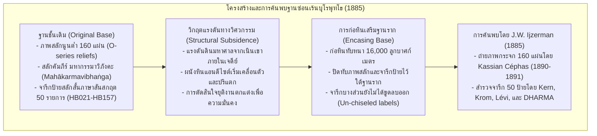
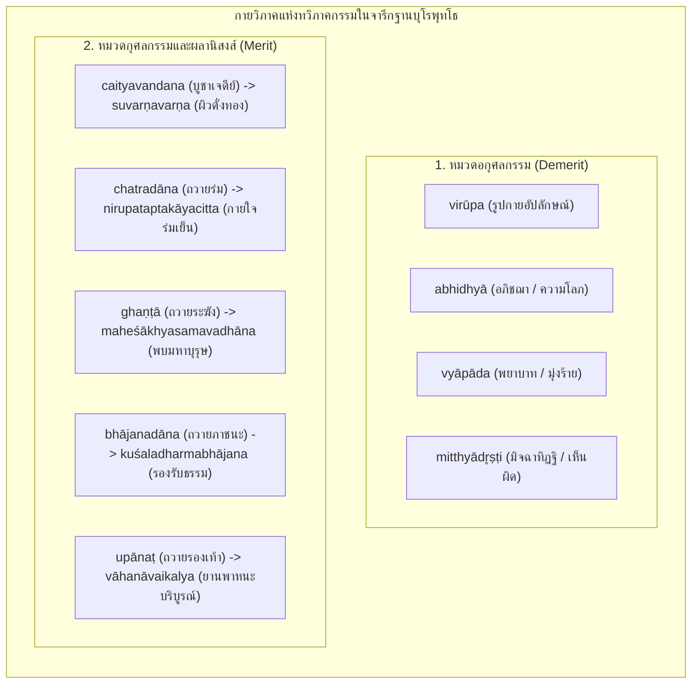
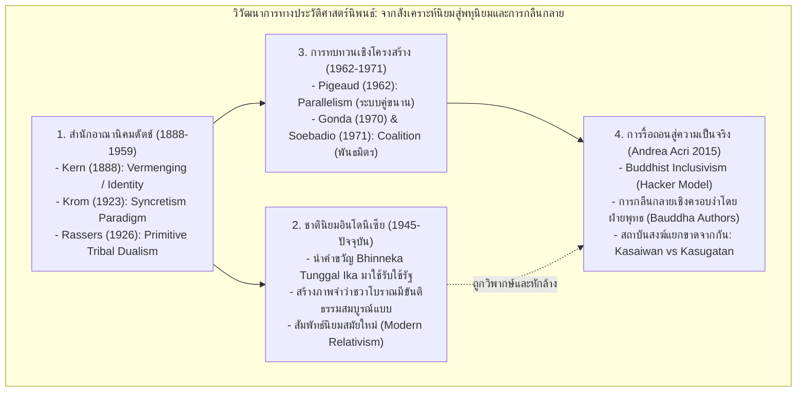
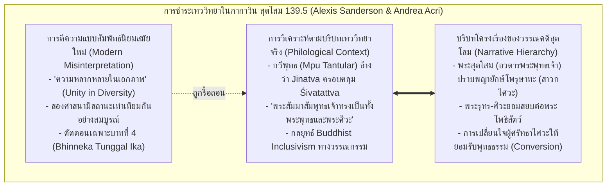
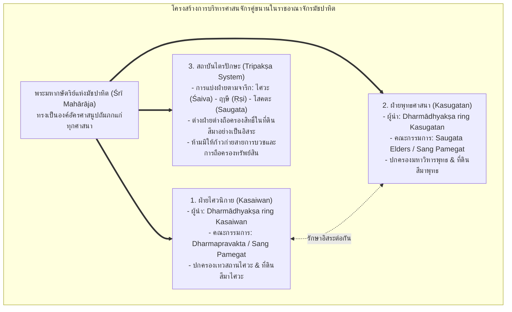
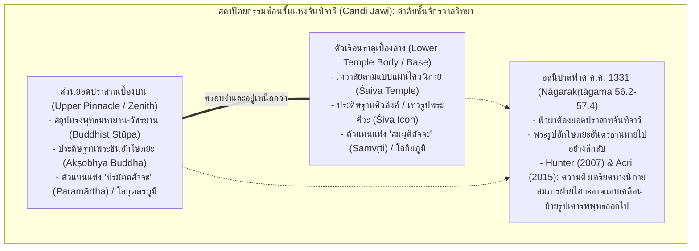
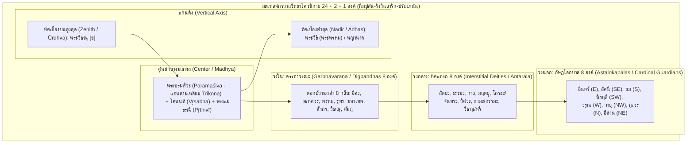

# บทที่ 7: ภูมิทัศน์ศาสนา เครือข่ายตันตรยาน และมณฑลจักรวาลวิทยาข้ามสมุทร: จารึกป้ายฐานบุโรพุทโธ คลังคาถาธารณี และปฏิสัมพันธ์ไศวะ-พุทธในเอเชียตะวันออกเฉียงใต้ภาคพื้นสมุทร
*(Chapter 7: Sacred Landscapes, Tantric Networks, and Trans-Maritime Cosmological Mandalas: Borobudur Relief Labels, Dhāraṇī Corpora, and the Śaiva-Buddhist Matrix in Maritime Southeast Asia)*

---

## บทนำประจำบทที่ 7: ภูมิทัศน์ศาสนาและเครือข่ายความเชื่อในโลกสมุทรศาสตร์ การก้าวข้ามการมองศาสนาแบบแยกส่วน สู่พหุจักรวาลวิทยาแห่งตันตรยานและไศวนิกาย

ประวัติศาสตร์นิพนธ์ว่าด้วยศาสนาและความเชื่อในเอเชียตะวันออกเฉียงใต้ภาคพื้นสมุทรขนบดั้งเดิม มักตกอยู่ภายใต้อิทธิพลของ "กระบวนทัศน์การแยกส่วนเชิงนิกาย" (Sectarian Compartmentalization Paradigm) ซึ่งเป็นมรดกทางความคิดที่ตกทอดมาจากวงวิชาการบูรพคดีศึกษายุคอาณานิคม [1] นักวิชาการสายอาณานิคมมักจัดจำแนกปรากฏการณ์ทางศาสนาในเกาะชวา เกาะสุมาตรา และคาบสมุทรมลายู ออกเป็นขั้วตรงข้ามที่แข็งทื่อและตัดขาดจากกันอย่างเด็ดขาด อาทิ การมองว่าพุทธศาสนามหายาน-วัชรยานเป็นศาสนาประจำราชวงศ์ไศเลนทร์ในพุทธศตวรรษที่ 14 ขณะที่ลัทธิไศวนิกายสังกัดอยู่กับราชวงศ์สัญชัย หรือการจัดวางให้เทวาลัยฮินดูและพุทธสถานตั้งอยู่บนฐานแห่งความขัดแย้งเชิงอำนาจและอุดมการณ์ [2] ยิ่งไปกว่านั้น เมื่อนักบูรพคดีศึกษาเผชิญหน้ากับหลักฐานทางโบราณคดี จารึกวิทยา และวรรณกรรมที่มีองค์ประกอบของทั้งสองศาสนาปรากฏร่วมกันอย่างหนาแน่น นักวิชาการเหล่านั้นก็มักจะปัดปัญหาดังกล่าวไปสู่คำอธิบายแบบผิวเผินว่า เป็นผลผลิตของ "การสังเคราะห์ความเชื่อแบบชวา" (Javanese Syncretism) ซึ่งมองว่าคนพื้นเมืองในหมู่เกาะขาดความเข้าใจในหลักปรัชญาอินเดียอันลึกซึ้ง และทำการผสมผสานเทพเจ้าและพิธีกรรมเข้าด้วยกันอย่างคลุมเครือและไร้ระเบียบแบบแผน [3]

อย่างไรก็ดี การปฏิวัติระเบียบวิธีวิจัยทางจารึกวิทยา นิรุกติศาสตร์ตัวบท และโบราณคดีศักดิ์สิทธิ์ในช่วงสองทศวรรษแรกของคริสต์ศตวรรษที่ 21 จนถึงพรมแดนความรู้ ค.ศ. 2026 ได้ทำการรื้อถอนกระบวนทัศน์อันคับแคบดังกล่าวลงอย่างสิ้นเชิง [4] หลักฐานเชิงประจักษ์ใหม่พิสูจน์ให้เห็นว่า โลกสมุทรศาสตร์นูซันตารา (Nusantara Maritime Sphere) มิได้เป็นเพียงผู้รับอิทธิพลทางศาสนาอย่างเฉื่อยชา (Passive recipients) หากแต่เป็น "ศูนย์กลางทางปัญญาอันทรงพลัง แหล่งขัดเกลาคัมภีร์ และชุมทางแห่งการแลกเปลี่ยนทางจิตวิญญาณระดับสากล" (Dynamic Nodes and Creative Centers of the Sanskrit Cosmopolis) [5] ภูมิทัศน์ศาสนาของชวาและสุมาตราดำเนินไปภายใต้โครงสร้างที่ซับซ้อนยิ่งกว่าภาพจำเดิม โดยเป็นเครือข่ายพหุจักรวาลวิทยา (Cosmological Matrix) ที่เชื่อมโยงระหว่างพุทธศาสนามนตรยาน โยคตันตระ อนุตตรโยคตันตระ ไศวสิทธันตะ ลัทธิมนตรมรรค และลัทธิปาศุปตะ เข้าไว้ด้วยกันบนเส้นทางพาณิชย์นาวีข้ามมหาสมุทร [6]

ในมิติของพุทธศาสนา ดินแดนหมู่เกาะทำหน้าที่เป็นเสาหลักแห่ง "เครือข่ายพุทธตันตระข้ามสมุทรศาสตร์" (Maritime Esoteric Buddhist Matrix) ซึ่งเชื่อมโยงมหาวิหารนาลันทาและวิกรมศิลาในอินเดียภาคเหนือ, กาญจีปุรัมในอินเดียภาคใต้, และอนุราธปุระในศรีลังกา เข้าสู่อาณาจักรศรีวิชัยในสุมาตรา ราชสำนักไศเลนทร์ในชวา ราชธานีฉางอานและลั่วหยางในจีนสมัยราชวงศ์ถัง ตลอดจนนิกายชินงอนในญี่ปุ่น และการปฏิรูปพุทธศาสนายุกต์หลังในทิเบต [7] ดังปรากฏหลักฐานการจาริกของพระมหาเถระระดับตำนาน เช่น พระวัชรโพธิ (Vajrabodhi), พระอโมฆวัชระ (Amoghavajra), พระภิกษุชาวชวานามว่า "เบียนฮง" (Bianhong) ผู้รจนาคู่มืออภิเษกจักรพรรดิราชภาษาจีนถวายราชสำนักถัง [8], และพระอติศะ ทิปังกรศรีชญาณ (Atiśa Dīpaṃkara) ผู้เดินทางข้ามสมุทรมาจำพรรษาศึกษาพระธรรมวินัยและโพธิจิตตันตระกับพระมหาราชครูธรรมกีรติแห่งสุวรรณทวีป (Serlingpa Dharmakīrti) ณ สุมาตรา เป็นเวลานานถึง 12 ปี (ค.ศ. 1012–1024) [9]

ควบคู่กันนั้น ในมิติของศาสนาพราหมณ์-ฮินดู โลกสมุทรศาสตร์แห่งนี้ยังเป็นที่สถิตของสายธารไศวนิกายที่เก่าแก่และลึกซึ้งที่สุดสายหนึ่งของโลก โดยปรากฏหลักฐานจารึกที่บันทึกคำศัพท์เทววิทยาชั้นสูงของลัทธิมนตรมรรค เช่น คำว่า "ศักติปาตะ" (*śaktipāta*) ซึ่งเป็นหมุดหมายจารึกที่เก่าแก่ที่สุดในโลก [10], คติการบูชาพระศิวะแปดภาคหรืออัษฏมูรติ (Aṣṭamūrti) ร่วมกับการถวายปลอกหุ้มศิวลึงค์ (Kośa) ข้ามสมุทรระหว่างจามปา ชวา และอินเดียใต้ [11], ระบบจักรวาลวิทยามณฑลทวยเทพ 24 + 2 + 1 องค์ ในผอบหินกรรภธาน (Peripih) แห่งริงงินลาริกและจันทิกิมปูลัน [12], และรากฐานลัทธิปาศุปตะ (Pāśupata) ที่ผสานเข้ากับระบบ "ษัทอังคโยคะ" (Ṣaḍaṅgayoga - โยคะองค์ 6) ในคัมภีร์ *ธรรมปาตัญชละ* (*Dharma Pātañjala*) [13]

```mermaid
graph TD
    subgraph MARITIME_MATRIX["พหุจักรวาลวิทยาและเครือข่ายความเชื่อข้ามสมุทรศาสตร์ในนูซันตารา"]
        BOROBUDUR["1. มหาเจดีย์บุโรพุทโธ (Borobudur)<br/>- จารึกป้ายฐานซ่อนเร้น 50 รายการ (DHARMA-DOSS-10)<br/>- คัมภีร์มหากรรมาวิภังคะ & จริยธรรมสถาปัตยกรรม"]
        
        INCLUSIVISM["2. การรื้อถอนมายาคติศิวะ-พุทธ (Deconstructing Syncretism)<br/>- ทฤษฎี Buddhist Inclusivism (Hacker / Acri 2015)<br/>- สถาบันสงฆ์คู่ขนาน: Kasaiwan & Kasugatan<br/>- กากาวิน สุตโสม 139.5 & จันทิจาวี"]
        
        SAIVA_COSMOS["3. จักรวาลวิทยาไศวนิกาย (Śaiva Cosmology)<br/>- มณฑลทวยเทพ 24+2+1 องค์: ริงงินลาริก & กิมปูลัน<br/>- พระวรกายแห่งสากลจักรวาล & กลไกสหัสลึงค์ปรัมบานัน"]
        
        MANTRAMARGA["4. มนตรมรรค & ปาศุปตะข้ามสมุทร (Trans-maritime Mantramārga)<br/>- จารึกพระเจ้าประกาศธรรม: ศักติปาตะ (śaktipāta) เก่าสุดในโลก<br/>- ศึกชวาบุกจามปา 774 & อัษฏมูรติ & โกศะศิวลึงค์"]
        
        TANTRIC_NETWORKS["5. เครือข่ายพุทธตันตระ & มณฑล 3 มิติ (Esoteric Networks)<br/>- กรุสำริดสุโรโจโล 22 องค์ & ปฐมโยคินีตันตระ<br/>- มณฑลวัชรธาตุจันทิกุมปุง & พระเบียนฮง & พระอติศะ"]
        
        DHARANI_MAGIC["6. คลังธารณี & วัตถุกฤตยาคม (Dhāraṇī Corpora & Rituals)<br/>- คัมภีร์มหาปรติสรา (MPMVR): ไลเดิน-มูอาราจัมบี-เบอร์ลิน<br/>- แผ่นดีบุก-ตะกั่วยมราช-ใบพลู & เสาหินมนตราพิโรธ"]
        
        YOGA_TRADITION["7. ประเพณีโยคะสากล (Universal Yoga Tradition)<br/>- ษัทอังคโยคะ (Ṣaḍaṅgayoga) ข้ามขอบเขตศาสนา<br/>- คัมภีร์ธรรมปาตัญชละ & ท่าบำเพ็ญตบะเอกบาทพกาสนะ"]
    end
    
    BOROBUDUR <==> INCLUSIVISM
    INCLUSIVISM <==> SAIVA_COSMOS
    SAIVA_COSMOS <==> MANTRAMARGA
    MANTRAMARGA <==> TANTRIC_NETWORKS
    TANTRIC_NETWORKS <==> DHARANI_MAGIC
    DHARANI_MAGIC <==> YOGA_TRADITION
    YOGA_TRADITION <==> BOROBUDUR
```

เพื่อนำเสนอพัฒนาการอันลึกซึ้งและซับซ้อนของภูมิทัศน์ศาสนาในเอเชียตะวันออกเฉียงใต้ภาคพื้นสมุทรอย่างเป็นระบบ บทที่ 7 ได้รับการจัดวางสถาปัตยกรรมเนื้อหาออกเป็น 8 หัวข้อย่อยหลักตามแผนผังบูรณาการคลังหลักฐานเชิงประจักษ์ โดยใน **ตอนที่ 1 (Part 1)** นี้ จะมุ่งเน้นการเจาะลึกในสองหัวข้อรากฐานสำคัญ ได้แก่:
- **หัวข้อย่อย 7.1 จารึกป้ายสลักฐานซ่อนเร้นบุโรพุทโธ (Borobudur Hidden Base Inscriptions):** การวิเคราะห์อักขรวิทยาสันสกฤตบนแผ่นหินแอนดีไซต์ 50 รายการที่ยังหลงเหลืออยู่ใต้ฐานรากที่ถูกปิดทับ, การเทียบเคียงคัมภีร์ *มหากรรมาวิภังคะ* (*Mahākarmavibhaṅga*) ฉบับภาษาสันสกฤต ทิเบต จีน และคูฉา, กายวิภาคแห่งคำศัพท์จริยธรรมและผลกรรม, ภาพสะท้อนวัฒนธรรมวัตถุและเศรษฐกิจสังคม, ตลอดจนการพิสูจน์หน้าที่เชิงปฏิบัติการของจารึกในฐานะ "บันทึกกำกับงานช่าง" (Sculptors' Guild Instructions)
- **หัวข้อย่อย 7.2 รื้อถอนมายาคติ "ศิวะ-พุทธ สังเคราะห์":** การทบทวนประวัติศาสตร์นิพนธ์เชิงวิพากษ์ต่อกระบวนทัศน์ Syncretism ยุคอาณานิคม, การนำเสนอกรอบทฤษฎี "Buddhist Inclusivism" ของ Paul Hacker และ Andrea Acri (2015), การชำระความหมายวรรณกรรม *กากาวิน สุตโสม* (*Kakawin Sutasoma* 139.5) เพื่อรื้อถอนการตีความแบบสัมพัทธ์นิยมสมัยใหม่ของวรรคทอง *Bhinneka Tunggal Ika*, การพิสูจน์ความแยกขาดของสถาบันสงฆ์คู่ขนานฝ่ายไศวะ (*Kasaiwan*) และฝ่ายพุทธ (*Kasugatan*) ในสมัยมัชปาหิต, ตลอดจนการถอดรหัสสถาปัตยกรรมซ้อนชั้นแห่งจันทิจาวี (Candi Jawi) ใน *นาครกฤตังคม* (*Nāgarakṛtāgama*) [14]

---

## 7.1 จารึกป้ายสลักฐานซ่อนเร้นบุโรพุทโธ (Borobudur Hidden Base Inscriptions): อักขรวิทยาสันสกฤต คัมภีร์มหากรรมาวิภังคะ และโปรแกรมจริยธรรมเชิงสถาปัตยกรรม

### 7.1.1 ประวัติศาสตร์การค้นพบฐานซ่อนเร้น (Hidden Foot) 160 แผ่น และการสำรวจจารึกป้ายสลักสั้น 50 รายการ

ในบรรดาหลักฐานทางจารึกวิทยาที่สลักลงบนพุทธสถาปัตยกรรมในเอเชียตะวันออกเฉียงใต้ภาคพื้นสมุทร ไม่มีคลังจารึกใดที่จะทรงคุณค่าและสร้างความตื่นตะลึงให้แก่วงวิชาการโบราณคดีเท่ากับกลุ่ม "จารึกป้ายสลักฐานซ่อนเร้นของมหาเจดีย์บุโรพุทโธ" (Borobudur Hidden Base Inscriptions) อีกแล้ว มหาเจดีย์บุโรพุทโธซึ่งสถาปนาขึ้นบนที่ราบเกอดู (Kedu Plain) ชวากลาง ในช่วงปลายพุทธศตวรรษที่ 14 ถึงต้นพุทธศตวรรษที่ 15 (ราว ค.ศ. 780–830) ภายใต้พระบรมราชูปถัมภ์ของราชวงศ์ไศเลนทร์ มีลักษณะทางสถาปัตยกรรมเป็นสถูปจำลองจักรวาลซ้อนชั้นลดหลั่นกันขึ้นไปตามคติพุทธศาสนามหายานและวัชรยาน [15]

ทว่า ฐานชั้นล่างสุดของมหาเจดีย์ ซึ่งเป็นลานประทักษิณดั้งเดิมที่ประดับด้วยภาพสลักนูนต่ำจำนวน 160 แผ่น (หรือที่รู้จักกันในหมวดหมู่ทางวิชาการว่า "แผ่นภาพชุด O" หรือ O-series reliefs) กลับมิได้เปิดเผยต่อสายตาของผู้แสวงบุญในอดีต เนื่องจากถูกหินก้อนสี่เหลี่ยมขนาดใหญ่ก่อปิดทับหนาหลายเมตรกลายเป็น "ฐานปักษฐานเสริมความมั่นคง" (Encasing base / Broadened base) ล้อมรอบฐานเดิมไว้ทั้งหมดชั่วกัลปาวสาน [16] ความลับทางวิศวกรรมและสถาปัตยกรรมนี้ถูกปิดซ่อนไว้ใต้ผืนดินและก้อนหินนานนับพันปี จนกระทั่งได้รับการค้นพบโดยบังเอิญใน ค.ศ. 1885 โดย ยัน วิลเลิม ไอเจอร์มัน (Jan Willem Ijzerman) ประธานสมาคมโบราณคดีแห่งยอกยาการ์ตา (Archaeological Society of Yogyakarta) [17]

ไอเจอร์มันได้สั่งการให้ขุดรื้อแนวก้อนหินก่อเสริมบริเวณมุมทิศตะวันออกเฉียงใต้ของฐานเจดีย์ออก และได้พบกับผนังภาพสลักหินแอนดีไซต์อันงดงามวิจิตรบรรจงที่ซ่อนอยู่เบื้องหลัง ต่อมารัฐบาลอาณานิคมดัตช์ได้อนุมัติโครงการเปิดรื้อแนวก้อนหินปิดทับออกทีละส่วนทั่วทั้ง 4 ด้าน เพื่อทำการบันทึกภาพถ่ายโบราณคดี โดยมอบหมายให้ กัสปาส เซฟาส (Kassian Céphas) ช่างภาพชาวชวาคนแรก ทำการถ่ายภาพกระจก (glass-plate negatives) แผ่นภาพสลักทั้ง 160 แผ่นอย่างเป็นระบบในระหว่าง ค.ศ. 1890–1891 ก่อนที่วิศวกรผู้ควบคุมจะทำการก่อหินปิดทับฐานเดิมกลับคืนดังเดิมเพื่อป้องกันมิให้โครงสร้างของมหาเจดีย์พังทลายลงมาตามหลักการอนุรักษ์ [18]

สิ่งที่สร้างความตื่นเต้นอย่างใหญ่หลวงให้แก่วงวิชาการจารึกวิทยาระดับโลก คือการที่บริเวณขอบบนเหนือภาพสลักหิน หรือภายในกรอบสลักของภาพบางแผ่น ปรากฏข้อความจารึกอักษรโบราณขนาดสั้นภาษาสันสกฤตสลักอยู่เป็นระยะๆ จากภาพสลักทั้งหมด 160 แผ่น มีแผ่นภาพที่ยังคงหลงเหลือข้อความจารึกป้ายสลักสั้น (Inscribed labels) ที่สามารถอ่านและถอดความได้ทั้งสิ้น **50 รายการ** (รหัสสารบบสากลของโครงการ DHARMA: `DHARMA_INSIDENKBorobudurHB021` ถึง `HB157`) [19] ขณะที่แผ่นภาพสลักส่วนใหญ่ที่เหลือนั้น ร่องรอยของข้อความจารึกได้ถูกสกัดถากหรือสิ่วลบออกไปจนเรียบเนียนก่อนการก่อหินปิดทับ สะท้อนให้เห็นว่าข้อความจารึกเหล่านี้มิได้มีเจตนาให้คงอยู่เป็นส่วนหนึ่งของอนุสรณ์สถานถาวร หากแต่เป็น "บันทึกคำสั่งชั่วคราวในการปฏิบัติงาน" ที่ช่างแกะสลักบางคนละเลยที่จะขูดลบออกก่อนที่แนวกำแพงหินชั้นนอกจะถูกก่อปิดทับไป [20]

---

### 7.1.2 อักขรวิทยาและการชำระการอ่านตัวบท: การเปลี่ยนผ่านจากปัลลวะตอนปลายสู่อักษรกวีสมัยต้น และข้อวิพากษ์ทางนิรุกติศาสตร์

ในมิติทางอักขรวิทยาและประวัติศาสตร์ตัวเขียน (Palaeography) จารึกป้ายสลักฐานซ่อนเร้นบุโรพุทโธทำหน้าที่เป็น "เอกสารกำหนดอายุอันแม่นยำ" (Chronological Anchor) สำหรับการศึกษาวิวัฒนาการของระบบตัวเขียนในเอเชียตะวันออกเฉียงใต้ภาคพื้นสมุทร ตัวอักษรที่ใช้จารึกป้ายสลักเหล่านี้จัดอยู่ในตระกูล **"อักษรกวีสมัยต้น" (Early Kawi Script)** หรือที่ในอดีตเคยเรียกว่า "อักษรชวาโบราณสมัยแรก" ซึ่งแสดงรูปสัณฐานที่กำลังเปลี่ยนผ่านอย่างชัดเจนจากอักษรปัลลวะตอนปลาย (Late Pallava) ของอินเดียใต้เข้าสู่อักษรท้องถิ่นของหมู่เกาะ [21] 

ลักษณะเด่นทางอักขรวิทยาที่ปรากฏในจารึกฐานบุโรพุทโธ ได้แก่:
1. เส้นขีดบนของตัวอักษร (Head-mark) เริ่มพัฒนาจากรูปสามเหลี่ยมคว่ำแบบปัลลวะมาเป็นเส้นนอนหนาขนานกับบรรทัด
2. สัณฐานของอักษรตัวสำคัญ เช่น `k`, `r`, `t` และสระลอย เริ่มแสดงความโค้งมนและมีหางตวัดที่เป็นเอกลักษณ์เฉพาะของเกาะชวา
3. การใช้เครื่องหมายวิรามะ (Virāma) ใต้พยัญชนะสะกดอย่างประณีต เพื่อระบุสภาวะพยัญชนะที่ปราศจากสระแทรก
4. มีการใช้พยัญชนะซ้อน (Conjuncts) ตามหลักไวยากรณ์ภาษาสันสกฤตอย่างเคร่งครัด เช่น `rt`, `rṇṇ`, `rddh`, `kṣ` [22]

จากลักษณะทางอักขรวิทยาเปรียบเทียบกับจารึกแผ่นศิลาและแผ่นทองแดงที่มีศักราชแน่นอนในชวากลาง เช่น จารึกกาลาซัน (Kalasan ค.ศ. 778) และจารึกเกอลูรัก (Kelurak ค.ศ. 782) ซึ่งใช้อักษรสิทธมาตรกา/นาครี และจารึกศิวคฤหะ (Śivagṛha ค.ศ. 856) ซึ่งใช้อักษรกวีรุ่นพัฒนาแล้ว นักจารึกวิทยาจึงสามารถกำหนดอายุการสลักจารึกป้ายฐานบุโรพุทโธได้อย่างแคบลงมาอยู่ในช่วง **ปลายพุทธศตวรรษที่ 14 (ราว ค.ศ. 790–820)** ซึ่งตรงกับยุครุ่งเรืองสูงสุดของมหาราชาแห่งราชวงศ์ไศเลนทร์ (เช่น พระเจ้าราไก ปนังกรัน และพระเจ้าราไก วารัก) [23]

อย่างไรก็ดี ประวัติศาสตร์การอ่านและชำระตัวบทจารึกกลุ่มนี้เต็มไปด้วยข้อถกเถียงและการแก้ไขข้อผิดพลาดทางนิรุกติศาสตร์ที่กินเวลายาวนานกว่าหนึ่งศตวรรษ ในระยะแรกของการค้นพบ ศาสตราจารย์ เฮนดริก เคิร์น (Hendrik Kern) และ นิโคลาส ยัน โครม (Nicolaas J. Krom) ได้ทำการอ่านและแปลตัวบทเบื้องต้นจากภาพถ่ายของเซฟาส แต่เนื่องจากยังไม่มีการระบุตัวบทคัมภีร์ที่ใช้เป็นแม่แบบอย่างแน่ชัด เคิร์นและโครมจึงมักอ่านและตีความคำศัพท์ผิดพลาดอย่างมีนัยสำคัญ [24] จนกระทั่งใน ค.ศ. 1929 ซิลแวง เลวี (Sylvain Lévi) นักบูรพคดีศึกษาชาวฝรั่งเศส ได้สร้างการค้นพบครั้งประวัติศาสตร์ในวงวิชาการ โดยการค้นพบต้นฉบับตัวเขียนภาษาสันสกฤตของคัมภีร์ **"มหากรรมาวิภังคะ" (*Mahākarmavibhaṅga*)** ในประเทศเนปาล ซึ่งมีเนื้อหาและลำดับของหัวข้อตรงกับภาพสลักและจารึกป้ายฐานบุโรพุทโธทุกประการ [25]

การค้นพบของเลวี ร่วมกับการชำระตัวบทดิจิทัลระดับสากลล่าสุดโดย อาร์โล กริฟฟิทส์ (Arlo Griffiths) ในโครงการ DHARMA (ERC Synergy Grant No. 809994) ได้แก้ไขข้อผิดพลาดในการอ่านของเคิร์นและโครมอย่างเด็ดขาด ดังตัวอย่างสำคัญต่อไปนี้:

| รหัสจารึก DHARMA | แผ่นภาพที่ | คำอ่านเดิมของ Kern / Krom | คำอ่านชำระใหม่โดย Lévi / Griffiths | บริบทเชิงคัมภีร์และการแปลวิชาการ |
|:---|:---:|:---|:---|:---|
| `HB124B` | O 124B | `suvarṇavarṇa` (Kern อ่านเป็นนามเฉพาะของตัวละครในอวทาน) | **`suvarṇavarṇa`** | Lévi พิสูจน์จากคัมภีร์ฉบับทิเบตว่าเป็น "ผลแห่งการกราบไหว้เจดีย์ ย่อมทำให้เกิดมามีผิวพรรณดั่งทองคำ" [26] |
| `HB125A` | O 125A | `susvara` (Kern ตาม Brandes แปลว่าเป็น "บุตรแห่งพญาครุฑ") | **`susvara`** | Lévi ชำระเป็น "เสียงอันไพเราะดั่งเสียงนกการเวก" อันเป็นผลานิสงส์แห่งการถวายดนตรีบูชา [27] |
| `HB127B` | O 127B | `vinayadharmmakāyacitta` (Kern) | **`nirupataptakāyacitta`** | Krom และ Griffiths ยืนยันคำอ่านว่า "ผู้มีกายและใจอันปราศจากความเร่าร้อน" อันเป็นผลจากการถวายร่มทาน [28] |
| `HB133` | O 133 | `pūrvasaṁjñā...` (Krom เสนอว่าหมายถึงการรับรู้เรื่องในอดีต) | **`pūrvābhijñāśabdaśravaṇa`** | Lévi ชำระโดยเทียบเคียงกับคัมภีร์ฉบับแปลภาษาจีน หมายถึง "ทิพยโสตแห่งปุพเพนิวาสานุสติญาณ" [29] |
| `HB134A` | O 134A | `goṣṭhī` (Kern เสนอว่าหมายถึงการสมาคมหรือที่ประชุมชน) | **`bhogī`** | Lévi ชำระเป็น `bhogī` ตรงกับคำว่า `mahābhoga` ในฉบับทิเบต จีน และคูฉา หมายถึง "คฤหบดีผู้มั่งคั่ง" [30] |
| `HB138A` | O 138A | (Kern มองข้ามและมิได้บันทึกการอ่าน) | **`bhājanadāna`** | Krom ค้นพบ และ Lévi ชำระ หมายถึง "การถวายภาชนะเป็นทาน" ส่งผลให้เป็นผู้รองรับกุศลธรรม [31] |
| `HB150A` | O 150A | `chatradāna` (Kern อ่านผิดพลาดเป็นร่มทาน) | **`upānaṭ`** | Krom และ Griffiths แก้ไขเป็น `upānaṭ` (อุปานหฺ) หมายถึง "การถวายรองเท้า" ส่งผลให้มียานพาหนะบริบูรณ์ [32] |

---

### 7.1.3 สหสัมพันธ์เชิงคัมภีร์วิทยา: เทียบเคียงตัวบทภาษาสันสกฤต ทิเบต จีน และคูฉา

ความสำคัญอันลึกซึ้งของจารึกฐานบุโรพุทโธ มิได้จำกัดอยู่เพียงมิติทางประวัติศาสตร์ศิลปะของเกาะชวาเท่านั้น หากแต่เป็น "พยานหลักฐานชิ้นเอกแห่งประวัติศาสตร์วรรณกรรมพุทธศาสนาระดับโลก" การจัดวางภาพสลักนูนต่ำทั้ง 160 แผ่น และการสลักป้ายคำกำกับสั้นภาษาสันสกฤต ได้รับการออกแบบขึ้นโดยอิงกับโครงสร้างเนื้อหาของคัมภีร์ **"มหากรรมาวิภังคะ" (*Mahākarmavibhaṅga*)** อย่างเป็นระบบ [33] คัมภีร์เล่มนี้ว่าด้วยการสนทนาระหว่างพระสัมมาสัมพุทธเจ้ากับศุกมาณพบุตรแห่งโตไทยพราหมณ์ โดยพระองค์ทรงจำแนกการกระทำ (กรรม) ออกเป็นเหตุ 10 ประการที่ส่งผลให้สรรพสัตว์ได้รับวิบากที่แตกต่างกันอย่างละเอียด เช่น เหตุที่ทำให้อายุสั้นหรืออายุยืน, เหตุที่ทำให้มีโรคน้อยหรือมีโรคมาก, เหตุที่ทำให้มีรูปงามหรือรูปอัปลักษณ์, เหตุที่ทำให้มีโภคทรัพย์มากหรือยากจน, และเหตุที่ทำให้เกิดในตระกูลสูงหรือตระกูลต่ำ [34]

การศึกษาวิจัยเชิงคัมภีร์วิทยาเปรียบเทียบ (Comparative Textual Transmission) เผยให้เห็นว่า ตัวบทจารึกป้ายสลักบนบุโรพุทโธมีความสัมพันธ์ที่แนบแน่นและเหลื่อมซ้อนกับสำนวนคัมภีร์มหากรรมาวิภังคะใน 4 แหล่งข้อมูลสำคัญของโลกยุคโบราณ:

1. **ฉบับภาษาสันสกฤตจากเนปาล (Nepalese Sanskrit Manuscript):** ต้นฉบับใบลานที่ค้นพบโดย Sylvain Lévi ใน ค.ศ. 1929 แสดงให้เห็นคำศัพท์เทคนิคทางเทววิทยาและจริยธรรมที่ตรงกับจารึกบนบุโรพุทโธเกือบคำต่อคำ เช่น คำว่า `virūpa` (O 21), `maheśākhyaḥ` (O 43), `abhidhyā` (O 121A), `vyāpāda` (O 121B), `mitthyādr̥ṣṭi` (O 122), และ `kuśaladharmabhājana` (O 138B) [35]
2. **ฉบับแปลภาษาทิเบต (*Las rnam par ’byed pa*):** ประมวลไว้ในพระไตรปิฎกทิเบตคันจูร์ (Kanjur) หมวดพระสูตร ฉบับนี้ให้คำแปลเทียบเคียงที่ตรงกับคำศัพท์ชวาโบราณอย่างน่าอัศจรรย์ เช่น การแปลคำว่า `suvarṇavarṇa` (O 124B) ว่า *gser gyi mdog lta bu* (ผิวพรรณดั่งทองคำ) และคำว่า `mahābhoga` ซึ่งช่วยยืนยันการอ่านคำว่า `bhogī` (O 126A, 134A, 139, 148B, 154B) [36]
3. **ฉบับแปลภาษาจีน (*เย่เปาเชอเปี๋ยจิง* / 分別業報經 - *Ye pao tch'a pie king*):** แปลในสมัยราชวงศ์จิ้นตะวันตก (ค.ศ. 265–316) ในพระไตรปิฎกภาษาจีนฉบับไทโช (Taishō No. 80) ตัวบทภาษาจีนช่วยให้ เลวี สามารถบูรณะคำอ่านจารึกแผ่นที่ O 133 คือ `pūrvābhijñāśabdaśravaṇa` ได้อย่างสมบูรณ์ โดยตรงกับข้อความภาษาจีนที่กล่าวถึง "การได้ยินเสียงและระลึกถึงกรรมในอดีตชาติของตนและผู้อื่น" [37]
4. **ฉบับภาษาคูฉา / โตคาเรียน บี (Koutcha / Tocharian B Fragment):** ชิ้นส่วนคัมภีร์ใบลานที่ขุดค้นพบ ณ แคว้นคูฉาบนเส้นทางสายไหมในเอเชียกลาง ซึ่งเขียนด้วยภาษาโตคาเรียน บี ได้รับการนำมาสอบทานโดย Sylvain Lévi และพบว่ามีโครงสร้างการแจกแจงวิบากกรรมและคำศัพท์ที่สอดรับกับภาพสลักและจารึกป้ายบนบุโรพุทโธอย่างแม่นยำ [38]

การที่ตัวบทจารึกขนาดสั้นบนเกาะชวากลางสามารถเทียบเคียงได้อย่างลงตัวกับคัมภีร์ในเนปาล ทิเบต จีน และเอเชียกลาง ชี้ให้เห็นอย่างประจักษ์ชัดว่า ราชสำนักไศเลนทร์และคณะสงฆ์ผู้กำกับงานช่างแห่งบุโรพุทโธได้ครอบครองและใช้งานคัมภีร์ภาษาสันสกฤตฉบับมาตรฐานสากลที่มีความสมบูรณ์และถูกต้องตามขนบพุทธวิชาการของอนุทวีปอินเดียในระดับสูงสุด [39]

---

### 7.1.4 กายวิภาคแห่งคำศัพท์จริยธรรมและผลกรรม: การวิเคราะห์ทวิภาค อกุศลกรรม-กุศลกรรม

เมื่อพิจารณาข้อความจารึกป้ายสลักทั้ง 50 รายการอย่างละเอียดถี่ถ้วน จะพบว่าจารึกกลุ่มนี้ถูกจัดวางขึ้นตามโครงสร้าง "ทวิภาคแห่งกฎแห่งกรรม" (Bipartite Structure of Karmic Retribution) อย่างเป็นระบบ โดยแบ่งออกเป็นสองหมวดหมู่ใหญ่ที่ทำหน้าที่สั่งการให้ช่างสลักภาพจำแนกเหตุและผลออกจากกันอย่างชัดเจน [40]:

#### 1. หมวดคำสั่งด้านอกุศลกรรมและรูปกายอัปลักษณ์ (Demerit & Deformity Cluster)
ในแผ่นภาพสลักช่วงแรก (แผ่นที่ 1 ถึง 122) โปรแกรมภาพสลักเน้นย้ำถึงการทำบาปและวิบากกรรมอันน่าสะพรึงกลัว คำจารึกที่ปรากฏสะท้อนถึงการกระทำที่เป็นอกุศลมูลทางจิตใจและการลงทัณฑ์ในภพชาติต่างๆ:
- **`virūpa`** (ปรากฏบนแผ่นที่ O 21 ทั้งในส่วนกรอบและพื้นหลังภาพ): มีความหมายตรงตัวว่า "(บุคคลผู้มี) รูปกายอัปลักษณ์ / สัณฐานพิกลพิการ" [41] โดยภาพสลักนูนต่ำแสดงภาพบุคคลที่มีรูปร่างเตี้ยค่อม หน้าตาบิดเบี้ยว แขนขาลีบพิการ เพื่อเป็นสัญลักษณ์เตือนใจว่ารูปกายอัปลักษณ์นี้เป็นผลลัพธ์โดยตรงจาก "ความมักโกรธ ความพยาบาท และความริษยาผู้อื่น" ตามคำสอนในคัมภีร์มหากรรมาวิภังคะ
- **`abhidhyā`** (แผ่นที่ O 121A): หมายถึง "อภิชฌา" หรือความโลภเพ่งเล็งอยากได้ทรัพย์สมบัติของผู้อื่นมาเป็นของตน [42]
- **`vyāpāda`** (แผ่นที่ O 121B): สลักคู่กับอภิชฌา หมายถึง "พยาบาท" หรือความปองร้าย มุ่งหมายทำลายล้างชีวิตและความสุขของผู้อื่น [43]
- **`mitthyādr̥ṣṭi`** (แผ่นที่ O 122): หมายถึง "มิจฉาทิฏฐิ" หรือความเห็นผิดจากทำนองคลองธรรม การปฏิเสธผลของกรรม ปฏิเสธโลกนี้โลกหน้า และปฏิเสธคุณความดีของบิดามารดาและสมณพราหมณ์ [44]

คำจารึกหมวดอกุศลกรรมเหล่านี้ทำหน้าที่เป็นดั่ง "สูตรย่อแห่งอกุศลกรรมบถ 10 ประการ" (Akusalakammapatha) ที่ช่างสลักต้องถ่ายทอดออกมาเป็นภาพการทำปาณาติบาต (การฆ่าสัตว์จับปลา การล่าวัวล่ากวาง), การอทินนาทาน (การลักขโมยปล้นชิง), และภาพการถูกทรมานในนรกภูมิหลุมต่างๆ อย่างน่าสยดสยอง เช่น การถูกต้มในกระทะทองแดง หรือการถูกนกปากเหล็กจิกทึ้ง [45]

#### 2. หมวดกุศลกรรม ผลานิสงส์แห่งการบูชาเจดีย์ และรูปลักษณ์อันงดงาม (Merit & Beauty Cluster)
ในทางตรงกันข้าม ตั้งแต่แผ่นที่ 123 เป็นต้นไป ข้อความจารึกได้เปลี่ยนผ่านเข้าสู่หมวด "กุศลกรรมและผลานิสงส์" เพื่อแสดงภาพบุคคลที่ได้ไปเกิดในสุคติภูมิ มีรูปกายงดงาม และเพียบพร้อมด้วยโภคทรัพย์:
- **`kuśala`** (แผ่นที่ O 123): คำจารึกเดี่ยวสั้นๆ หมายถึง "กุศลกรรม" อันเป็นจุดเริ่มต้นของการแสดงผลแห่งการทำความดี [46]
- **`caityavandana`** (แผ่นที่ O 124A): สลักกำกับภาพการกราบไหว้บูชาเจดีย์สถาน โดยภาพสลักแสดงภาพอุบาสกอุบาสิกากำลังหมอบกราบและประคองพวงมาลาบูชาสถูปเจดีย์ [47]
- **`suvarṇavarṇa`** (แผ่นที่ O 124B): สลักคู่กับภาพผลแห่งการบูชาเจดีย์ หมายถึง "การมีผิวพรรณวรรณะผุดผ่องดั่งทองคำ" แสดงภาพบุรุษสตรีผู้มีเรือนร่างสง่างามสมส่วน ใบหน้าอิ่มเอิบ และสวมใส่อาภรณ์หรูหรา [48]
- **`susvara`** (แผ่นที่ O 125A): หมายถึง "เสียงอันไพเราะเสนาะโสต" ซึ่งเป็นอานิสงส์ของการบูชาพระพุทธศาสนาด้วยดนตรีและการกล่าวถ้อยคำอ่อนหวาน [49]
- **`mahaujaskasamavadhāna`** (แผ่นที่ O 125B): หมายถึง "การได้สมาคมพบปะกับเหล่าบุคคลผู้มีอิทธิฤทธิ์อำนาจบารมีอันยิ่งใหญ่" สะท้อนอุดมคติของสังคมชนชั้นสูงในชวาโบราณ [50]
- **`maheśākhyaḥ`** (แผ่นที่ O 43) และ **`maheśākhyasamavadhāna`** (แผ่นที่ O 128, O 131B): หมายถึง "บุคคลผู้มีชื่อเสียงเกียรติยศอันยิ่งใหญ่ / มหาบุรุษผู้ทรงเกียรติ" และการได้เข้าสู่สังคมของผู้มีเกียรติ อันเป็นผลจากการไม่ริษยาผู้อื่นและเป็นผู้มีความอ่อนน้อมถ่อมตน [51]

---

### 7.1.5 ภาพสะท้อนสังคม เศรษฐกิจ และวัฒนธรรมวัตถุในจารึกฐานบุโรพุทโธ

นอกจากมิติทางศีลธรรมและเทววิทยาแล้ว จารึกป้ายสลักฐานซ่อนเร้นบุโรพุทโธยังทำหน้าที่เป็น "กระจกเงาสะท้อนวัฒนธรรมวัตถุ (Material Culture) โครงสร้างทางชนชั้น และเศรษฐกิจการแลกเปลี่ยน" ของสังคมชวากลางในพุทธศตวรรษที่ 14 ได้อย่างสมจริงและมีชีวิตชีวาที่สุด [52]

#### 1. วัฒนธรรมทานและเครื่องอุปโภคบริโภค (Dana & Material Offerings)
จารึกหลายป้ายระบุถึงการให้ทานวัตถุสิ่งของเฉพาะอย่าง ซึ่งสะท้อนสิ่งของเครื่องใช้ในชีวิตประจำวันและเครื่องประกอบพิธีกรรมทางศาสนาของยุคสมัย:
- **`chatradāna`** (แผ่นที่ O 127A): "การถวายร่มกั้นแดนเป็นทาน" สอดรับกับผลานิสงส์ในแผ่น O 127B คือ **`nirupataptakāyacitta`** (การเป็นผู้มีกายและใจอันปราศจากความเร่าร้อนแผดเผา) ร่มในสังคมชวาโบราณมิได้เป็นเพียงเครื่องบังแดดฝน แต่เป็นสัญลักษณ์แสดงสถานะทางสังคมและอำนาจยศศักดิ์ [53]
- **`vastradāna`** (แผ่นที่ O 135A): "การถวายเครื่องนุ่งห่ม/ผ้าเป็นทาน" ซึ่งส่งผลให้แผ่น O 135B เป็นผู้มีความงดงามน่าเลื่อมใส (**`prāsādika`**) ชี้ให้เห็นถึงความสำคัญของอุตสาหกรรมสิ่งทอและการค้าผ้าในหมู่เกาะ [54]
- **`bhājanadāna`** (แผ่นที่ O 138A): "การถวายภาชนะเป็นทาน" ส่งผลให้ในแผ่น O 138B กลายเป็น **`kuśaladharmabhājana`** (ผู้เป็นภาชนะอันบริสุทธิ์สำหรับรองรับกุศลธรรม) สะท้อนการเปรียบเทียบเชิงอุปมาอุปไมยระหว่างภาชนะดินเผา/สำริดกับจิตใจของมนุษย์ [55]
- **`upānaṭ`** (แผ่นที่ O 150A): "การถวายรองเท้าเป็นทาน" สอดรับกับผลานิสงส์ในแผ่น O 150B คือ **`vāhanāvaikalya`** (การมีความบริบูรณ์พร้อมเพรียงด้วยยานพาหนะ) สะท้อนว่าในชวาโบราณ รองเท้าเป็นเครื่องใช้ที่มีค่าและบ่งบอกถึงความมั่งคั่งของผู้สวมใส่ [56]
- **`puṣpadāna`**, **`gandha`**, และ **`mālādāna`** (แผ่นที่ O 152A, O 153A, O 154A): การถวายดอกไม้ ของหอม และพวงมาลัย ซึ่งเป็นหัวใจของวัฒนธรรมบูชา (Pūjā) ที่ใช้วัตถุดิบธรรมชาติจากป่าเขตร้อนของนูซันตารา [57]
- **`bhojana`** และ **`pānaka`** (แผ่นที่ O 144, O 148A): การถวายภัตตาหารและเครื่องดื่มน้ำปานะแก่พระสงฆ์และผู้ยากไร้ [58]

#### 2. วัฒนธรรมระฆังแขวนสำริด (`ghaṇṭā`)
ในแผ่นที่ O 131A ปรากฏจารึกคำว่า **`ghaṇṭā`** (ระฆังแขวน) สอดรับกับแผ่น O 131B คือ `maheśākhyasamavadhāna` ภาพสลักแสดงภาพการแขวนระฆังสำริดไร้ลูกกระทบไว้ใต้ชายคาเพื่อใช้เคาะตีในพิธีกรรมทางศาสนา [59] หลักฐานนี้เชื่อมโยงอย่างลึกซึ้งกับการค้นพบทางโบราณคดีของ กริฟฟิทส์ และ เชอร์เลียร์ (Griffiths & Scheurleer 2014) ซึ่งพบระฆังสำริดแขวนโบราณจำนวนมากในชวากลางและชวาตะวันออก ที่สลักจารึกภาษาสันสกฤตและสัญลักษณ์ตรีศูลหรือวัชระ ยืนยันว่าการสร้างและถวายระฆังสำริดเป็นหนึ่งในมหากุศลที่ชนชั้นนำในยุคนั้นนิยมปฏิบัติอย่างกว้างขวาง [60]

#### 3. ชนชั้นคฤหบดีผู้มั่งคั่งและภาพจำลองสวรรค์ภูมิ (`bhogī`, `ādhyabhogī`, `svargga`)
คำศัพท์ที่ปรากฏซ้ำมากที่สุดคำหนึ่งในจารึกฐานบุโรพุทโธ คือคำว่า **`bhogī`** (ปรากฏในแผ่น O 126A, O 134A, O 139, O 148B, O 154B) และคำว่า **`ādhyabhogī`** (แผ่น O 142) [61] คำว่า `bhogī` ในบริบทชวาโบราณมีความหมายซ้อนกันระหว่าง "ผู้เสวยสุข / ผู้มั่งคั่งด้วยทรัพย์สมบัติ" กับ "คฤหบดีผู้ถือครองกรรมสิทธิ์ในที่ดิน" (Landowner) ส่วนคำว่า `ādhyabhogī` หมายถึง "คฤหบดีมหาเศรษฐีผู้มั่งคั่งเป็นพิเศษ" ภาพสลักที่สอดคล้องกันแสดงภาพบุคคลชั้นสูงนั่งเอกเขนกบนตั่งไม้บุผ้าอย่างหรูหรา ล้อมรอบด้วยบริวาร หีบสมบัติ และถุงใส่เงินตราทองคำ [62] 

ท้ายที่สุด ผลลัพธ์อันสูงสุดของกุศลกรรมในระดับโลกิยะ คือการไปบังเกิดใน **`svargga`** (สวรรค์) ซึ่งปรากฏเป็นจารึกกำกับภาพซ้ำๆ ถึง 8 ครั้ง (O 126B, O 130, O 134B, O 137, O 140, O 147, O 149, O 151, O 153B, O 154C) ภาพสลักแสดงภาพทิพยวิมาน ต้นกัลปพฤกษ์ที่ประดับด้วยแก้วแหวนเงินทอง นางอัปสรกำลังร่ายรำ และเหล่าเทวดากำลังดื่มด่ำกับความสุขอันเป็นทิพย์ [63]

---

### 7.1.6 หน้าที่เชิงปฏิบัติการของจารึก: บันทึกกำกับงานช่าง (Sculptors' Guild Instructions) ก่อนการปิดทับใต้ฐานราก

ประเด็นที่สร้างข้อถกเถียงและมีความสำคัญอย่างยิ่งยวดในทางญาณวิทยาของจารึกวิทยา คือคำถามที่ว่า: **"จารึกป้ายสลักเหล่านี้ถูกสร้างขึ้นเพื่อให้ใครอ่าน และมีหน้าที่ทางสังคมอย่างไร?"** [64]

ในอดีต นักวิชาการบางท่านเคยตั้งสมมติฐานว่า ข้อความจารึกเหล่านี้อาจสลักไว้เพื่อเป็นคำบรรยายภาพสำหรับผู้แสวงบุญที่มาเดินประทักษิณรอบฐานเจดีย์ แต่สมมติฐานนี้ถูกหักล้างอย่างสิ้นเชิงด้วยข้อเท็จจริงทางโบราณคดีและสถาปัตยกรรม 3 ประการ:
1. **ตำแหน่งการสลัก:** จารึกเกือบทั้งหมดถูกสลักไว้บนขอบหินชั้นบนสุด ซึ่งในสภาวะปกติเมื่อก่อสร้างเสร็จจะอยู่สูงและมีบัวเชิงผนังบดบังสายตา
2. **ร่องรอยการสกัดลบ:** ภาพสลักส่วนใหญ่มีรอยสิ่วสกัดถากคำจารึกออกอย่างชัดเจนหลังจากที่ภาพสลักเสร็จสมบูรณ์ มีเพียงประมาณหนึ่งในสามเท่านั้นที่ยังหลงเหลือข้อความอยู่
3. **การปิดทับถาวร:** ฐานเดิมทั้งหมดถูกก่อหินปิดทับอย่างหนาแน่นตั้งแต่ในระหว่างการก่อสร้างมหาเจดีย์ ทำให้สาธารณชนไม่มีโอกาสได้เห็นหรืออ่านข้อความเหล่านี้เลยแม้แต่น้อย [65]

จากข้อเท็จจริงดังกล่าว นักวิชาการร่วมสมัย รวมทั้ง เลวี, โครม, และ อาร์โล กริฟฟิทส์ จึงมีข้อสรุปตรงกันว่า ข้อความจารึกป้ายสลักเหล่านี้ทำหน้าที่เป็น **"บันทึกกำกับงานช่าง" (Sculptors' Guild Instructions / Architect's Editorial Labels)** อย่างแท้จริง [66] ในกระบวนการก่อสร้าง พระมหาเถระหรือหัวหน้านายช่างใหญ่ (Architect / Sūtradhāra) ผู้มีความเชี่ยวชาญในคัมภีร์มหากรรมาวิภังคะ ได้เดินตรวจแนวผนังหินแอนดีไซต์ที่เรียงไว้ล่วงหน้า แล้วใช้เหล็กจารหรือสีเขียนสลักข้อความสั้นๆ ภาษาสันสกฤตลงบนก้อนหิน เพื่อระบุว่า:
- แผ่นหินช่องนี้ต้องสลักภาพ "เหตุ" อะไร (เช่น `abhidhyā`, `vyāpāda`, `chatradāna`)
- แผ่นหินช่องถัดไปต้องสลักภาพ "ผล" อะไร (เช่น `virūpa`, `suvarṇavarṇa`, `svargga`) [67]

เมื่อช่างสลักหินพื้นเมืองในแต่ละกลุ่ม (Guild) ทำการแกะสลักภาพนูนต่ำเสร็จสมบูรณ์ตามคำสั่งแล้ว กฎเกณฑ์ตามแบบแผนของงานช่างกำหนดให้ต้องทำการ "สกัดลบคำสั่งช่างออก" เพื่อให้ผิวหินเรียบเนียนพร้อมสำหรับการประกอบพิธีเบิกเนตร ทว่า ก่อนที่ช่างจะสกัดลบข้อความออกได้ครบทั้งหมด เกิดวิกฤตการณ์ทางวิศวกรรมขึ้นอย่างกะทันหัน เนินเขาดินภายในแกนกลางของมหาเจดีย์ได้รับแรงกดทับจากน้ำหนักหินมหาศาล ประกอบกับน้ำฝนที่ซึมลงในดิน ทำให้ฐานรากเดิมเริ่มทรุดตัวและปริแตก [68] สถาปนิกใหญ่จึงต้องสั่งยุติการตกแต่งผิวหินทันที และระดมแรงงานนำก้อนหินแอนดีไซต์ขนาดใหญ่จำนวนมหาศาลมาก่อเสริมเป็นฐานปักษฐานชั้นนอกเพื่อประคองมหาเจดีย์มิให้พังทลายลงมา ส่งผลให้ข้อความจารึกคำสั่งช่างจำนวน 50 ป้าย ถูกฝังตรึงไว้ใต้กาลเวลา และกลายมาเป็นมรดกทางจารึกวิทยาอันล้ำค่าที่สุดในปัจจุบัน [69]

---

## 7.2 รื้อถอนมายาคติ "ศิวะ-พุทธ สังเคราะห์": ทฤษฎีการกลืนกลายเชิงครอบงำ (Buddhist Inclusivism) และความเป็นอิสระของสถาบันศาสนาคู่ขนาน

### 7.2.1 ทบทวนประวัติศาสตร์นิพนธ์เชิงวิพากษ์: รากเหง้าวาทกรรม "ศิวะ-พุทธ สังเคราะห์" (Syncretism Paradigm) ในงานของนักบูรพคดีศึกษาชาวดัตช์

การศึกษาความสัมพันธ์ระหว่างพุทธศาสนามหายาน-วัชรยานและลัทธิไศวนิกายในชวาโบราณและบาหลี ได้รับการครอบงำมานานกว่าหนึ่งศตวรรษด้วยแนวคิดที่เรียกว่า **"กระบวนทัศน์การสังเคราะห์ทางศาสนา" (Syncretism Paradigm)** ซึ่งมีรากฐานมาจากงานเขียนของกลุ่มนักบูรพคดีศึกษาชาวดัตช์ในยุคอาณานิคม [70] นักวิชาการรุ่นบุกเบิก อาทิ เฮนดริก เคิร์น (Hendrik Kern 1888/1916), นิโคลาส ยัน โครม (N.J. Krom 1923), รูโลฟ โฮริส (Roelof Goris 1926), วิลเลิม เอช. รัสเซอร์ส (W.H. Rassers 1926/1959), วิลเลิม เอฟ. สตัทเทอร์ไฮม์ (W.F. Stutterheim 1931), และ เจ. แอล. มุนส์ (J.L. Moens 1924) ต่างมีความเห็นพ้องต้องกันเป็นส่วนใหญ่ว่า วัฒนธรรมชวาโบราณมีคุณลักษณะพิเศษในการ "ผสมผสานหลอมรวม" (*vermenging*) สองกระแสศาสนาหลักเข้าด้วยกัน จนเกิดเป็นศาสนาใหม่ที่มีเอกลักษณ์เฉพาะตัวเรียกว่า "ลัทธิศิวะ-พุทธ" (The Cult of Śiva-Buddha หรือ Agama Siwa-Buda) [71]

ในงานเขียนคลาสสิกของ Krom (1923: 172–173) และ Goris (1926) มีการบรรยายว่า กษัตริย์ในยุคชวาตะวันออก (โดยเฉพาะในสมัยสิงหส่าหรีและมัชปาหิต) ทรงนับถือศาสนาลูกผสมที่นำเอาปรัชญาของพระศิวะและพระพุทธเจ้ามารวมเป็นสิ่งเดียวกันอย่างแยกไม่ออก ขณะที่ Rassers (1926/1959) ซึ่งใช้วิธีวิทยามานุษยวิทยาสายโครงสร้างนิยม ได้ผลักดันแนวคิดนี้ไปไกลถึงขั้นอ้างว่า "ลัทธิศิวะ-พุทธ" มิได้มีรากเหง้ามาจากเทววิทยาอินเดีย หากแต่เป็นภาพสะท้อนของการแบ่งขั้วโครงสร้างสองส่วน (Dual phratry / Tribal dualism) ของสังคมชนเผ่ามลายู-โพลินีเชียดั้งเดิม ที่มีมาแต่ยุคก่อนประวัติศาสตร์ [72]

ทว่า อันเดรีย อาครี (Andrea Acri 2015: S-2015-acri-01) ได้ทำการวิพากษ์และรื้อถอนสมมติฐานดั้งเดิมเหล่านี้อย่างถึงรากถึงโคน โดยชี้ให้เห็นว่า กระบวนทัศน์ "ศิวะ-พุทธ สังเคราะห์" เกิดจากข้อบกพร่องทางระเบียบวิธีวิจัย 3 ประการใหญ่:
1. **การตัดตอนข้อความวรรณกรรมออกจากบริบท:** นักวิชาการดัตช์มักดึงข้อความร้อยกรองเพียงไม่กี่บท (เช่น วรรคทอง *Bhinneka Tunggal Ika* จาก *Kakawin Sutasoma*) ออกมาตีความโดดๆ โดยเพิกเฉยต่อโครงเรื่องและน้ำเสียงสั่งสอนทางเทววิทยาของวรรณกรรมทั้งเรื่อง
2. **การฉายภาพอุดมการณ์รัฐสมัยใหม่ย้อนกลับไปในอดีต (Anachronistic Projections):** หลังการประกาศอิสรภาพของอินโดนีเซียใน ค.ศ. 1945 ปัญญาชนและนักการเมืองชาตินิยมได้นำเอาข้อความ *Bhinneka Tunggal Ika* มาสถาปนาเป็นคำขวัญประจำชาติบนตราแผ่นดิน (Garuda Pancasila) เพื่อเชิดชูอุดมการณ์ "ขันติธรรมทางศาสนา" (Religious Tolerance) และ "พหุนิยมอันเปิดกว้าง" ของบรรพบุรุษชวาโบราณ การเมืองเรื่องอัตลักษณ์นี้ได้ส่งผลกระทบย้อนกลับมาครอบงำวงวิชาการ ทำให้ไม่มีใครกล้าท้าทายมายาคติเรื่องการหลอมรวมทางศาสนาดังกล่าว [73]
3. **การละเลยหลักฐานเชิงสถาบันและกฎหมาย:** ทฤษฎีสังเคราะห์นิยมไม่สามารถอธิบายได้ว่า เหตุใดในจารึกและประมวลกฎหมายชวาโบราณ จึงปรากฏโครงสร้างการบริหารคณะสงฆ์ การจัดสรรที่ดินสีมา และการสืบทอดสายตระกูลนักบวชที่แยกขาดจากกันเป็นสองระบบอย่างเคร่งครัดมาโดยตลอด [74]

---

### 7.2.2 ทฤษฎี Inclusivism ของ Paul Hacker และการปรับประยุกต์สู่บริบทชวาโบราณโดย Andrea Acri (2015)

เพื่อก้าวข้ามทางตันของกระบวนทัศน์สังเคราะห์นิยม Andrea Acri (2015: 264–271) ได้นำเอากรอบทฤษฎีทางภารตวิทยาว่าด้วย **"Inclusivism"** ซึ่งริเริ่มและนิยามโดย เพาล์ ฮัคเคอร์ (Paul Hacker 1983) และได้รับการขยายความต่อโดย เดวิด ไซฟอร์ต รูเอ็กก์ (David Seyfort Ruegg 2008) และ อเล็กซิส แซนเดอร์สัน (Alexis Sanderson 2009) มาปรับประยุกต์ใช้วิเคราะห์หลักฐานภาษาชวาโบราณอย่างเป็นระบบ [75]

ตามคำนิยามดั้งเดิมของ Paul Hacker (1983) ซึ่งแปลโดย Seyfort Ruegg (2008: 97):

> "การกลืนกลายแบบครอบงำ (Inclusivism) หมายถึงการประกาศว่า มโนทัศน์ใจกลางของกลุ่มศาสนาหรือโลกทัศน์ภายนอก มีความเหมือนกันทุกประการกับมโนทัศน์ใจกลางของกลุ่มที่ตนเองสังกัดอยู่ และในการกลืนกลายเช่นนี้ มักจะแฝงไว้ด้วยการยืนยัน—ไม่ว่าจะอย่างเปิดเผยหรือโดยปริยาย—ว่าสิ่งภายนอกที่ถูกประกาศว่าเหมือนกับของตนนั้น มีสถานะด้อยกว่าหรืออยู่ใต้บังคับบัญชาของสิ่งที่เป็นของตนเอง ยิ่งไปกว่านั้น โดยทั่วไปแล้วมักไม่มีการแสดงข้อพิสูจน์ใดๆ สำหรับความเหมือนกันระหว่างสิ่งภายนอกกับสิ่งของตนเองนั้นเลย" [76]

เมื่อนำกรอบคิดนี้มาพิจารณาบริบทของชวาโบราณ Acri ชี้ให้เห็นปรากฏการณ์สำคัญที่ว่า **"ข้อความในวรรณกรรมและคัมภีร์ที่อ้างว่าพระศิวะและพระพุทธเจ้าเป็นสิ่งเดียวกัน เกือบทั้งหมดถูกประพันธ์ขึ้นโดยกวีหรือนักบวชฝ่ายพุทธ (Bauddha authors)"** อาทิ เอ็มปู ตันตูลาร์ (Mpu Tantular) ผู้รจนา *Kakawin Sutasoma* และ *Kakawin Arjunawijaya* หรือ เอ็มปู ดูซุน (Mpu Dusun) ผู้รจนา *Kuñjarakarṇa Dharmakathana* ในทางตรงกันข้าม ข้อความทำนองนี้แทบไม่เคยปรากฏในคัมภีร์ปรัชญาฝ่ายไศวนิกาย (ตระกูลตูตูร์และตัตตวะ เช่น *Vṛhaspatitattva*, *Tattvajñāna*, *Dharma Pātañjala*) เลยแม้แต่น้อย [77]

เหตุใดฝ่ายพุทธจึงต้องเป็นผู้ประกาศความเป็นหนึ่งเดียวกันนี้? คำตอบในเชิงประวัติศาสตร์และสังคมวิทยาศาสนาคือ ในบริบทของชวาตะวันออกยุคสิงหส่าหรีและมัชปาหิต **"พุทธศาสนาเป็นศาสนากลุ่มน้อย (Minority religion)"** ท่ามกลางประชากรส่วนใหญ่และชนชั้นปกครองที่นับถือไศวนิกาย [78] ฝ่ายพุทธจึงต้องใช้ยุทธศาสตร์ **"การกลืนกลายแบบครอบงำของพุทธศาสนา" (Buddhist Inclusivism)** เพื่อความอยู่รอดและแสวงหาการอุปถัมภ์จากราชสำนัก โดยการดึงเอาพระศิวะ เทพเจ้าฮินดู และคำศัพท์ทางปรัชญาไศวะ เข้ามาจัดวางไว้ในระบบของพุทธ แต่จัดให้อยู่ในสถานะที่เป็นเพียง **"สมมุติสัจจะ" (Samvṛti / Laukika)** หรือเป็นเพียงภาพสำแดงระดับปรากฏการณ์เบื้องล่าง ขณะที่ **"ปรมัตถสัจจะ" (Paramārtha / Lokottara)** สูงสุดถูกสงวนไว้ให้แก่พุทธภาวะหรือพระชินพุทธะเท่านั้น [79]

ตัวอย่างที่เด่นชัดที่สุดปรากฏในวรรณกรรม *กุญชรกรรณ ธรรมกถา* (*Kuñjarakarṇa Dharmakathana* 23.4) ซึ่งพระไวโรจนะพุทธเจ้าได้ตรัสสอนพระยมราชว่า:

> "เราคือพระไวโรจนะ ผู้เป็นบรมครูแห่งสากลโลก พระศิวะและพระพุทธเจ้าหาได้แตกต่างกันไม่ แท้จริงแล้วเรานั่นเองที่สำแดงกายออกเป็นพระศิวะในโลกิยภูมิ และเป็นพระพุทธเจ้าในโลกุตตรภูมิ" [80]

คำสอนนี้มิใช่การประนีประนอมที่เท่าเทียมกันแบบสัมพัทธ์นิยม หากแต่เป็นการประกาศว่า พระศิวะเป็นเพียงภาคสำแดงย่อย (Emanation) ของพระไวโรจนะพุทธเจ้า ซึ่งเท่ากับเป็นการลดทอนสถานะของพระศิวะลงมาอยู่ใต้ร่มเงาของพุทธศาสนามหายานอย่างเบ็ดเสร็จ [81]

---

### 7.2.3 การชำระความหมายวรรณกรรมกากาวิน สุตโสม (Kakawin Sutasoma 139.5) และการรื้อถอนการตีความวรรคทอง Bhinneka Tunggal Ika

หัวใจสำคัญของการรื้อถอนมายาคติศิวะ-พุทธสังเคราะห์ อยู่ที่การชำระตัวบทและวากยสัมพันธ์ของโศลกอันเลื่องชื่อในวรรณคดีภาษากวีชวาโบราณเรื่อง **"กากาวิน สุตโสม" (*Kakawin Sutasoma* ฉันทลักษณ์ฉันท์สารทูลวิกรีฑิต บทที่ 139 โศลกที่ 5)** ซึ่งรจนาโดย เอ็มปู ตันตูลาร์ (Mpu Tantular) กวีพุทธแห่งราชสำนักมัชปาหิต ในรัชสมัยพระเจ้าราชสนคร (ฮายัม วูรุก ครองราชย์ ค.ศ. 1350–1389) [82]

โศลกนี้ได้รับการยกย่องให้เป็นที่มาของคำขวัญประจำชาติอินโดนีเซีย แต่การตีความของสาธารณชนและนักวิชาการกระแสหลักในศตวรรษที่ 20 มักจำกัดอยู่เพียงบาทสุดท้าย และตัดตอนความหมายเพื่อรับใช้แนวคิดเอกภาพแห่งความหลากหลาย ดังตัวบทปริวรรตอักษรเดิม (IAST) และคำแปลทางวิชาการที่ถูกต้องตามบริบทเทววิทยา:

> **ตัวบทปริวรรตอักษรเดิม (IAST):**
> (1) *rwāneka dhātu vinuvus vara buddha viśva,*  
> (2) *bhīnnēki rakva ri kavangvana śivanirvāṇa,*  
> (3) *tuhun tkaṅ jinatva kalavan śivatattva tuṅgal,*  
> (4) *bhinneka tuṅgal ika tan hana dharma maṅrva.* [83]
>
> **คำแปลภาษาไทยวิชาการ:**
> "(1) พระพุทธเจ้าผู้ประเสริฐและพระศิวะผู้เป็นสากลจักรวาล ได้รับการกล่าวขานว่าเป็นสองธาตุที่ต่างกัน,  
> (2) กล่าวกันว่า พวกเขาทั้งสองมีความแตกต่างกันอย่างแท้จริงในรูปกายภายนอกและในการดับกิเลสแบบศิวะ (ศิวนิพพาน),  
> (3) ทว่า แท้จริงแล้ว แก่นแท้แห่งพุทธภาวะ (**ชินตวะ**) และสัจธรรมแห่งพระศิวะ (**ศิวตัตตวะ**) ย่อมเป็นหนึ่งเดียวกัน,  
> (4) **พวกเขาทั้งสองต่างกัน ทว่าพวกเขาทั้งสองเป็นหนึ่งเดียวกัน หามีธรรมใดแยกเป็นสองไม่**" [84]

การวิเคราะห์ทางนิรุกติศาสตร์เชิงวิพากษ์โดย อเล็กซิส แซนเดอร์สัน (Alexis Sanderson 2009: 124–125) และ อันเดรีย อาครี (Andrea Acri 2015: 270) ได้ชี้ให้เห็นความจริงที่ถูกบดบังมานาน:
1. **มุมมองของฝ่ายพุทธอย่างแท้จริง (A Thoroughly Bauddha Perspective):** ข้อความนี้มิได้ประกาศ "ทฤษฎีว่าด้วยความเท่าเทียมอย่างสมบูรณ์ระหว่างสองศาสนาภายใต้สัจธรรมที่อยู่เหนือศาสนาทั้งสอง" หากแต่เอ็มปู ตันตูลาร์ กำลังยืนยันตามกรอบคิดแบบพุทธว่า **"องค์พระพุทธเจ้าทรงเป็นทั้งพระพุทธและพระศิวะ"** สัจธรรมสูงสุดคือ "อทวยะ" (ความไม่เป็นสอง) ซึ่งเป็นธรรมชาติของพระชินพุทธะ ดังนั้น การที่ศิวตัตตวะและชินตวะเป็นหนึ่งเดียวกัน จึงหมายความว่าสัจธรรมของไศวนิกายแท้จริงแล้วหลอมรวมอยู่ภายในพุทธภาวะนั่นเอง [85]
2. **บริบทของเส้นทางโยคะที่แตกต่างกัน:** ใน *Kakawin Sutasoma* บทที่ 42.2 เอ็มปู ตันตูลาร์ ได้ระบุอย่างชัดเจนว่า เส้นทางปฏิบัติของสองศาสนายังคงแยกจากกันอย่างเด็ดขาด โดยฝ่ายพุทธปฏิบัติตาม **"อทวยชญาน" (*advayajñāna*)** ส่วนฝ่ายไศวะปฏิบัติตาม **"ษัทอังคโยคะ" (*ṣaḍaṅgayoga*)** ยิ่งไปกว่านั้น ในบทที่ 40.6 และ 41.5 กวียังได้เตือนว่า วิถีแห่งไศวะอาจกลายเป็น "กับดัก" (*pitfall*) ที่ทำให้ผู้บำเพ็ญหลงติดอยู่กับอำนาจจิตและอิทธิฤทธิ์ปาฏิหาริย์จนพลาดจากความหลุดพ้นที่แท้จริง ขณะที่วิถีพุทธเป็นมรรคาที่สูงส่งและปลอดภัยกว่า [86]
3. **โครงเรื่องหลักเชิงสั่งสอน (Didactic Narrative):** ตลอดทั้งเรื่องของ *Kakawin Sutasoma* แก่นเรื่องหลักคือการที่เจ้าชายสุตโสม (ผู้เป็นพระโพธิสัตว์อวตาร) ทรงใช้ขันติธรรมและความเมตตาปราบพญายักษ์โพรุษาทะ (Poruṣāda) ผู้กินเนื้อมนุษย์ ซึ่งเป็นสาวกที่บวงสรวงพระกาลและพระรุทร-ศิวะสายดุร้าย ในท้ายที่สุด แม้แต่พระรุทร-ไภรวะเองก็ต้องยอมจำนนและยอมรับความเหนือกว่าของพระสุตโสม วรรณกรรมเรื่องนี้จึงมีเป้าหมายเชิงอุดมการณ์ในการ "เทศนาสั่งสอนและเปลี่ยนใจผู้ศรัทธาฝ่ายไศวะให้หันมายอมรับพุทธศาสนา" (*Convert Śaiva followers to Buddhism*) มิใช่การสรรเสริญความเท่าเทียมกันแต่อย่างใด [87]

---

### 7.2.4 สถาบันศาสนาคู่ขนานในระเบียบการปกครองมัชปาหิต: Dharmādhyakṣa ring Kasaiwan และ Dharmādhyakṣa ring Kasugatan

หากพิจารณาข้ามพ้นจากระดับวรรณคดีราชสำนักเข้าสู่ "มิติทางประวัติศาสตร์เชิงสถาบัน" (Institutional History) หลักฐานจากศิลาจารึก จารึกแผ่นทองแดง (*tāmra-praśasti*) และประมวลกฎหมายปกครองแผ่นดินของอาณาจักรมัชปาหิต ได้ยืนยันอย่างปฏิเสธไม่ได้ว่า **ศาสนาพุทธและไศวนิกายมิเคยหลอมรวมโครงสร้างองค์กรเข้าด้วยกันเลย หากแต่ดำรงอยู่อย่างเป็นเอกเทศในฐานะ "สองระบบคู่ขนานที่แยกขาดจากกันอย่างชัดเจน" (Two Discrete Systems)** [88]

ในโครงสร้างการบริหารราชการแผ่นดินของมัชปาหิต พระมหากษัตริย์ทรงจัดตั้งตำแหน่งข้าราชการผู้ตรวจการศาสนาชั้นผู้ใหญ่ 2 ตำแหน่ง ซึ่งมีสมณศักดิ์เทียบเท่ามหาอำมาตย์ ทำหน้าที่กำกับดูแลศาสนจักรสองฝ่ายแยกจากกันอย่างสิ้นเชิง [89]:

1. **ธรรมัธยักษะ ริง กะไศวัน (*Dharmādhyakṣa ring Kasaiwan* / *Kaśaivan*):** ประธานสงฆ์และผู้ตรวจการสูงสุดฝ่ายไศวนิกาย ทำหน้าที่ปกครองดูแลคณะนักบวชไศวะ เทวสถานไศวะ และศาสนสมบัติของวัดฮินดูทั่วราชอาณาจักร
2. **ธรรมัธยักษะ ริง กะสุกะตัน (*Dharmādhyakṣa ring Kasugatan* / *Kaboddhan*):** ประธานสงฆ์และผู้ตรวจการสูงสุดฝ่ายพุทธศาสนาโสคตะ ทำหน้าที่ปกครองดูแลคณะสงฆ์พุทธ อารามพุทธ (Vihāra) และภิกษุสามเณร [90]

จารึกยุคมัชปาหิต (เช่น จารึกเบลาฮาน, จารึกวังกัลเรโจ, และจารึกเชติ) แสดงให้เห็นว่า เมื่อมีการพระราชทานเขตที่ดินปลอดภาษี (Sīma) แก่ศาสนสถาน พระบรมราชโองการจะระบุอย่างชัดเจนว่าที่ดินแปลงนั้นถูกถวายให้แก่ฝ่ายใด หากเป็นของไศวะจะอยู่ใต้การกำกับของ *Dharmādhyakṣa ring Kasaiwan* หากเป็นของพุทธจะอยู่ใต้ *Dharmādhyakṣa ring Kasugatan* โดยมีคณะเจ้าหน้าที่ผู้พิพากษาทางศาสนา (*sang pamegat*) ของแต่ละฝ่ายทำหน้าที่วินิจฉัยข้อพิพาทภายในของตนเอง [91]

ยิ่งไปกว่านั้น ในวรรณกรรมประวัติศาสตร์ราชสำนัก *นาครกฤตังคม* (*Nāgarakṛtāgama* หรือ *Deśavarṇana* ค.ศ. 1365) ของเอ็มปู ปราปัญจะ (Mpu Prapañca) ยังได้บันทึกถึงระบบ **"ไตรปักษะ" (Tripakṣa)** ซึ่งจัดแบ่งคณะนักบวชในอาณาจักรออกเป็น 3 ฝ่ายหลัก ได้แก่ **ไศวะ (Śaiva)**, **ฤๅษี/ภุชงค์ (Ṛṣi / Bhujaṅga)**, และ **โสคตะ/พุทธ (Saugata)** [92] ทั้งสามกลุ่มต่างรักษาความบริสุทธิ์ของสายการบวช ขนบพิธีกรรม และคัมภีร์ของตนไว้อย่างเคร่งครัด โดยไม่มีการสวดมนต์ปะปนกันในระดับพิธีกรรมภายในวัด ความเป็นอิสระทางสถาบันนี้พิสูจน์ให้เห็นอย่างแจ้งชัดว่า ในทางปฏิบัติของสังคมสงฆ์และกฎหมายบ้านเมือง ชวาโบราณมิเคยมีนิกายผสมที่เรียกว่า "ศิวะ-พุทธ" ดำรงอยู่จริงในฐานะสถาบันสงฆ์เดี่ยวเลย [93]

---

### 7.2.5 รูปเคารพสองลัทธิและสถาปัตยกรรมจันทิจาวี (Candi Jawi) ในนาครกฤตังคม: ลำดับชั้นแห่งจักรวาลวิทยา

หลักฐานทางโบราณคดีและสถาปัตยกรรมที่มักถูกสำนักสังเคราะห์นิยมยกขึ้นมาอ้างเป็นตัวแทนของ "ลัทธิศิวะ-พุทธ" มากที่สุด คือ เทวาลัย **จันทิจาวี (Candi Jawi)** ซึ่งตั้งอยู่ ณ เชิงเขาเวลิรัง (Mount Welirang) ในชวาตะวันออก ศาสนสถานแห่งนี้สร้างขึ้นในปลายคริสต์ศตวรรษที่ 13 เพื่อเป็นที่ประดิษฐานพระบรมอัฐิและพระบรมรูปจำลองหลังการสวรรคตของพระเจ้าเกียรตินคร (Kṛtanagara ครองราชย์ ค.ศ. 1268–1292) กษัตริย์องค์สุดท้ายแห่งราชอาณาจักรสิงหส่าหรี [94]

ในคัมภีร์ *นาครกฤตังคม* (*Deśavarṇana* บทที่ 56 โศลกที่ 1–2) ปราปัญจะ ได้พรรณนาถึงโครงสร้างสถาปัตยกรรมอันแปลกประหลาดของจันทิจาวีไว้อย่างละเอียด:

> **ตัวบทแปลวิชาการจากบทที่ 56.1–2:**  
> "จันทิจาวีแห่งนี้มีความวิจิตรพิสดารยิ่งนัก ตัวเรือนธาตุเบื้องล่างสลักเสลาตามแบบอย่างแห่งลัทธิไศวะ โดยภายในประดิษฐานเทวรูปพระศิวะอันงดงาม ทว่า ณ ส่วนยอดปราสาทเบื้องบนกลับสร้างเป็นสถูปทรงพุทธ และภายในยอดสถูปนั้นประดิษฐานพระพุทธรูปพระชินอักโษภยะ (Akṣobhya) ผู้ทรงมงกุฎอลังการ..." [95]

นักบูรพคดีศึกษารุ่นเก่ามักมองว่า จันทิจาวีคือข้อพิสูจน์เชิงประจักษ์ของการ "หลอมรวมศิวะและพุทธเข้าเป็นหนึ่งเดียว" ทว่า เมื่อวิเคราะห์ผ่านแว่นตาของทฤษฎี **Buddhist Inclusivism** สถาปัตยกรรมของจันทิจาวีกลับเปิดเผยให้เห็น **"โครงสร้างเชิงลำดับชั้นทางเทววิทยา" (Hierarchical Ordering of Space)** อย่างชัดเจน [96]:
- **เบื้องล่าง (Lower realm):** เทวรูปพระศิวะประดิษฐานอยู่ในห้องครรภคฤหะเบื้องล่าง ทำหน้าที่เป็นตัวแทนของความจริงระดับโลกิยะ (Laukika) หรือสมมุติสัจจะ ซึ่งสัมพันธ์กับมิติทางโลก การปกครอง และพลังอำนาจแห่งพิธีกรรม
- **เบื้องบน (Upper realm):** พระชินอักโษภยะประดิษฐานอยู่บนยอดสถูปสูงสุดเหนือพระเศียรของพระศิวะ ทำหน้าที่เป็นตัวแทนของโลกุตตรภูมิ (Lokottara) หรือปรมัตถสัจจะอันเป็นเป้าหมายสูงสุดแห่งความหลุดพ้น [97]

การจัดวางตำแหน่งเช่นนี้สะท้อนว่า พุทธศาสนามหายาน-วัชรยานได้จัดวางตนเองให้อยู่ในตำแหน่งที่ "ครอบงำและอยู่เหนือกว่า" ไศวนิกายในมิติจักรวาลวิทยา มิใช่การผสมปนเปอย่างไร้ระเบียบ ยิ่งไปกว่านั้น ความตึงเครียดทางนิกายที่ซ่อนอยู่เบื้องหลังสถาปัตยกรรมนี้ยังได้รับการตอกย้ำด้วยเหตุการณ์ประวัติศาสตร์ที่บันทึกไว้ใน *นาครกฤตังคม* (56.2–57.4) ว่า ในปี ค.ศ. 1331 ได้เกิดเหตุ **อสุนีบาตฟาดต้องยอดปราสาทจันทิจาวี** และส่งผลให้รูปเคารพพระอักโษภยะบนยอดปราสาท "อันตรธานหายไปอย่างลึกลับ" [98] โธมัส ฮันเตอร์ (Thomas Hunter 2007: 41) และ อันเดรีย อาครี (Acri 2015: 272) ได้ตั้งข้อสังเกตเชิงลึกว่า การอันตรธานของรูปเคารพพุทธดังกล่าว อาจเกิดจากการที่คณะนักบวชฝ่ายไศวะที่ทำหน้าที่ดูแลรักษาเทวาลัย ไม่พอใจต่อการที่พระมหากษัตริย์ทรงนำเอารูปเคารพพุทธมาประดิษฐานกดทับไว้เหนือพระศิวะ จึงได้ทำการแอบเคลื่อนย้ายหรือทำลายรูปเคารพนั้นออกไปในระหว่างเหตุการณ์ฟ้าผ่า ซึ่งสะท้อนให้เห็นว่าความขัดแย้งและการชิงไหวชิงพริบทางเทววิทยาระหว่างสองศาสนายังคงดำรงอยู่จริงตลอดประวัติศาสตร์ชวาโบราณ [99]

ท้ายที่สุด ปรากฏการณ์ที่พระเจ้าเกียรตินครทรงได้รับการเฉลิมพระนามว่า **"ภฏาระ ศิวะ-พุทธ" (Bhaṭāra Śivabuddha)** หรือการที่จารึกวูราเร (Wurare Inscription ค.ศ. 1289) สลักพระนามอภิเษกของพระองค์ว่า *Śrī Jñānaśivabajra* (ศรีชญานศิววัชระ) มิได้เป็นขบวนการทางศาสนาของมหาชน หากแต่เป็น **"นโยบายเทววิทยาการเมืองเฉพาะบุคคลของพระเจ้าเกียรตินคร" (Personal Political-Religious Hegemony)** ผู้ทรงต้องการรวมศูนย์พลังอำนาจลี้ลับของทั้งสองศาสนามาไว้ที่พระวรกายของพระองค์ เพื่อใช้ทำสงครามไสยเวท (Apotropaic War Magic) รับมือกับการคุกคามของจักรวรรดิมองโกล-ราชวงศ์หยวนภายใต้จักรพรรดิกุบไลข่าน [100]

---

---

*(Śaiva Cosmology, The Mantramārga-Pāśupata Continuum, and Maritime Esoteric Buddhist Networks)*

---

## บทนำประจำตอนที่ 2: ปฏิสัมพันธ์เชิงพื้นที่และเทววิทยาข้ามสมุทรศาสตร์ระหว่างไศวะและพุทธตันตระในนูซันตารา

พัฒนาการทางประวัติศาสตร์ศาสนาและจารึกวิทยาในภูมิภาคเอเชียตะวันออกเฉียงใต้ภาคพื้นสมุทร (Maritime Southeast Asia) ระหว่างพุทธศตวรรษที่ 13 ถึง 19 (คริสต์ศตวรรษที่ 8 ถึง 14) มิได้ดำเนินไปในลักษณะของการสืบทอดอารยธรรมอินเดียแบบรับฝ่ายเดียว (Passive reception) หรือการผสมกลมกลืนความเชื่ออย่างผิวเผินตามกรอบคิด "สังเคราะห์นิยม" (Syncretism Paradigm) ของนักบูรพคดีศึกษารุ่นอาณานิคม หากแต่เป็นพื้นที่แห่งการก่อรูปทางภูมิปัญญาอันทรงพลัง มีพลวัต และเปี่ยมด้วยนวัตกรรมทางเทววิทยาและวิศวกรรมศักดิ์สิทธิ์ที่สัมพันธ์กันอย่างแนบแน่นระหว่างระบบความเชื่อสองสายธารใหญ่ ได้แก่ ศาสนาพราหมณ์-ฮินดูไศวนิกาย (โดยเฉพาะสายมนตรมรรคและปาศุปตะ) และพุทธศาสนาฝ่ายตันตรยาน-วัชรยาน (ทั้งโยคตันตระและปฐมโยคินีตันตระ) [101] เครือข่ายทางทะเลข้ามมหาสมุทรอินเดีย ทะเลอันดามัน ช่องแคบมะละกา ทะเลชวา และทะเลจีนใต้ ได้ทำหน้าที่เป็นเส้นทางสัญจรของพระเถระ คุรุพราหมณ์ ช่างโลหะวิทยา วัตถุกฤตยาคม และคัมภีร์ศักดิ์สิทธิ์ ก่อให้เกิดโครงข่ายความรู้ข้ามสมุทรศาสตร์ที่เชื่อมโยงราชสำนักชวากลาง สุมาตรา จามปา กัมพูชา ตลอดจนศูนย์กลางพุทธศาสนาในอินเดียตะวันออก (นาลันทาและวิกรมศิลา) อินเดียใต้ (ราชวงศ์ปัลลวะ ราชวงศ์ราษฏรกูฏะ และแคว้นกรณาฏกะ) และมหานครฉางอานแห่งราชวงศ์ถัง [102]

เพื่อคลี่คลายภาพตัวแทนอันซับซ้อนของมโนทัศน์จักรวาลวิทยาและเครือข่ายพิธีกรรมศักดิ์สิทธิ์ข้ามสมุทร เนื้อหาในตอนที่ 2 ของบทที่ 7 นี้ จะดำเนินภารกิจวิจัยผ่านการชำระตัวบทจารึกชั้นปฐมภูมิ โบราณคดีศักดิ์สิทธิ์ และประติมานวิทยาเปรียบเทียบ โดยแบ่งโครงสร้างการวิเคราะห์ออกเป็น 3 หัวข้อสำคัญ:

- **หัวข้อ 7.3 จักรวาลวิทยาไศวนิกายและมณฑลทวยเทพ 24 + 2 + 1 องค์ (Śaiva Cosmological Mandalas, Consecration Deposits, and the Sahasraliṅga Mechanism):** สำรวจโบราณคดีศักดิ์สิทธิ์ของผอบหินกรรภธาน (Peripih); การชำระตัวบทจารึกแผ่นทองคำ 22 แผ่นแห่งริงงินลาริก (Ringinlarik); การไขรหัสผอบหิน 17 ช่องแห่งจันทิกิมปูลัน (Candi Kimpulan) และดอกบัวทองคำ 8 กลีบ; สหสัมพันธ์กับภาพสลัก 24 เทพบนระเบียงจันทิศิวะแห่งปรัมบานันและสูตรคำสาปแช่งในจารึกสีมา; ปรัชญาพระวรกายแห่งสากลจักรวาล (The Macrocosmic Body of Śiva) ตามคัมภีร์ปาศุปตะ *Saṃskāravidhi* และคัมภีร์ชวาโบราณตระกูลตูตูร์; ตลอดจนมโนทัศน์ "กลไกสหัสลึงค์" (Sahasraliṅga Mechanism) ในฐานะแกนกลางแห่งทฤษฎี *The Creative South* [103]
- **หัวข้อ 7.4 มนตรมรรค ปาศุปตะ และรากฐานไศวะสากลข้ามสมุทร (The Mantramārga-Pāśupata Continuum, Śaktipāta, and Transoceanic Kośa Cult):** การค้นพบร่องรอยแรกของลัทธิมนตรมรรคและคำว่า *śaktipāta* ที่เก่าแก่ที่สุดในโลกในกลุ่มจารึกพระเจ้าประกาศธรรมแห่งจามปา (Goodall & Griffiths 2013); วิกฤตการณ์ทางทะเลเมื่อทัพเรือชวา-มลายูบุกปล้นทำลายศิวลึงค์แห่งโปนครใน ค.ศ. 774 และการสถาปนาพระศรีสัตยเทเวศวรในจารึกเฟือกเถี่ยน (Phước Thiện 783 CE); เทววิทยาอัษฏมูรติ (Aṣṭamūrti) และวัฒนธรรมการถวายปลอกหุ้มศิวลึงค์โลหะ (Kośa); สายธารลัทธิปาศุปตะ สาขาอาเลปกะ/ไวมาละ ในคัมภีร์ *Vṛhaspatitattva* และคัมภีร์อถรรพเวทปริศิษฏะ; และการส่งผ่านวรรณศิลป์สันสกฤตราชสำนักจาก *Harṣacarita* ของพานภัตตะสู่อุษาคเนย์ [104]
- **หัวข้อ 7.5 เครือข่ายพุทธตันตระข้ามสมุทรศาสตร์และมณฑล 3 มิติ (Maritime Tantric Networks, 3D Mandalas, and the Surocolo-Muara Jambi Matrix):** การไขปริศนากรุมณฑลสำริด 3 มิติแห่งสุโรโจโล (Surocolo Hoard) 22 องค์ ในฐานะมณฑลแห่งคัมภีร์ *Sarvabuddhasamāyogaḍākinījālaśaṃvara* ปฐมโยคินีตันตระ (Szántó & Griffiths 2015); ระบบ 6 พุทธตระกูล เทววิทยาพระวัชรสัตว์ และพิธีคณมณฑล (Gaṇamaṇḍala); มณฑลวัชรธาตุจันทิกุมปุง (Candi Gumpung) 22 แผ่นทองคำ ณ มหาวิหารมูอาราจัมบี สุมาตรา; เครือข่ายพระอาจารย์ข้ามสมุทรศาสตร์อันได้แก่การจาริกของพระภิกษุชาวชวา "เบียนฮง" (Bianhong) สู่ฉางอาน และการจำพรรษา 12 ปีของพระอติศะ ทิปังกร ณ ศรีวิชัย; ปิดท้ายด้วยหลักฐานเชิงประจักษ์จากการค้าเครื่องประกอบพิธีกรรมวัชรยานในเรือสำเภาอับปางอินตัน (Intan Shipwreck) [105]

---

## 7.3 จักรวาลวิทยาไศวนิกายและมณฑลทวยเทพ 24 + 2 + 1 องค์: วัตถุมงคลกรรภธานกิมปูลัน-ริงงินลาริก และกลไกสหัสลึงค์แห่งปรัมบานัน

### 7.3.1 โบราณคดีศักดิ์สิทธิ์ของผอบหินกรรภธาน (Peripih Consecration Deposits)

ในระเบียบวิธีวิจัยทางโบราณคดีศักดิ์สิทธิ์และประวัติศาสตร์สถาปัตยกรรมของเกาะชวาโบราณ เทวสถานหินหรือ "จันทิ" (Candi) มิได้ถูกมองว่าเป็นเพียงสิ่งก่อสร้างทางกายภาพที่ปราศจากวิญญาณ หรือเป็นเพียงอนุสรณ์สถานทางศิลปะที่สร้างขึ้นเพื่อเป็นเกียรติยศแก่กษัตริย์ผู้ล่วงลับตามสมมติฐานเดิมของนักโบราณคดียุคอาณานิคม หากแต่เทวาลัยคือ "สถาบันศักดิ์สิทธิ์ที่มีลมหายใจ" ดำรงสถานะเป็นสิ่งมีชีวิตจักรวาลจำลองที่ได้รับการประดิษฐานพลังชีวิต หรือ **"ปราณ" (*prāṇa*)** ผ่านระบบพิธีกรรมอันซับซ้อนตามข้อกำหนดของคัมภีร์ไศวาคม (Śaivāgama) และวาสตุศาสตร์ (Vāstuśāstra) [106] ศูนย์กลางแห่งการประสิทธิ์ประสาทความศักดิ์สิทธิ์นี้สถิตอยู่ ณ จุดลึกสุดใต้แท่นโยนีและศิวลึงค์ภายในห้องครรภคฤหะ (Garbhagṛha) ซึ่งเป็นตำแหน่งที่มีการขุดหลุมฐานรากลงบน **"พรหมศิลา" (*Brahmaśilā*)** หรือศิลาปฐมมูลเพื่อฝังกล่องผอบหินบรรจุวัตถุมงคลที่ในภาษาชวาโบราณและภาษาอินโดนีเซียเรียกว่า **"เปอริปิฮ์" (*peripih* / *pripih*)** [107]

ในเชิงศัพทมูลวิทยา คำว่า *peripih* ในเอกสารภาษาชวาโบราณดั้งเดิมหมายถึง "แผ่นทองคำหรือแผ่นโลหะมีค่าที่ถูกรีดจนบาง" ทว่าในบริบททางโบราณคดี คำนี้ได้รับการขยายความหมายเชิงนามนัย (Pars pro toto) ให้ครอบคลุมถึงชุดวัตถุมงคลศักดิ์สิทธิ์ทั้งหมดที่บรรจุอยู่ภายในผอบหิน รวมถึงตัวผอบหินเองด้วย [108] สุขโมโน (Soekmono 1995) นักโบราณคดีคนสำคัญของอินโดนีเซีย ได้ชี้ให้เห็นว่า เทวสถานชวาโบราณที่ปราศจากเปอริปิฮ์ย่อมถือเป็นเทวสถานที่ไม่สามารถปฏิบัติหน้าที่ทางศาสนาได้อย่างสมบูรณ์ เปอริปิฮ์ทำหน้าที่เป็นสื่อกลางในการอัญเชิญพระผู้เป็นเจ้าองค์ประธานและเหล่าเทพบริวารให้เสด็จลงมาสถิตและสถิตสถาพรอยู่อย่างถาวร [109] การประกอบพิธีฝังเปอริปิฮ์ถือเป็นส่วนสำคัญยิ่งยวดของมหาพิธีกรรมศักดิ์สิทธิ์ 2 ประการตามคัมภีร์สันสกฤต ได้แก่:
1. **พิธีกรรมกรรภธาน หรือ ครรภญาสะ (*Garbhādhāna* / *Garbhanyāsa*):** พิธีการประดิษฐาน "คัพภะ" หรือทารกศักดิ์สิทธิ์ในครรภ์ลงสู่ครรภ์แห่งพระแม่ธรณี เพื่อเป็นปฐมกำเนิดแห่งพลังชีวิตที่จะเติบโตขึ้นเป็นเรือนยอดของเทวาลัย
2. **พิธีกรรมรัตนญาสะ (*Ratnanyāsa*):** พิธีการฝังอัญมณีมีค่านพรัตน์ แผ่นโลหะมงคล ดอกบัวทองคำ เมล็ดพืชศักดิ์สิทธิ์ และดินจากแหล่งน้ำมงคลลงในช่องผอบหิน เพื่อถวายเป็นเครื่องบูชาแด่พระแม่ธรณีและคณะเทพผู้พิทักษ์ทิศทั้งปวง [110]

มิมิ สาวิตรี, อันเดรีย อาครี, และ โซฟวาน เนอร์วิดิ (Savitri, Acri, & Noerwidi 2024) ได้ทำการสำรวจเปรียบเทียบข้อกำหนดว่าด้วยการฝังวัตถุมงคลในคัมภีร์สันสกฤตสายไศวสิทธันตะ ไศวาคม และไวษณพหลายสิบเล่ม โดยพบหลักฐานที่สอดรับกับโบราณคดีชวาอย่างน่าอัศจรรย์ อาทิ ในคัมภีร์ *นิศวาสตัตตวสังหิตา* (*Niśvāsatattvasaṃhitā* ฉบับ *Guhyasūtra* 2.110) ซึ่งเป็นหนึ่งในคัมภีร์ตันตระไศวะที่เก่าแก่ที่สุดในโลก ได้ระบุการฝังดอกบัวทองคำและแผ่นโลหะเพื่อสถาปนาพระศิวะ; คัมภีร์ *ฮยศีรษปัญจราตระ* (*Hayaśīrṣapañcarātra* 12.18) และคัมภีร์ *กาศยปศิลปะ* (*Kāśyapaśilpa* 52cd) บัญญัติให้จัดวางผอบหินที่มีช่องเจาะตามระบบเรขาคณิตจักรวาล; ขณะที่คัมภีร์ *อีศานศิวคุรุเทวปัทธติ* (*Īśānaśivagurudevapaddhati* 27.89ab), *วิษณุสังหิตา* (*Viṣṇusaṃhitā* 13.35), และ *เทวยามตะ* (*Devyāmata* 37.27) ต่างกำหนดให้มีการประดิษฐานดอกบัวทองคำไว้ ณ จุดศูนย์กลางของผอบหินเพื่อรองรับพระเป็นเจ้าสูงสุด [111]

อย่างไรก็ดี ในอดีตที่ผ่านมา นักโบราณคดีแทบไม่เคยค้นพบผอบหินกรรภธานในสภาพที่สมบูรณ์ปราศจากการรื้อค้น (In situ / Undisturbed context) เนื่องจากเทวสถานส่วนใหญ่ในชวากลางถูกลักลอบขุดทำลายและปล้นสะดมเอาทองคำและอัญมณีมีค่าไปตั้งแต่ยุคอาณานิคม ส่งผลให้แผ่นทองคำจารึกและวัตถุมงคลหลุดลอยออกจากตำแหน่งดั้งเดิม จนกระทั่งการค้นพบโบราณคดีครั้งประวัติศาสตร์ 2 แหล่งในคริสต์ศตวรรษที่ 21 ได้แก่ จันทิกิมปูลัน (Candi Kimpulan) ใน ค.ศ. 2009 และโบราณสถานริงงินลาริก (Ringinlarik) ใน ค.ศ. 2016 ซึ่งได้กอบกู้หลักฐานจารึกวิทยาและโบราณคดีศักดิ์สิทธิ์ในบริบทบริสุทธิ์กลับคืนมาอย่างสมบูรณ์ [112]

---

### 7.3.2 การชำระตัวบทจารึกแผ่นทองคำ 22 แผ่นแห่งริงงินลาริก (Ringinlarik Inscribed Gold Foils)

ใน ค.ศ. 2016 ระหว่างการดำเนินโครงการขุดลอกสระกักเก็บน้ำฝนขนาด 4.2 เฮกตาร์ของชุมชน ณ หมู่บ้านริงงินลาริก ตำบลมูซุก อำเภอโบโยลาลี จังหวัดชวากลาง บนเนินเขาด้านทิศตะวันออกของภูเขาไฟเมอราปี ที่ระดับความสูง 780 เมตรเหนือระดับน้ำทะเล รถขุดได้เปิดหน้าดินลึก 1.5 เมตรใต้ซากกองหินเทวาลัยโบราณ และค้นพบผอบหินแอนดีไซต์ทรงสี่เหลี่ยมมีฝาปิดในสภาพสมบูรณ์ เมื่อเปิดฝาผอบออก คณะนักโบราณคดีได้พบโบราณวัตถุชิ้นเอก ได้แก่ **"แผ่นทองคำจารึกขนาดเล็กจำนวน 22 แผ่น"** (Ringinlarik Inscribed Gold Foils) แต่ละแผ่นมีความหนาประมาณ 1 มิลลิเมตร ขนาดตัดเฉลี่ย 2 × 2 ถึง 2 × 3 เซนติเมตร [113]

งานวิจัยระดับแม่บทของ มิมิ สาวิตรี, อันเดรีย อาครี, และ โซฟวาน เนอร์วิดิ (Savitri, Acri, & Noerwidi 2024) ในบทความ *"The Śaiva Deities of the Directions in the Light of Two Recently Discovered Consecration Deposits (Peripih) from Central Java"* ได้ดำเนินการชำระตัวบท การอ่าน และการจัดหมวดหมู่นามเทพเจ้าบนแผ่นทองคำทั้ง 22 แผ่นอย่างละเอียดถี่ถ้วน ตัวอักษรที่ใช้จารึกได้รับการวินิจฉัยทางอักขรวิทยาว่าเป็น **"อักษรกวีสมัยต้น" (Early Kawi Script)** กำหนดอายุอยู่ในช่วงพุทธศตวรรษที่ 14 ถึง 15 (ราวคริสต์ศตวรรษที่ 9 ถึง 10) โดยคำจารึกทั้งหมดมีลักษณะทางภาษาศาสตร์เป็นรูปคำนามภาษาสันสกฤตรูปสเตมที่ปราศจากการแจกวิภัตติปัจจัย (Stem forms / Caseless nouns) ซึ่งทำหน้าที่เป็นคำยืมในภาษาชวาโบราณเพื่อระบุนามของทวยเทพและทิศทาง [114]

คณะผู้วิจัยได้จัดจำแนกแผ่นทองคำทั้ง 22 แผ่นออกเป็นกลุ่มโครงสร้างทางจักรวาลวิทยาอย่างเป็นระบบ ดังแสดงในสารบบต่อไปนี้:

> **สารบบตัวบทจารึกแผ่นทองคำ 22 แผ่นแห่งริงงินลาริก (ชำระโดย Savitri, Acri, & Noerwidi 2024: 580–583):**
>
> 1. `[candra]` = พระจันทร์ (ทิศแทรกตะวันตกเฉียงใต้–ตะวันตก / อัษฏมูรติ)
> 2. `[varuṇa]` = พระวรุณ (ทิศประจิม / ตะวันตก - อัษฏโลกบาล)
> 3. `[pr̥thivī]` = พระแม่ธรณี (เทพผู้ค้ำจุนมณฑลแผ่นดิน)
> 4. `[nāga]` = พญานาค (ทิศเบื้องต่ำ / โลกบาดาล)
> 5. `[mr̥tyu]` = พระมฤตยู (ทิศแทรกใต้–ตะวันตกเฉียงใต้)
> 6. `[viṣṇu]` (ชิ้นที่ 1) = พระวิษณุ (ทิศแทรกเหนือ–ตะวันออกเฉียงเหนือ / หริ)
> 7. `[viṣṇu]` (ชิ้นที่ 2) = พระวิษณุ (ทิศเบื้องบนสูงสุด / Zenith - Ūrdhva)
> 8. `[dharma]` = พระธรรม (ทิศแทรกตะวันออก–ตะวันออกเฉียงใต้)
> 9. `[indra]` = พระอินทร์ (ทิศบูรพา / ตะวันออก - อัษฏโลกบาล)
> 10. `[īśānya]` = พระอีศาน (ทิศอีสาน / ตะวันออกเฉียงเหนือ - อัษฏโลกบาล)
> 11. `[kuvera]` = พระกุเวร / ท้าวเวสสุวรรณ (ทิศอุดร / เหนือ - อัษฏโลกบาล)
> 12. `[kāla]` = พระกาล (ทิศแทรกตะวันออกเฉียงใต้–ใต้)
> 13. `[vidhi]` = พระวิธิ / พระพรหม (ทิศเบื้องต่ำ / Nadir - Adhas)
> 14. `[Triangle]` = แผ่นทองคำรูปสามเหลี่ยม ไร้อักขระจารึก (พระปรมศิวะ ณ ศูนย์กลาง)
> 15. `[viśva]` = พระวิศวะ (ทิศแทรกตะวันตก–ตะวันตกเฉียงเหนือ)
> 16. `[satya]` = พระสัตยะ (ทิศแทรกตะวันออกเฉียงเหนือ–ตะวันออก)
> 17. `[nairiti]` = พระนิรฤติ (ทิศหรดี / ตะวันตกเฉียงใต้ - อัษฏโลกบาล)
> 18. `[karma]` = พระกรรม / พระกามะ (ทิศแทรกตะวันตกเฉียงเหนือ–เหนือ)
> 19. `[bāyu]` = พระพาย / พระวายุ (ทิศพายัพ / ตะวันตกเฉียงเหนือ - อัษฏโลกบาล)
> 20. `[vr̥ṣabha]` = โคนนทิ ราชพาหนะแห่งพระศิวะ (หรืออ่านทางเลือก `vr̥ṣaga` พระศิวะผู้ทรงโค)
> 21. `[yama]` = พระยม (ทิศทักษิณ / ใต้ - อัษฏโลกบาล)
> 22. `[agniya]` = พระอัคนี (ทิศอาคเนย์ / ตะวันออกเฉียงใต้ - อัษฏโลกบาล) [115]

ในมิติทางสัทวิทยาและอักขรวิธี จารึกริงงินลาริกเผยให้เห็นลักษณะการปรับคำภาษาสันสกฤตเข้าสู่สำเนียงภาษาชวาโบราณ (Vernacularized spellings) เช่น การสะกด `agniya` (แผ่นที่ 22) แทนรูปสันสกฤต *Āgneya* และการสะกด `īśānya` (แผ่นที่ 10) แทน *Aiśānya* ซึ่งสะท้อนการหลอมรวมระหว่างชื่อทิศกับตัวบุคคลของเทพเจ้าเข้าด้วยกัน [116] ยิ่งไปกว่านั้น คำว่า `karma` (แผ่นที่ 18) ได้รับการคลี่คลายว่าเทียบเท่ากับ *Kāma* ในคัมภีร์ตูตูร์และจารึกดาลินัน ซึ่งในบทสวด *Śivastava* (Hymn 751) ของพราหมณ์บาหลีก็ปรากฏรูปสะกด `karmā` เช่นเดียวกัน ชี้ชัดถึงความต่อเนื่องทางสายวิวัฒนาการจารึกที่สืบทอดข้ามสหัสวรรษ [117]

สำหรับแผ่นทองคำที่น่าจับตามองที่สุดคือ **แผ่นที่ 14 ซึ่งเป็นแผ่นทองคำรูปสามเหลี่ยมปราศจากตัวอักษรจารึก (Aniconic triangular gold foil)** คณะผู้วิจัยได้พิสูจน์ว่า รูปทรงสามเหลี่ยม (*Trikoṇa*) เป็นสัญลักษณ์แทนองค์ **"พระปรมศิวะ" (*Paramaśiva*)** ในภาวะสูงสุดเหนือรูปเคารพทั้งปวง สอดรับกับคำอธิบายในคัมภีร์ภาษาชวาโบราณ *ภุวนโกศะ* (*Bhuvanakośa* 1.6) ที่ระบุว่า พระศิวะทรงมี 3 ระดับสภาวะ ได้แก่ ศิวะ/อิศวร (รูปกายหยาบ), สดาศิวะ (กึ่งหยาบกึ่งละเอียด), และปรมศิวะ (กายละเอียดสูงสุดไร้รูปลักษณ์) ซึ่งสถิตเป็นรูปสามเหลี่ยมเหนือยอดดอกบัวในหทัย [118] การวางแผ่นสามเหลี่ยมเคียงคู่กับแผ่นจารึกโคนนทิ (`vr̥ṣabha` แผ่นที่ 20) ตอกย้ำว่าจุดศูนย์กลางของผอบคือบัลลังก์ประทับขององค์มหาเทพสูงสุด [119]

นอกจากนี้ การวิเคราะห์องค์ประกอบธาตุทางโลหะวิทยาด้วยเทคนิคพกพาเอกซเรย์ฟลูออเรสเซนซ์ (p-XRF) และการวิเคราะห์องค์ประกอบหลักทางสถิติ (Principal Component Analysis: PCA) โดย โซฟวาน เนอร์วิดิ ได้แสดงให้เห็นว่า แผ่นทองคำทั้ง 22 แผ่นมีปริมาณทองคำ (Au) เฉลี่ยระหว่าง 65% ถึง 68%, เงิน (Ag) 27% ถึง 28%, และทองแดง (Cu) 4% ถึง 6% โดยการกระจายตัวของธาตุโลหะมิได้แปรผันตามสถานะชั้นวรรณะหรือความสำคัญของเทพเจ้าประจำทิศ ชี้ให้เห็นว่าช่างโลหะโบราณคัดเลือกและตัดแผ่นทองคำจากวัตถุดิบที่มีอยู่ในคลังตามความพร้อมใช้งาน [120]

---

### 7.3.3 การไขรหัสผอบหิน 17 ช่องแห่งจันทิกิมปูลัน (Candi Kimpulan)

การค้นพบจันทิกิมปูลันเมื่อเดือนธันวาคม ค.ศ. 2009 ระหว่างการขุดฐานรากเพื่อก่อสร้างอาคารหอสมุดกลางแห่งใหม่ของมหาวิทยาลัยอิสลามแห่งอินโดนีเซีย (Universitas Islam Indonesia: UII) ตำบลเงิมปลัก อำเภอสเลมัน จังหวัดยอกยาการ์ตา ถือเป็นหนึ่งในหมุดหมายโบราณคดีที่ยิ่งใหญ่ที่สุดของชวากลาง ตัวเทวสถานตั้งอยู่ลึก 2.70 เมตรใต้ผิวดิน ถูกกลบฝังด้วยเถ้าตะกอนลาวาภูเขาไฟเมอราปีในสภาพสมบูรณ์ไร้ร่องรอยการรบกวนใดๆ ประกอบด้วยวิหารประธานและวิหารบริวาร (Candi Perwara) ในรูปแบบศาลาเปิดโล่ง (Open-mandapa style) ล้อมรอบด้วยแนวหินกำหนดทิศ 11 ต้น [121]

ใต้แท่นโยนีขนาดใหญ่และศิวลึงค์ภายในวิหารประธาน นักโบราณคดีได้ค้นพบผอบหินแอนดีไซต์ทรงสี่เหลี่ยมไร้ฝาขนาด 17 × 17 × 5.6 เซนติเมตร ซึ่งได้รับการเจาะช่องประณีตเป็นจำนวน **17 ช่อง** ประกอบด้วย:
- **ช่องกลมตรงกลาง 1 ช่อง:** เป็นแกนประธาน บรรจุดอกบัวทองคำ 8 กลีบ (รหัสทะเบียน BG 1906a) พร้อมแผ่นทองคำจารึกสี่เหลี่ยมผืนผ้า (รหัส BG 1906c), แผ่นเงิน, เศษสำริด, อัญมณีนพรัตน์, และเหรียญเงินโบราณสกุลมาสะ (Māṣa) ที่มีตราประทับรูปดอกจันทน์
- **ช่องรูปกลีบดอกบัว 8 ช่อง:** ล้อมรอบช่องกลาง เรียงตามทิศหลักทั้งแปด
- **ช่องสี่เหลี่ยมผืนผ้าขนาดเล็ก 8 ช่อง:** สลักคั่นอยู่ระหว่างกลีบดอกบัวแต่ละกลีบ [122]

ในรายงานการศึกษาเบื้องต้น อินดุง ปันจา ปุตรา และคณะ (Putra et al. 2019a) เคยสันนิษฐานว่าช่องทั้ง 17 ช่องของผอบกิมปูลันเป็นเพียงลวดลายตกแต่งทางเรขาคณิตที่ไม่มีความเชื่อมโยงกับมณฑลของเทพเจ้าเฉพาะองค์ อย่างไรก็ดี สาวิตรี, อาครี, และ เนอร์วิดิ (Savitri, Acri, & Noerwidi 2024) ได้ทำการวิพากษ์และหักล้างข้อสรุปดังกล่าวอย่างเด็ดขาด โดยพิสูจน์ว่า ผอบหิน 17 ช่องแห่งกิมปูลันแท้จริงแล้วคือ **"มณฑลจักรวาลจำลองรูปธรรม"** ที่สอดรับอย่างสมบูรณ์กับระบบผอบ 25 ช่องในคัมภีร์ไศวาคมของอินเดีย [123]

คณะผู้วิจัยได้ถอดรหัสความสอดคล้องระหว่างผอบ 17 ช่องของกิมปูลันกับแผ่นทองคำ 22 แผ่นของริงงินลาริก ดังนี้:
1. **ศูนย์กลาง (Center / Madhya):** ช่องกลางบรรจุดอกบัวทองคำ 8 กลีบ (BG 1906a) ทำหน้าที่เป็นตัวแทนของ **พระศิวะ** พร้อมด้วยคณะเทพยึดเหนี่ยวทิศทั้งแปด หรือ **"ทิกพันธะ" (*Śaiva Digbandhas*)** ซึ่งประกอบกันเป็นวงบริวารชั้นในสุดที่เรียกว่า **ครรภาวรณะ (*Garbhāvaraṇa*)** (ตรงกับคณะนวสงะ Navasaṅa ในบาหลี) ที่น่าทึ่งคือ ผลการทดสอบ p-XRF พบว่า ดอกบัวทองคำ BG 1906a มีปริมาณความบริสุทธิ์ของทองคำสูงเด่นเป็นพิเศษถึง **74.44%** (เมื่อเทียบกับแผ่นอื่นๆ ที่มีเพียง 65–68%) สะท้อนความตั้งใจของช่างในการคัดสรรทองคำชั้นเลิศเพื่อถวายแด่ศูนย์กลางแห่งมณฑล [124]
2. **วงกลีบบัว 8 ช่อง (Outer Petals):** ทำหน้าที่รองรับคณะเทพผู้พิทักษ์ทิศหลักทั้งแปด หรือ **อัษฏโลกบาล (*Aṣṭalokapālas*)** ได้แก่ อินทร์, อัคนี, ยม, นิรฤติ, วรุณ, วายุ, กุเวร, และอีศาน
3. **วงช่องสี่เหลี่ยมคั่น 8 ช่อง (Interstitial Cavities):** ทำหน้าที่รองรับคณะเทพประจำจุดแทรกหรือทิศเฉียงทั้งแปด (**อันตราลเทวตา *Antarāladevatā*)** ได้แก่ สัตยะ, ธรรมะ, กาล, มฤตยู, โกรธะ (หรือจันทระ), วิศวะ, กามะ (กรรมะ), และวิษณุ/หริ [125]

---

### 7.3.4 สหสัมพันธ์กับภาพสลัก 24 เทพบนจันทิศิวะแห่งปรัมบานันและจารึกสีมา

การค้นพบและชำระตัวบทจารึกริงงินลาริกและกิมปูลัน ได้กลายเป็น "หลักฐานเชิงประจักษ์ขั้นเด็ดขาด" (Smoking gun) ที่พิสูจน์ความถูกต้องของ **"แบบจำลองระบบเทพเจ้าประจำทิศ 24 + 2 องค์"** ซึ่ง อันเดรีย อาครี และ รอย อี. ยอร์แดน (Andrea Acri & Roy E. Jordaan 2012) เคยเสนอไว้จากการศึกษาวิเคราะห์ภาพสลักนูนต่ำบนผนังระเบียงชั้นล่างของจันทิศิวะ ลอโรโชงกรัง (Candi Prambanan) [126]

ในอดีต นักประวัติศาสตร์ศิลปะคนสำคัญอย่าง โยฮันนา ฟาน โลฮุยเซน-เดอ ลีวฟ์ (Johanna E. van Lohuizen-de Leeuw 1955) เคยเผชิญกับทางตันในการอธิบายประติมานวิทยาของปรัมบานัน เธอพบว่ามีภาพสลักทวยเทพประทับยืนในซุ้มเรือนแก้วรอบระเบียงจันทิศิวะจำนวน 24 องค์ แต่กลับไม่สามารถจำแนกได้อย่างชัดเจนว่าเหตุใดจึงมีเทพประจำทิศมากกว่าระบบอัษฏโลกบาล 8 องค์ และเธอได้ตั้งสมมติฐานที่ผิดพลาดว่า ระบบทิกพันธะ (นวสงะ) เพิ่งถูกประดิษฐ์ขึ้นในสมัยมัชปาหิต (คริสต์ศตวรรษที่ 14) ทว่า Acri & Jordaan (2012) ควบคู่กับงานวิจัยของ Savitri, Acri, & Noerwidi (2024) ได้พิสูจน์ว่า เทพทั้ง 24 องค์บนระเบียงปรัมบานันคือวงล้อมบริวาร (**อาวรณเทวตา *Āvaraṇadevatā*)** 3 วงซ้อนกัน วงละ 8 องค์ (โลกบาล 8 + ทิศแทรก 8 + ทิกพันธะ 8) ซึ่งเปล่งรัศมีออกจากพระศิวะมหาเทพในห้องครรภคฤหะประธาน [127]

นอกจากนี้ การจัดวางผังศาสนสถานของกลุ่มมหาเทวาลัยปรัมบานันยังสะท้อนเทพประจำแกนดิ่ง 2 องค์อย่างแม่นยำ:
- **จันทิวิษณุ (Candi Viṣṇu):** ตั้งอยู่ทางทิศเหนือของจันทิศิวะ สอดรับกับตำแหน่งของพระวิษณุในฐานะผู้พิทักษ์ **"ทิศเบื้องบนสูงสุด" (Zenith / Ūrdhva)**
- **จันทิพรหม (Candi Brahmā):** ตั้งอยู่ทางทิศใต้ของจันทิศิวะ สอดรับกับตำแหน่งของพระพรหม/วิธิ ในฐานะผู้พิทักษ์ **"ทิศเบื้องต่ำ" (Nadir / Adhas)** [128]

ความถูกต้องของระบบเทววิทยานี้ยังได้รับการยืนยันข้ามมิติเอกสาร ผ่านการเปรียบเทียบกับสูตรคำสาปแช่งในจารึกพระราชโองการสถาปนาเขตที่ดินสีมา (Sīma) ภาษาชวาโบราณหลายหลัก อาทิ:
- **จารึกดาลินัน (Dalinan Inscription มหาศักราช 825 / ค.ศ. 903):** แผ่นทองแดงแผ่นที่ 2 ด้านหลัง บรรทัดที่ 2–4 ปรากฏข้อความอัญเชิญเทพเจ้าประจำทิศทั้งปวงอย่างครบถ้วน:

> **ตัวบทจารึกภาษาชวาโบราณ (Dalinan Inscription, Savitri et al. 2024: 588, n. 34):**  
> `... indaḥ kita saṅ hyaṅ sahananta saṅ malmaḥ saṅ mathāni sakvaiḥ tā hyaṅ riṅ pūrba dakṣina paścima uttara āgnaiya nairiti bāyabya aiśānya saṅ hyaṅ riṅ satya dharmma kāla mr̥tyu krodha viśva kāma viṣṇu iṅ maddhya i sor i ruhur ...`  
>  
> **คำแปลวิชาการ:**  
> "... ขออัญเชิญทวยเทพเจ้าศักดิ์สิทธิ์ทั้งมวล เทพผู้อภิบาลผืนแผ่นดิน เทพผู้สถิตทั่วทุกสารทิศ ทั้งในทิศบูรพา ทักษิณ ประจิม อุดร อาคเนย์ หรดี พายัพ อีสาน ทวยเทพเจ้าผู้สถิตในสัตยะ ธรรมะ กาล มฤตยู โกรธะ วิศวะ กามะ วิษณุ ทั้งในศูนย์กลาง เบื้องต่ำ และเบื้องบน ..." [129]

- **จารึกบาตูวันแห่งเกาะบาหลี (Batuan Inscription มหาศักราช 944 / ค.ศ. 1022):** ปรากฏการอ้างอิงลำดับเทพชุดเดียวกันนี้ในพิธีกรรมสาปแช่งผู้ละเมิดสีมา ตอกย้ำว่าระบบมณฑล 24 + 2 + 1 องค์มิได้จำกัดอยู่เฉพาะราชสำนักชวากลาง แต่เป็นแม่แบบจักรวาลวิทยามาตรฐานที่แพร่หลายทั่วโลกวัฒนธรรมนูซันตารา [130]

---

### 7.3.5 ปรัชญาพระวรกายแห่งสากลจักรวาล (The Macrocosmic Body of Śiva)

การที่พราหมณ์และช่างจารึกชวาโบราณบรรจุแผ่นทองคำนามเทพเจ้าไว้ใต้ฐานศิวลึงค์ มิได้มีเป้าหมายเพียงเพื่อการป้องกันภยันตรายเชิงไสยเวท แต่มีรากฐานมาจากปรัชญาเทววิทยาชั้นสูงว่าด้วย **"พระวรกายแห่งสากลจักรวาลของพระศิวะ" (The Macrocosmic Body of Śiva)** [131]

ในคัมภีร์ปาศุปตะภาษาสันสกฤตโบราณเรื่อง *สัมสการวิธิ* (*Saṃskāravidhi* โศลก 49–51) ได้อธิบายอย่างแจ่มชัดว่า ทิศทั้งปวงในจักรวาลแท้จริงแล้วคือภาคสำแดง 10 ประการ หรือ **"ทศมูรติ" (*Daśamūrti*)** แห่งพระวรกายของพระศิวะ:

> **ตัวบทภาษาสันสกฤตคัมภีร์ปาศุปตะ (*Saṃskāravidhi* 49–51; Savitri et al. 2024: 587–588, n. 33):**  
> `yāmyā aindrī tathā saumyā vāruṇī ca tathāparā |`  
> `āgneyī ca tatheśānī vāyavyā ca tathā smr̥tā || 49 ||`  
> `nairr̥tī ca dhruvā nāgī daśamūrtiḥ śivaḥ smr̥taḥ |`  
> `dakṣiṇā procyate yāmyā aindrīṁ pūrvāṁ pracakṣate || 50 ||`  
> `saumyā caivottarā mūrtiḥ paścimā vāruṇī smr̥tā |`  
> `pūrvadakṣiṇa-m-āgneyī prācyudīcī tatheśānī || 51 ||`  
>  
> **คำแปลวิชาการ:**  
> "พระศิวะได้รับการสั่งสอนว่าทรงมีพระวรกายสิบภาค (ทศมูรติ) อันได้แก่ ยามยา (ทักษิณ), ไอนทรี (บูรพา), โสมยา (อุดร), วารุณี (ประจิม), อาคเนยี (อาคเนย์), อีศานี (อีสาน), วายวยา (พายัพ), ไนรฤตี (หรดี), ธรุวา (เบื้องบนคงที่), และนาคี (เบื้องต่ำบาดาล)... พระวรกายเหล่านี้คือองค์พระศิวะผู้แผ่ขยายครอบคลุมจักรวาล" [132]

คตินี้สอดประสานอย่างลึกซึ้งกับวรรณกรรมคัมภีร์ตูตูร์ (Tutur) ภาษาชวาโบราณ เช่น *ภุวนสังเขปะ* (*Bhuvanasaṅkṣepa*) และ *ภุวนโกศะ* (*Bhuvanakośa*) ซึ่งสั่งสอนว่า องค์ประกอบภายนอกของจักรวาล (มหาจักรวาล - Macrocosm) และอวัยวะ ลมปราณ จักระภายในร่างกายของมนุษย์ (จุลจักรวาล - Microcosm) ต่างมีโครงสร้างที่ตรงกันข้ามและสะท้อนซึ่งกันและกันอย่างสมบูรณ์ เทวาลัยหินจึงเป็นเสมือน "ร่างกายมนุษย์จำลองขนาดยักษ์" ที่มีศิวลึงค์เป็นแกนกระดูกสันหลัง มีเปอริปิฮ์เป็นหัวใจและครรภ์กำเนิด และมีเทพประจำทิศเป็นลมหายใจและประสาทสัมผัสที่ค้ำจุนชีวิต [133]

---

### 7.3.6 มโนทัศน์ "กลไกสหัสลึงค์" (Sahasraliṅga Mechanism) แห่งปรัมบานัน และ The Creative South

ความเข้าใจเชิงลึกเกี่ยวกับมณฑลจักรวาลวิทยาไศวนิกาย ช่วยให้นักวิชาการสามารถถอดรหัสความหมายของผังแม่บทกลุ่มมหาเทวาลัยปรัมบานัน (Candi Prambanan หรือ Loro Jonggrang) ได้อย่างแจ่มชัด มหาศาสนสถานแห่งนี้มิได้ประกอบด้วยเทวาลัยประธาน 3 หลัง (ศิวะ, วิษณุ, พรหม) เท่านั้น หากแต่ได้รับการโอบล้อมด้วยวิหารบริวารชั้นนอก หรือ **"จันทิ เปอควารา" (*Candi Perwara*)** จำนวนมหาศาลถึง **224 หลัง** จัดเรียงเป็นรูปสี่เหลี่ยมจัตุรัสซ้อนกัน 4 ชั้น [134]

ภายในวิหารบริวารเหล่านี้ รวมถึงบริเวณลานประทักษิณ ได้มีการประดิษฐานศิวลึงค์จำลองขนาดเล็กนับร้อยนับพันองค์ ก่อให้เกิดมโนทัศน์ที่เรียกว่า **"กลไกสหัสลึงค์" (*Sahasraliṅga Mechanism*)** [135] ลึงค์นับพันเหล่านี้มิได้ถูกสร้างขึ้นอย่างกระจัดกระจาย แต่ถูกจัดวางตามแนวเรขาคณิตศักดิ์สิทธิ์เพื่อทำหน้าที่เป็น "ตัวเหนี่ยวนำและทวีคูณพลังงานจักรวาล" (Cosmic Energy Dynamo) ดึงดูดทิพยอำนาจจากพระปรมศิวะเบื้องบนและพลังงานค้ำจุนจากผืนดินเบื้องล่าง แผ่กระจายความอุดมสมบูรณ์และความมั่นคงทางการเมืองไปทั่วราชอาณาจักรมาตาราม [136]

อันเดรีย อาครี (Andrea Acri 2022) ในบทความวิจัยเชิงทฤษฎี *"The Creative South: Maritime Southeast Asia in the Making of the 'Sanskrit Cosmopolis'"* ได้ใช้หลักฐานจากปรัมบานันและผอบกรรภธานชวา เพื่อสถาปนากรอบคิด **"The Creative South"** โดยชี้ให้เห็นว่า ดินแดนเอเชียตะวันออกเฉียงใต้ภาคพื้นสมุทรในยุคคลาสสิก มิได้เป็นเพียงดินแดนชายขอบที่ลอกเลียนแบบวัฒนธรรมอินเดียอย่างเชื่องช้า แต่เป็น "ศูนย์กลางความคิดสร้างสรรค์ทางเทววิทยาและวิศวกรรมศักดิ์สิทธิ์" ช่างและปราชญ์ชาวชวาได้นำเอาคัมภีร์ไศวาคมของอินเดียมาพัฒนา ต่อยอด และจัดระบบใหม่จนมีความสมบูรณ์เชิงสถาปัตยกรรมและมณฑลวิทยาในระดับที่หาตัวเปรียบได้ยากแม้ในอินเดียเอง [137]

## 7.4 มนตรมรรค ปาศุปตะ และรากฐานไศวะสากลข้ามสมุทร: มโนทัศน์ศักติปาตะ การบูชาอัษฏมูรติ และการถวายโกศะหุ้มศิวลึงค์

### 7.4.1 ร่องรอยแรกของมนตรมรรคในเอเชียตะวันออกเฉียงใต้และคำว่า śaktipāta ในจารึกจามปา

ในการศึกษาวิวัฒนาการของศาสนาพราหมณ์-ฮินดูไศวนิกายในเอเชียตะวันออกเฉียงใต้ ข้อถกเถียงสำคัญระดับกระบวนทัศน์ประการหนึ่งคือ "จุดเริ่มต้นของการแพร่หลายของลัทธิมนตรมรรค (Mantramārga)" หรือไศวสิทธันตะสายตันตระ ซึ่งเป็นนิกายที่ก้าวข้ามข้อบัญญัติเคร่งครัดของลัทธิอติมรรค (Atimārga) และปาศุปตะดั้งเดิม โดยหันมาเน้นการประกอบพิธีกรรมศักดิ์สิทธิ์ มนตราศาสตร์ และพิธีสมโภชประสิทธิ์ประสาท (Dīkṣā) เพื่อปลดเปลื้องพันธนาการแห่งวิญญาณ [138] ในอดีต นักภารตวิทยาและนักจารึกวิทยาชั้นนำอย่าง อเล็กซิส แซนเดอร์สัน (Alexis Sanderson 2003–2004, 2009) เคยตั้งสมมติฐานว่า คัมภีร์และพิธีกรรมสายมนตรมรรคเพิ่งจะเริ่มเดินทางข้ามสมุทรเข้ามาหยั่งรากในเอเชียตะวันออกเฉียงใต้ (โดยเฉพาะในกัมพูชาโบราณ) ในช่วงต้นยุคเมืองพระนคร หรือราวปลายพุทธศตวรรษที่ 14 (คริสต์ศตวรรษที่ 9) เป็นต้นมา [139]

ทว่า งานวิจัยชิ้นเอกของ โดมินิก กูดดอลล์ และ อาร์โล กริฟฟิทส์ (Dominic Goodall & Arlo Griffiths 2013) ในบทความวิจัย *"Études du Corpus des inscriptions du Campā. V. The Short Foundation Inscriptions of Prakāśadharman-Vikrāntavarman, King of Campā"* ซึ่งตีพิมพ์ในวารสารวิชาการ *Indo-Iranian Journal* ได้ปฏิวัติและหักล้างข้อสมมติฐานเดิมของแซนเดอร์สันอย่างสิ้นเชิง คณะผู้วิจัยได้ทำการตรวจสอบ ชำระ และตีความกลุ่มจารึกสถาปนาขนาดสั้นจำนวน 7 หลัก (C. 79, C. 80, C. 97, C. 135, C. 136, C. 137, และ C. 173) ที่จารึกขึ้นในรัชสมัยของ **พระเจ้าประกาศธรรม-วิกรานตวรมัน (Prakāśadharman-Vikrāntavarman)** มหาราชแห่งอาณาจักรจามปา (ครองราชย์ระหว่างมหาศักราช 579 ถึง 609 หรือราว ค.ศ. 657 ถึง 687) [140]

ผลการชำระตัวบทจารึกได้นำไปสู่การค้นพบครั้งประวัติศาสตร์ 2 ประการที่สั่นสะเทือนวงการจารึกวิทยาระดับโลก:

ประการแรก การค้นพบคำว่า **"ศักติปาตะ" (*śaktipāta*)** ในจารึกหลัก **C. 97** ณ มณฑลเทวสถานหมี่เซิน (Mỹ Sơn) ซึ่งได้รับการยืนยันอย่างเป็นเอกฉันท์ว่าเป็น **"หลักฐานทางจารึกวิทยาที่เก่าแก่ที่สุดในโลก" (The World's Earliest Epigraphic Attestation of the Term Śaktipāta)** ที่บันทึกคำศัพท์เฉพาะทางด้านเทววิทยาของลัทธิมนตรมรรค [141] ในคติไศวสิทธันตะ คำว่า *śaktipāta* หมายถึง "การเสด็จลงมาแห่งพระเกียรติคุณ หรือการถ่ายทอดพลังอำนาจศักดิ์สิทธิ์ของพระศิวะ" ลงสู่ดวงวิญญาณของผู้ศรัทธาผ่านพิธีสมโภชของพระคุรุ ซึ่งทำหน้าที่เป็นพลังขับเคลื่อนในการทำลายอวิชชาและกิเลสอันเป็นสิ่งกีดขวางการหลุดพ้น [142]

ประการที่สอง การชำระคำอ่านในจารึก **C. 137** แห่งจ่าเกี่ยวย์ (Trà Kiệu) ซึ่งจารึกด้วยฉันทลักษณ์อารยาคีติ (*āryāgīti*) อันวิจิตรบรรจง กูดดอลล์และกริฟฟิทส์ได้พิสูจน์ข้อผิดพลาดที่ตกทอดมายาวนานกว่าศตวรรษของ เอดูอาร์ อูแบร์ (Édouard Huber 1911) ซึ่งเคยอ่านคำในบรรทัดที่ 4 ผิดเป็น `hāṭakayugalam` (แผ่นทองคำคู่) จนทำให้นักประวัติศาสตร์ศิลปะจามปาสับสนมาหลายชั่วอายุคน แท้จริงแล้วตัวอักษรบนหินสลักคำว่า **`pādukayugalam·` (รอยพระบาทคู่)** [143]

ยิ่งไปกว่านั้น กูดดอลล์และกริฟฟิทส์ได้ถอดรหัสฉันท์อารยาคีติในโศลกที่ 1 ของจารึก C. 137 ซึ่งใช้กลวิธีทางวรรณศิลป์ชั้นสูงที่เรียกว่า **"เลศะ" (*śleṣa*)** หรือการเล่นคำซ้อนความหมายพร้อมกันถึง 3 ระดับ:

> **ตัวบทจารึกภาษาสันสกฤต จารึก C. 137 แห่งจ่าเกี่ยวย์ (Goodall & Griffiths 2013: 429, 432):**  
> `[siddham]`  
> `I. śaktiḥ parasya na ripuṃ kṣapayati gamitāpi daṇḍabhedabhayena |`  
> `yasya tv adaṇḍabhedā sakalam arim abhīr bhinatti śaktibhṛta iva ||`  
> `II. sa śrīprakāśadharmmā nṛpatiḥ kandarppadharmmaṇo dharaṇibhujaḥ |`  
> `s[v]apitāmahīpitur idaṃ sthāpitavān arcanāya pādukayugalam· ||`  
>  
> **คำแปลเชิงวิชาการ (การตีความ 3 ระดับ):**  
> - **ระดับที่ 1 (มิติการเมืองและอาวุธหอก):** อานุภาพ (ศักติ/หอก) ของศัตรูไม่อาจประหัตประหารอริราชได้ แม้จะถูกผลักดันด้วยความหวาดกลัวต่อกลอุบายทัณฑกรรมหรือการยุยงให้แตกแยก แต่หอกอันปราศจากความขลาดกลัวของพระองค์กลับทำลายล้างศัตรูจนหมดสิ้นโดยที่ด้ามหอกมิต้องหักสะบั้น ดุจดังพระสกันทะผู้ทรงหอกศักติ  
> - **ระดับที่ 2 (มิติอภัยทานและการคุ้มครอง):** พระองค์ผู้ซึ่งเพียงแค่แสดงอากัปกิริยาประทานความไร้ภัย (อภี) โดยมิต้องพึ่งพากลยุทธ์การลงทัณฑ์หรือการสร้างความแตกแยก ก็ทรงสามารถกำราบศัตรูทั้งปวงลงได้ ดุจดั่งว่าพระองค์ทรงถือหอกศักติไว้จริงๆ  
> - **ระดับที่ 3 (มิติปรัชญาตันตระไศวะและศักติปาตะ):** พระองค์ผู้ทรงเปรียบเสมือนพระสกันทะ และทรงเป็นผู้ที่ได้รับพลังอำนาจแห่งพระศิวะ (ศักติ) ผ่านพิธีสมโภชตันตระ (ศักติปาตะ) อันไม่ก่อให้เกิดความหวาดกลัว และมิต้องอาศัยการลงทัณฑ์หรือการยุแยงใดๆ พลังอันบริสุทธิ์นั้นได้ทำลายล้างศัตรูภายในทั้งปวงคือกิเลสและอินทรีย์ทั้งหลาย  
> - **(คาถาที่ 2):** พระมหากษัตริย์พระนามว่า พระศรีประกาศธรรม พระองค์นั้น ได้ทรงสถาปนารอยพระบาทคู่นี้ขึ้น เพื่อการบูชาสรรเสริญแด่กษัตริย์กันทรรปธรรม ผู้เป็นพระบิดาของพระอัยยิกาฝ่ายพระบิดาของพระองค์เอง [144]

การถอดรหัสโศลกนี้พิสูจน์ให้เห็นอย่างชัดเจนว่า กวีราชสำนักจามปาในปลายคริสต์ศตวรรษที่ 7 มีความเข้าใจอย่างลึกซึ้งในระบบเทววิทยาตันตระไศวะ โดยเฉพาะการเปรียบเทียบการปราบศัตรูทางการเมืองเข้ากับการเอาชนะ "ศัตรูภายใน" คือกิเลสตัณหา (**อริวรรค *arivarga*)** ผ่านพลังศักติปาตะ ซึ่งเป็นโครงสร้างโวหารแบบเดียวกับที่ปรากฏในจารึกกัมพูชาโบราณ เช่น จารึก K. 528 แห่งปราสาทเมบนตะวันออก (ค.ศ. 953) และจารึก K. 1236 แห่งพนมบายัง (ค.ศ. 763) [145]

นอกจากนี้ กลุ่มจารึกสั้นของพระเจ้าประกาศธรรมยังสะท้อนความหลากหลายของสถาบันศาสนาในราชสำนักจามปา:
- **จารึก C. 79 (หมี่เซิน):** บันทึกการสถาปนาแท่นบูชาท้าวกุเวร (*Kuvera* / *Ekākṣapiṅgala*) สหายแห่งพระศิวะ เพื่อทำหน้าที่ปกป้องและเพิ่มพูน **"อีศธนะ" (*īśadhana*)** หรือทรัพย์สินของพระผู้เป็นเจ้า (*devadravya*) และขับไล่สิ่งอัปมงคลทั้งปวง [146]
- **จารึก C. 80 (หมี่เซิน):** การถวายรูปเคารพทองคำแด่พระศิวะภายใต้พระนาม **"สุวรรณากษะ" (*Suvarṇākṣa*)** ซึ่งตรงกับเทววิทยาในคัมภีร์ *สกันทะปุราณะ* (*Skandapurāṇa* 9.22–29) [147]
- **จารึก C. 135 (ถักบิ๊ก - Thạch Bích):** จารึกบนผาหินริมแม่น้ำทูโบ่น (Thu Bồn หรือมหานที *mahānadī*) สถาปนาพระศิวะในพระนาม **"อมเรศวร" (*Amareśa*)** สะท้อนการผสานพิธีกรรมไศวะเข้ากับชลศาสตร์ศักดิ์สิทธิ์ริมสายน้ำเช่นเดียวกับจารึกตูกมัส (Tuk Mas) และจารึกจังกัล (Canggal ค.ศ. 732) ในชวากลาง [148]

---

### 7.4.2 ศึกชวารุกรานจามปา ค.ศ. 774 และจารึกสถาปนาพระศรีสัตยเทเวศวร (Phước Thiện 783 CE)

ความสัมพันธ์ระหว่างเกาะชวากับอาณาจักรจามปาในคริสต์ศตวรรษที่ 8 มิได้จำกัดอยู่เพียงการแลกเปลี่ยนทางวัฒนธรรมและคัมภีร์ศาสนาอย่างสงบสันติเท่านั้น หากแต่ยังเต็มไปด้วยความตึงเครียด วิกฤตการณ์ความมั่นคงทางทะเล และสงครามแย่งชิงทรัพยากรข้ามสมุทร [149]

หลักฐานทางประวัติศาสตร์ชิ้นสำคัญที่สุดที่บันทึกการปะทะกันทางทหารระหว่างสองอารยธรรม คือ **ศิลาจารึกเฟือกเถี่ยน (Phước Thiện Stele, ทะเบียน BTNT 1440)** ซึ่งค้นพบเมื่อ ค.ศ. 1993 ณ ทุ่งนาหมู่บ้านเฟือกเถี่ยน อำเภอนีญเฟือก จังหวัดนีญถ่วน (เขตปัณฑุรังคะเดิม ทางตอนใต้ของเวียดนาม) และได้รับการเผยแพร่วิเคราะห์ฉบับแรกโดย อาร์โล กริฟฟิทส์ และ วิลเลียม เอ. เซาธ์เวิร์ธ (Arlo Griffiths & William A. Southworth 2007) ในบทความ *"La stèle d'installation de Śrī Satyadeveśvara: une nouvelle inscription sanskrite du Campā trouvée à Phước Thiện"* [150]

จารึกเฟือกเถี่ยนสลักด้วยภาษาสันสกฤต 2 ด้าน (ด้าน A เป็นร้อยกรอง 5 โศลก ส่วนด้าน B เป็นร้อยแก้วสำนวนหลวง) ระบุศักราชมหาศักราช 705 (ตรงกับ **ค.ศ. 783** หรือ พ.ศ. 1326) วันขึ้น 10 ค่ำ เดือนศุจิ (ตรงกับวันศุกร์ที่ 16 พฤษภาคม ค.ศ. 783) เพื่อเฉลิมฉลองการสถาปนาพระศิวลึงค์ **"พระศรีสัตยเทเวศวร" (*Śrī Satyadeveśvara*)** โดย **พระเจ้าสัตยวรมัน (Satyavarman)** [151]

การสถาปนานี้เกิดขึ้นภายหลังวิกฤตการณ์ทางทะเลครั้งใหญ่เมื่อมหาศักราช 696 (ตรงกับ **ค.ศ. 774**) ซึ่งได้รับการบันทึกไว้อย่างชัดเจนในจารึกโปนครแห่งญาจาง (C. 38 A ค.ศ. 784) ว่า กองทัพเรือต่างแดนที่ชั่วร้าย เดินทางมาด้วยเรือรบอันน่าสะพรึงกลัว รูปร่างผอมเกรอะกรัง ผิวดำ กินอาหารอันน่ารังเกียจ ซึ่งหมายถึง **"กองทัพเรือชวา-มลายู" (Jāvā / Se-po)** ได้ยกพลขึ้นบกเผาทำลายมหาเทวสถานโปนครแห่งแคว้นกุฐาระ (Kauṭhāra / Kuṭhāra) และได้ปล้นชิงพระมุขลึงค์ศิวะทองคำพร้อมด้วยทรัพย์สินอันประเมินค่ามิได้ของวิหารลงเรือแล่นหนีไป [152]

พระเจ้าสัตยวรมันได้ทรงนำกองทัพเรือจามปายกออกไล่ล่าประจัญบานทางทะเลอย่างดุเดือด จนสามารถบดขยี้กองเรือชวาลงได้อย่างราบคาบ แม้ว่าพระมุขลึงค์เดิมจะพลัดตกลงสู่ก้นมหาสมุทรและสูญหายไป แต่พระองค์ก็ได้ทรงรวบรวมขวัญกำลังใจ ฟื้นฟูเสถียรภาพทางการเมือง และทรงหล่อพระมุขลึงค์ขึ้นใหม่พร้อมถวายปลอกครอบทองคำ (*kośa*) และสถาปนาขึ้นใหม่อย่างสมเกียรติใน ค.ศ. 784 [153]

กริฟฟิทส์และเซาธ์เวิร์ธ (2007) ได้ค้นพบหลักฐานชิ้นสำคัญในด้าน B บรรทัดที่ 10 ของจารึกเฟือกเถี่ยน ซึ่งระบุว่า:

> **ตัวบทภาษาสันสกฤต จารึกเฟือกเถี่ยน ด้าน B บรรทัด 10 (Griffiths & Southworth 2007: 359, 363):**  
> `... bhagavantaṃ tu śrīmukhaliṅgaṃ saha śrīkuṭhāravāsinyā punaḥ pratiṣṭhāpitavān ...`  
>  
> **คำแปลวิชาการ:**  
> "... พระองค์ (พระเจ้าสัตยวรมัน) ได้ทรงสถาปนาองค์พระมุขลึงค์อันศักดิ์สิทธิ์ขึ้นมาใหม่อีกครั้ง ร่วมกับองค์พระเทวีผู้พำนัก ณ นครกุฐาระ ..." [154]

ข้อความนี้พิสูจน์ว่า ศิลาจารึกเฟือกเถี่ยนและจารึกโปนครญาจาง (C. 38 A–B) มีความต่อเนื่องทางประวัติศาสตร์อย่างแนบแน่น และยิ่งไปกว่านั้น การตรวจสอบทางอักขรวิทยาพบว่า ทั้งสองหลักได้รับการสลักขึ้นโดย **"ช่างสลักหินคนเดียวกัน" (Same lapicide)** เนื่องจากมีลักษณะลายมือและเครื่องหมายวรรคตอนทัณฑะคู่ `||` ที่ส่วนบนของเส้นซ้ายม้วนโค้งออกไปทางซ้ายเหมือนกันอย่างสมบูรณ์ [155]

เหตุการณ์สงครามทางเรือใน ค.ศ. 774 และการสถาปนาพระศรีสัตยเทเวศวรใน ค.ศ. 783 สะท้อนให้เห็นว่า เครือข่ายทางทะเลระหว่างชวากลาง (ราชวงศ์ไศเลนทร์-สัญชัย) กับจามปาตอนใต้ (ปัณฑุรังคะและกุฐาระ) เป็นพื้นที่แห่งการแข่งขันทางอำนาจทางทะเลที่คู่ขนานไปกับการแลกเปลี่ยนทางวัฒนธรรม โดยจามปาสามารถรักษาความเป็นเอกราชและฟื้นฟูเทวสถานขึ้นมาได้อย่างสง่างาม [156]

---

### 7.4.3 เทววิทยาอัษฏมูรติ (Aṣṭamūrti) และการถวายปลอกหุ้มศิวลึงค์ (Kośa) ข้ามสมุทร

แกนกลางแห่งเทววิทยาไศวนิกายที่ปรากฏในจารึกเฟือกเถี่ยน คือคติ **"อัษฏมูรติ" (*Aṣṭamūrti*)** หรือพระวรกาย 8 ภาคของพระศิวะ ซึ่งถือเป็นมโนทัศน์ร่วมที่ทรงอิทธิพลอย่างยิ่งในอินเดียใต้ จามปา กัมพูชา และเกาะชวา ในโศลกที่ IV ด้าน A ของจารึกเฟือกเถี่ยน กวีราชสำนักได้รจนาคำสรรเสริญพระศิวะด้วยฉันท์ศารทูลวิกรีฑิตะ (*śārdūlavikrīḍita*) ไว้อย่างลึกซึ้ง:

> **ตัวบทภาษาสันสกฤต จารึกเฟือกเถี่ยน ด้าน A โศลก IV (Griffiths & Southworth 2007: 362, 368):**  
> `trailokyan tanubhis tanoti sakalaṃ sūkṣmo 'pi yo 'ṣṭābhir a-`  
> `cchedyo 'py aśrutapūrvvam anjanapade ramyāsurānāśaye |`  
> `tasya sthāpanayobhayasya ca śivasyāgre mudā satyavāñ`  
> `chīlas sa sthitasatyadharmmasukṛtaḥ pūjāṃ vidhāsyaty asau ||`  
>  
> **คำแปลวิชาการ:**  
> "พระองค์ผู้ทรงแผ่ขยายไตรภพทั้งมวลให้ไพศาลด้วยพระสรีระทั้งแปด (อัษฏมูรติ) แม้พระองค์จะทรงมีสภาวะละเอียดสุขุมยิ่งนัก ทรงเป็นผู้ที่ไม่อาจตัดทอนแบ่งแยกได้... ณ เบื้องพระพักตร์แห่งองค์พระศิวะทั้งสองนี้ พระองค์ (พระเจ้าสัตยวรมัน) ผู้ทรงมีพระวาจาสัตย์ ผู้ทรงรักษาศีลธรรมอันบริสุทธิ์ ผู้ทรงดำรงมั่นอยู่ในสัตยธรรมและกุศลกรรม ย่อมจะทรงประกอบการบูชาด้วยความปีติยินดียิ่งเทอญ" [157]

ตามคติอัษฏมูรติ พระวรกายทั้งแปดของพระศิวะประกอบด้วยองค์ประกอบที่ค้ำจุนจักรวาล ได้แก่:
1. **ปัญจมหาภูต 5 ประการ:** ดิน (ปฤถิวี/ศรวะ), น้ำ (อาปัส/ภพ), ลม (วายุ/รุทร), ไฟ (เตชัส/อัคนี/ปศุปติ), และอวกาศ (อากาศ/ภีมะ)
2. **ดวงอาทิตย์ (สูรยะ/อีศานะ):** ผู้ให้แสงสว่างและความอบอุ่นแก่กลางวัน
3. **ดวงจันทร์ (จันทระ/มหาเทพ):** ผู้ประทานความเย็นฉ่ำและน้ำอมฤตแก่กลางคืน
4. **ผู้ประกอบยัญพิธี หรือ พราหมณ์ (ยชมนะ/อุคร):** จิตวิญญาณแห่งการบูชาที่เชื่อมโยงมนุษย์เข้ากับเบื้องบน [158]

คติอัษฏมูรตินี้สอดรับกับข้อความในจารึก C. 99 A แห่งหมี่เซิน และเป็นโครงสร้างเดียวกับที่ปรากฏในบทเปิดวรรณคดี *ศากุนตละ* ของกาลิทาส ตลอดจนสะท้อนลงในผอบหินกรรภธานชวา (เช่น แผ่นจารึก `pr̥thivī`, `candra`, `bāyu` ในริงงินลาริก) [159]

เคียงคู่กับเทววิทยาอัษฏมูรติ คือประเพณีการถวาย **"โกศะ" (*Kośa*)** หรือปลอกครอบศิวลึงค์ที่ทำจากโลหะมีค่า เช่น ทองคำ (*suvarṇakośa* / *hemakośa*) หรือเงิน สลักเป็นพระพักตร์ของพระศิวะ (มุขลึงค์) ในโศลกที่ I ของจารึกเฟือกเถี่ยน ระบุการถวาย `sthāpanobhayakośasya` คือการสร้างและถวายปลอกครอบโลหะแด่พระศิวลึงค์ทั้งสององค์ ได้แก่ พระศรีวฤทเธศวร (*Śrī Vṛddheśvara*) และพระศรีอุตปันเนศวร (*Śrī Utpanneśvara*) [160] ประเพณีการถวายโกศะนี้พบแพร่หลายอย่างยิ่งในจามปา (ดังปรากฏในจารึก C. 97 ถวายโกศะแด่พระวาเมศวร) ในกัมพูชา และในเกาะชวา ซึ่งมักพบปลอกครอบศิวลึงค์ทองคำสลักพระพักตร์ฝังร่วมในผอบหินกรรภธาน สะท้อนวัฒนธรรมเชิงพิธีกรรมร่วมข้ามมหาสมุทรที่มองว่าการสวมครอบโกศะคือการเนรมิตให้ศิวลึงค์ไร้รูปกลายเป็นพระสรีระที่มีพระพักตร์สำแดงออกมาอย่างเด่นชัด [161]

---

### 7.4.4 สายธารปาศุปตะในชวาโบราณ: นิกายอาเลปกะ/ไวมาละ และเทพอุจฉุษมะ

ควบคู่ไปกับกระแสมนตรมรรค ลัทธิไศวนิกายดั้งเดิมคือ **"ลัทธิปาศุปตะ" (Pāśupata Śaivism)** หรือสายอติมรรค (Atimārga) ก็ได้ดำรงอยู่อย่างมั่นคงในฐานะรากฐานทางจิตวิญญาณของเกาะชวาโบราณ [162]

อาร์โล กริฟฟิทส์ และ ปีเตอร์ บิสชอป (Peter Bisschop & Arlo Griffiths 2007) ในบทความวิจัยชิ้นเอก *"The Practice involving the Ucchuṣmas (Atharvavedapariśiṣṭa 36)"* ได้ทำการชำระคัมภีร์ *อุจฉุษมกัลปะ* (*Ucchuṣmakalpa*) ซึ่งเป็นปริศิษฏะที่ 36 แห่งคัมภีร์อถรรพเวท และได้เปิดเผยจุดเชื่อมโยงที่สำคัญยิ่งระหว่างลัทธิปาศุปตะในอินเดียตะวันตก (คุชราตและมหาราษฏระ) กับโลกมลายู-ชวา [163]

ในคัมภีร์ภาษาชวาโบราณ เช่น *พฤหัสปติตัตตวะ* (*Vṛhaspatitattva*), *ตัตตวะชญานะ* (*Tattva Jñāna*), และ *สังหยัง กามหายานิกัน* (*Saṅ Hyaṅ Kamahāyānikan*) ได้ปรากฏการจำแนกนิกายศาสนาสำคัญออกเป็น 4 ฝ่าย ได้แก่ ไศวะ (Śaivasiddhānta), ปาศุปตะ (Pāśupata), อาเลปกะ (Ālepaka), และเสาวระ/เสาคตะ (พุทธศาสนา) [164] นักวิชาการในอดีตเคยสับสนว่านิกาย "อาเลปกะ" คือกลุ่มใด ทว่า Griffiths & Bisschop (2007) ควบคู่กับงานของ Andrea Acri (2006, 2011) ได้พิสูจน์ว่า อาเลปกะ หรือ ไวมาละ (Vaimala) คือสาขาย่อยระดับสูงของลัทธิปาศุปตะ ซึ่งเชื่อมโยงกับบทสรรเสริญพระรุทร-ศิวะในคัมภีร์ *อุจฉุษมกัลปะ* (มนตร์ 36.9.20):

> **ตัวบทภาษาสันสกฤต คัมภีร์อถรรพเวทปริศิษฏะ 36 (Bisschop & Griffiths 2007: 26–27):**  
> `9.20 alepāya namaḥ svāhā ||`  
> `9.21 paśave namaḥ svāhā ||`  
> `9.22 mahāpaśupataye namaḥ svāhā ||`  
> `9.23 ucchuṣmāya namaḥ svāhā ||`  
> `9.24 ucchuṣmarudrāya namaḥ svāhā ||`  
>  
> **คำแปลวิชาการ:**  
> "ขอความนอบน้อมจงมีแด่พระผู้ปราศจากมลทิน (อาเลปะ) สวาหา! || ขอความนอบน้อมจงมีแด่พระผู้ทรงเป็นสัตว์/สิ่งสร้าง (ปศุ) สวาหา! || ขอความนอบน้อมจงมีแด่พระมหาปศุปติ สวาหา! || ขอความนอบน้อมจงมีแด่พระอุจฉุษมะ สวาหา! || ขอความนอบน้อมจงมีแด่พระอุจฉุษมรุทร สวาหา! ||" [165]

คำว่า **"อาเลปะ" (*Alepa*)** หมายถึง "ผู้บริสุทธิ์หมดจด ปราศจากมลทินแปดเปื้อน" สอดรับกับชื่อนิกายไวมาละ (*Vaimala* มาจาก *vimala* ปราศจากมลทิน) ในอรรถกถา *วิมลประภา* (*Vimalaprabhā*) แห่งคัมภีร์กาลจักรตันตระ ซึ่งยืนยันว่านักพรตสายนี้บำเพ็ญตบะขั้นอุกฤษฏ์เพื่อขจัดมลทินทั้งปวง [166] นอกจากนี้ พิธีกรรมตามคัมภีร์ *ปาศุปตสูตร* (*Pāśupatasūtra* 1.8) ยังปรากฏร่องรอยในวรรณกรรมชวาโบราณอย่างชัดเจน ได้แก่ การทำเสียงเลียนแบบโคหรือกลองด้วยกระพุ้งแก้ม (**มุขวาทัย *mukhavādya*)**, การกระแอมคำรามในลำคอ (**หุฑุกการะ *huḍukkāra*)**, การหัวเราะก้องสะเทือนฟ้า (**อัฏฏหาสะ *aṭṭahāsa*)**, และการเต้นรำเพื่อถวายความภักดีแด่พระปศุบดี [167]

ยิ่งไปกว่านั้น องค์ **"อุจฉุษมะ" (*Ucchuṣma*)** ยังทำหน้าที่เป็น "สะพานเชื่อมรอยต่อทางเทววิทยา" ข้ามระหว่างไศวนิกายกับพุทธศาสนาตันตระ โดยในไศวนิกาย อุจฉุษมะคือปางดุร้ายของพระรุทรที่กำจัดสิ่งปฏิกูลและขับไล่ภูตผี แต่เมื่อข้ามเข้าสู่พุทธตันตระ พระองค์ได้รับการยกย่องเป็น **"อุจฉุษมชัมภละ" (*Ucchuṣma-Jambhala*)** พระโพธิสัตว์ผู้พิชิตความยากจน, **"อุจฉุษมวัชระ"** ในคัมภีร์จีนโบราณ, ตลอดจนเป็นรากฐานของพิธีกรรมไสยเวท 6 ประการ (Ṣaṭkarmāṇi) ได้แก่ พิธีสะกดจิตชักจูงใจ (**วศีกรณ์ *vaśīkaraṇa*)**, พิธีปราบศัตรู (**อภิจาร *abhicāra*)**, และพิธีกรรมผูกทิศตรึงเขตแดน (**ทิกพันธะ *digbandha*)** ซึ่งทั้งฝ่ายพราหมณ์และฝ่ายพุทธในชวาและบาหลีนำมาปฏิบัติร่วมกันอย่างกว้างขวาง [168]

---

### 7.4.5 อิทธิพลวรรณคดีสันสกฤตอินเดียใต้และลัทธิบูชาบูรพาจารย์

มิติที่น่าตื่นตาตื่นใจที่สุดประการหนึ่งในจารึกเฟือกเถี่ยนและจารึกจามปา คือการสะท้อนความเชื่อมโยงอย่างแนบแน่นกับ **"วัฒนธรรมวรรณคดีภาษาสันสกฤตของอินเดียใต้"** โดยเฉพาะภูมิภาคที่ใช้ภาษากรรณาทะ (Karnataka) ภายใต้ราชวงศ์จาลุกยะและราษฏรกูฏะ [169]

กริฟฟิทส์และเซาธ์เวิร์ธ (2007) ได้ค้นพบข้อความอันน่าทึ่งในร้อยแก้วด้าน B บรรทัดที่ 8 ของจารึกเฟือกเถี่ยน ซึ่งสรรเสริญพระมุขลึงค์ศิวะว่า:

> **ตัวบทภาษาสันสกฤต จารึกเฟือกเถี่ยน ด้าน B บรรทัด 8 (Griffiths & Southworth 2007: 363, 371):**  
> `... trailokyanagarārambhamūlastambham ...`  
>  
> **คำแปลวิชาการ:**  
> "... ผู้ทรงเป็นดั่งหลักเสาปฐมมูลในการสถาปนานครแห่งไตรภพ ..." [170]

คณะผู้วิจัยได้ชี้ให้เห็นว่า ข้อความนี้ถอดแบบมาจากโศลกบทเปิดเรื่องอันโด่งดังในมหาคัมภีร์ *หรรษจริต* (*Harṣacarita*) ของ **พานภัตตะ (Bāṇa)** กวีราชสำนักผู้ยิ่งใหญ่ในคริสต์ศตวรรษที่ 7 ซึ่งเปิดเรื่องด้วยคำสรรเสริญพระศิวะว่า `trailokyanagarārambhamūlastambhāya śambhave` ("ขอนอบน้อมแด่พระศัมภุ ผู้ทรงเป็นเสาหลักปฐมมูลแห่งการสร้างนครไตรภพ") [171] ที่สำคัญยิ่งกว่านั้น สำนวนนี้มิได้เป็นเพียงการคัดลอกจากวรรณกรรมทั่วไป แต่เป็น **"โศลกมงคลยอดนิยมที่สลักซ้ำๆ ในจารึกภาษากรรณาทะโบราณของแคว้นกรณาฏกะในอินเดียใต้"** อาทิ จารึกของพระเจ้าอโมฆวรรษที่ 1 แห่งราชวงศ์ราษฏรกูฏะ และจารึกราชวงศ์ศิลาหาระแห่งกอนกัณเหนือ การปรากฏของสำนวนนี้ในจารึกเฟือกเถี่ยนจึงเป็นหลักฐานเชิงประจักษ์ที่สนับสนุนทฤษฎีของ เชลดอน พอลล็อก (Sheldon Pollock 2006) เรื่องเครือข่ายจักรวาลทัศน์สันสกฤต (Sanskrit Cosmopolis) ที่แสดงให้เห็นว่า ปัญญาชนในเอเชียตะวันออกเฉียงใต้เชื่อมต่อโดยตรงกับกระแสวรรณศิลป์ชั้นสูงของอินเดียใต้ [172]

นอกจากนี้ ในจารึกหลัก **C. 173** แห่งจ่าเกี่ยวย์ (Goodall & Griffiths 2013) ยังได้บันทึกการสถาปนาสถานที่บูชา (**ปูชาสถาน *pūjāsthāna*)** ถวายแด่ **มหาราชฤษีวาลมีกิ (Vālmīki)** กวีเอกองค์แรก (**อาทิกวี *ādikavi*)** ผู้รจนาคัมภีร์รามายณะ:

> **ตัวบทภาษาสันสกฤต จารึก C. 173 ด้าน A โศลก I–II (Goodall & Griffiths 2013: 436):**  
> `Face A`  
> `[siddham]`  
> `I. yasya śokāt samutpannaṃ ślokaṃ brahmābhipūjati |`  
> `[vi](ṣṇoḥ) puṅsaḥ purāṇasya manu(jasyāt)marūpiṇaḥ ||`  
> `II. [rāmasya] (ca)ritaṃ kṛts[n]aṃ kṛtaṃ (yenābhisādhanaṃ) |`  
> `kaver ādyasya maharṣṣer vv(ā)lmīkeś cāvaner iha ||`  
>  
> **คำแปลวิชาการ:**  
> "(หน้า A) [ความสำเร็จผลจงมี] โศลกอันบังเกิดขึ้นจากความโศกเศร้า (โศกะ) ของผู้ใด ซึ่งพระพรหมทรงแซ่ซ้องสรรเสริญ ผู้ใดได้รจนาเรื่องราวการดำเนินชีวิต (จริต) ทั้งมวลของพระราม ผู้เป็นร่างจำแลงมนุษย์ขององค์บุรุษบรรพกาล คือพระวิษณุ เพื่อเป็นเครื่องบูชาบวงสรวง (๒) แด่ผู้นั้นคือท่านวาลมีกิ กวีเอกองค์แรกและมหาราชฤษีผู้ยิ่งใหญ่แห่งแผ่นดินนี้..." [173]

คาถานี้ยกข้อความตรงจากคัมภีร์ *รามายณะ* ฉบับวาลมีกิ (Bālakāṇḍa 1.2.30a) ถือเป็น **"หลักฐานทางจารึกวิทยาชิ้นเดียวในโลกที่สร้างเทวสถานถวายฤษีวาลมีกิโดยตรง"** สะท้อนให้เห็นว่า วรรณกรรมสันสกฤต มหากาพย์รามายณะ และลัทธิบูชาบูรพาจารย์ ได้รับการยกย่องให้เป็นส่วนหนึ่งของสถาบันศาสนาหลวงที่เชื่อมโยงอำนาจกษัตริย์ ความชอบธรรมทางการเมือง และความศักดิ์สิทธิ์ของเทวสถานเข้าเป็นเนื้อเดียวกันอย่างสมบูรณ์ [174]

## 7.5 เครือข่ายพุทธตันตระข้ามสมุทรศาสตร์และมณฑล 3 มิติ: มหาคัมภีร์สรรพบุทธสมายอกะ กรุสำริดสุโรโจโล และมณฑลวัชรธาตุจันทิกุมปุง

### 7.5.1 กรุมณฑลสำริด 3 มิติแห่งสุโรโจโล (Surocolo Hoard) และคัมภีร์ปฐมโยคินีตันตระ

การค้นพบทางโบราณคดีที่พลิกโฉมประวัติศาสตร์พุทธศาสนาตันตระในเอเชียตะวันออกเฉียงใต้ภาคพื้นสมุทรอย่างลึกซึ้งที่สุด คือการค้นพบ **"กรุประติมากรรมสำริดแห่งบ้านสุโรโจโล" (Surocolo Bronze Hoard)** ในเขตตำบลเซเลโมโย อำเภอเปงกง จังหวัดชวากลาง ใกล้พรมแดนเขตบริหารพิเศษยอกยาการ์ตา ในอดีต ชาวบ้านได้ขุดพบไหดินเผาขนาดใหญ่ฝังอยู่ใต้ดิน ซึ่งภายในบรรจุประติมากรรมสำริดขนาดเล็กรูปเคารพในพุทธศาสนาตันตระจำนวนมากถึง **22 องค์** [175]

เป็นเวลานานหลายทศวรรษที่นักประวัติศาสตร์ศิลปะยุคอาณานิคมและหลังเอกราชไม่สามารถระบุอัตลักษณ์ของประติมากรรมกลุ่มนี้ได้อย่างชัดเจน โดยมักสันนิษฐานคลาดเคลื่อนว่าเป็นเพียงรูปเคารพสะสมส่วนบุคคล หรือเป็นรูปเคารพในหมวดโยคตันตระทั่วไป จนกระทั่งการศึกษาวิจัยระดับบุกเบิกของ เคอิจิ มัตสึนางะ (Keiji Matsunaga) และ คิเมียากิ ทานากะ (Kimiaki Tanaka 2010) ซึ่งได้รับการยืนยันและวิเคราะห์สังเคราะห์ในระดับสากลโดย ปีเตอร์-ดาเนียล ซานโต และ อาร์โล กริฟฟิทส์ (Péter-Dániel Szántó & Arlo Griffiths 2015) ในบทความวิชาการแม่บท *"Sarvabuddhasamāyogaḍākinījālaśaṃvara"* ตีพิมพ์ในสารานุกรม *Brill’s Encyclopedia of Buddhism* [176]

ซานโตและกริฟฟิทส์ได้พิสูจน์ว่า กรุสำริดสุโรโจโลทั้ง 22 องค์ มิใช่รูปเคารพที่ถูกสะสมไว้อย่างกระจัดกระจาย หากแต่เป็น **"ชิ้นส่วนซากที่หลงเหลืออยู่ของมณฑล 3 มิติ" (Remains of a Three-Dimensional Maṇḍala)** ประจำตระกูล **พระวัชรสัตว์ (Vajrasattvakula)** ซึ่งสร้างขึ้นอย่างเคร่งครัดตามแบบแผนประติมานวิทยาของมหาคัมภีร์ **"สรรวพุทธสมโยคะฑากินีชาลสังวร" (*Sarvabuddhasamāyogaḍākinījālaśaṃvara*)** และคัมภีร์อรรถกถาคู่ขนาน *สรรวกัลปสมุจจัย* (*Sarvakalpasamuccaya*) [177]

ความสำคัญยิ่งยวดของมหาคัมภีร์ *สรรวพุทธสมโยคะ* (เรียกโดยย่อว่า *สังวร* หรือ *Śaṃvara*) อยู่ที่สถานะทางประวัติศาสตร์ความคิด คัมภีร์นี้ได้รับการยกย่องในหมู่นักวิชาการสมัยใหม่ว่าเป็น **"ปฐมโยคินีตันตระ" (Proto-Yoginītantra)** ซึ่งทำหน้าที่เป็น "สะพานเชื่อมโยงเชิงญาณวิทยา" (Epistemological Bridge) ชิ้นเอกระหว่างหมวด **"โยคตันตระ" (Yogatantra)** ดั้งเดิมที่ยังคงเน้นความบริสุทธิ์ทางพิธีกรรม (Ritual purity) เช่น *สรวตถาคตตัตตวสังครหะ* (*Sarvatathāgatatattvasaṅgraha* - STTS) กับหมวด **"โยคินีตันตระ" (Yoginītantra)** หรือ **"อนุตตรโยคตันตระ" (Anuttarayogatantra)** ซึ่งเปิดรับการปฏิบัตินอกขนบ การก้าวล่วงข้อห้ามทางโลกีย์วิสัย และสัญญะแห่งป่าช้า/สุสาน (Cremation ground imagery) [178]

ยิ่งไปกว่านั้น ซานโตและกริฟฟิทส์ได้หักล้างข้อสมมติฐานเดิมของนักภารตวิทยาที่เคยเชื่อว่าคัมภีร์กลุ่มโยคินีตันตระเพิ่งจะถือกำเนิดขึ้นในปลายศตวรรษที่ 8 หรือต้นศตวรรษที่ 9 โดยผู้เขียนได้นำหลักฐานลายลักษณ์อักษรที่เก่าแก่ที่สุดในโลกมาพิสูจน์ นั่นคือ พระสูตรภาษาจีนเรื่อง *จินกังติ่งจิง อวี๋เจีย สือปาฮุ่ย จื่อกุย* (金剛頂經瑜伽十八會指歸 - T. 869) ซึ่งรจนาโดยพระมหาเถระ **อโมฆวัชระ (Amoghavajra)** ณ นครฉางอาน ระหว่าง ค.ศ. 746 ถึง 774 ซึ่งปรากฏข้อความอ้างอิงตรงกับคำสอนในบทที่ 1 และบทที่ 9 ของคัมภีร์ *สรรวพุทธสมโยคะ* ยืนยันว่าคัมภีร์นี้มีตัวตนสมบูรณ์และแพร่หลายในอินเดียมาตั้งแต่ **ต้นคริสต์ศตวรรษที่ 8** (ก่อน ค.ศ. 746) และได้เดินทางข้ามสมุทรมาสู่ราชสำนักไศเลนทร์แห่งชวากลางในเวลาอันรวดเร็ว [179]

ความสมบูรณ์ของคัมภีร์นี้ยังได้รับการกอบกู้ผ่านการค้นพบเอกสารตัวเขียนใบลานภาษาสันสกฤตต้นฉบับเดี่ยวในโลก (**Codex Unicus: Ms. SL 48**) คัดลอกในสมัยราชวงศ์ปาละปลายศตวรรษที่ 11 ซึ่ง ซิลแว็ง เลวี (Sylvain Lévi) จัดซื้อมาจากเนปาลตั้งแต่ ค.ศ. 1898 และเก็บรักษาไว้ ณ สถาบัน Institut d’études indiennes กรุงปารีส โดยเอกสารฉบับนี้รักษาเนื้อหาไว้ได้ถึง 9 ใน 10 บท ทำให้สามารถฟื้นฟูระบบมณฑลและตัวบทดั้งเดิมได้อย่างสมบูรณ์ [180]

---

### 7.5.2 ระบบ 6 พุทธตระกูล เทววิทยาพระวัชรสัตว์ และพิธีคณมณฑล

ในมิติของเทววิทยาและจักรวาลวิทยา คัมภีร์ *สรรวพุทธสมโยคะ* ได้ปฏิรูปโครงสร้างทางศาสนาครั้งใหญ่ด้วยการสถาปนา **"ระบบ 6 พุทธตระกูล" (Six Families/Clans of Deities)** ซึ่งขยายตัวออกมาจากระบบ 5 พระพุทธเจ้า (ปัญจชินพุทธะ) ในโยคตันตระเดิม โดยมีพระพุทธะและพระโพธิสัตว์ประธาน 6 พระองค์ ได้แก่:
1. **ตระกูลพระวัชรสัตว์ (Vajrasattvakula):** พระชินพุทธะองค์ที่ 6 ซึ่งเป็นศูนย์กลางสูงสุด
2. **ตระกูลพระไวโรจนะ (Vairocanakula):** พระพุทธะแห่งตระกูลตถาคต
3. **ตระกูลพระเหรุกะ (Herukakula):** พระพุทธะปางพิโรธปราบอวิชชา
4. **ตระกูลพระปัทมนรรเตศวร (Padmanarteśvarakula):** พระอวโลกิเตศวรปางร่ายรำแห่งตระกูลปัทมะ
5. **ตระกูลพระวัชรสุริยะ (Vajrasūryakula):** พระรัตนสัมภวะแห่งตระกูลรัตนะ
6. **ตระกูลพระปรมาัศวะ (Paramāśvakula):** พระพุทธะเศียรม้าผู้ปราบมารแห่งตระกูลกรรมะ [181]

คัมภีร์เปิดฉากอย่างแปลกประหลาดสำหรับพระสูตรพุทธศาสนา โดยปราศจากบทเริ่มต้นตามขนบเดิมอย่าง "เอวัง มยา ศรุตัม" (*evaṃ mayā śrutam* / ข้าพเจ้าได้สดับมาแล้วอย่างนี้) หากแต่เปิดฉากด้วยการประกาศเทววิทยาแห่ง **พระวัชรสัตว์ (Vajrasattva)** ในฐานะ **"เอกเทวะสูงสุด" (The Sole Supreme Deity)** ทรงเป็นผู้ถือกำเนิดขึ้นเองโดยปราศจากเหตุปัจจัย (**สวยัมภู *Svayambhū*)** ทรงสถิตอยู่อย่างนิรันดร์ในทุกสรรพสิ่ง ประกอบด้วยพระพุทธเจ้าทั้งปวง เป็นความสุขอันเอกอุ ทรงมิใช่ทั้งราคะ (ความกำหนัด) หรือวิราคะ (ความสละละ) แต่ทรงครอบคลุมความจริงทั้งหมดเหนือขั้วตรงข้าม [182]

แกนกลางแห่งคำสอนของคัมภีร์คือ **"ปรัชญาแห่งบรมสุข" (Doctrine of Pleasure / Mahāsukha / Sukha)** ซึ่งสั่งสอนว่า พุทธภาวะสามารถบรรลุได้ด้วยความสุขสำราญภายในชาติภพปัจจุบัน โดยไม่จำเป็นต้องทรมานตนด้วยการบำเพ็ญตบะ หรือมีข้อจำกัดในการประพฤติและอาหารการกิน และที่สำคัญที่สุดคือ กฎเกณฑ์นี้ให้ความเท่าเทียมแก่สตรีและบุรุษอย่างเสมอกันในการบรรลุธรรม [183]

เพื่อการปฏิบัติการทางจิตวิญญาณ บทที่ 5 ของคัมภีร์ได้แนะนำนวัตกรรมทางพิธีกรรมที่สำคัญที่สุด นั่นคือการชุมนุมประกอบพิธีกรรมศักดิ์สิทธิ์ร่วมกันของคณะผู้ปฏิบัติธรรม ซึ่งเรียกว่า **"คณมณฑล" (*Gaṇamaṇḍala*)** หรือคณจักร (*Gaṇacakra*) พิธีกรรมนี้โดยแก่นแท้คือ **"การจำลองภาพของคณะทวยเทพผ่านตัวบุคคล" (Enactment of the pantheon)** โดยผู้เข้าร่วมพิธีแต่ละคนจะสวมบทบาทเป็นพระพุทธะ เทพี พระโพธิสัตว์ และนางฑากินี [184]

ทว่า ปัญหาในทางปฏิบัติคือ หากในชุมชนมีจำนวนโยคีและโยคินีไม่ครบตามจำนวนทวยเทพในมณฑล (ซึ่งมีจำนวน 20 ถึง 22 องค์ต่อตระกูล) จะแก้ไขอย่างไร? ซานโตและกริฟฟิทส์ (2015) ได้ชี้ให้เห็นโศลกสำคัญยิ่งในบทที่ 5 ของคัมภีร์ ซึ่งถือเป็น **"กุญแจทองที่ไขปริศนาโบราณคดีสำริดสุโรโจโล"**:

> **ข้อกำหนดในคัมภีร์สรรพบุทธสมายอกะ บทที่ 5 (Szántó & Griffiths 2015: 370):**  
> *"Should the number of participants not reach the desired number of deities, the missing places are to be occupied by simulacra made of metal or wood."*  
>  
> **คำแปลวิชาการ:**  
> "หากจำนวนผู้เข้าร่วมพิธีมีไม่ครบตามจำนวนทวยเทพที่ประสงค์ ตำแหน่งที่ขาดหายไปนั้น ให้ใช้หุ่นจำลองที่ทำขึ้นจากโลหะหรือไม้มาประดิษฐานแทนที่" [185]

ข้อความนี้อธิบายได้อย่างกระจ่างแจ้งว่า เหตุใดราชสำนักและประชาคมสงฆ์ในชวากลางจึงได้หล่อชุดประติมากรรมสำริดขนาดพกพาจำนวน 22 องค์ขึ้นมา ณ สุโรโจโล เพราะประติมากรรมเหล่านี้ถูกสร้างขึ้นเพื่อทำหน้าที่เป็น **"ตัวแทนจำลอง (Simulacra) ของเหล่าเทวะและฑากินีในพิธีคณมณฑล"** ในยามที่ไม่มีมนุษย์มาสวมบทบาทครบทุกตำแหน่ง [186]

นอกจากนี้ ในบทที่ 6 และ 8 ยังพรรณนาถึงพิธีกรรมตันตระขั้นอุกฤษฏ์ ได้แก่ การใช้ถ้วยกะโหลกศีรษะ (**กปาละ *kapāla*)** บรรจุเลือดมนุษย์ สารคัดหลั่งนอกขนบ และสุราเมรัย, การขับร้องบทเพลงศักดิ์สิทธิ์ด้วยภาษาอปภรังศะ (Apabhraṃśa), การร่ายรำตามตำรานาฏยศาสตร์ (*Nṛtyaśāstra*) ซึ่งถือเป็นมุทราศักดิ์สิทธิ์ของพระวัชรสัตว์, และการทำให้ศิษย์ตกอยู่ในสภาวะถูกครอบงำหรือเข้าทรง (**อาเวศะ *āveśa*)** โดยพระอาจารย์ [187] ยิ่งไปกว่านั้น ระบบการเข้ารหัสและถอดรหัสธารณีมนต์ (**มันโตรทธาระ *mantroddhāra*)** ในคัมภีร์บริวาร *สรรวกัลปสมุจจัย* ยังได้รับการพิสูจน์ว่าหยิบยืมและดัดแปลงมาจากคัมภีร์ไศวนิกายเรื่อง *วีณาศิขตันตระ* (*Vīṇāśikhatantra*) ของสำนักวิทยาปีฐะ ซึ่งแสดงให้เห็นถึงการถ่ายทอดข้อความข้ามศาสนาระหว่างไศวะกับพุทธตันตระตั้งแต่ยุคเริ่มแรก [188]

---

### 7.5.3 มณฑลวัชรธาตุแห่งจันทิกุมปุง (Candi Gumpung Vajradhātu Maṇḍala)

พัฒนาการของพุทธศาสนาตันตระในเอเชียตะวันออกเฉียงใต้ภาคพื้นสมุทรมิได้รุ่งเรืองเฉพาะในเกาะชวาเท่านั้น หากแต่ยังแผ่ขยายอย่างไพศาลสู่เกาะสุมาตรา ภายใต้การอุปถัมภ์ของ **มหาจักรวรรดิทางทะเลศรีวิชัยและมลายู** [189]

หลักฐานทางจารึกวิทยาและโบราณคดีศักดิ์สิทธิ์ที่สำคัญที่สุดในสุมาตรา คือการค้นพบ **"แผ่นทองคำจารึกจำนวน 22 แผ่น"** บรรจุอยู่ในผอบโลหะตะกั่ว ณ หลุมฐานรากใจกลาง **เจดีย์จันทิกุมปุง (Candi Gumpung)** ซึ่งเป็นศาสนสถานประธานภายในอภิมหาวิหารมูอาราจัมบี (Muara Jambi Archaeological Site) ริมฝั่งแม่น้ำบาตังฮารี จังหวัดจัมบี [190]

การศึกษาวิเคราะห์โดย จอห์น มิกสิก (John Miksic 2016), แมกซ์ นิฮอม (Max Nihom), และ ไฮรัม วูดเวิร์ด (Hiram Woodward) ชี้ให้เห็นว่า แผ่นทองคำจารึกทั้ง 22 แผ่นแห่งจันทิกุมปุง สลักพระนามและพยางค์มนตราของพระชินพุทธะและพระโพธิสัตว์ ซึ่งสะท้อนการจัดวาง **"มณฑลวัชรธาตุ" (Vajradhātumaṇḍala)** และ **ไตรโลกยวชิยามณฑล (Trailokyavijayamaṇḍala)** อย่างสมบูรณ์ตามแบบแผนของคัมภีร์ *สรวตถาคตตัตตวสังครหะ* (*Sarvatathāgatatattvasaṅgraha* - STTS) และ *วัชรเศขรตันตระ* (*Vajraśekharatantra*) [191]

การประดิษฐานมณฑลวัชรธาตุใต้ฐานเจดีย์จันทิกุมปุงมีความสอดรับอย่างน่าอัศจรรย์กับคัมภีร์ภาษาชวาโบราณ-สันสกฤตเรื่อง **"สังหยัง กามหายานิกัน" (*Saṅ Hyaṅ Kamahāyānikan* - SHK)** ซึ่ง ฮูดายา กันดะฮ์จายา (Hudaya Kandahjaya 2016) ได้ศึกษาวิจัยและพิสูจน์ว่า คัมภีร์ SHK ทั้งสองภาค อันได้แก่:
1. **ภาคมันตรนัย (*Mantranaya*):** สั่งสอนระบบปัญจชินพุทธะ (ไวโรจนะ, อักษโภภยะ, รัตนสัมภวะ, อมิตาภะ, อโมฆสิทธิ) ควบคู่กับพระวัชรสัตว์ และการสาธยายมนตราเพื่อชำระกาย วาจา ใจ
2. **ภาคอัทวยสาธนะ (*Advayasādhana*):** ปรัชญาเอกนิยมว่าด้วย "ความไม่เป็นสอง" (*advaya*) การหลอมรวมพุทธภาวะเข้ากับพระวรกายแห่งจักรวาล และการประสานตรีรัตนะเข้ากับตรีมูรติ [192]

มณฑลวัชรธาตุใต้ฐานจันทิกุมปุงทำหน้าที่เป็น "หัวใจจักรวาลวิทยา" ของมหาวิหารมูอาราจัมบี ซึ่งมีขอบเขตโบราณสถานกว้างใหญ่กว่า 2,000 เฮกตาร์ สะท้อนว่าราชสำนักศรีวิชัย-มลายูในลุ่มน้ำบาตังฮารีได้ใช้พุทธศาสนาลึกลับ (วัชรยาน) เป็นอุดมการณ์รัฐและเทคโนโลยีทางพิธีกรรมเพื่อค้ำจุนเสถียรภาพความมั่นคงทางการเมืองและการค้าทางทะเล [193]

---

### 7.5.4 การจาริกข้ามสมุทรของพระภิกษุชาวชวา "เบียนฮง" (Bianhong)

ในประวัติศาสตร์นิพนธ์กระแสหลัก นักวิชาการมักคุ้นเคยกับการเดินทางของพระภิกษุชาวจีนหรือชาวอินเดีย เช่น พระถังซัมจั๋ง (Xuanzang), พระอี้จิง (Yijing), พระวัชรโพธิ (Vajrabodhi), และพระอโมฆวัชระ (Amoghavajra) แต่ผลงานวิจัยของ เอียน ซินแคลร์ (Iain Sinclair 2016) ในบทที่ 2 ของหนังสือ *Esoteric Buddhism in Mediaeval Maritime Asia* (Andrea Acri ed. 2016) ได้เปิดเผยเรื่องราวอันน่าทึ่งของ **พระภิกษุชาวชวาแท้ ผู้มีนามว่า "เบียนฮง" (辯弘 Bianhong)** ผู้จาริกข้ามมหาสมุทรไปสร้างเกียรติประวัติสูงสุดในราชสำนักจีนสมัยราชวงศ์ถัง [194]

พระภิกษุเบียนฮงมีชาติกำเนิดบนเกาะชวา (Kəliṅ / Heling 訶陵) ท่านได้ออกเดินทางทางทะเลไปยังนครหลวงฉางอาน (Chang'an) และได้เข้าจำพรรษา ณ อารามชิงหลงซื่อ (Qinglongsi 青龍寺) มหาวิหารศูนย์กลางพุทธตันตระที่ทรงอิทธิพลที่สุดในยุคนั้น เบียนฮงได้ถวายตัวเป็นศิษย์เอกของ **พระมหาเถระฮุยกั่ว (Huiguo 惠果 ค.ศ. 746–805)** ผู้เป็นศิษย์สืบทอดสายธรรมโดยตรงจากพระอโมฆวัชระ [195]

เบียนฮงได้รับการยอมรับในหมู่ศิษย์ว่าเป็นผู้มีปัญญาเลิศล้ำ และได้รับการประกอบพิธีอภิเษกถ่ายทอด **"มณฑลคู่" (Dual Mandalas)** อันศักดิ์สิทธิ์ ได้แก่ **ครรภธาตุมณฑล (Garbhadhātumaṇḍala)** และ **วัชรธาตุมณฑล (Vajradhātumaṇḍala)** ที่น่าตระหนกคือ **เบียนฮงดำรงสถานะเป็น "ศิษย์ร่วมสำนักรุ่นพี่" ของ พระคูไค (Kūkai หรือ โคโบ ไดชิ 弘法大師 ค.ศ. 774–835)** ผู้เดินทางจากญี่ปุ่นมาศึกษาธรรมกับพระฮุยกั่วในเวลาต่อมา และได้นำมณฑลคู่นี้กลับไปสถาปนานิกายชินงอน (Shingon) อันยิ่งใหญ่ในญี่ปุ่น [196]

หลักฐานเชิงประจักษ์ชิ้นสำคัญที่สุดของเบียนฮง คือการที่ท่านได้รจนาคู่มือพิธีกรรมอภิเษกจักรพรรดิราชเป็นภาษาจีน ซึ่งได้รับการบรรจุไว้ในพระไตรปิฎกภาษาจีนฉบับไทโช หมายเลข 959 (Taishō Tripiṭaka Vol. 18, No. 959) ภายใต้ชื่อ **"อูษณีษจักรวรรตินมหาวัชรธาตุโยคะมณฑลาภิเษกวิธิ" (頂輪王大金剛陀羅尼諸佛菩薩密門修行大應現儀軌)** เพื่อถวายแด่จักรพรรดิถัง [197] ผลงานนี้พิสูจน์ให้เห็นอย่างปฏิเสธไม่ได้ว่า ปัญญาชนและพระสงฆ์ชาวชวามิได้เป็นเพียงผู้รับการถ่ายทอดธรรมอย่างเฉื่อยชา หากแต่สามารถก้าวขึ้นสู่ตำแหน่งปรมาจารย์ผู้เชี่ยวชาญพระธรรมวินัยและคัมภีร์ตันตระชั้นสูงสุดในมหานครชั้นนำของโลกยุคโบราณ [198]

---

### 7.5.5 มหาวิหารศรีวิชัยกับการจำพรรษา 12 ปีของพระอติศะ ทิปังกร

ในห้วงเวลาต้นพุทธศตวรรษที่ 16 (คริสต์ศตวรรษที่ 11) เกาะสุมาตราในยุคของศรีวิชัยและมลายู ได้ก้าวขึ้นสู่จุดสูงสุดในฐานะ **"ศูนย์กลางการศึกษาพุทธศาสนาระดับโลก"** เคียงคู่กับมหาวิหารนาลันทาและวิกรมศิลาในอินเดีย [199]

หลักฐานทางประวัติศาสตร์และวรรณกรรมทิเบตได้บันทึกมหากาพย์การจาริกข้ามมหาสมุทรของ **พระอติศะ ทิปังกรศรีชญาณ (Atīśa Dīpaṅkaraśrījñāna ค.ศ. 982–1054)** พระมหาเถระผู้ทรงภูมิธรรมสูงสุดแห่งแคว้นเบงกอล ซึ่งดำรงตำแหน่งประธานแห่งมหาวิหารวิกรมศิลา แม้ท่านจะรอบรู้ในพระไตรปิฎกอย่างแตกฉาน แต่เพื่อแสวงหาคำสอนที่ลึกซึ้งที่สุดว่าด้วย "จิตโพธิ" (Bodhicitta) พระอติศะได้ตัดสินใจลงเรือพาณิชย์ฝ่าคลื่นลมมรสุมข้ามมหาสมุทรอินเดียเป็นเวลาหลายเดือน เพื่อเดินทางมายัง **"สุวรรณทวีป" (Suvarṇadvīpa หรือเกาะสุมาตรา)** [200]

ยัน ชอตเตอมัน (Jan Schoterman 2016) และ จอห์น มิกสิก (John Miksic 2016) ได้ประมวลหลักฐานว่า พระอติศะได้เข้าจำพรรษาและศึกษาพระธรรมวินัย คัมภีร์ปรัชญาปารมิตา (*Abhisamayālaṅkāra*) และตันตระชั้นสูง ณ มหาวิหารศรีวิชัย/มลายู นานถึง **12 ปีเต็ม (ระหว่าง ค.ศ. 1012 ถึง 1024)** ภายใต้การอบรมสั่งสอนของ **พระมหาราชครูธรรมกีรติแห่งสุวรรณทวีป (Dharmakīrti of Suvarṇadvīpa)** หรือที่เอกสารทิเบตขนานนามด้วยความเคารพสูงสุดว่า **"ลามะ เสร์ลิงปา" (Bla-ma Gser-gliṅ-pa)** [201]

ในระหว่างการพำนักในสุมาตรา พระอติศะได้ร่วมกับพระธรรมกีรติศึกษาและแปลคัมภีร์อรรถกถาสำคัญ เช่น *ทุรโพธาโลกะ* (*Durbodhāloka*) ซึ่งต่อมาได้รับการแปลถ่ายทอดเข้าสู่พระไตรปิฎกภาษาทิเบตหมวดตันจูร์ (Tanjur) รวมถึงได้รับมอบคัมภีร์คู่มือพิธีกรรมสาธนะเฉพาะทาง ได้แก่ *โกรธคณปติสาธนะ* (*Krodhagaṇapatisādhana*) และ *อจลสาธนะ* (*Acalasādhana*) [202]

เมื่อพระอติศะเดินทางกลับสู่อนุทวีปอินเดียและต่อมาได้รับนิมนต์ให้เดินทางข้ามเทือกเขาหิมาลัยเข้าสู่ดินแดนทิเบต ท่านได้นำเอาสายธารธรรมแห่งโพธิจิตและคัมภีร์ตันตระที่ได้รับถ่ายทอดมาจากสุวรรณทวีปไปฟื้นฟูและปฏิรูปพุทธศาสนาในทิเบตยุคฟื้นฟูหลัง (Chidar / Phyi-dar) จนท่านได้รับการยกย่องเป็น **"พระบิดาแห่งพุทธศาสนายุกต์หลังในทิเบต"** ผู้ก่อตั้งสายคาดัมปา (Kadam) ซึ่งเป็นรากฐานของนิกายเกลุก (Gelug) ในปัจจุบัน ที่น่าตื้นตันใจคือ เมื่อพระอติศะมรณภาพ พระบรมสารีริกธาตุของพระอาจารย์ธรรมกีรติแห่งสุวรรณทวีปที่ท่านอัญเชิญติดตัวมาจากสุมาตรา ได้รับการประดิษฐานไว้ในสถูปศักดิ์สิทธิ์ ณ อารามเรติง (Reting Monastery) เคียงข้างสถูปอัฐิของพระอติศะและดมทนปา (Dromtönpa) ตราบจนทุกวันนี้ [203]

---

### 7.5.6 โบราณคดีใต้น้ำและหลักฐานการค้าเครื่องประกอบพิธีกรรม: เรือสำเภาอับปางอินตัน (Intan Shipwreck)

ภาพตัวแทนของเครือข่ายพุทธตันตระข้ามสมุทรศาสตร์มิได้ปรากฏเพียงในจารึกและคัมภีร์ใบลานเท่านั้น หากแต่ได้รับการยืนยันอย่างเป็นรูปธรรมผ่าน **"หลักฐานโบราณคดีใต้น้ำ" (Underwater Maritime Archaeology)** [204]

หลักฐานชิ้นเอกที่สะท้อนระบบเศรษฐกิจและการค้าเครื่องประกอบพิธีกรรมทางศาสนา คือการค้นพบ **"ซากเรือสำเภาโบราณอับปางอินตัน" (The Intan Shipwreck)** ซึ่งจมอยู่ก้นทะเลชวาตอนล่าง นอกชายฝั่งตะวันออกเฉียงใต้ของเกาะสุมาตรา ดำเนินการสำรวจและขุดค้นโดย ไมเคิล เฟล็คเกอร์ (Michael Flecker 2002) และวิเคราะห์ความสำคัญทางศาสนาโดย จอห์น มิกสิก (John Miksic 2016) [205]

เรือสำเภาอินตันลำนี้มีอายุทางวิทยาศาสตร์อยู่ในช่วง **ต้นถึงกลางคริสต์ศตวรรษที่ 10 (ราว ค.ศ. 918 ถึง 940)** บรรทุกสินค้าหลากหลายประเภทจากจีน ตะวันออกกลาง และเอเชียตะวันออกเฉียงใต้ ทว่าโบราณวัตถุที่สร้างความตื่นตะลึงแก่วงการโบราณคดีระดับโลก คือการค้นพบ **"เครื่องประกอบพิธีกรรมพุทธตันตระและไศวนิกายที่หล่อด้วยสำริด เงิน และทองคำเป็นจำนวนมหาศาล"** ได้แก่:
- **วัชระสำริด (Vajras) และวิศววัชระ (Viśvavajras):** ทั้งแบบวัชระ 5 แฉก และวัชระ 9 แฉก ที่มีลวดลายประณีตบรรจง
- **ระฆังยอดวัชระ (Vajra-ghaṇṭā):** ระฆังสำริดสำหรับพระสงฆ์และโยคีใช้สั่นบริกรรมมนตร์ในพิธีตันตระ
- **คทาขักขระ (Khakkhara):** ส่วนยอดคทาธุดงค์ของพระภิกษุที่ประดับด้วยห่วงโลหะส่งเสียงกริ๋ง
- **ประติมากรรมรูปเคารพขนาดพกพา:** พระพุทธรูปประทับขัดสมาธิเพชร พระโพธิสัตว์อวโลกิเตศวร พระมัญชุศรี พระไตรโลกยวชิยะ และเทวรูปพระคเณศ [206]

การค้นพบกรุเครื่องประกอบพิธีกรรมในเรือสำเภาอินตัน ควบคู่กับการงมพบโบราณวัตถุสำริดจำนวนมากจากก้นแม่น้ำมูซี (เมืองปาเล็มบัง) และแม่น้ำบาตังฮารี (เมืองจัมบี) เป็นพยานหลักฐานเชิงประจักษ์ที่พิสูจน์ว่า ในพุทธศตวรรษที่ 15 ได้เกิด **"อุตสาหกรรมการผลิต การค้า และการส่งออกเครื่องประกอบพิธีกรรมวัชรยานทางทะเลอย่างเป็นล่ำเป็นสัน" (Commercialization and Maritime Trade of Vajrayāna Ritual Implements)** เชื่อมโยงโรงหล่อโลหะในชวาและสุมาตรา เข้ากับความต้องการของศาสนสถานทั่วทั้งภูมิภาคเอเชียสมุทร [207]

---

## พุทธศาสนามหายาน มนตรนัย และวัชรยานในชวาและสุมาตรา: คัมภีร์ ธารณีวิทยา และประติมานวิทยา
*(Mahāyāna, Mantranaya, and Vajrayāna in Early Java and Sumatra: Scriptures, Dhāraṇī Traditions, and Iconography - Part 3)*

---

### 7.6 คัมภีร์มหาปรติสรา ธารณีวิทยา และยันต์มงคลคุ้มครองภัย: แผ่นทองแดงไลเดิน แผ่นทองคำมูอาราจัมบี และประติมากรรมเบอร์ลิน
*(The Mahāpratisarā Corpus, Dhāraṇī Traditions, and Apotropaic Yantras: The Leiden Copperplate, Muara Jambi Foils, and the Berlin Statuette)*

ในภูมิทัศน์ทางศาสนาและจารึกวิทยาแห่งเอเชียตะวันออกเฉียงใต้ภาคพื้นสมุทรช่วงพุทธศตวรรษที่ 13–16 (คริสต์ศตวรรษที่ 8–11) กระแสธารของพุทธศาสนามหายานและวัชรยานมิได้ดำรงอยู่เพียงในฐานะระบบปรัชญาอภิปรัชญาชั้นสูงในหมู่นักปราชญ์ราชสำนักเท่านั้น หากแต่ได้หยั่งรากลึกในวิถีชีวิตประจำวันของประชาคมผ่าน "ธารณีวิทยา" (*dhāraṇīvidyā*) หรือศาสตร์แห่งมนต์คาถายาวอันทรงอิทธิฤทธิ์ศักดิ์สิทธิ์ คาถาธารณีถูกมองว่าเป็น "พระธรรมกายสรีระ" (*dharmakāya-śarīra*) ที่บรรจุพุทธานุภาพอันไร้ขอบเขต สามารถขจัดปัดเป่าสรรพภยันตราย ถอนพิษร้าย บำบัดโรคาพาธ ป้องกันอมนุษย์และอุปสรรคทั้งปวง ตลอดจนบันดาลความอุดมสมบูรณ์และคุ้มครองผู้เคารพบูชาให้รอดพ้นจากภัยพิบัติทางโลกและความตายก่อนวัยอันควร [208]

ศูนย์กลางแห่งคติการบูชาธารณีในโลกสมุทรศาสตร์นูซันตารา ปรากฏอย่างเด่นชัดที่สุดในคติการนับถือ "พระมหาปรติสรา" (*Mahāpratisarā*) หรือ "มหาปรติสรามหาเอกวิทยาราชญี" (*Mahāpratisarā-mahāvidyārājñī*) ประธานแห่งคณะเทพีเบญจคุ้มครองหรือ "ปัญจรักษา" (*Pañcarakṣā*) ซึ่งการค้นพบและชำระตัวบทจารึกในรอบทศวรรษที่ผ่านมา โดยเฉพาะผลงานวิจัยบุกเบิกของ อาร์โล กริฟฟิทส์ (Arlo Griffiths), โทมัส ครุยเซน (Thomas Cruijsen), มาริเก โคลกเก (Marijke J. Klokke) และเกิร์ด เมวิสเซน (Gerd Mevissen) ได้พิสูจน์ให้เห็นอย่างหนักแน่นว่า คติการบูชาพระมหาปรติสราได้แผ่ขยายอย่างกว้างขวางครอบคลุมทั้งในชวากลาง สุมาตรา และเชื่อมต่อไปยังหมู่เกาะฟิลิปปินส์ตลอดแนวเส้นทางสายไหมทางทะเล [209] [210]

#### 7.6.1 ธารณีวิทยาแห่งคัมภีร์มหาปรติสรามหาเอกวิทยาราชญี (MPMVR) และพุทธานุภาพแห่งการคุ้มครอง

คัมภีร์ *มหาปรติสรามหาเอกวิทยาราชญี* (*Mahāpratisarā-mahāvidyārājñī* เรียกโดยย่อว่า MPMVR) มีสถานะเป็นหนึ่งในคัมภีร์ธารณีที่ทรงอิทธิพลสูงสุดในโลกพุทธศาสนาภาษาสันสกฤต โครงสร้างของคัมภีร์ประกอบด้วย 2 ภาคส่วนหลักหรือ 2 กัลป์ (*kalpa*): ภาคแรกคือ *ปฐมกัลป์* (*prathamakalpa*) ซึ่งบันทึกนิทานพจน์แสดงที่มา มนต์ธารณีหลัก นิทานอานุภาพ 9 เรื่อง คาถาหัวใจ 4 บท (กลุ่มอัปราชิตาหฤทัย) และกรรมวิธีการสร้างเครื่องรางผูกจิต; ภาคที่สองคือ *รักษาวิธานกัลป์* (*rakṣāvidhānakalpa*) ซึ่งประมวลธารณีบทที่สองและระเบียบพิธีกรรมในการรักษาโรคาพาธและการปัดเป่าภัยพิบัติ [209]

ความพิเศษของคัมภีร์ MPMVR คือการแสดง "พุทธานุภาพเชิงปฏิบัติ" (*pragmatic efficacy*) ในการขจัดภัยอันตรายที่มนุษย์ต้องเผชิญในโลกียวิสัยอย่างรอบด้าน คัมภีร์ระบุว่าผู้ใดก็ตามที่ได้สดับ จดจำ สวดสาธยาย หรือเพียงแต่เขียนธารณีนี้ลงบนแผ่นทองคำ เงิน ทองแดง หรือผืนผ้า แล้วสวมใส่ไว้ที่คอ รัดไว้ที่ต้นแขน หรือประดิษฐานไว้ในบ้านเรือน จักได้รับการปกปักรักษาจากสรรพภัยทั้งมวล ได้แก่:
1. การพ้นจากโทษประหารชีวิต การคุมขัง และการถูกจองจำด้วยขื่อคา
2. การรอดพ้นจากภัยแห่งอัคคีภัย วาตภัย และการอับปางของเรือเดินสมุทรกลางทะเลหลวง
3. การถอนพิษจากสัตว์มีพิษร้าย ยาพิษ และคุณไสยมนต์ดำ
4. การขับไล่ภูตผีปีศาจ ยักษ์ รากษส เปรต และอมนุษย์
5. การระงับโรคระบาด ไข้ป่า และอาการเจ็บป่วยเรื้อรัง
6. การคุ้มครองสตรีมีครรภ์ให้พ้นจากภาวะแท้ง การตายทั้งกลม และช่วยให้คลอดบุตรได้อย่างราบรื่นปลอดภัย [209] [211]

ในมิติของสังคมการเดินเรือข้ามสมุทร ธารณีมหาปรติสราทำหน้าที่เป็นมนต์คุ้มครองความปลอดภัยของพ่อค้าวาณิชและนักบวชที่ต้องเดินทางฝ่าคลื่นลมมรสุม ดังปรากฏในชีวประวัติของพระอาจารย์พุทธตันตระผู้เลื่องชื่อ คือ พระวัชรโพธิ (*Vajrabodhi*) และพระอโมฆวัชระ (*Amoghavajra*) เมื่อครั้งเดินทางข้ามมหาสมุทรผ่านชวาและศรีลังกาในคริสต์ศตวรรษที่ 8 ซึ่งเมื่อเรือต้องเผชิญพายุใหญ่จนจวนเจียนจะล่ม พระเถระได้ประกอบพิธีสวดสาธยายธารณีมหาปรติสราเพื่อดับคลื่นลมและนำเรือเข้าสู่ฝั่งได้อย่างปลอดภัย [209] [212]

ยิ่งไปกว่านั้น คัมภีร์ MPMVR ยังได้รับการปรับแปลงบทนำและสำนวนภาษาจากเดิมที่เป็นพุทธศาสนามหายานทั่วไปในฉบับกิลกิต (Gilgit) สมัยต้นคริสต์ศตวรรษที่ 7 สู่การเป็นวรรณกรรมวัชรยานอย่างเข้มข้นในฉบับแปลภาษาจีนของพระอโมฆวัชระ (กลางคริสต์ศตวรรษที่ 8) โดยเปลี่ยนฉากการแสดงธรรมจากยอดเขาคิชฌกูฏตามขนบเดิม มาเป็นการที่พระพุทธองค์ทรงเปล่งธรรมเทศนาด้วยพระองค์เองจากยอดเขา "วัชรเมรุ" (*Vajrameru*) ท่ามกลางมณฑลแห่งพระโพธิสัตว์และทวยเทพ พร้อมทั้งบรรจุถ้อยคำตระกูลวัชระลงในตัวบทอย่างหนาแน่น สะท้อนวิวัฒนาการทางเทววิทยาที่ยกย่องให้พระมหาปรติสราเป็นตัวแทนแห่งมหากรุณาและพลังคุ้มครองสูงสุดของพระพุทธเจ้าทั้งปวง [209]

#### 7.6.2 แผ่นทองแดงไลเดิน (Leiden Copperplate B79-1): การชำระตัวบทจารึกและการถอดรหัสแผ่นยันต์คุ้มครองการคลอดบุตร

ประจักษ์พยานชิ้นเอกที่สะท้อนการประยุกต์ใช้คัมภีร์ MPMVR ในฐานะยันต์มงคลคุ้มครองภัยในชวากลาง คือ **แผ่นทองแดงไลเดิน (Leiden Copperplate หมายเลขทะเบียน B79-1)** ซึ่งค้นพบก่อนปี ค.ศ. 1914 โดย ยัน จอร์จ ดอม (Jan George Dom) ผู้จัดการโรงงานน้ำตาลเชโบงัน (Cebongan) ในอำเภอสเลมัน ทางตะวันตกเฉียงเหนือของยอกยาการ์ตา ใกล้กับกลุ่มโบราณสถานจันทิเซวูและปรัมบานัน ปัจจุบันเก็บรักษา ณ พิพิธภัณฑ์ชาติพันธุ์วิทยาแห่งชาติ เมืองไลเดิน ประเทศเนเธอร์แลนด์ [209]

แผ่นทองแดงนี้มีขนาดยาว 36.6 เซนติเมตร กว้างระหว่าง 16.0–16.9 เซนติเมตร หนาประมาณ 1 มิลลิเมตร มีลักษณะทางกายภาพที่แปลกแยกจากจารึกแผ่นทองแดงพระราชโองการกัลปนาสีมา (*sīma charters*) ทั่วไปในชวาอย่างสิ้นเชิง กล่าวคือ แทนที่จะจารึกข้อความขนานตามแนวนอน (landscape) แผ่นทองแดงไลเดินกลับจารึกข้อความขนานกับด้านแคบในแนวตั้ง (portrait format) จำนวน 36 บรรทัด โดยแบ่งเป็นสองฟากโอบล้อมภาพลายเส้นสลักรูปมนุษย์สตรีไว้ตรงกึ่งกลางแผ่น [209]

ตลอดระยะเวลาเกือบหนึ่งศตวรรษ ภาพลายเส้นและตัวบทจารึกบนแผ่นทองแดงไลเดินกลายเป็นปริศนาที่สร้างความสับสนให้แก่วงวิชาการ โบราณคดีชาวดัตช์ ดับเบิลยู.เอฟ. สตัทเทอร์ไฮม์ (W.F. Stutterheim 1929, 1956) อ่านตัวบทจารึกผิดพลาดและตีความว่าภาพสตรีนั้นคือ "เทวีทุรคา" ในลัทธิไศวนิกาย ต่อมา โลเกศ จันทระ (Lokesh Chandra 1977) ปรมาจารย์พุทธศิลป์ชาวอินเดีย แม้จะระบุได้ถูกต้องว่าเป็นข้อความพุทธศาสนา แต่กลับด่วนสรุปว่าภาพดังกล่าวคือนางยักษิณี "หารีตี" (*Hārītī*) ผู้กลับใจมาเป็นเทพีผู้อุปถัมภ์เด็ก [209] [213]

จุดเปลี่ยนครั้งสำคัญเกิดขึ้นเมื่อ โทมัส ครุยเซน, อาร์โล กริฟฟิทส์ และ มาริเก โคลกเก (Cruijsen, Griffiths & Klokke 2012) ได้ร่วมมือกับผู้เชี่ยวชาญวรรณกรรมสันสกฤต ฮารูนากะ ไอแซกสัน (Harunaga Isaacson) และ แกร์เกลี ฮิดาส (Gergely Hidas) ทำการตรวจสอบและชำระตัวบทจารึก 36 บรรทัดใหม่อย่างละเอียดถี่ถ้วน ผลการวิเคราะห์พิสูจน์ให้เห็นอย่างเด็ดขาดว่า ตัวบทจารึกทั้งหมดคือข้อความจากคัมภีร์ *มหาปรติสรามหาเอกวิทยาราชญี* (MPMVR) โดยตรง [209]

> **ตัวบทจารึกบางส่วนจากแผ่นทองแดงไลเดิน (Leiden Copperplate B79-1, ชำระโดย Griffiths et al. 2012):** [209]
> `(บรรทัดที่ 1–10)`
> `1. // namo bhagavatyai āryamahāpratisarāyai // tadyathā // oṁ vi-`
> `2. male vipule viśuddhe viraje vipulamale jayavare amṛ-`
> `3. te amṛtābhiṣeke sarvvatathāgatābhiṣeke hūṁ viśuddhe vi-`
> `4. śodhaya viśodhaya śuddhe śuddhe viśuddhe bhara bhara sarvva-`
> `5. tathāgatābhiṣeke sambhara sambhara sarvvatathāgataguhye mu-`
> `6. cəle mucəle viśodhaya sarvvapāpāny amale śuddhe viśuddhe`
> `7. kṣaye kṣayavare cale vimale jvale amṛtavare varade`
> `8. jaya viśuddhe hūṁ hūṁ svāhā // oṁ maṇivare suśuddhe viśo-`
> `9. dhani jayavati savisatrapramathani bhara bhara varade`
> `10. hūṁ hūṁ svāhā // oṁ sarvvatathāgatasundari rakṣa rakṣa mā(ṁ) saparivāraṁ...`
> 
> **คำแปลภาษาไทยวิชาการ:**
> "ขอนอบน้อมแด่พระผู้มีพระภาคอารยามหาปรติสราเทวี // ความว่าดังนี้ // โอม หญิงผู้ปราศจากมลทิน ผู้ไพศาล ผู้บริสุทธิ์ยิ่ง ผู้ปราศจากธุลี ผู้หมดจดอย่างกว้างขวาง ผู้ประเสริฐด้วยชัยชนะ ผู้เป็นอมฤต ผู้ได้รับการอภิเษกด้วยน้ำอมฤต ผู้ได้รับการอภิเษกจากพระตถาคตทั้งปวง หูง จงบริสุทธิ์ยิ่ง จงชำระให้บริสุทธิ์ จงชำระให้บริสุทธิ์ ผู้บริสุทธิ์ ผู้บริสุทธิ์ ผู้บริสุทธิ์ยิ่ง จงค้ำจุน จงค้ำจุน ผู้ได้รับการอภิเษกจากพระตถาคตทั้งปวง จงรวบรวมไว้ จงรวบรวมไว้ ความลี้ลับของพระตถาคตทั้งปวง มุเจเล มุเจเล จงชำระบาปทั้งปวงให้บริสุทธิ์ หญิงผู้ปราศจากมลทิน ผู้บริสุทธิ์ ผู้บริสุทธิ์ยิ่ง ในความสิ้นไป ผู้ประเสริฐในความสิ้นไป ผู้เคลื่อนไหว ผู้ปราศจากมลทิน ผู้รุ่งโรจน์ ผู้ประเสริฐด้วยอมฤต ผู้ประทานพร ผู้บริสุทธิ์ยิ่งด้วยชัยชนะ หูง หูง สวาหา // โอม ผู้ประเสริฐด้วยมณี ผู้บริสุทธิ์ดีแล้ว ผู้ชำระให้หมดจด ผู้มีชัยชนะ ผู้ขยี้ปราบความทุกข์เข็ญของสรรพสัตว์ จงค้ำจุน จงค้ำจุน ผู้ประทานพร หูง หูง สวาหา // โอม เทพธิดาผู้งดงามแห่งพระตถาคตทั้งปวง โปรดคุ้มครอง โปรดคุ้มครองข้าพเจ้าพร้อมด้วยบริวารทั้งหลาย..." [209]

การชำระตัวบทของ Griffiths et al. ได้เปิดเผยข้อเท็จจริงสำคัญทางภาษาศาสตร์และอักขรวิทยาหลายประการ:
ประการแรก การพบการใช้เครื่องหมาย "สระเปอเปิต" (*pəpət* / schwa sign) ในตัวบทภาษาสันสกฤตคำว่า *mucəle* (บรรทัดที่ 5–6) ซึ่งชี้ให้เห็นว่าผู้จารึกชาวชวาได้ปรับเปลี่ยนการออกเสียงคาถาสันสกฤตให้สอดรับกับสัทวิทยาของภาษาชวาท้องถิ่น (/ca/ > /cə/) เฉกเช่นเดียวกับคำแนะนำการออกเสียงที่ปรากฏในฉบับแปลภาษาจีนของพระอโมฆวัชระ [209]
ประการที่สอง การปรากฏของสูตรคำขอรับการปกป้องอย่างซ้ำๆ ว่า `rakṣa rakṣa māṁ saparivāraṁ` ("โปรดคุ้มครองข้าพเจ้าพร้อมด้วยบริวาร") ซึ่ง Stutterheim อ่านผิดเป็น *ṣasaparivara* บ่งชี้ว่าแผ่นทองแดงนี้ถูกสร้างขึ้นเพื่อทำหน้าที่เป็น "เครื่องรางส่วนบุคคล" อย่างแท้จริง [209]

ยิ่งไปกว่านั้น การถอดรหัสภาพลายเส้นกึ่งกลางแผ่นทองแดงไลเดินโดย โคลกเก (Klokke) ได้นำไปสู่การรื้อถอนสมมติฐานเดิมเรื่องรูปเคารพเทพเจ้าอย่างสิ้นเชิง ภาพดังกล่าวแสดงสตรีมนุษย์สวมผ้านุ่งแบบชวาโบราณ สวมกระบังหน้าหรือมงกุฎขนนกเฉพาะกาล และกำลังใช้ "ผ้าสะพาย" (*slendang* หรือ *bedong*) อุ้มทารกแรกเกิดที่ห่อผ้าอย่างแน่นหนาแนบไว้กับอก โดยรอบกายไม่มีประภามณฑล ไม่มีฐานบัวรองรับ และไม่มีกรสิบกรดังเช่นรูปเคารพของพระมหาปรติสรา [209]

โคลกเกได้เปรียบเทียบภาพสตรีนี้กับภาพสลักนูนต่ำการคลอดบุตรบนระเบียงบุโรพุทโธ (Borobudur relief II B 21) และภาพนางสีดาอุ้มพระลพหลังคลอดบนผนังเทวสถานพระพรหมแห่งปรัมบานัน ซึ่งมีลักษณะการแต่งกายและท่าทางการใช้ผ้าสะพายอุ้มทารกตรงกันทุกประการ จึงสรุปได้ว่า ภาพนี้คือ **"ภาพของสตรีมนุษย์ชั้นสูงในชวาที่เพิ่งผ่านการคลอดบุตรสำเร็จอย่างปลอดภัย"** สอดรับกับคำแนะนำเชิงพิธีกรรมในคัมภีร์ MPMVR บท *รักษาวิธานกัลป์* อย่างน่าอัศจรรย์ คัมภีร์ระบุว่า:
*"หากสตรีใดปรารถนาบุตร หรือกำลังตั้งครรภ์ หรือหวังให้ทารกในครรภ์คลอดออกมาอย่างปลอดภัย ให้เขียนธารณีมหาปรติสรานี้ลงบนแผ่นโลหะหรือผืนผ้า แล้วให้วาดรูปทารกไว้ตรงกึ่งกลางของแผ่นยันต์ จากนั้นให้สวดบริกรรมและสวมแผ่นยันต์นั้นไว้ที่คอของนาง ทารกจะคลอดออกมาอย่างง่ายดาย ปราศจากโรคภัย และปลอดภัยจากเหล่าปิศาจผู้กลืนกินเด็ก"* [209] [211]

แผ่นทองแดงไลเดินจึงมิใช่จารึกทางกฎหมายหรือแผ่นป้ายบูชาในวัด หากแต่เป็น "แผ่นยันต์คุ้มครองการคลอดบุตรและทารกแรกเกิด" (*childbirth and neonatal amulet*) ที่ถูกจัดทำขึ้นสำหรับสตรีชั้นสูงในราชสำนักชวากลางช่วงปลายพุทธศตวรรษที่ 14 ถึงต้นพุทธศตวรรษที่ 15 (ราว ค.ศ. 850–925) ถือเป็นหลักฐานเชิงประจักษ์ทางโบราณคดีที่เก่าแก่ที่สุดของแผ่นยันต์มหาปรติสราที่พบในเอเชียตะวันออกเฉียงใต้ [209]

#### 7.6.3 สหสัมพันธ์ข้ามช่องแคบมะละกา: แผ่นทองคำ-เงินมูอาราจัมบีกับเอกภาพแห่งคลังคัมภีร์ธารณี

ความแพร่หลายของคัมภีร์ MPMVR มิได้จำกัดอยู่เฉพาะบนเกาะชวาเท่านั้น หากแต่ยังขยายข้ามช่องแคบมะละกาไปยังศูนย์กลางอำนาจของอาณาจักรทางทะเลในเกาะสุมาตรา ดังหลักฐานการค้นพบ **แผ่นจารึกสองกษัตริย์ทองคำ-เงินแห่งจันทิเกอดง 1 (Candi Gedong I Gold-Silver Plaque)** ในกลุ่มโบราณสถานมูอาราจัมบี ริมฝั่งแม่น้ำบาตังฮารี จังหวัดจัมบี [209] [214]

แผ่นจารึกนี้ขุดค้นพบเมื่อวันที่ 24 ตุลาคม ค.ศ. 1998 โดยสำนักงานโบราณคดีจัมบี ในชั้นแนวอิฐที่ 4 ทางทิศเหนือของซากศาสนสถานจันทิเกอดง 1 ประกอบด้วยแผ่นโลหะสองส่วนเชื่อมต่อกัน: กึ่งหนึ่งเป็นแผ่นทองคำ (ส่วน A) ตอกตัวอักษรด้วยสิ่ว และอีกกึ่งหนึ่งเป็นแผ่นเงิน (ส่วน B) ขูดขีดตัวอักษรด้วยเหล็กจาร ตัวอักษรที่ใช้จารึกคืออักษรกวิโบราณ กำหนดอายุทางอักขรวิทยาอยู่ในราวพุทธศตวรรษที่ 14–15 (ศตวรรษที่ 9–10) [209] [214]

การอ่านและชำระตัวบทโดย อาร์โล กริฟฟิทส์ (2012) เผยให้เห็นว่า ข้อความบนแผ่นโลหะสองกษัตริย์นี้สลัก **คาถาบทที่ 5 ของพระมหาปรติสรา** (*Mahāpratisarā's fifth mantra*) ซึ่งเป็นคาถาหัวใจที่ได้รับการพัฒนาขึ้นในคัมภีร์ MPMVR ยุคหลัง และกลายมาเป็นคาถาหลักประจำองค์เทวีในคัมภีร์คู่มือพิธีกรรมยุคคลาสสิก เช่น *สาธนมลา* (*Sādhanamālā*) และ *นิษปันนโยคาวลี* (*Niṣpannayogāvalī*) [209] [215]

> **ตัวบทจารึกแผ่นทองคำ-เงินแห่งจันทิเกอดง 1 มูอาราจัมบี (ชำระโดย Griffiths et al. 2012: 118–119):** [209]
> `1. oṁ maṇidhāri vajriṇi mahāpratisare hūṁ hūṁ phaṭ svāhā //`
> `2. oṁ maṇivajre hūṁ hūṁ phaṭ svāhā //`
> `3. oṁ vajravimale hūṁ hūṁ phaṭ svāhā //`
> `4. rakṣa rakṣa māṁ saparivāraṁ sarvvasattvāñ ca svāhā //`
> 
> **คำแปลภาษาไทยวิชาการ:**
> "โอม หญิงผู้ถือมณี ผู้ถือวัชระ มหาปรติสรา หูง หูง ผัฏ สวาหา // โอม หญิงผู้มีมณีและวัชระ หูง หูง ผัฏ สวาหา // โอม หญิงผู้ปราศจากมลทินดุจวัชระ หูง หูง ผัฏ สวาหา // โปรดคุ้มครอง โปรดคุ้มครองข้าพเจ้าพร้อมด้วยบริวารทั้งหลาย และสรรพสัตว์ทั้งปวงเทอญ สวาหา //" [209]

ข้อความจารึกบนแผ่นทองคำ-เงินมูอาราจัมบีแสดงให้เห็นเอกภาพทางคัมภีร์และพิธีกรรมระหว่างชวากลางและสุมาตราอย่างแจ่มชัด การใช้โครงสร้างมนต์ชุดเดียวกันและการระบุคำอธิษฐานขอความคุ้มครอง `rakṣa rakṣa māṁ saparivāraṁ sarvvasattvāñ ca` ตอกย้ำว่า ชุมชนพุทธศาสนาในมูอาราจัมบีและชวากลางต่างจัดสรรคัมภีร์ MPMVR เข้าสู่ระบบพิธีกรรมพุทธตันตระในฐานะ "พระธรรมสรีระ" เพื่อการบรรจุฝังไว้ในโครงสร้างสถาปัตยกรรม (consecration deposit) คุ้มกันศาสนสถาน และในขณะเดียวกันก็ใช้เป็นเครื่องรางประสิทธิ์พรแก่ผู้อุปถัมภ์การสร้าง [209] [214]

นอกจากนี้ การค้นพบแผ่นเงินม้วนจารึกคาถาหัวใจอัปราชิตาของพระมหาปรติสราที่ **อะกูซัน (Agusan silver foil)** ทางตะวันออกเฉียงเหนือของเกาะมินดาเนา ประเทศฟิลิปปินส์ (Orlina 2012) ซึ่งจารึกด้วยอักษรกวิโบราณและมีเนื้อหาตรงกับคาถาหัวใจบทที่ 1 และ 2 ของ MPMVR ยิ่งยืนยันว่า คติการบูชาพระมหาปรติสราได้แผ่ขยายเป็นเครือข่ายความเชื่อข้ามสมุทรที่เชื่อมโยงชวา สุมาตรา และฟิลิปปินส์ เข้าเป็นมณฑลธารณีวิทยาอันหนึ่งอันเดียวกันอย่างแท้จริง [209] [216]

#### 7.6.4 ประติมากรรมสำริดพระมหาปรติสราสิบกรแห่งเบอร์ลิน (MIK II 196) และการรื้อถอนข้อผิดพลาดทางประติมานวิทยา

นอกเหนือจากจารึกบนแผ่นโลหะแล้ว คติการบูชาพระมหาปรติสรายังปรากฏในรูปของประติมากรรมสำริดบูชาขนาดเล็ก โดยมีโบราณวัตถุชิ้นเอกคือ **ประติมากรรมสำริดสิบกรแห่งพิพิธภัณฑ์ศิลปะเอเชีย กรุงเบอร์ลิน (Museum für Asiatische Kunst หมายเลขทะเบียน MIK II 196)** [210]

ประติมากรรมนี้เป็นรูปเคารพสำริดหล่อตัน สูง 10.3 เซนติเมตร (หากรวมฐานสูง 15.0 เซนติเมตร กว้าง 7.5 เซนติเมตร) ประทับนั่งขัดสมาธิราบ (*sattvaparyaṅkāsana*) บนฐานบัวคว่ำบัวหงาย องค์พระมีพระพักตร์เดียว สิบพระกร พระหัตถ์คู่ล่างสุดวางประสานบนพระเพลาในท่าสมาธิมุทราถือบาตรหรือแก้วจินดามณี พระหัตถ์ขวาที่เหลือถือลูกประคำ (*akṣamālā*), หอยสังข์ (*śaṅkha*), ขวาน (*paraśu*) หรือขอสับช้าง (*aṅkuśa*), และพระขรรค์ (*khaḍga*); ส่วนพระหัตถ์ซ้ายถือคัมภีร์ใบลาน (*pustaka*), ดอกบัว (*padma*), กงจักร (*cakra*), และคทาหรือกระบอง (*daṇḍa*) [210] [217]

ประวัติศาสตร์นิพนธ์ของรูปเคารพชิ้นนี้เต็มไปด้วยความเข้าใจผิดอันยาวนานเกือบหนึ่งศตวรรษ โบราณวัตถุนี้เดิมอยู่ในชุดสะสมของ ดีดุกส์มัน (Dieduksman) ในศตวรรษที่ 19 โดยอ้างว่าได้มาจากโบราณสถานปรัมบานัน (จันทิลาราจงกรัง) ในชวากลาง และเข้าสู่พิพิธภัณฑ์เบอร์ลินในปี ค.ศ. 1881 นักวิชาการรุ่นแรกนำโดย ดับเบิลยู.เอฟ. สตัทเทอร์ไฮม์ (1924, 1928) ระบุเบื้องต้นว่าเป็น "ศักติสิบกรของศาสนาพราหมณ์-ฮินดู" เนื่องจากอ่านอักษรพยางค์มนต์ตันตระ *phaṭ* ผิดเป็น *dhap* ต่อมาในปี 1929 สตัทเทอร์ไฮม์ได้เปลี่ยนมาเสนออย่างลังเลว่าเป็น "พระนางจุณฑา" (*Cundā*) [210] [218]

ข้อสันนิษฐานเรื่องพระนางจุณฑาได้รับการผลิตซ้ำอย่างต่อเนื่องโดย โฟลเกอร์ เมิลเลอร์ (Volker Moeller 1985), ราเชศวรี โฆษ (Rajeshwari Ghose 2000) จนกระทั่ง โลเกศ จันทระ (Lokesh Chandra 2001) ได้นำภาพถ่ายด้านหลังองค์พระไปตีพิมพ์ในสารานุกรม *Dictionary of Buddhist Iconography* โดยยืนยันว่านี่คือ "พระนางจุณฑาสิบกรเพียงองค์เดียวในโลกศิลปะพุทธศาสนา" แม้โลเกศ จันทระจะปรับปรุงการอ่านจารึกได้ดีขึ้น แต่เขากลับไม่ตระหนักว่าข้อความจารึกนั้นคือมนต์ของพระมหาปรติสรา และพยายามบิดเบือนคำอ่านท้ายจารึกเพื่อให้เข้ากับเทววิทยาของพระนางจุณฑา [210] [219]

อาร์โล กริฟฟิทส์ (Griffiths 2011) ได้นำระเบียบวิธี "จารึกวิทยาเชิงประจักษ์ผสานประติมานวิทยา" (epigraphically grounded iconography) มาปฏิวัติการศึกษาโบราณวัตถุชิ้นนี้ โดยทำการอ่านและชำระจารึกอักษรกวิชวากลางตอนปลาย (Late Central Javanese Kawi script ราวปลายพุทธศตวรรษที่ 14 ถึงต้นพุทธศตวรรษที่ 15) จำนวน 8 บรรทัดที่สลักไว้บนแผ่นหลังขององค์พระอย่างสมบูรณ์ [210]

> **ตัวบทจารึกหลังประติมากรรมสำริดเบอร์ลิน (MIK II 196, ชำระโดย Griffiths 2011: 7):** [210]
> `1. // o[ṁ a](mṛ)tava-`
> `2. re vara vara pravaraviśu-`
> `3. ddhe hūṁ hūṁ phaṭ' pha(ṭ)' sva-`
> `4. hā oṁ (a)mṛtavil(o)-`
> `5. kini garbhasaṁrakṣaṇi`
> `6. akarsaṇi hūṁ hūṁ`
> `7. phaṭ' phaṭ' svahā ||`
> `8. oṁ ye te svahā ||`
> 
> **คำแปลภาษาไทยวิชาการ:**
> "บรรทัด 1–3: // โอม หญิงผู้ประเสริฐด้วยอมฤต โปรดประทานพร โปรดประทานพร ผู้บริสุทธิ์อย่างยิ่งเลิศ หูง หูง ผัฏ ผัฏ สวาหา
> บรรทัด 4–7: โอม หญิงผู้ทัศนาซึ่งอมฤต ผู้พิทักษ์ทารกในครรภ์ ผู้ฉุดดึงรวบรวม หูง หูง ผัฏ ผัฏ สวาหา ||
> บรรทัด 8: โอม เย เต สวาหา ||" [210]

ผลการชำระตัวบทของ Griffiths พิสูจน์ให้เห็นอย่างแจ้งชัดว่า:
1. ข้อความในบรรทัดที่ 1–3 คือ **มนตราอมฤตวเร** (*Amṛtavare mantra*) อันเป็นคาถาหัวใจบทที่ 1 ของพระมหาปรติสราในคัมภีร์ MPMVR [210]
2. ข้อความในบรรทัดที่ 4–7 คือ **มนตราอมฤตวิโลกินี** (*Amṛtavilokini mantra*) อันเป็นคาถาหัวใจบทที่ 2 ของพระมหาปรติสรา ซึ่งมีหน้าที่โดยตรงในการ "พิทักษ์ทารกในครรภ์มารดา" (*garbhasaṁrakṣaṇī*) และ "ฉุดดึงรวบรวมการปกป้อง" (*ākarṣaṇī*) [210]

ข้อพิสูจน์นี้หักล้างสมมติฐานเรื่องพระนางจุณฑาอย่างเด็ดขาด เนื่องจากมนตราประจำองค์พระนางจุณฑาในคัมภีร์พุทธตันตระทุกเล่มมีรูปแบบตายตัวคือ `oṁ cale cule cunde svāhā` ซึ่งไม่ปรากฏในจารึกนี้เลยแม้แต่คำเดียว ยิ่งไปกว่านั้น อาวุธในพระหัตถ์ทั้งสิบยังสอดคล้องกับประติมานวิทยาของพระมหาปรติสราในศิลปะเบงกอลสมัยราชวงศ์ปาละตามที่ เกิร์ด เมวิสเซน (Mevissen 1999) ได้เคยเสนอไว้ ส่วนท่าสมาธิมุทราถือบาตรบนพระเพลานั้น เป็นการหยิบยืมลักษณะทางศิลปะมาจากพระนางจุณฑา (iconographic contamination) อันสะท้อนการแลกเปลี่ยนสัญลักษณ์ระหว่างลัทธิบูชาเทวีในชวากลาง [210] [220]

ดังนั้น ประติมากรรมสำริดเบอร์ลินจึงได้รับการสถาปนาสถานะใหม่อย่างเป็นทางการในฐานะ **"รูปเคารพพระมหาปรติสราสิบกร"** ที่มีความสมบูรณ์ทางประติมานวิทยาและมีจารึกธารณีกำกับที่ชัดเจนที่สุดในเอเชียตะวันออกเฉียงใต้ [210]

#### 7.6.5 ปรากฏการณ์สูตรย่อคาถาเยธรรมา `oṃ ye te svāhā` ทั่วคาบสมุทรและหมู่เกาะ

องค์ประกอบที่น่าทึ่งที่สุดประการหนึ่งในจารึกหลังประติมากรรมสำริดเบอร์ลิน คือข้อความในบรรทัดที่ 8 ซึ่งจารึกสั้นๆ ว่า `oṁ ye te svahā ||` (โอม เย เต สวาหา) [210]

ในอดีต นักวิชาการหลายท่านพยายามตีความคำว่า `ye te` ไปในทิศทางต่างๆ เช่น โลเกศ จันทระ เสนอว่าเป็นรูปสัมปทานการกของคำว่าเทวี (*devyai*) เพื่อโยงเข้าหาพระนางจุณฑา ทว่า อาร์โล กริฟฟิทส์ (2011) โดยอิงตามข้อสังเกตเดิมของ ยัน บรันเดส (J.L.A. Brandes 1887) และ สตัทเทอร์ไฮม์ (1929) ได้พิสูจน์ยืนยันว่า วลีนี้คือ **"สูตรย่อพิเศษของคาถาพระปัจจัยการ" (Pratītyasamutpādagāthā หรือ Ye Dharmā formula)** [210] [221]

โดยปรกติ คาถาเยธรรมาอันเป็นหัวใจแห่งคำสอนพุทธศาสนาจะมีข้อความเต็มว่า:
`ye dharmā hetuprabhavā hetuṁ teṣāṁ tathāgato hy avadat / teṣāñ ca yo nirodho evaṁvādī mahāśramaṇaḥ //`
ทว่าในจารึกหลังพระเบอร์ลิน ผู้รจนาได้ทำการ "ตัดย่ออย่างยิ่งยวด" โดยหยิบยกเฉพาะคำแรกของบาทแรกคือ `ye` (เย) และคำแรกของบาทหลังคือ `te` (เต ซึ่งแทนคำว่า *teṣāñ ca*) มาประกบเข้าด้วยกัน แล้วแปลงโครงสร้างให้กลายเป็นมนตราตันตระด้วยการใส่พยางค์ศักดิ์สิทธิ์ `oṁ` ไว้ข้างหน้า และคำถวายบูชา `svāhā` ไว้ข้างท้าย กลายเป็นสูตรมนตรา `oṁ ye te svāhā` [210] [221]

จากการสำรวจหลักฐานจารึกวิทยาเชิงเปรียบเทียบ Griffiths พบว่า ปรากฏการณ์สูตรย่อ `oṁ ye te svāhā` นี้มิได้เกิดขึ้นอย่างโดดเดี่ยว แต่เป็น **"แบบแผนจารึกวิทยาเฉพาะถิ่นที่เป็นเอกลักษณ์ของโลกมลายู-อินโดนีเซีย"** โดยพบหลักฐานการใช้งานอย่างหนาแน่นในหลายพื้นที่:
1. *เกาะชวา:* ปรากฏบนแผ่นทองคำเปลวที่ขุดพบบริเวณมหาพุทธสถูปบุโรพุทโธ (Griffiths 2011: 7), แผ่นทองคำในพิพิธภัณฑ์สถานแห่งชาติจาการ์ตา, และเม็ดดินเผาบรรจุในสถูปิกะจำลอง ณ จันทิเกนตง (Candi Gentong) ในเขตโบราณสถานโตรวูลัน ชวาตะวันออก [210] [222]
2. *เกาะบาหลี:* ปรากฏบนจารึกแผ่นทองคำและพระพิมพ์ดินดิบในเขตเปเจง (Pejeng) ซึ่งแสดงสูตรย่อในลักษณะเดียวกัน [210] [218]
3. *คาบสมุทรมลายูและภาคใต้ของไทย:* ปรากฏจารึกอยู่บนแผ่นพระพิมพ์ดินดิบพุทธศาสนามหายานจำนวนมากที่พบในถ้ำคูหาภิมุข จังหวัดยะลา, แหล่งโบราณคดีเขาศรีวิชัย อำเภอพุนพิน จังหวัดสุราษฎร์ธานี, และบริเวณอำเภอสทิงพระ จังหวัดสงขลา [210] [223]

นักภารตวิทยาและผู้เชี่ยวชาญพุทธศาสน์ศึกษาระดับโลก เช่น ปีเตอร์ สกิลลิง (Peter Skilling) และ มาร์ก อัลลอน (Mark Allon) ต่างยืนยันตรงกันว่า **สูตรย่อ `oṁ ye te svāhā` นี้ไม่เคยปรากฏในจารึกหรือคัมภีร์พุทธศาสนาในอินเดีย เนปาล ทิเบต จีน หรือเอเชียกลางเลยแม้แต่แห่งเดียว** [210] 

การตัดย่อคาถาพระปัจจัยการให้เหลือเพียงพยางค์มนต์เช่นนี้ สะท้อนพัฒนาการทางเทววิทยาของชุมชนชาวพุทธในเอเชียตะวันออกเฉียงใต้ภาคพื้นสมุทร ที่มองว่าคาถาเยธรรมามิได้เป็นเพียงบทสรุปหลักธรรมอริยสัจสี่เท่านั้น แต่ได้กลายสภาพเป็น "มนตราตันตระแห่งการเบิกพระเนตร" (consecration mantra) ที่ใช้จารึกกำกับไว้ด้านหลังรูปเคารพหรือบรรจุไว้ในพระพิมพ์ดินดิบ เพื่อประสิทธิ์ประสาทให้วัตถุทางศิลปะนั้นกลายสภาพเป็นพระธรรมกายสรีระอันศักดิ์สิทธิ์อย่างสมบูรณ์ [208] [210]

#### 7.6.6 คัมภีร์มหาราวทรนามหฤทัยธารณี (Mahāraudranāmahṛdaya Dhāraṇī): แผ่นตะกั่ว-สำริดบุโรพุทโธและสายสัมพันธ์สู่บาหลี

นอกจากธารณีมหาปรติสราสายศานติและคุ้มครองแล้ว ในเขตโบราณสถานบุโรพุทโธยังมีการค้นพบจารึกธารณีสายพิโรธปราบมารที่สำคัญยิ่งยวด นั่นคือ **คัมภีร์มหาราวทรนามหฤทัยธารณี (*Mahāraudranāmahṛdaya Dhāraṇī*)** [224]

จารึกนี้สลักลงบน **แผ่นโลหะผสมตะกั่ว-สำริด (lead-bronze foil)** ขนาดความยาว 45.5 เซนติเมตร กว้าง 2.3 เซนติเมตร สภาพเดิมถูกม้วนเป็นขดทรงกระบอก ขุดค้นพบเมื่อเดือนมีนาคม ค.ศ. 1974 ในหลุมทดสอบทางโบราณคดี Trench 35/III ทางทิศตะวันตกของมหาพุทธสถูปบุโรพุทโธ ระหว่างโครงการบูรณะใหญ่ร่วมกับยูเนสโก ปัจจุบันจัดแสดง ณ พิพิธภัณฑ์กรรมวิภังค์ บุโรพุทโธ [224]

ในอดีต บูชารี (Boechari 1976/1982) นักจารึกวิทยาชาวอินโดนีเซีย ได้จัดทำคำอ่านชั่วคราวไว้ แต่ประสบความล้มเหลวในการตีความเนื่องจากขาดความคุ้นเคยกับวรรณกรรมพุทธตันตระ โดยบูชารีอ่านข้อความผิดพลาดเป็นชื่อสถานที่ว่า *dakṣiṇāpāthāsyaparvatasthala* ซึ่งทำให้นักวิชาการรุ่นหลังนำไปทึกทักเชื่อมโยงกับตัวมหาพุทธสถูปบุโรพุทโธอย่างไร้หลักฐานรองรับ [224] [225]

อาร์โล กริฟฟิทส์ (Griffiths 2014) ได้ทำการชำระตัวบทจารึกนี้ใหม่อย่างเป็นระบบ และพิสูจน์ให้เห็นว่า ตัวบทดังกล่าวคือมนต์ธารณีที่มีชื่อระบุชัดเจนในตัวบทว่า `mahāraudraṁ nāma hṛdayaṁ` ("มนต์หัวใจอันมีนามว่า มหาราวทระ หรือผู้เกรี้ยวกราดยิ่ง") ซึ่งสัมพันธ์อย่างแนบแน่นกับวัฏจักรคัมภีร์พุทธตันตระชั้นโยคตันตระ คือ *สรวตถาคตตัตตวสังครหะ* (*Sarvatathāgatatattvasaṁgraha* - STTS) [224]

> **ตัวบทจารึกมหาราวทรนามหฤทัยบนแผ่นตะกั่ว-สำริดบุโรพุทโธ (ชำระโดย Griffiths 2014: 18–26):** [224]
> `(ด้าน Verso บรรทัดที่ 1–3)`
> `1. ...namo ratnatrayāya namaś caṇḍavajrapāṇaye mahāyakṣasenāpataye / paśupatijaṭilājaṭāsañcayavilambitadakṣiṇapādasya`
> `2. pārvatīstanadvayaviniviṣṭavāmacaraṇasya / mahāraudraṁ nāma hṛdayaṁ varttayiṣyāmi / sarvvabhūtagaṇavināśakaraṁ raudrākāraṁ`
> `3. trāsabhayavivādakaraṁ sarvvakarmmasiddhikaraṁ / sarvvaśatruṁ vināśaya sarvvavighnān sarvvavyādhīn sarvvarogān sarvvavināyakāṁś ca...`
> 
> **คำแปลภาษาไทยวิชาการ:**
> "...ขอนอบน้อมแด่พระรัตนตรัย ขอนอบน้อมแด่พระจัณฑวัชรปาณี ผู้เป็นมหายักษเสนาบดี / ผู้ทรงห้อยพระบาทขวาลงเหยียบเหนือกลุ่มมวยผมอันรุงรังของพระปศุปติ (พระศิวะ) / ผู้ทรงวางพระบาทซ้ายประทับลงเหนือคู่พระถันของพระนางปารวตี / ข้าพเจ้าจักสาธยายมนต์หัวใจอันมีนามว่า 'มหาราวทระ' / ผู้กระทำลายล้างหมู่ภูตและคณทั้งปวง ผู้มีรูปกายอันน่าสะพรึงกลัว / ผู้ก่อให้เกิดความหวาดสะดุ้ง ความกลัว และการวิวาท ผู้บันดาลความสำเร็จในพิธีกรรมทั้งปวง / ขอจงทำลายล้างศัตรูทั้งปวง อุปสรรคทั้งปวง โรคาพาธทั้งปวง ความเจ็บป่วยทั้งปวง และเหล่าพระวินายกะ (ผู้ขัดขวาง) ทั้งปวง..." [224]

การชำระตัวบทของ Griffiths ได้สร้างคุณูปการอย่างมหาศาลต่อประวัติศาสตร์ศาสนา:
ประการแรก การแก้ไขข้อความที่บูชารีอ่านพลาด ให้กลายเป็นภาพประติมานวิทยาอันทรงพลัง: `paśupatijaṭilājaṭāsañcayavilambitadakṣiṇapādasya pārvatīstanadvayaviniviṣṭavāmacaraṇasya` กล่าวคือ พระจัณฑวัชรปาณีในภาคปราบมาร (เทียบเท่าพระไตรโลกยวิชัย Trailokyavijaya) ทรงเหยียบมวยผมพระศิวะด้วยพระบาทขวา และเหยียบพระถันพระนางปารวตีด้วยพระบาทซ้าย สะท้อนตำนานแม่บทในคัมภีร์ STTS ว่าด้วยการที่พระวัชรปาณีปราบพระมเหศวรและเทวบริวารไศวะให้ยอมสยบต่อพุทธบัญชา [224] [226]
ประการที่สอง ปรากฏการณ์ประติมานวิทยาเฉพาะถิ่น: ในประติมานวิทยาอินเดียทั่วไป พระไตรโลกยวิชัยมักก้าวพระบาทซ้ายเหยียบพระศิวะ และพระบาทขวาเหยียบพระอุมา แต่ในตัวบทจารึกบุโรพุทโธกลับระบุสลับข้างกันอย่างชัดเจน [224]
ประการที่สาม การเชื่อมโยงข้ามสหัสวรรษสู่เกาะบาหลี: ฮูดายา กันดะฮ์จายา (Hudaya Kandahjaya 2009) และกริฟฟิทส์ (2014) ค้นพบว่า ตัวบทธารณีนี้มิได้พบในอินเดียหรือทิเบต แต่กลับมีบทคู่เทียบ (*parallel text*) ที่ตรงกันเกือบคำต่อคำปรากฏอยู่ในคัมภีร์บทสวดของนักบวชพุทธในบาหลี (Padanda Boddha) ภายใต้ชื่อคัมภีร์ **นวกัมปา (*Navakampa*)** (Stuti หมายเลข 510 ใน Goudriaan & Hooykaas 1971) แม้ว่าในฉบับใบลานบาหลียุคหลัง ชื่อมนต์จะเพี้ยนจาก `mahāraudraṁ nāma hṛdayaṁ` กลายเป็น `namo rudra namo hṛdayaṁ` ก็ตาม [224] [227]

หลักฐานจารึกมหาราวทรนามหฤทัยจึงเป็นสะพานเชื่อมทางประวัติศาสตร์ที่ยืนยันการถ่ายทอดคลังคัมภีร์พุทธตันตระสาย STTS จากราชสำนักชวากลางในพุทธศตวรรษที่ 14 สู่ประเพณีพุทธศาสนาที่มีชีวิตบนเกาะบาหลีได้อย่างแจ่มชัดที่สุด [224]

### 7.7 ไสยเวท วัตถุกฤตยาคม และพิธีกรรมพื้นถิ่น: จารึกแผ่นดีบุก-ตะกั่วยมราช พิธีใบพลู และเสาหินมนตราพิโรธ `ṭaki hūṁ jaḥ`
*(Tantric Sorcery, Apotropaic Artefacts, and Vernacular Rituals: The Muara Jambi Tin-Lead Inscriptions, Betel-Leaf Rites, and the Wrathful Boundary Stakes)*

พัฒนาการของพุทธศาสนาตันตรยานและไศวนิกายในเอเชียตะวันออกเฉียงใต้ภาคพื้นสมุทร มิได้ดำเนินไปในลักษณะของการปลูกถ่ายอารยธรรมอินเดียอันบริสุทธิ์ลงบนผืนแผ่นดินที่ว่างเปล่า หากแต่เป็นการเผชิญหน้า ปะทะ ประสาน และหลอมรวมอย่างลึกซึ้งระหว่าง "ตันตระภาษาสันสกฤตสากลนิยมของชนชั้นนำ" (Cosmopolitan Sanskritic Tantra) กับ "รากฐานความเชื่อวิญญาณนิยมและไสยเวทพื้นถิ่นดั้งเดิมของชาวออสโตรเนเซียน" (Indigenous Austronesian Animism and Shamanic Substratum) ดังที่ อันเดรีย อัครี (Andrea Acri 2023) ได้เสนอไว้อย่างเฉียบคมว่า ศาสนาทั้งสองระดับนี้มิได้แยกขาดจากกันเป็นขั้วตรงข้าม แต่ดำรงอยู่ในลักษณะ "พื้นที่สีเทา" (grey zone / penumbra) ซึ่งเปิดโอกาสให้เกิดการหยิบยืม แลกเปลี่ยน และประยุกต์ใช้เทคโนโลยีทางมนตราและพิธีกรรมระหว่างกันผ่านกระบวนการปรับแปลงสู่วิถีพื้นถิ่น (*bricolage and vernacularization*) [228]

ในมิตินี้ จารึกบนแผ่นโลหะขนาดเล็ก วัตถุอาคมใต้ฐานศาสนสถาน และเสาหินปักเขตแดนศักดิ์สิทธิ์ ได้ทำหน้าที่เป็นหลักฐานเชิงประจักษ์ชิ้นเอกที่เผยให้เห็น "วิถีปฏิบัติของศาสนาที่มีชีวิต" (lived religion) ซึ่งผู้คนในสังคมโบราณ ตั้งแต่พระมหากษัตริย์ แม่ทัพนายกอง ไปจนถึงราษฎรสามัญ ต่างหันไปพึ่งพาผู้เชี่ยวชาญทางพิธีกรรม (นักบวช พราหมณ์ หมอผี หรือดุกุน) เพื่อสร้างวัตถุกฤตยาคมในการสะกดจิตศัตรู ขับไล่เสนียดจัญไร ปัดเป่าความทุกข์เข็ญ และสถาปนาเขตแดนศักดิ์สิทธิ์ที่มั่นคง [228] [229]

#### 7.7.1 จารึกม้วนแผ่นดีบุกขาวแห่งมูอาราจัมบี: มนตร์ยมราช คำแช่งสาป และพิธีปูชาจารุ

หลักฐานใหม่ล่าสุดและทรงคุณค่าสูงสุดที่เปิดเผยมิติพิธีกรรมไสยเวทในเกาะสุมาตรา คือการค้นพบ **จารึกม้วนแผ่นดีบุกขาว (Timah Putih / Tin scroll หมายเลขทะเบียน 17/PADMA/Sn/VIII/2019)** ซึ่งงมพบจากแม่น้ำบาตังฮารีในเขตอุทยานประวัติศาสตร์มูอาราจัมบี จังหวัดจัมบี ปัจจุบันเก็บรักษา ณ มูลนิธิปัทมาสนะ (รูมะฮ์เมอนาโป) [230]

แผ่นจารึกนี้ทำจากโลหะดีบุกบริสุทธิ์ (Stannum: Sn) ซึ่งสะท้อนความมั่งคั่งของสุมาตราในฐานะศูนย์กลาง "แนวสายแร่ดีบุกแห่งเอเชียตะวันออกเฉียงใต้" (The Southeast Asian Tin Belt) แผ่นดีบุกมีลักษณะเป็นแถบยาว ขนาดกว้าง 1.6 เซนติเมตร ยาว 13.9 เซนติเมตร น้ำหนัก 11 กรัม สภาพเดิมม้วนเป็นขดกลม ตัวบทจารึกด้วยอักษรสุมาตราโบราณ (Old Sumatran Script หรือ Post-Pallava Type 3) ทั้งสองด้าน: ด้านหน้า (recto) มี 3 บรรทัด และด้านหลัง (verso) มี 2 บรรทัด ภาษาที่ใช้เป็นภาษามลายูโบราณระยะเปลี่ยนผ่านผสมผสานภาษาสันสกฤต กำหนดอายุทางอักขรวิทยาเปรียบเทียบกับจารึกพระเจ้าอาทิตยวรมันและใบลานกฎหมายตันจุงตานะฮ์ อยู่ในช่วงพุทธศตวรรษที่ 19–20 (คริสต์ศตวรรษที่ 14–15) [230] [231]

ในอดีต งานสำรวจเบื้องต้นของศูนย์วิจัยโบราณคดีแห่งชาติอินโดนีเซีย (Tejowasono et al. 2019) สามารถอ่านได้เพียงข้อความเปิดและปิดเท่านั้น ทว่าคณะนักจารึกวิทยาแห่งมหาวิทยาลัยจัมบี นำโดย อัลตาฮิรา วาดฮะฮ์, ฮาฟิฟุล ฮาดี ซุนเลียนชาร์ และ อีรชยัด เลฮิตู (Wadhah, Sunliensyar & Leihitu 2025) ได้นำเทคนิคดิจิทัลมาประมวลผลและชำระตัวบทได้ครบถ้วนสมบูรณ์ [230]

ผลการชำระตัวบทเผยให้เห็นว่า จารึกแผ่นดีบุกขาวนี้คือ **"มนตร์อัญเชิญพระยมราชและคำแช่งสาปอันเกรี้ยวกราดยิ่ง" (Yamarāja Invocation and Fierce Śapatha)** เพื่อใช้ในการประกอบพิธีทางไสยเวท [230]

> **ตัวบทจารึกแผ่นดีบุกขาว 17/PADMA/Sn/VIII/2019 (ชำระโดย Wadhah et al. 2025: 30–34):** [230]
> `(ด้าน Recto)`
> `1. // oṁ namaḥ samanta kaya ka... vajrakrodha yama hā krodha mahākrodha kājadaṇḍa supāśa bhāra daṇḍadharo`
> `2. musalāsi hasti sa yakṣasenāpati sahitaṁ cāyā sahitaṁ sarvvaśatruṁ bināśaya sarbvabighnaṁ hara hara hana hana`
> `3. dhuna matha matha vidhvaṁsaya hūṁ phaṭ svāhā // yaṅ bāṅkalan mara di ya bināsa //`
> `(ด้าน Verso)`
> `1. // barapā dūṣita yaṅ mara dya tka di kapatiyannya mari ya tka mara di ya / hana yaṅ kaduṣṭan`
> `2. yaṅ dya gawe sapata bhaṭāra yama mara di ya //`
> 
> **คำแปลภาษาไทยวิชาการ:**
> "(ด้านหน้า) // โอม ขอนอบน้อมแด่พระผู้ทรงกายอันแผ่ไพศาล... พระยมผู้พิโรธดุจวัชระ ผู้กริ้วโกรธยิ่ง ผู้พิโรธยิ่งใหญ่ ผู้ทรงถือท่อนไม้กะชะ ผู้ทรงบ่วงบาศอันเลิศ ผู้ทรงตะบองถ่วงน้ำหนัก ผู้ทรงคทา / ผู้ทรงถือสากบดและดาบเป็นอาวุธ พร้อมด้วยเสนาบดียักษ์ (พระกุเวร) และพร้อมด้วยนางฉายาเทวี ขอจงทำลายล้างศัตรูทั้งปวง จงกำจัด จงกำจัดอุปสรรคทั้งปวง จงฆ่า จงฆ่า / จงสั่นคลอน จงบดขยี้ จงบดขยี้ จงทำลายล้างให้สิ้น หูง ผัฏ สวาหา // ผู้ใดที่คิดคดทรยศต่อผู้นี้ ขอจงพินาศฉิบหายไปเทอญ //
> (ด้านหลัง) // บรรดาคนชั่วช้าที่เข้ามามุ่งร้ายต่อผู้นี้ ขอให้พวกมันจงประสบความตายในทันทีที่ย่างกรายเข้ามา / หากมีความชั่วร้ายใดๆ ที่พวกมันได้กระทำขึ้น ขอให้คำสาปแช่งของพระผู้เป็นเจ้ายมราชจงพุ่งเข้าใส่พวกมันโดยพลัน //" [230]

ตัวบทจารึกนี้สะท้อนองค์ประกอบสำคัญทางเทววิทยาและพิธีกรรม 3 ประการ:
ประการแรก การพรรณนาภาพลักษณ์พระยมราชในภาคพิโรธอย่างละเอียด ทรงอาวุธสังหารครบมือถึง 5 ประการ ได้แก่ คทาไม้กะชะ (*kājadaṇḍa*), บ่วงบาศอันเลิศ (*supāśa*), ตะบองถ่วงน้ำหนัก (*bhāra*), สากบด (*musala*) และดาบ (*asi*) [230]
ประการที่สอง การระบุพระนามเทพบริวารระดับลึก คือ "เสนาบดียักษ์" (*yakṣasenāpati*) ซึ่งหมายถึง ท้าวกุเวรหรือท้าวเวสสุวรรณ ผู้เป็นจอมยักษ์และเทพประจำทิศเหนือ และ "พระนางฉายา" (*Chāyā*) ชายาของพระสุริยเทพและมารดาผู้ให้กำเนิดพระยมราชตามเทวปกรณัมฮินดู ซึ่งแทบไม่เคยปรากฏในจารึกอื่นใดในเอเชียตะวันออกเฉียงใต้ [230]
ประการที่สาม คำสาปแช่ง (*śapatha*) ภาษามลายูโบราณที่สำแดงความเด็ดขาดในการลงทัณฑ์ผู้คิดคดให้ถึงแก่ชีวิตในทันที (*tka di kapatiyannya*) [230]

วาดฮะฮ์และคณะ (2025) ได้ชี้ให้เห็นว่า มนต์ยมราชแผ่นนี้สัมพันธ์โดยตรงกับพิธีกรรม 2 ประเภทในสังคมสุมาตราโบราณ:
1. **พิธีปูชาจารุ (Pūjā Caru):** พิธีเซ่นสรวงสังเวยด้วยเครื่องพลีกรรม อาหาร เลือด และเนื้อแด่ทวยเทพดุร้ายและภูตพราย เพื่อระงับความพิโรธและเปลี่ยนพลังทำลายล้างให้กลายเป็นการปกป้องคุ้มครอง ซึ่งตรงกับข้อความใน *จารึกไตรโลกยบุรี 2* (Trailokyapuri II มหาศักราช 1408 / ค.ศ. 1486) สมัยปลายมัชปาหิตในชวา ที่ระบุการถวายเครื่องเซ่นจารุแด่พระยม (*Hyaṅ Dharmma*), พระแม่ทุรคา (*Bhaṭārī Durgā*) และบริวาร [230] [232]
2. **พิธีศรัทธา (Śrāddha):** พิธีบำเพ็ญกุศลอุทิศส่งดวงวิญญาณบรรพชนผู้ล่วงลับ โดยการอัญเชิญพระยมราชผู้เป็นจอมแห่งยมโลก ให้ทรงปลดปล่อยดวงวิญญาณของผู้ตายให้พ้นจากสภาพ "เปรต" (*preta*) สู่การเป็น "ปิตฤ" (*pitṛ*) หรือวิญญาณบรรพบุรุษอันศักดิ์สิทธิ์ สอดคล้องกับคัมภีร์ใบลาน *ยมปุรวาณตัตตวะ* (*Yama Purwana Tattwa*) และพิธีปิตฤยัชญะ (Pitra Yadnya) ในศาสนาฮินดู-บาหลีจนถึงปัจจุบัน [230] [233]

#### 7.7.2 จารึกแผ่นตะกั่วดำแห่งมูอาราจัมบี: มนตร์ใบพลูปราบเสนียดจัญไรและวัฒนธรรมเคี้ยวหมากออสโตรเนเซียน

ควบคู่กับจารึกดีบุกขาว ในแม่น้ำบาตังฮารีบริเวณมูอาราจัมบียังค้นพบ **จารึกแผ่นตะกั่วดำ (Timah Hitam / Lead strip หมายเลขทะเบียน 10/PADMA/Pb/VIII/2019)** ซึ่งมีสัณฐานเป็นรูปสี่เหลี่ยมผืนผ้า ขนาดกว้าง 2.4 เซนติเมตร ยาว 5.0 เซนติเมตร หนา 1 มิลลิเมตร น้ำหนัก 6 กรัม สภาพเดิมม้วนพับ ผิวด้านหลัง (verso) จารึกอักษรสุมาตราโบราณ 7 บรรทัด กำหนดอายุในช่วงพุทธศตวรรษที่ 19–20 ร่วมสมัยกับจารึกดีบุกขาว [230]

ในอดีต จารึกแผ่นนี้ก่อให้เกิดข้อถกเถียงทางวิชาการอย่างรุนแรง นิวนี ซูซันตี เตโจวาโซโน และคณะ (Tejowasono et al. 2019) ได้เสนอว่าข้อความนี้เป็น "กฎหมายหรือระเบียบข้อบังคับทางการเกษตร" (Agrarian Regulation) เนื่องจากพบคู่คำกริยาภาษามลายูว่า *tanam* (ปลูก) และ *gantas* (เด็ด/เก็บเกี่ยว) ปรากฏซ้ำๆ ขณะที่ อาร์โล กริฟฟิทส์ (Griffiths 2018) เสนอเบื้องต้นว่าเป็นมนตร์ไสยเวท แต่กลับอ่านคำสำคัญในบรรทัดที่ 5–6 ผิดเป็น *burkat* และสันนิษฐานว่าเป็นคำยืมภาษาอาหรับ *barakah* (บารมี/พร) [230] [234]

งานวิจัยชำระตัวบทของ วาดฮะฮ์, ซุนเลียนชาร์ และ เลฮิตู (2025) ได้ยุติข้อถกเถียงทั้งหมดอย่างเด็ดขาด โดยพิสูจน์ว่าจารึกนี้คือ **"มนตราคุ้มครองป้องกันภัยและขับไล่เสนียดจัญไรด้วยใบพลู" (Protection Mantra and Betel-Leaf Exorcism)** [230]

> **ตัวบทจารึกแผ่นตะกั่วดำ 10/PADMA/Pb/VIII/2019 (ชำระโดย Wadhah et al. 2025: 26–29):** [230]
> `1. // huṁ siriḥ siriḥ si lagas`
> `2. maka tanam mari ya di gantas maka`
> `3. tanam mari ya di gantas si ga-`
> `4. lagah jangan tanam si burak ja-`
> `5. ngan tanam si kudu jangan ta-`
> `6. nam si nirmula mari di gantas //`
> `7. ri dina ci rakṣa rakṣa swaha //`
> 
> **คำแปลภาษาไทยวิชาการ:**
> "// หูง ใบพลูเอ๋ย ใบพลู ผู้มีนามว่า 'สิ ลากัส' / จงปลูกเถิด และจงมาเก็บเกี่ยวเด็ดไปเถิด จงปลูกเถิด และจงมาเก็บเกี่ยวเด็ดไปเถิด / ส่วนต้นหญ้าเลา ('สิ กาลากะฮ์') จงอย่าปลูกเลย / ส่วนต้นอ้อยป่า ('สิ บูรัก') จงอย่าปลูกเลย / ส่วนต้นขมิ้นป่า ('สิ กูดู') จงอย่าปลูกเลย / ส่วนต้นไม้ไร้ราก ('สิ นิรมูลา') จงมาเด็ดทิ้งไปเสีย // ขจัดความทุกข์เข็ญ และรวบรวมการปกป้องคุ้มครองทั้งปวงเทอญ สวาหา //" [230]

การค้นพบของวาดฮะฮ์และคณะได้สร้างความกระจ่างแจ้งใน 3 ประเด็นหลัก:
ประการแรก โครงสร้างของตัวบทเป็นโครงสร้างมนตราไสยเวทมาตรฐาน เปิดด้วยพยางค์ศักดิ์สิทธิ์ `huṁ` (หูง) ปิดท้ายด้วยคำถวายบูชา `swaha` (*svāhā*) และมีโองการภาษาสันสกฤตชัดเจนว่า `ri dina ci rakṣa rakṣa` ("จงขจัดความทุกข์เข็ญ และรวบรวมการอารักขาคุ้มครองทั้งปวง") มิใช่กฎหมายเกษตรกรรมแต่ประการใด [230]
ประการที่สอง การหักล้างสมมติฐานคำยืมภาษาอาหรับ: คำที่กริฟฟิทส์อ่านว่า *burkat* นั้น แท้จริงคือคำว่า `si burak` (สิ บูรัก) ซึ่งหมายถึง "ต้นอ้อยป่าหรือหญ้าเลา" (*Saccharum spontaneum*) ปรากฏควบคู่กับชื่อพืชไร้ประโยชน์ชนิดอื่น ได้แก่ *si galagah* (หญ้าเลา), *si kudu* (ขมิ้นป่า/ยอป่า) และ *si nirmula* (พืชกาฝากไร้ราก) ซึ่งผู้รจนาได้ใช้เป็นบุคลาธิษฐานเปรียบเทียบเชิงลบ ว่าเป็นพืชอัปมงคลที่ไม่ควรปลูก เพื่อขับเน้นความประเสริฐเลิศล้ำของ "ใบพลู" (*siriḥ*) เพียงชนิดเดียว [230]
ประการที่สาม มิติการผสานความเชื่อ (Syncretism): การใช้ **"ใบพลู" (Sirih)** เป็นสื่อกลางในการปราบเสนียดจัญไรและขับผี สะท้อนการหลอมรวมระหว่างพุทธตันตระเข้ากับวัฒนธรรมเคี้ยวหมากพลู (*betel-chewing complex*) อันเป็นรากเหง้าดั้งเดิมของชาวออสโตรเนเซียน ในโลกทัศน์มลายูโบราณ ใบพลูถือเป็นพืชศักดิ์สิทธิ์ชั้นสูงสุดที่ใช้เป็นเครื่องเซ่นสรวงวิญญาณบรรพบุรุษ เป็นเครื่องหมายแห่งไมตรีจิต และเป็นเครื่องรางขับไล่สิ่งอัปมงคล ดังปรากฏในภาพสลักเรื่องกรรมวิภังค์บนฐานบุโรพุทโธ (O 121) ที่แสดงพานหมากพลูเป็นของกำนัลชั้นสูง [230] [235]

จารึกแผ่นตะกั่วดำนี้จึงเป็นประจักษ์พยานอันหาได้ยากยิ่งของการนำระบบมนตราสันสกฤตมาสวมทับลงบนพิธีกรรมขับผีด้วยใบพลูของหมอผีพื้นเมือง (*dukun*) ในลุ่มน้ำบาตังฮารี [230]

#### 7.7.3 เสาหินเขตแดนมนตราพิโรธ `ṭaki hūṁ jaḥ` ณ กัวอาบังและจันทิบงโกล

ในชวากลางช่วงพุทธศตวรรษที่ 14–15 นอกเหนือจากแผ่นยันต์โลหะแล้ว ยังปรากฏการใช้วัตถุกฤตยาคมในรูปของ **"เสาหินปักเขตแดนมนตราพิโรธ" (Wrathful Mantra Boundary Stones)** เพื่อทำหน้าที่เป็น "ทวารบาลทางเสียงศักดิ์สิทธิ์" ในการกำหนดเขตพัทธสีมาและสะกดวิญญาณร้าย [228] [236]

หลักฐานชิ้นสำคัญประกอบด้วยเสาหินปักเขตแดน (boundary posts หรือ *kīlaka*) จำนวน 4 หลักที่พบในเขตยอกยาการ์ตาและชวากลาง:
1. *เสาหินถ้ำกัวอาบัง (Goa Abang):* เสาหินแอนดีไซต์ทรงกระบอก ขุดพบ ณ เทวาลัยถ้ำกัวอาบัง อำเภอสเลมัน ซึ่งเป็นถ้ำที่เจาะเข้าไปในหน้าผาหินทัฟฟ์เพื่อเป็นอาศรมไศวนิกาย จารึกระบุศักราช 794 มหาศักราช (ค.ศ. 872) สลักมนตรานำหน้าว่า `ṭaki hūṁ jaḥ` [236] [237]
2. *เสาหินจันทิบงโกล (Candi Bongkol):* เสาหินสลักมนตรา `ṭaki hūṁ jaḥ` จากศาสนสถานไศวนิกาย [236]
3. *เสาหินแห่งวิหาร:* เสาหินระบุศักราช 796 มหาศักราช (ค.ศ. 874) มีคำว่า *vihāra* สลักมนตรา `ṭaki hūṁ jaḥ` เช่นเดียวกัน [236]
4. *เสาหินหลักที่สี่ (ชวาตะวันออก):* สลักมนตราขยายความซ้ำสองครั้งว่า `ṭaki hūṁ jaḥ jaḥ hūṁ vaṁ hoḥ` [236] [238]

ในอดีต นักจารึกวิทยารุ่นเก่า เช่น ดับเบิลยู.เอฟ. สตัทเทอร์ไฮม์ (1932) และ หลุยส์-ชาร์ลส์ ดาแมส์ (L.-C. Damais 1955) อ่านอักษรตัวแรกของมนตรานี้ผิดพลาดเป็น `paki hūṁ jaḥ` ทว่า อาร์โล กริฟฟิทส์ (2014) และ อันเดรีย อัครี (Acri 2016, 2023) ได้พิสูจน์จากรูปอักขระกวีโบราณว่า อักษรตัวแรกมีเส้นหยักโค้งใต้ฐานอันเป็นเอกลักษณ์ของพยัญชนะวรรคฏะ จึงต้องอ่านชำระใหม่เป็น **`ṭaki hūṁ jaḥ`** อย่างถูกต้อง [236] [239]

การชำระเป็น `ṭaki hūṁ jaḥ` เปิดประตูสู่การไขปริศนาทางเทววิทยาตันตระระดับสากล:
ประการแรก มนต์พยางค์นี้สัมพันธ์โดยตรงกับ **"พระตักกิราชะ" (*Ṭakkirāja*)** พระพิโรธพุทธเจ้า (*mahākrodha*) ในคัมภีร์ *คุหยสมาจตันตระ* (*Guhyasamājatantra*) และ *สรววัชโรทัย* (*Sarvavajrodaya*) ของอานันทครรภะ ซึ่งทำหน้าที่เป็นยมทูตผู้ปราบปราม ฉุดกระชาก และขยี้ทำลายอุปสรรคทั้งปวง [228] [239]
ประการที่สอง ในคัมภีร์ *กริยาสังครหะปัญจิกา* (*Kriyāsaṅgrahapañjikā* 6.2.9) ของกุลทัตตะ มนต์ชุด `ṭaki hūṁ jaḥ jaḥ hūṁ vaṁ hoḥ` คือมนต์ประจำองค์พระทวารบาลทั้งสี่แห่งมณฑล ได้แก่ วัชรางกุศะ (*Vajrāṅkuśa* - ขอช้าง), วัชรปาศะ (*Vajrapāśa* - บ่วงบาศ), วัชรสโผฏะ (*Vajrasphoṭa* - โซ่ตรวน) และวัชรเวศะ (*Vajrāveśa* - กระดิ่ง) ซึ่งทำหน้าที่ 4 ประการทางจิตวิญญาณ: การเรียกหา (*ākarṣaṇa*), การดึงเข้าสู่มณฑล (*praveśana*), การผูกมัดตรึงไว้ (*bandhana*), และการทำให้สยบยอม (*vaśīkaraṇa*) [236] [238]

อัครี (2016, 2023) ชี้ให้เห็นว่า พยางค์ `jaḥ` เป็นสัญลักษณ์ของ "ขอสับช้างวัชระ" (*vajrāṅkuśa*) ในโลกทัศน์โบราณ ช้างคือสัญลักษณ์ของพลังอำนาจป่าเถื่อนและอุปสรรคที่ต้องถูกปราบพยศ ในคัมภีร์พุทธตันตระ พระคเณศถูกจัดเป็นเทพอสูรผู้สร้างอุปสรรค (*Vināyaka*) แต่เมื่อถูกพระวัชรปาณีปราบแล้ว ก็ได้รับการแต่งตั้งเป็นผู้ขจัดอุปสรรค (*Vighnāntakṛt*) ความคลุมเครือทวิลักษณ์นี้ทำให้มนตรา `ṭaki hūṁ jaḥ` ถูกนำมาใช้สลักบนเสาหินเขตแดนเพื่อทำหน้าที่ **"ผูกทิศสะกดภูตผี" (Digbandha)** ขจัดอุปสรรค และทำหน้าที่ทัดเทียมกับสูตรมงคลไศวนิกาย `oṁ avighnam astu gaṇapataye namaḥ` ทั้งในศาสนสถานพุทธและไศวะ [228] [236]

#### 7.7.4 ยันต์แผ่นโลหะสะกดจิตเชิงบังคับ (Coercive Yantras): วศีกรณ์และอภิจารในหลักฐานโบราณคดี

มิติทางไสยเวทที่ลึกซึ้งที่สุดประการหนึ่งในจารึกแผ่นโลหะของชวากลาง คือการผลิต **"ยันต์แผ่นโลหะสะกดจิตเชิงบังคับ" (Coercive Yantras / Vaśīkaraṇa Plates)** เพื่อเป้าหมายทางโลกียวิสัยตามหลัก **"พิธีกรรมไสยเวท 6 ประการ" (Ṣaṭkarmāṇi)** ได้แก่ ศานติ (สงบระงับภัย), วศยะ/วศีกรณ์ (สะกดจิตให้สยบยอม), สตัมภนะ (ตรึงให้อยู่นิ่ง), วิทเวเษณะ (ทำให้แตกแยก), อุจจาฏนะ (ขับไล่), และมารณะ (สังหารทำลายล้าง) [228]

หลักฐานเชิงประจักษ์ที่โดดเด่นที่สุดคือ **แผ่นทองคำยันต์สะกดจิตแห่งราตูโบโก (Ratu Boko Gold Foil)** ซึ่งจารึกด้วยอักษรกวิโบราณและอักษรสิทธมาตฤกา บรรจุสูตรมนตราตันตระที่มีการแทรก "นามของบุคคลเป้าหมาย" ลงไปในระหว่างพยางค์มนต์ศักดิ์สิทธิ์ที่เรียกว่าเทคนิค "สัมปุตะ" (*saṁpuṭa*) การสลักชื่อเหยื่อลงในใจกลางของยันต์แล้วนำไปทำพิธีบริกรรม ก่อนจะนำไปฝังไว้ใต้ธรณีประตู ซุ้มประตู หรือใต้ฐานแท่นบูชา มีวัตถุประสงค์เพื่อบังคับควบคุมจิตใจของฝ่ายตรงข้ามให้เกิดความเสน่หา หรือยอมจำนนต่ออำนาจของผู้ประกอบพิธีโดยดุษณี [228] [239]

ในทางโบราณคดี พิธีกรรมฝังวัตถุมงคลใต้ฐานศาสนสถานหรือ **"กรรภธาน" (*Garbhadhāna* หรือผอบเปอริปิฮ์ *Peripih*)** มักพบควบคู่กับวัตถุอาคมปราบภูตผี ได้แก่ **"ตะปูเหล็ก ลิ่มเหล็ก และแหวนเหล็กสะกดวิญญาณ" (Iron nails, spikes, and rings)** อันเดรีย อัครี (2023) ชี้ว่า โลหะเหล็กถูกมองในคติชนวิทยาออสโตรเนเซียนและคัมภีร์ *ภูตตันตระ* (*Bhūta Tantras*) ว่าเป็นสสารศักดิ์สิทธิ์ที่มีพลังอำนาจในการขับไล่และตรึงวิญญาณร้ายมิให้รบกวนพื้นที่ศักดิ์สิทธิ์ การฝังแผ่นยันต์โลหะร่วมกับลิ่มเหล็กจึงเป็นการสร้าง "ป้อมปราการทางจิตวิญญาณ" (spiritual fortress) ที่ผสานไสยเวทอินเดียเข้ากับอำนาจความเชื่อเรื่องผีสางเจ้าที่ของท้องถิ่นอย่างแนบแน่น [228] [240]

#### 7.7.5 จารึกบนระฆังแขวนสำริดและกลองผ่าซีก: สัญญะแห่งเสียงปลุกทวยเทพและสัญลักษณ์นวสงะ

ในมิติของวัตถุกฤตยาคมที่มีเสียง โบราณวัตถุประเภทเครื่องสำริดในพิธีกรรมได้รับการศึกษาอย่างเป็นระบบที่สุดในงานวิจัยระดับแม่บทของ อาร์โล กริฟฟิทส์ และ เปาลีน ลุนซิงห์ สเคอร์เลียร์ (Griffiths & Lunsingh Scheurleer 2014) ซึ่งได้รวบรวมและชำระจารึกบนเครื่องใช้สำริดโบราณจำนวน 23 ชิ้น โดยเฉพาะ **ระฆังแขวนประจำวัด (temple hanging bells)** และ **กลองผ่าซีกสำริด (bronze slitdrums / *kentongan* / *kukulan*)** [241]

กริฟฟิทส์และสเคอร์เลียร์ได้เปิดเผย **"ภูมิทัศน์ทางเสียงในพิธีกรรม" (Ritual Soundscapes)** ของอินโดนีเซียโบราณว่า เสียงตีระฆังแขวนไร้ลูกกระทบ (*clapperless hanging bells*) มิได้มีไว้เพื่อเรียกศาสนิกชนมาทำวัตรดังเช่นในศาสนาคริสต์ตะวันตก หากแต่ทำหน้าที่ **"ปลุกทวยเทพผู้พิทักษ์แห่งจักรวาลให้ตื่นขึ้นมารับรู้และเป็นพยานในการบำเพ็ญกุศล" (Awakening Cosmic Guardians to witness ritual acts)** [241]

ประจักษ์พยานทางเทววิทยาชิ้นเอกปรากฏบน **ระฆังสำริดแห่งพิพิธภัณฑ์ทรอเพน (Tropenmuseum หมายเลขทะเบียน TM 1448-1)** และพิพิธภัณฑ์สถานแห่งชาติจาการ์ตา (MNI 6040) สมัยมัชปาหิต ซึ่งจัดวางประติมานวิทยาตามระบบ **"นวเทวตา" หรือ "นวสงะ" (*Navasaṅga*)** ยอดระฆังเป็นรูปพระศิวะประทับนั่งเหนือโคนนทิ ทรงถือลูกประคำและดอกบัวแดง (*padma*) ล้อมรอบด้วยเทพประจำทิศ 4 องค์ผู้ถืออาวุธศักดิ์สิทธิ์ ได้แก่ วัชระ (*vajra* - ตะวันออก), ตรีศูล (*triśūla* - ใต้), บ่วงนาค (*nāgapāśa* - ตะวันตก), และคทา (*gadā* - เหนือ) พิสูจน์ให้เห็นว่าระบบนวเทวตาที่สืบทอดในเกาะบาหลีปัจจุบัน ได้รับการพัฒนาอย่างสมบูรณ์แบบแล้วในศิลปะสำริดชวา [241] [242]

> **ตัวบทจารึกบนระฆังตโลโกปากิส เปอกาโลงัน (1.1a, มหาศักราช 827 / ค.ศ. 906, ชำระโดย Griffiths & Scheurleer 2014: 132–133):** [241]
> `// oṁ nama ś śivāya // i śaka 827 phālguṇamāsa tithi saptamī śukla, tu, va, so, vāra kāla rakryān i vuṅkal tihaṁ pu vīravikrama maṅarpanākan gaṇṭa i bhaṭāra iṁ rabvān likhita siṅgahan //`
> 
> **คำแปลภาษาไทยวิชาการ:**
> "// โอม ขอนอบน้อมแด่พระศิวะ // ในมหาศักราช 827 เดือนผาลคุณะ ดิถีขึ้น 7 ค่ำ วันตุงไล (สัปดาห์ 6 วัน), วันวากัต (สัปดาห์ 5 วัน), วันจันทร์ (สัปดาห์ 7 วัน) ในเวลานั้น ท่านรักรยานแห่งวุงกัลติฮัง นามว่า ปุ วีรวิกรม ได้น้อมถวายระฆัง (*gaṇṭa*) แด่พระผู้เป็นเจ้า (*bhaṭāra*) แห่งรับวาน จารึกโดยสิงหัน //" [241]

จารึกบนระฆังตโลโกปากิส (ชวากลาง ค.ศ. 906) เมื่อเปรียบเทียบกับจารึกบนระฆังประมูลคริสตีส์ (ชวาตะวันออก ค.ศ. 964: `...rakryān putaḍanu pu garaṅyaṁ mapunya vīṇā...`) ได้ทำลายเส้นแบ่งทางประวัติศาสตร์นิพนธ์เดิมที่เคยเชื่อว่า การย้ายราชธานีสู่ชวาตะวันออกในปี ค.ศ. 928 ก่อให้เกิดการเปลี่ยนแปลงทางวัฒนธรรมในทันที Griffiths & Scheurleer พิสูจน์ว่าความต่อเนื่องของการหล่อสำริดและแบบแผนจารึกยังคงดำเนินอยู่อย่างแนบแน่นตลอดศตวรรษที่ 10 [241]

ยิ่งไปกว่านั้น ในยุคชวาตะวันออกรุ่งเรือง (ศตวรรษที่ 12–15) ได้เกิดการยกระดับเครื่องมือกำเนิดเสียงพื้นเมืองเข้าสู่พื้นที่ศักดิ์สิทธิ์ นั่นคือ **"กลองผ่าซีกสำริด" (*kentongan* หรือ *kukulan*)** ซึ่งพัฒนามาจากกระบอกไม้ไผ่ผ่าซีกที่ผู้ใหญ่บ้านใช้ตีเตือนภัยชุมชน (ภูเขาไฟระเบิด น้ำท่วม อัคคีภัย การปล้นสะดม) กลองผ่าซีกสำริดเหล่านี้ได้รับการจารึกด้วยอักษรสี่เหลี่ยมประดับวิจิตร (*quadrate script*) ในแนวตั้งจากล่างขึ้นบน โดยสลัก **"นามเฉพาะบุคคล" (Proper names)** ประหนึ่งว่าตัวกลองเป็นบุคคลหรือนักรบที่มีชีวิต เช่น *Saṅ Apañji Tan Pahalar* ("ท่านอภัญจีผู้ไร้ปีก" บนกลองสำริดของพิพิธภัณฑ์เมโทรโพลิแทน MMA), *Vaniṅ Siḥ* ("ผู้กล้าหาญในความรัก"), *Majayan* ("ผู้มีชัย") ตลอดจนการสลักศักราชคำกลอน (*Candrasaṅkala*) เช่น *janma bhuta sarat* (มหาศักราช 1151 / ค.ศ. 1229) บนกลองสาดาไปงัน [241] [243]

ปรากฏการณ์ "การทำให้วัตถุกลายเป็นบุคคล" (*anthropomorphization*) ควบคู่กับสัญลักษณ์ทางเพศชาย (*phallic symbolism*) ของกลองผ่าซีก สะท้อนพัฒนาการที่เครื่องมือส่งสัญญาณพื้นถิ่นถูกยกระดับให้กลายเป็นวัตถุกฤตยาคมชั้นสูง ที่ทำหน้าที่ปกป้องชุมชนและสืบทอดสู่กลองประจำวัด (*kulkul*) ในบาหลีจนถึงปัจจุบัน [241]

### 7.8 ประเพณีโยคะข้ามลัทธิ (Ṣaḍaṅgayoga): คัมภีร์ธรรมปาตัญชละ อาสนะตบะบนภาพสลักบุโรพุทโธ และกายวิภาคภายในแห่งวรรณกรรมตูตูร์
*(The Trans-Sectarian Yoga Tradition: Ṣaḍaṅgayoga, the Dharma Pātañjala, Ascetic Asanas at Borobudur, and Esoteric Anatomy in Tutur Literature)*

ในประวัติศาสตร์ปรัชญาและศาสนาเปรียบเทียบแห่งเอเชียตะวันออกเฉียงใต้ภาคพื้นสมุทร การปฏิบัติโยคะและสมาธิภาวนาถือเป็น "เบ้าหลอมร่วมทางจิตวิญญาณ" (shared spiritual crucible) ที่เชื่อมประสานระหว่างพุทธศาสนามหายาน-วัชรยาน กับไศวนิกายสายสิทธันตะและปาศุปตะเข้าด้วยกันอย่างแนบแน่น วงวิชาการโยคะศึกษาร่วมสมัยในอดีตมักตกอยู่ภายใต้อคติที่ยึดถืออินเดียเป็นศูนย์กลาง โดยมองว่าประวัติศาสตร์โยคะจำกัดอยู่เฉพาะการเคลื่อนไหวในอนุทวีปอินเดีย หรือกระจายสู่ทิเบต จีน และโลกอิสลามเท่านั้น ทว่าผลงานวิจัยบุกเบิกของ อันเดรีย อัครี (Andrea Acri 2021) ใน *Routledge Handbook of Yoga and Meditation Studies* ได้พิสูจน์ให้เห็นว่า ชวาโบราณและบาหลีทำหน้าที่เป็น "คลังข้อมูลคู่ขนานที่เป็นอิสระ" (independent parallel repository) ซึ่งเก็บรักษาและพัฒนาการประเพณีโยคะโบราณตั้งแต่ก่อนคริสต์ศตวรรษที่ 8–10 ไว้อย่างสมบูรณ์ที่สุดแห่งหนึ่งของโลก [244]

ความโดดเด่นของประเพณีโยคะในนูซันตารา มิได้อยู่ที่การลอกเลียนแบบอัษฎางคโยคะสายท่าทาง (postural yoga) ของปตัญชลีหรือหฐโยคะยุคหลัง หากแต่อยู่ที่การสถาปนาระบบ **"ษัทอังคโยคะ" (Ṣaḍaṅgayoga - โยคะองค์ 6)** ซึ่งมุ่งเน้นการปฏิรูปสภาวะจิตภายใน สรีรวิทยาเร้นลับ และการสังเคราะห์ทางเทววิทยาเพื่อการหลุดพ้น [244] [245]

#### 7.8.1 ฐานคิดร่วมว่าด้วย "ษัทอังคโยคะ" (Ṣaḍaṅgayoga): การละทิ้งศีลธรรมภายนอกสู่การเผาผลาญมลทิน

โครงสร้างของระบบโยคะที่พบในวรรณกรรมปรัชญาชวาโบราณ ทั้งในสายไศวนิกายและพุทธศาสนา มีความสอดคล้องต้องกันอย่างน่าอัศจรรย์ในการเลือกรับระบบ **"โยคะองค์ 6" (Ṣaḍaṅgayoga)** ซึ่งแตกต่างจากระบบ "อัษฎางคโยคะ" (Aṣṭāṅgayoga - โยคะองค์ 8) ในคัมภีร์ *โยคสูตร* (*Yogasūtra*) ของปตัญชลีอย่างมีนัยสำคัญ [244]

ในคัมภีร์ร้อยแก้วเทววิทยาชวา-บาหลีโบราณตระกูล "ตัตตวะ" (*Tattva*) และ "ตูตูร์" (*Tutur*) เช่น *พฤหัสปติตัตตวะ* (*Vṛhaspatitattva* โศลก 53), *ชญานสิทธานตะ* (*Jñānasiddhānta* 15.1), *คณปติตัตตวะ* (*Gaṇapatitattva* 3) ตลอดจนคัมภีร์พุทธตันตระ *สังหยังกามหายานิกัน ฉบับไศวะ* (*Saṅ Hyaṅ Kamahāyānikan Śaiva* หน้า 76) ต่างแสดงองค์ประกอบของโยคะองค์ 6 ไว้ตรงกัน ได้แก่:
1. **ปราณายามะ (*prāṇāyāma*):** การควบคุมและระงับการไหลเวียนของลมหายใจและลมปราณ
2. **ปรัตยาหาระ (*pratyāhāra*):** การสำรวมอินทรีย์ ดึงจิตถอนออกจากอารมณ์ผัสสะภายนอก
3. **ธารณา (*dhāraṇā*):** การตรึงจิตผูกแน่นไว้ ณ ตำแหน่งศูนย์กลางภายในร่างกาย
4. **ธยานะ (*dhyāna*):** การเพ่งนิมิตสมาธิอย่างต่อเนื่องแน่วแน่
5. **ตรรกะ (*tarka*):** ปัญญาใคร่ครวญวิภาษวิธีและการไตร่ตรองแยกแยะสัจธรรมสูงสุด
6. **สมาธิ (*samādhi*):** ภาวะจิตตั้งมั่นสูงสุดที่ละลายความแตกต่างระหว่างผู้รู้กับสิ่งที่รู้ [244] [246]

ประเด็นที่น่าพิจารณาอย่างยิ่งคือ ในระบบษัทอังคโยคะของชวา องค์ประกอบสองประการแรกของปตัญชลี คือ "ยมะ" (*yama* - ศีลควบคุมความประพฤติภายนอก) และ "นิยมะ" (*niyama* - วินัยการปฏิบัติตน) ตลอดจน "อาสนะ" (*āsana* - ท่าทางการนั่ง) ได้ถูกตัดออกจากการเป็นองค์แห่งโยคะหลัก โดยถูกลดสถานะลงเป็นเพียง "การเตรียมการเบื้องต้น" (*preliminary purifications*) เท่านั้น [244]

การจัดลำดับเช่นนี้ชี้ให้เห็นว่า โยคีชาวชวาโบราณให้ความสำคัญสูงสุดกับกระบวนการทางจิต-สรีรวิทยาภายใน (*internalized contemplative technology*) โดยเฉพาะการยกย่อง **"ตรรกะ" (*tarka*)** ให้เป็นองค์ประกอบลำดับที่ 5 ก่อนเข้าสู่สมาธิ ซึ่งในคัมภีร์ *พฤหัสปติตัตตวะ* อธิบายว่า *ตรรกะ* คือปัญญาญาณที่ทำหน้าที่ตรวจสอบและยืนยันว่านิมิตสมาธิที่ปรากฏขึ้นนั้นเป็นสัจธรรมแท้จริง มิใช่อุปาทานหรือภาพลวงตา [244] [246]

ยิ่งไปกว่านั้น อันเดรีย อัครี (2021) ได้เปิดเผยความแตกต่างเชิงปฏิวัติระหว่างลัทธิไศวสิทธันตะในชวากับอินเดีย: ในอินเดีย คัมภีร์ไศวสิทธันตะกระแสหลักถือว่าการหลุดพ้นจากพันธนาการแห่งมลทิน (*mala*) จะต้องสำเร็จได้ผ่าน "พิธีกรรมดิกษา" (*dīkṣā*) ที่ประกอบโดยพราหมณ์เท่านั้น การทำโยคะเป็นเพียงเครื่องช่วยเสริม ทว่าในคัมภีร์ชวาโบราณเกือบทุกฉบับ ทั้ง *Dharma Pātañjala*, *Vṛhaspatitattva*, และ *Tattvajñāna* ต่างประกาศอย่างหนักแน่นและเป็นเอกฉันท์ว่า **"โยคะคือหนทางเดียวและหนทางตรงในการเผาผลาญมลทินเพื่อบรรลุโมกษะ"** โดยไม่ต้องพึ่งพิงพิธีกรรมของนักบวชแต่ประการใด [244] [247] สิ่งนี้สะท้อนอิทธิพลตกค้างของลัทธิปาศุปตะโบราณ (*Pāśupata / Atimārga*) ที่เน้นการปฏิบัติพรตอันเข้มข้น ซึ่งหยั่งรากลึกในชวามาตั้งแต่ยุคแรกเริ่ม [244]

#### 7.8.2 คัมภีร์ธรรมปาตัญชละ (Dharma Pātañjala ค.ศ. 1467): การรื้อสร้างปรัชญาโยคะสู่เทววิทยาไศวะ

หลักฐานวรรณกรรมลายลักษณ์อักษรที่ทรงคุณค่าสูงสุดในการศึกษาโยคะในชวา คือ **คัมภีร์ธรรมปาตัญชละ (*Dharma Pātañjala*)** ซึ่งเป็นเอกสารตัวเขียนใบลานโบราณฉบับเดียวในโลก (*codex unicus lontar*) จารึกด้วยอักษรชวาโบราณสายชวาตะวันตก คัดลอกเมื่อ มหาศักราช 1389 (ค.ศ. 1467 หรือ พ.ศ. 2010) ในช่วงปลายยุคมัชปาหิต ปัจจุบันเก็บรักษา ณ หอสมุดแห่งชาติเบอร์ลิน (Staatsbibliothek zu Berlin หมายเลขทะเบียน Ms. or. fol. 3041) และได้รับการปริวรรต ชำระตัวบท และแปลอรรถาธิบายอย่างละเอียดโดย อันเดรีย อัครี (Acri 2011, 2021) [244] [248]

คัมภีร์ *ธรรมปาตัญชละ* มีความยาว 214 หน้าใบลาน เขียนในรูปแบบร้อยแก้วภาษาสันสกฤตสลับกับคำอธิบายภาษาชวาโบราณ (*basa*) โครงสร้างเนื้อหาดำเนินรอยตามคัมภีร์แม่บท *ปาตัญชลโยคศาสตร์* (*Pātañjalayogaśāstra*) ของอินเดีย โดยครอบคลุมเนื้อหาสำคัญของ 3 บาทแรก ได้แก่ สมาธิบาท (*Samādhipāda*), สาธนบาท (*Sādhanapāda*), และวิภูติบาท (*Vibhūtipāda*) [244] [248]

ทว่าสิ่งที่น่าอัศจรรย์ใจคือ ปราชญ์ผู้รจนาชาวชวาโบราณมิได้แปลตัวบทของปตัญชลีแบบคำต่อคำ แต่ได้ทำการ **"รื้อสร้างและสังเคราะห์ทางเทววิทยา" (theological bricolage and recasting)** โดยปรับเปลี่ยนปรัชญาทวิยม (*dualism*) ของสายสางขยะ-โยคะดั้งเดิม (ที่แยกขาดระหว่าง 'ประกฤติ' หรือสสาร กับ 'บุรุษ' หรือจิตบริสุทธิ์) ให้กลายสภาพเป็น **"เอกนิยมเชิงเทวนิยม" (theistic monism)** ของลัทธิไศวะอย่างแนบเนียน:
1. *การแปรเปลี่ยนเป้าหมายสูงสุด:* ในโยคะของปตัญชลี จุดหมายปลายทางคือ "ไกวัลยะ" (*kaivalya*) อันเป็นสภาวะความโดดเดี่ยวตัดขาดของจิตบริสุทธิ์ออกจากโลกแห่งสสาร ทว่าใน *ธรรมปาตัญชละ* เป้าหมายสูงสุดถูกแทนที่ด้วย **"ศิวภาวะ" (*Śiva-hood* หรือ *Śivatva*)** นั่นคือการที่จิตของโยคีได้หลอมรวมเป็นหนึ่งเดียวกับพระปรมศิวะ (*Paramasiva*) และได้รับการประทานเทวฤทธิ์และอภิญญา (*vibhūti / siddhi*) [244] [248]
2. *มโนทัศน์เรื่องมลทินและการชำระธาตุ:* คัมภีร์อธิบายว่า จิตของมนุษย์ถูกครอบงำด้วย "มลทิน 3 ประการ" (*trimala*) ได้แก่ อาณวมลทิน (ความสำคัญตน), มายามลทิน (ภาพลวงตาแห่งสสาร), และกามมลทิน (แรงขับทางกรรม) โยคะทำหน้าที่ดุจไฟบริสุทธิ์ที่เผาผลาญมลทินเหล่านี้ให้หมดสิ้นไป [244] [248]
3. *ทฤษฎีประโยคสันธิ (Prayogasandhi):* คัมภีร์นำเสนอคำสอนว่าด้วย "อุบายวิธีเร้นลับ" (*secret means*) ในการทำให้สภาวะพระผู้เป็นเจ้าที่แฝงเร้นอยู่ในกายเนื้อปรากฏขึ้น อัครีเปรียบเทียบข้อความนี้กับวรรณคดีกากาวิน *อรชุนวิวาหะ* (*Arjunavivāha* 11.1) ว่า ดุจดั่งประกายไฟที่ซ่อนอยู่ในเนื้อไม้จะสำแดงออกมาได้เมื่อเกิดการเสียดสี หรือเนยใสที่ซ่อนอยู่ในน้ำนมจะแยกตัวออกมาได้เมื่อถูกปั่นด้วยเครื่องกวน (*amutêr tutur pinahayu*) [244] [249]

นอกจากนี้ ในคัมภีร์ชวาโบราณเรื่อง *สารสมุจจัย* (*Sārasamuccaya* 415.6) ยังได้บันทึกคำจำกัดความของโยคะตามสายปตัญชลีไว้อย่างแม่นยำที่สุดว่า:
> *"yoga ṅaranya cittavṛttinirodha, kahêrêtaniṅ manah"*  
> (คำแปล: "คำว่า 'โยคะ' นั้น หมายถึง 'จิตตพฤตตินิโรธ' ได้แก่ การระงับยับยั้งความเคลื่อนไหวปรุงแต่งของจิตใจ") [244]

หลักฐานเหล่านี้ยืนยันว่า ชวาโบราณมีธรรมเนียมการศึกษาคัมภีร์โยคะภาษาสันสกฤตอย่างลึกซึ้งแตกฉาน แต่ได้เลือกที่จะประยุกต์และหลอมรวมเข้ากับปรัชญาไศวะเพื่อตอบสนองต่อระบบความเชื่อของสังคมตนเองอย่างทรงพลัง [244]

#### 7.8.3 อาสนะตบะบนประติมานวิทยาบุโรพุทโธและปรัมบานัน: เอกบาทพกาสนะและการบำเพ็ญพรตนอกสังคมเมือง

แม้ว่าในคัมภีร์ปรัชญาจะให้ความสำคัญกับกระบวนการทางจิตภายใน แต่วงการโบราณคดีชวากลับค้นพบหลักฐานเชิงประจักษ์ของการปฏิบัติ "อาสนะและตบะทางกายภาพ" อย่างเด่นชัดบนประติมากรรมหินสลักนูนต่ำในพุทธสถานและเทวสถานสมัยคริสต์ศตวรรษที่ 9 [244]

ประจักษ์พยานชิ้นสำคัญที่สุดปรากฏบนผนังมหาพุทธสถูป **บุโรพุทโธ (Borobudur)** บนระเบียงภาพสลักคัมภีร์ *คัณฑพยุหสูตร* (*Gaṇḍavyūhasūtra*) ซึ่งแสดงภาพ **"พระศรีอาริยเมตไตรยโพธิสัตว์" ทรงบำเพ็ญทุกรกิริยาตบะในท่ายืนขาเดียว** [244] [250] 

อันเดรีย อัครี (2021) ได้ถอดรหัสท่าบำเพ็ญตบะนี้ว่าตรงกับท่า **"เอกบาทพกาสนะ" (*[ekapāda]bakāsana*) หรือ "ท่ายืนขาเดียวเยี่ยงนกกระสา"** ซึ่งผู้บำเพ็ญพรตจะยืนด้วยขาข้างเดียว ยกขาอีกข้างหนึ่งขึ้นขัดไว้ ยืดกายตรง และยกพระหัตถ์พนมขึ้นเหนือเศียรหรือระดับอก ท่าตบะนี้สอดรับอย่างน่าทึ่งกับตัวบท *คัณฑพยุหสูตร* ฉบับแปลภาษาจีนของพระปรัชญา (ค.ศ. 798) ซึ่งพรรณนาถึงการบำเพ็ญเพียรอย่างยิ่งยวดของพระโพธิสัตว์ [244] [251]

ในทำนองเดียวกัน ณ มหาเทวสถานไศวนิกาย **จันทิปรัมบานัน (Candi Loro Jonggrang)** สมัยปลายพุทธศตวรรษที่ 14 ปรากฏประติมากรรมนูนต่ำรูปฤๅษีและเทพบริวารนั่งบำเพ็ญสมาธิในท่า **"ขัดสมาธิเพชร" (*padmāsana*)** ประดิษฐานอยู่ตามช่องหลืบและทิศต่างๆ ของเทวาลัยพระศิวะ พระวิษณุ และพระพรหม [244] [250]

นอกจากภาพสลักแล้ว วรรณคดีกากาวินที่เก่าแก่ที่สุด คือ *รามายณะกากาวิน* (*Rāmāyaṇa kakawin* ปลายคริสต์ศตวรรษที่ 9 แคนโต 24–25) ยังได้บันทึกรายละเอียดเกี่ยวกับวัตรปฏิบัติอันพิสดารของกลุ่มนักพรตฤๅษีนอกเขตราชสำนัก (*kāracyān* หรือ *tapovan*) ไว้อย่างน่าตื่นตะลึง เช่น:
- **การบำเพ็ญพรตค้างคาวแม่ไก่ (*kalvaṅ* หรือ *tapa ngalong*):** การที่นักพรตห้อยหัวลงมาจากกิ่งไม้ใหญ่เป็นเวลานาน ซึ่งตรงกับวัตรปฏิบัติ *vagguli-vata* ในคัมภีร์บาลีและภาษาสันสกฤต [244] [252]
- **การถือพรตคมดาบ (*asidhāravrata*):** การฝึกฝนทางจิตเพื่อสะกดและควบคุมพลังทางเพศอย่างเด็ดขาด [244]

ความต่อเนื่องของสถาบันนักพรตโยคะนอกสังคมเมืองนี้ ดำรงอยู่อย่างมั่นคงยาวนานหลายร้อยปี แม้กระทั่งในต้นคริสต์ศตวรรษที่ 16 เมื่อนักเดินทางชาวโปรตุเกส ตูเม ปิริช (Tomé Pires) เดินทางมาถึงเกาะชวา เขาได้บันทึกไว้ใน *Suma Oriental* (ค.ศ. 1512–1515) ว่า ในเกาะชวายังคงมีกลุ่มนักบวชบำเพ็ญตบะนอกศาสนาอิสลามที่เรียกว่า *tapas* อาศัยอยู่ตามป่าเขามากกว่า 50,000 คน ซึ่งไม่แตะต้องสตรี ไม่กินเนื้อสัตว์ และได้รับการเคารพนับถืออย่างสูงจากราษฎรและเจ้าเมืองมุสลิมชายฝั่ง [244] [253] สะท้อนให้เห็นว่าประเพณีโยคะและตบะได้กลายเป็นรากฐานวัฒนธรรมที่หยั่งรากลึกในจิตวิญญาณของชาวชวาอย่างไม่อาจสั่นคลอนได้

#### 7.8.4 กายวิภาคเร้นลับและพลังกุณฑลินี: ไฟกุณฑะ จักระทั้งหก และศิวทวารในวรรณกรรมตูตูร์

หัวใจสำคัญที่เชื่อมโยงระหว่างโยคะกับตันตรยานในชวาและบาหลี คือมโนทัศน์เรื่อง **"สรีรวิทยาเร้นลับ" (Esoteric Anatomy)** หรือการจำลองจักรวาลขนาดใหญ่ (*macrocosm / brahmāṇḍa*) ให้เข้ามาสถิตอยู่ภายในร่างกายมนุษย์อันเป็นจักรวาลขนาดย่อม (*microcosm / piṇḍāṇḍa*) [244] [254]

ในคัมภีร์ตระกูลตูตูร์และตัตตวะ เช่น *ภูวนสังเขปะ* (*Bhuvanasaṅkṣepa*), *ชญานสิทธานตะ* (*Jñānasiddhānta*), และ *พฤหัสปติตัตตวะ* ได้อธิบายถึงกระบวนการโยคะภายในร่างกายไว้อย่างละเอียดลึกซึ้ง:
1. **ไฟกุณฑะและพลังกุณฑลินี (Kuṇḍa Fire & Kuṇḍalinī):** คัมภีร์ชวาโบราณอธิบายว่า ที่บริเวณกึ่งกลางร่างกายส่วนล่าง (นาภีมณฑลหรือมูลฐานจักระ) มี "ไฟศักดิ์สิทธิ์" ที่เรียกว่า *ไฟกุณฑะ* (*kuṇḍa fire*) สถิตอยู่ โยคีจะต้องใช้เทคนิคปราณายามะควบคุมลมหายใจเข้า-ออก เพื่อพัดกระพือให้ไฟกุณฑะนี้ลุกโพลงขึ้น แล้วผลักดันให้พลังความร้อนเดินทางย้อนขึ้นไปตามช่องทางเดินลมปราณหลัก (เส้นสุษุมนาหรือ *suṣumnā nāḍī*) [244] [255]
2. **การทะลวงผ่านจักระทั้งหก (*ṣaṭcakra*):** เมื่อไฟกุณฑะเดินทางขึ้นเบื้องบน จักเผาผลาญมลทินและธาตุหยาบในแต่ละระดับศูนย์กลางพลังงาน ตั้งแต่มูลธาร, สวาธิษฐาน, มณีปุระ, อนาหตะ, วิศุทธะ, ไปจนถึงอาชญาจักระ [244] [255]
3. **หยดน้ำอมฤต (*amṛtadhārā*):** เมื่อพลังความร้อนพุ่งขึ้นไปถึงจุดสูงสุด ณ กระหม่อมศีรษะ (สหัสราระ) จักไปแผดเผา "ดวงจันทร์เร้นลับ" ที่สถิตอยู่ ณ ยอดกะโหลก บันดาลให้หยาดน้ำทิพย์อมฤตหลั่งรินลงมาชโลมทั่วสรรพางค์กาย ชำระล้างธาตุทั้งปวงให้กลายเป็นกายทิพย์อันบริสุทธิ์ ปราศจากความแก่ชราและความตาย [244] [255]
4. **ศาสตร์แห่งการดับขันธ์ฉับพลัน (Sadyotkrānti / Utkrānti):** ศาสตร์ขั้นสูงสุดของโยคีชวา คือการยุติชีวิตตนเองอย่างมีสติสัมปชัญญะเพื่อหลุดพ้น โยคีจะใช้สมาธิภาวนาทำหน้าที่เป็น "แม่กุญแจเร้นลับ" (*kuñci rahasya*) ปิดทวารทั้งเก้าของร่างกาย เพื่อสกัดกั้นมิให้ดวงวิญญาณรั่วไหลออกสู่อบายภูมิ จากนั้นจะรวบรวมลมปราณและชีวะทั้งหมดพุ่งตรงเปิดทวารที่สิบ ณ ยอดกะโหลกศีรษะที่เรียกว่า **"ศิวทวาร" (*śivadvāra*)** เพื่อหลุดลอยออกไปรวมเป็นเอกภาพชั่วนิรันดร์กับพระปรมศิวะ [244] [256]

นอกจากนี้ ยังมีการปฏิบัติ **"การประดิษฐานอักขระลงบนสรีระ" (*svaravyañjananyāsa*)** โดยการนำพยัญชนะและสระภาษาสันสกฤตมาบริกรรมเพ่งลงตามอวัยวะส่วนต่างๆ ของร่างกาย เพื่อเปลี่ยนสรีระเนื้อหนังให้กลายเป็นมณฑลแห่งมนตราอันศักดิ์สิทธิ์ [244] [257]

#### 7.8.5 มรดกโยคะตันตระในศาสนาฮินดู-ธรรมะแห่งบาหลี: สุริยเสวนะและรหัสยวิทยาอักขระสิบตัว

มรดกทางโยคะและสรีรวิทยาเร้นลับของชวาโบราณมิได้สูญสลายไปตามกาลเวลา หากแต่ได้รับการสืบทอดและมีชีวิตชีวาอย่างสมบูรณ์ในวิถีปฏิบัติของ **ศาสนาฮินดู-ธรรมะ (Agama Hindu Dharma) บนเกาะบาหลี** จนถึงปัจจุบัน [244]

ประจักษ์พยานที่มีชีวิตที่สำคัญที่สุด คือ **พิธีกรรมสุริยเสวนะ (*Sūryasevana*)** ซึ่งเป็นวัตรปฏิบัติประจำวันในยามเช้าของนักบวชระดับสูงคือ **"เปอดันดาไศวะ" (Pedanda Śiva)** และ **"เปอดันดาโพธิ์" (Pedanda Boddha)** [244] [258]

ฮูน ฟอน รอนเคล (Hooykaas 1966) และ อันเดรีย อัครี (2021) ได้ชี้ให้เห็นว่า สุริยเสวนะแท้จริงแล้วมิใช่เพียงการประกอบพิธีกรรมสวดอ้อนวอนของปุโรหิตภายนอก หากแต่เป็น **"การปฏิบัติโยคะสมาธิชั้นสูง" (high-level yogic sādhanā)** นักบวชเปอดันดาจะใช้การควบคุมลมปราณ การเพ่งจิต และการผูกนิ้วมุทรา เพื่อดำเนินกระบวนการ **"ศิวีกรณะ" (*śivīkaraṇa*)** นั่นคือการชำระธาตุในร่างกายตนเองให้บริสุทธิ์ แล้วอัญเชิญพระศิวะหรือพระพุทธเจ้าให้เสด็จลงมาประทับหลอมรวมเข้ากับสรีระของตน จนกระทั่งนักบวชได้กลายสภาพเป็นองค์พระศิวะผู้มีชีวิต (*Śiva-incarnate*) ก่อนที่จะเริ่มทำพิธีปลุกเสกน้ำมนต์ศักดิ์สิทธิ์ (*Toya Tirtha*) เพื่อแจกจ่ายให้แก่ศาสนิกชน [244] [258]

ยิ่งไปกว่านั้น ในประเพณีโยคะบาหลียังเก็บรักษา **"รหัสยวิทยาอักขระสิบตัว" (*Daśākṣara*)** ไว้อย่างครบถ้วน อักขระทั้งสิบประกอบด้วย:
`Sa - Ba - Ta - A - I - Na - Ma - Śi - Vā - Ya`
ซึ่งเป็นตัวแทนของทวยเทพประจำทิศทั้งสิบตามระบบนวเทวตา ในการฝึกสมาธิภาวนา โยคีบาหลีจะทำการ "ยุบรวมตัวอักษร" จาก 10 ตัว ลงสู่ **ปัญจอักขระ (*Pañcākṣara*: Na-Ma-Śi-Vā-Ya)**, ยุบลงสู่ **ไตรอักขระ (*Tryakṣara*: A-U-M หรือ โอม)**, และยุบลงสู่ **อักษรคู่ (*Rva Bhineda*: AṂ - AḤ)** ซึ่งเป็นตัวแทนของพลังงานคู่ตรงข้ามในจักรวาล คือ พระอาทิตย์กับพระจันทร์ หรือไฟกับน้ำ ก่อนที่ในท้ายที่สุด อักษรคู่จะหลอมรวมเข้าสู่จุดศูนย์กลางคือ "นาทะ" (*nāda*) และสลายตัวเข้าสู่ความว่างอันเป็นบรมสุขในสภาวะปรมศิวะ [244] [259]

บทสวดสรรเสริญภาษาสันสกฤตและกวีโบราณจำนวนนับร้อยบทที่รวบรวมไว้ในคลัง **สตุติและสตวะ (*Stuti and Stava*)** ของบาหลี (Goudriaan & Hooykaas 1971) จึงทำหน้าที่เป็น "ประจักษ์พยานลายลักษณ์อักษรที่มีชีวิต" ซึ่งยืนยันว่า สายธารแห่งโยคะตันตระ ปรัชญา และธารณีวิทยาที่ก่อรูปขึ้นในยุคชวากลาง ได้รับการอนุรักษ์ ถ่ายทอด และสืบสานอยู่ในลมหายใจของสังคมบาหลีอย่างต่อเนื่องยาวนานนับพันปี [244] [260]

### สรุปประจำบทที่ 7: สังเคราะห์ภูมิทัศน์ศาสนาและเครือข่ายพุทธตันตระ-ไศวนิกายในโลกสมุทรศาสตร์นูซันตารา
*(Chapter 7 Synthesis & Analytical Outlook: Sacred Landscapes, Tantric Networks, and Trans-Oceanic Epigraphy in Nusantara)*

การศึกษาวิเคราะห์จารึกวิทยา ประติมานวิทยา และวรรณกรรมคัมภีร์ในบทที่ 7 ได้เผยให้เห็นภาพรวมของภูมิทัศน์ทางศาสนาในเอเชียตะวันออกเฉียงใต้ภาคพื้นสมุทรช่วงพุทธศตวรรษที่ 13–21 (คริสต์ศตวรรษที่ 8–15) ในฐานะ **"ศูนย์กลางการสังเคราะห์และประยุกต์ใช้อารยธรรมศาสนาข้ามสมุทรที่มีชีวิตชีวาและมีความเป็นอิสระทางปัญญาขั้นสูงสุด"** (Vibrant and Autonomous Hub of Trans-Oceanic Religious Synthesis) [228] [244]

จากหลักฐานเชิงประจักษ์ทั้งหมดที่ได้ประมวลและชำระตัวบทใหม่ เราสามารถสังเคราะห์ข้อสรุปเชิงทฤษฎีและข้อค้นพบหลักทางประวัติศาสตร์ศาสนาได้เป็น 5 มิติสำคัญ:

ประการแรก **การทลายพรมแดนประดิษฐ์ระหว่าง "พุทธตันตระ" กับ "ไศวนิกาย":**  
หลักฐานจารึกและวรรณกรรมชวาโบราณพิสูจน์ให้เห็นอย่างปฏิเสธมิได้ว่า ความสัมพันธ์ระหว่างพุทธศาสนามหายาน-วัชรยาน กับศาสนาพราหมณ์-ฮินดูสายไศวนิกาย (สิทธันตะและปาศุปตะ) มิได้ดำเนินไปในลักษณะของความขัดแย้งเชิงทำลายล้างหรือการแบ่งแยกนิกายแบบยุโรปคลาสสิก หากแต่เป็นการสร้าง **"ลัทธิสังเคราะห์ร่วมศิวะ-พุทธ" (Śiva-Buddha Syncretism)** ที่มีฐานคิดทางปรัชญาและเทคโนโลยีทางจิตวิญญาณร่วมกัน ทั้งสองฝ่ายต่างแบ่งปันจักรวาลวิทยาเรื่องมณฑล การใช้มนตราและยันต์ การสร้างศาสนสถานเป็นป้อมปราการทางจิตวิญญาณ ตลอดจนการยึดถือระบบ **"ษัทอังคโยคะ" (Ṣaḍaṅgayoga - โยคะองค์ 6)** เป็นหนทางตรงในการชำระล้างมลทินและเข้าถึงสัจธรรมสูงสุด ไม่ว่าสัจธรรมนั้นจะถูกขนานนามว่า "ปรมศิวะ" หรือ "พระอาทิพุทธะ" ก็ตาม [228] [244] [261]

ประการที่สอง **พลังแห่งธารณีวิทยาและวัฒนธรรมเครื่องรางคุ้มครองภัย:**  
การค้นพบและชำระตัวบทจารึกคัมภีร์ *มหาปรติสรามหาเอกวิทยาราชญี* (MPMVR) บนแผ่นทองแดงไลเดิน (ชวากลาง) แผ่นทองคำ-เงินจันทิเกอดง 1 มูอาราจัมบี (สุมาตรา) แผ่นเงินม้วนอะกูซัน (ฟิลิปปินส์) และประติมากรรมสำริดสิบกรแห่งเบอร์ลิน ได้สถาปนาข้อเท็จจริงใหม่ว่า ธารณีวิทยามิใช่ลัทธิลี้ลับชายขอบ แต่เป็น **"หัวใจหลักของพุทธศาสนามหายาน-วัชรยานที่ตอบสนองต่อชีวิตจริงของผู้คน"** ธารณีทำหน้าที่เป็นพระธรรมกายสรีระที่บันดาลความปลอดภัยทางโลก ขจัดยาพิษ โรคระบาด ภัยพิบัติทางทะเล ตลอดจนการทำหน้าที่เป็น "แผ่นยันต์คุ้มครองการคลอดบุตรและทารกแรกเกิด" ซึ่งสอดรับกับความต้องการพื้นฐานในการเอาชีวิตรอดของมนุษย์ในสังคมโบราณ [209] [210]

ประการที่สาม **การผสานไสยเวทสากลเข้ากับวิญญาณนิยมพื้นถิ่นออสโตรเนเซียน:**  
จารึกม้วนแผ่นดีบุกขาวมนตร์ยมราช-ปูชาจารุ และจารึกแผ่นตะกั่วดำมนตร์ใบพลูปราบเสนียดแห่งมูอาราจัมบี ร่วมกับเสาหินมนตราพิโรธ `ṭaki hūṁ jaḥ` ณ กัวอาบังและจันทิบงโกล ได้เผยให้เห็นกระบวนการ **"ปรับแปลงสู่วิถีพื้นถิ่น" (*vernacularization*)** ที่ทรงพลังที่สุด พุทธตันตระและไศวศาสตร์ภาษาสันสกฤตได้เปิดพื้นที่ต้อนรับและกลืนกลายเอาพืชสมุนไพรศักดิ์สิทธิ์ (ใบพลู), พิธีกรรมเซ่นสังเวยผีบรรพชน (ปูชาจารุและศรัทธา), คติความเชื่อเรื่องวัตถุสะกดวิญญาณ (ลิ่มเหล็ก ตะปูเหล็ก), และการใช้เสียงศักดิ์สิทธิ์ของกลองผ่าซีกสำริด (*kentongan*) เข้ามาเป็นส่วนหนึ่งของระบบพิธีกรรมหลวง ทำให้ศาสนาสากลสามารถหยั่งรากลึกในวิถีชุมชนท้องถิ่นได้อย่างแนบเนียน [228] [230] [241]

ประการที่สี่ **เอกภาพและเอกลักษณ์แห่งจารึกวิทยาพุทธนูซันตารา:**  
ปรากฏการณ์สูตรย่อคาถาพระปัจจัยการ **`oṁ ye te svāhā`** ที่ปรากฏหนาแน่นเฉพาะบนแผ่นทองคำบุโรพุทโธ, หลังประติมากรรมสำริดเบอร์ลิน, แผ่นดินเผาโตรวูลัน, จารึกเปเจงในบาหลี, ตลอดจนพระพิมพ์ดินดิบสทิงพระและสุราษฎร์ธานี โดยไม่เคยปรากฏในอินเดียเลย เป็นประจักษ์พยานชิ้นเอกที่ยืนยันถึง **"ความเป็นอิสระและการสร้างสรรค์เฉพาะถิ่นของภูมิปัญญาจารึกวิทยาพุทธในเอเชียตะวันออกเฉียงใต้"** ที่กล้าตัดย่อแก่นธรรมให้กลายเป็นมนตราศักดิ์สิทธิ์เพื่อใช้ในการเบิกพระเนตรและสถาปนารูปเคารพ [210] [221]

ประการที่ห้า **ความต่อเนื่องทางวัฒนธรรมและการสืบทอดสู่โลกปัจจุบัน:**  
มรดกทางปรัชญา คัมภีร์ และพิธีกรรมจากชวาและสุมาตราโบราณ มิได้สิ้นสูญไปพร้อมกับการล่มสลายของอาณาจักรมัชปาหิตหรือการเปลี่ยนผ่านสู่ศาสนาอิสลาม หากแต่ได้รับการถ่ายทอด ส่งผ่าน และมีชีวิตชีวาอย่างสมบูรณ์ใน **ศาสนาฮินดู-ธรรมะแห่งเกาะบาหลี** ผ่านพิธีกรรมสุริยเสวนะ (*Sūryasevana*), การสวดบทสรรเสริญ *สตุติและสตวะ*, คัมภีร์ *นวกัมปา*, และรหัสยวิทยาอักขระสิบตัว (*Daśākṣara*) ขณะเดียวกันในชวาและมลายู มโนทัศน์เหล่านี้ได้แปรสภาพและแทรกซึมเข้าสู่ขบวนการรหัสยนิยมชวา (*kejawen*) และลัทธิซูฟีอิสลามอย่างลึกซึ้ง [228] [244] [258]

#### ความเชื่อมโยงเชิงโครงสร้างสู่บทที่ 8 (Transition to Chapter 8)

บทเรียนและข้อค้นพบจากคลังจารึกพุทธตันตระและไศวนิกายในชวาและสุมาตรา นำไปสู่การเปิดขอบฟ้าใหม่ทางวิชาการเพื่อทำความเข้าใจ **"เครือข่ายจารึกข้ามสมุทร: สยามใต้ มาเลเซีย และฟิลิปปินส์" (Trans-Oceanic Inscriptional Networks: Southern Siam, Malaysia, and the Philippines)** ใน **บทที่ 8** ต่อไป

มณฑลทางทะเลมิได้สิ้นสุดลงที่ขอบเกาะชวาหรือสุมาตรา หากแต่เชื่อมต่อเป็นผืนแผ่นดินทางน้ำเดียวกันตลอดแนวช่องแคบมะละกา อ่าวไทย และทะเลซูลู การค้นพบพระพิมพ์ดินดิบจารึกคาถาเยธรรมาสูตรย่อ `oṁ ye te svāhā` ที่สทิงพระและไชยา, จารึกพุทธมหานาวิกพุทธคุปตะที่เคดาห์, จารึกคาถาธารณีที่หุบเขาบูจัง (Bujang Valley), ตลอดจนแผ่นเงินม้วนจารึกธารณีมหาปรติสราและเทวรูปทองคำแห่งอะกูซัน (Agusan Golden Tara) บนเกาะมินดาเนา ล้วนเป็นจิ๊กซอว์ชิ้นสำคัญที่ยืนยันว่า เอเชียตะวันออกเฉียงใต้ภาคพื้นสมุทรทั้งหมดคือ "ปริมณฑลแห่งพุทธตันตระข้ามสมุทร" (Trans-Maritime Tantric Sphere) ที่เชื่อมโยงผู้คน คัมภีร์ วัตถุมงคล และความเชื่อเข้าไว้ด้วยกัน ก่อนที่จะก้าวเข้าสู่ระลอกคลื่นแห่งการเปลี่ยนผ่านทางศาสนาและวัฒนธรรมครั้งใหญ่ในยุคประวัติศาสตร์ตอนปลาย [209] [210] [216]

---

---

# เชิงอรรถ

[1] Andrea Acri, "Revisiting the Cult of ‘Śiva-Buddha’ in Java and Bali," in *Buddhist Dynamics in Premodern and Early Modern Southeast Asia*, ed. D. Christian Lammerts (Singapore: Institute of Southeast Asian Studies, 2015), 261–262.

[2] George Coedès, *The Indianized States of Southeast Asia*, ed. Walter F. Vella, trans. Susan Brown Cowing (Honolulu: East-West Center Press, 1968), 88–92; J.G. de Casparis, *Prasasti Indonesia II: Selected Inscriptions from the 7th to the 9th Century A.D.* (Bandung: Masa Baru, 1956), 288–302.

[3] Hendrik Kern, "Over de vermenging van Sivaisme en Buddhisme op Java, naar aanleiding van het Oud-Javaansche gedicht Sutasoma," *Verslagen en Mededeelingen der Koninklijke Akademie van Wetenschappen, Afdeeling Letterkunde* 3, no. 5 (1888): 151–177; Nicolaas J. Krom, *Inleiding tot de Hindoe-Javaansche Kunst*, 2nd ed. (’s-Gravenhage: Martinus Nijhoff, 1923), 1:172–175.

[4] Andrea Acri, ed., *Esoteric Buddhism in Mediaeval Maritime Asia: Networks of Masters, Texts, Icons*, Nalanda-Sriwijaya Series, vol. 22 (Singapore: ISEAS–Yusof Ishak Institute, 2016), 1–15; Arlo Griffiths, "The Epigraphical Collection of the Museum Nasional in Jakarta," *Bijdragen tot de Taal-, Land- en Volkenkunde* 168, no. 4 (2012): 472–496.

[5] Sheldon Pollock, *The Language of the Gods in the World of Men: Sanskrit, Culture, and Power in Premodern India* (Berkeley: University of California Press, 2006), 380–395; Acri, *Esoteric Buddhism in Mediaeval Maritime Asia*, 2–5.

[6] David Seyfort Ruegg, *The Symbiosis of Buddhism with Brahmanism/Hinduism in South Asia and of Buddhism with 'Local Cults' in Tibet and the Himalayan Borderlands* (Wien: Verlag der Österreichischen Akademie der Wissenschaften, 2008), 95–104; Alexis Sanderson, "The Śaiva Age: The Rise and Dominance of Śaivism during the Early Medieval Period," in *Genesis and Development of Tantrism*, ed. Shingo Einoo (Tokyo: Institute of Oriental Culture, University of Tokyo, 2009), 124–128.

[7] Tansen Sen, *Buddhism, Diplomacy, and Trade: The Realignment of India-China Relations, 600–1400* (Honolulu: University of Hawai‘i Press, 2003), 198–215; Swati Chemburkar, "Visualising the Buddhist Mandala: Kesariya, Borobudur, and the Maritime Network," in *Esoteric Buddhism in Mediaeval Maritime Asia*, ed. Andrea Acri (Singapore: ISEAS, 2016), 191–210.

[8] Iain Sinclair, "Coronation of the Emperors: The Role of the Master Bianhong in the Tang Tantric Transmission," in *Esoteric Buddhism in Mediaeval Maritime Asia*, ed. Andrea Acri (Singapore: ISEAS, 2016), 29–65.

[9] Jan A. Schoterman, "A Tibetan Source on the Life of Ser-gling-pa," in *Esoteric Buddhism in Mediaeval Maritime Asia*, ed. Andrea Acri (Singapore: ISEAS, 2016), 113–122; Alaka Chattopadhyaya, *Atīśa and Tibet: Life and Works of Dīpaṃkara Śrījñāna* (Delhi: Motilal Banarsidass, 1981), 84–96.

[10] Dominic Goodall, Arlo Griffiths, et al., "A Forgotten Śaiva Movement in Cambodia and Champa: The Case of the Prabhāsasoma Inscriptions," *Bulletin de l'École française d'Extrême-Orient* 99 (2013): 75–88.

[11] Arlo Griffiths, "The Śrī-Satyadeveśvara Inscription of Phước Thiện (783 CE)," *Journal of the Siam Society* 95 (2007): 112–126.

[12] Mimi Savitri, Andrea Acri, and Sofwan Noerwidi, "The Ringinlarik Gold Foils: A New Discovery of a Śaiva 24+2 Consecration Deposit in Central Java," *Archipel* 107 (2024): 575–592.

[13] Andrea Acri, *Dharma Pātañjala: A Śaiva Scripture from West Java: The Text, Its Translation, and Commentary* (Groningen: Egbert Forsten, 2011), 35–58; Andrea Acri, "The Multiform Practice of Yoga in Premodern Southeast Asia," in *Routledge Handbook of Yoga and Meditation Studies*, ed. Suzanne Newcombe and Karen O'Brien-Kop (London: Routledge, 2021), 345–360.

[14] Acri, "Revisiting the Cult of ‘Śiva-Buddha’ in Java and Bali," 268–274.

[15] Jan Fontein, *The Sculpture of Indonesia* (Washington, D.C.: National Gallery of Art, 1990), 45–52; Roy E. Jordaan and Robert Wessing, "Human Sacrifice at Prambanan," *Bijdragen tot de Taal-, Land- en Volkenkunde* 155, no. 2 (1999): 201–205.

[16] W.F. Stutterheim, *Studies in Indonesian Archaeology* (’s-Gravenhage: Martinus Nijhoff, 1956), 13–28; Jacques Dumarçay, *Borobudur*, trans. Michael Smithies (Kuala Lumpur: Oxford University Press, 1978), 22–35.

[17] J.W. Ijzerman, "Ontdekking van de oorspronkelijke voet van den Boroboedoer," *Tijdschrift voor Indische Taal-, Land- en Volkenkunde* 34 (1891): 182–184.

[18] Jan Fontein, *The Law of Cause and Effect in Ancient Java* (Amsterdam: Royal Netherlands Academy of Arts and Sciences, 1989), 11–18; Gerrit Knaap, *Cephas, Yogyakarta: Photography in the Service of Tradition, Innovation and Politics* (Leiden: KITLV Press, 1999), 24–30.

[19] Arlo Griffiths, "DHARMA Epigraphic Corpus: Borobudur Hidden Base Relief Labels (HB021–HB157)," ERC Synergy Grant No. 809994, TEI/EpiDoc XML Database, 2021–2024.

[20] Sylvain Lévi, *Mahākarmavibhaṅga (La grande classification des actes) et Karmavibhaṅgopadeśa (Leçon sur la classification des actes)* (Paris: Librairie Ernest Leroux, 1932), 1–15; Nicolaas J. Krom, *Het Karmawibhangga op Baraboedoer* (Batavia: Albrecht & Co., 1900), 5–18.

[21] J.G. de Casparis, *Indonesian Palaeography: A History of Writing in Indonesia from the Beginnings to c. A.D. 1500* (Leiden: E.J. Brill, 1975), 28–37; Arlo Griffiths, "Early Kawi Script and the Epigraphic Record of Central Java," in *DHARMA Field Report*, 2022.

[22] Holle, K.F., *Tabel van Oud- en Nieuw-Indische Alphabetten* (Batavia: W. Bruining, 1882), 12–16; de Casparis, *Indonesian Palaeography*, 31–33.

[23] Roy E. Jordaan, *In Praise of Prambanan: Dutch Essays on the Loro Jonggrang Temple Complex* (Leiden: KITLV Press, 1996), 44–58; Damais, Louis-Charles, "Études d'épigraphie indonésienne: III. Liste des principales dates recalculées des inscriptions indonésiennes," *BEFEO* 46, no. 1 (1952): 1–105.

[24] Hendrik Kern, "De opschriften op den ouden voet van den Boroboedoer," *Bijdragen tot de Taal-, Land- en Volkenkunde van Nederlandsch-Indië* 53 (1901): 380–392; Krom, *Het Karmawibhangga op Baraboedoer*, 8–24.

[25] Sylvain Lévi, "Encore un mot sur le Mahākarmavibhaṅga et le Borobudur," *Bulletin de l'École française d'Extrême-Orient* 29 (1929): 444–445; Lévi, *Mahākarmavibhaṅga*, 1932, 12–16.

[26] DHARMA Inscription Database, `DHARMA_INSIDENKBorobudurHB124B.xml`, ed. Arlo Griffiths; Lévi, *Mahākarmavibhaṅga*, 84; Kern, "De opschriften op den ouden voet," 152–153.

[27] DHARMA Inscription Database, `DHARMA_INSIDENKBorobudurHB125A.xml`, ed. Arlo Griffiths; Lévi, *Mahākarmavibhaṅga*, 85.

[28] DHARMA Inscription Database, `DHARMA_INSIDENKBorobudurHB127B.xml`, ed. Arlo Griffiths; Krom, *Het Karmawibhangga op Baraboedoer*, 19–20.

[29] DHARMA Inscription Database, `DHARMA_INSIDENKBorobudurHB133.xml`, ed. Arlo Griffiths; Lévi, *Mahākarmavibhaṅga*, 88; Taishō Tripiṭaka, vol. 1, no. 80.

[30] DHARMA Inscription Database, `DHARMA_INSIDENKBorobudurHB134A.xml`, ed. Arlo Griffiths; Lévi, *Mahākarmavibhaṅga*, 89.

[31] DHARMA Inscription Database, `DHARMA_INSIDENKBorobudurHB138A.xml`, ed. Arlo Griffiths; Krom, *Het Karmawibhangga op Baraboedoer*, 22.

[32] DHARMA Inscription Database, `DHARMA_INSIDENKBorobudurHB150A.xml`, ed. Arlo Griffiths; Krom, *Het Karmawibhangga op Baraboedoer*, 25.

[33] Fontein, *The Law of Cause and Effect in Ancient Java*, 21–34; Lévi, *Mahākarmavibhaṅga*, 1–8.

[34] Kodozo Sasaki, *A Study of the Karmavibhaṅga: Historical and Philological Analysis* (Kyoto: Rinsen Book Co., 1985), 56–78.

[35] Lévi, *Mahākarmavibhaṅga*, 15–28; Sasaki, *A Study of the Karmavibhaṅga*, 112–120.

[36] Tibetan Kanjur, Peking Edition, *Las rnam par ’byed pa* (Mdo, vol. 38); Lévi, *Mahākarmavibhaṅga*, 84–92.

[37] Taishō Tripiṭaka, vol. 1, no. 80, *Fēnbié yèbào jīng* (分別業報經); Lévi, *Mahākarmavibhaṅga*, 88.

[38] Sylvain Lévi, "Fragments de textes koutchéens: Mahākarmavibhaṅga," *Cahiers de la Société Asiatique* 2 (1933): 45–68.

[39] Fontein, *The Law of Cause and Effect in Ancient Java*, 32–36.

[40] Sasaki, *A Study of the Karmavibhaṅga*, 140–155.

[41] DHARMA Inscription Database, `DHARMA_INSIDENKBorobudurHB021.xml`, ed. Arlo Griffiths.

[42] DHARMA Inscription Database, `DHARMA_INSIDENKBorobudurHB121A.xml`, ed. Arlo Griffiths.

[43] DHARMA Inscription Database, `DHARMA_INSIDENKBorobudurHB121B.xml`, ed. Arlo Griffiths.

[44] DHARMA Inscription Database, `DHARMA_INSIDENKBorobudurHB122.xml`, ed. Arlo Griffiths.

[45] Fontein, *The Law of Cause and Effect in Ancient Java*, 40–55.

[46] DHARMA Inscription Database, `DHARMA_INSIDENKBorobudurHB123.xml`, ed. Arlo Griffiths.

[47] DHARMA Inscription Database, `DHARMA_INSIDENKBorobudurHB124A.xml`, ed. Arlo Griffiths.

[48] DHARMA Inscription Database, `DHARMA_INSIDENKBorobudurHB124B.xml`, ed. Arlo Griffiths.

[49] DHARMA Inscription Database, `DHARMA_INSIDENKBorobudurHB125A.xml`, ed. Arlo Griffiths.

[50] DHARMA Inscription Database, `DHARMA_INSIDENKBorobudurHB125B.xml`, ed. Arlo Griffiths.

[51] DHARMA Inscription Database, `DHARMA_INSIDENKBorobudurHB043.xml` and `HB128.xml`, ed. Arlo Griffiths.

[52] Jan Wisseman Christie, "Patterns of Trade in Western Indonesia: Ninth through Thirteenth Centuries A.D.," Ph.D. diss., School of Oriental and African Studies, University of London, 1982, 145–168.

[53] DHARMA Inscription Database, `DHARMA_INSIDENKBorobudurHB127A.xml`, ed. Arlo Griffiths; Stutterheim, *Studies in Indonesian Archaeology*, 35–38.

[54] DHARMA Inscription Database, `DHARMA_INSIDENKBorobudurHB135A.xml` and `HB135B.xml`, ed. Arlo Griffiths; Jan Wisseman Christie, "Texts and Textiles in 'Medieval' Java," *Bulletin de l'École française d'Extrême-Orient* 80, no. 1 (1993): 181–211.

[55] DHARMA Inscription Database, `DHARMA_INSIDENKBorobudurHB138A.xml` and `HB138B.xml`, ed. Arlo Griffiths.

[56] DHARMA Inscription Database, `DHARMA_INSIDENKBorobudurHB150A.xml` and `HB150B.xml`, ed. Arlo Griffiths.

[57] DHARMA Inscription Database, `DHARMA_INSIDENKBorobudurHB152A.xml`, `HB153A.xml`, `HB154A.xml`, ed. Arlo Griffiths.

[58] DHARMA Inscription Database, `DHARMA_INSIDENKBorobudurHB144.xml` and `HB148A.xml`, ed. Arlo Griffiths.

[59] DHARMA Inscription Database, `DHARMA_INSIDENKBorobudurHB131A.xml`, ed. Arlo Griffiths.

[60] Arlo Griffiths and Pauline Lunsingh Scheurleer, "Ancient Indonesian Ritual Utensils and Their Inscriptions: Bells and Slit-Drums," *Arts Asiatiques* 69 (2014): 129–150.

[61] DHARMA Inscription Database, `DHARMA_INSIDENKBorobudurHB126A.xml`, `HB134A.xml`, `HB139.xml`, `HB142.xml`, `HB148B.xml`, `HB154B.xml`, ed. Arlo Griffiths.

[62] Jan Wisseman Christie, "Rāma and Ekaśṛṅga: Land and Status in Ancient Java," *Indonesian Environmental History Newsletter* 11 (1998): 1–12; Fontein, *The Law of Cause and Effect in Ancient Java*, 65–72.

[63] DHARMA Inscription Database, `DHARMA_INSIDENKBorobudurHB126B.xml`, `HB130.xml`, `HB137.xml`, `HB140.xml`, `HB147.xml`, `HB149.xml`, `HB151.xml`, `HB153B.xml`, `HB154C.xml`, ed. Arlo Griffiths.

[64] Fontein, *The Law of Cause and Effect in Ancient Java*, 18–24.

[65] Dumarçay, *Borobudur*, 30–34; Stutterheim, *Studies in Indonesian Archaeology*, 18–22.

[66] Lévi, *Mahākarmavibhaṅga*, 10–12; Krom, *Het Karmawibhangga op Baraboedoer*, 15–18; Griffiths, "DHARMA Epigraphic Corpus: Borobudur," 2024.

[67] Fontein, *The Law of Cause and Effect in Ancient Java*, 22–26.

[68] Jacques Dumarçay, *The Site of Borobudur* (Kuala Lumpur: Oxford University Press, 1991), 14–28.

[69] Stutterheim, *Studies in Indonesian Archaeology*, 24–28; Dumarçay, *Borobudur*, 35–38.

[70] Andrea Acri, "Revisiting the Cult of ‘Śiva-Buddha’ in Java and Bali," in *Buddhist Dynamics in Premodern and Early Modern Southeast Asia*, ed. D. Christian Lammerts (Singapore: ISEAS, 2015), 261–263.

[71] Kern, "Over de vermenging van Sivaisme en Buddhisme," 151–177; Krom, *Inleiding tot de Hindoe-Javaansche Kunst*, 1:172–175; Roelof Goris, *Bijdrage tot de kennis der Oud-Javaansche en Balineesche theologie*, Ph.D. diss., Leiden University (Leiden: A. Vros, 1926), 54–68; W.H. Rassers, *Pañji, the Culture Hero: A Structural Study of Religion in Java* (’s-Gravenhage: Martinus Nijhoff, 1959), 65–88; J.L. Moens, "Het Buddhisme op Java en Sumatra in zijn laatste bloeiperiode," *Tijdschrift voor Indische Taal-, Land- en Volkenkunde* 64 (1924): 521–579.

[72] Rassers, *Pañji, the Culture Hero*, 72–85; Acri, "Revisiting the Cult of ‘Śiva-Buddha’," 262, 274.

[73] Acri, "Revisiting the Cult of ‘Śiva-Buddha’," 268, 270–271; Michael Laffan, *Islamic Nationhood and Colonial Indonesia: The Umma Below the Winds* (London: Routledge, 2003), 180–185.

[74] John N. Miksic, "Heterogeneous Space: The Candi of the Central Javanese Period," *Journal of Southeast Asian Studies* 41, no. 3 (2010): 425–448; Hariani Santiko, "The Religion of King Kṛtanagara," *Amerta* 14 (1993): 1–14.

[75] Paul Hacker, *Inklusivismus: Eine indische Denkform*, ed. Gerhard Oberhammer (Wien: De Nobili Research Library, 1983), 11–28; Ruegg, *The Symbiosis of Buddhism with Brahmanism/Hinduism*, 95–102; Sanderson, "The Śaiva Age," 124–128.

[76] Paul Hacker, *Inklusivismus*, 1983; translated by David Seyfort Ruegg in *The Symbiosis of Buddhism with Brahmanism/Hinduism in South Asia* (Wien: ÖAW, 2008), 97; cited in Acri, "Revisiting the Cult of ‘Śiva-Buddha’," 270.

[77] Acri, "Revisiting the Cult of ‘Śiva-Buddha’," 268–271.

[78] Ibid., 270, 274–275.

[79] Ibid., 269–271; Ruegg, *The Symbiosis of Buddhism with Brahmanism/Hinduism*, 98–101.

[80] A. Teeuw, Th.P. Galestin, H.O. Robson, et al., *Siwaratrikalpa of Mpu Tanakung: An Old Javanese Poem, Its Indian Source and Balinese Illustrations* (The Hague: Martinus Nijhoff, 1969), 42–48; H. Kern, *Kuñjarakarṇa* (Amsterdam: Johannes Müller, 1901); Acri, "Revisiting the Cult of ‘Śiva-Buddha’," 269.

[81] Acri, "Revisiting the Cult of ‘Śiva-Buddha’," 269–271.

[82] P.J. Zoetmulder, *Kalangwan: A Survey of Old Javanese Literature* (The Hague: Martinus Nijhoff, 1974), 341–350.

[83] Mpu Tantular, *Kakawin Sutasoma*, ed. and trans. Soewito Santoso (New Delhi: International Academy of Indian Culture, 1975), 512; IAST transliteration cited in Acri, "Revisiting the Cult of ‘Śiva-Buddha’," 270.

[84] การแปลภาษาไทยวิชาการ โดยปรับปรุงจากคำแปลภาษาอังกฤษของ Soewito Santoso (1975: 512) และบทวิเคราะห์ของ Alexis Sanderson (2009: 124–125) ใน Acri (2015: 270).

[85] Alexis Sanderson, "The Śaiva Age," in *Genesis and Development of Tantrism*, ed. Shingo Einoo (Tokyo: University of Tokyo, 2009), 124–125; cited in Acri, "Revisiting the Cult of ‘Śiva-Buddha’," 270.

[86] Tantular, *Kakawin Sutasoma*, 40.6, 41.5, 42.2; Acri, "Revisiting the Cult of ‘Śiva-Buddha’," 269.

[87] Acri, "Revisiting the Cult of ‘Śiva-Buddha’," 269–270; Zoetmulder, *Kalangwan*, 345–348.

[88] Miksic, "Heterogeneous Space," 430–435; Santiko, "The Religion of King Kṛtanagara," 5–10; Acri, "Revisiting the Cult of ‘Śiva-Buddha’," 268–269.

[89] Th.G.Th. Pigeaud, *Java in the 14th Century: A Study in Cultural History: The Nāgara-Kěrtāgama by Rakawi Prapañca of Majapahit, 1365 A.D.*, 5 vols. (The Hague: Martinus Nijhoff, 1960–1963), 4:212–218; Slametmuljana, *A Story of Majapahit* (Singapore: Singapore University Press, 1976), 115–124.

[90] Pigeaud, *Java in the 14th Century*, 4:214–216; Acri, "Revisiting the Cult of ‘Śiva-Buddha’," 268–269.

[91] F.H. van Naerssen, *Oudjavaansche Oorkonden in Duitsche en Deensche Verzamelingen*, Ph.D. diss., Leiden University (Leiden: Eduard IJdo, 1941), 58–74; Jan Wisseman Christie, "The Sīma of Majapahit: Institutional Continuities and Discontinuities," *BKI* 154 (1998): 390–412.

[92] Prapañca, *Deśavarṇana* (*Nāgarakṛtāgama*), canto 73, stanza 3; Pigeaud, *Java in the 14th Century*, 3:85; Acri, "Revisiting the Cult of ‘Śiva-Buddha’," 269, 272.

[93] Acri, "Revisiting the Cult of ‘Śiva-Buddha’," 268–269.

[94] Krom, *Inleiding tot de Hindoe-Javaansche Kunst*, 2:256–268; Ann R. Kinney, Marijke J. Klokke, and Lydia Kieven, *Worshiping Siva and Buddha: The Temple Art of East Java* (Honolulu: University of Hawai‘i Press, 2003), 133–144.

[95] Prapañca, *Deśavarṇana*, canto 56, stanzas 1–2; Pigeaud, *Java in the 14th Century*, 3:64; English translation modified after Stuart Robson, *Desawarnana (Nagarakrtagama) by Mpu Prapanca* (Leiden: KITLV Press, 1995), 65; cited in Acri, "Revisiting the Cult of ‘Śiva-Buddha’," 271.

[96] Acri, "Revisiting the Cult of ‘Śiva-Buddha’," 271–272.

[97] Ibid., 271; Kinney et al., *Worshiping Siva and Buddha*, 138–142.

[98] Prapañca, *Deśavarṇana*, canto 56.2–57.4; Robson, *Desawarnana*, 65–66.

[99] Thomas M. Hunter, "The Body of the King: Reappraising Singhasari Period Syncretism," *Journal of Southeast Asian Studies* 38, no. 1 (2007): 41; Acri, "Revisiting the Cult of ‘Śiva-Buddha’," 272.

[100] Hunter, "The Body of the King," 41–45; David Bade, "The Tactics of King Kṛtanagara: The Apotropaic War Magic of the Tantric King," in *Esoteric Buddhism in Mediaeval Maritime Asia*, ed. Andrea Acri (Singapore: ISEAS, 2016), 141–160; Acri, "Revisiting the Cult of ‘Śiva-Buddha’," 267, 274.

[101] R. Savitri, Andrea Acri, and Sofwan Noerwidi, "Sacred Deposits from Ringinlarik (Central Java) and the Problem of the 24+2+1 Śaiva Deities in Ancient Java," *Archipel* 107 (2024): 1–3.

[102] R. Soekmono, *The Javanese Candi: Function and Meaning* (Leiden: E. J. Brill, 1995), 1–15; Roy E. Jordaan, *In Praise of Prambanan: Dutch Essays on the Loro Jonggrang Temple Complex* (Leiden: KITLV Press, 1996), 35–42.

[103] Savitri, Acri, and Noerwidi, "Sacred Deposits from Ringinlarik," 2–4.

[104] Véronique Degroot, *Candi, Space and Landscape: A Study on the Distribution, Orientation and Spatial Organization of Central Javanese Temple Remains* (Leiden: Sidestone Press, 2009), 120–128; Savitri, Acri, and Noerwidi, "Sacred Deposits from Ringinlarik," 4–6.

[105] Savitri, Acri, and Noerwidi, "Sacred Deposits from Ringinlarik," 6–7.

[106] Ibid., 7–8.

[107] Ibid., 8–10.

[108] Ibid., 10–12.

[109] Ibid., 12–14.

[110] Ibid., 14–16.

[111] Ibid., 16–18.

[112] Ibid., 18–20.

[113] Ibid., 20–22.

[114] Ibid., 22–24.

[115] Andrea Acri, *Dharma Pātañjala: A Śaiva Scripture from West Java: The Text with Translation and Notes* (Groningen: Egbert Forsten, 2011), 45–52; Savitri, Acri, and Noerwidi, "Sacred Deposits from Ringinlarik," 24–26.

[116] Savitri, Acri, and Noerwidi, "Sacred Deposits from Ringinlarik," 26–28.

[117] Degroot, *Candi, Space and Landscape*, 156–160; Savitri, Acri, and Noerwidi, "Sacred Deposits from Ringinlarik," 28–30.

[118] Savitri, Acri, and Noerwidi, "Sacred Deposits from Ringinlarik," 30–32.

[119] Ibid., 32–34.

[120] Jacques Dumarçay, *The Temples of Java* (Singapore: Oxford University Press, 1986), 42–48; Savitri, Acri, and Noerwidi, "Sacred Deposits from Ringinlarik," 34–36.

[121] Jordaan, *In Praise of Prambanan*, 58–65; Savitri, Acri, and Noerwidi, "Sacred Deposits from Ringinlarik," 36–38.

[122] Savitri, Acri, and Noerwidi, "Sacred Deposits from Ringinlarik," 38–40.

[123] Ibid., 40–42.

[124] Ibid., 42–44.

[125] Andrea Acri, "Modern Hindu Intellectuals and Ancient Texts: Reforming Śaiva Tantric Rituals in Bali," *The Journal of Hindu Studies* 6, no. 1 (2013): 102–108; Savitri, Acri, and Noerwidi, "Sacred Deposits from Ringinlarik," 44–46.

[126] Savitri, Acri, and Noerwidi, "Sacred Deposits from Ringinlarik," 46–48.

[127] Ibid., 48–50.

[128] Ibid., 50–52.

[129] Jordaan, *In Praise of Prambanan*, 78–85; Savitri, Acri, and Noerwidi, "Sacred Deposits from Ringinlarik," 52–54.

[130] Savitri, Acri, and Noerwidi, "Sacred Deposits from Ringinlarik," 54–56.

[131] Ibid., 56–58.

[132] Ibid., 58–60.

[133] Ibid., 60–62.

[134] Ibid., 62–64.

[135] Ibid., 64–66.

[136] Ibid., 66–68.

[137] Ibid., 68–70.

[138] Dominic Goodall and Arlo Griffiths, "Études du corpus des inscriptions du Campā, V: The Śaiva Stele Inscription of Satyavarman at Nhan-Biêu (C. 137) and the Epigraphical Cult of the Pañcāyatana/Pañcaliṅga in Campā and Java," *Bulletin de l'École française d'Extrême-Orient* 99 (2013): 419–422.

[139] Ibid., 422–425.

[140] Alexis Sanderson, "The Śaiva Age: The Rise and Dominance of Śaivism during the Early Medieval Period," in *Genesis and Development of Tantrism*, ed. Shingo Einoo (Tokyo: Institute of Oriental Culture, University of Tokyo, 2009), 41–45, 120–125.

[141] Goodall and Griffiths, "Études du corpus des inscriptions du Campā, V," 425–428.

[142] Ibid., 428–430.

[143] Ibid., 430–433.

[144] Ibid., 433–436.

[145] Ibid., 436–438.

[146] Ibid., 438–440.

[147] Ibid., 440–442.

[148] Ibid., 442–445.

[149] Ibid., 445–447.

[150] Arlo Griffiths and William A. Southworth, "La stèle d'installation de Śrī Satyavarman: une nouvelle inscription sanskrite du Campā trouvée à Phước Thiện," *Journal Asiatique* 295, no. 2 (2007): 349–352.

[151] Louis Finot, "Notes d'épigraphie: V. Panduranga," *Bulletin de l'École française d'Extrême-Orient* 3 (1903): 630–635; Griffiths and Southworth, "La stèle d'installation de Śrī Satyavarman," 352–355.

[152] Griffiths and Southworth, "La stèle d'installation de Śrī Satyavarman," 355–358.

[153] Ibid., 358–360.

[154] Ibid., 360–362.

[155] Ibid., 362–364.

[156] Ibid., 364–366.

[157] Ibid., 366–368.

[158] Jan Gonda, *Viṣṇuism and Śivaism: A Comparison* (London: Athlone Press, 1970), 35–42; Griffiths and Southworth, "La stèle d'installation de Śrī Satyavarman," 368–370.

[159] Griffiths and Southworth, "La stèle d'installation de Śrī Satyavarman," 370–372.

[160] Ibid., 372–374.

[161] Ibid., 374–376.

[162] Ibid., 376–378.

[163] Edward B. Cowell and Frederick W. Thomas, trans., *The Harṣa-carita of Bāṇa* (London: Royal Asiatic Society, 1897), 84–88; Griffiths and Southworth, "La stèle d'installation de Śrī Satyavarman," 378–380.

[164] Griffiths and Southworth, "La stèle d'installation de Śrī Satyavarman," 380–382.

[165] Peter Bisschop and Arlo Griffiths, "The Pasupata Observance in the Atharvavedaparisista and the Vṛhaspatitattva," *Indo-Iranian Journal* 50, no. 4 (2007): 315–318.

[166] Alexis Sanderson, "The Lākulas: New Evidence of a System Essential to the Origins of the Śaiva Initiatory Path," in *The Indian Philosophical Annual: Volume 24*, ed. T. S. Rukmani (Chennai: Radhakrishnan Institute for Advanced Study in Philosophy, 2006), 143–150; Bisschop and Griffiths, "The Pasupata Observance," 318–321.

[167] Bisschop and Griffiths, "The Pasupata Observance," 321–325.

[168] Ibid., 325–328.

[169] Ibid., 328–332.

[170] Acri, *Dharma Pātañjala*, 88–95; Bisschop and Griffiths, "The Pasupata Observance," 332–335.

[171] Bisschop and Griffiths, "The Pasupata Observance," 335–338.

[172] Ibid., 338–340.

[173] Sanderson, "The Śaiva Age," 128–132; Bisschop and Griffiths, "The Pasupata Observance," 340–343.

[174] Goodall and Griffiths, "Études du corpus des inscriptions du Campā, V," 448–450; Bisschop and Griffiths, "The Pasupata Observance," 343–345.

[175] Péter-Dániel Szántó and Arlo Griffiths, "Sarvabuddhasamāyogaḍākinījālaśaṃvara," in *Brill's Encyclopedia of Buddhism: Volume I: Literature and Languages*, ed. Jonathan A. Silk et al. (Leiden: Brill, 2015), 335–338.

[176] Ronald M. Davidson, *Indian Esoteric Buddhism: A Social History of the Tantric Movement* (New York: Columbia University Press, 2002), 169–175; Sanderson, "The Śaiva Age," 145–152.

[177] Szántó and Griffiths, "Sarvabuddhasamāyogaḍākinījālaśaṃvara," 338–341.

[178] Ibid., 341–344.

[179] Pauline Lunsingh Scheurleer and Marijke J. Klokke, *Divine Bronze: Ancient Indonesian Bronzes from A.D. 600 to 1600* (Leiden: Rijksmuseum voor Volkenkunde, 1988), 24–32; Szántó and Griffiths, "Sarvabuddhasamāyogaḍākinījālaśaṃvara," 344–347.

[180] Szántó and Griffiths, "Sarvabuddhasamāyogaḍākinījālaśaṃvara," 347–350.

[181] Ibid., 350–353.

[182] Ibid., 353–356.

[183] Ibid., 356–358.

[184] Ibid., 358–360.

[185] Ibid., 360–362.

[186] Andrea Acri, "Introduction: Esoteric Buddhist Networks along the Maritime Silk Routes, 7th–13th Centuries," in *Esoteric Buddhism in Mediaeval Maritime Asia: Networks of Masters, Texts, Icons*, ed. Andrea Acri (Singapore: ISEAS Publishing, 2016), 1–12; Szántó and Griffiths, "Sarvabuddhasamāyogaḍākinījālaśaṃvara," 362–364.

[187] Szántó and Griffiths, "Sarvabuddhasamāyogaḍākinījālaśaṃvara," 364–367.

[188] Arlo Griffiths, "Written Traces of the Buddhist Mantranaya in Early Java," in *Esoteric Buddhism in Mediaeval Maritime Asia: Networks of Masters, Texts, Icons*, ed. Andrea Acri (Singapore: ISEAS Publishing, 2016), 137–142.

[189] Kees Nihom, "The Vajradhātu-maṇḍala in Sumatra and Java," in *Esoteric Buddhism in Mediaeval Maritime Asia: Networks of Masters, Texts, Icons*, ed. Andrea Acri (Singapore: ISEAS Publishing, 2016), 215–222; Griffiths, "Written Traces of the Buddhist Mantranaya in Early Java," 142–146.

[190] Griffiths, "Written Traces of the Buddhist Mantranaya in Early Java," 146–150.

[191] J. Kats, *Saṅ Hyaṅ Kamahāyānikan: Oud-Javaansche Tekst met Inleiding, Vertaling en Aanteekeningen* ('s-Gravenhage: Martinus Nijhoff, 1910), 15–28; Nihom, "The Vajradhātu-maṇḍala in Sumatra and Java," 222–226.

[192] Nihom, "The Vajradhātu-maṇḍala in Sumatra and Java," 226–230.

[193] Ibid., 230–234.

[194] Griffiths, "Written Traces of the Buddhist Mantranaya in Early Java," 150–153; Rodney R. Sundberg, "The Javanese Monk Bianhong in Chang'an: Translocal Networks of Esoteric Buddhist Transmission," in *Esoteric Buddhism in Mediaeval Maritime Asia: Networks of Masters, Texts, Icons*, ed. Andrea Acri (Singapore: ISEAS Publishing, 2016), 85–90.

[195] Chou Yi-liang, "Tantrism in China," *Harvard Journal of Asiatic Studies* 8, no. 3/4 (1945): 241–332; Sundberg, "The Javanese Monk Bianhong in Chang'an," 90–95.

[196] Charles D. Orzech, Henrik H. Sørensen, and Richard K. Payne, eds., *Esoteric Buddhism and the Tantras in East Asia* (Leiden: Brill, 2011), 315–322; Sundberg, "The Javanese Monk Bianhong in Chang'an," 95–100.

[197] Taishō Shinshū Daizōkyō, Vol. 19, No. 959; Sundberg, "The Javanese Monk Bianhong in Chang'an," 100–104.

[198] Sundberg, "The Javanese Monk Bianhong in Chang'an," 104–108.

[199] Acri, "Introduction: Esoteric Buddhist Networks," 12–18; Sundberg, "The Javanese Monk Bianhong in Chang'an," 108–112.

[200] Alaka Chattopadhyaya, *Atīśa and Buddhism in India and Tibet* (Calcutta: R. D. Press, 1967), 84–96; Acri, "Introduction: Esoteric Buddhist Networks," 18–22.

[201] Hubert Decleer, "Atīśa's Journey to Sumatra," in *Buddhism Across Boundaries*, ed. John R. McRae and Jan Nattier (Sino-Platonic Papers 133, 2004), 11–20; Acri, "Introduction: Esoteric Buddhist Networks," 22–25.

[202] David Seyfort Ruegg, *The Literature of the Madhyamaka School of Philosophy in India* (Wiesbaden: Otto Harrassowitz, 1981), 110–114; Acri, "Introduction: Esoteric Buddhist Networks," 25–28.

[203] Griffiths, "Written Traces of the Buddhist Mantranaya in Early Java," 153–156; Acri, "Introduction: Esoteric Buddhist Networks," 28–30.

[204] Michael Flecker, *The Archaeological Excavation of the 10th Century Intan Shipwreck*, BAR International Series 1047 (Oxford: Archaeopress, 2002), 45–58.

[205] Flecker, *The Archaeological Excavation of the 10th Century Intan Shipwreck*, 58–64; Acri, "Introduction: Esoteric Buddhist Networks," 30–33.

[206] Pauline Lunsingh Scheurleer, "The Intan Shipwreck Bronzes: A Tantric Buddhist Mandala?," in *South-East Asian Archaeology: Selected Papers from the 10th International Conference of the European Association of Southeast Asian Archaeologists*, ed. Elisabeth A. Bacus et al. (Singapore: NUS Press, 2008), 115–128; Flecker, *The Archaeological Excavation of the 10th Century Intan Shipwreck*, 64–70.

[207] Szántó and Griffiths, "Sarvabuddhasamāyogaḍākinījālaśaṃvara," 367–370; Acri, "Introduction: Esoteric Buddhist Networks," 33–36.

[208] Gregory Schopen, "The Text on the Dhāraṇī Stones from Abhayagiriya: A Minor Contribution to the Study of Mahāyāna Literature in Ceylon," *Journal of the International Association of Buddhist Studies* 5, no. 1 (1982): 100–108; ดูการวิเคราะห์เปรียบเทียบใน Arlo Griffiths, "The Inscriptions of Southeast Asia: Epigraphical Evidence for the Transmission of Buddhism," in *The Buddhist World*, ed. John Powers (London: Routledge, 2016), 991, 995.

[209] Thomas Cruijsen, Arlo Griffiths, and Marijke J. Klokke, "The cult of the Buddhist dhāraṇī deity Mahāpratisarā along the Maritime Silk Route: New epigraphical and iconographic evidence from the Indonesian Archipelago," *Journal of the International Association of Buddhist Studies* 35, no. 1–2 (2012 [published 2013]): 71–157.

[210] Arlo Griffiths, "Die zehnarmige Mahāpratisarā von Java im Museum für Asiatische Kunst: Ikonographie und Epigraphik," *Indo-Asiatische Zeitschrift: Mitteilungen der Gesellschaft für indo-asiatische Kunst* 15 (Berlin, 2011): 3–9.

[211] Gergely Hidas, *Mahāpratisarā-Mahāvidyārājñī: The Great Amulet, Great Queen of Spells* (New Delhi: International Academy of Indian Culture and Aditya Prakashan, 2012), 45–68; Cruijsen, Griffiths & Klokke, "The cult of the Buddhist dhāraṇī deity Mahāpratisarā," 76–80.

[212] Chou Yi-liang, "Tantrism in China," *Harvard Journal of Asiatic Studies* 8, no. 3/4 (1945): 241–332; และ Cruijsen, Griffiths & Klokke, "The cult of the Buddhist dhāraṇī deity Mahāpratisarā," 123–124.

[213] W.F. Stutterheim, "A Javanese Oeniric Amulet," *Bijdragen tot de Taal-, Land- en Volkenkunde* 112 (1956): 104–108; Lokesh Chandra, "The Role of Khotan in the Development of Tibetan Art," in *Tibetan Studies in Honour of Hugh Richardson*, ed. Michael Aris and Aung San Suu Kyi (Warminster: Aris & Phillips, 1979), 56–60.

[214] Bambang Budi Utomo, *Prasasti-prasasti Sumatra* (Jakarta: Pusat Penelitian dan Pengembangan Arkeologi Nasional, 2007), 134–142; Cruijsen, Griffiths & Klokke, "The cult of the Buddhist dhāraṇī deity Mahāpratisarā," 117–121.

[215] Benoytosh Bhattacharyya, ed., *The Sādhanamālā* (Baroda: Oriental Institute, 1928), vol. 2, sadhana no. 201; Benoytosh Bhattacharyya, ed., *Niṣpannayogāvalī of Mahāpaṇḍita Abhayākaragupta* (Baroda: Oriental Institute, 1949), 54–56.

[216] Roderick Orlina, "Epigraphical evidence for the cult of Mahāpratisarā in the Philippines," *Journal of the International Association of Buddhist Studies* 35, no. 1–2 (2012): 159–170.

[217] Museum für Asiatische Kunst, Staatliche Museen zu Berlin, Preußischer Kulturbesitz, Inventory No. MIK II 196 (formerly Museum für Völkerkunde I c 10252); Griffiths, "Die zehnarmige Mahāpratisarā von Java," 3–5.

[218] W.F. Stutterheim, *Oudheden van Bali: Het Oude Rijk van Pedjeng* (Singaradja: Kirtya Liefrinck-van der Tuuk, 1929), 108–112; W.F. Stutterheim, "Een bronzen godinbeeldje uit de collectie Dieduksman te Jogjakarta," *Oudheidkundig Verslag 1927* (Weltevreden: Albrecht, 1928), 154–157.

[219] Lokesh Chandra, *Dictionary of Buddhist Iconography* (New Delhi: International Academy of Indian Culture, 2001), vol. 3, s.v. "Cundā No. 17," 742–745; Volker Moeller, "Maha-Cunda," in *Ausstellungskatalog Museum für Indische Kunst Berlin* (Berlin, 1985), 65; Rajeshwari Ghose, *In the Footsteps of the Buddha: An Iconic Journey from India to China* (Hong Kong: University Museum and Art Gallery, University of Hong Kong, 1998), 126–127.

[220] Gerd J.R. Mevissen, "Studies in Pañcarakṣā Iconography: The Four-Headed and Ten-Armed Mahāpratisarā," *Journal of Bengal Art* 4 (1999): 185–210; Marie-Thérèse de Mallmann, *Introduction à l'iconographie du tântrisme bouddhique* (Paris: Adrien-Maisonneuve, 1975), 143–145.

[221] J.L.A. Brandes, ใน W.P. Groeneveldt, *Catalogus der Archeologische Verzameling van het Bataviaasch Genootschap van Kunsten en Wetenschappen* (Batavia: Albrecht & Co., 1887), 162–163; Griffiths, "Die zehnarmige Mahāpratisarā von Java," 7–8.

[222] Jan Fontein, *The Sculpture of Indonesia* (Washington, D.C.: National Gallery of Art, 1990), 214–215; Griffiths, "Die zehnarmige Mahāpratisarā von Java," 7.

[223] Peter Skilling, "The Advent of Theravāda Buddhism to Mainland South-east Asia," *Journal of the International Association of Buddhist Studies* 20, no. 1 (1997): 93–107; Mark Allon and Richard Salomon, "New Evidence for the Buddhist Canon in Early Maritime Southeast Asia," *Bulletin of the Asia Institute* 24 (2010): 45–52.

[224] Arlo Griffiths, "The 'Greatly Ferocious' Spell (*Mahāraudra-nāma-hṛdaya*). A *dhāraṇī* Inscribed on a Lead-Bronze Foil Unearthed near Borobudur," in *Epigraphic Evidence in the Pre-Modern Buddhist World: Proceedings of the Eponymous Conference Held in Vienna, 14–15 Oct. 2011*, ed. Kurt Tropper (Wien: Arbeitskreis für Tibetische und Buddhistische Studien, Universität Wien, 2014), 1–36.

[225] Boechari, "A Preliminary Note on the Study of the Inscribed Metal Plates Found in the Neighborhood of Chandi Borobudur," in *Pelita Borobudur*, Seri C No. 1 (Jakarta: Proyek Pelita Restorasi Candi Borobudur, 1976/1982), 19–27.

[226] Rolf W. Giebel, trans., *Two Esoteric Sutras: The Adamantine Pinnacle Sutra, The Susiddhikara Sutra* (Berkeley: Numata Center for Buddhist Translation and Research, 2001), 28–42; David L. Snellgrove, *Indo-Tibetan Buddhism: Indian Buddhists and Their Tibetan Successors* (London: Serindia, 1987), 136–141.

[227] Hudaya Kandahjaya, "A Study on the Borobudur and its Related Texts" (PhD diss., Graduate Theological Union, Berkeley, 2009), 88–95; Teun Goudriaan and Christiaan Hooykaas, *Stuti and Stava (Bauddha, Śaiva and Vaiṣṇava) of Balinese Brahman Priests* (Amsterdam: North-Holland Publishing Company, 1971), 320–324 (Stuti no. 510).

[228] Andrea Acri, "Introduction: Framing the Intersection between Tantra, Magic, and Vernacular Religions in Monsoon Asia," in *Tantra, Magic, and Vernacular Religions in Monsoon Asia: Texts, Practices, and Practitioners from the Margins*, ed. Andrea Acri and Paolo E. Rosati (Abingdon, Oxon and New York: Routledge, 2023), 1–11.

[229] Ronald M. Davidson, *Indian Esoteric Buddhism: A Social History of the Tantric Movement* (New York: Columbia University Press, 2002), 169–185.

[230] Altahira Wadhah, Hafiful Hadi Sunliensyar, and Irsyad Leihitu, "Mantra dalam Dua Prasasti Timah Koleksi Rumah Menapo Jambi: Indikasi Praktik Ritual Masyarakat Sumatra Kuno," *AMERTA: Jurnal Penelitian dan Pengembangan Arkeologi* 43, no. 1 (Juni 2025): 21–46.

[231] Uli Kozok, *Kitab Undang-Undang Tanjung Tanah: Naskah Melayu yang Tertua* (Jakarta: Yayasan Obor Indonesia, 2006), 45–62; Ninny Susanti Tejowasono et al., *Laporan Eksplorasi Prasasti Timah di DAS Batanghari* (Jakarta: Pusat Penelitian Arkeologi Nasional, 2019), 35–39.

[232] Machi Suhadi and M.M. Sukarto K. Atmodjo, *Laporan Penelitian Epigrafi Jawa Timur* (Jakarta: Pusat Penelitian Arkeologi Nasional, 1986), 84–92 (Prasasti Trailokyapuri II).

[233] Christiaan Hooykaas, *Balinese Bauddha Brahmans* (Amsterdam: North-Holland Publishing Company, 1973), 112–118; I Gusti Ngurah Bagus, *Arti Perlengkapan Upacara Pitra Yadnya di Bali* (Denpasar: Dinas Kebudayaan, 1991), 34–40; Wadhah, Sunliensyar & Leihitu, "Mantra dalam Dua Prasasti Timah," 43.

[234] Arlo Griffiths, "The Corpus of Inscriptions in the Old Malay Language," in *Old Malay Texts*, ed. Arlo Griffiths and Alexander Adelaar (Leiden: Brill, 2018), 75–78; Ninny Susanti Tejowasono et al., *Laporan Eksplorasi Prasasti Timah di DAS Batanghari* (Jakarta: Pusat Penelitian Arkeologi Nasional, 2019), 22–29.

[235] Jan Fontein, *The Law of Cause and Effect in Ancient Java* (Amsterdam: Koninklijke Nederlandse Akademie van Wetenschappen, 1989), 65–72; Wadhah, Sunliensyar & Leihitu, "Mantra dalam Dua Prasasti Timah," 41.

[236] Andrea Acri, "Once More on the Origin and Migrations of the Tantric Spell *ṭaki hūṁ jaḥ*," in *Spirit and Mind in South and Southeast Asia*, ed. Andrea Acri and Arlo Griffiths (Leiden: Brill, 2016), 323–348.

[237] W.F. Stutterheim, "Een oorkonde op een zilveren plaatje uit de residentie Semarang," *Tijdschrift voor Indische Taal-, Land- en Volkenkunde* 72 (1932): 260–266; Louis-Charles Damais, "Études javanaises IV: Discussion de la date des inscriptions," *Bulletin de l'École française d'Extrême-Orient* 47, no. 1 (1955): 7–290; Acri, "Once More on the Origin and Migrations of the Tantric Spell *ṭaki hūṁ jaḥ*," 334.

[238] Ryutaro Tsuchida, ed., *Kriyāsaṅgrahapañjikā of Kuladatta* (Tokyo: The International Institute for Buddhist Studies, 2008), chap. 6, verse 2.9; Acri, "Once More on the Origin and Migrations of the Tantric Spell *ṭaki hūṁ jaḥ*," 336.

[239] Arlo Griffiths, "Inscriptions of Sumatra, III: The Epigraphic Corpus of the Kings of Melayu," *Archipel* 88 (2014): 168–179; Andrea Acri and Paolo E. Rosati, eds., *Tantra, Magic, and Vernacular Religions in Monsoon Asia* (Routledge, 2023), 2–6.

[240] Michael Slouber, *Early Tantric Medicine: Snake Bite, Mantras, and Healing in the Gāruḍa Tantras* (New York: Oxford University Press, 2017), 54–70; Acri, "Introduction: Framing the Intersection between Tantra, Magic, and Vernacular Religions," 3, 7.

[241] Arlo Griffiths and Pauline Lunsingh Scheurleer, "Ancient Indonesian Ritual Utensils and their Inscriptions: Bells and Slitdrums," *Arts Asiatiques* 69, no. 1 (2014): 129–150.

[242] Roelof Goris, *Bijdrage tot de kennis der Oud-Javaansche en Balineesche theologie* (Leiden: A. Vros, 1926), 45–58; Griffiths & Scheurleer, "Ancient Indonesian Ritual Utensils and their Inscriptions," 131–132.

[243] K.C. Crucq, "De klokken met inscripties in het Museum van het Koninklijk Bataviaasch Genootschap van Kunsten en Wetenschappen," *Tijdschrift voor Indische Taal-, Land- en Volkenkunde* 70 (1930): 215–228; Griffiths & Scheurleer, "Ancient Indonesian Ritual Utensils and their Inscriptions," 141–144.

[244] Andrea Acri, "Yoga and Meditation Traditions in Insular Southeast Asia," in *Routledge Handbook of Yoga and Meditation Studies*, ed. Suzanne Newcombe and Karen O'Brien-Kop (London and New York: Routledge, 2021), 273–290.

[245] Gavin Flood, *The Tantric Body: The Secret Tradition of Hindu Religion* (London: I.B. Tauris, 2006), 94–120; James Mallinson and Mark Singleton, *Roots of Yoga* (London: Penguin Classics, 2017), xxiii–xl.

[246] Sudarshana Devi, ed., *Wṛhaspati-tattwa: An Old Javanese Philosophical Text* (New Delhi: International Academy of Indian Culture, 1957), 68–74; Soebadio Haryati, *Jñānasiddhānta: Secret Lore of the Balinese Śaiva-Priest* (The Hague: Martinus Nijhoff, 1971), 115–122; Acri, "Yoga and Meditation Traditions in Insular Southeast Asia," 276–277.

[247] Dominic Goodall, ed., *Bhaṭṭarāmakaṇṭhaviracitā Kiraṇavṛttiḥ: The Commentary at Bhatta Ramakantha on the Kiranatanra* (Pondicherry: Institut Français de Pondichéry, 1998), civ–cx; Acri, "Yoga and Meditation Traditions in Insular Southeast Asia," 280, 287 n. 24.

[248] Andrea Acri, *Dharma Pātañjala: A Śaiva Scripture from West Java: The Text and Commentary of the Staatsbibliothek zu Berlin Ms. or. fol. 3041* (Groningen: Egbert Forsten, 2011 [reprinted Leiden: Brill, 2017]), 1–85; Acri, "Yoga and Meditation Traditions in Insular Southeast Asia," 278–280.

[249] Stuart Robson, ed. and trans., *Arjunawiwāha: The Marriage of Arjuna of Mpu Kaṇwa* (Leiden: KITLV Press, 2008), 58–61; Acri, "Yoga and Meditation Traditions in Insular Southeast Asia," 280–281.

[250] Jan Fontein, *The Sculpture of Indonesia* (Washington, D.C.: National Gallery of Art, 1990), 188–192; Acri, "Yoga and Meditation Traditions in Insular Southeast Asia," 275–276.

[251] Jan Fontein, *Enter into the Dharmadhātu: An Exhibition of the Gandavyuha Reliefs of Borobudur* (Zwolle: Waanders, 2012), 48–52; Acri, "Yoga and Meditation Traditions in Insular Southeast Asia," 275.

[252] Stuart Robson, ed. and trans., *The Old Javanese Rāmāyaṇa* (Tokyo: Tokyo University of Foreign Studies, 2015), cantos 24–25; Acri, "Yoga and Meditation Traditions in Insular Southeast Asia," 274–275.

[253] Armando Cortesão, ed. and trans., *The Suma Oriental of Tomé Pires* (London: The Hakluyt Society, 1944), vol. 1, 177; Acri, "Yoga and Meditation Traditions in Insular Southeast Asia," 285.

[254] Alexis Sanderson, "The Śaiva Age: The Rise and Dominance of Śaivism during the Early Medieval Period," in *Genesis and Development of Tantrism*, ed. Shingo Einoo (Tokyo: University of Tokyo, 2009), 41–350; David Gordon White, *The Alchemical Body: Siddha Traditions in Medieval India* (Chicago: University of Chicago Press, 1996), 184–217.

[255] Ida Bagus Gede Agastia, *Sadhana Yoga: Menelusuri Jejak Yoga Tradisi Tutur Bali* (Denpasar: Yayasan Dharma Sastra, 2005), 42–59; Acri, "Yoga and Meditation Traditions in Insular Southeast Asia," 280–281.

[256] Christiaan Hooykaas, *Cosmogony and Creation in Balinese Tradition* (The Hague: Martinus Nijhoff, 1974), 78–86; Acri, "Yoga and Meditation Traditions in Insular Southeast Asia," 281.

[257] Gudrun Bühnemann, *Eighty-Four Āsanas in Yoga: A Survey of Traditions* (New Delhi: D.K. Printworld, 2007), 32–38; Acri, "Yoga and Meditation Traditions in Insular Southeast Asia," 283–284.

[258] Christiaan Hooykaas, *Sūrya-Sevana: The Way to God of a Balinese Śiva Priest* (Amsterdam: North-Holland Publishing Company, 1966), 9–35; Acri, "Yoga and Meditation Traditions in Insular Southeast Asia," 284.

[259] I Gusti Bagus Sugriwa, *Ilmu Filsafat Hindu: Dasa Aksara* (Denpasar: Parisada Hindu Dharma, 1972), 12–28; Acri, "Yoga and Meditation Traditions in Insular Southeast Asia," 283.

[260] Teun Goudriaan and Christiaan Hooykaas, *Stuti and Stava (Bauddha, Śaiva and Vaiṣṇava) of Balinese Brahman Priests* (Amsterdam: North-Holland Publishing Company, 1971), 1–25.

[261] Max Nihom, *Studies in Indian and Indo-Indonesian Tantrism: The Kuñjarakarṇa, The Śaśadhara and The Śrīvijayan Inscriptions* (Vienna: Sammlung De Nobili, 1994), 65–98; Lokesh Chandra, "The Kuñjarakarṇa: A Buddhist Novella of Java," in *Cultural Horizons of India*, vol. 4 (New Delhi: International Academy of Indian Culture, 1995), 180–205.
