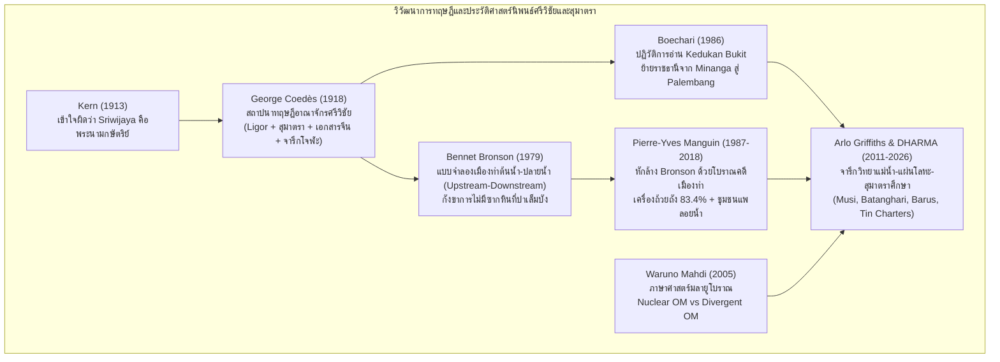
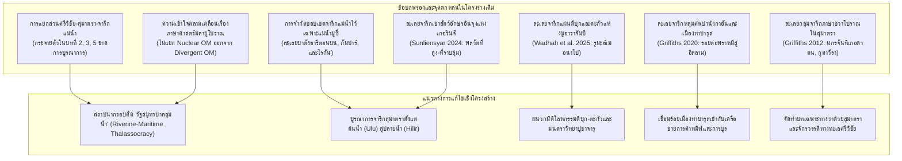
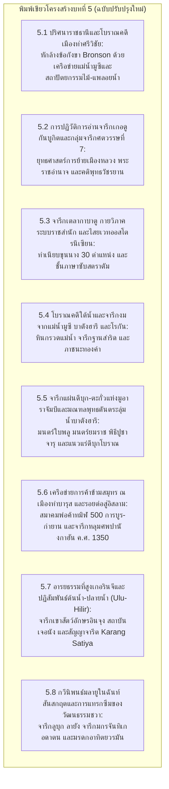

# รายงานข้อเสนอเชิงโครงสร้างและการสำรวจคลังจารึกวิทยาฉบับสมบูรณ์
## โดเมนที่ 3: สุมาตรา จักรวรรดิทางทะเลศรีวิชัย และจารึกงมจากแม่น้ำ (ลุ่มน้ำมูซี, บาตังฮารี, บารุส และเขตที่สูง)
### โครงการวิจัย: สถานภาพการศึกษาจารึกในอินโดนีเซียและเครือข่ายเอเชียตะวันออกเฉียงใต้ภาคพื้นสมุทร

---

## ส่วนที่ 1: บัญชีวิเคราะห์หลักฐานเชิงประจักษ์และจารึกทั้งหมดในคลัสเตอร์

การสำรวจคลังข้อมูลจารึกวิทยาในโดเมนที่ 3 ครอบคลุมหลักฐานจารึกปฐมภูมิและเอกสารวิจัยทางวิชาการที่ได้รับการตรวจสอบชำระตัวบทอย่างละเอียดจากแฟ้มข้อมูลหลักฐาน (Dossiers) ในระบบจำนวนทั้งสิ้น 18 แฟ้ม ประกอบด้วยชุดข้อมูลจารึกดิจิทัลมาตรฐานสากลของโครงการ DHARMA (ERC Synergy Project) และรายงานการวิจัยชำระตัวบทของนักวิชาการชั้นนำระดับโลก บัญชีรายชื่อหลักฐานเชิงประจักษ์ทั้งหมดสามารถจำแนกตามรหัสเอกสารอ้างอิง วัตถุจารึก สถานที่ค้นพบ และสารัตถะสำคัญได้ดังนี้

### 1. แฟ้มคลังจารึกดิจิทัลมาตรฐานสากล (DHARMA Epigraphic Corpus)
- **Source ID: `DHARMA-DOSS-01-sumatra-srivijaya.md` (การชำระตัวบทจารึกสุมาตราและเครือข่ายศรีวิชัย 22 รายการ):**
  1. *จารึกเกอดูกันบูกิต (Kedukan Bukit, DHARMA ID: `INSIDENK00010`):* ศิลาทรงกระบอกมน ค้นพบ ณ ริมฝั่งแม่น้ำตาตัง ลุ่มน้ำมูซี เมืองปาเล็มบัง กำหนดอายุตรงกับวันที่ 16 มิถุนายน ค.ศ. 682 (ศักราช 604 มหาศักราช) จารึกด้วยอักษรปัลลวะตอนปลาย ภาษามลายูโบราณ บันทึกการยาตราทัพทางเรือ (*siddhayātra*) 20,000 นาย และกองกำลังเดินเท้า 1,312 นาย นำโดยดาปุนตา ฮียัง จากมินางา สู่มุกขะอูปัง เพื่อสถาปนาราชธานีศรีวิชัย
  2. *จารึกตาลังตูโว (Talang Tuwo, DHARMA ID: `INSIDENK00009`):* ศิลาแบนหน้าเรียบ ค้นพบ ณ เนินเขาบูกิตเซอกุนตัง ปาเล็มบัง วันที่ 23 มีนาคม ค.ศ. 684 (ศักราช 606 มหาศักราช) บันทึกการสถาปนาอุทยานศรีเกษตรโดยดาปุนตา ฮียัง ศรีชยานาศะ เพื่อประโยชน์สุขแก่สรรพสัตว์ แสดงหลักการโพธิสัตวมรรคและปรัชญาพุทธวัชรยานยุคแรก
  3. *จารึกโกตากาปูร์ (Kota Kapur, DHARMA ID: `INSIDENK00008`):* เสาศิลาทรงกรวย ค้นพบ ณ เกาะบังกา วันที่ 28 กุมภาพันธ์ ค.ศ. 686 (ศักราช 608 มหาศักราช) จารึกคำสาปแช่งกบฏต่อราชสำนักศรีวิชัย การลงทัณฑ์ด้วยเวทมนตร์ และบันทึกการกรีธาทัพเรือไปปราบปราม "ดินแดนชวา" (*bhūmi jāva*)
  4. *จารึกการังบราฮี (Karang Brahi, DHARMA ID: `INSIDENK00008` / คู่ขนาน):* เสาศิลา ค้นพบ ณ ลุ่มน้ำเมอรังงิน สาขาแม่น้ำบาตังฮารีตอนบน จังหวัดจัมบี ศักราชราว ค.ศ. 686 มีข้อความสาปแช่งและบทลงทัณฑ์กบฏเช่นเดียวกับจารึกโกตากาปูร์
  5. *จารึกเตลากาบาตู (Telaga Batu / Sebokingking, DHARMA ID: `INSIDENK00011`):* ศิลาแผ่นใหญ่ยอดสลักพญานาค 7 เศียร ค้นพบ ณ สระเตลากาบาตู เมืองปาเล็มบัง ปลายคริสต์ศตวรรษที่ 7 จารึกพระราชโองการสาปแช่ง ทำเนียบข้าราชบริพารและตำแหน่งบริหารราชการแผ่นดิน 30 ตำแหน่ง และพิธีการดื่มน้ำสัจจาธิษฐานผ่านรางน้ำมนต์ใต้เศียรพญานาค
  6. *กลุ่มจารึกหินก้อนกรวดแม่น้ำกัมบังปูรุน (Kambang Purun River Stones, DHARMA ID: `INSIDENK00024`, `INSIDENK00143`, `INSIDENK00153`):* หินกรวดธรรมชาติงมจากแม่น้ำมูซี ปาเล็มบัง สลักอักษรภาษามลายูโบราณและภาษาชวาโบราณ
  7. *กลุ่มจารึกหินก้อนกรวดแม่น้ำเซโบกิงกิง (Sebokingking River Stones, DHARMA ID: `INSIDENK00105`, `INSIDENK00106`, `INSIDENK00139`):* หินธรรมชาติสลักข้อความสั้นและนามบุคคล งมขึ้นจากลำน้ำโบราณในปาเล็มบัง
  8. *จารึกบูมบารู (Boom Baru, DHARMA ID: `INSIDENK00023`):* ค้นพบ ณ บริเวณท่าเรือปาเล็มบัง จารึกคำสาปแช่งและกฎระเบียบการปกครองสมัยศรีวิชัย
  9. *จารึกฐานพระพุทธรูปปัทมศรี (Padmaśrī Bronze Base):* ฐานประติมากรรมสัมฤทธิ์งมจากแม่น้ำมูซี สลักอักษรกวิโบราณภาษาสันสกฤต
  10. *จารึกแผ่นทองคำเยธรรมาแห่งบูกิตเซอกุนตังและมูอาราจัมบี:* แผ่นทองคำบางสลักคาถา *Ye Dharmā Hetuprabhavā* ด้วยอักษรปราคนาครี (Siddhamātṛkā) แสดงเครือข่ายพุทธศาสนาสายปาละ
  11. *จารึกมกรจันทิเกอดาตน มูอาราจัมบี (Makara Candi Kedaton, DHARMA ID: `INSIDENK00186`):* ประติมากรรมหินรูปมกร ณ วัดเกอดาตน อุทยานประวัติศาสตร์มูอาราจัมบี จารึกภาษาชวาโบราณ มหาศักราช 1109 (ค.ศ. 1187) ข้อความระบุการสร้างและบำเพ็ญภาวนาของเอ็มปูกุสุมา (*pamurṣitanira mpu kusuma*)
  12. *จารึกปาดังโรโจและฐานพระอโมฆปาศะ (Padang Roco / Dharmasraya A, DHARMA ID: `INSIDENK00007`):* เสาศิลาและฐานพระพุทธรูปอโมฆปาศะ ค้นพบ ณ ลุ่มน้ำบาตังฮารีตอนบน อำเภอดาร์มัสรายา มหาศักราช 1208 (ค.ศ. 1286) จารึกภาษาสันสกฤตและชวาโบราณ บันทึกการส่งรูปเคารพและคณะทูตจากพระเจ้ากฤตนครแห่งสิงหัดส่าหรีมาประดิษฐาน ณ ธรรมศรายา ในรัชสมัยพระเจ้าตรีภูวนราชเมาลิวรมาเทวะ
  13. *กลุ่มจารึกบูกิตกอมบักและปาการูยุง (Bukit Gombak I & II, DHARMA ID: `INSIDENK00030`, `INSIDENK00031`):* จารึกสมัยพระเจ้าอาทิตยวรมัน (Ādityavarman) คริสต์ศตวรรษที่ 14 ในแถบสุมาตราตะวันตก แสดงการสถาปนาราชอาณาจักรมลายูปุระและการผสานภาษาสันสกฤต-มลายูโบราณ
  14. *จารึกพระโลกนาถกูนุงตูวา (Gunung Tua Lokanātha, DHARMA ID: `INSIDENK00039`):* รูปหล่อสำริดพระโพธิสัตว์โลกนาถ ค้นพบ ณ ปาดังลาวาส สุมาตราเหนือ มหาศักราช 946 (ค.ศ. 1024) จารึกภาษาผสมสันสกฤต-มลายูโบราณ ระบุชื่อช่างสลักสุรยะ (*mākrana juru sūrya*)
  15. *จารึกเชื่อมโยงภายนอกสุมาตรา:* จารึกเกอบอนโกปี 2 (Kebonkopi II, ค.ศ. 942 ซุนดา), จารึกโซโจเมร์โต (Sojomerto มลายูโบราณในชวากลาง), จารึกปูฮาวังคลิส (Puhawang Glis ค.ศ. 894 ลูกเรือสำเภาศรีวิชัยในชวา), จารึกมัญชุศรีคฤหะ (Mañjuśrīgr̥ha ค.ศ. 792 จันทิเซวู), และจารึกแผ่นทองแดงลากูนา (Laguna Copperplate Inscription ค.ศ. 900 ฟิลิปปินส์)

### 2. แฟ้มเอกสารวิจัยและการชำระตัวบทประวัติศาสตร์นิพนธ์ (Research Dossiers)
- **`S-1913-blagden-01.md` (C.O. Blagden 1913):** การชำระตัวบทจารึกโกตากาปูร์ ถอดรหัสระบบภาษามลายูโบราณ หักล้างข้อผิดพลาดของ Hendrik Kern เรื่องการเข้าใจผิดว่าศรีวิชัยเป็นชื่อกษัตริย์ พิสูจน์สถานะของศรีวิชัยในฐานะอาณาจักร และวิเคราะห์การใช้คำสาปแช่งด้วยไสยเวทพื้นเมืองออสโตรนีเซียน (*upuh*, *tuba*, *kasiḥan*, *vaśīkaraṇa*)
- **`S-1918-coedes-02.md` (George Coedès 1918):** บทความชิ้นประวัติศาสตร์ "Le royaume de Çrīvijaya" การสถาปนาทฤษฎีอาณาจักรศรีวิชัยผ่านการสังเคราะห์จารึกวัดเสมาเมือง (Ligor Stela 775 CE) จารึกสุมาตรา เอกสารราชวงศ์จีน (*Fo-che*, *Che-li-fo-che*, *San-fo-ts'i*) และจารึกภาษาทมิฬแห่งราชวงศ์โจฬะ (จารึกเลย์เดนและจารึกแทนจาวูร์)
- **`S-1930-coedes-01.md` (George Coedès 1930):** บทความหลัก "Les inscriptions malaises de Çrīvijaya" การชำระตัวบทจารึกมลายูโบราณ 4 หลักแรก (Kedukan Bukit, Talang Tuwo, Kota Kapur, Karang Brahi) การถอดรหัสมโนทัศน์ *siddhayātra*, *vajraśarīra*, และคติพุทธวัชรยาน
- **`S-1932-ferrand-01.md` (Gabriel Ferrand 1932):** การศึกษาสัทวิทยาภาษามลายูโบราณ การแปรเสียง /b/ และ /v/ ความสัมพันธ์ข้ามสมุทรกับภาษามลากาซีบนเกาะมาดากัสการ์ นิรุกติศาสตร์คำว่า *mināṅa* (ปากน้ำ/ทางแยกน้ำ) และการเปรียบเทียบกับบันทึกภูมิศาสตร์อาหรับว่าด้วยอาณาจักรซาบัก (*Zābag*) และสระทองคำ (*talāj*)
- **`S-1941-bosch-01.md` (F.D.K. Bosch 1941):** การชำระจารึกเกอบอนโกปี 2 มหาศักราช 854 (ค.ศ. 942) ภาษามลายูโบราณในชวาตะวันตก การฟื้นฟูอำนาจของกษัตริย์ซุนดา (*harpulihkan haji sunda*) ในฐานะรัฐกันชนและเขตอิทธิพลของศรีวิชัย
- **`S-1986-boechari-01.md` (Boechari 1986):** การปฏิวัติการตีความจารึกเกอดูกันบูกิต ชี้ชัดว่ามิใช่การทำสงครามรุกราน แต่เป็นการย้ายราชธานีทางยุทธศาสตร์ของดาปุนตา ฮียัง ศรีชยานาศะ จากมินางา สู่ปาเล็มบัง ด้วยกำลังพลทางเรือ 20,000 นาย และทหารบก 1,312 นาย
- **`S-1987-manguin-01.md` (Pierre-Yves Manguin 1987):** การวิเคราะห์โบราณคดีเมืองท่าศรีวิชัย ณ ปาเล็มบัง หักล้างข้อกังขาของ Bennet Bronson พิสูจน์หลักฐานเศษเครื่องถ้วยราชวงศ์ถังเข้มข้น 83.4% การค้นพบเรือเดินสมุทรโบราณและโครงข่ายชลศาสตร์คลองซูอักบูจัง ชุมชนแพลอยน้ำ และป้อมปราการค่ายไม้ไผ่ (*Kota Haur*)
- **`S-1992-adelaar-01.md` (K. Alexander Adelaar 1992):** นิรุกติศาสตร์เปรียบเทียบภาษาซาลาโก (Salako) กับภาษามลายูโบราณในจารึกเตลากาบาตู การถอดรหัสคำศัพท์การบริหารราชการและข้อห้ามทางกฎหมาย (*marsīhāji*, *marppādah*, *makalāṅit*, *manālit*)
- **`S-2005-mahdi-01.md` (Waruno Mahdi 2005):** การจำแนกภาษาศาสตร์ประวัติศาสตร์ออสโตรนีเซียน แบ่งสายตระกูลภาษามลายูโบราณเป็น "Nuclear Old Malay" (สุมาตราและบังกา: ใช้อุปสรรค *ni-*, *mar-*) และ "Non-nuclear / Divergent Old Malay" (ชวาและฟิลิปปินส์: ใช้อุปสรรค *di-*, *bar-*) และการค้นพบชั้นภาษาซับสตราตัม (Language B / Proto-Maanyan) ในข้อความสาปแช่ง
- **`S-2011-griffiths-01.md` (Arlo Griffiths 2011):** "Inscriptions of Sumatra I" ข้อมูลจารึกวิทยาใหม่ในลุ่มน้ำมูซีและบาตังฮารี การชำระจารึกหินกรวดแม่น้ำมูซี แผ่นทองคำเยธรรมาอักษรนาครี แผ่นประกบทอง-เงินมหาประติสราแห่งจันทิเกอดง 1 มูอาราจัมบี และศิลาจารึก 3 ด้านแห่งปูเลาซาวะฮ์ (สุวรรณประภาโสตตมสูตร) ธรรมศรายา
- **`S-2012-griffiths-01.md` (Arlo Griffiths 2012):** "Inscriptions of Sumatra II" การค้นพบและชำระจารึกภาษาชวาโบราณในสุมาตรา ได้แก่ จารึกกาปาโลบูกิตกอมบัก 2 (ม.ศ. 1290 / ค.ศ. 1368) จารึกมกรจันทิเกอดาตน มูอาราจัมบี (ม.ศ. 1109 / ค.ศ. 1187) และขันทองคำจารึกงมจากแม่น้ำโรกันฮิลีร์
- **`S-2014-baskoro-01.md` และ `S-2018-degroot-01.md` (Véronique Degroot, Arlo Griffiths, Baskoro Tjahjono 2010/2018):** การศึกษากลุ่มหินทรงกระบอกจารึกจันทิกูนุงซารี ระบบคำบอกทิศทางภาษาชวาโบราณ พิธีกรรมบรรจุกรุสิ่งศักดิ์สิทธิ์ (*peripih*) และการเชื่อมโยงระบบจักรวาลวิทยากับวิศวกรรมสถาปัตยกรรม
- **`S-2019-brin-01.md` (Hafiful Hadi Sunliensyar 2024 / BRIN):** จารึกบนเขากระบือบูชายัญแห่งเมินดาโป ราวัง เกอรินจี อักษรอินจุง ลุ่มน้ำเกอรินจีต้นน้ำบาตังฮารี สถาบัน "เจอนัง" (*jenang*) ตัวแทนราชสำนักสุลต่านจัมบี และหลักการบุพสิทธิออสโตรนีเซียน (*Austronesian precedence*)
- **`S-2020-griffiths-01.md` (Arlo Griffiths 2020):** "Inscriptions of Sumatra IV" ศิลาจารึกหลุมศพปานังกาฮัน (Pananggahan Tombstone ม.ศ. 1272 / ค.ศ. 1350) เมืองท่าบารุส จารึกหลุมศพชนชั้นนำในอักษรพราหมีภาษามลายูโบราณ, ศิลาจารึกลูบุก ลายัง (Lubuk Layang Stela) กวีนิพนธ์มลายูโบราณในฉันท์สันสกฤตแท้ (มาลินีและรโถทธตา), และการวิเคราะห์เปรียบเทียบจารึกทมิฬโลบูตูวา (Lobu Tua ค.ศ. 1088) สมาคมพ่อค้าไอน์นูรฺรูวาร์ 500
- **`S-2021-soedewo-01.md` (Altahira Wadhah, Hafiful Hadi Sunliensyar, Irsyad Leihitu 2025):** จารึกแผ่นโลหะ 2 ชิ้นงมจากแม่น้ำบาตังฮารี คอลเลกชันรูมะฮ์เมอนาโป มูอาราจัมบี ได้แก่ จารึกแผ่นตะกั่วดำมนตร์พุทธ-ไสยเวทและพิธีบูชาใบพลู (*sirih*) และจารึกม้วนแผ่นดีบุกขาวมนตร์บูชายมราชและคำแช่งสาป (*śapatha*) ในพิธีปูชาจารุและพิธีศรัทธา

---

## ส่วนที่ 2: วิวัฒนาการทฤษฎี ข้อถกเถียงทางวิชาการ และพรมแดนความรู้ล่าสุดถึงปี 2026

ประวัติศาสตร์นิพนธ์ว่าด้วยอาณาจักรศรีวิชัยและอารยธรรมโบราณบนเกาะสุมาตราได้ก้าวผ่านการเปลี่ยนแปลงกระบวนทัศน์ครั้งสำคัญหลายระลอก นับตั้งแต่การค้นพบเริ่มแรกในต้นคริสต์ศตวรรษที่ 20 จนถึงการประมวลผลข้อมูลสหวิทยาการและจารึกวิทยาดิจิทัลในปี ค.ศ. 2026 การวิเคราะห์วิวัฒนาการทฤษฎีสามารถจำแนกออกเป็น 5 ประเด็นหลักดังต่อไปนี้



### 1. จากข้อผิดพลาดทางอักขรวิทยาสู่การสถาปนาทฤษฎีจักรวรรดิทางทะเล (1913–1930)
ในระยะแรกของการศึกษาจารึกวิทยาอินโดนีเซีย Hendrik Kern (1913) ได้อ่านจารึกโกตากาปูร์และเข้าใจผิดว่าคำว่า *Śrīvijaya* เป็นพระนามของพระมหากษัตริย์ ต่อมา George Coedès (1918) ได้สร้างการค้นพบครั้งประวัติศาสตร์ในวารสาร BEFEO โดยเชื่อมโยงศิลาจารึกหลักที่ 23 วัดเสมาเมือง เมืองนครศรีธรรมราช (Ligor Stela) เข้ากับจารึกมลายูโบราณแห่งสุมาตรา บันทึกราชวงศ์ถังและซ่งของจีนที่เอ่ยถึงแคว้น *Fo-che* / *San-fo-ts'i* และจารึกภาษาทมิฬของราชวงศ์โจฬะแห่งอินเดียใต้ พิสูจน์ให้เห็นอย่างเด็ดขาดว่า *Śrīvijaya* คือชื่อของ "จักรวรรดิทางทะเลผู้ยิ่งใหญ่" ที่มีเครือข่ายอำนาจครอบคลุมช่องแคบมะละกาและช่องแคบซุนดา ต่อมา Coedès (1930) ได้ตีพิมพ์การชำระตัวบทจารึกมลายูโบราณ 4 หลักแรก วางรากฐานการศึกษาสัทวิทยา ไวยากรณ์ และมโนทัศน์ทางศาสนาพุทธมหายาน-วัชรยาน

### 2. ข้อถกเถียงเรื่องที่ตั้งราชธานีและโบราณคดีเมืองท่า: หักล้างข้อกังขาของ Bronson (1979–1987)
ในช่วงปลายทศวรรษ 1970 Bennet Bronson (1979) ได้เสนอแบบจำลองเชิงพื้นที่ว่าด้วยความสัมพันธ์ระหว่างเมืองท่าปลายน้ำกับแหล่งทรัพยากรต้นน้ำ (Upstream-Downstream Model) และตั้งข้อสงสัยอย่างรุนแรงต่อเมืองปาเล็มบัง โดยชี้ว่าไม่พบร่องรอยสถาปัตยกรรมหินขนาดใหญ่เหมือนในชวา จึงเสนอว่าศรีวิชัยอาจเป็นเพียงสหพันธรัฐหลวมๆ ที่ย้ายเมืองหลวงไปเรื่อยๆ ทว่าการขุดค้นทางโบราณคดีอย่างเป็นระบบของคณะวิจัยร่วมฝรั่งเศส-อินโดนีเซียนำโดย Pierre-Yves Manguin (1987, 2018) ได้หักล้างข้อกังขาของ Bronson อย่างสิ้นเชิง โดยการพิสูจน์ชั้นดินทางโบราณคดีรอบเนินเขาบูกิตเซอกุนตัง คูโบกูวัน และการังอันยาร์ ซึ่งพบเศษเครื่องถ้วยราชวงศ์ถังหนาแน่นถึง 83.4% ซากเรือเดินสมุทรโบราณที่เข้าไม้ด้วยเทคนิคเย็บร้อยเชือก และคลองชลศาสตร์โบราณซูอักบูจัง พร้อมทั้งอธิบายเชิงประจักษ์ว่า สถาปัตยกรรมของศรีวิชัยสร้างด้วยเครื่องไม้ ไม้ไผ่ และการดำรงชีวิตบนแพลอยน้ำเลียบสองฝั่งแม่น้ำมูซี จึงไม่ทิ้งซากปราสาทหินไว้เช่นเดียวกับศาสนสถานในชวา

### 3. การปฏิวัติการอ่านจารึกเกอดูกันบูกิต: การยาตราทัพสถาปนาราชธานีมิใช่การรุกราน (Boechari 1986)
Boechari (1986) ได้นำเสนอการอ่านและตีความจารึกเกอดูกันบูกิตใหม่ โดยชำระข้อความบรรทัดที่ 3–4 ที่เคยเป็นปัญหา ปฏิเสธสมมติฐานเดิมของ Coedès ที่มองว่าเป็นการยกกองทัพไปทำสงครามรุกรานดินแดนอื่น Boechari พิสูจน์ว่า วันที่ 11 พฤษภาคม ค.ศ. 682 ดาปุนตา ฮียัง ได้ประกอบพิธีกรรมทางจิตวิญญาณ (*siddhayātra*) ณ มินางา (*Mināṅa*) จากนั้นในวันที่ 16 มิถุนายน ค.ศ. 682 ได้เคลื่อนกองกำลังทางเรือจำนวน 20,000 นาย พร้อมกำลังทหารบก 1,312 นาย เดินทางมาถึงมุกขะอูปัง (*Mukha Upang*) และสถาปนาเมืองปาเล็มบังขึ้นเป็นศูนย์กลางอำนาจแห่งใหม่ ข้อเสนอนี้เปลี่ยนโฉมหน้าความเข้าใจประวัติศาสตร์การก่อตัวของรัฐศรีวิชัยอย่างสิ้นเชิง

### 4. ภาษาศาสตร์ประวัติศาสตร์: การจำแนกสายตระกูลภาษามลายูโบราณและชั้นภาษาซับสตราตัม (1992–2005)
K. Alexander Adelaar (1992) และ Waruno Mahdi (2005) ได้ยกระดับการศึกษาจารึกสุมาตราด้วยหลักภาษาศาสตร์ประวัติศาสตร์ออสโตรนีเซียน Mahdi ได้แบ่งภาษามลายูโบราณออกเป็นสองสายตระกูลอย่างชัดเจน คือ:
1. *Nuclear Old Malay:* ปรากฏในจารึกศูนย์กลางของศรีวิชัยในสุมาตราและเกาะบังกา ใช้ระบบอุปสรรค *ni-* (กริยากรรม) และ *mar-* (กริยากรรตุ)
2. *Non-nuclear / Divergent Old Malay:* ปรากฏในจารึกนอกศูนย์กลาง เช่น ในชวา (จารึกโซโจเมร์โต, จารึกกันดาสุลี) และฟิลิปปินส์ (จารึกแผ่นทองแดงลากูนา) ซึ่งใช้ระบบอุปสรรค *di-* และ *bar-*
นอกจากนี้ Mahdi ยังค้นพบว่า ถ้อยคำสาปแช่งในจารึกศรีวิชัยมีชั้นภาษาซับสตราตัมของ "Language B" หรือกลุ่มภาษาบาริโตโบราณ (Proto-Maanyan) ปะปนอยู่ ซึ่งชี้ให้เห็นการหลอมรวมทางชาติพันธุ์ของกลุ่มชนเดินเรือดั้งเดิมเข้าสู่อำนาจรัฐศรีวิชัย

### 5. พรมแดนความรู้ล่าสุดถึงปี 2026: จารึกวิทยาแม่น้ำ แผ่นโลหะ และการเปลี่ยนผ่านทางวัฒนธรรม
ตั้งแต่ ค.ศ. 2011 ถึง 2026 การศึกษาจารึกวิทยาในสุมาตราได้ก้าวสู่ยุคทองระลอกใหม่ผ่านโครงการ DHARMA และการศึกษาร่วมระหว่างสถาบันวิจัยนานาชาติ โดยมีพรมแดนความรู้สำคัญ 4 ด้าน:
1. *จารึกงมจากแม่น้ำ (Riverine Salvage Epigraphy):* Arlo Griffiths (2011, 2012) ได้บุกเบิกการศึกษาจารึกหินก้อนกรวดแม่น้ำ จารึกฐานสำริด และจารึกแผ่นทองคำที่งมได้จากแม่น้ำมูซีและบาตังฮารี เปิดมิติทางประวัติศาสตร์ของประชากรระดับล่าง พ่อค้า และพิธีกรรมทางน้ำ
2. *จารึกแผ่นดีบุกและตะกั่ว (Tin & Lead Epigraphy):* การชำระตัวบทจารึกรูมะฮ์เมอนาโปแห่งมูอาราจัมบี โดย Wadhah, Sunliensyar, & Leihitu (2025) ได้ยุติข้อถกเถียงเรื่องระเบียบการเกษตร โดยพิสูจน์ว่าเป็นมนตร์คุ้มครองป้องกันภัยด้วยพิธีบูชาใบพลู และมนตร์บูชายมราชในพิธีปูชาจารุและพิธีศรัทธา สะท้อนเครือข่ายการค้าแร่ดีบุกโบราณ
3. *พหุวัฒนธรรมและรุ่งอรุณแห่งอิสลามที่เมืองท่าบารุส:* Griffiths (2020) ชำระจารึกหลุมศพปานังกาฮัน (ค.ศ. 1350) เผยให้เห็นการใช้อักษรพราหมีและภาษามลายูโบราณในสุสานมุสลิมยุคแรก ควบคู่กับการประพันธ์กวีนิพนธ์มลายูโบราณในฉันท์สันสกฤตแท้ที่จารึกลูบุก ลายัง
4. *การประสานอำนาจระหว่างที่สูงกับที่ราบลุ่มต่ำ:* Sunliensyar (2024) ชำระจารึกเขาสัตว์อักษรอินจุงแห่งเกอรินจี เผยให้เห็นสถาบันข้าหลวง "เจอนัง" ของสุลต่านจัมบีที่เดินทางขึ้นสู่ที่สูงเพื่อแต่งตั้งผู้นำชุมชนและจัดเก็บส่วยภาษีตามหลักบุพสิทธิออสโตรนีเซียน

---

## ส่วนที่ 3: ข้อค้นพบใหม่และมิติที่ตกหล่นจากโครงร่างเดิม

จากการตรวจสอบโครงสร้างสารบัญของโครงร่างแม่บทเดิม (`outline-proposal.md`) เปรียบเทียบกับคลังข้อมูลจารึกวิทยาเชิงประจักษ์ในโดเมนที่ 3 พบว่า โครงร่างเดิมมีจุดบกพร่อง ช่องว่างเชิงมโนทัศน์ และความไม่สอดคล้องกับความเป็นจริงทางประวัติศาสตร์หลายประการ ซึ่งจำเป็นต้องได้รับการปรับปรุงเชิงโครงสร้างอย่างเร่งด่วน ดังนี้



### 1. การแตกกระจายของเนื้อหาศรีวิชัยและสุมาตราอย่างไร้บูรณาการ
ในโครงร่างเดิม หัวข้อที่เกี่ยวข้องกับศรีวิชัยและสุมาตราถูกแยกส่วนกระจัดกระจาย โดยจารึกมลายูโบราณศตวรรษที่ 7 ถูกบรรจุไว้ในบทที่ 2 (หัวข้อย่อย 2.6) จารึกแผ่นโลหะและจารึกกูนุงตูวาถูกจัดไว้ในบทที่ 3 (หัวข้อย่อย 3.4, 3.6) และจารึกงมจากแม่น้ำถูกจัดไว้ในบทที่ 5 การแยกส่วนเช่นนี้ทำให้สูญเสีย "เอกภาพเชิงนิเวศวัฒนธรรมและสมุทรศาสตร์" (Maritime & Riverine Ecological Unity) เนื่องจากศรีวิชัยมิใช่รัฐแผ่นดินใหญ่แบบชวา หากแต่เป็น "รัฐสมุทรบาลลุ่มน้ำ" (Riverine-Maritime Thalassocracy) ที่ดำรงอยู่ได้ด้วยการเชื่อมต่อระหว่างแม่น้ำสายใหญ่สู่ทะเลสากล

### 2. การจำกัดขอบเขตโบราณคดีแม่น้ำไว้เพียงแม่น้ำมูซี
บทที่ 5 ในโครงร่างเดิมมุ่งเน้นเฉพาะการงมโบราณวัตถุในแม่น้ำมูซี เมืองปาเล็มบัง แต่ละเลยลุ่มน้ำหลักสายอื่นๆ ของสุมาตรา ได้แก่:
- *ลุ่มน้ำบาตังฮารีตอนบน (ธรรมศรายาและปูเลาซาวะฮ์):* ซึ่งค้นพบศิลาจารึก 3 ด้านคัมภีร์สุวรรณประภาโสตตมสูตร (Griffiths 2011) และฐานพระอโมฆปาศะแห่งปาดังโรโจ
- *ลุ่มน้ำกัมปาร์และมินางา:* เส้นทางโบราณที่เชื่อมโยงระหว่างศูนย์กลางการค้าชายฝั่งตะวันตกสู่ตะวันออก และจุดเริ่มต้นการเดินทัพของดาปุนตา ฮียัง
- *ลุ่มน้ำโรกันฮิลีร์:* แหล่งงมพบขันทองคำจารึกภาษาชวาโบราณ (Griffiths 2012)

### 3. การตกหล่นจารึกแผ่นดีบุกและตะกั่วแห่งมูอาราจัมบี (Prasasti Timah)
โครงร่างเดิมกล่าวถึงจารึกแผ่นดีบุกเพียงผิวเผินในบทที่ 3 โดยขาดข้อมูลวิจัยสำคัญล่าสุดของ Wadhah, Sunliensyar, & Leihitu (2025) ซึ่งได้ถอดรหัสจารึกแผ่นตะกั่วดำ (มนตร์ใบพลู) และจารึกม้วนแผ่นดีบุกขาว (มนตร์ยมราชและคำแช่งสาป) จากแม่น้ำบาตังฮารี หลักฐานนี้นอกจากจะมีความสำคัญอย่างยิ่งยวดต่อประวัติศาสตร์ศาสนาและพิธีกรรมปูชาจารุแล้ว ยังสะท้อนให้เห็นบทบาทของสุมาตราในฐานะศูนย์กลางแนวแร่ดีบุกแห่งเอเชียตะวันออกเฉียงใต้ (The Southeast Asian Tin Belt)

### 4. การตกหล่นประวัติศาสตร์จารึกวิทยาเมืองท่าบารุสและจารึกหลุมศพปานังกาฮัน
โครงร่างเดิมละเลยหลักฐานจารึกวิทยาจากเมืองท่าบารุส (Fansūr) ซึ่งเป็นศูนย์กลางการค้าการบูรและกำยานระดับโลกที่สำคัญที่สุดทางชายฝั่งตะวันตกของสุมาตรา โดยเฉพาะอย่างยิ่งการค้นพบล่าสุดของ Griffiths (2020) ว่าด้วย "ศิลาจารึกหลุมศพปานังกาฮัน ค.ศ. 1350" ซึ่งเป็นจารึกในอักษรพราหมีภาษามลายูโบราณที่ตั้งอยู่ในสุสานมุสลิม สะท้อนรอยต่อการเปลี่ยนผ่านทางวัฒนธรรมที่เก่าแก่ที่สุด ควบคู่กับ "ศิลาจารึกลูบุก ลายัง" ซึ่งเป็นหลักฐานแรกของการนำฉันทลักษณ์สันสกฤตแท้มาประพันธ์ร่วมกับภาษามลายูโบราณ

### 5. การละเลยมิติชุมชนที่สูงและจารึกบนเขาสัตว์แห่งเกอรินจี
โครงร่างเดิมจำกัดมุมมองอยู่เฉพาะสังคมเมืองท่าชายฝั่ง ละเลยความสัมพันธ์เชิงอำนาจระหว่างเมืองท่าปลายน้ำ (*Hilir*) กับดินแดนป่าเขาต้นน้ำ (*Ulu*) ดังที่ปรากฏในงานวิจัยของ Sunliensyar (2024) เรื่องจารึกบนเขากระบืออักษรอินจุงแห่งเกอรินจี ซึ่งบันทึกบทบาทของสถาบันข้าหลวง "เจอนัง" ของสุลต่านจัมบี และการทำพันธสัญญาจารีตประเพณี (*Karang Satiya*) ภายใต้หลักการบุพสิทธิออสโตรนีเซียน

### 6. ความคลาดเคลื่อนในการจำแนกสายตระกูลภาษามลายูโบราณ
โครงร่างเดิมมิได้นำข้อค้นพบทางภาษาศาสตร์ประวัติศาสตร์ของ Waruno Mahdi (2005) และ Alexander Adelaar (1992) มาใช้ในการจัดระเบียบหมวดหมู่ โดยไม่ได้จำแนกความแตกต่างระหว่างภาษามลายูโบราณสายศูนย์กลางสุมาตรา (Nuclear Old Malay ที่ใช้อุปสรรค *ni-*, *mar-*) กับภาษามลายูโบราณนอกศูนย์กลางในชวาและฟิลิปปินส์ (Divergent Old Malay ที่ใช้อุปสรรค *di-*, *bar-*) ซึ่งส่งผลกระทบต่อความแม่นยำในการวิเคราะห์พัฒนาการทางภาษาศาสตร์ในภาพรวม

### 7. การละเลยกลุ่มจารึกภาษาชวาโบราณในสุมาตรา
โครงร่างเดิมมองข้ามการปรากฏตัวของจารึกภาษาชวาโบราณบนเกาะสุมาตรา (Griffiths 2012) เช่น จารึกมกรจันทิเกอดาตนแห่งมูอาราจัมบี (ค.ศ. 1187) และจารึกตุมังกุงกูดาวีราแห่งกาปาโลบูกิตกอมบัก (ค.ศ. 1368) ซึ่งเป็นหลักฐานเชิงประจักษ์ชิ้นสำคัญที่แสดงถึงการหลั่งไหลของบุคลากร ช่างฝีมือ ขุนนาง และวัฒนธรรมจากชวาตะวันออกเข้าสู่ศูนย์กลางทางการเมืองและศาสนาของสุมาตราก่อนและระหว่างยุคมัชปาหิต

---

## ส่วนที่ 4: พิมพ์เขียวโครงสร้างบทและหัวข้อย่อยฉบับปรับปรุงใหม่

เพื่อแก้ไขข้อบกพร่องเชิงโครงสร้างทั้งหมดและยกระดับงานวิจัยสู่มาตรฐานสากล จึงขอเสนอพิมพ์เขียวโครงสร้างแม่บทฉบับปรับปรุงใหม่ โดยสถาปนาให้ **บทที่ 5** เป็นบทหลักที่บูรณาการประวัติศาสตร์จารึกวิทยาของสุมาตรา จักรวรรดิทางทะเลศรีวิชัย โบราณคดีแม่น้ำ และเครือข่ายข้ามสมุทรไว้อย่างสมบูรณ์แบบ โดยมีรายละเอียดโครงสร้างและประเด็นเจาะลึก 8 ประเด็นย่อย ดังนี้



### รายละเอียดหัวข้อย่อยและประเด็นเจาะลึก 8 ประเด็นย่อย:

#### หัวข้อย่อย 5.1: ปริศนาราชธานีและโบราณคดีเมืองท่าศรีวิชัย: การหักล้างข้อกังขาของ Bronson ด้วยเครือข่ายชลศาสตร์แม่น้ำมูซี ชุมชนแพลอยน้ำ และสถาปัตยกรรมไม้
- **ประเด็นเจาะลึก 1:** การวิเคราะห์เชิงประวัติศาสตร์นิพนธ์ต่อข้อกังขาของ Bennet Bronson (1979) และการคลี่คลายปัญหาด้วยข้อมูลโบราณคดีภาคสนามของ Pierre-Yves Manguin (1987, 2018) ณ เมืองปาเล็มบัง
- **ประเด็นเจาะลึก 2:** หลักฐานความหนาแน่นของเศษเครื่องถ้วยราชวงศ์ถัง (Tang Dynasty Ceramics) สูงถึง 83.4% ในชั้นดินทางโบราณคดี ณ แหล่งคูโบกูวัน (Kambang Unglen, Karanganyar) และความต่อเนื่องสู่เครื่องถ้วยสมัยห้าประราชวงศ์และราชวงศ์ซ่ง
- **ประเด็นเจาะลึก 3:** โครงสร้างเมืองท่าไร้กำแพงหิน: การศึกษาเปรียบเทียบสถาปัตยกรรมไม้ ป้อมค่ายไม้ไผ่ (*Kota Haur*) และวิถีชีวิตบนแพลอยน้ำ (*floating raft dwellings*) ตามแนวตลิ่งลำน้ำมูซี สอดคล้องกับบันทึกของราชทูตจีนและนักภูมิศาสตร์อาหรับ
- **ประเด็นเจาะลึก 4:** ระบบวิศวกรรมชลศาสตร์โบราณ: การสำรวจร่องรอยคลองขุดซูอักบูจัง (Suak Bujang Canal) ระบบคูป้อมปราการบนเกาะการังอันยาร์ และความสัมพันธ์เชิงพื้นที่กับภูเขาศักดิ์สิทธิ์บูกิตเซอกุนตัง (Bukit Seguntang)

#### หัวข้อย่อย 5.2: การปฏิวัติการอ่านจารึกเกอดูกันบูกิตและกลุ่มจารึกมลายูโบราณศตวรรษที่ 7: ยุทธศาสตร์การย้ายราชธานี พระราชอำนาจ และคติพุทธวัชรยาน
- **ประเด็นเจาะลึก 1:** การชำระตัวบทจารึกเกอดูกันบูกิต (Kedukan Bukit 682 CE) ตามแนวคิดของ Boechari (1986): การเคลื่อนทัพทางเรือ 20,000 นาย และทหารบก 1,312 นาย เพื่อย้ายราชธานีจากมินางา (*Mināṅa*) สู่ปาเล็มบัง มิใช่สงครามรุกราน
- **ประเด็นเจาะลึก 2:** มโนทัศน์ *siddhayātra* ในจารึกศรีวิชัย: การแสวงหาอำนาจจิตวิญญาณ ความสำเร็จอันศักดิ์สิทธิ์ และการเสริมสร้างบารมีธรรมของพระมหากษัตริย์
- **ประเด็นเจาะลึก 3:** จารึกตาลังตูโว (Talang Tuwo 684 CE): การสถาปนาอุทยานสาธารณะศรีเกษตร โพธิสัตวมรรค การสร้างสระน้ำ (*talāga / tāvad*) และปรัชญาพุทธวัชรยานยุคแรก (*vajraśarīra*) ของดาปุนตา ฮียัง ศรีชยานาศะ
- **ประเด็นเจาะลึก 4:** จารึกโกตากาปูร์ (Kota Kapur 686 CE) และจารึกการังบราฮี: การประกาศอำนาจอธิปไตยเหนือเส้นทางเดินเรือช่องแคบ การลงทัณฑ์ผู้คิดคดทรยศ และการยาตราทัพเรือไปปราบปราม "ดินแดนชวา" (*bhūmi jāva*)

#### หัวข้อย่อย 5.3: จารึกเตลากาบาตู กายวิภาคระบบราชสำนัก และไสยเวทพื้นเมืองออสโตรนีเซียน: ทำเนียบขุนนาง 30 ตำแหน่งและชั้นภาษาซับสตราตัม
- **ประเด็นเจาะลึก 1:** สรีรวิทยาของศิลาจารึกเตลากาบาตู (Telaga Batu): ศิลาหัวพญานาค 7 เศียร รางน้ำมนต์ศักดิ์สิทธิ์ และพิธีกรรมดื่มน้ำสาบานเพื่อความจงรักภักดี (*sumpah*)
- **ประเด็นเจาะลึก 2:** กายวิภาคโครงสร้างการบริหารราชการแผ่นดินศรีวิชัย: การวิเคราะห์ทำเนียบขุนนาง 30 ตำแหน่ง ตั้งแต่พระบรมวงศานุวงศ์ (*rājaputra*, *yuvarāja*), ขุนศึก (*senāpati*, *dāṇḍanāyaka*), ฝ่ายปกครองท้องถิ่น (*parvvāṇḍa*, *dātu*), จนถึงกลุ่มช่างฝีมือและคนรับใช้ราชสำนัก (*sthāpaka*, *puhawaṁ*, *vāśīkaraṇa*)
- **ประเด็นเจาะลึก 3:** นิรุกติศาสตร์และการถอดรหัสคำศัพท์การบริหารตามข้อเสนอของ Adelaar (1992): การอธิบายความหมายของ *marsīhāji* (คนสนิทวงในกษัตริย์), *marppādah* (การทูลฟ้องร้อง), *makalāṅit* (การขโมยชักดาบ), และ *manālit* (การยักยอกเงินแผ่นดิน)
- **ประเด็นเจาะลึก 4:** ไสยเวทและชั้นภาษาซับสตราตัมตามแนวคิดของ Mahdi (2005): พิษยางไม้ (*upuh*), รากไม้เบื่อปลา (*tuba*), ยาเสน่ห์ (*kasiḥan*), และร่องรอยของ "Language B" (Old Maanyan) ในสูตรคำสาปแช่ง

#### หัวข้อย่อย 5.4: โบราณคดีใต้น้ำและจารึกงมจากแม่น้ำมูซี บาตังฮารี และโรกัน: หินกรวดแม่น้ำ จารึกฐานสำริด และภาชนะทองคำ
- **ประเด็นเจาะลึก 1:** ปรากฏการณ์การค้นพบโบราณวัตถุจากการดูดทรายและงมแม่น้ำมูซี (Musi River Dredging): รายงานวิจัยภาคสนามของ Arlo Griffiths (2011) และการประเมินสถานะทางโบราณคดี
- **ประเด็นเจาะลึก 2:** จารึกหินก้อนกรวดแม่น้ำ (River Stone Inscriptions): กลุ่มจารึกกัมบังปูรุน (Kambang Purun) และเซโบกิงกิง (Sebokingking) การวิเคราะห์หน้าที่การใช้งานในฐานะใบผ่านด่านภาษีน้ำ คำอธิษฐานของวาณิช หรือเครื่องรางประจำเรือ
- **ประเด็นเจาะลึก 3:** จารึกฐานสำริดงมจากแม่น้ำมูซี: การถอดรหัสคำว่า *padmaśrī* และประติมาวิทยาพุทธมหายานในลุ่มน้ำ
- **ประเด็นเจาะลึก 4:** จารึกแผ่นทองคำเยธรรมาอักษรนาครีแห่งบูกิตเซอกุนตัง และขันทองคำงมจากแม่น้ำโรกันฮิลีร์ (Griffiths 2012): การหมุนเวียนของโลหะมีค่าและอิทธิพลของสำนักปาละแห่งเบงกอลในระบบแม่น้ำสุมาตรา

#### หัวข้อย่อย 5.5: จารึกแผ่นดีบุก-ตะกั่วแห่งมูอาราจัมบีและมณฑลพุทธตันตระลุ่มน้ำบาตังฮารี: มนตร์ใบพลู มนตร์ยมราช พิธีปูชาจารุ และแนวแร่ดีบุกโบราณ
- **ประเด็นเจาะลึก 1:** การค้นพบคลังจารึกแผ่นโลหะมากกว่า 103 ชิ้นในแม่น้ำบาตังฮารี เขตอุทยานประวัติศาสตร์มูอาราจัมบี (KCBN Muarajambi) และบทบาทของสุมาตราในแนวแร่ดีบุกเอเชียตะวันออกเฉียงใต้ (The Southeast Asian Tin Belt)
- **ประเด็นเจาะลึก 2:** การชำระตัวบทจารึกแผ่นตะกั่วดำ (10/PADMA/Pb/VIII/2019) โดย Wadhah, Sunliensyar, & Leihitu (2025): มนตร์ป้องปัดเสนียดจัญไร (*penolak bala*), พิธีกรรมที่กระทำต่อใบพลู (*sirih*), และการจัดระเบียบลำดับชั้นทางสังคมของพืชพรรณธรรมชาติ
- **ประเด็นเจาะลึก 3:** การชำระตัวบทจารึกม้วนแผ่นดีบุกขาว (17/PADMA/Sn/VIII/2019): มนตร์อัญเชิญพระยมราช (*Yamarāja*), อาวุธสังหารทั้งห้า, เสนาบดียักษ์, นางฉายาเทวี, และคำแช่งสาปอันรุนแรง (*śapatha*)
- **ประเด็นเจาะลึก 4:** การสังเคราะห์พิธีกรรมข้ามวัฒนธรรม: การเชื่อมโยงมนตร์ในจารึกแผ่นดีบุกเข้ากับพิธี "ปูชาจารุ" (Pūjā Caru), พิธี "ศรัทธา" (Śrāddha) ส่งวิญญาณบรรพบุรุษ, และคัมภีร์ *Yama Pūrvāṇa Tattwa* ในบาหลี

#### หัวข้อย่อย 5.6: เครือข่ายการค้าข้ามสมุทร ณ เมืองท่าบารุส และรอยต่อสู่อิสลาม: สมาคมพ่อค้าทมิฬ 500 การบูร-กำยาน และจารึกหลุมศพปานังกาฮัน ค.ศ. 1350
- **ประเด็นเจาะลึก 1:** ภูมิศาสตร์ประวัติศาสตร์ของเมืองท่าบารุส (Fansūr): แหล่งส่งออกการบูรเกล็ดมังกร (*Barus camphor*) และกำยาน (*benzoin*) ชั้นเลิศของโลก เชื่อมโยงชนพื้นเมืองบนภูเขากับพ่อค้านานาชาติ
- **ประเด็นเจาะลึก 2:** ศิลาจารึกทมิฬโลบูตูวา (Lobu Tua Tamil Inscription ค.ศ. 1088 / ม.ศ. 1010): บทบาทของสมาคมพ่อค้าทมิฬข้ามสมุทร "ไอน์นูรฺรูวาร์ 500" (*Ainnūṟṟuvar*) กองกำลังทหารรักษาการณ์ และการเปรียบเทียบกับจารึกสมาคมมณิครามัมที่ตะกั่วป่า ภาคใต้ของไทย
- **ประเด็นเจาะลึก 3:** ศิลาจารึกหลุมศพปานังกาฮัน (Pananggahan Tombstone ม.ศ. 1272 / ค.ศ. 1350, Griffiths 2020): การชำระตัวบทอักษรพราหมีภาษามลายูโบราณ การถอดรหัสปฏิทินปัญจางคะ วันที่ 24 ตามวันทางพลเรือน (24th Civil Day) ตรงกับวันอังคารที่ 29 มิถุนายน ค.ศ. 1350
- **ประเด็นเจาะลึก 4:** สภาวะการเปลี่ยนผ่านทางวัฒนธรรมและศาสนา: การประเมินสถานะของจารึกปานังกาฮันในฐานะจารึกหลุมศพชนชั้นนำ (*bhaginda*) ในสุสานมุสลิม เปรียบเทียบกับจารึกมินเยตูโจะฮ์ (Minye Tujuh ค.ศ. 1380) ในอาเจะห์ และจารึกเปิงกาลันเกมปัส (Pengkalan Kempas) ในมาเลเซีย

#### หัวข้อย่อย 5.7: อารยธรรมที่สูงเกอรินจีและปฏิสัมพันธ์ต้นน้ำ-ปลายน้ำ (Ulu-Hilir): จารึกเขาสัตว์อักษรอินจุง สถาบันเจอนัง และสัญญาจารีต Karang Satiya
- **ประเด็นเจาะลึก 1:** ชาติพันธุ์ประวัติศาสตร์ลุ่มน้ำเกอรินจีต้นน้ำบาตังฮารี: การรักษาจารึกบนเขากระบือบูชายัญ (*prasasti tanduk kerbau*) ในฐานะมรดกสิ่งศักดิ์สิทธิ์ประจำตระกูล (*pusaka*)
- **ประเด็นเจาะลึก 2:** การชำระตัวบทอักษรอินจุง (Surat Incung) โดย Sunliensyar (2024 / BRIN): จารึกเดอปาตี อาวัล-เดอปาตี จังกุต และจารึกดาตุก กิตัม สายสัมพันธ์การอพยพย้ายถิ่นจากมีนังกาเบาสู่เกอรินจี
- **ประเด็นเจาะลึก 3:** สถาบัน "เจอนัง" (*jenang*) แห่งรัฐสุลต่านจัมบี: พิธี "ขึ้นเจอนัง" (*naik janang*) การมอบเครื่องยศสัญลักษณ์กษัตริย์ การระงับข้อพิพาท และการจัดเก็บส่วยภาษีราชการ (*serah jajah naik*)
- **ประเด็นเจาะลึก 4:** กฎหมายจารีตประเพณีและการจัดระเบียบสังคม: พิธีสัตยาบัน "การัง ซาตียา" (*karang satiya*), หลักการบุพสิทธิออสโตรนีเซียน (*Austronesian precedence*), และการปกครองแบบคณาธิปไตยของสภาเดอปาตีและมันตี

#### หัวข้อย่อย 5.8: กวีนิพนธ์มลายูในฉันท์สันสกฤตและการแทรกซึมของวัฒนธรรมชวา: จารึกลูบุก ลายัง จารึกมกรจันทิเกอดาตน และมรดกราชสำนักอาทิตยวรมัน
- **ประเด็นเจาะลึก 1:** ศิลาจารึกลูบุก ลายัง (Lubuk Layang Stela, Griffiths 2020): การค้นพบกวีนิพนธ์ภาษามลายูโบราณที่ประพันธ์ด้วยฉันท์สันสกฤตแท้ครั้งแรกในประวัติศาสตร์ (ฉันท์มาลินีและรโถทธตา), มโนทัศน์กระบวนการแปลงเป็นภาษาถิ่น (*vernacularization*), และค่านิยมกตัญญุตาธรรมต่อบิดามารดา (*biseṣābhakti dĭ mātapĭตā*)
- **ประเด็นเจาะลึก 2:** เครือข่ายราชวงศ์สุมาตราตะวันตก: พระเจ้าวิชยวรมัน และมกุฎราชกุมารชยินทราวรมัน แห่งเมืองศรีอินทรคีรีบรรพตบุรี และสายสัมพันธ์กับพระเจ้าอาทิตยวรมัน
- **ประเด็นเจาะลึก 3:** การแทรกซึมของภาษาและวัฒนธรรมชวาโบราณในสุมาตรา (Griffiths 2012): จารึกมกรจันทิเกอดาตนแห่งมูอาราจัมบี (ม.ศ. 1109 / ค.ศ. 1187) การสถาปนาของเอ็มปูกุสุมา, จารึกกาปาโลบูกิตกอมบัก 2 (ม.ศ. 1290 / ค.ศ. 1368) ของขุนนางชวาตุมังกุงกูดาวีรา
- **ประเด็นเจาะลึก 4:** ธรรมศรายาและมรดกพระเจ้าอาทิตยวรมัน: จารึกปาดังโรโจ ฐานพระอโมฆปาศะ และการปฏิสัมพันธ์เชิงอำนาจระหว่างชวาตะวันออก (สิงหัดส่าหรีและมัชปาหิต) กับอาณาจักรมลายูแห่งสุมาตรา

---

## ส่วนที่ 5: ข้อความจารึกปฐมภูมิสำคัญและอภิธานศัพท์เฉพาะทาง

### 1. ข้อความจารึกปฐมภูมิสำคัญ (Verbatim Quotes & Diplomatic Transliterations)

#### (1) จารึกเกอดูกันบูกิต (Kedukan Bukit 682 CE) — ถอดความชำระโดย Boechari (1986) และ DHARMA (`INSIDENK00010`):
```text
(1) svasti śrī śakavaṣātīta 604 ekādaśī śu-
(2) klapakṣa vulan vaiśākha dapuṃta hiyaṃ nāyik di
(3) sāmvau maṅalap siddhayātra di saptamī śuklapakṣa
(4) vulan jyeṣṭha dapuṃta hiyaṃ marlapas dari mināṅa
(5) tāmvan mamāva ya vaḷa dua lakṣa daṅan kośa
(6) dua ratus cāra di sāmvau daṅan jālan sarivu
(7) tlu ratus sapulu dua vañakña dātaṃ di mukha upaŋ
(8) sukhacitta di pañcamī śuklapakṣa vulan āsāḍha
(9) laghu mudita dātaṃ marvuat vanua ...
(10) śrīvijaya jaya siddhayātra subhikṣa nityakāla
```
*คำแปลเชิงวิชาการ:* "ศุภมัสดุ ศักราชล่วงแล้ว 604 มหาศักราช ในดิถีขึ้น 11 ค่ำ เดือนไวศาขะ ดาปุนตา ฮียัง เสด็จขึ้นประทับบนเรือสำเภาเพื่อถือเอาซึ่งสิทธิยาตรา (ความสำเร็จศักดิ์สิทธิ์) ในดิถีขึ้น 7 ค่ำ เดือนเชษฐะ ดาปุนตา ฮียัง เคลื่อนทัพออกจากมินางา ตามวัน ทรงนำไพร่พลสองหมื่นนายพร้อมสัมภาระ สองร้อยคนเดินทางโดยเรือสำเภา ทางบกหนึ่งพันสามร้อยสิบสองนาย ถึงยังมุกขะอูปัง ด้วยความปีติยินดี ในดิถีขึ้น 5 ค่ำ เดือนอาษาฒะ เบิกบานสำราญพระทัย เสด็จมาสร้างพระนคร... ศรีวิชัยมีชัยชนะ ถือสิทธิยาตรา มีความอุดมสมบูรณ์ชั่วกาลนาน"

#### (2) จารึกตาลังตูโว (Talang Tuwo 684 CE) — ถอดความชำระโดย Coedès (1930) และ DHARMA (`INSIDENK00009`):
```text
(1) svasti śrī śakavarṣātīta 606 di daśamī śuklapakṣa vulan caitra sana tatkālāna parlak śrīkṣetra ini niparvuat
(2) parsumbulna dapuṃta hiyaṃ śrī jayanāśa ini praṇidhānāna dapuṃta hiyaṃ: savañakña ya nitanam di sini: ñiyur pinaŋ hanāu rumviya
...
(11) tinaṅkaña punarapi ya mañjādi praṇidhāna dapuṃta hiyaṃ śrī jayanāśa: ... saviñakña tinañña prakāra diṅan sukha di vāhyābhyantara ya nihan
(12) kalyāṇamitra ya nihan aña: ... anuttarābhisamyaksambodhi ya nihan aña: dapuṃta hiyaṃ śrī jayanāśa
```
*คำแปลเชิงวิชาการ:* "ศุภมัสดุ ศักราชล่วงแล้ว 606 มหาศักราช ในดิถีขึ้น 10 ค่ำ เดือนไจตระ เพลานั้นอุทยานศรีเกษตรนี้ได้รับการสร้างขึ้น เพื่อเป็นกุศลทานแห่งดาปุนตา ฮียัง ศรีชยานาศะ นี่คือมหาปณิธานแห่งดาปุนตา ฮียัง: พืชพรรณทั้งปวงที่ปลูกไว้ ณ ที่นี้ มะพร้าว หมาก ตาล สาคู... ขอสรรพสัตว์จงสมบูรณ์พร้อมด้วยกัลยาณมิตร และบรรลุซึ่งอนุตตรสัมมาสัมโพธิญาณในกาลเบื้องหน้าเทอญ"

#### (3) จารึกโกตากาปูร์ (Kota Kapur 686 CE) — ถอดความชำระโดย Blagden (1913) และ DHARMA (`INSIDENK00008`):
```text
(1) siddha titam hamaruan sasti samuha ... ya manuṅgala ya sumumpaḥ ya ...
...
(5) ya urāṅ di kadātuan tida ya bhakti marppada ... ya jāhati tida ya mañgāpā ya vatu ini
(6) nivunuḥ ya sumpaḥ ... upuh tuba kasiḥan vāśīkaraṇa ...
...
(9) śakavarṣātīta 608 dīvaśa di pañcamī śuklapakṣa vulan vaiśākha tatkālāna ya mañjāpā sumpaḥ ini
(10) nīpahāpah kādraṅ tinaṅka dapuṃta hiyaṃ marddīka ya mañcop kā vaḷa śrīvijaya kāliwat kā bhūmi jāva tida ya bhakti kā śrīvijaya
```
*คำแปลเชิงวิชาการ:* "สัมฤทธิผล... บรรดาบุคคลในราชสำนักที่ไม่ภักดี ไม่แจ้งความต่อพระมหากษัตริย์... กระทำการชั่วร้าย ศิลาหลักนี้จะประหารพวกมันด้วยคำสาปแช่ง... ด้วยพิษยางไม้ รากไม้เบื่อปลา เสน่ห์ยาแฝด มนตร์สะกด... ศักราชล่วงแล้ว 608 มหาศักราช ในดิถีขึ้น 5 ค่ำ เดือนไวศาขะ เพลานั้นได้ร่ายคำสาปแช่งนี้ ในขณะที่กองทัพแห่งดาปุนตา ฮียัง ยกไปปราบปรามดินแดนชวาที่ไม่ยอมภักดีต่อศรีวิชัย"

#### (4) จารึกเตลากาบาตู (Telaga Batu) — ถอดความชำระโดย De Casparis (1956) และ DHARMA (`INSIDENK00011`):
```text
(1) om! siddham titam hamaruan ... rājaputra yuvarāja pratiyuvarāja rājakumāra ...
(2) senāpati dāṇḍanāyaka tuhān vātukuñ ... dātu ... parvvāṇḍa ...
(3) bhūpati senāpati nayaka pratyaya ...
(4) ... marsīhāji marppādah ... makalāṅit ... manālit ...
(5) nivunuḥ kamu sumpaḥ ... inum ya vātai ini!
```
*คำแปลเชิงวิชาการ:* "โอม! สัมฤทธิผล... พระราชโอรส มกุฎราชกุมาร อนุราช ราชกุมาร... เสนาบดี ผู้พิพากษา หัวหน้าผู้ดูแลคลัง... เจ้าเมือง... ข้าหลวง... หากผู้ใดที่เป็นคนสนิทวงในกษัตริย์ ไม่มารายงานแจ้งความ ขโมยยักยอก ชักดาบเงินภาษี... พวกเจ้าจะถูกประหารด้วยคำสาปแช่งนี้... จงดื่มน้ำสัตยาธิษฐานนี้เถิด!"

#### (5) จารึกแผ่นตะกั่วดำรูมะฮ์เมอนาโป มูอาราจัมบี (10/PADMA/Pb/VIII/2019) — ถอดความโดย Wadhah et al. (2025):
```text
(1) // huṃ siriḥ siriḥ si lagas tanam si
(2) lagas tanam gantas mari tanam si ga-
(3) lagah tanam gantas mari tanam si bur-
(4) kat tanam gantas mari tanam si ku-
(5) du tanam gantas mari tanam si nīrmula
(6) tanam gantas mari barkayin pati ri di-
(7) na ci rakṣa rakṣa svāhā //0//
```
*คำแปลเชิงวิชาการ:* "หูง! โอ้ใบพลูอันศักดิ์สิทธิ์ เจ้าสิละกัสจงปลูก เจ้าสิละกัสจงปลูกและเด็ดเก็บ จงมาปลูกหญ้าเลา จงปลูกและเด็ดเก็บ จงมาปลูกอ้อยป่า จงปลูกและเด็ดเก็บ จงมาปลูกต้นยอ จงปลูกและเด็ดเก็บ จงมาปลูกพืชกาฝาก จงปลูกและเด็ดเก็บ จงนุ่งห่มผ้างดงามประณีต จงขจัดความทุกข์เข็ญ และรวบรวมการปกป้องคุ้มครองทั้งปวง สวาหา!"

#### (6) จารึกม้วนแผ่นดีบุกขาวรูมะฮ์เมอนาโป มูอาราจัมบี (17/PADMA/Sn/VIII/2019) — ถอดความโดย Wadhah et al. (2025):
```text
Recto:
(1) // oṃ namaḥ samanta kaya // oṃ yama yama vajrakrodha hana hana daha daha paca
(2) paca gṛhṇa gṛhṇa bandha bandha māraya māraya vajradhara ājñāpayati svāhā //
(3) kājabhāra asimusala supāśa caturhastā krodha yamabhūpa yakṣasenāpati sahita
Verso:
(1) cāyā sahita krodha yamabhūpa // kwat rut cha caya rut cha caya svāhā //
(2) śāsanātidrohiṇo vināśāya śapathaṃ karomi //
```
*คำแปลเชิงวิชาการ:* "โอม นอบน้อมแด่พระผู้ทรงกายรอบทิศ! โอม ข้าแต่พระยม พระผู้ทรงความพิโรธดั่งวัชระ จงสังหาร จงเผาผลาญ จงต้มเคี่ยว จงจับกุม จงพันธนาการ จงปลิดชีพ พระผู้ถือวัชระทรงบัญชา สวาหา! พระหัตถ์ทั้งสี่ทรงถือท่อนไม้ ตะบอง ดาบ สาก และบ่วงบาศ พระยมราชผู้พิโรธพร้อมด้วยเสนาบดียักษ์ พร้อมด้วยพระนางฉายา... จงเคี่ยวต้มและฉีกกระชากร่างมัน สวาหา! ข้าพเจ้าขอสาปแช่งเพื่อความพินาศย่อยยับแด่ผู้ทรยศต่อพระราชกำหนดคำสอนนี้เทอญ!"

#### (7) ศิลาจารึกหลุมศพปานังกาฮัน เมืองท่าบารุส (Pananggahan Tombstone 1350 CE) — ถอดความโดย Griffiths (2020):
```text
(1) (vars)uri diṃ sākavarṣa 1-
(2) 272 hi[laṃ] Ā(ṣā)ḍha kr̥-
(3) ṣṇapakṣa caturdviṃṣat· (m)aṅgala-
(4) vāra tatkāletu bhagi(n)da hilaṃ
```
*คำแปลเชิงวิชาการ:* "barsuri (?) ในมหาศักราช 1272 สิ้นชีพิตักษัย (ในเดือน) อาษาฒะ ข้างแรม วันที่ยี่สิบสี่ (ตามวันทางพลเรือน = วันอังคารที่ 29 มิถุนายน ค.ศ. 1350) วันอังคาร ในกาลเวลานั้นองค์ผู้เป็นเจ้า (บะคินดา/พระบรมวงศานุวงศ์) ได้เสด็จสวรรคต/ถึงแก่อนิจกรรม"

#### (8) ศิลาจารึกลูบุก ลายัง (Lubuk Layang Stela) — ถอดความโดย Griffiths (2020):
```text
Face A (ฉันท์มาลินี):
(1) nr̥patibijayavarmmā sugatāyavāso
(2) dĭ śrīkīlaparvvatāpuri ramye
(3) biseṣābhakti dĭ mātapĭtā kalyāṇa-
(4) mitra suhr̥daya dayālu satyavādī
```
*คำแปลเชิงวิชาการ:* "พระเจ้าวิชยวรมัน ผู้มีที่ประทับอันบริสุทธิ์แห่งพระสุคต (พุทธเจ้า) ณ เมืองศรีอินทรคีลบรรพตบุรีอันรื่นรมย์ ทรงมีความภักดีอันยิ่งยวดต่อบิดามารดา ทรงเป็นกัลยาณมิตร มีพระทัยการุญ และมีวาจาสัตย์..."

---

### 2. อภิธานศัพท์เฉพาะทางเชิงจารึกวิทยาและประวัติศาสตร์ (Technical Glossary)

1. **Siddhayātra (สิทธิยาตรา):** มโนทัศน์หัวใจของศรีวิชัยในจารึกมลายูโบราณ หมายถึง "การจาริกหรือการยาตราเพื่อถือเอาซึ่งความสำเร็จอันศักดิ์สิทธิ์ พลังอำนาจเหนือธรรมชาติ และชัยชนะสูงสุด" ผสานระหว่างอำนาจทางการทหารและบารมีธรรมทางพุทธวัชรยาน
2. **Nuclear Old Malay (ภาษามลายูโบราณสายศูนย์กลาง):** สายตระกูลภาษามลายูโบราณที่ใช้ในราชสำนักศรีวิชัยในสุมาตราและเกาะบังกา (ศตวรรษที่ 7–9) มีลักษณะเด่นคือการใช้อุปสรรค *ni-* สำหรับกริยากรรม และ *mar-* สำหรับกริยากรรตุ แตกต่างจากสาย Divergent Old Malay
3. **Divergent Old Malay (ภาษามลายูโบราณนอกศูนย์กลาง):** สายตระกูลภาษามลายูโบราณที่พบในชวา (จารึกโซโจเมร์โต) และฟิลิปปินส์ (จารึกแผ่นทองแดงลากูนา) ซึ่งใช้อุปสรรค *di-* และ *bar-* ซึ่งต่อมาได้พัฒนามาเป็นแบบแผนหลักของภาษามลายูคลาสสิกและมลายูปัจจุบัน
4. **Bhūmi Jāva (ภูมิชวา):** คำระบุทางภูมิศาสตร์การเมืองในจารึกโกตากาปูร์ (ค.ศ. 686) หมายถึงดินแดนบนเกาะชวา (อาจเป็นอาณาจักรตารูมานครตอนปลาย หรือดินแดนชวากลางตอนต้น) ซึ่งกองทัพเรือศรีวิชัยได้ยกไปปราบปรามเนื่องจากไม่ยอมสวามิภักดิ์
5. **Kādatuan (กาดาตวน):** เขตพระราชฐานชั้นใน ราชธานี หรือศูนย์กลางอำนาจของพระมหากษัตริย์ (สืบรากศัพท์มาจาก *dātu* ผู้เป็นเจ้าหรือผู้นำ) ตรงข้ามกับ *samaryyāda* ซึ่งหมายถึงหัวเมืองรอบนอกหรือขอบขัณฑสีมา
6. **Marsīhāji (มาร์ซีฮาจี):** คำศัพท์เฉพาะในจารึกเตลากาบาตู ซึ่ง Adelaar (1992) พิสูจน์ว่าหมายถึง "ผู้มีความสัมพันธ์ใกล้ชิดหรือเครือญาติพระมหากษัตริย์" คือกลุ่มข้าราชบริพารวงในที่ถวายการรับใช้ใกล้ชิด
7. **Marppādah (มาร์ปาดะฮ์):** คำกริยาในจารึกเตลากาบาตูและจารึกโกตากาปูร์ หมายถึง "การรายงาน การแจ้งความ หรือการทูลข้อเท็จจริงต่อทางการ" การละเว้นไม่มารายงานถือเป็นความผิดอาญาแผ่นดิน
8. **Prasasti Timah (จารึกแผ่นดีบุกและตะกั่ว):** วัตถุจารึกประเภทแผ่นโลหะบางทำจากดีบุกขาว (*Sn*) หรือตะกั่วดำ (*Pb*) ซึ่งพบอย่างหนาแน่นในแม่น้ำบาตังฮารี ใช้บันทึกมนตราและคำแช่งสาปในมิติพิธีกรรมส่วนบุคคลและการบรรจุกรุ
9. **Pūjā Caru (ปูชาจารุ):** พิธีกรรมเซ่นสรวงสังเวยด้วยอาหารและเครื่องพลีกรรมแก่ทวยเทพดุร้าย วิญญาณบรรพชน และภูติพราย เพื่อปัดเป่าเสนียดจัญไรและส่งดวงวิญญาณผู้ล่วงลับ สอดรับกับพิธีศรัทธาในอินเดีย
10. **Jenang (เจอนัง):** ตำแหน่งข้าหลวงหรือผู้แทนพระองค์ของสุลต่านจัมบี ที่เดินทางทวนกระแสน้ำขึ้นสู่ที่สูงเกอรินจีในพิธี "ขึ้นเจอนัง" (*naik janang*) เพื่อสถาปนาแต่งตั้งผู้นำเดอปาตีและเก็บส่วยภาษี
11. **Karang Satiya (การัง ซาตียา):** พิธีกรรมการทำสัญญาและสัตยาบันจารีตประเพณีระหว่างชุมชนในเกอรินจี เพื่อผูกมัดความภักดีและระงับข้อพิพาทเรื่องกรรมสิทธิ์ที่ดิน
12. **Austronesian Precedence (บุพสิทธิออสโตรนีเซียน):** กรอบทฤษฎีมานุษยวิทยาว่าด้วยการจัดระเบียบสถานะทางสังคมของชาวออสโตรนีเซียน ซึ่งให้สิทธิอำนาจและศักดิ์ศรีสูงสุดแก่ "กลุ่มผู้บุกเบิกตั้งถิ่นฐานดั้งเดิม" (First Settlers) เหนือผู้ที่อพยพมาภายหลัง
13. **Vajraśarīra (วัชรกาย / กายเพชร):** มโนทัศน์ตันตระวัชรยานในจารึกตาลังตูโว หมายถึง สภาวะจิตอันบริสุทธิ์แข็งแกร่งประดุจเพชรที่ไม่สามารถถูกทำลายได้ด้วยกิเลส
14. **Civil Day Reckoning (การนับวันทางพลเรือน):** ระบบปฏิทินทางสุริยคติที่นับวันต่อเนื่องจากวันเดือนดับ (Amānta) เกิน 15 วัน ซึ่ง Griffiths (2020) พิสูจน์พบในจารึกหลุมศพปานังกาฮัน (วันที่ 24 = ดิถีที่ 9 ข้างแรม)
15. **Vernacularization (กระบวนการแปลงเป็นภาษาถิ่น):** ปรากฏการณ์ทางวรรณกรรมที่นักปราชญ์ท้องถิ่นนำฉันทลักษณ์ชั้นสูงของสันสกฤตมาประพันธ์ร่วมกับภาษาพูดพื้นเมือง (มลายูโบราณ) ดังที่พบในจารึกลูบุก ลายัง
