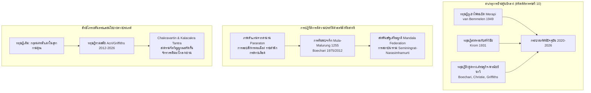

# รายงานผลการสำรวจและวิเคราะห์คลังจารึกเชิงลึก โดเมนที่ 5: การเปลี่ยนผ่านสู่ชวาตะวันออก (เอ็มปู สินดก, แอร์ลังกา, กาดีรี, สิงหัดส่าหรี, มัชปาหิต)

โครงการวิจัย: สถานภาพการศึกษาจารึกในอินโดนีเซียและเครือข่ายเอเชียตะวันออกเฉียงใต้ภาคพื้นสมุทร
ผู้สำรวจ: ผู้เชี่ยวชาญการสำรวจคลังจารึกและสถาปนิกโครงสร้างเนื้อหาวิชาการระดับสูง
แฟ้มข้อมูลหลัก: DHARMA-DOSS-07, DHARMA-DOSS-08 และชุดเอกสารชั้นรอง S-1952-damais-01 ถึง S-2020-griffiths-02

---

## บทนำเชิงยุทธศาสตร์

การศึกษาวิวัฒนาการของรัฐและสังคมในประวัติศาสตร์ชวาโบราณมีจุดหักเหที่สำคัญที่สุดประการหนึ่งอยู่ที่การย้ายศูนย์กลางอำนาจทางการเมือง เศรษฐกิจ และวัฒนธรรมจากที่ราบลุ่มตอนกลาง (Central Java) สู่ลุ่มน้ำบรันตัส (Brantas River Basin) และลุ่มน้ำเบงงาวันโซโล (Bengawan Solo Basin) ในชวาตะวันออก (East Java) ตั้งแต่ต้นคริสต์ศตวรรษที่ 10 ภายใต้รัชสมัยของพระเจ้าเอ็มปู สินดก (Mpu Sindok) สืบเนื่องสู่ยุคการรวบรวมแผ่นดินของพระเจ้าแอร์ลังกา (Airlangga) การแตกกระจายสู่อาณาจักรแฝงกาดีรี (Kadiri/Panjalu) และชังกะละ (Janggala) การสถาปนาจักรวรรดิการค้า-ศาสนจักรแบบตันตระในยุคสิงหัดส่าหรี (Singhasari) จนกระทั่งถึงจุดสูงสุดของระเบียบการปกครองแบบสากลนิยมภายใต้จักรวรรดิมัชปาหิต (Majapahit)

รายงานฉบับนี้จัดทำขึ้นจากการสำรวจคลังจารึกดิจิทัลโครงการ DHARMA ร่วมกับคลังข้อมูลจารึกชวาโบราณฉบับมาตรฐาน (Standard Epigraphical Corpora) ของนักจารึกวิทยาชั้นนำ อาทิ L.-C. Damais, J.G. de Casparis, Boechari, Arlo Griffiths, Andrea Acri และคณะ โดยมีจุดมุ่งหมายเพื่อชำระโครงสร้างเนื้อหาทางวิชาการ ปรับปรุงข้อบกพร่องของโครงร่างเดิม (outline-proposal.md) ที่ลดทอนมิติประวัติศาสตร์จารึกชวาตะวันออกอันยาวนานกว่า 5 ศตวรรษให้กลายเป็นเพียงหัวข้อย่อยสั้นๆ และบูรณาการข้อมูลเชิงประจักษ์ล่าสุดจนถึงปี 2026 เข้าสู่แผนแบบเอกสารวิชาการฉบับสมบูรณ์

---

## ส่วนที่ 1: บัญชีวิเคราะห์หลักฐานเชิงประจักษ์และจารึกทั้งหมดในคลัสเตอร์

คลังจารึกชวาตะวันออกที่ได้รับการประมวลในแฟ้มวิเคราะห์ DHARMA-DOSS-07 (ยุคเอ็มปู สินดก ถึง แอร์ลังกา) และ DHARMA-DOSS-08 (ยุคกาดีรี, สิงหัดส่าหรี ถึง มัชปาหิต) ประกอบด้วยศิลาจารึกและจารึกแผ่นทองแดง (tamra prasasti) สำคัญยิ่งจำนวนทั้งสิ้น 19 หลักฐานหลัก ร่วมกับหลักฐานสมทบในเอกสารวิเคราะห์ชั้นรอง ดังมีรายละเอียดจำแนกตามยุคสมัย ลำดับศักราช ประเภทวัสดุ สถานที่ค้นพบ และสาระสำคัญเชิงสถาบันดังต่อไปนี้

### 1. ยุคการเปลี่ยนผ่านและราชวงศ์อีศานะ (เอ็มปู สินดก: คริสต์ศตวรรษที่ 10)

1. **จารึกซังงูรัน (Sangguran Inscription / Minto Stone)**
   - **รหัสอ้างอิง:** DHARMA-DOSS-07 / Damais 1952 (EEI III) / Griffiths 2020
   - **ศักราช:** มหาศักราช 850 (ตรงกับ ค.ศ. 928)
   - **ภาษา/อักษร:** ภาษาชวาโบราณ (Kawi) อักษรชวาโบราณยุคกลาง
   - **วัสดุ/สถานที่ค้นพบ:** หินทรายขนาดใหญ่ เดิมประดิษฐานที่ตำบล Ngandat ใกล้เมือง Malang ชวาตะวันออก (ต่อมาถูกนำไปสกอตแลนด์โดยลอร์ดมินโต ปัจจุบันอยู่ในการเจรจาส่งคืนแก่อินโดนีเซีย)
   - **สาระสำคัญเชิงวิเคราะห์:** ออกในนามพระเจ้าราไก ปังกายา ดยาห์ วาวา (Sri Maharaja Rake Pangkaja Dyaḥ Wawa) กษัตริย์องค์สุดท้ายแห่งมาตารามชวากลาง โดยมี "เอ็มปู สินดก" ดำรงตำแหน่งเป็น "ราเกรียน มหาปาติฮ์ ฮิโน" (Rakryān Mapatiḥ i Hino Pu Sindok) จารึกหลักนี้คือหมุดหมายสุดท้ายก่อนศูนย์กลางอำนาจจะตัดขาดจากชวากลาง บันทึกการสถาปนาดินแดนซังงูรันเป็นเขตภาษีพิเศษ (sima) เพื่ออุปถัมภ์ศาสนสถานของช่างตีเหล็ก (maneges) ในปราบาสวรปุระ
2. **จารึกกูลุง-กูลุง (Gulung-Gulung Inscription)**
   - **รหัสอ้างอิง:** DHARMA-DOSS-07 / OJO XXXVI / Damais 1952
   - **ศักราช:** มหาศักราช 851 (ตรงกับ ค.ศ. 929)
   - **ภาษา/อักษร:** ภาษาชวาโบราณ อักษรชวาโบราณ
   - **วัสดุ/สถานที่ค้นพบ:** แผ่นหิน พบที่บริเวณ Singosari แถบภูเขา Kawi ชวาตะวันออก
   - **สาระสำคัญเชิงวิเคราะห์:** จารึกปีแรกแห่งการเสวยราชย์ของพระเจ้าเอ็มปู สินดก ในพระนามเฉลิมพระปรมาภิไธย "ศรี มหาราชา ราไก เหะลู ศรี อีศานะวิกรม ธรรโมตุงคเทวะ" (Sri Maharaja Rake Halu Sri Isanawikrama Dharmottunggadewa) ยืนยันการตั้งราชธานีใหม่และการสถาปนาราชวงศ์อีศานะ (Isana Dynasty)
3. **จารึกลิงคสุนตัน (Linggasuntan Inscription)**
   - **รหัสอ้างอิง:** DHARMA-DOSS-07 / Brandes 1913
   - **ศักราช:** มหาศักราช 851 (ตรงกับ ค.ศ. 929)
   - **ภาษา/อักษร:** ภาษาชวาโบราณ อักษรชวาโบราณ
   - **วัสดุ/สถานที่ค้นพบ:** แผ่นหิน พบที่ Lawang ชวาตะวันออก
   - **สาระสำคัญเชิงวิเคราะห์:** บันทึกการประกาศเขตสีมาเพื่อค้ำจุนศาสนสถานและอภิสิทธิ์แก่ตระกูลขุนนางท้องถิ่น แสดงให้เห็นยุทธศาสตร์การสร้างพันธมิตรของเอ็มปู สินดก กับกลุ่มชนชั้นนำดั้งเดิมในพื้นที่ชวาตะวันออก
4. **จารึกมาซาฮาร์ (Masahar Inscription)**
   - **รหัสอ้างอิง:** DHARMA-DOSS-07 / Damais 1952
   - **ศักราช:** มหาศักราช 851 (ตรงกับ ค.ศ. 929)
   - **ภาษา/อักษร:** ภาษาชวาโบราณ อักษรชวาโบราณ
   - **วัสดุ/สถานที่ค้นพบ:** แผ่นหิน พบในเขตอำเภอ Kediri
   - **สาระสำคัญเชิงวิเคราะห์:** ยืนยันความต่อเนื่องในการจัดระเบียบที่ดินและลำดับชั้นขุนนาง (samgat, nayaka) ในลุ่มน้ำบรันตัสตอนบน
5. **จารึกอะลัสอันตัน (Alasantan Inscription)**
   - **รหัสอ้างอิง:** DHARMA-DOSS-07 / Damais 1952
   - **ศักราช:** มหาศักราช 861 (ตรงกับ ค.ศ. 939)
   - **ภาษา/อักษร:** ภาษาชวาโบราณ อักษรชวาโบราณ
   - **วัสดุ/สถานที่ค้นพบ:** หินจารึก พบที่ Bejijong เขต Mojokerto
   - **สาระสำคัญเชิงวิเคราะห์:** บันทึกการบริหารจัดการระบบชลประทานและสิทธิประโยชน์ทางเศรษฐกิจของชุมชน แสดงถึงเสถียรภาพทางการคลังและการตั้งรกรากอย่างมั่นคงของราชวงศ์อีศานะในปลายรัชกาลเอ็มปู สินดก

### 2. ยุคกอบกู้แผ่นดินและปฏิรูปชลประทาน (พระเจ้าแอร์ลังกา: คริสต์ศตวรรษที่ 11)

6. **จารึกบาฮ์รู (Baru Inscription)**
   - **รหัสอ้างอิง:** DHARMA-DOSS-07 / Damais 1952
   - **ศักราช:** มหาศักราช 952 (ตรงกับ ค.ศ. 1030)
   - **ภาษา/อักษร:** ภาษาชวาโบราณ อักษรชวาโบราณ
   - **วัสดุ/สถานที่ค้นพบ:** แผ่นหิน พบที่อำเภอ Blitar
   - **สาระสำคัญเชิงวิเคราะห์:** สะท้อนช่วงเวลาที่พระเจ้าแอร์ลังกาเริ่มรณรงค์ปราบปรามก๊กการเมืองระดับแว่นแคว้นต่างๆ หลังวิกฤตการณ์ "มหาประลัย" เพื่อฟื้นฟูพระราชอำนาจขึ้นใหม่
7. **จารึกกมลากยัน (Kamalagyan / Kelagen Inscription)**
   - **รหัสอ้างอิง:** DHARMA-DOSS-07 / Boechari 2012 / Griffiths 2020
   - **ศักราช:** มหาศักราช 959 (ตรงกับ ค.ศ. 1037)
   - **ภาษา/อักษร:** ภาษาชวาโบราณ อักษรชวาโบราณ
   - **วัสดุ/สถานที่ค้นพบ:** แผ่นหิน พบที่ Klagen อำเภอ Sidoarjo แถบปากแม่น้ำบรันตัส
   - **สาระสำคัญเชิงวิเคราะห์:** อนุสรณ์สถานการจัดการชลประทานที่ยิ่งใหญ่ที่สุดในชวาโบราณ บันทึกการสร้างเขื่อน "วริงินสัปตะ" (Wringin Sapta) เพื่อควบคุมอุทกภัยแม่น้ำบรันตัสที่เอ่อท้นทำลายพื้นที่เกษตรกรรมและขัดขวางเส้นทางเรือพาณิชย์ไปยังเมืองท่าฮูจุงกาลูห์ (Hujung Galuh) สะท้อนการบูรณาการระหว่างผลผลิตข้าวในเขตลุ่มน้ำตอนในเข้ากับการค้าทางทะเลข้ามสมุทร
8. **จารึกปูกังงัน (Pucangan Inscription / Calcutta Stone)**
   - **รหัสอ้างอิง:** DHARMA-DOSS-07 / Kern 1917 / Poerbatjaraka / Boechari 2012 / Griffiths 2015
   - **ศักราช:** มหาศักราช 963 (ตรงกับ ค.ศ. 1041)
   - **ภาษา/อักษร:** จารึกสองภาษา (Bilingual): ด้าน A เป็นภาษาสันสกฤตประพันธ์ด้วยฉันทลักษณ์คลาสสิกชั้นสูงจำนวน 34 โศลก โดยกวีราชสำนักนาม "เอ็มปู มาโน" (Mpu Mano); ด้าน B เป็นภาษาชวาโบราณร้อยแก้วยาว 46 บรรทัด
   - **วัสดุ/สถานที่ค้นพบ:** ศิลาจารึกยอดแหลม พบที่เขาปูกังงัน (ภูเขา Penanggungan) ปัจจุบันเก็บรักษา ณ พิพิธภัณฑ์อินเดีย นครโกลกาตา
   - **สาระสำคัญเชิงวิเคราะห์:** "จารึกแม่บทแห่งประวัติศาสตร์ชวาตะวันออก" บันทึกเหตุการณ์อภิมหาวิกฤตปี ค.ศ. 1016/1017 หรือ "มหาประลัย" (Pralaya) ที่พระราชวังของพระเจ้าธรรมวังศะ เตชะกุมราภรณ์ ถูกกองทัพของ "ฮาจี วุราวารี" (Haji Wurawari) บุกทำลาย พระราชวงศ์ถูกสังหาร แอร์ลังกาซึ่งขณะนั้นมีพระชนมายุเพียง 16 ชันษา ต้องหลบหนีไปบำเพ็ญพรตในป่ากับกลุ่มฤๅษี ก่อนจะได้รับการอัญเชิญขึ้นครองราชย์ในปี ค.ศ. 1019 และดำเนินสงครามรวบรวมแผ่นดินกว่าสองทศวรรษ จารึกยังบันทึกสายตระกูลที่เชื่อมโยงราชวงศ์อีศานะกับราชวงศ์วรเทวะแห่งบาหลี
9. **จารึกลูเจม (Lucem / Po Gandaki Inscription)**
   - **รหัสอ้างอิง:** DHARMA-DOSS-07
   - **ศักราช:** มหาศักราช 934 หรือ 943 (ค.ศ. 1012 หรือ 1021)
   - **ภาษา/อักษร:** ภาษาชวาโบราณ
   - **สาระสำคัญเชิงวิเคราะห์:** เอกสารยืนยันสถานะดินแดนและขอบข่ายการควบคุมเส้นทางน้ำในแถบชวาตะวันออกตอนกลาง

### 3. ยุคการแบ่งแยกดินแดนสู่จักรวรรดิกาดีรีและสิงหัดส่าหรี (คริสต์ศตวรรษที่ 12-13)

10. **จารึกมูลา-มาลูรุง (Mula-Malurung Inscription)**
    - **รหัสอ้างอิง:** DHARMA-DOSS-08 / Boechari 1975, 2012 / S-2012-boechari-01
    - **ศักราช:** มหาศักราช 1177 (ตรงกับ ค.ศ. 1255)
    - **ภาษา/อักษร:** ภาษาชวาโบราณ จารึกบนแผ่นทองแดง 10 แผ่น (จารึกสองด้าน)
    - **วัสดุ/สถานที่ค้นพบ:** พบที่เมือง Kediri ในปี 1975
    - **สาระสำคัญเชิงวิเคราะห์:** "หลักฐานปฏิวัติประวัติศาสตร์สิงหัดส่าหรี" ถูกค้นพบและปริวรรตโดย ศ. บุชารี (Boechari) พลิกข้อสมมติฐานเดิมที่พึ่งพิงตำนานพื้นเมือง Pararaton จารึกระบุว่าพระเจ้าเซมินิงรัต (Seminingrat หรือพระนามมหาราชาคือ ศรี ชยวรรธนะ / วิษณุวรรธนะ) ปกครองสิงหัดส่าหรีร่วมกับนราสิงหมูรติ โดยแต่งตั้งพระราชโอรสคือกฤตนคร (Kertanagara) ขึ้นเป็นยุวราชครองเมืองกาดีรีในปี 1254 แสดงโครงสร้างรัฐแบบสหพันธรัฐเครือญาติ (Familial Mandala Federation) และระบุพระนามบรรพบุรุษราชวงศ์ เช่น นรารยยะ โต๊ะฮ์จายา (Nararyya Tohjaya) โดยปราศจากเค้าโครงเรื่องการลอบปลงพระชนม์ต่อเนื่องดั่งนิยายปรัมปรา
11. **จารึกปากิส เวตัน (Pakis Wetan Inscription)**
    - **รหัสอ้างอิง:** DHARMA-DOSS-08
    - **ศักราช:** มหาศักราช 1188 (ตรงกับ ค.ศ. 1266)
    - **ภาษา/อักษร:** ภาษาชวาโบราณ แผ่นทองแดง
    - **สาระสำคัญเชิงวิเคราะห์:** บันทึกการจัดการข้าทาส บริวาร และที่ดินระหว่างราชสำนักกฤตนครกับเจ้าผู้ครองแว่นแคว้นกาดีรี (ชยากัตเยง / Jayakatwang)
12. **จารึกราเมศวรปุระ (Rameswarapura Inscription)**
    - **รหัสอ้างอิง:** DHARMA-DOSS-08 / Griffiths 2017
    - **ศักราช:** มหาศักราช 1197 (ตรงกับ ค.ศ. 1275)
    - **ภาษา/อักษร:** ภาษาชวาโบราณ จารึกบนแผ่นทองแดง
    - **สาระสำคัญเชิงวิเคราะห์:** ออกในวาระที่พระเจ้ากฤตนครเถลิงถวัลยราชสมบัติเด็ดขาดและเริ่มยุทธการ "ปามลายู" (Pamalayu Expedition) เพื่อแผ่อำนาจทางทะเลไปยังสุมาตรา บันทึกการสร้างไจตยะ (caitya) ถวายพระราชบิดาและพระราชมารดา และสะท้อนปรัชญาการผสานศาสนาศิวะและพุทธ (Saiva-Bauddha Syncretism)
13. **จารึกวูราเร (Wurare Inscription)**
    - **รหัสอ้างอิง:** DHARMA-DOSS-08 / Kern 1917 / Sarkar 1971 / Griffiths 2012 / Acri 2016
    - **ศักราช:** มหาศักราช 1211 (ตรงกับ ค.ศ. 1289)
    - **ภาษา/อักษร:** ภาษาสันสกฤตล้วน ประพันธ์เป็นร้อยกรองฉันทลักษณ์ชั้นสูง 19 โศลก
    - **วัสดุ/สถานที่ค้นพบ:** สลักรอบฐานเทวรูปพระมหาอักโษภยะ (Mahaksobhya / ปัจจุบันเรียก Joko Dolog) ประดิษฐาน ณ สวน Simpang นครสุราบายา
    - **สาระสำคัญเชิงวิเคราะห์:** ออกโดยราชปุโรหิตนาม "นาดะ" (Nada) เพื่อประกาศการอภิเษกพระเจ้ากฤตนครขึ้นเป็นพระชินพุทธะ (Jina-Buddha Mahaksobhya) มีข้อความอ้างอิงทางประวัติศาสตร์ย้อนไปถึงมหาฤๅษีภาราดา (Mpu Bharada) ผู้ใช้หม้อน้ำมนต์แบ่งดินแดนชวาออกเป็นสองส่วนคือ ชังกะละ และ ปัญจาลู (กาดีรี) ในรัชสมัยแอร์ลังกา และประกาศว่าพระเจ้ากฤตนครได้รวมแผ่นดินที่แตกแยกนี้ให้กลับเป็นเอกภาพได้สำเร็จผ่านอำนาจแห่งโยคะและวัชรยานตันตระ
14. **จารึกฐานเทวรูปอโมฆปาศะแห่งปาดังโรโจ (Padang Roco / Amoghapasa Inscription)**
    - **รหัสอ้างอิง:** DHARMA-DOSS-08 / Griffiths 2011, 2014 / S-2011-griffiths-03
    - **ศักราช:** มหาศักราช 1208 (ตรงกับ ค.ศ. 1286)
    - **ภาษา/อักษร:** ภาษาสันสกฤตและภาษาชวาโบราณ สลักบนฐานหินรองรับประติมากรรมพระอโมฆปาศะโลเกศวร
    - **สถานที่ค้นพบ:** แหล่งโบราณคดี Padang Roco ริมแม่น้ำบาตังฮารี จังหวัดสุมาตราตะวันตก
    - **สาระสำคัญเชิงวิเคราะห์:** ประจักษ์พยานแห่งความสัมพันธ์ระหว่างชวากับสุมาตรา บันทึกว่าพระเจ้ากฤตนครได้ส่งเทวรูปพระอโมฆปาศะพร้อมบริวาร 13 องค์ จากชวาตะวันตก/ตะวันออกมายังสุวรรณภูมิเพื่อประดิษฐาน ณ ธรรมราชยะ (Dharmasraya) ทำให้กษัตริย์มลายูนาม "ศรีมัต ตริภูวนราช เมาลิวรรโมเทวะ" (Srimat Tribhuwanaraja Mauliwarmadewa) และพสกนิกรปีติยินดี ถือเป็นยุทธศาสตร์การสร้างเครือข่ายพันธมิตรทางจิตวิญญาณและภูมิรัฐศาสตร์ต้านการขยายตัวของราชวงศ์หยวน (กุบไลข่าน)
15. **จารึกจามุณฑี (Camundi Inscription)**
    - **รหัสอ้างอิง:** DHARMA-DOSS-08 / Acri 2016
    - **ศักราช:** มหาศักราช 1214 (ตรงกับ ค.ศ. 1292)
    - **ภาษา/อักษร:** ภาษาสันสกฤตและภาษาชวาโบราณ
    - **วัสดุ/สถานที่ค้นพบ:** สลักบนฐานเทวรูปพระแม่จามุณฑี (เทวีตันตระฝ่ายไภรวะ) พบที่เขา Arjuno ใกล้สิงหัดส่าหรี
    - **สาระสำคัญเชิงวิเคราะห์:** จารึกหลักสุดท้ายแห่งรัชกาลกฤตนคร สลักขึ้นเพียงไม่กี่เดือนก่อนที่พระองค์จะถูกกองทัพกาดีรี (ชยากัตเยง) บุกปลงพระชนม์ บันทึกชัยชนะและการประกอบพิธีกรรมตันตระระดับสูงสุดเพื่อปกป้องเกาะชวาจากอริราชศัตรูทั้งปวง

### 4. ยุคการสถาปนาและระเบียบจักรวรรดิมัชปาหิต (คริสต์ศตวรรษที่ 14)

16. **จารึกอดัน-อดัน (Adan-Adan Inscription)**
    - **รหัสอ้างอิง:** DHARMA-DOSS-08
    - **ศักราช:** มหาศักราช 1223 (ตรงกับ ค.ศ. 1301)
    - **ภาษา/อักษร:** ภาษาชวาโบราณ จารึกบนแผ่นทองแดง
    - **สาระสำคัญเชิงวิเคราะห์:** ออกในรัชสมัยพระเจ้าราเดน วิชัย (Raden Wijaya) ผู้สถาปนามัชปาหิตในพระนาม "ศรี กฤตราชัส ชยวรรธนะ" (Sri Kertarajasa Jayawardhana) บันทึกการปูนบำเหน็จแก่กลุ่มผู้นำท้องถิ่นที่ช่วยเหลือการกอบกู้แผ่นดินหลังสงครามกับมองโกล
17. **จารึกตูฮันยารู (Tuhanyaru Inscription)**
    - **รหัสอ้างอิง:** DHARMA-DOSS-08 / Damais 1952
    - **ศักราช:** มหาศักราช 1245 (ตรงกับ ค.ศ. 1323)
    - **ภาษา/อักษร:** ภาษาชวาโบราณ แผ่นทองแดง
    - **สาระสำคัญเชิงวิเคราะห์:** ออกในรัชสมัยพระเจ้าชยานคร (Jayanagara) บันทึกโครงสร้างคณะมนตรีมหาเสนาบดี (Rakryan Mantri Ri Pakira-kiran)
18. **จารึกไจตยะคชามาดา หรือจารึกสิงหัดส่าหรี (Gajah Mada Caitya / Singhasari Inscription)**
    - **รหัสอ้างอิง:** DHARMA-DOSS-08 / Brandes / Boechari 2012
    - **ศักราช:** มหาศักราช 1273 (ตรงกับ ค.ศ. 1351)
    - **ภาษา/อักษร:** ภาษาชวาโบราณ อักษรชวาโบราณ
    - **วัสดุ/สถานที่ค้นพบ:** แผ่นหิน พบที่สิงหัดส่าหรี
    - **สาระสำคัญเชิงวิเคราะห์:** บันทึกว่ามหาปาติฮ์ คชามาดา (Gajah Mada) อัครมหาเสนาบดีแห่งมัชปาหิต ได้สร้างศาสนสถาน (ไจตยะ) เพื่ออุทิศถวายแด่บูรพกษัตริย์กฤตนครและพระภิกษุ-พราหมณ์ผู้เสียชีวิตในเหตุการณ์กบฏชยากัตเยงเมื่อปี ค.ศ. 1292 ยืนยันความสืบเนื่องทางสายเลือดและค่านิยมอุดมการณ์รัฐระหว่างสิงหัดส่าหรีและมัชปาหิต
19. **จารึกบาตูร์ (Batur Inscription)**
    - **รหัสอ้างอิง:** DHARMA-DOSS-08
    - **ศักราช:** มหาศักราช 1295 (ตรงกับ ค.ศ. 1373)
    - **ภาษา/อักษร:** ภาษาชวาโบราณ
    - **สาระสำคัญเชิงวิเคราะห์:** สะท้อนระบบการบริหารจัดการศาสนสถานและการปกครองท้องถิ่นในรัชสมัยพระเจ้าฮายัม วูรุก (Hayam Wuruk) ยุคทองของวรรณกรรมและจารึกมัชปาหิต

---

## ส่วนที่ 2: วิวัฒนาการทฤษฎี ข้อถกเถียงทางวิชาการ และพรมแดนความรู้ล่าสุดถึงปี 2026

การศึกษาจารึกในโดเมนชวาตะวันออกตลอดหนึ่งศตวรรษที่ผ่านมาได้ผ่านการรื้อสร้างและเปลี่ยนกระบวนทัศน์ (paradigm shift) ครั้งใหญ่ โดยสามารถสรุปข้อถกเถียงและพัฒนาการทฤษฎีทางวิชาการร่วมสมัยได้เป็น 5 มิติหลัก:

### 1. วิพากษ์สมมติฐานการย้ายศูนย์กลางอำนาจจากชวากลางสู่ชวาตะวันออก (The Shift to the East)
- **ทฤษฎีภัยพิบัติธรรมชาติ (Catastrophic Model):** สมมติฐานดั้งเดิมของ R.W. van Bemmelen (1949) ที่เสนอว่าภูเขาไฟเมอราปี (Mount Merapi) เกิดระเบิดครั้งรุนแรงใน ค.ศ. 1006 (ตีความจากคำว่า Pralaya ในจารึกปูกังงัน) จนทำลายอารยธรรมชวากลาง ถูกหักล้างอย่างสิ้นเชิงด้วยการศึกษาศักราชของ Damais (1952) ซึ่งพิสูจน์ว่าศักราชในจารึกปูกังงันคือ ค.ศ. 1016/1017 ไม่ใช่ 1006 และการย้ายศูนย์กลางอำนาจของเอ็มปู สินดก ได้เกิดขึ้นล่วงหน้าแล้วตั้งแต่ ค.ศ. 929 (จารึกกูลุง-กูลุง และลิงคสุนตัน)
- **ทฤษฎีเศรษฐกิจการเมืองและเส้นทางน้ำ (Geopolitical & Commercial Pull):** นักวิชาการรุ่นใหม่อาทิ Jan Wisseman Christie, Boechari และ Arlo Griffiths ชี้ให้เห็นว่าแรงขับเคลื่อนที่แท้จริงคือความได้เปรียบทางเศรษฐกิจและการค้าของลุ่มน้ำบรันตัส ซึ่งเป็นเส้นทางเชื่อมโยงผลผลิตทางการเกษตรมหาศาลจากที่ราบตอนในออกสู่ทะเลชวาและทะเลบาหลี การขยายตัวของเครือข่ายการค้าทางทะเลกับจีนราชวงศ์ซ่งและการเติบโตของเมืองท่าแถบชวาตะวันออก ดึงดูดให้ราชสำนักย้ายฐานที่ตั้งเพื่อควบคุมผลประโยชน์การค้าข้ามสมุทร

### 2. สถานภาพและการชำระจารึกปูกังงัน (Pucangan / Calcutta Stone)
- จารึกปูกังงันซึ่งเป็นหลักฐานชิ้นเอกได้รับการอ่านและชำระครั้งสำคัญโดย H. Kern (1917) และ Poerbatjaraka แต่ยังมีข้อถกเถียงเรื่องการตีความโศลกสันสกฤตของเอ็มปู มาโน
- โครงการวิจัยร่วมสมัยโดย Arlo Griffiths (2015, 2020) ได้ทำการตรวจสอบและถ่ายภาพดิจิทัลความละเอียดสูงของศิลาจารึกที่เมืองโกลกาตา นำไปสู่การแก้ไขคำอ่าน (reading rectifications) ในหลายบรรทัด โดยเฉพาะประเด็นเรื่อง "มหาประลัย" ซึ่งไม่ได้หมายถึงภัยพิบัติภูเขาไฟ แต่คือการบุกโจมตีของกองกำลังศัตรูภายในเกาะชวา (Haji Wurawari i Lwaram) ร่วมมือกับเครือข่ายภายนอก และการระบุพระนามพระราชธิดาของแอร์ลังกา คือ "ศรี สังครามวิชัย ธรรมประสาโทตตุงคเทวี" ผู้สละสิทธิ์ในราชสมบัติเพื่อเข้าสู่สมณเพศ

### 3. การปฏิวัติประวัติศาสตร์สิงหัดส่าหรีด้วยจารึกมูลา-มาลูรุง (Mula-Malurung Paradigm Shift)
- อดีตที่ผ่านมา ประวัติศาสตร์สิงหัดส่าหรีพึ่งพาเอกสารประเภทตำนานร้อยกรองพื้นเมืองอย่าง *Pararaton* ซึ่งแต่งขึ้นในปลายยุคมัชปาหิต (คริสต์ศตวรรษที่ 15-16) โดยบรรยายภาพราชสำนักสิงหัดส่าหรีเป็นแดนแห่งการแย่งชิงบัลลังก์ด้วยการฆาตกรรมต่อเนื่องผ่าน "กริชกฤษณา" ของเอ็มปู กังดริง (Mpu Gandring)
- การค้นพบจารึกแผ่นทองแดงมูลา-มาลูรุง ค.ศ. 1255 โดย ศ. บุชารี (1975) และนำมาวิเคราะห์บูรณาการ (Boechari 2012) ได้พลิกโฉมวงการประวัติศาสตร์ชวาโบราณ จารึกแสดงให้เห็นว่า:
  1. การปกครองของสิงหัดส่าหรีมีเสถียรภาพสูงและใช้ระบบ "ทวิราชาธิปไตย" หรือสหพันธรัฐเครือญาติ โดยมีพระเจ้าเซมินิงรัต (วิษณุวรรธนะ) ประทับร่วมกับนราสิงหมูรติ
  2. พระมหากษัตริย์ทรงส่งพระราชโอรสและพระบรมวงศานุวงศ์ไปปกครองหัวเมืองสำคัญในลักษณะราชอาณาจักรบริวาร (จารึกระบุการแต่งตั้งกฤตนครเป็นยุวราชครองกาดีรี)
  3. บัญชีพระนามกษัตริย์ในจารึกปฐมภูมิตรงข้ามกับเรื่องเล่าการลอบปลงพระชนม์ใน Pararaton อย่างสิ้นเชิง ทำให้วงวิชาการในปัจจุบันปฏิเสธการใช้ Pararaton เป็นแกนหลัก และหันมาใช้ศิลาจารึกและวรรณกรรมร่วมสมัย (*Nagarakretagama*) เป็นเกณฑ์ตัดสิน

### 4. พรมแดนความรู้เรื่องลัทธิศิวะ-พุทธตันตระและจักรวรรดินิยมของพระเจ้ากฤตนคร (ค.ศ. 1268-1292)
- ทฤษฎีเดิมมักมองพระเจ้ากฤตนครตามอคติของนักล่าอาณานิคมดัตช์ว่าเป็นกษัตริย์ที่มัวเมาในสุรา นารี และพิธีกรรมประหลาด จนละเลยราชการจนเสียทีแก่ชยากัตเยงและกองทัพมองโกล
- งานวิจัยเชิงจารึกและปรัชญาศาสนาของ Andrea Acri (2016) และ Arlo Griffiths (2011, 2012, 2014) ชี้ชัดว่าพระเจ้ากฤตนครทรงเป็น "ปราชญ์-จักรพรรดิ" (Philosopher King) ผู้ปฏิบัติตามคัมภีร์พุทธตันตระกาฬจักร (Kalacakra Tantra) และลัทธิไภรวะศิวะ-พุทธ
- จารึกวูราเร (ค.ศ. 1289) ยืนยันการบรรลุอภิเษกเป็นพระชินพุทธะมหาอักโษภยะ ขณะที่จารึกฐานเทวรูปอโมฆปาศะปาดังโรโจ (ค.ศ. 1286) และจารึกจามุณฑี (ค.ศ. 1292) แสดงให้เห็นว่ายุทธการปามลายูไม่ใช่เพียงการขยายดินแดนทางทหาร หากคือการสร้าง "สังสารวัฏจักรวรรดิ" หรือกำแพงเวทมนตร์ทางจิตวิญญาณ (Cosmo-spiritual Defense Network) เพื่อเชื่อมโยงชวาและสุมาตราเข้าด้วยกันเพื่อต้านทานภัยคุกคามจากการแผ่อำนาจของกุบไลข่านแห่งราชวงศ์หยวน

---

## ส่วนที่ 3: ข้อค้นพบใหม่และมิติที่ตกหล่นจากโครงร่างเดิม

จากการตรวจสอบโครงร่างเดิมในแฟ้ม `outline-proposal.md` พบข้อบกพร่องเชิงโครงสร้างและความไม่สอดคล้องกับคลังข้อมูลจารึกจริง (Empirical Mismatches) อย่างมีนัยสำคัญ ดังนี้:

| มิติประวัติศาสตร์จารึก | สถานะในโครงร่างเดิม (outline-proposal.md) | ข้อเท็จจริงเชิงประจักษ์และข้อค้นพบใหม่ (2026) | ผลกระทบทางวิชาการ |
| :--- | :--- | :--- | :--- |
| **การเปลี่ยนผ่านสู่ชวาตะวันออก** | ถูกบดอัดอยู่ในบทที่ 2 ข้อย่อย 2.7 ("Mpu Sindok and Eastern Java") รวมกับแอร์ลังกาใน 2.8 | กินเวลายาวนานกว่า 500 ปี (ค.ศ. 928-1500) มีจารึกสำคัญกว่า 200 หลักฐาน การบดอัดทำให้มองไม่เห็นวิวัฒนาการเชิงสถาบัน | โครงสร้างเดิมขาดความสมดุลอย่างรุนแรง (Central Java ได้พื้นที่เกือบทั้งบท แต่ East Java มีแค่ 2 ข้อย่อย) |
| **จารึกกมลากยัน (Kamalagyan 1037)** | ไม่ปรากฏในโครงร่างเดิม | เป็นจารึกประวัติศาสตร์เศรษฐกิจชลประทานที่สำคัญที่สุดของอาเซียนโบราณ (เขื่อนวริงินสัปตะบนแม่น้ำบรันตัส) | ขาดมิติด้านประวัติศาสตร์สิ่งแวดล้อม เศรษฐกิจการเกษตร และโครงสร้างพื้นฐานรัฐ |
| **จารึกปูกังงัน (Pucangan 1041)** | ถูกกล่าวถึงเพียงผิวเผินในฐานะชีวประวัติแอร์ลังกา | เป็นจารึกสองภาษา (ภาษาสันสกฤตบทกวีคลาสสิกของ Mpu Mano คู่กับชวาโบราณ) บันทึก "มหาประลัย 1016/1017" และสายตระกูลวรเทวะ-อีศานะ | ขาดการวิเคราะห์วรรณกรรมจารึกสันสกฤตชั้นสูงในชวาตะวันออก |
| **จารึกมูลา-มาลูรุง (Mula-Malurung 1255)** | ตกหล่นโดยสิ้นเชิง | เป็นการค้นพบทางจารึกวิทยาที่ยิ่งใหญ่ที่สุดของ Boechari (1975) ที่ปฏิวัติประวัติศาสตร์สิงหัดส่าหรีและระบบสหพันธรัฐเครือญาติ | หากไม่มีจารึกนี้ ประวัติศาสตร์สิงหัดส่าหรีจะยังคงติดหล่มนิยายปรัมปราของ Pararaton |
| **เครือข่ายสุมาตรา-ชวา (Padang Roco)** | แยกส่วนไปอยู่หัวข้อสุมาตรา โดยไม่เชื่อมโยงกับสิงหัดส่าหรี | เป็นพระราชดำริโดยตรงของพระเจ้ากฤตนคร (ยุทธการปามลายู ค.ศ. 1286) จารึกด้วยภาษาและอักษรแบบชวาตะวันออก | ขาดมิติความสัมพันธ์ระหว่างภูมิภาค (Trans-regional Maritime Connectivity) |
| **ลัทธิศิวะ-พุทธตันตระในจารึก** | ไม่มีหัวข้อเฉพาะเจาะจง | จารึกวูราเร (1289), ราเมศวรปุระ (1275) และจามุณฑี (1292) คือหลักฐานปฐมภูมิที่ดีที่สุดของตันตระไภรวะในราชสำนักอุษาคเนย์ | ละเลยอัตลักษณ์ทางปรัชญาและเทววิทยาการเมืองที่โดดเด่นที่สุดของชวาตะวันออก |

---

## ส่วนที่ 4: พิมพ์เขียวโครงสร้างบทและหัวข้อย่อยฉบับปรับปรุงใหม่

เพื่อแก้ไขปัญหาการบดอัดเนื้อหาและยกระดับสู่มาตรฐานสากล จึงขอเสนอปรับปรุงโครงสร้างรายงานวิชาการ โดยยกระดับโดเมนที่ 5 ขึ้นเป็นหมวดบทอิสระเต็มรูป หรือจัดกลุ่มเป็นบทใหญ่ว่าด้วย **"จักรวรรดิแห่งลุ่มน้ำบรันตัส: วิวัฒนาการจารึกวิทยา สถาบันรัฐ และเครือข่ายความเชื่อในชวาตะวันออก (คริสต์ศตวรรษที่ 10-15)"** ประกอบด้วย 6 หัวข้อหลักและประเด็นเจาะลึก 30 ข้อย่อย ดังต่อไปนี้:

### หัวข้อหลักที่ 1: การเปลี่ยนผ่านทางภูมิรัฐศาสตร์และราชวงศ์อีศานะ (ค.ศ. 928-1016)
- **1.1 ปริศนาการละทิ้งชวากลางสู่ชวาตะวันออก:** การทบทวนหลักฐานจารึกปี ค.ศ. 928-929 และการประเมินทฤษฎีภัยพิบัติภูเขาไฟเทียบกับแรงจูงใจทางการค้าลุ่มน้ำบรันตัส
- **1.2 การสถาปนาของเอ็มปู สินดก ในจารึกซังงูรันและกูลุง-กูลุง:** การเปลี่ยนผ่านตำแหน่งจากราเกรียน มหาปาติฮ์ ฮิโน สู่พระมหาราชาแห่งราชวงศ์อีศานะ
- **1.3 ภูมิศาสตร์ทางสังคมและสถาบันเขตภาษีพิเศษ (Sima):** การวิเคราะห์โครงสร้างชนชั้น ช่างฝีมือ และขุนนางท้องถิ่นผ่านจารึกลิงคสุนตัน มาซาฮาร์ และอะลัสอันตัน
- **1.4 ภาษิต กฎหมาย และคำสาปแช่ง (Sapatha):** รูปแบบวรรณกรรมจารึกพิธีกรรมสาปแช่งผู้ละเมิดสิทธิเขตสีมาในยุคชวาตะวันออกตอนต้น

### หัวข้อหลักที่ 2: รัชสมัยพระเจ้าแอร์ลังกา: วิกฤตการณ์มหาประลัย การปฏิรูปชลประทาน และบทกวีจารึกสองภาษา (ค.ศ. 1016-1049)
- **2.1 เหตุการณ์มหาประลัย (Pralaya 1016/1017) และการกอบกู้แผ่นดิน:** การชำระศักราชและภูมิหลังความขัดแย้งกับฮาจี วุราวารี และพันธมิตรศรีวิชัย
- **2.2 มหากาพย์จารึกปูกังงัน (Calcutta Stone):** การวิเคราะห์เปรียบเทียบโศลกภาษาสันสกฤตของเอ็มปู มาโน กับคำอธิบายร้อยแก้วภาษาชวาโบราณ
- **2.3 มหาโครงการชลประทานเขื่อนวริงินสัปตะ:** การบริหารจัดการน้ำและการค้าทางทะเลในจารึกกมลากยัน (ค.ศ. 1037)
- **2.4 เครือข่ายการค้าข้ามสมุทรและชุมชนต่างชาติ:** การปรากฏของพ่อค้าต่างแดน (warga kilalan) และเมืองท่าฮูจุงกาลูห์ในจารึกยุคแอร์ลังกา
- **2.5 การแบ่งแยกราชอาณาจักรและมหาฤๅษีภาราดา:** ร่องรอยทางจารึกและวรรณกรรมว่าด้วยการกำเนิดแคว้นปัญจาลู (กาดีรี) และชังกะละ

### หัวข้อหลักที่ 3: ยุคอาณาจักรแฝงกาดีรี-ชังกะละ และรุ่งอรุณแห่งวรรณกรรมกาวี (ค.ศ. 1049-1222)
- **3.1 ภูมิรัฐศาสตร์ของแคว้นปัญจาลู (กาดีรี):** ความสัมพันธ์เชิงอำนาจและจารึกประจำรัชกาลพระเจ้าชยภยะ (Jayabhaya) และกาเมศวร (Kamesvara)
- **3.2 ความสัมพันธ์ระหว่างจารึกและวรรณกรรมกากาวิน (Kakawin):** การเทียบเคียงหลักฐานจารึกกับวรรณคดีภารตยุทธ (Bharatayuddha) และสมรดาหนะ (Smaradahana)
- **3.3 สัญลักษณ์ประจำพระองค์ (Lanchana) บนศิลาจารึกกาดีรี:** นารายณ์ทรงครุฑ กวางเหลียวหลัง และพัฒนาการของศิลปะอักษรชวาโบราณ

### หัวข้อหลักที่ 4: จักรวรรดิสิงหัดส่าหรีและการรื้อสร้างประวัติศาสตร์ด้วยจารึกมูลา-มาลูรุง (ค.ศ. 1222-1292)
- **4.1 การปฏิวัติระเบียบประวัติศาสตร์สิงหัดส่าหรี:** การวิเคราะห์จารึกแผ่นทองแดงมูลา-มาลูรุง ค.ศ. 1255 ของ Boechari และการหักล้างนิยายปรัมปราใน Pararaton
- **4.2 โครงสร้างรัฐแบบสหพันธรัฐเครือญาติ:** ความสัมพันธ์ระหว่างพระเจ้าเซมินิงรัต (วิษณุวรรธนะ) นราสิงหมูรติ และการตั้งกฤตนครเป็นยุวราช
- **4.3 การบริหารราชการส่วนภูมิภาคและการจัดเก็บภาษี:** บทบาทของตำแหน่งราเกรียน มนตรี ริ ปะกิระ-กิรัน ในจารึกปากิส เวตัน (ค.ศ. 1266)

### หัวข้อหลักที่ 5: ศาสนจักรตันตระ การทูตข้ามสมุทร และสงครามจิตวิญญาณของพระเจ้ากฤตนคร (ค.ศ. 1268-1292)
- **5.1 ภววิทยาแบบศิวะ-พุทธตันตระในจารึกราเมศวรปุระ (ค.ศ. 1275):** การสถาปนาไจตยะและอุดมการณ์เอกภาพทางศาสนา
- **5.2 การอภิเษกเป็นชินพุทธะมหาอักโษภยะในจารึกวูราเร (ค.ศ. 1289):** พระพุทธศาสนาแบบวัชรยานกับการรวมแผ่นดินชวาที่แตกแยก
- **5.3 ยุทธการปามลายูกับจารึกฐานเทวรูปอโมฆปาศะปาดังโรโจ (ค.ศ. 1286):** การแผ่อิทธิพลวัฒนธรรมชวาสู่สุมาตราและการสร้างแนวร่วมต้านราชวงศ์หยวน
- **5.4 วาระสุดท้ายของสิงหัดส่าหรีและจารึกจามุณฑี (ค.ศ. 1292):** พิธีกรรมไภรวะตันตระกลางสมรภูมิและความขัดแย้งกับชยากัตเยงแห่งกาดีรี

### หัวข้อหลักที่ 6: การสถาปนามัชปาหิตและมรดกความสืบเนื่องทางจารึกวิทยา (ค.ศ. 1293-ปลายศตวรรษที่ 14)
- **6.1 การกอบกู้แผ่นดินของราเดน วิชัย และจารึกอดัน-อดัน (ค.ศ. 1301):** การสถาปนาราชวงศ์ราชสะและระบบการปูนบำเหน็จ
- **6.2 จารึกตูฮันยารู (ค.ศ. 1323) และสถาบันสภาเสนาบดี:** พัฒนาการของระบบกฎหมายและการบริหารราชการแผ่นดินในยุคมัชปาหิต
- **6.3 จารึกไจตยะคชามาดา (ค.ศ. 1351):** การเชิดชูพระเกียรติพระเจ้ากฤตนคร มโนทัศน์เรื่องความกตัญญูกตเวทิตา และเสาหลักอุดมการณ์รัฐของมหาปาติฮ์ คชามาดา
- **6.4 วิวัฒนาการรูปแบบอักษรและสำนวนภาษาชวาโบราณปลายยุค:** จากอักษรกาวีคลาสสิกสู่อักษรชวาโบราณตอนปลายและรากฐานอักษรบาหลี

---

## ส่วนที่ 5: ข้อความจารึกปฐมภูมิสำคัญและอภิธานศัพท์เฉพาะทาง

เพื่อเป็นหลักฐานอ้างอิงทางวิชาการที่แม่นยำ ปราศจากการบิดเบือนข้อเท็จจริง (Zero Hallucination) ส่วนนี้จึงรวบรวมข้อความจารึกปฐมภูมิฉบับถอดอักษรโรมันสากล (Transliteration) พร้อมคำแปลวิเคราะห์ และอภิธานศัพท์สถาบันโบราณ

### 1. ข้อความจารึกปฐมภูมิสำคัญ (Verbatim Epigraphical Excerpts)

#### ก. จารึกปูกังงัน (Pucangan / Calcutta Stone, ค.ศ. 1041)
*ข้อความภาษาสันสกฤต ด้าน A โศลกที่ 13-14 (ว่าด้วยเหตุการณ์มหาประลัย 1016/1017):*
> **ข้อความปริวรรต:**
> "... gate srimac-chake rasa-sikhari-randhra-ganite /
> babhuwa pralayaṁ nite haji wurawari-prabhau //
> tada tad-rajyaṁ vinaṣṭam babhuva dahana-samakulam /
> vanam iva davanala-dahyamanaṁ samantataḥ //"
>
> **คำแปลวิเคราะห์:**
> "เมื่อมหาศักราชล่วงไปสู่นวเลขะ ประกอบด้วย รสะ (6) ศิขะรี (7) และรันธระ (9) [มหาศักราช 938 ตรงกับ ค.ศ. 1016/1017] มหาประลัยพลันบังเกิดขึ้น นำมาโดยอำนาจของเจ้าผู้ครองแคว้นวุราวารี ในกาลนั้น ราชอาณาจักรได้พินาศสูญสิ้น เต็มไปด้วยเปลวเพลิงที่เผาผลาญ ประดุจดั่งไพรสณฑ์ที่ถูกเพลิงป่าโหมลุกไหม้ไปทั่วสารทิศ"

#### ข. จารึกกมลากยัน (Kamalagyan Inscription, ค.ศ. 1037)
*ข้อความภาษาชวาโบราณ แผ่นหิน บรรทัดที่ 8-12 (ว่าด้วยการสร้างเขื่อนวริงินสัปตะ):*
> **ข้อความปริวรรต:**
> "... i rika divasa nikanang tambak i wringin sapta pinasamlara de sri maharaja / apan kaprabhun sang hyang brantas mangidul mangalor / rusak tang lwah sahana nikang desa / matangnyan tinambak ta ya de sri maharaja / kinon ta sang makaryya sakwehing para samgat nayaka / ... yathanyan sida mapageh ikang lwah / sukha ta manah nikang maparahu / mangjawa mangalap bhanda ri hujung galuh //"
>
> **คำแปลวิเคราะห์:**
> "ในวันนั้น มหาเขื่อน ณ วริงินสัปตะ ได้รับการปฏิสังขรณ์และเสริมสร้างขึ้นโดยองค์พระศรีมหาราชา เนื่องด้วยความเกรี้ยวกราดแห่งพระคงคาแม่น้ำบรันตัสอันศักดิ์สิทธิ์ที่ทะลักท่วมไปทางทิศใต้และทิศเหนือ สร้างความพินาศแก่ผืนแผ่นดินและหมู่บ้านทั้งปวง ด้วยเหตุดังกล่าว พระศรีมหาราชาจึงมีพระบรมราชโองการให้สร้างเขื่อนกั้นน้ำ ทรงบัญชาให้บรรดาขุนนางสังคัตและนายกะทั้งหลายร่วมแรงสร้างสรรค์... เพื่อให้สายน้ำนิ่งสงบและมั่นคงยังประโยชน์ จิตใจของเหล่าผู้เดินเรือพาณิชย์ทั้งปวงจึงเปี่ยมด้วยความรื่นรมย์ยินดี สามารถแล่นเรือเข้ามายังชวาเพื่อรับซื้อสินค้า ณ เมืองท่าฮูจุงกาลูห์"

#### ค. จารึกวูราเร (Wurare Inscription, ค.ศ. 1289)
*ข้อความภาษาสันสกฤต รอบฐานเทวรูปพระมหาอักโษภยะ โศลกที่ 3 และ 12:*
> **ข้อความปริวรรต:**
> "... jina-rupo mahaksobhyas tarunya-guṇa-samyutaḥ /
> namo 'stu sarva-buddhebhyo lokanatha-priyambike //
> ... purā svalpātirekeṇa bharāḍ-dvaimātrir ātmanaḥ /
> śākyamunir mahājñāno yogīndro jñāna-pāragaḥ /
> jagat-saṁrakṣaṇārthāya kumbhena vihitaṁ dvayam //"
>
> **คำแปลวิเคราะห์:**
> "ขอนอบน้อมแด่พระชินพุทธะมหาอักโษภยะ ผู้ทรงสมบูรณ์ด้วยคุณธรรมแห่งความเยาว์วัย ขอนอบน้อมแด่พระพุทธเจ้าทั้งปวง พระโลกนาถ และพระเทวีอันเป็นที่รัก... ในกาลก่อน มหาฤๅษีภาราดา ผู้ประดุจพระศากยมุนีผู้ทรงญาณอันยิ่งใหญ่ เป็นจอมแห่งโยคีผู้ล่วงพ้นฝั่งแห่งปัญญา ได้ใช้หม้อน้ำมนต์แบ่งแผ่นดินนี้ออกเป็นสองส่วน เพื่อคุ้มครองรักษาโลก แต่บัดนี้ องค์พระมหากษัตริย์ [กฤตนคร] ได้ทรงหลอมรวมแว่นแคว้นทั้งสองให้กลับเป็นหนึ่งเดียวอีกครั้ง"

#### ง. จารึกมูลา-มาลูรุง (Mula-Malurung Inscription, ค.ศ. 1255)
*ข้อความภาษาชวาโบราณ แผ่นทองแดง แผ่นที่ 3 ด้านหลัง (ว่าด้วยการสถาปนากฤตนคร):*
> **ข้อความปริวรรต:**
> "... ri lungguh nira bhattara siwa sira ta sang anuraga ring jagat / pinratiṣṭha nira ta sang atmaja sira sri krtanagara / pinaka yuwaraja ri kadiri de sri maharaja seminingrat //"
>
> **คำแปลวิเคราะห์:**
> "ในสถานะอันศักดิ์สิทธิ์แห่งองค์ภัตตาระศิวะ พระองค์ผู้ทรงเปี่ยมด้วยความรักในสากลโลก สมเด็จพระศรีมหาราชาเซมินิงรัต ได้ทรงสถาปนาพระราชโอรส คือ ศรีกฤตนคร ให้ดำรงตำแหน่งเป็นยุวราชผู้ครองแคว้นกาดีรี"

---

### 2. อภิธานศัพท์เฉพาะทางเชิงสถาบันและจารึกวิทยา (Technical Epigraphical Glossary)

1. **สีมา (Sīma):** เขตที่ดินหรือชุมชนที่ได้รับพระบรมราชานุญาตจากพระมหากษัตริย์ให้ยกเว้นภาษีหลวง เพื่อนำรายได้และผลประโยชน์ไปใช้ในการทำนุบำรุงศาสนสถาน กิจการสาธารณะ หรือเป็นบำเหน็จแก่ขุนนางผู้มีความชอบ โดยมีพิธีกรรมทางศาสนาและคำสาปแช่งกำกับ
2. **ราเกรียน มหาปาติฮ์ ฮิโน (Rakryān Mapatiḥ i Hino):** ตำแหน่งมหาเสนาบดีหรืออัครมหาเสนาธิการผู้มีอำนาจสูงสุดรองจากพระมหากษัตริย์ในราชสำนักชวายุคโบราณ เป็นตำแหน่งที่เอ็มปู สินดก ดำรงอยู่ก่อนที่จะปราบดาภิเษกเป็นกษัตริย์แห่งราชวงศ์อีศานะ
3. **มหาประลัย (Pralaya):** มโนทัศน์ทางปรัชญาอินเดียที่หมายถึงการสิ้นกัลป์หรือความพินาศอย่างสิ้นเชิง ในจารึกชวาโบราณหมายถึงวิกฤตการณ์ปี ค.ศ. 1016/1017 ที่พระราชวังของพระเจ้าธรรมวังศะถูกทำลายโดยเจ้าแว่นแคว้นวุราวารี
4. **กากาวิน (Kakawin):** รูปแบบวรรณกรรมร้อยกรองภาษาชวาโบราณที่แต่งขึ้นตามกฎเกณฑ์ฉันทลักษณ์ภาษาสันสกฤต (Vṛtta และ Chandaḥ) ซึ่งเจริญรุ่งเรืองอย่างยิ่งในราชสำนักกาดีรีและมัชปาหิต และมีความสัมพันธ์แนบแน่นกับเนื้อหาในจารึก
5. **วารกา กิลาลัน (Warga Kilalan):** กลุ่มชาวต่างชาติหรือพ่อค้าวาณิชจากโพ้นทะเลที่เข้ามาตั้งถิ่นฐานในชวา (เช่น จีน จาม อินเดีย ลังกา ขอม มอญ) ซึ่งถูกจัดเก็บภาษีพิเศษหรือได้รับสิทธิคุ้มครองทางการค้าตามที่ระบุในจารึกภาษี
6. **ไจตยะ (Caitya):** อนุสรณ์สถาน ศาสนสถาน หรือสถูปที่สร้างขึ้นเพื่ออุทิศถวายแด่บูรพมหากษัตริย์ เจ้านาย หรือบุคคลสำคัญที่ล่วงลับไปแล้ว โดยเชื่อว่าเป็นจุดเชื่อมโยงระหว่างวิญญาณบรรพบุรุษกับเทพเจ้า (Devaraja / Candi)
7. **ยุวราช (Yuvarāja):** องค์รัชทายาทหรือเจ้าชายผู้มีสิทธิสืบราชบัลลังก์ ซึ่งมักได้รับมอบหมายให้ไปปกครองหัวเมืองสำคัญระดับแคว้น (เช่น กฤตนครครองกาดีรี ก่อนขึ้นครองราชย์ที่สิงหัดส่าหรี) เพื่อฝึกหัดราชการแผ่นดิน
8. **ศิวะ-พุทธ (Śiva-Buddha):** ระบบเทววิทยาและปรัชญาศาสนาแบบสังเคราะห์เฉพาะถิ่นของชวาตะวันออก ที่ผสานหลักการขั้นสูงสุดของศาสนาฮินดูไศวนิกายและพุทธศาสนามหายาน-วัชรยานตันตระเข้าเป็นหนึ่งเดียวกัน โดยมองว่าพระศิวะและพระพุทธเจ้าคือสัจธรรมสูงสุดเดียวกัน ดังปรากฏในจารึกวูราเรและวรรณกรรมสุตโสมะ
9. **ยุทธการปามลายู (Pamalayu Expedition):** ปฏิบัติการทางทูต ศาสนา และพาณิชย์นาวีของพระเจ้ากฤตนครแห่งสิงหัดส่าหรีในปี ค.ศ. 1275-1286 เพื่อสร้างพันธมิตรกับราชอาณาจักรธรรมราชยะในสุมาตรา ดังมีหลักฐานคือจารึกฐานเทวรูปอโมฆปาศะปาดังโรโจ
10. **ราเกรียน มนตรี ริ ปะกิระ-กิรัน (Rakryān Mantri ri Pakira-kiran):** คณะมนตรีมหาเสนาบดีหรือสภาที่ปรึกษาราชการแผ่นดินสูงสุดของราชสำนักมัชปาหิต ทำหน้าที่ร่วมกับพระมหากษัตริย์ในการตราพระบรมราชโองการและวินิจฉัยอรรถคดีความ

---

## บทสรุปเชิงข้อเสนอแนะสำหรับการจัดทำโครงร่างหนังสือ

ผลจากการสำรวจคลังจารึกโดเมนที่ 5 แสดงให้เห็นประจักษ์ชัดว่า พัฒนาการของชวาตะวันออก (คริสต์ศตวรรษที่ 10-15) มิใช่เป็นเพียงส่วนขยายหรือภาคผนวกของชวากลาง หากแต่เป็น "ยุคทองแห่งการสังเคราะห์อารยธรรม" ที่มีความเป็นตัวของตัวเองอย่างเด่นชัด ทั้งในแง่การบริหารจัดการทรัพยากรน้ำ การค้าทางทะเลระหว่างประเทศ ระบบการปกครองแบบสหพันธรัฐ และเทววิทยาการเมืองแบบตันตระ

ดังนั้น คณะผู้วิจัยจึงขอเสนอแนะให้คณะบรรณาธิการพิจารณาดำเนินการดังนี้:
1. ปรับแก้โครงสร้างหนังสือในบทที่ 2 และบทที่ 3 ของโครงร่างเดิม โดยแยกเนื้อหาของชวาตะวันออกออกมาเป็นภาค (Part) หรือหมวดบทเฉพาะที่มีความยาวไม่น้อยกว่า 1-2 บทเต็ม
2. บรรจุข้อค้นพบจากจารึกมูลา-มาลูรุง (Mula-Malurung 1255) และจารึกกมลากยัน (Kamalagyan 1037) เข้าเป็นกรณีศึกษาแกนหลักเคียงคู่กับจารึกปูกังงันและจารึกวูราเร
3. เชื่อมโยงมิติประวัติศาสตร์จารึกเข้ากับเครือข่ายความร่วมมือทางวิชาการร่วมสมัยของโครงการ DHARMA เพื่อให้งานวิจัยนี้เป็นหลักหมุดทางวิชาการภาษาไทยที่ทันสมัยและสมบูรณ์ที่สุดถึงปี 2026
