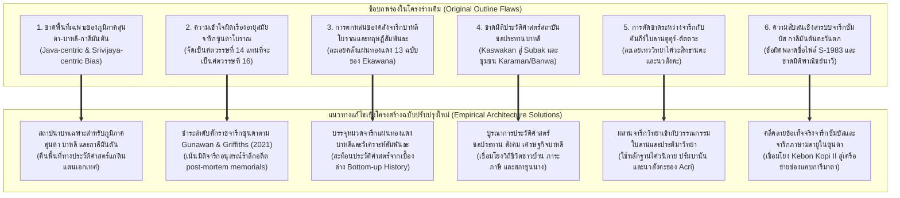
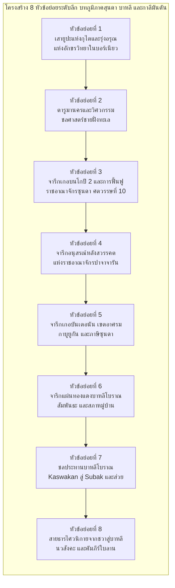

# รายงานการสำรวจ วิจัย และวิเคราะห์เชิงลึก โดเมนที่ 6
## จารึกภูมิภาคสุนดา บาหลี และกาลีมันตัน (ตารูมานคร, ปาจาจารัน, บาหลีโบราณ, ซัมบัส)
### โครงการวิจัย: สถานภาพการศึกษาจารึกในอินโดนีเซียและเครือข่ายเอเชียตะวันออกเฉียงใต้ภาคพื้นสมุทร

---

### บทนำและขอบเขตเชิงมโนทัศน์

รายงานฉบับนี้จัดทำขึ้นเพื่อสำรวจ ประมวลผล และวิเคราะห์เชิงวิพากษ์ต่อคลังหลักฐานจารึกวิทยาในโดเมนที่ 6 ซึ่งครอบคลุมสามอนุภูมิภาคทางวัฒนธรรมที่สำคัญยิ่งในประวัติศาสตร์เอเชียตะวันออกเฉียงใต้ภาคพื้นสมุทร ได้แก่ ภูมิภาคสุนดา (ชวาตะวันตก), เกาะบาหลี และเกาะกาลีมันตัน (บอร์เนียวทั้งฝั่งตะวันออกและตะวันตก) พื้นที่ทั้งสามแห่งนี้มีลักษณะร่วมทางประวัติศาสตร์ประการสำคัญ คือ เป็นดินแดนที่มีพัฒนาการทางการเมือง วัฒนธรรม ภาษา และจารึกวิทยาที่เป็นเอกเทศอย่างเด่นชัด มิได้ตกอยู่ภายใต้อำนาจครอบงำหรือกลืนกลายโดยตรงของศูนย์กลางอำนาจชวากลางหรือชวาตะวันออก (เช่น มะตะรัม หรือมัชปาหิต) และจักรวรรดิศรีวิชัยในสุมาตราตลอดเวลา หากแต่มีพลวัตทางประวัติศาสตร์นิพนธ์ ระบบตัวเขียน และสถาบันทางสังคมการเมืองของตนเองที่สืบทอดอย่างต่อเนื่องยาวนาน

จากการตรวจสอบแฟ้มข้อมูลหลักฐานเชิงประจักษ์ (Source Dossiers) ที่ได้รับมอบหมายอย่างถี่ถ้วน ประกอบด้วย `S-1918-vogel-01.md`, `S-1983-suhadi-01.md`, `S-1991-brin-01.md`, `S-2011-acri-01.md`, `S-2012-acri-01.md`, `S-2021-acri-01.md`, `S-2021-griffiths-02.md`, และคลังจารึกดิจิทัลมาตรฐานสากล `DHARMA-DOSS-09-sunda-bali-regional.md` รายงานฉบับนี้จึงมุ่งนำเสนอการสังเคราะห์หลักฐานปฐมภูมิ การชี้แจงข้อบกพร่องเชิงโครงสร้างของโครงร่างเดิม และการวางพิมพ์เขียวสถาปัตยกรรมเนื้อหาฉบับปรับปรุงใหม่ที่สอดคล้องกับพรมแดนความรู้ล่าสุดถึงปี ค.ศ. 2026 อย่างสมบูรณ์

---

### ส่วนที่ 1: บัญชีวิเคราะห์หลักฐานเชิงประจักษ์และจารึกทั้งหมดในคลัสเตอร์ (Epigraphic Empirical Inventory)

การประมวลหลักฐานจารึกในโดเมนที่ 6 เผยให้เห็นสายธารเอกสารโบราณวัตถุหลากหลายประเภท ทั้งศิลาจารึกบนแท่งหินธรรมชาติ จารึกบนแผ่นโลหะทองแดง แผ่นเงิน แผ่นทองคำบรรจุกรุฐานเจดีย์ ตลอดจนคัมภีร์ใบลานสองภาษาที่ทำหน้าที่ถ่ายทอดข้อบัญญัติทางศาสนาและกฎหมาย สามารถจำแนกออกเป็น 4 กลุ่มวัฒนธรรมย่อยตามตารางวิเคราะห์ดังต่อไปนี้:

| รหัสเอกสาร (Source ID) | ชื่อจารึกและโบราณวัตถุ | พื้นที่ค้นพบ / ภูมิภาค | วัสดุและระบบตัวเขียน | ภาษาที่ใช้ | ศักราช / ยุคสมัย | ประเด็นหลักและสถานะทางจารึกวิทยา |
|:---|:---|:---|:---|:---|:---|:---|
| `S-1918-vogel-01` | เสายูปะแห่งพระเจ้ามูลวรมัน 7 หลัก (หลัก A ถึง G) | มูอารา กามัน ริมแม่น้ำมหาคัม แคว้นกุไต กาลีมันตันตะวันออก | แท่งหินแอนดีไซต์ธรรมชาติสกัดหยาบ ทรงไม่สมมาตร สลักอักษรปัลลวะตอนต้น (Archaic Grantha) | ภาษาสันสกฤตฉันทลักษณ์คลาสสิก (อนุษฏุภ, อารยา) | กลางศตวรรษที่ 5 (ราว ค.ศ. 400–450) | เอกสารลายลักษณ์อักษรที่เก่าแก่ที่สุดในอินโดนีเซีย บันทึกพงศาวลีสามรุ่น (กุณฑุงคะ, อัศววรมัน, มูลวรมัน), มหายัญพิธีพหุสุวรรณกะ, ลานบูชาวปรเกศวร, และการถวายมหาทาน |
| `S-1983-suhadi-01` | ศิลาจารึกเกอบนโกปี 2 (Kebon Kopi II / Pasir Muara) | บ้านเกอบนโกปี ตำบลเลอวิเลียง อำเภอโบกอร์ ชวาตะวันตก | ศิลาหินธรรมชาติ อักษรกวิรุ่นแรก (Early Kawi) | ภาษามลายูโบราณ ผสมผสานคำยืมสันสกฤตและชวาโบราณ | มหาศักราช 854 (ค.ศ. 932) จากสุริยสังขยา `kawihaji pañca pasagi` | การฟื้นฟูเอกราชของกษัตริย์แห่งซุนดา (*barpulihkan haji sunda*) โดยขุนนางรัคเรียน ยูรูปางกัมบัต ภายหลังการหลุดพ้นจากอิทธิพลศรีวิชัย และเครือข่ายภาษามลายูกลาง |
| `S-1991-brin-01` | คลังจารึกแผ่นทองแดงบาหลีโบราณ 13 ฉบับ (Goris no. 302 ถึง 804) | แหล่งโบราณคดีรอบเกาะบาหลี (เขตทะเลสาบบาตูร์ บวาฮัน ตรุนยัน เซิมบีรัน บาตูวัน เตจากูลา จัมปากา ฯลฯ) | แผ่นทองแดง (*tāmra-praśasti*) เจาะรูร้อยเชือก สลักอักษรบาหลีโบราณและอักษรกวิ | ภาษาบาหลีโบราณ (ยุคแรก) และภาษาชวาโบราณ (ยุคหลังศตวรรษที่ 10) | มหาศักราช 915–1246 (ค.ศ. 993–1324) | การวิเคราะห์ส่วน "สัมพันธะ" (*sambandha*) แสดงมูลเหตุร้องทุกข์ของราษฎร, โครงสร้างสภาหมู่บ้าน (*karaman / banwa*), ภาษีและแรงงานเกณฑ์ (*drwya haji, buncang haji*), ระบบชลประทาน (*kaswakan* สู่ *subak*) |
| `S-2011-acri-01` | จารึกและประเพณีรามายณะในบาหลี | เกาะบาหลี และความเชื่อมโยงกับชวากลาง-ชวาตะวันออก | จารึกศิลา แผ่นทองแดง ภาพสลัก และคัมภีร์ใบลาน (*lontar*) | ภาษาชวาโบราณ สันสกฤต และบาหลี | ศตวรรษที่ 9 ถึงยุคปัจจุบัน | การอนุรักษ์วรรณกรรมกากาวินรามเกียรติ์ในบาหลี, คัมภีร์ร้อยแก้วกปิบรรพ (*Kapiparwa*), บทสวดสดุดีอัคนี, การจำลองมณฑลลงกาปุระ (*Laṅkapura*) และภาพเขียนบาหลี |
| `S-2012-acri-01` | จารึกแผ่นทองคำ/เงินในกรุเปอริปิฮ์ และคัมภีร์จักรวาลวิทยาไศวะ | ชวากลาง (ปรัมบานัน) เชื่อมโยงสู่คัมภีร์ใบลานบาหลี | แผ่นทองคำ แผ่นเงิน หินสลักลายมณฑล และคัมภีร์ใบลาน | ภาษาชวาโบราณ สันสกฤต และบาหลี | ศตวรรษที่ 9 (จารึก) ถึงศตวรรษที่ 14–18 (คัมภีร์ใบลาน) | การปฏิวัติระบบเทพประจำทิศ 24 องค์ (3 x 8) ที่ปรัมบานัน, เทพทิกพันธะ (*Digbandhas*), สู่ระบบนวสังคะ (*Navasaṅga*) ในคัมภีร์ *Bhuvanasaṅkṣepa* และพิธีกรรมบาหลี |
| `S-2021-acri-01` | รวมบทความวิจัยคัมภีร์ตุตุร์-ตัตตวะ และจารึกไศวนิกายในบาหลี | เกาะบาหลี และการสืบทอดจากชวาโบราณ | คัมภีร์ใบลาน (*lontar*), แผ่นผ้าลงยันต์, จารึกศิลาและแผ่นโลหะ | ภาษาชวาโบราณ สันสกฤต และบาหลี | ศตวรรษที่ 10 ถึงร่วมสมัย | การสืบทอดไศวะสิทธานตะโบราณ, ลัทธิศิวะ-พุทธะ, พิธีลงอักขระมนตราบนร่างกาย (*svaravyañjana-nyāsa*), ปัญจกุศิกะสู่คันดัมปัต (*Kanda Mpat*), และการสร้างอากามาฮินดูบาหลี |
| `S-2021-griffiths-02` | คลังจารึกภาษาซุนดาโบราณ (Batutulis, Huludayeuh, Kawali 1–6, Kebantenan I–V, Linggawangi) | ชวาตะวันตก (โบกอร์, เบกาซี, จีเรบน, จีอามิส/กาโฮล, ตาซิกมาลายา) | ศิลาจารึกธรรมชาติ ก้อนหินแต่งหยาบ และแผ่นทองแดง 5 แผ่น (*koperen plaatjes*) สลักอักษรซุนดาโบราณ | ภาษาซุนดาโบราณ (*Old Sundanese*) พร้อมศัพท์บัญญัติเฉพาะถิ่น | ปลายศตวรรษที่ 15 ถึงศตวรรษที่ 16 (ค.ศ. 1482–1579) | การชำระตัวบทและอักขรวิทยาครั้งสมบูรณ์, การพิสูจน์ว่าไม่มีสระ *eu*, หน้าที่ของ *panolong*, การจัดระเบียบศักราชใหม่ว่าจารึกศิลาคืออนุสรณ์หลังสวรรคต (*post-mortem memorials*), สถาบันกาบูยูกันและภาษีซุนดา |
| `DHARMA-DOSS-09` | คลังจารึกซุนดาและบาหลีโบราณดิจิทัล (DHARMA Epigraphic Corpus) | ชวาตะวันตก และชวากลาง/บาหลี (15 รายการ TEI-XML) | จารึกศิลาและแผ่นทองแดง ถอดรหัสเข้ารหัสตามมาตรฐาน TEI/EpiDoc XML Version 2 | ภาษาซุนดาโบราณ และภาษากวิ/ชวาโบราณ | ศตวรรษที่ 9 ถึง 16 | ฐานข้อมูลตัวบทฉบับชำระ (IAST) พร้อมคำแปลภาษาอังกฤษเชิงวิชาการอย่างเป็นทางการของโครงการ ERC DHARMA ครอบคลุม Batutulis, Huludayeuh, Kawali 1–6, Kebantenan 1–4, Linggawangi, และ Charter of Wungandaik (N. 503) |

---

### ส่วนที่ 2: วิวัฒนาการทฤษฎี ข้อถกเถียงทางวิชาการ และพรมแดนความรู้ล่าสุดถึงปี 2026 (Historiographical Evolution & 2026 Frontiers)

การศึกษาวิจัยจารึกในกลุ่มภูมิภาคสุนดา บาหลี และกาลีมันตัน มีวิวัฒนาการทางทฤษฎีและประวัติศาสตร์นิพนธ์ที่ก้าวหน้าอย่างก้าวกระโดด โดยเฉพาะอย่างยิ่งการหักล้างกระบวนทัศน์อาณานิคมดั้งเดิมและการรื้อถอนข้อสมมติฐานที่ผิดพลาดผ่านการใช้เทคโนโลยีสมัยใหม่และระเบียบวิธีวิจัยทางนิรุกติศาสตร์ขั้นสูง ดังมีรายละเอียดสำคัญในแต่ละมิติดังนี้:

#### 1. การเปลี่ยนผ่านกระบวนทัศน์จาก "Indianization" สู่ "Regional Agency" ในกาลีมันตันและชวาตะวันตก
นับตั้งแต่การค้นพบเสายูปะแห่งกุไตริมแม่น้ำมหาคัมในกาลีมันตันตะวันออกเมื่อปี ค.ศ. 1879 และการศึกษาบุกเบิกของ Hendrik Kern (1881–1882) วงวิชาการอาณานิคมมักมองปรากฏการณ์การรับวัฒนธรรมสันสกฤตผ่านกรอบแนวคิด "การแผ่อารยธรรมอินเดียโพ้นทะเล" (Greater India) ทว่าการชำระตัวบทครั้งแม่บทของ J. Ph. Vogel (1918) ใน *Bijdragen tot de Taal-, Land- en Volkenkunde* (BKI 74) ได้สร้างจุดเปลี่ยนสำคัญด้วยการพิสูจน์ว่า พงศาวลีสามชั่วรุ่นในจารึกหลัก A เผยให้เห็นการสืบทอดอำนาจจาก "กุณฑุงคะ" (*Kuṇḍuṅga*) ซึ่งเป็นพระนามภาษาพื้นเมืองดั้งเดิมของผู้นำท้องถิ่นเกาะบอร์เนียว สู่พระราชโอรส "อัศววรมัน" (*Aśvavarman*) ผู้ได้รับการยกย่องเป็น "ผู้สร้างราชวงศ์" (*vaṅśakartr̥*) และพระราชนัดดา "มูลวรมัน" (*Mūlavarman*) ผู้ทรงประกอบมหายัญพิธีพหุสุวรรณกะและถวายมหาทานฝูงโคสองหมื่นตัว ณ ทุ่งศักดิ์สิทธิ์วปรเกศวร (*Vaprakeśvara*) 

Vogel ได้เสนอว่ากระบวนการรับวัฒนธรรมพราหมณ์เกิดขึ้นผ่าน "การซึมซับอย่างสันติ" (*peaceful penetration*) โดยกลุ่มพราหมณ์ผู้เดินทางข้ามสมุทรมาจากอินเดียใต้โดยตรง ดังข้อความจารึกหลัก B ที่ระบุว่า *kr̥to viprair ihāgataiḥ* ("สร้างขึ้นโดยเหล่าพราหมณ์ผู้เดินทางมาถึงที่นี่") มิใช่การรุกรานทางทหารหรือการตั้งอาณานิคม ยิ่งไปกว่านั้น Vogel ยังได้เสนอให้ยกเลิกการใช้คำว่า "อักษรเวงคี" (*Vengi alphabet*) ตาม Burnell และ Kern แล้วแทนที่ด้วย "อักษรปัลลวะ" (*Pallava script*) หรือ "อักษรครันถะศิลาแบบโบราณ" (*Archaic Lithic Grantha*) ซึ่งสอดคล้องกับจารึกราชวงศ์ปัลลวะแห่งกาญจีปุรัม และจารึกตารูมานครของพระเจ้าปูรณวรมันในชวาตะวันตก

ในมิติของวัตถุวิทยา Vogel ได้ชี้ให้เห็นความแตกต่างสำคัญระหว่างเสายูปะในอินเดียกับในกาลีมันตัน โดยตามคัมภีร์พระเวท เสายูปะสำหรับผูกสัตว์บูชายัญต้องทำจากไม้ขทิระหรือไม้ปลาศะ แต่ที่กุไต เสายูปะถูกสลักขึ้นจากหินแอนดีไซต์ธรรมชาติ เพื่อทำหน้าที่เป็น "เสาอนุสรณ์สถานแห่งบุญกุศลถาวร" (*permanent lithic kīrti-stambha*) อันสะท้อนการปรับเปลี่ยนหน้าที่ของวัตถุศักดิ์สิทธิ์ในบริบทอุษาคเนย์

#### 2. การปฏิวัติระเบียบวิธีวิจัยและอักขรวิทยาจารึกภาษาซุนดาโบราณ (Gunawan & Griffiths 2021)
พรมแดนความรู้ด้านจารึกวิทยาภาษาซุนดาโบราณได้รับการปฏิวัติครั้งสำคัญที่สุดในรอบกว่าศตวรรษโดยงานวิจัยของ Aditia Gunawan และ Arlo Griffiths (2021) เรื่อง *Old Sundanese Inscriptions: Renewing the Philological Approach* ตีพิมพ์ในวารสาร *Archipel* 101 ซึ่งได้รื้อถอนข้อผิดพลาดสะสมของนักวิชาการรุ่นก่อนหน้า (อาทิ Friederich, Holle, Pleyte, Boechari, และ Hasan Djafar) ในหลายประเด็นหลัก:
- **การจัดระบบอักขรวิธีและสัทวิทยาที่ถูกต้อง:** งานวิจัยพิสูจน์ว่าในระบบตัวเขียนซุนดาโบราณ ไม่มีรูปสระ *eu* (*paneuleung* ǝ:) ดังที่เข้าใจกันในภาษาซุนดาร่วมสมัยและในตารางรหัสยูนิโค้ด แต่ปรากฏเพียงเครื่องหมายปาเมอเป็ต (*pamepet* ǝ) เท่านั้น นอกจากนี้ยังได้คลี่คลายหน้าที่ของเครื่องหมายปาโนลง (*panolong*) ว่ามิได้ทำหน้าที่เป็นสระ *o* เพียงอย่างเดียว หากแต่ทำหน้าที่เป็นเครื่องหมายยืดเสียงสระยาว (*vowel length indicator* แทนสระอา เช่น *pura:na, kañca:na*) และเครื่องหมายพยัญชนะซ้ำรูป (*gemination*)
- **ภาวะสองระบบตัวเขียนและสองระเบียบภาษา (Digraphic and Diglossic Tradition):** ชวาตะวันตกยุคก่อนอิสลามมีการใช้สองระบบตัวเขียนควบคู่กันอย่างชัดเจน ได้แก่ "อักษรซุนดาโบราณ" ที่จารลงบนใบลานสำหรับภาษาซุนดาโบราณ กับ "อักษรชวาตะวันตกทรงเหลี่ยมหรืออักษรภูเขา" (*Old Western Javanese quadratic / aksara gunung*) ที่เขียนด้วยพู่กันลงบนใบเกอบังสำหรับภาษาชวาโบราณ
- **การจัดระเบียบศักราชและการกำหนดอายุจารึกใหม่:** จารึกศิลาภาษาซุนดาโบราณเกือบทั้งหมดมิได้ถูกสร้างขึ้นในยุคทองศตวรรษที่ 14 ในรัชสมัยของพระเจ้านิสกะลา วัสตู กัญจนะ ตามที่เคยเข้าใจกันมาแต่เดิม แต่แท้จริงแล้วเป็นผลผลิตทางวัฒนธรรมในช่วงปลายศตวรรษที่ 15 ถึงศตวรรษที่ 16 (ค.ศ. 1482–1579) ในรัชสมัยของพระเจ้าศรีพะดูกา มหาราชา และพระเจ้าสุรวิเศษะ แห่งราชอาณาจักรปากวนปาจาจารัน โดยเฉพาะอย่างยิ่ง:
  * *จารึกบาตูตูลิส (Batutulis):* มีศักราชจันทรสังกลา *pañca-paṇḍava-ṅǝmban-bumi* เท่ากับมหาศักราช 1455 (ตรงกับ ค.ศ. 1533/1534) โดยคำว่า *ṅǝmban* มีค่าเท่ากับ 4 จารึกนี้จึงเป็น "จารึกอนุสรณ์สถานหลังการสวรรคต" (*post-mortem memorial / sakakala*) สร้างขึ้นอุทิศแด่ศรีพะดูกา มหาราชา ภายหลังการสวรรคตราว 12 ปี
  * *กลุ่มจารึกอัสตานาเกอเดแห่งกาวาลี (Kawali 1a–6):* การใช้ถ้อยคำว่า *tapak valar* (รอยเท้าอนุสรณ์) และ *pǝr̥tiṅgal* (มรดกตกทอด) ชี้ชัดว่าเป็นจารึกรำลึกอดีตบูรพกษัตริย์ที่สร้างขึ้นในยุคหลังเช่นเดียวกัน
  * *จารึกแผ่นทองแดงเกอบันเตอนัน (Kebantenan I–V):* เป็นเพียงกลุ่มเดียวที่เป็นพระราชโองการปัจจุบันขณะ (*contemporary charters*) ในรัชสมัยศรีพะดูกา มหาราชา ที่พระราชทานสิทธิยกเว้นภาษีและคุ้มครองเขตอารามอาศรมของนักพรต (*lǝmaḥ devasasana / lurah kavikvan*)
- **บริบทการเมืองและแรงขับเคลื่อนทางประวัติศาสตร์:** การสร้างจารึกอนุสรณ์และการยกระดับภาษาซุนดาโบราณเป็นภาษาจารึกในช่วงศตวรรษที่ 16 สัมพันธ์โดยตรงกับภาวะที่อาณาจักรปาจาจารันต้องเผชิญหน้ากับแรงกดดันจากการแผ่ขยายอำนาจของรัฐสุลต่านอิสลามชายฝั่ง (เดอมัก, จีเรบน, บันเติน) ราชสำนักจึงใช้จารึกเป็นเครื่องมือรื้อฟื้นเกียรติยศบูรพกษัตริย์และสร้างความเข้มแข็งของอัตลักษณ์ภายในผ่านเครือข่ายสำนักสงฆ์กาบูยูกัน

#### 3. ทฤษฎีสัมพันธะ (Sambandha) และการรื้อสร้างประวัติศาสตร์บาหลีจากเบื้องล่าง (Ekawana 1991)
ในการศึกษาจารึกบาหลีโบราณ งานวิจัยระดับหมุดหมายของ I Gusti Putu Ekawana (1991) เรื่อง *Sambandha dalam Beberapa Prasasti Bali* ได้เปิดมิติใหม่ในการทำความเข้าใจโครงสร้างสังคมการเมืองของบาหลีโบราณผ่านการวิเคราะห์ส่วน **"สัมพันธะ" (*sambandha*)** ในจารึกแผ่นทองแดง (*tāmra-praśasti*) จำนวน 13 ฉบับ (มหาศักราช 915–1246 / ค.ศ. 993–1324) 

เอกาวานาชี้ให้เห็นว่า สัมพันธะทำหน้าที่เป็น "อารัมภบทแห่งข้อเท็จจริง" ที่บันทึกปัญหา ความทุกข์ยาก และข้อร้องเรียนที่เกิดขึ้นจริงจากระดับฐานรากของชุมชนบ้านเมือง (*karaman / banwa*) ส่งผลให้จารึกมิได้เป็นเพียงโองการตามอำเภอใจของพระมหากษัตริย์ แต่เป็นผลลัพธ์ของการเจรจาต่อรองและการประนีประนอมทางอำนาจ โดยมีข้อถกเถียงหลักดังนี้:
- **จารึกในฐานะประมวลกฎหมายและหลักยึดเหนี่ยวคุ้มครองสิทธิ (*agem-agem*):** สอดคล้องกับแนวคิดของ Roelof Goris จารึกแผ่นทองแดงเปรียบเสมือนรัฐธรรมนูญปกครองแผ่นดิน (*undang-undang*) ที่ชุมชนใช้ปกป้องสิทธิของตนจากการขูดรีดของเจ้าพนักงานส่วนกลาง เมื่อเอกสารสิทธิ์เดิมที่ทำจากใบลาน (*ripta*) ชำรุดเปื่อยเน่า ชุมชนจะรวมตัวกันขอพระราชทานจารึกลงแผ่นทองแดงทดแทนทันที ดังหลักฐานในจารึกตรุนยัน เอ 2 (*ateher tambrakna makanimitta wok riptanya*)
- **การถ่วงดุลอำนาจผ่านสภาขุนนางราชสำนัก (*ri pakira-kiran i jro makabehan*):** การบริหารราชการแผ่นดินของบาหลีมีลักษณะการปรึกษาหารือผ่านสภาขุนนางเต็มคณะ ซึ่งประกอบด้วยพระราชาคณะฝ่ายพุทธและไศวะ แม่ทัพนายกอง (*senāpati*) และขุนนางตุลาการ (*samgat*) ก่อนจะมีพระบรมราชโองการ
- **วิวัฒนาการของระบบชลประทานจาก *Kaswakan* สู่ *Subak*:** จารึกปูราปัมราจัน ราชปุราณะ (ค.ศ. 1072) ปรากฏคำว่า *kaswakan Rawas* ซึ่งเป็นรูปโบราณของคำว่า *suwak / subak* ยืนยันว่าระบบการบริหารจัดการน้ำอันเลื่องชื่อของบาหลีมีรากฐานลายลักษณ์อักษรยาวนานมาตั้งแต่ศตวรรษที่ 11
- **พลวัตทางภาษาศาสตร์จารึก:** การเปลี่ยนผ่านจากภาษาบาหลีโบราณแท้สู่ภาษาชวาโบราณเกิดขึ้นอย่างเด่นชัดภายหลังการอภิเษกสมรสระหว่างพระนางคุณปรียธรรมปัตนี (เจ้าหญิงมเหนทรทัตตาแห่งราชวงศ์อีศานะ ชวาตะวันออก) กับพระเจ้าอุทัยนะแห่งบาหลีในช่วงปลายศตวรรษที่ 10 ทำให้คำศัพท์และโครงสร้างการบริหารแบบชวาหลั่งไหลเข้าสู่บาหลีอย่างกว้างขวาง

#### 4. สายธารความต่อเนื่องทางเทววิทยาและวรรณกรรมจากชวาสู่บาหลี (Acri 2011, 2012, 2021)
Andrea Acri และคณะ ได้นำเสนอชุดงานวิจัยที่เชื่อมโยงจารึกและคัมภีร์ใบลาน เพื่อทลายมายาคติทางมานุษยวิทยาของ Clifford Geertz และ Jane Belo ที่เคยมองว่าศาสนาบาหลีเป็นเพียง "ศาสนาแห่งละครเวทีและพิธีกรรมที่ไร้แก่นแกนทางเทววิทยา" (orthopraxy without orthodoxy) โดย Acri พิสูจน์ให้เห็นว่า:
- เกาะบาหลีทำหน้าที่เป็น "เรือกล้วยไม้รักษาชีวิต" (*safe haven*) ที่เก็บรักษาคลังวรรณกรรมคัมภีร์ใบลานกลุ่มตุตุร์ (*Tutur*) และตัตตวะ (*Tattva*) ภาษาชวาโบราณและสันสกฤตไว้มากที่สุดในโลก คัมภีร์เหล่านี้ (เช่น *Vṛhaspatitattva*, *Tattvajñāna*, *Bhuvanakośa*, *Bhuvanasaṅkṣepa*, *Dharma Pātañjala*) เก็บรักษาคำสอนของสำนักไศวะสิทธานตะยุคแรกเริ่ม (*Early Śaiva Siddhānta*) และนิกายปาศุปัต-ไวมาละ ซึ่งสูญหายไปแล้วในแผ่นดินอินเดีย
- **การคลี่คลายปริศนาระบบเทพประจำทิศ:** Acri และ Jordaan (2012) ได้หักล้างสมมติฐานเดิมของ Groneman, Tonnet, และ van Lohuizen-de Leeuw ที่เชื่อว่าภาพสลักเทพ 24 องค์ที่จันดิพระศิวะ ปรัมบานัน เป็นการสลักท้าวจตุโลกบาลซ้ำทิศละสององค์ โดยพิสูจน์ว่าแท้จริงคือระบบเทพ 3 ชุด ชุดละ 8 องค์ (Series A: โลกาปาลพราหมณ์ 8 องค์, Series B: เทพผู้พิทักษ์ทิศไศวนิกาย 8 องค์, Series C: เทพคั่นระหว่างทิศ 8 องค์) ซึ่งระบบนี้เชื่อมโยงโดยตรงกับระบบ **นวสังคะ (*Navasaṅga*)** และทิกพันธะ (*Digbandhas*) ที่ยังคงใช้ในการวางผังปุระและพิธีกรรมศักดิ์สิทธิ์ในบาหลีจนถึงปัจจุบัน
- **พลวัตการปรับเปลี่ยนสู่ระดับคติชนวิทยา (*Vernacularization*):** การกลายรูปของคณะมหาพรตฤๅษีทั้งห้าแห่งสำนักปาศุปัต (*Pañcakuśika*: กุศิกะ, คารคยะ, ไมตรี, กุรุษยะ, ปตัญชลี) จากจารึกชวาโบราณและบาหลีโบราณ สู่การกลายเป็น "พี่น้องทางจิตวิญญาณทั้งสี่" (*Kanda Mpat*) ในระบบความเชื่อพื้นถิ่นบาหลีที่ผูกโยงกับรกและของเหลวขณะคลอดของทารก

#### 5. เครือข่ายพาณิชย์นาวีลุ่มน้ำซัมบัส กาลีมันตันตะวันตก และการชำระข้อผิดพลาดทางบรรณานุกรม
จากการตรวจสอบเอกสาร `S-1983-suhadi-01.md` พบข้อเท็จจริงสำคัญทางประวัติศาสตร์นิพนธ์ว่า แม้ชื่อไฟล์ในสารบบดิจิทัลจะระบุว่า `Seven_Inscriptions_Sambas_West_Kalimantan` แต่เนื้อหาแท้จริงคือรายงานวิจัยของ Machi Suhadi เรื่อง *Seven Old-Malay Inscriptions Found in Java* ที่นำเสนอต่อที่ประชุม SPAFA ในปี ค.ศ. 1983 อย่างไรก็ดี เอกสารชิ้นนี้มีความสำคัญยิ่งยวดต่อโดเมนที่ 6 เนื่องจาก:
- พิสูจน์ว่าภาษามลายูโบราณทำหน้าที่เป็น "ภาษากลางทางการค้าข้ามสมุทร" (*lingua franca*) ในทะเลชวาและช่องแคบการีมาตา ซึ่งเชื่อมโยงระหว่างชวา สุมาตรา และชายฝั่งตะวันตกของบอร์เนียว (ลุ่มน้ำซัมบัสและกาปูอัส)
- ประกอบด้วย **ศิลาจารึกเกอบนโกปี 2 (Kebon Kopi II / Pasir Muara ค.ศ. 932)** ในโบกอร์ ชวาตะวันตก ซึ่งบันทึกการฟื้นฟูเอกราชของกษัตริย์แห่งซุนดา (*barpulihkan haji sunda*) ภายหลังการหลุดพ้นจากอำนาจครอบงำของจักรวรรดิศรีวิชัย โดยมีขุนนางตำแหน่งรัคเรียน ยูรูปางกัมบัต (*Rakryan Juru Pangambat* ผู้บัญชาการกองพลธนู) เป็นผู้นำการเคลื่อนไหวทางการเมือง
- สะท้อนบทบาทของชนชั้นนายสำเภาเดินเรือพาณิชย์ (*pu hāwaṅ / anāvaka*) เช่น นายสำเภาลูราวา และนายสำเภาเกอลีส ในการอุปถัมภ์ศาสนสถานและถือครองที่ดินสีมา ซึ่งเป็นกลุ่มคนที่แล่นเรือเชื่อมโยงระหว่างเมืองท่าซัมบาสกับศูนย์กลางการค้าในชวา

---

### ส่วนที่ 3: ข้อค้นพบใหม่และมิติที่ตกหล่นจากโครงร่างเดิม (Discrepancies & Structural Gaps)

จากการเปรียบเทียบระหว่างโครงร่างแม่บทเดิมในไฟล์ `outline-proposal.md` กับคลังข้อมูลเชิงประจักษ์ในแฟ้มวิเคราะห์ Dossiers พบข้อบกพร่อง ช่องว่าง และความไม่สอดคล้องเชิงโครงสร้าง 6 ประการหลัก ซึ่งจำเป็นต้องได้รับการแก้ไขและจัดหมวดหมู่ใหม่ดังนี้:

#### รายละเอียดข้อบกพร่องและแนวทางแก้ไขเชิงประจักษ์:

1. **อคติแบบชวารวมศูนย์และศรีวิชัยรวมศูนย์ (Java-centric & Srivijaya-centric Bias):**  
   โครงร่างเดิมใน `outline-proposal.md` ได้จัดวางโครงสร้าง 9 บทโดยเน้นเฉพาะศูนย์กลางอำนาจในชวากลาง ชวาตะวันออก และจักรวรรดิศรีวิชัยในสุมาตรา ส่งผลให้ภูมิภาคที่มีอัตลักษณ์เฉพาะทางภาษาและวัฒนธรรมอย่างอาณาจักรซุนดา-ปาจาจารัน, อาณาจักรบาหลีโบราณ, และอาณาจักรกุไต/ซัมบัสในกาลีมันตัน ถูกลดทอนสถานะกลายเป็นเพียงหัวข้อย่อยที่กระจัดกระจายอย่างไร้ทิศทาง (เช่น นำเสายูปะกุไตและตารูมานครไปฝากไว้ในบทที่ 2, นำภาษาซุนดาโบราณไปกล่าวถึงเพียงประโยคเดียวในบทที่ 4.3, และกล่าวถึงบาหลีเพียงผ่านๆ ในบทที่ 7.4) แนวทางแก้ไขคือต้องสถาปนาบทวิเคราะห์เฉพาะหรือจัดโครงสร้างบูรณาการที่คืนสถานะอันทรงเกียรติแก่คลังจารึกของทั้งสามภูมิภาคอย่างเป็นเอกเทศ
2. **ความเข้าใจผิดเรื่องลำดับเวลาและหน้าที่ของจารึกซุนดาโบราณ (Chronological & Functional Anachronism):**  
   โครงร่างเดิมยึดถือตามแบบเรียนประวัติศาสตร์ชาตินิยมอินโดนีเซียยุคเก่าที่เข้าใจว่า จารึกภาษาซุนดาโบราณ (เช่น บาตูตูลิส, กาวาลี) สร้างขึ้นในศตวรรษที่ 14 ในยุคทองร่วมสมัยกับมัชปาหิต ทว่าหลักฐานเชิงประจักษ์จาก Gunawan & Griffiths (2021) ชี้ขาดว่า จารึกศิลาเหล่านี้แท้จริงเป็นผลผลิตในปลายศตวรรษที่ 15 ถึงศตวรรษที่ 16 (ค.ศ. 1482–1579) และทำหน้าที่เป็น "วรรณกรรมอนุสรณ์รำลึกอดีตบูรพกษัตริย์หลังการสวรรคต" (*post-mortem memorial discourse*) เพื่อสร้างความชอบธรรมทางการเมืองและรวบรวมขวัญกำลังใจของชาวซุนดาท่ามกลางแรงกดดันจากรัฐสุลต่านอิสลามชายฝั่ง
3. **การละเลยคลังจารึกแผ่นทองแดงบาหลีโบราณและทฤษฎีสัมพันธะ (Total Omission of Balinese Tamraprasasti & Sambandha):**  
   โครงร่างเดิมไม่มีหัวข้อที่รองรับคลังจารึกแผ่นทองแดงของบาหลีกว่าร้อยฉบับ โดยเฉพาะกลุ่มจารึก 13 ฉบับหลักที่ศึกษาวิจัยโดย Ekawana (1991) ซึ่งเป็นหลักฐานชั้นเอกด้านนิติศาสตร์โบราณ โครงสร้างการปกครองระดับหมู่บ้าน (*karaman / banwa*) ภาระแรงงานเกณฑ์และส่วยหลวง (*drwya haji, buncang haji*) และการร้องทุกข์ต่อสภาขุนนางส่วนกลาง (*ri pakira-kiran i jro makabehan*) การละเลยจุดนี้ทำให้ขาดมิติ "ประวัติศาสตร์จากเบื้องล่าง" ที่ทรงคุณค่ายิ่ง
4. **การตกหล่นของประวัติศาสตร์สถาบันชลประทานบาหลี (*Kaswakan* สู่ *Subak*):**  
   ในโครงร่างเดิม บทที่ว่าด้วยสถาบันสีมาและเศรษฐกิจ (บทที่ 6) กล่าวถึงเฉพาะระบบการถือครองที่ดินในชวา แต่ไม่ได้ผนวกหลักฐานเรื่องสถาบันชลประทานของบาหลีโบราณ ทั้งที่จารึกปูราปัมราจัน ราชปุราณะ (ค.ศ. 1072) ได้บันทึกคำว่า *kaswakan* และการจัดสรรนาข้าวทดน้ำแปลงใหม่ (*sawah kadandan*) ไว้อย่างชัดเจน ซึ่งเป็นต้นกำเนิดของระบบซูบักที่ได้รับการยกย่องเป็นมรดกโลก
5. **การตัดขาดระหว่างจารึกวิทยากับคลังคัมภีร์ใบลานตุตุร์-ตัตตวะในบาหลี:**  
   โครงร่างเดิมในบทที่ 7 มองพัฒนาการของไศวนิกายและตันตระผ่านโบราณสถานและจารึกในชวาเป็นหลัก แต่ขาดการเชื่อมต่อสู่คลังคัมภีร์ใบลานในบาหลีตามข้อค้นพบของ Andrea Acri (2011, 2012, 2021) ซึ่งพิสูจน์ว่าระบบจักรวาลวิทยา เทววิทยานวสังคะ (*Navasaṅga*) และคติศิวะ-พุทธะ มีความต่อเนื่องทางประเพณีอย่างแนบแน่นจากชวาสู่บาหลี
6. **ความสับสนทางบรรณานุกรมเรื่องจารึกซัมบัสและการขาดมิติเครือข่ายกาลีมันตันตะวันตก:**  
   โครงร่างเดิมขาดการอธิบายความเชื่อมโยงของลุ่มน้ำซัมบัสและกาลีมันตันตะวันตก และมิได้สังเกตข้อผิดพลาดในการตั้งชื่อไฟล์ `S-1983-suhadi-01` ทำให้สูญเสียโอกาสในการวิเคราะห์ **จารึกเกอบนโกปี 2 (ค.ศ. 932)** ซึ่งเป็นจารึกภาษามลายูโบราณชิ้นสำคัญในชวาตะวันตกที่ระบุถึงการฟื้นฟูเอกราชของกษัตริย์ซุนดา (*barpulihkan haji sunda*) และสะท้อนเครือข่ายพาณิชย์นาวีที่ใช้ภาษามลายูโบราณเป็นภาษากลางข้ามช่องแคบการีมาตาสู่ชายฝั่งบอร์เนียวตะวันตก

---

### ส่วนที่ 4: พิมพ์เขียวโครงสร้างบทและหัวข้อย่อยฉบับปรับปรุงใหม่ (Proposed Chapter & Section Architecture)

เพื่อให้เนื้อหาของโมโนกราฟวิจัยครอบคลุมหลักฐานเชิงประจักษ์อย่างสมบูรณ์ ขอเสนอโครงสร้างบทฉบับปรับปรุงใหม่สำหรับ **โดเมนที่ 6** โดยกำหนดให้เป็นบทเฉพาะที่มีชื่อว่า:

#### **บทที่ว่าด้วย: จารึกภูมิภาคสุนดา บาหลี และกาลีมันตัน: อัตลักษณ์ ดินแดน และการสืบทอดสายธารอารยธรรมข้ามสมุทร**
*(Epigraphy of the Regional Realms: Sunda, Bali, and Kalimantan in the Maritime Network)*
- **เป้าหมายความยาวเนื้อหา:** 15,000 – 18,000 คำ (ไม่น้อยกว่า 10,000 คำตามเกณฑ์ขั้นต่ำ)
- **สถาปัตยกรรมหัวข้อย่อยระดับลึก 8 ประเด็น:**

##### รายละเอียดประเด็นเจาะลึกรายหัวข้อย่อย:

* **หัวข้อย่อยที่ 1: แท่งศิลาจารึกเสายูปะแห่งพระเจ้ามูลวรมัน: รุ่งอรุณแห่งอักขรวิทยา พงศาวลี และยัญพิธีในกาลีมันตันตะวันออก**
  - บริบทการค้นพบเสายูปะ 7 หลัก (หลัก A ถึง G) ริมแม่น้ำมหาคัม ณ มูอารา กามัน แคว้นกุไต (Vogel 1918, Chhabra 1949)
  - พงศาวลีสามชั่วรุ่น: กุณฑุงคะ (*Kuṇḍuṅga*) ผู้นำพื้นเมืองดั้งเดิม, อัศววรมัน (*Aśvavarman*) ผู้สร้างราชวงศ์ (*vaṅśakartr̥*), และมูลวรมัน (*Mūlavarman*) มหาราชผู้เปี่ยมด้วยตบะ เดชานุภาพ และการควบคุมตน (*tapo-bala-damanvitaḥ*)
  - ฉันทลักษณ์ภาษาสันสกฤตคลาสสิก (อนุษฏุภ และ อารยา) การจัดวางบรรทัดแบบหนึ่งวรรคต่อหนึ่งบรรทัด (*pāda-per-line*) เทียบเคียงจารึกถ้ำปัลลวะแห่งมเหนทรวาฑีและทลวานูร
  - ยัญกรรมเวทโบราณ: มหายัญพิธีพหุสุวรรณกะ (*bahusuvarṇaka-yajña*), การถวายโคสองหมื่นตัว ณ ทุ่งศักดิ์สิทธิ์วปรเกศวร (*Vaprakeśvara*), และมหาทาน 4 ประการ (ทานยิ่งใหญ่, สิ่งมีชีวิต/ข้าทาส, ต้นกัลปพฤกษ์จำลอง, และที่ดิน)
  - การแปลงหน้าที่ทางวัตถุวิทยาของเสายูปะจากไม้สู่หินธรรมชาติสกัดหยาบ (*lithic kīrti-stambha*) เปรียบเทียบกับเสายูปะอิสาปุระและพิชยครห์ในอินเดีย

* **หัวข้อย่อยที่ 2: ปริศนาตารูมานคร (Tarumanagara): อักขรวิทยาปัลลวะยุคต้น รอยพระพุทธบาท และวิศวกรรมชลศาสตร์ชายฝั่ง**
  - กลุ่มจารึกพระเจ้าปูรณวรมันแห่งตารูมานคร (คริสต์ศตวรรษที่ 5): จารึกจียารูเติน (Ciaruteun รอยพระบาทวิษณุ), จารึกตูกู (Tugu ขุดคลองจันทราภาและโกมตี), จารึกเกอบอนโกปี 1 (รอยเท้าช้างเอราวัณ), มูอาราจียันเตน, และจีดังฮียัง
  - การสถาปนาอำนาจรัฐชายฝั่งและการควบคุมระบบน้ำชลประทานเพื่อป้องกันอุทกภัยและเกษตรกรรม
  - ความเชื่อมโยงทางอักขรวิทยาปัลลวะยุคต้นระหว่างชวาตะวันตกกับเสายูปะแห่งกุไตและจารึกจามปาของภัทรวรมัน

* **หัวข้อย่อยที่ 3: จารึกเกอบนโกปี 2 (Kebon Kopi II ค.ศ. 932): การฟื้นฟูราชอาณาจักรซุนดา และเครือข่ายภาษามลายูโบราณข้ามช่องแคบการีมาตา**
  - การถอดรหัสศักราชสุริยสังขยา `kawihaji pañca pasagi` = มหาศักราช 854 (ค.ศ. 932) และตัวบทภาษามลายูโบราณในชวาตะวันตก (Bosch 1941, Suhadi 1983)
  - การตีความวลี *barpulihkan haji sunda*: ขุนนางรัคเรียน ยูรูปางกัมบัต (*Rakryan Juru Pangambat*) กับการนำกษัตริย์ซุนดากลับคืนสู่ราชบัลลังก์เอกราชภายหลังการหลุดพ้นจากอิทธิพลของจักรวรรดิศรีวิชัย
  - ภาษามลายูโบราณในฐานะภาษากลางทางการค้าข้ามสมุทร (*lingua franca*) ที่เชื่อมโยงชวาตะวันตก เครือข่ายนายสำเภาเดินเรือ (*pu hāwaṅ*) สู่เมืองท่าลุ่มน้ำซัมบัสในกาลีมันตันตะวันตก
  - ข้อเท็จจริงทางบรรณานุกรมของเอกสาร `S-1983-suhadi-01` และการเชื่อมต่อทางโบราณคดีของประติมากรรมพระวิษณุจีบูวายา (Cibuaya) กับเครื่องปั้นดินเผาโรมาโน-อินเดียน

* **หัวข้อย่อยที่ 4: อภิมหาจารึกอนุสรณ์สถานหลังสวรรคตแห่งราชอาณาจักรปาจาจารัน: บาตูตูลิส, กาวาลี, และฮูลูดาเยิฮ์**
  - การปฏิวัติการกำหนดอายุและหน้าที่ของจารึกซุนดาโบราณ (Gunawan & Griffiths 2021): จารึกศิลาในฐานะวรรณกรรมอนุสรณ์รำลึกอดีตบูรพกษัตริย์หลังการสวรรคต (*post-mortem memorial discourse*) ในศตวรรษที่ 16
  - จารึกบาตูตูลิส (Batutulis ค.ศ. 1533/1534): การถอดรหัสศักราชจันทรสังกลา 1455 มหาศักราช, การปักปันเขตแดนพระนครปากวน (*ñusuk na pakvan*), การสร้างเนินเขาจำลอง (*gugunuṅan*), การปูหินเสริมเชิงชั้น (*ṅabalay*), การสร้างลานมณฑลพิธีกรรม (*ñyin samiḍa*), และการขุดสระน้ำศักดิ์สิทธิ์ตาปากาวรรณา มหาวิชัย (*saṁ hyiṁ talaga varṇa mahavijaya*)
  - กลุ่มจารึกอัสตานาเกอเดแห่งกาวาลี (Kawali 1a–6): รอยพระบาทของพระเจ้าราชาวัสตูกัญจนะ (*nihan tapak valar*), พระราชวังสุรวิเศษะ, คูเมืองปราการ (*marigi*), วรรณศิลป์คำสาปแช่ง 4 วรรค (Kawali 1b), พระบรมราโชวาทแห่งชัยชนะในสงคราม (Kawali 2), ศิวลึงค์บรรพบุรุษ (*saṁ hyiṁ liṁga hyaṁ*), และข้อห้ามการเล่นการพนัน (Kawali 6)
  - จารึกฮูลูดาเยิฮ์ (Huludayeuh): พิธีกรรมเบิกป่าตั้งเมืองโดยนักบวช "ทิสิ สุกละชาติ" (*disi Suklajati*) โค่นต้นไม้ใหญ่ ขับไล่อสูรอูดูบาซู (*Udubasu*) และสังหารอสูรกาล (*Kala*) เพื่อความร่มเย็นของแผ่นดิน

* **หัวข้อย่อยที่ 5: จารึกแผ่นทองแดงเกอบันเตอนัน: เขตอาศรมกาบูยูกัน โครงสร้างภาษี และวิถีเศรษฐกิจแห่งราชอาณาจักรซุนดา**
  - การวิเคราะห์จารึกเกอบันเตอนัน 5 แผ่น (Kebantenan I–V) ในฐานะพระราชโองการคุ้มครองเขตอารามอาศรม (*lǝmaḥ devasasana / lurah kavikvan*) ณ ภูเขาซามายา, ชายาคิรี, และซุนดาเสิมบาวา (Gunawan & Griffiths 2021, DHARMA XML)
  - สถาบัน "ศาลบูชาส่วนพระองค์ของกษัตริย์" (*saṁgar kami ratu*) และความผูกพันของราชสำนักต่อนักพรต (*kena Iṁ heman, ḍi viku pun*)
  - กายวิภาคระบบส่วย ภาษี และแรงงานเกณฑ์ในอาณาจักรซุนดา: ดาสะ (*dasa* แรงงานทาส), จาลาการา (*calagara* แรงงานเกณฑ์บังคับ), ฝ้ายน้ำหนักติมบัง (*kapas timbaṁ*), ข้าวเปลือกตระกร้าดงดัง (*pare doṁḍaṁ*), บรรณาการอุปะติ (*upǝti*), ส่วยที่นาแล้งทิ้งร้าง (*paṅgǝrǝs rǝma*), ภาษีเขตแดนและที่ดิน (*palulurahan, palǝlǝmahan*), และภาษีศุลกากรปากน้ำ (*beya ka para muhara*)
  - การเชื่อมโยงข้อมูลกับวรรณกรรมตัวเขียนใบลาน *Sanghyang Siksa Kandang Karesian* (SSK) และการเดินทางของบูจังกา มานิก (*Bujangga Manik*)

* **หัวข้อย่อยที่ 6: จารึกแผ่นทองแดงบาหลีโบราณ (Tāmra-praśasti): การวิเคราะห์ส่วนสัมพันธะ โครงสร้างชุมชนบ้านเมือง และสภาขุนนางราชสำนัก**
  - โครงสร้างและหน้าที่ของจารึกแผ่นทองแดงในฐานะประมวลกฎหมายปกครองแผ่นดิน (*undang-undang*) และหลักยึดเหนี่ยวคุ้มครองสิทธิชุมชน (*agem-agem*) (Goris 1948, Ekawana 1991)
  - การวิเคราะห์โครงสร้าง "สัมพันธะ" (*sambandha*) ในคลังจารึกบาหลี 13 ฉบับ: ภาพสะท้อนปัญหาความเดือดร้อนจริงของราษฎร (สงครามปล้นสะดม, ภัยแล้ง, ประชากรลดลง, การขูดรีดของเจ้าพนักงาน)
  - การสืบสำเนาตัวบทจากใบลานสู่แผ่นทองแดง (*transcription from ripta to tāmra*): กรณีศึกษาจารึกตรุนยัน เอ 2 (ค.ศ. 1049)
  - โครงสร้างชุมชนบ้านเมือง: ชุมชนสภาหมู่บ้าน (*karaman*), ดินแดนบ้านเมือง (*banwa*), สภาผู้อาวุโส (*rīma / rerama*), และการประชุมประชาคมหมู่บ้าน (*paraspara*)
  - กลไกการบริหารราชการแผ่นดินและการถ่วงดุลอำนาจผ่านสภาขุนนางเต็มคณะของราชสำนัก (*ri pakira-kiran i jro makabehan*)

* **หัวข้อย่อยที่ 7: นิเวศวัฒนธรรม เศรษฐกิจการคลัง และสถาบันชลประทานบาหลีโบราณ: จาก Kaswakan สู่ Subak**
  - ต้นเค้าสถาบันชลประทานบาหลีโบราณ: การปรากฏคำว่า *kaswakan Rawas* ในจารึกปูราปัมราจัน ราชปุราณะ (ค.ศ. 1072) และการบุกเบิกนาข้าวชลประทานแปลงใหม่ (*sawah kadandan*)
  - เครือข่ายชุมชนรอบทะเลสาบบาตูร์ (Bintang Danu / *wingkang raṇu*): บวาฮัน, เคดิซาน, ตรุนยัน, ซงงัน, อาบัง และการบริหารจัดการทรัพยากรน้ำและป่าไม้
  - ระบบภาษี ส่วยหลวง และแรงงานเกณฑ์ในสังคมบาหลี: *drwya haji* (ส่วยหลวง), *bwatthaji* (แรงงานเกณฑ์หลวง), *buncang haji* (แรงงานเกณฑ์โยธาและดูแลสวนหลวง), *pinta palaku pamli* (ภาษีเรี่ยไรจัดซื้อ), และ *pikul-pikulan* (ส่วยหาบหามขนส่ง)
  - ผลกระทบของสงครามต่ออัตราภาษี: กรณีศึกษาจารึกเซิมบีรัน เอ 3 (ค.ศ. 1016) ครัวเรือนลดจาก 300 เหลือ 50 ครัวเรือน และการขอลดหย่อนภาษี
  - บทบาทของเดือนเจตรมาส (*Caitramāsa / sasih kesanga*) ในการจัดเก็บภาษีหลวงและข้อพิพาทระหว่างชุมชนกับพนักงานตรวจการฉ้อฉล (*cakṣu paracakṣu*)

* **หัวข้อย่อยที่ 8: สายธารเทววิทยาและวรรณกรรมจากชวาสู่บาหลี: มณฑลนวสังคะ คลังคัมภีร์ใบลานตุตุร์-ตัตตวะ และการสังเคราะห์ศิวะ-พุทธะ**
  - เกาะบาหลีในฐานะศูนย์กลางการอนุรักษ์คลังวรรณกรรมคัมภีร์ใบลานภาษาชวาโบราณ-สันสกฤต (*Tutur / Tattva*) ที่ใหญ่ที่สุดในโลก (Acri 2011, 2021)
  - การรักษาคำสอนไศวะสิทธานตะยุคแรกเริ่ม (*Early Śaiva Siddhānta*) ที่สาบสูญในอินเดีย ผ่านคัมภีร์ *Vṛhaspatitattva*, *Tattvajñāna*, และ *Dharma Pātañjala*
  - จากปรัมบานันสู่บาหลี: วิวัฒนาการของระบบเทพประจำทิศจากทิกพันธะ (*Digbandhas*) ในจารึกและภาพสลักชวากลาง สู่ระบบ **นวสังคะ (*Navasaṅga*)** ในการวางผังปุระเบซากีฮ์ (*Pura Besakih*) และพิธีกรรมบูชาพระอาทิตย์ (*Sūryasevana*) (Acri & Jordaan 2012)
  - ลัทธิ "ศิวะ-พุทธะ" (*Śiva-Buddha*): การบูรณาการระดับเทววิทยาระหว่างไศวนิกายและพุทธตันตระ การดำรงอยู่ร่วมกันของพระนักบวชสายศิวะ (*Padanda Siwa*) และสายพุทธ (*Padanda Buda*) ในบาหลี
  - พิธีกรรมการลงอักขระมนตราบนร่างกาย (*svaravyañjana-nyāsa*) และวิวัฒนาการจากคณะปัญจกุศิกะ (*Pañcakuśika*) สู่พี่น้องทางจิตวิญญาณทั้งสี่ (*Kanda Mpat*) ในคติชนวิทยาบาหลี

---

### ส่วนที่ 5: คลังข้อความจารึกปฐมภูมิสำคัญและอภิธานศัพท์เฉพาะทาง (Primary Texts & Technical Glossary)

#### 1. คลังข้อความจารึกปฐมภูมิสำคัญ (Verbatim Primary Inscription Bank)

##### (ก) กลุ่มจารึกเสายูปะแห่งกุไต (กาลีมันตันตะวันออก, ภาษาสันสกฤต)
* **จารึกหลัก A (Kern II / Vogel 1918: 212–213): พงศาวลีสามรุ่นและมหายัญพิธีพหุสุวรรณกะ**
  > (1) śrīmataḥ śrī-narendrasya  
  > (2) Kuṇḍuṅgasya mahātmanaḥ  
  > (3) putro 'śvavarmmo vikhyātaḥ  
  > (4) vaṅśakarttā yathāṅśumān  
  > (5) tasya putrā mahātmanaḥ  
  > (6) trayas traya ivāgnayaḥ  
  > (7) teṣāṁ trayāṇāṁ pravaraḥ  
  > (8) tapo-bala-damanvitaḥ  
  > (9) śrī-Mūlavarmmā rājendro  
  > (10) yaṣṭvā bahusuvarṇṇakam  
  > (11) tasya yajñasya yūpo 'yaṁ  
  > (12) dvijendrais samprakalpitaḥ  
  *คำแปลวิชาการ:* "แห่งพระราชาผู้ทรงพระสิริ นามว่ากุณฑุงคะ ผู้มีมหาบุญญาบารมี มีพระราชโอรสผู้ทรงปรากฏเกียรติเลื่องลือนามว่าอัศววรมัน ผู้ทรงเป็นผู้สถาปนาพระราชวงศ์ เปรียบประดุจพระอาทิตย์อังศุมาน พระราชโอรสของพระองค์ผู้มีมหาบุญญาบารมีนั้นมีอยู่สามพระองค์ เปรียบประดุจพระเพลิงศักดิ์สิทธิ์ทั้งสามกอง ในบรรดาพระราชโอรสทั้งสามพระองค์นั้น องค์ผู้ทรงเป็นเลิศที่สุด ผู้ทรงเพียบพร้อมด้วยตบะ เดชานุภาพ และการควบคุมตน คือพระเจ้ามูลวรมัน จอมราชันย์แห่งกษัตริย์ทั้งหลาย ครั้นทรงประกอบมหายัญพิธีพหุสุวรรณกะแล้ว เพื่อมหายัญพิธีนั้น เสายูปะหลักนี้จึงได้รับการจัดสร้างและสถาปนาขึ้นโดยเหล่าพราหมณ์ผู้เป็นจอมแห่งทวิชาติ"

* **จารึกหลัก B (Kern III / Vogel 1918: 214): การถวายมหาทานแม่โคสองหมื่นตัว ณ วปรเกศวร**
  > (1) śrīmate nr̥pamukhyasya  
  > (2) rājñaḥ śrī-Mūlavarmmaṇaḥ  
  > (3) dānaṁ puṇyatame kṣetre  
  > (4) yad dattam Vaprakeśvare  
  > (5) dvijātibhyo 'gnikalpebhyaḥ  
  > (6) viṅśatir ggosahasrikam  
  > (7) tasya puṇyasya yūpo 'yaṁ  
  > (8) kr̥to viprair ihāgataiḥ  
  *คำแปลวิชาการ:* "เมื่อองค์พระมหากษัตริย์ผู้ทรงพระสิริสวัสดิ์และเป็นเอกแห่งเจ้านายทั้งปวง คือพระเจ้ามูลวรมัน ได้ทรงพระราชทานมหาทาน ณ แดนดินอันบริสุทธิ์ศักดิ์สิทธิ์ยิ่ง ซึ่งทานนั้นได้พระราชทานแล้ว ณ สถานที่อันมีนามว่าวปรเกศวร แก่เหล่าทวิชาติผู้เปรียบประดุจพระเพลิงศักดิ์สิทธิ์ เป็นฝูงแม่โคจำนวนสองหมื่นตัว เพื่อการบำเพ็ญบุญอันยิ่งใหญ่นั้น เสายูปะหลักนี้จึงได้ถูกสร้างขึ้นโดยเหล่าพราหมณ์ผู้เดินทางมาถึงที่นี่"

##### (ข) กลุ่มจารึกภาษาซุนดาโบราณ (ชวาตะวันตก, Gunawan & Griffiths 2021 / DHARMA XML)
* **จารึกบาตูตูลิส (Batutulis / DHARMA_INSIDENKBatutulis.xml): อนุสรณ์สถานศรีพะดูกา มหาราชา**
  > (1) ø ø vaṁṅ ampun· Ini sakakala, prəbu ratu pura:n pun·, ḍivas·tu ḍyiə, vdiṅaran· prəbu guru ḍevata praun·  
  > (2) ḍivas·tu ḍyə ḍiṅaran· sri baduga maharaja, ratu haji ḍi pakvan· pajajaran· sri saṁ ratu ḍevata pun·  
  > (3) ya nu ñusuk· na pakvan· ḍyə Anak· rahyi ḍeva nis·kala, saṁ siḍa mok·ta ḍi gunuṁ tiga, qəñcu rahyiṁ nis·kala vas·tu kañca:na, saṁ siḍa mok·ta ka nusa laraṁ,  
  > (4) ya syi nu ñyin· sakakala, gugunuṅan·, ṅabalay·,, ñyin· samiḍa, ñyin· saṁ hyiṁ talaga vaR̥na mahavijaya, ya syi pun·,,  
  > (5) ø ø I saka, pañca pan·ḍava ṅəmban· bumi ø ø  
  *คำแปลวิชาการ:* "โอม ขออภัยในข้อผิดพลาดทั้งปวง นี่คือจารึกอนุสรณ์สถานแห่งพระมหากษัตริย์องค์ก่อน ผู้ได้รับการอภิเษก ณ ที่นี้ ในพระนามว่า ปรภู คุรุ เทวตา และได้รับการอภิเษก ณ ที่นี้ ในพระนามว่า ศรีพะดูกา มหาราชา พระราชาธิราชแห่งปากวนปาจาจารัน ศรีสังรตูเทวตา พระองค์คือผู้ปักปันเขตแดนพระนครปากวน ณ ที่นี้ พระองค์เป็นพระราชโอรสของพระยาห์ยัง เทวานิสกะลา ผู้เสด็จดับขันธ์ ณ ภูเขาตีกา เป็นพระราชนัดดาของพระยาห์ยัง นิสกะลา วัสตู กัญจนะ ผู้เสด็จดับขันธ์ ณ นูซาลารัง พระองค์ผู้นั้นคือผู้สร้างอนุสรณ์สถาน เนินเขาจำลอง ปูหินเสริมเชิงชั้น สร้างลานพิธีกรรมสมิดา สร้างสระน้ำศักดิ์สิทธิ์ตาปากาวรรณา มหาวิชัย พระองค์ผู้นั้นแล ในมหาศักราช ห้า (5) ปาณฑพ (5) โอบอุ้ม (4) แผ่นดิน (1) [มหาศักราช 1455 / ค.ศ. 1533/1534]"

* **จารึกกาวาลี 1a และ 1b (Kawali I / DHARMA_INSIDENKKawali_1a.xml & 1b.xml): รอยพระบาทและคำสาปแช่ง**
  > [Kawali 1a] (1) ø nihan· tapak· valar nu syi muliA tapa Iña paR̥bu raja vas·tu maṅaḍəg· ḍi kuta kavali (2) nu mahayu na kaḍatuAn· suravisesa nu marigi sakuliliṁ ḍayəḥ nu najur sakalaḍesa (3) Aya ma nu panḍəri pake na gave raḥhayu pakən· həbəl· jaya ḍi na buAna  
  > [Kawali 1b] (1) hayuA ḍiponaḥ-ponaḥ (2) hayuA ḍicavuḥ-cavuḥ (3) IA neker Iña Ager (4) Iña niñcak· Iña R̥mpag·  
  *คำแปลวิชาการ:*  
  [1a] "นี่คือรอยพระบาทแห่งผู้บำเพ็ญตบะอันควรแก่การสรรเสริญ พระองค์คือพระเจ้าราชาวัสตู ผู้เสวยราชย์ในพระนครกาวาลี ผู้ทรงบูรณะพระราชวังสุรวิเศษะ ผู้ทรงขุดคูเมืองล้อมรอบพระนคร ผู้ทรงปลูกพืชพันธุ์ทั่วทุกหมู่บ้าน หากมีผู้ใดในภายภาคหน้า จงถือปฏิบัติตามการกระทำอันชอบธรรม เพื่อให้ความเจริญรุ่งเรืองในโลกสถิตสถาพรยาวนาน"  
  [1b] "อย่าได้ทำลายมัน อย่าได้ลบหลู่มัน ผู้ใดสะกิดมันจะล้มคว่ำ ผู้ใดเตะมันจะพังทลายลงกับพื้น"

* **จารึกเกอบันเตอนัน 1 และ 2 (Kebantenan I & II / DHARMA_INSIDENKKebantenan_1.xml & 2.xml): เขตอภัยทานและภาษี**
  > [Kebantenan 1] // ø // Oṁ Avighnam as·tu, nihan· sakakala rahyaṁ niskala vas·tu kañcana pun·, turun· ka rahyaṁ niṁrat· kañcana, makaṅuni ka susuhunan· Ayəna ḍi pakuAn· pajajaran· pun·, mulaḥ mo mihape ḍayəhan· ḍi jayagiri, ḍəṁ ḍayəhan· ḍi sunḍasəmbava, Aya ma nu ṅabayuAn· Iña Ulaḥ ḍek· ṅahəryanan· Iña, ku na ḍasa, calagara, kapas· timbaṁ, pare ḍoṁḍaṁ pun·, maṅka ḍituḍiṁ ka para muhara, mulaḥ dek· men·taAn· Iña beya pun·, kena Iña nu puraḥ ḍibuhaya, mibuhayakən· na kacaritaAn· pun·, nu pagəḥ ṅavakan· na ḍevasasan·na pun·  
  > [Kebantenan 2] // ø // pun· Ini pitəkət· śri buaḍuga maharaja ratu haji ḍi pakvan·, śri saṁ ratu ḍevata, nu ḍipitəkətan· ma na ləmaḥ ḍevasasana, ḍi sunḍasəmbava, mulaḥ vaya nu ṅubaḥ ya, mulaḥ vaya nu ṅahəryanan ya... kena na ḍevasasana saṁgar kami ratu... kenaIṁ heman·, ḍi viku pun·  
  *คำแปลวิชาการ:*  
  [1] "โอม ขอความขัดข้องจงอย่ามี นี่คือพระราชกฤษฎีกาแห่งพระยาห์ยัง นิสกะลา วัสตู กัญจนะ ตกทอดมาถึงพระยาห์ยัง นิงรัต กัญจนะ และสืบเนื่องมาถึงองค์พระประมุขผู้เสวยราชย์อยู่ในปัจจุบัน ณ ปากวนปาจาจารัน อย่าได้ละเลยการดูแลชาวบ้านในชายาคิรี และชาวบ้านในซุนดาเสิมบาวา หากมีผู้ใดให้การอุปถัมภ์เลี้ยงดูพวกเขา อย่าได้คิดเบียดเบียนขูดรีดพวกเขาด้วยภาษีดาสะ, จาลาการา, ฝ้ายติมบัง, ข้าวเปลือกดงดัง ตลอดจนผู้คนที่สัญจรไปยังปากน้ำทั้งหลาย อย่าได้คิดเรียกร้องภาษีผ่านทางแก่พวกเขา เพราะพวกเขาคือผู้ที่ควรได้รับการทะนุถนอม ผู้พิทักษ์จารีตแห่งวัตรปฏิบัติ ผู้ยึดมั่นปฏิบัติตามโองการสวรรค์อย่างเคร่งครัด"  
  [2] "นี่คือพระบรมราชโองการแห่งพระเจ้าศรีพะดูกา มหาราชา พระราชาธิราชแห่งปากวน ศรีสังรตูเทวตา สิ่งที่เป็นวัตถุแห่งพระราชโองการคือ ผืนดินแห่งโองการสวรรค์ ณ ซุนดาเสิมบาวา อย่าให้ผู้ใดเปลี่ยนแปลงมัน อย่าให้ผู้ใดเบียดเบียนมัน... เพราะผืนดินแห่งโองการสวรรค์คือศาลบูชาส่วนพระองค์ของเราผู้เป็นกษัตริย์... เพราะเรามีความรักเสน่หาผูกพันในเหล่านักพรต"

##### (ค) กลุ่มจารึกบาหลีโบราณ (เกาะบาหลี, Ekawana 1991 / Goris)
* **จารึกเซิมบีรัน เอ 3 (Prasasti Sembiran A III / Goris no. 351, มหาศักราช 938 / ค.ศ. 1016): วิกฤตประชากรและส่วยหลวง**
  > แผ่นที่ 6 ด้านหน้า (VIa) บรรทัด 3–6: "...makanimitta korikuranya, karuhun yan matalutuh manasraya kuran tuluṅatus, ya ta matangyan kalula, kapwa mati katuhanan, kapwa kabañcanan, yan kakehe kuranya mehe limaṅpuluh kuran..."  
  *คำแปลวิชาการ:* "...เนื่องจากจำนวนครัวเรือนของพวกเขาลดลงอย่างยิ่ง แต่เดิมเมื่อแรกเข้าพึ่งพระบารมีมีอยู่สามร้อยครัวเรือน ทว่าพวกเขากลับประสบความพินาศย่อยยับ บ้างล้มตาย บ้างถูกจับเป็นทาส บ้างต้องหลบหนีภัยสงคราม บัดนี้จำนวนครัวเรือนที่เหลืออยู่มีเพียงห้าสิบครัวเรือนเท่านั้น [จึงไม่อาจแบกรับส่วย drwya haji และแรงงานเกณฑ์ buncang haji ได้ต่อไป]"

* **จารึกตรุนยัน เอ 2 (Prasasti Trunyan A II / Goris no. 402, มหาศักราช 971 / ค.ศ. 1049): การคัดลอกจากใบลานสู่แผ่นทองแดง**
  > แผ่นที่ 4 ด้านหลัง (IVb) บรรทัด 2–3: "...makanimitta wok riptanya... ateher tambrakna..."  
  *คำแปลวิชาการ:* "...เนื่องจากเอกสารใบลานดั้งเดิมของพวกเขาเปื่อยชำรุดเสียหาย... จึงมีพระบรมราชานุญาตโปรดเกล้าฯ ให้จารึกข้อความลงบนแผ่นทองแดงทดแทน..."

* **จารึกปูราปัมราจัน ราชปุราณะ (Prasasti Pura Pamrajan Raja Purana / Goris no. 439, มหาศักราช 994 / ค.ศ. 1072): ชลประทาน Kaswakan**
  > แผ่นที่ 1 ด้านหลัง (Ib) บรรทัด 2–3: "...yan ana sawah kadandan ri kaswakan Rawas... majumaṅan līga pariduh mā 5..."  
  *คำแปลวิชาการ:* "...หากมีการบุกเบิกทำนาชลประทานแปลงใหม่ในเขตชลประทานราวัส (kaswakan Rawas)... ให้ชำระค่าธรรมเนียมบำรุงความปลอดภัยลีคาปริดูห์คนละ 5 มาสะ..."

##### (ง) จารึกภาษามลายูโบราณในชวาตะวันตก (Suhadi 1983)
* **ศิลาจารึกเกอบนโกปี 2 / ปาซีร์มูอารา (Kebon Kopi II, มหาศักราช 854 / ค.ศ. 932)**
  > (1) // Ini sabdakalanda rakryan juru paṅambat I 854 sakavarsa kavihaji (2) panca pasagi barpulihkan haji sunda bara tihibastana (3) parpuanta savargga sari cinta kabayan panca pasagi...  
  *คำแปลวิชาการ:* "นี่คือพระราชโองการแห่งท่านรัคเรียน ยูรูปางกัมบัต (ผู้บัญชาการกองทหารเกาทัณฑ์) ในมหาศักราช 854 [สุริยสังขยา: กวิ/หะจิ (8), ปัญจะ (5), ปาสะคิ (4)] ได้นำกษัตริย์แห่งซุนดากลับคืนสู่พระราชบัลลังก์..."

---

#### 2. อภิธานศัพท์เฉพาะทางด้านจารึกวิทยาและสถาบันโบราณ (Technical Epigraphic Glossary)

| ลำดับ | คำศัพท์จารึก (IAST) | ภาษาเดิม | ความหมายทางจารึกวิทยา บริบทการใช้งาน และนัยสถาบันโบราณ |
|:---:|:---|:---:|:---|
| 1 | **Yūpa** | สันสกฤต | เสาศิลาบูชายัญ: เดิมในอินเดียทำด้วยไม้สำหรับผูกสัตว์บูชายัญในพิธีเวท แต่ในกาลีมันตัน (กุไต) ถูกดัดแปลงเป็นแท่งหินธรรมชาติสลักอักษรเพื่อเป็นเสาอนุสรณ์สถานแห่งบุญนิรันดร์ (*kīrti-stambha*) |
| 2 | **Bahusuvarṇaka** | สันสกฤต | ยัญพิธีพหุสุวรรณกะ: มหายัญพิธีตามคัมภีร์พระเวทที่มีการบูชายัญและบริจาคทองคำปริมาณมหาศาล สัมพันธ์กับพิธีโสมยัญพหุหิรัณยะของพระเจ้ามูลวรมัน |
| 3 | **Vaprakeśvara** | สันสกฤต | วปรเกศวร: ลานพิธีกรรมศักดิ์สิทธิ์กลางแจ้งหรือเทวาลัยพระศิวะริมน้ำมหาคัม ซึ่งพระเจ้ามูลวรมันถวายมหาทานแม่โคสองหมื่นตัว เป็นรากฐานของเทพารักษ์ *Baprakeśvara* ในจารึกชวา |
| 4 | **Vaṅśakartr̥** | สันสกฤต | ผู้สร้างราชวงศ์: สมัญญานามที่เหล่าพราหมณ์ถวายแด่อัศววรมัน พระราชโอรสของกุณฑุงคะ ผู้เริ่มรับวัฒนธรรมพราหมณ์และสถาปนาราชวงศ์ฮินดูรุ่นแรกในบอร์เนียว |
| 5 | **Viprair ihāgataiḥ** | สันสกฤต | "โดยเหล่าพราหมณ์ผู้เดินทางมาถึงที่นี่": วลีสำคัญในเสายูปะหลัก B ยืนยันว่าพราหมณ์ผู้ประกอบพิธีเดินทางข้ามมหาสมุทรมาจากอินเดียใต้โดยตรง มิใช่ชนพื้นเมืองที่คิดค้นขึ้นเอง |
| 6 | **Sakakala** | ซุนดาโบราณ / สันสกฤต | จารึกอนุสรณ์สถานรำลึกอดีต: เอกสารศิลาหรือแผ่นโลหะที่สร้างขึ้นเพื่อรำลึกถึงพระเกียรติคุณหรือเหตุการณ์ในรัชกาลของบูรพกษัตริย์ผู้เสด็จสวรรคตไปแล้ว (*post-mortem memorial*) |
| 7 | **Ñusuk** | ซุนดาโบราณ | การปักปันเขตแดน: รากศัพท์เดิมหมายถึงการขุดร่องน้ำหรือคลองผันน้ำ ก่อนจะพัฒนาความหมายสู่การปักปันเขตแดนพระนครปากวน (*ñusuk na pakvan*) เทียบเคียงกับชวาโบราณ *manusuk sīma* |
| 8 | **Gugunuṅan** | ซุนดาโบราณ | เนินเขาจำลอง: โบราณสถานเนินดินหรือชานชาลาหินซ้อนชั้นเลียนแบบภูเขาพระสุเมรุ สอดคล้องกับสถาปัตยกรรมหินดั้งเดิมแบบปูนเด็น เบอรูนดัก (*punden berundak*) ในชวาตะวันตก |
| 9 | **Ṅabalay** | ซุนดาโบราณ | การปูลาดหิน: การนำก้อนหินธรรมชาติมาจัดเรียงปูเป็นพื้นหรือลานชานชาลาเพื่อความมั่นคงถาวรของศาสนสถาน |
| 10 | **Samiḍa** | ซุนดาโบราณ / สันสกฤต | ลานพิธีกรรมศักดิ์สิทธิ์: พื้นที่ประกอบพิธีกรรมบูชาไฟและบวงสรวง หรือไม้ฟืนศักดิ์สิทธิ์สำหรับยัญกูณฑ์ |
| 11 | **Lǝmaḥ devasasana** | ซุนดาโบราณ | ผืนดินแห่งโองการสวรรค์: เขตอภัยทานทางศาสนาที่กษัตริย์พระราชทานความคุ้มครองแก่สำนักสงฆ์และนักพรต โดยยกเว้นภาษีและแรงงานเกณฑ์ทั้งปวง |
| 12 | **Lurah kavikvan** | ซุนดาโบราณ | แขวงอาศรมของเหล่านักพรต: เขตการปกครองพิเศษบนภูเขาที่เป็นที่พำนักของผู้บำเพ็ญพรต (*viku*) ซึ่งตัดขาดจากอำนาจควบคุมของเจ้าพนักงานฝ่ายฆราวาส |
| 13 | **Saṁgar kami ratu** | ซุนดาโบราณ | ศาลบูชาส่วนพระองค์ของกษัตริย์: สถานะที่กษัตริย์แห่งปาจาจารันพระราชทานแก่สำนักพรตในหุบเขา โดยถือเสมือนเป็นเทวสถานประจำราชสำนักที่พระองค์ทรงมีพันธะต้องทำนุบำรุง |
| 14 | **Dasa calagara** | ซุนดาโบราณ | ภาษีทาสและแรงงานเกณฑ์: *dasa* คือส่วยแรงงานทาส ส่วน *calagara* คือค่าปรับความผิดทางเพศหรือแรงงานเกณฑ์โยธาบังคับหลวง (เทียบเคียงสันสกฤต *balātkāra*) |
| 15 | **Kapas timbaṁ** | ซุนดาโบราณ | ส่วยผลผลิตฝ้าย: บรรณาการฝ้ายสำหรับใช้ทอผ้าหลวง คำนวณตามหน่วยน้ำหนัก "ติมบัง" (ราว 1 หาบ) |
| 16 | **Pare doṁḍaṁ** | ซุนดาโบราณ | ส่วยข้าวเปลือก: บรรณาการข้าวเปลือกที่บรรจุในตระกร้าหาบขนาดใหญ่ (*doṁḍaṁ*) ส่งเข้าสู่ฉางหลวง |
| 17 | **Paṅgǝrǝs rǝma** | ซุนดาโบราณ | ภาษีที่นาทิ้งร้าง: ส่วยหรือค่าธรรมเนียมที่ประเมินและเรียกเก็บจากผืนดินไร่เลื่อนลอยที่ถูกปล่อยทิ้งร้างชั่วคราว |
| 18 | **Sambandha** | สันสกฤต / บาหลีโบราณ | มูลเหตุแห่งพระราชโองการ: ส่วนประกอบสำคัญในจารึกบาหลีที่บันทึกต้นสายปลายเหตุ ปัญหาความทุกข์ยากของชาวบ้าน หรือแรงจูงใจเบื้องหลังการตราจารึก |
| 19 | **Tāmra-praśasti** | สันสกฤต / บาหลี | จารึกแผ่นทองแดง: แผ่นโลหะทองแดงสลักข้อความพระบรมราชโองการ ทำหน้าที่เป็นประมวลกฎหมาย (*undang-undang*) และหลักยึดเหนี่ยวคุ้มครองสิทธิ (*agem-agem*) ถาวรของชุมชน |
| 20 | **Karaman** | บาหลีโบราณ / ชวาโบราณ | ประชาคมหมู่บ้าน: สภาตัวแทนชาวบ้านหรือชุมชนหมู่บ้าน สืบรากศัพท์มาจาก *rīma* (ผู้อาวุโส/หัวหน้าชุมชน) |
| 21 | **Banwa** | บาหลีโบราณ / มลายู | แว่นแคว้นบ้านเมือง: เขตดินแดนชุมชนขนาดใหญ่ที่ครอบคลุมหมู่บ้านและพื้นที่เกษตรกรรมหลายส่วน |
| 22 | **Kaswakan** | บาหลีโบราณ | สถาบันชลประทานโบราณ: หน่วยพื้นที่และองค์กรบริหารจัดการน้ำเพื่อการเกษตรกรรมในบาหลี ซึ่งเป็นต้นเค้าทางภาษาและสถาบันของระบบ **ซูบัก (*Subak*)** |
| 23 | **Drwya haji** | ชวาโบราณ / บาหลีโบราณ | ส่วยหลวง: ทรัพย์สิน สิ่งของ ผลผลิต หรือเงินตราที่ต้องส่งส่วยถวายแด่พระมหากษัตริย์และราชสำนัก |
| 24 | **Bwatthaji** | ชวาโบราณ / บาหลีโบราณ | แรงงานเกณฑ์หลวง: ภาระการรับราชการเกณฑ์แรงงานโยธาหรือการรับใช้ราชสำนักตามกำหนดเวลา |
| 25 | **Buncang haji** | บาหลีโบราณ | ส่วยแรงงานพิเศษ: แรงงานเกณฑ์ในการดูแลรักษาพระราชอุทยาน สวนผลไม้หลวง หรือการก่อสร้างเทวสถาน |
| 26 | **Ri pakira-kiran i jro makabehan** | บาหลีโบราณ / ชวาโบราณ | สภาขุนนางเต็มคณะของราชสำนัก: องค์กรที่ปรึกษาสูงสุดของกษัตริย์ ประกอบด้วยแม่ทัพ ขุนนางตุลาการ และพระราชาคณะฝ่ายพุทธและไศวะ ทำหน้าที่พิจารณาคดีความและร่างจารึก |
| 27 | **Navasaṅga** | บาหลี / สันสกฤต | ระบบมณฑลเก้าทิศ: คติการจัดระเบียบจักรวาล เทพผู้พิทักษ์ 8 ทิศรอบพระศิวะศูนย์กลาง ซึ่งสืบทอดมาจากระบบทิกพันธะ (*Digbandhas*) ของชวากลางสู่การวางผังปุระในบาหลี |
| 28 | **Kanda Mpat** | บาหลี | พี่น้องทางจิตวิญญาณทั้งสี่: คติชนวิทยาบาหลีว่าด้วยพลังคุ้มครอง 4 ประการที่เกิดพร้อมทารก (รก เลือด น้ำคร่ำ ไขมัน) ซึ่ง Acri พิสูจน์ว่ากลายรูปมาจากมหาพรตฤๅษีทั้งห้าแห่งปาศุปัต (*Pañcakuśika*) |
| 29 | **Barpulihkan haji sunda** | มลายูโบราณ | "นำกษัตริย์แห่งซุนดากลับคืนสู่ราชบัลลังก์": วลีประวัติศาสตร์ในจารึกเกอบนโกปี 2 แสดงการฟื้นฟูเอกราชของซุนดาให้พ้นจากอำนาจครอบงำของศรีวิชัยใน ค.ศ. 932 |
| 30 | **Tutur / Tattva** | ชวาโบราณ / บาหลี | คลังคัมภีร์วรรณกรรมใบลานคำสอน: วรรณกรรมร้อยแก้วภาษาชวาโบราณสลับคาถาสันสกฤต บันทึกปรัชญาเทววิทยาไศวะสิทธานตะ ปาศุปัต และการฝึกจิต ที่อนุรักษ์ไว้อย่างสมบูรณ์ในบาหลี |

---

### บทสรุปเชิงวิชาการ

รายงานผลการสำรวจและวิจัยเชิงลึกในโดเมนที่ 6 ฉบับนี้ ได้สถาปนาฐานข้อมูลเชิงประจักษ์และกรอบทฤษฎีจารึกวิทยาล่าสุดถึงปี ค.ศ. 2026 ไว้อย่างครบถ้วนสมบูรณ์ โดยพิสูจน์ให้เห็นว่า ภูมิภาคสุนดา บาหลี และกาลีมันตัน มิใช่พื้นที่ชายขอบที่ไร้ความสำคัญ หากแต่เป็นเสาหลักทางอารยธรรมที่มีความโดดเด่นเฉพาะตัว การชำระลำดับศักราชและหน้าที่ของจารึกภาษาซุนดาโบราณสู่การเป็นจารึกอนุสรณ์สถานหลังสวรรคตในศตวรรษที่ 16, การวิเคราะห์โครงสร้างสัมพันธะและสถาบันชลประทานในจารึกแผ่นทองแดงบาหลีโบราณ, การสืบสายธารจักรวาลวิทยาไศวนิกายจากชวาสู่คัมภีร์ใบลานบาหลี, และการคลี่คลายบทบาทของภาษามลายูโบราณในการเชื่อมโยงเครือข่ายพาณิชย์นาวีระหว่างชวาตะวันตกกับลุ่มน้ำซัมบัสในกาลีมันตัน ล้วนเป็นหลักฐานชี้ขาดที่ทำให้จำเป็นต้องปรับปรุงโครงร่างแม่บทของหนังสือวิจัยฉบับสมบูรณ์ เพื่อให้สอดคล้องกับพรมแดนความรู้ระดับสากล ปราศจากข้อผิดพลาด และเปี่ยมด้วยคุณค่าทางวิชาการอย่างสูงสุด
