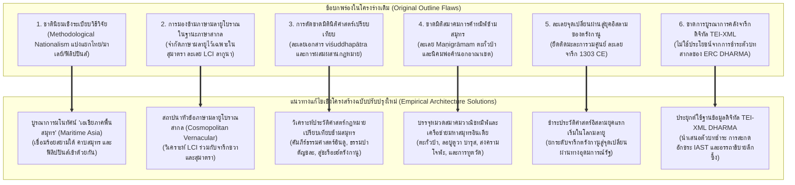

# รายงานการสำรวจ วิจัย และวิเคราะห์เชิงลึก โดเมนที่ 8
## จารึกเครือข่ายข้ามสมุทร: สยามใต้ (เสมาเมือง/ตะกั่วป่า/ไชยา), มาเลเซีย (เคดะฮ์/ตรังกานู), และฟิลิปปินส์ (ลากูนา/อากูซัน)
### โครงการวิจัย: สถานภาพการศึกษาจารึกในอินโดนีเซียและเครือข่ายเอเชียตะวันออกเฉียงใต้ภาคพื้นสมุทร

---

### บทนำและขอบเขตเชิงมโนทัศน์ (Introduction & Conceptual Scope)

รายงานฉบับนี้จัดทำขึ้นเพื่อสำรวจ ประมวลผล และสังเคราะห์เชิงวิพากษ์ต่อคลังหลักฐานจารึกวิทยาในโดเมนที่ 8 ซึ่งมุ่งเน้นการศึกษา "เครือข่ายข้ามสมุทร" (Trans-maritime Networks) ที่เชื่อมร้อยดินแดนคาบสมุทรและหมู่เกาะในเอเชียตะวันออกเฉียงใต้ภาคพื้นสมุทรเข้าด้วยกันอย่างแยกไม่ออก ได้แก่ บริเวณสยามใต้ (นครศรีธรรมราช/เสมาเมือง, ไชยา/สุราษฎร์ธานี, พังงา/ตะกั่วป่า), คาบสมุทรมลายู (เคดะฮ์/หุบเขาบูจัง, ตรังกานู/กัวลาเบรัง), และหมู่เกาะฟิลิปปินส์ (ลากูนาบนเกาะลูซอน และลุ่มน้ำอากูซันบนเกาะมินดาเนา)

การศึกษาประวัติศาสตร์และจารึกวิทยาในภูมิภาคนี้ในอดีตมักประสบภาวะติดหล่มทางความคิดจากสิ่งที่เรียกว่า "ชาตินิยมเชิงระเบียบวิธีวิจัย" (Methodological Nationalism) กล่าวคือ การนำเส้นเขตแดนรัฐชาติสมัยใหม่ (Modern Nation-State Boundaries) อาทิ พรมแดนไทย มาเลเซีย อินโดนีเซีย และฟิลิปปินส์ ไปตีกรอบย้อนอดีตเพื่อแบ่งแยกพื้นที่ทางประวัติศาสตร์ออกจากกัน ส่งผลให้จารึกวัดเสมาเมือง จารึกตะกั่วป่า และจารึกไชยาถูกกักขังไว้ในฐานะ "ประวัติศาสตร์โบราณคดีไทย", จารึกตรังกานูและโบราณสถานหุบเขาบูจังถูกจำกัดไว้เป็น "มรดกแห่งชาติมาเลเซีย", ขณะที่จารึกแผ่นทองแดงลากูนาและแผ่นเงินอากูซันมักถูกตัดขาดออกจากประวัติศาสตร์อินโดนีเซีย-มลายู ทั้งที่ในความเป็นจริง โลกโบราณของเอเชียตะวันออกเฉียงใต้ภาคพื้นสมุทรคือ "ทะเลแห่งการเคลื่อนย้ายและปฏิสัมพันธ์" (Maritime Asia) ดังที่ Andrea Acri (2019, 2022), Pierre-Yves Manguin (2018), และ Arlo Griffiths (2022) ได้เน้นย้ำว่า ท้องทะเลมิใช่อุปสรรคขวางกั้น แต่ทำหน้าที่เป็น "ทางหลวงเชื่อมโยง" (Maritime Highway) ที่ขับเคลื่อนด้วยลมมรสุม นำพาพระสงฆ์ นักบวช พ่อค้า ช่างฝีมือ ศรัทธาทางศาสนา อุดมการณ์ทางการเมือง ตลอดจนระบบตัวเขียนและภาษาข้ามพ้นพรมแดนทางกายภาพ

จากการตรวจสอบแฟ้มข้อมูลหลักฐานเชิงประจักษ์ (Source Dossiers) ที่ได้รับมอบหมายอย่างละเอียดถี่ถ้วน ประกอบด้วย `S-1918-coedes-02.md`, `S-1924-blagden-01.md`, `S-1924-ronkel-01.md`, `S-1930-coedes-01.md`, `S-1992-postma-01.md`, `S-1996-santos-01.md`, `S-2010-um-01.md`, `S-2012-griffiths-02.md`, `S-2018-manguin-01.md`, `S-2019-acri-01.md`, `S-2022-acri-02.md`, `S-2022-acri-03.md`, `S-2022-griffiths-01.md`, `S-2024-acri-01.md`, `S-2025-acri-02.md`, ตลอดจนคลังจารึกดิจิทัลมาตรฐานสากล `DHARMA-DOSS-01-sumatra-srivijaya.md` รายงานฉบับนี้จึงมุ่งนำเสนอการจัดหมวดหมู่หลักฐานปฐมภูมิ การสังเคราะห์วิวัฒนาการทฤษฎี ข้อบกพร่องของโครงร่างเดิม และการวางพิมพ์เขียวโครงสร้างบทใหม่อย่างเป็นระบบ เพื่อเป็นรากฐานสำคัญในการยกร่างผลงานวิชาการระดับสากลต่อไป

---

### ส่วนที่ 1: บัญชีวิเคราะห์หลักฐานเชิงประจักษ์และจารึกทั้งหมดในคลัสเตอร์ (Epigraphic Empirical Inventory)

การประมวลหลักฐานจารึกในโดเมนที่ 8 ครอบคลุมจารึกบนแผ่นศิลา แท่งศิลาแปดเหลี่ยม แผ่นทองแดง แผ่นเงิน ตราประทับงาช้าง ฐานพระพุทธรูปสัมฤทธิ์ และเหรียญทองคำ ซึ่งสะท้อนเครือข่ายความสัมพันธ์ทางอำนาจ ศาสนา นิติศาสตร์ และการค้าระหว่างสยามใต้ คาบสมุทรมลายู เกาะสุมาตรา ชวา อินเดียใต้ และฟิลิปปินส์ ดังรายละเอียดในตารางวิเคราะห์เชิงเปรียบเทียบต่อไปนี้:

| รหัสเอกสาร (Source ID) | ชื่อจารึกและโบราณวัตถุ | พื้นที่ค้นพบ / พิกัดทางภูมิศาสตร์ | วัสดุและระบบตัวเขียน | ภาษาที่ใช้ | ศักราช / ยุคสมัย | ประเด็นหลักและสถานะทางจารึกวิทยา |
|:---|:---|:---|:---|:---|:---|:---|
| `S-1918-coedes-02` / `DHARMA-DOSS-01` | จารึกวัดเสมาเมือง (Ligor Inscription No. 23 / Face A & Face B) | วัดเสมาเมือง อำเภอเมือง จังหวัดนครศรีธรรมราช (สยามใต้) | ศิลาหินทราย สลักสองด้าน ด้าน A อักษรปัลลวะตอนปลาย/กวิรุ่นแรก ด้าน B อักษรกวิรุ่นแรก | ภาษาสันสกฤตฉันทลักษณ์คลาสสิก | ศักราช 697 มหาศักราช (ค.ศ. 775) สำหรับด้าน A; ด้าน B สลักหลัง ค.ศ. 782 | ด้าน A บันทึกการสร้างปราสาทอิฐ 3 องค์อุทิศแด่พระพุทธเจ้า พระปัทมปาณี และพระวัชรปาณี โดยกษัตริย์ศรีวิชัย (ศรีวิชเยนทรราชา); ด้าน B สดุดีพระเจ้าวิษณุ พระประมุขแห่งราชวงศ์ไศเลนทร์ผู้ปราบอริราชศัตรู |
| `S-1924-ronkel-01` / Hultzsch (1913) | จารึกทมิฬเขาพระนารายณ์ ตะกั่วป่า (Takuapa Tamil Inscription) | เขาพระนารายณ์ อำเภอตะกั่วป่า จังหวัดพังงา (ฝั่งทะเลอันดามัน) | ศิลาหินทรายธรรมชาติ สลักอักษรทมิฬโบราณผสมครันถะ | ภาษาทมิฬโบราณ (Old Tamil) | กลางศตวรรษที่ 9 (ราว ค.ศ. 840–850) รัชสมัยพระเจ้านันทิวรมันที่ 3 แห่งราชวงศ์ปัลลวะ | บันทึกการขุดสระน้ำนามว่า "อวานีนารายณัม" (ตามพระนามของกษัตริย์ปัลลวะ) และการมอบหมายให้สมาคมพ่อค้าวาณิชทมิฬ "มณีกรามัม" (Maṇigrāmam) พร้อมด้วยกองทหารเสนาปติและชาวค่ายเป็นผู้ดูแลรักษา |
| `S-1918-coedes-02` | จารึกเสาแปดเหลี่ยมวัดเวียง ไชยา (Chaiya Pillar Inscription No. 24) | วัดเวียง อำเภอไชยา จังหวัดสุราษฎร์ธานี | เสาหินแปดเหลี่ยม สลักอักษรขอมโบราณ/กวิ | ภาษาสันสกฤต | มหาศักราช 1152 (ค.ศ. 1230) | ประกาศพระเกียรติยศของพระเจ้าศรีธรรมราช จันทรภานุ (Candrabhānu) ปฐมกษัตริย์แห่งตามพรลิงก์ (ตัมพรลิงเคศวร) แห่งปัทมวงศ์ ผู้สถาปนาอำนาจเหนือคาบสมุทรและเตรียมขยายอำนาจสู่เกาะลังกา |
| `S-1918-coedes-02` | จารึกฐานพระพุทธรูปสัมฤทธิ์วัดเวียง ไชยา (Grahi Buddha Inscription) | วัดเวียง อำเภอไชยา จังหวัดสุราษฎร์ธานี | ฐานสัมฤทธิ์ของพระพุทธรูปนาคปรก สลักอักษรขอมโบราณ | ภาษาเขมรโบราณ (Old Khmer) | มหาศักราช 1105 (ค.ศ. 1183) ปีเถาะ | มหาเสนาบดีตาลานัย (Talanai) ข้าหลวงผู้ดูแลเมืองกรหิ (Grahi) ได้รับบัญชาจากกมรเตงอัญศรีมหาราชา ให้สมเด็จมหาเถรปราชญ์หล่อพระพุทธปฏิมาสัมฤทธิ์เพื่อเป็นที่สักการะ |
| `S-1918-coedes-02` | จารึกแผ่นทองแดงไลเดินฉบับใหญ่ (Larger Leiden Plates) | เมืองนาคปัฏฏินัม รัฐทมิฬนาฑู อินเดียใต้ (เก็บรักษาที่มหาวิทยาลัยไลเดิน) | แผ่นทองแดงร้อยห่วงตราพระราชลัญจกรโจฬะ อักษรครันถะและทมิฬ | ภาษาสันสกฤตและภาษาทมิฬ | มหาศักราช 927 (ค.ศ. 1005) รัชกาลพระเจ้าราชราชาที่ 1 แห่งราชวงศ์โจฬะ | บันทึกการพระราชทานผลประโยชน์จากหมู่บ้านอานัยมังคลัมแก่วิหารจุฬามณีวรมัน (Cūḍāmaṇivarma-vihāra) ณ เมืองท่านาคปัฏฏินัม ซึ่งสร้างโดยกษัตริย์ศรีวิชัยจุฬามณีวรมัน และสร้างแล้วเสร็จโดยศรีมารวิชโยตตุงควรมัน |
| `S-1918-coedes-02` | จารึกวิหารตันชอร์ (Tanjore Inscription of Rajendra Chola I) | ปราสาทพฤหทีศวร เมืองตันชอร์ รัฐทมิฬนาฑู อินเดียใต้ | ผนังศิลาปราสาท สลักอักษรทมิฬคลาสสิก | ภาษาทมิฬ | รัชศกปีที่ 19 แห่งพระเจ้าราเชนทรโจฬะที่ 1 (ค.ศ. 1030) | บันทึกมหายุทธการทางเรือปี ค.ศ. 1025 ที่ส่งกองทัพเรือโจฬะเข้าโจมตีและพิชิต 14 เมืองท่าของจักรวรรดิศรีวิชัย ทั้งในสุมาตราและคาบสมุทรมลายู (กฑารัม, ปันไน, มาลัยยูร์, มายิรุติงคัม, อิลังคโศกัม, ปัปปาลัม, ลัมพรี, ตักโกละ, ตามพรลิงกัม) |
| `S-1924-blagden-01` / `S-2010-um-01` | ศิลาจารึกตรังกานู (Batu Bersurat Terengganu) | ปาดังตารา ริมแม่น้ำเตอรซัต กัวลาเบรัง รัฐตรังกานู มาเลเซีย | แท่งหินทรายสี่เหลี่ยมยอดแหลม สลักอักษรยาวี (Jawi) ทั้งสี่ด้าน | ภาษามลายูคลาสสิก/มลายูโบราณตอนปลาย ผสมผสานคำยืมอาหรับและสันสกฤต | ศักราช 702 ฮิจเราะห์ (ค.ศ. 1303) ปีศรฏาน (Saratan / ปู) | ประกาศประมวลกฎหมายชะรีอะฮ์อิสลามฉบับลายลักษณ์อักษรที่เก่าแก่ที่สุดในโลกมลายู โดยราชามาณฑลิกา (Raja Mandalika) ว่าด้วยบทลงโทษคดีล่วงประเวณี (ซินา/หุดูด) และระเบียบหนี้สิน |
| `S-1992-postma-01` / `S-1996-santos-01` / `S-2022-griffiths-01` | จารึกแผ่นทองแดงลากูนา (Laguna Copperplate Inscription - LCI) | ปากแม่น้ำลุมบัง ทะเลสาบลากูนา จังหวัดลากูนา เกาะลูซอน ฟิลิปปินส์ | แผ่นทองแดงบาง จารึกด้วยการตอกลายเส้นอักษรกวิรุ่นแรก (Early Kawi) 10 บรรทัด | ภาษามลายูโบราณสำนวนข้ามสมุทร (Old Malay) ผสมผสานสันสกฤต ชวาโบราณ และตากาล็อกโบราณ | มหาศักราช 822 เดือนไจตระ แรม 4 ค่ำ วันจันทร์ (ตรงกับ 21 เมษายน ค.ศ. 900) | เอกสารทางกฎหมายประเภท "วิศุทธปาตร" (viśuddhapātra) บันทึกการปลดเปลื้องหนี้สินทองคำหนัก 1 กาฏิ 8 สุวรรณะ (ราว 1,058–1,076 กรัม) ให้แก่นามวรันและครอบครัว โดยมหาเสนาบดีแห่งโตเกและหัวหน้าชุมชนปินดวิลัน |
| `S-2012-griffiths-02` | จารึกแผ่นเงินม้วนอากูซัน (Agusan Silver Strip Amulet) | ริมแม่น้ำวาฮาว่า อำเภอกวาดาลูเป จังหวัดอากูซันเดลซูร์ เกาะมินดาเนา | แผ่นเงินม้วนบาง สลักด้วยวัตถุปลายแหลมเป็นอักษรกวิรุ่นแรก 3 บรรทัด | ภาษาสันสกฤตผสมผสาน (Buddhist Hybrid Sanskrit) | ราวศตวรรษที่ 10–14 (หรืออาจเก่าถึงศตวรรษที่ 9 ตามอักขรวิทยา) | มนตราศักดิ์สิทธิ์ประจำองค์พระมหาประติสราวิทยาราชญี (Mahāpratisarā Vidyārājñī dhāraṇī) แห่งนิกายพุทธตันตรยาน ใช้เป็นเครื่องรางปกป้องคุ้มครองภัยทางทะเล |
| `S-2012-griffiths-02` | ตราประทับงาช้างบูตูอัน (Butuan Ivory Seal) และเหรียญทองคำปิโลนซีโต | แหล่งโบราณคดีบูตูอัน ลุ่มน้ำอากูซัน เกาะมินดาเนา และหมู่เกาะฟิลิปปินส์ | งาช้างแกะสลักอักษรกวิแบบกลับด้าน และเหรียญทองคำทรงกรวยมีอักขระ "นะ" (na / piloncito) | ภาษาชวาโบราณ/สันสกฤต | ราวศตวรรษที่ 9–12 | ตราประทับอ่านว่า "บูบะฮ์" หรือ "บูตบัน" (Butwan/Butuan) สะท้อนการจัดตั้งองค์กรการค้าและการบริหารที่เป็นทางการ สอดคล้องกับเหรียญทองคำปิโลนซีโตที่ใช้ร่วมกับชวาและศรีวิชัย |
| `S-2024-acri-01` | จารึกแผ่นทองแดงมูอาราจัมบี A และ B (Muara Jambi Copper Strips A & B) | แหล่งโบราณสถานมูอาราจัมบี ริมแม่น้ำบาตังฮารี จังหวัดจัมบี เกาะสุมาตรา | แผ่นสำริด/ทองแดง สลักอักษรนาครี (Nāgarī) และอักษรกวิ | ภาษาสันสกฤต | ศตวรรษที่ 10–11 | บันทึกพระนามศาสนสถานสำคัญ "ศรีไศเลนทฺร จูฑามณิวรมวิหาร" (Śrī-Śailendra-Cūḍāmaṇivarma-vihāra) และ "ศรีพาลาทิตฺยววิหาร" (Śrī-Bālāditya-vihāra) ยืนยันเครือข่ายการทูตผ่านวัดระหว่างสุมาตรา คาบสมุทร และอินเดีย |
| `DHARMA-DOSS-01` | จารึกภูหวังกลีส (Charter of Puhawaṅ Glis) | ตำบลปารากัน อำเภอเตอมังคุง จังหวัดชวากลาง | ศิลาหินแอนดีไซต์ สลักอักษรกวิรุ่นแรก | ภาษามลายูโบราณ (Old Malay) | มหาศักราช 749 (ค.ศ. 827) | บันทึกการถวายที่ดินและเครื่องบูชาแด่ศาสนสถานโดย "ปูหวัง กลีส" (Puhawaṅ Glis) นายสำเภาเดินเรือพาณิชย์ชาวมลายูในใจกลางอาณาจักรชวากลาง ยืนยันการเคลื่อนย้ายของพ่อค้ามลายูข้ามสมุทร |

---

### ส่วนที่ 2: วิวัฒนาการทฤษฎี ข้อถกเถียงทางวิชาการ และพรมแดนความรู้ล่าสุดถึงปี 2026 (Historiographical Evolution & 2026 Frontiers)

การศึกษาวิจัยจารึกในโดเมนเครือข่ายข้ามสมุทรได้ผ่านวิวัฒนาการทางทฤษฎีและการชำระตัวบทอย่างลึกซึ้งในรอบหนึ่งศตวรรษที่ผ่านมา โดยพรมแดนความรู้ล่าสุดถึงปี ค.ศ. 2026 ได้รื้อถอนข้อสมมติฐานเดิมและสถาปนากรอบมโนทัศน์ใหม่ใน 6 มิติหลักดังนี้:

#### 1. การคลี่คลายปริศนาจารึกวัดเสมาเมือง (Ligor Face A & B) และการปฏิเสธทฤษฎี "ไชยาเป็นศูนย์กลางศรีวิชัย"
ศิลาจารึกวัดเสมาเมือง (Ligor Inscription No. 23) ซึ่งค้นพบที่จังหวัดนครศรีธรรมราช ถือเป็นหลักฐานชิ้นเอกที่ George Cœdès ใช้ในการสถาปนามโนทัศน์เรื่อง "อาณาจักรศรีวิชัย" ขึ้นในโลกวิชาการเมื่อปี ค.ศ. 1918 ทว่าความสัมพันธ์ระหว่างข้อความสองด้านของจารึกหลักนี้ได้ก่อให้เกิดข้อถกเถียงยาวนานกว่าศตวรรษ:
- **ข้อถกเถียงเรื่องความต่อเนื่องระหว่างสองด้าน:** จารึกด้าน A สลักขึ้นในมหาศักราช 697 (ค.ศ. 775) ด้วยอักษรปัลลวะตอนปลาย สดุดีกษัตริย์แห่งศรีวิชัยผู้สร้างปราสาทอิฐสามหลังเพื่อประดิษฐานพระพุทธเจ้า พระปัทมปาณี และพระวัชรปาณี ขณะที่ด้าน B ซึ่งมีเพียง 4 บรรทัดที่สลักไม่เสร็จ เป็นอักษรกวิรุ่นแรก สดุดีพระมหากษัตริย์พระนามว่า "วิษณุ" ผู้ทรงเป็นประมุขแห่งราชวงศ์ไศเลนทร์ (Śailendravamśa) Cœdès ในระยะแรกสันนิษฐานว่าทั้งสองด้านกล่าวถึงกษัตริย์องค์เดียวกัน นำไปสู่สมมติฐานว่าราชวงศ์ไศเลนทร์แห่งชวาแท้จริงแล้วมีถิ่นกำเนิดหรือปกครองศรีวิชัยด้วย
- **การชำระตัวบทของ de Casparis และ Boechari:** J.G. de Casparis (1950, 1956) และ Boechari (1966) ได้พิสูจน์ให้เห็นว่า จารึกสองด้านนี้สลักขึ้นคนละช่วงเวลา โดยด้าน B สลักขึ้นภายหลัง (หลัง ค.ศ. 782) ในช่วงที่อำนาจของราชวงศ์ไศเลนทร์แห่งชวากลางแผ่ขยายเข้ามามีอิทธิพลและผูกสัมพันธ์ทางเครือญาติผ่านการอภิเษกสมรสข้ามสมุทรกับราชวงศ์ศรีวิชัยแห่งสุมาตรา
- **การประเมินทฤษฎี "ไชยา/นครศรีธรรมราชเป็นราชธานีศรีวิชัย" ในวาระครบรอบ 100 ปี:** ในบทความครบรอบศตวรรษศรีวิชัย (1918–2018) Pierre-Yves Manguin (2018) ได้ทำการวิพากษ์และปฏิเสธข้อเสนอของนักวิชาการไทยบางกลุ่ม (อาทิ ศาสตราจารย์ ม.จ. สุภัทรดิศ ดิศกุล ในช่วงหนึ่ง, จิตร ภูมิศักดิ์, และนักประวัติศาสตร์ท้องถิ่นภาคใต้) ที่พยายามดึงเมืองหลวงของศรีวิชัยมาตั้งที่อำเภอไชยาหรือนครศรีธรรมราช โดย Manguin และผลการขุดค้นทางโบราณคดีพาณิชย์นาวียืนยันอย่างหนักแน่นว่า ศรีวิชัยเป็นรัฐสหพันธรัฐทางทะเลแบบ "ปากน้ำและต้นน้ำ" (Upriver-Downriver Riverine Basin System) โดยมีศูนย์กลางการปกครองและการแลกเปลี่ยนสินค้าอยู่ที่ปาเล็มบัง (แม่น้ำมูซี) และจัมบี (แม่น้ำบาตังฮารี) บนเกาะสุมาตรา ส่วนเมืองท่าในคาบสมุทรมลายูและสยามใต้ เช่น ตามพรลิงก์ (นครศรีธรรมราช), ปันปัน/กรหิ (ไชยา), และเคดะฮ์ ทำหน้าที่เป็น "ศูนย์กลางอำนาจระดับรอง" (Secondary Centers) หรือเมืองท่าเครือข่ายพันธมิตรข้ามสมุทรที่ควบคุมช่องทางคมนาคมทางบกข้ามคอคอดกระ

#### 2. สมาคมการค้าทมิฬข้ามสมุทรกับอิทธิพลของอินเดียใต้ในคาบสมุทรสยามใต้และสุมาตรา
หลักฐานจารึกภาษาทมิฬในเอเชียตะวันออกเฉียงใต้ภาคพื้นสมุทรเป็นประจักษ์พยานถึงบทบาทของกลุ่มพ่อค้าวาณิชอินเดียใต้ในการเชื่อมโยงมหาสมุทรอินเดียเข้ากับทะเลจีนใต้:
- **จารึกเขาพระนารายณ์ ตะกั่วป่า และสมาคมมณีกรามัม:** ค้นพบที่อำเภอตะกั่วป่า จังหวัดพังงา สลักขึ้นในรัชสมัยพระเจ้านันทิวรมันที่ 3 แห่งราชวงศ์ปัลลวะ (ราว ค.ศ. 840–850) ข้อความระบุถึงการขุดสระน้ำนาม "อวานีนารายณัม" (Avani-nāraṇam ซึ่งเป็นพระสมัญญานามของกษัตริย์ปัลลวะ) และการมอบหมายการคุ้มครองสระน้ำให้แก่สมาชิกของ **สมาคมการค้ามณีกรามัม (Maṇigrāmam)**, คณะทหารเสนาปติ, และกลุ่มชาวค่าย การค้นพบนี้ชี้ชัดว่า ตะกั่วป่าเป็นเมืองท่าต้นทางฝั่งอันดามันของการข้ามคาบสมุทรไปยังอ่าวไทย (ไชยา) และมีนิคมพ่อค้าทมิฬตั้งถิ่นฐานอยู่อย่างถาวร
- **การเปรียบเทียบกับจารึกลอบูตูวาแห่งบารุส (Lobu Tua Inscription 1088 CE):** Van Ronkel (1924) และ Subbarayalu ได้ศึกษาจารึกทมิฬที่พบบนชายฝั่งตะวันตกของสุมาตราเหนือ ซึ่งระบุถึง **สมาคมการค้าอัยยาโวเล 500 แห่งทิศทั้งพัน (Aiññūṟṟuvar / Five Hundred of the Thousand Directions)** ที่เดินทางเข้ามาควบคุมตลาดการค้าการบูรบารุส (Barus camphor) การเปรียบเทียบสองจารึกนี้เผยให้เห็นพัฒนาการของสมาคมวาณิชทมิฬที่มีกองกำลังทหารรับจ้างและสิทธิสภาพนอกอาณาเขตในการดำเนินกิจกรรมพาณิชย์นาวี
- **บทวิเคราะห์พ่อค้าต่างชาติในคัมภีร์ธรรมปาตัญชละ (Acri 2025):** งานวิจัยล่าสุดของ Andrea Acri (2025) เรื่อง *Trans-Oceanic Connections in the Dharma Pātañjala* ได้นำหลักฐานวรรณกรรมเทววิทยาชวาโบราณมาส่องสะท้อนบริบทจารึก โดยพบการระบุถึงพ่อค้าต่างชาติกลุ่มต่างๆ อย่างชัดเจน ได้แก่ ชาวเปอร์เซีย (*parasi*), ชาวฟิลิปปินส์/เกาะทางเหนือ (*pujut*), และพราหมณ์หรือพ่อค้าทมิฬ (*nambi*) ซึ่งสะท้อนการแลกเปลี่ยนสินค้ามูลค่าสูงข้ามสมุทร เช่น อำพันปลาวาฬ ชะมดเช็ด และการบูร
- **สงครามยุทธนาวีโจฬะ ค.ศ. 1025 และการทูตผ่านศาสนสถาน:** จารึกวิหารตันชอร์ของพระเจ้าราเชนทรโจฬะที่ 1 (ค.ศ. 1030) บันทึกการส่งกองทัพเรือเข้าโจมตี 14 เมืองท่าของศรีวิชัย รวมถึงตามพรลิงกัม (นครศรีธรรมราช) และตักโกละ (ตะกั่วป่า) ซึ่งเกิดขึ้นหลังจากการสร้างวิหารจุฬามณีวรมันที่นาคปัฏฏินัมเพียง 20 ปี (ตามจารึกแผ่นทองแดงไลเดิน ค.ศ. 1005) แสดงให้เห็นว่าความสัมพันธ์ทางอำนาจระหว่างรัฐมหาอำนาจทางทะเลดำเนินไปอย่างผันผวนระหว่าง "การทูตผ่านศาสนสถาน" (Temple Diplomacy) กับ "สงครามแย่งชิงเส้นทางการค้า" ซึ่งสอดรับกับการค้นพบ **จารึกแผ่นทองแดงมูอาราจัมบี (2025)** ที่เอ่ยพระนามวิหารไศเลนทร์แห่งนี้เช่นเดียวกัน

#### 3. การปฏิวัติการศึกษาจารึกแผ่นทองแดงลากูนา (LCI 900 CE): ภาษามลายูโบราณสากลและนิติศาสตร์ฮินดูในฟิลิปปินส์
การค้นพบจารึกแผ่นทองแดงลากูนา (Laguna Copperplate Inscription - LCI) ในปี ค.ศ. 1989 และการถอดรหัสเบื้องต้นโดย Antoon Postma (1992) ถือเป็นการปฏิวัติประวัติศาสตร์ลายลักษณ์อักษรของหมู่เกาะฟิลิปปินส์ โดยขยายเส้นขอบฟ้าประวัติศาสตร์ย้อนหลังไปถึง ค.ศ. 900 ทว่าในรอบทศวรรษที่ผ่านมา พรมแดนความรู้เกี่ยวกับ LCI ได้รับการยกระดับอย่างก้าวกระโดดผ่านงานวิจัยของ Arlo Griffiths (2022) และ Hector Santos (1996):
- **การหักล้างทฤษฎีชาตินิยมภาษาตากาล็อกโบราณ:** ในฟิลิปปินส์เคยมีความพยายามของนักวิชาการชาตินิยม (อาทิ Jaime Tiongson 2013) ที่จะตีความว่า LCI เขียนด้วยภาษาตากาล็อกโบราณ (Old Tagalog) ทว่าการวิเคราะห์ทางนิรุกติศาสตร์และอักขรวิทยาอย่างเข้มงวดของ Postma และต่อมาโดย Griffiths (2022) ในสารบบ ERC DHARMA (INSPHIL00001) ได้พิสูจน์จนสิ้นสงสัยว่า ตัวบทเขียนด้วย **ภาษามลายูโบราณ (Old Malay)** เป็นแกนหลัก ผสมผสานด้วยคำยืมภาษาสันสกฤต คำศัพท์ทางราชการและบรรดาศักดิ์ภาษาชวาโบราณ (อาทิ *saṅ pamgat*, *nāyaka*, *mḍaṅ*) และมีคำศัพท์เฉพาะถิ่นตากาล็อกปะปนเพียงบางคำ ปรากฏการณ์นี้ยืนยันว่าภาษามลายูโบราณทำหน้าที่เป็น "ภาษากลางทางการบริหารและกฎหมายระดับสากล" (Cosmopolitan Administrative and Legal Vernacular) ครอบคลุมไปไกลถึงเกาะลูซอน
- **นิติศาสตร์เปรียบเทียบและการเป็นเอกสารปลดหนี้สิน (Viśuddhapātra):** Griffiths (2022) ได้เสนอการค้นพบทางนิติศาสตร์ประวัติศาสตร์ที่สำคัญยิ่ง โดยชี้ว่าคำว่า *śuddhapattra / viśuddhapātra* ในบรรทัดที่ 2–3 ของ LCI มิใช่เพียงคำประกาศทั่วไป แต่เป็นรูปแบบเอกสารทางกฎหมายที่ถูกต้องตามคัมภีร์ธรรมศาสตร์ฮินดูโบราณ โดยเฉพาะคัมภีร์ **ยาชญวัลกยสมฤติ (Yājñavalkyasmṛti 2.97)** ซึ่งกำหนดว่า เมื่อลูกหนี้ได้ชำระหนี้สินครบถ้วน หรือเจ้าหนี้ได้ทำการยกหนี้ให้ เจ้าหนี้จะต้องออกเอกสารที่เรียกว่า "ศุทธปัตร" หรือ "วิศุทธปาตร" (ใบปลดเปลื้องมลทินหนี้สิน) ให้แก่ลูกหนี้ เพื่อเป็นหลักฐานมิให้ทายาทหรือเจ้าพนักงานตามมาทวงถามได้อีก เอกสาร LCI จึงเป็นหลักฐานชิ้นแรกในฟิลิปปินส์ที่ยืนยันการบังคับใช้หลักกฎหมายฮินดู-ชวาโบราณอย่างเป็นระบบ
- **การกำหนดศักราชอย่างแม่นยำทางดาราศาสตร์:** Hector Santos (1996) ได้ใช้ตารางดาราศาสตร์คำนวณข้อมูลในจารึกบรรทัดแรก (*śāka-varṣātīta 822 caitra-māsa tiṅki skla-pakṣa caturthī somavāra*) และพิสูจน์ว่า ศักราชมหาศักราช 822 เดือนไจตระ (คำว่า *tiṅki* แก้เป็น *tithi*) แรม 4 ค่ำ ตรงกับ **วันจันทร์ที่ 21 เมษายน ค.ศ. 900** ตามปฏิทินสุริยคติ ซึ่งถือเป็นวันเวลาที่แน่นอนที่สุดในประวัติศาสตร์ฟิลิปปินส์ยุคแรกเริ่ม
- **ระบบเงินตราและหนี้สินทองคำ:** การระบุปริมาณหนี้สินทองคำหนัก "1 กาฏิ 8 สุวรรณะ" (*kāṭi 1 suvarṇa 8*) ซึ่งเทียบเท่ากับทองคำน้ำหนักประมาณ 1,058 ถึง 1,076 กรัม สอดรับกับระบบหน่วยน้ำหนักทองคำของชวาและโลกมลายูโบราณ และสัมพันธ์กับการค้นพบ **เหรียญทองคำปิโลนซีโต (Piloncito)** ในฟิลิปปินส์ ซึ่งมีหน่วยน้ำหนักทองคำตามมาตรฐานเดียวกัน

#### 4. การบูรณาการฟิลิปปินส์เข้าสู่ "โลกมลายู-ชวา" ยุคคลาสสิก: จารึกแผ่นเงินอากูซันและตราประทับบูตูอัน
หลักฐานทางโบราณคดีและจารึกวิทยาบนเกาะมินดาเนาช่วยตอกย้ำว่า หมู่เกาะฟิลิปปินส์มิได้อยู่อย่างโดดเดี่ยว หากเป็นส่วนหนึ่งของเครือข่ายความเชื่อและพาณิชย์นาวีตันตรยาน:
- **จารึกแผ่นเงินม้วนอากูซัน (Agusan Silver Strip Amulet):** การค้นพบและศึกษาโดย Orlina (2012) และวิเคราะห์เพิ่มเติมโดย Griffiths (2012) พบว่าเป็นแผ่นเงินม้วนจารึกอักษรกวิ บรรจุคาถาธารณีภาษาสันสกฤตผสมผสานประจำองค์ **พระมหาประติสราวิทยาราชญี (Mahāpratisarā Vidyārājñī)** หนึ่งในเบญจรักษามหาธารณีของพุทธศาสนานิกายตันตรยาน ลัทธิบูชาพระมหาประติสรานี้เป็นที่นิยมอย่างยิ่งในหมู่นักเดินเรือและพ่อค้าข้ามสมุทรเพื่อคุ้มครองอันตรายจากเรืออัปปาง พายุ และสัตว์ร้าย โดยพบหลักฐานที่แพร่หลายตั้งแต่เมืองนาลันทาในอินเดีย จีน ทิเบต จันดิเซวูในชวากลาง จนกระทั่งถึงลุ่มน้ำอากูซันในมินดาเนา
- **เทวรูปทองคำอากูซัน (Agusan Gold Image):** ประติมากรรมทองคำตันน้ำหนัก 21 กะรัต (หนักเกือบ 1.8 กิโลกรัม) ซึ่งปัจจุบันจัดแสดงที่ Field Museum นครชิคาโก ได้รับการจำแนกใหม่ว่าเป็นรูปเคารพในลัทธิวัชรยาน/ตันตรยาน (อาจเป็นพระตารา หรือวัชรธาตวีศวรี) ซึ่งมีรูปแบบศิลปะร่วมสมัยกับประติมากรรมชวากลางในศตวรรษที่ 9–10
- **ตราประทับงาช้างบูตูอัน (Butuan Ivory Seal):** ตราประทับงาช้างที่พบบริเวณแหล่งเรือโบราณบูตูอัน สลักอักษรกวิย่อว่า *bu-baḥ* หรือ *butban* ยืนยันว่าบูตูอันมีสถานะเป็นรัฐศูนย์กลางการค้าชายฝั่ง (Entrepôt) ที่มีระบบบริหารเอกสารราชการ สอดคล้องกับเอกสารประวัติศาสตร์ราชวงศ์ซ่งของจีนที่บันทึกว่า "อาณาจักรผูตวน" (P'u-tuan / Butuan) ได้ส่งคณะราชทูตไปเจริญสัมพันธไมตรีกับราชสำนักจีนโดยตรงในปี ค.ศ. 1001

#### 5. ศิลาจารึกตรังกานู (ค.ศ. 1303): จุดเปลี่ยนผ่านสู่ยุคอิสลาม นิติศาสตร์ชะรีอะฮ์ และการทลายมายาคติมะละการวมศูนย์
ศิลาจารึกตรังกานู (Batu Bersurat Terengganu) ซึ่งค้นพบที่กัวลาเบรัง ได้รับการขึ้นทะเบียนเป็นมรดกความทรงจำแห่งโลกของยูเนสโก (UNESCO Memory of the World) ในปี ค.ศ. 2009 การวิจัยในวาระการประชุมวิชาการนานาชาติ ณ มหาวิทยาลัยมาลายา (UM Conference 2010) และการชำระตัวบทของ Blagden (1924), Paterson (1924), Syed Muhammad Naquib al-Attas (1970) ได้สร้างมิติการรับรู้ใหม่ต่อประวัติศาสตร์คาบสมุทรมลายู:
- **การอ่านและการกำหนดศักราช:** บรรทัดที่ 2 ของจารึกด้าน A ระบุศักราชในระบบปฏิทินอิสลามผสมผสานกับจักรราศีพฤหัสบดี โดยคำว่า *Rasa...* หรือ *Jumaat di bulan Rejab di tahun saratan* ได้รับการถอดรหัสว่าคือ วันศุกร์ที่ 4 เดือนระญับ ฮิจเราะห์ศักราช 702 ซึ่งตรงกับ **วันที่ 22 กุมภาพันธ์ ค.ศ. 1303** (แม้จะมีข้อเสนอปี 726 หรือ 789 ฮ.ศ. โดยนักวิชาการบางท่าน แต่มติสากลส่วนใหญ่ยืนยันศักราช 702 ฮ.ศ.)
- **การทลายทฤษฎีมะละการวมศูนย์ (Dismantling Melaka-centrism):** ประวัติศาสตร์กระแสหลักมักยึดถือว่าอิสลามเริ่มต้นลงหลักปักฐานและก่อร่างสร้างรัฐในคาบสมุทรมลายูผ่านการสถาปนารัฐสุลต่านมะละกาในราว ค.ศ. 1400 ทว่าศิลาจารึกตรังกานูพิสูจน์ให้เห็นว่า กฎหมายอิสลามและการรับระเบียบสังคมมุสลิมได้หยั่งรากทางชายฝั่งตะวันออกของคาบสมุทร (ตรังกานู) มาก่อนมะละกาเกือบหนึ่งศตวรรษ
- **การประนีประนอมและการผสมผสานทางภาษาศาสตร์ (Linguistic Syncretism):** จารึกตรังกานูเป็นตัวแทนของภาษาและระบบตัวเขียนในช่วงหัวเลี้ยวหัวต่อ แม้จะใช้อักษรยาวี (ดัดแปลงจากอักษรอาหรับ) แต่ยังคงใช้อักขรวิธีและระบบคำศัพท์ภาษาสันสกฤตและมลายูโบราณอย่างลึกซึ้ง เช่น พระนามของผู้ปกครองระบุว่า **"ราชามาณฑลิกา" (Raja Mandalika)** ซึ่งเป็นคำสันสกฤตที่ใช้เรียกเจ้าเมืองในระบบมณฑล, คำว่า **"เดวาตา มูเลีย รายา" (Dewata Mulia Raya)** ถูกนำมาใช้แทนพระนามของพระผู้เป็นเจ้า (อัลลอฮ์), คำว่า "บิคารา" (*bicara* การพิจารณาคดี), และคำว่า "อุปจาระ" (*upacara* พิธีกรรม) สะท้อนการถ่ายโอนมโนทัศน์ทางกฎหมายชะรีอะฮ์ (ว่าด้วยบทลงโทษคดีซินาสำหรับผู้มีคู่ครองแล้วให้ขว้างด้วยก้อนหินจนตาย และผู้ยังไม่มีคู่ครองให้โบย 100 ที) ลงบนฐานโครงสร้างวัฒนธรรมมลายู-สันสกฤตดั้งเดิม

#### 6. ปรากฏการณ์ "Pizza Effect" เครือข่ายตันตรยาน และความเชื่อมโยงสถาปัตยกรรมจาม-ศรีวิชัย-ชวา
งานวิจัยชุดล่าสุดของ Andrea Acri (2022, 2024) ได้เปิดเผยพลวัตการแลกเปลี่ยนข้ามสมุทรที่สลับซับซ้อนยิ่งขึ้น:
- **ทฤษฎี Pizza Effect ทางศาสนา:** Acri เสนอว่าลัทธิบูชาพระโพธิสัตว์อโมฆปาศโลเกศวร (Amoghapāśa) และสายธารตันตรยานบางสำนัก มิได้กำเนิดขึ้นในอินเดียแล้วส่งออกมายังอุษาคเนย์แบบทางเดียว หากแต่มีจุดกำเนิดและพัฒนาการเข้มข้นในพื้นที่เอเชียตะวันออกเฉียงใต้ภาคพื้นสมุทร (Malayo-Javanese World) ก่อนที่จะส่งอิทธิพลย้อนกลับไปสู่อินเดียตะวันออกและเอเชียตะวันออก
- **ความเชื่อมโยงทางสถาปัตยกรรมและประติมาวิทยา:** สถาปัตยกรรมอิฐของวัดแก้วที่อำเภอไชยา จังหวัดสุราษฎร์ธานี มีลักษณะการจัดวางผัง การก่ออิฐไร้ปูน และการตกแต่งซุ้มประตูที่ละม้ายคล้ายคลึงอย่างลึกซึ้งกับปราสาทจามในเวียดนามใต้แบบหว่าลาย (Hòa Lai) และโปดัม (Po Dam) รวมถึงจันดิกะลาซันในชวากลาง สะท้อนถึงเครือข่ายช่างฝีมือและสถาปัตยกรรมข้ามสมุทรที่เชื่อมโยงระหว่างจามปา สยามใต้ และชวา
- **การเปลี่ยนผ่านสู่อัตลักษณ์ตามพรลิงก์:** จารึกฐานพระพุทธรูปกราหิ (ค.ศ. 1183) ซึ่งสั่งการโดยมหาเสนาบดีตาลานัย และจารึกเสาแปดเหลี่ยมวัดเวียง (ค.ศ. 1230) ของพระเจ้าจันทรภานุ แสดงให้เห็นว่าในศตวรรษที่ 12–13 อำนาจของศรีวิชัยในสยามใต้ได้แตกสลายลง และถูกแทนที่ด้วยรัฐท้องถิ่นที่เข้มแข็งอย่าง "ตามพรลิงก์" ซึ่งก้าวขึ้นมาเป็นมหาอำนาจทางทะเลอิสระ จนกระทั่งสามารถส่งกองทัพเรือข้ามมหาสมุทรอินเดียไปรุกรานเกาะลังกาได้ถึงสองครั้งในรัชสมัยพระเจ้าจันทรภานุ

---

### ส่วนที่ 3: ข้อค้นพบใหม่และมิติที่ตกหล่นจากโครงร่างเดิม (Discrepancies & Structural Gaps)

จากการตรวจสอบเปรียบเทียบระหว่างโครงร่างเดิมในไฟล์ `outline-proposal.md` กับคลังข้อมูลเชิงประจักษ์ในแฟ้มวิเคราะห์ Dossiers พบข้อบกพร่อง ความไม่สอดคล้อง และช่องว่างเชิงมโนทัศน์ 6 ประการสำคัญ ซึ่งจำเป็นต้องได้รับการปรับรื้อและแก้ไขในระดับพิมพ์เขียวสถาปัตยกรรมเนื้อหา:

#### รายละเอียดข้อบกพร่องและแนวทางแก้ไขเชิงประจักษ์:

1. **อคติของชาตินิยมเชิงระเบียบวิธีวิจัย (Methodological Nationalism Bias):**  
   โครงร่างเดิมจัดแบ่งเนื้อหาตามอาณาเขตของรัฐชาติอินโดนีเซียเป็นหลัก ส่งผลให้ดินแดนที่มีความสัมพันธ์ทางประวัติศาสตร์และจารึกวิทยาอย่างแนบแน่น เช่น สยามใต้ (เสมาเมือง ตะกั่วป่า ไชยา), คาบสมุทรมลายู (ตรังกานู เคดะฮ์), และหมู่เกาะฟิลิปปินส์ (ลากูนา อากูซัน) ถูกผลักให้เป็นเพียง "พื้นที่รอบนอก" (Periphery) หรือถูกละเลยไปโดยสิ้นเชิง โครงร่างใหม่จึงต้องสถาปนา "บทเครือข่ายข้ามสมุทร" ให้เป็นแกนกลางในการวิเคราะห์พลวัตทางทะเลแบบไร้พรมแดน

2. **การมองข้ามบทบาทของภาษามลายูโบราณในฐานะภาษาราชการข้ามสมุทร (Cosmopolitan Vernacular):**  
   โครงร่างเดิมจำกัดการศึกษาภาษามลายูโบราณไว้เฉพาะจารึกในสุมาตราช่วงศตวรรษที่ 7 (เช่น Kedukan Bukit, Talang Tuwo, Kota Kapur) ทั้งที่หลักฐานเชิงประจักษ์ยืนยันว่า ภาษามลายูโบราณถูกใช้เป็นภาษาทางการในการทำนิติกรรมไปไกลถึงเกาะลูซอน ประเทศฟิลิปปินส์ (จารึกแผ่นทองแดงลากูนา ค.ศ. 900) และใช้โดยนายสำเภาเดินเรือในใจกลางชวากลาง (จารึกปูหวังกลีส ค.ศ. 827) โครงร่างใหม่จำเป็นต้องรวบรวมหลักฐานเหล่านี้เพื่อแสดงให้เห็นการทำงานของภาษามลายูในฐานะภาษาสากลทางการบริหาร

3. **การละเลยมิติประวัติศาสตร์กฎหมายเปรียบเทียบ (Comparative Legal History):**  
   โครงร่างเดิมเน้นหนักเฉพาะมิติการเมืองและศาสนา แต่ขาดการวิเคราะห์ประวัติศาสตร์กฎหมาย ทั้งที่จารึกในโดเมนนี้เก็บรักษาประมวลกฎหมายสำคัญถึงสองระบบ คือ ระบบกฎหมายหนี้สินตามคัมภีร์ธรรมศาสตร์ฮินดู (*viśuddhapātra* ตามยาชญวัลกยสมฤติ ใน LCI) และระบบกฎหมายอาญาชะรีอะฮ์อิสลาม (คดีซินาและหุดูด ในจารึกตรังกานู) การแก้ไขคือต้องจัดตั้งหัวข้อการศึกษานิติศาสตร์เปรียบเทียบข้ามสมุทร

4. **การตกหล่นของเครือข่ายสมาคมพ่อค้าทมิฬข้ามสมุทร:**  
   โครงร่างเดิมมิได้ให้ความสำคัญแก่จารึกภาษาทมิฬที่พบนอกอินเดียอย่างเพียงพอ โดยเฉพาะจารึกเขาพระนารายณ์ตะกั่วป่า และจารึกลอบูตูวาแห่งบารุส ซึ่งเป็นกุญแจสำคัญในการอธิบายว่า เหตุใดกองทัพเรือโจฬะจึงยกทัพมาตีศรีวิชัยในปี ค.ศ. 1025 และพ่อค้าต่างชาติ (*nambi, parasi*) เข้ามามีบทบาทอย่างไรในสังคมท้องถิ่น

5. **การติดหล่มทฤษฎีมะละการวมศูนย์ในการศึกษาการแผ่ขยายของศาสนาอิสลาม:**  
   โครงร่างเดิมแทบมิได้กล่าวถึงศิลาจารึกตรังกานู ค.ศ. 1303 หรือมองข้ามความสำคัญในฐานะหลักฐานการเปลี่ยนผ่านสู่รัฐอิสลามยุคแรกเริ่ม โครงร่างใหม่จึงต้องดึงจารึกตรังกานูเข้ามาเป็นหมุดหมายสำคัญในการอธิบายการเปลี่ยนผ่านทางอุดมการณ์ นิติศาสตร์ และการปรับใช้อักษรยาวีในโลกมลายู

6. **การขาดการบูรณาการคลังจารึกดิจิทัลมาตรฐานสากล (ERC DHARMA Project):**  
   โครงร่างเดิมยังคงอ้างอิงการอ่านตัวบทเก่าของนักวิชาการยุคอาณานิคม ขาดการอัปเดตตัวบทฉบับชำระล่าสุดที่ผ่านการเข้ารหัส TEI/EpiDoc XML (เช่น ข้อมูลใน `DHARMA-DOSS-01` และงานวิจัยของ Griffiths 2022) ซึ่งมีผลต่อการแก้ไขคำอ่านผิดพลาดในอดีต (เช่น การชำระคำว่า *tithi* ใน LCI และการตีความพระนามกษัตริย์ในจารึกเสมาเมือง)

---

### ส่วนที่ 4: พิมพ์เขียวโครงสร้างบทและหัวข้อย่อยฉบับปรับปรุงใหม่ (Revised Chapter Blueprint)

เพื่อให้สอดคล้องกับพรมแดนความรู้ล่าสุดและแก้ไขข้อบกพร่องที่ค้นพบ ขอเสนอพิมพ์เขียวโครงสร้างบทที่ 8 ฉบับปรับปรุงใหม่ โดยแบ่งออกเป็น 7 หัวข้อหลัก พร้อมประเด็นเจาะลึก 5–8 ประเด็นย่อยในแต่ละข้อดังนี้:

#### หัวข้อ 8.1: กรอบมโนทัศน์ "เอเชียภาคพื้นสมุทร" (Maritime Asia) และเครือข่ายข้ามสมุทรในอุษาคเนย์
- 8.1.1 การวิพากษ์และก้าวพ้น "ชาตินิยมเชิงระเบียบวิธีวิจัย" (Methodological Nationalism) ในประวัติศาสตร์จารึกวิทยา
- 8.1.2 ภูมิศาสตร์กายภาพ ทิศทางลมมรสุม และเครือข่ายเส้นทางเดินเรือข้ามสมุทรระหว่างมหาสมุทรอินเดีย ช่องแคบมะละกา ทะเลชวา และทะเลฟิลิปปินส์
- 8.1.3 มโนทัศน์จักรวรรดิทางทะเล (Thalassocracy) และการจัดระเบียบพื้นที่การค้า: เมืองท่าศูนย์กลาง (Entrepôt), ตลาดสินค้าต้นน้ำ, และจุดขนถ่ายข้ามคอคอด
- 8.1.4 ภาษามลายูโบราณและภาษาสันสกฤตในฐานะ "ภาษาวัฒนธรรมข้ามสมุทร" (Trans-oceanic Cosmopolitan Languages)
- 8.1.5 วัตถุวิทยาของจารึกข้ามสมุทร: แผ่นทองแดง แผ่นเงิน ศิลาทราย ตราประทับ และเหรียญกษาปณ์ทองคำ

#### หัวข้อ 8.2: คอคอดกระและสยามใต้: ศูนย์กลางอำนาจคู่ขนานและชุมทางข้ามคาบสมุทร
- 8.2.1 บริบทภูมิศาสตร์การเมืองของสยามใต้: เส้นทางข้ามคาบสมุทรตะกั่วป่า-ไชยา และตรัง-นครศรีธรรมราช
- 8.2.2 จารึกวัดเสมาเมือง (Ligor No. 23): การวิเคราะห์เชิงวิพากษ์ข้อความด้าน A (ศรีวิชเยนทรราชา ค.ศ. 775) และการสถาปนาพุทธสถานมหายาน
- 8.2.3 จารึกวัดเสมาเมือง ด้าน B: บทบาทของพระเจ้าวิษณุแห่งราชวงศ์ไศเลนทร์ และข้อถกเถียงเรื่องการผูกสัมพันธ์ทางเครือญาติข้ามสมุทร
- 8.2.4 การทบทวนและรื้อถอนสมมติฐาน "ไชยา/นครศรีธรรมราชเป็นเมืองหลวงศรีวิชัย" ในบริบทประวัติศาสตร์นิพนธ์ครบรอบหนึ่งศตวรรษ
- 8.2.5 ความเชื่อมโยงทางสถาปัตยกรรมและประติมาวิทยา: วัดแก้วไชยา ปราสาทจามแบบหว่าลาย-โปดัม และจันดิกะลาซันในชวา
- 8.2.6 การผงาดขึ้นของอาณาจักรตามพรลิงก์: วิเคราะห์จารึกฐานพระพุทธรูปกราหิ (ค.ศ. 1183) และจารึกเสาแปดเหลี่ยมวัดเวียงของพระเจ้าจันทรภานุ (ค.ศ. 1230) สู่การยกทัพข้ามสมุทรไปรุกรานเกาะลังกา

#### หัวข้อ 8.3: พ่อค้าวาณิชทมิฬและเครือข่ายมหาสมุทรอินเดียในคาบสมุทรสยามใต้และสุมาตรา
- 8.3.1 ชุมชนพ่อค้าต่างชาติและจารึกทมิฬเขาพระนารายณ์ ตะกั่วป่า: การสถาปนาสระน้ำอวานีนารายณัมในรัชสมัยพระเจ้านันทิวรมันที่ 3
- 8.3.2 บทบาทและโครงสร้างการบริหารของ **สมาคมการค้ามณีกรามัม (Maṇigrāmam)** ในการควบคุมเส้นทางพาณิชย์ข้ามคาบสมุทร
- 8.3.3 สมาคมการค้า **อัยยาโวเล 500 (Aiññūṟṟuvar)** ณ ชายฝั่งบารุส สุมาตราเหนือ (ค.ศ. 1088): ทหารรับจ้าง สิทธิสภาพนอกอาณาเขต และการผูกขาดการค้าการบูร
- 8.3.4 พ่อค้าเปอร์เซีย (*parasi*), ชาวเกาะทางเหนือ (*pujut*), และพราหมณ์ทมิฬ (*nambi*) ในคัมภีร์ธรรมปาตัญชละ (Acri 2025)
- 8.3.5 "การทูตผ่านศาสนสถาน" (Temple Diplomacy): การสร้างวิหารจุฬามณีวรมัน ณ นาคปัฏฏินัม (จารึกแผ่นทองแดงไลเดิน ค.ศ. 1005) และจารึกแผ่นทองแดงมูอาราจัมบี (2025)
- 8.3.6 มหายุทธนาวีโจฬะ ค.ศ. 1025 ตามจารึกวิหารตันชอร์: แรงขับเคลื่อนทางเศรษฐกิจ ผลกระทบต่อโครงสร้างอำนาจในศรีวิชัยและตามพรลิงก์

#### หัวข้อ 8.4: จารึกแผ่นทองแดงลากูนา (LCI 900 CE): การบูรณาการฟิลิปปินส์เข้าสู่โลกมลายู-ชวา
- 8.4.1 การค้นพบ สภาพทางกายภาพ และการอ่านตัวบทตามมาตรฐานสากล ERC DHARMA (INSPHIL00001)
- 8.4.2 การชำระศักราชทางดาราศาสตร์: วันจันทร์ที่ 21 เมษายน ค.ศ. 900 (มหาศักราช 822) และการคำนวณสุริยสังขยา
- 8.4.3 นิรุกติศาสตร์จารึก: การหักล้างทฤษฎีภาษาตากาล็อกโบราณ และการพิสูจน์สถานะของภาษามลายูโบราณในฐานะภาษาสากลข้ามสมุทร
- 8.4.4 อิทธิพลทางภาษาและบรรดาศักดิ์ชวาโบราณ (*saṅ pamgat*, *nāyaka tuhān*, ชุมชน *mḍaṅ*) ในโครงสร้างอำนาจเกาะลูซอน
- 8.4.5 นิติศาสตร์เปรียบเทียบ: การทำงานของเอกสารปลดหนี้สิน **"วิศุทธปาตร" (Viśuddhapātra)** ตามคัมภีร์พระธรรมศาสตร์ฮินดู (ยาชญวัลกยสมฤติ 2.97)
- 8.4.6 เศรษฐกิจการเงินโบราณ: หนี้สินทองคำ 1 กาฏิ 8 สุวรรณะ, ระบบหน่วยน้ำหนักชวา-มลายู, และความสัมพันธ์กับเหรียญทองคำปิโลนซีโต (Piloncito)
- 8.4.7 ภูมิศาสตร์ประวัติศาสตร์ของชุมชนโบราณ: ปินดวิลัน, พังซุน, ปุลาฮิรัน, และแม่น้ำลุมบังในทะเลสาบลากูนา

#### หัวข้อ 8.5: แผ่นเงินจารึกอากูซันและตราประทับบูตูอัน: สายธารตันตรยานและเครือข่ายการค้าเกาะมินดาเนา
- 8.5.1 การค้นพบทางโบราณคดีในลุ่มน้ำอากูซัน: แหล่งต่อเรือโบราณบูตูอัน (Balangay) และบริบทเมืองท่านานาชาติ
- 8.5.2 จารึกแผ่นเงินม้วนอากูซัน (Agusan Silver Strip Amulet): อักขรวิทยากวิ และการถอดรหัสมนตราพระมหาประติสราวิทยาราชญี
- 8.5.3 ลัทธิบูชาเบญจรักษามหาธารณีในหมู่นักเดินเรือข้ามสมุทร: สายธารความเชื่อมโยงจากนาลันทา จันดิเซวู สู่มินดาเนา
- 8.5.4 ประติมาวิทยาของเทวรูปทองคำอากูซัน (Agusan Gold Image): พุทธศาสนาวัชรยานและอิทธิพลศิลปะชวากลาง
- 8.5.5 ตราประทับงาช้างบูตูอัน (Butuan Ivory Seal): การบริหารจัดการท่าเรือ และการส่งคณะทูตสู่ราชสำนักราชวงศ์ซ่ง (ค.ศ. 1001)
- 8.5.6 ปรากฏการณ์ "Pizza Effect" (Acri 2022) และบทบาทของหมู่เกาะฟิลิปปินส์ในฐานะชุมทางตะวันออกสุดของเครือข่ายวัฒนธรรมมลายู-ชวา

#### 8.6: ศิลาจารึกตรังกานู (1303 CE): จุดเปลี่ยนผ่านสู่ยุคอิสลาม นิติศาสตร์ชะรีอะฮ์ และการรื้อสร้างประวัติศาสตร์คาบสมุทร
- 8.6.1 บริบทการค้นพบ ณ ปาดังตารา กัวลาเบรัง และสถานะมรดกความทรงจำแห่งโลก (UNESCO Memory of the World)
- 8.6.2 ปัญหาการอ่านและกำหนดศักราช: ข้อถกเถียงระหว่าง Blagden, Paterson, al-Attas และผลการสังเคราะห์ในการประชุม UM 2010 (4 ระญับ ฮ.ศ. 702 / 22 กุมภาพันธ์ ค.ศ. 1303)
- 8.6.3 อักขรวิทยาอักษรยาวี (Jawi) ยุคแรกเริ่ม: รูปแบบตัวเขียน การประดิษฐ์อักษรแทนเสียงมลายู และการสลักบนแท่งหินทรงเสาหลักชัย
- 8.6.4 การทลายทฤษฎี "มะละการวมศูนย์" (Melaka-centrism): การลงหลักปักฐานของรัฐอิสลามชายฝั่งตะวันออกก่อนการก่อตั้งรัฐสุลต่านมะละกา
- 8.6.5 นิติศาสตร์อิสลามฉบับลายลักษณ์อักษร: การบังคับใช้กฎหมายชะรีอะฮ์ หมวดหุดูด (บทลงโทษคดีซินา) และมุอามะลาต (ระเบียบหนี้สินและการค้า)
- 8.6.6 การผสมผสานทางภาษาและมโนทัศน์: การดำรงอยู่ของคำศัพท์ภาษาสันสกฤต (*Raja Mandalika*, *Dewata Mulia Raya*, *Bicara*, *Upacara*) ในพระราชโองการอิสลาม

#### หัวข้อ 8.7: บทสังเคราะห์: วิภาษวิธีของเครือข่ายข้ามสมุทร และข้อเสนอแนะเชิงโครงสร้างสำหรับงานวิจัยระดับชาติ
- 8.7.1 การสังเคราะห์พลวัตเครือข่ายข้ามสมุทร: ปฏิสัมพันธ์ระหว่างภาษาสันสกฤต ภาษามลายูโบราณ ภาษาทมิฬ และภาษาอาหรับ/ยาวี
- 8.7.2 ภาวะการปรับเปลี่ยนสู่ระดับท้องถิ่น (Localization) และการถ่ายทอดข้ามวัฒนธรรม (Transculturation) ในเอเชียตะวันออกเฉียงใต้ภาคพื้นสมุทร
- 8.7.3 ข้อเสนอแนะในการปรับโครงสร้างสารบัญหนังสือวิจัยแม่บท: การบรรจุโดเมนที่ 8 เป็นบทบูรณาการข้ามสมุทรที่สมบูรณ์
- 8.7.4 แนวทางการสร้างฐานข้อมูลจารึกข้ามสมุทรดิจิทัลตามมาตรฐาน TEI-XML สำหรับสถาบันวิจัยในประเทศไทย

---

### ส่วนที่ 5: ข้อความจารึกปฐมภูมิสำคัญ (Verbatim Quotes/Transliteration) และอภิธานศัพท์เฉพาะทาง (Technical Glossary)

#### 1. ข้อความจารึกปฐมภูมิสำคัญ (IAST Transliteration & Verbatim Editions)

##### 1.1 จารึกวัดเสมาเมือง (Ligor Inscription No. 23)
*(ฉบับชำระของ George Cœdès 1918 และ ERC DHARMA)*

**ด้าน A (Face A: ภาษาสันสกฤต อักษรปัลลวะตอนปลาย/กวิรุ่นแรก, มหาศักราช 697 / ค.ศ. 775):**
> **ข้อความจารึก (โศลกที่ 1–3):**  
> (1) *vibhu-bhūṣaṇo vi[bhur a]śeṣa-dig-antarāva-  
> bhāsana-sphurita-bhir-bhavāṃbhasi majjatāṃ  
> para-gatiḥ praśānta-guru-karmma-kāluṣa-malo  
> jaya-viṣṭaro jayati śākya-rāja-patir eṣaḥ ||*  
> (2) *sa-kalāvalī-jala-pathena patatā vihite  
> vibhāti su-gatena parāyaṇa-siddhyai  
> tri-kula-sadma-kāriṇā prakaṭa-kīrtti-bhujā  
> bhuvanopakāra-paramātmikayā sthitatā ||*  
> (3) *śrī-vijayendrarājaḥ ... kṣiti-pati-kulair ekaḥ pravara-guṇa-nidhir api yaḥ  
> guṇa-samudro vihitāścaryya-bhūtaḥ ||*  
>  
> **คำแปลเชิงวิชาการ:**  
> "(1) ขอชัยชนะจงมีแด่พระศากยราชบดี (พระพุทธเจ้า) ผู้ทรงประดับด้วยพระบารมีอันยิ่งใหญ่ ผู้ส่องรัศมีเจิดจรัสไปยังทิศทั้งปวง ผู้เป็นที่พึ่งอันประเสริฐของผู้ที่จมอยู่ในห้วงน้ำแห่งสงสารวัฏ ผู้ทรงชำระมลทินแห่งกรรมหนักอันสงบแล้ว ผู้ประทับบนอาสน์แห่งชัยชนะ!  
> (2) พระองค์ผู้ทรงคุณอันยอดเยี่ยม ได้ทรงสร้างวิมานอันประเสริฐสามหลังสำหรับพระรัตนตรัย (หรือพระตระกูลทั้งสาม: พระศากยมุนี, พระปัทมปาณี, และพระวัชรปาณี) เพื่อความสำเร็จแห่งที่พึ่งสูงสุดของชาวโลก...  
> (3) กษัตริย์แห่งศรีวิชัย (ศรีวิชเยนทรราชา) ผู้เป็นรัตนากรแห่งคุณงามความดีอันเลิศล้ำแต่เพียงผู้เดียวในหมู่กษัตริย์ทั้งหลายในแผ่นดิน ผู้ทรงเปรียบประดุจมหาสมุทรแห่งคุณธรรม ได้ทรงกระทำสิ่งอันน่าอัศจรรย์นี้ให้ปรากฏ..."

**ด้าน B (Face B: ภาษาสันสกฤต อักษรกวิรุ่นแรก, หลัง ค.ศ. 782):**
> **ข้อความจารึก (บรรทัดที่ 1–4):**  
> (1) *mātsaryya-garvva-mada-māna-dhanāpaharṣaḥ ... śrī-vijayeśvarānarttha-  
> (2) vihitoddhataḥ sarvva-pr̥thivī-tala-nātha-śailendra-vaṃśa-prabhavasya  
> (3) rājñaḥ ... viṣṇv-ākhyo yo 'sau ripu-mada-marddana-śakty-upetaḥ  
> (4) kṣiti-dhara-vara-śailendra-vaṃśa-prabhur aneka-guṇair upetaḥ ...*  
>  
> **คำแปลเชิงวิชาการ:**  
> "(1–2) ...ผู้ทรงกำจัดความริษยา ความเย่อหยิ่ง มัวเมา และความจองหอง... พระองค์ผู้ถือกำเนิดในราชวงศ์ไศเลนทร์อันเป็นจอมกษัตริย์แห่งพื้นพิภพทั้งมวล...  
> (3–4) พระมหากษัตริย์ผู้มีพระนามว่า 'วิษณุ' ผู้ทรงเปี่ยมด้วยเดชานุภาพในการบดขยี้ความเย่อหยิ่งของเหล่าอริราชศัตรู ผู้เป็นพระประมุขแห่งราชวงศ์ไศเลนทร์อันประเสริฐดั่งขุนเขา ผู้ทรงพรั่งพร้อมด้วยคุณธรรมนานัปการ..."

---

##### 1.2 จารึกแผ่นทองแดงลากูนา (Laguna Copperplate Inscription - LCI)
*(ฉบับชำระมาตรฐานสากล TEI-XML: ERC DHARMA INSPHIL00001 โดย Arlo Griffiths 2022 และ Antoon Postma 1992)*

> **ข้อความจารึกถอดอักษรโรมัน (IAST):**  
> (1) *swasti śaka-warṣātīta 822 caitra-māsa ti<thi> skla-pakṣa caturthī soma-wāra tatkāla dayang aṅkatān lawan dṅan nya sanak bar-ngaran so-  
> (2) mwan bar-prah-sumbul daṅ hwan nāyaka tukhān daṅ hwan mangraṅkwan brāhmana di pūsta-kārāka tatkāla dṅan bar-bicarā dṅan dṅan dayang aṅkatān di-da-  
> (3) lam lapas sumumpah rāma tukhān sang pamgat pinda-wilan bapa pandān bar-hutang mas bāra-mas kā 1 su 8 ya tika kadāṅan nya sapar-antuk  
> (4) nya daṅ hwan nāyaka di tukhān lapas hutang daṅ hwan sang pamgat maṅraṅkwan lapas hutang bāra-mas kā 1 su 8 bar-dṅan bar-nya sanak sa-par-antuk  
> (5) nya di sang pamgat pinda-wilan dṅan di sang pamgat puliran ka-sumur-an dṅan di sang pamgat pa-ngan-sumur-an ya tika huda-huda tukhān  
> (6) nāyaka ma-dṅan dṅan dayang aṅkatān bar-nya sanak lapas hutang nya bar-ang kāla ada urang bar-ujar pa-sulit hutang di da-  
> (7) yang aṅkatān ya tika sang pamgat di tukhān tina-hān par-tina-hān di sang pamgat di pinda-wilan dṅan di sang pamgat di puliran  
> (8) dṅan di sang pamgat di pa-ngan-sumur-an lapas dṅan sang pamgat di pinda-wilan dṅan di sang pamgat di pa-ngan-sumur-an bar-jāti bar-dṅan bar-nya sanak  
> (9) sapar-antuk nya di sang pamgat tukhān tina-hān par-tina-hān daṅ hwan nāyaka tukhān di dṅan sang pamgat di pa-si-run dṅan sang pamgat di  
> (10) wailan ya tika tanda viśuddhapātra di dayang aṅkatān sapar-antuk nya su-dha ||*  
>  
> **คำแปลภาษาไทยเชิงวิชาการ:**  
> "(1) ขอความสวัสดีจงมี ศักราชล่วงแล้วได้ 822 มหาศักราช เดือนไจตระ ศุกลปักษ์ (ขึ้น) 4 ค่ำ วันจันทร์ ในเวลานั้น ดายัง อังกะตัน (สตรีผู้มีบรรดาศักดิ์) พร้อมด้วยพี่น้องเครือญาติผู้มีนามว่า โสมวัน...  
> (2) ได้ร่วมกันปรึกษาหารือกับคณะขุนนางผู้บริหาร (นายกะ) และพราหมณ์ผู้บันทึกเอกสาร ในการทำพิธีปลดเปลื้องภาระหนี้สินภายใต้คำสาบาน...  
> (3) บิดาของปันดัน (นามวรัน) ได้เป็นหนี้ทองคำเป็นจำนวน 1 กาฏิ กับอีก 8 สุวรรณะ (kāṭi 1 suvarṇa 8) บัดนี้ หนี้สินจำนวนดังกล่าวได้ถูกปลดเปลื้องให้หมดสิ้นไปแก่ตระกูลและทายาทสืบสายโลหิต  
> (4–5) โดยการรับรู้ของท่านสัง ปัมกัต แห่งปินดวิลัน, ท่านสัง ปัมกัต แห่งปุลิรัน, และท่านสัง ปัมกัต แห่งพังซุน ซึ่งเป็นผู้มีอำนาจในท้องถิ่น  
> (6–7) หากในกาลข้างหน้า มีผู้ใดมากล่าวอ้างหรือเรียกร้องทวงถามหนี้สินนี้จากดายัง อังกะตัน และเครือญาติอีก... ให้ผู้นั้นถูกคัดค้านและปฏิเสธโดยสิ้นเชิงโดยอำนาจของคณะเจ้าหน้าที่  
> (8–9) ...ทั้งนี้ได้รับการรับรองโดยสมบูรณ์จากสัง ปัมกัต แห่งปินดวิลัน, สัง ปัมกัต แห่งพังซุน, และสัง ปัมกัต แห่งปุลาฮิรัน ร่วมกับผู้นำชุมชนทั้งปวง  
> (10) เอกสารฉบับนี้คือ 'วิศุทธปาตร' (viśuddhapātra - เอกสารบริสุทธิ์ปลดเปลื้องหนี้สิน) มอบให้แก่ดายัง อังกะตัน และทายาทสืบไป สิ้นสุดข้อความบริสุทธิ์แล้วเทอญ ||"

---

##### 1.3 จารึกทมิฬเขาพระนารายณ์ ตะกั่วป่า (Takuapa Tamil Inscription)
*(ฉบับชำระของ E. Hultzsch 1913 และ K.A. Nilakanta Sastri)*

> **ข้อความจารึกอักษรทมิฬถอดอักษรโรมัน:**  
> (1) *svasti śrī [*] nantik-kampa-paṟparumānukku yāṇṭu ...*  
> (2) *ko-t-tōṇṭa-nāyakkan viṭel-viṭuku-vākkir-arac-amaint-avani-nāraṇat-taṭākam [*]*  
> (3) *ivai maṇikkirāmattārukkum sēnāpukattārukkum aṭaikkalam [*]*  
> (4) *i-t-taṭākattu nīr vāra vanta kuṭikaḷukkum aṭaikkalam ||*  
>  
> **คำแปลภาษาไทยเชิงวิชาการ:**  
> "ขอความสวัสดีและสิริจงมี ในรัชศกแห่งพระเจ้านันทิกัมปวรมัน (พระเจ้านันทิวรมันที่ 3 แห่งราชวงศ์ปัลลวะ)... พระองค์ผู้ทรงอภิบาลแผ่นดิน สระน้ำแห่งนี้นามว่า 'อวานีนารายณัตตะฏากัม' (Avani-nāraṇat-taṭākam) ซึ่งสร้างขึ้นโดยโภควาณิช ได้มอบถวายไว้ให้อยู่ในความคุ้มครองดูแลของ **สมาชิกสมาคมการค้ามณีกรามัม (Maṇigrāmam)** ร่วมกับกองทหารเสนาปติ และมอบเป็นที่พึ่งพิงคุ้มครองแก่ราษฎรชาวค่ายผู้เข้ามาใช้น้ำในสระนี้สืบไป ||"

---

##### 1.4 ศิลาจารึกตรังกานู (Batu Bersurat Terengganu)
*(ฉบับชำระของ C.O. Blagden 1924, H.S. Paterson 1924, และ Syed Muhammad Naquib al-Attas 1970)*

> **ข้อความจารึกด้าน A (Face A: ภาษามลายู อักษรยาวี):**  
> (1) *Rasūl Allāh dṅan yang di-par-hamba Dewata Mulia Raya b-ri salam ka-pada sang nāta di-benua ini...*  
> (2) *sa-ribu tiga ratus tahun tamat di bulan Rejab di tahun saratan hari Jumaat...*  
> (3) *tatkala itu-lah Raja Mandalika ber-buat bicara pada mendudokkan Ugama Islam dan adat...*  
> (4) *hukum kanun ini di-pakai pada sakalian hamba Dewata Mulia Raya di-benua ini...*  
> (5) *tampar tatkala orang ber-buat salah zina: jikalau ia ber-isteri atau ia ber-suami di-rajam dṅan batu sampai mati;*  
> (6) *jikalau ia tiada ber-isteri atau tiada ber-suami di-palu dṅan rotan sa-ratus kali tampar...*  
>  
> **คำแปลภาษาไทยเชิงวิชาการ:**  
> "(1) พระรอซูลแห่งอัลลอฮ์ พร้อมด้วยข้าพเจ้าผู้รับใช้แห่งเดวาตามูเลียรายา (พระผู้เป็นเจ้าสูงสุด) ขอประสาทพรแด่องค์พระมหากษัตริย์ในแผ่นดินนี้...  
> (2) (ศักราชศักดิ์สิทธิ์) ในเดือนระญับ ปีศรฏาน (ปีปู/กรกฎ) วันศุกร์ สิ้นปีฮิจเราะห์ศักราช 702 (เทียบเท่า ค.ศ. 1303)...  
> (3) ในเวลานั้น ราชามาณฑลิกา (เจ้าเมืองผู้ครองมณฑล) ได้จัดให้มีการพิจารณาตัดสินความเพื่อสถาปนาศาสนาอิสลามและจารีตประเพณีอันถูกต้อง...  
> (4) พระราชกำหนดกฎหมายนี้ให้บังคับใช้แก่บรรดาข้าแผ่นดินของเดวาตามูเลียรายาทั้งปวงในดินแดนนี้...  
> (5) ข้อบัญญัติเมื่อมีบุคคลกระทำความผิดฐานล่วงประเวณี (ซินา): หากบุคคลนั้นมีภรรยาหรือสามีแล้ว ให้ลงทัณฑ์ด้วยการขว้างด้วยก้อนหินจนถึงแก่ความตาย (ระญัม);  
> (6) หากบุคคลนั้นยังไม่มีภรรยาหรือยังไม่มีสามี ให้ลงทัณฑ์ด้วยการโบยตีด้วยหวายจำนวน 100 ครั้ง..."

---

##### 1.5 จารึกแผ่นทองแดงมูอาราจัมบี (Muara Jambi Copper Strips A & B)
*(รายงานการค้นพบและถอดรหัสเบื้องต้นโดย Andhifani et al. 2025; Acri 2024)*

> **ข้อความจารึกถอดอักษรโรมัน (IAST):**  
> Strip A: *... śrī-śailendra-cūḍāmaṇivarma-vihāre bhagavato vuddhasya ...*  
> Strip B: *... śrī-vālāditya-vihārābhyantare mahāyāna-yāyinaḥ śākyabhikṣu ...*  
>  
> **คำแปลเชิงวิชาการ:**  
> Strip A: "...ณ พระวิหารศรีไศเลนทฺรจูฑามณิวรมัน (Śrī-Śailendra-Cūḍāmaṇivarma-vihāra) ถวายแด่องค์พระผู้มีพระภาคสัมมาสัมพุทธเจ้า..."  
> Strip B: "...ภายในบริเวณพระวิหารศรีพาลาทิตยะ (Śrī-Bālāditya-vihāra) พระภิกษุในศากยวงศ์ผู้ดำเนินตามวิถีมหายาน..."

---

#### 2. อภิธานศัพท์เฉพาะทาง (Technical Glossary)

1. **Maritime Asia (เอเชียภาคพื้นสมุทร):** กรอบมโนทัศน์ทางประวัติศาสตร์และมานุษยวิทยาที่มองพื้นที่ทางทะเลในเอเชียตะวันออกเฉียงใต้และมหาสมุทรอินเดียเป็นหนึ่งเดียวกัน โดยเน้นการเคลื่อนย้ายของประชากร สินค้า ภาษา และความเชื่อที่ก้าวข้ามพรมแดนรัฐชาติสมัยใหม่
2. **Methodological Nationalism (ชาตินิยมเชิงระเบียบวิธีวิจัย):** อคติทางวิชาการที่นำเอาพรมแดนและกรอบความคิดเรื่อง "รัฐชาติสมัยใหม่" ไปตีกรอบและแบ่งแยกประวัติศาสตร์โบราณ ซึ่งบิดเบือนความเข้าใจเครือข่ายข้ามสมุทร
3. **Thalassocracy (สมุทรราชาธิราช / จักรวรรดิทางทะเล):** โครงสร้างอำนาจทางการเมืองที่ตั้งอยู่บนการควบคุมเส้นทางเดินเรือ ช่องแคบ และการค้าทางทะเลมากกว่าการครอบครองดินแดนผืนแผ่นดินใหญ่ ดังเช่นโครงสร้างของจักรวรรดิศรีวิชัย
4. **Cosmopolitan Administrative Vernacular (ภาษาราชการข้ามสมุทรสากล):** ภาษาพื้นถิ่นที่ได้รับการยกระดับให้ทำหน้าที่เป็นภาษากลางทางการบริหาร นิติกรรม และการค้าข้ามเขตแดนวัฒนธรรม ดังเช่นบทบาทของภาษามลายูโบราณในจารึกลากูนา (ฟิลิปปินส์) และจารึกภูหวังกลีส (ชวา)
5. **Viśuddhapātra / Śuddhapattra (วิศุทธปาตร):** เอกสารทางกฎหมายตามจารีตพระธรรมศาสตร์ฮินดู (ปรากฏในคัมภีร์ *Yājñavalkyasmṛti* 2.97) ออกโดยเจ้าหนี้หรือองค์กรตุลาการเพื่อรับรองว่าลูกหนี้ได้พ้นจากพันธะหนี้สินและมลทินโดยสิ้นเชิง ปรากฏในบรรทัดที่ 10 ของจารึกลากูนา
6. **Maṇigrāmam (มณีกรามัม):** สมาคมพ่อค้าวาณิชทมิฬโบราณจากอินเดียใต้ที่ดำเนินกิจกรรมการค้าทางทะเลระยะไกล มีโครงสร้างการบริหารและกองกำลังคุ้มกันตนเอง ปรากฏในจารึกเขาพระนารายณ์ ตะกั่วป่า
7. **Aiññūṟṟuvar (อัยยาโวเล 500 / The Five Hundred of the Thousand Directions):** สหพันธ์สมาคมพ่อค้าอินเดียใต้ที่มีเครือข่ายกว้างขวางที่สุดในศตวรรษที่ 10–13 มีบทบาทสำคัญในการควบคุมการค้าการบูร ณ เมืองท่าบารุส เกาะสุมาตราเหนือ
8. **Kāṭi (กาฏิ):** หน่วยน้ำหนักทองคำโบราณในชวาและโลกมลายู (1 kāṭi เทียบเท่าประมาณ 600–750 กรัมในระบบชวาโบราณ แต่ในบริบท LCI เทียบเท่าประมาณ 16 สุวรรณะ หรือราว 600–700 กรัม)
9. **Suvarṇa (สุวรรณะ):** หน่วยน้ำหนักทองคำโบราณตามมาตรารวมของอินเดียและอุษาคเนย์ (1 suvarṇa มีน้ำหนักประมาณ 38.6 กรัม หรือเท่ากับ 16 māṣa)
10. **Piloncito (ปิโลนซีโต):** เหรียญทองคำโบราณทรงกรวยตัดมน มีอักษรกวิสลักคำว่า "นะ" (*na*) หรือสัญลักษณ์มงคล พบแพร่หลายในชวา สุมาตรา คาบสมุทรมลายู และฟิลิปปินส์ ยืนยันมาตรฐานเงินตราร่วมกันข้ามสมุทร
11. **Raja Mandalika (ราชามาณฑลิกา):** ตำแหน่งผู้ปกครองหรือเจ้าเมืองในระบบมณฑล เป็นคำผสมภาษาสันสกฤตที่นำมาใช้ในโครงสร้างการปกครองมลายูอิสลาม ปรากฏในศิลาจารึกตรังกานู
12. **Saratan (ศรฏาน):** จักรราศีกรกฎ (ปู) ในระบบดาราศาสตร์อาหรับและเปอร์เซีย นำมาใช้ระบุปีในรอบวัฏจักรพฤหัสบดีในศิลาจารึกตรังกานู
13. **Dewata Mulia Raya (เดวาตามูเลียรายา):** ถ้อยคำผสมผสานระหว่างสันสกฤต (*devatā*) กับมลายู (*mulia raya*) ที่ศิลาจารึกตรังกานูใช้แปลความหมายของคำว่า "อัลลอฮ์" พระผู้เป็นเจ้าสูงสุดในศาสนาอิสลาม
14. **Hudud (หุดูด):** โทษทัณฑ์ทางอาญาที่กำหนดไว้อย่างตายตัวตามคัมภีร์อัลกุรอานและอัลหะดีษ เช่น โทษปาหินจนตายหรือโบยในความผิดฐานล่วงประเวณี (ซินา) ดังที่สลักไว้ในจารึกตรังกานู
15. **Zina (ซินา):** การล่วงประเวณีหรือการมีเพศสัมพันธ์นอกสมรส ซึ่งเป็นฐานความผิดสำคัญในประมวลกฎหมายชะรีอะฮ์ของจารึกตรังกานู
16. **Mahāpratisarā Vidyārājñī (พระมหาประติสราวิทยาราชญี):** เทวีองค์สำคัญในกลุ่มเบญจรักษามหาธารณีของพุทธศาสนานิกายตันตรยาน ถือเป็นเทพผู้พิทักษ์ภัยทางทะเลที่นักเดินเรือข้ามสมุทรนิยมสวดบูชา ปรากฏในจารึกแผ่นเงินอากูซัน
17. **Upriver-Downriver Basin System (ระบบลุ่มน้ำต้นน้ำ-ปากน้ำ):** แบบจำลองทางเศรษฐกิจการเมืองของ Manguin ที่อธิบายการทำงานของรัฐท่าเรือศรีวิชัย ที่ปากน้ำทำหน้าที่เป็นเมืองท่าติดต่อโลกภายนอก ส่วนต้นน้ำทำหน้าที่รวบรวมของป่าและแร่ธาตุ
18. **Pizza Effect (ปรากฏการณ์พิซซ่า):** มโนทัศน์ทางวัฒนธรรมวิทยาที่อธิบายปรากฏการณ์ที่องค์ประกอบทางวัฒนธรรมหรือศาสนา (เช่น ลัทธิอโมฆปาศ) ถือกำเนิดและพัฒนาในพื้นที่หนึ่ง (อุษาคเนย์) แล้วส่งอิทธิพลย้อนกลับไปยังดินแดนแม่บท (อินเดีย)
19. **Temple Diplomacy (การทูตผ่านศาสนสถาน):** ยุทธศาสตร์ความสัมพันธ์ระหว่างประเทศในโลกโบราณที่กษัตริย์ต่างแดนอุปถัมภ์การสร้างศาสนสถานในอีกอาณาจักรหนึ่งเพื่อผลประโยชน์ทางการค้าและการเมือง เช่น การที่ศรีวิชัยสร้างวิหารในนาลันทาและนาคปัฏฏินัม
20. **Post-mortem Memorial (จารึกอนุสรณ์สถานหลังสวรรคต):** จารึกที่มิได้สร้างขึ้นในรัชกาลของกษัตริย์องค์นั้นโดยตรง แต่สลักขึ้นโดยผู้สืบราชสมบัติหรือขุนนางในยุคหลังเพื่อรำลึกถึงพระเกียรติคุณ เช่น จารึกวัดเสมาเมือง ด้าน B หรือจารึกบาตูตูลิสในซุนดา
21. **Saṅ Pamgat / Samgat (สัง ปัมกัต):** ตำแหน่งขุนนางชั้นผู้ใหญ่หรือตุลาการในระบบราชสำนักชวาโบราณ ปรากฏการใช้คำนี้ในจารึกลากูนาบนเกาะลูซอน ฟิลิปปินส์
22. **Nāyaka Tukhān (นายกะ ตูฮาน):** ผู้นำฝ่ายบริหารหรือหัวหน้าชุมชนในระบบการปกครองท้องถิ่นมลายู-ชวาโบราณ
23. **Anāvaka / Pu Hāwaṅ (อนาวกะ / ปูหวัง):** ตำแหน่งกัปตันเรือสำเภาพาณิชย์ หรือหัวหน้านักเดินเรือข้ามสมุทร ซึ่งมักเป็นบุคคลชั้นนำที่มีบทบาทในการอุปถัมภ์ศาสนาและสร้างจารึก
24. **Buddhist Hybrid Sanskrit (ภาษาสันสกฤตผสมผสานทางพุทธศาสนา):** ภาษาสันสกฤตที่มีการผสมผสานโครงสร้างไวยากรณ์และสัทวิทยาของภาษาปรากฤต มักใช้ในคัมภีร์และมนตราธารณีของนิกายมหายานและตันตรยาน ปรากฏในแผ่นเงินม้วนอากูซัน
