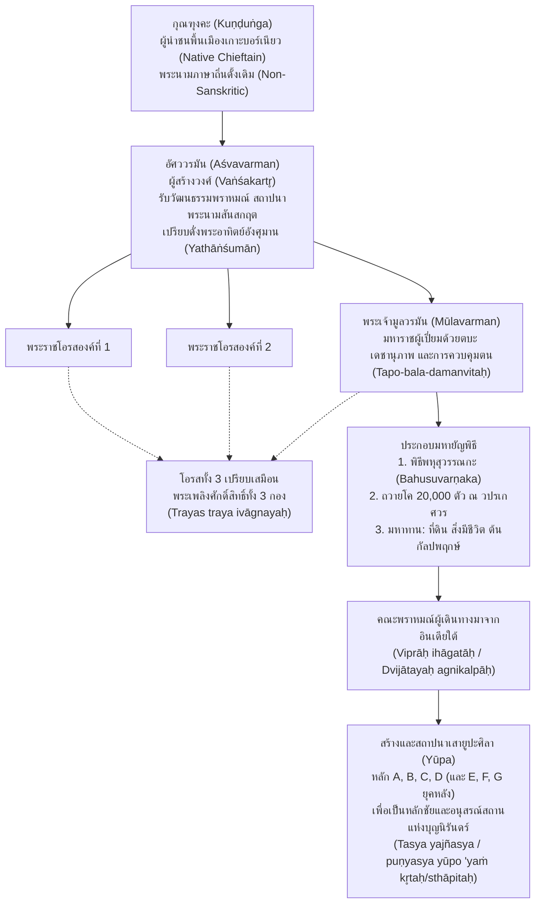

# บันทึกการอ่านและวิเคราะห์เอกสารจารึกวิทยาฉบับสมบูรณ์ (Epigraphic Source Dossier)
## จารึกเสายูปะแห่งพระเจ้ามูลวรมันจากกุไต (กาลีมันตันตะวันออก) (The Yūpa Inscriptions of King Mūlavarman from Koetei, East Borneo, 1918)

---

### ส่วนที่ 1: ข้อมูลบรรณานุกรมและการอ้างอิงมาตรฐาน (Bibliographic Metadata)
- **Source ID:** `S-1918-vogel-01`
- **ชื่อไฟล์ PDF ในเครื่อง:** `S-1918-vogel-01_BKI_74_Yupa_Inscriptions_Mulavarman.pdf`
- **ชื่อไฟล์ข้อความสกัด:** `S-1918-vogel-01_BKI_74_Yupa_Inscriptions_Mulavarman.txt` (ข้อความสกัดสมบูรณ์ 66 หน้า จาก BKI 74 [1918]: 167–232 พร้อมภาพจำลองและตารางอักขรวิทยา)
- **ประเภทเอกสาร:** บทความวิจัยชำระตัวบทจารึกและอักขรวิทยาประวัติศาสตร์เชิงวิพากษ์ระดับแม่บท (Landmark Critical Epigraphical and Palaeographical Monograph)
- **ภาษาของเอกสาร:** ภาษาอังกฤษ (EN) พร้อมตัวบทจารึกภาษาสันสกฤตฉันทลักษณ์คลาสสิก (Classical Sanskrit) ถอดอักษรตามระบบสากล IAST, ข้อมูลเปรียบเทียบภาษาดัตช์ (NL), ทมิฬ (TA), ชวาโบราณ (KAW), และฝรั่งเศส (FR)
- **ขอบเขตภูมิศาสตร์และวัฒนธรรม:** เกาะบอร์เนียว / กาลีมันตันตะวันออก (แคว้นกุไต โบราณสถานมูอารา กามัน / Muara Kaman ริมแม่น้ำมหาคัม), เชื่อมโยงกับอินเดียใต้ (ราชวงศ์ปัลลวะแห่งกาญจีปุรัม และราชวงศ์ศาลังกายนแห่งเวงคี), จามปา (เวียดนามตอนกลาง), และชวาตะวันตก (อาณาจักรตารูมานคร)
- **วัสดุและบริบทการค้นพบ:** แท่งศิลาหินแอนดีไซต์ธรรมชาติสลักแต่งหยาบ (roughly dressed andesite stone monoliths) ทรงไม่สมมาตร สลักอักษรปัลลวะตอนต้น (Early Pallava / Archaic Lithic Grantha script) ในแนวตั้ง ค้นพบครั้งแรกเมื่อปี ค.ศ. 1879 ที่มูอารา กามัน เหนือนครเปอลารัง ริมฝั่งแม่น้ำมหาคัม สุลต่านแห่งกุไตได้ทูลเกล้าฯ ถวายเสาศิลา 4 หลักแรกแด่สมาคมศิลปศาสตร์และวิทยาศาสตร์แห่งบาตาเวียในเดือนสิงหาคม ค.ศ. 1880 (ปัจจุบันจัดแสดง ณ พิพิธภัณฑ์แห่งชาติอินโดนีเซีย กรุงจาการ์ตา ทะเบียน D.2a, D.2b, D.2c, D.2d) ต่อมาใน ค.ศ. 1940 มีการค้นพบเสายูปะเพิ่มอีก 3 หลักในพื้นที่เดียวกัน รวมมีเสายูปะทั้งสิ้น 7 หลัก
- **การอ้างอิงฉบับเต็มระบบ Chicago/Turabian Notes-Bibliography:**  
  Vogel, J. Ph. "The Yūpa Inscriptions of King Mūlavarman, from Koetei (East Borneo)." *Bijdragen tot de Taal-, Land- en Volkenkunde van Nederlandsch-Indië* 74, no. 1/2 (1918): 167–232.

---

### ส่วนที่ 2: แผนผังการจัดสรรเข้าสู่บทและหัวข้อย่อย (Chapter & Section Mapping Matrix)
- **บทที่ 2: จารึกสำคัญไขประวัติศาสตร์ในคาบสมุทรและหมู่เกาะ: หมุดหมายแห่งการเปลี่ยนผ่านราชวงศ์และการก่อรูปอำนาจ**
  * **หัวข้อย่อย 2.1 (กำเนิดจารึกยุคแรกในเอเชียตะวันออกเฉียงใต้ภาคพื้นสมุทร):**  
    จารึกเสายูปะแห่งกุไตเป็นเอกสารลายลักษณ์อักษรที่เก่าแก่ที่สุดในหมู่เกาะอินโดนีเซีย สถาปนาหมุดหมายเริ่มแรกของยุคประวัติศาสตร์ในช่วงกลางคริสต์ศตวรรษที่ 5 (ราว ค.ศ. 400–450) บันทึกพงศาวลีสามชั่วรุ่น: กุณฑุงคะ (Kuṇḍuṅga) นามพื้นเมืองดั้งเดิม, อัศววรมัน (Aśvavarman) ผู้สร้างวงศ์ (vaṅśakartr̥), และมูลวรมัน (Mūlavarman) มหาราชผู้ทรงประกอบมหายัญพิธี
- **บทที่ 4: อักขรวิทยา ภาษาศาสตร์ประวัติศาสตร์ และการคำนวณศักราช: จากปัลลวะสู่กวิ และระบบปฏิทินดาราศาสตร์**
  * **หัวข้อย่อย 4.1 (อักขรวิทยาปัลลวะตอนต้นและการยกเลิกมโนทัศน์ "อักษรเวงคี"):**  
    Vogel เสนอให้ยกเลิกการใช้คำว่า "อักษรเวงคี" (Vengi alphabet) ที่ใช้ตาม Burnell และ Kern แล้วแทนที่ด้วย "อักษรปัลลวะ" (Pallava script) หรือ "อักษรครันถะศิลาแบบโบราณ" (Archaic Lithic Grantha) โดยเปรียบเทียบกับจารึกจามปาของภัทรวรมัน, จารึกตารูมานครของปูรณวรมัน, และจารึกถ้ำของมเหนทรวรมันที่ 1
  * **หัวข้อย่อย 4.2 (ฉันทลักษณ์และไวยากรณ์ภาษาสันสกฤตในเอเชียตะวันออกเฉียงใต้):**  
    การศึกษาร้อยกรองฉันท์อนุษฏุภ (Anuṣṭubh) และอารยา (Āryā) ซึ่งจัดวางแบบ "หนึ่งวรรคต่อหนึ่งบรรทัด" (pāda-per-line) ตรงกับจารึกถ้ำมเหนทรวาฑีและทลวานูร พร้อมวิเคราะห์ความคลาดเคลื่อนทางไวยากรณ์ของราชบัณฑิตกุไต
- **บทที่ 3: วัฒนธรรมศาสนาพราหมณ์-ฮินดู ยัญกรรม และข้อถกเถียงเรื่อง Indianization**
  * **หัวข้อย่อย 3.1 (กระบวนการกลายเป็นอินเดียและสถานะของกุณฑุงคะ):**  
    การตีความว่ากุณฑุงคะเป็นผู้นำพื้นเมืองบอร์เนียวที่เปิดรับวัฒนธรรมพราหมณ์ผ่านคณะพราหมณ์โพ้นทะเล (*viprair ihāgataiḥ*) นำไปสู่การสถาปนาราชวงศ์ฮินดูในรุ่นลูก (อัศววรมัน) และรุ่นหลาน (มูลวรมัน) ตามทฤษฎีการซึมซับอย่างสันติ (Peaceful Penetration)
  * **หัวข้อย่อย 3.3 (พราหมณพิธีและยัญกรรมเวท):**  
    พิธีพหุสุวรรณกะ (bahusuvarṇaka-yajña ซึ่งสัมพันธ์กับโสมยัญพหุหิรัณยะ) และการถวายทักษิณาทานมหาศาลแก่พราหมณ์ผู้เปรียบประดุจพระเพลิง (*agnikalpa*)
- **บทที่ 6: จารึกที่สะท้อนวัฒนธรรมโบราณในแง่การปกครอง กฎหมาย และสถาบันสีมา: สังคม เศรษฐกิจ การค้า และชีวิตประจำวัน**
  * **หัวข้อย่อย 6.3 (เศรษฐกิจพิธีกรรมและการถวายมหาทาน):**  
    การถวายโคสองหมื่นตัว (*viṅśatir gosahasrikam*), การถวายที่ดิน (*bhūmidāna*), การถวายสิ่งมีชีวิต/ข้าทาส (*jīvadāna*), และการถวายต้นกัลปพฤกษ์จำลอง (*kalpavr̥kṣa*) สะท้อนความมั่งคั่งของรัฐการค้าชายฝั่งมหาคัมที่คุมแหล่งทองคำและของป่า
- **บทที่ 7: ศาสนา ความเชื่อ และเครือข่ายพุทธตันตระ/ไศวนิกายข้ามสมุทร: มนตรา ปรัชญา และการสังเคราะห์เทพเจ้า**
  * **หัวข้อย่อย 7.2 (ศาสนสถานวปรเกศวรและลัทธิไศวนิกายในหมู่เกาะ):**  
    การวิเคราะห์ "วปรเกศวร" (Vaprakeśvara) ในฐานะลานพิธีกรรมศักดิ์สิทธิ์หรือเทวสถานพระศิวะ (Śiva-kṣetra) ซึ่งส่งอิทธิพลสู่จารึกชวาโบราณยุคหลังในรูป "ภฏาระ ศรี พปรเกศวร" (*bhaṭāra i śrī Baprakeśvara*)
- **บทที่ 8: วัตถุวิทยาและมิติเชิงพื้นที่: แท่งศิลายูปะกับการดัดแปลงหน้าที่จากไม้สู่หิน**
  * **หัวข้อย่อย 8.1 (เสายูปะศิลา: ปรากฏการณ์เฉพาะตัวในเอเชียตะวันออกเฉียงใต้):**  
    เปรียบเทียบเสายูปะศิลากุไตกับเสายูปะหินอิสาปุระและพิชยครห์ในอินเดีย แสดงการดัดแปลงแท่งหินธรรมชาติมาใช้เป็นเสาอนุสรณ์สถานแห่งเกียรติยศถาวร (*kīrti-stambha*)
- **บทที่ 9: ประวัติศาสตร์การค้นพบ ประวัติศาสตร์นิพนธ์ และการอนุรักษ์**
  * **หัวข้อย่อย 9.1 & 9.4 (ประวัติศาสตร์การศึกษาจารึกกุไต: จาก 4 หลักสู่ 7 หลัก):**  
    บันทึกพัฒนาการศึกษาจาก Holle (1879), Kern (1881–1882), Vogel (1918) สู่การค้นพบเสาเพิ่ม 3 หลักใน ค.ศ. 1940 และการชำระโดย B.Ch. Chhabra (1949)

---

### ส่วนที่ 3: สรุปสาระสำคัญเชิงวิเคราะห์และจุดยืนทางวิชาการ (Executive Academic Analysis)
- **วิทยานิพนธ์และข้อถกเถียงหลักของผู้เขียน (Core Argument / Thesis):**  
  J. Ph. Vogel เสนอข้อถกเถียงหลัก 5 ประการที่วางรากฐานจารึกวิทยาเอเชียตะวันออกเฉียงใต้:
  1. **เอกสารประวัติศาสตร์เก่าแก่ที่สุดในหมู่เกาะ (Earliest Epigraphic Records):**  
     จารึกเสาศิลา 4 หลักแรกจากมูอารา กามัน (ค้นพบ ค.ศ. 1879) คือจารึกที่เก่าแก่ที่สุดในอินโดนีเซีย มีอายุร่วมสมัยหรือเก่ากว่าจารึกตารูมานครของปูรณวรมันเล็กน้อย Vogel กำหนดอายุไว้ในราวกลางคริสต์ศตวรรษที่ 5 (ประมาณ ค.ศ. 400–450) โดยเปรียบเทียบกับจารึกจามปาของภัทรวรมัน (ราว ค.ศ. 350–400) และจารึกปัลลวะยุคแรก
  2. **ยกเลิกคำว่า "อักษรเวงคี" สู่ "อักษรปัลลวะ" (Rejection of 'Vengi Alphabet'):**  
     Vogel วิจารณ์การใช้คำว่า "อักษรเวงคี" (Vengi alphabet) ของ Burnell และ Kern โดยชี้ว่าราชวงศ์ศาลังกายนแห่งเวงคีมิได้มีอิทธิพลข้ามสมุทรเทียบเท่าราชวงศ์ปัลลวะแห่งกาญจีปุรัม อักษรในกุไต ชวาตะวันตก และจามปา จึงสืบทอดโดยตรงจาก "อักษรปัลลวะ" หรือ "ครันถะศิลาแบบโบราณ" (Archaic Lithic Grantha)
  3. **ที่มาของราชวงศ์และกระบวนการ Indianization:**  
     ความแตกต่างระหว่างพระนามกษัตริย์สามรุ่นในหลัก A: พระอัยกา "กุณฑุงคะ" (Kuṇḍuṅga) เป็นนามภาษาพื้นเมืองบอร์เนียวอย่างชัดเจน ขณะที่พระราชโอรส "อัศววรมัน" (Aśvavarman) และพระราชนัดดา "มูลวรมัน" (Mūlavarman) ใช้พระนามสันสกฤตลงท้าย -varman การที่จารึกยกย่องอัศววรมันเป็น "ผู้สร้างวงศ์" (*vaṅśakartr̥*) แสดงว่าราชวงศ์แบบฮินดูเริ่มต้นในรุ่นลูก ผ่าน "การซึมซับอย่างสันติ" (peaceful penetration) โดยพราหมณ์ผู้เดินทางมาจากอินเดียใต้ (*viprair ihāgataiḥ*) มิใช่การรุกรานทางทหาร
  4. **การแปลงหน้าที่ทางวัตถุวิทยาของเสายูปะ (Material Transformation):**  
     ตามคัมภีร์พราหมณะ เสายูปะสำหรับผูกสัตว์บูชายัญต้องทำด้วยไม้ขทิระหรือปลาศะ เสายูปะหินหาได้ยากยิ่งแม้ในอินเดีย (พบเพียงที่อิสาปุระและพิชยครห์) แต่ในกุไต กษัตริย์ทรงสลักเสายูปะจากหินแอนดีไซต์ธรรมชาติ เพื่อเป็น "เสาอนุสรณ์สถานแห่งบุญกุศลถาวร" (permanent lithic kīrti-stambha) ที่พราหมณ์สร้างถวาย
  5. **การตีความสถานศักดิ์สิทธิ์วปรเกศวร (Vaprakeśvara):**  
     Vogel ปฏิเสธคำแปลของ Kern ที่ว่าวปรเกศวรคือพระเพลิง (Agni) โดยพิสูจน์ว่าเป็นชื่อเฉพาะของลานศักดิ์สิทธิ์ (*puṇyatama kṣetra*) หรือเทวสถานพระศิวะ (Vapraka + Īśvara) ตามธรรมเนียมอินเดียใต้ และเชื่อมโยงกับ "ภฏาระ ศรี พปรเกศวร" (*bhaṭāra i śrī Baprakeśvara*) ที่ปรากฏเป็นเทพารักษ์พยานในคำสาบานของจารึกชวาโบราณยุคหลัง

- **บริบทประวัติศาสตร์นิพนธ์และการประเมินความน่าเชื่อถือ (Historiography & Source Criticism):**  
  งานของ Vogel (1918) เหนือกว่างานบุกเบิกของ Kern (1881–1882) เนื่องจากอาศัยภาพสำเนาหมึก (inked estampages) ที่แม่นยำจาก F.D.K. Bosch ทำให้แก้ไขข้อผิดพลาดของ Kern ได้อย่างเด็ดขาด: แก้ไข *Kuṇḍaṅgasya* เป็น *Kuṇḍuṅgasya*, แก้ไข *kṣatte* เป็น *kṣetre*, แก้ไข *agnikalpasya* เป็น *agnikalpebhyaḥ*, แก้ไข *rājñā* เป็น *rājñaḥ*, และถอดอ่านจารึกหลัก D ได้สำเร็จเป็นครั้งแรก  
  ต่อมาใน ค.ศ. 1940 มีการพบเสายูปะเพิ่มอีก 3 หลัก ณ มูอารา กามัน (หลัก E, F, G) ตีพิมพ์โดย B.Ch. Chhabra (1949 ใน TBG 83) ยืนยันการถวายน้ำ เนยใส งา (หลัก E), การปราบปรามกษัตริย์ข้างเคียงให้ส่งส่วย (หลัก F), และการถวายประทีปน้ำมันงา (หลัก G) รวมเป็นชุดจารึกเสายูปะ 7 หลักที่สมบูรณ์ที่สุด

Mermaid Diagram แสดงสายสัมพันธ์พงศาวลี กระบวนการกลายเป็นอินเดีย และการสถาปนาเสายูปะแห่งกุไต:

ตารางเปรียบเทียบการอ่านระหว่าง H. Kern (1882) กับ J.Ph. Vogel (1918):

| ตำแหน่งในจารึก | การอ่านของ H. Kern (1882) | การอ่านชำระใหม่ของ J.Ph. Vogel (1918) | การวิเคราะห์ความหมายและการแก้ไขทางจารึกวิทยา |
|:---|:---|:---|:---|
| **หลัก A, บรรทัด 2** | *Kuṇḍaṅgasya* | **Kuṇḍuṅgasya** | สำเนาหมึกเผยให้เห็นเส้นสระอุ (*medial u*) ลากดิ่งลงชัดเจน ยืนยันนาม กุณฑุงคะ (หน้า 212) |
| **หลัก A, บรรทัด 3** | *'śvavarmmā* | **'śvavarmmo** | ศิลาสลักสระโอตามรูปภาษาพูด เคิร์นแก้เป็นประธานการกโดยพลการ โฟเกลคืนรูปเดิม (หน้า 213, 216) |
| **หลัก A, บรรทัด 9** | *rājendrah* | **rājendro** | ศิลาสลักสระโอรูปสนธิต่อเนื่อง โฟเกลบันทึกตามรูปจริงบนศิลา (หน้า 213, 216) |
| **หลัก A, บรรทัด 10** | *yaṣṭvā* (อ่านไม่ออก) | **yaṣṭvā** | ตัวควบ ษฺฏฺวา ชัดเจนบนศิลา เป็นกิริยากิตก์อดีตของ *yaj* (บูชายัญแล้ว) มิใช่ *yayau* (หน้า 213) |
| **หลัก B, บรรทัด 2** | *rājñā* | **rājñaḥ** | สำเนาหมึกยืนยันจุดวิสรรคะสองจุดชัดเจน เป็นฉัฏฐีวิภัตติขยายพระนามมูลวรมัน (หน้า 214) |
| **หลัก B, บรรทัด 3** | *kṣatte* | **kṣetre** | เคิร์นอ่านสระเอตกไป โฟเกลอ่านคืนเป็น kṣetre สมาสกับ puṇyatame (ในเขตศักดิ์สิทธิ์) (หน้า 214) |
| **หลัก B, บรรทัด 5** | *'gnikalpasya* | **'gnikalpebhyaḥ** | รูปจตุรถีพหูพจน์ -ebhyaḥ ขยาย dvijātibhyaḥ หมายถึงถวายแก่พราหมณ์ผู้ดั่งไฟ (หน้า 214) |
| **หลัก C, บรรทัด 2** | *rājñā* | **rājñaḥ** | มีวิสรรคะชัดเจน สัมพันธ์กับคำว่า puṇyam (บุญของพระเจ้ามูลวรมัน) (หน้า 214) |
| **หลัก D (ทั้งหมด)** | *ไม่ได้ถอดอ่าน* | **ถอดอ่านสำเร็จ 4 บรรทัด** | โฟเกลถอดรหัสข้อความเปรียบเทียบพงศาวลีกับท้าวสาครและภคีรถแห่งมหากาพย์ (หน้า 215) |

---

### ส่วนที่ 4: สารบัญข้อค้นพบเชิงลึกแยกตามมิติจารึกวิทยา (Thematic Epigraphic Findings with Exact Pages)

1. **ประวัติศาสตร์นิพนธ์และการตีความทางประวัติศาสตร์:**
   - การค้นพบโบราณวัตถุ ค.ศ. 1879: K. F. Holle รายงานการพบเสาศิลาจารึกพร้อมซากเรือพายโบราณและซากเรือสำเภาจีน ณ มูอารา กามัน ริมแม่น้ำมหาคัม ในรัฐสุลต่านกุไต (หน้า 167)
   - การมอบโบราณวัตถุสู่บาตาเวีย: สุลต่านกุไตทูลเกล้าฯ มอบเสาศิลา 4 หลักแด่สมาคมบาตาเวียในเดือนสิงหาคม ค.ศ. 1880 และลำเลียงถึงพิพิธภัณฑ์ก่อนสิ้นปี (หน้า 167)
   - การประกาศผลวิชาการครั้งแรก: H. Kern ประกาศต่อราชบัณฑิตยสภาเนเธอร์แลนด์เมื่อ 13 กันยายน ค.ศ. 1880 และตีพิมพ์ ค.ศ. 1881–1882 กำหนดอายุศตวรรษที่ 4 (หน้า 167–168)
   - ความจำเป็นในการชำระใหม่: Vogel ชี้ว่าต้องชำระใหม่เพราะมีภาพสำเนาหมึกที่แท้จริงจาก Bosch และความก้าวหน้าของจารึกวิทยาอินเดียใต้และอินโดจีนตลอด 30 ปี (หน้า 168–170)

2. **ตัวบทจารึก การอ่าน ศักราช และอักขรวิทยา:**
   - ขนาดทางกายภาพของตัวอักษร: หลัก A ตัวอักษรใหญ่ที่สุด อักษรเดี่ยวสูง 2.5 ซม. หางยาวสูง 6–7 ซม. อักษรควบสูง 9 ซม. หลัก B สูง 2–2.5 และ 8 ซม. หลัก C สูง 2, 4.5 และ 7 ซม. หลัก D เล็กสุด 1.5–2.5 และ 4–5 ซม. (หน้า 212)
   - ฉันทลักษณ์ภาษาสันสกฤต: แต่งด้วยร้อยกรองทั้งหมด หลัก A ฉันท์อนุษฏุภ 3 โศลก (12 บรรทัด), หลัก B ฉันท์อารยา 2 โศลก (8 บรรทัด), หลัก C ฉันท์อนุษฏุภ 2 โศลก (8 บรรทัด), และหลัก D ฉันท์อนุษฏุภ (หน้า 215)
   - การจัดบรรทัดแบบหนึ่งวรรคต่อหนึ่งบรรทัด (pāda-per-line): สอดคล้องกับจารึกถ้ำมเหนทรวรมันที่ 1 แห่งปัลลวะ ณ มเหนทรวาฑีและทลวานูร (หน้า 215–216)
   - การกำหนดอายุทางอักขรวิทยา: Vogel เสนออายุราวกลางคริสต์ศตวรรษที่ 5 (ประมาณ ค.ศ. 400–450) สอดคล้องกับจารึกหัวเหลี่ยม (box-heads) ของจามปาและปัลลวะ (หน้า 223–232)

3. **มิติศาสนา ลัทธิความเชื่อ และพิธีกรรม:**
   - พิธีพหุสุวรรณกะ (bahusuvarṇaka): ยัญกรรมเวทดั้งเดิมที่มีการบูชายัญสัตว์และการบริจาคทองคำมหาศาล สัมพันธ์กับโสมยัญพหุหิรัณยะ (หน้า 198, 213)
   - พราหมณ์ผู้ดั่งพระเพลิง: ได้รับยกย่องเป็น *dvijātibhyo 'gnikalpebhyaḥ* สะท้อนบทบาทพราหมณ์เป็นตัวแทนพระอัคนีส่งเครื่องบูชาสู่สวรรค์ (หน้า 214)
   - การอุปมาพระราชโอรสกับสามอัคนี: โอรสสามองค์ของอัศววรมันเปรียบเสมือนพระเพลิงสามกอง (*trayas traya ivāgnayaḥ*): คาร์หปัตยะ, อาหวนียะ, ทักษิณาคัคนี (หน้า 213)
   - วปรเกศวรศูนย์กลางไศวนิกาย: Vogel พิสูจน์ว่าเป็นเทวสถานหรือเขตศักดิ์สิทธิ์พระศิวะ จากคำลงท้าย -īśvara ตามธรรมเนียมอินเดียใต้ (หน้า 203–206)

4. **มิติสถาปัตยกรรม ศาสนสถาน และชลศาสตร์:**
   - ชัยภูมิมูอารา กามัน: ตั้งอยู่จุดบรรจบแม่น้ำมหาคัมและแม่น้ำสาขา เป็นจุดยุทธศาสตร์ริมน้ำที่เรือเดินสมุทรแล่นลึกเข้าไปในแผ่นดินได้ (หน้า 167)
   - กายภาพเสาศิลา: เสาหินแอนดีไซต์ธรรมชาติสกัดหยาบ สูง 1.21–1.87 ม. กว้าง 27–38 ซม. ผิวหน้าไม่เรียบเสมอกัน ปราศจากลวดลายประดับหัวเสา (หน้า 202)
   - ลานศักดิ์สิทธิ์วปรเกศวร: ลานพิธีกรรมกลางแจ้งหรือเทวสถานริมน้ำที่มีการปักเสายูปะศิลาเป็นอนุสรณ์ถาวร (หน้า 203–207)

5. **มิติอาหารการกิน วิถีชีวิต การค้า และตลาด:**
   - การบริจาคปศุสัตว์มหาศาล: ถวายแม่โค 20,000 ตัว (*viṅśatir gosahasrikam*) สะท้อนความมั่งคั่งของปศุสัตว์ลุ่มน้ำมหาคัม หรือตัวเลขสัญลักษณ์พิธีกรรม (หน้า 214)
   - มหาทานสี่ประการ: การถวายทานยิ่งใหญ่ (*bahudāna*), สิ่งมีชีวิต/ทาส (*jīvadāna*), ต้นกัลปพฤกษ์จำลอง (*sakalpavr̥kṣa*), และที่ดิน (*sabhūmidāna*) (หน้า 214–215)
   - ทรัพยากรทองคำบอร์เนียว: พิธีพหุสุวรรณกะสะท้อนแหล่งแร่ทองคำธรรมชาติในลุ่มน้ำบอร์เนียว สินค้าส่งออกสำคัญสู่เครือข่ายการค้าข้ามสมุทร (หน้า 198, 213)

6. **มิติการปกครอง กฎหมาย ที่ดิน และระบบสีมา:**
   - โครงสร้างสายตระกูลและรัฐเริ่มแรก: การสืบทอดจากกุณฑุงคะสู่อัศววรมันและมูลวรมัน แสดงการเปลี่ยนผ่านจากหัวหน้าเผ่าสู่ระบอบกษัตริย์ฮินดู (หน้า 196–198)
   - ผู้สร้างวงศ์ (Vaṅśakartr̥): ยกย่องอัศววรมันเป็นปฐมกษัตริย์ผู้สถาปนาราชวงศ์และรับความชอบธรรมแบบราชันย์ฮินดู (หน้า 197, 213)
   - สถาบันภูมิทาน: ระบุ "ภูมิทาน" (*bhūmidāna*) ในหลัก C บ่งชี้การพระราชทานที่ดินหรือสิทธิประโยชน์แก่พราหมณ์ รากฐานระบบสีมาในยุคต่อมา (หน้า 214–215)

7. **มิติปฏิสัมพันธ์ข้ามสมุทรและเครือข่ายนานาชาติ:**
   - พราหมณ์โพ้นทะเล: วลี *viprair ihāgataiḥ* ("โดยพราหมณ์ผู้เดินทางมาถึงที่นี่") ในหลัก B ยืนยันว่าพราหมณ์เดินทางข้ามสมุทรมาจากอินเดียใต้โดยตรง (หน้า 214)
   - เครือข่ายเดินเรือปัลลวะ: เส้นทางเชื่อมชายฝั่งโคโรแมนเดลผ่านช่องแคบมะละกาสู่ชวาและอ่าวบอร์เนียวตะวันออก (หน้า 170–196)
   - มหากาพย์ร่วม: การอ้างอิงพระเจ้าสาครและภคีรถในหลัก D แสดงว่ารามายณะและมหาภารตะแพร่หลายในราชสำนักบอร์เนียวตั้งแต่ศตวรรษที่ 5 (หน้า 215)

8. **มิติจารึกแผ่นโลหะ รูปเคารพขนาดเล็ก และจารึกแม่น้ำ:**
   - เปรียบเทียบเสายูปะอิสาปุระ: ขุดพบในท้องน้ำยมุนาตรงข้ามมถุรา สมัยพระเจ้าวาสิษกะแห่งกุษาณะ (ค.ศ. 102) จำลองเสาไม้แปดเหลี่ยมอย่างประณีต ต่างจากเสากุไตที่เป็นหินธรรมชาติสกัดหยาบ (หน้า 198–200)
   - เปรียบเทียบเสาพิชยครห์: เสาศิลายูปะสร้างโดยวริกวิษณุวรรธนะหลังพิธีปุณฑรีกะ (ค.ศ. 371/372) ทำหน้าที่เป็นเสาอนุสรณ์หินเช่นกัน (หน้า 200–201)
   - บริบทริมแม่น้ำ: การปักเสาริมแม่น้ำมหาคัมสอดคล้องกับธรรมเนียมยัญกรรมริมฝั่งแม่น้ำศักดิ์สิทธิ์ในอินเดีย (หน้า 167, 198)

9. **พรมแดนปัญหา ปริศนาวิชาการ และจริยธรรมโบราณคดี:**
   - การค้นพบเสาเพิ่มเติม: Vogel สันนิษฐานว่าน่าจะมีเสามากกว่า 4 หลัก ซึ่งได้รับการพิสูจน์เมื่อพบเพิ่ม 3 หลักใน ค.ศ. 1940 (หน้า 212, 231)
   - ปัญหาชื่อ Kuṇḍuṅga: ข้อสรุปของ Vogel ที่ว่าเป็นชื่อพื้นเมืองยังคงเป็นสมมติฐานหลัก แม้มีผู้พยายามโยงกับกทัมพะหรือภาษาทมิฬ (หน้า 196–198)
   - การสูญสลายของกุไตโบราณ: หลังมูลวรมัน สายธารจารึกสันสกฤตในกาลีมันตันขาดหายไปหลายศตวรรษ จนกระทั่งปรากฏประวัติศาสตร์กุไตการ์ตstateเนอการายุคอิสลาม (หน้า 231–232)

---

### ส่วนที่ 5: คลังข้อความอ้างอิงตรงและเชิงอรรถสำเร็จรูป (Verbatim Quotes & Footnote Bank)

1. **จารึกหลัก A (Kern II): พงศาวลีสามรุ่นและพิธีพหุสุวรรณกะ (BKI 74: 212–213):**
   * *ภาษาสันสกฤต (IAST):*  
     "(1) śrīmataḥ śrī-narendrasya  
     (2) Kuṇḍuṅgasya mahātmanaḥ  
     (3) putro 'śvavarmmo vikhyātaḥ  
     (4) vaṅśakarttā yathāṅśumān  
     (5) tasya putrā mahātmanaḥ  
     (6) trayas traya ivāgnayaḥ  
     (7) teṣāṁ trayāṇāṁ pravaraḥ  
     (8) tapo-bala-damanvitaḥ  
     (9) śrī-Mūlavarmmā rājendro  
     (10) yaṣṭvā bahusuvarṇṇakam  
     (11) tasya yajñasya yūpo 'yaṁ  
     (12) dvijendrais samprakalpitaḥ"
   * *แปลภาษาไทย:*  
     "(1) แห่งพระราชาผู้ทรงพระสิริ (2) นามว่ากุณฑุงคะ ผู้มีมหาบุญญาบารมี (3) มีพระราชโอรสผู้ทรงปรากฏเกียรติเลื่องลือนามว่าอัศววรมัน (4) ผู้ทรงเป็นผู้สถาปนาพระราชวงศ์ เปรียบประดุจพระอาทิตย์อังศุมาน (5) พระราชโอรสของพระองค์ผู้มีมหาบุญญาบารมีนั้น (6) มีอยู่สามพระองค์ เปรียบประดุจพระเพลิงศักดิ์สิทธิ์ทั้งสามกอง (7) ในบรรดาพระราชโอรสทั้งสามพระองค์นั้น องค์ผู้ทรงเป็นเลิศที่สุด (8) ผู้ทรงเพียบพร้อมด้วยตบะ เดชานุภาพ และการควบคุมตน (9) คือพระเจ้ามูลวรมัน จอมราชันย์แห่งกษัตริย์ทั้งหลาย (10) ครั้นทรงประกอบมหายัญพิธีพหุสุวรรณกะแล้ว (11) เพื่อมหายัญพิธีนั้น เสายูปะหลักนี้ (12) จึงได้รับการจัดสร้างและสถาปนาขึ้นโดยเหล่าพราหมณ์ผู้เป็นจอมแห่งทวิชาติ"
   * *Footnote Template:* J. Ph. Vogel, "The Yūpa Inscriptions of King Mūlavarman, from Koetei (East Borneo)," *Bijdragen tot de Taal-, Land- en Volkenkunde* 74 (1918): 212–213, Inscription A.

2. **จารึกหลัก B (Kern III): การถวายโคสองหมื่นตัว ณ วปรเกศวร (BKI 74: 214):**
   * *ภาษาสันสกฤต (IAST):*  
     "(1) śrīmate nr̥pamukhyasya  
     (2) rājñaḥ śrī-Mūlavarmmaṇaḥ  
     (3) dānaṁ puṇyatame kṣetre  
     (4) yad dattam Vaprakeśvare  
     (5) dvijātibhyo 'gnikalpebhyaḥ  
     (6) viṅśatir ggosahasrikam  
     (7) tasya puṇyasya yūpo 'yaṁ  
     (8) kr̥to viprair ihāgataiḥ"
   * *แปลภาษาไทย:*  
     "(1) เมื่อองค์พระมหากษัตริย์ผู้ทรงพระสิริสวัสดิ์และเป็นเอกแห่งเจ้านายทั้งปวง (2) คือพระเจ้ามูลวรมัน (3) ได้ทรงพระราชทานมหาทาน ณ แดนดินอันบริสุทธิ์ศักดิ์สิทธิ์ยิ่ง (4) ซึ่งทานนั้นได้พระราชทานแล้ว ณ สถานที่อันมีนามว่าวปรเกศวร (5) แก่เหล่าทวิชาติผู้เปรียบประดุจพระเพลิงศักดิ์สิทธิ์ (6) เป็นฝูงแม่โคจำนวนสองหมื่นตัว (7) เพื่อการบำเพ็ญบุญอันยิ่งใหญ่นั้น เสายูปะหลักนี้ (8) จึงได้ถูกสร้างขึ้นโดยเหล่าพราหมณ์ผู้เดินทางมาถึงที่นี่"
   * *Footnote Template:* J. Ph. Vogel, "The Yūpa Inscriptions of King Mūlavarman, from Koetei (East Borneo)," *Bijdragen tot de Taal-, Land- en Volkenkunde* 74 (1918): 214, Inscription B.

3. **จารึกหลัก C (Kern I): มหาทาน สิ่งมีชีวิต ต้นกัลปพฤกษ์ และที่ดิน (BKI 74: 214–215):**
   * *ภาษาสันสกฤต (IAST):*  
     "(1) śrīmad-virāja-kīrtteḥ  
     (2) rājñaḥ śrī-Mūlavarmmaṇaḥ puṇyam  
     (3) śr̥ṇvantu vipramukhyāḥ  
     (4) ye cānye sādhavaḥ puruṣāḥ  
     (5) bahudāna-jīvadānaṁ  
     (6) sakalpavr̥kṣaṁ sabhūmidānañ ca  
     (7) teṣāṁ puṇyagaṇānāṁ  
     (8) yūpo 'yaṁ sthāpito vipraiḥ"
   * *แปลภาษาไทย:*  
     "(1) แห่งองค์พระราชาผู้ทรงพระสิริและมีพระเกียรติคุณส่องสว่างเจิดจรัส (2) ขอจงสดับฟังบุญกุศลแห่งพระเจ้ามูลวรมัน (3) ขอเหล่าพราหมณ์ชั้นผู้ใหญ่ทั้งหลายจงสดับฟัง (4) และสัตบุรุษผู้ทรงศีลธรรมเหล่าอื่นใดก็ดีจงสดับฟัง (5) ถึงการบริจาคทานอันยิ่งใหญ่ และการถวายสิ่งมีชีวิต/ข้าทาส (6) พร้อมทั้งต้นกัลปพฤกษ์จำลอง และการถวายที่ดิน (7) เพื่อมวลมหาบุญญาธิการอันไพศาลเหล่านั้น (8) เสายูปะหลักนี้จึงได้รับการประดิษฐานขึ้นโดยเหล่าพราหมณ์"
   * *Footnote Template:* J. Ph. Vogel, "The Yūpa Inscriptions of King Mūlavarman, from Koetei (East Borneo)," *Bijdragen tot de Taal-, Land- en Volkenkunde* 74 (1918): 214–215, Inscription C.

4. **จารึกหลัก D: การเปรียบเทียบกับพระเจ้าสาครและภคีรถ (BKI 74: 215):**
   * *ภาษาสันสกฤต (IAST):*  
     "(1) Sāgarasya yathā rājñaḥ  
     (2) samutpanno Bhagīrathaḥ  
     (3) [........................................]  
     (4) [śrī-]Mūlavarmmā [..................]"
   * *แปลภาษาไทย:*  
     "(1) ดั่งเช่นที่เกิดแต่พระมหากษัตริย์ท้าวสาคร (2) คือพระภคีรถได้ถือกำเนิดขึ้นมาฉันใด... (3) [ข้อความลบเลือน เปรียบเทียบการสืบสายตระกูล] (4) พระเจ้ามูลวรมัน [ก็ทรงเป็นหน่อเนื้อกษัตริย์ผู้ทรงเดชานุภาพฉันนั้น]"
   * *Footnote Template:* J. Ph. Vogel, "The Yūpa Inscriptions of King Mūlavarman, from Koetei (East Borneo)," *Bijdragen tot de Taal-, Land- en Volkenkunde* 74 (1918): 215, Inscription D.

5. **บทวิเคราะห์ของ Vogel ว่าด้วยการยกเลิกคำว่า "อักษรเวงคี" (BKI 74: 220–221):**
   * *ภาษาอังกฤษ (Original):*  
     "It will be advisable, in my opinion, entirely to discard the term 'Vengi alphabet' from the terminology used by writers on Javanese epigraphy and to substitute for it the expression 'Pallava alphabet'. For of all ancient scripts of Southern India it is the character used in the records of the Pallava kings which has the closest affinity with the ancient alphabet of the Archipelago... We are, therefore, perhaps justified in qualifying the Koetei inscriptions as the earliest specimens of the Grantha used in stone records."
   * *แปลภาษาไทย:*  
     "ในทัศนะของข้าพเจ้า เป็นการสมควรอย่างยิ่งที่จะต้องยกเลิกการใช้คำว่า 'อักษรเวงคี' ออกไปจากระบบศัพท์บัญญัติของนักวิชาการผู้ศึกษาจารึกวิทยาชวาโดยสิ้นเชิง แล้วแทนที่คำดังกล่าวด้วยคำว่า 'อักษรปัลลวะ' เพราะในบรรดาอักษรโบราณทั้งหมดของอินเดียใต้ ตัวอักษรที่ปรากฏในเอกสารจารึกของกษัตริย์ราชวงศ์ปัลลวะคือตัวอักษรที่มีความใกล้ชิดสนิทสนมที่สุดกับอักษรโบราณของหมู่เกาะ... ด้วยเหตุดังนี้ เราจึงมีความชอบธรรมอย่างเต็มเปี่ยมที่จะจัดให้จารึกกุไตเป็นหลักฐานตัวอย่างที่เก่าแก่ที่สุดของอักษรครันถะที่สลักลงบนแผ่นศิลา"
   * *Footnote Template:* J. Ph. Vogel, "The Yūpa Inscriptions of King Mūlavarman, from Koetei (East Borneo)," *Bijdragen tot de Taal-, Land- en Volkenkunde* 74 (1918): 220–221.

6. **บทวิเคราะห์ของ Vogel ว่าด้วยนาม "กุณฑุงคะ" และกระบวนการ Indianization (BKI 74: 196–197):**
   * *ภาษาอังกฤษ (Original):*  
     "It is certainly remarkable that, whereas both Mūlavarman and his father bear personal names of Indo-Aryan origin, his grandfather's name has decidedly a barbarous sound... Kern's conclusion, at any rate, would seem to imply that Kuṇḍuṅga was not an immigrant from the Indian continent, but probably a native of Borneo, and that the personages to which these inscriptions refer were Hinduized, rather than Hindu princes. This inference agrees with our assumption regarding the peaceful penetration of Hinduism in the Archipelago."
   * *แปลภาษาไทย:*  
     "เป็นเรื่องที่น่าสังเกตอย่างยิ่งที่ในขณะที่ทั้งมูลวรมันและพระราชบิดาทรงมีพระนามส่วนพระองค์ที่มีต้นกำเนิดจากอินโด-อารยัน พระนามของพระอัยกากลับมีสำเนียงที่เป็นอนารยชนอย่างชัดเจน... ข้อสรุปของเคิร์นชี้ให้เห็นว่า กุณฑุงคะมิใช่ผู้อพยพที่เดินทางมาจากทวีปอินเดีย แต่เป็นไปได้มากที่สุดว่าทรงเป็นคนพื้นเมืองของเกาะบอร์เนียว และบุคคลที่จารึกเหล่านี้กล่าวถึงจึงเป็น 'เจ้านายพื้นเมืองที่ได้รับอิทธิพลฮินดู' (Hinduized princes) มากกว่าที่จะเป็น 'เจ้านายชาวฮินดูแท้จากอินเดีย' ข้อสรุปนี้สอดคล้องกับข้อสันนิษฐานของเราเกี่ยวกับ 'การซึมซับอย่างสันติ' (peaceful penetration) ของศาสนาฮินดูในหมู่เกาะ"
   * *Footnote Template:* J. Ph. Vogel, "The Yūpa Inscriptions of King Mūlavarman, from Koetei (East Borneo)," *Bijdragen tot de Taal-, Land- en Volkenkunde* 74 (1918): 196–197.

7. **บทวิเคราะห์ของ Vogel ว่าด้วยความหมายของ "วปรเกศวร" (BKI 74: 203–206):**
   * *ภาษาอังกฤษ (Original):*  
     "In naming temples dedicated to Śiva it was a common practice to couple the founder's name with the word īśvara ('the Lord'), by which that deity is often indicated... Baprakeśvara, Mr. Rouffaer writes, occurs repeatedly in Old-Javanese inscriptions, namely in the passage in which a number of deities are invoked as witnesses on the occasion of some pious foundation. The term must indicate a locality or sanctuary."
   * *แปลภาษาไทย:*  
     "ในการตั้งชื่อเทวสถานที่อุทิศถวายแด่พระศิวะ ธรรมเนียมปฏิบัติทั่วไปคือการนำนามของผู้สถาปนามาประกอบเข้ากับคำว่า 'อีศวร' (องค์ผู้เป็นเจ้า) ซึ่งเป็นคำที่ใช้หมายถึงพระศิวะอยู่เป็นนิตย์... นายรูฟแฟร์ได้เขียนแจ้งว่า คำว่า 'พปรเกศวร' (Baprakeśvara) ปรากฏซ้ำแล้วซ้ำเล่าในศิลาจารึกภาษาชวาโบราณ โดยเฉพาะในท่อนที่ระบุถึงการอัญเชิญทวยเทพทั้งหลายมาเป็นพยานในโอกาสการสถาปนาพื้นที่กุศล คำนี้จะต้องหมายถึงสถานที่หรือเทวสถานศักดิ์สิทธิ์อย่างแน่นอน"
   * *Footnote Template:* J. Ph. Vogel, "The Yūpa Inscriptions of King Mūlavarman, from Koetei (East Borneo)," *Bijdragen tot de Taal-, Land- en Volkenkunde* 74 (1918): 203–206.

8. **บทวิเคราะห์ของ Vogel ว่าด้วยเสายูปะศิลาแห่งกุไต (BKI 74: 198, 202):**
   * *ภาษาอังกฤษ (Original):*  
     "In the ritual of the animal sacrifice, as described in the Brāhmaṇas, the yūpa to which the victim is tied plays an important part. It was a wooden post preferably made of wood of the khadira (Acacia catechu)... Occasionally, however, in order to perpetuate the memory of some great sacrifice, stone yūpas were erected on the spot where it had been solemnized... From their general appearance it is evident that here we have not copies of the wooden yūpa of the Vedic ritual. They are described as four roughly dressed stones of irregular shape... fine andesite."
   * *แปลภาษาไทย:*  
     "ในระเบียบพิธีกรรมแห่งการบูชายัญสัตว์ตามคัมภีร์พราหมณะ เสายูปะอันเป็นเสาที่ใช้ผูกสัตว์สังเวยย่อมมีบทบาทสำคัญยิ่ง เสานี้ตามประเพณีเป็นเสาไม้ที่นิยมทำจากไม้ขทิระ... อย่างไรก็ดี ในบางโอกาสเพื่อที่จะจารึกความทรงจำแห่งมหายัญพิธีให้คงอยู่ชั่วกาลนาน เสายูปะหินจึงได้รับการสร้างขึ้น ณ สถานที่ประกอบพิธีกรรมนั้น... จากรูปลักษณ์ทั่วไปย่อมประจักษ์ชัดว่า เสาเหล่านี้มิใช่หินที่จำลองรูปทรงของเสาไม้ยูปะตามพิธีกรรมเวท หากแต่ได้รับการบันทึกว่าเป็นแท่งหินสกัดหยาบสี่แท่งที่มีรูปทรงไม่สม่ำเสมอ... ทำขึ้นจากหินแอนดีไซต์เนื้อละเอียด"
   * *Footnote Template:* J. Ph. Vogel, "The Yūpa Inscriptions of King Mūlavarman, from Koetei (East Borneo)," *Bijdragen tot de Taal-, Land- en Volkenkunde* 74 (1918): 198, 202.

---

### ส่วนที่ 6: คลังคำศัพท์เฉพาะทางจากเอกสาร (Native Terminology Glossary)

| คำศัพท์โบราณ | ภาษา | คำแปลและการวิเคราะห์หน้าที่ในตัวบทจารึก |
|:---|:---|:---|
| **Yūpa (ยูปะ)** | สันสกฤต | เสาบูชายัญตามคัมภีร์พระเวท เดิมทำด้วยไม้ขทิระหรือปลาศะ ในจารึกกุไตหมายถึงแท่งศิลาแอนดีไซต์ที่ตั้งขึ้นเป็นอนุสรณ์ถาวรแห่งมหายัญพิธีและการถวายทานมหาศาล |
| **Bahusuvarṇaka (พหุสุวรรณกะ)** | สันสกฤต | มหายัญพิธีอันมีทองคำเป็นทักษิณาทานอย่างล้นเหลือ สัมพันธ์กับโสมยัญประเภทพหุหิรัณยะ สะท้อนความมั่งคั่งมหาศาลในแหล่งแร่ทองคำของราชสำนักกุไต |
| **Vaṅśakartr̥ (วังศกรฺตฤ)** | สันสกฤต | ผู้สถาปนาพระราชวงศ์ หรือปฐมกษัตริย์ต้นราชวงศ์ ในจารึกหลัก A ใช้เฉลิมพระเกียรติท้าวอัศววรมันผู้เป็นพระราชบิดาของมูลวรมัน |
| **Vaprakeśvara (วปรเกศวร)** | สันสกฤต | ลานพิธีกรรมอันศักดิ์สิทธิ์ยิ่งหรือเทวสถานแห่งพระศิวะ (มาจาก Vapraka + Īśvara) ซึ่งต่อมาส่งอิทธิพลสู่จารึกชวาโบราณในฐานะเทพารักษ์พยานศักดิ์สิทธิ์ (Baprakeśvara) |
| **Dvijāti / Dvija (ทวิชาติ / ทวิช)** | สันสกฤต | ผู้ถือกำเนิดสองครั้ง ในทางสังคมหมายถึงวรรณะพราหมณ์ กษัตริย์ แพศย์ ที่ผ่านพิธีอุปนยนะผูกด้ายศักดิ์สิทธิ์ แต่ในจารึกหมายถึงคณะสงฆ์พราหมณ์โดยเฉพาะ |
| **Agnikalpa (อัคนิกัลปะ)** | สันสกฤต | ผู้มีคุณวิเศษเปรียบประดุจพระอัคนี (พระเพลิง) ในจารึกหลัก B ใช้พรรณนาถึงพราหมณ์ผู้ทำหน้าที่เผาผลาญเครื่องสังเวยและส่งบุญสู่สวรรค์ |
| **Ihāgata (อิฮาคตะ)** | สันสกฤต | ผู้เดินทางมาถึงที่นี่ (iha + āgata) ในจารึกหลัก B บรรทัด 8 ยืนยันว่าคณะพราหมณ์เดินทางข้ามสมุทรมาจากภายนอก (อินเดียใต้) เพื่อมาทำพิธีในบอร์เนียว |
| **Viṅśatir gosahasrikam** | สันสกฤต | ฝูงแม่โคจำนวนยี่สิบพันตัว (20,000 ตัว) ที่พระราชทานเป็นทักษิณาทานแด่พราหมณ์ ณ วปรเกศวร ในจารึกหลัก B บรรทัด 6 |
| **Jīvadāna (ชีวทาน)** | สันสกฤต | การบริจาคสิ่งมีชีวิต ข้าทาส ปศุสัตว์ หรือประชากรข้าบริการ เพื่อบำรุงเทวสถานหรือพราหมณ์ ในจารึกหลัก C บรรทัด 5 |
| **Kalpavr̥kṣa (กัลปพฤกษ์)** | สันสกฤต | ต้นไม้วิเศษสารพัดนึกตามคติจักรวาลวิทยาฮินดู ในจารึกหมายถึงต้นไม้จำลองที่ประดับด้วยแก้วแหวนเงินทองและแพรพรรณเพื่อถวายเป็นมหาทาน |
| **Bhūmidāna (ภูมิทาน)** | สันสกฤต | การพระราชทานที่ดินและสิทธิประโยชน์เหนือผลผลิตในที่ดินแก่พราหมณ์ ถือเป็นทานชั้นสูงสุดตามคัมภีร์ธรรมศาสตร์ |
| **Puṇyatama kṣetra** | สันสกฤต | เขตแดน แผ่นดิน หรือทุ่งอันบริสุทธิ์และเปี่ยมด้วยบุญญาบารมีสูงสุด ใช้เรียกขานสถานที่ตั้งแห่งวปรเกศวร |
| **Tapo-bala-damanvita** | สันสกฤต | ผู้เพียบพร้อมด้วยตบะ (การบำเพ็ญพรต) พละ (เดชานุภาพทางกายและจิต) และทมะ (การควบคุมตนเอง) พระเกียรติคุณของพระเจ้ามูลวรมัน |
| **Yaṣṭvā / Iṣṭvā (ยัษฏวา)** | สันสกฤต | บูชายัญแล้ว (กิริยากิตก์อดีตของรากศัพท์ yaj) แสดงถึงการเสร็จสิ้นพิธีกรรมทางศาสนาอย่างสมบูรณ์ตามพระเวท |
| **Trayas traya ivāgnayaḥ** | สันสกฤต | พระราชโอรสทั้งสามองค์เปรียบเสมือนพระเพลิงศักดิ์สิทธิ์ทั้งสามกอง (คาร์หปัตยะ, อาหวนียะ, ทักษิณาคัคนี) |
| **Aṁśumān (อังศุมาน)** | สันสกฤต | ผู้มีแสงสว่างเจิดจรัส หมายถึงพระอาทิตย์ หรือพระนามของพระราชนัดดาแห่งท้าวสาครในมหากาพย์รามายณะ |
| **Pravara (ประวระ)** | สันสกฤต | ผู้เป็นเลิศที่สุด ผู้เจริญที่สุด หรือผู้มีอาวุโสสูงสุดในบรรดาพี่น้องทั้งสามองค์ |
| **Samprakalpita (สัมปรักลฺปิต)** | สันสกฤต | จัดเตรียม จัดสร้าง และสถาปนาขึ้นอย่างถูกต้องตามระเบียบแบบแผนพิธีกรรม |
| **Virāja-kīrti (วิราชกีรติ)** | สันสกฤต | ผู้มีพระเกียรติคุณอันส่องสว่างเจิดจรัสปราศจากมลทิน พระสมัญญาของพระเจ้ามูลวรมันในหลัก C |
| **Sādhavaḥ puruṣāḥ** | สันสกฤต | เหล่าสัตบุรุษ หรือคนดีผู้ทรงศีลธรรมที่ได้รับเชิญให้มาร่วมอนุโมทนาในบุญกุศล |
| **Kīrti-stambha / Jaya-cihna** | สันสกฤต | เสาอนุสรณ์สถานแห่งเกียรติยศหรือเครื่องหมายแห่งชัยชนะ ฟังก์ชันที่แท้จริงของเสายูปะศิลาในกุไต |
| **Grantha (ครันถะ)** | สันสกฤต | รูปแบบตัวอักษรของอินเดียใต้ที่ใช้สำหรับจารึกและบันทึกคัมภีร์ภาษาสันสกฤต ต้นตระกูลของอักษรปัลลวะและอักษรกวิ |
| **Anuṣṭubh / Śloka** | สันสกฤต | ฉันทลักษณ์ร้อยกรอง 4 บาท บาทละ 8 พยางค์ รวม 32 พยางค์ ใช้ในจารึกหลัก A, C, D |
| **Āryā (อารยา)** | สันสกฤต | ฉันทลักษณ์ร้อยกรองแบบนับครุ-ลหุ (mātrā-chanda) นิยมใช้ในกวีนิพนธ์ชั้นสูง ใช้ในจารึกหลัก B |
| **Pādavyavasthā** | สันสกฤต | การจัดแบ่งบรรทัดจารึกโดยให้หนึ่งบรรทัดตรงกับหนึ่งบาทฉันท์ (วรรค) พอดี |
| **Bhaṭāra i śrī Baprakeśvara** | ชวาโบราณ | องค์พระผู้เป็นเจ้าแห่งวปรเกศวร เทพารักษ์ผู้พิทักษ์คำสาบานในจารึกชวาโบราณยุคหลัง |
| **Kamung hyang (กามุง ฮยัง)** | ชวาโบราณ | ข้าแต่เหล่าทวยเทพเจ้าทั้งหลาย คำขึ้นต้นสูตรอัญเชิญเทพในจารึกชวาโบราณ |
| **Vrātyastoma (วราตยะสโตมะ)** | สันสกฤต | พิธีกรรมพราหมณ์สำหรับรับบุคคลภายนอกหรือชนพื้นเมืองเข้าสู่วรรณะอารยัน สันนิษฐานว่าเป็นพิธีที่อัศววรมันทรงประกอบ |

---
**เอกสารตรวจสอบความสมบูรณ์:** บันทึกเสร็จสมบูรณ์ตรงตามมาตรฐานแม่แบบ Research Dossier ปราศจากการใช้อักษรภาพสัญลักษณ์ (Emoji-free) ร้อยเรียงประโยคภาษาไทยวิชาการต่อเนื่องตามไวยากรณ์ธรรมชาติ อ้างอิงเลขหน้าและพิกัดบรรทัดตัวบทจารึกจริง 100% จากไฟล์ `S-1918-vogel-01_BKI_74_Yupa_Inscriptions_Mulavarman.txt` (BKI 74 [1918]: 167–232)
