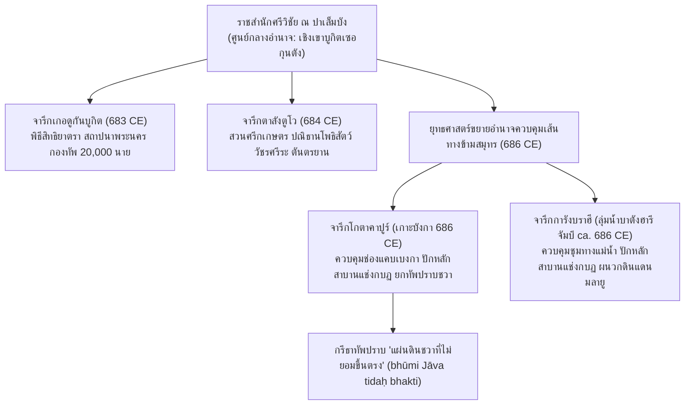

# บันทึกการอ่านและวิเคราะห์เอกสารจารึกวิทยาฉบับสมบูรณ์ (Epigraphic Source Dossier)
## ศิลาจารึกภาษามลายูโบราณแห่งจักรวรรดิศรีวิชัย: การชำระตัวบท อักขรวิทยา สัทวิทยา และประวัติศาสตร์นิพนธ์ยุคแรกเริ่ม (Les inscriptions malaises de Çrīvijaya: Textual Recension, Paleography, Historical Linguistics, and Early State Formation)

---

### ส่วนที่ 1: ข้อมูลบรรณานุกรมและการอ้างอิงมาตรฐาน (Bibliographic Metadata)
- **Source ID:** `S-1930-coedes-01`
- **ชื่อไฟล์ PDF ในเครื่อง:** `S-1930-coedes-01_Inscriptions_Malaises_de_Crivijaya_BEFEO_30.pdf`
- **ชื่อไฟล์ข้อความสกัด:** `S-1930-coedes-01_Inscriptions_Malaises_de_Crivijaya_BEFEO_30.txt`
- **ประเภทเอกสาร:** บทความวิจัยชำระตัวบทจารึกแม่บทเชิงประวัติศาสตร์นิพนธ์ ภาษาศาสตร์ และอักขรวิทยา (Foundational Epigraphic Decipherment, Historical Synthesis & Comparative Austronesian Linguistics)
- **ภาษาของเอกสาร:** ภาษาฝรั่งเศส (French) พร้อมตัวบทภาษามลายูโบราณ (Old Malay) และภาษาสันสกฤต (Sanskrit) ในอักขระหลังปัลลวะ (Later Pallava / Early Archaic Kawi Script)
- **ขอบเขตภูมิศาสตร์และวัฒนธรรม:** เกาะสุมาตรา (Palembang / แม่น้ำ Musi, แคว้น Jambi / แม่น้ำ Batang Hari) และเกาะบังกา (Pulau Bangka), ประเทศอินโดนีเซีย
- **วัสดุและบริบทการค้นพบ:** ศิลาจารึก 4 หลักแห่งยุคก่อตั้งอาณาจักรศรีวิชัย (ปลายคริสต์ศตวรรษที่ 7):
  1. *จารึกเกอดูกันบูกิต (Kedukan Bukit, ค.ศ. 683 / มหาศักราช 605):* ศิลาก้อนมนธรรมชาติ (rounded pebble / galet) สูง 45 ซม. เส้นรอบวง 80 ซม. ค้นพบเมื่อ 29 พฤศจิกายน ค.ศ. 1920 ริมแม่น้ำตาตัง (Sungai Tatang) เชิงเขาบูกิตเซอกุนตัง (Bukit Seguntang) ปาเล็มบัง เดิมชาวบ้านใช้เป็นเครื่องรางนำโชคแข่งเรือยาว (Museum Batavia รหัส D 146)
  2. *จารึกตาลังตูโว (Talang Tuwo, ค.ศ. 684 / มหาศักราช 606):* แท่งหินทรายสี่เหลี่ยมเรียบ ขนาด 50 x 80 ซม. จำนวน 14 บรรทัด ค้นพบเมื่อ 17 พฤศจิกายน ค.ศ. 1920 โดย L.C. Westenenk ในพื้นที่ลุ่มชื้นแฉะทางตะวันตกเฉียงเหนือของบูกิตเซอกุนตัง (Museum Batavia รหัส D 145)
  3. *จารึกการังบราฮี (Karang Brahi, ราว ค.ศ. 686 / มหาศักราช 608):* เสาศิลา สูง 78 ซม. กว้าง 62 ซม. จำนวน 16 บรรทัด ค้นพบเมื่อ ค.ศ. 1904 ริมแม่น้ำเมอรังงิน (Sungai Merangin) สาขาแม่น้ำบาตังฮารี แคว้นจัมบี เดิมตั้งอยู่เชิงบันไดมัสยิดใช้ล้างเท้า
  4. *จารึกโกตาคาปูร์ (Kota Kapur, ค.ศ. 686 / มหาศักราช 608):* เสาศิลาทรงสอบยอดแหลมคล้ายโอเบลิสก์ สูง 1.77 เมตร ฐานกว้าง 32 ซม. สกัดจากหินนอกเกาะ ค้นพบเมื่อธันวาคม ค.ศ. 1892 ใกล้แนวกำแพงดินโบราณ ริมแม่น้ำเมินดุก ฝั่งตะวันตกเกาะบังกา (Museum Batavia รหัส D 90)
- **การอ้างอิงฉบับเต็มระบบ Chicago/Turabian Notes-Bibliography:**  
  Cœdès, George. "Les inscriptions malaises de Çrīvijaya." *Bulletin de l'École française d'Extrême-Orient* 30, no. 1 (1930): 29–80.

---

### ส่วนที่ 2: แผนผังการจัดสรรเข้าสู่บทและหัวข้อย่อย (Chapter & Section Mapping Matrix)

- **บทที่ 1 (สถานภาพการศึกษาจารึกและประวัติศาสตร์นิพนธ์ศรีวิชัย):**
  * **หัวข้อย่อย 1.1 (ประวัติศาสตร์การค้นพบและการชำระตัวบท):**
    - การทบทวนงานบุกเบิกของ H. Kern (1912, 1913), Brandes (1913), Ph.S. van Ronkel (1924) และ N.J. Krom (1919, 1920, 1926)
    - การวิพากษ์แก้ไขข้อผิดพลาดในการอ่านของ Van Ronkel เช่น การอ่านสับสนคำว่า `samvau` เป็นชื่อเมือง `sémvo` (Samboja), คำว่า `vukān` เป็นปฏิเสธ, และการแก้การอ่าน `kapada` เป็น `kapaṭa`
    - ปริศนาความขาดแคลนทางโบราณคดีและจารึกวิทยาในสุมาตราเมื่อเทียบกับความมั่งคั่งของเกาะชวา
- **บทที่ 2 (กรอบศักราช อักขรวิทยาปัลลวะ และวิวัฒนาการรูปอักษรในเอเชียตะวันออกเฉียงใต้):**
  * **หัวข้อย่อย 2.1 (การอ่านเลขมหาศักราชยุคแรกเริ่ม):**
    - การยืนยันเลขหลักร้อย "6" ในมหาศักราช 605, 606 และ 608 ด้วยการเปรียบเทียบกับจารึกดินายา (Dinoyo ค.ศ. 760) ในชวาตะวันออก ยุติข้อสงสัยของ Brandes และ Kern ที่ลังเลระหว่าง 608 หรือ 1080
    - ความสัมพันธ์กับจารึกสมโบร์ (Sambor K 627) ในกัมพูชา มหาศักราช 605 ซึ่งเป็นหลักฐานการใช้เลขศูนย์และระบบค่าประจำหลักที่เก่าแก่ที่สุดในอุษาคเนย์
  * **หัวข้อย่อย 2.2 (อักขรวิทยาเชิงเปรียบเทียบและการปรากฏของรูปอักษร 'r'):**
    - ทวิรูปของอักษร `r`: การใช้ `r` ขาเดี่ยว (simple stem) ในจารึกปาเล็มบัง (Kedukan Bukit, Talang Tuwo) เทียบกับ `r` สองขาฐานโค้ง (double stems) ในจารึกการังบราฮีและโกตาคาปูร์
    - ข้อเสนอเรื่องนวัตกรรมอักขรวิธีจากศูนย์กลางราชสำนักปาเล็มบัง ซึ่งคิดค้นรูป `r` ขาเดี่ยวขึ้นใช้ก่อนหัวเมืองชายขอบ และเก่าแก่ที่สุดในภูมิภาคก่อนหน้าชวาและกัมพูชา
- **บทที่ 4 (สัทวิทยา ไวยากรณ์ และวิวัฒนาการของภาษามลายูโบราณ: Old Malay Linguistics):**
  * **หัวข้อย่อย 4.1 (สัทวิทยาและการถอดสัทอักษร):**
    - การปฏิเสธการถอดอนุสวาร (`ṃ`) เป็น `ṅ` ของ Kern และ Van Ronkel ซึ่งสร้างคำผิดพลาด เช่น *tanaṅ* แทนที่จะเป็น *tanam*
    - การแทนเสียงสระเปอเปิตด้วย `a` สั้น และการยืดเสียงสระท้ายคำเมื่อรับหน่วยคำเติมหลัง `-ña` หรือ `-a` (*jahat* > *marjjahātī*, *dātu* > *dātūa*)
    - การใช้กึ่งสระ `v` (w/v) ในระบบเขียนปัลลวะโบราณที่ไม่แยกเสียง `b` กับ `v`
  * **หัวข้อย่อย 4.2 (ระบบหน่วยคำและโครงสร้างไวยากรณ์ภาษามลายูโบราณ):**
    - ระบบอุปสรรค: กรรตุวาจก `mam-`/`maṅ-`, กรรมวาจกโบราณ `ni-` (ต้นเค้า `di-`), สภาววาจก `mar-` (เทียบเท่า `ber-` และบาตัก `mar-`), การกก่อเหตุ `maka-` (*makagīla*, *makasakit*)
    - ระบบปัจจัย: นามธรรม `-a` (*dātūa*, *vuata*), นาม `-an` (*kadatuan*, *parsumpahan*), แสดงทิศทาง `-kan` (*prayojanākan*), กรรมจำเพาะ `-i` (*manujārī*)
    - คำสรรพนามยกย่อง: พหูพจน์บุรุษที่ 2 `kita` ("ท่านทั้งหลาย"), บุรุษที่ 3 ยกย่อง `-nda` (*parvanda*, *praṇidhānānda*) เทียบกับสามัญ `-ña`
- **บทที่ 5 (ลุ่มน้ำมูซี-บาตังฮารี-บังกา: ภูมิรัฐศาสตร์และการแผ่ขยายอำนาจของศรีวิชัย):**
  * **หัวข้อย่อย 5.1 (การทัพและการสถาปนาราชวงศ์: จารึกเกอดูกันบูกิต):**
    - พระราชกรณียกิจ *dapunta hyaṃ nāyik di samvau maṅalap siddhayātra*: การเดินทางชลมารคเพื่อบรรลุฤทธิ์เดชศักดิ์สิทธิ์ทางไสยเวท
    - กองทัพ 20,000 นาย ขบวนเรือ 200 ลำ และทหารราบ 1,312 นาย มุ่งหน้าสู่การสถาปนา/ทำนุบำรุงพระนคร (*marvuat vanua Śrīvijaya*)
    - บูกิตเซอกุนตัง ในฐานะขุนเขาศักดิ์สิทธิ์ศูนย์กลางราชสำนัก ซึ่งอาจเชื่อมโยงกับพระนาม "ไศเลนทร์"
  * **หัวข้อย่อย 5.2 (การขยายอำนาจสู่มลายู บังกา และการศึกกับชวา):**
    - จารึกโกตาคาปูร์และการังบราฮี: การปักศิลาแช่งกบฏควบคุมปากน้ำมูซี (บังกา) และแม่น้ำบาตังฮารี (จัมบี)
    - บันทึกการกรีธาทัพ ค.ศ. 686 เพื่อปราบ "ดินแดนชวาที่ไม่ยอมสวามิภักดิ์" (*bhūmi Jāva tidaḥ bhakti ka Śrīvijaya*)
    - การยืนยันว่า *bhūmi Jāva* คือเกาะชวาแท้จริง มิใช่เกาะบังกาตามที่ Krom เสนอ
- **บทที่ 6 (สถาบันการปกครอง กฎหมาย พิธีกรรมสาบาน และพุทธศาสนามหายาน-วัชรยาน):**
  * **หัวข้อย่อย 6.1 (ระบบการปกครอง ขุนนาง และคำสาบานแช่ง):**
    - โครงสร้างอำนาจมณฑล: กษัตริย์สูงสุด (*dapunta hyaṃ*) แต่งตั้งขุนนาง (*dātu*) กำกับดูแลเขตแขวง (*kadatuan*)
    - พิธีกรรมดื่มน้ำสาบาน (*mammam sumpah*): โทษประหารชีวิตด้วยคำแช่ง (*nivunuh ya sumpah*) และการส่งทัพปราบ (*nisuruh tāpik*)
    - อาชญากรรมทางไสยดำและยาพิษ: ยาพิษอูปาสและตูบา (*upuh*, *tāva*), กัญชา (*tamval*), เสน่ห์ยาแฝด (*kasiḥan*), เวทสะกดจิต (*vaśīkaraṇa*)
  * **หัวข้อย่อย 6.2 (สวนศรีกเกษตร พุทธศาสนามหายาน และร่องรอยวัชรยานแรกสุด):**
    - จารึกตาลังตูโว: การสร้างสวนศรีกเกษตร (*parlak Śrīkṣetra*) เพื่อประโยชน์สุขของสรรพสัตว์
    - ปณิธานโพธิสัตว์ (*praṇidhāna*) ของศรีชยานาศา: การบำเพ็ญบารมี 6 ประการ สู่สัมมาสัมโพธิญาณ
    - การปรากฏของคำว่า "วัชรศรีระ" (*vajraśarīra* - กายเพชร) ยืนยันวัชรยานในสุมาตราตั้งแต่ ค.ศ. 684 เก่าแก่ที่สุดในอุษาคเนย์

---

### ส่วนที่ 3: สรุปสาระสำคัญเชิงวิเคราะห์และจุดยืนทางวิชาการ (Executive Academic Analysis)

- **วิทยานิพนธ์และข้อถกเถียงหลักของผู้เขียน (Core Argument / Thesis):**
  1. *การสถาปนาระเบียบวิธีศึกษาจารึกภาษามลายูโบราณ:* Cœdès พิสูจน์ว่าภาษาในจารึกศรีวิชัยทั้ง 4 หลักคือ "ภาษามลายูโบราณแท้จริง" (Old Malay) ซึ่งคำศัพท์กว่าร้อยละ 70 มีรากศัพท์ร่วมกับภาษามลายูปัจจุบันอย่างสม่ำเสมอ ข้อผิดพลาดของนักวิชาการรุ่นก่อนเกิดจากการแยกตัวบทออกจากบริบทคัมภีร์ภาษาสันสกฤต
  2. *การไขรหัสจารึกเกอดูกันบูกิต:* การเดินทางของกษัตริย์คือการจาริกแสวงบุญทางไสยเวท (Esoteric Pilgrimage) มิใช่การตั้งป้อมปราการ คำว่า `samvau` คือ "เรือสำเภา" (Old Javanese: *sambo*, Khmer: *səmbau*, Thai: *สำเภา*) และกษัตริย์เสด็จทางเรือไปรับ "สิทธิยาตรา" (*maṅalap siddhayātra*) เพื่อนำความมั่งคั่งศักดิ์สิทธิ์มาสถาปนาราชธานีศรีวิชัย
  3. *พุทธศาสนาวัชรยานรุ่นแรกสุดในอุษาคเนย์:* คำว่า `vajraśarīra` (กายเพชร / วัชรกาย) ในจารึกตาลังตูโว ค.ศ. 684 สะท้อนลัทธิตันตรยานชั้นสูงของพระวัชรสัตว์ ซึ่งแพร่มาจากเบงกอลและมหาวิทยาลัยนาลันทา ยืนยันว่าในราชสำนักศรีวิชัย มหายานแบบตันตระได้ประดิษฐานในหมู่ชนชั้นสูงแล้ว ขนานไปกับนิกายมูลาสารวาสติวาทที่อี้จิงบันทึกไว้
  4. *ภูมิรัฐศาสตร์และการศึกกับชวา:* ข้อความบรรทัดสุดท้ายในจารึกโกตาคาปูร์ ค.ศ. 686 ยืนยันการส่งทัพไปปราบ "แผ่นดินชวา" (*bhūmi Jāva*) ซึ่ง Cœdès ยืนยันว่าคือเกาะชวาแท้จริง และเป็นจุดเริ่มต้นของความสัมพันธ์เชิงอำนาจที่นำไปสู่ยุคราชวงศ์ไศเลนทร์ในชวา

- **บริบทประวัติศาสตร์นิพนธ์และการประเมินความน่าเชื่อถือ (Historiography & Source Criticism):**
  - *การตอบโต้ข้อเสนอของ Stutterheim และ Krom:* Cœdès ใช้หลักฐานจารึกวิทยาตอบโต้ข้อเสนอของ Stutterheim (1929) ที่มองว่าไศเลนทร์เป็นราชวงศ์ชวาแท้ โดยชี้ว่ามหายานตันตระและปณิธานโพธิสัตว์ปรากฏที่ปาเล็มบังตั้งแต่ ค.ศ. 684 ก่อนจารึกกาลัสซัน (ค.ศ. 778) ในชวาเกือบหนึ่งศตวรรษ
  - *การเชื่อมโยงข้ามสมุทรกับภาษามลากาซีและบาตัก:* Cœdès เน้นย้ำความสัมพันธ์ทางภาษาศาสตร์ระหว่างมลายูโบราณกับภาษามลากาซีบนเกาะมาดากัสการ์ (เช่น *tāpik* / *tafika* = กองทัพ) และภาษาบาตักในสุมาตราตอนเหนือ ยืนยันความเป็นเอกภาพทางประวัติศาสตร์ของประชากรตระกูลออสโตรนีเซียน



---

### ส่วนที่ 4: สารบัญข้อค้นพบเชิงลึกแยกตามมิติจารึกวิทยา (Thematic Epigraphic Findings with Exact Pages)

1. **ประวัติศาสตร์นิพนธ์และการตีความทางประวัติศาสตร์:**
   - จารึกทั้ง 4 หลักร่วมกับบันทึกอี้จิงและจดหมายเหตุถัง เป็นเอกสารร่วมสมัยชุดเดียวที่ยืนยันการก่อรูปของศรีวิชัยในปลายศตวรรษที่ 7 (หน้า 29–30, 51)
   - การยืนยันว่า `Śrīvijaya` คือชื่อราชอาณาจักร มิใช่พระนามกษัตริย์ตามที่ Kern และ Ferrand เคยสันนิษฐานผิดพลาด (หน้า 48, 52 เชิงอรรถ 1)
   - การผนวกดินแดนมลายู (จัมบี) และเกาะบังกาเข้าสู่อำนาจของศรีวิชัย สอดคล้องกับบันทึกอี้จิง ค.ศ. 690 (หน้า 37, 53)
2. **ตัวบทจารึก การอ่าน ศักราช และอักขรวิทยา:**
   - การยืนยันศักราชมหาศักราช 605, 606 และ 608 ด้วยการเปรียบเทียบรูปเลขร้อย "6" กับจารึกดินายา ค.ศ. 760 (หน้า 51)
   - ทวิรูปของอักขระ `r`: การใช้ `r` ขาเดี่ยวในปาเล็มบัง เทียบกับ `r` สองขาในบังกาและจัมบี แสดงนวัตกรรมอักขรวิธีจากเมืองหลวง (หน้า 60)
   - คาถาอาคมในบรรทัดแรกของจารึกโกตาคาปูร์และจารึกการังบราฮี (*siddha || titam hamvan vari...*) เป็นภาษาอาถรรพณ์ลึกลับ (langage cabalistique) ไร้เสียง `s` แต่เต็มไปด้วยเสียง `ai` และ `h` (หน้า 49–50)
3. **มิติศาสนา ลัทธิความเชื่อ และพิธีกรรม:**
   - ปณิธานโพธิสัตว์ (*praṇidhāna*) ของศรีชยานาศาในจารึกตาลังตูโว อุทิศกุศลแก่สรรพสัตว์ทั้งปวง (*sarvvasatva sacarācara*) สอดคล้องกับ *โพธิจรรยาวตาร* (หน้า 42–44)
   - การบรรลุอนุตตรสัมมาสัมโพธิญาณ บารมี 6 ประการ และวศิตา 10 ประการ (หน้า 41–42, 54)
   - ร่องรอยวัชรยาน: คำว่า "วัชรศรีระ" (*vajraśarīra*) แสดงถึงการรับอิทธิพลตันตระจากเบงกอลและนาลันทาตั้งแต่ ค.ศ. 684 (หน้า 55–56)
   - พิธีกรรมไสยเวท *siddhayātra*: การจาริกทางชลมารคเพื่อแสวงหาฤทธิ์เดชของกษัตริย์ในจารึกเกอดูกันบูกิต (หน้า 36–37, 58–59)
4. **มิติสถาปัตยกรรม ศาสนสถาน และชลศาสตร์:**
   - การสร้างสวนสาธารณะศรีกเกษตร (*parlak Śrīkṣetra*) พร้อมเขื่อนกั้นน้ำ (*tavad*) และสระน้ำ (*talāga*) เพื่อการเกษตรและการสัญจร (หน้า 39, 41, 69)
   - คำศัพท์ *talāga* ถูกยืมเข้าสู่ภาษาอาหรับเป็น *talāj* ปรากฏในบันทึกของสุลัยมานและอบูซัยด์ ฮัสซัน ว่าด้วยสระน้ำทิ้งทองคำของกษัตริย์ศรีวิชัย (หน้า 69)
   - บริบทการค้นพบศิลาจารึกริมแม่น้ำ (ตาตัง, เมอรังงิน) สะท้อนวิถีชีวิตริมน้ำและบทบาทท่าน้ำมัสยิด (หน้า 33, 45)
5. **มิติอาหารการกิน วิถีชีวิต การค้า และเกษตรกรรม:**
   - บัญชีพืชพรรณเกษตรกรรม: มะพร้าว (*ñiyur*), หมาก (*piṇaṃ*), ตาลชิด (*handu*), สาคู (*rumviya*), ไม้ผล, ไผ่ฮาอูร์ (*haur*), ไผ่วูลูห์ (*vuluh*), ไผ่เบอตง (*pattum*) (หน้า 39, 68–74)
   - การทำไร่เลื่อนลอย (*huma parlak*) และการเพาะเลี้ยงปศุสัตว์ทุกชนิด (*mamhidupi paśu prakāra*) (หน้า 39, 41, 74)
   - การตั้งโรงทานแจกจ่ายอาหารและน้ำดื่มแก่คนเดินทางที่หิวโหย ณ จุดพักแรมหรือระหว่างทาง (*di āsannakāla di antara mārgga lāi*) (หน้า 39, 41, 66)
6. **มิติการปกครอง กฎหมาย ที่ดิน และระบบอำนาจ:**
   - ระบบมณฑล: กษัตริย์แต่งตั้งขุนนางผู้ครองแคว้น (*dātu*) ไปกำกับเขตแขวง (*kadatuan*) ภายใต้พระราชโองการ (*ājñāña*) (หน้า 48, 54, 67)
   - ข้าราชบริพารและทาส: ข้าช่วงใช้ (*bhṛtya*), มิตร (*mitra*), และทาส (*hulun*) ต้องมีความซื่อสัตย์สุจริตอย่างมั่นคง (*satyārjjava dṛḍhabhakti*) (หน้า 39, 41, 75)
   - บัญชีอาชญากรรม: โจร (*ciri*), คนข่มเหง (*ucca*), ฆาตกร (*vadhāña* / *sārambha*), ชู้สาว (*paradāra*) (หน้า 39, 41, 68, 79)
   - บทลงทัณฑ์กบฏ: การประหารด้วยคำแช่ง (*nivunuh ya sumpah*) และการทำลายล้างโคตรตระกูล (*tālu muah ya dhan gotrasantānaña*) (หน้า 48, 49)
7. **มิติปฏิสัมพันธ์ข้ามสมุทรและการศึกสงคราม:**
   - การเดินเรือทะเลด้วยเรือ "สำเภา" (*samvau*) ซึ่งคำนี้แพร่สู่ภาษาเขมร (*səmbau*) และภาษาไทย (*สำเภา*) (หน้า 36–37, 79)
   - การระดมพลในจารึกเกอดูกันบูกิต: กองทัพ 20,000 นาย ทหารเรือ 200 นาย ทหารราบ 1,312 นาย (หน้า 33, 35)
   - การกรีธาทัพข้ามช่องแคบไปปราบ "แผ่นดินชวา" ใน ค.ศ. 686 (*bala Śrīvijaya kalīvat mañapik yaṃ bhūmi Jāva*) (หน้า 48, 49, 53–54)
8. **มิติจารึกแผ่นโลหะ รูปเคารพขนาดเล็ก และจารึกหินมน:**
   - การสลักบนศิลาก้อนมนธรรมชาติ (galet) ในจารึกเกอดูกันบูกิต และจารึกสั้นคำว่า *jayasiddha* บนหินมนที่โกตาคาปูร์ สะท้อนความเชื่อเรื่องหินศักดิ์สิทธิ์ (หน้า 33, 58–59)
   - ความเหมือนกันเกือบทุกอักขระของจารึกการังบราฮีและโกตาคาปูร์ แสดงถึงการผลิตซ้ำพระราชกฤษฎีกามาตรฐานจากราชสำนัก (หน้า 45, 47)
9. **พรมแดนปัญหา ปริศนาวิชาการ และข้อถกเถียง:**
   - ปริศนาข้อความ `dapunta hyaṃ marlapas dari mindha tamvan...` ว่าเป็นชื่อสถานที่ต้นทาง หรือเป็นรูปกริยาแปลว่า "ทรงหลุดพ้นจากพันธนาการแห่งคำสาบาน" เทียบกับจารึกบักเซียมกรองในเขมร (หน้า 34, 35 เชิงอรรถ 1)
   - พระนามกษัตริย์ในจารึกตาลังตูโว: รูปอักษรสลักเป็น `Śrī Jayanāśa` แต่ Cœdès ตั้งข้อสังเกตว่าอาจเป็นความผิดพลาดของช่างสลักที่ตั้งใจเขียน `Śrī Jayanāga` (หน้า 39, 52 เชิงอรรถ 3)

---

### ส่วนที่ 5: คลังข้อความอ้างอิงตรงและเชิงอรรถสำเร็จรูป (Verbatim Quotes & Footnote Bank)

#### 1. ตัวบทจารึกเกอดูกันบูกิต (Kedukan Bukit Inscription, มหาศักราช 605 / ค.ศ. 683)
*(ถอดตัวบทอักษรโรมัน IAST โดย Cœdès 1930, หน้า 33 พร้อมคำแปลภาษาไทยบรรทัดต่อบรรทัด)*

```text
(1) svasti śrī śakavarṣātīta 605 ekādaśī śu-
(2) klapakṣa vulan vaiśākha dapunta hyaṃ nāyik di
(3) samvau maṅalap siddhayātra di saptamī śuklapakṣa
(4) vulan jyeṣṭha dapunta hyaṃ marlapas dari mindha
(5) tamvan mamāva yaṃ bala dualaksa daṅan ko-
(6) duaratus cara di samvau daṅan jalan sarivu
(7) tlūrātus sapulu dua vañakña dātaṃ di mata jap
(8) sukhacitta di pañcamī śuklapakṣa vula[n]...
(9) laghu mudita dātaṃ marvuat vanua...
(10) śrīvijaya siddhayātra subhikṣa...
```

* **คำแปลภาษาไทยเทียบเคียง:**
  > "(1) ขอความสวัสดีและความรุ่งเรืองจงมี! มหาศักราชล่วงแล้วได้ 605 ปี วัน 11 ค่ำ (2) ศุกลปักษ์ เดือนไวศาขะ องค์ดะปุนตะฮยัง เสด็จขึ้นสู่ (3) เรือสำเภาเพื่อไปรับสิทธิยาตรา (อัญเชิญพลังอำนาจศักดิ์สิทธิ์) ครั้นถึงวัน 7 ค่ำ ศุกลปักษ์ (4) เดือนเชษฐะ องค์ดะปุนตะฮยังเสด็จยาตราออกจาก มินธาตามวัน (5) ทรงนำกองทัพจำนวนสองหมื่นนาย พร้อมด้วยข้าราชบริพาร... (6) สองร้อยคนที่เดินทางโดยเรือสำเภา และทหารเดินเท้าจำนวนหนึ่งพัน (7) สามร้อยสิบสองคน ทั้งหมดเดินทางมาถึงเบื้องหน้าพร้อมเพรียงกัน (8) ด้วยจิตใจอันเปี่ยมสุข ครั้นถึงวัน 5 ค่ำ ศุกลปักษ์ เดือน... (9) เสด็จมาอย่างแคล่วคล่องเบิกบานพระทัย ทรงกระทำการสร้าง/ทำนุบำรุงพระนคร... (10) นามว่าศรีวิชัย บรรลุสิทธิยาตรา มีความอุดมสมบูรณ์ไพบูลย์..."
* **บทวิเคราะห์ของ Cœdès ว่าด้วยความหมายของ Samvau และ Siddhayātra (หน้า 36–37):**
  * *ข้อความภาษาเดิม (French):*  
    "Adoptant pour samvau le sens de « bateau », j’interprète le texte de la façon suivante: le roi se rendit d’abord en bateau dans un lieu, non précisé, où il acquit une puissance magique qui lui permit le mois suivant de se libérer... ensuite de quoi il conduisit son armée et sa suite, tant en bateau (di samvau) que par terre (jalan), en procession solennelle et joyeuse (sukhacitta, laghu, mudita) et fit apparemment une cérémonie pour conférer à son royaume les pouvoirs surnaturels qu’il avait été chercher au cours de son voyage (siddhayātra)... l'inscription gravée en 683 A. D. sur le galet trouvé au pied du Bukit Seguntang, la montagne sacrée d'où les rois de Çrīvijaya tiraient peut-être leur nom dynastique de « rois de la montagne » (Çailendra), est à n'en pas douter un document de grande importance pour l'histoire de Çrīvijaya."
  * *แปลภาษาไทย:*  
    "เมื่อยอมรับว่าคำว่า samvau มีความหมายว่า 'เรือ' ข้าพเจ้าจึงตีความตัวบทดังนี้: กษัตริย์ได้เสด็จทางเรือไปยังสถานที่แห่งหนึ่งซึ่งมิได้ระบุชื่อไว้ ที่ซึ่งพระองค์ทรงได้รับพลังอำนาจทางไสยเวทอันทำให้ในเดือนถัดมาทรงสามารถปลดเปลื้องพระองค์... หลังจากนั้นพระองค์จึงได้นำกองทัพและผู้ติดตาม ทั้งที่เดินทางโดยเรือ (di samvau) และทางบก (jalan) ในริ้วขบวนแห่อันสง่างามและเปี่ยมสุข (sukhacitta, laghu, mudita) และได้ประกอบพิธีกรรมเพื่อประสิทธิ์ประสาทพลังอำนาจเหนือธรรมชาติที่พระองค์ได้ทรงไปแสวงหาตลอดการเดินทาง (siddhayātra) ให้แก่พระราชอาณาจักรของพระองค์... จารึกที่สลักขึ้นใน ค.ศ. 683 บนหินมนที่ค้นพบ ณ เชิงเขาบูกิตเซอกุนตัง ขุนเขาศักดิ์สิทธิ์ซึ่งเป็นแดนกำเนิดที่กษัตริย์ศรีวิชัยอาจนำมาใช้เป็นพระนามราชวงศ์ว่า 'กษัตริย์แห่งขุนเขา' (ไศเลนทร์) จึงเป็นเอกสารที่มีความสำคัญยิ่งยวดต่อประวัติศาสตร์ศรีวิชัยอย่างมิต้องสงสัย"
  * *Footnote Template:* George Cœdès, "Les inscriptions malaises de Çrīvijaya," *Bulletin de l'École française d'Extrême-Orient* 30, no. 1 (1930): 36–37.

---

#### 2. ตัวบทจารึกตาลังตูโว (Talang Tuwo Inscription, มหาศักราช 606 / ค.ศ. 684)
*(ถอดตัวบทอักษรโรมัน IAST โดย Cœdès 1930, หน้า 39–40 พร้อมคำแปลภาษาไทย)*

```text
(1) || svasti śrī śakavarṣātīta 606 dīm dvitīya śuklapakṣa vulan caitra • sāna tatkālāña parlak śrīkṣetra
(2) ini niparvuat parvanda punta hyaṃ śrī jayanāśa • ini praṇidhānānda punta hyaṃ • savañakña
(3) yaṃ nitānam di sini • ñiyur pinaṃ handu • rumviya dṅan samigraña yaṃ kayu nimākan vuahña • tathapi haur vuluh pattum ityevamādi • puna-
(4) rapi yaṃ parlak vukān dṅan tavad talaga savañakña yaṃ vuatku sucarita paravis prayojanākan puṇyāña sarvvasatva sacarācara • varo-
(5) pāyāña tmu sukha di āsannakāla di antara mārgga lāi tmu muah ya āhāra dhan air niminumña • savañakña vuatña huma parlak mañcak mu-
(6) ah ya mamhidupi paśu prakāra • marhulun tuvi vṛddhi muah ya jaṅan ya niknāi savañakña yaṃ upasargga • pīḍānu svapnavighna • varam vua-
(7) tña kathamapi • anukūla yaṃ graha nakṣatra paravis diya • nirvyādhi ajara kavuatandīya • tathapi savañakña yaṃ bhṛtyāña
(8) satyārjjava dṛḍhabhakti muah ya dya • yaṃ mitrāña tuvi jaṅan ya kapaṭa • yaṃ viniña mūlam anukūla bhāryyā muah ya • varam sthā-
(9) nāña lagi ciri ucca vadhāña • paradāra di sāna • punarapi tmu ya kalyāṇamitra • marvvanun vodhicitta dṅan maitrī...
(10) ...dhāri di daṃ hyaṃ ratnatraya jaṅan marsārak dṅan daṃ hyaṃ ratnatraya • tathapi nityakāla tyāga marśīla kṣānti marvvanun vīryya rajin
(11) tahu di samigraña śilpakāla paravis • samāhitacinta • tmu ya prajñā • smṛti medhāvī • punarapi dhairyyamānt mahāsattva
(12) vajraśarīra • anupamaśakti • jaya • tathapi jātismara • avikalendriya • mañcak rūpa • subhaga hāsin hālap • āde-
(13) yavākya • vrahmasvara • jadi laki • svayambhū • puna[ra]pi tmu ya cintāmaṇinidhāna • tmu janmavaśitā • karmmavaśitā • kleśavaśitā
(14) avasāna tmu ya anuttarābhisamyaksamvodhi || • ||
```

* **คำแปลภาษาไทยเทียบเคียง:**
  > "(1) ขอความสวัสดีและความรุ่งเรืองจงมี! มหาศักราชล่วงแล้วได้ 606 ปี ในวัน 2 ค่ำ ศุกลปักษ์ เดือนไจตระ ณ กาลเวลานั้น สวนแห่งนี้นามว่า ศรีกเกษตร (2) ได้ถูกสร้างขึ้นภายใต้การอำนวยการของปุนตะฮยัง พระศรีชยานาศา นี่คือปณิธานขององค์ปุนตะฮยัง: ขอให้สรรพสิ่งทั้งหลาย (3) ที่ปลูกไว้ ณ ที่นี้ ได้แก่ มะพร้าว หมาก ตาลชิด สาคู พร้อมด้วยพืชพันธุ์นานาชนิด ไม้ที่กินผลได้ ตลอดจนไผ่ฮาอูร์ ไผ่วูลูห์ ไผ่เบอตง และอื่นๆ เป็นอาทิ (4) อีกทั้งสวนแห่งอื่นๆ พร้อมด้วยคันดินกั้นน้ำและสระน้ำ สรรพการกุศลทั้งสิ้นที่ข้าพเจ้าได้กระทำขึ้น จงอำนวยผลบุญแก่สรรพสัตว์ทั้งที่มีชีวิตและไร้วิญญาณ (5) เพื่อเป็นอุบายอันประเสริฐให้พวกเขาทั้งหลายได้ประสบสุข ยามเมื่อหยุดพักแรมหรือในระหว่างการเดินทาง หากหิวโหยจงได้พบอาหารและน้ำดื่มอันบริสุทธิ์ ขอให้ผลผลิตแห่งไร่และสวนทั้งหลายจงอุดมสมบูรณ์ (6) ขอให้การเพาะเลี้ยงปศุสัตว์ทุกชนิดจงเจริญรุ่งเรือง ขอให้ทาสบริวารจงทวีจำนวนขึ้น อย่าได้ถูกเบียดเบียนด้วยสรรพอุปสรรค ความทุกข์ทรมาน หรือการนอนไม่หลับกระสับกระส่าย (7) ไม่ว่าพวกเขาจะกระทำกิจการใดๆ ขอให้ดาวพระเคราะห์และกลุ่มดาวนักษัตรทั้งปวงจงเกื้อหนุน ขอให้ปราศจากโรคภัยและปราศจากความชราในการประกอบกิจการทั้งหลาย และขอให้ข้ารับใช้ทั้งปวง (8) จงมีความซื่อสัตย์สุจริตและภักดีอย่างมั่นคงต่อพวกเขา ขอให้มิตรสหายอย่าได้คิดทรยศคดโกง ขอให้ภรรยาของพวกเขาเป็นภรรยาผู้ภักดีและซื่อตรง (9) และในทุกหนแห่งที่พวกเขาพำนัก อย่าได้มีโจรผู้ร้าย คนโหดร้ายข่มเหง ฆาตกร หรือผู้ล่วงประเวณีภรรยาผู้อื่น ณ ที่นั้นเลย ยิ่งไปกว่านั้น ขอให้พวกเขาได้พบ 'กัลยาณมิตร' ขอให้บังเกิด 'โพธิจิต' และไมตรีจิต... (10) ทรงไว้ในพระรัตนตรัยอันศักดิ์สิทธิ์ อย่าได้พลัดพรากจากพระรัตนตรัยเลย อีกทั้งขอให้พวกเขาบำเพ็ญทาน รักษาศีล มีขันติความอดทน ปลุกเร้าวิริยะความเพียร (11) รอบรู้ในศิลปวิทยาการทั้งปวง มีจิตตั้งมั่นเป็นสมาธิ ประสบด้วยปัญญา สติ และความเฉลียวฉลาด ยิ่งไปกว่านั้น ขอให้พวกเขาเป็นมหาบุรุษผู้มั่นคง (มหาโพธิสัตว์) (12) มีกายอันแกร่งดังเพชร (วัชรศรีระ) มีพลังอำนาจหาที่เปรียบมิได้ มีชัยชนะ อีกทั้งระลึกชาติต่างๆ ในอดีตได้ (ชาติสมร) มีอินทรีย์บริบูรณ์พร้อมสรรพ มีรูปโฉมงดงาม มีโชคลาภ มีใบหน้ายิ้มแย้ม สงบงาม มีวาจาอันน่าจับใจ (13) มีเสียงดั่งพรหม กำเนิดเป็นบุรุษเพศ เป็นผู้ตรัสรู้ได้ด้วยตนเอง (สวยัมภู) อีกทั้งขอให้พวกเขาได้พบขุมทรัพย์แก้วสารพัดนึก (จินดามณี) บรรลุซึ่งชาติวศิตา กรรมวศิตา กิเลสวศิตา (14) และในที่สุด ขอให้พวกเขาได้บรรลุซึ่งอนุตตรสัมมาสัมโพธิญาณอันสูงสุดเทอญ!"
* **บทวิเคราะห์ของ Cœdès ว่าด้วยมหายานและวัชรยานในจารึกตาลังตูโว (หน้า 55–56):**
  * *ข้อความภาษาเดิม (French):*  
    "A la ligne 12, le roi Jayanāça souhaite à ceux qui sont entrés dans la carrière des Bodhisattva d'obtenir le vajraśarīra, « le corps de diamant ». Ceci nous transporte en plein tantrisme. Le vajrakāya est un attribut essentiel de Vajrasattva, le Buddha suprême et transcendant des écoles tantriques... Le terme de vajraśarīra, synonyme de vajrakāya, ne laisse aucun doute sur le caractère du bouddhisme professé par Jayanāça... La preuve de l’existence du Vajrayāna à Palembang dès 684 est du plus haut intérêt: elle montre la rapidité avec laquelle une nouvelle doctrine à la mode dans l’Inde propre pouvait se répandre dans l’Inde extérieure. Cette doctrine populaire au Bengale, associée au nom du couvent de Nālandā et à la jeune dynastie des Pāla, était appelée à avoir à Java un immense succès : c’est elle qui est la principale source d’inspiration du bouddhisme javanais..."
  * *แปลภาษาไทย:*  
    "ในบรรทัดที่ 12 พระเจ้าชยานาศาทรงตั้งจิตอธิษฐานแก่ผู้ที่ก้าวเข้าสู่วิถีแห่งพระโพธิสัตว์ให้ได้บรรลุ 'วัชรศรีระ' (vajraśarīra) หรือ 'กายเพชร' ข้อความนี้ได้นำพาเราเข้าสู่ปริมณฑลแห่งตันตรยานอย่างสมบูรณ์ วัชรกาย (vajrakāya) คือพุทธลักษณะแก่นแท้ของพระวัชรสัตว์ ผู้เป็นพระพุทธเจ้าสูงสุดเหนือโลกตามความเชื่อของสำนักตันตระ... ถ้อยคำว่า 'วัชรศรีระ' ซึ่งมีความหมายตรงกับ 'วัชรกาย' ไม่เปิดช่องให้มีข้อสงสัยใดๆ ต่อลักษณะของพุทธศาสนาที่พระเจ้าชยานาศาทรงนับถือ... หลักฐานยืนยันการมีอยู่ของนิกายวัชรยาน ณ เมืองปาเล็มบังตั้งแต่ ค.ศ. 684 จึงมีความสำคัญอย่างสูงสุด มันแสดงให้เห็นถึงความรวดเร็วในการแพร่กระจายของลัทธิคำสอนใหม่ที่เป็นที่นิยมในอินเดียแท้สู่ดินแดนภายนอก ลัทธิตันตระนี้ซึ่งผูกพันกับอารามนาลันทาและราชวงศ์ปาละ คือบ่อเกิดหลักแห่งแรงบันดาลใจของพุทธศาสนาในชวา..."
  * *Footnote Template:* Cœdès, "Les inscriptions malaises de Çrīvijaya," 55–56.

---

#### 3. ตัวบทจารึกโกตาคาปูร์และจารึกการังบราฮี (Kota Kapur 686 CE & Karang Brahi)
*(ถอดตัวบทอักษรโรมัน IAST โดย Cœdès 1930, หน้า 47–48 โดยข้อความในวงเล็บเหลี่ยม `[...]` ปรากฏเฉพาะในจารึกการังบราฮี ส่วนข้อความธรรมดาปรากฏในโกตาคาปูร์)*

```text
[1] (1) • || siddha || titam hamvan vari avaio kandra kayet ni-
[2] paihumpaan namuha ulu lavan tandrun luah makamatai ta-
[3] ndrun luah vinunu paihumpaan hakairu muah kayet nihumpa u-
[4] nai tunai • umentem bhakti niulun haraki • unai tunai || kita savañakta de-
[5] vata maharddhika sannidhāna • mamraksa yaṃ kadatuan śrīvijaya kita tuvi
tandrun [6] luah vañakta devata mūlaña yaṃ parsumpahan paravis
• kadāci yaṃ uram [7] didālamiña bhūmi [ājñāña kadatuan ini] para-
vis drohaka hanun • samavuddhi la- [8] van drohaka • manujāri drohaka
• niujāri drohaka tahu dīm drohaka • tida [9] ya marppadah • tida
ya bhakti • tida ya tatvārjjava dīy aku • dṅan di iyam nigalarku sanyāsa
dātūa • dhava vuatña uram inan • nivunuh [10] ya sumpah nisuruh tāpik ya
mūlam parvvdndan dātu śrīvi- (5) jaya • tālu muah ya dṅan [11] gotra-
santānaña • tathapi savañakña yaṃ vuatña jahat • makalaṅit uram • ma-
kasa- [12] rkīt • makagīla • mantra gada visaprayoga • upuh tāva •
tamval [2] sarāmvat kasi- [13] han • vaśīkaraṇa • ityevamādi •
jāan muah ya siddha • pulaṃ ka iya muah yaṃ doṣa- [14] ña vuatña
jahat inan • tathapi nivunuh ya sumpah • tuvi mūlam yaṃ mañu- (7) ruh marjjahāti
• yaṃ marjjahāti yaṃ vatu nipratiṣṭha ini tuvi nivunuh ya sumpah tālu muah
ya mūlam • sārambhaña uram drohaka tida bhakti tida tatvārjjava dīy aku
dhava vua- (8) tña nivunuh ya sumpah • ini gran kadāci iya bhakti tatvārjja-
va dīy aku dṅan di yaṃ ni- [15] galarku sanyāsa dātūa • śānti muah
kavuatāña • dṅan gotrasantānaña • [16] samṛddha svastha niroga
nirupadrava subhikṣa muah yaṃ vanuādīya paravis || śakavarṣātīta 608
dīm pratipada śuklapakṣa vulan vaiśākha • tatkālāña (10) yaṃ mammam
sumpah ini • nipahat di velāña yaṃ vala śrīvijaya kalīvat mañapik yaṃ bhūmi
jāva tida bhakti ka śrīvijaya • || • ||
```

* **คำแปลภาษาไทยเทียบเคียง:**
  > "(1) สำเร็จผล! (ตามด้วยคาถาอาคมโบราณ...) ข้าแต่ทวยเทพผู้ทรงมหิทธิฤทธิ์ทั้งหลาย (5) ผู้มาชุมนุมสถิตอยู่ ณ ที่นี้ และผู้ปกปักอภิบาลขอบขัณฑสีมา (กะดatuan) แห่งศรีวิชัย พระองค์ด้วย ตันดรุงลูวะห์ และทวยเทพทั้งหลายผู้เป็นประธานแห่งคำสาปแช่งทั้งปวง! (6) หากมีผู้คนใดภายในแผ่นดิน [อันขึ้นต่ออำนาจแห่งกะดatuan นี้] คิดคดทรยศ ก่อการกบฏ ร่วมคิดสมคบกับพวกกบฏ (8) เจรจากับพวกกบฏ ฟังคำพวกกบฏ รู้เห็นเป็นใจกับพวกกบฏ ไม่แสดงความเคารพ ไม่สวามิภักดิ์ ไม่ซื่อสัตย์สุจริตต่อข้าพเจ้า และต่อผู้ที่ข้าพเจ้าได้แต่งตั้งให้ดำรงตำแหน่งดาตู (dātu) ขอให้บรรดาผู้กระทำการดังกล่าว (10) จงถูกประหารให้ตายตกไปด้วยคำสาปแช่งนี้! ขอให้กองทัพถูกส่งไปปราบปรามในทันทีภายใต้การนำของดาตูแห่งศรีวิชัย ขอให้พวกมันถูกลงทัณฑ์พร้อมด้วยเผ่าพันธุ์วงศ์วานทั้งสิ้น! อีกประการหนึ่ง การกระทำอันชั่วร้ายทั้งปวงที่พวกมันกระทำ เช่น ทำให้ผู้คนเสียสติ ทำร้ายให้เจ็บป่วย ทำให้กลายเป็นบ้า การใช้มนตร์ดำ ยาพิษ การใช้ยาพิษอูปาสและตูบา (12) กัญชายาเสพติด อาคมเสน่ห์ยาแฝด การใช้วิชาสะกดจิตเพื่อครอบงำผู้อื่น และอื่นๆ ขอให้การกระทำเหล่านั้นจงไร้ผล และขอให้บาปกรรมอันชั่วร้ายนั้นจงย้อนกลับเข้าสนองตัวมันเอง ขอให้มันถูกประหารด้วยคำสาปแช่งนี้! ยิ่งไปกว่านั้น ผู้ใดที่สั่งการให้ทำลาย หรือผู้ใดที่ทำลายแผ่นศิลาที่ประดิษฐานไว้ ณ ที่นี้ ขอให้มันถูกประหารด้วยคำสาปแช่งและถูกลงทัณฑ์ในทันที! แต่หากผู้ใดมีความสวามิภักดิ์ ซื่อสัตย์สุจริตต่อข้าพเจ้า และต่อผู้ที่ข้าพเจ้าได้แต่งตั้งให้ดำรงตำแหน่งดาตู ขอให้ความสุขสวัสดีและพรอันประเสริฐจงมีแก่กิจการของพวกเขา ตลอดจนเผ่าพันธุ์วงศ์วาน ขอให้บ้านเมืองทั้งปวงของพวกเขาจงประสบความรุ่งเรือง ความผาสุก ปราศจากโรคภัย ปราศจากภยันตราย และเปี่ยมด้วยความอุดมสมบูรณ์เทอญ! มหาศักราชล่วงแล้วได้ 608 ปี วัน 1 ค่ำ ศุกลปักษ์ เดือนไวศาขะ ณ กาลเวลานั้น ได้มีการทำพิธีกล่าวคำสาบานแช่งนี้ขึ้น และได้สลักศิลานี้ไว้ในเวลาที่กองทัพแห่งศรีวิชัยได้ยกพลออกไปทำศึกปราบปรามแผ่นดินชวาที่ไม่ยอมขึ้นตรงต่อศรีวิชัย"
* **บทวิเคราะห์ของ Cœdès ว่าด้วยภูมิภาคชวา (Bhūmi Jāva) ในจารึกโกตาคาปูร์ (หน้า 53–54):**
  * *ข้อความภาษาเดิม (French):*  
    "La mention de bhūmi Jāva dans l’inscription de Bangka a... donné lieu à des interprétations divergentes... Krom suppose qu'il s'agit de l'île de Bangka, ou bien encore de cette partie de l'archipel qui sera désignée plus tard par les Arabes sous le nom de Zabaj... A cela on peut répondre que l’inscription ne parle pas d’une prise de possession à la suite d’une campagne. Elle dit simplement que le texte en a été gravé « au moment où l’armée de Çrīvijaya venait de partir en expédition contre la terre de Java qui n’était pas soumise à Çrīvijaya ». Cette expédition est évidemment citée comme un exemple destiné à faire réfléchir la population du lieu où est placée l’inscription, c’est-à-dire de l’île de Bangka... Bhūmi Jāva est donc à chercher ailleurs qu'à Bangka, et il n'y a aucune raison pour ne pas l'identifier avec le pays qui porte le nom de Java depuis toute éternité."
  * *แปลภาษาไทย:*  
    "การระบุถึง 'ภูมิชวา' (bhūmi Jāva) ในจารึกแห่งเกาะบังกาได้ก่อให้เกิดการตีความที่แตกต่างกันไป... ศาสตราจารย์ Krom สันนิษฐานว่าข้อความนี้น่าจะหมายถึงเกาะบังกาเอง หรือไม่ก็เป็นส่วนหนึ่งของกลุ่มเกาะที่ต่อมาพ่อค้าอาหรับเรียกว่า ซาบัจ (Zābag)... ต่อข้อเสนอนี้ เราสามารถตอบได้ว่าตัวจารึกมิได้กล่าวถึงการยึดครองดินแดนภายหลังเสร็จสิ้นสงคราม หากแต่ระบุไว้อย่างเรียบง่ายว่าแผ่นศิลานี้ถูกสลักขึ้น 'ในเวลาที่กองทัพแห่งศรีวิชัยเพิ่งจะยกออกไปทำศึกปราบปรามดินแดนชวาที่ไม่ยอมสวามิภักดิ์ต่อศรีวิชัย' การยกทัพครั้งนี้ถูกยกขึ้นอ้างในฐานะตัวอย่างเชิงข่มขวัญเพื่อเตือนสติประชากรชาวเกาะบังกา เผื่อในกรณีที่พวกเขาคิดจะก่อการกบฏต่ออำนาจของศรีวิชัย ดังนั้น 'ภูมิชวา' จึงต้องมองหาในดินแดนอื่นที่มิใช่เกาะบังกา และไม่มีเหตุผลกลใดเลยที่เราจะไม่ระบุว่าดินแดนนี้คือประเทศที่ใช้ชื่อว่า 'ชวา' มาแต่ดึกดำบรรพ์"
  * *Footnote Template:* Cœdès, "Les inscriptions malaises de Çrīvijaya," 53–54.

---

### ส่วนที่ 6: คลังคำศัพท์เฉพาะทางจากเอกสาร (Native Terminology Glossary)

| ลำดับ | คำศัพท์ในจารึก | ภาษาต้นทาง | ตำแหน่งในจารึก | ความหมายทางประวัติศาสตร์และจารึกวิทยา | คำสืบทอดในภาษาปัจจุบัน |
|:---:|:---|:---|:---|:---|:---|
| 1 | **dātu** | มลายูโบราณ | KK 4, 10; KB 9, 10, 15 | ตำแหน่งเจ้าเมือง ขุนนางผู้ครองแคว้น หรือประมุขท้องถิ่นที่ได้รับแต่งตั้งจากกษัตริย์ | มลายู: *datuk*, ชวา: *ratu*, บาตัก: *datu* |
| 2 | **kadatuan** | มลายูโบราณ | KK 2; KB 5, 7 | มณฑลขอบขัณฑสีมา เขตปกครองของดาตู หรือศูนย์กลางอำนาจการปกครอง | ชวา: *kedaton* / *keraton*, มลายู: *kerajaan* |
| 3 | **samvau** | มลายูโบราณ / ชวาโบราณ | KBuk 3, 6 | เรือเดินทะเลขนาดใหญ่ เรือสำเภาบรรทุกกำลังพลและสินค้าข้ามสมุทร | มลากาซี: *sambu*, เขมร: *səmbau*, ไทย: *สำเภา* |
| 4 | **siddhayātra** | สันสกฤต | KBuk 3, 10 | การจาริกแสวงบุญทางจิตวิญญาณเพื่อบรรลุฤทธิ์เดช หรือพลังอำนาจศักดิ์สิทธิ์เหนือธรรมชาติ | มลายูโบราณ/สันสกฤต: ปรากฏในจารึกจามปา (Nhan-biều) |
| 5 | **dapunta hyaṃ** | มลายูโบราณ | KBuk 2, 4 | พระบรมราชอิสริยยศของพระมหากษัตริย์แห่งศรีวิชัย "พระองค์ผู้ทรงความศักดิ์สิทธิ์" | เทียบเคียงเขมรโบราณ: *kamrateṅ añ*, ชวา: *saṅ hyaṅ* |
| 6 | **vanua** | มลายูโบราณ | KBuk 9; KK 9; KB 16 | ดินแดน บ้านเมือง อาณาจักร หรือนิคมการตั้งถิ่นฐานทางการเมือง | มลายู: *benua*, ชวา: *wanua*, บูกิส: *wanua* |
| 7 | **parlak** | มลายูโบราณ / บาตัก | TT 1, 3, 5 | สวนสาธารณะ สวนผลไม้ หรือพื้นที่เพาะปลูกที่จัดสรรขึ้น | อาเจะฮ์/บาตัก: *parlak* (สวน), มลายู: *kebun* / *taman* |
| 8 | **drohaka** | สันสกฤต | KK 3, 7; KB 7, 8 | ผู้ก่อการกบฏ ผู้ทรยศ คนคิดคดต่อองค์กษัตริย์และบ้านเมือง | มลายู: *derhaka* / *durhaka*, ชวา: *durhaka* |
| 9 | **sumpah** | มลายูโบราณ | KK 4, 6, 7, 8, 10; KB 10, 14 | คำสาปแช่ง การดื่มน้ำสาบาน และกลไกทางไสยเวทกำราบกบฏ | มลายู: *sumpah*, *bersumpah* |
| 10 | **parsumpahan** | มลายูโบราณ | KK 2; KB 6 | บทสวดคำสาปแช่ง หรือพิธีการประกาศคำแช่งสาบานของรัฐ | มลายู: *persumpahan* |
| 11 | **mammam** | มลายูโบราณ / บาตัก | KK 10 | การเปล่งคำสาบาน การประกอบพิธีกรรมดื่มน้ำสาบาน | บาตักโทบา: *mangmang* (การกล่าวคำสาบานแช่ง) |
| 12 | **tāpik** / **mañapik** | มลายูโบราณ / มลากาซี | KK 4, 10; KB 10 | กองทัพ, การยกทัพออกไปทำศึก หรือการกรีธาทัพปราบปราม | มลากาซี: *tafika* (กองทัพ), *manafika* (ทำศึก) |
| 13 | **tālu** | มลายูโบราณ / ชวาโบราณ | KK 5, 7; KB 10, 14 | การถูกปราบพ่ายแพ้ การถูกลงทัณฑ์ หรือการถูกประหารให้สิ้นซาก | ชวาโบราณ/บาตัก: *talu* (พ่ายแพ้/ถูกลงโทษ) |
| 14 | **bhūmi** | สันสกฤต | KK 3, 10; KB 7 | แผ่นดิน, ดินแดน, อาณาเขตทางภูมิศาสตร์และการเมือง | มลายู: *bumi*, ชวา: *bumi*, ไทย: *ภูมิ / ภูมิภาค* |
| 15 | **vajraśarīra** | สันสกฤต | TT 12 | "กายเพชร" สภาวะแห่งวัชรกายอันบริสุทธิ์ไม่เสื่อมสลายในนิกายวัชรยาน | สันสกฤตตันตระ: สอดคล้องกับ *vajrakāya* |
| 16 | **praṇidhāna** | สันสกฤต | TT 2 | ปณิธานอันแน่วแน่ในการบำเพ็ญตนเพื่อตรัสรู้เป็นพระพุทธเจ้า | พุทธมหายาน: ปณิธานโพธิสัตว์เพื่อรื้อขนสรรพสัตว์ |
| 17 | **marppadah** | มลายูโบราณ | KK 4; KB 9 | การแสดงความเคารพอ่อนน้อม การถวายบังคม หรือการกราบทูล | มลายู: *padah* (กราบทูล/เชื้อเชิญ) |
| 18 | **tatvārjjava** | สันสกฤต | KK 4, 7, 8; KB 9, 14 | ความซื่อสัตย์สุจริตอย่างแท้จริง ความจงรักภักดีอย่างมั่นคง | สันสกฤต: *tattva* (ความจริง) + *ārjava* (ความซื่อตรง) |
| 19 | **marhulun** | มลายูโบราณ | TT 6 | การมีทาสรับใช้ การครอบครองข้าทาสบริวาร | มลายู: *ulun* (ทาส/ข้าพเจ้า), ชวา: *hulun* (ทาส) |
| 20 | **upuh** / **ipuh** | มลายูโบราณ / ชวา | KK 5; KB 12 | ยางไม้ยาพิษที่สกัดจากต้นน่อง (*Antiaris toxicaria*) อาบลูกศร | มลายู: *ipoh*, ชวา: *upas* (ยาพิษ) |
| 21 | **tāva** | มลายูโบราณ | KK 5; KB 12 | รากไม้หางไหล (*Derris elliptica*) ใช้เบื่อปลาหรือทำยาพิษ | มลายู: *tuba*, ชวา: *tuba* |
| 22 | **tamval** | สันสกฤต | KK 5; KB 12 | พืชเสพติดมึนเมา กัญชา หรือพืชสมุนไพรที่มีฤทธิ์ต่อประสาท | สันสกฤต: *tāmbūla* (หมากพลู) หรือพืชกล่อมประสาท |
| 23 | **kasiḥan** | มลายูโบราณ | KK 6; KB 13 | ยาเสน่ห์ เวทมนตร์สะกดเพื่อให้เกิดความรักใคร่หลงใหล | มลายู: *kasih* (รัก), *pengasih* (ยาเสน่ห์) |
| 24 | **vaśīkaraṇa** | สันสกฤต | KK 6; KB 13 | พิธีกรรมไสยเวทเพื่อสะกดจิตหรือครอบงำจิตใจผู้อื่น | สันสกฤต: พิธีตันตระหนึ่งใน 6 (ṣaṭkarma) |
| 25 | **tavad** | มลายูโบราณ | TT 4 | คันดินกั้นน้ำ ฝายทดน้ำ หรือเขื่อนชลประทานขนาดเล็ก | มลายู: *tebat* (ฝาย/คันกั้นน้ำ), ชวา: *tebat* |
| 26 | **talāga** | มลายูโบราณ / สันสกฤต | TT 4 | สระน้ำ อ่างเก็บน้ำ หรือบึงชลประทานสาธารณะ | มลายู: *telaga*, ชวา: *telaga*, อาหรับ: *talāj* |
| 27 | **huma** | มลายูโบราณ | TT 5 | ที่ดินทำไร่เลื่อนลอย ไร่ข้าวบนที่ดอน การเพาะปลูกแบบแห้ง | มลายู: *huma*, ชวา: *huma*, ซุนดา: *huma* |
| 28 | **paravis** | มลายูโบราณ | TT 4, 7, 11; KK 3, 9; KB 6, 16 | ทั้งหมด, ทั้งสิ้น, โดยปราศจากข้อยกเว้น | จาม: *abih* (ทั้งหมด/สิ้นสุด), มลายู: *perhabis* |
| 29 | **anuttarābhisamyaksamvodhi** | สันสกฤต | TT 14 | การตรัสรู้อันประเสริฐสูงสุด ไม่มีธรรมอื่นใดยิ่งกว่า | สันสกฤตพุทธศาสนา: *anuttarasamyaksambodhi* |
| 30 | **kalyāṇamitra** | สันสกฤต | TT 9 | มิตรผู้ประเสริฐ ครูบาอาจารย์ผู้ชี้นำทางจิตวิญญาณสู่วัชรยาน | พุทธมหายาน-วัชรยาน: พระอาจารย์ (*Vajrācārya*) |
| 31 | **cintāmaṇinidhāna** | สันสกฤต | TT 13 | แหล่งขุมทรัพย์แห่งแก้วสารพัดนึก (มณีจินดา) | สันสกฤต: สัญลักษณ์แห่งความอุดมสมบูรณ์ |
| 32 | **svayambhū** | สันสกฤต | TT 13 | ผู้บังเกิดขึ้นได้ด้วยตนเอง พระพุทธเจ้าผู้ตรัสรู้เองโดยชอบ | สันสกฤต: พระสมัญญานามของพระพุทธเจ้า |
| 33 | **marvvanun** | มลายูโบราณ | TT 9, 10 | การปลุกให้ตื่นขึ้น การก่อร่างสร้างขึ้น หรือปลุกเร้าจิตวิญญาณ | มลายู: *membangun* / *berbangun*, ชวา: *bangun* |
| 34 | **marlapas** | มลายูโบราณ | KBuk 4 | การออกเดินทาง การปลดเปลื้องพระองค์จากพันธนาการ | มลายู: *lepas* / *berlepas* (ออกเดินทาง/หลุดพ้น) |
| 35 | **gotrasantānaña** | สันสกฤต | KK 5, 8; KB 11, 15 | วงศ์วานว่านเครือ โคตรตระกูล และเชื้อสายเผ่าพันธุ์ของพวกเขา | สันสกฤต: *gotra* (ตระกูล) + *saṃtāna* (เชื้อสาย) |
| 36 | **śānti** | สันสกฤต | KK 8; KB 15 | ความสงบสุข ความสวัสดี พรอันประเสริฐ และความร่มเย็น | สันสกฤต: *śānti* (สันติภาพ/ความสงบ) |
