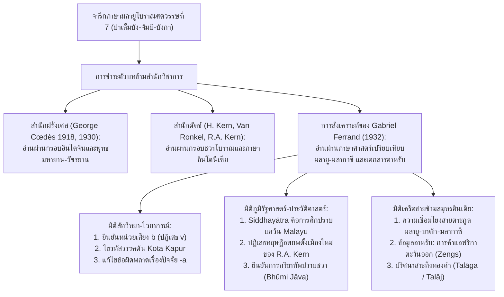

# บันทึกการอ่านและวิเคราะห์เอกสารจารึกวิทยาฉบับสมบูรณ์ (Epigraphic Source Dossier)
## ศิลาจารึกภาษามลายู-สันสกฤตสี่หลักแห่งสุมาตราและบังกา: การวิเคราะห์สัทวิทยา ไวยากรณ์เปรียบเทียบมลายูโบราณ-มลากาซี และประวัติศาสตร์การแผ่ขยายอำนาจของจักรวรรดิศรีวิชัย (Quatre Textes Épigraphiques Malayo-Sanskrits de Sumatra et de Banka)

---

### ส่วนที่ 1: ข้อมูลบรรณานุกรมและการอ้างอิงมาตรฐาน (Bibliographic Metadata)
- **Source ID:** `S-1932-ferrand-01`
- **ชื่อไฟล์ PDF ในเครื่อง:** `S-1932-ferrand-01_Quatre_Textes_Epigraphiques_Sumatra_Banka.pdf`
- **ชื่อไฟล์ข้อความสกัด:** `S-1932-ferrand-01_Quatre_Textes_Epigraphiques_Sumatra_Banka.txt`
- **ประเภทเอกสาร:** บทความวิจัยชำระตัวบทจารึกแม่บทเชิงนิรุกติศาสตร์ สัทวิทยาเปรียบเทียบออสโตรนีเซียน และประวัติศาสตร์นิพนธ์ศรีวิชัย (Foundational Epigraphic Decipherment, Comparative Austronesian Linguistics & Srivijayan Historiography)
- **ภาษาของเอกสาร:** ภาษาฝรั่งเศส (French) พร้อมตัวบทภาษามลายูโบราณ (Old Malay), ภาษาสันสกฤต (Sanskrit) ในอักขระหลังปัลลวะ (Later Pallava Script), ข้อมูลเปรียบเทียบภาษามลากาซี (Malagasy ทั้งภาษามาตรฐาน Merina และภาษาย่อยโบราณ), ภาษาชวาโบราณ (Old Javanese), ภาษาบาตัก (Batak), ภาษาอาหรับ (Arabic) และภาษาจีน (Chinese)
- **ขอบเขตภูมิศาสตร์และวัฒนธรรม:** เกาะสุมาตรา (Palembang / แม่น้ำ Musi, แคว้น Jambi / แม่น้ำ Batang Hari - Sungai Merangin), เกาะบังกา (Pulau Bangka / Sungai Menduk), เกาะมาดากัสการ์ (Madagascar / Île de Komr), ชายฝั่งแอฟริกาตะวันออก (Pays des Zengs / Sofala) และเอเชียตะวันออกเฉียงใต้ภาคพื้นสมุทร
- **วัสดุและบริบทการค้นพบ:** ศิลาจารึกภาษามลายูโบราณ 4 หลักแห่งจักรวรรดิศรีวิชัยยุคเริ่มแรก (คริสต์ศตวรรษที่ 7):
  1. *จารึกเกอดูกันบูกิต (Inscription de Kédukan Bukit):* มหาศักราช 605 (ค.ศ. 683), จำนวน 7 บรรทัด สลักบนศิลาก้อนมนธรรมชาติ (galet) ค้นพบ ณ หมู่บ้านเกอดูกันบูกิต ทางเหนือของคลองสุไหงตาตัง (Sunei Tatat) สาขาแม่น้ำมูซี (Musi) เชิงเขาบูกิตเซอกุนตัง (Bukit Seguntah) ทางตะวันตกเฉียงใต้ของเมืองปาเล็มบัง (Palembang)
  2. *จารึกตาลังตูโว (Inscription de Talań Tuwo):* มหาศักราช 606 (ค.ศ. 684), จำนวน 25 บรรทัด ค้นพบ ณ ตำบลตาลังตูโว ห่างจากปาเล็มบังไปทางตะวันตกประมาณ 5 กิโลเมตร ทางตะวันตกเฉียงเหนือของบูกิตเซอกุนตัง
  3. *จารึกการังบราฮี (Inscription de Karań Brahi):* มหาศักราชราว 608 (ค.ศ. 686), สลักบนเสาศิลา ค้นพบ ณ หมู่บ้านการังบราฮี ริมลำน้ำแม่น้ำเมอรังงิน (Merañin) สาขาตอนบนของแม่น้ำบาตังฮารี (Batañ Hari) แคว้นจัมบี (Djambi) เหนือเจอลัตไก (Djelatai)
  4. *จารึกโกตาคาปูร์ (Inscription de Kota Kapur):* มหาศักราช 608 (ค.ศ. 686), จำนวน 26 บรรทัด (รวม 58 บรรทัดข้ามทั้ง 4 จารึก) สลักบนเสาศิลา ค้นพบ ณ โกตาคาปูร์ ทางเหนือของแม่น้ำเมินดุก (Ménduk) เกาะบังกา (Bañka) ระหว่างฝั่งน้ำกับท่าเรือปังกาลันเมินดุก (Pañkal Münduk)
- **การอ้างอิงฉบับเต็มระบบ Chicago/Turabian Notes-Bibliography:**  
  Ferrand, Gabriel. "Quatre textes épigraphiques malayo-sanskrits de Sumatra et de Banka." *Journal asiatique* 221, no. 2 (octobre-décembre 1932): 271–326.

---

### ส่วนที่ 2: แผนผังการจัดสรรเข้าสู่บทและหัวข้อย่อย (Chapter & Section Mapping Matrix)

- **บทที่ 2 (กำเนิดและพัฒนาการของจักรวรรดิศรีวิชัย: ศูนย์อำนาจ ภูมิรัฐศาสตร์ และขอบขัณฑสีมา):**
  * **หัวข้อย่อย 2.1 (การสถาปนาราชธานีและปัญหาสิทธิยาตราในจารึกเกอดูกันบูกิต):**
    - การวิพากษ์ข้อเสนอของ George Cœdès และ R.A. Kern เกี่ยวกับการเดินทางของ *dapunta hiyań*: Ferrand ชี้ว่าการเดินทางไม่ใช่การไปแสวงบุญทางไสยเวททั่วไป แต่เป็นปฏิบัติการทางทหารเพื่อปลดแอกและพิชิตดินแดน *Malayu* (หน้า 274–275)
    - การวิเคราะห์คำว่า *mināṅa*: การแปลว่า "ปากแม่น้ำ" (embouchure de rivière / confluent) ซึ่งกษัตริย์เคลื่อนทัพเรือจากปากน้ำมูซี/ปาเล็มบัง ทวนกระแสน้ำขึ้นไปโจมตีศูนย์กลางของมลายู พร้อมกองทัพบก 1,312 นาย และกองเรือ 20,000 นาย นำทางโดยนายร่องน้ำ 200 นาย (หน้า 273–276, 316)
    - การตีความวลี *marbuat banua Śrīvijaya*: การโต้แย้งข้อสมมติฐานของ R.A. Kern ที่เชื่อว่าเป็นการอพยพของชาวมลายูจากคาบสมุทรมาสร้างเมืองใหม่ โดย Ferrand ยืนยันว่าปาเล็มบังเป็นมหานครที่เจริญรุ่งเรืองและมีระบบการศึกษาภาษาสันสกฤตและมลายูระดับสูงอยู่ก่อนแล้วตั้งแต่สมัยพระภิกษุอี้จิง (ค.ศ. 671) จึงไม่อาจเป็นการสร้างถิ่นฐานใหม่ของผู้อพยพ (หน้า 276, 295–297)
  * **หัวข้อย่อย 2.2 (การควบคุมขอบขัณฑสีมาทางทะเลและยุทธการปราบชวาในจารึกโกตาคาปูร์และการังบราฮี):**
    - ยุทธศาสตร์การปักศิลาแช่งกบฏ ณ จุดยุทธศาสตร์สองฟากฝั่งช่องแคบ: ปากแม่น้ำบาตังฮารี (จัมบี) และเกาะบังกา เพื่อควบคุมเส้นทางเดินเรือนานาชาติ (หน้า 280–282)
    - บทวิเคราะห์วลีประวัติศาสตร์ *bala Śrīvijaya kalīvat mañapik yań bhūmi jāva tida bhakti ka Śrīvijaya*: กองทัพศรีวิชัยเพิ่งยกทัพออกไปปราบ "แผ่นดินชวา" ที่ไม่ยอมสวามิภักดิ์ (หน้า 282, 290)
    - ภูมิรัฐศาสตร์ความสัมพันธ์ระหว่างศรีวิชัย (Zābag / Jāvaka) กับกัมพูชาและชวา: การเชื่อมโยงข้อความจารึกกับกรณีพระเจ้าชัยวรมันที่ 2 ทรงทำพิธีปลดแอกกัมพูชาจากอำนาจของ "ชวา" ซึ่ง Ferrand เสนอว่าแท้จริงแล้วหมายถึงชวา-ศรีวิชัย (Zābag = Sumatra) บนพื้นฐานเอกสารอาหรับและจดหมายเหตุโบราณ (หน้า 275 เชิงอรรถ 1, 296)
  * **หัวข้อย่อย 2.3 (ภูมิทัศน์ของราชสำนัก สวนศรีกเกษตร และชลศาสตร์ในบันทึกอาหรับโบราณ):**
    - จารึกตาลังตูโวกับการสร้างสวน *Śrīkṣetra*: สวนผลไม้ คันกั้นน้ำ (*tavad*) และอ่างเก็บน้ำ (*talāga*) หน้า 276–278
    - การเปรียบเทียบสัทศาสตร์และโบราณคดีชลศาสตร์: การเชื่อมโยงคำว่า *talāga* ในจารึกภาษามลายูโบราณ กับคำว่า *talāg* ในบันทึกภาษาอาหรับของ Sulaymān (ค.ศ. 851) และ Abū Zayd Ḥasan al-Sīrāfī (ราว ค.ศ. 916) ว่าด้วยสระน้ำหน้าพระราชวังของมหาราชแห่งซาบัจที่ทรงทิ้งแท่งทองคำลงไปทุกเช้า (หน้า 320–322)

- **บทที่ 4 (อักขรวิทยา สัทวิทยา และภาษาศาสตร์เปรียบเทียบภาษามลายูโบราณ: Old Malay Linguistics):**
  * **หัวข้อย่อย 4.1 (ระบบการถอดอักษรและการถกเถียงเรื่องหน่วยเสียง b/v และอนุสวาร):**
    - การวิพากษ์ระบบการถอดอักษรของ Cœdès: Ferrand ชี้ขาดว่ารูปอักษรที่ Cœdès ถอดเป็น `v` นั้น ตามหลักภาษาศาสตร์เปรียบเทียบอินโดนีเซียนดั้งเดิม (Gemeinindonesisch) ของ Renward Brandstetter ไม่มีหน่วยเสียงกึ่งสระเสียดแทรกริมฝีปาก `v` แต่มีเฉพาะเสียงกักก้องริมฝีปาก `b` และกึ่งสระ `w` ดังนั้นจึงต้องถอดและออกเสียงเป็น `b` สม่ำเสมอ ยกเว้นคำสันสกฤตแท้หรือกึ่งสระเชื่อม (หน้า 283–284)
    - หลักฐานคู่เทียบเสียงมลายูโบราณ-มลากาซี: การที่เสียง `b` ในภาษามลายูแปรเป็น `v` ในภาษามลากาซีเสมอ (เช่น *batu* > *vatu*, *buaḥ* > *vua*, *bini* > *vavi*, *bulan* > *vulan*) ยืนยันว่าภาษาต้นทางต้องเป็นเสียงกัก `b` เท่านั้น มิใช่เสียง `v` (หน้า 284)
    - การถอดอนุสวารเป็นเสียงนาสิกเพดานอ่อน `ń` (หรือ `ṅ` / `ng`) เพื่อแสดงรูปสะกดสัทศาสตร์ตามวิวัฒนาการสู่ภาษามลายูปัจจุบัน เช่น *urań* แทน *uram* (หน้า 283)
  * **หัวข้อย่อย 4.2 (สระเปอเปิตและวิวัฒนาการของระบบสระในภาษามลายูโบราณ):**
    - สัจภาวะของสระเปอเปิต (ĕ / pépét) ในคริสต์ศตวรรษที่ 7: อักษรหลังปัลลวะไม่มีสระสัญลักษณ์เฉพาะสำหรับสระเปอเปิต ช่างจารึกจึงใช้สระอะสั้นประจำพยัญชนะ (`a` bref inhérent) แทน เช่น *lapas* = *lĕpas*, *man-* = *mĕn-*, *galar* = *gĕlar* หรือบางครั้งตัดสระทิ้งไปเลย เช่น *tlu* = *tĕlu*, *tmu* = *tĕmu*, *gran* = *gĕran* (หน้า 284–285)
  * **หัวข้อย่อย 4.3 (ไวยากรณ์และสัณฐานวิทยาเปรียบเทียบ: ระบบอุปสรรค ปัจจัย อาคม และวาจก):**
    - การจำแนกโครงสร้างกริยา 14 ประเภทในจารึกศรีวิชัย: ตั้งแต่รากศัพท์คำเดี่ยว, คำซ้ำ (*mańmań*), อุปสรรคกรรตุวาจก *man-*, สภาววาจก *mar-*, อุปสรรคแสดงศักยภาพ (*verbes potentiels*) *maka-* (สอดคล้องกับมลากาซี *maha-*), และระบบกรรมวาจกโบราณด้วยอุปสรรค *ni-*, อุปสรรคซ้อน *ni-par-*, *ni-pa-...-an*, และอาคมกรรมวาจก *-in-* (*vinunu* / *binunu*) หน้า 285–288
    - การวิพากษ์ไวยากรณ์: การหักล้างข้อเสนอของ Kern และ Cœdès เรื่องปัจจัยนามธรรม `-a` (*buatāña*, *kabuatāña*): Ferrand แสดงว่าเป็นความเข้าใจผิดทางอักขรวิธี โดยแท้จริงแล้วคือปัจจัยนาม *-an* ตามด้วยสรรพนามกรรม/ความเป็นเจ้าของ *-ña* (*buatan-ña*, *kabuatan-ña*) หน้า 306–307
    - กฎตำแหน่งการลงเสียงหนัก (L'accent tonique): กฎการเลื่อนตำแหน่งเสียงหนักไปข้างหน้าเมื่อเติมปัจจัย และการที่คำยืมภาษาสันสกฤตที่นำมาใช้ในมลายูโบราณต้องตกอยู่ภายใต้กฎสัทวิทยาและหน่วยคำของภาษามลายูอย่างสมบูรณ์ (หน้า 290–293)
  * **หัวข้อย่อย 4.4 (เครือข่ายข้ามสมุทรอินเดีย: ภาษาศาสตร์เปรียบเทียบมลายูโบราณและมลากาซี):**
    - ความสัมพันธ์ทางสายตระกูลภาษาศาสตร์: ภาษามลากาซีเป็นภาษาลูกหลานที่วิวัฒนาการมาจากภาษามลายูโบราณในสุมาตรา (สอดคล้องกับบาตัก) โดยผู้พูดอพยพข้ามมหาสมุทรอินเดียไปยังมาดากัสการ์ก่อนการประดิษฐ์ระบบการเขียน (หน้า 300–302)
    - การถอดรหัสคาถาลึกลับในจารึกโกตาคาปูร์และจารึกการังบราฮี: การหักล้างแนวคิดของ Cœdès ที่มองว่าเป็น "ภาษารหัสลับไสยเวทที่ไม่มีวันถอดรหัสได้" (langage cabalistique) โดย Ferrand ใช้การเปรียบเทียบรากศัพท์มลายูโบราณกับภาษามลากาซีจนสามารถแปลข้อความวรรคแรกของจารึกสาปแช่งได้สำเร็จ (หน้า 280–282, 301, 313–314)
    - ปฏิทินและระบบฤดูกาลข้ามสมุทร: การถ่ายทอดชื่อเดือนภาษาสันสกฤตจากมลายูโบราณสู่ภาษามลากาซี (เช่น *vaiśākha* > *fisaka*, *jyeṣṭha* > *tsihia*, *āṣāḍha* > *asara*) หน้า 325–326

---

### ส่วนที่ 3: สรุปสาระสำคัญเชิงวิเคราะห์และจุดยืนทางวิชาการ (Executive Academic Analysis)

- **วิทยานิพนธ์และข้อถกเถียงหลักของผู้เขียน (Core Argument / Thesis):**
  1. *การชำระสัทวิทยาและการถอดอักษรภาษามลายูโบราณ:* Gabriel Ferrand โต้แย้ง George Cœdès อย่างรุนแรงในประเด็นการถอดอักษร `v` โดยพิสูจน์ผ่านกฎสัทวิทยาเปรียบเทียบของ Brandstetter และ Dempwolff ว่าภาษากลุ่มอินโดนีเซียนดั้งเดิม (Gemeinindonesisch) และภาษามลายูโบราณไม่มีเสียงกึ่งสระเสียดแทรก `v` แต่เป็นเสียงกักก้องริมฝีปาก `b` (เทียบเท่า Malagasy `v` เสมอ) และเสนอให้ถอดอนุสวารเป็นเสียงงอสะกด `ń` ตามธรรมชาติสัทศาสตร์ของภาษา
  2. *การถอดรหัสวรรคปริศนาต้นจารึกโกตาคาปูร์ (The Decipherment of Kota Kapur Preamble):* ในขณะที่ Hendrik Kern ตีความผิดพลาด และ George Cœdès ถอดใจยอมแพ้โดยประกาศว่าเป็น "รหัสลับทางไสยศาสตร์ที่มีการบิดเบือนทางสัทวิทยาเพื่อป้องกันอันตรายแก่ผู้อ่านจนไม่มีทางเข้าใจได้" Ferrand พิสูจน์ว่าข้อความดังกล่าวเป็นภาษาทางกฎหมายและคำสาบานที่ชาวบ้านเข้าใจได้ทั่วไป โดยอาศัยการเทียบรากศัพท์กับภาษามลากาซีโบราณ เช่น *kayet* = การขัดขืน/ไม่ยอมจำนน (*ankendzi*), *namuha* = ถูกฟัน/ลงโทษ (*voa*), *tandrūn luah* = ขุนนางผู้แทนพระราชวัง (*tandruki ni tani* / *lapa*)
  3. *การปฏิเสธทฤษฎีการตั้งอาณานิคมใหม่ของ R.A. Kern:* Ferrand ปฏิเสธข้อเสนอของ R.A. Kern ที่ตีความวลี *marbuat banua Śrīvijaya* ในจารึกเกอดูกันบูกิตว่าเป็นการที่ชาวมลายูอพยพจากคาบสมุทรมลายูมาสร้างเมืองใหม่ ณ ปาเล็มบังใน ค.ศ. 683 โดยชี้ว่าบันทึกของพระภิกษุอี้จิง (ค.ศ. 671) ยืนยันว่าเมืองปาเล็มบัง (Śrīvijaya / Fo-che) เป็นศูนย์กลางพุทธศาสนาและภาษาศาสตร์ที่มีพระสงฆ์กว่า 1,000 รูป และมีระบบบริหารราชการและการทหารที่เกรียงไกรมาแต่เดิมแล้ว การสร้าง *banua* จึงหมายถึงการแผ่อำนาจเหนือแว่นแคว้น หรือการสถาปนาขอบขัณฑสีมาอันศักดิ์สิทธิ์ภายหลังชัยชนะเหนือแคว้นมลายู (Jambi)
  4. *การตีความคำว่า "สิทธิยาตรา" (Siddhayātra) ในมิติสงครามมิใช่แสวงบุญบริสุทธิ์:* Ferrand ชี้ว่าการที่กษัตริย์เสด็จออกไป "ถือเอาซึ่งสิทธิยาตรา" (*maṅalap siddhayātra*) พร้อมด้วยกำลังพลทางเรือ 20,000 นาย และทัพบก 1,312 นาย เป็นการใช้วาทกรรมทางศาสนาอำพรางปฏิบัติการทางทหาร (ยุทธการยกทัพปราบแคว้นมลายูโบราณตามที่อี้จิงระบุว่ามลายูกลายเป็นส่วนหนึ่งของศรีวิชัยแล้ว)
  5. *ความเป็นเนื้อเดียวกันของอารยธรรมข้ามมหาสมุทรอินเดีย (Sumatra - Madagascar - East Africa):* ภาษาและวัฒนธรรมมลายูโบราณของศรีวิชัยมีความสัมพันธ์ทางสายเลือดโดยตรงกับภาษามลากาซีบนเกาะมาดากัสการ์ ข้อมูลการเดินเรือของชาววักวัก (Wāqwāq / สุมาตรา) ไปยังชายฝั่งโซฟาลาในแอฟริกาตะวันออก (ค.ศ. 945) และบันทึกของอัลอิดรีซี (Al-Idrīsī, ค.ศ. 1154) ยืนยันว่าชาวซาบัจและชาวเกาะกุมร์ (มาดากัสการ์) สื่อสารภาษาเดียวกันและมีเครือข่ายการค้าข้ามสมุทรมายาวนาน

- **บริบทประวัติศาสตร์นิพนธ์และการประเมินความน่าเชื่อถือ (Historiography & Source Criticism):**
  - *การปะทะกันทางวิชาการข้ามสำนัก:* Ferrand (สำนักภารตวิทยา-อิสลามศึกษาและภาษาศาสตร์มาดากัสการ์แห่งปารีส) ผสานงานของ Cœdès (สำนักฝรั่งเศสแห่งปลายบุรพทิศ - EFEO) เข้ากับระเบียบวิธีภาษาศาสตร์เปรียบเทียบเชิงประวัติของ Brandstetter, Dempwolff, Kern และ Van Ronkel (สำนักไลเดิน) นำไปสู่การแก้ไขข้อบกพร่องเรื่องการมองจารึกผ่านแว่นตาอินโดจีนเพียงด้านเดียว
  - *การประเมินความน่าเชื่อถือของตัวบท:* การตัดคำและการใส่เครื่องหมายวรรคตอนใหม่ของ Ferrand ช่วยคลี่คลายโครงสร้างประโยคที่คลุมเครือในฉบับ Cœdès ให้กระจ่างชัดเจนยิ่งขึ้น โดยเฉพาะการแยกประโยคบอกเล่า เงื่อนไข และคำสาปแช่ง
  - *ข้อจำกัดทางวิชาการ:* แม้ Ferrand จะไขรหัสคำศัพท์หลายคำได้ยอดเยี่ยม แต่การพยายามลากคำในจารึกเข้าสู่ภาษามลากาซีทุกคำ (Malagasy-centric bias) ทำให้การตีความบางคำยังคงเป็นข้อสันนิษฐานเบื้องต้น (provisoire) เช่น การแก้คำว่า *bukan* (ไม่ใช่/อื่น) เป็น *vuka* (เปิด) และการปฏิเสธปัจจัยนามธรรมบางประการ

---

### ส่วนที่ 4: สารบัญข้อค้นพบเชิงลึกแยกตามมิติจารึกวิทยา (Thematic Epigraphic Findings with Exact Pages)

1. **ประวัติศาสตร์นิพนธ์และการตีความทางประวัติศาสตร์:**
   - การวิพากษ์และต่อยอดงานชำระตัวบทของ George Cœdès (1930) ใน BEFEO และข้อวิจารณ์ของ R.A. Kern (1931) ใน BKI (หน้า 271–272)
   - การหักล้างทฤษฎีของ R.A. Kern ที่เสนอว่ามหาศักราช 605 คือปีที่ชาวมลายูอพยพจากคาบสมุทรมาตั้งรกรากสร้างเมืองปาเล็มบัง: Ferrand ชี้ว่าตัวบทจารึกไม่มีข้อความใดสนับสนุน และขัดแย้งกับหลักฐานประวัติศาสตร์ของจีนอย่างสิ้นเชิง (หน้า 276, 296–297)
   - ศรีวิชัย (Che-li-fo-che / Zābag / Jāvaka) ในปลายศตวรรษที่ 7 เป็นมหานครและจักรวรรดิทางทะเลที่รุ่งเรืองถึงขีดสุด เป็นศูนย์กลางทางปัญญาและศาสนศึกษาที่พระภิกษุจีนชั้นนำต้องมาจำพรรษาก่อนเดินทางไปอินเดีย (หน้า 295–296)
   - การสงครามทางทะเลและการแผ่อำนาจของราชวงศ์ไศเลนทร์เหนือเกาะสุมาตรา เกาะชวา คาบสมุทรมลายู และกัมพูชา (หน้า 275 เชิงอรรถ 1, 296)
   - จดหมายเหตุจีน *Ling-wai-tai-ta* (ค.ศ. 1178) ของโจวชวี่เฟย (Tcheou K’iu-fei) ยืนยันบทบาทของศรีวิชัย (San-fo-ts’i) ในฐานะเมืองท่าศูนย์กลางการค้าข้ามสมุทรระหว่างอาหรับ (Ta-che), กวิลอน/อินเดียใต้ (Kou-lin) และชวากับจีน (หน้า 296)
2. **ตัวบทจารึก การอ่าน ศักราช และอักขรวิทยา:**
   - การเปรียบเทียบการชำระตัวบทในจารึกเกอดูกันบูกิต: การปฏิเสธคำอ่าน *tamean* ของ Cœdès และ *tamran* ของ Van Ronkel โดย Ferrand เสนอให้อ่านว่า *tambar* ซึ่งสอดคล้องกับมลากาซี *tambatra* แปลว่า "ทั้งหมดร่วมกัน / พร้อมเพรียงกัน" (หน้า 273 เชิงอรรถ 1, 323)
   - การคลี่คลายคำว่า *mināṅa* ในจารึกเกอดูกันบูกิต บรรทัดที่ 4: Cœdès ไม่เข้าใจความหมาย แต่ Ferrand และ R.A. Kern พิสูจน์ตรงกันว่าหมายถึง "ปากแม่น้ำ / ชุมทางสบน้ำ" สอดคล้องกับมลากาซี *vināny* (หน้า 274, 316)
   - การถอดรหัสคาถาอาคมวรรคแรกของจารึกโกตาคาปูร์และจารึกการังบราฮี: Ferrand เสนอคำอ่านและคำแปลชุดแรกอย่างเป็นระบบ หักล้างทฤษฎีภาษาอาถรรพณ์ของ Cœdès (หน้า 280–282)
   - สัทศาสตร์ของอักขระ: การพิสูจน์ว่าหน่วยเสียงที่ Cœdès ถอดเป็น `v` ต้องแก้ไขเป็น `b` สม่ำเสมอตามกฎภาษาศาสตร์ออสโตรนีเซียน (หน้า 283–284)
   - ปรากฏการณ์การใช้สระอะสั้นแทนสระเปอเปิต และการลบสระเปอเปิตในคำควบกล้ำ (*tlu*, *tmu*, *gran*) หน้า 284–285
   - กฎการเลื่อนตำแหน่งเสียงหนัก (Accentuation): คำยืมภาษาสันสกฤตที่นำมาใช้ในมลายูโบราณจะเลื่อนเสียงหนักไปที่พยางค์รองสุดท้ายเมื่อรับปัจจัยมลายู *-ña* เช่น *tatkālā-ña*, *doṣā-ña*, *bhrtyā-ña*, *puṇyā-ña*, *sthanā-ña* (หน้า 291–293)
3. **มิติศาสนา ลัทธิความเชื่อ และพิธีกรรม:**
   - การตีความมโนทัศน์ *siddhayātra*: ในขณะที่ Cœdès แปลว่า "การจาริกแสวงบุญเพื่อให้ได้มาซึ่งฤทธิ์อำนาจศักดิ์สิทธิ์" Ferrand วิเคราะห์ว่าเป็น "โวหารเลี่ยงความจริง" (euphémisme) ของการยกทัพไปทำสงครามยึดอำนาจและอธิปไตยเหนือแคว้นมลายู (หน้า 274–275)
   - ปณิธานพระโพธิสัตว์ (*praṇidhāna*) ในจารึกตาลังตูโว: การอุทิศกุศลผลบุญจากการสร้างสวนสาธารณะแก่สรรพสัตว์เพื่อบรรลุพระโพธิญาณ (*bodhicitta*), กายเพชรแห่งพระมหาบุรุษ (*vajraśarīra*), วศิตาแห่งกรรมและกิเลส (*karmavaśitā*, *kleśavaśitā*) และอนุตตรสัมมาสัมโพธิญาณ (*anuttarābhisamyaksambodhi*) หน้า 277–279
   - พิธีกรรมดื่มน้ำสาบานและมนตร์สาปแช่ง (*parsumpahan* / *mammam sumpah*): การอัญเชิญทวยเทพผู้เรืองฤทธิ์ (*devatā maharddhika*) และเจ้าแห่งน้ำ/พระราชวัง (*tandrūn luah*) มาลงทัณฑ์ผู้คิดคดทรยศ (หน้า 280–282)
   - ศาสตร์ลี้ลับและยาพิษโบราณ: การใช้เวทมนตร์ดำทำลายจิตใจให้บ้าคลั่ง (*makagila*), อาคมสะกดจิต (*vaśīkaraṇa*), เสน่ห์ยาแฝด (*kasiḥan*), ยาพิษยางไม้น่อง (*upuh* / *ipuh* = *Antiaris toxicaria*), ยาเบื่อรากหางไหล (*tuba* = *Derris elliptica*), และกัญชา/สิ่งมึนเมาที่ทำให้เกิดอาการวิงเวียน (*tamval* / *saramvat*) หน้า 281–282, 320
4. **มิติสถาปัตยกรรม ศาสนสถาน และชลศาสตร์:**
   - สวนศรีกเกษตร (*Śrīkṣetra*): การเปรียบเทียบชื่อสวนหลวงของศรีวิชัยกับชื่อเมืองโบราณศรีเกษตรในพม่า (*Śrīkṣetra* / *Se-li-tcha-to-lo* ในบันทึกพระถังซัมจั๋ง หรือ *Sayekhettaya*) หน้า 320–321
   - ระบบชลศาสตร์ราชสำนัก: การขุดสระน้ำขนาดใหญ่ (*talāga*) และคันดินฝายทดน้ำ (*tavad*) หน้า 276, 320–322
   - โบราณคดีเปรียบเทียบกับเอกสารอาหรับ: บันทึกของ Sulaymān (ค.ศ. 851) และ Abū Zayd Ḥasan (ค.ศ. 916) บรรยายถึงพระราชวังของมหาราชแห่งซาบัจที่หันหน้าสู่ปากน้ำเชื่อมออกสู่ทะเล (*talāg*) และมีทะเลสาบติดกับพระราชวัง โดยเจ้าพนักงานจะหลอมแท่งทองคำนำมาทิ้งลงในสระน้ำทุกวัน เมื่อน้ำลงแท่งทองคำจะส่องแสงระยิบระยับใต้แสงตะวันต่อพระพักตร์กษัตริย์ ซึ่งสอดคล้องกับตำแหน่งทางภูมิศาสตร์ของจารึกตาลังตูโวและแม่น้ำมูซี (หน้า 321–322)
5. **มิติอาหารการกิน วิถีชีวิต การค้า และตลาด:**
   - ความหลากหลายทางพฤกษศาสตร์และพืชเศรษฐกิจในสวนศรีกเกษตร: มะพร้าว (*ñiyur*), หมาก (*piñañ*), ต้นชิด/ตาลน้ำตาล (*hanau* = *Arenga saccharifera*), สาคู (*rumviya* = *Metroxylon sago* เทียบกับมลากาซี *rofia* = *Sagus raphia*), และไม้ไผ่ชนิดต่างๆ เช่น *haur*, *buluh*, *pattuñ* (หน้า 276, 311, 318, 319)
   - การจัดตั้งจุดพักแรมและโรงทาน: การจัดหาน้ำดื่มและอาหารให้แก่ผู้เดินทางและสรรพสัตว์ ณ จุดหยุดพัก (*di āsannakāla*) และระหว่างเส้นทางสัญจร (*di antara mārgga*) หน้า 276, 278
   - สัตว์เลี้ยงและการเกษตร: การคุ้มครองและขยายพันธุ์สัตว์เลี้ยงและปศุสัตว์ทุกชนิด (*manhidupi paśu prakāra*) และการบุกเบิกทำไร่เลื่อนลอย/สวนเกษตร (*huma parlak*) หน้า 277, 278, 312
6. **มิติการปกครอง กฎหมาย ที่ดิน และระบบสีมา:**
   - โครงสร้างการปกครองส่วนภูมิภาค: คำว่า *dātu* (เจ้าเมือง/ผู้ปกครองแคว้น) และมณฑลเขตปกครอง *kadatuan* (สอดคล้องกับภาษาชวา *kĕdaton* / *kraton*) หน้า 308
   - พระราชอำนาจในการแต่งตั้งขุนนาง: พระบรมราชโองการของกษัตริย์ในการแต่งตั้งดาตู (*iyan nigalarku sanyāsa dātu*) หน้า 281, 309
   - บัญญัติการลงทัณฑ์กบฏ: การระดมกองทัพภายใต้ดาตูแห่งศรีวิชัยเข้าปราบปราม (*nisuruh tāpik ya mūlam parvvāndan dātu Śrīvijaya*) และการประหารล้างโคตรตระกูล (*dñan gotrasantānaña*) หน้า 281–282
   - กฎหมายว่าด้วยความจงรักภักดี: กำหนดให้ข้าทาสบริวาร (*bhṛtya*) มีความซื่อสัตย์สุจริต (*satyārjjava dṛḍhabhakti*) และห้ามภรรยาคิดคดต่อสามี (หน้า 277, 278)
7. **มิติปฏิสัมพันธ์ข้ามสมุทรและเครือข่ายนานาชาติ:**
   - การเดินเรือพิชิตข้ามสมุทร: เรือเดินทะเลขนาดใหญ่ (*samvau*) ซึ่งเชื่อมโยงกับคำภาษาสวาฮีลี/บันตู (*sômbo*), มลากาซี (*sambu* / *tsāmbu*), อาหรับ (*sanbūk*) และเขมร (*səmbau*) หน้า 273, 319–320
   - ปฏิบัติการทางทหารข้ามช่องแคบซุนดา: การส่งกองทัพเรือศรีวิชัยไปทำสงครามปราบปราม "แผ่นดินชวา" (*bhūmi jāva*) ใน ค.ศ. 686 (หน้า 282, 290)
   - การค้าและสงครามทางทะเลข้ามมหาสมุทรอินเดีย: บันทึก *‘Ajā’ib al-Hind* (คริสต์ศตวรรษที่ 10) บันทึกเหตุการณ์ในปี ค.ศ. 945 ที่กองเรือวักวัก (Wāqwāq = สุมาตรา/ศรีวิชัย) กว่า 1,000 ลำ ยกพลข้ามสมุทรไปปล้นชิงเมืองกัมบาโลห์ (Kanbaloh) และดินแดนโซฟาลา (Sofala) ในแอฟริกาตะวันออก เพื่อแสวงหาสินค้าป่า งาช้าง อำพัน และกวาดต้อนเชลยชาวเซนจ์ (Zengs) หน้า 298–299
   - ความเป็นเอกภาพทางภาษาข้ามมหาสมุทร: อัลอิดรีซี (ค.ศ. 1154) บันทึกชัดเจนว่าพ่อค้าชาวซาบัจ (สุมาตรา) และชาวเกาะกุมร์ (มาดากัสการ์) เดินทางไปค้าขาย ณ แอฟริกาตะวันออกอย่างสม่ำเสมอ และเข้าใจภาษาซึ่งกันและกันได้เป็นอย่างดี ซึ่ง Ferrand ยืนยันว่าเป็นผลสืบเนื่องมาจากภาษามลายูโบราณ (หน้า 299–300)
8. **มิติจารึกแผ่นโลหะ รูปเคารพขนาดเล็ก และจารึกแม่น้ำ:**
   - การอ้างอิงจารึกบนประติมากรรมสำริดพระโลเกศวร (Lokanātha) แห่งกุนุงตูอา (Gunuñ Tua) ในตูปานูลีตะวันออก (เกาะสุมาตรา): จารึกมหาศักราช 946 (ค.ศ. 1024) ซึ่งปรากฏคำว่า *barbwat* ซึ่ง Ferrand วิเคราะห์ว่าเป็นรูปภาษาช่วงรอยต่อระหว่างมลายูโบราณ *marbuat* (ศตวรรษที่ 7) กับมลายูปัจจุบัน *bĕrbuat* (หน้า 305)
   - ความศักดิ์สิทธิ์ของหลักศิลาจารึก: บัญญัติสาปแช่งผู้ที่ทำลายหรือทำให้แผ่นศิลาที่สถาปนานี้เสียหาย (*yań marjjahati yań watu nipratiṣṭha ini*) หน้า 281, 282
9. **พรมแดนปัญหา ปริศนาวิชาการ และจริยธรรมโบราณคดี:**
   - ปริศนาความสัมพันธ์ระหว่างไศเลนทร์กับมลายูโบราณ: Ferrand ตั้งข้อสังเกตว่าราชวงศ์ไศเลนทร์ในจารึกรุ่นหลังอาจสืบเชื้อสายมาจากชนชั้นนำศรีวิชัยที่พูดภาษามลายูโบราณและอพยพข้ามไปยังชวา
   - ปัญหาการสืบย้อนรากศัพท์: ความยากลำบากในการถอดความคำเฉพาะที่สูญหายไปแล้วในภาษามลายูปัจจุบัน เช่น *kandra*, *kayet*, *tudai*, *umenteh*, *huma* ซึ่งต้องอาศัยภาษาเครือญาติที่เก็บรักษาความหมายดั้งเดิมไว้อย่างภาษามลากาซีและภาษาบาตัก (หน้า 301, 313–314)

---

### ส่วนที่ 5: คลังข้อความอ้างอิงตรงและเชิงอรรถสำเร็จรูป (Verbatim Quotes & Footnote Bank)

1. **จารึกเกอดูกันบูกิต (Kedukan Bukit) — ตัวบทชำระใหม่และคำแปลวรรคประวัติศาสตร์ (หน้า 273):**
   * *ข้อความภาษาเดิม (Old Malay - Ferrand's Edition):*  
     "Śvasti! Śrī! Śakavarṣātīte 605, ekādaśī śuklapakṣa bulan vaiśākha, dapunta hiyań nayik di sambau maṅalap siddhayātra. Di saptamī śuklapakṣa bulan jyeṣṭha, dapunta hiyań marlapas dari mināṅa. Tambar mamāva yań bala duā lakṣa dātan ko dua-ratus dāra di sambau, daṅan jalan sa-ribu tlu-ratus sa-pulu doa bañakña. Dātań di mata jap sukhacitta. Di pañcamī śuklapakṣa bulan — — laghu mudita dātań marbuat banua — — — śrīvijaya siddhayātra subhikṣa — — —"
   * *แปลภาษาฝรั่งเศสของ Ferrand (หน้า 273):*  
     "Prospérité! Fortune! En śaka 605 (= 683 de notre ère), le onzième jour de la quinzaine claire du mois de vaiśākha, notre Seigneur divin (= notre roi) monte sur [un] navire pour s'emparer de la puissance magique. Le septième jour de la quinzaine claire du mois de jyeṣṭha, notre Seigneur divin part de l'embouchure du fleuve [en se dirigeant en amont]. Tous ensemble, il conduit une armée de vingt mille [hommes] et, de plus, de deux cents guides sur [des] navires; et [par] terre (litt. : [par] chemin), au nombre de mille trois cent douze [hommes]. Ils arrivent en présence de... le cœur joyeux. Le cinquième jour de la quinzaine claire du mois... léger, joyeux, arrive; il fait le pays... Śrīvijaya [doué de] puissance magique, riche..."
   * *แปลภาษาไทยเชิงวิเคราะห์:*  
     "ขอความสวัสดี! ขอความรุ่งเรืองจงมี! มหาศักราชล่วงแล้ว 605 ปี วัน 11 ค่ำ ศุกลปักษ์ เดือนไวศาขะ พระผู้เป็นเจ้าผู้ศักดิ์สิทธิ์ (พระมหากษัตริย์) เสด็จประทับลงเรือเพื่อไปยึดกุมเอาซึ่งความสำเร็จอันศักดิ์สิทธิ์ (สิทธิยาตรา). ครั้นถึงวัน 7 ค่ำ ศุกลปักษ์ เดือนเชษฐะ พระผู้เป็นเจ้าผู้ศักดิ์สิทธิ์ได้เคลื่อนทัพออกจากปากน้ำ (มินางา เพื่อทวนกระแสน้ำขึ้นไป). พระองค์ทรงนำไพร่พลทั้งหมดร่วมกัน เป็นกองทัพจำนวนสองหมื่นนาย พร้อมด้วยผู้นำร่องน้ำสองร้อยนายบนเรือ และเดินทัพทางบกอีกจำนวนหนึ่งพันสามร้อยสิบสองนาย. กองทัพได้มาถึงเบื้องหน้า... ด้วยใจเปี่ยมสุข. ครั้นถึงวัน 5 ค่ำ ศุกลปักษ์ เดือน... พระองค์เสด็จมาถึงด้วยความเบาพระทัยและเบิกบาน; และทรงสถาปนาแว่นแคว้น... ศรีวิชัย อันเปี่ยมด้วยความสำเร็จศักดิ์สิทธิ์และอุดมสมบูรณ์..."
   * *Footnote Template:* Gabriel Ferrand, "Quatre textes épigraphiques malayo-sanskrits de Sumatra et de Banka," *Journal asiatique* 221, no. 2 (1932): 273.

2. **บทวิเคราะห์ว่าด้วยการศึกสงครามและปริศนาสิทธิยาตรา (หน้า 274–275):**
   * *ข้อความภาษาเดิม (French):*  
     "Le siddhayātra, ou « pèlerinage fait en vue d’obtenir des pouvoirs magiques », me paraît être ici un simple euphémisme. En réalité, le Çailendra qui régnait alors à Palembań voulait s'affranchir de la suzeraineté du Malayu et devenir suzerain à son tour par la force des armes. On ne se rend pas en pèlerinage avec plus de vingt mille hommes de troupes, quand il ne s'agit pas d'une pure et simple campagne de guerre. D’après le texte même : dapunta hiyań marlapas dari mināṅa « notre Seigneur divin part de l'embouchure du fleuve », c’est-à-dire le roi part de Palembań, sa capitale, et remonte le fleuve. C'est nettement le sens de dari mināṅa... Ils vont évidemment attaquer la capitale du Malayu, mais les lacunes du texte ne permettent pas de préciser davantage."
   * *แปลภาษาไทย:*  
     "คำว่า 'สิทธิยาตรา' หรือ 'การจาริกแสวงบุญเพื่อมุ่งให้ได้มาซึ่งอำนาจวิเศษ' ในที่นี้ข้าพเจ้าเห็นว่าน่าจะเป็นเพียงคำเลี่ยงความจริงอย่างสุภาพ (euphémisme) เท่านั้น ในความเป็นจริง กษัตริย์ราชวงศ์ไศเลนทร์ผู้ครองเมืองปาเล็มบังในเวลานั้นทรงต้องการปลดแอกตนเองจากการอยู่ใต้อำนาจของแคว้นมลายู และสถาปนาพระองค์ขึ้นเป็นเจ้าอธิราชแทนที่ด้วยกำลังอาวุธ หามีผู้ใดที่จะเดินทางไปแสวงบุญโดยนำกองทัพไพร่พลกว่าสองหมื่นคนร่วมขบวนไปด้วยไม่ หากว่านั่นมิใช่การกรีธาทัพทำสงครามอย่างแท้จริง จากตัวบทจารึกเองที่ระบุว่า: dapunta hiyań marlapas dari mināṅa 'พระผู้เป็นเจ้าผู้ศักดิ์สิทธิ์เสด็จออกจากปากน้ำ' ย่อมหมายความว่ากษัตริย์ทรงยกทัพออกจากปาเล็มบังซึ่งเป็นเมืองหลวงของพระองค์ แล้วแล่นเรือทวนกระแสน้ำขึ้นไป นี่คือความหมายที่ชัดเจนของคำว่า dari mināṅa... เป้าหมายย่อมเป็นการยกไปโจมตีเมืองหลวงของแคว้นมลายูอย่างไม่ต้องสงสัย แม้ว่ารอยลบเลือนของตัวบทจะไม่เปิดช่องให้ระบุรายละเอียดได้มากกว่านี้ก็ตาม"
   * *Footnote Template:* Ferrand, "Quatre textes épigraphiques," 274–275.

3. **การหักล้างทฤษฎีการอพยพสร้างเมืองใหม่ของ R.A. Kern (หน้า 296–297):**
   * *ข้อความภาษาเดิม (French):*  
     "Pendant ces dernières années du VIIe siècle, l'empire de Çrīvijaya-Jāvaka-Zābag est en pleine prospérité. Palembań, la capitale, est déjà une grande ville, et sa renommée s’étendra au loin sous la puissante dynastie des Çailendra. Il ne peut donc être question de fondation, en 605 çaka, par une immigration malaise venue de la péninsule, comme le suppose M. R. A. Kern; l'inscription I ne dit du reste rien de pareil et ne prête pas à une telle conjecture."
   * *แปลภาษาไทย:*  
     "ในช่วงปีท้ายๆ ของคริสต์ศตวรรษที่ 7 จักรวรรดิศรีวิชัย-ชวา-ซาบัจ กำลังเจริญรุ่งเรืองถึงขีดสุด ปาเล็มบังเมืองหลวงเป็นมหานครขนาดใหญ่อยู่แล้ว และเกียรติยศชื่อเสียงของเมืองนี้จะยิ่งแผ่ขยายกว้างไกลภายใต้ราชวงศ์ไศเลนทร์อันทรงพลานุภาพ ดังนั้นจึงไม่อาจเป็นเรื่องของการสร้างบ้านแปงเมืองขึ้นใหม่ในปีมหาศักราช 605 โดยการอพยพของชาวมลายูที่ข้ามมาจากคาบสมุทร ดังที่ศาสตราจารย์ R.A. Kern สันนิษฐานไว้แต่ประการใด ตัวบทจารึกหลักที่ 1 มิได้กล่าวถึงสิ่งใดที่ใกล้เคียงกับเรื่องดังกล่าว และมิได้เปิดช่องให้แก่ข้อสมมติฐานเลื่อนลอยเช่นนั้นเลย"
   * *Footnote Template:* Ferrand, "Quatre textes épigraphiques," 296–297.

4. **การวิพากษ์สัทวิทยาเรื่องหน่วยเสียง b และการปฏิเสธรูป v (หน้า 283–284):**
   * *ข้อความภาษาเดิม (French):*  
     "J'ai presque toujours écrit b la lettre que M. Cœdès a rendue par v... Un travail de M. Renward Brandstetter, qui date de plus de vingt ans, répond à la question : le v n’existe ni en indonésien commun, ni en malais moderne. L'indonésien commun connaissait b et w (semi-voyelle)... Il faut du reste rétablir l’occlusive sonore pour des raisons étymologiques. A côté de mal. mod. batu, le malg. a vatu « pierre ». Un v malgache appelle absolument un b malais. Celui-ci n‘a jamais eu de v et, s'il en était autrement, nous en aurions des témoignages certains d'une langue à l'autre... partout où nous trouvons un v en malgache, il faut remonter à un b en malais."
   * *แปลภาษาไทย:*  
     "ข้าพเจ้าได้เขียนอักษร b แทนอักษรที่ศาสตราจารย์ Cœdès ถอดไว้เป็น v เกือบทั้งหมด... งานวิจัยของท่าน Renward Brandstetter ซึ่งตีพิมพ์มากว่ายี่สิบปีแล้วได้ให้คำตอบต่อปัญหานี้ไว้อย่างแจ่มแจ้งว่า: เสียงเสียดแทรก v ไม่มีอยู่ทั้งในภาษาอินโดนีเซียนดั้งเดิมและในภาษามลายูปัจจุบัน ภาษาอินโดนีเซียนดั้งเดิมรู้จักเพียงเสียงกักก้องริมฝีปาก b และกึ่งสระ w เท่านั้น... ยิ่งไปกว่านั้น เราจำเป็นต้องฟื้นฟูเสียงกักก้องริมฝีปาก (b) ขึ้นมาด้วยเหตุผลทางนิรุกติศาสตร์ เมื่อเทียบกับภาษามลายูปัจจุบัน batu ภาษามลากาซีมีคำว่า vatu แปลว่า 'หิน' เสียง v ในภาษามลากาซีย่อมเรียกร้องเสียง b ในภาษามลายูอย่างไม่มีข้อยกเว้น ภาษามลายูไม่เคยมีเสียง v เลย และหากเป็นอื่นไป เราย่อมต้องพบประจักษ์พยานที่แน่นอนระหว่างสองภาษานี้... ทุกแห่งหนที่เราพบเสียง v ในภาษามลากาซี เราต้องสืบย้อนกลับไปหาเสียง b ในภาษามลายูเสมอ"
   * *Footnote Template:* Ferrand, "Quatre textes épigraphiques," 283–284.

5. **การถอดรหัสคาถาอาคมวรรคแรกของจารึกโกตาคาปูร์ (หน้า 280, 281):**
   * *ข้อความภาษาเดิม (Old Malay - Ferrand's Transliteration):*  
     "Siddha. Titah hamban bari ańai kandra kayet nipaipaihompaan namuha ulu jahan tandruñ luah makamatai tandruñ luah binunu paihumpaan hakairu muah kayet nihumpa unai tudai umenteh bhakti niulun haraki unai tudai."
   * *แปลภาษาฝรั่งเศสของ Ferrand (หน้า 281):*  
     "Succès! Loi comminatoire à divulguer maintenant. Dans le cas où [il y aurait] refus d'obéir (?), [que les rebelles] soient menacés de mort, atteints(?) [dans leur] tête; [qu'ils] soient anéantis [par] le [ou les] chefs du palais; [que] puissent donner la mort le [ou les] chefs du palais; [que] soient tués par l'action de menacer de mort [pour] le crime [de rébellion]; [que] le refus d’obéir soit menacé de mort. [Quant à ceux qui] restent tranquilles [et ceux qui] apportent leur soumission, [ils] sont soumis comme [ceux qui] restent tranquilles."
   * *แปลภาษาไทย:*  
     "สัมฤทธิผล! นี่คือกฎหมายขู่สำทับที่จะต้องประกาศให้รับรู้โดยทั่วกัน ณ บัดนี้. ในกรณีที่มีการขัดขืนไม่ยอมเชื่อฟัง ขอให้พวกกบฏจงถูกคุกคามด้วยความตาย ถูกฟันลงที่ศีรษะ; ขอให้พวกมันถูกทำลายล้างโดยขุนนางแห่งพระราชวัง; ขอให้ขุนนางแห่งพระราชวังมีอำนาจประหารชีวิต; ขอให้พวกมันถูกฆ่าตายด้วยอำนาจแห่งการขู่ลงทัณฑ์ถึงตายสำหรับอาชญากรรมกบฏนี้; ขอให้การไม่ยอมจำนนถูกสาปแช่งด้วยความตาย. ส่วนผู้ใดที่อยู่อย่างสงบและผู้ที่นำความสวามิภักดิ์มามอบให้ ย่อมได้รับการยอมรับเช่นเดียวกับผู้ที่อยู่อย่างสงบสุข."
   * *Footnote Template:* Ferrand, "Quatre textes épigraphiques," 280–281.

6. **ความสัมพันธ์ทางประวัติศาสตร์ระหว่างสุมาตรา มาดากัสการ์ และแอฟริกาตะวันออก (หน้า 299–300):**
   * *ข้อความภาษาเดิม (French):*  
     "Les relations entre le Zābag = Sumatra, l’île de Komr = Madagascar et le pays des Zeñs... remontent à une haute époque... Cette langue commune aux gens des îles du Zābag et aux Zeñs (en l'espèce il s'agit des Malgaches, dont l'île est comprise dans le pays des Zeñs), c'est évidemment le vieux-malais, que les habitants de Madagascar, venus initialement de Sumatra, comprennent encore... Le malgache fait incontestablement partie du groupe malais hindouisé. Comme conclusion dernière, le malgache est un dialecte malais évolué, étroitement apparenté au batak de Sumatra."
   * *แปลภาษาไทย:*  
     "ความสัมพันธ์ระหว่างดินแดนซาบัจ (สุมาตรา), เกาะกุมร์ (มาดากัสการ์) และดินแดนของชาวเซนจ์ (ชายฝั่งแอฟริกาตะวันออก)... ย้อนหลังไปสู่อดีตอันยาวนานไกลโพ้น... ภาษาที่มีร่วมกันระหว่างชาวเกาะซาบัจและชาวเซนจ์ (ซึ่งในที่นี้หมายถึงชาวมลากาซี ซึ่งเกาะของพวกเขาถูกรวมอยู่ในดินแดนเซนจ์) ย่อมเป็นภาษามลายูโบราณอย่างไม่ต้องสงสัย ซึ่งชาวมาดากัสการ์ที่เดิมอพยพไปจากสุมาตรายังคงเข้าใจได้ดี... ภาษามลากาซีเป็นส่วนหนึ่งของกลุ่มภาษามลายูที่ได้รับอิทธิพลฮินดูอย่างไม่อาจปฏิเสธได้ และในฐานะข้อสรุปประการสุดท้าย ภาษามลากาซีก็คือภาษาถิ่นมลายูที่วิวัฒนาการแยกตัวออกไป และมีความสัมพันธ์ทางเครือญาติอย่างใกล้ชิดที่สุดกับภาษาบาตักแห่งสุมาตรา"
   * *Footnote Template:* Ferrand, "Quatre textes épigraphiques," 299–300.

7. **หลักฐานภาษาอาหรับว่าด้วยสระน้ำทิ้งทองคำ (Talāga / Talāj) หน้า 321–322:**
   * *ข้อความภาษาเดิม (French):*  
     "D'après ces indications très précises, le talāg du texte arabe répond au talaga de l'inscription et le tabad... au « petit lac contigu au palais ». L'un et l'autre se trouvaient devant le palais du mahārāja, lequel était situé près de l'embouchure de la rivière de Palembań. C’est donc presque in situ qu’a été découverte l'inscription II."
   * *แปลภาษาไทย:*  
     "ตามหลักฐานที่ระบุไว้อย่างแม่นยำยิ่งนี้ คำว่า talāg ในตัวบทภาษาอาหรับย่อมตรงกับคำว่า talaga ในศิลาจารึก และคำว่า tabad... ย่อมตรงกับ 'สระน้ำขนาดเล็กที่ติดกับพระราชวัง' ทั้งสองสิ่งนี้ตั้งอยู่เบื้องหน้าพระราชวังขององค์มหาราช ซึ่งตั้งอยู่ใกล้กับปากแม่น้ำปาเล็มบัง ดังนั้นจึงเท่ากับว่าศิลาจารึกหลักที่ 2 (ตาลังตูโว) ถูกค้นพบเกือบจะตรงจุดที่ตั้งเดิมของมันเอง (in situ)"
   * *Footnote Template:* Ferrand, "Quatre textes épigraphiques," 321–322.

---

### ส่วนที่ 6: คลังคำศัพท์เฉพาะทางจากเอกสาร (Native Terminology Glossary)

| ลำดับ | คำศัพท์ในจารึก/เอกสาร | ภาษาต้นทาง | ตำแหน่งในบทความ | ความหมายทางประวัติศาสตร์ สัทวิทยา และจารึกวิทยา | คำสืบทอด/คู่เทียบในภาษาตระกูลออสโตรนีเซียน |
|:---:|:---|:---|:---|:---|:---|
| 1 | **mināṅa** | มลายูโบราณ | น. 273, 274, 316 | ปากแม่น้ำ, ชุมทางสบน้ำ, บริเวณที่แม่น้ำไหลลงสู่อีกสายหรือออกสู่ทะเล | มลากาซีโบราณ: *vomāny*, เมอรินา: *vināny* (ปากน้ำ/สบน้ำ) |
| 2 | **siddhayātra** | สันสกฤต | น. 273, 274, 275 | การจาริกเพื่อบรรลุผลสำเร็จศักดิ์สิทธิ์; Ferrand ตีความว่าเป็นโวหารแทนการศึกปราบแคว้นมลายู | สันสกฤต: *siddha* (สำเร็จ) + *yātrā* (การเดินทาง) |
| 3 | **sambau** / **simbau** | มลายูโบราณ | น. 273, 319, 320 | เรือเดินทะเลขนาดใหญ่, เรือสำเภาบรรทุกกำลังพลและผู้นำร่องน้ำ | ชวาโบราณ: *sambo*, มลากาซี: *sambu* / *tsāmbu*, อาหรับ: *sanbūk* |
| 4 | **tambar** | มลายูโบราณ | น. 273, 323 | ทั้งหมดร่วมกัน, พร้อมเพรียงกัน (Cœdès อ่าน *tamean*, Van Ronkel อ่าน *tamran*) | มลากาซี: *tambatra* (การรวมกันเป็นกลุ่มก้อน), กริยา: *mitambatra* |
| 5 | **dapunta hiyań** | มลายูโบราณ | น. 273, 307, 311 | พระบรมราชอิสริยยศของกษัตริย์ศรีวิชัย "พระผู้เป็นเจ้าผู้ทรงความศักดิ์สิทธิ์" | มลากาซี: *ra-* (คำนำหน้านามยกย่อง) + *Zanahary* (พระผู้เป็นเจ้า/สุริยเทพ) |
| 6 | **banua** | มลายูโบราณ | น. 273, 276, 304 | แว่นแคว้น, ประเทศ, ดินแดน (Ferrand ยืนยันว่าแปลว่าประเทศ มิใช่สร้างเมืองใหม่) | มลายูปัจจุบัน: *benua*, มลากาซี: ใช้คำว่า *tani* (< *tanah*) แทน |
| 7 | **marbuat** | มลายูโบราณ | น. 273, 276, 305 | ทำ, ก่อสร้าง, สถาปนา (สภาววาจกด้วยอุปสรรค *mar-*) | มลายูปัจจุบัน: *bĕrbuat*, มลากาซี: *voaviatra*, จารึกกุนุงตูอา ค.ศ. 1024: *barbwat* |
| 8 | **parlak** | มลายูโบราณ / บาตัก | น. 276, 278, 318 | สวนสาธารณะ, สวนผลไม้ที่จัดสรรขึ้นโดยกษัตริย์ | บาตัก/อาเจะฮ์: *parlak* (สวน), สวาฮีลี/มลากาซี: ยืม *bustan* / *zardani* |
| 9 | **Śrīkṣetra** | สันสกฤต | น. 276, 320, 321 | นามสวนหลวง "ทุ่งแห่งความรุ่งเรือง"; ตรงกับนามเมืองโบราณศรีเกษตรในพม่า | สันสกฤต: *śrī* (รุ่งเรือง) + *kṣetra* (ทุ่ง/แดน), พม่า: *Sayekhettaya* |
| 10 | **tavad** | มลายูโบราณ | น. 276, 321 | คันดินกั้นน้ำ, เขื่อนชลประทานขนาดเล็ก, อ่างเก็บน้ำที่มีฝายกั้น | มลายูปัจจุบัน: *tĕbat* (ฝาย/คันกั้นน้ำ), มลากาซี: *tāvana* (เครื่องกรองน้ำ) |
| 11 | **talāga** | มลายูโบราณ / สันสกฤต | น. 276, 321, 322 | สระน้ำ, ทะเลสาบเทียม; ตรงกับ *talāg* ในบันทึกภาษาอาหรับเรื่องสระทิ้งทองคำ | สันสกฤต: *taṭāka* > มลายู: *tĕlaga*, ฮินดี: *talāb*, อาหรับ: *talāj* |
| 12 | **bukan** | มลายูโบราณ | น. 276, 278, 307 | เปิด, ขยายออก (Cœdès แปลว่า "อื่น/ไม่ใช่"; Ferrand เทียบกับมลากาซีแปลว่า "เปิด") | มลากาซี: *vuka* (การเปิดออก), กรรมวาจก: *vuhana* |
| 13 | **titah** | มลายูโบราณ | น. 280, 281, 324 | พระบรมราชโองการ, กฎหมาย, คำสั่งสำทับของพระมหากษัตริย์ | มลายูปัจจุบัน: *titah*, มลากาซี: *didi* / *lili* (กฎหมาย/คำสั่ง) |
| 14 | **hamban** | มลายูโบราณ | น. 280, 281, 311 | การขู่สำทับ, กฎหมายข่มขู่ลงโทษ | มลายูปัจจุบัน: *amban* (การคุกคามด้วยท่าทางหรืออาวุธ) |
| 15 | **kandra** | มลายูโบราณ | น. 280, 281, 313 | ในกรณีที่, เงื่อนไขที่น่าสงสัย (Ferrand หักล้าง Kern ที่แปลว่าตะขอ *kandara*) | มลากาซี: *handra* (คำกริยาวิเศษณ์แสดงความสงสัย/หากว่า) |
| 16 | **kayet** | มลายูโบราณ | น. 280, 281, 313 | การขัดขืน, การไม่ยอมจำนน, การดื้อดึงไม่เชื่อฟัง | มลากาซี: *ankendzi* (การปฏิเสธไม่ยอมเชื่อฟัง/กบฏ) |
| 17 | **humpa** / **sumpah** | มลายูโบราณ | น. 280, 281, 312, 320 | คำสาปแช่ง, การขู่ลงทัณฑ์ด้วยความตาย, พิธีดื่มน้ำสาบาน | มลากาซี: *umpa* (คำสาปแช่ง/การคุกคามภัยพิบัติ), มลายู: *sumpah* |
| 18 | **namuha** | มลายูโบราณ | น. 280, 281, 316 | ถูกลงโทษ, ถูกฟัน, โดนทำร้ายที่ศีรษะ (*ulu*) | มลากาซี: *voa* (ถูกลงโทษ/ได้รับบาดเจ็บ) |
| 19 | **tandrūn luah** | มลายูโบราณ | น. 280, 281, 315, 323 | ขุนนางผู้แทนพระราชวัง, แม่ทัพหลวงผู้รักษากฎหมาย | มลากาซี: *tandruki ni tani* (ผู้นำ/ขุนนางผู้เป็นหลักของแคว้น) + *lapa* / *luah* |
| 20 | **kadatuan** | มลายูโบราณ | น. 280, 281, 308 | มณฑลเขตปกครองของดาตู, ศูนย์กลางอำนาจรัฐ หรือมณฑลศรีวิชัย | ชวา: *kĕdaton* / *kraton*, มลายูปัจจุบัน: *kerajaan* |
| 21 | **drohaka** | สันสกฤต | น. 280, 281, 309 | การกบฏ, การทรยศคิดคดต่อพระมหากษัตริย์และบ้านเมือง | สันสกฤต: *drohaka* > มลายูปัจจุบัน: *dĕrhaka* / *durhaka* |
| 22 | **dātu** | มลายูโบราณ | น. 281, 282, 308 | ตำแหน่งขุนนางผู้ครองแคว้น หรือประมุขเขตปกครองที่กษัตริย์ทรงแต่งตั้ง | มลายูปัจจุบัน: *datuk*, ชวา: *ratu*, มลากาซี: *zatu* |
| 23 | **tāpik** / **mañapik** | มลายูโบราณ / มลากาซี | น. 281, 282, 323 | กองทัพ, การยกกองทัพออกไปปราบปรามทางทหาร | มลากาซี: *tafika* (กองทัพ), กริยา: *manafika* (ยกทัพทำศึก) |
| 24 | **tālu** | มลายูโบราณ / ชวาโบราณ | น. 281, 282, 323 | การลงทัณฑ์, การปราบปรามให้พ่ายแพ้ราบคาบ, การลงโทษเฆี่ยนตี | ชวาโบราณ/บาตัก: *talu* (พ่ายแพ้/ถูกลงทัณฑ์), มลากาซี: *daroka* |
| 25 | **upuh** / **ipuh** | มลายูโบราณ | น. 281, 282, 325 | ยาพิษยางไม้น่องสกัดจากต้น *Antiaris toxicaria* ใช้ทาปลายลูกศร | มลายูปัจจุบัน: *ipoh*, ชวา: *upas* (ยางไม้ยาพิษ) |
| 26 | **tāva** / **tuba** | มลายูโบราณ | น. 281, 282, 324 | ยาพิษสกัดจากรากหางไหล (*Derris elliptica*) ใช้เบื่อปลาหรือทำร้ายคน | มลายูปัจจุบัน: *tuba*, ชวา: *tuba* |
| 27 | **saramvat** | มลายูโบราณ | น. 281, 282, 320 | อาการวิงเวียนศีรษะ มึนเมา หรืออาการคลื่นเหียนจากมนตร์ดำหรือยาเสพติด | มลายูปัจจุบัน: *sĕrawat* (วิงเวียนตามัว), มลากาซี: *salēbuna* |
| 28 | **kalīvat** | มลายูโบราณ / ชวาโบราณ | น. 282, 290, 313 | เพิ่งจะ, ผ่านพ้นไปหมาดๆ (คำช่วยกริยาแสดงอดีตกาลสมบูรณ์หนึ่งเดียวในจารึก) | ชวา: *kĕlewat* (ล่วงเลยไปแล้ว), มลายู: *lewat* |
| 29 | **bhūmi jāva** | มลายูโบราณ / สันสกฤต | น. 282, 290 | แผ่นดินชวา; Ferrand ยืนยันว่าหมายถึงเกาะชวาแท้จริงที่ศรีวิชัยยกทัพไปปราบ | สันสกฤต: *bhūmi* (แผ่นดิน) + *jāva* (ชวา) |
| 30 | **vaiśākha** | สันสกฤต | น. 273, 282, 325 | เดือน 6 ทางจันทรคติ (เมษายน-พฤษภาคม); ต้นเค้าชื่อเดือนในปฏิทินมลากาซี | มลากาซี: *fisāka* / *sāka* (ชื่อเดือนในปฏิทินดวงดาวมาดากัสการ์) |
