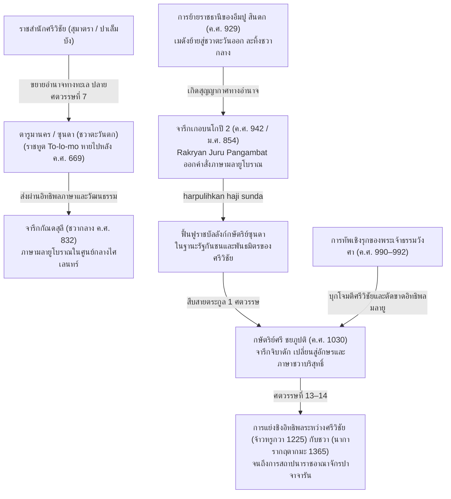

# บันทึกการอ่านและวิเคราะห์เอกสารจารึกวิทยาฉบับสมบูรณ์ (Epigraphic Source Dossier)
## ศิลาจารึกภาษามลายูโบราณในเขตบุยเตินซอร์ก (เกอบนโกปี 2): การชำระตัวบท จันทรสังขยา การฟื้นฟูอำนาจกษัตริย์ซุนดา และภูมิรัฐศาสตร์ศรีวิชัยเหนือชวาตะวันตก (Een Maleische Inscriptie in het Buitenzorgsche: Epigraphic Recension, Chronogram Decipherment, Restoration of Haji Sunda, and Sriwijayan Thalassocratic Hegemony in Western Java)

---

### ส่วนที่ 1: ข้อมูลบรรณานุกรมและการอ้างอิงมาตรฐาน (Bibliographic Metadata)

- **Source ID:** `S-1941-bosch-01`
- **ชื่อไฟล์ PDF ในเครื่อง:** `S-1941-bosch-01_Maleische_Inscripties_Sumatra.pdf`
- **ชื่อไฟล์ข้อความสกัด:** `S-1941-bosch-01_Maleische_Inscripties_Sumatra.txt`
- **ประเภทเอกสาร:** บทความวิจัยชำระตัวบทจารึกขั้นปฐมภูมิและการตีความประวัติศาสตร์เปรียบเทียบ (Primary Epigraphic Decipherment, Critical Recension, and Geopolitical Synthesis)
- **ภาษาของเอกสาร:** ภาษาดัตช์ (Dutch) เป็นภาษาบทวิเคราะห์หลัก พร้อมตัวบทจารึกภาษามลายูโบราณ (Old Malay) แทรกคำศัพท์สันสกฤต (Sanskrit loanwords) และระบบคำศักราชจันทรสังขยาภาษาชวาโบราณ/กวี (Old Javanese Candrasangkala) อ้างอิงเอกสารภาษาจีนโบราณ เอกสารกวี และภาษาฝรั่งเศส
- **ขอบเขตภูมิศาสตร์และวัฒนธรรม:** เกาะชวาตะวันตก: เขตบุยเตินซอร์ก (Buitenzorg / ปัจจุบันคือเมืองโบกอร์ Bogor), อำเภอเลอวิลียัง (Leuwiliang), หมู่บ้านเกอบนโกปี (Desa Kebon Kopi) เชื่อมโยงทางภูมิรัฐศาสตร์กับจักรวรรดิศรีวิชัย (Śrīvijaya) ในเกาะสุมาตรา (ปาเล็มบัง Palembang และแม่น้ำมูซี Musi), ชวากลาง (ลุ่มน้ำเกอดู Kedu และจารึกกัณดสุลี Gandasuli), ชวาตะวันออก (ราชสำนักอึมปู สินดก Mpu Sindok แห่งเมดัง-มาตาราม), ราชอาณาจักรตารูมานคร (Tārumānagara), ดินแดนซุนดา (Sunda / ปาจาจารัน Pajajaran) และราชสำนักจีน (ราชวงศ์เหลียงและถัง)
- **วัสดุและบริบทการค้นพบ:**
  - *ประเภทวัตถุ:* ศิลาจารึกบนก้อนหินธรรมชาติรูปทรงไม่สม่ำเสมอ ผิวหน้าด้านหน้าได้รับการสกัดไสให้เรียบขัดมัน (onregelmatig gevormd rotsblok met glad gebeitelde voorzijde) จารึกอักษรชวาโบราณรุ่นแรก (Early Kawi Script) จำนวน 3 บรรทัดต่อเนื่อง
  - *ตำแหน่งที่พบ:* ค้นพบตั้งอยู่ริมคันนา (aan den rand van een sawah) ในหมู่บ้านเกอบนโกปี ตำบลเลอวิลียัง แขวงบุยเตินซอร์ก ใกล้เคียงกับจุดที่ค้นพบศิลาจารึกอักษรปัลลวะภาษาสันสกฤตรูปจำลองรอยพระพุทธบาทช้างเอราวัณของพระเจ้าปูรณวรมันแห่งตารูมานคร (จารึกเกอบนโกปี 1 หรือรอยเท้าช้างไอราวัณ)
  - *ประวัติการบันทึกทางโบราณคดี:* บันทึกครั้งแรกในบัญชีภาพถ่ายของสำนักโบราณคดีเนเธอร์แลนด์อินดีส (Oudheidkundige Dienst) ประจำไตรมาสที่ 1 และ 2 ของปี ค.ศ. 1923 (*Oudheidkundig Verslag 1923*, หน้า 78 หมายเลขภาพถ่าย 6886) ซึ่งขณะนั้นอ่านเฉพาะตัวเลขมหาศักราชได้ว่า 854 (ค.ศ. 942) แต่ยังไม่สามารถถอดข้อความส่วนที่เหลือได้ทั้งหมด จนกระทั่ง Bosch ทำการศึกษารอยคัดลอกกระดาษ (papierafdrukken) และชำระตัวบทสำเร็จ
- **การอ้างอิงฉบับเต็มระบบ Chicago/Turabian Notes-Bibliography:**  
  Bosch, F. D. K. "Een Maleische Inscriptie in het Buitenzorgsche." *Bijdragen tot de Taal-, Land- en Volkenkunde van Nederlandsch-Indië* 100, no. 1 (1941): 49–53.

---

### ส่วนที่ 2: แผนผังการจัดสรรเข้าสู่บทและหัวข้อย่อย (Chapter & Section Mapping Matrix)

- **บทที่ 2: ศรีวิชัย มณฑลข้ามสมุทร และมโนทัศน์อำนาจในจารึกภาษามลายูโบราณ**
  - *หัวข้อย่อย 2.1 (การจัดระเบียบมณฑลและการครอบงำชวาตะวันตก):* การใช้ภาษามลายูโบราณในเขตบุยเตินซอร์ก (ค.ศ. 942) ในฐานะภาษาแห่งอำนาจราชสำนักศรีวิชัย (imperial chancery language) ยืนยันว่าซุนดาตกอยู่ใต้มณฑลอิทธิพลทางการเมืองและวัฒนธรรมของศรีวิชัยอย่างเหนียวแน่นต่อเนื่องจากยุคศตวรรษที่ 7 (Bosch 1941, 50–51)
  - *หัวข้อย่อย 2.3 (กลยุทธ์การทูตและดุลอำนาจระหว่างศรีวิชัยกับชวา):* บริบทปี ค.ศ. 942 ตรงกับยุคที่พระเจ้าอึมปู สินดก (Mpu Sindok ค.ศ. 929) ย้ายราชธานีไปชวาตะวันออกและตัดขาดความสัมพันธ์กับชวากลาง ทำให้เกิดสุญญากาศทางอำนาจ ศรีวิชัยจึงฉวยโอกาสนี้ฟื้นฟูสถาบันกษัตริย์ซุนดา (*haji Sunda*) ขึ้นมาใหม่เพื่อทำหน้าที่เป็นรัฐกันชน (buffer state) หรือพันธมิตรขนาบหลังกดดันชวา (Bosch 1941, 51–52)
  - *หัวข้อย่อย 2.5 (โครงสร้างตำแหน่งขุนนางและการบริหารอาณานิคม):* การวิเคราะห์ตำแหน่งขุนนางชั้นสูง *Rakryan Juru Pangambat* ผู้รับพระบรมราชโองการมาปฏิบัติการฟื้นฟูกษัตริย์ซุนดา สะท้อนการซ้อนทับของระบบบรรดาศักดิ์ข้าราชการชวา-ศรีวิชัย (Bosch 1941, 49–50)
- **บทที่ 4: สัทวิทยา อักขรวิทยา ไวยากรณ์ และวิวัฒนาการของภาษามลายูโบราณ (Old Malay Linguistics)**
  - *หัวข้อย่อย 4.1 (สัทวิทยาและหน่วยคำมลายูโบราณนอกสุมาตรา):*
    - การศึกษาคำสรรพนามบุรุษที่ 3 ยกย่องปัจจัย `-nda` (*śabdakālinda*) และปรากฏการณ์การยืดสระเสียงยาวหน้าปัจจัย เปรียบเทียบกับจารึกตาลังตูโว (*praṇidhānānda*) และจารึกกัณดสุลี (*nāmānda*, *ayānda*) (Bosch 1941, 50)
    - การศึกษาคำบุพบทบอกสถานที่และเวลา `i` (*i kawihaji pañca pasagi*)
    - การศึกษาระบบอุปสรรคสภาววาจกและกรรตุวาจก: การกลายเสียงของหน่วยคำเติมหน้า `mar-` สู่ `marsi-` (*marsindega*) และหน่วยคำเติมหน้ากริยาก่อเหตุ/ฟื้นฟู `bar-` สู่ `har-` (*harpulihkan*) (Bosch 1941, 49–50)
  - *หัวข้อย่อย 4.3 (การถอดรหัสจันทรสังขยาและการคำนวณศักราช):*
    - การตีความคำแทนตัวเลขปริศนา: `kawi` = กวี/ปราชญ์/ภุชงค์ (8), `haji` = ราชา/ผู้เป็นใหญ่ (คูณหรือขยายบริบท), `pañca` = ห้า (5), `pasagi` = สี่เหลี่ยม/จตุรัส (4) ถอดค่าตัวเลขตามหลักจันทรสังขยาได้มหาศักราช 854 (ตรงกับ ค.ศ. 942) ชี้ขาดความถูกต้องเมื่อเทียบกับรูปแบบอักษรกวิยุคศตวรรษที่ 10 (Bosch 1941, 50)
- **บทที่ 5: กลุ่มจารึกสุมาตรา ลุ่มน้ำมูซี และการแผ่ขยายอิทธิพลสู่เกาะชวา (Epigraphic Networks Across the Java Sea)**
  - *หัวข้อย่อย 5.1 (การเชื่อมโยงสายโซ่จารึกมลายูโบราณข้ามช่องแคบซุนดา):* สายวิวัฒนาการจากกลุ่มจารึกศรีวิชัยยุคศตวรรษที่ 7 (เกอดูกันบูกิต ค.ศ. 683, ตาลังตูโว ค.ศ. 684, โกตาคาปูร์ ค.ศ. 686) ข้ามสู่จารึกกัณดสุลีในชวากลาง (ค.ศ. 832) และจารึกเกอบนโกปี 2 ในชวาตะวันตก (ค.ศ. 942) (Bosch 1941, 50–51)
  - *หัวข้อย่อย 5.3 (การปะทะและการผลัดเปลี่ยนอำนาจเหนือชวาตะวันตก):*
    - รอยต่อประวัติศาสตร์ 4 ยุคของแคว้นซุนดา: ยุคอิทธิพลตารูมานคร (ศตวรรษที่ 5–7), ยุคใต้อาณัติศรีวิชัย (ปลายศตวรรษที่ 7–10 ยืนยันโดยจารึกเกอบนโกปี 2), ยุคอิทธิพลชวาและการฟื้นฟูสายตระกูลผ่านจารึกจิบาดัก (ค.ศ. 1030 ของพระเจ้าชยภูปติ กษัตริย์ซุนดาที่ใช้ภาษาและอักษรชวาบริสุทธิ์), และยุคการถ่วงดุลของจักรวรรดิทางทะเล (บันทึกจ้าวหรูกวา ค.ศ. 1225 และวรรณกรรมนาการากฤตากมะ ค.ศ. 1365 จนถึงการตั้งอาณาจักรปาจาจารัน) (Bosch 1941, 51–53)
    - ภูมิรัฐศาสตร์ดินแดนรอยต่อ (borderland buffer zone): ภาระหนักของซุนดาในฐานะสมรภูมิปะทะระหว่างมหาอำนาจทางทะเลศรีวิชัยกับมหาอำนาจเกษตรกรรมชวา (Bosch 1941, 52–53)

---

### ส่วนที่ 3: สรุปสาระสำคัญเชิงวิเคราะห์และจุดยืนทางวิชาการ (Core Argument & Historiography)

- **วิทยานิพนธ์และข้อถกเถียงหลักของผู้เขียน (Core Argument / Thesis):**
  1. *การชำระตัวบทและถอดรหัสจันทรสังขยาจารึกเกอบนโกปี 2:* Bosch สถาปนาบทอ่านที่สมบูรณ์ของจารึกสั้น 3 บรรทัดที่ถูกทิ้งค้างมาตั้งแต่ ค.ศ. 1923 โดยพิสูจน์ว่าข้อความขึ้นต้นด้วยคำสมาสแบบตัตปุรุษะ `śabdakālinda` (*śabda* = วาจา/คำสั่ง/พระบรมราชโองการ, *kāla* = ศักราช/กาลเวลา/อนุสรณ์สถาน รวมเป็น *śabdakāla* หรือเทียบเท่า *śakakāla*) ตามด้วยปัจจัยสรรพนามแสดงความเคารพ `-nda` และไขรหัสคำจันทรสังขยา `kawihaji pañca pasagi` ว่าหมายถึงมหาศักราช 854 (ตรงกับ ค.ศ. 942) ซึ่งขจัดข้อเสนอเดิมที่ลังเลกับการอ่านเลขกลับด้านเป็น 458 ได้อย่างสิ้นเชิง เนื่องจากอักขรวิทยาของตัวจารึกเป็นแบบอักษรชวาโบราณ (Kawi) ยุคกลาง มิใช่อักษรปัลลวะยุคต้น (หน้า 49–50)
  2. *สถานะทางภาษาศาสตร์และการครอบงำทางการเมืองของศรีวิชัย:* การที่เอกสารประกาศราชการฉบับนี้ถูกร่างขึ้นเป็น "ภาษามลายูโบราณ" (Oud-Maleisch) ท่ามกลางสภาพแวดล้อมภาษาซุนดาโบราณหรือชวาโบราณ เป็นหลักฐานเชิงประจักษ์ชิ้นเด็ดขาดที่ยืนยันข้อสันนิษฐานของ N.J. Krom และ J.L. Moens ว่า ดินแดนซุนดา (อดีตอาณาจักรตารูมานคร) ตกเป็นเมืองขึ้นหรืออยู่ใต้ร่มธงอิทธิพลทางการเมืองและวัฒนธรรมของจักรวรรดิศรีวิชัยแห่งเกาะสุมาตรามาตั้งแต่ปลายศตวรรษที่ 7 (สอดคล้องกับการที่ราชทูตตารูมา "โถโลโม" หายไปจากราชสำนักจีนราชวงศ์ถังหลัง ค.ศ. 669 และการกรีธาทัพเรือของศรีวิชัยในจารึกเกอดูกันบูกิต ค.ศ. 683 และโกตาคาปูร์ ค.ศ. 686) จนถึงช่วงกลางศตวรรษที่ 10 (หน้า 50–51)
  3. *กำเนิดและเส้นทางการแพร่กระจายของภาษามลายูโบราณในเกาะชวา:* Bosch เสนอสมมติฐานใหม่ที่ท้าทายวงวิชาการว่า อิทธิพลภาษามลายูโบราณที่ปรากฏในจารึกกัณดสุลี (Gaṇḍasuli / Kedu ค.ศ. 832) ในชวากลาง อาจมิได้หลั่งไหลมาจากเกาะสุมาตราโดยตรงตามที่เชื่อกันมาแต่เดิม แต่มีจุดเริ่มต้นและฐานที่มั่นสำคัญส่งต่อมาจาก "ดินแดนซุนดา" ในชวาตะวันตก ซึ่งกลายเป็นมณฑลอาณานิคมของศรีวิชัยมาร่วมหนึ่งศตวรรษก่อนหน้า (หน้า 51)
  4. *ภูมิรัฐศาสตร์การฟื้นฟูราชบัลลังก์ซุนดาใน ค.ศ. 942:* วลีสำคัญ `marsandega harpulihkan haji sunda` (บัญชาให้ฟื้นฟูกษัตริย์แห่งซุนดาคืนสู่สถานะเดิม) อธิบายได้ด้วยการเปลี่ยนแปลงดุลอำนาจครั้งใหญ่ในเกาะชวา เมื่อพระเจ้าอึมปู สินดก ย้ายศูนย์กลางอำนาจของราชอาณาจักรเมดังจากชวากลางไปยังชวาตะวันออกใน ค.ศ. 929 และละทิ้งความสัมพันธ์กับชวากลางทั้งหมด การถอนตัวของอำนาจชวาเปิดโอกาสให้ศรีวิชัยเข้ามาจัดระเบียบชวาตะวันตกใหม่ โดยอาจฟื้นฟูทายาทสายตระกูลเดิมของพระเจ้าปูรณวรมันขึ้นเป็นกษัตริย์ประเทศราช (*vazal-onderkoning*) เพื่อผนึกกำลังเป็นพันธมิตรคุ้มกันช่องแคบซุนดาและคอยคานอำนาจหรือรุกรานชวากลางที่ไร้การป้องกัน (หน้า 51–52)
  5. *พลวัตการเปลี่ยนผ่านสู่อิทธิพลชวาในศตวรรษที่ 11:* สายตระกูลของกษัตริย์ซุนดาที่ได้รับการฟื้นฟูใน ค.ศ. 942 นี้ ได้สืบราชสมบัติต่อมาจนถึงพระเจ้าศรี ชยภูปติ (Śrī Jayabhūpati) ผู้ประกาศจารึกจิบาดัก (Tjibadak Inscription) ในปี ค.ศ. 1030 แต่ที่น่าประหลาดใจคือ ภายในเวลาไม่ถึง 1 ศตวรรษ อิทธิพลภาษามลายูโบราณและศรีวิชัยได้เลือนหายไปอย่างสิ้นเชิง โดยจารึกจิบาดักกลับใช้ภาษาชวาโบราณ อักษรชวาโบราณ และพระนามกษัตริย์แบบราชสำนักชวา ซึ่งเป็นผลพวงโดยตรงจากนโยบายจักรวรรดินิยมเชิงรุกของพระเจ้าธรรมวังศา เตชานุวิตโกรมโมตตุงควรรมา (Dharmawaṅśa) แห่งชวาตะวันออก ที่ส่งกองทัพเรือบุกโจมตีศรีวิชัย (ค.ศ. 990–992) และแผ่ขยายอิทธิพลชวาเข้าครอบงำซุนดาแทนที่ (หน้า 52)
  6. *ทัศนะวิพากษ์เรื่องอธิปไตยเหนือดินแดนชายขอบ:* Bosch อ้างอิงข้อเตือนใจของ Krom ว่า การเปลี่ยนแปลงอำนาจอธิปไตยเหนือดินแดนซุนดาที่พลิกผันไปมาระหว่างศรีวิชัยและชวาตั้งแต่ศตวรรษที่ 7 ถึงศตวรรษที่ 14 แท้จริงแล้วอาจมีผลกระทบเชิงผิวเผินต่อโครงสร้างสังคมท้องถิ่น อำนาจของมหาอำนาจเหนือดินแดนโพ้นทะเล (*buitenbezittingen*) ในทางปฏิบัติหมายถึงเพียงการห้ามมิให้มหาอำนาจอื่นเข้ามาแทรกแซงและการส่งเครื่องราชบรรณาการตามวาระเท่านั้น แต่ราษฎรท้องถิ่นมิได้รับรู้หรือสัมผัสถึงอำนาจส่วนกลางโดยตรงมากนัก จนกระทั่งการสถาปนาราชอาณาจักรปาจาจารันที่เป็นอิสระอย่างแท้จริงในต้นศตวรรษที่ 14 (หน้า 53)

- **บริบทประวัติศาสตร์นิพนธ์และการประเมินความน่าเชื่อถือ (Historiography & Source Criticism):**
  - *สถานะของบทความวิจัย:* ตีพิมพ์ในวารสารระดับตำนาน *BKI* (Bijdragen tot de Taal-, Land- en Volkenkunde) เล่ม 100 ในปี ค.ศ. 1941 ซึ่งเป็นช่วงสงครามโลกครั้งที่ 2 ก่อนที่กองทัพญี่ปุ่นจะบุกยึดหมู่เกาะอินดีสตะวันออกของเนเธอร์แลนด์ นับเป็นงานชิ้นเอกชิ้นสุดท้ายของ Bosch ในฐานะผู้อำนวยการสำนักโบราณคดีก่อนการเปลี่ยนผ่านสู่ยุคเอกราช
  - *การต่อยอดและยืนยันข้อสมมติฐานทางประวัติศาสตร์:* Bosch สานต่องานวิจัยเรื่องศรีวิชัยของ G. Cœdès (1918, 1930) และบูรณาการข้อสมมติฐานของ N.J. Krom (1931 ใน *Hindoe-Javaansche Geschiedenis*) และ J.L. Moens (1937 ใน *Çrīvijaya, Yāva en Kaṭāha*) ทำให้ข้อเสนอเรื่องการผนวกตารูมานครของศรีวิชัยซึ่งเดิมอาศัยเพียงบันทึกประวัติศาสตร์จีน (การขาดหายไปของราชทูต *To-lo-mo*) ได้รับการพิสูจน์ยืนยันด้วยหลักฐานจารึกวิทยาภาษามลายูโบราณบนผืนแผ่นดินชวาตะวันตกโดยตรง
  - *การวิพากษ์บทอ่านในเวลาต่อมา (Subsequent Epigraphic Revisions):* แม้การอ่านส่วนใหญ่ของ Bosch จะได้รับการยอมรับอย่างกว้างขวาง แต่นักจารึกวิทยารุ่นหลัง เช่น Boechari (1986) และ J.G. de Casparis ได้เสนอการอ่านปรับปรุงในบางจุด เช่น คำว่า `marsindega` Boechari อ่านเป็น `marsamadhya` หรือปรับแก้การแบ่งวรรคคำ ทว่าการตีความแก่นเรื่องประวัติศาสตร์ว่าด้วยการฟื้นฟูกษัตริย์ซุนดา (`harpulihkan haji sunda`) และการกำหนดศักราช ค.ศ. 942 ยังคงเป็นหมุดหมายที่มั่นคงที่สุดของประวัติศาสตร์ชวาตะวันตกยุคต้น

---

### ส่วนที่ 4: สารบัญข้อค้นพบเชิงลึกแยกตามมิติจารึกวิทยาพร้อมระบุเลขหน้าจริง (Thematic Epigraphic Findings with Exact Pages)

1. **ประวัติศาสตร์นิพนธ์และการตีความทางประวัติศาสตร์:**
   - การยืนยันสถานะความเป็นเมืองขึ้นของซุนดาต่อศรีวิชัยในกลางศตวรรษที่ 10: การค้นพบเอกสารคำสั่งทางการเป็นภาษามลายูโบราณในเขตบุยเตินซอร์ก พิสูจน์ว่าศรีวิชัยยังคงแผ่อิทธิพลทางทหารและการเมืองครอบงำชวาตะวันตกอย่างต่อเนื่องนับตั้งแต่การพิชิตตารูมานครในปลายศตวรรษที่ 7 (หน้า 50–51)
   - ความสอดคล้องกับจดหมายเหตุราชวงศ์ถังของจีน: บันทึกจีนระบุว่าอาณาจักร "โถโลโม" (*To-lo-mo* หรือตารูมา) ส่งราชทูตไปจีนใน ค.ศ. 528, 535, และระหว่าง 666–669 จากนั้นชื่อนี้ได้สาบสูญไปจากพงศาวดารจีน ซึ่งตรงกับช่วงเวลาที่ศรีวิชัยกรีธาทัพเรือข้ามสมุทรยึดครองปาเล็มบัง-มลายูใน ค.ศ. 683 (จารึกเกอดูกันบูกิต) และปราบปรามชวาใน ค.ศ. 686 (จารึกโกตาคาปูร์) การที่โถโลโมขาดการติดต่อกับจีนย่อมเป็นผลมาจากการถูกศรีวิชัยกลืนดินแดน (หน้า 50–51)
   - วงจรการผลัดเปลี่ยนอธิปไตย 4 ยุคเหนือแคว้นซุนดา: 
     1. ยุคตารูมานคร (ศตวรรษที่ 5–7)
     2. ยุคใต้อำนาจศรีวิชัย (ปลายศตวรรษที่ 7 ถึงกลางศตวรรษที่ 10)
     3. ยุคอิทธิพลชวา (ปลายศตวรรษที่ 10 ถึงศตวรรษที่ 12 ยืนยันโดยจารึกจิบาดัก ค.ศ. 1030)
     4. ยุคการสลับขั้วระหว่างศรีวิชัยกับชวา (บันทึกจ้าวหรูกวา ค.ศ. 1225 จัดซุนดาเป็นเมืองขึ้นศรีวิชัย ขณะที่ *Nāgarakṛtāgama* 42.2 ระบุการยอมรับอำนาจชวา) จนกระทั่งราชวงศ์ปาจาจารันสถาปนาเอกราชที่มั่นคงในต้นศตวรรษที่ 14 นานถึง 2 ศตวรรษ (หน้า 52–53)
   - ธรรมชาติของอำนาจจักรวรรดิโบราณเหนือดินแดนโพ้นทะเล: การที่ดินแดนเปลี่ยนขั้วอำนาจหลายครั้งมิได้แปลว่าโครงสร้างชุมชนภายในเปลี่ยนแปลงอย่างถึงรากถึงโคน แต่มักเป็นเพียงการส่งส่วยตามวาระและการห้ามมิให้มหาอำนาจคู่แข่งเข้ามาตั้งฐานที่มั่น (หน้า 53)

2. **ตัวบทจารึก การอ่าน ศักราช และอักขรวิทยา:**
   - ตัวบทจารึก 3 บรรทัด (Diplomatic Transcript ตามการอ่านของ Bosch หน้า 49–50):
     - บรรทัดที่ 1: `In[i] sabdakalinda rakryani juru panca-`
     - บรรทัดที่ 2: `mbat i kawihaji panca pasagi marsi-`
     - บรรทัดที่ 3: `ndega harpulihkan haji su-`
     - บรรทัดที่ 4 (คำปิดท้ายบรรทัด 3): `nda //`
   - การถอดรหัสคำจันทรสังขยา (Candrasangkala):
     - คำว่า `kawihaji` เทียบเท่ากับคำว่า `bhujangga` มีค่าตัวเลขเท่ากับ 8 (หน้า 50)
     - คำว่า `panca` มีค่าตัวเลขเท่ากับ 5 (หน้า 50)
     - คำว่า `pasagi` (รูปทรงสี่เหลี่ยม / สี่ด้าน) มีค่าตัวเลขเท่ากับ 4 แม้จะเป็นศัพท์จันทรสังขยาที่ไม่พบบ่อยนักในเอกสารกวีทั่วไป (หน้า 50)
     - รวมค่าตัวเลขตามธรรมเนียมการเรียงจากขวาไปซ้าย (หรือตามการอ่านตรง): อ่านได้เป็นปีมหาศักราช 854 ซึ่งตรงกับปี ค.ศ. 942 Bosch ชี้แจงว่าหากอ่านกลับด้านเป็น 458 ย่อมเป็นไปไม่ได้เด็ดขาด เพราะอักษรในจารึกมิใช่อักษรปัลลวะยุคตารูมานคร (ศตวรรษที่ 5) แต่เป็นอักษรชวาโบราณ (Kawi) ซึ่งสอดคล้องอย่างสมบูรณ์กับศตวรรษที่ 10 (หน้า 50)
   - การวิเคราะห์คำสมาส `sabdakalinda`:
     - Bosch วิเคราะห์ว่า `sabdakala` มาจากภาษาสันสกฤต สมาสแบบตัตปุรุษะ ระหว่าง `sabda` (เสียง, วาจา, ถ้อยคำ, คำสั่ง) + `kala` (เวลา, ศักราช, อนุสรณ์สถาน โดยเทียบเคียงกับคำว่า *sakakala* ที่ปรากฏในจารึกบาตูตูลิส *ini sakakala prebu ratu purana...* ซึ่งแปลว่า "นี่คืออนุสรณ์สถาน/จารึกแห่ง...") รวมความหมายคือ "จารึก/อนุสรณ์แห่งคำสั่ง" (หน้า 50)
     - ประกอบด้วยปัจจัยสรรพนามบุรุษที่ 3 แสดงความเคารพ `-nda` (เทียบเท่า `-nya` ในภาษามลายูทั่วไป) และมีการยืดเสียงสระ `a` ท้ายคำข้างหน้าให้ยาวขึ้นเป็น `a` (*sabdakalanda*) ปรากฏการณ์นี้สอดคล้องกับจารึกตาลังตูโว (*pranidhananda*) และจารึกกัณดสุลี (*namanda*, *ayanda*) (หน้า 50)

3. **มิติภาษาศาสตร์ สัทวิทยา และวิวัฒนาการภาษามลายูโบราณ:**
   - การจัดจำแนกภาษา: จารึกเกอบนโกปี 2 จารึกด้วย "ภาษามลายูโบราณ" (Oud-Maleisch) อย่างปฏิเสธไม่ได้ (หน้า 49)
   - โครงสร้างหน่วยคำเติมหน้า (Morphological Affixes):
     - `marsindega`: ประกอบด้วยอุปสรรค `marsi-` ซึ่ง Bosch ตีความว่าเป็นรูปแผลงหรือกริยาสภาววาจกของ `mar-` (เทียบเท่า `ber-` ในภาษามลายูมาตรฐาน หรือ `mar-` ในภาษาบาตัก) ทำหน้าที่บัญชาหรือมีคำสั่ง (หน้า 49–50)
     - `harpulihkan`: ประกอบด้วยอุปสรรค `har-` (ซึ่งเป็นรูปแปรของ `bar-` หรือ `mar-`) นำหน้าสกรรมกริยาฐาน `pulih` (ฟื้นฟู, คืนสู่สภาพเดิม) เติมปัจจัยสกรรมกริยา `-kan` รวมหมายถึง "จัดให้มีการฟื้นฟูกลับคืนสู่สถานภาพเดิม" (หน้า 49–50)
   - การสะกดชื่อบ้านเมือง: การใช้รูปคำ `sunda` ในบรรทัดที่ 3–4 ยืนยันการใช้อักษรและเสียงสะกดแบบดั้งเดิม (หน้า 50)
   - การวิเคราะห์เส้นทางการแพร่กระจายของภาษามลายู: ข้อเสนอของ Bosch ที่ว่าภาษามลายูโบราณอาจมิได้แผ่จากศรีวิชัย (สุมาตรา) เข้าสู่ชวากลาง (กัณดสุลี) โดยตรง แต่เดินทางผ่านหัวสะพานในแคว้นซุนดา (ชวาตะวันตก) ชี้ให้เห็นบทบาทของชวาตะวันตกในฐานะเบ้าหลอมภาษาศาสตร์และวัฒนธรรมข้ามช่องแคบซุนดา (หน้า 51)

4. **มิติการเมือง การบริหารราชการ และศัพท์ตำแหน่งขุนนาง:**
   - ตำแหน่ง *Rakryan*: บรรดาศักดิ์ขุนนางชั้นสูงของชวาโบราณ ปรากฏควบคู่กับตำแหน่งบริหารราชการ แสดงถึงการผสมผสานระบบราชการระหว่างธรรมเนียมชวากับกลไกอำนาจของศรีวิชัย (หน้า 49–50)
   - ตำแหน่ง *Juru Pangambat*: 
     - Bosch วิเคราะห์รากศัพท์คำว่า *pangambat* มาจากกริยา *ambat* ในภาษาชวา/มลายู แปลว่า "ไล่ตาม", "ล่าสัตว์", "ติดตามรอย" (achtervolgen, najagen)
     - ดังนั้น *Juru Pangambat* จึงมีความหมายตรงตัวว่า "นายพรานหลวง" หรือ "สมุหพรานราชสำนัก / เสนาบดีฝ่ายการล่าสัตว์" (*opperjagermeester*) ซึ่งเป็นตำแหน่งขุนนางระดับสูงในราชสำนักโบราณที่มีหน้าที่บังคับบัญชากองกำลังกึ่งทหารหรือหน่วยลาดตระเวนป่า (หน้า 50)
   - ตำแหน่งกษัตริย์ *Haji*: คำเรียกกษัตริย์หรือเจ้าผู้ครองแคว้นในภาษาตระกูลออสโตรนีเซียนดั้งเดิม ปรากฏในวลี `haji sunda` (กษัตริย์แห่งซุนดา) ซึ่งมีสถานะเป็นเจ้าเมืองประเทศราชภายใต้การรับรองของอำนาจจักรวรรดิ (หน้า 50)
   - ปริศนาทางการเมืองเบื้องหลังการ "ฟื้นฟู" (*harpulihkan*):
     - Bosch ตั้งคำถามสำคัญ 3 ประการ:
       1. การฟื้นฟูนี้หมายถึงการฟื้นคืนสายราชวงศ์เดิมของพระเจ้าปูรณวรมันที่เคยถูกศรีวิชัยขับไล่ไปเมื่อ ค.ศ. 683 หรือไม่?
       2. หรือเป็นการฟื้นฟูกษัตริย์ซุนดาพระองค์หนึ่งที่เพิ่งถูกถอดถอนจากราชบัลลังก์ในความขัดแย้งระยะใกล้?
       3. ศรีวิชัยได้ประโยชน์อะไรจากการแต่งตั้งและคืนพระเกียรติยศแก่กษัตริย์ซุนดาผู้นี้? (หน้า 51)
     - คำตอบเชิงภูมิรัฐศาสตร์: การที่พระเจ้าอึมปู สินดก ย้ายราชธานีไปชวาตะวันออก ทำให้ชวากลางเปิดโล่ง ศรีวิชัยจึงต้องการพันธมิตรที่ซื่อสัตย์ในชวาตะวันตกเพื่อป้องกันการถูกรุกราน หรือร่วมมือกันเข้าโจมตีชวากลาง หรือเพื่อเปลี่ยนรูปแบบการปกครองจากการส่งข้าหลวงไปบริหารโดยตรง (*rechtstreeks gevoerd bestuur*) มาเป็นการปกครองผ่านกษัตริย์ประเทศราชในท้องถิ่น (*vazal-onderkoning*) (หน้า 51–52)

5. **มิติภูมิรัฐศาสตร์และสงครามทางทะเลระหว่างศรีวิชัยกับชวา:**
   - สงครามใหญ่ระหว่างพระเจ้าธรรมวังศากับศรีวิชัย (ค.ศ. 990–992): พระเจ้าราไก วาตูกูรา ธรรมาวังศา แห่งชวาตะวันออกดำเนินนโยบายขยายอำนาจเชิงรุก (*dynamische politiek*) กรีธาทัพเรือข้ามสมุทรบุกโจมตีเมืองหลวงศรีวิชัยโดยตรง การทัพครั้งนี้ทำให้อิทธิพลมลายูในชวาตะวันตกถูกตัดขาดและสลายตัวไป เปิดทางให้อารยธรรมชวาเข้ามาครอบงำซุนดาแทนที่ ดังสะท้อนในจารึกจิบาดัก (หน้า 52)
   - จารึกจิบาดัก (Tjibadak Inscription ค.ศ. 1030 / ม.ศ. 952): ออกโดยพระเจ้าศรี ชยภูปติ กษัตริย์แห่งซุนดา แม้จะเป็นทายาทสืบเนื่องจากกษัตริย์ที่ได้รับการฟื้นฟูใน ค.ศ. 942 แต่ภาษาที่ใช้กลับเป็นภาษาชวาโบราณ อักขรวิธีชวาโบราณ และใช้พระนามกษัตริย์เต็มยศตามแบบแผนราชสำนักชวาตะวันออกโดยสิ้นเชิง ปราศจากร่องรอยภาษามลายูแม้แต่น้อย (หน้า 52)
   - สถานะของซุนดาในเอกสารต่างชาติรุ่นหลัง:
     - จดหมายเหตุ *จูฟานจื้อ* (Zhu Fan Zhi / 諸蕃志) ของเจ้าหรูกวา (Zhao Rugua ค.ศ. 1225) จัดให้ "ซุนโต" (*Sin-to* / Sunda) เป็นหนึ่งใน 15 ดินแดนเมืองขึ้นของอาณาจักรซานฝอฉี (San-fo-tsi / ศรีวิชัย) ซึ่งสะท้อนการกลับมาของอิทธิพลศรีวิชัยเหนือชวาตะวันตกในศตวรรษที่ 13 (หน้า 52–53)
     - วรรณกรรมชวาโบราณ *นาการากฤตากมะ* (Nāgarakṛtāgama บทที่ 42 โคลงที่ 2) ระบุว่าซุนดาตกอยู่ใต้ความคุ้มครองหรืออำนาจสูงสุดของชวา (มัชฌปาหิต) แม้อาจเป็นเพียงในนาม (หน้า 53)
     - การสถาปนาราชธานีปากวน ปาจาจารัน (Pakuan Pajajaran) ในต้นศตวรรษที่ 14 ยุติภาวะการเป็นเบี้ยล่างทางการเมืองของซุนดาและรักษาเอกราชไว้ได้นานร่วมสองร้อยปี (หน้า 53)

6. **มิติโบราณคดีบริบทและภูมิทัศน์ศักดิ์สิทธิ์:**
   - ความสำคัญเชิงพื้นที่ของหมู่บ้านเกอบนโกปี (เลอวิลียัง): การที่จารึกเกอบนโกปี 2 ถูกสลักไว้บนหินธรรมชาติในบริเวณเดียวกับจารึกเกอบนโกปี 1 ของพระเจ้าปูรณวรมัน แสดงว่าพื้นที่ดังกล่าวเป็น "ภูมิทัศน์ศักดิ์สิทธิ์ศูนย์กลางอำนาจดั้งเดิม" (sacred royal landscape) ของราชสำนักตารูมา-ซุนดามาหลายร้อยปี การเลือกประกาศพระบรมราชโองการฟื้นฟูกษัตริย์ซุนดา ณ จุดนี้จึงมีนัยสำคัญเชิงสัญลักษณ์เพื่อยืนยันความต่อเนื่องของความชอบธรรมทางการเมือง (หน้า 49)

---

### ส่วนที่ 5: คลังข้อความอ้างอิงตรงและเชิงอรรถสำเร็จรูป (Verbatim Quotes & Footnote Bank)

1. **ตัวบทจารึกเกอบนโกปี 2 (ถอดอักษรโดย Bosch):**
   - *ตัวบทดั้งเดิม (Old Malay & Sanskrit):*  
     `In[i] sabdakalinda rakryani juru pangambat i kawihaji panca pasagi marsindega harpulihkan haji sunda //` (หน้า 49–50)
   - *คำแปลภาษาดัตช์ของ Bosch:*  
     "Dit is het gedenkstuk (houdende) het bevel van den Rakryan Juru Pangambat (uitgevaardigd) in (het jaar) 854 (942 A.D.) en verordineerend, dat de vorst van Sunda in zijn vroegeren staat zal worden hersteld." (หน้า 50)
   - *คำแปลภาษาไทยเชิงวิชาการ:*  
     "นี่คือจารึกอนุสรณ์แห่งพระบรมราชโองการของท่านรักรยาน ชูรู ปางัมบัต (ผู้บัญชาการพรานหลวง) ซึ่งออกประกาศในปีมหาศักราช 854 (ตรงกับ ค.ศ. 942) โดยมีบัญชาสั่งการให้จัดฟื้นฟูกษัตริย์แห่งซุนดาคืนสู่สถานะเดิม"
   - *เชิงอรรถสำเร็จรูป:*  
     F. D. K. Bosch, "Een Maleische Inscriptie in het Buitenzorgsche," *Bijdragen tot de Taal-, Land- en Volkenkunde van Nederlandsch-Indië* 100, no. 1 (1941): 49–50.

2. **การวินิจฉัยภาษาและสถานะความเป็นเมืองขึ้นของซุนดาต่อศรีวิชัย:**
   - *ข้อความดั้งเดิม (Dutch):*  
     "De taal van de inscriptie is zooals men ziet het Oud-Maleisch... Het feit dat het bevelschrift in de Maleische taal is uitgevaardigd laat geen andere conclusie toe dan dat Sunda in het midden der 10e eeuw in cultureel en waarschijnlijk ook in politiek opzicht aan de macht van het Sumatraansche rijk Çriwijaya is onderworpen geweest." (หน้า 49, 50)
   - *คำแปลภาษาไทยเชิงวิชาการ:*  
     "ภาษาของศิลาจารึกนี้ ดังที่เห็นได้ชัด คือภาษามลายูโบราณ... ข้อเท็จจริงที่ว่าพระราชโองการนี้ถูกประกาศออกมาเป็นภาษามลายู ไม่อาจนำไปสู่ข้อสรุปอื่นใดได้เลย นอกเสียจากว่า ดินแดนซุนดาในกลางคริสต์ศตวรรษที่ 10 ได้ตกอยู่ใต้อำนาจของจักรวรรดิศรีวิชัยแห่งเกาะสุมาตรา ทั้งในมิติทางวัฒนธรรมและมีความเป็นไปได้สูงยิ่งว่าในมิติทางการเมืองด้วย"
   - *เชิงอรรถสำเร็จรูป:*  
     Bosch, "Een Maleische Inscriptie in het Buitenzorgsche," 49, 50.

3. **การล่มสลายของตารูมานครและการกลืนดินแดนของศรีวิชัย:**
   - *ข้อความดั้งเดิม (Dutch):*  
     "Moens is hierbij uitgegaan van de alleszins aannemelijke gissing, dat het in de annalen der Leang- en Tang-dynastieën genoemde rijk To-lo-mo... hetzelfde is als het rijk Taruma van koning Pūrṇnawarman. In verband met het niet meer aan het Chineesche hof verschijnen van deze gezanten na het laatstgenoemde jaar acht hij het waarschijnlijk, dat er aan het onafhankelijke bestaan van dit Taruma-Sunda een eind is gekomen en wel doordat Çriwijaya, dat, getuige de inscriptie van Kedoekan Boekit in 683 Palembang-Malayu veroverde, tezelfder tijd of kort daarna zich ook meester heeft gemaakt van het met Palembang saamhorige West-Java." (หน้า 50–51)
   - *คำแปลภาษาไทยเชิงวิชาการ:*  
     "มุนส์ (Moens) ได้ตั้งต้นจากข้อสันนิษฐานอันสมเหตุสมผลอย่างยิ่งว่า อาณาจักรโถโลโม (To-lo-mo) ที่ปรากฏในจดหมายเหตุราชวงศ์เหลียงและราชวงศ์ถัง... แท้จริงแล้วคืออาณาจักรตารูมาแห่งกษัตริย์ปูรณวรมัน เมื่อเชื่อมโยงกับการที่คณะทูตเหล่านี้มิได้ปรากฏตัวที่ราชสำนักจีนอีกเลยหลังปี ค.ศ. 669 เขาจึงประเมินว่าการดำรงอยู่อย่างเป็นเอกราชของตารูมา-ซุนดาได้สิ้นสุดลง และเป็นผลมาจากการที่ศรีวิชัย ซึ่งหลักฐานจารึกเกอดูกันบูกิตยืนยันว่าได้พิชิตปาเล็มบัง-มลายูใน ค.ศ. 683 ได้เข้ายึดครองชวาตะวันตกซึ่งมีความเชื่อมโยงใกล้ชิดกับปาเล็มบังในเวลาเดียวกันหรือหลังจากนั้นไม่นาน"
   - *เชิงอรรถสำเร็จรูป:*  
     Bosch, "Een Maleische Inscriptie in het Buitenzorgsche," 50–51.

4. **สมมติฐานการถ่ายทอดภาษามลายูสู่ชวากลางผ่านดินแดนซุนดา:**
   - *ข้อความดั้งเดิม (Dutch):*  
     "Is inderdaad in het laatste kwart der 7e eeuw Sunda een wingewest van Çriwijaya geworden, dan is het ook zeer waarschijnlijk, dat de Maleische invloed, die ongeveer een eeuw later aan den dag komt in het taaleigen van de inscriptie van Gandasoeli in de Kedoe, niet rechtstreeks van Çriwijaya afkomstig is geweest, zooals tot dusver werd aangenomen, maar zijn uitgangspunt in de Sunda-landen heeft gehad." (หน้า 51)
   - *คำแปลภาษาไทยเชิงวิชาการ:*  
     "หากดินแดนซุนดาได้กลายสภาพเป็นมณฑลเมืองขึ้นของศรีวิชัยในไตรมาสสุดท้ายของคริสต์ศตวรรษที่ 7 จริงแล้วไซร้ ย่อมมีความเป็นไปได้อย่างสูงยิ่งว่า อิทธิพลภาษามลายูที่ปรากฏขึ้นในอีกลักษณะหนึ่งราวหนึ่งศตวรรษให้หลังในคุณลักษณะทางภาษาของศิลาจารึกกัณดสุลีในเขตเกอดูนั้น มิได้มีต้นกำเนิดส่งตรงมาจากศรีวิชัยดังที่เคยสันนิษฐานกันมาจนถึงบัดนี้ หากแต่มีจุดเริ่มต้นและฐานส่งต่อมาจากดินแดนซุนดาต่างหาก"
   - *เชิงอรรถสำเร็จรูป:*  
     Bosch, "Een Maleische Inscriptie in het Buitenzorgsche," 51.

5. **ผลกระทบจากการย้ายราชธานีของพระเจ้าอึมปู สินดก ใน ค.ศ. 929:**
   - *ข้อความดั้งเดิม (Dutch):*  
     "Een antwoord op deze laatste vraag vinden we wellicht in de omstandigheid, dat de Javaansche vorst Mpu Sindok, die in 929 de regeering had aanvaard, in afwijking van de politiek zijner voorgangers alle relaties met Midden-Java had verbroken en zich in het bestuur van het rijk uitsluitend tot de Oost-Javaansche gebiedsdeelen beperkte. In deze wijziging van de politieke situatie kan Çriwijaya zeer wel een aanleiding hebben gevonden om den haji Sunda in zijn vroegeren staat te herstellen, hetzij om met hem als dankbaren bondgenoot het onbeschermd gelaten Midden-Java te gaan bestoken, hetzij omdat men... het oogenblik gunstig achtte om het tot dusver rechtstreeks gevoerd bestuur over Sunda te doen plaats maken voor dat van een vazal-onderkoning." (หน้า 51–52)
   - *คำแปลภาษาไทยเชิงวิชาการ:*  
     "คำตอบต่อคำถามประการหลังนี้ เราอาจพบได้จากสภาวการณ์ที่ว่า กษัตริย์ชวา พระนามว่า อึมปู สินดก ซึ่งเสด็จขึ้นครองราชย์ใน ค.ศ. 929 ได้ดำเนินนโยบายที่แปลกแยกไปจากบุรพกษัตริย์ โดยทรงตัดความสัมพันธ์ทั้งหมดกับชวากลาง และจำกัดการบริหารราชอาณาจักรไว้เฉพาะในเขตแคว้นชวาตะวันออกเท่านั้น การเปลี่ยนแปลงสถานการณ์ทางการเมืองนี้เอง อาจเป็นเหตุจูงใจให้ศรีวิชัยตัดสินใจฟื้นฟูกษัตริย์แห่งซุนดาคืนสู่สถานะเดิม ไม่ว่าจะเป็นการใช้กษัตริย์พระองค์นี้ในฐานะพันธมิตรผู้กตัญญูเพื่อเข้าโจมตีชวากลางที่ถูกทิ้งไว้โดยปราศจากการป้องกัน หรือเป็นเพราะฝ่ายศรีวิชัยเห็นว่าเป็นจังหวะเวลาอันเหมาะสมที่จะเปลี่ยนผ่านการปกครองโดยตรงเหนือซุนดาที่เคยดำเนินมา ให้มาอยู่ภายใต้การบริหารของกษัตริย์ประเทศราชในท้องถิ่น"
   - *เชิงอรรถสำเร็จรูป:*  
     Bosch, "Een Maleische Inscriptie in het Buitenzorgsche," 51–52.

6. **การเปลี่ยนผ่านสู่ภาษาชวาในจารึกจิบาดักและการทัพของพระเจ้าธรรมวังศา:**
   - *ข้อความดั้งเดิม (Dutch):*  
     "Merkwaardigerwijs is in deze inscriptie geen spoor van Maleischen invloed te onderkennen, integendeel taal, schrift, koningstitulatuur en inkleeding van het stuk zijn zuiver Javaansch van karakter, hetgeen er op wijst, dat binnen een eeuw tijds de cultureele en politieke banden, die nog in 932 tusschen Sunda en het overzeesche rijk bestonden, aanzienlijk losser zijn geworden of geheel zijn geslaakt en in de plaats hiervan de Javaansche invloed zich krachtig heeft doen gelden. Het ligt voor de hand hierin voornamelijk een gevolg te zien van de door koning Dharmawaṅśa gevoerde 'dynamische' politiek, die zich niet alleen met succes rechtstreeks tegen Çriwijaya keerde (expeditie van 990–992), maar ook in andere richting krachtdadig werkzaam was om de Javaansche invloedssfeer te vestigen en uit te breiden." (หน้า 52)
   - *คำแปลภาษาไทยเชิงวิชาการ:*  
     "สิ่งที่น่าประหลาดใจยิ่งก็คือ ในศิลาจารึกนี้ (จารึกจิบาดัก ค.ศ. 1030) กลับไม่พบร่องรอยของอิทธิพลมลายูหลงเหลืออยู่เลยแม้แต่น้อย ในทางตรงกันข้าม ภาษา อักษร พระนามและพระราชทินนามของกษัตริย์ ตลอดจนโครงสร้างแบบแผนของตัวบท ล้วนมีลักษณะเป็นชวาบริสุทธิ์ สิ่งนี้ชี้ให้เห็นว่าภายในช่วงเวลาไม่ถึงหนึ่งศตวรรษ สายสัมพันธ์ทางวัฒนธรรมและการเมืองที่เคยผูกรัดซุนดากับอาณาจักรโพ้นทะเล (ศรีวิชัย) ใน ค.ศ. 942 ได้คลายลงอย่างมากหรือถูกตัดขาดไปอย่างสิ้นเชิง และอิทธิพลชวาได้แผ่เข้ามามีอำนาจอย่างเข้มแข็งแทนที่ เป็นการสมเหตุสมผลอย่างยิ่งที่จะมองปรากฏการณ์นี้ว่ามีสาเหตุหลักมาจากนโยบาย 'เชิงรุก' (dynamische politiek) ที่ดำเนินโดยพระเจ้าธรรมวังศา ซึ่งมิได้เพียงแต่ส่งกองทัพเรือเข้าโจมตีศรีวิชัยโดยตรงอย่างได้ผล (การทัพ ค.ศ. 990–992) เท่านั้น แต่ยังได้ปฏิบัติการอย่างเข้มแข็งเด็ดขาดในทิศทางอื่นๆ เพื่อสถาปนาและแผ่ขยายเขตอิทธิพลของชวาออกไป"
   - *เชิงอรรถสำเร็จรูป:*  
     Bosch, "Een Maleische Inscriptie in het Buitenzorgsche," 52.

7. **ชะตากรรมของดินแดนรอยต่อและการจำกัดความหมายของอธิปไตยโบราณ:**
   - *ข้อความดั้งเดิม (Dutch):*  
     "De algemeene conclusie, die uit het bovenstaande beknopte overzicht te trekken valt, is deze, dat Sunda een zwaren tol heeft moeten betalen voor het twijfelachtig voorrecht van gelegen te zijn op het grensgebied, waar de machts- en belangensferen van Çriwijaya en Java op elkander botsten... Terecht toch is er door Krom op gewezen, dat het gezag van een der groote mogendheden over de buitenbezittingen in veel opzichten slechts beteekent, dat er geen inmenging van een andere mogendheid geduld werd en er bij voorkomende gelegenheden schattingen werden opgebracht, maar niet dat de onderhoorigen zelf zoo heel veel van het oppergezag bemerkt hebben." (หน้า 52–53)
   - *คำแปลภาษาไทยเชิงวิชาการ:*  
     "ข้อสรุปทั่วไปที่สามารถกลั่นกรองได้จากการสำรวจโดยสังเขปข้างต้นนี้คือ ดินแดนซุนดาต้องจ่ายต้นทุนและภาษีราคาแพงอย่างยิ่งสำหรับสิทธิพิเศษอันน่ากังขาของการตั้งอยู่บน 'พื้นที่พรมแดนรอยต่อ' (grensgebied) อันเป็นจุดที่วงอำนาจและผลประโยชน์ของศรีวิชัยกับชวาเข้าปะทะบดขยี้กัน... ทว่าโครม (Krom) ได้ชี้ไว้อย่างถูกต้องยิ่งว่า อำนาจของมหาอำนาจรัฐใหญ่แห่งใดแห่งหนึ่งเหนือดินแดนอาณานิคมโพ้นทะเลนั้น ในหลายแง่มุมมีความหมายเพียงแค่ว่า จะไม่ยอมทนให้มหาอำนาจอื่นเข้ามาแทรกแซง และจะต้องมีการส่งเครื่องราชบรรณาการส่วยสาอากรเมื่อถึงวาระกำหนดเท่านั้น แต่หาได้หมายความว่าราษฎรข้าแผ่นดินในท้องถิ่นจะสัมผัสหรือรับรู้อะไรมากมายถึงการมีอยู่ของอำนาจสูงสุดนั้นไม่"
   - *เชิงอรรถสำเร็จรูป:*  
     Bosch, "Een Maleische Inscriptie in het Buitenzorgsche," 52–53.

---

### ส่วนที่ 6: คลังคำศัพท์เฉพาะทางจากเอกสาร (Native Terminology Glossary)

| ลำดับ | คำศัพท์ / วลีจารึก | ภาษาดั้งเดิม | คำแปล / ความหมายเชิงวิเคราะห์ | บริบทที่ปรากฏในเอกสารและเลขหน้า |
|:---:|:---|:---:|:---|:---|
| 1 | **ini** | ภาษามลายูโบราณ | นี่, สิ่งนี้ (คำสรรพนามชี้เฉพาะเจาะจง ใช้เปิดหัวข้อความจารึก) | ปรากฏในบรรทัดที่ 1 ของจารึกเกอบนโกปี 2: `in[i]...` (หน้า 49) |
| 2 | **śabdakāla** | สันสกฤต / มลายูโบราณ | จารึกแห่งคำสั่ง, พระบรมราชโองการที่เป็นลายลักษณ์อักษร (สมาสตัตปุรุษะ `śabda` + `kāla`) เทียบเท่ากับคำว่า *śakakāla* | หน้า 50 เชิงอรรถ 1 และ 2 เปรียบเทียบกับจารึกบาตูตูลิส |
| 3 | **-nda** | มลายูโบราณ / ออสโตรนีเซียน | ปัจจัยสรรพนามบุรุษที่ 3 แสดงความเคารพยกย่องอย่างสูง (honorific third-person suffix) | ท้ายคำ `śabdakālinda` (หน้า 50) เทียบกับ `praṇidhānānda` (ตาลังตูโว) และ `nāmānda` (กัณดสุลี) |
| 4 | **rakryān / rakryan** | ชวาโบราณ / กวี | มหาเสนาบดี, ขุนนางชั้นผู้ใหญ่ระดับสูงของรัฐ (พระยามหาอำมาตย์) | ปรากฏเป็นบรรดาศักดิ์ของ `rakryani juru pangambat` (หน้า 49–50) |
| 5 | **juru** | มลายูโบราณ / ชวาโบราณ | หัวหน้า, ผู้กำกับดูแล, นายงาน, ผู้เชี่ยวชาญเฉพาะทาง | คำนำหน้านามตำแหน่งขุนนางบริหาร `juru pangambat` (หน้า 49–50) |
| 6 | **pangambat** | มลายูโบราณ / ชวา | พรานหลวง, ผู้ติดตามรอยสัตว์ป่า, กองหน้าลาดตระเวน (มาจากรากศัพท์ `ambat`) | ตำแหน่ง `juru pangambat` หมายถึง สมุหพรานราชสำนัก หรือเจ้ากรมล่าสัตว์หลวง (หน้า 50) |
| 7 | **ambat** | ชวาโบราณ / มลายู | ไล่ตาม, ติดตามรอย, ล่าสัตว์ (achtervolgen, najagen) | รากศัพท์กริยาที่ประกอบเป็นนาม `pangambat` (หน้า 50) |
| 8 | **i** | มลายูโบราณ / ออสโตรนีเซียน | ใน, ณ, ที่ (คำบุพบทบอกเวลาหรือสถานที่ = di / pada) | ปรากฏนำหน้าศักราช: `i kawihaji pañca pasagi` (หน้า 49–50) |
| 9 | **kawihaji** | กวี / ชวาโบราณ | รหัสคำจันทรสังขยา แทนค่าตัวเลข **8** (ไวพจน์ของ `bhujangga` ปราชญ์/กวี/นาค) | รหัสคำจันทรสังขยาในบรรทัดที่ 2 (หน้า 50) |
| 10 | **pañca** | สันสกฤต | ห้า (5) (รหัสคำจันทรสังขยาแทนค่าตัวเลข **5**) | คำบอกศักราชในบรรทัดที่ 2 (หน้า 50) |
| 11 | **pasagi** | มลายู / ชวา | รูปสี่เหลี่ยม, มีสี่ด้าน (persegi) รหัสจันทรสังขยาแทนค่าตัวเลข **4** | คำบอกศักราชในบรรทัดที่ 2 (หน้า 50) |
| 12 | **candrasangkala** | ชวาโบราณ / สันสกฤต | จันทรสังขยา (chronogram) ระบบการระบุปีศักราชด้วยคำมงคลที่มีค่าตัวเลขเชิงสัญลักษณ์ | การคำนวณศักราช 854 มหาศักราช (หน้า 49–50) |
| 13 | **marsindega** | มลายูโบราณ | มีคำสั่งสั่งการ, บัญชาการ (อุปสรรค `marsi-` + ธาตุฐาน) | คำกริยาในบรรทัดที่ 2–3 กำกับพระราชโองการ (หน้า 49–50) |
| 14 | **harpulihkan** | มลายูโบราณ | จัดให้มีการฟื้นฟูกลับคืนสภาพเดิม (อุปสรรค `har-` + `pulih` + `-kan`) | กริยาสกรรมสำคัญที่สุดในจารึก บรรทัดที่ 3 (หน้า 49–50) |
| 15 | **pulih** | มลายูโบราณ / ออสโตรนีเซียน | ฟื้นฟู, หายกลับคืนดี, คืนสู่สภาพเดิม (herstellen) | รากศัพท์กริยาใน `harpulihkan` (หน้า 50) |
| 16 | **haji** | มลายูโบราณ / ชวาโบราณ | กษัตริย์, เจ้าผู้ครองนคร, เจ้าประเทศราช (vorst, koning) | ปรากฏในวลี `haji sunda` (หน้า 49–50) |
| 17 | **sunda** | ภูมิศาสตร์ชาติพันธุ์ | ซุนดา, ดินแดนและประชากรทางตะวันตกของเกาะชวา | ท้ายบรรทัดที่ 3 และ 4: `haji sunda` (หน้า 49–50) |
| 18 | **Tārumānagara** | สันสกฤต | ตารูมานคร อาณาจักรฮินดูยุคต้นในชวาตะวันตกของพระเจ้าปูรณวรมัน | รัฐโบราณที่ศรีวิชัยพิชิตในปลายศตวรรษที่ 7 (หน้า 50–51) |
| 19 | **To-lo-mo** | จีนโบราณ (โถโลโม) | ชื่อเรียกอาณาจักรตารูมานครในจดหมายเหตุราชวงศ์เหลียงและถัง | บันทึกการส่งทูตในปี 528, 535, และ 666–669 (หน้า 50–51) |
| 20 | **Çriwijaya** | สันสกฤต | ศรีวิชัย จักรวรรดิทางทะเลแห่งเกาะสุมาตรา (ศูนย์กลาง ณ ปาเล็มบัง) | อาณาจักรมหาอำนาจผู้มีอธิปไตยเหนือซุนดา (หน้า 50–53) |
| 21 | **wingewest** | ดัตช์ (ศัพท์วิเคราะห์) | มณฑลเมืองขึ้น, เขตแคว้นอาณานิคมที่ถูกพิชิตเพื่อผลประโยชน์ทางเศรษฐกิจ | การประเมินสถานะของซุนดาต่อศรีวิชัย (หน้า 51) |
| 22 | **vazal-onderkoning** | ดัตช์ (ศัพท์วิเคราะห์) | กษัตริย์ประเทศราช, เจ้าผู้ครองนครภายใต้พระบรมเดชานุภาพมหาจักรพรรดิ | ข้อเสนอเรื่องสถานะของ `haji Sunda` หลังการฟื้นฟู (หน้า 52) |
| 23 | **grensgebied** | ดัตช์ (ศัพท์วิเคราะห์) | พื้นที่พรมแดนรอยต่อ, รัฐกันชนที่เป็นจุดปะทะของเขตอิทธิพลมหาอำนาจ | ภูมิรัฐศาสตร์ของแคว้นซุนดาระหว่างศรีวิชัยกับชวา (หน้า 53) |
| 24 | **buitenbezittingen** | ดัตช์ (ศัพท์วิเคราะห์) | ดินแดนอาณานิคมโพ้นทะเล, ดินแดนชายขอบนอกราชธานี | ทฤษฎีอำนาจมณฑลโบราณของ Krom (หน้า 53) |
| 25 | **Mpu Sindok** | ชวาโบราณ | พระนามกษัตริย์แห่งราชอาณาจักรเมดัง ผู้ย้ายราชธานีสู่ชวาตะวันออกใน ค.ศ. 929 | บริบทการเมืองชวาที่เปิดช่องให้ศรีวิชัยฟื้นฟูกษัตริย์ซุนดา (หน้า 51–52) |
| 26 | **Śrī Jayabhūpati** | สันสกฤต / ชวาโบราณ | พระเจ้าศรี ชยภูปติ กษัตริย์แห่งซุนดา ผู้ประกาศจารึกจิบาดักใน ค.ศ. 1030 | ทายาทกษัตริย์ซุนดาที่หันมารับวัฒนธรรมชวาบริสุทธิ์ (หน้า 52) |
| 27 | **Dharmawaṅśa** | สันสกฤต / ชวาโบราณ | พระเจ้าธรรมวังศา เตชานุวิตโกรมโมตตุงควรรมา กษัตริย์มหาอำนาจชวาตะวันออก | ผู้เปิดสงครามทางเรือโจมตีศรีวิชัย ค.ศ. 990–992 (หน้า 52) |
| 28 | **Sin-to** | จีนโบราณ (ซุนโต) | คำเรียกดินแดนซุนดาในบันทึก *จูฟานจื้อ* (Zhu Fan Zhi ค.ศ. 1225) ของจ้าวหรูกวา | บันทึกสถานะเมืองขึ้นของศรีวิชัยในศตวรรษที่ 13 (หน้า 52–53) |
| 29 | **Pajajaran** | ซุนดาโบราณ / ชวา | ปาจาจารัน (ปากวน ปาจาจารัน) ราชอาณาจักรเอกราชของชาวซุนดา (ต้นศตวรรษที่ 14) | ยุคสิ้นสุดการเป็นเบี้ยล่างระหว่างศรีวิชัยกับชวา (หน้า 53) |
| 30 | **tatpuruṣa** | สันสกฤต (ไวยากรณ์) | สมาสตัตปุรุษะ (Determinative compound) แบบที่มีบทหลังเป็นประธาน | การวิเคราะห์โครงสร้างคำของ `śabdakāla` (หน้า 50) |

---
