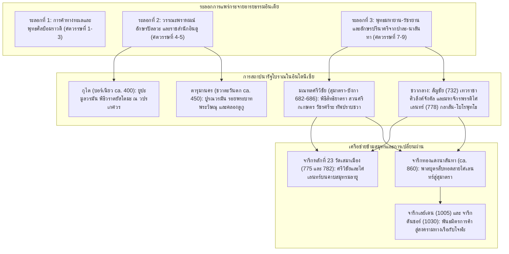

# บันทึกการอ่านและวิเคราะห์เอกสารจารึกวิทยาฉบับสมบูรณ์ (Epigraphic Source Dossier)
## รัฐบุราณคดีที่รับอิทธิพลอินเดียในเอเชียตะวันออกเฉียงใต้: ประวัติศาสตร์สังเคราะห์ อักขรวิทยา และกระบวนการก่อตัวของรัฐโบราณ (The Indianized States of Southeast Asia: Master Synthesis, Epigraphic Corpus, and State Formation)

---

### ส่วนที่ 1: ข้อมูลบรรณานุกรมและการอ้างอิงมาตรฐาน (Bibliographic Metadata)
- **Source ID:** `S-1968-coedes-01`
- **ชื่อไฟล์ PDF ในเครื่อง:** `S-1968-coedes-01_Indianized_States_of_Southeast_Asia.pdf`
- **ชื่อไฟล์ข้อความสกัด:** `S-1968-coedes-01_Indianized_States_of_Southeast_Asia.txt`
- **ประเภทเอกสาร:** หนังสือวิชาการแม่บทระดับคลาสสิกของการศึกษาวิชาประวัติศาสตร์ โบราณคดี และจารึกวิทยาเอเชียตะวันออกเฉียงใต้ (Master Monographic Synthesis & Foundational Historiographical Survey)
- **ภาษาของเอกสาร:** ภาษาอังกฤษ (EN - ฉบับแปลจากภาษาฝรั่งเศสฉบับปรับปรุงครั้งที่ 3 ค.ศ. 1964) ควบคู่กับตัวบทจารึกภาษาโบราณหลากหลายตระกูล: ภาษาสันสกฤตอักษรปัลลวะและปรีนาครี (Sanskrit in IAST), ภาษามลายูโบราณ (Old Malay), ภาษาชวาโบราณ (Old Javanese / Kawi), ภาษาทมิฬ (Tamil), ภาษาบาลี (Pali), ภาษาเขมรโบราณ (Old Khmer), ภาษาจีนคลาสสิก (Classical Chinese), และภาษาอาหรับ (Classical Arabic)
- **ขอบเขตภูมิศาสตร์และวัฒนธรรม:** ภูมิภาคเอเชียตะวันออกเฉียงใต้ภาคพื้นสมุทรและคาบสมุทร (Insular and Peninsular Southeast Asia) ครอบคลุม:
  1. *เกาะบอร์เนียว (Borneo / Kalimantan):* แคว้นกุไต (Kutei / Muara Kaman) ลุ่มแม่น้ำมหาคัม (Mahakam River) ในกาลีมันตันตะวันออก
  2. *เกาะชวา (Java):* ชวาตะวันตก (อาณาจักรตารุมานคร / Tarumanagara ลุ่มแม่น้ำจีตารุม / Chi Tarum และโบกอร์ / Buitenzorg), ชวากลาง (ที่ราบเกดู / Kedu Plain, พลับพลาเดียง / Dieng Plateau, ปรัมบานัน / Prambanan, และราชวงศ์มตารัม-ไศเลนทร์), ชวาตะวันออก (ดินายา / Dinoyo ในมาลัง และกาดิรี / สึงหะส่าหรี)
  3. *เกาะสุมาตราและหมู่เกาะข้างเคียง (Sumatra & Adjacent Islands):* ลุ่มแม่น้ำมูซี (Musi River / Palembang) และเนินเขาบูกิตเซอกุนตัง (Bukit Seguntang), ลุ่มแม่น้ำบาตังฮารี (Batang Hari / Jambi แคว้นมลายู), เกาะบังกา (Bangka Island / โกตาคาปูร์), และลามูรี (Lamuri / บารุส)
  4. *คาบสมุทรไทย-มลายู (Malay Peninsula):* ไทรบุรี/เกอดะฮ์ (Kataha / Kedah), ตะโกลา (Takkola / ตะกั่วป่า), ตามพรลิงก์/ลิกอร์ (Tambralinga / Ligor / นครศรีธรรมราช), ไชยา (Chaiya / Grahi), ลังกาสุกะ (Langkasuka / ปัตตานี), พันพัน (P'an-p'an ณ อ่าวบ้านดอน), และตุนสุน (Tun-sun)
  5. *เครือข่ายการค้าข้ามมหาสมุทร:* อินเดียใต้ (ราชวงศ์ปัลลวะแห่งกาญจีปุรัม, ราชวงศ์โจฬะแห่งตันชอร์และนาคปัฏฏนัม), อินเดียตะวันออก (ราชวงศ์ปาละแห่งเบงกอลและมหาวิหารนาลันทา), และจีน (ราชวงศ์ฮั่น, สามก๊ก, หนานเป่ยเฉา, สุย, ถัง, ซ่ง, หยวน, และหมิง)
- **วัสดุและบริบทการค้นพบของจารึกหลักที่วิเคราะห์:**
  1. *กลุ่มศิลาจารึกยูปะแห่งกุไต เกาะบอร์เนียว (The Yupa Inscriptions of Kutei, ca. 400 CE):* เสาหินบูชายัญทรงธรรมชาติ 7 หลัก (เดิมพบ 4 หลัก ค.ศ. 1879 เพิ่มเติมอีก 3 หลัก ค.ศ. 1940) สลักด้วยภาษาสันสกฤต อักษรปัลลวะตอนต้น (Early Pallava Grantha Script) ของพระเจ้ามูลวรมัน (Mulavarman) พระราชนัดดาในพระเจ้ากุณฑุงคะ (Kundunga) และพระราชโอรสในพระเจ้าอัศววรมัน (Asvavarman) บันทึกพิธีพหุสุวรรณกัม (Bahusuvarnakam) และการถวายโคสองหมื่นตัว ณ ปูชนียสถานวปรเกศวร (Vaprakesvara)
  2. *กลุ่มศิลาจารึกแห่งอาณาจักรตารุมานคร ชวาตะวันตก (The Tarumanagara Inscriptions of Purnavarman, ca. 450 CE):* ศิลาก้อนหินธรรมชาติสลักฉันท์ภาษาสันสกฤต อักษรปัลลวะรุ่นปลาย จำนวน 4 หลักหลัก (จียารูเติน / Ciaruteun, เกอบอนโกปี / Kebon Kopi, เลอบักหรือมุนจุล / Lebak-Cidanghiang, และจัมบู / Pasir Koleangkak) ร่วมกับศิลาจารึกตูกู (Tugu Inscription) บันทึกการขุดคลองชลประทานจันทรภาคา (Candrabhaga) และโคมาตี (Gomati) ความยาว 6,122 คันธนู (ราว 11–12 กิโลเมตร) พร้อมรอยพระบาทจำลอง (Visnupada) และรอยเท้าช้างไอราวัต (Airavata)
  3. *กลุ่มศิลาจารึกภาษามลายูโบราณแห่งศรีวิชัย (The Old Malay Inscriptions of Srivijaya, 682–686 CE):*
     - *จารึกเกอดูกันบูกิต (Kedukan Bukit, ปาเล็มบัง, 683 CE / มหาศักราช 605):* ศิลาก้อนมนธรรมชาติริมแม่น้ำตาตัง บันทึกการเดินทางทางชลมารคของดาปุนตะหยัง เพื่อไปรับสิทธิยาตรา (siddhayatra) พร้อมกองทัพ 20,000 นาย และขบวนเรือ 200 ลำ นำมาซึ่งศุภมงคล อำนาจ และความมั่งคั่งแก่ศรีวิชัย
     - *จารึกตาลังตูโว (Talang Tuwo, ปาเล็มบัง, 684 CE / มหาศักราช 606):* แท่งหินทรายสี่เหลี่ยม บันทึกการสร้างสวนสาธารณะศรีกเกษตร (Sriksetra) โดยพระเจ้าศรีชยานาศา (Sri Jayanasa) และคำอธิษฐานปณิธานโพธิสัตว์ (pranidhana) สู่การบรรลุวัชรศรีระ (vajrasarira) และอนุตรสัมมาสัมโพธิญาณ
     - *จารึกโกตาคาปูร์ (Kota Kapur, เกาะบังกา, 686 CE / มหาศักราช 608):* เสาศิลาทรงโอเบลิสก์ บันทึกคำสาปแช่งกบฏควบคุมปากน้ำมูซี และการยาตราระดมทัพไปปราบปรามดินแดนชวาที่ไม่ยอมขึ้นต่อศรีวิชัย (bhumi Java tidah bhakti ka Srivijaya)
     - *จารึกการังบราฮี (Karang Brahi, สุมาตราตอนบน/จัมบี, ca. 686 CE / มหาศักราช 608):* เสาศิลาควบคุมชุมทางแม่น้ำบาตังฮารี สลักข้อความคำสาบานแช่งผู้กระด้างกระเดื่องเช่นเดียวกับโกตาคาปูร์
  4. *จารึกศิวาจารย์และพระมหาราชาแห่งชวากลางและตะวันออก:*
     - *จารึกจังคัล (Canggal Inscription, ชวากลาง, 732 CE / มหาศักราช 654):* ศิลาจารึกภาษาสันสกฤต อักษรปัลลวะรุ่นปลาย บนเนินเขาวูกีร์ (Gunung Wukir) ของพระเจ้าสัญชัย (Sanjaya) บันทึกการประดิษฐานศิวลึงค์บนเกาะชวา (Yavadwipa) อันอุดมด้วยข้าวและเหมืองทองคำ ในเขตแคว้นกุญชรกุญชะ (Kunjarakunja)
     - *จารึกดินายา (Dinoyo Inscription, ชวาตะวันออก, 760 CE / มหาศักราช 682):* ศิลาจารึกภาษาสันสกฤต บันทึกการสร้างเทวาลัยและเทวรูปหินฤๅษีอคัสตยะ (Agastya) โดยพระเจ้าคชายนะ (Gajayana) แห่งราชอาณาจักรกัญจุรุฮัน (Kanjuruhan) แทนที่เทวรูปไม้จันทน์เดิม
     - *จารึกกลาสัน (Kalasan Inscription, ชวากลาง, 778 CE / มหาศักราช 700):* ศิลาจารึกภาษาสันสกฤต อักษรปรีนาครี (Pre-Nagari) บันทึกการสร้างพระวิหารประดิษฐานเทวีตารา (Tara) และถวายหมู่บ้านกลาสะ (Kalasa) โดยพระมหาราชาปนังกรัน (Panangkaran) ตามคำขอของคุรุแห่งราชวงศ์ไศเลนทร์
     - *จารึกเกลุรัก (Kelurak Inscription, ชวากลาง, 782 CE / มหาศักราช 704):* ศิลาจารึกภาษาสันสกฤต อักษรปรีนาครี บันทึกการประดิษฐานเทวรูปพระมัญชุศรี (Manjusri) โดยกุมารโฆษะ คุรุจากแคว้นเคาฑะ (Gauda/เบงกอล) ในรัชสมัยพระมหาราชาสงครามธนัญชัย ผู้พิฆาตศัตรู
     - *จารึกหลักที่ 23 วัดเสมาเมือง/ลิกอร์ (Ligor Stele, คาบสมุทรมลายู, 775 CE และหลัง 782 CE):* จารึกสองหน้า ด้าน A ระบุพระมหากษัตริย์ศรีวิชัยสร้างปราสาทอิฐสามหลัง ด้าน B สรรเสริญพระมหาราชาพระนามวิษณุแห่งราชวงศ์ไศเลนทร์
  5. *จารึกสัมพันธภาพข้ามสมุทรยุคคลาสสิก:*
     - *จารึกแผ่นทองแดงนาลันทา (Nalanda Copper-Plate of Devapala, ca. 860 CE):* แผ่นทองแดงจารึกภาษาสันสกฤต ณ มหาวิหารนาลันทา แคว้นมคธ บันทึกการพระราชทานหมู่บ้าน 5 แห่งเพื่อบำรุงวิหารที่สร้างขึ้นโดยพระเจ้าพาลบุตร (Balaputra) พระมหาราชาแห่งสุวรรณทวีป พระราชนัดดาในพระมหาราชาไศเลนทร์แห่งชวา และพระราชโอรสในพระเจ้าสมรคราวีระ (สมรตุงคะ) กับนางตารา
     - *จารึกแผ่นทองแดงเลย์เดนแผ่นใหญ่ (Larger Leiden Plates, 1005–1014 CE):* บันทึกการอุปถัมภ์จุฬามณีวรธรรมวิหาร ณ เมืองนาคปัฏฏนัม โดยพระเจ้าราชราชะที่ 1 และราเชนทรโจฬะที่ 1 ร่วมกับพระเจ้าจุฬามณีวรรมเทวะและมารวิชโยตตุงควรรมแห่งศรีวิชัยและกะดาฮะ
     - *ศิลาจารึกวิหารใหญ่เมืองตันชอร์ (Tanjore Inscription of Rajendra Chola I, 1030–1031 CE):* บันทึกการกรีธาทัพเรือโจฬะเข้าพิชิตอาณาจักรศรีวิชัย จับกุมพระเจ้าสังครามวิชโยตตุงควรรม และยึดครองหัวเมืองพันธมิตร 14 แห่งรอบช่องแคบมะละกาและคาบสมุทรมลายู
- **การอ้างอิงฉบับเต็มระบบ Chicago/Turabian Notes-Bibliography:**  
  Coedès, George. *The Indianized States of Southeast Asia*. Edited by Walter F. Vella. Translated by Susan Brown Cowing. Honolulu: East-West Center Press / The University Press of Hawaii, 1968. [Original French edition: *Les États hindouisés d'Indochine et d'Indonésie*, 3rd rev. ed., Paris: Éditions E. de Boccard, 1964].

---

### ส่วนที่ 2: แผนผังการจัดสรรเข้าสู่บทและหัวข้อย่อย (Chapter & Section Mapping Matrix)

*แผนผังการสังเคราะห์เนื้อหา ข้อค้นพบ และตัวบทจารึกวิทยาจากงานวิจัยแม่บทของ George Coedès (1968) เข้าสู่โครงร่างหนังสือวิจัยหลัก:*

- **บทที่ 1: ประวัติศาสตร์นิพนธ์ จารึกวิทยา และทฤษฎีการกลายเป็นอินเดียในเอเชียตะวันออกเฉียงใต้ (Historiography, Epigraphy, and Indianization Theories):**
  * **หัวข้อย่อย 1.1: ประวัติศาสตร์นิพนธ์ว่าด้วยกระบวนทัศน์ Indianization และการประเมินทฤษฎีของ George Coedès:**
    - วิเคราะห์นิยามและพัฒนาการของทฤษฎี Indianization (หน้า 14–16, 247–256) ซึ่ง Coedès มองว่าเป็นการขยายตัวทางอารยธรรมที่ไร้การบีบบังคับทางการเมืองหรือการยึดครองดินแดนทางการทหาร แตกต่างอย่างสิ้นเชิงจากจักรวรรดินิยมจีนในเวียดนาม
    - ทบทวนข้อวิพากษ์ของสำนักคิดต่างๆ: การประเมินสมมติฐานการย้ายถิ่นฐานของผู้ลี้ภัยสงคราม (Kalinga, Kushan), การหักล้างทฤษฎีการพิชิตด้วยกำลังทหารของวรรณะกษัตริย์ (Kshatriya conquest theory ของ C.C. Berg และ Majumdar), และการวิพากษ์ทฤษฎีพ่อค้าพาณิชย์ (Vaisya theory ของ N.J. Krom)
    - การประเมินข้อเสนอของ J.C. van Leur (1955) ว่าด้วยบทบาทของชนชั้นนำท้องถิ่นและการอัญเชิญพราหมณ์ (Brahman theory) พร้อมข้อตอบโต้ของ Coedès (หน้า 23–26) ที่ยืนยันว่าการตั้งถิ่นฐานทางการค้าของพ่อค้าในขั้นแรก เป็นเงื่อนไขจำเป็นที่เปิดทางให้พราหมณ์และพระภิกษุผู้ทรงความรู้ทางศาสนาและอักษรศาสตร์ก้าวเข้ามาประกอบพิธีกรรมยกระดับราชอำนาจ
  * **หัวข้อย่อย 1.2: มโนทัศน์เรื่อง 'ชั้นเคลือบอินเดีย' (Indian Veneer) และพลังสร้างสรรค์ของวัฒนธรรมดั้งเดิม (Local Genius):**
    - การถกเถียงเรื่องระดับการแทรกซึมของอารยธรรมอินเดีย (หน้า 33–35): อารยธรรมอินเดียเป็นสมบัติผูกขาดเฉพาะชนชั้นนำในราชสำนัก หรือหยั่งรากลงสู่มวลชนระดับล่าง?
    - ทัศนะของ Krom, Stutterheim, และ F.D.K. Bosch ว่าด้วยความคงทนของวัฒนธรรมออสโตรนีเซียนเดิม (บรรพบุรุษ, ผีสางเทวดาบนยอดเขา, การชลประทานนาข้าว) ซึ่งทำหน้าที่เป็น 'สารตั้งต้น' (Substratum) ให้ 'โครงสร้างส่วนบน' (Superstructure) ของอินเดียเข้ามาวางรากฐานและผสมผสาน
  * **หัวข้อย่อย 1.3: ระเบียบวิธีวิจัยทางจารึกวิทยาของ George Coedès ในฐานะบิดาแห่งประวัติศาสตร์นิพนธ์ศรีวิชัย:**
    - ระเบียบวิธีสหวิทยาการ: การประสานรอยต่อระหว่างศิลาจารึกหลายภาษา (สันสกฤต, มลายูโบราณ, ชวาโบราณ, เขมรโบราณ, ทมิฬ) ร่วมกับบันทึกการเดินทางของสมณทูตจีน (ฝาเสี่ยน, อี้จิง), จดหมายเหตุราชวงศ์จีน (ฮั่น, ถัง, ซ่ง), และวรรณกรรมภูมิศาสตร์อาหรับ-เปอร์เซีย (Ibn Khordadhbeh, Abu Zayd, Mas'udi)
    - ประวัติศาสตร์การไขปริศนาการค้นพบชื่อราชอาณาจักร 'ศรีวิชัย' (ค.ศ. 1918) และการยืนยันว่าศรีวิชัยคือมหาอาณาจักรทางทะเลที่มีศูนย์กลางอยู่ที่ปาเล็มบังในคริสต์ศตวรรษที่ 7 (หน้า 81–85, 248–249)

- **บทที่ 2: กำเนิดรัฐโบราณในหมู่เกาะและคาบสมุทร: จารึกรุ่นแรกและพัฒนาการสถาบันกษัตริย์ (Early State Formation in the Archipelago and Peninsula):**
  * **หัวข้อย่อย 2.1: ศิลาจารึกยูปะแห่งกุไต (บอร์เนียว): รัฐฮินดูแรกสุดและกลไกพิธีกรรมพราหมณ์ยกระดับผู้นำท้องถิ่น:**
    - การวิเคราะห์จารึกเสาหินยูปะ 7 หลักของพระเจ้ามูลวรมัน (ca. 400 CE) ณ มูอาราคามาน ริมแม่น้ำมหาคัม (หน้า 18, 24, 52–53)
    - สายตระกูลสามชั่วคน: กุณฑุงคะ (ชื่อพื้นเมืองออสโตรนีเซียนดั้งเดิม) -> อัศววรมัน (ผู้สถาปนาราชวงศ์ / Vamsakartri เริ่มใช้ชื่อสันสกฤต) -> มูลวรมัน (กษัตริย์ผู้เปี่ยมด้วยบารมีธรรมและโภคทรัพย์)
    - การสถาปนาสถานะวรรณะกษัตริย์ผ่านพิธีวราตยัสโตมะ (Vratyastoma) และมหาทานพิธีพหุสุวรรณกัม (Bahusuvarnakam) ถวายทองคำและโค 20,000 ตัวแก่พราหมณ์ ณ ปูชนียสถานวปรเกศวร (Vaprakesvara)
  * **หัวข้อย่อย 2.2: ศิลาจารึกอาณาจักรตารุมานคร (ชวาตะวันตก): สถาบันกษัตริย์ รอยพระบาท และชลศาสตร์โบราณ:**
    - การวิเคราะห์จารึก 4 หลักของพระเจ้าปูรณวรมัน (ca. 450 CE) ได้แก่ จียารูเติน, เกอบอนโกปี, เลอบัก/ซีดังฮิยัง, จัมบู และจารึกคลองตูกู (หน้า 18, 53–54)
    - นัยวิชาการของรอยพระบาท (Visnupada / Footprints) ในฐานะสัญลักษณ์แห่งการเข้ายึดครองดินแดน (Sacral Possession of Territory) และการเปรียบเปรยกษัตริย์เสมือนองค์พระวิษณุอวตาร
    - วิศวกรรมชลศาสตร์และพิธีกรรมเทวราชา: การขุดคลองชลประทานจันทรภาคาและโคมาตีในจารึกตูกูเพื่อระบายน้ำท่วมและส่งน้ำเข้านาข้าว ควบคู่กับการพระราชทานโคนมหนึ่งพันตัวเป็นทักษิณาแก่พราหมณ์
  * **หัวข้อย่อย 2.3: รัฐรุ่นแรกบนคาบสมุทรไทย-มลายูและลุ่มน้ำสุมาตรา:**
    - หลักฐานจารึกและโบราณคดีรุ่นแรกในรัฐตุนสุน (Tun-sun), พันพัน (P'an-p'an), ลังกาสุกะ (Langkasuka), และเกอดะฮ์ (บูกิตเมเรียม, กัวลามูดา จารึกมหาหาริกพุทธคุปตะ) (หน้า 38–40, 50–52)
    - การปรากฏของอาณาจักรคานโถวหลี่ (Kan-t'o-li / Jambi) ในสุมาตราช่วงศตวรรษที่ 5–6 ในฐานะรัฐบรรพบุรุษของศรีวิชัย (หน้า 55)

- **บทที่ 3: จักรวรรดิศรีวิชัย: มหาอำนาจทางทะเล การจัดระเบียบมณฑล และพุทธวัชรยาน (The Thalassocracy of Srivijaya: Mandala Structure and Tantric Buddhism):**
  * **หัวข้อย่อย 3.1: ศิลาจารึกภาษามลายูโบราณและการแผ่ขยายมหาอำนาจทางทะเล (682–686 CE):**
    - จารึกเกอดูกันบูกิต (683 CE): การวิเคราะห์ปฏิบัติการทางชลมารค 'สิทธิยาตรา' (siddhayatra) ขบวนเรือ 200 ลำ ไพร่พล 20,000 นาย เพื่อสถาปนาพระนครศรีวิชัยให้มีฤทธิ์เดชและมั่งคั่ง (หน้า 82–83)
    - จารึกตาลังตูโว (684 CE): สวนศรีกเกษตร คำอธิษฐานปณิธานโพธิสัตว์ของพระเจ้าศรีชยานาศา การบูรณาการประโยชน์ทางเกษตรกรรมกับการหลุดพ้นทางจิตวิญญาณสู่ 'วัชรศรีระ' (vajrasarira) ร่องรอยวัชรยานเก่าแก่ที่สุดในเอเชียตะวันออกเฉียงใต้ (หน้า 83–84)
    - จารึกโกตาคาปูร์และจารึกการังบราฮี (686 CE): กลยุทธ์การแช่งสาบานกบฏและการควบคุมเส้นทางเดินเรือผ่านช่องแคบเบงกาและลุ่มน้ำบาตังฮารี พร้อมบันทึกการส่งกองทัพเรือไปปราบ 'ภูมิชวา' (bhumi Java) ที่ไม่ยอมสวามิภักดิ์ (หน้า 83–84)
  * **หัวข้อย่อย 3.2: มณฑลอำนาจและการบริหารราชการแผ่นดินของศรีวิชัย:**
    - โครงสร้างอำนาจมณฑล: สัมพันธภาพระหว่างดาปุนตะหยัง (Dapunta hyang / พระมหากษัตริย์ศูนย์กลาง) กับบรรดาดาตู (Datu / เจ้าผู้ครองแคว้นหรือขุนนางส่วนภูมิภาค) และบทบาทของกะดาตวน (Kadatuan)
    - นโยบายควบคุมเส้นทางยุทธศาสตร์สองฟากฝั่ง: ช่องแคบมะละกาและช่องแคบซุนดา เพื่อสร้างเอกสิทธิ์การผูกขาดทางการค้าทางทะเลข้ามมหาสมุทร (หน้า 84)

- **บทที่ 5: ภูมิทัศน์ศาสนาและสถาปัตยกรรมชวากลาง: ราชวงศ์สัญชัยและมหาจักรพรรดิไศเลนทร์ (Religious Landscape and Architecture of Central Java):**
  * **หัวข้อย่อย 5.1: จารึกจังคัล (732 CE) และการสถาปนาราชวงศ์สัญชัยแห่งมตารัม:**
    - การสถาปนาศิวลึงค์บนเนินเขาวูกีร์ ณ แคว้นกุญชรกุญชะ ยืนยันคติลัทธิเทวราชาและการหลอมรวมคติบูชาเทพเจ้าบนภูเขาของชาวชวาเข้ากับพระศิวะคิรีศะ (Girisa) (หน้า 87–88)
    - ลัทธิบูชาฤๅษีอคัสตยะ (Agastya) ในชวา: การเชื่อมโยงจารึกจังคัลสู่จารึกดินายา (Dinoyo 760 CE) แห่งชวาตะวันออก (หน้า 88, 90–91)
  * **หัวข้อย่อย 5.2: ราชวงศ์ไศเลนทร์ 'กษัตริย์แห่งขุนเขา' และมหาพุทธศาสนสถานแห่งที่ราบเกดู:**
    - ที่มาของราชวงศ์ไศเลนทร์: ข้อถกเถียงว่ามีต้นกำเนิดจากฟูนัน, อินเดียใต้, คาบสมุทรมลายู, หรือราชสำนักชวา (หน้า 88–89, 91–92)
    - การวิเคราะห์จารึกกลาสัน (778 CE) และจารึกเกลุรัก (782 CE) อักษรปรีนาครีจากเบงกอล: การสร้างจันทิกลาสันถวายเทวีตารา และจันทิเซวู/จันทิเมินดุต/โบโรพุทโธ ในฐานะมัณฑละหินขนาดมหึมาของพุทธตันตรยาน (หน้า 89–90)
    - ปริศนาสัมพันธภาพระหว่างราชวงศ์สัญชัย (ศิวะ) กับราชวงศ์ไศเลนทร์ (พุทธมหายาน): การเป็นเจ้าอธิราชเหนือราชวงศ์ท้องถิ่น และการประนีประนอมทางการเมืองผ่านการสมรสของพระเจ้ารากัย ปิกาตันกับเจ้าหญิงปราโมทวรรธนี (หน้า 89, 108)

- **บทที่ 8: เครือข่ายจารึกข้ามสมุทร: ปฏิสัมพันธ์ศรีวิชัย ชวา โจฬะ และเอเชียใต้ (Trans-Oceanic Epigraphic Networks and Maritime Geopolitics):**
  * **หัวข้อย่อย 8.1: จารึกหลักที่ 23 วัดเสมาเมือง (ลิกอร์ / ไชยา / นครศรีธรรมราช):**
    - การวิเคราะห์สองด้านของศิลาจารึก: ด้าน A (775 CE) การแผ่อำนาจของกษัตริย์ศรีวิชัย (พระเจ้าธรรมเสตุ?) สู่คาบสมุทรมลายู และการสร้างปราสาทอิฐสามหลัง; ด้าน B (ca. 782 CE) การจารึกต่อเติมของพระมหาราชาไศเลนทร์พระนามวิษณุ (สงครามธนัญชัย) (หน้า 84, 91–92, 109)
    - บทบาทของคาบสมุทรไทย-มลายูในฐานะชุมทางเชื่อมโยงอ่าวไทย ทะเลจีนใต้ และมหาสมุทรอินเดีย
  * **หัวข้อย่อย 8.2: จารึกแผ่นทองแดงนาลันทา (ca. 860 CE) และการสืบทอดสายตระกูลไศเลนทร์สู่สุมาตรา:**
    - การวิเคราะห์สายพงศาวลีในจารึกนาลันทา: พระเจ้าพาลบุตรแห่งสุวรรณทวีป ทรงเป็นพระราชโอรสของสมรคราวีระ (สมรตุงคะ) แห่งชวา และพระราชนัดดาในมหาราชาไศเลนทร์ผู้พิฆาตศัตรู (หน้า 92, 108–109)
    - ความพ่ายแพ้ของพาลบุตรต่อรากัย ปิกาตันใน ค.ศ. 856 และการอพยพย้ายศูนย์อำนาจของราชวงศ์ไศเลนทร์ไปประทับครองราชย์ ณ อาณาจักรศรีวิชัยในสุมาตรา นำไปสู่การหลอมรวมราชวงศ์ไศเลนทร์เข้ากับศรีวิชัยอย่างสมบูรณ์
  * **หัวข้อย่อย 8.3: สงครามทางเรือและการทูตข้ามสมุทร: จารึกเลย์เดนแผ่นใหญ่และจารึกตันชอร์ (1005–1031 CE):**
    - จารึกเลย์เดนแผ่นใหญ่: พันธมิตรทางการค้าระหว่างศรีวิชัย-กะดาฮะ (พระเจ้าจุฬามณีวรมันและมารวิชโยตตุงควรมัน) กับราชวงศ์โจฬะ (พระเจ้าราชราชะที่ 1) ผ่านการอุปถัมภ์พุทธวิหาร ณ นาคปัฏฏนัม (หน้า 141–142)
    - ศิลาจารึกตันชอร์ (1030–1031 CE): มหากาพย์สงครามทางเรือข้ามสมุทรของพระเจ้าราเชนทรโจฬะที่ 1 การบุกปล้นสะดมราชธานีศรีวิชัย จับกุมพระเจ้าสังครามวิชโยตตุงควรมัน และการกวาดล้างหัวเมืองท่า 14 แห่งรอบช่องแคบมะละกาและคาบสมุทร (หน้า 142–144)
    - ผลกระทบทางภูมิรัฐศาสตร์: การอ่อนแอลงของศรีวิชัยเปิดโอกาสให้พระเจ้าแอร์ลังกา (Airlanga) สถาปนาเสถียรภาพและฟื้นฟูมหาอำนาจบนเกาะชวา (หน้า 144–145, 249–250)

---

### ส่วนที่ 3: สรุปสาระสำคัญเชิงวิเคราะห์และจุดยืนทางวิชาการ (Executive Academic Analysis)

- **วิทยานิพนธ์และข้อถกเถียงหลักของผู้เขียน (Core Argument / Thesis):**
  1. *ธรรมชาติอันสันติของกระบวนการ Indianization (The Peaceful Nature of Indian Expansion):*  
     George Coedès วางรากฐานวิทยานิพนธ์อันทรงพลังว่า การแผ่ขยายของอารยธรรมอินเดียเข้าสู่ภูมิภาคอุษาคเนย์ (ทั้งภาคพื้นทวีปและภาคพื้นสมุทร) ไม่เคยเกิดขึ้นผ่านการกรีธาทัพบุกยึดดินแดน การทำสงครามพิชิต หรือการตกเป็นอาณานิคมทางการเมืองของจักรวรรดิอินเดียแท้ (หน้า 15, 34–35) ซึ่งแตกต่างอย่างสิ้นเชิงจากการล่าอาณานิคมของจักรวรรดิจีนในตังเกี๋ยและเวียดนามภาคเหนือ หรือการขยายดินแดนของสเปนในทวีปอเมริกา อินเดียไม่เคยส่งข้าหลวงหรือกองทัพมาครอบงำ หากแต่กระบวนการกลายเป็นอินเดียเริ่มต้นจากเครือข่ายพ่อค้าทางเรือที่เข้ามาแสวงหาทองคำและเครื่องเทศใน 'สุวรรณภูมิ/สุวรรณทวีป' (หน้า 19–21) จากนั้นตามมาด้วยการอัญเชิญปัญญาชนวรรณะพราหมณ์และพระสงฆ์พุทธผู้ทรงความรู้เข้ามาวางระเบียบแบบแผนการปกครอง กฎหมาย ลัทธิเทวสิทธิ์ และระบบอักขรวิธีให้แก่ชนชั้นนำท้องถิ่น
  2. *การเปลี่ยนสภาพผู้นำพื้นเมืองสู่สถานะกษัตริย์ฮินดูผ่านพิธีกรรมพราหมณ์ (Indigenous Agency & Brahmanic Legitimation):*  
     Coedès ยืนยันว่าการกำเนิดรัฐโบราณมิได้เกิดจากการที่ชาวอินเดียอพยพมาเป็นมวลชนใหญ่ แต่เกิดจากการที่ผู้นำพื้นเมือง (Chiefs) ซึ่งมีความตระหนักรู้ในตนเอง ได้หยิบยืมและประยุกต์ใช้วัฒนธรรมอินเดียเพื่อเสริมสร้างบารมีและระเบียบอำนาจของตน (หน้า 24–25) โดยมีวรรณะพราหมณ์เป็นผู้ประกอบพิธีกรรมทางศาสนา เช่น พิธีวราตยัสโตมะ (Vratyastoma) เพื่อยกระดับสายเลือดผู้นำชนเผ่าพื้นเมืองเข้าสู่วรรณะกษัตริย์ (Kshatriya) ของสังคมฮินดู ดังตัวอย่างอันแจ่มชัดที่สุดในศิลาจารึกยูปะแห่งกุไต (บอร์เนียว) ที่ปู่มีนามพื้นเมืองว่า 'กุณฑุงคะ' แต่องค์พ่อ 'อัศววรมัน' และหลาน 'มูลวรมัน' มีพระนามเป็นสันสกฤตและได้รับการยกย่องเป็นประมุขแห่งรัฐตามระเบียบจักรวาลทัศน์ฮินดู
  3. *การผนวกคติพื้นเมืองเข้ากับลัทธิเทวราชา (Syncretism of Indigenous Beliefs and Royal Cults):*  
     Coedès ชี้ให้เห็นว่าระบบความเชื่อดั้งเดิมของประชากรตระกูลออสโตรนีเซียนและออสโตรเอเชียติกที่นับถือบรรพบุรุษและสถิตสถานของเทพารักษ์บนยอดภูเขาสูง (Mountains as God Abodes) ได้ถูกผสานเข้ากับคติการบูชาพระศิวะในฐานะ 'คิรีศะ' (Girisa - จอมเขา) หรือพระเป็นเจ้าผู้สถิตบนยอดเขาไกลาส (หน้า 24, 88) ซึ่งนำไปสู่การสถาปนาพระนาม 'ไศเลนทร์' (Sailendra - ผู้เป็นใหญ่แห่งขุนเขา) ในชวาและฟูนัน รวมถึงการประดิษฐานศิวลึงค์ศักดิ์สิทธิ์ประจำรัชกาล (เช่น ในจารึกจังคัล ค.ศ. 732 และจารึกดินายา ค.ศ. 760) อันเป็นกลไกสถาปนาอำนาจศักดิ์สิทธิ์ที่เชื่อมโยงระหว่างผืนแผ่นดิน พระมหากษัตริย์ และอำนาจเบื้องบน
  4. *ศรีวิชัยในฐานะธาลาสโซคราซี (Thalassocracy) และมณฑลการค้าข้ามสมุทร:*  
     Coedès เสนอว่าความมั่นคงและมหาอำนาจของศรีวิชัยไม่ได้วางอยู่บนการครอบครองผืนดินเกษตรกรรมขนาดใหญ่เหมือนอาณาจักรอังกอร์ในกัมพูชาหรือมตารัมในชวา หากแต่วางอยู่บน 'ยุทธศาสตร์การควบคุมจุดตัดทางทะเล' (Control of Maritime Choke Points) ได้แก่ ปากแม่น้ำสำคัญในสุมาตรา ช่องแคบมะละกา และช่องแคบซุนดา (หน้า 84, 142) โดยอาศัยกองทัพเรือและการสถาปนาความสัมพันธ์เชิงเครือข่ายแบบมณฑล (Mandala) ข่มขวัญด้วยคำสาบานแช่งกบฏในจารึกภาษามลายูโบราณ และการผูกมิตรกับจักรวรรดิจีนและราชสำนักในอินเดีย
  5. *พลวัตการสืบทอดราชตระกูลไศเลนทร์จากชวาสู่สุมาตรา:*  
     Coedès แก้ไขความเข้าใจที่สับสนในอดีต โดยพิสูจน์ว่าในคริสต์ศตวรรษที่ 8 ราชวงศ์ไศเลนทร์ครองอำนาจอยู่ในชวากลางและเป็นผู้สร้างมหาพุทธสถานโบโรพุทโธและกลาสัน (หน้า 88–92) แต่ภายหลังความขัดแย้งกับราชวงศ์สัญชัยฝ่ายศิวะนิกายในกลางคริสต์ศตวรรษที่ 9 เจ้าชายพาลบุตรได้ลี้ภัยทางการเมืองไปยังเกาะสุมาตราอันเป็นดินแดนของพระราชมารดา (เจ้าหญิงตารา) และขึ้นครองราชย์เป็นพระมหาราชาแห่งศรีวิชัย ทำให้สายตระกูลไศเลนทร์กลายมาเป็นราชวงศ์ผู้ปกครองมหาอาณาจักรศรีวิชัยจนกระทั่งถึงยุคเผชิญหน้ากับราชวงศ์โจฬะในคริสต์ศตวรรษที่ 11 (หน้า 108–109, 141–142)

- **บริบทประวัติศาสตร์นิพนธ์และการประเมินความน่าเชื่อถือ (Historiography & Source Criticism):**
  - *จุดแข็งเชิงบูรณาการแบบองค์รวม (Holistic Master Synthesis):*  
    งานของ Coedès (1968) ถือเป็นความสำเร็จสูงสุดในการรวบรวมข้อมูลลายลักษณ์อักษรที่กระจัดกระจาย ทั้งจารึกภาษาโบราณและเอกสารราชสำนักต่างประเทศ มาสร้างเป็นโครงสร้างลำดับเวลา (Chronological Framework) ที่สมบูรณ์และแม่นยำเป็นฉบับแรกของภูมิภาคอุษาคเนย์ การใช้หลักภาษาศาสตร์เปรียบเทียบและการตรวจสอบศักราชด้วยดาราศาสตร์เชิงคณิตศาสตร์ (โดยประสานงานกับ L.C. Damais) ทำให้กรอบศักราชของ Coedès มีความมั่นคงอย่างยิ่ง
  - *ข้อจำกัดของการเน้นอินเดียเป็นศูนย์กลาง (India-Centric Bias & Elite-Centricity):*  
    แม้ Coedès จะพยายามเน้นย้ำถึงความเป็นอิสระของรัฐโบราณ แต่งานเขียนของเขายังคงสะท้อนมุมมองอาณานิคมคลาสสิกของสำนักบูรพคดีศึกษาฝรั่งเศส (EFEO) ที่มองว่าอารยธรรม ความคิด และความก้าวหน้าทั้งหมดหลั่งไหลมาจากอินเดียแต่เพียงฝ่ายเดียว โดยประเมินบทบาทการสร้างสรรค์ของประชากรท้องถิ่นต่ำเกินไป คำกล่าวอุปมาอุปไมยของเขาที่ว่า 'ชาวกัมพูชาก็คือชาวพนอนที่กลายเป็นอินเดีย' (หน้า xvii) หรือการเปรียบเทียบว่าหากปราศจากอินเดียแล้ว ดินแดนแถบนี้คงไม่ต่างจากนิวกินี (หน้า 252) กลายเป็นเป้าวิพากษ์วิจารณ์อย่างหนักจากนักวิชาการหลังยุคอาณานิคม (Post-colonial Historians) เช่น O.W. Wolters, I.W. Mabbett, Hermann Kulke, และ Anthony Reid ซึ่งชี้ว่าชาวพื้นเมืองเอเชียตะวันออกเฉียงใต้มีวัฒนธรรม สถาปัตยกรรม และการเดินเรือที่ก้าวหน้าอยู่ก่อนแล้ว และเป็นฝ่ายเลือกสรร (Selective Adaptation) วัฒนธรรมอินเดียมาใช้เพื่อเป้าหมายของตนเอง
  - *ข้อถกเถียงเรื่องที่ตั้งและขอบเขตอำนาจ:*  
    การพยายามเชื่อมโยงชื่อแว่นแคว้นในจดหมายเหตุจีน (เช่น Yeh-p'o-t'i, She-p'o, Ho-lo-tan) และข้อเสนอเรื่องการยกทัพข้ามสมุทรของไศเลนทร์ไปตีดินแดนต่างๆ (จามปา, ตังเกี๋ย, กัมพูชา) ยังคงเป็นประเด็นที่นักวิชาการรุ่นหลังทบทวนและโต้แย้งอย่างต่อเนื่อง แต่ตัวบทจารึกหลักที่ Coedès ได้ปริวรรตและแปลไว้ยังคงเป็นเสาหลักที่ไม่มีผู้ใดลบล้างได้



---

### ส่วนที่ 4: สารบัญข้อค้นพบเชิงลึกแยกตามมิติจารึกวิทยา (Thematic Epigraphic Findings with Exact Pages)

1. **ประวัติศาสตร์นิพนธ์และการตีความทางประวัติศาสตร์:**
   - *กระบวนทัศน์การกลายเป็นอินเดียอย่างสันติ (หน้า 14–16, 34–35, 247–256):* การพิสูจน์ว่าอารยธรรมอินเดียแพร่กระจายโดยปราศจากการรุกรานทางทหารหรือการตั้งระบอบอาณานิคมทางตรง ซึ่งแตกต่างอย่างสิ้นเชิงจากการพิชิตและกลืนชาติของจักรวรรดิจีนในภาคเหนือของเวียดนาม
   - *แรงจูงใจทางการค้าและทองคำ (หน้า 19–21):* การวิเคราะห์ศัพท์ 'สุวรรณภูมิ' และ 'สุวรรณทวีป' ในวรรณคดีอินเดียและตารางภูมิศาสตร์ของปโตเลมี ชี้ชัดว่าความมั่งคั่งของแหล่งทองคำและเครื่องเทศในเอเชียตะวันออกเฉียงใต้เป็นแรงขับเคลื่อนให้พ่อค้าอินเดียล่องเรือข้าม 'น้ำดำ' (มหาสมุทร)
   - *การฟื้นฟูประวัติศาสตร์ศรีวิชัย (หน้า 81–85, 248–249):* การสังเคราะห์ประวัติศาสตร์มหาอาณาจักรศรีวิชัยที่สาบสูญให้กลับคืนสู่แผนที่ประวัติศาสตร์โลก โดยอาศัยการเชื่อมโยงจารึกภาษามลายูโบราณเข้ากับบันทึกหลวงจีนอี้จิงและจดหมายเหตุราชวงศ์ถัง

2. **ตัวบทจารึก การอ่าน ศักราช และอักขรวิทยา:**
   - *กลุ่มจารึกยูปะแห่งกุไต (หน้า 18, 52–53):* จารึกเสาหินบูชายัญ 7 หลัก สลักด้วยฉันท์ภาษาสันสกฤต อักษรปัลลวะตอนต้น (Early Pallava Grantha) กำหนดอายุราว ค.ศ. 400 เป็นหลักฐานลายลักษณ์อักษรที่เก่าแก่ที่สุดในหมู่เกาะอินโดนีเซีย
   - *กลุ่มจารึกตารุมานคร (หน้า 18, 53–54):* จารึกภาษาสันสกฤต อักษรปัลลวะรุ่นปลาย กำหนดอายุราว ค.ศ. 450 ของพระเจ้าปูรณวรมัน แสดงการใช้ฉันท์ภาษาสันสกฤตชั้นสูง (เช่น อนุษฏุภ และสรัคธรา)
   - *กลุ่มจารึกภาษามลายูโบราณแห่งศรีวิชัย (หน้า 82–84):* จารึกเกอดูกันบูกิต (มหาศักราช 605 / 683 CE), จารึกตาลังตูโว (มหาศักราช 606 / 684 CE), จารึกโกตาคาปูร์ (มหาศักราช 608 / 686 CE), และจารึกการังบราฮี ยืนยันการใช้อักษรปัลลวะพัฒนารุ่นปลายจารึกภาษาตระกูลออสโตรนีเซียนดั้งเดิม
   - *จารึกอักษรปรีนาครีในชวากลาง (หน้า 89, 91):* การใช้อักษรปรีนาครี (Pre-Nagari) จากอินเดียเหนือ (เบงกอล-มคธ) ในจารึกกลาสัน (มหาศักราช 700 / 778 CE) และจารึกเกลุรัก (มหาศักราช 704 / 782 CE) สะท้อนการรับอิทธิพลทางปัญญาและอักษรศาสตร์โดยตรงจากมหาวิหารนาลันทา
   - *จารึกสองด้านหลักที่ 23 วัดเสมาเมือง (หน้า 84, 91–92, 109):* ด้าน A จารึกด้วยอักษรปัลลวะรุ่นปลาย มหาศักราช 697 (775 CE) ระบุกษัตริย์ศรีวิชัย; ด้าน B จารึกด้วยอักษรที่มีลักษณะใกล้เคียงกับอักษรกวิชวา ระบุพระมหาราชาแห่งราชวงศ์ไศเลนทร์

3. **มิติศาสนา ลัทธิความเชื่อ และพิธีกรรม:**
   - *พิธีกรรมพราหมณ์วราตยัสโตมะและปูชนียสถานวปรเกศวร (หน้า 24, 52):* พิธีทางศาสนาพราหมณ์เพื่อชำระความบริสุทธิ์และยกย่องสถานะผู้นำพื้นเมืองขึ้นสู่วรรณะกษัตริย์ พร้อมการสร้างปูชนียสถานวปรเกศวร (Vaprakesvara) ถวายพระศิวะหรือฤๅษีอคัสตยะ
   - *ลัทธิเทวราชาและการประดิษฐานศิวลึงค์ประจำรัชกาล (หน้า 24, 87–88, 90–91):* จารึกจังคัล (732 CE) ระบุการประดิษฐานศิวลึงค์บนเนินเขาวูกีร์ เพื่อประสิทธิ์ประสาทความรุ่งเรืองแก่ชวา และจารึกดินายา (760 CE) ระบุการสร้างเทวรูปหินฤๅษีอคัสตยะ (Bhatara Guru) แทนเทวรูปไม้ เพื่อคุ้มครองพระราชอำนาจ
   - *ร่องรอยแรกสุดของพุทธมหายานและวัชรยาน (หน้า 83–84, 89–90, 96):* จารึกตาลังตูโว (684 CE) บันทึกปณิธานโพธิสัตว์และการอธิษฐานจิตเพื่อบรรลุ 'วัชรศรีระ' (Vajrasarira) ต่อเนื่องสู่การสร้างจันทิกลาสันถวายพระนางตารา (778 CE) และจันทิเกลุรักถวายพระมัญชุศรี (782 CE) ผู้เป็นองค์รวมแห่งพระไตรรัตน์และพระตรีมูรติ จนถึงการสร้างมหาเจดีย์โบโรพุทโธในฐานะมัณฑละหินแห่งพุทธตันตรยาน

4. **มิติสถาปัตยกรรม ศาสนสถาน และชลศาสตร์:**
   - *วิศวกรรมชลศาสตร์โบราณในจารึกตูกู (หน้า 54):* การขุดคลองชลประทาน 2 สาย คือ คลองจันทรภาคาและคลองโคมาตี ความยาวรวมกว่า 11 กิโลเมตร เพื่อระบายน้ำหลาก ป้องกันน้ำท่วมพระนคร และป้อนน้ำเข้าสู่พื้นที่ทำนาข้าวในชวาตะวันตก
   - *วนอุทยานสาธารณะศรีกเกษตรในจารึกตาลังตูโว (หน้า 83):* การปลูกพืชเศรษฐกิจนานาชนิด (มะพร้าว, หมาก, ตาล, สาคู, ไผ่) พร้อมการขุดสระน้ำและคันดินกั้นน้ำเพื่อประโยชน์สุขของปวงชนและสรรพสัตว์
   - *กลุ่มมหาศาสนสถานแห่งที่ราบเกดูและปรัมบานัน (หน้า 89–90):* ความสัมพันธ์ทางสถาปัตยกรรมระหว่างจันทิกลาสัน (778 CE), จันทิสารี, จันทิเซวู (มัณฑละหิน 250 หลัง), จันทิเมินดุต, จันทิปะโวน, และมหาเจดีย์โบโรพุทโธ

5. **มิติอาหารการกิน วิถีชีวิต การค้า และตลาด:**
   - *พืชพรรณธัญญาหารและอาหารการกินในจารึก (หน้า 83):* บันทึกการทำสวนผลไม้ การปลูกข้าวไร่ (huma) การเลี้ยงปศุสัตว์ และการกระจายน้ำดื่มและอาหารแก่ผู้เดินทางไกล
   - *การค้าทางทะเลและสินค้าเครื่องเทศ (หน้า 15, 20–21, 84):* บทบาทของศรีวิชัยในการเป็นศูนย์กลางรวบรวมและกระจายสินค้ามูลค่าสูง ได้แก่ ทองคำ การบูร กำยาน ไม้กฤษณา และเครื่องเทศจากหมู่เกาะโมลุกกะ
   - *พ่อค้าชาวอินเดียและการเดินเรือข้ามสมุทร (หน้า 21–23):* นวัตกรรมการเดินเรือด้วยลมมรสุม (การค้นพบของฮิปปาลอส) และเทคนิคการต่อเรือสำเภาขนาดใหญ่ (K'un-lun po)

6. **มิติการปกครอง กฎหมาย ที่ดิน และระบบสีมา:**
   - *โครงสร้างมณฑลอำนาจและการบริหารส่วนภูมิภาค (หน้า 83–84):* ความสัมพันธ์เชิงช่วงชั้นระหว่างประมุขสูงสุด (Dapunta hyang), เจ้าเมืองหรือขุนนาง (Datu), และเขตอำนาจการปกครอง (Kadatuan)
   - *พิธีกรรมดื่มน้ำสาบานและการแช่งกบฏ (หน้า 83–84):* การใช้ศิลาจารึกอาถรรพณ์ (โกตาคาปูร์, การังบราฮี, เตลากาบาตู) เป็นเครื่องมือทางกฎหมายและความมั่นคง โดยข่มขู่ประหารชีวิตผู้คิดคดทรยศด้วยอาคมและคำสาปแช่ง
   - *ระบบการพระราชทานที่ดินและกัลปนา (หน้า 89, 108–109, 141–142):* การยกเว้นภาษีและอุทิศผลประโยชน์จากหมู่บ้าน (เช่น หมู่บ้านกลาสะในชวา, หมู่บ้าน 5 แห่งในนาลันทา, และหมู่บ้านอนัยมังคละในจารึกเลย์เดน) เพื่อทำนุบำรุงศาสนสถาน

7. **มิติปฏิสัมพันธ์ข้ามสมุทรและเครือข่ายนานาชาติ:**
   - *ยุทธศาสตร์ควบคุมสองช่องแคบ (หน้า 84, 142):* การแผ่ขยายอำนาจของศรีวิชัยเพื่อยึดครองช่องแคบมะละกาและช่องแคบซุนดา สถาปนาเอกสิทธิ์ความเป็นมหาอำนาจทางทะเลเหนือเส้นทางเดินเรือเชื่อมอินเดีย-จีน
   - *สายสัมพันธ์ทางการทูตกับราชสำนักจีน (หน้า 55, 84, 141–142):* การส่งคณะราชทูตและเครื่องบรรณาการอย่างต่อเนื่องไปยังราชสำนักจีนในราชวงศ์ถังและราชวงศ์ซ่ง เพื่อรับรองความชอบธรรมทางการเมืองและความปลอดภัยทางการค้า
   - *เครือข่ายวิชาการและศาสนากับเบงกอล-นาลันทา (หน้า 82, 89, 91, 108–109):* การพำนักศึกษาของหลวงจีนอี้จิง ณ ปาเล็มบัง การอัญเชิญพระเถระกุมารโฆษะจากเบงกอลมาประกอบพิธีในชวา และการสร้างวิหารของพระเจ้าพาลบุตร ณ นาลันทา
   - *สงครามทางเรือกับราชวงศ์โจฬะแห่งตันชอร์ (หน้า 141–145):* พันธมิตรทางการค้ายุคต้น (จารึกเลย์เดน 1005 CE) ที่พลิกผันสู่การทำสงครามข้ามมหาสมุทรของพระเจ้าราเชนทรโจฬะที่ 1 (1025 CE) นำไปสู่การจับกุมกษัตริย์ศรีวิชัยและการกวาดล้าง 14 หัวเมืองท่า

8. **มิติจารึกแผ่นโลหะ รูปเคารพขนาดเล็ก และจารึกแม่น้ำ:**
   - *พระพุทธรูปสำริดศิลปะอมราวดีและคุปตะ (หน้า 18, 52–54):* พระพุทธรูปสำริดโบราณที่ขุดพบ ณ สิกิกเซนดรัง (เซเลเบส), เจมเบอร์ (ชวาตะวันออก), บูกิตเซอกุนตัง (สุมาตรา), และโกตาบังกุน (กุไต บอร์เนียว) ยืนยันการเคลื่อนย้ายของรูปเคารพทางทะเลตั้งแต่ศตวรรษที่ 3–5
   - *จารึกแผ่นทองแดงนาลันทาและเลย์เดน (หน้า 108–109, 141–142):* แผ่นจารึกโลหะข้ามทวีปที่บันทึกความสัมพันธ์ทางการทูตและศาสนาระหว่างราชสำนักอินโดนีเซียกับจักรวรรดิในอินเดีย
   - *จารึกรอยพระบาทบนโขดหินริมแม่น้ำ (หน้า 53–54):* จารึกจียารูเตินบนโขดหินริมแม่น้ำจียารูเติน และจารึกเลอบักริมแม่น้ำซีดังฮิยัง แสดงรอยพระบาทของพระเจ้าปูรณวรมันเพื่อประกาศกรรมสิทธิ์เหนือลุ่มน้ำ

9. **พรมแดนปัญหา ปริศนาวิชาการ และจริยธรรมโบราณคดี:**
   - *ปริศนาการแบ่งสายและสืบทอดราชวงศ์ไศเลนทร์ (หน้า 88–92, 108–109):* ข้อถกเถียงเรื่องต้นกำเนิดของราชวงศ์ไศเลนทร์ การมีอยู่ของสองราชวงศ์ (สัญชัยและไศเลนทร์) พร้อมกันในชวากลาง และกระบวนการย้ายศูนย์กลางอำนาจของไศเลนทร์สู่สุมาตรา
   - *การระบุตำแหน่งทางภูมิศาสตร์ของชื่อแว่นแคว้นโบราณ (หน้า 54–55, 87–88):* ข้อถกเถียงเรื่องการเทียบเคียงชื่อ Yeh-p'o-t'i, She-p'o, Ho-lo-tan, Zabag, และตำแหน่งศูนย์กลางของศรีวิชัย (ปาเล็มบัง หรือ ไชยา)
   - *จริยธรรมในการอนุรักษ์และการเคลื่อนย้ายโบราณวัตถุ (หน้า 18, 54, 82):* ปัญหาการเคลื่อนย้ายศิลาจารึกและเทวรูปโบราณออกจากบริบทดั้งเดิม ซึ่งสร้างอุปสรรคต่อการตีความทางโบราณคดีบริบท

---

### ส่วนที่ 5: คลังข้อความอ้างอิงตรงและเชิงอรรถสำเร็จรูป (Verbatim Quotes & Footnote Bank)

#### 1. ข้อเสนอเชิงทฤษฎีว่าด้วยการขยายตัวของอารยธรรมอินเดียและการแทรกซึมทางสังคม (Theoretical Quotes on Indianization)

* **ข้อความที่ 1: การแพร่กระจายอารยธรรมอินเดียสู่ดินแดนตะวันออก (หน้า xvi):**
  * *ข้อความภาษาเดิม (English):*  
    "The expansion of Indian civilization 'to those countries and islands of the Orient where Chinese civilization, with strikingly similar aspirations, seemed to arrive ahead of it,' is one of the outstanding events in the history of the world, one which has determined the destiny of a good portion of mankind. 'Mother of wisdom,' writes Sylvain Lévi, 'India gave her mythology to her neighbors who went to teach it to the whole world. Mother of law and philosophy, she gave to three-quarters of Asia a god, a religion, a doctrine, an art. She carried her sacred language, her literature, her institutions into Indonesia, to the limits of the known world, and from there they spread back to Madagascar and perhaps to the coast of Africa...'"
  * *แปลภาษาไทย:*  
    "การขยายตัวของอารยธรรมอินเดีย 'เข้าสู่บรรดาประเทศและเกาะแก่งทางทิศบูรพา ซึ่งอารยธรรมจีนที่เปี่ยมด้วยความมุ่งหวังคล้ายคลึงกันอย่างยิ่งดูเหมือนจะเดินทางมาถึงก่อนหน้านั้น' นับเป็นหนึ่งในเหตุการณ์ประวัติศาสตร์อันโดดเด่นยิ่งของโลก อันเป็นเหตุการณ์ที่กำหนดชะตากรรมของมวลมนุษยชาติส่วนใหญ่ 'ในฐานะมารดาแห่งปัญญาญาณ' ซิลแว็ง เลวี เขียนไว้ว่า 'อินเดียได้มอบระบบเทววิทยาและปกรณัมแก่บรรดาเพื่อนบ้านผู้ซึ่งเดินทางไปเผยแผ่มันต่อโลกทั้งมวล ในฐานะมารดาแห่งนิติศาสตร์และปรัชญา อินเดียได้มอบพระผู้เป็นเจ้า ศาสนา คำสอน และศิลปวิทยาการแก่ประชากรสามในสี่ของทวีปเอเชีย อินเดียได้นำพาภาษาศักดิ์สิทธิ์ วรรณกรรม และสถาบันทางสังคมของตนเข้าสู่หมู่เกาะอินโดนีเซียจนถึงขอบเขตแห่งโลกที่รู้จัก และจากที่นั่น อิทธิพลเหล่านั้นได้แผ่สะท้อนกลับไปยังเกาะมาดากัสการ์และอาจไปไกลถึงชายฝั่งทวีปแอฟริกา...'"
  * *Footnote Template:* Coedès, *The Indianized States of Southeast Asia*, xvi.

* **ข้อความที่ 2: นิยามของกระบวนการกลายเป็นอินเดีย (หน้า 15–16):**
  * *ข้อความภาษาเดิม (English):*  
    "...the sporadic influx of traders and immigrants became a steady flow that resulted in the founding of Indian kingdoms practicing the arts, customs, and religions of India and using Sanskrit as their sacred language. 'It seems,' writes Alfred Foucher, 'that the numerous emigrants... implanted in these rich deltas or favored islands nothing less than their civilization or at least its copy: their customs and their laws, their alphabet and their scholarly language, and their entire social and religious establishment, with as close a likeness as possible of their castes and cults. In short, it was not a question of a simple cultural influence, but of the implantation of a complete civilization.'"
  * *แปลภาษาไทย:*  
    "...การหลั่งไหลเข้ามาเป็นระลอกประปรายของพ่อค้าและผู้อพยพได้กลายมาเป็นกระแสการเคลื่อนย้ายอันมั่นคงต่อเนื่อง ซึ่งส่งผลให้เกิดการก่อตั้งราชอาณาจักรแบบอินเดียที่ถือปฏิบัติตามศิลปะ ขนบธรรมเนียม และศาสนาของอินเดีย ตลอดจนการใช้ภาษาสันสกฤตเป็นภาษาศักดิ์สิทธิ์ประจำราชสำนัก 'ดูเหมือนว่า' อัลเฟรด ฟูเชร์ เขียนไว้ 'บรรดาผู้อพยพจำนวนมาก... มิได้ปลูกฝังสิ่งอื่นใดลงในดินดอนสามเหลี่ยมปากแม่น้ำอันอุดมสมบูรณ์หรือเกาะแก่งอันเป็นเลิศเหล่านี้นอกจากอารยธรรมของตนเอง หรืออย่างน้อยก็เป็นภาพจำลองของมัน นั่นคือ ขนบธรรมเนียมและกฎหมาย ระบบอักษรและภาษาเชิงวิชาการ ตลอดจนการสถาปนาทางสังคมและศาสนาอย่างครบถ้วน โดยมีความละม้ายคล้ายคลึงอย่างที่สุดต่อระบบวรรณะและลัทธิพิธีกรรมดั้งเดิม สรุปสั้นๆ ก็คือ มันมิใช่เรื่องของการรับอิทธิพลทางวัฒนธรรมเพียงผิวเผิน หากแต่เป็นการปลูกฝังอารยธรรมทั้งมวลลงในดินแดนใหม่'"
  * *Footnote Template:* Coedès, *The Indianized States of Southeast Asia*, 15–16.

* **ข้อความที่ 3: บทบาทของวรรณะพราหมณ์และพิธีวราตยัสโตมะในการสถาปนากษัตริย์ (หน้า 24–25):**
  * *ข้อความภาษาเดิม (English):*  
    "The founding of these kingdoms, the transformation of a simple commercial settlement into an organized political state, could come about in two different ways: either an Indian imposed himself as chief over a native population... or a native chief adopted the civilization of the foreigners, strengthening his power by becoming Indianized... But the elevation of native chiefs to the level of Kshatriya by means of the vratyastoma, the Brahmanic rite for admitting foreigners into the orthodox community, must have been the rule, and epigraphy furnishes examples. The king Mulavarman, who left Sanskrit inscriptions in Borneo at the beginning of the fifth century, was the son of Asvavarman, whose name is purely Sanskrit, but his grandfather’s name was Kundunga, which is certainly not."
  * *แปลภาษาไทย:*  
    "การก่อตั้งราชอาณาจักรเหล่านี้ อันได้แก่การเปลี่ยนผ่านจากชุมชนการค้าธรรมดาสู่รัฐการเมืองที่มีการจัดระเบียบ สามารถเกิดขึ้นได้สองแนวทาง: ไม่ว่าจะเป็นการที่ชาวอินเดียสถาปนาตนเองเป็นผู้นำเหนือประชากรพื้นเมือง... หรือการที่ผู้นำพื้นเมืองได้ยอมรับปรับใช้อารยธรรมของชาวต่างชาติเพื่อเสริมสร้างความเข้มแข็งแก่อำนาจของตนโดยการกลายเป็นอินเดีย... ทว่าการยกระดับผู้นำพื้นเมืองขึ้นสู่สถานะวรรณะกษัตริย์ด้วยพิธี 'วราตยัสโตมะ' (vratyastoma) อันเป็นพิธีกรรมพราหมณ์เพื่อรับคนต่างชาติเข้าสู่ประชาคมออร์โธดอกซ์ ย่อมต้องเป็นกฎเกณฑ์ทั่วไปที่เกิดขึ้น และหลักฐานทางจารึกวิทยาก็ได้มอบตัวอย่างอันประจักษ์ชัด พระเจ้ามูลวรมัน ผู้ทรงทิ้งจารึกภาษาสันสกฤตไว้บนเกาะบอร์เนียวเมื่อต้นคริสต์ศตวรรษที่ 5 ทรงเป็นพระราชโอรสของพระเจ้าอัศววรมัน ซึ่งมีพระนามเป็นภาษาสันสกฤตแท้ แต่พระนามของพระอัยกาคือ 'กุณฑุงคะ' ซึ่งมิใช่ภาษาสันสกฤตอย่างแน่นอน"
  * *Footnote Template:* Coedès, *The Indianized States of Southeast Asia*, 24–25.

* **ข้อความที่ 4: ความแตกต่างอย่างถึงรากฐานระหว่างการล่าอาณานิคมแบบจีนและอินเดีย (หน้า 34–35):**
  * *ข้อความภาษาเดิม (English):*  
    "The reason for this lies in the radical difference in the methods of colonization employed by the Chinese and the Indians. The Chinese proceeded by conquest and annexation; soldiers occupied the country, and officials spread Chinese civilization. Indian penetration or infiltration seems almost always to have been peaceful; nowhere was it accompanied by the destruction that brought dishonor to the Mongol expansion or the Spanish conquest of America. Far from being destroyed by the conquerors, the native peoples of Southeast Asia found in Indian society, transplanted and modified, a framework within which their own society could be integrated and developed... By contrast, those which India conquered peacefully preserved the essentials of their individual cultures and developed them, each according to its own genius."
  * *แปลภาษาไทย:*  
    "เหตุผลสำหรับปรากฏการณ์นี้วางอยู่บนความแตกต่างอย่างถึงรากฐานในระเบียบวิธีล่าอาณานิคมที่ใช้โดยชาวจีนและชาวอินเดีย ฝ่ายจีนดำเนินกระบวนการด้วยการพิชิตทางทหารและการผนวกดินแดน เหล่าทหารเข้ายึดครองประเทศ และข้าหลวงทำหน้าที่เผยแพร่อารยธรรมจีน ในทางตรงกันข้าม การแทรกซึมหรือการเข้ามาของอินเดียเกือบทั้งหมดเป็นไปอย่างสันติ ปราศจากการทำลายล้างที่สร้างความเสื่อมเสียเกียรติยศดังเช่นการขยายอำนาจของมองโกลหรือการพิชิตทวีปอเมริกาของสเปน ชาวพื้นเมืองแห่งเอเชียตะวันออกเฉียงใต้มิได้ถูกทำลายล้างโดยผู้พิชิต หากแต่ค้นพบในโครงสร้างสังคมอินเดียที่ถูกถ่ายทอดและดัดแปลงนั้น ซึ่งกรอบโครงที่สังคมดั้งเดิมของตนสามารถหลอมรวมและพัฒนาขึ้นได้... ดินแดนที่อินเดียพิชิตด้วยสันติวิธีจึงยังคงรักษาแก่นสารแห่งวัฒนธรรมเฉพาะตนไว้ และพัฒนาวัฒนธรรมเหล่านั้นต่อไปตามอัจฉริยภาพของตนเอง"
  * *Footnote Template:* Coedès, *The Indianized States of Southeast Asia*, 34–35.

---

#### 2. ตัวบทจารึกหลักในภูมิภาคหมู่เกาะและคาบสมุทร (Key Inscriptions of the Archipelago and Peninsula)

* **ข้อความที่ 5: ศิลาจารึกยูปะแห่งกุไต (บอร์เนียว) - การถวายทาน ณ ปูชนียสถานวปรเกศวร (หน้า 52–53):**
  * *ตัวบทปริวรรตอักษรโรมัน IAST (Vogel 1918 / Chhabra 1947):*  
    ```text
    śrīmataḥ śrī-narendrasya | kuṇḍuṅgasya mahātmanaḥ |
    putro 'śvavarmmo vikhyātaḥ | vaṅśakarttā yathāṅśumān ||
    tasyāsan sunavaḥ trayaḥ | traya iva hutāśanāḥ |
    teṣān trayāṇām pravaraḥ | tapo-bala-damānvitaḥ ||
    śrī-mūlavarmmā rājendro | yaṣṭvā bahusuvarṇṇakam |
    tasya yūpo 'yaṃ viprendraiḥ | kṛto vāprakeśvare ||
    ```
  * *คำแปลภาษาไทย:*  
    "พระราชาผู้ทรงพระเกียรติยศ พระนามว่า กุณฑุงคะ ผู้เป็นมหาบุรุษ ทรงมีพระราชโอรสผู้มีชื่อเสียงปรากฏนามว่า อัศววรมัน ผู้ทรงเป็นผู้สถาปนาราชวงศ์ ประดุจดังดวงสุริยัน พระองค์มีพระราชโอรสสามพระองค์ ประดุจดั่งเพลิงบูชายัญทั้งสามกอง ในบรรดาพระราชโอรสทั้งสามนั้น พระองค์ผู้ทรงเป็นเลิศ เปี่ยมด้วยตบะ พลัง และการข่มพระทัย คือ พระเจ้ามูลวรมัน ผู้เป็นจอมราชา ทรงประกอบมหาทานพิธีพหุสุวรรณกัม (การถวายทองคำเป็นอันมาก) เสายูปะ (เสาบูชายัญ) หลักนี้ ได้รับการสลักขึ้นโดยพราหมณ์ผู้ประเสริฐ ณ ปูชนียสถานวปรเกศวร"
  * *บทวิเคราะห์ของ Coedès (หน้า 52–53):*  
    Coedès ชี้ว่าจารึกกุไตหลักนี้เป็นประจักษ์พยานแห่งการรับอารยธรรมอินเดียรุ่นแรกสุดบนเกาะบอร์เนียว โดยแสดงให้เห็นสายตระกูลสามชั่วคนที่สะท้อนการเปลี่ยนผ่านจากผู้นำพื้นเมืองที่มีชื่อออสโตรนีเซียน (กุณฑุงคะ) สู่กษัตริย์ฮินดูผู้สถาปนาราชวงศ์ (อัศววรมัน) และกษัตริย์ผู้ประกอบพิธีมหาทานตามคัมภีร์พระเวท (มูลวรมัน) ถวายแด่พราหมณ์ ณ เทวสถานวปรเกศวร
  * *Footnote Template:* Coedès, *The Indianized States of Southeast Asia*, 52–53, citing J. Ph. Vogel, "The Yūpa Inscriptions of King Mūlavarman from Koetei (East Borneo)," *BKI* 74 (1918): 167–232.

* **ข้อความที่ 6: ศิลาจารึกแห่งอาณาจักรตารุมานคร (ชวาตะวันตก) - พระเจ้าปูรณวรมันและรอยพระบาท (หน้า 53–54):**
  * *ตัวบทปริวรรตอักษรโรมัน IAST (จารึกจียารูเติน / Ciaruteun Inscription):*  
    ```text
    vikkrāntasyāvanipateḥ | śrīmataḥ pūrṇṇavarmmaṇaḥ |
    tārumānagarendrasya | viṣṇor iva padadvayam ||
    ```
  * *คำแปลภาษาไทย:*  
    "รอยพระบาททั้งคู่ของพระเจ้าแผ่นดินผู้ทรงเกียรติยศและกล้าหาญยิ่ง พระนามว่า ปูรณวรมัน ผู้เป็นจอมราชาแห่งนครตารุมา (ปรากฏอยู่ ณ ที่นี้) ประดุจดั่งรอยพระบาททั้งคู่ขององค์พระวิษณุ"
  * *บทวิเคราะห์ของ Coedès (หน้า 53–54):*  
    Coedès อ้างความเห็นของ J. Ph. Vogel และ W. F. Stutterheim ว่ารอยพระบาททั้งคู่ที่สลักไว้บนโขดหิน มิใช่เพียงการแสดงความภักดีต่อพระวิษณุ แต่เป็นสัญลักษณ์แห่ง "การเข้ายึดครองดินแดนอย่างศักดิ์สิทธิ์" (Sacral Taking Possession of Territory) บริเวณที่ราบโบกอร์ และยืนยันว่าตารุมานครคือรัฐชวาโบราณรุ่นแรกที่มีปฏิสัมพันธ์ทางการทูตกับจีนในชื่อ 'โถหลัวหมอ' (To-lo-ma) ในช่วง ค.ศ. 666–669
  * *Footnote Template:* Coedès, *The Indianized States of Southeast Asia*, 53–54, citing J. Ph. Vogel, "The Earliest Sanskrit Inscriptions of Java," *PODI* 1 (1925): 15–35.

* **ข้อความที่ 7: ศิลาจารึกเกอดูกันบูกิต (สุมาตรา 683 CE) - พิธีสิทธิยาตราและมหาศึกสร้างพระนคร (หน้า 82–83):**
  * *ตัวบทปริวรรตอักษรโรมัน IAST (Coedès 1930):*  
    ```text
    svasti śrī | śakavaṟṣātīta 605 ekādaśī śu-
    klapakṣa vulan vaiśākha dapunta hyaṃ nā-
    yik di samvau maṅalap siddhayātra di saptamī śuklapakṣa
    vulan jyeṣṭha dapunta hyaṃ maṟlapas dari mināṅa
    tāmvan mamāva yaṃ vala dua lakṣa daṅan koṣa
    dua ratus cāra di samvau daṅan jalan sarivu
    tlurātus savlas vañakña dātaṃ di mukha upaṃ
    sukhacitta di pañcamī śuklapakṣa vulan āsāḍha
    lagu-mudita dātaṃ maṟvuat vanua ...
    śrīvijaya jayasiddhayātra subhikṣa ||
    ```
  * *คำแปลภาษาไทย:*  
    "ขอความสวัสดีและความรุ่งเรืองจงมี! มหาศักราชล่วงแล้วได้ 605 ปี วัน 11 ค่ำ ศุกลปักษ์ เดือนไวศาขะ องค์ดาปุนตะหยังได้เสด็จขึ้นประทับบนเรือสำเภาเพื่อไปรับสิทธิยาตรา (ฤทธิ์เดชศักดิ์สิทธิ์) ครั้นถึงวัน 7 ค่ำ ศุกลปักษ์ เดือนเชษฐะ องค์ดาปุนตะหยังได้ทรงยาตราทัพออกจากมินางา ตามวัน โดยทรงนำกำลังพลสองหมื่นนาย พร้อมด้วยสัมภาระ ขบวนเรือสำเภาสองร้อยลำ และกำลังทหารเดินเท้าจำนวน 1,312 นาย มาถึงยังมุขะอูปัง ด้วยความปีติยินดี ครั้นถึงวัน 5 ค่ำ ศุกลปักษ์ เดือนอาษาฒ ทรงเปี่ยมด้วยความชื่นชมยินดี เสด็จมาเพื่อสถาปนาพระนคร... นำมาซึ่งชัยชนะ สิทธิยาตรา และความมั่งคั่งอุดมสมบูรณ์แก่ศรีวิชัย"
  * *บทวิเคราะห์ของ Coedès (หน้า 82–83):*  
    Coedès ยืนยันว่าการเดินทัพเรือของกษัตริย์ศรีวิชัยในจารึกเกอดูกันบูกิต มิใช่การยกทัพมาจากต่างแดนเพื่อพิชิตปาเล็มบังตามที่นักวิชาการบางท่านเสนอ แต่เป็นการเดินทางจาริกแสวงบุญทางไสยเวท (Esoteric Expedition) เพื่อแสวงหาพลังอำนาจศักดิ์สิทธิ์ (Siddhayatra) มาเสริมสร้างความมั่นคงมั่งคั่งให้แก่พระนครศรีวิชัย ณ ลุ่มแม่น้ำมูซี
  * *Footnote Template:* Coedès, *The Indianized States of Southeast Asia*, 82–83.

* **ข้อความที่ 8: ศิลาจารึกโกตาคาปูร์ (เกาะบังกา 686 CE) - การปราบปรามดินแดนชวา (หน้า 83–84):**
  * *ตัวบทปริวรรตอักษรโรมัน IAST (Coedès 1930):*  
    ```text
    śakavarṣātīta 608 dīm pratipada śuklapakṣa vulan vaiśākha •
    tatkālāña yaṃ mammam sumpah ini • nipahat di velāña yaṃ
    vala śrīvijaya kalīvat mañapik yaṃ bhūmi jāva tida bhakti ka śrīvijaya • ||
    ```
  * *คำแปลภาษาไทย:*  
    "มหาศักราชล่วงแล้วได้ 608 ปี วัน 1 ค่ำ ศุกลปักษ์ เดือนไวศาขะ ณ กาลเวลานั้น ได้มีการประกอบพิธีกล่าวคำสาบานแช่งนี้ขึ้น และได้สลักศิลานี้ไว้ในเวลาที่กองทัพแห่งศรีวิชัยเพิ่งจะยกออกไปทำศึกปราบปรามแผ่นดินชวาที่ไม่ยอมสวามิภักดิ์ต่อศรีวิชัย"
  * *บทวิเคราะห์ของ Coedès (หน้า 83–84):*  
    Coedès ยืนยันหนักแน่นว่าคำว่า 'ภูมิชวา' (bhūmi Jāva) ในจารึกโกตาคาปูร์คือเกาะชวาแท้จริง มิใช่เกาะบังกาตามข้อสันนิษฐานของ Krom โดยการยกทัพครั้งนี้น่าจะมีเป้าหมายไปยังอาณาจักรตารุมานครที่อยู่อีกฟากหนึ่งของช่องแคบซุนดา และเป็นหมุดหมายเริ่มต้นของการแผ่อำนาจของศรีวิชัยเข้าสู่เกาะชวา
  * *Footnote Template:* Coedès, *The Indianized States of Southeast Asia*, 83–84.

* **ข้อความที่ 9: ศิลาจารึกจังคัล (ชวากลาง 732 CE) - ศิวลึงค์บนเกาะชวาอันอุดมด้วยทองคำ (หน้า 87–88):**
  * *ตัวบทปริวรรตอักษรโรมัน IAST (Kern 1917 / Sarkar 1971):*  
    ```text
    āsīd dīpataraṃ chekaṃ yavākhyaṃ ratnagopakrī |
    dhānyakādiyutātīva suvarṇākaramaṇḍitam ||
    tasyām tu yavabhūmyāṃ kuñjarakuñjadeśe samākrāntaḥ |
    śambhos sthāpitavān liṅgam sañjayaḥ śrīmahīpatiḥ ||
    ```
  * *คำแปลภาษาไทย:*  
    "มีเกาะอันยอดเยี่ยมเกาะหนึ่ง มีนามปรากฏว่า ยะวา (Yavā) อันเป็นบ่อเกิดแห่งรัตนชาติ เพียบพร้อมด้วยข้าวเปลือกนานาพรรณ และประดับประดาด้วยขุมเหมืองทองคำ บนแผ่นดินชวานั้น ในแคว้นกุญชรกุญชะ (Kuñjarakuñja) พระศรีมฮีบดี นามว่า สัญชัย (Sañjaya) ได้ทรงสถาปนาศิวลึงค์แห่งพระศัมภู (พระศิวะ) ขึ้น เพื่อศานติสุขของปวงชน"
  * *บทวิเคราะห์ของ Coedès (หน้า 87–88):*  
    Coedès ปฏิเสธข้อเสนอของนักวิชาการที่พยายามนำชื่อ 'ยะวา' ไปผูกกับคาบสมุทรมลายู และพิสูจน์ว่า 'กุญชรกุญชะ' ในจารึกจังคัลคือชื่อเขตแคว้นในที่ราบเกดูของชวากลางเอง ซึ่งนำชื่อศักดิ์สิทธิ์จากอินเดียใต้ (สำนักฤๅษีอคัสตยะ) มาตั้งเป็นชื่อท้องถิ่น และแสดงถึงการสถาปนาราชวงศ์สัญชัยในฐานะกษัตริย์ผู้พิทักษ์ศิวลึงค์ศักดิ์สิทธิ์
  * *Footnote Template:* Coedès, *The Indianized States of Southeast Asia*, 87–88.

* **ข้อความที่ 10: ศิลาจารึกกลาสัน (ชวากลาง 778 CE) - การสร้างพระวิหารเทวีตารา (หน้า 89):**
  * *ตัวบทปริวรรตอักษรโรมัน IAST (Bosch 1928 / Sarkar 1971):*  
    ```text
    namo bhagavatyai āryatārāyai ||
    yā tārayaty amitaduḥkabhavād madagnam |
    lokam vilokya vidhivad trividhair upāyaiḥ ||
    śailendrarājagurubhiḥ praṇīya bhavanaṃ mahat |
    tārāyāḥ kāritaṃ rājñā śrīmahārājapaṇaṅkaraṇena ||
    ```
  * *คำแปลภาษาไทย:*  
    "ขอนอบน้อมแด่พระผู้มีพระภาคเจ้า พระนางอารยตาราเทวี! พระองค์ผู้ทรงช่วยสรรพสัตว์ที่จมอยู่ในห้วงทุกข์อันหาที่สุดมิได้แห่งภพ ให้ข้ามพ้นไปด้วยอุบายสามประการตามระเบียบแบบแผนอันชอบ... พระวิหารอันยิ่งใหญ่แห่งพระนางตารา ได้รับการสร้างขึ้นตามคำร้องขอของเหล่าคุรุแห่งพระราชาธิราชราชวงศ์ไศเลนทร์ โดยพระราชา พระศรีมหาราชาปนังกรัน"
  * *บทวิเคราะห์ของ Coedès (หน้า 89):*  
    Coedès ชี้ว่าจารึกกลาสันเป็นหลักฐานชิ้นสำคัญที่แสดงว่า 'มหาราชาปนังกรัน' ทรงสร้างศาสนสถานถวายแด่พระนางตาราตามคำแนะนำของพระราชคุรุแห่งราชวงศ์ไศเลนทร์ ซึ่งสะท้อนความสัมพันธ์เชิงอำนาจที่ราชวงศ์ไศเลนทร์ทรงทำหน้าที่เป็นเจ้าอธิราช (Suzerain) เหนือกษัตริย์ท้องถิ่นแห่งราชวงศ์สัญชัยในชวากลาง
  * *Footnote Template:* Coedès, *The Indianized States of Southeast Asia*, 89.

* **ข้อความที่ 11: ศิลาจารึกวิหารใหญ่เมืองตันชอร์ (อินเดียใต้ 1030–1031 CE) - การพิชิตศรีวิชัยและกะดาฮะ (หน้า 142–143):**
  * *ตัวบทปริวรรตอักษรทมิฬและถอดความ (Hultzsch 1891 / Sastri 1935):*  
    ```text
    alai-kaḍal naḍuvul pala-kalam celutti |
    caṅkirāma-vicaiyōttuṅka-varmaṉ-ākiya kiḍāratt-aracaṉai |
    vāḷ-amaril piḍittu ... cīr-vijaiyamum ... paṇṇaiyum ... malaiyūrum ...
    māyiruḍiṅgamum ... ilāṅgācōkamum ... māppappāḷamum ... mēvilimbaṅgamum ...
    vaḷaippandūṟum ... talaittakkōlamum ... mādāmaliṅgamum ...
    ilāmuri-dēcamum ... māṇakkavāramum ... toḍu-kaḻaṟ-kiḍāramum ... koṇḍu ||
    ```
  * *คำแปลภาษาไทย:*  
    "(พระเจ้าราเชนทรโจฬะที่ 1) ทรงส่งกองเรือรบจำนวนมากแล่นฝ่าเข้าสู่ใจกลางมหาสมุทรที่คลื่นซัดสาด ทรงจับกุมพระเจ้าสังครามวิชโยตตุงควรรม กษัตริย์แห่งกิดารัม (กะดาฮะ/ไทรบุรี) พร้อมด้วยฝูงช้างศึก... ทรงยึดกุมพระนครศรีวิชัย พร้อมด้วยประตูชัยอันประดับด้วยอัญมณีและคลังมหาสมบัติ... ทรงพิชิตเมืองปัณไณ (ชายฝั่งตะวันออกของสุมาตรา)... มลายูร์ (จัมบี)... มายิรุติงคัม... อิลังคาโศกัม (ลังกาสุกะ)... มัปปัปปาลัม... เมวิลิมพังคัม... วาลัยปัณฑูร... ตะไลตักโกลัม (ตะโกลา/ตะกั่วป่า)... มาดามะลิงคัม (ตามพรลิงก์/ลิกอร์)... อิลาฟูรีเทคัม (ลามูรี/อาเจะฮ์)... มานักกะวารัม (หมู่เกาะนิโคบาร์)... และกิดารัม (ไทรบุรี) อันมีแนวป้องกันอันเข้มแข็ง"
  * *บทวิเคราะห์ของ Coedès (หน้า 142–144):*  
    Coedès วิเคราะห์ว่าลำดับรายชื่อ 14 หัวเมืองในจารึกตันชอร์สะท้อนเส้นทางการเดินทัพเรือของกองทัพโจฬะอย่างแม่นยำ โดยเริ่มต้นจากการบุกโจมตีราชธานีศรีวิชัย ณ ปาเล็มบัง จากนั้นกวาดล้างหัวเมืองบนเกาะสุมาตรา ข้ามไปยังหัวเมืองบนคาบสมุทรมลายู และปิดล้อมศูนย์อำนาจฝั่งตะวันตก ณ เกอดะฮ์ แม้การรุกรานนี้จะมิได้ทำให้ศรีวิชัยล่มสลายลงในทันที แต่มันได้ทำลายอำนาจผูกขาดทางการค้าข้ามสมุทรของศรีวิชัยลงอย่างสิ้นเชิง
  * *Footnote Template:* Coedès, *The Indianized States of Southeast Asia*, 142–143.

---

### ส่วนที่ 6: คลังคำศัพท์เฉพาะทางจากเอกสาร (Native Terminology Glossary)

| ลำดับ | คำศัพท์เทคนิค | ภาษาต้นทาง | บริบทในเอกสารและจารึก | ความหมายทางประวัติศาสตร์และจารึกวิทยา | คำสืบทอดในภาษาปัจจุบัน |
|:---:|:---|:---|:---|:---|:---|
| 1 | **Vratyastoma** | สันสกฤต | หน้า 24; พิธีกรรมพราหมณ์ | พิธีกรรมบริสุทธิ์เพื่อรับผู้ที่อยู่นอกวรรณะหรือคนต่างชาติเข้าสู่วรรณะกษัตริย์ของฮินดู | สันสกฤตพระเวท: *vrātyastoma* |
| 2 | **Vaprakesvara** | สันสกฤต | หน้า 52; จารึกยูปะกุไต | ปูชนียสถานศักดิ์สิทธิ์สำหรับบูชาพระศิวะ ฤๅษีอคัสตยะ หรือเทพารักษ์ประจำท้องถิ่นในกุไต | สันสกฤต: *vapra* (คันดิน/กำแพง) + *īśvara* |
| 3 | **Bahusuvarnakam** | สันสกฤต | หน้า 52; จารึกยูปะกุไต | พิธีมหาทานถวายทองคำจำนวนมหาศาลแก่พราหมณ์คู่กับการถวายโคสองหมื่นตัว | สันสกฤต: *bahu* (มาก) + *suvarṇa* (ทองคำ) |
| 4 | **Vamsakartri** | สันสกฤต | หน้า 52; จารึกยูปะกุไต | ผู้สถาปนาราชวงศ์ ปฐมกษัตริย์ผู้เริ่มต้นราชตระกูล (ใช้เฉลิมพระเกียรติท้าวอัศววรมัน) | สันสกฤต: *vaṃśakartṛ* (ผู้สร้างวงศ์) |
| 5 | **Yupa** | สันสกฤต | หน้า 52; จารึกยูปะกุไต | เสาหินบูชายัญในพิธีกรรมพระเวท ใช้เป็นหลักศิลาสลักจารึกเฉลิมพระเกียรติกษัตริย์ | สันสกฤต: *yūpa* (เสาบูชายัญ) |
| 6 | **Visnupada** | สันสกฤต | หน้า 53–54; จารึกตารุมา | รอยพระพุทธบาทจำลองหรือรอยพระบาทพระวิษณุ สัญลักษณ์แห่งการเข้ายึดครองดินแดนอย่างศักดิ์สิทธิ์ | สันสกฤต: *viṣṇupada* (รอยบาทพระวิษณุ) |
| 7 | **Airavata** | สันสกฤต | หน้า 54; จารึกเกอบอนโกปี | ช้างเอราวัณ ช้างทรงของพระอินทร์ ใช้เปรียบเทียบรอยเท้าช้างทรงของพระเจ้าปูรณวรมัน | สันสกฤต: *airāvata* |
| 8 | **Siddhayatra** | สันสกฤต | หน้า 82–83; จารึกเกอดูกันบูกิต | การเดินทางจาริกทางชลมารคเพื่อบรรลุฤทธิ์เดช อำนาจเวทมนตร์ และศุภมงคลแก่ราชธานี | สันสกฤต: *siddha* (สำเร็จ) + *yātrā* (การเดินทาง) |
| 9 | **Dapunta hyang** | มลายูโบราณ | หน้า 82–83; จารึกศรีวิชัย | พระบรมราชอิสริยยศของพระมหากษัตริย์ศรีวิชัย 'พระผู้เป็นเจ้าผู้ทรงความศักดิ์สิทธิ์' | มลายู/ชวา: *da* + *pun* + *hyaṅ* (พระศักดิ์สิทธิ์) |
| 10 | **Datu** | มลายูโบราณ | หน้า 83–84; จารึกโกตาคาปูร์ | ขุนนาง เจ้าเมือง หรือประมุขปกครองแคว้นในระบบมณฑลอำนาจของศรีวิชัย | มลายู: *datuk*, ฟิลิปปินส์: *datu*, ชวา: *ratu* |
| 11 | **Kadatuan** | มลายูโบราณ | หน้า 83–84; จารึกศรีวิชัย | มณฑลขอบขัณฑสีมา เขตพระราชฐาน หรือดินแดนที่อยู่ใต้การปกครองของดาตู | ชวา: *kedaton* / *keraton*, มลายู: *kerajaan* |
| 12 | **Vanua** | มลายูโบราณ | หน้า 82–83; จารึกเกอดูกันบูกิต | บ้านเมือง ดินแดน นิคม หรือชุมชนทางการเมือง | มลายู: *benua*, บูกิส: *wanua*, ฟิจิ: *vanua* |
| 13 | **Samvau** | มลายูโบราณ | หน้า 82; จารึกเกอดูกันบูกิต | เรือเดินทะเลขนาดใหญ่ เรือสำเภาข้ามสมุทรบรรทุกกำลังพลและสินค้า | เขมร: *səmbau*, ไทย: *สำเภา*, มลากาซี: *sambu* |
| 14 | **Bhumi Java** | สันสกฤต/มลายู | หน้า 83–84; จารึกโกตาคาปูร์ | แผ่นดินเกาะชวา ดินแดนเป้าหมายของการยกทัพเรือปราบปรามใน ค.ศ. 686 | สันสกฤต: *bhūmi* (แผ่นดิน) + *jāva* (ชวา) |
| 15 | **Vajrasarira** | สันสกฤต | หน้า 83; จารึกตาลังตูโว | กายเพชร สภาวะแห่งวัชรกายอันบริสุทธิ์ไม่เสื่อมสลายในพุทธศาสนานิกายวัชรยาน | สันสกฤตพุทธตันตระ: *vajraśarīra* / *vajrakāya* |
| 16 | **Pranidhana** | สันสกฤต | หน้า 83; จารึกตาลังตูโว | ปณิธานความมุ่งมั่นในการบำเพ็ญบารมีเพื่อความหลุดพ้นและช่วยเหลือสรรพสัตว์ | สันสกฤตมหายาน: *praṇidhāna* |
| 17 | **Sriksetra** | สันสกฤต | หน้า 83; จารึกตาลังตูโว | วนอุทยานสาธารณะศรีกเกษตรที่สร้างโดยพระเจ้าศรีชยานาศาเพื่อประโยชน์สุขของปวงชน | สันสกฤต: *śrī* (มงคล) + *kṣetra* (นา/แดนศักดิ์สิทธิ์) |
| 18 | **Sailendra** | สันสกฤต | หน้า 88–92; จารึกกลาสัน | กษัตริย์แห่งขุนเขา พระนามราชวงศ์มหาจักรพรรดิผู้สร้างโบโรพุทโธ | สันสกฤต: *śaila* (เขา) + *indra* (จอม/ผู้เป็นใหญ่) |
| 19 | **Girisa** | สันสกฤต | หน้า 88; จารึกจังคัล | พระศิวะผู้เป็นจอมเขา เทพารักษ์ผู้สถิตบนยอดภูเขาไกลาส | สันสกฤต: *giri* (ภูเขา) + *īśa* (จอมบดี) |
| 20 | **Kunjarakunja** | สันสกฤต | หน้า 88; จารึกจังคัล | นามเขตแคว้นในชวากลางที่พระเจ้าสัญชัยสถาปนาศิวลึงค์ (หยิบยืมจากอินเดียใต้) | สันสกฤต: *kuñjara* (ช้าง) + *kuñja* (พุ่มไม้/ร่มเงา) |
| 21 | **Suvarnadvipa** | สันสกฤต | หน้า 108–109; จารึกนาลันทา | เกาะสุวรรณทวีป นามเรียกขานเกาะสุมาตราในฐานะแหล่งทองคำและราชธานีศรีวิชัย | สันสกฤต: *suvarṇa* (ทองคำ) + *dvīpa* (เกาะ/ทวีป) |
| 22 | **Yavadvipa** | สันสกฤต | หน้า 53, 87; จารึกจังคัล | เกาะยะวา นามเรียกขานเกาะชวาในรามายณะและจารึกจังคัล | สันสกฤต: *yava* (ข้าวบาร์เลย์/ธัญพืช) + *dvīpa* |
| 23 | **Balaputra** | สันสกฤต | หน้า 108–109; จารึกนาลันทา | พระราชโอรสองค์รอง พระมหาราชาไศเลนทร์แห่งศรีวิชัยผู้สร้างวิหาร ณ นาลันทา | สันสกฤต: *bāla* (เยาว์/หนุ่ม) + *putra* (โอรส) |
| 24 | **Kataha / Kadaram** | สันสกฤต/ทมิฬ | หน้า 142–143; จารึกตันชอร์ | เมืองท่าไทรบุรี (เคดะห์) ชุมทางพาณิชย์สำคัญฝั่งตะวันตกของคาบสมุทรมลายู | มลายู: *Kedah*, ทมิฬ: *Kaḍāram*, สันสกฤต: *Kaṭāha* |
| 25 | **Tambralinga** | สันสกฤต | หน้า 143; จารึกตันชอร์/ลิกอร์ | อาณาจักรตามพรลิงก์ ศูนย์กลางอำนาจ ณ ลิกอร์ (นครศรีธรรมราช) | บาลี/สันสกฤต: *tāmbra* (ทองแดง) + *liṅga* |
| 26 | **Takkola** | สันสกฤต/บาลี | หน้า 143; จารึกตันชอร์ | ตะโกลา เมืองท่าการค้าข้ามคาบสมุทรโบราณ ณ ตะกั่วป่า พังงา | บาลี: *takkola* (กระวาน/เครื่องเทศ) |
| 27 | **Langkasuka** | มลายู/สันสกฤต | หน้า 143; จารึกตันชอร์ | อาณาจักรลังกาสุกะ รัฐโบราณบนคาบสมุทรมลายูปัตตานี | จีน: *Lang-ya-hsu*, ทมิฬ: *Ilāṅgācōkam* |
| 28 | **Mammam sumpah** | มลายูโบราณ | หน้า 83–84; จารึกโกตาคาปูร์ | การประกอบพิธีกรรมดื่มน้ำสาบานแช่งผู้กระด้างกระเดื่องต่อกษัตริย์ | บาตัก: *mangmang* (สาบาน), มลายู: *sumpah* |
| 29 | **Tapik / Manapik** | มลายูโบราณ | หน้า 83–84; จารึกโกตาคาปูร์ | กองทัพ หรือการยกกองกำลังทหารออกไปทำสงครามปราบปรามข้าศึก | มลากาซี: *tafika* (กองทัพ), *manafika* (ทำศึก) |
| 30 | **Drohaka** | สันสกฤต/มลายู | หน้า 83–84; จารึกโกตาคาปูร์ | กบฏ ผู้คิดคดทรยศต่อบ้านเมืองและองค์กษัตริย์ | มลายู: *derhaka* / *durhaka*, ชวา: *durhaka* |

---
