# บันทึกการอ่านและวิเคราะห์เอกสารจารึกวิทยาฉบับสมบูรณ์ (Epigraphic Source Dossier)
## จารึกภาษามลายูโบราณเจ็ดหลักในชวา: สายสัมพันธ์ทางภาษา การเมือง และเครือข่ายข้ามสมุทรระหว่างศรีวิชัยกับชวา (Seven Old-Malay Inscriptions Found in Java)

---

### ส่วนที่ 1: ข้อมูลบรรณานุกรมและการอ้างอิงมาตรฐาน (Bibliographic Metadata)

- **Source ID:** `S-1983-suhadi-01`
- **ชื่อไฟล์ PDF ในเครื่อง:** `S-1983-suhadi-01_Seven_Inscriptions_Sambas_West_Kalimantan.pdf`
- **ชื่อไฟล์ข้อความสกัด:** `S-1983-suhadi-01_Seven_Inscriptions_Sambas_West_Kalimantan.txt`
- **ประเภทเอกสาร:** รายงานการวิจัยระดับชาติและการประชุมวิชาการผู้เชี่ยวชาญนานาชาติ (Official Country Report & Peer-reviewed Consultative Workshop Research Paper) ในโครงการโบราณคดีและวิจิตรศิลป์แห่งซีมีโอ (SEAMEO Project in Archaeology and Fine Arts - SPAFA)
- **ภาษาของเอกสาร:** ภาษาอังกฤษ (EN) พร้อมการปริวรรตตัวบทจารึกภาษาดั้งเดิม: ภาษามลายูโบราณ (Old Malay), ภาษาสันสกฤต (Sanskrit), และภาษาชวาโบราณ (Old Javanese) ตามระบบอักขรวิธีจารึกวิทยาอินโดนีเซีย
- **ขอบเขตภูมิศาสตร์และวัฒนธรรม:** เกาะชวา (ชวากลาง: อำเภอบาตัง, ที่ราบสูงเดียง, บริเวณวัดเซวู พรัมบานัน, อำเภอเตอมังกุง, อำเภอปูร์บาลิงกา; ชวาตะวันตก: อำเภอโบกอร์, การาวัง, บันดุง, การุต) เชื่อมโยงเชิงเปรียบเทียบกับอาณาบริเวณศรีวิชัยในเกาะสุมาตรา (ปาเล็มบัง, ริมแม่น้ำบาตังฮารี จังหวัดจัมบี, จังหวัดลัมปุงใต้) และเกาะบังกา (โกตากาปูร์)
- **วัสดุและบริบทการค้นพบ:** คลังจารึก 7 หลักบนเกาะชวา (หินแอนดีไซต์ธรรมชาติ, หินสลักรูปทรงแท่ง, หินสลักลวดลายฐาน, และแผ่นเงินสลักรูปประติมากรรมพระศิวะมหาเทพ) ร่วมกับภาคผนวกปริวรรตตัวบทจารึกภาษามลายูโบราณหลักสำคัญ 6 หลักแห่งจักรวรรดิศรีวิชัย:
  1. *ศิลาจารึกโซโจเมอร์โต (Sojomerto Inscription)* – สลักบนหินแอนดีไซต์ ณ หมู่บ้านโซโจเมอร์โต อำเภอบาตัง ชวากลางตอนเหนือ (ศตวรรษที่ 7–8)
  2. *ศิลาจารึกเดียง 3 (Dieng III Inscription, ทะเบียน D. 11 พิพิธภัณฑสถานแห่งชาติจาการ์ตา)* – สลักบนหินสองด้าน ณ ที่ราบสูงเดียง ชวากลาง (ไม่ปรากฏศักราช)
  3. *ศิลาจารึกมัญชุศรีคฤหะ (Manjusrigrha Inscription)* – สลักบนแท่งหินในบริเวณจันทิเซวู (Candi Sewu) จังหวัดชวากลาง (มหาศักราช 714 / ค.ศ. 792)
  4. *ศิลาจารึกปูฮาวังเกอลีส / กันดาสุลิ 1 (Pu Hawang Gelis / Gandasuli I Inscription)* – สลักบนก้อนหิน ณ เนินเขากันดาสุลิ อำเภอเตอมังกุง ชวากลาง (มหาศักราช 749 / ค.ศ. 827)
  5. *แผ่นโลหะจารึกบูกาเตจา (Bukateja Inscribed Plate)* – แผ่นเงินสลักรูปพระศิวะมหาเทพสี่กรพร้อมจารึกอักษรกวิ 1 บรรทัด พบที่อำเภอปูร์บาลิงกา ชวากลาง (ประมาณก่อน ค.ศ. 841)
  6. *ศิลาจารึกกันดาสุลิ 2 (Gandasuli II Inscription)* – สลักบนก้อนหินธรรมชาติขนาดใหญ่ ณ เนินเขากันดาสุลิ อำเภอเตอมังกุง ชวากลาง (มหาศักราช 754 / ค.ศ. 832)
  7. *ศิลาจารึกเกอบนโกปี 2 / ปาซีร์มูอารา (Kebon Kopi II Inscription)* – สลักบนก้อนหิน ณ หมู่บ้านเกอบนโกปี ตำบลเลอวิเลียง อำเภอโบกอร์ ชวาตะวันตก (มหาศักราช 854 / ค.ศ. 932)
  8. *ภาคผนวกจารึกภาษามลายูโบราณแห่งศรีวิชัยเพื่อการศึกษาเปรียบเทียบ (Comparative Corpus of Srivijayan Inscriptions)*: เกอดูกันบูกิต (Kedukan Bukit ค.ศ. 683), ตาลังตูโว (Talang Tuwo ค.ศ. 684), โกตากาปูร์ (Kota Kapur ค.ศ. 686), การังบราฮี (Karang Brahi), ปาลัสปาเซอมะฮ์ (Palas Pasemah), และเตอลากาบาตู (Telaga Batu)
- **หมายเหตุวิพากษ์หลักฐานทางบรรณานุกรมและการจัดเก็บเอกสารดิจิทัล (Bibliographical Discrepancy & Archival Clarification):**  
  จากการตรวจสอบไฟล์ต้นฉบับทางกายภาพและตัวบทสกัดดิจิทัลอย่างถี่ถ้วน พบข้อเท็จจริงทางบรรณานุกรมสำคัญยิ่งว่า ไฟล์เอกสารในสารบบที่บันทึกชื่อว่า `S-1983-suhadi-01_Seven_Inscriptions_Sambas_West_Kalimantan.txt` (และไฟล์ PDF คู่ขนาน) แท้จริงแล้วมิได้มีเนื้อหาเกี่ยวกับโบราณวัตถุหรือจารึกเขตซัมบาส (Sambas) จังหวัดกาลีมันตันตะวันตก (West Kalimantan) แต่อย่างใด หากแต่เป็นการตั้งชื่อไฟล์คลาดเคลื่อนในขั้นตอนการจัดเก็บข้อมูลระดับคลังเอกสาร (archival cataloging misnomer) โดยเนื้อหาแท้จริงของเอกสารฉบับนี้คือรายงานวิจัยระดับแม่บทของ มะชี ซูฮาดี (Machi Suhadi) เรื่อง **"Seven Old-Malay Inscriptions Found in Java"** ซึ่งนำเสนอในฐานะรายงานตัวแทนประเทศอินโดนีเซีย (Country Report of Indonesia, ภาคผนวก 4b หน้า 67–81) ในการประชุมสัมมนาเชิงปฏิบัติการระหว่างประเทศ SPAFA Consultative Workshop on Archaeological and Environmental Studies on Srivijaya (T-W3) ณ กรุงเทพมหานครและภาคใต้ของประเทศไทย ระหว่างวันที่ 29 มีนาคม – 11 เมษายน ค.ศ. 1983  
  การวิเคราะห์ในเอกสารวิเคราะห์ฉบับนี้จึงยึดมั่นตามกฎเหล็กด้านความสัตย์ซื่อทางวิชาการ (Zero Hallucination) โดยสกัดและวิเคราะห์เนื้อหาจริงจากตัวบทของ มะชี ซูฮาดี ที่ปรากฏในไฟล์ดังกล่าวทุกบรรทัดและทุกเลขหน้า พร้อมทั้งเชื่อมโยงเชิงประวัติศาสตร์นิพนธ์ว่า เหตุใดการค้นพบและการตีความจารึกภาษามลายูโบราณทั้งเจ็ดหลักบนเกาะชวา (โดยเฉพาะบทบาทของนายสำเภา *pu hāwaṅ* / *anāvaka*, ต้นกำเนิดของราชวงศ์ไศเลนทร์, และการแผ่อำนาจของศรีวิชัย) จึงมีความสำคัญอย่างยิ่งยวดต่อการทำความเข้าใจพลวัตเครือข่ายข้ามสมุทรที่เชื่อมโยงระหว่างชวา สุมาตรา และชายฝั่งตะวันตกของบอร์เนียว (รวมถึงเขตซัมบาส) ในยุคโบราณ
- **การอ้างอิงฉบับเต็มระบบ Chicago/Turabian Notes-Bibliography:**  
  Suhadi, Machi. "Seven Old-Malay Inscriptions Found in Java." In *Final Report: Consultative Workshop on Archaeological and Environmental Studies on Srivijaya (T-W3), Bangkok and South Thailand, March 29 - April 11, 1983*, Appendix 4b, 67–81. Bangkok: SEAMEO Project in Archaeology and Fine Arts (SPAFA), 1983.

---

### ส่วนที่ 2: แผนผังการจัดสรรเข้าสู่บทและหัวข้อย่อย (Chapter & Section Mapping Matrix)

- **บทที่ 2: วิวัฒนาการทางภาษาศาสตร์จารึกและภาษามลายูโบราณในฐานะภาษากลางทางการค้า (The Epigraphic Evolution of Old Malay as an Insular Lingua Franca)**
  * **หัวข้อย่อย 2.1 (การจำแนกสถานะทางภาษาและการเลือกใช้ภาษาในสังคมพหุภาษา):**  
    การวิเคราะห์สมมติฐานของซูฮาดีเรื่องบทบาทหน้าที่ของภาษาในชวาโบราณ โดยเทียบเคียงว่าภาษาสันสกฤตถูกสงวนไว้สำหรับวรรณะพราหมณ์ ชนชั้นสูง และพระราชพิธีหลวง (เช่น จารึกตุกมัซ Tuk Mas และจารึกจังกัล Canggal ค.ศ. 732) ภาษาชวาโบราณใช้สำหรับราษฎรในท้องถิ่น ส่วนภาษามลายูโบราณทำหน้าที่เป็น "ภาษากลางข้ามสมุทร" (*lingua franca*) ที่เชื่อมโยงการสื่อสารทางการค้า การเดินเรือ และชุมชนชาวต่างถิ่นที่เข้ามาตั้งถิ่นฐานในชวา (หน้า 67–68)
  * **หัวข้อย่อย 2.2 (ลักษณะสัณฐานวิทยาและร่องรอยการผสมผสานภาษา / Linguistic Hybridity):**  
    การวิเคราะห์โครงสร้างคำในจารึกโซโจเมอร์โต, กันดาสุลิ 1 และ 2, เดียง 3, บูกาเตจา, และเกอบนโกปี ที่แสดงการใช้อุปสรรคและปัจจัยภาษามลายู เช่น การใช้อุปสรรค *bar-* (*barpulihkan*), *mar-* (*marwuat*, *marlapas*), *ni-* แสดงกรรมกริยา (*niparwuat*, *nipahat*), และปัจจัยแสดงความเคารพหรือความเป็นเจ้าของ *-nda* (*bapanda*, *ayanda*, *wininda*, *anakda*, *padehanda*, *śabdakalanda*) ผสมผสานกับรากศัพท์ภาษาสันสกฤตและภาษาชวาโบราณ (หน้า 67, 69, 70, 74–76)
  * **หัวข้อย่อย 2.3 (ระบบตัวเลขและคำศัพท์ชีวิตประจำวันในจารึกเดียง 3):**  
    หลักฐานการใช้ศัพท์บอกจำนวนนับภาษามลายูโบราณรุ่นแรกในชวากลาง ได้แก่ *duapuluh* (20), *sapuluh* (10), *dua* (2), *tiga* (3), *lima* (5) ร่วมกับคำเรียกวัตถุสิ่งของ เช่น *batu cermin* (หินกระจก), *tambaga* (ทองแดง), *tanda-tanda* (เครื่องหมาย/ตรา), และ *bala* (กองทัพ/กำลังไพร่พล) (หน้า 68, 75–76)

- **บทที่ 3: จารึกบนแผ่นโลหะเงิน ทองคำ และสัมฤทธิ์: ธรรมเนียมพิธีกรรมและอนุสรณ์สถานส่วนบุคคล**
  * **หัวข้อย่อย 3.2 (แผ่นเงินจารึกรูปเคารพพระศิวะมหาเทพแห่งบูกาเตจา / Bukateja Inscribed Plate):**  
    การวิเคราะห์แผ่นเงินจารึกขนาด 14.2 x 8.5 ซม. สลักภาพลายเส้นพระศิวะมหาเทพสี่กร ทรงถือจามร (แส้ขนจามรี), ตรีศูล, อักษมาลา (ประคำ), และกุณฑิกา (คนโทน้ำ) พร้อมจารึกภาษามลายูโบราณ 1 บรรทัดว่า `// ini padehanda hawang payangnan //` ซึ่ง De Casparis และ Suhadi ตีความว่าเป็นแผ่นโลหะบรรจุหรือระบุที่ประดิษฐานเถ้าอัฐิธาตุ (*bhasma*) ของขุนนางชั้นสูงนาม ฮาวัง ปายังนัน (*Hawang Payangnan*) ซึ่งแสดงมิติการผสมผสานคำสันสกฤต *deha* (สรีระ/ร่างกาย) เข้ากับไวยากรณ์มลายู (*pa-...-nda*) เพื่อแสดงความเคารพต่อผู้วายชนม์ (หน้า 69, 76)
  * **หัวข้อย่อย 3.4 (ประติมานวิทยาและการสร้างรูปเคารพขนาดเล็กในชวากลาง):**  
    การเปรียบเทียบรูปแบบประติมานวิทยาของพระศิวะบนแผ่นโลหะบูกาเตจากับประติมากรรมหินและสัมฤทธิ์ร่วมสมัยในชวากลางยุคศตวรรษที่ 9 (เช่น จารึกการังเตองะฮ์ ค.ศ. 824, กันดาสุลิ ค.ศ. 832, กุบูรานจันทิ ค.ศ. 821, และนังกูลัน ค.ศ. 822) ซึ่งตอกย้ำว่าแผ่นโลหะจารึกขนาดเล็กมิได้จำกัดอยู่เฉพาะบทสวดมนตร์พุทธศาสนา แต่ยังถูกนำมาใช้ในลัทธิไศวนิกายระดับปัจเจกบุคคลอีกด้วย (หน้า 69)

- **บทที่ 5: สถาบันสีมา สังคม เศรษฐกิจ และบทบาทของชนชั้นพาณิชย์นาวี (Maritime Elites & Freeholds)**
  * **หัวข้อย่อย 5.1 (บทบาทของนายสำเภาเดินเรือ Pu Hawang / Anāvaka ในฐานะผู้อุปถัมภ์ศาสนสถาน):**  
    การค้นพบหลักฐานสำคัญอย่างยิ่งยวดที่แสดงว่า ชนชั้นพ่อค้าทางทะเลและนายสำเภาเดินเรือเป็นผู้มีบทบาทหลักในการสร้างและสถาปนาศาสนสถาน ได้แก่ (1) นายสำเภาลูราวา (*anāvaka Lurawa*) ผู้ออกคำสั่งก่อสร้างอาคารเพิ่มเติมในหมู่วิหารมัญชุศรีคฤหะ (จันทิเซวู) เมื่อ ค.ศ. 792 (หน้า 68); และ (2) นายสำเภาเกอลีส (*dang pū hāwaṅ glis*) ผู้ประกอบพิธีสถาปนาพื้นที่กัลปนาปลอดภาษี (สีมา) ในจารึกกันดาสุลิ 1 เมื่อ ค.ศ. 827 (มหาศักราช 749) พร้อมการถวายเครื่องใช้ในพิธีกรรมทางศาสนา (หน้า 68, 74)
  * **หัวข้อย่อย 5.2 (สถาบันกัลปนาที่ดินสีมาและเครื่องประกอบพิธีกรรมในจารึกกันดาสุลิ 1):**  
    การวิเคราะห์รายการสิ่งของเครื่องใช้ในพิธีกรรมสถาปนาสีมาของปูฮาวังเกอลีส เช่น *padamaran* (ตะเกียงบูชา), *pangliwattan* (หม้อหุงข้าวพิธีกรรม), *pamapirnyangan* (เครื่องประกอบพิธีสังเวย), และ *curing* (กำไลหรือเครื่องดนตรีกระดิ่งสำริด) ตลอดจนการระบุพยานบุคคลระดับผู้นำศาสนา (*dapunta*, *hyang guru*) (หน้า 68, 74)
  * **หัวข้อย่อย 5.3 (โครงสร้างตระกูลขุนนางและการบริหารที่ดินในจารึกกันดาสุลิ 2):**  
    การศึกษาผังเครือญาติขนาดใหญ่ของ ดัง การายัน ปาร์ตาปัน (*Dang Karayan Partapan*) ในปี ค.ศ. 832 ซึ่งสถาปนาเขตปลอดภาษีถวายแด่ *Sanghyang Wintang Prasada* โดยระบุชื่อภรรยา มารดา มารดาของภรรยา พี่น้อง พี่เขย/น้องเขย บุตรเลี้ยง ลุง และขุนนางท้องถิ่นตำแหน่ง *nāyaka* และ *warpatih* พร้อมแจกแจงแปลงที่ดินและปริมาณเมล็ดพันธุ์ข้าวสำหรับเพาะปลูกอย่างละเอียด (หน้า 69, 74–75)

- **บทที่ 6: ศรีวิชัยกับพลวัตความสัมพันธ์ข้ามสมุทร: ชวากลางและชวาตะวันตก (Srivijaya, the Sailendras, and Sunda)**
  * **หัวข้อย่อย 6.1 (ปริศนาต้นกำเนิดราชวงศ์ไศเลนทร์และจารึกโซโจเมอร์โต):**  
    การวิเคราะห์ข้อถกเถียงของซูฮาดีที่สนับสนุนข้อเสนอของบูชารี (Boechari 1966) ว่า การปรากฏพระนาม ดาปุนตา ไศเลนทร์ (*Dapunta Selendra*) ร่วมกับพระนามบิดา สันตนุ (*Santanu*), มารดา ภัทรวตี (*Bhadrawati*), และชายา สมุลา (*Samula*) ในจารึกโซโจเมอร์โต เป็นประจักษ์พยานหนักแน่นว่า ราชวงศ์ไศเลนทร์มีถิ่นกำเนิดดั้งเดิมบนเกาะชวา มิได้อพยพมาจากต่างแดนดังที่นักวิชาการอาณานิคมบางท่านสันนิษฐาน (หน้า 67–68, 74)
  * **หัวข้อย่อย 6.3 (การหลุดพ้นจากอำนาจครอบงำของศรีวิชัยและการฟื้นฟูราชอาณาจักรซุนดา):**  
    การตีความจารึกเกอบนโกปี 2 (ค.ศ. 932 / มหาศักราช 854) ร่วมกับทัศนะของ F.D.K. Bosch (1941) ว่า ก่อนหน้าปี ค.ศ. 932 อาณาจักรซุนดาตกอยู่ภายใต้อำนาจอธิปไตยของศรีวิชัย จนกระทั่ง รัคเรียน ยูรูปางกัมบัต (*Rakryan Juru Pangambat*) ได้นำกษัตริย์แห่งซุนดาเสด็จกลับคืนสู่ราชบัลลังก์ ซึ่งสอดคล้องกับการที่คณะทูตของอาณาจักรตารูมา (To-lo-mo) ขาดหายไปจากราชสำนักจีนภายหลังการผงาดขึ้นของศรีวิชัยในปลายศตวรรษที่ 7 (หน้า 70, 76)
  * **หัวข้อย่อย 6.4 (ร่องรอยโบราณคดีชวาตะวันตกยุคก่อนศตวรรษที่ 10):**  
    การสังเคราะห์หลักฐานประติมากรรมพระวิษณุศิลาแบบปัลลวะแห่งจีบูวายา (Cibuaya), เทวรูปทุรคามหิษาสุรมรรทินีแห่งเตนโจลายา (Tenjolaya), โบราณสถานจันทิกังควัง (Candi Cangkuang), และเศษเครื่องปั้นดินเผาลายกดประทับโรมาโน-อินเดียน (Romano-Indian rouletted pottery) ที่เชื่อมโยงชวาตะวันตกเข้ากับเครือข่ายการค้าข้ามสมุทรและข้อถกเถียงเรื่องที่ตั้งของแคว้นโคยิง (Ko-ying) และเหอหลัวตาน (He-lo-tan) ของ O.W. Wolters (หน้า 70–71)

- **บทที่ 8: เครือข่ายการค้าและจารึกวิทยาข้ามสมุทร: ลุ่มน้ำซัมบาส กาลีมันตัน และปฏิสัมพันธ์ระดับภูมิภาค (Trans-Maritime Networks: Borneo, Kalimantan & Regional Interactions)**
  * **หัวข้อย่อย 8.1 (การแพร่กระจายของภาษามลายูโบราณในฐานะภาษาพาณิชย์นาวีรอบทะเลชวาและช่องแคบการีมาตา):**  
    การที่จารึกของนายสำเภาเดินเรือ (*pu hāwaṅ*) ปรากฏทั้งในชวากลางและเชื่อมโยงกับจารึกพระราชโองการสาบานตนของศรีวิชัยในสุมาตราและเกาะบังกา แสดงให้เห็นว่าเส้นทางเดินเรือข้ามช่องแคบการีมาตา (Karimata Strait) สู่ชายฝั่งตะวันตกของบอร์เนียว (ซัมบาส) ใช้ภาษามลายูโบราณเป็นสื่อกลางในการสื่อสารและการจารึกสัตยาธิษฐาน (เช่น แผ่นเงินจารึกซัมบาสที่ลงท้ายด้วยภาษามลายูโบราณของจันทรวรรมัน) ดั่งที่ซูฮาดีสรุปว่าภาษามลายูโบราณคือภาษากลางที่แท้จริงของหมู่เกาะ (หน้า 67–68)
  * **หัวข้อย่อย 8.4 (เปรียบเทียบขนบตัวบทสาบานตนและคำสาปแช่งระหว่างจารึกศรีวิชัยกับพัฒนาการทางสังคมการเมือง):**  
    การวิเคราะห์เปรียบเทียบโครงสร้างคำสาปแช่งและคำสาบานความจงรักภักดีในจารึกโกตากาปูร์, การังบราฮี, ปาลัสปาเซอมะฮ์, และเตอลากาบาตู ซึ่งสะท้อนกลไกการใช้อำนาจเวทมนตร์และระบบตุลาการศักดิ์สิทธิ์ในการควบคุมเส้นทางคมนาคมทางน้ำและท่าเรือรอบทะเลชวาและเกาะบอร์เนียว (หน้า 76–81)

---

### ส่วนที่ 3: สรุปสาระสำคัญเชิงวิเคราะห์และจุดยืนทางวิชาการ (Executive Academic Analysis)

- **วิทยานิพนธ์และข้อถกเถียงหลักของผู้เขียน (Core Argument / Thesis):**  
  มะชี ซูฮาดี (Machi Suhadi) ได้นำเสนอข้อถกเถียงหลักเพื่อท้าทายกรอบความเข้าใจทางประวัติศาสตร์และจารึกวิทยาแบบเดิมที่มักมองว่าเกาะชวาเป็นพื้นที่ผูกขาดทางภาษาของภาษาสันสกฤตและภาษาชวาโบราณ โดยพิสูจน์ให้เห็นว่า **ภาษามลายูโบราณ (Old Malay) ได้ทำหน้าที่เป็นภาษากลางทางการค้าและการปฏิสัมพันธ์ข้ามสมุทร (*lingua franca*) ที่มีชีวิตชีวาและแพร่หลายอย่างกว้างขวางในสังคมเกาะชวาทั้งในชวากลางและชวาตะวันตกมาตั้งแต่ศตวรรษที่ 7 จนถึงศตวรรษที่ 10 เป็นอย่างน้อย** (หน้า 67)
  
  ประเด็นถกเถียงเชิงวิเคราะห์ที่สำคัญยิ่งยวดของซูฮาดีจำแนกออกได้เป็น 4 มิติหลัก:
  
  1. *การจัดลำดับชั้นและการแบ่งบทบาทหน้าที่ทางภาษาในสังคมชวาโบราณ:*  
     ซูฮาดีอธิบายว่า การเลือกใช้ภาษาในจารึกมิได้เกิดขึ้นอย่างสุ่มสี่สุ่มห้า แต่สะท้อนกลุ่มเป้าหมายผู้อ่านและมิติทางสังคม: ภาษาสันสกฤตถูกจำกัดไว้สำหรับพิธีกรรมศักดิ์สิทธิ์ของวรรณะพราหมณ์ พระมหากษัตริย์ และขุนนางชั้นสูง (ดั่งเช่นจารึกตุกมัซและจารึกจังกัล); ภาษาชวาโบราณมุ่งสื่อสารกับประชากรและราษฎรท้องถิ่นในชีวิตประจำวัน; ในขณะที่ภาษามลายูโบราณถูกนำมาใช้ในบริบทที่เกี่ยวข้องกับการพาณิชย์นาวี เครือข่ายการค้าข้ามสมุทร และการสื่อสารกับชุมชนชาวต่างถิ่นหรือขุนนางที่ใช้ภาษามลายูซึ่งเข้ามาตั้งถิ่นฐานและมีบทบาทสำคัญในราชสำนักและศาสนสถานของชวา (หน้า 67–68)
  
  2. *ถิ่นกำเนิดภายในชวาของราชวงศ์ไศเลนทร์ (Indigenous Javanese Origin of the Sailendras):*  
     จากหลักฐานในศิลาจารึกโซโจเมอร์โต (ศตวรรษที่ 7–8) ซึ่งสลักด้วยภาษามลายูโบราณและอักษรปัลลวะรุ่นปลาย ซูฮาดีได้สนับสนุนสมมติฐานครั้งประวัติศาสตร์ของบุชารี (Boechari 1966) ว่า บุคคลนาม "ดาปุนตา ไศเลนทร์" (*Dapunta Selendra*) ผู้เป็นบิดาของสันตนุและมารดาคือภัทรวตี น่าจะเป็นบรรพบุรุษหรือต้นวงศ์ของราชวงศ์ไศเลนทร์อันเกรียงไกรที่ขึ้นมาครองอำนาจในชวากลางระหว่าง ค.ศ. 750 ถึง 836 ซึ่งเป็นหลักฐานเชิงประจักษ์ที่หักล้างทฤษฎีอาณานิคมเดิมที่พยายามอ้างว่าราชวงศ์ไศเลนทร์อพยพมาจากอินเดียใต้ กลิงคะ หรือฟูนัน โดยยืนยันว่าราชวงศ์นี้มีรากเหง้าดั้งเดิมก่อตัวขึ้นในชวากลางตอนเหนือนี่เอง (หน้า 67–68)
  
  3. *การผงาดขึ้นของชนชั้นนายสำเภาเดินเรือ (*Pu Hawang* / *Anāvaka*) ในฐานะผู้อุปถัมภ์ศาสนสถานและผู้ถือครองที่ดินสีมา:*  
     ซูฮาดีชี้ให้เห็นปรากฏการณ์ทางสังคมที่น่าทึ่งในยุคศตวรรษที่ 8–9 ว่า นายเรือพาณิชย์และกัปตันเรือเดินสมุทร เช่น นายสำเภาลูราวา (*anāvaka Lurawa*) ในจารึกมัญชุศรีคฤหะ (ค.ศ. 792) และนายสำเภาเกอลีส (*dang pū hāwaṅ glis*) ในจารึกกันดาสุลิ 1 (ค.ศ. 827) ได้ก้าวขึ้นมามีบทบาททางเศรษฐกิจและการเมืองระดับสูงจนสามารถเป็นผู้นำในการสั่งก่อสร้างอาคารเพิ่มเติมในมหาวิหารพุทธมหายาน (จันทิเซวู) และสามารถสถาปนาพื้นที่กัลปนาปลอดภาษี (สถาบันสีมา) ถวายศาสนสถานพร้อมบริจาคทรัพย์สินมีค่า ซึ่งสะท้อนความมั่งคั่งมหาศาลจากการค้าทางทะเลในยุคที่ชวาเป็นศูนย์กลางการค้าของเอเชีย (หน้า 68)
  
  4. *การตีความจารึกเกอบนโกปี 2 และประวัติศาสตร์การเมืองชวาตะวันตก:*  
     ซูฮาดีให้การยอมรับข้อเสนอของ F.D.K. Bosch (1941) ในการอ่านปริศนาศักราชคำย่อแบบสุริยสังขยา (*sūryasaṅkhyā* อ่านจากซ้ายไปขวา) `kawihaji pañca pasagi` ว่าเท่ากับมหาศักราช 854 (ค.ศ. 932) และตีความข้อความ `barpulihkan haji sunda` ว่า ก่อนหน้าปี ค.ศ. 932 อาณาจักรซุนดาเคยตกอยู่ใต้อำนาจอธิปไตยของจักรวรรดิศรีวิชัยมาก่อน (สอดคล้องกับข้อความในจารึกโกตากาปูร์ปี ค.ศ. 686 ที่ระบุกองทัพศรีวิชัยยกไปปราบ *bhūmi jāwa*) จนกระทั่งขุนนางนาม รัคเรียน ยูรูปางกัมบัต ได้นำกษัตริย์แห่งซุนดากลับคืนสู่อำนาจเอกราชในที่สุด (หน้า 70)

- **บริบทประวัติศาสตร์นิพนธ์และการประเมินความน่าเชื่อถือ (Historiography & Source Criticism):**  
  เอกสารวิจัยของซูฮาดีฉบับนี้เป็นผลงานชิ้นประวัติศาสตร์ที่นำเสนอต่อที่ประชุมวิชาการระดับนานาชาติ SPAFA ในปี ค.ศ. 1983 ซึ่งนับเป็นช่วงเวลาหัวเลี้ยวหัวต่อสำคัญของการศึกษาประวัติศาสตร์ศรีวิชัยและปฏิสัมพันธ์ในเอเชียตะวันออกเฉียงใต้ โดยเป็นการนำเอาเอกสารจารึกภาษามลายูโบราณนอกเกาะสุมาตรามารวบรวมและวิเคราะห์เป็นระบบครั้งแรก
  
  จุดแข็งเชิงวิชาการของเอกสารฉบับนี้คือ:
  1. การรวบรวมตัวบทจารึกภาษามลายูโบราณในชวาอย่างครบถ้วนทั้ง 7 ชิ้น ซึ่งแต่เดิมกระจัดกระจายอยู่ในรายงานภาษาดัตช์และอินโดนีเซียที่เข้าถึงได้ยาก (เช่น งานของ Boechari 1966 เกี่ยวกับโซโจเมอร์โต, De Casparis 1956 เกี่ยวกับบูกาเตจาและกันดาสุลิ, Bosch 1941 เกี่ยวกับเกอบนโกปี, และการค้นพบจารึกมัญชุศรีคฤหะปี 1960)
  2. การจัดทำภาคผนวกปริวรรตตัวบทเทียบเคียงกับจารึกภาษามลายูโบราณ 6 หลักใหญ่ของศรีวิชัยในเกาะสุมาตราและบังกา (เกอดูกันบูกิต, ตาลังตูโว, โกตากาปูร์, การังบราฮี, ปาลัสปาเซอมะฮ์, และเตอลากาบาตู) ทำให้ผู้อ่านสามารถตรวจสอบความคล้ายคลึงทางคำศัพท์และไวยากรณ์ได้อย่างชัดเจน (หน้า 74–81)
  
  อย่างไรก็ดี ในเชิงประเมินความน่าเชื่อถือและการวิพากษ์หลักฐานยุคปัจจุบัน (Source Criticism from Modern Epigraphy):
  - ตัวบทปริวรรตของซูฮาดีเป็นการถอดอักษรตามมาตรฐานงานพิมพ์ยุคทศวรรษ 1980 ซึ่งบางจุดยังละเลยเครื่องหมายกำกับเสียงสัทศาสตร์ (diacritics) ที่ละเอียดอ่อน เช่น การเขียนสระยาว-สั้น (*ā, ī, ū*) หรือเสียงพยัญชนะวรรค (*ṭ, ḍ, ṇ, ś, ṣ*) และมีข้อผิดพลาดจากการพิมพ์ดีด/การเรียงพิมพ์อยู่หลายแห่ง (เช่น คำว่า *parpuanta* พิมพ์เป็น *parpuanta*, คำว่า *śabdakalanda* พิมพ์ตกหล่น)
  - ในการอ่านจารึกเกอบนโกปี 2: ข้อเสนอของ Bosch และ Suhadi เรื่องศักราช 854 ศักราช ได้รับการยอมรับอย่างกว้างขวาง ทว่าการตีความเรื่อง "ศรีวิชัยปกครองซุนดาจนถึงปี 932" ยังคงเป็นข้อถกเถียงในหมู่นักประวัติศาสตร์รุ่นหลัง (เช่น Claude Guillot และ Arlo Griffiths) ที่มองว่าอาจเป็นเพียงความขัดแย้งทางการเมืองภายในระหว่างกลุ่มอำนาจท้องถิ่นในชวาตะวันตกมากกว่าการแทรกแซงโดยตรงจากปาเล็มบัง
  - ปัญหาชื่อไฟล์ในสารบบดิจิทัล: การที่ไฟล์นี้ถูกตั้งชื่อผิดเป็น "Sambas, West Kalimantan" เป็นตัวอย่างคลาสสิกของข้อผิดพลาดในการจัดหมวดหมู่คลังข้อมูลดิจิทัลยุคแรก ซึ่งนักวิจัยจำเป็นต้องตรวจสอบเนื้อหาปฐมภูมิจริงเสมอเพื่อป้องกันการอ้างอิงที่ผิดเพี้ยน

```mermaid
graph TD
    subgraph "เครือข่ายภาษามลายูโบราณในหมู่เกาะ (Old Malay Epigraphic Network)"
        OM["ภาษามลายูโบราณ (Old Malay Lingua Franca)"]
        
        subgraph "กลุ่มจารึกบนเกาะชวา (7 Inscriptions in Java)"
            J1["โซโจเมอร์โต (Sojomerto): 7-8th c.<br/>Dapunta Selendra / กำเนิดไศเลนทร์"]
            J2["เดียง 3 (Dieng III / D.11): undated<br/>ทาส สัตว์เลี้ยง โลหะ เครื่องบูชา"]
            J3["มัญชุศรีคฤหะ (Manjusrigrha): 792 AD<br/>นายสำเภา Lurawa / จันทิเซวู"]
            J4["ปูฮาวังเกอลีส (Gandasuli I): 827 AD<br/>นายสำเภา Pu Hawang Gelis / สีมา"]
            J5["แผ่นเงินบูกาเตจา (Bukateja): c. 841 AD<br/>พระศิวะ 4 กร / อัฐิธาตุ Hawang Payangnan"]
            J6["กันดาสุลิ 2 (Gandasuli II): 832 AD<br/>Dang Karayan Partapan / สมัยสมรตุงคะ"]
            J7["เกอบนโกปี 2 (Kebon Kopi): 932 AD<br/>ฟื้นฟูกษัตริย์ซุนดา / พ้นอำนาจศรีวิชัย"]
        end
        
        subgraph "กลุ่มจารึกพระราชโองการศรีวิชัย (Sumatra & Bangka Corpus)"
            S1["เกอดูกันบูกิต (Kedukan Bukit 683 AD): สิทธิยาตรา"]
            S2["ตาลังตูโว (Talang Tuwo 684 AD): สวนศรีเกษตร/โพธิสัตวธรรม"]
            S3["โกตากาปูร์ (Kota Kapur 686 AD): สาบานตน/ปราบภูมิชวา"]
            S4["การังบราฮี & ปาลัสปาเซอมะฮ์: คำสาปแช่งกบฏ"]
            S5["เตอลากาบาตู (Telaga Batu): ระบบขุนนางและอาญาแผ่นดิน"]
        end
        
        OM --> J1 & J2 & J3 & J4 & J5 & J6 & J7
        OM --> S1 & S2 & S3 & S4 & S5
    end
    
    subgraph "มิติทางสังคมและการเมือง (Socio-Political Dimensions)"
        J1 --> P1["ถิ่นกำเนิดราชวงศ์ไศเลนทร์ในชวา"]
        J3 & J4 --> P2["ชนชั้นพาณิชย์นาวี (นายสำเภา) มีบทบาทอุปถัมภ์ศาสนา"]
        J5 --> P3["การสถิตของอัฐิธาตุบุคคลสำคัญ (Bhasma/Deha)"]
        J6 --> P4["ระบบการถือครองที่ดินสีมาและเครือญาติขุนนาง"]
        J7 & S3 --> P5["พลวัตอำนาจข้ามสมุทร: ศรีวิชัย-ชวา-ซุนดา"]
    end
```



---

### ส่วนที่ 4: สารบัญข้อค้นพบเชิงลึกแยกตามมิติจารึกวิทยาพร้อมระบุเลขหน้าจริง

1. **ประวัติศาสตร์นิพนธ์และการตีความทางประวัติศาสตร์:**  
   - การพิสูจน์ว่าภาษามลายูโบราณมิได้จำกัดอยู่เฉพาะดินแดนใต้อำนาจอธิปไตยของศรีวิชัยในสุมาตรา แต่แพร่หลายอย่างกว้างขวางในเกาะชวาตั้งแต่ศตวรรษที่ 7 ถึง 10 ในฐานะภาษากลางทางการค้าและการปฏิสัมพันธ์ข้ามชาติพันธุ์ (หน้า 67–68)  
   - การสนับสนุนข้อเสนอของ Boechari ว่า การค้นพบพระนาม "ดาปุนตา ไศเลนทร์" (*Dapunta Selendra*) ในจารึกโซโจเมอร์โต เป็นหลักฐานชี้ขาดว่าราชวงศ์ไศเลนทร์มีถิ่นกำเนิดดั้งเดิมในชวา มิใช่ราชวงศ์ที่อพยพมาจากต่างแดน (หน้า 67–68)  
   - การตีความจารึกเกอบนโกปี 2 ว่าเป็นการบันทึกเหตุการณ์ประวัติศาสตร์ที่อาณาจักรซุนดาหลุดพ้นจากความเป็นเมืองขึ้นของศรีวิชัย และฟื้นฟูกษัตริย์ซุนดาขึ้นสู่ราชบัลลังก์ใน ค.ศ. 932 ภายหลังที่ศรีวิชัยแผ่อำนาจเข้าควบคุมช่องแคบซุนดาและทำให้การส่งทูตของตารูมาไปยังจีนต้องยุติลงในปลายศตวรรษที่ 7 (หน้า 70)

2. **ตัวบทจารึก การอ่าน ศักราช และอักขรวิทยา:**  
   - ศิลาจารึกโซโจเมอร์โต: สลักด้วยอักษรปัลลวะรุ่นปลาย (Late Pallava script) และภาษามลายูโบราณ กำหนดอายุทางอักขรวิทยาอยู่ในราวศตวรรษที่ 7–8 (หน้า 67)  
   - ศิลาจารึกมัญชุศรีคฤหะ: สลักด้วยอักษรชวาโบราณ (Old Javanese script) และภาษามลายูโบราณ ระบุศักราชชัดเจนคือมหาศักราช 714 (ตรงกับ ค.ศ. 792) (หน้า 68)  
   - ศิลาจารึกปูฮาวังเกอลีส (กันดาสุลิ 1): ระบุมหาศักราช 749 เดือนชเยษฐะ ศุกลปักษ์ อัษฐมี วันวากัย-วาระ-ฮริง-ปาฮิง ตรงกับ ค.ศ. 827 ตัวบทเป็นภาษาชวาโบราณผสมองค์ประกอบภาษามลายูโบราณ (หน้า 68, 74)  
   - แผ่นเงินจารึกบูกาเตจา: อักษรกวิโบราณ กำหนดอายุทางอักขรวิทยาโดย De Casparis ว่าไม่ควรสร้างขึ้นหลัง ค.ศ. 841 (หน้า 69, 76)  
   - ศิลาจารึกกันดาสุลิ 2: ขึ้นต้นด้วยจันทราสังขยา (*candrasaṅkala*) ว่า `sahina alas partapan` เท่ากับมหาศักราช 754 (ตรงกับ ค.ศ. 832) ในรัชสมัยพระเจ้าสมรตุงคะ (หน้า 69, 74)  
   - ศิลาจารึกเกอบนโกปี 2: ปรากฏสุริยสังขยา (*sūryasaṅkhyā* อ่านจากซ้ายไปขวา) ว่า `kawihaji panca pasagi` ซึ่งถอดค่าตัวเลขได้ 854 มหาศักราช (ตรงกับ ค.ศ. 932) (หน้า 70, 76)

3. **มิติศาสนา ลัทธิความเชื่อ และพิธีกรรม:**  
   - การบูชาพระศิวะในจารึกภาษามลายูโบราณ: จารึกโซโจเมอร์โตขึ้นต้นด้วยคำนมัสการ `namaḥ śivāya` สรรเสริญพระภัตตาระปรเมศวรและทวยเทพทั้งปวง เช่นเดียวกับจารึกเดียง 3 และจารึกกันดาสุลิ 2 ซึ่งแสดงว่าภาษามลายูโบราณถูกนำมาใช้ในบริบทของศาสนาพราหมณ์-ไศวนิกายอย่างเป็นธรรมชาติ (หน้า 67, 68, 69, 74)  
   - พุทธศาสนามหายานและการสร้างอาราม: จารึกมัญชุศรีคฤหะ (ค.ศ. 792) บันทึกการต่อเติมอาคารของหมู่วิหารจันทิเซวู ซึ่งสร้างขึ้นเพื่ออุทิศถวายแด่พระมัญชุศรีโพธิสัตว์ตามที่ระบุไว้ในจารึกเกอลูรัก (Kelurak ค.ศ. 782) (หน้า 68)  
   - พิธีกรรมการอุทิศอัฐิธาตุ (*bhasma* / *deha*): จารึกบูกาเตจาบันทึกการประดิษฐานเรือนร่าง/เถ้าอัฐิของขุนนางฮาวังปายังนัน ใต้ภาพสลักพระศิวะมหาเทพสี่กร (หน้า 69, 76)  
   - เครื่องประกอบพิธีกรรมทางศาสนาในจารึกกันดาสุลิ 1: ได้แก่ *padamaran* (ตะเกียง), *pangliwattan* (หม้อหุงข้าวสำหรับพิธีกรรม), *pamapirnyangan* (เครื่องเซ่นสังเวย), และ *curing* (กำไลหรือกระดิ่งสำริดศักดิ์สิทธิ์) (หน้า 68, 74)

4. **มิติสถาปัตยกรรม ศาสนสถาน และชลศาสตร์:**  
   - จันทิเซวู (Candi Sewu): การบูรณะและการต่อเติมอาคารมหายานโดยคำสั่งของนายสำเภาลูราวาในปี ค.ศ. 792 (หน้า 68)  
   - สังฮยัง วินตัง ปราสาท (*Sanghyang Wintang Prasada*): โบราณสถานศักดิ์สิทธิ์ที่ได้รับการสถาปนาเป็นเขตปลอดภาษีโดย ดัง การายัน ปาร์ตาปัน ในจารึกกันดาสุลิ 2 (หน้า 69, 75)  
   - โบราณสถานในชวาตะวันตก: การกล่าวถึงจันทิกังควัง (Candi Cangkuang) เทวสถานฮินดูขนาดเล็กในอำเภอเลเลส จังหวัดการุต (ศตวรรษที่ 8–9) และซากฐานรากโบราณสถานก่ออิฐขนาดใหญ่ที่จีบูวายา (Cibuaya) อำเภอการาวัง ซึ่งสะท้อนงานสถาปัตยกรรมทางศาสนาก่อนศตวรรษที่ 10 (หน้า 70–71)

5. **มิติอาหารการกิน วิถีชีวิต การค้า และตลาด:**  
   - ข้าวและภาชนะหุงต้ม: คำว่า *pangliwattan* ในจารึกกันดาสุลิ 1 ชี้ให้เห็นถึงธรรมเนียมการหุงต้มข้าว (*liwet*) เพื่อการประกอบพิธีกรรมเลี้ยงดูผู้มาร่วมงานสถาปนาสีมา (หน้า 68, 74)  
   - รายการสิ่งของและสินค้าในจารึกเดียง 3: ทาส 20 คน (*hulun duapuluh*), ควาย 10 ตัว (*karbo sapuluh*), หินกระจกเงา (*batu cermin*), โลหะทองแดง (*tambaga*), ช้อนสองคัน (*sanduk dua*), และหม้อไหสี่ใบ (*guci patwatu*) (หน้า 68, 75–76)  
   - การเกษตรกรรมและการวัดเมล็ดพันธุ์ข้าวในจารึกกันดาสุลิ 2: การระบุปริมาณเมล็ดพันธุ์ข้าวเพาะปลูกในหน่วย *lattir* และ *barih* สำหรับแปลงนาต่างๆ เช่น ดินแดนบูนัต 3 บาริฮ์, ปรากาลูฮ์ 4 ลัตตีร์, ปามันดียัน 3 ลัตตีร์, วูนู 3 ลัตตีร์ รวมเป็นเมล็ดพันธุ์ข้าวทั้งสิ้น 41 ลัตตีร์ (หน้า 69, 75)

6. **มิติการปกครอง กฎหมาย ที่ดิน และระบบสีมา:**  
   - ตำแหน่งและบรรดาศักดิ์ขุนนาง:  
     * *Dapunta* / *Dapunta Hiyang*: บรรดาศักดิ์ทางศาสนาและราชสำนักชั้นสูง ปรากฏในจารึกโซโจเมอร์โต, กันดาสุลิ 1 และ 2 ตลอดจนจารึกเกอดูกันบูกิตและตาลังตูโว (หน้า 67, 68, 74, 75, 76)  
     * *Dang Karayan*: ขุนนางผู้ปกครองท้องถิ่นระดับสูงในชวากลาง (Dang Karayan Partapan ในกันดาสุลิ 2) (หน้า 69, 74)  
     * *Hawang* / *Pu Hawang*: บรรดาศักดิ์ขุนนางชั้นสูงและนายสำเภาเดินเรือ (Hawang Payangnan ในบูกาเตจา, Pu Hawang Gelis ในกันดาสุลิ 1) (หน้า 68, 69, 74, 76)  
     * *Nāyaka* และ *Warpatih*: ตำแหน่งขุนนางบริหารและผู้กำกับการปกครองท้องถิ่น (เช่น Nayaka di watak Bunut, Nayaka di watak Kahuluan, Warpatih Manulu, Warpatih Pu Lihasin) (หน้า 69, 75)  
     * *Rakryan Juru Pangambat*: ตำแหน่งขุนนางทหารหรือผู้บัญชาการที่มีอำนาจฟื้นฟูพระมหากษัตริย์ในชวาตะวันตก (หน้า 70, 76)  
   - สถาบันเขตปลอดภาษี (สีมา / *Sīma*): การสถาปนาพื้นที่กัลปนาปลอดภาษีเพื่อบำรุงศาสนสถานในจารึกกันดาสุลิ 1 (`palupadi simanda`) และกันดาสุลิ 2 ซึ่งเป็นสถาบันทางเศรษฐกิจการเมืองที่สำคัญที่สุดของชวาโบราณ (หน้า 68, 69, 74–75)

7. **มิติปฏิสัมพันธ์ข้ามสมุทรและเครือข่ายนานาชาติ:**  
   - ภาษามลายูโบราณในฐานะภาษาพาณิชย์ข้ามสมุทร: ซูฮาดีเน้นย้ำว่า ภาษามลายูโบราณเป็นภาษาที่พ่อค้า นักเดินเรือ และชุมชนต่างถิ่นใช้สื่อสารข้ามหมู่เกาะ การปรากฏตัวของจารึกภาษานี้ในชวากลางและชวาตะวันตกพิสูจน์ว่า ชวามีการติดต่อสัมพันธ์อย่างใกล้ชิดกับเครือข่ายการค้าทางทะเลของศรีวิชัย (หน้า 67–68)  
   - การทูตกับราชสำนักจีน: การส่งคณะทูตของชวาและสุมาตราไปยังราชสำนักจีนในยุคราชวงศ์สุยและถัง และการที่คณะทูตของอาณาจักรตารูมา (To-lo-mo) ในชวาตะวันตกต้องยุติลงหลัง ค.ศ. 669 เนื่องจากถูกศรีวิชัยสกัดกั้นเส้นทางเดินเรือ (หน้า 70)  
   - วัตถุโบราณนำเข้าข้ามสมุทร: เศษภาชนะดินเผาลายกดประทับแบบโรมาโน-อินเดียน (Romano-Indian rouletted pottery) จากวัฒนธรรมบูนี (Buni) ชวาตะวันตก ซึ่งเชื่อมโยงกับอินเดียใต้และเครือข่ายการค้าทางทะเลในศตวรรษแรกๆ (หน้า 71)

8. **มิติจารึกแผ่นโลหะ รูปเคารพขนาดเล็ก และโบราณวัตถุพกพา:**  
   - แผ่นเงินจารึกบูกาเตจา (Bukateja Plate): การจารึกข้อความอุทิศส่วนบุคคลสั้นๆ ลงบนแผ่นเงินสลักรูปเคารพพระศิวะมหาเทพ เพื่อเป็นอนุสรณ์สถานหรือที่บรรจุอัฐิธาตุพกพา (หน้า 69, 76)  
   - ประติมากรรมพระวิษณุสำริด/ศิลาแห่งจีบูวายา (Cibuaya Vishnu Images): ประติมากรรมสององค์ที่ได้รับอิทธิพลศิลปะแบบปัลลวะจากอินเดียใต้ในศตวรรษที่ 7 บ่งชี้ถึงการแพร่กระจายของรูปเคารพขนาดเล็กตามแนวชายฝั่งทะเลชวาตะวันตก (หน้า 71)  
   - เทวรูปทุรคามหิษาสุรมรรทินีแห่งเตนโจลายา (Tenjolaya Durga): รูปแบบศิลปกรรมร่วมสมัยกับประติมากรรมหินในชวากลางยุคศตวรรษที่ 9 (หน้า 70)

9. **พรมแดนปัญหา ปริศนาวิชาการ และจริยธรรมโบราณคดี:**  
   - ปัญหาการระบุตำแหน่งทางภูมิศาสตร์ของแคว้นโบราณในเอกสารจีน: ข้อถกเถียงระหว่าง Moens, Damais, และ Wolters เกี่ยวกับชื่อ "To-lo-mo" (ตารูมา หรือไม่?), "He-lo-tan" (จีอารูเตอน หรือไม่?), และการย้ายตำแหน่งของแคว้น "Ko-ying" จากสุมาตรามายังบริเวณการาวังในชวาตะวันตก (หน้า 70–71)  
   - ข้อถกเถียงเรื่องสถานะของจารึกมัญชุศรีคฤหะ (จันทิเซวู): ในขณะที่ซูฮาดีเขียนรายงานนี้ในปี ค.ศ. 1983 ตัวบทปริวรรตฉบับสมบูรณ์ของอาจารย์บูชารียังมิได้รับการตีพิมพ์อย่างเป็นทางการ ทำให้ข้อมูลเกี่ยวกับนายสำเภาลูราวาต้องอ้างอิงจากงานวิจัยทางสถาปัตยกรรมของ Jacques Dumarçay (1981) เป็นหลัก (หน้า 68)  
   - การอนุรักษ์และการจัดเก็บโบราณวัตถุจารึก: โบราณวัตถุหลายชิ้นถูกย้ายไปเก็บรักษาในสถาบันส่วนกลาง เช่น พิพิธภัณฑสถานแห่งชาติจาการ์ตา (จารึกเดียง 3 ทะเบียน D. 11, เทวรูปทุรคาเตนโจลายา, พระวิษณุจีบูวายา) และสำนักงานโบราณคดีพรัมบานาน (จารึกมัญชุศรีคฤหะ) (หน้า 68, 70, 71)

---

### ส่วนที่ 5: คลังข้อความอ้างอิงตรงและเชิงอรรถสำเร็จรูป (Verbatim Quotes & Footnote Bank)

#### 1. ศิลาจารึกโซโจเมอร์โต (Batang, Central Java, 7th–8th Century A.D.)
*ตัวบทภาษาเดิม (Old Malay / IAST Transliteration ตามต้นฉบับ หน้า 74):*
```text
1. // -- //
2. namah ssiwaya
3. bhatara parameswa-
4. ra sarwwa daiwa kna samwah hiya-
5. ramih inan -is .anda dapu-
6. nta selendra namah santanu
7. namanda bapanda bhadrawati
8. namanda ayanda samila
9. namanda wininda selendra namah
10. mamagappasar lempewanih
11. a- - - -
```
*คำแปลวิชาการภาษาไทย:*  
"ขอความนอบน้อมจงมีแด่พระศิวะ พระภัตตาระปรเมศวรและทวยเทพทั้งปวงได้รับการกราบไหว้บูชา... ดาปุนตา ไศเลนทร์ ขอความนอบน้อม บิดาของท่านมีนามว่า สันตนุ มารดาของท่านมีนามว่า ภัทรวตี ภรรยาของท่านมีนามว่า สมุลา... ไศเลนทร์ ขอความนอบน้อม..." (หน้า 74)  
*ข้อความวิเคราะห์ของผู้เขียน (หน้า 67–68):*  
> "The appearance of the name Sailendra in this edict gives strong evidence that the Sailendra dynasty originated in Java not in other countries as some scholars have supposed. Besides the use of the Old Malay language shows that it was not only popular in the areas under the suzerainty of Srivijaya but also in Java." (หน้า 67–68)  
*เชิงอรรถสำเร็จรูป:*  
Machi Suhadi, "Seven Old-Malay Inscriptions Found in Java," in *Final Report: Consultative Workshop on Archaeological and Environmental Studies on Srivijaya (T-W3)* (Bangkok: SPAFA, 1983), 67–68, 74.

---

#### 2. ศิลาจารึกปูฮาวังเกอลีส หรือ กันดาสุลิ 1 (Gandasuli, Temanggung, Central Java, 749 Śaka / 827 A.D.)
*ตัวบทภาษาเดิม (Old Javanese & Old Malay Elements / IAST Transliteration ตามต้นฉบับ หน้า 74):*
```text
1. swasti sakawarsatita
2. 749 jyestamasa ti-
3. thi astami suklapaksa
4. wagai wara hri pa-
5. hing tatkala [ta]ndda pu ha-
6. wang glis anakwbi sipirakhu-
7. t wiki [nga]naya hu-
8. minamahkan pangliwattan
9. 1 padamaran 1 pamapi[r]nya-
10. ngan 6 curi[ng] 1 nihan praca-
11. ktinda dang pu hawang glis
12. tatra saksi dapunta likha
13. dapunta suradri hyang guru
14. gawai hyang guru gowar
15. likhita kubha dangan
16. di pabwaya y da-
17. dang pu wang glis cihna-
18. ndati palupadi sima-
19. nda //
```
*คำแปลวิชาการภาษาไทย:*  
"สวัสดี ศักราชล่วงแล้วได้ 749 มหาศักราช เดือนชเยษฐะ ศุกลปักษ์ อัษฐมี (ขึ้น 8 ค่ำ) วันวากัย (วารในรอบ 6 วัน) ฮริง (วารในรอบ 5 วัน) ปาฮิง ในเวลานั้น นายสำเภาเกอลีส (pu hāwaṅ glis) พร้อมภรรยาและบุตร... ได้ถวายหม้อหุงข้าวสำหรับพิธีกรรม 1 ใบ, ตะเกียงบูชา 1 ดวง, เครื่องเซ่นสังเวย 6 ชิ้น, กระดิ่ง/กำไลสำริด 1 ชิ้น นี่คืออำนาจศักดิ์สิทธิ์ของท่านนายสำเภาเกอลีส พยานในที่นั้นคือ ดาปุนตา ลิขา, ดาปุนตา สุราดรี, ฮยัง กูรู กาไว, ฮยัง กูรู โกวาร์... เพื่อเป็นเครื่องหมายแห่งการสถาปนาพื้นที่กัลปนาปลอดภาษี (สีมา) ของท่าน //" (หน้า 74)  
*ข้อความวิเคราะห์ของผู้เขียน (หน้า 68):*  
> "The edict mentions some objects which are used in religious ceremonies such as padamaran (lamp), pangliwattan (rice cooker), pamapirnyangan (?) and curing (bracelet or musical instrument). The ceremony was held in connection with the establishment of a freehold by Pu Hawang Gelis." (หน้า 68)  
*เชิงอรรถสำเร็จรูป:*  
Machi Suhadi, "Seven Old-Malay Inscriptions Found in Java," in *Final Report: Consultative Workshop on Archaeological and Environmental Studies on Srivijaya (T-W3)* (Bangkok: SPAFA, 1983), 68, 74.

---

#### 3. ศิลาจารึกกันดาสุลิ 2 (Gandasuli, Temanggung, Central Java, 754 Śaka / 832 A.D.)
*ตัวบทภาษาเดิม (Old Malay / IAST Transliteration ตามต้นฉบับ หน้า 74–75):*
```text
1. // namassiwaya, om mahajana di sahifalas partapan tuha fuda laki wini mandanar wuat tanta parawis, dharma-
2. gatinda dang karayan partapan ratnamaheswara sida busu plar namanda dang karayan laki busu iti namanda dang karayan wini
3. atyanta dharmasta sida dua, ayandang karayan laki parpuanta jantakabbi namanda. ayanda dang karayan wini parpuanta panuahhan nama-
4. nda. sida inan dua adhiraksa sida waranak putra maratna waranak stri-ratna, adinda dang karayan laki busu tarbba namanda. iparda dang karaya-
5. n parttapan busu bajra busuttara udanda sanak busu taray busu dandai udanda sapopo busu huwuriyan pamanda wisnurata namanda sarabhara di nayaka watak bunut tathapi udanda sapopo busu padaranan namanda sara-
6. bhara di nayaka watak kahuluan tathapi waranak sida busu putih paditaijah
7. pahik swasta pagarwwassi awat-indu anakda kulaputri inan parawis tathapi pagarwwastu pagarduri si buha sampuh. witaka dadang winarah rari inan sabana-
8. kana anakda. dang karayan Partapan punya prabhawanda dang karayan partapan kathamapi sukha subhiksa. yang rajya diraksa iya sabanakna yang desa itas tatah
9. purwwa daksina pascima uttara itas tatah iya manastuti gunanda dang karayan partapan. tathapi ada acaryyanda dhalawa namanda sthapaka sida tathapi
10. bapuh munda dang karayan Siwarjita namanda nayaka di prang kapulang sida inan parawis sida ta sahayanda di dharmma punya kusala. iya makajadi pra-
11. tista di hyang haji tarkalaut sang hyang wintang prasada suprayukta ksair sahita iya matrana winihnya ksetra di tanah buna tlu barih pragaluh ampa lattir
12. pamandyan tlu lattir tina ayun ampa lattir wunu tlu lattir pawijahhan dua lattir kaywara mandir dua lattir wanur waharu sa lattir mundu dua lattir kakalyan sa lattir tarukan sa lattir matrana winih di tanah buha parawis ampa puluh sa lattir parttakan di walunuh pu posuh
13. di pragaluh parpuanta warpatih manulu namanda naiyaka di kyu bungnhan sahayanda warpatih pu lihasin namanda nayaka di mantyasih
14. dapunta marhyang jnanatatwa namanda // 0 //
```
*คำแปลวิชาการภาษาไทย:*  
"// ขอความนอบน้อมจงมีแด่พระศิวะ โอม ประชาชนทั้งหลายทั้งผู้เฒ่า คนหนุ่ม ชายและหญิง โปรดฟังการกระทำทั้งปวงนี้ การดำเนินตามธรรมของ ดัง การายัน ปาร์ตาปัน รัตนมเหศวร ผู้มีนามว่า บูซู ปลาร์ และภรรยาของท่านมีนามว่า บูซู อิตี ทั้งสองท่านตั้งมั่นอยู่ในธรรมอย่างยิ่ง มารดาของท่านการายันฝ่ายชายมีนามว่า ปาร์ปูอันตา จันตากับบี มารดาของท่านการายันฝ่ายหญิงมีนามว่า ปาร์ปูอันตา ปานูวะฮ์ฮัน... ทั้งสองท่านได้ให้กำเนิดบุตรดั่งแก้วมณีและธิดาดั่งแก้วมณี น้องชายของการายันฝ่ายชายมีนามว่า บูซู ตาร์บา พี่เขย/น้องเขยของการายันปาร์ตาปันมีนามว่า บูซู บัชระ และ บูซู อุตตระ... ลุงของท่านมีนามว่า วิษณุรถ เป็นผู้รับผิดชอบในตำแหน่งนายกะแห่งสังกัดบูนัต... ดัง การายัน ปาร์ตาปัน ทรงเปี่ยมด้วยกุศลและเดชานุภาพ ยังความสุขและความสมบูรณ์พูนสุขให้บังเกิด ราชอาณาจักรได้รับการปกป้องดูแล ทั่วทุกทิศทั้งบูรพา ทักษิณ ปัจฉิม อุดร ต่างสรรเสริญคุณงามความดีของดังการายันปาร์ตาปัน... เพื่อสถาปนา ณ สังฮยัง วินตัง ปราสาท พร้อมด้วยที่นาสำหรับเพาะปลูกเมล็ดพันธุ์... รวมเมล็ดพันธุ์ข้าวทั้งสิ้น 41 ลัตตีร์... โดยมี ดาปุนตา มาร์ฮยัง ชญาณตัตตวะ เป็นประธาน //" (หน้า 74–75)  
*ข้อความวิเคราะห์ของผู้เขียน (หน้า 69):*  
> "It starts with salutation to Siva which is followed by a candrasangkala (chronogram): sahina alas partapan (which is equal to 754 Saka or 832 A.D.). On that date Dang Karayan Partapan established a freehold called Sanghyang Wintang Prasada... At the time, the ruler in Central Java was King Samaratungga whose name is mentioned in the Karang Tengah inscription (824 A.D.)." (หน้า 69)  
*เชิงอรรถสำเร็จรูป:*  
Machi Suhadi, "Seven Old-Malay Inscriptions Found in Java," in *Final Report: Consultative Workshop on Archaeological and Environmental Studies on Srivijaya (T-W3)* (Bangkok: SPAFA, 1983), 69, 74–75.

---

#### 4. ศิลาจารึกเดียง 3 (Dieng Plateau, Central Java, Undated, Museum Nasional Jakarta D. 11)
*ตัวบทภาษาเดิม (Old Malay with Old Javanese / IAST Transliteration ตามต้นฉบับ หน้า 75–76):*
```text
[ด้านหน้า - Front Side]
1. namassiwaya dewadra-
2. wya hulun duapuluh
3. karbo sapuluh alas
4. kacanan dua, padyusan
5. dua / gagun / karaha padwa-
6. tu / tatas lanang / caranti li-
7. ma / watu / parsarinasi-
8. yan tambaga / sapuluh wu-
9. ta / mis dutahil / jang mi-
10. tiga padwatu / caturanggang

[ด้านหลัง - Reverse Side]
1. kail laki / sajugala //
2. lungsir sawatu // wita-
3. dua watu / tanda tanda
4. dqualapan / suruy ga-
5. ding / carmin / batu cermi-
6. n / wungwung bala / karantiga du-
7. a / sanduk dua / guci
8. patwatu / watu kakkyab
9. dua / dang / ika teja dang hyang
```
*คำแปลวิชาการภาษาไทย:*  
"[ด้านหน้า] ขอความนอบน้อมจงมีแด่พระศิวะ ทรัพย์สินอันเป็นของเทวสถาน (เทวดรวยะ): ทาส 20 คน, ควาย 10 ตัว, ผืนป่า, ถั่ว 2 มาตรา, ที่อาบน้ำ/อ่างสรง 2 แห่ง, หม้อน้ำ 2 ใบ, หม้อต้ม 5 ใบ, ภาชนะหิน, หม้อทองแดง 10 ใบ, ทองคำ 2 ตาฮิล... [ด้านหลัง] หวีงาช้าง, กระจกเงา, หินกระจก (batu cermin), เครื่องหมายตรา 8 ชิ้น, ช้อน 2 คัน, ไห 4 ใบ, แผ่นหิน 2 แผ่น..." (หน้า 75–76)  
*ข้อความวิเคราะห์ของผู้เขียน (หน้า 68):*  
> "This undated inscription is written in Old Malay with a few Old-Javanese words. The inscription stone is kept at the National Museum in Jakarta with the number D. 11. The edict is written in two sides... The inscription contains a salutation to Siva and refers to slaves and various objects required in connection with worship." (หน้า 68)  
*เชิงอรรถสำเร็จรูป:*  
Machi Suhadi, "Seven Old-Malay Inscriptions Found in Java," in *Final Report: Consultative Workshop on Archaeological and Environmental Studies on Srivijaya (T-W3)* (Bangkok: SPAFA, 1983), 68, 75–76.

---

#### 5. แผ่นโลหะจารึกบูกาเตจา (Bukateja, Purbalingga, Central Java, ca. 841 A.D.)
*ตัวบทภาษาเดิม (Old Malay / IAST Transliteration ตามต้นฉบับ หน้า 76):*
```text
// ini padehanda hawang payangnan //
```
*คำแปลวิชาการภาษาไทย:*  
"// นี่คือที่ประดิษฐานพระสรีระ (เถ้าอัฐิธาตุ / bhasma) ของท่านขุนนางฮาวัง ปายังนัน //" (หน้า 76)  
*ข้อความวิเคราะห์ของผู้เขียน (หน้า 69):*  
> "The Old Malay elements consist of words such as ini (this) and suffix nda. The word padehanda is derived from deha a Sanskrit word meaning 'body' with the prefix pa, while the suffix nda is a Malay element meaning 'the place where the body is'. Hawang is the title for high dignitaries... The meaning of the inscription is 'These (presumably the deposit of bhasma) are the corporeal remains of Hawang Payangnan'." (หน้า 69)  
*เชิงอรรถสำเร็จรูป:*  
Machi Suhadi, "Seven Old-Malay Inscriptions Found in Java," in *Final Report: Consultative Workshop on Archaeological and Environmental Studies on Srivijaya (T-W3)* (Bangkok: SPAFA, 1983), 69, 76.

---

#### 6. ศิลาจารึกเกอบนโกปี 2 หรือ ปาซีร์มูอารา (Bogor, West Java, 854 Śaka / 932 A.D.)
*ตัวบทภาษาเดิม (Old Malay / IAST Transliteration ตามต้นฉบับ หน้า 76):*
```text
// ini sabdakalanda rakryan juru panambat i kawihaji panca
pasagi marsandesa barpulihkan haji sunda //
```
*คำแปลวิชาการภาษาไทย:*  
"// นี่คือถ้อยคำดำรัสสั่งการของ รัคเรียน ยูรูปางกัมบัต (ผู้บัญชาการกองทหารเกาทัณฑ์) ในศักราช กวิฮาจิ-ปัญจะ-ปะซากิ (สุริยสังขยา = 854 มหาศักราช) มีบัญชาให้ฟื้นฟูกษัตริย์แห่งซุนดาเสด็จคืนสู่ราชบัลลังก์ //" (หน้า 76)  
*ข้อความวิเคราะห์ของผู้เขียน (หน้า 70):*  
> "This inscription contains a suryasangkala (a chronogram to be read from left to right) runs as follows: 'kawihaji panca pasagi', which is equivalent to: 854 (thus the date is 854 Saka or 932 A.D.)... I am of the same opinion with Dr. Bosch (Bosch, 1941) that before that date Sunda had been under the suzerainty of Srivijaya and that the king of Sunda was returned to power in 932 A.D." (หน้า 70)  
*เชิงอรรถสำเร็จรูป:*  
Machi Suhadi, "Seven Old-Malay Inscriptions Found in Java," in *Final Report: Consultative Workshop on Archaeological and Environmental Studies on Srivijaya (T-W3)* (Bangkok: SPAFA, 1983), 70, 76.

---

#### 7. ศิลาจารึกมัญชุศรีคฤหะ (Candi Sewu, Central Java, 714 Śaka / 792 A.D.)
*เนื้อความสรุปและการวิเคราะห์ของผู้เขียน (หน้า 68):*  
> "The inscription of 792 A.D. is written in Old Javanese script and in Old Malay. Some building activities by order of anavaka (sea captain) named Lurawa are mentioned, presumably additional constructions to the Sewu temple (Dumarçay, 1981:133). There are also some Old Javanese words in this Old-Malay inscription. It is remarkable fact that a sea captain was ordering the constructions just as in the inscription of Gandasuli (I) issued by Pu Hawang (sea captain) Gelis of 827 A.D." (หน้า 68)  
*คำแปลวิชาการภาษาไทย:*  
"จารึกศักราช ค.ศ. 792 (มหาศักราช 714) สลักด้วยอักษรชวาโบราณและภาษามลายูโบราณ ระบุถึงกิจกรรมการก่อสร้างตามคำสั่งของ อนาวกะ (นายสำเภาเดินเรือ) นามว่า ลูราวา ซึ่งสันนิษฐานว่าเป็นการก่อสร้างอาคารเพิ่มเติมในหมู่วิหารจันทิเซวู... นับเป็นข้อเท็จจริงที่โดดเด่นอย่างยิ่งที่นายสำเภาเดินเรือเป็นผู้ออกคำสั่งก่อสร้างศาสนสถาน เช่นเดียวกับในจารึกกันดาสุลิ 1 ที่ออกโดย ปูฮาวัง เกอลีส ในปี ค.ศ. 827" (หน้า 68)  
*เชิงอรรถสำเร็จรูป:*  
Machi Suhadi, "Seven Old-Malay Inscriptions Found in Java," in *Final Report: Consultative Workshop on Archaeological and Environmental Studies on Srivijaya (T-W3)* (Bangkok: SPAFA, 1983), 68.

---

#### 8. ตัวบทเปรียบเทียบจากจารึกศรีวิชัย: จารึกโกตากาปูร์ (Kota Kapur, 608 Śaka / 686 A.D., หน้า 77)
*ตัวบทภาษาเดิม (Old Malay / IAST Transliteration ตามต้นฉบับ หน้า 77 บรรทัด 9–10):*
```text
sakawarsatita 608 ding pratipada suklapaksa wulan waisakha. tatkalana
yang mangmang sumpah ini. nipahat di welana yang wala sriwijaya kaliwat
manapik yang bhumi jawa tida bhakti ka sriwijaya. // // 0 // //
```
*คำแปลวิชาการภาษาไทย:*  
"มหาศักราชล่วงแล้วได้ 608 วันขึ้น 1 ค่ำ เดือนไวศาขะ ในเวลานั้นคำสาบานแช่งนี้ได้รับการสลักขึ้น ณ เวลาที่กองทัพแห่งศรีวิชัยเพิ่งยกยาตราไปปราบแผ่นดินชวาที่ไม่ยอมสวามิภักดิ์ต่อศรีวิชัย //" (หน้า 77)  
*เชิงอรรถสำเร็จรูป:*  
Machi Suhadi, "Seven Old-Malay Inscriptions Found in Java," in *Final Report: Consultative Workshop on Archaeological and Environmental Studies on Srivijaya (T-W3)* (Bangkok: SPAFA, 1983), 77.

---

### ส่วนที่ 6: คลังคำศัพท์เฉพาะทางจากเอกสาร (Native Terminology Glossary)

| ลำดับ | คำศัพท์เฉพาะทาง | ภาษาต้นฉบับ | คำแปลหน้าที่ไวยากรณ์และความหมายเชิงวิชาการ | บริบทการใช้ในตัวบทจารึกและหน้าอ้างอิง |
|:---:|:---|:---:|:---|:---|
| 1 | **Dapunta / Dapu Hiyang** | มลายูโบราณ / ออสโตรนีเซียน | นาม/บรรดาศักดิ์ชั้นสูง (Honorific title): ตำแหน่งประมุขทางศาสนา ราชวงศ์ หรือขุนนางชั้นผู้ใหญ่ | ปรากฏเป็นบรรดาศักดิ์ของ *Dapunta Selendra* ในจารึกโซโจเมอร์โต (หน้า 67, 74) และพยานพระสงฆ์ในกันดาสุลิ 1 (หน้า 74) |
| 2 | **Pu Hawang / Hawang** | มลายูโบราณ | นาม/ตำแหน่ง (Title for high dignitary & sea captain): ขุนนางชั้นสูงและนายสำเภาเดินเรือพาณิชย์ | *Pu Hawang Gelis* ในกันดาสุลิ 1 (หน้า 68, 74) และ *Hawang Payangnan* บนแผ่นเงินบูกาเตจา (หน้า 69, 76) |
| 3 | **Anāvaka** | สันสกฤต (*anāvaka* / *nāvika*) | นาม (Sea captain / Sailor): กัปตันเรือเดินสมุทรหรือนายสำเภา | ระบุถึงนายสำเภาลูราวา (*anāvaka Lurawa*) ผู้สั่งก่อสร้างอาคารในจันทิเซวู จารึกมัญชุศรีคฤหะ (หน้า 68) |
| 4 | **Sīma / Palupadi Simanda** | สันสกฤต-มลายูโบราณ | นาม (Freehold / Sacred demarcated tax-free land): เขตที่ดินกัลปนาปลอดภาษีเพื่อบำรุงศาสนสถาน | ปรากฏในพิธีประกาศสิทธิปลอดภาษีของปูฮาวังเกอลีส ในจารึกกันดาสุลิ 1 (หน้า 68, 74) |
| 5 | **Padehanda** | สันสกฤต-มลายูผสม (*pa-deha-nda*) | นาม (Corporeal remains deposit): สถานที่ประดิษฐานพระสรีระ หรือที่บรรจุเถ้าอัฐิธาตุ (*bhasma*) | `ini padehanda hawang payangnan` บนแผ่นเงินรูปพระศิวะมหาเทพแห่งบูกาเตจา (หน้า 69, 76) |
| 6 | **Śabdakalanda** | สันสกฤต-มลายูผสม (*śabda-kāla-nda*) | นาม (His word / Royal decree at the time): ถ้อยคำดำรัสสั่งการ หรือคำประกาศิตที่มีผลบังคับใช้ | ขึ้นต้นโองการของรัคเรียน ยูรูปางกัมบัต ในจารึกเกอบนโกปี 2 ชวาตะวันตก (หน้า 70, 76) |
| 7 | **Barpulihkan** | มลายูโบราณ (*bar-pulih-kan*) | กริยาสกรรม (To restore / To return to power): ฟื้นฟูกลับคืน นำกลับคืนสู่ตำแหน่งอำนาจ | `barpulihkan haji sunda` การนำกษัตริย์แห่งซุนดากลับคืนสู่ราชบัลลังก์ จารึกเกอบนโกปี 2 (หน้า 70, 76) |
| 8 | **Haji** | ชวาโบราณ / มลายูโบราณ | นาม (King / Ruler): พระราชา เจ้าผู้ครองนคร หรือกษัตริย์ท้องถิ่น | *haji sunda* (กษัตริย์แห่งซุนดา) ในจารึกเกอบนโกปี 2 (หน้า 70, 76) และ *hulun haji* ในจารึกเตอลากาบาตู (หน้า 80) |
| 9 | **Rakryan Juru Pangambat** | ชวาโบราณ-มลายูโบราณ | นาม/บรรดาศักดิ์ (Commander of archers): ตำแหน่งขุนนางผู้ใหญ่ ผู้บัญชาการกองทหารธนู/เกาทัณฑ์ | ขุนนางผู้มีบทบาททางการเมืองสูงสุดในการฟื้นฟูกษัตริย์ซุนดา จารึกเกอบนโกปี 2 (หน้า 70, 76) |
| 10 | **Sūryasaṅkhyā** | สันสกฤต | นาม (Chronogram read from left to right): การบอกศักราชด้วยคำสัญลักษณ์แบบอ่านจากซ้ายไปขวา | `kawihaji panca pasagi` = 8 (kawi/haji?), 5 (panca), 4 (pasagi) = 854 มหาศักราช จารึกเกอบนโกปี 2 (หน้า 70, 76) |
| 11 | **Candrasaṅkala** | ชวาโบราณ / สันสกฤต | นาม (Chronogram read from right to left): การบอกศักราชด้วยคำสัญลักษณ์ตามธรรมเนียมชวา | `sahina alas partapan` = 754 มหาศักราช (ค.ศ. 832) ในจารึกกันดาสุลิ 2 (หน้า 69, 74) |
| 12 | **Pangliwattan** | ชวาโบราณ / มลายูโบราณ | นาม (Sacred rice-cooking vessel): หม้อหุงข้าวสำหรับใช้ประกอบอาหารในพิธีกรรมทางศาสนา | รายการสิ่งของถวายในพิธีสถาปนาสีมาของปูฮาวังเกอลีส จารึกกันดาสุลิ 1 (หน้า 68, 74) |
| 13 | **Padamaran** | ชวาโบราณ / มลายูโบราณ (*damar*) | นาม (Lamp / Ritual light): ตะเกียงจุดประทีปบูชาในศาสนสถาน | เครื่องใช้ในพิธีกรรมทางศาสนา จารึกกันดาสุลิ 1 (หน้า 68, 74) |
| 14 | **Curing** | ชวาโบราณ | นาม (Ritual bell or bracelet): กระดิ่งสำริดประกอบพิธีสวดมนต์ หรือกำไลข้อมือสำริดศักดิ์สิทธิ์ | ถวายโดยปูฮาวังเกอลีส ในจารึกกันดาสุลิ 1 (หน้า 68, 74) |
| 15 | **Batu Cermin** | มลายูโบราณ | นาม (Mirror stone / Polished reflecting stone): หินขัดมันสำหรับใช้ส่องสะท้อนแทนกระจกเงา | รายการทรัพย์สินของเทวสถานพระศิวะ ในจารึกเดียง 3 ด้านหลัง บรรทัดที่ 5 (หน้า 68, 76) |
| 16 | **Dewadrawya** | สันสกฤต (*devadravya*) | นาม (Property of the god / Temple wealth): ทรัพย์สิน สิ่งของ หรือข้าทาสที่อุทิศถวายแด่เทวสถาน | คำขึ้นต้นบัญชีสิ่งของถวายพระศิวะ ในจารึกเดียง 3 ด้านหน้า บรรทัดที่ 1–2 (หน้า 75) |
| 17 | **Hulun** | มลายูโบราณ | นาม (Slave / Servant): ทาส ข้าทาสบริวาร หรือผู้รับใช้ในเทวสถาน | `hulun duapuluh` (ทาส 20 คน) ในจารึกเดียง 3 (หน้า 68, 75) และ `hulun haji` ในจารึกเตอลากาบาตู (หน้า 80) |
| 18 | **Dang Karayan** | ชวาโบราณ | นาม/บรรดาศักดิ์ (Lord / High regional governor): ขุนนางชั้นผู้ใหญ่ผู้ปกครองดินแดนในชวากลาง | บรรดาศักดิ์ของ *Dang Karayan Partapan* ผู้สถาปนาสังฮยังวินตังปราสาท จารึกกันดาสุลิ 2 (หน้า 69, 74) |
| 19 | **Sthāpaka** | สันสกฤต | นาม (Temple architect / Chief royal priest): ปุโรหิตผู้เชี่ยวชาญการสถาปนาและประกอบพิธีกรรมสร้างวัด | ตำแหน่งของพระอาจารย์ธลวะ (*ācāryyanda Dhalawa*) ในจารึกกันดาสุลิ 2 (หน้า 69, 75) |
| 20 | **Nāyaka** | สันสกฤต | นาม (Administrative leader / Guild head): ขุนนางฝ่ายบริหารหรือหัวหน้ากลุ่มชุมชน/การปกครอง | ตำแหน่งขุนนางสังกัดบูนัต สังกัดกาฮูลูวัน และนายกะแห่งมันตยาสิฮ์ ในจารึกกันดาสุลิ 2 (หน้า 69, 75) |
| 21 | **Warpatih** | ชวาโบราณ | นาม (Senior village/district administrator): ขุนนางบริหารเขตแขวงและดูแลการจัดสรรที่ดิน | ตำแหน่งของขุนนางมานูรู (*Warpatih Manulu*) และ ปู ลีฮาสิน (*Warpatih Pu Lihasin*) จารึกกันดาสุลิ 2 (หน้า 69, 75) |
| 22 | **Lattir / Barih** | ชวาโบราณ | นาม (Units of seed/land measurement): หน่วยวัดปริมาณเมล็ดพันธุ์ข้าวสำหรับหว่านเพาะปลูกในแปลงนา | มาตราวัดผลผลิตและพื้นที่นาในจารึกกันดาสุลิ 2 (รวม 41 ลัตตีร์) (หน้า 69, 75) |
| 23 | **Siddhayātrā** | สันสกฤต | นาม (Successful expedition / Spiritual conquest): การเดินทางแสวงหาความสำเร็จ อำนาจทิพย์ หรือชัยชนะทางทัพ | ปรากฏในจารึกเกอดูกันบูกิตของศรีวิชัย เมื่อดาปุนตาฮยังยกทัพเรือไปแสวงหาสิทธิยาตรา (หน้า 76) |
| 24 | **Talu / Tālu** | มลายูโบราณ | กริยา/คุณศัพท์ (Perished / Destroyed / Fallen): พินาศ ล่มจม ย่อยยับ ดับสูญ | คำแช่งชวนในจารึกโกตากาปูร์และการังบราฮี: `talu muah ya dnan gotra santanana` (หน้า 77, 78) |
| 25 | **Drohaka** | สันสกฤต (*drohaka*) | นาม/กริยา (Rebellion / Treason / Betrayal): การก่อกบฏ การทรยศหักหลัง ความไม่ซื่อสัตย์ | คำเตือนห้ามคิดคดทรยศต่อพระมหากษัตริย์ ในจารึกโกตากาปูร์ การังบราฮี ปาลัสปาเซอมะฮ์ และเตอลากาบาตู (หน้า 77–80) |

---
