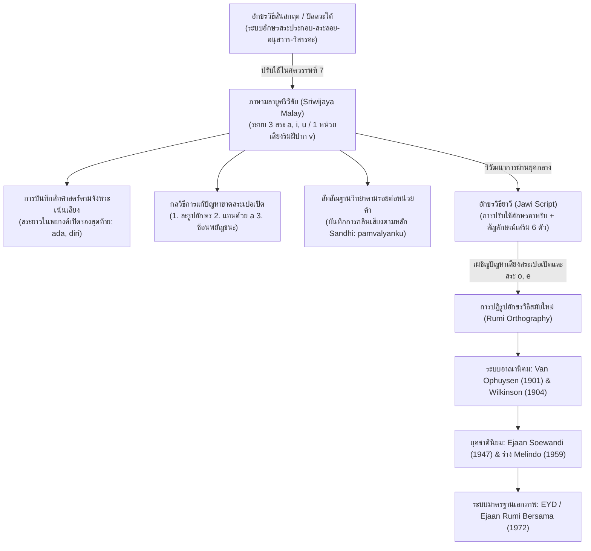

# บันทึกการอ่านและวิเคราะห์เอกสารจารึกวิทยาฉบับสมบูรณ์ (Epigraphic Source Dossier)
## การปฏิรูประบบสะกดคำภาษามลายูและอินโดนีเซีย (1900–1972) พร้อมบทวิเคราะห์อักขรวิธีและสัทวิทยาภาษามลายูโบราณศรีวิชัย (Perfecting the Spelling: Spelling Discussions and Reforms in Indonesia and Malaysia, 1900–1972, with an Appendix on Old Malay Spelling and Phonology)

---

### ส่วนที่ 1: ข้อมูลบรรณานุกรมและการอ้างอิงมาตรฐาน (Bibliographic Metadata)

- **Source ID:** `S-1988-vikor-01`
- **ชื่อไฟล์ต้นฉบับ:** `S-1988-vikor-01_Perfecting_Spelling_Malay_Indonesian.pdf`
- **ชื่อไฟล์ข้อความสกัด:** `S-1988-vikor-01_Perfecting_Spelling_Malay_Indonesian.txt`
- **ประเภทเอกสาร:** รายงานการวิจัยเชิงภาษาศาสตร์ประวัติศาสตร์ นโยบายการวางแผนภาษา และอักขรวิธีวิทยาเปรียบเทียบ (Monograph on Language Planning, Historical Orthography, Phonology, and Epigraphic Linguistics)
- **ผู้เขียน:** Lars S. Vikør (ลาร์ส เอส. วีกอร์)
- **ปีที่พิมพ์:** 1988 (ค.ศ. 1988)
- **ชุดสิ่งพิมพ์และสถาบัน:** *Verhandelingen van het Koninklijk Instituut voor Taal-, Land- en Volkenkunde* (VKI), เล่มที่ 133
- **สำนักพิมพ์และสถานที่พิมพ์:** Foris Publications, Dordrecht-Holland / Providence-U.S.A.
- **จำนวนหน้าตามไฟล์สกัด:** หน้า 1–13 (คัดตัดตอนจากฉบับเต็ม: หน้า 66–88 พร้อมบรรณานุกรม)
- **ภาษาของเอกสาร:** ภาษาอังกฤษ (English) พร้อมตัวบทอ้างอิงและคำวิเคราะห์ในภาษามลายูโบราณ (Old Malay), ภาษาสันสกฤต (Sanskrit), ภาษาดัตช์ (Dutch), ภาษาอินโดนีเซีย (Indonesian), และภาษามลายูสมัยใหม่ (Modern Malay)
- **ขอบเขตภูมิศาสตร์และวัฒนธรรม:** เกาะสุมาตรา (Palembang, Jambi), เกาะบังกา (Kota Kapur), เกาะชวา (Gandhasuli), คาบสมุทรมลายู, และภูมิภาคเอเชียตะวันออกเฉียงใต้ภาคพื้นสมุทร
- **การอ้างอิงฉบับเต็มระบบ Chicago/Turabian Notes-Bibliography:**  
  Vikør, Lars S. *Perfecting the Spelling: Spelling Discussions and Reforms in Indonesia and Malaysia, 1900–1972: With an Appendix on Old Malay Spelling and Phonology*. Verhandelingen van het Koninklijk Instituut voor Taal-, Land- en Volkenkunde 133. Dordrecht: Foris Publications, 1988.
- **การอ้างอิงฉบับย่อ (Short Citation):** Vikør (1988)

---

### ส่วนที่ 2: แผนผังการจัดสรรเข้าสู่บทและหัวข้อย่อย (Chapter & Section Mapping Matrix)

งานวิจัยชิ้นประวัติศาสตร์ของ Lars S. Vikør เชื่อมโยงรากฐานอักขรวิธีวิทยาตั้งแต่ยุคจารึกโบราณสมัยศรีวิชัยเข้ากับวิวัฒนาการระบบเขียนอักษรยาวีและอักษรละตินในสมัยใหม่ ซึ่งจัดสรรเข้าสู่โครงสร้างรายงานวิจัยหลักได้ดังนี้:

- **บทที่ 1 (สถานภาพการศึกษาจารึกและประวัติศาสตร์ภาษาศาสตร์มลายู-อินโดนีเซีย):**
  * **หัวข้อย่อย 1.1 (ประวัติศาสตร์การศึกษาตัวบทจารึกศรีวิชัยในทางภาษาศาสตร์):**
    - การทบทวนและประเมินระเบียบวิธีวิเคราะห์ตัวบทจารึกศรีวิชัยของ H. Kern (1931), G. Cœdès (1930), J.G. de Casparis (1956), และ L.C. Damais (1968) (หน้า 67–74)
    - ฐานคติว่าด้วย "ภาษามลายูศรีวิชัย" (Sriwijaya Malay) ในฐานะภาษามาตรฐานทางการ (standardized court variety) ที่สะท้อนระเบียบการสะกดคำที่มั่นคง เคร่งครัด และเป็นระบบอย่างยิ่งตั้งแต่ปลายคริสต์ศตวรรษที่ 7 (หน้า 67–68)
- **บทที่ 2 (กรอบศักราช อักขรวิทยาปัลลวะ และการปรับใช้ระบบเขียนอินเดีย):**
  * **หัวข้อย่อย 2.1 (อักขรวิธีปัลลวะใต้และการดัดแปลงรับใช้ระบบเสียงออสโตรนีเซียน):**
    - ความเข้ากันได้และการปรับเปลี่ยนระหว่างสัทวิทยาภาษาสันสกฤตกับภาษามลายูโบราณ: การที่ภาษามลายูขาดความแตกต่างระหว่างเสียงกักโฆษะและอโฆษะพ่นลมในภาษาสันสกฤต แต่ต้องรับมือกับความขาดแคลนรูปสระเปอเปิต (schwa /ə/) และสระ /o/ ในอักขรวิธีปัลลวะ (หน้า 68–72)
    - ปรากฏการณ์การใช้ทวิรูปหรืออักษรคู่ (ligatures) และการเพิ่มอักษรซ้อนแทนเสียงสระเปอเปิต เช่น `<pattum>` (หน้า 71–72)
- **บทที่ 4 (สัทวิทยา ไวยากรณ์ และวิวัฒนาการของภาษามลายูโบราณ: Old Malay Linguistics):**
  * **หัวข้อย่อย 4.1 (ระบบสระและปริศนาเสียงเปอเปิตในจารึกศรีวิชัย):**
    - การวิเคราะห์ปริมาณเสียงสระ (Vowel Quantity): การพิสูจน์ว่ารูปสระยาว (`ā`, `ī`, `ū`) ในจารึกมิได้ทำหน้าที่จำแนกความหมาย (non-phonemic) แต่เป็นการบันทึกสัทศาสตร์ตามตำแหน่งพยางค์เปิดรองสุดท้าย (penultimate open syllables) ที่มีการเน้นเสียง (stress/accent) (หน้า 69–71)
    - กลวิธีการสะกดเสียงเปอเปิต (/ə/) 3 รูปแบบ: (1) ใช้สระอะสั้นแทรก (`<a>`), (2) ละรูปสระโดยการผูกอักษรกล้ำ (consonant ligature เช่น `<tlu>`, `<tmu>`), และ (3) ซ้อนพยัญชนะตามหลังสระอะสั้น (`<pattum>`) (หน้า 71–72)
  * **หัวข้อย่อย 4.2 (ระบบพยัญชนะ การแปรเสียง และปัญหาหน่วยเสียงกึ่งสระ):**
    - ปัญหาอักขระ `<v>`: การพิสูจน์ว่าในภาษามลายูศรีวิชัยไม่มีการแยกหน่วยเสียงระหว่าง /b/ กับ /w/ แต่ใช้อักขระ `<v>` แทนหน่วยเสียงเดี่ยวที่มีเสียงย่อยตามตำแหน่งคือ [b] ต้นคำและหลังพยัญชนะนาสิก และ [w] ระหว่างสระ (หน้า 73–75)
    - การเปรียบเทียบกับจารึกคันธสุลี (Gandhasuli) ในเกาะชวา (ค.ศ. 832) ซึ่งเริ่มแยกใช้อักขระ `<b>` และ `<v>` ภายใต้อิทธิพลภาษาชวาโบราณ (หน้า 74)
    - หน้าที่ของอนุสวาร (`ṃ`) และวิสรรคะ (`ḥ`): การเป็นเพียงข้อกำหนดทางอักขรวิธี (orthographic conventions) ที่ยืมมาจากสันสกฤต มิได้เป็นหน่วยเสียงอิสระ โดยอนุสวารทำหน้าที่แทนเสียง /ŋ/ หรือ /m/ ท้ายคำและหน้าพยัญชนะ ส่วนวิสรรคะแทนเสียงพ่นลม /h/ ท้ายคำ (หน้า 76–77)
    - ปรากฏการณ์สัทสัณฐานวิทยา (Morphophonemics): สัทสัมผัส (sandhi) ในคำอย่าง `<pamvalyanku>` ที่แสดงการปรับเสียงตามตำแหน่งรอยต่อของหน่วยคำอย่างชัดเจน ซึ่งแตกต่างจากระบบสะกดคำสมัยใหม่ที่ยึดรูปหน่วยคำเดิม (หน้า 83–84)
- **บทที่ 7 (มรดกอักขรวิธีและการสืบทอดสู่ภาษาสมัยใหม่: จากปัลลวะ ยาวี สู่ Ejaan Rumi):**
  * **หัวข้อย่อย 7.1 (ปรัชญาการวางแผนภาษาและอุดมการณ์อักขรวิธี):**
    - การปะทะกันระหว่างหลักการ "หนึ่งตัวอักษรต่อหนึ่งเสียง" (one-letter-one-sound / univocité) ในทศวรรษ 1950 กับความจำเป็นทางเทคโนโลยีการพิมพ์และการรับคำยืมสากลในทศวรรษ 1960 (หน้า 66)
    - พลวัตการปรับตัวของระบบสะกดคำ: จากระบบ Van Ophuysen (1901) และ Wilkinson (1904) ผ่าน Ejaan Soewandi (1947), Melindo (1959) สู่ระบบร่วม Ejaan Yang Disempurnakan (EYD 1972) (หน้า 66, 86–87)
    - การกลืนเสียงคำยืมต่างประเทศ (ภาษาสันสกฤต บาลี อาหรับ ดัตช์ อังกฤษ) และการสร้างมาตรฐานอักขรวิธีเพื่อการปฏิรูปสู่ภาษาสมัยใหม่ (หน้า 66, 86–87)

---

### ส่วนที่ 3: สรุปสาระสำคัญเชิงวิเคราะห์และจุดยืนทางวิชาการ (Core Argument & Historiography)

- **วิทยานิพนธ์และข้อถกเถียงหลักของผู้เขียน (Core Argument / Thesis):**
  1. *เอกภาพและความเป็นมาตรฐานของระบบเขียนภาษามลายูศรีวิชัย (Standardization of Sriwijaya Malay):* Vikør ยืนยันว่าจารึกภาษามลายูโบราณศตวรรษที่ 7 (เกอดูกันบูกิต, ตาลังตูโว, โกตาคาปูร์, การังบราฮี, และเตอลากาบาตู) มิได้บันทึกภาษาพูดที่ไร้ระเบียบ หากแต่สะท้อน "ภาษามลายูมาตรฐานของราชสำนักศรีวิชัย" ที่มีอักขรวิธีตายตัวและผ่านการเรียนการสอนอย่างมีแบบแผน ตัวอย่างที่เห็นได้ชัดคือข้อความระหว่างจารึกโกตาคาปูร์ (เกาะบังกา) กับการังบราฮี (จัมบี) ที่เหมือนกันเกือบทุกตัวอักษร ยกเว้นความแปรทางภาษาถิ่นเพียงคำเดียวคือ `<upuh>` กับ `<ipuh>` (หน้า 68)
  2. *ธรรมชาติทางสัทศาสตร์ของปริมาณสระ (Phonetic Reality vs. Non-Phonemic Quantity):* ระบบเขียนภาษามลายูโบราณใช้เครื่องหมายสระยาว (`ā`, `ī`, `ū`) ตามธรรมเนียมอักขรวิธีภาษาสันสกฤต แต่ในโครงสร้างภาษาตระกูลออสโตรนีเซียน ความยาวของสระมิใช่หน่วยเสียงที่จำแนกความหมาย การปรากฏของสระยาวอย่างเป็นระบบในพยางค์เปิดรองสุดท้าย (เช่น `ādā`, `dātām`, `dīrī`, `jādī`, `jāhat`) สะท้อนถึง "การเน้นเสียงตามจังหวะพยางค์" (syllabic stress) ของภาษามลายูโบราณ ซึ่งสระในตำแหน่งที่มีการเน้นเสียงจะถูกเปล่งเสียงยาวและชัดเจนกว่าพยางค์อื่น โดยเฉพาะสระ `/a/` (หน้า 69–71)
  3. *การวิเคราะห์หน่วยเสียงพยัญชนะ `<v>` และการปฏิเสธหน่วยเสียงระเบิดก้องในราชสำนักศรีวิชัย:* ผู้เขียนโต้แย้งข้อเสนอของ Damais (1968) ที่ปฏิเสธเสียง [b] โดยสิ้นเชิง และพัฒนาข้อสังเกตของ Kern (1931) เพื่อเสนอข้อสรุปทางสัทวิทยาเชิงโครงสร้างว่า ในภาษามลายูศรีวิชัยมีหน่วยเสียงริมฝีปากเดียวคือ `/v/` ซึ่งแปรเสียงย่อยตามตำแหน่ง (allophonic distribution) กล่าวคือ ออกเสียงเป็นเสียงระเบิดริมฝีปากก้อง `[b]` ในตำแหน่งต้นคำและหลังพยัญชนะนาสิก (เช่น `[baraŋ]`, `[bukan]`, `[sambau]`) แต่ออกเสียงเป็นกึ่งสระริมฝีปาก `[w]` ในตำแหน่งระหว่างสระ (เช่น `[tuwa]`, `[mamawa]`) ความเป็นคู่ขนานนี้สอดคล้องกับพฤติกรรมของกึ่งสระ `/j/` (`<y>`) ในภาษาเดียวกัน (หน้า 73–75)
  4. *อักขรวิธีมลายูโบราณกับปรากฏการณ์สัทสัณฐานวิทยา (Morphophonemics):* ช่างจารึกสมัยศรีวิชัยบันทึกรูปคำตามการออกเสียงจริงที่รอยต่อของหน่วยคำ (sandhi) อย่างละเอียดลออ เช่น คำว่า `<pamvalyanku>` (/paN-vali-an-ku/ > `pembalianku`) ซึ่งแสดงการกลมกลืนเสียงนาสิกเป็น `m` หน้า `v`, การกลายเสียงสระ `i` เป็นกึ่งสระ `y` หน้าสระ `a`, และการกลืนเสียงนาสิก `n` เป็นงง (`ṃ`) หน้า `k` ลักษณะการสะกดตามสัทศาสตร์พื้นผิวเช่นนี้ได้รับอิทธิพลลึกซึ้งมาจากไวยากรณ์และอักขรวิธีสันสกฤต ซึ่งต่างจากอักขรวิธีสมัยใหม่ที่มุ่งรักษารูปหน่วยคำนามเดิม (หน้า 83–84)
  5. *วิวัฒนาการอุดมการณ์การปฏิรูปอักขรวิธี (Orthographic Ideology Shift):* จากการศึกษาประวัติศาสตร์การวางแผนภาษา Vikør ชี้ให้เห็นว่าการถกเถียงเรื่องอักขรวิธีในมาเลเซียและอินโดนีเซียมีจุดเปลี่ยนสำคัญในช่วงทศวรรษ 1960 โดยเปลี่ยนจาก "อุดมการณ์สัทศาสตร์ชาตินิยม" ที่ยึดหลักหนึ่งตัวอักษรต่อหนึ่งเสียง (univocité) เพื่อสร้างเอกลักษณ์ทางสายตา มาสู่ "ลัทธิปฏิบัติการทางเทคโนโลยีและสากลนิยม" ที่ยอมรับอักษรคู่ (digraphs) การรับระบบเสียงคำยืมตะวันตกและภาษาอาหรับเข้าสู่ระบบมาตรฐาน และการประสานระบบจนเกิด EYD ในปี 1972 (หน้า 66)

- **บริบทประวัติศาสตร์นิพนธ์และการประเมินคุณค่าเชิงวิชาการ (Historiographical Significance):**
  - งานของ Vikør นับเป็นสะพานเชื่อมชิ้นสำคัญที่สุดระหว่าง "จารึกวิทยาและภาษาศาสตร์ประวัติศาสตร์" (Historical Epigraphy & Austronesian Linguistics) กับ "สังคมภาษาศาสตร์และการวางแผนภาษาศาสตร์สมัยใหม่" (Sociolinguistics and Language Planning)
  - Vikør แก้ไขข้อเข้าใจผิดของนักจารึกวิทยารุ่นก่อนที่พยายามมองหาหน่วยเสียงพยัญชนะปลายลิ้นม้วน (retroflex consonants `ḍ`, `ṇ`) ในจารึก โดยชี้ชัดตามแนวทางของ De Casparis ว่าการใช้อักษรเหล่านี้ในหน่วยคำเติมยกย่อง (`-da`, `-nda`, `dapunta`) เป็นเพียง "อักขรวิธีเชิงสัญลักษณ์เพื่อความศักดิ์สิทธิ์และเกียรติยศ" (honorific spelling convention) เลียนแบบราชสำนักชวาและอินเดีย มิได้เป็นหน่วยเสียงที่มีอยู่จริงในระบบเสียงมลายู (หน้า 73)
  - ช่วยเปิดมุมมองต่อนักวิจัยจารึกวิทยาปัจจุบันว่า การปริวรรตจารึกเป็นอักษรโรมันต้องตระหนักถึงความแตกต่างระหว่าง "รูปเขียนตามจารีตสันสกฤต" (graphic representations) กับ "ระบบหน่วยเสียงแท้จริงของภาษาเป้าหมาย" (phonemic reality)

---

### ส่วนที่ 4: สารบัญข้อค้นพบเชิงลึกแยกตามมิติจารึกวิทยา (Thematic Epigraphic Findings with Exact Pages)

#### 1. มิติด้านอักขรวิทยาและระบบสระ (Paleography & Vocalic System)
- **ระบบสระ 3 เสียงและการขาดรูปสระเปอเปิต:** จารึกภาษามลายูศรีวิชัยมีสระพื้นฐานเพียง 3 รูปคือ `<a>`, `<i>`, และ `<u>` ทั้งรูปสั้นและยาว ไม่มีรูปอักษรสำหรับสระ `e` และ `o` ซึ่งสะท้อนข้อจำกัดของอักษรปัลลวะที่ออกแบบสำหรับภาษาสันสกฤต (หน้า 69)
- **ความไม่เป็นหน่วยเสียงของปริมาณสระ (Non-phonemic Vowel Quantity):** ไม่พบคู่เทียบพร่อง (minimal pairs) ที่จำแนกความหมายด้วยความสั้น-ยาวของสระเลยในจารึกมลายูโบราณ การใช้สระยาวเป็นกฎเกณฑ์ทางสัทศาสตร์ที่กำหนดโดยโครงสร้างพยางค์ (phonetically determined) โดยพบสระยาวเกือบร้อยละ 70 ในตำแหน่งพยางค์เปิดรองสุดท้าย (penultimate open syllable) เช่น `<āda>`, `<dātām>`, `<dīrī>`, `<jādī>`, `<jāhat>` (หน้า 69–70)
- **ความไม่สม่ำเสมอของสระ `ī` และ `ū`:** สระ `<i>` และ `<u>` ส่วนใหญ่เขียนด้วยรูปสระสั้นไม่ว่าจะอยู่ในตำแหน่งใด มีเพียงไม่กี่คำที่ใช้รูปสระยาวในพยางค์เปิดรองสุดท้าย เช่น `<dīrī>`, `<gīla>`, `<tīda>`, `<dīrum>`, และ `<tūva>` (หน้า 69–70)
- **การยืดสระยาวเมื่อรับหน่วยคำเติมหลัง (Suffixation Lengthening):** เมื่อคำลงท้ายด้วยพยางค์เปิดและรับหน่วยคำเติมหลัง สระท้ายนั้นจะกลายเป็นพยางค์เปิดรองสุดท้ายและเปลี่ยนเป็นรูปสระยาวทันที เช่น `<diri>` > `<dirīña>`, `<tahu>` > `<tahūña>`, `<datu>` > `<dātūa>`, `<renumiña>`, `<nimakān>` (หน้า 70)
- **กลวิธีสามประการในการสะกดสระเปอเปิต (Schwa Solutions):**
  1. *แทนด้วยสระอะสั้น (`<a>` แฝงในพยัญชนะ):* เช่น `<nigalarku>`, `<handu>`
  2. *ละรูปสระโดยการผูกอักขระกล้ำ (Consonant Ligatures):* เช่น `<gram>`, `<niknai>`, `<tlu>` (สาม), `<tmu>` (พบ), `<tñaḥ>` (กลาง)
  3. *เขียนสระอะสั้นแล้วซ้อนพยัญชนะตัวถัดไป:* พบกรณีตัวอย่างชัดเจนที่สุดคือ `<pattum>` (ไผ่ตง, มลายูปัจจุบัน: *betung*, ชวา: *petung*) (หน้า 71)
- **กฎการกระจายตัวของเคิร์น (Kern's Distribution Rule):** H. Kern เสนอว่า หากพยางค์ที่สองของคำมูลขึ้นต้นด้วยพยัญชนะ `l`, `m`, `n`, หรือ `r` เสียงเปอเปิตในพยางค์แรกจะไม่ถูกเขียน แต่จะใช้อักษรผูกกล้ำแทน (`<tlu>`, `<tmu>`, `<niknai>`, `<graŋ>`) แต่ Vikør ชี้ว่ากฎนี้มีข้อยกเว้น เช่น คำว่า `<galar>` (หน้า 71)
- **ปริศนาการซ้อนพยัญชนะ `<pattum>`:** Vikør วิเคราะห์ข้อถกเถียงระหว่าง Poerbatjaraka (ที่มองว่าเป็นการทำเครื่องหมายสระเปอเปิตเช่นเดียวกับภาษาชวาโบราณ `<paŋliwattan>` และการใช้ตัชดีดในเอกสารยาวี) กับ J.J. Ras (ที่เสนอว่าเป็นการสะท้อนเสียงพยัญชนะยาวดั้งเดิมในภาษาออสโตรนีเซียน) โดย Vikør สรุปว่าในสมัยศรีวิชัยน่าจะเป็นเพียงกลวิธีทางอักขรวิธีในการเน้นการเปล่งเสียงสระเปอเปิตอย่างหนักแน่นมากกว่าการจำพยัญชนะยาวโบราณได้ (หน้า 71–72)

#### 2. มิติด้านสัทวิทยาพยัญชนะและหน่วยเสียงกึ่งสระ (Consonantal Phonology & Semivowels)
- **หน่วยเสียงพยัญชนะแท้ในมลายูศรีวิชัย:** ผู้เขียนสกัดหน่วยเสียงพยัญชนะที่แน่นอนได้แก่ `/p/`, `/t/`, `/k/`, `/d/`, `/ɟ/` (`j`), `/g/`, `/m/`, `/n/`, `/ɲ/` (`ñ`), `/ŋ/`, `/r/`, `/l/`, `/s/`, และ `/h/` (หน้า 72, 78)
- **การขาดหายไปของรูปอักษร `/c/`:** ในคลังข้อความจารึกศรีวิชัยทั้งหมด พบรูปอักษร `<c>` เพียงสองคำคือ `<mañcak>` และ `<mamañcak>` (การร่ายรำดาบ/การต่อสู้) ซึ่ง Vikør ชี้ว่าเป็นเพียงช่องว่างความบังเอิญของข้อมูล (accidental lacuna) มิใช่ว่าภาษานี้ไม่มีหน่วยเสียง `/c/` (หน้า 73)
- **การตีความอักษรลิ้นม้วน `<ḍ>` และ `<ṇ>`:** ปรากฏเฉพาะในคำแสดงเกียรติยศ เช่น สรรพนามเติมหลัง `<-da>`, `<-nda>` (`anakda`, `parvanda`) และคำนำหน้า `<dapunta hyaṃ>` ซึ่ง De Casparis และ Vikør ยืนยันตรงกันว่าเป็นเพียงการสะกดเพื่อยกย่องทางสังคม (honorific orthography) มิได้มีการออกเสียงเป็นพยัญชนะลิ้นม้วนในภาษามลายูจริง (หน้า 73)
- **ทวิบทของอักขระ `<v>` (The `<v>` Problem: /b/ vs. /w/):**
  - ในจารึกศรีวิชัยไม่มีรูปอักษร `<b>` ปรากฏอยู่เลย แม้กระทั่งในคำยืมภาษาสันสกฤต เช่น สะกด `<vodhicitta>` แทน *bodhicitta* และ `<vrahmasvara>` แทน *brahmasvara* (หน้า 74)
  - Vikør โต้แย้งข้อสรุปของ Damais ที่ว่าภาษามลายูศรีวิชัยไม่มีเสียงกักริมฝีปากก้อง โดยเสนอว่า `<v>` เป็นหน่วยเสียงเดี่ยว `/v/` ที่มีสองเสียงย่อย: ออกเสียง [b] เมื่ออยู่ต้นคำและหลังพยัญชนะนาสิก (`[baraŋ]`, `[bukan]`, `[sambau]`) และออกเสียง [w] เมื่ออยู่ระหว่างสระ (`[tuwa]`, `[mamawa]`) (หน้า 74–75)
  - จารึกคันธสุลี (Gandhasuli ค.ศ. 832) ในชวาตอนกลางเป็นหลักฐานมลายูโบราณชั้นหลังที่เริ่มแยกใช้อักษร `<b>` และ `<v>` อย่างเด่นชัด เช่น `<sabañakña>`, `<bapah>`, `<bua>` เทียบกับ `<vatak>`, `<vini>`, `<vintang>` (หน้า 74)
- **สถานะของอนุสวาร (`ṃ`) และวิสรรคะ (`ḥ`):**
  - อนุสวารทำหน้าที่เป็นเพียงเครื่องหมายยืมจากสันสกฤต มีการกระจายตัวแบบเกื้อกูล (complementary distribution) กับรูปอักษร `<ŋ>` โดย `<ŋ>` จะใช้หน้าสระ ส่วนอนุสวาร `<ṃ>` จะใช้ในตำแหน่งหน้าพยัญชนะและท้ายคำ เช่น `<umaṃgap>`, `<datāṃ>`, `<pulaṃ>`, `<mamrurūa>` (หน้า 76)
  - ข้อยกเว้นสำคัญคือคำว่า `<geraŋ>` ซึ่งในจารึกโกตาคาปูร์และการังบราฮีสะกดด้วยงงปกติคือ `<graŋ>` แต่ในจารึกเตอลากาบาตูสะกดด้วยอนุสวารเป็น `<graṃ>` (หน้า 76)
  - วิสรรคะ `<ḥ>` ใช้แทนเสียงพ่นลมท้ายคำและหน้าพยัญชนะ ส่วน `<h>` ใช้หน้าสระ เช่น `<huma>`, `<mamhidupi>` เทียบกับ `<darah>`, `<sumpah>`, `<nisuruh>` (หน้า 76–77)
- **การปฏิเสธหน่วยเสียงหยุดเส้นเสียง (Absence of Phonemic Glottal Stop):** ภาษามลายูโบราณไม่มีหน่วยเสียง `/ʔ/` เสียงกักเส้นเสียงท้ายคำในภาษามลายูปัจจุบันถูกบันทึกด้วยอักษร `<-k>` อย่างสม่ำเสมอ เช่น `<anakmamu>`, `<parlak>`, `<vañakña>`, `<vatak>` ส่วนคำที่ลงท้ายด้วยสระแท้ก็เขียนด้วยรูปสระเปิดโดยไม่มีเครื่องหมายหยุดเสียง เช่น `<datu>`, `<tida>` (หน้า 77)

#### 3. มิติด้านโครงสร้างพยางค์และสัทสัณฐานวิทยา (Phonotactics & Morphophonemics)
- **โครงสร้างพยางค์มูลฐาน:** โครงสร้างหลักคือ `(C)VCV(C)` โดยมีคำรากศัพท์สองพยางค์เป็นแกนกลางหลัก เช่น `dalam`, `darah`, `jalan`, `rumah`, `tanam` (หน้า 78, 80–82)
- **ข้อจำกัดการเรียงเสียง (Phonotactic Constraints):**
  - *ตำแหน่งต้นคำ:* ปรากฏได้เกือบทุกหน่วยเสียง ยกเว้น `/c/` (ช่องว่างบังเอิญ), `/ŋ/` และพยัญชนะกล้ำ ซึ่งพยัญชนะกล้ำต้นคำพบเพียงกรณีที่เป็นรูปย่อของสรรพนามหรือคำอนุภาค เช่น `<dyā>`/`<dyaku>` (จาก *diya* + *aku*) และ `<hyaṃ>` (จาก *hiyaṃ*) (หน้า 78)
  - *ตำแหน่งท้ายคำ:* ห้ามมีพยัญชนะเพดานแข็ง (`/c/`, `/ɟ/`, `/ɲ/`) รวมถึง `/g/` และ `/w/` โดยเสียงสระประสมท้ายคำ (`-ai`, `-au`) ให้วิเคราะห์โครงสร้างเป็นพยัญชนะท้ายคือ `/-aj/` และ `/-aw/` เช่น `<lai>` (/laj/) และ `<samvau>` (/sambaw/) (หน้า 79)
  - คำว่า `<tavad>` (ทำนบ/ฝายน้ำ, มลายูปัจจุบัน: *tebat*) เป็นคำเดียวในจารึกที่ปรากฏพยัญชนะระเบิดก้องในตำแหน่งท้ายคำ ซึ่ง Vikør สันนิษฐานว่าอาจเป็นคำยืมหรืออิทธิพลแทรกแซงจากภาษาอื่นในตระกูลออสโตรนีเซียน (หน้า 79)
- **สัทสัณฐานวิทยาในคำว่า `<pamvalyanku>`:**
  - การแยกหน่วยคำ: `/paN-/` (อุปสรรคนาม) + `/vali/` (รากศัพท์ "กลับ/คืน") + `/-an/` (ปัจจัยนาม) + `/-ku/` (สรรพนามบุรุษที่ 1)
  - ปรากฏการณ์รอยต่อหน่วยคำ 3 จุด: (1) `/N-/` กลืนเสียงตามพยัญชนะริมฝีปากกลายเป็น `m`, (2) สระท้าย `/i/` ของรากคำอ่อนตัวกลายเป็นกึ่งสระเพดานแข็ง `y` หน้าสระ `a`, และ (3) พยัญชนะนาสิกท้าย `/n/` กลืนเสียงกลายเป็นอนุสวาร `ṃ` หน้ากักเพดานอ่อน `k`
  - สะท้อนว่าอักขรวิธีมลายูโบราณยึดหลัก "การสะกดตามเสียงแปรจริง" (phonetic/sandhi spelling) เลียนแบบภาษาสันสกฤต แตกต่างจากภาษามลายู-อินโดนีเซียสมัยใหม่ที่บังคับสะกดตามรูปหน่วยคำพื้นฐานคือ `<pembalianku>` (หน้า 83–84)

#### 4. มิติด้านประวัติศาสตร์การปฏิรูประบบสะกดคำสมัยใหม่ (Modern Spelling Reforms 1900–1972)
- **ปัญหา 3 มิติในการวางแผนอักขรวิธีมลายู-อินโดนีเซีย:**
  1. *ปัญหาด้านสัญกรณ์ (Notation):* การเลือกใช้สัญลักษณ์แทนเสียงโดยไม่กระทบต่อระบบสัทศาสตร์ เช่น การเลือกระหว่างอักษรเดี่ยวกับอักษรคู่ (digraphs) (หน้า 66)
  2. *ปัญหาความผันแปรในการเปล่งเสียง (Fluctuation in Pronunciation):* การที่ภาษามาตรฐานยอมรับเสียงแปรทางภาษาถิ่น ทำให้เกิดความลังเลในการกำหนดรูปสะกด (หน้า 66)
  3. *ปัญหาการสะกดคำยืมต่างประเทศ (Spelling of Foreign Words):* ปัญหาการกลืนเสียงและการรับคำยืมภาษาบาลี-สันสกฤต, อาหรับ-เปอร์เซีย, และภาษายุโรป ซึ่งต้องออกระเบียบเพิ่มเติมในปี 1975 (หน้า 66)
- **การปะทะทางอุดมการณ์อักขรวิธีในทศวรรษ 1950 และ 1960:**
  - ทศวรรษ 1950 ยึดหลักการ *univocité* ("หนึ่งตัวอักษรต่อหนึ่งเสียง") อย่างเหนียวแน่น นำไปสู่ข้อเสนอประดิษฐ์อักษรละตินพิเศษที่มีเครื่องหมายกำกับ (diacritics) หรือดัดแปลงสัญลักษณ์เฉพาะ เช่น การใช้ `ŋ` แทน `ng` หรือการคิดชื่อตัวอักษรระบบ `/a/`, `/ba/`, `/ca/` เลียนแบบอักษรชวาและยาวี (หน้า 66, 86–87)
  - หลังปี ค.ศ. 1965 ข้อเสนอสัทศาสตร์เชิงอุดมคติถูกยกเลิก เพื่อตอบสนองต่อความสะดวกทางแท่นพิมพ์ดีดสากล ความทันสมัยทางวิทยาการ และการหลอมรวมทางวัฒนธรรมระหว่างมาเลเซียและอินโดนีเซีย ส่งผลให้อักษรคู่ (`sy`, `ny`, `kh`, `ng`) และตัวอักษรสากล (`c` แทน `tj`/`ch`) ได้รับการยอมรับในระบบ EYD (หน้า 66, 86)
- **การจัดการคำยืมภาษาอาหรับและศาสนา:** ข้อถกเถียงเรื่องการรักษาเสียงพยัญชนะเฉพาะในภาษาอาหรับ เช่น เสียงหยุดเส้นเสียงฮัมซะฮ์ (hamzah) และเสียงกักเสียดแทรก โดยกฎหมายสะกดคำอนุญาตให้คงรูปเฉพาะในบริบททางศาสนาและกวีนิพนธ์ชั้นสูง แต่ในภาษาทั่วไปให้กลืนเสียงเข้าสู่ระบบสัทวิทยาพื้นถิ่น เช่น `/f/` กลายเป็น `/p/`, `/z/` กลายเป็น `/j/` (หน้า 86–87)

---

### ส่วนที่ 5: คลังข้อความอ้างอิงตรงและเชิงอรรถสำเร็จรูป (Verbatim Quotes Bank)

1. **ว่าด้วยความเป็นมาตรฐานและเอกภาพของอักขรวิธีศรีวิชัย:**
   - *ข้อความดั้งเดิม:*  
     > "The fact that the spelling is nevertheless so uniform seems to suggest that we have before us a standardized orthography with a tradition behind it, perhaps taught at the Buddhist learning center of which we are informed by I Tsing. The orthography could have been based either on a spoken language which was much more uniform than present-day Malay, or on a fixed and standardized speech variety used by leading circles at the Sriwijaya court and contrasting with dialectal variation in the general spoken language." (Vikør 1988, 68)
   - *คำแปลภาษาไทย:*  
     > "ข้อเท็จจริงที่ว่าระบบสะกดคำมีความเป็นเอกภาพอย่างยิ่งยวดเช่นนี้ ย่อมชี้ให้เห็นว่าสิ่งที่เรากำลังพิจารณาอยู่นี้คือระบบอักขรวิธีมาตรฐานที่มีแบบแผนประเพณีสืบทอดมารองรับ ซึ่งอาจได้รับการประสิทธิ์ประสาทวิชา ณ สำนักเรียนพุทธศาสนาที่เราทราบข้อมูลจากบันทึกของภิกษุอี้จิง ระบบอักขรวิธีดังกล่าวอาจตั้งอยู่บนพื้นฐานของภาษาพูดที่มีความเป็นเอกภาพมากกว่าภาษามลายูปัจจุบัน หรือไม่ก็ตั้งอยู่บนสำเนียงภาษาที่มีการจัดระเบียบและทำให้เป็นมาตรฐานตายตัวซึ่งใช้กันในหมู่ชนชั้นนำแห่งราชสำนักศรีวิชัย โดยมีความแตกต่างอย่างชัดเจนจากความแปรผันทางภาษาถิ่นในภาษาพูดของราษฎรทั่วไป"
   - *เชิงอรรถวิจัยสำเร็จรูป:*  
     Lars S. Vikør, *Perfecting the Spelling: Spelling Discussions and Reforms in Indonesia and Malaysia, 1900–1972: With an Appendix on Old Malay Spelling and Phonology* (Dordrecht: Foris Publications, 1988), 68.

2. **ว่าด้วยธรรมชาติทางสัทศาสตร์ของปริมาณสระ:**
   - *ข้อความดั้งเดิม:*  
     > "In modern Malay speech, vowel quantity does not exist as a phonological feature. When we come across indications of it in the Old Malay inscriptions, the natural reaction is to try to find out whether there is any regularity in the distribution of long and short vowels. And indeed, such regularity seems to exist. The short and the long vowels never contrast phonemically; there are no minimal pairs based on the quantity distinction. This indicates that the distribution is phonetically, but not phonemically, determined. [...] My conclusion is that the distinction between short and long vowels in Old Malay was probably based on a phonetic reality, especially regarding <a>, but was not phonemically relevant." (Vikør 1988, 69, 70–71)
   - *คำแปลภาษาไทย:*  
     > "ในภาษาพูดมลายูสมัยใหม่ ปริมาณสระไม่ได้ดำรงอยู่ในฐานะคุณลักษณะทางสัทวิทยา เมื่อเราพบร่องรอยของการทำเครื่องหมายสระสั้น-ยาวในศิลาจารึกภาษามลายูโบราณ ปฏิกิริยาตามธรรมชาติคือการพยายามค้นหาว่ามีความสม่ำเสมอในการกระจายตัวของสระสั้นและสระยาวหรือไม่ และแท้จริงแล้ว ความสม่ำเสมอดังกล่าวปรากฏอยู่จริง สระสั้นและสระยาวไม่เคยมีความเปรียบต่างเชิงหน่วยเสียงเลยแม้แต่น้อย ไม่พบคู่เทียบพร่องใดๆ ที่อาศัยความต่างของปริมาณสระ สิ่งนี้ชี้ชัดว่าการกระจายตัวถูกกำหนดโดยสัทศาสตร์พื้นผิว มิใช่คุณลักษณะทางหน่วยเสียง [...] ข้อสรุปของข้าพเจ้าคือ การจำแนกระหว่างสระสั้นและสระยาวในภาษามลายูโบราณน่าจะตั้งอยู่บนพื้นฐานของความเป็นจริงทางสัทศาสตร์ โดยเฉพาะอย่างยิ่งในกรณีของรูปสระ <a> แต่ไม่มีความสำคัญในเชิงหน่วยเสียง"
   - *เชิงอรรถวิจัยสำเร็จรูป:*  
     Vikør, *Perfecting the Spelling*, 69, 70–71.

3. **ว่าด้วยการกระจายตัวของเสียงย่อยของหน่วยเสียง `<v>`:**
   - *ข้อความดั้งเดิม:*  
     > "Unlike modern Malay, Sriwijaya Malay did not distinguish between the phonemes /b/ and /w/ in writing. The one character used to denote a voiced labial consonant is transcribed <v> by Coedès and De Casparis, and in Sanskrit it denoted a bilabial semivowel (/w/). [...] If we may assume a parallelism in the distribution between the semi-vowels /j/ and [w], we can then suggest the following conclusion regarding the pronunciation of the character <v> in Sriwijaya Malay: the allophone [w] could occur only in medial position between vowels, while [b] would appear in initial position and after /m/. We would get [baraŋ], [bukan], [sambau], but: [tuwa] (a kind of poison), [mamawa] 'membawa'." (Vikør 1988, 73, 75)
   - *คำแปลภาษาไทย:*  
     > "ภาษามลายูศรีวิชัยแตกต่างจากภาษามลายูสมัยใหม่ตรงที่ไม่มีการจำแนกความแตกต่างระหว่างหน่วยเสียง /b/ และ /w/ ในระบบเขียน อักขระเพียงตัวเดียวที่ใช้แทนพยัญชนะริมฝีปากก้องได้รับการถอดอักษรเป็น <v> โดยเซเดสและเดอ กัสปารีส ซึ่งในภาษาสันสกฤตอักขระนี้ใช้แทนเสียงกึ่งสระริมฝีปาก (/w/) [...] หากเราสันนิษฐานถึงความเป็นคู่ขนานในการกระจายตัวระหว่างกึ่งสระ /j/ กับ [w] เราก็สามารถเสนอข้อสรุปเกี่ยวกับการออกเสียงอักขระ <v> ในภาษามลายูศรีวิชัยได้ดังนี้: เสียงย่อย [w] จะปรากฏได้เฉพาะในตำแหน่งระหว่างสระกลางคำเท่านั้น ในขณะที่เสียงย่อย [b] จะปรากฏในตำแหน่งต้นคำและหลังพยัญชนะนาสิก /m/ เราจึงได้รูปเสียงเป็น [baraŋ], [bukan], [sambau] แต่เป็น [tuwa] (ยาพิษชนิดหนึ่ง), [mamawa] (นำมา/พัดพามา)"
   - *เชิงอรรถวิจัยสำเร็จรูป:*  
     Vikør, *Perfecting the Spelling*, 73, 75.

4. **ว่าด้วยอักขรวิธีเชิงสัทสัณฐานวิทยาใน `<pamvalyanku>`:**
   - *ข้อความดั้งเดิม:*  
     > "The form <pamvalyanku> can tell us more, however, if we re-focus our attention from phonology to the main consideration of this book: principles of orthography. It tells us that the scribes of Old Malay went further than modern Malaysians and Indonesians in allowing phonetic adjustments at morpheme junctures to be represented in writing. The modern spelling of <pamvalyanku>, if the word had still existed in this particular form, would have been <pembalianku>. The morphophonemic spelling principle does not seem to have been important to the ancient scribes, who even in this matter may have been deeply influenced by the orthographic traditions of Sanskrit. In Sanskrit, as is well known, the so-called sandhi phenomena are extensively represented in writing." (Vikør 1988, 84)
   - *คำแปลภาษาไทย:*  
     > "อย่างไรก็ดี รูปคำ <pamvalyanku> สามารถบอกอะไรแก่เราได้มากกว่านั้น หากเราเปลี่ยนจุดสนใจจากสัทวิทยาไปสู่ประเด็นพิจารณาหลักของหนังสือเล่มนี้ นั่นคือหลักการแห่งอักขรวิธี รูปคำนี้บอกเราว่าช่างอาลักษณ์แห่งยุคมลายูโบราณได้ก้าวไปไกลกว่าชาวมาเลเซียและอินโดนีเซียในยุคปัจจุบัน ในการยินยอมให้การปรับเปลี่ยนทางสัทศาสตร์ ณ รอยต่อของหน่วยคำปรากฏในระบบเขียน รูปสะกดสมัยใหม่ของ <pamvalyanku> หากคำนี้ยังคงดำรงอยู่ในรูปเฉพาะดังกล่าว ย่อมจะต้องสะกดเป็น <pembalianku> หลักการสะกดคำตามหน่วยคำ (morphophonemic spelling) ดูเหมือนจะมิได้มีความสำคัญต่ออาลักษณ์โบราณ ซึ่งแม้แต่ในประเด็นนี้ก็อาจได้รับอิทธิพลอย่างลึกซึ้งมาจากประเพณีอักขรวิธีของภาษาสันสกฤต ดังเป็นที่ทราบกันดีว่าในภาษาสันสกฤต ปรากฏการณ์ที่เรียกว่า 'สนธิ' นั้นได้รับการบันทึกอย่างละเอียดกว้างขวางในระบบเขียน"
   - *เชิงอรรถวิจัยสำเร็จรูป:*  
     Vikør, *Perfecting the Spelling*, 84.

5. **ว่าด้วยการเปลี่ยนแปลงอุดมการณ์การปฏิรูปอักขรวิธีในทศวรรษ 1960:**
   - *ข้อความดั้งเดิม:*  
     > "The ideology that lies behind the spelling reform activities seems to have undergone a change during the 1960s in both countries. In the fifties, the 'one-letter-one-sound' principle was a dominant theme in the discussions and in the subsequent proposals made by both official bodies and private persons. [...] But after 1965, such considerations were largely discarded. Lexical modernization and Westernization was now given high priority, and the preparations for spelling reform took special account of this priority by allowing loan phonemes and phoneme sequences that did not occur in traditional Malay. Typographical and other practical considerations also prevailed, and the idea of admitting graphemes not used generally in the Roman alphabet, including graphemes with diacritics, was completely disposed of - for good, we may assume." (Vikør 1988, 66)
   - *คำแปลภาษาไทย:*  
     > "อุดมการณ์ที่อยู่เบื้องหลังความเคลื่อนไหวเพื่อการปฏิรูประบบสะกดคำดูเหมือนจะผ่านการแปรเปลี่ยนอย่างสำคัญในช่วงทศวรรษ 1960 ในทั้งสองประเทศ ในช่วงทศวรรษ 1950 หลักการ 'หนึ่งตัวอักษรต่อหนึ่งเสียง' เคยเป็นประเด็นหลักที่ครอบงำการอภิปรายและข้อเสนอแนะต่างๆ จากทั้งองค์กรของรัฐและบุคคลทั่วไป [...] ทว่าหลังปี ค.ศ. 1965 ข้อพิจารณาเหล่านั้นส่วนใหญ่ได้ถูกละทิ้งไป การทำให้คลังคำมีความทันสมัยและการรับอิทธิพลตะวันตกได้รับลำดับความสำคัญสูงสุด และการเตรียมการเพื่อปฏิรูปการสะกดคำก็ได้คำนึงถึงลำดับความสำคัญนี้เป็นพิเศษ โดยการยินยอมให้มีหน่วยเสียงยืมและลำดับหน่วยเสียงที่ไม่เคยปรากฏในภาษามลายูดั้งเดิม ข้อพิจารณาทางด้านการพิมพ์และประโยชน์ในทางปฏิบัติอื่นๆ ยังมีชัยเหนือกว่า และแนวคิดที่จะยอมรับรูปอักษรที่ไม่ได้ใช้กันทั่วไปในอักษรโรมัน รวมถึงรูปอักษรที่มีเครื่องหมายกำกับเสียง ก็ถูกขจัดออกไปอย่างสิ้นเชิง ซึ่งเราอาจสันนิษฐานได้ว่าเป็นผลสำเร็จถาวร"
   - *เชิงอรรถวิจัยสำเร็จรูป:*  
     Vikør, *Perfecting the Spelling*, 66.

---

### ส่วนที่ 6: คลังคำศัพท์เฉพาะทางจากเอกสาร (Native Terminology & Linguistic Glossary)

| ลำดับ | คำศัพท์เฉพาะทาง / รูปเขียนเดิม | ความหมายทางภาษาศาสตร์และอักขรวิธีวิทยา | บริบทการใช้งานในตัวบทและจารึก |
|---|---|---|---|
| 1 | **Sriwijaya Malay** | ภาษามลายูศรีวิชัย: รูปแบบภาษามลายูโบราณที่เป็นมาตรฐานของราชสำนักปลายศตวรรษที่ 7 | ภาษาในจารึกปาเล็มบัง จัมบี และเกาะบังกาที่มีระบบสะกดคำเป็นเอกภาพ (น. 67) |
| 2 | **Phonemic Principle** | หลักการทางหน่วยเสียง: หลักการที่ระบบเขียนต้องสะท้อนหน่วยเสียงที่จำแนกความหมาย | หลักการพื้นฐานของอักขรวิธีโบราณและเป้าหมายการปฏิรูปสะกดคำสมัยใหม่ (น. 66, 68) |
| 3 | **One-letter-one-sound / Univocité** | หลักการหนึ่งตัวอักษรต่อหนึ่งเสียง: อุดมการณ์อักขรวิธีที่ไม่ใช้อักษรคู่หรือเครื่องหมายซ้ำซ้อน | ข้อถกเถียงหลักในการปฏิรูประบบสะกดคำในอินโดนีเซียและมาลายาช่วงปี 1950 (น. 66, 86) |
| 4 | **Penultimate Open Syllable** | พยางค์เปิดรองสุดท้าย: พยางค์ที่อยู่ก่อนพยางค์สุดท้ายที่ลงท้ายด้วยสระ | ตำแหน่งที่สระมักปรากฏเป็นรูปสระยาว (`ā`, `ī`, `ū`) เนื่องจากมีการเน้นเสียง (น. 69–70) |
| 5 | **Vowel Quantity** | ปริมาณสระ: ความสั้น-ยาวของเสียงสระ | คุณลักษณะทางสัทศาสตร์ที่ไม่มีผลจำแนกหน่วยเสียงในภาษามลายูโบราณ (น. 69–71) |
| 6 | **Pepet / Schwa (/ə/)** | สระเปอเปิต: เสียงสระกึ่งกลาง-กลางที่ไม่มีรูปอักษรเฉพาะในอักษรปัลลวะ | ปัญหาใหญ่ของอักขรวิธีมลายูโบราณ ซึ่งใช้วิธีละรูป แทนด้วย `a` หรือซ้อนพยัญชนะ (น. 71–72) |
| 7 | **Consonant Ligature** | อักษรผูกกล้ำ: รูปอักขระพยัญชนะที่ซ้อนกันใต้ฐานเพื่อตัดเสียงสระแฝง | กลวิธีละรูปสระเปอเปิตในจารึก เช่น `<tlu>` (สาม), `<tmu>` (พบ), `<niknai>` (น. 71) |
| 8 | **`<pattum>`** | ไผ่ตง (มลายูปัจจุบัน: *betung*, ชวา: *petung*): รูปสะกดซ้อนพยัญชนะ | หลักฐานการซ้อนพยัญชนะเพื่อทำเครื่องหมายสระเปอเปิตหรือสะท้อนพยัญชนะยาว (น. 71–72) |
| 9 | **Allophone** | เสียงย่อยของหน่วยเสียง: รูปการเปล่งเสียงจริงที่แปรผันตามสภาพแวดล้อม | การวิเคราะห์ว่า [b] และ [w] เป็นเสียงย่อยของหน่วยเสียง `/v/` ในมลายูศรีวิชัย (น. 74–75) |
| 10 | **Anusvāra (`ṃ`)** | อนุสวาร: สัญลักษณ์แทนเสียงนาสิกในอักษรอินเดียโบราณ | การใช้แทนเสียงนาสิกท้ายคำ (`-ŋ`, `-m`) และหน้าพยัญชนะตามกฎเกณฑ์สันสกฤต (น. 76) |
| 11 | **Visarga (`ḥ`)** | วิสรรคะ: สัญลักษณ์แทนเสียงพ่นลมท้ายพยางค์ในอักษรอินเดีย | การใช้กระจายตัวแบบเกื้อกูลกับพยัญชนะ `<h>` โดยวิสรรคะจะอยู่ท้ายคำเสมอ (น. 76–77) |
| 12 | **Glottal Stop (/ʔ/)** | เสียงกักเส้นเสียง: เสียงหยุดลมที่เส้นเสียง | เสียงที่ไม่มีหน่วยเสียงในมลายูโบราณ แต่ในตำแหน่งท้ายคำจะเขียนแทนด้วย `<-k>` (น. 77) |
| 13 | **Glides** | เสียงกึ่งสระเลื่อนเชื่อม: เสียงเลื่อนระหว่างสระสองตัว เช่น [j] หรือ [w] | การวิเคราะห์ว่ารูปเขียนกึ่งสระระหว่างสระ (`<nayik>`, `<diya>`) เป็นหน่วยเสียงหรือไม่ (น. 79–80) |
| 14 | **Sandhi** | สนธิ: การกลืนหรือแปรเสียง ณ รอยต่อของคำหรือหน่วยคำ | ปรากฏการณ์สัทสัณฐานวิทยาในสันสกฤตที่มีอิทธิพลต่อการสะกดคำในจารึกมลายู (น. 84) |
| 15 | **`<pamvalyanku>`** | สิ่งอันข้าพเจ้าให้กลับคืนไป (ค่าตอบแทน, มลายู: *pembalianku*) | ตัวอย่างสำคัญของอักขรวิธีที่บันทึกการแปรเสียงจริง ณ รอยต่อหน่วยคำ 3 ชั้น (น. 83–84) |
| 16 | **Honorific Suffix (`-da`/`-nda`)** | ปัจจัยแสดงความยกย่อง: หน่วยคำเติมหลังบอกระดับความเคารพสูง | ปัจจัยที่สะกดด้วยรูปอักษรลิ้นม้วน (`anakda`, `parvanda`) เพื่อความศักดิ์สิทธิ์ (น. 73) |
| 17 | **Accidental Lacuna** | ช่องว่างความบังเอิญ: การไม่ปรากฏรูปคำหรือเสียงในคลังข้อมูลจำกัด | เหตุผลที่อธิบายการพบรูปอักษร `<c>` เพียงคำเดียวในจารึกศรีวิชัย (น. 73, 78) |
| 18 | **Complementary Distribution** | การกระจายตัวแบบเกื้อกูล: สภาพที่รูปหรือเสียงสองสิ่งไม่ปรากฏในบริบทเดียวกัน | ความสัมพันธ์ระหว่างอนุสวารกับ `<ŋ>` และระหว่างวิสรรคะกับ `<h>` (น. 76–77) |
| 19 | **Minimal Pair** | คู่เทียบพร่อง: คำสองคำที่มีความหมายต่างกันโดยต่างกันเพียงหน่วยเสียงเดียว | การขาดคู่เทียบพร่องของสระสั้น-ยาว ยืนยันว่าปริมาณสระไม่จำแนกความหมาย (น. 69, 74) |
| 20 | **Van Ophuysen Spelling (1901)** | ระบบสะกดคำฟาน โอฟฮอยเซิน: ระบบสะกดคำอักษรละตินมาตรฐานแรกของหมู่เกาะอินเดียตะวันออก | ระบบที่อิงการสะกดภาษาดัตช์ เช่น ใช้ `oe` แทน `/u/`, `tj` แทน `/c/`, `dj` แทน `/ɟ/` (น. 66) |
| 21 | **Wilkinson Spelling (1904)** | ระบบสะกดคำวิลคินสัน: ระบบสะกดคำอักษรละตินในมาลายาภายใต้อาณานิคมอังกฤษ | ระบบที่ใช้ `ch` แทน `/c/`, `j` แทน `/ɟ/`, `u` แทน `/u/` ซึ่งต่างจากฝ่ายดัตช์ (น. 66, 86) |
| 22 | **Ejaan Soewandi / Republik (1947)** | ระบบสะกดคำซูวันดี: การปฏิรูปสะกดคำของอินโดนีเซียหลังประกาศเอกราช | การเปลี่ยนรูปเขียน `oe` เป็น `u` และยกเลิกเครื่องหมายแสดงเสียงกักเส้นเสียงบางส่วน (น. 66, 86) |
| 23 | **Ejaan Melindo (1959)** | ร่างระบบสะกดคำเมลินโด: แผนการร่วมระหว่างมาลายาและอินโดนีเซียที่ล้มเลิก | ข้อเสนอประดิษฐ์อักษรพิเศษแทนเสียงตามหลักหนึ่งตัวอักษรต่อหนึ่งเสียง (น. 86) |
| 24 | **Ejaan Yang Disempurnakan (EYD 1972)** | ระบบสะกดคำฉบับปรับปรุงสมบูรณ์: ระบบสะกดคำร่วมทางการของอินโดนีเซียและมาเลเซีย | ระบบที่ประสานเอกภาพโดยใช้ `c` ร่วมกัน และอนุญาตให้อักษรคู่แทนเสียงยืม (น. 66, 86) |
| 25 | **Tashdīd** | ตัชดีด: เครื่องหมายซ้อนพยัญชนะในอักษรอาหรับ/ยาวี | เครื่องหมายที่ถูกนำมาใช้ระบุว่าสระหน้าพยัญชนะซ้อนนั้นคือสระเปอเปิต (น. 72) |
| 26 | **Loan Phonemes** | หน่วยเสียงยืม: เสียงในภาษาอื่นที่รับเข้ามาพร้อมคำยืมต่างประเทศ | เสียง `/f/`, `/z/`, `/x/` (`kh`), `/ʃ/` (`sy`) ที่ได้รับการรับรองในระบบสะกดคำสมัยใหม่ (น. 66, 86) |
| 27 | **Language B** | ภาษา บี: ภาษาตระกูลออสโตรนีเซียนโบราณลึกลับที่ไม่ทราบนาม | ภาษาที่ปรากฏในสูตรคาถาอาถรรพณ์ตอนต้นจารึกศรีวิชัย 3 หลัก (น. 67–68) |
| 28 | **Gandhasuli Inscription** | จารึกคันธสุลี (ค.ศ. 832): ศิลาจารึกภาษามลายูโบราณที่พบในเกาะชวาตอนกลาง | หลักฐานมลายูโบราณชิ้นสำคัญที่แสดงการแยกหน่วยเสียง `<b>` และ `<v>` เป็นครั้งแรก (น. 74) |

---
*เอกสารฉบับนี้จัดทำขึ้นโดยบูรณาการข้อมูลสกัดเชิงวิชาการจากบทความและภาคผนวกของ Lars S. Vikør (1988) บันทึกและวิเคราะห์เพื่อใช้เป็นเอกสารอ้างอิงมาตรฐานระดับทองคำ (Gold Standard Epigraphic Source Dossier) สำหรับรายงานสถานภาพการศึกษาจารึกในอินโดนีเซียล่าสุด*
