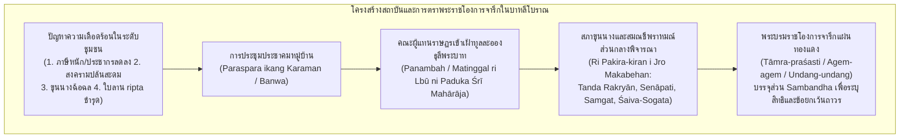

# บันทึกการอ่านและวิเคราะห์เอกสารจารึกวิทยาฉบับสมบูรณ์ (Epigraphic Source Dossier)
## สัมพันธะในจารึกบาหลีโบราณ: เหตุผลเบื้องหลังการตราพระราชโองการ โครงสร้างชุมชนบ้านเมือง การชลประทาน และภาระภาษีในสังคมบาหลียุคโบราณ (Sambandha dalam Beberapa Prasasti Bali, 1991)

---

### ส่วนที่ 1: ข้อมูลบรรณานุกรมและการอ้างอิงมาตรฐาน (Bibliographic Metadata)

- **Source ID:** `S-1991-brin-01`
- **ชื่อไฟล์ PDF ในเครื่อง:** `S-1991-brin-01_Sambandha_Prasasti_Bali.pdf`
- **ชื่อไฟล์ข้อความสกัด:** `S-1991-brin-01_Sambandha_Prasasti_Bali.txt`
- **ประเภทเอกสาร:** บทความวิจัยจารึกวิทยาและประวัติศาสตร์สถาบันโบราณ (Peer-reviewed Epigraphic & Institutional Research Paper) ในวารสารโบราณคดี *Berkala Arkeologi* จัดทำโดยสำนักโบราณคดีโยคยาการ์ตา (Balai Arkeologi Yogyakarta / ศูนย์วิจัยและนวัตกรรมแห่งชาติอินโดนีเซีย BRIN)
- **ภาษาของเอกสาร:** ภาษาอินโดนีเซีย (ID) พร้อมการปริวรรตและวิเคราะห์ตัวบทจารึกภาษาดั้งเดิม: ภาษาบาหลีโบราณ (Old Balinese), ภาษาชวาโบราณ (Old Javanese), และภาษาสันสกฤต (Sanskrit) ตามระบบการถอดอักษรจารึกวิทยาของ Roelof Goris และ Stein Callenfels
- **ขอบเขตภูมิศาสตร์และวัฒนธรรม:** เกาะบาหลี (ภูมิภาครอบทะเลสาบบาตูร์ บินตังดานู/วิงกังราณุ, กาซังเกต, อำเภอบังลี, บูเลเล็ง ชายฝั่งตอนเหนือ, กียาญยาร์, กลุงกุง, ตาบานัน) เชื่อมโยงปฏิสัมพันธ์เชิงการเมือง ภาษา และราชวงศ์กับเกาะชวากลางและชวาตะวันออก ยุคคริสต์ศตวรรษที่ 10–14 (มหาศักราช 915–1246 / ค.ศ. 993–1324)
- **วัสดุและบริบทการค้นพบ:** คลังจารึกแผ่นทองแดงจารึกอักษรบาหลีโบราณและอักษรกวิ (Balinese Copperplate Inscriptions / *Tāmra-praśasti*) จำนวน 13 จารึกหลักที่ได้รับการนำมาตรวจสอบวิเคราะห์โครงสร้าง "สัมพันธะ" (*sambandha*) โดยตรง ได้แก่:
  1. *จารึกเซอไร เอ 2 (Prasasti Serai A II / Goris no. 302)* – มหาศักราช 915 (ค.ศ. 993), รัชกาลพระนางคุณปรียธรรมปัตนี (มเหนทรทัตตา) และพระเจ้าอุทัยนะ (Śrī Guṇapriyadharmapatnī mwang Dharmmodayanawarmmadewa)
  2. *จารึกบวาฮัน เอ (Prasasti Bwahan A / Goris no. 303)* – มหาศักราช 916 (ค.ศ. 994), รัชกาลร่วมคุณปรียธรรมปัตนีและอุทัยนะ
  3. *จารึกเซิมบีรัน เอ 3 (Prasasti Sembiran A III / Goris no. 351)* – มหาศักราช 938 (ค.ศ. 1016), รัชกาลพระนางซังราตูศรีสังอัชญาเทวี (Sang Ratu Śrī Sangājñādewī)
  4. *จารึกบาตูวัน (Prasasti Batuan / Goris no. 352)* – มหาศักราช 944 (ค.ศ. 1022), รัชกาลพระเจ้าศรีธรรมวังศาวรรธนมารกฏปังกชัสถาโนตตุงคเทวะ (Śrī Dharmmawaṅśawardhana Marakatapaṅkajasthānottuṅgadewa)
  5. *จารึกซาวัน เอ 1 หรือ บีลา เอ 1 (Prasasti Sawan A I = Bila A I / Goris no. 353)* – มหาศักราช 945 (ค.ศ. 1023), รัชกาลพระเจ้ามารกฏปังกชัสถาโนตตุงคเทวะ
  6. *จารึกตรุนยัน เอ 2 (Prasasti Trunyan A II / Goris no. 402)* – มหาศักราช 971 (ค.ศ. 1049), รัชกาลพระเจ้าอนักวุงซู (Anak Wuṅśu)
  7. *จารึกปันดักบันดุง (Prasasti Pandak Bandung / Goris no. 436)* – มหาศักราช 993 (ค.ศ. 1071), รัชกาลพระเจ้าอนักวุงซู
  8. *จารึกปูราปัมราจัน ราชปุราณะ หรือ กลุงกุง เอ (Prasasti Pura Pamrajan Raja Purana = Klungkung A / Goris no. 439)* – มหาศักราช 994 (ค.ศ. 1072), รัชกาลพระเจ้าอนักวุงซู
  9. *จารึกบวาฮัน ซี (Prasasti Bwahan C / Goris no. 554)* – มหาศักราช 1068 (ค.ศ. 1146), รัชกาลพระเจ้าชัยศักติ (Śrī Jayasakti)
  10. *จารึกเตจากูลา (Prasasti Tejakula / Goris no. 571)* – มหาศักราช 1077 (ค.ศ. 1155), รัชกาลพระเจ้าราคชยะ (Śrī Ragajaya)
  11. *จารึกจัมปากา เอ (Prasasti Campaga A / Goris no. 631)* – มหาศักราช 1103 (ค.ศ. 1181), รัชกาลพระเจ้าชัยปังกุส (Śrī Jayapaṅgus)
  12. *จารึกฮยังปูติฮ์ (Prasasti Hyang Putih / Goris no. 803)* – มหาศักราช 1246 (ค.ศ. 1324), รัชกาลพระเจ้าภัตตาระคุรุที่ 2 (Bhaṭāra Guru II / Śrī Mahāguru)
  13. *จารึกจัมปากา ซี (Prasasti Campaga C / Goris no. 804)* – มหาศักราช 1246 (ค.ศ. 1324), รัชกาลพระเจ้าภัตตาระคุรุที่ 2
- **การอ้างอิงฉบับเต็มระบบ Chicago/Turabian Notes-Bibliography:**  
  Ekawana, I Gusti Putu. "Sambandha dalam Beberapa Prasasti Bali." *Berkala Arkeologi* 12, no. 1 (1991): 21–36. https://doi.org/10.30883/jba.v12i1.547.

---

### ส่วนที่ 2: แผนผังการจัดสรรเข้าสู่บทและหัวข้อย่อย (Chapter & Section Mapping Matrix)

- **บทที่ 3: จารึกบนแผ่นโลหะเงิน ทองคำ และสัมฤทธิ์: จารึกแผ่นทองแดงตามระปรัศัสติและภูมิภาคบาหลี (Copper-plate Charters & The Balinese Epigraphic Realm)**
  * **หัวข้อย่อย 3.1 (กายวิภาคและสัณฐานวิทยาของจารึกแผ่นทองแดงบาหลี / Tamraprasasti):**  
    การวิเคราะห์โครงสร้างแบบแผนทางการของจารึกแผ่นทองแดงในบาหลี ซึ่งทำหน้าที่เป็นประมวลกฎหมายปกครองแผ่นดิน (*undang-undang*) และหลักยึดเหนี่ยวคุ้มครองสิทธิ (*agem-agem*) ของชุมชนบ้านเมือง โดยเฉพาะโครงสร้างส่วน "สัมพันธะ" (*sambandha*) ซึ่งเป็นข้อความบอกมูลเหตุจูงใจและปัญหาที่ชุมชนเผชิญ (หน้า 21–22, 28)
  * **หัวข้อย่อย 3.3 (กระบวนการสืบสำเนาตัวบทจากใบลานสู่แผ่นทองแดง / Transcription from Ripta to Tambra):**  
    หลักฐานสำคัญในจารึกตรุนยัน เอ 2 (มหาศักราช 971 / ค.ศ. 1049) ว่าด้วยการร้องขอพระราชทานจารึกลงแผ่นทองแดงทดแทนเอกสารใบลานเดิมที่เปื่อยชำรุดเสียหาย (*makanimitta wok riptanya... ateher tambrakna*) สะท้อนบทบาทของแผ่นทองแดงในฐานะสื่อบันทึกสถานะทางกฎหมายที่คงทนถาวรสูงสุด (หน้า 24–25, 31)
  * **หัวข้อย่อย 3.5 (คลังจารึกบาหลีกับการกระจายตัวเชิงนิเวศวิทยาวัฒนธรรม):**  
    การศึกษาเครือข่ายชุมชนรอบทะเลสาบบาตูร์ (Bintang Danu / *wingkang raṇu*) เช่น บวาฮัน, เคดิซาน, ตรุนยัน, ซงงัน, อาบัง และการกระจายตัวของจารึกแผ่นทองแดงตามเขตภูเขาและชายฝั่งทะเล (หน้า 23–25, 34)

- **บทที่ 4: อักขรวิทยา ภาษาศาสตร์ประวัติศาสตร์ และการคำนวณศักราช: วิวัฒนาการจากภาษาบาหลีโบราณสู่ชวาโบราณ (Epigraphic Palaeography & Linguistic Evolution in Bali)**
  * **หัวข้อย่อย 4.2 (วิวัฒนาการทางภาษา: การเปลี่ยนผ่านจากภาษาบาหลีโบราณสู่ภาษาชวาโบราณ):**  
    การวิเคราะห์จุดเปลี่ยนผ่านทางภาษาศาสตร์จารึกในบาหลีช่วงปลายศตวรรษที่ 10 เมื่อพระนางคุณปรียธรรมปัตนี (เจ้าหญิงมเหนทรทัตตาแห่งราชวงศ์อีศานะ ชวาตะวันออก) อภิเษกสมรสกับพระเจ้าอุทัยนะแห่งบาหลี ส่งผลให้สำนวนภาษาและคำศัพท์การบริหารแบบชวาโบราณ (เช่น *drwya haji*, *buncang haji*, *karaman*, *samgat*, *senāpati*) หลั่งไหลเข้าแทนที่ภาษาบาหลีโบราณแท้รุ่นแรก (หน้า 22–24, 28–29, 32–33)
  * **หัวข้อย่อย 4.3 (อภิธานศัพท์และสัทศาสตร์ภาษาบาหลีโบราณ):**  
    การศึกษาคำศัพท์เฉพาะถิ่นบาหลีโบราณ เช่น *banwa* (บ้านเมือง), *kuran* (ครัวเรือน), *majengan* (การลี้ภัย/กำบัง), *paraspara* (การประชุมหารือร่วมกัน), *swak / kaswakan* (ระบบชลประทาน/ต้นเค้าของคำว่า ซูบัก subak), *rot / panguwot* (ค่าไถ่ถอน/ภาษีไถ่), และ *bintangs* (หน้า 23, 25, 32–34)
  * **หัวข้อย่อย 4.4 (ระบบปฏิทินดาราศาสตร์และฤดูกาลในบาหลี):**  
    การวิเคราะห์เดือนเจตรมาส (*Caitramāsa* / ภาษาบาหลีคือ *sasih kesanga*) ซึ่งเป็นเดือนสุดท้ายของปีศักราชก่อนเข้าสู่วันเนียปี (*Nyepi* / *penanggal pisan*) ซึ่งเป็นช่วงเวลาที่เจ้าพนักงานหลวงออกตระเวนเก็บภาษีและตรวจบัญชีสิทธิ์ อันนำไปสู่ข้อพิพาทรุนแรงระหว่างขุนนางกับชาวบ้าน (หน้า 27, 34)

- **บทที่ 6: จารึกที่สะท้อนวัฒนธรรมโบราณในแง่การปกครอง กฎหมาย และสถาบันสีมา: สังคม เศรษฐกิจ การคลัง และวิถีชุมชนบาหลี (Governance, Agrarian Institutions & Taxation in Ancient Bali)**
  * **หัวข้อย่อย 6.1 (โครงสร้างสถาบันชุมชนบ้านเมือง: Banwa, Karaman, และสภาผู้เฒ่า Rīma):**  
    การวิเคราะห์คำว่า *karaman* (ชุมชน/สภาหมู่บ้าน) ซึ่งสืบรากศัพท์มาจาก *rīma* (ผู้เฒ่า/หัวหน้าชุมชนผู้เป็นที่เคารพ) เทียบเคียงกับ *rerama* ในภาษาบาหลีปัจจุบัน และ *banwa* (ดินแดนชุมชนทั้งปวง) ตลอดจนการทำประชาคมหมู่บ้าน (*paraspara*) ก่อนเข้าเฝ้ากษัตริย์ (หน้า 22–24, 32)
  * **หัวข้อย่อย 6.2 (ระบบภาษี แรงงานเกณฑ์ และส่วยหลวงในบาหลีโบราณ):**  
    การจำแนกประเภทภาระหน้าที่ที่ราษฎรต้องแบกรับ ได้แก่ *drwya haji* (ส่วยหลวง/ทรัพย์สินของกษัตริย์), *bwatthaji* (การรับราชการเกณฑ์แรงงานหลวง/โรดี), *buncang haji* (แรงงานเกณฑ์โยธาหรือการดูแลสวนหลวง), *pinta palaku pamli* (ภาษีเรี่ยไรจัดซื้อ), และ *pikul-pikulan* (ส่วยขนส่งหาบหาม) ซึ่งเมื่อประชากรลดลงอันเนื่องมาจากสงครามหรือภัยพิบัติ ภาระภาษีจะกลายเป็นแรงกดดันจนราษฎรต้องร้องขอพระราชทานผ่อนผัน (หน้า 22–24, 28–29, 32)
  * **หัวข้อย่อย 6.3 (สถาบันที่ดินศักดิ์สิทธิ์ สีมา ปุนปูนัน และ ลาบาปูรา / Jātika):**  
    การศึกษาที่ดินปลอดภาษีเพื่อศาสนสถาน (*sīma*) และที่ดินกัลปนาอุปถัมภ์วัด (*punpunan* / *aṅśa* / *laba pura*) รวมถึงข้อกำหนดการซื้อขายที่ดินของพระราชวงศ์ในจารึกปันดักบันดุง และการจัดสรรแรงงานชุมชนดูแลที่ดินศักดิ์สิทธิ์ (*jātika*) ในจารึกเตจากูลา (หน้า 25–26, 30, 32–34)
  * **หัวข้อย่อย 6.4 (สถาบันการชลประทานบาหลีโบราณ: Kaswakan สู่ Subak):**  
    หลักฐานลายลักษณ์อักษรที่เก่าแก่และชัดเจนที่สุดในจารึกปูราปัมราจัน ราชปุราณะ (ค.ศ. 1072) เกี่ยวกับคำว่า *kaswakan* (การจัดสรรระบบน้ำชลประทาน/หน่วยพื้นที่ซูบัก) และการบุกเบิกทำนาแปลงใหม่ (*sawah kadandan*) ซึ่งต้องขอพระบรมราชานุญาตและเสียค่าธรรมเนียมความมั่นคง (*līga pariduh*) (หน้า 25–26, 30, 33–34)
  * **หัวข้อย่อย 6.5 (ข้อพิพาททางกฎหมาย การฉ้อฉลของเจ้าพนักงาน และการถ่วงดุลอำนาจ):**  
    บทบาทของสภาขุนนางส่วนกลาง (*ri pakira-kiran i jro makabehan*) ในการพิจารณาคดีความระหว่างชาวบ้านกับเจ้าพนักงานฉ้อฉล เช่น พนักงานตรวจการณ์ (*cakṣu paracakṣu*) และเจ้าพนักงานเก็บผลประโยชน์หลวง (*sang admak akmitan apigajih*) (หน้า 26–28, 31, 34)

---

### ส่วนที่ 3: สรุปสาระสำคัญเชิงวิเคราะห์และจุดยืนทางวิชาการ (Executive Academic Analysis)

- **วิทยานิพนธ์และข้อถกเถียงหลักของผู้เขียน (Core Argument / Thesis):**  
  อี กุสตี ปูตู เอกาวานา (I Gusti Putu Ekawana, 1991) นำเสนอการศึกษาสถาบันและโครงสร้างสังคมการเมืองของบาหลีโบราณผ่านการวิเคราะห์ส่วนประกอบทางแบบแผนของจารึกที่เรียกว่า **"สัมพันธะ" (*sambandha*)** ซึ่งมักเป็นส่วนที่ถูกละเลยในการศึกษาประวัติศาสตร์แบบเดิมที่มุ่งเน้นเฉพาะพระนามกษัตริย์ ลำดับศักราช หรือมิติทางศาสนาเพียงอย่างเดียว
  
  ข้อค้นพบและข้อถกเถียงหลักของเอกาวานาสรุปได้ 4 ประเด็นหลัก:
  
  1. *สัมพันธะคือภาพสะท้อนชีวิตจริงและแรงขับเคลื่อนทางประวัติศาสตร์ระดับล่าง (Bottom-up Historical Reality):*  
     เอกาวานาพิสูจน์ให้เห็นว่า พระราชโองการจารึก (*prasasti*) มิได้ถูกตราขึ้นตามพระราชหฤทัยตามอำเภอใจของพระมหากษัตริย์ หากแต่เป็นผลลัพธ์โดยตรงจากปัญหา ข้อร้องทุกข์ และความทุกข์ยากที่เกิดขึ้นจริงในระดับฐานรากของชุมชนชาวบ้าน (*karaman / banwa*) คำว่า *sambandha* (รากศัพท์สันสกฤตแปลว่า ความผูกพัน, มูลเหตุ, ต้นสายปลายเหตุ, แรงจูงใจ) ทำหน้าที่เป็น "อารัมภบทแห่งข้อเท็จจริง" ที่บันทึกสาเหตุการตราจารึก เช่น ความเดือดร้อนจากอัตราภาษีที่ไม่สอดคล้องกับจำนวนประชากร, การถูกโจมตีปล้นสะดมจากข้าศึกภายนอก, การกดขี่ฉ้อฉลจากเจ้าพนักงานตรวจการส่วนกลาง, ความขัดแย้งระหว่างหมู่บ้านข้างเคียง, หรือความต้องการบุกเบิกที่ดินชลประทานแปลงใหม่ (หน้า 21–22, 28)
  
  2. *จารึกในฐานะประมวลกฎหมายสูงสุดและหลักประกันคุ้มครองสิทธิชุมชน (Prasasti as Agem-agem and Legal Charter):*  
     สอดคล้องกับนิยามของ รูโลฟ โฮริส (Roelof Goris 1948) เอกาวานายืนยันว่า จารึกแผ่นทองแดงเปรียบเสมือนรัฐธรรมนูญหรือประมวลกฎหมายลายลักษณ์อักษร (*undang-undang*) ที่ทำหน้าที่เป็น "หลักยึดเหนี่ยวคุ้มครองสิทธิ" (*agem-agem*) ของชุมชนบ้านเมือง มีผลผูกพันทางกฎหมายที่ทุกฝ่ายต้องปฏิบัติตามอย่างเคร่งครัด ตั้งแต่กษัตริย์ เจ้าชาย ขุนนางราชสำนัก พนักงานท้องถิ่น จนถึงราษฎรสามัญ เมื่อเอกสารสิทธิ์เดิมที่ทำจากใบลาน (*ripta*) ชำรุดเปื่อยเน่า ชุมชนจะรีบรวมตัวกันเข้าเฝ้ากษัตริย์เพื่อขอพระราชทานจารึกฉบับทองแดง (*tāmra-praśasti*) ทดแทนทันที เพราะหากปราศจากจารึกแผ่นโลหะ ชุมชนจะตกเป็นเหยื่อของการข่มเหงรังแกและขูดรีดจากพนักงานหลวงท้องถิ่น (หน้า 22, 25, 31)
  
  3. *กลไกการถ่วงดุลอำนาจและการบริหารราชการแผ่นดินผ่านสภาปรึกษาราชสำนัก (Pakira-kiran i Jro Makabehan):*  
     เอกสารเผยให้เห็นโครงสร้างการบริหารราชการแผ่นดินของบาหลีโบราณว่า กษัตริย์มิได้ใช้อำนาจเผด็จการเบ็ดเสร็จ แต่เมื่อราษฎรเดินทางมาเข้าเฝ้าถวายบังคมเพื่อร้องทุกข์ เรื่องดังกล่าวจะต้องถูกนำเข้าสู่การพิจารณาไต่สวนอย่างเป็นทางการในที่ประชุมสภาขุนนางเต็มคณะของราชสำนัก (*ri pakira-kiran i jro makabehan*) ซึ่งประกอบด้วย พระราชาคณะฝ่ายพุทธและไศวะ (*saṅ senāpati, tanda rakryān, samgat* ฯลฯ) เพื่อตรวจสอบพยานหลักฐานและลงมติอย่างรอบคอบ ก่อนที่จะมีพระบรมราชโองการประกาศใช้จารึก (หน้า 22, 28–29)
  
  4. *ต้นเค้าสถาบันทางเศรษฐกิจและชลประทาน: วิวัฒนาการจาก Kaswakan สู่ Subak:*  
     บทความนี้ให้หลักฐานสำคัญอย่างยิ่งว่าระบบการจัดการน้ำและการรวมกลุ่มชลประทานอันเลื่องชื่อของบาหลี (*subak*) มีพัฒนาการต่อเนื่องยาวนานมาตั้งแต่ศตวรรษที่ 11 โดยคำว่า *kaswakan* (ในจารึกปูราปัมราจัน ค.ศ. 1072) เป็นรูปโบราณของคำว่า *suwak / subak* แสดงให้เห็นว่าการบุกเบิกที่ดินทำนาชลประทาน (*sawah kadandan*) ต้องอาศัยการกำกับดูแลของรัฐ มีการควบคุมระบบแรงงานและส่วย มีการจัดตั้งหน่วยพื้นที่ชลประทานเฉพาะ และมีการชำระค่าธรรมเนียมบำรุงความปลอดภัย (*līga pariduh*) ควบคู่กัน (หน้า 25, 30, 33–34)

- **บริบทประวัติศาสตร์นิพนธ์และการประเมินความน่าเชื่อถือ (Historiography & Source Criticism):**  
  อี กุสตี ปูตู เอกาวานา เป็นนักโบราณคดีและจารึกวิทยาชาวบาหลีผู้เชี่ยวชาญภาษาและประวัติศาสตร์บาหลีโบราณ จบการศึกษาจากคณะอักษรศาสตร์ มหาวิทยาลัยอุทัยนะ (Universitas Udayana) โดยมีวิทยานิพนธ์มหาบัณฑิตว่าด้วยรัชสมัยพระเจ้าภัตตาระมหาคุรุ (Ekawana 1980) บทความวิจัยปี 1991 ชิ้นนี้ได้รับการตีพิมพ์ใน *Berkala Arkeologi* ซึ่งเป็นวารสารวิชาการหลักของสำนักโบราณคดีโยคยาการ์ตา
  
  จุดเด่นเชิงประวัติศาสตร์นิพนธ์ของงานชิ้นนี้คือ:
  1. การเชื่อมโยงระหว่างผลงานจารึกวิทยาคลาสสิกของชาวดัตช์ (Goris 1954, 1954a; Stein Callenfels 1926) เข้ากับมุมมองทางสังคมวิทยาประวัติศาสตร์ของนักวิชาการอินโดนีเซียรุ่นบุกเบิก เช่น บูชารี (Boechari 1977), ซูการ์โต อัตโมโจ (M.M. Sukarto K. Atmodjo 1970, 1974, 1981), เกอตุต กีนาร์ซา (Ketut Ginarsa 1974), และ มะชี ซูฮาดี (Machi Suhadi 1978)
  2. การใช้ความรู้ภาษาถิ่นบาหลีในปัจจุบัน (Modern Balinese) เข้ามาช่วยถอดรหัสคำศัพท์จารึกวิทยาภาษาบาหลีโบราณที่คลุมเครือได้อย่างเฉียบคม เช่น การอธิบายคำว่า *karaman* (ชุมชน/ผู้แทนหมู่บ้าน) ผ่านคำว่า *rīma* (หัวหน้า/ผู้เฒ่า) และ *rerama* (บิดามารดา/ผู้ใหญ่ในบ้าน), การอธิบายคำว่า *rot* ผ่านคำบาหลี *panguwot* (ค่าไถ่ถอน/เงินซื้อสิทธิ), และการอธิบายภูมิศาสตร์เขต *bintang danu* รอบทะเลสาบบาตูร์
  
  ข้อจำกัดและการประเมินเชิงวิพากษ์ (Critical Assessment):
  - แม้ผู้เขียนจะยอมรับอย่างถ่อมตัวในบทความว่าเป็นเพียง "ข้อเขียนเบื้องต้นเชิงสังเขป" (*uraian sepintas sebagai pengantar*) แต่วิธีการจัดกลุ่มปัญหาในส่วนสัมพันธะออกเป็น 6 มิติ (ภาษี, การแยกหมู่บ้าน, ความรุนแรง/สงคราม, ที่ดินเกษตรกรรม/ชลประทาน, การทุจริตของขุนนาง, และการคัดลอกจารึกทดแทนใบลาน) ถือเป็นกรอบวิเคราะห์ที่ทรงพลังอย่างยิ่ง
  - งานเขียนชิ้นนี้เน้นการคัดเลือกตัวอย่างเฉพาะจารึกที่มีข้อความสัมพันธะชัดเจน (13 จารึก) มิได้ครอบคลุมจารึกบาหลีทั้งหมดกว่าร้อยหลัก แต่ตัวอย่างที่คัดเลือกมาล้วนเป็นจารึกหลักสำคัญระดับหมุดหมายแห่งประวัติศาสตร์บาหลีทั้งสิ้น

---

### ส่วนที่ 4: สารบัญข้อค้นพบเชิงลึกแยกตามมิติจารึกวิทยา (Thematic Epigraphic Findings with Exact Pages)

#### 1. ประวัติศาสตร์นิพนธ์และการตีความทางประวัติศาสตร์
- **นิยามและบทบาทหน้าที่ของ "สัมพันธะ" (*sambandha*):** เอกาวานาวิเคราะห์ความหมายของคำว่า sambandha ตามพจนานุกรมชวาโบราณของ Mardiwarsito (1981: 498) ว่ามีความหมายหลากหลายตั้งแต่ พันธะ, ความเกี่ยวข้อง, สายสัมพันธ์ครอบครัว, ลำดับเครือญาติ, แต่ในบริบทจารึกวิทยา คำนี้ต้องแปลว่า "ต้นเหตุ, สาเหตุ, มูลเหตุจูงใจ, เจตจำนง, หรือเหตุผลเบื้องหลัง" ที่กษัตริย์ทรงพระกรุณาโปรดเกล้าฯ พระราชทานจารึกให้แก่ชุมชน (หน้า 22, 28)
- **ทัศนะของ M.M. Sukarto K. Atmodjo ต่อโครงสร้างสัมพันธะ:** สัมพันธะเป็นองค์ประกอบชี้ขาดที่ช่วยให้นักประวัติศาสตร์เข้าใจบริบททางสังคมและเศรษฐกิจที่แท้จริง แต่ส่วนใหญ่จะพบเฉพาะในจารึกขนาดยาวที่มีเนื้อหาละเอียด ส่วนจารึกขนาดสั้นมักละเลยไม่ระบุไว้อย่างชัดเจน (หน้า 28, อ้างอิง Sukarto K. Atmodjo 1981: 14)
- **สถานะของจารึกในฐานะประมวลกฎหมายและหลักยึดเหนี่ยวสิทธิ:** เอกาวานาสนับสนุนนิยามของ Roelof Goris (1948: 22) ว่าจารึกบาหลีทำหน้าที่เป็นประมวลกฎหมายปกครองแผ่นดิน (*undang-undang*) และเป็นหลักฐานลายลักษณ์อักษรที่ใช้เป็น "หลักยึดเหนี่ยวคุ้มครองสิทธิ" (*agem-agem*) ของชุมชนบ้านเมืองเพื่อป้องกันการละเมิดสิทธิจากภายนอก (หน้า 22, 31)

#### 2. ตัวบทจารึก การอ่าน ศักราช และอักขรวิทยา
- **จารึกเซอไร เอ 2 (Prasasti Serai A II / Goris no. 302):** มหาศักราช 915 (ค.ศ. 993) รัชกาลพระนางคุณปรียธรรมปัตนีและพระเจ้าอุทัยนะ ตัวบทแผ่นที่ 2 ด้านหน้า (IIa) บรรทัด 4–5 บันทึกข้อพิพาทเรื่องการเก็บส่วย *drwya haji* ชนิดภาษี *rot* จำนวน 9 มาสุ (māsu) จากแรงงานเกณฑ์หลวง (*bwatthaji*) ในบุรุ (Buru) ซึ่งชาวบ้านไม่สามารถจ่ายได้ (หน้า 23, 32)
- **จารึกบวาฮัน เอ (Prasasti Bwahan A / Goris no. 303):** มหาศักราช 916 (ค.ศ. 994) รัชกาลร่วมคุณปรียธรรมปัตนีและอุทัยนะ แผ่นที่ 1 ด้านหลัง (Ib) บรรทัด 6–8 บันทึกกรณีชุมชนริมทะเลสาบบวาฮันเจรจาขอแยกตัวอย่างสันติ (*sumehakna karintenya*) ออกจากชุมชนเคดิซาน เพื่อเป็นอิสระแก่ตนเอง (*sutantra i kawakanya*) (หน้า 23, 29–30)
- **จารึกเซิมบีรัน เอ 3 (Prasasti Sembiran A III / Goris no. 351):** มหาศักราช 938 (ค.ศ. 1016) รัชกาลพระนางซังราตูศรีสังอัชญาเทวี แผ่นที่ 6 ด้านหน้า (VIa) บรรทัด 3–6 บันทึกความทุกข์ยากของชุมชนชายฝั่งทะเลที่ประชากรลดฮวบจาก 300 ครัวเรือน (*kuran*) เหลือเพียง 50 ครัวเรือน เนื่องจากการถูกข้าศึกฆ่าฟัน จับเป็นเชลย และหนีภัยสงคราม ทำให้ไม่สามารถจ่ายส่วย *drabyahaji* และเกณฑ์แรงงาน *buncang haji* ได้ (หน้า 23–24, 29)
- **จารึกบาตูวัน (Prasasti Batuan / Goris no. 352):** มหาศักราช 944 (ค.ศ. 1022) รัชกาลพระเจ้ามารกฏะ แผ่นที่ 1 ด้านหลัง (Ib) บรรทัด 4 บันทึกความเดือดร้อนของชุมชนบาตูวันในการแบกรับแรงงานเกณฑ์ *buncang haji* เพื่อดูแลสวนผลไม้หลวง (*kebwan*) ของอดีตกษัตริย์ที่ล่วงลับ ณ แออร์วักกา (Er Wka) และ แออร์ปากู (Er Paku) (หน้า 24, 30)
- **จารึกซาวัน เอ 1 (Prasasti Sawan A I / Bila A I / Goris no. 353):** มหาศักราช 945 (ค.ศ. 1023) รัชกาลพระเจ้ามารกฏะ แผ่นที่ 1 ด้านหลัง (Ib) บรรทัด 2–3 บันทึกกรณีประชากรลดลงจากเดิม 50 ครัวเรือนเหลือเพียง 10 ครัวเรือน ทำให้ไม่สามารถจ่ายส่วย *drwya haji*, *buncang haji*, ภาษีเรี่ยไร *pinta palaku pamli*, และส่วยหาบหาม *pikul-pikulan* (หน้า 24, 29)
- **จารึกตรุนยัน เอ 2 (Prasasti Trunyan A II / Goris no. 402):** มหาศักราช 971 (ค.ศ. 1049) รัชกาลพระเจ้าอนักวุงซู แผ่นที่ 4 ด้านหลัง (IVb) บรรทัด 2–3 บันทึกการขอคัดลอกเนื้อหาจารึกดั้งเดิมลงบนแผ่นทองแดง (*ateher tambrakna*) เนื่องจากตัวบทใบลานเดิมเปื่อยชำรุดเสียหาย (*makanimitta wok riptanya*) (หน้า 24–25, 31)
- **จารึกปันดักบันดุง (Prasasti Pandak Bandung / Goris no. 436):** มหาศักราช 993 (ค.ศ. 1071) รัชกาลพระเจ้าอนักวุงซู แผ่นที่ 1 ด้านหลัง (Ib) บรรทัด 2–3 บันทึกการอุทิศที่ดินสีมามาราจังเป็น *punpunan* ถวายแด่ *sanghyang dharmma* ณ อันตกุญชรปัท (Antakuñjarapada) ซึ่งเดิมเป็นที่ดินที่เชื้อพระวงศ์ขายให้แก่กษัตริย์ในราคา 5 มาสุ (หน้า 25, 30, 32–33)
- **จารึกปูราปัมราจัน ราชปุราณะ (Prasasti Pura Pamrajan Raja Purana / Goris no. 439):** มหาศักราช 994 (ค.ศ. 1072) รัชกาลพระเจ้าอนักวุงซู แผ่นที่ 1 ด้านหลัง (Ib) บรรทัด 2–3 บันทึกการขอเปิดพื้นที่ทำนาชลประทานแปลงใหม่ (*sawah kadandan*) ในเขตชลประทานราวัส (*kaswakan Rawas*) และกำหนดอัตราค่าธรรมเนียมบำรุงความปลอดภัย *līga pariduh* คนละ 5 มาสะ (หน้า 25, 30, 33–34)
- **จารึกบวาฮัน ซี (Prasasti Bwahan C / Goris no. 554):** มหาศักราช 1068 (ค.ศ. 1146) รัชกาลพระเจ้าชัยศักติ แผ่นที่ 1 ด้านหลัง (Ib) บรรทัด 4–5 บันทึกกรณีชาวบ้านริมทะเลสาบถูกเจ้าพนักงานตรวจการฉ้อฉล (*cakṣu paracakṣu*) กดขี่หลอกลวง จึงขอพระราชทานจารึกเป็นหลักค้ำประกันสถานะเดิม (หน้า 26, 31, 34)
- **จารึกเตจากูลา (Prasasti Tejakula / Goris no. 571):** มหาศักราช 1077 (ค.ศ. 1155) รัชกาลพระเจ้าราคชยะ แผ่นที่ 1 ด้านหลัง (Ib) บรรทัด 2–4 บันทึกการประชุมหารือเลือกว่าชุมชนใดเหมาะสมที่จะได้รับมอบหมายให้ทำหน้าที่ดูแลที่ดินศักดิ์สิทธิ์ (*jātika*) ของเทวาลัยกุญชราสนะ (หน้า 26, 31, 34)
- **จารึกจัมปากา เอ (Prasasti Campaga A / Goris no. 631):** มหาศักราช 1103 (ค.ศ. 1181) รัชกาลพระเจ้าชัยปังกุส แผ่นที่ 1 ด้านหลัง (Ib) บรรทัด 4–6 บันทึกความขัดแย้งและข้อพิพาทรุนแรงระหว่างชาวบ้านจัมปากากับพนักงานเก็บผลประโยชน์หลวง (*sang admak akmitan apigajih*) ในทุกช่วงเดือนเจตรมาส จนชุมชนเกิดความระส่ำระสาย (หน้า 27, 31, 34)
- **จารึกฮยังปูติฮ์ (Prasasti Hyang Putih / Goris no. 803):** มหาศักราช 1246 (ค.ศ. 1324) รัชกาลพระเจ้าภัตตาระคุรุที่ 2 แผ่นที่ 1 ด้านหลัง (Ib) บรรทัด 3–4 บันทึกความเดือดร้อนจนตรอกของชุมชนฮยังปูติฮ์ (*gatidopaya*) แต่มิได้ระบุสาเหตุอย่างละเอียด (หน้า 27, 31)
- **จารึกจัมปากา ซี (Prasasti Campaga C / Goris no. 804):** มหาศักราช 1246 (ค.ศ. 1324) รัชกาลพระเจ้าภัตตาระคุรุที่ 2 แผ่นที่ 1 ด้านหลัง (Ib) บรรทัด 5 ถึงแผ่นที่ 2 ด้านหน้า (IIa) บรรทัด 2 บันทึกกรณีชุมชนจัมปากาถูกชุมชนตุมปูฮยัง (Tumpuhyang) ก่อเหตุรุนแรง บุกปล้นสะดม เผาทำลายบ้านเรือน และกวาดต้อนสัตว์เลี้ยง จนชาวบ้านต้องอพยพหนีตายทิ้งหมู่บ้านร้าง กษัตริย์จึงเสด็จลงมาตรวจพื้นที่จริงและมีพระบรมราชโองการให้แยกเขตแดนเด็ดขาด (หน้า 27, 29)

#### 3. มิติศาสนา ลัทธิความเชื่อ และพิธีกรรม
- **มรณนามและคติเทวราชาในบาหลีโบราณ (*Sang Lumah*):** เอกาวานาชี้ว่าคำว่า *lumah* หรือ *sang lumah ing...* ในจารึกบาหลี (เช่น *sang siddha dewata lumah ring nger wka* ในจารึกบาตูวัน) สื่อถึงกษัตริย์ผู้เสด็จสวรรคตและบรรลุสู่เทวโลก (*siddha dewata*) โดยพระสรีรางคารได้รับการประดิษฐาน ณ ศาสนสถานสุสานหลวง (*candi / sanghyang dharmma*) ซึ่งเทียบเคียงได้กับธรรมเนียม *padharman* ในบาหลียุคปัจจุบัน (หน้า 24, 30, 33)
- **มรณนามของพระเจ้าอุทัยนะ:** พระองค์ได้รับการขนานพระนามหลังสวรรคตว่า *Bhaṭāra Banu Wka* (หรือ *Bhaṭāra Lumah ing Er Wka*) ซึ่งเป็นศาสนสถานที่ได้รับการจัดสรรที่ดินสวนผลไม้หลวงถวายเพื่อบำรุงรักษา (หน้า 30, 34, อ้างอิง Goris 1957: 20)
- **ที่ดินศักดิ์สิทธิ์ ลาบาปูรา (*Jātika*):** คำว่า *jātika* ที่ปรากฏในจารึกเตจากูลา ได้รับการอธิบายโดย Ketut Ginarsa (1974: 29) และ Goris (1957: 22) ว่าหมายถึง "ที่ดินศักดิ์สิทธิ์ของศาสนสถาน" หรือตรงกับคำว่า *laba pura* ในวัฒนธรรมบาหลีปัจจุบัน ซึ่งเป็นที่ดิน (นาข้าวหรือสวน) ที่ยกให้เป็นกรรมสิทธิ์ของวัดเพื่อนำผลผลิตมาเป็นค่าใช้จ่ายในการจัดพิธีกรรมและบูรณปฏิสังขรณ์ (หน้า 26, 30, 34)
- **พิธีกรรมภูตยัญญะในเดือนเจตรมาส (*Bhūtayajña in Sasih Kesanga*):** เอกาวานาอธิบายภูมิหลังทางศาสนาของเดือนเจตรมาส (มีนาคม–เมษายน) ว่าเป็นเดือนที่ 9 ของปฏิทินบาหลี (*sasih kesanga*) วันแรม 15 ค่ำหรือเดือนดับ (*tilem kesanga*) จะมีการประกอบพิธีเซ่นสรวงภูตยัญญะครั้งใหญ่เพื่อขับไล่สิ่งชั่วร้าย และวันถัดไปคือวันขึ้น 1 ค่ำ (*penanggal pisan*) คือวันเนียปี (*Nyepi*) หรือวันขึ้นปีใหม่มหาศักราช (หน้า 34, อ้างอิง Dinas Agama Hindu dan Budha 1970; Guweng 1973)

#### 4. มิติสถาปัตยกรรม ศาสนสถาน และชลศาสตร์
- **การจำแนกประเภทที่ดินกัลปนา: ปุนปูนัน (*Punpunan*) และ อังศะ (*Aṅśa*):** เอกาวานานำข้อค้นพบของ ศาสตราจารย์ บูชารี (Boechari 1977: 95) จากจารึกตูฮานยาภุ (Tuhanaru ค.ศ. 1323) มาเปรียบเทียบ โดยระบุว่า *punpunan* คือที่ดินสีมาที่ตั้งอยู่ใกล้ชิดกับตัวศาสนสถาน ส่วน *aṅśa* คือที่ดินสีมาที่ตั้งอยู่ห่างไกลออกไป ในจารึกปันดักบันดุง ที่ดินสีมามาราจังประกอบด้วย ป่าไม้ (*alas*), นาข้าว (*sawah*), และสวน (*parlak*) ถวายเป็นปุนปูนันแก่อารามอันตกุญชรปัท (หน้า 25, 30, 33)
- **บทบาทของป่าไม้ (*Alas*) ในเขตสีมา:** เอกาวานาตั้งข้อสังเกตว่า เหตุใดป่าไม้จึงถูกรวมไว้ในเขตที่ดินกัลปนาของศาสนสถาน เนื่องจากป่าไม้ทำหน้าที่เป็นแหล่งสำรองไม้ซุงและวัสดุก่อสร้างที่จำเป็นสำหรับการสร้างและซ่อมแซมอาคารเทวาลัยอันศักดิ์สิทธิ์ (หน้า 30)
- **วิวัฒนาการทางชลศาสตร์: จาก Kaswakan สู่ Subak:** ในจารึกปูราปัมราจัน (ค.ศ. 1072) ปรากฏคำว่า *kaswakan Rawas* ซึ่งเอกาวานาและ Jelantik Sushila (1979: 6) ชี้ว่าเป็นรากศัพท์โบราณของคำว่า *suwak / subak* อันเป็นสถาบันสหกรณ์บริหารจัดการน้ำที่เป็นเอกลักษณ์ของบาหลี โดยครอบคลุมพื้นที่ชลประทานที่มีระบบเหมืองฝาย คูส่งน้ำ และขอบเขตธรรมชาติที่ชัดเจน (หน้า 25, 30, 33)

#### 5. มิติอาหารการกิน วิถีชีวิต การค้า และตลาด
- **ระบบเงินตราและหน่วยวัดมูลค่า:** จารึกระบุการใช้หน่วยเงินตราโลหะสองระบบหลัก ได้แก่ *māsu / mā / masa* (มาสะ = เหรียญทองคำหรือเงินน้ำหนักมาตรฐาน) และ *pirak* (เหรียญเงิน) เช่น การจ่ายส่วย 9 มาสุ ในจารึกเซอไร เอ 2, การซื้อที่ดินราคา 5 มาสุ ในจารึกปันดักบันดุง, และการชำระค่าธรรมเนียมคนละ 5 มาสะ ในจารึกปูราปัมราจัน (หน้า 23, 25, 30, 32–33)
- **โครงสร้างการเกษตรกรรม: นาน้ำและสวนไม้ผล:** จารึกบาหลีจำแนกพื้นที่เพาะปลูกอย่างชัดเจนระหว่าง นาข้าวชลประทาน (*sawah*) ที่ต้องพึ่งพาระบบเหมืองฝายและมีผลผลิตภาษีสูง กับ ที่ดินสวน (*kebwan / parlak*) ซึ่งไม่ต้องพึ่งพาระบบชลประทานเข้มข้น เช่น สวนผลไม้หลวงของอดีตกษัตริย์ในจารึกบาตูวัน (หน้า 30)
- **ปศุสัตว์และการปล้นสะดมทรัพย์สิน:** ในจารึกจัมปากา ซี สะท้อนว่าสัตว์เลี้ยงในครัวเรือน (*sarwa ingon-ingon*) เช่น โค กระบือ และหมู เป็นทรัพย์สินหลักของชาวบ้าน เมื่อเกิดข้อพิพาทรุนแรง สัตว์เลี้ยงเหล่านี้จะตกเป็นเป้าหมายแรกในการถูกกวาดต้อนและปล้นสะดมโดยหมู่บ้านคู่อริ (หน้า 27, 29)

#### 6. มิติการปกครอง กฎหมาย ที่ดิน และระบบสีมา
- **สถาบันชุมชนบ้านเมือง: Banwa, Karaman, และสภาผู้เฒ่า Rīma:** เอกาวานาอาศัยงานของ Goris (1954a: 295), De Casparis (1956: 216), และ Sukarto K. Atmodjo (1970, 1974) อธิบายว่า *karaman* สื่อถึง "ชุมชนชาวบ้าน หรือสภาองค์การบริหารระดับหมู่บ้านที่มีคณะผู้เฒ่า *rīma* เป็นแกนนำ" คำว่า *rīma* มีความหมายเทียบเท่ากับ "ผู้อาวุโสของหมู่บ้าน / บุคคลที่สังคมเคารพ" (สอดคล้องกับคำบาหลี *rerama* ที่หมายถึงพ่อแม่บุพการี) ส่วน *banwa* สื่อถึงอาณาบริเวณชุมชนหรือแว่นแคว้นระดับท้องถิ่น (หน้า 22–24, 32)
- **ประชาธิปไตยชุมชนโบราณและการทำประชาคม (*Paraspara*):** ก่อนที่ชาวบ้านจะเดินทางไปร้องทุกข์ต่อกษัตริย์ จะต้องมีการประชุมหารือระดับหมู่บ้านเพื่อหาฉันทามติร่วมกัน เรียกว่า *paraspara* ดังปรากฏในจารึกเซิมบีรัน เอ 3 (*makatahwang ram paraspara*) และจารึกซาวัน เอ 1 (*paraspara ni hambanya sakaraman*) (หน้า 23–24, 29)
- **ระบบภาระภาษีและแรงงานเกณฑ์:**
  1. *Drwya haji (Drabyahaji):* ทรัพย์สินหรือส่วยหลวงที่ชาวบ้านต้องจ่ายให้แก่ท้องพระคลัง (หน้า 23, 32)
  2. *Bwatthaji:* การรับราชการเกณฑ์แรงงานหลวง หรือแรงงานโยธาตามคำสั่งราชสำนัก (หน้า 23, 32)
  3. *Buncang haji:* แรงงานเกณฑ์หลวงประเภทดูแลที่ดิน สวนผลไม้ หรือสิ่งก่อสร้างของกษัตริย์ (หน้า 24, 32)
  4. *Pinta palaku pamli:* เงินเรี่ยไรหรือภาษีจัดซื้อสิ่งของสำหรับราชสำนัก (หน้า 24, 32)
  5. *Pikul-pikulan:* ส่วยแรงงานหาบหามขนส่งเสบียงและสิ่งของหลวง (หน้า 24, 29)
- **วิกฤตการณ์ประชากรล่มสลายกับภาระภาษีคงที่ (Demographic Collapse & Tax Burden):** ข้อค้นพบสำคัญที่สุดในจารึกเซิมบีรันและจาวัน คือเมื่อชุมชนประสบภัยสงครามจนประชากรลดฮวบ (เช่น จาก 300 เหลือ 50 ครอบครัว หรือจาก 50 เหลือ 10 ครอบครัว) แต่อัตราภาษีที่ประเมินไว้แต่เดิมมิได้ลดลงตามจำนวนคน ทำให้ภาระต่อหัวเพิ่มขึ้นมหาศาลจนชาวบ้านทนไม่ไหว ต้องหนีเตลิดทิ้งถิ่นฐาน กลายเป็นวิกฤตเศรษฐกิจที่บีบให้ราชสำนักต้องออกจารึกผ่อนผัน (หน้า 23–24, 29)
- **การฉ้อฉลของข้าราชการส่วนกลางและการขูดรีดเชิงโครงสร้าง:**
  1. *Cakṣu paracakṣu:* ตำแหน่งพนักงานตรวจการหรือสารวัตรราชสำนัก (*cakṣu* แปลว่า ดวงตา) ซึ่งมักใช้อำนาจหน้าที่บิดเบือนกฎหมายและหลอกลวงกลั่นแกล้งชาวบ้านริมทะเลสาบ (หน้า 26, 31, 34)
  2. *Sang admak akmitan apigajih:* ตำแหน่งขุนนางผู้รับเงินเดือนหลวงที่มีหน้าที่จัดเก็บและรักษาผลประโยชน์ของกษัตริย์ ซึ่งมักลงไปสร้างความเดือดร้อน รีดไถ และวิวาทกับชาวบ้านในเดือนเจตรมาส (หน้า 27, 31, 34)

#### 7. มิติปฏิสัมพันธ์ข้ามสมุทรและเครือข่ายนานาชาติ
- **พันธมิตรทางเครือญาติบาหลี-ชวา: พระนางคุณปรียธรรมปัตนีและพระเจ้าอุทัยนะ:** การอภิเษกสมรสระหว่างเจ้าหญิงมเหนทรทัตตา (พระราชธิดาในพระเจ้าศรีมกุฏวังศวรรธนะแห่งราชวงศ์อีศานะ ชวาตะวันออก) กับพระเจ้าอุทัยนะแห่งบาหลี เป็นจุดเปลี่ยนสำคัญทางประวัติศาสตร์ที่ดึงเอาวัฒนธรรมราชสำนัก ระบบการปกครอง และภาษาชวาโบราณเข้าสู่บาหลีอย่างเข้มข้น และทั้งสองพระองค์ยังเป็นพระราชบิดาและพระราชมารดาของพระเจ้าแอร์ลังกา (Airlangga) มหาราชผู้กอบกู้แผ่นดินชวา (หน้า 23, 28–29)
- **ภัยคุกคามทางทะเลและสงครามปล้นสะดม (*Tyaban Musuh*):** ในจารึกเซิมบีรัน เอ 3 ซึ่งตั้งอยู่บนชายฝั่งตอนเหนือของบาหลี บันทึกว่าหมู่บ้านถูกข้าศึกเข้าตี มีคนถูกฆ่าตายและถูกกวาดต้อนเป็นเชลย (*tyaban musuh*) สะท้อนถึงอันตรายจากโจรสลัดข้ามสมุทรหรือการทำสงครามระหว่างรัฐทางทะเลในยุคศตวรรษที่ 11 (หน้า 23, 29)

#### 8. มิติจารึกแผ่นโลหะ รูปเคารพขนาดเล็ก และจารึกแม่น้ำ
- **คุณค่าและความศักดิ์สิทธิ์ของจารึกแผ่นทองแดง (*Tāmra-praśasti*):** จารึกตรุนยัน เอ 2 แสดงให้เห็นว่าเอกสารใบลาน (*ripta / rontal*) มีความเปราะบางและเสื่อมสลายได้ง่ายตามสภาพอากาศเขตร้อน การที่ชุมชนยอมเสียค่าใช้จ่ายและเข้าเฝ้ากษัตริย์เพื่อขอคัดลอกลงบน "แผ่นทองแดง" (*tambrakna*) ตอกย้ำว่าแผ่นโลหะคือสื่อบันทึกสถานะทางกฎหมายที่ไม่มีวันสูญสลายและมีความศักดิ์สิทธิ์สูงสุด (หน้า 24–25, 31)
- **การประทับตราและพระราชทานสิทธิ์ถาวร:** แผ่นทองแดงจารึกทำหน้าที่เป็น "เอกสารสิทธิ์ประจำหมู่บ้าน" ที่ผู้นำชุมชนต้องเก็บรักษาไว้อย่างหวงแหนในหอคอยบรรพบุรุษหรือเทวาลัยประจำชุมชนสืบทอดกันมารุ่นสู่รุ่นจนถึงปัจจุบัน (หน้า 22, 31)

#### 9. พรมแดนปัญหา ปริศนาวิชาการ และจริยธรรมโบราณคดี
- **ปริศนาการระบุตัวตนของ "ข้าศึก" ในจารึกเซิมบีรัน เอ 3:** เอกาวานาชี้ว่าตัวบทจารึกมิได้ระบุชัดเจนว่าศัตรูที่เข้าโจมตี ปล้นสะดม และจับชาวบ้านเซิมบีรันไปเป็นเชลยคือผู้ใด จะเป็นกองทัพโจรสลัดข้ามสมุทร กองกำลังจากชวา หรือการรบพุ่งระหว่างนครรัฐบนเกาะบาหลีด้วยกันเอง ยังคงเป็นปริศนาประวัติศาสตร์ที่รอการค้นคว้าต่อไป (หน้า 29)
- **ปริศนาที่ตั้งของ เสนามุข (*Senāmukha*):** ในจารึกปันดักบันดุง มีการกล่าวถึงอดีตกษัตริย์ผู้เสด็จสวรรคตและมีสุสานหลวงอยู่ที่ "เสนามุข" (*sang atīta prabhu lumah ing senāmukha*) ซึ่งเอกาวานาระบุว่ายังไม่สามารถระบุได้แน่ชัดว่าเป็นกษัตริย์พระองค์ใดและสถานที่นี้ตั้งอยู่ที่ใดในภูมิศาสตร์บาหลีโบราณ (หน้า 25, 30)

---

### ส่วนที่ 5: คลังข้อความอ้างอิงตรงและเชิงอรรถสำเร็จรูป (Verbatim Quotes & Footnote Bank)

1. **จารึกเซอไร เอ 2 (Prasasti Serai A II, มหาศักราช 915 / ค.ศ. 993) – ปัญหาภาษีโรตีและแรงงานเกณฑ์:**
   * *ตัวบทภาษาชวาโบราณแทรกบาหลี:*  
     `IIa. 4. ... sambandha, hentwa mabwatthaji di buru matahi / 5. lang drwya haji pangrotna masu 9 hatmwang hatwamwang di nayakana, kunang pwan tani pamrih tumahilang hentwa masu 9 .....` (หน้า 23, Goris 1954: 81)
   * *แปลภาษาไทย:*  
     "...มูลเหตุแห่งพระราชโองการ คือการที่ราษฎรผู้ปฏิบัติหน้าที่แรงงานเกณฑ์หลวง (*mabwatthaji*) ในตำบลบุรุ ต้องจ่ายส่วยหลวง (*drwya haji*) ประเภทเงินไถ่ถอนภาษีโรตี (*pangrotna*) ปีละ 9 มาสุ ให้แก่เจ้าพนักงานนายกะประจำท้องที่ของตน แต่เนื่องจากพวกเขาไม่สามารถหาเงินมาชำระส่วยจำนวน 9 มาสุดังกล่าวได้ครบถ้วน..."
   * *เชิงอรรถสำเร็จรูป:*  
     Prasasti Serai A II (915 Ś / 993 CE), lempeng IIa, baris 4–5; transliteration in Roelof Goris, *Prasasti Bali I* (Bandung: Masa Baru, 1954), 81; cited in I Gusti Putu Ekawana, "Sambandha dalam Beberapa Prasasti Bali," *Berkala Arkeologi* 12, no. 1 (1991): 23.

2. **จารึกบวาฮัน เอ (Prasasti Bwahan A, มหาศักราช 916 / ค.ศ. 994) – การเจรจาขอแยกหมู่บ้านเป็นอิสระ:**
   * *ตัวบทภาษาชวาโบราณแทรกบาหลี:*  
     `I. 6. ... kt,mang sangka ri hyun ikang karaman i wingkang ranu bwahan sumehakna karintenya, ma / 7. ryya salapkna mwang ikang karaman i wingkang raṇu kdisan, yathanyan sutantra i kawakanya, matangnyan panambah ikang karaman i wingkang ranu / 8. bwahan i haji sajalustri, mahyang anugraha aminta prasasti .....` (หน้า 23, Goris 1954: 83)
   * *แปลภาษาไทย:*  
     "...สืบเนื่องจากความปรารถนาของชุมชนราษฎรริมทะเลสาบบวาฮัน (*karaman i wingkang ranu bwahan*) ที่ต้องการจะแยกตนออกเป็นเอกเทศ ยุติการรวมกลุ่มกันโดยผ่านการเจรจาประนีประนอมด้วยดีกับชุมชนราษฎรริมทะเลสาบเคดิซาน เพื่อให้ชุมชนของตนมีความเป็นอิสระปกครองตนเอง (*sutantra i kawakanya*) ด้วยเหตุนี้ คณะผู้แทนชุมชนริมทะเลสาบบวาฮันจึงได้เดินทางมาถวายบังคมต่อเบื้องพระยุคลบาทของกษัตริย์คู่พระคู่นาถทั้งสองพระองค์ ขอพระราชทานพระมหากรุณาธิคุณโปรดเกล้าฯ ตราจารึกพระราชโองการ..."
   * *เชิงอรรถสำเร็จรูป:*  
     Prasasti Bwahan A (916 Ś / 994 CE), lempeng I, baris 6–8; transliteration in Roelof Goris, *Prasasti Bali I* (Bandung: Masa Baru, 1954), 83; cited in I Gusti Putu Ekawana, "Sambandha dalam Beberapa Prasasti Bali," *Berkala Arkeologi* 12, no. 1 (1991): 23.

3. **จารึกเซิมบีรัน เอ 3 (Prasasti Sembiran A III, มหาศักราช 938 / ค.ศ. 1016) – ภัยสงครามและการล่มสลายของประชากร:**
   * *ตัวบทภาษาบาหลีโบราณ:*  
     `VIa. 3. ....... , makatahwang ram paraspara urana habanwa, / 4. mati, me tyaban musuh, nguniweh lwas majengan di banwa johan, kawkas ta ya kurn 50 ghyani, mula kurn 300 kunang sangka ri tani pra / 5. h misinin to drabyahajina senangna paripurnna tki di halyun buncang haji saprakara, ya ta mangjadyang sakit kepwan di ya, ya ta haitu na ma / 6. nambah di sang ratu, mangidhih anugraha titisyanambrta, ......` (หน้า 23, Goris 1954: 95)
   * *แปลภาษาไทย:*  
     "...กราบทูลผลการประชุมปรึกษาหารือของราษฎรทั้งปวงว่า เกิดความระส่ำระสายทั่วทั้งแว่นแคว้นบ้านเมือง ราษฎรถูกฆ่าตายและถูกข้าศึกกวาดต้อนไปเป็นเชลย ยิ่งไปกว่านั้นยังมีผู้หลบหนีไปขอลี้ภัยยังหมู่บ้านที่ห่างไกลออกไป จนบัดนี้เหลือราษฎรเพียง 50 ครัวเรือน จากเดิมที่เคยมีอยู่ถึง 300 ครัวเรือน ด้วยเหตุที่พวกเขาไม่สามารถชำระส่วยหลวง (*drabyahaji*) ได้อย่างครบถ้วนตามกำหนดเวลา ตลอดจนไม่อาจแบกรับภาระแรงงานเกณฑ์หลวง (*buncang haji*) นานาประการได้อีกต่อไป สิ่งนี้สร้างความเจ็บช้ำน้ำใจและความทุกข์ยากแก่พวกเขายิ่งนัก จึงเป็นเหตุให้เดินทางมาถวายบังคมต่อองค์พระมหากษัตริย์ ขอพระราชทานหยาดน้ำอมฤตแห่งพระเมตตา..."
   * *เชิงอรรถสำเร็จรูป:*  
     Prasasti Sembiran A III (938 Ś / 1016 CE), lempeng VIa, baris 3–6; transliteration in Roelof Goris, *Prasasti Bali I* (Bandung: Masa Baru, 1954), 95; cited in I Gusti Putu Ekawana, "Sambandha dalam Beberapa Prasasti Bali," *Berkala Arkeologi* 12, no. 1 (1991): 23.

4. **จารึกบาตูวัน (Prasasti Batuan, มหาศักราช 944 / ค.ศ. 1022) – ภาระแรงงานเกณฑ์ดูแลสวนหลวงของอดีตกษัตริย์:**
   * *ตัวบทภาษาชวาโบราณ:*  
     `Ib. 4. ........ , makasammbanda, majarakĕn bhara ni buncang hajinya makmitan kĕbwan piduka haji sang siddha dewata lumah ring nger wka, ing nger paku, ....` (หน้า 24, Goris 1954: 96)
   * *แปลภาษาไทย:*  
     "...มีมูลเหตุแห่งพระราชโองการ คือการเข้ามากราบทูลเรื่องความหนักหนาสาหัสของภาระแรงงานเกณฑ์หลวง (*buncang haji*) ในการเฝ้าดูแลสวนผลไม้หลวงของพระมหากษัตริย์ผู้เสด็จล่วงลับสู่แดนทวยเทพ ซึ่งสถิตอยู่ ณ สุสานหลวงแออร์วักกา และ ณ แออร์ปากู..."
   * *เชิงอรรถสำเร็จรูป:*  
     Prasasti Batuan (944 Ś / 1022 CE), lempeng Ib, baris 4; transliteration in Roelof Goris, *Prasasti Bali I* (Bandung: Masa Baru, 1954), 96; cited in I Gusti Putu Ekawana, "Sambandha dalam Beberapa Prasasti Bali," *Berkala Arkeologi* 12, no. 1 (1991): 24.

5. **จารึกซาวัน เอ 1 (Prasasti Sawan A I / Bila A I, มหาศักราช 945 / ค.ศ. 1023) – ภาระภาษีต่อหัวที่เพิ่มขึ้นหลังประชากรลดลง:**
   * *ตัวบทภาษาชวาโบราณ:*  
     `Ib. 2. ....... , sambandha majarakĕn paraspara ni hambanya sakaraman mula 50 kurn kwehnya nguni ring muhun mala / 3. ma, maseṣa ta ya 10 kurn, kunang sangka ri kabyetanya ring drwya haji, mwang buncang haji magongadmyt, tka ring pinta palaku pamli, pikupikulan, .....` (หน้า 24, Goris 1954: 101)
   * *แปลภาษาไทย:*  
     "...มูลเหตุแห่งพระราชโองการ คือการเข้ามากราบทูลผลการประชุมประชาคมของเหล่าข้าพระพุทธเจ้าทั้งหมู่บ้านว่า เดิมทีมีจำนวนถึง 50 ครัวเรือนในกาลก่อน แต่บัดนี้หลงเหลือเพียง 10 ครัวเรือนเท่านั้น สืบเนื่องจากความหนักหน่วงในการจ่ายส่วยหลวง (*drwya haji*) และการเกณฑ์แรงงานหลวง (*buncang haji*) ทั้งการใหญ่และการน้อย รวมไปถึงภาษีเรี่ยไรจัดซื้อ (*pinta palaku pamli*) และส่วยแรงงานหาบหาม (*pikupikulan*)..."
   * *เชิงอรรถสำเร็จรูป:*  
     Prasasti Sawan A I = Bila A I (945 Ś / 1023 CE), lempeng Ib, baris 2–3; transliteration in Roelof Goris, *Prasasti Bali I* (Bandung: Masa Baru, 1954), 101; cited in I Gusti Putu Ekawana, "Sambandha dalam Beberapa Prasasti Bali," *Berkala Arkeologi* 12, no. 1 (1991): 24.

6. **จารึกตรุนยัน เอ 2 (Prasasti Trunyan A II, มหาศักราช 971 / ค.ศ. 1049) – การคัดลอกจารึกลงแผ่นทองแดงแทนใบลานที่ชำรุด:**
   * *ตัวบทภาษาชวาโบราณ:*  
     `IVb. 2. ........ , sambandha ni panambah nikang karaman i turunan sapasuk thani, ri paduka haji, anghyang amintanugraha, an pagêhakna sarasani prasasti / 3. nya mula ateher tambrakna, makanimitta wok riptanya, ya ta karannyan anghyang anambah ri paduka haji, ......` (หน้า 24–25, Stein Callenfels 1926: 22)
   * *แปลภาษาไทย:*  
     "...มูลเหตุแห่งการเข้าเฝ้าถวายบังคมของชุมชนราษฎรแห่งตรุนยันพร้อมด้วยราษฎรทั่วทั้งเขตแคว้น ต่อเบื้องพระยุคลบาทขององค์พระมหากษัตริย์ เพื่อกราบทูลขอพระราชทานพระบรมราชานุญาตในการยืนยันความหนักแน่นแห่งเนื้อหาในจารึกดั้งเดิมของตน และขอให้ถ่ายทอดจารึกลงบนแผ่นทองแดง (*ateher tambrakna*) โดยมีสาเหตุเนื่องมาจากตัวบทในเอกสารใบลานเดิมได้เปื่อยชำรุดผุพังเสียหาย (*makanimitta wok riptanya*) นั่นคือเหตุผลที่พวกเขาเดินทางมาเข้าเฝ้า..."
   * *เชิงอรรถสำเร็จรูป:*  
     Prasasti Trunyan A II (971 Ś / 1049 CE), lempeng IVb, baris 2–3; transliteration in P.V. van Stein Callenfels, *Epigraphia Balica I* (Batavia: G. Kolff & Co., 1926), 22; cited in I Gusti Putu Ekawana, "Sambandha dalam Beberapa Prasasti Bali," *Berkala Arkeologi* 12, no. 1 (1991): 24–25.

7. **จารึกปูราปัมราจัน ราชปุราณะ (Prasasti Pura Pamrajan Raja Purana, มหาศักราช 994 / ค.ศ. 1072) – การทำนาแปลงใหม่ในระบบชลประทาน Kaswakan:**
   * *ตัวบทภาษาชวาโบราณ:*  
     `Ib. 2. ....... , sambandhahyun gumawaya ikanang sawah kadandan i kaswakan rawas ; kramanya pina / 3. lakunya liga pariduh manahura sapurwwasantatinya mula ma 5 saputhayu, .....` (หน้า 25, Stein Callenfels 1926: 60)
   * *แปลภาษาไทย:*  
     "...มีมูลเหตุคือความประสงค์ที่จะเปิดทำนาข้าวแปลงใหม่ (*sawah kadandan*) ในเขตชลประทานราวัส (*kaswakan Rawas*) โดยมีระเบียบกำหนดให้ต้องจ่ายค่าธรรมเนียมบำรุงความปลอดภัย (*līga pariduh*) กลับคืนตามระเบียบเดิมที่เคยปฏิบัติสืบต่อกันมาแต่โบราณ คือคนละ 5 มาสะ..."
   * *เชิงอรรถสำเร็จรูป:*  
     Prasasti Pura Pamrajan Raja Purana = Klungkung A (994 Ś / 1072 CE), lempeng Ib, baris 2–3; transliteration in P.V. van Stein Callenfels, *Epigraphia Balica I* (Batavia: G. Kolff & Co., 1926), 60; cited in I Gusti Putu Ekawana, "Sambandha dalam Beberapa Prasasti Bali," *Berkala Arkeologi* 12, no. 1 (1991): 25.

8. **จารึกบวาฮัน ซี (Prasasti Bwahan C, มหาศักราช 1068 / ค.ศ. 1146) – การถูกกลั่นแกล้งจากข้าราชการตรวจการฉ้อฉล:**
   * *ตัวบทภาษาชวาโบราณ:*  
     `Ib. 4. ........ , sambandha ni panambah hikanang karaman i wingkang ranu masĕr i lbū ni paduka sri maharaja, majarakĕn susahnyangenangenya maka ni / 5. mitta pinuripurihan dening cakṣu paracakṣu, kinditan wineh umagehaken sapurwwasthitinya ri lagi, .....` (หน้า 26, Stein Callenfels 1926: 33)
   * *แปลภาษาไทย:*  
     "...มูลเหตุแห่งการเข้าเฝ้าถวายบังคมของราษฎรชุมชนริมทะเลสาบ (บวาฮัน) อย่างพร้อมเพรียงต่อละอองธุลีพระบาทแห่งสมเด็จพระศรีมหาราชา เพื่อกราบทูลถึงความคับแค้นใจอันเกิดจากการถูกเอารัดเอาเปรียบและหลอกลวงกลั่นแกล้งโดยเจ้าพนักงานตรวจการส่วนกลาง (*cakṣu paracakṣu*) จึงขอพระราชทานหลักประกันทางกฎหมาย (จารึก) เพื่อคุ้มครองและยืนยันสถานะสิทธิ์เดิมของพวกเขาที่มีมาแต่โบราณกาล..."
   * *เชิงอรรถสำเร็จรูป:*  
     Prasasti Bwahan C (1068 Ś / 1146 CE), lempeng Ib, baris 4–5; transliteration in P.V. van Stein Callenfels, *Epigraphia Balica I* (Batavia: G. Kolff & Co., 1926), 33; cited in I Gusti Putu Ekawana, "Sambandha dalam Beberapa Prasasti Bali," *Berkala Arkeologi* 12, no. 1 (1991): 26.

9. **จารึกจัมปากา เอ (Prasasti Campaga A, มหาศักราช 1103 / ค.ศ. 1181) – ข้อพิพาทระหว่างราษฎรกับเจ้าพนักงานรีดภาษีหลวง:**
   * *ตัวบทภาษาชวาโบราณ:*  
     `Ib. 4. ...... , sambandha mangrengo paduka sri maharaja, ri katidopaya ni / 5. kang karaman, epu kapgan, tan wringdaya alah holahaleh mawicara lawan sang admak akmitan apigajih, angken cetramasa, ya ta d / 6. madyaken trasantasah nikang karaman jmur, tan pahiringan, .....` (หน้า 27, Stein Callenfels 1926: 46)
   * *แปลภาษาไทย:*  
     "...มูลเหตุคือการที่สมเด็จพระศรีมหาราชาได้ทรงสดับตรับฟังถึงความจนปัญญาของราษฎรชุมชน (จัมปากา) ที่ต้องตกอยู่ในความสับสน อับจนหนทาง ไม่อาจต้านทานหรือโต้เถียงวิวาทกับขุนนางผู้รับเงินเดือนหลวงฝ่ายเก็บผลประโยชน์ (*sang admak akmitan apigajih*) ในทุกๆ รอบเดือนเจตรมาส ซึ่งส่งผลให้ชุมชนราษฎรต้องตกอยู่ในความหวาดผวา ระส่ำระสาย และปราศจากผู้คุ้มครอง..."
   * *เชิงอรรถสำเร็จรูป:*  
     Prasasti Campaga A (1103 Ś / 1181 CE), lempeng Ib, baris 4–6; transliteration in P.V. van Stein Callenfels, *Epigraphia Balica I* (Batavia: G. Kolff & Co., 1926), 46; cited in I Gusti Putu Ekawana, "Sambandha dalam Beberapa Prasasti Bali," *Berkala Arkeologi* 12, no. 1 (1991): 27.

10. **จารึกจัมปากา ซี (Prasasti Campaga C, มหาศักราช 1246 / ค.ศ. 1324) – สงครามปล้นสะดมระหว่างหมู่บ้านและการเสด็จตรวจพื้นที่ของกษัตริย์:**
    * *ตัวบทภาษาชวาโบราณ:*  
      `Ib. 5. ....... , ri gatinikanang karaman ing campaga, ingu / 6. sikusik deni karaman ing tumpuhyang, wkasan rinampas tinunon pomahanya, hĕnti tke hingonhingonya kabaih tinawan denika / IIa. 1. raman ing tumpu hyang, lunga ta ya alêkêkan maring desa salen, karungu pwa ya denira paduka bhatara sri mahaguru, i karaman ing campaga sah ri pa / 2. nagaranya ingawasaken ta ya ri desanya tuhu rusak kasamun tan hana katmu wwangnya salah tunggal ....` (หน้า 27, Stein Callenfels 1926: 50)
    * *แปลภาษาไทย:*  
      "...เกี่ยวกับความทุกข์ยากของชุมชนราษฎรจัมปากา ที่ถูกราษฎรชุมชนตุมปูฮยังเข้าก่อกวนรังแก ในที่สุดก็ถูกปล้นชิงทรัพย์สินและเผาทำลายบ้านเรือนจนวอดวาย สัตว์เลี้ยงทั้งปวงถูกกวาดต้อนไปเป็นเชลยโดยชุมชนตุมปูฮยัง ราษฎรจึงต้องหลบหนีด้วยความหวาดกลัวไปยังหมู่บ้านอื่น เมื่อสมเด็จพระภัตตาระศรีมหาคุรุทรงสดับว่าราษฎรจัมปากาได้ทิ้งถิ่นฐานบ้านเกิดไป จึงได้เสด็จลงมาทอดพระเนตรตรวจสภาพหมู่บ้านด้วยพระองค์เอง และพบว่าหมู่บ้านพังพินาศรกร้างว่างเปล่าอย่างแท้จริง ไม่พบเห็นผู้คนหลงเหลืออยู่แม้แต่คนเดียว..."
    * *เชิงอรรถสำเร็จรูป:*  
     Prasasti Campaga C (1246 Ś / 1324 CE), lempeng Ib, baris 5 – IIa, baris 2; transliteration in P.V. van Stein Callenfels, *Epigraphia Balica I* (Batavia: G. Kolff & Co., 1926), 50; cited in I Gusti Putu Ekawana, "Sambandha dalam Beberapa Prasasti Bali," *Berkala Arkeologi* 12, no. 1 (1991): 27.

---

### ส่วนที่ 6: คลังคำศัพท์เฉพาะทางจากเอกสาร (Native Terminology Glossary)

| ลำดับ | คำศัพท์ดั้งเดิม | ภาษา | หมวดหมู่คำ | ความหมายเชิงจารึกวิทยาและบริบทสถาบันประวัติศาสตร์ | ปรากฏในจารึก / หน้าอ้างอิง |
|:---:|:---|:---:|:---:|:---|:---|
| 1 | **Sambandha** | สันสกฤต / ชวาโบราณ | นาม | เหตุผล, มูลเหตุจูงใจ, ต้นสายปลายเหตุที่กษัตริย์ทรงตราจารึกพระราชทาน | ทั่วไป; หน้า 21–23, 28 |
| 2 | **Karaman** | บาหลีโบราณ / ชวาโบราณ | นาม | ชุมชนชาวบ้าน, องค์การบริหารระดับหมู่บ้านที่มีคณะผู้เฒ่า (rīma) เป็นแกนนำ | Serai, Bwahan, Sawan; หน้า 22–24, 32 |
| 3 | **Rīma / Rerama** | บาหลีโบราณ / บาหลี | นาม | หัวหน้าชุมชน, ผู้เฒ่าประจำหมู่บ้าน, บุคคลที่สังคมเคารพ (ปัจจุบันหมายถึงพ่อแม่) | หน้า 23, 32 |
| 4 | **Banwa / Wanua** | บาหลีโบราณ / ชวาโบราณ | นาม | ดินแดนชุมชนบ้านเมือง, อาณาบริเวณท้องถิ่นที่ประกอบด้วยหลายกลุ่มบ้าน | Sembiran, Hyang Putih; หน้า 23, 27 |
| 5 | **Agem-agem** | ชวาโบราณ / บาหลี | นาม | หลักยึดเหนี่ยว, หลักประกันสิทธิทางกฎหมายที่ต้องยึดถือปฏิบัติอย่างเคร่งครัด | หน้า 22, 31 |
| 6 | **Drwya haji / Drabyahaji** | ชวาโบราณ / บาหลีโบราณ | นามวลี | ทรัพย์สินของกษัตริย์, ส่วยหลวงหรือภาษีอากรที่ชาวบ้านต้องจ่ายเข้าท้องพระคลัง | Serai, Sembiran, Sawan; หน้า 23–24, 32 |
| 7 | **Bwatthaji** | บาหลีโบราณ / ชวาโบราณ | นามวลี | การรับราชการเกณฑ์แรงงานหลวง, แรงงานโยธาของกษัตริย์ (เทียบเท่า โรดี / kerja rodi) | Serai A II; หน้า 23, 32 |
| 8 | **Buncang haji** | บาหลีโบราณ / ชวาโบราณ | นามวลี | ส่วยแรงงานเกณฑ์หลวงประเภทดูแลสวนผลไม้และสิ่งก่อสร้างของราชสำนัก | Batuan, Sawan; หน้า 23–24, 32 |
| 9 | **Nāyaka / Nayakan** | สันสกฤต / ชวาโบราณ | นาม | เจ้าพนักงานระดับผู้นำท้องถิ่น, ผู้ควบคุมดูแลแรงงานเกณฑ์หลวงและเก็บส่วย | Serai A II; หน้า 23, 32 |
| 10 | **Pangrotna / Rot** | บาหลีโบราณ / บาหลี | นาม | เงินค่าไถ่ถอนภาษี หรือค่าธรรมเนียมไถ่ถอนสิทธิ (เทียบคำบาหลี panguwot) | Serai A II; หน้า 23, 32 |
| 11 | **Paraspara** | สันสกฤต / ชวาโบราณ | นาม / กริยา | การประชุมประชาคมหมู่บ้าน, การปรึกษาหารือร่วมกันเพื่อหาฉันทามติ | Sembiran, Sawan; หน้า 23–24, 29 |
| 12 | **Kuran / Kurn** | บาหลีโบราณ / ชวาโบราณ | นามลักษณนาม | ครัวเรือน, หลังคาเรือน (หน่วยนับจำนวนประชากรและการเสียภาษี) | Sembiran, Sawan; หน้า 23–24, 29 |
| 13 | **Majengan** | บาหลีโบราณ | กริยา | การหลบหนีไปขอกำบังภัย, การลี้ภัยสงครามไปยังชุมชนอื่น | Sembiran A III; หน้า 23, 29 |
| 14 | **Tyaban musuh** | ชวาโบราณ / บาหลีโบราณ | นามวลี | การถูกจับไปเป็นเชลยศึกสงครามโดยข้าศึกศัตรู | Sembiran A III; หน้า 23, 29 |
| 15 | **Kaswakan** | บาหลีโบราณ / บาหลี | นาม | หน่วยพื้นที่ชลประทาน, องค์การเหมืองฝายโบราณ (ต้นเค้าของคำว่า subak ในบาหลี) | Klungkung A; หน้า 25, 30, 33 |
| 16 | **Sawah kadandan** | ชวาโบราณ / บาหลีโบราณ | นามวลี | นาข้าวที่เปิดบุกเบิกใหม่ หรือนาชลประทานที่ต้องแบ่งผลผลิตถวายท้องพระคลัง | Klungkung A; หน้า 25, 30, 33 |
| 17 | **Līga pariduh** | ชวาโบราณ / บาหลีโบราณ | นามวลี | ค่าธรรมเนียมบำรุงความปลอดภัย, เงินเรี่ยไรสำหรับค่าใช้จ่ายในการระงับเหตุวุ่นวาย | Klungkung A; หน้า 25, 30, 34 |
| 18 | **Jātika** | บาหลีโบราณ / สันสกฤต | นาม | ที่ดินศักดิ์สิทธิ์ของศาสนสถาน (เทียบเท่า ลาบาปูรา / laba pura ในปัจจุบัน) | Tejakula; หน้า 26, 31, 34 |
| 19 | **Sīma** | สันสกฤต / ชวาโบราณ | นาม | เขตที่ดินกัลปนาที่ได้รับพระราชทานให้ปลอดภาษีเพื่ออุปถัมภ์ศาสนสถาน | Pandak Bandung; หน้า 25, 30, 32 |
| 20 | **Punpunan** | ชวาโบราณ | นาม | ที่ดินสีมากัลปนาที่ตั้งอยู่ชิดติดกับตัวศาสนสถานเพื่อเป็นทรัพย์สินขึ้นตรง | Pandak Bandung; หน้า 25, 30, 33 |
| 21 | **Aṅśa** | ชวาโบราณ / สันสกฤต | นาม | ที่ดินสีมากัลปนาที่ตั้งอยู่ห่างไกลออกไปจากตัวศาสนสถาน | หน้า 33 (เทียบ Boechari 1977) |
| 22 | **Sanghyang dharmma** | สันสกฤต / ชวาโบราณ | นามวลี | ศาสนสถานสุสานหลวง, เทวาลัยที่ประดิษฐานพระสรีรางคารของกษัตริย์ (padharman) | Pandak Bandung; หน้า 25, 33 |
| 23 | **Lumah / Sang lumah** | ชวาโบราณ | กริยา / นาม | สถิต ณ, ประดิษฐาน ณ (พระนามมรณนามของกษัตริย์ผู้เสด็จสวรรคตสู่เทวโลก) | Batuan, Pandak B.; หน้า 24–25, 30 |
| 24 | **Pinta palaku pamli** | ชวาโบราณ | นามวลี | ภาษีเรี่ยไรหรือเงินบังคับเก็บเพื่อนำไปจัดซื้อสิ่งของสำหรับราชสำนัก | Sawan A I; หน้า 24, 29, 32 |
| 25 | **Pikul-pikulan** | ชวาโบราณ | นาม | ส่วยแรงงานหาบหามขนส่งเสบียงสัมภาระตามคำสั่งทางการ | Sawan A I; หน้า 24, 29 |
| 26 | **Ripta / Rontal** | สันสกฤต / ชวาโบราณ | นาม | เอกสารจารึกลงบนใบลาน (เปราะบางและผุพังได้ง่ายเมื่อเวลาผ่านไป) | Trunyan A II; หน้า 24–25, 31 |
| 27 | **Tambra / Tāmra** | สันสกฤต / ชวาโบราณ | นาม | โลหะทองแดง; การจารึกลงแผ่นทองแดงเพื่อความคงทนถาวรสูงสุด | Trunyan A II; หน้า 25, 31 |
| 28 | **Cakṣu paracakṣu** | สันสกฤต / ชวาโบราณ | นามวลี | เจ้าพนักงานตรวจการ, สารวัตรราชสำนักผู้มีหน้าที่สอดส่องดูแลความสงบ | Bwahan C; หน้า 26, 31, 34 |
| 29 | **Sang admak akmitan apigajih** | ชวาโบราณ | นามวลี | ขุนนางผู้รับเงินเดือนหลวง มีหน้าที่จัดเก็บและพิทักษ์รักษาผลประโยชน์ของกษัตริย์ | Campaga A; หน้า 27, 31, 34 |
| 30 | **Ri pakira-kiran i jro makabehan** | ชวาโบราณ | นามวลี | ที่ประชุมสภาขุนนางและสมณชีพราหมณ์เต็มคณะแห่งพระราชสำนัก | ทั่วไป; หน้า 22, 28 |

---
*บันทึกวิเคราะห์จารึกวิทยาฉบับนี้จัดทำขึ้นตามเกณฑ์มาตรฐานทางวิชาการระดับสากล เพื่อเป็นเอกสารอ้างอิงหลักสำหรับการวิจัยและยกร่างบทที่ 3, 4 และ 6 ของโครงการสถานภาพการศึกษาจารึกในอินโดนีเซีย*
