# บันทึกการอ่านและวิเคราะห์เอกสารจารึกวิทยาฉบับสมบูรณ์ (Epigraphic Source Dossier)
## จารึกแห่งเกาะสุมาตรา: ข้อมูลจารึกวิทยาใหม่ว่าด้วยอาณาจักรฮินดู-พุทธในลุ่มแม่น้ำมูซีและบาตังฮารี (Inscriptions of Sumatra: Further Data on the Epigraphy of the Musi and Batang Hari River Basins)

---

### ส่วนที่ 1: ข้อมูลบรรณานุกรมและการอ้างอิงมาตรฐาน (Bibliographic Metadata)
- **Source ID:** `S-2011-griffiths-01`
- **ชื่อไฟล์ PDF ในเครื่อง:** `S-2011-griffiths-01_Inscriptions_Sumatra_I_Musi_BatangHari.pdf`
- **ชื่อไฟล์ข้อความสกัด:** `S-2011-griffiths-01_Inscriptions_Sumatra_I_Musi_BatangHari.txt`
- **ประเภทเอกสาร:** บทความวิจัยและบทวิจารณ์เชิงวิพากษ์ทางจารึกวิทยา (Critical Review Article & Epigraphic Edition) ตีพิมพ์ในวารสารวิชาการนานาชาติระดับแนวหน้าด้านเอเชียตะวันออกเฉียงใต้ศึกษาที่มีการประเมินโดยผู้ทรงคุณวุฒิ (Peer-reviewed)
- **ภาษาของเอกสาร:** ภาษาอังกฤษ (EN) ควบคู่กับตัวบทจารึกปฐมภูมิต้นฉบับ 3 ภาษา ได้แก่ ภาษามลายูโบราณยุคศรีวิชัย (Śrīvijayan Old Malay), ภาษาสันสกฤตคลาสสิกและภาษาสันสกฤตผสมทางพุทธศาสนา (Classical Sanskrit & Buddhist Hybrid Sanskrit), และคำจารึกภาษาชวาโบราณ (Old Javanese) ถอดอักษรตามระบบสากล IAST
- **ขอบเขตภูมิศาสตร์และวัฒนธรรม:** เกาะสุมาตรา ประเทศอินโดนีเซีย ครอบคลุม 2 ลุ่มแม่น้ำยุทธศาสตร์หลักในคาบสมุทรและภาคพื้นสมุทร ได้แก่ ลุ่มแม่น้ำมูซี (Musi River Basin: ปาเล็มบัง, บูมิอายู/แม่น้ำเลมาตัง จังหวัดสุมาตราใต้) และลุ่มแม่น้ำบาตังฮารี (Batang Hari River Basin: ซอโลกซีปิน, เมืองโบราณมัวราจัมบี จังหวัดจัมบี และปูเลาซาวะฮ์ อำเภอธรรมศรายา จังหวัดสุมาตราตะวันตก) ควบคู่กับการเชื่อมโยงข้ามภูมิภาคสู่อินเดียตะวันออก (เบงกอล/นาลันทา) ชวา คาบสมุทรมลายู (เกอดะฮ์ใต้/เปร์ลิส) และเวียดนามตอนใต้ (โกซวาย)
- **วัสดุและบริบทการค้นพบ:** สำรวจและรวบรวมโบราณวัตถุจารึกหลากหลายประเภท ได้แก่ แผ่นทองคำจารึกคาถาและมนตราพุทธตันตระ (Gold plates / plaques), แผ่นประกบทองคำ-เงิน (Bimetallic gold-silver plaque), ดินเผาพิมพ์ลายคาถาและดวงตราประทับ (Clay sealings, tablets, and stūpikas), ฐานประติมากรรมสำริดพระพุทธรูปตรีโลกนาถที่งมได้จากแม่น้ำมูซี (Bronze pedestal for a triad of statuettes dredged from Musi river), ชิ้นส่วนศิลาจารึกหินทรายมลายูโบราณแห่งกัมบังปูรุน (Sandstone fragments), ศิลาจารึกคำสาบานบูมบารู (Boom Baru andesite stele), ฐานรองประติมากรรมหินซอโลกซีปิน (Stone socle), อิฐจารึกอักขระและสัญลักษณ์ช่างแห่งบูมิอายูและมัวราจัมบี (Inscribed bricks), และแท่งหินจารึกพระสูตรภาษาสันสกฤตสามด้านแห่งปูเลาซาวะฮ์ (Three-faced inscribed stone tablet)
- **การอ้างอิงฉบับเต็มระบบ Chicago/Turabian Notes-Bibliography:**  
  Griffiths, Arlo. "Inscriptions of Sumatra: Further Data on the Epigraphy of the Musi and Batang Hari Rivers Basins." *Archipel* 81 (Paris, 2011): 139–175. https://doi.org/10.3406/arch.2011.4242.  
  (บทความวิจัยสืบเนื่องจากการสำรวจภาคสนามร่วมกับ Pierre-Yves Manguin ในเดือนสิงหาคม ค.ศ. 2010 ในพื้นที่ลัมปุง สุมาตราใต้ จัมบี และเบิงกูลู เพื่อวิพากษ์และต่อเติมสารบัญบัญชีจารึก *Prasasti-Prasasti Sumatra* ของ Bambang Budi Utomo ค.ศ. 2007)

---

### ส่วนที่ 2: แผนผังการจัดสรรเข้าสู่บทและหัวข้อย่อย (Chapter & Section Mapping Matrix)

- **บทที่ 5: จารึกแห่งเกาะสุมาตรา: ลุ่มน้ำมูซี บาตังฮารี และเครือข่ายอำนาจตามแนวชายฝั่ง (Sumatran Epigraphy: The Musi and Batang Hari Basins)**
  * **หัวข้อย่อย 5.1 (ลุ่มน้ำมูซีกับศูนย์กลางจักรวรรดิศรีวิชัยยุคแรก ณ ปาเล็มบัง):**  
    ใช้ข้อมูลจากการชำระตัวบทจารึกกัมบังปูรุน (Kambang Purun) สองชิ้นส่วน (หน้า 146–149) และการปริวรรตศิลาจารึกบูมบารู (Boom Baru) ฉบับสมบูรณ์ (หน้า 148–150) เพื่อวิเคราะห์โครงสร้างอำนาจราชสำนักศรีวิชัย (*parhajiyan*) ระบบคำสาบาน (*sumpaḥ*) การลงทัณฑ์กบฏ (*drohaka*) และข้อห้ามมิให้นำสิ่งของเข้าสู่พระราชวัง ตลอดจนคำศัพท์มลายูโบราณชุดใหม่
  * **หัวข้อย่อย 5.2 (ลุ่มน้ำบาตังฮารีกับการผงาดขึ้นของมลายู/จัมบี):**  
    ใช้หลักฐานจารึกมนตราแผ่นทองคำและแผ่นเงินจากจันทิเกอดง 1 (Candi Gedong I) จันทิติงกี (Candi Tinggi) และอิฐจารึกแห่งมัวราจัมบี (Muara Jambi) (หน้า 159–165, 168) เพื่อแสดงบทบาทของเมืองมัวราจัมบีในฐานะอภิมหาพุทธศาสนสถานและศูนย์กลางการศึกษาพุทธวัชรยานระดับนานาชาติที่รับช่วงอำนาจต่อจากปาเล็มบังตั้งแต่ศตวรรษที่ 11 เป็นต้นมา
  * **หัวข้อย่อย 5.3 (ตอนบนของลุ่มน้ำบาตังฮารี: ธรรมศรายาก่อนยุคพระเจ้าอาทิตยวรมัน):**  
    ใช้ข้อมูลการค้นพบแท่งหินจารึกพระสูตรสุวรรณประภาโสตตมสูตร (*Suvarṇabhāsottamasūtra*) ณ แหล่งโบราณคดีปูเลาซาวะฮ์ (Pulau Sawah) อำเภอธรรมศรายา (Dharmasraya) (หน้า 165–171) เพื่อพิสูจน์การมีอยู่ของวัฒนธรรมพุทธศาสนาและจารึกภาษาสันสกฤตในเขตต้นน้ำตั้งแต่ศตวรรษที่ 9–10 ซึ่งเก่าแก่กว่ายุคการเข้ามาของราชวงศ์สิงหัดส่าหรีและพระเจ้าอาทิตยวรมันถึง 3–4 ศตวรรษ
  * **หัวข้อย่อย 5.4 (ภูมิศาสตร์วัฒนธรรมและภาษา: มลายูโบราณ สันสกฤต ชวาโบราณ):**  
    ใช้ข้อวิเคราะห์เปรียบเทียบการกระจายตัวของระบบภาษาและอักขรวิธี (หน้า 139–141, 154–156, 171–172) สรุปภาพรวมปฏิสัมพันธ์ทางภาษาศาสตร์ในลุ่มน้ำสุมาตรา
- **บทที่ 2: จารึกสำคัญไขประวัติศาสตร์ในคาบสมุทรและหมู่เกาะ: หมุดหมายแห่งการเปลี่ยนผ่านราชวงศ์และการก่อรูปอำนาจ**
  * **หัวข้อย่อย 2.3 (จารึกยุคศรีวิชัยในสุมาตราและคาบสมุทรมลายู):**  
    เปรียบเทียบตัวบทคำสาบานในจารึกบูมบารูกับจารึกโกตาคาปูร์ (Kota Kapur), การังเบอราฮี (Karang Berahi), บุังกุก (Bungkuk), ปาลัสปาเซอมะฮ์ (Palas Pasemah), และเตอลากาบาตู (Telaga Batu)
  * **หัวข้อย่อย 2.4 (การย้ายศูนย์กลางอำนาจจากปาเล็มบังสู่จัมบี):**  
    การคลี่คลายข้อถกเถียงเรื่องที่ตั้งเมืองหลวงของศรีวิชัยและการสืบทอดอำนาจของมลายู-จัมบี
- **บทที่ 4: อักขรวิทยา ภาษาศาสตร์ประวัติศาสตร์ และการคำนวณศักราช: จากปัลลวะสู่กวิ และระบบปฏิทินดาราศาสตร์**
  * **หัวข้อย่อย 4.1 (พัฒนาการจากอักษรปัลลวะตอนปลายสู่อักษรกวิในสุมาตรา):**  
    การวิเคราะห์เปรียบเทียบอักษรปัลลวะตอนปลายในจารึกกัมบังปูรุน กับอักษรกวิยุคชวากลางในแผ่นทองคำบูกิตเซอกุนตัง แผ่นทองคำบูมิอายู และจารึกฐานสำริดแม่น้ำมูซี (หน้า 144, 154–156)
  * **หัวข้อย่อย 4.2 (อิทธิพลอักษรนาครีอินเดียตะวันออกในพุทธศาสนาตันตระ):**  
    การปรากฏของอักษรนาครี (Eastern Indian Nāgarī) บนแผ่นทองคำจารึกคาถาเยธรฺมา ณ จันทิติงกี มัวราจัมบี (หน้า 159–161) ซึ่งเชื่อมโยงกับสำนักปาละและนาลันทา
  * **หัวข้อย่อย 4.5 (ภาษาศาสตร์ประวัติศาสตร์ภาษามลายูโบราณ):**  
    การพิสูจน์คำกริยา *umaṅgap* (หน้า 147–148), คำสรรพนาม *amin* (หน้า 148–149), คำแสดงความเป็นเจ้าของ *puṇya* (หน้า 151), และการพบคำเครือญาติ *vapa* (พ่อ) เป็นครั้งแรกในจารึกมลายูโบราณ (หน้า 154)
- **บทที่ 7: ศาสนา ความเชื่อ และเครือข่ายพุทธตันตระ/ไศวนิกายข้ามสมุทร: มนตรา ปรัชญา และการสังเคราะห์เทพเจ้า**
  * **หัวข้อย่อย 7.2 (เครือข่ายพุทธตันตระข้ามสมุทร: การบูชานางธารณีมหาประติสรา):**  
    จารึกแผ่นทองคำผสมเงินจากจันทิเกอดง 1 บันทึกมนตราแห่งพระมหาประติสรา (*Mahāpratisarā-mahāvidyārājñī*) (หน้า 162–165)
  * **หัวข้อย่อย 7.3 (การจารึกคาถาเยธรฺมาบนวัตถุอุทิศตามระบบ Skilling/Strauch):**  
    การจัดหมวดหมู่วัตถุอุทิศบรรจุพระบรมสารีริกธาตุธรรม (Dharmakāya relic) ทั้งแผ่นทองคำ ดินเผา สถูปิกะ และดวงตราประทับในปาเล็มบังและมัวราจัมบี (หน้า 142–146, 159–164)
  * **หัวข้อย่อย 7.5 (การอ้างอิงพระสูตรมหายานในจารึก):**  
    จารึกโศลกจากคัมภีร์สุวรรณประภาโสตตมสูตร ณ ปูเลาซาวะฮ์ (หน้า 165–171)
- **บทที่ 8: จารึกแผ่นโลหะ รูปเคารพขนาดเล็ก และจารึกใต้น้ำ: โบราณคดีจารึกนอกแผ่นศิลา**
  * **หัวข้อย่อย 8.2 (โบราณคดีใต้น้ำและจารึกงมจากแม่น้ำ):**  
    การวิเคราะห์ฐานสำริดพระพุทธรูปตรีภาคที่งมได้จากแม่น้ำมูซี (หน้า 151–156) และโบราณวัตถุทองคำริมฝั่งแม่น้ำเลมาตังแห่งบูมิอายู (หน้า 156–157)
  * **หัวข้อย่อย 8.3 (จารึกบนอิฐและดินเผาในศาสนสถาน):**  
    อิฐจารึกอักษรและสัญลักษณ์ช่างในบูมิอายูและมัวราจัมบี (หน้า 157–158, 164–168)
- **บทที่ 9: พรมแดนปัญหา ปริศนาวิชาการ และจริยธรรมโบราณคดี**
  * **หัวข้อย่อย 9.1 (ปัญหาการสูญหายและการลักลอบค้าโบราณวัตถุในสุมาตรา):**  
    กรณีศึกษาโบราณวัตถุจากเซอบกกกิง (Sebokingking) ที่ตกไปอยู่ในมือนักลักลอบขุดค้น (หน้า 146) และฐานสำริดในคอลเลกชันเอกชน (หน้า 151)
  * **หัวข้อย่อย 9.4 (การวิพากษ์ระเบียบวิธีวิจัยและรายงานจารึกวิทยาในอินโดนีเซีย):**  
    ข้อบกพร่องของรายงานบัญชีจารึกที่พึ่งพาวิทยานิพนธ์ที่ไม่ผ่านการตรวจสอบ (*skripsi*) และการละเลยรายงานภาคสนามดั้งเดิม (หน้า 140–141)

---

### ส่วนที่ 3: สรุปสาระสำคัญเชิงวิเคราะห์และจุดยืนทางวิชาการ (Executive Academic Analysis)

- **วิทยานิพนธ์และข้อถกเถียงหลักของผู้เขียน (Core Argument / Thesis):**  
  Arlo Griffiths เสนอข้อถกเถียงหลักว่า ภาพรวมของจารึกวิทยาในเกาะสุมาตรามีความแตกต่างอย่างมีนัยสำคัญเชิงโครงสร้างจากเกาะชวา เกาะบาหลี หรืออารยธรรมเขมรโบราณ เนื่องจากเงื่อนไขทางนิเวศวิทยาและระบบเศรษฐกิจการเมืองของสุมาตรามิได้ตั้งอยู่บนฐานเกษตรกรรมนาข้าวชลประทานแบบเข้มข้นที่จะก่อให้เกิดเอกสารสิทธิ์การถือครองที่ดินปลอดภาษี (*sīma*) บันทึกบนแผ่นสำริดหรือแผ่นทองแดง (*tāmraprasasti / copper-plates*) จำนวนมหาศาลเหมือนในชวา หากแต่จารึกในสุมาตราสะท้อนระบบการเมืองแบบ "นครรัฐชายฝั่ง-เครือข่ายลุ่มน้ำ" (Riverine-Coastal Polity Network) ซึ่งมีเนื้อหาเด่นชัดใน 2 ลักษณะคือ (1) จารึกพระราชโองการคำสาบานแช่งและควบคุมอาณาประชาราษฎร์ตามเส้นทางน้ำ และ (2) จารึกทางพุทธศาสนาบนวัตถุอุทิศขนาดเล็ก (จารึกแผ่นทองคำ ดินเผา สถูปิกะ มนตราตันตระ พระสูตร และจารึกบนอิฐศาสนสถาน) เพื่อประดิษฐานในศาสนสถานหลวงหรือสถูปเจดีย์  
  ในการศึกษานี้ Griffiths ชี้ให้เห็นว่า แม้จารึกสุมาตราจะมีจำนวนน้อยกว่าชวาอย่างเทียบกันไม่ได้ (Utomo 2007 บันทึกไว้เพียง 78 รายการทั่วทั้งเกาะ) แต่วงวิชาการกลับประสบปัญหาการเข้าไม่ถึงข้อมูลปฐมภูมิ ความผิดพลาดในการอ่าน และการอ้างอิงงานวิจัยที่ไม่ได้เผยแพร่ (เช่น วิทยานิพนธ์ปริญญาตรี *skripsi*) ที่ขาดการตรวจสอบ ทำให้เกิดความเข้าใจผิดทางประวัติศาสตร์อย่างร้ายแรง (เช่น การอ้างว่าจารึกฮูจุงลางิตในลัมปุงเป็นจารึกการสถาปนาเขตสีมา ทั้งที่ไม่มีคำว่า *sīma* แม้แต่คำเดียว) Griffiths จึงได้นำเสนอผลการค้นพบจารึกใหม่และกลุ่มโบราณวัตถุจารึกจำนวน 9 รายการ ควบคู่กับการชำระแก้ไขการอ่านตัวบทเดิมอีก 3 รายการ ในเขตลุ่มน้ำมูซีและบาตังฮารี ซึ่งเพิ่มจำนวนจารึกของเกาะสุมาตราขึ้นมากกว่า 10% ในคราวเดียว พร้อมทั้งพิสูจน์ว่าจารึกวิทยาของสุมาตรามีความเชื่อมโยงอย่างลึกซึ้งกับเครือข่ายพุทธศาสนานานาชาติ (อินเดียตะวันออก คาบสมุทรมลายู และชวา) ตั้งแต่พุทธศตวรรษที่ 13 ถึง 19

- **บริบทประวัติศาสตร์นิพนธ์และการประเมินความน่าเชื่อถือ (Historiography & Source Criticism):**  
  บทความของ Griffiths ทำหน้าที่เป็น "บทวิจารณ์เชิงชำระประวัติศาสตร์นิพนธ์" (Historiographical Corrective) ต่องานสารบัญจารึกสุมาตรา *Prasasti-Prasasti Sumatra* (2007) ของ Bambang Budi Utomo นักโบราณคดีแห่งศูนย์วิจัยและพัฒนาโบราณคดีแห่งชาติอินโดนีเซีย (Puslit Arkenas) Griffiths วิพากษ์อย่างตรงไปตรงมาว่าผู้รวบรวมสารบัญยอมรับความไม่เชี่ยวชาญด้านภาษาและอักขรวิทยาโบราณ ทำให้ต้องพึ่งพางานเก่าที่พิมพ์ผิดพลาด งานเขียนที่ยังไม่ได้ตีพิมพ์ของปรมาจารย์ผู้ล่วงลับ (เช่น Boechari และ M.M. Sukarto Karto Atmodjo) และวิทยานิพนธ์ระดับปริญญาตรีของนักศึกษา ส่งผลให้ข้อมูลเชิงเทคนิคและบรรณานุกรมมีความคลาดเคลื่อนอย่างยิ่ง  
  Griffiths อาศัยระเบียบวิธีวิจัยทางจารึกวิทยาเชิงประจักษ์ (Empirical Epigraphy) โดยร่วมมือกับ Pierre-Yves Manguin ผู้เชี่ยวชาญด้านโบราณคดีสุมาตรา ลงพื้นที่ตรวจสอบโบราณวัตถุจริง ณ พิพิธภัณฑ์บาลาปุตราเทวา (Palembang), สำนักโบราณคดีบาไลอาร์เกโอโลกี (Palembang), พิพิธภัณฑ์แห่งชาติจัมบี, และสำนักงานอนุรักษ์มรดกโบราณคดี (BPPP) ประจำจัมบีและบาตูซังการ์ พร้อมทั้งทำสำเนาจารึกด้วยการทำกระดาษทาบ (estampages) การถ่ายภาพดิจิทัลความละเอียดสูง การสืบค้นภาพถ่ายประวัติศาสตร์ของกรมโบราณคดีเนเธอร์แลนด์ (Oudheidkundige Dienst - OD) ตั้งแต่ทศวรรษ 1920 และการขอคำปรึกษาจากผู้เชี่ยวชาญด้านอักขรวิทยาอินเดียตะวันออก (Diwakar Acharya, Gouriswar Bhattacharya) นักภาษาศาสตร์มลายู (Henri Chambert-Loir, Uri Tadmor) และนักพุทธศาสนศึกษาชั้นนำ (Peter Skilling, Cristina Scherrer-Schaub) ทำให้การตีความและการปริวรรตตัวบทจารึกในบทความนี้มีความแม่นยำทางวิชาการและกลายเป็นมาตรฐานอ้างอิงใหม่ของวงวิชาการสากล

Mermaid Diagram แสดงการจัดจำแนกและเครือข่ายจารึกในลุ่มน้ำมูซีและบาตังฮารีตามการวิเคราะห์ของ Arlo Griffiths:

```mermaid
graph TD
    subgraph Musi_Basin["ลุ่มแม่น้ำมูซี (Musi Basin / สุมาตราใต้)"]
        A1["Palembang: Bukit Seguntang<br/>แผ่นทองคำเยธรฺมา ในก้อนอิฐ (ศ. 9-10)<br/>อักษรกวิ ภาษาสันสกฤต"]
        A2["Palembang: Sarangwati & Sebokingking<br/>ดินเผาพิมพ์และดวงตราประทับเยธรฺมา"]
        A3["Palembang: Kambang Purun<br/>ศิลาจารึกมลายูโบราณ 2 ชิ้นส่วน (ศ. 7)<br/>อักษรปัลลวะตอนปลาย บันทึกระเบียบวัง"]
        A4["Palembang: Boom Baru<br/>ศิลาจารึกคำสาบานศรีวิชัย (ศ. 7)<br/>ภาษามลายูโบราณ สาปแช่งผู้คิดกบฏ"]
        A5["Palembang: งมจากแม่น้ำมูซี<br/>ฐานสำริดพระพุทธรูปตรีโลกนาถ (ศ. 10)<br/>จารึกมลายูโบราณ: ปัทมศรี-สิลิฮ์วปุฮ์"]
        A6["Bumi Ayu (แม่น้ำเลมาตัง)<br/>แผ่นทองคำบูชาพระแม่ธรณี (ภฏารี ปฺฤถิวี)<br/>อิฐจารึกอักษร kisut และอักษรมงคล ศฺรี (ศ. 10-11)"]
    end

    subgraph Batang_Hari_Basin["ลุ่มแม่น้ำบาตังฮารี (Batang Hari Basin / จัมบี & ธรรมศรายา)"]
        B1["Solok Sipin (จัมบี)<br/>ฐานหินรองรับรูปเคารพ จารึก saṃ °i"]
        B2["Muara Jambi: Candi Tinggi (เปรวาระ 1)<br/>แผ่นทองคำเยธรฺมา อักษรนาครีอินเดียตะวันออก<br/>มีสัญลักษณ์วัชระคู่ ปนเสียงถิ่นเบงกอล (ศ. 11)"]
        B3["Muara Jambi: Candi Tinggi (ซุ้มทิศตะวันออก)<br/>แผ่นทองคำจารึกเศษมนตราพระสูตร"]
        B4["Muara Jambi: Candi Gedong I<br/>แผ่นประกบทองคำ-เงิน จารึกมนตราพระมหาประติสรา<br/>เทวีแห่งการปกป้องในพุทธวัชรยาน"]
        B5["Muara Jambi: Candi Gumpung & ชุมนุมโบราณสถาน<br/>อิฐจารึกอักษรกวิ และสัญลักษณ์ช่าง/รอยเท้าสัตว์"]
        B6["Pulau Sawah (ธรรมศรายา - ต้นน้ำบาตังฮารี)<br/>แท่งหินจารึก 3 ด้าน: สุวรรณประภาโสตตมสูตร (ศ. 9-10)<br/>หลักฐานพุทธมหายานที่เก่าแก่ที่สุดในเขตต้นน้ำ"]
    end

    Musi_Basin -->|ปฏิสัมพันธ์เชิงอำนาจและศาสนา| Batang_Hari_Basin
    Batang_Hari_Basin -->|เชื่อมต่อเส้นทางข้ามสมุทร| Overseas["เครือข่ายนานาชาติ: อินเดียตะวันออก (ปาละ/นาลันทา) - คาบสมุทรมลายู (เกอดะฮ์) - ชวา"]
```

---

### ส่วนที่ 4: สารบัญข้อค้นพบเชิงลึกแยกตามมิติจารึกวิทยา (Thematic Epigraphic Findings with Exact Pages)

1. **ประวัติศาสตร์นิพนธ์และการวิพากษ์หลักฐาน:**
   - *ข้อจำกัดเชิงนิเวศวิทยาของจารึกสุมาตรา:* จารึกสุมาตรามีจำนวนจำกัดมากเมื่อเทียบกับชวา บาหลี หรือกัมพูชา เนื่องจากสภาพแวดล้อมทางนิเวศวิทยาของสุมาตราไม่เอื้อต่อการทำเกษตรกรรมข้าวทดน้ำขนาดใหญ่ ซึ่งเป็นฉากหลังทางเศรษฐกิจของการออกโฉนดที่ดินปลอดภาษี (*sīma*) อันเป็นเนื้อหาหลักของจารึกแผ่นทองแดง (*tāmraprasasti*) ในชวา ส่งผลให้ในสุมาตราไม่มีจารึกแผ่นทองแดงและไม่มีจารึกประเภทพระราชทานเขตสีมาแม้แต่ชิ้นเดียว (หน้า 139–141)
   - *ความคลาดเคลื่อนในสารบัญจารึกของ Utomo (PPS 2007):* ผู้เขียนวิพากษ์สารบัญ *Prasasti-Prasasti Sumatra* ของ Bambang Budi Utomo ซึ่งรวบรวมจารึกไว้ 78 ชิ้น แต่ประสบความบกพร่องร้ายแรงเนื่องจากพึ่งพาเอกสารที่ไม่ผ่านการตรวจสอบ เช่น การระบุว่าจารึกฮูจุงลางิต (Hujung Langit) ในลัมปุงเป็นจารึกการสถาปนาสีมา ทั้งที่การสำรวจและทำสำเนาของ Griffiths ยืนยันว่าไม่มีคำว่า *sīma* ปรากฏอยู่เลย นอกจากนี้ยังละเลยงานวิจัยชิ้นสำคัญของ Boechari (1986) เกี่ยวกับจารึกบุังกุกและจารึกเกอดูกันบูกิต (หน้า 140–141)
   - *การเพิ่มฐานข้อมูลจารึกสุมาตรามากกว่า 10%:* Griffiths นำเสนอจารึกที่ค้นพบใหม่หรือยังไม่เคยตีพิมพ์มาก่อนจำนวน 9 ชิ้น และแก้ไขการอ่านจารึกเดิม 3 ชิ้น รวมเป็น 12 ชิ้น ทำให้ยอดรวมจารึกสุมาตราเพิ่มขึ้นจาก 78 เป็น 87 ชิ้น แสดงให้เห็นว่าหากมีการสำรวจภาคสนามอย่างเป็นระบบ ย่อมจะค้นพบข้อมูลจารึกใหม่อีกเป็นจำนวนมาก (หน้า 141–142, 171–172)

2. **ตัวบทจารึก การอ่าน ศักราช และอักขรวิทยา:**
   - *จารึกเยธรฺมาแผ่นทองคำแห่งบูกิตเซอกุนตัง (รายการที่ *1):* ค้นพบตั้งแต่ ค.ศ. 1928 ในก้อนอิฐใกล้พระพุทธรูปศิลาขนาดใหญ่แต่ตกสำรวจไป ปรากฏในภาพถ่าย OD 9239 อักขรวิทยาเป็นอักษรกวิแบบชวาโบราณ กำหนดอายุราวพุทธศตวรรษที่ 14–15 (ศตวรรษที่ 9–10) มิใช่อักษรปัลลวะตอนปลายยุคศรีวิชัย และมิใช่อักษรสิทธมาตรกา ตัวบทบันทึกคาถาเยธรฺมาภาษาสันสกฤตกลุ่ม *hy avadat* (หน้า 143–144)
   - *ชิ้นส่วนจารึกกัมบังปูรุน (รายการที่ 2):* จารึกหินทราย 2 ชิ้นส่วน (ชิ้นใหญ่ที่พิพิธภัณฑ์บาลาปุตราเทวา และชิ้นเล็กที่บาไลอาร์เกโอโลกี) จารึกด้วยอักษรปัลลวะตอนปลาย ภาษามลายูโบราณยุคศรีวิชัย (ศตวรรษที่ 7) Griffiths เป็นผู้อ่านและปริวรรตสมบูรณ์เป็นคนแรก พบประโยคเด็ดขาด *jāṅan mu°aḥ kāmu maṅgap dya* ช่วยแก้ไขข้อผิดพลาดของ de Casparis (1956) ในจารึกบูกิตเซอกุนตังบรรทัดที่ 16 ที่อ่านผิดเป็น *prajā ini muaraya umaṃgap* ซึ่งความจริงต้องอ่านว่า *jāṅan· mu°aḥ ya °umaṃga(p)* (หน้า 146–148)
   - *การชำระตัวบทจารึกบูมบารู (รายการที่ 3):* ศิลาจารึกคำสาบานศรีวิชัยที่ค้นพบล่าสุดในเขตท่าเรือบูมบารู ปาเล็มบัง Griffiths ทำสำเนาและจัดทำคำอ่านปริวรรตมาตรฐานสากลแก้ไขข้อผิดพลาดและเครื่องหมายเสริมสัทอักษรที่ตกหล่นในงานของ Sukarto K. Atmodjo (1992, 1993a, 1994) โดยแสดงตัวบทคำสาบาน 11 บรรทัดที่สอดคล้องกับจารึกโกตาคาปูร์และการังเบอราฮีอย่างแม่นยำ (หน้า 148–151)
   - *การปริวรรตจารึกฐานสำริดแม่น้ำมูซี (รายการที่ *4):* ตัวอักษรหวัดคล้ายอักษรชวากลาง กำหนดอายุระหว่าง ค.ศ. 800–1039 (ราวพุทธศตวรรษที่ 15 / ศตวรรษที่ 10) บันทึกภาษามลายูโบราณ: `|| padmaśri ya °a(ṃ)puṇya siliḥ vapuḥ °a(y)ā ṇ(d)a vapa āṇda ||` นับเป็นการพบคำว่า *vapa* (พ่อ) เป็นครั้งแรกในศิลาจารึกภาษามลายูโบราณ (หน้า 151–156)
   - *การล้มล้างคำอ่านจารึก "Om Yam" แห่งบูมิอายู (รายการที่ 5):* แผ่นทองคำจากริมฝั่งแม่น้ำเลมาตัง เดิม Sukarto (1993b) อ่านผิดพลาดว่า *vajrari pritiwi... pagani carmani... tankuwu om myam* ทำให้เกิดการตีความเพ้อฝันเรื่องลัทธิวัชรยาน Griffiths ตรวจสอบแผ่นทองคำจริงพบว่าต้องอ่านพลิกแบบใบลาน (lontar) และอ่านตัวบทได้ว่า ด้าน A: `XX bhaṭārī prirtivī` ด้าน B: `°ekadiXmani` ซึ่งหมายถึง "ภฏารี ปฺฤถิวี" (พระแม่ธรณี) มิใช่คำว่า *vajra* หรือ *om yam* แต่อย่างใด (หน้า 156–157)
   - *การค้นพบจารึกพระสูตรภาษาสันสกฤตปูเลาซาวะฮ์ (รายการที่ *12):* แท่งหินจารึก 3 ด้าน จารึกด้วยอักษรกวิโบราณปลายศตวรรษที่ 8 ถึง 10 ตัวบทเป็นโศลกฉันท์อนุษฏุภจากคัมภีร์สุวรรณประภาโสตตมสูตร บทที่ 3 โศลกที่ 71 ถือเป็นหลักฐานจารึกข้อความจากพระสูตรนี้ชิ้นแรกที่ค้นพบในโลกจารึกวิทยาเอเชียใต้และเอเชียตะวันออกเฉียงใต้ (หน้า 165–171)

3. **มิติศาสนา ลัทธิความเชื่อ มนตรา และพิธีกรรมพุทธตันตระ:**
   - *การจัดจำแนกวัตถุอุทิศเยธรฺมาตามระบบ Skilling-Strauch:* Griffiths นำกรอบการวิเคราะห์ 5 มิติของ Peter Skilling (1999) และ Ingo Strauch (2009) มาประยุกต์ใช้กับโบราณวัตถุในอินโดนีเซีย โดยจำแนกตาม: (A) เทคโนโลยีวัสดุ, (B) บริบทข้อความ, (C) บริบทภาพประติมานวิทยา, (D) ตัวบทภาษาและสำนวน, (E) แหล่งที่ค้นพบ ชี้ให้เห็นว่าคาถาเยธรฺมาทำหน้าที่เป็นพระบรมสารีริกธาตุธรรม (Dharmakāya relic) ที่ถูกประดิษฐานในวัตถุขนาดเล็กจำนวนนับร้อยนับพันชิ้นทั่วปาเล็มบังและมัวราจัมบี (หน้า 142–146, 161)
   - *แผ่นทองคำเยธรฺมาอักษรนาครีแห่งจันทิติงกี (รายการที่ *8):* แผ่นทองคำที่มีปลายสองข้างเป็นรูปวัชระ จารึกคาถาเยธรฺมาด้วยอักษรนาครีอินเดียตะวันออก (ราวศตวรรษที่ 11) ตัวบทมีลักษณะเสื่อมรูปอย่างยิ่ง มีการแทรกคำมนตรา *svāhāḥ* และการสะกดคำเปิดว่า *je* แทน *ye* (*je dharmmā hetuprabhavā hetu svāhāḥ...*) ซึ่งสะท้อนอิทธิพลการออกเสียงภาษาถิ่นอินเดียตะวันออก (เบงกอลหรือโอริสสา) ของผู้จารึก (หน้า 159–161)
   - *การบูชาพระมหาประติสราแห่งพุทธวัชรยาน ณ มัวราจัมบี (รายการที่ *10):* แผ่นประกบทองคำ-เงินจากจันทิเกอดง 1 บันทึกมนตราสันสกฤตของพระนางมหาประติสรา (`oṃ maṇidhāri bajriṇi mahāpratiśare...`) ซึ่งเป็นเทวีผู้พิทักษ์คุ้มครองภัยในคัมภีร์ *Mahāpratisarā-mahāvidyārājñī* และ *Mahāpratisarāvidyāvidhi* สะท้อนความนิยมแพร่หลายของลัทธิธารณีในเส้นทางสายแพรไหมทางทะเลข้ามมหาสมุทรอินเดีย (หน้า 162–165)
   - *การตั้งปณิธานโพธิสัตว์ในสุวรรณประภาโสตตมสูตร:* โศลกที่ปูเลาซาวะฮ์บันทึกคำอธิษฐานจิตว่า "ด้วยกุศลกรรมนี้ ขอให้ข้าพเจ้าได้เป็นพระพุทธเจ้าในโลกโดยพลัน ขอให้ข้าพเจ้าได้แสดงธรรมเพื่อประโยชน์แห่งชาวโลก ขอให้ข้าพเจ้าได้ปลดเปลื้องสรรพสัตว์ผู้ถูกเบียดเบียนด้วยทุกข์นานัปการ" สะท้อนอุดมการณ์พระโพธิสัตว์ของพุทธศาสนามหายานที่หยั่งรากลึกในแถบต้นน้ำสุมาตรา (หน้า 169–171)

4. **มิติสถาปัตยกรรม ศาสนสถาน และชลศาสตร์:**
   - *ชุมนุมโบราณสถานบูมิอายู (Bumi Ayu):* โบราณสถานริมฝั่งแม่น้ำเลมาตัง สาขาของแม่น้ำมูซี มีจันทิอิฐหลายสิบหลัง การพบอิฐจารึกคำว่า *kisut·* ในจันทิ 2 และอิฐจารึกอักขระมงคล *śrī* ในจันทิ 3 (ซึ่งเป็นสถูป) ยืนยันการก่อสร้างศาสนสถานอิฐขนาดใหญ่ที่ผสมผสานทั้งฮินดูและพุทธในลุ่มน้ำสาขา (หน้า 156–158)
   - *อภิมหาพุทธสถานมัวราจัมบี (Muara Jambi):* โบราณสถานอิฐขนาดมหึมาทอดยาวตามแนวแม่น้ำบาตังฮารี การค้นพบแผ่นทองคำจารึกมนตราในกรุฐานราก (foundation deposits) ของจันทิกุมปุง (Candi Gumpung) กรุเปรวาระของจันทิติงกี (Candi Tinggi) และชั้นอิฐของจันทิเกอดง 1 (Candi Gedong I) สะท้อนพิธีกรรมการฝังแผ่นยันต์โลหะธาตุศักดิ์สิทธิ์เพื่อสถาปนาเขตพุทธาวาสและมณฑลตันตระ (หน้า 159–165)

5. **มิติเศรษฐกิจ วิถีชีวิต การค้า และระบบนิเวศน์ลุ่มแม่น้ำ:**
   - *ระบบเศรษฐกิจลุ่มน้ำกับการไร้ซึ่งจารึกสีมา:* การขาดหายไปของจารึกการพระราชทานที่ดิน (*sīma*) ในสุมาตรา ยืนยันว่าโครงสร้างเศรษฐกิจของศรีวิชัยและมลายูมิได้พึ่งพาส่วยภาษีจากที่นาข้าวชลประทาน แต่พึ่งพาการควบคุมเส้นทางขนส่งสินค้าทางน้ำ การรวบรวมของป่าและแร่ทองคำจากเทือกเขาบารีซัน (Barisan) ตอนบน และการจัดเก็บส่วยภาษีผ่านด่านริมแม่น้ำ (หน้า 139–140)
   - *คำศัพท์ว่าด้วยเสื้อผ้าและชีวิตความเป็นอยู่:* จารึกกัมบังปูรุน บรรทัดที่ 2 ปรากฏคำว่า *mamiṇḍaḥ yaṃ parkka°in māmu* หมายถึง "ย้ายสำรับเสื้อผ้า (เครื่องนุ่งห่ม) ของพวกเจ้า" (*parkka°in* เทียบเท่าคำว่า *pakaian* ในมลายูปัจจุบัน) สะท้อนการจัดการสิ่งของส่วนตัวหรือเครื่องแต่งกายในบริบทราชสำนัก (หน้า 148)
   - *คำศัพท์ว่าด้วยสัตว์และไม้มีค่า:* บรรทัดที่ 2–3 ของจารึกกัมบังปูรุนกล่าวถึง *savañakña yaṃ satva athavā kayu... jāṅan ya nivāva ka parhajiyan* ("สรรพสัตว์ทั้งปวง หรือไม้... ห้ามมิให้นำเข้าไปในพระราชวัง") สะท้อนการควบคุมการนำสัตว์มีชีวิตและไม้แปรรูป/ไม้มีค่าเข้าสู่เขตพระราชฐาน (หน้า 148)

6. **มิติการปกครอง กฎหมาย สาบานแช่ง และความสัมพันธ์เชิงอำนาจ:**
   - *พระราชวังและการบริหารราชการ (*parhajiyan*):* จารึกกัมบังปูรุนใช้คำว่า *parhajiyan* (พระราชวัง หรือราชสำนักขององค์ฮาจี/ดาตู) เป็นหลักฐานสำคัญแสดงว่าคำสั่งนี้เป็นกฎมณเฑียรบาลหรือระเบียบราชการที่บังคับใช้ในเขตเมืองหลวง (*vanu°a*) (หน้า 147–148)
   - *อุดมการณ์ความภักดีและคำสาบานแช่งในจารึกบูมบารู:* ตัวบทคำสาบานศรีวิชัยตอกย้ำทวิลักษณ์ระหว่างผู้ภักดี (*bhakti tatva ārjjava dy āku datū*) ที่จะได้รับความสงบสุข (*śānti*), ความอุดมสมบูรณ์ปราศจากโรคภัย (*samṛddha svastha nīroga nirupadrava subhikṣa*), แก่ตนเอง วงศ์ตระกูล (*gotrasantāna*) และบ้านเมือง (*vanu°a*) กับผู้คิดคดทรยศ (*drohaka*) ที่จะถูกอำนาจคำสาปแช่งสังหาร (*dṅan vunuḥ ya sumpaḥ*), ประสบเคราะห์กรรมวิปลาส เป็นบ้า เป็นไข้ เป็นพิษ (*makalaṅit uraṃ maka sākīt maka gīla upuḥ tūva kasīhan vaśīkaraṇa*) (หน้า 149–151)
   - *ไวยากรณ์คำสั่งห้ามในภาษามลายูโบราณ:* การค้นพบโครงสร้าง *jāṅan mu°aḥ kāmu maṅgap dya* ("พวกเจ้าจงอย่าได้... แก่เขาอีกต่อไป") ยืนยันหน้าที่ของคำว่า *jāṅan* (อย่า/ห้าม) ควบคู่กับ *mu°aḥ* (อีกต่อไป/ย่อม) ในฐานะไวยากรณ์คำสั่งห้ามทางกฎหมายของศรีวิชัย (หน้า 147–148)

7. **มิติปฏิสัมพันธ์ข้ามสมุทรและเครือข่ายนานาชาติ:**
   - *สายสัมพันธ์มัวราจัมบีกับเบงกอล (อินเดียตะวันออก):* การใช้อักษรนาครีบนแผ่นทองคำจารึกเยธรฺมา และการสะกดคำว่า *je* แทน *ye* ตลอดจนการประดับรูปวัชระที่ปลายแผ่นทองคำเหมือนกับที่พบในปาดังลาวัส (Padang Lawas สุมาตราเหนือ) ยืนยันการแลกเปลี่ยนทางวิชาการและพระสงฆ์ระหว่างมัวราจัมบีกับมหาวิหารนาลันทาและวิกรมศิลาในยุคราชวงศ์ปาละ (หน้า 159–161)
   - *สายสัมพันธ์ภาษามลายูโบราณระหว่างสุมาตราและชวา:* การพบคำกริยา *umaṅgap* ทั้งในจารึกกัมบังปูรุน/บูกิตเซอกุนตังในปาเล็มบัง และในจารึกมัญชุศรีคฤหะ (Mañjuśrīgṛha ค.ศ. 792) ณ จันทิเซวู (Candi Sewu) ในชวากลาง ยืนยันว่าภาษามลายูโบราณมิได้จำกัดอยู่เฉพาะสุมาตรา แต่ถูกใช้เป็นภาษากลางทางการทูต ศาสนา และการบริหารในราชสำนักไศเลนทร์ในชวากลางด้วย (หน้า 148)
   - *การแพร่กระจายของคัมภีร์สุวรรณประภาโสตตมสูตร:* การพบโศลกจากพระสูตรนี้ที่ปูเลาซาวะฮ์ ลุ่มน้ำบาตังฮารีตอนบน มีความสอดคล้องกับการค้นพบแท่งหินจารึก 3 ด้านที่บันทึกโศลกจากคัมภีร์สาครมติปริปฤจฉาสูตร (*Sāgaramatiparipṛcchāsūtra*) ในแถบเกอดะฮ์ใต้ (South Kedah) คาบสมุทรมลายู สะท้อนแบบแผนทางพิธีกรรมร่วมกันของชุมชนพุทธมหายานในคาบสมุทรและสุมาตรา (หน้า 169–171)

8. **มิติจารึกแผ่นโลหะ วัตถุอุทิศ ดินเผา และจารึกงมจากแม่น้ำ:**
   - *ฐานประติมากรรมสำริดงมจากแม่น้ำมูซี (รายการที่ *4):* ตัววัตถุมีขนาด 6 × 16 × 7.5 ซม. สภาพเดิมเคยรองรับรูปเคารพ 3 องค์ (พระพุทธรูปหรือพระโพธิสัตว์ประธานขนาบด้วยรูปเคารพบริวาร โดยฐานบัวซ้ายมีขนาดใหญ่กว่าฐานบัวขวาเล็กน้อย แสดงถึงรูปบุรุษทางซ้ายและสตรีทางขวา) พร้อมรูปคฤหัสถ์ผู้ศรัทธานั่งคุกเข่าพนมมือ จารึกระบุว่า "ปัทมศรี ผู้เป็นเจ้าของ [รูปจำลองแทนตน / siliḥ vapuḥ] ของบิดามารดา" แสดงถึงธรรมเนียมการสร้างประติมากรรมอุทิศส่วนกุศลแทนบิดามารดาที่ล่วงลับ (หน้า 151–156)
   - *แผ่นประกบโลหะสองกษัตริย์ (ทองคำ-เงิน) แห่งจันทิเกอดง 1 (รายการที่ *10):* การใช้เทคนิคประกบทองคำและเงินในชิ้นเดียวกัน (ครึ่งซ้ายทองคำ ครึ่งขวาเงิน) โดยจารึกมนตราพระมหาประติสราเชื่อมต่อกันข้ามรอยต่อ เป็นโบราณวัตถุชิ้นพิเศษที่เปรียบเทียบได้กับประติมากรรมหริหระทองคำ-เงิน (Harihara repoussé) ในพิพิธภัณฑ์แห่งชาติอินโดนีเซีย สะท้อนคติสัญลักษณ์ทางแร่ธาตุและพิธีกรรมตันตระ (หน้า 162–165)
   - *อิฐจารึกแห่งมัวราจัมบีและบูมิอายู:* อิฐจำนวนมหาศาลที่ถูกกรีดจารึกก่อนนำไปเผา มีทั้งอักขระกวิโดดๆ เช่น *ma*, *bhuma*, *si*, *ka*, *śrī* และสัญลักษณ์ช่างที่มิใช่อักษร ตลอดจนรอยประทับตีนสัตว์ (ไก่ สุนัข แพะ วัว) คล้ายกับที่พบในเมืองโบราณโทรวูลัน (Trowulan) ของมัชปาหิต แสดงถึงกระบวนการผลิตอิฐในลานช่างโบราณ (หน้า 157–158, 164–168)

9. **พรมแดนปัญหา ปริศนาวิชาการ และจริยธรรมโบราณคดี:**
   - *วิกฤตการลักลอบขุดค้นและโบราณวัตถุในคอลเลกชันเอกชน:* โบราณวัตถุจารึกสำคัญหลายชิ้น เช่น ดวงตราประทับดินเผาเยธรฺมาแห่งเซอบกกกิง และฐานสำริดปัทมศรี ตกไปอยู่ในมือนักลักลอบขุดค้นและนักสะสมเอกชน ทำให้ขาดบริบททางโบราณคดีที่แม่นยำ และเสี่ยงต่อการสูญหายไปจากวงวิชาการ (หน้า 146, 151)
   - *ปัญหาการอ่านและตีความเกินจริงของนักวิชาการท้องถิ่น:* กรณี Sukarto K. Atmodjo อ่านแผ่นทองคำบูมิอายูเป็น "Om Yam" และสร้างทฤษฎีลัทธิวัชรยานขึ้นมาโดยปราศจากตัวบทจริงรองรับ ตลอดจนกรณี Machi Suhadi ตีความอิฐจารึกมัวราจัมบีว่าเป็นคำย่อภาษาชวาโบราณหรือพยางค์มนตราเวทมนตร์ (*bījamantra*) ซึ่ง Griffiths ได้พิสูจน์หักล้างอย่างสิ้นเชิง ชี้ให้เห็นถึงความจำเป็นในการใช้ระเบียบวิธีทางภาษาศาสตร์จารึกวิทยาที่รัดกุม (หน้า 156–157, 164–165)
   - *ปริศนาหน้าที่ของแท่งหินจารึกปูเลาซาวะฮ์:* รูปทรงของแท่งหินที่มีปุ่มกลมที่ปลายด้านหนึ่ง ทำให้ยังไม่สามารถสรุปหน้าที่การใช้งานได้แน่ชัด Griffiths เสนอสมมติฐานเบื้องต้นว่าอาจเป็นแกนที่สอดในอุปกรณ์หมุนเพื่อใช้เป็น "กงล้ออธิษฐาน" (prayer wheel) หรือแท่งหินศักดิ์สิทธิ์ที่ประดิษฐานในศาสนสถาน (หน้า 171)

---

### ส่วนที่ 5: คลังข้อความอ้างอิงตรงและเชิงอรรถสำเร็จรูป (Verbatim Quotes & Footnote Bank)

1. **การขาดหายไปของจารึกสีมาแผ่นทองแดงในสุมาตรา (หน้า 139–140):**
   * *ข้อความวิเคราะห์ภาษาอังกฤษ (Verbatim):*  
     "Compared to the wealth of epigraphical material using Indic systems of writing that has been preserved from Java, Bali or from other parts of Southeast Asia, the epigraphical record of the great island of Sumatra is very limited indeed. The different ecological conditions rarely favored here the type of rice-centered agricultural economies that formed the backdrop for recording the type of land-grants which constitute the bulk of Javanese (and Balinese as well as Khmer) epigraphy. Nevertheless, Sumatra too has yielded a number of inscriptions... but at least one comparative generalization can be made, namely that economic transactions concerning the *sīma* ‘freehold’, which form the dominant subject matter of the corpus of Javanese inscriptions on copper/bronze-plates, are in the present state of our knowledge entirely absent, as is the medium of the copper/bronze-plate itself."
   * *แปลภาษาไทย:*  
     "เมื่อเปรียบเทียบกับความมั่งคั่งของหลักฐานจารึกวิทยาที่ใช้ระบบการเขียนของอินเดียซึ่งได้รับการเก็บรักษาไว้ในชวา บาหลี หรือส่วนอื่นๆ ของเอเชียตะวันออกเฉียงใต้ บันทึกทางจารึกวิทยาของเกาะใหญ่อย่างสุมาตราถือว่ามีอยู่อย่างจำกัดยิ่งนัก เงื่อนไขทางนิเวศวิทยาที่แตกต่างกันแทบไม่เคยเอื้ออำนวยให้เกิดระบบเศรษฐกิจเกษตรกรรมที่เน้นการปลูกข้าวเป็นศูนย์กลาง ซึ่งเป็นฉากหลังสำหรับการบันทึกการพระราชทานที่ดินอันเป็นเนื้อหาส่วนใหญ่ของจารึกวิทยาชวา (ตลอดจนบาหลีและเขมร) อย่างไรก็ตาม สุมาตราก็ได้ให้จารึกจำนวนหนึ่ง... แต่อย่างน้อยที่สุดข้อสรุปทั่วไปเชิงเปรียบเทียบประการหนึ่งที่สามารถตั้งขึ้นได้ก็คือ นิติกรรมทางเศรษฐกิจเกี่ยวกับการสถาปนา *สีมา* (*sīma* หรือเขตถือครองที่ดินปลอดภาษี) ซึ่งเป็นเนื้อหาหลักที่ครอบงำคลังจารึกชวาบนแผ่นสำริด/ทองแดงนั้น ในสถานะความรู้ปัจจุบันของเราถือว่าขาดหายไปอย่างสิ้นเชิง เช่นเดียวกับตัววัสดุแผ่นสำริด/ทองแดงเองที่ไม่ปรากฏเลย" (หน้า 139–140)

2. **การจัดหมวดหมู่วัตถุอุทิศเยธรฺมาตามระบบ Skilling-Strauch (หน้า 142–144):**
   * *ข้อความวิเคราะห์ภาษาอังกฤษ (Verbatim):*  
     "Ancient Indonesian Buddhism was a very cosmopolitan phenomenon, and its artifacts are eloquent testimony to this fact. In recent years, there have been a number of international publications in pan-Asian Buddhist studies on the topic of *ye dharmā* inscriptions (Boucher 1991; Skilling 1999, 2003-2004, 2005, 2008; Strauch 2009), and a classification scheme has been proposed, which it will be useful to think of applying for the dozens, if not hundreds, of Indonesian examples... written neither in Siddhamātṛkā nor in a script resembling the ‘late Pallava’ script of the famous Śrīvijayan inscriptions of the late 7th century... but in ‘Kawi’ script resembling that of Javanese inscriptions of the 9th-10th century."
   * *แปลภาษาไทย:*  
     "พุทธศาสนาในอินโดนีเซียโบราณเป็นปรากฏการณ์ที่มีความเป็นสากลอย่างยิ่ง และโบราณวัตถุทั้งหลายก็เป็นประจักษ์พยานอันทรงพลังต่อความจริงข้อนี้ ในช่วงไม่กี่ปีที่ผ่านมา มีสิ่งพิมพ์ทางวิชาการระดับนานาชาติในการศึกษาพุทธศาสนาทั่วทั้งเอเชียว่าด้วยหัวข้อจารึก *เย ธรฺมา* (Boucher 1991; Skilling 1999, 2003–2004, 2005, 2008; Strauch 2009) และได้มีการเสนอกรอบการจำแนกประเภท ซึ่งจะเป็นประโยชน์อย่างยิ่งในการนำมาประยุกต์ใช้กับตัวอย่างในอินโดนีเซียหลายสิบหรืออาจถึงหลายร้อยชิ้น... [แผ่นทองคำบูกิตเซอกุนตัง] มิได้เขียนด้วยอักษรสิทธมาตรกา และมิได้เขียนด้วยอักษรที่คล้ายกับอักษร 'ปัลลวะตอนปลาย' ของจารึกศรีวิชัยอันโด่งดังในปลายศตวรรษที่ 7... หากแต่เขียนด้วยอักษร 'กวิ' ซึ่งคล้ายคลึงกับจารึกชวาในศตวรรษที่ 9–10" (หน้า 142–144)

3. **ตัวบทจารึกคาถาเยธรฺมาแผ่นทองคำแห่งบูกิตเซอกุนตัง ปาเล็มบัง (หน้า 144):**
   * *ตัวบทจารึกภาษาสันสกฤต (IAST):*  
     "(1) ye (dha)rmmā (hetu-pra)bhavo he-  
     (2) tun teṣān tathāgato  
     (3) hy avadat teṣāñ ca yo  
     (4) niro... eva-  
     (5) mvādī mahā(śrama)ṇa(ḥ)"
   * *แปลภาษาไทย:*  
     "ธรรมเหล่าใดมีเหตุเป็นแดนเกิด พระตถาคตได้ทรงตรัสแสดงเหตุแห่งธรรมเหล่านั้น และความดับแห่งธรรมเหล่านั้น พระมหาสมณะมีปกติตรัสสอนเช่นนี้" (หน้า 144)

4. **ตัวบทจารึกกัมบังปูรุน ชิ้นส่วนใหญ่และชิ้นส่วนเล็ก (หน้า 147–148):**
   * *ตัวบทจารึกภาษามลายูโบราณ (IAST):*  
     *ชิ้นส่วนใหญ่ (Museum Balaputradewa):*  
     "(1) ...] vu°at· °ariṣṭa dṅan· tīda prasiddha di vanu°a • jāṅan mu°aḥ kāmu maṅgap· dya • (ya)[...  
     (2) ...] mamiṇḍaḥ yaṃ parkka°in māmu • tathāpi savañakña yaṃ satva • athavā kayu °a[...  
     (3) ...] jāṅan ya nivāva ka parhajiyan· • °amin ya °ariṣṭa yaṃ kinan· [...  
     (4) ...] kā(da/°u)dhavaḥ {3/4}ṃ {1} °at· Ci[..."  
     *ชิ้นส่วนเล็ก (Balai Arkeologi Palembang):*  
     "(1) ...] (ma)rvvājik· markkiva [...  
     (2) ...] °itye]vamādi °a(ri)[..."
   * *แปลภาษาไทย:*  
     "(1) ...กระทำอันตรายโดยมิให้ปรากฏเป็นที่รับรู้ในเมือง (วานัว) พวกเจ้าจงอย่าได้กระทำ *umaṅgap* แก่เขาอีกต่อไป... (2) ...ย้ายสำรับเสื้อผ้า (เครื่องนุ่งห่ม) ของพวกเจ้า แต่ว่าสรรพสัตว์ทั้งปวง หรือไม้... (3) ...ห้ามมิให้นำเข้าไปสู่พระราชวัง (ปารฮาจียัน) สรรพสิ่งทั้งปวงย่อมไร้อันตรายสำหรับผู้ที่อยู่เบื้องขวา (หรือผู้ถนัดขวา)... (4) ... [ชิ้นส่วนเล็ก:] ...ประพฤติชอบ (*marvvājik* / บาจิก) อยู่เบื้องซ้าย (*markkiva* / กีวา) ...เป็นต้น (*ityevamādi*) ..." (หน้า 147–148)

5. **การแก้ไขการอ่านคำกริยา *umaṅgap* ข้ามจารึก (หน้า 147–148, เชิงอรรถ 17):**
   * *ข้อความวิเคราะห์ภาษาอังกฤษ (Verbatim):*  
     "The reading is absolutely certain here, and renewed study of the Bukit Seguntang inscription (PPS SBS 28) on the basis of the estampages I was able to make in August 2010 reveals that line 16, which was read as `<pra>jā ini muaraya umaṃgap` by de Casparis (1956: 5) actually reads `jāṅan· mu°aḥ ya °umaṃga(p)`. This demonstrates that the verb is indeed *umaṅgap*, as supposed by de Casparis (1956: 352), so that the sequence `kāmu maṅgap` in the Kambang Purun inscription must stand for `kāmu umaṅgap`. The same verb seems to be attested twice in the Old Malay ‘Mañjuśrīgṛha’ inscription found at Candi Sewu in Central Java..."
   * *แปลภาษาไทย:*  
     "คำอ่านในที่นี้มีความแน่นอนอย่างยิ่ง และการศึกษาทบทวนจารึกบูกิตเซอกุนตัง (PPS SBS 28) บนพื้นฐานของกระดาษทาบที่ข้าพเจ้าทำขึ้นในเดือนสิงหาคม ค.ศ. 2010 เผยให้เห็นว่าบรรทัดที่ 16 ซึ่ง de Casparis (1956: 5) เคยอ่านว่า `<pra>jā ini muaraya umaṃgap` นั้น แท้จริงแล้วอ่านได้ว่า `jāṅan· mu°aḥ ya °umaṃga(p)` สิ่งนี้พิสูจน์ว่าคำกริยานี้คือ *umaṅgap* จริงตามที่ de Casparis เคยสันนิษฐานไว้... ดังนั้นลำดับอักษร `kāmu maṅgap` ในจารึกกัมบังปูรุนจึงต้องมาจาก `kāmu umaṅgap` คำกริยาเดียวกันนี้ยังปรากฏอีกสองครั้งในจารึกภาษามลายูโบราณ 'มัญชุศรีคฤหะ' ที่ค้นพบ ณ จันทิเซวู ในชวากลาง..." (หน้า 147–148)

6. **ตัวบทคำสาบานศรีวิชัยในศิลาจารึกบูมบารู (หน้า 151):**
   * *ตัวบทจารึกภาษามลายูโบราณ (IAST):*  
     "(1) ... ni°ujā]r[i] dro(ha)[ka...  
     (2) t(ī)[da ya] bhakti tatva °ā(rjja)va dy āku • d[ṅ](a)n· [... vu-  
     (3) nuḥ ya sumpaḥ • ni(s)uru(ḥ) tāpik ya [...  
     (4) ya dṅan· gotrasantānāña • ta(th)[āpi ... ma-  
     (5) kalaṅit· °uraṃ • maka sākīt· maka [gīla ...  
     (6) °upuḥ tūva kasīhan· vaśīkaraṇa °itye[vamādi ...  
     (7) pulaṃka ya mu°aḥ yaṃ doṣāña vu°a(t)[ña ...  
     (8) kadāci ya bhakti tatva ārjjava dy āku [...  
     (9) dat(ū)°a • śānti mu°aḥ ka(vu)[°atā](ña) dṅan· go(tra)[santānāñā]  
     (10) samṛddha svastha nīroga nirupadrava subhikṣa mu°aḥ (ya) [vanu°ā-]  
     (11) ñaparāvis· || ||"
   * *แปลภาษาไทย:*  
     "(1) ...ผู้กล่าวการคิดคดทรยศ (*drohaka*)... (2) ผู้มิได้มีความภักดี ซื่อตรง และจริงใจต่อข้าพเจ้า... ด้วย... (3) จงถูกสังหารด้วยคำสาบานนี้... สั่งให้ฟาดฟันบดขยี้เขา... (4) พร้อมด้วยวงศ์วานว่านเครือของเขา... แต่ว่า... (5) ทำให้ผู้คนวิปลาส ทำให้เจ็บป่วย ทำให้เป็นบ้า... (6) ด้วยยาพิษ พิษพืช ยาเสน่ห์ เวทมนตร์สะกดจิต เป็นต้น... (7) จงสะท้อนกลับไปเป็นโทษทัณฑ์แห่งการกระทำของมัน... (8) หากเมื่อใดที่เขามีความภักดี ซื่อตรง และจริงใจต่อข้าพเจ้า... (9) องค์ดาตู... ความสงบสุขจงมีแก่การกระทำของเขาพร้อมด้วยวงศ์วานว่านเครือ (10) ความเจริญรุ่งเรือง ความผาสุก ความไร้โรค ความปราศจากอุปัทวภยันตราย และความอุดมสมบูรณ์จงมีแก่เมืองของเขาทั้งมวล" (หน้า 151)

7. **ตัวบทจารึกฐานสำริดพระพุทธรูปงมจากแม่น้ำมูซี (หน้า 151, 154):**
   * *ตัวบทจารึกภาษามลายูโบราณ (IAST):*  
     `|| padmaśri ya °a(ṃ)puṇya siliḥ vapuḥ °a(y)ā ṇ(d)a vapa āṇda ||`
   * *ข้อความวิเคราะห์ภาษาอังกฤษ (Verbatim):*  
     "Assuming that an anusvāra sign (ṃ) is really intended, I propose that *ya °aṃ* is a hitherto unattested spelling for the Old Malay relativizer */yaŋ/*... and that *puṇya* here has its Malay sense ‘to own’ rather than one of its Sanskrit senses such as ‘merit’ or ‘pious work’. Further, I propose that *siliḥ vapuḥ* (with *vapuḥ*, a Sanskrit word meaning ‘form, body’) corresponds in sense to Old Javanese *siliḥ ḍiri* ‘substitute (for another person), esp. offering or victim’... it also seems perfectly imaginable that the element *vapuḥ* has a more pregnant meaning here, and that the expression *siliḥ vapuḥ* denotes a ‘physical representation, likeness, image’, so we would be dealing with a case of portrait sculpture... The present inscription however seems to yield the first Old Malay attestation of *vapa/bapa* ‘father’."
   * *แปลภาษาไทย:*  
     "หากสมมติว่าเครื่องหมายอนุสวาร (ṃ) เป็นสิ่งที่ผู้จารึกตั้งใจใส่ไว้จริง ข้าพเจ้าขอเสนอว่า *ya °aṃ* คือรูปการสะกดที่ไม่เคยพบมาก่อนสำหรับคำเชื่อมแสดงความสัมพันธ์ในภาษามลายูโบราณคือ */yaŋ/*... และคำว่า *puṇya* ในที่นี้มีความหมายตามภาษามลายูว่า 'เป็นเจ้าของ' มากกว่าความหมายภาษาสันสกฤตว่า 'บุญกุศล' นอกจากนี้ ข้าพเจ้าขอเสนอว่าคำว่า *siliḥ vapuḥ* (โดยมี *vapuḥ* ซึ่งเป็นคำสันสกฤตแปลว่า 'รูปกาย, ร่างกาย') สอดคล้องกับความหมายในภาษาชวาโบราณว่า *siliḥ ḍiri* แปลว่า 'สิ่งแทนตัวบุคคล โดยเฉพาะเครื่องบูชาหรือเหยื่ออุทิศ'... หรืออีกนัยหนึ่งคำว่า *siliḥ vapuḥ* อาจหมายถึง 'รูปจำลองทางกายภาพ, ภาพเหมือน' อันหมายถึงประติมากรรมจำลองภาพบุคคล... อย่างไรก็ดี จารึกชิ้นนี้นับเป็นหลักฐานแรกในภาษามลายูโบราณที่ปรากฏคำว่า *vapa/bapa* แปลว่า 'บิดา/พ่อ'" (หน้า 151–154)

8. **การชำระตัวบทจารึกแผ่นทองคำบูมิอายู บูชาพระแม่ธรณี (หน้า 156–157):**
   * *ตัวบทจารึกภาษาสันสกฤต (IAST):*  
     `(A) XX bhaṭārī prirtivī (B) °ekadiXmani`
   * *ข้อความวิเคราะห์ภาษาอังกฤษ (Verbatim):*  
     "It is certain that we have here the word *bhaṭārī*, misread as *vajrari* by Sukarto K. Atmodjo. The name of this ‘goddess’ can hardly be anything other than *prirtivī* (= *pṛthivī*) ‘Earth’, although the *pri* could be read as *tri* and the presumed *rti* is very awkwardly written... In any case, there is no mention of the Buddhist *vajra*, but this does not necessarily exclude that the religious ceremony in which this plaque played a role was Buddhist: the worship of ‘goddess Earth’ is not specific to any religion, while both Hinduism and Buddhism have left traces at Bumi Ayu."
   * *แปลภาษาไทย:*  
     "เป็นที่แน่นอนว่าคำที่เราพบในที่นี้คือคำว่า *bhaṭārī* ซึ่งถูก Sukarto K. Atmodjo อ่านผิดพลาดเป็น *vajrari* พระนามของ 'เทวี' องค์นี้แทบจะเป็นอย่างอื่นไปไม่ได้นอกจาก *prirtivī* (= *pṛthivī*) แปลว่า 'พระแม่ธรณี/แผ่นดิน'... ไม่ว่าในกรณีใด ย่อมไม่มีการกล่าวถึงคำว่า *vajra* แห่งพุทธศาสนา แต่ข้อนี้มิได้ตัดความเป็นไปได้ที่ว่าพิธีกรรมทางศาสนาที่แผ่นทองคำนี้ทำหน้าที่อยู่อาจเป็นพุทธศาสนา เนื่องจากการบูชา 'พระแม่ธรณี' มิได้จำกัดเฉพาะศาสนาใดศาสนาหนึ่ง ขณะที่ทั้งศาสนาฮินดูและพุทธศาสนาต่างก็ทิ้งร่องรอยไว้ที่บูมิอายู" (หน้า 156–157)

9. **จารึกคาถาเยธรฺมาสำเนียงอินเดียตะวันออกแห่งมัวราจัมบี (หน้า 161):**
   * *ตัวบทจารึกภาษาสันสกฤตเสื่อมรูป (IAST):*  
     "(1) je dharmmā hetuprabhavā hetu svāhāḥ ||  
     (2) (hya)vadat te ya va[ṃ]vādī | māhāśravaṇa |"
   * *ข้อความวิเคราะห์ภาษาอังกฤษ (Verbatim):*  
     "This version of the *ye dharmā* formula, with insertion of the mantrifying element *svāhāḥ* (for *svāhā*), is extraordinarily corrupt. Indeed, with one exception... I do not know any other version of the formula recovered from the Archipelago that presents it in more garbled and amputated state. The fact that the opening word is spelt *je* (for *ye*) possibly reveals the influence of an Eastern Indian (Bengali, Oriya) pronunciation on the part of scribe."
   * *แปลภาษาไทย:*  
     "คาถา *เย ธรฺมา* ฉบับนี้ ซึ่งมีการแทรกองค์ประกอบการแปลงเป็นมนตราคือคำว่า *svāhāḥ* (แทนคำว่า *svāhā*) มีรูปข้อความที่วิปริตคลาดเคลื่อนอย่างยิ่ง แท้จริงแล้ว ข้าพเจ้าไม่เคยรู้จักคาถาฉบับใดที่กู้คืนได้จากหมู่เกาะอินโดนีเซียที่จะปรากฏในสภาพที่บิดเบือนและถูกตัดทอนมากไปกว่านี้อีกแล้ว ความจริงที่ว่าคำเปิดเรื่องสะกดด้วย *je* (แทนคำว่า *ye*) น่าจะเผยให้เห็นอิทธิพลของการออกเสียงแบบอินเดียตะวันออก (เบงกอล, โอริสสา) ของผู้ทำหน้าที่จารึก" (หน้า 161)

10. **ตัวบทจารึกพระสูตรสุวรรณประภาโสตตมสูตรแห่งปูเลาซาวะฮ์ (หน้า 169):**
    * *ตัวบทจารึกภาษาสันสกฤตผสมพุทธ (Buddhist Hybrid Sanskrit IAST):*  
      "(A1) anena cāhaṃ kuśale(na) ka(r)mma-  
      (A2) ṇā bhaveya buddho nare(A3)ṇa lo(ke)  
      deśeya dha(B1)rmmaṃ jagato hitāya  
      (C1) moceya satvā(ṃ) vahu-duḥ(C2)kha-pīḍitān· ||"  
      *(หมายเหตุ: คำว่า nareṇa เป็นความผิดพลาดของผู้จารึกจากคำเดิม nacireṇa)*
    * *ข้อความวิเคราะห์ภาษาอังกฤษ (Verbatim):*  
      "This inscribed tablet belongs to the category that Peter Skilling has called 'citation inscriptions' (1999: 171), comprising pithy statements from scriptural texts, epitomes of Buddhist doctrine intended for liturgical purposes... So while the specialists of Buddhist studies whom I have consulted suggest that this may be the first known epigraphical excerpt from the *Suvarṇabhāsottamasūtra*, anywhere in Buddhist South and Southeast Asia, we should be careful not immediately to draw the conclusion that we now have evidence for this text having been studied in ancient Indonesia, although of course this remains a possibility... What is certain, however, is that we have with this tablet the first written evidence of Buddhist cult practices in the upstream area of the Batang Hari basin, several centuries before this area became part of Ādityavarman’s kingdom."
    * *แปลภาษาไทย:*  
      "แผ่นหินจารึกนี้จัดอยู่ในหมวดหมู่ที่ Peter Skilling เรียกว่า 'จารึกข้อความอ้างอิงจากคัมภีร์' (citation inscriptions, 1999: 171) ซึ่งประกอบด้วยข้อความอันลึกซึ้งจากคัมภีร์พระสูตร อันเป็นบทสรุปย่อของหลักธรรมพุทธศาสนาที่มุ่งใช้ในเชิงพิธีกรรมสวดมนต์... แม้ผู้เชี่ยวชาญด้านพุทธศาสนศึกษาที่ข้าพเจ้าได้ปรึกษาจะเสนอว่า นี่อาจเป็นข้อความตัดตอนทางจารึกวิทยาชิ้นแรกจากคัมภีร์ *สุวรรณประภาโสตตมสูตร* ที่เป็นที่รู้จักในเอเชียใต้และเอเชียตะวันออกเฉียงใต้ แต่เราควรระมัดระวังที่จะไม่ด่วนสรุปในทันทีว่าเรามีหลักฐานว่าคัมภีร์นี้ได้รับการศึกษาในอินโดนีเซียโบราณ แม้ว่าความเป็นไปได้นี้จะยังคงเปิดกว้างอยู่ก็ตาม... ทว่าสิ่งที่เป็นความจริงแน่นอนก็คือ เรามีหลักฐานลายลักษณ์อักษรชิ้นแรกสุดเกี่ยวกับการประกอบพิธีกรรมทางพุทธศาสนาในพื้นที่ต้นน้ำของลุ่มแม่น้ำบาตังฮารี ซึ่งมีอายุเก่าแก่กว่ายุคที่ดินแดนนี้จะกลายเป็นส่วนหนึ่งของอาณาจักรของพระเจ้าอาทิตยวรมันถึงหลายศตวรรษ" (หน้า 169–171)

---

### ส่วนที่ 6: คลังคำศัพท์เฉพาะทางจากเอกสาร (Native Terminology Glossary)

| ลำดับ | คำศัพท์ต้นฉบับ | ภาษา | คำอ่าน/รูปเทียบเคียง | ความหมายเชิงจารึกวิทยาและบริบททางประวัติศาสตร์ | หน้าที่ปรากฏในเอกสาร |
|:---:|:---|:---:|:---|:---|:---:|
| 1 | **sīma** | สันสกฤต / ชวาโบราณ | สี-มะ (*sīma*) | เขตแดน, ที่ดินปลอดภาษีที่ได้รับพระราชทานจากกษัตริย์ในชวาเพื่อบำรุงศาสนสถาน เป็นคำที่ไม่ปรากฏในจารึกสุมาตราเลย | 139–141, 172 |
| 2 | **tāmraprasasti / tāmraśāsana** | สันสกฤต / ชวาโบราณ | ตัม-ระ-ปฺระ-ศัส-ติ | จารึกแผ่นทองแดงหรือสำริดสำหรับบันทึกสิทธิ์ที่ดินสีมา เป็นสื่อจารึกที่ไม่พบในสุมาตรา | 140, 172 |
| 3 | **ye dharmā (Pratītyasamutpādagāthā)** | สันสกฤต | เย ธรฺมา | คาถาเยธรฺมา หรือพระคาถาปฏิจจสมุปบาท ใช้เป็นพระบรมสารีริกธาตุธรรมบรรจุในสถูปและวัตถุอุทิศ | 142–146, 159–164 |
| 4 | **parhajiyan** | มลายูโบราณ | ปาร-ฮา-จี-ยัน | พระราชวัง, เขตพระราชฐาน, ราชสำนักของพระมหากษัตริย์ (รากศัพท์จาก *haji* เติมวิภัตติปัจจัย *par-...-an*) | 148, 151 |
| 5 | **jāṅan mu°aḥ** | มลายูโบราณ | จางัน มูอะฮ์ | จงอย่าได้... อีกต่อไป โครงสร้างไวยากรณ์คำสั่งห้ามเด็ดขาดในกฎหมายและพระราชโองการศรีวิชัย | 147–148 |
| 6 | **umaṅgap** | มลายูโบราณ | อูมังกับ | คำกริยาโบราณในจารึกศรีวิชัยและจารึกมัญชุศรีคฤหะในชวา (หมายถึงการกระทำละเมิด เบียดเบียน หรือขัดขวาง) | 147–148 |
| 7 | **parkka°in** | มลายูโบราณ | ปาร์ไกน์ (*pakaian*) | เครื่องนุ่งห่ม, สำรับเสื้อผ้า (รากศัพท์จาก *kain* เติมหน่วยคำเติมหน้าและพยัญชนะซ้ำ) | 148, 151 |
| 8 | **amin** | มลายูโบราณ / โปรโต-มาลาโย-โพลีนีเชียน | อามิน | ทั้งหมด, ทั้งสิ้น (รูปคำดั้งเดิม *amin เทียบเคียงคำว่า *habis ในภาษามลายูยุคหลัง) | 148–149 |
| 9 | **kinan** | มลายูโบราณ | กีนัน | ทางขวา, ข้างขวา, หรือผู้ถนัดขวา (ตรงข้ามกับ *kiwa* หรือ *markkiva* ทางซ้าย) | 148–149 |
| 10 | **marvvājik** | มลายูโบราณ | มาร์วาจิก | ประพฤติชอบ, มีคุณธรรม (รากศัพท์จาก *bajik* เติมคำอุปสรรคกริยา *mar-*) | 148, 151 |
| 11 | **drohaka** | สันสกฤต / มลายูโบราณ | โทร-ฮะ-กะ | การคิดคดทรยศ, ผู้เป็นกบฏต่อพระมหากษัตริย์และราชสำนักศรีวิชัย | 148, 151 |
| 12 | **sumpaḥ** | มลายูโบราณ | ซุม-ปะฮ์ | คำสาบาน, พระราชพิธีถือน้ำพระพิพัฒน์สัตยาและคำสาปแช่งของศรีวิชัย | 148, 151 |
| 13 | **gotrasantāna** | สันสกฤต | โก-ตฺระ-สัน-ตา-นะ | วงศ์วานว่านเครือ, วงศ์ตระกูลและผู้สืบสายโลหิต | 151 |
| 14 | **nisuruḥ tāpik** | มลายูโบราณ | นีซูรุฮ์ ตาปิก | ถูกสั่งให้บดขยี้/ฟาดฟัน (บทลงทัณฑ์ผู้ทรยศตามคำสาบาน) | 151 |
| 15 | **upuḥ tūva** | มลายูโบราณ | อูปุฮ์ ตูวา | ยาพิษจากยางไม้ (*upuḥ*) และพิษจากรากไม้หรือหางไหล (*tūva / tuba*) | 151 |
| 16 | **kasīhan vaśīkaraṇa** | มลายูโบราณ / สันสกฤต | กาซีฮัน วศีกรณะ | ยาเสน่ห์ความรักใคร่ (*kasīhan*) และเวทมนตร์การสะกดจิตให้ผู้อื่นลุ่มหลงเชื่อฟัง (*vaśīkaraṇa*) | 151 |
| 17 | **vanu°a** | มลายูโบราณ | วานูอา (*banua*) | บ้านเมือง, ดินแดน, ชุมชนเมืองหลวงภายใต้การปกครองของดาตู | 147, 151 |
| 18 | **siliḥ vapuḥ** | มลายูโบราณ / สันสกฤต | ซีลิฮ์ วาปุฮ์ | สิ่งแทนรูปกาย, รูปจำลองภาพเหมือน (*portrait likeness*) หรือสิ่งของแทนตัวบูชาอุทิศ | 151–154 |
| 19 | **vapa / bapa** | มลายูโบราณ | วาปา / บาปา | บิดา, พ่อ (ปรากฏเป็นครั้งแรกในจารึกภาษามลายูโบราณบนฐานสำริดแม่น้ำมูซี) | 154 |
| 20 | **ayā** | มลายูโบราณ | อายา | มารดา, แม่ (คำเครือญาติโบราณ พบร่วมกับจารึกกัณฑสุลีในชวา) | 154 |
| 21 | **bhaṭārī pṛthivī** | สันสกฤต | ภะ-ตา-รี ปฺฤ-ถิ-วี | พระแม่ธรณี (เทวีแห่งผืนแผ่นดิน ในจารึกแผ่นทองคำบูมิอายูที่เดิมอ่านผิดเป็น *vajrari*) | 156–157 |
| 22 | **kisut·** | ชวาโบราณ / มลายู | กีซุต | เหี่ยวย่น, ย่นยู่ (คำจารึกบนก้อนอิฐจันทิ 2 แห่งบูมิอายู) | 157 |
| 23 | **śrī (akṣara)** | สันสกฤต | ศฺรี | อักขระมงคลและสัญลักษณ์แห่งความสิริสวัสดิ์ นิยมสลักบนอิฐและโบราณวัตถุสำริด | 157–158 |
| 24 | **Mahāpratisarā** | สันสกฤต | มะ-ฮา-ปฺระ-ติ-สะ-รา | พระมหาประติสรา พระเทวีแห่งการคุ้มครองป้องกันภัย 1 ในเบญจรักษามหายาน | 162–165 |
| 25 | **svāhāḥ** | สันสกฤต | สวาฮาฮ์ | คำเปล่งในพิธีบูชายัญ/มนตรา ถูกนำมาแทรกในคาถาเยธรฺมาเพื่อเพิ่มอานุภาพมนต์ตันตระ | 161 |
| 26 | **Suvarṇabhāsottamasūtra** | สันสกฤต | สุ-วัร-ณะ-ปฺระ-ภา-โสต-ตะ-มะ-สู-ตฺระ | คัมภีร์สุวรรณประภาโสตตมสูตร (พระสูตรราชาแห่งทองคำ) คัมภีร์มหายานสำคัญ | 165–171 |
| 27 | **citation inscription** | นิยามวิชาการสากล | ไซเทชัน อินสคริปชัน | จารึกที่ตัดตอนข้อความสั้นหรือโศลกหลักจากคัมภีร์พระสูตรมาใช้เพื่อการสวดบริกรรม | 169–171 |
| 28 | **stūpika** | สันสกฤต | สตู-ปิ-กะ | สถูปจำลองขนาดเล็กทำจากดินเผา ใช้บรรจุดวงตราประทับคาถาเยธรฺมา | 142–145 |
| 29 | **bījamantra** | สันสกฤต | พี-ชะ-มน-ตฺระ | พยางค์มนตราศักดิ์สิทธิ์ต้นกำเนิดแห่งเทพเจ้าในลัทธิตันตระ | 165 |
| 30 | **prayer wheel** | คำศัพท์โบราณคดีสากล | เพลเยอร์ วีล | กงล้ออธิษฐาน ข้อสันนิษฐานเบื้องต้นเกี่ยวกับหน้าที่ของแท่งหินจารึกปูเลาซาวะฮ์ | 171 |

---
*จัดทำขึ้นอย่างประณีตตามระเบียบวิธีวิจัยจารึกวิทยาและประวัติศาสตร์เอเชียตะวันออกเฉียงใต้สากล โดยใช้ข้อมูลปฐมภูมิตรงตามเนื้อหาในบทความของ Arlo Griffiths (2011) ทุกประการ*
