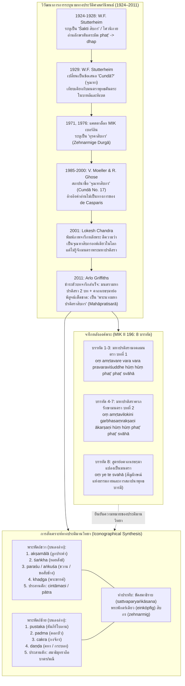

# บันทึกการอ่านและวิเคราะห์เอกสารจารึกวิทยาฉบับสมบูรณ์ (Epigraphic Source Dossier)
## พระนางมหาปรติสราสิบกรแห่งเกาะชวาในพิพิธภัณฑ์ศิลปะเอเชีย: ประติมานวิทยาและจารึกวิทยา (Die zehnarmige Mahāpratisarā von Java im Museum für Asiatische Kunst: Ikonographie und Epigraphik)

---

### ส่วนที่ 1: ข้อมูลบรรณานุกรมและการอ้างอิงมาตรฐาน (Bibliographic Metadata)

- **Source ID:** `S-2011-griffiths-02`
- **ชื่อไฟล์ PDF ในเครื่อง:** `S-2011-griffiths-02_Zehnarmige_Mahapratisara_Java.pdf`
- **ชื่อไฟล์ข้อความสกัด:** `S-2011-griffiths-02_Zehnarmige_Mahapratisara_Java.txt`
- **ประเภทเอกสาร:** บทความวิจัยเชิงวิพากษ์ทางจารึกวิทยาและประติมานวิทยาพุทธศิลป์ (Critical Research Article in Buddhist Epigraphy and Iconography) ตีพิมพ์ในวารสารวิชาการระดับนานาชาติที่มีการประเมินโดยผู้ทรงคุณวุฒิ (Peer-reviewed Journal) ของสมาคมศิลปะอินโด-เอเชีย ณ กรุงเบอร์ลิน (Gesellschaft für indo-asiatische Kunst Berlin e.V.)
- **ภาษาของเอกสาร:** ภาษาเยอรมัน (DE) พร้อมการอ้างอิงและปริวรรตตัวบทจารึกภาษาสันสกฤตพุทธศาสนา (Buddhist Sanskrit Dharani & Mantra Text) ถอดอักษรตามระบบสากล IAST ประกอบการวิพากษ์วรรณกรรมวิชาการภาษาดัตช์ อังกฤษ และฝรั่งเศส
- **ขอบเขตภูมิศาสตร์และวัฒนธรรม:** เกาะชวา ประเทศอินโดนีเซีย (ระบุแหล่งค้นพบเดิม ณ โบราณสถานจันทิ ลาราจงกรัง หรือปรัมบานัน แคว้นชวากลาง / Candi Lara Jonggrang, Central Java) เชื่อมโยงข้ามภูมิภาคกับเกาะบาหลี (เปเจง / Pejeng), เกาะสุมาตรา (มัวราจัมบีและบูมิอายู / Muara Jambi & Bumi Ayu), อินเดียภาคตะวันออก (แคว้นเบงกอล-พิหาร/มคธ ภายใต้ราชวงศ์ปาละ), เนปาล, ทิเบต, เอเชียกลาง และเอเชียตะวันออก
- **วัสดุและบริบทการค้นพบ:** รูปเคารพประติมากรรมสำริดหล่อตันขนาดเล็ก (Small-scale cast bronze statuette) ความสูง 15.0 ซม. กว้าง 7.5 ซม. เป็นรูปเทวีสิบกรประทับขัดสมาธิราบ (*sattvaparyaṅkāsana*) บนฐานบัว ด้านหลังองค์พระพุทธรูปจารึกคาถาและมนตราอักษรชวากลางตอนปลาย (Late Central Javanese Kawi Script) จำนวน 8 บรรทัด เดิมเป็นโบราณวัตถุในชุดสะสมของ Dieduksman ในศตวรรษที่ 19 เข้าสู่พิพิธภัณฑ์ชาติพันธุ์วิทยาเบอร์ลิน (Museum für Völkerkunde) ในปี ค.ศ. 1881 หมายเลขทะเบียนเดิม I c 10252 ปัจจุบันจัดแสดงถาวรในพิพิธภัณฑ์ศิลปะเอเชีย กรุงเบอร์ลิน (Museum für Asiatische Kunst, Staatliche Museen zu Berlin, Preußischer Kulturbesitz) รหัสโบราณวัตถุ Inv.-Nr. II 196
- **การอ้างอิงฉบับเต็มระบบ Chicago/Turabian Notes-Bibliography:**  
  Griffiths, Arlo. "Die zehnarmige Mahāpratisarā von Java im Museum für Asiatische Kunst: Ikonographie und Epigraphik." *Indo-Asiatische Zeitschrift: Mitteilungen der Gesellschaft für indo-asiatische Kunst* 15 (Berlin, 2011): 3–9.

---

### ส่วนที่ 2: แผนผังการจัดสรรเข้าสู่บทและหัวข้อย่อย (Chapter & Section Mapping Matrix)

- **บทที่ 3: จารึกบนรูปเคารพสำริดและประติมากรรมพุทธศาสนาในชวากลาง (Bronze Statuettes and Portable Epigraphy of Central Java)**
  * **หัวข้อย่อย 3.1 (จารึกบนหลังรูปเคารพสำริดขนาดเล็กเพื่อการบูชาส่วนบุคคล):**  
    นำข้อมูลการศึกษาประติมากรรมสำริดขนาด 15 ซม. (Inv.-Nr. II 196) ที่มีจารึกคาถาอักษรกวิชวากลาง 8 บรรทัดบนแผ่นหลัง (หน้า 3–4, 7) ไปเป็นกรณีศึกษาแม่บทของการสร้างรูปเคารพขนาดเล็กสำหรับพกพาหรือประดิษฐานในหิ้งบูชาส่วนตัว ซึ่งมักได้รับการอธิษฐานจิตและจารึกคาถาธารณีคุ้มครองภัยไว้ที่ด้านหลังองค์พระ
  * **หัวข้อย่อย 3.2 (การวิพากษ์ระเบียบวิธีทางอักขรวิทยาและการอ่านจารึกสำริด):**  
    ใช้ข้อวิพากษ์ของ Griffiths ต่อนักวิชาการรุ่นก่อน (Stutterheim 1924, 1928, 1929; Lokesh Chandra 2001) ที่อ่านอักษรผิดพลาด เช่น การอ่านตัวอักษร *pha* และ *ṭ* ที่มีเครื่องหมายวิรามะ (*phaṭ'*) พลาดเป็น *dhap* หรือการอ่านมนตราตันตระ *huṃ phaṭ'* เป็น *hung bapå* ในวัตถุสำริด D140 (หน้า 3, 7) เพื่อชี้ให้เห็นความจำเป็นของการใช้ความรู้ด้านไวยากรณ์มนตราตันตระร่วมกับการตรวจพิสูจน์อักษรโบราณ
  * **หัวข้อย่อย 3.3 (ปัญหาประวัติศาสตร์ที่มาและชุดสะสมโบราณวัตถุยุคอาณานิคม):**  
    ใช้กรณีศึกษาชุดสะสม Dieduksman (Dieduksman collection) ที่ถูกส่งมายังเบอร์ลินในปี ค.ศ. 1881 และข้ออ้างว่าพบที่จันทิ ลาราจงกรัง (ปรัมบานัน) (หน้า 3–4) ในการวิเคราะห์ประเด็นเรื่องความน่าเชื่อถือของแหล่งกำเนิดวัตถุ (provenance) และการแยกแยะระหว่างวัตถุแท้กับวัตถุปลอมในยุคอาณานิคมดัตช์

- **บทที่ 7: ศาสนา ความเชื่อ และเครือข่ายพุทธตันตระ/ไศวนิกายข้ามสมุทร: มนตรา ปรัชญา และการสังเคราะห์เทพเจ้า (Esoteric Buddhism, Tantric Networks, and Deity Synthesis)**
  * **หัวข้อย่อย 7.2 (เครือข่ายพุทธตันตระข้ามสมุทร: มณฑลปัญจรักษาและการบูชาพระมหาปรติสรา):**  
    ใช้ข้อพิสูจน์ของ Griffiths เรื่องการระบุนามพระนางมหาปรติสราสิบกร (หน้า 6–8) เพื่ออธิบายพัฒนาการของลัทธิบูชา "ปัญจรักษา" (*Pañcarakṣā* - เบญจคุ้มครอง) ในฐานะหัวใจของพุทธศาสนามหายาน-วัชรยานชวา โดยมีพระนางมหาปรติสราเป็นประธานแห่งเทวีทั้ง 5 ผู้คุ้มครองปัดเป่าสรรพภัยอันตราย โรคภัยไข้เจ็บ พิษร้าย และปกป้องคุ้มครองทารกในครรภ์มารดา (*garbhasaṃrakṣaṇī*)
  * **หัวข้อย่อย 7.3 (การสังเคราะห์และการหลอมรวมทางประติมานวิทยา: จุณฑา ปรติสรา และทุรคา):**  
    วิเคราะห์ปรากฏการณ์การซ้อนทับกันของคุณลักษณะทางประติมานวิทยา (Iconographic Overlap) ระหว่างพระนางมหาปรติสรา พระนางจุณฑา (*Cundā*) และเทวีทุรคา (*Durgā*) ในศิลปะชวากลาง (หน้า 3–6) ซึ่งสะท้อนการแลกเปลี่ยนสัญลักษณ์ทางศาสนาระหว่างลัทธิไศวนิกาย มหายาน และตันตรยาน โดยช่างชาวชวาได้หยิบยืมท่าถือบาตร/มณีในมือคู่หน้าที่ทำสมาธิมุทราจากจุณฑามาผสมผสานเข้ากับอาวุธสิบกรของปรติสรา
  * **หัวข้อย่อย 7.4 (ธารณีวิทยาและคัมภีร์มหาปรติสรามหาวัชรราชญีในเอเชียตะวันออกเฉียงใต้):**  
    นำตัวบทคาถาธารณีสองบทแรกจากคัมภีร์ *Mahāpratisarāmahāvidyārājñī* (`oṃ amṛtavare...` และ `oṃ amṛtavilokini...`) (หน้า 7) ไปเชื่อมโยงเปรียบเทียบกับจารึกแผ่นทองคำ-เงินที่พบ ณ จันทิเกอดง 1 เมืองมัวราจัมบี เกาะสุมาตรา และใบลานเนปาล-ทิเบต เพื่อแสดงถึงความแพร่หลายของคัมภีร์ชุดนี้ตลอดเส้นทางสายแพรไหมทางทะเล
  * **หัวข้อย่อย 7.5 (สูตรย่อคาถาเยธรฺมาในฐานะตราประทับแห่งธรรมและการแปลงเป็นมนตรา):**  
    วิเคราะห์สูตรย่อพิเศษ `oṃ ye te svāhā` ในบรรทัดที่ 8 ของจารึก (หน้า 7–8) ซึ่งเกิดจากการตัดย่อคาถา *ye dharmā hetuprabhavā...* ให้เหลือเฉพาะอักษรคำแรกและคำท้าย แล้วแปลงรูปโครงสร้างเป็นมนตราตันตระด้วยการใส่คำขึ้นต้น *oṃ* และคำลงท้าย *svāhā* ชี้ให้เห็นแบบแผนเฉพาะถิ่นที่มีหลักฐานหนาแน่นเฉพาะในเขตหมู่เกาะอินโดนีเซีย (ชวา สุมาตรา บาหลี)

- **หัวข้อย่อยใหม่ที่ค้นพบเพิ่มเติมและสังเคราะห์เข้าสู่เล่มหนังสือ:**
  * *หัวข้อย่อย 7.2.1: รูปเคารพพระมหาปรติสราสิบกรเศียรเดียวในบริบทศิลปะชวากับคัมภีร์สาธนมลารุ่นหลัง:*  
    การคลี่คลายความขัดแย้งระหว่างแบบแผนประติมานวิทยาจริงในพุทธศตวรรษที่ 14–15 (ชวาและเบงกอล) ที่นิยมสร้างรูปเทวีสิบกรหรือแปดกรแบบเศียรเดียว กับข้อกำหนดในคัมภีร์คู่มือพิธีกรรมรุ่นหลัง เช่น *Sādhanamālā 201* ที่ระบุให้มีสามเศียรสิบกร (หน้า 6)
  * *หัวข้อย่อย 7.5.1: ปรากฏการณ์ "Om Ye Te Svaha" ในจารึกหมู่เกาะ: เอกลักษณ์จารึกวิทยาพุทธชวา-บาหลี-สุมาตรา:*  
    การรวบรวมหลักฐานทางจารึกวิทยาของการใช้คาถาเยธรฺมาย่อ `oṃ ye te svāhā` บนแผ่นทองคำบรมพุทโธ (Borobudur), แผ่นทองคำพิพิธภัณฑ์แห่งชาติจาการ์ตา, วัตถุดินเผาสถูปิกะ, จารึกบาหลีแห่งเปเจง และประติมากรรมชวาตะวันออก (หน้า 7–8) ซึ่งนักวิชาการระดับโลก (Peter Skilling, Mark Allon) ยืนยันว่าไม่พบรูปย่อลักษณะนี้ภายนอกเขตภูมิภาคอินโดนีเซีย

---

### ส่วนที่ 3: สรุปสาระสำคัญเชิงวิเคราะห์และจุดยืนทางวิชาการ (Executive Academic Analysis)

#### 1. วิทยานิพนธ์และข้อถกเถียงหลักของผู้เขียน (Core Argument / Thesis)
Arlo Griffiths นำเสนอข้อถกเถียงหลักเพื่อปฏิวัติการระบุนามและทำความเข้าใจประติมานวิทยาของประติมากรรมสำริดสิบกรชิ้นสำคัญจากชวากลาง (ปัจจุบันเก็บรักษา ณ พิพิธภัณฑ์ศิลปะเอเชีย กรุงเบอร์ลิน รหัส MIK II 196) ซึ่งในอดีตเกือบหนึ่งศตวรรษนับตั้งแต่ทศวรรษ 1920 ถูกเข้าใจผิดและระบุนามคลาดเคลื่อนสลับไปมาระหว่าง "เทวีทุรคาสิบกรของศาสนาพราหมณ์-ฮินดู" (Zehnarmige Durgā / Śakti) หรือ "พระนางจุณฑาสิบกรของพุทธมหายาน" (Zehnarmige Cundā) โดยมีนักวิชาการชั้นนำอย่าง W.F. Stutterheim (1924, 1928, 1929), Volker Moeller (1985), Rajeshwari Ghose (2000) และ Lokesh Chandra (2001) ผลิตซ้ำการระบุนามว่าพระนางจุณฑาอย่างต่อเนื่อง จนทำให้ประติมากรรมชิ้นนี้กลายเป็น "พระนางจุณฑาสิบกรเพียงองค์เดียวในโลกศิลปะพุทธศาสนา"

Griffiths อาศัยวิธีการทาง "จารึกวิทยาเชิงประจักษ์ผสานประติมานวิทยา" (Epigraphically grounded Iconography) ชี้ให้เห็นว่า ข้อพิสูจน์เด็ดขาดที่ยุติข้อสงสัยทั้งหมดไม่ได้อยู่ที่การถกเถียงลักษณะทางประติมานวิทยาภายนอกที่อาจมีการซ้อนทับกันได้ แต่อยู่ที่การอ่านและชำระตัวบทจารึกอักษรกวิชวากลาง 8 บรรทัดที่สลักไว้บนแผ่นหลังขององค์พระอย่างละเอียด ซึ่ง Griffiths ได้พิสูจน์ว่าข้อความดังกล่าวประกอบด้วยมนตรา 3 ชุด:
1. มนตราชุดที่หนึ่ง (บรรทัดที่ 1–3): บันทึกมนตราประจำองค์พระมหาปรติสราบทแรก
2. มนตราชุดที่สอง (บรรทัดที่ 4–7): บันทึกมนตราประจำองค์พระมหาปรติสราบทที่สอง
3. มนตราชุดที่สาม (บรรทัดที่ 8): บันทึกสูตรย่อของคาถาเยธรฺมาในรูปมนตรา `oṃ ye te svahā`

มนตราสองบทแรกนั้นมีข้อความตรงกับบทสวดในคัมภีร์ภาษาสันสกฤต *Mahāpratisarāmahāvidyārājñī* (คัมภีร์มหาปรติสรามหาวัชรราชญี หรือ "มหาราชินีแห่งมนตราอันศักดิ์สิทธิ์") อันเป็นคัมภีร์หลักของพระนางมหาปรติสรา หนึ่งในคณะเทพีเบญจคุ้มครองหรือ "ปัญจรักษา" (*Pañcarakṣā*) แห่งพุทธวัชรยาน การค้นพบนี้ล้มล้างสมมติฐานเดิมเรื่องพระนางจุณฑาอย่างสิ้นเชิง เนื่องจากพระนางจุณฑามีมนตราประจำพระองค์ที่เป็นมาตรฐานตายตัวในทุกแหล่งข้อมูลคือ `oṃ cale cule cunde svāhā` ซึ่งไม่ปรากฏในจารึกนี้เลย ยิ่งไปกว่านั้น อาวุธและสิ่งของมงคลในพระหัตถ์ทั้งสิบขององค์พระ (ประคำ, คัมภีร์, สังข์, ดอกบัว, ขวาน/ขอสับช้าง, จักร, พระขรรค์, คทา/กระบอง, และแก้วจินดามณี/บาตรในพระหัตถ์คู่หน้าที่ประสานทำสมาธิมุทรา) ล้วนสอดคล้องอย่างลึกซึ้งกับประติมานวิทยาของพระนางมหาปรติสราที่พบในแคว้นเบงกอล ยุคราชวงศ์ปาละ และคู่มือพิธีกรรมพุทธตันตระ แม้จะได้รับอิทธิพลท่าสมาธิมุทราถือบาตรจากพระนางจุณฑามาผสมผสานก็ตาม ดังนั้น ประติมากรรมสำริดชิ้นนี้จึงเป็นหลักฐานชิ้นเอกที่ยืนยันการมีอยู่ของรูปเคารพ "พระนางมหาปรติสราสิบกร" ในศิลปะชวากลางช่วงพุทธศตวรรษที่ 14–15 (ศตวรรษที่ 9–10)

#### 2. บริบทประวัติศาสตร์นิพนธ์และการวิพากษ์ความน่าเชื่อถือของแหล่งข้อมูล (Historiography & Source Criticism)
บทความนี้เปิดเผยให้เห็นรอยต่อและการเปลี่ยนผ่านทางประวัติศาสตร์นิพนธ์ในการศึกษารูปเคารพโบราณคดีชวาในยุโรปตลอดระยะเวลาเกือบหนึ่งศตวรรษ:
1. **ยุคอาณานิคมและการตีความเบื้องต้น (ทศวรรษ 1920):** W.F. Stutterheim เริ่มสำรวจโบราณวัตถุสำริดชวาในพิพิธภัณฑ์ยุโรปตั้งแต่ปี ค.ศ. 1924 ในฐานะนักศึกษา ก่อนจะเข้ารับราชการในกรมโบราณคดีเนเธอร์แลนด์-อินดีส (Oudheidkundige Dienst) เขาได้บันทึกไว้ในรายงานการเดินทาง (*Bijdragen* 1924) ว่าพบเทวรูปสำริด "ศักติสิบกร" พร้อมจารึกมนตราที่ลงท้ายด้วย `oṃ ye te svāhā` ต่อมาในรายงาน *Oudheidkundig Verslag 1927* (ตีพิมพ์ 1928) Stutterheim ได้ให้รายละเอียดภาพรวมและคัดลอกตัวบทจารึกอย่างละเอียด พร้อมบันทึกว่าโบราณวัตถุนี้มาจากชุดสะสมของ Dieduksman ซึ่งแม้เจ้าของเดิมจะมีชื่อเสียงไม่น่าไว้วางใจในการสะสมของโบราณ แต่โบราณวัตถุชิ้นนี้มีความแท้แน่นอน โดยมีคำบอกเล่าว่าได้มาจากจันทิ ลาราจงกรัง (พุทธศตวรรษที่ 14) อย่างไรก็ดี Stutterheim มีความชำนาญในด้านวรรณคดีและโบราณคดีชวามากกว่าด้านจารึกวิทยาและวรรณกรรมมนตราตันตระภาษาสันสกฤต ทำให้เขาอ่านตัวอักษรสำคัญผิดพลาด เช่น การอ่านตัวอักษรพยางค์ตันตระ *phaṭ'* กลายเป็น *dhap* และตีความว่าเป็นมนตราไศวนิกาย จนกระทั่งในปี ค.ศ. 1929 ในหนังสือโบราณคดีบาหลี (*Oudheden van Bali*) เขาจึงยอมรับว่าจารึกนี้เป็นมนตราพุทธศาสนาแบบเดียวกับที่พบในทิเบต และเสนออย่างลังเลว่ารูปเคารพนี้น่าจะเป็น "พระนางจุณฑา" (*Cundā*)
2. **การยึดถือตามและการผลิตซ้ำข้อผิดพลาดในแคตตาล็อกพิพิธภัณฑ์ (ค.ศ. 1971–2000):** ในแคตตาล็อกของพิพิธภัณฑ์ศิลปะอินเดียเบอร์ลิน (Museum für Indische Kunst Berlin - MIKB) ปี ค.ศ. 1971 และ 1976 รูปเคารพนี้ถูกลงทะเบียนเป็น "ทุรคาสิบกร" (*Zehnarmige Durgā*) ตามความคุ้นเคยทางเทววิทยาฮินดู จนกระทั่ง Volker Moeller (1985) ได้ตีพิมพ์ภาพถ่ายด้านหน้าและเปลี่ยนชื่อกลับมาเป็น "จุณฑาสิบกร" (*Zehnarmige Cundā*) ตามความเห็นของ Stutterheim ซึ่งได้รับการสนับสนุนจาก J.G. de Casparis นักจารึกวิทยาชื่อก้องที่ให้คำปรึกษาแก่พิพิธภัณฑ์อย่างไม่เป็นทางการ แม้กระทั่ง Rajeshwari Ghose (2000) ก็ยังคงเรียกเป็น "เทวีตันตระสิบกร (จุณฑา?)" โดยอ้างอิงความเห็นที่ไม่ได้ตีพิมพ์ของ de Casparis และ Lokesh Chandra
3. **การหลุดรอดสายตาของปรมาจารย์ด้านประติมานวิทยาพุทธศาสนา (Lokesh Chandra 2001):** จุดพลิกผันสำคัญเกิดขึ้นเมื่อ Lokesh Chandra ปรมาจารย์ด้านพุทธศิลป์ชาวอินเดีย นำภาพถ่ายด้านหลังที่มีจารึกไปตีพิมพ์เป็นครั้งแรกใน *Dictionary of Buddhist Iconography* เล่ม 3 (ค.ศ. 2001) ภายใต้รายการ "Cundā No. 17" แม้ Lokesh Chandra จะปรับปรุงการอ่านจารึกของ Stutterheim ให้ดีขึ้นมาก แต่เขากลับล้มเหลวในการจดจำตัวบทมนตราของพระมหาปรติสรา ทั้งที่ตนเองเคยตีพิมพ์ต้นฉบับคัมภีร์ *Pañca-Rakṣā* จากเนปาล (ค.ศ. 1981) และเคยเขียนบทความเกี่ยวกับพุทธตันตระในอินโดนีเซีย (ค.ศ. 1983) Lokesh Chandra พยายามแถไถว่าคำว่า *ye* ในมนตราท้ายคือรูปสัมปทานการกของคำว่าเทวี (*devyai*) เพื่อให้เข้ากับพระนางจุณฑา ซึ่งเป็นการตีความทางไวยากรณ์ที่ไม่ถูกต้อง
4. **การชำระสะสางและการสถาปนาข้อสรุปใหม่ของ Gerd Mevissen และ Arlo Griffiths (ค.ศ. 1999–2011):** ปูมหลังที่นำไปสู่ความสำเร็จของ Griffiths คือผลงานวิจัยบุกเบิกของ Gerd J.R. Mevissen (1999) ใน *Journal of Bengal Art* ซึ่งได้พิสูจน์อย่างกระจ่างแจ้งว่ารูปเคารพแปดกรจำนวนมากในอินเดียภาคตะวันออกที่เคยถูกระบุว่าเป็นพระนางจุณฑา แท้จริงแล้วคือ "พระนางมหาปรติสรา" ต่อมา Griffiths ได้นำกรอบคิดดังกล่าวมาผสานกับการตรวจพิสูจน์ตัวบทจารึกทางจารึกวิทยาอย่างแม่นยำ ทำให้สามารถไขปริศนาโบราณวัตถุชิ้นนี้ได้อย่างเด็ดขาดสมบูรณ์ ยุติความสับสนที่มีมายาวนานเกือบ 90 ปี

#### แผนผังวิวัฒนาการทางประวัติศาสตร์นิพนธ์และการจำแนกประติมานวิทยาพระนางมหาปรติสราสิบกร (Berlin MIK II 196)

---

### ส่วนที่ 4: สารบัญข้อค้นพบเชิงลึกแยกตามมิติจารึกวิทยา (Thematic Epigraphic Findings with Exact Pages)

1. **ประวัติศาสตร์นิพนธ์และการคลี่คลายปัญหาการระบุนาม (Historiography & Identification):**
   - *จุดกำเนิดจากคอลเลกชัน Dieduksman และข้อสันนิษฐานเรื่องจันทิ ลาราจงกรัง:* ประติมากรรมสำริดชิ้นนี้ถูกพบเห็นเป็นครั้งแรกโดย W.F. Stutterheim ในปี ค.ศ. 1924 ณ พิพิธภัณฑ์ชาติพันธุ์วิทยาเบอร์ลิน และบันทึกเพิ่มเติมใน *Oudheidkundig Verslag 1927* (ตีพิมพ์ ค.ศ. 1928) ว่าโบราณวัตถุนี้ได้มาจากชุดสะสมของ Dieduksman ซึ่งแม้เจ้าของเดิมจะมีชื่อเสียงไม่น่าไว้วางใจในการสะสมของโบราณ แต่ Stutterheim ยืนยันว่าเนื้อสำริดและฝีมือช่างเป็นของแท้แน่นอนจากชวากลาง โดยมีบันทึกว่าได้มาจาก "Candi Lara Jonggrang" (ปรัมบานัน) ส่งเข้าเบอร์ลินในปี 1881 ทะเบียนเดิม I c 10252 (หน้า 3–4)
   - *ความเข้าใจผิดเกือบหนึ่งศตวรรษว่าด้วยจุณฑาสิบกร:* รูปเคารพนี้ถูกจัดแสดงในพิพิธภัณฑ์ศิลปะอินเดียเบอร์ลิน (ปัจจุบันคือพิพิธภัณฑ์ศิลปะเอเชีย) โดยแคตตาล็อกปี 1971 และ 1976 ระบุเป็น "Durgā สิบกร" ต่อมา Moeller (1985), Ghose (2000) และ Lokesh Chandra (2001) ได้ระบุเป็น "Cundā สิบกร" ส่งผลให้วงวิชาการสากลเข้าใจว่าเป็นรูปเคารพพระนางจุณฑาสิบกรเพียงองค์เดียวในโลก โดยไม่เคยมีผู้ใดตรวจสอบตัวบทจารึกด้านหลังอย่างจริงจัง (หน้า 3–6)
   - *การปฏิวัติข้อสมมติฐานด้วยผลงานของ Mevissen:* Griffiths อาศัยงานวิจัยบุกเบิกของ Gerd Mevissen (1999) ที่เคยพิสูจน์ว่ารูปเคารพแปดกรในเบงกอลที่เคยเข้าใจว่าเป็นพระนางจุณฑา แท้จริงแล้วคือพระนางมหาปรติสรา มาเป็นแรงบันดาลใจในการตรวจสอบรูปเคารพสิบกรองค์นี้ จนนำไปสู่การพิสูจน์อย่างเด็ดขาดว่ารูปสำริดเบอร์ลินนี้คือ "พระนางมหาปรติสราสิบกร" (หน้า 6)

2. **ตัวบทจารึก การอ่าน ศักราช และอักขรวิทยา (Text, Palaeography & Date):**
   - *ลักษณะทางอักขรวิทยาและอายุสมัย:* จารึกด้านหลังองค์พระจารึกด้วย "อักษรชวากลางตอนปลาย" (spät zentral-javanisch) กำหนดอายุได้ในราวพุทธศตวรรษที่ 14–15 (ศตวรรษที่ 9–10 แห่งคริสต์ศักราช) จัดวางเป็นแถวแนวตั้ง 8 บรรทัด มีการใช้เครื่องหมายวิรามะ (virāma) รูปจุดกลางกำกับตัวสะกดตาย และมีเครื่องหมายเปิดวรรค `//` และเครื่องหมายปิดวรรคคู่ `||` (หน้า 3, 7)
   - *การแก้ไขข้อผิดพลาดทางการอ่านของ Stutterheim และ Lokesh Chandra:* Stutterheim อ่านอักษรพยางค์มนตราตันตระ *phaṭ'* ผิดพลาดอย่างต่อเนื่องเป็น *dhap* เนื่องจากไม่เข้าใจสัทวิทยาและอักขรวิธีของมนตราตันตระ ขณะที่ Lokesh Chandra อ่านข้ามเครื่องหมายเปิดวรรค ละเลยการบันทึกสระสั้นสระยาวตามจริง และอ่านในบรรทัดที่ 6 ผิดเป็น `sa[ṃ]karṣaṇi` ซึ่ง Griffiths ได้ชำระใหม่อย่างถูกต้องเป็น `akarsaṇi` (รูปเขียนผิดเล็กน้อยจาก `ākarṣaṇi`) นอกจากนี้ Griffiths ยังยกตัวอย่างเปรียบเทียบกับจารึกสำริด D140 ในพิพิธภัณฑ์แห่งชาติจาการ์ตา ที่ K.C. Crucq (1929) อ่านผิดเป็น `hung bapå oṃ` ทั้งที่ความจริงต้องอ่านว่า `hūṃ phaṭ' oṃ` (หน้า 3, 7)
   - *คำอ่านปริวรรตฉบับชำระสมบูรณ์ของ Arlo Griffiths:*  
     บรรทัดที่ 1: `// o[ṃ a](mṛ)tava-`  
     บรรทัดที่ 2: `re vara vara pravaraviśu-`  
     บรรทัดที่ 3: `ddhe huṃ huṃ phaṭ' pha(ṭ)' sva-`  
     บรรทัดที่ 4: `hā oṃ (a)mṛtavil(o)-`  
     บรรทัดที่ 5: `kini garbhasaṃrakṣaṇi`  
     บรรทัดที่ 6: `akarsaṇi huṃ huṃ`  
     บรรทัดที่ 7: `phaṭ' phaṭ' svahā ||`  
     บรรทัดที่ 8: `oṃ ye te svahā ||` (หน้า 7)

3. **มิติศาสนา ลัทธิความเชื่อ และประติมานวิทยาพุทธตันตระ (Iconography & Tantric Cult):**
   - *มนตราสองบทแรกจากคัมภีร์มหาปรติสรามหาวัชรราชญี:* ข้อความบรรทัดที่ 1–7 ตรงกับมนตราสองบทแรกที่ปรากฏในคัมภีร์ภาษาสันสกฤต *Mahāpratisarāmahāvidyārājñī* อย่างแม่นยำ ได้แก่ มนตราอมฤตวเร (`oṃ amṛtavare vara vara pravaraviśuddhe hūṃ hūṃ phaṭ phaṭ svāhā`) และมนตราอมฤตวิโลกินี (`oṃ amṛtavilokini garbhasaṃrakṣaṇi ākarṣaṇi hūṃ hūṃ phaṭ phaṭ svāhā`) โดยมนตราที่สองมีหน้าที่ปกป้องทารกในครรภ์มารดาโดยตรง (*garbhasaṃrakṣaṇī*) และเรียกความคุ้มครอง (*ākarṣaṇī*) (หน้า 7)
   - *ข้อแตกต่างระหว่างมนตราของพระมหาปรติสรากับพระนางจุณฑา:* Griffiths ชี้ให้เห็นความล้มเหลวของ Lokesh Chandra ในการพยายามโยงมนตรานี้เข้ากับพระนางจุณฑา เพราะมนตราประจำองค์พระนางจุณฑาในคัมภีร์พุทธตันตระทุกเล่มคือ `oṃ cale cule cunde svāhā` ดังนั้นการปรากฏของมนตรามหาปรติสราจึงเป็นหลักฐานเด็ดขาดที่ไม่อาจโต้แย้งได้ (หน้า 7)
   - *การวิเคราะห์สิ่งของมงคลในพระหัตถ์ทั้งสิบ (Attributes Matrix):*  
     - ด้านขวา (จากบนลงล่าง): 1. ลูกประคำ (*akṣamālā*) 2. หอยสังข์ (*śaṅkha*) 3. ขวาน (*paraśu*) หรือ ขอสับช้าง (*aṅkuśa*) 4. พระขรรค์ (*khaḍga*) 5. พระหัตถ์ประสานบนตักถือแก้วจินดามณี (*cintāmaṇi*) หรือบาตร (*pātra*)  
     - ด้านซ้าย (จากบนลงล่าง): 1. คัมภีร์ (*pustaka*) 2. ดอกบัว (*padma*) 3. จักร (*cakra*) 4. คทาหรือกระบอง (*daṇḍa*) 5. พระหัตถ์ประสานในสมาธิมุทรา  
     ประทับขัดสมาธิราบ (*sattvaparyaṅkāsana*) มีพระพักตร์เดียวสิบกร แม้ในคัมภีร์รุ่นหลังอย่าง *Sādhanamālā 201* จะระบุว่าพระมหาปรติสราสิบกรมีสามเศียร แต่ประติมากรรมรุ่นเก่าในชวาและเบงกอลมักสร้างเป็นเศียรเดียวเสมอ (หน้า 6–7)
   - *การผสมผสานประติมานวิทยาข้ามเทพเจ้า (Iconographic Contamination):* ท่าทางพระหัตถ์คู่หน้าสุดที่วางซ้อนกันทำสมาธิมุทราและมีบาตรหรือมณีวางอยู่นั้น ได้รับอิทธิพลโดยตรงจากประติมานวิทยามาตรฐานของพระนางจุณฑา (ตามที่ Marie-Thérèse de Mallmann 1975 ได้ตั้งข้อสังเกตไว้ว่ารูปเคารพจุณฑาทุกองค์ต้องมีพระหัตถ์เดิมทำสมาธิมุทราถือบาตร) ซึ่งสะท้อนการแลกเปลี่ยนและผสมผสานลักษณะทางศิลปะระหว่างลัทธิการบูชาเทวีในชวากลาง (หน้า 7)

4. **จารึกวิทยาของคาถาเยธรฺมาย่อ: เอกลักษณ์ของโลกมลายู-อินโดนีเซีย (The "Om Ye Te Svaha" Phenomenon):**
   - *การถอดรหัสสูตรย่อ `oṃ ye te svahā`:* Stutterheim (1929) และ J.L. Brandes (ใน Groeneveldt 1887) เสนออย่างถูกต้องว่าวลีนี้เป็นการย่อคาถาหัวใจพุทธศาสนาหรือ "เย ธรฺมา" (*ye dharmā hetuprabhavā...*) โดยนำคำแรก (*ye*) และคำท้ายของบาทแรก (*te* จาก *teṣāṃ*) หรือการดัดแปลงเป็นมนตราตันตระด้วยการประกบคำว่า *oṃ ... svāhā* (หน้า 7–8)
   - *หลักฐานความเชื่อมโยงในจารึกแผ่นทองคำชวา:* ข้อพิสูจน์เด็ดขาดว่าวลีนี้คือการย่อคาถาเยธรฺมา มาจากจารึกแผ่นทองคำสองแผ่นในพิพิธภัณฑ์แห่งชาติจาการ์ตา (ตีพิมพ์โดย Boechari & Wibowo 1985/86):  
     - แผ่นทองคำหมายเลข 6255b (หน้า 217): ปรากฏข้อความเต็มเชื่อมต่อกันว่า `oṃ ye te svaha ye dharmmā hetuprabhavā hetun teṣāṃ tathāgato ca yo nirodha...`  
     - แผ่นทองคำหมายเลข 6522 (หน้า 222–223): ปรากฏข้อความ `oṃ ye te svahā ye dharmmā hetuprabhavā oṃ`  
     นอกจากนี้ยังพบรูปย่อ `ye te svā` บนวัตถุดินเผาสถูปิกะที่ขุดพบบริเวณบุโรพุทโธ (ตีพิมพ์โดย Boechari et al. 1979; Soekmono & Anom 2005) และแผ่นทองคำหมายเลข 783a, 783b, 1, 1191, 7994 (หน้า 8)
   - *ข้อสังเกตระดับนานาชาติของ Peter Skilling และ Mark Allon:* Griffiths ได้รับการยืนยันจาก Peter Skilling ผ่านการติดต่อส่วนตัวว่า รูปแบบการตัดย่อคาถาเยธรฺมาเป็น `oṃ ye te svāhā` นี้ "ไม่เคยปรากฏนอกเขตหมู่เกาะอินโดนีเซียเลย" ขณะที่ Mark Allon ได้ตรวจสอบในงานสารบัญจารึกพุทธศาสนาในอินเดียของ Keisho Tsukamoto (1996–1998) สองเล่มใหญ่ ก็ยืนยันเช่นกันว่าไม่พบสูตรย่อนี้ในจารึกอินเดีย แสดงให้เห็นอย่างชัดเจนว่าเป็น "อัตลักษณ์ทางพิธีกรรมและจารึกวิทยาเฉพาะของภูมิภาคอินโดนีเซียโบราณ" (หน้า 8)
   - *หน้าที่ของสูตรย่อในฐานะบทสวดปิดท้ายคัมภีร์ (Colophon/Consecration Formula):* ในคัมภีร์ใบลานของ *Mahāpratisarāmahāvidyārājñī* จากอินเดียตะวันออกและเนปาล มักจะพบคัมภีร์จบลงด้วยการจารึกคาถาเยธรฺมาเสมอ ดังนั้น ผู้จารึกบนแผ่นหลังพระสำริดชวาจึงนำมนตราเฉพาะของมหาปรติสรามาลงไว้ก่อน แล้วปิดท้ายด้วยคาถาเยธรฺมาฉบับย่อเพื่อทำหน้าที่เป็นมงคลคาถาประสิทธิ์ประสาทความศักดิ์สิทธิ์และเป็นเครื่องหมายรับรองความเป็นพุทธศาสนา (หน้า 8)

5. **มิติปฏิสัมพันธ์ข้ามสมุทรและเครือข่ายพุทธตันตระนานาชาติ (Trans-Maritime Networks):**
   - *เส้นทางเครือข่ายปัญจรักษา อินเดียตะวันออก-เนปาล-ชวา-สุมาตรา:* ลัทธิการบูชาพระนางมหาปรติสราและคณะปัญจรักษาแพร่กระจายจากศูนย์กลางพุทธศาสนาในอินเดียภาคตะวันออก (แคว้นมคธและเบงกอล สมัยราชวงศ์ปาละ) สู่เนปาล ทิเบต และแผ่ขยายผ่านเส้นทางการค้าทางทะเลข้ามมหาสมุทรอินเดียเข้าสู่เกาะสุมาตรา (พบแผ่นทองคำ-เงินจันทิเกอดง 1 มัวราจัมบี และประติมากรรมหินที่บูมิอายู) และเกาะชวา (ประติมากรรมสำริดเบอร์ลิน และโบราณสถานยุคชวากลาง) (หน้า 6–8)
   - *บทบาทของมหาปรติสราในฐานะเทวีผู้พิทักษ์แห่งการเดินทางทางทะเล:* คัมภีร์มหาปรติสราฯ มีเนื้อหาเน้นย้ำเรื่องการคุ้มครองผู้สวดให้รอดพ้นจากภัยพิบัติทางธรรมชาติ ภัยจากสัตว์ร้าย โจรภัย อสรพิษ โรคระบาด และโดยเฉพาะอย่างยิ่ง "ภัยเรืออัปปางในมหาสมุทร" ทำให้พระนางกลายเป็นเทวีที่ได้รับความเคารพนับถือสูงสุดในหมู่นักเดินเรือ พ่อค้า และพระภิกษุผู้จาริกแสวงบุญข้ามสมุทร (หน้า 6–8)

6. **มิติจารึกบนรูปเคารพขนาดเล็กและจริยธรรมโบราณคดี (Portable Statuettes & Archaeological Ethics):**
   - *บทบาทของรูปเคารพสำริดขนาดพกพา:* ประติมากรรมขนาด 15 ซม. สะท้อนการสร้างวัตถุบูชาส่วนตัวของชนชั้นนำหรือนักบวชตันตระ ที่ต้องการพกพาความคุ้มครองทางจิตวิญญาณติดตัวไปในระหว่างการเดินทาง หรือประดิษฐานในหิ้งบูชาส่วนตัว การจารึกด้านหลังองค์พระกระทำขึ้นเพื่อเปลี่ยนรูปสำริดธรรมดาให้กลายเป็น "สรีระธรรมกาย" (*Dharmakāya*) ที่มีชีวิตผ่านพระมนตรา (หน้า 3, 7–8)
   - *ปัญหาแหล่งกำเนิดเดิม (Provenance) กับโบราณคดีชวา:* การระบุว่าโบราณวัตถุชิ้นนี้มาจาก "Candi Lara Jonggrang" (เทวสถานไศวนิกายหลวงแห่งปรัมบานัน) เป็นประเด็นที่ต้องระมัดระวัง แม้ Stutterheim จะใช้ประเด็นนี้อธิบายว่าอาจมีการปฏิบัติพิธีกรรมตันตระปนเปกันในบริเวณปรัมบานัน แต่ก็มีความเป็นไปได้สูงที่โบราณวัตถุนี้จะถูกเคลื่อนย้ายมาจากศาสนสถานพุทธมหายานใกล้เคียง เช่น จันทิเซวู (Candi Sewu) หรือจันทิปลาโอซัน (Candi Plaosan) แล้วตกไปอยู่ในมือของชาวบ้านและนักสะสมอย่าง Dieduksman ในช่วงคริสต์ศตวรรษที่ 19 ซึ่งเป็นยุคที่ตลาดมืดค้าโบราณวัตถุในชวากลางเฟื่องฟู (หน้า 3–4)

---

### ส่วนที่ 5: คลังข้อความอ้างอิงตรงและเชิงอรรถสำเร็จรูป (Verbatim Quotes & Footnote Bank)

1. **บันทึกทางประวัติศาสตร์ของ Stutterheim เกี่ยวกับรูปสำริดในเบอร์ลิน (ค.ศ. 1928):**
   - *ข้อความภาษาเยอรมัน/ดัตช์เดิม:*  
     > "Dieses kurze, aber für die Kenntnis des am Caṇḍi Lara Jonggrang praktizierten Śivaismus (?) wichtige Mantra werde ich in meiner Erörterung gleichartiger, in Pejeng auf Bali gefundener buddhistischer Mantras näher betrachten. Das Figürchen soll vom Caṇḍi Lara Jonggrang stammen. Es kam 1881 nach Berlin und wurde unter Nr. I c 10252 erfasst." (Griffiths 2011, 3–4, อ้างจาก Stutterheim 1928, 191)
   - *คำแปลภาษาไทยเชิงวิชาการ:*  
     "มนตรานี้แม้จะสั้น แต่มีความสำคัญอย่างยิ่งต่อความเข้าใจเกี่ยวกับลัทธิไศวนิกาย (?) ที่เคยปฏิบัติกัน ณ จันทิ ลาราจงกรัง ซึ่งข้าพเจ้าจะได้นำไปพิจารณาเปรียบเทียบอย่างละเอียดกับมนตราพุทธศาสนาลักษณะเดียวกันที่ค้นพบ ณ ตำบลเปเจง บนเกาะบาหลี... รูปเคารพขนาดเล็กนี้กล่าวกันว่าได้มาจากจันทิ ลาราจงกรัง ส่งมาถึงกรุงเบอร์ลินในปี ค.ศ. 1881 และได้รับการลงทะเบียนไว้ภายใต้หมายเลข I c 10252"
   - *การนำไปใช้อ้างอิง:* ใช้ในบทที่ 3 และบทที่ 7 เพื่อแสดงให้เห็นจุดเริ่มต้นของข้อถกเถียงเรื่องแหล่งกำเนิดวัตถุจากปรัมบานัน และความพยายามยุคแรกของ Stutterheim ในการตีความจารึกหลังองค์พระ

2. **ทัศนะของ Stutterheim ต่อมนตราตันตระในชวากลาง (ค.ศ. 1929):**
   - *ข้อความภาษาเยอรมันเดิม:*  
     > "Es wird unmittelbar auffallen, dass, wegen der Verbesserung, die es für unsere Vorstellung vom buddhistischen Zentral-Java bringt, auch dieses Figürchen ein wichtiges Exemplar genannt werden darf. Kein frommes Gebet, sondern ein Zauberspruch der Art, die wir überall in Tibet finden und die in den Augen der Buddhismus-Verehrer dem Buddhismus dort eine minderwertige Note gegeben hat." (Griffiths 2011, 5, อ้างจาก Stutterheim 1929, 42)
   - *คำแปลภาษาไทยเชิงวิชาการ:*  
     "จะเห็นได้ในทันทีว่า รูปเคารพขนาดเล็กนี้สมควรได้รับการยกย่องให้เป็นโบราณวัตถุชิ้นสำคัญยิ่ง เนื่องด้วยคุณค่าในการปรับปรุงมโนทัศน์เดิมของเราเกี่ยวกับพุทธศาสนาในชวากลาง จารึกนี้มิใช่บทสวดอ้อนวอนอันศรัทธา หากแต่เป็นมนตราเวทมนตร์คาถาในลักษณะที่เราพบได้ทั่วไปในทิเบต ซึ่งในสายตาของผู้เลื่อมใสพุทธศาสนาสายบริสุทธิ์เคยมองว่าสิ่งเหล่านี้ได้ลดทอนคุณค่าของพุทธศาสนาในดินแดนแถบนั้นลง"
   - *การนำไปใช้อ้างอิง:* ใช้ในบทที่ 7 เพื่อสะท้อนอคติทางประวัติศาสตร์นิพนธ์ของนักวิชาการอาณานิคมยุคแรกต่อพุทธศาสนาตันตระ/วัชรยาน และการค้นพบหลักฐานมนตราเวทมนตร์ในชวากลาง

3. **ตัวบทจารึกหลังพระสำริดเบอร์ลิน ปริวรรตอักษร IAST โดย Arlo Griffiths (2011):**
   - *ตัวบทจารึกภาษาสันสกฤตอักษรชวากลาง (Transliteration):*  
     > Berlin, MIK II 196 (Rückseite)  
     > (1) // o[ṃ a](mṛ)tava-  
     > (2) re vara vara pravaraviśu-  
     > (3) ddhe huṃ huṃ phaṭ' pha(ṭ)' sva-  
     > (4) hā oṃ (a)mṛtavil(o)-  
     > (5) kini garbhasaṃrakṣaṇi  
     > (6) akarsaṇi huṃ huṃ  
     > (7) phaṭ' phaṭ' svahā ||  
     > (8) oṃ ye te svahā ||  
     > (Griffiths 2011, 7)
   - *คำแปลภาษาไทยเชิงวิชาการ:*  
     "โอม ผู้ทรงความประเสริฐแห่งน้ำอมฤต โปรดประทานพรอันประเสริฐ โปรดประทานพรอันประเสริฐแด่ผู้บริสุทธิ์ยิ่ง ฮูง ฮูง ผัฏ ผัฏ สวาหา  
     โอม ผู้ทรงทอดพระเนตรด้วยน้ำอมฤต พระผู้คุ้มครองทารกในครรภ์ พระผู้ทรงดึงดูดสิ่งมงคล ฮูง ฮูง ผัฏ ผัฏ สวาหา ||  
     โอม เย เต สวาหา ||"
   - *การนำไปใช้อ้างอิง:* ใช้ในบทที่ 3 และบทที่ 7 เป็นหลักฐานตัวบทปฐมภูมิชิ้นสำคัญที่สุดในการยืนยันเอกลักษณ์ของพระนางมหาปรติสรา

4. **การเปรียบเทียบกับตัวบทมนตราในคัมภีร์มหาปรติสรามหาวัชรราชญี:**
   - *ตัวบทคัมภีร์ภาษาสันสกฤต (Sanskrit Text from Mahāpratisarāmahāvidyārājñī):*  
     > "oṃ amṛtavare vara vara pravaraviśuddhe hūṃ hūṃ phaṭ phaṭ svāhā |  
     > oṃ amṛtavilokini garbhasaṃrakṣaṇi ākarṣaṇi hūṃ hūṃ phaṭ phaṭ svāhā |" (Griffiths 2011, 7, อ้างจาก Hidas 2007, 189–190, Anm. 21)
   - *คำแปลภาษาไทยเชิงวิชาการ:*  
     "โอม พระผู้ทรงคุณอันประเสริฐแห่งความเป็นอมฤต ประทานพร ประทานพร ผู้ทรงความบริสุทธิ์อย่างยิ่ง ฮูง ฮูง ผัฏ ผัฏ สวาหา |  
     โอม พระผู้ทรงเพ่งมองด้วยสายพระเนตรอมฤต พระผู้พิทักษ์รักษาทารกในครรภ์ พระผู้ทรงดึงดูดสรรพสิริมงคล ฮูง ฮูง ผัฏ ผัฏ สวาหา |"
   - *การนำไปใช้อ้างอิง:* ใช้ในบทที่ 7 หัวข้อย่อย 7.2 และ 7.4 เพื่อพิสูจน์ความสอดคล้องระดับคำต่อคำระหว่างจารึกบนหลังพระสำริดชวากับคัมภีร์ต้นฉบับในอินเดียและเนปาล

5. **ข้อวิพากษ์ความล้มเหลวในการระบุนามของ Lokesh Chandra:**
   - *ข้อความภาษาเยอรมันเดิม:*  
     > "In seinem Dictionary äußert LOKESH CHANDRA mehrere Vorschläge zur Interpretation dieser beiden ersten Mantras. Meiner Meinung nach scheitert er aber völlig bei seinem Versuch, plausibel zu machen, dass sie einen Bezug zu Cundā hätten. Er widerspricht dieser Behauptung sogar selbst, indem er seine Besprechung mit der flüchtigen Bemerkung abschließt, Cundās Mantra sei 'in all the sources [...] Oṃ cale cule cunde svāhā'." (Griffiths 2011, 7)
   - *คำแปลภาษาไทยเชิงวิชาการ:*  
     "ในพจนานุกรมของเขานั้น โลเกศ จันทระ ได้เสนอแนวทางการตีความมนตราสองบทแรกไว้หลายประการ แต่ในทัศนะของข้าพเจ้า เขาประสบความล้มเหลวอย่างสิ้นเชิงในความพยายามที่จะสร้างความน่าเชื่อถือว่ามนตราเหล่านี้มีความเกี่ยวข้องกับพระนางจุณฑา ยิ่งไปกว่านั้น เขายังขัดแย้งกับข้ออ้างของตนเองอย่างชัดเจน เมื่อเขาสรุปการอภิปรายด้วยข้อสังเกตสั้นๆ ว่า มนตราของพระนางจุณฑาในคัมภีร์ทุกแหล่งข้อมูลล้วนระบุตรงกันคือ 'Oṃ cale cule cunde svāhā'"
   - *การนำไปใช้อ้างอิง:* ใช้ในบทที่ 7 เพื่อหักล้างการระบุนามเดิม และแสดงความเหนือกว่าของระเบียบวิธีวิจัยทางจารึกวิทยาเชิงเปรียบเทียบ

6. **การวิเคราะห์สูตรย่อคาถาเยธรฺมาและการยืนยันของ Peter Skilling และ Mark Allon:**
   - *ข้อความภาษาเยอรมันเดิม:*  
     > "Aber die zwei folgenden Fälle, die auch im genannten Band von 1985/86 zu finden sind, sind in diesem Kontext am wichtigsten, da sie den Beweis für die Richtigkeit der Ansicht von BRANDES liefern. Hier sieht man die Abkürzung verbunden mit einer kompletteren Wiedergabe der Formel: S. 217 (Goldplatte, Inv. Nr. 6255b: oṃ ye te svaha ye dharmmā hetuprabhavā hetun teṣāṃ tathāgato ca yo nirodha [...]) und S. 222f. (Goldplatte, Inv. Nr. 6522: oṃ ye te svahā ye dharmmā hetuprabhavā oṃ). Peter SKILLING hat mir brieflich mitgeteilt, dass diese abgekürzte Wiedergabe der ye dharmā-Formel außerhalb des indonesischen Raums unbekannt sei. Mark ALLON hat auf meine Bitte hin freundlicherweise festgestellt, dass sie tatsächlich fehlt im umfassenden Werk von Keisho TSUKAMOTO..." (Griffiths 2011, 8, Anm. 23)
   - *คำแปลภาษาไทยเชิงวิชาการ:*  
     "แต่กรณีศึกษาอีกสองกรณีที่ปรากฏในหนังสือเล่มเดียวกันปี 1985/86 นับว่ามีความสำคัญที่สุดในบริบทนี้ เนื่องจากเป็นหลักฐานพิสูจน์ความถูกต้องของทัศนะของ Brandes โดยในที่นี้เราจะเห็นสูตรย่อเชื่อมต่อเข้ากับการระบุข้อความเต็มของคาถา ได้แก่ หน้า 217 (แผ่นทองคำ หมายเลข 6255b: oṃ ye te svaha ye dharmmā hetuprabhavā hetun teṣāṃ tathāgato ca yo nirodha [...]) และหน้า 222 เป็นต้นไป (แผ่นทองคำ หมายเลข 6522: oṃ ye te svahā ye dharmmā hetuprabhavā oṃ)... ปีเตอร์ สกิลลิง ได้แจ้งแก่ข้าพเจ้าผ่านจดหมายว่า รูปแบบการตัดย่อคาถาเยธรฺมาลักษณะนี้ไม่เคยเป็นที่รู้จักนอกเขตแดนอินโดนีเซียเลย ขณะที่ มาร์ก อัลลอน ได้กรุณาช่วยตรวจสอบตามคำขอของข้าพเจ้า และยืนยันว่าสูตรย่อนี้ไม่ปรากฏอยู่ในมหาผลงานรวบรวมจารึกพุทธศาสนาในอินเดียของ เคโช สึกาโมโตะ แต่อย่างใด..."
   - *การนำไปใช้อ้างอิง:* ใช้ในบทที่ 4 หัวข้อย่อย 4.2 และบทที่ 7 หัวข้อย่อย 7.5 เป็นหลักฐานอ้างอิงชั้นเอกว่าสูตรย่อ `oṃ ye te svāhā` เป็นอัตลักษณ์จารึกวิทยาเฉพาะของชวา-อินโดนีเซีย

7. **สรุปความสัมพันธ์ระหว่างมนตรามหาปรติสรากับคาถาเยธรฺมาในฐานะธรรมกายบริสุทธิ์:**
   - *ข้อความภาษาเยอรมันเดิม:*  
     > "Wir können die ersten beiden Mantras daher als eine Quintessenz der Mahāpratisarāmahāvidyārājñī betrachten, die abgeschlossen wird auf einer Art, die dem Schreiber aus Handschriften bekannt gewesen sein wird, d.h. mit einer glückfördernden (abgekürzten) ye dharmā-Formel." (Griffiths 2011, 8)
   - *คำแปลภาษาไทยเชิงวิชาการ:*  
     "ดังนั้น เราจึงสามารถพิจารณาได้ว่ามนตราสองบทแรกคือหัวใจสาระอันบริสุทธิ์ (สัจธรรมแก่นแท้) แห่งคัมภีร์มหาปรติสรามหาวัชรราชญี ซึ่งได้รับการจารึกปิดท้ายตามแบบแผนที่อาลักษณ์มีความคุ้นเคยจากเอกสารคัมภีร์ใบลาน นั่นคือการปิดท้ายด้วยสูตรคาถาเยธรฺมา (ฉบับย่อ) เพื่อความเป็นสิริมงคลอันบริสุทธิ์"
   - *การนำไปใช้อ้างอิง:* ใช้ในบทสรุปของบทที่ 3 และบทที่ 7 อธิบายหน้าที่ทางพิธีกรรมของจารึกบนหลังพระพุทธรูปสำริด

---

### ส่วนที่ 6: คลังคำศัพท์เฉพาะทางจากเอกสาร (Native Terminology Glossary)

| ลำดับ | คำศัพท์ดั้งเดิม | ภาษา | คำอ่าน/รูปมาตรฐาน | ความหมายเชิงวิชาการและบริบทที่ปรากฏในเอกสาร | หน้าที่อ้างอิง |
|:---:|:---|:---:|:---|:---|:---:|
| 1 | *Mahāpratisarā* | สันสกฤต | มหาปรติสรา | พระนามของเทวีองค์ประธานแห่งคณะปัญจรักษา (เบญจคุ้มครอง) ในพุทธศาสนามหายาน-วัชรยาน ผู้มีอานุภาพสูงสุดในการพิทักษ์คุ้มครอง ปัดเป่าเภทภัย โรคระบาด และคุ้มครองครรภ์มารดา | 3–9 |
| 2 | *Pañcarakṣā* | สันสกฤต | ปัญจรักษา | กลุ่มคัมภีร์และคณะพระเทวีผู้พิทักษ์ 5 องค์ในพุทธตันตระ ได้แก่ พระมหาปรติสรา, พระมหามายูรี, พระมหาหัสรประมรรทนี, พระมหาศีตวตี, และพระมหามันตรานุสาริณี | 6–8 |
| 3 | *Mahāpratisarāmahāvidyārājñī* | สันสกฤต | มหาปรติสรามหาวัชรราชญี | ชื่อคัมภีร์ธารณีภาษาสันสกฤต ("มหาราชินีแห่งมนตราอันศักดิ์สิทธิ์ของพระมหาปรติสรา") ต้นกำเนิดของบทสวดมนตราที่พบบนหลังพระสำริดเบอร์ลิน | 7, 8 |
| 4 | *amṛtavare* | สันสกฤต | อมฤตวเร | สัมโพธนะการกเพศหญิง: "ข้าแต่พระผู้ทรงความประเสริฐแห่งน้ำอมฤต" คำขึ้นต้นของมนตรามหาปรติสราบทแรกในบรรทัดที่ 1–2 | 7 |
| 5 | *vara vara* | สันสกฤต | วร วร | กริยาวิเศษณ์/คำซ้ำ: "โปรดประทานพร โปรดประทานพร" หรือ "อันประเสริฐยิ่ง" วลีในมนตรามหาปรติสรา บรรทัดที่ 2 | 7 |
| 6 | *pravaraviśuddhe* | สันสกฤต | ปรวรวิศุทเธ | สัมโพธนะการกเพศหญิง: "ข้าแต่พระผู้บริสุทธิ์อย่างยวดยิ่ง / พระผู้หมดจดอย่างล้ำเลิศ" มนตรามหาปรติสราบรรทัดที่ 2–3 | 7 |
| 7 | *amṛtavilokini* | สันสกฤต | อมฤตวิโลกินี | สัมโพธนะการกเพศหญิง: "ข้าแต่พระผู้ทรงทอดพระเนตรด้วยสายพระเนตรแห่งน้ำอมฤต (ความไม่ตาย)" คำขึ้นต้นมนตรามหาปรติสราบทที่สอง บรรทัดที่ 4–5 | 7 |
| 8 | *garbhasaṃrakṣaṇi* | สันสกฤต | ครภสังรักษณี | สัมโพธนะการกเพศหญิง: "ข้าแต่พระผู้คุ้มครองรักษาทารกในครรภ์" หน้าที่สำคัญที่สุดประการหนึ่งของพระมหาปรติสรา บรรทัดที่ 5 | 7 |
| 9 | *ākarṣaṇi* | สันสกฤต | อาเกอร์ษณี | สัมโพธนะการกเพศหญิง: "ข้าแต่พระผู้ทรงดึงดูด (สรรพสิริมงคลหรือการปกป้อง)" จารึกสะกดเพี้ยนเป็น *akarsaṇi* ในบรรทัดที่ 6 | 7 |
| 10 | *hūṃ hūṃ phaṭ phaṭ* | สันสกฤต | ฮูง ฮูง ผัฏ ผัฏ | พยางค์มนตราตันตระ (bījamantra / tantric syllables) แสดงอานุภาพเด็ดขาดในการทำลายล้างอุปสรรคและอวิชชา บรรทัดที่ 3, 6–7 | 7 |
| 11 | *svāhā* | สันสกฤต | สวาหา | คำลงท้ายมนตราในพิธีกรรมบูชาไฟและมนตราตันตระ แปลว่า "ขอความสำเร็จจงมี" ในจารึกมักเขียนสระสั้นเป็น *svaha* บรรทัดที่ 3, 7, 8 | 7, 8 |
| 12 | *ye dharmā* | สันสกฤต | เย ธรฺมา | คำขึ้นต้นของคาถาหัวใจพระพุทธศาสนา (Buddhist Creed): *Ye dharmā hetuprabhavā...* แสดงหลักปฏิจจสมุปบาทและความไม่เที่ยง | 7, 8 |
| 13 | *oṃ ye te svāhā* | สันสกฤต | โอม เย เต สวาหา | สูตรย่อของคาถาเยธรฺมาที่แปลงสภาพเป็นมนตราตันตระ พบแพร่หลายเฉพาะในภูมิภาคอินโดนีเซีย (ชวา สุมาตรา บาหลี) บรรทัดที่ 8 | 7, 8 |
| 14 | *Cundā* | สันสกฤต | จุณฑา | พระนามของเทวีในพุทธศาสนามหายาน-วัชรยาน มักมีสัญลักษณ์คือพระหัตถ์ทำสมาธิมุทราถือบาตร มนตราประจำองค์คือ *oṃ cale cule cunde svāhā* | 3–7 |
| 15 | *Durgā* | สันสกฤต | ทุรคา | พระแม่ทุรคา เทวีผู้ปราบอสูรมหิษาสูรในศาสนาพราหมณ์-ฮินดู ซึ่งมักถูกนำมาสับสนกับเทวีหลายกรในพุทธศาสนา | 3, 5 |
| 16 | *sattvaparyaṅkāsana* | สันสกฤต | สัตตวบัลลังกาสนะ | ท่าประทับนั่งขัดสมาธิราบ พระชงฆ์ขวาทับพระชงฆ์ซ้าย ฝ่าพระบาทหงายขึ้นด้านเดียว เป็นท่านั่งมาตรฐานของรูปเคารพนี้ | 6 |
| 17 | *dhyānamudrā* | สันสกฤต | ธยานมุทรา | ท่าสมาธิมุทรา โดยพระหัตถ์ทั้งสองประสานวางหงายซ้อนกันอยู่บนพระเพลา (หน้าตัก) | 3, 6, 7 |
| 18 | *akṣamālā* | สันสกฤต | อักษมาลา | ลูกประคำ อาวุธ/สิ่งมงคลในพระหัตถ์ขวาบนสุด หมายถึงการบริกรรมภาวนาและความรู้แจ้ง | 3, 6 |
| 19 | *pustaka* | สันสกฤต | ปุสตัก / ปุสตกะ | คัมภีร์ใบลาน มงคลวัตถุในพระหัตถ์ซ้ายบนสุด หมายถึงคัมภีร์ปรัชญาปารมิตาและปัญญาญาณ | 3, 6 |
| 20 | *śaṅkha* | สันสกฤต | ศังขะ / สังข์ | หอยสังข์ สิ่งมงคลในพระหัตถ์ขวาที่สอง หมายถึงเสียงแห่งธรรมที่ก้องกังวานปราบมาร | 3, 6 |
| 21 | *padma* | สันสกฤต | ปัทมะ / ดอกบัว | ดอกบัว สิ่งมงคลในพระหัตถ์ซ้ายที่สอง หมายถึงความบริสุทธิ์หลุดพ้นจากกิเลสเครื่องเศร้าหมอง | 3, 6 |
| 22 | *paraśu* | สันสกฤต | ปรศุ / ขวาน | ขวาน อาวุธในพระหัตถ์ขวาที่สาม ใช้ฟาดฟันอวิชชาและความหลงผิด | 3, 6 |
| 23 | *aṅkuśa* | สันสกฤต | อังกุศะ / ขอสับช้าง | ขอสับช้าง อาวุธสำหรับเหนี่ยวรั้งจิตและควบคุมกิเลส (ข้อเสนอทางเลือกในพระหัตถ์ขวาที่สาม) | 6 |
| 24 | *cakra* | สันสกฤต | จักระ / กงจักร | กงจักร อาวุธในพระหัตถ์ซ้ายที่สาม หมายถึงกงล้อแห่งพระธรรมและอำนาจทำลายสิ่งชั่วร้าย | 3, 6 |
| 25 | *khaḍga* | สันสกฤต | ขัฑคะ / พระขรรค์ | พระขรรค์หรือดาบ อาวุธในพระหัตถ์ขวาที่สี่ หมายถึงดาบแห่งปัญญาที่ตัดขาดบ่วงกิเลส | 3, 6 |
| 26 | *daṇḍa* | สันสกฤต | ทัณฑะ / คทา | คทาหรือกระบอง อาวุธในพระหัตถ์ซ้ายที่สี่ หมายถึงอำนาจแห่งการลงทัณฑ์และความมั่นคง | 3, 6 |
| 27 | *cintāmaṇi* | สันสกฤต | จินดามณี | แก้วสารพัดนึก วัตถุมงคลที่วางอยู่บนพระหัตถ์ที่ประสานทำสมาธิมุทรา ประทานสมบัติตามปรารถนา | 6 |
| 28 | *pātra* | สันสกฤต | ปาตระ / บาตร | บาตรน้ำมนต์หรือบาตรพระ วัตถุที่วางบนพระหัตถ์สมาธิมุทรา ได้รับอิทธิพลจากประติมานวิทยาของพระนางจุณฑา | 6, 7 |
| 29 | *dhāraṇī* | สันสกฤต | ธารณี | บทสวดมนต์ขนาดยาวในพุทธศาสนามหายาน-วัชรยาน ที่รวบรวมแก่นธรรมเพื่อการทรงจำ คุ้มครอง และประสิทธิ์ความสำเร็จ | 3, 6, 7 |
| 30 | *Sādhanamālā* | สันสกฤต | สาธนมลา | ประมวลคัมภีร์คู่มือการบำเพ็ญภาวนาและสร้างมโนภาพของเทพเจ้าในพุทธตันตระของอินเดียยุคปาละ (โดยเฉพาะบทที่ 201 ว่าด้วยมหาปรติสรา) | 6 |

---
