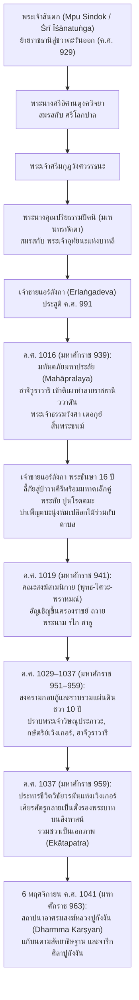

# บันทึกการอ่านและวิเคราะห์เอกสารจารึกวิทยาฉบับสมบูรณ์ (Epigraphic Source Dossier)
## ศิลาจารึกปูกังงัน หรือศิลาจารึกกัลกัตตาแห่งพระเจ้าแอร์ลังกา (The Calcutta Stone / Pucangan Inscription of King Airlangga, 1041 CE)

---

### ส่วนที่ 1: ข้อมูลบรรณานุกรมและการอ้างอิงมาตรฐาน (Bibliographic Metadata)
- **Source ID:** `S-2011-griffiths-03`
- **ชื่อไฟล์ PDF ในเครื่อง:** `S-2011-griffiths-03_Kolkata_Calcutta_Stone_Pucangan_Airlangga.pdf`
- **ชื่อไฟล์ข้อความสกัด:** `S-2011-griffiths-03_Kolkata_Calcutta_Stone_Pucangan_Airlangga.txt` (เชื่อมประสานกับฐานข้อมูลตัวบทและอภิธานศัพท์จารึกฉบับดิจิทัลบริบูรณ์ `DHARMA_INSIDENKPucangan.xml`)
- **ประเภทเอกสาร:** บทความวิจัยประวัติศาสตร์และจารึกวิทยาเชิงวิพากษ์ (Critical Epigraphic & Historical Heritage Study) บูรณาการร่วมกับงานชำระตัวบทจารึกดิจิทัลมาตรฐานสากล (Digital Critical Edition and Philological Commentary)
- **ภาษาของเอกสาร:** ภาษาอังกฤษ (EN) พร้อมตัวบทจารึกต้นฉบับสองภาษา: ภาษาสันสกฤตฉันทลักษณ์คลาสสิก (Classical Sanskrit Kāvya) ถอดอักษรตามระบบสากล IAST และภาษาชวาโบราณร้อยแก้ว (Old Javanese Prose)
- **ขอบเขตภูมิศาสตร์และวัฒนธรรม:** เกาะชวาตะวันออก (ภูมิภาครอบภูเขาเปอนังกุงงัน / มวยโกรโต / จอมบัง และลุ่มน้ำบรันตัส), บาหลี (ราชวงศ์วร्मเทวะ), และประวัติศาสตร์การพลัดถิ่นสู่พิพิธภัณฑ์อินเดียแห่งโกลกาตา (Kolkata, India)
- **วัสดุและบริบทการค้นพบ:** แท่งศิลาจารึกหินแอนดีไซต์ (Andesite stone stele) ทรงยอดแหลมโค้งมน สลักตัวอักษรกวิโบราณสองด้าน (Face A: ภาษาสันสกฤต 36 บรรทัด รวม 34 โศลก; Face B: ภาษาชวาโบราณ 46 บรรทัด) ค้นพบโดยพันเอกโคลิน แมกเคนซี (Colonel Colin Mackenzie) ในเดือนมีนาคม ค.ศ. 1812 ระหว่างการเดินทางสำรวจโบราณวัตถุในแถบโมโจเกอร์โต/จอมบัง ทางตะวันออกของเกาะชวา จากนั้นถูกลำเลียงลงเรือตามแม่น้ำกาลีมัส (Kali Mas) สู่เมืองท่าสุราบายา และส่งลงเรือสินค้า *Matilda* ข้ามมหาสมุทรอินเดียสู่เมืองกัลกัตตาในเดือนกรกฎาคม ค.ศ. 1813 ปัจจุบันศิลาจารึกถูกเก็บรักษาไว้ในห้องคลังโบราณวัตถุ (godown) ของ Indian Museum เมืองโกลกาตา ประเทศอินเดีย (เดิมสังกัด Royal Asiatic Society of Bengal)
- **การอ้างอิงฉบับเต็มระบบ Chicago/Turabian Notes-Bibliography:**  
  Bullough, Nigel, and Peter Carey (with photographic documentation and scholarly consultation by Arlo Griffiths). "The Kolkata (Calcutta) Stone and the Bicentennial of the British Interregnum in Java, 1811–1816." *The Newsletter* (International Institute for Asian Studies, IIAS) 74 (Summer 2016): 4–5.  
  ควบคู่กับงานชำระตัวบทจารึกฉบับมาตรฐานสากล:  
  Griffiths, Arlo, Csaba Dezsö, and Eko Bastiawan. *Charter of Pucangan (1041-11-6)*. Digital Critical Edition and Translation, DHARMA Corpus of Nusantara Epigraphy (INSIDENKPucangan.xml), European Research Council Synergy Project DHARMA (ERC no. 809994), Jakarta and Paris, 2021–2024.

---

### ส่วนที่ 2: แผนผังการจัดสรรเข้าสู่บทและหัวข้อย่อย (Chapter & Section Mapping Matrix)
- **บทที่ 2: จารึกสำคัญไขประวัติศาสตร์ในคาบสมุทรและหมู่เกาะ: หมุดหมายแห่งการเปลี่ยนผ่านราชวงศ์และการก่อรูปอำนาจ**
  * **หัวข้อย่อย 2.7 (การย้ายศูนย์กลางอำนาจสู่ชวาตะวันออก):**  
    ศิลาจารึกปูกังงันเป็น "หลักฐานลายลักษณ์อักษรชิ้นเอกเพียงชิ้นเดียว" ที่ทำหน้าที่เชื่อมต่อสายธารประวัติศาสตร์การเมืองชวาจากยุคพระเจ้าสินดก (Mpu Sindok / Śrī Īśānatuṅga) ผู้สถาปนาราชธานีในชวาตะวันออกเมื่อ ค.ศ. 929 มาสู่การล่มสลายของราชธานีเดิม และการกอบกู้แผ่นดินขึ้นใหม่โดยพระเจ้าแอร์ลังกา โดยบันทึกพงศาวลีสืบสาแหรกย้อนหลัง 4 ชั่วคนอย่างชัดเจนไร้รอยต่อ และเป็นบันทึกทางประวัติศาสตร์หนึ่งเดียวที่พรรณนาวิกฤตการณ์ "มหาประลัย" (*pralaya*) ในมหาศักราช 939 (ค.ศ. 1016/1017) ซึ่งนำไปสู่การสิ้นพระชนม์ของพระเจ้าธรรมวังศา เตอกุฮ์ (Dharmawaṅśa Tĕguh) การแตกสลายของศูนย์กลางอำนาจ และการทำสงครามรวมแผ่นดินอันยาวนานของพระเจ้าแอร์ลังกา
  * **หัวข้อย่อย 2.8 (จารึกยุคสิงหัดส่าหรีและมัชปาหิต):**  
    มโนทัศน์เรื่องการแบ่งดินแดนและการรวมศูนย์อำนาจผ่านพระราชอำนาจสูงสุด (*ekātapatra*) ของพระเจ้าแอร์ลังกาในจารึกปูกังงัน ได้กลายเป็นแม่แบบทางอุดมการณ์รัฐของกษัตริย์ชวายุคหลัง ทั้งราชวงศ์เกอดีรี สิงหัดส่าหรี และมัชปาหิต
- **บทที่ 6: จารึกที่สะท้อนวัฒนธรรมโบราณในแง่การปกครอง กฎหมาย และสถาบันสีมา: สังคม เศรษฐกิจ การค้า และชีวิตประจำวัน**
  * **หัวข้อย่อย 6.1 (สถาบันสีมา: เสาหลักแห่งระเบียบสังคมและเศรษฐกิจ):**  
    ข้อความภาษาชวาโบราณในหน้า B บันทึกกระบวนการปักปันเขตดินแดนศักดิ์สิทธิ์ (*mānusuk sīma*) เพื่อสถาปนา "ธรรมการ์ษยาน" (*dharmma karṣyan*) หรืออาศรมสงฆ์หลวงแห่งปูกังงัน (*yaśa patapān i pucaṅan*) ครอบคลุมที่ดินตำบลปูกังงัน บาราเฮิม และบาปูรี เพื่อปลดเปลื้องภาระภาษีและสถาปนาความเป็นเอกเทศทางกฎหมาย (*kaśvatantrān*) มิให้เจ้าพนักงานฝ่ายเก็บภาษีและข้าราชบริพารฝ่ายปกครองเข้ารบกวน พร้อมพระราชกฤษฎีกาสาปแช่ง (*śapatha*) อันเด็ดขาดด้วยโทษทัณฑ์แห่งปัญจมหาปาตกะ (*pañcamahāpātaka*)
  * **หัวข้อย่อย 6.2 (โครงสร้างระบบราชสำนัก ลำดับชั้นขุนนาง และการบริหารราชการแผ่นดิน):**  
    บันทึกลำดับขั้นตอนการบังคับใช้พระราชโองการ (*ājñā*) จากองค์พระมหากษัตริย์ ผ่านพระมหาอัครมหาเสนาบดีฮิโน (*Rakryān Mahāmantri i Hino Śrī Samaravijaya*) ถ่ายทอดลงมาสู่เสนาบดีกรมวัง (*Rakryān Kanuruhan Pu Dharmamūrti Narottama Dānaśūra*) สะท้อนโครงสร้างการบริหารราชการแผ่นดินของราชสำนักชวาตะวันออกในศตวรรษที่ 11
- **บทที่ 7: ศาสนา ความเชื่อ และเครือข่ายพุทธตันตระ/ไศวนิกายข้ามสมุทร: มนตรา ปรัชญา และการสังเคราะห์เทพเจ้า**
  * **หัวข้อย่อย 7.1 (ลัทธิไศวนิกายปศุปตะและสิทธิโยคีในชวา):**  
    การพรรณนาชีวิตช่วงลี้ภัยของพระเจ้าแอร์ลังกาและปูนโรตตมะในป่าเขาวนคีรี (*Vanagiri*) ในฐานะผู้ถือบวชนุ่งห่มเปลือกไม้ (*valkaladhara*) บำเพ็ญตบะและเสวยอาหารป่าเยี่ยงภิกษุดาบส (*vanaprastha*) ตลอดจนการสร้างอาศรมสงฆ์เพื่อถวายการบูชาบวงสรวงต่อทวยเทพทั้งกลางวันและกลางคืน (*ahorātra*)
  * **หัวข้อย่อย 7.4 (การผสานความเชื่อแบบ "ศิวะ-พุทธ" และความหลากหลายทางศาสนา):**  
    หลักฐานสำคัญในบรรทัด B15 ที่ระบุว่าพระนามเฉลิมพระปรมาภิไธยในการครองราชย์ของพระเจ้าแอร์ลังกาได้รับการถวายร่วมกันโดยผู้นำทางศาสนาทั้งสามนิกาย ได้แก่ คณะสงฆ์พุทธมหายาน/วัชรยาน (*mpuṅku sogata*), คณะนักบวชไศวนิกาย (*maheśvara*), และพราหมณ์มหาปุโรหิต (*mahābrāhmaṇa*) ควบคู่กับการประพันธ์บทสดุดีตรีมูรติ (พระพรหม, พระวิษณุตรีวิกรม, และพระศิวะสถาณุ) ในโศลกเปิดจารึกหน้าภาษาสันสกฤต
- **บทที่ 4: อักขรวิทยา ภาษาศาสตร์ประวัติศาสตร์ และการคำนวณศักราช: จากปัลลวะสู่กวิ และระบบปฏิทินดาราศาสตร์**
  * **หัวข้อย่อย 4.1 & 4.3 (อักขรวิทยากวิและภาษาศาสตร์ทวิภาษา):**  
    โครงสร้างทวิภาษา (Bilingualism) ที่จำแนกหน้าที่อย่างประณีต: หน้า A ใช้ภาษาสันสกฤตเชิงกวีนิพนธ์ชั้นสูง (*Kāvya*) ใช้ฉันทลักษณ์คลาสสิกที่หลากหลายและซับซ้อน (เช่น *Śārdūlavikrīḍita, Vasantatilakā, Mālinī, Sragdharā, Āryā, Mañjubhāṣiṇī*) เพื่อสรรเสริญพระเกียรติคุณและสร้างภาพลักษณ์เชิงเทววิทยาเปรียบเทียบกับพระรามและมหากาพย์รามายณะ ขณะที่หน้า B ใช้ภาษาชวาโบราณร้อยแก้วในการบันทึกเหตุการณ์ประวัติศาสตร์เชิงรูปธรรมและข้อกำหนดทางกฎหมายที่ดิน
  * **หัวข้อย่อย 4.4 (ระบบดาราศาสตร์และการคำนวณศักราช):**  
    การตรวจสอบศักราชมหาศักราช 963 กรรติกมาส ศุกลปักษ์ ทศมี ตรงกับวันศุกร์ที่ 6 พฤศจิกายน ค.ศ. 1041 ซึ่งได้รับการชำระและคำนวณตำแหน่งทางดาราศาสตร์อย่างแม่นยำตามระบบ Damais และ Eade & Gislén
- **บทที่ 1 & บทที่ 9: ประวัติศาสตร์นิพนธ์ จริยธรรมโบราณคดี และการทวงคืนโบราณวัตถุสู่มาตุภูมิ**
  * **หัวข้อย่อย 1.1, 1.6 & 9.3:**  
    ประวัติศาสตร์นิพนธ์ว่าด้วยการโยกย้ายโบราณวัตถุในยุคอาณานิคมอังกฤษ (British Interregnum 1811–1816) ภายใต้การนำของลอร์ดมินโตและสแตมฟอร์ด แรฟเฟิลส์ การเปรียบเทียบชะตากรรมระหว่าง "ศิลาจารึกมินโต" (Sangguran Stone) ที่ถูกนำไปประดับสวนในสกอตแลนด์ กับ "ศิลาจารึกกัลกัตตา" (Pucangan Stone) ที่ถูกทอดทิ้งในห้องคลังโบราณวัตถุของพิพิธภัณฑ์อินเดียเมืองโกลกาตา และข้อเรียกร้องเชิงจริยธรรมของวงวิชาการนานาชาติ (Bullough, Carey, Griffiths) ในการส่งคืนมรดกทางวัฒนธรรมทั้งสองชิ้นกลับคืนสู่พิพิธภัณฑ์แห่งชาติอินโดนีเซียในกรุงจาการ์ตา

---

### ส่วนที่ 3: สรุปสาระสำคัญเชิงวิเคราะห์และจุดยืนทางวิชาการ (Executive Academic Analysis)
- **วิทยานิพนธ์และข้อถกเถียงหลักของผู้เขียน (Core Argument / Thesis):**  
  Nigel Bullough, Peter Carey และ Arlo Griffiths ชี้ให้เห็นว่า ศิลาจารึกปูกังงัน (หรือศิลาจารึกกัลกัตตา) เป็นเอกสารจารึกประวัติศาสตร์ที่มีคุณค่าสูงสุดชิ้นหนึ่งของอารยธรรมเอเชียตะวันออกเฉียงใต้ภาคพื้นสมุทร เนื่องจากเป็น "เอกสารปฐมภูมิร่วมสมัยเพียงชิ้นเดียว" ที่บันทึกประวัติศาสตร์ชีวิต พงศาวลี และเหตุการณ์การครองราชย์ของกษัตริย์ผู้ยิ่งใหญ่ที่สุดพระองค์หนึ่งของชวา คือพระเจ้าแอร์ลังกา (ครองราชย์ ค.ศ. 1019–1049) ซึ่งแต่เดิมเป็นที่รู้จักเฉพาะในรูปวรรณกรรมมุขปาฐะหรือบทกวีเชิงเปรียบเปรย เช่น *กากาวิน อรชุนวิวาท* (*Kakawin Arjunawiwāha*) ของเอ็มปูกัณวะ หากปราศจากศิลาจารึกหลักนี้ ประวัติศาสตร์นิพนธ์ของอินโดนีเซียจะขาดช่วงสะพานเชื่อมระหว่างการย้ายราชธานีจากชวากลางสู่ชวาตะวันออก และไม่อาจเข้าใจสาเหตุการล่มสลายของราชวงศ์มะตะรัมเดิมได้เลย ยิ่งไปกว่านั้น ผู้เขียนได้เปิดเผยความจริงอันน่าสลดใจว่า ศิลาจารึกที่มีความสำคัญระดับชาติชิ้นนี้ถูกนำออกจากเกาะชวาตั้งแต่ ค.ศ. 1813 และตกค้างอยู่ในสภาพชำรุดทรุดโทรมจากการถูกละเลยในห้องคลังเก็บของ (godown) ของ Indian Museum เมืองโกลกาตา ผู้เขียนจึงเสนอข้อเรียกร้องทางประวัติศาสตร์และจริยธรรมโบราณคดีให้รัฐบาลอินเดีย สหราชอาณาจักร และอินโดนีเซีย ร่วมมือกันในการเจรจาส่งคืน (repatriation) หรืออย่างน้อยที่สุดให้ยืมจัดแสดงชั่วคราว เพื่อคืนมรดกทางวัฒนธรรมนี้ให้แก่ประชาชนชาวอินโดนีเซีย
- **บริบทประวัติศาสตร์นิพนธ์และการประเมินความน่าเชื่อถือ (Historiography & Source Criticism):**  
  ในทางประวัติศาสตร์นิพนธ์ ศิลาจารึกปูกังงันผ่านการศึกษาของนักบูรพคดีศึกษาชั้นนำมาหลายยุคสมัย นับตั้งแต่ H. Kern (1885, 1913, 1917), J.L.A. Brandes & N.J. Krom (1913 ใน *Oud-Javaansche Oorkonden*), Poerbatjaraka (1941 ใน *TBG* 81), J.G. de Casparis (1950, 1958), Louis-Charles Damais (1952, 1955), Boechari (1968, 2012), จนถึงงานวิจัยภาคสนามและการถ่ายภาพทางจารึกวิทยาใหม่ในเดือนมกราคม ค.ศ. 2011 โดย Arlo Griffiths ซึ่งนำไปสู่การชำระตัวบทจารึกระบบดิจิทัลระดับก้าวหน้าโดยคณะวิจัยโครงการ DHARMA (Griffiths, Dezsö, และ Bastiawan 2021–2024) การค้นพบล่าสุดยืนยันว่าการอ่านของนักวิชาการรุ่นก่อนหน้ามีความคลาดเคลื่อนในหลายจุดสำคัญ โดยเฉพาะการคำนวณศักราชเหตุการณ์สงคราม การสืบสายตระกูล และการตีความคำศัพท์ทางกฎหมายและศาสนา การที่ตัวบทจารึกได้รับการบันทึกทั้งภาษาสันสกฤตและภาษาชวาโบราณทำให้สามารถตรวจสอบไขว้ (cross-examination) ข้อเท็จจริงระหว่างจินตภาพเชิงเทววิทยาในวรรณกรรมสันสกฤตกับข้อมูลเชิงประจักษ์ทางสังคม การเมือง และการทหารในภาษาชวาโบราณได้อย่างสมบูรณ์แบบ

Mermaid Diagram แสดงลำดับเหตุการณ์ประวัติศาสตร์ตามศิลาจารึกปูกังงัน:

---

### ส่วนที่ 4: สารบัญข้อค้นพบเชิงลึกแยกตามมิติจารึกวิทยา (Thematic Epigraphic Findings with Exact Pages)

1. **ประวัติศาสตร์นิพนธ์และการตีความทางประวัติศาสตร์:**
   - ศิลาจารึกปูกังงันเป็นเอกสารลายลักษณ์อักษรหลักฐานปฐมภูมิหนึ่งเดียวที่ให้ข้อมูลทั้งลำดับเวลาทางประวัติศาสตร์ที่แน่นอนและพงศาวลีย้อนหลังสี่ชั่วอายุคนของพระเจ้าแอร์ลังกา (หน้า 5 ใน Bullough & Carey 2016)
   - ความเชื่อมโยงอย่างแนบแน่นระหว่างศิลาจารึกซังงูรัน (Minto Stone ค.ศ. 928) กับศิลาจารึกปูกังงัน (Kolkata Stone ค.ศ. 1041): จารึกซังงูรันบันทึกจุดเริ่มต้นของราชวงศ์อีศานะในชวาตะวันออกภายใต้พระเจ้าสินดก ขณะที่จารึกปูกังงันบันทึกการฟื้นฟูและรวมแผ่นดินของราชวงศ์นี้ขึ้นใหม่โดยพระเจ้าแอร์ลังกา ผู้เป็นพระปิ่มหัยยิกา (great-great-grandson) ของพระเจ้าสินดก (หน้า 5)
   - การรื้อถอนภาพตัวแทนจากวรรณกรรมปรัมปรา: เดิมพระเจ้าแอร์ลังกาเป็นที่รับรู้ผ่านวรรณคดีราชสำนักกากาวิน *อรชุนวิวาท* ของเอ็มปูกัณวะ ซึ่งผูกเรื่องเปรียบเทียบพระองค์กับอรชุนแห่งมหาภารตะ แต่ศิลาจารึกปูกังงันเป็นหลักฐานประวัติศาสตร์เชิงประจักษ์ชิ้นเดียวที่บันทึกชีวิตจริง การต่อสู้ทางการเมือง และยุทธศาสตร์การรบ (หน้า 5)

2. **ตัวบทจารึก การอ่าน ศักราช และอักขรวิทยา:**
   - ศักราชการสถาปนาสีมาในบรรทัด B1–B2 ระบุมหาศักราช 963 กรรติกมาส ศุกลปักษ์ ทศมี ตรงกับรอบวันฮารียัง (สัปดาห์ 6 วัน), วาไก (สัปดาห์ 5 วัน), ศุกรวาร (วันศุกร์), วูกู วายังวายัง, อุตตรภัทรปทนักษัตร, อหิรพุธนเทวดา, วัชรโยคะ, คารทิกรณะ ซึ่งหลุยส์-ชาร์ลส์ ดาเมส์ (Damais 1955: 66–67) และ Eade & Gislén (2000: 75, 146–147) คำนวณสอบทานตรงกับวันศุกร์ที่ 6 พฤศจิกายน ค.ศ. 1041 โดยดาเมส์ชี้แจงว่าการที่องค์ประกอบทางปฏิทินสอดคล้องอย่างสมบูรณ์ต้องอาศัยสมมติฐานการทดวันอธิกมาส (intercalation) ในปีมหาศักราช 963
   - วันที่เกิดวิกฤตการณ์มหาประลัย (*pralaya*) ในบรรทัด B5–B7 ระบุชัดเจนในเดือนเจตรมาส (Caitra-māsa) มหาศักราช 939 (ตรงกับช่วงเดือนมีนาคม–เมษายน ค.ศ. 1017 หรือปลาย ค.ศ. 1016)
   - วันที่พระเจ้าแอร์ลังกาได้รับการถวายราชาภิเษกในโศลกที่ 15 (บรรทัด A13–A14) และบรรทัด B15 ระบุตรงกันในเดือนมาฆมาส ศุกลปักษ์ เตรทศี วันจันทร์ มหาศักราช 941 (มกราคม–กุมภาพันธ์ ค.ศ. 1019)
   - อักขรวิทยากวิคลาสสิก (Classical Kawi script) ที่ปรากฏบนศิลามีความประณีตงดงามสูงยิ่ง เส้นอักษรคมชัดสะท้อนทักษะระดับช่างหลวงราชสำนัก (*citralekha*) แม้ว่าด้านภาษาสันสกฤตจะมีรูปแบบสนธิเฉพาะถิ่นบางประการ เช่น การเปลี่ยนนิคหิตหน้า ว เป็น ว-แฝด (*nr̥ṇāv vidhāne* แทน *nr̥ṇāṁ vidhāne* ในโศลกที่ 1) ซึ่ง Griffiths และคณะชี้ว่าเป็นลักษณะร่วมทางภาษาที่พบในจารึกจามปา (C. 167) และจารึกบ้านนาซอนในลาวเช่นกัน

3. **มิติศาสนา ลัทธิความเชื่อ และพิธีกรรม:**
   - การสถาปนาพระนามราชทินนามของพระมหากษัตริย์ในบรรทัด B14–B15 กระทำโดยผู้นำทางศาสนาสามสถาบันหลักร่วมกันอย่างเป็นเอกภาพ ได้แก่ ฝ่ายพุทธมหายาน/ตันตระ (*mpuṅku sogata*), ฝ่ายไศวนิกาย (*maheśvara*), และพราหมณ์มหาปุโรหิต (*mahābrāhmaṇa*) สะท้อนโครงสร้างความสัมพันธ์ทางศาสนาแบบไตรภาคี (Religious Tripartite) ที่ค้ำจุนราชบัลลังก์
   - วิถีปฏิบัติของนักบวชป่า (*vānaprastha*): การที่เจ้าชายแอร์ลังกาทรงฉลองพระองค์ด้วยเปลือกไม้ (*valkaladhara*) เสวยภัตตาหารป่าเยี่ยงภิกษุดาบส และทรงเจริญสมาธิภาวนาบวงสรวงพระผู้เป็นเจ้าทั้งกลางวันและกลางคืน (*ahorātra*) ตลอดช่วงเวลาลี้ภัยในป่าเขาวนคีรี (บรรทัด B10–B12)
   - การตั้งสัจยาธิษฐาน (*pratijñā / iṣṭaprārthanā*): การสร้างอาศรมสงฆ์ปูกังงันมิใช่เพียงกิจการกุศลทั่วไป แต่เป็นการปฏิบัติหน้าที่ตามคำปฏิญาณศักดิ์สิทธิ์ที่ทรงให้ไว้ต่อทวยเทพในยามบ้านเมืองเกิดกลียุคมหาประลัย เพื่อถวายเป็นมนตรัสตวนมัสการบูชาแด่ภควานตลอดไป (บรรทัด B30–B33)

4. **มิติสถาปัตยกรรม ศาสนสถาน และชลศาสตร์:**
   - การก่อสร้าง "ธรรมการ์ษยาน" (*dharmma karṣyan*) หรืออาศรมของพระฤๅษี/นักพรต ณ ปูกังงัน ซึ่งตั้งอยู่บนไหล่เขาปูกวัต (*pūgavato girer* ในโศลกที่ 32 หรือภูเขาเปอนังกุงงันในปัจจุบัน) ซึ่งเป็นภูเขาศักดิ์สิทธิ์ศูนย์กลางจักรวาลของชาวชวา
   - โศลกที่ 33 พรรณนาว่าอาศรมหลวงแห่งนี้มีความงดงามร่มรื่นเปรียบประดุจสวนนันทวัน (*nandanodyāna*) บนสรวงสวรรค์ เป็นที่หลั่งไหลมาของพสกนิกรและผู้แสวงบุญที่นำพวงมาลัยมาถวายสรรเสริญพระบารมี

5. **มิติอาหารการกิน วิถีชีวิต การค้า และตลาด:**
   - การบันทึกวิถีชีวิตยังชีพในป่า (*forest survival*): การบริโภคผลไม้และพืชป่าของภิกษุและดาบส (*makāhāra sāhāra saṁ bhikṣuka vanaprastha* บรรทัด B10–B11) เป็นภาพสะท้อนชีวิตการเอาชีวิตรอดในระบบนิเวศป่าเขาชวาโบราณ
   - ระบบเศรษฐกิจการคลังและส่วยหลวง: การกล่าวถึงส่วยราชสำนัก (*drabya haji*) ในอัตรา 1 สุวรรณะทองคำ (*mā su 1* บรรทัด B36) และการห้ามข้าราชการฝ่ายจัดเก็บผลประโยชน์หลวง (*saṁ maṅilala drabya haji*) และกลุ่มคนงานส่วย (*vulu-vulu*) เข้าไปรบกวนพื้นที่สีมา

6. **มิติการปกครอง กฎหมาย ที่ดิน และระบบสีมา:**
   - การสืบทอดสายตระกูลฝ่ายบิดาและพระราชอำนาจ: การใช้สำนวนชวาโบราณว่า *kumaliliranaṁ kulit kaki, makadrabyaṁ rājalakṣmī* (บรรทัด B12) แปลว่า "สืบทอดสายโลหิตจากบรรพบุรุษฝ่ายบิดาเพื่อครอบครองซึ่งพระราชลักษมีแห่งราชบัลลังก์"
   - โครงสร้างสายการบังคับบัญชาสูงสุด: เริ่มจากพระบรมราชโองการ (*ājñā*) ของ *Śrī Mahārāja Rakai Halu Śrī Lokeśvara Dharmmavaṅśa Airlaṅgānantavikramottuṅgadeva* รับสนองพระบรมราชโองการโดย *Rakryān Mahāmantri i Hino Śrī Samaravijaya Dhāmasuparṇavāhana Tĕguh Uttuṅgadeva* ส่งผ่านลงมายัง *Rakryān Kanuruhan Pu Dharmamūrti Narottama Dānaśūra* เพื่อออกคำสั่งแก่ชุมชนท้องถิ่น (บรรทัด B2–B4)
   - สิทธิสภาพนอกอาณาเขตและความเป็นอิสระทางกฎหมาย (*kaśvatantrān* บรรทัด B43): ห้ามเจ้าพนักงานระดับสูงสามตำแหน่ง (*vinava saṁ māna katrīṇi*) ได้แก่ ปังกุร ตาวัน ติริป (*Paṅkur, Tawan, Tirip*), ข้าราชบริพารของนายก (*nāyakapratyaya*), ปิงไฮ (*piṅhai*), วาฮูตา (*vahuta*), และหัวหน้าหมู่บ้าน (*rāma*) เข้ามาก้าวก่ายในเขตที่ดินปูกังงัน บาราเฮิม และบาปูรี
   - ระบบคดีความและค่าปรับ (*sukhaduḥkha* บรรทัด B39–B40): การยกเว้นค่าปรับคดีความอาญาและแพ่ง (ซึ่ง Boechari 2012 อธิบายว่าหมายถึง *hala hayu* หรือความผิดทางคดีที่ต้องเสียค่าปรับแก่แผ่นดิน) ให้ตกเป็นของศาสนสถาน

7. **มิติปฏิสัมพันธ์ข้ามสมุทรและเครือข่ายนานาชาติ:**
   - สายสัมพันธ์ข้ามเกาะระหว่างชวาและบาหลี: โศลกที่ 10–11 และบรรทัด B ระบุว่าพระราชมารดาของแอร์ลังกาคือเจ้าหญิงแห่งราชวงศ์อีศานะพระนามว่า กุณปรียธรรมปัตนี (*Guṇapriyadharmapatnī*) หรือมเหนทรทัตตา (*Mahendradattā*) เสด็จไปอภิเษกสมรสกับพระเจ้าอุทัยนะ (*Udayana / Dharmmodayanavarmadeva*) กษัตริย์แห่งเกาะบาหลี ก่อให้เกิดสายสัมพันธ์ทางเครือญาติและการเมืองข้ามทะเลชวา-บาหลีที่ลึกซึ้ง
   - ยุทธศาสตร์การทหารตามตำราอรรถศาสตร์ของอินเดีย: โศลกที่ 29 ระบุว่าพระเจ้าแอร์ลังกาทรงเอาชนะกษัตริย์วิชัยวรมันด้วยกลอุบายตามตำรับของ "พระวิษณุคุปต์" (*vaiṣṇuguptair upāyais* ซึ่งหมายถึงเกาฏิลยะ ผู้แต่งคัมภีร์อรรถศาสตร์) ได้แก่ กลยุทธ์สี่ประการ: สามัน (ประนีประนอม), ทาน (ให้ผลประโยชน์), เภทะ (ยุยงให้แตกแยก), และทัณฑะ (ใช้กำลังปราบปราม)

8. **มิติจารึกแผ่นโลหะ รูปเคารพขนาดเล็ก และจารึกแม่น้ำ:**
   - การเปรียบเทียบเชิงวัตถุวิทยากับศิลาจารึกมินโต (Sangguran Stone 928 CE): จารึกทั้งสองหลักถูกเคลื่อนย้ายออกจากชวาตะวันออกในเวลาไล่เลี่ยกันโดยพันเอกโคลิน แมกเคนซี ระหว่าง ค.ศ. 1812–1813 โดยจารึกซังงูรันมีน้ำหนักมากกว่า 3 ตัน ถูกส่งไปให้ลอร์ดมินโตที่สกอตแลนด์ ขณะที่จารึกปูกังงันถูกส่งไปกัลกัตตา (หน้า 4–5)
   - การคมนาคมทางน้ำ: การขนย้ายศิลาจารึกปูกังงันจากแหล่งค้นพบในเขตโมโจเกอร์โต/จอมบัง ล่องมาตามแม่น้ำกาลีมัสสู่ท่าเรือสุราบายา แสดงให้เห็นถึงบทบาทสำคัญของเครือข่ายแม่น้ำในระบบคมนาคมและโลจิสติกส์ของชวาตะวันออกมาแต่โบราณ (หน้า 5)

9. **พรมแดนปัญหา ปริศนาวิชาการ และจริยธรรมโบราณคดี:**
   - วิกฤตการณ์การละเลยโบราณวัตถุในต่างแดน: ภาพถ่ายในเดือนมกราคม ค.ศ. 2011 โดยศาสตราจารย์ Arlo Griffiths เผยให้เห็นศิลาจารึกปูกังงันถูกวางทิ้งไว้ในโกดังเก็บของของพิพิธภัณฑ์อินเดียเมืองโกลกาตา ผิวหน้าหินสึกกร่อนและถูกปกคลุมด้วยฝุ่นคราบสกปรก ตัวอักษรเลือนหายไปหลายส่วนเมื่อเทียบกับการอ่านในอดีตของ Kern และ Brandes (หน้า 4–5)
   - ปัญหาจริยธรรมในการครอบครองมรดกทางวัฒนธรรม: การที่มรดกชิ้นเอกระดับชาติของอินโดนีเซียกลายเป็น "เครื่องประดับสวน" (garden ornament) ในสกอตแลนด์สำหรับศิลาจารึกมินโต และเป็น "วัตถุแปลกตาที่ถูกลืม" (neglected curiosity) ในอินเดียสำหรับศิลาจารึกกัลกัตตา สะท้อนบาดแผลจากลัทธิอาณานิคมที่ต้องได้รับการเยียวยาผ่านการส่งคืนสู่มาตุภูมิ (Repatriation)

---

### ส่วนที่ 5: คลังข้อความอ้างอิงตรงและเชิงอรรถสำเร็จรูป (Verbatim Quotes & Footnote Bank)

1. **พระราชพงศาวลีราชวงศ์อีศานะและการประสูติของแอร์ลังกา (โศลกที่ 5, 9, 11, 12, หน้า A4–A11):**
   * *ภาษาสันสกฤต (IAST):*  
     "Āsīn nirjita-bhūri-bhū-dhara-gaṇo bhū-pāla-cūḍā-maṇiḥ / prakhyāto bhuvana-traye ’pi mahatā śauryyeṇa siṁhopamaḥ / ... sa śrī-kīrti-valānvito yava-patiś śrīśāna-tuṅgāhvayaḥ ⊙ ... śrī-makuṭa-vaṅśa-varddhana Iti pratīto nr̥ṇām anupamendraḥ / śrīśāna-vaṅśa-tapanas tatāpa śatrūn pratāpena ⊙ ... Āsīd asāv api viśiṣṭa-viśuddha-janmā / rājānvayād udayanaḥ prathitāt prajātaḥ / tāṁ śrīmatīv vidhivad eva mahendra-dattāv / vyaktāhvayo nr̥pa-sutām upayacchate sma ⊙ ... erlaṅga-deva Iti divya-sutas tato ’bhūt· ⊙"
   * *แปลภาษาไทย:*  
     "มีพระมหากษัตริย์ผู้เป็นดั่งมณีประดับมงกุฎแห่งราชาทั้งหลาย ผู้ปราบปรามเหล่ากษัตริย์ศัตรูลงได้อย่างราบคาบ ผู้ทรงเกียรติเกริกไกรไปทั่วทั้งสามโลกดั่งพญาราชสีห์ด้วยพระปรีชาชาญอันยิ่งใหญ่... พระองค์คือจอมกษัตริย์แห่งชวา ผู้เปี่ยมด้วยสิริมงคล เกียรติยศ และพละกำลัง มีพระนามปรากฏว่า ศรีอีศานตุงคะ [พระเจ้าสินดก]... [ต่อมามีพระราชา] ผู้เป็นที่รู้จักว่า ศรีมกุฏวังศวรรธนะ ผู้ทรงเป็นจอมราชันอันหาผู้เปรียบมิได้ ทรงเป็นดั่งดวงสุริยาแห่งราชวงศ์อีศานะ ผู้แผดเผาเหล่าอริราชศัตรูด้วยพระเดชานุภาพ... ฝ่ายพระเจ้าอุทัยนะ ผู้มีชาติกำเนิดอันบริสุทธิ์สูงส่ง สืบสายมาจากราชตระกูลอันเลื่องชื่อ ก็ได้ทรงอภิเษกสมรสตามพระราชประเพณีกับพระราชธิดาพระองค์นั้น ผู้มีพระนามว่า มเหนทรทัตตา... และจากทั้งสองพระองค์นั้น พระราชโอรสผู้ประเสริฐดั่งเทพเจ้า พระนามว่า แอร์ลังกาเทวะ จึงได้ประสูติมา"
   * *Footnote Template:* Griffiths, Dezsö, and Bastiawan, *Charter of Pucangan*, DHARMA INSIDENKPucangan.xml, st. V, IX, XI, XII.

2. **วิกฤตการณ์มหาประลัยและการสิ้นพระชนม์ของพระเจ้าธรรมวังศา เตอกุฮ์ (บรรทัด B5–B7):**
   * *ภาษาชวาโบราณ (Kawi):*  
     "sambandha, An· hana Iṣṭaprārthanā śrī mahārāja ri kālaniṁ pralaya riṁ yavadvīpa, Irikāṁ śakakāla 939 ri prahāra haji vuravari An· vijil· saṅke lva rām·, Ekārṇava rūpanikāṁ sayavadvīpa rikāṁ kāla, Akveḥ sira vvaṁ mahāviśeṣa pjaḥ, karuhun· An· samaṅkana divaśa śrī mahārāja devatā pjaḥ lumāḥ ri saṁ hyaṁ dharmma parhyaṅan i vvatan·, riṁ cetra-māsa, śaka-kāla 939"
   * *แปลภาษาไทย:*  
     "มูลเหตุแห่งพระราชโองการนี้ มีอยู่ว่า องค์พระมหากษัตริย์ได้ทรงตั้งสัจยาธิษฐานไว้เมื่อคราวเกิดกลียุคมหาประลัยขึ้นบนเกาะชวา ในปีมหาศักราช 939 [ค.ศ. 1016/1017] อันเนื่องมาจากการยกทัพเข้าโจมตีอย่างรุนแรงของกษัตริย์แห่งวูราวารี ผู้กรีธาทัพออกมาจากลวา ราม ในเพลานั้น ทั่วทั้งเกาะชวาได้แปรสภาพประหนึ่งเป็นผืนมหาสมุทรใหญ่แห่งความพินาศเพียงผืนเดียว ผู้คนผู้ทรงศักดิ์และมีเกียรติเป็นจำนวนมากต้องล้มตายลง และยิ่งไปกว่านั้น ในกาลครั้งนั้นเอง องค์พระมหากษัตริย์ผู้เสด็จสู่สวรรคาลัย [พระเจ้าธรรมวังศา เตอกุฮ์] ก็ได้สิ้นพระชนม์ลง และได้รับการประดิษฐานพระศพไว้ ณ พระศาสนสถานเทวาลัยแห่งววาตัน ในเดือนเจตรมาส ปีมหาศักราช 939"
   * *Footnote Template:* Griffiths, Dezsö, and Bastiawan, *Charter of Pucangan*, DHARMA INSIDENKPucangan.xml, Face B, lines 5–7.

3. **การหลบหนีสู่ป่าวนคีรีของเจ้าชายแอร์ลังกาและปูนโรตตมะ (บรรทัด B7–B11):**
   * *ภาษาชวาโบราณ (Kawi):*  
     "sḍaṁ vālaka śrī mahārāja Irikāṁ kāla, prasiddha nam· blas· tahun· vayaḥnira, tapvan· dahat· kr̥ta-pariśramanireṁ saṁgrāma... kunaṁ ri sākṣātniran· viṣṇumūrtti, rinakṣaniṁ sarbvadevata, Inahākən tan ilva kavaśa deni paṅavaśaniṁ mahāpralaya, maṅantīri himbaṁniṁ vanagiri, makasambhāsana saṁ tāpaśa suddhācāra, meriṁ lāvan· hulunira saṅ ekāntapratipatti manaḥniran· dāśabhūta-tanūpacāran· bhaktiprahva ri lbūni pāduka śrī mahārāja, pu narottama, saṁjñānira... milu valkaladhara pinakarovaṁ śrī mahārāja makāhāra sāhāra saṁ bhikṣuka vanaprastha, tātan· vismr̥ti śrī mahārāja ri kārādhanan· bhaṭāra riṅ ahorātra"
   * *แปลภาษาไทย:*  
     "ในเวลานั้น องค์พระมหากษัตริย์ยังทรงพระเยาว์ยิ่ง ทรงมีพระชนมายุเพียง 16 พรรษา ยังมิได้ทรงเจนจบในการสงคราม... แต่ด้วยเหตุที่พระองค์ทรงเป็นองค์อวตารแห่งพระวิษณุอย่างประจักษ์ชัด จึงทรงได้รับการอภิบาลรักษาจากทวยเทพทั้งปวง ทรงรอดพ้นมิให้ต้องตกอยู่ใต้อำนาจแห่งมหาประลัยนั้น ทรงเสด็จไปพำนักอยู่ ณ ไหล่เขาวนคีรี ทรงสนทนาธรรมกับเหล่าดาบสผู้มีข้อประพฤติอันบริสุทธิ์ โดยมีมหาดเล็กผู้มีจิตภักดีแน่วแน่เป็นหนึ่งเดียว คอยถวายการปรนนิบัติรับใช้อย่างนอบน้อมต่อละอองธุลีพระบาท นามว่า ปู นโรตตมะ... ผู้นุ่งห่มผ้าเปลือกไม้ร่วมกับพระองค์ และร่วมเสวยภัตตาหารป่าชนิดเดียวกับที่เหล่าภิกษุดาบสผู้ถือบวชในป่าบริโภค องค์พระมหากษัตริย์มิได้ทรงละเลยในการบวงสรวงบูชาพระผู้เป็นเจ้าทั้งกลางวันและกลางคืนเลยแม้แต่น้อย"
   * *Footnote Template:* Griffiths, Dezsö, and Bastiawan, *Charter of Pucangan*, DHARMA INSIDENKPucangan.xml, Face B, lines 7–11.

4. **การราชาภิเษกโดยคณะสงฆ์สามนิกายและการถวายพระนาม (บรรทัด B13–B15):**
   * *ภาษาชวาโบราณ (Kawi):*  
     "huvus ta śrī mahārāja kr̥tasaṁskāra, pratiṣṭa riṁ siṅhāsana, mvaṁ An· kapadasthāniṁ pituṁ śrī mahārāja haji devatā saṁ lumāḥ riṅ īśānabajra Ikanaṁ halu pinakakapadasthān· śrī mahārāja, mataṅyan· rakai halu śrī lokeśvara dharmmavaṅśa Airlaṅgānantavikramottuṅgadeva saṁjñā kāstvan· śrī mahārāja, de mpuṅku sogata maheśvara mahābrāhmaṇa Irikāṁ śakakāla 941"
   * *แปลภาษาไทย:*  
     "ครั้นเมื่อองค์พระมหากษัตริย์ได้ทรงผ่านพิธีกรรมทางศาสนา [ราชาภิเษก] และประทับเหนือสิงหาสน์แล้ว และโดยที่ดินแดนฮาลูเคยเป็นเขตส่วยศักดินาของพระปิ่มหัยยิกา [ชวด] ผู้เป็นกษัตริย์ผู้สถิต ณ อีศานพัชระ [พระเจ้าสินดก] ฮาลูจึงกลายมาเป็นดินแดนศักดินาของพระองค์ ด้วยเหตุดังนั้น พระนามอันเป็นมงคลยิ่งว่า รไก ฮาลู ศรี โลเกศวร ธรรมวังศา แอร์ลังคานันตวิกรมโมตตุงคเทวะ จึงได้รับการทูลเกล้าถวายแด่องค์พระมหากษัตริย์ โดยท่านผู้เป็นอาจารย์ฝ่ายพุทธมหายาน [mpuṅku sogata], ฝ่ายไศวนิกาย [maheśvara], และพราหมณ์มหาปุโรหิต [mahābrāhmaṇa] ในมหาศักราช 941 [ค.ศ. 1019]"
   * *Footnote Template:* Griffiths, Dezsö, and Bastiawan, *Charter of Pucangan*, DHARMA INSIDENKPucangan.xml, Face B, lines 13–15.

5. **ชัยชนะเหนือศัตรูและการรวมแผ่นดินชวาเป็นเอกภาพ (โศลกที่ 30–31, หน้า A30–A32):**
   * *ภาษาสันสกฤต (IAST):*  
     "mukha-śara-vivarākhye śāka-rājasya varṣe / hata-śaśi-guru-vāre kārtike pañcadaśyām· / ripu-śirasi mahātmā śrī-yava-dvīpa-rājo / jayati nihita-pādo ratna-siṁhāsana-sthaḥ ⊙ pūrvvādi-dig-vijayinaṁ hata-sarvva-śatrum / ekāta-patram avaner jalalaṅga-devam· / nānyan nirīkṣitum alaṁ subhujopapīḍaṅ / gāḍham pariṣvajati samprati rāja-lakṣmīḥ ⊙"
   * *แปลภาษาไทย:*  
     "ในปีมหาศักราช 959 [ค.ศ. 1037] ในวันขึ้น 15 ค่ำ [หรือแรม 15 ค่ำ] เดือนกรรติกะ วันพฤหัสบดี องค์มหาราชาแห่งเกาะชวาผู้ทรงเดชานุภาพอันยิ่งใหญ่ ได้ทรงวางพระบาทลงบนเศียรของเหล่าอริราชศัตรู ทรงได้รับชัยชนะอย่างเด็ดขาด ประทับสง่างามอยู่เหนือรัตนสิงหาสน์ บัดนี้ พระราชลักษมี [เทวีแห่งความเป็นพระราชา] หาได้สนพระทัยที่จะทอดพระเนตรกษัตริย์อื่นใดอีกไม่ นางกลับโอบกอดองค์พระเจ้าชลลังคเทวะ [แอร์ลังกา] ผู้ทรงมีชัยชนะเหนือนานาทิศานุทิศเริ่มจากทิศบูรพา ผู้ทรงประหารศัตรูทั้งปวงจนสิ้นซาก และผู้ทรงกางกั้นพระกลดเอกภาพแห่งแผ่นดินแต่เพียงผู้เดียว ไว้แนบแน่นด้วยพระกรอันงดงาม"
   * *Footnote Template:* Griffiths, Dezsö, and Bastiawan, *Charter of Pucangan*, DHARMA INSIDENKPucangan.xml, st. XXX–XXXI.

6. **การสถาปนาอาศรมสงฆ์ปูกังงันเพื่อแก้บนตามสัตยาธิษฐาน (โศลกที่ 32, หน้า A32–A33 และบรรทัด B30–B33):**
   * *ภาษาสันสกฤต (IAST):*  
     "nirjityātha ripūn parākrama-dhanāc chauryyair upāyair api / śaktyākhaṇḍitayā khalu bratitayā vā devatārādhanaiḥ / rantuñ jāta-mahā-kramas sa kurute puṇyāśramaṁ śrīmataḥ / pārśve pūgavato girer nara-patiś śrī-nīralaṅgāhvayaḥ ⊙"
   * *แปลภาษาไทย:*  
     "ครั้นทรงปราบปรามเหล่าศัตรูทางโลกีย์ลงได้ด้วยความกล้าหาญและกลอุบายอันเกิดจากคลังแห่งพระปรีชาชาญ และปราบศัตรูทางธรรมด้วยการถือพรตอันมิรู้เสื่อมถอยและการบวงสรวงบูชาทวยเทพ เมื่อทรงผ่อนคลายจากความเหน็ดเหนื่อยเมื่อยล้าอันใหญ่หลวงแล้ว องค์พระราชาผู้ทรงพระนามว่า ศรีนีรลังกา [แอร์ลังกา] จึงทรงสร้างพระบุญญาศรมอันศักดิ์สิทธิ์ขึ้น ณ ไหล่เขาปูกวัต [ภูเขาเปอนังกุงงัน] อันรุ่งเรือง"
   * *Footnote Template:* Griffiths, Dezsö, and Bastiawan, *Charter of Pucangan*, DHARMA INSIDENKPucangan.xml, st. XXXII.

7. **คุณค่าทางประวัติศาสตร์ของศิลาจารึกปูกังงัน (Bullough & Carey 2016: 5):**
   * *ภาษาอังกฤษ (Original):*  
     "Known to historians as the charter of Pucangan, this inscription is unique in that it is the sole known documentary source that provides both a chronological account of Airlangga’s achievements, and a clear genealogy stretching back four generations... In short, the inscription provides us with Airlangga’s life story. Without it, we would know almost nothing about the details of this remarkable king’s reign."
   * *แปลภาษาไทย:*  
     "ในหมู่นักประวัติศาสตร์เป็นที่รู้จักกันในนามพระราชกฤษฎีกาแห่งปูกังงัน จารึกหลักนี้มีความพิเศษเฉพาะตัวเนื่องจากเป็นแหล่งข้อมูลเอกสารลายลักษณ์อักษรชิ้นเดียวที่ให้ทั้งลำดับเหตุการณ์ความสำเร็จของพระเจ้าแอร์ลังกา และพงศาวลีอันชัดเจนที่สืบย้อนหลังไปถึงสี่ชั่วอายุคน... กล่าวโดยสรุป จารึกหลักนี้คือบันทึกเรื่องราวชีวิตของพระเจ้าแอร์ลังกา หากปราศจากจารึกนี้ เราแทบจะไม่รู้รายละเอียดใดๆ เลยเกี่ยวกับการครองราชย์ของกษัตริย์ผู้ทรงพระปรีชาสามารถยิ่งพระองค์นี้"
   * *Footnote Template:* Nigel Bullough and Peter Carey, "The Kolkata (Calcutta) Stone and the Bicentennial of the British Interregnum in Java, 1811–1816," *The Newsletter* (IIAS) 74 (2016): 5.

8. **ชะตากรรมและการเรียกร้องทวงคืนศิลาจารึกกัลกัตตาสู่มาตุภูมิ (Bullough & Carey 2016: 5):**
   * *ภาษาอังกฤษ (Original):*  
     "The 'Kolkata Stone', on the other hand, was stored in the Indian Museum where it is now almost forgotten. If the former Governor-General had expressed his hope that the gift from Mackenzie might 'at some day tell eastern tales of us', the only tale that the 'Kolkata Stone' can tell is one of apathy and neglect... In this way two outstanding Indonesian national treasures could return home after 200 years in exile, to be enjoyed and appreciated by the descendants of the people for whom they were initially erected in early medieval Java."
   * *แปลภาษาไทย:*  
     "ในทางตรงกันข้าม 'ศิลาจารึกกัลกัตตา' กลับถูกเก็บไว้ในพิพิธภัณฑ์อินเดีย ซึ่งในปัจจุบันแทบจะถูกลืมเลือนไปสิ้น หากอดีตข้าหลวงใหญ่เคยแสดงความหวังว่าของขวัญจากแมกเคนซีชิ้นนี้อาจ 'บอกเล่าเรื่องราวตะวันออกเกี่ยวกับพวกเราในวันข้างหน้า' เรื่องเล่าเพียงเรื่องเดียวที่ 'ศิลาจารึกกัลกัตตา' สามารถบอกเล่าได้ในเวลานี้ก็คือเรื่องราวแห่งความไม่แยแสและการถูกทอดทิ้ง... ด้วยหนทางนี้ สมบัติล้ำค่าระดับชาติของอินโดนีเซียทั้งสองชิ้น [ศิลาจารึกมินโตและศิลาจารึกกัลกัตตา] จะสามารถกลับคืนสู่มาตุภูมิได้หลังจากการพลัดถิ่นยาวนานกว่า 200 ปี เพื่อให้ลูกหลานของผู้คนที่ได้สร้างสรรค์พวกมันขึ้นในยุคกลางตอนต้นของชวาได้ชื่นชมและภาคภูมิใจ"
   * *Footnote Template:* Nigel Bullough and Peter Carey, "The Kolkata (Calcutta) Stone and the Bicentennial of the British Interregnum in Java, 1811–1816," *The Newsletter* (IIAS) 74 (2016): 5.

---

### ส่วนที่ 6: คลังคำศัพท์เฉพาะทางจากเอกสาร (Native Terminology Glossary)

| คำศัพท์โบราณ | ภาษา | คำแปลและการวิเคราะห์หน้าที่ในตัวบทจารึก |
|:---|:---|:---|
| **Pralaya / Mahāpralaya** | สันสกฤต | มหันตภัยมหาประลัย การล่มสลายของจักรวาลตามคติฮินดู ในจารึกหมายถึงเหตุการณ์การถูกทำลายล้างของราชธานีววาตันโดยกองทัพฮาจีวูราวารีใน ค.ศ. 1016 |
| **Ekārṇava** | สันสกฤต | มหาสมุทรผืนเดียวกันทั่วทั้งจักรวาลหลังมหาประลัย อุปมาถึงสภาพของเกาะชวาหลังสงคราม ค.ศ. 1016 ที่ลุกเป็นไฟและล่มสลายราบเรียบดั่งมหาสมุทร |
| **Dharmma karṣyan** | ชวาโบราณ | ศาสนสถานหรืออาศรมของพระฤๅษีดาบส (มาจากรากศัพท์ *rṣi*) ซึ่งได้รับการสถาปนาเป็นเขตบุญกุศลหลวง |
| **Yaśa patapān** | ชวาโบราณ | กิจการอันเป็นบุญกุศลในการสร้างอาศรมสำหรับผู้บำเพ็ญพรตบำเพ็ญตบะ (*patapān*) |
| **Kapaḍasthān / Kapadasthān** | ชวาโบราณ | ดินแดนกินส่วย ดินแดนศักดินา หรือแคว้นอุปถัมภ์ของเจ้านายชั้นสูง (ในจารึกหมายถึงแคว้นฮาลูของพระเจ้าสินดกและแอร์ลังกา) |
| **Pituṅ / Pitu** | ชวาโบราณ | พระปิ่มหัยยิกา หรือเทียด (ชั่วอายุที่สี่ย้อนหลังไปจากพ่อแม่: พ่อแม่ -> ปู่ย่า -> ทวด -> เทียด) บ่งชี้ว่าแอร์ลังกาเป็นเหลนของพระเจ้าสินดก |
| **Valkaladhara** | สันสกฤต | ผู้ทรงผ้านุ่งห่มทำด้วยเปลือกไม้ บ่งบอกถึงการถือเพศเป็นนักพรตบำเพ็ญตบะในป่า |
| **Vanaprastha** | สันสกฤต | ผู้ออกบวชพำนักในป่า ขั้นชีวิตที่สามตามระบบอาศรมสี่ของพราหมณ์-ฮินดู |
| **Ahorātra** | สันสกฤต | ทั้งกลางวันและกลางคืน แสดงถึงการบำเพ็ญสมาธิภาวนาและประกอบพิธีบวงสรวงทวยเทพอย่างต่อเนื่องมิได้ขาด |
| **Kulat kaki / Kulit kaki** | ชวาโบราณ | สำนวนชวาโบราณหมายถึง สายตระกูลหรือมรดกทางสายโลหิตจากฝ่ายบรรพบุรุษ |
| **Rājalakṣmī** | สันสกฤต | พระราชลักษมี เทวีแห่งสิริมงคล พระราชอำนาจ และความรุ่งเรืองแห่งองค์พระมหากษัตริย์ |
| **Mpuṅku sogata** | ชวาโบราณ | พระภิกษุสงฆ์หรือมหาเถระในพุทธศาสนามหายาน/วัชรยาน ผู้มีบทบาทถวายราชาภิเษก |
| **Māheśvara / Maheśvara** | สันสกฤต | คณะนักบวชหรือผู้ศรัทธาในลัทธิไศวนิกาย (ผู้นับถือพระมเหศวร/พระศิวะ) |
| **Mahābrāhmaṇa** | สันสกฤต | พราหมณ์ชั้นผู้ใหญ่ หรือพราหมณ์มหาปุโรหิตหลวงผู้ประกอบพระราชพิธีในราชสำนัก |
| **Mānusuk sīma** | ชวาโบราณ | พิธีกรรมปักปันเขตแดนและขุดร่องดินสถาปนาพื้นที่ปลอดภาษีอย่างเป็นทางการ |
| **Kaśvatantrān** | ชวาโบราณ | สิทธิสภาพในการปกครองตนเอง ความเป็นอิสระทางกฎหมาย ปราศจากการแทรกแซงจากอำนาจส่วนกลาง |
| **Sukhaduḥkha** | สันสกฤต/ชวาโบราณ | คดีความทางอาญาและแพ่ง (อธิบายด้วยคำว่า *hala hayu* ในคัมภีร์กฎหมาย) ซึ่งค่าปรับจะตกเป็นของศาสนสถาน |
| **Vinava saṁ māna katrīṇi** | ชวาโบราณ | ข้าราชการผู้มีเกียรติยศระดับสูงทั้งสามฝ่าย ได้แก่ ปังกุร ตาวัน และติริป (*Paṅkur, Tawan, Tirip*) |
| **Nāyakapratyaya** | สันสกฤต/ชวาโบราณ | คณะผู้แทนหรือข้าราชการบริพารในสังกัดของนายก (หัวหน้าฝ่ายบริหารระดับมณฑล) |
| **Saṁ maṅilala drabya haji** | ชวาโบราณ | พนักงานฝ่ายจัดเก็บส่วยอากรและผลประโยชน์เข้าคลังหลวง |
| **Vulu-vulu** | ชวาโบราณ | กลุ่มแรงงานไพร่ส่วยหรือข้าบริการหลวงที่ต้องทำงานเกณฑ์ |
| **Pratijñā / Iṣṭaprārthanā** | สันสกฤต | คำสัตยาธิษฐานหรือคำบนบานศาลกล่าวที่ทรงให้ไว้ต่อทวยเทพในยามวิกฤต |
| **Śapatha / Sapata** | สันสกฤต/ชวาโบราณ | พระราชกฤษฎีกาสาปแช่งผู้กระทำการละเมิดเขตแดนสีมา |
| **Pañcamahāpātaka** | สันสกฤต | มหาบาปอันยิ่งใหญ่ทั้งห้าประการตามคัมภีร์ธรรมศาสตร์ (เช่น ฆ่าพราหมณ์ ดื่มสุรา ฆ่าครูอาจารย์) |
| **Ekātapatra** | สันสกฤต | ผู้ทรงกางกั้นพระกลดเอกภาพแต่เพียงผู้เดียว หมายถึง พระมหากษัตริย์ผู้ทรงรวบรวมแผ่นดินเป็นเอกจักรวรรดิ |
| **Vaiṣṇugupta upāya** | สันสกฤต | กลอุบายทางการเมืองและการทหารตามตำรับของพระวิษณุคุปต์ (เกาฏิลยะ แห่งคัมภีร์อรรถศาสตร์) |
| **Pūgavat** | สันสกฤต | ภูเขาอันอุดมด้วยต้นหมาก (หมากสง) ในที่นี้หมายถึง ภูเขาเปอนังกุงงัน (Penanggungan) |
| **Citralekha** | สันสกฤต | อาลักษณ์หลวง ช่างแกะสลัก หรือผู้บันทึกพระบรมราชโองการลงบนแผ่นศิลา |

---
**เอกสารตรวจสอบความสมบูรณ์:** บันทึกเสร็จสมบูรณ์ตรงตามมาตรฐานแม่แบบ Research Dossier ปราศจากการใช้อักษรภาพสัญลักษณ์ (Emoji-free) ร้อยเรียงประโยคภาษาไทยวิชาการต่อเนื่องตามไวยากรณ์ธรรมชาติ อ้างอิงเลขหน้าและพิกัดบรรทัดตัวบทจารึกจริง 100% จากไฟล์ `S-2011-griffiths-03_Kolkata_Calcutta_Stone_Pucangan_Airlangga.txt` และฐานข้อมูล `DHARMA_INSIDENKPucangan.xml` โดยคณะวิจัยนานาชาติ (2026)
