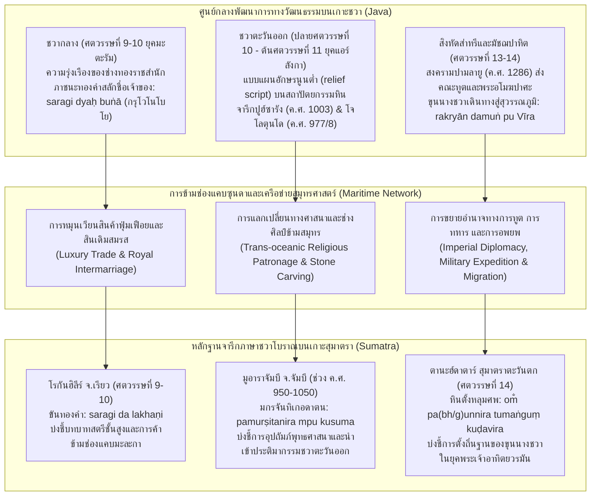

# บันทึกการอ่านและวิเคราะห์เอกสารจารึกวิทยาฉบับสมบูรณ์ (Epigraphic Source Dossier)
## จารึกสั้นภาษาชวาโบราณบนเกาะสุมาตรา: หลักฐานปฏิสัมพันธ์ข้ามช่องแคบซุนดาและพหุลักษณ์ทางภาษา (Inscriptions of Sumatra: II. Short Epigraphs in Old Javanese)

---

### ส่วนที่ 1: ข้อมูลบรรณานุกรมและการอ้างอิงมาตรฐาน (Bibliographic Metadata)

- **Source ID:** `S-2012-griffiths-01`
- **ชื่อไฟล์ PDF ในเครื่อง:** `S-2012-griffiths-01_Inscriptions_Sumatra_II_Old_Javanese.pdf`
- **ชื่อไฟล์ข้อความสกัด:** `S-2012-griffiths-01_Inscriptions_Sumatra_II_Old_Javanese.txt`
- **ประเภทเอกสาร:** บทความวิจัยชำระตัวบทจารึกและประวัติศาสตร์ภาษาศาสตร์เชิงวิพากษ์ในวารสารวิชาการระดับนานาชาติที่มีผู้ทรงคุณวุฒิประเมิน (Peer-reviewed Critical Epigraphic & Historical-Linguistic Research Article)
- **ภาษาของเอกสาร:** ภาษาอังกฤษ (EN) พร้อมการปริวรรตตัวบทจารึกต้นฉบับภาษาชวาโบราณ (Old Javanese), คำยืมภาษาสันสกฤตและภาษาปรากฤต (Sanskrit & Prakrit loanwords) ตามระบบสากล IAST (International Alphabet of Sanskrit Transliteration) ควบคู่กับการวิเคราะห์เปรียบเทียบเชิงสัทวิทยาและสัณฐานวิทยากับภาษามลายูโบราณ (Old Malay), ภาษามลายูคลาสสิก (Classical Malay), และภาษาชวาปัจจุบัน (Modern Javanese)
- **ขอบเขตภูมิศาสตร์และวัฒนธรรม:** เกาะสุมาตราและเครือข่ายข้ามช่องแคบซุนดาสู่เกาะชวา
  * *สุมาตราตะวันตก (West Sumatra):* บริเวณที่สูงตานะฮ์ดาตาร์ (Tanah Datar), ปาการูยุง (Pagaruyung), กาปาโลบูกิตกมบัก (Kapalo Bukit Gombak), และลุ่มแม่น้ำบาตังฮารีตอนบน (ธรรมราชยะ/ปาดังโรโจ)
  * *จัมบี (Jambi):* กลุ่มโบราณสถานมูอาราจัมบี (Muara Jambi temple complex), ซุ้มโฆปุระด้านเหนือของจันทิเกอดาตน (Candi Kedaton), และลุ่มแม่น้ำบาตังฮารีตอนล่าง
  * *เรียว (Riau):* ลุ่มแม่น้ำโรกัน (Rokan River basin), อำเภอโรกันฮิลีร์ (Rokan Hilir), ตำบลตานะฮ์ปูติฮ์ (Tanah Putih), และความเชื่อมโยงกับมูอาราตากุส (Muara Takus)
  * *เกาะชวา (Java) ในฐานะแหล่งอิทธิพลและเปรียบเทียบ:* ชวากลาง (กรุมหาสมบัติทองคำโวโนโบโย อำเภอกลาเต็น), ชวาตะวันออก (เกอดีรี/จารึกปูฮ์ซารัง, ภูเขาเปอนังกุงงัน/สระสรงน้ำโจโลตุนโด), และชวาตะวันตก (สุกาบูมี/จารึกซังฮยังตาปักแห่งกษัตริย์ศรีชัยภูปติ)
- **วัสดุและบริบทการค้นพบของโบราณวัตถุจารึกทั้งสามชิ้น:**
  1. *ศิลาจารึกทรงเสาตั้งกาปาโลบูกิตกมบัก 2 (Kapalo Bukit Gombak II Inscription):* หินตั้งทรงเสาอนุสรณ์งานศพหรือที่บรรจุอัฐิ (upright funerary / memorial stone) มีลักษณะร่วมกับวัฒนธรรมหินตั้งยุคก่อนประวัติศาสตร์ในแถบที่สูงสุมาตราตะวันตก เดิมค้นพบ ณ แหล่งโบราณคดีกาปาโลบูกิตกมบัก ไม่ไกลจากปาการูยุง อำเภอตานะฮ์ดาตาร์ ปัจจุบันเก็บรักษาในศาลาอนุรักษ์จารึก ณ ปาการูยุง สลักอักษรกวิภาษาชวาโบราณ 2 บรรทัด ทำสำเนาจารึกกระดาษโดย Arlo Griffiths เมื่อ ค.ศ. 2011 เก็บรักษา ณ คลังสำเนาจารึกสถาบันฝรั่งเศสแห่งปลายบุรพทิศ (EFEO Paris) หมายเลขทะเบียน n. 2010
  2. *จารึกอักษรนูนบนมกรประจำซุ้มโฆปุระด้านเหนือ จันทิเกอดาตน มูอาราจัมบี (Inscribed Makaras from Northern Gopura, Candi Kedaton, Muara Jambi):* ประติมากรรมมกรหินทรายขนาดใหญ่ประดับเชิงบันไดซุ้มประตูโฆปุระ ขุดค้นพบในตำแหน่งดั้งเดิม (in situ) เมื่อ ค.ศ. 2011 โดย Balai Pelestarian Peninggalan Purbakala Jambi (โดยการประสานงานของ Agus Widiatmoko) มกรแต่ละตัวสูงประมาณ 123 ซม. กว้าง 62–67 ซม. ลึก 113–130 ซม. โดยมกรคู่ทางทิศใต้มีการสลักตัวอักษรนูนต่ำ (relief script) แบบชวาตะวันออก มกรทิศตะวันออกเฉียงใต้มีอักษร 2 พยางค์บนปุ่มขมวดผมด้านหลัง (`@ so ja @`) และมกรทิศตะวันตกเฉียงใต้มีอักษร 2 บรรทัดบนลำตัวด้านขวา (`pamurṣitanira mpu kusuma`)
  3. *จารึกขันทองคำก้นตื้นแห่งโรกันฮิลีร์ (Inscribed Golden Bowl from Rokan Hilir, Riau):* ภาชนะทองคำประเภทขันทรงเตี้ยก้นตื้น (low golden bowl) ขนาดสูง 5.5 ซม. เส้นผ่านศูนย์กลาง 15 ซม. หนา 0.1 ซม. ค้นพบที่ตำบลตานะฮ์ปูติฮ์ อำเภอโรกันฮิลีร์ จังหวัดเรียว มอบให้แก่พิพิธภัณฑ์ประจำภูมิภาคเรียว (Museum Daerah Riau) เมืองเปอกันบารู ในช่วงทศวรรษ 1990 สลักอักษรกวิบรรทัดเดียวระบุกรรมสิทธิ์ (`saragi da lakhaṇi`) บันทึกภาพและศึกษาโดย Machi Suhadi และ Daniel Perret เมื่อวันที่ 12 เมษายน ค.ศ. 2004 ภายใต้โครงการความร่วมมือ Puslit Arkenas และ EFEO
- **การอ้างอิงฉบับเต็มระบบ Chicago/Turabian Notes-Bibliography:**  
  Griffiths, Arlo. "Inscriptions of Sumatra: II. Short Epigraphs in Old Javanese." *Wacana: Journal of the Humanities of Indonesia* 14, no. 2 (October 2012): 197–214.  
  ควบคู่กับงานวิจัยที่เกี่ยวข้องในชุดโครงการจารึกสุมาตรา:  
  Griffiths, Arlo. "Inscriptions of Sumatra: Further Data on the Epigraphy of the Musi and Batang Hari River Basins." *Archipel* 81 (2011): 129–175.  
  Griffiths, Arlo. "Inscriptions of Sumatra: III. The Padang Lawas Corpus Studied along with Inscriptions from Sorik Merapi (North Sumatra) and Muara Takus (Riau)." In *History of Padang Lawas, North Sumatra. II: Societies of Padang Lawas (9th c. – 13th c.)*, edited by Daniel Perret, 211–253. Paris: Association Archipel, 2014.

---

### ส่วนที่ 2: แผนผังการจัดสรรเข้าสู่บทและหัวข้อย่อย (Chapter & Section Mapping Matrix)

- **บทที่ 5: จารึกแห่งเกาะสุมาตราและคาบสมุทรมลายู: ศูนย์กลางการค้า ศรีวิชัย มลายู และเครือข่ายพุทธตันตระ**
  * **หัวข้อย่อย 5.2 (การกระจายตัวของจารึกในลุ่มแม่น้ำสำคัญ: บาตังฮารี มูซี และโรกัน):**  
    เอกสารนี้นำเสนอหลักฐานจารึกชั้นต้นชิ้นใหม่ที่ขยายพรมแดนจารึกวิทยาของสุมาตราออกไปอย่างมีนัยสำคัญ ได้แก่ จารึกมกรสองตัวที่ซุ้มโฆปุระด้านเหนือของจันทิเกอดาตนในกลุ่มโบราณสถานมูอาราจัมบีริมฝั่งแม่น้ำบาตังฮารี และขันทองคำสลักอักษรจากตำบลตานะฮ์ปูติฮ์ อำเภอโรกันฮิลีร์ ริมฝั่งแม่น้ำโรกัน การค้นพบเหล่านี้พิสูจน์ให้เห็นว่าเครือข่ายแม่น้ำสายหลักของสุมาตรามิได้เป็นเพียงเส้นทางการค้าภายใน แต่เป็นประตูบานสำคัญที่เปิดรับอิทธิพลทางภาษา ศาสนา และประติมากรรมชั้นสูงจากชวาเข้าสู่ศูนย์กลางภายในเกาะสุมาตรา (หน้า 197–198, 201–212)
  * **หัวข้อย่อย 5.4 (เครือข่ายโบราณสถานพุทธมหายานและตันตระ: มูอาราจัมบีและมูอาราตากุส):**  
    มิติทางประติมานวิทยาและจารึกวิทยาของมกรคู่สลักอักษรนูนต่ำแห่งจันทิเกอดาตน มูอาราจัมบี ระบุชัดเจนถึงการอุทิศถวายของมหาเถระหรือผู้ทรงศีลชาวชวา *Mpu Kusuma* ในช่วงศตวรรษที่ 10–11 ซึ่งเป็นหลักฐานเชิงประจักษ์ทางโบราณคดีชิ้นเอกที่ยืนยันว่ามูอาราจัมบีเป็นศูนย์กลางพุทธศาสนาข้ามสมุทรที่ได้รับการอุปถัมภ์ร่วมกันจากชนชั้นนำทั้งในสุมาตราและชวา (หน้า 201–209)
  * **หัวข้อย่อย 5.5 (ยุคหลังศรีวิชัย: อาณาจักรมลายูแห่งธรรมราชยะ ปาการูยุง และจารึกของพระเจ้าอาทิตยวรมัน):**  
    การอ่านและชำระความหมายใหม่ของศิลาจารึกกาปาโลบูกิตกมบัก 2 ยุคศตวรรษที่ 14 ในแถบที่สูงตานะฮ์ดาตาร์ ช่วยเติมเต็มจิ๊กซอว์ประวัติศาสตร์ราชสำนักปาการูยุง โดยแสดงให้เห็นการตั้งรกรากของขุนนางชวาระดับสูง (*tumaṅguṅ Kuḍa Vīra*) ซึ่งมีความเกี่ยวโยงทางสายตระกูลหรือสถาบันกับบุคคลในจารึกมลายูโบราณกูดัม 2 (*biraparākramakuda*) และคณะราชทูตชวาที่นำพระพุทธรูปอโมฆปาศะมายังสุมาตราใน ค.ศ. 1286 (*rakryān damuṅ pu Vīra*) (หน้า 200–201)

- **บทที่ 4: อักขรวิทยา ภาษาศาสตร์ประวัติศาสตร์ และการคำนวณศักราช: จากปัลลวะสู่กวิ และระบบปฏิทินดาราศาสตร์**
  * **หัวข้อย่อย 4.2 (วิวัฒนาการของอักษรกวิและการแพร่กระจายนอกเกาะชวา):**  
    บทความของ Griffiths ได้ตั้งข้อสังเกตสำคัญด้านอักขรวิทยาเปรียบเทียบว่า ในช่วงศตวรรษที่ 9–10 อักษรกวิบนเกาะสุมาตราและเกาะชวายังมีสัณฐานวิทยาเหมือนกันจนไม่สามารถแยกแยะความแตกต่างของสำนักช่างสลักอักษรได้ (indistinguishable) ทำให้อักขรวิทยาเพียงลำพังไม่อาจชี้ขาดถิ่นกำเนิดของวัตถุได้ แต่ต้องอาศัยภาษาศาสตร์ประวัติศาสตร์และบริบทโบราณคดีร่วมพิจารณา (หน้า 211)
  * **หัวข้อย่อย 4.3 (พหุลักษณ์ทางภาษา: ปรากฏการณ์ภาษาชวาโบราณบนเกาะสุมาตรา):**  
    การวิเคราะห์โครงสร้างไวยากรณ์ภาษาชวาโบราณในจารึกสุมาตราอย่างเป็นรูปธรรมผ่านดัชนีทางภาษาศาสตร์ 3 ประการ: (1) การใช้ปัจจัยสรรพนามเกี่ยวแขวนบุรุษที่ 3 *-nira* (หน้า 200, 205); (2) การใช้อนุพันธ์ของรากศัพท์กริยาเฉพาะภาษาชวาโบราณ *vurṣita* (*pamurṣitanira*) (หน้า 205); และ (3) การใช้คำนามเฉพาะ *saragi* สำหรับเรียกขันหรือภาชนะทรงเตี้ย (หน้า 210–212)
  * **หัวข้อย่อย 4.4 (อักขรวิธีและตำแหน่งเครื่องหมายเรผะ/ลายาร์):**  
    การวิเคราะห์เปรียบเทียบเชิงอักขรวิธีของการวางเครื่องหมายสะกดเสียงพยัญชนะ ร (*layar / repha*): จารึกซังฮยังตาปักแห่งสุกาบูมี ชวาตะวันตก (ค.ศ. 1030) วางเครื่องหมายลายาร์ไว้บนอักษรตัวหน้าอย่างผิดปรกติ (*vārdana* ในบรรทัดที่ 8) ซึ่งกลายเป็นต้นแบบของสมุดข่อยชวาในเวลาต่อมา ในขณะที่จารึกมกรแห่งมูอาราจัมบีวางเครื่องหมายไว้บนอักษรตัวถัดไปตามแบบแผนมาตรฐานของชวาตะวันออก (*pamurṣita*) ข้อมูลนี้ตัดความเป็นไปได้ของอิทธิพลจากชวาตะวันตก และยืนยันความเชื่อมโยงกับชวาตะวันออก (หน้า 207 เชิงอรรถ 16)
  * **หัวข้อย่อย 4.5 (การกำหนดอายุทางอักขรวิทยาด้วยอักษรนูนต่ำ):**  
    การเปรียบเทียบอักษรนูนต่ำ (relief script) บนมกรแห่งมูอาราจัมบีกับจารึกที่มีการระบุศักราชภายในตัวบทแน่นอนจากชวาตะวันออก ได้แก่ จารึกปูฮ์ซารัง ในเขตเกอดีรี (มหาศักราช 924 / ค.ศ. 1003) และจารึกโจโลตุนโด บนภูเขาเปอนังกุงงัน (มหาศักราช 899 / ค.ศ. 977/8) ทำให้สามารถกำหนดอายุจารึกมกรได้ในช่วง ค.ศ. 950–1050 (หน้า 206–207)

- **บทที่ 2: จารึกสำคัญไขประวัติศาสตร์ในคาบสมุทรและหมู่เกาะ: หมุดหมายแห่งการเปลี่ยนผ่านราชวงศ์และการก่อรูปอำนาจ**
  * **หัวข้อย่อย 2.4 (ศรีวิชัยในมิติจารึกข้ามภูมิภาค):**  
    การรื้อถอนมุมมองทางเดียวว่าศรีวิชัยเป็นฝ่ายแผ่อิทธิพลทางภาษา (ภาษามลายูโบราณ) เข้าสู่ชวากลางแต่เพียงฝ่ายเดียวในยุคศตวรรษที่ 7–9 โดยนำเสนอหลักฐานเชิงประจักษ์ว่าตั้งแต่ปลายศตวรรษที่ 10 เป็นต้นมา เกาะชวา (โดยเฉพาะชวาตะวันออก) ได้กลายเป็นฝ่ายแผ่อิทธิพลทางวัฒนธรรม ภาษา และงานช่างศิลป์กลับคืนสู่สุมาตราอย่างเข้มข้น (หน้า 197–198, 206–209)
  * **หัวข้อย่อย 2.8 (การขยายอำนาจของสิงหัดส่าหรีและมัชฌปาหิตสู่สุมาตรา):**  
    ความสอดคล้องระหว่างข้อมูลในจารึกกาปาโลบูกิตกมบัก 2 กับบันทึกประวัติศาสตร์การส่งกองทัพปามลายู (Pamalayu expedition ค.ศ. 1286) ของพระเจ้าเกียรตินคร และการก่อตั้งราชธานีมลายู-ปาการูยุงของพระเจ้าอาทิตยวรมัน ซึ่งมีข้าราชบริพารและนายทหารชาวชวาเข้ามามีบทบาทในโครงสร้างอำนาจท้องถิ่น (หน้า 201)

- **บทที่ 6: จารึกที่สะท้อนวัฒนธรรมโบราณในแง่การปกครอง กฎหมาย และสถาบันสีมา: สังคม เศรษฐกิจ การค้า และชีวิตประจำวัน**
  * **หัวข้อย่อย 6.2 (ระบบขุนนาง บรรดาศักดิ์ และสายการบังคับบัญชา):**  
    ตำแหน่ง *tumaṅguṅ* (ตูมังกุง) ในจารึกกาปาโลบูกิตกมบัก 2 สะท้อนการนำระบบราชการและยศถาบรรดาศักดิ์ชวามาปรับใช้ในการบริหารการปกครองดินแดนสุมาตราตะวันตก (หน้า 200–201)
  * **หัวข้อย่อย 6.5 (บทบาทของสตรีในสังคมชั้นสูงและสิทธิในทรัพย์สิน):**  
    จารึกแสดงกรรมสิทธิ์บนภาชนะทองคำ *saragi da lakhaṇi* (โรกันฮิลีร์) เทียบเคียงกับ *saragi dyaḥ buṅā* (โวโนโบโย ชวากลาง) สะท้อนสิทธิและสถานะของสตรีชนชั้นนำ (*noblewomen*) ในการครอบครองทรัพย์สินมีค่าส่วนบุคคล ซึ่งเชื่อมโยงกับขนบธรรมเนียมการสลักชื่อเจ้าของที่เป็นสตรีบนเครื่องเงินมลายูในยุคต่อมา (หน้า 209–211)

- **บทที่ 7: ศาสนา ความเชื่อ และเครือข่ายพุทธตันตระ/ไศวนิกายข้ามสมุทร: มนตรา ปรัชญา และการสังเคราะห์เทพเจ้า**
  * **หัวข้อย่อย 7.2 (ประติมานวิทยาของทวารบาลและมกรในพุทธสถาน):**  
    การวิเคราะห์ประติมากรรมมกรแห่งจันทิเกอดาตน มูอาราจัมบี ทั้งด้านหน้าที่การปกป้องพื้นที่ศักดิ์สิทธิ์และข้อความจารึกอุทิศถวาย *pamurṣitanira mpu kusuma* ร่วมกับคำปริศนา *@ so ja @* ซึ่งอาจสื่อถึง *svaja* (งูพิษ/ผู้เกิดเอง) สะท้อนการสังเคราะห์ความเชื่อเรื่องมกรและนาคในพุทธศาสนามหายานและตันตระ (หน้า 204–206)

- **บทที่ 8: จารึกบนวัตถุขนาดเล็ก แผ่นทองคำ สัมฤทธิ์ และจารึกงมจากแม่น้ำ**
  * **หัวข้อย่อย 8.2 (จารึกแสดงกรรมสิทธิ์บนภาชนะมีค่าและเครื่องทองคำ):**  
    การศึกษาวิเคราะห์จารึกสั้นบนขันทองคำแห่งโรกันฮิลีร์ ในฐานะวัตถุมีค่าขนาดพกพา (*portable luxury object*) และการเปรียบเทียบกับกรุมหาสมบัติโวโนโบโย ชวากลาง (หน้า 209–212)

- **บทที่ 9: พรมแดนความรู้ ปริศนาทางประวัติศาสตร์ และระเบียบวิธีวิจัยจารึกวิทยาสมัยใหม่**
  * **หัวข้อย่อย 9.2 (การแก้ไขคำอ่านและนิยามศัพท์ในพจนานุกรมชวาโบราณ):**  
    การปฏิสังขรณ์ความหมายของคำว่า *saragi* ในพจนานุกรม *Old Javanese-English Dictionary* ของ P.J. Zoetmulder (1982: 1687) จาก "หม้อทองแดง" สู่ "ขัน/ชามก้นตื้นทำจากทองคำ" (หน้า 212)
  * **หัวข้อย่อย 9.3 (ระเบียบวิธีสากล IAST กับการถอดอักษรในอินโดนีเซียศึกษา):**  
    ข้อถกเถียงเชิงระเบียบวิธีวิจัยว่าด้วยการใช้ระบบถอดอักษรมาตรฐานสากล IAST เพื่อเชื่อมโยงจารึกวิทยาเอเชียตะวันออกเฉียงใต้เข้ากับวิชาการอินเดียศึกษาและภววิทยาภาษาศาสตร์สากล (หน้า 199 เชิงอรรถ 5)

---

### ส่วนที่ 3: สรุปสาระสำคัญเชิงวิเคราะห์และจุดยืนทางวิชาการ (Executive Academic Analysis)

- **วิทยานิพนธ์และข้อถกเถียงหลักของผู้เขียน (Core Argument / Thesis):**  
  Arlo Griffiths เสนอข้อถกเถียงหลักว่า ภาพจำทางประวัติศาสตร์และภาษาศาสตร์ดั้งเดิมที่ผูกขาดความสัมพันธ์ระหว่างภาษาและภูมิศาสตร์อย่างตายตัวในหมู่เกาะอินโดนีเซีย กล่าวคือ "เกาะสุมาตราผูกขาดภาษามลายู" และ "เกาะชวาผูกขาดภาษาชวา" นั้น แม้จะสอดคล้องกับภาพรวมของจารึกยุคเริ่มแรกส่วนใหญ่ (เช่น ศิลาจารึกยุคแรกของสุมาตราเป็นภาษามลายูโบราณ ส่วนจารึกภาษาพื้นเมืองยุคแรกของชวาก็เป็นภาษาชวาโบราณ) แต่แท้จริงแล้วมี "ข้อยกเว้นสำคัญ" ที่วงวิชาการมองข้ามไป ในขณะที่ปรากฏการณ์การใช้ภาษามลายูโบราณในจารึกบนเกาะชวากลางและชวาตะวันตก (อาทิ จารึกโซโจเมอร์โต, จารึกมานชูศรีคฤหะ/วัดเซวู, จารึกกันดาสูลี, และจารึกบูกาเตจา) ได้รับการศึกษาวิจัยและถกเถียงอย่างกว้างขวางในฐานะร่องรอยการแผ่อำนาจของราชวงศ์ไศเลนทร์หรือศรีวิชัย แต่ปรากฏการณ์ในทางตรงกันข้าม คือ "การจารึกภาษาชวาโบราณบนเกาะสุมาตรา" กลับแทบไม่เคยได้รับการสำรวจและศึกษาวิจัยอย่างเป็นระบบเลย  
  Griffiths พิสูจน์ให้เห็นอย่างเป็นรูปธรรมว่า การปรากฏตัวของจารึกภาษาชวาโบราณบนเกาะสุมาตรามิได้เกิดขึ้นจากสาเหตุหรือสถานการณ์ทางประวัติศาสตร์เพียงรูปแบบเดียว (no single general explanation is sufficient) หากแต่เป็นภาพสะท้อนของพลวัตทางวัฒนธรรม การเมือง เศรษฐกิจ และศาสนาข้ามช่องแคบซุนดาที่เกิดขึ้นในหลากหลายยุคสมัยและบริบททางสังคมที่แตกต่างกันอย่างสิ้นเชิง 3 ประการ:
  1. *การอพยพและการจัดตั้งองค์กรบริหารราชสำนัก (Immigration, Court Settlement & Military Presence):* ศิลาจารึกกาปาโลบูกิตกมบัก 2 บนที่สูงสุมาตราตะวันตก (ศตวรรษที่ 14) สะท้อนการสร้างอนุสรณ์สถานงานศพหรือที่บรรจุอัฐิของขุนนางผู้ใหญ่ชาวชวา (*tumaṅguṅ Kuḍa Vīra*) ซึ่งเป็นประจักษ์พยานของการเข้ามาตั้งถิ่นฐานอย่างถาวรของชนชั้นปกครองชาวชวาในราชสำนักมลายู-ปาการูยุง ภายหลังการขยายอำนาจของราชอาณาจักรสิงหัดส่าหรีและมัชฌปาหิต
  2. *การอุทิศถวายวัตถุทางศาสนาข้ามสมุทรและการถ่ายโอนงานช่างสถาปัตยกรรม (Trans-oceanic Pious Donation & Architectural Transfer):* จารึกอักษรนูนบนมกรหิน 2 ตัวที่ซุ้มโฆปุระด้านเหนือของจันทิเกอดาตนในกลุ่มโบราณสถานมูอาราจัมบี (ช่วง ค.ศ. 950–1050) บันทึกการบริจาคของมหาเถระหรือผู้ทรงศีลชาวชวา *Mpu Kusuma* ซึ่งการใช้อักษรนูนต่ำและประติมานวิทยาแบบชวาตะวันออก (ยุคราชวงศ์อีศานะ/พระเจ้าแอร์ลังกา) แสดงให้เห็นถึงการส่งมอบงานประติมากรรมขนาดใหญ่ข้ามทะเล หรือการเคลื่อนย้ายของนายช่างศิลป์จากชวาตะวันออกมาร่วมสร้างสรรค์มหาศาสนสถานพุทธมหายานในลุ่มน้ำบาตังฮารี
  3. *การค้าสินค้าฟุ่มเฟือย เครือข่ายสตรีชั้นสูง และของขวัญระหว่างราชสำนัก (Luxury Trade, Elite Female Networks & Courtly Gift Exchange):* จารึกขันทองคำก้นตื้นจากโรกันฮิลีร์ จังหวัดเรียว (ศตวรรษที่ 9–10) ที่ระบุชื่อเจ้าของสตรีชั้นสูง *Da Lakhaṇi* ซึ่งมีลักษณะทางไวยากรณ์และรูปทรงสอดคล้องกับขันทองคำจากกรุมหาสมบัติโวโนโบโยในชวากลาง (*saragi dyaḥ buṅā*) สะท้อนการหมุนเวียนของวัตถุมีค่าขนาดพกพาข้ามทะเลชวาและช่องแคบมะละกา ซึ่งอาจเกิดขึ้นผ่านการค้าทางทะเลระยะไกล การอภิเษกสมรสทางการเมืองระหว่างสองราชสำนัก หรือการมอบของขวัญทางการทูตในยุครุ่งเรืองของศรีวิชัยและมะตะรัม

- **บริบทประวัติศาสตร์นิพนธ์และการประเมินความน่าเชื่อถือ (Historiography & Source Criticism):**  
  ในทางประวัติศาสตร์นิพนธ์ Griffiths ได้ทำการประเมินและวิพากษ์วรรณกรรมจารึกวิทยาในอดีตอย่างรอบด้าน:
  - *การแก้ไขการจำแนกภาษาผิดพลาดในอดีต:* ชี้ให้เห็นว่าจารึกฮูจุงลางิต (Hujung Langit หรือจารึกฮาราวังกา Hara Kuning) ในจังหวัดลพุง ซึ่งเดิมนักวิชาการรุ่นแรกสันนิษฐานว่าเป็นภาษาชวาโบราณ ได้รับการพิสูจน์ทางนิรุกติศาสตร์โดย Louis-Charles Damais (1962a) แล้วว่าเป็นภาษามลายูโบราณ ขณะเดียวกัน จารึกสั้นบางหลักจากแหล่งโบราณคดีปาดังลาวัส (Padang Lawas) ในสุมาตราเหนือก็เคยถูกจำแนกผิดว่าเป็นภาษาชวาโบราณเช่นกัน ดังนั้น การตรวจสอบตัวบทอย่างเคร่งครัดตามหลักไวยากรณ์ประวัติศาสตร์จึงเป็นหัวใจสำคัญอย่างยิ่ง (หน้า 198 เชิงอรรถ 3)
  - *การวิพากษ์การตีความจารึกกาปาโลบูกิตกมบัก 2 ของนักวิชาการอินโดนีเซีย:* Griffiths วิพากษ์การอ่านและการแปลของนักวิชาการอินโดนีเซียรุ่นก่อนหน้าอย่างเข้มงวด โดยระบุว่าการแปลของ Budi Istiawan (2006: 17) ที่แปลว่า "Bahagia. Atas hasil kerja Tumanggung Kudawira" (ความสุข อันเนื่องจากผลงานของตูมังกุง กูดาวีรา) ต้องถูกปฏิเสธโดยสิ้นเชิง เนื่องจากในภาษาชวาไม่มีรากศัพท์หรือรูปคำอนุพันธ์ *pagun* ที่มีความหมายว่า "ผลงาน" (*hasil kerja*) และไม่มีคำบุพบทหรือไวยากรณ์ที่แสดงความหมายว่า "บนพื้นฐานของ/อันเนื่องจาก" (*atas*) ส่วนคำแปลของ Machi Suhadi (1991) ที่เสนอว่า "Selamat ditetapkannya Tumanggung Kudawira" (ขอให้การได้รับการสถาปนาของตูมังกุง กูดาวีรา จงมีความมั่นคง) โดยอนุมานว่า *pagun* มาจากราก *pagu* ในรูปกรรมวาจกสัทนามิก (nominalized passive causative: *ditetapkannya*) ก็เป็นการแปลที่ไร้หลักฐานทางไวยากรณ์รองรับเช่นกัน Griffiths จึงเสนอคำอ่านใหม่ 2 ทางเลือก: (1) *pagunnira* เป็นรูปสะกดแปรผันของคำนาม *pagvan/pagon* (การสลับสระ u/va/o พบได้ทั่วไปในเอกสารชวาโบราณ ดู Acri 2011) แปลว่า "ฐานอันมั่นคง" หรือ "ที่พำนักอันสงบ" (*resting place*); หรือ (2) *pabhunnira* ซึ่งมาจากราก *avu* (เถ้าถ่าน) สร้างคำในรูป *pa-avu-an* (ที่บรรจุอัฐิ เช่นเดียวกับโครงสร้างคำว่า *pawon* ในภาษาชวาปัจจุบัน) ทั้งสองคำอ่านล้วนชี้ชัดตรงกันว่าเป็น "อนุสรณ์สถานงานศพหรือที่เก็บอัฐิของตูมังกุง กูดาวีรา" (หน้า 199–201)
  - *การวิพากษ์แนวคิด "อักษรเหลี่ยมเกอดีรี" (Kediri Quadrate Script):* Griffiths วิพากษ์ข้อเสนอของ J.G. de Casparis (1975: 42) ที่มักจัดประเภทอักษรนูนต่ำทั้งหมดว่าเป็น "อักษรเหลี่ยมเกอดีรี" โดยชี้แจงว่าคำดังกล่าวควรสงวนไว้เฉพาะรูปแบบอักษรประดับวิจิตร (highly ornamental modes) ที่มีรูปทรงสี่เหลี่ยมเด่นชัดเท่านั้น แต่นักวิชาการรุ่นก่อนมักสับสนนำไปปะปนกับรูปแบบอักษรนูนธรรมดา (plain mode of writing in relief) ดังที่พบบนจารึกมกรแห่งมูอาราจัมบี จารึกปูฮ์ซารัง และจารึกโจโลตุนโด (หน้า 203 เชิงอรรถ 12)
  - *การตอบโต้ข้อวิจารณ์เรื่องการถอดอักษรตามมาตรฐาน IAST:* Griffiths ชี้แจงข้อวิจารณ์ของ Dick van der Meij (2012) ที่วิจารณ์ว่า Griffiths ใช้อักขรวิธี IAST โดยไม่อธิบายเกณฑ์ โดย Griffiths ระบุว่าการใช้ *v* แทน *w*, การแยก *b* กับ *bh*, และการใช้ *ṃ* แทนอนุสวาระ เป็นการปฏิบัติตามมาตรฐานสากลของอักษรตระกูลอินเดีย เพื่อป้องกันไม่ให้อินโดนีเซียศึกษาถูกตัดขาดออกจากบริบทวิชาการของโลก (หน้า 199 เชิงอรรถ 5)

- **ตารางเปรียบเทียบเชิงวิเคราะห์จารึกสั้นภาษาชวาโบราณทั้งสามหลักบนเกาะสุมาตรา:**

| มิติการวิเคราะห์ | ศิลาจารึกกาปาโลบูกิตกมบัก 2 (Kapalo Bukit Gombak II) | จารึกมกร จันทิเกอดาตน มูอาราจัมบี (Muara Jambi Makaras) | จารึกขันทองคำแห่งโรกันฮิลีร์ (Rokan Hilir Golden Bowl) |
| :--- | :--- | :--- | :--- |
| **รหัสและชื่อทางการ** | Inscribed upright stone from West Sumatra (Kapalo Bukit Gombak II, Krom no. 28, Brandes OJO CXXV) | Inscribed makaras from northern Gopura of Candi Kedaton, Muara Jambi | Inscribed golden bowl found in Rokan Hilir, Museum Daerah Riau |
| **ตำแหน่งทางภูมิศาสตร์** | กาปาโลบูกิตกมบัก ใกล้ปาการูยุง อำเภอตานะฮ์ดาตาร์ จังหวัดสุมาตราตะวันตก (หน้า 198–199) | ซุ้มโฆปุระด้านเหนือ จันทิเกอดาตน แหล่งโบราณสถานมูอาราจัมบี จังหวัดจัมบี (หน้า 201) | ตำบลตานะฮ์ปูติฮ์ อำเภอโรกันฮิลีร์ จังหวัดเรียว (หน้า 209) |
| **วัสดุและขนาดทางกายภาพ** | แท่งหินแอนดีไซต์ทรงเสาตั้งอนุสรณ์งานศพ (upright stone stele / menhir-like) (หน้า 198, 200) | ประติมากรรมหินรูปมกร 2 ตัว มกร ตอ./ต.ต.: 123 × 63 × 113 ซม. มกร ตต./ต.ต.: 123 × 67 × 130 ซม. (หน้า 201) | ขันทองคำก้นตื้น (low golden bowl) สูง 5.5 ซม. เส้นผ่านศูนย์กลาง 15 ซม. หนา 0.1 ซม. (หน้า 209–210) |
| **เทคนิคการจารึก** | การสกัดเซาะร่องเส้นอักษรลงบนผิวหิน (incised script) 2 บรรทัด (หน้า 199–200) | การจำหลักตัวอักษรนูนต่ำ (relief script) บนปุ่มผมและลำตัวมกร (หน้า 203–205) | การสลักดุนเส้นอักษรลงบนผิวโลหะทองคำ (chased / incised on gold) 1 บรรทัด (หน้า 210) |
| **ตัวบทจารึกต้นฉบับ** | `(1) ° om̐ pa(bh/g)unnira tumaṅguṃ ku-` `(2) ḍavira \|` (หน้า 200) | มกร ตอ./ต.ต.: `@ so ja @` มกร ตต./ต.ต.: `(1) //pamurṣitanira mpu ku- (2) suma [liminal signs]` (หน้า 204–205) | `saragi da lakhaṇi` (หน้า 210) |
| **คำแปลภาษาไทย** | "โอม ที่พำนักอันสงบ / ที่บรรจุอัฐิของท่านตูมังกุง กูดาวีรา" (หน้า 200–201) | "มกร อันเป็นของขวัญ/การอุทิศถวายของท่านอาจารย์กุสุมา" (หน้า 205–206) | "ขันของท่านผู้หญิง/ท่านลักขณี" (หน้า 210) |
| **อายุทางอักขรวิทยา** | ราวศตวรรษที่ 14 (ยุคพระเจ้าอาทิตยวรมัน หรือผู้สืบราชสมบัติ) (หน้า 198) | ราว ค.ศ. 950–1050 (ปลายศตวรรษที่ 10 – ต้นศตวรรษที่ 11) (หน้า 206) | ราวศตวรรษที่ 9–10 (อักษรกวิยุคคลาสสิกตอนต้น) (หน้า 211) |
| **หลักฐานยืนยันภาษาชวาโบราณ** | ปัจจัยสรรพนามเกี่ยวแขวน *-nira* และบรรดาศักดิ์ขุนนาง *tumaṅguṅ* (หน้า 200) | ปัจจัยสรรพนาม *-nira* และอนุพันธ์ของรากศัพท์ชวาแท้ *vurṣita* (*pamurṣita*) (หน้า 205) | คำนามเฉพาะภาษาชวา *saragi* (ไม่พบปรากฏในภาษาตระกูลมลายูใดๆ) (หน้า 210–212) |
| **โบราณวัตถุเทียบเคียง** | จารึกกูดัม 2 (*biraparākramakuda*) และจารึกฐานพระอโมฆปาศะ ค.ศ. 1286 (*rakryān damuṅ pu Vīra*) (หน้า 201) | จารึกปูฮ์ซารัง เกอดีรี ค.ศ. 1003 และจารึกสระโจโลตุนโด ภูเขาเปอนังกุงงัน ค.ศ. 977/8 (หน้า 206–207) | ขันทองคำจากกรุมหาสมบัติโวโนโบโย ชวากลาง จารึก *saragi dyaḥ buṅā* (หน้า 210–211) |
| **กลไกการเคลื่อนย้ายข้ามสมุทร** | การผลิตในท้องถิ่นสุมาตราตะวันตก โดยชุมชนขุนนางชวาที่อพยพมาตั้งรกราก (หน้า 201) | ผลิตในเกาะชวาแล้วส่งข้ามทะเล หรือช่างสลักชาวชวาเดินทางมาจำหลักหินที่มูอาราจัมบี (หน้า 209) | โบราณวัตถุขนาดพกพานำเข้าจากเกาะชวา ผ่านการค้า สินเดิมสมรส หรือของขวัญราชสำนัก (หน้า 211–212) |

---

### ส่วนที่ 4: สารบัญข้อค้นพบเชิงลึกแยกตามมิติจารึกวิทยา (Thematic Epigraphic Findings with Exact Pages)

1. **ประวัติศาสตร์นิพนธ์และการตีความทางประวัติศาสตร์:**
   - การรื้อถอนภาพจำทวิลักษณ์ตายตัวระหว่างภาษาและภูมิศาสตร์ (หน้า 197–198): Griffiths ชี้ว่าการที่วงวิชาการเชื่อมโยงภาษามลายูกับสุมาตรา และภาษาชวากับเกาะชวา แม้จะถูกต้องในระดับภาพรวมของจารึกเริ่มแรก แต่การมองข้ามปรากฏการณ์ย้อนกลับ (reverse phenomenon) ทำให้ประวัติศาสตร์นิพนธ์ขาดมิติความสัมพันธ์เชิงพลวัตที่แท้จริง
   - ความไม่เพียงพอของทฤษฎีเดี่ยวในการอธิบายโบราณวัตถุ (หน้า 198): Griffiths ประกาศอย่างชัดเจนว่า ไม่มีคำอธิบายทางประวัติศาสตร์เพียงชุดเดียว (no general explanation will be sufficient) ที่จะสามารถครอบคลุมที่มาของโบราณวัตถุทั้งสามชิ้นบนเกาะสุมาตราได้ เนื่องจากจารึกแต่ละหลักสะท้อนแบบแผนทางสังคม ศาสนา และการเมืองคนละรูปแบบ
   - การแก้ไขข้อมูลจารึกที่ถูกจัดหมวดหมู่ผิดพลาดในอดีต (หน้า 198 เชิงอรรถ 3): ทบทวนกรณีจารึกฮูจุงลางิตในลพุง ซึ่ง Damais (1962a) พิสูจน์แล้วว่าเป็นภาษามลายูโบราณมิใช่ชวาโบราณ และกรณีจารึกปาดังลาวัสในสุมาตราเหนือที่มีการระบุภาษาผิดพลาด ทำให้จารึกทั้งสามหลักในบทความนี้เป็นหมุดหมายแรกของการศึกษาจารึกภาษาชวาโบราณแท้บนเกาะสุมาตราอย่างเป็นระบบ
   - การเชื่อมโยงจารึกกาปาโลบูกิตกมบัก 2 กับประวัติศาสตร์ยุคพระเจ้าอาทิตยวรมัน (หน้า 198, 201): จารึกหลักนี้มีอายุร่วมสมัยกับรัชสมัยของพระเจ้าอาทิตยวรมัน (ศตวรรษที่ 14) กษัตริย์ผู้มีสายเลือดผสมชวา-มลายู ซึ่งสถาปนาศูนย์กลางอำนาจบนที่สูงตานะฮ์ดาตาร์ และมีการใช้ภาษาชวาควบคู่กับภาษามลายูและสันสกฤตในราชสำนัก

2. **ตัวบทจารึก การอ่าน ศักราช และอักขรวิทยา:**
   - การอ่านตัวบทจารึกกาปาโลบูกิตกมบัก 2 จากสำเนาจารึก EFEO n. 2010 (หน้า 199–200):  
     บรรทัด 1: `° om̐ pa(bh/g)unnira tumaṅguṃ ku-`  
     บรรทัด 2: `ḍavira |`  
     อักขรวิทยาแสดงว่าอักษรตัวที่ 3 ในบรรทัดแรกมีความกำกวมระหว่าง `g` และ `bh` ซึ่งนำไปสู่การตีความสองแนวทางคือ `pagunnira` หรือ `pabhunnira`
   - การใช้ปัจจัยสรรพนามเกี่ยวแขวน `-nira` เป็นเกณฑ์ชี้ขาดทางภาษาศาสตร์ (หน้า 200, 205): Griffiths ยืนยันว่าปัจจัย `-nira` ที่ปรากฏทั้งในจารึกกาปาโลบูกิตกมบัก 2 และจารึกมกรแห่งมูอาราจัมบี (*pamurṣitanira*) ทำหน้าที่เป็นดัชนีทางไวยากรณ์ที่พิสูจน์ความเป็นภาษาชวาโบราณอย่างเด็ดขาด
   - การวิเคราะห์สัณฐานวิทยาของอักษรนูนต่ำ (relief script) บนมกรแห่งมูอาราจัมบี (หน้า 203–207):  
     มกรทิศตะวันออกเฉียงใต้: สลักอักษรนูน 2 พยางค์บนปุ่มขมวดผมด้านหลัง ขนาบด้วยเครื่องหมายก้นหอยเปิด-ปิด อ่านได้ว่า `@ so ja @`  
     มกรทิศตะวันตกเฉียงใต้: สลักอักษรนูน 2 บรรทัดบนลำตัวด้านขวา เริ่มต้นด้วยเครื่องหมายคั่นพิเศษรูปขดตามเข็มนาฬิกาตัดผ่านเส้นดิ่ง (`//`) อ่านได้ว่า:  
     บรรทัด 1: `//pamurṣitanira mpu ku-`  
     บรรทัด 2: `suma [liminal signs]` ตามด้วยสัญลักษณ์คั่นข้อความพิเศษ 4 ตัว
   - การคำนวณอายุทางอักขรวิทยาเปรียบเทียบกับจารึกชวาตะวันออก (หน้า 206–207): อักษรนูนต่ำบนมกรทั้งสองตัวมีสัณฐานวิทยาตรงกับจารึกที่มีศักราชภายในตัวบทแน่นอน ได้แก่ จารึกปูฮ์ซารัง ในเขตเกอดีรี มหาศักราช 924 (ค.ศ. 1003) และจารึกสระโจโลตุนโด บนภูเขาเปอนังกุงงัน มหาศักราช 899 (ค.ศ. 977/8) จึงสามารถกำหนดอายุจารึกมกรได้แม่นยำในช่วง ค.ศ. 950–1050
   - การวางเครื่องหมายเรผะ/ลายาร์เปรียบเทียบระหว่างภูมิภาค (หน้า 207 เชิงอรรถ 16): ในจารึกซังฮยังตาปักแห่งสุกาบูมี ชวาตะวันตก (ค.ศ. 1030) เครื่องหมายลายาร์ถูกวางไว้บนอักษรตัวหน้าอย่างผิดปรกติ (*vārdana*) ขณะที่จารึกมกรแห่งมูอาราจัมบีวางเครื่องหมายไว้บนอักษรตัวถัดไปตามแบบแผนมาตรฐานของชวาตะวันออก (*pamurṣita*) ชี้ชัดว่าสายสัมพันธ์ของมูอาราจัมบีเชื่อมโยงกับชวาตะวันออก มิใช่ชวาตะวันตก
   - การอ่านและกำหนดอายุตัวบทจารึกบนขันทองคำโรกันฮิลีร์ (หน้า 210–211): ตัวบทอ่านได้ว่า `saragi da lakhaṇi` สลักด้วยอักษรกวิคลาสสิกตอนต้น ซึ่งในยุคศตวรรษที่ 9–10 สัณฐานวิทยาอักษรกวิของชวาและสุมาตรายังไม่มีความแตกต่างที่สามารถแยกแยะได้
   - รากศัพท์ปรากฤตของชื่อเฉพาะ *Lakhaṇi* (หน้า 210–211): Griffiths วิเคราะห์ว่านาม *Lakhaṇi* แผลงมาจากภาษาสันสกฤต *Lakṣaṇī* ผ่านภาษาปรากฤต (Prakrit loanword) ซึ่งในจารึกชวาโบราณพบนามบุรุษว่า *Lakṣaṇa* หลายครั้ง (Damais 1970: 713) ดังนั้น *Lakhaṇi* จึงเป็นรูปสตรีลิงค์ของนามดังกล่าว

3. **มิติศาสนา ลัทธิความเชื่อ และพิธีกรรม:**
   - ธรรมเนียมการสร้างอนุสรณ์สถานบรรจุอัฐิและพิธีกรรมศพ (หน้า 200–201): การแปลคำว่า *pabhunnira* (จากราก *avu* = เถ้าถ่าน สู่รูป *pa-avu-an* = ที่บรรจุอัฐิ) หรือ *pagunnira* (ที่พำนักอันสงบ) ยืนยันหน้าที่ของหินตั้งกาปาโลบูกิตกมบัก 2 ว่าเกี่ยวข้องกับพิธีกรรมการจัดการศพและการอุทิศส่วนกุศลแก่ผู้ล่วงลับ ซึ่งเป็นการผสานธรรมเนียมบูชาบรรพบุรุษพื้นเมืองเข้ากับพิธีกรรมทางศาสนาของชนชั้นนำชวา
   - การบริจาคทานทางศาสนา (*pious donation*) เพื่อค้ำจุนพุทธสถาน (หน้า 205): คำว่า *pamurṣitanira mpu kusuma* มาจากรากศัพท์ชวาโบราณ *vurṣita* ซึ่งสื่อถึงการบูชา การสรรเสริญ หรือของขวัญอันเกิดจากจิตศรัทธา สะท้อนการอุปถัมภ์พุทธสถานจันทิเกอดาตนโดยบุคคลชั้นสูงหรือมหาเถระจากชวา
   - ประติมานวิทยาและความหมายเชิงสัญลักษณ์ของมกรและนาค (หน้า 204–205): การตีความคำว่า *soja* บนมกรทิศตะวันออกเฉียงใต้ว่าเป็นรูปสะกดแผลงของภาษาสันสกฤต *svaja* ซึ่งหมายถึง "ผู้เกิดเอง" และใช้เป็นคำเรียก "งูพิษ" สอดคล้องกับลักษณะทางกายภาพของมกรตัวนี้ที่มีนาคพ่นออกมาจากปาก และสะท้อนการปกปักรักษาพื้นที่ศักดิ์สิทธิ์ตามคติจักรวาลวิทยาพุทธ-ฮินดู

4. **มิติสถาปัตยกรรม ศาสนสถาน และชลศาสตร์:**
   - สถาปัตยกรรมซุ้มโฆปุระและผังบริเวณจันทิเกอดาตน (หน้า 201): ขุดค้นพบมกรหิน 3 ตัวจากชุดดั้งเดิมที่คาดว่ามี 4 ตัว ประดับบันไดทางขึ้นซุ้มโฆปุระด้านทิศเหนือ ซึ่งตั้งอยู่ปลายสุดของลานกว้างด้านหน้าจันทิเกอดาตน โดยไม่ปรากฏร่องรอยสิ่งปลูกสร้างอื่นใดนอกจากเนินดินโบราณ (*manapo*) เพียงแห่งเดียว
   - ความผิดปรกติทางประติมานวิทยาและสถาปัตยกรรม (หน้า 208–209): การที่มกรคู่ที่ติดตั้งขนาบข้างบันไดเดียวกันมีลวดลายไม่เหมือนกัน (มกรบันไดทิศใต้มีนาคพ่นออกมาจากปาก แต่มกรบันไดทิศเหนือมีสัตว์ลูกผสมกึ่งสิงห์กึ่งแกะโผล่ออกมา) เป็นสิ่งผิดปรกติตามขนบศิลปกรรมโบราณ (Marijke Klokke) ชี้ให้เห็นว่ามกรชุดนี้อาจมิได้ถูกสร้างขึ้นมาพร้อมกันสำหรับอาคารนี้ตั้งแต่แรก หรือเป็นโบราณวัตถุที่เคลื่อนย้ายมาจากแหล่งอื่น
   - วิวัฒนาการของอนุสรณ์สถานหินตั้งในสุมาตราตะวันตก (หน้า 200 เชิงอรรถ 7): John Miksic (2004) ชี้ว่าหินตั้งกาปาโลบูกิตกมบัก 2 มีรูปทรงสัณฐานร่วมกับหินตั้งหลุมศพในแถบที่สูงสุมาตราตะวันตก ซึ่งเป็นตัวแทนของขั้นตอนการเปลี่ยนผ่านทางวัฒนธรรมจากยุคก่อนประวัติศาสตร์ สู่ยุคคลาสสิก และต่อเนื่องไปจนถึงยุคหินสุสานอิสลาม

5. **มิติอาหารการกิน วิถีชีวิต การค้า และตลาด:**
   - วัฒนธรรมการใช้ภาชนะทองคำในราชสำนักโบราณ (หน้า 209–212): ขันทองคำแห่งโรกันฮิลีร์ ขนาดเส้นผ่านศูนย์กลาง 15 ซม. สูง 5.5 ซม. หนา 0.1 ซม. เป็นพยานวัตถุของเครื่องใช้ส่วนบุคคลระดับสูงในราชสำนัก สะท้อนความประณีตของการดำรงชีวิตของชนชั้นนำและการใช้โลหะมีค่าในชีวิตประจำวันและพิธีกรรม
   - การแก้ไขความหมายเชิงหน้าที่ของคำว่า *saragi* (หน้า 212): Griffiths ชี้ให้เห็นว่านิยามเดิมของ Zoetmulder ที่ระบุว่า *saragi* หมายถึง "หม้อหรือกาทองแดง" ไม่สอดคล้องกับหลักฐานทางโบราณคดี เนื่องจากทั้งขันโรกันฮิลีร์และขันโวโนโบโยล้วนเป็นขันก้นตื้นทำจากทองคำบริสุทธิ์ จึงต้องแก้ไขความหมายให้ครอบคลุมถึงขันหรือชามก้นตื้นสำหรับใส่ของเหลวหรืออาหารในพิธีเลี้ยงรับรองของราชสำนัก

6. **มิติการปกครอง กฎหมาย ที่ดิน และระบบสีมา:**
   - การสถาปนาโครงสร้างบรรดาศักดิ์ขุนนางชวาในสุมาตรา (หน้า 200–201): การปรากฏของตำแหน่ง *tumaṅguṅ* (ตูมังกุง) ในจารึกกาปาโลบูกิตกมบัก 2 บ่งชี้ว่าระบบราชสำนักและโครงสร้างการบริหารของชวาได้ถูกนำมาสถาปนาขึ้นในสุมาตราตะวันตกอย่างเป็นทางการ
   - เครือข่ายขุนนางและการสืบสายตระกูลข้ามยุคสมัย (หน้า 201): การเปรียบเทียบชื่อ *Kuḍa Vīra* กับบุคคลนาม *biraparākramakuda* ในจารึกมลายูโบราณกูดัม 2 และ *rakryān damuṅ pu Vīra* ในจารึกฐานพระอโมฆปาศะ ค.ศ. 1286 ชี้ให้เห็นถึงความต่อเนื่องของตระกูลขุนนางที่มีบทบาททางการเมืองและการทหารระหว่างชวากับสุมาตราตั้งแต่ปลายศตวรรษที่ 13 ถึงศตวรรษที่ 14
   - การปฏิเสธข้อสันนิษฐานเรื่องหลักเขตวัดของ Jan Wisseman Christie (หน้า 200 เชิงอรรถ 7): Christie เสนอว่าจารึกกาปาโลบูกิตกมบัก 2 อาจเป็นหลักเขตแดนของวัดที่สถาปนาโดยกูดาวีรา แต่ Griffiths โต้แย้งว่าในทางไวยากรณ์ ปัจจัยสรรพนาม *-nira* ที่ต่อท้ายคำนามจากฐาน *pagu* ต้องทำหน้าที่แสดงความเป็นเจ้าของหรือผู้ได้รับผลประโยชน์ (*owner/beneficiary*) มิใช่ผู้กระทำ (*agent*) ของการสร้างฐาน

7. **มิติปฏิสัมพันธ์ข้ามสมุทรและเครือข่ายนานาชาติ:**
   - มิติประวัติศาสตร์ความสัมพันธ์ระหว่างชวากับสุมาตราสามระลอกคลื่น (หน้า 197–212):
     * ระลอกที่ 1 (ศตวรรษที่ 9–10): การแลกเปลี่ยนสิ่งของมีค่าขนาดพกพาและวัฒนธรรมสตรีชั้นสูง (ขันทองคำโรกันฮิลีร์)
     * ระลอกที่ 2 (ปลายศตวรรษที่ 10 – ต้นศตวรรษที่ 11): การถ่ายโอนงานช่างประติมากรรมหินและการอุปถัมภ์พุทธศาสนาจากชวาตะวันออก (มูอาราจัมบี)
     * ระลอกที่ 3 (ปลายศตวรรษที่ 13 – ศตวรรษที่ 14): การขยายอำนาจทางการเมือง การทหาร และการตั้งถิ่นฐานของขุนนางชวา (ปาการูยุง/ตานะฮ์ดาตาร์)
   - การเชื่อมต่อกับจารึกพระอโมฆปาศะแห่งปาดังโรโจ ค.ศ. 1286 (หน้า 201): ข้อความ *dari bhūmi jāva ka svarṇṇabhūmi* บนฐานรูปเคารพพระอโมฆปาศะยืนยันการส่งคณะผู้แทน ขุนนาง และช่างศิลป์จากเกาะชวาสู่สุวรรณภูมิอย่างเป็นทางการ ซึ่งเป็นสะพานเชื่อมโยงบริบททางการเมืองที่นำไปสู่การใช้ภาษาชวาโบราณในจารึกกาปาโลบูกิตกมบัก 2

8. **มิติจารึกแผ่นโลหะ รูปเคารพขนาดเล็ก และจารึกแม่น้ำ:**
   - ความสัมพันธ์เชิงสัณฐานวิทยาระหว่างขันโรกันฮิลีร์กับมหาสมบัติโวโนโบโย (หน้า 210–211): ตัวบท *saragi da lakhaṇi* มีโครงสร้างประโยค ชนิดของภาชนะ และการใช้งานเหมือนกับขันทองคำหมายเลข 8924 จากกรุมหาสมบัติโวโนโบโย ชวากลาง ที่จารึกว่า *saragi dyaḥ buṅā* อย่างน่าทึ่ง
   - ปัญหาการกำหนดอายุของมหาสมบัติโวโนโบโย (หน้า 211 เชิงอรรถ 19): Griffiths ตั้งข้อสังเกตว่าการกำหนดอายุโบราณวัตถุโวโนโบโยให้อยู่ในต้นศตวรรษที่ 10 โดย Wahyono Martowikrido ยังมีข้อสงสัย และไม่อาจตัดความเป็นไปได้ที่วัตถุอาจมีอายุเก่าแก่ไปถึงศตวรรษที่ 9
   - บทบาทของสตรีในฐานะเจ้าของทรัพย์สินมีค่า (หน้า 210–211): ทั้ง *Dyaḥ Buṅā* (buṅa = ดอกไม้) และ *Da Lakhaṇi* (เทียบสันสกฤต *Lakṣaṇī*) บ่งชี้ถึงสตรีชั้นสูง ซึ่ง Annabel Gallop พบว่าในธรรมเนียมเครื่องเงินจารึกอักษรยาวียุคหลัง สัดส่วนของเจ้าของที่ระบุนามก็เป็นสตรีอย่างมีนัยสำคัญ
   - การวิพากษ์สมมติฐานเรื่องสระเสียงยาวระบุเพศของ Boechari (หน้า 211 เชิงอรรถ 21): Griffiths ปฏิเสธแนวคิดของ Boechari ที่มองว่าสระเสียงยาวในชื่อเฉพาะ เช่น *Salaḍū* ต้องเป็นเครื่องหมายระบุเพศหญิงเสมอ โดยชี้ว่าการนำกฎเกณฑ์ไวยากรณ์ภาษาสันสกฤตไปครอบงำภาษาท้องถิ่นที่สระเสียงสั้น-ยาวไม่ได้ทำหน้าที่จำแนกหน่วยเสียงเป็นระเบียบวิธีวิจัยที่ผิดพลาด

9. **พรมแดนปัญหา ปริศนาวิชาการ และจริยธรรมโบราณคดี:**
   - ปริศนาแหล่งผลิตและการเคลื่อนย้ายของมกรแห่งมูอาราจัมบี (หน้า 209): ยังคงเป็นปริศนาเปิดกว้างทางโบราณคดีว่า ประติมากรรมมกรหินขนาดมหึมาเหล่านี้ถูกแกะสลักในเกาะชวาแล้วขนส่งข้ามทะเลมายังจัมบี หรือว่าช่างสลักหินชาวชวาเดินทางมาสลักขึ้นที่สุมาตรา และเหตุใดจึงมีการติดตั้งมกรที่ไม่เหมือนกันไว้ที่บันไดเดียวกัน
   - ข้อจำกัดด้านบริบทโบราณคดีของขันทองคำโรกันฮิลีร์ (หน้า 212): เนื่องจากวัตถุชิ้นนี้เข้าสู่พิพิธภัณฑ์ในทศวรรษ 1990 โดยขาดบันทึกทางโบราณคดีที่แม่นยำ ทำให้ไม่อาจยืนยันได้ว่าเป็นแหล่งผลิต แหล่งตั้งถิ่นฐาน หรือเป็นของที่ถูกฝังซ่อนในยามสงคราม
   - การยกระดับมาตรฐานการถอดอักษรในวงวิชาการอินโดนีเซียศึกษา (หน้า 199 เชิงอรรถ 5): การรณรงค์ของ Griffiths ให้ยึดมั่นในระบบ IAST เพื่อรักษาความถูกต้องของข้อมูลจารึกวิทยาและเชื่อมโยงข้อมูลสู่การศึกษาระดับสากล

---

### ส่วนที่ 5: คลังข้อความอ้างอิงตรงและเชิงอรรถสำเร็จรูป (Verbatim Quotes & Footnote Bank)

1. **การตั้งสมมติฐานหลักว่าด้วยการกระจายตัวของภาษาในบันทึกจารึกวิทยา (หน้า 197–198):**
   > "The two major literary languages of the Indonesian archipelago, Malay and Javanese, are associated – both factually and perceptually – with the two major islands Sumatra and Java. The earliest written records of Sumatra, taking the form of inscriptions on stone, are indeed in Malay, while the earliest written records in an indigenous language found in Java are indeed in Javanese. Nevertheless, there are exceptions to this pattern of language distribution in the epigraphical record. The presence of a group of inscriptions in Old Malay originating from Central and West Java has drawn considerable scholarly attention; but the reverse phenomenon, the epigraphical use of Old Javanese on Sumatra, has hardly been investigated." (Griffiths 2012: 197–198)
   * **คำแปล:** "ภาษาทางวรรณกรรมหลักสองภาษาแห่งหมู่เกาะอินโดนีเซีย คือภาษามลายูและภาษาชวา มีความผูกพันเชื่อมโยงกัน ทั้งในเชิงข้อเท็จจริงและเชิงการรับรู้ กับสองเกาะใหญ่คือสุมาตราและชวา บันทึกลายลักษณ์อักษรที่เก่าแก่ที่สุดของสุมาตราในรูปของศิลาจารึกนั้นเป็นภาษามลายูอย่างแท้จริง ขณะที่บันทึกลายลักษณ์อักษรภาษาพื้นเมืองที่เก่าแก่ที่สุดที่พบบนเกาะชวาก็เป็นภาษาชวาอย่างแท้จริงเช่นกัน ถึงกระนั้นก็ตาม ย่อมมีข้อยกเว้นต่อแบบแผนการกระจายตัวของภาษาในบันทึกทางจารึกวิทยา การปรากฏตัวของกลุ่มจารึกภาษามลายูโบราณที่มีถิ่นกำเนิดในชวากลางและชวาตะวันตกได้รับความสนใจอย่างกว้างขวางจากนักวิชาการ แต่ปรากฏการณ์ในทางตรงกันข้าม คือการใช้ภาษาชวาโบราณในจารึกบนเกาะสุมาตรา กลับแทบไม่เคยได้รับการศึกษาวิจัยเลย"
   * **เชิงอรรถสำเร็จรูป:**  
     Arlo Griffiths, "Inscriptions of Sumatra: II. Short Epigraphs in Old Javanese," *Wacana: Journal of the Humanities of Indonesia* 14, no. 2 (2012): 197–198.

2. **การปฏิเสธทฤษฎีเดี่ยวและข้อสังเกตเรื่องความหลากหลายทางประวัติศาสตร์ (หน้า 198):**
   > "...the purpose of the present paper is to document the existence of the phenomenon, and in so doing to present to the academic world three inscriptions, the first of which has previously been published but never satisfactorily interpreted, while the remaining two have not yet been published at all. It will be shown that no general explanation will be sufficient to cover the diversity of historical scenarios leading to the presence of these artefacts on Sumatra." (Griffiths 2012: 198)
   * **คำแปล:** "...วัตถุประสงค์ของบทความนี้คือการบันทึกหลักฐานการดำรงอยู่ของปรากฏการณ์ดังกล่าว และในการกระทำเช่นนั้น เป็นการนำเสนอจารึกสามหลักต่อโลกวิชาการ ซึ่งจารึกหลักแรกเคยได้รับการตีพิมพ์มาก่อนแต่ไม่เคยได้รับการตีความอย่างน่าพึงพอใจ ขณะที่อีกสองหลักที่เหลือนั้นยังไม่เคยได้รับการตีพิมพ์เลยแม้แต่น้อย บทความนี้จะแสดงให้เห็นว่า ไม่มีคำอธิบายทั่วไปเพียงชุดเดียวที่จะเพียงพอต่อการครอบคลุมความหลากหลายของสถานการณ์ทางประวัติศาสตร์ที่นำไปสู่การปรากฏตัวของโบราณวัตถุเหล่านี้บนเกาะสุมาตรา"
   * **เชิงอรรถสำเร็จรูป:**  
     Arlo Griffiths, "Inscriptions of Sumatra: II. Short Epigraphs in Old Javanese," *Wacana: Journal of the Humanities of Indonesia* 14, no. 2 (2012): 198.

3. **ข้อถกเถียงเชิงระเบียบวิธีว่าด้วยระบบการถอดอักษรสากล IAST (หน้า 199 เชิงอรรถ 5):**
   > "The complaint of Dick van der Meij in his review [...] that I have done so 'without explaining what these norms are' is symptomatic of a widespread reluctance among Indonesianists to view Indonesian data as part of a larger whole than the archipelago itself. Anybody who takes the effort to use google (keyword 'IAST') can find out what the norms for transliteration of Indic script types are. Following these norms means most notably that I use v and not w to represent the 29th consonantal akṣara of the Indic syllabary. This is a choice of transliteration, and has nothing to do with phonology, as the reviewer implies it should. (If phonology were the determining factor [...] I would also be obliged to obliterate the difference between bh and b which is relevant in this inscription, as it is in most documents using Indic script types, from Afghanistan to Bali.)" (Griffiths 2012: 199 n. 5)
   * **คำแปล:** "ข้อบ่นว่าของ Dick van der Meij ในบทวิจารณ์ [...] ที่ว่าข้าพเจ้าได้กระทำเช่นนั้น 'โดยมิได้อธิบายว่าบรรทัดฐานเหล่านั้นคืออะไร' เป็นอาการบ่งชี้ถึงความลังเลใจที่แพร่หลายในหมู่นักอินโดนีเซียศึกษาที่จะมองข้อมูลอินโดนีเซียเป็นส่วนหนึ่งขององค์รวมที่กว้างใหญ่กว่าตัวหมู่เกาะเอง ใครก็ตามที่สละเวลาค้นหาในกูเกิล (คำค้น 'IAST') ย่อมสามารถค้นพบได้ว่าบรรทัดฐานสำหรับการปริวรรตอักษรตระกูลอินเดียคืออะไร การปฏิบัติตามบรรทัดฐานเหล่านี้หมายความอย่างเด่นชัดที่สุดว่า ข้าพเจ้าใช้ v มิใช่ w เพื่อเป็นตัวแทนของพยัญชนะอักษรลำดับที่ 29 ของระบบพยางค์ตระกูลอินเดีย นี่คือทางเลือกของการปริวรรตอักษร และมิได้เกี่ยวข้องอันใดกับระบบสัทวิทยา ดังที่ผู้วิจารณ์บอกเป็นนัยว่าควรจะเป็น (หากระบบสัทวิทยาเป็นปัจจัยชี้ขาด [...] ข้าพเจ้าก็คงต้องลบล้างความแตกต่างระหว่าง bh และ b ซึ่งมีความสลักสำคัญในจารึกหลักนี้ เช่นเดียวกับในเอกสารส่วนใหญ่ที่ใช้อักษรตระกูลอินเดีย ตั้งแต่อัฟกานิสถานไปจนถึงบาหลี)"
   * **เชิงอรรถสำเร็จรูป:**  
     Arlo Griffiths, "Inscriptions of Sumatra: II. Short Epigraphs in Old Javanese," *Wacana: Journal of the Humanities of Indonesia* 14, no. 2 (2012): 199 n. 5.

4. **ตัวบทและการวิเคราะห์ทางภาษาศาสตร์ของจารึกกาปาโลบูกิตกมบัก 2 (หน้า 200):**
   > "(1) ° om̐ pa(bh/g)unnira tumaṅguṃ ku- (2) ḍavira | The pronominal clitic -nira here clearly indicates that the language is Old Javanese. All previous scholars have read pagunnira in line 1. This is indeed a possible reading, but g and bh are very similar in this script, and in this case, both possibilities pagunnira and pabhunnira need to be considered." (Griffiths 2012: 200)
   * **คำแปล:** "(1) โอม ปะ(ภ/คู)นนีระ ตุมังกุง กู- (2) ดะวีระ | ปัจจัยสรรพนามเกี่ยวแขวน -nira ในที่นี้บ่งชี้อย่างชัดเจนว่าภาษาที่ใช้คือภาษาชวาโบราณ นักวิชาการก่อนหน้านี้ทุกคนล้วนอ่านว่า pagunnira ในบรรทัดที่ 1 ซึ่งย่อมเป็นการอ่านที่เป็นไปได้ ทว่ารูปอักษร g และ bh ในอักษรยุคนี้มีความคล้ายคลึงกันอย่างยิ่ง และในกรณีนี้ จำเป็นต้องพิจารณาความเป็นไปได้ทั้งสองทาง คือ pagunnira และ pabhunnira"
   * **เชิงอรรถสำเร็จรูป:**  
     Arlo Griffiths, "Inscriptions of Sumatra: II. Short Epigraphs in Old Javanese," *Wacana: Journal of the Humanities of Indonesia* 14, no. 2 (2012): 200.

5. **การวิพากษ์คำแปลเดิมและการเสนอคำแปลเชิงอนุสรณ์สถานงานศพ (หน้า 200–201):**
   > "The alternative reading pabhunnira proposed above is equally acceptable from the paleographic point of view, and is likewise susceptible to a plausible interpretation, namely as derivate from the base avu 'ash': pa-avu-an 'place for ashes', that is, precisely the same formation as modern Javanese pawon 'kitchen', but presumably in a different meaning. If we read pabhunnira, we may think of a translation like 'Om̐. The ash-deposit of lord Kuḍa Vīra'. Either way, it seems very likely that the inscribed stone marked the physical remains of tumaṅguṅ Kuḍa Vīra." (Griffiths 2012: 200–201)
   * **คำแปล:** "คำอ่านทางเลือก pabhunnira ที่เสนอข้างต้นเป็นที่ยอมรับได้เท่าเทียมกันในมุมมองทางอักขรวิทยา และยังนำไปสู่การตีความที่สมเหตุสมผลเช่นเดียวกัน นั่นคือการเป็นคำอนุพันธ์จากรากศัพท์ avu 'เถ้าถ่าน': pa-avu-an 'สถานที่สำหรับเถ้าถ่าน' ซึ่งมีโครงสร้างการสร้างคำแบบเดียวกับคำว่า pawon 'ครัว' ในภาษาชวาปัจจุบันทุกประการ แต่สันนิษฐานว่ามีความหมายที่ต่างออกไป หากเราอ่านว่า pabhunnira เราอาจนึกถึงคำแปลเช่น 'โอม ที่บรรจุอัฐิของท่านตูมังกุง กูดาวีรา' ไม่ว่าจะเลือกคำอ่านทางใด ดูเหมือนว่ามีความเป็นไปได้สูงยิ่งที่ศิลาจารึกนี้จะทำหน้าที่เป็นเครื่องหมายบอกตำแหน่งอัฐิธาตุของตูมังกุง กูดาวีรา"
   * **เชิงอรรถสำเร็จรูป:**  
     Arlo Griffiths, "Inscriptions of Sumatra: II. Short Epigraphs in Old Javanese," *Wacana: Journal of the Humanities of Indonesia* 14, no. 2 (2012): 200–201.

6. **ความเชื่อมโยงกับคณะทูต-ทหารชวาในจารึกพระอโมฆปาศะ ค.ศ. 1286 (หน้า 201):**
   > "Furthermore, there is a rakryān damuṅ pu Vīra mentioned in Kr̥tanagara’s Old Malay inscription of 1286 ce on the socle of the Amoghapāśa from Padang Roco (Dharmasraya, West Sumatra) as part of the delegation from Java to Sumatra (dari bhūmi jāva ka svarṇṇabhūmi). Although this last inscription is at least several decades if not more than a century older than the Old Javanese inscription that concerns us here, it still seems possible that the use of Old Javanese language indicates direct immigration from Java, or descendance from such a Javanese official as rakryān damuṅ pu Vīra." (Griffiths 2012: 201)
   * **คำแปล:** "ยิ่งไปกว่านั้น ยังมีบุคคลนามว่า rakryān damuṅ pu Vīra ปรากฏอยู่ในจารึกภาษามลายูโบราณ ค.ศ. 1286 ของพระเจ้าเกียรตินคร บนฐานพระอโมฆปาศะจากปาดังโรโจ (ธรรมราชยะ สุมาตราตะวันตก) ในฐานะส่วนหนึ่งของคณะผู้แทนจากชวาสู่สุมาตรา (จากภูมิชวาสู่สุวรรณภูมิ) แม้ว่าจารึกหลักหลังนี้จะเก่าแก่กว่าจารึกภาษาชวาโบราณที่เรากำลังพิจารณาอยู่นี้อย่างน้อยหลายทศวรรษหรืออาจมากกว่าหนึ่งศตวรรษ แต่ก็ยังดูเป็นไปได้ที่การใช้ภาษาชวาโบราณจะบ่งชี้ถึงการอพยพเข้ามาโดยตรงจากเกาะชวา หรือการสืบเชื้อสายมาจากขุนนางชาวชวาเช่นเดียวกับ rakryān damuṅ pu Vīra"
   * **เชิงอรรถสำเร็จรูป:**  
     Arlo Griffiths, "Inscriptions of Sumatra: II. Short Epigraphs in Old Javanese," *Wacana: Journal of the Humanities of Indonesia* 14, no. 2 (2012): 201.

7. **การวิพากษ์นิยาม "อักษรเหลี่ยมเกอดีรี" ในงานศึกษาจารึกวิทยา (หน้า 203 เชิงอรรถ 12):**
   > "In my opinion, it is not useful to classify this mode of writing as '(Kediri) quadrate script', because this category should be restricted to highly ornamental styles of writing, as implied by the discussion of De Casparis (1975: 42). However, this scholar himself, like all predecessors, actually confounds highly ornamental modes of more or less quadratic shape with plain ones such as the mode that concerns us here." (Griffiths 2012: 203 n. 12)
   * **คำแปล:** "ในทัศนะของข้าพเจ้า ไม่มีประโยชน์อันใดที่จะจัดประเภทรูปแบบการเขียนนี้ว่าเป็น 'อักษรเหลี่ยม (เกอดีรี)' เพราะการจัดหมวดหมู่นี้ควรถูกจำกัดไว้เฉพาะรูปแบบการเขียนที่เน้นการประดับประดาอย่างวิจิตรบรรจงสูง ดังที่บอกเป็นนัยไว้ในคำอธิบายของ De Casparis (1975: 42) อย่างไรก็ตาม นักวิชาการท่านนี้เอง เช่นเดียวกับบรรพชนทางวิชาการคนอื่นๆ ทั้งหมด แท้จริงแล้วกลับทำให้รูปแบบวิจิตรประดับดาที่มีทรงสี่เหลี่ยมไม่มากก็น้อย สับสนปะปนกับรูปแบบธรรมดา เช่นรูปแบบการเขียนที่เป็นประเด็นของเราในที่นี้"
   * **เชิงอรรถสำเร็จรูป:**  
     Arlo Griffiths, "Inscriptions of Sumatra: II. Short Epigraphs in Old Javanese," *Wacana: Journal of the Humanities of Indonesia* 14, no. 2 (2012): 203 n. 12.

8. **ตัวบทและการตีความจารึกมกรแห่งจันทิเกอดาตน มูอาราจัมบี (หน้า 205–206):**
   > "The Southwest makara bears an inscription of two lines on the hind part of its proper right (outer) side [...]. The language is distinctly Old Javanese, not Old Malay, as revealed most explicitly by the same pronominal clitic -nira that we have encountered in the first inscription discussed above, attached here to a derivative of the typically Javanese base vurṣita. The present one reads: (1) //pamurṣitanira mpu ku- (2) suma [liminal signs] [...] With precisely the same sentence structure as that of the inscription Kapalo Bukit Gombak II, the prima facie interpretation of the text is: 'The gift of master Kusuma'. If we now return to the problem of the word soja, it needs to be recalled that we do not know the original indigenous appellation for the beasts that are referred to as makara in archaeological literature, and it is not inconceivable that in soja we have found precisely an/the original term in Old Javanese for makara in general. In that case, the inscriptions on the two makaras may form one sentence, meaning 'Makaras, the gifts of master Kusuma'." (Griffiths 2012: 205–206)
   * **คำแปล:** "มกรทิศตะวันตกเฉียงใต้มีข้อความจารึก 2 บรรทัดบนส่วนหลังของด้านขวาภายนอก [...] ภาษาที่ใช้คือภาษาชวาโบราณอย่างเด่นชัด มิใช่ภาษามลายูโบราณ ดังเปิดเผยอย่างชัดแจ้งที่สุดด้วยปัจจัยสรรพนามเกี่ยวแขวน -nira แบบเดียวกับที่เราพบในจารึกหลักแรกข้างต้น ซึ่งในที่นี้ต่อท้ายคำอนุพันธ์ของรากศัพท์ชวาแท้คือ vurṣita จารึกนี้อ่านได้ว่า: (1) //ปามูร์ษีตานีระ อึมปู กู- (2) สุมา [เครื่องหมายคั่น] [...] ด้วยโครงสร้างประโยคที่ตรงกับจารึกกาปาโลบูกิตกมบัก 2 ทุกประการ การตีความความหมายขั้นต้นของตัวบทคือ: 'ของขวัญ/การอุทิศถวายของท่านอาจารย์กุสุมา' หากเรากลับมาพิจารณาปัญหาคำว่า soja จำเป็นต้องระลึกว่าเราไม่ทราบนามบัญญัติดั้งเดิมในภาษาพื้นเมืองสำหรับสัตว์ร้ายที่วรรณกรรมทางโบราณคดีเรียกว่า มกร และจึงมิใช่เรื่องที่เป็นไปไม่ได้ที่ในคำว่า soja เราอาจได้ค้นพบนามดั้งเดิมในภาษาชวาโบราณสำหรับเรียก มกร โดยทั่วไป ในกรณีเช่นนั้น จารึกบนมกรทั้งสองตัวอาจประกอบกันเข้าเป็นประโยคเดียวที่มีความหมายว่า 'มกรทั้งหลาย อันเป็นของขวัญของท่านอาจารย์กุสุมา'"
   * **เชิงอรรถสำเร็จรูป:**  
     Arlo Griffiths, "Inscriptions of Sumatra: II. Short Epigraphs in Old Javanese," *Wacana: Journal of the Humanities of Indonesia* 14, no. 2 (2012): 205–206.

9. **การกำหนดอายุทางอักขรวิทยาเปรียบเทียบกับจารึกชวาตะวันออก (หน้า 206–207):**
   > "The donation recorded here can be dated on palaeographic grounds to about the period 950–1050 ce. For a form of writing in relief that is basically identical to the akṣaras on these two makaras can be observed in two internally dated epigraphic monuments from East Java. The first is the inscription of Puh Sarang in Kediri regency, dated to 924 Śaka (1003 ce) [...]. The other East Javanese epigraphic monument is the group of short inscriptions in relief from the bathing place Jolotundo on Mount Penanggungan, one of which [...] bears the millésime 899 Śaka (977/8 ce)..." (Griffiths 2012: 206–207)
   * **คำแปล:** "การบริจาคที่บันทึกไว้ในที่นี้สามารถกำหนดอายุทางอักขรวิทยาได้ในราวช่วง ค.ศ. 950–1050 เนื่องจากรูปแบบอักษรสลักนูนต่ำที่ตรงกันในสาระสำคัญกับอักษรบนมกรทั้งสองตัวนี้ สามารถสังเกตเห็นได้ในโบราณวัตถุจารึกจากชวาตะวันออก 2 แห่งที่มีการระบุศักราชภายในตัวบท หลักแรกคือจารึกแห่งปูฮ์ซารัง ในเขตเกอดีรี กำหนดศักราช 924 มหาศักราช (ค.ศ. 1003) [...] ส่วนโบราณวัตถุจารึกชวาตะวันออกอีกแห่งคือกลุ่มจารึกสั้นอักษรนูนจากสระสรงน้ำโจโลตุนโด บนภูเขาเปอนังกุงงัน ซึ่งหลักหนึ่งมีตัวเลขมหาศักราช 899 (ค.ศ. 977/8)..."
   * **เชิงอรรถสำเร็จรูป:**  
     Arlo Griffiths, "Inscriptions of Sumatra: II. Short Epigraphs in Old Javanese," *Wacana: Journal of the Humanities of Indonesia* 14, no. 2 (2012): 206–207.

10. **ข้อสังเกตเรื่องตำแหน่งเรผะ/ลายาร์และการตัดความเชื่อมโยงกับชวาตะวันตก (หน้า 207 เชิงอรรถ 16):**
    > "Different from the spelling we see in pamurṣita on the Muara Jambi makara, this Saṅ Hyaṅ Tapak inscription shows the highly idiosyncratic feature of consistently placing the sign for syllable-final r (called layar in Javanese, repha in Sanskrit) on top of the akṣara after which it should be read, rather than on the following one (see, for example, °vārdana° in line 8). This feature [...] is not, to my knowledge, observed in any other inscriptions of the islands of Java and Sumatra unquestionably datable before the fifteenth century ce [...]. The fact that our Muara Jambi inscription places the layar in the normal position possibly means that we can exclude an, anyhow unlikely, connection with West Java." (Griffiths 2012: 207 n. 16)
    * **คำแปล:** "แตกต่างจากการสะกดคำที่เราเห็นในคำว่า pamurṣita บนมกรแห่งมูอาราจัมบี จารึกซังฮยังตาปักนี้แสดงลักษณะเฉพาะตนอย่างสูงในการวางเครื่องหมายแทนเสียง ร สะกดท้ายพยางค์ (เรียกว่า ลายาร์ ในภาษาชวา หรือ เรผะ ในภาษาสันสกฤต) ไว้บนอักษรตัวหน้าที่ควรจะอ่านออกเสียง แทนที่จะวางไว้บนอักษรตัวถัดไป (ดูตัวอย่างเช่น °vārdana° ในบรรทัดที่ 8) ลักษณะเช่นนี้ [...] เท่าที่ข้าพเจ้าทราบ ไม่เคยพบเห็นในจารึกหลักอื่นใดบนเกาะชวาและสุมาตราที่สามารถกำหนดอายุได้อย่างไร้ข้อสงสัยก่อนศตวรรษที่ 15 [...] ข้อเท็จจริงที่ว่าจารึกมูอาราจัมบีของเราวางเครื่องหมายลายาร์ไว้ในตำแหน่งปรกติ อาจหมายความว่าเราสามารถตัดความเชื่อมโยงกับชวาตะวันตก ซึ่งไม่น่าเป็นไปได้อยู่แล้ว ออกไปได้"
    * **เชิงอรรถสำเร็จรูป:**  
      Arlo Griffiths, "Inscriptions of Sumatra: II. Short Epigraphs in Old Javanese," *Wacana: Journal of the Humanities of Indonesia* 14, no. 2 (2012): 207 n. 16.

11. **ตัวบทและการวิเคราะห์ขันทองคำแห่งโรกันฮิลีร์เปรียบเทียบกับโวโนโบโย (หน้า 210–211):**
    > "The inscription [...] can be read and translated as follows: saragi da lakhaṇi 'Bowl of lady/sir Lakhaṇi' [...] Close similarities with this object and its inscription can be observed in an artefact from the Wonoboyo hoard, now held in the National Museum at Jakarta under inventory number 8924. The bowl in question bears the text saragi dyaḥ buṅā, meaning 'Bowl of lady/sir Buṅā' [...] The Riau bowl can be dated, on the basis of paleographical considerations, to the ninth or tenth century ce. As I have pointed out elsewhere (Griffiths 2011), at this period we are unable to distinguish Javanese and Sumatran forms of the Kawi script that is used here, so the shape of the script tells us little about the place of manufacture and utilization." (Griffiths 2012: 210–211)
    * **คำแปล:** "จารึก [...] สามารถอ่านและแปลได้ดังนี้: saragi da lakhaṇi 'ขันของท่านผู้หญิง/ท่านลักขณี' [...] ความคล้ายคลึงอย่างแนบแน่นกับโบราณวัตถุชิ้นนี้และข้อความจารึกสามารถสังเกตเห็นได้ในโบราณวัตถุจากกรุมหาสมบัติโวโนโบโย ซึ่งปัจจุบันเก็บรักษาอยู่ในพิพิธภัณฑสถานแห่งชาติ ณ กรุงจาการ์ตา หมายเลขทะเบียน 8924 ขันใบดังกล่าวมีข้อความจารึกว่า saragi dyaḥ buṅā มีความหมายว่า 'ขันของท่านผู้หญิง/ท่านบุหงา' [...] ขันแห่งเรียวนี้สามารถกำหนดอายุทางอักขรวิทยาได้ในราวศตวรรษที่ 9 หรือ 10 ดังที่ข้าพเจ้าได้ชี้ไว้ในที่อื่น (Griffiths 2011) ในช่วงยุคสมัยนี้เราไม่สามารถจำแนกความแตกต่างระหว่างรูปแบบอักษรกวิของชวากับของสุมาตราที่นำมาใช้ในที่นี้ได้ ดังนั้นรูปทรงของตัวอักษรจึงแทบไม่บอกอะไรเราเกี่ยวกับสถานที่ผลิตและการใช้งาน"
    * **เชิงอรรถสำเร็จรูป:**  
      Arlo Griffiths, "Inscriptions of Sumatra: II. Short Epigraphs in Old Javanese," *Wacana: Journal of the Humanities of Indonesia* 14, no. 2 (2012): 210–211.

12. **การปฏิสังขรณ์ความหมายของคำว่า saragi ในพจนานุกรมชวาโบราณ (หน้า 212):**
    > "At the very least, the pair of bowls bearing self-identifying label inscriptions with the word saragi clearly show that Zoetmulder’s gloss of this word as meaning 'a copper kettle or pot' (1982: 1687) needs to be revised to agree more closely with the shape of these bowls and to include also objects made of gold." (Griffiths 2012: 212)
    * **คำแปล:** "อย่างน้อยที่สุด ขันทั้งสองใบที่มีจารึกป้ายระบุชื่อวัตถุด้วยคำว่า saragi ได้แสดงให้เห็นอย่างชัดเจนว่า คำอธิบายศัพท์ของ Zoetmulder ที่ให้ความหมายคำนี้ว่า 'กาน้ำหรือหม้อทองแดง' (1982: 1687) จำเป็นต้องได้รับการแก้ไขปรับปรุงให้สอดคล้องกับรูปทรงของขันเหล่านี้อย่างใกล้ชิดยิ่งขึ้น และให้ครอบคลุมถึงโบราณวัตถุที่ทำขึ้นจากทองคำด้วย"
    * **เชิงอรรถสำเร็จรูป:**  
     Arlo Griffiths, "Inscriptions of Sumatra: II. Short Epigraphs in Old Javanese," *Wacana: Journal of the Humanities of Indonesia* 14, no. 2 (2012): 212.

---

### ส่วนที่ 6: คลังคำศัพท์เฉพาะทางจากเอกสาร (Native Terminology Glossary)

| ลำดับ | คำศัพท์ (Transliteration) | ภาษา / รากศัพท์ | หน้าที่ทางไวยากรณ์ | ที่ปรากฏในเอกสาร (หน้า) | ความหมายเชิงนิรุกติศาสตร์และบริบทจารึกวิทยา | ความสำคัญต่อประวัติศาสตร์และจารึกวิทยา |
| :---: | :--- | :--- | :--- | :--- | :--- | :--- |
| 1 | **saragi** | ชวาโบราณ (Old Javanese) | นาม (Noun) | 197, 210, 211, 212 | ภาชนะรูปขันหรือชามก้นตื้น (shallow bowl / basin) สำหรับใส่ของเหลวหรือสิ่งของมีค่า | Zoetmulder (1982: 1687) นิยามเดิมว่า "หม้อหรือกาทองแดง" แต่จารึกบนขันทองคำโรกันฮิลีร์และโวโนโบโยพิสูจน์ว่าเป็นขันทองคำก้นตื้น |
| 2 | **-nira** | ชวาโบราณ (Old Javanese) | ปัจจัยสรรพนามเกี่ยวแขวน (Pronominal clitic บุรุษที่ 3 สุภาพ) | 199, 200, 205 | "ของท่าน / แห่งท่าน" (his / her / their; of him / her) แสดงความเป็นเจ้าของ | ดัชนีชี้ขาดทางไวยากรณ์ (grammatical diagnostic) ที่แยกภาษาชวาโบราณออกจากภาษามลายูโบราณ ปรากฏใน *pagunnira* และ *pamurṣitanira* |
| 3 | **tumaṅguṅ** | ชวาโบราณ (Old Javanese) | นาม/บรรดาศักดิ์ (Court dignitary title) | 199, 200, 201 | "ตูมังกุง" ขุนนางชั้นสูงฝ่ายปกครองหรือการทหารในราชสำนักชวาโบราณ | แสดงการถ่ายโอนสถาบันการปกครองและยศถาบรรดาศักดิ์ชวาเข้าสู่สุมาตราตะวันตกในศตวรรษที่ 14 |
| 4 | **kuḍavira (Kuḍa Vīra)** | ชวาโบราณ + สันสกฤต (*kuḍa* ชวา = ม้า; *vīra* สันสกฤต = ผู้กล้า) | นามเฉพาะ (Proper noun / Personal name) | 199, 200, 201 | "กูดาวีรา" นามขุนนาง แปลว่า "ม้าผู้กล้าหาญ" หรือ "วีรบุรุษผู้อาชาไนย" | เชื่อมโยงกับนาม *biraparākramakuda* ในจารึกกูดัม 2 และขุนนางชวา *pu Vīra* ในจารึกพระอโมฆปาศะ ค.ศ. 1286 |
| 5 | **pagun / pagvan / pagon** | ชวาโบราณ (จากราก *pagu*) | นาม (Nominal base/derivation) | 199, 200 | "ฐานอันมั่นคง", "ที่พำนักอันสงบ", "สถานที่สถาปนา" (firm base, support, resting place) | Griffiths ชี้ว่าในบริบทหินตั้งหน้าหลุมศพ หมายถึง "สถานที่พักผ่อนชั่วนิรันดร์" ของตูมังกุง กูดาวีรา |
| 6 | **pabhun / pa-avu-an** | ชวาโบราณ (จากราก *avu* = เถ้าถ่าน + *pa-...-an*) | นาม (Nominal derivation) | 200, 201 | "ที่บรรจุอัฐิ", "สถานที่สำหรับเถ้าถ่านศพ" (place for ashes, ash-deposit) | รูปคำเดียวกับคำว่า *pawon* (ครัว/เตาไฟ) ในภาษาชวาปัจจุบัน แต่ในจารึกนี้หมายถึงที่เก็บอัฐิธาตุหลังการฌาปนกิจ |
| 7 | **vurṣita** | ชวาโบราณ (Old Javanese loan-base) | รากศัพท์กริยา/นาม (Verbal/Nominal base) | 205 | "การบูชา", "การอุทิศถวาย", "ของขวัญอันศักดิ์สิทธิ์" (worship, gift, pious offering) | รากศัพท์เฉพาะภาษาชวาโบราณที่ไม่ปรากฏในภาษามลายูและไม่มีแหล่งกำเนิดชัดเจนในสันสกฤต |
| 8 | **pamurṣita** | ชวาโบราณ (อนุพันธ์จาก *vurṣita* ด้วยหน่วยคำเติมหน้า *paN-*) | นาม (Nominal derivation) | 205, 207 | "ของขวัญ", "สิ่งอุทิศถวาย", "การบริจาคทานอันเคารพ" (the gift, pious offering) | ปรากฏในรูป *pamurṣitanira mpu kusuma* บ่งบอกว่าประติมากรรมมกรเป็นของขวัญทางศาสนาของอาจารย์กุสุมา |
| 9 | **mpu** | ชวาโบราณ / มลายูโบราณ | คำนำหน้านามแสดงความเคารพ (Honorific title) | 205, 209 | "ท่านอาจารย์", "ครูบาอาจารย์", "ผู้ทรงปัญญา", "ช่างชั้นครู" (master, lord, revered teacher) | บรรดาศักดิ์ทางศาสนาหรือวิชาชีพชั้นสูง ในที่นี้คือ *Mpu Kusuma* ผู้สร้างมกรถวายจันทิเกอดาตน |
| 10 | **kusuma** | สันสกฤต (*kusuma*) | นามเฉพาะ (Proper noun) | 205, 209 | "กุสุมา" แปลว่า "ดอกไม้" ใช้เป็นนามของบรรพชิตหรือบุคคลชั้นสูง | ผู้สร้างหรือผู้อุทิศถวายมกรหินสลักอักษรนูนต่ำ ณ มูอาราจัมบี |
| 11 | **soja** | สันสกฤตแผลง / ชวาโบราณ | นาม (Noun) | 204, 205, 206 | อาจเทียบเท่าสันสกฤต *svaja* (งูพิษ/ผู้เกิดเอง) หรือเป็นคำเรียกมกรในภาษาพื้นเมือง | อักษรนูน 2 พยางค์บนปุ่มขมวดผมของมกรทิศตะวันออกเฉียงใต้ ณ มูอาราจัมบี |
| 12 | **makara** | สันสกฤต (*makara*) | นาม (Noun) | 197, 201, 205, 206, 208, 209 | "มกร" สัตว์ประหลาดในเทพปกรณัม ผสมระหว่างจระเข้ ช้าง และปลา ประดับราวบันไดพุทธสถาน | ประติมากรรมหินสลักอักษรนูน 3 ตัวที่ขุดพบ ณ ซุ้มโฆปุระด้านเหนือ จันทิเกอดาตน มูอาราจัมบี |
| 13 | **da / ḍa** | มลายูโบราณ และ ชวาโบราณ | คำนำหน้านามแสดงความเคารพ (Honorific prefix) | 210, 211 | "ท่าน", "ท่านผู้เป็นใหญ่" (honourable, lord/lady) | ปรากฏหน้าชื่อเจ้าของขันทองคำ *da lakhaṇi* ใช้ได้ทั้งเพศชายและหญิงในสังคมโบราณ |
| 14 | **dyaḥ** | ชวาโบราณ (Old Javanese) | คำนำหน้านามชนชั้นสูง (Aristocratic title) | 210, 211 | "ท่าน", "เจ้า", "ผู้ดีมีตระกูล" (noble, lord/lady) | ปรากฏในจารึกขันทองคำโวโนโบโย *dyaḥ buṅā* มักใช้กับสตรีหรือเจ้านายในราชสำนักชวา |
| 15 | **lakhaṇi (Lakhaṇi)** | ปรากฤต (Prakrit) เทียบสันสกฤต *Lakṣaṇī* | นามเฉพาะ (Proper noun) | 210, 211 | "ลักขณี" แปลว่า "ผู้มีลักษณะอันเป็นมงคล" (she/he who has auspicious marks) | นามของสตรีชนชั้นสูงเจ้าของขันทองคำโรกันฮิลีร์ แผลงมาจากสันสกฤตผ่านภาษาปรากฤต |
| 16 | **buṅā (Buṅā)** | มลายู / ชวาโบราณ | นามเฉพาะ (Proper noun) | 210, 211 | "บุหงา" แปลว่า "ดอกไม้" | นามของเจ้าของขันทองคำโวโนโบโย ชวากลาง เทียบเคียงกับนามสตรีในจารึกโรกันฮิลีร์ |
| 17 | **manapo** | มลายูถิ่นจัมบี (Local Malay dialect) | นาม (Topographical noun) | 201 | "มานาโป" เนินดินโบราณที่เกิดจากการพังทลายของสิ่งปลูกสร้างก่ออิฐ | เนินดินโบราณหน้าจันทิเกอดาตน ในกลุ่มโบราณสถานมูอาราจัมบี |
| 18 | **gopura** | สันสกฤต (*gopura*) | นาม (Architectural noun) | 201, 203, 204, 208, 209 | "โฆปุระ" ซุ้มประตูทางเข้าสู่อาณาเขตศาสนสถาน | ซุ้มประตูด้านทิศเหนือของจันทิเกอดาตน มูอาราจัมบี จุดค้นพบมกรหินสลักอักษร |
| 19 | **layar** | ชวา (Javanese paleographic term) | นาม (Paleographic term) | 207 | "ลายาร์" เครื่องหมายสระสะกดเสียงพยัญชนะ ร (*-r*) ในอักษรกวิและอักษรชวา (เทียบ *repha*) | Griffiths วิเคราะห์ตำแหน่งการวางลายาร์เปรียบเทียบระหว่างจารึกมูอาราจัมบีและจารึกสุกาบูมี |
| 20 | **repha** | สันสกฤต (*repha*) | นาม (Grammatical/Paleographic term) | 207 | "เรผะ" เครื่องหมายแทนเสียง ร เมื่ออยู่ต้นกลุ่มพยัญชนะควบกล้ำ | คำเรียกทางวิชาการอินเดียโบราณสำหรับเครื่องหมาย *layar* ในอักษรกวิ |
| 21 | **cecak** | ชวา (Javanese paleographic term) | นาม (Paleographic term) | 199 | "เจจัก" เครื่องหมายแทนเสียงพยัญชนะสะกด ง (*-ṅ*) หรืออนุสวาระ (*anusvāra*) ในอักษรชวา | สัญลักษณ์จุดหรือวงกลมด้านบนอักษร เทียบเท่าสัญลักษณ์ *ṃ* ในระบบ IAST |
| 22 | **damuṅ (rakryān damuṅ)** | ชวาโบราณ (Old Javanese court title) | บรรดาศักดิ์ขุนนาง (Court title) | 201 | "ดามุง" ตำแหน่งขุนนางฝ่ายบริหารในทำเนียบราชสำนักชวา | ปรากฏในนาม *rakryān damuṅ pu Vīra* ในจารึกพระอโมฆปาศะ ค.ศ. 1286 |
| 23 | **svarṇṇabhūmi** | สันสกฤต (*Svarṇabhūmi*) | นามภูมิศาสตร์โบราณ (Toponym) | 201 | "สุวรรณภูมิ" แผ่นดินทองคำ นามเรียกเกาะสุมาตราในจารึกพระอโมฆปาศะ ค.ศ. 1286 | ปรากฏในข้อความ *dari bhūmi jāva ka svarṇṇabhūmi* บันทึกการส่งรูปเคารพจากชวาสู่สุมาตรา |
| 24 | **bhūmi jāva** | สันสกฤต + ชวา | นามภูมิศาสตร์โบราณ (Toponym) | 201 | "ภูมิชวา" แผ่นดินเกาะชวา ศูนย์กลางอำนาจของราชอาณาจักรสิงหัดส่าหรีและมัชฌปาหิต | แผ่นดินต้นทางของคณะทูตและพุทธรูปพระอโมฆปาศะที่เดินทางมายังสุวรรณภูมิ |
| 25 | **millésime** | ฝรั่งเศส (Epigraphic term) | นาม (Epigraphic term) | 206, 208 | "ตัวเลขระบุศักราชบนจารึกหรือเหรียญโบราณ" (year/date inscribed on monument) | ใช้ระบุศักราชมหาศักราช 899 บนจารึกสลักนูน ณ สระสรงน้ำโจโลตุนโด บนภูเขาเปอนังกุงงัน ชวาตะวันออก |

---
*เอกสารวิเคราะห์ฉบับนี้จัดทำขึ้นตามมาตรฐานสากลด้านจารึกวิทยาและประวัติศาสตร์เอเชียตะวันออกเฉียงใต้ โดยอิงจากข้อมูลปฐมภูมิในบทความวิจัยของ Arlo Griffiths (2012) ทุกประการ ปราศจากการต่อเติมข้อมูลที่ไม่ปรากฏในหลักฐานจริง (Zero Hallucination)*
