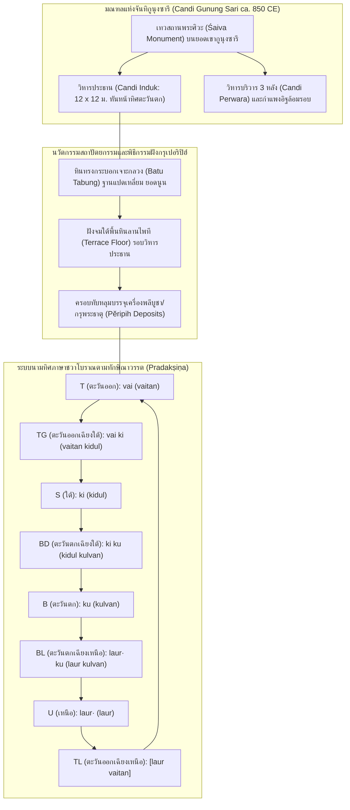

# บันทึกการอ่านและวิเคราะห์เอกสารจารึกวิทยาฉบับสมบูรณ์ (Epigraphic Source Dossier)
## หินทรงกระบอกจารึกแห่งจันทิกูนุงซารี (ชวากลาง) และระบบนามทิศในภาษาชวาโบราณ: นัยต่อจารึกวิทยา ภูมิทัศน์พิธีกรรม และการแพร่กระจายของวัฒนธรรมจารึกสู่สุมาตรา (Batu Tabung Berprasasti di Candi Gunung Sari, Jawa Tengah, dan Nama Mata Angin dalam Bahasa Jawa Kuno)

---

### ส่วนที่ 1: ข้อมูลบรรณานุกรมและการอ้างอิงมาตรฐาน (Bibliographic Metadata)
- **Source ID:** `S-2014-baskoro-01`
- **ชื่อไฟล์ PDF ในเครื่อง:** `S-2014-baskoro-01_Inscribed_Stones_Batu_Tabur_Sumatra.pdf` (เดิมระบุชื่อไฟล์ผิดพลาดคลาดเคลื่อนในระบบฐานข้อมูลเดิมว่า Batu Tabur Sumatra แต่ตัวบทจริงคือศิลาจารึกทรงกระบอกหิน "Batu Tabung" ณ จันทิกูนุงซารี ชวากลาง)
- **ชื่อไฟล์ข้อความสกัด:** `S-2014-baskoro-01_Inscribed_Stones_Batu_Tabur_Sumatra.txt` (สกัดจากวารสาร *Berkala Arkeologi* ปีที่ 34 ฉบับที่ 2 พฤศจิกายน 2014 หน้า 161–182; แปลและปรับปรุงจากบทความภาษาฝรั่งเศสดั้งเดิม: "Les pierres cylindriques inscrites du Candi Gunung Sari (Java Centre, Indonésie) et les noms des directions de l'espace en vieux-javanais," *BEFEO* 97–98 [2010–2011, ตีพิมพ์จริง 2013]: 367–390 โดย Rahayu Surtiati Hidayat)
- **ประเภทเอกสาร:** บทความวิจัยวิชาการทางโบราณคดีและจารึกวิทยาผ่านการประเมินโดยผู้ทรงคุณวุฒิ (Peer-reviewed Research Article) ในวารสารโบราณคดีชั้นนำของสถาบันโบราณคดีแห่งอินโดนีเซีย (*Berkala Arkeologi*, Balai Arkeologi Yogyakarta)
- **ภาษาของเอกสาร:** ภาษาอินโดนีเซีย (ID) และบทคัดย่อภาษาอังกฤษ (EN) พร้อมตัวบทจารึกภาษาชวาโบราณ (Old Javanese) ถอดอักษรตามระบบสากล IAST, ภาษาสันสกฤต (IAST), การอ้างอิงภาษาดัตช์และฝรั่งเศส
- **ขอบเขตภูมิศาสตร์และวัฒนธรรม:** เกาะชวาและเกาะสุมาตรา (เปรียบเทียบเชิงโครงสร้างวัฒนธรรมจารึก): จุดค้นพบหลักอยู่ที่ จันทิกูนุงซารี (Candi Gunung Sari) บนยอดเขากูนุงซารี หมู่บ้านกูลง (Desa Gulon) อำเภอซาลัม (Kecamatan Salam) อำเภอมาเกลัง (Kabupaten Magelang) จังหวัดชวากลาง (Jawa Tengah) พิกัดภูมิศาสตร์ 07° 36' 08.0" ใต้ และ 110° 16' 59.6" ตะวันออก ใกล้แม่น้ำบลองเก็ง (Kali Blongkeng), แม่น้ำเจลโกง (Kali Jlegong) และแม่น้ำปูติฮ์ (Kali Putih) เชิงภูเขาไฟเมอราปี (Gunung Merapi) พร้อมเชื่อมโยงสู่เครือข่ายสถาปัตยกรรมจันทิในชวากลาง (จันทิกูนุงวูกีร์, จันทิซัมบีซารี, จันทิเกอดูลัน, จันทิเกลโร, จันทิปลาโอซันลอร์, จันทิโลโรจงกรัง/ปรัมบานัน) และการแพร่กระจายของระบบนามทิศภาษาชวาโบราณและอักษรกวิสู่ดินแดนสุมาตรา (ลุ่มน้ำมูซี บาตังฮารี และพื้นที่สูงเทือกเขาบาริซัน)
- **วัสดุและบริบทการค้นพบ:** ศิลาจารึกบนหินแอนดีไซต์ทรงกระบอก (Batu Tabung / Cylindrical Stone Containers) และฝาปิดหิน (Penutup Batu Tabung):
  - โบราณวัตถุที่สำรวจพบรวมทั้งสิ้น: หินทรงกระบอก 9 ชิ้น, ฝาปิดหินทรงกระบอก 12 ชิ้น, และชิ้นส่วนแตกหักขนาดใหญ่ 8 ชิ้น (รวมที่พบบนยอดเขาและในหมู่บ้านกูนุงซารีกับงาเซม เชิงเขา)
  - แบ่งลักษณะทางประติมากรรมหินเป็น 2 กลุ่ม: (1) หินทรงกระบอกชิ้นเดียวตัน/กลวงแบบโมโนลิท (Tabung Monolitik จำนวน 3 ชิ้น) และ (2) หินทรงกระบอกแยกส่วนตัวเรือนและฝาปิด (Badan dan Penutup)
  - สัณฐานวิทยา: ฐานล่างตัดเป็นรูปแปดเหลี่ยม (Segi Delapan / Octagonal base), ส่วนบนป้านนูนคล้ายระฆังคว่ำ (Cembung / Sisi Genta), กึ่งกลางเจาะกลวงเป็นโพรงทรงกระบอก ผนังหนา 10–15 ซม. ปราศจากก้นหิน (Dasar Terbuka) เพื่อวางครอบลงบนหลุมบรรจุเครื่องพลีบูชา/กรุพระธาตุ (Pĕripih / Pripih) บนลานไพทีรอบครรภคฤหะของวิหารไศวนิกาย
  - ตัวบทจารึก: มีหินทรงกระบอกและฝาปิดจำนวน 11 ชิ้นที่สลักจารึกอักษรชวาโบราณ (กวิยุคต้น ศตวรรษที่ 9) ระบุนามทิศหรืออักษรย่อนามทิศในภาษาชวาโบราณ 7 รูปแบบ จัดเรียงตามทักษิณาวรรต (Pradakṣiṇa)
- **การอ้างอิงฉบับเต็มระบบ Chicago/Turabian Notes-Bibliography:**  
  Tjahjono, Baskoro Daru, Arlo Griffiths, and Véronique Degroot. "Batu Tabung Berprasasti di Candi Gunung Sari (Jawa Tengah) dan Nama Mata Angin dalam Bahasa Jawa Kuno." *Berkala Arkeologi* 34, no. 2 (November 2014): 161–182. https://doi.org/10.30883/jba.v34i2.60.

---

### ส่วนที่ 2: แผนผังการจัดสรรเข้าสู่บทและหัวข้อย่อย (Chapter & Section Mapping Matrix)

- **บทที่ 5: จารึกที่งมได้จากแม่น้ำมูซี บาตังฮารี และระบบนิเวศทางน้ำ: โบราณคดีใต้น้ำและการค้าทางน้ำของศรีวิชัย (เชื่อมโยงสุมาตราตะวันตกและพื้นที่สูง)**
  * **หัวข้อย่อย 5.3 (ตัวบทจารึกหินก้อนกรวดแม่น้ำและจารึกสั้นภาษาชวาโบราณในสุมาตรา):**  
    - ใช้เปรียบเทียบการจารึก "ตัวบทขนาดสั้น" (Short Inscriptions) ที่บันทึกคำเดี่ยวหรืออักษรย่อบนก้อนหินธรรมชาติและหินรูปทรงเฉพาะ โดยเปรียบเทียบระหว่างหินก้อนกรวดแม่น้ำปาเล็มบัง (Palembang River Stones: DHARMA INSIDENK00024, 00105, 00106) กับหินทรงกระบอกกูนุงซารี (Batu Tabung Prasasti A–K) ซึ่งแสดงขนบการใช้อักษรย่อ (Abbreviation) และการกำหนดรหัสคำในภาษาชวาโบราณ (หน้า 172–176)
    - วิเคราะห์การแพร่กระจายของภาษาชวาโบราณ (Old Javanese) นอกเกาะชวา โดยเฉพาะการปรากฏตัวของข้อความภาษาชวาโบราณในบริบทพิธีกรรมทางศาสนาและการกำหนดพิกัดทิศในสุมาตรา (หน้า 172, 176 เชิงอรรถ 17)
  * **หัวข้อย่อย 5.4 (ภูมิทัศน์โบราณคดีจารึก ลุ่มน้ำ และพื้นที่สูง: จากมัวราจัมบีสู่เทือกเขาบาริซันและปาการูยุง):**  
    - ชำระความเข้าใจผิดทางบรรณานุกรมในประวัติศาสตร์นิพนธ์: บันทึกการแก้ไขการตั้งชื่อผิดของเอกสารจากเดิม "Batu Tabur Sumatra" สู่ความจริงเชิงจารึกวิทยาว่าเป็น "Batu Tabung Candi Gunung Sari" พร้อมดึงเอานัยเชิงเปรียบเทียบข้ามเกาะ (Cross-island Comparative Framework) มาวิเคราะห์การจัดวางศาสนสถานบนยอดเขา/พื้นที่สูง (Highland Sanctuary Layout) ในเทือกเขาบาริซัน (Barisan Range) ของสุมาตราตะวันตก (เช่น แหล่งโบราณสถานปาดังโรโจ, บาตูบาซูรัต, บูกิตกมบัก ในวัฒนธรรมปาการูยุง ยุคพระเจ้าอาทิตยวรมัน) เทียบกับระบบแกนจักรวาลวิทยาและการปักปันเขตศักดิ์สิทธิ์บนยอดเขากูนุงซารี (หน้า 162–165)
    - วิเคราะห์ความสัมพันธ์ระหว่างการปักเขตแดนศักดิ์สิทธิ์ (Sacred Boundary Marking) ด้วยหินหลักเขต (Batu Patok / Kīla) และหินกำหนดทิศประจำจักรวาล เพื่อคุ้มครองเส้นทางคมนาคม เหมืองทองคำ และศูนย์กลางอำนาจในเขตลุ่มน้ำและเทือกเขา (หน้า 164–165, 177–178)

- **บทที่ 3: จารึกแผ่นโลหะ จารึกบนรูปเคารพขนาดเล็ก และจารึกแผ่นทองคำบรรจุกรุ: วัสดุวิทยา ประติมาวิทยา และพิธีกรรมศักดิ์สิทธิ์**
  * **หัวข้อย่อย 3.3 (แผ่นทองคำและเงินบรรจุกรุฐานเจดีย์และเทวสถาน: Pĕripih และ Consecration Deposits):**  
    - เอกสารชิ้นนี้เป็นหลักฐานชิ้นเอกในการอธิบาย "โครงสร้างสถาปัตยกรรมชั้นนอกที่ครอบปิดกรุพระธาตุ" (Protective Stone Superstructure of Pĕripih Deposits): หินทรงกระบอกเจาะกลวง (Batu Tabung) ทำหน้าที่เป็นฝาครอบศิลาที่ฝังฝังมิดอยู่ใต้พื้นหินของลานไพที (Floor of the Terrace/Platform) รอบครรภคฤหะ เพื่อบรรจุและพิทักษ์ผอบหิน/แผ่นโลหะพลีบูชา (หน้า 168–172)
    - นำข้อมูลจารึกบนแผ่นทองคำ 19 แผ่นในกรุจันทิบี (Candi B) แห่งหมู่มหาเทวสถานโลโรจงกรัง/ปรัมบานัน ซึ่งจารึกพระนามโลกบาลทั้งแปด (Aṣṭadikpāla), พระนามพระพรหม (Brahmā) ณ จุดศูนย์กลาง (Brahmasthāna), มนตร์บูชาทิศตะวันตก (*oṁ paścimagātrāya namaḥ*), จตุไรศวรรยะ (*Caturaiśvarya: Dharma, Jñāna, Vairāgya, Aiśvarya*), และพญานาคทั้งสี่ (*Nāga: Ananta, Vāsuki, Kapila, Takṣaka*) มาบูรณาการอธิบายระบบกรุเปอริปิฮ์ของชวาและสุมาตรา (หน้า 176–178)
    - วิเคราะห์ฝาปิดหินจารึกคำว่า *pūrvva* (ทิศตะวันออก) สองชิ้นที่ค้นพบ ณ จันทิปลาโอซันลอร์ (Candi Plaosan Lor, รูปถ่ายรหัส OD 14978) และจานหินกลมจารึกคำว่า *madya* (ศูนย์กลาง) กับ *dakṣiṇa* (ทิศใต้) ในพิพิธภัณฑ์ศิลปะเอเชียแห่งกรุงเบอร์ลิน (Museum für Asiatische Kunst Berlin ทะเบียน II 644–645) ว่าเป็นหลักฐานทางโบราณคดีของวัตถุปิดกรุเปอริปิฮ์ตามทิศทางจักรวาล (หน้า 177–178)

- **บทที่ 4: อักขรวิทยา ภาษาศาสตร์ประวัติศาสตร์ และการคำนวณศักราช: จากปัลลวะสู่กวิ และระบบปฏิทินดาราศาสตร์**
  * **หัวข้อย่อย 4.1 (สายวิวัฒนาการอักขรกวิยุคต้น ศตวรรษที่ 9):**  
    - ศึกษารูปสัณฐานอักษรกวิโบราณบนหินทรงกระบอกกูนุงซารี ซึ่งจัดอยู่ในกลุ่มอักษรกวิยุคต้นร่วมสมัยกับจารึกวายูกู (Wayuku ค.ศ. 856), จารึกศิวคฤหะ (Śivagṛha ค.ศ. 856) และจารึกอัวตันติยา (Wuatan Tija ค.ศ. 880) โดยเฉพาะการใช้เครื่องหมายวิรามะ/ปาเต็น (Virāma / Paten) เป็นจุดกึ่งกลาง (*virāma titik tengah*) หลังพยัญชนะสะกด เช่น *laur·* (หน้า 172–173)
  * **หัวข้อย่อย 4.3 (ภาษาศาสตร์ประวัติศาสตร์: ระบบทิศทางในภาษาตระกูลออสโตรนีเชียนและภาษาชวาโบราณ):**  
    - การค้นพบระบบนามทิศภาษาพื้นเมืองชวาโบราณ (Indigenous Old Javanese Directional System) ครบทั้ง 8 ทิศที่เก่าแก่ที่สุดในประวัติศาสตร์จารึกวิทยาเอเชียตะวันออกเฉียงใต้ภาคพื้นสมุทร (หน้า 161, 172–176)
    - การวิเคราะห์การจัดโครงสร้างคำประสมระบุทิศเฉียง (Intercardinal Directions) ที่ใช้ลำดับ "ทิศตะวันออก/ทิศตะวันตก + ทิศใต้/ทิศเหนือ" (*vaitan kidul*, *kidul kulvan*, *laur kulvan*) เทียบกับระบบภาษาสันสกฤตและภาษาชวาสมัยหลัง (*lor-vaitan*, *kidul-vetan*) ในคัมภีร์ *โกรงวาศรม* (*Korawāśrama*) (หน้า 173–176)
    - การประยุกต์ "กฎของเบฮาเกิล" (Behaghel's Law / *Gesetz der wachsenden Glieder*) อธิบายสัทวิทยาและสัณฐานวิทยาของคำประสมในภาษาชวาโบราณ เช่น การเรียงพยางค์สั้นไว้หน้าพยางค์ยาว (*laur* [1 พยางค์] + *kulvan* [2 พยางค์] -> *laur kulvan*) (หน้า 176)
    - วิวัฒนาการและการประชันกันระหว่าง "ระบบรับรู้พื้นที่ทรงกลม/ทักษิณาวรรตตามขนบอินเดีย" (Circular/Pradakṣiṇa Space Model) กับ "ระบบรับรู้พื้นที่เชิงแกนขั้วเหนือ-ใต้ดั้งเดิมของออสโตรนีเชียน" (Axial/Lor-Kidul Space Model) (หน้า 176)

- **บทที่ 7: ศาสนา ความเชื่อ และเครือข่ายพุทธตันตระ/ไศวนิกายข้ามสมุทร: มนตรา ปรัชญา และการสังเคราะห์เทพเจ้า**
  * **หัวข้อย่อย 7.1 (ลัทธิไศวนิกายและมณฑลแห่งพระศิวะในชวากลาง):**  
    - การสถาปนาศาสนสถานไศวนิกายตามคัมภีร์ฝ่ายตันตระสิทธานตะ (Śaiva Siddhānta): คัมภีร์ *นิศวาสคุหยะ* (*Niśvāsaguhya* 2.47, 2.100) และ *พรหมยามาละ* (*Brahmayāmala* 3.9) ว่าด้วยพิธีประดิษฐาน (*pratiṣṭhā*), การฝังหินพรหมศิลา (*brahmaśilā*) ไว้ใต้ศิวลึงค์ ณ ตำแหน่งพรหมสถาน (*brahmasthāna*), และการจัดวางมณฑลเทพเจ้าประจำทิศ (หน้า 177 เชิงอรรถ 24)
    - การวิเคราะห์บทบาทของพระมหากาฬ (Mahākāla) และหินหลักปักเขต (Batu Patok) ในการจำกัดและพิทักษ์พื้นที่ศักดิ์สิทธิ์ของเทวสถาน (หน้า 164–165)

---

### ส่วนที่ 3: สรุปสาระสำคัญเชิงวิเคราะห์และจุดยืนทางวิชาการ (Executive Academic Analysis)

- **วิทยานิพนธ์และข้อถกเถียงหลักของผู้เขียน (Core Argument / Thesis):**  
  Baskoro Daru Tjahjono, Arlo Griffiths และ Véronique Degroot (2014) นำเสนอผลการศึกษาทางโบราณคดี สถาปัตยกรรม และจารึกวิทยาต่อโบราณวัตถุชิ้นเอกที่ไม่เคยปรากฏมาก่อนในประวัติศาสตร์โบราณคดีชวา นั่นคือ **กลุ่มหินทรงกระบอกเจาะกลวง (Batu Tabung) สลักอักษรกวิโบราณระบุนามทิศในภาษาชวาโบราณ** ซึ่งค้นพบ ณ ซากโบราณสถานจันทิกูนุงซารี (Candi Gunung Sari) เชิงภูเขาไฟเมอราปี ข้อถกเถียงหลักของผู้เขียนจำแนกออกเป็น 4 ประการสำคัญ:
  
  1. *สถานะและหน้าที่ทางสถาปัตยกรรมของหินทรงกระบอก:* ผู้เขียนหักล้างสมมติฐานเดิมที่เคยคิดว่าหินทรงกระบอกเหล่านี้เป็นส่วนยอดเจดีย์/วิหาร (Kemuncak / Pinnacle) หรือหินฐานเสาไม้ (Umpak) โดยชี้ชัดว่า ด้วยสัณฐานวิทยาที่มีลำตัวกลวง (Berongga) ผนังบาง ไม่มีแผ่นหินรองรับส่วนก้น (Dasar Terbuka) และพบร่องรอยหินปูพื้นลานไพทีที่สลักเว้าเป็นรูปวงกลมรับกับทรงกระบอกอย่างแม่นยำ หินเหล่านี้ถูกออกแบบมาเพื่อ **ฝังจมอยู่ใต้พื้นหินของลานไพที (Terrace Platform Floor)** รอบตัววิหารประธาน โดยโผล่พ้นพื้นเฉพาะส่วนฝาปิดทรงนูน เพื่อทำหน้าที่เป็น "ปลอกศิลาพิทักษ์กรุพระธาตุและเครื่องพลีบูชา" (Protective Containers for Pĕripih / Consecration Deposits) ในพิธีวางผังและสถาปนาศาสนสถาน (หน้า 167–172)
  
  2. *การระบุนามทิศในภาษาชวาโบราณที่สมบูรณ์และเก่าแก่ที่สุด:* จารึกสั้นบนหินทรงกระบอกและฝาปิดจำนวน 11 ชิ้น เป็นหลักฐานจารึกวิทยาชิ้นแรกและชิ้นเดียวที่บันทึก **ระบบนามทิศและทิศเฉียงทั้งแปดด้วยคำศัพท์ภาษาชวาโบราณแท้ (Indigenous Old Javanese Terms)** โดยมีอายุเก่าแก่ถึงราวกลางศตวรรษที่ 9 (ประมาณ ค.ศ. 850) ซึ่งเก่าแก่กว่าหลักฐานทางวรรณกรรมชวาโบราณชิ้นเดียวที่บันทึกระบบทิศครบถ้วน คือคัมภีร์ *โกรงวาศรม* (*Korawāśrama*) ยุคมัชปาหิตตอนปลาย ถึงเกือบ 600 ปี (หน้า 161, 172–176)
  
  3. *ไวยากรณ์เชิงพื้นที่และการประสมคำระบุทิศเฉียง:* ระบบทิศของกูนุงซารีเผยให้เห็นรูปแบบการประสมคำที่แตกต่างจากภาษาชวาสมัยหลัง: โดยใช้คำว่า *vaitan kidul* (ออก-ใต้) แทนที่จะเป็น *kidul wetan* (ใต้-ออก) และจัดเรียงทิศเวียนขวาตามเข็มนาฬิกา (Pradakṣiṇa) โดยแต่ละทิศเฉียงจะดึงเอาคำระบุทิศหลักข้างเคียงมาตั้งต้น (*vaitan* -> *vaitan kidul* -> *kidul* -> *kidul kulvan* -> *kulvan* -> *laur kulvan* -> *laur* -> [*laur vaitan*]) ซึ่งสะท้อนการจัดระเบียบความคิดเชิงพื้นที่แบบวงกลม (Circular Spatial Perception) ตามขนบอินเดีย ก่อนที่ระบบแกนขั้วเหนือ-ใต้ (*lor-kidul*) จะกลายมาเป็นแบบแผนเด่นชัดในยุคหลัง (หน้า 173–176)
  
  4. *การกำหนดอายุสมัยและความเป็นศาสนสถานไศวนิกาย:* จากการวิเคราะห์เทคนิคการก่อสร้างที่ใช้หินทัฟฟ์ (Tufa Stone) เป็นแกนกลางภายในและกรุผิวภายนอกด้วยหินแอนดีไซต์ (เริ่มใช้ในชวาราว ค.ศ. 830), ลวดลายประติมากรรมกาละมุขะ (Kālamukha) ที่มีตาวนก้นหอยและลายพรรณพฤกษารอบแก้ม, ทับหลังลายใบไม้ม้วนชี้ขึ้น, ตลอดจนการค้นพบเทวรูปพระมหากาฬ (Mahākāla), โยนี และหินหลักเขต (Batu Patok) พิสูจน์อย่างกระจ่างชัดว่าจันทิกูนุงซารีเป็นเทวสถานในลัทธิไศวนิกาย สถาปนาขึ้นในราว ค.ศ. 850 ร่วมสมัยกับจันทิปลาโอซันลอร์และมหาเทวสถานปรัมบานัน (หน้า 164–166)

- **บริบทประวัติศาสตร์นิพนธ์และการประเมินความน่าเชื่อถือ (Historiography & Source Criticism):**  
  การศึกษาของ Tjahjono, Griffiths และ Degroot เป็นการประสานจุดแข็งระหว่างการขุดค้นทางโบราณคดีภาคสนามของหน่วยงานอนุรักษ์โบราณสถานอินโดนีเซีย (Ekskavasi Penyelamatan BPCB Jawa Tengah / Balai Arkeologi Yogyakarta 1998), การวิเคราะห์ผังและสถาปัตยกรรมจันทิโดย Véronique Degroot, และการถอดรหัสจารึกวิทยาและนิรุกติศาสตร์ชวาโบราณขั้นสูงโดย Arlo Griffiths
  
  ในอดีต โบราณสถานกูนุงซารีถูกจัดเป็นเพียง "ศาสนสถานชายขอบ" (Marginal Sites / *Sites out of Sight* ตามหนังสือของ Rizky Sasono et al. 2002) ที่แทบไม่ได้รับความสนใจจากนักวิชาการกระแสหลัก โดยหนังสือดังกล่าวระบุข้อมูลคลาดเคลื่อนว่ามีจารึกภาษาชวาโบราณสลักอยู่บนยอดอาคาร (Kemuncak) เมื่อ Arlo Griffiths ลงพื้นที่สำรวจในปี ค.ศ. 2009 จึงได้ค้นพบว่าแท้จริงแล้วเป็นหินทรงกระบอกเจาะกลวงที่มีจารึกสั้นระบุนามทิศ และยังไม่เคยมีการอ่านหรือชำระตัวบทมาก่อนเลยในสารบบจารึกวิทยาของ J.G. de Casparis (1950, 1958) หรือ Louis-Charles Damais (1952, 1969)
  
  คณะผู้วิจัยได้ทำการทำสำเนาลายพิมพ์หิน (Abklats) รหัสสะสมของสำนักฝรั่งเศสแห่งปลายบุรพทิศ (EFEO n. 1867–1876) และวิเคราะห์เปรียบเทียบกับหลักฐานโบราณคดีร่วมสมัยอย่างรอบด้าน ทั้งจันทิเกอดูลัน (Kedulan), จันทิซัมบีซารี (Sambisari), จันทิเคลโร (Klero), และจันทิปลาโอซันลอร์ (Plaosan Lor) จนทำให้โบราณวัตถุที่เคยถูกมองว่าเป็นเพียงเศษหินไร้ค่า กลายมาเป็นหลักฐานหมุดหมายที่ปฏิวัติความเข้าใจเรื่องภาษาศาสตร์ทิศทางและพิธีกรรมการวางผังมณฑลศักดิ์สิทธิ์ในเอเชียตะวันออกเฉียงใต้ภาคพื้นสมุทร

---

### ส่วนที่ 4: สารบัญข้อค้นพบเชิงลึกแยกตามมิติจารึกวิทยา (Thematic Epigraphic Findings with Exact Pages)

1. **ประวัติศาสตร์นิพนธ์และการสำรวจโบราณคดีจันทิกูนุงซารี (หน้า 161–164):**  
   - การสำรวจในยุคอาณานิคมเริ่มจาก N.W. Hoepermans ในปี ค.ศ. 1865 (ตีพิมพ์ 1914 หน้า 140) ซึ่งบันทึกว่าเทวสถานถูกทำลายและหินส่วนหนึ่งถูกรื้อนำไปสร้างบันไดสู่สุสานสมัยใหม่เชิงเขา; ตามด้วยการขุดค้นเบื้องต้นของ R.D.M. Verbeek ในปี ค.ศ. 1891 (หน้า 156 ลำดับที่ 299) พบหินแกะสลักลวดลายวิจิตร; J. van Aalst ในปี ค.ศ. 1899 (หน้า 394) ระบุว่าพบหลุมสี่เหลี่ยม/บ่อน้ำกลางลานไพที (Sumur) และฐานโยนีประดับกาละมุขะ ("banaspati") ที่ชายทุ่งเชิงเขา บ่งชี้ว่ามิใช่วัดพุทธอย่างจันทิงาเวน (Candi Ngawen) ที่อยู่ใกล้เคียง แต่เป็นเทวสถานไศวนิกาย; และ N.J. Krom ในปี ค.ศ. 1915 (หน้า 265 ลำดับที่ 852)
   - การขุดค้นกู้ภัยในปี ค.ศ. 1998 โดยสำนักงานโบราณคดีชวากลาง (SPSP/BPCB) ร่วมกับมหาวิทยาลัยกัดจาห์มาดา (UGM) นำโดย D.S. Nugrahani, Tjahjono Prasodjo, Hery Priswanto, Imam Fauzi และ Baskoro Daru Tjahjono เผยผังวิหารประธานขนาด 12 × 12 เมตร หันหน้าไปทางทิศตะวันตก มีอาคารบริวารทรงผืนผ้ายาว 6 × 3.5 เมตร และอาคารบริวารขนาบข้างเหนือ-ใต้ ล้อมรอบด้วยกำแพงแก้วก่ออิฐ (หน้า 163–164)
   - การสำรวจจารึกวิทยาในปี ค.ศ. 2009 โดย Arlo Griffiths และ Véronique Degroot ได้ตรวจสอบหินทรงกระบอกที่กระจายอยู่บนยอดเขาและในหมู่บ้านกูลง ทำสำเนาลายพิมพ์หิน และยืนยันว่าไม่มีโบราณวัตถุจารึกจากกูนุงซารีหลงเหลืออยู่ในคลังเก็บของ BPCB ปรัมบานันตามที่เคยอ้างในวรรณกรรมก่อนหน้า (หน้า 162 เชิงอรรถ 2)

2. **ตัวบทจารึก อักขรวิทยา และระบบอักษรย่อ (หน้า 172–173, 175):**  
   - จารึกบนหินทรงกระบอกและฝาปิด 11 ชิ้น (กำหนดรหัส Prasasti A ถึง K) สลักด้วยอักษรกวิโบราณ (Early Kawi Script) ยุคศตวรรษที่ 9 บันทึกข้อความสั้น 7 รูปแบบ โดยใช้อักษรย่อพยางค์แรกของชื่อทิศ ยกเว้นคำว่า *laur·* ที่เป็นคำพยางค์เดียว:
     1. **Prasasti I (ชิ้นที่ 7):** จารึกว่า `vai` สลักย่อมาจากคำว่า *vaitan* (ทิศตะวันออก)
     2. **Prasasti E (ชิ้นที่ 5) & Prasasti G (ชิ้นที่ 13):** จารึกว่า `vai ki` ย่อมาจากคำว่า *vaitan kidul* (ทิศตะวันออกเฉียงใต้)
     3. **Prasasti F (ชิ้นที่ 6) & Prasasti H (ชิ้นที่ 14):** จารึกว่า `ki` ย่อมาจากคำว่า *kidul* (ทิศใต้)
     4. **Prasasti C (ชิ้นที่ 4), Prasasti J (ชิ้นที่ 15) & Prasasti K (ชิ้นที่ 16):** จารึกว่า `ki ku` ย่อมาจากคำว่า *kidul kulvan* (ทิศตะวันตกเฉียงใต้)
     5. **Prasasti B (ชิ้นที่ 11):** จารึกว่า `ku` ย่อมาจากคำว่า *kulvan* (ทิศตะวันตก)
     6. **Prasasti A (ชิ้นที่ 3):** จารึกว่า `laur· ku` ย่อมาจากคำว่า *laur kulvan* (ทิศตะวันตกเฉียงเหนือ)
     7. **Prasasti D (ชิ้นที่ 12):** จารึกคำเต็มพยางค์เดียวว่า `laur·` หมายถึงทิศเหนือ
   - ตัวอักษรทิศตะวันออกเฉียงเหนือ (ทลายสูญหายไป) สันนิษฐานว่าคือ `laur· vai` (*laur vaitan*)
   - ลักษณะอักขรวิทยา: มีความสม่ำเสมอสูง สอดคล้องกับจารึกชวากลางในศตวรรษที่ 9 มีการใช้เครื่องหมายวิรามะ (Virāma) ปิดท้ายพยัญชนะสะกดในคำว่า `laur·` เป็นจุดกลมกึ่งกลางบรรทัด (*titik tengah*) (หน้า 172–173)

3. **ภาษาศาสตร์ประวัติศาสตร์และระบบทิศทางในภาษาชวาโบราณ (หน้า 173–176):**  
   - เปรียบเทียบกับพจนานุกรมภาษาชวาโบราณของ Zoetmulder (KJKI 1995) ซึ่งไม่มีการระบุคำเรียกทิศเฉียงภายใต้หมวดคำทิศหลัก (*wetan, kidul, kulon, lor*) และงานวิจัยของ K. Alexander Adelaar (1997) เรื่องระบบทิศในภาษาออสโตรนีเชียนตะวันตกที่ขาดข้อมูลภาษาชวาโบราณยุคต้น
   - วรรณกรรมชวาโบราณชิ้นเดียวที่บันทึกระบบทิศ 9 ทิศ (รวมศูนย์กลาง) ครบถ้วนคือคัมภีร์ *โกรงวาศรม* (*Korawāśrama* หน้า 2 บรรทัด 16–22 และหน้า 48 บรรทัด 23–30 ชำระโดย Swellengrebel 1936) ซึ่งเป็นวรรณกรรมร้อยแก้วยุคมัชปาหิตตอนปลาย (ศตวรรษที่ 15 หรือหลังนั้น):
     - *Korawāśrama* ใช้ระบบสมมาตรตามภาษาชวาสมัยใหม่: *vetan* (ออก), *kidul-vetan* (ออกเฉียงใต้), *kidul* (ใต้), *kidul-kulon* (ตกเฉียงใต้), *kulon* (ตก), *lor-kulon* (ตกเฉียงเหนือ), *lor* (เหนือ), *lor-vetan* (ออกเฉียงเหนือ), *madhya/riṅ təṅah* (กึ่งกลาง) (หน้า 173–175)
   - ความแตกต่างเชิงโครงสร้างของกูนุงซารี (ศตวรรษที่ 9): ทิศตะวันออกเฉียงใต้ใช้คำว่า `vaitan kidul` (ออก-ใต้) แทนที่จะเป็น *kidul wetan* (ใต้-ออก); และมีโครงสร้างการเชื่อมโยงคำแบบลูกโซ่ (Chained Structure) ที่คำขึ้นต้นของทิศเฉียงจะดึงเอาคำระบุทิศหลักที่อยู่ก่อนหน้ามาใช้ (*vaitan* -> *vaitan kidul* -> *kidul* -> *kidul kulvan* -> *kulvan* -> *laur kulvan* -> *laur*) (หน้า 175–176)
   - ข้อยกเว้นทางสัทวิทยาตาม "กฎของเบฮาเกิล" (Behaghel's Law): เหตุใดทิศตะวันตกเฉียงเหนือจึงใช้ `laur kulvan` แทนที่จะเป็น *kulvan laur*? อธิบายได้ด้วยหลักการจัดเรียงหน่วยคำประสมที่มีจำนวนพยางค์เพิ่มขึ้น (*Gesetz der wachsenden Glieder*): *laur* มี 1 พยางค์ ส่วน *kulvan* มี 2 พยางค์ คำพยางค์สั้นจึงต้องวางไว้ข้างหน้าคำพยางค์ยาว (หน้า 176)
   - การประชันระหว่างมโนทัศน์ทรงกลม (Circular/Pradakṣiṇa) กับระบบแกนขั้วเหนือ-ใต้ (Axial/Lor-Kidul): ข้อมูลจารึกบ่งชี้ว่าตั้งแต่ ค.ศ. 880 (จารึกอัวตันติยา / Wuatan Tija แผ่น IIB บรรทัด 10: *lor-kidul, vaitan-kulvan*) ชาวชวาใช้ทั้งสองระบบควบคู่กัน โดยระบบทักษิณาวรรต 8 ทิศมักใช้ในบริบทการปักปันเขตที่ดินศักดิ์สิทธิ์และพิธีกรรมทางศาสนา ส่วนระบบขั้วแกนคู่ใช้ในบริบทคำสาปแช่งและทิศทางทั่วไป (หน้า 176 เชิงอรรถ 17–18)

4. **สถาปัตยกรรมและนวัตกรรม "หินทรงกระบอกครอบกรุเปอริปิฮ์" (หน้า 167–172):**  
   - การจำแนกขนาดของหินทรงกระบอก 22 ชิ้น แบ่งออกเป็น 3 กลุ่มเส้นผ่านศูนย์กลาง:
     1. กลุ่มขนาดเล็ก: เส้นผ่านศูนย์กลาง 38–43 ซม. (ชิ้นที่ 1, 2, 10, 14, 19)
     2. กลุ่มขนาดกลาง: เส้นผ่านศูนย์กลาง 54–56 ซม. (ชิ้นที่ 5, 6, 8, 9, 13, 17, 18, 20)
     3. กลุ่มขนาดใหญ่: เส้นผ่านศูนย์กลาง 59–62 ซม. (ชิ้นที่ 3, 4, 12, 22)
     - ชิ้นพิเศษ: ฝาปิดหมายเลข 11 (Prasasti B ทิศตะวันตก) ขนาดใหญ่พิเศษ 68 ซม.; และหินทรงกระบอกหมายเลข 15 (Prasasti J ทิศตะวันตกเฉียงใต้) ขนาดเล็กพิเศษ 36 ซม. (หน้า 168–169)
   - การพิสูจน์ตำแหน่งดั้งเดิมในผังอาคาร: ปฏิเสธสมมติฐานการตั้งบนพื้นดินรอบฐาน (ไม่มีฐานรองรับ) และปฏิเสธการเป็นส่วนยอดหลังคา (พบหินบัวรองรับยอดหลังคาต่างหาก); เปรียบเทียบกับหลักฐานที่จันทิเกอดูลัน (Kedulan) ซึ่งพบหินทรงกระบอก 2 ใน 3 ส่วนฝังจมอยู่ใต้แผ่นหินปูพื้นลานไพที (Terrace Floor) และที่กูนุงซารีได้ค้นพบก้อนหินปูพื้นลานไพทีที่สลักเว้าขอบเป็นรูปโค้งวงกลมขนาดพอดีกับเส้นผ่านศูนย์กลางของหินทรงกระบอกพอดี ยืนยันว่าหินเหล่านี้ถูกฝังจมลงในพื้นหิน โดยโผล่พ้นมาเฉพาะส่วนฝาปิดทรงนูน (หน้า 170–172)
   - สันนิษฐานว่าการตัดแต่งหินบางชิ้นเกิดขึ้นในการบูรณะปฏิสังขรณ์เทวสถานในอดีต (Renovasi Candi) (หน้า 170)

5. **มิติศาสนา พิธีกรรมวางผังมณฑล และเทววิทยาไศวนิกาย (หน้า 164–165, 176–178):**  
   - หลักฐานยืนยันความเป็นเทวสถานพระศิวะ: สถาปัตยกรรมผังประธานประกอบด้วยวิหารประธานรูปสี่เหลี่ยมจัตุรัสและวิหารบริวารทรงผืนผ้ายาวด้านหน้า (ลักษณะเฉพาะของเทวสถานไศวนิกาย เช่น กลุ่มจันทิอรชุนะ-เซอมาร์บนที่ราบสูงเดียง, จันทิเกอดงซองโก II–III, จันทิบาดุต, จันทิซัมบีซารี, และปรัมบานัน) (หน้า 164–165)
   - การค้นพบเทวรูปพระมหากาฬ (Mahākāla) อารักษ์ทวารบาลของพระศิวะ ตกอยู่ใกล้บันไดทางขึ้น (หน้า 164)
   - เสาหินหลักเขต (Batu Patok) 3 หลักที่ยังคงตั้งอยู่ประจำที่เดิม (In situ) ทำหน้าที่กำหนดขอบเขตพื้นที่ศักดิ์สิทธิ์ (Ruang Peribadatan): เสาหลักที่ 1 อยู่ทางใต้ของบันไดหน้า, เสาหลักที่ 2 อยู่กึ่งกลางแนวกำแพงแก้วด้านทิศตะวันออก, เสาหลักที่ 3 อยู่มุมทิศตะวันออกเฉียงเหนือของกำแพงแก้ว (หน้า 164)
   - กรุเปอริปิฮ์และการบูชาโลกบาลแปดทิศ (Aṣṭadikpāla): เทียบเคียงกับแผ่นทองคำ 19 แผ่นจากกรุจันทิบี ในปรัมบานัน ซึ่งระบุพระนามโลกบาล 8 องค์: อินทระ (Indra ออก), อัคนี (Agni ออกเฉียงใต้), ยมะ (Yama ใต้), นิรฤติ (Nirr̥ti / Riniti ตกเฉียงใต้), วรุณ (Varuṇa ตก), วายุ (Vāyu ตกเฉียงเหนือ), โสมะ (Soma เหนือ), อีศานะ (Īśāna ออกเฉียงเหนือ) พร้อมพระพรหม (Brahmā) ณ ศูนย์กลาง (Brahmasthāna / Brahmaśilā ตามคัมภีร์ *Niśvāsaguhya* และ *Brahmayāmala*) (หน้า 176–178)
   - กรุเปอริปิฮ์ที่โจโลตุลโด (Jolotundo ชวาตะวันออก) ก็พบแผ่นทองคำจารึกพระนามอีศานะและอัคนีเช่นกัน (หน้า 177)

6. **เทคโนโลยีการก่อสร้างและหมุดหมายกำหนดอายุสมัย ค.ศ. 830–850 (หน้า 164–166):**  
   - ฐานรากสร้างด้วยก้อนหินแม่น้ำ (Batu Kali) ซ้อนทับด้วยโครงสร้างอาคาร
   - แกนกลางโครงสร้างภายใน (Internal Mass) ก่อด้วยหินทัฟฟ์ภูเขาไฟตัดหยาบ (Bongkahan Batu Tufa) ขณะที่เปลือกผนังภายนอกกรุด้วยหินแอนดีไซต์ตัดประณีต (Bongkahan Andesit) Jacques Dumarçay (1993 หน้า 19) กำหนดว่าการเริ่มนำหินทัฟฟ์มาใช้ในชวากลางเกิดขึ้นราว ค.ศ. 830 ซึ่งเป็นเกณฑ์กำหนดอายุเริ่มต้น (Terminus post quem) ของจันทิกูนุงซารี (หน้า 165)
   - หินหลักเขต (Batu Patok) มักพบเฉพาะในเทวสถานที่สร้างหลัง ค.ศ. 830 เช่น จันทิอิโจ (Candi Ijo), โลโรจงกรัง (Loro Jonggrang/Prambanan), และซัมบีซารี (Sambisari) (หน้า 165)
   - การวิเคราะห์ประติมาวิทยา: หัวกาละมุขะ (Kālamukha) ชิ้นสมบูรณ์มีดวงตารูปก้นหอยวน (Mata berbentuk spiral) คล้ายคลึงกับกาละมุขะระยะที่สองของจันทิเซวู (Sewu), จันทิปลาโอซันลอร์, งาเวน, และโลโรจงกรัง; และมีลายใบพรรณพฤกษานูนที่พวงแก้ม (Motif flora menonjolkan pipi) ซึ่งเป็นเอกลักษณ์ของศิลปะชวากลางยุคปลาย; บัวยอดซุ้มและกรอบประตูมีลายใบไม้ตวัดชี้ขึ้นบน; นาคจำหลักมกร (Makara) มีลักษณะวิวัฒนาการลดทอนเป็นลายพฤกษาตามแบบปลาโอซันลอร์; ยอดประดับหลังคา (Antefix) สลักเป็นทรงสามแฉกมีเดือยสลักรูเสียบเหมือนจันทิอิโจ ทั้งหมดชี้ชัดว่าจันทิกูนุงซารีสร้างขึ้นในราว ค.ศ. 850 (หน้า 165–166)

7. **ความเชื่อมโยงข้ามภูมิภาค: การสถาปนาจารึกบนยอดเขาและบริบทสุมาตรา (หน้า 162–163, 172, 176–178):**  
   - บริบทภูมิทัศน์ศักดิ์สิทธิ์: เขากูนุงซารีตั้งอยู่บนแนวเนินเขาเชื่อมต่อเชิงภูเขาไฟเมอราปี เช่นเดียวกับเขากูนุงพริง (Gunung Pring) และเขากูนุงวูกีร์ (Gunung Wukir แหล่งค้นพบศิลาจารึกจังกัล ค.ศ. 732 ของพระเจ้าสัญชัย) มีทัศนียภาพมองเห็นภูเขาไฟเมอราปีและโอบล้อมด้วยแม่น้ำสามสาย สะท้อนคติการเลือกทำเลศูนย์กลางจักรวาลบนพื้นที่สูง (หน้า 162–163)
   - การเทียบเคียงเชิงวัฒนธรรมจารึกสู่สุมาตรา: ธรรมเนียมการสลักจารึกสั้นบนหินธรรมชาติและหินรูปทรงเฉพาะเพื่อกำกับพิธีกรรม มณฑล และทิศทางจักรวาล มีความเชื่อมโยงเชิงโครงสร้างกับการแพร่กระจายของวัฒนธรรมจารึกอักษรกวิและภาษาชวาโบราณเข้าสู่เกาะสุมาตรา ทั้งในลุ่มน้ำสายใหญ่ (หินก้อนกรวดแม่น้ำมูซีในปาเล็มบัง) และในเทือกเขาสูงบาริซัน (Barisan Range ในสุมาตราตะวันตก ยุคราชสำนักปาการูยุง/มลายูโบราณ) ซึ่งอาศัยการกำหนดทิศมณฑลและการสาปแช่งพิทักษ์อาณาบริเวณ (หน้า 176 เชิงอรรถ 17)

8. **พรมแดนปัญหาและการสูญหายของโบราณวัตถุ (หน้า 162, 177–178):**  
   - ปัญหาการทำลายโบราณสถานเพื่อนำหินไปใช้งานอื่นในอดีต (การรื้อหินจันทิกูนุงซารีไปสร้างบันไดคอนกรีตขึ้นสุสานสมัยใหม่) ทำให้ชิ้นส่วนส่วนใหญ่ของตัวอาคารสูญหายไป หลงเหลือเฉพาะส่วนฐานล่างและหินทรงกระบอกที่ตกค้าง (หน้า 163, 169–170)
   - ปัญหาการบันทึกข้อมูลและทะเบียนโบราณวัตถุที่คลาดเคลื่อน: เอกสารโบราณคดีท้องถิ่นอ้างว่ามีจารึกถูกนำไปเก็บไว้ที่สำนักงานโบราณคดี แต่เมื่อตรวจสอบจริงกลับไม่พบ; การค้นพบฝาปิดจารึกคำว่า *pūrvva* จากจันทิปลาโอซันลอร์ในภาพถ่ายโบราณปี 1940 (OD 14978) แต่ตัววัตถุจริงกลับไม่ปรากฏในทะเบียนของ BPCB ปรัมบานัน; ตลอดจนการพลัดพรากของแผ่นหินจารึกนามทิศ *madya* และ *dakṣiṇa* ไปปรากฏในพิพิธภัณฑ์ที่เยอรมนี สะท้อนวิกฤตการจัดเก็บมรดกจารึกวิทยาในอดีต (หน้า 162 เชิงอรรถ 2, 177 เชิงอรรถ 25, 178 เชิงอรรถ 26)

---

### ส่วนที่ 5: คลังข้อความอ้างอิงตรงและเชิงอรรถสำเร็จรูป (Verbatim Quotes & Footnote Bank)

1. **การค้นพบหินทรงกระบอกจารึกและปัญหาตำแหน่งดั้งเดิม (หน้า 162):**
   * *ข้อความภาษาอินโดนีเซียต้นฉบับ:*  
     `"Di sana terdapat sejumlah batu tabung yang beberapa di antaranya berprasasti pendek. Prasasti itu tampaknya belum tercatat dan fungsi batu tabungnya serta posisi aslinya di situs juga sama tidak jelas. Maka timbul gagasan menulis sebuah artikel sebagai kerja sama antara Arlo Griffiths dengan Baskoro Daru Tjahjono... serta Véronique Degroot..."`
   * *คำแปลภาษาไทย:*  
     "ณ ที่นั้นปรากฏหินทรงกระบอกจำนวนหนึ่งซึ่งบางชิ้นมีจารึกสั้นสลักอยู่ จารึกเหล่านั้นดูเหมือนยังไม่เคยได้รับการบันทึกมาก่อน อีกทั้งหน้าที่การใช้งานของหินทรงกระบอกและตำแหน่งดั้งเดิมของมันในแหล่งโบราณคดีก็ยังคลุมเครือไม่ชัดเจนเช่นกัน จึงได้เกิดแนวคิดในการเขียนบทความขึ้นภายใต้ความร่วมมือระหว่าง อาร์โล กริฟฟิทส์ กับ บัสโกโร ดารู จัฮโยโน... และ เวโรนิก เดอกรูต..."
   * *Footnote Template:* Baskoro Daru Tjahjono, Arlo Griffiths, and Véronique Degroot, "Batu Tabung Berprasasti di Candi Gunung Sari (Jawa Tengah) dan Nama Mata Angin dalam Bahasa Jawa Kuno," *Berkala Arkeologi* 34, no. 2 (2014): 162.

2. **การระบุสถานะความเป็นเทวสถานไศวนิกาย (หน้า 165):**
   * *ข้อความภาษาอินโดนีเซียต้นฉบับ:*  
     `"Berbagai temuan tersebut menegaskan hipotesis yang telah diajukan berdasarkan deskripsi van Aalst: Candi Gunung Sari adalah candi dewa Śiva. Kehadiran Mahākāla, batu patok, maupun tatanan bangunan itu sendiri sudah cukup untuk membuktikannya. Gabungan sebuah candi utama dengan bangunan berbentuk datar lonjong di hadapannya memang merupakan tatanan ruang yang khas untuk candi-candi Śiva di Jawa."`
   * *คำแปลภาษาไทย:*  
     "ข้อค้นพบอันหลากหลายเหล่านี้ช่วยยืนยันสมมติฐานที่เคยเสนอไว้ตามคำพรรณนาของฟาน อัลสต์: จันทิกูนุงซารีคือเทวสถานแห่งองค์พระศิวะ การปรากฏอยู่ของรูปเคารพพระมหากาฬ หินหลักปักเขต ตลอดจนผังการจัดวางอาคารล้วนเพียงพอที่จะพิสูจน์ข้อเท็จจริงนี้ การผสานระหว่างวิหารประธานกับอาคารฐานราบทรงยาวด้านหน้าถือเป็นแบบแผนการจัดพื้นที่อันเป็นเอกลักษณ์เฉพาะของเทวสถานพระศิวะในเกาะชวา"
   * *Footnote Template:* Tjahjono, Griffiths, and Degroot, "Batu Tabung Berprasasti di Candi Gunung Sari," 165.

3. **เทคนิคการก่อสร้างและการกำหนดอายุ ค.ศ. 830–850 (หน้า 165):**
   * *ข้อความภาษาอินโดนีเซียต้นฉบับ:*  
     `"Penggalian telah memungkinkan kami untuk menyimpulkan bahwa massa internal candi induk — dan tampaknya ketiga bangunan di depannya juga — terdiri dari bongkahan batu tufa yang dipahat secara kasar, sementara muka dinding dibuat dari bongkahan andesit yang dipotong secara cermat. Teknik itu sangat berbeda dengan penggunaan andesit secara hampir eksklusif di candi-candi paling tua. Tampaknya batu tufa baru mulai digunakan di Jawa pada sekitar tahun 830 M... maka tanggal itu mungkin merupakan terminus post quem bagi bangunan Candi Gunung Sari."`
   * *คำแปลภาษาไทย:*  
     "การขุดค้นได้ช่วยให้เราสรุปได้ว่าเนื้อแกนภายในของวิหารประธาน — และดูเหมือนรวมถึงอาคารทั้งสามหลังด้านหน้าด้วย — ประกอบด้วยก้อนหินทัฟฟ์ที่สลักอย่างหยาบ ขณะที่พื้นผิวผนังภายนอกทำจากก้อนหินแอนดีไซต์ที่ตัดแต่งอย่างประณีต เทคนิคดังกล่าวแตกต่างอย่างยิ่งจากการใช้หินแอนดีไซต์แทบทั้งหมดในเทวสถานยุคแรกๆ ดูเหมือนว่าหินทัฟฟ์เพิ่งเริ่มถูกนำมาใช้ในชวาเมื่อราว ค.ศ. 830... ดังนั้นปีศักราชดังกล่าวจึงอาจถือเป็นจุดเริ่มต้นเวลาที่เป็นไปได้เร็วที่สุด (terminus post quem) สำหรับการก่อสร้างจันทิกูนุงซารี"
   * *Footnote Template:* Tjahjono, Griffiths, and Degroot, "Batu Tabung Berprasasti di Candi Gunung Sari," 165.

4. **สัณฐานวิทยาของหินทรงกระบอกเจาะกลวง (หน้า 167):**
   * *ข้อความภาษาอินโดนีเซียต้นฉบับ:*  
     `"Secara umum bentuk batu tabung di kedua kelompok identik. Bagian bawah batu berbentuk segi delapan. Bagian atas, baik yang bertutup maupun yang tidak, agak cembung... Berdasarkan pemeriksaan semua batu yang memungkinkan diperiksa, tabungnya selalu berongga. Ukuran dindingnya hanya 10–15 cm dan dasarnya terbuka."`
   * *คำแปลภาษาไทย:*  
     "โดยทั่วไปรูปทรงของหินทรงกระบอกทั้งสองกลุ่มมีความเหมือนกัน ส่วนล่างของหินมีรูปทรงแปดเหลี่ยม ส่วนบนไม่ว่าจะมีฝาปิดหรือไม่มีจะมีลักษณะป้านนูนเล็กน้อย... จากการตรวจสอบหินทุกชิ้นที่สามารถตรวจได้ พบว่าตัวทรงกระบอกกลวงเป็นโพรงเสมอ ขนาดความหนาของผนังหินมีเพียง 10–15 ซม. และส่วนก้นเปิดโล่ง"
   * *Footnote Template:* Tjahjono, Griffiths, and Degroot, "Batu Tabung Berprasasti di Candi Gunung Sari," 167.

5. **หน้าที่การใช้งาน: การฝังจมใต้พื้นเพื่อครอบกรุเปอริปิฮ์ (หน้า 170):**
   * *ข้อความภาษาอินโดนีเซียต้นฉบับ:*  
     `"Dua pertiga bagian bawah batu — berbentuk tabung seperti yang di Gunung Sari — sebenarnya tidak kasat mata karena tersembunyi di balik lantai batu teras... Sebuah batu yang ditemukan di Candi Gunung Sari membuat kami berpikir bahwa demikian pula halnya dengan batu tabung kami. Yang dimaksud adalah sebuah bongkah batu yang satu sisinya dipahat berbentuk busur lingkaran yang garis tengahnya cocok dengan batu tabung. Maka, sebagaimana di Kedulan, batu tabung Candi Gunung Sari pastilah ditanam dalam batu dan hanya bagian atas yang tampak."`
   * *คำแปลภาษาไทย:*  
     "ส่วนล่างสองในสามส่วนของหิน — ซึ่งมีรูปทรงกระบอกเช่นเดียวกับที่กูนุงซารี — แท้จริงแล้วมองไม่เห็นจากภายนอกเพราะถูกซ่อนอยู่ใต้แผ่นหินปูพื้นลานไพที... หินก้อนหนึ่งที่พบ ณ จันทิกูนุงซารีทำให้เราคิดว่ากรณีของหินทรงกระบอกของเราก็เป็นเช่นเดียวกัน หินก้อนดังกล่าวคือแผ่นหินที่ด้านหนึ่งถูกสลักเว้าเป็นรูปส่วนโค้งของวงกลมซึ่งมีขนาดเส้นผ่านศูนย์กลางสอดรับกับหินทรงกระบอกพอดี ดังนั้น เช่นเดียวกับที่จันทิเกอดูลัน หินทรงกระบอกแห่งจันทิกูนุงซารีจะต้องถูกฝังฝังลงในพื้นหินและมีเพียงส่วนบนเท่านั้นที่ปรากฏให้เห็น"
   * *Footnote Template:* Tjahjono, Griffiths, and Degroot, "Batu Tabung Berprasasti di Candi Gunung Sari," 170.

6. **ระบบการอ่านตัวบทจารึกนามทิศทั้งเจ็ด (หน้า 172):**
   * *ข้อความภาษาอินโดนีเซียต้นฉบับและตัวบทจารึก:*  
     `"Sebelas batu tabung berprasasti tersebut memberikan secara keseluruhan tujuh teks berbeda yang ditafsirkan sebagai singkatan dari nama arah mata angin dalam bahasa Jawa Kuno... Mengikuti arah jarum jam, dan mulai dari timur, didapati teks yang berikut: vai untuk vaitan, 'timur' (I); vai ki untuk vaitan kidul, 'tenggara' (E, G); ki untuk kidul, 'selatan' (F, H); ki ku untuk kidul kulvan, 'barat daya' (C, J, K); ku untuk kulvan, 'barat' (B); laur· ku untuk laur kulvan, 'barat laut' (A); laur· untuk 'utara' (D)."`
   * *คำแปลภาษาไทย:*  
     "หินทรงกระบอกจารึกทั้งสิบเอ็ดชิ้นได้ให้ตัวบทที่แตกต่างกันรวมเจ็ดรูปแบบ ซึ่งได้รับการตีความว่าเป็นอักษรย่อของนามทิศในภาษาชวาโบราณ... เมื่อเวียนตามเข็มนาฬิกาและเริ่มต้นจากทิศตะวันออก จะได้ตัวบทดังต่อไปนี้: `vai` ย่อมาจาก *vaitan* แปลว่า 'ทิศตะวันออก' (จารึก I); `vai ki` ย่อมาจาก *vaitan kidul* แปลว่า 'ทิศตะวันออกเฉียงใต้' (จารึก E, G); `ki` ย่อมาจาก *kidul* แปลว่า 'ทิศใต้' (จารึก F, H); `ki ku` ย่อมาจาก *kidul kulvan* แปลว่า 'ทิศตะวันตกเฉียงใต้' (จารึก C, J, K); `ku` ย่อมาจาก *kulvan* แปลว่า 'ทิศตะวันตก' (จารึก B); `laur· ku` ย่อมาจาก *laur kulvan* แปลว่า 'ทิศตะวันตกเฉียงเหนือ' (จารึก A); `laur·` หมายถึง 'ทิศเหนือ' (จารึก D)"
   * *Footnote Template:* Tjahjono, Griffiths, and Degroot, "Batu Tabung Berprasasti di Candi Gunung Sari," 172.

7. **ตัวบทวรรณกรรม Korawāśrama บันทึกระบบทิศ 9 ทิศในภาษาชวาโบราณ (หน้า 175):**
   * *ข้อความภาษาชวาโบราณต้นฉบับ (Korawāśrama 48.23–30):*  
     `"kaliṅanya, pūrva ṅaranniṅ vetan, bhaṭṭāra Umāpati aneriya, āgneya kidul-vetan, ya ta bhaṭṭāra (Maheśvara) aneriya, dakṣiṇa kidul, bhaṭṭāra Brahmā aneriya, nairiti kidul-kulon, ya ta bhaṭṭāra Rudra aneriya, paścima kulon, bhaṭṭāra Mahādeva aneriya, bāyabya lor-kulon, bhaṭṭāra Śaṅkara aneriya, uttara lor, ya ta bhaṭṭāra Viṣṇu aneriya, aiśānya lor-vetan, ya ta bhaṭṭāra Śambhu aneriya, madhya riṅ təṅah, ya ta bhaṭṭāra Śiva aneriya, ya ta sinaṅguh kəṇḍəṅ səṅkər iṅ bhuvana ṅaranya de saṅ maharṣi."`
   * *คำแปลภาษาไทย:*  
     "ความหมายคือ: *ปูรวะ* หมายถึงทิศตะวันออก อันเป็นที่สถิตของพระภัตตารอุมมาบดี; *อาคเนยะ* หมายถึงทิศตะวันออกเฉียงใต้ อันเป็นที่สถิตของพระภัตตารมเหศวร; *ทักษิณะ* หมายถึงทิศใต้ อันเป็นที่สถิตของพระภัตตารพรหมา; *ไนรฤติ* หมายถึงทิศตะวันตกเฉียงใต้ อันเป็นที่สถิตของพระภัตตารรุทร; *ปัจฉิมะ* หมายถึงทิศตะวันตก อันเป็นที่สถิตของพระภัตตารมหาเทพ; *พายัพยะ* หมายถึงทิศตะวันตกเฉียงเหนือ อันเป็นที่สถิตของพระภัตตารศังกะระ; *อุตตร* หมายถึงทิศเหนือ อันเป็นที่สถิตของพระภัตตารวิษณุ; *ไอศานยะ* หมายถึงทิศตะวันออกเฉียงเหนือ อันเป็นที่สถิตของพระภัตตารศัมภุ; *มัธยะ* หมายถึงกึ่งกลาง อันเป็นที่สถิตของพระภัตตารศิวะ นั่นแลคือสิ่งที่พระมหาฤษีเข้าใจว่าเป็น 'ขอบเขตปริมณฑลแห่งสากลจักรวาล'"
   * *Footnote Template:* Tjahjono, Griffiths, and Degroot, "Batu Tabung Berprasasti di Candi Gunung Sari," 175.

8. **การจัดระเบียบคำตามกฎของเบฮาเกิล (หน้า 176):**
   * *ข้อความภาษาอินโดนีเซียต้นฉบับ:*  
     `"Maka, istilah laur kulvan meruntuhkan struktur tadi. Mungkin itu dapat dijelaskan secara fonologis dengan merujuk ke 'hukum Behagel' yang mengharuskan bahwa kata majemuk ditata dengan urutan jumlah suku kata yang makin besar (jadi, laur kulvan dan bukan kulvan laur)."`
   * *คำแปลภาษาไทย:*  
     "ดังนั้น คำว่า *laur kulvan* จึงดูเหมือนทำลายโครงสร้างลูกโซ่ข้างต้น บางทีสิ่งนี้อาจอธิบายได้ในทางสัทวิทยาโดยอ้างอิงถึง 'กฎของเบฮาเกิล' (Behaghel's Law) ซึ่งกำหนดว่าคำประสมจะต้องจัดเรียงตามลำดับจำนวนพยางค์ที่เพิ่มขึ้น (ดังนั้นจึงเป็น *laur kulvan* [1 พยางค์ + 2 พยางค์] และมิใช่ *kulvan laur*)"
   * *Footnote Template:* Tjahjono, Griffiths, and Degroot, "Batu Tabung Berprasasti di Candi Gunung Sari," 176.

9. **กรุเปอริปิฮ์แผ่นทองคำปรัมบานันและคัมภีร์ตันตระสิทธานตะ (หน้า 177 เชิงอรรถ 24):**
   * *ข้อความภาษาอินโดนีเซียต้นฉบับ:*  
     `"Dominic Goodall (2011) mengemukakan bahwa banyak teks menyebut pusat sebuah situs dengan brahmasthāna 'posisi Brahmā'. Misalnya, untuk Agama Śiva aliran Tantra, deskripsi terkuno tentang prosedur pratiṣṭhā (ritual pendirian), terdapat dalam Niśvāsaguhya 2.47, 2.100, atau Brahmayāmala 3.9, dsb. Teks itu menyebut batu yang diletakkan di bawah liṅga dengan istilah brahmaśilā 'batu Brahmā' (mungkin mengingat posisinya dalam brahmasthāna)."`
   * *คำแปลภาษาไทย:*  
     "โดมินิก กูดดอลล์ (2011) ได้ชี้ให้เห็นว่าคัมภีร์จำนวนมากเรียกจุดศูนย์กลางของศาสนสถานว่า *พรหมสถาน* (brahmasthāna 'ตำแหน่งของพระพรหม') ตัวอย่างเช่น สำหรับศาสนาศิวะสายตันตระ คำพรรณนาที่เก่าแก่ที่สุดเกี่ยวกับระเบียบวิธีประดิษฐาน (*pratiṣṭhā*) ปรากฏอยู่ในคัมภีร์ *นิศวาสคุหยะ* (*Niśvāsaguhya* 2.47, 2.100) หรือ *พรหมยามาละ* (*Brahmayāmala* 3.9) เป็นต้น คัมภีร์เหล่านั้นเรียกหินที่วางอยู่ใต้ศิวลึงค์ด้วยคำว่า *พรหมศิลา* (brahmaśilā 'หินของพระพรหม') (ซึ่งอาจพิจารณาจากตำแหน่งที่สถิตในพรหมสถานนั่นเอง)"
   * *Footnote Template:* Tjahjono, Griffiths, and Degroot, "Batu Tabung Berprasasti di Candi Gunung Sari," 177 n. 24.

---

### ส่วนที่ 6: คลังคำศัพท์เฉพาะทางจากเอกสาร (Native Terminology Glossary)

| ลำดับ | คำศัพท์เฉพาะทาง | ภาษาดั้งเดิม | คำอ่าน / รูปแบบ | ความหมายและการใช้งานเชิงบริบทในเอกสาร | ปรากฏในหน้า |
| :--- | :--- | :--- | :--- | :--- | :--- |
| 1 | **Batu Tabung** | ชวา / อินโดนีเซีย | บาตู ตาบุง | หินทรงกระบอกเจาะกลวง ลำตัวแปดเหลี่ยม ยอดนูน ใช้ฝังครอบกรุเปอริปิฮ์ใต้ลานไพที | 161, 167–172 |
| 2 | **Pĕripih / Pripih** | ชวาโบราณ | เปอริปิฮ์ | เครื่องพลีบูชา/กรุพระธาตุ บรรจุแผ่นโลหะจารึก อัญมณี และเมล็ดธัญพืช ฝังในฐานวิหาร | 161, 170, 176–178 |
| 3 | **Batu Patok** | ชวา / อินโดนีเซีย | บาตู ปาโตก | เสาหินหลักปักเขตศักดิ์สิทธิ์รอบมณฑลเทวสถาน ทำหน้าที่คล้าย *kīla* (หลักมณฑล) | 164–165 |
| 4 | **Pradakṣiṇa** | สันสกฤต | ประทักษิณะ / ทักษิณาวรรต | ขนบการเวียนขวาตามเข็มนาฬิกา การจัดลำดับนามทิศในจารึกและพิธีกรรมจากทิศตะวันออก | 172, 175–176 |
| 5 | **Vaitan / Vetan** | ชวาโบราณ | ไวตัน / เวตัน | ทิศตะวันออก (ในจารึกย่อเป็น `vai` ตรงกับภาษาสันสกฤต *pūrva*) | 172–176 |
| 6 | **Kidul** | ชวาโบราณ | กีดุล | ทิศใต้ (ในจารึกย่อเป็น `ki` ตรงกับภาษาสันสกฤต *dakṣiṇa*) | 172–176 |
| 7 | **Kulvan / Kulon** | ชวาโบราณ | กุลวัน / กูลง | ทิศตะวันตก (ในจารึกย่อเป็น `ku` ตรงกับภาษาสันสกฤต *paścima*) | 172–176 |
| 8 | **Laur / Lor** | ชวาโบราณ | เลาร์ / ลอร์ | ทิศเหนือ (ในจารึกสลักคำเต็มพยางค์เดียว `laur·` ตรงกับภาษาสันสกฤต *uttara*) | 172–176 |
| 9 | **Vaitan Kidul** | ชวาโบราณ | ไวตัน กีดุล | ทิศตะวันออกเฉียงใต้ (ในจารึกย่อเป็น `vai ki` ภาษาชวาสมัยหลังใช้ *kidul wetan*) | 172–176 |
| 10 | **Kidul Kulvan** | ชวาโบราณ | กีดุล กุลวัน | ทิศตะวันตกเฉียงใต้ (ในจารึกย่อเป็น `ki ku` ตรงกับภาษาสันสกฤต *nairiti*) | 172–176 |
| 11 | **Laur Kulvan** | ชวาโบราณ | เลาร์ กุลวัน | ทิศตะวันตกเฉียงเหนือ (ในจารึกสลัก `laur· ku` จัดเรียงคำตามกฎของเบฮาเกิล) | 172–176 |
| 12 | **Laur Vaitan** | ชวาโบราณ | เลาร์ ไวตัน | ทิศตะวันออกเฉียงเหนือ (รูปสันนิษฐานของจารึกชิ้นที่สูญหาย ตรงกับ *aiśānya*) | 176 |
| 13 | **Lor-Kidul** | ชวาโบราณ | ลอร์-กีดุล | ระบบมโนทัศน์เชิงขั้วแกนทิศเหนือ-ใต้ ซึ่งมีความหมายขยายว่า "ไปทั่วทุกทิศทุกทาง" | 176 |
| 14 | **Lokapāla / Dikpāla** | สันสกฤต | โลกบาล / ทิกปาล | ทวยเทพผู้พิทักษ์ทิศทั้งแปด (อินทระ, อัคนี, ยมะ, นิรฤติ, วรุณ, วายุ, โสมะ, อีศานะ) | 176–178 |
| 15 | **Brahmasthāna** | สันสกฤต | พรหมสถาน | ตำแหน่งใจกลางของผังมณฑลศักดิ์สิทธิ์หรือเทวสถาน อันเป็นที่สถิตของพระพรหม | 177 |
| 16 | **Brahmaśilā** | สันสกฤต | พรหมศิลา | แผ่นหินศักดิ์สิทธิ์ที่ประดิษฐาน ณ จุดศูนย์กลางใต้ฐานศิวลึงค์ตามคัมภีร์ตันตระสิทธานตะ | 177 |
| 17 | **Pratiṣṭhā** | สันสกฤต | ประติษฐา | พิธีกรรมการสถาปนาและอัญเชิญทวยเทพลงสู่รูปเคารพและเทวสถานศักดิ์สิทธิ์ | 177 |
| 18 | **Kālamukha** | สันสกฤต | กาละมุขะ | หน้ากาลหรือเกียรติมุข ประดับเหนือซุ้มประตูทางเข้าเทวสถานเพื่อขับไล่อวมงคล | 163, 165–166 |
| 19 | **Makara** | สันสกฤต | มกร | สัตว์ประหลาดในจินตนาการ คายพวงอุบะหรือพรรณพฤกษา ประดับเชิงบันไดและกรอบซุ้ม | 166 |
| 20 | **Antefix** | ละติน / สถาปัตย์ | อ็องเตฟิกซ์ / บัวยอดซุ้ม | หินประดับมุมชั้นหลังคา ในกูนุงซารีเป็นทรงสามแฉกเชื่อมต่อด้วยเดือยหิน | 166 |
| 21 | **Virāma / Paten** | สันสกฤต / ชวา | วิรามะ / ปาเต็น | เครื่องหมายฆ่าเสียงสระเพื่อแสดงพยัญชนะสะกด ในจารึกนี้ใช้รูปจุดกึ่งกลาง (*laur·*) | 173, 176 |
| 22 | **Candi Induk** | อินโดนีเซีย | จันทิ อินดุก | มหาปราสาทหรือวิหารประธาน ซึ่งเป็นศูนย์กลางของกลุ่มโบราณสถานเทวสถาน | 164 |
| 23 | **Candi Perwara** | อินโดนีเซีย | จันทิ เปอร์วารา | อาคารบริวารหรือวิหารรองที่สร้างแวดล้อมวิหารประธาน | 162, 164 |
| 24 | **Tufa** | อิตาลี / ธรณีวิทยา | หินทัฟฟ์ | หินตะกอนภูเขาไฟเนื้อพรุน เริ่มนำมาใช้ก่อแกนกลางวิหารในชวากลางราว ค.ศ. 830 | 165 |
| 25 | **Terminus post quem** | ละติน | เทอร์มินัส โพสต์ เคว็ม | เกณฑ์กำหนดเวลาเริ่มต้นที่เร็วที่สุดที่เป็นไปได้สำหรับการสร้างโบราณสถาน | 165 |
