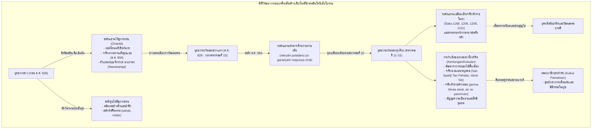

# บันทึกการอ่านและวิเคราะห์เอกสารจารึกวิทยาฉบับสมบูรณ์ (Epigraphic Source Dossier)
## เครื่องใช้ในพิธีกรรมโบราณของอินโดนีเซียและจารึกบนตัววัตถุ: ระฆังและกลองผ่าซีก (Ancient Indonesian Ritual Utensils and their Inscriptions: Bells and Slitdrums)

---

### ส่วนที่ 1: ข้อมูลบรรณานุกรมและการอ้างอิงมาตรฐาน (Bibliographic Metadata)
- **Source ID:** `S-2014-griffiths-03`
- **ชื่อไฟล์ PDF ในเครื่อง:** `S-2014-griffiths-03_Ancient_Indonesian_Ritual_Utensils_Bells.pdf`
- **ชื่อไฟล์ข้อความสกัด:** `S-2014-griffiths-03_Ancient_Indonesian_Ritual_Utensils_Bells.txt` (HAL Id: halshs-02443370; Persee DOI: 10.3406/arasi.2014.1872)
- **ประเภทเอกสาร:** บทความวิจัยวิชาการฉบับบุกเบิกผ่านการประเมินโดยผู้ทรงคุณวุฒิ (Peer-reviewed Groundbreaking Journal Article) ในวารสารโบราณคดีและประวัติศาสตร์ศิลปะเอเชียชั้นนำระดับนานาชาติ (*Arts Asiatiques*)
- **ภาษาของเอกสาร:** ภาษาอังกฤษ (EN) พร้อมตัวบทจารึกภาษาดั้งเดิม: ภาษาชวาโบราณ (Old Javanese/Kawi) และภาษาสันสกฤต (Sanskrit) ถอดอักษรตามระบบสากล IAST ควบคู่กับคำศัพท์เฉพาะทางภาษามลายู ดัตช์ ฝรั่งเศส และการอ้างอิงวรรณคดีภาษากวี (Kakawin)
- **ขอบเขตภูมิศาสตร์และวัฒนธรรม:** หมู่เกาะอินโดนีเซียโบราณ โดยเน้นเกาะชวา (ชวากลาง ชวาตะวันตก และชวาตะวันออก) และเกาะบาหลี: โบราณสถานเกอลูรัก, กาลาซัน, โบโรพุทโธ, ตโลโกปากิส (เปอกาโลงัน), เจียมิต (ชวาตะวันตก), โมโจเกอร์โต, เกอดิรี, ตูลุงอากุง, มาลัง, สุราการ์ตา (ชวาตะวันออก) และปุระเปอนาตารัน (ซูกาวาตี เกียนยาร์) ตลอดจนปูจุงอัน (เกาะบาหลี)
- **วัสดุและบริบทการค้นพบ:** คลังโบราณวัตถุสำริดและทองคำประเภทเครื่องใช้ในพิธีกรรม (ritual utensils / instrumenta domestica) รวมทั้งสิ้น 23 ชิ้น จำแนกเป็น 5 กลุ่มวัตถุ:
  1. ระฆังแขวนไร้ลูกกระทบ (Hanging bells without clapper / temple bells) สัมพันธ์กับศาสนสถานไศวนิกายและพุทธศาสนา 13 ชิ้น (1.1a–1.1m)
  2. ระฆังรูปไข่มีลูกกระทบสำหรับสัตว์พาหนะศักดิ์สิทธิ์ (Oval hanging bells with clapper for elephant/horse) 3 ชิ้น (1.2a–1.2c)
  3. กระพรวนสำริดสามขาเลียนแบบรูปผลสาเก (Pellet bells on three feet / breadfruit model) 1 ชิ้น (1.3)
  4. กระพรวนทองคำประดับเศียรน่าสะพรึงกลัว (Pellet bells with terrifying head / gold kāla rattle) 1 ชิ้น (1.4)
  5. กลองผ่าซีกสำริด (Bronze slitdrums / kentongan / kukulan) 10 ชิ้น (2a–2j) จากชวาตะวันตก ชวาตะวันออก และเกาะบาหลี
- **การอ้างอิงฉบับเต็มระบบ Chicago/Turabian Notes-Bibliography:**  
  Griffiths, Arlo, and Pauline Lunsingh Scheurleer. "Ancient Indonesian Ritual Utensils and their Inscriptions: Bells and Slitdrums." *Arts Asiatiques* 69, no. 1 (2014): 129–150. https://doi.org/10.3406/arasi.2014.1872.

---

### ส่วนที่ 2: แผนผังการจัดสรรเข้าสู่บทและหัวข้อย่อย (Chapter & Section Mapping Matrix)

- **บทที่ 3: จารึกบนแผ่นทองคำ เงิน ตะกั่ว สำริด และดินเผา: จารึกบนเครื่องใช้สำริดและรูปเคารพขนาดเล็ก (Instrumenta Domestica & Portable Bronzes)**
  * **หัวข้อย่อย 3.1 (จารึกบนเครื่องใช้สำริดในพิธีกรรม: การจำแนกประเภทและอรรถประโยชน์):**  
    เอกสารชิ้นนี้เป็นแหล่งข้อมูลหลักและงานวิจัยแม่บทชิ้นเดียวที่รวบรวมและวิเคราะห์จารึกบน "เครื่องใช้สำริดในพิธีกรรม" ไว้อย่างเป็นระบบที่สุด โดยเฉพาะระฆังวัด (temple hanging bells) และกลองผ่าซีกสำริด (slitdrums / *kentongan*) ซึ่งเดิมมักถูกจัดแสดงในพิพิธภัณฑ์หรือลงแคตตาล็อกประมูลโดยละเลยตัวบทจารึก หรือถอดอักษรผิดพลาด บทความนี้ให้การอ่าน ชำระตัวบท และตีความจารึก 23 ชิ้นอย่างครบถ้วน (หน้า 129–130, 146–147)
  * **หัวข้อย่อย 3.2 (จารึกระบุชื่อเฉพาะและการทำให้วัตถุกลายเป็นบุคคล / Anthropomorphization of Utensils):**  
    การค้นพบว่ากลองผ่าซีกสำริดในยุคชวาตะวันออกได้รับการจารึก "นามเฉพาะ" (proper names) ประหนึ่งมีชีวิตและมีสถานะเป็นบุคคล (personification) เช่น *Saṅ Apañji Tan Pahalar* ("ท่านอภัญจีผู้ไร้ปีก"), *Vaniṅ Siḥ* ("ผู้กล้าหาญในความรัก"), *Majayan* ("ผู้มีชัย"), และ *Jānakīya* ("บุตรแห่งนางสีดา / ผู้ป่าวประกาศข่าว") ซึ่งสะท้อนมโนทัศน์เรื่องพลังอำนาจเชิงบุคลาธิษฐานของวัตถุมีเสียงในพิธีกรรม (หน้า 141–142, 144–146)
  * **หัวข้อย่อย 3.3 (จารึกคำระบุประเภทวัตถุด้วยตนเอง / Auto-designation):**  
    การพบคำศัพท์ภาษาชวาโบราณที่สลักลงบนตัววัตถุเพื่อระบุประเภทของวัตถุนั้นโดยตรง เช่น คำว่า *gaṇṭa* (ระฆัง) บนระฆังตโลโกปากิส, คำว่า *°ateṅ* (ตั้งอยู่บนขาค้ำ/เสาค้ำ) บนกระพรวนสามขา, และคำว่า *kukulan* (กลองผ่าซีก) บนกลองสำริดของพิพิธภัณฑ์เมโทรโพลิแทน ควบคู่กับการเทียบเคียงคำว่า *dyun* (หม้อน้ำ), *tahas*/*thahəṣ* (ถาดสำริด), และ *saragi* (ชามสำริดขนาดเล็ก) ในจารึกชวาโบราณอื่นๆ (หน้า 129–130, 132, 139, 144)

- **บทที่ 6: จารึกที่สะท้อนวัฒนธรรมโบราณในแง่การปกครอง กฎหมาย และสถาบันสีมา: สังคม เศรษฐกิจ การค้า และชีวิตประจำวัน**
  * **หัวข้อย่อย 6.1 (สิทธิพิเศษและเอกสิทธิ์ของเจ้าพนักงานชุมชน / Village Officials and Privileges):**  
    การวิเคราะห์บทบาทของกลองผ่าซีก (*kentongan* / *kukulan*) ในฐานะเครื่องมือแจ้งสัญญาณเตือนภัยชุมชน (เตือนภัยภูเขาไฟระเบิด จันทรุปราคา สุริยุปราคา น้ำท่วม อัคคีภัย การปล้นสะดม) และการเรียกประชุมผู้อาวุโส ซึ่งเป็นเอกสิทธิ์เฉพาะของหัวหน้าหมู่บ้าน (ผู้สืบสายตระกูลผู้ก่อตั้งชุมชน) รวมถึงการไขปริศนาสิทธิพิเศษ *amanaḥ kukulan* ("การยิงธนูใส่กลองผ่าซีก / การทดสอบความแม่นยำในการยิง") ที่ปรากฏในจารึกพระราชกฤษฎีกาสมัยมัชปาหิต (จารึกแผ่นทองแดงตูฮันญารู ค.ศ. 1323 และมาธวปุระ) (หน้า 140–141)
  * **หัวข้อย่อย 6.2 (สัญลักษณ์ทางเพศและภาวะความเป็นชายของกลองผ่าซีก / Phallic Symbolism & Masculinity):**  
    การเชื่อมโยงข้อมูลชาติพันธุ์วรรณนากับหลักฐานจารึกและวรรณคดีกากาวิน (*Smaradahana*, *Bhāratayuddha*, *Sumanasāntaka*) ที่แสดงว่ากลองผ่าซีกถูกมองว่ามีความเป็นเพศชาย (masculine) อย่างเด่นชัด มักแกะสลักเป็นรูปอวัยวะเพศชายหรือรูปปลา และสลักชื่อที่สื่อถึงความกล้าหาญและความรัก (*vaniṅ siḥ*) ซึ่งแตกต่างจากระฆังวัด (หน้า 140–141, 144–145)
  * **หัวข้อย่อย 6.3 (ขบวนเสด็จ ช้าง ม้า และเครื่องยศของชนชั้นสูง):**  
    การศึกษาระฆังรูปไข่มีลูกกระทบสำริด (*sahati*, *sraḥhana*, *miḍar*) ในฐานะระฆังคล้องคอช้างศึกและม้าศึกของกษัตริย์และขุนนางชั้นสูงในกระบวนพยุหยาตรา ดังภาพสลักนูนต่ำที่บุโรพุทโธและวรรณคดี *Sumanasāntaka* (คำว่า *ghaṇṭaniṅ liman* = ระฆังสำหรับช้าง) ชี้ให้เห็นว่าสำริดเป็นโลหะมีค่าที่สงวนไว้สำหรับสัตว์พาหนะของชนชั้นปกครอง มิใช่กระดิ่งวัวชาวบ้านทั่วไป (หน้า 137–138)

- **บทที่ 4: อักขรวิทยา ภาษาศาสตร์ประวัติศาสตร์ และการคำนวณศักราช: จากปัลลวะสู่กวิ และระบบปฏิทินดาราศาสตร์**
  * **หัวข้อย่อย 4.1 (วิวัฒนาการของอักษรกวิแบบสี่เหลี่ยม / Ornamental Quadrate Script):**  
    การวิเคราะห์พัฒนาการของอักษรกวิรูปทรงเหลี่ยมประดับลวดลายวิจิตร (ornamental quadrate script / Kediri quadrate script) ในยุคชวาตะวันออก ซึ่งช่างจารึกจงใจออกแบบให้มีลวดลายซับซ้อน อ่านยาก และสลักในแนวตั้งย้อนขึ้นจากล่างสู่บน (*bottom to top*) เพื่อเสริมความขลังและความงามทางศิลปะ (หน้า 130, 134–136, 144, 147)
  * **หัวข้อย่อย 4.2 (ระบบปริศนาคำกลอนแสดงศักราช / Chronograms or Candrasaṅkala):**  
    การชำระและถอดรหัสจารึกศักราชแบบปริศนาคำกลอนในชวาตะวันออก 2 กรณีศึกษาสำคัญ:
    1. จารึกบนขอบบนกลองผ่าซีกสาดาไปงัน (Sadapaingan, Jawa Barat): *jan·ma bhuta sarat·* = 1-5-1-1 ย้อนกลับเป็น มหาศักราช 1151 (ค.ศ. 1229/1230) แปลว่า "มวลมนุษย์ล้วนกำเนิดมาจากการเกิด" (หน้า 141–142)
    2. จารึกบนกลองผ่าซีกโมโจเกอร์โต: *°aiṙ ve paṇimvan·* ซึ่งผู้เขียนเสนอการถอดรหัสใหม่เป็นศักราชคำกลอน *air* (4) - *ve* (4) - *paṇi* (2) - *mvan*/*əmban* (1) = มหาศักราช 1244 (ค.ศ. 1322/1323) ทลายข้อผิดพลาดเดิมของ Brandes และ Fontein ที่อ่านเป็นนามบุคคล *śrī depanimwan* (หน้า 142–143)
  * **หัวข้อย่อย 4.3 (เครื่องหมายวรรคตอนรูปก้นหอย / Spiral Punctuation Sign):**  
    การศึกษาเครื่องหมายวรรคตอนรูปก้นหอยวน (spiral punctuation mark) ที่ใช้คั่นระหว่างต้นและท้ายข้อความจารึกที่เป็นวงกลมรอบระฆัง (เช่น ระฆัง MMA, เดรสเดน 1378, และไลเดิน 1630-42) ซึ่งเป็นลักษณะทางอักขรวิทยาจำเพาะของชวายุคศตวรรษที่ 10–12 (หน้า 135–136)

- **บทที่ 7: ศาสนา ความเชื่อ และเครือข่ายพุทธตันตระ/ไศวนิกายข้ามสมุทร: มนตรา ปรัชญา และการสังเคราะห์เทพเจ้า**
  * **หัวข้อย่อย 7.1 (มิติสัญศาสตร์ของเสียงในพิธีกรรม: การปลุกทวยเทพและพยานแห่งจักรวาล):**  
    การตีความหน้าที่ของระฆังแขวนในวัดไศวนิกายและพุทธศาสนา: เสียงระฆังมิได้มีไว้เพื่อเรียกผู้ศรัทธามาทำวัตร (ดังเช่นในธรรมเนียมตะวันตก) แต่เป็นการส่งสัญญาณบอกกล่าวและปลุกทวยเทพผู้พิทักษ์ทิศทั้งปวงให้ตื่นขึ้นมารับรู้และเป็นพยานในการบำเพ็ญกุศล (calling deities to witness ritual acts) เทียบเคียงกับธรรมเนียมระฆังวัดในพม่า (หน้า 131–132)
  * **หัวข้อย่อย 7.4 (ระบบนวเทวตา / Navasanga บนระฆังสำริดยุคมัชปาหิต):**  
    การค้นพบหลักฐานอันทรงคุณค่าของระบบ "นวเทวตา" (เทวพิทักษ์ 9 ทิศ) บนระฆังสำริดของ Tropenmuseum (TM 1448-1) และพิพิธภัณฑ์สถานแห่งชาติจาการ์ตา (MNI 6040): ยอดระฆังเป็นรูปพระศิวะประทับนั่งบนหลังโคนนทิ ทรงดอกบัวสีแดง (*padma*) ล้อมรอบด้วยเทพประจำทิศ 4 องค์ผู้ถืออาวุธ วัชระ (*vajra* - ทิศตะวันออก), ตรีศูล (*triśūla* - ทิศใต้), บ่วงนาค (*nāgapāśa* - ทิศตะวันตก), และคทา (*gadā* - ทิศเหนือ) ซึ่งพิสูจน์ว่าระบบนวเทวตาที่สืบทอดในบาหลีปัจจุบันได้พัฒนาอย่างสมบูรณ์แบบแล้วในศิลปะชวาสมัยมัชปาหิต (หน้า 131–132)

- **บทที่ 1 & บทที่ 9: ประวัติศาสตร์นิพนธ์ จริยธรรมโบราณคดี และข้อถกเถียงเรื่องการแบ่งยุคสมัย**
  * **หัวข้อย่อย 1.2 (การท้าทายเส้นแบ่งยุคสมัย ค.ศ. 928 ระหว่างชวากลางและชวาตะวันออก):**  
    ข้อถกเถียงหลักทางประวัติศาสตร์นิพนธ์ของผู้เขียนที่เสนอว่า การย้ายศูนย์กลางอำนาจของอาณาจักรมะตะรัมจากชวากลางสู่ชวาตะวันออกในรัชสมัยพระเจ้าซินดก (ค.ศ. 928) **ไม่ได้ทำให้เกิดการเปลี่ยนแปลงทางวัฒนธรรมวัตถุและแบบแผนจารึกวิทยาในทันทีทันใด** ระฆังปี ค.ศ. 906 (ชวากลาง) และระฆังปี ค.ศ. 964 (ชวาตะวันออก) ยังคงใช้แบบแผนจารึกการถวายทานแบบสมบูรณ์เหมือนกันทุกประการ จุดเปลี่ยนทางรูปแบบและประเภทวัตถุที่แท้จริงเกิดขึ้นหลังปลายศตวรรษที่ 10 (หลัง ค.ศ. 964) เป็นต้นไป (หน้า 146–147)
  * **หัวข้อย่อย 9.1 (โศกนาฏกรรมเพลิงไหม้นิทรรศการปารีส ค.ศ. 1931 และโบราณวัตถุที่สูญหาย):**  
    การบันทึกประวัติศาสตร์โบราณคดีกรณีระฆังสำริดชั้นยอดจากกูนุงกรองกา มาลัง (Śaka 1208 / ค.ศ. 1286) ซึ่งถูกไฟไหม้ทำลายไปในงานนิทรรศการ Colonial Exhibition ณ กรุงปารีส เมื่อปี ค.ศ. 1931 และการสูญหายอย่างไร้ร่องรอยของระฆังสำริดจารึกอักษรเหลี่ยมจากพิพิธภัณฑ์ศรีเวดารี (รัดยปุสตากา) สุราการ์ตา ระหว่างการลงพื้นที่สำรวจของ Griffiths ในปี ค.ศ. 2010 (หน้า 134–135)

---

### ส่วนที่ 3: สรุปสาระสำคัญเชิงวิเคราะห์และจุดยืนทางวิชาการ (Executive Academic Analysis)

- **วิทยานิพนธ์และข้อถกเถียงหลักของผู้เขียน (Core Argument / Thesis):**  
  Arlo Griffiths และ Pauline Lunsingh Scheurleer นำเสนอข้อค้นพบเชิงปฏิวัติระเบียบวิธีวิจัยประวัติศาสตร์ศิลปะและจารึกวิทยาของอินโดนีเซียโบราณ โดยประสานการอ่านจารึกนิรุกติศาสตร์เข้ากับการวิเคราะห์รูปแบบสัณฐานวิทยาของโบราณวัตถุสำริดขนาดเล็ก (ritual utensils / bronze bronzes) ซึ่งนำไปสู่ข้อสรุปเชิงทฤษฎี 4 ประการสำคัญ:

  1. **การทลายกรอบการแบ่งยุคสมัยแบบกลไก (Re-evaluating the 928 CE Divide):**  
     วงวิชาการชวาศึกษาแต่เดิมมักยึดถือศักราช ค.ศ. 928 (การย้ายราชธานีสู่ชวาตะวันออกในรัชกาลมปุ ซินดก) เป็นเส้นแบ่งเด็ดขาดระหว่าง "ยุคชวากลาง" และ "ยุคชวาตะวันออก" ทว่าผู้เขียนพิสูจน์ผ่านหลักฐานจารึกบนระฆังว่า ความต่อเนื่องทางวัฒนธรรมและการช่างยังคงดำเนินอยู่อย่างแนบแน่นตลอดช่วงศตวรรษที่ 10 ระฆังตโลโกปากิส (ค.ศ. 906 จากชวากลาง) และระฆังประมูลคริสตีส์ (ค.ศ. 964 จากชวาตะวันออก) ต่างมีโครงสร้างจารึกแบบเดียวกันเป๊ะ คือ บันทึกวันเดือนปีทางดาราศาสตร์อย่างละเอียด ระบุนามขุนนางผู้ถวาย (*rakryān*), ชนิดของทาน, และเทวสถานหรือเทพเจ้าผู้รับทาน (*bhaṭāra*) ความเปลี่ยนแปลงทางจารึกวิทยาและรูปแบบศิลปะที่แท้จริงมิได้เกิดขึ้นในปี ค.ศ. 928 แต่เกิดขึ้นหลังจากกลางศตวรรษที่ 10 เป็นต้นไป เมื่อจารึกบนเครื่องใช้สำริดกลายสภาพเป็น "ศักราชโดดๆ" (*naked millésimes*), ปริศนาคำกลอน (*chronograms*), คำระบุประเภทวัตถุสั้นๆ, หรือนามเฉพาะบุคคล

  2. **มโนทัศน์เรื่องวัตถุมีชีวิตและภาวะบุคลาธิษฐาน (Anthropomorphization & Personification of Slitdrums):**  
     การค้นพบว่ากลองผ่าซีกสำริด (*kentongan* / *kukulan*) ซึ่งเป็นวัตถุวัฒนธรรมพื้นเมืองดั้งเดิมที่พัฒนาขึ้นในยุคชวาตะวันออก ไม่เคยถูกจารึกข้อความถวายทานแบบพระราชกฤษฎีกา แต่กลับได้รับการจารึก "นามเฉพาะ" (proper names) ในแนวตั้งจากล่างสู่บนด้วยอักษรสี่เหลี่ยมประดับวิจิตร (*quadrate script*) ราวกับว่าตัวกลองเป็นบุคคลหรือนักรบที่มีชีวิต เช่น *Saṅ Apañji Tan Pahalar* (ผู้มีตราสัญลักษณ์ไร้ปีก) หรือ *Vaniṅ Siḥ* (ผู้กล้าหาญในความรัก) สอดคล้องกับลักษณะสัญลักษณ์ทางเพศชาย (*masculinity / phallic shape*) และอำนาจในการปกป้องเตือนภัยของชุมชน

  3. **ภูมิทัศน์ทางเสียงและวิวัฒนาการของพิธีกรรม (Ritual Soundscapes & Temple Evolution):**  
     ผู้เขียนสร้างแบบจำลองวิวัฒนาการการใช้เครื่องกำเนิดเสียงในศาสนสถาน: ในยุคแรก (ชวากลาง) พิธีกรรมในวัดไศวนิกายและพุทธศาสนาได้รับอิทธิพลอินเดียอย่างเข้มข้น โดยใช้ "ระฆังแขวนไร้ลูกกระทบ" (*clapperless hanging bells / ghaṇṭā*) ตีด้วยไม้เพื่อส่งเสียงสะท้อนไปทั่วจักรวาล ปลุกทวยเทพประจำทิศทั้ง 9 (*Nawasanga*) ให้ตื่นขึ้นมารับรู้และเป็นพยานในการบำเพ็ญบุญ ทว่าตั้งแต่ศตวรรษที่ 12 เป็นต้นมา เครื่องมือตีบอกสัญญาณพื้นเมืองคือ "กลองผ่าซีก" (*slitdrum*) ได้ถูกยกระดับเข้าสู่พื้นที่ศักดิ์สิทธิ์ของศาสนสถาน และทำหน้าที่คู่ขนานกับระฆังแขวน จนกระทั่งในที่สุดระฆังแขวนได้เสื่อมความนิยมและหมดสิ้นไป เหลือเพียงกลองผ่าซีก (*kulkul*) ที่กลายเป็นหัวใจของพิธีกรรมในวัดบาหลีจนถึงปัจจุบัน

  4. **ปริศนาการไร้จารึกบนระฆังมือของนักบวช (The Paradox of Uninscribed Priest's Bells):**  
     ข้อสังเกตเชิงสถิติที่น่าประหลาดใจยิ่งคือ แม้ในคลังโบราณคดีของชวาจะมี "ระฆังมือมีด้ามจับของนักบวช" (*priest's handbells / ghaṇṭā* ยอดวัชระหรือยอดเทพเจ้า) หลงเหลืออยู่เป็นจำนวนมหาศาลหลายร้อยชิ้น ทั้งจากยุคชวากลางและชวาตะวันออก แต่วัตถุประเภทนี้กลับ **ไม่เคยปรากฏจารึกเลยแม้แต่ชิ้นเดียว** แสดงให้เห็นว่าธรรมเนียมจารึกวิทยาของชวาโบราณมีกฎเกณฑ์ที่เคร่งครัดในการเลือกประเภทวัตถุที่จะจารึก

- **บริบทประวัติศาสตร์นิพนธ์และการประเมินความน่าเชื่อถือ (Historiography & Source Criticism):**  
  บทความของ Griffiths และ Lunsingh Scheurleer ถือเป็นงานชิ้นเอกที่แก้ปัญหาความเฉื่อยชาทางวิชาการในอดีต นักโบราณคดียุคอาณานิคมดัตช์ (เช่น Holle, Brandes, Bosch, Stutterheim, Crucq, Juynboll) และนักวิชาการยุคเอกราช (เช่น Boechari, Machi Suhadi, Endang Sri Hardiati) มักศึกษาโบราณวัตถุสำริดเหล่านี้แบบแยกส่วนชิ้นต่อชิ้น ขาดการสร้างคลังข้อมูลเปรียบเทียบเชิงมหภาค (*exhaustive corpus*) ส่งผลให้เกิดข้อผิดพลาดในการอ่านอักขรวิธี เช่น:
  - การที่ Brandes และนักวิชาการรุ่นหลังอ่านจารึกบนกลองผ่าซีกโมโจเกอร์โตผิดเป็น *sri depanimwan* โดยผู้เขียนได้แก้ไขให้ถูกต้องเป็นศักราชคำกลอน *°aiṙ ve paṇimvan·* (มหาศักราช 1244)
  - การที่ Crucq เสนออ่านจารึกระฆังสุราการ์ตาเป็นภาษามาเลย์ *bĕrgatang* ซึ่งผู้เขียนปฏิเสธอย่างสิ้นเชิงเนื่องจากไวยากรณ์ภาษาชวาโบราณไม่มีอุปสรรค *bər-*
  - การที่ Stutterheim อ่านจารึกระฆังวัว MNI 6422 ผิดเป็นอักษร *ngĕ* ซึ่งแท้จริงคือ *ḍa* (อ่านรวมเป็นคำว่า *miḍar·* แปลว่า เร่ร่อน/ท่องเที่ยวไป)
  - การชำระศักราชบนกลองผ่าซีกสาดาไปงันจากเดิมที่ Holle อ่านผิดเป็น 1189 มหาศักราช แก้ไขเป็น 1151 มหาศักราช (*jan·ma bhuta sarat·*)

---

### ส่วนที่ 4: สารบัญข้อค้นพบเชิงลึกแยกตามมิติจารึกวิทยา (Thematic Epigraphic Findings with Exact Pages)

1. **ประวัติศาสตร์นิพนธ์และการตีความทางประวัติศาสตร์:**
   - การรื้อถอนทฤษฎีการแบ่งยุคสมัยแบบกลไก (Historiographical Re-periodization): Griffiths และ Lunsingh Scheurleer ชี้ชัดว่าปี ค.ศ. 928 ไม่ใช่จุดสิ้นสุดของวัฒนธรรมชวากลางในแง่โบราณคดีวัตถุสำริดและจารึกวิทยา ระฆังตโลโกปากิส (ค.ศ. 906) และระฆังประมูลคริสตีส์ (ค.ศ. 964) มีโครงสร้างจารึกและลักษณะทางศิลปะที่ต่อเนื่องกัน การเปลี่ยนแปลงครั้งใหญ่เกิดขึ้นหลังจาก ค.ศ. 964 ไปแล้ว (หน้า 130, 146–147)
   - การประเมินความน่าเชื่อถือของโบราณวัตถุในยุคอาณานิคม: วัตถุสำริดจำนวนมากถูกสะสมตั้งแต่สมัยดัตช์ ซึ่งแม้จะทำให้รอดพ้นจากการปลอมแปลงยุคหลัง แต่ก็มีกรณีการปลอมแปลงในยุคอาณานิคมเช่นกัน เช่น คอลเลกชัน Dieduksman อันโด่งดัง (หน้า 129 เชิงอรรถ 2)
   - บริบทของระฆังปี ค.ศ. 964 กับสำริดงานจุก (Nganjuk Bronzes): จารึกบนระฆังระบุปี มหาศักราช 885 (ค.ศ. 964) ซึ่งร่วมสมัยอย่างยิ่งกับกรุพระพุทธรูปสำริดมณฑลวัชรธาตุแห่งงานจุก สะท้อนความรุ่งเรืองของการหล่อสำริดในชวาตะวันออกยุคต้น (หน้า 133)

2. **ตัวบทจารึก การอ่าน ศักราช และอักขรวิทยา:**
   - จารึกบนระฆังตโลโกปากิส เปอกาโลงัน (1.1a, ค.ศ. 906): จารึกด้วยการกรีดร่องลึก (*engraved*) ตัวอักษรกวิชวากลางระบุวันเดือนปีสมบูรณ์: *°oṁ nama ś śivāya °i śaka 827 phālguṇamāsa tithi saptamĭ śukla, tu, va, so, vāra kāla rakryān· °i vuṅkal tihaṁ pu vīravikrama maṅarpanākan· gaṇṭa °i bhaṭāra °iṁ rabvān· likhita siṅgahan·* (หน้า 132–133)
   - จารึกบนระฆังประมูลคริสตีส์ (1.1b, ค.ศ. 964): จารึกหล่อลอยนูน (*in relief*) ตัวอักษรกวิชวาตะวันออกยุคแรก: *°iṁ śaka 885 cetramāsa, tithi pratipāda śukla, °irikā divāśa rakryān putaḍanu pu garaṅyaṁ mapunya vīṇā °iṁ °r̥ban· //* การระบุของถวายว่า "พิณ" (*vīṇā*) ลงบนระฆังสำริดยังคงเป็นปริศนาทางวิชาการ (หน้า 132–133)
   - จารึกศักราชโดดๆ ยุคชวาตะวันออกบนระฆังแขวน:
     * Dresden 1379: มหาศักราช 1188 (ค.ศ. 1266/1267) (หน้า 134)
     * Lindenmuseum SA 35 267 L: มหาศักราช 1198 หรือ 1188 (หน้า 134)
     * Private Collection New York: มหาศักราช 1206 (ค.ศ. 1284/1285) (หน้า 134)
     * Ex-Batavia 958f (กูนุงกรองกา มาลัง): มหาศักราช 1208 (ค.ศ. 1286/1287) (หน้า 134)
     * MNI 958i/5055 (งารโจ ตูลุงอากุง): มหาศักราช 1211 (ค.ศ. 1289/1290) (หน้า 134)
   - การแก้คำอ่านจารึกระฆังเดรสเดน 1378: Stutterheim อ่านผิดเป็น *vr̥mmaya* ผู้เขียนพิสูจน์ว่าอ่านว่า *dhr̥mmaya* ซึ่งหมายถึง *dharma ya* ("นี่คือของบริจาคทาน") หรือรูปสละสลวย *dharmāya* ("เพื่อประโยชน์แห่งธรรม") (หน้า 136)
   - จารึกปริศนาคำกลอนบนกลองผ่าซีกสาดาไปงัน (2a): *jan·ma bhuta sarat·* = 1151 มหาศักราช (ค.ศ. 1229/1230) พร้อมจารึกแนวตั้งจากล่างขึ้นบน *majayan·* ("ผู้มีชัย") (หน้า 141–142)
   - การถอดรหัสศักราชคำกลอนบนกลองผ่าซีกโมโจเกอร์โต (2c): *°aiṙ ve paṇimvan·* ผู้เขียนเสนอว่า *air* (4), *ve* (4), *paṇi* (2), *mvan*/*əmban* (1) = มหาศักราช 1244 (ค.ศ. 1322/1323) แก้ไขข้อผิดพลาดของ Brandes ที่อ่านเป็น *śri depanimwan* (หน้า 142–143)
   - จารึกบนกลองผ่าซีก MMA (2f): จารึกสองข้างรอยผ่าจากล่างขึ้นบนด้วยอักษรสี่เหลี่ยมงดงาม: ซ้าย *// saṅ apan·ji taṇ· pahalaṙ* ขวา *kukulan·* ("ท่านอภัญจีผู้ไร้ปีก, กลองผ่าซีก") (หน้า 144)

3. **มิติศาสนา ลัทธิความเชื่อ และพิธีกรรม:**
   - มโนทัศน์เรื่องการปลุกทวยเทพแห่งจักรวาล (Awakening Cosmic Guardians): เสียงตีระฆังแขวนเป็นการเรียกทวยเทพผู้พิทักษ์ทิศทั้งปวงและภพทั้งสี่ให้มารับรู้การบำเพ็ญกุศล เทียบเคียงกับคติของพม่าตามบันทึกของ Shway Yoe (1882) (หน้า 131–132)
   - สัญลักษณ์ศาสตร์นวเทวตา (Navasanga) บนระฆัง Tropenmuseum (TM 1448-1): พระศิวะประทับนั่งเหนือโคนนทิ ทรงถือประคำและดอกบัวแดง (*padma*) บนยอดระฆัง ล้อมรอบด้วยเทพ 4 องค์ถือวัชระ ตรีศูล บ่วงนาค และคทา เป็นหลักฐานทางโบราณคดีที่เก่าแก่ที่สุดที่แสดงระบบนวเทวตาในศิลปะชวาสมัยมัชปาหิต ก่อนที่จะสืบทอดไปสู่บาหลี (หน้า 131–132)
   - ยอดระฆังสัญลักษณ์สิงห์คำรามและโคนนทิเปล่งเสียง: สิงห์คำรามสัมพันธ์กับการประกาศธรรมในพุทธศาสนา (*siṁhanāda*) ขณะที่โคเปล่งเสียงคำรามก้องเป็นสัญลักษณ์ของศาสนาพระศิวะ (หน้า 131)
   - ลวดลายหน้ากาลาน่าสะพรึงกลัว (Terrifying Ornamentation): วิวัฒนาการจากลวดลายพวงมาลัยใบไม้อ่อนช้อยในยุคชวากลางสู่การประดับหน้ากาลาที่มีเขี้ยวและดวงตาโปนโตบนตัวระฆังและกลองผ่าซีกยุคชวาตะวันออก เพื่อทำหน้าที่ขับไล่ภูติผีปีศาจและสิ่งอัปมงคล (หน้า 130, 132, 139–140)

4. **มิติสถาปัตยกรรม ศาสนสถาน และชลศาสตร์:**
   - ภาพสลักระฆังวัดบนฐานซ่อนเร้นของบุโรพุทโธ (Borobudur Hidden Base): ภาพสลักนูนต่ำแผ่น O 131a แสดงการถวายระฆังวัดแขวนบนโครงไม้ โดยมีจารึกกำกับเหนือกรรมว่า *ghaṇṭā* (หน้า 130)
   - ระฆังวัดที่ใหญ่ที่สุดจากจันทิกาลาซัน: ระฆังสำริดที่พบใกล้จันทิกาลาซัน มีความสูงถึง 58.5 ซม. ปัจจุบันจัดแสดงที่พิพิธภัณฑ์โซโนบูโดโย ยอกยาการ์ตา (หน้า 132)
   - การประดิษฐานกลองผ่าซีกในวัดบาหลี: กลองผ่าซีกสำริดที่พบในปุระเปอนาตารัน ซูกาวาตี เกียนยาร์ (2i) และปุระมานิกเบนี ปูจุงอัน (2j) ทำหน้าที่เป็น *kulkul pameksan* สำหรับพิธีกรรมทางศาสนา (หน้า 140, 145–146)

5. **มิติอาหารการกิน วิถีชีวิต การค้า และตลาด:**
   - วิถีชีวิตชนบทและการเตือนภัยชุมชน: กลองผ่าซีกไม้และสำริดถูกใช้ตีแจ้งเหตุฉุกเฉิน เช่น ภูเขาไฟระเบิด จันทรุปราคา สุริยุปราคา น้ำท่วม ไฟไหม้ป่า และการถูกโจมตีปล้นสะดม (หน้า 140)
   - การล่าสัตว์และกับดักสัตว์: วรรณคดีกากาวิน *Bhāratayuddha* 50.6 ระบุว่ามีการผูกกลองผ่าซีกขนาดเล็ก (*kukulan*) ไว้กับกับดักสัตว์ เมื่อสัตว์ติดกับดักและดิ้นรน กลองจะส่งเสียงเตือนให้นายพรานทราบ (หน้า 141)
   - วัตถุจำลองผลไม้จากธรรมชาติ: กระพรวนสำริดสามขาถูกหล่อเลียนแบบรูปทรงของ "ผลสาเก" (*breadfruit / Artocarpus altilis*) ที่เมื่อแห้งแล้วเมล็ดข้างในจะกระทบกันเกิดเสียง (หน้า 139)

6. **มิติการปกครอง กฎหมาย ที่ดิน และระบบสีมา:**
   - ขุนนางผู้ถวายทาน (*Rakryān*): ระฆังตโลโกปากิสถวายโดย *Rakryān °i Vuṅkal Tihaṅ pu Vīravikrama* (ค.ศ. 906) และระฆังคริสตีส์ถวายโดย *Rakryān Putaḍanu pu Garaṅyaṁ* (ค.ศ. 964) แสดงให้เห็นว่าขุนนางชั้นผู้ใหญ่ระดับรากรียานเป็นผู้อุปถัมภ์การหล่อเครื่องใช้สำริดในพิธีกรรม (หน้า 132–133)
   - เอกสิทธิ์การตีกลองผ่าซีก: การตีกลองผ่าซีกเป็นสิทธิพิเศษเฉพาะของหัวหน้าหมู่บ้านผู้สืบเชื้อสายจากผู้ก่อตั้งชุมชนดั้งเดิม (หน้า 140–141)
   - วลี *amanaḥ kukulan* ในจารึกพระราชทานสิทธิพิเศษสมัยมัชปาหิต: พบในจารึกตูฮันญารู (ค.ศ. 1323) และจารึกมาธวปุระ ซึ่งนักวิชาการแปลว่า "การยิงธนูใส่กลองผ่าซีก" เพื่อทดสอบความแม่นยำในการยิงธนู (หน้า 141)

7. **มิติปฏิสัมพันธ์ข้ามสมุทรและเครือข่ายนานาชาติ:**
   - การเปรียบเทียบกับระฆังวัดในพม่า: การใช้ระฆังแขวนไร้ลูกกระทบในชวาโบราณมีฟังก์ชันทางศาสนาเหมือนกับระฆังวัดในพม่าทุกประการ คือ ผู้แสวงบุญจะใช้ท่อนไม้หรือเขาสัตว์ตีระฆัง 3 ครั้งหลังสวดมนต์สรรเสริญพระพุทธคุณ เพื่อบอกกล่าวทวยเทพและภพภูมิทั้งหลาย (หน้า 132)
   - ความเชื่อมโยงกับ "ปลาไม้" (*mou yu*) ในจีนและญี่ปุ่น: L.-Ch. Damais ชี้ว่ากลองผ่าซีกสำริดและไม้ของชวาและบาหลีที่มีส่วนหัวเป็นรูปปลา มีฟังก์ชันและวิวัฒนาการร่วมกับ "ปลาไม้" (*mùyú* 木魚) ที่ใช้เคาะประกอบการสวดมนต์ในอารามพุทธศาสนาของจีนและญี่ปุ่น (หน้า 141 เชิงอรรถ 102)

8. **มิติจารึกเครื่องใช้สำริดขนาดเล็ก (Instrumenta Domestica):**
   - การจำแนกประเภทเครื่องใช้สำริดที่มีจารึกในชวาโบราณ: จอกจักราศี (*zodiac beakers*), ด้ามคันฉ่องสำริด (*mirror handles*), ถาน้ำ (*dyun*), ถาดสำริด (*talam / tahas*), ชามสำริด (*saragi*), ทัพพี (*ladles*), กระบวยตักน้ำ (*water-dippers*), ยอดเสาขบวนแห่ (*processional staff finials*), กล่องเก็บแผ่นจารึกหรือคัมภีร์ใบลาน (*boxes for copper-plates/manuscripts*), และกริชพิธีกรรม (*kīla*) (หน้า 129–130)
   - เทคนิคการจารึก: ระฆังยุคชวากลาง (ค.ศ. 906) ใช้วิธีกรีดร่องลึกบนเนื้อโลหะหลังการหล่อ (*engraved*) ขณะที่ระฆังและกลองผ่าซีกยุคชวาตะวันออก (ค.ศ. 964 เป็นต้นมา) ใช้วิธีแกะแม่พิมพ์ขี้ผึ้งให้ตัวอักษรหล่อลอยนูนออกมาพร้อมกับตัววัตถุ (*cast in relief*) (หน้า 130, 132, 146–147)

9. **พรมแดนปัญหา ปริศนาวิชาการ และจริยธรรมโบราณคดี:**
   - วัตถุที่ถูกทำลายในประวัติศาสตร์: ระฆังสำริดชั้นเอกแห่งกูนุงกรองกา มาลัง (Śaka 1208) สูญสลายไปในกองเพลิง ณ นิทรรศการปารีส ค.ศ. 1931 (หน้า 134)
   - โบราณวัตถุที่สูญหายจากพิพิธภัณฑ์ท้องถิ่น: ระฆังสำริดจารึกอักษรเหลี่ยม ทะเบียน 34 ของพิพิธภัณฑ์ศรีเวดารี (รัดยปุสตากา) สุราการ์ตา หายสาบสูญไปเมื่อ Griffiths ลงพื้นที่ตรวจสอบในปี ค.ศ. 2010 (หน้า 134–135)
   - ปัญหาวัตถุประกอบสร้าง (Pastiche): กลองผ่าซีกของ Asian Art Museum ซานฟรานซิสโก (2d) ปรากฏรอยกาวเชื่อมระหว่างยอดรูปสัตว์ที่มีจารึกศักราช 1246 กับตัวกลอง ซึ่งภัณฑารักษ์ระบุว่าอาจเป็นงานซ่อมโบราณหรือการนำชิ้นส่วนสองชิ้นมาปะติดเข้าด้วยกัน (pastiche) (หน้า 143)

---

### ส่วนที่ 5: คลังข้อความอ้างอิงตรงและเชิงอรรถสำเร็จรูป (Verbatim Quotes & Footnote Bank)

#### 1. ตัวบทจารึกบนระฆังแขวน (Hanging Bells Inscriptions)

- **ระฆังตโลโกปากิส เปอกาโลงัน (1.1a, ค.ศ. 906):**
  > "°oṁ nama ś śivāya (1) °i śaka 827 phālguṇamāsa tithi saptamĭ śukla, tu, va, so, vāra kāla rakryān· °i vuṅkal tihaṁ pu vīravikrama maṅarpanākan· gaṇṭa °i bhaṭāra °iṁ rabvān· (2) likhita siṅgahan·" (หน้า 132)  
  *คำแปล:* "โอม นอบน้อมแด่พระศิวะ ในมหาศักราช 827 เดือนผาลคุณ วันที่ 7 ข้างขึ้น วันตุงไล วันวากัย วันจันทร์ ในเพลานั้น รากรียานแห่งวุงกัลติฮัง นามว่า ปุ วีรวิกรม ได้น้อมถวายระฆังใบนี้แด่พระผู้เป็นเจ้าแห่งรับวาน จารึกโดย สิงหัน"  
  *เชิงอรรถสำเร็จรูป:* Griffiths and Lunsingh Scheurleer, "Ancient Indonesian Ritual Utensils," 132–133.

- **ระฆังประมูลคริสตีส์ อัมสเตอร์ดัม (1.1b, ค.ศ. 964):**
  > "°iṁ śaka 885 cetramāsa, tithi pratipāda śukla, °irikā divāśa rakryān putaḍanu pu garaṅyaṁ mapunya vīṇā °iṁ °r̥ban· //" (หน้า 133)  
  *คำแปล:* "ในมหาศักราช 885 เดือนไจตร วันที่ 1 ข้างขึ้น (วันขึ้นปีใหม่) ในวันนั้น รากรียานแห่งปุตะดานู นามว่า ปุ กะรังยัง (?) ได้บำเพ็ญบุญถวายพิณ ณ ตำบลเรอบัน"  
  *เชิงอรรถสำเร็จรูป:* Griffiths and Lunsingh Scheurleer, "Ancient Indonesian Ritual Utensils," 132–133.

- **ระฆังแขวน พิพิธภัณฑ์ศิลปะเมโทรโพลิแทน (1.1j, ค.ศ. 950–1050):**
  > "sarbveṣṭagiṇa [= sarveṣṭaguṇa]" (หน้า 135)  
  *คำแปล:* "(เปี่ยมด้วย) คุณสมบัติอันน่าปรารถนาทั้งปวง (สวรรวิษฏคุณ)"  
  *เชิงอรรถสำเร็จรูป:* Griffiths and Lunsingh Scheurleer, "Ancient Indonesian Ritual Utensils," 135.

- **ระฆังแขวน พิพิธภัณฑ์ชาติพันธุ์วิทยาเดรสเดน (1.1k, ค.ศ. 950–1050):**
  > "dhr̥mmaya [= dharma ya / dharmāya]" (หน้า 136)  
  *คำแปล:* "นี่คือการบริจาคทาน (ธรรมะ ยะ) / เพื่อประโยชน์แห่งพระธรรม (ธรรมมหายะ)"  
  *เชิงอรรถสำเร็จรูป:* Griffiths and Lunsingh Scheurleer, "Ancient Indonesian Ritual Utensils," 136.

- **ระฆังแขวน พิพิธภัณฑ์ไรจ์กส์มิวเซียม ไลเดิน (1.1l, ค.ศ. 1050–1150):**
  > "sakatṅən·" (หน้า 136)  
  *คำแปล:* "จากทางเบื้องขวา (เทียบเท่าภาษาสันสกฤตว่า ประทักษิณ - pradakṣiṇa)"  
  *เชิงอรรถสำเร็จรูป:* Griffiths and Lunsingh Scheurleer, "Ancient Indonesian Ritual Utensils," 136.

---

#### 2. ตัวบทจารึกบนระฆังรูปไข่และกระพรวน (Oval Bells & Pellet Bells Inscriptions)

- **ระฆังรูปไข่คล้องช้าง MNI 986a (1.2a, ค.ศ. 950–1050):**
  > "sahati" (หน้า 138)  
  *คำแปล:* "ภาษาสันสกฤต: เขาย่อมอดทน/แบกรับ; หรือภาษาชวาโบราณ: มีใจเป็นหนึ่งเดียว / ณ ระดับความสูงของหัวใจ (ตำแหน่งที่คล้องระฆัง)"  
  *เชิงอรรถสำเร็จรูป:* Griffiths and Lunsingh Scheurleer, "Ancient Indonesian Ritual Utensils," 138.

- **ระฆังรูปไข่คล้องช้าง จัมปูร์ดารัต เกอดิรี (1.2b, ค.ศ. 950–1050):**
  > "sraḥhana" (หน้า 138)  
  *คำแปล:* "พึงได้รับการมอบหมาย/ไว้วางใจ (กริยา passive irrealis จากรากศัพท์ srah / sumrahi)"  
  *เชิงอรรถสำเร็จรูป:* Griffiths and Lunsingh Scheurleer, "Ancient Indonesian Ritual Utensils," 138.

- **ระฆังรูปไข่ MNI 6422 (1.2c, ค.ศ. 950–1050):**
  > "miḍar·" (หน้า 138)  
  *คำแปล:* "เร่ร่อนไป / ท่องเที่ยวไปรอบๆ (สอดคล้องกับพฤติกรรมของสัตว์พาหนะ)"  
  *เชิงอรรถสำเร็จรูป:* Griffiths and Lunsingh Scheurleer, "Ancient Indonesian Ritual Utensils," 138.

- **กระพรวนสำริดสามขา คอลเลกชันส่วนตัว อัมสเตอร์ดัม (1.3, ค.ศ. 950–1050):**
  > "°ateṅ·" (หน้า 139)  
  *คำแปล:* "ตั้งอยู่บนขาค้ำ/เสาค้ำ (เทียบคำว่า atihaṅ / atiyaṅ ในภาษาชวาโบราณ)"  
  *เชิงอรรถสำเร็จรูป:* Griffiths and Lunsingh Scheurleer, "Ancient Indonesian Ritual Utensils," 139.

---

#### 3. ตัวบทจารึกบนกลองผ่าซีกสำริด (Slitdrums Inscriptions)

- **กลองผ่าซีกสาดาไปงัน เจียมิต ชวาตะวันตก MNI 970 (2a, ค.ศ. 1229/1230):**
  > ขอบบน: "jan·ma bhuta sarat·" (หน้า 141–142)  
  > แนวตั้งข้างรอยผ่า: "majayan·" (หน้า 142)  
  *คำแปล:* "ศักราชคำกลอน: 1151 มหาศักราช (janma=1, bhūta=5, śara=5 หรือ sarat=1, 1151 Śaka) 'มวลมนุษย์ล้วนกำเนิดมาจากการเกิด'; นามวัตถุ: 'ผู้มีชัย'"  
  *เชิงอรรถสำเร็จรูป:* Griffiths and Lunsingh Scheurleer, "Ancient Indonesian Ritual Utensils," 141–142.

- **กลองผ่าซีกโมโจเกอร์โต MNI 972 (2c, ค.ศ. 1322/1323):**
  > "°aiṙ ve paṇimvan·" (หน้า 142–143)  
  *คำแปล:* "ศักราชคำกลอน: 1244 มหาศักราช (air=4, ve=4, paṇi=2, mvan/əmban=1) 'น้ำคือน้ำจากสถานที่สำหรับตักน้ำ'"  
  *เชิงอรรถสำเร็จรูป:* Griffiths and Lunsingh Scheurleer, "Ancient Indonesian Ritual Utensils," 142–143.

- **กลองผ่าซีก พิพิธภัณฑ์ศิลปะเมโทรโพลิแทน MMA 1987.142.31 (2f, ศตวรรษที่ 13–14):**
  > ด้านซ้าย: "// saṅ apan·ji taṇ· pahalaṙ" (หน้า 144)  
  > ด้านขวา: "kukulan·" (หน้า 144)  
  *คำแปล:* "ซัง อภัญจี ตัน ปะฮาลาร์ (ท่านอภัญจีผู้ไร้ปีก), กลองผ่าซีก"  
  *เชิงอรรถสำเร็จรูป:* Griffiths and Lunsingh Scheurleer, "Ancient Indonesian Ritual Utensils," 144.

- **กลองผ่าซีก คอลเลกชันส่วนตัว อัมสเตอร์ดัม (2g, ศตวรรษที่ 13–14):**
  > "vaniṁ siḥ" (หน้า 144–145)  
  *คำแปล:* "ผู้กล้าหาญในความรัก (นามเฉพาะของกลองผ่าซีก สะท้อนภาวะความเป็นชาย)"  
  *เชิงอรรถสำเร็จรูป:* Griffiths and Lunsingh Scheurleer, "Ancient Indonesian Ritual Utensils," 144–145.

- **กลองผ่าซีก คอลเลกชันส่วนตัว สหรัฐอเมริกา (2h, ศตวรรษที่ 13–14):**
  > "jānakīya" (หน้า 145)  
  *คำแปล:* "บุตรแห่งนางชานกี (นางสีดา) / ผู้ป่าวประกาศข่าวหรือนักแสดง (เทียบภาษาสันสกฤต kuśīlava)"  
  *เชิงอรรถสำเร็จรูป:* Griffiths and Lunsingh Scheurleer, "Ancient Indonesian Ritual Utensils," 145.

- **กลองผ่าซีก ปุระเปอนาตารัน ซูกาวาตี เกาะบาหลี (2i, ศตวรรษที่ 13–14):**
  > "saṁ luṁlaṅ i patik·" (หน้า 146)  
  *คำแปล:* "พระองค์ผู้ทรงอันตรธาน (สวรรคต) ณ ตำบลปาติก (เทียบแบบแผนพระนามกษัตริย์ผู้ล่วงลับ saṅ mokta riṅ...)"  
  *เชิงอรรถสำเร็จรูป:* Griffiths and Lunsingh Scheurleer, "Ancient Indonesian Ritual Utensils," 145–146.

- **กลองผ่าซีก ปูจุงอัน เกาะบาหลี (2j, ศตวรรษที่ 14–15):**
  > ด้านขวา: "sasak· dana priḥhan·" (หน้า 146)  
  > ด้านซ้าย: "sriḥ jayan·nira" (หน้า 146)  
  *คำแปล:* "(ความหมายยังไม่ยุติแน่ชัด - เดิมแปลว่า 'ทานของชาวซาสักเพื่อรำลึกถึงชัยชนะ' ซึ่งผู้เขียนชี้ว่าขัดแย้งกับหลักไวยากรณ์)"  
  *เชิงอรรถสำเร็จรูป:* Griffiths and Lunsingh Scheurleer, "Ancient Indonesian Ritual Utensils," 146.

---

#### 4. ข้อความอ้างอิงตรงจากวรรณคดีกากาวินและบทวิเคราะห์ทางวิชาการ

- **วรรณคดี *Sumanasāntaka* บทที่ 25 โศลกที่ 4 (ระฆังคล้องคอช้าง):**
  > "ghaṇṭaniṅ liman" (หน้า 137 เชิงอรรถ 74)  
  *คำแปล:* "ระฆังสำหรับช้าง"  
  *เชิงอรรถสำเร็จรูป:* Griffiths and Lunsingh Scheurleer, "Ancient Indonesian Ritual Utensils," 137, n. 74.

- **วรรณคดี *Smaradahana* บทที่ 26 โศลกที่ 9d (สัญญะทางเพศของกลองผ่าซีก):**
  > "kupinanir ātahən juga maśabda lanāṅukulan" (หน้า 141 เชิงอรรถ 108)  
  *คำแปล:* "องคชาตอันล่ำสันของเขายังคงตั้งตระหง่านอย่างมั่นคง และส่งเสียงดังก้องอย่างต่อเนื่องประดุจเสียงกลองผ่าซีก (กุกูลัน)"  
  *เชิงอรรถสำเร็จรูป:* Griffiths and Lunsingh Scheurleer, "Ancient Indonesian Ritual Utensils," 141, n. 108.

- **วรรณคดี *Bhāratayuddha* บทที่ 50 โศลกที่ 6 (กลองผ่าซีกติดกับดักสัตว์):**
  > "...the kukulan used to be attached to an animal trap. The struggling of the animal sounded the kukulan, thereby informing the hunters..." (หน้า 141 เชิงอรรถ 105)  
  *คำแปล:* "...กุกูลันมักถูกนำไปผูกติดไว้กับกับดักสัตว์ การดิ้นรนของสัตว์จะทำให้กุกูลันส่งเสียงดังขึ้น อันเป็นการแจ้งเตือนให้นายพรานทราบ..."  
  *เชิงอรรถสำเร็จรูป:* Griffiths and Lunsingh Scheurleer, "Ancient Indonesian Ritual Utensils," 141, n. 105.

- **บทวิเคราะห์การท้าทายเส้นแบ่งยุคสมัย ค.ศ. 928 (Verbatim Analysis):**
  > "The shift of the centre of power of the ancient kingdom of Mataram, from Central to East Java, was probably not the cause of the differences between 'Central Javanese' and 'East Javanese' material culture, and certainly did not coincide with the arising of those differences. Well into the reign of Sindok, artistic and epigraphic practices show continuity with the preceding period. The changes in the manufacture of bronze utensils that took place subsequently do not concern only ornamentation applied to such utensils, but also the nature of the inscriptions applied to them, the technique used for applying inscriptions, and even the types of utensils that were manufactured to begin with." (หน้า 146–147)  
  *คำแปล:* "การย้ายศูนย์กลางอำนาจของอาณาจักรมะตะรัมโบราณจากชวากลางสู่ชวาตะวันออก น่าจะไม่ใช่สาเหตุของความแตกต่างระหว่างวัฒนธรรมทางวัตถุแบบ 'ชวากลาง' และ 'ชวาตะวันออก' และไม่ได้เกิดขึ้นพร้อมกันกับการกำเนิดความแตกต่างเหล่านั้นอย่างแน่นอน จวบจนล่วงเข้าสู่รัชสมัยของพระเจ้าซินดก แบบแผนทางศิลปะและจารึกวิทยายังคงแสดงความต่อเนื่องอย่างแนบแน่นกับยุคก่อนหน้า ความเปลี่ยนแปลงในการผลิตเครื่องใช้สำริดที่เกิดขึ้นหลังจากนั้นมิได้เกี่ยวข้องเพียงแค่ลวดลายประดับตกแต่งบนตัววัตถุเท่านั้น หากแต่ยังครอบคลุมถึงลักษณะของจารึกที่สลักลงบนวัตถุ เทคนิคที่ใช้ในการจารึก และแม้กระทั่งประเภทของเครื่องใช้ที่ถูกผลิตขึ้นตั้งแต่แรกเริ่ม"  
  *เชิงอรรถสำเร็จรูป:* Griffiths and Lunsingh Scheurleer, "Ancient Indonesian Ritual Utensils," 146–147.

- **บทวิเคราะห์การทำให้กลองผ่าซีกกลายเป็นบุคคล (Verbatim Analysis):**
  > "One new type of ritual utensil was the kentongan. Several such slitdrums are characterized by the particular feature of being endowed with a label inscription giving a proper name of the object, clearly reflecting the fact that such devices were conceived as persons rather than things." (หน้า 147)  
  *คำแปล:* "เครื่องใช้ในพิธีกรรมรูปแบบใหม่ประเภทหนึ่งคือ เคนโตรงัน กลองผ่าซีกจำนวนหนึ่งมีคุณลักษณะเฉพาะอันโดดเด่นคือการได้รับการจารึกป้ายระบุนามเฉพาะของตัววัตถุ ซึ่งสะท้อนให้เห็นอย่างชัดเจนว่าอุปกรณ์เหล่านี้ถูกมองในฐานะบุคคลมากกว่าที่จะเป็นเพียงสิ่งของ"  
  *เชิงอรรถสำเร็จรูป:* Griffiths and Lunsingh Scheurleer, "Ancient Indonesian Ritual Utensils," 147.

---

### ส่วนที่ 6: คลังคำศัพท์เฉพาะทางจากเอกสาร (Native Terminology Glossary)

| ลำดับ | คำศัพท์ (Transliteration) | ภาษา / รากศัพท์ | ความหมายทางวิชาการและบริบทการใช้ในเอกสาร | เลขหน้าในเอกสาร |
|:---:|:---|:---|:---|:---:|
| 1 | **ghaṇṭā / gaṇṭa** | สันสกฤต / ชวาโบราณ | ระฆัง, กระดิ่งวัด, ระฆังแขวนไร้ลูกกระทบ (เป็นที่มาของคำว่า *genta* ในภาษามลายู/อินโดนีเซีย) ปรากฏบนภาพสลักบุโรพุทโธและระฆังตโลโกปากิส | หน้า 130, 132 |
| 2 | **kentongan / kohkol** | ชวาโบราณ / ซุนดา | กลองผ่าซีกทำด้วยไม้หรือสำริดสำหรับตีส่งสัญญาณเตือนภัยหรือใช้ในศาสนสถาน | หน้า 129, 140, 147 |
| 3 | **kukulan / kulkul** | ชวาโบราณ / บาหลี | กลองผ่าซีกกระบอกไม้หรือสำริด คำดั้งเดิมในวรรณคดีกากาวินและจารึก ปัจจุบันคือ *kulkul* ในวัดบาหลี | หน้า 140–141, 144 |
| 4 | **tahas / thahəṣ** | ชวาโบราณ | ถาดสำริดกลมขนาดใหญ่สำหรับวางเครื่องบูชาในพิธีกรรม (เทียบเท่าคำว่า *talam*) | หน้า 129 เชิงอรรถ 8 |
| 5 | **dyun** | ชวาโบราณ | หม้อน้ำดินเผาหรือสำริดสำหรับใช้ในพิธีกรรมศักดิ์สิทธิ์ ปรากฏในจารึก MNI 5824 | หน้า 129 เชิงอรรถ 10 |
| 6 | **saragi** | ชวาโบราณ | ชามสำริดขนาดเล็กสำหรับใช้ในพิธีกรรมน้ำมนต์หรือใส่เครื่องหอม | หน้า 130 เชิงอรรถ 11 |
| 7 | **kīla** | สันสกฤต | ตะปูศักดิ์สิทธิ์, กริชพิธีกรรมสำริด หรือหลักหินปักเขตมณฑลเพื่อตรึงพื้นที่ศักดิ์สิทธิ์ | หน้า 130 เชิงอรรถ 19 |
| 8 | **chattra** | สันสกฤต | สัปทน, ฉัตรสำริดหรือทองคำสำหรับประดับเหนือรูปเคารพหรือกษัตริย์ | หน้า 130 เชิงอรรถ 18 |
| 9 | **pailut** | ชวาโบราณ | ม้วนสายทองคำศักดิ์สิทธิ์ที่พบในกรุโบราณวัตถุเพื่อถวายเป็นเครื่องประดับรูปเคารพ | หน้า 130 เชิงอรรถ 18 |
| 10 | **Navasanga / Navadevatā** | บาหลี / สันสกฤต | ระบบเทพผู้พิทักษ์ทิศทั้ง 9 มีพระศิวะเป็นศูนย์กลาง ปรากฏรูปสลักบนระฆังสำริดยุคมัชปาหิต | หน้า 131–132 |
| 11 | **kāla** | สันสกฤต / ชวา | หน้ากาล, ลวดลายหน้าอสูรน่าสะพรึงกลัวบนระฆังและกลองผ่าซีกเพื่อขจัดสิ่งชั่วร้าย | หน้า 130, 131, 140 |
| 12 | **padma** | สันสกฤต | ดอกบัวสีแดง, อาวุธ/สัญลักษณ์ประจำองค์พระศิวะในระบบนวเทวตา | หน้า 131 |
| 13 | **triśūla** | สันสกฤต | ตรีศูล, อาวุธประจำทิศใต้บนระฆัง Tropenmuseum แทนที่ไม้เท้า (*daṇḍa*) | หน้า 131 |
| 14 | **nāgapāśa** | สันสกฤต | บ่วงบาศนาคราช, อาวุธประจำทิศตะวันตก (พระวรุณ) ในระบบนวเทวตา | หน้า 131 |
| 15 | **gadā** | สันสกฤต | คทา, อาวุธประจำทิศเหนือ (พระกุเวร) ในระบบนวเทวตา | หน้า 131 |
| 16 | **vajra** | สันสกฤต | วัชระ, สายฟ้าหรือเพชร, อาวุธประจำทิศตะวันออก (พระอินทร์) ในระบบนวเทวตา | หน้า 131 |
| 17 | **candrasaṅkala** | ชวาโบราณ | ระบบปริศนาคำกลอนแทนค่าตัวเลขศักราช (chronogram) ซึ่งนิยมอย่างยิ่งในชวาตะวันออก | หน้า 130 เชิงอรรถ 21, 141 |
| 18 | **millésime** | ฝรั่งเศส (วิชาการ) | ตัวเลขระบุปีศักราชโดดๆ โดยไม่มีการระบุข้อความแวดล้อมหรือรายละเอียดการถวายทาน | หน้า 132, 134, 146 |
| 19 | **virāma / paten** | สันสกฤต / ชวา | เครื่องหมายทัณฑฆาตหรือการฆ่าเสียงสระ มักมีหางตวัดวิจิตรในอักษรสี่เหลี่ยม | หน้า 134, 141, 145 |
| 20 | **ghaṇṭaniṅ liman** | ชวาโบราณ | ระฆังสำหรับคล้องคอช้างศึกในกระบวนพยุหยาตรา ปรากฏในกากาวิน *Sumanasāntaka* | หน้า 137 เชิงอรรถ 74 |
| 21 | **sahati** | สันสกฤต / ชวาโบราณ | ทรงอดทน/แบกรับ (สันสกฤต) หรือ ผู้มีใจเป็นหนึ่งเดียว/ระดับอก (ชวาโบราณ) บนระฆังช้าง | หน้า 138 |
| 22 | **sraḥhana** | ชวาโบราณ | พึงได้รับการมอบหมายไว้วางใจ (กริยา passive irrealis จากราก *srah*) บนระฆังช้าง | หน้า 138 |
| 23 | **miḍar** | ชวาโบราณ | ท่องเที่ยวไปรอบๆ, เร่ร่อนไป จารึกบนระฆังรูปไข่คล้องสัตว์พาหนะ MNI 6422 | หน้า 138 |
| 24 | **°ateṅ** | ชวาโบราณ | ตั้งอยู่บนขาค้ำ/เสาค้ำ (มาจากคำว่า *atihaṅ* / *atiyaṅ*) จารึกบนกระพรวนสามขา | หน้า 139 |
| 25 | **kulkul pameksan** | บาหลี | กลองผ่าซีกชั้นพิเศษที่ติดตั้งและใช้เฉพาะภายในศาสนสถาน (ปุระ) บนเกาะบาหลี | หน้า 140 |
| 26 | **amanaḥ kukulan** | ชวาโบราณ | สิทธิพิเศษในการยิงธนูใส่กลองผ่าซีก ปรากฏในจารึกพระราชกฤษฎีกาสมัยมัชปาหิต | หน้า 141 เชิงอรรถ 109 |
| 27 | **pañji** | ชวาโบราณ | ธงชัย, สัญลักษณ์, หรือยศของขุนนางนักรบ ปรากฏในนาม *Saṅ Apañji Tan Pahalar* | หน้า 144 |
| 28 | **vaniṅ siḥ** | ชวาโบราณ | ผู้กล้าหาญในความรัก นามเฉพาะของกลองผ่าซีกสำริด สะท้อนสัญญะทางเพศชาย | หน้า 144–145 |
| 29 | **jānakīya** | สันสกฤต | บุตรแห่งนางสีดา / ผู้ป่าวประกาศข่าวหรือคนขับลำนำ (เทียบคำว่า *kuśīlava*) บนกลองผ่าซีก | หน้า 145 |
| 30 | **mou yu (木魚)** | จีน | ปลาไม้, เครื่องเคาะจังหวะทำด้วยไม้รูปปลาในอารามพุทธศาสนาจีน-ญี่ปุ่น คู่ขนานกับ *kentongan* | หน้า 141 เชิงอรรถ 102 |
