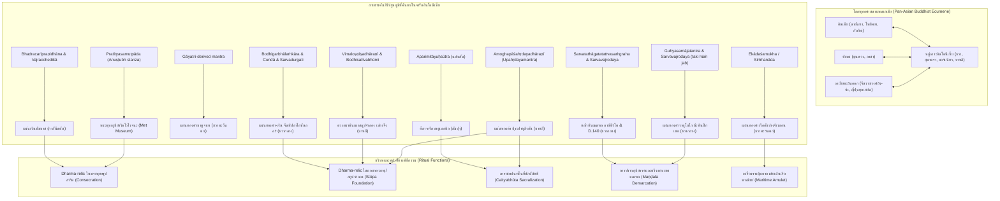

# บันทึกการอ่านและวิเคราะห์เอกสารจารึกวิทยาฉบับสมบูรณ์ (Epigraphic Source Dossier)
## ร่องรอยลายลักษณ์แห่งอดีตพุทธศาสนา: มนตร์และธารณีในจารึกวิทยาอินโดนีเซีย (Written Traces of the Buddhist Past: Mantras and Dhāraṇīs in Indonesian Epigraphy)

---

### ส่วนที่ 1: ข้อมูลบรรณานุกรมและการอ้างอิงมาตรฐาน (Bibliographic Metadata)
- **Source ID:** `S-2014-griffiths-04`
- **ชื่อไฟล์ PDF ในเครื่อง:** `S-2014-griffiths-04_Written_Traces_Buddhist_Past_Mantras_Dharanis.pdf`
- **ชื่อไฟล์ข้อความสกัด:** `S-2014-griffiths-04_Written_Traces_Buddhist_Past_Mantras_Dharanis.txt` (HAL Id: halshs-01910105; Cambridge University Press DOI: 10.1017/S0041977X14000056)
- **ประเภทเอกสาร:** บทความวิจัยวิชาการฉบับแม่บทผ่านการประเมินโดยผู้ทรงคุณวุฒิ (Peer-reviewed Masterpiece Journal Article) ในวารสารจารึกวิทยาและบูรพคดีศึกษาชั้นนำระดับโลก
- **ภาษาของเอกสาร:** ภาษาอังกฤษ (EN) พร้อมตัวบทจารึกภาษาดั้งเดิม: ภาษาสันสกฤตคลาสสิกและไฮบริด (Classical & Hybrid Sanskrit) ถอดอักษรตามระบบสากล IAST, ภาษามลายูโบราณ (Old Malay), และการอ้างอิงสอบทานกับคัมภีร์พุทธภาษาทิเบต (Tibetan), ภาษาจีน (Chinese Buddhist Canon / Taishō Tripiṭaka), ภาษาโคตาน (Khotanese Saka), และภาษาบาลี
- **ขอบเขตภูมิศาสตร์และวัฒนธรรม:** หมู่เกาะอินโดนีเซียและเอเชียตะวันออกเฉียงใต้ภาคพื้นสมุทร: ซัมบาส (กาลีมันตันตะวันตก / บอร์เนียว), บาตูเบอดิล (จังหวัดลัมปุง ทางใต้สุดของเกาะสุมาตรา), บาตูจายาและซากเรืออับปางนอกชายฝั่งจิเรบอน (ชวาตะวันตก), จันทิปลาโอซันลอร์, ราตูโบโก และพื้นที่สเลมัน (ชวากลาง), รวมทั้งเปอเจ็ง, บลัฮ์บาตูฮ์ และปุระปาคูลิงอัน (เกาะบาหลี)
- **วัสดุและบริบทการค้นพบ:** คลังโบราณวัตถุจารึก 10 แหล่ง/กลุ่ม:
  1. แผ่นเงินจารึกม้วนบรรจุใต้ฐานพระพุทธรูปยืนสำริดจากกรุซัมบาส (Sambas hoard), กาลีมันตันตะวันตก (ปัจจุบันเก็บรักษา ณ บริติชมิวเซียม กรุงลอนดอน ทะเบียน 1956,0725.8.b)
  2. ศิลาจารึกบาตูเบอดิล (Batu Bedil / Batu Surat), อำเภอตาตัง อำเภอปูลาวปังกุง จังหวัดลัมปุง สุมาตราใต้ (แท่งหินแอนดีไซต์สลักรูปฐานดอกบัวรองรับตัวบทจารึก 10 บรรทัด ใกล้ทุ่งเสาหินหินตั้งเมนฮีร์)
  3. แผ่นทองคำจารึกพับเป็นก้อนสี่เหลี่ยมจากโบราณสถานเซการัน IIA (Segaran IIA) กลุ่มโบราณสถานบาตูจายา ชวาตะวันตก
  4. แผ่นทองคำจารึกธารณีจากซากเรือสินค้าอับปางยุคราชวงศ์หนานฮั่น (Nan Han period Cirebon shipwreck) นอกชายฝั่งเมืองจิเรบอน ชวาตะวันตก (ศตวรรษที่ 10)
  5. แผ่นทองคำและแผ่นเงินจารึกกรุพระธาตุใต้พื้นวิหารประธานทิศเหนือและระหว่างสถูปบริวาร จันทิปลาโอซันลอร์ (Candi Plaosan Lor) จังหวัดชวากลาง ทั้งอักษรกวิและอักษรสิทธมาตรกา
  6. หลักหินมณฑลสองหลัก (Two maṇḍala stakes / kīla): หลักหินทัฟฟ์ BG 37 จากกาลีตีร์โต/จรากุง อำเภอเบอร์บะฮ์ จังหวัดสเลมัน และหลักหินทรงลึงค์ D. 140 พิพิธภัณฑ์สถานแห่งชาติจาการ์ตา
  7. กลุ่มจารึกคาถา *ṭaki hūṁ jaḥ*: แผ่นทองคำราตูโบโก (Ratu Baka) และหลักหินปักเขต 4 หลักในชวากลาง
  8. พระพุทธรูปยืน/ประทับนั่งสำริดพระไวโรจนะพุทธเจ้า สลักคาถาปฏิจจสมุปบาทฉันท์อนุษฏุภที่ฐาน พิพิธภัณฑ์ศิลปะเมโทรโพลิแทน นิวยอร์ก (The Met 1987.142.171)
  9. ดวงตราดินเผาประทับพิมพ์ธารณี (Clay sealings) บรรจุในสถูปจำลองดินดิบ จากเปอเจ็งและบลัฮ์บาตูฮ์ เกาะบาหลี
  10. แผ่นทองคำจารึกรูปไข่จากฐานเจดีย์แปดเหลี่ยม ปุระปาคูลิงอัน (Pura Pagulingan) อำเภอกียันยาร์ เกาะบาหลี
- **การอ้างอิงฉบับเต็มระบบ Chicago/Turabian Notes-Bibliography:**  
  Griffiths, Arlo. "Written Traces of the Buddhist Past: Mantras and Dhāraṇīs in Indonesian Inscriptions." *Bulletin of the School of Oriental and African Studies* 77, no. 1 (February 2014): 137–194. https://doi.org/10.1017/S0041977X14000056.

---

### ส่วนที่ 2: แผนผังการจัดสรรเข้าสู่บทและหัวข้อย่อย (Chapter & Section Mapping Matrix)

- **บทที่ 3: จารึกบนแผ่นทองคำ เงิน ตะกั่ว สำริด และดินเผา: คลังธารณี มนตรา และพระธรรมธาตุใต้พุทธศาสนสถาน**
  * **หัวข้อย่อย 3.1 (จารึกแผ่นทองคำและแผ่นเงินในฐานะ "พระธรรมธาตุ" / Dharma-relic):**  
    เอกสารชิ้นนี้เป็นแกนกลางหลักในการวิเคราะห์บทบาทของแผ่นทองคำและแผ่นเงินจารึกพระคาถาเย ธรฺมาฯ (Pratītyasamutpādagāthā), มหาปรติสรา (Mahāpratisarā), โพธิครรภลังการลักษธารณี (Bodhigarbhālaṁkāralakṣadhāraṇī), สัปตสัปตติสัมยักสัมพุทธโกฏิภิรุกตา (จุณฑาธารณี Cundā), อปริตายุส (Aparimitāyus), และอโมฆปาศหฤทัย (Amoghapāśahṛdaya) ที่ทำหน้าที่เป็น "ธรรมกายเจดีย์" หรือ "ธรรมธาตุ" บรรจุในผอบกรุพระธาตุ (pripih) ใต้ฐานพระสถูปและพระพุทธรูป ณ จันทิปลาโอซันลอร์, ซัมบาส, และปุระปาคูลิงอัน (หน้า 138, 148, 160–166, 183–185)
  * **หัวข้อย่อย 3.2 (ดวงตราดินเผาประทับพิมพ์ในสถูปจำลองดินดิบ):**  
    การวิเคราะห์เปรียบเทียบดวงตราดินเผา (clay sealings) จารึกพระวิมโลษณีษธารณี (Vimaloṣṇīṣadhāraṇī) และบทสรรเสริญพระพุทธคุณสิบประการจากโพธิสัตตวภูมิ (Bodhisattvabhūmi 1.7) ที่ค้นพบในสถูปดินดิบขนาดเล็ก ณ เปอเจ็งและบลัฮ์บาตูฮ์บนเกาะบาหลี เทียบเคียงกับธรรมเนียมการประดิษฐานธรรมธาตุที่นาลันทา, โพธิคยา, ปาฮาร์ปูร์ (เบงกอล), กิลกิต, และตุนหวง (หน้า 180–183)
  * **หัวข้อย่อย 3.3 (จารึกแผ่นทองคำคุ้มครองการเดินเรือข้ามสมุทร):**  
    กรณีศึกษาแผ่นทองคำจารึกธารณีพระอวโลกิเตศวรมหาการุณิกะจากซากเรืออับปางจิเรบอน (Cirebon shipwreck) ปลายศตวรรษที่ 10 เพื่อวิงวอนขอให้เทพีแห่งธารณีคุ้มครองเรือสินค้าและลูกเรือให้รอดพ้นจากภัยลมพายุกลางทะเลเปิด (*mārutā... driyase...*) แสดงมิติการพกพาจารึกเป็นเครื่องรางศักดิ์สิทธิ์ประจำตัวของพ่อค้าข้ามสมุทร (หน้า 156–158)

- **บทที่ 7: ศาสนา ความเชื่อ และเครือข่ายพุทธตันตระ/ไศวนิกายข้ามสมุทร: มนตรา ปรัชญา และการสังเคราะห์เทพเจ้า**
  * **หัวข้อย่อย 7.2 (พัฒนาการของพุทธศาสนามันตรยานและตันตรยานในหมู่เกาะ):**  
    การจำแนกชั้นทางประวัติศาสตร์นิพนธ์ระหว่าง "พุทธศาสนามหายานทั่วไปที่ใช้มนตร์-ธารณีเพื่อปวงชน" กับ "พุทธศาสนาตันตรยาน/มันตรยานแท้จริง (Esoteric Mantranaya)" โดย Griffiths ยืนยันหนักแน่นตาม Gregory Schopen ว่า จารึกธารณีส่วนใหญ่ (เช่น อปริตายุส, โพธิครรภลังการ, วิมโลษณีษะ) เป็นพิธีกรรมมหายานระดับมหาชนที่เปิดกว้างแก่อุบาสก อุบาสิกา ภิกษุ ภิกษุณี มิใช่ลัทธิลึกลับ (หน้า 185–186); ทว่าหลักหินมณฑล (*kīla*) จากกาลีตีร์โตและหลักลึงค์ D. 140 รวมถึงจารึกชุด *ṭaki hūṁ jaḥ* จัดเป็นตันตรยานแท้จริงที่อิงคัมภีร์ขั้นสูง คือ *สรวตถาคตตัตตวสังครหะ* (STTS), *คุหยสมาจตันตระ* (Guhyasamāja), *สรวทุรคติปริโศธนตันตระ* (SDP), และ *สรววัชโรทัย* (Sarvavajrodaya ของอานันทครรภะ ศตวรรษที่ 9) (หน้า 168–179)
  * **หัวข้อย่อย 7.3 (เครือข่ายความรู้ข้ามสมุทร: อินเดีย-ชวา-ทิเบต-เอเชียตะวันออก):**  
    หลักฐานแสดงให้เห็นว่าคัมภีร์ภาษาสันสกฤตและพิธีกรรมที่พบในจารึกอินโดนีเซียมีสายสัมพันธ์โดยตรงกับคัมภีร์ที่พระวัชรโพธิและอโมฆวัชระแปลสู่ภาษาจีน, ฉบับที่พระคูไค (Kūkai) นำกลับไปญี่ปุ่นในต้นศตวรรษที่ 9, คัมภีร์ที่ค้นพบในถ้ำตุนหวง, และคัมภีร์ที่แปลสู่ภาษาทิเบตในศตวรรษที่ 8–13 ตลอดจนบทสวดสรรเสริญที่สืบทอดในพิธีกรรมพราหมณ์-พุทธบนเกาะบาหลีจนถึงปัจจุบัน เช่น นวกัมปะ (*Navakampa*) และ ปัญจทศวัชรเทวตาสตุติ (*Pañcadaśavajradevatāstuti*) (หน้า 139, 170–176, 183–184)
  * **หัวข้อย่อย 7.5 (ลัทธิพระมหาปรติสราและพระอโมฆปาศ):**  
    ร่องรอยการนับถือพระนางมหาปรติสรา (Mahāpratisarā) บนแผ่นเงินซัมบาส และพระอโมฆปาศ (Amoghapāśa) บนแผ่นทองคำปุระปาคูลิงอัน บาหลี ซึ่งเชื่อมโยงกับแนวคิดเรื่อง "ไจตยภูตะ" (*caityabhūta*) คือการทำให้แผ่นดินที่ธารณีสถิตกลายเป็นเจดีย์สถานศักดิ์สิทธิ์ มีเทวดานับแสนลงมาอารักขา (หน้า 146, 183–185)

- **บทที่ 4: อักขรวิทยา ภาษาศาสตร์ประวัติศาสตร์ และการคำนวณศักราช: จากปัลลวะสู่กวิ และระบบปฏิทินดาราศาสตร์**
  * **หัวข้อย่อย 4.1 (วิวัฒนาการอักษรกวิโบราณและอักษรสิทธมาตรกา):**  
    การศึกษาสัณฐานวิทยาของอักษรกวิโบราณยุคศตวรรษที่ 8–9 บนแผ่นเงินซัมบาสและแผ่นทองคำจิเรบอน โดยเฉพาะรูปทรงเอียงเฉพาะตัวของอักษร *ม* (*ma*) ซึ่งตรงกับจารึกวายูกู (Wayuku ค.ศ. 856) และแผ่นตะกั่วโบโรพุทโธ (หน้า 148–149); ควบคู่กับการใช้อักษรสิทธมาตรกา (Siddhamātṛkā) ชวากลางในศตวรรษที่ 8–9 ที่จันทิปลาโอซันลอร์ ซึ่งมีความใกล้ชิดกับจารึกกาลาซัน (ค.ศ. 778), เกอลูรัก (ค.ศ. 782), และราตูโบโก (หน้า 160)
  * **หัวข้อย่อย 4.2 (ภาษาศาสตร์จารึก: สันสกฤต-มลายูโบราณทวิภาษา):**  
    การวิเคราะห์โครงสร้างภาษาทวิภาษาบนแผ่นเงินซัมบาส ซึ่งเริ่มต้นด้วยคาถาภาษาสันสกฤตคลาสสิกจากคัมภีร์มหายาน แล้วปิดท้ายด้วยข้อความร้อยแก้วภาษามลายูโบราณ (*yam bhadrapraṇidhāna ini candravarmma...*) แสดงการใช้ภาษามลายูโบราณในฐานะภาษาบันทึกสัตยาธิษฐานส่วนบุคคลในดินแดนบอร์เนียวตะวันตก (หน้า 146)
  * **หัวข้อย่อย 4.3 (เครื่องหมายวรรคตอนและสัญลักษณ์ตัวเลข):**  
    การค้นพบการใช้เครื่องหมายเลข *2* (*aksara 2*) สลักบนแผ่นเงินปลาโอซันลอร์เพื่อแสดงการซ้ำคำ (*akṣa2* = *akṣayakṣaya*) ซึ่งเป็นหนึ่งในหลักฐานการใช้สัญลักษณ์เลขแสดงการซ้ำคำที่เก่าแก่ที่สุดในเอเชียตะวันออกเฉียงใต้ (หน้า 166 เชิงอรรถ 98)

- **บทที่ 6: จารึกที่สะท้อนวัฒนธรรมโบราณในแง่การปกครอง กฎหมาย และสถาบันสีมา: สังคม เศรษฐกิจ การค้า และชีวิตประจำวัน**
  * **หัวข้อย่อย 6.1 (สถาบันสีมาและหลักปักเขตศักดิ์สิทธิ์ / Watu Sīma):**  
    การค้นพบความเชื่อมโยงเชิงปฏิบัติและคำศัพท์ระหว่าง "หลักปักเขตมณฑลพิธีกรรมตันตระ" (*maṇḍala kīla*) กับ "หลักปักเขตที่ดินสีมา" (*vatu sīma* / *sīmā kīlaka*): การตอกหลักหินลงในใจกลางและทิศทั้งสี่ของมณฑลด้วยมนตร์ *vajrakīla kīlaya...* เพื่อตรึงอุปสรรคและภูติผีปีศาจ มีลักษณะสัณฐานร่วมกับหลักหินปักเขตที่ดินสีมาในชวากลางและจารึกเบงกอล (หน้า 174–176)
  * **หัวข้อย่อย 6.3 (ความปลอดภัยและการคุ้มครองในการเดินเรือพาณิชย์):**  
    จารึกแผ่นทองคำจากเรืออับปางจิเรบอนสะท้อนสภาพความเสี่ยงภัยในการเดินเรือสินค้าข้ามสมุทรชวายุคศตวรรษที่ 10 และการพึ่งพาพุทธานุภาพของพระอวโลกิเตศวรและธารณีคุ้มกันลมพายุ (หน้า 156–158)

- **บทที่ 1 & บทที่ 9: ประวัติศาสตร์นิพนธ์ จริยธรรมโบราณคดี และข้อถกเถียงเรื่องการถ่ายทอดตัวบทคัมภีร์**
  * **หัวข้อย่อย 1.3 & 9.2 (ข้อถกเถียงว่าจารึกมนตร์-ธารณีพิสูจน์การมีอยู่ของคัมภีร์ใบลานหรือไม่):**  
    การวิพากษ์สมมติฐานของ Gregory Schopen ที่เคยเสนอว่าการพบจารึกธารณีในบริบทพิธีกรรมเดียวกันย่อมพิสูจน์ว่ามีคัมภีร์ฉบับเต็มหมุนเวียนอยู่ในท้องถิ่นนั้น โดย Griffiths แสดงจุดยืนเชิงวิพากษ์ที่ระมัดระวังกว่าว่า มนตร์และธารณีหลายชุดอาจถูกถ่ายทอดและจดจำในฐานะสูตรพิธีกรรมเฉพาะตน (autonomous ritual formulas) นอกบริบทของตัวบทคัมภีร์ร้อยแก้วขนาดยาว เนื่องจากไม่เคยพบข้อความร้อยแก้วที่เป็นโครงเรื่องของคัมภีร์ในจารึกอินโดนีเซียยุคต้นเลย (หน้า 184–186)
  * **หัวข้อย่อย 9.1 (การพลัดถิ่นและการจัดเก็บโบราณวัตถุ):**  
    ประวัติการค้นพบกรุพระพุทธรูปซัมบาสในปี ค.ศ. 1939, การสูญหายช่วงสงครามโลกครั้งที่สอง, การปรากฏขึ้นในสิงคโปร์, และการเข้าสู่บริติชมิวเซียมใน ค.ศ. 1956 นำมาสู่การคลี่แผ่นเงินที่ซ่อนอยู่ในฐานรูปเคารพด้วยกล้องจุลทรรศน์ สะท้อนบทเรียนสำคัญด้านการอนุรักษ์และการค้นคว้าจารึกวิทยาข้ามชาติ (หน้า 141–143)

---

### ส่วนที่ 3: สรุปสาระสำคัญเชิงวิเคราะห์และจุดยืนทางวิชาการ (Executive Academic Analysis)

- **วิทยานิพนธ์และข้อถกเถียงหลักของผู้เขียน (Core Argument / Thesis):**  
  Arlo Griffiths นำเสนอข้อถกเถียงเชิงปฏิวัติวงการจารึกวิทยาและพุทธศาสนศึกษาว่า **หมู่เกาะอินโดนีเซียโบราณมิได้เป็นเพียงผู้รับอิทธิพลทางศาสนาอย่างเฉื่อยชาที่อยู่ชายขอบ แต่เป็นศูนย์กลางที่บูรณาการเข้าเป็นเนื้อเดียวกับ "โลกพุทธศาสนาแพนเอเชีย" (Pan-Asian Buddhist Ecumene / Cosmopolis) อย่างลึกซึ้ง** โดยมีหลักฐานลายลักษณ์อักษรภาษาสันสกฤตที่ปรากฏในรูปของคาถา (gāthās), มนตร์ (mantras), และธารณี (dhāraṇīs) จารึกบนแผ่นทองคำ, แผ่นเงิน, แผ่นตะกั่ว, แท่งศิลา, ฐานพระพุทธรูปสำริด, และดวงตราดินเผา เป็นประจักษ์พยานชิ้นเอก
  
  ผู้เขียนชี้ให้เห็นว่า นักวิชาการด้านพุทธศาสนาอินเดียและเอเชียในอดีต (เช่น Schopen, Bentor, Silk, Payne) มักละเลยหลักฐานจากอินโดนีเซียไปอย่างสิ้นเชิง โดยจำกัดขอบเขตการศึกษาอยู่เฉพาะอินเดีย, ศรีลังกา, ทิเบต, จีน, เกาหลี, ญี่ปุ่น, และเอเชียกลาง การนำเสนอจารึก 10 ชิ้นในบทความนี้พิสูจน์ให้เห็นว่า ความหลากหลายของธารณีที่พบในอินโดนีเซียมีความร่ำรวยและซับซ้อนทัดเทียม หรือในบางมิติอาจหลากหลายยิ่งกว่าที่พบในอินเดียเสียด้วยซ้ำ และตัวบทจารึกเหล่านี้มีคุณค่าอย่างยิ่งในการเป็น "พยานเอกสารร่วมสมัย" (contemporary textual witnesses) ที่สามารถนำไปใช้ชำระตัวบทคัมภีร์ภาษาสันสกฤตของอินเดียที่ส่วนใหญ่หลงเหลืออยู่เฉพาะในสำเนาคัดลอกยุคหลังของเนปาลหรือทิเบต
  
  นอกจากนี้ Griffiths ได้วางจุดยืนทางประวัติศาสตร์นิพนธ์ที่สำคัญยิ่งในการปฏิเสธการตราหน้าโบราณวัตถุและจารึกทั้งหมดในอินโดนีเซียว่าเป็น "ตันตระ" (Tantric) อย่างเหมารวมตามกรอบคิดยุคอาณานิคม โดยชี้ชัดว่า จารึกธารณีส่วนใหญ่เป็นวรรณกรรมพุทธมหายานระดับมหาชนที่เน้นการสร้างบุญบารมี การสถาปนาพระธรรมธาตุ และการคุ้มครองความปลอดภัยในชีวิตประจำวัน ขณะที่มีเพียงจารึกบางกลุ่มที่จำเพาะเจาะจง (เช่น หลักหินมณฑลกิละ และชุดมนตร์ *ṭaki hūṁ jaḥ*) เท่านั้นที่สะท้อนระบบพิธีกรรมมันตรยาน-ตันตรยานระดับสูงของพระสงฆ์ผู้ประกอบพิธี (Vajrācārya) อย่างแท้จริง

- **บริบทประวัติศาสตร์นิพนธ์และการประเมินความน่าเชื่อถือ (Historiography & Source Criticism):**  
  บทความนี้เป็นการบุกเบิกและรื้อฟื้นงานจารึกวิทยาพุทธศาสนาในอินโดนีเซียที่หยุดชะงักไปหลายทศวรรษ เดิมทีนักโบราณคดีชาวอินโดนีเซียที่ขุดค้นพบโบราณวัตถุเหล่านี้ (เช่น รายงานของ Boechari, Soekmono, Machi Suhadi, Djoko Dwiyanto, Gutomo & Niken Wirasanti) มักขาดความเชี่ยวชาญด้านภาษาศาสตร์สันสกฤตและคัมภีร์พุทธศาสนา ทำให้จารึกธารณีจำนวนมากถูกถอดอักษรไว้อย่างหยาบๆ ปราศจากเครื่องหมายกำกับเสียง (diacritics), เต็มไปด้วยข้อผิดพลาด, และไม่สามารถระบุได้ว่าเป็นข้อความจากคัมภีร์ใด จึงมักถูกละเลยในฐานะ "มนตร์คาถาที่อ่านไม่รู้เรื่อง"
  
  Griffiths ได้ใช้ระเบียบวิธีวิจัยทางนิรุกติศาสตร์และจารึกวิทยาเชิงวิพากษ์ร่วมสมัย โดยประสานฐานข้อมูลคัมภีร์พุทธศาสนาดิจิทัล (เช่น Taishō Tripiṭaka, ฐานข้อมูลคัมภีร์สันสกฤตและทิเบต) เข้ากับการลงพื้นที่ตรวจสอบโบราณวัตถุจริงด้วยกล้องจุลทรรศน์ (เช่น แผ่นเงินซัมบาสที่บริติชมิวเซียม), การทำสำเนาลายพิมพ์หินใหม่ (เช่น ศิลาจารึกบาตูเบอดิล), และการเข้าถึงโบราณวัตถุที่เพิ่งขุดค้นพบใหม่ (เช่น แผ่นทองคำและเงินจากบูรณะจันทิปลาโอซันลอร์ปี 1993 และแผ่นทองคำจากเรืออับปางจิเรบอนปี 2003) ทำให้สามารถระบุที่มาของคัมภีร์ได้อย่างแม่นยำไร้ข้อกังขา
  
  ในแง่ของข้อถกเถียงเรื่อง "การมีอยู่ของคัมภีร์ใบลาน" (transmission of manuscripts): ขณะที่ Gregory Schopen เชื่อมั่นว่าการพบธารณีบรรจุในสถูปดินเผาหรือพระพุทธรูปย่อมเป็นหลักฐานอนุมานได้ทันทีว่า ณ ท้องถิ่นนั้นต้องมีคัมภีร์ใบลานฉบับเต็มของสูตรนั้นๆ หมุนเวียนอยู่ แต่ Griffiths กลับแสดงท่าทีที่สุขุมและรัดกุมกว่า โดยโต้แย้งว่า จารึกอินโดนีเซียเกือบทั้งหมดคัดลอกมาเฉพาะ "สูตรมนตร์-ธารณีล้วนๆ" โดยตัดทอนข้อความร้อยแก้วที่เป็นกรอบเรื่องเล่า (framing narrative / prose context) ออกทั้งหมด ซึ่งชี้ให้เห็นความเป็นไปได้ที่นักบวชและช่างจารึกอาจจดจำ ถ่ายทอด หรือมีสมุดคู่มือเฉพาะบทสวดมนตร์ (dharani-anthologies / ritual manuals) เพื่อใช้ในพิธีกรรมโดยตรง โดยไม่จำเป็นต้องมีคัมภีร์พระสูตรฉบับสมบูรณ์เสมอไป

---

### ส่วนที่ 4: สารบัญข้อค้นพบเชิงลึกแยกตามมิติจารึกวิทยา (Thematic Epigraphic Findings with Exact Pages)

1. **ประวัติศาสตร์นิพนธ์และการตีความทางประวัติศาสตร์:**
   - การรื้อถอนอคติทางประวัติศาสตร์นิพนธ์ที่มองข้ามอินโดนีเซียในการศึกษาพุทธศาสนามนตร์-ธารณีระดับเอเชีย: Griffiths ชี้ชัดว่าเอกสารตำราคลาสสิกของ Schopen (1982, 1985, 1989a, 1989b) และ Bentor (1995) ศึกษาธารณีในอินเดีย, ศรีลังกา, จีน, เกาหลี, ญี่ปุ่น, อัฟกานิสถาน, มัลดีฟส์ และทิเบต แต่ไม่เคยอ้างอิงอินโดนีเซียเลย ทั้งที่อินโดนีเซียมีหลักฐานจารึกธารณีที่หลากหลายและคงบริบททางโบราณคดีสมบูรณ์ที่สุดแห่งหนึ่ง (หน้า 138–140)
   - การจำแนกความแตกต่างเชิงนิยามระหว่าง "คาถา" (gāthā ซึ่งมีฉันทลักษณ์แน่นอนและไม่มีพยางค์พีชะ) กับ "มนตร์/ธารณี" (mantra/dhāraṇī ซึ่งมีโครงสร้างเฉพาะตัวนำด้วย *oṁ* และปิดด้วย *svāhā* หรือ *phaṭ*) แม้ว่าในจารึกอินโดนีเซียมักจะพบการใช้ร่วมกันหรือวางซ้อนทับกัน เช่น การย่อพระคาถาเย ธรฺมาฯ ให้กลายเป็นมนตร์สั้นว่า *oṁ ye te svāhā* (หน้า 140)
   - การทลายมายาคติเรื่อง "พุทธศาสนาตันตระ": Griffiths ยืนยันตาม Schopen ว่า การพบมนตร์และธารณีในจารึกส่วนใหญ่ (เช่น อปริตายุส, วิมโลษณีษะ, โพธิครรภลังการ) มิใช่หลักฐานของ "ลัทธิตันตระลึกลับ" ที่มีคุรุ พิธีมนตราภิเษก หรือการบำเพ็ญโยคะเฉพาะกลุ่ม แต่เป็นพิธีกรรมมหายานระดับมหาชนที่เปิดกว้างสำหรับภิกษุ ภิกษุณี อุบาสก และอุบาสิกาทั่วไปเพื่อประโยชน์สุขและการขจัดบาปในชีวิตประจำวัน (หน้า 185–186)
   - การระบุตัวตนของ "พระเจ้าจันทรวรมัน" (*Candravarmman*) ในแผ่นเงินซัมบาส: ผู้เขียนเสนอความเป็นไปได้ในการเชื่อมโยงพระนามนี้กับ "กษัตริย์จานต๋าโป" (Zhandabo 旃達鉢) แห่งแคว้น "โปหลัว" (Boluo 波羅) ผู้ส่งคณะทูตไปเจริญสัมพันธไมตรีกับราชสำนักถังใน ค.ศ. 669 ตามที่บันทึกในคัมภีร์ *ซินถังซู* (Xin Tang shu) ซึ่งหากข้อสันนิษฐานนี้ถูกต้อง จะทำให้แผ่นเงินซัมบาสมีอายุเก่าไปถึงปลายศตวรรษที่ 7 หรือต้นศตวรรษที่ 8 (หน้า 149–150)

2. **ตัวบทจารึก การอ่าน ศักราช และอักขรวิทยา:**
   - การวิเคราะห์สัณฐานวิทยาของอักษรกวิโบราณบนแผ่นเงินซัมบาส: พบลักษณะเฉพาะสำคัญคือ ตัวอักษร *ม* (*ma*) มีลักษณะเอียงลาด (tilted shape) ซึ่งเป็นเอกลักษณ์ทางอักขรวิทยาที่พบเฉพาะในจารึกชวากลางช่วงกลางศตวรรษที่ 9 เช่น จารึกหินวายูกู (Wayuku มหาศักราช 776 / ค.ศ. 856) และแผ่นตะกั่ว-สำริดโบโรพุทโธ ทว่าแผ่นเงินซัมบาสกลับแสดงรูปวิรามะ (*virāma*) แบบโบราณที่สลักไว้เหนือพยัญชนะ (*evam·vādī*) ต่างจากรูปวิรามะแบบหมุนลงที่พบในจารึกยุคหลัง (หน้า 148–149)
   - การใช้อักษรสิทธมาตรกา (Siddhamātṛkā) ในชวากลางและบาหลี: การค้นพบแผ่นทองคำและเงิน 3 แผ่นจากการบูรณะจันทิปลาโอซันลอร์ปี 1993 ใช้อักษรสิทธมาตรกาแบบเดียวกับจารึกกาลาซัน (ค.ศ. 778), เกอลูรัก (ค.ศ. 782), และปลาโอซันหิน สอดคล้องกับดวงตราดินเผาเปอเจ็งในบาหลีที่ใช้อักษรสิทธมาตรกาประทับพิมพ์พระธารณี (หน้า 160, 180)
   - การค้นพบการใช้เครื่องหมายวรรคตอนและการย่อคำ: แผ่นเงินปลาโอซันลอร์ปรากฏการใช้สัญลักษณ์เลข 2 (*aksara 2*) เขียนกำกับเพื่อแสดงการอ่านซ้ำพยางค์ (*akṣa2* แทน *akṣayakṣaya*) ซึ่งนับเป็นพยานหลักฐานทางอักขรวิทยาที่เก่าแก่ที่สุดชิ้นหนึ่งในภูมิภาค (หน้า 166 เชิงอรรถ 98)
   - การชำระตัวบทศิลาจารึกบาตูเบอดิล จังหวัดลัมปุง: Griffiths พิสูจน์ว่าตัวบท 10 บรรทัดคือ คาถาธารณีจาก *อปริตายุห์สูตร* (*Aparimitāyuḥsūtra*) โดยเป็นสำนวนฉบับสั้น (short recension) ที่มีจำนวนพยางค์สอดคล้องกับคัมภีร์ภาษาโคตานและฉบับแปลจีนโบราณของฟาเฉิง (Facheng / T. 936) และฟาเสียน (Faxian / T. 937, 1389) มิใช่สำนวนขยายยาว 108 พยางค์ของคัมภีร์เนปาลยุคหลัง (หน้า 152–154)

3. **มิติศาสนา ลัทธิความเชื่อ และพิธีกรรม:**
   - มโนทัศน์เรื่อง "พระธรรมธาตุ" (*Dharma-relic* / *Dharmakāya-relic*): การจารึกพระคาถาเย ธรฺมาฯ หรือธารณีต่างๆ ลงบนโลหะมีค่าหรือแผ่นดินเผา แล้วบรรจุไว้ในพระพุทธรูปหรือพระเจดีย์ มีรากฐานมาจากพุทธวจนะโบราณที่ว่า "ผู้ใดเห็นธรรม ผู้นั้นเห็นเราตถาคต" (*yo dhammaṁ passati so bhagavantaṁ passati*) ส่งผลให้ตัวบทธรรมกายถูกยกสถานะเทียบเท่าองค์พระสัมมาสัมพุทธเจ้า และทำหน้าที่ปลุกเสกให้รูปเคารพหรือศาสนสถานนั้นมีชีวิตและศักดิ์สิทธิ์บริบูรณ์ (หน้า 148, 154, 180)
   - คติการสถาปนา "ไจตยภูตะ" (*Caityabhūta*): คัมภีร์ *อปริตายุห์สูตร* และ *อโมฆปาศหฤทัยธารณี* ระบุอานิสงส์ตรงกันว่า แผ่นดินใดก็ตามที่มีการจารึกหรือคัดลอกธารณีนี้ลงไว้ "แผ่นดินส่วนนั้นจักกลายเป็นพระเจดีย์สถานอันควรแก่การกราบไหว้บูชา" (*sa pṛthivīpradeśaḥ caityabhūto vandanīyaśca bhaviṣyati*) ซึ่งอธิบายเหตุผลทางเทววิทยาได้อย่างสมบูรณ์ว่าเหตุใดจึงมีการสลักธารณีอปริตายุสลงบนแท่นหินบาตูเบอดิล ณ กลางทุ่งเสาหินตั้ง และการฝังแผ่นทองคำอโมฆปาศไว้ที่ฐานเจดีย์ปุระปาคูลิงอัน (หน้า 154, 184–185)
   - อานิสงส์การสร้างพระเจดีย์แสนองค์ด้วย *โพธิครรภลังการลักษธารณี*: แผ่นทองคำปลาโอซันลอร์จารึกธารณีที่ให้คุณวิเศษว่า ผู้ใดจารึกธารณีนี้แล้วบรรจุไว้ในสถูป แม้สร้างสถูปเพียงองค์เดียว ย่อมได้อานิสงส์เสมือนได้สร้างสถูปถวายพระตถาคตถึงหนึ่งแสนองค์ (*śatasahasra caitya*) และได้รับการบูชาด้วยเครื่องหอม ธงทิว และดนตรีสวรรค์ (หน้า 162–163)
   - พิธีกรรมปราบและผูกมัดอุปสรรคทั้งสิบทิศ: หลักหินมณฑล BG 37 บันทึกกระบวนการทางพิธีกรรมตันตรยานที่ละเอียดลออ โดยโยคีผู้ทำพิธีจะใช้มุทราและมนตร์อัญเชิญเทพแห่งวัชระประจำทิศต่างๆ (Vajrānala, Vajranetrī, Vajrabhairavanetra, Vajrayakṣa, Vajroṣṇīṣa, Vajrapāśa, Vajraśikharā, Vajrakarma) เผาทำลาย ผูกมัด และตรึงอุปสรรคทั้งปวง ก่อนที่จะตอกหลักกิละลงไป (หน้า 168–172)

4. **มิติสถาปัตยกรรม ศาสนสถาน และชลศาสตร์:**
   - แผนผังฐานเจดีย์แปดเหลี่ยม ณ ปุระปาคูลิงอัน (Pura Pagulingan) บาหลี: การค้นพบแผ่นทองคำรูปไข่จารึกอโมฆปาศหฤทัยธารณีที่ฐานเจดีย์แปดเหลี่ยม สอดคล้องกับคติจักรวาลวิทยาและมณฑลแปดทิศของพุทธศาสนามหายาน-วัชรยาน (หน้า 183)
   - สถาปัตยกรรมกรุพระธาตุใต้พื้นวิหารประธานทิศเหนือ จันทิปลาโอซันลอร์: แผ่นทองคำโพธิครรภลังการฯ ถูกพับและบรรจุไว้ในผอบหินกรุพระธาตุ (*pripih*) ณ มุมทิศตะวันออกเฉียงใต้ใต้ระดับพื้นห้องกลาง สะท้อนระบบการวางศิลาฤกษ์และการประสิทธิ์ประสาทความศักดิ์สิทธิ์ตามทิศมงคล (หน้า 160)
   - บริบททางภูมิทัศน์ของศิลาจารึกบาตูเบอดิล: ตัวจารึกตั้งอยู่ห่าง 40 เมตรจากทุ่งเสาหินหินตั้ง (menhirs) 27 ต้นที่จัดเรียงเป็นรูปสี่เหลี่ยมจัตุรัส (เดิมน่าจะมี 8 x 8 = 64 ต้น บนพื้นที่ 40 x 40 ม.) การสลักธารณีพุทธบนแท่นหินที่มีฐานบัวรองรับสะท้อนการสร้างศาสนสถานพุทธทับซ้อนหรือกลืนผสานเข้ากับพื้นที่ศักดิ์สิทธิ์ในลัทธิหินตั้งดั้งเดิมของชาวพื้นเมือง (หน้า 150–151)

5. **มิติอาหารการกิน วิถีชีวิต การค้า และตลาด:**
   - การเดินเรือพาณิชย์ข้ามสมุทรและความศรัทธาของพ่อค้า: แผ่นทองคำจิเรบอนที่กู้ได้จากซากเรืออับปางยุคศตวรรษที่ 10 บรรทุกเครื่องถ้วยชามจีนโบราณจำนวนมหาศาลและรูปเคารพสำริด แสดงให้เห็นว่าพ่อค้าและกะลาสีเรือในยุคนั้นพกพาแผ่นทองคำจารึกธารณีพระอวโลกิเตศวรเป็นเครื่องรางประจำตัว เพื่อวิงวอนขอความคุ้มครองจากภัยธรรมชาติและคลื่นลมพายุ (*mārutā*) ในทะเลลึก (หน้า 156–158)
   - คุณค่าทางเศรษฐกิจของแผ่นทองคำและเงิน: บันทึกรายงานโบราณคดีชี้ให้เห็นว่า ในช่วงสงครามกอบกู้เอกราชของอินโดนีเซีย (ค.ศ. 1947–1948) ราคาทองคำในตลาดมืดพุ่งสูงขึ้นอย่างมาก ทำให้แผ่นทองคำและเงินจารึกที่ขุดพบตามโบราณสถานเสี่ยงต่อการถูกลักลอบนำไปหลอม ทางการโบราณคดีต้องจัดสรรงบประมาณรับซื้อโบราณวัตถุล้ำค่าเหล่านี้ไว้เพื่อรักษามรดกของชาติ (หน้า 159 เชิงอรรถ 67)

6. **มิติการปกครอง กฎหมาย ที่ดิน และระบบสีมา:**
   - ความเชื่อมโยงระหว่าง "หลักมณฑล" (*kīla*) กับ "หลักปักเขตที่ดินสีมา" (*watu sīma*): Griffiths ค้นพบข้อเท็จจริงสำคัญว่า หลักหินกาลีตีร์โต BG 37 และหลักหินลึงค์ D. 140 มีรูปทรงสัณฐานทางกายภาพเหมือนกับ "หินสีมา" (*vatu sīma*) ในชวากลางทุกประการ ยิ่งไปกว่านั้น ในจารึกแผ่นทองแดงของอินเดียยุคศตวรรษที่ 6–7 ในเบงกอล (เช่น จารึกปัญจโรลแห่งพระเจ้าศศางกะ และจารึกมัลลสารุล) ก็ใช้คำว่า *kīlaka* ในความหมายของหลักปักเขตแดนที่ดินทางกฎหมายควบคู่กับคำว่า *sīmā* สะท้อนการถ่ายโอนมโนทัศน์และคำศัพท์ระหว่างการกำหนดขอบเขตศักดิ์สิทธิ์ทางศาสนากับการปักปันเขตแดนทางกฎหมายและการถือครองที่ดิน (หน้า 174–176)
   - การใช้สูตรขับไล่อุปสรรค *ṭaki hūṁ jaḥ* ในจารึกปักปันเขตที่ดิน: Griffiths แก้ไขการอ่านผิดของนักวิชาการรุ่นก่อน (เช่น Damais และ Sundberg) ที่อ่านเป็น *paki* โดยพิสูจน์ว่าเป็นอักษร *ṭa* (*ṭaki hūṁ jaḥ*) ซึ่งทำหน้าที่ในจารึกหินปักเขตที่ดินชวากลางเสมือนสูตรมงคล *avighnam astu* ("ขอความขัดข้องจงอย่ามี") เพื่อขจัดอุปสรรคและคุ้มครองเขตที่ดินสีมา (หน้า 176–178)

7. **มิติปฏิสัมพันธ์ข้ามสมุทรและเครือข่ายนานาชาติ:**
   - สายสัมพันธ์ข้ามสมุทรด้านคัมภีร์พุทธศาสนากับจีนและญี่ปุ่น: ตัวบทธารณีจุณฑา (*Cundā*) และธารณีพระพุทธรัตนศิขิน (*Ratnaśikhin*) บนแผ่นทองคำและเงินปลาโอซันลอร์ มีสำนวนตรงกับคัมภีร์ที่แปลโดยพระฟาเสียน (Faxian) ในราชวงศ์ซ่ง (T. 1169, 1383) และตรงกับสำเนาคัมภีร์ภาษาสันสกฤตที่พระคูไค (Kūkai) นำจากจีนกลับสู่ญี่ปุ่นในต้นศตวรรษที่ 9 รวมถึงคัมภีร์ *ฉีกู่จือฝอมู่จุนถีถัวหลัวหนีจิง* (T. 1076) ที่แปลโดยพระอโมฆวัชระ (หน้า 164–166)
   - ความเชื่อมโยงกับจดหมายเหตุราชวงศ์ถัง: การระบุตัวตนของจันทรวรมันแห่งซัมบาสกับกษัตริย์แห่งแคว้นโปหลัวใน *ซินถังซู* ปี ค.ศ. 669 ยืนยันบทบาทของชายฝั่งตะวันตกของบอร์เนียวในเส้นทางการค้าและเครือข่ายพุทธศาสนาทางทะเลตั้งแต่ศตวรรษที่ 7 (หน้า 149–150)
   - ความเชื่อมโยงกับคัมภีร์ตันตระในเนปาลและทิเบต: หลักหินมณฑล BG 37 และจารึกราตูโบโกมีข้อความตรงกับบทสวดใน *สรววัชโรทัย* (*Sarvavajrodaya*) ของอานันทครรภะ และบทสวด *นวกัมปะ* (*Navakampa*) กับ *ปัญจทศวัชรเทวตาสตุติ* ในคัมภีร์ใบลานของนักบวชพุทธบนเกาะบาหลี ซึ่งเป็นพยานหลักฐานว่าสายการปฏิบัติธรรมมันตรยานที่บันทึกในคัมภีร์ทิเบตฉบับศตวรรษที่ 13 ได้แพร่หลายและฝังรากลึกในชวามาตั้งแต่ศตวรรษที่ 9 แล้ว (หน้า 170–176)

8. **มิติจารึกแผ่นโลหะ รูปเคารพขนาดเล็ก และจารึกแม่น้ำ:**
   - กรรมวิธีการสลักและการบรรจุแผ่นเงินซัมบาส: แผ่นเงินจารึกสองหน้าขนาดยาว 16 ซม. กว้าง 2.35 ซม. ถูกม้วนเป็นหลอดและซ่อนไว้ใต้ฐานกลวงของพระพุทธรูปยืนสำริดขนาดใหญ่ที่สุดในกรุซัมบาส (Griswold Type 1/c ศิลปะทวารวดี-คาบสมุทร) นับเป็นตัวอย่างทางโบราณคดีที่หาได้ยากยิ่งระดับโลกที่มีการบันทึกภาพถ่ายตั้งแต่ก่อนคลี่แผ่นเงิน จนถึงการคลี่ออกอ่านตัวบทได้อย่างสมบูรณ์ (หน้า 141–143, 150)
   - จารึกคาถาปฏิจจสมุปบาทบนฐานพระไวโรจนะสำริด (Met Museum 1987.142.171): สลักด้วยอักษรกวิ ชวากลาง ศตวรรษที่ 9–10 ฉันทลักษณ์อนุษฏุภ บันทึกหัวใจธรรมะเรื่องศูนยตาและการเกิดดับตามเหตุปัจจัย ทำหน้าที่เป็นธรรมกายเจดีย์ประจำรูปเคารพ (หน้า 179–180)
   - แผ่นทองคำเซการัน IIA บาตูจายา: แผ่นทองคำขนาดเล็กพับเป็นก้อนสี่เหลี่ยม สลักคาถาที่ดัดแปลงจากวรรคสุดท้ายของคายตรีมนตร์ (*oṁ etaṇa tan no bhadraṁ pracodayā svāhā*) นับเป็นหลักฐานจารึกแผ่นทองคำที่เก่าแก่ที่สุดชิ้นหนึ่งในชวาตะวันตก (หน้า 154–156)

9. **พรมแดนปัญหา ปริศนาวิชาการ และจริยธรรมโบราณคดี:**
   - ปัญหาการอ่านคำว่า *paki* หรือ *ṭaki*: การแก้ไขข้อผิดพลาดทางอักขรวิทยาที่สืบทอดมายาวนานในวงการจารึกวิทยาอินโดนีเซีย ซึ่งนักวิชาการมักสับสนระหว่างอักษร *ป* (*pa*) กับ *ฏ* (*ṭa*) เนื่องจากขาดความคุ้นเคยกับคำบริกรรมและพยางค์พีชะในคัมภีร์พุทธตันตระ (หน้า 176–178)
   - ปริศนาตัวเลข 108 พยางค์ใน *อปริตายุห์สูตร*: ตัวคัมภีร์ระบุซ้ำๆ ว่าธารณีนี้ประกอบด้วย 108 พยางค์ ซึ่งปรากฏจริงเฉพาะในสำนวนเนปาลขยายยาวเท่านั้น แต่ในศิลาจารึกบาตูเบอดิล, คัมภีร์โคตาน, และฉบับแปลจีนโบราณ กลับเป็นสำนวนสั้นที่มีเพียงไม่กี่สิบพยางค์ ชี้ให้เห็นปัญหาการวิวัฒนาการและการขยายตัวบทของคัมภีร์ในประวัติศาสตร์ (หน้า 153)
   - จริยธรรมการอนุรักษ์และการติดตามโบราณวัตถุที่สูญหาย: แผ่นทองคำและเงินจารึกจากจันทิปลาโอซันลอร์ที่ De Casparis เคยตีพิมพ์ใน ค.ศ. 1956 ปัจจุบันไม่ทราบว่าเก็บรักษาอยู่ที่ใด และไม่มีภาพถ่ายโบราณคดีหลงเหลืออยู่เลย สะท้อนความเปราะบางของการจัดการมรดกทางวัฒนธรรมในอดีต (หน้า 159)

---

### ส่วนที่ 5: คลังข้อความอ้างอิงตรงและเชิงอรรถสำเร็จรูป (Verbatim Quotes & Footnote Bank)

1. **แผ่นเงินจารึกจากซัมบาส กาลีมันตันตะวันตก (Sambas Silver Foil, BM 1956,0725.8.b) [pp. 143, 146]:**
   > **ตัวบทจารึกต้นฉบับ (IAST):**  
   > *Obverse:*  
   > `(1) // na[ma] (°ār)yyā(na)[x n]tabhādrā // yāvada kāci daśaddiśi loke sarvvatriyādhvaganara narasī(h)hā tāhu (2) tān ahna vanda[mi] (sa)rvva °aśeṣāṁ (k)āyatu vācamanena prasannaḥ // yāśca °imaṁ pariṇāmanarā(3)narāda(m·) x tva (sa)kṛj janayed adhimukti (vo)dhivaram anuprārthayamāno °agru viśiṣṭa bha (4) [ve]d i[mu] p[u]ṇya(m·) // rakṣoghnā paramā hy eṣā pavitrā pāpanāsaśanī śrīka(r)ī dhī-`  
   > *Reverse:*  
   > `(1) karī cāṭi sarvvaguṇavivarddhanī // ye dharmmā hyetoprabhavā hetun teṣā(2)ñ ca yo [n]irodho hy evaṁvādī mahāśramaṇaḥ // ye māṁ (rū)peṇa °adrākṣu(3) ye māṁ [gho](ṣe)ṇa °anvayuḥ mathyyāprahāṇaprasṛtāna mā drakṣyanti te (4) janāḥ ||| dra yaṁ bhadra[pra]nidhāna °ini candravarmma x (na)ta (p)una °ā(va)tu CCi x (na)ta(rañca) hi x`
   > 
   > **คำแปลภาษาไทยเชิงวิชาการ:**  
   > *(ด้านหน้า):* "ขอนอบน้อมแด่พระอารยสมันตภัทรโพธิสัตว์ บุรุษผู้เป็นดุจสีหะในหมู่มนุษย์ทั้งหลายผู้ดำเนินไปตลอดกาลทั้งสาม ในโลกพร้อมทั้งทิศทั้งสิบ มีอยู่มากน้อยเพียงใด ข้าพเจ้าเปี่ยมด้วยจิตเลื่อมใส ขอนอบน้อมต่อท่านเหล่านั้นทั้งหมดทั้งสิ้นด้วยกาย วาจา และใจ // และผู้ใดได้สดับฟังซึ่งราชาแห่งการแปรเปลี่ยนผลบุญนี้แล้ว บังเกิดความน้อมใจเชื่อมั่นในทันที พร้อมกับตั้งความปรารถนาในพระโพธิญาณอันประเสริฐ บุญกุศลของผู้นั้นย่อมเป็นเลิศและประเสริฐยิ่ง // แท้จริงแล้ว พระธารณีนี้เป็นเลิศในการปราบมาร เป็นเครื่องชำระให้บริสุทธิ์ เป็นเครื่องทำลายซึ่งบาปกรรม เป็นผู้นำมาซึ่งสิริสวัสดิ์ นำมาซึ่งปัญญา *(ด้านหลัง)* และเป็นผู้เพิ่มพูนซึ่งคุณความดีทั้งปวง // ธรรมเหล่าใดเกิดแต่เหตุ พระตถาคตทรงแสดงเหตุแห่งธรรมเหล่านั้น และความดับแห่งธรรมเหล่านั้น พระมหาสมณะมีปกติตรัสสอนเช่นนี้ // ชนเหล่าใดเห็นเราด้วยรูป ชนเหล่าใดติดตามเราด้วยเสียง ชนเหล่านั้นแลดำเนินไปสู่ความเพียรที่ผิดพลาด ย่อมไม่อาจเห็นเราได้เลย // คำตั้งจิตอธิษฐานอันประเสริฐ (ภัทรปรณิธาน) นี้ ของจันทรวรมัน..."
   > 
   > **ข้อความวิเคราะห์ของผู้เขียน (Arlo Griffiths, p. 148):**  
   > *"The use to which this inscription was put, being inserted into a Buddha image, strongly suggests that this compilation served the same function as the proper dhāraṇīs presented in this study, the juxtaposition of its elements being occasioned by their shared sacredness, which makes them suitable as 'dharma relics' [...] Whatever the date and original provenance of these artefacts, the Sambas silver foil is precious not only from a textual point of view, but also as an archaeological artefact. This is probably the only case of an Indonesian inscription engraved on metal foil such as this being found inside a sculpture, photographed in that state, then extracted and unrolled, finally leading to the decipherment of the text."*

2. **ศิลาจารึกบาตูเบอดิล จังหวัดลัมปุง (Batu Bedil Stone Inscription, EFEO 2043) [pp. 152, 154]:**
   > **ตัวบทจารึกต้นฉบับ (IAST):**  
   > `(1) || namo bhagavate`  
   > `(2) °aparimitāyurjñā-`  
   > `(3) nasuviniścitate-`  
   > `(4) jorājāya tathā-`  
   > `(5) gatāyārhate sa-`  
   > `(6) [myaksambuddhāya tadyathā]`  
   > `(7) [om sarvasaṁskāraparisuddhadharmate]`  
   > `(8) [gaganasamudgate]`  
   > `(9) svabhāvapariśuddhe ma-`  
   > `(10) hānayaparivāre svāhā`
   > 
   > **คำแปลภาษาไทยเชิงวิชาการ:**  
   > "ขอนอบน้อมแด่พระผู้มีพระภาค ผู้มีพระชนมายุและพระญาณอันหาขอบเขตมิได้ ผู้ทรงความเด็ดเดี่ยวอย่างยิ่งยวด ราชาแห่งเดช พระตถาคต อรหันต์ สัมมาสัมพุทธเจ้า [คาถามีดั่งนี้: โอม ผู้มีความบริสุทธิ์รอบด้านแห่งสังขารธรรมทั้งปวง ผู้ผุดขึ้นมาดุจห้วงเวหา] ผู้บริสุทธิ์หมดจดโดยสภาวะ ผู้มีมหายานเป็นบริวารแวดล้อม สวาหา"
   > 
   > **ข้อความวิเคราะห์ของผู้เขียน (Arlo Griffiths, p. 154):**  
   > *"It seems reasonable to assume that the ancient local Buddhists who were involved in the manufacture of our inscription did so with precisely the motivation of founding a 'true shrine'. More specifically, Soekmono’s observation that the text is provided with a lotus cushion, just like a Buddha image would be, is an unmistakeable expression of the intent behind engraving this text, namely that its presence as dharmakāya would be equivalent to the presence of the Buddha, and would sacralize the site."*

3. **แผ่นทองคำจารึกจากเซการัน IIA พุทธสถานบาตูจายา ชวาตะวันตก (Batujaya Gold Foil) [p. 156]:**
   > **ตัวบทจารึกต้นฉบับ (IAST):**  
   > `°oṁ °eṭana tan no bhadra(ṁ) pracoda(yā)s vāhā`
   > 
   > **คำแปลภาษาไทยเชิงวิชาการ:**  
   > "โอม... ขอพระองค์จงทรงดลบันดาลสิ่งอันเป็นมงคลและประเสริฐนั้นมาสู่พวกเราด้วยเถิด! สวาหา"
   > 
   > **ข้อความวิเคราะห์ของผู้เขียน (Arlo Griffiths, p. 156):**  
   > *"Despite the problem posed by etaṇa, it is clear enough that the dhāraṇī is an adaptation of some of the numerous variants of the final line of the Gāyatrī mantra, reading tan no NOM pracodayāt, found in brahmanical literature... The word taking the place of NOM is in each instance the nominative singular case form of the name of a deity. I am unable to trace this formula in any Buddhist source, but the idea that it is Buddhist finds support in the monumental context where the foil was discovered."*

4. **แผ่นทองคำจารึกธารณีจากซากเรืออับปางจิเรบอน ชวาตะวันตก (Cirebon Shipwreck Gold Foil) [pp. 157–158]:**
   > **ตัวบทจารึกต้นฉบับ (IAST):**  
   > *Obverse:*  
   > `(1) namo ratnatrayāya nama °āryyāva(lo)-`  
   > `(2) kiteśvarāya bodhisatvāya mahā(sa)-`  
   > `(3) tvāya mahākā(r)uṇikāya tadya(thā)`  
   > `(4) °om̐ mārutākuha x kāmāvrā x (mālya)`  
   > *Reverse:*  
   > `(1) (prabhā)devī (°ada)lān driyase nam(u)`  
   > `(2) (dha)man de(v)ī`
   > 
   > **คำแปลภาษาไทยเชิงวิชาการ:**  
   > "ขอนอบน้อมแด่พระรัตนตรัย! ขอนอบน้อมแด่พระอารยอวโลกิเตศวรโพธิสัตว์ มหาสัตว์ ผู้ทรงพระมหากรุณา [คาถามีดั่งนี้:] โอม... แห่งลมพายุ... ข้าแต่พระเทวีผู้มีรัศมีเปล่งปลั่งดั่ง... พระองค์ทรงค้ำจุน..."
   > 
   > **ข้อความวิเคราะห์ของผู้เขียน (Arlo Griffiths, p. 158):**  
   > *"Since we find here the words māruta, meaning 'wind' and (if my reading is correct) driyase, meaning 'you are borne', it may be suspected that the dhāraṇī was intended to protect against the dangers of voyage at high sea, and that the object on which it is inscribed was worn as an amulet, while the text was addressed to the goddess personifying the spell."*

5. **คลังแผ่นทองคำและแผ่นเงินจันทิปลาโอซันลอร์ ชวากลาง (Candi Plaosan Lor Foils) [pp. 159–166]:**
   > **5.1 แผ่นทองคำโพธิครรภลังการลักษธารณี (วิหารประธานทิศเหนือ ค้นพบ ค.ศ. 1993):**  
   > `(1) [siddham] namo bhagavate śākkyamuṇaye tathāgatāyarhate samyak·samvuddhāya tadyathā °om̐ vodhi vodhi vodhi satvetathāgata(2)gocare | dhara dhara hara hara prahara prahara mahāvodhicittadhare | culu culu śatasahasrarasmisañcodite (3) sarvvatathāgatabhāṣite | guṇāguṇavati | vuddhaduṇā°avabhās(e) mili mili gagamatalapratiṣṭite (4) sarvvatathāgatathāgatādhiṣṭite | mabhastale | sama sama prasama prasama sarvvapāpaśamaṇe | sarvvapāpe(5)viśodhani | hulu hulu | vodhimārgasamprasthite sarvvatathāgatapratiṣṭhite śuddhe śuddhe svāhā || (6) °om̐ sarvvatathāgatavyalokite jaya jaya svāhā || °om̐ huru huru jayamukhe svāhā || : ||`  
   > *แปลไทย:* "ความสำเร็จจงมี! ขอนอบน้อมแด่พระผู้มีพระภาคศากยมุนีตถาคตอรหันตสัมมาสัมพุทธเจ้า คาถามีดั่งนี้: โอม จงตื่นเถิด จงตื่นเถิด จงตื่นเถิด ข้าแต่พระเทวีผู้อยู่ในวิสัยแห่งพระตถาคตทั้งปวง! ขอจงทรงไว้! ขอจงนำไป! ขอจงขจัดไป ข้าแต่พระเทวีผู้ทรงไว้ซึ่งพระมหาโพธิจิต! จุลุ จุลุ ข้าแต่พระเทวีผู้ถูกกระตุ้นเตือนด้วยรัศมีนับแสนเส้น ผู้ได้รับการตรัสสรรเสริญโดยพระตถาคตทั้งปวง! ผู้สว่างไสวด้วยพุทธคุณ! มิลิ มิลิ ข้าแต่พระเทวีผู้สถิตมั่นอยู่บนยอดเวหา ผู้ได้รับการอธิษฐานจิตโดยพระตถาคตทั้งปวง! ณ พื้นนภากาศ! ขอจงสงบ! ขอจงระงับ ข้าแต่พระผู้ทรงระงับบาปทั้งปวง! ผู้ชำระบาปทั้งปวงให้บริสุทธิ์! หุลุ หุลุ ข้าแต่พระผู้ดำเนินไปสู่อริยมรรคแห่งพระโพธิญาณ... สวาหา! โอม ข้าแต่พระผู้ได้รับการเพ่งมองโดยพระตถาคตทั้งปวง ขอจงมีชัย สวาหา! โอม หุรุ หุรุ ข้าแต่พระผู้มีพระพักตร์แห่งชัยชนะ สวาหา!"
   > 
   > **5.2 แผ่นทองคำแผ่นยาว (เย ธรฺมาฯ, จุณฑาธารณี, รัตนศิขิน, มัญชุศรี):**  
   > `(1) [siddham] ye dharmmā hetuprabhavā hetun teṣān tathāgato hy avadat teṣāṁ ca yo nirodha °evamvādī mahāśramaṇaḥ || namaḥ saptānāṁ (2) samyaksaṁvuddhakoṭīnāṁ tadyathā cala cula cunde svāhā || namo bhagavate ratnaśikhine tathāgatāyārhate samyaksaṁvuddhāya (3) tadyathā °oṁ ratna ratna ratnasaṁbhave svāhā || namo bhagavate mañjuśriye kumāra kumāra(bhū)tāya tadyathā amala amala amalame (4) trāya svā(hā)`  
   > *แปลไทย:* "ความสำเร็จจงมี! พระคาถาเย ธรฺมาฯ // ขอนอบน้อมแด่พระสัมมาสัมพุทธเจ้านับเจ็ดสิบล้านพระองค์ คาถามีดั่งนี้: จละ จุเล จุณเฑ สวาหา! // ขอนอบน้อมแด่พระผู้มีพระภาคพระรัตนศิขิตถาคตอรหันตสัมมาสัมพุทธเจ้า คาถามีดั่งนี้: โอม รัตนะ รัตนะ รัตนสัมภเว สวาหา! // ขอนอบน้อมแด่พระผู้มีพระภาคมัญชุศรียกุมารภูต คาถามีดั่งนี้: อมละ อมละ อมลเมตรายะ สวาหา!"
   > 
   > **5.3 แผ่นเงินจารึกกรุพระธาตุปลาโอซันลอร์:**  
   > `(1) [ye dharmmā] hetuprabhavā hetun teṣān tathāgato hy avadat· teṣāṁ ca yo nirodha °evamvādī mahāśramaṇaḥ || namaḥ saptānāṁ samyaksamvuddhakoṭīnāṁ tadyathā cale cule cunde svāhā || namo (2) [ta](thāga)tāyārhate samyaksa(ṁ)vuddhāya tadyathā °akṣa2 °akṣayapuṇyajñānasaṁbhāropacite svāhā || namo bhagavate ratnaśikhine tathāgatāyārhate samyaksaṁvuddhāya (3) [ra](tnameya)ratnasambhave svāhā`  
   > *แปลไทย:* "พระคาถาเย ธรฺมาฯ // ขอนอบน้อมแด่พระสัมพุทธเจ้าเจ็ดสิบล้านพระองค์: จเล จุเล จุณเฑ สวาหา! // ขอนอบน้อมแด่พระตถาคตอรหันตสัมมาสัมพุทธเจ้า คาถามีดั่งนี้: ข้าแต่พระผู้พอกพูนด้วยสมภารแห่งบุญและญาณอันหาความสิ้นสุดมิได้ สวาหา! // ขอนอบน้อมแด่พระผู้มีพระภาคพระรัตนศิขิตถาคตอรหันตสัมมาสัมพุทธเจ้า: ...รัตนสัมภเว สวาหา!"
   > 
   > **5.4 แผ่นทองคำค้นพบ ค.ศ. 1947 (De Casparis 1956 Prasasti Indonesia II no. V, p. 159):**  
   > `(1) oṁ namo buddhāya namo dharmāya namaḥ saṁghāya tadyathā śuddhe viśuddhe śodhani viśodhani gaganaviśodhani cittaviśodhani pā(2)<pā>varaṇaviśodhani karmmāvaraṇaviśodhani viśuddhe viśuddhe kṣīṇe sarvakṣīṇe puṣpe supuṣpe rajoharaṇe sarvapāpa(3)viśodhani hare hare sarvāvaraṇāni daha daha sarvakarmmāvaraṇāni paca paca sarvasthānagatāni padme padmākṣi padmaviśā(4)le pha pha pha pha pha svāhā`  
   > *แปลไทย:* "โอม ขอนอบน้อมแด่พระพุทธ พระธรรม พระสงฆ์! คาถามีดั่งนี้: ข้าแต่พระผู้บริสุทธิ์ บริสุทธิ์ยิ่ง ผู้ชำระ ผู้ชำระยิ่ง ผู้ชำระเวหาให้บริสุทธิ์ ผู้ชำระจิตให้บริสุทธิ์ ผู้ชำระเครื่องกั้นคือกิเลสบาปกรรม ผู้ชำระเครื่องกั้นคือวิบากกรรม ผู้บริสุทธิ์ยิ่ง ผอมบาง ผอมบางยิ่ง ดุจดอกไม้ ดุจดอกไม้อันงาม ผู้กำจัดธุลี ผู้ชำระบาปทั้งปวง จงนำไป จงนำไปซึ่งเครื่องกั้นทั้งปวง จงเผาผลาญ จงเผาผลาญซึ่งเครื่องกั้นแห่งกรรมทั้งปวง จงแผดเผา จงแผดเผาซึ่งสิ่งตกค้างในที่ทั้งปวง ข้าแต่พระผู้เป็นดุจดอกบัว ผู้มีเนตรดุจบัว ผู้ไพศาลในดอกบัว ผะ ผะ ผะ ผะ ผะ สวาหา!"

6. **หลักหินมณฑลกิละสองหลักจากชวากลาง (Two Maṇḍala Stakes / Kīla) [pp. 169, 174]:**
   > **6.1 หลักหินทัฟฟ์ BG 37 จากกาลีตีร์โต/จรากุง สเลมัน:**  
   > `(1) | °o(m̐) vajr(ā)nala hana daha pa(ca) ma(tha) bhañja raṇa hūm̐ (phaṭ·) vajra[n]e[tri bandha] (2) sarvvavighnān· svāhā, °om̐ hulu hulu hūm̐ phaṭ·, °om̐ druṁ vandha haṁ h(vana)ḥ (3) bajrapāśe hum̐, °om̐ vajrayakṣa hūm̐, °om̐ vajraśi(kha)re rut· (maṭ·), (4) (h)ū(m̐) vajra(ka)rmma hūm̐ °om̐ bajrakīla kīlaya hūṁ phaṭ·, huṁ huṁ huṁ huṁ huṁ huṁ huṁ (5) huṁ huṁ huṁ, °oṁ gha gha ghātaya ghātaya sarvvaduṣṭān· phaṭ· kīlaya (6) kīlaya sarvvapāpān· phaṭ·, huṁ huṁ huṁ bajrakīla bajradha(7)(ro) jñāpayati, sarvvaduṣṭān· kāyavāk·cittam· (va)jra(8)m· kīlaya hūṁ phaṭ·, //`  
   > *แปลไทย:* "โอม ข้าแต่วัชรานละ ขอจงสังหาร จงเผาผลาญ จงแผดเผา จงขยี้ จงทำลาย จงรบพุ่ง หูง ผัฏ! ข้าแต่วัชรเนตรี ขอจงผูกมัดซึ่งอุปสรรคทั้งปวง สวาหา! โอม หุลุ หุลุ หูง ผัฏ! โอม ดรุง จงผูกมัด หัง... ข้าแต่วัชรปาศา หูง! โอม ข้าแต่วัชรยักษ์ หูง! โอม ข้าแต่วัชรศิขรา รุฏ มัฏ! หูง ข้าแต่วัชรกรรม หูง! // โอม ข้าแต่วัชรกิละ จงตรึงลงไป หูง ผัฏ! หูง หูง หูง หูง หูง หูง หูง หูง หูง หูง! โอม ฆะ ฆะ ขอจงสังหาร สังหารคนชั่วร้ายทั้งปวง ผัฏ! จงตรึงไว้ ตรึงไว้ซึ่งบาปทั้งปวง ผัฏ! หูง หูง หูง ข้าแต่วัชรกิละ พระวัชรธรทรงมีพระบรมราชโองการสั่งการ: จงตรึงกาย วาจา และใจอันชั่วร้ายทั้งปวงไว้ด้วยวัชระ หูง ผัฏ!"
   > 
   > **6.2 หลักหินลึงค์ D. 140 พิพิธภัณฑ์สถานแห่งชาติจาการ์ตา (Boechari 1964 / p. 174):**  
   > `vajrakīla kīlaya sarvvavighnān vandha vandha hūṁ phaṭ oṁ`  
   > *แปลไทย:* "ข้าแต่วัชรกิละ ขอจงตรึงลงไป ขอจงผูกมัด จงผูกมัดซึ่งอุปสรรคทั้งปวง หูง ผัฏ โอม!" (ตรงกับคัมภีร์ *Sarvatathāgatatattvasaṁgraha* ข้อ 1264–1265)

7. **กลุ่มจารึกมนตร์ ṭaki hūṁ jaḥ ในชวากลาง (Central Javanese Inscriptions) [pp. 176–179]:**
   > **7.1 แผ่นทองคำราตูโบโก (Ratu Baka Gold Plate, Sundberg 2003 / p. 176):**  
   > `oṁ ṭakī hūṁ jaḥ svāhā`  
   > *แปลไทย:* "โอม ฏกี หูง ชะฮ์ สวาหา!" (ตรงกับ *Guhyasamājatantra* 14.22 ซึ่งระบุว่าเป็นมนตร์ของ 'ตักกิราชมหาโกรธะ' พระพิโรธพุทธเจ้าผู้ฉุดกระชากอุปสรรค)
   > 
   > **7.2 จารึกหินปักเขต 3 หลัก (รวมจารึกวิหารจากจรากุง Jragung, p. 176):**  
   > `ṭaki hūṁ jaḥ` (สลักเปิดหัวจารึก ทำหน้าที่ขจัดอุปสรรคเสมือนสูตร *avighnam astu*)
   > 
   > **7.3 จารึกหินหลักที่สี่ (รอยหล่อปูนปลาสเตอร์ไลเดน, p. 179):**  
   > `oṁ ṭakki jaḥ hūṁ vaṁ hoḥ` (ตรงกับมนตร์ในพิธีอภิเษกอาจารย์ตันตระใน *Kriyāsaṁgrahapañjikā* 6.2.9 และ *Sarvavajrodaya*)

8. **จารึกคาถาปฏิจจสมุปบาทบนฐานพระไวโรจนะสำริด (Met Museum 1987.142.171) [pp. 179–180]:**
   > **ตัวบทจารึกต้นฉบับ (IAST):**  
   > `(1) ○ pratītya dharma pa(jā)(2)(ya)nte nāsti dharmaḥ (svabhāvata)(3)ḥ | ye [pra](tyī)tya (pra)jāna(4)te te jānant(i) dharmatāṁ ○`  
   > *(ข้อความที่ได้รับการชำระ):*  
   > `pratītya dharmāḥ prajāyante nāsti dharmaḥ svabhāvataḥ | ye pratītya prajānate te te jānanti dharmatām ||`
   > 
   > **คำแปลภาษาไทยเชิงวิชาการ:**  
   > "ธรรมทั้งหลายย่อมเกิดขึ้นโดยอาศัยปัจจัย ย่อมไม่มีธรรมใดที่มีสภาวะคงอยู่ได้ด้วยตนเอง ชนเหล่าใดรู้แจ้งชัดซึ่งปฏิจจสมุปบาท ชนเหล่านั้นย่อมรู้แจ้งซึ่งธรรมดาแห่งความเป็นจริง" (เปรียบเทียบกับพุทธวจนะที่อ้างใน *Prasannapadā* ของจันทรกีรติ ต่อ *Mūlamadhyamakakārikā* 4.19)

9. **ดวงตราดินเผาประทับพิมพ์จากเปอเจ็งและบลัฮ์บาตูฮ์ เกาะบาหลี (Bali Clay Sealings) [pp. 180–183]:**
   > **9.1 พระวิมโลษณีษธารณี (Vimaloṣṇīṣadhāraṇī Synthetic Edition, p. 182):**  
   > `(1) nama(s tre)ya(dhva)sarvatathā-(2)gatahṛdayagarbhe jvala jvala dha-(3)rmadhātugarbhe saṁhara saṁhara ā-(4)yus sa(ṁ)sodha (ā)yus saṁśodha (5) sarvasatvānāṁ pāpa(ṁ) sarvata-(6)thāga(ta)samantoṣṇīṣa(vi)-(7)malaś(u)ddhe svāhā`  
   > *แปลไทย:* "ขอนอบน้อม! ข้าแต่พระเทวีผู้ทรงครรภ์เป็นพระหฤทัยแห่งพระตถาคตทั้งปวงในกาลทั้งสาม: ขอจงแผดเผา จงแผดเผาซึ่งบาปของสัตว์ทั้งหลาย! ข้าแต่พระเทวีผู้ทรงครรภ์เป็นพระธรรมธาตุ: ขอจงทำลาย จงทำลาย! ขอจงชำระอายุขัยให้บริสุทธิ์ จงชำระอายุขัยให้บริสุทธิ์! ข้าแต่พระเทวีผู้บริสุทธิ์ผุดผ่องดั่งพระวิมโลษณีษะอันปราศจากมลทินรอบด้านแห่งพระตถาคตทั้งปวง สวาหา!"
   > 
   > **9.2 ดวงตราดินเผาสูตรพระพุทธคุณสิบประการ (Bodhisattvabhūmi 1.7, p. 183):**  
   > `ity api sa bhagavān arhan samyaksambuddho vidyācaraṇasaṁpannaḥ sugato lokavid anuttaraḥ puruṣadamyasārathiḥ śāstā devamanuṣyāṇāṁ buddho bhagavān iti`  
   > *แปลไทย:* "ด้วยเหตุนี้ พระผู้มีพระภาคพระองค์นั้น จึงทรงเป็นพระอรหันต์ ทรงเป็นผู้ตรัสรู้ชอบได้โดยพระองค์เอง ทรงถึงพร้อมด้วยวิชชาและจรณะ ทรงเสด็จไปดีแล้ว ทรงเป็นผู้รู้แจ้งโลก ทรงเป็นสารถีฝึกบุรุษที่ควรฝึกได้อย่างไม่มีใครยิ่งกว่า ทรงเป็นครูของเทวดาและมนุษย์ทั้งหลาย ทรงเป็นผู้รู้ ผู้ตื่น ผู้เบิกบาน ทรงเป็นพระผู้มีพระภาคเจ้า"

10. **แผ่นทองคำอโมฆปาศหฤทัย ปุระปาคูลิงอัน บาหลี (Pura Pagulingan Gold Foil) [pp. 184–185]:**
   > **ตัวบทจารึกต้นฉบับ (IAST):**  
   > `(1) om̐ hriḥ om̐ jayāta svāhā om̐ ṣadavitā svāhā om̐ dhūhuṁ jaya svāhā namaḥ`  
   > `(2) trailokyavijayāmoghapāṣāpratihata hriḥ haḥ hīḥ huṁ`  
   > `(3) om̐ phaṭ kriḥ hriḥ svāhā ||`
   > 
   > **คำแปลภาษาไทยเชิงวิชาการ:**  
   > "โอม หรีะ โอม แด่พระผู้มีชัย สวาหา! โอม... สวาหา! โอม ชัยชนะจงมี สวาหา! ขอนอบน้อมแด่พระผู้ทรงพิชิตสามโลก ผู้ทรงบ่วงบาศอันมิอาจขัดขวางได้ (อโมฆปาศะ) ผู้ไม่มีสิ่งใดต้านทานได้ หรีะ หะฮ์ ฮีฮ์ หูง โอม ผัฏ กรีะ หรีะ สวาหา!"
   > 
   > **ข้อความอ้างอิงอานิสงส์จากคัมภีร์อโมฆปาศหฤทัย (Schopen 1976 / Griffiths, p. 185):**  
   > *"And again, O Blessed One, on which spot of earth this Amoghapāśahṛdaya would circulate, it is to be known that on that spot of earth, O Blessed One, 12 × 100,000 devaputras, headed by Īśvaras, Maheśvaras and the devas belonging to Brahma, will dwell for the purpose of protecting and shielding and guarding it. That spot of earth, O Blessed One, where this Amoghapāśahṛdaya will circulate will become a highly honored sacred place (caityasaṁmato... bhaviṣyati)."*

---

### ส่วนที่ 6: คลังคำศัพท์เฉพาะทางจากเอกสาร (Native Terminology Glossary)

| ลำดับ | คำศัพท์เฉพาะทาง (IAST / Script) | ภาษาดั้งเดิม | รากศัพท์ / คำแปลอังกฤษ | ความหมายเชิงวิเคราะห์และบริบทการใช้งานในเอกสาร |
| :--- | :--- | :--- | :--- | :--- |
| 1 | **dhāraṇī** (ธารณี) | ภาษาสันสกฤต | √dhṛ (to hold, preserve, retain) | มนตร์คาถาขนาดยาวที่มีหน้าที่จดจำและธำรงรักษาพุทธวจนะ ใช้สวดเพื่อคุ้มครอง ปัดเป่าบาป และฝังเป็นธรรมธาตุในศาสนสถาน (น. 138–140) |
| 2 | **mantra** (มนตร์) | ภาษาสันสกฤต | √man (to think) + -tra (instrument) | สูตรคำศักดิ์สิทธิ์สั้น มักประกอบด้วยพยางค์พีชะ นำด้วย *oṁ* ลงท้ายด้วย *svāhā* หรือ *phaṭ* ใช้ประกอบพิธีกรรมตันตระ (น. 140) |
| 3 | **gāthā** (คาถา) | ภาษาสันสกฤต/บาลี | √gai (to sing, recite) | บทร้อยกรองทางศาสนาที่มีฉันทลักษณ์แน่นอน เช่น อนุษฏุภ หรือ ชคตี ไม่มีพยางค์พีชะ เช่น พระคาถาเย ธรฺมาฯ (น. 140) |
| 4 | **dharma-relic / dharmadhātu** | สันสกฤต/อังกฤษ | dharma + relic / dharmadhātu | "พระธรรมธาตุ" หรือพระธาตุธรรมกาย คือตัวบทพระธรรมคำสอนที่ถูกบรรจุในเจดีย์หรือพระพุทธรูปแทนที่พระบรมสารีริกธาตุ (น. 148) |
| 5 | **buddhavacana** | ภาษาสันสกฤต | buddha + vacana (Buddha-word) | พระพุทธวจนะ คือถ้อยคำที่เปล่งออกมาจากพระโอษฐ์ของพระพุทธเจ้าโดยตรง แตกต่างจากคำอธิษฐานของพระโพธิสัตว์ (น. 148) |
| 6 | **praṇidhāna** (ปรณิธาน) | ภาษาสันสกฤต | pra-ṇi-√dhā (resolute vow) | สัตยาธิษฐานหรือคำตั้งจิตปรารถนาอันแน่วแน่เพื่อบรรลุพระโพธิญาณ เช่น *Bhadracarīpraṇidhāna* และคำอธิษฐานของจันทรวรมัน (น. 146–148) |
| 7 | **caityabhūta** | ภาษาสันสกฤต | caitya + bhūta (become a shrine) | สภาวะที่ "กลายเป็นพระเจดีย์สถาน" คือการที่แผ่นดินหรือสถานที่ใดได้รับการสถาปนาให้ศักดิ์สิทธิ์ควรแก่การกราบไหว้ด้วยการมีธารณีสถิตอยู่ (น. 154) |
| 8 | **pratītyasamutpāda** | ภาษาสันสกฤต | prati-i-tya + sam-ud-pad | ปฏิจจสมุปบาท หรือหลักอิทัปปัจจยตา ว่าด้วยธรรมทั้งหลายเกิดขึ้นโดยอาศัยปัจจัย ปราศจากอัตตาหรือสภาวะอิสระในตนเอง (น. 140, 180) |
| 9 | **kīla / kīlaka** (กิละ) | ภาษาสันสกฤต | kīla (stake, peg, pin) | หลักหินหรือลิ่มไม้ที่ใช้ตอกลงในดินเพื่อกำหนดเขตมณฑลพิธีกรรมตันตระ หรือหลักปักเขตที่ดินทางกฎหมาย (*sīmā*) เพื่อตรึงอุปสรรค (น. 168–176) |
| 10 | **vatu sīma** | ภาษาชวาโบราณ | watu (stone) + sīmā (boundary) | หินปักปันเขตแดนที่ดินศักดิ์สิทธิ์และเขตปลอดภาษีในระเบียบกฎหมายชวาโบราณ มีสัณฐานทางกายภาพร่วมกับหลักมณฑลตันตระ (น. 168, 174) |
| 11 | **bīja** (พีชะ) | ภาษาสันสกฤต | bīja (seed) | พยางค์เมล็ดพันธุ์ศักดิ์สิทธิ์ที่บรรจุพลังงานแห่งเทพเจ้าหรือปัญญาญาณ เช่น *HŪṀ*, *PHAṬ*, *HRĪḤ*, *TRAṀ*, *ĀḤ* (น. 140, 172) |
| 12 | **pripih** (ปริปิฮ์) | ภาษาชวาโบราณ | pripih (reliquary deposit box) | กล่องหรือผอบหิน/โลหะบรรจุเครื่องบูชาศักดิ์สิทธิ์และแผ่นจารึกพระธาตุ ฝังไว้ใต้ฐานวิหารหรือพระเจดีย์ในวัฒนธรรมชวา (น. 160, 184) |
| 13 | **Siddhamātṛkā** | ภาษาสันสกฤต | siddha + mātṛkā | รูปแบบอักษรอินเดียเหนือยุคราชวงศ์ปาละที่แพร่เข้าสู่ชวากลางและบาหลีในศตวรรษที่ 8–10 มักใช้จารึกคัมภีร์มหายาน-ตันตระ (น. 160, 180) |
| 14 | **Kawi** (กวิ) | ภาษาชวาโบราณ/สันสกฤต | kavi (poet, sage) | ระบบอักษรดั้งเดิมของชวาและบาหลีที่พัฒนามาจากอักษรปัลลวะ ใช้บันทึกทั้งภาษาชวาโบราณและภาษาสันสกฤต (น. 148–149) |
| 15 | **virāma** (วิรามะ) | ภาษาสันสกฤต | vi-√ram (cessation) | เครื่องหมายทัณฑฆาตหรือการหยุดเสียงสระท้ายพยัญชนะ ในจารึกกวิโบราณรุ่นแรกจะเขียนไว้เหนือพยัญชนะ (*paten*) (น. 149) |
| 16 | **upahṛdayamantra** | ภาษาสันสกฤต | upa- + hṛdaya + mantra | มนตร์อนุหฤทัย หรือสูตรมนตร์บริวารที่เสริมพลังแก่หัวใจธารณีหลัก เช่น มนตร์อโมฆปาศในแผ่นทองคำปุระปาคูลิงอัน (น. 184) |
| 17 | **ākarṣaṇa** | ภาษาสันสกฤต | ā-√kṛṣ (to attract, summon, pull) | พิธีกรรมตันตระในการ "ดึงดูด/ฉุดกระชาก" อุปสรรค ภูติผีปีศาจ หรือพลังงานศักดิ์สิทธิ์เข้าสู่มณฑลเพื่อสะกดทำลาย (น. 176–178) |
| 18 | **pratyālīḍha** | ภาษาสันสกฤต | prati + ālīḍha (archer's stance) | ท่ายืนก้าวสืบเท้าในพิธีกรรมตันตระ โดยยืดขาซ้ายไปข้างหน้าและงอขาขวา แสดงพลังอำนาจในการปราบมารและอุปสรรค (น. 178) |
| 19 | **mudrā** (มุทรา) | ภาษาสันสกฤต | mudrā (seal, gesture) | ท่าทางหรือการดัดนิ้วมือศักดิ์สิทธิ์ในพิธีกรรมตันตระเพื่อผูกมัดหรือเชื่อมต่อกับพลังงานของทวยเทพในมณฑล (น. 170–172) |
| 20 | **vajrabandha** | ภาษาสันสกฤต | vajra + bandha (adamantine bind) | ท่ามุทราการผูกมัดแห่งวัชระ หรือการสร้างเขตพัทธสีมาที่ไม่อาจทำลายได้ด้วยอานุภาพแห่งวัชรญาณ (น. 170) |
| 21 | **bodhyagrīmudrā** | ภาษาสันสกฤต | bodhi + agra + mudrā | มุทราแสดงภูมิธรรมสูงสุดแห่งการตรัสรู้ เป็นท่าประจำพระองค์ของพระไวโรจนะพุทธเจ้า นิ้วชี้ขวากุมนิ้วชี้ซ้าย (น. 180) |
| 22 | **sarvadurgatipariśodhana** | ภาษาสันสกฤต | sarva + durgati + pari-śodh | การชำระล้างทุคติภูมิทั้งปวง คัมภีร์และธารณีสำคัญที่มุ่งปลดเปลื้องสรรพสัตว์ให้พ้นจากนรก เปรต อสุรกาย และสัตว์เดรัจฉาน (น. 154, 160) |
| 23 | **Mahāpratisarā** | ภาษาสันสกฤต | mahā + prati-sarā (Great Amulet) | พระมหาปรติสรา หนึ่งในเบญจรักษามหาเทวี เทพียอดมงกุฎแห่งมนตร์คุ้มครองโรคภัย ภูติผีปีศาจ และภัยพิบัติ (น. 146) |
| 24 | **Amoghapāśa** | ภาษาสันสกฤต | a-mogha + pāśa (Unfailing Lasso) | พระอโมฆปาศโพธิสัตว์ พระปางหนึ่งของพระอวโลกิเตศวร ผู้ถือบ่วงบาศอันมิเคยพลาดในการฉุดช่วยสรรพสัตว์ข้ามห้วงสังสารวัฏ (น. 184) |
| 25 | **Cundā** (จุณฑา) | ภาษาสันสกฤต | Cundā / Cundī (Pure One) | พระจุณฑาพุทธมารดา พระโพธิสัตว์สตรีผู้มีธารณีอันทรงพลานุภาพซึ่งตรัสโดยพระพุทธเจ้านับเจ็ดสิบล้านพระองค์ (*saptakoṭi*) (น. 164) |
| 26 | **Ṭakkirāja** | ภาษาสันสกฤต | ṭakki + rājan | ตักกิราชะ พระนามของยมทูตหรือพระพิโรธพุทธเจ้า (*mahākrodha*) ผู้ทำหน้าที่ปราบปรามและฉุดกระชากอุปสรรคด้วยมนตร์ *ṭaki hūṁ jaḥ* (น. 178) |
| 27 | **khadira** (ขทิรไม้) | ภาษาสันสกฤต | Acacia catechu (catechu tree) | ไม้เคแช หรือไม้ขทิระ ไม้เนื้อแข็งศักดิ์สิทธิ์ที่คัมภีร์ตันตระกำหนดให้ใช้เหลาเป็นหลักกิละสำหรับตอกลงใจกลางมณฑล (น. 172, 174) |
| 28 | **vivardhanayoga** | ภาษาสันสกฤต | vi-vardhana + yoga (expansion) | การบำเพ็ญโยคะเพื่อ "ขยายร่างจำลองให้กลายเป็นยักษ์มหึมา" แผ่พลังเพลิงวัชระเผาทำลายเมฆหมอกและอุปสรรคทั้งสากลโลก (น. 178) |
| 29 | **pañcānantaryāṇi** | ภาษาสันสกฤต | pañca + ānantarya (five heinous sins) | อนันตริยกรรมห้า (ฆ่าบิดา, ฆ่ามารดา, ฆ่าพระอรหันต์, ทำร้ายพระพุทธเจ้าจนห้อเลือด, ทำลายสงฆ์ให้แตกกัน) ซึ่งธารณีมุ่งดับบาปเหล่านี้ (น. 160) |
| 30 | **stūpikā** (สถูปิกา) | ภาษาสันสกฤต | stūpa + -ikā (miniature stūpa) | สถูปจำลองขนาดเล็กทำด้วยดินดิบ สำหรับบรรจุดวงตราดินเผาประทับธารณี ใช้ในพิธีฝังพระธรรมธาตุเพื่อสะสมบุญกุศล (น. 180, 182) |

---
**เอกสารฉบับนี้จัดทำขึ้นโดยบูรณาการข้อมูลเชิงประจักษ์จากต้นฉบับบทความวิจัยของ Arlo Griffiths (2014) อย่างสมบูรณ์ เพื่อเป็นเอกสารอ้างอิงมาตรฐานระดับทองคำ (Gold Standard Epigraphic Source Dossier) สำหรับโครงการวิจัยจารึกวิทยาและประวัติศาสตร์เอเชียตะวันออกเฉียงใต้**
