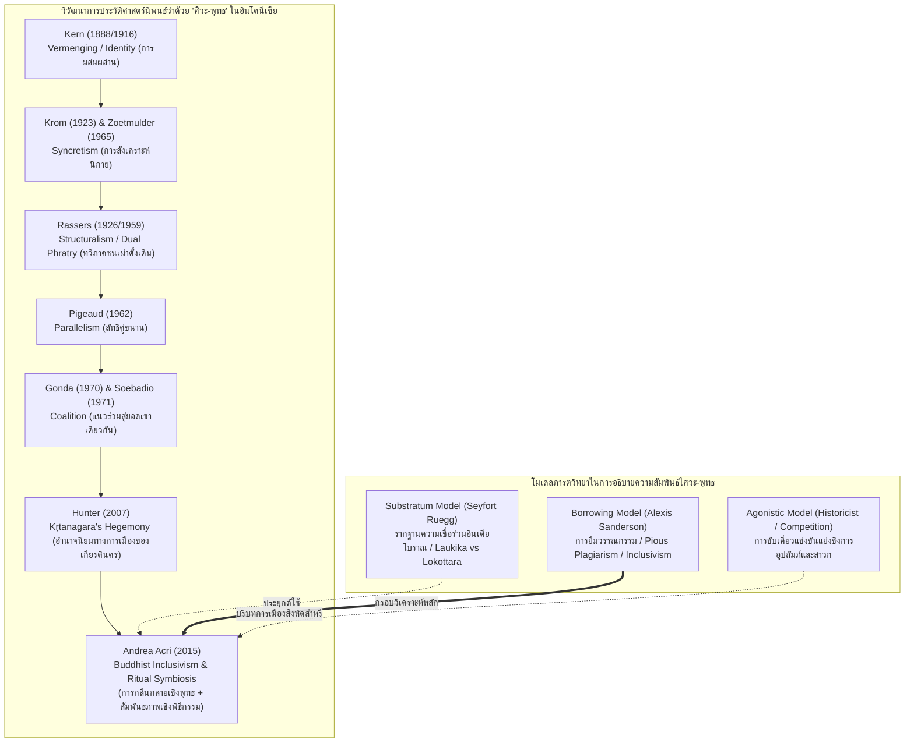

# บันทึกการอ่านและวิเคราะห์เอกสารจารึกวิทยาฉบับสมบูรณ์ (Epigraphic Source Dossier)
## การทบทวนลัทธิ "ศิวะ-พุทธ" ในชวาและบาหลี: บทวิพากษ์ประวัติศาสตร์นิพนธ์ ลัทธิพหุนิยม และการกลืนกลายทางเทววิทยาตันตระในเอเชียตะวันออกเฉียงใต้ (Revisiting the Cult of "Śiva-Buddha" in Java and Bali)

---

### ส่วนที่ 1: ข้อมูลบรรณานุกรมและการอ้างอิงมาตรฐาน (Bibliographic Metadata)
- **Source ID:** `S-2015-acri-01`
- **ชื่อไฟล์ PDF ในเครื่อง:** `S-2015-acri-01_Revisiting_Cult_Siva_Buddha_Java_Bali.pdf`
- **ชื่อไฟล์ข้อความสกัด:** `S-2015-acri-01_Revisiting_Cult_Siva_Buddha_Java_Bali.txt` (ข้อความวิชาการฉบับสมบูรณ์ บันทึกผลการวิจัยเชิงวิพากษ์ประวัติศาสตร์นิพนธ์ คัมภีร์ตูตูร์ วรรณกรรมกากาวิน และจารึกวิทยาชวา-บาหลี)
- **ประเภทเอกสาร:** บทความวิจัยวิชาการในหนังสือรวมบทความระดับนานาชาติผ่านการประเมินโดยผู้ทรงคุณวุฒิ (Peer-reviewed Book Chapter) ในชุดงานศึกษาพลวัตพุทธศาสนาในเอเชียตะวันออกเฉียงใต้
- **ภาษาของเอกสาร:** ภาษาอังกฤษ (EN) พร้อมการตรวจสอบและปริวรรตตัวบทปฐมภูมิหลายภาษา: ภาษาสันสกฤตคลาสสิก (Classical Sanskrit) ตามระบบสากล IAST, ภาษาชวาโบราณร้อยกรองและร้อยแก้ว (Old Javanese Kawi), ภาษาซุนดาโบราณ (Old Sundanese), ภาษาบาหลี (Balinese), และการสอบทานข้อถกเถียงในวรรณกรรมภาษาดัตช์ (Dutch) ฝรั่งเศส (French) และเยอรมัน (German)
- **ขอบเขตภูมิศาสตร์และวัฒนธรรม:** เกาะชวา (ชวากลางยุคโบราณ เช่น ปรางค์ปรัมบานัน บุโรพุทโธ; ชวาตะวันออกยุคสิงหัดส่าหรีและมัชฌปาหิต เช่น จันดิจาวี จันดิจาโก ตรอวูลัน แหล่งกาศิษยาน/กาบูยูตันบนเขตภูเขาและซุนดาโบราณ เช่น จีบูรูย Ciburuy), เกาะบาหลี (ชุมชนพราหมณ์พุทธ พราหมณ์ไศวะ การประกอบพิธีสุริยเสวนะ ขนบประเพณีเปอดันดาไศวะและเปอดันดาพุทธ เขตการังอาเซม Karangasem), และภูมิภาคอนุทวีปอินเดีย เนปาล แคชเมียร์ กัมพูชา และทิเบต
- **วัสดุและบริบทการค้นพบ:**
  - จารึกศิลาและแผ่นโลหะยุคชวากลางถึงชวาตะวันออก: จารึกศิวคฤหะ (Śivagṛha Inscription ค.ศ. 856), จารึกสุขอมฤต (Sukāmṛta Inscription ค.ศ. 1259 / 1296), จารึกวูราเร/โจโกโดโลก (Wurare Inscription ค.ศ. 1289)
  - ใบลานคัมภีร์ปรัชญาและเทววิทยาประเภทตูตูร์และตัตตวะ (Tutur / Tattva corpus): คัมภีร์ชั้นต้นยุคศตวรรษที่ 10–11 (เช่น *Vṛhaspatitattva*, *Tattvajñāna*, *Mahājñāna*, *Tutur Kamokṣan*, *Bhuvanakośa*, *Bhuvanasaṅkṣepa*, *Dharma Pātañjala*) และคัมภีร์ชั้นหลังยุคปลายมัชฌปาหิตและบาหลี (เช่น *Jñānasiddhānta*, *Gaṇapatitattva*, *Saṅ Hyaṅ Kamahāyānikan*, *Kalpabuddha*, *Saṅ Hyaṅ Siksa Kandaṅ Karĕsian*, *Saṅ Hyaṅ Hayu*, *Siksa Guru*, *Bhimasorga*)
  - ใบลานวรรณกรรมกากาวิน (Kakawin court poetry): *Kakawin Sutasoma* และ *Kakawin Arjunawijaya* ของเอ็มปู ตันตุลาร์ (Mpu Tantular), *Kuñjarakarṇa Dharmakathana* ของเอ็มปู ดูซุน (Mpu Dusun), และวรรณกรรมประวัติศาสตร์ราชสำนัก เช่น *Deśavarṇana* (*Nāgarakṛtāgama*), *Pararaton*, *Raṅga Lawe*, *Kiduṅ Sunda*
  - คติชนวิทยาและมุขปาฐะบาหลี: ตำนานเรื่องเล่าสองพี่น้องพุทธ-ไศวะ "พุภุกษะและกากังอากิง" (*Bubhukṣa and Gagaṅ Akiṅ*)
- **การอ้างอิงฉบับเต็มระบบ Chicago/Turabian Notes-Bibliography:**  
  Acri, Andrea. "Revisiting the Cult of ‘Śiva-Buddha’ in Java and Bali." In *Buddhist Dynamics in Premodern and Early Modern Southeast Asia*, edited by D. Christian Lammerts, 261–82. Singapore: Institute of Southeast Asian Studies (ISEAS), 2015.

---

### ส่วนที่ 2: แผนผังการจัดสรรเข้าสู่บทและหัวข้อย่อย (Chapter & Section Mapping Matrix)

- **บทที่ 2: จารึกสำคัญไขประวัติศาสตร์ในคาบสมุทรและหมู่เกาะ: ยุคสิงหัดส่าหรีและมัชฌปาหิต (ศตวรรษที่ 13–16)**
  - **หัวข้อย่อย 2.8 (รัชสมัยพระเจ้าเกียรตินครและการหลอมรวมเทววิทยาการเมือง):**  
    วิเคราะห์การสร้างอัตลักษณ์กษัตริย์ในฐานะ "ภฏาระ ศิวะ-พุทธ" (Bhaṭāra Śivabuddha) ในรัชสมัยพระเจ้าเกียรตินคร (Kṛtanagara ครองราชย์ ค.ศ. 1268–1292) ซึ่งมิได้เป็นเพียงความเชื่อส่วนพระองค์ แต่เป็นนโยบายทางการเมืองและเทววิทยาที่มุ่งหลอมรวมกระแสศาสนาหลักทั้งสองเพื่อสร้างเอกภาพภายในและรับมือภัยคุกคามภายนอกจากจักรวรรดิมองโกล-ราชวงศ์หยวน (หน้า 263, 267, 271, 274) ตลอดจนการสะท้อนความตึงเครียดผ่านจารึกสุขอมฤต (Sukāmṛta Inscription ค.ศ. 1259) ที่กล่าวถึงลัทธิไภรวะฝ่ายไศวะ (หน้า 272)
  - **หัวข้อย่อย 2.9 (การจัดระเบียบศาสนสถานและองค์กรสงฆ์คู่ขนานในสมัยมัชฌปาหิต):**  
    การวิเคราะห์โครงสร้างสถาบันศาสนาของรัฐที่มีการแต่งตั้งสมณศักดิ์ผู้ตรวจการศาสนาสองฝ่ายคู่ขนานอย่างเคร่งครัด ได้แก่ "ธรรมัธยักษะ ริง กะไศวัน" (Dharmādhyakṣa ring Kasaiwan) สำหรับฝ่ายไศวนิกาย และ "ธรรมัธยักษะ ริง กะสุกะตัน" (Dharmādhyakṣa ring Kasugatan) สำหรับฝ่ายพุทธศาสนาโสคตะ ซึ่งสะท้อนว่าในทางสถาบันสงฆ์และการบริหารราชการ ศาสนาทั้งสองมิได้ยุบรวมเป็นนิกายเดียวกัน แต่ดำรงความเป็นอิสระและมีความเท่าเทียมกันภายใต้พระบรมราชูปถัมภ์ (หน้า 268–270)
  - **หัวข้อย่อยใหม่ที่ค้นพบเพิ่มเติม (2.10 สถาบันไตรปักษะ Tripakṣa และสำนักสงฆ์บนเทือกเขาในปลายยุคมัชฌปาหิต):**  
    หลักฐานการจัดกลุ่มคณะสงฆ์ออกเป็นสามนิกายหลักในวรรณกรรมและจารึกปลายมัชฌปาหิต ได้แก่ ไศวะ (Śaiva), ฤๅษี/ภุชงค์ (Ṛṣi / Bhujaṅga), และโสคตะ/พุทธ (Saugata / Bauddha) และการดำรงอยู่ของสำนักสงฆ์กาบูยูตัน (Kabuyutan) หรืออาศรมฤๅษี (patapan) บนเทือกเขาในเขตซุนดาและชวาตะวันออก (เช่น อาศรมจีบูรูย) ที่มีการเก็บรักษาคัมภีร์ตูตูร์และศาสตราวุธศักดิ์สิทธิ์ตรีศูลคู่กับกระดิ่งวัชระ (หน้า 269, 272–273)

- **บทที่ 7: ศาสนา ความเชื่อ และเครือข่ายพุทธตันตระ/ไศวนิกายข้ามสมุทร: มนตรา ปรัชญา และการสังเคราะห์เทพเจ้า**
  - **หัวข้อย่อย 7.1 (โมเดลการวิเคราะห์ปฏิสัมพันธ์ไศวะ-พุทธ: รากฐานร่วม การยืมทางวรรณกรรม และการแข่งขันขับเคี่ยว):**  
    การประยุกต์ใช้โมเดลการตีความ 3 รูปแบบทางภารตวิทยา ได้แก่: (1) โมเดลรากฐานร่วมดั้งเดิม (Substratum Model ของ David Seyfort Ruegg), (2) โมเดลการยืมวรรณกรรมและการกลืนกลาย (Borrowing / Inclusivism Model ของ Alexis Sanderson และ Paul Hacker), และ (3) โมเดลการขับเคี่ยวแข่งขันทางประวัติศาสตร์ (Agonistic / Secular-Historicist Model) เพื่ออธิบายพลวัตความสัมพันธ์ระหว่างไศวนิกายกับพุทธศาสนาในอินโดนีเซียโบราณ (หน้า 264–267)
  - **หัวข้อย่อย 7.4 (การวิพากษ์แนวคิด "การสังเคราะห์ศิวะ-พุทธ" Śiva-Buddha Syncretism ในวรรณกรรมและคัมภีร์):**  
    การรื้อถอนกระบวนทัศน์ดั้งเดิมของ Kern, Krom, Rassers, และ Zoetmulder ที่มองว่าเกิดการผสมผสานกลืนกลายเป็นเนื้อเดียวกัน (Vermenging / Syncretism) โดย Acri เสนอว่าแท้จริงแล้วคือกระบวนการ "กลืนกลายแบบครอบงำ" (Inclusivism) หรือ "พหุนิยมทางปรัชญา" (Pluralism) ที่ฝ่ายพุทธ (โดยเฉพาะนักกวีราชสำนัก เช่น เอ็มปู ตันตุลาร์ และเอ็มปู ดูซุน) พยายามดึงเอาเทวรูป มโนทัศน์ และศัพท์แสงของฝ่ายไศวะที่ครองอำนาจนำในสังคมเข้ามาจัดวางให้อยู่ภายใต้ร่มเงาของพุทธศาสนา เช่น การระบุว่าพระไวโรจนะหรือพระพุทธเจ้าทรงสำแดงพระองค์เป็นทั้งพระพุทธและพระศิวะ (หน้า 262, 268–271)
  - **หัวข้อย่อย 7.5 (วรรณกรรมกากาวินสุตโสมและการตีความวากยสัมพันธ์ Bhinneka Tunggal Ika):**  
    การวิเคราะห์โครงสร้างทางเทววิทยาและวากยสัมพันธ์ของบทกวีอันโด่งดัง *Kakawin Sutasoma* (บทที่ 139.5) โดยชี้ว่าประโยค "Bhinneka tuṅggal ika" (พวกเขาทั้งสองต่างกัน แต่พวกเขาทั้งสองเป็นหนึ่งเดียวกัน) วางอยู่บนพื้นฐานว่าธาตุของพระชินพุทธะ (*jinatva*) และธาตุของพระศิวะ (*śivatattva*) เป็นเพียงสองแง่มุมขององค์สัจธรรมสูงสุด ซึ่งในสายตาของกวีพุทธคือพระพุทธเจ้า (หน้า 269–271) ควบคู่กับการเปรียบเทียบโยคะสองสายคือ อทวยชญาน (Advayajñāna) ฝ่ายพุทธ และษัฑอังคโยคะ (Ṣaḍaṅgayoga) ฝ่ายไศวะ ในบทที่ 42 (หน้า 269)
  - **หัวข้อย่อย 7.6 (วิวัฒนาการสู่ลัทธิร่วมพราหมณ์พุทธ-ไศวะในวัฒนธรรมบาหลี):**  
    การวิเคราะห์สถานะจริงในคัมภีร์และพิธีกรรมบาหลีโบราณจนถึงต้นศตวรรษที่ 19 ผ่านบันทึกของ John Crawfurd (1820) และการศึกษาพิธีสุริยเสวนะ (Sūrya Sevana) ของ Hooykaas โดยชี้ว่ามิได้เกิดการสังเคราะห์เสมอกัน แต่เป็น "การอยู่ร่วมกันเชิงพิธีกรรม" (Ritual Symbiosis) ที่ไศวนิกายถือสถานะสูงสุดของรัฐและคนส่วนใหญ่ ขณะที่พระพุทธ (Pedanda Buddha) มีสถานะรองลงมาแต่ขาดไม่ได้ในพิธีกรรมหลวง เปรียบเสมือนโครงสร้างระดับโลกิยะ (Laukika) และโลกุตระ (Lokottara) (หน้า 272–273)

- **บทที่ 3: จารึกยุคชวากลาง: ความสัมพันธ์ระหว่างราชวงศ์ไศเลนทรและสัญชัย (ศตวรรษที่ 8–10)**
  - **หัวข้อย่อย 3.4 (การประเมินใหม่ต่อการอยู่ร่วมกันของปรัมบานันและบุโรพุทโธ):**  
    ทบทวนข้อถกเถียงเรื่องความขัดแย้งทางศาสนาระหว่างไศเลนทร (พุทธ) และสัญชัย (ไศวะ) ตามทัศนะของ Coedès และ de Casparis โดยนำข้อโต้แย้งของ Jordaan และ Damais ที่อิงจากจารึกศิวคฤหะ (Śivagṛha ค.ศ. 856) มาสนับสนุนว่าทั้งสองนิกายอยู่ร่วมกันอย่างสันติและใช้คลังคำศัพท์ทางศิลปวัฒนธรรมร่วมกันนับแต่ยุคชวากลาง (หน้า 266–267)

---

### ส่วนที่ 3: สรุปสาระสำคัญเชิงวิเคราะห์และจุดยืนทางวิชาการ (Executive Academic Analysis)

#### 1. วิทยานิพนธ์และข้อถกเถียงหลักของผู้เขียน (Core Argument / Thesis)
Andrea Acri นำเสนอบทวิเคราะห์เชิงประวัติศาสตร์นิพนธ์และปรัชญาเปรียบเทียบที่ท้าทายความเชื่อดั้งเดิมเกี่ยวกับลัทธิ "ศิวะ-พุทธ" ในอินโดนีเซียโบราณ โดยสรุปประเด็นหลักได้ 5 มิติสำคัญ:

1. **การท้าทายมายาคติเรื่อง "การสังเคราะห์ทางศาสนาของชวา" (Challenging the Javanese Syncretism Paradigm):**  
   นับตั้งแต่ปลายศตวรรษที่ 19 เป็นต้นมา วงวิชาการสายอาณานิคมดัตช์และภารตวิทยา (เช่น Kern 1888/1916, Krom 1923, Rassers 1926/1959, Zoetmulder 1965) มักสรุปว่าศาสนาฮินดูในชวาและบาหลีมีลักษณะเป็นการ "ผสมผสานหลอมรวม" (*vermenging* / syncretism) ระหว่างพระศิวะกับพระพุทธเจ้า จนกลายเป็น "ลัทธิศิวะ-พุทธ" (Agama Siwa-Buda) ที่มีเอกลักษณ์เฉพาะตัวและตัดขาดจากความขัดแย้งทางนิกายในอินเดีย Acri ชี้ให้เห็นว่า ข้อสรุปดังกล่าวเกิดจากการอ่านตัวบทอย่างผิวเผิน การตีความข้อความร้อยกรองออกจากบริบท และการฉายภาพอุดมการณ์ชาตินิยมสมัยใหม่ของอินโดนีเซีย (คำขวัญ *Bhinneka Tunggal Ika*) ย้อนกลับไปสู่อดีต แท้จริงแล้วจารึกและคัมภีร์ดั้งเดิมมิได้สนับสนุนการหลอมรวมเป็นเนื้อเดียวกันในระดับหลักธรรมหรือโครงสร้างองค์กรสงฆ์เลย (หน้า 262, 268, 270)

2. **การแยกขาดระหว่าง "เอกภาพในสัจธรรมสูงสุด" กับ "ความต่างในวิถีปฏิบัติ":**  
   ในจารึกและคัมภีร์ชวาโบราณยุคสิงหัดส่าหรีและมัชฌปาหิต ศาสนาทั้งสองยังคงดำรงตนเป็น **"สองระบบที่แยกขาดจากกันอย่างชัดเจน" (Two discrete systems)** ทั้งในระดับสถาบันสงฆ์ คณะนักบวช พิธีกรรม และเส้นทางโยคะสู่ความหลุดพ้น การกล่าวถึงความเสมอกันหรือความเป็นหนึ่งเดียวกันของพระศิวะและพระพุทธเจ้า (เช่น ใน *Kakawin Sutasoma* 139.5 หรือ *Kakawin Arjunawijaya* 26–31) ปรากฏเฉพาะในระดับ **"สัจธรรมสูงสุด" (Paramount goal / Ultimate reality)** เท่านั้น มิได้หมายความว่าข้อปฏิบัติหรือพิธีกรรมถูกนำมาผสมปนเปกัน นักบวชฝ่ายไศวะยังคงบำเพ็ญษัฑอังคโยคะ (Ṣaḍaṅgayoga) และบูชาพระศิวะ ส่วนพระภิกษุพุทธยังคงบำเพ็ญอทวยชญาน (Advayajñāna) และบูชาพระชินพุทธะ (หน้า 268–269)

3. **กลยุทธ์ "การกลืนกลายแบบครอบงำ" ของพุทธศาสนา (Buddhist Inclusivism):**  
   Acri ชี้ให้เห็นว่า ข้อความในวรรณกรรมชวาโบราณที่อ้างว่า "พระศิวะและพระพุทธเจ้าเป็นสิ่งเดียวกัน" แทบทั้งหมดถูกประพันธ์ขึ้นโดย **"กวีหรือนักบวชฝ่ายพุทธ" (Bauddha authors)** เช่น เอ็มปู ตันตุลาร์ และเอ็มปู ดูซุน ไม่เคยปรากฏในคัมภีร์ตูตูร์ของฝ่ายไศวะเลย การที่ฝ่ายพุทธประกาศเช่นนี้สอดคล้องกับนิยาม "Inclusivism" ของ Paul Hacker (1983) นั่นคือการที่กลุ่มศาสนาหนึ่งประกาศว่าสัจธรรมหลักของศาสนาอื่นแท้จริงแล้วคือสิ่งเดียวกับสัจธรรมของตน แต่จัดวางให้ศาสนาอื่นนั้น "มีสถานะด้อยกว่า เป็นเพียงขั้นบันได หรือเป็นเพียงภาคสำแดงย่อยของพระพุทธเจ้า" (เช่น ข้อความใน *Kuñjarakarṇa* 23.4 ที่พระไวโรจนะตรัสว่า "เราคือไวโรจนะ ผู้สำแดงกายเป็นทั้งพระพุทธเจ้าและพระศิวะ") ยุทธศาสตร์นี้เกิดขึ้นเนื่องจากในบริบทชวาตะวันตกถึงชวาตะวันออก พุทธศาสนาเป็นศาสนากลุ่มน้อยที่ต้องอยู่ท่ามกลางประชากรและราชสำนักที่นับถือไศวนิกายเป็นหลัก กวีพุทธจึงต้องใช้กลยุทธ์ผนวกกลืนเทพไศวะเข้ามาเพื่อดึงดูดศรัทธาและแสวงหาการอุปถัมภ์จากกษัตริย์ (หน้า 269–271, 274–275)

4. **บทบาทเฉพาะตัวของพระเจ้าเกียรตินครและการเมืองเรื่องเวทมนตร์สงคราม:**  
   การปรากฏของพระนาม "ภฏาระ ศิวะ-พุทธ" (Bhaṭāra Śivabuddha) ในจารึกและประวัติศาสตร์ มิได้เป็นผลสะท้อนของขบวนการทางศาสนาของประชาชน แต่เกิดจาก **"การริเริ่มทางการเมืองและเทววิทยาเฉพาะบุคคลของพระเจ้าเกียรตินคร" (Personal politico-religious hegemony of Kṛtanagara)** ผู้ทรงอภิเษกตนเองเป็นทั้งพระชินพุทธะและพระไศวะไภรวะ เพื่อดึงพลังอำนาจลี้ลับของจักรวาลมารวมศูนย์ไว้ที่พระวรกายของพระองค์ สำหรับใช้ในการสร้างเอกภาพทางการเมืองภายในเกาะชวา และเตรียมการทำสงครามไสยเวทป้องกันอาณาจักรจากการรุกรานของจักรวรรดิมองโกล (กุบไลข่าน) พระองค์เป็นกษัตริย์เพียงพระองค์เดียวในประวัติศาสตร์ที่ได้รับการขนานพระนามเช่นนี้อย่างเป็นทางการ ซึ่งมหาเถรฝ่ายไศวะดั้งเดิมบางส่วนก็มิได้เห็นพ้องด้วยอย่างเต็มใจ (หน้า 263, 267, 271, 274)

5. **สถานะจริงในบาหลี: การพึ่งพาทางพิธีกรรมใต้การนำของไศวะ (Ritual Symbiosis under Śaiva Hegemony):**  
   ในเกาะบาหลียุคหลังมัชฌปาหิตจนถึงปัจจุบัน ความสัมพันธ์มิใช่การรวมนิกาย แต่เป็น "สัมพันธภาพเชิงอยู่ร่วมทางพิธีกรรม" (Ritual symbiosis) โดยมีโครงสร้างแบบลำดับชั้นที่ไศวนิกายเป็นศาสนาหลักของประชากรเก้าในสิบส่วนและราชสำนัก ขณะที่พุทธศาสนา (นำโดยเปอดันดาพุทธ) ดำรงฐานะเป็นกลุ่มน้อยที่มีบทบาทเสริมอันขาดไม่ได้ในพระราชพิธีหลวงบางประเภท เปรียบเสมือนมิติโลกิยะและโลกุตระตามที่ John Crawfurd ได้สังเกตไว้ตั้งแต่ ค.ศ. 1820 (หน้า 272–273)

#### 2. บริบทประวัติศาสตร์นิพนธ์และการประเมินความน่าเชื่อถือ (Historiography & Source Criticism)
ผู้เขียนได้ทำการจัดระเบียบและวิพากษ์แนวคิดทางประวัติศาสตร์นิพนธ์ (Historiographical Critique) ที่ทรงอิทธิพลมานานกว่าหนึ่งศตวรรษอย่างเป็นระบบ:

- **การรื้อถอนสมมติฐานสำนักดัตช์คลาสสิก (Dutch Colonial Historiography):**
  - *Henrik Kern (1888/1916):* ริเริ่มกระบวนทัศน์ "เอกลักษณ์/การผสมผสาน" (*vermenging*) โดยอาศัยการอ่าน *Kakawin Sutasoma* และเปรียบเทียบกับเอกสารเนปาล แต่เพิกเฉยต่อบริบทท้องถิ่นและการแยกสายปฏิบัติ (หน้า 262)
  - *Nicolaas J. Krom (1923):* นำแนวคิดผสมผสานมาจับคู่กับหลักฐานประติมานวิทยา และเป็นผู้บัญญัติคำว่า "Syncretism" ลงในประวัติศาสตร์ศิลปะชวา (หน้า 262)
  - *Willem H. Rassers (1926/1959):* นักมานุษยวิทยาสายโครงสร้างนิยม ตีความการผสานศิวะ-พุทธผ่านตำนานพุภุกษะและกากังอากิง โดยอ้างว่าเป็นภาพสะท้อนของการแบ่งขั้วสองส่วน (Dual phratry / tribal dualism) ของชนเผ่ามลายู-โพลินีเชียดั้งเดิม ซึ่ง Acri วิจารณ์อย่างรุนแรงว่าเป็นการมองแบบตัดขาดจากประวัติศาสตร์จริง (Ahistorical) และสร้างภาพจำลองเชิงทฤษฎีที่แข็งทื่อเกินไป (หน้า 262, 274)
  - *Theodor G. Pigeaud (1962):* ปฏิเสธคำว่าสังเคราะห์ และเสนอคำว่า "Parallelism" (ระบบคู่ขนาน) โดยอ้างกรอบความคิดแบบทวิภาคของชวาโบราณ (หน้า 262)
  - *Jan Gonda (1970) & Haryati Soebadio (1971):* เสนอคำว่า "Coalition" (แนวร่วมพันธมิตร) โดยเปรียบเทียบว่าเหมือนการมุ่งสู่ยอดเขาเดียวกันด้วยเส้นทางที่ต่างกันสองสาย (หน้า 262–263)

- **การผสานกระบวนทัศน์ภารตวิทยาใหม่ (Indological Hermeneutical Models):**  
  Acri นำเสนอว่า ความก้าวหน้าในการศึกษาคัมภีร์ตันตระในอินเดียและทิเบตช่วงสองทศวรรษที่ผ่านมา สามารถนำมาประยุกต์ใช้กับอินโดนีเซียได้อย่างสมบูรณ์ โดยชี้ให้เห็นการปะทะกันของ 3 สำนักคิด:
  1. *Substratum Model (David Seyfort Ruegg 1964, 2001, 2008):* มองว่าทั้งไศวะและพุทธเติบโตมาจากรากฐานความเชื่อพื้นบ้านและคติธรรมร่วมกันของอินเดียโบราณ ทำให้มีพิธีกรรมและเทววิทยาที่เหลื่อมซ้อนกันโดยธรรมชาติ
  2. *Borrowing Model (Alexis Sanderson 1994, 2001, 2009):* ปฏิเสธรากฐานนามธรรมที่พิสูจน์ไม่ได้ และชี้ให้เห็นหลักฐานตัวบทที่เป็นรูปธรรมว่า ฝ่ายพุทธตันตระ (โยคินีตันตระ) ได้ "คัดลอกวรรณกรรมทางศาสนาอย่างศรัทธา" (*pious plagiarism*) นำเอาโครงสร้างพิธี มนตรา และเทพเจ้าจากคัมภีร์ไศวะมันตรมรรคไปแปลงเป็นพุทธ
  3. *Agonistic / Secular-Historicist Model (Ruegg, Miksic 2010, Hunter 2007):* มองความสัมพันธ์ในแง่การแข่งขันขับเคี่ยวแย่งชิงความอุปถัมภ์จากราชสำนักและทรัพยากร ซึ่งส่งผลให้เกิดการผลิตวรรณกรรมและรูปเคารพเพื่อช่วงชิงสถานะนำ

- **จุดยืนทางระเบียบวิธีวิจัยของ Acri (Historicist, Multidisciplinary & Philological Approach):**  
  Acri วางจุดยืนประนีประนอมตามแนวทางของ Francesco Sferra (2003) โดยเห็นว่า ทั้งโมเดลการยืม (Borrowing) และโมเดลรากฐานร่วม (Substratum) สามารถใช้ร่วมกันได้ เพราะการที่คัมภีร์พุทธจะยืมข้อความและปรัชญาแบบอทวยะ (Non-dualism) จากคัมภีร์ไศวะไปใช้อย่างมีความหมาย ย่อมต้องตั้งอยู่บนความเข้าใจในโครงสร้างความเป็นจริงและยุทธศาสตร์การหลุดพ้นร่วมกัน อย่างไรก็ตาม ในมิติทางประวัติศาสตร์จริง ต้องอาศัยระเบียบวิธีทางประวัติศาสตร์และนิรุกติศาสตร์ตัวบทที่รัดกุม เพื่อมิให้ตกเป็นเหยื่อของการตีความอิงอุดมการณ์รัฐสมัยใหม่ (หน้า 265–266, 274)

---

### ส่วนที่ 4: สารบัญข้อค้นพบเชิงลึกแยกตามมิติจารึกวิทยา (Thematic Epigraphic Findings with Exact Pages)

1. **ประวัติศาสตร์นิพนธ์และการตีความทางประวัติศาสตร์:**
   - การรื้อถอนสมมติฐานสงครามศาสนาระหว่างไศเลนทรและสัญชัยในชวากลาง: งานศึกษาดั้งเดิมของ Coedès (1964: 90, 107), Krom (1931: 172–73), และ de Casparis (1956: 300) เคยตั้งสมมติฐานว่าราชวงศ์พุทธไศเลนทรขัดแย้งเป็นอริกับราชวงศ์ฮินดูสัญชัย และการสร้างปรางค์ปรัมบานันคือการฉลองชัยชนะในการขับไล่ไศเลนทร ทว่า Roy Jordaan (1996, 2000: 122–23) ร่วมกับ Damais (1968) พิสูจน์จากจารึกศิวคฤหะ (ค.ศ. 856) และสถาปัตยกรรมแวดล้อมว่า กษัตริย์ชวากลางทรงอุปถัมภ์ทั้งสองศาสนาพร้อมกัน มีการแต่งงานข้ามสาย และทั้งสองศาสนาอยู่ร่วมกันอย่างสันติโดยไร้เส้นแบ่งทางนิกายที่ตายตัว (หน้า 266)
   - ปรากฏการณ์พระเจ้าเกียรตินครในฐานะกษัตริย์พระองค์เดียวผู้เป็น "ภฏาระ ศิวะ-พุทธ": เอกสารยืนยันข้อสังเกตของ Thomas Hunter (2007: 34, 41) ว่า ไม่เคยปรากฏบุคคลใดในประวัติศาสตร์ชวาทั้งก่อนและหลังรัชสมัยพระเจ้าเกียรตินครที่ได้รับการขนานพระนามในจารึกและวรรณกรรมซ้ำแล้วซ้ำเล่าว่าเป็น "Bhaṭāra Śivabuddha" การสังเคราะห์นี้จึงเป็นผลผลิตของพระบรมราโชบายทางการเมืองและจิตวิญญาณส่วนพระองค์ มากกว่าที่จะเป็นฉันทามติของคณะสงฆ์ส่วนใหญ่ในยุคนั้น (หน้า 263, 267, 271)
   - บริบทการเมืองโลกยุคศตวรรษที่ 13: การที่พระเจ้าเกียรตินครทรงอุทิศพระองค์ให้แก่พิธีกรรมตันตระสายดุร้าย (กาลจักรตันตระ เหวัชระตันตระ คัมภีร์สุภูติตันตระ และลัทธิไภรวะ) มีแรงขับเคลื่อนสำคัญมาจากการเตรียมการรับมือการแผ่ขยายอำนาจของจักรพรรดิกุบไลข่าน ซึ่งได้รับการอภิเษกในลัทธิเหวัชระและมหากาลเช่นเดียวกัน ทั้งสองราชสำนักจึงใช้พิธีกรรมตันตระเป็นเทคโนโลยีทางเวทมนตร์สงครามเพื่อพิทักษ์ความมั่นคงของรัฐ (หน้า 272, 274)

2. **ตัวบทจารึก การอ่าน ศักราช และอักขรวิทยา:**
   - จารึกศิวคฤหะ (Śivagṛha Inscription ค.ศ. 856 / 778 มหาศักราช): จารึกภาษาสันสกฤตและชวาโบราณ พรรณนาถึงการสถาปนาศาสนสถานเทวาลัยพระศิวะ (ปรัมบานัน) โดยพระเจ้าราไก ปิกะตัน ซึ่งสร้างขึ้นคู่ขนานและตั้งอยู่ประชิดกับวัดพุทธของราชวงศ์ไศเลนทร สะท้อนการแลกเปลี่ยนลวดลายศิลปะและรูปแบบสถาปัตยกรรมร่วมกัน (หน้า 266)
   - จารึกวูราเร / โจโกโดโลก (Wurare Inscription ค.ศ. 1289 / 1211 มหาศักราช): สลักบนฐานหินพระชินอักโษภยะ ระบุพระนามอภิเษกของพระเจ้าเกียรตินครว่า *Śrī Jñānaśivabajra* (ศรีชญานศิววัชระ) ยืนยันการผนวกคำว่า "ศิวะ" (ไศวนิกาย) เข้ากับ "วัชระ" (พุทธตันตระ) ในพระนามทางการ (หน้า 267, 272)
   - จารึกสุขอมฤต (Sukāmṛta Inscription ค.ศ. 1259 / 1296): แสดงหลักฐานการสืบทอดสายตระกูลพราหมณ์ไศวะที่ถือพรตไภรวะ (Bhairavika Śaiva) ในราชสำนักสิงหัดส่าหรีและมัชฌปาหิตตอนต้น ซึ่งมีบทบาทสำคัญในการทำพิธีกรรมสงครามและถวายคำปรึกษาแก่กษัตริย์ (หน้า 272)
   - จารึกและใบลานวรรณกรรมกากาวิน: การใช้ฉันทลักษณ์สันสกฤต (Vṛtta) ในภาษาชวาโบราณ สะท้อนการประยุกต์ใช้ระบบอักขรวิธีและเทววิทยาอินเดียเข้ากับบริบทราชสำนักชวาตะวันออกอย่างประณีตสูงสุด (หน้า 268–270)

3. **มิติศาสนา ลัทธิความเชื่อ และพิธีกรรม:**
   - การแยกขาดของเส้นทางโยคะและเป้าหมายในวรรณกรรมพุทธ: *Kakawin Sutasoma* (บทที่ 42.2) ระบุอย่างชัดเจนว่า เส้นทางโยคะของพุทธคือ "อทวยชญาน" (*advayajñāna*) ส่วนของไศวะคือ "ษัฑอังคโยคะ" (*ṣaḍaṅgayoga*) ทั้งสองสายมีข้อปฏิบัติและนำไปสู่เป้าหมายเฉพาะที่ต่างกัน แม้กวีจะแนะว่าผู้แสวงหาควรมีความรู้ความเข้าใจในอีกสายหนึ่งด้วย แต่ในบทที่ 40.6 และ 41.5 กวีกลับเน้นย้ำว่า วิถีพุทธมีความก้าวหน้าและสัมฤทธิ์ผลสูงกว่า ขณะที่วิถีไศวะอาจกลายเป็น "กับดัก" (*pitfall*) ที่ทำให้ผู้บำเพ็ญหลงติดอยู่กับฤทธิ์เดชและอำนาจเหนือธรรมชาติจนพลาดจากความหลุดพ้นที่แท้จริง (หน้า 269)
   - การเสียดสีและการเปลี่ยนศาสนาของฝ่ายไศวะใน *Kakawin Sutasoma*: โครงเรื่องหลักของเรื่องสุตโสมแท้จริงแล้วคือวรรณกรรมสั่งสอนเชิงวิพากษ์ (Bauddha denunciation) ต่อพิธีกรรมที่วิปริตและรุนแรงของลัทธิไศวะสายสุดโต่ง ซึ่งแสดงออกผ่านพญายักษ์โพรุษาทะ (Poruṣāda) ผู้กินเนื้อมนุษย์ การที่เจ้าชายสุตโสมทรงทรมานและปราบเหล่าอสูรบริวารของพระศิวะให้หันมายอมรับธรรมะ จึงเป็นภาพสะท้อนความพยายามของฝ่ายพุทธในการเผยแผ่ศาสนาและ "เปลี่ยนใจผู้ศรัทธาฝ่ายไศวะให้หันมานับถือพุทธ" (*convert Śaiva followers to Buddhism*) (หน้า 269–270)
   - ปรัชญาอทวยะ (Monism / Non-dualism) ในฐานะสะพานเชื่อมทางเทววิทยา: Acri และ Sferra (2003: 68–69) ชี้ว่า วรรณกรรมตันตระสายอทวยวาทะ (เอกนิยม) ทั้งของพุทธและไศวะ มักอธิบายสัจธรรมสูงสุดในลักษณะเดียวกัน นั่นคือความว่าง (*śūnyatā*) หรือความเป็นหนึ่งเดียวกับพระศิวะ (*śivātmaka*) สภาวะจิตแบบเอกนิยมนี้ทำให้การปรับประสานทางเทววิทยาสามารถทำได้ง่ายขึ้น โดยอ้างว่าความแตกต่างทั้งปวงเป็นเพียงภาพสำแดงสัมพัทธ์ของสัจธรรมสัมบูรณ์หนึ่งเดียว (หน้า 271–272)

4. **มิติสถาปัตยกรรม ศาสนสถาน และชลศาสตร์:**
   - สถาปัตยกรรมลูกผสมศิวะ-พุทธแห่งจันดิจาวี (Caṇḍi Jawi): โบราณสถานแห่งนี้สร้างขึ้นเพื่อเป็นที่ประดิษฐานพระบรมอัฐิหรือพระบรมรูปของพระเจ้าเกียรตินคร คำพรรณนาใน *Deśavarṇana* (56.1–2) ระบุว่า ตัวเรือนธาตุเบื้องล่างสลักเสลาตามแบบไศวนิกาย (ประดิษฐานเทวรูปพระศิวะ) แต่มียอดปราสาทด้านบนเป็นสถูปทรงพุทธ และมีรูปเคารพพระชินอักโษภยะประดิษฐานซ่อนอยู่เหนือมงกุฎของพระศิวะ สะท้อนโครงสร้างทางสถาปัตยกรรมที่จำลองแนวคิด "พุทธครอบงำไศวะ" อย่างเป็นรูปธรรม (หน้า 271, 272)
   - ปรากฏการณ์อสุนีบาตฟาดและรูปเคารพอันตรธาน (ค.ศ. 1331): *Deśavarṇana* (56.2–57.4) บันทึกว่ารูปพระอักโษภยะเหนือยอดเทวรูปศิวะได้อันตรธานหายไปอย่างลึกลับ ส่งผลให้เกิดฟ้าผ่าจันดิจาวีในปี ค.ศ. 1331 ซึ่ง Hunter (2007: 41) และ Acri วิเคราะห์ว่า อาจเกิดจากการที่สมภารฝ่ายไศวะที่ดูแลวัดทนต่อความพยายามกลืนกลายศาสนาของพระเจ้าเกียรตินครไม่ไหว จึงแอบเคลื่อนย้ายหรือทำลายรูปเคารพพุทธดังกล่าวออกไป สะท้อนความตึงเครียดทางนิกายที่ยังคงคุกรุ่นอยู่จริง (หน้า 272)

5. **มิติอาหารการกิน วิถีชีวิต การค้า และตลาด:**
   - ข้อปฏิบัติทางอาหารและการถือพรตในตำนานพุภุกษะและกากังอากิง (*Bubhukṣa and Gagaṅ Akiṅ*): เอกสารวิเคราะห์คติชนวิทยาชวา-บาหลีว่าด้วยพี่น้องสองคนที่เป็นตัวแทนของสองสายปฏิบัติ กากังอากิง (ตัวแทนไศวะผู้พี่) ถือพรตตบะอย่างเข้มงวด อดอาหาร เคร่งครัดในวัตรปฏิบัติจนร่างกายผอมโซ ขณะที่พุภุกษะ (ตัวแทนพุทธผู้น้อง) บริโภคอาหารทุกชนิดอย่างไม่ยึดติด ทั้งเนื้อสัตว์และสุราเมรัย เมื่อพระผู้เป็นเจ้าจำแลงกายเป็นแม่เสือลงมาลองใจ ทั้งสองยินดีสละชีวิต แต่ผลการตัดสินให้พุภุกษะบรรลุธรรมในขั้นที่สูงกว่าและขึ้นสู่สวรรค์ก่อน สะท้อนทัศนะของฝ่ายพุทธตันตระที่มองว่าวัตรปฏิบัติแบบไม่แบ่งแยก (antinomian) อยู่เหนือข้อห้ามทางอาหารและการทรมานตนของฝ่ายไศวะดั้งเดิม (หน้า 262, 275–276)

6. **มิติการปกครอง กฎหมาย ที่ดิน และระบบสีมา:**
   - ธรรมเนียมคณะสงฆ์ไตรปักษะ (Tripakṣa) ในราชสำนักมัชฌปาหิต: จารึกและวรรณกรรมยุคสิงหัดส่าหรี-มัชฌปาหิตแสดงให้เห็นโครงสร้างการจัดระเบียบศาสนจักรของรัฐที่มีสามนิกายหลัก ได้แก่ พระไศวะ (Śaiva), พระฤๅษี (Ṛṣi), และพระพุทธ (Bauddha/Saugata) โดยพระมหากษัตริย์ทรงรับรองสถานะและสิทธิประโยชน์ทางที่ดิน (สีมา) แก่ทั้งสามกลุ่มอย่างเท่าเทียมกัน แต่ละกลุ่มมีขนบธรรมเนียม ประมุขสงฆ์ และศาสนสถานเป็นของตนเอง (หน้า 269)
   - การรักษาความบริสุทธิ์ของสายตระกูลนักบวช: แม้ในระดับคัมภีร์ตูตูร์ยุคปลายจะเริ่มใช้คำว่า *saṅ brāhmana bhujaṅga śaiva sogata* ปะปนกัน แต่ในทางสังคมสงฆ์ พระสงฆ์แต่ละสายยังคงรักษาสายการอุปสมบทและสืบทอดตระกูลพราหมณ์ของตนไว้อย่างเคร่งครัด (หน้า 269, 272–273)

7. **มิติปฏิสัมพันธ์ข้ามสมุทรและเครือข่ายนานาชาติ:**
   - ความเชื่อมโยงกับกระแสพุทธตันตระในอินเดียตะวันออกและทิเบต: Acri ชี้ให้เห็นว่า การที่วรรณกรรมและจารึกชวามีองค์ประกอบของเทพเจ้าและพิธีกรรมที่ดูเหมือนเป็นการผสมผสาน แท้จริงแล้วเป็นแบบแผนที่สืบทอดมาจากคัมภีร์พุทธตันตระในอินเดีย (เช่น นาลันทา วิกรมศิลา) และทิเบตโดยตรง ซึ่งในคัมภีร์เหล่านั้น (เช่น โยคินีตันตระ) มีการดึงเอาพระศิวะ พระไภรวะ และเทวีในลัทธิศักติเข้าไปบรรจุไว้ในมณฑลพุทธมานานแล้ว ชาวชวาจึงมิได้เป็นผู้คิดค้นการสังเคราะห์นี้ขึ้นเองจากสุญญากาศ (หน้า 263, 264–265, 267)
   - ปรากฏการณ์ความคล้ายคลึงในเนปาลและกัมพูชา: Jan Gonda (1970) และ Alexis Sanderson (2003–04) ได้แสดงหลักฐานเปรียบเทียบว่า แนวคิดเรื่องความเท่าเทียมหรือการผสมผสานทางพิธีกรรมระหว่างไศวะและพุทธ ปรากฏขึ้นในเนปาลและกัมพูชาโบราณเช่นเดียวกัน อันเกิดจากความต้องการของกลุ่มชนชั้นนำและผู้อุปถัมภ์ฆราวาสที่มีทัศนะแบบเปิดกว้าง (หน้า 263, 265)

8. **มิติจารึกแผ่นโลหะ รูปเคารพขนาดเล็ก และจารึกแม่น้ำ:**
   - การผลิตซ้ำวรรณกรรมและการดัดแปลงคัมภีร์ข้ามสาย (Textual Bricolage): เอกสารระบุถึงการค้นพบคัมภีร์ *Saṅ Hyaṅ Kamahāyānikan* ซึ่งเป็นคัมภีร์พุทธตันตระที่สำคัญที่สุดของชวา ที่มีการผนวกเอาตำราโยคะของฝ่ายไศวะเข้ามาไว้ในบทสวดอย่างแนบเนียน และคัมภีร์ตูตูร์ฝ่ายพุทธ เช่น *Kalpabuddha* ที่คัดลอกข้อความปรัชญาจากคัมภีร์ฝ่ายไศวะ *Jñānasiddhānta* เกือบคำต่อคำ แต่ทำการแทนที่ชื่อเทพเจ้าและศัพท์หลัก (เช่น แทนที่พระปรมพรหมันด้วยอทวยชญาน หรือแทนที่พระวากีศวรีด้วยพระปรัชญาปารมิตา) (หน้า 268, 275)
   - อุปกรณ์ประกอบพิธีกรรมสำริดในอาศรมจีบูรูย: การค้นพบตรีศูล (สัญลักษณ์ไศวะ) ประดิษฐานคู่กับกระดิ่งวัชระ (สัญลักษณ์พุทธ) ร่วมกับมัดคัมภีร์ใบลานภาษาชวาโบราณและซุนดาโบราณในอาศรมศักดิ์สิทธิ์บนภูเขา สะท้อนการประยุกต์ใช้วัตถุศักดิ์สิทธิ์ร่วมกันในระดับท้องถิ่น (หน้า 272–273)

9. **พรมแดนปัญหา ปริศนาวิชาการ และจริยธรรมโบราณคดี:**
   - การใช้ประวัติศาสตร์รับใช้อุดมการณ์รัฐสมัยใหม่ (Politicization of Ancient Texts): Acri วิพากษ์วิจารณ์อย่างตรงไปตรงมาว่า นักวิชาการและนักการเมืองอินโดนีเซียยุคปัจจุบันมักนำข้อความ "Bhinneka Tunggal Ika" จากวรรณกรรมสุตโสมไปตีความแบบยกยอชาติตนเองว่า ชาวชวาโบราณมีสัจธรรมแห่ง "ขันติธรรมทางศาสนา" (Religious tolerance) และมี "พหุนิยมอันเปิดกว้าง" เป็นชาติแรกๆ ของโลก เพื่อนำมาใช้ค้ำจุนหลักการปัญจศีล (Pancasila) ของสาธารณรัฐอินโดนีเซีย แต่การกระทำเช่นนี้เป็นการบิดเบือนบริบททางประวัติศาสตร์จริง ซึ่งเป็นเรื่องของการเมืองแย่งชิงความชอบธรรมและการเผยแผ่ศาสนาเชิงครอบงำ (หน้า 268, 270–271)
   - ปริศนาสถานะของพระพุทธในบาหลียุคแรก: ความขัดแย้งระหว่างบันทึกของหลวงจีนฟาเหียน (Fa-Hsien ค.ศ. 414) ที่ระบุว่าในชวามีชาวพุทธน้อยมากเมื่อเทียบกับพราหมณ์ กับบันทึกของอี้จิง (Yi-Jing ค.ศ. 689–692) ที่ชี้ว่าพุทธศาสนารุ่งเรืองอย่างยิ่งในสุมาตราและชวา แสดงให้เห็นถึงความผันผวนของขอบเขตอิทธิพลทางศาสนาตามยุคสมัย (หน้า 275)

---

### ส่วนที่ 5: คลังข้อความอ้างอิงตรงและเชิงอรรถสำเร็จรูป (Verbatim Quotes & Footnote Bank)

1. **บทวิพากษ์มายาคติเรื่องการสังเคราะห์ศิวะ-พุทธในชวา (Acri 2015: 262):**
   - *ภาษาอังกฤษต้นฉบับ:*  
     "The basic idea that my paper tries to convey is that the nature of the equation of the paramount principles of Śivaism and Buddhism as expressed by a number of Old Javanese sources from the Singhasari-Majapahit period has not always been correctly grasped, and that alleged instances of 'Javanese syncretism' should now be challenged."
   - *แปลภาษาไทย:*  
     "แนวคิดพื้นฐานที่บทความของข้าพเจ้าพยายามนำเสนอคือ ธรรมชาติของการเทียบเคียงความเสมอกันระหว่างหลักธรรมสูงสุดของไศวนิกายและพุทธศาสนา ตามที่ปรากฏในแหล่งข้อมูลภาษาชวาโบราณจำนวนมากจากยุคสิงหัดส่าหรี-มัชฌปาหิตนั้น มักไม่ได้รับการทำความเข้าใจอย่างถูกต้องตรงตามความเป็นจริง และกรณีตัวอย่างที่มักอ้างกันว่าเป็น 'การสังเคราะห์ทางศาสนาแบบชวา' สมควรที่จะต้องถูกทบทวนและท้าทายได้แล้วในปัจจุบัน"
   - *เชิงอรรถสำเร็จรูป:*  
     Andrea Acri, "Revisiting the Cult of ‘Śiva-Buddha’ in Java and Bali," in *Buddhist Dynamics in Premodern and Early Modern Southeast Asia*, ed. D. Christian Lammerts (Singapore: Institute of Southeast Asian Studies, 2015), 262.

2. **ข้อเสนอเรื่องเอกภาพในบุคคลของพระเจ้าเกียรตินคร (Thomas Hunter 2007: 41, หน้า 267):**
   - *ภาษาอังกฤษต้นฉบับ:*  
     "Kṛtanagara’s greatest achievement may be that in some sense he succeeded in making his own person the locus of unity between the two main streams of East Javanese religion, thereby affecting a religious union aimed at compelling the unseen forces of the cosmos to fall in behind his scheme of internal and external political unification."
   - *แปลภาษาไทย:*  
     "ความสำเร็จอันยิ่งใหญ่ที่สุดของพระเจ้าเกียรตินครอาจอยู่ที่การที่พระองค์ทรงประสบความสำเร็จในการทำให้พระวรกายของพระองค์เองกลายเป็นศูนย์กลางแห่งความเป็นเอกภาพระหว่างกระแสศาสนาหลักทั้งสองสายของชวาตะวันออก ส่งผลให้เกิดการรวมตัวทางศาสนาที่มีเป้าหมายเพื่อบีบบังคับพลังอำนาจลี้ลับที่มองไม่เห็นแห่งจักรวาล ให้ยอมสยบอยู่เบื้องหลังแผนการรวมศูนย์อำนาจทางการเมืองทั้งภายในและภายนอกราชอาณาจักรของพระองค์"
   - *เชิงอรรถสำเร็จรูป:*  
     Thomas M. Hunter, "The Body of the King: Reappraising Singhasari Period Syncretism," *Journal of Southeast Asian Studies* 38, no. 1 (2007): 41; อ้างถึงใน Acri (2015: 267).

3. **การแยกสายปฏิบัติและองค์กรสงฆ์ในคัมภีร์ตูตูร์ (Acri 2015: 268–269):**
   - *ภาษาอังกฤษต้นฉบับ:*  
     "As noted by Miksic and Santiko, even in the Singhasari-Majapahit period Śivaism and Buddhism did not constitute a merger or synthesis of religious doctrine or praxis but maintained their independence as two discrete systems, having separate types of religious structures for their respective priesthoods. My investigation into the corpus of premodern Old Javanese-cum-Sanskrit scriptures of Śaiva, and more rarely Bauddha, persuasion popularly known as Tuturs or Tattvas has confirmed this view."
   - *แปลภาษาไทย:*  
     "ดังที่มิคสิกและสันติโกได้ตั้งข้อสังเกตไว้ แม้ในยุคสิงหัดส่าหรี-มัชฌปาหิต ไศวนิกายและพุทธศาสนาก็มิได้หลอมรวมหรือสังเคราะห์หลักคำสอนหรือวัตรปฏิบัติทางศาสนาเข้าด้วยกันเป็นเนื้อเดียว หากแต่ยังคงดำรงความเป็นอิสระในฐานะระบบสองระบบที่แยกขาดจากกันอย่างชัดเจน โดยมีโครงสร้างทางศาสนาที่แยกต่างหากสำหรับคณะนักบวชของแต่ละฝ่าย การตรวจสอบของข้าพเจ้าในประมวลคัมภีร์ภาษาชวาโบราณปนสันสกฤตยุคก่อนสมัยใหม่ฝ่ายไศวะ และฝ่ายพุทธซึ่งพบได้ยากกว่า หรือที่รู้จักกันทั่วไปในชื่อ ตูตูร์ หรือ ตัตตวะ ได้ช่วยยืนยันทัศนะดังกล่าวนี้อย่างหนักแน่น"
   - *เชิงอรรถสำเร็จรูป:*  
     Andrea Acri, "Revisiting the Cult of ‘Śiva-Buddha’ in Java and Bali," in *Buddhist Dynamics in Premodern and Early Modern Southeast Asia*, ed. D. Christian Lammerts (Singapore: Institute of Southeast Asian Studies, 2015), 268–69.

4. **การวิเคราะห์คาถาสุดโด่งดังในกากาวินสุตโสม (*Kakawin Sutasoma* 139.5, หน้า 270):**
   - *ตัวบทภาษาชวาโบราณ (Kawi IAST):*  
     "rwāneka dhātu vinuvus vara buddha viśva,  
     bhīnnēki rakva ri kavangvana śivanirvāṇa,  
     tuhun tkaṅ jinatva kalavan śivatattva tuṅgal,  
     bhinneka tuṅgal ika tan hana dharma maṅrva."
   - *แปลภาษาไทย:*  
     "พระพุทธเจ้าผู้ประเสริฐและพระศิวะผู้เป็นสากลจักรวาลได้รับการกล่าวขานว่าเป็นสองธาตุที่ต่างกัน,  
     พวกเขาทั้งสองมีความแตกต่างกันอย่างแท้จริงในรูปกายภายนอกและในการดับกิเลสแบบศิวะ,  
     ทว่าแก่นแท้แห่งพุทธภาวะ (ชินตวะ) และศิวตัตตวะนั้นย่อมเป็นหนึ่งเดียวกัน,  
     พวกเขาทั้งสองต่างกัน ทว่าพวกเขาทั้งสองเป็นหนึ่งเดียวกัน หามีธรรมใดแยกเป็นสองไม่"
   - *บทวิเคราะห์ของ Alexis Sanderson (Acri 2015: 270):*  
     "As is persuasively argued by Sanderson, the famous passage of the Sutasoma equating the realities (dhātu) of the Buddha (jinatva) and Śiva (śivatattva) (139.5) actually says that 'the Lord Buddha is both the Buddha and Śiva' rather than espousing 'a doctrine of absolute equality between the two religions within a reality beyond both'. Thus, to say that the two realities are but two manifestations of the ultimate reality of Buddha amounts to a thoroughly Bauddha perspective."
   - *แปลบทวิเคราะห์ภาษาไทย:*  
     "ดังที่แซนเดอร์สันได้เสนอข้อถกเถียงไว้อย่างน่าเชื่อถือ ข้อความอันโด่งดังในสุตโสมที่เทียบเคียงความจริงแท้ (ธาตุ) ของพระพุทธเจ้า (ชินตวะ) และพระศิวะ (ศิวตัตตวะ) ให้เสมอกัน (139.5) นั้น แท้จริงแล้วกำลังกล่าวว่า 'องค์พระพุทธเจ้าทรงเป็นทั้งพระพุทธและพระศิวะ' มากกว่าที่จะเป็นการสถาปนา 'ทฤษฎีว่าด้วยความเท่าเทียมอย่างสมบูรณ์ระหว่างสองศาสนาภายใต้ความจริงสูงสุดที่อยู่เหนือศาสนาทั้งสอง' ดังนั้น การกล่าวว่าความจริงทั้งสองประการเป็นเพียงสองภาพสำแดงของความจริงสูงสุดแห่งพระพุทธเจ้า ย่อมสะท้อนทรรศนะของฝ่ายพุทธอย่างแท้จริง"
   - *เชิงอรรถสำเร็จรูป:*  
     Alexis Sanderson, "The Śaiva Age," in *Genesis and Development of Tantrism*, ed. Shingo Einoo (Tokyo: University of Tokyo, 2009), 124–25; อ้างถึงใน Andrea Acri, "Revisiting the Cult of ‘Śiva-Buddha’ in Java and Bali," (2015): 270.

5. **นิยาม "การกลืนกลายแบบครอบงำ" (Inclusivism) ของ Paul Hacker (หน้า 270):**
   - *ภาษาอังกฤษแปลจากเยอรมัน (Seyfort Ruegg 2008: 97):*  
     "Inclusivism means declaring that a central conception of an alien religious or weltanschaulich group is identical with this or that central conception of the group to which one belongs oneself. To inclusivism there mostly belongs, explicitly or implicitly, the assertion that the alien declared to be identical with one’s own is in some way subordinate or inferior to the latter. In addition, no proof is generally furnished for the identity of the alien with one’s own."
   - *แปลภาษาไทย:*  
     "การกลืนกลายแบบครอบงำ (Inclusivism) หมายถึงการประกาศว่า มโนทัศน์ใจกลางของกลุ่มศาสนาหรือโลกทัศน์ภายนอก มีความเหมือนกันทุกประการกับมโนทัศน์ใจกลางของกลุ่มที่ตนเองสังกัดอยู่ และในการกลืนกลายเช่นนี้ มักจะแฝงไว้ด้วยการยืนยัน—ไม่ว่าจะอย่างเปิดเผยหรือโดยปริยาย—ว่าสิ่งภายนอกที่ถูกประกาศว่าเหมือนกับของตนนั้น มีสถานะด้อยกว่าหรืออยู่ใต้บังคับบัญชาของสิ่งที่เป็นของตนเอง ยิ่งไปกว่านั้น โดยทั่วไปแล้วมักไม่มีการแสดงข้อพิสูจน์ใดๆ สำหรับความเหมือนกันระหว่างสิ่งภายนอกกับสิ่งของตนเองนั้นเลย"
   - *เชิงอรรถสำเร็จรูป:*  
     Paul Hacker, *Inklusivismus: Eine indische Denkform*, ed. Gerhard Oberhammer (Wien: De Nobili Research Library, 1983); แปลโดย David Seyfort Ruegg, *The Symbiosis of Buddhism with Brahmanism/Hinduism in South Asia* (Wien: ÖAW, 2008), 97; อ้างถึงใน Acri (2015: 270).

6. **บันทึกทางประวัติศาสตร์ของ John Crawfurd ว่าด้วยความเหนือกว่าของไศวนิกายในบาหลี (ค.ศ. 1820, หน้า 273):**
   - *ภาษาอังกฤษต้นฉบับ:*  
     "The Buddhists are few in number. [...] The followers of Siva spoke of these of Buddha more with contempt than hatred or rancor — the last, indeed, are feelings not likely to be entertained by any people for a fallen sect; in which light the Buddhists were evidently looked upon. The Brahmans in their conversation often let fall expressions, which showed that they entertained no respect whatever for the followers of the opposite worship. The sect of Siva may indeed be denominated the national religion. It is the religion of nine-tenths of the people, of every sovereign on the island, and of every man in power."
   - *แปลภาษาไทย:*  
     "ชาวพุทธมีจำนวนน้อยมาก [...] บรรดาผู้ศรัทธาในพระศิวะพูดถึงชาวพุทธด้วยความเหยียดหยามมากกว่าความเกลียดชังหรือความเคียดแค้น—ซึ่งความรู้สึกประการหลังนี้ ย่อมมิใช่สิ่งที่ผู้คนจะปฏิบัติต่อนิกายที่เสื่อมสลายตกต่ำไปแล้ว อันเป็นภาพที่ชาวพุทธถูกมองอย่างชัดเจน ในบทสนทนาของเหล่าพราหมณ์มักมีถ้อยคำหลุดออกมาซึ่งแสดงให้เห็นว่าพวกเขาหาได้มีความเคารพยำเกรงใดๆ ต่อผู้บูชาในลัทธิฝ่ายตรงข้ามไม่ นิกายแห่งพระศิวะย่อมสามารถเรียกขานได้อย่างแท้จริงว่าเป็นศาสนาประจำชาติ เป็นศาสนาของผู้คนเก้าในสิบส่วน ของกษัตริย์ทุกพระองค์บนเกาะ และของผู้มีอำนาจทุกคน"
   - *เชิงอรรถสำเร็จรูป:*  
     John Crawfurd, "On the Existence of the Hindu Religion in the Island of Bali," *Asiatick Researches* 13 (1820): 129–30; อ้างถึงใน Acri (2015: 273).

7. **ปรากฏการณ์ขบวนการเขียนคัมภีร์ตูตูร์ในเขตภูเขาปลายมัชฌปาหิต (Acri 2015: 275):**
   - *ภาษาอังกฤษต้นฉบับ:*  
     "What caused a progressive hybridization of Śivaism and Buddhism, as well as their convergence towards a higher 'mystic synthesis' — much like the one that eventually developed in Javanese milieus after the contact with Islam since the fifteenth century — might have been the progressive departure from the point of origin, and zenith, of the Indic religious and cultural values carried by the Sanskrit Cosmopolis; their ensuing transformation and 'localization'; and the decadence of traditional forms of clergy, along with the development of new cultic embedded orthopraxies."
   - *แปลภาษาไทย:*  
     "สิ่งที่ก่อให้เกิดการกลายพันธุ์ผสมผสานอย่างต่อเนื่องระหว่างไศวนิกายและพุทธศาสนา ตลอดจนการหลอมรวมมุ่งหน้าสู่ 'การสังเคราะห์เชิงรหัสยนิยมขั้นสูง'—ซึ่งคล้ายคลึงอย่างยิ่งกับสิ่งที่พัฒนาขึ้นในแวดวงชวายุคหลังจากการสัมผัสกับศาสนาอิสลามนับแต่ศตวรรษที่ 15 เป็นต้นมา—น่าจะมีสาเหตุมาจากการค่อยๆ เคลื่อนตัวออกห่างจากจุดกำเนิดและจุดรุ่งเรืองสูงสุดของค่านิยมทางศาสนาและวัฒนธรรมอินเดียที่ถ่ายทอดมาโดยโลกภาษาสันสกฤต (Sanskrit Cosmopolis) การแปรรูปและการปรับเป็นลักษณะท้องถิ่น (localization) ที่ตามมา ตลอดจนการเสื่อมถอยของโครงสร้างคณะสงฆ์แบบจารีตดั้งเดิม พร้อมไปกับการพัฒนาขึ้นของแบบแผนการปฏิบัติอันศักดิ์สิทธิ์รูปแบบใหม่ที่ฝังแน่นอยู่ในวัฒนธรรมท้องถิ่น"
   - *เชิงอรรถสำเร็จรูป:*  
     Andrea Acri, "Revisiting the Cult of ‘Śiva-Buddha’ in Java and Bali," in *Buddhist Dynamics in Premodern and Early Modern Southeast Asia*, ed. D. Christian Lammerts (Singapore: Institute of Southeast Asian Studies, 2015), 275.

---

### ส่วนที่ 6: คลังคำศัพท์เฉพาะทางจากเอกสาร (Native Terminology Glossary)

| ลำดับ | คำศัพท์เฉพาะทาง | ภาษาดั้งเดิม | คำอ่านสากล (IAST / Kawi) | ความหมายและการนำไปใช้ในเอกสาร | ปรากฏในหน้า |
|:---:|:---|:---|:---|:---|:---:|
| 1 | **Śivabuddha** | สันสกฤต/ชวาโบราณ | *Śivabuddha* (*bhaṭāra śivabuddha*) | พระผู้เป็นเจ้าศิวะ-พุทธ พระนามเฉลิมพระเกียรติของพระเจ้าเกียรตินครในฐานะศูนย์รวมของสองกระแสศาสนา | หน้า 263, 267, 269, 271 |
| 2 | **Tripakṣa** | สันสกฤต/ชวาโบราณ | *tripakṣa* | คณะสงฆ์หรือนิกายหลักสามฝ่ายในชวาและบาหลี ได้แก่ ไศวะ (Śaiva), ฤๅษี (Ṛṣi), และโสคตะ/พุทธ (Saugata) | หน้า 269, 271, 272 |
| 3 | **Dharmādhyakṣa** | สันสกฤต/ชวาโบราณ | *dharmādhyakṣa* | มหาอำมาตย์หรือผู้ตรวจการกิจการศาสนาฝ่ายอาณาจักร มีสองตำแหน่งคู่ขนานคือฝ่ายกะไศวันและฝ่ายกะสุกะตัน | หน้า 268–269 |
| 4 | **Kasaiwan** | ชวาโบราณ | *kasaiwan* (*kaśaivan*) | กิจการ ศาสนสถาน หรือคณะสงฆ์ฝ่ายไศวนิกายในอาณาจักรมัชฌปาหิต | หน้า 268–269 |
| 5 | **Kasugatan** | ชวาโบราณ | *kasugatan* (*kaboddhan*) | กิจการ ศาสนสถาน หรือคณะสงฆ์ฝ่ายพุทธศาสนา (โสคตะ) ในอาณาจักรมัชฌปาหิต | หน้า 268–269 |
| 6 | **Jinatva** | สันสกฤต | *jinatva* | พุทธภาวะ แก่นแท้แห่งความเป็นพระชินพุทธะ ปรากฏในกากาวินสุตโสม 139.5 | หน้า 270 |
| 7 | **Śivatattva** | สันสกฤต | *śivatattva* | ศิวตัตตวะ สารัตถะความเป็นจริงสูงสุดแห่งพระศิวะ ปรากฏคู่กับชินตวะในกากาวินสุตโสม 139.5 | หน้า 270 |
| 8 | **Advayajñāna** | สันสกฤต | *advayajñāna* | ความรู้อันไม่เป็นสอง ปัญญาญาณสูงสุดในพุทธตันตระชวา ใช้คู่กับอทวยโยคะในกากาวินสุตโสม 41–42 | หน้า 268, 269 |
| 9 | **Ṣaḍaṅgayoga** | สันสกฤต | *ṣaḍaṅgayoga* | โยคะ 6 ขั้นตามคัมภีร์ไศวมรรคและปาตัญชละ เป็นแนวทางปฏิบัติหลักของนักบวชไศวะในชวา | หน้า 269 |
| 10 | **Iṣṭidharma** | สันสกฤต/ชวาโบราณ | *iṣṭidharma* (*iṣṭadevatā*) | ธรรมหรือเทพเจ้าอันเป็นที่ปรารถนาเคารพบูชาเฉพาะของแต่ละนิกายในไตรปักษะ (กากาวินอรชุนวิชัย 26–31) | หน้า 269 |
| 11 | **Parātramārga** | สันสกฤต/ชวาโบราณ | *parātramārga* | "มรรคาแห่งความตาย" หรือเส้นทางการละสังขารสู่โมกษะของฝ่ายไศวะ สัมพันธ์กับมนตรา อํ-อะ (Aṃ-Aḥ) | หน้า 268 |
| 12 | **Lokottara** | สันสกฤต | *lokottara* | เหนือโลก โลกุตระ มิติแห่งสัจธรรมสูงสุดที่อยู่พ้นจากโลกิยสมมุติ คู่ตรงข้ามของโลกิยะ | หน้า 264, 265, 271, 273 |
| 13 | **Laukika** | สันสกฤต | *laukika* | ฝ่ายโลก โลกิยะ ระดับความเชื่อ พิธีกรรม หรือเทพเจ้าขั้นสัมพัทธ์ในชีวิตประจำวัน | หน้า 264, 265, 271, 273 |
| 14 | **Inklusivismus** | เยอรมัน/อังกฤษ | *Inclusivism* | แนวคิดการกลืนกลายทางเทววิทยา โดยผนวกสัจธรรมของผู้อื่นเข้ามาเป็นส่วนหนึ่งใต้ร่มเงาศาสนาตนเอง | หน้า 265, 270–271 |
| 15 | **Bhinneka tuṅggal ika** | ชวาโบราณ | *bhinneka tuṅggal ika* | "พวกเขาต่างกัน แต่พวกเขาเป็นหนึ่งเดียวกัน" วากยสัมพันธ์หลักในกากาวินสุตโสม 139.5d | หน้า 270, 271 |
| 16 | **Tan hana dharma maṅrva** | ชวาโบราณ | *tan hana dharma maṅrva* | "หามีสัจธรรมใดแยกเป็นสองไม่" บาทสุดท้ายของกากาวินสุตโสม 139.5d | หน้า 270 |
| 17 | **Bubhukṣa** | สันสกฤต/ชวาโบราณ | *Bubhukṣa* | ตัวละครเอกในนิทานพื้นบ้าน ตัวแทนของนักพรตฝ่ายพุทธผู้บริโภคทุกสิ่งโดยไม่แบ่งแยก | หน้า 262, 275–276 |
| 18 | **Gagaṅ Akiṅ** | ชวาโบราณ | *Gagaṅ Akiṅ* | พี่ชายของพุภุกษะ ตัวแทนของนักพรตฝ่ายไศวะผู้บำเพ็ญตบะทรมานกายและอดอาหารจนผอมโซ | หน้า 262, 275–276 |
| 19 | **Sūrya Sevana** | สันสกฤต/บาหลี | *sūryasevana* | พิธีกรรมบูชาพระสุริยเทพและพระศิวะของนักบวชเปอดันดาไศวะในบาหลี ซึ่งมีการยืมเทพีพุทธมาใช้ | หน้า 268, 273 |
| 20 | **Pedanda** | บาหลี | *pedanda* (*padanda*) | สมณศักดิ์นักบวชพราหมณ์ชั้นสูงในบาหลี แบ่งเป็นเปอดันดาชีวา (ไศวะ) และเปอดันดาบูดา (พุทธ) | หน้า 272–273 |
| 21 | **Kabuyutan** | ซุนดาโบราณ/ชวา | *kabuyutan* | สำนักสงฆ์ศักดิ์สิทธิ์หรือหอเก็บรักษาคัมภีร์ใบลานและศาสตราวุธของพวกฤๅษีบนเขตเทือกเขา | หน้า 272–273 |
| 22 | **Patapan** | ชวาโบราณ | *patapan* | อาศรมที่พำนักของโยคีและนักบวชผู้ถือบวชบำเพ็ญตบะในป่าเขา (ต้นเค้าของกาบูยูตัน) | หน้า 272 |
| 23 | **Tutur** | ชวาโบราณ/บาหลี | *tutur* | คัมภีร์ร้อยแก้วอธิบายหลักธรรม ปรัชญา และโยคะ มักมาคู่กับโศลกสันสกฤต (ตัตตวะ) | หน้า 268, 272 |
| 24 | **Tattva** | สันสกฤต/ชวาโบราณ | *tattva* | สัจธรรม ความจริงแท้ หรือคัมภีร์แม่บทที่บรรจุโศลกภาษาสันสกฤต | หน้า 268, 272 |
| 25 | **Vermenging** | ดัตช์ | *vermenging* | การผสมผสานหรือการคลุกเคล้ากันทางศาสนา ศัพท์ดั้งเดิมที่ Henrik Kern ใช้ในงาน ค.ศ. 1888/1916 | หน้า 262, 271 |
| 26 | **Kāla-Bhairava** | สันสกฤต | *Kāla-Bhairava* | พระไภรวะปางกาลเวลา เทพแห่งการทำลายล้างที่ได้รับการบูชาร่วมกันทั้งในแวดวงพุทธตันตระและไศวะตันตระ | หน้า 272, 274 |
| 27 | **Gaṇacakra** | สันสกฤต | *gaṇacakra* | ชุมนุมวงกลมตันตระ งานเลี้ยงพิธีกรรมลับที่กษัตริย์และผู้นำทางศาสนาเข้าร่วมเสพของบริโภคต้องห้าม | หน้า 272, 274 |
| 28 | **Bhujaṅga** | สันสกฤต/ชวาโบราณ | *bhujaṅga* | เดิมหมายถึงนักบวชในกลุ่มฤๅษี แต่ในคัมภีร์ชั้นหลังใช้หมายถึงพราหมณ์หรือบุคคลผู้มีสมณศักดิ์ทั่วไป | หน้า 273 |
| 29 | **Śivātmaka** | สันสกฤต | *śivātmaka* | สภาวะอันมีธรรมชาติเป็นหนึ่งเดียวกับพระศิวะ สัจธรรมสูงสุดในคัมภีร์ไศวะอทวยวาทะ | หน้า 272 |
| 30 | **Śūnyatā** | สันสกฤต | *śūnyatā* | ความว่าง สุญญตา สภาวะสูงสุดแห่งความจริงแท้ในพุทธปรัชญามาธยมิกะและวัชรยาน | หน้า 272 |

---
*จัดทำบันทึกและวิเคราะห์เชิงวิชาการบริบูรณ์โดย นักวิจัยอาวุโสด้านจารึกวิทยาและประวัติศาสตร์เอเชียตะวันออกเฉียงใต้*  
*ไฟล์ต้นฉบับ: `research-notes/extracted-texts/S-2015-acri-01_Revisiting_Cult_Siva_Buddha_Java_Bali.txt`*  
*บันทึกผลงานลงที่: `research-notes/sources/S-2015-acri-01.md`*
