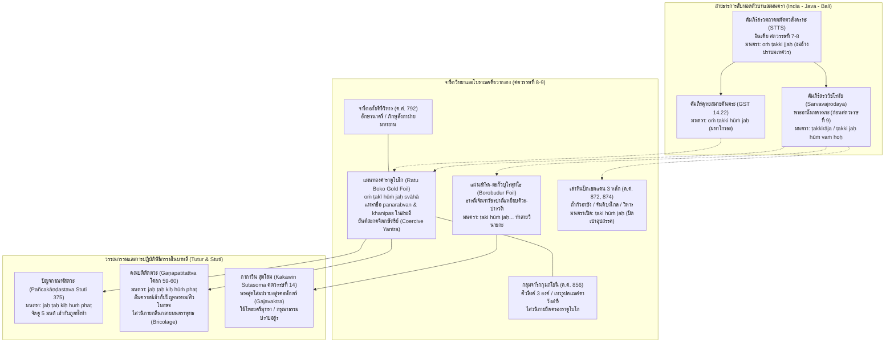

# บันทึกการอ่านและวิเคราะห์เอกสารจารึกวิทยาฉบับสมบูรณ์ (Epigraphic Source Dossier)
## มนตราแห่งราตูโบโกอีกคำรบหนึ่ง: ไสยเวทการเมือง พลวัตทางศาสนาระหว่างพุทธ-ไศวะ และภูมิรัฐศาสตร์เชิงสัญญะในสถาปัตยกรรมชวากลาง (Once More on the ‘Ratu Boko Mantra’: Magic, Realpolitik, and Bauddha-Śaiva Dynamics in Ancient Nusantara)

---

### ส่วนที่ 1: ข้อมูลบรรณานุกรมและการอ้างอิงมาตรฐาน (Bibliographic Metadata)

- **Source ID:** `S-2016-acri-02`
- **ชื่อไฟล์ PDF ในเครื่อง:** `S-2016-acri-02_Once_More_Ratu_Boko_Inscriptions.pdf`
- **ชื่อไฟล์ข้อความสกัด:** `S-2016-acri-02_Once_More_Ratu_Boko_Inscriptions.txt` (ข้อความวิชาการฉบับสมบูรณ์ บันทึกผลการวิจัยเชิงลึกด้านจารึกวิทยา อักขรวิทยา มนตราศาสตร์ เทววิทยาเปรียบเทียบ และประวัติศาสตร์การเมืองชวากลางยุคคลาสสิก)
- **ประเภทเอกสาร:** บทความวิจัยในบทหนังสือวิชาการรวมบทความระดับนานาชาติผ่านการประเมินโดยผู้ทรงคุณวุฒิ (Peer-reviewed Book Chapter) ในชุด *Esoteric Buddhism in Maritime Asia: Networks of Masters, Texts, Icons*
- **ภาษาของเอกสาร:** ภาษาอังกฤษ (EN) พร้อมการตรวจสอบ ปริวรรต และวิเคราะห์ตัวบทปฐมภูมิหลายภาษา: ภาษาสันสกฤตคลาสสิกและตันตระ (Classical & Tantric Sanskrit) ตามระบบสากล IAST, ภาษาชวาโบราณร้อยกรองและร้อยแก้ว (Old Javanese Kawi), ภาษามลายูโบราณ (Old Malay), ภาษาทิเบตคลาสสิก (Classical Tibetan), ภาษาจีนโบราณในพระไตรปิฎกฉบับไทโช (Taishō Tripiṭaka), และภาษาซุนดาโบราณ (Old Sundanese)
- **ขอบเขตภูมิศาสตร์และวัฒนธรรม:** เกาะชวากลาง (ที่ราบสูงราตูโบโก Ratu Boko plateau, กลุ่มเทวสถานปรัมบานัน Prambanan / โลโรจงกรัง Loro Jonggrang, โบโรบูดูร์ Borobudur, ถ้ำศิวะแห่งอาบัง Gua Abang, จันดิบงโกล Candi Bongkol, จันดิเปเร็ง Pereng / วูกิรัน Wukiran, ดาวังสารี Dawangsari), เกาะบาหลี (สายธารการสืบทอดคัมภีร์ตูตูร์ Tutur และบทสวดสดุดีภาษาสันสกฤต Stuti), เกาะสุมาตรา (จารึกเตลากาบาตู Telaga Batu, จันดิกุมปุง Candi Gumpung แห่งมัวราจัมบี Muara Jambi, มัวราตากุส Muara Takus), ราชอาณาจักรกัมพูชาโบราณ (จารึกสด๊กก๊อกธม Sdok Kak Thom K.235, จารึก K.111), และอินเดียเหนือ-ตะวันออก (นาลันทา, วิกรมศิลา, แคชเมียร์)
- **วัสดุและบริบทการค้นพบ:**
  - แผ่นทองคำจารึกรูปวัชระสองแฉกสี่เหลี่ยมขนมเปียกปูน (Vajra-shaped double diamond gold foil inscription) สลักอักษรกวิโบราณ ภาษาสันสกฤต ประกอบด้วยมนตราพระวัชรปาณีโพธิสัตว์และไตรโลกยวชิยะ `oṁ ṭakī hūṁ jaḥ svāhā` ทั้งสี่ด้าน โดยมีอักษรชวาโบราณแทรกในวงกลมสระอี ได้แก่ พระนาม `panarabvan` (พระเจ้าราไก ปานาราบัน) และคำว่า `khanipas` ค้นพบ ณ บริเวณซุ้มประตูด้านทิศตะวันตกของโบราณสถานราตูโบโก (ปัจจุบันตัวโบราณวัตถุสูญหาย เหลือเพียงภาพวาดจำลองลายเส้น facsimile ของ Soehamir ค.ศ. 1950)
  - ศิลาจารึกเสาหินปักเขตแดน (Stone boundary posts / Boundary markers) ศตวรรษที่ 9 จากชวากลาง จำนวน 3 หลัก สลักมนตรานำหน้า `ṭaki hūṁ jaḥ` (เดิมอ่านผิดเป็น `paki hūṁ jaḥ`) ได้แก่ เสาหินทรงกระบอกจากเทวาลัยถ้ำไศวนิกายกัวอาบัง ศักราช 794 มหาศักราช (ค.ศ. 872), เสาหินจากจันดิบงโกล (ไศวนิกาย), และเสาหินระบุคำว่าวิหาร ศักราช 796 มหาศักราช (ค.ศ. 874)
  - ศิลาจารึกหลักที่ 4 สลักมนตราขยายความซ้ำสองครั้ง `ṭaki hūṁ jaḥ jaḥ hūṁ vaṁ hoḥ`
  - แผ่นโลหะผสมตะกั่ว-สำริดจากบริเวณใกล้เคียงบุโรพุทโธ (Borobudur lead-bronze foil) สลักธารณีมหาเราทรนามหฤทัย (Mahāraudranāmahṛdaya) อัญเชิญพระจัณฑวัชรปาณีเหยียบเหนือพระอุระของนางปารวตีและเศียรพระศิวะ และมนตรา `ṭaki hūṁ jaḥ...` (คริสต์ศตวรรษที่ 8–10)
  - กลุ่มจารึกศิลาบนที่ราบสูงราตูโบโก: จารึกอภัยคีรีวิหาร (Abhayagirivihāra Inscription ค.ศ. 792) อักษรนาครี ภาษาสันสกฤต, กลุ่มจารึกไศวนิกายของเจ้าชายกุมภโยนี (Kumbhayoni Inscriptions ค.ศ. 856) ได้แก่ จารึกกฤตติวาสลิงคะ (Kṛttivāsaliṅga), ตรยัมพกะลิงคะ (Tryambakaliṅga), หระลิงคะ (Haraliṅga), และจารึกดาวังสารี (Dawangsari) ใกล้เทวรูปพระพิฆเนศขนาดยักษ์
- **การอ้างอิงฉบับเต็มระบบ Chicago/Turabian Notes-Bibliography:**  
  Acri, Andrea. "Once More on the ‘Ratu Boko Mantra’: Magic, Realpolitik, and Bauddha-Śaiva Dynamics in Ancient Nusantara." In *Esoteric Buddhism in Mediaeval Maritime Asia: Networks of Masters, Texts, Icons*, edited by Andrea Acri, 323–357. Singapore: ISEAS–Yusof Ishak Institute, 2016.

---

### ส่วนที่ 2: แผนผังการจัดสรรเข้าสู่บทและหัวข้อย่อย (Chapter & Section Mapping Matrix)

- **บทที่ 2: จารึกสำคัญไขประวัติศาสตร์ในคาบสมุทรและหมู่เกาะ: ยุคชวากลาง (ศตวรรษที่ 8–10)**
  - **หัวข้อย่อย 2.3 (ราชวงศ์ไศเลนทร์ ราชวงศ์สัญชัย และภูมิศาสตร์การเมืองบนที่ราบปรัมบานัน):**  
    วิเคราะห์การสืบทอดอำนาจและภูมิทัศน์การเมืองในรัชสมัยพระเจ้าราไก ปานาราบัน (Rakai Panaraban หรือ Dyah Somahāra ทรงครองราชย์ ค.ศ. 784–803 ตามจารึกวานัวเตองะฮ์ที่ 3 / Wanua Tengah III) ซึ่งเป็นยุคสมัยที่ทับซ้อนกับการสร้างมหาเจดีย์บุโรพุทโธ การสร้างพุทธสถานบนราตูโบโก (จารึกอภัยคีรีวิหาร ค.ศ. 792) ตลอดจนการคลี่คลายรหัสคำว่า `panarabvan` บนแผ่นทองคำราตูโบโก ซึ่งเดิม Jeffrey Sundberg สันนิษฐานว่าเป็นผู้สร้าง แต่ Acri เสนอว่าพระองค์ตกเป็น "เป้าหมายเหยื่อแห่งการสะกดจิตไสยเวท" (Victim of coercive subjugation magic) (หน้า 323–324, 342–344)
  - **หัวข้อย่อย 2.4 (สงครามสืบราชสมบัติ ค.ศ. 856 และการเปลี่ยนผ่านอำนาจสู่ไศวนิกาย):**  
    การศึกษาสงครามแย่งชิงบัลลังก์ระหว่างพญาพาลาบุตร (Bālaputra) เจ้าชายสายไศเลนทร์ กับราไก ปิกาตัน (Rakai Pikatan) พันธมิตรสายสัญชัย ซึ่งได้รับการคลี่คลายผ่านจารึกศิวคฤหะ (Śivagṛha Inscription ค.ศ. 856) จารึกบนราตูโบโก และวรรณกรรม *กากาวิน รามายณะ* (Kakawin Rāmāyaṇa) แสดงให้เห็นว่าที่ราบสูงราตูโบโกคือสมรภูมิแตกหักทางยุทธศาสตร์ และเป็นจุดเปลี่ยนสำคัญที่พุทธศาสนามหายานหมดบทบาทจากการเป็นศาสนาแห่งรัฐ แล้วถูกแทนที่ด้วยสถาบันไศวนิกาย (หน้า 344–345)
  - **หัวข้อย่อยใหม่ที่ค้นพบเพิ่มเติม (2.11 ยันต์แผ่นทองคำและไสยเวทสงครามในเวทีการเมืองชวากลาง Tantric Yantra and War Magic in Central Javanese Realpolitik):**  
    การใช้แผ่นโลหะมีค่าจารึกมนตราและอักขระศักดิ์สิทธิ์มิใช่เพียงเครื่องรางคุ้มภัยส่วนบุคคล หากแต่ทำหน้าที่เป็น "ยันต์ไสยเวทเชิงรุก" (Aggressive / Coercive Yantra) ในการสะกด ผูกมัด และควบคุมเจตจำนงของพระมหากษัตริย์และแม่ทัพนายกอง สะท้อนการใช้ศาสนพิธีตันตระเป็นเครื่องมือขับเคี่ยวอำนาจทางการเมืองจริง (Realpolitik) ในราชสำนักโบราณ (หน้า 330–332, 342–346)

- **บทที่ 7: ศาสนา ความเชื่อ และเครือข่ายพุทธตันตระ/ไศวนิกายข้ามสมุทร: มนตรา ปรัชญา และการสังเคราะห์เทพเจ้า**
  - **หัวข้อย่อย 7.1 (วัชรยานยุคต้นและวงจรไตรโลกยวชิยะ Subjugation of Maheśvara):**  
    การสืบค้นร่องรอยคัมภีร์ *สรวตถาคตตัตตวสังครหะ* (*Sarvatathāgatatattvasaṅgraha* / STTS) ในชวากลาง ซึ่งมีศูนย์กลางอยู่ที่ตำนานพระวัชรปาณีปราบพระมเหศวร (พระศิวะ) และบริวาร นำมาสู่การใช้มนตราตระกูลวัชระ `oṁ ṭakī hūṁ jaḥ` (และภาคขยาย `ṭaki hūṁ jaḥ jaḥ hūṁ vaṁ hoḥ`) ในฐานะ "ขอช้างวัชระ" (Vajrāṅkuśa) และ "บ่วงบาศวัชระ" (Vajrapāśa) เพื่อการเรียกหา (Ākarṣaṇa) และสะกดจิตให้สยบยอม (Vaśīkaraṇa) (หน้า 323, 334–336, 341–342)
  - **หัวข้อย่อย 7.2 (เครือข่ายอภัยคีรีวิหาร ลังกา-ชวา และสำนักสงฆ์ข้ามสมุทร):**  
    บทบาทของจารึกอภัยคีรีวิหาร (ค.ศ. 792) สลักด้วยอักษรนาครีบนราตูโบโก ซึ่งก่อตั้งขึ้นเพื่อต้อนรับพระภิกษุจากสำนักอภัยคีรีวิหารแห่งเกาะอนุราธปุระ ลังกา อันเป็นศูนย์กลางพุทธศาสนาฝ่ายที่เปิดรับมหายานและตันตรยาน เปรียบเทียบกับร่องรอยคำสอนของพระอานันทครรภะ (Ānandagarbha) ผู้รจนาคัมภีร์ *สรววัชโรทัย* (*Sarvavajrodaya*) (หน้า 324, 334, 344)
  - **หัวข้อย่อยใหม่ที่ค้นพบเพิ่มเติม (7.7 ชุมทางเทววิทยาพระคเณศ พระอมฤตกุณฑลิน และการกลืนกลายข้ามลัทธิ Syncretic and Polemical Dynamics of Gaṇapati and Amṛtakuṇḍalin):**  
    การคลี่คลายบทบาททวิลักษณ์ของพระพิฆเนศ/วินายกะ ในฐานะทั้ง "ผู้สร้างอุปสรรค" (Vināyaka) และ "ผู้ขจัดอุปสรรค" (Vighnāntakṛt) ซึ่งถูกฝ่ายพุทธตันตระมองว่าเป็นปีศาจบริวารของพระศิวะที่ต้องถูกกำราบด้วยพระอมฤตกุณฑลิน หรือพระจัณฑวัชรปาณี แต่ต่อมาฝ่ายไศวนิกายในชวากลางและบาหลีได้ดำเนินการ "กลืนกลายเชิงสัญญะ" (Textual and ritual bricolage) ด้วยการยึดเอามนตราพุทธ `ṭaki jaḥ hūṁ` ไปแปลงเป็นบทสวดห้าพยางค์ `jaḥ ṭaḥ kiḥ hūṁ phaṭ` สังเคราะห์เข้ากับปัญจพรหมหรือปัญจมูรติของพระศิวะในคัมภีร์ *คณปติตัตตวะ* (*Gaṇapatitattva*) เพื่อใช้ขับไล่เสนียดจัญไรและศัตรู (หน้า 326–329, 337–342)

- **บทที่ 6: ภูมิทัศน์ศักดิ์สิทธิ์ สถาปัตยกรรม จารึกบนหน้าผา และระบบนิเวศน์จารึกวิทยา (Epigraphic Landscape & Sacred Geography)**
  - **หัวข้อย่อย 6.2 (ที่ราบสูงราตูโบโก: จากวิหารพุทธ มนตราอาถรรพ์ สู่ป้อมค่ายและเทวาลัยไศวนิกาย):**  
    การวิเคราะห์การเปลี่ยนแปลงเชิงหน้าที่ของพื้นที่ศักดิ์สิทธิ์บนเนินเขาราตูโบโก ซึ่งเปรียบเสมือนยอดเขาพระสุเมรุจำลอง มีการสถาปนาอภัยคีรีวิหารในยุคไศเลนทร์ (ค.ศ. 792) การฝังยันต์แผ่นทองคำสะกดราไก ปานาราบัน ณ ซุ้มประตูด้านทิศตะวันตก ก่อนจะถูกแปรสภาพเป็นป้อมปราการทางทหารและฐานที่มั่นทางศาสนาของฝ่ายไศวนิกายนำโดยเจ้าชายกุมภโยนี (Kumbhayoni) ในช่วงกลางศตวรรษที่ 9 ซึ่งปรากฏการประดิษฐานศิวลึงค์ 3 องค์ (กฤตติวาสลิงคะ, ตรยัมพกะลิงคะ, หระลิงคะ) และเทวรูปพระคเณศศิลาขนาดยักษ์แห่งดาวังสารี (หน้า 323, 344–345)
  - **หัวข้อย่อย 6.3 (จารึกเสาหินปักเขตแดนและถ้ำศักดิ์สิทธิ์ในชวากลาง Boundary Markers & Cave Sanctuaries):**  
    บทบาทของจารึกเสาหินปักเขตแดนที่ถ้ำกัวอาบัง (Gua Abang ค.ศ. 872) และจันดิบงโกล (Candi Bongkol) ซึ่งใช้มนตรา `ṭaki hūṁ jaḥ` ทำหน้าที่ขับไล่อุปสรรคและพิทักษ์พื้นที่ศักดิ์สิทธิ์ ทัดเทียมกับสูตรมงคล `oṁ avighnam astu gaṇapataye namaḥ` (หน้า 324, 334, 341–342)

---

### ส่วนที่ 3: สรุปสาระสำคัญเชิงวิเคราะห์และจุดยืนทางวิชาการ (Executive Academic Analysis)

#### 1. วิทยานิพนธ์และข้อถกเถียงหลักของผู้เขียน (Core Argument / Thesis)
Andrea Acri นำเสนอการวิเคราะห์ตีความเอกสารจารึกแผ่นทองคำราตูโบโกและตัวบทที่เกี่ยวข้อง ซึ่งปฏิวัติความเข้าใจเดิมของวงวิชาการในหลายประเด็นหลัก:

1. **การทบทวนสถานะของแผ่นทองคำราตูโบโกในฐานะ "ยันต์ไสยเวทสะกดจิตเชิงบังคับ" (The Ratu Boko Gold Foil as a Coercive Yantra):**  
   Acri โต้แย้งสมมติฐานดั้งเดิมของ Jeffrey Sundberg (2003) ที่เสนอว่าพระเจ้าราไก ปานาราบัน (Rakai Panaraban ทรงครองราชย์ ค.ศ. 784–803) ทรงเป็นผู้จารึกแผ่นทองคำนี้ด้วยพระองค์เองเพื่อสถาปนาสายสัมพันธ์อันศักดิ์สิทธิ์ระหว่างพระองค์กับพระพุทธเจ้าหรือเทวะตันตระ Acri และคณะ (ต่อยอดจาก Jordaan & Colless 2004) ชี้ให้เห็นว่า ตามหลักเกณฑ์และคู่มือการสร้างยันต์ไสยเวท (*yantra*) ในคัมภีร์ภาษาสันสกฤต เช่น *มนตรามโหทธิ* (*Mantramahodadhi*), *เนตรตันตระ* (*Netratantra*), *อัคนีปุราณะ* (*Agnipurāṇa*), และ *พรหมยามาละ* (*Brahmayāmala*) การจารึกชื่อของบุคคลลงใน "ฟองสระอักขระกลม" (Circular bubble of the grapheme `ī`) หรือการล้อมกรอบตัวอักษร เป็นกลวิธีทางไสยเวทที่เรียกว่า **"สัมปุฏะ" (Saṁpuṭa)** หรือ **"คราสตะ" (Grasta)** ซึ่งมีไว้สำหรับ **"การสะกดจิตมัดใจศัตรูหรือเหยื่อ" (Coercive Subjugation / Vaśīkaraṇa and Ākarṣaṇa)** แผ่นทองคำนี้จึงเป็นวัตถุยันต์ไสยเวทดำ/เชิงรุกที่สร้างขึ้นโดยฝ่ายตรงข้าม (อาจเป็นกลุ่มภิกษุพุทธตันตระฝ่ายตรงข้าม หรือขั้วอำนาจการเมืองปรปักษ์) เพื่อ "สะกด ผูกมัด และครอบงำจิตใจ" พระเจ้าราไก ปานาราบัน มิให้ขัดขวางหรือเบียดเบียนฝ่ายพุทธ (หน้า 330–332, 342–344)

2. **การค้นพบสายธารตัวบทใหม่ในบาหลี: ปัญจกาณฑัสตวะ (*Pañcakāṇḍastava*) และ คณปติตัตตวะ (*Gaṇapatitattva*):**  
   Acri ค้นพบหลักฐานชิ้นเอกที่เชื่อมโยงมนตราของแผ่นทองคำราตูโบโกเข้ากับวรรณกรรมศาสนาชวา-บาหลี โดยแสดงให้เห็นว่ามนตราพระพุทธตันตระ `ṭaki jaḥ hūṁ` ได้ถูกปรับโครงสร้างใหม่เป็น `jaḥ ṭaḥ kiḥ hūṁ phaṭ` ปรากฏอยู่ใน:
   - สรรเสริญภาษาสันสกฤตฝ่ายพุทธในบาหลี *ปัญจกาณฑัสตวะ* (*Pañcakāṇḍastava* สดุดีหมายเลข 375)
   - คัมภีร์ไศวนิกายประเภทตูตูร์ *คณปติตัตตวะ* (*Gaṇapatitattva* โศลกที่ 59–60 และอรรถกถาภาษาชวาโบราณ)  
   การค้นพบนี้พิสูจน์ว่า มนตราชุดนี้มิได้สาบสูญไปพร้อมกับการล่มสลายของราชวงศ์ไศเลนทร์ในชวากลาง แต่ได้รับการถ่ายทอด ขัดเกลา และกลืนกลายเข้าสู่สารบบเทววิทยาไศวนิกายในชวาตะวันออกและบาหลีอย่างต่อเนื่องยาวนานหลายศตวรรษ (หน้า 325–329)

3. **การประยุกต์ใช้ "เทคโนโลยีมนตราข้ามลัทธิ" (Trans-sectarian Appropriation & Textual Bricolage):**  
   ในบริบทไสยเวทโบราณ พิธีกรรมตันตระเป็น "พื้นที่สีเทา" (Grey zone / Penumbra) ที่ข้ามพ้นเส้นแบ่งทางนิกายอย่างเข้มงวด ทั้งฝ่ายพุทธและไศวะต่างแข่งขัน ประนีประนอม และหยิบยืมเทคโนโลยีทางจิตวิญญาณของกันและกัน ฝ่ายไศวนิกายในชวาได้ทำการ "รีแบรนด์" (Rebranding) มนตราปราบมารของพุทธตันตระ โดยนำเอาพยางค์มนต์ 5 พยางค์ (`jaḥ`, `ṭaḥ`, `kiḥ`, `hūṁ`, `phaṭ`) ไปจับคู่กับธาตุทั้งห้า (มหาภูต: ดิน, น้ำ, ไฟ, ลม, อากาศ) และรูปสำแดงทั้งห้าของพระศิวะ (อิศวร, ศังกร, มหาเทพ, รุทร, ปรมาชิวะ) ตลอดจนการปฏิบัติทางจิตเพื่อบรรลุโมกษะและการกำจัดศัตรู สะท้อนกระบวนการที่เลวี-สโตรสส์เรียกว่า *Bricolage* ทางวัฒนธรรม (หน้า 328, 341–342)

4. **การเชื่อมโยงมนตราตระกูลวัชระกับเทววิทยาพระพิฆเนศ/วินายกะ (Gaṇapati / Vināyaka Connection):**  
   Acri ชี้ให้เห็นสายสัมพันธ์ลึกซึ้งระหว่างพยางค์มนต์ `jaḥ` (ซึ่งเป็นสัญลักษณ์ของ "ขอช้าง" หรือ อังกุศะ Vajrāṅkuśa) กับช้างและพระคเณศ ในโลกทัศน์อินเดีย-เอเชียตะวันออกเฉียงใต้ ช้างคือเหยื่ออันดับหนึ่งของพิธีสะกดจิตและปราบพยศ ในคัมภีร์พุทธตันตระ พระคเณศถูกจัดประเภทเป็นเทพอสูรผู้สร้างอุปสรรค (Vināyaka) ประจำทิศเหนือหรือขอบนอกของมณฑล ที่ต้องถูกพระวัชรปาณีปราบปราม แต่ในขณะเดียวกันเมื่อถูกปราบแล้วก็ได้รับการแต่งตั้งเป็นผู้พิทักษ์ทวารและผู้ขจัดอุปสรรค (Vighnāntakṛt) ความคลุมเครือทวิลักษณ์นี้ทำให้พระคเณศกลายเป็น "สะพานเชื่อมข้ามลัทธิ" ส่งผลให้มนตรา `ṭaki hūṁ jaḥ` ถูกนำมาใช้แทนสูตรเบิกฤกษ์ `oṁ avighnam astu gaṇapataye namaḥ` บนเสาหินปักเขตแดนและจารึกต่างๆ ทั่วชวากลาง (หน้า 334–341)

5. **ภูมิรัฐศาสตร์เชิงสัญญะบนที่ราบสูงราตูโบโก (The Symbolic Geopolitics of Ratu Boko):**  
   ที่ราบสูงราตูโบโกมิใช่เพียงพระราชวังหรือป้อมค่ายธรรมดา แต่เป็น "ยอดเขาพระสุเมรุจำลอง" (Sumeru Axis) การที่กลุ่มสงฆ์ฝ่ายพุทธสร้างอภัยคีรีวิหารขึ้นที่นี่ใน ค.ศ. 792 และฝังยันต์ทองคำสะกดจิตพระเจ้าราไก ปานาราบัน ณ ซุ้มประตูด้านทิศตะวันตก สะท้อนความพยายามในการควบคุมศูนย์กลางจักรวาล ก่อนที่ฝ่ายไศวนิกายนำโดยเจ้าชายกุมภโยนีจะเข้ายึดครองพื้นที่ เบียดขับอิทธิพลพุทธออกไป แล้วสถาปนาศิวลึงค์และเทวรูปพระคเณศขนาดยักษ์แห่งดาวังสารีขึ้นทับซ้อน เพื่อประกาศชัยชนะทางการเมืองและศาสนาของฝ่ายสัญชัยเหนือฝ่ายไศเลนทร์ (หน้า 342–346)

#### 2. บริบทประวัติศาสตร์นิพนธ์และการประเมินความน่าเชื่อถือ (Historiography & Source Criticism)
Acri นำระเบียบวิธีวิจัยทางจารึกวิทยาเชิงวิพากษ์ (Critical Epigraphy) ผสานกับประวัติศาสตร์ศาสนาเปรียบเทียบและการวิเคราะห์ตัวบทข้ามภูมิภาค มาสลายข้อจำกัดของงานศึกษารุ่นก่อน:

- **การก้าวพ้นข้อจำกัดของ Sundberg (2003):** Sundberg มองว่าแผ่นทองคำคือ "เครื่องรางส่วนพระองค์ของกษัตริย์" ที่แสดงความจงรักภักดีต่อพุทธตันตระ แต่ Acri ชี้ให้เห็นข้อบกพร่องว่า ในจารึกไม่มีการระบุพระนามเทพเจ้า มีแต่พระนามกษัตริย์ที่ถูกกักขังอยู่ในวงกลมของสระอี ซึ่งขัดกับหลักการสร้างรูปเคารพหรือยันต์บูชาทั่วไป แต่ตรงเป๊ะกับคู่มือไสยเวททำลายล้าง/สะกดศัตรูในคัมภีร์ตันตระอินเดีย
- **การต่อยอดและปรับปรุงข้อเสนอของ Jordaan & Colless (2004):** แม้ Jordaan และ Colless จะเสนอเป็นกลุ่มแรกว่ายันต์นี้มีเป้าหมายเพื่อสะกดและเปลี่ยนศาสนาของพระเจ้าราไก ปานาราบัน แต่พวกเขายังขาดหลักฐานทางคัมภีร์ตันตระมารองรับ Acri ได้เติมเต็มช่องว่างนี้อย่างสมบูรณ์ด้วยการนำคัมภีร์ *สรววัชโรทัย* (*Sarvavajrodaya*), *คุหยสมาชตันตระ* (*Guhyasamājatantra*), *มนตรามโหทธิ*, *เนตรตันตระ*, และ *วีณาศิขาตันตระ* มาพิสูจน์โครงสร้างรูปทรงเรขาคณิต (สี่เหลี่ยม, วัชระ, วงกลม) และคำลงท้าย (`svāhā` vs `phaṭ`)
- **การเชื่อมต่อจารึกชวากลางกับวรรณกรรมกวิและประเพณีบาหลี:** Acri สลายมายาคติที่มองว่าจารึกชวากลางตัดขาดจากวรรณกรรมชวาตะวันออกและบาหลี โดยแสดงให้เห็นว่าคัมภีร์ *คณปติตัตตวะ* และบทสวด *ปัญจกาณฑัสตวะ* ได้เก็บรักษาแก่นสารทางเทววิทยาและมนตราศาสตร์ยุคชวากลางไว้อย่างแม่นยำ รวมถึงการสอบทานกับมหากาพย์ *กากาวิน สุตโสม* (*Kakawin Sutasoma*) ในการปราบอสูรคชพักตร์ (Gajavaktra)

---

### ส่วนที่ 4: สารบัญข้อค้นพบเชิงลึกแยกตามมิติจารึกวิทยา (Thematic Epigraphic Findings with Exact Pages)

1. **ประวัติศาสตร์นิพนธ์และการตีความทางประวัติศาสตร์การเมืองชวากลาง (หน้า 323–324, 342–346):**
   - การคลี่คลายสถานะของพระเจ้าราไก ปานาราบัน (Rakai Panaraban หรือ Dyah Somahāra) ผู้ครองราชย์ระหว่าง ค.ศ. 784–803 ตามที่ระบุในจารึกวานัวเตองะฮ์ที่ 3 (Wanua Tengah III ศักราช 828 มหาศักราช / ค.ศ. 908) พระองค์มิได้เป็นกษัตริย์ไศเลนทร์ที่สร้างยันต์นี้เพื่ออุทิศตนแด่พุทธศาสนาตามข้อเสนอเดิมของ Kusen (1994) และ Sundberg (2003) หากแต่ทรงเป็นกษัตริย์ในสายสัญชัยที่อาจมีความขัดแย้งกับสถาบันสงฆ์มหายาน จนตกเป็นเป้าหมายของการทำพิธีทางไสยเวทสะกดจิต (หน้า 323, 342–343)
   - การสอดประสานข้อมูลกับพงศาวดารภาษาซุนดาโบราณ *จริตา ปะระฮ์ยางัน* (*Carita Parahyaṅan* ศตวรรษที่ 16) ซึ่งบันทึกบทสนทนาระหว่างราฮยัง สัญชัย กับพระราชโอรส (ราไก ปานาราบัน) ความว่า *"ลูกเอ๋ย จงเปลี่ยน (ละทิ้ง) ศาสนาของพ่อเสียเถิด เพราะมันทำให้ผู้คนหวาดกลัว"* (*hayva dek nurutan agama aiṅ, kena aiṅ mrәtakutna uraṅ ryea*) สะท้อนความทรงจำทางประวัติศาสตร์ว่าด้วยการเปลี่ยนผ่านหรือความตึงเครียดทางศาสนาระหว่างไศวะที่เคร่งครัดรุนแรงกับพุทธศาสนาในรัชสมัยดังกล่าว (หน้า 323–324, 343–344)
   - สงครามสืบราชสมบัติช่วงกลางศตวรรษที่ 9 ระหว่างเจ้าชายพาลาบุตรแห่งราชวงศ์ไศเลนทร์ กับราไก ปิกาตัน แห่งสายสัญชัย จบลงด้วยการพ่ายแพ้ของฝ่ายไศเลนทร์และการถอยร่นของพาลาบุตรไปสู่สุมาตรา (ศรีวิชัย) ส่งผลให้ที่ราบสูงราตูโบโกเปลี่ยนมือจากศูนย์กลางพุทธศาสนา (อภัยคีรีวิหาร) ไปสู่การเป็นฐานที่มั่นของขุนศึกและนักพรตไศวนิกายนาม "กุมภโยนี" (Kumbhayoni) ผู้สถาปนาศิวลึงค์พิทักษ์ชัยชนะใน ค.ศ. 856 (หน้า 344–345)

2. **ตัวบทจารึก การอ่าน ศักราช และอักขรวิทยา (หน้า 323–325, 334–336):**
   - **แผ่นทองคำราตูโบโก:** รูปทรงสี่เหลี่ยมขนมเปียกปูนคู่เชื่อมต่อกันคล้ายวัชระ สลักด้วยอักษรกวิโบราณ (Early Kawi script) ยุคศตวรรษที่ 8–9 ภาษาสันสกฤต ประกอบด้วยมนตรา `oṁ ṭakī hūṁ jaḥ svāhā` สี่ครั้งล้อมรอบสี่ด้าน ความโดดเด่นทางอักขรวิธีคือการขยาย "หาง/ฟองกลมของสระอี" (Exaggerated circular bubble of the grapheme `ī`) ในคำว่า `ṭakī` เพื่อบรรจุคำภาษาชวาโบราณว่า `panarabvan` ในด้านหนึ่ง และคำว่า `khanipas` ในอีกด้านหนึ่ง (หน้า 323, 331)
   - **การแก้ไขข้อผิดพลาดทางอักขรวิทยาของนักจารึกรุ่นเก่า:** Arlo Griffiths (2014a) และ Acri พิสูจน์ว่า อักษรตัวแรกของมนตราบนเสาหินเขตแดน 3 หลักในชวากลาง ซึ่งเดิม Stutterheim (1932) และ Damais (1955) อ่านเป็น `paki hūṁ jaḥ` นั้น แท้จริงแล้วต้องอ่านว่า `ṭaki hūṁ jaḥ` โดยเส้นสัณฐานของอักษร `ṭa` ในอักษรกวิโบราณมีลักษณะเฉพาะที่คล้ายคลึงกับ `pa` แต่มีหัวหยักหรือเส้นโค้งด้านล่างที่บ่งชี้ชัดเจนว่าเป็นพยัญชนะวรรคฏะ (Retroflex `ṭa`) (หน้า 324, 334)
   - **จารึกเสาหินหลักที่ 4:** สลักมนตราขยายความซ้ำสองครั้ง Reconstituted text: `ṭaki hūṁ jaḥ jaḥ hūṁ vaṁ hoḥ` ซึ่งตรงกับสูตรมนตราในคัมภีร์ *กริยาสังครหะปัญจิกา* (*Kriyāsaṅgrahapañjikā* 6.2.9) ของกุลทัตตะ ว่าด้วยการอภิเษกอาจารย์ตันตระ (หน้า 324, 336)
   - **แผ่นสำริด-ตะกั่วบุโรพุทโธ:** จารึกอักษรกวิโบราณ ตัวบทภาษาสันสกฤต สลักธารณี *มหาเราทรนามหฤทัย* (*Mahāraudranāmahṛdaya*) และมนตราปิดท้าย `ṭaki hūṁ jaḥ jaḥ hūṁ kiṭa hūṁ ṭaki dhuṁ kiṭa dhuṁ iya ija i_ḥ svāhā` ซึ่งแสดงปรากฏการณ์ "การกลับพยางค์มนต์" (Mantric inversion) เช่น `kiṭa` แทน `ṭaki` (หน้า 324, 328, 340)

3. **มิติศาสนา ลัทธิความเชื่อ และพิธีกรรมตันตระ (หน้า 325–333, 336–342):**
   - **พิธีกรรมไสยเวท 6 ประการ (Ṣaṭkarmāṇi):** การอธิบายหน้าที่ของมนตราและยันต์ราตูโบโกผ่านกรอบพิธีกรรมตันตระ ได้แก่ ศานติ (Śānti / ระงับภัย), วศยะหรือวศีกรณะ (Vaśya / Vaśīkaraṇa / สะกดจิตให้ยอมสยบ), สตัมภนะ (Stambhana / ทำให้หยุดนิ่งงงงวย), ทเวษะหรือวิทเวเษณะ (Dveṣa / Vidveṣaṇa / ทำให้แตกแยกเป็นศัตรู), อุจจาฏนะ (Uccāṭana / ขับไล่กวาดล้าง), และมารณะ (Māraṇa / ฆ่าฟันทำลายล้าง) เสริมด้วยการดึงดูดผูกมัด (Ākarṣaṇa) (หน้า 330)
   - **โครงสร้างเรขาคณิตเชิงสัญลักษณ์ของยันต์ตาม *มนตรามโหทธิ* (Mantramahodadhi Ch. 25):**  
     - รูปสามเหลี่ยมประดับสวัสติกะ = วศีกรณะ (สะกดจิต)
     - รูปสี่เหลี่ยมเชื่อมโยงวัชระ = สตัมภนะ (ตรึงให้อยู่กับที่) หรือ มารณะ (ประหาร)
     - รูปวงกลม = ทเวเษณะ (สร้างความเกลียดชัง/เป็นศัตรู) หรือ วศีกรณะ  
     รูปทรงของแผ่นทองคำราตูโบโกที่เป็น "สี่เหลี่ยมคู่รูปวัชระ" (Vajra-shaped double quadrangle) และการขยาย "วงกลมสระอี" จึงสอดคล้องอย่างสมบูรณ์กับแบบแผนการสร้างยันต์เพื่อการสะกดและตรึงศัตรู (หน้า 331–332)
   - **คำลงท้ายมนตราเชิงไสยเวท:** คำว่า `svāhā` ในแผ่นทองคำราตูโบโกมิได้แปลว่าคำอวยพรเสมอไป หากแต่ในระบบยันต์ทำหน้าที่กำกับการสะกดจิต (Subjugation / Vaśīkaraṇa) และการดึงดูด (Ākarṣaṇa) ในขณะที่คำว่า `phaṭ` ใน *คณปติตัตตวะ* ทำหน้าที่ประดุจ "ระเบิดเสียงศักดิ์สิทธิ์" (Sonic explosion) เพื่อการทำลายล้าง (Māraṇa) และการเจาะทะลวงสิ่งกีดขวาง (หน้า 332)
   - **การจัดระบบมนตรา 5 หน่วยใน *คณปติตัตตวะ* (หน้า 328):**
     - `phaṭ` = ธาตุอากาศ (Ākāśa) = ปรมาชิวธยานะ (Paramaśivadhyāna) = บรรลุโมกษะ (Mokṣa)
     - `hūṁ` = ธาตุลม (Vāyu) = รุทรธยานะ (Rudradhyāna) = ทำลายล้างศัตรู (Ripusaṁhāra)
     - `kiḥ` = ธาตุไฟ (Tejas) = มหาเทพธยานะ (Mahādevadhyāna) = ความสำเร็จในทางโลก (Kasvasthan iṅ rāt)
     - `ṭaḥ` = ธาตุน้ำ (Āpas) = ศังกรธยานะ (Śaṅkaradhyāna) = สัมฤทธิผลในกิจการทั้งปวง (Sakārya siddha)
     - `jaḥ` = ธาตุดิน (Pṛthivī) = อิศวรธยานะ (Īśvaradhyāna) = เมตตามหานิยม/คนรักใคร่ (Kasihana deniṅ janma / Vaśīkaraṇa)

4. **มิติสถาปัตยกรรม ศาสนสถาน และภูมิสัญลักษณ์ (หน้า 323–324, 343–345):**
   - **ตำแหน่งการค้นพบ ณ ซุ้มประตูด้านทิศตะวันตก (Western Entrance-Gate):** แผ่นทองคำราตูโบโกถูกค้นพบใต้ฐานซุ้มประตูด้านทิศตะวันตกของหมู่อาคารราตูโบโก ทิศตะวันตกในระบบมณฑลตันตระมีความสัมพันธ์กับ "บ่วงบาศ" (Pāśa / Vajrapāśa) และการจับมัดสะกดจิต (Vaśīkaraṇa) สอดคล้องกับการวางตำแหน่งยันต์เพื่อดักสะกดบุคคลสำคัญที่เดินผ่านเข้าสู่ประตูป้อมปราการ (หน้า 324, 343)
   - **การทับซ้อนทางภูมิทัศน์ศาสนาบนราตูโบโก:** พัฒนาการจากอารามสงฆ์ฝ่ายพุทธมหายาน-วัชรยาน (อภัยคีรีวิหาร ค.ศ. 792) สู่การสร้างป้อมปราการคูเมือง กำแพงหิน และเทวาลัยไศวนิกายในรัชสมัยเจ้าชายกุมภโยนี (ค.ศ. 856) สะท้อนการแย่งชิงพื้นที่ชัยภูมิสูงสุดเหนือที่ราบปรัมบานัน ซึ่งสามารถมองเห็นทิวทัศน์ของมหาเทวาลัยโลโรจงกรังและจันดิเซวูได้อย่างชัดเจน (หน้า 344–345)
   - **เทวาลัยถ้ำและเสาหินเขตแดน:** การใช้มนตรา `ṭaki hūṁ jaḥ` สลักบนเสาหินทรงกระบอก ณ ถ้ำกัวอาบัง (Gua Abang ค.ศ. 872) ซึ่งเป็นถ้ำที่ขุดเจาะเข้าไปในหน้าผาหินทัฟฟ์ (Tuff cliff) เพื่อเป็นอาศรมไศวนิกาย แสดงการผนวกมนตราเข้ากับสถาปัตยกรรมถ้ำหินเจาะ (Rock-cut cave architecture) เพื่อการพิทักษ์เขตแดนศักดิ์สิทธิ์ (หน้า 334)

5. **มิติอาหารการกิน วิถีชีวิต การเกษตร และไสยเวทชาวบ้าน (หน้า 326, 329–330):**
   - **พิธีขับไล่หนูนาด้วยมนตราพระคเณศ (Agricultural Exorcism / Paṅlukatan Gaṇapati):**  
     ส่วนท้ายของคัมภีร์ *คณปติตัตตวะ* ปรากฏข้อความภาษาชวาโบราณว่าด้วยการทำพิธีแก้คุณไสยและปัดเป่าภัยพิบัติทางการเกษตร โดยระบุให้ชาวนาเดินเวียนทักษิณาวรรตรอบผืนนาข้าวของตน โดยถือลำไม้ไผ่งาช้าง (*pring gadin* / ivory bamboo) ที่วาดรูปพระพิฆเนศทรงถือจักรในพระหัตถ์ซ้ายและถือกระบองในพระหัตถ์ขวา เพื่อกำจัดกองทัพ "หนูนา" (*māraṇa*) ที่มากัดกินพืชผล (หน้า 329)
   - Acri ชี้ให้เห็นว่า พิธีกรรมนี้มิใช่เรื่องพื้นเมืองบาหลีที่แต่งขึ้นเองตามอำเภอใจ แต่สืบทอดมาจากคติชนอินเดียโบราณที่ยกย่องพระพิฆเนศเป็น "วีรบุรุษแห่งฤดูเก็บเกี่ยว" (Harvest hero) และผู้ปราบหนู (พาหนะของพระองค์คือหนูมุสิกะ ซึ่งเป็นสัญลักษณ์ของความมืดและผู้ทำลายพืชผล) สะท้อนการประยุกต์ใช้คัมภีร์ปรัชญาชั้นสูงลงสู่วิถีชีวิตการเกษตรและการเอาชีวิตรอดของราษฎร (หน้า 329–330)

6. **มิติการปกครอง กฎหมาย อาชญาสิทธิ์ (Daṇḍa) และคำสาปแช่งความภักดี (หน้า 343–346):**
   - **วัชระในฐานะอาชญาสิทธิ์แห่งรัฐ (Vajra as Legal Staff / Daṇḍa):**  
     Acri อ้างอิงข้อเสนอของ Ronald Davidson (2002) ว่าในยุคตันตระครองเมือง "วัชระ" มิใช่เพียงสัญลักษณ์ทางจิตวิญญาณ แต่เป็นตัวแทนของ "อาชญาสิทธิ์ในการลงทัณฑ์ของกษัตริย์" (*daṇḍa*) พระวัชรปาณีจึงทำหน้าที่ประดุจ "เสนาบดีฝ่ายปราบปราม" หรือผู้บังคับใช้กฎหมายแห่งธรรมจักร ปราบปรามผู้ดื้อดึงกระด้างกระเดื่อง (Durdāntadamaka) ซึ่งในโลกสัญลักษณ์คือพระมเหศวร แต่ในโลกแห่งความเป็นจริงคือกบฏหรือกษัตริย์ฝ่ายตรงข้าม (หน้า 344)
   - **การเปรียบเทียบกับจารึกเตลากาบาตู (Telaga Batu Inscription คริสต์ศตวรรษที่ 7 สุมาตรา):**  
     จารึกภาษามลายูโบราณของศรีวิชัยระบุคำสาปแช่งข้าราชบริพารและกบฏที่คิดคด โดยในบรรทัดที่ 12–14 กล่าวถึงการที่พวกกบฏใช้พิธีกรรมตันตระ น้ำมันพราย และวัตถุอาถรรพ์ โดยเฉพาะ **"ศรียันต์" (Śrīyantra)** การวาดรูปเหมือนของพระมหากษัตริย์ (*rūpinaṅku*) และการใช้เถ้ากระดูก (*bhasma*) เพื่อทำให้กษัตริย์หรือผู้คนเสียสติ เป็นหลักฐานยืนยันชัดเจนว่าราชสำนักในหมู่เกาะสุมาตราและชวามีความหวาดกลัวและคุ้นเคยกับการใช้ "ยันต์ไสยเวทการเมือง" โค่นล้มอำนาจกันมาตั้งแต่คริสต์ศตวรรษที่ 7 (หน้า 345)

7. **มิติปฏิสัมพันธ์ข้ามสมุทรและเครือข่ายนานาชาติ (หน้า 324–325, 334–336, 345–346):**
   - **เครือข่ายลังกา-ชวากลาง (Sri Lanka - Central Java Connection):**  
     จารึกอภัยคีรีวิหาร (ค.ศ. 792) สลักด้วยอักษรนาครี ยืนยันการปรากฏตัวของพระภิกษุสายสำนักอภัยคีรีวิหารแห่งศรีลังกาในราชสำนักไศเลนทร์ ซึ่งเป็นศูนย์กลางการแลกเปลี่ยนคัมภีร์ตันตรยานระดับนานาชาติ สอดรับกับบทบาทของพระชยภัทระ (Jayabhadra) พระเถระชาวสิงหลผู้เชี่ยวชาญวัชรยาน ณ มหาวิทยาลัยวิกรมศิลา (หน้า 324, 338)
   - **เครือข่ายชวา-เขมรโบราณ (Java - Khmer Connection):**  
     Acri ชี้ให้เห็นความเชื่อมโยงกับจารึกปราสาทสด๊กก๊อกธม (Sdok Kak Thom Inscription K.235 ค.ศ. 1052) ซึ่งบันทึกว่าพราหมณ์หิรัณยทามัน (Hiraṇyadāman) ได้นำคัมภีร์ไศวนิกายสายตันตระ 4 เล่ม โดยเฉพาะ *วินาศิขะ* (*Vināśikha* / *Vīṇāśikhatantra*) มาประกอบพิธีเทวราชาแด่พระเจ้าชัยวรมันที่ 2 บนเขาพนมกุเลน เพื่อ "ปลดปล่อยกัมพูชาจากการตกเป็นเมืองขึ้นของชวา" (*Javā*) ในคัมภีร์ *วีณาศิขาตันตระ* นี้เองที่ระบุพิธีสะกดจิตพระราชาและพระราชินี (*vaśīkaraṇa*) ด้วยการใช้ขอช้าง (Aṅkuśa) ตีศีรษะและใช้บ่วงบาศมายาพันธนาการไว้ (หน้า 346)
   - **เครือข่ายทิเบต-เอเชียตะวันออก:**  
     การแพร่หลายของมนตรา `ṭakki hūṁ jaḥ` และธารณีปราบมารในคัมภีร์ตันตระภาษาทิเบต (ตันจูร์), เอกสารโบราณจากตุนหวง (Dunhuang manuscripts), และพระไตรปิฎกภาษาจีนฉบับแปลของพระอโมฆวัชระ (Amoghavajra) และศุภกรสิงหะ (Śubhākarasiṁha) ยืนยันว่าชวากลางในศตวรรษที่ 8–9 เป็นจุดเชื่อมต่อสำคัญของโครงข่ายพุทธตันตระข้ามสมุทร (Esoteric Buddhist Maritime Silk Road) (หน้า 334–336, 338)

8. **มิติจารึกแผ่นโลหะ รูปเคารพขนาดเล็ก และเครื่องรางอาถรรพ์ (หน้า 323, 330–332, 340):**
   - ลักษณะเฉพาะของจารึกแผ่นทองคำและแผ่นสำริด-ตะกั่วในชวากลาง คือการไม่ได้ทำขึ้นเพื่อให้อ่านในที่สาธารณะ (Non-public epigraphy) หากแต่ทำขึ้นเพื่อ "บรรจุฝังไว้ในโครงสร้างสถาปัตยกรรม" (Foundation deposit) หรือพกพาเป็นเครื่องรางสะกดอาถรรพ์
   - การสลักมนตรากลับทิศหรือการสลับตำแหน่งพยางค์ (Inversion of mantric syllables) เช่น `kiṭa` แทน `ṭaki` หรือการย้าย `jaḥ` มาไว้หน้าสุดใน *คณปติตัตตวะ* (`jaḥ ṭaḥ kiḥ...`) สะท้อนกลวิธีทางไสยเวทเพื่อ "เข้ารหัสความลับ" (Cryptic coding) หรือการเพิ่มฤทธิ์เดชทางเวทมนตร์มิให้ผู้ไม่มีความรู้สามารถถอดถอนอาถรรพ์ได้ (หน้า 328, 332, 340)

9. **พรมแดนปัญหา ปริศนาวิชาการ และจริยธรรมโบราณคดี (หน้า 323, 346):**
   - **ปริศนาการสูญหายของแผ่นทองคำราตูโบโก:** แผ่นทองคำชิ้นประวัติศาสตร์นี้ถูกค้นพบในช่วงทศวรรษ 1940 และได้รับการวาดลายเส้นโดย Soehamir ลงพิมพ์ในรายงาน *Oudheidkundig Verslag 1950* แต่ต่อมาตัวโบราณวัตถุชิ้นจริงได้สูญหายไปอย่างไร้ร่องรอยจากคลังโบราณคดีอินโดนีเซีย ทำให้การศึกษาในปัจจุบันต้องพึ่งพาภาพวาดลายเส้นเพียงอย่างเดียว ถือเป็นบทเรียนสำคัญทางจริยธรรมการอนุรักษ์มรดกความทรงจำ (หน้า 323)
   - **ปริศนาคำว่า `khanipas`:** Acri ยังคงเปิดกว้างต่อความหมายของคำภาษาชวาโบราณนี้ โดยเสนอความเป็นไปได้ 2 ประการ: (1) อาจเป็นชื่อเฉพาะบุคคล (Personal name) ของพระมเหสี พระราชโอรส หรือแม่ทัพนายกองของพระเจ้าราไก ปานาราบัน ที่ถูกสะกดจิตไปพร้อมกัน หรือ (2) อาจเป็นชื่อของบุคคลผู้ว่าจ้าง/ผู้กระทำพิธีสะกดจิตที่ต้องการผูกมัดกษัตริย์ไว้กับตนเอง ซึ่งยังคงเป็นปริศนาทางจารึกวิทยาที่รอคอยการค้นพบหลักฐานใหม่ (หน้า 346)

---

### ส่วนที่ 5: คลังข้อความอ้างอิงตรงและเชิงอรรถสำเร็จรูป (Verbatim Quotes & Footnote Bank)

1. **มนตราบนแผ่นทองคำราตูโบโก (The Ratu Boko Inscribed Gold Foil, p. 323):**  
   > *Verbatim:* "he artefact, an inscribed gold foil consisting of two connected diamond-shaped leaves recalling a vajra, bears the Sanskrit mantra oṁ ṭakī hūṁ jaḥ svāhā repeated on each of its four sides. A unique, and intriguing, feature of the inscription is the engraving of the words panarabvan and khanipas within an exaggerated circular bubble in the two cases of the grapheme ī in the sequence ṭakī." (p. 323)  
   > *แปลสรุป:* "โบราณวัตถุดังกล่าวเป็นแผ่นทองคำจารึกซึ่งประกอบด้วยแผ่นรูปสี่เหลี่ยมขนมเปียกปูนสองแผ่นเชื่อมต่อกันแลดูคล้ายรูปวัชระ สลักมนตราภาษาสันสกฤตว่า `oṁ ṭakī hūṁ jaḥ svāhā` ซ้ำกันทั้งสี่ด้าน ลักษณะเฉพาะอันน่าพิศวงยิ่งของจารึกนี้คือการสลักคำว่า `panarabvan` (ปานารับวัน = ปานาราบัน) และ `khanipas` (ขนิปัส) ไว้ภายในฟองกลมที่ขยายใหญ่ผิดปกติของรูปอักษรสระอีทั้งสองตำแหน่งในลำดับอักขระ `ṭakī`"  
   > *เชิงอรรถสำเร็จรูป:* Andrea Acri, "Once More on the ‘Ratu Boko Mantra’: Magic, Realpolitik, and Bauddha-Śaiva Dynamics in Ancient Nusantara," in *Esoteric Buddhism in Mediaeval Maritime Asia: Networks of Masters, Texts, Icons*, ed. Andrea Acri (Singapore: ISEAS–Yusof Ishak Institute, 2016), 323.

2. **ตัวบทภาษาสันสกฤตจากปัญจกาณฑัสตวะ (*Pañcakāṇḍastava* โศลก 1–2, pp. 325–326):**  
   > *Verbatim (IAST):*  
   > "jaḥ-kāraḥ parvato jñeyaḥ / taḥ-kāro jaladhis tathā /  
   > kiḥ-kāraś ca mahātejo / huṁ-kāro vāyur eva ca // 1  
   > phaṭ-kāraś ca mahākāśaḥ / sarvavighnavināśanam /  
   > etāni sarvabhūtāni / tad eva satataṁ punaḥ // 2" (p. 325)  
   > *แปลสรุป:* "พยางค์ `jaḥ` พึงทราบว่าเป็นภูเขา (ธาตุดิน), และพยางค์ `taḥ` (ṭaḥ) คือมหาสมุทร (ธาตุน้ำ), พยางค์ `kiḥ` คือเดชานุภาพอันยิ่งใหญ่ (ธาตุไฟ), และพยางค์ `huṁ` คือสายลม (ธาตุลม) (1) และพยางค์ `phaṭ` คือห้วงอวกาศอันกว้างใหญ่ (ธาตุอากาศ), อันเป็นเครื่องทำลายล้างอุปสรรคทั้งปวง; มหาภูตทั้งหลายเหล่านี้ดำรงอยู่เช่นนั้นเนืองนิตย์ (2)"  
   > *เชิงอรรถสำเร็จรูป:* Acri, "Once More on the ‘Ratu Boko Mantra’," 325.

3. **ตัวบทภาษาสันสกฤตและอรรถกถาชวาโบราณจากคณปติตัตตวะ (*Gaṇapatitattva* 59–60, p. 327):**  
   > *Verbatim (IAST & Old Javanese):*  
   > "jaḥkāre pṛthivī jñeyaḥ / ṭaḥkāre āpa-saṁsthitaḥ /  
   > kiḥkāraś ca mahātejaḥ / hūṁkāre bāyu-saṁnyaset // 59  
   > phaṭkārākāśa-saṁyuktaḥ / mahāpātakanāśāya /  
   > pañcāṅgaṁ japayed vidvān / śivalokam avāpnuyāt // 60  
   > ndya ta ya / jah / ṭah / kih / hūṁ / phaṭ // iti saṅ hyaṅ pañcāṅga / japākna śivadhyāna / mahāpātaka vināśa denya // 0 //" (p. 327)  
   > *แปลสรุป:* "ในพยางค์ `jaḥ` พึงทราบว่าแผ่นดินประดิษฐานอยู่, ในพยางค์ `ṭaḥ` น้ำตั้งมั่นอยู่, พยางค์ `kiḥ` คือไฟอันรุ่งโรจน์, ในพยางค์ `hūṁ` พึงกำหนดวางสายลมไว้ (59) พยางค์ `phaṭ` ประกอบด้วยอากาศธาตุ เพื่อการทำลายล้างมหันตบาป ผู้มีปัญญาพึงบริกรรมสวดมนตราห้าองค์นี้ ย่อมบรรลุถึงศิวโลก (60) [อรรถกถาชวาโบราณ:] มนตรานั้นคืออะไรเล่า? คือ `jah`, `ṭah`, `kih`, `hūṁ`, `phaṭ` นี่คือพระปัญจางคะอันศักดิ์สิทธิ์ พึงสวดบริกรรมในการเพ่งศิวธยาน มหันตบาปทั้งหลายย่อมถูกทำลายล้างด้วยมนตรานี้"  
   > *เชิงอรรถสำเร็จรูป:* Acri, "Once More on the ‘Ratu Boko Mantra’," 327.

4. **การนิยามยันต์ไสยเวทและการสะกดจิตในคัมภีร์ภาษาสันสกฤต (Yantra and Saṁpuṭa Magic, pp. 330–331):**  
   > *Verbatim:* "Padoux (2011: 96–97), describing in detail analogous practices on the basis of Netratantra Ch. 18 and Kṣemarāja’s commentary, characterizes the technique called saṁpuṭa as the symbolic ‘encasing’ of a mantra ‘(or any part thereof, or any element with which it is associated) inside a space or casket, covered as with a lid or within two covers’... similarly, in Agnipurāṇa Ch. 138, ‘where saṃpuṭa is prescribed for the magical action of vaśīkaraṇa and ākarṣaṇa, it is described as the placing of the mantra around the sādhya—above, under and to its right and let: a spatial pattern, not an oral operation’. his practice, which is signiicantly associated with vaśīkaraṇa and ākarṣaṇa, resonates with the encasing of the personal raka title ‘Panaraban’ (and ‘Khanipas’) on the Ratu Boko gold foil within the circular ī of the mantra ṭakī." (pp. 330–331)  
   > *แปลสรุป:* "ปาดูซ์ (Padoux 2011: 96–97) อธิบายแนวปฏิบัติที่คล้ายคลึงกันโดยอิงจากคัมภีร์เนตรตันตระ บทที่ 18 และอรรถกถาของเกษมราช โดยระบุว่าเทคนิคที่เรียกว่า 'สัมปุฏะ' คือการ 'ห่อหุ้ม/บรรจุ' มนตราเชิงสัญลักษณ์ไว้ภายในพื้นที่หรือตลับผอบ เหมือนมีฝาปิดครอบไว้สองด้าน... เช่นเดียวกับในคัมภีร์อัคนีปุราณะ บทที่ 138 ซึ่งบัญญัติให้ใช้สัมปุฏะสำหรับการกระทำทางไสยเวทแบบวศีกรณะ (สะกดจิต) และอากรรษณะ (ดึงดูด) โดยอธิบายว่าเป็นการวางมนตราล้อมรอบเป้าหมาย (สาธยะ)—ทั้งด้านบน ด้านล่าง ด้านขวา และด้านซ้าย อันเป็นแบบแผนเชิงพื้นที่ มิใช่เพียงการสวดออกเสียง การปฏิบัตินี้ซึ่งสัมพันธ์อย่างมีนัยสำคัญกับวศีกรณะและอากรรษณะ สอดรับอย่างยิ่งกับการบรรจุราชทินนามประจำพระองค์ 'ปานารามัน' (และ 'ขนิปัส') บนแผ่นทองคำราตูโบโกไว้ภายในวงกลมของสระอีในมนตรา `ṭakī`"  
   > *เชิงอรรถสำเร็จรูป:* Acri, "Once More on the ‘Ratu Boko Mantra’," 330–331.

5. **บทบาทของขอช้าง (Aṅkuśa) และการปราบพยศในสรววัชโรทัย (*Sarvavajrodaya*, p. 334):**  
   > *Verbatim:* "He who wishes to efect complete freedom from obstacles should cover them (i.e. the eigies of the directional deities who might cause trouble, pinned down in section 55) with mud. If in this condition (evam) they [still] make trouble, he should immerse himself in [the deity] Vajrahūṁkāra and adduct them with the ̣akkirāja; should also adduct them with the Vajra-goads etc.; should bind the [seal of] Vajrahūṁkāra; and should step on the eigy of the obstacle with his let foot. Ater the practice of [self-]expansion with hūṁ vaṁ hūṁ etc., he should stand in pratyālīḍha stance…" (p. 334, citing Griffiths 2014a: 178)  
   > *แปลสรุป:* "ผู้ใดปรารถนาจะขจัดอุปสรรคให้หมดสิ้นไปโดยสิ้นเชิง พึงพอกหุ่นจำลองของเทวะประจำทิศทั้งหลายที่อาจก่อความเดือดร้อนด้วยโคลน หากในสภาวะเช่นนี้พวกมันยังคงก่อกวนอยู่ เขาพึงทำตนให้กลมกลืนเข้าเป็นหนึ่งเดียวกับพระวัชรหูมการ แล้วดึงดูดสะกดพวกมันเข้ามาด้วยมนตราฏักกิราช; พึงดึงดูดพวกมันด้วยขอช้างวัชระเป็นต้น; พึงผูกมัดด้วยมุทราแห่งพระวัชรหูมการ; และพึงเหยียบลงบนหุ่นจำลองแห่งอุปสรรคนั้นด้วยเท้าซ้ายของตน หลังจากบำเพ็ญการขยายจิตด้วยมนตรา `hūṁ vaṁ hūṁ` เป็นต้นแล้ว เขาพึงยืนตระหง่านในท่าปรัตยาฬีฒะ (ท่ายืนก้าวสืบเท้าอย่างนักรบตันตระ)..."  
   > *เชิงอรรถสำเร็จรูป:* Acri, "Once More on the ‘Ratu Boko Mantra’," 334.

6. **ธารณีบนแผ่นสำริด-ตะกั่วบุโรพุทโธ (Borobudur Lead-Bronze Inscription, p. 340):**  
   > *Verbatim:* "In the Mahāraudranāmahṛdaya, a ierce form of Vajrapāṇi (Caṇḍavajrapāṇi as Mahāyakṣasenāpati)—and his ‘greatly ferocious mantra’—is invoked to cause ‘the destruction of all of (Śiva’s) bhūtas and Gaṇas, that causes terror, fear and conlict, that causes the success of all rituals!’ (sarvvabhūtagaṇavināśakaraṁ raudrākāraṁ trāsabhayavivādakaraṁ sarvvakarmmasiddhikaraṁ). his mantra is declared to destroy all enemies (sarvaśatru), obstacles (sarvavighna), diseases (sarvavyādhi), illnesses (sarvaroga), and all Vināyakas (sarvavināyaka). he let foot of Vajrapāṇi is placed on the pair of breasts of Pārvat̄." (p. 340)  
   > *แปลสรุป:* "ในคัมภีร์มหาเราทรนามหฤทัย พระวัชรปาณีในปางดุร้าย (พระจัณฑวัชรปาณี ในฐานะมหายักษเสนาบดี)—และ 'มนตราอันดุร้ายยิ่งยวด' ของพระองค์—ได้รับการอัญเชิญเพื่อก่อให้เกิด 'การทำลายล้างภูตและคณะทั้งปวง (ของพระศิวะ), ผู้ก่อให้เกิดความสะพรึงกลัว ความหวาดหวั่น และการวิวาทขัดแย้ง, ผู้บันดาลสัมฤทธิผลแก่พิธีกรรมทั้งปวง!' มนตรานี้ได้รับการประกาศว่าสามารถทำลายศัตรูทั้งปวง (สรวศัตรู), อุปสรรคทั้งปวง (สรววิฆนะ), โรคภัยทั้งปวง, และพระวินายกะทั้งหลายทั้งปวง (สรววินายกะ) โดยพระบาทซ้ายของพระวัชรปาณีเหยียบลงบนพระอุระคู่งามของนางปารวตี"  
   > *เชิงอรรถสำเร็จรูป:* Acri, "Once More on the ‘Ratu Boko Mantra’," 340.

7. **ข้อความจากจริตา ปะระฮ์ยางัน ว่าด้วยพระเจ้าสัญชัยและปานาราบัน (*Carita Parahyaṅan*, pp. 343–344):**  
   > *Verbatim (Old Sundanese & English):*  
   > "hayva dek nurutan agama aiṅ, kena aiṅ mrәtakutna uraṅ ryea" ('O child, change (from) my religion, because it scares people') (pp. 343–344)  
   > *แปลสรุป:* "เจ้าอย่าได้ปฏิบัติตามศาสนาของข้าเลย เพราะการกระทำของข้าทำให้ผู้คนทั้งหลายหวาดกลัวยิ่งนัก" (พระดำรัสของราฮยัง สัญชัย เตือนสติพระโอรส คือพระเจ้าราไก ปานาราบัน)  
   > *เชิงอรรถสำเร็จรูป:* Acri, "Once More on the ‘Ratu Boko Mantra’," 343–344.

8. **การวิเคราะห์ไสยเวทการเมืองและปรากฏการณ์ Bricolage (Realpolitik, Bricolage & Anxiety, pp. 342, 345, 347):**  
   > *Verbatim:* "the ‘taming of Maheśvara/Rudra narrative’ can be seen to document the process described by Levi-Strauss as ‘bricolage’, in which persisting cultural materials are re-worked to create new cultural reconstructions... In fact, one may also suppose that dynamics of mantric and ritual technology might have been at play here: ritual, and especially magic, was a ‘grey zone’—or ‘penumbra’... that favoured inclusion and eclecticism in view of the co-functionality of the practices from the point of view of practitioners, ritual specialists, and patrons alike... as the tantric ritual technologies were widely adopted, the new ritual resemblances that resulted can only have heightened sectarian anxieties." (pp. 342, 347, citing Mayer 1998, Orzech et al. 2011, and Dalton 2011: 36)  
   > *แปลสรุป:* "เรื่องเล่าว่าด้วยการปราบพระมเหศวร/รุทระ สามารถมองได้ว่าเป็นเอกสารบันทึกกระบวนการที่เลวี-สโตรสส์เรียกว่า 'บริโคลาจ' (Bricolage) ซึ่งวัตถุดิบทางวัฒนธรรมที่ตกทอดมาได้รับการแปรสภาพใหม่เพื่อสร้างโครงสร้างวัฒนธรรมชุดใหม่... แท้จริงแล้ว เราอาจสันนิษฐานได้ว่าพลวัตของเทคโนโลยีทางมนตราและพิธีกรรมได้มีบทบาทอย่างยิ่ง ณ ที่นี้: พิธีกรรม โดยเฉพาะไสยเวท เป็น 'พื้นที่สีเทา' หรือ 'เงามัว' (Penumbra) ที่เอื้อให้เกิดการหลอมรวมและความหลากหลายอันเนื่องมาจากประโยชน์ใช้สอยร่วมกันในมุมมองของผู้ปฏิบัติ ผู้เชี่ยวชาญพิธีกรรม และผู้อุปถัมภ์เฉกเช่นเดียวกัน... เมื่อเทคโนโลยีพิธีกรรมตันตระได้รับการยอมรับอย่างแพร่หลาย ความคล้ายคลึงกันของพิธีกรรมใหม่ที่เกิดขึ้นย่อมไม่อาจทำสิ่งใดได้นอกจากการเพิ่มพูนความหวาดระแวงระหว่างนิกายให้ทวีความรุนแรงยิ่งขึ้น"  
   > *เชิงอรรถสำเร็จรูป:* Acri, "Once More on the ‘Ratu Boko Mantra’," 342, 347.

---

### ส่วนที่ 6: คลังคำศัพท์เฉพาะทางจากเอกสาร (Native Terminology Glossary)

| ลำดับ | คำศัพท์เฉพาะทาง | ภาษา / อักษร | ความหมายตามตัวอักษร | บริบทการใช้งานในจารึกวิทยาและเอกสารวิชาการ | เลขหน้าที่ปรากฏ |
|:---:|:---|:---|:---|:---|:---:|
| 1 | **Yantra** | สันสกฤต (*यन्त्र*) | เครื่องกล, แผนภาพบังคับ | แผนผังเรขาคณิตศักดิ์สิทธิ์ที่ลงอักขระมนตรา ใช้ประกอบพิธีไสยเวทเชิงบังคับหรือเป็นเครื่องรางพิทักษ์ภัย | 324, 330–332 |
| 2 | **Saṁpuṭa** | สันสกฤต (*सम्पुट*) | ตลับ, ผอบ, การประกบปิด | กลวิธีทางไสยเวทในการนำมนตรามาล้อมกรอบหรือประกบปิดหัวท้ายชื่อของเหยื่อ/ศัตรูเพื่อสะกดจิต | 331 |
| 3 | **Vaśīkaraṇa** | สันสกฤต (*वशीकरण*) | การทำให้ยอมจำนน, เสน่ห์ยาแฝด | หนึ่งในพิธีกรรมไสยเวทหกประการ (Ṣaṭkarmāṇi) มุ่งสะกดจิตครอบงำเจตจำนงของกษัตริย์หรือศัตรู | 329–332, 345 |
| 4 | **Ākarṣaṇa** | สันสกฤต (*आकर्षण*) | การดึงดูด, การฉุดกระชาก | การใช้อำนาจมนตราและขอช้าง (Aṅkuśa) ฉุดดึงศัตรู เทวะ หรือวิญญาณเข้ามาสู่มณฑลเพื่อควบคุม | 330, 334–336 |
| 5 | **Māraṇa** | สันสกฤต (*मारण*) | การประหาร, การทำลายล้าง | พิธีกรรมไสยเวทสายดำเพื่อสังหารศัตรู หรือในบริบทชาวบ้านหมายถึงการกำจัดสัตว์รบกวน (หนูนา) | 330, 332 |
| 6 | **Stambhana** | สันสกฤต (*स्तम्भन*) | การทำให้เป็นอัมพาต, การตรึง | พิธีกรรมไสยเวทเพื่อตรึงศัตรูหรือกองทัพให้อยู่กับที่ ไม่สามารถเคลื่อนไหวหรือใช้อาวุธได้ | 330, 331, 336 |
| 7 | **Uccāṭana** | สันสกฤต (*उच्चाटन*) | การขับไล่, การถอนรากถอนโคน | พิธีกรรมขับไล่อริราชศัตรู ปีศาจร้าย หรือเสนียดจัญไรให้ออกไปจากอาณาเขต | 330, 332 |
| 8 | **Ṣaṭkarmāṇi** | สันสกฤต (*षट्कर्माणि*) | พิธีกรรมหกประการ | ระบบพิธีกรรมไสยเวท 6 หมวดหมู่ในคัมภีร์ตันตระ (สันติ, เสน่ห์, สะกด, ตรึง, ขับไล่, สังหาร) | 330, 345 |
| 9 | **Vighnāntakṛt** | สันสกฤต (*विघ्नान्तकृत्*) | ผู้ทำลายอุปสรรค | สมัญญาของพระคเณศและยมทานตกะในฐานะผู้ขจัดสิ่งขัดขวางการบรรลุธรรมหรือพิธีกรรม | 333, 341 |
| 10 | **Vināyaka** | สันสกฤต (*विनायक*) | ผู้นำไปในทางผิด, ผู้สร้างอุปสรรค | เทพอสูรผู้ขัดขวางพิธีกรรม ซึ่งในพุทธตันตระคือรูปสำแดงดั้งเดิมของพระคเณศก่อนถูกปราบ | 333, 337, 340 |
| 11 | **Bhūtanātha** | สันสกฤต (*भूतनाथ*) | เจ้านายแห่งภูตพราย | เทพเจ้าผู้ควบคุมกองทัพอมนุษย์และวิญญาณร้าย เช่น พระขัฑคราวัณ, มฤตยุนชัย, และพระคเณศ | 332, 333 |
| 12 | **Khaḍgarāvaṇa** | สันสกฤต (*खड्गरावण*) | ราพณ์ผู้ทรงดาบ | ภาคอวตารดุร้ายของพระรุทรในคัมภีร์ภูตตันตระฝ่ายตะวันตก ใช้อัญเชิญขับไล่ภูตผีปีศาจ | 329, 332 |
| 13 | **Mṛtyuñjaya** | สันสกฤต (*मृत्युञ्जय*) | ผู้พิชิตความตาย | พระนามของพระศิวะและมนตราศักดิ์สิทธิ์ (`oṁ jūṁ saḥ`) เพื่อคุ้มครองกษัตริย์ ชนะสงคราม และมีอายุยืน | 329, 332–333 |
| 14 | **Aṅkuśa** | สันสกฤต (*अङ्कुश*) | ขอช้าง, ตะขอสับช้าง | อาวุธและสัญลักษณ์แทนพยางค์ `jaḥ` ใช้ในการดึงดูดและปราบพยศอมนุษย์ในพุทธตันตระ | 334–336 |
| 15 | **Pāśa** | สันสกฤต (*पाश*) | บ่วงบาศ | สัญลักษณ์แทนพยางค์ `hūṁ` ประจำทิศตะวันตก ใช้คล้องมัดจิตใจและตรึงศัตรูในพิธีวศีกรณะ | 334–336, 343 |
| 16 | **Pañcāṅga** | สันสกฤต (*पञ्चाङ्ग*) | องค์ประกอบห้าส่วน | มนตรา 5 พยางค์ (`jaḥ ṭaḥ kiḥ hūṁ phaṭ`) ที่ถูกนำมาจับคู่กับธาตุทั้งห้าและพระศิวะ 5 ภาค | 327, 328 |
| 17 | **Tutur** | ชวาโบราณ (*tutur*) | คำสอน, คัมภีร์แนะนำ | วรรณกรรมศาสนาภาษาชวาโบราณและบาหลีที่ถ่ายทอดปรัชญาและพิธีกรรมตันตระ | 324, 326 |
| 18 | **Stuti** | สันสกฤต (*स्तुति*) | บทสวดสดุดี | บทสวดสรรเสริญเทพเจ้าภาษาสันสกฤตที่ได้รับการเก็บรักษาและใช้สวดในหมู่นักบวชบาหลี | 324, 325 |
| 19 | **Pratyālīḍha** | สันสกฤต (*प्रत्यालीढ*) | ท่าสืบเท้าเหยียบศัตรู | ท่ายืนทางประติมานวิทยา ย่อเข่าขวา เหยียดขาซ้าย ใช้สำหรับเทพปางดุร้ายที่กำลังเหยียบย่ำมาร | 334, 340 |
| 20 | **Krodha** | สันสกฤต (*क्रोध*) | ความโกรธเกรี้ยว, ปางดุร้าย | ภาคสำแดงอันน่าสะพรึงกลัวของพระโพธิสัตว์ในพุทธตันตระเพื่อปราบปรามศัตรูของพระพุทธศาสนา | 335, 340 |
| 21 | **Bodhyagrī-mudrā** | สันสกฤต (*बोध्यग्रीमुद्रा*) | มุทราแห่งยอดปัญญา | ท่ามุทราชี้นิ้วหรือกำหมัดแห่งปัญญา (*jñānamuṣṭi*) ประจำพระไวโรจนะ ใช้ปราบอสูรคชพักตร์ | 338, 339 |
| 22 | **Rva bhineda** | ชวาโบราณ/บาหลี | สิ่งคู่ตรงข้ามที่เป็นหนึ่ง | ปรัชญาความเป็นคู่ เช่น มนตรา `aṁ-aḥ` (ดวงวิญญาณและความว่างเปล่า / อักษรสุริยะ-จันทร) | 328, 330 |
| 23 | **Paṅlukatan** | ชวาโบราณ (*paṅlukatan*) | พิธีล้างเสนียด, พิธีรดน้ำมนต์ | พิธีกรรมปัดเป่าสิ่งอัปมงคล ความชั่วร้าย เสนียดจัญไร หรือโรคภัยไข้เจ็บให้หมดสิ้นไป | 326, 329 |
| 24 | **Daṇḍa** | สันสกฤต (*दण्ड*) | ท่อนไม้, การลงทัณฑ์, อาชญาสิทธิ์ | อำนาจบังคับคดีตามกฎหมายและการลงโทษของพระราชา ซึ่งวัชรปาณีถือครองในรูปวัชระ | 344 |
| 25 | **Viku rākṣasa** | ชวาโบราณ | นักบวชอสูร, ฤๅษีปีศาจ | คำเรียกนักพรตตันตระหรือผู้เล่นไสยเวทสายดำที่ใช้มนตราทำลายล้างฝ่ายตรงข้ามในวรรณคดีกวิ | 345 |
| 26 | **Aji śāstra wĕgig** | ชวาโบราณ | ศาสตร์มนตราอันชั่วร้าย | เวทมนตร์ดำหรือไสยเวทเพื่อการทำลายล้างที่ถูกประณามใน *กากาวิน รามายณะ* | 345 |
| 27 | **Kasvasthan iṅ rāt** | ชวาโบราณ | ความร่มเย็นสวัสดิผลในโลก | สิทธิผลทางโลกีย์ (Puṣṭi) ที่ได้รับจากการบริกรรมพยางค์มนต์ `kiḥ` ประจำพระมหาเทพ | 328 |
| 28 | **Sakārya siddha** | ชวาโบราณ/สันสกฤต | ความสำเร็จในกิจการทั้งปวง | ผลสัมฤทธิ์แห่งการงานที่ได้จากการบริกรรมพยางค์มนต์ `ṭaḥ` ประจำพระศังกร | 328 |
| 29 | **Kasihana deniṅ janma** | ชวาโบราณ | การเป็นที่รักใคร่ของมหาชน | ผลทางเมตตามหานิยม (Vaśīkaraṇa) ที่ได้จากการบริกรรมพยางค์มนต์ `jaḥ` ประจำพระอิศวร | 328 |
| 30 | **Raka / Rakai** | ชวาโบราณ | เจ้าเมือง, ขุนนางระดับสูง | บรรดาศักดิ์ของเจ้านายผู้ปกครองแคว้นหรือกษัตริย์ เช่น Rakai Panaraban, Rakai Pikatan | 323, 346 |

---
*เอกสาร Source Analysis Dossier ฉบับนี้จัดทำขึ้นตามมาตรฐานจารึกวิทยาและประวัติศาสตร์เอเชียตะวันออกเฉียงใต้ระดับสากล บันทึกข้อมูลเชิงวิเคราะห์ ตัวบท และอภิธานศัพท์อย่างสมบูรณ์เพื่อการอ้างอิงทางวิชาการ*
