# บันทึกการอ่านและวิเคราะห์เอกสารจารึกวิทยาฉบับสมบูรณ์ (Epigraphic Source Dossier)
## พุทธศาสนาลึกลับในเอเชียสมุทรยุคกลาง: เครือข่ายพระอาจารย์ คัมภีร์ และรูปเคารพ (Esoteric Buddhism in Mediaeval Maritime Asia: Networks of Masters, Texts, Icons)

---

### ส่วนที่ 1: ข้อมูลบรรณานุกรมและการอ้างอิงมาตรฐาน (Bibliographic Metadata)

- **Source ID:** `S-2016-acri-05`
- **ชื่อไฟล์ PDF ในเครื่อง:** `S-2016-acri-05_Esoteric_Buddhism_Mediaeval_Maritime_Asia_Complete.pdf`
- **ชื่อไฟล์ข้อความสกัด:** `S-2016-acri-05_Esoteric_Buddhism_Mediaeval_Maritime_Asia_Complete.txt` (ข้อความวิชาการฉบับสมบูรณ์ 482 หน้า ประกอบด้วยบทนำเชิงทฤษฎี 15 บทความวิจัย และ 2 ภาคผนวก บันทึกผลการวิจัยเชิงลึกด้านจารึกวิทยา อักขรวิทยา คัมภีร์พุทธตันตระ ประติมานวิทยา และเครือข่ายข้ามสมุทรระหว่างอินเดีย เอเชียตะวันออกเฉียงใต้ จีน ทิเบต และญี่ปุ่น)
- **ประเภทเอกสาร:** หนังสือวิชาการแม่บทฉบับรวมบทความวิจัยระดับนานาชาติผ่านการพิจารณาประเมินโดยผู้ทรงคุณวุฒิ (Peer-reviewed Edited Volume / Benchmark Reference Work) ในชุด Nalanda-Sriwijaya Series เล่มที่ 22 จัดพิมพ์โดย ISEAS–Yusof Ishak Institute ประเทศสิงคโปร์
- **ภาษาของเอกสาร:** ภาษาอังกฤษ (EN) พร้อมการสำรวจ ชำระ ปริวรรต และวิเคราะห์ตัวบทปฐมภูมิหลากภาษาอย่างละเอียด: ภาษาสันสกฤตคลาสสิกและตันตระ (Classical & Tantric Sanskrit) ตามระบบสากล IAST, ภาษาชวาโบราณร้อยแก้วและร้อยกรอง (Old Javanese Kawi), ภาษามลายูโบราณ (Old Malay), ภาษาทิเบตคลาสสิก (Classical Tibetan ระบบ Wylie), ภาษาจีนโบราณยุคราชวงศ์ถัง ซ่ง และหยวน (Classical Chinese พระไตรปิฎกฉบับไทโช Taishō Tripiṭaka), ภาษาบาลี (Pāli), ภาษาทมิฬ (Tamil), และภาษาดัตช์วิชาการ (Academic Dutch)
- **ขอบเขตภูมิศาสตร์และวัฒนธรรม:**
  - เกาะชวา (ชวากลาง: จันดิกาลาซัน Kalasan, จันดิเกอลูรัก Kelurak, มหาเจดีย์บุโรพุทโธ Borobudur, จันดิเซวู Candi Sewu / มัญชุศรีคฤหะ Mañjuśrīvihara, จันดิเปเร็ง Pereng, จันดิบงโกล Bongkol, ถ้ำกัวอาบัง Gua Abang, และที่ราบสูงราตูโบโก Ratu Boko / Abhayagirivihāra; ชวาตะวันออก: จันดิจาโก Candi Jago, จันดิจาวี Candi Jawi, จันดิสิงโงส่าหรี Singosari, งันจุก Nganjuk, และสุโรโจโล Surocolo)
  - เกาะสุมาตรา (ลุ่มน้ำมูซี Musi / นครปาเล็มบัง Palembang: จารึกเกอดูกันบูกิต Kedukan Bukit, ตาลังตูโว Talang Tuwo, เตลากาบาตู/ซาบูกิงกิง Sabokingking, บูกิตเซกุนตัง Bukit Seguntang; ลุ่มน้ำบาตังฮารี Batang Hari / นครจัมบี-มลายู: มูอาราจัมบี Muara Jambi โดยเฉพาะจันดิกุมปุง Candi Gumpung, จันดิติงกี Candi Tinggi, เกอดาตอน Kedaton, มูอาราตากุส Muara Takus บนแม่น้ำกัมปาร์, ปาดังโรโจ Padang Roco / สุไหงลังสัต Sungai Langsat บนแม่น้ำบาตังฮารีตอนบน, เปอดังลาวัส Padang Lawas บนลุ่มน้ำบารูมุน-ปาไน, และเมืองท่าโกตาจีนา Kota Cina)
  - เอเชียตะวันออกและเอเชียกลาง (จีนราชวงศ์ถัง: มหานครฉางอาน Chang'an, อารามชิงหลงซื่อ Qinglongsi, มหานครลั่วหยาง Luoyang; มองโกลราชวงศ์หยวน: ต้าตู Dadu, เป่ยผิง, เขาอู่ไถซาน Wutaishan; ญี่ปุ่น: นิกายชินกอน Shingon และเทนได Tendai; ธิเบต: อารามเรติง Reting, เนตัง Netang, ลาสา Lhasa, สปีตี ทาโบ Tabo)
  - อนุทวีปอินเดียและศรีลังกา (มคธ มหาวิหารนาลันทา Nālandā, วิกรมศิลา Vikramaśīla, รัตนคีรี Ratnagiri ในโอฑิศา, เกสาเรีย Kesariya ในพิหาร, กาญจีปุรัม Kāñcī และนาคปัฏฏินัม Nākappaṭṭiṉam ในทมิฬนาฑู, อภยคีรีวิหาร Abhayagirivihāra ในอนุราธปุระ ศรีลังกา)
  - คาบสมุทรมลายูและเอเชียตะวันออกเฉียงใต้ภาคพื้นทวีป (เกอดะฮ์ Kedah, ชัยยา Chaiya, นครศรีธรรมราช Ligor, ที่ราบสูงโคราช ประเทศไทย, และราชอาณาจักรกัมพูชาโบราณ)
- **วัสดุและบริบทการค้นพบ:**
  - ศิลาจารึกอักษรสิทธมาตรกา/นาครียุคต้น (Siddhamātṛkā / Early Nāgarī Script) และภาษาสันสกฤต: ศิลาจารึกกาลาซัน (Kalasan Inscription ค.ศ. 778), ศิลาจารึกเกอลูรัก (Kelurak Inscription ค.ศ. 782), จารึกอภยคีรีวิหารบนราตูโบโก (Abhayagirivihāra Inscription ค.ศ. 792), ศิลาจารึกปาดังโรโจ (Padang Roco Inscription ค.ศ. 1286), ศิลาจารึกอารปจนมัญชุศรีแห่งจันดิจาโก (ค.ศ. 1343), แผ่นศิลาสลักพีชมักขระ 9 พยางค์พร้อมลายวิศววัชระจากจันดิบุงซู มูอาราตากุส
  - ศิลาจารึกภาษามลายูโบราณ อักษรปัลลวะยุคปลาย: จารึกเกอดูกันบูกิต (Kedukan Bukit ค.ศ. 682), จารึกตาลังตูโว (Talang Tuwo ค.ศ. 684), จารึกกอตากาปูร์ (Kota Kapur ค.ศ. 686), และจารึกสาบูกิงกิง/เตลากาบาตู (Sabokingking)
  - แผ่นทองคำจารึกและวัตถุอุทิศบรรจุใต้ฐานเจดีย์/เทวสถาน (Consecration / Foundation Deposits - Garbhanyāsa): แผ่นทองคำรูปวัชระสองแฉกสี่เหลี่ยมขนมเปียกปูนสลักมนตรา `oṁ ṭakī hūṁ jaḥ svāhā` และแทรกคำว่า `panarabvan` กับ `khanipas` จากราตูโบโก; แผ่นทองคำ 22 แผ่นสลักพระนามเทพเจ้าในมณฑลวัชรธาตุ (Vajradhātumaṇḍala) บรรจุในผอบตะกั่ว ณ หลุมฐานรากจันดิกุมปุง เมืองมูอาราจัมบี; แผ่นทองคำจารึกปฏิจจสมุปบาทสูตรและอรรถกถาวิภังค์จากมูอาราตากุส; แผ่นทองคำจารึกมนตราพระมหาประติสรา (Mahāpratisarā) จากเกอดง 1 มูอาราจัมบี; และแผ่นทองคำสลักลายวัชระพร้อมอักษรนาครีจากตันดิเฮตและเอกซังกีลอน เปอดังลาวัส
  - ประติมากรรมสำริดและรูปเคารพขนาดเล็กงมจากแม่น้ำและซากเรืออับปาง (River finds & Shipwreck bronzes): พระพุทธรูปและรูปเคารพวัชรยาน กระดิ่งยอดวัชระ (Vajra-bell) คันฉ่อง กระพรวน คทาขักขระ และวัชระสำริดจำนวนมากที่งมได้จากก้นแม่น้ำมูซี (ปาเล็มบัง), แม่น้ำบาตังฮารี (จัมบี), และจากเรืออับปางอินตัน (Intan Shipwreck คริสต์ศตวรรษที่ 10 บริเวณทะเลชวาตอนล่าง) ตลอดจนประติมากรรมสำริดรูปเหวัชระ ไตรโลกยวชิยะ และพระโพธิสัตว์จากงันจุก สุโรโจโล และที่ราบสูงโคราช
  - เอกสารคัมภีร์ใบลานและเอกสารแปลภาษาจีน-ทิเบต: คัมภีร์ *สังฮยัง กามหายานิกัน* (*Saṅ Hyaṅ Kamahāyānikan* - SHK) ภาษาชวาโบราณ-สันสกฤต; คู่มือพิธีกรรมอภิเษกจักรพรรดิราช *อูษณีษจักรวรรตินมหาวัชรธาตุโยคะมณฑลาภิเษกวิธิ* ของพระภิกษุเบียนฮง (Bianhong) ชาวชวาในคลังคัมภีร์ไทโชหมายเลข 959 (T 959); คัมภีร์ *ทุรโพธาโลกะ* (*Durbodhāloka*) ของพระธรรมกีรติ/เสร์ลิงปาแห่งศรีวิชัยที่พระอติศะแปลเป็นภาษาทิเบต (Tanjur); และคัมภีร์สาธนะ *โกรธคณปติสาธนะ* (*Krodhagaṇapatisādhana*) กับ *อจลสาธนะ*
- **การอ้างอิงฉบับเต็มระบบ Chicago/Turabian Notes-Bibliography:**  
  Acri, Andrea, ed. *Esoteric Buddhism in Mediaeval Maritime Asia: Networks of Masters, Texts, Icons*. Nalanda-Sriwijaya Series, vol. 22. Singapore: ISEAS–Yusof Ishak Institute, 2016.

---

### ส่วนที่ 2: แผนผังการจัดสรรเข้าสู่บทและหัวข้อย่อย (Chapter & Section Mapping Matrix)

*ระบุอย่างละเอียดว่าเนื้อหา ข้อค้นพบ ตัวบทจารึก และประติมานวิทยาจากหนังสือแม่บทเล่มนี้นำไปใช้ในบทใดและหัวข้อย่อยใดของหนังสือวิจัยหลัก:*

- **บทที่ 2: จารึกสำคัญไขประวัติศาสตร์ในคาบสมุทรและหมู่เกาะ: ยุคไศเลนทร์ ศรีวิชัย สิงหัดส่าหรี และมัชฌปาหิต**
  - **หัวข้อย่อย 2.1 (กำเนิดศรีวิชัยและจารึกภาษามลายูโบราณปลายศตวรรษที่ 7):**  
    วิเคราะห์การสถาปนาราชวงศ์ศรีวิชัยผ่านจารึกเกอดูกันบูกิต (ค.ศ. 682) ว่าด้วยการยาตราทัพแสวงหาฤทธิ์อำนาจ "สิทธยาตรา" (Siddhayātra), จารึกตาลังตูโว (ค.ศ. 684) ว่าด้วยพระราชปณิธานของพระเจ้ายศนาศะในการสร้างสวนศรีกเกษตรเพื่อประโยชน์แก่สรรพสัตว์อันเชื่อมโยงกับมโนทัศน์ "วัชรศรีระ" (Vajraśarīra) และจิตโพธิ, และจารึกสาบูกิงกิง/เตลากาบาตู ว่าด้วยระบบสาบานความจงรักภักดีและการจัดระเบียบราชสำนัก ซึ่งสะท้อนการผสานพุทธศาสนาสายปารมิตายานเข้ากับกลิ่นอายตันตรยานยุคแรกเริ่ม (หน้า 256–258)
  - **หัวข้อย่อย 2.2 (ยุคทองของราชวงศ์ไศเลนทร์ในชวากลางและจารึกภาษาสันสกฤตอักษรสิทธมาตรกา):**  
    คลี่คลายจารึกกาลาซัน (Kalasan ค.ศ. 778) ว่าด้วยการสร้าง "ตาราภวนะ" (Tārābhavana) ถวายพระนางตาราเทวีตามคำกราบบังคมทูลของพระราชครู (Rājaguru) ในรัชสมัยพระเจ้าปนังกรัน (Panaṅkaran) ซึ่งเป็นหลักฐานจารึกที่เก่าแก่ที่สุดในโลกที่ระบุการบูชาพระนางตาราและสมัญญา "ภควตี อารยตารา" (Bhagavatī Āryātārā) สอดรับกับคัมภีร์ *ตารามูลกัลปะ* (*Tārāmūlakalpa*) (หน้า 87–88, 118–120) และจารึกเกอลูรัก (Kelurak ค.ศ. 782) ว่าด้วยการประดิษฐานพระมัญชุศรีโดยกุมารโฆษะ (Kumāraghoṣa) พระราชครูจากเกาะเคาฑะ (Gauḍīdvīpa/เบงกอล) ผู้รังสรรค์พระมัญชุศรีเป็น "เสาหลักแห่งเกียรติยศและสะพานแห่งธรรม" (Kīrtistambha / Dharmasetu) เชื่อมโยงตรีรัตนะเข้ากับตรีมูรติ (หน้า 88–91, 101–104)
  - **หัวข้อย่อย 2.4 (สงครามสืบราชสมบัติ ค.ศ. 856 และการสิ้นสุดอำนาจไศเลนทร์ในชวา):**  
    การตรวจสอบจารึกศิวคฤหะ (Śivagṛha ค.ศ. 856) และข้อถกเถียงเรื่องคำอ่าน `vālaputra` ของเดอ คัสปารีส (de Casparis 1956) โดย Jeffrey Sundberg (ภาคผนวก B หน้า 393–394) ซึ่งชี้ให้เห็นว่าคำอ่านดังกล่าวมิได้ปรากฏบนแท่นหินจริง แต่เป็นข้อผิดพลาดทางสายตาและการบูรณะคำ ทำให้ต้องทบทวนสมมติฐานเดิมเรื่องการลี้ภัยของพระเจ้าพาลาบุตรจากชวาสู่สุมาตราใหม่ ควบคู่กับพลวัตการยึดครองที่ราบสูงราตูโบโกของเจ้าชายกุมภโยนี (Kumbhayoni) และการขับไล่พระภิกษุลังกาฝ่ายอภยคีรีวิหาร (หน้า 349–379)
  - **หัวข้อย่อย 2.8 (รัชสมัยพระเจ้าเกียรตินคร ยุทธการปามาลายู และจารึกฐานพระอโมฆปาศ ค.ศ. 1286):**  
    การส่งรูปประติมากรรมพระอโมฆปาศโลเกศวร (Amoghapāśa Lokeśvara) พร้อมจารึกปาดังโรโจจากชวาไปประดิษฐาน ณ ธรรมราช (Dharmāśraya) ลุ่มน้ำบาตังฮารี สุมาตราตะวันตก เพื่อสร้างพันธมิตรทางพิธีกรรมและความมั่นคงข้ามสมุทรต้านทัพมองโกลของกุบไลข่าน (หน้า 141–158, 268–269)
  - **หัวข้อย่อยใหม่ที่ค้นพบเพิ่มเติม (2.12 ปริศนาศูนย์กลางอำนาจมลายู-จัมบีและมูอาราจัมบีในฐานะมหาวิหารหลวงข้ามสมุทร):**  
    การย้ายศูนย์กลางทางการเมืองและศาสนาจากปาเล็มบัง (ศตวรรษที่ 7–9) สู่แม่น้ำบาตังฮารี (จัมบี/มลายู ศตวรรษที่ 11–13) ซึ่งตรงกับบันทึกราชวงศ์ซ่งที่เรียกดินแดนนี้ว่า "ซานฝอฉี" (Sānfóqí / สันนิษฐานว่าหมายถึง 'สามวิชัย' The Three Vijayas ตามข้อเสนอของ John Miksic) และการเป็นที่ตั้งของมหาวิหารมูอาราจัมบีอันกว้างใหญ่กว่า 2,000 เฮกตาร์ ซึ่งสอดรับกับหลักฐานโบราณคดีจันดิกุมปุง จันดิติงกี และเกอดาตอน (หน้า 260–266)

- **บทที่ 7: ศาสนา ความเชื่อ และเครือข่ายพุทธตันตระ/ไศวนิกายข้ามสมุทร: มนตรา ปรัชญา และการสังเคราะห์เทพเจ้า**
  - **หัวข้อย่อย 7.1 (วัชรยานยุคต้น การก่อตัวของโยคตันตระ และวงจรไตรโลกยวชิยะ):**  
    การวิเคราะห์คัมภีร์ *สรวตถาคตตัตตวสังครหะ* (*Sarvatathāgatatattvasaṅgraha* - STTS) ซึ่งสถาปนาพระไวโรจนะพุทธเจ้าเป็นศูนย์กลางและมีตำนานพระวัชรปาณีปราบพระมเหศวร (พระศิวะ) แปลงสภาพเป็นพระไตรโลกยวชิยะ (Trailokyavijaya) ก่อให้เกิดมนตราตระกูล `ṭakki hūṁ jaḥ` ที่ปรากฏบนแผ่นทองคำราตูโบโก เสาหินปักเขตแดน และแผ่นสำริดบุโรพุทโธ (หน้า 239–241, 323–347)
  - **หัวข้อย่อย 7.2 (คัมภีร์สังฮยัง กามหายานิกัน มหาเจดีย์บุโรพุทโธ และระบบปัญจพุทธะ):**  
    การศึกษาคัมภีร์ *สังฮยัง กามหายานิกัน* (SHK) ทั้งสองภาคคือ *มันตรนัย* (Mantranaya) และ *อัทวยสาธนะ* (Advayasādhana) โดย Hudaya Kandahjaya (บทที่ 3 หน้า 67–112) ซึ่งพิสูจน์การเชื่อมโยงระหว่าง SHK กับมณฑลของบุโรพุทโธ, การอิงกับคัมภีร์ *คุหยสมาชตันตระ* (*Guhyasamājatantra*), คัมภีร์ *อัธยรรธศติกะปรัชญาปารมิตาสูตร* (*Adhyardhaśatikā* / *Nayasūtra*), และระบบตรีรัตนะผสานตรีมูรติ
  - **หัวข้อย่อย 7.3 (การจาริกข้ามสมุทรของพระมหาเถระ: วัชรโพธิ อโมฆวัชระ สุภกรสิงหะ และเบียนฮง):**  
    เส้นทางธรรมทางทะเลของพระวัชรโพธิ (Vajrabuddhi / Vajrabodhi) และพระอโมฆวัชระ (Amoghavajra) จากอินเดียใต้และศรีลังกา ผ่านเกาะสุมาตราและชวา (訶陵 Heling/Kəliṅ) เข้าสู่ราชสำนักถัง (หน้า 29–33, 123–136, 240–241); บทบาทของพระภิกษุเบียนฮง (Bianhong) ชาวชวาผู้เดินทางไปศึกษากับพระฮุยกั่ว (Huiguo) ณ อารามชิงหลงซื่อ นครฉางอาน และนิพนธ์คู่มืออภิเษกจักรพรรดิราช T 959 (Iain Sinclair บทที่ 2 หน้า 29–65); และการชำระพระนามดั้งเดิมในภาษาสันสกฤตของ "นาคโพธิ" เป็น "นาคพุทธิ" (Nāgabuddhi) และ "วัชรโพธิ" เป็น "วัชรพุทธิ" (*Vajrabuddhi) (ภาคผนวก A หน้า 389–392)
  - **หัวข้อย่อย 7.4 (พระอติศะทีปังกร พระธรรมกีรติแห่งศรีวิชัย และสายธารธรรมสู่ทิเบต):**  
    การวิเคราะห์การจาริกทางทะเล 12 ปี (ค.ศ. 1012–1024) ของพระอติศะ (Atīśa Dīpaṅkaraśrījñāna) เพื่อมาศึกษาคัมภีร์ปรัชญาปารมิตาและตันตระกับพระมหาราชครูธรรมกีรติ (Dharmakīrti of Suvarṇadvīpa / เสร์ลิงปา Gser-gliṅ-pa) ณ นครศรีวิชัย/มลายู; การแปลคัมภีร์ *ทุรโพธาโลกะ* (*Durbodhāloka*) เข้าสู่พระไตรปิฎกทิเบตตันจูร์; การนำคัมภีร์สาธนะ *โกรธคณปติสาธนะ* และ *อจลสาธนะ* จากสุมาตราไปสู่ทิเบต; ตลอดจนการประดิษฐานพระบรมสารีริกธาตุของพระธรรมกีรติไว้ในสถูป ณ อารามเรติง (Reting Monastery) เคียงข้างพระอติศะและดมทนปา (Jan Schoterman บทที่ 4 หน้า 113–122)
  - **หัวข้อย่อย 7.5 (การเมืองเรื่องพุทธตันตระ เวทมนตร์พิทักษ์รัฐ และสงครามจิตวิญญาณศตวรรษที่ 13):**  
    การใช้พุทธศาสนาลึกลับเป็นอุดมการณ์รัฐและเทคโนโลยีทางพิธีกรรม (Apotropaic War Magic / State-Protection Buddhism) โดย Geoffrey Goble (บทที่ 5 หน้า 123–140) ในราชสำนักถังยุคอโมฆวัชระ และการศึกษาสงครามเวทมนตร์ระหว่างพระเจ้าเกียรตินครแห่งสิงหัดส่าหรีกับจักรพรรดิกุบไลข่านแห่งราชวงศ์หยวน ซึ่งต่างทรงอภิเษกในลัทธิเหวัชระ (Hevajra) และมหากาล (Mahākāla) เพื่อแผ่พระราชอำนาจและป้องกันจักรวรรดิ โดย David Bade (บทที่ 6 หน้า 141–160)
  - **หัวข้อย่อยใหม่ที่ค้นพบเพิ่มเติม (7.8 พุทธ-ไศวะสังเคราะห์: คัมภีร์คณปติตัตตวะ ปัญจกาณฑัสตวะ และคัมภีร์ไศวะในคราบพุทธ T 1277):**  
    การกลืนกลายข้ามลัทธิระหว่างพุทธตันตระกับไศวนิกายในชวาและบาหลีผ่านการยืมมนตรา `ṭaki hūṁ jaḥ` สู่คัมภีร์ *คณปติตัตตวะ* (*Gaṇapatitattva*) และบทสวด *ปัญจกาณฑัสตวะ* (*Pañcakāṇḍastava*) (Andrea Acri บทที่ 13 หน้า 323–348); และการแปลคัมภีร์ไศวะคเณศ/ครุฑเข้าสู่พระไตรปิฎกจีนโดยอโมฆวัชระ คือ *ซูจี๋ลี่เอี๋ยน มั่วซีโซ่วหลัวเทียน ซัว อาเว่ยเซอ ฝ่า* (T 1277) ซึ่งเป็นพิธีกรรมเข้าทรงเด็กเพื่อการพยากรณ์อันเป็นศาสตร์ไศวนิกายบริสุทธิ์ในคราบพุทธตันตระ (Rolf Giebel บทที่ 15 หน้า 381–388)

- **บทที่ 8: ประติมานวิทยา โบราณคดีเชิงวัตถุ และเครือข่ายช่างศิลป์ข้ามสมุทร**
  - **หัวข้อย่อย 8.1 (โบราณคดีพุทธตันตระในเกาะสุมาตรา: มูอาราจัมบี เปอดังลาวัส และมูอาราตากุส):**  
    การสำรวจหลักฐานทางโบราณคดีเชิงประจักษ์โดย John Miksic (บทที่ 11 หน้า 253–274): การค้นพบผอบตะกั่วบรรจุแผ่นทองคำสลักรายนาม 22 เทวะแห่งมณฑลวัชรธาตุใต้ฐานจันดิกุมปุง; แผ่นทองคำจารึกอักษรนาครีและลวดลายวัชระ/วิศววัชระจากเปอดังลาวัส (จันดิตันดิเฮต และเอกซังกีลอน); จารึกปฏิจจสมุปบาทสูตรและอรรถกถาวิภังค์สายสรวาสติวาทบนแผ่นทองคำ 11 แผ่นจากมูอาราตากุส; แผ่นศิลาสลัก 9 พยางค์พีชมักขระรูปวิศววัชระจากจันดิบุงซู; และประติมากรรมเหวัชระกับมหากาลจากเปอดังลาวัส
  - **หัวข้อย่อย 8.2 (ประติมากรรมสำริดพิธีกรรมข้ามสมุทร: ชวา สุมาตรา และที่ราบสูงโคราช):**  
    การติดตามการแพร่กระจายของรูปเคารพสำริดพุทธตันตระ (เหวัชระ, ไตรโลกยวชิยะ, พระวัชรปาณี, พระโพธิสัตว์อวโลกิเตศวร) จากเบงกอล/พิหารยุคปาละ ผ่านคาบสมุทรมลายูสู่ชวากลางและที่ราบสูงโคราช (ประเทศไทย) โดย Peter Sharrock และ Emma Bunker (บทที่ 10 หน้า 237–252) ซึ่งสะท้อนการหว่าน "เมล็ดพันธุ์แห่งวัชรโพธิ" (Seeds of Vajrabodhi) ตามเส้นทางการค้าทางทะเล
  - **หัวข้อย่อย 8.3 (ประติมากรรมสลักหินนูนต่ำและมณฑลจำลอง: จันดิจาโก และมหาเจดีย์บุโรพุทโธ):**  
    การตีความภาพสลักนูนต่ำเรื่องพระสุธนและนางมโนหราบนระเบียงจันดิจาโก (Candi Jago) โดย Kate O’Brien (บทที่ 12 หน้า 275–322) ในฐานะส่วนหนึ่งของโปรแกรมมณฑลตันตระและอุดมคติพระจักรพรรดิราชของพระเจ้าเกียรตินคร; และการเปรียบเทียบสถาปัตยกรรมสถูปภูเขาเขาวงกตระหว่างเกสาเรีย (Kesariya มหาสถูปทรงกลมยุคปาละในพิหาร) กับบุโรพุทโธในชวา โดย Swati Chemburkar (บทที่ 8 หน้า 191–210)
  - **หัวข้อย่อยใหม่ที่ค้นพบเพิ่มเติม (8.4 โบราณคดีใต้น้ำและหลักฐานการค้าโบราณวัตถุพิธีกรรมวัชรยาน):**  
    การค้นพบโบราณวัตถุสำริดและทองคำจากก้นแม่น้ำมูซี (ปาเล็มบัง), แม่น้ำบาตังฮารี (จัมบี), และซากเรือสำเภาอินตัน (Intan Shipwreck ค.ศ. 918–940) ซึ่งบรรทุกวัชระสำริดจำนวนมหาศาล กระดิ่งยอดวัชระ และคทาขักขระสำหรับพระสงฆ์ พิสูจน์ว่าในศตวรรษที่ 10 มีอุตสาหกรรมการหล่อและส่งออกเครื่องประกอบพิธีกรรมวัชรยานทางทะเลอย่างเป็นล่ำเป็นสัน (หน้า 258–260)

---

### ส่วนที่ 3: สรุปสาระสำคัญเชิงวิเคราะห์และจุดยืนทางวิชาการ (Executive Academic Analysis)

#### 1. วิทยานิพนธ์และข้อถกเถียงหลักของผู้เขียน (Core Argument / Thesis)
Andrea Acri และคณะผู้ทรงคุณวุฒิระดับนานาชาติในหนังสือรวมบทความแม่บทเล่มนี้ ได้ร่วมกันนำเสนอการปฏิวัติกระบวนทัศน์ (Paradigm Shift) ทางประวัติศาสตร์นิพนธ์และจารึกวิทยาเอเชียตะวันออกเฉียงใต้ โดยมีข้อค้นพบและวิทยานิพนธ์หลักดังต่อไปนี้:

1. **การสลายกระบวนทัศน์ "เส้นทางบกฝ่ายเหนือ" สู่ "เครือข่ายเอเชียสมุทรฝ่ายใต้" (Overturning the Northern Overland Bias to Maritime Southern Networks):**  
   ประวัติศาสตร์นิพนธ์พุทธศาสนาดั้งเดิมมักยึดติดกับเส้นทางสายไหมทางบกข้ามเอเชียกลางเข้าสู่จีนและทิเบต หนังสือเล่มนี้พิสูจน์ให้เห็นอย่างเอกอุว่า ตลอดช่วงศตวรรษที่ 7 ถึง 13 "เส้นทางสายไหมทางทะเล" (Maritime Silk Routes) คือเส้นทางหลักที่มีพลวัตสูงที่สุดในการแลกเปลี่ยน ถ่ายทอด และวิวัฒนาการของพุทธศาสนาลึกลับ (Esoteric Buddhism / Mantranaya / Vajrayāna) หมู่เกาะอินโดนีเซีย (โดยเฉพาะเกาะชวาและเกาะสุมาตรา) มิได้เป็นเพียง "ผู้รับอิทธิพลอย่างเฉื่อยชา" (Passive recipients) แต่เป็น **"ศูนย์กลางการผลิตภูมิปัญญา แหล่งขัดเกลาคัมภีร์ และจุดกระจายคำสอนระดับสากล" (Dynamic Nodes and Creative Centers of the Buddhist Cosmopolis)** ที่มีปฏิสัมพันธ์สองทางกับอินเดีย จีน ทิเบต ญี่ปุ่น และอุษาคเนย์ภาคพื้นทวีป (หน้า 1–25, 237–241, 253–256, 273)

2. **สถานะความเป็นศูนย์กลางของพุทธศาสนาลึกลับในยุคกลาง (Esoteric Buddhism as Normative Buddhist Practice):**  
   หนังสือเล่มนี้รื้อถอนมายาคติยุคอาณานิคมที่เคยมองว่าพุทธศาสนาตันตระหรือวัชรยานเป็น "ลัทธิเสื่อมทราม นอกรีต หรือวิปริตผิดเพี้ยน" (Degenerate or aberrant Buddhism) โดยแสดงหลักฐานจารึกวิทยาและโบราณคดีอย่างหนักแน่นว่า ตั้งแต่ปลายศตวรรษที่ 8 และอย่างช้าที่สุดภายในศตวรรษที่ 10 **พุทธศาสนาลึกลับ (มันตรนัย/โยคตันตระ) ได้กลายเป็น "กระแสหลักอันเป็นเนื้อเดียวกันกับการปฏิบัติพุทธศาสนา" (Identical with normative Buddhist practice) ทั่วทั้งเอเชีย** พระมหากษัตริย์ในชวา สุมาตรา กัมพูชา ตลอดจนจักรพรรดิจีนราชวงศ์ถังและมองโกลราชวงศ์หยวน ต่างใช้อุดมการณ์มันตรนัย มณฑล และการอภิเษก (Abhiṣeka) เป็นแกนกลางในการสร้างความชอบธรรมทางการเมืองและพิธีกรรมพิทักษ์รัฐ (State Protection) (หน้า 1–5, 24–25, 123–126, 141–146, 2879)

3. **เครือข่ายพระมหาเถระข้ามสมุทร: ชวาและสุมาตราในฐานะชุมทางพุทธวิชาการสากล (Maritime Networks of Masters):**  
   หลักฐานทางประวัติศาสตร์และจารึกวิทยาได้รับการประสานเข้าด้วยกันเพื่อเผยให้เห็นการเดินทางของพระมหาเถระระดับตำนาน:
   - **พระวัชรโพธิ (Vajrabuddhi / Vajrabodhi ค.ศ. 671–741):** ศึกษาที่นาลันทา จาริกสู่ทมิฬนาฑู (กาญจีปุรัม) และศรีลังกา ก่อนนำกองเรือพาณิชย์เปอร์เซียแล่นผ่านช่องแคบมะละกา แวะจำพรรษาที่เกาะชวา (訶陵 Heling/Kəliṅ) ในปี ค.ศ. 719 เพื่อหว่าน "เมล็ดพันธุ์แห่งตันตระ" ก่อนเดินทางไปสถาปนานิกายมนตรยานในราชสำนักถัง (หน้า 29–31, 240–241)
   - **พระอโมฆวัชระ (Amoghavajra ค.ศ. 704–774):** ศิษย์เอกของวัชรโพธิ ผู้จาริกกลับมาสืบหาคัมภีร์ตันตระในชวาและศรีลังกาในช่วงทศวรรษ 740 และกลายเป็นพระราชครูผู้ทรงอิทธิพลสูงสุดในราชสำนักจีนสมัยพระเจ้าเสวียนจง ซู่จง และไต้จง ทรงได้รับพระราชทานบรรดาศักดิ์เป็นถึงเสนาบดีชั้นผู้ใหญ่และกั๋วกง (Duke of State) โดยใช้มณฑลและพิธีตันตระเป็นกลไกพิทักษ์จักรวรรดิ (หน้า 123–126)
   - **พระภิกษุเบียนฮง (Bianhong):** พระภิกษุสายเลือดชวาแท้ ผู้จาริกจากเกาะชวาไปศึกษาพุทธตันตระในราชธานีฉางอาน ได้รับการถ่ายทอดธรรมโดยตรงจากพระฮุยกั่ว (Huiguo) ศิษย์เอกของอโมฆวัชระ และเป็นศิษย์ร่วมสำนักรุ่นพี่ของพระคูไก (Kūkai) ผู้ก่อตั้งนิกายชินกอนในญี่ปุ่น เบียนฮงได้รจนาคู่มือพิธีกรรมอภิเษกจักรพรรดิราชภาษาจีน (T 959) ถวายแด่จักรพรรดิถัง ซึ่งสะท้อนการเชื่อมโยงทางปัญญาระดับสูงระหว่างชวากับจีน (หน้า 29–45)
   - **พระอติศะทีปังกร (Atīśa Dīpaṅkaraśrījñāna ค.ศ. 982–1054):** พระมหาเถระชาวเบงกอล ผู้ตัดสินใจเดินทางฝ่าคลื่นลมทะเลเป็นเวลาหลายเดือนเพื่อมาศึกษาพระธรรมวินัย คัมภีร์ปรัชญาปารมิตา และตันตระ ณ นครศรีวิชัย/มลายู (สุมาตรา) นานถึง 12 ปี (ค.ศ. 1012–1024) ภายใต้สำนักของพระมหาราชครูธรรมกีรติ (Dharmakīrti of Suvarṇadvīpa / เสร์ลิงปา) ก่อนที่พระอติศะจะนำคำสอน คัมภีร์ภาษาสันสกฤต และสาธนะจากสุมาตราไปฟื้นฟูและปฏิรูปพุทธศาสนาในทิเบตจนกลายเป็น "พระบิดาแห่งพุทธศาสนายุกต์หลังในทิเบต" (หน้า 113–122, 261–263)

4. **การประสานคัมภีร์และจารึกวิทยา: จารึกชวากลางและมูอาราจัมบีในฐานะกระจกสะท้อนคัมภีร์โยคตันตระ:**  
   การอ่านตัวบทจารึกสำคัญได้รับการยกระดับสู่การเปรียบเทียบกับคัมภีร์ปฐมภูมิ:
   - จารึกกาลาซัน (ค.ศ. 778) ได้รับการยืนยันว่าเป็นหลักฐานจารึกที่เก่าแก่ที่สุดในโลกที่ระบุการบูชาพระนางตาราเทวี ในฐานะ "ภควตี อารยตารา" ซึ่งสอดรับกับคัมภีร์ *ตารามูลกัลปะ* (*Tārāmūlakalpa*) (หน้า 87–88, 118–120)
   - จารึกเกอลูรัก (ค.ศ. 782) เผยให้เห็นโครงสร้างทางเทววิทยาที่นำพระมัญชุศรีมาผสานเข้ากับตรีรัตนะและตรีมูรติ (พรหมา วิษณุ มเหศวร) ซึ่งตรงกับโครงสร้างในบทที่ 17 ของคัมภีร์ *คุหยสมาชตันตระ* (*Guhyasamājatantra*) และข้อความในคัมภีร์ *สังฮยัง กามหายานิกัน* (SHK) อย่างน่าอัศจรรย์ (หน้า 88–91)
   - แผ่นทองคำ 22 แผ่นจากฐานจันดิกุมปุง เมืองมูอาราจัมบี บันทึกรายนามเทพเจ้าแห่งมณฑลวัชรธาตุ (Vajradhātumaṇḍala) และไตรโลกยวชิยามณฑลตามคัมภีร์ *วัชรเศขรตันตระ* (*Vajraśekharatantra*) ซึ่ง Max Nihom และ Hiram Woodward ชี้ว่ามีความเก่าแก่และอาจก่อตัวขึ้นในอินโดนีเซียก่อนหรือร่วมสมัยกับการสังเคราะห์ในอินเดีย (หน้า 263–265)

5. **โบราณคดีเชิงวัตถุและการค้าเครื่องประกอบพิธีกรรมวัชรยาน (Vajra Trade and Materiality):**  
   John Miksic ชี้ให้เห็นว่าความหนาแน่นของการค้นพบวัชระสำริด วิศววัชระ ระฆังยอดวัชระ คทาขักขระ และแผ่นทองคำลงยันต์ ทั้งในแหล่งโบราณสถานบนบก (มูอาราจัมบี, มูอาราตากุส, เปอดังลาวัส, ราตูโบโก) ในแม่น้ำ (มูซี, บาตังฮารี) และในซากเรืออับปางอินตัน (Intan Shipwreck) ในทะเลชวา เป็นปรากฏการณ์ที่ไม่มีที่ใดในเอเชียใต้เทียบเคียงได้ แสดงให้เห็นว่าในศตวรรษที่ 9–10 สุมาตราและชวาเป็นศูนย์กลางการผลิตและกระจายวัตถุพิธีกรรมตันตระข้ามสมุทรอย่างกว้างขวาง (หน้า 258–260, 273)

#### 2. บริบทประวัติศาสตร์นิพนธ์และการประเมินความน่าเชื่อถือ (Historiography & Source Criticism)
หนังสือเล่มนี้แสดงการวิพากษ์ระเบียบวิธีวิจัยและรื้อถอนข้อจำกัดทางประวัติศาสตร์นิพนธ์รุ่นก่อนอย่างเฉียบคม:
- **การก้าวข้ามลัทธิอาณานิคมนิยมและชาตินิยมทางโบราณคดี (Transcending Colonial & Nationalist Biases):** นักวิชาการดัตช์และอินโดนีเซียรุ่นเก่ามักจัดประเภทลวดลายหัวกะโหลก ประติมากรรมดุร้าย และพิธีตันตระว่าเป็นเพียง "รสนิยมพื้นเมืองแบบผีสางดั้งเดิม" (Indigenous Indonesian demonology หรือ Local Genius) แต่คณะผู้เขียนในหนังสือเล่มนี้พิสูจน์ให้เห็นอย่างชัดเจนว่า สิ่งเหล่านี้เป็นส่วนหนึ่งของขบวนการปรัชญาและประติมานวิทยาพุทธตันตระระดับสากล (Transregional Esoteric Buddhism) ที่แพร่หลายพร้อมกันทั้งในอินเดีย ทิเบต จีน และชวา-สุมาตรา (หน้า 23–25, 273)
- **การปฏิรูปการศึกษาจารึกด้วยการเปรียบเทียบข้ามภาษา (Cross-linguistic Philological Rigour):** การไขปริศนาจารึกมิได้จำกัดอยู่เฉพาะการอ่านอักษรกวิหรือมลายูโบราณโดดๆ แต่ใช้การสอบทานกับคัมภีร์ตันตระภาษาสันสกฤต พระไตรปิฎกภาษาจีนฉบับไทโช และคัมภีร์ตันจูร์ภาษาทิเบต เช่น การไขรหัสคำว่า `panarabvan` บนแผ่นทองคำราตูโบโกด้วยคู่มือยันต์ภาษาสันสกฤต (Andrea Acri บทที่ 13) และการแก้คำอ่าน `vālaputra` บนจารึกศิวคฤหะของ de Casparis โดย Jeffrey Sundberg (ภาคผนวก B)
- **ข้อจำกัดของข้อมูลทางโบราณคดี (Archaeological Data Limitations):** Miksic วิพากษ์อย่างตรงไปตรงมาถึงความเสียหายที่เกิดจากการใช้ช่างเทคนิคแทนนักโบราณคดีในการรื้อถอนบูรณะโบราณสถาน เช่น ที่จันดิกุมปุง (มูอาราจัมบี) ในทศวรรษ 1980 ทำให้หลุมบรรจุวัตถุอุทิศ (Garbhanyāsa) และตำแหน่งแผ่นทองคำสูญหายหรือสับสนปนเปไปบางส่วน ทำให้การตีความทางวิชาการต้องใช้ความระมัดระวังสูงสุด (หน้า 263–264)

```mermaid
graph TD
    subgraph INDIA_SRILANKA["อินเดียและศรีลังกา (ศูนย์กลางต้นกำเนิด)"]
        NA["มหาวิทยาลัยนาลันทา & วิกรมศิลา<br/>(มคธ / เบงกอล)"]
        AG["อภยคีรีวิหาร (Abhayagirivihāra)<br/>อนุราธปุระ ศรีลังกา"]
        VB["พระวัชรโพธิ (Vajrabuddhi)<br/>พระอโมฆวัชระ (Amoghavajra)"]
        AT["พระอติศะทีปังกร (Atīśa)<br/>(เดินทางสู่ศรีวิชัย ค.ศ. 1012)"]
        KG["พระกุมารโฆษะ (Kumāraghoṣa)<br/>(พระราชครูจากเคาฑะ/เบงกอล)"]
    end

    subgraph MARITIME_SUMATRA["เกาะสุมาตรา (ศรีวิชัย - มลายู)"]
        SRI["ปาเล็มบัง (Palembang)<br/>จารึกตาลังตูโว ค.ศ. 684 (วัชรศรีระ)"]
        MJ["มูอาราจัมบี (Muara Jambi)<br/>จันดิกุมปุง (แผ่นทองคำมณฑลวัชรธาตุ 22 แผ่น)<br/>แม่น้ำบาตังฮารี (วัตถุสำริด-วัชระ)"]
        MT["มูอาราตากุส (Muara Takus)<br/>จารึกปฏิจจสมุปบาท & หินวิศววัชระ 9 พยางค์"]
        DK["พระมหาราชครูธรรมกีรติ (Dharmakīrti)<br/>(เสร์ลิงปา ครูของพระอติศะ รจนาทุรโพธาโลกะ)"]
        PL["เปอดังลาวัส (Padang Lawas)<br/>รูปเคารพเหวัชระ มหากาล แผ่นทองคำนาครี"]
    end

    subgraph CENTRAL_EAST_JAVA["เกาะชวา (ไศเลนทร์ - สิงหัดส่าหรี)"]
        KAL["จันดิกาลาซัน (Kalasan ค.ศ. 778)<br/>ตาราภวนะ / อารยตารา / ปนังกรัน"]
        KEL["จันดิเกอลูรัก (Kelurak ค.ศ. 782)<br/>มัญชุศรีสะพานแห่งธรรม / กุมารโฆษะ"]
        BOR["มหาเจดีย์บุโรพุทโธ (Borobudur)<br/>มณฑลจักรวาล / คัมภีร์คัณฑพยุหะ"]
        SHK_T["คัมภีร์สังฮยัง กามหายานิกัน (SHK)<br/>มันตรนัย / อัทวยสาธนะ / ตรีรัตนะ-ตรีมูรติ"]
        RB["ที่ราบสูงราตูโบโก (Ratu Boko)<br/>แผ่นทองคำยันต์สะกดราไก ปานาราบัน / อภยคีรีวิหาร"]
        BH["พระภิกษุเบียนฮง (Bianhong)<br/>(พระชาวชวา จาริกสู่ฉางอาน รจนา T 959)"]
        KN["พระเจ้าเกียรตินคร (Kṛtanagara r. 1268-1292)<br/>จันดิจาโก / จันดิจาวี / ปาดังโรโจ ค.ศ. 1286"]
    end

    subgraph EAST_ASIA_TIBET["เอเชียตะวันออกและทิเบต"]
        TANG["ราชสำนักถัง (นครฉางอาน)<br/>อารามชิงหลงซื่อ / พระฮุยกั่ว (Huiguo)<br/>อโมฆวัชระสถาปนามนตรยานพิทักษ์รัฐ"]
        JAP["ญี่ปุ่น (ชินกอน & เทนได)<br/>พระคูไก (Kūkai) รับทวินมณฑล (Ryōbu)"]
        TIB["ทิเบต (การฟื้นฟูยุคหลัง)<br/>พระอติศะ & ดมทนปา สถาปนาอารามเรติง<br/>บรรจุพระบรมสารีริกธาตุพระธรรมกีรติ"]
        YUAN["ราชวงศ์หยวน (มองโกล)<br/>จักรพรรดิกุบไลข่าน & พระสังฆราชพัคปา<br/>ลัทธิเหวัชระ-มหากาลพิทักษ์จักรวรรดิ"]
    end

    %% Linkages
    VB -->|จาริกทางทะเลผ่านชวา ค.ศ. 719| TANG
    KG -->|จาริกมาเป็นพระราชครูไศเลนทร์ ค.ศ. 782| KEL
    BH -->|เดินทางไปศึกษา ณ ฉางอาน| TANG
    TANG -->|ส่งผ่านทวินมณฑล| JAP
    SRI --- MJ
    DK -->|ถ่ายทอดปรัชญาปารมิตา & ตันตระ 12 ปี| AT
    AT -->|ปฏิรูปพุทธศาสนาในทิเบต ค.ศ. 1042| TIB
    DK -.->|พระบรมสารีริกธาตุประดิษฐาน ณ เรติง| TIB
    AG -->|ตั้งสาขา ค.ศ. 792| RB
    KAL --- KEL
    KEL --- BOR
    BOR --- SHK_T
    KN -->|ส่งพระอโมฆปาศ ค.ศ. 1286| MJ
    KN <==>|สงครามจิตวิญญาณตันตระ| YUAN
```

---

### ส่วนที่ 4: สารบัญข้อค้นพบเชิงลึกแยกตามมิติจารึกวิทยา (Thematic Epigraphic Findings with Exact Pages)

*สรุปสาระสำคัญของข้อเท็จจริงทางประวัติศาสตร์และจารึกวิทยา โดยระบุเลขหน้าจริงจากหนังสือแม่บทกำกับทุกข้อ:*

1. **ประวัติศาสตร์นิพนธ์และการตีความทางประวัติศาสตร์:**
   - การรื้อถอนกรอบคิดเดิมที่เคยมองว่าพุทธศาสนาในเอเชียตะวันออกเฉียงใต้ภาคพื้นสมุทรเป็นเพียง "สาขาชายขอบ" ที่รับอิทธิพลทางเดียวจากอินเดีย หนังสือเล่มนี้พิสูจน์ว่าเส้นทางสมุทรคือทางหลวงสายหลักของพุทธตันตระระดับโลก และเอเชียตะวันออกเฉียงใต้คือศูนย์กลางการเรียนรู้ที่อินเดีย จีน ทิเบต และญี่ปุ่นต้องพึ่งพา (หน้า 1–25, 253–256)
   - การสลายทัศนะที่มองว่าชาวมลายูโบราณนับถือศาสนาฮินดูเป็นหลัก โดย John Miksic ชี้หลักฐานโบราณคดีว่ากว่าร้อยละ 90 ของโบราณวัตถุและจารึกยุคคลาสสิก (ศตวรรษที่ 4–14) ในคาบสมุทรมลายูและสุมาตราเป็นของพุทธศาสนาทั้งสิ้น ความเข้าใจผิดเกิดจากอิทธิพลชั่วคราวของทมิฬโจฬะหลังการโจมตี ค.ศ. 1025 และอคติของนักบูรพคดียุคอาณานิคมที่เหมารวมโบราณวัตถุก่อนอิสลามว่าเป็น "ฮินดู" (หน้า 255)
   - การประเมินสถานะของพระมหาราชครูธรรมกีรติ (Dharmakīrti of Suvarṇadvīpa) หรือ "เสร์ลิงปา" (Gser-gliṅ-pa) ในประวัติศาสตร์นิพนธ์ทิเบต ซึ่งเดิมนักวิชาการบางท่าน เช่น Luciano Petech และ Alfonsa Ferrari เคยสับสนกับนักตรรกศาสตร์ธรรมกีรติแห่งอินเดีย แต่ Jan Schoterman และ Iain Sinclair พิสูจน์อย่างเด็ดขาดว่าเป็นพระมหาเถระชาวสุมาตราผู้เป็นพระอาจารย์ใหญ่ของพระอติศะ และมีอิทธิพลอย่างมหาศาลต่อการก่อร่างพุทธศาสนานิกายเกลุกและกาทัมในทิเบต (หน้า 115–121)

2. **ตัวบทจารึก การอ่าน ศักราช และอักขรวิทยา:**
   - **ศิลาจารึกกาลาซัน (Kalasan Inscription ค.ศ. 778 / ศักราช 700 มหาศักราช):** สลักด้วยอักษรนาครีโบราณ (ปรินาครี) ภาษาสันสกฤต บันทึกการสร้าง "ตาราภวนะ" ถวายพระนางตาราเทวี โดยคำนมัสการเริ่มต้น `Namo bhagavatyai āryātārāyai` และโศลกเปิด เป็นหลักฐานจารึกที่เก่าแก่ที่สุดในโลกสำหรับการบูชาพระนางตาราในฐานะพระมหาเทวีตันตระ สอดรับกับคัมภีร์ *ตารามูลกัลปะ* (*Tārāmūlakalpa*) (Hudaya Kandahjaya หน้า 87–88; Jan Schoterman หน้า 118–120)
   - **ศิลาจารึกเกอลูรัก (Kelurak Inscription ค.ศ. 782 / ศักราช 704 มหาศักราช):** สลักด้วยอักษรสิทธมาตรกา/นาครี ภาษาสันสกฤต ค้นพบระหว่างจันดิเซวูกับจันดิลุมบุง บันทึกการประดิษฐานรูปเคารพพระมัญชุศรีโดยพระกุมารโฆษะ พระราชครูจากเคาฑีทวีป (เบงกอล) โดยโศลกที่ 13–15 นิยามรูปเคารพนี้ว่าเป็น "เสาหลักแห่งเกียรติยศและสะพานแห่งธรรม" (`kīrtistambho ’yam atulo dharmmasetur anuttaraḥ`) และระบุว่าพระมัญชุศรีทรงรวมไว้ซึ่งตรีรัตนะ (พุทธ ธรรม สงฆ์) และเป็นองค์เดียวกับตรีมูรติ (พรหมา วิษณุ มเหศวร) (`ayaṁ sa vajradhṛk śrīmān brahmā viṣṇur mmaheśvaraḥ / sarvadevamayaḥ svāmī mañjuvāg iti gīyate`) ซึ่งสะท้อนข้อความในคัมภีร์ *คุหยสมาชตันตระ* บทที่ 17 โศลก 19 อย่างแม่นยำ (หน้า 88–91, 101–104)
   - **จารึกแผ่นทองคำราตูโบโก (Ratu Boko Gold Foil):** สลักอักษรกวิโบราณ ภาษาสันสกฤต มนตรา `oṁ ṭakī hūṁ jaḥ svāhā` สี่ทิศ โดยในห่วงกลมของสระอีสลักคำว่า `panarabvan` (พระเจ้าราไก ปานาราบัน ทรงครองราชย์ ค.ศ. 784–803) และ `khanipas` Jeffrey Sundberg และ Andrea Acri ชี้ว่าเป็นยันต์สะกดจิตเชิงบังคับ (Coercive Yantra) เพื่อสยบศัตรูทางการเมือง (หน้า 323–325, 375–377)
   - **การชำระคำอ่านจารึกศิวคฤหะ (Śivagṛha Inscription ค.ศ. 856) ภาคผนวก B:** Jeffrey Sundberg ลงพื้นที่ตรวจสอบแท่นหินจารึกหลัก D28 ณ พิพิธภัณฑ์สถานแห่งชาติอินโดนีเซีย และพิสูจน์ว่าคำอ่าน `vālaputra` ของ de Casparis (1956: 312) ที่ใช้อ้างว่าพระเจ้าพาลาบุตรพ่ายแพ้สงครามแล้วหนีไปสุมาตรานั้น "ไม่มีอยู่จริงบนตัวบทจารึก" เป็นเพียงรอยกะเทาะของหินและการคาดเดา ทำให้ทฤษฎีประวัติศาสตร์ชวากลางยุค 856 ต้องถูกรื้อสร้างใหม่ (หน้า 393–394)
   - **จารึกแผ่นศิลาจันดิบุงซู มูอาราตากุส (Candi Bungsu, Muara Takus):** สลักลายวิศววัชระและอักขระนาครี 9 พยางค์พีชมักขระ โดย Hudaya Kandahjaya เสนอคำอ่านใหม่: กึ่งกลางคือ `hūṁ` (พระอักโษภยะ), ทิศตะวันออก `khaṁ` (พระไวโรจนะ), ทิศใต้ `oṁ` (พระรัตนสัมภวะ), ทิศตะวันตก `aṁ` (พระอมิตาภะ), ทิศเหนือ `hrīṁ` (พระอโมฆสิทธิ), และทิศเฉียงทั้งสี่คือ `taṁ` (ตารา), `laṁ` (โลจนา), `maṁ` (มามกี), และ `paṁ` (ปัณฑรวาสินี) ซึ่งตรงกับคัมภีร์ *คุหยสมาชมัณฑลวิธิ* (GSMV) โศลก 36–37 (หน้า 88 n. 61, 270)

3. **มิติศาสนา ลัทธิความเชื่อ และพิธีกรรม:**
   - การสถาปนาลัทธิ "ศิวะ-พุทธ" (Śiva-Buddha Syncretism) ในเกาะชวา มิใช่เพียงการประนีประนอมทางสังคม แต่มีรากฐานทางคัมภีร์ตันตระชั้นสูง โดยพระพุทธเจ้าสูงสุด (พระไวโรจนะ หรือ อาทิพุทธ/ทิวารูปะ) ทรงเป็นแหล่งกำเนิดของมหาเทพฮินดูทั้งสาม (อิศวร พรหม วิษณุ) ให้ทำหน้าที่ "ผู้สร้างสรรค์และรักษาโลก" (`sira ta kinon mamaripūrṇāknaṅ tribhuvana / sarvakāryakarttā`) ดังที่ปรากฏใน *สังฮยัง กามหายานิกัน* (SHK) และจารึกเกอลูรัก (หน้า 89–91)
   - พิธีกรรมอภิเษกพระจักรพรรดิราชตามคู่มือของพระภิกษุเบียนฮง (T 959): พระสงฆ์ชาวชวารูปนี้ได้ประมวลระเบียบพิธีอภิเษก (Abhiṣeka) ที่ผสานมณฑลอูษณีษจักรวรรติน (Uṣṇīṣa-Cakravartin) เข้ากับมณฑลวัชรธาตุ โดยมีการสรงน้ำมนต์ศักดิ์สิทธิ์จากคนโทห้าใบ (`pañcakalaśa`) ลงบนกระหม่อมของพระราชาเพื่อแปลงสภาวะกษัตริย์ทางโลกให้กลายเป็นพระจักรพรรดิราชผู้เปี่ยมฤทธานุภาพและบรรลุความหลุดพ้นในชาติปัจจุบัน (Iain Sinclair หน้า 29–45)
   - พิธีกรรมบรรจุวัตถุมงคลใต้ฐานราก (Consecration Deposits / Garbhanyāsa) ตามคัมภีร์ *กาศยปศิลเป* (*Kāśyapaśilpa*): John Miksic ชี้ว่าการค้นพบผอบตะกั่วบรรจุแผ่นทองคำสลักมณฑล ณ จันดิกุมปุง และการรองก้นฐานเทวสถานด้วยหินกรวดควอตซ์สีขาวหนาหลายเซนติเมตร ณ วัดเกอดาตอน (มูอาราจัมบี) และจันดิปุนตาเดวา (ที่ราบสูงดิเอ็ง ชวา) สะท้อนพิธีกรรมการวาง "ครรภ์แห่งเทวาลัย" เพื่อประสิทธิ์ประสาทความศักดิ์สิทธิ์และอำนาจคุ้มครองจักรวาล (หน้า 263–264, 272)

4. **มิติสถาปัตยกรรม ศาสนสถาน และชลศาสตร์:**
   - **มหาวิหารมูอาราจัมบี (Muara Jambi Monastic Complex):** เป็นพุทธศาสนสถานที่สร้างด้วยอิฐที่ใหญ่ที่สุดในเอเชียตะวันออกเฉียงใต้ ครอบคลุมพื้นที่กว่า 2,000 เฮกตาร์ เลียบแนวคันดินธรรมชาติริมแม่น้ำบาตังฮารียาวกว่า 7 กิโลเมตร ประกอบด้วยวัดอิฐขนาดใหญ่ 8 แห่ง (เช่น จันดิกุมปุง, จันดิติงกี, เกอดาตอน, มะห์ลิไก, อัสตานา, เกมบาร์บาตู, เกอดง 1 และ 2) และเนินโบราณสถาน (Menapo) กว่า 100 แห่ง พร้อมระบบชลศาสตร์โบราณ สระน้ำหลวง (Telaga Raja) และลำคลองขุดเชื่อมต่อแม่น้ำมลายู (Melayu River) ซึ่ง Miksic สรุปว่าเป็นมหาวิทยาลัยสงฆ์ที่พระอติศะจำพรรษาอยู่นาน 12 ปี (หน้า 263–266)
   - **สถูปภูเขาเกสาเรียสู่มหาเจดีย์บุโรพุทโธ:** Swati Chemburkar เสนอข้อวิเคราะห์เปรียบเทียบระหว่างมหาสถูปเกสาเรีย (Kesariya Stūpa ในแคว้นพิหาร อินเดีย) ซึ่งสร้างเป็นระเบียงวงกลมซ้อนชั้นบนเนินดินในยุคพระเจ้าธรรมปาละแห่งราชวงศ์ปาละ กับมหาเจดีย์บุโรพุทโธในชวา โดยชี้ว่าเป็นต้นแบบทางสถาปัตยกรรมมณฑลจักรวาลที่ส่งอิทธิพลข้ามสมุทรมายังชวากลาง (หน้า 191–210)
   - **อภยคีรีวิหารบนที่ราบสูงราตูโบโก:** Jeffrey Sundberg วิเคราะห์หลักฐานสถาปัตยกรรมแท่นนั่งสมาธิคู่ (Double meditation platforms) และระบบรางส่งน้ำมนต์ศักดิ์สิทธิ์เชื่อมสู่อ่างสรงน้ำขนาดใหญ่บนราตูโบโก ซึ่งถอดแบบมาจากสำนักพระปังสุกูลิกะ (Paṁsukūlika) แห่งอภยคีรีวิหารในเมืองอนุราธปุระ ประเทศศรีลังกา (หน้า 349–379)

5. **มิติอาหารการกิน วิวิธพาณิชย์ การค้า และวิถีชีวิตทางน้ำ:**
   - การดำรงชีวิตบนเรือนแพและการค้าทางน้ำของชาวศรีวิชัย: จารึกตาลังตูโว (ค.ศ. 684) บันทึกพันธุ์พืชเศรษฐกิจและอาหารสำคัญ ได้แก่ มะพร้าว (Nyiur), หมาก (Pinang), ตาล/จาก (Rumbia), น้ำตาลอ้อย, กล้วย, ไผ่ และพืชพรรณอาหารที่พระเจ้ายศนาศะโปรดให้ปลูกในสวนสาธารณะเพื่อเป็นเสบียงแก่ราษฎร (หน้า 256)
   - โบราณคดีเมืองท่าโกตาจีนา (Kota Cina ทางเหนือของสุมาตรา): พบเศษภาชนะดินเผาและเครื่องถ้วยชามจีนราชวงศ์ซ่งกว่า 1 ตัน, เหรียญกษาปณ์จีนและศรีลังกา, เรซินยางไม้ธรรมชาติ (Dammar) ซึ่งเป็นสินค้าส่งออกสำคัญของป่าดิบชื้นสุมาตรา แสดงถึงชุมชนพาณิชย์นานาชาติที่เชื่อมโยงกับจีนและมหาสมุทรอินเดีย (หน้า 271)

6. **มิติการปกครอง กฎหมาย ที่ดิน และอุดมการณ์พระจักรพรรดิราช:**
   - ระบบการปกครองแบบมณฑล (Maṇḍala Polity) ในจารึกสาบูกิงกิง (Sabokingking/Telaga Batu): การสาบานความจงรักภักดีของข้าราชบริพารต่อองค์มหาราชศรีวิชัย โดยระบุคำว่า `sakalamandala` ซึ่งสะท้อนการจัดโครงสร้างเครือข่ายอำนาจแบบวงแหวนข้าราชบริพาร (Sāmanta-maṇḍala) เลียนแบบมณฑลแห่งพุทธตันตระ (หน้า 256, 265)
   - อุดมการณ์พระจักรพรรดิราช (Cakravartin Ideal): พระมหากษัตริย์ทรงรับการอภิเษกเพื่อเป็นธรรมราชาและจักรพรรดิผู้คุ้มครองโลก พิธีอภิเษกของพระภิกษุเบียนฮง (T 959) แสดงให้เห็นว่ากษัตริย์ทรงได้รับการยกย่องเป็นพระโพธิสัตว์ที่มีอำนาจเหนืออาณาจักรและสามารถนำพาพสกนิกรสู่ความหลุดพ้น (หน้า 29–45)

7. **มิติปฏิสัมพันธ์ข้ามสมุทรและเครือข่ายนานาชาติ:**
   - **เครือข่ายสุมาตรา-ทิเบต (Śrīvijaya-Tibet Nexus):** พระอติศะนำคัมภีร์จากศรีวิชัยกลับไปสู่อินเดียและทิเบต ได้แก่ *ทุรโพธาโลกะ* (*Durbodhāloka*) อรรถกถาปรัชญาปารมิตาที่พระธรรมกีรติรจนาขึ้นในรัชกาลพระเจ้าจูฬามณีวรรมัน (Cūḍāmaṇivarman), คัมภีร์ *โกรธคณปติสาธนะ*, และ *อจลสาธนะ*; การค้นพบภาพจิตรกรรมฝาผนังวัดทาโบ (Tabo Monastery) ในหิมาลัยที่ตรงกับภาพสลักบุโรพุทโธ; และการค้นพบบันทึกการแสวงบุญของพระทิเบตที่ระบุว่าพระบรมสารีริกธาตุของพระธรรมกีรติ (Bla-ma Gser-gliṅ-pa) ได้รับการประดิษฐานไว้ในสถูป ณ อารามเรติง เคียงข้างพระอติศะ (Jan Schoterman หน้า 113–122)
   - **ความสัมพันธ์ศรีวิชัย-อินเดียใต้ (ราชวงศ์โจฬะ):** จารึกแผ่นทองแดงเลย์เดนฉบับใหญ่และฉบับเล็ก (Larger and Smaller Leiden Charters) บันทึกการพระราชทานกัลปนาที่ดินของพระเจ้าราชราชะที่ 1 แห่งโจฬะ เพื่อบำรุง "จุฬามณีวรรมันวิหาร" (Śrī-Śailendra-Cūḍāmaṇivarmavihāra) ที่กษัตริย์ศรีวิชัยสร้างขึ้น ณ เมืองท่านาคปัฏฏินัม ประเทศอินเดียใต้ (หน้า 117–118)

8. **มิติจารึกแผ่นโลหะ รูปเคารพขนาดเล็ก และโบราณคดีใต้น้ำ:**
   - **เรืออับปางอินตัน (Intan Shipwreck ค.ศ. 918–940):** เรือพาณิชย์โบราณที่อับปางนอกชายฝั่งตะวันออกเฉียงใต้ของสุมาตรา บรรทุกแท่งดีบุกจากแถบบังการ่วมกับเครื่องเคลือบจีนราชวงศ์ถังตอนปลาย เหรียญเงินและทองคำชวา และโบราณวัตถุสำริดทางพุทธศาสนาตันตระจำนวนมหาศาล ได้แก่ วัชระสำริดหลากรูปแบบ, ระฆังยอดวัชระ (Vajra-bells), ยอดไม้เท้าขักขระ (Khakkhara), คันฉ่องสำริด, และพระพุทธรูปสำริด ซึ่งพิสูจน์การมีอยู่ของตลาดการค้าเครื่องประกอบพิธีกรรมวัชรยานข้ามสมุทร (หน้า 259–260)
   - **โบราณวัตถุใต้น้ำแม่น้ำมูซีและบาตังฮารี:** การงมพบแผ่นตะกั่วจารึกมนตราม้วนเป็นตะกรุด กระดิ่งยอดวัชระ ตราประทับดินเผาพิมพ์พระสูตร และประติมากรรมสำริดพระโพธิสัตว์โลเกศวร ซึ่งแสดงให้เห็นว่าแม่น้ำทั้งสองสายคือหัวใจทางจิตวิญญาณและพาณิชยกรรมของอาณาจักรโบราณ (หน้า 258–259)

9. **พรมแดนปัญหา ปริศนาวิชาการ และจริยธรรมโบราณคดี:**
   - **วิกฤตการขุดค้นและการทำลายแหล่งโบราณคดี:** John Miksic ประณามการทำลายโบราณสถานในสุมาตราอย่างรุนแรง ทั้งการขุดรื้ออิฐโบราณจากเนินดินบูกิตเซกุนตังและจันดิอังโซกาไปสร้างถนนและบ้านเรือนตั้งแต่ยุคดัตช์จนถึงทศวรรษ 1960, การลักลอบงมโบราณวัตถุใต้แม่น้ำมูซีและบาตังฮารีด้วยเครื่องดูดทรายขายสู่ตลาดมืด, ตลอดจนการบูรณะจันดิกุมปุงโดยขาดการจดบันทึกทางโบราณคดีอย่างเป็นระบบ ทำให้บริบทดั้งเดิมของแผ่นทองคำมณฑลวัชรธาตุต้องสูญสลายไปอย่างไม่อาจกู้คืน (หน้า 258, 263–264)
   - ปริศนาความสัมพันธ์ระหว่างพระนาม "นาคโพธิ/นาคพุทธิ" และ "วัชรโพธิ/วัชรพุทธิ": Iain Sinclair ชี้ให้เห็นความคลาดเคลื่อนในการแปลข้ามภาษาจีน-สันสกฤต-ทิเบต และเสนอให้ใช้นาม "นาคพุทธิ" และ "วัชรพุทธิ" ตามหลักฐานคัมภีร์สันสกฤตดั้งเดิม (หน้า 389–392)

---

### ส่วนที่ 5: คลังข้อความอ้างอิงตรงและเชิงอรรถสำเร็จรูป (Verbatim Quotes & Footnote Bank)

*สกัดข้อความภาษาเดิมตรงตัว (Verbatim) ทั้งตัวบทจารึก ตัวบทคัมภีร์ และบทวิเคราะห์ของผู้ทรงคุณวุฒิ พร้อมคำแปลภาษาไทยวิชาการและระบุเลขหน้าจริงอย่างแม่นยำ:*

1. **การปฏิวัติกระบวนทัศน์ประวัติศาสตร์พุทธศาสนาทางทะเล (Maritime Esoteric Buddhist Networks, p. 23):**
   > *Verbatim:* "Within this framework, it reveals the limits of a historiography that is premised on land-based, ‘northern’ pathways of transmission of (esoteric varieties of) Buddhism across the Eurasian continent, and advances an alternative—actually, complementary—historical narrative that takes the ‘southern’ pathways, i.e. the sea-based networks, into due account. In harmony with this perspective, several studies in the present collection focus on what is now the Indonesian Archipelago—a strategic geographical area that has yielded significant vestiges of its glorious Buddhist past, yet is still underrepresented in contemporary scholarship." (p. 23)
   > 
   > *แปลสรุป:* "ภายใต้กรอบคิดนี้ เอกสารวิจัยชุดนี้ได้เปิดเผยให้เห็นข้อจำกัดของประวัติศาสตร์นิพนธ์แบบเดิมที่ตั้งอยู่บนสมมติฐานเรื่องเส้นทางการถ่ายทอดพุทธศาสนา (โดยเฉพาะพุทธศาสนาสายลึกลับ) ทางบกสาย 'เหนือ' ข้ามทวีปยูเรเชีย และได้นำเสนอคำอธิบายทางประวัติศาสตร์ทางเลือก—ซึ่งแท้จริงแล้วคือส่วนเติมเต็มอันสมบูรณ์—ที่ให้ความสำคัญอย่างยิ่งยวดต่อเส้นทางสาย 'ใต้' นั่นคือ เครือข่ายทางทะเล สอดรับกับมุมมองนี้ บทความวิจัยหลายชิ้นในหนังสือเล่มนี้จึงมุ่งเน้นไปที่ดินแดนซึ่งปัจจุบันคือหมู่เกาะอินโดนีเซีย อันเป็นพื้นที่ทางภูมิศาสตร์เชิงยุทธศาสตร์ที่ได้มอบร่องรอยหลักฐานอันทรงคุณค่ายิ่งแห่งอดีตอันรุ่งโรจน์ของพุทธศาสนา แต่กลับยังไม่ได้รับการศึกษาอย่างทัดเทียมในวงวิชาการร่วมสมัย"
   > 
   > *เชิงอรรถสำเร็จรูป:* Andrea Acri, "Introduction: Esoteric Buddhist Networks along the Maritime Silk Routes, 7th–13th Century AD," in *Esoteric Buddhism in Mediaeval Maritime Asia*, ed. Andrea Acri (Singapore: ISEAS–Yusof Ishak Institute, 2016), 23.

2. **ศิลาจารึกกาลาซันกับการบูชาพระนางตาราที่เก่าแก่ที่สุด (Kalasan Inscription AD 778, pp. 87–88):**
   > *Verbatim (Sanskrit & English):*
   > "Namo bhagavatyai āryātārāyai //
   > yā tārayaty amitaduḥkhabhavādbhimagnaṁ lokaṁ vilokya vidhivattrividhair upayaiḥ /
   > sā vaḥ surendranaralokavibhūtisāraṁ tārā diśatvabhimataṁ jagadekatārā //
   > ...this inscription consecrated the construction of a temple for Tārā (tārābhavana) in the year AD 778. The date draws our utmost attention, as Stephen Beyer (1973: 6) considered it the oldest epigraphic evidence for the worship of Tārā. Furthermore, in addition to the characterization of Tārā being a goddess (tārādevī), the first adoration statement in this inscription bears the epithet Bhagavatī Āryātārā (‘Blessed Noble Tārā’), which is also found in the extended title of the Tantric manual Tārāmūlakalpa, and in the text itself. Thus, this inscription is by far the earliest evidence showing the appearance of Tantric Buddhism in Java." (pp. 87–88)
   > 
   > *แปลสรุป:* "ขอนอบน้อมแด่พระภควตี อารยตารา // พระนางผู้ทรงทอดพระเนตรเห็นสรรพสัตว์จมดิ่งอยู่ในห้วงทุกข์แห่งภพอันหาที่สุดมิได้ แล้วทรงช่วยปลดเปลื้องข้ามพ้นไปด้วยกุศโลบายสามประการตามหลักวิถี / ขอพระตาราพระองค์นั้น ผู้เป็นดวงประทีปดวงเดียวแห่งสากลโลก จงประทานซึ่งสาระแห่งความรุ่งเรืองไพบูลย์แห่งเทวโลกและมนุษยโลกอันเป็นที่ปรารถนายิ่งแก่ท่านทั้งหลายเทอญ // ...จารึกนี้สร้างขึ้นเพื่อเฉลิมฉลองการสถาปนาพระวิหารสำหรับพระนางตารา (ตาราภวนะ) ในปี ค.ศ. 778 ศักราชนี้ดึงดูดความสนใจของเราอย่างที่สุด เนื่องจาก Stephen Beyer (1973: 6) ถือว่าเป็นหลักฐานจารึกวิทยาที่เก่าแก่ที่สุดสำหรับการบูชาพระนางตารา ยิ่งไปกว่านั้น นอกจากจะระบุว่าพระนางทรงเป็นเทพี (ตาราเทวี) แล้ว คำสดุดีแรกเริ่มยังถวายพระนามว่า 'ภควตี อารยตารา' ซึ่งตรงกับชื่อเต็มของคู่มือคัมภีร์ตันตระ *ตารามูลกัลปะ* และตัวบทภายในคัมภีร์ ดังนั้น จารึกหลักนี้จึงเป็นหลักฐานที่เก่าแก่ที่สุดเท่าที่ปรากฏซึ่งแสดงถึงการอุบัติขึ้นของพุทธศาสนาตันตระในเกาะชวา"
   > 
   > *เชิงอรรถสำเร็จรูป:* Hudaya Kandahjaya, "Saṅ Hyaṅ Kamahāyānikan, Borobudur, and the Origins of Esoteric Buddhism in Indonesia," in *Esoteric Buddhism in Mediaeval Maritime Asia*, ed. Andrea Acri (Singapore: ISEAS–Yusof Ishak Institute, 2016), 87–88.

3. **ศิลาจารึกเกอลูรัก: มัญชุศรี ตรีรัตนะ และตรีมูรติ (Kelurak Inscription AD 782, pp. 88–90):**
   > *Verbatim (Sanskrit & English):*
   > "kīrtistambho ’yam atulo dharmmasetur anuttaraḥ / rakṣārthaṁ sarvasatvānāṁ mañjuśrīpratimākṛtiḥ //
   > atrabuddhaś ca dharmmaś ca saṅghaś cāntargataḥ sthitāḥ / dṛṣṭavyo dṛśyaratne ’smin smarārātinisūdane //
   > ayaṁ sa vajradhṛk śrīmān brahmā viṣṇur mmaheśvaraḥ / sarvadevamayaḥ svāmī mañjuvāg iti gīyate //
   > This peerless pillar of glory is an excellent bridge of religion. The image of Mañjuśrī is for the protection of all beings. Here standing inside are the Buddha, the Dharmma, and the Saṅgha. They are to be seen in this beautiful jewel destroying the enemy Smara. This one, he, vajradhṛk, the auspicious one, is Brahmā, Viṣṇu, and Maheśvara. This lord, made of all gods, is praised as Mañjuvāk... These verses state that Mañjuśrī is a lord made of all gods (sarvadevamayaḥ svāmī), and is identified with vajradhṛk (= vajradhara, and hence, as in the Guhyasamāja, Vajrapāṇi)." (pp. 88–90)
   > 
   > *แปลสรุป:* "เสาหลักแห่งเกียรติยศอันหาที่เปรียบมิได้นี้ คือสะพานแห่งธรรมอันยวดยิ่ง รูปเคารพแห่งพระมัญชุศรีนี้สร้างขึ้นเพื่อการคุ้มครองสรรพสัตว์ทั้งปวง ภายในรูปเคารพนี้ พระพุทธ พระธรรม และพระสงฆ์ ทรงประทับยืนอยู่ภายใน พึงแลเห็นสิ่งเหล่านี้ได้ในรัตนชาติอันงดงามผู้ทำลายล้างพญามาร พระองค์ผู้นี้ ทรงถือวัชระ (วัชรธฤก) ผู้เปี่ยมด้วยสิริสวัสดิ์ ทรงเป็นทั้งพระพรหม พระวิษณุ และพระมเหศวร พระผู้เป็นเจ้าผู้ประกอบขึ้นจากทวยเทพทั้งปวงนี้ ได้รับการแซ่ซ้องสดุดีในพระนามว่า มัญชุวาก... โศลกเหล่านี้ประกาศว่าพระมัญชุศรีทรงเป็นพระผู้เป็นเจ้าผู้ประกอบขึ้นจากทวยเทพทั้งปวง (สรวเทวมยะ สวามี) และทรงเป็นองค์เดียวกับพระวัชรธฤก (= พระวัชรธร และเช่นเดียวกับในคัมภีร์คุหยสมาชตันตระ คือพระวัชรปาณี)"
   > 
   > *เชิงอรรถสำเร็จรูป:* Kandahjaya, "Saṅ Hyaṅ Kamahāyānikan, Borobudur, and the Origins of Esoteric Buddhism in Indonesia," 88–90.

4. **การเชื่อมโยงระหว่างคุหยสมาชตันตระ สังฮยัง กามหายานิกัน และตรีมูรติ (Guhyasamāja and SHK Parallels, pp. 90–91):**
   > *Verbatim:* "atha vajrapāṇiḥ sarvatathāgatādhipatiḥ trivajrasamayaṁ svakāyavākcittebhyo niṣcārayām āsa / kāyavajro bhaved brahmā vāgvajras tu maheśvaraḥ / cittavajradharo rājā saiva viṣṇur mahardhikaḥ // 17.19... This identification is also attested in the Dale-jingang-bukong-zhenshi-sanmeiye-jing-banruo-boluomiduo-liqushi translated by Amoghavajra (T 1003)... where Amoghavajra said that the three brothers mentioned in the sutra are the three gods, Brahmā, Nārāyaṇa, and Maheśvara, and they represent the Triratna and the Trikāya of Buddhism... If we peruse and tabulate the associations related to all the triads mentioned in the SHK, we find that the compiler of the Old Javanese text knew this identity." (pp. 90–91)
   > 
   > *แปลสรุป:* "ลำดับนั้น พระวัชรปาณีผู้เป็นอธิบดีแห่งพระตถาคตทั้งปวง ได้ทรงเปล่งตรีวัชรสมัยออกมาจากพระกาย พระวาจา และพระทัยของพระองค์: พระกายวัชระย่อมเป็นพระพรหม พระวาจาวัชระคือพระมเหศวร และองค์ราชาผู้ทรงจิตวัชระนั้นไซร้คือพระวิษณุผู้เปี่ยมด้วยมเหทธิฤทธิ์ (คุหยสมาชตันตระ 17.19)... การระบุสภาวะเดียวกันนี้ยังปรากฏในคัมภีร์อรรถกถาหลี่ชวี่ซื่อ แปลโดยพระอโมฆวัชระ (T 1003) ซึ่งอโมฆวัชระระบุว่า พี่น้องสามองค์ที่กล่าวถึงในสูตรคือเทพเจ้าทั้งสาม ได้แก่ พระพรหม พระนารายณ์ และพระมเหศวร ซึ่งเป็นตัวแทนของพระไตรรัตน์และตรีกายในพุทธศาสนา... หากเราตรวจสอบและจัดทำตารางเปรียบเทียบความสัมพันธ์ของหมวดสามทั้งหมดในคัมภีร์สังฮยัง กามหายานิกัน (SHK) เราจะพบว่าผู้เรียบเรียงคัมภีร์ภาษาชวาโบราณฉบับนี้ล่วงรู้และเข้าใจถึงเอกภาพอันเดียวกันนี้อย่างถ่องแท้"
   > 
   > *เชิงอรรถสำเร็จรูป:* Kandahjaya, "Saṅ Hyaṅ Kamahāyānikan, Borobudur, and the Origins of Esoteric Buddhism in Indonesia," 90–91.

5. **พระภิกษุเบียนฮงชาวชวาในฉางอานและคู่มืออภิเษกจักรพรรดิราช (Bianhong's Coronation Manual, pp. 29–31):**
   > *Verbatim:* "Bianhong emerges into history in the wake of the first transmissions of soteriology-oriented Tantric Buddhism to Tang China... It had an exclusive character suited to talented monks and adventurous laypersons—especially those in the ruling elite, up to the level of the head of state, for whom the rituals of initiation (abhiṣeka) could be performed with full effect as a coronation (rājyābhiṣeka)... It was the Uṣṇīṣakalpas that offered the most compelling rituals for the coronation (abhiṣeka) of a universal emperor, a cakravartin—a process that interested many Buddhist cognoscenti in South, East, and Southeast Asia at the time." (pp. 29–31)
   > 
   > *แปลสรุป:* "พระภิกษุเบียนฮงปรากฏขึ้นในประวัติศาสตร์ท่ามกลางกระแสการถ่ายทอดพุทธศาสนาตันตระที่มุ่งเน้นวิมุตติสุขเข้าสู่ประเทศจีนยุคราชวงศ์ถัง... คำสอนนี้มีลักษณะเฉพาะพิเศษที่เหมาะสำหรับภิกษุผู้เปี่ยมอัจฉริยภาพและคฤหัสถ์ผู้กล้าหาญ—โดยเฉพาะอย่างยิ่งชนชั้นนำผู้ปกครอง จนถึงระดับประมุขแห่งรัฐ ซึ่งพิธีกรรมรับการถ่ายทอดธรรม (อภิเษก) สามารถประกอบขึ้นได้อย่างเต็มรูปแบบในฐานะพิธีราชาภิเษก (ราชยาภิเษก)... คัมภีร์กลุ่มอูษณีษกัลปะนี้เองที่ได้มอบแบบแผนพิธีกรรมอันทรงพลังและน่าเชื่อถือที่สุดสำหรับการอภิเษกพระจักรพรรดิราช (Cakravartin) อันเป็นกระบวนการที่ดึงดูดความสนใจของเหล่านักปราชญ์พุทธศาสนาทั่วทั้งเอเชียใต้ เอเชียตะวันออก และเอเชียตะวันออกเฉียงใต้ในยุคนั้น"
   > 
   > *เชิงอรรถสำเร็จรูป:* Iain Sinclair, "Coronation and Liberation According to a Javanese Monk in China: Bianhong’s Manual on the abhiṣeka of a cakravartin," in *Esoteric Buddhism in Mediaeval Maritime Asia*, ed. Andrea Acri (Singapore: ISEAS–Yusof Ishak Institute, 2016), 29–31.

6. **พระอติศะ พระบรมสารีริกธาตุพระธรรมกีรติ และอารามเรติงในทิเบต (Atīśa, Dharmakīrti's Relics, and Reting Monastery, pp. 120–121):**
   > *Verbatim:* "First mentioned by Mkhyen brtse is the famous monastery Reting (rva sgreṅ) to the northeast of Lhasa. According to the guidebook, the relics of bla ma gser gliṅ pa, of jo bo, and of ’brom ston pa rgyal ba’i byun gnas are to be found inside the walls of the said monastery... It seems more logical to interpret bla ma gser gliṅ pa literally and as referring to the guru of Gold Island, meaning Atīśa’s teacher Dharmakīrti. This would imply that the relics, or at least parts thereof, of Dharmakīrti in the Tibetan Reting monastery are interred next to the relics of his most renowned pupil Atīśa and the latter’s most famous pupil, ’Brom ston. The circle is closed... If this line of reasoning is acceptable, it would imply that the relics of Dharmakīrti, the Rājaguru of the Sumatran kingdom of Śrīvijaya, are found in the Reting monastery in central Tibet." (pp. 120–121)
   > 
   > *แปลสรุป:* "สถานที่แรกที่เคียนเซกล่าวถึงคืออารามเรติง (rva sgreṅ) อันโด่งดังทางตะวันออกเฉียงเหนือของนครลาสา ตามคู่มือนำทางระบุว่า พระบรมสารีริกธาตุของพระอาจารย์เสร์ลิงปา (bla ma gser gliṅ pa), ของโจโว (พระอติศะ), และของดมทนปา ถูกประดิษฐานอยู่ภายในกำแพงของอารามดังกล่าว... ย่อมมีเหตุผลหนักแน่นกว่าที่จะตีความคำว่า bla ma gser gliṅ pa ตามตัวอักษรว่าหมายถึง พระอาจารย์แห่งเกาะทองคำ ซึ่งก็คือพระธรรมกีรติ พระอาจารย์ของพระอติศะ นั่นหมายความว่า พระบรมสารีริกธาตุ (หรืออย่างน้อยก็บางส่วน) ของพระธรรมกีรติในอารามเรติงแห่งทิเบต ได้รับการบรรจุฝังไว้เคียงข้างกับอัฐิธาตุของพระอติศะศิษย์เอก และดมทนปาศิษย์เอกของพระอติศะ วงจรความสัมพันธ์จึงบรรจบกันอย่างสมบูรณ์... หากข้อสันนิษฐานนี้เป็นที่ยอมรับได้ ย่อมบ่งชี้ว่าพระบรมสารีริกธาตุของพระธรรมกีรติ ผู้ดำรงตำแหน่งพระมหาราชครู (Rājaguru) แห่งอาณาจักรศรีวิชัยบนเกาะสุมาตรา ได้รับการประดิษฐานอยู่ในอารามเรติง ณ ใจกลางดินแดนทิเบต"
   > 
   > *เชิงอรรถสำเร็จรูป:* Jan A. Schoterman, "Traces of Indonesian Influences in Tibet," trans. Roy Jordaan and Mark Long, in *Esoteric Buddhism in Mediaeval Maritime Asia*, ed. Andrea Acri (Singapore: ISEAS–Yusof Ishak Institute, 2016), 120–121.

7. **การขุดค้นวัตถุอุทิศมณฑลวัชรธาตุ ณ จันดิกุมปุง มูอาราจัมบี (Candi Gumpung Vajradhātumaṇḍala Deposits, pp. 263–264):**
   > *Verbatim:* "During the dismantling of the original structure, eleven ‘holes’ in the base of the temple foot were found to contain ritual deposits comprising cups of gold, silver, and bronze, small gold plates, some without inscriptions, gold lotus flowers, semi-precious stones, and crushed lead plates which were described in the reports as ‘ash’... Boechari concluded that these deposits were supposed to replicate a Vajradhātumaṇḍala, which would have required seventeen holes. The inscriptions enabled Boechari to identify twenty-two deities, all but one including the element Vajra... Nihom found the nearest textual source for the Gumpung maṇḍala in the Trailokyavijayamahāmaṇḍala as described in the Vajraśekharatantra. Internal evidence led him to the inference that the Indonesian version was older than the Tibetan version." (pp. 263–264)
   > 
   > *แปลสรุป:* "ในระหว่างการรื้อถอนโครงสร้างเดิม มีการค้นพบ 'หลุม' จำนวน 11 หลุมที่ฐานรากของเทวสถาน ซึ่งบรรจุสิ่งอุทิศประกอบพิธีกรรม ได้แก่ จอกถ้วยทองคำ เงิน และสำริด, แผ่นทองคำขนาดเล็กที่มีและไม่มีจารึก, ดอกบัวทองคำ, อัญมณีกึ่งมีค่า, และแผ่นตะกั่วบุบสลายซึ่งในรายงานเดิมระบุว่าเป็น 'เถ้ากระดูก'... ศาสตราจารย์บูชารีสรุปว่าสิ่งอุทิศเหล่านี้น่าจะจำลองมณฑลวัชรธาตุ (Vajradhātumaṇḍala) ขึ้น ซึ่งเดิมต้องใช้หลุมถึง 17 หลุม จารึกบนแผ่นทองคำช่วยให้บูชารีระบุพระนามเทพเจ้าได้ 22 องค์ โดยเกือบทุกพระนามมีคำว่า 'วัชระ' ประกอบอยู่... Max Nihom พบว่าแหล่งคัมภีร์ที่ใกล้เคียงที่สุดสำหรับมณฑลที่กุมปุงคือไตรโลกยวชิยามหามณฑลตามที่พรรณนาไว้ในคัมภีร์ *วัชรเศขรตันตระ* และหลักฐานภายในนำไปสู่ข้อวินิจฉัยว่า ฉบับของอินโดนีเซียมีความเก่าแก่ยิ่งกว่าฉบับที่หลงเหลืออยู่ในพระไตรปิฎกทิเบต"
   > 
   > *เชิงอรรถสำเร็จรูป:* John Miksic, "Archaeological Evidence for Esoteric Buddhism in Sumatra, 7th to 13th Century," in *Esoteric Buddhism in Mediaeval Maritime Asia*, ed. Andrea Acri (Singapore: ISEAS–Yusof Ishak Institute, 2016), 263–264.

8. **ความหนาแน่นของโบราณวัตถุวัชระในสุมาตราและการผลิตเชิงอุตสาหกรรม (Vajras and Viśvavajras in Sumatra, p. 273):**
   > *Verbatim:* "The frequency with which vajras and viśvavajras appear in two- and three-dimensional forms in the archaeological record of Sumatra seems without precedent in archaeology in South Asia. This fascination with the vajra implies two characteristics about Sumatran Buddhism: its esoteric aspects were extremely popular in ritual; and the local Buddhism, like other Sumatran appropriations of cultural materials from South Asia, made use of certain motifs from South Asian art, but placed very different emphases on some of them. Sumatra was not an isolated backwater; even the people in the highlands... were well aware of developments in the Buddhist cosmopolitan world, as witnessed by the use of Nāgarī script for Sanskrit mantras and yantras engraved on stone, metal foils, and bricks." (p. 273)
   > 
   > *แปลสรุป:* "ความถี่ที่ปรากฏของวัชระและวิศววัชระ ทั้งในรูปแบบสองมิติและประติมากรรมสามมิติในบันทึกทางโบราณคดีของเกาะสุมาตรา ดูเหมือนจะเป็นปรากฏการณ์ที่ไม่มีแบบอย่างเทียบเคียงได้เลยในทางโบราณคดีของเอเชียใต้ ความหลงใหลในวัชระนี้บ่งชี้ถึงคุณลักษณะสองประการของพุทธศาสนาในสุมาตรา: มิติตันตระลึกลับได้รับความนิยมอย่างมหาศาลในทางพิธีกรรม; และพุทธศาสนาท้องถิ่น เฉกเช่นการรับเอาวัตถุดิบทางวัฒนธรรมจากเอเชียใต้ในด้านอื่นๆ ได้หยิบยืมลวดลายบางประการจากศิลปะเอเชียใต้มาใช้ แต่ได้ให้น้ำหนักความสำคัญที่แตกต่างไปอย่างสิ้นเชิง เกาะสุมาตรามิใช่ดินแดนหลังเขาอันโดดเดี่ยว แม้แต่ผู้คนในที่ราบสูงตอนใน... ก็ตระหนักรู้ถึงพัฒนาการในโลกสากลของพุทธศาสนาเป็นอย่างดี ดังประจักษ์จากหลักฐานการใช้อักษรนาครีจารึกมนตราและยันต์ภาษาสันสกฤตลงบนศิลา แผ่นโลหะ และแผ่นอิฐ"
   > 
   > *เชิงอรรถสำเร็จรูป:* Miksic, "Archaeological Evidence for Esoteric Buddhism in Sumatra," 273.

---

### ส่วนที่ 6: คลังคำศัพท์เฉพาะทางจากเอกสาร (Native Terminology Glossary)

*ตารางคำศัพท์เฉพาะทางด้านพุทธศาสนาตันตระ วัชรยาน จารึกวิทยา และสถาปัตยกรรมศักดิ์สิทธิ์ จำนวน 30 คำ ที่ปรากฏในเอกสารฉบับนี้:*

| ลำดับ | คำศัพท์เฉพาะทาง | ภาษา / รูปอักษร | ความหมายตามตัวอักษร | บริบทการใช้งานในจารึกวิทยาและเอกสารวิชาการ | เลขหน้าที่ปรากฏ |
|:---:|:---|:---|:---|:---|:---:|
| 1 | **Abhiṣeka** | สันสกฤต (*अभिषेक*) | การรดน้ำ, การสรงมุรธาภิเษก | พิธีกรรมถ่ายทอดธรรมขั้นสูงในตันตรยาน และพิธีราชาภิเษกสถาปนาพระจักรพรรดิราชตามคู่มือของเบียนฮง | 29–45, 87, 240 |
| 2 | **Cakravartin** | สันสกฤต (*चक्रवर्तिन्*) | ผู้หมุนกงล้อ, จักรพรรดิราช | พระมหาจักรพรรดิผู้ปกครองโลกตามคติพุทธ ซึ่งเป็นเป้าหมายของการประกอบพิธีอูษณีษอภิเษกเพื่อการพิทักษ์รัฐ | 29–31, 141–146 |
| 3 | **Tārābhavana** | สันสกฤต (*ताराभवन*) | พระวิมานหรือที่ประทับของพระนางตารา | คำเรียกพระวิหารจันดิกาลาซันในศิลาจารึกกาลาซัน ค.ศ. 778 สร้างถวายพระภควตี อารยตาราเทวี | 87, 120 |
| 4 | **Bhagavatī Āryātārā** | สันสกฤต (*भगवती आर्याचारा*) | พระผู้มีพระภาคเจ้า พระอารยตารา | สมัญญาเกียรติยศสูงสุดของพระนางตาราในจารึกกาลาซัน ซึ่งตรงกับคัมภีร์ตันตระ *ตารามูลกัลปะ* | 87–88 |
| 5 | **Dharmasetu** | สันสกฤต (*धर्मसेतु*) | สะพานแห่งธรรม | คำเรียกพระมัญชุศรีและพุทธสถานในจารึกเกอลูรัก (ค.ศ. 782) และจารึกกาลาซัน ในฐานะสะพานนำข้ามโอฆสงสารและสะพานเชื่อมพุทธ-ไศวะ | 88, 90, 103 |
| 6 | **Kīrtistambha** | สันสกฤต (*कीर्तिस्तम्भ*) | เสาหลักแห่งเกียรติยศ | คำเรียกรูปเคารพพระมัญชุศรีในศิลาจารึกเกอลูรัก โศลกที่ 13 แสดงถึงอนุสรณ์แห่งบุญญาธิการ | 88, 103 |
| 7 | **Sarvadevamayaḥ Svāmī** | สันสกฤต (*सर्वदेवमयः स्वामी*) | พระผู้เป็นเจ้าผู้ประกอบด้วยทวยเทพทั้งปวง | พระสมัญญาของพระมัญชุศรีในจารึกเกอลูรัก ผู้รวมสภาวะของพระพรหม พระวิษณุ และพระมเหศวรไว้ในองค์เดียว | 88, 90, 104 |
| 8 | **Vajradhātumaṇḍala** | สันสกฤต (*वज्रधातुमण्डल*) | มณฑลแห่งวัชรธาตุ | แผนผังจักรวาลตันตระ 37 เทวะที่มีพระไวโรจนะเป็นแกนกลาง ปรากฏบนแผ่นทองคำ 22 แผ่น ณ จันดิกุมปุง มูอาราจัมบี | 30, 240, 263–264 |
| 9 | **Garbhadhātumaṇḍala** | สันสกฤต (*गर्भधातुमण्डल*) | มณฑลแห่งครรภธาตุ | มณฑลจักรวาลตามคัมภีร์ *มหาไวโรจนาภิสัมโพธิสูตร* (VAT) ที่ใช้คู่ขนานกับวัชรธาตุมณฑลในระบบทวินมณฑล (Ryōbu) | 30–31, 2992 |
| 10 | **Vajraśarīra** | สันสกฤต (*वज्रशरीर*) | กายเพชร, สรีระอันแกร่งดังวัชระ | ภาวะแห่งการบรรลุธรรมขั้นสูงที่พระเจ้ายศนาศะทรงตั้งจิตอธิษฐานในศิลาจารึกตาลังตูโว ค.ศ. 684 | 256–257 |
| 11 | **Siddhayātra** | สันสกฤต (*सिद्धयात्रा*) | การยาตราจาริกแสวงหาฤทธิ์สิทธิ์ | การเดินทัพศักดิ์สิทธิ์ของกษัตริย์ศรีวิชัยในจารึกเกอดูกันบูกิต ค.ศ. 682 และจารึกหินกว่า 40 หลักในปาเล็มบัง | 257–258 |
| 12 | **Garbhanyāsa** | สันสกฤต (*गर्भन्यास*) | การวางครรภ์แห่งเทวาลัย | พิธีกรรมฝังผอบวัตถุมงคลและแผ่นทองคำลงยันต์ใต้ฐานเจดีย์/เทวสถานตามคัมภีร์ *กาศยปศิลเป* | 263, 272 |
| 13 | **Viśvavajra** | สันสกฤต (*विश्ववज्र*) | วัชระไขว้, วัชระสี่ทิศ | สัญลักษณ์ตันตระรูปวัชระสองด้ามตัดกัน ปรากฏสลักบนแผ่นหินจันดิบุงซู มูอาราตากุส และแผ่นทองคำเปอดังลาวัส | 88, 270, 273 |
| 14 | **Arapacana** | สันสกฤต (*अरपचन*) | อรปจน (พระนามมัญชุศรี) | พระมัญชุศรีปางปัญญาบารมีแวดล้อมด้วยพระชินพุทธะ 4 พระองค์ ปรากฏในจารึกเกอลูรักและจันดิจาโก | 88, 102 |
| 15 | **Pratītyasamutpādagāthā** | สันสกฤต (*प्रतीत्यसमुत्पादगाथा*) | คาถาปฏิจจสมุปบาท (เย ธรฺมาฯ) | พระคาถาแสดงกฎอิทัปปัจจยตา จารึกลงในสถูปิกาดินเผาและแผ่นทองคำเพื่อบรรจุเป็นพระธรรมธาตุ | 257, 266, 270 |
| 16 | **Vibhaṅga** | สันสกฤต (*विभङ्ग*) | คัมภีร์วิภังค์, การจำแนกหมวดธรรม | อรรถกถาอธิบายปฏิจจสมุปบาทสายสรวาสติวาท จารึกบนแผ่นทองคำ 11 แผ่น ณ มูอาราตากุส สุมาตรา | 270 |
| 17 | **Saṅ Hyaṅ Advaya** | ชวาโบราณ/สันสกฤต | สภาวะธรรมอันเป็นหนึ่งเดียวไม่แยกคู่ | มโนทัศน์สูงสุดแห่งความเป็นหนึ่งเดียวของพระพุทธเจ้าในคัมภีร์ *สังฮยัง กามหายานิกัน* (SHK) | 91, 105 |
| 18 | **Bhaṭāra Divarūpa** | ชวาโบราณ/สันสกฤต | พระผู้เป็นเจ้าผู้ทรงสภาวะรัศมีทิพย์ | พระพุทธเจ้าสูงสุดผู้เปล่งแสงสว่างอันบริสุทธิ์ (Prabhāsvara) ใน SHK ผู้ให้กำเนิดตรีรัตนะและตรีมูรติ | 90–91 |
| 19 | **Uṣṇīṣa-Cakravartin** | สันสกฤต (*उष्णीषचक्रवर्तिन्*) | พระจักรพรรดิราชแห่งพระอูษณีษะ | มณฑลพระพุทธเจ้าเหนือเศียรเกล้าในคัมภีร์ T 959 ของพระภิกษุเบียนฮง ใช้ในพิธีราชาภิเษกพิทักษ์รัฐ | 29–31, 36 |
| 20 | **Menapo** | มลายูท้องถิ่น (จัมบี) | เนินดินโบราณสถานวัดอิฐ | ซากเนินดินที่ซ่อนซากสถาปัตยกรรมวัดอิฐโบราณกว่า 100 แห่งในเขตโบราณคดีมูอาราจัมบี | 263, 264 |
| 21 | **Prathameṣṭakā-nyāsa** | สันสกฤต (*प्रथमेष्टकान्यास*) | การวางอิฐปฐมฤกษ์ | พิธีกรรมขั้นแรกในการขุดฐานรากและวางอิฐก้อนแรกของเทวสถานตามคัมภีร์ *กาศยปศิลเป* | 272 |
| 22 | **Mūrdheṣṭakā-nyāsa** | สันสกฤต (*मूर्धेष्टकान्यास*) | การวางอิฐยอดปราสาท | พิธีกรรมวางอิฐยอดสูงสุดของเทวาลัยเพื่อประดิษฐานความศักดิ์สิทธิ์ตามคัมภีร์สถาปัตยกรรมอินเดีย | 272 |
| 23 | **Trailokyavijaya** | สันสกฤต (*त्रैलोक्यविजय*) | พระผู้พิชิตไตรโลก | ปางดุร้ายของพระวัชรปาณีที่เหยียบย่ำพระศิวะและนางปารวตี ปรากฏรูปเคารพสำริดในชวาและโคราช | 239–241, 264 |
| 24 | **Amoghapāśa Lokeśvara** | สันสกฤต (*अमोघपाश लोकेश्वर*) | พระโลเกศวรผู้ทรงบ่วงบาศอันไม่พลาดเป้า | พระโพธิสัตว์อวโลกิเตศวรแปดกร รูปเคารพส่งจากสิงหัดส่าหรีไปปาดังโรโจ ค.ศ. 1286 เพื่อสร้างพันธมิตรข้ามสมุทร | 141, 268 |
| 25 | **Khakkhara** | สันสกฤต (*खक्खर*) | ไม้เท้าธุดงค์มีห่วงโลหะกระทบเสียง | ยอดไม้เท้าสำริดของพระภิกษุที่พบในเรืออับปางอินตันและในชวา ใช้สั่นให้เกิดเสียงเพื่อเตือนสรรพสัตว์ | 259 |
| 26 | **Mahāpratisarā** | สันสกฤต (*महाप्रतिसरा*) | พระมหาประติสรา (เทวีแห่งการปกป้อง) | หนึ่งในปัญจรักษามหาเทวี มนตราของพระนางปรากฏจารึกบนแผ่นโลหะทองคำ-เงินผสม ณ เกอดง 1 มูอาราจัมบี | 260, 266 |
| 27 | **Paṁsukūlika** | บาลี/สันสกฤต (*पांसुकूलिक*) | พระผู้ถือธุดงค์นุ่งห่มผ้าบังสุกุล | คณะสงฆ์สายอรัญวาสีเคร่งครัดแห่งอภยคีรีวิหารที่เข้ามาจำพรรษาบนที่ราบสูงราตูโบโกในศตวรรษที่ 8–9 | 349–379 |
| 28 | **Tryakṣara** | สันสกฤต (*त्र्यक्षर*) | อักขระสามพยางค์ (โอ มฺ อา หฺ ฮู มฺ) | มนตราสามพยางค์ `oṁ āḥ hūṁ` แทนพระกาย พระวาจา และพระทัยวัชระ เชื่อมโยงตรีมูรติและตรีรัตนะใน SHK | 90–91 |
| 29 | **Sāmantamaṇḍala** | สันสกฤต (*सामन्तमण्डल*) | วงแหวนแห่งเจ้าประเทศราชข้าราชบริพาร | โครงสร้างอำนาจทางการเมืองแบบศูนย์กลางและเมืองบริวารที่ยืมรูปแบบมาจากมณฑลพุทธตันตระ | 265 |
| 30 | **Rājaguru** | สันสกฤต (*राजगुरु*) | พระราชครู, ที่ปรึกษาศาสนาประจำราชสำนัก | ตำแหน่งสมณศักดิ์สูงสุดในราชสำนักศรีวิชัยและไศเลนทร์ เช่น พระกุมารโฆษะ, พระชยันตะ, และพระธรรมกีรติ | 88, 118, 120 |

---
*เอกสาร Source Analysis Dossier ฉบับนี้จัดทำขึ้นตามมาตรฐานจารึกวิทยาและประวัติศาสตร์เอเชียตะวันออกเฉียงใต้ระดับสากล บันทึกข้อมูลเชิงวิเคราะห์ ตัวบทจารึก และอภิธานศัพท์อย่างสมบูรณ์เพื่อการอ้างอิงทางวิชาการ*
