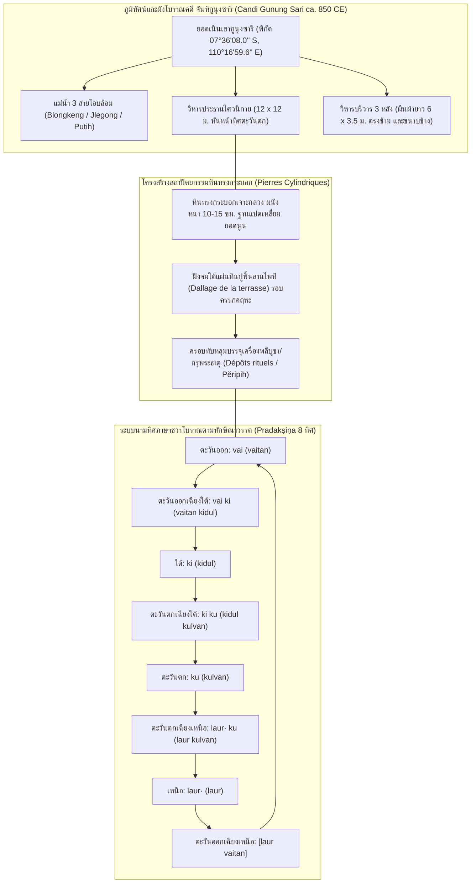

# บันทึกการอ่านและวิเคราะห์เอกสารจารึกวิทยาฉบับสมบูรณ์ (Epigraphic Source Dossier)
## ศิลาทรงกระบอกจารึกแห่งจันทิกูนุงซารี (ชวากลาง) และระบบนามทิศในภาษาชวาโบราณ: โบราณคดีจารึก มณฑลพิธีกรรม และนัยต่อประวัติศาสตร์นิพนธ์สุมาตรา-ชวา (Les pierres cylindriques inscrites du Candi Gunung Sari [Java Centre, Indonésie] et les noms des directions de l'espace en vieux javanais)

---

### ส่วนที่ 1: ข้อมูลบรรณานุกรมและการอ้างอิงมาตรฐาน (Bibliographic Metadata)

- **Source ID:** `S-2017-degroot-01`
- **ชื่อไฟล์ PDF ในเครื่อง:** `S-2017-degroot-01_Archaeological_Epigraphical_Survey_Sumatra.pdf` (หมายเหตุบรรณานุกรมวิพากษ์: ชื่อไฟล์ดั้งเดิมในระบบระบุอย่างคลาดเคลื่อนว่า *Archaeological Epigraphical Survey Sumatra* แต่ตัวบทจริงคือบทความวิจัยต้นฉบับภาษาฝรั่งเศสของ Véronique Degroot, Arlo Griffiths และ Baskoro Tjahjono เรื่อง *"Les pierres cylindriques inscrites du Candi Gunung Sari (Java Centre, Indonésie) et les noms des directions de l’espace en vieux javanais"* ตีพิมพ์ใน *BEFEO* เล่ม 97–98 ซึ่งต่อมาได้รับการแปลเป็นภาษาอินโดนีเซียใน *Berkala Arkeologi* ปี 2014 ภายใต้รหัส `S-2014-baskoro-01`)
- **ชื่อไฟล์ข้อความสกัด:** `S-2017-degroot-01_Archaeological_Epigraphical_Survey_Sumatra.txt` (สกัดจาก *Bulletin de l’École française d’Extrême-Orient* เล่มที่ 97–98 ประจำปี 2010–2011 ตีพิมพ์จริง ค.ศ. 2013 หน้า 367–390)
- **ประเภทเอกสาร:** บทความวิจัยวิชาการทางโบราณคดีและจารึกวิทยาผ่านการประเมินโดยผู้ทรงคุณวุฒิ (Peer-reviewed Research Article) ในวารสารวิชาการระดับนานาชาติชั้นนำของสำนักฝรั่งเศสแห่งปลายบุรพทิศ (*Bulletin de l’École française d’Extrême-Orient* / BEFEO)
- **ภาษาของเอกสาร:** ภาษาฝรั่งเศส (FR), ภาษาชวาโบราณ (Old Javanese ถอดอักษรตามมาตรฐาน IAST), ภาษาสันสกฤต (Sanskrit IAST), ภาษาดัตช์ (NL), ภาษาอินโดนีเซีย (ID)
- **ขอบเขตภูมิศาสตร์และวัฒนธรรม:** เกาะชวาและเครือข่ายความสัมพันธ์เชิงพื้นที่ทางทะเลกับเกาะสุมาตรา:
  - *แหล่งโบราณคดีหลัก:* จันทิกูนุงซารี (Candi Gunung Sari) บนยอดเนินเขากูนุงซารี หมู่บ้านกูลง (desa Kulon) ตำบลซาลัม (kecamatan Salam) อำเภอมาเกลัง (kabupaten Magelang) จังหวัดชวากลาง (Jawa Tengah) ประเทศอินโดนีเซีย พิกัดภูมิศาสตร์ตามระบบ WGS 84: 07° 36' 08.0" ใต้ และ 110° 16' 59.6" ตะวันออก (หน้า 368 เชิงอรรถ 2) ตั้งอยู่ท่ามกลางแม่น้ำสามสายโอบล้อม ได้แก่ แม่น้ำบลองเก็ง (Blongkeng) ทางทิศเหนือ, แม่น้ำเจลโกง (Jlegong) ทางทิศตะวันออก และแม่น้ำปูติฮ์ (Putih) ทางทิศใต้ เชิงภูเขาไฟเมอราปี (Gunung Merapi)
  - *เครือข่ายโบราณสถานเปรียบเทียบในชวากลาง:* กูนุงพริง (Gunung Pring), กูนุงวูกีร์ (Gunung Wukir / จารึกจังกัล ค.ศ. 732), จันทิเมินดุต (Candi Mendut), จันทิงาเวน (Candi Ngawen), กลุ่มปราสาทดียิง (Dieng: Arjuna-Semar), เกอดงซงโง (Gedong Songo II, III), จันทิบาดุต (Candi Badut ในชวาตะวันออก), จันทิซัมบีซารี (Sambisari), จันทิเกอดูลัน (Kedulan), จันทิเกลโร (Klero), จันทิปลาโอซันลอร์ (Plaosan Lor), จันทิโลโรจงกรัง/ปรัมบานัน (Loro Jonggrang / Prambanan), จันทิอีโจ (Candi Ijo), จันทิโมรังงัน (Candi Morangan), จันทิปาวง (Candi Pawon), โบโรบูดูร์ (Borobudur), และสระสรงน้ำโจโลตุนโด (Jolotundo)
  - *มิติเปรียบเทียบข้ามเกาะสู่สุมาตรา (Cross-Regional Epigraphy):* การขยายตัวของอิทธิพลวัฒนธรรมชวากลางยุคราชวงศ์ไศเลนทร์สู่เกาะสุมาตรา (ลุ่มน้ำมูซีแห่งปาเล็มบัง ลุ่มน้ำบาตังฮารีแห่งจัมบี และพื้นที่สูงปาการูยุง-เทือกเขาบาริซัน) โดยเฉพาะเปรียบเทียบลักษณะจารึกขนาดสั้น (Short Inscriptions) บนก้อนหินธรรมชาติ/หินแกะสลัก, การจัดวางแกนจักรวาลวิทยาบนยอดเขาศักดิ์สิทธิ์, และพิธีกรรมฝังกรุเครื่องพลีบูชาพิทักษ์ทิศรอบมณฑลศาสนสถาน
- **วัสดุและบริบทการค้นพบ:** ศิลาจารึกบนหินทรงกระบอกเจาะกลวง (Pierres cylindriques / Batu Tabung) และฝาปิดทรงกระบอก (Couvercles de cylindres) ทำจากหินแอนดีไซต์ (Andésite):
  - โบราณวัตถุที่สำรวจพบในแหล่งและหมู่บ้านบริวารเชิงเขารวม 29 ชิ้น ได้แก่ หินทรงกระบอก 9 ชิ้น, ฝาปิดหิน 12 ชิ้น, และชิ้นส่วนแตกหักขนาดใหญ่ 8 ชิ้น (หน้า 371)
  - แบ่งโครงสร้างการสกัดหิน (Stéréotomie) ออกเป็น 2 รูปแบบ:
    1. หินทรงกระบอกชิ้นเดียวตัน/กลวงแบบโมโนลิท (Cylindres monolithiques จำนวน 3 ชิ้น ได้แก่ ชิ้นที่ 1, 2, 3)
    2. หินทรงกระบอกสองท่อนประกอบด้วยตัวเรือนและฝาปิดแยกชิ้น (Cylindres composés d’un corps et d’un couvercle)
  - สัณฐานวิทยาทางสถาปัตยกรรม: ฐานล่างตัดเป็นรูปแปดเหลี่ยม (Base octogonale) ยื่นผายออก, ตัวเรือนตรงกลางกลวงเป็นทรงกระบอก ผนังหนาเพียง 10–15 ซม. ปราศจากก้นหิน (Fond ouvert), ส่วนบนหรือฝาปิดมีความนูนโค้งมน (Légèrement convexe) เชื่อมด้วยบัวโค้งเว้าคล้ายบัวคว่ำ (Doucine) เส้นผ่านศูนย์กลางจำแนกได้เป็น 3 ขนาดหลัก: เล็ก (38–43 ซม.), กลาง (54–56 ซม.), และใหญ่ (59–62 ซม.)
  - บริบทตำแหน่งการค้นพบ: เดิมฝังจมอยู่ใต้แผ่นหินปูพื้นลานประทักษิณ (Dallage de la terrasse) รอบครรภคฤหะของวิหารประธาน (หน้า 373, 388) โดยโผล่พ้นพื้นเฉพาะส่วนยอด เพื่อทำหน้าที่เป็น "ปลอกศิลาครอบทับหลุมกรุเครื่องพลีบูชา/พระธาตุ" (Dépôts rituels / Pĕripih) ประจำทิศต่างๆ
  - จารึกบนหิน: มีศิลาทรงกระบอกและฝาปิด 11 ชิ้นที่สลักตัวอักษรกวิโบราณ (ศตวรรษที่ 9) ระบุนามทิศหรืออักษรย่อนามทิศภาษาชวาโบราณรวม 7 รูปแบบ จัดเรียงเวียนขวาตามเข็มนาฬิกา (Pradakṣiṇa)
- **การอ้างอิงฉบับเต็มระบบ Chicago/Turabian Notes-Bibliography:**  
  Degroot, Véronique, Arlo Griffiths, and Baskoro Tjahjono. "Les pierres cylindriques inscrites du Candi Gunung Sari (Java Centre, Indonésie) et les noms des directions de l’espace en vieux javanais." *Bulletin de l’École française d’Extrême-Orient* 97–98 (2010–2011 [ตีพิมพ์จริง 2013]): 367–390. https://doi.org/10.3406/befeo.2010.6140.

---

### ส่วนที่ 2: แผนผังการจัดสรรเข้าสู่บทและหัวข้อย่อย (Chapter & Section Mapping Matrix)

เนื้อหาและข้อมูลเชิงประจักษ์จากการสำรวจทางโบราณคดีและจารึกวิทยาของ Véronique Degroot, Arlo Griffiths และ Baskoro Tjahjono (2010–2011/2013) จัดสรรเข้าสู่บทและหัวข้อย่อยของโครงการวิจัยหลักดังนี้:

- **บทที่ 5: จารึกสุมาตรา: ภาพรวมการสำรวจ แหล่งโบราณคดี ลุ่มน้ำ และพื้นที่สูง (เชื่อมโยงบริบทเปรียบเทียบชวา-สุมาตรา)**
  * **หัวข้อย่อย 5.1 (การสำรวจทางโบราณคดีและจารึกวิทยาในภูมิทัศน์ลุ่มน้ำและยอดเขา):**  
    - ชำระประวัติศาสตร์นิพนธ์และการจำแนกประเภทเอกสาร: คลี่คลายความคลาดเคลื่อนของชื่อไฟล์บรรณานุกรม `S-2017-degroot-01_Archaeological_Epigraphical_Survey_Sumatra` โดยดึงกรอบการสำรวจภาคสนามของ Degroot (2009) และ Griffiths (EFEO) มาเปรียบเทียบภูมิทัศน์การตั้งถิ่นฐานระหว่างยอดเขาศักดิ์สิทธิ์ในชวา (กูนุงซารี, กูนุงวูกีร์) กับกลุ่มโบราณสถานบนพื้นที่สูงและลุ่มน้ำในสุมาตรา (เช่น กลุ่มโบราณสถานเทือกเขาบาริซัน, ปาดังโรโจ, มัวราจัมบี, บาฮาล ปาดังลาวัส) (หน้า 367–370)
    - วิเคราะห์ความสัมพันธ์ระหว่างที่ตั้งบนเนินเขาที่มีแม่น้ำโอบล้อมสามด้าน (Blongkeng, Jlegong, Putih) กับภูมิทัศน์ศักดิ์สิทธิ์เชิงสัญลักษณ์ (Sacred Landscape) ซึ่งเป็นรูปแบบที่แพร่กระจายไปยังศูนย์กลางอำนาจในเกาะสุมาตรา (หน้า 368)
  * **หัวข้อย่อย 5.3 (จารึกขนาดสั้น การใช้อักษรย่อ และระบบภาษาชวาโบราณนอกเกาะชวา):**  
    - นำระเบียบวิธีการถอดรหัส "จารึกขนาดสั้น" (Short Inscriptions) ที่บันทึกคำเดี่ยวหรืออักษรย่อ (Abbreviation system: `vai`, `vai ki`, `ki`, `ki ku`, `ku`, `laur· ku`, `laur·`) ไปเปรียบเทียบกับจารึกขนาดสั้นบนก้อนหินแม่น้ำและศิลาหลักเขตในสุมาตรา (เช่น จารึกหินปาเล็มบังในคลัง DHARMA INSIDENK00024, จารึกลำปุง, และจารึกสุมาตราใต้) (หน้า 373–374)
    - การศึกษาเปรียบเทียบภาษาชวาโบราณ (Old Javanese) ในฐานะภาษาแห่งพิธีกรรมทางศาสนาที่แผ่อิทธิพลควบคู่กับภาษามลายูโบราณในสุมาตรา (หน้า 374–376)

- **บทที่ 9: การอนุรักษ์ สภาพความเสื่อมสภาพ และระเบียบวิธีวิจัยงานภาคสนาม (Conservation, Decay & Epigraphical Fieldwork)**
  * **หัวข้อย่อย 9.1 (ประวัติศาสตร์การอนุรักษ์และการทำลายแหล่งโบราณสถาน: จากยุคอาณานิคมสู่ปัจจุบัน):**  
    - บันทึกประวัติศาสตร์การถูกรื้อทำลายของโบราณสถาน: การบันทึกของ Hoepermans (1865/1914) ว่าหินจากจันทิกูนุงซารีถูกรื้อนำไปสร้างบันไดคอนกรีตของสุสานสมัยใหม่เชิงเขา และโบราณวัตถุถูกเคลื่อนย้ายไปยังจวนผู้ตรวจการอาณานิคมดัตช์ (Controleur van Muntilan) จนสูญหายไปจากบริบทเดิม (หน้า 368)
    - ปัญหาความคลาดเคลื่อนของเอกสารทางการและการบันทึกทะเบียนโบราณวัตถุ: กรณีการตรวจสอบข้อเท็จจริงระหว่างรายงานคู่มือนำเที่ยว *Situs-situs Marjinal* (2002) ที่อ้างว่ามีจารึกถูกเก็บรักษาไว้ที่สำนักงานโบราณคดี BPCB ปรัมบานัน แต่คณะผู้วิจัยได้เข้าตรวจสอบร่วมกับเจ้าหน้าที่ BPCB และยืนยันว่าไม่มีโบราณวัตถุดังกล่าวอยู่ในคลังเก็บจริง (หน้า 367 เชิงอรรถ 1)
  * **หัวข้อย่อย 9.2 (การเสื่อมสภาพทางกายภาพและการดัดแปลงโบราณวัตถุในอดีต):**  
    - บันทึกร่องรอยการตัดแต่งหินในอดีต (Secondary Cutting/Modification): การพบว่าเกือบครึ่งหนึ่งของหินทรงกระบอกและฝาปิดถูกตัดเฉือนจนรอยตัดทะลุเข้าสู่โพรงกลวงภายใน ซึ่งสะท้อนการปรับปรุงซ่อมแซมหรือรื้อดัดแปลงโครงสร้างสถาปัตยกรรมในยุคโบราณ (หน้า 373)
    - สภาพการแตกหักและการเคลื่อนย้ายกระจายตัวของหินจารึก: การพบหินทรงกระบอกและฝาปิดตกกระจัดกระจายอยู่ในหมู่บ้านกูนุงซารีและหมู่บ้านงาเซม เชิงเขา (หน้า 371 เชิงอรรถ 6)
  * **หัวข้อย่อย 9.3 (ระเบียบวิธีวิจัยทางโบราณคดีจารึก: การบูรณาการขุดค้น การทำสำเนา และการรังวัดพิกัด):**  
    - การบูรณาการข้อมูลขุดค้นกู้ภัย (Rescue Excavation) ปี 1998 ของสำนักงานโบราณคดีชวากลาง (SPSP) และมหาวิทยาลัยกัดจาห์มาดา (UGM) เข้ากับการสำรวจจารึกภาคสนามปี 2009 โดยการเก็บพิกัด GPS ระบบ WGS 84 และการทำสำเนาลายพิมพ์หิน (Estampage / Abklats) บันทึกเข้าสู่ทะเบียนจารึกหอจดหมายเหตุ EFEO หมายเลข n. 1867–1876 (หน้า 368, 373, 389)

- **บทที่ 3: จารึกแผ่นโลหะ จารึกบนรูปเคารพขนาดเล็ก และจารึกแผ่นทองคำบรรจุกรุ: วัสดุวิทยา ประติมาวิทยา และพิธีกรรมศักดิ์สิทธิ์**
  * **หัวข้อย่อย 3.3 (แผ่นทองคำบรรจุกรุฐานเจดีย์และเทวสถาน: Pĕripih และ Consecration Deposits):**  
    - ข้อค้นพบเชิงโครงสร้างสถาปัตยกรรม: หินทรงกระบอกเจาะกลวง (Pierres cylindriques) ทำหน้าที่เป็น "ปลอกศิลาพิทักษ์กรุเปอริปิฮ์" (Peripih Protective Containers) เพื่อบรรจุแผ่นทองคำ อัญมณี และเครื่องพลีบูชาทางศาสนา (หน้า 373, 377–378)
    - การเปรียบเทียบกับกรุเปอริปิฮ์แผ่นทองคำ 19 แผ่นในจันทิบีแห่งปรัมบานัน (Candi B Loro Jonggrang) ทะเบียน BG 1752–1769 ซึ่งจารึกพระนามโลกบาลทั้งแปด (Lokapāla), พระพรหม (Brahmā), มนตร์ *oṃ paścimagātrāya namaḥ*, จตุไรศวรรยะ (Caturaiśvarya), และพญานาคทั้งสี่ (Nāga) (หน้า 377–378)
    - การเปรียบเทียบกับฝาปิดหินรูปสี่เหลี่ยมจารึกคำว่า *pūrvva* (ทิศตะวันออก) 2 แผ่นจากจันทิปลาโอซันลอร์ (ภาพถ่ายรหัส OD 14987) และจานหินกลมจารึกคำว่า *madya* กับ *dak·sina* ในพิพิธภัณฑ์ศิลปะเอเชียแห่งกรุงเบอร์ลิน (หน้า 378)

- **บทที่ 4: อักขรวิทยา ภาษาศาสตร์ประวัติศาสตร์ และการคำนวณศักราช: จากปัลลวะสู่กวิ และระบบปฏิทินดาราศาสตร์**
  * **หัวข้อย่อย 4.3 (ภาษาศาสตร์ประวัติศาสตร์: ระบบทิศทางในภาษาตระกูลออสโตรนีเชียนและภาษาชวาโบราณ):**  
    - การค้นพบระบบนามทิศภาษาพื้นเมืองชวาโบราณ (Indigenous Old Javanese Directional System) ครบวงจรที่เก่าแก่ที่สุดในเอเชียตะวันออกเฉียงใต้ภาคพื้นสมุทร (หน้า 374–377)
    - การเปรียบเทียบกับระบบทิศในคัมภีร์ *โกรงวาศรม* (*Koravāśrama*) ยุคมัชปาหิตตอนปลาย และการประยุกต์ "กฎของเบฮาเกิล" (Behaghel's Law) อธิบายการจัดเรียงคำประสมระบุทิศเฉียง (*laur kulvan*) (หน้า 375–376)
    - การปะทะสังสรรค์ระหว่างมโนทัศน์เชิงพื้นที่แบบวงกลมทักษิณาวรรตตามขนบอินเดีย (Pradakṣiṇa/Circular Model) กับแบบแผนแกนขั้วเหนือ-ใต้ดั้งเดิมของออสโตรนีเชียน (Axial / *lor-kidul* Model) (หน้า 376–377)

- **บทที่ 7: ศาสนา ความเชื่อ และเครือข่ายพุทธตันตระ/ไศวนิกายข้ามสมุทร: มนตรา ปรัชญา และการสังเคราะห์เทพเจ้า**
  * **หัวข้อย่อย 7.1 (ลัทธิไศวนิกายตันตระสิทธานตะและมณฑลแห่งพระศิวะ):**  
    - การประยุกต์คัมภีร์ฝ่ายตันตระสิทธานตะ ได้แก่ *นิศวาสคุหยะ* (*Niśvāsaguhya* 2.47, 2.100) และ *พรหมยามาละ* (*Brahmayāmala* 3.9) ว่าด้วยพิธีประดิษฐาน (*pratiṣṭhā*), ตำแหน่งศูนย์กลาง *พรหมสถาน* (*brahmasthāna*), และการประดิษฐาน *พรหมศิลา* (*brahmaśilā*) ใต้ฐานศิวลึงค์ (หน้า 378 เชิงอรรถ 23)
    - การวิเคราะห์การจัดวางเทวรูปพระมหากาฬ (Mahākāla) และหินหลักปักเขตศักดิ์สิทธิ์ (Bornes / Batu Patok) เพื่อกั้นอาณาเขตมณฑลของพระศิวะ (หน้า 369–370)

---

### ส่วนที่ 3: สรุปสาระสำคัญเชิงวิเคราะห์และจุดยืนทางวิชาการ (Executive Academic Analysis)

- **วิทยานิพนธ์และข้อถกเถียงหลักของผู้เขียน (Core Argument / Thesis):**  
  บทความวิจัยชิ้นเอกของ Véronique Degroot, Arlo Griffiths และ Baskoro Tjahjono (2010–2011/2013) นำเสนอข้อค้นพบและการตีความทางโบราณคดี สถาปัตยกรรม และจารึกวิทยาต่อโบราณวัตถุรูปแบบเฉพาะที่ไม่เคยมีการศึกษาอย่างเป็นระบบมาก่อนในชวากลาง นั่นคือ **กลุ่มหินทรงกระบอกเจาะกลวงสลักอักษรย่อนามทิศภาษาชวาโบราณ (Pierres cylindriques inscrites)** ณ จันทิกูนุงซารี โดยมีข้อถกเถียงและวิทยานิพนธ์หลัก 4 ประการ:

  1. *การระบุหน้าที่ทางสถาปัตยกรรมและมณฑลพิธีกรรมของหินทรงกระบอก:*  
     ผู้เขียนปฏิเสธสมมติฐานเดิมที่มองว่าหินเหล่านี้เป็นส่วนยอดเจดีย์/วิหาร (Couronnements d’édicules / Kemuncak) หรือเป็นฐานเสาไม้รองรับหลังคา (Bases de piliers) โดยอาศัยหลักฐานทางสัจวิทยาหิน (Stéréotomie) ที่พบว่าตัวเรือนทรงกระบอกถูกเจาะกลวงทะลุ ปราศจากก้นหิน และพบหินปูพื้นลานไพที (Dallage de la terrasse) ก้อนหนึ่งที่ถูกสกัดเว้าเป็นรูปโค้งรับกับทรงกระบอกพอดิบพอดี ผู้เขียนจึงสรุปว่า **หินทรงกระบอกเหล่านี้ถูกติดตั้งโดยฝังจมลงไปสองในสามส่วนใต้พื้นหินของลานไพทีรอบครรภคฤหะ** เพื่อทำหน้าที่เป็น "ปลอกศิลาครอบทับหลุมกรุเครื่องพลีบูชา/พระธาตุ" (Protective containers for consecration deposits / Pĕripih) ตามทิศทางจักรวาล ซึ่งเป็นส่วนหนึ่งของพิธีกรรมการสถาปนาศาสนสถาน (Pratiṣṭhā) และการปักปันเขตศักดิ์สิทธิ์ (หน้า 372–373, 377–378)

  2. *การค้นพบระบบนามทิศภาษาชวาโบราณที่เก่าแก่ที่สุดในประวัติศาสตร์:*  
     จารึกอักษรย่อบนหินทรงกระบอกและฝาปิดจำนวน 11 ชิ้น เป็นหลักฐานทางจารึกวิทยาชิ้นแรกและชิ้นเดียวที่บันทึก **ระบบนามทิศหลักและทิศเฉียงทั้งแปดด้วยคำศัพท์ภาษาชวาโบราณแท้ (Purely Indigenous Old Javanese Terms)** ในช่วงกลางคริสต์ศตวรรษที่ 9 (ประมาณ ค.ศ. 850) ซึ่งมีอายุเก่าแก่กว่าหลักฐานวรรณกรรมชวาโบราณฉบับเดียวที่ระบุทิศครบถ้วน คือคัมภีร์ *โกรงวาศรม* (*Koravāśrama*) ยุคมัชปาหิตตอนปลาย ถึงเกือบหกศตวรรษ (หน้า 373–376)

  3. *ไวยากรณ์เชิงพื้นที่และการประสมคำระบุทิศเฉียงตามทักษิณาวรรต:*  
     ระบบทิศของกูนุงซารีแสดงให้เห็นว่า ในศตวรรษที่ 9 ภาษาชวาโบราณจัดวางโครงสร้างคำระบุทิศเฉียงโดยเริ่มจากทิศตะวันออกและเวียนขวาตามเข็มนาฬิกา (Pradakṣiṇa): โดยใช้คำว่า *vaitan kidul* (ออก-ใต้ / ตะวันออกเฉียงใต้) แทนที่จะเป็น *kidul wetan* (ใต้-ออก) ตามแบบภาษาชวาสมัยหลัง โครงสร้างคำจึงเป็นลูกโซ่เชื่อมต่อ: *vaitan* -> *vaitan kidul* -> *kidul* -> *kidul kulvan* -> *kulvan* -> *laur kulvan* -> *laur* -> [*laur vaitan*] สะท้อนว่าโครงสร้างภาษาชวาโบราณยุคนั้นจำลอง "การรับรู้พื้นที่แบบวงกลมทักษิณาวรรตตามขนบอินเดีย" (Circumambulatory / Circular Spatial Organisation) ก่อนที่ระบบแกนขั้วเหนือ-ใต้ (*lor-kidul*) จะก้าวขึ้นมามีบทบาทเด่นในยุคมัชปาหิต (หน้า 375–377)

  4. *การกำหนดอายุทางโบราณคดีและบริบทไศวนิกาย:*  
     ผู้เขียนพิสูจน์ว่าจันทิกูนุงซารีเป็นเทวสถานในลัทธิไศวนิกาย (Śaiva temple) มิใช่วัดพุทธ โดยพิจารณาจากผังอาคารประธานหันหน้าทิศตะวันตก มีอาคารบริวารทรงยาวขนาบตรงข้าม, การพบเทวรูปพระมหากาฬ (Mahākāla), โยนี, หลุมสี่เหลี่ยมกลางลาน (Sumur), และเสาหินหลักเขต (Bornes / Batu Patok) ด้านการกำหนดอายุ เทคนิคการก่อสร้างที่ใช้หินทัฟฟ์ (Tuf) ก่อแกนในและกรุผิวด้วยหินแอนดีไซต์ (Andésite) ปรากฏในชวาราว ค.ศ. 830 (*terminus post quem*) ร่วมกับลวดลายหน้ากาล (Kālamukha) ที่มีตาวนก้นหอยและลายพรรณพฤกษารอบแก้ม ทำให้กำหนดอายุของศาสนสถานแห่งนี้ได้อย่างแม่นยำในราว **ค.ศ. 850** ร่วมสมัยกับจันทิปลาโอซันลอร์และปรัมบานัน (หน้า 369–370)

- **บริบทประวัติศาสตร์นิพนธ์และการประเมินความน่าเชื่อถือ (Historiography & Source Criticism):**  
  บทความวิจัยนี้ถือเป็นหมุดหมายสำคัญของการประสานระเบียบวิธีวิจัย 3 ด้านเข้าด้วยกัน:
  1. *งานโบราณคดีภาคสนามและการสำรวจภูมิทัศน์:* โดย Véronique Degroot ผู้เชี่ยวชาญด้านภูมิทัศน์และผังสถาปัตยกรรมจันทิในชวากลาง (Degroot 2009)
  2. *จารึกวิทยาและนิรุกติศาสตร์ภาษาชวาโบราณขั้นสูง:* โดย Arlo Griffiths ศาสตราจารย์แห่ง EFEO ผู้นำโครงการจารึกแห่งเอเชียตะวันออกเฉียงใต้
  3. *การขุดค้นกู้ภัยและการจัดการมรดกทางวัฒนธรรมในพื้นที่:* โดย Baskoro Tjahjono นักโบราณคดีอาวุโสแห่ง Balai Arkeologi Yogyakarta ซึ่งเป็นหนึ่งในทีมขุดค้นกู้ภัยแหล่งโบราณสถานแห่งนี้ตั้งแต่ปี ค.ศ. 1998

  ในประวัติศาสตร์นิพนธ์ยุคอาณานิคม แหล่งโบราณสถานกูนุงซารีมักถูกมองข้ามว่าเป็นเพียงศาสนสถานขนาดเล็กที่ถูกทำลายเสียหายอย่างหนัก โดยมีรายงานสั้นๆ เพียงของ Hoepermans (1865/1914), Verbeek (1891), Van Aalst (1899), และ Krom (1915) ต่อมาในหนังสือ *Situs-situs Marjinal* (2002) ได้ระบุข้อมูลที่คลาดเคลื่อนหลายประการ เช่น การอ้างว่าจารึกอยู่บนยอดปราสาท หรืออ้างว่าโบราณวัตถุถูกย้ายไปเก็บที่ศูนย์โบราณคดีแล้ว 

  การลงพื้นที่สำรวจจริงในปี 2009 ของคณะผู้วิจัยได้แก้ไขข้อผิดพลาดทางประวัติศาสตร์นิพนธ์ทั้งหมด และยกระดับโบราณวัตถุที่เคยถูกละเลยให้กลายเป็นหลักฐานชิ้นเอกระดับนานาชาติ นอกจากนี้ การนำเสนอบทความใน *BEFEO* เล่มนี้ยังเป็นตัวบทแม่แบบดั้งเดิมที่มีคุณภาพทางวิชาการและภาพประกอบการสำรวจ (ทั้งแผนที่ ผังขุดค้น ภาพถ่าย และสำเนาลายพิมพ์หิน EFEO) ที่สมบูรณ์ที่สุด

---

### ส่วนที่ 4: สารบัญข้อค้นพบเชิงลึกแยกตามมิติจารึกวิทยา (Thematic Epigraphic Findings with Exact Pages)

1. **ประวัติศาสตร์นิพนธ์และการสำรวจโบราณคดีภาคสนาม (หน้า 367–369):**  
   - *ประวัติการสำรวจยุคอาณานิคม:* N.W. Hoepermans สำรวจในปี 1865 (ตีพิมพ์ 1914 หน้า 140) พบว่าเทวสถานถูกรื้อทำลาย หินส่วนหนึ่งถูกนำไปสร้างบันไดสุสานสมัยใหม่เชิงเขา และประติมากรรมบางส่วนถูกย้ายไปไว้ที่บ้านพักผู้ตรวจการ (Controleur) เมืองมุนตีลัน; R.D.M. Verbeek (1891 หน้า 156 หมายเลข 299) ขุดเปิดพื้นที่เบื้องต้นพบหินสลักลวดลายประดับจำนวนมาก; J. van Aalst (1899 หน้า 394) ระบุการพบหลุมสี่เหลี่ยมกลางลาน (Puits de fondation) และฐานโยนีลายกาละมุขะ ("banaspati") ในทุ่งนาเชิงเขา ซึ่ง van Aalst ตั้งข้อสังเกตเบื้องต้นว่าสะท้อนลัทธิไศวนิกายมิใช่วัดพุทธอย่างจันทิงาเวน; N.J. Krom (1915 หน้า 265 หมายเลข 852) บันทึกในบัญชีโบราณวัตถุสถาน (หน้า 368–369)
   - *การหักล้างตำนานท้องถิ่น:* ผลการขุดค้นหักล้างความเชื่อพื้นบ้านที่ van Aalst บันทึกไว้ว่า เนินเขากูนุงซารีทั้งลูกซุกซ่อนมหาปราสาทภูเขา (Temple-montagne) แบบโบโรบูดูร์ โดยแท้จริงแล้วเป็นเพียงเทวสถานขนาดเล็กบนยอดเขาคล้ายจันทิกูนุงวูกีร์ (หน้า 369)
   - *การตรวจสอบและแก้ไขข้อผิดพลาดทางวิชาการ:* หนังสือ *Situs-situs Marjinal* (2002) ระบุว่ามีจารึกถูกเก็บรักษาไว้ที่สำนักงานโบราณคดี (SPSP/BPCB) ปรัมบานัน แต่คณะผู้วิจัยเข้าตรวจสอบร่วมกับเจ้าหน้าที่ BPCB พบว่าไม่มีโบราณวัตถุจารึกจากกูนุงซารีถูกส่งมอบไปเก็บรักษาตามที่กล่าวอ้างแต่อย่างใด (หน้า 367 เชิงอรรถ 1)

2. **ตัวบทจารึก อักขรวิทยา และระบบอักษรย่อนามทิศ (หน้า 370–374):**  
   - *สารบบจารึกสั้น 11 ชิ้น (Inscriptions A–K):* สลักด้วยอักษรกวิโบราณ (Early Kawi) ช่วงกลางศตวรรษที่ 9 บันทึกข้อความสั้นระบุนามทิศในภาษาชวาโบราณ 7 รูปแบบ (หน้า 373):
     1. **Inscription I (ชิ้นที่ 7):** จารึก `vai` ย่อมาจาก *vaitan* (ทิศตะวันออก)
     2. **Inscription E (ชิ้นที่ 5) & G (ชิ้นที่ 13):** จารึก `vai ki` ย่อมาจาก *vaitan kidul* (ทิศตะวันออกเฉียงใต้)
     3. **Inscription F (ชิ้นที่ 6) & H (ชิ้นที่ 14):** จารึก `ki` ย่อมาจาก *kidul* (ทิศใต้)
     4. **Inscription C (ชิ้นที่ 4), J (ชิ้นที่ 15) & K (ชิ้นที่ 16):** จารึก `ki ku` ย่อมาจาก *kidul kulvan* (ทิศตะวันตกเฉียงใต้)
     5. **Inscription B (ชิ้นที่ 11):** จารึก `ku` ย่อมาจาก *kulvan* (ทิศตะวันตก)
     6. **Inscription A (ชิ้นที่ 3):** จารึก `laur· ku` ย่อมาจาก *laur kulvan* (ทิศตะวันตกเฉียงเหนือ)
     7. **Inscription D (ชิ้นที่ 12):** จารึก `laur·` (คำเต็มพยางค์เดียว ไม่ย่อ) แปลว่า ทิศเหนือ
     *(หมายเหตุ: ขาดเพียงทิศตะวันออกเฉียงเหนือ ซึ่งผู้เขียนสันนิษฐานว่าคือ `laur vaitan`)*
   - *อักขรวิทยา:* รูปอักษรมีความสม่ำเสมอและสอดคล้องกับจารึกชวากลางในศตวรรษที่ 9 มีการใช้เครื่องหมายวิรามะ (Virāma / Paten) เป็นจุดกึ่งกลาง (*virāma médian / titik tengah*) เพื่อตัดเสียงสระ เช่น `laur·` (หน้า 374 เชิงอรรถ 12)
   - *การชำระสารบบจารึกสั้นของ De Casparis:* ข้อความสั้นประเภทนี้ไม่เคยปรากฏในบัญชี "Short inscriptions" ของ J.G. de Casparis (1950 หน้า 111–118; 1958 หน้า 12–13) แต่ผู้เขียนชี้ว่ามีลักษณะใกล้เคียงกับหินสี่เหลี่ยมจารึกคำว่า *pūrvva* สองก้อนที่พบ ณ จันทิปลาโอซันลอร์ (หน้า 374, 378)

3. **มิติสถาปัตยกรรม เทคนิคการก่อสร้าง และการจัดผังมณฑล (หน้า 369–373):**  
   - *ผังบริเวณจากการขุดค้นปี 1998:* ยอดเนินเขาถูกปรับให้ราบเป็นลานสี่เหลี่ยม วิหารประธานขนาด 12 × 12 เมตร หันหน้าไปทางทิศตะวันตก มีบันไดทางขึ้นยื่นออกมาทางทิศตะวันตก ตรงข้ามวิหารประธานมีซากอาคารทรงผืนผ้ายาวขนาด 6 × 3.5 เมตร ด้านทิศเหนือและทิศใต้มีซากฐานอาคารบริวารอีก 2 หลัง และทางทิศใต้มีแนวกำแพงซากอาคารหลังที่ 5 ล้อมรอบด้วยกำแพงแก้วก่ออิฐ (หน้า 369)
   - *เทคนิคการก่อสร้างและเกณฑ์กำหนดเวลา (Terminus post quem):* ฐานรากทำจากก้อนกรวดแม่น้ำ (Galets) ตัวอาคารก่อด้วยแกนในที่เป็นหินทัฟฟ์ (Tuf) สกัดหยาบ และกรุผิวภายนอกด้วยหินแอนดีไซต์ (Andésite) เรียบสนิท เทคนิคการผสมหินทัฟฟ์และแอนดีไซต์นี้เริ่มปรากฏในชวากลางตั้งแต่ประมาณ ค.ศ. 830 เป็นต้นมา (อ้างอิง Dumarçay 1993 หน้า 19) ซึ่งเป็นเกณฑ์กำหนดเวลาเริ่มต้นที่เร็วที่สุด (หน้า 370)
   - *สัจวิทยาหินทรงกระบอก (Stéréotomie des cylindres):* หินทรงกระบอกทั้ง 29 ชิ้น มีลักษณะร่วมกันคือ ฐานล่างตัดแปดเหลี่ยม ลำตัวกลวง ผนังหนา 10–15 ซม. ก้นเปิดโล่ง (Fond ouvert) และยอดนูนโค้ง การค้นพบก้อนหินปูพื้นลานไพทีที่สลักเว้าเป็นรูปวงกลมยืนยันว่าหินทรงกระบอกเหล่านี้ไม่ได้ตั้งลอยอยู่บนพื้นหรือบนหลังคา แต่ **ฝังจมลงในพื้นหินของลานประทักษิณ** รอบตัววิหารประธาน (หน้า 371–373)
   - *การเปรียบเทียบกับจันทิเกอดูลันและซัมบีซารี:* ที่จันทิเกอดูลัน หินทรงกระบอกที่เดิมคิดว่าเป็นฐานเสาไม้ แท้จริงแล้วฝังจมลงไปในพื้นลานสองในสามส่วน และที่จันทิซัมบีซารีมีการเจาะช่องใต้หินฐานเสาเพื่อบรรจุเครื่องพลีบูชา (หน้า 373, 387–388)

4. **ประติมาวิทยาและศิลปกรรมเปรียบเทียบ (หน้า 370):**  
   - *หน้ากาล (Kālamukha):* ชิ้นที่สมบูรณ์มีดวงตาวนก้นหอย (Yeux en spirale) และมีลายพรรณพฤกษารูปดอกไม้ประดับเน้นบริเวณโหนกแก้ม (Motif floral soulignant ses pommettes) ซึ่งเป็นลักษณะเฉพาะของศิลปะยุคปลายชวากลาง เทียบเคียงได้กับกาละมุขะระยะที่ 2 ของจันทิเซวู (Sewu), จันทิปลาโอซันลอร์ (Plaosan Lor), จันทิงาเวน (Ngawen), และโลโรจงกรัง (Loro Jonggrang) (หน้า 370)
   - *มกร (Makara) และเสาประดับกรอบประตู:* มกรชิ้นหนึ่งมีลักษณะสมจริง (ตาหรี่ ฟันแหลมคม) แต่อีกชิ้นส่วนปลายงวงแปรสภาพเป็นลวดลายพรรณพฤกษา (Élément floral) ตามแบบศิลปะยุคหลัง เสาประดับกรอบประตูสลักลายใบไม้ม้วนชี้ขึ้นด้านบน ซึ่งชี้ชัดว่าเป็นศิลปะยุคหลัง ค.ศ. 830 (อ้างอิง Klokke 2006 หน้า 56)
   - *บัวยอดซุ้ม (Antéfixe):* เป็นทรงสามยอด (À trois pointes) มีลวดลายซุ้มโค้ง เชื่อมต่อยอดกลางกับส่วนล่างด้วยระบบเดือยและรูสลัก (Tenon et mortaise) เหมือนที่จันทิอีโจและปลาโอซันลอร์ (หน้า 370)
   - *ข้อสรุปอายุสมัย:* สอดคล้องหรือสร้างขึ้นหลังจันทิปลาโอซันลอร์ (ค.ศ. 830) และมีองค์ประกอบลวดลายกรอบกระจังลูกปัดที่เชื่อมโยงกับจันทิโลโรจงกรัง (ปรัมบานัน) จึงกำหนดอายุการก่อสร้างได้ในราว **ค.ศ. 850** (หน้า 370)

5. **ภาษาศาสตร์ประวัติศาสตร์และระบบนามทิศ (หน้า 374–377):**  
   - *การเปรียบเทียบกับพจนานุกรม OJED และงานของ Adelaar:* Alexander Adelaar (1997) ไม่ได้วิเคราะห์นามทิศเฉียงในภาษาชวาโบราณเนื่องจากพจนานุกรม *Old Javanese-English Dictionary* (Zoetmulder 1982) ไม่มีรายการคำระบุทิศเฉียงที่เป็นระบบพื้นเมือง จารึกกูนุงซารีจึงเข้ามาเติมเต็มช่องว่างทางวิชาการนี้ (หน้า 374)
   - *คัมภีร์ Koravāśrama (คริสต์ศตวรรษที่ 15–16):* เป็นวรรณกรรมชวาโบราณเพียงเล่มเดียวที่บันทึกระบบทิศ 9 ทิศ (ทิศทั้งแปดและศูนย์กลาง) ไว้อย่างครบถ้วน โดยแปลศัพท์สันสกฤตเป็นภาษาพื้นเมือง แต่ใช้ระบบคำประสมสม่ำเสมอ: *kidul-vetan* (ออกเฉียงใต้), *kidul-kulon* (ตกเฉียงใต้), *lor-kulon* (ตกเฉียงเหนือ), *lor-vetan* (ออกเฉียงเหนือ) ซึ่งตรงกับภาษาชวาสมัยใหม่ (หน้า 375)
   - *ความไม่สม่ำเสมอของกูนุงซารีและการรับรู้พื้นที่แบบวงกลม:* จารึกกูนุงซารีในศตวรรษที่ 9 ใช้ *vaitan kidul* (ออก-ใต้) มิใช่ *kidul vaitan* ซึ่งสะท้อนการจัดคำแบบลูกโซ่ตามลำดับการเวียนประทักษิณตามเข็มนาฬิกา (หน้า 375–376)
   - *การอธิบายด้วยกฎของเบฮาเกิล (Loi de Behaghel):* สำหรับคำว่า *laur kulvan* (ตกเฉียงเหนือ) ที่ขัดกับโครงสร้างลูกโซ่ อธิบายได้ด้วยกฎทางภาษาศาสตร์ของ Otto Behaghel ที่ระบุว่า คำประสมจะจัดเรียงองค์ประกอบที่มีพยางค์น้อยกว่าไว้หน้าคำที่มีพยางค์มากกว่า (*laur* [1 พยางค์] + *kulvan* [2 พยางค์]) (หน้า 376)
   - *การประชันกันของสองระบบอวกาศ:* การเผชิญหน้าระหว่างการรับรู้พื้นที่แบบวงกลมทักษิณาวรรตตามคติอินเดีย (Circumambulatory) กับแบบแผนแกนขั้วเหนือ-ใต้ดั้งเดิม (*lor-kidul* / Axial model) ซึ่งต่อมาแบบแผนเชิงแกนกลายเป็นแบบแผนหลักตั้งแต่ศตวรรษที่ 15 เป็นต้นมา (หน้า 376–377)

6. **มิติศาสนา ลัทธิความเชื่อ และพิธีกรรมฝังกรุเปอริปิฮ์ (หน้า 377–378):**  
   - *หินครอบกรุเปอริปิฮ์ตามทิศทาง:* หินทรงกระบอกเจาะกลวงถูกสร้างขึ้นเพื่อครอบทับหลุมบรรจุเครื่องพลีบูชา/กรุพระธาตุ (Pĕripih) โดยแต่ละกระบอกผูกโยงกับทิศเฉพาะหรือเทพโลกบาลประจำทิศ (Lokapāla) (หน้า 377)
   - *กรุเปอริปิฮ์แผ่นทองคำแห่งปรัมบานัน:* แผ่นทองคำ 19 แผ่นจากวิหาร B แห่งปรัมบานัน (BPCB BG 1752–1769) บันทึกพระนามโลกบาล 8 องค์ (อินทระ, อัคนี, ยมะ, นิรฤติ, วรุณ, วายุ, โสมะ, อีศานะ), มนตร์ *oṃ paścimagātrāya namaḥ*, จตุไรศวรรยะ (Dharma, Jñāna, Vairāgya, Aiśvarya), พญานาค 4 ตน (Ananta, Vāsuki, Kapila, Takṣaka), และพระพรหม (Brahmā) ณ ศูนย์กลาง (หน้า 377–378)
   - *คัมภีร์ตันตระสิทธานตะกับการสถาปนาศูนย์กลาง:* Dominic Goodall ชี้ให้เห็นว่า ในคัมภีร์ตันตระสิทธานตะ เช่น *นิศวาสคุหยะ* (*Niśvāsaguhya* 2.47, 2.100) และ *พรหมยามาละ* (*Brahmayāmala* 3.9) เรียกตำแหน่งศูนย์กลางของเทวสถานว่า *พรหมสถาน* (*brahmasthāna*) และเรียกแผ่นหินที่รองรับใต้ศิวลึงค์ว่า *พรหมศิลา* (*brahmaśilā*) ซึ่งอธิบายได้ว่าเหตุใดพระพรหมจึงสถิต ณ จุดศูนย์กลางในกรุปรัมบานัน (หน้า 378 เชิงอรรถ 23)
   - *หลักฐานเปรียบเทียบอื่นๆ:* จารึกแผ่นทองคำสระสรงน้ำโจโลตุนโด (Jolotundo) ที่มีนามพระอีศานะและพระอัคนี, และจานหินกลมในพิพิธภัณฑ์เบอร์ลินจารึกคำว่า *madya* (กลาง) และ *dak·sina* (ใต้) (หน้า 378)

7. **มิติการอนุรักษ์ สภาพความเสื่อมสภาพ และพรมแดนปัญหาภาคสนาม (หน้า 368, 371–373):**  
   - *การทำลายในอดีต:* หินส่วนใหญ่ของตัวอาคารถูกรื้อทำลายตั้งแต่ก่อน ค.ศ. 1865 หินบันไดสุสานสมัยใหม่ถูกเทคอนกรีตทับจนไม่สามารถตรวจสอบได้ว่ามีหินจารึกติดอยู่ภายในหรือไม่ (หน้า 368 เชิงอรรถ 4)
   - *การดัดแปลงในอดีต (Secondary Cut):* หินทรงกระบอกและฝาปิดเกือบครึ่งหนึ่งมีรอยบากหรือรอยตัดขวาง ซึ่งบ่งชี้ว่าเทวสถานอาจเคยผ่านการปรับปรุงผังสถาปัตยกรรมครั้งใหญ่ในยุคโบราณ (หน้า 373)
   - *การค้นพบหินจารึกซ้ำทิศเดียวกัน:* มีหินจารึกทิศใต้ (`ki`) 2 ก้อน, ทิศตะวันออกเฉียงใต้ (`vai ki`) 2 ก้อน, และทิศตะวันตกเฉียงใต้ (`ki ku`) ถึง 3 ก้อน ซึ่งยังเป็นปริศนาทางวิชาการว่าเหตุใดจึงมีการทำหินจารึกทิศเดียวกันซ้ำหลายก้อนในแหล่งเดียวกัน (อาจมาจากการก่อสร้างหลายระยะ หรือการจัดวางหลายชั้นรอบอาคาร) (หน้า 378)

---

### ส่วนที่ 5: คลังข้อความอ้างอิงตรงและเชิงอรรถสำเร็จรูป (Verbatim Quotes & Footnote Bank)

1. **การบันทึกยุคแรกและการทำลายแหล่งโดย Hoepermans ในปี 1865 (หน้า 368):**
   * *ข้อความภาษาฝรั่งเศสต้นฉบับ:*  
     `"Le Candi Gunung Sari est lui-même connu de longue date : la première description du lieu est l’œuvre de Hoepermans, qui le visita en 1865. Publiée en 1914, cette description nous apprend que le temple avait alors déjà été démantelé et qu’une partie des pierres avait servi à édifier un escalier monumental menant à un cimetière moderne, lui-même situé dans la partie inférieure de la colline (Hoepermans 1914 : 140). Selon le même auteur, des sculptures provenant du mont Sari se trouvaient à l’époque près de la résidence du controleur de Muntilan."`
   * *คำแปลภาษาไทย:*  
     "จันทิกูนุงซารีเป็นที่รู้จักกันมาเป็นเวลานานแล้ว: คำพรรณนาสถานที่แห่งนี้เป็นครั้งแรกเป็นผลงานของฮูเปอร์มันส์ (Hoepermans) ผู้ซึ่งเดินทางมาเยือนในปี 1865 คำพรรณนาดังกล่าวตีพิมพ์ในปี 1914 ทำให้เราทราบว่าเทวสถานได้ถูกรื้อถอนทำลายไปแล้วในเวลานั้น และหินส่วนหนึ่งได้ถูกนำไปสร้างเป็นบันไดขนาดใหญ่ทอดสู่สุสานสมัยใหม่ซึ่งตั้งอยู่บริเวณส่วนล่างของเนินเขา (Hoepermans 1914: 140) และตามคำบอกเล่าของผู้เขียนคนเดียวกัน ประติมากรรมสลักหินที่นำมาจากเขากูนุงซารีในยุคนั้นถูกนำไปตั้งไว้ใกล้กับบ้านพักของผู้ตรวจการ (controleur) แห่งเมืองมุนตีลัน"
   * *Footnote Template:* Degroot, Griffiths, and Tjahjono, "Les pierres cylindriques inscrites du Candi Gunung Sari," 368.

2. **เทคนิคการก่อสร้างและการกำหนดอายุเริ่มต้น ค.ศ. 830 (หน้า 370):**
   * *ข้อความภาษาฝรั่งเศสต้นฉบับ:*  
     `"Les fouilles ont permis d’établir que la masse interne du sanctuaire principal – et vraisemblablement des trois structures qui lui font face – était constituée de blocs de tuf grossièrement équarris, alors que le parement était, lui, fait de blocs d’andésite soigneusement appareillés. Cette technique contraste avec l’utilisation quasi exclusive de l’andésite dans les temples les plus anciens ; elle semblerait apparaître à Java aux alentours de 830 de notre ère (Dumarçay 1993 : 19), cette date constituant dès lors un probable terminus post quem pour la construction du Candi Gunung Sari."`
   * *คำแปลภาษาไทย:*  
     "การขุดค้นทางโบราณคดีทำให้สามารถระบุได้ว่า มวลแกนกลางภายในของวิหารประธาน – และน่าจะรวมถึงโครงสร้างอาคารทั้งสามหลังที่ตั้งอยู่ตรงข้าม – ก่อขึ้นจากบล็อกหินทัฟฟ์ที่ตัดแต่งอย่างหยาบๆ ในขณะที่ผิวเปลือกนอกของอาคารก่อด้วยบล็อกหินแอนดีไซต์ที่ตัดประกบกันอย่างประณีต เทคนิคดังกล่าวนี้แตกต่างอย่างสิ้นเชิงจากการใช้หินแอนดีไซต์เพียงอย่างเดียวในเทวสถานยุคเก่าที่สุด โดยเทคนิคนี้ดูเหมือนจะเริ่มปรากฏขึ้นในชวาราว ค.ศ. 830 (Dumarçay 1993: 19) ศักราชนี้จึงถือเป็น terminus post quem [เกณฑ์เวลาเริ่มต้นที่เร็วที่สุด] สำหรับการก่อสร้างจันทิกูนุงซารี"
   * *Footnote Template:* Degroot, Griffiths, and Tjahjono, "Les pierres cylindriques inscrites du Candi Gunung Sari," 370.

3. **สัจวิทยาของหินทรงกระบอกเจาะกลวง (หน้า 371):**
   * *ข้อความภาษาฝรั่งเศสต้นฉบับ:*  
     `"Pour toutes les pierres où cela a pu être vérifié, les cylindres sont creux. Leur paroi ne mesure que 10 à 15 cm et leur fond est ouvert. La similitude de forme entre cylindres monolithiques et cylindres à couvercle fait penser que les deux types partageaient la même fonction. On peut raisonnablement supposer que le choix de l’une ou l’autre solution dépendait en fait de la taille des pierres disponibles."`
   * *คำแปลภาษาไทย:*  
     "สำหรับหินทุกชิ้นที่สามารถตรวจสอบได้ พบว่าหินทรงกระบอกมีลักษณะกลวง ผนังของหินหนาเพียง 10 ถึง 15 ซม. และส่วนก้นเปิดโล่ง ความคล้ายคลึงกันของรูปทรงระหว่างทรงกระบอกแบบโมโนลิทชิ้นเดียวกับทรงกระบอกแบบมีฝาปิดแยกชิ้น ทำให้สันนิษฐานได้ว่าหินทั้งสองรูปแบบทำหน้าที่อย่างเดียวกัน เราอาจสันนิษฐานได้อย่างสมเหตุสมผลว่าการเลือกใช้รูปแบบใดรูปแบบหนึ่งนั้นแท้จริงแล้วขึ้นอยู่กับขนาดของก้อนหินที่มีให้ตัดแต่งในเวลานั้น"
   * *Footnote Template:* Degroot, Griffiths, and Tjahjono, "Les pierres cylindriques inscrites du Candi Gunung Sari," 371.

4. **การค้นพบร่องรอยการฝังหินทรงกระบอกในพื้นลานไพที (หน้า 373):**
   * *ข้อความภาษาฝรั่งเศสต้นฉบับ:*  
     `"Selon les résultats des fouilles et les premières tentatives de reconstitution visibles sur place, les supposées bases de piliers de Kedulan émergeaient à peine du sol de la terrasse. Les deux tiers inférieurs des pierres – cylindriques comme celles du Gunung Sari – étaient en fait invisibles, cachés par les dalles de la terrasse... Une pierre découverte au Candi Gunung Sari nous laisse penser que c’était également le cas de nos cylindres. Il s’agit d’un bloc de pierre taillé d’un côté en un arc de cercle dont le diamètre correspond à celui des cylindres. Comme à Kedulan, les cylindres du Gunung Sari devaient donc s’encastrer dans des pierres et seule leur partie supérieure devait être visible."`
   * *คำแปลภาษาไทย:*  
     "ตามผลการขุดค้นและความพยายามในการบูรณะเบื้องต้นที่สังเกตได้ในแหล่งโบราณคดี พบว่าหินที่เคยเข้าใจว่าเป็นฐานเสาของจันทิเกอดูลันนั้นแทบจะไม่โผล่พ้นพื้นลานไพทีเลย โดยส่วนล่างสองในสามส่วนของหิน – ซึ่งเป็นทรงกระบอกเช่นเดียวกับที่กูนุงซารี – แท้จริงแล้วมองไม่เห็นเพราะถูกซ่อนอยู่ใต้แผ่นหินปูพื้นลาน... หินก้อนหนึ่งที่ค้นพบ ณ จันทิกูนุงซารีทำให้เราคิดว่ากรณีของหินทรงกระบอกของเราก็เป็นเช่นเดียวกัน นั่นคือเป็นบล็อกหินที่ด้านหนึ่งถูกตัดเว้าเป็นรูปส่วนโค้งของวงกลมซึ่งมีขนาดเส้นผ่านศูนย์กลางสอดรับกับหินทรงกระบอกพอดี ดังนั้น เช่นเดียวกับที่เกอดูลัน หินทรงกระบอกแห่งกูนุงซารีจะต้องถูกฝังฝังลงในแผ่นหินและมีเพียงส่วนบนเท่านั้นที่ปรากฏให้เห็น"
   * *Footnote Template:* Degroot, Griffiths, and Tjahjono, "Les pierres cylindriques inscrites du Candi Gunung Sari," 373.

5. **ระบบตัวบทจารึกนามทิศทั้งเจ็ดในภาษาชวาโบราณ (หน้า 373):**
   * *ข้อความภาษาฝรั่งเศสและตัวบทจารึกต้นฉบับ:*  
     `"Les onze pierres inscrites donnent au total sept textes différents qui sont identifiables comme des abréviations de termes désignant en vieux javanais les directions cardinales, ou, pour les directions intermédiaires, des combinaisons de ces termes, sauf dans un cas où le terme même est monosyllabique et n’est de ce fait pas abrégé. Dans le sens des aiguilles d’une montre, et commençant à l’est, on trouve les textes suivants : vai pour vaitan, 'est' (I); vai ki pour vaitan kidul, 'sud-est' (E, G); ki pour kidul, 'sud' (F, H); ki ku pour kidul kulvan, 'sud-ouest' (C, J, K); ku pour kulvan, 'ouest' (B); laur· ku pour laur kulvan, 'nord-ouest' (A); laur· 'nord' (D)."`
   * *คำแปลภาษาไทย:*  
     "หินจารึกทั้งสิบเอ็ดชิ้นให้ตัวบทที่แตกต่างกันรวมเจ็ดข้อความ ซึ่งสามารถระบุได้ว่าเป็นอักษรย่อของคำศัพท์ที่ใช้เรียกทิศหลักในภาษาชวาโบราณ หรือเป็นการประสมคำเหล่านั้นสำหรับทิศเฉียง ยกเว้นในกรณีเดียวที่คำศัพท์นั้นเป็นคำพยางค์เดียวจึงไม่มีการย่อคำ เมื่อเวียนตามเข็มนาฬิกาและเริ่มต้นจากทิศตะวันออก จะพบตัวบทดังต่อไปนี้: `vai` ย่อมาจาก *vaitan* แปลว่า 'ทิศตะวันออก' (จารึก I); `vai ki` ย่อมาจาก *vaitan kidul* แปลว่า 'ทิศตะวันออกเฉียงใต้' (จารึก E, G); `ki` ย่อมาจาก *kidul* แปลว่า 'ทิศใต้' (จารึก F, H); `ki ku` ย่อมาจาก *kidul kulvan* แปลว่า 'ทิศตะวันตกเฉียงใต้' (จารึก C, J, K); `ku` ย่อมาจาก *kulvan* แปลว่า 'ทิศตะวันตก' (จารึก B); `laur· ku` ย่อมาจาก *laur kulvan* แปลว่า 'ทิศตะวันตกเฉียงเหนือ' (จารึก A); `laur·` หมายถึง 'ทิศเหนือ' (จารึก D)"
   * *Footnote Template:* Degroot, Griffiths, and Tjahjono, "Les pierres cylindriques inscrites du Candi Gunung Sari," 373.

6. **ระบบทิศในคัมภีร์ Koravāśrama (หน้า 375):**
   * *ตัวบทภาษาชวาโบราณและคำแปลภาษาฝรั่งเศสต้นฉบับ:*  
     `"kaliṅanya, pūrva ṅaranniṅ vetan, bhaṭṭāra Umāpati aneriya, āgneya kidul-vetan, ya ta bhaṭṭāra (Maheśvara) aneriya, dakṣiṇa kidul, bhaṭṭāra Brahmā aneriya, nairiti kidul-kulon, ya ta bhaṭṭāra Rudra aneriya, paścima kulon, bhaṭṭāra Mahādeva aneriya, bāyabya lor-kulon, bhaṭṭāra Śaṅkara aneriya, uttara lor, ya ta bhaṭṭāra Viṣṇu aneriya, aiśānya lor-vetan, ya ta bhaṭṭāra Śambhu aneriya, madhya riṅ təṅah, ya ta bhaṭṭāra Śiva aneriya, ya ta sinaṅguh kəṇḍəṅ səṅkər iṅ bhuvana ṅaranya de saṅ maharṣi. 'Comprendre : pūrva, c’est-à-dire est, là où se trouve le seigneur Umāpati ; āgneya, c’est-à-dire sud-est, là où se trouve le seigneur Maheśvara ; dakṣiṇa, c’est-à-dire sud, là où se trouve le seigneur Brahmā ; nairiti, c’est-à-dire sud-ouest, là où se trouve le seigneur Rudra ; paścima, c’est-à-dire ouest, là où se trouve le seigneur Mahādeva ; bāyabya, c’est-à-dire nord-ouest, là où se trouve le seigneur Śaṅkara ; uttara, c’est-à-dire nord, là où se trouve le seigneur Viṣṇu ; aiśānya, c’est-à-dire nord-est, là où se trouve le seigneur Śambhu ; madhya, c’est-à-dire au centre, là où se trouve le seigneur Śiva. C’est ce que les grands sages prennent pour 'la délimitation du cosmos'.'" (Koravāśrama 48.23–30)`
   * *คำแปลภาษาไทย:*  
     "พึงเข้าใจว่า: *ปูรวะ* คือทิศตะวันออก ที่สถิตแห่งองค์ภัตตารอุมมาบดี; *อาคเนยะ* คือทิศตะวันออกเฉียงใต้ ที่สถิตแห่งองค์ภัตตารมเหศวร; *ทักษิณะ* คือทิศใต้ ที่สถิตแห่งองค์ภัตตารพรหมา; *ไนรฤติ* คือทิศตะวันตกเฉียงใต้ ที่สถิตแห่งองค์ภัตตารรุทร; *ปัจฉิมะ* คือทิศตะวันตก ที่สถิตแห่งองค์ภัตตารมหาเทพ; *พายัพยะ* คือทิศตะวันตกเฉียงเหนือ ที่สถิตแห่งองค์ภัตตารศังกะระ; *อุตตร* คือทิศเหนือ ที่สถิตแห่งองค์ภัตตารวิษณุ; *ไอศานยะ* คือทิศตะวันออกเฉียงเหนือ ที่สถิตแห่งองค์ภัตตารศัมภุ; *มัธยะ* คือใจกลาง ที่สถิตแห่งองค์ภัตตารศิวะ นั่นคือสิ่งที่พระมหาฤษีถือว่าเป็น 'การกำหนดปริมณฑลแห่งสากลจักรวาล'"
   * *Footnote Template:* Degroot, Griffiths, and Tjahjono, "Les pierres cylindriques inscrites du Candi Gunung Sari," 375.

7. **การอธิบายคำประสมด้วยกฎของเบฮาเกิล (หน้า 376):**
   * *ข้อความภาษาฝรั่งเศสต้นฉบับ:*  
     `"Le terme laur kulvan viendrait alors rompre cette structure, ce qu’on pourrait éventuellement expliquer phonologiquement par la 'loi de Behagel' qui veut que les composés soient arrangés par ordre croissant du nombre de syllabes de leurs composants (donc laur kulvan et non pas kulvan laur)."`
   * *คำแปลภาษาไทย:*  
     "คำว่า *laur kulvan* ดูเหมือนจะเข้ามาทำลายโครงสร้าง [ลูกโซ่] ดังกล่าว ซึ่งในที่สุดอาจสามารถอธิบายได้ในทางสัทวิทยาด้วย 'กฎของเบฮาเกิล' (Behaghel's Law) ซึ่งกำหนดให้คำประสมต้องจัดเรียงตามลำดับที่เพิ่มขึ้นของจำนวนพยางค์ของส่วนประกอบ (ดังนั้นจึงเป็น *laur kulvan* [1 พยางค์ + 2 พยางค์] และมิใช่ *kulvan laur*)"
   * *Footnote Template:* Degroot, Griffiths, and Tjahjono, "Les pierres cylindriques inscrites du Candi Gunung Sari," 376.

8. **การรับรู้พื้นที่แบบวงกลมทักษิณาวรรตเทียบกับแบบแกนเหนือ-ใต้ (หน้า 377):**
   * *ข้อความภาษาฝรั่งเศสต้นฉบับ:*  
     `"Elles ne peuvent rien prouver à elles seules, mais conduisent au moins à se demander si le vieux javanais du milieu du IXe siècle transcrivait, dans la structure même de son vocabulaire, une organisation circumambulatoire de l’espace, plutôt que l’organisation axiale qui dominera au moins à partir du XVe siècle."`
   * *คำแปลภาษาไทย:*  
     "หลักฐานเหล่านี้เพียงลำพังอาจยังไม่อาจพิสูจน์สิ่งใดได้อย่างเด็ดขาด แต่ก็นำไปสู่การตั้งคำถามเป็นอย่างน้อยว่า ภาษาชวาโบราณในช่วงกลางคริสต์ศตวรรษที่ 9 ได้ถ่ายทอดการจัดระเบียบพื้นที่แบบประทักษิณรอบวงกลม (Circumambulatory organisation of space) ไว้ในโครงสร้างคำศัพท์ของตนเองหรือไม่ แทนที่จะเป็นการจัดระเบียบเชิงแกน (Axial organisation) ซึ่งจะกลายมาเป็นแบบแผนครอบงำอย่างน้อยตั้งแต่คริสต์ศตวรรษที่ 15 เป็นต้นมา"
   * *Footnote Template:* Degroot, Griffiths, and Tjahjono, "Les pierres cylindriques inscrites du Candi Gunung Sari," 377.

9. **กรุเปอริปิฮ์ปรัมบานันและคติพรหมสถานในตันตระสิทธานตะ (หน้า 378 เชิงอรรถ 23):**
   * *ข้อความภาษาฝรั่งเศสต้นฉบับ:*  
     `"Dominic Goodall nous signale que de nombreux textes appellent le centre d’un site le brahmasthāna, 'position de Brahmā' (ainsi, par exemple, pour le shivaïsme tantrique, la plus ancienne description des procédures de pratiṣṭhā, 'fondation', se trouve dans le Niśvāsaguhya 2.47, 2.100, ou le Brahmayāmala 3.9, etc.). Ces textes appellent la pierre posée en dessous d’un liṅga brahmaśilā 'pierre de Brahmā' (peut-être en vue de sa situation dans le brahmasthāna)."`
   * *คำแปลภาษาไทย:*  
     "โดมินิก กูดดอลล์ (Dominic Goodall) ได้ชี้ให้เราเห็นว่าคัมภีร์จำนวนมากเรียกจุดศูนย์กลางของศาสนสถานว่า *พรหมสถาน* (brahmasthāna 'ตำแหน่งแห่งพระพรหม') (ดังเช่นในลัทธิไศวนิกายสายตันตระ คำพรรณนาที่เก่าแก่ที่สุดเกี่ยวกับระเบียบวิธีประดิษฐาน [pratiṣṭhā 'การสถาปนา'] ปรากฏอยู่ในคัมภีร์ *นิศวาสคุหยะ* 2.47, 2.100 หรือ *พรหมยามาละ* 3.9 เป็นต้น) คัมภีร์เหล่านี้เรียกแผ่นหินที่วางอยู่ข้างใต้ศิวลึงค์ว่า *พรหมศิลา* (brahmaśilā 'ศิลาแห่งพระพรหม') (ซึ่งอาจพิจารณาจากตำแหน่งที่สถิตอยู่ในพรหมสถาน)"
   * *Footnote Template:* Degroot, Griffiths, and Tjahjono, "Les pierres cylindriques inscrites du Candi Gunung Sari," 378 n. 23.

---

### ส่วนที่ 6: คลังคำศัพท์เฉพาะทางจากเอกสาร (Native Terminology Glossary)

| ลำดับ | คำศัพท์เฉพาะทาง | ภาษาดั้งเดิม | คำอ่าน / รูปแบบ | ความหมายและการใช้งานเชิงบริบทในเอกสาร | ปรากฏในหน้า (BEFEO) |
| :--- | :--- | :--- | :--- | :--- | :--- |
| 1 | **Pierre cylindrique** | ฝรั่งเศส (โบราณคดี) | ปิแยร์ ซีแล็งดริก | หินทรงกระบอกเจาะกลวง ลำตัวแปดเหลี่ยม ยอดนูน ใช้เป็นปลอกครอบกรุเปอริปิฮ์ใต้ลานไพที | 367, 370–373 |
| 2 | **Pĕripih / Pripih** | ชวาโบราณ | เปอริปิฮ์ | หินฝังกรุเครื่องพลีบูชา/พระธาตุ บรรจุแผ่นทองคำ อัญมณี และเมล็ดพืช ฝังในฐานเทวสถาน | 377–378 |
| 3 | **Borne** | ฝรั่งเศส (โบราณคดี) | บอร์น (Batu Patok) | เสาหินหลักปักเขตศักดิ์สิทธิ์รอบมณฑลเทวสถาน ทำหน้าที่คล้าย *kīla* (หลักเขตจักรวาล) | 369–370 |
| 4 | **Pradakṣiṇa** | สันสกฤต | ประทักษิณะ / ทักษิณาวรรต | การเวียนขวาตามเข็มนาฬิกา การจัดลำดับนามทิศในจารึกและพิธีกรรมเริ่มต้นจากทิศตะวันออก | 374, 376–377 |
| 5 | **Vaitan / Vetan** | ชวาโบราณ | ไวตัน / เวตัน | ทิศตะวันออก (ในจารึกย่อเป็น `vai` ตรงกับภาษาสันสกฤต *pūrva*) | 373–376 |
| 6 | **Kidul** | ชวาโบราณ | กีดุล | ทิศใต้ (ในจารึกย่อเป็น `ki` ตรงกับภาษาสันสกฤต *dakṣiṇa*) | 373–376 |
| 7 | **Kulvan / Kulon** | ชวาโบราณ | กุลวัน / กูลง | ทิศตะวันตก (ในจารึกย่อเป็น `ku` ตรงกับภาษาสันสกฤต *paścima*) | 373–376 |
| 8 | **Laur / Lor** | ชวาโบราณ | เลาร์ / ลอร์ | ทิศเหนือ (ในจารึกสลักคำเต็มพยางค์เดียว `laur·` ตรงกับภาษาสันสกฤต *uttara*) | 373–376 |
| 9 | **Vaitan kidul** | ชวาโบราณ | ไวตัน กีดุล | ทิศตะวันออกเฉียงใต้ (ในจารึกย่อเป็น `vai ki` ชวาสมัยหลังใช้ *kidul wetan*) | 373–376 |
| 10 | **Kidul kulvan** | ชวาโบราณ | กีดุล กุลวัน | ทิศตะวันตกเฉียงใต้ (ในจารึกย่อเป็น `ki ku` ตรงกับภาษาสันสกฤต *nairiti*) | 373–376 |
| 11 | **Laur kulvan** | ชวาโบราณ | เลาร์ กุลวัน | ทิศตะวันตกเฉียงเหนือ (ในจารึกสลัก `laur· ku` จัดเรียงคำตามกฎของเบฮาเกิล) | 373–376 |
| 12 | **Laur vaitan** | ชวาโบราณ | เลาร์ ไวตัน | ทิศตะวันออกเฉียงเหนือ (รูปคำสันนิษฐานของจารึกชิ้นที่สูญหาย ตรงกับ *aiśānya*) | 376 |
| 13 | **Lor-kidul** | ชวาโบราณ | ลอร์-กีดุล | ระบบมโนทัศน์เชิงแกนขั้วเหนือ-ใต้ ซึ่งมีความหมายขยายว่า "ในทุกทิศทุกทาง" | 376–377 |
| 14 | **Lokapāla / Dikpāla** | สันสกฤต | โลกบาล / ทิกปาล | ทวยเทพผู้พิทักษ์ทิศทั้งแปด (อินทระ, อัคนี, ยมะ, นิรฤติ, วรุณ, วายุ, โสมะ, อีศานะ) | 377–378 |
| 15 | **Brahmasthāna** | สันสกฤต | พรหมสถาน | ตำแหน่งใจกลางของผังมณฑลศักดิ์สิทธิ์หรือเทวสถาน อันเป็นที่สถิตของพระพรหม | 378 |
| 16 | **Brahmaśilā** | สันสกฤต | พรหมศิลา | แผ่นหินศักดิ์สิทธิ์ที่ประดิษฐาน ณ จุดศูนย์กลางใต้ฐานศิวลึงค์ตามคัมภีร์ตันตระสิทธานตะ | 378 |
| 17 | **Pratiṣṭhā** | สันสกฤต | ประติษฐา | พิธีกรรมการสถาปนาและอัญเชิญทวยเทพลงสู่รูปเคารพและเทวสถานศักดิ์สิทธิ์ | 378 |
| 18 | **Caturaiśvarya** | สันสกฤต | จตุไรศวรรยะ | คุณสมบัติอันประเสริฐ 4 ประการแห่งจิต (ธรรมะ, ชญานะ, ไวราคยะ, ไอศวรรยะ) ในไศวนิกาย | 377 |
| 19 | **Kālamukha** | สันสกฤต | กาละมุขะ | หน้ากาลหรือเกียรติมุข ประดับเหนือซุ้มประตูทางเข้าเทวสถานเพื่อขับไล่อวมงคล | 369–370 |
| 20 | **Makara** | สันสกฤต | มกร | สัตว์ประหลาดในจินตนาการ คายพวงอุบะหรือพรรณพฤกษา ประดับเชิงบันไดและกรอบซุ้ม | 370 |
| 21 | **Antéfixe** | ฝรั่งเศส (สถาปัตย์) | อ็องเตฟิกซ์ / บัวยอดซุ้ม | หินประดับมุมชั้นหลังคา ในกูนุงซารีเป็นทรงสามแฉกเชื่อมต่อด้วยเดือยหิน | 370 |
| 22 | **Virāma / Paten** | สันสกฤต / ชวา | วิรามะ / ปาเต็น | เครื่องหมายตัดเสียงสระเพื่อแสดงพยัญชนะสะกด ในจารึกนี้ใช้รูปจุดกึ่งกลาง (*laur·*) | 374, 376 |
| 23 | **Stéréotomie** | ฝรั่งเศส (สถาปัตย์) | สเตเรโอโตมี | ศาสตร์และศิลปะว่าด้วยการตัด สลัก และประกอบชิ้นส่วนหินในงานสถาปัตยกรรม | 371 |
| 24 | **Tuf** | ฝรั่งเศส (ธรณีวิทยา) | หินทัฟฟ์ (Tufa) | หินตะกอนภูเขาไฟเนื้อพรุน เริ่มนำมาใช้ก่อแกนกลางวิหารในชวากลางราว ค.ศ. 830 | 370 |
| 25 | **Andésite** | ฝรั่งเศส (ธรณีวิทยา) | หินแอนดีไซต์ | หินอัคนีภูเขาไฟเนื้อละเอียด ทนทาน ใช้กรุผิวภายนอกและสลักลวดลายประติมากรรม | 370 |
| 26 | **Terminus post quem** | ละติน | เทอร์มินัส โพสต์ เคว็ม | เกณฑ์กำหนดเวลาเริ่มต้นที่เร็วที่สุดที่เป็นไปได้สำหรับการสร้างโบราณสถาน (ค.ศ. 830) | 370 |
| 27 | **Puits de fondation** | ฝรั่งเศส (โบราณคดี) | ปุย เดอ ฟงดาซียง (Sumur) | หลุมหรือบ่อน้ำสี่เหลี่ยมใจกลางฐานวิหารไศวนิกาย สำหรับประดิษฐานกรุเครื่องพลีบูชา | 367, 369 |
| 28 | **Perwara** | ชวา / สันสกฤต | เปอร์วารา (Parivāra) | อาคารบริวารหรือวิหารรองที่สร้างแวดล้อมวิหารประธานในผังศาสนสถาน | 367, 369 |
