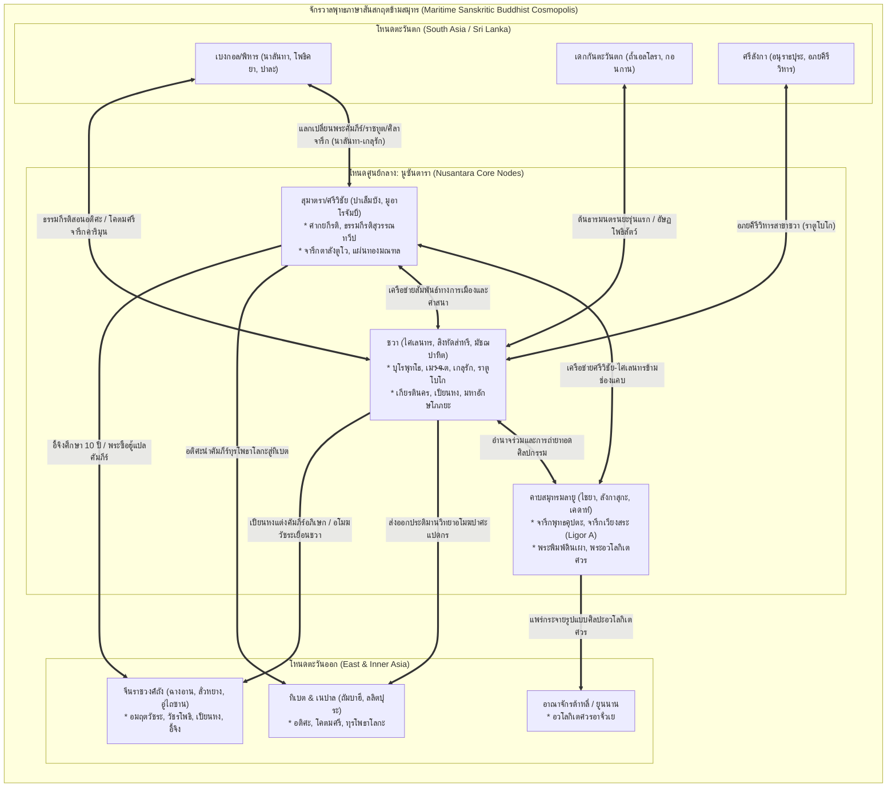

# บันทึกการอ่านและวิเคราะห์เอกสารจารึกวิทยาฉบับสมบูรณ์ (Epigraphic Source Dossier)
## สถานะของนูซันตาราในจักรวาลพุทธภาษาสันสกฤต: บทบาทเชิงกำเนิด เครือข่ายการแลกเปลี่ยนข้ามสมุทร และการรื้อถอนศูนย์กลางนิยมอินเดีย (The Place of Nusantara in the Sanskritic Buddhist Cosmopolis)

---

### ส่วนที่ 1: ข้อมูลบรรณานุกรมและการอ้างอิงมาตรฐาน (Bibliographic Metadata)
- **Source ID:** `S-2018-acri-01`
- **ชื่อไฟล์ PDF ในเครื่อง:** `S-2018-acri-01_Place_Nusantara_Sanskrit_Cosmopolis.pdf`
- **ชื่อไฟล์ข้อความสกัด:** `S-2018-acri-01_Place_Nusantara_Sanskrit_Cosmopolis.txt` (ข้อความวิชาการฉบับสมบูรณ์ ตีพิมพ์ในวารสารวิชาการระดับนานาชาติ TRaNS: Trans-Regional and -National Studies of Southeast Asia)
- **ประเภทเอกสาร:** บทความวิจัยวิชาการผ่านการประเมินโดยผู้ทรงคุณวุฒิ (Peer-reviewed Research Article)
- **ภาษาของเอกสาร:** ภาษาอังกฤษ (EN) พร้อมการตรวจสอบและปริวรรตตัวบทปฐมภูมิหลายภาษา: ภาษาสันสกฤตคลาสสิก (Classical Sanskrit) ตามระบบอักษรโรมันสากล IAST, ภาษาบาลี (Pāli), ภาษาชวาโบราณ (Old Javanese), ภาษามลายูโบราณ (Old Malay), ภาษาทิเบต (Tibetan), ภาษาจีนคลาสสิกและชื่อตัวอักษรจีน (Classical Chinese), ภาษาเนวารี (Newar), และการสอบทานข้อถกเถียงในงานภาษาฝรั่งเศส (French) และดัตช์ (Dutch)
- **ขอบเขตภูมิศาสตร์และวัฒนธรรม:** ภูมิภาคนูซันตารา (Nusantara: โลกคาบสมุทรและหมู่เกาะเอเชียตะวันออกเฉียงใต้ภาคพื้นสมุทร) โดยเน้นเกาะสุมาตรา (ปาเล็มบัง ลุ่มน้ำบาตังฮารี มูอาโรจัมบี มูอาราตากัส ปาดังลาวัส), เกาะชวา (ชวากลาง: บุโรพุทโธ จันดิเมንዱต จันดิเซวู จันดิกะลาซัน จันดิปลาโอซัน ราตูโบโก; ชวาตะวันตก: บาตูจายา; ชวาตะวันออก: ยุคสิงหัดส่าหรีและมัชฌปาหิต จันดิจาโก เรโจลานัง วูราเร สุโรจาโล งันจุก โปโนโรโก), คาบสมุทรมลายูและภาคใต้ของไทย (ไชยา เวียงสระ ลิกอร์ ตรัง ตากใบ เคดาห์ ปัตตานี/ลังกาสุกะ ปะลิส), บอร์เนียว/กาลีมันตันตะวันตก (สมบัส Sambas), เกาะบาหลี, ร่วมกับเครือข่ายเชื่อมโยงข้ามสมุทร: อินเดียตะวันออก (เบงกอล พิหาร มหาวิหารนาลันทา วิกรมศิลา โพธิคยา), มหาราษฏระและเดกกันตะวันตก (ถ้ำเอลโลรา ถ้ำกัณเหรี), โอฑิศา (รัตนคีรี), อินเดียใต้และทมิฬนาฑู (กาญจีปุรัม นาคปัฏฏินัม), ศรีลังกา (อนุราธปุระ อภยคีรีวิหาร), ธิเบต, เนปาล (กาฐมาณฑุ ลลิตปุระ), จีน (ฉางอาน ลั่วหยาง กวางโจว นานกิง อู่ไถซาน), ญี่ปุ่น และอาณาจักรต้าหลี่ (ยูนนาน)
- **วัสดุและบริบทการค้นพบ:**
  - จารึกศิลา (Stone Inscriptions): จารึกศิลาจารึกภาษาสันสกฤตและภาษามลายูโบราณ เช่น จารึกกะลาซัน (Kalasan ค.ศ. 778), จารึกเกลุรัก (Kelurak ค.ศ. 782), จารึกราตูโบโก (Abhayagirivihāra / Ratu Boko ค.ศ. 792), จารึกปลาโอซัน (Plaosan ศตวรรษที่ 9), จารึกวูราเร (Wurare ค.ศ. 1289), จารึกศิลาผาหินปาซีร์ปันจัง (Pasir Panjang, Karimun Besar ศตวรรษที่ 13), จารึกสุรุอาโส 2 (Saruaso II ศตวรรษที่ 14), จารึกตาลังตูโว (Talang Tuo ค.ศ. 684), จารึกเวียงสระ/ไชยา (Ligor A / Vieng Sa ค.ศ. 775), จารึกพุทธคุปตะแห่งเรดเอิร์ธ (Kedah / Buddhagupta Inscription ศตวรรษที่ 5)
  - จารึกบนแผ่นโลหะและใบลานทองคำ (Gold, Silver, and Lead-Bronze Inscriptions / Foils / Plates): จารึกมนตราและธารณีแผ่นทองคำจากจันดิปลาโอซันลอร์, แผ่นโลหะธารณีมหาราวทระ (Mahāraudra-nāma-hṛdaya) จากบริเวณบุโรพุทโธ, แผ่นทองคำมนตราฏักกิราชา (Ṭakkirāja) จากราตูโบโก, แผ่นทองคำ 21 แผ่นจารึกพยางค์เมล็ดพันธุ์ (Bījamantra) แห่งไตรโลกยวชิยมหาโณฑล จากจันดิกุมปุง (มูอาโรจัมบี), แผ่นทองคำธารณีพระมหาปรติสราจากเรืออับปางจิเรบอน (Cirebon Shipwreck ศตวรรษที่ 10), สมบัติโบราณสำริดและทองคำสมบัส (Sambas Hoard)
  - จารึกบนหลักจำลองและเสามณฑล (Maṇḍala-stakes / Kīla): เสาลิ่มตรึงมณฑลสำริดสลักมนตราแห่งคุหยสมาชและสรววัชโรทยะ จากชวากลาง (ศตวรรษที่ 9–10)
  - จารึกบนแผ่นดินเผาพิมพ์และประติมากรรมดินเผา (Terracotta Tablets / Votive Tablets / Stūpikas): พระพิมพ์ดินเผาและสถูปิกะจากบาตูจายา (ชวาตะวันตก), ถ้ำเขานุ้ย (ตรัง), ถ้ำกูรังเปอลัก (ปะลิส), เคดาห์, ลังกาสุกะ (ปัตตานี) สลักคาถาเย ธรฺมา และพระสูตรสาครมติปริปฤจฉา
  - โบราณวัตถุจากซากเรืออับปางใต้ทะเล (Maritime Shipwreck Cargoes): โบราณวัตถุสำริดประกอบพิธีกรรมตันตระ (วัชระ ตรีศูล กระดิ่ง ธารณี พระพุทธรูปและมณฑลสามมิติ) จากเรืออับปางอินตัน (Intan Shipwreck) และเรืออับปางจิเรบอน (Cirebon Shipwreck)
  - เอกสารคัมภีร์ใบลานและภาพจิตรกรรมตัวเขียน (Illuminated Manuscripts): คัมภีร์อัษฏสาหัสริกาปรัชญาปารมิตาแห่งเนปาล (CUL Add. 1643 ค.ศ. 1015), คัมภีร์ทุรโพธาโลกะ (Durbodhāloka), คัมภีร์ชวาโบราณสังฮยังกะมะหายานิกัม/สังฮยังกะมะหายานันมันตรนยะ (Saṅ Hyaṅ Kamahāyānikan / Mantranaya)
- **การอ้างอิงฉบับเต็มระบบ Chicago/Turabian Notes-Bibliography:**  
  Acri, Andrea. "The Place of Nusantara in the Sanskritic Buddhist Cosmopolis." *TRaNS: Trans -Regional and -National Studies of Southeast Asia* 6, no. 2 (July 2018): 139–66. https://doi.org/10.1017/trn.2018.5.

---

### ส่วนที่ 2: แผนผังการจัดสรรเข้าสู่บทและหัวข้อย่อย (Chapter & Section Mapping Matrix)

เนื้อหา ข้อค้นพบ และการตีความเชิงทฤษฎีจากบทความนี้ สามารถนำไปบูรณาการเข้าสู่บทต่างๆ ของโครงการวิจัยหลักได้อย่างเป็นระบบ ดังนี้:

- **บทที่ 1: กรอบมโนทัศน์และประวัติศาสตร์นิพนธ์: จาก Indianization สู่เครือข่ายข้ามสมุทรและภูมิปัญญาท้องถิ่น**
  - **หัวข้อย่อย 1.3 (การทบทวนและวิพากษ์ทฤษฎี Sanskrit Cosmopolis ของ Sheldon Pollock):**  
    ใช้ข้อวิพากษ์ของ Andrea Acri ในการชี้ให้เห็นจุดบอดเชิงโครงสร้างของพอลล็อก (Sheldon Pollock) ที่ให้น้ำหนักแก่เส้นทางบกข้ามทวีปยูเรเซีย (Northern / overland pathways) และเพิกเฉยหรือมองข้ามโลกคาบสมุทรและหมู่เกาะนูซันตาราว่าเป็นเพียง "ชายขอบผู้รับอิทธิพลอย่างเฉื่อยชา" (Passive periphery / cultural backwater) โดยบทความนี้เสนอหลักฐานหนักแน่นว่า "เส้นทางสายไหมทางทะเล" (Maritime Silk Roads หรือ Southern pathways) เป็นกลไกหลักที่มีพลวัตสูงกว่าในการแพร่กระจายและให้กำเนิดพุทธศาสนาภาษาสันสกฤต (หน้า 139–143)
  - **หัวข้อย่อย 1.4 (โมเดลเครือข่ายหลายศูนย์กลาง Polycentric Network Model):**  
    แทนที่ทฤษฎีการแพร่วัฒนธรรมทิศทางเดียวจากศูนย์กลางอินเดียสู่รอบนอก (Monodirectional transmission) ด้วยทัศนะเครือข่ายข้ามสมุทรหลายศูนย์กลาง (Multi-centric / Polycentric Maritime Buddhist Network) ซึ่งนูซันตารามิได้เป็นเพียงชุมทางพักเรือ (Stopover / Entrepôt) แต่ทำหน้าที่เป็น "ปลายทางในตัวเอง" (Terminus in its own right) และเป็น "พลังเชิงกำเนิด" (Constitutive force) ที่ส่งอิทธิพลย้อนกลับไปปฏิรูปพุทธศาสนาในอินเดีย จีน ทิเบต และเนปาล (หน้า 140–146)
  - **หัวข้อย่อยใหม่ที่ค้นพบเพิ่มเติม (1.6 นูซันตารากับการกำเนิดพุทธศาสนาตันตระฝ่ายมนตรนยะระดับทวีป):**  
    การสถาปนากรอบการมองว่า พุทธศาสนาฝ่ายมนตรนยะ (Mantranaya / Esoteric Buddhism) ในศตวรรษที่ 7–9 มิได้เติบโตเฉพาะในนาลันทาหรือเดกกันแล้วค่อยส่งออก แต่มีกระบวนการปฏิสัมพันธ์คู่ขนานและบ่มเพาะร่วมกันในลุ่มน้ำมูซี บาตังฮารี และที่ราบเกดูของชวา ซึ่งเป็นเบ้าหลอมสำคัญก่อนจะถูกนำเข้าสู่ราชสำนักถังในจีนโดยอมฤตวัชระและวัชรโพธิ (หน้า 144–148, 156–158)

- **บทที่ 4: ภาษา ฉันทลักษณ์ และวรรณกรรมจารึก: ภาษาสันสกฤตและวิวัฒนาการสู่ภาษาชวาโบราณ (Sanskrit and Old Javanese Epigraphy)**
  - **หัวข้อย่อย 4.2 (ฉันทลักษณ์ภาษาสันสกฤตและอักษรสิทธิมาตฤกาในจารึกชวากลาง):**  
    วิเคราะห์การเลือกใช้อักษรนำเข้าจากอินเดียเหนือคือ "อักษรสิทธิมาตฤกา" (Siddhamātṛkā script) และอักษรนาครี (Nāgarī) ในการจารึกโศลกภาษาสันสกฤตชั้นสูงของราชวงศ์ไศเลนทร เช่น จารึกกะลาซัน (Kalasan ค.ศ. 778), จารึกเกลุรัก (Kelurak ค.ศ. 782), จารึกอภยคีรีวิหาร/ราตูโบโก (ค.ศ. 792), และจารึกปลาโอซัน ซึ่งแสดงให้เห็นถึงการรักษามาตรฐานฉันทลักษณ์สันสกฤตระดับสากลเพื่อการสื่อสารข้ามชาติในหมู่นักปราชญ์ผู้แสวงบุญนานาชาติ (หน้า 148–151)
  - **หัวข้อย่อย 4.4 (กระบวนการกลายพันธุ์สู่ภาษาถิ่น Vernacularisation และคัมภีร์สองภาษา สันสกฤต-ชวาโบราณ):**  
    การศึกษาวิวัฒนาการการถ่ายทอดหลักธรรมตันตระผ่านคัมภีร์ประเภทร้อยแก้วอธิบายคาถา เช่น *Saṅ Hyaṅ Kamahāyānikan* และ *Saṅ Hyaṅ Kamahāyānan Mantranaya* ที่รักษาโศลกสันสกฤตดั้งเดิมจากสายคัมภีร์ *Guhyasamāja* ควบคู่กับการแปลอธิบายขยายความด้วยภาษาชวาโบราณชั้นสูง (Kawi) ซึ่งสะท้อนการสร้างระบบศัพท์แสงปรัชญาและเทววิทยาตันตระเฉพาะถิ่นที่ยังคงเชื่อมโยงกับจักรวาลภาษาสันสกฤตอย่างเหนียวแน่น (หน้า 152–153)
  - **หัวข้อย่อย 4.5 (การถ่ายทอดมนตรา ธารณี และพีชะในจารึกแผ่นทองคำ):**  
    วิเคราะห์การใช้ "ภาษาศักดิ์สิทธิ์ข้ามพรมแดน" (Translocal sacred language) ในแผ่นทองคำและแผ่นสัมฤทธิ์ เช่น มนตราพระมหาราวทระ (Mahāraudra), พระมหาปรติสรา (Mahāpratisarā), และพีชมณฑลของคัมภีร์ *Vajraśekhara* ที่สะท้อนความเชี่ยวชาญด้านสัทศาสตร์สันสกฤตและการเขียนสะกดคำที่ถูกต้องตามแบบแผนพระเวทและตันตระ (หน้า 148, 151, 157)
  - **หัวข้อย่อยใหม่ที่ค้นพบเพิ่มเติม (4.7 ภาษามลายูโบราณชั้นสูงและการผสานคำศัพท์ปรัชญาตันตระในจารึกตาลังตูโว):**  
    การที่จารึกตาลังตูโว (ค.ศ. 684) ของศรีวิชัย ใช้ภาษามลายูโบราณแต่สอดแทรกคำศัพท์เทคนิคชั้นสูงทางพุทธศาสนามหายานและมนตรนยะอย่างแม่นยำ เช่น *bodhicitta*, *mahāsattva*, *anuttarābhisamyaksambodhi*, *vajraśarīra* แสดงให้เห็นกระบวนการสร้างภาษาธรรมการเมือง (Political-theological vernacularisation) ตั้งแต่ปลายศตวรรษที่ 7 (หน้า 156)

- **บทที่ 2: จารึกสำคัญไขประวัติศาสตร์ในคาบสมุทรและหมู่เกาะ: ยุคศรีวิชัย ไศเลนทร และมัชฌปาหิต**
  - **หัวข้อย่อย 2.3 (จารึกราชวงศ์ไศเลนทรและเครือข่ายอนุราธปุระ-เบงกอล):**  
    หลักฐานการสร้างอารามสาขาของสำนักอภยคีรีวิหารแห่งศรีลังกาบนเนินเขาราตูโบโก (จารึก Abhayagirivihāra ค.ศ. 792) สำหรับพระภิกษุป่าสายบำเพ็ญตบะผู้ครองผ้าบังสุกุล (Pāṃśukūlika) และการสถาปนารูปเคารพมัญชุโฆษะโดยราชครูกุมารโฆษะแห่งเคาฑีทวีป (เบงกอล) ในจารึกเกลุรัก (หน้า 149–151)
  - **หัวข้อย่อย 2.5 (ศรีวิชัยในฐานะมหาวิทยาลัยนานาชาติและการสร้างสรรค์คัมภีร์):**  
    บทบาทของสุมาทรา (สุวรรณทวีป) และศรีวิชัย ผ่านบันทึกของอี้จิง (Yijing) ว่าด้วยพระศากยกีรติ และการเดินทางมาจำพรรษาศึกษาธรรม 12 ปีของพระอติศะทีปังกรศรีชญาโนะ (Atiśa Dīpaṅkaraśrījñāna) เพื่อศึกษากับพระธรรมกีรติแห่งสุวรรณทวีป (Sauvarṇadvīpī-Dharmakīrti) ผู้แต่งคัมภีร์ *Durbodhāloka* อรรถกถาอภิสมยาลังการ (หน้า 144, 156–158)
  - **หัวข้อย่อย 2.7 (จารึกยุคสิงหัดส่าหรีและมัชฌปาหิต: มหาอักษโภภยะและเหวัชระ):**  
    การวิเคราะห์มิติการเมืองและเทววิทยาตันตระขั้นสูง (Phase Three Tantra) ของพระเจ้าเกียรตินคร (Kṛtanagara) ผ่านจารึกรูปเคารพมหาอักษโภภยะแห่งวูราเร (Wurare ค.ศ. 1289) พระนามอภิเษก "ชญานวชเรศวร" (Jñānabajreśvara) และการสืบทอดลัทธิเหวัชระโดยพระเจ้าอาทิตยวรมันและพระโอรสอนังควรมันในจารึกสุรุอาโส 2 (หน้า 153–157)

- **บทที่ 7: ศาสนา ความเชื่อ และเครือข่ายพุทธตันตระ/ไศวนิกายข้ามสมุทร: มนตรา ปรัชญา และการสังเคราะห์เทพเจ้า**
  - **หัวข้อย่อย 7.2 (พัฒนาการของลัทธิผู้คุ้มครองการเดินทางทางทะเล Saviour Cults):**  
    ลัทธิการบูชาพระอวโลกิเตศวร, พระนางตารา (โดยเฉพาะปางอัษฏมหาภัย อัษฏมหาโพธิสัตว์), และพระมหาปรติสรา ซึ่งทำหน้าที่เป็นเทววิทยาพิทักษ์ภัยทางทะเล (Maritime protective deities) สำหรับพ่อค้า กลาสี และพระภิกษุผู้รอนแรมข้ามมหาสมุทรอินเดียและทะเลจีนใต้ (หน้า 143, 147, 151)
  - **หัวข้อย่อย 7.3 (ประติมานวิทยาข้ามสมุทร: ไตรโลกยวชิยะ เหวัชระ และอโมฆปาศะ):**  
    การส่งต่อและพัฒนาการเฉพาะถิ่นของประติมานวิทยาตันตระ เช่น พระพุทธรูปทรงแปดกรอโมฆปาศะโลเกศวรที่อาจถือกำเนิดในชวา-มลายูก่อนจะส่งอิทธิพลไปยังเนปาล (สำนักถัมบาฮี) และพุทธคยา (หน้า 153–154, 158) และภาพสลักพระไตรโลกยวชิยะเหยียบพระศิวะ-อุมาที่จันดิเมንዱตและจันดิโบกัง (หน้า 147–153)

---

### ส่วนที่ 3: สรุปสาระสำคัญเชิงวิเคราะห์และจุดยืนทางวิชาการ (Executive Academic Analysis)

#### 1. วิทยานิพนธ์และข้อถกเถียงหลักของผู้เขียน (Core Argument / Thesis)
Andrea Acri นำเสนองานวิเคราะห์สังเคราะห์ข้ามสาขาวิชา (จารึกวิทยา โบราณคดี ประวัติศาสตร์ศิลปะ และวรรณคดีคัมภีร์ศึกษา) เพื่อสร้างข้อเสนอทางวิชาการที่พลิกโฉมหน้าประวัติศาสตร์พุทธศาสนาและประวัติศาสตร์เอเชียตะวันออกเฉียงใต้ โดยมีประเด็นหัวใจสำคัญ 5 ประการ:

1. **การท้าทายกรอบ "ศูนย์กลางอินเดีย-ชายขอบนูซันตารา" (Dismantling the Indic-Centric / Diffusionist Hegemony):**  
   ประวัติศาสตร์กระแสหลักมักมองว่าการแพร่กระจายของอารยธรรมอินเดียและการถ่ายทอดพุทธศาสนาเกิดขึ้นผ่านเส้นทางบกข้ามเอเชียกลาง (Silk Roads) เป็นหลัก ขณะที่เอเชียตะวันออกเฉียงใต้ภาคพื้นสมุทร (นูซันตารา: ชวา สุมาตรา คาบสมุทรมลายู) ถูกลดทอนให้เป็นเพียง "ชายขอบที่รับอิทธิพลอย่างเฉื่อยชา" (Passive periphery) หรือเป็นเพียง "เมืองท่าแวะพักเติมเสบียง" (Transitory stopovers) แต่ Acri ชี้ให้เห็นว่า ข้อมูลจารึกและโบราณคดีที่ค้นพบใหม่พิสูจน์ว่า **"เส้นทางสายไหมทางทะเล" (Maritime Silk Roads หรือ Southern pathways)** มีบทบาทนำและมีพลวัตอย่างต่อเนื่องตั้งแต่ต้นคริสต์ศตวรรษจนถึงศตวรรษที่ 14 นูซันตารามิใช่ชายขอบ หากแต่เป็น **"พลังเชิงกำเนิด" (Constitutive force)** ที่มีส่วนร่วมอย่างแข็งขันในการสร้างสรรค์ ปรับเปลี่ยน และหมุนเวียนกระบวนทัศน์ของพุทธศาสนาภาษาสันสกฤตทั่วทั้งเอเชีย (หน้า 139–141, 145)

2. **นูซันตาราในฐานะ "ปลายทางในตัวเอง" และสถาบันการศึกษาระดับโลก (Nusantara as a Terminus and Epicentre of Learning):**  
   หลักฐานประวัติศาสตร์และชีวประวัติพระภิกษุนานาชาติยืนยันว่า นักปราชญ์และพระเถระมิได้เดินทางผ่านนูซันตาราเพียงเพื่อเป็นทางผ่าน แต่เดินทางมายังสุมาตราและชวาในฐานะ **"เป้าหมายปลายทางอันทรงคุณค่าในตัวเอง" (Termini in their own right)** เพื่อแสวงหาคัมภีร์ รับการถ่ายทอดมนตราตันตระ ศึกษากับปรมาจารย์ชั้นนำ และขอรับความอุปถัมภ์จากราชสำนัก เช่น:
   - พระฮุ่ยหนิง (Huining) ภิกษุจีนที่เดินทางมายังอาณาจักรโฮหลิง (Kaliṅga ในชวากลาง) ในปี ค.ศ. 665 เพื่อแปลพระสูตรฝ่ายอาคมะร่วมกับสมณะชาวชวานามว่า **ชญานภัทร (Jñānabhadra)** เป็นเวลาถึง 3 ปี (หน้า 147)
   - พระอี้จิง (Yijing) ที่กล่าวยกย่องมาตรฐานการศึกษาพระปริยัติธรรมและภาษาสันสกฤตในศรีวิชัยว่าทัดเทียมกับมัธยมเทศในอินเดีย และยกย่องพระศากยกีรติ (Śākyakīrti) มหาเถระแห่งศรีวิชัยว่าเป็น 1 ใน 5 ปราชญ์พุทธที่ยิ่งใหญ่ที่สุดของโลกในยุคนั้น (หน้า 144, 156)
   - พระอติศะทีปังกรศรีชญาโนะ (Atiśa Dīpaṅkaraśrījñāna) ปราชญ์เอกแห่งเบงกอลที่ล่องเรือข้ามสมุทรมาพำนักจำพรรษาในสุวรรณทวีป (สุมาตรา) ยาวนานถึง 12 ปี (ค.ศ. 1012–1024) เพื่อศึกษากับ **พระธรรมกีรติแห่งสุวรรณทวีป (Sauvarṇadvīpī-Dharmakīrti)** ผู้แต่งคัมภีร์ *Durbodhāloka* ก่อนที่พระอติศะจะนำคำสอนนี้ไปปฏิรูปพุทธศาสนาในทิเบต (หน้า 144–145, 156–158)

3. **ความเก่าแก่และการมีส่วนร่วมเชิงกำเนิดของพุทธตันตระฝ่ายมนตรนยะ (Archaic and Constitutive Phase of Mantranaya):**  
   Acri ชี้ให้เห็นหลักฐานจารึกวิทยาและประติมานวิทยาชวากลางและสุมาตราว่า พุทธศาสนามหายานตันตระในนูซันตารามิได้เป็นเพียงผลผลิตชั้นหลังที่คัดลอกจากอินเดียตะวันออก (ปาละ) เท่านั้น แต่มีลักษณะของ **"พุทธตันตระระยะแรกเริ่มอันเก่าแก่" (Archaic, proto-tantric Mantranaya)** ที่เชื่อมโยงโดยตรงกับศูนย์กลางในเดกกันตะวันตก (ถ้ำเอลโลรา) ตั้งแต่ศตวรรษที่ 8 เช่น มณฑลพระอัษฏมหาโพธิสัตว์ที่จันดิเมንዱตและปลาโอซัน ซึ่งสอดคล้องกับคัมภีร์ *Aṣṭamaṇḍalakasūtra* ที่แปลโดยพระปุณโยทัยและอโมฆวัชระ ตลอดจนการค้นพบแผ่นทองคำจารึกมนตราและธารณี เช่น พระมหาราวทระ (Mahāraudra) และพระมหาปรติสรา (Mahāpratisarā) ซึ่งมีรูปแบบตัวบทโบราณที่ตรงกันข้ามกับตัวบทมาตรฐานในอินเดีย แสดงถึงวิวัฒนาการเฉพาะตัวในนูซันตารา (หน้า 147–148, 152–153)

4. **พลวัตการถ่ายทอดอิทธิพลแบบย้อนกลับ (Reverse / Multidirectional Transmission):**  
   บทความนำเสนอหลักฐานเชิงประจักษ์ว่า ศิลปกรรมและแนวคิดทางศาสนาจากนูซันตาราได้ส่งอิทธิพล "ย้อนกลับ" ไปสู่อนุทวีปอินเดีย เนปาล และจีน:
   - Hiram Woodward เสนอว่าแนวคิดเรื่องศูนย์รวมพลังงานในร่างกายมนุษย์ (Cakras / Sthānas) และโครงสร้างสถูปมณฑลของบุโรพุทโธ อาจส่งอิทธิพลต่อพัฒนาการทางพุทธศาสนาในอินเดียยุคหลัง (หน้า 140, 152)
   - การค้นพบโศลกที่ 46 ของ *Bhadracarī-praṇidhāna* (บทสุดท้ายของคัมภีร์คัณฑพยูหะที่สลักบนชั้นบนสุดของบุโรพุทโธ) สลักอยู่บนสถูปอนุสรณ์ที่มหาวิทยาลัยนาลันทา ซึ่งสร้างขึ้นโดยพระเจ้าพาลบุตรเดวะ (Bālaputradeva) กษัตริย์ไศเลนทรแห่งศรีวิชัย สะท้อนการนำข้อความทางศาสนาจากนูซันตาราไปจารึกไว้ในอินเดีย ซึ่งเป็นโศลกมหายานเพียงแห่งเดียวที่พบในจารึกของอินเดีย (หน้า 152)
   - Iain Sinclair เสนอว่า ประติมานวิทยาของพระอโมฆปาศะโลเกศวรทรงแปดกร (Eight-armed Amoghapāśa Lokesvara) ที่พบในเนปาล (วัดถัมบาฮี) และพุทธคยา มีต้นกำเนิดและพัฒนาการในโลกมลายู-ชวาก่อนหน้าคัมภีร์ภาษาสันสกฤตของอินเดีย (หน้า 153–154, 158)
   - ประติมานวิทยาของพระโพธิสัตว์กวนอิมอาจั่วเย (Acuoye Guanyin) ในอาณาจักรต้าหลี่ (ยูนนาน) มีความเชื่อมโยงกับรูปแบบศิลปะศรีวิชัยและชวาผ่านเครือข่ายทางทะเล (หน้า 159–160)

5. **บทบาทการอุปถัมภ์ของกษัตริย์และเครือข่ายการเมืองระหว่างประเทศ (Royal Sponsorship & Realpolitik):**  
   การแพร่กระจายของพุทธศาสนาภาษาสันสกฤตข้ามสมุทรขับเคลื่อนด้วยพันธมิตรทางการเมืองระหว่างราชสำนักการค้าทางทะเล เช่น ราชวงศ์ไศเลนทร-ศรีวิชัย, ราชวงศ์ปาละแห่งเบงกอล, ราชวงศ์เภามะ-การะแห่งโอฑิศา, ราชวงศ์ลัมพกรรณะที่สองแห่งศรีลังกา และราชวงศ์ถังแห่งจีน การอุปถัมภ์พระสงฆ์ฝ่ายตันตระในฐานะราชครู (Rājaguru / Purohita) เพื่อประกอบพิธีอภิเษกและเวทมนตร์พิทักษ์รัฐ (State protection) เช่น พระราชครูกุมารโฆษะในจารึกเกลุรัก, พระภิกษุชาวชวาเปียนหง (Bianhong) ที่รจนาคู่มืออภิเษกจักรพรรดิถัง, จนถึงลัทธิศิวะ-พุทธของพระเจ้าเกียรตินครแห่งสิงหัดส่าหรี และพระเจ้าอาทิตยวรมันแห่งสุมาตรา ที่ใช้ลัทธิเหวัชระและมหาอักษโภภยะในการสร้างความชอบธรรมและต่อต้านการคุกคามของจักรวรรดิมองโกล (หน้า 143–144, 149, 153–157)

#### 2. บริบทประวัติศาสตร์นิพนธ์และการประเมินความน่าเชื่อถือ (Historiography & Source Criticism)
Acri วางตำแหน่งงานวิจัยของตนเพื่อปะทะสังสรรค์และรื้อถอนประวัติศาสตร์นิพนธ์กระแสหลักอย่างมีชั้นเชิงทางวิชาการ:

- **การวิพากษ์ทฤษฎี "Sanskrit Cosmopolis" ของ Sheldon Pollock (1996, 2006):**  
  แม้ว่าพอลล็อกจะสร้างคุณูปการอย่างยิ่งในการอธิบายว่าภาษาสันสกฤตแพร่กระจายไปทั่วเอเชียใต้และเอเชียตะวันออกเฉียงใต้ในฐานะ "ภาษาแห่งอำนาจ วรรณศิลป์ และสุนทรียศาสตร์ทางการเมือง" โดยปราศจากการใช้กำลังทหารหรือการจัดตั้งจักรวรรดิอาณานิคม แต่กรอบทฤษฎีของพอลล็อกมีจุดอ่อนร้ายแรง 2 ประการที่ Acri และนักวิชาการร่วมสมัยชี้ให้เห็น:
  1. *การละเลยพุทธศาสนา (Neglect of Sanskritic Buddhism):* พอลล็อกมุ่งเน้นเฉพาะวัฒนธรรมราชสำนักแบบพราหมณ์-ฮินดู (Brahmanical / Kavya culture) และมองข้ามบทบาทอันไพศาลของพุทธศาสนาภาษาสันสกฤต (มหายานและวัชรยาน) ซึ่งมีเครือข่ายสากลที่เชื่อมโยงข้ามสมุทรอย่างกว้างขวางกว่า
  2. *การมองข้ามนูซันตารา (Marginalization of Maritime Southeast Asia):* พอลล็อกมักจำกัดขอบเขตการวิเคราะห์ของตนไว้ที่อนุทวีปอินเดียและเอเชียตะวันออกเฉียงใต้ภาคพื้นทวีป (กัมพูชา จามปา) โดยละเลยข้อมูลจารึกจำนวนมหาศาลในชวา สุมาตรา และคาบสมุทรมลายู หรือมองว่าเป็นเพียงผู้รับแบบแผนที่ไม่มีพลังสร้างสรรค์ของตนเอง
  Acri เสนอว่า การศึกษาจักรวาลภาษาสันสกฤตที่สมบูรณ์จะต้องผนวก **"Sanskritic Buddhist Cosmopolis"** และยกให้โลกคาบสมุทรและหมู่เกาะนูซันตาราเป็นแกนกลางสำคัญของการศึกษา (หน้า 139–141)

- **การก้าวข้ามทฤษฎี "การกลืนเป็นอินเดีย" (Indianization) และ "การปรับให้เป็นท้องถิ่น" (Localization):**  
  งานยุคอาณานิคมของ Coedès (1968) ที่มองผ่านกรอบ Indianization มักถือว่าอินเดียเป็นผู้ให้และอุษาคเนย์เป็นผู้รับ ส่วนนักวิชาการรุ่นต่อมาอย่าง O.W. Wolters (1982) ที่เสนอแนวคิด Localization แม้จะคืนบทบาทให้แก่คนพื้นเมือง (Agency) แต่ก็ยังตกอยู่ในกับดักของการมองแบบทวิภาค (India vs. Southeast Asia) Acri นำเสนอตามแนวทางของ Peter Skilling (2009, 2015) และ Tansen Sen (2003, 2014) ว่า ควรมองเป็น **"วัฒนธรรมพิธีกรรมและความคิดร่วมระดับเอเชีย" (Shared culture of ritual and ideas)** ที่ลื่นไหลไปมาอย่างไร้พรมแดน รัฐโบราณในอินเดียและนูซันตาราควรได้รับการปฏิบัติในฐานะ **"หน่วยอินทรีย์เดียวกัน" (Integral unit)** ทางประวัติศาสตร์ (หน้า 140–141)

- **การประสานข้อมูลจารึกวิทยาใหม่ (Epigraphic Breakthroughs):**  
  บทความนี้พึ่งพาข้อค้นพบการอ่านจารึกใหม่จากนักจารึกวิทยาชั้นนำในรอบทศวรรษ โดยเฉพาะ Arlo Griffiths (2011, 2014a, 2014b, 2014c) ผู้ชำระตัวบทมนตราและธารณีบนแผ่นทองคำและสัมฤทธิ์ในอินโดนีเซีย ซึ่งพิสูจน์ว่าตัวบทในชวามีความสัมพันธ์อย่างลึกซึ้งกับคัมภีร์ภาษาสันสกฤตที่สูญหายไปแล้วในอินเดีย และบางชิ้นถูกเขียนขึ้นก่อนหรือร่วมสมัยกับตัวบทที่พบในจีนและทิเบต (หน้า 140, 146, 148, 151–153)

---

### ส่วนที่ 4: สารบัญข้อค้นพบเชิงลึกแยกตามมิติจารึกวิทยา (Thematic Epigraphic Findings with Exact Pages)

1. **ประวัติศาสตร์นิพนธ์และการตีความทางประวัติศาสตร์:**
   - การรื้อถอนสมมติฐานเดิมที่ว่าการเผยแผ่พุทธศาสนาขับเคลื่อนผ่านเส้นทางบกเป็นหลัก โดยชี้ว่าเส้นทางทะเลมีหลักฐานทางโบราณคดีและจารึกที่หนาแน่นและต่อเนื่องกว่าตั้งแต่ศตวรรษที่ 5 เป็นต้นมา (หน้า 139–142)
   - การพิสูจน์ว่าภูมิภาคนูซันตารามิใช่เพียงจุดพักเรือ (Stopover) แต่เป็น "ปลายทางในตัวเอง" (Terminus in its own right) สำหรับการศึกษาพระปริยัติธรรมและรับการถ่ายทอดมนตราตันตระ (หน้า 140)
   - การวิพากษ์แนวคิดศูนย์กลางนิยมอินเดีย โดยอ้างข้อเสนอของ Peter Skilling (2009) และ Hiram Woodward (2004) ว่าควรมองอินโดนีเซียและอินเดียเป็นหน่วยทางวัฒนธรรมเดียวกันจนถึงศตวรรษที่ 9 (หน้า 140)
   - การประเมินสถิติภิกษุผู้เดินทางไปมาระหว่างอินเดียและจีน ซึ่งระบุว่าภิกษุถึง 66 รูปจาก 103 รูป (คิดเป็นร้อยละ 64) ใช้เส้นทางข้ามสมุทรและแวะพักศึกษาในนูซันตารา (หน้า 144)

2. **ตัวบทจารึก การอ่าน ศักราช และอักขรวิทยา:**
   - **จารึกกะลาซัน (Kalasan Inscription ค.ศ. 778):** จารึกด้วยอักษรสิทธิมาตฤกาภาษาสันสกฤต กล่าวสรรเสริญพระนางอารยตารา และบันทึกการสร้าง "ตาราภวนะ" (Tārābhavana) โดยกษัตริย์ราชวงศ์ไศเลนทรตามคำแนะนำของราชครู (หน้า 150)
   - **จารึกเกลุรัก (Kelurak Inscription ค.ศ. 782):** จารึกภาษาสันสกฤตด้วยอักษรสิทธิมาตฤกา บันทึกการประดิษฐานรูปเคารพมัญชุโฆษะ (พระมัญชุศรี) ณ วัดมัญชุศรีคฤหะ (จันดิเซวู) โดย "กุมารโฆษะ" (Kumāraghoṣa) ราชครูผู้เดินทางมาจากเคาฑีทวีป (Gauḍīdvīpa หรือเบงกอล) (หน้า 149–150)
   - **จารึกอภยคีรีวิหารแห่งราตูโบโก (Abhayagirivihāra / Ratu Boko Inscription ค.ศ. 792):** จารึกภาษาสันสกฤตอักษรสิทธิมาตฤกา บันทึกการสร้างวัดสาขาของสำนักอภยคีรีวิหารแห่งศรีลังกาบนยอดเขาราตูโบโก เพื่อเป็นที่พำนักของพระภิกษุสายบังสุกุล (Pāṃśukūlika) และปรากฏคำว่า *saṃgūḍhārtha* (ความหมายอันลี้ลับ/รหัสยธรรมตันตระ) (หน้า 150)
   - **จารึกปลาโอซัน (Plaosan Inscriptions ศตวรรษที่ 9):** จารึกอักษรสิทธิมาตฤกา บันทึกว่ามีผู้แสวงบุญเดินทางมาจาก "คุรชระเทศ" (Gurjaradeśa หรือรัฐคุชราตในอินเดียเหนือ) เข้ามาสักการะพระพุทธเจดีย์ (Jinamandira) อย่างต่อเนื่อง และพบข้อความเปรียบเทียบพระมเหสีว่า "เปล่งรัศมีดุจพระนางตารา" (*tāreva virājati*) (หน้า 148, 150)
   - **จารึกผาหินปาซีร์ปันจัง (Pasir Panjang Inscription ศตวรรษที่ 13):** สลักด้วยอักษรราญชนา (Rañjanā script) ภาษาสันสกฤต บนเกาะคาริมุนเบซาร์ (Karimun Besar ช่องแคบสิงคโปร์/มะละกา) ระบุชื่อ "มหายานิก-เคาฑ-บัณฑิต-ศรีโคตมศรี" (*mahāyānika-gauḍa-paṇḍita-śrī-gautamaśrī*) บัณฑิตมหายานชาวเบงกอลผู้ลี้ภัยหลังมหาวิทยาลัยนาลันทาและวิกรมศิลาถูกทำลาย (หน้า 145, 154–155)
   - **จารึกสุรุอาโส 2 (Saruaso II Inscription ศตวรรษที่ 14):** ออกโดยเจ้าชายอนังควรมัน (Anaṅgavarman) พระโอรสของพระเจ้าอาทิตยวรมันในสุมาตรา มีข้อความภาษาสันสกฤตระบุว่า "ทรงระลึกถึงเหวัชระอยู่เป็นนิจ" (*hevajranityāsmṛtiḥ*) ยืนยันการนับถือลัทธิเหวัชระตันตระ (หน้า 157)
   - **จารึกวูราเร (Wurare Inscription ค.ศ. 1289):** จารึกภาษาสันสกฤตบนฐานรูปเคารพมหาอักษโภภยะ สลักขึ้นในป่าช้าวูราเร เพื่อบันทึกการอภิเษกของพระเจ้าเกียรตินครในพระนาม "ชญานศิววัชระ" (Jñānaśivabajra) หรือชญานวัชเรศวร (หน้า 153–154)
   - **จารึกตาลังตูโว (Talang Tuo Inscription ค.ศ. 684):** ภาษามลายูโบราณ สอดแทรกคำสอนมหายาน-มนตรนยะรุ่นแรกสุด เช่น โพธิจิตต์ (Bodhicitta) และวัชรศิระ (Vajraśarīra) (หน้า 156)

3. **มิติศาสนา ลัทธิความเชื่อ และพิธีกรรม:**
   - การแพร่หลายของนิกายมูลสรวาสติวาท (Mūlasarvāstivāda) ในนูซันตาราและคาบสมุทรมลายูตั้งแต่ศตวรรษที่ 5 ถึง 7 ตามบันทึกของอี้จิง ก่อนจะถูกซ้อนทับด้วยมหายานและมันตรนยะ (หน้า 146–147, 158)
   - พัฒนาการของ "ลัทธิผู้คุ้มครองการเดินทาง" (Saviour Cults) บูชาพระอวโลกิเตศวร, พระนางตารา (ปางอัษฏมหาภัย), และพระมหาปรติสรา ซึ่งเป็นเทววิทยาเฉพาะสำหรับคุ้มครองพ่อค้าวาณิชและพระสงฆ์จากอุปัทวเหตุทางเรือสำเภา (หน้า 143, 147, 151)
   - การบูชาพระโพธิสัตว์มัญชุศรีในฐานะ "สัญลักษณ์อำนาจทางการเมืองและการคุ้มครองรัฐ" (Political symbol and state protection) ในชวากลาง (จันดิเซวู) ร่วมสมัยกับราชสำนักถังในจีน (หน้า 149)
   - ลัทธิไตรโลกยวชิยะ (Trailokyavijaya) ปราบพระศิวะและพระนางอุมา ซึ่งสะท้อนความตึงเครียดและการแข่งขันเชิงอำนาจระหว่างไศวนิกายและพุทธตันตระในชวากลาง (หน้า 152–153)
   - การปฏิบัติพิธีกรรมคณะจักร (Gaṇacakra) ในลัทธิพุทธตันตระขั้นที่ 3 (Phase Three Tantra) โดยพระเจ้าเกียรตินครแห่งสิงหัดส่าหรี ตามคัมภีร์คุหยสมาชและสุภูติตันตระ (หน้า 153)
   - การก่อเกิดลัทธิ "ศิวะ-พุทธ" (Śiva-Buddha) ในชวาตะวันออกและบาหลี ซึ่งเป็นการจัดวางโครงสร้างพหุนิยมทางศาสนาและสัมพันธภาพเชิงพิธีกรรม โดยมีคัมภีร์ *Kakawin Sutasoma* และ *Kuñjarakarṇa* รองรับ (หน้า 154–156)

4. **มิติสถาปัตยกรรม ศาสนสถาน และชลศาสตร์:**
   - มหาสถูปบุโรพุทโธ (Borobudur) ในฐานะมหาพุทธศาสนสถานและมณฑลสามมิติที่ใหญ่ที่สุดในโลก สะท้อนปรัชญาคัณฑพยูหะและภัทรจารี ตลอดจนโครงสร้างจักระในร่างกายตามทัศนะของ Hiram Woodward (หน้า 148, 152)
   - จันดิเมንዱต (Candi Mendut) และจันดิปลาโอซัน (Candi Plaosan): ภาพจำหลักกลุ่มพระอัษฏมหาโพธิสัตว์ (Eight Bodhisattvas) ล้อมรอบพระศากยมุนี ซึ่งตรงกับคัมภีร์ *Aṣṭamaṇḍalakasūtra* และภาพสลักพระพุทธรูปปางภัทราสนะร่วมกับพระปัทมปาณีและพระวัชรปาณี (หน้า 147–148)
   - แหล่งโบราณสถานราตูโบโก (Ratu Boko): โครงสร้างสถาปัตยกรรมแท่นปฏิบัติสมาธิคู่ (Double meditation platforms) ที่เหมือนกับต้นแบบของสำนักอภยคีรีวิหารในอนุราธปุระ ประเทศศรีลังกา (หน้า 150–151)
   - กลุ่มโบราณสถานลุ่มน้ำบาตังฮารี (มูอาโรจัมบี) และปาดังลาวัส (Padang Lawas) ในสุมาตรา: แหล่งสถาปัตยกรรมอิฐขนาดมหึมาที่เชื่อมโยงกับเครือข่ายพุทธตันตระลัทธิเหวัชระและมหากาฬ (หน้า 146, 154, 157)
   - โบราณสถานบาตูจายา (Batujaya) ในชวาตะวันตก: โบราณสถานก่ออิฐขนาดใหญ่ของพุทธศาสนายุกต์แรกเริ่มที่สร้างขึ้นตั้งแต่ศตวรรษที่ 5 ร่วมสมัยกับการมาเยือนของพระคุณวรมัน (หน้า 146)

5. **มิติอาหารการกิน วิถีชีวิต การค้า และตลาด:**
   - ลมมรสุมประจำฤดูกาล (Seasonal Monsoon winds) ในฐานะกลไกขับเคลื่อนการเดินเรือเชื่อมโยงทะเลเมดิเตอร์เรเนียน มหาสมุทรอินเดีย ทะเลชวา และทะเลจีนใต้ (หน้า 142)
   - ภูมิปัญญาการต่อเรือเดินสมุทรและศัพท์แสงทางชลนาวีของชาวออสโตรนีเชียน/นูซันตารา (Superior shipping technology, nautical terminology, and ship crews) ซึ่งเป็นกระดูกสันหลังให้แก่การเดินทางของพ่อค้าและพระสงฆ์นานาชาติ (หน้า 145–146)
   - การเกื้อหนุนระหว่างชุมชนพ่อค้าวาณิช (Merchant communities) กับอารามพุทธศาสนา โดยมีวัดตั้งอยู่ใกล้เคียงเมืองท่าสำคัญเพื่อเป็นศูนย์กลางการเงิน การแลกเปลี่ยนสินค้า และที่พำนัก (หน้า 143)
   - ข้อมูลจากคัมภีร์ *Deśavarṇana* (83.4) บันทึกวิถีชีวิตในสมัยมัชฌปาหิตว่า มีพ่อค้าและนักบวชจากอินเดีย กัมพูชา จีน อันนาม จามปา กรรณาฏกะ และสยาม ล่องเรือสำเภาเข้ามาพำนักและได้รับภัตตาหารอย่างบริบูรณ์ (หน้า 155)

6. **มิติการปกครอง กฎหมาย ที่ดิน และระบบสีมา:**
   - การอุปถัมภ์พุทธศาสนาโดยราชสำนัก (Royal sponsorship) เพื่อแลกกับการประกอบพิธีสร้างความมั่นคงและชัยชนะของรัฐ (Invincibility and state protection) โดยพระภิกษุตันตระได้รับแต่งตั้งเป็นปุโรหิตหลวงหรือราชครู (หน้า 143)
   - พระนามทางศาสนาและการอภิเษกเป็นจักรพรรดิราช (Cakravartin / Abhiṣeka): ตัวอย่างคู่มืออภิเษกมณฑลอุษณีษจักรวรรดิน (T959) ของพระเปียนหงแห่งชวา ที่นำไปใช้ในราชสำนักถัง (หน้า 144, 152)
   - ระบบการจัดองค์กรสงฆ์คู่ขนานในสมัยมัชฌปาหิต: การแบ่งฝ่ายสถาบันพุทธศาสนาเป็น "กะวินะยัน" (Kavinayan: ฝ่ายวินัยนิยม/ถือพรหมจรรย์) และ "กะพัชระธารัน" (Kabajradharan: ฝ่ายวัชรยาน/ตันตระที่มิได้บังคับถือพรหมจรรย์อย่างเคร่งครัด) ตามที่ระบุใน *Deśavarṇana* 80.1 (หน้า 155)
   - การสร้างภูมิศาสตร์ศักดิ์สิทธิ์จำลอง (Replication of sacred geography): การสถาปนาชื่อพื้นที่ในชวากลางแถบปรัมบานันและเซวูเป็น "ลังกาปุระ" (Laṅkapura) เพื่อจำลองเกาะลังกาอันศักดิ์สิทธิ์มาไว้ในชวา (หน้า 150–151)

7. **มิติปฏิสัมพันธ์ข้ามสมุทรและเครือข่ายนานาชาติ:**
   - เครือข่ายพระสงฆ์ผู้เดินทาง: พระคุณวรมัน (แปลงราชสำนักชวาสู่พุทธ ศตวรรษที่ 5), พระชญานภัทรและพระฮุ่ยหนิง (แปลพระสูตรในชวา ค.ศ. 665), พระวัชรโพธิและอโมฆวัชระ (พบกันครั้งแรกในชวา ต้นศตวรรษที่ 8 ก่อนไปจีน), พระเปียนหง (พระชวาผู้เป็นศิษย์ฮุ่ยกั่วในฉางอาน), พระปรัชญา (*Prajñā ผู้แปลคัณฑพยูหะ), พระซือฮู้ (*Dānapāla ภิกษุผู้เชี่ยวชาญภาษาศรีวิชัยและชวาในปลายศตวรรษที่ 10), พระอติศะและพระธรรมกีรติสุวรรณทวีป (ศตวรรษที่ 11), และพระพุทธคุปตนาถ (สิทธาชาวอินเดียที่เยือนชวาและสุมาตราในศตวรรษที่ 16) (หน้า 144–145, 149, 155–158)
   - การกัลปนาทางศาสนาข้ามมหาสมุทร: จารึกแผ่นทองแดงนาลันทาของพระเจ้าเทวปาละ (Devapāla) บันทึกการสร้างอารามในนาลันทาโดยพระเจ้าพาลบุตรเดวะแห่งศรีวิชัย, และการสร้างวัดในนาคปัฏฏินัมโดยพระเจ้าจูฬามณีวรมัน (หน้า 150, 152, 158)
   - ความสัมพันธ์กับเนปาลและทิเบต: คัมภีร์ *Aṣṭasāhasrikā Prajñāpāramitā* ฉบับเนปาล (ค.ศ. 1015) มีภาพจิตรกรรมบูชาพระพุทธทีปังกรในชวา และพระโลกนาถบนภูเขาพลวตีในเกาะเกดะห์ (Kedah) (หน้า 149, 158)
   - ความเชื่อมโยงกับศิลปะอาณาจักรต้าหลี่ (ยูนนาน): รูปเคารพพระอวโลกิเตศวร (Acuoye Guanyin) ที่รับอิทธิพลโดยตรงจากศิลปะศรีวิชัยและชวา (หน้า 159–160)

8. **มิติจารึกแผ่นโลหะ รูปเคารพขนาดเล็ก และจารึกแม่น้ำ:**
   - **เรืออับปางอินตันและจิเรบอน (Intan and Cirebon Shipwrecks ศตวรรษที่ 10):** โบราณวัตถุสำริดประกอบพิธีตันตระ เช่น วัชระ, ไม้เท้าคทา, กระดิ่ง, รูปเคารพขนาดเล็กที่ประกอบเป็นมณฑลสามมิติ, และแผ่นทองคำจารึกธารณีพระมหาปรติสรา ซึ่งใช้พกพาติดตัวเป็นเครื่องรางป้องกันภัยทางเรือ (หน้า 151–152, 156–157)
   - **สมบัติโบราณสำริดสุโรจาโลและงันจุก (Surocolo and Nganjuk Hoards):** กลุ่มประติมากรรมสำริดมณฑลวัชรสัตตวะสามมิติ (Tridimensional Vajrasattva maṇḍala) ที่สมบูรณ์ที่สุดแห่งหนึ่งในโลกพุทธ (หน้า 152)
   - **สมบัติโบราณโปโนโรโก (Ponorogo Hoard):** ประติมากรรมสำริดเทพีในวัชรสัตตวกุลมณฑล และมณฑล 17 เทพแห่งศรีปรมาทยะ (Śrīparamādya) เชื่อมโยงกับคัมภีร์ *Sarvabuddhasamāyoga* (หน้า 152)
   - **แผ่นทองคำจันดิกุมปุง (Candi Gumpung, Sumatra):** แผ่นทองคำ 21 แผ่นจารึกพยางค์เมล็ดพันธุ์ เรียงตามแบบมณฑลไตรโลกยวชิยะในคัมภีร์ *Vajraśekharatantra* (หน้า 157)
   - **แผ่นสัมฤทธิ์ธารณีมหาราวทระ (Mahāraudra-nāma-hṛdaya):** พบใกล้บุโรพุทโธ มีข้อความมนตราปราบไศวะ แต่มีจุดเด่นคือระบุการวางเท้าเหยียบพระศิวะและอุมาสลับข้างกับประติมานวิทยามาตรฐานในอินเดีย ซึ่ง Griffiths ยืนยันว่าเป็นความจงใจสร้างรูปแบบเฉพาะ (หน้า 148, 152–153)

9. **พรมแดนปัญหา ปริศนาวิชาการ และจริยธรรมโบราณคดี:**
   - ปริศนาเรื่องพระพุทธทีปังกร (Buddha Dīpaṅkara) ในชวาตามภาพจิตรกรรมเนปาล ซึ่งขาดหลักฐานประติมากรรมและตัวบทที่ชัดเจนในชวา และข้อสันนิษฐานของ Sinclair ว่าอาจเชื่อมโยงกับความทรงจำเรื่องการเดินทางข้ามสมุทรของพระอติศะทีปังกร (หน้า 149)
   - ปัญหาการสืบค้นตัวบทคัมภีร์ *Subhūtitantra* ที่ปรากฏใน *Deśavarṇana* และ *Saṅ Hyaṅ Kamahāyānikan* ว่าเป็นคัมภีร์ตันตระสายใดแน่ชัดในอินเดียหรือเป็นคัมภีร์ที่รจนาขึ้นในชวา (หน้า 153)
   - การลักลอบขุดค้นและทำลายบริบทโบราณคดีของโบราณวัตถุใต้ทะเล (Shipwreck Salvage) ซึ่งแม้จะได้ข้อมูลสำคัญของเครื่องใช้พิธีกรรมสำริด แต่สูญเสียข้อมูลบริบทชั้นดินทางโบราณคดีไปอย่างน่าเสียดาย (หน้า 151, 156)
   - การตีความชื่อ "ลังกาปุระ" (Laṅkapura) และ "วนทวีป" (Vanadvīpa) ในวรรณกรรมประวัติศาสตร์และบันทึกของทารนาถ ว่าหมายถึงสถานที่ใดในสุมาตราหรือชวา (หน้า 150, 155)

---

### ส่วนที่ 5: คลังข้อความอ้างอิงตรงและเชิงอรรถสำเร็จรูป (Verbatim Quotes & Footnote Bank)

1. **การปฏิเสธสถานะชายขอบและการยืนยันบทบาทเชิงกำเนิดของนูซันตารา:**  
   > "Archaeological vestiges and textual sources suggest that Nusantara was not a periphery, but played a constitutive, Asia-wide role as both a crossroads and terminus of Buddhist contacts since the early centuries of the Common Era." (p. 139)  
   *แปลสรุป:* หลักฐานทางโบราณคดีและแหล่งข้อมูลตัวเขียนบ่งชี้ว่า นูซันตารามิใช่ดินแดนชายขอบ หากแต่มีบทบาทเชิงกำเนิดครอบคลุมทั่วทั้งเอเชีย ในฐานะที่เป็นทั้งชุมทางศูนย์รวมและจุดหมายปลายทางของการปฏิสัมพันธ์ทางพุทธศาสนามาตั้งแต่ช่วงต้นของคริสต์ศักราช  
   *การนำไปใช้:* เชิงอรรถเปิดหัวข้อย่อย 1.3 หรือ 1.4 เพื่อรื้อถอนกรอบคิดเดิมของ Pollock และ Coedès

2. **การก้าวข้ามการมองอินเดียเป็นศูนย์กลางตามทัศนะของ Peter Skilling:**  
   > "Skilling re-evaluates the important participation of premodern Siam in a much wider world of Buddhist cultural interchange than is usually assumed at present, questioning 'whether ‘India’ should always be the ‘centre’, Siam the periphery – a passive recipient of ‘influence’'." (p. 140)  
   *แปลสรุป:* สกิลลิงได้ประเมินการมีส่วนร่วมอันสำคัญของสยามยุคก่อนสมัยใหม่ในโลกแห่งการแลกเปลี่ยนทางวัฒนธรรมพุทธที่กว้างขวางขึ้นกว่าที่เคยเข้าใจกัน โดยตั้งคำถามอย่างลึกซึ้งว่า 'อินเดียจำต้องเป็น "ศูนย์กลาง" เสมอไป และสยามต้องเป็นเพียงชายขอบผู้รับ "อิทธิพล" อย่างเฉื่อยชาจริงหรือ'  
   *การนำไปใช้:* อ้างอิงสนับสนุนในบทที่ 1 หัวข้อย่อย 1.4 เพื่อแสดงถึงกระบวนทัศน์ใหม่ของประวัติศาสตร์พุทธศาสนาในเอเชียตะวันออกเฉียงใต้

3. **ข้อเสนอของ Hiram Woodward เรื่องอินโดนีเซีย-อินเดียเป็นหน่วยเดียวกันและอิทธิพลของบุโรพุทโธ:**  
   > "Hiram Woodward (2004: 353) has advanced an argument for 'treating Indonesia and India as an integral unit well into the ninth century', even making 'a case for possible influence of Borobudur Buddhism upon subsequent developments in India'." (p. 140)  
   *แปลสรุป:* ไฮรัม วูดเวิร์ด ได้เสนอข้อโต้แย้งให้ 'ปฏิบัติต่ออินโดนีเซียและอินเดียในฐานะหน่วยอินทรีย์เดียวกันอย่างต่อเนื่องจนถึงศตวรรษที่ 9' และยังได้ตั้งข้อสังเกตถึง 'ความเป็นไปได้ที่พุทธศาสนาแบบบุโรพุทโธจะส่งอิทธิพลต่อพัฒนาการของพุทธศาสนาในอินเดียยุคต่อมา'  
   *การนำไปใช้:* เชิงอรรถสนับสนุนในบทที่ 1 (1.4) และบทที่ 3 (3.4)

4. **การครอบงำของเส้นทางสายไหมทางทะเลเหนือเส้นทางบก:**  
   > "While it is undeniable that the overland and maritime ‘Silk Roads’ were fundamentally interlinked and complementary, combined archaeological and textual evidence increasingly points to the predominant role of the latter in facilitating the mobility of Buddhist agents, artefacts, texts, and ideas over long distances from the early centuries of the first millennium of the Common Era." (p. 142)  
   *แปลสรุป:* แม้ไม่อาจปฏิเสธได้ว่า 'เส้นทางสายไหม' ทางบกและทางทะเลมีความเชื่อมโยงและเกื้อหนุนกันอย่างแนบแน่น แต่หลักฐานทางโบราณคดีและตัวบทที่ผสานกันกลับชี้ให้เห็นเด่นชัดขึ้นเรื่อยๆ ถึงบทบาทอันโดดเด่นของเส้นทางทะเลในการอำนวยความสะดวกให้แก่การเคลื่อนย้ายของตัวแทน วัตถุทางศาสนา คัมภีร์ และความคิดทางพุทธศาสนาข้ามระยะทางไกลนับแต่ต้นสหัสวรรษแรก  
   *การนำไปใช้:* อ้างอิงในบทที่ 1 เพื่อหักล้างแนวคิด Northern pathway-centrism

5. **สถิติภิกษุผู้เดินทางระหว่างอินเดียและจีนทางทะเล:**  
   > "As recorded by a conservative scholarly estimate, 66 out of the 103 monks (of all ethnicities and geographical provenances) who were involved in the transmission of Buddhism to China used the maritime routes." (p. 144)  
   *แปลสรุป:* จากการประเมินอย่างระมัดระวังของวงวิชาการ พบว่าภิกษุจำนวนถึง 66 รูป จากทั้งหมด 103 รูป (ไม่จำกัดเชื้อชาติและถิ่นกำเนิด) ซึ่งมีบทบาทในการถ่ายทอดพุทธศาสนาเข้าสู่จีน ได้เลือกใช้เส้นทางข้ามสมุทร  
   *การนำไปใช้:* ข้อมูลสถิติเชิงประจักษ์ในบทที่ 1 และบทที่ 7 เพื่อแสดงความหนาแน่นของเครือข่ายทางทะเล

6. **พระอาจารย์ชวา ชญานภัทร และการแปลพระสูตรในอาณาจักรโฮหลิง:**  
   > "Another report by Yijing indicates that... the Chinese monk Huining visited ‘Kaliṅga’ (holing) in central Java from AD 665 for three years, to study and translate Āgama literature with a local (波凌人) śramaṇa called Jñānabhadra." (p. 147)  
   *แปลสรุป:* รายงานของอี้จิงระบุว่า... พระภิกษุชาวจีนฮุ่ยหนิงได้เดินทางมาเยือนอาณาจักร 'กลิงคะ' (โฮหลิง) ในชวากลางตั้งแต่ปี ค.ศ. 665 เป็นเวลา 3 ปี เพื่อศึกษาและแปลคัมภีร์วรรณกรรมอาคมะร่วมกับสมณะท้องถิ่นชาวชวานามว่า ชญานภัทร  
   *การนำไปใช้:* เชิงอรรถยืนยันสถานะศูนย์กลางการศึกษาพุทธศาสนาของชวากลางในศตวรรษที่ 7 ในบทที่ 2 และบทที่ 4

7. **จารึกเกลุรักและพระราชครูกุมารโฆษะแห่งเบงกอลในชวากลาง:**  
   > "Links between masters from the Pāla-Sena domains and Śailendra-sponsored Buddhism may be inferred from the Kelurak Sanskrit/Siddhamātṛkā inscription of AD 782, recording Kumāraghoṣa, the royal preceptor from Gauḍīdvīpa who installed an image of Mañjughoṣa (Mañjuśrī) at vajrāsana mañjuśrīgṛha (Candi Sewu in central Java?) at the request of Śailendra King Śrī Saṅgrāmadhanañjaya." (p. 149)  
   *แปลสรุป:* ความเชื่อมโยงระหว่างคณาจารย์จากแว่นแคว้นปาละ-เสนะ กับพุทธศาสนาภายใต้การอุปถัมภ์ของราชวงศ์ไศเลนทร สามารถอนุมานได้จากจารึกภาษาสันสกฤตอักษรสิทธิมาตฤกาแห่งเกลุรัก ค.ศ. 782 ซึ่งบันทึกเรื่องราวกุมารโฆษะ ราชครูจากเคาฑีทวีป ผู้ประดิษฐานรูปเคารพพระมัญชุโฆษะ (พระมัญชุศรี) ณ วัดวัชราสนมัญชุศรีคฤหะ (จันดิเซวูในชวากลาง) ตามพระราชประสงค์ของพระมหากษัตริย์ไศเลนทร ศรีสังครามธนัญชัย  
   *การนำไปใช้:* อ้างอิงในบทที่ 2 (2.3) และบทที่ 4 (4.2) ว่าด้วยอักษรสิทธิมาตฤกาและเครือข่ายปาละ-ไศเลนทร

8. **การสถาปนาอารามสาขาอภยคีรีวิหารบนเขาบนยอดเขาราตูโบโก:**  
   > "An eighth-century foundation inscription, again in the Sanskrit language and Siddhamātṛkā script, records that a branch of the Sri Lankan Abhayagirivihāra was established by the Śailendras on the Ratu Boko promontory in central Java... The Ratu Boko structures were apparently intended for the use of esoteric-minded Sinhalese Buddhist ‘rag-wearing monks’ (pāṃśukūlika)..." (p. 150)  
   *แปลสรุป:* จารึกการสถาปนาในศตวรรษที่ 8 ซึ่งจารึกด้วยภาษาสันสกฤตและอักษรสิทธิมาตฤกา บันทึกว่าราชวงศ์ไศเลนทรได้สถาปนาสาขาของสำนักอภยคีรีวิหารแห่งศรีลังกาขึ้นบนเนินผาราตูโบโกในชวากลาง... สิ่งก่อสร้างที่ราตูโบโกสร้างขึ้นอย่างชัดเจนเพื่อการใช้งานของพระภิกษุสิงหลฝ่ายตันตระผู้ครองผ้าบังสุกุล (ปางศุกูลิกะ)...  
   *การนำไปใช้:* เชิงอรรถในบทที่ 2 (2.3) และบทที่ 7 (7.1) เพื่อแสดงเครือข่ายลังกา-ชวา

9. **โศลกมหายานแห่งภัทรจารีที่นาลันทาและสายสัมพันธ์บุโรพุทโธ:**  
   > "Woodward (1990: 16–17) has advanced the hypothesis that a tenth-century inscription quoting verse 46 of the Bhadracarī-praṇidhāna... on a memorial stūpa found at the Nālandā monastery, which was established in the ninth century by Bālaputradeva for the use of pilgrims from Śrīvijaya, might represent a new stimulus introduced by the Sumatran monarch, or in any event the existence of 'longstanding similarities in religious practice' in the two areas." (p. 152)  
   *แปลสรุป:* วูดเวิร์ดได้ตั้งสมมติฐานว่า จารึกศตวรรษที่ 10 ซึ่งอัญเชิญคาถาที่ 46 ของภัทรจารีประณิธาน... บนสถูปอนุสรณ์ที่ค้นพบ ณ อารามนาลันทา ซึ่งสร้างขึ้นในศตวรรษที่ 9 โดยพระเจ้าพาลบุตรเดวะเพื่อผู้แสวงบุญจากศรีวิชัย อาจเป็นภาพสะท้อนของการนำข้อคิดทางธรรมใหม่ๆ เข้าไปเผยแพร่โดยกษัตริย์สุมาตรา หรืออย่างน้อยก็แสดงถึง 'ความคล้ายคลึงอันยาวนานในแนวปฏิบัติทางศาสนา' ของทั้งสองภูมิภาค  
   *การนำไปใช้:* อ้างอิงในบทที่ 1 (1.4) และบทที่ 2 (2.5) เพื่อพิสูจน์การส่งอิทธิพลย้อนกลับสู่อนุทวีปอินเดีย

10. **การพบมนตราเหวัชระตันตระและจารึกสุรุอาโส 2 ในสุมาตรา:**  
    > "From the eleventh century onwards, Sumatra appears to have been an important seat of the Hevajra cult: witness the epigraphic evidence of mantra portions directly quoted from the Hevajratantra... as well as the fourteenth-century inscription of Saruaso II, issued by crown prince Anaṅgavarman, son of Ādityavarman, which mentions his 'daily meditation on Hevajra', or his 'ever keeping in mind the Hevajra(tantra)' (hevajranityāsmṛtiḥ)..." (p. 157)  
    *แปลสรุป:* ตั้งแต่ศตวรรษที่ 11 เป็นต้นมา สุมาตราปรากฏบทบาทชัดเจนในฐานะศูนย์กลางสำคัญของลัทธิเหวัชระตันตระ ดังประจักษ์จากหลักฐานจารึกที่คัดลอกส่วนของมนตราจากคัมภีร์เหวัชรตันตระมาโดยตรง... รวมถึงจารึกสุรุอาโส 2 ในศตวรรษที่ 14 ที่ออกโดยมกุฎราชกุมารอนังควรมัน พระโอรสของพระเจ้าอาทิตยวรมัน ซึ่งระบุถึงการที่พระองค์ 'ทรงเจริญสมาธิภาวนาต่อพระเหวัชระอยู่เป็นนิจ' หรือ 'ทรงระลึกถึงพระเหวัชรตันตระอยู่เสมอ' (*hevajranityāsmṛtiḥ*)...  
    *การนำไปใช้:* เชิงอรรถในบทที่ 2 (2.7) และบทที่ 7 (7.3)

---

### ส่วนที่ 6: คลังคำศัพท์เฉพาะทางจากเอกสาร (Native Terminology Glossary)

ตารางรวบรวมคำศัพท์เฉพาะทางด้านจารึกวิทยา พุทธตันตระ ปรัชญา และภาษาศาสตร์ จำนวน 28 คำ ที่ปรากฏในเอกสารฉบับนี้:

| ลำดับ | คำศัพท์ (Transliteration) | ภาษาต้นทาง | ความหมายและบริบทการใช้งานในตัวบทจารึก/เอกสาร | เลขหน้าที่ปรากฏ |
|:---:|:---|:---:|:---|:---:|
| 1 | **Nusantara** | มลายู/ชวาโบราณ | โลกคาบสมุทรและหมู่เกาะเอเชียตะวันออกเฉียงใต้ภาคพื้นสมุทร (ชวา สุมาตรา บาหลี คาบสมุทรมลายู) ศูนย์กลางเครือข่ายข้ามสมุทร | 139–141, 145–146 |
| 2 | **Sanskritic Cosmopolis** | อังกฤษ/สันสกฤต | มโนทัศน์จักรวาลทางวัฒนธรรม การเมือง และภาษาสันสกฤตข้ามภูมิภาค โดย Acri ขยายสู่มิติพุทธศาสนา (Buddhist Cosmopolis) | 139–141 |
| 3 | **Mantranaya** | สันสกฤต | "วิถีแห่งมนตรา" คำเรียกพุทธศาสนาฝ่ายรหัสยนัย/ตันตระระยะแรกเริ่ม (คำคู่ขนานของวัชรยาน) ในชวาและสุมาตรา | 139, 144, 147, 156 |
| 4 | **Pāṃśukūlika** | สันสกฤต/บาลี | "พระผู้ครองผ้าบังสุกุล" พระภิกษุสายอรัญวาสีบำเพ็ญตบะของสำนักอภยคีรีวิหารศรีลังกาที่มาพำนัก ณ ราตูโบโก ชวากลาง | 150 |
| 5 | **Siddhamātṛkā** | สันสกฤต | อักษรสิทธิมาตฤกา อักษรศักดิ์สิทธิ์ตระกูลอินเดียเหนือที่ราชวงศ์ไศเลนทรเลือกใช้จารึกภาษาสันสกฤตชั้นสูง | 148, 149, 150 |
| 6 | **Rañjanā** | สันสกฤต/เนวารี | อักษรราญชนา อักษรวิจิตรที่ใช้ในเนปาลและทิเบต ปรากฏในจารึกศิลาผาหินปาซีร์ปันจังของพระโคตมศรี | 154 |
| 7 | **Tārābhavana** | สันสกฤต | "วิหารแห่งพระนางตารา" ศัพทนามเฉพาะที่ใช้เรียกจันดิกะลาซันในจารึกภาษาสันสกฤต ค.ศ. 778 | 150 |
| 8 | **Jinamandira** | สันสกฤต | "พระพุทธมณเฑียร" หรือพุทธศาสนสถาน ปรากฏในจารึกปลาโอซันเพื่อระบุวัดที่ชาวคุชราตเดินทางมาสักการะ | 148, 150 |
| 9 | **Rājaguru** | สันสกฤต | "พระราชครู" ตำแหน่งสมณศักดิ์ที่ปรึกษาฝ่ายจิตวิญญาณและพิธีกรรมของพระมหากษัตริย์ไศเลนทร (เช่น กุมารโฆษะ) | 143, 149, 150 |
| 10 | **Suvarṇadvīpa** | สันสกฤต | "สุวรรณทวีป" นามเรียกเกาะสุมาตราในวรรณกรรมสันสกฤตและทิเบต ศูนย์กลางการศึกษาพุทธศาสนาของพระธรรมกีรติ | 144, 156, 157 |
| 11 | **Bodhicitta** | สันสกฤต | "จิตแห่งการตรัสรู้" สภาวะจิตมหายานชั้นสูง ปรากฏในจารึกตาลังตูโว ค.ศ. 684 ของศรีวิชัย | 156 |
| 12 | **Vajraśarīra** | สันสกฤต | "กายวัชระ" มโนทัศน์ตันตระว่าด้วยสรีระอันบริสุทธิ์ไม่เสื่อมสลาย ปรากฏในจารึกตาลังตูโวของศรีวิชัย | 156 |
| 13 | **Dhāraṇī** | สันสกฤต | มนตราขนาดยาวหรือบทสวดคุ้มครองภัย ที่สลักลงบนแผ่นทองคำและสัมฤทธิ์ เช่น มหาปรติสรา และมหาราวทระ | 142, 148, 151, 156 |
| 14 | **Kīla** | สันสกฤต | "หลักหรือลิ่มตรึงมณฑล" วัตถุสัมฤทธิ์จารึกมนตราคุหยสมาช ปักลงดินเพื่อจำกัดเขตศักดิ์สิทธิ์ในชวากลาง | 148 |
| 15 | **Aṣṭamahābhaya** | สันสกฤต | ปาง "คุ้มครองอุปัทวอันตราย 8 ประการ" ของพระนางตารา โดยเฉพาะภัยจากคลื่นลม พายุ และอสูรทางทะเล | 143 |
| 16 | **Bhadrakārī / Bhadracarī** | สันสกฤต | ข้อปฏิบัติอันประเสริฐ (Bhadracarī-praṇidhāna) โศลกมหายานบนบุโรพุทโธที่พบสลักบนสถูปนาลันทา | 148, 152 |
| 17 | **Gaṇacakra** | สันสกฤต | "วงชุมนุมประกอบพิธีกรรมตันตระ" พิธีเสพบริโภคเครื่องกระยาหารศักดิ์สิทธิ์และการเจริญภาวนากลุ่มของกษัตริย์เกียรตินคร | 153 |
| 18 | **Hevajranityāsmṛtiḥ** | สันสกฤต | "ผู้มีสติระลึกถึงพระเหวัชระอยู่เป็นนิจ" ข้อความจารึกแสดงการปฏิบัติธรรมของเจ้าชายอนังควรมันในจารึกสุรุอาโส 2 | 157 |
| 19 | **Kavinayan** | ชวาโบราณ | สถาบันพุทธศาสนาฝ่ายที่ปฏิบัติตามพระวินัยอย่างเคร่งครัด (สถาบันภิกษุพรหมจรรย์) ในสมัยมัชฌปาหิต | 155 |
| 20 | **Kabajradharan** | ชวาโบราณ | สถาบันพุทธศาสนาฝ่ายผู้ถือวัชระ (วัชรยาน/ตันตระ) ที่มิได้บังคับถือพรหมจรรย์ ในสมัยมัชฌปาหิต | 155 |
| 21 | **Śiva-Buddha** | สันสกฤต/ชวาโบราณ | ลัทธิการจัดความสัมพันธ์ทางเทววิทยาที่ถือว่าพระศิวะและพระพุทธเจ้าเป็นเอกภาพในระดับสัจธรรมสูงสุด | 153, 154, 155 |
| 22 | **Kakawin** | ชวาโบราณ | วรรณคดีร้อยกรองชั้นสูงของราชสำนักชวาที่แต่งตามฉันทลักษณ์มัตตราพฤติของสันสกฤต (เช่น กากาวินสุตโสม) | 155 |
| 23 | **Bhaṭāra** | ชวาโบราณ/สันสกฤต | คำนำหน้าพระนามเทพเจ้าหรือกษัตริย์ผู้ทรงคุณธรรมชั้นสูง (กลายมาจากคำสันสกฤต *Bhaṭṭāraka*) | 154 |
| 24 | **Bharāla / Bharālī** | ชวาโบราณ/เนวารี | "เทพเจ้า / เทพี" รูปคำเฉพาะที่พบในจารึกยุคสิงหัดส่าหรีของเกียรตินคร และเชื่อมโยงกับแหล่งข้อมูลเนวารีในเนปาล | 154 |
| 25 | **Pratyālīḍha** | สันสกฤต | ท่าประทับยืนก้าวขาเยื้อง ย่อเข่าข้างหนึ่ง ยืดขาอีกข้างหนึ่ง ในประติมากรรมตันตระปางดุร้าย (เช่น ไตรโลกยวชิยะ) | 153 |
| 26 | **Krodha-vighnāntaka** | สันสกฤต | กลุ่มเทวราชปางดุร้ายผู้ทำลายอุปสรรคและสิ่งชั่วร้ายในมณฑลตันตระ เช่น พระฏักกิราชา และพระมหาราวทระ | 152, 153 |
| 27 | **Sogatapakṣa** | สันสกฤต/ชวาโบราณ | "ฝ่ายโสคตะ" หรือคณะสงฆ์ฝ่ายพุทธศาสนา ในระบบไตรปักษะของรัฐบาลมัชฌปาหิต (เคียงคู่กับไศวะและฤๅษี) | 155 |
| 28 | **Saṃgūḍhārtha** | สันสกฤต | "อรรถอันลี้ลับซ่อนเร้น" ข้อความเชิงรหัสยธรรมตันตระที่พบตรงกันในจารึกราตูโบโกและจารึกเกลุรัก | 150 |

---
*บันทึกข้อมูลและวิเคราะห์ตัวบทโดยละเอียดตามมาตรฐาน Epigraphic Source Dossier ระดับ Gold Standard สำหรับโครงการวิจัยจารึกวิทยาอินโดนีเซีย*
