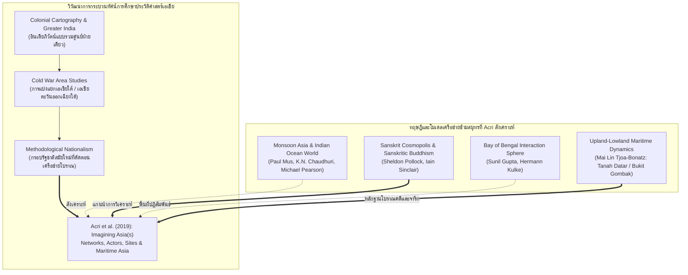

# บันทึกการอ่านและวิเคราะห์เอกสารจารึกวิทยาฉบับสมบูรณ์ (Epigraphic Source Dossier)
## จินตภาพ "เอเชีย": เครือข่าย ผู้แสดงบทบาท และแหล่งโบราณคดีข้ามสมุทร (Imagining Asia(s): Networks, Actors, Sites)

---

### ส่วนที่ 1: ข้อมูลบรรณานุกรมและการอ้างอิงมาตรฐาน (Bibliographic Metadata)
- **Source ID:** `S-2019-acri-01`
- **ชื่อไฟล์ PDF ในเครื่อง:** `S-2019-acri-01_Imagining_Asias_Networks_Sites_Passages.pdf`
- **ชื่อไฟล์ข้อความสกัด:** `S-2019-acri-01_Imagining_Asias_Networks_Sites_Passages.txt` (บรรจุส่วนหน้า สารบัญ บทนำ และบทความวิจัยหลักของเล่ม โดยเฉพาะบทวิเคราะห์เชิงมโนทัศน์ "Imagining 'Maritime Asia'" ของ Andrea Acri และบทความร่วมของผู้ทรงคุณวุฒิ)
- **ประเภทเอกสาร:** หนังสือวิชาการรวมบทความวิจัยระดับนานาชาติผ่านการประเมินโดยผู้ทรงคุณวุฒิ (Peer-reviewed Edited Volume) ในชุดสิ่งพิมพ์วิชาการ Nalanda-Sriwijaya Centre Series (NSC Series No. 29)
- **ภาษาของเอกสาร:** ภาษาอังกฤษ (EN) พร้อมการตรวจสอบและปริวรรตศัพท์เทคนิคภาษาดั้งเดิม: ภาษาสันสกฤตคลาสสิก (Classical Sanskrit) ตามระบบสากล IAST, ภาษาชวาโบราณ (Old Javanese Kawi), ภาษามลายูโบราณและมลายูคลาสสิก (Old and Classical Malay), ภาษาอาหรับ (Arabic), ภาษาดัตช์ (Dutch), ภาษาฝรั่งเศส (French), ภาษาเยอรมัน (German), ภาษาทมิฬ (Tamil), และภาษาจีน (Chinese)
- **ขอบเขตภูมิศาสตร์และวัฒนธรรม:** ทั่วมหาสมุทรอินเดียและทะเลจีนใต้ (Maritime Asia): อนุภูมิภาคเอเชียใต้ (อินเดีย คอโรแมนเดล มะละบาร์ เบงกอล ปากีสถาน แคว้นคันธาระ โบราณสถานเปศวาร์), เกาะลังกา (ศรีลังกา), เอเชียตะวันออกเฉียงใต้ภาคพื้นสมุทรและหมู่เกาะ (Nusantara / โลกมลายู: เกาะสุมาตรา ทิวเขาตานะฮ์ดาตาร์และบูกิตกมบัก, ช่องแคบมะละกา, เกาะชวา, คาบสมุทรมลายู), เอเชียตะวันออกเฉียงใต้ภาคพื้นทวีป (เวียดนาม ยุคด่างในและราชวงศ์เหงียน, เมียนมา มัณฑะเลย์, กัมพูชา), เอเชียตะวันออก (จีน ฉางอาน ราชวงศ์ถัง, ญี่ปุ่น โตเกียว), เอเชียกลางและเอเชียตะวันตก (แบกแดด ราชวงศ์อับบาซียะฮ์, คาบสมุทรอาหรับ นครมักกะฮ์ แคว้นฮิญาซ, ตุรกี อิสตันบูล)
- **วัสดุและบริบทการค้นพบ:**
  - จารึกศิลาและแผ่นโลหะยุคโบราณและยุคกลาง: ศิลาจารึกพระเจ้าอาทิตยวรมันแห่งสุมาตราตะวันตก (King Ādityavarman, ศตวรรษที่ 14 ณ เนินเขาบูกิตกมบัก Bukit Gombak และแถบตานะฮ์ดาตาร์ Tanah Datar), จารึกภาษาสันสกฤตและมลายูโบราณในเครือข่ายศรีวิชัย, จารึกทมิฬของสมาคมพ่อค้าอินเดียใต้ (Ayyavole 500 / Maṇigrāmam ในสุมาตราและคาบสมุทรมลายู)
  - พระบรมสารีริกธาตุและโบราณวัตถุพุทธศาสนา: พระธาตุจากสถูปโบราณใกล้เปศวาร์ (Peshawar Relics) สู่พระอารามหลวงมัณฑะเลย์ (Mandalay) ในเมียนมา ผ่านเครือข่ายจักรวรรดินิยมอังกฤษและการทูตทางศาสนา
  - โบราณวัตถุและเครื่องเคลือบการค้าทางทะเล: แหล่งขุดค้นทางโบราณคดีที่ราบสูงตานะฮ์ดาตาร์ (Tanah Datar) สุมาตราตะวันตก บันทึกการค้นพบเศษเครื่องถ้วยชามสังคโลกและเครื่องเคลือบนำเข้าจากจีนและเวียดนามข้ามมหาสมุทรตั้งแต่ศตวรรษที่ 14 ถึง 17
  - สถาปัตยกรรม ศาสนสถาน และหลุมฝังศพศักดิ์สิทธิ์: สุสานเกอรามัต (Keramat) ข้ามสมุทรในมะละกาและโลกมลายู, มัสยิดและป้อมปราการทางศาสนาแบบริบาฏ (Ribāṭ) แห่งเมืองปอนนานี (Ponnāni) ชายฝั่งมะละบาร์ ประเทศอินเดีย, ศาสนสถานสถูปเจดีย์และมณฑลตันตระข้ามภูมิภาค
- **การอ้างอิงฉบับเต็มระบบ Chicago/Turabian Notes-Bibliography:**  
  Acri, Andrea, Kashshaf Ghani, Murari K. Jha, and Sraman Mukherjee, eds. *Imagining Asia(s): Networks, Actors, Sites*. Nalanda-Sriwijaya Centre Series, no. 29. Singapore: ISEAS – Yusof Ishak Institute, 2019. (โดยมีบทความหลักเชิงทฤษฎี: Acri, Andrea. "Imagining ‘Maritime Asia’," หน้า 36–59; ร่วมกับบทนำ: Acri, Andrea, Kashshaf Ghani, Murari K. Jha, and Sraman Mukherjee. "Introduction," หน้า 1–15; และบทความศึกษาเฉพาะทางโดย Sinclair, Tjoa-Bonatz, Mukherjee, Kooria, Rosa, Liem).

---

### ส่วนที่ 2: แผนผังการจัดสรรเข้าสู่บทและหัวข้อย่อย (Chapter & Section Mapping Matrix)

- **บทที่ 1: กรอบทฤษฎี ประวัติศาสตร์นิพนธ์ และระเบียบวิธีวิจัยในการศึกษาจารึกอินโดนีเซียโบราณ**
  - **หัวข้อย่อย 1.1 (การทบทวนประวัติศาสตร์นิพนธ์อาณานิคมและหลังอาณานิคม: การก้าวข้ามกรอบภูมิภาคศึกษา):**  
    การนำกรอบมโนทัศน์ "การจินตนาการเอเชีย" (Imagining Asias) ของ Acri et al. (2019) มาใช้รื้อถอนเส้นแบ่งที่ตายตัวของ "ภูมิภาคศึกษา" (Area Studies) หลังสงครามโลกครั้งที่สอง ซึ่งแบ่งแยกเอเชียใต้ออกจากเอเชียตะวันออกเฉียงใต้อย่างไม่เป็นธรรมชาติ โดยชี้ให้เห็นว่าการศึกษาจารึกและประวัติศาสตร์วัฒนธรรมต้องมองผ่านประวัติศาสตร์แบบเชื่อมโยง (Connected Histories ของ Sanjay Subrahmanyam) และการศึกษาพื้นที่ปฏิสัมพันธ์ (Contact Zones) ในมิติเวลาอันยาวนาน (Longue Durée) (หน้า 1–4, 17–19, 36–39)
  - **หัวข้อย่อย 1.2 (โมเดลการแพร่กระจายทางวัฒนธรรม: จาก Indianization สู่ Cultural Convergence และ Cosmopolis):**  
    วิเคราะห์การสังเคราะห์ทางทฤษฎีในบทนำของ Acri et al. ที่ประมวลและประเมินค่าทฤษฎีสำคัญในประวัติศาสตร์ ได้แก่ ทฤษฎีการบรรจบกันทางวัฒนธรรม (Cultural Convergence ของ Hermann Kulke 1990, 2014), โลกภาษาสันสกฤตและสหัสวรรษแห่งภาษาพื้นเมือง (Sanskrit Cosmopolis & Vernacular Millennium ของ Sheldon Pollock 2006), ลัทธิไศวะแห่งยุค (Śaiva Age ของ Alexis Sanderson 2009), และการข้ามพรมแดนสู่โลกพุทธบาลี (Pāli Cosmopolis ของ Tilman Frasch 2017) เพื่อวางกรอบการอ่านจารึกอินโดนีเซียในฐานะส่วนหนึ่งของกระบวนการสากล (หน้า 3–4)
  - **หัวข้อย่อยใหม่ที่ค้นพบเพิ่มเติม (1.5 ภววิทยาแห่งการไม่แบ่งแยกและญาณวิทยาแห่งการแช่แข็งความหมาย):**  
    การวิเคราะห์เชิงญาณวิทยาผ่านข้อถกเถียงของ Farish A. Noor (Chapter 1) เรื่อง "ญาณวิทยาที่สังหารและจับกุมความหมาย" (The Epistemology that Kills and Arrests) ซึ่งเตือนสตินักจารึกวิทยาและนักประวัติศาสตร์มิให้ตกหลุมพรางของการกำหนดความหมายที่แข็งทื่อตายตัว (Epistemic violence / Reification) จากแบบแผนการศึกษาของเจ้าอาณานิคมและลัทธิชาตินิยมสมัยใหม่ (หน้า 4–5, 17–20)

- **บทที่ 8: จารึกกับการค้า เครือข่ายทางทะเล และความสัมพันธ์ข้ามสมุทร (Maritime Networks & Foreign Relations)**
  - **หัวข้อย่อย 8.1 (มโนทัศน์ "เอเชียภาคพื้นสมุทร" Maritime Asia ในฐานะมหภูมิภาคข้ามพรมแดน):**  
    การสถาปนากรอบมโนทัศน์ "Maritime Asia" ของ Andrea Acri (Chapter 2) ในฐานะหน่วยการวิเคราะห์เชิงพื้นที่และวัฒนธรรมที่เชื่อมต่อมหาสมุทรอินเดีย ทะเลอันดามัน ช่องแคบมะละกา ทะเลชวา และทะเลจีนใต้ สู่แปซิฟิกตะวันตก ซึ่งก่อตัวขึ้นจากเส้นทางลมมรสุม (Monsoon Asia) และการแลกเปลี่ยนข้ามสมุทรตั้งแต่สหัสวรรษแรกก่อนคริสตกาลจนถึงยุคก่อนสมัยใหม่ (หน้า 4–5, 36–45)
  - **หัวข้อย่อย 8.2 (เครือข่ายพุทธศาสนาภาษาสันสกฤต Sanskritic Buddhism และพุทธตันตระข้ามสมุทร):**  
    การประยุกต์ใช้ข้อวิเคราะห์ของ Iain Sinclair (Chapter 10) และ Andrea Acri (Chapter 2) ว่าด้วย "พุทธศาสนาภาษาสันสกฤตในฐานะความเป็นสากลนิยมแห่งเอเชีย" (Sanskritic Buddhism as an Asian Universalism) ซึ่งเชื่อมโยงราชสำนักและศูนย์กลางศาสนาในอินเดียภาคกลาง/เบงกอล (นาลันทา, วิกรมศิลา) สู่ศรีวิชัย (สุมาตรา), ชวากลาง (บุโรพุทโธ), เนปาล, ทิเบต และจีน ผ่านเครือข่ายคัมภีร์ พระเถระผู้ทรงวิทยาคุณ และประติมานวิทยาข้ามสมุทร (หน้า 5, 9, 36–59, 275–300)
  - **หัวข้อย่อย 8.4 (ภูมิศาสตร์ศักดิ์สิทธิ์และการสถาปนาอำนาจรัฐข้ามสมุทรของพระเจ้าอาทิตยวรมันในสุมาตราตะวันตก):**  
    การใช้ข้อมูลทางโบราณคดีและจารึกวิทยาของ Mai Lin Tjoa-Bonatz (Chapter 13) เกี่ยวกับชุมชนโบราณในตานะฮ์ดาตาร์ (Tanah Datar) และแหล่งขุดค้นเนินเขาบูกิตกมบัก (Bukit Gombak) ศูนย์กลางอำนาจรัฐของ "มหาราชาธิราชอาทิตยวรมัน" (King Ādityavarman, ค.ศ. 1347–1375) ผู้ทรงเชื่อมเครือข่ายสินค้าแร่ทองคำและยางไม้หอมจากเทือกเขาสูง (Highlands) สู่ท่าเรือการค้าชายฝั่งทะเล (Lowlands/Coast) และแผ่ขยายอิทธิพลพุทธตันตระ-ไภรวะเชื่อมโยงระหว่างชวาตะวันออก (มัชฌปาหิต) และเกาะสุมาตรา (หน้า 10–11, 393–420)
  - **หัวข้อย่อยใหม่ที่ค้นพบเพิ่มเติม (8.6 ภูมิศาสตร์พระบรมสารีริกธาตุและเครือข่ายจิตวิญญาณข้ามสมุทร):**  
    การวิเคราะห์ของ Sraman Mukherjee (Chapter 8) และ Fernando Rosa (Chapter 7) ว่าด้วย "ภูมิศาสตร์การจาริกแสวงบุญและพลังศักดิ์สิทธิ์ข้ามสมุทร" (Sacred Geographies of Relics and Keramat) ที่เชื่อมโยงอารยธรรมอินเดีย มลายู และพม่าเข้าด้วยกัน ผ่านการเคลื่อนย้ายวัตถุมงคล พระธาตุ และความเชื่อเรื่องพลังศักดิ์สิทธิ์สตรีดั้งเดิม (Feminine divine power) ข้ามทะเลอินเดีย (หน้า 7–8, 175–200, 215–245)

---

### ส่วนที่ 3: สรุปสาระสำคัญเชิงวิเคราะห์และจุดยืนทางวิชาการ (Executive Academic Analysis)

#### 1. วิทยานิพนธ์และข้อถกเถียงหลักของผู้เขียน (Core Argument / Thesis)
หนังสือ *Imagining Asia(s): Networks, Actors, Sites* (2019) ภายใต้การนำของ Andrea Acri และคณะผู้บรรณาธิการ นำเสนอการปฏิวัติระเบียบวิธีวิจัยทางประวัติศาสตร์และจารึกวิทยาเอเชีย ผ่าน 5 ประเด็นใจกลาง:

1. **การท้าทายเส้นแบ่งอันแข็งทื่อของ "ภูมิภาคศึกษา" (Challenging Area Studies Cartographies):**  
   คณะผู้เขียนชี้ให้เห็นว่า การแบ่งซอยทวีปเอเชียออกเป็นภูมิภาคย่อยที่ดูเหมือนปิดตายในตัวเอง เช่น เอเชียตะวันตก เอเชียใต้ เอเชียตะวันออกเฉียงใต้ และเอเชียตะวันออก เป็นผลผลิตของผลประโยชน์ทางภูมิรัฐศาสตร์และเศรษฐกิจการเมืองของมหาอำนาจตะวันตกในยุคสงครามเย็น มิได้สอดคล้องกับรากเหง้าทางประวัติศาสตร์ วัฒนธรรม หรือการไปมาหาสู่กันของผู้คนในอดีต (หน้า 1–2, 17) ในความเป็นจริง อดีตของเอเชียคือกระบวนการทางประวัติศาสตร์แบบเปิดกว้างที่เต็มไปด้วยความลื่นไหล ข้ามพรมแดน และเชื่อมโยงหลายทิศทาง (Fluid contact zones and multidirectional circulation) ในมิติเวลาแบบ *longue durée* (หน้า 2, 11)

2. **การรื้อฟื้นมโนทัศน์ "เอเชียภาคพื้นสมุทร" (Imagining "Maritime Asia" as a Unified Field of Interaction):**  
   ใน Chapter 2 ซึ่งเขียนโดย Andrea Acri ได้นำเสนอกรอบความคิดเรื่อง "Maritime Asia" ขึ้นมาเป็นหน่วยการวิเคราะห์ทางประวัติศาสตร์และจารึกวิทยา เพื่อทดแทนโมเดลภาคพื้นทวีปที่แข็งทื่อ โดยนิยามพื้นที่นี้ว่าครอบคลุมแนวชายฝั่งมหาสมุทรอินเดีย ทะเลอันดามัน ช่องแคบมะละกา ทะเลชวา และทะเลจีนใต้จนถึงมหาสมุทรแปซิฟิกตะวันตก พื้นที่แถบนี้มิใช่พรมแดนที่ขวางกั้น แต่เป็น "ทางหลวงเชื่อมต่อ" (Maritime Highway) ที่ขับเคลื่อนด้วยระบบลมมรสุม (Monsoon system) ส่งผลให้เกิดการไหลเวียนของผู้คน แนวคิด คัมภีร์ วัตถุทางศาสนา และสินค้า จนก่อเกิดเป็นมหภูมิภาคที่มีภูมิหลังทางประวัติศาสตร์ วัฒนธรรม และสิ่งแวดล้อมร่วมกัน เทียบเคียงได้กับมโนทัศน์ "ยูเรเชีย" (Eurasia) (หน้า 4–5, 36–40)

3. **พุทธศาสนาภาษาสันสกฤตในฐานะกระแสสากลนิยมข้ามสมุทร (Sanskritic Buddhism as Trans-Asian Universalism):**  
   บทวิเคราะห์ของ Iain Sinclair (Chapter 10) ร่วมกับ Acri ชี้ให้เห็นว่า พุทธศาสนาที่ใช้ภาษาสันสกฤต (Sanskritic Buddhism) โดยเฉพาะนิกายมหายานและวัชรยานตันตระ ไม่ได้ผูกติดอยู่กับสถาบันท้องถิ่นที่คับแคบ แต่ดำรงสถานะเป็น "สากลนิยมข้ามชาติพันธุ์" (Transnational Universalism) ภาษาสันสกฤตในพุทธศาสนามิได้ถูกจำกัดอยู่เพียงบทสวดมนต์ แต่เป็นภาษามาตรฐานทางวิชาการ (Śāstra) ครอบคลุมทั้งไวยากรณ์ การแพทย์ ปรัชญา และตรรกศาสตร์ ส่งผลให้นักบวชและปัญญาชนจากนาลันทา ศรีวิชัย กัมพูชา ชวา ไปจนถึงฉางอานและทิเบต สามารถแลกเปลี่ยน สนทนา และผลิตซ้ำระบบความรู้ร่วมกันได้อย่างไร้รอยต่อ (หน้า 9, 275–280)

4. **พลวัตระหว่าง "ที่สูงตอนใน" กับ "ที่ราบชายฝั่งและการค้าทางทะเล" (Upland-Lowland Dynamics and Maritime State Formation):**  
   งานวิจัยของ Mai Lin Tjoa-Bonatz (Chapter 13) เรื่องที่ราบสูงสุมาตราตะวันตก (Tanah Datar / Bukit Gombak) ได้ลบล้างภาพมายาคติเดิมที่มองว่าชุมชนบนที่สูงตัดขาดจากโลกภายนอก หลักฐานการขุดค้นทางโบราณคดีและจารึกแสดงให้เห็นว่า ที่ราบสูงเป็นแหล่งทรัพยากรยุทธศาสตร์ (ทองคำ ผลิตผลป่าไม้ ยางไม้หอม) ที่เชื่อมต่อกับระบบการค้าโลกผ่านแม่น้ำและชายฝั่งทะเล โดยมีราชสำนักของ "พระเจ้าอาทิตยวรมัน" (King Ādityavarman) ทำหน้าที่เป็นจุดเชื่อมโยงเชิงสถาบัน ผสมผสานระบบความเชื่อพื้นถิ่นเข้ากับพิธีกรรมพุทธตันตระระดับสากล เพื่อสถาปนาความเป็นเอกภาพทางการเมืองข้ามสมุทร (หน้า 10–11, 393–396)

5. **การหมุนเวียนและการแปลความหมายใหม่ของวัตถุศักดิ์สิทธิ์ข้ามวัฒนธรรม (Circulation and Transmutation of Sacred Relics and Spirits):**  
   งานของ Sraman Mukherjee (Chapter 8) และ Fernando Rosa (Chapter 7) พิสูจน์ให้เห็นว่า วัตถุศักดิ์สิทธิ์ทางศาสนา (เช่น พระบรมสารีริกธาตุ) และศาลศักดิ์สิทธิ์ (เกอรามัต Keramat) มี "ชีวิตเชิงวัตถุที่หมุนเวียนได้" (Circulating lives of objects) เมื่อเดินทางข้ามมหาสมุทรอินเดีย วัตถุเหล่านี้มิได้คงความหมายเดิมอย่างตายตัว แต่ได้รับการตีความ จัดวางบริบทใหม่ และสร้างคุณค่าทางสังคม-การเมืองขึ้นใหม่ในแต่ละพื้นที่ปฏิสัมพันธ์ (หน้า 7–8, 175, 215)

#### 2. บริบทประวัติศาสตร์นิพนธ์และการประเมินความน่าเชื่อถือ (Historiography & Source Criticism)
หนังสือเล่มนี้ถือเป็นหมุดหมายสำคัญของประวัติศาสตร์นิพนธ์สมัยใหม่ที่พยายามก้าวข้ามข้อจำกัดของแนวทางการศึกษา 3 สำนักในอดีต:

- **การรื้อถอนประวัติศาสตร์นิพนธ์แบบรวมศูนย์ที่อินเดีย (De-centring the "Greater India" Paradigm):**  
  ประวัติศาสตร์นิพนธ์ยุคอาณานิคมและชาตินิยมอินเดียยุคแรก (เช่น Majumdar, Coedès ยุคแรก) มักมองเอเชียตะวันออกเฉียงใต้ในฐานะ "อินเดียภิวัตน์" (Indianization) หรือ "อาณานิคมทางวัฒนธรรมของอินเดีย" ซึ่งวางอินเดียไว้เป็นศูนย์กลางผู้ส่งออกอารยธรรมฝ่ายเดียว แต่ Acri et al. (2019) ยืนยันตามแนวคิดของ Hermann Kulke (1990, 2014) และ Daud Ali (2009) เรื่อง "Cultural Convergence" (การบรรจบกันทางวัฒนธรรม) และ "Multidirectional Interactions" (ปฏิสัมพันธ์หลายทิศทาง) โดยมองว่าดินแดนต่างๆ รอบมหาสมุทรอินเดียพัฒนาความซับซ้อนทางสังคมขึ้นพร้อมๆ กัน และแลกเปลี่ยนความรู้ในฐานะผู้ร่วมสร้างอารยธรรมข้ามสมุทร มิใช่ผู้รับแบบฝ่ายเดียว (หน้า 3–4, 683, 737)

- **การก้าวพ้นกรอบชาตินิยมสมัยใหม่ (Transcending Methodological Nationalism):**  
  คณะผู้เขียนชี้ว่า กรอบการมองประวัติศาสตร์ที่เอา "รัฐชาติสมัยใหม่" (Post-colonial Nation-states) เป็นตัวตั้ง มักสร้างความผิดเพี้ยนให้แก่การศึกษาอดีต เพราะในยุคโบราณ เส้นแบ่งพรมแดนอย่างไทย พม่า มาเลเซีย หรืออินโดนีเซีย ยังไม่ดำรงอยู่ ตัวอย่างเช่น อาณาจักรศรีวิชัยหรือเครือข่ายของพระเจ้าอาทิตยวรมัน ครอบคลุมพื้นที่ข้ามพรมแดนรัฐชาติในปัจจุบัน การนำกรอบชาตินิยมไปจับจึงเป็นการ "แช่แข็งและตัดทอน" (Arresting and truncating) ความเป็นจริงทางประวัติศาสตร์ (หน้า 2, 4–5, 17–19)

- **การบูรณาการแบบสหวิทยาการ (Interdisciplinary Synthesis):**  
  จุดแข็งสูงสุดของงานวิจัยชุดนี้คือการบูรณาการหลักฐานอย่างหลากหลาย ทั้ง **จารึกวิทยา (Epigraphy)**, **นิรุกติศาสตร์ตัวบท (Philology)**, **โบราณคดีการขุดค้นและโบราณวัตถุ (Archaeology & Material Culture)**, และ **ประวัติศาสตร์แนวเชื่อมโยง (Connected History)** ทำให้ข้อสรุปมีความน่าเชื่อถือสูง ไม่เลื่อนลอยตามทฤษฎีหลังสมัยใหม่ แต่ตั้งอยู่บนหลักฐานตัวบทและวัตถุโบราณที่ตรวจสอบได้จริง

---

### ส่วนที่ 4: สารบัญข้อค้นพบเชิงลึกแยกตามมิติจารึกวิทยา (Thematic Epigraphic Findings with Exact Pages)

1. **ประวัติศาสตร์นิพนธ์และการตีความทางประวัติศาสตร์:**
   - *การรื้อถอนเส้นแบ่ง Area Studies และมายาคติเรื่องทวีปเอเชียที่ตายตัว:* Acri et al. ชี้ให้เห็นว่าคำว่า "Asia" มีที่มาจากจินตภาพเชิงพื้นที่ของชาวกรีกโบราณที่ใช้เรียกดินแดนทางทิศตะวันออก และกลายสภาพเป็นกรอบโครงสร้างที่ถูกสร้างขึ้นโดยผลประโยชน์ทางภูมิรัฐศาสตร์ในศตวรรษที่ 19–20 มากกว่าจะเป็นหน่วยทางวัฒนธรรมที่หยุดนิ่ง การศึกษาประวัติศาสตร์ต้องก้าวข้ามเส้นแบ่งเหล่านี้เพื่อมองหา "ปรากฏการณ์ข้ามท้องถิ่น" (Translocal phenomena) และความต่อเนื่องเชิงกระบวนการในมิติเวลาอันยาวนาน (หน้า 1–3, 345–355)
   - *ทฤษฎีการบรรจบกันทางวัฒนธรรม (Cultural Convergence):* การนำเสนองานของ Hermann Kulke (1990, 2014) ที่มองว่าปฏิสัมพันธ์ระหว่างอินเดียและเอเชียตะวันออกเฉียงใต้ มิใช่การแผ่ขยายอารยธรรมจากศูนย์กลางสู่ชายขอบ แต่เป็นกระบวนการที่สังคมทั้งสองฝั่งมหาสมุทรมีการพัฒนาโครงสร้างภายในที่สอดรับกัน ทำให้เกิดการแลกเปลี่ยนและรับเอาสัญลักษณ์ทางอำนาจและศาสนามาใช้ได้อย่างสอดคล้องกัน (หน้า 4, 733–740)

2. **ตัวบทจารึก การอ่าน ศักราช และอักขรวิทยา:**
   - *จารึกของพระเจ้าอาทิตยวรมันในสุมาตราตะวันตก (ศตวรรษที่ 14):* บทความของ Tjoa-Bonatz (Chapter 13) และข้อวิเคราะห์ของ Acri ระบุถึงการพบจารึกภาษาสันสกฤตผสมมลายูโบราณและชวาโบราณ ณ แหล่งบูกิตกมบัก (Bukit Gombak) และบันดาร์บาปาฮัต (Bandar Bapahat) ซึ่งบันทึกบทบาทของกษัตริย์ในฐานะผู้ปกครองมลายูพุทธผู้สืบสายราชสกุลจากราชสำนักมัชฌปาหิตในชวา จารึกเหล่านี้ใช้ฉันทลักษณ์สันสกฤตที่สลับซับซ้อนและการเล่นคำเชิงรหัสยนิยมแบบตันตระ เพื่อประกาศอำนาจอันชอบธรรมเหนือเส้นทางการค้าทองคำ (หน้า 10–11, 393–396, 662)
   - *การใช้ภาษาสันสกฤตในฐานะภาษาเทคนิคข้ามพรมแดน (Śāstric Sanskrit):* Iain Sinclair (Chapter 10) ชี้ว่า จารึกและคัมภีร์พุทธภาษาสันสกฤตในเอเชียตะวันออกเฉียงใต้และเอเชียใต้ มิได้จำกัดอยู่เฉพาะเรื่องศาสนา แต่ครอบคลุมวรรณกรรมเชิงเทคนิควิชาการ (Śāstra) เช่น ตำราไวยากรณ์ การแพทย์ และวรรณคดี ทำให้เกิดเครือข่ายปัญญาชนที่สื่อสารข้ามชาติพันธุ์ได้อย่างเสรี (หน้า 9, 600–605)

3. **มิติศาสนา ลัทธิความเชื่อ และพิธีกรรม:**
   - *พุทธศาสนาภาษาสันสกฤตและลัทธิวัชรยานตันตระข้ามสมุทร:* Acri และ Sinclair วิเคราะห์ว่า พุทธศาสนาที่แพร่หลายในเส้นทาง Maritime Asia ตั้งแต่ศตวรรษที่ 7 เป็นต้นมา คือพุทธตันตระสายมันตรยานและวัชรยาน ซึ่งมีจุดเด่นในการใช้มนตร์ ธารณี และมณฑลพิธีกรรมที่ทรงพลัง เครือข่ายนี้เชื่อมโยงพระภิกษุนานาชาติ เช่น อโมฆวัชระ (Amoghavajra), วัชรโพธิ (Vajrabodhi), และอติศะทีปังกร (Atiśa Dīpaṃkara) ที่เดินทางไปมาระหว่างอินเดีย สุมาตรา (ศรีวิชัย) และจีน (หน้า 4–5, 9, 440–443, 595–605)
   - *การอยู่ร่วมกันเชิงเทววิทยาระหว่างพุทธและไศวนิกาย:* Sinclair ชี้ให้เห็นว่า พุทธศาสนาภาษาสันสกฤตดำรงอยู่ร่วมกับลัทธิพราหมณ์-ไศวะผ่านบทสนทนาทางปรัชญาและสภาพแวดล้อมทางสังคม โดยฝ่ายพุทธสร้างแนวคิด "Transsectarianism" เพื่อเปิดรับและจัดวางเทพเจ้าฮินดูให้อยู่ในมณฑลพุทธ (หน้า 9, 602–610)
   - *พลังศักดิ์สิทธิ์สตรีดั้งเดิมและลัทธิเกอรามัต (Keramat):* Fernando Rosa (Chapter 7) วิเคราะห์ความเชื่อเรื่องสุสานศักดิ์สิทธิ์เกอรามัตในมะละกา โดยเสนอว่ามีรากฐานทางประวัติศาสตร์เชื่อมโยงกับเครือข่ายมหาสมุทรอินเดียและชั้นดินทางวัฒนธรรมออสโตรเอเชียติกโบราณที่บูชาพลังอำนาจและเทวีเพศหญิง (Feminine power and deities) ซึ่งยังคงตกค้างอยู่ในนูซันตาราแม้ในยุคอิสลาม (หน้า 7–8, 538–545)

4. **มิติสถาปัตยกรรม ศาสนสถาน และชลศาสตร์:**
   - *แหล่งโบราณคดีเนินเขาบูกิตกมบัก (Bukit Gombak):* การขุดค้นทางโบราณคดีล่าสุดยืนยันว่า แหล่งบนเนินเขาแห่งนี้คือศูนย์กลางอำนาจรัฐและที่ประทับของพระเจ้าอาทิตยวรมัน มีการวางผังศาสนสถานและเขตพระราชฐานสอดรับกับภูมิประเทศยอดเขาเพื่อจำลองเขาพระสุเมรุ (Meru-like topography) และเป็นจุดยุทธศาสตร์ควบคุมการคมนาคมทางน้ำของแม่น้ำกัมปาร์ (Kampar River) และแม่น้ำบาตังฮารี (Batang Hari) (หน้า 10–11, 660–665)
   - *การข้ามแดนของรูปแบบสถาปัตยกรรมอิสลาม:* Federica Broilo (Chapter 11) แสดงให้เห็นการถ่ายทอดและปรับใช้รูปแบบสถาปัตยกรรมระหว่างฉางอาน แบกแดด และอิสตันบูล ซึ่งพิสูจน์ว่าระบบสถาปัตยกรรมศักดิ์สิทธิ์ในเอเชียมิได้อยู่อย่างโดดเดี่ยว แต่มีการแลกเปลี่ยนลวดลายและคติการสร้างผ่านเครือข่ายการเดินทาง (หน้า 9–10, 615–630)

5. **มิติอาหารการกิน วิถีชีวิต การค้า และตลาด:**
   - *การค้าเครื่องเคลือบข้ามสมุทรในสุมาตราตอนใน:* Tjoa-Bonatz (Chapter 13) ตรวจพบเศษเครื่องปั้นดินเผาและเครื่องเคลือบนำเข้าจำนวนมากในเขตที่ราบสูงตานะฮ์ดาตาร์ เช่น เครื่องเคลือบสีเขียวศิลาดลของจีน (Chinese Celadon) และเครื่องถ้วยชามจากเตาเผาในเวียดนาม (Vietnamese ceramics) ยุคศตวรรษที่ 14–17 ซึ่งเป็นหลักฐานเชิงประจักษ์ว่า สินค้าหรูหราข้ามสมุทรได้แทรกซึมลึกเข้าไปสู่วิถีชีวิตของชนชั้นนำบนที่สูง เพื่อแลกเปลี่ยนกับทองคำและผลิตผลจากป่า (หน้า 10–11, 655–660)
   - *บทบาทของสมาคมพ่อค้าข้ามสมุทร:* ข้อมูลการศึกษาเปรียบเทียบในเล่มสะท้อนถึงการปฏิบัติการของสมาคมพ่อค้าอินเดียใต้และพ่อค้าเปอร์เซีย-อาหรับที่สร้างสถานีการค้าและตั้งหลักแหล่งตามเมืองท่าในคาบสมุทรมลายูและสุมาตรามาตั้งแต่คริสต์สหัสวรรษแรก (หน้า 3, 325–330)

6. **มิติการปกครอง กฎหมาย ที่ดิน และระบบสีมา:**
   - *ยุทธศาสตร์การปรับตัวทางการเมืองตามพื้นที่รอยต่อ (Geopolitical Acclimatization):* Vu Duc Liem (Chapter 12) วิเคราะห์กรณีราชสำนักเหงียนแห่งด่างใน (Nguyen Cochinchina) ในเวียดนาม ซึ่งวางตัวอยู่บนทางแพร่งระหว่างเอเชียตะวันออกและเอเชียตะวันออกเฉียงใต้ โดยใช้วิธีหันหน้าทางเศรษฐกิจลงใต้สู่เครือข่ายการค้าทางทะเลของเอเชียตะวันออกเฉียงใต้ แต่หันหน้าทางการเมืองและวัฒนธรรมขึ้นเหนือสู่โลกจีน (หน้า 10, 635–648)
   - *โครงสร้างการปกครองแบบรวมศูนย์และเครือข่ายสาขา:* กรณีของพระเจ้าอาทิตยวรมันในสุมาตราแสดงให้เห็นการประสานอำนาจระหว่างกษัตริย์ในฐานะจักรพรรดิราชาธิราชกับผู้นำท้องถิ่น (Chieftains) โดยใช้พิธีกรรมตันตระเป็นเครื่องมือผูกมัดความภักดีและควบคุมสิทธิการถือครองผลประโยชน์จากที่ดินและเหมืองทอง (หน้า 10–11, 660–665)

7. **มิติปฏิสัมพันธ์ข้ามสมุทรและเครือข่ายนานาชาติ:**
   - *แนวคิด "มหภาคภูมิภาคเอเชียภาคพื้นสมุทร" (Maritime Asia as an Intersecting Macro-region):* Andrea Acri (Chapter 2) แสดงให้เห็นว่า ตั้งแต่ยุคโบราณจนถึงยุคกลาง ทะเลมิได้ทำหน้าที่เป็นกำแพงขวางกั้น หากแต่เป็นสื่อกลางในการเชื่อมเครือข่ายปัญญาชน พระสงฆ์ พ่อค้า และช่างฝีมือ (Cultural brokers) ข้ามมหาสมุทรอินเดีย ทะเลชวา และทะเลจีนใต้ (หน้า 4–5, 435–440)
   - *เครือข่ายการแลกเปลี่ยนความรู้และการเดินทางของพระสงฆ์ข้ามทวีป:* การเดินทางของพระสงฆ์และนักจาริกแสวงบุญ เช่น หลวงจีนอี้จิง พระภิกษุชาวอินเดีย พระภิกษุชาวชวาและมลายู ยืนยันว่าศูนย์กลางการศึกษาพุทธศาสนาในสุมาตรา (ศรีวิชัย) มีความสำคัญทัดเทียมกับมหาวิหารนาลันทาในอินเดีย และทำหน้าที่เป็นสถานีเตรียมความพร้อมทางวิชาการและภาษาศาสตร์ก่อนเดินทางต่อไป (หน้า 3, 330–335, 440)
   - *เครือข่ายทางทหารและศาสนาในมหาสมุทรอินเดีย:* Mahmood Kooria (Chapter 6) วิเคราะห์แนวคิด "ริบาฏ" (Ribāṭ) แห่งปอนนานี ชายฝั่งมะละบาร์ ที่ชาวมุสลิมชายฝั่งใช้สร้างเครือข่ายร่วมมือกับกษัตริย์ฮินดู (ซาโมริน Zamorin) เพื่อต่อต้านการรุกรานทางทะเลของโปรตุเกสในศตวรรษที่ 16 สะท้อนความเป็นเอกภาพเชิงยุทธศาสตร์ข้ามศาสนาในมหาสมุทรอินเดีย (หน้า 6–7, 507–522)

8. **มิติจารึกแผ่นโลหะ รูปเคารพขนาดเล็ก และจารึกแม่น้ำ:**
   - *การผลิตซ้ำประติมานวิทยาข้ามสมุทร:* Acri และ Sinclair ชี้ให้เห็นการแพร่หลายของรูปเคารพสัมฤทธิ์ขนาดเล็กของพระโพธิสัตว์อวโลกิเตศวร มัญชุศรี และตารา ที่หล่อขึ้นด้วยฝีมือช่างศิลปะแบบปาละ (Pāla art) ซึ่งถูกนำพาไปตามเส้นทางเรือสำเภาและค้นพบในซากเรืออับปางและศาสนสถานทั่วสุมาตรา ชวา คาบสมุทรมลายู และฟิลิปปินส์ (หน้า 4–5, 9, 440–443)
   - *การจารึกธารณีและมนตร์พุทธตันตระลงบนแผ่นโลหะและดินเผา:* หลักฐานแผ่นทองคำจารึกและตราประทับดินเผาบรรจุคาถา "เย ธรฺมาฯ" (Ye dharmā hetuprabhavā...) ที่พบในบริเวณชายฝั่งทั่วเอเชียภาคพื้นสมุทร สะท้อนการสร้างภูมิศาสตร์ศักดิ์สิทธิ์เพื่อพิทักษ์คุ้มครองการเดินทางทางทะเล (หน้า 9, 605–610)

9. **พรมแดนปัญหา ปริศนาวิชาการ และจริยธรรมโบราณคดี:**
   - *การเมืองเรื่องพระบรมสารีริกธาตุและการย้ายถิ่นฐานในยุคอาณานิคม:* Sraman Mukherjee (Chapter 8) ตรวจสอบประวัติศาสตร์ของพระบรมสารีริกธาตุที่ถูกขุดพบโดยนักโบราณคดีอังกฤษใกล้เมืองเปศวาร์ (กันธาระ) แล้วถูกรัฐอาณานิคมส่งมอบเป็นของขวัญทางการทูตไปยังวัดพุทธในเมืองมัณฑะเลย์ ประเทศพม่า การศึกษานี้เปิดโปงให้เห็นการใช้โบราณวัตถุศักดิ์สิทธิ์เป็นเครื่องมือสร้างความชอบธรรมทางการเมืองและจัดวางระเบียบความสัมพันธ์ระหว่างประเทศในยุคจักรวรรดินิยม (หน้า 8, 552–566)
   - *การวิพากษ์ความพยายามผูกขาดความหมายของโบราณสถาน:* การตีความประวัติศาสตร์เอเชียต้องระวังมิให้ตกอยู่ภายใต้เรื่องเล่าชาตินิยมแบบคับแคบ เช่น การแย่งชิงความเป็นเจ้าของมรดกทางวัฒนธรรมศรีวิชัยระหว่างไทย มาเลเซีย และอินโดนีเซีย ซึ่งบดบังภาพรวมของเครือข่ายข้ามสมุทรในอดีต (หน้า 4–5, 17–25)

---

### ส่วนที่ 5: คลังข้อความอ้างอิงตรงและเชิงอรรถสำเร็จรูป (Verbatim Quotes & Footnote Bank)

1. **การท้าทายเส้นแบ่งอันแข็งทื่อของภูมิภาคศึกษาและจินตภาพเอเชีย (Acri et al. 2019: 1–2):**
   - *ภาษาอังกฤษต้นฉบับ:*  
     "Area studies scholarship, for example, has carved Asia into the seemingly self-contained regions of West and Central Asia, South and Southeast Asia, and East Asia. These regional configurations reflect more the changing (geo)political and economic interests in these areas rather than any of their historical or cultural roots. Recent scholarship, however, has presented Asia as a cultural entity produced through political imaginations located in specific historical contexts, and revealed the arbitrariness of the Area Studies divide. More importantly, it has advanced the question as to what Asia is, and as to whether there existed one or many Asia(s)."
   - *แปลภาษาไทย:*  
     "การศึกษาในกระบวนทัศน์ภูมิภาคศึกษา (Area Studies) ได้แบ่งซอยทวีปเอเชียออกเป็นภูมิภาคย่อยที่ดูประหนึ่งว่าปิดตายและสมบูรณ์ในตัวเอง เช่น เอเชียตะวันตกและเอเชียกลาง เอเชียใต้และเอเชียตะวันออกเฉียงใต้ และเอเชียตะวันออก การจัดวางโครงสร้างภูมิภาคเหล่านี้แท้จริงแล้วสะท้อนถึงการเปลี่ยนแปลงของผลประโยชน์ทาง (ภูมิ)รัฐศาสตร์และเศรษฐกิจในพื้นที่ดังกล่าว มากกว่าที่จะสอดคล้องกับรากเหง้าทางประวัติศาสตร์หรือวัฒนธรรม ทว่างานวิชาการยุคหลังได้นำเสนอภาพของเอเชียในฐานะองค์รวมทางวัฒนธรรมที่ถูกสร้างขึ้นผ่านจินตนาการทางการเมืองในบริบทประวัติศาสตร์เฉพาะ และได้เปิดโปงให้เห็นถึงความอำเภอใจของเส้นแบ่งในระบบภูมิภาคศึกษา ที่สำคัญยิ่งไปกว่านั้น งานวิชาการเหล่านี้ยังได้จุดประกายคำถามที่ว่า อะไรคือเอเชีย และแท้จริงแล้วมีเอเชียเพียงหนึ่งเดียวหรือมี 'เอเชียหลากหลาย' กันแน่"
   - *เชิงอรรถสำเร็จรูป:*  
     Andrea Acri, Kashshaf Ghani, Murari K. Jha, and Sraman Mukherjee, "Introduction," in *Imagining Asia(s): Networks, Actors, Sites*, ed. Andrea Acri et al. (Singapore: ISEAS – Yusof Ishak Institute, 2019), 1–2.

2. **การมองเอเชียในฐานะพื้นที่ปฏิสัมพันธ์และเครือข่ายอันเข้มข้น (Acri et al. 2019: 3):**
   - *ภาษาอังกฤษต้นฉบับ:*  
     "Rather than giving primacy to an arbitrarily defined geographic category, Asia can be visualized as a zone or discursive field of intensified interconnections intertwining almost every aspects of human society. Any attempts to chart out an imagined geographical construct such as Asia inevitably 'also make manifest the impossibilities and potential of mapping Global Asias, that conceptually determined site that insists on its own indeterminacy and plurality as much as its global expanse.' (Chen 2017, p. vii)."
   - *แปลภาษาไทย:*  
     "แทนที่จะให้ความสำคัญสูงสุดแก่หมวดหมู่ทางภูมิศาสตร์ที่ถูกกำหนดขึ้นอย่างตามอำเภอใจ เอเชียสามารถมองเห็นเป็นพื้นที่หรือปริมณฑลเชิงวาทกรรมแห่งปฏิสัมพันธ์อันเข้มข้นที่ร้อยรัดแทบทุกมิติของสังคมมนุษย์เข้าด้วยกัน ความพยายามใดๆ ในการเขียนแผนผังโครงสร้างทางภูมิศาสตร์เชิงจินตนาการอย่างเอเชีย ย่อม 'เผยให้เห็นทั้งความเป็นไปไม่ได้และศักยภาพของการสร้างแผนที่ Global Asias ซึ่งเป็นพื้นที่กำหนดเชิงมโนทัศน์ที่ยืนยันในความไม่แน่นอนและพหุภาพของตนเองพอๆ กับการขยายตัวครอบคลุมทั่วโลก' อย่างหลีกเลี่ยงไม่ได้"
   - *เชิงอรรถสำเร็จรูป:*  
     Andrea Acri, Kashshaf Ghani, Murari K. Jha, and Sraman Mukherjee, "Introduction," in *Imagining Asia(s): Networks, Actors, Sites*, ed. Andrea Acri et al. (Singapore: ISEAS – Yusof Ishak Institute, 2019), 3.

3. **มโนทัศน์ "เอเชียภาคพื้นสมุทร" ของ Andrea Acri (Acri 2019: 4–5):**
   - *ภาษาอังกฤษต้นฉบับ:*  
     "Chapter 2, 'Imagining Maritime Asia' by Andrea Acri tries to reconceptualize (i.e., reimagine) geopolitical configurations of Asia as framed by the current Area Studies paradigm through the prism of the socio-spatial construction of 'Maritime Asia'. Acri advocates a borderless history (and geography) of the largely maritime and littoral swathe of territory from the Indian Ocean littorals to the Western Pacific in the longue durée that takes into account long-distance connections and dynamics of religious interaction. Having surveyed the genealogy of the expression 'Maritime Asia', Acri describes this dynamic macro-region of intersecting discursive fields across which networks of cultural brokers travelled since time immemorial, regarding it as forming—just like Eurasia—one interconnected network with a shared background of human, intellectual, and environmental history."
   - *แปลภาษาไทย:*  
     "บทที่ 2 'จินตภาพเอเชียภาคพื้นสมุทร' โดย อันเดรีย อาครี พยายามรื้อสร้างมโนทัศน์ (หรือจินตนาการใหม่) ต่อโครงสร้างทางภูมิรัฐศาสตร์ของเอเชียที่ถูกตีกรอบโดยกระบวนทัศน์ภูมิภาคศึกษาในปัจจุบัน ผ่านปริซึมของโครงสร้างทางสังคม-พื้นที่แบบ 'เอเชียภาคพื้นสมุทร' (Maritime Asia) อาครีสนับสนุนแนวทางการศึกษาประวัติศาสตร์ (และภูมิศาสตร์) แบบไร้พรมแดนของแถบดินแดนทางทะเลและชายฝั่งอันกว้างใหญ่ไพศาล ตั้งแต่แนวชายฝั่งมหาสมุทรอินเดียจรดมหาสมุทรแปซิฟิกตะวันตกในมิติเวลาอันยาวนาน (longue durée) ซึ่งคำนึงถึงความเชื่อมโยงทางไกลและพลวัตของปฏิสัมพันธ์ทางศาสนา หลังจากได้สำรวจวงศ์วานวิทยาของคำว่า 'Maritime Asia' แล้ว อาครีได้อธิบายถึงมหภูมิภาคที่เปี่ยมด้วยพลวัตแห่งนี้ในฐานะปริมณฑลเชิงวาทกรรมที่ตัดข้ามกัน ซึ่งเครือข่ายของคนกลางทางวัฒนธรรม (cultural brokers) ได้เดินทางสัญจรไปมาตั้งแต่ยุคดึกดำบรรพ์ โดยมองว่าพื้นที่นี้ก่อร่างเป็นเครือข่ายที่เชื่อมต่อถึงกันเฉกเช่นเดียวกับ 'ยูเรเชีย' (Eurasia) โดยมีภูมิหลังร่วมกันทั้งทางประวัติศาสตร์ของมนุษย์ ทางภูมิปัญญา และสิ่งแวดล้อม"
   - *เชิงอรรถสำเร็จรูป:*  
     Andrea Acri, "Imagining ‘Maritime Asia’," in *Imagining Asia(s): Networks, Actors, Sites*, ed. Andrea Acri et al. (Singapore: ISEAS – Yusof Ishak Institute, 2019), 36–59; สรุปความใน Acri et al., "Introduction," 4–5.

4. **พุทธศาสนาภาษาสันสกฤตในฐานะสากลนิยมข้ามชาติพันธุ์ (Sinclair 2019, อ้างในบทนำ หน้า 9):**
   - *ภาษาอังกฤษต้นฉบับ:*  
     "Chapter 10, 'Sanskritic Buddhism as an Asian Universalism' by Iain Sinclair explores the ways in which Sanskritic Buddhism—a nontheistic, nonessentialist religion of universalist orientation—marked out its own distinctive territory across the parts of the world now called South, Central and Southeast Asia. Sinclair argues that regional expressions of Sanskritic Buddhism are much more weakly tied to parochial institutions than other forms of Buddhism, which follows from the fact that its canonical language, Sanskrit, is also a nonsectarian language that is standard across nation-state boundaries and is used for purposes other than religion. As Sanskritic Buddhism takes part in a technical discourse (śāstra) on semisecular subjects such as medicine, grammar and literary composition, it tends to coexist and be in dialogue with Brahmanism, without being predicated on it, and shares in the socio-religious milieu of Hinduism."
   - *แปลภาษาไทย:*  
     "บทที่ 10 'พุทธศาสนาภาษาสันสกฤตในฐานะความเป็นสากลนิยมแห่งเอเชีย' โดย เอียน ซินแคลร์ สำรวจหนทางที่พุทธศาสนาภาษาสันสกฤต—ซึ่งเป็นศาสนาแบบอเทวนิยม ไร้แก่นสารัตถะนิยม และมุ่งเน้นความเป็นสากล—ได้ปักปันอาณาเขตอันโดดเด่นของตนเองข้ามดินแดนส่วนต่างๆ ของโลกที่ปัจจุบันเรียกว่าเอเชียใต้ เอเชียกลาง และเอเชียตะวันออกเฉียงใต้ ซินแคลร์เสนอว่า การแสดงออกระดับภูมิภาคของพุทธศาสนาภาษาสันสกฤตมีความผูกพันกับสถาบันท้องถิ่นที่คับแคบอยู่น้อยมากเมื่อเทียบกับพุทธศาสนารูปแบบอื่น ซึ่งเป็นผลสืบเนื่องมาจากข้อเท็จจริงที่ว่า ภาษาในคัมภีร์ของศาสนานี้คือ ภาษาสันสกฤต ซึ่งเป็นภาษาที่ปราศจากอคติทางนิกาย เป็นมาตรฐานข้ามพรมแดนรัฐชาติ และถูกนำมาใช้เพื่อวัตถุประสงค์อื่นๆ นอกเหนือจากศาสนา ในฐานะที่พุทธศาสนาภาษาสันสกฤตมีส่วนร่วมในวาทกรรมเชิงวิชาการ (ศาสตรา) ในหัวข้อกึ่งทางโลก เช่น การแพทย์ ไวยากรณ์ และการประพันธ์วรรณกรรม พุทธศาสนานี้จึงมักดำรงอยู่ร่วมกันและมีบทสนทนากับลัทธิพราหมณ์โดยไม่ได้ตกเป็นเบี้ยล่าง และร่วมใช้บรรยากาศทางสังคม-ศาสนากับศาสนาฮินดู"
   - *เชิงอรรถสำเร็จรูป:*  
     Iain Sinclair, "Sanskritic Buddhism as an Asian Universalism," in *Imagining Asia(s): Networks, Actors, Sites*, ed. Andrea Acri et al. (Singapore: ISEAS – Yusof Ishak Institute, 2019), 275–333; สรุปความใน Acri et al., "Introduction," 9.

5. **การค้าทางทะเลกับที่ราบสูงสุมาตราตะวันตกและอาณาจักรพระเจ้าอาทิตยวรมัน (Tjoa-Bonatz 2019, อ้างในบทนำ หน้า 10–11):**
   - *ภาษาอังกฤษต้นฉบับ:*  
     "Chapter 13, 'The Highlands of West Sumatra and their Maritime Trading Connections' by Mai Lin Tjoa-Bonatz gives a first glimpse into the nature, role, and operations of the settlements in Tanah Datar, the heartland of the Minangkabau community in the highland of Western Sumatra, through a close examination of their material culture from the fourteenth to the seventeenth centuries. [...] New excavation finds suggest that the hill site at Bukit Gombak represents the centre of King Ādityavarman’s polity, the last Hindu-Buddhist king of Indonesia in the fourteenth century."
   - *แปลภาษาไทย:*  
     "บทที่ 13 'ที่ราบสูงแห่งสุมาตราตะวันตกและความเชื่อมโยงทางการค้าทางทะเล' โดย ไม ลิน โจอา-โบนาตซ์ นำเสนอภาพเชิงลึกครั้งแรกเกี่ยวกับธรรมชาติ บทบาท และการดำเนินงานของชุมชนโบราณในตานะฮ์ดาตาร์ ซึ่งเป็นดินแดนใจกลางของชาวมีนังกาเบาในเขตที่สูงของสุมาตราตะวันตก ผ่านการตรวจสอบวัฒนธรรมทางวัตถุอย่างละเอียดตั้งแต่ศตวรรษที่ 14 ถึง 17 [...] การค้นพบจากการขุดค้นทางโบราณคดีครั้งใหม่ชี้ให้เห็นว่า แหล่งโบราณคดีบนเนินเขาที่บูกิตกมบักเป็นศูนย์กลางการปกครองของพระเจ้าอาทิตยวรมัน กษัตริย์ฮินดู-พุทธองค์สุดท้ายของอินโดนีเซียในศตวรรษที่ 14"
   - *เชิงอรรถสำเร็จรูป:*  
     Mai Lin Tjoa-Bonatz, "The Highlands of West Sumatra and Their Maritime Trading Connections," in *Imagining Asia(s): Networks, Actors, Sites*, ed. Andrea Acri et al. (Singapore: ISEAS – Yusof Ishak Institute, 2019), 393–424; สรุปความใน Acri et al., "Introduction," 10–11.

6. **มโนทัศน์ริบาฏ (Ribāṭ) และความร่วมมือข้ามศาสนาต้านโปรตุเกส (Kooria 2019, อ้างในบทนำ หน้า 6–7):**
   - *ภาษาอังกฤษต้นฉบับ:*  
     "Kooria examines how such a 'peripheral' Muslim community imagined itself and its worldviews while living under non-Muslim rulers, the Zamorins, and cooperating with them in the warfront. Describing the concept of ribāṭ and its applicability to a non-Middle Eastern Indian Ocean context, and focusing on one particular and important micro-region within Malabar called Ponnāni, the author suggests that concepts like 'frontier zones' do not make justice to the nuances of the coastal communities who fought against the Portuguese intrusions without being part of a larger frontier to an imperial centre."
   - *แปลภาษาไทย:*  
     "คูเรียตรวจสอบว่า ชุมชนมุสลิม 'ชายขอบ' เช่นนี้ จินตนาการถึงตนเองและโลกทัศน์ของตนอย่างไรขณะที่อาศัยอยู่ภายใต้ผู้ปกครองที่ไม่ใช่มุสลิมอย่างราชวงศ์ซาโมริน และได้ร่วมมือกับพวกเขาในแนวหน้าการสู้รบ ในการอธิบายมโนทัศน์เรื่องริบาฏ (ribāṭ) และการประยุกต์ใช้ในบริบทมหาสมุทรอินเดียที่ไม่ใช่ตะวันออกกลาง โดยมุ่งเน้นไปที่ภูมิภาคย่อยที่สำคัญแห่งหนึ่งในมะละบาร์ที่เรียกว่า ปอนนานี ผู้เขียนชี้ให้เห็นว่า มโนทัศน์เช่น 'เขตพรมแดน' (frontier zones) ไม่สามารถให้ความเป็นธรรมแก่ความละเอียดอ่อนของชุมชนชายฝั่งที่ลุกขึ้นสู้กับการรุกรานของโปรตุเกส โดยไม่ได้เป็นส่วนหนึ่งของดินแดนพรมแดนภายใต้ศูนย์กลางจักรวรรดิใดๆ"
   - *เชิงอรรถสำเร็จรูป:*  
     Mahmood Kooria, "An Indian Ocean Ribāṭ: War and Religion in Sixteenth-Century Ponnāni, Malabar Coast," in *Imagining Asia(s): Networks, Actors, Sites*, ed. Andrea Acri et al. (Singapore: ISEAS – Yusof Ishak Institute, 2019), 147–74; สรุปความใน Acri et al., "Introduction," 6–7.

7. **การรื้อถอนญาณวิทยาแบบอาณานิคมที่แช่แข็งความหมาย (Farish A. Noor 2019, อ้างในบทนำ หน้า 4–5):**
   - *ภาษาอังกฤษต้นฉบับ:*  
     "In unpacking the issues of naming, identity, modernity, and postmodern global capitalism in the context of framing and imagining Asia(s), Noor reminds the reader of Todorov and Cohn’s warning about the workings of an epistemology that kills and arrests, and the investigative modalities that have been used to fix the meaning of signifiers. Modern Asian history is as much a history of modernity as it is a history of Asia, and scholars cannot hope to situate themselves radically outside the discursive economy of modernity..."
   - *แปลภาษาไทย:*  
     "ในการคลี่คลายประเด็นเรื่องการตั้งชื่อ อัตลักษณ์ ภาวะทันสมัย และทุนนิยมโลกยุคหลังสมัยใหม่ ในบริบทของการตีกรอบและจินตนาการถึงเอเชีย ฟาริช นูร์ ได้เตือนให้ผู้อ่านตระหนักถึงคำเตือนของโทโดรอฟและโคห์น เกี่ยวกับการทำงานของ 'ญาณวิทยาที่สังหารและจับกุมความหมาย' (an epistemology that kills and arrests) และวิธีการตรวจสอบสืบค้นที่ถูกนำมาใช้เพื่อตรึงความหมายของตัวหมาย (signifiers) ให้หยุดนิ่ง ประวัติศาสตร์เอเชียสมัยใหม่เป็นทั้งประวัติศาสตร์ของภาวะทันสมัยพอๆ กับที่เป็นประวัติศาสตร์ของเอเชีย และนักวิชาการไม่อาจหวังที่จะวางตำแหน่งของตนเองให้อยู่นอกระบบเศรษฐกิจเชิงวาทกรรมของภาวะทันสมัยได้อย่างเด็ดขาด..."
   - *เชิงอรรถสำเร็จรูป:*  
     Farish A. Noor, "Locating Asia, Arresting Asia: Grappling with ‘The Epistemology that Kills’," in *Imagining Asia(s): Networks, Actors, Sites*, ed. Andrea Acri et al. (Singapore: ISEAS – Yusof Ishak Institute, 2019), 17–35; สรุปความใน Acri et al., "Introduction," 4–5.

---

### ส่วนที่ 6: คลังคำศัพท์เฉพาะทางจากเอกสาร (Native Terminology Glossary)

| ลำดับ | คำศัพท์เฉพาะทาง | ภาษาดั้งเดิม | คำอ่านสากล (IAST / Arabic / Malay) | ความหมายและการนำไปใช้ในเอกสาร | ปรากฏในหน้า |
|:---:|:---|:---|:---|:---|:---:|
| 1 | **Maritime Asia** | อังกฤษวิชาการ | *Maritime Asia* | มหภูมิภาคทางภูมิศาสตร์-วัฒนธรรม ครอบคลุมแถบชายฝั่งมหาสมุทรอินเดีย ทะเลชวา และทะเลจีนใต้ เชื่อมโยงด้วยมรสุมและการค้า | หน้า 4–5, 36–59 |
| 2 | **Sanskritic Buddhism** | สันสกฤต/อังกฤษ | *Sanskritic Buddhism* | พุทธศาสนาที่ใช้ภาษาสันสกฤตเป็นภาษากลาง มีลักษณะสากลนิยมและใช้ภาษามาตรฐานทางวิทยาการ (ศาสตรา) | หน้า 9, 275–333 |
| 3 | **Śāstra** | สันสกฤต | *śāstra* | คัมภีร์ตำราวิชาการเชิงเทคนิค (เช่น ไวยากรณ์ การแพทย์ ตรรกศาสตร์) ที่แพร่หลายข้ามวัฒนธรรมในเอเชีย | หน้า 9, 600–605 |
| 4 | **Contact Zone** | อังกฤษวิชาการ | *contact zone* | ปริมณฑลหรือพื้นที่ทางภูมิศาสตร์ที่กลุ่มวัฒนธรรมต่างกันมาปฏิสัมพันธ์ แลกเปลี่ยน และปะทะสังสรรค์กัน | หน้า 2, 6, 296, 499 |
| 5 | **Cultural Brokers** | อังกฤษวิชาการ | *cultural brokers* | บุคคลหรือกลุ่มคนกลางทางวัฒนธรรม (พ่อค้า พระสงฆ์ กวี นักการทูต) ผู้ทำหน้าที่ถ่ายทอดแนวคิดและวิทยาการ | หน้า 4, 437 |
| 6 | **Longue Durée** | ฝรั่งเศส | *longue durée* | ช่วงกาลเวลาอันยาวนานในทางประวัติศาสตร์ ใช้มองการเปลี่ยนแปลงโครงสร้างทางวัฒนธรรมและสิ่งแวดล้อม | หน้า 2, 4, 292, 433 |
| 7 | **Connected Histories** | อังกฤษวิชาการ | *connected histories* | แนวคิดประวัติศาสตร์แบบเชื่อมโยงของ Sanjay Subrahmanyam เพื่อก้าวข้ามการมองประวัติศาสตร์แยกส่วน | หน้า 3, 319, 784 |
| 8 | **Cultural Convergence** | อังกฤษวิชาการ | *cultural convergence* | ทฤษฎีการบรรจบกันทางวัฒนธรรมของ Hermann Kulke ระหว่างอินเดียและเอเชียตะวันออกเฉียงใต้ | หน้า 4, 389, 733 |
| 9 | **Sanskrit Cosmopolis** | สันสกฤต/อังกฤษ | *Sanskrit Cosmopolis* | อาณาจักรแห่งวัฒนธรรมภาษาสันสกฤตตามมโนทัศน์ของ Sheldon Pollock ครอบคลุมเอเชียใต้และอุษาคเนย์ | หน้า 4, 381, 768 |
| 10 | **Śaiva Age** | สันสกฤต/อังกฤษ | *Śaiva Age* | ยุคสมัยแห่งความรุ่งเรืองของไศวนิกายในเอเชียยุคกลาง ตามข้อเสนอของ Alexis Sanderson | หน้า 4, 384, 774 |
| 11 | **Pāli Cosmopolis** | บาลี/อังกฤษ | *Pāli cosmopolis* | อาณาจักรวัฒนธรรมภาษาบาลีและพุทธเถรวาทในแถบศรีลังกาและอุษาคเนย์ภาคพื้นทวีป ตามทัศนะของ Frasch | หน้า 4, 384, 715 |
| 12 | **Bay of Bengal Interaction Sphere** | อังกฤษวิชาการ | *Bay of Bengal Interaction Sphere* | ปริมณฑลปฏิสัมพันธ์อ่าวเบงกอล มโนทัศน์ของ Sunil Gupta อธิบายการเชื่อมโยงข้ามอ่าวในสหัสวรรษแรก | หน้า 4, 374, 724 |
| 13 | **Monsoon Asia** | อังกฤษวิชาการ | *Monsoon Asia* | มโนทัศน์ของ Paul Mus และนักภูมิศาสตร์ อธิบายความเป็นเอกภาพของพื้นที่ที่ผูกพันกับลมมรสุม | หน้า 4, 371, 444 |
| 14 | **Oost Indiën** | ดัตช์ | *Oost-Indiën* | หมู่เกาะอินเดียตะวันออก คำศัพท์ที่เจ้าอาณานิคมดัตช์ใช้เรียกหมู่เกาะมลายู-อินโดนีเซีย | หน้า 2, 316 |
| 15 | **Ribāṭ** | อาหรับ | *ribāṭ* | ศาสนสถานกึ่งป้อมปราการทางจิตวิญญาณและการทหารของชาวมุสลิมชายฝั่งเพื่อป้องกันตนเองจากการรุกราน | หน้า 6–7, 507–517 |
| 16 | **Keramat** | อาหรับ/มลายู | *keramat* (*karāmah*) | หลุมฝังศพหรือสถานที่ศักดิ์สิทธิ์ของโต๊ะระลึก/นักบุญมุสลิมที่มีพลังบารมีเหนือธรรมชาติ | หน้า 7–8, 523–535 |
| 17 | **Tanah Datar** | มลายู/มีนังกาเบา | *Tanah Datar* | ที่ราบสูงในสุมาตราตะวันตก ศูนย์กลางประวัติศาสตร์และอำนาจการเมืองของอาณาจักรพระเจ้าอาทิตยวรมัน | หน้า 10–11, 652 |
| 18 | **Bukit Gombak** | มลายู/มีนังกาเบา | *Bukit Gombak* | เนินเขาโบราณสถานสำคัญในตานะฮ์ดาตาร์ แหล่งค้นพบจารึกและหลักฐานพระราชวังของอาทิตยวรมัน | หน้า 11, 662 |
| 19 | **Ādityavarman** | สันสกฤต | *Ādityavarman* | กษัตริย์ผู้ครองแคว้นมลายูปุระในสุมาตราตะวันตก (ศตวรรษที่ 14) ผู้เชื่อมโยงมัชฌปาหิตกับสุมาตรา | หน้า 11, 663 |
| 20 | **Transsectarianism** | อังกฤษวิชาการ | *transsectarianism* | ภาวะข้ามพ้นขอบเขตนิกายเฉพาะ การปรับประสานเทววิทยาเพื่ออยู่ร่วมกันระหว่างศาสนาพุทธและพราหมณ์ | หน้า 9, 610 |
| 21 | **Epistemology that Kills** | อังกฤษวิชาการ | *epistemology that kills* | ญาณวิทยาที่สังหารและจับกุมความหมาย มโนทัศน์ของ Farish Noor อธิบายการแช่แข็งความหมายของอาณานิคม | หน้า 4–5, 413–418 |
| 22 | **Investigative Modalities** | อังกฤษวิชาการ | *investigative modalities* | รูปแบบการสืบสวนและจัดระเบียบความรู้ของ Bernard Cohn ที่เจ้าอาณานิคมใช้ควบคุมคนพื้นเมือง | หน้า 5, 419 |
| 23 | **Nguyen Cochinchina** | เวียดนาม/อังกฤษ | *Đàng Trong* (*Cochinchina*) | แคว้นโคชินไชนาหรือด่างในภายใต้การปกครองของราชวงศ์เหงียนในเวียดนามตอนใต้ | หน้า 10, 634–642 |
| 24 | **Zamorin** | มาลายาลัม/โปรตุเกส | *Sāmūtiri* (*Zamorin*) | กษัตริย์ผู้ปกครองเมืองกาลิกัต (Calicut) บนชายฝั่งมะละบาร์ในอินเดียใต้ | หน้า 6, 516 |
| 25 | **Corporeal Relics** | สันสกฤต/อังกฤษ | *śarīra* (*corporeal relics*) | พระบรมสารีริกธาตุหรือพระธาตุส่วนพระวรกายของพระพุทธเจ้า ซึ่งหมุนเวียนในเครือข่ายการทูตและศรัทธา | หน้า 8, 554–565 |
| 26 | **Sinosphere** | อังกฤษวิชาการ | *Sinosphere* | ปริมณฑลอิทธิพลทางภาษาและวัฒนธรรมจีน (คำบัญญัติของ James Matisoff) | หน้า 4, 382 |
| 27 | **Indosphere** | อังกฤษวิชาการ | *Indosphere* | ปริมณฑลอิทธิพลทางภาษาและวัฒนธรรมอินเดียในเอเชียตะวันออกเฉียงใต้และเทือกเขาหิมาลัย | หน้า 4, 382 |
| 28 | **Zomia** | ทิเบต-พม่า/อังกฤษ | *Zomia* | มโนทัศน์พื้นที่ภูเขาไร้รัฐของ Willem van Schendel ครอบคลุมเทือกเขาสูงในเอเชียแผ่นดินใหญ่ | หน้า 4, 373, 777 |
| 29 | **Pannai / Ponnāni** | ทมิฬ/มาลายาลัม | *Ponnāni* | เมืองท่าโบราณบนชายฝั่งมะละบาร์ ศูนย์กลางสำคัญของการศึกษาอิสลามและการค้าทางทะเล | หน้า 6, 508–520 |
| 30 | **Hajj Networks** | อาหรับ/อังกฤษ | *ḥajj networks* | เครือข่ายการจาริกแสวงบุญสู่มักกะฮ์ที่เชื่อมโยงชาวมุสลิมเบงกอลและเอเชียอาคเนย์เข้ากับโลกอาหรับ | หน้า 8, 568–585 |

---
