# บันทึกการอ่านและวิเคราะห์เอกสารจารึกวิทยาฉบับสมบูรณ์ (Epigraphic Source Dossier)
## จารึกบนเขาสัตว์แห่งเมินดาโป ราวัง เกอรินจี: พงศาวลี การอพยพย้ายถิ่น และความสัมพันธ์ของบรรพชนชุมชนเกอรินจี (Prasasti Tanduk dari Mendapo Rawang Kerinci: Genealogi, Migrasi, dan Relasi Leluhur Orang Kerinci)

---

### ส่วนที่ 1: ข้อมูลบรรณานุกรมและการอ้างอิงมาตรฐาน (Bibliographic Metadata)

- **Source ID:** `S-2019-brin-01`
- **ชื่อไฟล์ PDF ในเครื่อง:** `S-2019-brin-01_Prasasti_Tanduk_Kerinci.pdf`
- **ชื่อไฟล์ข้อความสกัด:** `S-2019-brin-01_Prasasti_Tanduk_Kerinci.txt` (ข้อความวิชาการฉบับสมบูรณ์ บันทึกผลการวิจัยเชิงจารึกวิทยา อักขรวิทยาอินจุง และชาติพันธุ์ประวัติศาสตร์ลุ่มน้ำเกอรินจี)
- **ประเภทเอกสาร:** บทความวิจัยตีพิมพ์ในวารสารวิชาการระดับชาติด้านโบราณคดีผ่านการประเมินโดยผู้ทรงคุณวุฒิ (Peer-reviewed Journal Article) จัดพิมพ์โดยสำนักพิมพ์องค์การวิจัยและนวัตกรรมแห่งชาติอินโดนีเซีย (BRIN Publishing)
- **ภาษาของเอกสาร:** ภาษาอินโดนีเซีย (ID) พร้อมบทคัดย่อภาษาอังกฤษ (EN), ตัวบทปริวรรตและถ่ายถอดเสียงอักษรอินจุง (Incung script in Latin transliteration) ในภาษาเกอรินจีโบราณ/ถิ่น (Kerinci language), ภาษาชวาโบราณ (Old Javanese), ภาษามลายูคลาสสิก (Classical Malay), และศัพท์ยืมภาษาสันสกฤต (Sanskrit)
- **ขอบเขตภูมิศาสตร์และวัฒนธรรม:** เกาะสุมาตราตอนใต้และภาคกลาง (Southern and Central Sumatra): หุบเขาที่สูงเกอรินจี (Lembah Kerinci), อำเภอและเมืองสุไหงเปอนูฮ์ (Kota Sungai Penuh / Kabupaten Kerinci), เขตจารีตประเพณีเมินดาโป ราวัง (Wilayah Adat Mendapo Rawang ซึ่งปัจจุบันครอบคลุมตำบล Hamparan Rawang, Koto Baru, และ Pesisir Bukit), ความสัมพันธ์ข้ามเทือกเขาบารีซันกับลูยัง/ลูนัง (Lunang ชายฝั่งตะวันตกของสุมาตรา), และเครือข่ายลุ่มน้ำบาตังฮารีเชื่อมโยงสู่อาณาจักรสุลต่านจัมบี (Kesultanan Jambi)
- **วัสดุและบริบทการค้นพบ:**
  - จารึกบนเขากระบือ (Buffalo Horn Inscriptions / *Prasasti Tanduk Kerbau*): จารึกด้วยเทคนิคกรีดขูดรอยลึกด้วยปลายมีด (*teknik gores menggunakan ujung pisau*) ลงบนพื้นผิวเขากระบือที่ผ่านการขัดเกลาจนเรียบเกลี้ยงหลังการเชือดพลีในพิธีกรรมทางจารีตประเพณี (*kenduri adat*)
  - ฐานข้อมูลจารึกดิจิทัลโครงการอนุรักษ์มรดกสิ่งศักดิ์สิทธิ์ประจำตระกูลของหอสมุดแห่งชาติอังกฤษ: โครงการ *Endangered Archives Programme* (EAP117: *Digitising "sacred heirloom" in private collections in Kerinci, Sumatra, Indonesia*)
  - จารึกหลักที่นำมาศึกษาเปรียบเทียบ 3 ชิ้น:
    1. *จารึกเดอปาตี อาวัล-เดอปาตี จังกุต (Prasasti Depati Awal-Depati Janggut)*: รหัส EAP117/43/1/1 (เดิมบันทึกใน Tambo Kerintji รหัส TK 70) เขากระบือยาว 36 เซนติเมตร จำนวน 87 บรรทัด เก็บรักษา ณ หมู่บ้านสุไหงลียุก (Dusun Sungai Liuk)
    2. *จารึกดาตุก กิตัม (Prasasti Datuk Kitam)*: รหัส EAP117/12/1/1 (เดิมบันทึกใน Tambo Kerintji รหัส TK 84) เขากระบือยาว 15 เซนติเมตร จำนวน 26 บรรทัด เก็บรักษา ณ หมู่บ้านกัมปุงดีอีลีร์ (Dusun Kampung Diilir)
    3. *จารึกเดอปาตี สุไหง ลากา (Prasasti Depati Sungai Laga)*: รหัส EAP117/2/1/4 จารึกบนเขากระบือ 4 เล่ม รวม 125 บรรทัด เก็บรักษา ณ หมู่บ้านโกโต เบอรินงิน (Dusun Koto Beringin)
- **การอ้างอิงฉบับเต็มระบบ Chicago/Turabian Notes-Bibliography:**  
  Sunliensyar, Hafiful Hadi. "Prasasti Tanduk dari Mendapo Rawang Kerinci: Genealogi, Migrasi, dan Relasi Leluhur Orang Kerinci." *AMERTA: Jurnal Penelitian dan Pengembangan Arkeologi* 42, no. 1 (Juni 2024): 19–40. https://doi.org/10.55981/amt.2024.2945.

---

### ส่วนที่ 2: แผนผังการจัดสรรเข้าสู่บทและหัวข้อย่อย (Chapter & Section Mapping Matrix)

- **บทที่ 4: อักขรวิทยา ภาษาศาสตร์ประวัติศาสตร์ และการคำนวณศักราช: จากปัลลวะสู่กวิ และระบบปฏิทินดาราศาสตร์**
  - **หัวข้อย่อย 4.2 (วิวัฒนาการอักษรอินโดนีเซียท้องถิ่นสายอักษรเรนจง/อูลู):**  
    วิเคราะห์สายตระกูลอักษรเรนจง (Aksara Rencong) ในสุมาตราตอนใต้ ซึ่งแตกแขนงออกเป็นอักษรอูลู (Surat Ulu ในปาเล็มบัง/เบงกูลู), สุขัดลัมปุง (Sukhad Lampung), และอักษรอินจุง (Surat Incung ในเกอรินจี) ซึ่งสืบทอดมาจากอักษรสุมาตราโบราณ (Proto-Sumatran / Old Sumatran script) ในตระกูลอักษรพราหมี/อบูกิดา (Abugida) ที่มีพยัญชนะต้นคู่เสียงสระอะ /a/ ในตัว และการใช้เครื่องหมายทัณฑฆาตหรือสระเปลี่ยนเสียงที่เรียกว่า "ซันดางัน" (*sandangan*) (หน้า 20, 30, 32–34)
  - **หัวข้อย่อย 4.3 (ภาษาศาสตร์ประวัติศาสตร์และการปฏิสังสรรค์ทางภาษา: ภาษาเกอรินจีโบราณ):**  
    การวิเคราะห์โครงสร้างสัทวิทยาและสัณฐานวิทยาของภาษาเกอรินจี (Bahasa Kerinci) ที่ปรากฏในจารึกเขาสัตว์ เช่น ปรากฏการณ์การละเสียงพยัญชนะสั่นลิ้นต้นคำ /r/ (R-dropping: เช่น *riya* $\rightarrow$ *iya*, *raja* $\rightarrow$ *aja*, *rumah* $\rightarrow$ *umah*, *rimba* $\rightarrow$ *imba*/*imbo*), การแปรสระท้ายคำ /-a/ ตามสำเนียงท้องถิ่นแต่ละดูซุน (/-o/, /-e/, /-ea/), และการใช้อุปสรรคเฉพาะถิ่น เช่น *ba-* (เทียบเคียง *ber-*), *ma-* (เทียบเคียง *me-*), และ *ta-* (เทียบเคียง *ter-*) (หน้า 30–31)
  - **หัวข้อย่อยใหม่ที่ค้นพบเพิ่มเติม (4.6 วิวัฒนาการเปรียบเทียบสระไอ-สระอิ ในอักษรอินจุง):**  
    การเปรียบเทียบความแตกต่างทางบรรพชีวินวิทยาอักษร (Palaeographic chronometry) ระหว่างใบลานกฎหมายตันจุงตานะฮ์ (ศตวรรษที่ 14) กับจารึกบนเขาสัตว์ (ศตวรรษที่ 17–19): ในกฎหมายตันจุงตานะฮ์ เครื่องหมายสระอิ/อวน (*sandangan luan*) มีสัณฐานเป็นวงกลมวางเหนืออักษร แต่ในจารึกเขาสัตว์อินจุงพัฒนาเป็นรูปวงกลมหรือสามเหลี่ยมวางไว้ชิดด้านขวาของพยัญชนะ (หน้า 30, 34)

- **บทที่ 5: จารึกในสุมาตรา: ศูนย์กลางทางทะเล เขตที่สูง และเครือข่ายลุ่มน้ำบาตังฮารี-มูซี**
  - **หัวข้อย่อย 5.4 (จารึกเขตที่สูงเกอรินจี: ชุมชนต้นน้ำ เครือข่ายการค้า และการรักษามรดกสิ่งศักดิ์สิทธิ์):**  
    วิเคราะห์บทบาทของจารึกเขาสัตว์และกระบอกไม้ไผ่ในฐานะ "ปูซากา" (*pusaka*) สิ่งศักดิ์สิทธิ์ประจำตระกูลและสหพันธ์ชุมชนบรรพชน (เมินดาโป / ลูฮะฮ์) ซึ่งถูกจัดเก็บไว้บนเพดานบ้านโบราณหรือหอศักดิ์สิทธิ์ ปิดกั้นมิให้คนภายนอกเข้าถึงได้โดยง่าย เว้นแต่ในพิธีสังเวยเทวาอารักษ์และเสนียดจัญไร (หน้า 20–22, 29–30)
  - **หัวข้อย่อย 5.6 (ปฏิสัมพันธ์ระหว่างที่สูงเกอรินจีกับราชสำนักที่ราบลุ่มต่ำ: ตัวแทนเจอนังแห่งรัฐสุลต่านจัมบี):**  
    การสืบย้อนสถาบัน "เจอนัง" (*jenang*) ข้าหลวงผู้แทนพระองค์ของสุลต่านจัมบีผู้เสด็จ/เดินทางทวนกระแสน้ำบาตังฮารีขึ้นสู่ที่สูงเกอรินจีในพิธี "ขึ้นเจอนัง" (*naik janang*) เพื่อสถาปนาแต่งตั้งตำแหน่งเดอปาตี มอบเครื่องยศศักดิ์สิทธิ์ (กริช หอก ตุ้มน้ำหนักสำริด มีดจันดุง), การไกล่เกลี่ยคดีความและแบ่งปันสิทธิอำนาจการปกครอง, ตลอดจนการจัดเก็บส่วยภาษีราชการ (*serah jajah naik*) (หน้า 25, 35–37)

- **บทที่ 6: จารึกที่สะท้อนวัฒนธรรมโบราณในแง่การปกครอง กฎหมาย และสถาบันสีมา: สังคม เศรษฐกิจ การค้า และชีวิตประจำวัน**
  - **หัวข้อย่อย 6.2 (ระบบการปกครองตามจารีตประเพณี: สถาบันเดอปาตีและมันตี):**  
    การวิเคราะห์โครงสร้างอำนาจคู่ขนานและลำดับชั้นการปกครองตามจารีตประเพณีของเกอรินจี ประกอบด้วย "เดอปาตี" (*dipati / depati*) ผู้นำระดับสูงของสหพันธ์ตระกูล/ลูฮะฮ์ และ "มันตี" (*manti*) ขุนนางผู้ช่วยซึ่งสืบรากศัพท์มาจากภาษาสันสกฤต *mantrī* พร้อมโครงสร้างสภาขุนนาง "มันตีเก้าคน" (*manti sambilan*) และ "เปอมังกูห้าคน" (*pemangku balima*) รวมถึงการตรวจสอบและถ่วงดุลอำนาจที่ศาลระดับล่างของมันตีสามารถไต่สวนข้อพิพาทระหว่างเดอปาตีได้ (หน้า 25–27, 35–36)
  - **หัวข้อย่อย 6.6 (กฎหมายจารีตประเพณี การสาบาน และสัญญาสัมพันธภาพระหว่างชุมชน):**  
    การประกอบพิธีสัตยาบันจารีต "การัง ซาตียา" (*karang satiya / basatiya*) เพื่อหลอมรวมประชากรกลุ่มใหม่เข้าเป็นข้าบริวารภายใต้หลักการบุพสิทธิของผู้บุกเบิกตั้งถิ่นฐานดั้งเดิม (*Austronesian precedence*), กฎหมายการกำหนดแนวเขตแดนเมือง (*parabatis / watas*) ในจารึกเดอปาตี อาวัล-เดอปาตี จังกุต, และบทลงโทษปรับสินไหมด้วยท่อนไม้กลิ้ง (*denda sagulin batang*) กรณีแจ้งความเท็จต่อผู้แทนสุลต่าน (หน้า 24, 27, 36–37)

---

### ส่วนที่ 3: สรุปสาระสำคัญเชิงวิเคราะห์และจุดยืนทางวิชาการ (Executive Academic Analysis)

#### 1. วิทยานิพนธ์และข้อถกเถียงหลักของผู้เขียน (Core Argument / Thesis)
Hafiful Hadi Sunliensyar (นักจารึกวิทยาและนักโบราณคดีแห่งมหาวิทยาลัยจัมบี / BRIN) นำเสนองานศึกษาตัวบทจารึกบนเขากระบือแห่งเมินดาโป ราวัง เกอรินจี โดยอาศัยภาพถ่ายดิจิทัลความละเอียดสูงชุดใหม่จากหอสมุดแห่งชาติอังกฤษ (โครงการ EAP117) เพื่อชำระตัวบทด้วยวิธีวิทยาฉบับวิพากษ์ (Critical edition) แทนที่การคัดลอกแบบทูตไมตรีดั้งเดิม (Diplomatic edition) ของ Petrus Voorhoeve ในยุคอาณานิคม (ค.ศ. 1941) ซึ่งเต็มไปด้วยข้อผิดพลาด การอ่านไม่ออก และขาดคำแปลภาษาอินโดนีเซีย โดยสามารถสรุปข้อถกเถียงและวิทยานิพนธ์หลักได้ 5 มิติ:

1. **การกำเนิดของชุมชนที่สูงผ่านกระบวนการอพยพย้ายถิ่นและการเกี่ยวดองข้ามตระกูล (Migration and Matrimonial Alliance):**  
   ตัวบทจารึกเขาสัตว์มิได้เป็นเพียงบันทึกคาถาอาคม แต่เป็น "เอกสารประวัติศาสตร์บอกเล่าของบรรพชน" (*tutur ninik*) ที่บันทึกความทรงจำการอพยพย้ายถิ่นของกลุ่มชนจากปารียางัน ปาดังปันจัง (Pariangan Padang Panjang เทือกเขามาราปี รัฐมีนังกาเบา) และจากเลิมปูร์ (Lempur เกอรินจีตอนใต้) เข้ามาบุกเบิกถางพงหญ้าและป่าทึบ (*meneroka kawasan baru / barambah*) ในที่ราบลุ่มชื้นแฉะเมินดาโป ราวัง โดยการก่อตั้งชุมชนใหม่เกิดขึ้นผ่านการสมรสทางการเมืองและการรวมสายตระกูล เช่น การแต่งงานระหว่างดาแยง บารานัย กับตวน ไซฮ์ ซามีลุลลอฮ์ และการเกี่ยวดองระหว่างผู้นำตระกูลต่างๆ (หน้า 20, 31–35)

2. **หลักการบุพสิทธิในสังคมออสโตรนีเซียนกับการจัดระเบียบสถานะประชากร (Austronesian Precedence in Local Hegemony):**  
   ผู้เขียนประยุกต์ใช้กรอบทฤษฎีชาติพันธุ์วรรณนาออสโตรนีเซียนของ James J. Fox และ Clifford Sather (2006) เรื่อง "Precedence" (บุพสิทธิของผู้มาก่อน) มาอธิบายเหตุการณ์ในจารึกดาตุก กิตัม ที่มังกู อากุง (Mangku Agung) จำต้องยอมส่งมอบเชลย/ข้าทาสสองคน คือ อุงกุน บาซะฮ์ และดารา อีตัม ให้แก่เดอปาตี อัมปัต แห่งโกโต บิงงิน และทำพันธสัญญาจารีต (*basatiya*) ยอมรับอำนาจของมังกู มูดา และอียา ดีบาลัง เนื่องจากกลุ่มโกโต บิงงิน เป็นผู้ตั้งถิ่นฐานดั้งเดิมในพื้นที่ จึงถือสิทธิอันชอบธรรมเหนือดินแดนและอำนาจการปกครองสูงกว่าผู้มาใหม่ (หน้า 24, 36)

3. **สถาบันการเมืองท้องถิ่น: สภาเดอปาตีและมันตีที่มิใช่ระบอบกษัตริย์สืบสายโลหิต (Non-Hereditary Oligarchic Governance):**  
   จารึกเผยให้เห็นว่าตำแหน่งเดอปาตี (Dipati/Depati) มิได้ผูกขาดสืบทอดทางสายโลหิตแบบกษัตริย์สมบูรณาญาสิทธิราชย์ มีหลักฐานการผลัดเปลี่ยนตำแหน่งเดอปาตีถึง 10 ครั้งในจารึกเดอปาตี อาวัล-เดอปาตี จังกุต และหากไม่มีผู้ใดในตระกูลยอมรับตำแหน่ง ชุมชนสามารถลงขัน "จ้าง/จ่ายค่าตอบแทน" (*diupah*) บุคคลที่มีความสามารถ (เช่น อาจา มูดา ตียัง บาละฮ์) ขึ้นมาดำรงตำแหน่งแทนได้ นอกจากนี้ ขุนนางระดับผู้ช่วยคือ "มันตี" (*manti*) ยังมีบทบาทในการไต่สวนระงับข้อพิพาทระหว่างเดอปาตีในศาลระดับต้น แสดงถึงระบบการบริหารราชการแบบคณาธิปไตยที่มีการกระจายอำนาจและการถ่วงดุล (หน้า 25–26, 35–36)

4. **พลวัตความสัมพันธ์เชิงอำนาจระหว่างราชสำนักสุลต่านจัมบีกับสหพันธ์ชนเผ่าที่สูง (Upland-Lowland Dynamics via the Jenang Agent):**  
   เอกสารหักล้างแนวคิดเดิมที่มองว่าเกอรินจีเป็นดินแดนตัดขาดอย่างสิ้นเชิง โดยชี้ชัดว่าราชสำนักมุสลิมสุลต่านจัมบีได้ขยายอำนาจการควบคุมเชิงสัญลักษณ์และภาษีผ่านตัวแทนที่เรียกว่า "เจอนัง" (*jenang*) ซึ่งเดินทางขึ้นสู่ที่สูงในพิธี "ขึ้นเจอนัง" (*naik janang*) เพื่อทำหน้าที่เป็นผู้แทนพระองค์ในการรับรองสมณศักดิ์ มอบสิ่งของสัญลักษณ์แห่งอำนาจกษัตริย์ (*tanda raja* ได้แก่ หอก กริช และตุ้มน้ำหนักสำริด), การวินิจฉัยคดีความอุทธรณ์ระหว่างเจ้าเมือง, และการจัดเก็บส่วยภาษี (*serah jajah naik*) สะท้อนความสัมพันธ์เชิงอำนาจระหว่างเมืองท่าชายฝั่งปลายน้ำ (Hilir) กับแหล่งทรัพยากรต้นน้ำบนภูเขา (Ulu) ตามแนวคิดของ Barbara Watson Andaya (หน้า 25, 36–37)

5. **อายุสมัยทางอักขรวิทยา: ความต่อเนื่องของอักษรพื้นเมืองจนถึงศตวรรษที่ 17–19:**  
   แม้ว่าภาษาศาสตร์จะอนุรักษ์คำศัพท์และตำแหน่งขุนนางโบราณยุคศตวรรษที่ 14 ไว้อย่างเหนียวแน่น (เช่น เดอปาตี, เจอนัง, มันตี ซึ่งพบตั้งแต่ในกฤตสาสน์กฎหมายตันจุงตานะฮ์) แต่หลักฐานทางบรรพชีวินวิทยาอักษร (Palaeography) ยืนยันว่า จารึกเขาสัตว์ทั้งสามชิ้นมีสัณฐานอักษรและเครื่องหมายสระที่เหมือนกับรูปแบบอักษรของ Westenenk (ค.ศ. 1922) เกือบ 100% และต่างจากกฎหมายตันจุงตานะฮ์อย่างชัดเจน จึงมีอายุอยู่ในช่วงพุทธศตวรรษที่ 22–24 (ค.ศ. ศตวรรษที่ 17–19) ร่วมสมัยกับยุคสุลต่านจัมบีและการบันทึกของ William Marsden ในปี 1834 (หน้า 30, 32–34)

#### 2. บริบทประวัติศาสตร์นิพนธ์และการประเมินความน่าเชื่อถือ (Historiography & Source Criticism)
Sunliensyar ได้ดำเนินการจัดระเบียบและวิพากษ์ประวัติศาสตร์นิพนธ์ว่าด้วยจารึกเขาสัตว์แห่งสุมาตราตอนใต้อย่างเป็นระบบ:

- **การประเมินวิพากษ์ภายนอก (External Criticism):**
  - *วัสดุและเทคโนโลยีการเขียน:* เขากระบือที่นำมาใช้ต้องเป็นกระบือเพศผู้ที่ถูกเชือดพลีในพิธีกรรมทางจารีต (*kenduri adat*) พื้นผิวที่หยาบขรุขระถูกไสขัดเกลาจนเรียบเนียน ตัวอักษรใช้ปลายมีดกรีดเซาะร่อง (*incised*) จากซ้ายไปขวา โดยจัดแบ่งข้อความตามสรีระความโค้งเรียวมนของเขาสัตว์ (โคนเขา กลางเขา ปลายเขา)
  - *สถานะทางภววิทยาของวัตถุ:* นักวิชาการสายภาษาศาสตร์และบรรณารักษศาสตร์ เช่น Voorhoeve และนักวิจัยท้องถิ่น มักจัดประเภทเอกสารนี้เป็น "สมุดไทย/เอกสารโบราณ" (*naskah*) แต่ในมิติจารึกวิทยาโบราณคดี เอกสารเหล่านี้มีสถานะเป็น "จารึก" (*prasasti*) ตามนิยามของ Boechari (2012) และ Westenenk (1922) เนื่องจากจารลงบนวัสดุแข็งถาวร และทำหน้าที่เป็นเครื่องหมายสิทธิอำนาจและหมุดหมายเขตแดน
  - *ความศักดิ์สิทธิ์และการเข้าถึง:* จารึกเขาสัตว์ถูกบูชาในฐานะ "ปูซากา" มรดกสิ่งศักดิ์สิทธิ์ประจำตระกูล ชาวบ้านเชื่อว่ามีอิทธิฤทธิ์ปกป้องคุ้มครองชุมชน ทำให้ยากต่อการขอเปิดตรวจพิสูจน์โดยตรง โครงการอนุรักษ์มรดกทางวัฒนธรรมดิจิทัลของ British Library (EAP117 ในปี 2007) จึงเป็นจุดเปลี่ยนสำคัญที่เปิดโอกาสให้เกิดการวิเคราะห์ซ้ำด้วยภาพความละเอียดสูง

- **การประเมินวิพากษ์ภายใน (Internal Criticism):**
  - *ความต่อเนื่องของโครงสร้างภาษา:* ภาษาที่ใช้คือภาษาเกอรินจีถิ่น ผสมผสานศัพท์มลายูคลาสสิกและภาษาสันสกฤตโบราณ ไวยากรณ์มีลักษณะร่วมของวรรณกรรมประเภท "ตูตูร์" (*tutur*) หรือประวัติบอกเล่า ซึ่งมีสูตรคำขึ้นต้นตายตัว เช่น *"Ih ini surat..."*, *"Ini tutur urang..."*, *"Suruh surat kata jenang..."*
  - *การวิพากษ์ข้อจำกัดงานเดิมของ Voorhoeve (1941/1942):* บัญชี *Tambo Kerintji* (TK 70 และ TK 84) ของ Voorhoeve มีข้อบกพร่องร้ายแรงเนื่องจากทำงานจากภาพถ่ายฟิล์มกระจกขาวดำความคมชัดต่ำในภาวะสงครามโลกครั้งที่สอง ใช้วิธีปริวรรตแบบสัมพันธไมตรี (ไม่แก้ไขคำผิด ไม่ตัดคำ ไม่ใส่วรรคตอน) ส่งผลให้ข้อความอ่านไม่รู้เรื่อง การชำระใหม่ของ Sunliensyar ด้วยวิธี Critical Edition ทำให้สามารถปะติดปะต่อลำดับวงศ์ตระกูล ลำดับขุนนาง และพรมแดนหมู่บ้านได้อย่างสมบูรณ์

```mermaid
graph TD
    subgraph TRANSMISSION["พัฒนาการสืบทอดและการศึกษาจารึกเขาสัตว์เกอรินจี"]
        ORAL["ประเพณีมุขปาฐะและการสืบสายตระกูล<br/>(Tutur Ninik / Karang Satiya)"]
        HORN["การจารลงบนเขากระบือบูชายัญ<br/>(Aksara Incung บนเขาสัตว์ ศตวรรษที่ 17-19)"]
        PUSAKA["การเก็บรักษาในฐานะปูซากาประจำตระกูล<br/>(Sacred Heirloom ใน Mendapo Rawang)"]
        VOOR["Voorhoeve (1941/1942)<br/>Tambo Kerintji (TK 70, 84)<br/>Diplomatic Edition (อ่านคลาดเคลื่อน/ไม่มีคำแปล)"]
        EAP["British Library EAP117 (2007)<br/>การแปลงเป็นไฟล์ภาพดิจิทัลความละเอียดสูง"]
        HADI["Hafiful Hadi Sunliensyar (2024)<br/>Critical Edition, Linguistic & Historiographical Analysis<br/>(AMERTA / BRIN)"]
        
        ORAL --> HORN
        HORN --> PUSAKA
        PUSAKA --> VOOR
        PUSAKA --> EAP
        VOOR -.->|เปรียบเทียบชำระ| HADI
        EAP ==>|วิเคราะห์ภาพปฐมภูมิ| HADI
    end

    subgraph POLITY_INTERACTION["โครงสร้างอำนาจสามเส้าในจารึกเขาสัตว์"]
        SULTAN["ราชสำนักสุลต่านจัมบี (Hilir)<br/>ศูนย์กลางอำนาจทางทะเล-อิสลาม"]
        JENANG["ข้าหลวงเจอนัง (Acik Sagarit / Pangeran)<br/>ตัวแทนอำนาจกษัตริย์ / พระราชทาน Tanda Raja"]
        DEPATI["สภาเดอปาตี (Dipati/Depati)<br/>ผู้นำสหพันธ์ตระกูลและหมู่บ้านที่สูง (Ulu)"]
        MANTI["ขุนนางมันตี (Manti Sambilan / Bujang Pandiyam)<br/>ผู้ช่วยฝ่ายบริหารและตุลาการระดับต้น"]
        COMMUNITY["ชุมชนชาวบ้าน / บริวาร / สัญญาจารีต<br/>(Kuta Baringin, Tanah Rawang, Tanah Kubang)"]

        SULTAN ==>|ส่งข้าหลวง 'Naik Janang'| JENANG
        JENANG ==>|แต่งตั้ง / มอบหอก-กริช-ตุ้มน้ำหนัก| DEPATI
        JENANG -.->|ปรับไหม / วินิจฉัยคดีอุทธรณ์| DEPATI
        DEPATI --- MANTI
        DEPATI -->|จัดเก็บส่วย Serah Jajah Naik| JENANG
        MANTI -->|ควบคุมดูแลและทำสัญญา Karang Satiya| COMMUNITY
    end
```

---

### ส่วนที่ 4: สารบัญข้อค้นพบเชิงลึกแยกตามมิติจารึกวิทยาพร้อมระบุเลขหน้าจริง (Thematic Epigraphic Findings with Exact Pages)

1. **ประวัติศาสตร์นิพนธ์และการตีความทางประวัติศาสตร์:**
   - การประเมินสถานภาพจารึกเขาสัตว์ในสุมาตราตอนใต้: พบการกระจายตัวจำกัดเฉพาะใน 4 ภูมิภาค ได้แก่ ลัมปุง สุมาตราใต้ เบงกูลู และหุบเขาเกอรินจีในจังหวัดจัมบี โดยในเกอรินจี Voorhoeve (1941) เคยสำรวจพบจารึกอักษรอินจุงบนเขาสัตว์ถึง 81 ชิ้น และบนกระบอกไม้ไผ่ 34 ชิ้น กระจายอยู่ใน 10 เขตจารีตประเพณี (*mendapo*) (หน้า 20)
   - การก้าวข้ามข้อจำกัดของเอกสารชุด *Tambo Kerintji (TK)*: การสำรวจในอดีตใช้วิธี diplomatic edition ปราศจากการแปลและมีภาพถ่ายที่มัวเบลอ Sunliensyar ชี้ให้เห็นว่าจารึก TK 70 (เดอปาตี อาวัล-เดอปาตี จังกุต) และ TK 84 (ดาตุก กิตัม) เดิมถูกประเมินว่าอ่านไม่ออก แต่เทคโนโลยีดิจิทัลของ British Library (EAP117) ช่วยให้สามารถอ่านชำระตัวบทและวิเคราะห์โครงสร้างสังคมได้อย่างสมบูรณ์ (หน้า 20, 22–24)
   - ความทรงจำทางประวัติศาสตร์เรื่องถิ่นกำเนิดชนชาติเกอรินจี: จารึกเดอปาตี สุไหง ลากา ระบุการอพยพย้ายถิ่นของบรรพสตรีสองท่านคือ ดาแยง บารานัย และปูตี อุนดุก ปินัง มาซัก จากเทือกเขามาราปี เมืองปารียางัน ปาดังปันจัง ในแถบที่สูงมีนังกาเบาลงสู่หุบเขาเกอรินจี ยืนยันสายสัมพันธ์ทางชาติพันธุ์ระหว่างชาวเกอรินจีและชาวมีนังกาเบา (หน้า 31, 35)

2. **ตัวบทจารึก การอ่าน ศักราช และอักขรวิทยา:**
   - ลักษณะทางกายภาพของจารึกทั้งสามหลัก:
     - จารึกเดอปาตี อาวัล-เดอปาตี จังกุต (EAP117/43/1/1 / TK 70): จารึกบนเขากระบือยาว 36 ซม. จำนวน 87 บรรทัด ตัวอักษรกรีดด้วยปลายมีด แบ่งการเขียนเป็น 3 ส่วน คือ ส่วนกลาง (บรรทัด 1–27), ส่วนโคนเขา (บรรทัด 28–65), และส่วนปลายเขา (บรรทัด 66–87) ปราศจากเครื่องหมายวรรคตอน (หน้า 22, 25–27)
     - จารึกดาตุก กิตัม (EAP117/12/1/1 / TK 84): จารึกบนเขากระบือตัดปลายยาว 15 ซม. จำนวน 26 บรรทัด สภาพชำรุดเป็นรูพรุน บรรทัดที่ 5–9 ชำรุดหนักแต่กู้คืนได้จากการเปรียบเทียบกับบันทึกของ Voorhoeve (หน้า 23–24, 27–28)
     - จารึกเดอปาตี สุไหง ลากา (EAP117/2/1/4): จารึกบนเขากระบือ 4 ชิ้น รวม 125 บรรทัด (หน้า 28–29)
   - การจำแนกอักขรวิทยาอินจุงเปรียบเทียบกับตารางของ Westenenk (1922): สัณฐานอักษรและเครื่องหมายสระของจารึกทั้งสามตรงกับอักษรชุดของ Westenenk เกือบ 100% ทั้งพยัญชนะเดี่ยว (ka, ga, nga, ta, da, na, pa, ba, ma, ca, ja, nya, sa, ra, la, wa, ya, ha) และพยัญชนะสังยุกต์ที่มีเสียงนาสิกนำหน้า (*pre-nasalized consonants*: mba, mpa, nda, nta, nja, ngka, ngga, ngsa) (หน้า 30, 32–34)
   - การวิเคราะห์เครื่องหมายสระและตัวสะกด (*sandangan*):
     - *bunuh* (กาฬทัณฑฆาต/ไม้ทัณฑฆาต ตัดเสียงสระอะ)
     - *luan* (สระอิ: วงกลมหรือสามเหลี่ยมวางทางขวาของอักษร)
     - *kajinan* (ตัวสะกดเสียงกักเส้นเสียงหรือสระเอ/เครื่องหมายเฉพาะ)
     - *tulang* (ตัวสะกด นฤคหิต/-ng) (หน้า 30, 34)
   - การกำหนดอายุสมัย: แม้ไม่มีมหาศักราชหรือฮิจเราะห์ศักราชระบุไว้ชัดเจน แต่จากรูปแบบบรรพชีวินวิทยาอักษรที่ต่างจากกฎหมายตันจุงตานะฮ์ (ศตวรรษที่ 14) อย่างชัดเจน ทำให้กำหนดอายุสมัยได้ว่าอยู่ในช่วงคริสต์ศตวรรษที่ 17 ถึง 19 สอดคล้องกับรายงานของ William Marsden (1834) (หน้า 30)

3. **มิติศาสนา ลัทธิความเชื่อ และพิธีกรรม:**
   - พิธีกรรมการสังเวยกระบือในงานบุญประเพณี (*kenduri adat*): การสร้างจารึกเขากระบือมีความผูกพันแนบแน่นกับพิธีกรรมทางความเชื่อดั้งเดิม เขาสัตว์มิได้เป็นเพียงเศษซากของเหลือใช้ แต่เป็นสื่อกลางศักดิ์สิทธิ์ที่ได้มาจากสัตว์บูชายัญในพิธีเซ่นไหว้บรรพชนและเทวาอารักษ์ประจำหุบเขา (หน้า 29)
   - พิธีกรรมการสัตยาบันจารีตประเพณี (*basatiya / karang satiya*): การสาบานต่อสิ่งศักดิ์สิทธิ์ ดิน น้ำ ลม ไฟ และบรรพชน เพื่อผูกมัดความจงรักภักดีระหว่างผู้นำตระกูล การละเมิดคำสาบานถือเป็นความผิดร้ายแรงที่จะนำภัยพิบัติเสนียดจัญไรมาสู่ตระกูล (หน้า 24, 28, 36)
   - การผสมผสานระหว่างอิสลามกับความเชื่อดั้งเดิม: การปรากฏของนามบุคคลชั้นบรรพชน เช่น *Tuan Saih Samilullah* (เชคซามีลุลลอฮ์) และการใช้คำขึ้นต้นจารึกว่า *Pakih Maraja* (ฟะกีฮ์ มหาราชา) สะท้อนว่าสังคมเกอรินจีในยุคที่จารึกเขาสัตว์เหล่านี้ถูกสร้างขึ้น ได้เปิดรับศาสนาอิสลามเข้ามาผสานกับโครงสร้างจารีตประเพณีดั้งเดิม (*adat basandi syara'*) แล้ว (หน้า 25, 31, 35)

4. **มิติสถาปัตยกรรม ศาสนสถาน และชลศาสตร์:**
   - การตั้งถิ่นฐานและการจัดผังชุมชนโบราณ: มีการระบุชื่อหมู่บ้านและป้อมปราการคูเมืองโบราณ ซึ่งมักใช้คำนำหน้าว่า "โกโต" (*kuta / koto* หมายถึง ชุมชนที่มีคูป้อมปราการล้อมรอบ) เช่น *Kuta Ara*, *Kuta Baringin / Kuta Bingin*, *Kuta Ranah*, *Kuta Kunyit*, *Kuta Limau Manis*, *Kuta Petai*, และ *Kuta Limau Purut* (หน้า 24, 25, 27, 31)
   - เคหสถานประธานระดับสูง: การกล่าวถึง "เปาเมาะฮ์ ติงกี" (*paumah tinggi* หมายถึง บ้านเรือนยกเสาสูงหลังใหญ่) ซึ่งเป็นศูนย์กลางที่พำนักของผู้นำตระกูลบรรพชน ณ โกโต อารา (หน้า 24, 28)
   - ชลศาสตร์และการสัญจรทางน้ำ: การเดินทางข้ามหุบเขาและการเชื่อมต่อระหว่างที่สูงกับลุ่มน้ำอาศัยเรือยาว (*biduk*) และแม่น้ำสายหลัก เช่น แม่น้ำสุไหงเดอรัส (Sungai Deras), ท่าจอดเรือตาลัง ซารัก (Talang Sarak), และหน้าผาหินริมน้ำเตอบิง ติงกี (Tebing Tinggi) (หน้า 24, 28, 33)

5. **มิติอาหารการกิน วิถีชีวิต การค้า และตลาด:**
   - เสบียงอาหารในการบุกเบิกป่า: จารึกดาตุก กิตัม บันทึกชีวิตการเดินทางสำรวจพื้นที่ใหม่ของมังกู อากุง และข้าทาส ซึ่งพกพาข้าวสวย (*nasi*) และกล้วย (*pisang*) ใส่เรือบีดุกไว้เป็นเสบียงกรังหลัก แต่ถูกขโมยกินจนหมดเกลี้ยงโดยอุงกุน บาซะฮ์ และดารา อีตัม ที่ซ่อนตัวอยู่ในป่า (หน้า 24, 28)
   - การใช้แรงงานข้าทาสและการบุกเบิกแผ้วถางป่า (*mambaha amba / barambah*): การเดินทางสร้างเมืองใหม่ต้องอาศัยการเกณฑ์ข้าทาส (*amba*) โดยมังกู อากุง นำพาข้าทาส 5 คน พร้อมด้วยมีดขนาดใหญ่ (*candung*) เพื่อทำการถางฟันไม้ ขุดตอ และเปิดพื้นที่ทำกิน (หน้า 24, 25, 28)
   - มาตรวิทยาและการค้า: มีการกล่าวถึงเครื่องยศที่เป็น "ตุ้มน้ำหนักสำริด" หรือลูกชั่ง (*bungkal seperunggu*) ซึ่งเป็นเครื่องมือสำคัญในการชั่งวัดน้ำหนักทองคำและโลหะมีค่าในการค้าข้ามหุบเขา (หน้า 25)

6. **มิติการปกครอง กฎหมาย ที่ดิน และระบบสีมา:**
   - โครงสร้างการปกครองตามจารีตประเพณี:
     - **เดอปาตี (Dipati/Depati):** ตำแหน่งเจ้าเมืองหรือผู้นำสูงสุดของสหพันธ์ลูฮะฮ์/ดูซุน เช่น *Dipati Sarik di Padang*, *Dipati Singalaga*, *Dipati Punjung*, *Dipati Riya Dagang*, *Dipati Muda*, *Dipati Ular Laga* (หน้า 25–26, 35)
     - **มันตี (Manti / Mantri):** ผู้ช่วยฝ่ายบริหารและตุลาการ เช่น *Manti Garang*, *Bujang Pandiyam*, *Manti Manis* ตลอดจนสภาบริหาร "มันตีเก้าคน" (*manti sambilan*) (หน้า 25, 27, 35)
     - **เปอมังกู (Pemangku):** ผู้รักษาการจารีตและที่ดินชุมชน เช่น *Pemangku Muda*, *Pemangku Awang*, และสภา "เปอมังกูห้าคน" (*pamangku lima / mangku balima*) (หน้า 26, 27, 35)
     - **ดูบาลัง (Dubalang / Dubalang Adat):** เจ้าหน้าที่ฝ่ายความมั่นคงและพิทักษ์ความสงบ เช่น *Iya Dubalang* (หน้า 28, 36)
   - การจ้างผู้นำชุมชน (*diupah jadi dipati*): หากเกิดสุญญากาศทางอำนาจ เช่น เมื่อเดอปาตี รียา ดากัง สิ้นสุดวาระและไม่มีผู้ใดกล้ารับตำแหน่ง ชุมชนได้ตกลงจ่ายค่าตอบแทนว่าจ้าง อาจา มูดา ตียัง บาละฮ์ ให้ขึ้นดำรงตำแหน่งเดอปาตีแทน (หน้า 26, 36)
   - การกำหนดเขตแดนที่ดินอย่างเป็นทางการ (*parabatis / watas*): จารึกเดอปาตี อาวัล-เดอปาตี จังกุต ระบุเส้นแนวเขตแดนของเมืองโกโต เบอรินงิน ไว้อย่างชัดเจน โดยอิงจากหมุดหมายธรรมชาติ ได้แก่ ต้นไผ่หวาน (*Aur Manis*), ต้นชมพู่สากา ปากน้ำบาจา (*Jambu Saka Muara Baca*), และสันเนินต้นหมาก (*Pematang Pinang*) (หน้า 27)
   - การลงโทษปรับไหมทางกฎหมาย: จารึกเดอปาตี สุไหง ลากา ระบุการปรับไหมเดอปาตี มูดา ด้วยท่อนไม้กลิ้ง (*denda sagulin batang*) ฐานกล่าวความเท็จต่อเจอนัง (หน้า 37)

7. **มิติปฏิสัมพันธ์ข้ามสมุทรและเครือข่ายนานาชาติ:**
   - ความสัมพันธ์ระหว่างที่สูงเกอรินจีกับรัฐสุลต่านจัมบี: ดำเนินผ่านสถาบัน "เจอนัง" (*jenang*) ข้าหลวงผู้แทนพระองค์ของสุลต่าน โดยมีหลักฐานการส่งเจอนังชื่อ "อาจิก ซาการิต" (*Acik Sagarit*) และเจอนังชั้น "ปังเงอรัน" (*Pangeran*) ขึ้นมาสถาปนาเดอปาตี และควบคุมการจัดเก็บส่วยภาษีทองคำ ข้าว และกระบือ (*serah jajah naik*) (หน้า 25, 36–37)
   - การเชื่อมโยงข้ามเทือกเขาสู่ชายฝั่งทะเลตะวันตก (ปาซียัง / สุมาตราตะวันตก): จารึกกล่าวถึงการเดินทางของ ปานาติฮ์ ปันดัก (Panatih Pandak) น้องสาวของเดอปาตี ซาริก ที่เดินทางข้ามช่องเขาลงไปยังเมืองลูนัง (*Lunang*) ในเขตชายฝั่งตะวันตก ซึ่งเป็นเมืองท่าสำคัญที่เชื่อมโยงกับเครือข่ายการค้าทางทะเลของช่องแคบมะละกาและมหาสมุทรอินเดีย (หน้า 25, 35)
   - ความต่อเนื่องของสถาบันโบราณจากยุคพุทธ-ฮินดู: การเปรียบเทียบคำศัพท์ตำแหน่งการปกครองกับกฎหมายตันจุงตานะฮ์ (ศตวรรษที่ 14) ชี้ชัดว่าตำแหน่ง *dipati*, *jajanang*, และ *mantri muda* ยังคงถูกใช้อย่างต่อเนื่องในเกอรินจียาวนานกว่า 500 ปี จนถึงยุคสุลต่านอิสลาม (หน้า 36)

8. **มิติจารึกแผ่นโลหะ รูปเคารพขนาดเล็ก และจารึกแม่น้ำ:**
   - จารึกบนเขาสัตว์ในฐานะตัวแทนสื่อกลางจารึกพิเศษของเอเชียตะวันออกเฉียงใต้: จารึกเขาสัตว์มีความแตกต่างจากจารึกศิลาและแผ่นทองแดง (*tāmraśāsana*) ทั่วไปในชวา โดยทำหน้าที่เป็นเอกสารสิทธิทางชาติพันธุ์และสัมพันธภาพการเมืองท้องถิ่น มีลักษณะกึ่งพกพาและเป็นสิ่งเคารพบูชาในหอศักดิ์สิทธิ์ประจำหมู่บ้าน (หน้า 20, 29)
   - เครื่องยศโลหะศักดิ์สิทธิ์ประจำตำแหน่ง: จารึกระบุว่าการแต่งตั้งเดอปาตีต้องมาพร้อมกับการส่งมอบโบราณวัตถุโลหะศักดิ์สิทธิ์ (*tanda raja*) ได้แก่ หอกใบยาว 1 เล่ม (*tombak saalay*), กริช 1 เล่ม (*karis sabilah*), และลูกชั่งสำริด 1 อัน (*bungkal saparunggu*) ซึ่งน่าจะเป็นโลหะที่ได้รับพระราชทานมาจากราชสำนักที่ราบต่ำ (หน้า 25)

9. **พรมแดนปัญหา ปริศนาวิชาการ และจริยธรรมโบราณคดี:**
   - ปัญหาการอ่านและวรรคตอนในอักษรอินจุง: เนื่องจากอักษรอินจุงโบราณเขียนต่อเนื่องกันโดยไม่มีเครื่องหมายวรรคตอนคั่นประโยค (*scriptura continua*) ทำให้ผู้อ่านในอดีตตัดคำผิดพลาด โดยเฉพาะการจำแนกคำระหว่างชื่อบุคคลและตำแหน่งหน้าที่ (หน้า 22)
   - จริยธรรมในการวิจัยมรดกสิ่งศักดิ์สิทธิ์ (Heirloom Ethics): จารึกเขาสัตว์ได้รับการเคารพในฐานะสิ่งศักดิ์สิทธิ์ประจำตระกูล (*pusaka sakral*) ซึ่งมีข้อห้ามทางความเชื่ออย่างเข้มงวด มิให้บุคคลภายนอกแตะต้องหรือนำออกจากหมู่บ้าน การทำงานผ่านภาพถ่ายดิจิทัลของโครงการ EAP117 จึงเป็นแนวทางประนีประนอมที่เคารพต่อสิทธิทางวัฒนธรรมของชุมชนพื้นเมืองพร้อมไปกับการศึกษาทางวิทยาการ (หน้า 29–30)

---

### ส่วนที่ 5: คลังข้อความอ้างอิงตรงและเชิงอรรถสำเร็จรูป (Verbatim Quotes & Footnote Bank)

1. **บทเปิดจารึกเดอปาตี อาวัล-เดอปาตี จังกุต: การเดินทางของเจอนังและการแต่งตั้งเดอปาตี (หน้า 25):**
   * *ตัวบทอักษรอินจุงปริวรรต (Latin Transliteration):*  
     "1. Ih ini surat Pakih Maraja  
      2. urang nyurat tutur janang aba-  
      3. lima bagalar Acik Sagarit  
      4. manapat Mahudun Sati ma(na)lak  
      5. anak Sanginda apa tanda raja  
      6. talatak kapada Mahudun Sati tu-  
      7. mbak saalay karis sabi-  
      8. lah bungkan saparunggu itu a-  
      9. lah muka pagi nalak anak  
      10. Sanginda lalu  
      11. ka Kuta Baringin muka a-  
      12. da anak Sanginda panakan  
      13. Bujang Pandiyam ka disa-  
      14. lin alah anak Sanginda ta-  
      15. (…..) pati .. …k Padang sapa manti iya ju-  
      16. ga Bujang Pandiyam dibari ca-  
      17. ndung sabilah diyam bawah dipati."
   * *คำแปลภาษาไทย:*  
     "1. อิฮ์ นี่คือหนังสือของฟะกีฮ์ มหาราชา  
      2. ผู้จารึกเรื่องเล่าของข้าหลวงเจอนังทั้ง  
      3. ห้าคน มีนามว่า อาจิก ซาการิต  
      4. เดินทางไปพบมาฮูดุน ซาตี เพื่อค้นหา  
      5. บุตรของซางินดา สิ่งใดเล่าคือเครื่องหมายแห่งราชา  
      6. ที่มอบไว้แก่มาฮูดุน ซาตี? หอก  
      7. หนึ่งเล่ม กริชหนึ่ง  
      8. เล่ม ลูกชั่งสำริดหนึ่งอัน เหล่านี้  
      9. นั่นเอง แล้วจึงเดินทางไปค้นหาบุตรของ  
      10. ซางินดา มุ่งหน้า  
      11. ไปยังโกโต เบอรินงิน จึงได้  
      12. พบกับบุตรของซางินดา ผู้เป็นหลานของ  
      13. บูจัง ปันดียัม จึงได้ทำพิธีผลัดเปลี่ยน  
      14. สถาปนาบุตรของซางินดาขึ้นเป็น  
      15. [เดอ]ปาตี ซาริก ดี ปาดัง ใครเล่าคือมันตีของเขา? ก็คือ  
      16. บูจัง ปันดียัม นั่นเอง ได้รับมอบมีดจันดุง  
      17. หนึ่งเล่ม ดำรงตำแหน่งอยู่ใต้บังคับบัญชาของเดอปาตี"
   * *Footnote Template:*  
     Hafiful Hadi Sunliensyar, "Prasasti Tanduk dari Mendapo Rawang Kerinci: Genealogi, Migrasi, dan Relasi Leluhur Orang Kerinci," *AMERTA: Jurnal Penelitian dan Pengembangan Arkeologi* 42, no. 1 (Juni 2024): 25.

2. **การสืบสายตระกูลและการไปสู่ชายฝั่งลูนังในจารึกเดอปาตี อาวัล-เดอปาตี จังกุต (หน้า 25):**
   * *ตัวบทอักษรอินจุงปริวรรต (Latin Transliteration):*  
     "18. sapa urang baradik Dipati Sarik  
      19. di Padang tiga baradik batina duwa Panatih  
      20. Panjang Panatih Pandak sapa laki Panatih Panjang  
      21. Aja Malitang urang Ulu ngada Dipati Singalaga Pana-  
      22. tih Pandak lalu ka Lunang ilang Dipati Singalaga  
      23. timbun Dipati Pungnjung ilang Dipati Pungjung ti-  
      24. mbun Singalaga ilang (Singalaga timbun) Dipati Riya Dagang urang Ulu  
      25. ilang Dipati Riya Dagang ilang dipati."
   * *คำแปลภาษาไทย:*  
     "18. ใครเล่าคือพี่น้องของเดอปาตี ซาริก  
      19. ดี ปาดัง? มีพี่น้องสามคน เป็นหญิงสองคน คือ ปานาติฮ์  
      20. ปันจัง และปานาติฮ์ ปันดัก ใครเล่าคือสามีของปานาติฮ์ ปันจัง?  
      21. อาจา มาลินตัง คนทางอูลู (ต้นน้ำ) ให้กำเนิดเดอปาตี ซิงกาลากา ปานา-  
      22. ติฮ์ ปันดัก เดินทางไปยังลูนัง สิ้นเดอปาตี ซิงกาลากา  
      23. ปรากฏเดอปาตี ปุนจุง สิ้นเดอปาตี ปุนจุง ปรา-  
      24. กฏซิงกาลากา สิ้นซิงกาลากา ปรากฏเดอปาตี รียา ดากัง คนทางอูลู  
      25. สิ้นเดอปาตี รียา ดากัง สิ้นแล้วซึ่งเดอปาตี"
   * *Footnote Template:*  
     Hafiful Hadi Sunliensyar, "Prasasti Tanduk dari Mendapo Rawang Kerinci: Genealogi, Migrasi, dan Relasi Leluhur Orang Kerinci," *AMERTA: Jurnal Penelitian dan Pengembangan Arkeologi* 42, no. 1 (Juni 2024): 25.

3. **การว่าจ้างผู้นำชุมชนและการสถาปนาสภาขุนนางมันตีเก้าคน (หน้า 26):**
   * *ตัวบทอักษรอินจุงปริวรรต (Latin Transliteration):*  
     "26. Muka diupah Aja Muda Tiang Balah apa kata  
      27. Aja Muda jadi aku jadi dipati andak dipangku kapada  
      28. anak dipati ilang  
      31. Aja Muda timbul Dipati  
      32. Singalaga... timbun  
      42. Dipati Muda  
      43. duwa Dipati  
      44. Pungnjung bahit  
      45. manti sambilan sapa galar  
      46. manti Riya Muda ganti  
      47. Bujang Pandiyam (Pama-)ngku Muda panakan Datuk  
      51. Pangulu duwa Dipati Muda Datuk Caya Dipati  
      55. Patih Mandiri Iya Nagilang lima Iya Dali anam  
      58. Aja Namangala tujuh Iya Sama salapan Iya Gagah sambilan  
      61. Iya Bungsu Aja Pilih manti sambilan  
      64. pamangku lima sada itu kata."
   * *คำแปลภาษาไทย:*  
     "26. จึงได้ว่าจ้างอาจา มูดา ตียัง บาละฮ์ อาจา มูดา  
      27. กล่าวว่ากระไร? 'หากจะให้ข้าเป็นเดอปาตี ข้าปรารถนาให้ตำแหน่งนี้ตกทอด  
      28. ไปยังบุตรของเดอปาตี' เมื่อสิ้น  
      31. อาจา มูดา ปรากฏเดอปาตี  
      32. ซิงกาลากา... ปรากฏ  
      42. เดอปาตี มูดา  
      43. ทั้งสองกับเดอปาตี  
      44. ปุนจุง พร้อมด้วย  
      45. มันตีเก้าคน ใครเล่าคือตำแหน่ง  
      46. มันตี? รียา มูดา แทนที่  
      47. บูจัง ปันดียัม, เปอมังกู มูดา หลานของดาตุก  
      51. ปางูลู, สอง เดอปาตี มูดา ดาตุก จายา เดอปาตี,  
      55. ปาติฮ์ มันดีรี, อียา นากีลัง, ห้า อียา ดาลี, หก  
      58. อาจา นามางาลา, เจ็ด อียา ซามา, แปด อียา กากะฮ์, เก้า  
      61. อียา บุงซู อาจา ปีลิฮ์ รวมเป็นมันตีเก้าคน  
      64. เปอมังกูห้าคน ถ้อยคำมีอยู่เพียงเท่านี้"
   * *Footnote Template:*  
     Hafiful Hadi Sunliensyar, "Prasasti Tanduk dari Mendapo Rawang Kerinci: Genealogi, Migrasi, dan Relasi Leluhur Orang Kerinci," *AMERTA: Jurnal Penelitian dan Pengembangan Arkeologi* 42, no. 1 (Juni 2024): 26.

4. **การระบุแนวเขตแดนเมืองโกโต เบอรินงิน ในจารึกเขาสัตว์ (หน้า 27):**
   * *ตัวบทอักษรอินจุงปริวรรต (Latin Transliteration):*  
     "76. itu alah urang pasak Kuta Baringin  
      78. ini parabatis dalam Kuta Baringin singgan Auh Manis  
      80. datang ka Jambu Saka Mara Baca sajajak dari Pamatang Pinang  
      82. datang ka tangah..."
   * *คำแปลภาษาไทย:*  
     "76. ชนเหล่านั้นแลคือหลักเมืองแห่งโกโต เบอรินงิน  
      78. นี่คือแนวพรมแดนภายในโกโต เบอรินงิน นับแต่กอไผ่อาวร์ มานิส (Aur Manis)  
      80. มาจนถึงต้นชมพู่ชัมพู สากา ณ ปากน้ำบาจา (Jambu Saka Muara Baca) สิ้นระยะรอยเท้าจากเนินต้นหมาก (Pematang Pinang)  
      82. เข้ามาจนถึงกึ่งกลาง..."
   * *Footnote Template:*  
     Hafiful Hadi Sunliensyar, "Prasasti Tanduk dari Mendapo Rawang Kerinci: Genealogi, Migrasi, dan Relasi Leluhur Orang Kerinci," *AMERTA: Jurnal Penelitian dan Pengembangan Arkeologi* 42, no. 1 (Juni 2024): 27.

5. **จารึกดาตุก กิตัม: การบุกเบิกที่ดิน การลักขโมยเสบียง และพันธสัญญาจารีต (หน้า 24, 28):**
   * *ตัวบทอักษรอินจุงปริวรรตและกู้คืน (Reconstructed Transliteration):*  
     "1. Ini ninik Tanah Kubang Salih Sati surang Jaga Sati surang Salih Ambun...  
      4. Muka datang Mangku Agung datang di Lampur lalu ka Tanjung Karaba Jatuh... mambaha amba urang lima barambah ka Kuta Patay...  
      10. muka babahan biduk Mangku Agung ka Talang Sarak nasi ditinggan abis pisang ditinggan abis.  
      12. Muka ngimbang Mangku Agung tasuwa urang baduwa surang jantan surang batina surang bagalar Dara Itam surang bagalar Unggun Basah muka dilatak Sungay Daras iyang baduwa.  
      15. Mangku Agung turun Kuta Ara babini anya di sana mangambik Sauban.  
      16. Muka bakata Dipati Ampat di Kuta Bingin muka disuruh Manti Garang ngambik panampat Mangku Agung...  
      18. 'iya baduwa kami tuwan'. Muka basatiya Mangku Agung tatkala Mbanggumi jadi dipati. Iya Duni basatiya dingan Iya Dubalang, Mangku Agung basatiya dingan Mangku Muda..."
   * *คำแปลภาษาไทย:*  
     "1. นี่คือบรรพชนแห่งตานะฮ์ กูบัง ได้แก่ ซาลีฮ์ ซาตี หนึ่งคน, จากา ซาตี หนึ่งคน, ซาลีฮ์ อัมบุน...  
      4. ต่อมามังกู อากุง เดินทางมาจากเลิมปูร์ มุ่งหน้าสู่ตันจุง เกอร์เบา จาตุฮ์... นำพาข้าทาสห้าคนไปแผ้วถางป่า ณ โกโต เปอไต...  
      10. แล้วจึงผูกจอดเรือบีดุกของมังกู อากุง ไว้ที่ตาลัง ซารัก ข้าวสวยที่ทิ้งไว้ถูกกินหมด กล้วยที่ทิ้งไว้ถูกกินหมด  
      12. มังกู อากุง จึงแอบซ่อนเพื่อดักดู ก็ได้พบคนสองคน เป็นชายหนึ่งคน หญิงหนึ่งคน คนหนึ่งชื่อดารา อีตัม คนหนึ่งชื่ออุงกุน บาซะฮ์ จึงนำตัวคนทั้งสองไปไว้ที่สุไหง เดอรัส  
      15. มังกู อากุง ลงไปยังโกโต อารา และมีภรรยาที่นั่น โดยแต่งงานกับนางเสาบัน  
      16. เดอปาตีทั้งสี่แห่งโกโต บิงงิน จึงกล่าวขึ้น และใช้ให้มันตี การัง ไปรับเอาผู้ที่มังกู อากุง พบตัวมา...  
      18. [มังกู อากุง กล่าวว่า] 'คนทั้งสองนี้เป็นกรรมสิทธิ์ของข้าพเจ้า นายท่าน' มังกู อากุง จึงทำพิธีสาบานสัตยาบันเมื่อครั้งอึมบังบูกีเป็นเดอปาตี โดยอียา ดูนี สาบานสัตยาบันร่วมกับอียา ดูบาลัง และมังกู อากุง สาบานสัตยาบันร่วมกับมังกู มูดา..."
   * *Footnote Template:*  
     Hafiful Hadi Sunliensyar, "Prasasti Tanduk dari Mendapo Rawang Kerinci: Genealogi, Migrasi, dan Relasi Leluhur Orang Kerinci," *AMERTA: Jurnal Penelitian dan Pengembangan Arkeologi* 42, no. 1 (Juni 2024): 24, 28.

6. **บทวิเคราะห์สถานะเจอนังในฐานะตัวแทนสุลต่านจัมบี (หน้า 36–37):**
   * *ข้อความภาษาอินโดนีเซียต้นฉบับ:*  
     "Istilah jenang merupakan istilah Melayu Klasik yang diartikan sebagai orang yang mengawasi; mandor; pembantu... Istilah ini dipakai oleh Kesultanan Jambi sebagai gelar bagi pejabat kerajaan yang bertugas menarik pajak (jajah) kepada para kepala komunitas dan kepala kampung yang ada di pedalaman Jambi... Andaya juga menyebutkan bahwa kuasa jenang pada kasus tertentu bahkan bisa menyamai kuasa raja untuk mengangkat dipati dan memberi keputusan hukum. Dengan demikian, jenang dianggap oleh masyarakat di Ulu sebagai wakil raja yang diutus kepada mereka."
   * *คำแปลภาษาไทย:*  
     "คำว่า 'เจอนัง' เป็นศัพท์ภาษามลายูคลาสสิกซึ่งมีความหมายว่า ผู้ควบคุมดูแล, หัวหน้าคนงาน, หรือผู้ช่วย... คำนี้ถูกนำมาใช้โดยราชสำนักสุลต่านจัมบีเป็นบรรดาศักดิ์สำหรับข้าราชการผู้มีหน้าที่จัดเก็บส่วยภาษี (จาจะฮ์) จากบรรดาหัวหน้าชุมชนและผู้ใหญ่บ้านในแถบป่าดงดิบตอนในของจัมบี... อันดายายังระบุด้วยว่า อำนาจของเจอนังในบางกรณียังเทียบเท่ากับพระราชอำนาจของกษัตริย์ในการสถาปนาแต่งตั้งเดอปาตีและวินิจฉัยตัดสินคดีความ ด้วยเหตุนี้ เจอนังจึงได้รับการยอมรับนับถือจากชุมชนในแถบอูลู (ต้นน้ำ) ในฐานะผู้แทนพระองค์ของกษัตริย์ที่ถูกส่งมายังพวกเขา"
   * *Footnote Template:*  
     Hafiful Hadi Sunliensyar, "Prasasti Tanduk dari Mendapo Rawang Kerinci: Genealogi, Migrasi, dan Relasi Leluhur Orang Kerinci," *AMERTA: Jurnal Penelitian dan Pengembangan Arkeologi* 42, no. 1 (Juni 2024): 36–37.

---

### ส่วนที่ 6: คลังคำศัพท์เฉพาะทางจากเอกสาร (Native Terminology Glossary)

| คำศัพท์เฉพาะทาง | ภาษาต้นทาง | บริบทและคำแปลเชิงจารึกวิทยาในเอกสาร | เลขหน้าที่ปรากฏ |
| :--- | :--- | :--- | :--- |
| **Surat Incung (อักษรอินจุง)** | Kerinci / Rencong | อักษรท้องถิ่นของชาวเกอรินจี จัดอยู่ในตระกูลอักษรเรนจง/อูลู เป็นอักษรแบบอบูกิดาที่สืบทอดมาจากอักษรสุมาตราโบราณ ใช้จารบนเขาสัตว์ ไม้ไผ่ และเปลือกไม้ | 19, 20, 30 |
| **Mendapo (เมินดาโป)** | Kerinci / Malay | เขตการปกครองและสหพันธ์ชุมชนตามจารีตประเพณีของเกอรินจี เกิดจากการรวมตัวกันของหลายหมู่บ้าน (dusun) เช่น เมินดาโป ราวัง | 19, 20, 21 |
| **Dipati / Depati (เดอปาตี)** | Kerinci / Sanskrit (*adhipati*) | บรรดาศักดิ์ผู้นำสูงสุดของชุมชนหรือสหพันธ์ตระกูล (luhah) ในเกอรินจี ทำหน้าที่ปกครองและเป็นตัวแทนติดต่อกับราชสำนักภายนอก | 25, 26, 35 |
| **Manti (มันตี)** | Kerinci / Sanskrit (*mantrī*) | ตำแหน่งขุนนางผู้ช่วยฝ่ายบริหารและตุลาการระดับรองจากเดอปาตี มีอำนาจตัดสินความในศาลชั้นต้นและร่วมบริหารสภาชุมชน | 25, 27, 35 |
| **Manti Sambilan (มันตีเก้าคน)** | Kerinci / Malay | สภาคณะขุนนางมันตี 9 คน ซึ่งประกอบด้วยขุนนางสายตระกูลต่างๆ ที่ทำหน้าที่ร่วมบริหารกิจการบ้านเมืองในเมินดาโป ราวัง | 26, 35 |
| **Pemangku (เปอมังกู)** | Kerinci / Malay | เจ้าหน้าที่ผู้รักษาการจารีตประเพณี ผู้ดูแลที่ดินและมรดกชุมชน เช่น ตำแหน่ง *Pamangku Lima* (คณะเปอมังกู 5 คน) | 26, 27, 35 |
| **Jenang / Janang (เจอนัง)** | Classical Malay | ข้าหลวงผู้แทนพระองค์ของสุลต่านจัมบีผู้เดินทางมายังที่สูงเพื่อแต่งตั้งเจ้าเมือง ระงับข้อพิพาท และจัดเก็บส่วยภาษี | 19, 25, 36–37 |
| **Naik Janang (ขึ้นเจอนัง)** | Kerinci / Malay | พิธีการและวาระที่ข้าหลวงเจอนังเดินทางทวนน้ำขึ้นสู่ที่สูงเกอรินจี เพื่อประกอบพิธีทางราชการและสถาปนาเดอปาตี | 37 |
| **Tanda Raja (เครื่องหมายแห่งราชา)** | Kerinci / Malay | เครื่องยศและสัญลักษณ์แห่งอำนาจที่กษัตริย์/เจอนังพระราชทาน ได้แก่ หอก (tombak), กริช (karis), และลูกชั่งสำริด (bungkal) | 25, 37 |
| **Karang Satiya / Basatiya (การังสัตยา)** | Kerinci / Sanskrit (*satya*) | พิธีกรรมการทำสัตยาบันจารีตประเพณี การสาบานความภักดีและความเป็นพันธมิตรระหว่างตระกูลและผู้นำชุมชน | 24, 28, 36 |
| **Tutur Ninik (ตูตูร์นีนิก)** | Kerinci | ประวัติศาสตร์บอกเล่าและมุขปาฐะของบรรพชนที่ได้รับการบันทึกลงเป็นลายลักษณ์อักษร มักใช้เป็นคำขึ้นต้นตัวบทจารึก | 25, 27, 31 |
| **Pusaka (ปูซากา)** | Malay / Javanese | มรดกสิ่งศักดิ์สิทธิ์ประจำตระกูลหรือชุมชน (เช่น จารึกเขาสัตว์ กริช ผ้าโบราณ) ซึ่งได้รับการบูชาและเก็บรักษาอย่างหวงแหน | 20, 29 |
| **Sandangan (ซันดางัน)** | Javanese / Malay | เครื่องหมายสระและทัณฑฆาตที่ใช้เปลี่ยนรูปหรือตัดเสียงสระอะของพยัญชนะในอักษรตระกูลพราหมี/อบูกิดา | 20, 30, 34 |
| **Bunuh (บูนุฮ์)** | Kerinci / Malay | เครื่องหมายกาฬทัณฑฆาตหรือไม้ทัณฑฆาตในอักษรอินจุง ทำหน้าที่ตัดเสียงสระประจำตัวพยัญชนะให้เป็นตัวสะกด | 34 |
| **Luan (ลูวัน)** | Kerinci / Ulu | เครื่องหมายสระอิ ในอักษรอินจุง มีสัณฐานเป็นวงกลมหรือสามเหลี่ยมวางไว้ชิดด้านขวาของตัวพยัญชนะ | 30, 34 |
| **Kajinan (กาจีนัน)** | Kerinci / Ulu | เครื่องหมายสระหรือการแปรเสียงเฉพาะในระบบอักขรวิทยาอักษรตระกูลเรนจง/อินจุง | 34 |
| **Tulang (ตูลัง)** | Kerinci / Ulu | เครื่องหมายนฤคหิตหรือตัวสะกดเสียงนาสิก /-ng/ ในระบบอักษรอินจุง | 34 |
| **Candung (จันดุง)** | Kerinci / Malay | มีดพร้าหรือมีดเหน็บขนาดใหญ่ที่ใบมีดและด้ามตีขึ้นเป็นเนื้อเหล็กชิ้นเดียวกัน มอบเป็นเครื่องยศประจำตำแหน่งแก่มันตี | 25 |
| **Bungkal (บุงกัล)** | Malay / Kerinci | ลูกตุ้มน้ำหนักหรือก้อนน้ำหนักมาตรฐานสำหรับชั่งทองคำและของมีค่า ทำด้วยสำริด เป็นหนึ่งในเครื่องยศ *tanda raja* | 25 |
| **Serah Jajah Naik (เซอระฮ์ จาจะฮ์ นัยก์)** | Classical Malay | ระบบส่วยภาษีที่เดอปาตีรวบรวมจากประชากรบนที่สูงเพื่อส่งมอบให้แก่ข้าหลวงเจอนังนำไปถวายสุลต่านจัมบี | 37 |
| **Denda Sagulin Batang (ดึนดา ซากูลิน บาตัง)** | Kerinci / Malay | ค่าปรับสินไหมตามกฎหมายจารีตประเพณี โดยคิดเทียบเคียงด้วยท่อนไม้กลิ้ง สำหรับลงโทษผู้แจ้งความเท็จต่อเจ้าหน้าที่ | 37 |
| **Luhah (ลูฮะฮ์)** | Kerinci | หน่วยสังคมและสถาบันเครือญาติระดับสูงในเกอรินจี ประกอบด้วยสหพันธ์ของหลายเผ่า/ตระกูลย่อย อยู่ใต้การนำของเดอปาตี | 25 |
| **Dusun (ดูซุน)** | Kerinci / Malay | ชุมชนหมู่บ้านตามจารีตประเพณีในเกอรินจี ซึ่งมีขอบเขตและคณะกรรมการบริหารจารีตประเพณีของตนเอง | 20, 21 |
| **Kuta / Koto (โกโต)** | Kerinci / Sanskrit (*koṭa*) | ชุมชนที่มีป้อมปราการ คูเมือง หรือรั้วไม้ล้อมรอบ แสดงถึงการตั้งถิ่นฐานที่มั่นคงถาวร เช่น โกโต บิงงิน, โกโต อารา | 24, 25, 31 |
| **Barambah (บารัมบะฮ์)** | Kerinci / Malay (*rambah*) | การแผ้วถางป่า ถางพงหญ้า และฟันไม้ เพื่อเปิดพื้นที่รกร้างให้กลายเป็นที่ดินทำกินและชุมชนตั้งถิ่นฐานใหม่ | 24, 28 |
| **Paumah Tinggi (เปาเมาะฮ์ ติงกี)** | Kerinci | บ้านเรือนยกเสาสูงหลังใหญ่ที่เป็นศูนย์กลางอำนาจและที่พำนักของต้นตระกูลบรรพชนในหมู่บ้านดั้งเดิม | 24, 28 |
| **Dubalang (ดูบาลัง)** | Kerinci / Minangkabau | นายทหารหรือเจ้าหน้าที่ฝ่ายรักษาความสงบเรียบร้อยและบังคับการตามกฎหมายจารีตประเพณีของหมู่บ้าน | 28, 36 |
| **Precedence (บุพสิทธิ)** | Anthropological concept | แนวคิดมานุษยวิทยาว่าด้วยสิทธิอันชอบธรรมและอำนาจที่เหนือกว่าของผู้ที่เข้ามาตั้งถิ่นฐานและบุกเบิกพื้นที่เป็นกลุ่มแรก | 36 |

---
*เอกสารฉบับนี้จัดทำขึ้นเพื่อเป็นฐานข้อมูลจารึกวิทยาสำหรับการอ้างอิงทางวิชาการและการสังเคราะห์ประวัติศาสตร์เอเชียตะวันออกเฉียงใต้ โดยคงความเที่ยงตรงของตัวบท เลขหน้าจริง และบริบทประวัติศาสตร์นิพนธ์อย่างเคร่งครัด*
