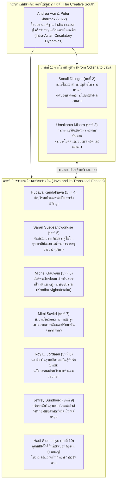

# บันทึกการอ่านและวิเคราะห์เอกสารจารึกวิทยาฉบับสมบูรณ์ (Epigraphic Source Dossier)
## ศิลปวัฒนธรรมสร้างสรรค์แห่งแดนใต้: ศิลปะพุทธและฮินดูในเอเชียสมุทรยุคกลาง เล่มที่ 2 โอฑิศาและชวา บทนำ (The Creative South: Buddhist and Hindu Art in Mediaeval Maritime Asia. Volume Two: Odisha and Java. Introduction)

---

### ส่วนที่ 1: ข้อมูลบรรณานุกรมและการอ้างอิงมาตรฐาน (Bibliographic Metadata)

- **Source ID:** `S-2022-acri-01`
- **ชื่อไฟล์ PDF ในเครื่อง:** `S-2022-acri-01_Creative_South_Buddhist_Hindu_Art_Mediaeval_Maritime_Asia.pdf`
- **ชื่อไฟล์ข้อความสกัด:** `S-2022-acri-01_Creative_South_Buddhist_Hindu_Art_Mediaeval_Maritime_Asia.txt` (ข้อความสกัดฉบับสมบูรณ์ ประกอบด้วยส่วนหน้า สารบัญ บทนำเชิงทฤษฎีโดยบรรณาธิการ Andrea Acri และ Peter Sharrock หน้า 1–4 พร้อมบทคัดย่อเชิงลึกของบทความวิจัยทั้ง 9 บทในเล่ม)
- **ประเภทเอกสาร:** บทนำเชิงทฤษฎีและบรรณาธิการแถลงในรวมบทความวิชาการแม่บทระดับนานาชาติผ่านการพิจารณาประเมินโดยผู้ทรงคุณวุฒิ (Introductory Chapter / Benchmark Editorial Synthesis in a Peer-reviewed Edited Volume) ร่วมสนับสนุนและจัดพิมพ์โดยสถาบัน ISEAS – Yusof Ishak Institute (ประเทศสิงคโปร์), โครงการวิชาการประวัติศาสตร์ศิลปะเอเชียตะวันออกเฉียงใต้ (SAAAP) แห่งวิทยาลัยบูรพคดีศึกษาและการศึกษาแอฟริกา (SOAS University of London), ศูนย์นาลันทา-ศรีวิชัย (Nalanda-Sriwijaya Centre), มหาวิทยาลัยกาดจาห์มาดา (Universitas Gadjah Mada), และทุนสนับสนุนจากมูลนิธิแอลฟาฟูด นครชิคาโก (Alphawood Foundation, Chicago)
- **ภาษาของเอกสาร:** ภาษาอังกฤษวิชาการระดับสูง (EN) พร้อมการอ้างอิงและอภิปรายตัวบทภาษาโบราณและศัพท์เทววิทยา: ภาษาสันสกฤตคลาสสิกและตันตระ (Classical & Tantric Sanskrit IAST), ภาษาชวาโบราณหรือภาษากวิ (Old Javanese / Kawi), ภาษาบาลี (Pāli), และภาษาทมิฬ (Tamil)
- **ขอบเขตภูมิศาสตร์และวัฒนธรรม:**
  - รัฐโอฑิศาหรือโอริสสา (Odisha / Oḍradeśa / Kaliṅga) บริเวณชายฝั่งตะวันออกของอนุทวีปอินเดีย โดยเฉพาะกลุ่มพุทธสถานสามเหลี่ยมเพชรแห่งโอฑิศา (Diamond Triangle): รัตนคีรี (Ratnagiri), ลลิตคีรี (Lalitagiri), และอุทยคีรี (Udayagiri) ตลอดจนความเชื่อมโยงกับมคธ (แคว้นพิหาร ได้แก่ นาลันทาและคยา)
  - เกาะชวา (Java): ชวากลางสมัยราชวงศ์ไศเลนทร์และสัญชัย (ศตวรรษที่ 8–10) ครอบคลุมพุทธสถานมหาเจดีย์บุโรพุทโธ (Borobudur), จันดิกาลาซัน (Candi Kalasan), ปราสาทหินราตูโบโก (Ratu Boko / Abhayagirivihāra) โดยเฉพาะจันดิเปิมบากาprocess / จันดิเปิมบาการัน (Candi Pembakaran), และเทวสถานไศวนิกายจันดิปรัมบานันหรือลอโรจงกรัง (Candi Prambanan / Loro Jonggrang); และชวาตะวันออกสมัยมัชฌปาหิต (ศตวรรษที่ 13–15) บริเวณภูเขาศักดิ์สิทธิ์เปอนังกุงงัน (Mount Penanggungan / Pawitra / Mahāmeru) ใกล้เมืองสุราบายา
  - เครือข่ายข้ามสมุทรเชื่อมต่อ: อภยคีรีวิหาร ณ นครอนุราธปุระ ประเทศศรีลังกา (Anurādhapura, Sri Lanka), อินเดียใต้ (ราชวงศ์ปัลลวะและโจฬะ รัฐทมิฬนาฑู), เกาะสุมาตรา (ศรีวิชัยและมลายู), คาบสมุทรมลายู, กัมพูชาโบราณ (จักรวรรดิเมืองพระนครและกบาลสะเปียน Kbal Spean), รัฐจามปา (เวียดนามตอนกลางและใต้), ตลอดจนเขตแดนทางเหนือได้แก่ เนปาล, ทิเบต, โขตาน (เอเชียกลาง), และจีน
- **วัสดุและบริบทการค้นพบ:**
  - ศิลาจารึกและจารึกชิ้นส่วนสถาปัตยกรรม (Epigraphs & Architectural Fragment Inscriptions) เช่น ชิ้นส่วนจารึกอักษรชวาโบราณ/นาครีบริเวณทางเข้าชั้นที่สองของหมู่อาคารราตูโบโก ซึ่งระบุการจำลองอภยคีรีวิหารแห่งอนุราธปุระ (หน้า 2, 11)
  - จารึกบนแผ่นศิลาสถาปนาเทวสถานและจารึกภาษากวิ/สันสกฤตที่เกี่ยวข้องกับการสร้างและการอุทิศที่ดินวัดกาลาซันและปรัมบานัน (หน้า 3, 12)
  - สถาปัตยกรรมศาสนสถานศิลาแอนดีไซต์ (Andesite Temple Architecture): ฐานชานชาลาสองชั้นรูปสี่เหลี่ยมจัตุรัสพร้อมหลุมลึกตรงกลาง (Candi Pembakaran), ปรางค์ประธานปรัมบานันสูง 47 เมตร ประดับยอดสถูปิกะ/กลีบมะเฟืองและยอดลึงค์นับพัน (*sahasraliṅga*), และภาพสลักหินนูนต่ำมหากาพย์รามายณะ (Rāmāyaṇa bas-reliefs) บนระเบียงปราสาทพระพรหมและพระศิวะ (หน้า 2–3, 11–12)
  - ประติมากรรมศิลาและสัมฤทธิ์ของพระโพธิสัตว์และเทพธรรมบาลตันตระ: พระโพธิสัตว์อโมฆปาศ (Amoghapāśa), พระไตรโลกยวชิยะ (Trailokyavijaya / Vajrahūṃkāra / Krodhavighnāntaka), และเทวรูปมหารูปปั้นพระศิวะยืนบนฐานปราณาล (praṇāla) (หน้า 2–3, 10–12)
  - แหล่งโบราณสถานบนภูเขาศักดิ์สิทธิ์: กลุ่มแท่นบูชา สระสรงน้ำศักดิ์สิทธิ์ ภาพสลัก และอาศรมฤๅษีก่อหินนับร้อยแห่งบนภูเขาเปอนังกุงงัน (Mount Penanggungan) ยุคมัชฌปาหิต (หน้า 3–4, 12–13)
- **การอ้างอิงฉบับเต็มระบบ Chicago/Turabian Notes-Bibliography:**  
  Acri, Andrea, and Peter Sharrock. "Introduction: Volume Two: Odisha and Java." In *The Creative South: Buddhist and Hindu Art in Mediaeval Maritime Asia. Volume Two: Odisha and Java*, edited by Andrea Acri and Peter Sharrock, 1–4. Singapore: ISEAS – Yusof Ishak Institute, 2022.

---

### ส่วนที่ 2: แผนผังการจัดสรรเข้าสู่บทและหัวข้อย่อย (Chapter & Section Mapping Matrix)

เนื้อหา ข้อค้นพบเชิงทฤษฎี และข้อมูลหลักฐานจารึกวิทยา-ประวัติศาสตร์ศิลปะจากบทนำและภาพรวมของหนังสือเล่มนี้ นำไปบูรณาการจัดสรรเข้าสู่โครงสร้างหนังสือวิจัยหลักดังนี้:

- **บทที่ 1: จารึกกับการรื้อสร้างประวัติศาสตร์: ปริทัศน์สถานะความรู้และกระบวนทัศน์ใหม่ (Revisiting Inscriptions: Historiographical Revolution & New Paradigms)**
  - **หัวข้อย่อย 1.1 (การท้าทายทฤษฎีการแผ่อิทธิพลอินเดียทางเดียว / The Critique of Unidirectional Indianization):**  
    ใช้ข้อเสนอหลักของ Acri และ Sharrock ในการรื้อถอนกรอบคิดแบบ "ภารตภิวัตน์" (Indianization) และการแพร่กระจายทางวัฒนธรรมสายตรงจากตะวันตกสู่ตะวันออก (Diffusionism) โดยสถาปนากระบวนทัศน์ "แดนใต้ผู้สร้างสรรค์" (The Creative South) ซึ่งมองว่าภูมิภาคเอเชียสมุทรและชายฝั่งมหาสมุทรที่ได้รับอิทธิพลลมมรสุม มิใช่เพียงดินแดนรอบนอกที่คอยลอกเลียนแบบวัฒนธรรมอินเดีย แต่เป็นศูนย์กลางที่มีพลวัตและพลังความคิดสร้างสรรค์ทางปัญญาของตนเอง (หน้า 1, 10)
  - **หัวข้อย่อย 1.3 (กระบวนทัศน์การหมุนเวียนภายในเอเชียและการเปรียบเทียบเชิงพื้นที่ / Intra-Asian Circulatory Dynamics):**  
    การวางกรอบวิจัยที่มองการเคลื่อนย้ายของความคิด ปรัชญา คัมภีร์ รูปเคารพ และจารึกวิทยาในลักษณะ "การหมุนเวียนหลายทิศทาง" (Multidirectional Circulation) การเปรียบเทียบข้ามภูมิภาคระหว่างโอฑิศากับชวา ซึ่งต่างฝ่ายต่างมีปฏิสัมพันธ์ แลกเปลี่ยน และกระตุ้นเตือนซึ่งกันและกันโดยไม่ลดทอนความเป็นเลิศเฉพาะถิ่นของโมเสกวัฒนธรรมเอเชียสมุทร (หน้า 1, 10)
  - **หัวข้อย่อยใหม่ที่ค้นพบเพิ่มเติม (1.5 มโนทัศน์ "ขอบจักรวาลสร้างสรรค์นวัตกรรม" / The Creative Agency of the Periphery):**  
    หลักฐานจากภาพสลักและจารึกที่แสดงให้เห็นว่า แนวคิด เทววิทยา และตำนานหลายประการที่ไม่ปรากฏหรือเป็นเพียงเรื่องเล่าชายขอบในอินเดีย (เช่น นิทานนางสีดาเป็นพระราชธิดาของทศกัณฐ์ หรือระบบสหัสลึงค์ผลิตน้ำมนต์ขนาดยักษ์) กลับได้รับการพัฒนาอย่างเป็นระบบและถึงจุดสูงสุดในดินแดน "ชายขอบ" เช่น เกาะชวา ทิเบต และเอเชียตะวันออกเฉียงใต้ภาคพื้นทวีป (หน้า 3, 12)

- **บทที่ 3: จารึกวัตถุขนาดเล็ก พระพิมพ์ดินเผา แผ่นทองคำเปลว และรูปเคารพสัมฤทธิ์ (Small-scale Epigraphy, Votive Tablets, and Bronzes)**
  - **หัวข้อย่อย 3.2 (ประติมานวิทยาและการผลิตซ้ำมณฑลพระอโมฆปาศ):**  
    การวิเคราะห์บทบาททางพิธีกรรมและความเชื่อของพระโพธิสัตว์อโมฆปาศ (Amoghapāśa) ในฐานะ "ผู้ช่วยให้รอดในวาระแห่งความตาย" (Saviour 'at the time of death') และการตีความสัญญะของ "บ่วงบาศ" (*pāśa*) ในการฉุดดึงวิญญาณผู้ล่วงลับในพิธีกรรมหลังความตาย (post-mortem rites) ซึ่งเชื่อมโยงระหว่างพุทธสถานรัตนคีรีในโอฑิศา สู่ชวาและสุมาตรา (Sonali Dhingra; หน้า 2, 10–11)
  - **หัวข้อย่อย 3.4 (ลัทธิพระไตรโลกยวชิยะในฐานะเทพผู้ทำลายอุปสรรค / The Cult of Trailokyavijaya):**  
    การสำรวจประติมากรรมหินและสัมฤทธิ์ขนาดเล็กตลอดจนจารึกที่เกี่ยวข้องกับพระไตรโลกยวชิยะ (Trailokyavijaya / Vajrahūṃkāra) ในชวากลางและตะวันออกช่วงศตวรรษที่ 8–11 ในฐานะเทพธรรมบาลปางดุร้ายผู้ขจัดอุปสรรค (*krodhavighnāntaka*) และการแปลงสภาพความโง่เขลาสู่อภิชญา (Michel Gauvain; หน้า 2–3, 11–12)

- **บทที่ 5: สังคม เศรษฐกิจ กฎหมาย และชีวิตประจำวันผ่านจารึกชวาโบราณ (Socio-Economic & Institutional History)**
  - **หัวข้อย่อย 5.1 (บริบททางสังคมในการก่อสร้างและการทำนุบำรุงเทวสถานกาลาซันและปรัมบานัน):**  
    การบูรณาการข้อมูลจารึกชวาโบราณ (Old Javanese inscriptions) เข้ากับหลักฐานทางโบราณคดีและสถาปัตยกรรม เพื่อคลี่คลายบริบททางสังคม ชุมชนหมู่บ้าน ระบบแรงงาน และการจัดการทรัพยากรในการริเริ่ม ก่อสร้าง และบำรุงรักษาเทวสถานขนาดมหึมาอย่างจันดิกาลาซัน (พุทธ) และปรัมบานัน (ฮินดู) ซึ่งก้าวพ้นการศึกษาประวัติศาสตร์ศิลปะที่เน้นเฉพาะความงามเชิงสุนทรียะหรือเทววิทยาบริสุทธิ์ (Mimi Savitri; หน้า 3, 12)

- **บทที่ 6: ภูมิทัศน์ศักดิ์สิทธิ์ สถาปัตยกรรม และวิศวกรรมชลศาสตร์ (Sacred Landscapes, Architecture, and Hydro-engineering)**
  - **หัวข้อย่อย 6.2 (โครงสร้างสัญลักษณ์ มณฑล และรหัสตัวเลขแห่งมหาเจดีย์บุโรพุทโธ):**  
    การตีความผังและรูปทรงของบุโรพุทโธผ่านระบบโครงสร้างตัวเลขเชิงสัญลักษณ์ (numerological patterns) สอดคล้องกับคัมภีร์ภาษาสันสกฤตและชวาโบราณ และศิลาจารึกร่วมสมัย เพื่อคลี่คลายปรัชญาพุทธศาสนาที่กำกับสถาปัตยกรรม (Hudaya Kandahjaya; หน้า 2, 11)
  - **หัวข้อย่อย 6.3 (ปริศนาจันดิเปิมบาการันบนราตูโบโกและความสัมพันธ์กับอภยคีรีวิหารแห่งศรีลังกา):**  
    การใช้ชิ้นส่วนจารึกราตูโบโกไขปริศนาสถาปัตยกรรมชานชาลาหินสองชั้นพร้อมหลุมลึก ว่ามิใช่เชิงตะกอนเผาศพ (crematorium) หรือหลุมบูชาไฟกูณฑ์ (sacrificial fire pit) แต่เป็น "พุทธเจดีย์สถานประจำต้นพระศรีมหาโพธิ์" (Bodhi shrine / Bodhighara) ตามแบบจำลองของอภยคีรีวิหารในอนุราธปุระ ประเทศศรีลังกา (Saran Suebsantiwongse; หน้า 2, 11)
  - **หัวข้อย่อย 6.4 (ระบบชลศาสตร์สถาปัตยกรรมศักดิ์สิทธิ์แห่งปรัมบานันในฐานะกลไกสหัสลึงค์ผลิตน้ำมนต์):**  
    การค้นพบครั้งสำคัญที่ชี้ว่า กลุ่มปราสาทประธานปรัมบานันถูกออกแบบให้เป็น "กลไกสหัสลึงค์" (Sahasraliṅga mechanism) สำหรับการผลิตน้ำมนต์ศักดิ์สิทธิ์ปริมาณมหาศาล ยอดสถูปิกะกลีบมะเฟืองและยอดแหลมราว 1,000 ยอดแท้จริงคือสิวลึงค์ที่รองรับน้ำฝนมรสุม ส่งผ่านรางท่อน้ำมกรลงสู่ลานประทักษิณชั้นใน เพื่อจำลองตำนานพระแม่คงคาเสด็จลงสู่โลกมนุษย์ (Descent of the Ganges) และสร้างสระสรงน้ำศักดิ์สิทธิ์ (*tīrtha*) ขนาดยักษ์ท่วมขังลานวัด ซึ่งเทียบเคียงได้กับประติมากรรมใต้ท้องน้ำกบาลสะเปียนในกัมพูชา (Jeffrey Sundberg; หน้า 3, 12)
  - **หัวข้อย่อย 6.5 (ภูมิทัศน์ศักดิ์สิทธิ์แห่งมหาเมรุ: โบราณคดีและจารึกวิทยาบนภูเขาเปอนังกุงงัน ชวาตะวันออก):**  
    การสำรวจหลักฐานทางโบราณคดีและจารึกยุคมัชฌปาหิตบนภูเขาไฟดับสนิทห้ายอด "เปอนังกุงงัน" (Mount Penanggungan) ซึ่งได้รับการสถาปนาให้เป็นเขาพระสุเมรุ (Mahāmeru) ศูนย์กลางความศักดิ์สิทธิ์สูงสุดใกล้ราชธานีมัชฌปาหิต (Hadi Sidomulyo; หน้า 3–4, 12–13)

- **บทที่ 8: เครือข่ายข้ามสมุทร ภูมิรัฐศาสตร์ และการแลกเปลี่ยนทางวัฒนธรรม (Maritime Networks, Geopolitics, and Translocal Exchange)**
  - **หัวข้อย่อย 8.2 (เครือข่ายพุทธตันตระและการหมุนเวียนของมณฑลระหว่างโอฑิศากับชวา):**  
    หลักฐานทางจารึกวิทยาและประติมานวิทยาว่าด้วยการแพร่กระจายของคัมภีร์จรรยาตันตระ (Caryātantra) และโยคตันตระ (Yogatantra) จากกลุ่มพุทธสถานรัตนคีรี ลลิตคีรี และอุทยคีรี ในแคว้นโอฑิศา สู่พุทธสถานในชวากลางช่วงศตวรรษที่ 8–11 ผ่านเส้นทางเดินเรือข้ามอ่าวเบงกอล (Umakanta Mishra; หน้า 2, 11)
  - **หัวข้อย่อย 8.4 (การตีความวรรณกรรมมหากาพย์ข้ามถิ่น: นิทานรามายณะและภาพสลักปราสาทปรัมบานัน):**  
    การวิเคราะห์ภาพสลักรามายณะแผ่นที่ 12 ณ ปราสาทพระพรหม ซึ่งพรรณนาซากศพทศกัณฐ์แวดล้อมด้วยสตรี และสะท้อนคติชนวิทยาฉบับหลังวาลมีกิ (post-Vālmīki tellings) ที่ระบุว่านางสีดาเป็นพระราชธิดาของทศกัณฐ์กับนางมณโฑ ซึ่งปรากฏอย่างกว้างขวางในชวา กัมพูชา ทิเบต และเอเชียกลาง แต่แทบไม่พบในอินเดีย แสดงถึงพลวัตทางปัญญาของดินแดนขอบสมุทร (Roy E. Jordaan; หน้า 3, 12)

---

### ส่วนที่ 3: สรุปสาระสำคัญเชิงวิเคราะห์และจุดยืนทางวิชาการ (Executive Academic Analysis)

#### 1. วิทยานิพนธ์และข้อถกเถียงหลักของผู้เขียน (Core Argument / Thesis)

ในบทนำของหนังสือรวมบทความแม่บทเล่มที่สองนี้ Andrea Acri และ Peter Sharrock ได้สถาปนาข้อถกเถียงเชิงวิชาการเพื่อสร้าง "การปรับเทียบค่าใหม่" (Recalibration) ให้แก่ประวัติศาสตร์ศิลปะ จารึกวิทยา และโบราณคดีในเอเชียสมุทรยุคกลาง โดยมีแกนวิทยานิพนธ์ 4 มิติสำคัญ:

1. **กระบวนทัศน์ "แดนใต้ผู้สร้างสรรค์" (The Creative South Paradigm):**  
   ผู้เขียนโต้แย้งอย่างเฉียบคมว่า ดินแดนชายฝั่งและหมู่เกาะในเอเชียสมุทร (Maritime Asia) ซึ่งตั้งอยู่ตามแนวชายขอบด้านใต้ของมหาทวีปเอเชียที่ได้รับอิทธิพลจากลมมรสุม มิได้เป็นเพียงดินแดนชายขอบที่ยอมรับอิทธิพลวัฒนธรรมอินเดียอย่างเฉื่อยชา (Passive Recipients of Indianization) ทว่าดินแดนเหล่านี้ทำหน้าที่เป็น "เบ้าหลอมแห่งนวัตกรรมทางวัฒนธรรม" (Cultural Creativity and Innovation) ที่ประดิษฐ์ สร้างสรรค์ และปรับเปลี่ยนกรอบกระบวนทัศน์ของพุทธศาสนา ศาสนาฮินดู ประติมานวิทยา และสถาปัตยกรรม จนเกิดเป็นอัตลักษณ์เฉพาะตัวอันทรงพลัง (หน้า 1, 10)

2. **การศึกษาจากมิติปฏิสัมพันธ์และการหมุนเวียนภายในเอเชีย (Intra-Asian Connections & Circulatory Dynamics):**  
   การทำความเข้าใจปรากฏการณ์ทางวัฒนธรรมในยุคกลาง จำเป็นต้องก้าวข้ามกรอบพรมแดนรัฐชาติสมัยใหม่และทฤษฎีศูนย์กลาง-ชายขอบแบบดั้งเดิม หันมาจับจ้อง "พลวัตการหมุนเวียนไปมา" (Circulatory Dynamics) ของพระสงฆ์ นักบวช ช่างฝีมือ คัมภีร์ใบลาน จารึก และรูปเคารพ ระหว่างภูมิภาคต่างๆ ข้ามมหาสมุทรอินเดีย ทะเลอันดามัน อ่าวเบงกอล และทะเลจีนใต้ โดยเฉพาะสายสัมพันธ์พิเศษระหว่างแคว้นโอฑิศา (อินเดียตะวันออก) กับเกาะชวา (อินโดนีเซีย) ซึ่งเป็นแกนหลักของหนังสือเล่มนี้ (หน้า 1–2, 10–11)

3. **พลังการสร้างสรรค์ของดินแดน "รอบนอก" ที่เหนือกว่าศูนย์กลางเดิม (The Innovative Character of the 'Periphery'):**  
   หลักฐานทางประวัติศาสตร์ศิลปะและจารึกวิทยาที่นำเสนอในเล่มนี้พิสูจน์ให้เห็นอย่างชัดเจนว่า สิ่งที่นักวิชาการยุคอาณานิคมเคยเรียกว่า "ดินแดนรอบนอก" (Periphery) แท้จริงแล้วคือผู้นำทางความคิดและการประดิษฐ์สร้างสรรค์ทางเทววิทยา:
   - *มิติประติมานวิทยาและคติชนวิทยา:* ภาพสลักมหากาพย์รามายณะที่ปรัมบานัน สะท้อนการยอมรับเรื่องเล่านางสีดาเป็นบุตรีของทศกัณฐ์ ซึ่งเป็นนวัตกรรมวรรณกรรมที่แพร่หลายในโลกเอเชียสมุทรและเอเชียกลาง แต่แทบไม่ปรากฏในถิ่นกำเนิดดั้งเดิมของเรื่องรามาวตารในอินเดีย (หน้า 3, 12)
   - *มิติวิศวกรรมชลศาสตร์ศักดิ์สิทธิ์:* เทวสถานปรัมบานันได้รับการออกแบบในฐานะ "โรงงานผลิตน้ำมนต์ศักดิ์สิทธิ์ขนาดยักษ์" (Giant holy water production monument) โดยใช้ระบบสหัสลึงค์นับพันยอดสถูปิกะในการชะล้างน้ำฝนมรสุมลงสู่ลานประทักษิณ ซึ่งเป็นสถาปัตยกรรมชลศาสตร์ทางศาสนาที่ยิ่งใหญ่และไม่มีที่ใดในโลกยุคโบราณทัดเทียมได้ (หน้า 3, 12)

4. **การหลอมรวมสหวิทยาการ: การประสานจารึกวิทยา ประวัติศาสตร์สถาปัตยกรรม และบริบทสังคม:**  
   หนังสือเล่มนี้เน้นย้ำความจำเป็นในการผสานศาสตร์ด้านจารึกวิทยา (ทั้งภาษาสันสกฤตและภาษาชวาโบราณ) เข้ากับการวิเคราะห์โครงสร้างอาคารและบริบททางสังคมของชุมชนท้องถิ่น ดังที่ปรากฏในการศึกษาจันดิกาลาซันและปรัมบานัน เพื่อทำความเข้าใจว่าศาสนสถานเหล่านี้มิได้ดำรงอยู่อย่างโดดเดี่ยวในฐานะผลงานศิลปะเพื่อความรื่นรมย์ของชนชั้นสูง แต่มีชีวิตทางสังคมและผูกพันกับเศรษฐกิจแรงงานของราษฎรในระบอบสีมา (หน้า 3, 12)

#### 2. บริบทประวัติศาสตร์นิพนธ์และการประเมินความน่าเชื่อถือ (Historiography & Source Criticism)

- **การต่อยอดและขยายพรมแดนจากโครงการวิจัยระดับนานาชาติ:**  
  งานวิจัยชุดนี้สืบทอดและต่อยอดโดยตรงจากหนังสือแม่บทเล่มสำคัญ *Esoteric Buddhism in Mediaeval Maritime Asia: Networks of Masters, Texts, Icons* (Acri 2016) และหนังสือ *The Creative South* เล่มที่ 1 (Acri and Sharrock 2022) โดยเป็นผลผลิตจากการสัมมนาทางวิชาการภาคฤดูร้อนระดับนานาชาติ 2 ครั้ง ณ ชวาตะวันออก (ค.ศ. 2016) และชวากลาง (ค.ศ. 2017) ซึ่งจัดโดยความร่วมมือระหว่างสถาบัน SOAS (University of London), ศูนย์นาลันทา-ศรีวิชัย (ISEAS สิงคโปร์), และมหาวิทยาลัยกาดจาห์มาดา (อินโดนีเซีย) ภายใต้การสนับสนุนของมูลนิธิ Alphawood Foundation ชิคาโก ทำให้งานวิจัยทุกบทผ่านการกลั่นกรอง แลกเปลี่ยน และตรวจสอบภาคสนามร่วมกันของนักวิชาการชั้นนำระดับโลก (หน้า 1, 10)
- **การอุทิศแด่บูรพาจารย์ผู้ล่วงลับ:**  
  หนังสือเล่มนี้อุทิศเป็นอนุสรณ์แด่นักวิชาการผู้มีคุณูปการยิ่งใหญ่สองท่าน ได้แก่ ดร. ยูรี โคโคลฟ (Yury Khokhlov) นักประวัติศาสตร์ศิลปะชาวรัสเซียผู้เชี่ยวชาญศิลปะปัลลวะและพุทธตันตระ และ ดร. รอย อี. จอร์แดน (Roy E. Jordaan) ปรมาจารย์ด้านประวัติศาสตร์และโบราณคดีชวา ผู้ฝากผลงานการตีความภาพสลักรามายณะที่ปรัมบานันไว้เป็นชิ้นสุดท้ายในเล่มนี้ (หน้า 6, 8, 12)
- **การก้าวข้ามอคติทางประวัติศาสตร์ศิลปะยุคอาณานิคม:**  
  งานวิจัยชุดนี้ปฏิเสธแนวทางการศึกษาของนักบูรพคดีศึกษาชาวดัตช์และฝรั่งเศสรุ่นเก่าที่มักตัดสินศิลปะชวาและเอเชียตะวันออกเฉียงใต้ด้วยสายตาที่มองหา "ความบริสุทธิ์แบบคลาสสิกของอินเดีย" แล้วตราหน้าลักษณะท้องถิ่นว่าเป็น "ความเสื่อมถอย" หรือ "การผสมปนเปทางความเชื่อที่ไร้ระเบียบ" (Syncretic degeneration) แต่ในทางตรงกันข้าม งานวิจัยของ Acri, Sharrock, Sundberg, Gauvain, และคณะ ได้พิสูจน์ว่าพัฒนาการเหล่านี้คือ "การคิดค้นสูตรปรัชญาใหม่ดั้งเดิม" (Original conceptual reformulations) ที่ทรงคุณค่าในตัวเอง

---

### ส่วนที่ 4: สารบัญข้อค้นพบเชิงลึกแยกตามมิติจารึกวิทยา (Thematic Epigraphic Findings with Exact Pages)

1. **ประวัติศาสตร์นิพนธ์และการตีความทางประวัติศาสตร์:**
   - **การปลดแอกประวัติศาสตร์ศิลปะเอเชียสมุทรออกจากทฤษฎีการแผ่อิทธิพลฝ่ายเดียว:** ข้อเสนอเชิงวิพากษ์ที่ชี้ว่า ดินแดนชายขอบด้านใต้ของทวีปเอเชียที่ต้องลมมรสุม (Monsoon-influenced southern rim) มิใช่ผู้รับวัฒนธรรมอินเดียแบบตั้งรับ แต่เป็นผู้รังสรรค์และปรับเปลี่ยนกระบวนทัศน์ทางศิลปะและศาสนาพุทธ-ฮินดูในยุคกลางอย่างมีเอกภาพและมีนวัตกรรมล้ำหน้า (หน้า 1, 10)
   - **พลวัตการหมุนเวียนแบบพหุขั้วภายในทวีปเอเชีย (Intra-Asian Connections):** การวิเคราะห์ปรากฏการณ์ทางวัฒนธรรมในเอเชียสมุทรจำเป็นต้องศึกษาผ่านกรอบการเคลื่อนย้ายและหมุนเวียนของคน ความคิด และวัตถุศักดิ์สิทธิ์ข้ามภูมิภาค โดยไม่ผูกติดอยู่กับศูนย์กลางอินเดียเพียงแหล่งเดียว (หน้า 1, 10)
   - **บทบาทการสร้างสรรค์อันโดดเด่นของดินแดน "รอบนอก" (Periphery):** การค้นพบว่าคติชนวิทยาหลายเรื่อง เช่น ตำนานนางสีดาเป็นพระราชธิดาของทศกัณฐ์ ซึ่งแทบไม่เป็นที่รู้จักในอินเดีย กลับกลายเป็นเรื่องเล่ากระแสหลักที่สลักไว้บนระเบียงปราสาทหินปรัมบานันในชวา รวมถึงในทิเบตและเอเชียกลาง สะท้อนพลังการรังสรรค์วรรณกรรมของท้องถิ่นรอบนอก (Roy Jordaan; หน้า 3, 12)

2. **ตัวบทจารึก การอ่าน ศักราช และอักขรวิทยา:**
   - **ชิ้นส่วนศิลาจารึกอภยคีรีวิหารบนที่ราบสูงราตูโบโก (Ratu Boko Inscription Fragment):** การค้นพบชิ้นส่วนจารึกใกล้ทางเข้าชั้นที่สองของหมู่อาคารราตูโบโก ซึ่งมีเนื้อหาระบุอย่างชัดเจนว่า หมู่อาคารแห่งนี้ถูกสร้างขึ้นโดยจำลองแบบมาจาก "อภยคีรีวิหาร" (Abhayagirivihāra) แห่งนครอนุราธปุระ ประเทศศรีลังกา อันเป็นหลักฐานกุญแจดอกสำคัญในการไขปริศนาหน้าที่ของจันดิเปิมบาการัน (Saran Suebsantiwongse; หน้า 2, 11)
   - **จารึกชวาโบราณกับการทำความเข้าใจประวัติศาสตร์สังคมของวัดกาลาซันและปรัมบานัน:** การอ่านและวิเคราะห์จารึกภาษากวิร่วมสมัยเพื่อถอดรหัสว่า ชุมชนท้องถิ่น ช่างฝีมือ ข้าทาส และระบบสิทธิพิเศษทางภาษีในเขตสีมา (sīma) มีส่วนร่วมในการก่อตั้ง ก่อสร้าง และดูแลรักษาเทวสถานขนาดใหญ่ในชวากลางอย่างไร (Mimi Savitri; หน้า 3, 12)
   - **หลักฐานจารึกวิทยาและคัมภีร์ที่สอดรับกับผังบุโรพุทโธ:** การสอบทานตัวบทภาษาสันสกฤตและชวาโบราณควบคู่กับจารึกที่สัมพันธ์กับสัญลักษณ์และประติมานวิทยาของมหาเจดีย์บุโรพุทโธ เพื่อพิสูจน์แบบแผนรหัสตัวเลขทางพุทธศาสนา (Hudaya Kandahjaya; หน้า 2, 11)
   - **จารึกสมัยมัชฌปาหิตบนภูเขาเปอนังกุงงัน:** การค้นพบและการอ่านจารึกศักราชและข้อความอุทิศบนแท่นบูชาและศาสนสถานหินบนยอดเขาเปอนังกุงงัน ซึ่งยืนยันสถานะความเป็นศูนย์กลางมหาเมรุศักดิ์สิทธิ์ของราชธานีมัชฌปาหิต (Hadi Sidomulyo; หน้า 3–4, 12–13)

3. **มิติศาสนา ลัทธิความเชื่อ และพิธีกรรม:**
   - **ลัทธิบูชาพระโพธิสัตว์อโมฆปาศในฐานะ "พระผู้ช่วยในวาระมรณะ":** การวิเคราะห์บทบาทความเชื่อของพระอโมฆปาศ (Amoghapāśa) ในแหล่งโบราณคดีแคว้นโอฑิศา (โดยเฉพาะรัตนคีรี) และการแพร่กระจายสู่ชวา โดยชี้ว่าหน้าที่หลักของพระองค์คือการเป็นเทพผู้พิทักษ์และฉุดช่วยดวงวิญญาณของผู้ตายในวาระสุดท้ายบนเตียงเสียชีวิต (*saviour at the time of death*) และในพิธีกรรมหลังความตาย (post-mortem rites) ผ่านการตีความสัญลักษณ์ "บ่วงบาศ" (*pāśa*) ซึ่งใช้คล้องดวงวิญญาณให้รอดพ้นจากอบายภูมิ (Sonali Dhingra; หน้า 2, 10–11)
   - **การแพร่กระจายของมณฑลพุทธตันตระสายจรรยาและโยคตันตระ:** การส่งผ่านมณฑลสถาปัตยกรรมและประติมานวิทยาจากศูนย์กลางพุทธตันตระยุคแรกในโอฑิศา (รัตนคีรี, อุทยคีรี, ลลิตคีรี) สู่พุทธสถานในชวากลางช่วงศตวรรษที่ 8–11 ผ่านคณะสงฆ์ผู้จาริกทางทะเล (Umakanta Mishra; หน้า 2, 11)
   - **ลัทธิบูชาพระไตรโลกยวชิยะ (Trailokyavijaya Cult) ในชวา:** การบูชาพระปางดุร้ายของพระวัชรปาณี หรือวัชรหูมหการ (Vajrahūṃkāra) ในฐานะ "พระผู้ทำลายอุปสรรคอันเกรี้ยวกราด" (*krodha-vighnāntaka*) ซึ่งมีหน้าที่มิใช่เพียงปกป้องผู้บำเพ็ญภาวนาหรือข่มขู่สิ่งชั่วร้าย แต่เพื่อขจัดสิ่งกีดขวางทั้งภายนอกและภายในจิตใจ และแปรเปลี่ยนความเขลาให้กลายเป็นปรีชาญาณ โดยได้รับความนิยมสูงสุดในชวากลางช่วงศตวรรษที่ 8–11 (Michel Gauvain; หน้า 2–3, 11–12)

4. **มิติสถาปัตยกรรม ศาสนสถาน และชลศาสตร์:**
   - **การรื้อสร้างหน้าที่ของจันดิเปิมบาการัน (Candi Pembakaran):** โครงสร้างชานชาลาหินสองชั้นรูปสี่เหลี่ยมจัตุรัสพร้อมบ่อน้ำลึกตรงกลางที่ราตูโบโก ซึ่งเดิมถูกเข้าใจผิดว่าเป็นเชิงตะกอนเผาศพหรือบ่อกูณฑ์บูชาไฟ แท้จริงแล้วคือ "พุทธเจดีย์สถานประจำต้นพระศรีมหาโพธิ์" (Bodhi shrine) ซึ่งสร้างขึ้นตามแบบแผนสถาปัตยกรรมของอภยคีรีวิหารในศรีลังกา โดยต้นโพธิ์ถือเป็นองค์ประกอบหลัก 1 ใน 3 ส่วนของอารามพุทธ (Saran Suebsantiwongse; หน้า 2, 11)
   - **ปราสาทปรัมบานันในฐานะ "กลไกสหัสลึงค์" สำหรับการผลิตน้ำมนต์ศักดิ์สิทธิ์:** ยอดปรางค์ประธานของปรัมบานันประดับด้วยยอดสถูปิกะกลีบมะเฟืองและยอดแหลมราว 1,000 ยอด ซึ่งแท้จริงแล้วถูกออกแบบให้เป็นสิวลึงค์ (sahasraliṅga) ทำหน้าที่รับน้ำฝนจากลมมรสุมแล้วปล่อยผ่านรางระบายน้ำรูปมกร (makara gargoyles) ลงสู่ลานประทักษิณชั้นใน เพื่อสร้างสระน้ำศักดิ์สิทธิ์ (*tīrtha*) ขนาดยักษ์ท่วมขังลานวัด โดยมีเทวรูปพระศิวะยืนบนฐานปราณาลเป็นศูนย์กลางกลไก จำลองตำนานพระแม่คงคาเสด็จลงสู่โลก (Descent of the Ganges) อันเป็นนวัตกรรมวิศวกรรมชลศาสตร์ศักดิ์สิทธิ์ที่ยิ่งใหญ่ที่สุดในเอเชียยุคก่อนสมัยใหม่ (Jeffrey Sundberg; หน้า 3, 12)
   - **ระบบโครงสร้างสัญลักษณ์และรหัสตัวเลขของบุโรพุทโธ:** การวิเคราะห์ผังและรูปทรงเรขาคณิตของมหาเจดีย์บุโรพุทโธว่าสัมพันธ์กับรหัสตัวเลขเชิงปรัชญาตามหลักคำสอนในคัมภีร์พุทธศาสนาภาษาสันสกฤตและชวาโบราณ (Hudaya Kandahjaya; หน้า 2, 11)
   - **การสำรวจโบราณคดีภูเขาศักดิ์สิทธิ์เปอนังกุงงัน (Mount Penanggungan):** ภูเขาไฟดับสนิทห้ายอดในชวาตะวันออก ซึ่งได้รับการจำลองให้เป็นเขาพระสุเมรุ (Mahāmeru) โดยมีการค้นพบแหล่งโบราณสถาน แท่นบูชา สระน้ำศักดิ์สิทธิ์ และจารึกจำนวนมหาศาลที่สร้างขึ้นในยุคมัชฌปาหิต (Hadi Sidomulyo; หน้า 3–4, 12–13)

5. **มิติอาหารการกิน วิถีชีวิต การค้า และตลาด:**
   - **เครือข่ายเส้นทางเดินเรือค้าขายข้ามสมุทร (Maritime Trade Routes):** การหมุนเวียนของแนวคิดทางศาสนา ศิลปะ และสถาปัตยกรรม ดำเนินไปควบคู่กับเส้นทางการค้าทางทะเลที่เชื่อมโยงระหว่างชายฝั่งตะวันออกของอินเดีย (โอฑิศา), ศรีลังกา, สุมาตรา, ชวา, คาบสมุทรมลายู, และทะเลจีนใต้ (หน้า 1, 10)
   - **ชีวิตทางสังคมและเศรษฐกิจของชุมชนรอบเทวสถาน:** จารึกชวาโบราณสะท้อนให้เห็นการระดมทรัพยากร อาหาร ข้าวสาร ปศุสัตว์ และแรงงานของชุมชนชาวบ้านในชนบท เพื่อสนับสนุนการประกอบพิธีกรรมและการดำรงอยู่ของสถาบันวัดกาลาซันและปรัมบานัน (Mimi Savitri; หน้า 3, 12)

6. **มิติการปกครอง กฎหมาย ที่ดิน และระบบสีมา:**
   - **บริบททางสังคมและสถาบันกษัตริย์ในการสถาปนาเทวสถาน:** การก่อสร้างเทวสถานขนาดใหญ่ในชวากลางมิได้เป็นเพียงเรื่องของแรงศรัทธาทางศาสนา แต่เป็นเครื่องมือเชิงสถาบันในการจัดระเบียบที่ดิน การประกาศเขตปลอดภาษี (สีมา) และการสร้างความชอบธรรมทางการเมืองของราชสำนักไศเลนทร์และสัญชัย (Mimi Savitri; หน้า 3, 12)
   - **การอุปถัมภ์พุทธศาสนาและฮินดูควบคู่กันในราชสำนักชวากลาง:** หลักฐานการก่อสร้างวัดกาลาซัน (พุทธ) และปรัมบานัน (ไศวนิกาย) ในช่วงเวลาใกล้เคียงกัน (ศตวรรษที่ 8–9) สะท้อนความสัมพันธ์อันซับซ้อนและการเกื้อหนุนกันระหว่างชนชั้นนำและชุมชนในระบอบการปกครองชวากลาง (Mimi Savitri; หน้า 3, 12)

7. **มิติปฏิสัมพันธ์ข้ามสมุทรและเครือข่ายนานาชาติ:**
   - **สายสัมพันธ์ข้ามอ่าวเบงกอลระหว่างโอฑิศากับชวา:** หลักฐานจารึกวิทยาและประติมานวิทยาพิสูจน์การถ่ายทอดมณฑลพุทธตันตระระหว่างกลุ่มวัดรัตนคีรี-อุทยคีรี-ลลิตคีรีในโอฑิศา กับวัดพุทธในชวากลางอย่างแนบแน่น (Umakanta Mishra; หน้า 2, 11)
   - **สายสัมพันธ์ทางสถาปัตยกรรมระหว่างชวากลางกับอนุราธปุระ ศรีลังกา:** การที่ราชสำนักชวาส่งช่างและนักบวชไปศึกษาหรือจำลองผังอภยคีรีวิหารมาสร้างไว้บนที่ราบสูงราตูโบโก ยืนยันการติดต่อโดยตรงระหว่างสองศูนย์กลางพุทธศาสนาทางทะเล (Saran Suebsantiwongse; หน้า 2, 11)
   - **เครือข่ายมหากาพย์ข้ามแดน (Translocal Epic Networks):** การแพร่กระจายนิทานรามายณะสำนวนนางสีดาเป็นธิดาทศกัณฐ์ เชื่อมโยงชวาเข้ากับทิเบต โขตานในเอเชียกลาง และเอเชียตะวันออกเฉียงใต้ภาคพื้นทวีป (Roy Jordaan; หน้า 3, 12)
   - **การเปรียบเทียบระบบชลศาสตร์ศักดิ์สิทธิ์ข้ามอารยธรรม:** การเปรียบเทียบกลไกสหัสลึงค์ผลิตน้ำมนต์ที่ปรัมบานัน เข้ากับภาพสลักหินพันลึงค์ใต้ท้องน้ำที่กบาลสะเปียน (Kbal Spean) ในกัมพูชา และแหล่งโบราณคดีในศรีลังกาและอินเดียใต้ (Jeffrey Sundberg; หน้า 3, 12)

8. **มิติจารึกแผ่นโลหะ รูปเคารพขนาดเล็ก และจารึกแม่น้ำ:**
   - **ประติมากรรมสัมฤทธิ์ขนาดเล็กของพระโพธิสัตว์อโมฆปาศและพระไตรโลกยวชิยะ:** รูปหล่อสัมฤทธิ์ขนาดเล็กที่พบในชวากลางและโอฑิศา ทำหน้าที่เป็นสื่อกลางในการพกพาและเผยแผ่ลัทธิความเชื่อไปตามเครือข่ายการค้าทางทะเล (Sonali Dhingra & Michel Gauvain; หน้า 2–3, 10–12)
   - **มณฑลสัมฤทธิ์และภาพสลักประติมากรรมในฐานะสื่อกลางการถ่ายทอดความคิด:** การใช้รูปเคารพขนาดเล็กและแผ่นจำลองมณฑลในการประกอบพิธีอภิเษกและการภาวนาของพระภิกษุสงฆ์ผู้เดินทางข้ามสมุทร (Umakanta Mishra; หน้า 2, 11)

9. **พรมแดนปัญหา ปริศนาวิชาการ และจริยธรรมโบราณคดี:**
   - **การรื้อถอนข้อสันนิษฐานเดิมเรื่อง "เชิงตะกอนเผาศพ" ที่ราตูโบโก:** การพิสูจน์ทางโบราณคดีและจารึกวิทยาว่า Candi Pembakaran ไม่ใช่ที่เผาศพหรือเตาไฟบูชายัญ ถือเป็นการแก้ไขข้อผิดพลาดทางประวัติศาสตร์โบราณคดีอินโดนีเซียที่มีมานานหลายทศวรรษ (Saran Suebsantiwongse; หน้า 2, 11)
   - **ปริศนาภาพสลักรามายณะแผ่นที่ 12 ที่ปราสาทพระพรหม ปรัมบานัน:** ข้อถกเถียงเรื่องการตีความภาพสตรีล้อมรอบซากศพทศกัณฐ์ ซึ่งไม่สามารถอธิบายได้ด้วยคัมภีร์รามายณะฉบับวาลมีกิของอินเดีย แต่คลี่คลายได้ด้วยการยอมรับวรรณกรรมท้องถิ่นนอกอินเดีย (Roy Jordaan; หน้า 3, 12)
   - **การอนุรักษ์แหล่งโบราณคดีบนภูเขาเปอนังกุงงัน:** ปัญหาการปกป้องโบราณสถานหินนับร้อยแห่งบนเทือกเขาจากการบุกรุก ทำลาย และภัยธรรมชาติในยุคปัจจุบัน (Hadi Sidomulyo; หน้า 3–4, 12–13)

---

### ส่วนที่ 5: คลังข้อความอ้างอิงตรงและเชิงอรรถสำเร็จรูป (Verbatim Quotes & Footnote Bank)

1. **การประกาศกระบวนทัศน์ "แดนใต้ผู้สร้างสรรค์" และบทบาททางประวัติศาสตร์ของเอเชียสมุทร (Acri & Sharrock 2022: 1 / p. 10):**
   - *ภาษาอังกฤษต้นฉบับ:*  
     "This edited volume is the second of two forming an anthology that programmatically reconsiders the creative contribution of the littoral and insular regions of Maritime Asia to shaping new paradigms in the Buddhist and Hindu art and architecture of the mediaeval Asian world. Both volumes, inscribing themselves in the same intellectual trajectory of the edited volume *Esoteric Buddhism in Mediaeval Maritime Asia: Networks of Masters, Texts, Icons* published by ISEAS (Acri 2016), bring together new interdisciplinary research that contributes to a new sense of the historical role of Maritime Asia. Overall, they aim to recalibrate the importance of these innovations in art and architecture, thereby highlighting the cultural creativity of the monsoon-influenced southern rim of the Asian landmass."
   - *แปลภาษาไทย:*  
     "หนังสือรวมบทความวิชาการเล่มนี้เป็นเล่มที่สองในชุดรวมบทความสองเล่ม ซึ่งได้รับการออกแบบตามแบบแผนเพื่อทบทวนบทบาทการสร้างสรรค์ของดินแดนชายฝั่งและหมู่เกาะในเอเชียสมุทร ในการรังสรรค์กระบวนทัศน์ใหม่ให้แก่ศิลปะและสถาปัตยกรรมพุทธและฮินดูแห่งโลกเอเชียยุคกลาง หนังสือทั้งสองเล่มนี้ ซึ่งดำเนินรอยตามเส้นทางทางปัญญาเดียวกันกับหนังสือรวมบทความ *Esoteric Buddhism in Mediaeval Maritime Asia: Networks of Masters, Texts, Icons* จัดพิมพ์โดยสถาบัน ISEAS (Acri 2016) ได้รวบรวมงานวิจัยสหวิทยาการชิ้นใหม่ๆ ที่ช่วยเสริมสร้างความเข้าใจใหม่ต่อบทบาททางประวัติศาสตร์ของเอเชียสมุทร โดยภาพรวมแล้ว หนังสือชุดนี้มุ่งหมายที่จะปรับเทียบค่าความสำคัญของนวัตกรรมทางศิลปะและสถาปัตยกรรมเหล่านี้ขึ้นมาใหม่ เพื่อเน้นย้ำให้เห็นถึงพลังความคิดสร้างสรรค์ทางวัฒนธรรมของแนวขอบด้านใต้ของมหาทวีปเอเชียที่ได้รับอิทธิพลจากลมมรสุม"
   - *เชิงอรรถสำเร็จรูป:*  
     Andrea Acri and Peter Sharrock, "Introduction: Volume Two: Odisha and Java," in *The Creative South: Buddhist and Hindu Art in Mediaeval Maritime Asia. Volume Two: Odisha and Java*, ed. Andrea Acri and Peter Sharrock (Singapore: ISEAS – Yusof Ishak Institute, 2022), 1.

2. **มิติการหมุนเวียนและการเชื่อมโยงภายในทวีปเอเชีย (Acri & Sharrock 2022: 1 / p. 10):**
   - *ภาษาอังกฤษต้นฉบับ:*  
     "They also make a case for the importance of comparatively studying those phenomena from the prism of intra-Asian connections, taking into account circulatory dynamics while remaining anchored to the disciplinary traditions specializing on the various regions that constitute the rich cultural mosaic of Maritime Asia."
   - *แปลภาษาไทย:*  
     "หนังสือชุดนี้ยังได้เสนอเหตุผลสนับสนุนความสำคัญของการศึกษาปรากฏการณ์เหล่านั้นในเชิงเปรียบเทียบ ผ่านมุมมองของความเชื่อมโยงภายในทวีปเอเชีย โดยคำนึงถึงพลวัตแห่งการหมุนเวียนไปมา ควบคู่ไปกับการหยั่งรากมั่นคงอยู่ในขนบระเบียบวิธีวิจัยเฉพาะทางที่เชี่ยวชาญในแต่ละภูมิภาค ซึ่งประกอบกันขึ้นเป็นโมเสกทางวัฒนธรรมอันรุ่มรวยของเอเชียสมุทร"
   - *เชิงอรรถสำเร็จรูป:*  
     Acri and Sharrock, "Introduction: Volume Two: Odisha and Java," 1.

3. **บทบาทของพระอโมฆปาศในฐานะผู้ช่วยให้รอดในวาระแห่งความตายและการตีความบ่วงบาศ (Acri & Sharrock 2022: 1–2 / pp. 10–11; สรุปบทวิจัย Sonali Dhingra):**
   - *ภาษาอังกฤษต้นฉบับ:*  
     "Focusing on extant sculpture recovered from archaeological sites in Odisha, particularly Ratnagiri, as well as textual records, she discusses the devotional and cultic significance of Amoghapāśa as a 'saviour at the time of death', suggesting that through a fresh interpretation of the relevance and meaning of his defining attribute, the *pāśa*, we can understand the association of Amoghapāśa with death, saving the dead at deathbed, and post-mortem rites in India and across Asia between the 8th and 10th centuries."
   - *แปลภาษาไทย:*  
     "เมื่อมุ่งเน้นการศึกษาประติมากรรมที่ยังหลงเหลืออยู่ซึ่งขุดค้นได้จากแหล่งโบราณคดีในโอฑิศา โดยเฉพาะอย่างยิ่งที่รัตนคีรี ตลอดจนบันทึกคัมภีร์ลายลักษณ์อักษร ผู้เขียน [โสนาลี ธิกรา] ได้อภิปรายถึงความสำคัญเชิงความศรัทธาและลัทธิพิธีกรรมของพระอโมฆปาศในฐานะ 'พระผู้ช่วยให้รอดในวาระแห่งความตาย' โดยเสนอว่าผ่านการตีความใหม่ต่อความสำคัญและความหมายของสัญลักษณ์ประจำพระองค์คือ บ่วงบาศ (*pāśa*) เราจะสามารถเข้าใจความเชื่อมโยงระหว่างพระอโมฆปาศกับความตาย การฉุดช่วยคนตาย ณ เตียงเสียชีวิต และพิธีกรรมหลังความตาย ทั้งในอินเดียและทั่วทั้งเอเชียระหว่างศตวรรษที่ 8 ถึง 10 ได้อย่างแจ่มแจ้ง"
   - *เชิงอรรถสำเร็จรูป:*  
     Acri and Sharrock, "Introduction: Volume Two: Odisha and Java," 1–2; citing Sonali Dhingra, "Saviour 'at the Time of Death': Amoghapāśa’s Cultic Role in Late First Millennium Odishan Buddhist Sites," in *The Creative South*, vol. 2, 7–26.

4. **การเผยแผ่มณฑลพุทธตันตระจากโอฑิศาสู่ชวา (Acri & Sharrock 2022: 2 / p. 11; สรุปบทวิจัย Umakanta Mishra):**
   - *ภาษาอังกฤษต้นฉบับ:*  
     "This study explores the development of maṇḍalas based on Caryā- and Yoga-tantras in the architectural and iconographic programmes of the Buddhist sites of Ratnagiri, Udayagiri, and Lalitagiri, situated in Odisha. In the first part, it argues that Odisha emerged as an early centre of Esoteric Buddhism, presenting epigraphic, sculptural, and architectural evidence of maṇḍalas that Buddhist monks transmitted to Southeast and East Asia. In the second part, it highlights similarities between the Odishan architectural and art historical remains and analogous monuments and objects from Buddhist sites of Central Java."
   - *แปลภาษาไทย:*  
     "งานศึกษานี้สำรวจพัฒนาการของมณฑลที่อิงกับคัมภีร์จรรยาตันตระและโยคตันตระ ในแผนผังสถาปัตยกรรมและประติมานวิทยาของพุทธสถานรัตนคีรี อุทยคีรี และลลิตคีรี ในแคว้นโอฑิศา ในส่วนแรก งานวิจัยโต้แย้งว่าโอฑิศาได้ก้าวขึ้นมาเป็นศูนย์กลางยุคแรกของพุทธศาสนาลึกลับ (ตันตระ) โดยนำเสนอหลักฐานทางจารึกวิทยา ประติมากรรม และสถาปัตยกรรมของมณฑลที่พระสงฆ์พุทธได้ถ่ายทอดไปยังเอเชียตะวันออกเฉียงใต้และเอเชียตะวันออก ส่วนในภาคที่สอง งานวิจัยได้เน้นย้ำความคล้ายคลึงกันระหว่างโบราณสถานและหลักฐานประวัติศาสตร์ศิลปะแห่งโอฑิศากับศาสนสถานและโบราณวัตถุที่เทียบเคียงกันได้จากแหล่งพุทธสถานในชวากลาง"
   - *เชิงอรรถสำเร็จรูป:*  
     Acri and Sharrock, "Introduction: Volume Two: Odisha and Java," 2; citing Umakanta Mishra, "Circulation of Buddhist Maṇḍalas in Maritime Asia: Epigraphic and Iconographic Evidence from Odisha and Java (8th–11th Century)," in *The Creative South*, vol. 2, 27–54.

5. **การตีความใหม่ต่อจันดิเปิมบาการันบนราตูโบโกจากจารึกอภยคีรีวิหาร (Acri & Sharrock 2022: 2 / p. 11; สรุปบทวิจัย Saran Suebsantiwongse):**
   - *ภาษาอังกฤษต้นฉบับ:*  
     "The purpose of this structure, now known as Candi Pembakaran, remains unclear, and opinions range from its former use as a crematorium to a sacrificial fire pit. A fragment of inscription unearthed near the entrance of the second enclosure, revealing that the complex was modelled after the Abhayagirivihāra in Anurādhapura (Sri Lanka), the existence of a sacred Bodhi shrine at Abhayagirivihāra, and the shape and location of the structure near a water source, all suggest that the structure at Ratu Boko might have had the same function, owing to the fact that the Bodhi shrine is one of the three parts of a typical Buddhist monastery."
   - *แปลภาษาไทย:*  
     "วัตถุประสงค์ของโครงสร้างสถาปัตยกรรมแห่งนี้ ซึ่งปัจจุบันรู้จักกันในนาม จันดิเปิมบาการัน ยังคงคลุมเครือ และข้อคิดเห็นมีตั้งแต่การเคยใช้เป็นเชิงตะกอนเผาศพไปจนถึงหลุมบูชาไฟกูณฑ์ ทว่าชิ้นส่วนจารึกที่ขุดค้นได้ใกล้ทางเข้าชั้นที่สอง ซึ่งเปิดเผยว่าหมู่อาคารแห่งนี้ถูกจำลองแบบมาจากอภยคีรีวิหารในอนุราธปุระ (ศรีลังกา) ประกอบกับการมีอยู่ของพุทธสถานประจำต้นพระศรีมหาโพธิ์ ณ อภยคีรีวิหาร ตลอดจนรูปทรงและที่ตั้งของโครงสร้างใกล้แหล่งน้ำ ล้วนบ่งชี้ว่าโครงสร้าง ณ ราตูโบโก อาจทำหน้าที่เดียวกันนี้ เนื่องจากข้อเท็จจริงที่ว่า มณฑป/สถานประจำต้นโพธิ์ถือเป็น 1 ใน 3 องค์ประกอบหลักของอารามพุทธศาสนาตามแบบแผนมาตรฐาน"
   - *เชิงอรรถสำเร็จรูป:*  
     Acri and Sharrock, "Introduction: Volume Two: Odisha and Java," 2; citing Saran Suebsantiwongse, "Candi Pembakaran at Ratu Boko: Its Possible Function and Association with the Mediaeval Sri Lankan Monastery at Anurādhapura," in *The Creative South*, vol. 2, 74–93.

6. **ลัทธิพระไตรโลกยวชิยะในฐานะเทพผู้ทำลายอุปสรรคในชวา (Acri & Sharrock 2022: 2–3 / pp. 11–12; สรุปบทวิจัย Michel Gauvain):**
   - *ภาษาอังกฤษต้นฉบับ:*  
     "This wrathful manifestation of Vajrapāṇi, also called Vajrahūṃkāra and sometimes described as a transformation of Vajrasattva (and thus identical in essence with the Buddha Mahāvairocana), or as an emanation of the Buddha Akṣobhya, belongs to a category of beings who have been defined as 'wrathful destroyers of obstacles' (*krodha-vighnāntaka*), a class of esoteric deities whose task is not merely the protection of the devotees or the intimidation of recalcitrant beings, but also the removal of external and internal hindrances and the transmutation of ignorance into wisdom. While the cult of the deity spanned almost the entire Asian continent over many centuries, it appears to have received considerable popularity in Java in the 8th–11th centuries."
   - *แปลภาษาไทย:*  
     "พระปางดุร้ายของพระวัชรปาณีนี้ ซึ่งมีอีกพระนามว่า วัชรหูมหการ และบางครั้งได้รับการอธิบายว่าเป็นการแปลงรูปของพระวัชรสัตว์ (และด้วยเหตุดังกล่าวจึงมีเนื้อหาแท้จริงเป็นหนึ่งเดียวกับพระไวโรจนะพุทธเจ้า) หรือเป็นอวตารของพระอักโษภยะพุทธเจ้า จัดอยู่ในกลุ่มของสิ่งศักดิ์สิทธิ์ที่ได้รับการนิยามว่าเป็น 'ผู้ทำลายอุปสรรคอันเกรี้ยวกราด' (*krodha-vighnāntaka*) อันเป็นลำดับชั้นของทวยเทพตันตระเร้นลับที่มีภารกิจมิใช่เพียงการปกปักรักษาผู้ศรัทธาหรือการข่มขู่สิ่งชั่วร้ายที่ดื้อดึงเท่านั้น หากแต่ยังรวมถึงการขจัดอุปสรรคขัดขวางทั้งภายนอกและภายในจิตใจ ตลอดจนการแปรสภาพความโง่เขลาให้กลายเป็นปรีชาญาณ ในขณะที่ลัทธิบูชาเทพองค์นี้แผ่ขยายไปเกือบจะทั่วทั้งมหาทวีปเอเชียเป็นเวลาหลายศตวรรษ ลัทธินี้ดูเหมือนว่าจะได้รับความนิยมอย่างยิ่งยวดในชวาช่วงศตวรรษที่ 8 ถึง 11"
   - *เชิงอรรถสำเร็จรูป:*  
     Acri and Sharrock, "Introduction: Volume Two: Odisha and Java," 2–3; citing Michel Gauvain, "The Conqueror of the Three Worlds: The Cult of Trailokyavijaya in Java Studied Through the Lens of Epigraphical and Sculptural Remains," in *The Creative South*, vol. 2, 94–133.

7. **ภาพสลักรามายณะที่ปรัมบานันและนวัตกรรมของดินแดนรอบนอก (Acri & Sharrock 2022: 3 / p. 12; สรุปบทวิจัย Roy E. Jordaan):**
   - *ภาษาอังกฤษต้นฉบับ:*  
     "Perusal of the literature shows that in numerous post-Vālmīki tellings Sītā is represented as the daughter of Rāvaṇa with his main consort Mandodarī. Although in India, the land of origin of the Rāma-story, this idea is not completely unknown, this representation is best known among widely separated peoples in regions like Tibet, Khotan (Turkmenistan), much of mainland Southeast Asia, as well as Java. This fact also highlights the innovative character of the 'periphery'."
   - *แปลภาษาไทย:*  
     "การสำรวจวรรณกรรมอย่างละเอียดแสดงให้เห็นว่า ในเรื่องเล่าฉบับหลังวาลมีกิเป็นจำนวนมาก นางสีดาได้รับการพรรณนาว่าเป็นพระราชธิดาของทศกัณฐ์กับนางมณโฑผู้เป็นอัครมเหสี แม้ว่าในอินเดียอันเป็นแผ่นดินต้นกำเนิดของเรื่องรามาวตาร แนวคิดนี้จะไม่ถึงกับไม่มีใครรู้จักเลยก็ตาม แต่การนำเสนอเช่นนี้กลับเป็นที่รู้จักกันดีที่สุดในหมู่กลุ่มชนที่อยู่ห่างไกลกันอย่างกว้างขวางในดินแดนอย่างทิเบต โขตาน (เติร์กเมนิสถาน) ดินแดนส่วนใหญ่ของเอเชียตะวันออกเฉียงใต้ภาคพื้นทวีป ตลอดจนเกาะชวา ข้อเท็จจริงประการนี้ยังช่วยเน้นย้ำถึงลักษณะแห่งการสร้างสรรค์นวัตกรรมของดินแดน 'รอบนอก' อย่างเด่นชัด"
   - *เชิงอรรถสำเร็จรูป:*  
     Acri and Sharrock, "Introduction: Volume Two: Odisha and Java," 3; citing Roy E. Jordaan, "Sītā as Rāvaṇa’s Daughter at Candi Prambanan," in *The Creative South*, vol. 2, 145–166.

8. **ปราสาทปรัมบานันในฐานะกลไกสหัสลึงค์ผลิตน้ำมนต์ศักดิ์สิทธิ์ (Acri & Sharrock 2022: 3 / p. 12; สรุปบทวิจัย Jeffrey Sundberg):**
   - *ภาษาอังกฤษต้นฉบับ:*  
     "The writer proposes that the curious ribbed and spike-tipped bulbous finials that ascend the monuments spires are in fact liṅgas, of which there are approximately 1,000 at Prambanan. The flutings on these finials, which direct monsoon rains into huge makara-gargoyle spouts that pour water into the courtyard, thus appear to depict in architectural form a giant liṅga and the Descent of the Ganges myth. The scale of this vast and elegant holy water production monument was unrivalled in premodern Asia and counts among the original conceptual reformulations of Indic ideas undertaken by the Javanese."
   - *แปลภาษาไทย:*  
     "ผู้เขียน [เจฟฟรีย์ ซันด์เบิร์ก] เสนอว่า ยอดทรงพุ่มรูปกลีบมะเฟืองและปลายแหลมอันแปลกประหลาดที่ประดับเรียงรายขึ้นสู่ยอดปรางค์ของศาสนสถาน แท้จริงแล้วคือ สิวลึงค์ ซึ่งมีจำนวนประมาณ 1,000 องค์ ณ ปรัมบานัน ร่องรอยหยักบนยอดพุ่มเหล่านี้ ซึ่งทำหน้าที่บังคับทิศทางน้ำฝนมรสุมเข้าสู่ท่อรางระบายน้ำรูปมกรขนาดยักษ์ที่เทน้ำลงสู่ลานปราสาท จึงปรากฏว่าเป็นการพรรณนาในรูปของสถาปัตยกรรมถึงสิวลึงค์ขนาดยักษ์และตำนานการเสด็จลงสู่โลกของแม่น้ำคงคา ขนาดอันมหึมาของศาสนสถานผลิตน้ำมนต์ศักดิ์สิทธิ์อันกว้างใหญ่และสง่างามนี้ หาที่เปรียบมิได้ในโลกเอเชียยุคก่อนสมัยใหม่ และนับเป็นหนึ่งในการจัดวางกรอบความคิดสูตรใหม่ดั้งเดิมต่อแนวคิดอินเดียที่กระทำขึ้นโดยชาวชวา"
   - *เชิงอรรถสำเร็จรูป:*  
     Acri and Sharrock, "Introduction: Volume Two: Odisha and Java," 3; citing Jeffrey Sundberg, "Hydro-architectonic Conceptualizations in Central Javanese, Khmer, and South Indian Religious Architecture: The Prambanan Temple as a Sahasraliṅga (1,000 liṅgas) Mechanism for the Consecration of Water," in *The Creative South*, vol. 2, 167–208.

---

### ส่วนที่ 6: คลังคำศัพท์เฉพาะทางจากเอกสาร (Native Terminology Glossary)

| ลำดับ | คำศัพท์เฉพาะทาง | ภาษาดั้งเดิม | ความหมายและบริบทการใช้งานในเอกสาร | ปรากฏในหน้า (Page) |
|---|---|---|---|---|
| 1 | **Amoghapāśa** | สันสกฤต (Sanskrit) | "พระอโมฆปาศ" ปางหนึ่งของพระอวโลกิเตศวร ผู้ถือบ่วงบาศที่ไม่เคยพลาดเป้า ทำหน้าที่ฉุดช่วยดวงวิญญาณในวาระแห่งความตาย | 1, 2 (pp. 10–11) |
| 2 | **Pāśa** | สันสกฤต (Sanskrit) | "บ่วงบาศ" สัญลักษณ์ประจำพระองค์ของพระอโมฆปาศ ตีความใหม่เป็นอุปกรณ์ดึงวิญญาณผู้ตายให้พ้นจากทุคติภูมิ | 2 (p. 11) |
| 3 | **Caryā-tantra** | สันสกฤต (Sanskrit) | "จรรยาตันตระ" หมวดคัมภีร์พุทธตันตระขั้นที่สองที่เน้นการปฏิบัติบูชาและพิธีกรรมควบคู่กับสมาธิภาวนา | 2 (p. 11) |
| 4 | **Yoga-tantra** | สันสกฤต (Sanskrit) | "โยคตันตระ" หมวดคัมภีร์ตันตระขั้นสูงที่มุ่งเน้นการรวมจิตเป็นหนึ่งเดียวกับพระไวโรจนะพุทธเจ้าผ่านมณฑล | 2 (p. 11) |
| 5 | **Maṇḍala** | สันสกฤต (Sanskrit) | "มณฑล" แผนผังจักรวาลทัศน์ศักดิ์สิทธิ์และที่สถิตของทวยเทพ ใช้จัดวางผังสถาปัตยกรรมและรูปเคารพในโอฑิศาและชวา | 2 (p. 11) |
| 6 | **Trailokyavijaya** | สันสกฤต (Sanskrit) | "พระไตรโลกยวชิยะ" ปางดุร้ายของพระวัชรปาณี ผู้มีชัยชนะเหนือไตรภพ ทรงเหยียบพระศิวะและพระอุมา | 2 (p. 11) |
| 7 | **Vajrahūṃkāra** | สันสกฤต (Sanskrit) | "วัชรหูมหการ" พระนามหนึ่งของพระไตรโลกยวชิยะ ผู้เปล่งเสียงมนตรา 'หูง' แห่งสายฟ้าเพื่อปราบอสูร | 2 (p. 11) |
| 8 | **Krodha-vighnāntaka** | สันสกฤต (Sanskrit) | "ผู้ทำลายอุปสรรคอันเกรี้ยวกราด" ลำดับชั้นของเทพธรรมบาลตันตระผู้ขจัดอุปสรรคภายนอกและภายในจิตใจ | 2 (p. 11) |
| 9 | **Vajrapāṇi** | สันสกฤต (Sanskrit) | "พระวัชรปาณี" พระโพธิสัตว์ผู้ถือวชิระ เป็นองค์ต้นกำเนิดการสำแดงปางดุร้ายของพระไตรโลกยวชิยะ | 2 (p. 11) |
| 10 | **Vajrasattva** | สันสกฤต (Sanskrit) | "พระวัชรสัตว์" สภาวะจิตอันบริสุทธิ์ดุจเพชรในพุทธตันตระ ถือเป็นแก่นแท้เดียวกับพระไวโรจนะ | 2 (p. 11) |
| 11 | **Mahāvairocana** | สันสกฤต (Sanskrit) | "พระมหาไวโรจนะ" พระอาทิพุทธะหรือพระชินพุทธะประธานแห่งมณฑลวัชรธาตุและครรภธาตุ | 2 (p. 11) |
| 12 | **Akṣobhya** | สันสกฤต (Sanskrit) | "พระอักโษภยะ" พระชินพุทธะประจำทิศตะวันออก ผู้ไม่หวั่นไหวและเป็นต้นกำเนิดสายธรรมปางดุร้าย | 2 (p. 11) |
| 13 | **Candi Pembakaran** | ชวาโบราณ/อินโดนีเซีย | "จันดิเปิมบาการัน" โครงสร้างหินสองชั้นบนราตูโบโก เดิมถูกเข้าใจผิดว่าเป็นที่เผาศพ แท้จริงคือวิหารประจำต้นโพธิ์ | 2 (p. 11) |
| 14 | **Bodhighara / Bodhi Shrine** | บาลี/สันสกฤต | "โพธิฆระ" ศาสนสถานหรือมณฑปสร้างล้อมรอบต้นพระศรีมหาโพธิ์ 1 ใน 3 องค์ประกอบหลักของพุทธวิหารลังกา | 2 (p. 11) |
| 15 | **Abhayagirivihāra** | สันสกฤต/บาลี | "อภยคีรีวิหาร" มหาวิหารพุทธสายมหายาน-ตันตระในอนุราธปุระ ประเทศศรีลังกา ต้นแบบของราตูโบโก | 2 (p. 11) |
| 16 | **Candi Kalasan** | ชวาโบราณ (Old Javanese) | "จันดิกาลาซัน" วัดพุทธมหายานในชวากลาง สร้างขึ้น ค.ศ. 778 เพื่อถวายแด่พระนางตาราตามจารึกกาลาซัน | 3 (p. 12) |
| 17 | **Candi Prambanan** | ชวาโบราณ (Old Javanese) | "จันดิปรัมบานัน" หรือลอโรจงกรัง มหาเทวสถานไศวนิกายที่ใหญ่ที่สุดในชวากลาง สร้างในศตวรรษที่ 9 | 3 (p. 12) |
| 18 | **Sīma** | ชวาโบราณ/สันสกฤต | "สีมา" เขตที่ดินปลอดภาษีที่ได้รับพระราชทานจากกษัตริย์ชวา เพื่อนำผลผลิตมาทำนุบำรุงเทวสถาน | 3 (p. 12) |
| 19 | **Sahasraliṅga** | สันสกฤต (Sanskrit) | "สหัสลึงค์" ลึงค์หนึ่งพันองค์ สัญลักษณ์แทนอำนาจสูงสุดของพระศิวะ ประดับบนยอดปรางค์ปรัมบานัน | 3 (p. 12) |
| 20 | **Praṇāla** | สันสกฤต (Sanskrit) | "ปราณาล" ท่อหรือร่องรางหินรองรับน้ำสรงจากเทวรูปหรือศิวลึงค์ เพื่อส่งน้ำมนต์ศักดิ์สิทธิ์ออกสู่ภายนอก | 3 (p. 12) |
| 21 | **Makara** | สันสกฤต (Sanskrit) | "มกร" สัตว์ประหลาดในจินตนาการลูกผสมจระเข้และช้าง ใช้สลักเป็นท่อระบายน้ำทิ้ง (*gargoyle*) ในจันดิชวา | 3 (p. 12) |
| 22 | **Tīrtha** | สันสกฤต (Sanskrit) | "ตีรถะ" ท่าสรงน้ำศักดิ์สิทธิ์ หรือสระน้ำมนต์ศักดิ์สิทธิ์ที่เกิดจากการปล่อยน้ำผ่านเทวรูปและยอดสหัสลึงค์ | 3 (p. 12) |
| 23 | **Pawitra / Penanggungan** | ชวาโบราณ (Old Javanese) | "ปาวิตรา" พระนามโบราณของภูเขาเปอนังกุงงัน หมายถึงสถานที่อันบริสุทธิ์ผุดผ่อง จำลองเป็นเขาพระสุเมรุ | 3, 4 (pp. 12–13) |
| 24 | **Mahāmeru** | สันสกฤต (Sanskrit) | "มหาเมรุ" เขาพระสุเมรุ ศูนย์กลางจักรวาลตามคติฮินดูและพุทธ ชวาโบราณเชื่อว่ายอดเขานี้ถูกยกมาจากอินเดีย | 3 (p. 12) |
| 25 | **Khotan** | โบราณคดี/ประวัติศาสตร์ | "โขตาน" นครรัฐบนเส้นทางสายไหมในเอเชียกลาง แหล่งที่พบคัมภีร์รามายณะระบุว่าสีดาเป็นธิดาทศกัณฐ์ | 3 (p. 12) |
| 26 | **Post-Vālmīki Tellings** | ประวัติศาสตร์วรรณกรรม | "เรื่องเล่าฉบับหลังวาลมีกิ" สำนวนมหากาพย์รามายณะที่แตกแขนงออกไปนอกอินเดียและเพิ่มพูนนวัตกรรมเรื่องเล่า | 3 (p. 12) |
| 27 | **Descent of the Ganges** | ประวัติศาสตร์ศาสนา | "การเสด็จลงสู่โลกของแม่น้ำคงคา" ตำนานพระศิวะทรงใช้มวยผมรองรับน้ำคงคา สอดรับกับระบบชลศาสตร์ปรัมบานัน | 3 (p. 12) |
| 28 | **Hydro-architectonics** | สถาปัตยกรรมศาสตร์ | "ชลสถาปัตยกรรมศาสตร์" การออกแบบโครงสร้างอาคารเพื่อบูรณาการระบบจัดการน้ำเข้ากับสัญลักษณ์ศักดิ์สิทธิ์ | 3 (p. 12) |
