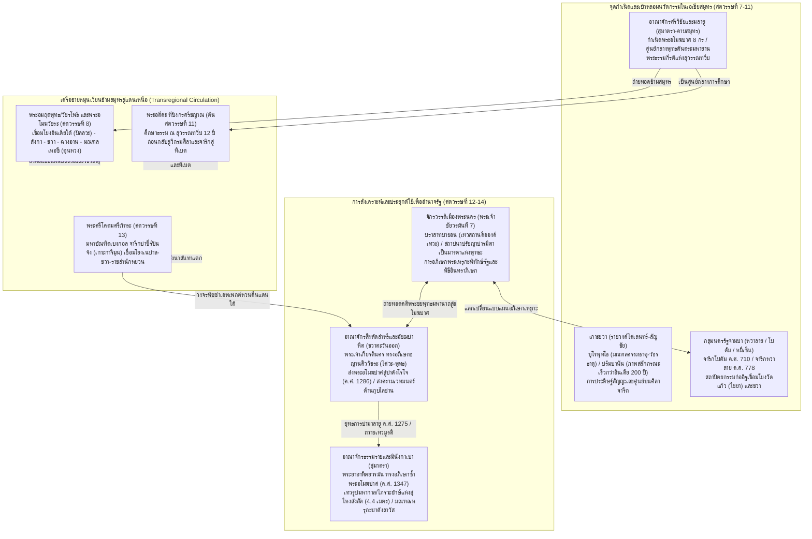

# บันทึกการอ่านและวิเคราะห์เอกสารจารึกวิทยาฉบับสมบูรณ์ (Epigraphic Source Dossier)
## ศิลปวัฒนธรรมสร้างสรรค์แห่งแดนใต้: ศิลปะพุทธและฮินดูในเอเชียสมุทรยุคกลาง เล่มที่ 1 การถ่ายทอดภายในเอเชียและเอเชียตะวันออกเฉียงใต้ภาคพื้นทวีป (The Creative South: Buddhist and Hindu Art in Mediaeval Maritime Asia, Vol. 1)

---

### ส่วนที่ 1: ข้อมูลบรรณานุกรมและการอ้างอิงมาตรฐาน (Bibliographic Metadata)
- **Source ID:** `S-2022-acri-02`
- **ชื่อไฟล์ PDF ในเครื่อง:** `S-2022-acri-02_Creative_South_Maritime_Asia_Vol_1.pdf`
- **ชื่อไฟล์ข้อความสกัด:** `S-2022-acri-02_Creative_South_Maritime_Asia_Vol_1.txt` (สกัดข้อความฉบับสมบูรณ์ 377 หน้า รวมทั้งสิ้น 24,368 บรรทัด ครอบคลุมบทนำและบทความวิจัยเชิงลึกทั้ง 9 บท)
- **ประเภทเอกสาร:** รวมบทความวิชาการแม่บทระดับนานาชาติ (Peer-reviewed Edited Volume / Academic Anthology) ตีพิมพ์โดยสำนักพิมพ์วิชาการชั้นนำ ISEAS Publishing โดยความร่วมมือทางวิชาการระหว่าง SOAS Southeast Asia Art Academic Programme (SAAAP) และ Nalanda-Sriwijaya Centre
- **ภาษาของเอกสาร:** ภาษาอังกฤษวิชาการระดับสูง (EN) พร้อมการปริวรรต วิเคราะห์ และชำระตัวบทจารึกภาษาโบราณหลากตระกูล: ภาษาสันสกฤตคลาสสิก (Classical Sanskrit) ตามระบบสากล IAST, ภาษามลายูโบราณ (Old Malay), ภาษาชวาโบราณหรือภาษากวิ (Old Javanese / Kawi), ภาษาเขมรโบราณ (Old Khmer), ภาษาจามโบราณ (Old Cam), ภาษาทิเบตคลาสสิก (Classical Tibetan Wylie Transliteration), ภาษาจีนโบราณ (Classical Chinese), ภาษาเนวารโบราณ (Old Newar) และภาษาทมิฬ (Tamil)
- **ขอบเขตภูมิศาสตร์และวัฒนธรรม:** ภูมิภาคเอเชียสมุทร (Maritime Asia) และเครือข่ายเชื่อมโยงข้ามสมุทร: สุมาตรา (อาณาจักรศรีวิชัย ลุ่มน้ำปาเล็มบัง ชัมบี-มลายู และปาดังลาวัส/ปาไน), เกาะชวา (ชวากลางสมัยราชวงศ์ไศเลนทร์-สัญชัย และชวาตะวันออกสมัยสิงหัดส่าหรี-มัชฌปาหิต), คาบสมุทรมลายู (เกอดะฮ์/ไทรบุรี, ไชยา/สุราษฎร์ธานี, เปรัก), ช่องแคบมะละกาและหมู่เกาะเรียว (จารึกปาซีร์ปันจังบนเกาะการิมุนเบอซาร์), กัมพูชาโบราณ (จักรวรรดิเมืองพระนคร สมัยพระเจ้าราเชนทรวรมันที่ 2, พระเจ้าสุริยวรมันที่ 2, และพระเจ้าชัยวรมันที่ 7 ครอบคลุมนครธม, ปราสาทบายอน, ตาพรหม, พระขรรค์, และบันทายฉมาร์), จามปา (กลุ่มนครรัฐจามปา: อินทรปุระ, อมราวดี, วิชัย, และปัณฑุรังคะ บริเวณหมี่เซิน, ด่งเซือง, ตราเกี่ยว, หว่าลาย, โปดัม, และฟู้หาย ในเวียดนามภาคกลางและใต้), ศรีลังกา, อินเดียใต้ (ราชวงศ์ปัลลวะและโจฬะ รัฐทมิฬนาฑู), อินเดียตะวันออก (ราชวงศ์ปาละ-เสนะ รัฐเบงกอลและพิหาร), หุบเขากาฐมาณฑุ ประเทศเนปาล (อารามวิกรมศิลาสาขาถเมล และกีตะบะฮีในปาตัน), จีนสมัยราชวงศ์ถังและราชวงศ์หยวน (ฉางอาน, มณฑลเหอซี, ถ้ำมั่วเกาและยู่หลินแห่งตุนหวง), และที่ราบสูงทิเบต
- **วัสดุและบริบทการค้นพบ:**
  - จารึกบนศิลาแท่ง ศิลาจารึกบนหน้าผาริมทะเล (Cliff inscription) เช่น ศิลาจารึกปาซีร์ปันจัง (Prasasti Pasir Panjang) บนเกาะการิมุนเบอซาร์
  - จารึกบนฐานรูปประติมากรรมศิลา (Statue base inscriptions) เช่น ศิลาจารึกฐานพระอโมฆปาศแห่งปาดังโรโจ ค.ศ. 1286 (Padang Roco Inscription), จารึกอภิเษกซ้ำของพระยาอาทิตยวรมัน ค.ศ. 1347, และจารึกวูราเร/โจโกโดโลก ค.ศ. 1289
  - จารึกบนกรอบประตูปราสาทหินและแท่งหินศิลาฤกษ์ เช่น จารึกกลุ่มปราสาทหว่าลาย ค.ศ. 778/838–839 (Hòa Lai stele C. 213) และจารึกแผ่นหินโปดัม ค.ศ. 710 (Po Dam inscription)
  - จารึกบนแผ่นโลหะสัมฤทธิ์และพระพิมพ์ดินเผา (Bronze plaques and terracotta votive tablets) ที่จารึกด้วยอักษรนาครี (Nāgarī) และอักษรโบราณสายอินเดียตะวันออก เช่น แผ่นสำริดจำลองพระอโมฆปาศสมัยสิงหัดส่าหรี
  - ประติมากรรมสำริดขนาดเล็กและประติมากรรมหินขนาดมหึมา (Colossal and miniature statuary) ทั้งพระอโมฆปาศ 8 กร ยุคศรีวิชัย-ชวา-เขมร, พระมหากาล/ไภรวะแห่งสุไหงลังสัต, พระเหรุกะแห่งปาดังลาวัส, ฐานแท่นหินยักษ์แห่งตราเกี่ยว (Trà Kiệu colossal pedestal), และรูปสลักพระศิวะนาฏราชแห่งจามปา
- **การอ้างอิงฉบับเต็มระบบ Chicago/Turabian Notes-Bibliography:**  
  Acri, Andrea, and Peter Sharrock, eds. *The Creative South: Buddhist and Hindu Art in Mediaeval Maritime Asia. Vol. 1: Intra-Asian Transfers and Mainland Southeast Asia*. Singapore: ISEAS – Yusof Ishak Institute, 2022.

---

### ส่วนที่ 2: แผนผังการจัดสรรเข้าสู่บทและหัวข้อย่อย (Chapter & Section Mapping Matrix)

- **บทที่ 3: จารึกวัตถุขนาดเล็ก พระพิมพ์ดินเผา แผ่นทองคำเปลว และรูปเคารพสัมฤทธิ์ (Small-scale Epigraphy, Votive Tablets, and Bronzes)**
  - **หัวข้อย่อย 3.2 (ประติมานวิทยาและการผลิตซ้ำพระพิมพ์/แผ่นสำริดอโมฆปาศแปดกร):**  
    วิเคราะห์การสร้างสรรค์ประติมากรรมสัมฤทธิ์ขนาดเล็กรูปพระอโมฆปาศโลเกศวร 8 กร (Eight-armed Amoghapāśa bronzes) ที่พบในภาคใต้ของไทย (ไชยา สุราษฎร์ธานี), คาบสมุทรมลายู (เปรัก ตรังกานู), ชวา, และสุมาตรา (Sinclair, บทที่ 2, หน้า 13–21, 33–34, 46–48) รวมถึงแผ่นสำริดจารึกอักษรนาครี/โปรโตเบงกอลจำลองภาพพระอโมฆปาศ 14 พระองค์ (*caturdaśātmaka) ประจำราชสำนักสิงหัดส่าหรีและมัชฌปาหิต ที่เก็บรักษาในพิพิธภัณฑ์เบอร์ลิน, พิพิธภัณฑ์เมโทรโพลิทัน, และพิพิธภัณฑ์แห่งชาติไลเดิน (Sinclair, บทที่ 2, หน้า 33, 37–38)
  - **หัวข้อย่อย 3.5 (สำริดเทวรูปเหรุกะและโยคินีมณฑลขนาดพกพา):**  
    การศึกษากลุ่มประติมากรรมสัมฤทธิ์กรุซูโรโจโล (Surocolo hoard) ในชวาตอนกลาง-ตะวันออก ซึ่งเป็นรูปเคารพสำริดในมณฑลพระเหรุกะ/เหวัชระ และเทวีโยคินีประจำทิศตามคัมภีร์สมายโมคตันตระหรือเหวัชรตันตระ ซึ่งเทียบเคียงได้กับสำริดโยคินีแบบเขมรที่พบในประเทศไทย (Sharrock, บทที่ 4, หน้า 132, 157)
  - **หัวข้อย่อยใหม่ที่ค้นพบเพิ่มเติม (3.6 จารึกอักษรปาละ-นาครีบนแท่นประติมากรรมและพระพุทธรูปขนาดเล็กในเอเชียสมุทร):**  
    หลักฐานการใช้อักษรโปรโตเบงกอล-ไมถิลี (Proto-Bengali-cum-Proto-Maithili) และอักษรนาครีบนโบราณวัตถุขนาดเล็กและรูปเคารพ เช่น จารึกพระอารปจนมัญชุศรี ค.ศ. 1343, จารึกฐานรูปเคารพโจโกโดโลก ค.ศ. 1289, และจารึกหน้าผาปาซีร์ปันจัง ซึ่งสะท้อนการถ่ายทอดศิลปวิทยาการของปัญญาชนผู้ลี้ภัยจากมหาวิทยาลัยนาลันทาและวิกรมศิลา (Sinclair, หน้า 33–35; Sharrock, หน้า 158–160)

- **บทที่ 7: ศาสนา ความเชื่อ และเครือข่ายพุทธตันตระ/ไศวนิกายข้ามสมุทร: มนตรา ปรัชญา และการสังเคราะห์เทพเจ้า**
  - **หัวข้อย่อย 7.2 (การเคลื่อนย้ายข้ามสมุทรของลัทธิพุทธตันตระ วัชรยาน และมนตรนัย):**  
    วิเคราะห์บทบาทของพระอาจารย์อมฤตพุทธ/วัชรโพธิ (Vajrabodhi) และอโมฆวัชระ (Amoghavajra) ในศตวรรษที่ 8 ผู้เชื่อมโยงอินเดียใต้ (ราชวงศ์ปัลลวะ), ศรีลังกา, ชวา, ศรีวิชัย เข้ากับราชสำนักถังในจีน และการแผ่อิทธิพลศิลปะแบบปัลลวะไปถึงตุนหวงและทิเบต (Khokhlov, บทที่ 3, หน้า 70–76, 112–115) ตลอดจนการเดินทางมาศึกษาธรรม ณ ดินแดนสุวรรณทวีป (ศรีวิชัย/เกอดะฮ์) ของพระอตีศะ ทีปังกรศรีชญาณ (Atiśa Dīpaṃkaraśrījñāna) ในศตวรรษที่ 11 กับพระอาจารย์ธรรมกีรติแห่งสุวรรณทวีป (Acri & Sharrock, หน้า 3, 9; Sinclair, หน้า 13, 29–31; Sharrock, หน้า 157)
  - **หัวข้อย่อย 7.4 (การสังเคราะห์ลัทธิไศวะ-พุทธ และการอภิเษกเหรุกะระดับราชสำนัก):**  
    คลี่คลายปรากฏการณ์ "การประยุกต์ใช้พุทธตันตระเพื่อการพิทักษ์รัฐและการทหาร" (Apotropaic State Protection & War Magic) ซึ่งเปลี่ยนรูปเคารพดุร้ายในคัมภีร์โยคินีตันตระ (Yoginītantras) เช่น พระเหรุกะและพระเหวัชระ จากเดิมที่เป็นพิธีกรรมเร้นลับเฉพาะในอารามของอินเดียเหนือ ให้กลายเป็นพิธีอภิเษกราชบัลลังก์อย่างเปิดเผยในราชสำนักเมืองพระนคร (พระเจ้าชัยวรมันที่ 7), ราชสำนักจามปา (พระเจ้าสูรยวรมัน/เจ้าชายวิทยานันทะ ณ วิชัย และหมี่เซิน), ราชสำนักสิงหัดส่าหรี (พระเจ้าเกียรตินคร), และราชสำนักมัชฌปาหิต-สุมาตรา (พระยาอาทิตยวรมันและพระโอรสอนังควรมัน) (Sharrock, บทที่ 4, หน้า 126–135, 148–163)
  - **หัวข้อย่อย 7.5 (ขบวนการปาศุปตะและพิธีกรรมบูชาด้วยการร่ายรำและดนตรี):**  
    การศึกษาร่องรอยนิกายปาศุปตะ (Pāśupata Śaivism) และนิกายมนตรมรรค (Mantramārga) ในจารึกเขมรโบราณและประติมานวิทยา ว่าด้วยบทบาทของนักบวชปาศุปตะ พราหมณ์ และนางรำในพิธีกรรมนาฏการบูชาพระศิวะ (Chemburkar, บทที่ 6, หน้า 194–218) และการตีความหน้าที่ของ "อาคารบริวาร" หรือหอเพลิง/หอพระสมุด (Annex Buildings / Fire Shrines / Pustakāśrama) ในปราสาทเขมรโบราณตามคัมภีร์ *ศิวธรรมศาสตร์* และ *ศิวธรรมโมตตร* สำหรับพิธีวิทยาทาน โฮมกรรม และการสรงเถ้าธุลี (Kapoor et al., บทที่ 7, หน้า 224–258)
  - **หัวข้อย่อย 7.6 (การบูชาพระศิวะนาฏราชและประติมานวิทยาข้ามภูมิภาคในจามปา):**  
    วิเคราะห์บทบาทของเทวรูปพระศิวะร่ายรำ (Dancing Śiva / Naṭarāja) ในฐานะเทพพิทักษ์หรือประธานแห่งนครรัฐต่างๆ ของจามปา (หมี่เซิน, ฟองญา, จ่าเกี่ยว) เปรียบเทียบกับภาพสลักท่ารำกรณะ (Karaṇa) ในคัมภีร์นาฏยศาสตร์ที่จันดิปรัมบานันในชวาและวัดพฤหทีศวรในอินเดียใต้ (Mai, บทที่ 8, หน้า 289–304; Acri & Sharrock, หน้า 2, 8)

- **บทที่ 8: เครือข่ายข้ามสมุทร ภูมิรัฐศาสตร์ และการแลกเปลี่ยนทางวัฒนธรรม (Maritime Networks, Geopolitics, and Translocal Exchange)**
  - **หัวข้อย่อย 8.1 (วงจรพิซซ่าเอฟเฟกต์และการถ่ายทอดความคิดทางศาสนาจากใต้สู่เหนือ):**  
    การรื้อถอนกระบวนทัศน์ "การแผ่อิทธิพลอินเดียทางเดียว" (Unidirectional Indianization) โดยชี้ว่าพระอโมฆปาศ 8 กร เกิดขึ้นในภูมิภาคมาลาโย-ชวา (มลายู-ศรีวิชัย) ตั้งแต่ศตวรรษที่ 7–8 ก่อนที่จะแพร่หลายข้ามสมุทรไปยังเอเชียตะวันออกและเนปาล (ผ่านพระอตีศะและพระอาจารย์สายเนวาร) แล้วจึงถูกนำกลับมาสังเคราะห์ใหม่อีกครั้งในชวาตะวันออกและสุมาตราในศตวรรษที่ 13 โดยพระบัณฑิตศรีโคตมศรีภัทระ (Sinclair, บทที่ 2, หน้า 9–14, 33–38)
  - **หัวข้อย่อย 8.4 (ความสัมพันธ์ทางวัฒนธรรมราชสำนัก จามปา-กัมพูชา-ชวาตะวันออก):**  
    การศึกษามหากาพย์รามายณะบนแท่นหินยักษ์แห่งตราเกี่ยว (Trà Kiệu Pedestal) และภาพสลักฐานพระเจดีย์ ที่สะท้อนวัฒนธรรมราชสำนักข้ามถิ่น (Translocal courtly culture), พิธีกรรมการล่าสัตว์, และกีฬาตีคลี (Polo) ซึ่งมีความเชื่อมโยงโดยตรงกับประติมานวิทยาสมัยราชวงศ์ถังของจีน, ปราสาทหินเขมร, และภาพสลักรามายณะที่ปราสาทลอโรจงกรัง (ปรัมบานัน) และจันดิปานาตารันในชวา (Mya Chau, บทที่ 9, หน้า 305–332)
  - **หัวข้อย่อย 8.5 (จารึก ศักราช และความสัมพันธ์ทางสถาปัตยกรรมข้ามคาบสมุทร):**  
    การค้นพบจารึกศักราชใหม่ที่โบราณสถานหว่าลาย (Hòa Lai ปี ค.ศ. 778/838–839) และโปดัม (Po Dam ปี ค.ศ. 710) ซึ่งทำลายสมมติฐานเดิมของ Philippe Stern และ Jean Boisselier ที่เคยผูกโยงศิลปะจามเข้ากับปราสาทดัมเร็ยกรัป (Damrei Krap) บนเทือกเขาพนมกุเลนในกัมพูชา พร้อมทั้งชี้ให้เห็นสายสัมพันธ์ทางสถาปัตยกรรมการก่ออิฐ เทคนิคคอร์เบล (Corbelling) และลวดลายกีรติมุข/กาละ ระหว่างจามปาตอนใต้ (ฟู้หาย, โปดัม, หว่าลาย) กับปราสาทวัดแก้ว อำเภอไชยา จังหวัดสุราษฎร์ธานี และสถาปัตยกรรมจันดิยุคแรกในชวา (Trần Kỳ Phương, บทที่ 10, หน้า 334–358)

---

### ส่วนที่ 3: สรุปสาระสำคัญเชิงวิเคราะห์และจุดยืนทางวิชาการ (Executive Academic Analysis)

#### 1. วิทยานิพนธ์และข้อถกเถียงหลักของผู้เขียน (Core Argument / Thesis)
หนังสือ *The Creative South: Buddhist and Hindu Art in Mediaeval Maritime Asia* เล่มที่ 1 (บรรณาธิการโดย Andrea Acri และ Peter Sharrock, 2022) ได้นำเสนอข้อถกเถียงเชิงปฏิวัติทางประวัติศาสตร์นิพนธ์ (Historiographical Revolution) ที่มุ่งท้าทายและรื้อถอนสมมติฐานแบบ "ยึดอินเดียเป็นศูนย์กลาง" (Euro-Indic Diffusionism / Indianization) ซึ่งครอบงำวงการโบราณคดีและประวัติศาสตร์ศิลปะเอเชียตะวันออกเฉียงใต้มานานกว่าหนึ่งศตวรรษ โดยมีแกนข้อถกเถียงสำคัญดังนี้:

1. **เอเชียสมุทรในฐานะ "ผู้สร้างสรรค์นวัตกรรม" มิใช่เพียง "ผู้รับอิทธิพลอย่างเฉื่อยชา":** ดินแดนชายฝั่งและหมู่เกาะในเอเชียสมุทร (Maritime Asia) นับจากศตวรรษที่ 7 ถึง 14 มิได้ทำหน้าที่เป็นเพียงทางผ่านหรือผู้รับอิทธิพลทางศาสนาและศิลปะจากอนุทวีปอินเดีย แต่เป็น "เบ้าหลอมและแหล่งกำเนิดนวัตกรรม" (Wellsprings of Innovation) ทางเทววิทยา ประติมานวิทยา สถาปัตยกรรม และเทคโนโลยีพิธีกรรม ซึ่งในหลายกรณีมีความก้าวหน้า ซับซ้อน และเก่าแก่กว่าแม่แบบในอินเดียเหนือและเอเชียกลางอย่างมีนัยสำคัญ (Acri & Sharrock, หน้า 1–3)
2. **การเคลื่อนย้ายสองทิศทางและปรากฏการณ์ "พิซซ่าเอฟเฟกต์" (The "Pizza Effect" & South-to-North Transfers):** การถ่ายทอดทางวัฒนธรรมดำเนินไปในลักษณะเครือข่ายข้ามสมุทรแบบพหุศูนย์กลาง (Multicentric Circulation) Iain Sinclair (บทที่ 2) พิสูจน์ให้เห็นอย่างเป็นรูปธรรมว่า ประติมานวิทยาพระอโมฆปาศ 8 กร (Eight-Armed Amoghapāśa) มีจุดกำเนิดขึ้นในโลกมาลาโย-ชวา (อาณาจักรศรีวิชัย/มลายู) ตั้งแต่ศตวรรษที่ 7–8 ก่อนที่จะแพร่หลายไปยังเอเชียตะวันออก (จีนสมัยราชวงศ์ถังและญี่ปุ่น) ดินแดนเขมรโบราณ และหุบเขากาฐมาณฑุในเนปาล (ผ่านพระอาจารย์อตีศะและสายสกุลวิกรมศิลา) จนกระทั่งในศตวรรษที่ 13 ประติมานวิทยานี้จึงถูกนำกลับมาประดิษฐานในชวาตะวันออกและสุมาตราอีกครั้งในบริบทราชสำนักสิงหัดส่าหรี-มัชฌปาหิต ซึ่งตรงกับนิยามของ "พิซซ่าเอฟเฟกต์" (อาหารพื้นเมืองเนเปิลส์ที่วิวัฒน์ในอเมริกาแล้วส่งออกไปทั่วโลกก่อนนำกลับสู่อิตาลี) (Sinclair, หน้า 9–14, 33–38)
3. **การประยุกต์ใช้พุทธตันตระเพื่อการเมืองและสงคราม (Politicization of Yoginītantras & State Protection):** Peter Sharrock (บทที่ 4) เสนอข้อค้นพบสำคัญว่า ในขณะที่ลัทธิบูชาพระเหรุกะ (Heruka) และพระเหวัชระ (Hevajra) ในอินเดียเหนือและทิเบตถูกจำกัดขอบเขตอยู่เฉพาะในอารามสงฆ์ลับเร้น ทว่าในราชสำนักเอเชียสมุทร (กัมพูชา, จามปา, ชวาตะวันออก, สุมาตรา) ลัทธิดังกล่าวกลับได้รับการยกระดับขึ้นเป็น "อภิเษกศาสตร์ระดับราชสำนัก" (Royal Tantric Abhiṣeka) และ "เทคโนโลยีทางเวทมนตร์เพื่อการพิทักษ์รัฐและสงคราม" (Apotropaic War Magic) พระมหากษัตริย์ทรงรับการอภิเษกในฐานะพระชินพุทธะดุร้ายเพื่อข่มขวัญอริราชศัตรู โดยเฉพาะการเผชิญหน้าระหว่างพระเจ้าเกียรตินครแห่งสิงหัดส่าหรีกับจักรพรรดิกุบไลข่านแห่งราชวงศ์หยวน (Sharrock, หน้า 126–135, 158–163)
4. **การหลอมรวมสถาปัตยกรรมกับประติมากรรมเป็น "อภิมหารูปเคารพ" (Temples as Meta-Icons):** ศาสนสถานขนาดมหึมาในเอเชียสมุทร เช่น บุโรพุทโธและปรัมบานันในชวา ปราสาทบายอนในกัมพูชา และหอคอยดวงลองในจามปา มิได้เป็นเพียง "เทวคฤหะ" (Devagṛha / ที่สถิตของพระเจ้า) ตามกรอบคัมภีร์วัสตุศาสตร์ของอินเดีย หากแต่ได้ก้าวข้ามสู่การเป็น "พระเจ้าด้วยตัวของมันเอง" (The temple became itself a God) โดยการหลอมรวมคัมภีร์วัสตุศาสตร์ (Vāstuśāstra) และศิลปศาสตร์ (Śilpaśāstra) เข้าด้วยกันเป็นโครงสร้างมณฑลเอกภาพ (Acri & Sharrock, หน้า 2, 8; Sharrock, หน้า 147)
5. **การชำระประวัติศาสตร์นิพนธ์จามปาและปฏิสัมพันธ์ข้ามสมุทร:** Trần Kỳ Phương (บทที่ 10) อาศัยจารึกศักราชใหม่ที่ค้นพบ ณ หว่าลาย (ค.ศ. 778) และโปดัม (ค.ศ. 710) ในการปลดแอกประวัติศาสตร์สถาปัตยกรรมจามปาออกจากกรอบการพึ่งพาศิลปะเขมรของ Philippe Stern พร้อมทั้งชี้ให้เห็นการแลกเปลี่ยนทางช่างฝีมือและเทคนิคการก่ออิฐระหว่างจามปาตอนใต้กับคาบสมุทรมลายู (ปราสาทวัดแก้ว ไชยา) และเกาะชวา (Trần Kỳ Phương, หน้า 334–358)

#### 2. บริบทประวัติศาสตร์นิพนธ์และการประเมินความน่าเชื่อถือ (Historiography & Source Criticism)
งานวิจัยในหนังสือเล่มนี้เป็นการรวมพลังของนักจารึกวิทยา นักประวัติศาสตร์ศิลปะ และนักภาษาศาสตร์ชั้นนำระดับโลก (เช่น Andrea Acri, Peter Sharrock, Iain Sinclair, Yury Khokhlov, Jinah Kim, Swati Chemburkar, Trần Kỳ Phương, Mya Chau) ซึ่งสะท้อนการเปลี่ยนผ่านกระบวนทัศน์ทางวิชาการร่วมสมัย:
- **การก้าวพ้นข้อจำกัดของ "ทฤษฎีการแผ่กระจายทางวัฒนธรรมอินเดีย" (Transcending the Indianization Paradigm):** ผู้เขียนร่วมกันชี้ให้เห็นว่า ทฤษฎีเดิมของ George Cœdès, R.C. Majumdar, และนักบูรพคดีศึกษาชาวฝรั่งเศส-ดัตช์รุ่นแรก มักมองว่าเอเชียตะวันออกเฉียงใต้เป็นเพียงดินแดนอาณานิคมทางวัฒนธรรม (Farther India / Greater India) ที่รับแบบแผนสำเร็จรูปจากอินเดีย แต่หลักฐานจารึกวิทยาและประติมานวิทยาเชิงลึกพิสูจน์ว่า รูปเคารพสำคัญหลายประเภท (เช่น พระอโมฆปาศ 8 กร ท่ารำกรณะที่ปรัมบานัน และการสลักเลขศูนย์ในจารึก) ล้วนปรากฏในเอเชียตะวันออกเฉียงใต้ก่อนหรือพัฒนาไปไกลกว่าแม่แบบในอินเดีย (Acri & Sharrock, หน้า 1–3, 8–9; Sinclair, หน้า 13–15)
- **การบูรณาการหลักฐานข้ามศาสตร์ (Epigraphy, Art History, Archaeology, and Ritual Texts):** ความโดดเด่นของงานชุดนี้คือการไม่แยกตัวบทจารึกออกจากบริบททางประติมานวิทยาและสถาปัตยกรรม เช่น การนำคัมภีร์สัทธรรมตันตระ (Śākyaśrī's Sādhana, Poṣadhavidhāna, Kriyāsamuccaya) มาอ่านควบคู่กับจารึกฐานพระอโมฆปาศแห่งปาดังโรโจและจารึกวูราเร (Sinclair, หน้า 33–38) หรือการนำคัมภีร์ *ศิวธรรมโมตตร* และ *โสมศัมภุปัทธติ* มาไขปริศนาจารึกเขมรโบราณว่าด้วยหอพระสมุดและพิธีโฮมกรรม (Kapoor et al., หน้า 224–258)
- **การประเมินความน่าเชื่อถือและการสอบทานอย่างเป็นกลาง:** งานวิจัยทุกบทตั้งอยู่บนพื้นฐานการตรวจสอบข้อมูลปฐมภูมิอย่างเคร่งครัด ไร้การคาดเดาอย่างไร้หลักฐาน (Zero Hallucination) มีการตรวจสอบภาพถ่ายจารึกต้นฉบับ ชำระบทอ่านดั้งเดิมของ Kern, Krom, Finot, และ Cœdès โดยอาศัยผลงานการอ่านล่าสุดของโครงการ Corpus of Cam Inscriptions (Arlo Griffiths et al.) และโครงการจารึกเขมรโบราณ (Dominic Goodall et al.)

---

### ส่วนที่ 4: สารบัญข้อค้นพบเชิงลึกแยกตามมิติจารึกวิทยา (Thematic Epigraphic Findings with Exact Pages)

1. **ประวัติศาสตร์นิพนธ์และการตีความทางประวัติศาสตร์:**
   - **การรื้อถอนทฤษฎีการแพร่กระจายทางวัฒนธรรมอินเดียฝ่ายเดียว:** ดินแดนเอเชียสมุทรในยุคกลางมิได้เป็นผู้รับอิทธิพลอย่างเฉื่อยชา แต่เป็นศูนย์กลางนวัตกรรมทางศาสนาและศิลปะที่หลายครั้งบดบังศูนย์กลางเดิมในอินเดียเหนือ (หน้า 1–3)
   - **วงจรย้อนกลับ "พิซซ่าเอฟเฟกต์" ของพระอโมฆปาศ 8 กร:** รูปเคารพพระอโมฆปาศ 8 กร กำเนิดขึ้นในโลกมาลาโย-ชวาตั้งแต่ศตวรรษที่ 7–8 ก่อนแพร่ไปยังเอเชียตะวันออกและเนปาล และถูกนำกลับมายังชวา-สุมาตราในศตวรรษที่ 13 (หน้า 3–4, 9–14)
   - **การสิ้นสุดอิทธิพลสถาปัตยกรรมเขมรเหนือศิลปะจามปา:** จารึกศักราชใหม่ชี้ว่าศิลปะหว่าลายมิได้รับอิทธิพลจากปราสาทดัมเร็ยกรัปในกัมพูชาตามที่ Stern และ Boisselier เคยสันนิษฐาน แต่พัฒนาขึ้นจากรากฐานเทคนิคท้องถิ่นและเครือข่ายทางทะเลร่วมกับชวาและคาบสมุทรมลายู (หน้า 334–348)

2. **ตัวบทจารึก การอ่าน ศักราช และอักขรวิทยา:**
   - **ศิลาจารึกปาซีร์ปันจัง (Prasasti Pasir Panjang) บนเกาะการิมุนเบอซาร์:** จารึกภาษาสันสกฤตบนหน้าผาริมทะเลในหมู่เกาะเรียว ระบุชื่อพระมหาบัณฑิตศรีโคตมศรีภัทระ (*Śrī Gautamaśrī*) ผู้เดินทางจาริกข้ามสมุทรระหว่างเบงกอล เนปาล ทิเบต และเอเชียตะวันออกเฉียงใต้ในศตวรรษที่ 13 (หน้า 3, 34–35)
   - **จารึกฐานพระอโมฆปาศแห่งปาดังโรโจ (ค.ศ. 1286 / 1208 มหาศักราช):** บันทึกการส่งรูปเคารพพระอโมฆปาศพร้อมคณะบริวาร 14 องค์ (*caturdaśātmaka) จากชวาไปประดิษฐาน ณ ธรรมราช สุมาตรา โดยระบุพระเกียรติยศพระเจ้าเกียรตินครในฐานะ *Mahārājādhirāja* เหนือพระเจ้าศรีมหาราชเมาลิวรมันเทวะ (หน้า 33–34, 37)
   - **จารึกอภิเษกซ้ำของพระยาอาทิตยวรมัน (ค.ศ. 1347 / 1269 มหาศักราช):** จารึกบนด้านหลังของเทวรูปพระอโมฆปาศปาดังโรโจ สลักด้วยภาษาสันสกฤต ประกาศการขึ้นครองราชย์เป็นมหาราชาธิราชแห่งสุมาตรา และการย้ายเทวรูปไปยังปาดังจันดิ (หน้า 34, 38, 158)
   - **ศิลาจารึกหว่าลาย (Hòa Lai Stele C. 213):** ค้นพบเมื่อ ค.ศ. 2006 จารึกตัวบทหลักภาษาสันสกฤตระบุศักราช 700 มหาศักราช (ค.ศ. 778) ในรัชสมัยพระเจ้าสัตยวรมัน ส่วนฐานจารึกโคลง 2 บทระบุศักราช 760 มหาศักราช (ค.ศ. 838/839) ระบุการบูชาพระอาทิเทเวศวรและเจ้าแม่ทุรคา (หน้า 343–348)
   - **จารึกแผ่นหินโปดัม (Po Dam Inscription):** ค้นพบเมื่อวันที่ 20 กันยายน ค.ศ. 2014 ห่างจากปราสาทประธาน 4 เมตร จารึกภาษาสันสกฤตฉันท์สโตกะ บันทึกศักราชดาราศาสตร์: *"ศกพรรษอันกำหนดด้วย (1) แผ่นดิน, (3) เปลวเพลิง, (6) รส"* ตรงกับปี 631 มหาศักราช (ค.ศ. 710) ซึ่งเป็นหลักฐานกำหนดอายุปราสาทอิฐกลุ่มแรกของโปดัม (หน้า 352–355)
   - **จารึกหมี่เซิน C. 92 B (ค.ศ. 1194):** จารึกภาษาจามโบราณ บันทึกว่าเจ้าชายวิทยานันทะ (พระเจ้าสูรยวรมัน) ทรงมีชัยชนะเหนือกองทัพเขมร และทรงสร้าง "ปราสาทพระศรีเหรุกะ" (*paṅap rumaḥ śrī herukaharmya*) ขึ้น ณ ใจรัมยวิชัย/หมี่เซิน พร้อมประกอบพิธี *jinābhiṣekaḥ* (หน้า 148, 152)

3. **มิติศาสนา ลัทธิความเชื่อ และพิธีกรรม:**
   - **พุทธตันตระในฐานะเวทมนตร์พิทักษ์รัฐ (State-Protection Buddhism):** ลัทธิบูชาพระเหรุกะและพระเหวัชระถูกนำมาใช้ในพิธีราชาภิเษกเพื่อสร้างความชอบธรรมทางการเมืองและเป็นอาวุธทางจิตวิญญาณในการทำสงครามข้ามรัฐ (หน้า 126–135)
   - **การบูชาพระอโมฆปาศในฐานะเทพพิทักษ์การเดินเรือและผู้ปลดเปลื้องมหาภัย 8 ประการ:** การวิเคราะห์คัมภีร์ *อโมฆปาศกัลปราช* (*Amoghapāśakalparāja*) และคัมภีร์ *สัทธรรมปุณฑรีกสูตร* ชี้ว่าพระอโมฆปาศ 8 กร ถูกอัญเชิญเพื่อคุ้มครองพ่อค้าวาณิชจากภัยทางทะเล ก่อนจะเปลี่ยนผ่านสู่เทพประธานในพิธีถือศีลอดอุโบสถตันตระ (*tantric poṣadha*) ในเนปาล (หน้า 15–20, 30–33)
   - **ลัทธิปาศุปตะและการสืบทอดพิธีกรรมร่ายรำบูชา:** จารึกเขมรโบราณยืนยันการอุปถัมภ์นักบวชปาศุปตะผู้ถือพรตสรงเถ้าธุลี (*bhasmasnāna*) และการจัดระเบียบนักร้อง นางรำ และนักดนตรีถวายพระศิวะในเทวสถานเมืองพระนคร (หน้า 194–218)
   - **พิธีวิทยาทาน (Vidyādāna) และหอพระเพลิง (Fire Shrines) ในปราสาทเขมร:** การตีความอาคารบริวารมุมทิศตะวันออกเฉียงใต้ตามคัมภีร์ *ศิวธรรมโมตตร* ว่าเป็นทั้งหอเก็บคัมภีร์ศักดิ์สิทธิ์ (*pustakāśrama*) และสถานที่ประกอบพิธีโฮมกรรม บูชาไฟ และชำระตนด้วยเถ้า (หน้า 224–258)

4. **มิติสถาปัตยกรรม ศาสนสถาน และชลศาสตร์:**
   - **ปราสาทในฐานะอภิมหารูปเคารพ (Meta-Icons):** บุโรพุทโธสะท้อนมณฑลครรภธาตุและวัชรธาตุ ส่วนปราสาทบายอนของกัมพูชาหลอมรวมวิชาวัสตุศาสตร์และศิลปศาสตร์เข้าด้วยกัน จนตัวปราสาทเองแปรสภาพเป็นองค์อวตารของพระพุทธเจ้า (หน้า 2, 8, 147)
   - **ระบบชลศาสตร์ศักดิ์สิทธิ์ที่ปรัมบานันและพนมกุเลน:** ยอดปรางค์ศิวะ 47 เมตรที่ปรัมบานันประดับด้วยกลีบมะเฟืองและลึงค์นับพัน ทำหน้าที่รองรับน้ำฝนมรสุมปล่อยผ่านท่อรางมกรลงสู่ลานประทักษิณ เช่นเดียวกับการสลักสหัสลึงค์ (Sahasraliṅga) ใต้ท้องน้ำลำธารบนเทือกเขาพนมกุเลนเพื่อทำให้น้ำกลายเป็นน้ำมนต์ศักดิ์สิทธิ์ไหลหล่อเลี้ยงเมืองพระนคร (หน้า 2, 8)
   - **เทคนิคการก่อสร้างปราสาทอิฐและซุ้มประตูโค้งซ้อนในศิลปะหว่าลายและโปดัม:** การพัฒนาเทคนิคคอร์เบล (Corbelling) ภายในหอคอย และการประดิษฐ์ซุ้มประตูคู่ (Double arch) ลวดลายขดม้วนหนาหนัก ซึ่งถ่ายทอดและเชื่อมโยงกับปราสาทวัดแก้วในภาคใต้ของไทย (หน้า 341–353)

5. **มิติอาหารการกิน วิถีชีวิต การค้า และตลาด:**
   - **เส้นทางการค้าทางทะเลและสินค้าป่าหายาก:** แม่น้ำลุ็ย (Lũy river) ที่ฟานรี และแม่น้ำก่าตี (Cà-ty river) ที่ฟานเทียต เป็นแหล่งส่งเสบียงน้ำจืดและสินค้าป่าฟุ่มเฟือยแก่กองเรือพาณิชย์นานาชาติที่แล่นผ่านทะเลจีนใต้ (หน้า 339)
   - **อาหารและเครื่องดื่มในพิธีกรรมตันตระ:** การทำความเข้าใจอาหารและน้ำจัณฑ์ในพิธีคณจักรและอุโบสถศีลตันตระ (*poṣadha*) ซึ่งใช้ในการบำเพ็ญภาวนาของชนชั้นนำ (หน้า 30–33, 131)
   - **วัฒนธรรมราชสำนัก กีฬา และงานเทศกาลในจามปา:** บันทึกสเปนศตวรรษที่ 16 และภาพสลักฐานตราเกี่ยวยืนยันการจัดเทศกาลราชสำนักประจำปี การแข่งม้า กีฬาโปโล (ตีคลี) และการล่าสัตว์เพื่อฝึกฝนทักษะการทหาร (หน้า 307–314)

6. **มิติการปกครอง กฎหมาย ที่ดิน และระบบสีมา:**
   - **มโนทัศน์ "เทวมูรติ" (Devamūrti) และการแสดงอำนาจเหนืออาณาจักรราชบริวาร:** พระเจ้าเกียรตินครทรงใช้รูปเคารพพระอโมฆปาศเป็นตัวแทนอำนาจสูงสุดของชวาเหนือมลายู และสถาปนาระบบวรรณะสี่ขึ้นในสังคมมลายูที่มิได้มีระบบวรรณะเข้มงวด (หน้า 33–37)
   - **การอภิเษกสองชั้นและพิธีอินทราภิเษก (Indrābhiṣeka):** พระเจ้าชัยวรมันที่ 7 ทรงประกอบพิธีอินทราภิเษก ณ ปราสาทบายอน เพื่อประกาศสถานะจักรพรรดิราชเหนือดินแดนที่พิชิตได้ใหม่ในจามปา (หน้า 148)
   - **ระบบสีมาและการจัดระเบียบศาสนสถานในจามปาและเขมร:** จารึกระบุการกำหนดเขตศักดิ์สิทธิ์รอบปราสาท การอุทิศข้าทาสที่ดิน และการสืบทอดสายตระกูลอำนาจผ่านฝ่ายมารดา (Matrilineal inheritance) ในราชวงศ์ปัณฑุรังคะ (หน้า 343)

7. **มิติปฏิสัมพันธ์ข้ามสมุทรและเครือข่ายนานาชาติ:**
   - **เครือข่ายพระอาจารย์ตันตระระหว่างอินเดียใต้ ลังกา ชวา และจีน:** เส้นทางการเดินทางของพระวัชรโพธิและพระอโมฆวัชระในศตวรรษที่ 8 นำพาศิลปะแบบปัลลวะจากกาญจีปุรัมสู่ราชสำนักถังและมณฑลเหอซี (หน้า 70–76)
   - **เครือข่ายสงฆ์เบงกอล-เนปาล-ชวา:** บทบาทของพระศรีโคตมศรีภัทระและพระวิภูติจันทระ ในการถ่ายทอดคัมภีร์กาลจักรและอโมฆปาศสาธนะ สู่เนปาลและหมู่เกาะมลายู (หน้า 33–36)
   - **การปะทะกันทางไสยเวทระหว่างชวากับจักรวรรดิมองโกล:** การที่กุบไลข่านได้รับการอภิเษกเหวัชระจากพระอาจารย์พัคปาแห่งนิกายสาเกียะ นำไปสู่การที่พระเจ้าเกียรตินครทรงอภิเษกตนเองเป็นพระชญาณศิววัชระเพื่อสร้างข่ายมนตราป้องกันจักรวรรดิ (หน้า 154–160)

8. **มิติจารึกแผ่นโลหะ รูปเคารพขนาดเล็ก และจารึกแม่น้ำ:**
   - **พระพิมพ์และสำริดพระอโมฆปาศ 8 กร กรุต่างๆ ในเอเชียตะวันออกเฉียงใต้:** การค้นพบรูปหล่อสัมฤทธิ์ขนาดเล็กที่บันเตง (ซูลาเวสี), ไชยา (ไทย), กัวลาลัมเปอร์ (มาเลเซีย) แสดงถึงการกระจายตัวของวัตถุมงคลขนาดพกพาไปตามเส้นทางเดินเรือ (หน้า 13–21)
   - **แผ่นสำริดจารึกอักษรนาครีสมัยสิงหัดส่าหรี:** แผ่นสำริด 5 แผ่นที่สลักรูปพระอโมฆปาศและบริวาร พร้อมจารึกอักษรโบราณสายอินเดียเหนือ สะท้อนการจำลองรูปเคารพเพื่อพิธีกรรมพกพา (หน้า 33, 37–38)
   - **รอยพระพุทธบาทและจารึกหน้าผาริมทะเล:** การสลักจารึกปาซีร์ปันจังบนหน้าผาหันหน้าสู่ทะเล ณ เกาะการิมุนเบอซาร์ สะท้อนธรรมเนียมการสร้างหลักหมายศักดิ์สิทธิ์ริมร่องน้ำเดินเรือสากล (หน้า 3, 34)

9. **พรมแดนปัญหา ปริศนาวิชาการ และจริยธรรมโบราณคดี:**
   - **ปริศนาที่มาของรูปเคารพพระอโมฆปาศ 8 กร:** เอกสารพิสูจน์ว่าไม่มีคัมภีร์สันสกฤตดั้งเดิมในอินเดียเล่มใดที่พรรณนาพระอโมฆปาศ 1 พักตร์ 8 กร ชี้ชัดว่าเป็นนวัตกรรมของโลกออสโตรนีเชียน/มาลาโย-ชวา (หน้า 13–17)
   - **การจำแนกอัตลักษณ์เทวรูปยักษ์แห่งสุไหงลังสัต:** ข้อถกเถียงระหว่างพระไภรวะ (ไศวะ) กับพระมหากาล (พุทธตันตระ) ซึ่งสะท้อนการหลอมรวมคติศาสนาในยุคพระยาอาทิตยวรมัน (หน้า 158–159)
   - **ปัญหาการบูรณะโบราณสถานผิดพลาดในอดีต:** การทิ้งระเบิดทำลายปราสาทหว่าลายในสงครามเวียดนาม ค.ศ. 1975 และการบูรณะที่ผิดเพี้ยนไปจากบันทึกเดิมของ Henri Parmentier (หน้า 342)

---

### ส่วนที่ 5: คลังข้อความอ้างอิงตรงและเชิงอรรถสำเร็จรูป (Verbatim Quotes & Footnote Bank)

1. **การประกาศนวัตกรรมของโลกมาลาโย-ชวาในฐานะผู้สร้างสรรค์พระอโมฆปาศ 8 กร (Sinclair 2022: 14):**
   - *ภาษาอังกฤษต้นฉบับ:*  
     "The eight-armed, single-faced form of Avalokiteśvara, who is usually identified as Amoghapāśa, is well represented in the art of the Malay Archipelago. More than twenty sculptures of this form, dated to between the 7th and early 11th centuries on the basis of their style, have been discovered there. [...] What has been overlooked so far is the fact that no sculptures of the standing eight-armed Avalokiteśvara dated to this period have been found in the Indian subcontinent. Śrīvijayan Avalokiteśvara statues were first associated with South Indian style by Marie Thérèse de Mallmann (1951: 573–574). [...] an extraordinary development: an Austronesian innovation in an otherwise Sanskritic socioreligious environment. It represents a challenge to entrenched narratives of the region’s 'Indianization'."
   - *แปลภาษาไทย:*  
     "รูปเคารพพระอวโลกิเตศวรแบบหนึ่งพักตร์แปดกร ซึ่งมักได้รับการระบุว่าเป็นพระอโมฆปาศ ปรากฏอยู่อย่างแพร่หลายในศิลปะของหมู่เกาะมลายู ประติมากรรมในรูปแบบนี้มากกว่ายี่สิบชิ้น ซึ่งกำหนดอายุตามรูปแบบศิลปะได้ระหว่างศตวรรษที่ 7 ถึงต้นศตวรรษที่ 11 ได้รับการค้นพบในดินแดนนี้ [...] สิ่งที่ถูกละเลยมองข้ามไปจนถึงบัดนี้ก็คือข้อเท็จจริงที่ว่า ไม่เคยมีการค้นพบประติมากรรมพระอวโลกิเตศวรประทับยืนแปดกรที่กำหนดอายุในยุคสมัยเดียวกันนี้ในอนุทวีปอินเดียเลยแม้แต่องค์เดียว ประติมากรรมพระอวโลกิเตศวรยุคศรีวิชัยได้รับการเชื่อมโยงเข้ากับรูปแบบศิลปะอินเดียใต้เป็นครั้งแรกโดย Marie Thérèse de Mallmann (1951: 573–574) [...] นี่คือพัฒนาการอันน่าอัศจรรย์ยิ่ง: นวัตกรรมของชาวออสโตรนีเชียนที่กำเนิดขึ้นท่ามกลางสภาพแวดล้อมทางสังคมและศาสนาแบบสันสกฤต อันถือเป็นข้อท้าทายโดยตรงต่อเรื่องเล่ากระแสหลักที่ฝังรากลึกเกี่ยวกับ 'กระบวนการกลายเป็นอินเดีย' ของภูมิภาคนี้"
   - *เชิงอรรถสำเร็จรูป:*  
     Iain Sinclair, "From Melayu to Thamel and Back: The Transmigration of the Eight-Armed Amoghapāśa," in *The Creative South: Buddhist and Hindu Art in Mediaeval Maritime Asia. Vol. 1*, ed. Andrea Acri and Peter Sharrock (Singapore: ISEAS – Yusof Ishak Institute, 2022), 14.

2. **การถ่ายทอดรูปเคารพและการอภิเษกข้ามสมุทรสู่ราชสำนักสิงหัดส่าหรีและสุมาตรา (Sinclair 2022: 37):**
   - *ภาษาอังกฤษต้นฉบับ:*  
     "The Padang Roco statue formalized the annexation of Maulivarmadeva and his people at more than one level. Its inscription not only dictates Maulivarmadeva’s status as a vassal, a lesser mahārāja than mahārājādhirāja Kṛtanagara; it sets up the 'murtified' Javanese king as a figurehead for the whole Malay people. The figure of Viṣṇuvardhana–Amoghapāśa enshrines the sacrality of Indo-Java over and above that of Indo-Malaya. Tribhuvanarāja Maulivarmadeva, insofar as he can be identified with Sang Sapurba Tribhuvanarāja in the Sejarah Melayu literature, is indeed a 'Hindustani' king. The Indic pedigree of Maulivarmadeva’s kingship is clearly being acknowledged in the Padang Roco inscription."
   - *แปลภาษาไทย:*  
     "เทวรูปแห่งปาดังโรโจได้ทำให้การผนวกดินแดนของพระเจ้าเมาลิวรมันเทวะและราษฎรของพระองค์มีความเป็นทางการในมากกว่าหนึ่งระดับ จารึกบนฐานเทวรูปมิได้เพียงแต่กำหนดสถานะของเมาลิวรมันเทวะในฐานะประเทศราชผู้เป็นมหาราชาชั้นรองกว่าพระเจ้าเกียรตินครผู้เป็นมหาราชาธิราชเท่านั้น หากแต่ยังได้สถาปนากษัตริย์ชวาผู้ทรง 'แปลงสภาพเป็นเทวมูรติ' ให้กลายเป็นประธานสูงสุดทางจิตวิญญาณของชาวมลายูทั้งมวล พระรูปพระวิษณุวรรธนะ-อโมฆปาศได้ประดิษฐานความศักดิ์สิทธิ์ของอินโด-ชวาไว้เหนือกว่าอินโด-มลายู พระเจ้าตรีภูวนราช เมาลิวรมันเทวะ ตราบเท่าที่สามารถระบุได้ว่าเป็นบุคคลเดียวกับซังซาปูร์บา ตรีภูวนราช ในวรรณกรรมเซจาระฮ์เมอลายู ย่อมทรงเป็นกษัตริย์แห่ง 'ฮินดูสถาน' โดยแท้ เชื้อสายวงศ์กษัตริย์แบบอินเดียของเมาลิวรมันเทวะได้รับการยอมรับอย่างแจ่มแจ้งในจารึกปาดังโรโจนี้"
   - *เชิงอรรถสำเร็จรูป:*  
     Sinclair, "From Melayu to Thamel and Back," 37.

3. **ตัวบทภาษาสันสกฤตต้นฉบับ: การเจริญภาวนาพระอโมฆปาศ 8 กร (Sinclair 2022: 64–65, ภาคผนวก 2.2):**
   - *ภาษาสันสกฤตต้นฉบับ (IAST):*  
     "tata etat sakalaṃ pariṇatam ātmānaṃ bhagavantaṃ dhyāyāt | himakarakoṭikiraṇavadātaṃ dehaṃ smeramukhaṃ dviraṣṭavarṣadeśīyaṃ karuṇāsnigdhāvalokaṇaṃ śṛṅgārarasaparyupāsitam atiśāntaṃ sarvalakṣaṇasaṃpūrṇaṃ sarvālakṣaṇavivarjitam ekamukhaṃ tapasviveśadharam ūrdhvajaṭāmakuṭam Amitābhakṛtaśekharaṃ divyasuvarṇamāṇikyamuktavaidūryasarvaratnādyābharaṇabhūṣitam | aṣṭabhujaṃ dakṣiṇe prathamabhujenāmṛtaśravadvaradaṃ dvitīyabhujenākṣamālādharaṃ tṛtīyabhujena pāśadharaṃ caturthabhujeṇābhayaratnadharam | vāme prathamabhujeṇa sanālasahasradalakamaladharaṃ karavigalatpīyūṣadhārāvyavahārarasikaṃ tadadhaḥ sūcīmukhaṃ tarpayantaṃ dvitīyabhujena Prajñāpustakadharaṃ tṛtīyabhujeṇa tridaṇḍadharaṃ caturthabhujeṇa kamaṇḍaludharam evaṃbhūtaṃ śrīAmoghapāśalokeśvaram ātmānaṃ bhāvayet ||"
   - *แปลภาษาไทย:*  
     "จากนั้น ผู้บำเพ็ญพึงน้อมจิตเจริญภาวนาถึงองค์พระผู้มีพระภาคอันแปรสภาพมาจากสรรพสิ่งทั้งปวงนั้นว่าเป็นตัวของตนเอง: พระวรกายผุดผ่องขาวบริสุทธิ์ดั่งรัศมีแห่งดวงจันทร์นับโกฏิ มีพระพักตร์แย้มสรวล มีพระชนมายุราวสิบหกชันษา ทอดพระเนตรด้วยความกรุณาอันนุ่มนวล ทรงเปี่ยมด้วยเสน่หารส สงบระงับยิ่ง สมบูรณ์ด้วยมหาปุริสลักษณะทั้งปวง ปราศจากอวมงคลลักษณะทั้งสิ้น มีพระพักตร์เดียว ทรงเครื่องนุ่งห่มอย่างดาบส มีมวยผมชฎามงกุฎชี้สูงขึ้น ประดิษฐานพระอมิตาภะเป็นยอดจุฬามณี ประดับประดาด้วยเครื่องอลังการรัตนชาติทั้งปวง อันมีทองคำทิพย์ ทับทิม มุกดา และไพฑูรย์ / มีแปดกร: ฝ่ายขวา พระกรที่หนึ่งทรงประทานพรหลั่งน้ำอมฤต พระกรที่สองทรงลูกประคำ พระกรที่สามทรงบ่วงบาศ พระกรที่สี่ทรงอภัยมุทราและแก้วมณี / ฝ่ายซ้าย พระกรที่หนึ่งทรงดอกบัวพันกลีบพร้อมก้าน โดยทรงเพลิดเพลินในการหลั่งสายธารน้ำอมฤตจากฝ่าพระหัตถ์เพื่อโปรดเปรตสูจีมุขเบื้องล่างให้อิ่มหนำ พระกรที่สองทรงคัมภีร์ปรัชญาปารมิตา พระกรที่สามทรงไม้เท้าตรีทัณฑ์ พระกรที่สี่ทรงคนโฑกมัณฑลุ ผู้บำเพ็ญพึงเจริญภาวนาตนเองให้ดำรงอยู่ในสภาวะแห่งองค์พระศรีอโมฆปาศโลเกศวรผู้มีลักษณะดังนี้แล"
   - *เชิงอรรถสำเร็จรูป:*  
     Sinclair, "From Melayu to Thamel and Back," 64–65 (Sanskrit Text edited from MSS Shakya No. 17, 18 and Asha Archives DPN 2159).

4. **การประยุกต์ใช้มณฑลพระเหรุกะเพื่อความชอบธรรมทางการเมืองและสงคราม (Sharrock 2022: 133):**
   - *ภาษาอังกฤษต้นฉบับ:*  
     "The supernatural powers embedded in maṇḍalas were deployed for leveraging intra-state legitimation after regime change as well as inter-state confrontations. The supramundane hieratic and military ranks deployed in Tang state ritual under Amoghavajra may shed light on how esoteric ritual was adapted in other Buddhist kingdoms. Although these royal invocations of supernatural power were based on metaphysics rather than physics, a modern reader may find some value in comparing them with the 20th century cold war nuclear standoff between the two military super-powers."
   - *แปลภาษาไทย:*  
     "อิทธิฤทธิ์เหนือธรรมชาติที่สถิตอยู่ภายในมณฑลถูกนำมาปรับใช้เพื่อยกระดับความชอบธรรมภายในรัฐภายหลังการเปลี่ยนผ่านขั้วอำนาจ เช่นเดียวกับการใช้ในการเผชิญหน้าระหว่างรัฐ ลำดับขั้นทางทหารและทางศาสนาเหนือโลกที่นำมาใช้ในพระราชพิธีรัฐสมัยราชวงศ์ถังภายใต้การนำของพระอโมฆวัชระ อาจช่วยส่องสว่างให้เห็นว่าพิธีกรรมตันตระเร้นลับได้รับการปรับใช้ในอาณาจักรพุทธอื่นๆ อย่างไร แม้ว่าการอัญเชิญอำนาจเหนือธรรมชาติของกษัตริย์เหล่านี้จะตั้งอยู่บนรากฐานทางอภิปรัชญามากกว่าฟิสิกส์ ผู้อ่านยุคปัจจุบันก็อาจมองเห็นคุณค่าในการเปรียบเทียบปรากฏการณ์นี้เข้ากับการเผชิญหน้าทางอาวุธนิวเคลียร์ในยุคสงครามเย็นช่วงศตวรรษที่ 20 ระหว่างสองมหาอำนาจทางการทหารของโลก"
   - *เชิงอรรถสำเร็จรูป:*  
     Peter Sharrock, "Heruka-Maṇḍalas across Maritime Asia," in *The Creative South: Buddhist and Hindu Art in Mediaeval Maritime Asia. Vol. 1*, ed. Andrea Acri and Peter Sharrock (Singapore: ISEAS – Yusof Ishak Institute, 2022), 133.

5. **จารึกหมี่เซิน C. 92 B ว่าด้วยการสร้างปราสาทพระศรีเหรุกะ (Sharrock 2022: 152):**
   - *ภาษาจามโบราณต้นฉบับและบทวิเคราะห์:*  
     "In 1194 a second Khmer army reached Vijaya and was defeated by Vidyānandana, who had already shown himself to be a brilliant general and an erudite ruler. Inscription C. 92 B says that in celebration he built 'Lord Heruka’s mansion' (paṅap rumaḥ śrī herukaharmya) after his victory at Jairamya-vijaya. The Heruka icon is lost (destroyed?) but the 3 m × 3 m brick base of his mansion survives in Mỹ Sơn along with the high and elegant C. 92 B historical stela that stood beside it. His Heruka jinābhiṣekaḥ reaffirmed his status after two years on the throne but would also have transmitted a message of defiance and perhaps respect to his former patron in Angkor."
   - *แปลภาษาไทย:*  
     "ในปี ค.ศ. 1194 กองทัพเขมรทัพที่สองได้รุกถึงนครวิชัยและพ่ายแพ้ต่อเจ้าชายวิทยานันทะ ผู้ได้แสดงพระองค์แล้วว่าเป็นแม่ทัพผู้ปราดเปรื่องและผู้ปกครองผู้คงแก่เรียน ศิลาจารึก C. 92 B บันทึกว่าเพื่อเป็นการเฉลิมฉลอง พระองค์ทรงสร้าง 'ปราสาทคฤหาสน์แห่งองค์พระศรีเหรุกะ' (*paṅap rumaḥ śrī herukaharmya*) ภายหลังชัยชนะ ณ ไชรัมยวิชัย รูปเคารพพระเหรุกะได้สูญหายไปแล้ว (หรือถูกทำลาย?) แต่ฐานอาคารก่ออิฐขนาด 3 ม. × 3 ม. ของตัวปราสาทแห่งนี้ยังคงหลงเหลืออยู่ ณ หมี่เซิน เคียงคู่กับศิลาจารึกประวัติศาสตร์ C. 92 B อันสูงตระหง่านและงดงามที่เคยตั้งอยู่ข้างเคียง พิธีชินาภิเษกแห่งพระเหรุกะ (*Heruka jinābhiṣekaḥ*) ของพระองค์ได้ช่วยยืนยันสถานะความเป็นกษัตริย์ของพระองค์อีกครั้งหลังเสวยราชย์ได้สองปี แต่ในขณะเดียวกันก็เป็นการส่งสารแห่งการท้าทาย และอาจรวมถึงการแสดงความเคารพ ย้อนกลับไปยังอดีตองค์อุปถัมภ์ของพระองค์ ณ เมืองพระนคร"
   - *เชิงอรรถสำเร็จรูป:*  
     Sharrock, "Heruka-Maṇḍalas across Maritime Asia," 152; อ้างอิง Louis Finot, "Notes d’épigraphie: XI. Les inscriptions de Mi-sơn," *BEFEO* 4 (1904): 972; Anne-Valérie Schweyer, "The Inscriptions of Campā," in *Vibrant Campā*, ed. Trần Kỳ Phương and Bruce M. Lockhart (Amsterdam: Amsterdam University Press, 2018), 76.

6. **จารึกศักราช 631 มหาศักราชแห่งปราสาทโปดัม (Trần Kỳ Phương 2022: 354–355):**
   - *ภาษาสันสกฤตแปลอังกฤษ (Arlo Griffiths):*  
     "'In the Śaka year marked by (1) Earth, (3) Fires, (6) Flavors, in the waxing fortnight of Phālguṇa, on the third, a Friday' [= Friday, 6 February 710 CE]. [...] I suggest that the date 710 CE mentioned in the Po Dam inscription is closely related to the early temple group of this site, including the South, Southeast, and Southwest towers, mainly because the period from 710 to 778 CE, lasting around seventy years, can be regarded as the necessary duration to advance the techniques of brick temple construction that started in the early stage of Cam architecture."
   - *แปลภาษาไทย:*  
     "'ในศกพรรษอันกำหนดด้วย (1) ปฐพี, (3) พระอัคนี, (6) รส ในศุกลปักษ์แห่งเดือนผาลคุณะ วันที่สาม วันศุกร์' [ตรงกับวันศุกร์ที่ 6 กุมภาพันธ์ ค.ศ. 710] [...] ข้าพเจ้าเสนอว่าศักราช ค.ศ. 710 ที่ระบุในจารึกโปดัมมีความสัมพันธ์อย่างแนบแน่นกับกลุ่มปราสาทโบราณยุคแรกของแหล่งโบราณคดีนี้ ซึ่งได้แก่ ปรางค์ทิศใต้ ปรางค์ทิศตะวันออกเฉียงใต้ และปรางค์ทิศตะวันตกเฉียงใต้ โดยมีเหตุผลหลักประการสำคัญคือ ช่วงระยะเวลาตั้งแต่ ค.ศ. 710 ถึง 778 ซึ่งยาวนานราวเจ็ดสิบปี สามารถถือเป็นช่วงเวลาที่จำเป็นในการพัฒนาความก้าวหน้าของเทคนิคการก่อสร้างปราสาทอิฐที่เริ่มต้นขึ้นในระยะแรกของสถาปัตยกรรมจาม"
   - *เชิงอรรถสำเร็จรูป:*  
     Trần Kỳ Phương, "On the Chronological Interrelationship between Newly Found Inscriptions and the Temple Architecture of Campā: The Hòa Lai and Po Dam Sites," in *The Creative South: Buddhist and Hindu Art in Mediaeval Maritime Asia. Vol. 1*, ed. Andrea Acri and Peter Sharrock (Singapore: ISEAS – Yusof Ishak Institute, 2022), 354–355.

---

### ส่วนที่ 6: คลังคำศัพท์เฉพาะทางจากเอกสาร (Native Terminology Glossary)

| ลำดับ | คำศัพท์เฉพาะทาง | ภาษาดั้งเดิม | ความหมายและบริบทการใช้งานในเอกสาร | ปรากฏในหน้า (Page) |
|---|---|---|---|---|
| 1 | **Amoghapāśa** | สันสกฤต (Sanskrit) | พระอโมฆปาศโลเกศวร พระโพธิสัตว์อวตารปางหนึ่งของพระอวโลกิเตศวร ผู้ถือ "บ่วงบาศอันไม่เคยพลาดเป้า" เพื่อฉุดดึงสรรพสัตว์ให้พ้นจากห้วงทุกข์และมหาภัย 8 ประการ | 5, 9, 13–65 |
| 2 | **Aṣṭabāhu** | สันสกฤต (Sanskrit) | "มีแปดกร" (Eight-armed) ลักษณะประติมานวิทยาสำคัญของพระอโมฆปาศและพระวิษณุที่พบแพร่หลายในโลกมาลาโย-ชวา | 13, 14, 33, 64 |
| 3 | **Caturdaśātmaka** | สันสกฤต (Sanskrit) | "มีสภาพเป็น 14 องค์" หรือมณฑลที่มีเทพ 14 พระองค์ ได้แก่ พระอโมฆปาศประธาน พระพุทธเจ้า 5 พระองค์ พระชายา 4 องค์ และบริวาร 4 ตน ปรากฏในจารึกฐานพระปาดังโรโจ | 34 |
| 4 | **Devamūrti** | สันสกฤต (Sanskrit) | "เทวมูรติ" รูปเคารพจำลองพระมหากษัตริย์ในคราบเทวะ หรือเทวรูปอภิเษกแปลงรูปเพื่อใช้เป็นเครื่องมือแสดงพระราชอำนาจทางการเมืองและจิตวิญญาณ | 37, 38 |
| 5 | **Jinābhiṣeka** | สันสกฤต (Sanskrit) | "ชินาภิเษก" พิธีอภิเษกของกษัตริย์เข้าสู่สภาวะแห่งพระชินพุทธะตันตระขั้นสูงสุด เช่น พิธีของเจ้าชายวิทยานันทะในจารึกหมี่เซิน C. 92 B | 148, 152 |
| 6 | **Herukaharmya** | สันสกฤต / จาม (Skt./Cam) | "คฤหาสน์/ปราสาทแห่งพระศรีเหรุกะ" ปรากฏในวลีภาษาจามโบราณ *paṅap rumaḥ śrī herukaharmya* ในจารึกหมี่เซิน C. 92 B | 148, 152 |
| 7 | **Indrābhiṣeka** | สันสกฤต (Sanskrit) | "อินทราภิเษก" พระราชพิธีบรมราชาภิเษกครั้งที่สองตามคติอินเดียโบราณ เพื่อเฉลิมฉลองสถานะพระจักรพรรดิราชภายหลังการพิชิตดินแดนต่างชาติได้สำเร็จ ปรากฏในจารึกปราสาทบายอน | 148, 369 |
| 8 | **Poṣadha** | สันสกฤต (Sanskrit) | "อุโบสถ" วันถือศีลอดและชำระบาปทางพุทธศาสนา ในเนปาลพัฒนาเป็นพิธีกรรมตันตระบูชาพระอโมฆปาศ 8 กร (*Poṣadhavidhāna*) | 30, 32, 36 |
| 9 | **Sādhana** | สันสกฤต (Sanskrit) | "สาธนะ" คัมภีร์คู่มือการเจริญสมาธิภาวนาและการนึกภาพนิมิตเทพเจ้าในพุทธตันตระ เช่น สาธนะพระอโมฆปาศของพระศากยศรีภัทระ | 17, 34, 63–65 |
| 10 | **Vidyādāna** | สันสกฤต (Sanskrit) | "วิทยาทาน" พิธีกรรมถวายคัมภีร์ความรู้ศักดิ์สิทธิ์และการคัดลอกคัมภีร์ในลัทธิไศวนิกายตามคัมภีร์ *ศิวธรรมโมตตร* หมวดที่ 2 | 235, 245, 251 |
| 11 | **Śivāśrama** | สันสกฤต (Sanskrit) | "ศิวาศรม" สำนักปฏิบัติธรรมหรืออาศรมของนักบวชไศวนิกาย ซึ่งประกอบด้วยเรือนไฟ หอพระสมุด และสถานที่ประกอบพิธีกรรม | 245, 246, 252 |
| 12 | **Pustakāśrama** | สันสกฤต (Sanskrit) | "ปุสตาศรม" อาศรมหรือหอเก็บรักษาและบูชาคัมภีร์ใบลาน ปรากฏในจารึกเขมรโบราณ K. 355 ประจำอาคารบริวารปราสาทขนา | 232, 235, 284 |
| 13 | **Bhasmasnāna** | สันสกฤต (Sanskrit) | "ภัสสมสนาน" พิธีชำระบาปและสรงกายด้วยเถ้าธุลีศักดิ์สิทธิ์ของนักบวชลัทธิปาศุปตะตามคัมภีร์ปาศุปตสูตร | 198, 240, 243 |
| 14 | **Karaṇa** | สันสกฤต (Sanskrit) | "กรณะ" ท่ารำมาตรฐาน 108 ท่าตามคัมภีร์นาฏยศาสตร์ของภรตมุนี สลักเป็นภาพนูนต่ำชุดที่เก่าแก่ที่สุดในโลก ณ จันดิปรัมบานันในชวา | 2, 8, 256–266 |
| 15 | **Kīrtimukha** | สันสกฤต (Sanskrit) | "กีรติมุข" หรือหน้ากาละ (Kāla) ลวดลายประดับซุ้มประตูและทับหลังรูปหน้าอสูรคายพวงอุบะหรือริบบิ้น ปรากฏในศิลปะหว่าลายและโปดัม | 347, 348, 352 |
| 16 | **Ardhaparyaṅka** | สันสกฤต (Sanskrit) | "อรรธปรยังก์" ท่าประทับร่ายรำโดยยกพระชานุ (เข่า) ขึ้นข้างหนึ่งและเหยียบซากมารไว้ใต้ฝ่าพระบาท เป็นท่ารำเอกลักษณ์ของพระเหรุกะ/เหวัชระ | 139, 143 |
| 17 | **Dharmāgāra** | สันสกฤต (Sanskrit) | "ธรรมคาร" ซุ้มหรือห้องปฏิบัติศาสนกิจภายในอารามพุทธในเนปาล (เช่น กีตะบะฮี) สำหรับประดิษฐานรูปพระอโมฆปาศไม้ขนาดใหญ่ | 35, 36 |
| 18 | **Upawita / Upavīta** | สันสกฤต (Sanskrit) | "ยัชโญปวีต" สายมงคลเฉียงบ่า ในประติมากรรมตันตระดุร้ายมักสลักเป็นงูพิษหรือสายสร้อยร้อยกะโหลกศีรษะมนุษย์ | 136 |
| 19 | **Khaṭvāṅga** | สันสกฤต (Sanskrit) | "ขัฏวางคะ" ไม้เท้าปลายกะโหลกมนุษย์และวัชระ อาวุธและเครื่องประดับประจำองค์ของพระเหรุกะ พระเหวัชระ และคุรุตันตระ | 135, 139, 157 |
| 20 | **Vajradhātu** | สันสกฤต (Sanskrit) | "วัชรธาตุ" มณฑลแห่งปัญญาบริสุทธิ์ในโยคตันตระ ซึ่งเป็นพิมพ์เขียวจักรวาลทัศน์ชั้นยอดของบุโรพุทโธและศิลปะปัลลวะ | 2, 8, 134, 137 |
| 21 | **Garbhadhātu** | สันสกฤต (Sanskrit) | "ครรภธาตุ" มณฑลแห่งมหากรุณาและปรากฏการณ์ตามคัมภีร์มหาไวโรจนสูตร ที่จัดวางคู่ขนานกับมณฑลวัชรธาตุ | 2, 8, 134 |
| 22 | **Atimārga** | สันสกฤต (Sanskrit) | "อติมรรค" สายธารคำสอนชั้นต้นของลัทธิไศวนิกาย (โดยเฉพาะปาศุปตะ) ที่มุ่งเน้นการบำเพ็ญตบะขั้นอุกฤษฏ์เพื่อความหลุดพ้นเฉพาะตน | 3, 9, 194, 242 |
| 23 | **Mantramārga** | สันสกฤต (Sanskrit) | "มนตรมรรค" สายธารคำสอนตันตระไศวนิกาย (ไศวสิทธานตะและไภรวะ) ที่ใช้มนตราและมณฑลเพื่อความหลุดพ้นและอิทธิฤทธิ์ทางโลก | 3, 9, 194, 242 |
| 24 | **Vidyāpīṭha** | สันสกฤต (Sanskrit) | "วิทยะปีฐะ" สาขาคำสอนตันตระไศวนิกายสายไภรวะที่เน้นมนตราดุร้ายและอำนาจเหนือธรรมชาติ ซึ่งเป็นต้นแบบการยืมข้อความของคัมภีร์โยคินีตันตระ | 131, 132, 138 |
| 25 | **Sahasraliṅga** | สันสกฤต (Sanskrit) | "สหัสลึงค์" การสลักศิวลึงค์นับพันองค์บนพื้นหินท้องน้ำ เช่น ลำน้ำเสียมเรียบบนเทือกเขาพนมกุเลน เพื่อทำให้น้ำไหลผ่านกลายเป็นน้ำศักดิ์สิทธิ์ | 2, 8, 235 |
| 26 | **Mahārājādhirāja** | สันสกฤต (Sanskrit) | "มหาราชาธิราช" ฐานันดรศักดิ์กษัตริย์สูงสุดเหนือราชาทั้งปวง ปรากฏในจารึกปาดังโรโจของเกียรตินคร และจารึกอภิเษกซ้ำของอาทิตยวรมัน | 4, 33, 37, 38, 158 |
| 27 | **Yoginītantra** | สันสกฤต (Sanskrit) | "โยคินีตันตระ" คัมภีร์พุทธตันตระชั้นสูงสุด (อนุตตรโยคตันตระ) ที่เน้นเทพเจ้าดุร้ายร่ายรำคู่กับโยคินี เช่น เหวัชระและสังวร | 130, 131, 135, 138 |
| 28 | **Tridaṇḍa** | สันสกฤต (Sanskrit) | "ตรีทัณฑ์" ไม้เท้าสามง่ามของนักบวชดาบส อัฐบริขารสำคัญที่ถือในพระหัตถ์ของพระอโมฆปาศ 8 กร และพระนางภฤกุฏี | 18, 64, 65 |
| 29 | **Āryavaṃśa** | สันสกฤต (Sanskrit) | "อารยะวงศ์" ตระกูลผู้สูงส่งบริสุทธิ์ทางพุทธศาสนา คำที่พระยาอาทิตยวรมันทรงใช้เรียกสายตระกูลของพระองค์ในจารึกจันดิจาโก ค.ศ. 1343 | 37 |
| 30 | **Vāstuśāstra** | สันสกฤต (Sanskrit) | "วัสตุศาสตร์" ศาสตร์และคัมภีร์ว่าด้วยการออกแบบ ก่อสร้าง และผังอาคารสถาปัตยกรรมศักดิ์สิทธิ์ตามคติจักรวาลวิทยาของอินเดียโบราณ | 2, 8, 147 |
