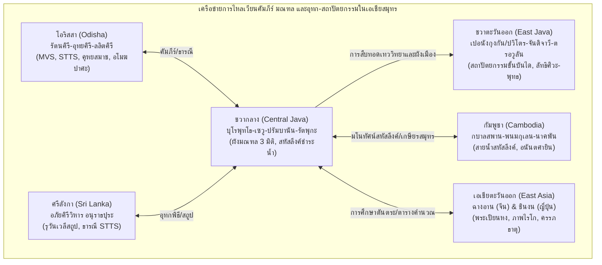

# บันทึกการอ่านและวิเคราะห์เอกสารจารึกวิทยาฉบับสมบูรณ์ (Epigraphic Source Dossier)
## The Creative South: Buddhist and Hindu Art in Mediaeval Maritime Asia, Volume Two

---

### ส่วนที่ 1: ข้อมูลบรรณานุกรมและการอ้างอิงมาตรฐาน (Bibliographic Metadata)
- **Source ID:** `S-2022-acri-03`
- **ชื่อไฟล์ PDF ในเครื่อง:** `S-2022-acri-03_Creative_South_Maritime_Asia_Vol_2.pdf`
- **ชื่อไฟล์ข้อความสกัด:** `S-2022-acri-03_Creative_South_Maritime_Asia_Vol_2.txt` (ความยาว 17,706 บรรทัด ขนาดประมาณ 886 KB สกัดจากเอกสารวิชาการฉบับเต็ม ตีพิมพ์โดยสถาบัน ISEAS – Yusof Ishak Institute ประเทศสิงคโปร์)
- **ประเภทเอกสาร:** หนังสือรวมบทความวิชาการระดับแม่บทผ่านการประเมินโดยผู้ทรงคุณวุฒิ (Peer-reviewed Edited Volume / Academic Monograph Anthology)
- **ภาษาของเอกสาร:** ภาษาอังกฤษ (EN) พร้อมการตรวจสอบ ปริวรรต และวิเคราะห์ตัวบทปฐมภูมิหลากภาษา: ภาษาสันสกฤตคลาสสิก (Classical Sanskrit) ตามระบบสากล IAST, ภาษาชวาโบราณกวี (Old Javanese Kawi), ภาษาซุนดาโบราณ (Old Sundanese), ภาษาบาลี (Pali), ภาษาทมิฬ (Tamil), ภาษาเขมรโบราณ (Old Khmer), ภาษาทิเบตคลาสสิก (Classical Tibetan), ภาษาจีนพุทธศาสนา (Buddhist Chinese), และภาษาดัตช์วิชาการ (Academic Dutch)
- **ขอบเขตภูมิศาสตร์และวัฒนธรรม:** 
  - เกาะชวา ประเทศอินโดนีเซีย: เขตชวากลาง (บุโรพุทโธ, ปลโอซัน, เมินดุต, เซวู, รัตพุกะ/ราตูโบโก, กาลาซัน, ปรัมบานัน/โลโรจงกรัง, เทือกเขาเดียง) และเขตชวาตะวันออก (ภูเขาเปอนังกุงกัน/ปวิโตร, โจโลตุนโด, เบอลาฮัน, เจอดง, ตรอวูลัน, จันดิจาวี, ปานาตารัน/ปาละฮ์, ซูโรโจโล, โงอันจุก)
  - รัฐโอริสสา (Odisha/Oḍrayāna/Uḍḍiyāna) ประเทศอินเดีย: ศูนย์กลางพุทธศาสนาตันตระฝ่ายมนตรยานในหุบเขาอัสเซีย (Ratnagiri, Udayagiri, Lalitagiri, Langudi, Khaḍipadā)
  - ภูมิภาคที่เชื่อมโยงข้ามสมุทร: ศรีลังกา (อนุราธปุระ, อภัยคิรีวิหาร, รุวันเวลีสถูป), กัมพูชา (กบาลสพาน, พนมกุเลน, มเหนทรบรรพต, ปราสาทนาคพัน), อินเดียใต้ (ทมิฬนาฑู, กาญจีปุรัม, จิทัมพรัม, ติรุวัณณามะไล) ตลอดจนเครือข่ายส่งผ่านคัมภีร์และมณฑลสู่จีน (ฉางอาน) และญี่ปุ่น (สำนักชินงน เกียวโตและโคยาซัง)
- **วัสดุและบริบทการค้นพบ:**
  - จารึกบนแผ่นโลหะสัมฤทธิ์ผสมตะกั่วและแผ่นทองคำ (Lead-bronze and Gold foils): จารึกธารณีตรัยโลกยวชิยะจากคูขุดหมายเลข 35/III ทิศตะวันตกของบุโรพุทโธ, จารึกแผ่นทองคำมนตราบนที่ราบสูงรัตพุกะ, จารึกแผ่นทองคำสถาปนาพระรุทร/ศิวะและวรุณบรรพตใต้ฐานโยนี ปรัมบานัน
  - จารึกหินปักเขตสีมา (Vatu Sīma) และเสาจารึกศิลา: เสาหินจารึกมนตรา ปะกิ หูง ชะฮ์ / ตะกิ หูง ชะฮ์ (จารึกจันดิอาบัง ค.ศ. 872, จารึกวิหาร 1 และ 2 ค.ศ. 874, จารึกจันดิบงโกล ค.ศ. 883), เสาศิลาจารึกกาลาซัน ค.ศ. 778, เสาศิลาจารึกศิวคฤหะ ค.ศ. 856, ศิลาจารึกและจารึกแผ่นทองแดงกัมบังศรี-เจอดง (ค.ศ. 910, 926, 928), ศิลาจารึกจึงกรัง ค.ศ. 929, จารึกถ้ำกัวบูยุง ค.ศ. 1195, จารึกศิลาวาตูตูลีส ค.ศ. 1390, จารึกแผ่นศิลาศักราชบนลานประทักษิณและแท่นบูชาเทือกเขาเปอนังกุงกันกว่า 40 หลัก (ช่วง ค.ศ. 1349–1512)
  - ประติมากรรมหิน สัมฤทธิ์ และสถาปัตยกรรมศาสนสถาน: รูปสลักอโมฆปาศะขนาดใหญ่, ประติมากรรมสัมฤทธิ์ตรัยโลกยวชิยะ, สถูปมณฑลบุโรพุทโธ-เซวู-ปลโอซัน, ปรางค์สหัสลึงค์และภาพสลักรามายณะ ปรัมบานัน, ภาพสลักธารน้ำสหัสลึงค์กบาลสพาน, ปราสาทและอาศรมฤๅษีขั้นบันไดบนภูเขาเปอนังกุงกัน
- **การอ้างอิงฉบับเต็มระบบ Chicago/Turabian Notes-Bibliography:**  
  Acri, Andrea, and Peter Sharrock, eds. *The Creative South: Buddhist and Hindu Art in Mediaeval Maritime Asia. Volume Two: Odisha and Java*. Singapore: ISEAS – Yusof Ishak Institute, 2022.

---

### ส่วนที่ 2: แผนผังการจัดสรรเข้าสู่บทและหัวข้อย่อย (Chapter & Section Mapping Matrix)

- **บทที่ 2: จารึกสำคัญไขประวัติศาสตร์ในคาบสมุทรและหมู่เกาะ: ยุคสิงหัดส่าหรีและมัชฌปาหิต (ศตวรรษที่ 13–16)**
  - **หัวข้อย่อย 2.4 (การสถาปนาศาสนสถานบนเทือกเขาศักดิ์สิทธิ์และการอุทิศถวายบูรพกษัตริย์ในสมัยมัชฌปาหิต):**  
    นำข้อมูลเชิงประจักษ์จากการสำรวจทางโบราณคดีและจารึกวิทยาบนเทือกเขาเปอนังกุงกัน (Mount Penanggungan / Mount Pavitra) โดย Hadi Sidomulyo (หน้า 209–245) ที่จัดหมวดหมู่ศาสนสถานขั้นบันได (terraced sanctuaries) และถ้ำบำเพ็ญพรต (cave hermitages) รวม 117 แหล่ง โดยพบหลักฐานศักราชศก (Śaka dates) บนแท่นบูชา บันได และแผ่นศิลา ซึ่งมีความสอดคล้องอย่างมีนัยสำคัญยิ่งกับปีสวรรคตและการขึ้นครองราชย์ของกษัตริย์และเชื้อพระวงศ์มัชฌปาหิตตามบันทึกพงศาวดาร *Pararaton* (หน้า 228, 230–238) เช่น ศก 1271 (ค.ศ. 1349–1350 รัชสมัยพระนางตรีภูวนวิชโยตตุงคเทวี แหล่ง A20), ศก 1373 (ค.ศ. 1451 แหล่ง A46), ศก 1378 (ค.ศ. 1456 แหล่ง A36), ศก 1386 (ค.ศ. 1464 แหล่ง A37), ศก 1388 (ค.ศ. 1466 แหล่ง A6) และ ศก 1400 (ค.ศ. 1478 แหล่ง A56)
  - **หัวข้อย่อย 2.8 (รัชสมัยพระเจ้าเกียรตินครและการหลอมรวมเทววิทยาการเมืองสิงหัดส่าหรี):**  
    การวิเคราะห์นโยบายการเมืองและเทววิทยาของพระเจ้าเกียรตินคร (Kṛtanagara ครองราชย์ ค.ศ. 1268–1292) ที่ใช้ภูเขาปวิโตร/เปอนังกุงกัน เป็นแกนกลางในการผนึกดินแดนชังคละ (Jaṅgala) และกะดิริ (Kaḍiri) เข้าด้วยกัน ผ่านการสถาปนาศาสนสถานจันทิชาวี (Candi Jawi/Jajava) เชิงเขาเปอนังกุงกันให้เป็นที่ประดิษฐานร่วมของศิวะและพุทธ (หน้า 225–226), การค้นพบร่องรอยโรงช่างหินโบราณ (stonemasons' workshop) ที่กูจี (Guci แหล่ง B17) ซึ่งมีพระพุทธรูปอักโษภยะขนาดมหึมาและแท่นโยนีขนาดเกือบ 2 เมตรที่สร้างค้างไว้ สอดรับกับเหตุการณ์ที่ราชธานีสิงหัดส่าหรีถูกบุกทำลายกะทันหันใน ค.ศ. 1292 (หน้า 221, 225)
  - **หัวข้อย่อย 2.9 (การจัดระเบียบสำนักสงฆ์กาบูยูตัน อาศรมฤๅษี และการคงอยู่ของศาสนาฮินดู-พุทธหลังมัชฌปาหิตล่มสลาย):**  
    หลักฐานการคงอยู่ของชุมชนนักบวชฤๅษี (ṛṣi / devaguru) บนภูเขาศักดิ์สิทธิ์ปวิโตรตามที่ปรากฏในพระบรมราชโองการสารวธรรม (Sarvadharma charter ค.ศ. 1269), ราชปติคุณฑละ (Rajapatiguṇḍala) และการเสด็จประพาสของพระเจ้าราชสนคร (Hayam Wuruk) ใน ค.ศ. 1359 ตามบันทึก *Deśavarṇana* (32.2–34.2, 58.1) จนกระทั่งถึงจารึกศักราชหลังราชธานีล่มสลาย เช่น ศก 1408 (ค.ศ. 1486), ศก 1421 (ค.ศ. 1499), ศก 1433 (ค.ศ. 1511–1512 ยุคท้าววิชัย Batara Vigiaja ตามบันทึกของ Tomé Pires) และหลักฐานพงศาวดาร *Babad ing Sangkala* ที่ยืนยันว่าสำนักนักบวชบนภูเขาเปอนังกุงกันยังคงปฏิบัติศาสนกิจอยู่จนกระทั่งยอมจำนนต่อสุลต่านแห่งเดอมัก (Demak) ในปี ค.ศ. 1543 (หน้า 226–228, 238)

- **บทที่ 7: ศาสนา ความเชื่อ และเครือข่ายพุทธตันตระ/ไศวนิกายข้ามสมุทร: มนตรา ปรัชญา และการสังเคราะห์เทพเจ้า**
  - **หัวข้อย่อย 7.2 (การเคลื่อนย้ายของคัมภีร์ มณฑล และคลังมนตรา-ธารณีระหว่างโอริสสา ศรีลังกา ชวา และเอเชียตะวันออก):**  
    การวิเคราะห์เปรียบเทียบเชิงลึกโดย Umakanta Mishra (หน้า 27–54) และ Michel Gauvain (หน้า 94–133) เกี่ยวกับการแพร่กระจายของคัมภีร์ *มหาไวโรจนสูตร* (MVS), *สรรวัตถาคตตัตตวะสังครหะ* (STTS), และ *คุหยสมาชตันตระ* (Guhyasamāja) โดยพบการจารึกมนตรา *namaḥ samantabuddhānām aḥ vīra hūṃ khaṃ* จาก MVS บนพระปฤษฎางค์ของพระมหาวัยโรจนะที่ลลิตคิรี (Lalitagiri) เปรียบเทียบกับการจัดวางมณฑลที่จันดิเมินดุต (Candi Mendut) (หน้า 31, 42–43) ตลอดจนการค้นพบแผ่นสัมฤทธิ์ผสมตะกั่วจารึกธารณีตรัยโลกยวชิยะ/จัณฑวัชรปาณีที่ขุดพบข้างบุโรพุทโธ ซึ่งมีข้อความตรงกับบทสวด *นวกัมปะ* (Navakampa) ในพิธีกรรมพุทธบาหลีปัจจุบัน (หน้า 102–104) และมนตราปราบอุปสรรค *Ṭaki hūṃ jaḥ* บนแผ่นปูนจำลองจากปรัมบานันและหินปักเขตสีมาในชวากลาง (หน้า 104–107)
  - **หัวข้อย่อย 7.3 (ลัทธิบูชาพระอโมฆปาศะและพิธีกรรมหลังความตายในเครือข่ายข้ามสมุทร):**  
    ข้อวิเคราะห์ของ Sonali Dhingra (หน้า 7–26) ว่าด้วยประติมานวิทยาของพระโพธิสัตว์อโมฆปาศะ (Amoghapāśa) ในฐานะ "ผู้ช่วยให้รอด ณ เวลาแห่งความตาย" (Saviour at the time of death) โดยการตีความบ่วงบาศ (pāśa) ใหม่ว่ามิใช่เพียงเครื่องมือเชิงเปรียบเทียบในการดึงสรรพสัตว์ แต่เป็นบ่วงยื้อดวงวิญญาณมิให้ตกสู่อบายภูมิ ซึ่งสัมพันธ์กับกลุ่มสถูปบรรจุอัฐิ (kula stūpas) ที่รัตนคิรี (Ratnagiri) และส่งทอดอิทธิพลสู่ลัทธิบูชาอโมฆปาศะในชวา (เช่น อโมฆปาศะแห่งจันดิจาโก ยุคสิงหัดส่าหรี) และภาพจิตรกรรมไรโก (Raigō) ในญี่ปุ่น (หน้า 8–15, 21–23)
  - **หัวข้อย่อย 7.4 (ลัทธิและประติมานวิทยาตรัยโลกยวชิยะ/วัชรหูงการในการพิทักษ์ขอบเขตศักดิ์สิทธิ์และพิธีกรรมของรัฐ):**  
    การสืบค้นพัฒนาการของลัทธิบูชาพระตรัยโลกยวชิยะ (Trailokyavijaya) ในชวาศตวรรษที่ 8–11 ผ่านหลักฐานประติมากรรมสัมฤทธิ์และจารึกโลหะ (Gauvain หน้า 94–133) ชี้ให้เห็นว่ารูปเคารพปางพิโรธนี้ทำหน้าที่เป็นโกรธวิฆนานตกะ (krodha-vighnāntaka) ในการทำลายอุปสรรค ขจัดโรคาพาธ และสถาปนาเส้นเขตสีมาคุ้มครองราชอาณาจักรและราชสำนักไศเลนทร โดยมีหลักฐานสำคัญจากจารึกแผ่นทองคำบนที่ราบสูงรัตพุกะที่สอดคล้องกับธารณีของอโมฆวัชระ (หน้า 108–111, 124–126)
  - **หัวข้อย่อย 7.7 (การผสานเทววิทยา "ศิวะ-พุทธ" และการแข่งขันเชิงสัญลักษณ์ระหว่างมหาศาสนสถาน):**  
    บทวิเคราะห์ของ Sundberg (หน้า 195–196) และ Mishra (หน้า 44–47) ที่ชี้ว่าปรางค์สหัสลึงค์ (1,000 liṅgas) ของปรัมบานันถูกสร้างขึ้นเพื่อ "ข่มและแข่งขันเชิงสัญลักษณ์" โดยตรงกับกลุ่มสถูป 1,000 องค์ของจันดิเซวู (Candi Sewu / Mañjuśrīgṛha ค.ศ. 792) และบุโรพุทโธของฝ่ายพุทธ ซึ่งแสดงให้เห็นพลวัตการต่อรองทางอำนาจและเทววิทยาระหว่างราชสำนักไศวะ (ปิ Identity / ภิษณะ) และพุทธตันตระในชวากลาง ก่อนจะพัฒนาไปสู่เทววิทยาการเมือง "ภฏาระ ศิวะ-พุทธ" ในยุคสิงหัดส่าหรีและมัชฌปาหิต (หน้า 225–226)

- **บทที่ 8: ภูมิทัศน์โบราณคดี จารึก และเครือข่ายเศรษฐกิจการค้าทางทะเล**
  - **หัวข้อย่อย 8.3 (บทบาทของพ่อค้าทางทะเล vaniyaga / banyaga และการอุปถัมภ์ศาสนสถาน):**  
    ข้อมูลจากจารึกศิวคฤหะ ค.ศ. 856 (Mimi Savitri หน้า 139, 142) ที่ระบุว่าพ่อค้าทางทะเล (vaniyaga / banyaga) เดินทางมาร่วมประกอบพิธีอาบน้ำชำระบาป ณ ท่าน้ำศักดิ์สิทธิ์ (tīrtha) ริมแม่น้ำโอปักที่ถูกผันน้ำเข้ามา เพื่อความเป็นสิริมงคลและความสำเร็จในการเดินเรือพาณิชย์ (siddha ta yātra) และมีบทบาทเป็นพยาน (vinәkas) ในพิธีสถาปนาสีมา ควบคู่กับการค้นพบเหรียญกษาปณ์จีนโบราณ (เหรียญอีแปะ/กูปัง kepeng) เกือบ 3,000 เหรียญจากรัชสมัยจักรพรรดิหย่งเล่อ (Yongle ค.ศ. 1402–1424) ราชวงศ์หมิง บนไหล่เขาเปอนังกุงกัน (Hadi Sidomulyo หน้า 216) ซึ่งยืนยันว่าชุมชนศาสนาบนภูเขาเชื่อมโยงโดยตรงกับระบบเศรษฐกิจการเงินข้ามสมุทร
  - **หัวข้อย่อย 8.5 (ระบบชลศาสตร์ศักดิ์สิทธิ์ สถาปัตยกรรมทางน้ำ jalavāstu และเครือข่ายอุทกศาสตร์ข้ามสมุทร):**  
    ข้อค้นพบใหม่ของ Jeffrey Sundberg (หน้า 167–208) ที่ปฏิวัติความเข้าใจเรื่องสถาปัตยกรรมจันดิปรัมบานัน โดยพิสูจน์ว่าลานชั้นในของปรัมบานันถูกออกแบบอย่างจงใจทางวิศวกรรมให้เป็น "อ่างเก็บน้ำศักดิ์สิทธิ์" (tīrtha) ขนาดมหึมาเพื่อจำลองเกษียรสมุทร (Ocean of Milk) โดยอาศัยยอดปรางค์สหัสลึงค์ (Sahasraliṅga) จำนวนเกือบ 1,000 องค์บนหลังคาปราสาททั้ง 8 หลัง ทำหน้าที่เป็นกลไกชะล้างน้ำฝนให้กลายเป็นน้ำคงคาศักดิ์สิทธิ์ (Gaṅgāvatāraṇa) ไหลผ่านท่อราหู/มกร (makara spouts) ลงสู่ลานวัด ซึ่งเป็นนวัตกรรมทางอุทกศาสตร์เชิงสถาปัตยกรรมที่ส่งอิทธิพลข้ามสมุทรหรือมีรากฐานร่วมกับแหล่งน้ำศักดิ์สิทธิ์กบาลสพาน (Kbal Spean) บนเทือกเขาพนมกุเลนในกัมพูชา (หน้า 186–196)

---

### ส่วนที่ 3: สรุปสาระสำคัญเชิงวิเคราะห์และจุดยืนทางวิชาการ (Core Argument & Historiography)

#### 1. วิทยานิพนธ์และข้อถกเถียงหลักของผู้เขียน (Core Argument / Thesis)
หนังสือ *The Creative South: Volume Two* นำเสนอการประเมินสถานะทางประวัติศาสตร์และศิลปะของอนุภูมิภาคเอเชียสมุทร (โดยเน้นความสัมพันธ์ระดับลึกระหว่างรัฐโอริสสา ชวากลาง และชวาตะวันออก) ภายใต้กระบวนทัศน์ใหม่ที่มองว่า "เอเชียสมุทรคือศูนย์กลางแห่งการสรรค์สร้างนวัตกรรมทางเทววิทยา ประติมานวิทยา และสถาปัตยกรรม มิใช่เพียงผู้รับอิทธิพลอย่างเฉื่อยชาจากอินเดียตอนเหนือ":

1. **การสถาปนารูปแบบมณฑลสามมิติในสถาปัตยกรรมหิน (3D Lithic Architectural Maṇḍalas):**  
   Umakanta Mishra และ Hudaya Kandahjaya ชี้ให้เห็นว่า ในขณะที่พุทธศาสนสถานในอนุทวีปอินเดีย (เช่น รัตนคิรี, อุทยคิรี, นาลันทา, หรือเอลโลรา) มีข้อจำกัดในการจำลองผังมณฑลตามคัมภีร์ออกมาเป็นรูปทรงสถาปัตยกรรมขนาดใหญ่ แต่สถาปนิกและปราชญ์ในชวากลางกลับสามารถถ่ายทอดผังคัมภีร์ *มหาไวโรจนสูตร* (ครรภธาตุมณฑล) และ *สรรวัตถาคตตัตตวะสังครหะ* (วัชรธาตุมณฑล) ออกมาเป็นโครงสร้างมหาปราสาทหินสามมิติที่สมบูรณ์แบบที่สุดในโลก ณ บุโรพุทโธ (Borobudur), จันดิเซวู (Candi Sewu), จันดิเมินดุต (Candi Mendut), และจันดิปลโอซัน (Candi Plaosan) โดยใช้ระบบคำนวณทางคณิตศาสตร์ตารางกริด 3×3, 9×9 และ 27×27 ตามขนบของพระอโมฆวัชระและพระเปียนหง (Bianhong) ภิกษุชาวชวาที่ไปศึกษา ณ ฉางอาน (หน้า 41–47, 58–64)

2. **นวัตกรรมอุทก-สถาปัตยกรรมและกลไกสหัสลึงค์ชำระน้ำศักดิ์สิทธิ์ที่ปรัมบานัน:**  
   Jeffrey Sundberg ได้รื้อถอนสมมติฐานเดิมเรื่อง "ระบบระบายน้ำล้มเหลว" ที่ปรัมบานัน โดยสืบสานและพิสูจน์ข้อเสนอของ Roy Jordaan ว่า ลานชั้นในของปรัมบานันถูกสร้างขึ้นเพื่อเป็น "อ่างกักเก็บน้ำศักดิ์สิทธิ์" (tīrtha / Ocean of Milk) อย่างจงใจ ยอดบัวตูมสลักร่องกลีบจำนวน 995 องค์ที่ประดับตามชั้นหลังคาของปราสาทประธานทั้งแปด แท้จริงแล้วคือ "สหัสลึงค์" (Sahasraliṅga) ที่จำลองการเสด็จลงมาของแม่น้ำคงคา (Gaṅgāvatāraṇa) น้ำฝนจากมรสุมที่ตกลงมาจะถูกชำระให้บริสุทธิ์ผ่านการสัมผัสสหัสลึงค์ (consecration by contact) แล้วพวยพุ่งผ่านท่อระบายน้ำรูปเศียรมกรลงสู่ลานวัด ทำให้ปราสาทประธานดูเสมือนเขามันทระที่ผุดขึ้นกลางเกษียรสมุทร ซึ่งเป็นแนวคิดเดียวกับสายน้ำสหัสลึงค์ที่กบาลสพานในกัมพูชาและสระน้ำศักดิ์สิทธิ์ในอินเดียใต้ แต่ถูกเนรมิตขึ้นเป็นสถาปัตยกรรมหินตั้งตระหง่านอย่างที่ไม่เคยมีมาก่อนในโลกฮินดู (หน้า 173–196)

3. **ภูมิทัศน์ศักดิ์สิทธิ์เปอนังกุงกัน: ความต่อเนื่องและการปรับเข้าสู่ศูนย์กลางของลัทธิบรรพชน:**  
   Hadi Sidomulyo ปฏิเสธทฤษฎีดั้งเดิมของนักโบราณคดีอาณานิคมที่มองว่า โบราณสถานขั้นบันไดบนภูเขาเปอนังกุงกันเป็นเพียง "การฟื้นคืนชีพของลัทธิวิญญาณนิยมยุคก่อนฮินดู" (re-emergence of pre-Hindu beliefs) ในช่วงปลายมัชฌปาหิต แต่ชี้ชัดจากหลักฐานจารึกศักราชและผังโบราณคดีว่า ภูเขาแห่งนี้คือ "มหาเมรุจำลอง" นามว่า "ปวิโตร" (Mount Pavitra) ที่ได้รับการสถาปนาความศักดิ์สิทธิ์ต่อเนื่องยาวนานนับแต่พุทธศตวรรษที่ 15 (ยุคพระเจ้าปูสิณโฑก จารึกจึงกรัง ค.ศ. 929) และพระเจ้าเกียรตินครได้ริเริ่มนโยบายบูรณาการสำนักนักบวชฤๅษีบนเทือกเขาเข้ากับอุดมการณ์ราชสำนักสิงหัดส่าหรี จนนำไปสู่การสร้างสรรค์ทางสถาปัตยกรรมและเส้นทางขบวนแห่หลวงเวียนประทักษิณรอบภูเขา (spiral carriageway) ยาวกว่า 6 กิโลเมตรในรัชสมัยพระนางตรีภูวนวิชโยตตุงคเทวีและพระเจ้าราชสนคร ตลอดจนเป็นสุสานเทวาลัยอุทิศแด่บูรพกษัตริย์มัชฌปาหิตสืบเนื่องจนถึงศตวรรษที่ 16 (หน้า 218, 221, 226–228)

4. **บริบททางสังคมและเครือข่ายแรงงานในการสร้างศาสนสถาน:**  
   Mimi Savitri เสนอมิติประวัติศาสตร์สังคมผ่านจารึกกาลาซัน (ค.ศ. 778) และจารึกศิวคฤหะ (ค.ศ. 856) ว่า การสถาปนามหาปราสาทมิได้ขับเคลื่อนด้วยเทวราชาเพียงฝ่ายเดียว หากแต่เกิดจากพันธมิตรเชิงโครงสร้างระหว่างสถาบันกษัตริย์ คณะคุรุ/ปุโรหิต และชุมชนท้องถิ่น (anak banua, gusti, rāma maratā) ผ่านการตราพระราชกฤษฎีกาสีมา (sīma) ยกเว้นภาษีที่นาและสวน เพื่อนำผลประโยชน์ 1 ใน 3 มาค้ำจุนค่าใช้จ่ายในพิธีกรรม อาหาร และการบำรุงรักษาศาสนสถานอย่างยั่งยืน โดยมีพ่อค้าทางทะเล (vaniyaga) และกลุ่มนักบวชอิสระ (kalaṅ) เข้ามามีส่วนร่วมในการประกอบพิธี (หน้า 139–143)

#### 2. บริบทประวัติศาสตร์นิพนธ์และการประเมินความน่าเชื่อถือ (Historiography & Source Criticism)
- **การก้าวข้ามแนวคิด "อาณานิคมภารตภิวัตน์" (Beyond Greater India Paradigm):** งานเขียนชุดนี้รื้อถอนสมมติฐานดั้งเดิมของ Coedès, Krom, Bosch และ Stutterheim ที่เคยจัดวางเอเชียตะวันออกเฉียงใต้เป็นเพียง "ดินแดนรอบนอก" (periphery) ที่รับการถ่ายทอดวัฒนธรรมจากศูนย์กลางอินเดีย โดยชี้ให้เห็นการไหลเวียนสองทิศทาง (bidirectional circulation) ระหว่างโอริสสา ศรีลังกา ชวา และกัมพูชา
- **การแก้ไขข้อผิดพลาดทางจารึกวิทยาและโบราณคดีอาณานิคม:**  
  - Sundberg ชี้ให้เห็นข้อผิดพลาดของการยอมรับจารึกศิวคฤหะ ค.ศ. 856 เป็น "ศิลาฤกษ์ของปรัมบานัน" อย่างผิวเผินโดยไร้การตรวจสอบบริบททางโบราณคดีที่แท้จริง และวิพากษ์การอ่านตัวบทเดิมของ de Casparis ที่มีข้อบกพร่องหลายจุด (หน้า 176)
  - Sidomulyo แก้ไขความสับสนเรื่องตัวตนและที่ตั้งของโบราณสถานบนภูเขาเปอนังกุงกันที่บันทึกไว้คลาดเคลื่อนในสมัยอาณานิคมดัตช์ (เช่น รายงานของ Stutterheim 1936 และ van Romondt 1951) โดยอาศัยการสำรวจพิกัดดาวเทียม (GPS), การขุดค้นทางโบราณคดีปี 2018 ที่จันดิเซโลเกอลีร์ (Candi Selokelir), และการตรวจสอบภาพถ่ายเก่าของ Claire Holt และคลังเอกสารมหาวิทยาลัยไลเดน (หน้า 211–214, 229)
  - Jordaan แก้ไขมายาคติของนักประวัติศาสตร์ศิลปะรุ่นก่อนที่มองข้ามภาพสลักนางสีดาใกล้ศพทศกัณฐ์ที่ปรัมบานัน โดยพิสูจน์ว่าผังภาพสลักมิได้ดำเนินตามรามายณะฉบับวาลมีกิ (Vālmīki) หากแต่อิงตามขนบรามายณะนอกอินเดีย (Post-Vālmīki / Jain tradition) ที่มองว่านางสีดาคือธิดาแท้ๆ ของทศกัณฐ์กับนางมณโฑ (หน้า 145–147)

---

### ส่วนที่ 4: สารบัญข้อค้นพบเชิงลึกแยกตามมิติจารึกวิทยา (Thematic Epigraphic Findings with Exact Pages)

1. **ประวัติศาสตร์นิพนธ์และการตีความทางประวัติศาสตร์:**
   - การรื้อถอนทฤษฎีการฟื้นตัวของความเชื่อนอกรีตก่อนฮินดู (pre-Hindu revival) บนภูเขาเปอนังกุงกัน โดยพิสูจน์ว่าเป็นกระบวนการที่ราชสำนักมัชฌปาหิตโอบรับและอุปถัมภ์สถาบันนักบวชฤๅษี (maṇḍala / kabuyutan) ในชนบทเข้ามาเป็นส่วนหนึ่งของศิลปวัฒนธรรมหลวง (Hadi Sidomulyo หน้า 227–228)
   - การทบทวนปีศักราชของสระน้ำศักดิ์สิทธิ์โจโลตุนโด (Jolotundo ศก 899 / ค.ศ. 977–978) ที่พิสูจน์ว่าสร้างขึ้นก่อนการประสูติของพระเจ้าแอร์ลังกา (Airlangga) กว่าสองทศวรรษ จึงมิใช่อนุสรณ์สถานส่วนพระองค์ตามที่ Rouffaer, Moens และกระทรวงวัฒนธรรมอินโดนีเซียเข้าใจผิดมาโดยตลอด แต่เป็นผลงานของราชวงศ์อีศานะ (Īśānavaṃśa) ผู้สืบทอดสายตระกูลของพระเจ้าปูสิณโฑก (หน้า 224, 236)
   - การจำแนกภาพสลักรามายณะที่ปรัมบานันว่ามิได้สร้างตามฉบับวาลมีกิ หากแต่ได้รับอิทธิพลจากขนบชวาโบราณและไชนบริบทที่มองว่านางสีดาคือธิดาของทศกัณฐ์ ซึ่งไขปริศนาฉากนางสีดาร่วมร่ำไห้หน้าจิตกาธานของทศกัณฐ์ในแผ่นภาพสลักที่ 12 ของวิหารพระพรหม (Roy Jordaan หน้า 145–147, 154–156)

2. **ตัวบทจารึก การอ่าน ศักราช และอักขรวิทยา:**
   - การพบจารึกมนตราหัวใจ *มหาไวโรจนสูตร* บทที่ 6: `namaḥ samantabuddhānām aḥ vīra hūṃ khaṃ` ด้วยอักษรสิทธมาตรกา (Siddhamātṛkā) ศตวรรษที่ 8 บนแผ่นหลังพระพุทธรูปอภิสัมโพธิวัยโรจนะที่ลลิตคิรี โอริสสา (Umakanta Mishra หน้า 31)
   - การอ่านและถอดรหัสจารึกแผ่นสัมฤทธิ์ผสมตะกั่วจากคูขุดข้างบุโรพุทโธ ด้วยอักษรกวี (Kawi script) ศตวรรษที่ 9 บันทึกธารณีมหาราวทร (Mahāraudra hṛdaya) สดุดีพระจัณฑวัชรปาณี/ตรัยโลกยวชิยะ พร้อมมนตราบังคับเทพ `Ṭaki hūṁ jaḥ jaḥ hūṁ kiṭa hūṁ...` ซึ่งตรงกับวรรคสวดในคัมภีร์ *นวกัมปะ* (Navakampa) ของพุทธบาหลี (Michel Gauvain หน้า 102–104)
   - การค้นพบและอ่านค่าศักราชศกใหม่บนภูเขาเปอนังกุงกัน: ศิลาจารึกวาตูตูลีส (Watu Tulis บนเขากัวบูยุง A49) ระบุปีศก 1312 (ค.ศ. 1390–1391) และแผ่นหินจารึกศักราชศก 1271 (ค.ศ. 1349–1350) ที่แหล่ง A20 ซึ่งเป็นหลักฐานการก่อสร้างยุคมัชฌปาหิตที่เก่าแก่ที่สุดบนยอดเขาเปอนังกุงกัน (Hadi Sidomulyo หน้า 212, 220, 231)
   - บัญชีศักราชศกบนแท่นบูชาและบันไดหินบนภูเขาเปอนังกุงกันจำนวนกว่า 40 แหล่ง สัมพันธ์กับรัชกาลต่างๆ ของมัชฌปาหิต: พระนางตรีภูวนฯ (ศก 1253, 1265, 1271), พระเจ้าราชสนคร (ศก 1282, 1298, 1308), พระเจกวิกรมวรรธนะ (ศก 1312, 1326, 1336, 1346, 1350), พระนางสุหิตา (ศก 1356, 1358, 1362, 1364), พระเจ้ากฤตวิชัย (ศก 1371), พระเจ้าคิรีศวรรธนะ (ศก 1378, 1380, 1385, 1386), พระเจ้าสิงหวิกรมวรรธนะ (ศก 1388, 1391, 1400) และพระเจ้าคิรีนทรวรรธนะ รณวิชัย (ศก 1408, 1409) (หน้า 236–238)

3. **มิติศาสนา ลัทธิความเชื่อ และพิธีกรรม:**
   - การสถาปนาลัทธิบูชาพระอโมฆปาศะที่สัมพันธ์อย่างแนบแน่นกับ "พิธีกรรมความตายและการช่วยดวงวิญญาณ ณ วาระสุดท้าย" (post-mortem rites and deathbed salvation) โดยอาศัยบ่วงบาศยื้อสรรพสัตว์จากนรกภูมิ สอดคล้องกับจารึกมังคลราชที่รัตนคิรีที่กล่าวถึงการถวายข้าวเพื่อปิดประตูนรกให้แก่ผู้ล่วงลับ (Sonali Dhingra หน้า 14–15, 22–23)
   - การจำแนกบทบาทของพระตรัยโลกยวชิยะในการประกอบพิธี "จับกุมและสะกดอุปสรรคอย่างรุนแรง" (violent abduction of obstacles) ผ่านการบริกรรมมนตราตักกิราชา (Ṭakkirāja mantra) เพื่อขับไล่วินายกะ อสูร ภูตพราย และคุ้มครองเขตมณฑล (Michel Gauvain หน้า 105–107, 124–125)
   - การจัดระเบียบโครงสร้างศาสนา "ศิวะ-พุทธ" เชิงสัญลักษณ์: การสร้างความสมดุลระหว่างลัทธิไศวะและพุทธมหายานในรัชสมัยพระเจ้าเกียรตินครแห่งสิงหัดส่าหรี ที่ทรงอภิเษกเป็นภฏาระศิวะ-พุทธ และการสร้างจันทิชาวี (Candi Jawi) ให้มีสถูปครอบอยู่เหนือยอดปราสาทศิวะ (Hadi Sidomulyo หน้า 225–226)

4. **มิติสถาปัตยกรรม ศาสนสถาน และชลศาสตร์:**
   - ทฤษฎีอุทก-สถาปัตยกรรม (Hydro-architectonic conceptualization) ที่ระบุว่าลานชั้นในของปรัมบานันเป็นอ่างเก็บน้ำศักดิ์สิทธิ์ (tīrtha / tank) ที่มีความลึกของน้ำท่วมขังถูกจำกัดด้วยความสูงของธรณีประตูกำแพงแก้วที่ 55 เซนติเมตร โดยชั้นดินใต้ลานวัดถูกบดอัดทางวิศวกรรมให้ไม่ซึมน้ำ เพื่อกักเก็บน้ำฝนที่ชำระผ่านสหัสลึงค์ (Jeffrey Sundberg หน้า 176–179)
   - สถาปัตยกรรมยอดปราสาทสหัสลึงค์ (Sahasraliṅga) บนหลังคาปราสาททั้งแปดของปรัมบานัน ซึ่งนับได้รวม 995 ยอด โดยแต่ละยอดสลักร่องทางน้ำไหล (flutings) 8 ถึง 16 ร่อง แสดงการจำลองการเสด็จลงมาของแม่น้ำคงคา (Gaṅgāvatāraṇa) สู่ลานเกษียรสมุทร (หน้า 192–195)
   - การค้นพบโครงสร้างทางวิศวกรรมถนนขบวนแห่หลวง (processional carriageway) ความกว้าง 2–3 เมตร ก่อกำแพงหินค้ำยันอย่างแน่นหนา ลัดเลาะวนรอบภูเขาเปอนังกุงกันเป็นรูปก้นหอยขึ้นสู่ยอดเขาสูง 600 เมตร รวมระยะทางกว่า 6 กิโลเมตร ด้วยความลาดชันสม่ำเสมอ 1:12 เหมาะแก่การชักลากเกวียนเทียมม้าหรือวัว (Hadi Sidomulyo หน้า 215–218)
   - การจำแนกโครงสร้างจันดิเปิมบากาอรัน (Candi Pembakaran) บนที่ราบสูงรัตพุกะ ว่ามิใช่เชิงตะกอนเผาศพหรือหลุมบูชายัญไฟ (homakuṇḍa) เนื่องจากหลุมมีขนาดมหึมาถึง 26×26 เมตร แต่คือ "เรือนโพธิ์" (Bodhighara) ตามแบบแผนพุทธศาสนาลังกาวงศ์แห่งอภัยคิรีวิหาร เมืองอนุราธปุระ (Saran Suebsantiwongse หน้า 74, 85–91)

5. **มิติอาหารการกิน วิถีชีวิต การค้า และตลาด:**
   - รายละเอียดจากจารึกศิวคฤหะ ค.ศ. 856 เรื่องการจำแนกที่ดินเกษตรกรรมเพื่อกัลปนาแก่วัด: นาข้าวเปียก (huma) จำนวน 2 ตัมปะฮ์ (tampah) ที่ตรีมหารัง, นาข้าวสาลี/ข้าวเจ้า (sawah), และไร่เผือก (patalәsan) ที่มัณฑัรดูตีในกะตัมวา (Mimi Savitri หน้า 139)
   - บันทึกพงศาวดาร *Deśavarṇana* (58.1) เรื่องการเสด็จประพาสชนบทของพระเจ้าราชสนครในปี ค.ศ. 1359 ทรงแวะเสวยพระกระยาหารและชมทัศนียภาพที่หมู่บ้านจึงกรัง (Bulusari) ก่อนเสด็จขึ้นสู่อาศรมฤๅษีบนไหล่เขาปวิโตร (Hadi Sidomulyo หน้า 222)
   - การขุดพบเงินอีแปะจีนโบราณ (Chinese copper coins / kepeng) ร่วม 3,000 เหรียญในแหล่งโบราณคดี A76 ไหล่เขาเปอนังกุงกันตอนใต้ ซึ่งมีตัวอย่างชัดเจนว่าหล่อในรัชสมัยจักรพรรดิหย่งเล่อ (ค.ศ. 1402–1424) บ่งชี้การใช้เงินตราต่างประเทศในระบบเศรษฐกิจของชุมชนนักบวชบนภูเขา (หน้า 216)

6. **มิติการปกครอง กฎหมาย ที่ดิน และระบบสีมา:**
   - ลำดับขั้นขุนนางและพยานในพิธีสถาปนาสีมาตามจารึกกาลาซันและศิวคฤหะ: ขุนนางสามเสนาบดีใหญ่ (saṅ ādimantri tama tritaya / mahāmantri katrini), ข้าราชการฝ่ายจัดเก็บภาษีและตรวจการ (paṅkur, tavān, tīrip), เจ้าหน้าที่ปกครองระดับอำเภอ (nayaka, patih), เจ้าหน้าที่ระดับหมู่บ้าน (gusti, matahun), และสภาผู้อาวุโสเกษียณอายุ (rāma maratā) (Mimi Savitri หน้า 137, 140–142)
   - พระราชกฤษฎีกาสีมาในจารึกจึงกรัง ค.ศ. 929 ของพระเจ้าปูสิณโฑก มอบสิทธิ์ปลอดภาษีแก่ราษฎรบ้านจึงกรัง เพื่อนำรายได้ไปอุปถัมภ์เขตพุทธาวาส-เทวาสถานบนภูเขาปวิโตร ประกอบด้วย อาศรมธรรม (saṅ hyaṅ dharmāśrama), หออนุสรณ์บรรพชน (saṅ hyaṅ prāsāda siluṅluṅ) ของบิดาพระมเหสีคือ รักษรยานบาวัง (Rakryān Bawaṅ Pu Uttara), และบ่อน้ำศักดิ์สิทธิ์ (saṅ hyaṅ tīrtha pañcuran) (Hadi Sidomulyo หน้า 221–222)
   - กฎหมายควบคุมคณะสงฆ์และอาศรมฤๅษี: พระราชโองการราชปติคุณฑละ (Rajapatiguṇḍala) ของพระเจ้าเกียรตินคร ที่วางระเบียบการปฏิบัติตนของฤๅษี โยกีศวร และเทวคุรุ ในมณฑลสถานบนเขตภูเขา (หน้า 227)

7. **มิติปฏิสัมพันธ์ข้ามสมุทรและเครือข่ายนานาชาติ:**
   - การเดินทางข้ามสมุทรของพระภิกษุและคุรุพุทธตันตระ: การเดินทางของพระวัชรโพธิ พระอโมฆวัชระ ผ่านศรีลังกาและชวาก่อนเข้าสู่จีน และการเดินทางไปศึกษาพุทธศาสตร์ของพระเปียนหง (ภิกษุชาวชวา) ณ กรุงฉางอาน ร่วมสำนักเดียวกับพระคูไก (Kūkai) แห่งญี่ปุ่น (Umakanta Mishra หน้า 30–31, 41; Hudaya Kandahjaya หน้า 62)
   - หลักฐานจารึกกบาลสพาน (K. 1012) บนเทือกเขาพนมกุเลน กัมพูชา ที่จารึกภาษาสันสกฤตระบุว่าธารน้ำแห่งนี้คือ "รุทรธารา" (rudradhārā) และ "สหัสลึงค์" (sahasraliṅga) อันเป็นสายน้ำคงคาศักดิ์สิทธิ์ที่ล้างบาปของโลก สัมพันธ์เชิงโครงสร้างกับผังสหัสลึงค์ที่ปรัมบานันในชวา (Jeffrey Sundberg หน้า 188–191)
   - เอกสารของพ่อค้าชาวโปรตุเกส ตูเม ปิริส (Tomé Pires) ใน *Suma Oriental* (ค.ศ. 1512–1515) ที่บันทึกถึงการมีอยู่ของกษัตริย์ฮินดูแห่งชวา "Batara Vigiaja" สอดคล้องกับจารึกศักราชศก 1433 (ค.ศ. 1511) บนจันดิเมรัก (A41) บนภูเขาเปอนังกุงกัน (Hadi Sidomulyo หน้า 238)

8. **มิติจารึกแผ่นโลหะ รูปเคารพขนาดเล็ก และจารึกแม่น้ำ:**
   - ศิลาจารึกธารน้ำจีอารูเติน (Ci Aruteun) ของพระเจ้าปูรณวรมันแห่งตารุมานคร ในชวาตะวันตก ซึ่งจารึกบนก้อนหินกลางลำน้ำเพื่อให้กระแสน้ำไหลผ่าน เป็นหลักฐานรุ่นแรกสุดของแนวคิด "การเสกน้ำศักดิ์สิทธิ์ผ่านการสัมผัสวัตถุจารึก" (consecration through contact) (Jeffrey Sundberg หน้า 183)
   - แผ่นหินยันต์ทรงกลม 9 ช่อง (Śaiva yantra tablets BG 748, BG 1521) ที่งมได้จากแม่น้ำโอปัก ห่างจากปราสาทปรัมบานันไปทางใต้ 1 กิโลเมตร สลักรูปตรีศูล ดอกบัว และอักษรพืชมนตราล้อมรอบ เพื่อทำพิธีเสกแม่น้ำโอปักให้กลายเป็นแม่น้ำศักดิ์สิทธิ์ (หน้า 183–184)
   - จารึกบนแผ่นทองคำสถาปนาใต้ฐานรูปเคารพ: แผ่นทองคำจารึกคำว่า `varuṇaparvvata` ใต้แท่นโยนีวิหารพระศิวะ ปรัมบานัน แสดงมโนทัศน์ "ภูเขาพระวรุณผุดขึ้นจากมหาสมุทร" (หน้า 200)

9. **พรมแดนปัญหา ปริศนาวิชาการ และจริยธรรมโบราณคดี:**
   - วิกฤตการอนุรักษ์โบราณสถานบนภูเขาเปอนังกุงกัน: ไฟป่าครั้งใหญ่ในปี ค.ศ. 2015 และ 2018 แม้จะช่วยเปิดเผยร่องรอยถนนและฐานศาสนสถานโบราณ แต่ก็นำมาซึ่งการทำลายหน้าหินและการลักลอบขุดโบราณวัตถุ (Hadi Sidomulyo หน้า 215, 228)
   - ปัญหาการบูรณะผิดพลาดในอดีต: กรณีการขุดค้นทางโบราณคดีที่จันดิเซโลเกอลีร์ (Candi Selokelir A1) ในปี ค.ศ. 2018 พบว่าโครงสร้างเกือบทั้งหมดที่เห็นในศตวรรษที่ 20 เป็นผลงานการเรียงหินขึ้นใหม่ตามอำเภอใจของชาวบ้านท้องถิ่น มิใช่ผังดั้งเดิมของมัชฌปาหิต ซึ่งเตือนใจนักวิจัยมิให้ด่วนสรุปจากสภาพผิวดินภายนอก (หน้า 229)
   - ความตึงเครียดระหว่างการบริหารจัดการการท่องเที่ยวสมัยใหม่กับโบราณคดี: การสร้างระบบระบายน้ำคอนกรีตสมัยใหม่เพื่อไม่ให้น้ำท่วมลานวัดปรัมบานันสำหรับรองรับนักท่องเที่ยว ได้ทำลายหน้าที่ทางสถาปัตยกรรมและเทววิทยาดั้งเดิมของลานเกษียรสมุทรไปโดยสิ้นเชิง (Jeffrey Sundberg หน้า 179)

---

### ส่วนที่ 5: คลังข้อความอ้างอิงตรงและเชิงอรรถสำเร็จรูป (Verbatim Quotes & Footnote Bank)

1. **ธารณีพระตรัยโลกยวชิยะจากแผ่นสัมฤทธิ์ข้างบุโรพุทโธ (Griffiths 2014b: 27–28 ใน Gauvain หน้า 102–103):**  
   > "Homage to the Triple Jewel (Buddha, Dharma, Saṁgha)! Homage to the fierce Vajrapāṇi, the great general of the Yakṣas! Homage to the Lord, […] who has a body adorned with four arms, who is of terrible appearance due to (his bearing) sword, club, axe, snare, cudgel (vajra), and flaming fire, whose right foot hangs down over the heap of twisted locks of Paśupati (Śiva), whose left foot is placed on the pair of breasts of Pārvatī! Homage to the Lord, the great Cudgel-bearer! I shall recite the Heart named Mahāraudra (‘Greatly Ferocious’), extremely violent, that causes the destruction of all of (Śiva’s) Bhūtas and Gaṇas..." (p. 102)  
   *คำแปลสรุป:* ขอนอบน้อมแด่พระรัตนตรัย! ขอนอบน้อมแด่พระวัชรปาณีผู้ดุร้าย แม่ทัพใหญ่แห่งเหล่ายักษ์! ขอนอบน้อมแด่พระผู้เป็นเจ้าผู้มีสี่กร ทรงศาสตราวุธดาบ ตะบอง ขวาน บ่วงบาศ วชิระ และเปลวเพลิงอันโชติช่วง พระบาทขวาเหยียบลงบนมวยผมของพระปศุบดี (ศิวะ) พระบาทซ้ายเหยียบลงบนถันทั้งสองของพระนางปารวตี! ข้าพเจ้าจักขอสาธยายมนตราหัวใจนามว่ามหาราวทร อันรุนแรงยิ่ง ซึ่งทำลายล้างเหล่าภูตและคณะบริวารของพระศิวะจนสิ้นสูญ...  
   *เชิงอรรถสำเร็จรูป:* Michel Gauvain, "The Conqueror of the Three Worlds: The Cult of Trailokyavijaya in Java Studied Through the Lens of Epigraphical and Sculptural Remains," in *The Creative South: Buddhist and Hindu Art in Mediaeval Maritime Asia. Volume Two: Odisha and Java*, ed. Andrea Acri and Peter Sharrock (Singapore: ISEAS – Yusof Ishak Institute, 2022), 102–103.

2. **การกักเก็บน้ำและการจำลองเกษียรสมุทรที่ลานปรัมบานัน (Sundberg หน้า 179):**  
   > "Given that Prambanan’s central courtyard flooded naturally in the heyday of the temple and continued to do so until the elaborate modern efforts to make the temple amenable to tourists, it is virtually undeniable that the courtyard functioned as a tank that retained water. Flooding is what happens when it rains, with no mechanism other than natural rainfall required." (p. 179)  
   *คำแปลสรุป:* เมื่อพิจารณาว่าลานชั้นในของปรัมบานันเกิดน้ำท่วมขังขึ้นเองตามธรรมชาติในยุครุ่งเรืองของศาสนสถาน และยังคงเป็นเช่นนั้นเรื่อยมาจนกระทั่งมีความพยายามทางวิศวกรรมสมัยใหม่เพื่ออำนวยความสะดวกแก่นักท่องเที่ยว จึงไม่อาจปฏิเสธได้เลยว่าลานแห่งนี้ทำหน้าที่เป็นสระหรืออ่างกักเก็บน้ำ การท่วมขังเกิดขึ้นเมื่อฝนตก โดยมิต้องอาศัยกลไกอื่นใดนอกเหนือจากน้ำฝนตามธรรมชาติ  
   *เชิงอรรถสำเร็จรูป:* Jeffrey Sundberg, "Hydro-architectonic Conceptualizations in Central Javanese, Khmer, and South Indian Religious Architecture: The Prambanan Temple as a Sahasraliṅga Mechanism for the Consecration of Water," in *The Creative South*, Vol. 2, ed. Acri and Sharrock (Singapore: ISEAS, 2022), 179.

3. **ยอดปรางค์สหัสลึงค์และแม่น้ำคงคาจำลองที่ปรัมบานัน (Sundberg หน้า 192):**  
   > "The flutings on the Prambanan finials clearly depict srota-streams and represent the Descent of the Ganges—the reader will notice the upturn or upsplash of the fluting at the lower terminus, very certainly indicative that the Descent of the Ganges is the motif embodied in the ribbing. The lithic Ganges—there must be upward of 10,000 of these individual streams among the thousand bulbous finials—functions to not only illustrate the significance of the monsoon rainwater passing over them, but also to render that flow permanent..." (p. 192)  
   *คำแปลสรุป:* ร่องกลีบบนยอดฟินเนียลของปรัมบานันแสดงภาพสายน้ำสโรตัส (srota) และจำลองการเสด็จลงมาของแม่น้ำคงคาอย่างชัดเจน สังเกตได้จากปลายรอยหยักที่งอนขึ้นตรงส่วนล่างสุด ซึ่งบ่งชี้ว่าการสลักกลีบนี้คือสัญลักษณ์แห่งคงคาวตารณะ สายน้ำคงคาหินเหล่านี้—ซึ่งมีมากกว่า 10,000 สายย่อยบนยอดลึงค์ทรงพุ่มร่วมหนึ่งพันยอด—มิได้ทำหน้าที่เพียงแค่แสดงความสำคัญของน้ำฝนมรสุมที่ไหลผ่านเท่านั้น หากแต่ทำให้การไหลเวียนของสายน้ำศักดิ์สิทธิ์นั้นดำรงอยู่อย่างถาวรเป็นนิรันดร์  
   *เชิงอรรถสำเร็จรูป:* Sundberg, "Hydro-architectonic Conceptualizations," in *The Creative South*, Vol. 2 (2022), 192.

4. **การทบทวนประวัติศาสตร์นิพนธ์เทือกเขาเปอนังกุงกัน (Sidomulyo หน้า 221):**  
   > "Taken as a whole, this substantial body of fresh information demands a re-examination of some of the popular assumptions inherited from an earlier generation of scholars, which has tended to confine discussion of the terraced sanctuaries on Mt Penanggungan to the closing years of Majapahit. It would seem, in fact, that the entire theory connecting these monuments with a so-called ‘re-emergence’ of ancient pre-Hindu beliefs needs to be reconsidered, or at least rephrased. Insofar as the evidence now points to the establishment of religious communities on the mountain during Majapahit’s heyday in the mid-14th century, it might be more accurate to speak of a gradual embracing by royalty of local elements which formerly lay outside the sphere of court culture." (p. 221)  
   *คำแปลสรุป:* ข้อมูลชุดใหม่จำนวนมหาศาลนี้เรียกร้องให้มีการทบทวนข้อสันนิษฐานดั้งเดิมของนักวิชาการรุ่นก่อน ซึ่งมักจำกัดการอภิปรายเรื่องเทวาลัยขั้นบันไดบนภูเขาเปอนังกุงกันไว้เฉพาะช่วงปีสุดท้ายของมัชฌปาหิต แท้จริงแล้วทฤษฎีที่เชื่อมโยงโบราณสถานเหล่านี้เข้ากับ 'การฟื้นคืนชีพของความเชื่อดั้งเดิมก่อนฮินดู' จำเป็นต้องได้รับการพิจารณาใหม่หรือปรับเปลี่ยนคำอธิบาย ในเมื่อหลักฐานชี้ชัดว่าชุมชนศาสนาเหล่านี้ได้รับการสถาปนาขึ้นตั้งแต่ยุครุ่งเรืองสูงสุดของมัชฌปาหิตในกลางศตวรรษที่ 14 จึงถูกต้องกว่าหากจะอธิบายว่าเป็นกระบวนการที่ราชสำนักค่อยๆ โอบรับองค์ประกอบท้องถิ่นดั้งเดิมที่เคยอยู่นอกปริมณฑลวัฒนธรรมวังเข้ามาไว้ในศูนย์กลาง  
   *เชิงอรรถสำเร็จรูป:* Hadi Sidomulyo, "New Archaeological Data from Mount Penanggungan, East Java," in *The Creative South*, Vol. 2, ed. Acri and Sharrock (Singapore: ISEAS, 2022), 221.

5. **พระราชกฤษฎีกาสีมาในจารึกจึงกรัง ค.ศ. 929 (Sidomulyo หน้า 221–222):**  
   > "The contents concern the granting of sīma, or tax exempt status, to the residents of Cuṅgraṅ, specifically for the benefit of a sacred domain comprising a hermitage (saṅ hyaṅ dharmāśrama), ancestral shrine (saṅ hyaṅ prāsāda siluṅluṅ) and holy spring (saṅ hyaṅ tīrtha pañcuran) at Pavitra." (p. 221)  
   *คำแปลสรุป:* เนื้อหาของจารึกกล่าวถึงการพระราชทานสถานะสีมา หรือเขตปลอดภาษี แก่ราษฎรแห่งหมู่บ้านจึงกรัง โดยเฉพาะเจาะจงเพื่อประโยชน์แห่งเขตพุทธาวาส-เทวาสถานศักดิ์สิทธิ์ อันประกอบด้วย อาศรมพรต (สังหยัง ธรรมศรม), หออนุสรณ์บรรพชน (สังหยัง ปราสาท สิรุงลุง), และบ่อน้ำสรงศักดิ์สิทธิ์ (สังหยัง ตีรถะ ปัญจุรัน) ณ ภูเขาปวิโตร  
   *เชิงอรรถสำเร็จรูป:* Sidomulyo, "New Archaeological Data from Mount Penanggungan," in *The Creative South*, Vol. 2 (2022), 221–222.

6. **ระบบการบริหารและเศรษฐกิจของสีมาตามจารึกกาลาซันและศิวคฤหะ (Savitri หน้า 142):**  
   > "The person responsible for the maintenance of the temple was the head of the sīma land. The head of the sīma was also responsible for distributing the proceeds of the business tax, one third being destined to the upkeep of the religious buildings. The sīma status is usually conferred by the king and is seen as a gift to the residents who are rewarded for meeting their obligations to support and manage the temple by meeting the costs of serving food and holding ceremonies for the deities." (p. 142)  
   *คำแปลสรุป:* บุคคลผู้รับผิดชอบการบำรุงรักษาศาสนสถานคือหัวหน้าเขตที่ดินสีมา นอกจากนี้หัวหน้าสีมายังมีหน้าที่จัดสรรผลประโยชน์จากภาษีการค้า โดย 1 ใน 3 ส่วนจะถูกจัดสรรไว้สำหรับการบูรณะและบำรุงรักษาอาคารทางศาสนา สถานะสีมามักได้รับการพระราชทานจากกษัตริย์ในฐานะรางวัลแก่ราษฎรผู้ปฏิบัติตามพันธกรณีในการค้ำจุนและบริหารจัดการวัด ด้วยการแบกรับค่าใช้จ่ายในการจัดเตรียมภัตตาหารและการประกอบพิธีกรรมบวงสรวงทวยเทพ  
   *เชิงอรรถสำเร็จรูป:* Mimi Savitri, "The Social Context of the Central Javanese Temples of Kalasan and Prambanan (8th–9th Century CE)," in *The Creative South*, Vol. 2, ed. Acri and Sharrock (Singapore: ISEAS, 2022), 142.

7. **บทบาทของอโมฆปาศะต่อพิธีกรรมความตาย (Dhingra หน้า 7):**  
   > "The likely reason behind the widespread relevance of Amoghapāśa’s cult was his general role as a protector, along with his specific role associated with death and the afterlife... through a fresh interpretation of the relevance and meaning of his defining attribute, the pāśa, we can understand the association of Amoghapāśa with death-related rituals in India between the 8th and early 10th centuries. Amoghapāśa was associated with extending lifespans, saving the dead at deathbed and post-mortem rites..." (p. 7)  
   *คำแปลสรุป:* เหตุผลสำคัญเบื้องหลังความแพร่หลายของลัทธิบูชาพระอโมฆปาศะคือ บทบาททั่วไปในฐานะพระผู้คุ้มครอง ควบคู่กับบทบาทเฉพาะที่เกี่ยวข้องกับความตายและชีวิตหลังความตาย... ผ่านการตีความความหมายของสัญลักษณ์ประจำพระองค์คือบ่วงบาศ (pāśa) ใหม่ เราจึงสามารถเข้าใจความเชื่อมโยงของพระอโมฆปาศะกับพิธีกรรมเกี่ยวกับความตายในอินเดียระหว่างศตวรรษที่ 8 ถึงต้นศตวรรษที่ 10 พระอโมฆปาศะได้รับการเคารพในฐานะผู้ต่ออายุขัย ผู้ช่วยให้รอด ณ วาระจิตสุดท้าย และผู้โปรดดวงวิญญาณในพิธีกรรมหลังความตาย  
   *เชิงอรรถสำเร็จรูป:* Sonali Dhingra, "Saviour 'at the Time of Death': Amoghapāśa's Cultic Role in Late First Millennium Odishan Buddhist Sites," in *The Creative South*, Vol. 2, ed. Acri and Sharrock (Singapore: ISEAS, 2022), 7.

---

### ส่วนที่ 6: คลังคำศัพท์เฉพาะทางจากเอกสาร (Native Terminology Glossary)

| ลำดับ | คำศัพท์เฉพาะทาง | ภาษาต้นฉบับ | คำอ่าน/คำเทียบเคียง | ความหมายและบริบทการใช้งานทางจารึกวิทยาและประวัติศาสตร์ศิลปะ | หน้าที่ปรากฏในเอกสาร |
|:---:|:---|:---:|:---|:---|:---:|
| 1 | **Sahasraliṅga** | สันสกฤต | สหัสลึงค์ | มโนทัศน์ศิวลึงค์ 1,000 องค์ที่ทำหน้าที่เป็นกลไกชะล้างน้ำฝนให้เป็นน้ำศักดิ์สิทธิ์ พบเป็นยอดฟินเนียล 995 ยอดที่ปรัมบานัน และศิลาสลักใต้น้ำที่กบาลสพาน กัมพูชา | 167, 186–196 |
| 2 | **Gaṅgāvatāraṇa** | สันสกฤต | คงคาวตารณะ | เทวตำนานการเสด็จลงมาของแม่น้ำคงคาจากสวรรค์ผ่านมวยผมพระศิวะ ถูกนำมาจำลองเป็นร่องทางน้ำไหล (srota) บนยอดปราสาทปรัมบานัน | 174, 188, 192–195 |
| 3 | **Jalavāstu** | สันสกฤต | ชลวาสตุ | ศาสตร์แห่งสถาปัตยกรรมทางน้ำ หรือการใช้น้ำจริงเป็นองค์ประกอบเชิงโครงสร้างและสัญลักษณ์ในผังศาสนสถาน เช่น ลานเกษียรสมุทรปรัมบานัน และสระน้ำทมิฬ | 180, 199 |
| 4 | **Tīrtha** | สันสกฤต | ตีรถะ / ท่าน้ำศักดิ์สิทธิ์ | สถานที่หรือสระน้ำศักดิ์สิทธิ์สำหรับประกอบพิธีอาบน้ำชำระบาป ในจารึกศิวคฤหะใช้เรียกท่าน้ำที่พ่อค้าทางทะเล (vaniyaga) มาอาบเพื่อความสำเร็จในการเดินเรือ | 139, 173, 179, 197 |
| 5 | **Praṇāla** | สันสกฤต | ประณาละ | ท่อระบายน้ำสรงมนต์หรือน้ำอภิเษกที่ยื่นออกมาจากฐานโยนีรองรับเทวรูปหรือศิวลึงค์ | 168, 170, 201 |
| 6 | **Prāsāda siluṅluṅ** | ชวาโบราณ | ปราสาทสิรุงลุง | หออนุสรณ์สถานหรือเทวาลัยบรรจุอัฐิและดวงวิญญาณของบรรพชน ปรากฏในจารึกจึงกรัง ค.ศ. 929 ถวายแด่รักษรยานบาวัง | 221, 222 |
| 7 | **Dharmāśrama** | สันสกฤต | ธรรมศรม | อาศรมหรือสำนักบำเพ็ญพรตทางศาสนาที่ได้รับพระบรมราชูปถัมภ์ ปรากฏในจารึกจึงกรังบนภูเขาปวิโตร | 221 |
| 8 | **Krodha-vighnāntaka** | สันสกฤต | โกรธวิฆนานตกะ | เทพปางพิโรธผู้ทำลายล้างอุปสรรคและสิ่งกีดขวางทางจิตและทางกายภาพ เป็นหมวดหมู่เทววิทยาของพระตรัยโลกยวชิยะ | 94, 102 |
| 9 | **Bodhighara** | บาลี/สันสกฤต | โพธิฆระ / เรือนพระศรีมหาโพธิ์ | สถาปัตยกรรมแท่นยกพื้นเปิดโล่งล้อมรอบต้นพระศรีมหาโพธิ์ สรุปเป็นข้อสันนิษฐานการใช้งานจริงของจันดิเปิมบากาอรัน รัตพุกะ | 74, 85–91 |
| 10 | **Vatu sīma** | ชวาโบราณ | วาตู สีมา | หินปักหมายเขตแดนศักดิ์สิทธิ์ปลอดภาษี มักสลักข้อความระบุชื่อผู้สร้าง วันเวลา และมนตราคุ้มครอง เช่น ปะกิ หูง ชะฮ์ | 101, 104, 140 |
| 11 | **Paṅkur, Tavān, Tīrip** | ชวาโบราณ | ปังกูร์, ตาวัน, ตีริป | กลุ่มข้าราชบริพารฝ่ายตรวจการและภาษีสามตำแหน่งที่มักปรากฏคู่กันเสมอในจารึกชวากลางและชวาตะวันออก เป็นพยานการตั้งสีมา | 137, 140 |
| 12 | **Rāma maratā** | ชวาโบราณ | รามา มารตา | คณะที่ปรึกษาอาวุโสแห่งหมู่บ้าน หรืออดีตผู้นำหมู่บ้านที่เกษียณอายุ ทำหน้าที่เป็นพยานและผู้ร่วมสถาปนาเขตสีมา | 142 |
| 13 | **Vaniyaga / Banyaga** | ชวาโบราณ | วานิยากา / บันยากา | พ่อค้าวาณิชทางทะเลระยะไกล มีบทบาทในการอุปถัมภ์วัดและประกอบพิธีชำระบาปในจารึกศิวคฤหะ | 139, 142 |
| 14 | **Kepeng** | มลายู/ชวา | เกอเป็ง / เงินอีแปะ | เหรียญกษาปณ์โลหะผสมทองแดงของจีนโบราณที่นำมาใช้เป็นเงินตราหมุนเวียนหลักในอาณาจักรมัชฌปาหิต พบเกือบ 3,000 เหรียญบนเขาเปอนังกุงกัน | 216 |
| 15 | **Pradakṣiṇa** | สันสกฤต | ประทักษิณ | การเดินเวียนขวาเพื่อสักการะสิ่งศักดิ์สิทธิ์ ใช้ระบุทิศทางการออกแบบถนนหลวงรูปก้นหอยขึ้นสู่ยอดเขาเปอนังกุงกัน | 218 |
| 16 | **Pavitra** | สันสกฤต | ปวิโตร (Pawitra) | นามดั้งเดิมของภูเขาเปอนังกุงกัน มีความหมายว่า "บริสุทธิ์" หรือ "สถานที่ชำระล้างให้บริสุทธิ์" ถือเป็นมหาเมรุจำลองของชวา | 209, 221–222 |
| 17 | **Saṅ Hyaṅ Kamahāyānikan** | ชวาโบราณ | สังหยัง กะมะหายานิกัน | คัมภีร์พุทธตันตระฝ่ายมนตรยานภาษาชวาโบราณ ตกทอดมาถึงบาหลี อธิบายปรัชญาความสัมพันธ์ระหว่างพระวัชรสัตต์กับไวโรจนะ | 41, 68, 70 |
| 18 | **Navakampa** | สันสกฤต/บาหลี | นวกัมปะ ("การสั่นสะเทือนเก้าชั้น") | บทสวดสรรเสริญ (stuti) ในบาหลีโบราณ มีข้อความตรงกับธารณีพระตรัยโลกยวชิยะบนแผ่นสัมฤทธิ์ข้างบุโรพุทโธ | 103, 111 |
| 19 | **Ṭakkirāja** | สันสกฤต | ตักกิราชา | นามของเทพปางพิโรธและมนตรา convocative formula ในคัมภีร์ STTS ใช้สำหรับ "ดึงและจับกุมอุปสรรค" เพื่อนำมาสยบ | 105–106, 124 |
| 20 | **Pāśa** | สันสกฤต | ปาศะ / บ่วงบาศ | อาวุธประจำกายของพระอโมฆปาศะ ในจารึกวิทยาโอริสสาตีความว่าเป็นเครื่องมือฉุดดึงสรรพสัตว์ขึ้นจากนรก ณ เวลาแห่งความตาย | 7, 14–15 |
| 21 | **Vajralepa** | สันสกฤต | วัชรเลปะ | ปูนฉาบเคลือบผิวหินสีขาวอมเหลืองสูตรโบราณที่มีความแข็งแกร่งเป็นเลิศ ใช้ฉาบปกป้องผิวนอกของปราสาทจันดิกาลาซัน | 136 |
| 22 | **Tārābhavana** | สันสกฤต | ตาราภวนะ / ปราสาทแห่งพระนางตารา | คำเรียกขานศาสนสถานจันดิกาลาซันที่ระบุไว้ในจารึกกาลาซัน ค.ศ. 778 สร้างขึ้นเพื่ออุทิศแด่พระนางตารามหาเทวี | 136 |
| 23 | **Maṅilala dravya haji** | ชวาโบราณ | มังงิลาลา ทรัวยะ ฮาจิ | ข้าราชการหรือกลุ่มผู้มีหน้าที่จัดเก็บและบริหารทรัพย์สินส่วนพระองค์ของกษัตริย์ ซึ่งถูกห้ามมิให้เข้าไปเรียกเก็บส่วยในเขตสีมา | 137, 143 |
| 24 | **Tampah** | ชวาโบราณ | ตัมปะฮ์ | หน่วยวัดพื้นที่ทำกินโบราณของชวา มีขนาดประมาณ 6,750 ถึง 7,680 ตารางเมตร ปรากฏในจารึกศิวคฤหะ | 139 |
| 25 | **Tantu Paṅgәlaran** | ชวาโบราณ | ตันตุ ปังเกอลารัน | วรรณกรรมร้อยแก้วชวาโบราณยุคมัชฌปาหิต บันทึกตำนานการยกยอดเขามหาเมรุจากอินเดียมาประดิษฐานเป็นภูเขาปวิโตรและเซเมรูในชวา | 209, 221 |
| 26 | **Pararaton** | ชวาโบราณ | ปะราราตน ("หนังสือแห่งกษัตริย์") | พงศาวดารประวัติศาสตร์ราชสำนักตุมาเปล (สิงหัดส่าหรี) และมัชฌปาหิต มีปีศักราชตรงกับจารึกบนเทือกเขาเปอนังกุงกันอย่างน่าทึ่ง | 226, 228, 236 |
| 27 | **Deśavarṇana** | สันสกฤต/ชวาโบราณ | เทศวรรณนา (นาครกฤตากมะ) | วรรณกรรมกากาวินชิ้นเอกของเอ็มปู ปราปัญจะ ค.ศ. 1365 บันทึกเส้นทางเสด็จประพาสมณฑลและภูเขาปวิโตรของพระเจ้าราชสนคร | 221, 222, 226 |
| 28 | **Kūṭāgāra** | สันสกฤต | กูฏาคาร | ยอดมณฑปหรือวิมานยอดแหลมบนจุดสูงสุดของเขาสุเมรุ ใน STTS สัมพันธ์กับวงกลมสถูปโปร่งชั้นบนสุดของบุโรพุทโธ | 45, 46, 195 |
| 29 | **Anantaśāyin** | สันสกฤต | อนันตศายิน | ปางพระนารายณ์บรรทมสินธุ์เหนือบั้นท้ายพญานาคในเกษียรสมุทร ปรากฏในภาพสลักรามายณะปรัมบานัน และสลักใต้น้ำ 19 จุดที่กบาลสพาน | 188–190, 202 |
| 30 | **Avighnam astu** | สันสกฤต | อวิฆนัม อัสตุ | วลีมงคลนำร่องจารึก แปลว่า "ขอความไม่มีอุปสรรคจงมี" ซึ่งในชวากลางถูกแทนที่ด้วยมนตราหัวใจตักกิราชา `Paki hūṃ jaḥ` บนเสาสีมา | 106 |

---
*จัดทำขึ้นเป็นเอกสารวิจัยวิเคราะห์จารึกวิทยาและประวัติศาสตร์ศิลปะฉบับสมบูรณ์ (Gold Standard Epigraphic Source Dossier) สำหรับฐานข้อมูลวิจัยจารึกวิทยาและเครือข่ายข้ามสมุทรในเอเชียตะวันออกเฉียงใต้ พ.ศ. 2569*
