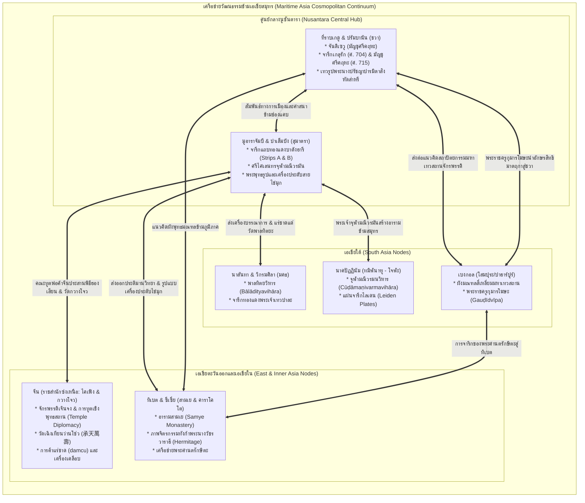

# บันทึกการอ่านและวิเคราะห์เอกสารจารึกวิทยาฉบับสมบูรณ์ (Epigraphic Source Dossier)
## ก้าวข้ามจักรวาลภาษาสันสกฤต: วัฒนธรรมภาษาสันสกฤตพื้นถิ่นและเครือข่ายศาสนาอินเดีย-จีนข้ามเอเชียสมุทร (Beyond the Cosmopolis: Vernacular Sanskrit Culture and Indic-Sinitic Religions across the Asian Maritime Realm)

---

### ส่วนที่ 1: ข้อมูลบรรณานุกรมและการอ้างอิงมาตรฐาน (Bibliographic Metadata)

- **Source ID:** `S-2024-acri-01`
- **ชื่อไฟล์ PDF ในเครื่อง:** `S-2024-acri-01_Beyond_Cosmopolis_Vernacular_Sanskrit_Asia.pdf`
- **ชื่อไฟล์ข้อความสกัด:** `S-2024-acri-01_Beyond_Cosmopolis_Vernacular_Sanskrit_Asia.txt` (ฉบับประมวลผลข้อความวิชาการฉบับเต็ม 281 หน้า ประกอบด้วยบทนำเชิงทฤษฎีโดย Andrea Acri และบทความวิจัยระดับนานาชาติ 10 บทความ ผ่านการประเมินทางวิชาการแบบ Peer-reviewed)
- **ประเภทเอกสาร:** วารสารวิชาการรวมบทความวิจัยฉบับพิเศษระดับนานาชาติ (Special Issue in Peer-reviewed Journal / Reference Collected Volume) ในวารสาร *Religions* (MDPI, Basel, Switzerland) โดยมี Andrea Acri (École Pratique des Hautes Études [EPHE, PSL University] / GREI, Paris) และ Francesco Bianchini (King's College, University of Cambridge / มหาวิทยาลัยมหิดล) เป็นบรรณาธิการรับเชิญ (Guest Editors)
- **วารสารวิชาการและการเผยแพร่:** *Religions*, ISSN 2077-1444, Special Issue: "Beyond the 'Spice Routes': Indic and Sinitic Religions across the Asian Maritime Realm", เผยแพร่ออนไลน์ต่อเนื่องระหว่างเดือนกันยายน ค.ศ. 2024 ถึงกันยายน ค.ศ. 2025 (รหัสประมวลผลฉบับพิเศษ: `https://www.mdpi.com/journal/religions/special_issues/9P1M8049VT`)
- **การสนับสนุนงบประมาณและสถาบันวิจัยระดับนานาชาติ:**
  1. ได้รับทุนสนับสนุนหลักจากสำนักงานวิจัยแห่งชาติฝรั่งเศส (Agence Nationale de la Recherche - ANR) ภายใต้โครงการ `MANTRA: Maritime Asian Networks of Buddhist Tantra` (รหัสสัญญา ANR-22-CE27-015 มี Andrea Acri เป็นหัวหน้าโครงการ)
  2. โครงการสภาการวิจัยแห่งยุโรป (European Research Council: ERC) Consolidator Grant ในชื่อ `MANTRATANTRAM`: *Monsoon Asia as the Nexus for the TRAnsfer of TANTRA along the Maritime routes* (สัญญาเลขที่ 101124214 ดำเนินงานโดย Andrea Acri ณ EPHE, PSL University)
  3. โครงการ ERC Synergy Grant `DHARMA: The Domestication of "Hindu" Asceticism and the Religious Making of South and Southeast Asia` (สัญญาเลขที่ 809094 ดำเนินงานโดย Arlo Griffiths, Annette Schmiedchen, Ryosuke Furui)
  4. สถาบันพันธมิตร: King's College University of Cambridge "Silk Roads Programme", ศูนย์วิจัยโบราณมาตรวิทยาและโบราณคดี BRIN (Badan Riset dan Inovasi Nasional ประเทศอินโดนีเซีย นำโดย Dr. Sofwan Noerwidi), Balai Pelestarian Kebudayaan (BPK) Wilayah V Jambi, และสถาบัน École française d'Extrême-Orient (EFEO)
- **ภาษาของเอกสาร:** ภาษาอังกฤษวิชาการระดับสูง (Academic English) พร้อมการปริวรรต ถอดรหัส แปลความ และวิเคราะห์เปรียบเทียบตัวบทจารึกและคัมภีร์ปฐมภูมิหลากภาษา: ภาษาสันสกฤตคลาสสิกและตันตระ (IAST), ภาษาชวาโบราณ (Old Javanese/Kawi), ภาษามลายูโบราณ (Old Malay), ภาษาจีนคลาสสิก (Classical Chinese / Tang-Song Middle Chinese / Hokkien), ภาษาทิเบตคลาสสิก (Classical Tibetan), ภาษาบาลี (Pāli), ภาษาทมิฬ (Tamil), ภาษาเวียดนาม/ไตยโบราณ (Tày-Nùng vernacular Nom scripts), ภาษาดัตช์ (Dutch) และภาษาฝรั่งเศส (French)
- **ขอบเขตภูมิศาสตร์และวัฒนธรรม:** ดินแดนเอเชียตะวันออกเฉียงใต้ภาคพื้นสมุทร (นูซันตารา: ชวากลาง, ชวาตะวันออก, สุมาตราตอนกลางและตอนใต้ [มูอาราจัมบี, ปาเล็มบัง], คาบสมุทรมลายู, บอร์เนียว/กาลีมันตัน, ฟิลิปปินส์/ซูลู), เอเชียใต้ (เบงกอลตะวันตก/บังกลาเทศ [ปาฮาร์ปูร์, ไมนามตี, โสมปุระ], มคธ/พิหาร [นาลันทา, อภิมันยุ, วิกรมศิลา, โพธิคยา], ทมิฬนาฑู [นาคปัฏฏินัม], มหาราษฏระ [ถ้ำอชันตา], โอฑิศา), ศรีลังกา (อนุราธปุระ, สิคิริยา), เอเชียตะวันออกและเอเชียใน (ทิเบตตอนกลาง [อารามสามเย], จีนตอนใต้ [ฝูเจี้ยน, เมืองท่าไฮ่เฉิง/เยว่กั่ง, กวางตุ้ง, มณฑลเสฉวน], เขตระเบียงเหอซีและเมืองคาราโคโต [ราชอาณาจักรซีเซี่ย], พื้นที่ชายแดนจีน-เวียดนาม [เกาบั่ง], ต้าหลี่/ยูนนาน, ญี่ปุ่น [นิกายชินกอน/เทนได])
- **วัสดุและบริบทการค้นพบ:**
  1. *จารึกแผ่นโลหะทองแดง (Copper Plates / Inscribed Copper Strips):* จารึกแถบทองแดงสองชิ้นจากมูอาราจัมบี (Strips A & B) งมจากท้องน้ำแม่น้ำบาตังฮารี สุมาตรา ระบุพระนามวัดศรีไศเลนทรจุฬามณีวรมนวิหาร (Nagapattinam) และศรีพาลทิตยวิหาร (Nālandā); แผ่นจารึกทองแดงพระเจ้าเทวปาละแห่งนาลันทา (Nālandā Copper Plate c. 850 CE); จารึกแผ่นทองแดงจากพิพิธภัณฑ์อินเดีย กัลกัตตา (Indian Museum Copper Plate Charter of Bhadranāga & Saṅhāyikayā)
  2. *ศิลาจารึก (Stone Inscriptions):* ศิลาจารึกเกลุรัก (Kelurak Inscription ศ. 704 / ค.ศ. 782) จารภาษาสันสกฤตอักษรสิทธิมาตฤกา; ศิลาจารึกมัญชุศรีคฤหะ (Mañjuśrīgṛha Inscription ศ. 715 / ค.ศ. 792) ภาษามลายูโบราณอักษรชวาโบราณ ณ จันดิเซวู; จารึกศิวคฤหะ (Śivagṛha Inscription ค.ศ. 856); จารึกดาลิแนน (Dalinan Inscription ค.ศ. 903); จารึกกุติ (Kuti Inscription)
  3. *เอกสารคัมภีร์ใบลาน จิตรกรรมตัวเขียน และทังก้า (Manuscripts & Thangkas):* คัมภีร์อัษฏสาหัสริกาปรัชญาปารมิตา (CUL Add.1643 ค.ศ. 1015 กาฐมาณฑุ เนปาล) บันทึกภาพสถานที่แสวงบุญทั่วโลกพุทธข้ามสมุทร; ทังก้าภาพพระนางวัชรวาราฮีจากคาราโคโต (Khara Khoto ศตวรรษที่ 12 สถาบันเฮอร์มิเทจ XX-2393); เอกสารพิธีกรรมเต๋าบนเรือเดินสมุทร (OR12693/18 หอสมุดบริติช) บันทึกพิธีอันฉวนจัวเสี้ยนเคอ; คัมภีร์ใบลานภาษาไตย-หนุ่งและจื๋อโนม
  4. *ประติมากรรมหินและสำริด (Stone & Bronze Statuary):* เทวรูปพระนางปรัชญาปารมิตาหินแอนดีไซต์จากชวาตะวันออก (สิงหัดส่าหรี) และมูอาราจัมบี (สุมาตรา); เทวรูปสำริดอโมฆปาศะ, พระไวโรจนะ, พระมัญชุศรี, และพระโพธิสัตว์จักรพรรดิจินดามณี (Cakravarticintāmaṇi / Ruyilun Guanyin); เทวรูปพระทุรคาและพระศิวะปรัมบานัน
  5. *สถาปัตยกรรมและมณฑลสามมิติ (Monumental Architecture):* มหาวิหารจันดิเซวู (Candi Sewu ชวากลาง), มหาวิหารโสมปุระแห่งปาฮาร์ปูร์ (Paharpur บังกลาเทศ), และอารามสามเย (Samye Monastery ทิเบต)
- **การอ้างอิงฉบับเต็มระบบ Chicago/Turabian Notes-Bibliography:**  
  Acri, Andrea, and Francesco Bianchini, eds. *Beyond the "Spice Routes": Indic and Sinitic Religions across the Asian Maritime Realm*. Special Issue of *Religions* (MDPI), vols. 15–16 (2024–2025). Basel: MDPI, 2024–2025. https://www.mdpi.com/journal/religions/special_issues/9P1M8049VT.

---

### ส่วนที่ 2: แผนผังการจัดสรรเข้าสู่บทและหัวข้อย่อย (Chapter & Section Mapping Matrix)

*แผนผังการสังเคราะห์เนื้อหา ข้อค้นพบ และตัวบทจารึกจากเอกสารชุดแม่บท S-2024-acri-01 เข้าสู่บทต่างๆ ของโครงการวิจัยสถานภาพการศึกษาจารึกในอินโดนีเซีย:*

- **บทที่ 1: กรอบมโนทัศน์และประวัติศาสตร์นิพนธ์: จาก Indianization สู่เครือข่ายข้ามสมุทรและวัฒนธรรมสันสกฤตพื้นถิ่น (Theoretical Framework & Historiography)**
  - **หัวข้อย่อย 1.2 (การรื้อถอนสมมติฐานเดิมว่าด้วยอาณานิคมอินเดียและการถ่ายทอดทิศทางเดียว):**  
    วิพากษ์แนวคิด Greater India ของ R.C. Majumdar (1927, 1937) และการแพร่วัฒนธรรมทิศทางเดียว (Diffusionism) โดยชี้ให้เห็นตามข้อเสนอของ Acri (หน้า 1–3) และ Copplestone (หน้า 24–25) ว่าแนวคิดการล่าอาณานิคมโบราณเป็นการฉายภาพจักรวรรดินิยมยุโรปย้อนกลับไปสู่อดีต ปัจจุบันวงวิชาการยอมรับพลังสร้างสรรค์ของท้องถิ่น (Local agency) และแบบจำลองการบรรจบกันทางวัฒนธรรม (Convergence Model) ของ Hermann Kulke
  - **หัวข้อย่อย 1.3 (การประเมินวิพากษ์ขอบเขตทฤษฎี Sanskrit Cosmopolis และ Vernacular Millennium ของ Sheldon Pollock):**  
    ใช้ข้อวิเคราะห์เชิงโครงสร้างของ Acri, Bianchini, และ Copplestone ในการชี้ให้เห็นข้อจำกัดร้ายแรงของทฤษฎี Sanskrit Cosmopolis ของ Pollock (1996, 2006):
    1. *จุดบอดด้านพุทธศาสนาภาษาสันสกฤต (Buddhist Cosmopolis Exclusion):* พอลล็อกจำกัดกรอบของตนไว้ที่ราชสำนักพราหมณ์-ฮินดูและวรรณคดีภาษาสันสกฤตชั้นสูง (Kāvya) ทำให้มองข้ามพลวัตของพุทธศาสนาภาษาสันสกฤตและพุทธตันตระฝ่ายมนตรนัย ซึ่งเป็นพลังขับเคลื่อนข้ามสมุทรที่แท้จริง (หน้า 1–2, 24–25, 51)
    2. *การลดทอนเอเชียตะวันออกเฉียงใต้ภาคพื้นสมุทรเป็นเพียงชายขอบ (Marginalisation of Maritime Asia):* พอลล็อกให้น้ำหนักแก่เส้นทางบกข้ามทวีปยูเรเซียและเอเชียตะวันออกเฉียงใต้ภาคพื้นทวีป โดยละเลยคลังจารึกภาษาสันสกฤตและวรรณกรรมกวีในชวา สุมาตรา และคาบสมุทรมลายู
    3. *การประเมินศักราชการกลายสู่ภาษาถิ่นผิดพลาด (The Fallacy of the Vernacular Millennium):* พอลล็อกเสนอว่าการเปลี่ยนผ่านสู่ภาษาถิ่น (Vernacularisation) เพิ่งเกิดขึ้นหลัง ค.ศ. 1000 ทว่าหลักฐานจารึกภาษามลายูโบราณของศรีวิชัย (ศตวรรษที่ 7 เช่น ตาลังตูโว และเกอดูกันบูกิต) และจารึกภาษาชวาโบราณ (จารึกสุกาบุมิ ค.ศ. 804) พิสูจน์ว่ากระบวนการสร้างภาษาธรรมการเมืองพื้นถิ่นเกิดขึ้นล่วงหน้าทฤษฎีของพอลล็อกหลายร้อยปี (หน้า 1–3, 184–198)
  - **หัวข้อย่อย 1.5 (โมเดลเครือข่ายข้ามสมุทรแบบพหุศูนย์กลาง Polycentric Maritime Network Model):**  
    การสร้างกรอบทฤษฎี "Beyond the Spice Routes" ซึ่งปฏิเสธการลดทอนประวัติศาสตร์การเดินเรือข้ามมหาสมุทรอินเดียและทะเลจีนใต้ให้เหลือเพียงมิติการค้าสินค้าโภคภัณฑ์ (เครื่องเทศ ผ้าไหม) แต่เสนอว่ามหาสมุทรทำหน้าที่เป็น "ทางหลวงวัฒนธรรมและตัวเร่งปฏิกิริยาทางศาสนา" (Crossroad and catalyser of religious transactions) โดยเครือข่ายพระสงฆ์ นักพรต พ่อค้า และช่างศิลป์ได้หมุนเวียนความคิดและนวัตกรรมจากขอบนอกกลับสู่ศูนย์กลาง (Periphery to centre) (หน้า 1–3, 139)
  - **หัวข้อย่อยใหม่ที่ค้นพบเพิ่มเติม (1.7 การทูตเชิงพุทธสถาน Temple Diplomacy ข้ามทะเลจีนใต้และอ่าวเบงกอล):**  
    วิเคราะห์มโนทัศน์ Temple Diplomacy จากงานของ Gregory Sattler (หน้า 56–82) และ Andhifani et al. (หน้า 184–218) ว่าด้วยการที่ราชสำนักซ่ง (จักรพรรดิเจินจง) และราชสำนักศรีวิชัย ใช้การสร้างและอุปถัมภ์วัดพุทธข้ามรัฐ (กวางโจว, ไคเฟิง, นาคปัฏฏินัม, นาลันทา) เป็นเครื่องมือยุทธศาสตร์การทูตและสร้างความชอบธรรมทางการเมืองระหว่างประเทศ

- **บทที่ 4: ภาษาศาสตร์ ฉันทลักษณ์ และการกลายสู่ภาษาถิ่นในจารึก (Linguistics, Metre, and Vernacularisation)**
  - **หัวข้อย่อย 4.1 (สัทศาสตร์และอักขรวิทยาเปรียบเทียบ: จากสิทธิมาตฤกาสู่อักษรสุมาตราโบราณ):**  
    การวิเคราะห์พัฒนาการของอักขรวิธีในจารึกสองแถบทองแดงแห่งมูอาราจัมบี (Andhifani et al. หน้า 184–197) ซึ่งแสดงการผสมผสานระหว่างอักษรสุมาตราโบราณ/กวี กับเทคนิคการตอกจารแบบจุดประรูปตัว V ด้วยสิ่ว (Chisel-pointillism) ตามแบบฉบับช่างโลหะจีน
  - **หัวข้อย่อย 4.3 (การถือกำเนิดของ 'ภาษาสันสกฤตแบบนูซันตารา' Nusantara Sanskrit และคำยืมลูกผสม):**  
    วิเคราะห์การผสมผสานทางภาษาศาสตร์ในตัวบทจารึกมูอาราจัมบี: การใช้คำสมาสภาษาสันสกฤตประกอบเข้ากับไวยากรณ์มลายูโบราณอย่างลึกซึ้ง เช่น `śrī-śailendra-cūḍāmaṇivarma-bihāra` และ `śrī-bālāditya-bihāra` รวมถึงการกลายเสียงคำสันสกฤตสู่ภาษาถิ่น เช่น `bihāra` (แทน *vihāra*), `bhāṇḍa` (ภาชนะสิ่งของ), และการวิเคราะห์คำว่า `bharāla` (หน้า 197, 20301) ว่าเป็นรูปคำมลายูโบราณที่เก่าแก่ที่สุดของคำว่า *berhala* (รูปเคารพ/พระพุทธรูป) ซึ่งสืบทอดมาจากคำสันสกฤต `bhaṭṭāra / bhaṭṭāraka`
  - **หัวข้อย่อย 4.6 (การกลายเสียงสนธิและการสร้างคำใหม่ในภาษามลายูโบราณ):**  
    การถอดรหัสคำศัพท์สำคัญในจารึกมูอาราจัมบี (หน้า 195–198):
    - `valānda`: ถุงหรือกระเป๋าใส่ทรัพย์สินมีค่า ต้นเค้าคำว่า *belanja* ในภาษามลายูปัจจุบัน
    - `tāsak`: การอัดแน่นหรือบรรจุ เกิดจากอุปสรรคภาษามลายู *ta-* สนธิเข้ากับรากคำ *asak*กลายเป็นคำว่า *tasak*
    - `barkna`: หน้าที่หรือวัตถุประสงค์ (เทียบเคียงกับภาษาชวาโบราณ *pakəna* / *mapakəna*)
    - `damcu`: คำยืมภาษาจีนฮกเกี้ยนโบราณจากคำว่า 丹朱 (*danzhu/tanchu*) หมายถึง แร่ชาดบริสุทธิ์ (Cinnabar)
  - **หัวข้อย่อยใหม่ที่ค้นพบเพิ่มเติม (4.8 ภาษาสัญลักษณ์และบทบาทของอักษรพื้นถิ่นนอกศูนย์กลาง Cosmopolis):**  
    การเปรียบเทียบการสร้างอักษรพื้นถิ่น (Vernacular character scripts) ของกลุ่มชาติพันธุ์ไตย-หนุ่ง (Tày-Nùng) ในแถบชายแดนจีน-เวียดนาม (David Holm หน้า 83–107) ที่ใช้อักษรชาวบ้านบันทึกพิธีกรรมหมอผีผสานศัพท์พุทธ-พราหมณ์ สะท้อนการดำรงอยู่ของวัฒนธรรมการเขียนคู่ขนานกับศูนย์กลางจักรวาลอักษรหลวง

- **บทที่ 2: จารึกสำคัญไขประวัติศาสตร์ในคาบสมุทรและหมู่เกาะ: ยุคไศเลนทร ศรีวิชัย และมัชฌปาหิต**
  - **หัวข้อย่อย 2.3 (จารึกราชวงศ์ไศเลนทรและเครือข่ายเบงกอล-ชวา-ทิเบต):**  
    เชื่อมโยงจารึกเกลุรัก (Kelurak ค.ศ. 782) และจารึกมัญชุศรีคฤหะ (Mañjuśrīgṛha ค.ศ. 792) เข้ากับมิติสถาปัตยกรรมเปรียบเทียบระหว่างจันดิเซวู, ปาฮาร์ปูร์ (บังกลาเทศ), และอารามสามเย (ทิเบต) (Copplestone หน้า 24–55) ชี้ให้เห็นการจาริกของพระราชครูกุมารโฆษะแห่งเบงกอล และพระศานตรักษิตะ ที่ทำหน้าที่เป็นสถาปนิกทางจิตวิญญาณถ่ายทอดแนวคิด "มหาเทวสถานจักรพรรดิพุทธ" (Buddhist Imperial Temple)
  - **หัวข้อย่อย 2.6 (เครือข่ายศรีวิชัย-ปาละ-โจฬะ ในพุทธศตวรรษที่ 16):**  
    การบูรณาการหลักฐานจารึกแถบทองแดงมูอาราจัมบี (หน้า 184–218) เพื่อยืนยันว่าพระมหากษัตริย์ราชวงศ์ไศเลนทรแห่งศรีวิชัย (พระเจ้าจุฬามณีวรมัน) ทรงมีสายสัมพันธ์และพระราชศรัทธาอุปถัมภ์พุทธศาสนาทั้งในอินเดียใต้ (นาคปัฏฏินัม) และอินเดียตะวันออกเฉียงเหนือ (พาลทิตยวิหาร ณ นาลันทา) อย่างต่อเนื่อง และแสดงให้เห็นว่าเมืองมูอาราจัมบีบนลุ่มน้ำบาตังฮารีคือศูนย์กลางพุทธศาสนาและพาณิชยนาวีระดับโลกที่เชื่อมต่อกับราชสำนักซ่งเหนือ

- **บทที่ 7: ศาสนา ความเชื่อ และเครือข่ายพุทธตันตระ/ไศวนิกายข้ามสมุทร: มนตรา ปรัชญา และการสังเคราะห์เทพเจ้า**
  - **หัวข้อย่อย 7.2 (พัฒนาการของลัทธิคุ้มครองภัยทางทะเล Saviour Cults):**  
    การศึกษาวิวัฒนาการของพระโพธิสัตว์จักรพรรดิจินดามณี (Cakravarticintāmaṇi Avalokiteśvara) โดย Saran Suebsantiwongse (หน้า 152–183) ในฐานะเทพผู้คุ้มครองการเดินเรือข้ามสมุทรและการเสริมสร้างอำนาจอธิปไตยของกษัตริย์ในเอเชียตะวันออกเฉียงใต้ จีน และญี่ปุ่น
  - **หัวข้อย่อย 7.4 (ประติมานวิทยาข้ามสมุทรและเครื่องประดับไข่มุก):**  
    งานวิจัยของ Lesley Pullen (หน้า 126–151) ว่าด้วยการแพร่กระจายของลายเครื่องประดับสายไข่มุก (Pearl-chain jewellery) ที่ปรากฏเหมือนกันอย่างน่าทึ่งระหว่างภาพเขียนพระนางวัชรวาราฮีที่คาราโคโต (เอเชียใน) กับเทวรูปหินพระนางปรัชญาปารมิตาแห่งสิงหัดส่าหรี (ชวาตะวันออก) และมูอาราจัมบี (สุมาตรา) ซึ่งเป็นหลักฐานเชิงวัตถุของการแลกเปลี่ยนทางศิลปะและตันตรยานข้ามสมุทรผ่านเครือข่ายราชวงศ์ปาละ
  - **หัวข้อย่อย 7.5 (การจาริกแสวงบุญในจินตนาการและแผนที่โลกพุทธมณฑล):**  
    การวิเคราะห์คัมภีร์ใบลานภาพวาดเนปาล CUL Add.1643 (ค.ศ. 1015) โดย Jinah Kim (หน้า 219–253) ซึ่งบันทึกรูปเคารพพุทธสำคัญในเอเชียสมุทร (เช่น ชวา สุมาตรา ศรีลังกา) ทำให้คัมภีร์กลายเป็นอุปกรณ์พกพาสำหรับ "การแสวงบุญเสมือนจริง" (Virtual Pilgrimage) ที่สะท้อนสำนึกภูมิศาสตร์ศักดิ์สิทธิ์ข้ามสมุทร

---

### ส่วนที่ 3: สรุปสาระสำคัญเชิงวิเคราะห์และจุดยืนทางวิชาการ (Executive Academic Analysis)

#### 1. วิทยานิพนธ์และข้อถกเถียงหลักของผู้เขียน (Core Argument / Thesis)
เอกสารรวมบทความวิจัยระดับนานาชาติชุด *Beyond the "Spice Routes"* ซึ่งมี Andrea Acri และ Francesco Bianchini เป็นบรรณาธิการ ร่วมกับบทความวิจัยประวัติศาสตร์ของ Andhifani, Prihatmoko, Acri, Griffiths, Mechling, Sattler, Copplestone, Kim, Suebsantiwongse, Pullen, Golan, Holm, และ Huang นำเสนอการปฏิวัติกระบวนทัศน์ทางประวัติศาสตร์และจารึกวิทยาเอเชียตะวันออกเฉียงใต้ โดยมีแกนข้อถกเถียงหลัก 5 มิติ:

1. **การก้าวข้ามกรอบ 'เส้นทางเครื่องเทศ' และ 'การครอบงำของเส้นทางบก' (Transcending the "Spice Routes" and Overland Silk Road Hegemony):**  
   งานวิจัยชุดนี้ท้าทายประวัติศาสตร์นิพนธ์แบบเดิมที่มองเครือข่ายทางทะเลเป็นเพียงเส้นทางค้าขายสินค้าโภคภัณฑ์ทางเศรษฐกิจล้วนๆ (Commodity-driven trade เช่น ผ้าไหมหรือเครื่องเทศ) ผู้วิจัยชี้ว่าท้องทะเลและลมมรสุมมิได้เป็นอุปสรรคต่อการเดินทาง หากแต่เป็น **"ทางหลวงและตัวเร่งปฏิกิริยาการแลกเปลี่ยนทางศาสนาและภูมิปัญญา" (A crossroad and catalyser of religious transactions)** เครือข่ายการเดินเรือเชื่อมโยงผู้คน คัมภีร์ มนตรา ศิลปะ และเทคโนโลยีข้ามมหาสมุทรอินเดียและทะเลจีนใต้อย่างหนาแน่นและต่อเนื่องตั้งแต่ต้นคริสต์ศักราชจนถึงยุคก่อนสมัยใหม่ (หน้า 1–3)

2. **การรื้อถอนศูนย์กลางนิยมอินเดียและการสถาปนาทฤษฎีพหุศูนย์กลาง (Dismantling Indic-Centrism: The Polycentric Convergence Paradigm):**  
   งานวิจัยร่วมสมัยปฏิเสธทฤษฎีการกลืนเป็นอินเดีย (Indianisation) แบบเก่าที่มองอินเดียเป็นศูนย์กลางผู้ผลิตเพียงฝ่ายเดียว และมองเอเชียตะวันออกเฉียงใต้เป็นเพียงชายขอบผู้รับอย่างเฉื่อยชา (Passive recipient periphery) โดยเสนอว่า **นูซันตารา (ชวา, สุมาตรา, คาบสมุทรมลายู) คือ "ปลายทางในตัวเอง" (Terminus in its own right) และเป็น "พลังเชิงกำเนิด" (Constitutive force)** ที่มีส่วนร่วมอย่างกระตือรือร้นในการบ่มเพาะและส่งออกนวัตกรรมทางศาสนาและประติมานวิทยา ย้อนกลับไปสู่อินเดีย จีน ทิเบต และเอเชียกลาง ดังที่ปรากฏในความคล้ายคลึงของผังวัดปาฮาร์ปูร์-เซวู-สามเย (หน้า 24–55) และการส่งประติมานวิทยาเครื่องประดับสายไข่มุกสู่ซีเซี่ย (หน้า 126–151)

3. **ขอบเขตและข้อจำกัดของทฤษฎี 'Sanskrit Cosmopolis' ของ Sheldon Pollock:**  
   แม้ทฤษฎีจักรวาลภาษาสันสกฤตของพอลล็อกจะช่วยอธิบายการแพร่อำนาจเชิงสุนทรียศาสตร์ข้ามรัฐโดยไร้การใช้กำลังทหาร แต่เอกสารชุดนี้ชี้ให้เห็นว่าทฤษฎีของพอลล็อกไม่สามารถอธิบายปรากฏการณ์ในเอเชียสมุทรได้อย่างครบถ้วน เพราะ:
   - พอลล็อกมองข้าม "จักรวาลพุทธภาษาสันสกฤต" (Sanskritic Buddhist Cosmopolis) ซึ่งเคลื่อนตัวผ่านเส้นทางทะเลและมีพระสงฆ์เป็นตัวขับเคลื่อนหลัก
   - พอลล็อกสร้างกรอบการแบ่งขั้วที่แข็งทื่อระหว่าง "ภาษาสันสกฤตสากล" กับ "ภาษาถิ่น" (Cosmopolitan vs. Vernacular) ทว่าในนูซันตาราเกิดปรากฏการณ์ **"วัฒนธรรมสันสกฤตพื้นถิ่น" (Vernacular Sanskrit Culture)** ซึ่งภาษาสันสกฤตมิได้ถูกแทนที่ แต่ถูกหลอมรวมเข้าเป็นเนื้อเดียวกับโครงสร้างภาษาถิ่น (ชวาโบราณและมลายูโบราณ) อย่างแยกไม่ออก (หน้า 1–3, 195–198)

4. **การประดิษฐ์สร้าง 'สันสกฤตแบบนูซันตารา' และความรุ่มรวยของภาษามลายูโบราณชั้นสูง:**  
   หลักฐานจารึกแผ่นแถบทองแดงค้นพบใหม่ที่มูอาราจัมบี (Andhifani et al. 2025 หน้า 184–218) แสดงให้เห็นถึงการใช้ภาษามลายูโบราณในฐานะภาษาทางการทูตและพิธีกรรมระหว่างประเทศ ตัวบทมีการสมาสคำภาษาสันสกฤตเข้ากับระบบไวยากรณ์มลายูโบราณอย่างประณีต เช่น การสถาปนาคำว่า `bharāla` (ต้นเค้าของ *berhala*) เพื่อแปลคำสันสกฤต `bhaṭṭāraka` และการบัญญัติศัพท์การบรรจุสิ่งของมีค่า `valānda` ซึ่งพิสูจน์ว่าภาษามลายูโบราณมีศักยภาพในการสื่อสารสัจธรรมและระเบียบราชสำนักเคียงคู่กับภาษาสันสกฤตมาตั้งแต่ก่อนสหัสวรรษที่สอง

5. **มิติการเมืองเรื่องพุทธศาสนาและการทูตเชิงพุทธสถาน (Temple Diplomacy as Realpolitik):**  
   การแลกเปลี่ยนทางศาสนาข้ามสมุทรมิได้ตัดขาดจากผลประโยชน์ทางการเมือง ราชสำนักศรีวิชัยในสุมาตราใช้การสถาปนาอารามพุทธ (จูฬามณีวรมนวิหารในอินเดียใต้, การทำนุบำรุงพาลทิตยวิหารในนาลันทา, และการสร้างวัดเฉิงเทียนว่านโซ่วในกวางโจว) เป็นยุทธศาสตร์การทูตเพื่อถ่วงดุลมหาอำนาจ สร้างสัมพันธไมตรีกับราชสำนักโจฬะและจักรพรรดิซ่งเจินจง และคุ้มครองเครือข่ายพ่อค้าทางทะเล (หน้า 56–82, 184–218)

#### 2. บริบทประวัติศาสตร์นิพนธ์และการประเมินความน่าเชื่อถือ (Historiography & Source Criticism)
เอกสารชุดนี้วางตำแหน่งตนเองเป็นจุดเปลี่ยนสำคัญในประวัติศาสตร์นิพนธ์ร่วมสมัย:
- **การก้าวพ้นทฤษฎี "ศูนย์กลาง-ชายขอบ" (Centre-Periphery Binary):**  
  ประวัติศาสตร์ยุคอาณานิคมของดัตช์และฝรั่งเศส (Krom, Coedès) มองเอเชียตะวันออกเฉียงใต้เป็นเพียงผู้รับอารยธรรมอินเดียแบบ passive ทว่า Acri และคณะได้แสดงให้เห็นว่า ในคริสต์ศตวรรษที่ 8–12 เกิดภาวะการหลอมรวมที่ภูมิภาคต่างๆ มีการปฏิสัมพันธ์กันแบบสองทิศทาง (Multi-directional transfer) ชวาและสุมาตราสามารถส่งออกประติมานวิทยา (เช่น สถูปมณฑลแบบบุโรพุทโธ และเครื่องประดับไข่มุก) ย้อนกลับไปสู่อนุทวีปอินเดียและเอเชียในได้อย่างทรงพลัง
- **การยืนยันความแท้ของจารึกมูอาราจัมบี (Authenticity Criticism of Muara Jambi Strips):**  
  เนื่องจากแผ่นจารึกทองแดงมูอาราจัมบีถูกงมขึ้นมาจากท้องน้ำโดยชาวบ้านและผ่านการซื้อขายในตลาดโบราณวัตถุก่อนส่งมอบให้แก่พิพิธภัณฑ์ จึงต้องเผชิญกับข้อสงสัยเรื่องการปลอมแปลง (Forgery) ทว่าคณะผู้วิจัย (Andhifani, Griffiths, Acri et al. หน้า 22–24) ได้พิสูจน์ความแท้จริงอย่างเด็ดขาดด้วยเกณฑ์ 3 ประการ:
  1. *การทดสอบโลหะวิทยาทางวิทยาศาสตร์ (XRF Analysis):* แผ่นโลหะประกอบด้วยทองแดงบริสุทธิ์สูง 96.20%–96.59% และปราศจากธาตุสังกะสี (Zinc) ซึ่งตรงตามคุณสมบัติของโลหะโบราณก่อนศตวรรษที่ 16 (ทองเหลืองสมัยใหม่จะมีสังกะสีผสมอยู่เสมอ)
  2. *ร่องรอยเครื่องมือจารโบราณ (Toolmark Micromorphology):* รอยจารเกิดจากการตอกสิ่วแบบจุดประรูปตัว V ซึ่งต้องใช้ทักษะของช่างโลหะโบราณชั้นสูง
  3. *ความถูกต้องทางภาษาศาสตร์ประวัติศาสตร์ (Historical Linguistics Concordance):* ตัวบทมีรูปคำไวยากรณ์มลายูโบราณและการสมาสคำที่ไม่เคยปรากฏในพจนานุกรมสมัยใหม่ แต่ถูกต้องตามกฎวิวัฒนาการทางภาษาศาสตร์อย่างแม่นยำ ซึ่งไม่มีนักปลอมแปลงคนใดสามารถประดิษฐ์ขึ้นมาได้
- **การแก้ไขข้อผิดพลาดเรื่องการย้ายเมืองหลวงของศรีวิชัย:**  
  การวิเคราะห์ของ Andhifani et al. (หน้า 21–23) หักล้างสมมติฐานเดิมของ O.W. Wolters (1966) ที่เชื่อว่าศรีวิชัยย้ายเมืองหลวงจากปาเล็มบังไปยังจัมบีอย่างเด็ดขาดในปี ค.ศ. 1079 โดยชี้ว่าเอกสารจีนบันทึกชื่อคณะทูตว่า "แคว้นจัมบีแห่งศรีวิชัย" (*Sanfoqi-Zhanbei guo*) และเรียกผู้นำจัมบีว่า "กั๋วจู่" (国主) ต่ำกว่ากษัตริย์ศรีวิชัยที่เป็น "กั๋วหวัง" (国王) แสดงถึงโครงสร้างสมาพันธรัฐเมืองท่าที่เกื้อหนุนกัน มิใช่การล่มสลายหรือย้ายเมืองหลวงอย่างเบ็ดเสร็จ

---

### ส่วนที่ 4: สารบัญข้อค้นพบเชิงลึกแยกตามมิติจารึกวิทยา (Thematic Epigraphic Findings with Exact Pages)

1. **ประวัติศาสตร์นิพนธ์และการตีความทางประวัติศาสตร์:**
   - การรื้อถอนสมมติฐานการล่าอาณานิคมโบราณของ Majumdar และการเสนอแบบจำลองการบรรจบกันทางวัฒนธรรม (Convergence Model) ข้ามเอเชียสมุทร (หน้า 24–25)
   - การทบทวนขอบเขตของทฤษฎี Sanskrit Cosmopolis ของ Sheldon Pollock โดยชี้ให้เห็นการละเลยจักรวาลพุทธภาษาสันสกฤตและการละเลยมิติทางทะเลของนูซันตารา (หน้า 1–3, 24–25, 51)
   - การสถาปนากรอบคิด "Beyond the Spice Routes" ซึ่งมองเครือข่ายทางทะเลเป็นเบ้าหลอมการแลกเปลี่ยนทางความคิดและศาสนามากกว่าการค้าสินค้าโภคภัณฑ์ (หน้า 1–3)
   - บทบาทของการทูตเชิงพุทธสถาน (Temple Diplomacy) ในสมัยจักรพรรดิซ่งเจินจง (ค.ศ. 997–1022) และการประสานงานของพ่อค้าจีนโพ้นทะเลในศรีวิชัยและไดเวียต (หน้า 56–82)

2. **ตัวบทจารึก การอ่าน ศักราช และอักขรวิทยา:**
   - การอ่านชำระและบูรณะตัวบทจารึกแถบทองแดงค้นพบใหม่สองชิ้นแห่งมูอาราจัมบี (Strips A & B) ซึ่งเดิมเป็นเอกสารสองฉบับที่จารข้อความชุดเดียวกัน (Two duplicate copies) (หน้า 184–195)
   - การระบุพระนาม `śrī-śailendra-cūḍāmaṇivarma-bihāra` และ `śrī-bālāditya-bihāra` ในตัวบทภาษามลายูโบราณเป็นครั้งแรกในประวัติศาสตร์จารึกวิทยาอินโดนีเซีย (หน้า 184, 195–197)
   - การวิเคราะห์อักขรวิทยาของจารึกมูอาราจัมบี กำหนดอายุอยู่ในช่วงปลายศตวรรษที่ 11 ถึงศตวรรษที่ 12 โดยใช้อักษรกวี/สุมาตราโบราณที่มีลักษณะเฉพาะ (หน้า 186–190)
   - การอ่านทบทวนจารึกมัญชุศรีคฤหะ (Mañjuśrīgṛha Inscription ศ. 715 / ค.ศ. 792) ภาษามลายูโบราณ ณ จันดิเซวู และการตีความนิมิตเห็น "วัชราสนะ" ของขุนนางดางนายกาลูรวา (หน้า 35–38)
   - การอ่านชำระจารึกเกลุรัก (Kelurak Inscription ศ. 704 / ค.ศ. 782) ภาษาสันสกฤตอักษรสิทธิมาตฤกา บันทึกการประดิษฐานรูปเคารพพระมัญชุศรีโดยพระราชครูกุมารโฆษะแห่งเบงกอล (หน้า 35–38)

3. **มิติศาสนา ลัทธิความเชื่อ และพิธีกรรม:**
   - การวิเคราะห์พัฒนาการของลัทธิการบูชาพระโพธิสัตว์จักรพรรดิจินดามณี (Cakravarticintāmaṇi / Ruyilun Guanyin) ในฐานะเทพผู้คุ้มครองการเดินเรือข้ามสมุทรและการเสริมสร้างอำนาจอธิปไตยของกษัตริย์ (หน้า 152–183)
   - การถวายเครื่องบูชาอันล้ำค่า ได้แก่ แร่ชาดบริสุทธิ์ (damcu / cinnabar) ปริมาณเกือบ 4 กิโลกรัม แก่วัดพุทธในอินเดียใต้และนาลันทา เพื่อใช้ในพิธีกรรมตันตระและการเล่นแร่แปรธาตุ (Rasāyana) (หน้า 195–200)
   - แนวคิดมหาเทวสถานจักรพรรดิพุทธ (Buddhist Imperial Temple) และมณฑลจักรวาลวิทยาของคัมภีร์ *Sarvatathāgatatattvasaṅgraha* (STTS) ในผังวัดปาฮาร์ปูร์ จันดิเซวู และอารามสามเย (หน้า 24–55)
   - การผสานความเชื่อพุทธ-พราหมณ์เข้ากับพิธีกรรมสะเดาะเคราะห์และการเดินทางข้ามภพของหมอผีไตย-หนุ่ง (Then & Pụt rituals) ในเขตชายแดนจีน-เวียดนาม (หน้า 83–107)
   - พิธีกรรมสรงน้ำศักดิ์สิทธิ์และเวชกรรมโบราณ (Religio-medical bathing) ในมรสุมเอเชียตามคัมภีร์อายุรเวทและพระวินัยพุทธ (หน้า 108–125)

4. **มิติสถาปัตยกรรม ศาสนสถาน และชลศาสตร์:**
   - การเปรียบเทียบเชิงสถาปัตยกรรมระหว่างจันดิเซวู (ชวากลาง), มหาวิหารโสมปุระแห่งปาฮาร์ปูร์ (บังกลาเทศ), และอารามสามเย (ทิเบต) ซึ่งใช้ผังมณฑลสี่เหลี่ยมขนาดยักษ์ล้อมรอบวิหารประธานทรงกากบาท (Cruciform central temple) (หน้า 24–55)
   - ระบบระบายน้ำศักดิ์สิทธิ์รอบฐานวิหารประธานจันดิเซวูและปาฮาร์ปูร์ ที่ทำเป็นรูปสัตว์หิมพานต์มกร (Makara) และวยาล (Vyāla) สะท้อนการประกอบพิธีสรงน้ำเทวรูป (Pratimā-pūjā) (หน้า 25–26, 32–35)
   - ร่องรอยระบบชลศาสตร์และคูน้ำล้อมรอบมหาเทวสถาน ซึ่งเชื่อมโยงกับแนวคิดสระอโนดาตและมหาสมุทรจักรวาล (หน้า 32–35)

5. **มิติอาหารการกิน วิถีชีวิต การค้า และตลาด:**
   - การค้าเครื่องประดับไข่มุกข้ามสมุทร: บันทึกของเจ้าหรูคว่อ (Zhao Rukuo) ใน *จูฟานจื้อ* (Zhufan zhi) ว่าด้วยแหล่งมุกด์ในชวา จัมบี และซูลู (ฟิลิปปินส์) ตลอดจนการลักลอบนำเข้าไข่มุกสู่ราชสำนักจีน (หน้า 126–131)
   - การค้าแร่ชาด (Cinnabar / 丹朱 *danzhu*) จากจีนผ่านเครือข่ายศรีวิชัยไปยังอินเดียใต้และมคธ เพื่อใช้ในงานจิตรกรรมและเภสัชกรรม (หน้า 195–200)
   - วิถีชีวิตของลูกเรือและกะลาสีเรือสำเภาจีนในทะเลจีนใต้: พิธีกรรมเซ่นไหว้แม่ย่านางและเจ้าแม่หม่าโจ้วบนเรือเดินสมุทรผ่านคู่มือพิธีกรรม *อันฉวนจัวเสี้ยนเคอ* (หน้า 6–23)

6. **มิติการปกครอง กฎหมาย ที่ดิน และระบบสีมา:**
   - การใช้พุทธศาสนามหายานและตันตระเป็นอุดมการณ์รัฐ (State-protection Buddhism) เพื่อสร้างความชอบธรรมให้แก่การแผ่พระราชอำนาจของกษัตริย์ไศเลนทร (พระเจ้าสังครามธนัญชัย) และกษัตริย์ปาละ (พระเจ้าธรรมปาละ) (หน้า 24–28, 35–38)
   - การพระราชทานที่ดินและกัลปนาผลประโยชน์ปลอดภาษีเพื่อบำรุงพระอารามข้ามแคว้น ดังปรากฏในจารึกแผ่นทองแดงนาลันทาของพระเจ้าเทวปาละที่พระราชทานแก่พระเจ้าพาลบุตรเทพแห่งศรีวิชัย (หน้า 51)
   - โครงสร้างการปกครองแบบสมาพันธรัฐเมืองท่าของศรีวิชัย: ความสัมพันธ์ระหว่าง "กั๋วหวัง" (กษัตริย์สูงสุดแห่งศรีวิชัย) กับ "กั๋วจู่" (เจ้าผู้ครองแคว้นจัมบี) ในเอกสารราชสำนักซ่ง (หน้า 21–23)

7. **มิติปฏิสัมพันธ์ข้ามสมุทรและเครือข่ายนานาชาติ:**
   - หลักฐานจารึกมูอาราจัมบียืนยันการมีอยู่จริงของเครือข่ายสองอารามข้ามมหาสมุทร: จูฬามณีวรมนวิหาร (นาคปัฏฏินัม) และพาลทิตยวิหาร (นาลันทา) ซึ่งสอดรับกับคาถาลงท้ายคัมภีร์ไวยากรณ์บาลี *Rūpasiddhi* ของพระพุทธัปปิยะ (หน้า 184, 198–200)
   - การเดินทางข้ามสมุทรของพระภิกษุปัญญาชน เช่น พระศานตรักษิตะ, พระกุมารโฆษะ, และพระอติศะทีปังกร ผู้เป็นสะพานเชื่อมโยงอินเดีย สุมาตรา ชวา และทิเบต (หน้า 24–55, 219–253)
   - คัมภีร์ภาพวาดเนปาล CUL Add.1643 (ค.ศ. 1015) ซึ่งบันทึกรูปเคารพพุทธในชวาและสุมาตรา สะท้อนการรับรู้ร่วมกันของชุมชนพุทธข้ามทวีป (หน้า 219–253)
   - การแพร่กระจายของลัทธิความเชื่อพระสามผิงจู่ซือ (Sanping Patriarch) จากฝูเจี้ยนสู่ไต้หวันและชุมชนจีนโพ้นทะเลในเอเชียตะวันออกเฉียงใต้ (มะละกา, อินโดนีเซีย) ผ่านเครือข่ายการค้าทางเรือ (หน้า 254–281)

8. **มิติจารึกแผ่นโลหะ รูปเคารพขนาดเล็ก และจารึกแม่น้ำ:**
   - จารึกแถบทองแดงสองชิ้นแห่งมูอาราจัมบี (BPK Wilayah V No. 010 และ Yayasan Rumah Menapo No. 045) ซึ่งงมได้จากท้องน้ำแม่น้ำบาตังฮารี หน้าชุมชนโบราณสถานมูอาราจัมบี (หน้า 184–195)
   - การเปรียบเทียบกับเศษแผ่นทองแดงจารึกที่พบในซากเรืออับปางอินตัน (Intan Shipwreck ศตวรรษที่ 10) ยืนยันธรรมเนียมการนำแผ่นจารึกโลหะติดไปกับเรือสินค้าเพื่อระบุรายการทรัพย์สินหรือเครื่องบูชา (หน้า 20855–20862)
   - เทวรูปสัมฤทธิ์ขนาดเล็กและพระพิมพ์ดินเผา (Votive tablets / Stūpikas) ที่พบในเคดาห์, ตรัง, ปะลิส, และบาตูจายา สลักคาถา *เย ธรฺมา* และพระสูตรธารณี (หน้า 140–160)

9. **พรมแดนปัญหา ปริศนาวิชาการ และจริยธรรมโบราณคดี:**
   - ปัญหาการขุดทรายพาณิชย์และการงมล่าโบราณวัตถุอย่างผิดกฎหมายในแม่น้ำบาตังฮารี ซึ่งทำลายบริบทชั้นดินทางโบราณคดีและส่งผลให้แผ่นจารึกถูกตัดแบ่งขายในตลาดมืด (หน้า 184–186, 20850–20854)
   - บทบาทขององค์กรภาคประชาสังคมท้องถิ่น (เช่น มูลนิธิรูมะฮ์เมอนาโป Yayasan Rumah Menapo) ในการกอบกู้ สงวนรักษา และส่งมอบมรดกวัฒนธรรมให้แก่วงวิชาการ (หน้า 184–186)
   - ความท้าทายในการระบุตำแหน่งที่ตั้งอันแน่นอนของ "พาลทิตยวิหาร" ในนาลันทา และความสัมพันธ์กับพระอารามที่สร้างโดยพระเจ้าพาลบุตรเทพ (หน้า 198–202)

---

### ส่วนที่ 5: คลังข้อความอ้างอิงตรงและเชิงอรรถสำเร็จรูป (Verbatim Quotes & Footnote Bank)

1. **การประกาศพันธกิจของฉบับพิเศษในการก้าวข้าม 'เส้นทางเครื่องเทศ' และการรื้อถอนศูนย์กลางนิยม:**  
   > "Emphasising the transmission of religious knowledge, practices, and material culture, from elite esoteric texts and royal icons to 'folk' cults and everyday ritual and devotional objects... the body of work presented in this Special Issue challenges traditional accounts based on the primacy of trade (for instance, of commodities such as silk or spices, which have resulted in such expressions as 'Silk Roads' or 'Spice Routes') and highlight the sea as a crossroad and catalyser of religious transactions. In doing so, it reveals the still understudied networks of actors... who became the cultural brokers who connected far away lands and cultures, and the prime vectors of innovations from the 'centres' to the 'peripheries' and—more often than it has been hitherto admitted—from the 'peripheries' to the 'centres'." (Acri 2024: 1–2)  
   *แปลสรุป:* ด้วยการเน้นย้ำถึงการถ่ายทอดองค์ความรู้ การปฏิบัติ และวัฒนธรรมทางวัตถุของศาสนา ตั้งแต่คัมภีร์ลึกลับชั้นสูงและรูปเคารพหลวง ไปจนถึงลัทธิความเชื่อพื้นบ้านและวัตถุพิธีกรรมในชีวิตประจำวัน... งานวิจัยในฉบับพิเศษนี้ท้าทายคำอธิบายแบบดั้งเดิมที่ให้ความสำคัญสูงสุดแก่การค้า (เช่น สินค้าโภคภัณฑ์อย่างผ้าไหมหรือเครื่องเทศ ซึ่งก่อให้เกิดคำเรียกอย่าง 'เส้นทางสายไหม' หรือ 'เส้นทางเครื่องเทศ') และชี้ให้เห็นว่าท้องทะเลคือชุมทางและตัวเร่งปฏิกิริยาการแลกเปลี่ยนทางศาสนา ซึ่งเผยให้เห็นเครือข่ายของตัวแทนผู้เชื่อมโยงดินแดนห่างไกล และเป็นผู้นำนวัตกรรมจาก 'ศูนย์กลาง' สู่ 'ชายขอบ' และบ่อยครั้งยิ่งกว่าที่เคยยอมรับกัน คือจาก 'ชายขอบ' ย้อนกลับสู่ 'ศูนย์กลาง'  
   *การนำไปใช้:* เชิงอรรถหลักในบทที่ 1 หัวข้อย่อย 1.2 และ 1.5 เพื่อสถาปนากระบวนทัศน์ Polycentric Maritime Network

2. **การปฏิเสธทัศนะอิทธิพลอินเดียทางเดียวและการรื้อฟื้นพลังสร้างสรรค์ท้องถิ่น:**  
   > "The once-dominant view that architectural developments in mediaeval Southeast Asia closely followed Indian 'influence' is now largely rejected. Recent scholarship has shifted its focus onto the agency of local artists and architects in driving architectural innovations across the region. However, specific cases of transregional exchanges in architectural ideas and practices remain underexplored... I argue that the activity at these sites reveals a shared architectural agenda transmitted over vast distances by religious experts, including Buddhist monks, in the last decades of the 8th century." (Copplestone 2024: 24)  
   *แปลสรุป:* ทัศนะกระแสหลักที่เคยครอบงำวงวิชาการว่าพัฒนาการทางสถาปัตยกรรมในเอเชียตะวันออกเฉียงใต้ดำเนินตาม 'อิทธิพล' อินเดียอย่างใกล้ชิดนั้น บัดนี้ถูกปฏิเสธเป็นส่วนใหญ่แล้ว งานวิชาการร่วมสมัยได้เปลี่ยนจุดเน้นมาสู่พลังสร้างสรรค์ของศิลปินและสถาปนิกท้องถิ่นในการขับเคลื่อนนวัตกรรม... ผู้เขียนขอเสนอว่ากิจกรรมในแหล่งโบราณคดีเหล่านี้สะท้อนวาระทางสถาปัตยกรรมร่วมกันที่ถ่ายทอดข้ามระยะทางไกลโดยผู้เชี่ยวชาญทางศาสนา รวมถึงพระภิกษุสงฆ์ ในช่วงทศวรรษสุดท้ายของศตวรรษที่ 8  
   *การนำไปใช้:* อ้างอิงในบทที่ 1 (1.2) และบทที่ 2 (2.3) ว่าด้วยการแลกเปลี่ยนทางสถาปัตยกรรมข้ามสมุทร

3. **การทบทวนข้อวิพากษ์เรื่องการกลืนเป็นอินเดียและการบรรจบกันทางวัฒนธรรม:**  
   > "Driving these potential carriers of cultural knowledge and practices is the implicit allure of 'legitimation.' Drawing on Max Weber's ideas, scholars have suggested that the Indian mode of charismatic kingship, religion, and social organisation appealed to Southeast Asian rulers who were looking for ways to extend and consolidate their authority (Wheatley 1982; Pollock 2006, p. 516). Some historians have questioned the scale and extent of this cultural transfer, however, arguing that the influence of India on Southeast Asia has been overstated, while the creative potential of localisation as a process has been overlooked (Wolters 1982; de Casparis 1983)... Hermann Kulke has further argued that the dichotomy underpinning this discussion is misleading, if not entirely false (Kulke 1990, 2014). He argues that the similarities and simultaneity in cultural, religious, and social practices observed across mediaeval southern Asia reflect such a high degree of near-constant interaction that it is more accurate to view these regions as 'converging' in this period." (Copplestone 2024: 24–25)  
   *แปลสรุป:* สิ่งที่ขับเคลื่อนผู้ถือครององค์ความรู้เหล่านี้คือแรงดึงดูดของการสร้างความชอบธรรม ซึ่งนักวิชาการนำแนวคิดของแมกซ์ เวเบอร์ มาอธิบายว่าระบอบกษัตริย์บารมี ศาสนา และระเบียบสังคมแบบอินเดียเป็นที่ดึงดูดใจของผู้นำเอเชียตะวันออกเฉียงใต้ที่ต้องการแผ่ขยายอำนาจ (Pollock 2006, p. 516) แต่นักประวัติศาสตร์หลายท่านชี้ว่าอิทธิพลอินเดียถูกกล่าวอ้างเกินจริงจนมองข้ามศักยภาพของการแปรเป็นท้องถิ่น... เฮอร์มันน์ คุลเกะ ชี้ให้เห็นว่าการแบ่งขั้วตรงข้ามนี้เป็นสิ่งชี้นำที่ผิดพลาด หากแต่ความคล้ายคลึงและเกิดขึ้นพร้อมกันของแนวปฏิบัติสะท้อนปฏิสัมพันธ์ที่เกิดขึ้นตลอดเวลาจนแม่นยำกว่าที่จะมองภูมิภาคเหล่านี้ว่ากำลัง 'บรรจบเข้าหากัน' (Converging)  
   *การนำไปใช้:* อ้างอิงวิพากษ์ทฤษฎี Pollock ในบทที่ 1 หัวข้อย่อย 1.3

4. **จารึกเกลุรัก ค.ศ. 782 กับพระราชครูกุมารโฆษะแห่งเบงกอลในชวา:**  
   > "The Kĕlurak Inscription was found 300 m south of Candi Sewu near Candi Lumbung and consists of twenty verses in Sanskrit carved in a northern Indian Siddhamātṛkā script... This inscription is dated to the 7th month of Śaka year 704 (782 CE) and it glorifies the bodhisattva Mañjuśrī while recording the deeds of King Saṅgrāmadhanañjaya (r. c. 775–800), who describes it as an 'ornament of the Śailendra dynasty' (śailendra-vaṃśa-tilaka) and a 'destroyer of the best brave enemies' (vairi-vara-vīra-mardana)... The Kĕlurak Inscription is perhaps most famous, however, for its reference to a preceptor (guru) from Bengal (Gauḍī-dvīpa) called Kumāraghoṣa, who likely composed the inscription and is singled out and eulogised for his role in the activities recorded..." (Copplestone 2024: 35)  
   *แปลสรุป:* จารึกเกลุรักพบทางทิศใต้ของจันดิเซวู ประกอบด้วยโศลกภาษาสันสกฤต 20 บท สลักด้วยอักษรสิทธิมาตฤกาของอินเดียเหนือ ลงศักราช 704 ศก (ค.ศ. 782) สรรเสริญพระโพธิสัตว์มัญชุศรีและบันทึกพระราชกรณียกิจของพระเจ้าสังครามธนัญชัย ผู้เป็น 'อภรณ์แห่งราชวงศ์ไศเลนทร' และ 'ผู้สังหารศัตรูผู้กล้า'... จารึกนี้มีชื่อเสียงที่สุดจากการอ้างอิงถึงพระอาจารย์ราชครูจากเบงกอลนามว่า กุมารโฆษะ ซึ่งน่าจะเป็นผู้รจนาจารึกและได้รับการยกย่องเป็นพิเศษ  
   *การนำไปใช้:* อ้างอิงในบทที่ 2 (2.3) และบทที่ 4 (4.2)

5. **จารึกมัญชุศรีคฤหะ ค.ศ. 792 ภาษามลายูโบราณ ณ จันดิเซวู:**  
   > "This is the so-called Mañjuśrīgṛha Inscription, composed in Old Malay, inscribed in the Old Javanese script, and dated to the 8th month of Śaka year 715 (792 CE)—a decade after the Kĕlurak Inscription. The Mañjuśrīgṛha Inscription eulogises a temple (prāsāda) called the 'House of Mañjuśrī' (mañjuśrī-gṛha) and identifies the merit accrued through its construction (?) with a bodhisattva vow (praṇidhāna) to attain awakening (Griffiths 2020, pp. 230–36). It moreover associates this temple with a vision seen by a Javanese nobleman (Jav. daṅ nāyaka) called Lūravaṅ, who saw the House of Mañjuśrī 'while at the Vajrāsana'." (Copplestone 2024: 35)  
   *แปลสรุป:* นี่คือจารึกมัญชุศรีคฤหะ รจนาด้วยภาษามลายูโบราณ จารึกด้วยอักษรชวาโบราณ ลงศักราช 715 ศก (ค.ศ. 792) จารึกนี้สรรเสริญปราสาทที่เรียกว่า 'เรือนแห่งพระมัญชุศรี' (มัญชุศรีคฤหะ) และเชื่อมโยงบุญกุศลจากการสร้างเข้ากับปณิธานของพระโพธิสัตว์เพื่อบรรลุโพธิญาณ อีกทั้งยังเชื่อมโยงวิหารนี้เข้ากับนิมิตของขุนนางชวานามว่า ดางนายกาลูรวา ผู้เห็นเรือนพระมัญชุศรี 'ขณะอยู่ที่วัชราสนะ'  
   *การนำไปใช้:* เชิงอรรถเปรียบเทียบในบทที่ 2 (2.3) และบทที่ 4 (4.6)

6. **ตัวบทจารึกบูรณะสมบูรณ์แห่งมูอาราจัมบี (Muara Jambi Strips A & B):**  
   > "Text: (1) // o // dānapunyānirā saṅ [nā]yakāna bi(hāra) / śrī-śailendra-cūḍāmaṇivarma-bihāra / valānda ksa 1 (tāsak) / (2) vuva 80 damcu ku 3 / dānapunyānirā saṅ nāyakāna bi(hāra) / śrī-bālāditya-bihāra / valānda ksa 1 (tāsak) / (3) vuva 80 damcu ku 3 // o // barkna saṅ hyāṅ bharāla ku(la) / dṅan sānaknira // o //" (Andhifani et al. 2025: 195)  
   *แปลสรุป:* ทานบารมี (เครื่องไทยทาน) ของท่านนายกะ (ผู้บริหาร/ขุนนาง) แห่งพระอารามศรีไศเลนทรจุฬามณีวรมนวิหาร ได้แก่ ถุงบรรจุทรัพย์ 1 ถุง (อัดแน่นด้วย) ลูกหมาก 80 ผล และแร่ชาด 3 กุดัง (หรือ 3 กิโลกรัมเศษ); ทานบารมีของท่านนายกะแห่งพระอารามศรีพาลทิตยวิหาร ได้แก่ ถุงบรรจุทรัพย์ 1 ถุง (อัดแน่นด้วย) ลูกหมาก 80 ผล และแร่ชาด 3 กุดัง; ทั้งหมดนี้มีวัตถุประสงค์เพื่อถวายแด่พระพุทธรูปศักดิ์สิทธิ์และพระสงฆ์พร้อมด้วยสานุศิษย์ทั้งปวง  
   *การนำไปใช้:* ตัวบทปฐมภูมิหลักในบทที่ 3 (3.1, 3.2, 3.3) และบทที่ 4 (4.3, 4.6)

7. **นิรุกติศาสตร์ของคำว่า 'bharāla' ในจารึกมูอาราจัมบีและต้นเค้าของ 'berhala':**  
   > "bharāla—This is at present the oldest known attestation in OM of the ancestor of C/MM berhala, which is ultimately related to the Indic word bha(ṭ)ṭāra that was widely used as such both in Sanskrit and in vernacular sources in various parts of Southeast Asia, including the Malay and Javanese spheres... For discussion of the linguistic background, see Griffiths (2014, pp. 228, 242–43) and Hoogervorst (2017, pp. 388–89)." (Andhifani et al. 2025: 197)  
   *แปลสรุป:* คำว่า bharāla ในปัจจุบันนับเป็นหลักฐานการปรากฏที่เก่าแก่ที่สุดในภาษามลายูโบราณ อันเป็นต้นเค้าของคำว่า berhala (รูปเคารพ/เทวรูป) ในภาษามลายูและอินโดนีเซียปัจจุบัน ซึ่งแท้จริงแล้วสืบทอดมาจากคำภาษาอินเดียคือ bhaṭṭāra ที่ถูกนำมาใช้อย่างแพร่หลายทั้งในภาษาสันสกฤตและแหล่งข้อมูลภาษาถิ่นทั่วเอเชียตะวันออกเฉียงใต้ รวมถึงในโลกมลายูและชวา  
   *การนำไปใช้:* ข้อมูลภาษาศาสตร์ชิ้นเอกในบทที่ 4 หัวข้อย่อย 4.3

8. **การเชื่อมต่อข้ามสมุทรของเครื่องประดับสายไข่มุกจากคาราโคโตสู่ชวาตะวันออก:**  
   > "A thangka of the goddess Vajravārāhī found in Khara Khoto, dated to the late 12th century, shows the bodhisattva decorated with a pearl-chain girdle and upper-arm bands. This form of pearl-chain jewellery, which appears on Vajravārāhī and other Sino-Tibetan-style bodhisattvas, also appears on three stone statues of the goddess Prajñāpāramitā in East Java, all of which depict a near identical use of this pearl-chain ornamentation, as well as on a statue of Prajñāpāramitā at the Muara Jambi Buddhist site in Sumatra... I propose that the connection between the Vajravārāhī and other Tibetan thangka paintings was inspired by Northeast Indian influence from the Hexi corridor, eventually reaching East Java." (Pullen 2025: 126)  
   *แปลสรุป:* ภาพทังก้าของพระนางวัชรวาราฮีที่พบในคาราโคโต ปลายศตวรรษที่ 12 แสดงภาพพระโพธิสัตว์ประดับด้วยสายเข็มขัดและกำไลต้นแขนสายไข่มุก รูปแบบเครื่องประดับไข่มุกนี้ปรากฏเช่นเดียวกันบนเทวรูปหินพระนางปรัชญาปารมิตา 3 องค์ในชวาตะวันออก และบนรูปเคารพพระนางปรัชญาปารมิตาที่โบราณสถานมูอาราจัมบีในสุมาตรา... ผู้เขียนเสนอว่าความเชื่อมโยงนี้ได้รับแรงบันดาลใจจากอิทธิพลอินเดียตะวันออกเฉียงเหนือผ่านระเบียงเหอซี และในที่สุดได้แผ่มาถึงชวาตะวันออก  
   *การนำไปใช้:* อ้างอิงในบทที่ 7 (7.4) และบทที่ 8 เพื่อแสดงเครือข่ายประติมานวิทยาข้ามสมุทร

9. **คัมภีร์ใบลานภาพวาดเนปาล CUL Add.1643 กับการทำแผนที่โลกพุทธข้ามสมุทร:**  
   > "Building on the recent research focusing on early medieval Buddhist sites across Monsoon Asia... this essay demonstrates how this early eleventh-century Nepalese manuscript (Add.1643) and its visual program document and remember the knowledge of maritime travels and the transregional and intraregional activities of people and ideas moving across Monsoon Asia. Despite being made in the Kathmandu Valley with a considerable physical distance from the actual sea routes, the sites remembered in the manuscript open a possibility to connect the dots of human movement beyond the known networks and routes of 'world systems'." (Kim 2025: 219)  
   *แปลสรุป:* งานวิจัยนี้แสดงให้เห็นว่า คัมภีร์ตัวเขียนเนปาลต้นศตวรรษที่ 11 (Add.1643) และภาพจิตรกรรมประกอบ ได้บันทึกและจดจำองค์ความรู้เรื่องการเดินทางทางทะเล ตลอดจนกิจกรรมข้ามภูมิภาคของผู้คนและความคิดที่เคลื่อนย้ายข้ามเอเชียมรสุม แม้จะถูกสร้างขึ้นในหุบเขากาฐมาณฑุซึ่งห่างไกลจากเส้นทางเดินเรือจริง แต่สถานที่ศักดิ์สิทธิ์ที่ถูกจดจำไว้ในคัมภีร์เปิดโอกาสให้เราเชื่อมโยงจุดการเคลื่อนย้ายของมนุษย์ที่ก้าวข้ามเครือข่ายของ 'ระบบโลก' แบบเดิม  
   *การนำไปใช้:* เชิงอรรถในบทที่ 7 หัวข้อย่อย 7.5

10. **บทบาทของพิธีกรทางศาสนาประจำเรือสำเภาจีนในทะเลจีนใต้:**  
    > "Manifested within the prayer are a hierarchical pantheon, ritual practices, and a perceived sacred seascape. Moreover, it is evident that the manuscript belonged to a tradition of sailing ritual masters who were regular members of the crew onboard junks. As such, this paper offers an analysis of a religious-professional tradition with trans-local aspects, shedding new light on seafaring in pre-modern China." (Golan 2024: 6)  
    *แปลสรุป:* สิ่งที่ปรากฏในบทสวดคือทำเนียบเทพเจ้าตามลำดับชั้น พิธีกรรม และทัศนียภาพทางทะเลอันศักดิ์สิทธิ์ ยิ่งไปกว่านั้น เป็นที่ประจักษ์ชัดว่าเอกสารตัวเขียนนี้เป็นของธรรมเนียมอาจารย์ประกอบพิธีกรรมทางเรือซึ่งเป็นสมาชิกลูกเรือประจำบนเรือสำเภา บทความนี้นำเสนอการวิเคราะห์ประเพณีวิชาชีพทางศาสนาที่มีลักษณะข้ามท้องถิ่น ซึ่งให้แสงสว่างใหม่แก่ประวัติศาสตร์การเดินเรือในจีนยุคก่อนสมัยใหม่  
    *การนำไปใช้:* อ้างอิงในบทที่ 5 เพื่อสะท้อนชีวิตทางศาสนาของชุมชนเดินเรือ

---

### ส่วนที่ 6: คลังคำศัพท์เฉพาะทางจากเอกสาร (Native Terminology Glossary)

ตารางประมวลคำศัพท์เฉพาะทางด้านจารึกวิทยา ภาษาศาสตร์ ประวัติศาสตร์สถาปัตยกรรม และพุทธตันตระ จำนวน 30 คำ ที่ปรากฏในเอกสารฉบับนี้:

| ลำดับ | คำศัพท์เฉพาะทาง | ภาษาดั้งเดิม | คำอ่าน | นิยามและความสำคัญเชิงจารึกวิทยาและประวัติศาสตร์ | เลขหน้าที่ปรากฏ |
|:---:|:---|:---|:---|:---|:---:|
| 1 | **Nusantara Sanskrit** | สันสกฤต / อังกฤษ | นูซันตารา สันสกฤต | รูปแบบภาษาสันสกฤตที่พัฒนาและใช้ในภูมิภาคหมู่เกาะ มีการประสมคำและปรับเปลี่ยนไวยากรณ์ให้สอดรับกับภาษาพื้นถิ่น | 1–3, 195–198 |
| 2 | **Vernacularisation** | อังกฤษ / ละติน | เวอร์แนคคิวลาริเซชัน | กระบวนการยกระดับภาษาถิ่นขึ้นเป็นภาษาเขียนชั้นสูงและภาษาธรรมการเมืองของรัฐ | 1–3, 24, 197 |
| 3 | **Buddhist Cosmopolis** | อังกฤษ / สันสกฤต | บุดดิสต์ คอสโมโพลิส | มโนทัศน์จักรวาลพุทธสากลที่เชื่อมโยงด้วยภาษาสันสกฤต มนตรา และการจาริกแสวงบุญข้ามมหาสมุทร | 24, 51, 219 |
| 4 | **Temple Diplomacy** | อังกฤษ / ฝรั่งเศส | เทมเปิล ดิพโพลมาซี | การทูตเชิงพุทธสถาน การใช้วัดและการอุปถัมภ์ศาสนสถานข้ามแดนเป็นเครื่องมือสร้างสัมพันธไมตรีระหว่างรัฐ | 56–82, 184 |
| 5 | **Siddhamātṛkā** | สันสกฤต | สิทธิมาตฤกา | อักษรศักดิ์สิทธิ์ตระกูลอินเดียเหนือที่ราชวงศ์ไศเลนทรเลือกใช้จารึกภาษาสันสกฤตในจารึกเกลุรักและกะลาซัน | 35–38 |
| 6 | **Mañjuśrīgṛha** | สันสกฤต | มัญชุศรีคฤหะ | "เรือนแห่งพระมัญชุศรี" นามดั้งเดิมของจันดิเซวูที่ปรากฏในจารึกภาษามลายูโบราณ ค.ศ. 792 | 35–38 |
| 7 | **Śailendravamśatilaka** | สันสกฤต | ไศเลนทรวงศ์ติลกะ | "อภรณ์หรือผู้เป็นประดุจรอยเจิมแห่งราชวงศ์ไศเลนทร" สมญานามของกษัตริย์ไศเลนทรในจารึกเกลุรักและนาลันทา | 35, 51 |
| 8 | **Gauḍīdvīpa** | สันสกฤต | เคาฑีทวีป | แคว้นเบงกอลในอินเดียตะวันออก ถิ่นกำเนิดของพระราชครูกุมารโฆษะตามจารึกเกลุรัก | 35 |
| 9 | **Cūḍāmaṇivarmavihāra** | สันสกฤต | จูฬามณีวรมนวิหาร | พระอารามที่พระมหากษัตริย์ศรีวิชัยสร้างขึ้น ณ เมืองท่านาคปัฏฏินัมในอินเดียใต้ ปรากฏในจารึกมูอาราจัมบี | 184, 195–197 |
| 10 | **Bālādityavihāra** | สันสกฤต | พาลทิตยวิหาร | พระอารามสำคัญ ณ มหาวิหารนาลันทา ประเทศอินเดีย ที่ศรีวิชัยส่งเครื่องบูชาไปถวาย | 184, 195–197 |
| 11 | **Bharāla** | มลายูโบราณ / สันสกฤต | บาราลา | พระพุทธรูปหรือรูปเคารพศักดิ์สิทธิ์ ต้นเค้าคำว่า *berhala* ในภาษามลายู สืบทอดจากคำสันสกฤต *bhaṭṭāra* | 197, 20301 |
| 12 | **Valānda** | มลายูโบราณ | วาลันดา | ถุง ภาชนะ หรือกระเป๋าบรรจุทรัพย์สินมีค่า ต้นตระกูลคำว่า *belanja* ในภาษามาเลย์-อินโดนีเซีย | 195–197 |
| 13 | **Tāsak** | มลายูโบราณ | ตาซัก | อัดแน่น เต็มเปี่ยม เกิดจากการสมาสเสียงสนธิระหว่าง *ta-* กับ *asak* ในจารึกมูอาราจัมบี | 195–197 |
| 14 | **Damcu** | มลายูโบราณ / จีน | ดัมจู | แร่ชาดบริสุทธิ์ (Cinnabar) คำยืมจากภาษาจีนฮกเกี้ยน 丹朱 (*danzhu/tanchu*) ใช้ในพิธีตันตระและการแพทย์ | 195–197 |
| 15 | **Ksa** | มลายูโบราณ | กซา | รูปย่อของลักษะ (Lakṣa) หรือหน่วยนับจำนวนหนึ่งหมื่น หรือหน่วยชั่งน้ำหนักเครื่องเงินทอง | 195–197 |
| 16 | **Ku** | มลายูโบราณ | กุ | รูปย่อของกุดัง (Kudang / Guḍaṅ) หน่วยนับน้ำหนักสินค้าเทกองหรือมาตราชั่งโบราณ | 195–197 |
| 17 | **Cakravarticintāmaṇi** | สันสกฤต | จักรพรรดิจินดามณี | พระโพธิสัตว์อวโลกิเตศวรปางลึกลับหกกร ผู้พิทักษ์การเดินเรือและอำนาจพระจักรพรรดิราช | 152–183 |
| 18 | **Vajravārāhī** | สันสกฤต | วัชรวาราฮี | เทพีตันตระปางดุร้ายในวงจรเหวัชระและสังวรตันตระ ปรากฏในภาพเขียนคาราโคโตประดับสายไข่มุก | 126–151 |
| 19 | **Prajñāpāramitā** | สันสกฤต | ปรัชญาปารมิตา | พระโพธิสัตว์แห่งปัญญาญาณสูงสุด รูปเคารพหินสลักสิงหัดส่าหรีและมูอาราจัมบีประดับลายไข่มุก | 126–151 |
| 20 | **Mekhalā** | สันสกฤต | เมขลา | สายรัดเอว เข็มขัดประดับอัญมณีหรือสายไข่มุกบนรูปเคารพเทวสตรีในศิลปะพุทธตันตระ | 132 |
| 21 | **Rucaka** | สันสกฤต | รุจกะ | กำไลรัดต้นแขน ประดับด้วยสายไข่มุกทอดลงสู่ข้อศอก | 132 |
| 22 | **Catuḥśāla-vihāra** | สันสกฤต | จตุห์ศาลาวิหาร | ผังอารามสี่เหลี่ยมจัตุรัสที่มีระเบียงห้องพักสงฆ์ล้อมรอบลานกลาง เป็นต้นแบบของปาฮาร์ปูร์และสามเย | 25–26 |
| 23 | **Sarvatobhadra** | สันสกฤต | สรวโตภัทระ | ผังเทวสถานที่มีประตูเปิดออกสู่ทิศทั้งสี่เท่าเทียมกันตามคัมภีร์วิษณุธรรมโมตตรปุราณะ | 51 |
| 24 | **Daṅ Nāyaka** | ชวาโบราณ | ดาง นายกะ | ตำแหน่งขุนนางชั้นสูงหรือผู้กำกับดูแลกิจการพระอารามหลวงในราชสำนักชวาโบราณ | 35–38 |
| 25 | **Vajrāsana** | สันสกฤต | วัชราสนะ | บัลลังก์ตรัสรู้ ณ พุทธคยา ประเทศอินเดีย หรือนิมิตแห่งการบรรลุธรรมในจารึกมัญชุศรีคฤหะ | 35–38 |
| 26 | **Sanfoqi-Zhanbei guo** | จีน | ซานฝอฉี-จานเปยกั๋ว | "แคว้นจัมบีแห่งศรีวิชัย" คำเรียกคณะทูตสุมาตราในพงศาวดารซ่ง สะท้อนโครงสร้างสมาพันธรัฐ | 21–23 |
| 27 | **Guozhu** | จีน | กั๋วจู่ | "เจ้าผู้ครองแคว้น" ตำแหน่งผู้นำเมืองจัมบีในเอกสารจีน ซึ่งต่ำกว่า "กั๋วหวัง" (กษัตริย์ศรีวิชัย) | 21–23 |
| 28 | **An Chuan Zhuoxian Ke** | จีน | อันฉวนจัวเสี้ยนเคอ | คัมภีร์พิธีกรรมสังเวยเพื่อความปลอดภัยของเรือเดินสมุทรในมณฑลฝูเจี้ยน | 6–23 |
| 29 | **Then / Pụt** | ไตย-หนุ่ง / จีน | แถน / ปุด | หมอผีและผู้ประกอบพิธีกรรมศักดิ์สิทธิ์ผู้รู้หนังสือในวัฒนธรรมไตย-หนุ่ง ชายแดนจีน-เวียดนาม | 83–107 |
| 30 | **Sanping Zushi** | จีน | ซานผิงจู่ซือ | พระสังฆปรินายกสามผิง เทพเจ้าพุทธพื้นบ้านฝูเจี้ยนที่แพร่หลายสู่เอเชียตะวันออกเฉียงใต้ | 254–281 |

---
*บันทึกข้อมูลและวิเคราะห์ตัวบทโดยละเอียดตามมาตรฐาน Epigraphic Source Dossier ระดับ Gold Standard สำหรับโครงการวิจัยจารึกวิทยาอินโดนีเซีย*
