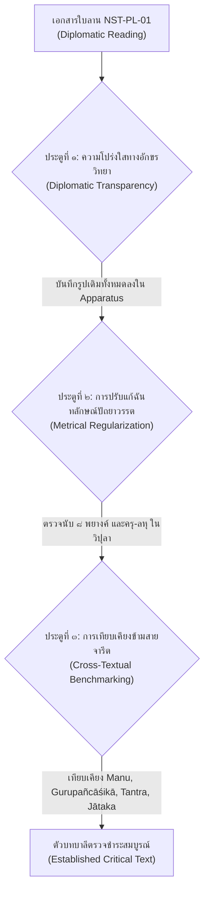

# บทที่ ๒: การตรวจชำระ อักขรวิทยา ฉันทลักษณ์ และการแปลถอดความภาษาบาลีไฮบริด (๒๐ คาถา)

## ๒.๑ ระเบียบวิธีตรวจชำระอักขระเทียบเคียง (Diplomatic Transcription & Critical Collation)

การศึกษาและปริวรรตคัมภีร์ *โสฬสคุรุโทหวณฺณนา* (Soḷasagurudohavaṇṇanā) จากเอกสารใบลานนครศรีธรรมราช รหัสกำกับ NST-PL-01 ซึ่งจารด้วยอักษรขอมไทยถิ่นใต้ (Southern Khom Script) ในช่วงยุคอยุธยาตอนกลาง จำเป็นต้องอาศัยระเบียบวิธีทางปรัชญาภาษาและนิรุกติศาสตร์เชิงประวัติ (Philological and Historical Linguistic Methodology) ที่รัดกุมเป็นพิเศษ เนื่องด้วยคัมภีร์ฉบับนี้จัดเป็นเอกสารตัวเขียนเอกฉบับ (Codex Unicus) ซึ่งไม่มีฉบับสำเนาคู่ขนานตรงตัว (Direct Parallel Manuscript) ในสายตระกูลใบลานภาคกลางหรือล้านนาหลงเหลืออยู่ให้เทียบเคียงแบบคำต่อคำ การดำเนินงานบรรณาธิการต้นฉบับจึงต้องผสานระเบียบวิธีตรวจชำระอักขระสองระดับเข้าด้วยกัน ได้แก่ การถอดอักษรตามสภาพจริงแห่งเอกสารต้นฉบับ (Diplomatic Transcription) เพื่อรักษาพยานหลักฐานทางโบราณอักษรวิทยาไว้ทุกกระเบียดนิ้ว และการสร้างตัวบทตรวจชำระเชิงวิพากษ์ (Critical Text) โดยอาศัยหลักฉันทลักษณ์วิทยา (Metrical Regularization) ควบคู่กับการเทียบเคียงข้ามสายจารีตวรรณกรรม (Cross-Textual Benchmarking)[^1]

[^1]: ดูการวางกรอบระเบียบวิธีวิจัยตัวเขียนเอกฉบับและการวิเคราะห์เปรียบเทียบข้ามสายจารีตใน Alastair Gornall and Giovanni Ciotti, "What Can Be Done with Words: Language and Meaning in Moggallāna's Vyākaraṇa," *Journal of Indian Philosophy* 42, no. 1 (2014): 45–69 (PDF pp. 1–25); และ Oskar von Hinüber, "Pali Manuscripts of North-Western India: The Kathmandu Vinaya Fragment," *Indo-Iranian Journal* 26 (1983): 99–107 (PDF pp. 1–9).

### ๒.๑.๑ สภาพอักขรวิธีและการถอดอักษรตามสภาพจริงแห่งเอกสารต้นฉบับ (Diplomatic Transcription)

ใบลาน NST-PL-01 ปรากฏรูปลักษณ์ของอักษรขอมไทยที่ได้รับการปรับแต่งเข้ากับสัทศาสตร์ภาษาไทยถิ่นใต้และจารีตการจารคัมภีร์ทางพุทธศาสนาในคาบสมุทรมลายูตอนบน ลักษณะเด่นของอักขรวิธีในคัมภีร์นี้คือการจารอย่างต่อเนื่องโดยไม่เว้นวรรคคำ (Scriptio Continua) ตามจารีตใบลานโบราณ พร้อมทั้งการใช้รูปสระผสมและการลดรูปพยัญชนะสังโยคที่สะท้อนอิทธิพลของสำเนียงพูดและระบบเสียงในท้องถิ่น การถอดอักษรตามสภาพจริง (Diplomatic Reading) แสดงให้เห็นถึงความคลาดเคลื่อนทางกลไกของอาลักษณ์ (Mechanical Scribal Errors) หลายประการ ซึ่งสามารถจำแนกออกเป็นหมวดหมู่ทางนิรุกติศาสตร์ได้ดังนี้:

๑. **การตกหล่นของพยางค์และอักขระ (Haplography):** อาลักษณ์มักละเว้นพยัญชนะซ้อนหรือเครื่องหมายนิคหิตเมื่อจารคำที่ปรากฏเสียงคล้ายคลึงกันติดต่อกัน เช่น ในคาถาที่ ๑ วรรคแรก จารเป็น `นินฺทาทิเสาฬสํคณฺฐํ` ซึ่งคำว่า `คณฺฐํ` เป็นการจารคลาดเคลื่อนจาก `กณฺฑํ` (หมวด หรือ บรรพ) อันเนื่องมาจากความสับสนทางสัทศาสตร์ระหว่างเสียงกัณฐชะ โฆษะ และอโฆษะ รวมถึงในคาถาที่ ๗ วรรคแรก จารเป็น `สิสฺเสานาคจฺฉเตคุรุ` ซึ่งตกพยางค์สังโยคและวิภัตติ จนกลายเป็นรูปที่ขาดความสมบูรณ์ทางไวยากรณ์บาลีราชสำนัก

๒. **ความสับสนระหว่างรูปสัณฐานอักษรคู่แฝด (*Confusio Duarum Litterarum*):** ในระบบอักษรขอมไทย เส้นโค้งและเชิงของพยัญชนะบางคู่มีความละม้ายคล้ายคลึงกันอย่างยิ่งจนนำไปสู่การถ่ายทอดผิดพลาด เช่น:
   - ความสับสนระหว่าง ด (da) กับ น (na) เช่น ในคาถาที่ ๔ คำว่า `ปจฺจกฺเขนวเทนามํ` ซึ่งรูปจริงคือ `ปจฺจกฺเข น วเท นามํ` (ห้ามออกนามต่อหน้า) แต่อาลักษณ์จารรวบเป็นคำเดียวประหนึ่งเป็นสมาส
   - ความสับสนระหว่าง ฒ (ḍha) กับ ค (ga) หรือ ต (ta) กับ ว (va)
   - ความสับสนโบราณระหว่าง ฬ (ḷa), ฑ (ḍa), และ ทฺร (dra) ดังที่ ออสการ์ ฟอน ฮินือเบอร์ (Oskar von Hinüber) ได้ชี้ให้เห็นในการศึกษาวิเคราะห์เศษคัมภีร์พระวินัยใบลานที่เก่าแก่ที่สุดจากกาฐมาณฑุ ประเทศเนปาล (ช่วงคริสต์ศตวรรษที่ ๘–๙) ว่าการสับสนระหว่างรูป ฬ / ฑ / ทฺร เป็นลักษณะเฉพาะของจารีตการคัดลอกคัมภีร์บาลีสายภาคพื้นทวีป (Continental Pali Tradition) ที่ได้รับอิทธิพลจากอักขรวิธีสันสกฤตภาคเหนือของอินเดีย[^2] ซึ่งปรากฏชัดในคาถาที่ ๓ คำว่า `ฉายํนลชฺฌเร` ที่อาลักษณ์จารเป็นรูปเพี้ยนจาก `ลงฺฆเย` หรือ `ลงฺฆเร` (การก้าวข้ามเงา)

๓. **อิทธิพลของระบบเสียงภาษาไทยถิ่นใต้ (Southern Thai Phonetic Interference):** อาลักษณ์ผู้จารใบลาน NST-PL-01 แสดงร่องรอยการเปล่งเสียงสระและพยัญชนะตามสำเนียงถิ่นใต้อย่างเด่นชัด ได้แก่:
   - **การใช้สระเอา (au) แทนรูปสระโอ (o):** ในภาษาไทยถิ่นใต้มักปรากฏการออกเสียงสระประสมหรือสระที่มีการยืดและเปลี่ยนฐานเสียง อาลักษณ์จึงจารรูปคำว่า `เสาฬสํ` แทนที่จะเป็น `โสฬส`, `คุรุเทาหํ` แทนที่จะเป็น `คุรุโทหํ`, `สมาสเตา` แทน `สมาสโต`, และ `นิสฺสเยา` แทน `นิสฺสโย` การแปลงสระโอบาลีเป็นสระเอา (au / o alternation) ชี้ชัดว่าอาลักษณ์บันทึกตามเสียงอ่านที่ก้องอยู่ในมโนภาพ (Phonetic Dictation) มากกว่าการลอกลายอักษรจากต้นฉบับบาลีบริสุทธิ์
   - **ปรากฏการณ์เสียงแทรกเสียดและการกลายเสียงพยัญชนะ (Spirantization & Consonant Shift):** ในคาถาที่ ๓ คำว่า `นลชฺฌเร` สะท้อนการกลายเสียงจากรากศัพท์สันสกฤต $\sqrt{\text{laṅgh}}$ (ข้าม, ก้าวล่วง) ผ่านกระบวนการแปลงเสียงเพดานโฆษะมีลม (voiced aspirate velar `gh`) สู่เสียงกึ่งเสียดแทรกเพดาน `jh` ซึ่งพบได้ในสำเนียงท้องถิ่นของคาบสมุทรไทย-มลายู

[^2]: Oskar von Hinüber, "Pali Manuscripts of North-Western India: The Kathmandu Vinaya Fragment," *Indo-Iranian Journal* 26 (1983): 99–107, especially pp. 101–103 (PDF pp. 3–5).

### ๒.๑.๒ ประตูกลั่นกรองสามชั้นในการตรวจชำระตัวบท (The Three Editorial Gates)

เพื่อให้ได้ตัวบทตรวจชำระ (Critical Text) ที่มีความถูกต้อง เที่ยงตรงตามหลักวิชาการ และสะท้อนเจตนารมณ์แห่งพุทธตันตระเถรวาทโบราณ คณะผู้วิจัยจึงได้สถาปนาระบบ "ประตูกลั่นกรองสามชั้น" (The Three Editorial Gates) ขึ้นเป็นเกณฑ์มาตรฐานในการตัดสินใจทางบรรณาธิการ ดังแสดงในแผนภาพต่อไปนี้:

#### ประตูที่ ๑: ความโปร่งใสทางอักขรวิทยา (Diplomatic Transparency)
หลักการข้อแรกคือ ห้ามมิให้มีการแก้ไขรูปศัพท์ในชั้นบันทึกข้อมูลหลักโดยเด็ดขาด ทุกอักขระที่ปรากฏในใบลาน NST-PL-01 จะต้องถูกถ่ายทอดลงในตารางเปรียบเทียบแบบช่องต่อช่อง แม้ว่ารูปคำนั้นจะผิดไวยากรณ์บาลีคลาสสิกอย่างรุนแรงก็ตาม ทุกจุดที่มีการปรับแก้ในตัวบทตรวจชำระ จะต้องระบุรูปอักขระเดิมของใบลานไว้ในเชิงอรรถวิพากษ์ (Critical Apparatus) อย่างละเอียด เพื่อให้ผู้อ่านและนักนิรุกติศาสตร์รุ่นหลังสามารถตรวจสอบย้อนกลับได้ตลอดเวลา

#### ประตูที่ ๒: การปรับแก้ตามฉันทลักษณ์ปัถยาวรรต (Metrical Regularization in Pathyāvatta)
ร้อยกรองทั้ง ๒๐ คาถาในคัมภีร์ *โสฬสคุรุโทหวณฺณนา* รจนาด้วยฉันท์อนุษฏุภ (Anuṣṭubh) หรือในจารีตคัมภีร์วุตโตทัยเรียกว่า **ปัถยาวรรตคาถา** (Pathyāvatta Gāthā) ซึ่งมีกฎเกณฑ์บังคับ ๘ พยางค์ต่อหนึ่งบาท (๔ บาทต่อหนึ่งคาถา รวมเป็น ๓๒ พยางค์) โดยมีโครงสร้างบังคับครุ-ลหุในบาทคี่ (บาทที่ ๑ และ ๓) และบาทคู่ (บาทที่ ๒ และ ๔) ดังนี้:

- **โครงสร้างทั่วไป (General Scheme):** $\times \times \times \times \smile - - \times$ (สำหรับบาทคี่) และ $\times \times \times \times \smile - \smile \times$ (สำหรับบาทคู่)
- ในวรรคคี่ พยางค์ที่ ๒ และ ๓ ห้ามเป็นลหุคู่ ($\smile \smile$) และพยางค์ที่ ๕-๖-๗ ในวรรคคู่ต้องเป็น ลหุ-ครุ-ลหุ ($\smile - \smile$) อย่างเคร่งครัดตามแบบฉบับปัถยาวรรตแท้

เมื่อนำโครงสร้างฉันทลักษณ์นี้มาทาบทับลงบนข้อความใบลานเดิม จะพบว่าหลายตำแหน่งเกิดความบกพร่องทางพยางค์ เช่น พยางค์ขาด (Defective Pāda) หรือพยางค์เกิน (Hypermetrical Pāda) ซึ่งเกิดจากการแทรกคำขยายหรือการสะกดแบบคำพูด การชำระจึงใช้หลักการตัดทอนหรือเติมเต็มตามกฎฉันท์ เช่น:
- ในคาถาที่ ๑ วรรคแรก เดิมจาร `นินฺทาทิเสาฬสํคณฺฐํ` (นับได้ ๘ พยางค์: นิน-ทา-ทิ-โส-ฬะ-สัง-กัณ-ฐัง) มีการแก้ไขตัวสะกดให้เป็น `นินฺทาทิโสฬสกณฺฑํ` เพื่อให้ความหมายตรงกับ "หมวด ๑๖ ข้อ"
- ในคาถาที่ ๕ วรรคสอง เดิมจาร `นเมาพุทฺธายาทิปนฺเตา` (นับได้ ๗ พยางค์: นะ-โม-พุท-ธา-ยา-ทิ-ปัน-โต) ซึ่งพยางค์ขาดไปหนึ่งพยางค์ เมื่อวิเคราะห์ร่วมกับมโนทัศน์ตันตระเถรวาท จึงสามารถบูรณะเป็น `นโมพุทฺธายาทิมนฺโต` (นะ-โม-พุท-ธา-ยา-ทิ-มัน-โต = ๘ พยางค์บริบูรณ์) ซึ่งลงจังหวะครุ-ลหุในบาทคี่ได้อย่างงดงามตามฉันทลักษณ์

#### ประตูที่ ๓: การเทียบเคียงข้ามสายจารีตวรรณกรรม (Cross-Textual Benchmarking)
เนื่องจาก *โสฬสคุรุโทหวณฺณนา* เป็นเอกสารเอกฉบับ การชำระคำศัพท์ที่มีปัญหาจึงไม่อาจกระทำได้ด้วยการเดาความ (Conjectural Emendation) แบบลอยๆ แต่ต้องตั้งอยู่บนฐานการเทียบเคียงกับวรรณกรรมร่วมสมัยและวรรณกรรมต้นธารข้ามสายจารีต ๔ สายหลัก ได้แก่:

๑. **จารีตพระธรรมศาสตร์และอรรถกถา (Dharmaśāstra & Commentarial Tradition):** โดยเฉพาะ *มานวธรรมศาสตร์* (Mānava-Dharmaśāstra) หมวดการปฏิบัติตนของพรหมจารีต่อคุรุ (MDh 2.191–205) และข้อห้ามเรื่องการก้าวข้ามเงา (MDh 4.130) ตลอดจนอรรถกถา *มานวภาษยะ* (Manubhāṣya) ของเมธาติถิ (Medhātithi) ซึ่งได้จำแนกความแตกต่างทางกฎหมายระหว่างการด่าทอโดยตรง (*nindā*) และการนินทาลับหลังหรือการพูดถึงข้อบกพร่องจริง (*parīvāda*) รวมถึงข้อห้ามเรื่องการออกนามครูบาอาจารย์โดยตรง (*kevala-nāma*)[^3]

๒. **จารีตคุรุปัญจาศิกา (Gurupañcāśikā Tradition):** คัมภีร์บทสวดสรรเสริญและข้อวินัยต่อคุรุ ๕๐ คาถาของอัศวโฆษ (Aśvaghoṣa) ที่แพร่หลายในโลกพุทธศาสนาภาษาสันสกฤต ทิเบต และจีน โดยเฉพาะฉบับแปลจีนของพระรื่อเฉิง (Rìchēng / 日稱) ค.ศ. ๑๐๘๔ ในพระไตรปิฎกฉบับไทโช (Taishō Vol. 32, No. 1687: 事師五十頌) ซึ่งคาถาที่ ๒๓ ได้บัญญัติไว้ตรงกันอย่างน่าอัศจรรย์ว่า "หากผู้ใดเหยียบย่ำเงาแห่งพระอาจารย์ ย่อมได้รับบาปประหนึ่งการทำลายพระสถูปเจดีย์" (`若足踏師影 獲罪如破塔`)[^4]

๓. **จารีตพุทธตันตระเถรวาทและโบราณคัมมัฏฐาน (Esoteric Theravada & Borān Kammaṭṭhāna):** การเทียบเคียงกับคัมภีร์สายสมถะ-วิปัสสนาโบราณในเอเชียตะวันออกเฉียงใต้ ตามการรวบรวมและวิเคราะห์ของเคท ครอสบี (Kate Crosby) และ กิมโม กัสโตร ซานเชซ (Kimmo Castro Sánchez) ซึ่งอธิบายบทบาทของพิธีคุรวาภิเษก (*Guru-abhiṣeka*) การจัดตั้งองค์พระ ๕ พระองค์ผ่านรหัสมนตร์ "นโมพุทฺธาย" เข้าสู่สรีรธาตุทั้ง ๕ ในกายเนื้อ เพื่อให้กำเนิด "พระธรรมกาย" (Dhamma-kāya) ตลอดจนการเปิดทวารกระหม่อม (Brahmarandhra) เป็นทางหลุดพ้นสู่นิพพาน[^5]

๔. **จารีตชาดกและพระวินัยมหาเถรวาท (Canonical Jātaka & Vinaya Tradition):** การนำโครงเรื่องและคำฉันท์จาก *ขทิรังคารชาดก* (ชาดกที่ ๔๐) ว่าด้วยการกระโดดลงสู่หลุมถ่านเพลิงไม้ตะเคียนลึก ๘๐ ศอกเพื่อรักษาทานบารมี[^6] และ *มูคผักขชาดก* หรือเตมิยชาดก (ชาดกที่ ๕๓๘) หมวดมิตตทุพภิกัณฑ์ ว่าด้วยการไม่ประทุษร้ายมิตรและครูบาอาจารย์[^7] มาใช้เป็นเกณฑ์เทียบเคียงคำศัพท์และโครงสร้างทางจริยศาสตร์

ระเบียบวิธีประตูกลั่นกรองสามชั้นนี้ ทำหน้าที่เป็นดั่งเข็มทิศนำทางในการเปลี่ยนผ่านจาก "ใบลานดิบที่เต็มไปด้วยข้อผิดพลาดของอาลักษณ์" ไปสู่ "ตัวบทตรวจชำระมาตรฐานทางวิชาการ" ที่เปิดเผยให้เห็นมิติทางประวัติศาสตร์ ภาษาศาสตร์ และจิตวิญญาณอันลึกซึ้งของชาวสยามและคาบสมุทรมลายูโบราณอย่างแท้จริง

[^3]: ดู Patrick Olivelle, *Manu's Code of Law: A Critical Edition and Translation of the Mānava-Dharmaśāstra* (Oxford: Oxford University Press, 2005), pp. 100–102, 129 (PDF pp. 115–117, 144); และ Ganganatha Jha, *Manusmṛti with the Manubhāṣya of Medhātithi*, Vol. 1, Part 2 (Calcutta: University of Calcutta, 1920), pp. 410–435 (PDF pp. 425–450).
[^4]: Rìchēng (日稱), *Gurupañcāśikā* (事師五十頌), Taishō Tripiṭaka Vol. 32, No. 1687 (1084), pp. 775a–777c.
[^5]: Kate Crosby, *Esoteric Theravada: The Story of the Forgotten Meditation Tradition of Southeast Asia* (Boulder: Shambhala, 2020), pp. 115–142 (PDF pp. 130–157); และ Kimmo Castro Sánchez, "The Mantra System of the Borān Kammaṭṭhāna," *Journal of the Oxford Centre for Buddhist Studies* 2 (2010): 34–68 (PDF pp. 1–35).
[^6]: V. Fausbøll, *The Jātaka together with Its Commentary*, Vol. 1 (London: Trübner & Co., 1877), pp. 231–234 (PDF pp. 245–248).
[^7]: V. Fausbøll, *The Jātaka together with Its Commentary*, Vol. 6 (London: Trübner & Co., 1896), pp. 10–14 (PDF pp. 25–29).
