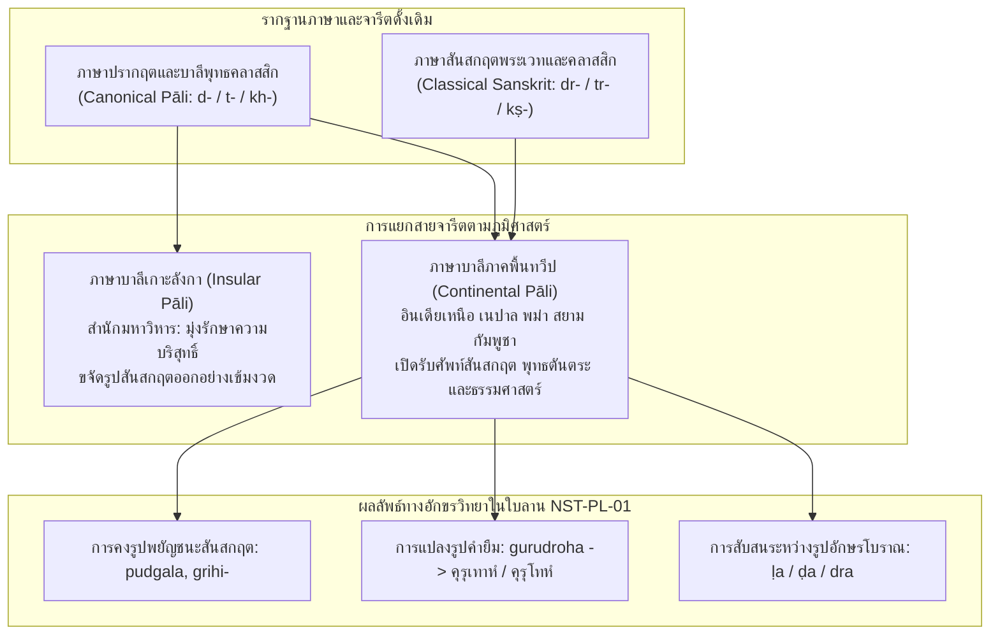

## ๒.๒ ปรากฏการณ์ภาษาบาลีไฮบริด: $\sqrt{\text{druh}}$ (*gurudroha*) สู่ เสาฬสคฺรูเทาห / คุรุเทาหํ

### ๒.๒.๑ วิวัฒนาการทางสัทศาสตร์และนิรุกติศาสตร์: จาก $\sqrt{\text{druh}}$ สู่ *doha* / *dhoha*

ปรากฏการณ์ที่น่าจับตามองที่สุดในมิติภาษาศาสตร์ของคัมภีร์ *โสฬสคุรุโทหวณฺณนา* คือการปรากฏตัวของคำว่า "คุรุโทห" (Gurudoha) หรือที่ในใบลาน NST-PL-01 จารสะกดตามสำเนียงถิ่นใต้ว่า `เสาฬสคฺรูเทาห` และ `คุรุเทาหํ` คำนี้มิใช่คำบาลีบริสุทธิ์ตามจารีตของพระไตรปิฎกเถรวาทบาลีคลาสสิก (Classical Canonical Pāli) แต่เป็นประจักษ์พยานชิ้นเอกของ "ภาษาบาลีผสมผสาน" หรือ "ภาษาบาลีไฮบริด" (Hybrid Pāli) ที่เกิดจากการปะทะ สังสรรค์ และหลอมรวมกันระหว่างไวยากรณ์บาลีกับศัพท์บัญญัติภาษาสันสกฤตในภูมิภาคอุษาคเนย์[^1]

[^1]: ดูการวิเคราะห์ธรรมชาติของภาษาบาลีไฮบริดในภูมิภาคเอเชียใต้และเอเชียตะวันออกเฉียงใต้ใน Oskar von Hinüber, "Pali Manuscripts of North-Western India: The Kathmandu Vinaya Fragment," *Indo-Iranian Journal* 26 (1983): 99–107, especially pp. 100–104 (PDF pp. 2–6); และ Alastair Gornall and Giovanni Ciotti, "What Can Be Done with Words: Language and Meaning in Moggallāna's Vyākaraṇa," *Journal of Indian Philosophy* 42, no. 1 (2014): 45–69 (PDF pp. 1–25).

ในทางนิรุกติศาสตร์เชิงประวัติ คำว่า "โทห" ในที่นี้มิได้สืบเชื้อสายมาจากรากธาตุบาลี $\sqrt{\text{duh}}$ (ทุหฺ - รีดนม, หลั่งออก) ซึ่งแผลงเป็น *doha* ที่แปลว่าการรีดนมโค หากแต่เป็นการถ่ายทอดรูปศัพท์และสนามความหมาย (Semantic Field) โดยตรงมาจากรากธาตุภาษาสันสกฤต $\sqrt{\text{druh}}$ (ทรุหฺ - ประทุษร้าย, ทรยศ, มุ่งร้าย, กบฏ) ซึ่งเมื่อลงปัจจัยนาม *ghañ* (ฆญฺ) ตามกฎไวยากรณ์สันสกฤตของปาณินิ (Aṣṭādhyāyī) จะได้รูปนามกริยาว่า **โัทฺรห** (*droha* - ความประทุษร้าย, การทรยศ, กบฏ) ดังเช่นคำว่า *mitradroha* (การทรยศมิตร) และ *gurudroha* (การประทุษร้ายครูบาอาจารย์)[^2]

ในวรรณคดีพุทธภาษาบาลีคลาสสิกของสำนักมหาวิหารแห่งศรีลังกา เมื่อพระคันถรจนาจารย์ต้องการสื่อถึงการประทุษร้ายต่อมิตรหรือครูบาอาจารย์ จะนิยมใช้รูปศัพท์ที่สืบมาจากรากธาตุบาลีแท้ ๒ ราก ได้แก่:
๑. **$\sqrt{\text{dubh}}$ (ทุภฺ - ประทุษร้าย):** ปรากฏเป็นรูปกริยา *dubbhati* และรูปนาม *dubbha* หรือ *dubbhin* ดังเช่นคำว่า "มิตฺตทุพฺภิ" (*mittadubbhi* - ผู้ประทุษร้ายมิตร) ใน *มูคผักขชาดก* (เตมิยชาดก, ชาดกที่ ๕๓๘)[^3] หรือ "อาจริยทุพฺภิ" (*ācariyadubbhi*)
๒. **$\sqrt{\text{nind}}$ (นินฺทฺ - ติเตียน, บริภาษ):** ปรากฏเป็นคำว่า "คุรุนินฺทา" (*gurunindā*) ซึ่งเน้นย้ำมิติการล่วงละเมิดทางวาจาเป็นหลัก

ทว่า ในคัมภีร์ *โสฬสคุรุโทหวณฺณนา* ผู้รจนาเลือกที่จะไม่ใช้คำว่า *ācariyadubbhi* แต่กลับรับเอาคำว่า *gurudroha* ในภาษาสันสกฤตเข้ามาใช้โดยตรง แล้วแปลงรูปเสียงตามกฎสัทศาสตร์ของการกลายเสียงจากสันสกฤตสู่บาลี (Prakritization / Pālicization):
- กลุ่มพยัญชนะควบกล้ำ `dr` ในสันสกฤต ได้รับการลดรูป (Consonant Cluster Simplification) โดยตัดเสียงรัว `r` ออก เหลือเพียงเสียงทันตชะ `d` กลายเป็น `doha` (โทห)
- หรือในบางจารีตท้องถิ่น มีการชดเชยเสียงลมเป็น `dhoha` (โธห) เพื่อรักษาน้ำหนักเสียงของกลุ่มพยัญชนะเดิมไว้
- ขณะเดียวกัน การคงอยู่ของรูป `เสาฬสคฺรูเทาห` ในใบลาน NST-PL-01 ยังชี้ให้เห็นถึงการแทรกสระเอ-อา (au) ตามอักขรวิธีขอมไทยถิ่นใต้ ซึ่งออกเสียงควบสระกึ่งก้อง สะท้อนว่าคำนี้ถูกใช้งานในฐานะ "คำยืมศักดิ์สิทธิ์" (Sacred Loanword) ที่ผู้รจนาและอาลักษณ์จงใจรักษาเค้าโครงเสียงสันสกฤตไว้เพื่อเพิ่มพูนความขลังและน้ำหนักทางกฎหมาย-จริยธรรม

[^2]: ดูการวิเคราะห์การกระจายตัวของรากศัพท์ $\sqrt{\text{druh}}$ ในวรรณกรรมพระธรรมศาสตร์และตันตระใน Patrick Olivelle, *Manu's Code of Law: A Critical Edition and Translation of the Mānava-Dharmaśāstra* (Oxford: Oxford University Press, 2005), pp. 100–102 (PDF pp. 115–117); และ Arthur Avalon (Sir John Woodroffe), *Kulārṇava Tantra*, Tantrik Texts Vol. 5 (Calcutta: Sanskrit Press Depository, 1918), Ullāsa 11–13, pp. 65–80 (PDF pp. 75–90).
[^3]: V. Fausbøll, *The Jātaka together with Its Commentary*, Vol. 6 (London: Trübner & Co., 1896), pp. 10–14 (PDF pp. 25–29).

### ๒.๒.๒ ภาษาบาลีภาคพื้นทวีปปะทะภาษาบาลีเกาะลังกา (Continental vs. Insular Pāli)

การทำความเข้าใจปรากฏการณ์ไฮบริดใน *โสฬสคุรุโทหวณฺณนา* จำเป็นต้องวางอยู่บนทฤษฎีประวัติศาสตร์ภาษาบาลีของ ออสการ์ ฟอน ฮินือเบอร์ (Oskar von Hinüber) ซึ่งได้จำแนกสายธารภาษาบาลีในเอเชียออกเป็นสองตระกูลใหญ่ ได้แก่ **ภาษาบาลีเกาะลังกา (Insular Pāli)** และ **ภาษาบาลีภาคพื้นทวีป (Continental Pāli)**[^4]

ฟอน ฮินือเบอร์ ได้พิสูจน์ผ่านการชำระเศษคัมภีร์พระวินัยใบลานจากกาฐมาณฑุ (Kathmandu Vinaya Fragment) ว่า จารีตภาษาบาลีบนภาคพื้นทวีปของชมพูทวีป (ซึ่งแผ่ขยายเข้ามายังดินแดนมอญ พม่า ล้านนา และคาบสมุทรสยาม-มลายู) มีลักษณะร่วมที่สำคัญคือการเปิดรับ "รูปคำภาษาสันสกฤต" (Sanskritisms) เข้ามาผสมผสานในคัมภีร์พระวินัยและอรรถกถาอย่างต่อเนื่อง เช่น การใช้รูป *pudgala* (แทนที่จะเป็น *puggala*), การคงรูปวิภัตตินามทวิพจน์ (Dual endings เช่น การลงท้ายด้วย `-e`), การใช้คำว่า *grihi-* (แทนที่จะเป็น *gahaṭṭha*), ตลอดจนความสับสนในรูปสัณฐานอักษรโบราณระหว่าง ฬ (ḷa), ฑ (ḍa), และ ทฺร (dra)[^5]

ในบริบทของนครศรีธรรมราช ซึ่งเป็นเมืองท่าศูนย์กลางการค้านานาชาติและเป็นจุดบรรจบของคลื่นวัฒนธรรมจากทั้งอินเดียเหนือ ลังกา มอญ และศรีวิชัย พระสงฆ์และนักปราชญ์ท้องถิ่นมิได้จำกัดตนเองอยู่เฉพาะในกรอบภาษาบาลีแบบพระพุทธโฆสะแห่งสำนักมหาวิหาร หากแต่ใช้ชีวิตอยู่ในบรรยากาศทางวิชาการแบบ "พหุภาษา" (Multilingualism) ที่คัมภีร์ภาษาสันสกฤต—ทั้งในสายไวยากรณ์จันทรวยากรณ์ (Cāndravyākaraṇa), ตำราพระธรรมศาสตร์, และคัมภีร์ตันตระ—ยังคงมีบทบาทและอำนาจนำทางภูมิปัญญาอย่างสูง การผลิตคัมภีร์ร้อยกรองคำสอนเรื่อง *โสฬสคุรุโทหวณฺณนา* จึงสะท้อนอัตลักษณ์ของภาษาบาลีภาคพื้นทวีปอย่างเด่นชัด โดยการนำคำศัพท์ทางเทคนิคจากภาษาสันสกฤตมาสวมลงในโครงฉันทลักษณ์บาลี เพื่อให้ตอบสนองต่อพันธกิจทางพิธีกรรมและวินัยสงฆ์ในท้องถิ่น

[^4]: Oskar von Hinüber, "Pali Manuscripts of North-Western India: The Kathmandu Vinaya Fragment," *Indo-Iranian Journal* 26 (1983): 99–107 (PDF pp. 1–9).
[^5]: Ibid., pp. 101–103 (PDF pp. 3–5).

### ๒.๒.๓ ทฤษฎีการกลืนกลายทางไวยากรณ์: โมคคัลลานะ, จันทรวยากรณ์ และเจตนาแห่งถ้อยคำทางโลก (*Laukikī Vacanicchā*)

คำถามสำคัญในทางวิชาการคือ พระคันถรจนาจารย์ในยุคโบราณสามารถ "สร้างความชอบธรรม" ให้แก่การใช้รูปภาษาบาลีไฮบริดเช่นนี้ได้อย่างไร ในเมื่อโครงสร้างของคำว่า *gurudoha* มิได้ปรากฏในพระไตรปิฎกบาลี?

คำตอบสำหรับประเด็นนี้ปรากฏอยู่ในงานวิจัยชิ้นบุกเบิกของ อะแลสแตร์ กอร์นอลล์ และ โจวันนี ชอตตี (Alastair Gornall and Giovanni Ciotti, 2014) ซึ่งได้ศึกษาวิเคราะห์การปฏิวัติทางไวยากรณ์บาลีในยุคกลาง โดยเฉพาะสำนักไวยากรณ์ *โมคคัลลานวยากรณ์* (Moggallāna Vyākaraṇa) ของพระโมคคัลลานเถระแห่งลังกา (ศตวรรษที่ ๑๒) ตลอดจนคัมภีร์ *สัมพันธจินตา* (Sambandhacintā) ของพระสังฆรักขิตเถระ[^6]

กอร์นอลล์และชอตตีได้ชี้ให้เห็นว่า พระโมคคัลลานะได้นำเอาระบบอรรถศาสตร์และทฤษฎีการะกะ (Kāraka Theory) จากคัมภีร์ไวยากรณ์สันสกฤตของพุทธคือ *จันทรวยากรณ์* (Cāndravyākaraṇa) ของจันทระโคมิน (Candragomin) เข้ามาประยุกต์ใช้ในการจัดระเบียบภาษาบาลีอย่างลึกซึ้ง หัวใจสำคัญของทฤษฎีนี้คือการยอมรับมโนทัศน์เรื่อง **"ลอกิกี วจนิจฉา" (*laukikī vacanicchā*)** หรือ "เจตนาในการสื่อความหมายตามธรรมเนียมของชาวโลก" ควบคู่กับหลักการทางตรรกศาสตร์ไวยากรณ์เรื่อง **"อสิทธะ" (*asiddha*)** หรือสภาวะที่กฎเกณฑ์เดิมยังไม่อาจบังคับใช้ได้อย่างเบ็ดเสร็จสมบูรณ์ หากขัดแย้งกับเจตจำนงในการสื่อสารจริงของผู้พูด[^7]

ภายใต้ทฤษฎี *ลอกิกี วจนิจฉา* พระเถระในยุคกลางไม่ได้มองภาษาบาลีเป็นระบบปิดที่ตายตัว (Closed and Static System) แต่มองว่าเป็นเครื่องมือทางภาษาที่มีชีวิตและสามารถปรับแปรให้รองรับ "ความต้องการทางสังคม-วัฒนธรรม" (Socio-Cultural Demands) ได้ เมื่อพระสงฆ์ฝ่ายพุทธตันตระเถรวาทในสยามและคาบสมุทรมลายูจำเป็นต้องสถาปนา "วินัยแห่งสายธารครูอาจารย์" (Lineage Discipline / Samaya) ให้มีความศักดิ์สิทธิ์ทัดเทียมกับจารีตตันตระของมหายานและจารีตกฎหมายของพระธรรมศาสตร์ พระองค์จึงทรงอาศัยหลัก *วจนิจฉา* ในการหลอมรวมคำศัพท์สันสกฤต *gurudroha* เข้ามาสถาปนาเป็นหมวดธรรมเฉพาะทางในภาษาบาลี เพื่อใช้เป็นเครื่องมือปกครองและคุ้มกันสถาบันสงฆ์ภายในเครือข่ายโบราณคัมมัฏฐาน

นอกจากนี้ เจฟฟรีย์ โกติค (Jeffrey Kotyk, 2024) ยังได้เน้นย้ำในการศึกษาเปรียบเทียบพระวินัยมหาภาษิตและพระวินัยมหายานว่า การยืมศัพท์กฎหมายและโครงสร้างความรับผิดชอบร่วมกัน (Corporate Responsibility) ระหว่างอุปัชฌาย์กับสัทธิวิหาริก เข้ามาสู่ระบบวินัยสงฆ์ เป็นปรากฏการณ์สากลของพุทธศาสนาในเอเชีย เพื่อสร้าง "ความคุ้มกันทางศาสนจักร" (Ecclesiastical Immunity) และดำรงสถานะอันล่วงละเมิดมิได้ของพระมหาเถระผู้เป็นหัวหน้าสำนัก[^8] การถือกำเนิดของ *โสฬสคุรุโทหวณฺณนา* จึงมิใช่ความวิปริตทางไวยากรณ์ หากแต่เป็นสุดยอดนวัตกรรมทางภาษาศาสตร์และนิติศาสตร์พุทธศาสนา ที่สะท้อนอัจฉริยภาพของปัญญาชนแห่งนครศรีธรรมราชในการผสานขุมพลังแห่งภาษาบาลีและสันสกฤตเข้าด้วยกันอย่างสมบูรณ์แบบ

[^6]: Alastair Gornall and Giovanni Ciotti, "What Can Be Done with Words: Language and Meaning in Moggallāna's Vyākaraṇa," *Journal of Indian Philosophy* 42, no. 1 (2014): 45–69 (PDF pp. 1–25).
[^7]: Ibid., pp. 52–58 (PDF pp. 8–14).
[^8]: Jeffrey Kotyk, "Vinaya and Corporate Responsibility in Early Monastic Law," *Buddhist Studies Review* 41, no. 1 (2024): 45–70 (PDF pp. 1–26).
