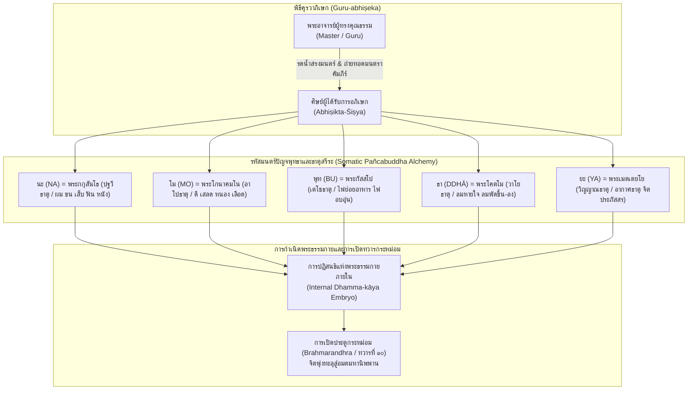

## ๒.๔ รหัสตันตระเถรวาทในตัวบท: คุรุนาภิสิโต (Guru-abhiṣeka) และ นโมพุทฺธายาทิ-ปตฺโต

หัวใจเชิงเทววิทยาและสมาธิภาวนาที่สำคัญที่สุดของคัมภีร์ *โสฬสคุรุโทหวณฺณนา* ปรากฏเด่นชัดในคาถาที่ ๕ ซึ่งบันทึกไว้อย่างทรงพลังว่า:

> `คุรุนาภิสิโต สิสฺโส นโมพุทฺธายาทิมนฺโต`
> `ปตฺโต สพฺพญฺญุตญาณํ สพฺพพุทฺเธหิ ปูชิโต ฯ`
> (ในใบลาน NST-PL-01 จารเป็น: `คุรุนาภิเสเกาสิสฺเสา นเมาพุทฺธายาทิปนฺเตา ปตฺเตาสพฺพญฺญูตญาณํ สพฺพพุทฺเธหิปูชิเตา ฯ`)

คาถานี้มิได้เป็นเพียงบทสวดธรรมดา แต่เป็น "รหัสผ่านทางจิตวิญญาณ" (Spiritual Cipher) ที่เปิดเผยถึงความเชื่อมโยงอันลึกซึ้งระหว่างวรรณกรรมชิ้นนี้กับจารีต **พุทธตันตระเถรวาท (Esoteric Theravada)** หรือที่รู้จักกันในภูมิภาคสยาม ลาว และกัมพูชา ภายใต้ชื่อ **"โบราณคัมมัฏฐาน" (Borān Kammaṭṭhāna)**[^1]

[^1]: ดูการศึกษาวิเคราะห์โครงสร้างคำสอนและประวัติศาสตร์ของโบราณคัมมัฏฐานใน Kate Crosby, *Esoteric Theravada: The Story of the Forgotten Meditation Tradition of Southeast Asia* (Boulder: Shambhala, 2020), pp. 115–142, 185–210 (PDF pp. 130–157, 200–225); และ Kimmo Castro Sánchez, "The Mantra System of the Borān Kammaṭṭhāna," *Journal of the Oxford Centre for Buddhist Studies* 2 (2010): 34–68 (PDF pp. 1–35).

### ๒.๔.๑ พิธีคุรวาภิเษก (Guru-Abhiṣeka): พันธสัญญาศักดิ์สิทธิ์และการถ่ายทอดสายธรรม

คำว่า `คุรุนาภิสิโต` (บาลี: *คุรุนา อภิสิโต* หรือในใบลานเดิม `คุรุนาภิเสเกา` จากสันสกฤต *Guru-abhiṣeka*) เป็นศัพท์เฉพาะทางในพิธีกรรมตันตระ ซึ่งหมายถึง "การที่ศิษย์ได้รับการรดน้ำอภิเษกและประสิทธิ์ประสาทพรจากพระอาจารย์" ในบริบทของพุทธศาสนาเถรวาทดั้งเดิม การอุปสมบทเป็นภิกษุใช้กระบวนการทางสังฆกรรมที่เรียกว่า "ญัตติจตุตถกรรมวาจา" โดยไม่มีการใช้น้ำอภิเษกศีรษะ ทว่าในจารีตโบราณคัมมัฏฐานแห่งลุ่มน้ำเจ้าพระยาและคาบสมุทรมลายู พิธีคุรวาภิเษกถือเป็นหัวใจของการรับมอบ "คัมภีร์ลับ" หรือตำราครู (*kpuon lāk'*) ซึ่งศิษย์จะต้องปฏิญาณตนว่าจะรักษาความลับและเคารพเชื่อฟังพระอาจารย์ประหนึ่งพระพุทธเจ้า หากศิษย์ละเมิดข้อห้ามหรือก่อคุรุโทหะ พิธีกรรมที่เคยประสิทธิ์ไว้จะกลับกลายเป็นคำสาปแช่งที่ทำลายล้างชีวิตของศิษย์ผู้นั้นทันที[^2]

ในคัมภีร์ *กุลารณวะตันตระ* (Kulārṇava Tantra) อุลลาสะที่ ๑๑–๑๓ ได้กล่าวถึงความสำคัญของพิธีอภิเษกไว้อย่างสอดคล้องกันว่า เมื่อครูได้ทำพิธีอภิเษกให้แก่ศิษย์แล้ว คุรุย่อมต้องแบกรับเอากรรมและบาป (*pāpa*) ของศิษย์มาไว้บนบ่าของตน หากศิษย์รักษาคำสัตย์ (*samaya*) ย่อมบรรลุผลสำเร็จทั้งทางโลกและทางธรรม แต่หากศิษย์คิดคดทรยศ บาปนั้นจะส่งผลสะท้อนกลับให้ครูและศิษย์ต้องตกนรกหมกไหม้ร่วมกัน[^3] เช่นเดียวกับที่ ศานติเทวะ (Śāntideva) ได้ประมวลไว้ในคัมภีร์ *ศิกษาสมุจจัย* (Śikṣāsamuccaya) ว่าการมองเห็นอาจารย์เป็นพระพุทธเจ้าและการภักดีต่อวัชราจารย์เป็นรากฐานอันขาดมิได้ของการตรัสรู้[^4]

[^2]: Kimmo Castro Sánchez, "The Mantra System of the Borān Kammaṭṭhāna," pp. 40–45 (PDF pp. 7–12).
[^3]: Arthur Avalon (Sir John Woodroffe), *Kulārṇava Tantra*, Tantrik Texts Vol. 5, Ullāsa 11, pp. 68–72 (PDF pp. 78–82).
[^4]: Cecil Bendall and W.H.D. Rouse, *Śikṣāsamuccaya: A Compendium of Buddhist Doctrine* (London: John Murray, 1922), pp. 120–126 (PDF pp. 135–141).

### ๒.๔.๒ รหัสลับ "นโมพุทฺธาย": การแทนที่ปัญจชินพุทธะด้วยพระพุทธเจ้า ๕ พระองค์แห่งภัทรกัป

ในบาทที่สองของคาถาที่ ๕ ระบุถึง `นโมพุทฺธายาทิมนฺโต` ("มีมนตร์อันเริ่มต้นด้วย นโมพุทฺธาย") นักมานุษยวิทยาและผู้เชี่ยวชาญด้านโบราณคัมมัฏฐานอย่าง เคท ครอสบี (Kate Crosby, 2020) และ กิมโม กัสโตร ซานเชซ (Kimmo Castro Sánchez, 2010) ได้ชี้ชัดว่า คาถาพระพุทธเจ้า ๕ พระองค์ "นะ-โม-พุท-ธา-ยะ" ในภูมิภาคเอเชียตะวันออกเฉียงใต้ ทำหน้าที่เป็น "กลไกการกลืนกลายทางเทววิทยา" (Theological Syncretism):

ในตันตระมหายานและวัชราจารย์ การปฏิบัติสมาธิจะพึ่งพาพระธยานิพุทธะทั้ง ๕ พระองค์ (Pañca Jina ได้แก่ ไวโรจนะ, อักษโภภยะ, รัตนสัมภวะ, อมิตาภะ, และ อโมฆสิทธิ) แต่เนื่องจากคณะสงฆ์เถรวาทไม่อาจยอมรับพระธยานิพุทธะนอกพระไตรปิฎกได้ ปราชญ์โบราณคัมมัฏฐานจึงได้ประดิษฐ์นวัตกรรมทางสมาธิขึ้น โดยการนำเอา **พระพุทธเจ้าทั้ง ๕ พระองค์แห่งภัทรกัป (The Five Buddhas of the Bhaddakappa)** มาจับคู่กับพยางค์ศักดิ์สิทธิ์และธาตุสรีระภายในกายมนุษย์แทน:
๑. **นะ (NA):** แทน พระกกุสันธพุทธเจ้า สถิต ณ ปฐวีธาตุ (ธาตุดิน ๒๐ ประการ เช่น ผม ขน เล็บ ฟัน หนัง)
๒. **โม (MO):** แทน พระโกนาคมนพุทธเจ้า สถิต ณ อาโปธาตุ (ธาตุน้ำ ๑๒ ประการ เช่น ดี เสลด หนอง เลือด)
๓. **พุท (BU):** แทน พระกัสสปพุทธเจ้า สถิต ณ เตโชธาตุ (ธาตุไฟ ๔ ประการ)
๔. **ธา (DDHĀ):** แทน พระโคตมพุทธเจ้า สถิต ณ วาโยธาตุ (ธาตุลม ๖ ประการ)
๕. **ยะ (YA):** แทน พระเมตเตยยพุทธเจ้า (พระศรีอาริยเมตไตรย) สถิต ณ อากาศธาตุและวิญญาณธาตุ (จิตประภัสสร)[^5]

เมื่อศิษย์ได้รับการอภิเษกและภาวนาปลุกเสกตัวอักษรทั้ง ๕ นี้ รหัสเสียงจะเข้าไปแปรสภาพธาตุหยาบในกายเนื้อ (Rūpa-kāya) ให้กลายเป็นตัวอ่อนแห่ง **"พระธรรมกาย" (Dhamma-kāya)** ที่บริสุทธิ์สถิตอยู่ ณ ศูนย์กลางกายเหนือสะดือสองนิ้วมือ ซึ่งเป็นกระบวนการเล่นแร่แปรธาตุภายใน (Internal Alchemy) อันเปรียบเสมือนการบรรลุ "สัพพัญญุตญาณ" ในระดับย่อส่วนตามที่ระบุไว้ในคาถาว่า `ปตฺโต สพฺพญฺญุตญาณํ`

[^5]: Kate Crosby, *Esoteric Theravada*, pp. 130–138 (PDF pp. 145–153).

### ๒.๔.๓ การเปิดทวารกระหม่อม (Brahmarandhra) ปะทะ การตัดศีรษะ (Siraṃ Chindati)

มิติที่น่าพิศวงที่สุดประการหนึ่งในการตีความรหัสตันตระเถรวาท คือความสัมพันธ์ระหว่างคาถาที่ ๕ กับคาถาที่ ๑๕:
ในขณะที่คาถาที่ ๑๕ กล่าวถึงการตัดศีรษะบูชาครู (`สิรํ ฉินฺทติ วิย วา... อตฺตโน สิรํ ฉินฺทิตฺวา คุรุปูชํ กเรยฺย โส`) ในเชิงสัญลักษณ์ของการสละสรีระขั้นสูงสุด กัสโตร ซานเชซ (2010) ได้ให้ข้อสังเกตเชิงลึกว่า ในตำราโบราณคัมมัฏฐาน การ "เปิดศีรษะ" มิใช่การใช้ดาบฟันคอทางกายภาพ หากแต่เป็นรหัสสมาธิว่าด้วย **"การเปิดทวารกระหม่อม" (Opening of the Fontanelle / Brahmarandhra)** ซึ่งถือเป็น "ประตูที่ ๑๐" ของร่างกายมนุษย์ (เหนือทวารทั้ง ๙ ตามธรรมชาติ)[^6]

ในยามที่พระโยคาวจรผู้สำเร็จวิชาโบราณคัมมัฏฐานจะละสังขาร พระอาจารย์ผู้เป็นคุรุจะทำหน้าที่กำกับจิตและใช้พลังสมาธิเปิดรอยประสานกะโหลกศีรษะส่วนบน เพื่อให้ดวงจิตและพระธรรมกายพุ่งทะยานออกจากสรีระผ่านทวารกระหม่อมตรงดิ่งสู่สุทธาวาสพรหมโลกหรืออมตมหานิพพาน โดยไม่ต้องเวียนว่ายในอบายภูมิ แต่หากศิษย์ผู้ใดกระทำ "คุรุโทหะ" ทวารกระหม่อมจะปิดสนิท และจิตจะถูกกระชากลงสู่ทวารเบื้องต่ำ ไหลร่วงลงสู่นรกอเวจีทันที ความภักดีต่อคุรุและการปกป้องสายธรรมจึงมิใช่เพียงเรื่องมารยาททางสังคม แต่เป็นเงื่อนไขชี้ขาดความอยู่รอดแห่งดวงวิญญาณในภพภูมิปรโลกอย่างแท้จริง

[^6]: Kimmo Castro Sánchez, "The Mantra System of the Borān Kammaṭṭhāna," pp. 55–60 (PDF pp. 22–27).
