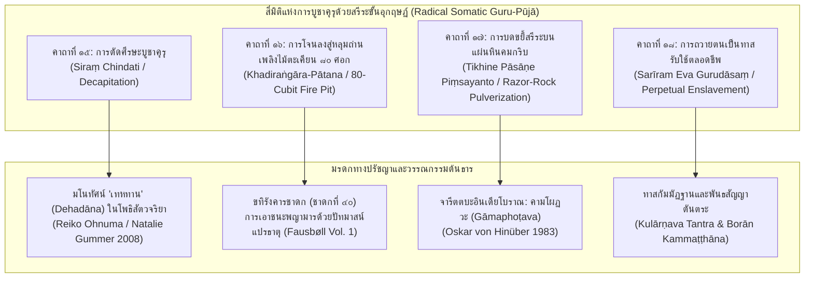

## ๒.๕ การจำแนก ๑๖ คุรุโทหะ และมโนทัศน์คุรุภักดีสละชีพสุดขั้ว

### ๒.๕.๑ อนุกรมวิธานความผิด ๑๖ ประการ (The Taxonomy of the 16 Gurudohas)

โครงสร้างแกนกลางของคัมภีร์ *โสฬสคุรุโทหวณฺณนา* คือการประมวลและจำแนก "พฤติกรรมแห่งการประทุษร้ายและลบหลู่ครูอาจารย์" ออกเป็น ๑๖ ฐานความผิดอย่างเป็นระบบ ซึ่งถือเป็นประมวลกฎหมายวินัยทางจิตวิญญาณที่มีความละเอียดและเข้มงวดที่สุดฉบับหนึ่งในโลกพุทธศาสนาอุษาคเนย์ จากการตรวจชำระตัวบทบาลีเทียบเคียงกับคัมภีร์ *มานวธรรมศาสตร์* (MDh), *คุรุปัญจาศิกา* (GP), และ *กุลารณวะตันตระ* (KT) คณะผู้วิจัยสามารถจัดทำตารางวิเคราะห์อนุกรมวิธานแห่งคุรุโทหะทั้ง ๑๖ ประการได้ดังนี้:

| ลำดับที่ | ฐานความผิดคุรุโทหะ (บาลี) | ความหมายและพฤติการณ์แห่งการละเมิด | แหล่งเทียบเคียงข้ามสายจารีต |
|:---:|:---|:---|:---|
| **๑** | **คุรุนินฺทา** (*Gurunindā*) | การด่าทอ สาปแช่ง เสกสรรปั้นเรื่องเท็จขึ้นมาใส่ร้ายป้ายสีครูอาจารย์ทั้งต่อหน้าและลับหลัง | MDh 2.199, Medhātithi (Jha 1920: 422), GP คาถาที่ ๑๑ |
| **๒** | **คุรุปริวาท** (*Guru-parīvāda*) | การนำเอาข้อบกพร่อง ความผิดพลาด หรือเรื่องส่วนตัวที่เป็นความจริงของครูไปเที่ยวโพนทะนา | MDh 2.200, Medhātithi (Jha 1920: 423) |
| **๓** | **ฉายาลลงฺฆน** (*Chāyā-laṅghana*) | การเดินก้าวข้าม เหยียบย่ำ หรือทอดเงาทับเงาของพระอาจารย์ | MDh 4.130 (Olivelle 2005: 129), GP คาถาที่ ๒๓ (T1687: 776a) |
| **๔** | **ปริกฺขาราวกฺกมน** (*Parikkhāra-avakramana*) | การก้าวข้าม เหยียบ นั่งทับ หรือนำบริขารศักดิ์สิทธิ์ (จีวร ฉัตร บาตร อาสนะ) ไปใช้สอยอย่างตีเสมอ | GP คาถาที่ ๑๓, ๒๓, KT Ullāsa 12 |
| **๕** | **เกวลนามคฺรหณ** (*Kevala-nāma-grahaṇa*) | การเอ่ยเรียกชื่อตัวของครูอาจารย์ลอยๆ โดยไม่มีสมณศักดิ์หรือราชทินนามนำหน้า | MDh 2.199 (*kevalam*), GP คาถาที่ ๓๔ (*pādānta*) |
| **๖** | **สริเก สหาวาส** (*Sarake Sahāvāsa*) | การอยู่อาศัยในห้องเดียวกัน วางที่นอนเสมอครู หรือการละเมิดภาชนะสรงบาท (*śarāva*) | MDh 2.203, *Śrī Gurugītā* v. 76, KT Ullāsa 12 |
| **๗** | **อสฺวยา / อุสฺสูยา** (*Asūyā / Ussūyā*) | ความริษยา การเพ่งโทษเคลือบแคลงสงสัยในศีลบริสุทธิ์และภูมิธรรมของพระอาจารย์ | Kate Crosby (2020: 122), KT Ullāsa 11 |
| **๘** | **เสวาวิปนฺน** (*Sevā-vipanna*) | การละเลยทอดทิ้งการปรนนิบัติอุปัฏฐาก การไม่ล้างเท้า ไม่จัดหาน้ำฉันน้ำใช้ ไม่บีบนวด | GP คาถาที่ ๓๗–๔๐, KT Ullāsa 12 |
| **๙** | **วาจาติกฺกม** (*Vācātikkama*) | การพูดจาล่วงเกิน การเถียงครู การพูดสอดแทรกขณะสอน หรือการโต้ตอบด้วยถ้อยคำก้าวร้าว | Medhātithi (Jha 1920: 418), MDh 2.202 |
| **๑๐** | **โกธ / โรสก** (*Krodha / Rosana*) | การแสดงอารมณ์โกรธ หน้าบึ้งตึง ฟึดฟัด หรือผูกใจเจ็บเมื่อได้รับการตักเตือนสั่งสอน | GP คาถาที่ ๒๐, ๒๒ |
| **๑๑** | **อญฺญคุรุมาน** (*Anya-guru-māna*) | การยกย่องเชิดชูอาจารย์อื่นภายนอกสำนัก เพื่อนำมาเปรียบเทียบข่มเหงอาจารย์ผู้ประสิทธิ์ประสาท | KT Ullāsa 12, *Śrī Gurugītā* v. 85 |
| **๑๒** | **กายโทห** (*Kāya-doha*) | การประทุษร้ายทางกาย การแสดงกิริยาหยาบคาย การข่มขู่ทำร้ายร่างกายอาจารย์ | Mūgapakkha Jātaka (Fausbøll Vol. 6: 12) |
| **๑๓** | **วจีโทห** (*Vacī-doha*) | การประทุษร้ายทางวาจา การแช่งด่าลับหลัง การยุยงให้หมู่คณะแตกแยกและเกลียดชังอาจารย์ | Ibid., KT Ullāsa 11 |
| **๑๔** | **มโนโทห** (*Mano-doha*) | การคิดคดทรยศในใจ การมุ่งร้าย หมายให้ครูอาจารย์ถึงแก่ความวิบัติ มรณภาพ หรือเสื่อมลาภ | Ibid., Śikṣāsamuccaya (Bendall 1922: 125) |
| **๑๕** | **กตญฺญุตาวินาส** (*Kataññutā-vināsa*) | การทำลายความกตัญญูกตเวที การเนรคุณ ปฏิเสธสายธารและหนี้บุญคุณแห่งการประสิทธิ์ประสาทวิชา | Jātaka No. 538 (Mittadubbhi-khaṇḍa) |
| **๑๖** | **สาสนเภท / สมายเภท** (*Sāsana-bheda / Samaya-bheda*) | การทำลายสายธรรม การก่อความแตกแยกในสำนัก การละเมิดพันธสัญญาศักดิ์สิทธิ์ที่ได้อภิเษกไว้ | KT Ullāsa 11–13, Kotyk (2024: 55) |

[^1]

[^1]: ดูการสังเคราะห์ตารางเทียบเคียงบทลงโทษและมิติทางศีลธรรมใน Patrick Olivelle, *Manu's Code of Law*, pp. 100–102, 129; Ganganatha Jha, *Manusmṛti with the Manubhāṣya of Medhātithi*, Vol. 1, Part 2, pp. 410–435; และ Rìchēng, *Gurupañcāśikā*, Taishō No. 1687.

### ๒.๕.๒ มโนทัศน์คุรุภักดีสละชีพสุดขั้วและการทรมานสรีระ (Extreme Somatic Devotion & Bodily Sacrifice)

สิ่งที่ทำให้ *โสฬสคุรุโทหวณฺณนา* มีความโดดเด่นและสร้างความสะเทือนอารมณ์แก่นักวิชาการด้านศาสนาเปรียบเทียบ คือการนำเสนอภาพ "การพลีชีพและการทรมานสรีระ" (Radical Somatic Mortification) เพื่อบูชาคุรุในคาถาที่ ๑๕ ถึง ๑๘ ซึ่งสะท้อนมโนทัศน์เรื่องการสละอวัยวะและชีวิตเป็นทาน (**เทหทาน - Dehadāna**) อย่างสุดโต่ง:

#### คาถาที่ ๑๕: การตัดศีรษะเป็นทาน (Siraṃ Chindati)
ข้อความในคาถาที่ ๑๕ ระบุว่า:
> `สิรํ ฉินฺทติ วิย วา สพฺพทานํ ปวุจฺจติ`
> `อตฺตโน สิรํ ฉินฺทิตฺวา คุรุปูชํ กเรยฺย โส ฯ`
> ("การตัดศีรษะของตนออกบูชาพระอาจารย์ ย่อมได้รับการขนานนามว่าเป็นยอดแห่งทานทั้งปวง...")

เรอิโกะ โอห์นูมะ (Reiko Ohnuma) และ นาตาลี กัมเมอร์ (Natalie Gummer, 2008) ได้วิเคราะห์มโนทัศน์เรื่อง "เทหทาน" (*Dehadāna*) หรือการบริจาคอวัยวะและชีวิตในวรรณคดีพุทธศาสนาสันสกฤตไว้อย่างลึกซึ้งว่า ศีรษะเป็นศูนย์รวมแห่งอัตตา ความถือตัว (Māna) และเกียรติยศสูงสุดของมนุษย์ การที่ศิษย์ยอมสละศีรษะของตนเพื่อบูชาคุรุ มิได้เป็นเพียงการฆ่าตัวตาย แต่เป็น "พิธีกรรมเชิงสัญลักษณ์แห่งการประหารอัตตา" (Symbolic Annihilation of the Ego) เพื่อเปิดรับพระธรรมกายและสัจธรรมขั้นสูงสุดของพระพุทธเจ้า[^2]

#### คาถาที่ ๑๖: การโจนลงสู่หลุมถ่านเพลิงไม้ตะเคียน (Khadiraṅgāra)
ในคาถาที่ ๑๖ เปรียบเทียบความภักดีของศิษย์ว่า:
> `ขทิรงฺคารสมฺปุณฺเณ อาวาเต ปตนํ วิย...`
> ("ประหนึ่งการกระโดดลงสู่หลุมอันเต็มเปี่ยมด้วยถ่านเพลิงไม้ตะเคียน...")

ภาพลักษณ์นี้ดึงมาจาก *ขทิรังคารชาดก* (ชาดกที่ ๔๐) ในพระไตรปิฎกบาลีโดยตรง ซึ่งพระโพธิสัตว์เสวยพระชาติเป็นอนาถบิณฑิกเศรษฐี ถูกพญามารเนรมิตหลุมถ่านเพลิงไม้ตะเคียนลึก ๘๐ ศอกที่ลุกโชนด้วยไฟนรกขึ้นมาขวางหน้าเพื่อขัดขวางการถวายทานแก่พระปัจเจกพุทธเจ้า ทว่าพระโพธิสัตว์ได้ตั้งจิตอธิษฐานแล้วกระโดดลงสู่หลุมเพลิง ทันใดนั้น ดอกบัวทิพย์ขนาดเท่ากงล้อเกวียนได้ผุดขึ้นมารองรับพระบาท (**ปัทมาสน์แปรธาตุ**)[^3] การที่ *โสฬสคุรุโทหวณฺณนา* นำเอาภาพหลุมเพลิงขทิรังคารมาใช้ ย่อมแสดงว่าเปลวไฟแห่งการบูชาคุรุจะถูกแปรสภาพเป็นดอกบัวแห่งปัญญาญาณสำหรับศิษย์ผู้มีสัจจะ

#### คาถาที่ ๑๗ และ ๑๘: การบดขยี้เนื้อหนังและการถวายตนเป็นทาสรับใช้ตลอดกาล
คาถาที่ ๑๗ พรรณนาภาพการนำสรีระไปบดถูกับหินคมกริบ (`ติขิเณเนว ปาสาเณ สรีรํ ปิํสยํ วิย`) ซึ่งเชื่อมโยงกับการบำเพ็ญตบะทรมานกาย (*gāmaphoṭava*) เพื่อขจัดกิเลสตามที่ ฟอน ฮินือเบอร์ (1983) ได้บันทึกไว้[^4] ขณะที่คาถาที่ ๑๘ สรุปยอดแห่งความภักดีด้วยการถวายร่างกายทั้งสิ้นให้เป็น "ทาสแห่งคุรุ" (`สรีรเมว คุรุทาสํ นิวาเสตฺวา อเสสโต`) อันนำไปสู่การได้รับมหาสมบัติทั้งในมนุษยโลก สวรรค์ และพระนิพพาน

[^2]: Reiko Ohnuma, *Head, Eyes, Flesh, and Blood: Giving Away the Body in Indian Buddhist Literature* (New York: Columbia University Press, 2007), reviewed by Natalie Gummer, *Journal of the American Academy of Religion* 76, no. 2 (2008): 502–505 (PDF pp. 1–4).
[^3]: V. Fausbøll, *The Jātaka together with Its Commentary*, Vol. 1, pp. 231–234 (PDF pp. 245–248).
[^4]: Oskar von Hinüber, "Pali Manuscripts of North-Western India: The Kathmandu Vinaya Fragment," p. 104 (PDF p. 6).

### ๒.๕.๓ วิบากกรรมในปรโลก: นรก ๓๓ ขุม, อเวจี, และการเกิดเป็นเดรัจฉาน ๔ จำพวก

ในทางตรงกันข้าม หากศิษย์ผู้ใดก่อคุรุโทหะ บทลงโทษทางจิตวิญญาณจะรุนแรงเกินกว่าที่อำนาจใดๆ ในสากลจักรวาลจะช่วยเหลือได้ คาถาที่ ๑๐ และ ๑๑ บันทึกไว้อย่างน่าสะพรึงกลัวว่า:
> `ยมโลกญฺจ ปปฺโปติ เตตฺตึส นรเกสุ ปิ`
> `อวิจิมฺหิ อุปฺปชฺชติ มหาทุกฺขํ นิรนฺตรํ ฯ`
> `น สกฺโกนฺติ ปิ สพฺเพ ปิ เทวา สกฺกาทโย ปิ จ`
> `สกฺกา สิสฺสํ น มุญฺจิตุํ ทสํ ทิสํ ปลายิตฺวา ฯ`

ศิษย์ทรยศจะต้องตกสู่นรกของพญายมราช ตลอดจนนรกบริวารทั้ง ๓๓ ขุม และจมดิ่งลงสู่อเวจีมหานรกประหนึ่งพระเทวทัตและพระโกกาลิกะ (คาถาที่ ๑๒–๑๓) แม้ศิษย์ผู้นั้นจะเตลิดหนีไปสู่ทิศทั้ง ๑๐ หรือแม้แต่ท้าวสักกเทวราชและเหล่าเทพยดาทั้งปวง ก็ไม่อาจยื่นมือเข้าช่วยปลดเปลื้องวิบากกรรมนี้ได้ ข้อความนี้สอดคล้องอย่างสมบูรณ์แบบกับโศลกอันเลื่องลือใน *ศรีคุรุกีตา* และ *กุลารณวะตันตระ* ที่ว่า:
> `śive ruṣṭe gurus trātā gurau ruṣṭe na kaścana /`
> ("หากพระศิวะทรงกริ้ว คุรุยังทรงเป็นผู้ปกป้องคุ้มครองได้ แต่หากคุรุกริ้วแล้วไซร้ ไม่มีผู้ใดในสามโลกจะคุ้มครองได้เลย")[^5]

นอกจากนี้ ในมโนทัศน์ของ *มานวธรรมศาสตร์* บทที่ ๒ โศลกที่ ๒๐๑ และอรรถกถาของเมธาติถิ ยังได้ระบุวิบากกรรมซูมอร์ฟิก (Zoomorphic Retribution) ว่า ศิษย์ที่นินทาว่าร้ายครู ย่อมต้องไปเกิดเป็นสัตว์เดรัจฉานต่ำช้า ๔ จำพวกตามลำดับ ได้แก่ **ลา** (*gardabha*), **สุนัข** (*śvan*), **หนอน** (*kṛmi*), และ **แมลงปีกแข็ง** (*kīṭa*)[^6] การผสานทัศนะเรื่องนรกอเวจีของพุทธเข้ากับวิบากกรรมของพระธรรมศาสตร์และตันตระใน *โสฬสคุรุโทหวณฺณนา* จึงทำหน้าที่เป็นกำแพงแก้วทางจริยธรรมที่คอยพิทักษ์รักษาระเบียบวินัยแห่งสำนักสงฆ์โบราณไว้อย่างมั่นคงสืบมาหลายร้อยปี

[^5]: *Śrī Gurugītā*, ed. Swami Muktananda, verse 52; และ Arthur Avalon, *Kulārṇava Tantra*, Ullāsa 12, p. 74 (PDF p. 84).
[^6]: Patrick Olivelle, *Manu's Code of Law*, p. 101 (PDF p. 116); และ Ganganatha Jha, *Manusmṛti with the Manubhāṣya of Medhātithi*, Vol. 1, Part 2, pp. 425–428 (PDF pp. 440–443).
