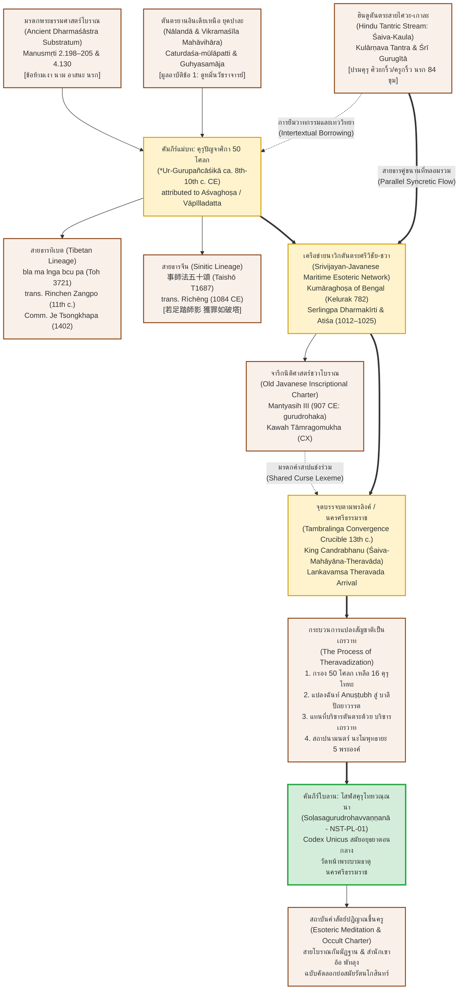

### ๙.๓ แบบจำลองพันธุศาสตร์คัมภีร์และวิวัฒนาการสายตระกูล (Stemmatic Genealogy & Stemma Codicum Model)

การประมวลผลข้อค้นพบเชิงประจักษ์จากการตรวจชำระตัวบท การวิเคราะห์เปรียบเทียบข้ามคลังคัมภีร์ (Intertextual Collation) และการสำรวจพยานหลักฐานทางจารึกวิทยาและเอกสารตัวเขียน ได้เปิดทางให้คณะผู้วิจัยสามารถสถาปนา **"แบบจำลองพันธุศาสตร์คัมภีร์และวิวัฒนาการสายตระกูล" (Stemmatic Genealogy and Textual Transmission Model)** ของคัมภีร์ *โสฬสคุรุโทหวณฺณนา* ขึ้นได้อย่างเป็นวิทยาศาสตร์ตามหลักการวิพากษ์ตัวบทชั้นสูง (Lachmannian Stemmatics)

แบบจำลองนี้อธิบายเส้นทางการเดินทาง การคลี่คลายรูปทรงทางภาษา และการแปรสภาพเชิงสถาบันของมโนทัศน์ "คุรุโทหะ" ข้ามห้วงอารยธรรมเอเชีย จากอนุทวีปอินเดียตอนเหนือ สู่เครือข่ายนาวิกแห่งศรีวิชัยและชวาโบราณ จนกระทั่งตกผลึกและกลั่นตัวเป็นเอกสารตัวเขียนใบลานภาษาบาลีหนึ่งเดียวในโลก ณ นครศรีธรรมราช

---

#### ๑. แผนผังวงศ์วานวิทยาคัมภีร์ (Stemma Codicum Diagram)

แผนผังดังต่อไปนี้แสดงสายวิวัฒนาการทางตรง (Direct Descent), การแยกสายขนาน (Collateral Branches), และจุดบรรจบข้ามสายธาร (Syncretic Convergence) จากต้นธารอินเดียโบราณสู่นครศรีธรรมราช:

---

#### ๒. การวิเคราะห์ ๕ ช่วงตอนแห่งวิวัฒนาการพันธุศาสตร์คัมภีร์

จากแบบจำลอง Stemma Codicum ข้างต้น กระบวนการก่อรูปและวิวัฒนาการของคัมภีร์ *โสฬสคุรุโทหวณฺณนา* สามารถจำแนกออกเป็น ๕ ลำดับขั้นทางประวัติศาสตร์และวรรณคดีอย่างชัดเจน:

##### ขั้นที่ ๑: ต้นธารและการประมวลตัวบทในอินเดียเหนือ (Nālandā-Vikramaśīla Genesis, พุทธศตวรรษที่ ๑๓–๑๕)
ในยุคทองแห่งพุทธตันตรยานภายใต้การอุปถัมภ์ของราชวงศ์ปาละ (Pāla Empire) ในแคว้นมคธและเบงกอล มหาวิหารนาลันทาและวิกรมศิลาได้กลายเป็นเบ้าหลอมสำคัญในการสถาปนาระเบียบวินัยตันตระ (Tantric Vinaya / Samaya) เพื่อควบคุมสังฆมณฑลที่กำลังเปลี่ยนผ่านเข้าสู่มนตรยานชั้นสูง นักปราชญ์สงฆ์ (ซึ่งปรากฏนามพระอัศวโฆษและพระวาปิลลทัตตะในเอกสารตัวเขียน) ได้นำเอา **"กฎเกณฑ์พระธรรมศาสตร์โบราณ" (Manusmṛti)** ว่าด้วยความเคารพครู การห้ามเหยียบเงา และการห้ามออกนามครู มาร้อยเรียงเข้ากับ **"มูลอาบัติ ๑๔ ประการ" (Caturdaśa-mūlāpatti)** แห่ง *คุหยสมาชตันตระ* (*Guhyasamāja Tantra*) และยืมวาทกรรมเทววิทยาคุรุผู้เป็นรูปกายประจักษ์แห่งพระเจ้าจาก **"ฮินดูตันตระสายไศวะ" (Kulārṇava Tantra & Śrī Gurugītā)** จนก่อเกิดเป็นคัมภีร์แม่บท **Ur-Gurupañcāśikā (๕๐ โศลกภาษาสันสกฤต)**[^1]

คัมภีร์แม่บทนี้ทำหน้าที่เป็น "ธรรมนูญปฐมนิเทศภาคบังคับ" สำหรับศิษย์ทุกคนก่อนที่จะได้รับพิธีมนตราภิเษก โดยมีแกนกลางอยู่ที่:
๑) การตรวจสอบคุณสมบัติของอาจารย์และศิษย์
๒) การสถาปนาอัตลักษณ์ของอาจารย์ให้เท่าเทียมกับพระสัมมาสัมพุทธเจ้าและพระสถูปเจดีย์
๓) การบัญญัติความผิดฐานดูหมิ่นครู (*Gurunindā / Gurudroha*) เป็นมหาบาปที่นำไปสู่อเวจีมหานรกทันทีโดยไม่อาจหลบหนีได้ในทศทิศ[^2]

##### ขั้นที่ ๒: การแตกกิ่งก้านสู่สายธารหิมาลัยและเอเชียตะวันออก (Trans-Asian Dispersal, พุทธศตวรรษที่ ๑๖)
คัมภีร์แม่บท ๕๐ โศลกนี้ได้แพร่กระจายออกจากอินเดียเหนือผ่าน ๒ เส้นทางบกหลัก:
- **สายธารหิมาลัย (ทิเบต):** พระมหาโลจาวะ รินเชน ซังโป (Rinchen Zangpo, ค.ศ. ๙๕๘–๑๐๕๕) ร่วมกับพระปัทมากรวรมันแห่งแคชเมียร์ ได้แปลคัมภีร์นี้สู่ภาษาทิเบตประดิษฐานไว้ในพระไตรปิฎกเตนเกียวร์ (Toh 3721) ซึ่งกลายเป็นรากฐานให้ท่านเจ ซงคาปา นำไปรจนาเป็นมหาอรรถกถา *sLob ma'i re ba kun skong* ในปี ค.ศ. ๑๔๐๒ เพื่อปฏิรูปจริยธรรมสงฆ์ในทิเบต[^3]
- **สายธารเอเชียตะวันออก (จีน):** พระสมณะรื่อเชิง (Sūryakīrti) ได้รับพระบรมราชโองการจากจักรพรรดิซ่งเสินจงให้แปลคัมภีร์นี้เป็นภาษาจีนในปี ค.ศ. ๑๐๘๔ ณ สำนักแปลคัมภีร์แห่งราชวงศ์ซ่งเหนือ (Taishō No. 1687) ยืนยันว่า ตัวบทภาษาสันสกฤตที่มีคำสอนเรื่อง "เหยียบเงาครูบาปเท่าทำลายสถูป" (`若足踏師影 獲罪如破塔`) ได้แพร่หลายอย่างเป็นทางการทั่วเอเชียในปลายคริสต์ศตวรรษที่ ๑๑[^4]

##### ขั้นที่ ๓: การเดินทางข้ามสมุทรสู่จักรวรรดิศรีวิชัยและชวาโบราณ (Maritime Trans-Peninsular Transmission, พุทธศตวรรษที่ ๑๔–๑๖)
ในขณะเดียวกัน คัมภีร์และมโนทัศน์ตันตระนี้ได้เดินทางผ่าน "เส้นทางสายไหมทางทะเล" (Maritime Silk Route) เข้าสู่อุษาคเนย์ทางทะเล โดยมี **มหาวิหารแห่งศรีวิชัยและมณฑลชวาโบราณ** เป็นศูนย์กลางรับถ่ายทอด:
- ในพุทธศตวรรษที่ ๑๔ (ค.ศ. ๗๘๒) จารึกกลรัง (Kelurak) ในชวากลางระบุว่า พระราชครูกุมารโฆษะ (Kumāraghoṣa) มหาปราชญ์จากเบงกอล ได้เดินทางข้ามสมุทรมาประกอบพิธีสถาปนารูปพระมัญชุศรีผู้ทรงเป็นทั้งพุทธะและพระตรีมูรติ สะท้อนการไหลเวียนของนักบวชและคัมภีร์ตันตระเบงกอลสู่ทะเลใต้[^5]
- ในต้นพุทธศตวรรษที่ ๑๕ (ค.ศ. ๙๐๗) จารึกมันตยาสิห์ ๓ (Mantyasih III) ของราชสำนักมาตารามชวา ได้สถาปนาคำว่า **gurudrohaka** ลงในสูตรคำสาปแช่งทางกฎหมายศักดิ์สิทธิ์คู่กับ *pañcamahāpātaka* และ *brahmahatyā* ยืนยันว่า ความผิดฐานประทุษร้ายครูได้กลายเป็นสถาบันความเชื่อที่ฝังรากลึกในดินแดนแถบนี้แล้ว[^6]
- ในต้นพุทธศตวรรษที่ ๑๖ (ค.ศ. ๑๐๑๒–๑๐๒๕) พระมหาเถระอติศะ ทีปังกรศรีชญาน ได้เดินทางข้ามมหาสมุทรอินเดียมาพำนักศึกษา ณ สุวรรณทวีป (เกาะสุมาตราและคาบสมุทรมลายู) เป็นเวลา ๑๒ ปี เพื่อศึกษากับท่านพระสุวรรณทวีปธรรมากีรติ (Serlingpa) ศูนย์กลางศรีวิชัยจึงเป็นแหล่งรวมคัมภีร์ตันตระและสายวิชาคุรุบูชาที่สมบูรณ์ที่สุดแห่งหนึ่งของโลกพุทธศาสนาร่วมสมัย[^7]

##### ขั้นที่ ๔: การกลั่นตัว การคัดกรอง และกระบวนการแปลงสัญชาติเป็นเถรวาท ณ นครศรีธรรมราช (Theravadization in Tāmbraliṅga, พุทธศตวรรษที่ ๑๘)
เมื่ออาณาจักรตามพรลิงค์ (นครศรีธรรมราช) ผงาดขึ้นเป็นมหาอำนาจทางทะเลในรัชสมัยของ **พระเจ้าจันทรภาณุศรีธรรมราช** (ครองราชย์ราว ค.ศ. ๑๒๓๐–๑๒๖๒) เมืองนครศรีธรรมราชได้กลายเป็น "เบ้าหลอมแห่งจารีต" (Crucible of Traditions) ที่ผสมผสานระหว่างลัทธิไศวนิกาย มหายาน-ตันตระศรีวิชัย และพุทธศาสนาเถรวาทลังกาวงศ์ที่เพิ่งนำเข้ามาประดิษฐาน[^8]

ณ จุดเปลี่ยนผ่านทางประวัติศาสตร์นี้เองที่ **"กระบวนการแปลงสัญชาติเป็นเถรวาท" (*Theravadization*)** ได้เกิดขึ้นอย่างแยบคาย:
๑) **การคัดกรองเนื้อหา (Textual Condensation & Filtration):** นักปราชญ์สงฆ์แห่งนครศรีธรรมราชมิได้แปล *Gurupañcāśikā* มาทั้งหมด ๕๐ โศลก หากแต่ทำการ "กลั่นตัว" (Distillation) เลือกเฉพาะแก่นแกนข้อห้ามทางจริยธรรม ๑๖ ประการ (โสฬสคุรุโทหะ) และตัดองค์ประกอบพิธีกรรมตันตระขั้นสูงที่ขัดต่อวิถีสงฆ์เถรวาทออกไป (เช่น การถวายภรรยาและบุตร, การประกอบพิธีโหมกูณฑ์บูชาไฟ, และการตั้งมณฑลลับ)
๒) **การแปลงสัญชาติทางภาษาและฉันทลักษณ์ (Linguistic Metamorphosis):** แปลงตัวบทจากฉันท์สันสกฤตอนุษฏุภ (Anuṣṭubh) สู่ "ฉันท์ปัถยาวรรตภาษาบาลี" (Pāli Pathyāvaktra Meter) ซึ่งเป็นฉันท์ทางการของคัมภีร์เถรวาท โดยยังคงร่องรอยศัพท์สันสกฤตเดิมไว้ในรูปบาลีไฮบริด เช่น `คุรุเทาหํ` ($\sqrt{\text{druh}}$) และ `อุสฺสูยติ` (*asūyā*)
๓) **การแทนที่สัญลักษณ์ศักดิ์สิทธิ์ (Symbolic Substitution):** แทนที่บริขารตันตระ (วัชระ ดาบ กะโหลก) ด้วย "บริขารเถรวาท ๓ ประการ" ได้แก่ จีวร ฉัตร และบาตร (`คุรุโน จีวรํ ฉตฺตํ ปตฺตํ ฉายํ น ลงฺฆเร`) และแทนที่พระธยานิพุทธะด้วย "มนตร์พระพุทธเจ้า ๕ พระองค์" (`นโมพุทฺธายาทิมนฺโต`)[^9]

##### ขั้นที่ ๕: การสถิตรูปเป็น Codex Unicus และการสืบทอดในสำนักวิทยาคมภาคใต้ (Survival as Occult Charter, พุทธศตวรรษที่ ๒๒–๒๔)
ในขณะที่พุทธศาสนาในลุ่มน้ำเจ้าพระยา (อยุธยาตอนปลาย ธนบุรี และรัตนโกสินทร์) เผชิญกับการปฏิรูปสู่เถรวาทบริสุทธิ์ตามแบบแผนพระไตรปิฎกภาษาบาลีและการกวาดล้างลัทธินอกรีตโดยอำนาจรัฐส่วนกลาง ส่งผลให้คัมภีร์ที่มีกลิ่นอายตันตระสาปแช่งถูกทำลายหรือเลือนหายไปจากภาคกลาง แต่ ณ นครศรีธรรมราช คัมภีร์นี้กลับได้รับการอนุรักษ์ไว้อย่างเหนียวแน่น:
- ได้รับการจารึกเป็นเอกสารตัวเขียนใบลานรหัส **NST-PL-01** ในช่วงสมัยอยุธยาตอนกลาง (พุทธศตวรรษที่ ๒๒–๒๓) ณ วัดหน้าพระบรมธาตุ
- ทำหน้าที่เป็น **"ธรรมนูญคำสัตย์ปฏิญาณขึ้นครู"** (Esoteric Initiation Charter) ในสายวิปัสสนาโบราณ (โบราณกัมมัฏฐาน) และสำนักวิทยาคมสายเขาอ้อ จังหวัดพัทลุง ซึ่งยังคงรักษาพิธีการสาบานมอบกายถวายชีวิตเป็นทาสครู และความเชื่อเรื่องอาถรรพ์ของการเหยียบเงาครูไว้อย่างบริบูรณ์ จนกระทั่งมีการคัดลอกต่อเนื่องลงสู่สมุดข่อยและใบลานฉบับย่อในสมัยรัตนโกสินทร์[^10]

แบบจำลองพันธุศาสตร์คัมภีร์นี้จึงยืนยันอย่างเป็นรูปธรรมว่า *โสฬสคุรุโทหวณฺณนา* มิใช่วรรณกรรมที่เกิดขึ้นอย่างตัดขาดหรือแปลกปลอม แต่เป็นปลายยอดแห่งมรดกทางปัญญาข้ามเอเชียที่มีรากแก้วหยั่งลึกในอารยธรรมอินเดียโบราณ เดินทางข้ามมหาสมุทร และกลั่นตัวเป็นเพชรน้ำเอกแห่งภูมิปัญญาคาบสมุทรไทยอย่างสง่างาม

---

### เชิงอรรถประจำหัวข้อ ๙.๓

[^1]: Sylvain Lévi, "Autour d'Aśvaghoṣa," *Journal Asiatique* 215 (1929): 255–285; Cecil Bendall, ed., *Śikṣāsamuccaya: A Compendium of Buddhistic Teaching Compiled by Śāntideva*, Bibliotheca Buddhica I (St. Petersburg: Imperial Academy of Sciences, 1897–1902); Péter-Dániel Szanto, "Selected Works of Vāgīśvarakīrti," in *Tantric Communities in Pre-Modern South and Southeast Asia*, ed. Andrea Acri (New Delhi: D.K. Printworld, 2020), 1–25.
[^2]: Arthur Avalon (Sir John Woodroffe) and Tārānātha Vidyāratna, eds., *Tāntrik Texts, Vol. V: Kulārṇava Tantram* (London: Luzac & Co.; Calcutta: Sanskrit Press Depository, 1917), Ullāsa 11, vv. 70–88; Pandit Narayanananda Saraswati and Pandit Govinda Shastri, eds., *Śrī Gurugītā: With the 'Tattvacintāmaṇi' Sanskrit Commentary and Hindi Translation* (Benares: Pandit Pustakalaya, 1925), vv. 40, 52, 86.
[^3]: Tsongkhapa Lobzang Drakpa, *Bla ma lnga bcu pa'i rnam bshad slob ma'i re ba kun skong* [Detailed Commentary on the Fifty Verses of Guru Devotion] (Dharamsala: Buddhist Digital Resource Center, BDRC W8LS76588, 2004 [ca. 1402–1405]), pp. 1–3, 14–25, 80–82 (PDF pp. 8–10, 21–32, 87–89).
[^4]: Rìchēng (日稱 / Sūryakīrti), trans., 《事師法五十頌》 (*Gurupañcāśikā*), in *Taishō Shinshū Daizōkyō* (大正新脩大藏經), ed. Junjirō Takakusu and Kaikyoku Watanabe, Vol. 32, No. 1687 (Tokyo: Taishō Issaikyō Kankōkai, 1928), pp. 775c22–777a14; ดูการวิเคราะห์ใน Dossier `S-1084-richeng-17.md`.
[^5]: Himansu Bhusan Sarkar, *Corpus of the Inscriptions of Java (Corpus Inscriptionum Javanicarum) (up to 928 A.D.)*, vol. 1 (Calcutta: Firma K.L. Mukhopadhyay, 1971), Inscription No. VI (Kelurak), pp. 41–48; Andrea Acri, "Introduction: Esoteric Buddhist Networks along the Maritime Silk Routes, 7th–13th Centuries," in *Spirits and Ships: Cultural Transfers in Early Monsoon Asia*, ed. Andrea Acri, Roger Blench, and Alexandra Landmann (Singapore: ISEAS Publishing, 2017), 12–25.
[^6]: J. L. A. Brandes and N. J. Krom, eds., *Oud-Javaansche Oorkonden: Nagelaten Transscripties*, Verhandelingen van het Bataviaasch Genootschap van Kunsten en Wetenschappen, Deel LX (Batavia: Albrecht & Co.; 's-Gravenhage: Martinus Nijhoff, 1913), Inscriptie CVIII (Mantyasih III), pp. 240–242; Sarkar, *Corpus of the Inscriptions of Java*, vol. 2 (1972), 45, 63–64, 113–116, 285–288.
[^7]: Mark R. Woodward, "The Dharmakīrti of Atiśa's Journey to Sumatra," *Journal of the Siam Society* 99 (2011): 95–140; Alaka Chattopadhyaya, *Atīśa and Buddhism in India and Tibet* (Calcutta: Indian Studies: Past & Present, 1967), 84–96.
[^8]: M. C. Chand Chirayu Rajani, "Background to the Sri Vijayan Story—Part IV: Tāmbraliṅga, Ceylon and the Candrabhānu Problem," *Journal of the Siam Society* 64, no. 1 (1976): 275–323; George Cœdès, *Recueil des inscriptions du Siam, Deuxième partie: Inscriptions de Dvāravatī, de Çrīvijaya et de Lāvo* (Bangkok: Bangkok Times Press, 1929), 25–34.
[^9]: Kate Crosby, *Esoteric Theravada: The Story of the Forgotten Meditation Tradition of Southeast Asia* (Boulder: Shambhala Publications, 2020), 125–130, 145–150; Kimmo Castro Sánchez, "The Mantra System of the Borān Kammaṭṭhāna," *Journal of the Oxford Centre for Buddhist Studies* 2 (2010): 34–68.
[^10]: Nicolas Revire and Stephen A. Murphy, eds., *Before Siam: Essays in Art and Archaeology* (Bangkok: River Books and The Siam Society, 2014), 12–35; ดูการวิเคราะห์ประวัติศาสตร์ความคิดของสำนักเขาอ้อใน บทที่ ๗ หัวข้อ ๗.๔–๗.๕.
