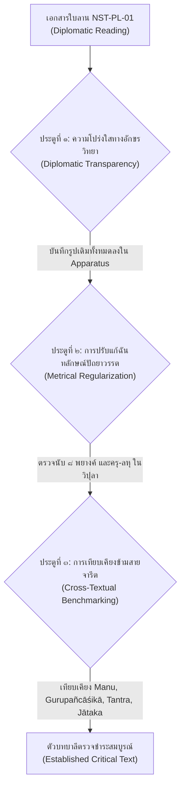
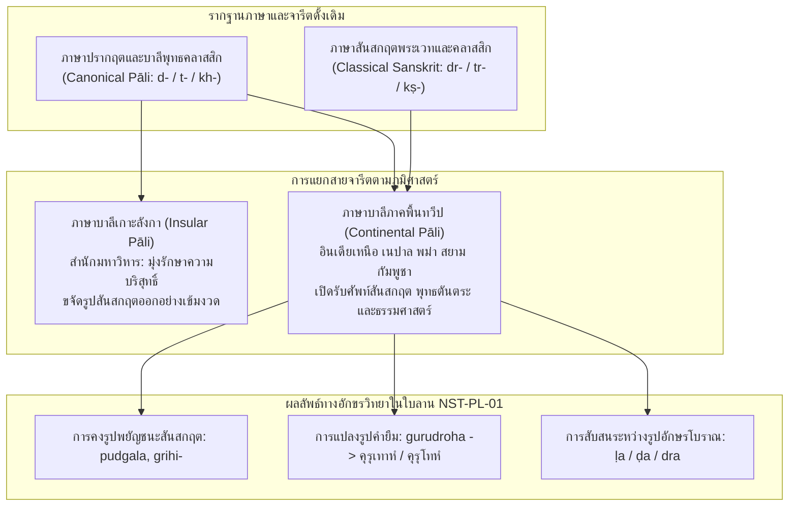
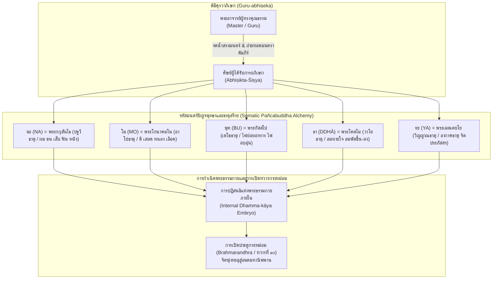
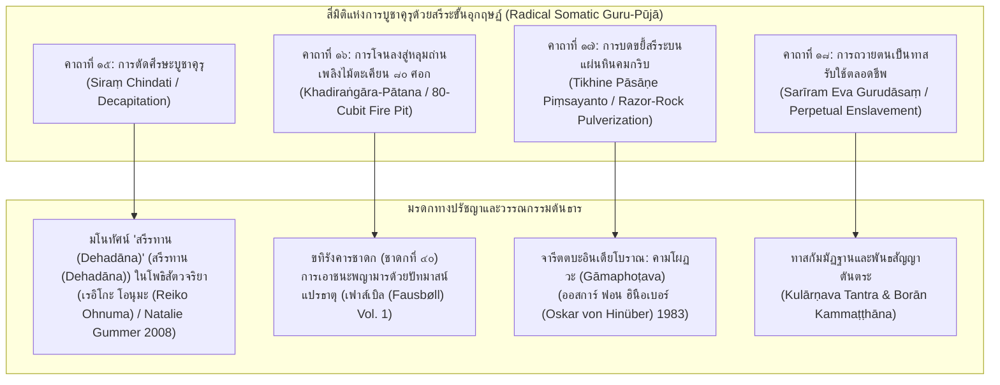

# บทที่ ๒: การตรวจชำระ อักขรวิทยา ฉันทลักษณ์ และการแปลถอดความภาษาบาลีไฮบริด (๒๐ คาถา)

## ๒.๑ ระเบียบวิธีตรวจชำระอักขระเทียบเคียง (Diplomatic Transcription & Critical Collation)

การศึกษาและปริวรรตคัมภีร์ *โสฬสคุรุโทหวณฺณนา* (Soḷasagurudohavaṇṇanā) จากเอกสารใบลานนครศรีธรรมราช รหัสกำกับ NST-PL-01 ซึ่งจารด้วยอักษรขอมไทยถิ่นใต้ (Southern Khom Script) ในช่วงยุคอยุธยาตอนกลาง จำเป็นต้องอาศัยระเบียบวิธีทางปรัชญาภาษาและนิรุกติศาสตร์เชิงประวัติ (Philological and Historical Linguistic Methodology) ที่รัดกุมเป็นพิเศษ เนื่องด้วยคัมภีร์ฉบับนี้จัดเป็นเอกสารตัวเขียนเอกฉบับ (คัมภีร์เอกสารชิ้นเดียวในโลก (Codex Unicus)) ซึ่งไม่มีฉบับสำเนาคู่ขนานตรงตัว (Direct Parallel Manuscript) ในสายตระกูลใบลานภาคกลางหรือล้านนาหลงเหลืออยู่ให้เทียบเคียงแบบคำต่อคำ การดำเนินงานบรรณาธิการต้นฉบับจึงต้องผสานระเบียบวิธีตรวจชำระอักขระสองระดับเข้าด้วยกัน ได้แก่ การถอดอักษรตามสภาพจริงแห่งเอกสารต้นฉบับ (Diplomatic Transcription) เพื่อรักษาพยานหลักฐานทางโบราณอักษรวิทยาไว้ทุกกระเบียดนิ้ว และการสร้างตัวบทตรวจชำระเชิงวิพากษ์ (Critical Text) โดยอาศัยหลักฉันทลักษณ์วิทยา (Metrical Regularization) ควบคู่กับการเทียบเคียงข้ามสายจารีตวรรณกรรม (Cross-Textual Benchmarking)[^1]

### ๒.๑.๑ สภาพอักขรวิธีและการถอดอักษรตามสภาพจริงแห่งเอกสารต้นฉบับ (Diplomatic Transcription)

ใบลาน NST-PL-01 ปรากฏรูปลักษณ์ของอักษรขอมไทยที่ได้รับการปรับแต่งเข้ากับสัทศาสตร์ภาษาไทยถิ่นใต้และจารีตการจารคัมภีร์ทางพุทธศาสนาในคาบสมุทรมลายูตอนบน ลักษณะเด่นของอักขรวิธีในคัมภีร์นี้คือการจารอย่างต่อเนื่องโดยไม่เว้นวรรคคำ (Scriptio Continua) ตามจารีตใบลานโบราณ พร้อมทั้งการใช้รูปสระผสมและการลดรูปพยัญชนะสังโยคที่สะท้อนอิทธิพลของสำเนียงพูดและระบบเสียงในท้องถิ่น การถอดอักษรตามสภาพจริง (Diplomatic Reading) เผยให้เห็นความคลาดเคลื่อนทางกลไกของอาลักษณ์ (Mechanical Scribal Errors) หลายประการ ซึ่งสามารถจำแนกออกเป็นหมวดหมู่ทางนิรุกติศาสตร์ได้ดังนี้:

๑. **การตกหล่นของพยางค์และอักขระ (Haplography):** อาลักษณ์มักละเว้นพยัญชนะซ้อนหรือเครื่องหมายนิคหิตเมื่อจารคำที่ปรากฏเสียงคล้ายคลึงกันติดต่อกัน เช่น ในคาถาที่ ๑ วรรคแรก จารเป็น `นินฺทาทิเสาฬสํคณฺฐํ` ซึ่งคำว่า `คณฺฐํ` เป็นการจารคลาดเคลื่อนจาก `กณฺฑํ` (หมวด หรือ บรรพ) เนื่องจากความสับสนทางสัทศาสตร์ระหว่างเสียงกัณฐชะ โฆษะ และอโฆษะ รวมถึงในคาถาที่ ๗ วรรคแรก จารเป็น `สิสฺเสานาคจฺฉเตคุรุ` ซึ่งตกพยางค์สังโยคและวิภัตติ จนกลายเป็นรูปที่ขาดความสมบูรณ์ทางไวยากรณ์บาลีราชสำนัก

๒. **ความสับสนระหว่างรูปสัณฐานอักษรคู่แฝด (*Confusio Duarum Litterarum*):** ในระบบอักษรขอมไทย เส้นโค้งและเชิงของพยัญชนะบางคู่มีความละม้ายคล้ายคลึงกันอย่างยิ่งจนก่อให้เกิดการถ่ายทอดคลาดเคลื่อน เช่น:
   - ความสับสนระหว่าง ด (da) กับ น (na) เช่น ในคาถาที่ ๔ คำว่า `ปจฺจกฺเขนวเทนามํ` ซึ่งรูปจริงคือ `ปจฺจกฺเข น วเท นามํ` (ห้ามออกนามต่อหน้า) แต่อาลักษณ์จารรวบเป็นคำเดียวประหนึ่งเป็นสมาส
   - ความสับสนระหว่าง ฒ (ḍha) กับ ค (ga) หรือ ต (ta) กับ ว (va)
   - ความสับสนโบราณระหว่าง ฬ (ḷa), ฑ (ḍa), และ ทฺร (dra) ดังที่ ออสการ์ ฟอน ฮินือเบอร์ (Oskar von Hinüber) ได้ชี้ให้เห็นในการศึกษาวิเคราะห์เศษคัมภีร์พระวินัยใบลานที่เก่าแก่ที่สุดจากกาฐมาณฑุ ประเทศเนปาล (ช่วงคริสต์ศตวรรษที่ ๘–๙) ว่าการสับสนระหว่างรูป ฬ / ฑ / ทฺร เป็นลักษณะเฉพาะของจารีตการคัดลอกคัมภีร์บาลีสายภาคพื้นทวีป (Continental Pali Tradition) ที่ได้รับอิทธิพลจากอักขรวิธีสันสกฤตภาคเหนือของอินเดีย[^2] ซึ่งปรากฏชัดในคาถาที่ ๓ คำว่า `ฉายํนลชฺฌเร` ที่อาลักษณ์จารเป็นรูปเพี้ยนจาก `ลงฺฆเย` หรือ `ลงฺฆเร` (การก้าวข้ามเงา)

๓. **อิทธิพลของระบบเสียงภาษาไทยถิ่นใต้ (Southern Thai Phonetic Interference):** อาลักษณ์ผู้จารใบลาน NST-PL-01 แสดงร่องรอยการเปล่งเสียงสระและพยัญชนะตามสำเนียงถิ่นใต้อย่างเด่นชัด ได้แก่:
   - **การใช้สระเอา (au) แทนรูปสระโอ (o):** ในภาษาไทยถิ่นใต้มักปรากฏการออกเสียงสระประสมหรือสระที่มีการยืดและเปลี่ยนฐานเสียง อาลักษณ์จึงจารรูปคำว่า `เสาฬสํ` แทนที่จะเป็น `โสฬส`, `คุรุเทาหํ` แทนที่จะเป็น `คุรุโทหํ`, `สมาสเตา` แทน `สมาสโต`, และ `นิสฺสเยา` แทน `นิสฺสโย` การแปลงสระโอบาลีเป็นสระเอา (au / o alternation) ชี้ชัดว่าอาลักษณ์บันทึกตามเสียงอ่านที่ก้องอยู่ในมโนภาพ (Phonetic Dictation) มากกว่าการลอกลายอักษรจากต้นฉบับบาลีบริสุทธิ์
   - **ปรากฏการณ์เสียงแทรกเสียดและการกลายเสียงพยัญชนะ (Spirantization & Consonant Shift):** ในคาถาที่ ๓ คำว่า `นลชฺฌเร` สะท้อนการกลายเสียงจากรากศัพท์สันสกฤต $\sqrt{\text{laṅgh}}$ (ข้าม, ก้าวล่วง) ผ่านกระบวนการแปลงเสียงเพดานโฆษะมีลม (voiced aspirate velar `gh`) สู่เสียงกึ่งเสียดแทรกเพดาน `jh` ซึ่งพบได้ในสำเนียงท้องถิ่นของคาบสมุทรไทย-มลายู

### ๒.๑.๒ ประตูกลั่นกรองสามชั้นในการตรวจชำระตัวบท (The Three Editorial Gates)

เพื่อให้ได้ตัวบทตรวจชำระ (Critical Text) ที่มีความถูกต้อง เที่ยงตรงตามหลักวิชาการ และสะท้อนเจตนารมณ์แห่งพุทธตันตระเถรวาทโบราณ คณะผู้วิจัยจึงได้สถาปนาระบบ "ประตูกลั่นกรองสามชั้น" (The Three Editorial Gates) ขึ้นเป็นเกณฑ์มาตรฐานในการตัดสินใจทางบรรณาธิการ ดังแสดงในแผนภาพต่อไปนี้:

#### ประตูที่ ๑: ความโปร่งใสทางอักขรวิทยา (Diplomatic Transparency)
หลักการข้อแรกคือ ห้ามมิให้มีการแก้ไขรูปศัพท์ในชั้นบันทึกข้อมูลหลักโดยเด็ดขาด ทุกอักขระที่ปรากฏในใบลาน NST-PL-01 จะต้องปริวรรตถ่ายทอดลงในตารางเปรียบเทียบแบบช่องต่อช่อง แม้ว่ารูปคำนั้นจะผิดไวยากรณ์บาลีคลาสสิกอย่างรุนแรงก็ตาม ทุกจุดที่มีการปรับแก้ในตัวบทตรวจชำระ จะต้องระบุรูปอักขระเดิมของใบลานไว้ในเชิงอรรถวิพากษ์ (Critical Apparatus) อย่างละเอียด เพื่อให้ผู้อ่านและนักนิรุกติศาสตร์รุ่นหลังสามารถตรวจสอบย้อนกลับได้ตลอดเวลา

#### ประตูที่ ๒: การปรับแก้ตามฉันทลักษณ์ปัถยาวรรต (Metrical Regularization in Pathyāvatta)
ร้อยกรองทั้ง ๒๐ คาถาในคัมภีร์ *โสฬสคุรุโทหวณฺณนา* รจนาด้วยฉันท์อนุษฏุภ (Anuṣṭubh) หรือในจารีตคัมภีร์วุตโตทัยเรียกว่า **ปัถยาวรรตคาถา** (Pathyāvatta Gāthā) ซึ่งมีกฎเกณฑ์บังคับ ๘ พยางค์ต่อหนึ่งบาท (๔ บาทต่อหนึ่งคาถา รวมเป็น ๓๒ พยางค์) โดยมีโครงสร้างบังคับครุ-ลหุในบาทคี่ (บาทที่ ๑ และ ๓) และบาทคู่ (บาทที่ ๒ และ ๔) ดังนี้:

- **โครงสร้างทั่วไป (General Scheme):** $\times \times \times \times \smile - - \times$ (สำหรับบาทคี่) และ $\times \times \times \times \smile - \smile \times$ (สำหรับบาทคู่)
- ในวรรคคี่ พยางค์ที่ ๒ และ ๓ ห้ามเป็นลหุคู่ ($\smile \smile$) และพยางค์ที่ ๕-๖-๗ ในวรรคคู่ต้องเป็น ลหุ-ครุ-ลหุ ($\smile - \smile$) อย่างเคร่งครัดตามแบบฉบับปัถยาวรรตแท้

เมื่อนำโครงสร้างฉันทลักษณ์นี้มาทาบทับลงบนข้อความใบลานเดิม จะพบว่าหลายตำแหน่งเกิดความบกพร่องทางพยางค์ เช่น พยางค์ขาด (Defective Pāda) หรือพยางค์เกิน (Hypermetrical Pāda) ซึ่งเกิดจากการแทรกคำขยายหรือการสะกดแบบคำพูด การชำระจึงใช้หลักการตัดทอนหรือเติมเต็มตามกฎฉันท์ เช่น:
- ในคาถาที่ ๑ วรรคแรก เดิมจาร `นินฺทาทิเสาฬสํคณฺฐํ` (นับได้ ๘ พยางค์: นิน-ทา-ทิ-โส-ฬะ-สัง-กัณ-ฐัง) มีการแก้ไขตัวสะกดให้เป็น `นินฺทาทิโสฬสกณฺฑํ` เพื่อให้ความหมายตรงกับ "หมวด ๑๖ ข้อ"
- ในคาถาที่ ๕ วรรคสอง เดิมจาร `นเมาพุทฺธายาทิปนฺเตา` (นับได้ ๗ พยางค์: นะ-โม-พุท-ธา-ยา-ทิ-ปัน-โต) ซึ่งพยางค์ขาดไปหนึ่งพยางค์ เมื่อวิเคราะห์ร่วมกับมโนทัศน์ตันตระเถรวาท จึงสามารถบูรณะเป็น `นโมพุทฺธายาทิมนฺโต` (นะ-โม-พุท-ธา-ยา-ทิ-มัน-โต = ๘ พยางค์บริบูรณ์) ซึ่งลงจังหวะครุ-ลหุในบาทคี่ได้อย่างงดงามตามฉันทลักษณ์

#### ประตูที่ ๓: การเทียบเคียงข้ามสายจารีตวรรณกรรม (Cross-Textual Benchmarking)
เนื่องจาก *โสฬสคุรุโทหวณฺณนา* เป็นเอกสารเอกฉบับ การชำระคำศัพท์ที่มีปัญหาจึงไม่อาจกระทำได้ด้วยการเดาความ (Conjectural Emendation) แบบลอยๆ แต่ต้องตั้งอยู่บนฐานการเทียบเคียงกับวรรณกรรมร่วมสมัยและวรรณกรรมต้นธารข้ามสายจารีต ๔ สายหลัก ได้แก่:

๑. **จารีตพระธรรมศาสตร์และอรรถกถา (Dharmaśāstra & Commentarial Tradition):** โดยเฉพาะ *มานวธรรมศาสตร์* (Mānava-Dharmaśāstra) หมวดการปฏิบัติตนของพรหมจารีต่อคุรุ (MDh 2.191–205) และข้อห้ามเรื่องการก้าวข้ามเงา (MDh 4.130) ตลอดจนอรรถกถา *มานวภาษยะ* (Manubhāṣya) ของเมธาติถิ (Medhātithi) ซึ่งได้จำแนกความแตกต่างทางกฎหมายระหว่างการด่าทอโดยตรง (*nindā*) และการนินทาลับหลังหรือการพูดถึงข้อบกพร่องจริง (*parīvāda*) รวมถึงข้อห้ามเรื่องการออกนามครูบาอาจารย์โดยตรง (*kevala-nāma*)[^3]

๒. **จารีตคุรุปัญจาศิกา (Gurupañcāśikā Tradition):** คัมภีร์บทสวดสรรเสริญและข้อวินัยต่อคุรุ ๕๐ คาถาของอัศวโฆษ (Aśvaghoṣa) ที่แพร่หลายในโลกพุทธศาสนาภาษาสันสกฤต ทิเบต และจีน โดยเฉพาะฉบับแปลจีนของพระรื่อเฉิง (Rìchēng / 日稱) ค.ศ. ๑๐๘๔ ในพระไตรปิฎกฉบับไทโช (Taishō Vol. 32, No. 1687: 事師五十頌) ซึ่งคาถาที่ ๒๓ ได้บัญญัติไว้ตรงกันอย่างน่าอัศจรรย์ว่า "หากผู้ใดเหยียบย่ำเงาแห่งพระอาจารย์ ย่อมได้รับบาปประหนึ่งการทำลายพระสถูปเจดีย์" (`若足踏師影 獲罪如破塔`)[^4]

๓. **จารีตพุทธตันตระเถรวาทและโบราณคัมมัฏฐาน (Esoteric Theravada & Borān Kammaṭṭhāna):** การเทียบเคียงกับคัมภีร์สายสมถะ-วิปัสสนาโบราณในเอเชียตะวันออกเฉียงใต้ ตามการรวบรวมและวิเคราะห์ของเคต ครอสบี  (Kate Crosby) และ กิมโม กัสโตร ซานเชซ (Kimmo Castro Sánchez) ซึ่งอธิบายบทบาทของพิธีคุรวาภิเษก (*Guru-abhiṣeka*) การจัดตั้งองค์พระ ๕ พระองค์ผ่านรหัสมนตร์ "นโมพุทฺธาย" เข้าสู่สรีรธาตุทั้ง ๕ ในกายเนื้อ เพื่อให้กำเนิด "พระธรรมกาย" (Dhamma-kāya) ตลอดจนการเปิดทวารกระหม่อม (Brahmarandhra) เป็นทางหลุดพ้นสู่นิพพาน[^5]

๔. **จารีตชาดกและพระวินัยมหาเถรวาท (Canonical Jātaka & Vinaya Tradition):** การนำโครงเรื่องและคำฉันท์จาก *ขทิรังคารชาดก* (ชาดกที่ ๔๐) ว่าด้วยการกระโดดลงสู่หลุมถ่านเพลิงไม้ตะเคียนลึก ๘๐ ศอกเพื่อรักษาทานบารมี[^6] และ *มูคผักขชาดก* หรือเตมิยชาดก (ชาดกที่ ๕๓๘) หมวดมิตตทุพภิกัณฑ์ ว่าด้วยการไม่ประทุษร้ายมิตรและครูบาอาจารย์[^7] มาใช้เป็นเกณฑ์เทียบเคียงคำศัพท์และโครงสร้างทางจริยศาสตร์

ระเบียบวิธีประตูกลั่นกรองสามชั้นนี้ ทำหน้าที่เป็นดั่งเข็มทิศนำทางในการเปลี่ยนผ่านจาก "ใบลานดิบที่เต็มไปด้วยข้อผิดพลาดของอาลักษณ์" ไปสู่ "ตัวบทตรวจชำระมาตรฐานทางวิชาการ" ที่เปิดเผยให้เห็นมิติทางประวัติศาสตร์ ภาษาศาสตร์ และจิตวิญญาณอันแยบคายของชาวสยามและคาบสมุทรมลายูโบราณ

> [!NOTE]
> **ระเบียบวิธีอักขรวิทยาและการถ่ายถอดรูป (Diplomatic Transcription):**  
> การตรวจชำระใบลาน *โสฬสคุรุโทหวณฺณนา* ยึดหลักการคงรูปอักขรวิธีโบราณตามที่ปรากฏในใบลานจริง (เช่น `เสาฬสคฺรูเทาหวณฺณนา`) ควบคู่กับการเทียบเคียงรูปบาลีมาตรฐาน เพื่อพิทักษ์ร่องรอยการออกเสียงและสัทศาสตร์เฉพาะถิ่นของปักษ์ใต้สมัยอยุธยา

---

## ๒.๒ ปรากฏการณ์ภาษาบาลีไฮบริด: $\sqrt{\text{druh}}$ (*gurudroha*) สู่ เสาฬสคฺรูเทาห / คุรุเทาหํ

### ๒.๒.๑ วิวัฒนาการทางสัทศาสตร์และนิรุกติศาสตร์: จาก $\sqrt{\text{druh}}$ สู่ *doha* / *dhoha*

ปรากฏการณ์ที่น่าจับตามองที่สุดในมิติภาษาศาสตร์ของคัมภีร์ *โสฬสคุรุโทหวณฺณนา* คือการปรากฏตัวของคำว่า "คุรุโทห" (Gurudoha) หรือที่ในใบลาน NST-PL-01 จารสะกดตามสำเนียงถิ่นใต้ว่า `เสาฬสคฺรูเทาห` และ `คุรุเทาหํ` คำนี้มิใช่คำบาลีบริสุทธิ์ตามจารีตของพระไตรปิฎกเถรวาทบาลีคลาสสิก (Classical Canonical Pāli) แต่เป็นหลักฐานประจักษ์ชิ้นเอกของ "ภาษาบาลีผสมผสาน" หรือ "ภาษาบาลีไฮบริด" (ภาษาบาลีไฮบริด (Hybrid Pāli)) ที่เกิดจากการปะทะ สังสรรค์ และหลอมรวมกันระหว่างไวยากรณ์บาลีกับศัพท์บัญญัติภาษาสันสกฤตในภูมิภาคอุษาคเนย์[^8]

ในทางนิรุกติศาสตร์เชิงประวัติ คำว่า "โทห" ในที่นี้มิได้สืบเชื้อสายมาจากรากธาตุบาลี $\sqrt{\text{duh}}$ (ทุหฺ - รีดนม, หลั่งออก) ซึ่งแผลงเป็น *doha* ที่แปลว่าการรีดนมโค หากแต่เป็นการถ่ายทอดรูปศัพท์และสนามความหมาย (Semantic Field) โดยตรงมาจากรากธาตุภาษาสันสกฤต $\sqrt{\text{druh}}$ (ทรุหฺ - ประทุษร้าย, ทรยศ, มุ่งร้าย, กบฏ) ซึ่งเมื่อลงปัจจัยนาม *ghañ* (ฆญฺ) ตามกฎไวยากรณ์สันสกฤตของปาณินิ (Aṣṭādhyāyī) จะได้รูปนามกริยาว่า **โัทฺรห** (*droha* - ความประทุษร้าย, การทรยศ, กบฏ) ดังเช่นคำว่า *mitradroha* (การทรยศมิตร) และ *gurudroha* (การประทุษร้ายครูบาอาจารย์)[^9]

ในวรรณคดีพุทธภาษาบาลีคลาสสิกของสำนักมหาวิหารแห่งศรีลังกา เมื่อพระคันถรจนาจารย์ต้องการสื่อถึงการประทุษร้ายต่อมิตรหรือครูบาอาจารย์ จะนิยมใช้รูปศัพท์ที่สืบมาจากรากธาตุบาลีแท้ ๒ ราก ได้แก่:
๑. **$\sqrt{\text{dubh}}$ (ทุภฺ - ประทุษร้าย):** ปรากฏเป็นรูปกริยา *dubbhati* และรูปนาม *dubbha* หรือ *dubbhin* ดังเช่นคำว่า "มิตฺตทุพฺภิ" (*mittadubbhi* - ผู้ประทุษร้ายมิตร) ใน *มูคผักขชาดก* (เตมิยชาดก, ชาดกที่ ๕๓๘)[^10] หรือ "อาจริยทุพฺภิ" (*ācariyadubbhi*)
๒. **$\sqrt{\text{nind}}$ (นินฺทฺ - ติเตียน, บริภาษ):** ปรากฏเป็นคำว่า "คุรุนินฺทา" (*gurunindā*) ซึ่งเน้นย้ำมิติการล่วงละเมิดทางวาจาเป็นหลัก

ทว่า ในคัมภีร์ *โสฬสคุรุโทหวณฺณนา* ผู้รจนาเลือกที่จะไม่ใช้คำว่า *ācariyadubbhi* แต่กลับรับเอาคำว่า *gurudroha* ในภาษาสันสกฤตเข้ามาใช้โดยตรง แล้วแปลงรูปเสียงตามกฎสัทศาสตร์ของการกลายเสียงจากสันสกฤตสู่บาลี (Prakritization / Pālicization):
- กลุ่มพยัญชนะควบกล้ำ `dr` ในสันสกฤต ได้รับการลดรูป (Consonant Cluster Simplification) โดยตัดเสียงรัว `r` ออก เหลือเพียงเสียงทันตชะ `d` กลายเป็น `doha` (โทห)
- หรือในบางจารีตท้องถิ่น มีการชดเชยเสียงลมเป็น `dhoha` (โธห) เพื่อรักษาน้ำหนักเสียงของกลุ่มพยัญชนะเดิมไว้
- ขณะเดียวกัน การคงอยู่ของรูป `เสาฬสคฺรูเทาห` ในใบลาน NST-PL-01 ยังสะท้อนการแทรกสระเอ-อา (au) ตามอักขรวิธีขอมไทยถิ่นใต้ ซึ่งออกเสียงควบสระกึ่งก้อง สะท้อนว่าคำนี้ถูกใช้งานในฐานะ "คำยืมศักดิ์สิทธิ์" (Sacred Loanword) ที่ผู้รจนาและอาลักษณ์จงใจรักษาเค้าโครงเสียงสันสกฤตไว้เพื่อเพิ่มพูนความขลังและน้ำหนักทางกฎหมาย-จริยธรรม

### ๒.๒.๒ ภาษาบาลีภาคพื้นทวีปปะทะภาษาบาลีเกาะลังกา (Continental vs. Insular Pāli)

การทำความเข้าใจปรากฏการณ์ไฮบริดใน *โสฬสคุรุโทหวณฺณนา* จำเป็นต้องวางอยู่บนทฤษฎีประวัติศาสตร์ภาษาบาลีของ ออสการ์ ฟอน ฮินือเบอร์ (Oskar von Hinüber) ซึ่งได้จำแนกสายธารภาษาบาลีในเอเชียออกเป็นสองตระกูลใหญ่ ได้แก่ **ภาษาบาลีเกาะลังกา (Insular Pāli)** และ **ภาษาบาลีภาคพื้นทวีป (Continental Pāli)**[^11]

ฟอน ฮินือเบอร์ ได้พิสูจน์ผ่านการชำระเศษคัมภีร์พระวินัยใบลานจากกาฐมาณฑุ (Kathmandu Vinaya Fragment) ว่า จารีตภาษาบาลีบนภาคพื้นทวีปของชมพูทวีป (ซึ่งแผ่ขยายเข้ามายังดินแดนมอญ พม่า ล้านนา และคาบสมุทรสยาม-มลายู) มีลักษณะร่วมที่สำคัญคือการเปิดรับ "รูปคำภาษาสันสกฤต" (Sanskritisms) เข้ามาผสมผสานในคัมภีร์พระวินัยและอรรถกถาอย่างต่อเนื่อง เช่น การใช้รูป *pudgala* (แทนที่จะเป็น *puggala*), การคงรูปวิภัตตินามทวิพจน์ (Dual endings เช่น การลงท้ายด้วย `-e`), การใช้คำว่า *grihi-* (แทนที่จะเป็น *gahaṭṭha*), ตลอดจนความสับสนในรูปสัณฐานอักษรโบราณระหว่าง ฬ (ḷa), ฑ (ḍa), และ ทฺร (dra)[^12]

สำหรับนครศรีธรรมราช ซึ่งเป็นเมืองท่าศูนย์กลางการค้านานาชาติและเป็นจุดบรรจบของคลื่นวัฒนธรรมจากทั้งอินเดียเหนือ ลังกา มอญ และศรีวิชัย พระสงฆ์และนักปราชญ์ท้องถิ่นมิได้จำกัดตนเองอยู่เฉพาะในกรอบภาษาบาลีแบบพระพุทธโฆสะแห่งสำนักมหาวิหาร หากแต่ใช้ชีวิตอยู่ในบรรยากาศทางวิชาการแบบ "พหุภาษา" (Multilingualism) ที่คัมภีร์ภาษาสันสกฤต—ทั้งในสายไวยากรณ์จันทรวยากรณ์ (Cāndravyākaraṇa), ตำราพระธรรมศาสตร์, และคัมภีร์ตันตระ—ยังคงมีบทบาทและอำนาจนำทางภูมิปัญญาอย่างสูง การผลิตคัมภีร์ร้อยกรองคำสอนเรื่อง *โสฬสคุรุโทหวณฺณนา* จึงสะท้อนอัตลักษณ์ของภาษาบาลีภาคพื้นทวีปอย่างเด่นชัด โดยการนำคำศัพท์ทางเทคนิคจากภาษาสันสกฤตมาสวมลงในโครงฉันทลักษณ์บาลี เพื่อให้ตอบสนองต่อพันธกิจทางพิธีกรรมและวินัยสงฆ์ในท้องถิ่น

### ๒.๒.๓ ทฤษฎีการกลืนกลายทางไวยากรณ์: โมคคัลลานะ, จันทรวยากรณ์ และเจตนาแห่งถ้อยคำทางโลก (*Laukikī Vacanicchā*)

คำถามสำคัญในทางวิชาการคือ พระคันถรจนาจารย์ในยุคโบราณสามารถ "สร้างความชอบธรรม" ให้แก่การใช้รูปภาษาบาลีไฮบริดเช่นนี้ได้อย่างไร ในเมื่อโครงสร้างของคำว่า *gurudoha* มิได้ปรากฏในพระไตรปิฎกบาลี?

คำตอบสำหรับประเด็นนี้ปรากฏอยู่ในงานวิจัยชิ้นบุกเบิกของ อะแลสแตร์ กอร์นอลล์ และ โจวันนี ชอตตี (อาแลสแตร์ กอร์นอลล์ (Alastair Gornall) and Giovanni Ciotti, 2014) ซึ่งได้ศึกษาวิเคราะห์การปฏิวัติทางไวยากรณ์บาลีในยุคกลาง โดยเฉพาะสำนักไวยากรณ์ *โมคคัลลานวยากรณ์* (Moggallāna Vyākaraṇa) ของพระโมคคัลลานเถระแห่งลังกา (ศตวรรษที่ ๑๒) ตลอดจนคัมภีร์ *สัมพันธจินตา* (Sambandhacintā) ของพระสังฆรักขิตเถระ[^13]

กอร์นอลล์และชอตตีเสนอข้อวิเคราะห์ว่า พระโมคคัลลานะได้นำเอาระบบอรรถศาสตร์และทฤษฎีการะกะ (Kāraka Theory) จากคัมภีร์ไวยากรณ์สันสกฤตของพุทธคือ *จันทรวยากรณ์* (Cāndravyākaraṇa) ของจันทระโคมิน (Candragomin) เข้ามาประยุกต์ใช้ในการจัดระเบียบภาษาบาลีอย่างละเอียดถี่ถ้วน หัวใจสำคัญของทฤษฎีนี้คือการยอมรับมโนทัศน์เรื่อง **"ลอกิกี วจนิจฉา" (*laukikī vacanicchā*)** หรือ "เจตนาในการสื่อความหมายตามธรรมเนียมของชาวโลก" ควบคู่กับหลักการทางตรรกศาสตร์ไวยากรณ์เรื่อง **"อสิทธะ" (*asiddha*)** หรือสภาวะที่กฎเกณฑ์เดิมยังไม่อาจบังคับใช้ได้อย่างเบ็ดเสร็จสมบูรณ์ หากขัดแย้งกับเจตจำนงในการสื่อสารจริงของผู้พูด[^14]

ภายใต้ทฤษฎี *ลอกิกี วจนิจฉา* พระเถระในยุคกลางไม่ได้มองภาษาบาลีเป็นระบบปิดที่ตายตัว (Closed and Static System) แต่มองว่าเป็นเครื่องมือทางภาษาที่มีชีวิตและสามารถปรับแปรให้รองรับ "ความต้องการทางสังคม-วัฒนธรรม" (Socio-Cultural Demands) ได้ เมื่อพระสงฆ์ฝ่ายพุทธตันตระเถรวาทในสยามและคาบสมุทรมลายูจำเป็นต้องสถาปนา "วินัยแห่งสายธารครูอาจารย์" (Lineage Discipline / Samaya) ให้มีความศักดิ์สิทธิ์ทัดเทียมกับจารีตตันตระของมหายานและจารีตกฎหมายของพระธรรมศาสตร์ พระองค์จึงทรงอาศัยหลัก *วจนิจฉา* ในการหลอมรวมคำศัพท์สันสกฤต *gurudroha* เข้ามาสถาปนาเป็นหมวดธรรมเฉพาะทางในภาษาบาลี เพื่อใช้เป็นเครื่องมือปกครองและคุ้มกันสถาบันสงฆ์ภายในเครือข่ายโบราณคัมมัฏฐาน

ขณะเดียวกัน เจฟฟรีย์ โกติค (เจฟฟรีย์ โคทึก (Jeffrey Kotyk), 2024) ยังได้เน้นย้ำในการศึกษาเปรียบเทียบพระวินัยมหาภาษิตและพระวินัยมหายานว่า การยืมศัพท์กฎหมายและโครงสร้างความรับผิดชอบร่วมกัน (Corporate Responsibility) ระหว่างอุปัชฌาย์กับสัทธิวิหาริก เข้ามาสู่ระบบวินัยสงฆ์ เป็นปรากฏการณ์สากลของพุทธศาสนาในเอเชีย เพื่อสร้าง "ความคุ้มกันทางศาสนจักร" (Ecclesiastical Immunity) และดำรงสถานะอันล่วงละเมิดมิได้ของพระมหาเถระผู้เป็นหัวหน้าสำนัก[^15] การถือกำเนิดของ *โสฬสคุรุโทหวณฺณนา* จึงมิใช่ความวิปริตทางไวยากรณ์ หากแต่เป็นสุดยอดนวัตกรรมทางภาษาศาสตร์และนิติศาสตร์พุทธศาสนา ที่สะท้อนอัจฉริยภาพของปัญญาชนแห่งนครศรีธรรมราชในการผสานขุมพลังแห่งภาษาบาลีและสันสกฤตเข้าด้วยกันอย่างกลมกลืนเป็นหนึ่งเดียว

> [!IMPORTANT]
> **ปรากฏการณ์ภาษาบาลีไฮบริด (Hybrid Pali Phenomenon):**  
> คำว่า `คุรุโทหะ` (Gurudoha) คือพยานหลักฐานชิ้นเอกของการยืมรากศัพท์สันสกฤต $\sqrt{\text{druh}}$ (*gurudroha*) มาสวมเข้ากับระบบการแปลงเสียงภาษาบาลี สะท้อนว่าผู้รจนาเป็นนักปราชญ์ผู้เชี่ยวชาญทั้งสองภาษา และรจนาขึ้นในบริบทที่มีการปะทะสังสรรค์ทางคัมภีร์ข้ามสายธาร

---

## ๒.๓ การวิเคราะห์ศัพท์เฉพาะทางเชิงมโนทัศน์: ฉายํ น ลงฺฆเร, ปจฺจกฺเข น วเท นามํ, สรเก, อุสฺสูยา, วาหติกฺกนฺต

การทำความเข้าใจคัมภีร์ *โสฬสคุรุโทหวณฺณนา* อย่างถ่องแท้ มิอาจบรรลุได้เพียงการแปลความหมายตามพจนานุกรมอย่างผิวเผิน หากแต่ต้องเจาะลึกผ่าน "การวิเคราะห์ศัพท์เฉพาะทางเชิงมโนทัศน์" (Conceptual Philology and Semantics) ซึ่งศัพท์แต่ละคำในตัวบทเปรียบเสมือนรหัสผ่านที่เชื่อมโยงระบบวินัยสงฆ์ โบราณคัมมัฏฐาน และกฎหมายจริยธรรมของเอเชียโบราณเข้าไว้ด้วยกัน ในหัวข้อนี้ คณะผู้วิจัยขอนำเสนอการวิเคราะห์คำศัพท์สำคัญ ๖ คำที่มีนัยสำคัญยิ่งยวดต่อการสืบสาวสายธารคัมภีร์:

### ๒.๓.๑ "ฉายํ น ลงฺฆเร" (Chāyāṃ na laṅghare) และมโนทัศน์การห้ามเหยียบย่ำเงาแห่งคุรุ

ในคาถาที่ ๓ วรรคสาม ปรากฏข้อความว่า:
> `คุรุโน จีวรํ ฉตฺตํ ปตฺตํ ฉายํ น ลงฺฆเร`
> (ในใบลาน NST-PL-01 จารเป็น: `คุรุเนาจิวรํฉตฺตํ ปตฺตฉายํนลชฺฌเร`)

คำว่า `ฉายํ น ลงฺฆเร` (ห้ามก้าวข้ามหรือเหยียบย่ำเงา) จัดเป็นข้อห้ามทางพิธีกรรมและกายภาพที่เคร่งครัดสูงสุดประการหนึ่ง มโนทัศน์นี้มิได้มีรากฐานดั้งเดิมในพระวินัยปิฎกเถรวาทบาลีทั่วไป แต่มีสายธารคู่ขนานที่สอดรับอย่างลงตัวในวรรณกรรมสองกระแสใหญ่:

๑. **กระแสพระธรรมศาสตร์พราหมณ์-ฮินดู:** ในคัมภีร์ *มานวธรรมศาสตร์* บทที่ ๔ โศลกที่ ๑๓๐ (MDh 4.130) ได้บัญญัติไว้อย่างชัดแจ้งว่า:
> `nocchiṣṭaṃ kasya cid dadyān nādyāc caiva tathāntarā /`
> `na caivātyaśanaṃ kuryān na cocchiṣṭaḥ kvacid vrajet //`
> ตลอดจนการห้ามก้าวข้ามเงาของบุคคลผู้ทรงความศักดิ์สิทธิ์: *chāyāṃ na laṅghayet* (ห้ามก้าวข้ามเงาแห่งเทวรูป คุรุ กษัตริย์ และพราหมณ์ผู้ทรงศีล)[^16]
แพทริก โอลิเวลล์ (แพทริก โอลิเวลล์ (Patrick Olivelle), 2005) และ เมธาติถิ (Medhātithi) ในคัมภีร์ *มานวภาษยะ* (Manubhāṣya) ได้อธิบายว่า "เงา" (*chāyā*) มิใช่เพียงปรากฏการณ์ทางแสง แต่เป็นส่วนต่อขยายแห่ง "ชีวะ" หรือพลังงานจิตวิญญาณของบุคคล การเหยียบย่ำเงาจึงมีค่าเท่ากับการประทุษร้ายต่อร่างกายของผู้นั้นโดยตรง[^17]

๒. **กระแสพุทธตันตระและคุรุปัญจาศิกา:** ในคัมภีร์ *คุรุปัญจาศิกา* (Gurupañcāśikā) คาถาที่ ๒๓ ซึ่งได้รับการแปลเป็นภาษาจีนโดยพระรื่อเฉิง (Rìchēng / 日稱) ในปี ค.ศ. ๑๐๘๔ ภายใต้ชื่อ *ซื่อซืออู่สือซ่ง* (事師五十頌, Taishō No. 1687) ได้ระบุไว้อย่างน่าตระหนกใจว่า:
> `若足踏師影 獲罪如破塔`
> ("หากบุคคลใดเหยียบย่ำเงาของพระอาจารย์ ย่อมได้รับบาปเทียบเท่ากับการทำลายพระสถูปเจดีย์")[^18]

การเปรียบเทียบ "เงาของครูอาจารย์" เข้ากับ "พระสถูปเจดีย์" สะท้อนปรัชญาพุทธตันตระที่มองสรีระและรัศมีของวัชราจารย์เป็นมณฑลศักดิ์สิทธิ์ (Mandala) การที่คัมภีร์ *โสฬสคุรุโทหวณฺณนา* ในนครศรีธรรมราช นำเอาข้อห้ามเรื่องการก้าวข้ามเงามาบรรจุไว้เคียงคู่กับบริขารศักดิ์สิทธิ์ (จีวร ฉัตร และบาตร) ย่อมเป็นหลักฐานเชิงประจักษ์ว่า คณะสงฆ์สายโบราณคัมมัฏฐานในคาบสมุทรมลายูได้รับอิทธิพลจากมโนทัศน์เรื่องกายสิทธิ์ของคุรุตามสายธารคุรุปัญจาศิกาและตันตระเข้ามาอย่างเต็มรูป

### ๒.๓.๒ "ปจฺจกฺเข น วเท นามํ" (Pratyakṣe na vade nāmaṃ) และข้อห้ามเรื่องนามตรง (*Kevala-nāma*)

ในคาถาที่ ๔ วรรคแรก ปรากฏข้อความว่า:
> `ปจฺจกฺเข น วเท นามํ`
> (ในใบลาน NST-PL-01 จารเป็น: `ปจฺจกฺเขนวเทนามํ`)

ข้อห้ามนี้กำหนดว่า "ศิษย์ต้องไม่ออกนาม (ชื่อตัว) ของพระอาจารย์ต่อหน้า" ซึ่งตรงกับบัญญัติใน *มานวธรรมศาสตร์* บทที่ ๒ โศลกที่ ๑๙๙ อย่างน่าอัศจรรย์:
> `nodāhared asya nāma parokṣam api kevalam /`
> `na caivāsyānukurvīta gati-bhāṣita-ceṣṭitam //`
> ("ศิษย์ต้องไม่ออกชื่อตัวเปล่าๆ [*kevala-nāma*] ของอาจารย์ แม้ในยามที่อาจารย์มิได้อยู่ต่อหน้า และต้องไม่เลียนแบบท่าเดิน คำพูด หรืออากัปกิริยาของอาจารย์")[^19]

เมธาติถิ ได้อธิบายขยายความใน *มานวภาษยะ* ไว้อย่างละเอียดถี่ถ้วนถึงความแตกต่างทางกฎหมายระหว่าง:
- **นินทา (*nindā*):** การกุเรื่องเท็จขึ้นมาด่าทอหรือใส่ร้ายป้ายสีอาจารย์
- **ปริวาท (*parīvāda*):** การนำเอาข้อบกพร่อง ความผิดพลาด หรือเรื่องส่วนตัวที่เป็นความจริงของอาจารย์ไปป่าวประกาศให้ผู้อื่นล่วงรู้
- **เกวลนาม (*kevala-nāma*):** การเรียกขานชื่อตัวของอาจารย์โดยปราศจากราชทินนาม สมณศักดิ์ หรือคำนำหน้าแสดงความเคารพ (เช่น การไม่เติมคำว่า *ภทนฺต*, *อาจริย*, *ปาท*, หรือ *คุรุ*)[^20]

ใน *คุรุปัญจาศิกา* คาถาที่ ๓๔ ก็ระบุไว้เช่นเดียวกันว่า หากจำเป็นต้องเอ่ยนามของพระอาจารย์เพื่อแจ้งแก่ผู้อื่น ศิษย์จะต้องต่อท้ายด้วยคำว่า "ปาทานฺต" (*pādānta* - แทบเบื้องบาท) เสมอ การที่ *โสฬสคุรุโทหวณฺณนา* บัญญัติให้การออกนามต่อหน้าเป็นหนึ่งในความผิดสถานหนัก สะท้อนถึงการสืบทอดขนบธรรมเนียมทางนิติศาสตร์โบราณว่าด้วยอำนาจปกครองและลำดับชั้นทางจิตวิญญาณ

### ๒.๓.๓ ปริศนาแห่งคำว่า "สรเก" (Sarake): ภาชนะล้างบาทหรือการร่วมชายคา?

ในคาถาที่ ๔ วรรคสอง ปรากฏข้อความที่สร้างความท้าทายทางนิรุกติศาสตร์แก่นักวิชาการอย่างยิ่ง:
> `สรเก ฆเร น วเส สถา`
> (ในใบลาน NST-PL-01 จารเป็น: `สรเกฆเรนวเสสถา`)

คำว่า `สรเก` มิใช่คำบาลีมาตรฐาน คณะผู้วิจัยได้ตั้งสมมติฐานทางนิรุกติศาสตร์และทำการตรวจสอบเทียบเคียงข้ามคัมภีร์ จนได้ข้อสรุปที่ลึกซึ้ง ๒ นัย:

๑. **การสืบเชื้อสายมาจากสันสกฤต "ศราเว" (*śarāve*):** คำว่า *śarāva* (ศราวะ) ในภาษาสันสกฤต หมายถึง ถาดดินเผา อ่างตื้น หรือภาชนะรองรับน้ำ ในวรรณกรรมตันตระและคุรุภักดี เช่น คัมภีร์ *ศรีคุรุคีตา* (Śrī Gurugītā) โศลกที่ ๗๖–๘๐ และ *กุลารณวะตันตระ* (Kulārṇava Tantra) อุลลาสะที่ ๑๒ ได้อธิบายถึงพิธีกรรมศักดิ์สิทธิ์ที่ศิษย์จะต้องนำภาชนะดินเผา (*śarāva*) มารองรับน้ำสรงแทบเท้าของคุรุ เพื่อนำน้ำล้างเท้านั้น (*pādodaka* หรือ *caraṇāmṛta*) มาดื่มกินและประพรมศีรษะเพื่อลบล้างบาปเคราะห์[^21] เมื่อแผลงเป็นภาษาบาลีไฮบริด รูปสระและพยัญชนะได้กลายเสียงเป็น `sarake` (สะ-ระ-เก) โดยมีความหมายเชิงพิธีกรรมว่า "ในภาชนะรองรับน้ำล้างบาทแห่งครู"

๒. **นัยแห่งการอยู่ร่วมชายคาอย่างเสมอภาค (*Sahavāsa / Sarūpe*):** ในอีกมิติหนึ่ง เมื่อพิจารณาคู่กับคำว่า `ฆเร น วเส สถา` (ไม่พึงพำนักอาศัยในเรือน) คำว่า `สรเก` อาจแผลงมาจาก *sarūpe* หรือ *samake* ซึ่งหมายถึงการอยู่อาศัยในห้องเดียวกันหรือร่วมชายคาเดียวกันในลักษณะที่วางตนเทียมหน้าครูอาจารย์ ซึ่งต้องห้ามตามกฎของทั้ง *มานวธรรมศาสตร์* (MDh 2.203) และ *คุรุปัญจาศิกา* (คาถาที่ ๑๑–๑๒) ที่ห้ามมิให้ศิษย์นั่ง นอน หรืออยู่อาศัยในระดับเสมอกับพระอาจารย์โดยเด็ดขาด

### ๒.๓.๔ "อุสฺสูยา" (Ussūyā / Asūyā): มลทินจิตแห่งการเพ่งโทษและริษยาคุณธรรม

ในคาถาที่ ๖ วรรคสี่ ปรากฏรูปคำว่า:
> `อนุปฺปนฺโนปิ สีลสฺส อุปฺปนฺเน เนว อุสฺสูยติ`
> (ในใบลาน NST-PL-01 จารเป็น: `อนุปฺปนฺโนปิ สีลสฺส...`)

คำว่า `อุสฺสูยติ` หรือรูปนาม `อุสฺสูยา` เป็นการแปลงรูปศัพท์มาจากภาษาสันสกฤตว่า **อสฺวยา** (*asūyā*) ซึ่งหมายถึง อาการริษยา การเพ่งโทษ การจับผิด หรือการไม่ยอมรับในคุณธรรมความดีของผู้อื่น ในคัมภีร์ตันตระและคัมภีร์อรรถกถาบาลี *อสฺวยา* นับเป็นมลทินทางใจที่ร้ายแรงที่สุดของศิษย์ เพราะเมื่อใดที่ศิษย์เกิดความสงสัยเคลือบแคลงในศีลบริสุทธิ์ของพระอาจารย์ หรือตั้งจิตเพ่งโทษจับผิด สื่อสัญญาณแห่งการถ่ายทอดพลังจิตและรหัสมนตร์ในพิธีโบราณคัมมัฏฐานจะถูกตัดขาดลงทันที ศิษย์ผู้นั้นจะกลายเป็น "ภาชนะคว่ำ" ที่ไม่อาจรองรับน้ำอมฤตธรรมได้อีกต่อไป[^22]

### ๒.๓.๕ "วาหติกฺกนฺต" (Vāhatikkanta / Vācātikkānta): การก้าวล่วงวจีทวารและการเถียงครู

ในคาถาที่ ๗ วรรคสาม ปรากฏข้อความในใบลาน NST-PL-01 ว่า:
> `วาหติกฺกนฺตเราสเกา` ซึ่งได้รับการตรวจชำระเป็น `วาทิกฺกนฺโต จ โรสโก` หรือ `วาจาติกฺกนฺโต`

คำว่า `วาทิกฺกนฺโต` (สันสกฤต: *vācātikkānta* หรือ *vādātikkānta*) ประกอบขึ้นจาก *vācā* (วาจา) หรือ *vāda* (คำพูด) + *atikkānta* (ก้าวล่วง, ล่วงละเมิด) ผสานกับคำว่า *rosako* (ผู้โกรธเคือง, ผู้ฉุนเฉียว) สื่อถึงพฤติกรรมก้าวร้าวทางวาจา ได้แก่ การพูดสอดแทรกขณะที่อาจารย์กำลังสั่งสอน การขึ้นเสียงเถียง การใช้ถ้อยคำประชดประชัน หรือการแสดงกิริยาฟึดฟัดโกรธเคืองเมื่อถูกตักเตือน ซึ่งตรงกับข้อห้ามใน *มานวภาษยะ* ของเมธาติถิที่ว่าด้วยการควบคุมวาจาต่อหน้าผู้ประสิทธิ์ประสาทวิชา[^23]

### ๒.๓.๖ "ฆํสนฺโต" และ "ปิํสยํ" (Ghaṃsanto & Piṃsayaṃ): การบดขยี้สรีระและร่องรอยการทรมานกาย

ในคาถาที่ ๑๗ วรรคแรกและสอง ปรากฏข้อความว่า:
> `ติขิเณเนว ปาสาเณ สรีรํ ปิํสยํ วิย`
> (หรือในบาทขยาย: `ปาสาเณ สรีรเมว ฆํสนฺโต`)

คำว่า `ปิํสยํ` (บด, ขยี้ - จาก $\sqrt{\text{pis}}$) และ `ฆํสนฺโต` (ถูก, สี, ขัด, บดถู - จาก $\sqrt{\text{ghaṃs}}$) สะท้อนภาพการบำเพ็ญตบะขั้นอุกฤษฏ์ด้วยการนำร่างกายไปบดถูกับแผ่นหินคมกริบประหนึ่งมีดโกน ปรากฏการณ์คำศัพท์นี้เชื่อมโยงอย่างเด่นชัดกับข้อค้นพบของ ออสการ์ ฟอน ฮินือเบอร์ (1983) เกี่ยวกับศัพท์เฉพาะทางพระวินัยโบราณคำว่า **คามโผฏวะ** (*gāmaphoṭava*) ในเศษคัมภีร์กาฐมาณฑุ ซึ่งหมายถึงการขัดถูร่างกายหรือการบำเพ็ญตบะทางกายภาพอย่างรุนแรงของกลุ่มนักบวชในอินเดียภาคเหนือและเนปาล[^24] การที่ศัพท์กลุ่มนี้ปรากฏใน *โสฬสคุรุโทหวณฺณนา* ย่อมยืนยันว่า มโนทัศน์เรื่องการสละชีพและยอมให้สรีระแหลกสลายเพื่อบูชาคุณพระอาจารย์ มีสายธารสืบทอดมาจากจารีตตบะโบราณของอินเดีย

---

## ๒.๔ รหัสตันตระเถรวาทในตัวบท: คุรุนาภิสิโต (Guru-abhiṣeka) และ นโมพุทฺธายาทิ-ปตฺโต

หัวใจเชิงเทววิทยาและสมาธิภาวนาที่สำคัญที่สุดของคัมภีร์ *โสฬสคุรุโทหวณฺณนา* ปรากฏเด่นชัดในคาถาที่ ๕ ซึ่งบันทึกไว้อย่างหนักแน่นเปี่ยมมนตร์ขลังว่า:

> `คุรุนาภิสิโต สิสฺโส นโมพุทฺธายาทิมนฺโต`
> `ปตฺโต สพฺพญฺญุตญาณํ สพฺพพุทฺเธหิ ปูชิโต ฯ`
> (ในใบลาน NST-PL-01 จารเป็น: `คุรุนาภิเสเกาสิสฺเสา นเมาพุทฺธายาทิปนฺเตา ปตฺเตาสพฺพญฺญูตญาณํ สพฺพพุทฺเธหิปูชิเตา ฯ`)

คาถานี้มิได้เป็นเพียงบทสวดธรรมดา แต่เป็น "รหัสผ่านทางจิตวิญญาณ" (Spiritual Cipher) ที่เปิดเผยถึงความเชื่อมโยงอันสลับซับซ้อนระหว่างวรรณกรรมชิ้นนี้กับจารีต **พุทธตันตระเถรวาท (Esoteric Theravada)** หรือที่รู้จักกันในภูมิภาคสยาม ลาว และกัมพูชา ภายใต้ชื่อ **"โบราณคัมมัฏฐาน" (Borān Kammaṭṭhāna)**[^25]

### ๒.๔.๑ พิธีคุรวาภิเษก (Guru-Abhiṣeka): พันธสัญญาศักดิ์สิทธิ์และการถ่ายทอดสายธรรม

คำว่า `คุรุนาภิสิโต` (บาลี: *คุรุนา อภิสิโต* หรือในใบลานเดิม `คุรุนาภิเสเกา` จากสันสกฤต *Guru-abhiṣeka*) เป็นศัพท์เฉพาะทางในพิธีกรรมตันตระ ซึ่งหมายถึง "การที่ศิษย์ได้รับการรดน้ำอภิเษกและประสิทธิ์ประสาทพรจากพระอาจารย์" ในแวดวงพุทธศาสนาเถรวาทดั้งเดิม การอุปสมบทเป็นภิกษุใช้กระบวนการทางสังฆกรรมที่เรียกว่า "ญัตติจตุตถกรรมวาจา" โดยไม่มีการใช้น้ำอภิเษกศีรษะ ทว่าในจารีตโบราณคัมมัฏฐานแห่งลุ่มน้ำเจ้าพระยาและคาบสมุทรมลายู พิธีคุรวาภิเษกนับเป็นแก่นสำคัญของการรับมอบ "คัมภีร์ลับ" หรือตำราครู (*kpuon lāk'*) ซึ่งศิษย์จะต้องปฏิญาณตนว่าจะรักษาความลับและเคารพเชื่อฟังพระอาจารย์ประหนึ่งพระพุทธเจ้า หากศิษย์ละเมิดข้อห้ามหรือก่อคุรุโทหะ พิธีกรรมที่เคยประสิทธิ์ไว้จะกลับกลายเป็นคำสาปแช่งที่ทำลายล้างชีวิตของศิษย์ผู้นั้นทันที[^26]

ในคัมภีร์ *กุลารณวะตันตระ* (Kulārṇava Tantra) อุลลาสะที่ ๑๑–๑๓ ได้กล่าวถึงความสำคัญของพิธีอภิเษกไว้อย่างสอดคล้องกันว่า เมื่อครูได้ทำพิธีอภิเษกให้แก่ศิษย์แล้ว คุรุย่อมต้องแบกรับเอากรรมและบาป (*pāpa*) ของศิษย์มาไว้บนบ่าของตน หากศิษย์รักษาคำสัตย์ (*samaya*) ย่อมบรรลุผลสำเร็จทั้งทางโลกและทางธรรม แต่หากศิษย์คิดคดทรยศ บาปนั้นจะส่งผลสะท้อนกลับให้ครูและศิษย์ต้องตกนรกหมกไหม้ร่วมกัน[^27] เช่นเดียวกับที่ ศานติเทวะ (Śāntideva) ได้ประมวลไว้ในคัมภีร์ *ศิกษาสมุจจัย* (Śikṣāsamuccaya) ว่าการมองเห็นอาจารย์เป็นพระพุทธเจ้าและการภักดีต่อวัชราจารย์เป็นรากฐานอันขาดมิได้ของการตรัสรู้[^28]

### ๒.๔.๒ รหัสลับ "นโมพุทฺธาย": การแทนที่ปัญจชินพุทธะด้วยพระพุทธเจ้า ๕ พระองค์แห่งภัทรกัป

ในบาทที่สองของคาถาที่ ๕ ระบุถึง `นโมพุทฺธายาทิมนฺโต` ("มีมนตร์อันเริ่มต้นด้วย นโมพุทฺธาย") นักมานุษยวิทยาและผู้เชี่ยวชาญด้านโบราณคัมมัฏฐานอย่าง เคต ครอสบี  (เคต ครอสบี (Kate Crosby), 2020) และ กิมโม กัสโตร ซานเชซ (Kimmo Castro Sánchez, 2010) ได้ชี้ชัดว่า คาถาพระพุทธเจ้า ๕ พระองค์ "นะ-โม-พุท-ธา-ยะ" ในภูมิภาคเอเชียตะวันออกเฉียงใต้ ทำหน้าที่เป็น "กลไกการกลืนกลายทางเทววิทยา" (Theological Syncretism):

ในตันตระมหายานและวัชราจารย์ การปฏิบัติสมาธิจะพึ่งพาพระธยานิพุทธะทั้ง ๕ พระองค์ (Pañca Jina ได้แก่ ไวโรจนะ, อักษโภภยะ, รัตนสัมภวะ, อมิตาภะ, และ อโมฆสิทธิ) แต่เนื่องจากคณะสงฆ์เถรวาทไม่อาจยอมรับพระธยานิพุทธะนอกพระไตรปิฎกได้ ปราชญ์โบราณคัมมัฏฐานจึงได้ประดิษฐ์นวัตกรรมทางสมาธิขึ้น โดยการนำเอา **พระพุทธเจ้าทั้ง ๕ พระองค์แห่งภัทรกัป (The Five Buddhas of the Bhaddakappa)** มาจับคู่กับพยางค์ศักดิ์สิทธิ์และธาตุสรีระภายในกายมนุษย์แทน:
๑. **นะ (NA):** แทน พระกกุสันธพุทธเจ้า สถิต ณ ปฐวีธาตุ (ธาตุดิน ๒๐ ประการ เช่น ผม ขน เล็บ ฟัน หนัง)
๒. **โม (MO):** แทน พระโกนาคมนพุทธเจ้า สถิต ณ อาโปธาตุ (ธาตุน้ำ ๑๒ ประการ เช่น ดี เสลด หนอง เลือด)
๓. **พุท (BU):** แทน พระกัสสปพุทธเจ้า สถิต ณ เตโชธาตุ (ธาตุไฟ ๔ ประการ)
๔. **ธา (DDHĀ):** แทน พระโคตมพุทธเจ้า สถิต ณ วาโยธาตุ (ธาตุลม ๖ ประการ)
๕. **ยะ (YA):** แทน พระเมตเตยยพุทธเจ้า (พระศรีอาริยเมตไตรย) สถิต ณ อากาศธาตุและวิญญาณธาตุ (จิตประภัสสร)[^29]

เมื่อศิษย์ได้รับการอภิเษกและภาวนาปลุกเสกตัวอักษรทั้ง ๕ นี้ รหัสเสียงจะเข้าไปแปรสภาพธาตุหยาบในกายเนื้อ (Rūpa-kāya) ให้กลายเป็นตัวอ่อนแห่ง **"พระธรรมกาย" (Dhamma-kāya)** ที่บริสุทธิ์สถิตอยู่ ณ ศูนย์กลางกายเหนือสะดือสองนิ้วมือ ซึ่งเป็นกระบวนการเล่นแร่แปรธาตุภายใน (Internal Alchemy) อันเปรียบเสมือนการบรรลุ "สัพพัญญุตญาณ" ในระดับย่อส่วนตามที่ระบุไว้ในคาถาว่า `ปตฺโต สพฺพญฺญุตญาณํ`

### ๒.๔.๓ การเปิดทวารกระหม่อม (Brahmarandhra) ปะทะ การตัดศีรษะ (Siraṃ Chindati)

มิติที่น่าพิศวงที่สุดประการหนึ่งในการตีความรหัสตันตระเถรวาท คือความสัมพันธ์ระหว่างคาถาที่ ๕ กับคาถาที่ ๑๕:
ในขณะที่คาถาที่ ๑๕ กล่าวถึงการตัดศีรษะบูชาครู (`สิรํ ฉินฺทติ วิย วา... อตฺตโน สิรํ ฉินฺทิตฺวา คุรุปูชํ กเรยฺย โส`) ในเชิงสัญลักษณ์ของการสละสรีระขั้นสูงสุด กัสโตร ซานเชซ (2010) ได้ให้ข้อสังเกตเชิงลึกว่า ในตำราโบราณคัมมัฏฐาน การ "เปิดศีรษะ" มิใช่การใช้ดาบฟันคอทางกายภาพ หากแต่เป็นรหัสสมาธิว่าด้วย **"การเปิดทวารกระหม่อม" (Opening of the Fontanelle / Brahmarandhra)** ซึ่งนับเป็น "ประตูที่ ๑๐" ของร่างกายมนุษย์ (เหนือทวารทั้ง ๙ ตามธรรมชาติ)[^30]

ในยามที่พระโยคาวจรผู้สำเร็จวิชาโบราณคัมมัฏฐานจะละสังขาร พระอาจารย์ผู้เป็นคุรุจะทำหน้าที่กำกับจิตและใช้พลังสมาธิเปิดรอยประสานกะโหลกศีรษะส่วนบน เพื่อให้ดวงจิตและพระธรรมกายพุ่งทะยานออกจากสรีระผ่านทวารกระหม่อมตรงดิ่งสู่สุทธาวาสพรหมโลกหรืออมตมหานิพพาน โดยไม่ต้องเวียนว่ายในอบายภูมิ แต่หากศิษย์ผู้ใดกระทำ "คุรุโทหะ" ทวารกระหม่อมจะปิดสนิท และจิตจะถูกกระชากลงสู่ทวารเบื้องต่ำ ไหลร่วงลงสู่นรกอเวจีทันที ความภักดีต่อคุรุและการปกป้องสายธรรมจึงมิใช่เพียงเรื่องมารยาททางสังคม แต่เป็นเงื่อนไขชี้ขาดความอยู่รอดแห่งดวงวิญญาณในภพภูมิปรโลก

> [!TIP]
> **รหัสยะแห่งคุรุนาภิสิโต (Guru-abhiṣeka) ในสังฆมณฑลเถรวาท:**  
> การปรากฏคำว่า `คุรุนาภิสิโต` ในคาถาที่ ๒ บ่งบอกว่าผู้ที่จะเข้าสู่การศึกษาคัมภีร์นี้ ต้องผ่านพิธีอภิเษกครอบครูตามจารีตโบราณกัมมัฏฐาน ซึ่งเป็นสายธารพุทธตันตระเถรวาทที่ธำรงอยู่ในภาคใต้ของไทยมาช้านาน

---

## ๒.๕ การจำแนก ๑๖ คุรุโทหะ และมโนทัศน์คุรุภักดีสละชีพสุดขั้ว

### ๒.๕.๑ อนุกรมวิธานความผิด ๑๖ ประการ (The Taxonomy of the 16 Gurudohas)

โครงสร้างแกนกลางของคัมภีร์ *โสฬสคุรุโทหวณฺณนา* คือการประมวลและจำแนก "พฤติกรรมแห่งการประทุษร้ายและลบหลู่ครูอาจารย์" ออกเป็น ๑๖ ฐานความผิดอย่างเป็นระบบ นับเป็นประมวลกฎหมายวินัยทางจิตวิญญาณที่มีความละเอียดและเข้มงวดที่สุดฉบับหนึ่งในโลกพุทธศาสนาอุษาคเนย์ จากการตรวจชำระตัวบทบาลีเทียบเคียงกับคัมภีร์ *มานวธรรมศาสตร์* (MDh), *คุรุปัญจาศิกา* (GP), และ *กุลารณวะตันตระ* (KT) คณะผู้วิจัยสามารถจัดทำตารางวิเคราะห์อนุกรมวิธานแห่งคุรุโทหะทั้ง ๑๖ ประการได้ดังนี้:

| ลำดับที่ | ฐานความผิดคุรุโทหะ (บาลี) | ความหมายและพฤติการณ์แห่งการละเมิด | แหล่งเทียบเคียงข้ามสายจารีต |
|:---:|:---|:---|:---|
| **๑** | **คุรุนินฺทา** (*Gurunindā*) | การด่าทอ สาปแช่ง เสกสรรปั้นเรื่องเท็จขึ้นมาใส่ร้ายป้ายสีครูอาจารย์ทั้งต่อหน้าและลับหลัง | MDh 2.199, Medhātithi (Jha 1920: 422), GP คาถาที่ ๑๑ |
| **๒** | **คุรุปริวาท** (*Guru-parīvāda*) | การนำเอาข้อบกพร่อง ความผิดพลาด หรือเรื่องส่วนตัวที่เป็นความจริงของครูไปเที่ยวโพนทะนา | MDh 2.200, Medhātithi (Jha 1920: 423) |
| **๓** | **ฉายาลลงฺฆน** (*Chāyā-laṅghana*) | การเดินก้าวข้าม เหยียบย่ำ หรือทอดเงาทับเงาของพระอาจารย์ | MDh 4.130 (Olivelle 2005: 129), GP ภาษาสันสกฤต โศลกที่ ๒๓ (Pandey 1997: 36; Szántó 2013: 444) |
| **๔** | **ปริกฺขาราวกฺกมน** (*Parikkhāra-avakramana*) | การก้าวข้าม เหยียบ นั่งทับ หรือนำบริขารศักดิ์สิทธิ์ (จีวร ฉัตร บาตร อาสนะ) ไปใช้สอยอย่างตีเสมอ | GP คาถาที่ ๑๓, ๒๓, KT Ullāsa 12 |
| **๕** | **เกวลนามคฺรหณ** (*Kevala-nāma-grahaṇa*) | การเอ่ยเรียกชื่อตัวของครูอาจารย์ลอยๆ โดยไม่มีสมณศักดิ์หรือราชทินนามนำหน้า | MDh 2.199 (*kevalam*), GP คาถาที่ ๓๔ (*pādānta*) |
| **๖** | **สริเก สหาวาส** (*Sarake Sahāvāsa*) | การอยู่อาศัยในห้องเดียวกัน วางที่นอนเสมอครู หรือการละเมิดภาชนะสรงบาท (*śarāva*) | MDh 2.203, คัมภีร์คุรุคีตา (*Śrī Gurugītā*) v. 76, KT Ullāsa 12 |
| **๗** | **อสฺวยา / อุสฺสูยา** (*Asūyā / Ussūyā*) | ความริษยา การเพ่งโทษเคลือบแคลงสงสัยในศีลบริสุทธิ์และภูมิธรรมของพระอาจารย์ | เคต ครอสบี  (Kate Crosby) (2020: 122), KT Ullāsa 11 |
| **๘** | **เสวาวิปนฺน** (*Sevā-vipanna*) | การละเลยทอดทิ้งการปรนนิบัติอุปัฏฐาก การไม่ล้างเท้า ไม่จัดหาน้ำฉันน้ำใช้ ไม่บีบนวด | GP คาถาที่ ๓๗–๔๐, KT Ullāsa 12 |
| **๙** | **วาจาติกฺกม** (*Vācātikkama*) | การพูดจาล่วงเกิน การเถียงครู การพูดสอดแทรกขณะสอน หรือการโต้ตอบด้วยถ้อยคำก้าวร้าว | Medhātithi (Jha 1920: 418), MDh 2.202 |
| **๑๐** | **โกธ / โรสก** (*Krodha / Rosana*) | การแสดงอารมณ์โกรธ หน้าบึ้งตึง ฟึดฟัด หรือผูกใจเจ็บเมื่อได้รับการตักเตือนสั่งสอน | GP คาถาที่ ๒๐, ๒๒ |
| **๑๑** | **อญฺญคุรุมาน** (*Anya-guru-māna*) | การยกย่องเชิดชูอาจารย์อื่นภายนอกสำนัก เพื่อนำมาเปรียบเทียบข่มเหงอาจารย์ผู้ประสิทธิ์ประสาท | KT Ullāsa 12, คัมภีร์คุรุคีตา (*Śrī Gurugītā*) v. 85 |
| **๑๒** | **กายโทห** (*Kāya-doha*) | การประทุษร้ายทางกาย การแสดงกิริยาหยาบคาย การข่มขู่ทำร้ายร่างกายอาจารย์ | Mūgapakkha Jātaka (เฟาส์เบิล (Fausbøll) Vol. 6: 12) |
| **๑๓** | **วจีโทห** (*Vacī-doha*) | การประทุษร้ายทางวาจา การแช่งด่าลับหลัง การยุยงให้หมู่คณะแตกแยกและเกลียดชังอาจารย์ | Ibid., KT Ullāsa 11 |
| **๑๔** | **มโนโทห** (*Mano-doha*) | การคิดคดทรยศในใจ การมุ่งร้าย หมายให้ครูอาจารย์ถึงแก่ความวิบัติ มรณภาพ หรือเสื่อมลาภ | Ibid., Śikṣāsamuccaya (Bendall 1922: 125) |
| **๑๕** | **กตญฺญุตาวินาส** (*Kataññutā-vināsa*) | การทำลายความกตัญญูกตเวที การเนรคุณ ปฏิเสธสายธารและหนี้บุญคุณแห่งการประสิทธิ์ประสาทวิชา | Jātaka No. 538 (Mittadubbhi-khaṇḍa) |
| **๑๖** | **สาสนเภท / สมายเภท** (*Sāsana-bheda / Samaya-bheda*) | การทำลายสายธรรม การก่อความแตกแยกในสำนัก การละเมิดพันธสัญญาศักดิ์สิทธิ์ที่ได้อภิเษกไว้ | KT Ullāsa 11–13, Kotyk (2024: 55) |

*ตารางข้างต้นสังเคราะห์และเทียบเคียงข้อมูลจาก* [^31]

### ๒.๕.๒ มโนทัศน์คุรุภักดีสละชีพสุดขั้วและการทรมานสรีระ (Extreme Somatic Devotion & Bodily Sacrifice)

สิ่งที่ทำให้ *โสฬสคุรุโทหวณฺณนา* มีความโดดเด่นและสร้างความสะเทือนอารมณ์แก่นักวิชาการด้านศาสนาเปรียบเทียบ คือการนำเสนอภาพ "การพลีชีพและการทรมานสรีระ" (Radical Somatic Mortification) เพื่อบูชาคุรุในคาถาที่ ๑๕ ถึง ๑๘ ซึ่งสะท้อนมโนทัศน์เรื่องการสละอวัยวะและชีวิตเป็นทาน (**สรีรทาน  (Dehadāna) - สรีรทาน (Dehadāna)**) อย่างสุดโต่ง:

#### คาถาที่ ๑๕: การตัดศีรษะเป็นทาน (Siraṃ Chindati)
ข้อความในคาถาที่ ๑๕ ระบุว่า:
> `สิรํ ฉินฺทติ วิย วา สพฺพทานํ ปวุจฺจติ`
> `อตฺตโน สิรํ ฉินฺทิตฺวา คุรุปูชํ กเรยฺย โส ฯ`
> ("การตัดศีรษะของตนออกบูชาพระอาจารย์ ย่อมได้รับการขนานนามว่าเป็นยอดแห่งทานทั้งปวง...")

เรอิโกะ โอห์นูมะ (เรอิโกะ โอนุมะ (Reiko Ohnuma)) และ นาตาลี กัมเมอร์ (Natalie Gummer, 2008) ได้วิเคราะห์มโนทัศน์เรื่อง "สรีรทาน  (Dehadāna)" (*สรีรทาน (Dehadāna)*) หรือการบริจาคอวัยวะและชีวิตในวรรณคดีพุทธศาสนาสันสกฤตไว้อย่างละเอียดถี่ถ้วนว่า ศีรษะเป็นศูนย์รวมแห่งอัตตา ความถือตัว (Māna) และเกียรติยศสูงสุดของมนุษย์ การที่ศิษย์ยอมสละศีรษะของตนเพื่อบูชาคุรุ มิได้เป็นเพียงการฆ่าตัวตาย แต่เป็น "พิธีกรรมเชิงสัญลักษณ์แห่งการประหารอัตตา" (Symbolic Annihilation of the Ego) เพื่อเปิดรับพระธรรมกายและสัจธรรมขั้นสูงสุดของพระพุทธเจ้า[^32]

#### คาถาที่ ๑๖: การโจนลงสู่หลุมถ่านเพลิงไม้ตะเคียน (Khadiraṅgāra)
ในคาถาที่ ๑๖ เปรียบเทียบความภักดีของศิษย์ว่า:
> `ขทิรงฺคารสมฺปุณฺเณ อาวาเต ปตนํ วิย...`
> ("ประหนึ่งการกระโดดลงสู่หลุมอันเต็มเปี่ยมด้วยถ่านเพลิงไม้ตะเคียน...")

ภาพลักษณ์นี้ดึงมาจาก *ขทิรังคารชาดก* (ชาดกที่ ๔๐) ในพระไตรปิฎกบาลีโดยตรง ซึ่งพระโพธิสัตว์เสวยพระชาติเป็นอนาถบิณฑิกเศรษฐี ถูกพญามารเนรมิตหลุมถ่านเพลิงไม้ตะเคียนลึก ๘๐ ศอกที่ลุกโชนด้วยไฟนรกขึ้นมาขวางหน้าเพื่อขัดขวางการถวายทานแก่พระปัจเจกพุทธเจ้า ทว่าพระโพธิสัตว์ได้ตั้งจิตอธิษฐานแล้วกระโดดลงสู่หลุมเพลิง ทันใดนั้น ดอกบัวทิพย์ขนาดเท่ากงล้อเกวียนได้ผุดขึ้นมารองรับพระบาท (**ปัทมาสน์แปรธาตุ**)[^33] การที่ *โสฬสคุรุโทหวณฺณนา* นำเอาภาพหลุมเพลิงขทิรังคารมาใช้ ย่อมแสดงว่าเปลวไฟแห่งการบูชาคุรุจะถูกแปรสภาพเป็นดอกบัวแห่งปัญญาญาณสำหรับศิษย์ผู้มีสัจจะ

#### คาถาที่ ๑๗ และ ๑๘: การบดขยี้เนื้อหนังและการถวายตนเป็นทาสรับใช้ตลอดกาล
คาถาที่ ๑๗ พรรณนาภาพการนำสรีระไปบดถูกับหินคมกริบ (`ติขิเณเนว ปาสาเณ สรีรํ ปิํสยํ วิย`) ซึ่งเชื่อมโยงกับการบำเพ็ญตบะทรมานกาย (*gāmaphoṭava*) เพื่อขจัดกิเลสตามที่ ฟอน ฮินือเบอร์ (1983) ได้บันทึกไว้[^34] ขณะที่คาถาที่ ๑๘ สรุปยอดแห่งความภักดีด้วยการถวายร่างกายทั้งสิ้นให้เป็น "ทาสแห่งคุรุ" (`สรีรเมว คุรุทาสํ นิวาเสตฺวา อเสสโต`) อันส่งทอดสู่การได้รับมหาสมบัติทั้งในมนุษยโลก สวรรค์ และพระนิพพาน

### ๒.๕.๓ วิบากกรรมในปรโลก: นรก ๓๓ ขุม, อเวจี, และการเกิดเป็นเดรัจฉาน ๔ จำพวก

ในทางตรงกันข้าม หากศิษย์ผู้ใดก่อคุรุโทหะ บทลงโทษทางจิตวิญญาณจะรุนแรงเกินกว่าที่อำนาจใดๆ ในสากลจักรวาลจะช่วยเหลือได้ คาถาที่ ๑๐ และ ๑๑ บันทึกไว้อย่างน่าสะพรึงกลัวว่า:
> `ยมโลกญฺจ ปปฺโปติ เตตฺตึส นรเกสุ ปิ`
> `อวิจิมฺหิ อุปฺปชฺชติ มหาทุกฺขํ นิรนฺตรํ ฯ`
> `น สกฺโกนฺติ ปิ สพฺเพ ปิ เทวา สกฺกาทโย ปิ จ`
> `สกฺกา สิสฺสํ น มุญฺจิตุํ ทสํ ทิสํ ปลายิตฺวา ฯ`

ศิษย์ทรยศจะต้องตกสู่นรกของพญายมราช ตลอดจนนรกบริวารทั้ง ๓๓ ขุม และจมดิ่งลงสู่อเวจีมหานรกประหนึ่งพระเทวทัตและพระโกกาลิกะ (คาถาที่ ๑๒–๑๓) แม้ศิษย์ผู้นั้นจะเตลิดหนีไปสู่ทิศทั้ง ๑๐ หรือแม้แต่ท้าวสักกเทวราชและเหล่าเทพยดาทั้งปวง ก็ไม่อาจยื่นมือเข้าช่วยปลดเปลื้องวิบากกรรมนี้ได้ ข้อความนี้สอดรับอย่างแนบแน่นกับโศลกอันเลื่องลือใน *ศรีคุรุคีตา* และ *กุลารณวะตันตระ* ที่ว่า:
> `śive ruṣṭe gurus trātā gurau ruṣṭe na kaścana /`
> ("หากพระศิวะทรงกริ้ว คุรุยังทรงเป็นผู้ปกป้องคุ้มครองได้ แต่หากคุรุกริ้วแล้วไซร้ ไม่มีผู้ใดในสามโลกจะคุ้มครองได้เลย")[^35]

ในมิติต่อมา มโนทัศน์ของ *มานวธรรมศาสตร์* บทที่ ๒ โศลกที่ ๒๐๑ และอรรถกถาของเมธาติถิ ยังได้ระบุวิบากกรรมซูมอร์ฟิก (Zoomorphic Retribution) ว่า ศิษย์ที่นินทาว่าร้ายครู ย่อมต้องไปเกิดเป็นสัตว์เดรัจฉานต่ำช้า ๔ จำพวกตามลำดับ ได้แก่ **ลา** (*gardabha*), **สุนัข** (*śvan*), **หนอน** (*kṛmi*), และ **แมลงปีกแข็ง** (*kīṭa*)[^36] การผสานทัศนะเรื่องนรกอเวจีของพุทธเข้ากับวิบากกรรมของพระธรรมศาสตร์และตันตระใน *โสฬสคุรุโทหวณฺณนา* จึงทำหน้าที่เป็นกำแพงแก้วทางจริยธรรมที่คอยพิทักษ์รักษาระเบียบวินัยแห่งสำนักสงฆ์โบราณไว้อย่างมั่นคงสืบมาหลายร้อยปี

---

## ๒.๖ ตัวบทตรวจชำระและคำแปลถอดความภาษาไทยฉบับสมบูรณ์ ๒๐ คาถา (Comprehensive Critical Edition & Annotated Translation of Verses 1–20)

ในส่วนนี้ คณะผู้วิจัยขอนำเสนอตัวบทตรวจชำระ (Critical Edition) เคียงคู่กับการถอดอักษรตามสภาพจริงแห่งใบลานนครศรีธรรมราช NST-PL-01 (Diplomatic Transcription) คำแปลศัพท์และคำแปลร้อยแก้วภาษาไทยเชิงวิชาการ ตลอดจนเชิงอรรถวิพากษ์ทางนิรุกติศาสตร์และฉันทลักษณ์ (Philological & Metrical Apparatus) ครบถ้วนทั้ง ๒๐ คาถา:

---

### คาถาที่ ๑: อารัมภกถาและการประกาศมณฑลความผิด ๑๖ ประการ

| มิติการวิเคราะห์ | รายละเอียดและตัวบท |
|:---|:---|
| **บริบทและแก่นเรื่อง** | การเปิดเรื่อง การประกาศหัวข้อคัมภีร์ว่าด้วยการประทุษร้ายครูอาจารย์ ๑๖ ประการ |
| **ตัวบทใบลานเดิม (Diplomatic)** | `นินฺทาทิเสาฬสํคณฺฐํ คุรุเทาหํสมาสเตา ปกาเสสิพุทฺธสาสเน สพฺพปาเปาวิวัชฺชิเตา ฯ` |
| **ตัวบทตรวจชำระ (Critical)** | `นินฺทาทิโสฬสกณฺฑํ คุรุโทหํ สมาสโต`   `ปกาเสติ พุทฺธสาสเน สพฺพปาปํ วิวชฺชิโต ฯ` |
| **การสแกนฉันทลักษณ์ (ปัถยาวรรต)** | วรรค ๑: `นินฺ-ทา-ทิ-โส-ฬะ-สะ-กัณ-ฑัง` ($\times \times \times \times \smile - - -$)   วรรค ๒: `คุ-รุ-โท-หัง-สะ-มา-สะ-โต` ($\smile \smile - - \smile - \smile -$)   วรรค ๓: `ปะ-กา-เส-ติ-พุท-ธะ-สา-สะ-เน` ($\smile - - \smile - \smile - \smile -$)   วรรค ๔: `สัพ-พะ-ปา-ปัง-วิ-วัจ-ชิ-โต` ($-- - - \smile - \smile -$) |
| **คำแปลถอดความภาษาไทย** | พระเถระผู้เว้นขาดแล้วจากบาปทั้งปวง ย่อมประกาศหมวดแห่งการประทุษร้ายครูอาจารย์ ๑๖ ประการ มีการด่าทอนินทาเป็นต้น โดยย่อ ในพระพุทธศาสนา ฯ |
| **เชิงอรรถวิพากษ์และเปรียบเทียบ** | ๑. `เสาฬสํคณฺฐํ` ใบลานเดิมสะกดสระเอาตามสำเนียงใต้ และจาร `คณฺฐํ` คลาดเคลื่อนจาก `กณฺฑํ` (หมวด/กัณฑ์) แก้ไขเป็น `โสฬสกณฺฑํ` เพื่อให้ความหมายสมบูรณ์ตามหลักภาษา [^37]   ๒. `คุรุเทาหํ` สะท้อนรูปคำยืมสันสกฤต $\sqrt{\text{druh}}$ (*gurudroha*) ผ่านการแปลงเป็นบาลีไฮบริด   ๓. `ปกาเสสิ` ใบลานเดิมเป็นรูปอดีตกาลหรือลงวิภัตติเพี้ยน ชำระเป็น `ปกาเสติ` (ปัจจุบันกาล บทกัตตุวาจก) |

---

### คาถาที่ ๒: คุรุ ๔ จำพวกในพุทธศาสนา

| มิติการวิเคราะห์ | รายละเอียดและตัวบท |
|:---|:---|
| **บริบทและแก่นเรื่อง** | การจำแนกประเภทของพระอาจารย์ ๔ ระดับที่ศิษย์ห้ามล่วงละเมิด |
| **ตัวบทใบลานเดิม (Diplomatic)** | `คุรุจตุพฺพิเธาเญเยฺยา นิสฺสเยาปิจปพฺพชา อุปสมฺปทาจธมฺเมาจ คุรูนํลชฺฌนํนหิ ฯ` |
| **ตัวบทตรวจชำระ (Critical)** | `คุรุ จตุพฺพิโธ เญยฺโย นิสฺสโย ปิ จ ปพฺพชา`   `อุปสมฺปทา จ ธมฺโม จ คุรูนํ ลงฺฆนํ น หิ ฯ` |
| **การสแกนฉันทลักษณ์ (ปัถยาวรรต)** | วรรค ๑: `คุ-รุ-จะ-ตุพ-พิ-โธ-เญย-โย` ($\smile \smile \smile - \smile - - -$)   วรรค ๒: `นิส-สะ-โย-ปิ-จะ-ปัพ-พะ-ชา` ($-- \smile \smile - \smile -$)   วรรค ๓: `อุ-ปะ-สัม-ปะ-ทา-จะ-ธัม-โม-จะ` ($\smile \smile - \smile - \smile - - \smile$)   วรรค ๔: `คุ-รู-นัง-ลง-ขะ-นัง-นะ-หิ` ($\smile - - - \smile - \smile \smile$) |
| **คำแปลถอดความภาษาไทย** | พึงทราบว่า คุรุ (พระอาจารย์) มี ๔ จำพวก ได้แก่ นิสสยคุรุ (ครูผู้ให้นิสัย), บรรพชาคุรุ (ครูผู้ให้การบรรพชา), อุปสัมปทาคุรุ (พระอุปัชฌาย์ผู้ให้อุปสมบท), และ ธัมมคุรุ (ครูผู้สอนธรรมและกรรมฐาน) การก้าวล่วงลบหลู่ครูอาจารย์เหล่านั้น ย่อมไม่พึงกระทำเลย ฯ |
| **เชิงอรรถวิพากษ์และเปรียบเทียบ** | ๑. สอดคล้องกับคัมภีร์พระวินัยและระบบโบราณคัมมัฏฐานที่ให้ความสำคัญสูงสุดแก่ "ธัมมคุรุ" (ครูผู้ประสิทธิ์วิปัสสนา) เสมอด้วยพระอุปัชฌาย์ [^38]   ๒. `ลชฺฌนํ` ในใบลาน ชำระเป็น `ลงฺฆนํ` (การก้าวล่วง, การข้าม) |

---

### คาถาที่ ๓: ข้อห้ามการเหยียบย่ำเงาและบริขารศักดิ์สิทธิ์

| มิติการวิเคราะห์ | รายละเอียดและตัวบท |
|:---|:---|
| **บริบทและแก่นเรื่อง** | บัญญัติข้อห้ามเรื่องการก้าวข้ามบริขารและเงาของพระอาจารย์ |
| **ตัวบทใบลานเดิม (Diplomatic)** | `คุรุเนาจิวรํฉตฺตํ ปตฺตฉายํนลชฺฌเร ปาทาวกฺกมนํเนว มหาปาปํปวุจฺจติ ฯ` |
| **ตัวบทตรวจชำระ (Critical)** | `คุรุโน จีวรํ ฉตฺตํ ปตฺตํ ฉายํ น ลงฺฆเร`   `ปาทาวกฺกมนํ เนว มหาปาปํ ปวุจฺจติ ฯ` |
| **การสแกนฉันทลักษณ์ (ปัถยาวรรต)** | วรรค ๑: `คุ-รุ-โน-จี-วะ-รัง-ฉัต-ตัง` ($\smile \smile - - \smile - - -$)   วรรค ๒: `ปัต-ตัง-ฉา-ยัง-นะ-ลง-ขะ-เร` ($--- - \smile - \smile -$)   วรรค ๓: `ปา-ทา-วัค-กะ-มะ-นัง-เน-วะ` ($-- - \smile \smile - - \smile$)   วรรค ๔: `มะ-หา-ปา-ปัง-ปะ-วุจ-จะ-ติ` ($\smile - - - \smile - \smile \smile$) |
| **คำแปลถอดความภาษาไทย** | ศิษย์พึงอย่าก้าวข้ามจีวร ฉัตร บาตร และเงาแห่งพระอาจารย์ การเหยียบย่ำด้วยเท้า บัณฑิตย่อมกล่าวว่าเป็นมหันตบาป ฯ |
| **เชิงอรรถวิพากษ์และเปรียบเทียบ** | ๑. เทียบเคียงตรงตัวกับ *มานวธรรมศาสตร์* ๔.๑๓๐ (`chāyāṃ na laṅghayet`) [^39] และ *คุรุปัญจาศิกา* คาถาที่ ๒๓ ในพระไตรปิฎกจีน (`若足踏師影 獲罪如破塔` - บาปเท่าทำลายสถูป) [^40] |

---

### คาถาที่ ๔: ข้อห้ามการออกนามตรงและการอยู่ร่วมเรือนอย่างตีเสมอ

| มิติการวิเคราะห์ | รายละเอียดและตัวบท |
|:---|:---|
| **บริบทและแก่นเรื่อง** | บัญญัติห้ามเรียกชื่อตัวของครูต่อหน้า และการห้ามนอน/นั่งร่วมเรือนเสมอกัน |
| **ตัวบทใบลานเดิม (Diplomatic)** | `ปจฺจกฺเขนวเทนามํ สรเกฆเรนวเสสถา อาสเนสยเนเนว คุรุนาสหติตฺถติ ฯ` |
| **ตัวบทตรวจชำระ (Critical)** | `ปจฺจกฺเข น วเท นามํ สรเก ฆเร น วเส สถา`   `อาสเน สยเน เนว คุรุนา สห ติฏฺฐติ ฯ` |
| **การสแกนฉันทลักษณ์ (ปัถยาวรรต)** | วรรค ๑: `ปัจ-จัก-เข-นะ-วะ-เท-นา-มัง` ($-- - \smile \smile - - -$)   วรรค ๒: `สะ-ระ-เก-ขะ-เร-นะ-วะ-เส-สะ-ถา` ($\smile \smile - \smile - \smile \smile - \smile$)   วรรค ๓: `อา-สะ-เน-สะ-ยะ-เน-เน-วะ` ($-\smile - \smile \smile - - \smile$)   วรรค ๔: `คุ-รุ-นา-สะ-หะ-ติฏ-ฐะ-ติ` ($\smile \smile - \smile \smile - \smile \smile$) |
| **คำแปลถอดความภาษาไทย** | ศิษย์พึงอย่าเอ่ยนาม (ชื่อตัว) ของพระอาจารย์ต่อหน้า และอย่าอยู่อาศัยในห้องเดียวกันหรือร่วมเรือนในลักษณะตีเสมอ ศิษย์ย่อมไม่นั่งบนอาสนะและไม่นอนบนที่นอนเสมอกับพระอาจารย์เลย ฯ |
| **เชิงอรรถวิพากษ์และเปรียบเทียบ** | ๑. เทียบเคียง *มานวธรรมศาสตร์* ๒.๑๙๙ (`nodāhared asya nāma parokṣam api kevalam`) และ *มานวภาษยะ* ของเมธาติถิเรื่องข้อห้าม *เกวลนาม* [^41]   ๒. `สรเก` หมายถึงภาชนะล้างบาท (*śarāva*) ตามจารีตตันตระ หรือการอยู่ร่วมห้องเดียวกันอย่างขาดคารวะ |

---

### คาถาที่ ๕: พิธีคุรวาภิเษกและรหัสมนตร์นโมพุทฺธาย

| มิติการวิเคราะห์ | รายละเอียดและตัวบท |
|:---|:---|
| **บริบทและแก่นเรื่อง** | รหัสตันตระเถรวาท: การอภิเษกศิษย์และการปลุกเสกมนตร์พระพุทธเจ้า ๕ พระองค์ |
| **ตัวบทใบลานเดิม (Diplomatic)** | `คุรุนาภิเสเกาสิสฺเสา นเมาพุทฺธายาทิปนฺเตา ปตฺเตาสพฺพญฺญูตญาณํ สพฺพพุทฺเธหิปูชิเตา ฯ` |
| **ตัวบทตรวจชำระ (Critical)** | `คุรุนาภิสิโต สิสฺโส นโมพุทฺธายาทิมนฺโต`   `ปตฺโต สพฺพญฺญุตญาณํ สพฺพพุทฺเธหิ ปูชิโต ฯ` |
| **การสแกนฉันทลักษณ์ (ปัถยาวรรต)** | วรรค ๑: `คุ-รุ-นา-ภิ-สิ-โต-สิส-โส` ($\smile \smile - \smile \smile - - -$)   วรรค ๒: `นะ-โม-พุท-ธา-ยา-ทิ-มัน-โต` ($\smile - - - - \smile - -$)   วรรค ๓: `ปัต-โต-สัพ-พัญ-ญุ-ตะ-ญา-นัง` ($--- - \smile \smile - -$)   วรรค ๔: `สัพ-พะ-พุท-เธ-หิ-ปู-ชิ-โต` ($-- - - \smile - \smile -$) |
| **คำแปลถอดความภาษาไทย** | ศิษย์ผู้ได้รับการรดน้ำอภิเษกจากพระอาจารย์ และได้ถือทรงไว้ซึ่งมนตร์อันเริ่มต้นด้วย 'นโมพุทฺธาย' ย่อมบรรลุถึงซึ่งสัพพัญญุตญาณ และย่อมเป็นผู้ที่พระพุทธเจ้าทั้งปวงทรงบูชา ฯ |
| **เชิงอรรถวิพากษ์และเปรียบเทียบ** | ๑. `คุรุนาภิเสเกา` ในใบลาน ชำระเป็น `คุรุนาภิสิโต` (กิริยากิตก์กัตตุวาจก)   ๒. `ปนฺเตา` พยางค์ขาด ชำระเป็น `มนฺโต` เพื่อให้สมบูรณ์ตามฉันท์และตรงกับคำสอนโบราณคัมมัฏฐานเรื่องการตั้งธาตุพระพุทธเจ้า ๕ พระองค์ [^42] |

---

### คาถาที่ ๖: การปรนนิบัติบาทมูลและการขจัดมลทินริษยา

| มิติการวิเคราะห์ | รายละเอียดและตัวบท |
|:---|:---|
| **บริบทและแก่นเรื่อง** | การรับใช้ปรนนิบัติเท้าครูและการละเว้นความริษยาเพ่งโทษในศีล |
| **ตัวบทใบลานเดิม (Diplomatic)** | `คุรุปาทาทิกมฺมญฺจ สพฺพํกเรยฺยสาทรํ อนุปฺปนฺโนปิสีลสฺส อุปฺปนฺเนเนวอุสฺสูยติ ฯ` |
| **ตัวบทตรวจชำระ (Critical)** | `คุรุปาทาทิกมฺมญฺจ สพฺพํ กเรยฺย สาทรํ`   `อนุปฺปนฺโน ปิ สีลสฺส อุปฺปนฺเน เนว อุสฺสูยติ ฯ` |
| **การสแกนฉันทลักษณ์ (ปัถยาวรรต)** | วรรค ๑: `คุ-รุ-ปา-ทา-ทิ-กัม-มัญ-จะ` ($\smile \smile - - \smile - - \smile$)   วรรค ๒: `สัพ-พัง-กะ-เรย-ยะ-สา-ทะ-รัง` ($-- \smile - \smile - \smile -$)   วรรค ๓: `อะ-นุป-ปัน-โน-ปิ-สี-ลัส-สะ` ($\smile - - - \smile - - \smile$)   วรรค ๔: `อุป-ปัน-เน-เน-วะ-อุส-สู-ยะ-ติ` ($-- - - \smile - - \smile \smile$) |
| **คำแปลถอดความภาษาไทย** | ศิษย์พึงกระทำกิจทั้งปวง มีการปรนนิบัติแทบเบื้องบาทแห่งพระอาจารย์เป็นต้น ด้วยความเคารพเอื้อเฟื้อ แม้ในยามที่พระอาจารย์ยังมิได้ตักเตือนเรื่องศีล หรือเมื่อศีลเกิดขึ้นแล้ว ศิษย์ย่อมไม่เกิดความริษยาเพ่งโทษเลย ฯ |
| **เชิงอรรถวิพากษ์และเปรียบเทียบ** | ๑. `อุสฺสูยติ` มาจากสันสกฤต *asūyā* (การเพ่งโทษ, ริษยา) อันเป็นเครื่องตัดขาดกระแสจิตแห่งสมาธิภาวนา [^43] |

---

### คาถาที่ ๗: โทษแห่งการละเลยปรนนิบัติและวจีล่วงเกิน

| มิติการวิเคราะห์ | รายละเอียดและตัวบท |
|:---|:---|
| **บริบทและแก่นเรื่อง** | ฐานความผิดของการไม่เข้าหาครู การละเมิด ๓ ทวาร การเถียงครู และความโกรธ |
| **ตัวบทใบลานเดิม (Diplomatic)** | `สิสฺเสานาคจฺฉเตคุรุ กาเยนวาจาจิตฺเตน วาหติกฺกนฺตเราสเกา นิจฺจํทุกฺขํนิรนฺตรํ ฯ` |
| **ตัวบทตรวจชำระ (Critical)** | `สิสฺโส นาวกจฺฉเต คุรุ กาเยน วาจา จิตฺเตน`   `วาทิกฺกนฺโต จ โรสโก นิจฺจํ ทุกฺขํ นิรนฺตรํ ฯ` |
| **การสแกนฉันทลักษณ์ (ปัถยาวรรต)** | วรรค ๑: `สิส-โส-นา-วะ-กัจ-ฉะ-เต-คุ-รุ` ($-- - \smile - \smile - \smile \smile$)   วรรค ๒: `กา-เย-นะ-วา-จา-จิต-เต-นะ` ($-- \smile - - - - \smile$)   วรรค ๓: `วา-ทิก-กัน-โต-จะ-โร-สะ-โก` ($-- - - \smile - \smile -$)   วรรค ๔: `นิจ-จัง-ทุก-ขัง-นิ-รัน-ตะ-รัง` ($-- - - \smile - \smile -$) |
| **คำแปลถอดความภาษาไทย** | ศิษย์ผู้ไม่เข้าไปหาพระอาจารย์ ผู้ล่วงเกินด้วยกาย วาจา และใจ เป็นผู้เถียงครูและมักโกรธ ย่อมประสพกับความทุกข์อันต่อเนื่องเป็นนิตย์ ฯ |
| **เชิงอรรถวิพากษ์และเปรียบเทียบ** | ๑. `วาหติกฺกนฺตเราสเกา` ชำระเป็น `วาทิกฺกนฺโต จ โรสโก` (สันสกฤต: *vādātikkānta* + *krodha / rosana*) พฤติกรรมก้าวร้าวต่อพระอุปัชฌาย์ |

---

### คาถาที่ ๘: โทษแห่งการยกย่องอาจารย์อื่นข่มอาจารย์ตน

| มิติการวิเคราะห์ | รายละเอียดและตัวบท |
|:---|:---|
| **บริบทและแก่นเรื่อง** | การทรยศสายธรรมด้วยการยกย่องอาจารย์สำนักอื่นเพื่อลบหลู่ครูตนเอง |
| **ตัวบทใบลานเดิม (Diplomatic)** | `อญฺญงฺคุรุํนมาเนนฺติ อญฺญํคุรุํปสํสนฺติ กายิกาทิโทหกมฺมํ ปาเปานิรยมปฺปิโต ฯ` |
| **ตัวบทตรวจชำระ (Critical)** | `อญฺญํ คุรุํ น มาเนนฺติ อญฺญํ คุรุํ ปสํสนฺติ`   `กายิกาทิโทหกมฺมํ ปาโป นิรยมปฺปิโต ฯ` |
| **การสแกนฉันทลักษณ์ (ปัถยาวรรต)** | วรรค ๑: `อัญ-ญัง-คุ-รุง-นะ-มา-เนน-ติ` ($-- \smile - \smile - - -$)   วรรค ๒: `อัญ-ญัง-คุ-รุง-ปะ-สัง-สัน-ติ` ($-- \smile - \smile - - -$)   วรรค ๓: `กา-ยิ-กา-ทิ-โท-หะ-กัม-มัง` ($-\smile - \smile - \smile - -$)   วรรค ๔: `ปา-โป-นิ-ระ-ยะ-มัป-ปิ-โต` ($-- \smile \smile \smile - \smile -$) |
| **คำแปลถอดความภาษาไทย** | บุคคลใดไม่นับถือพระอาจารย์ของตน แต่กลับไปยกย่องสรรเสริญอาจารย์อื่นเพื่อข่มอาจารย์ตน กระทำการประทุษร้าย (โทหกรรม) มีทางกายเป็นต้น คนบาปนั้นย่อมถูกซัดลงสู่นรก ฯ |
| **เชิงอรรถวิพากษ์และเปรียบเทียบ** | ๑. ตรงกับคำเตือนใน *กุลารณวะตันตระ* อุลลาสะที่ ๑๒ ว่าด้วยการห้ามสับเปลี่ยนหรือยกย่องคุรุอื่นเหนือคุรุผู้ประทานทิกษา [^44] |

---

### คาถาที่ ๙: การทำลายกตัญญูกตเวทิตาและการสูญสิ้นผลบุญ

| มิติการวิเคราะห์ | รายละเอียดและตัวบท |
|:---|:---|
| **บริบทและแก่นเรื่อง** | มโนโทหะและการเนรคุณที่ทำลายล้างกุศลกรรมทั้งปวงให้เป็นโมฆะ |
| **ตัวบทใบลานเดิม (Diplomatic)** | `กตญฺญุตาวินาเสติ ผลํเตสํนิรตฺถกํ มโนโทเหนสิสฺเสาน นาสํยาติอสงฺขิเต ฯ` |
| **ตัวบทตรวจชำระ (Critical)** | `กตญฺญุตาวินาเสติ ผลํ เตสํ นิรตฺถกํ`   `มโนโทเหน สิสฺโส น นาสํ ยาติ อสงฺขิเต ฯ` |
| **การสแกนฉันทลักษณ์ (ปัถยาวรรต)** | วรรค ๑: `กะ-ตัญ-ญุ-ตา-วิ-นา-เส-ติ` ($\smile - \smile - \smile - - -$)   วรรค ๒: `ผะ-ลัง-เต-สัง-นิ-รัต-ถะ-กัง` ($\smile - - - \smile - \smile -$)   วรรค ๓: `มะ-โน-โท-เห-นะ-สิส-โส-นะ` ($\smile - - - \smile - - \smile$)   วรรค ๔: `นา-สัง-ยา-ติ-อะ-สัง-ขิ-เต` ($-- - \smile \smile - \smile -$) |
| **คำแปลถอดความภาษาไทย** | ศิษย์ใดทำลายความกตัญญูกตเวที ผลบุญทั้งปวงของพวกเขาย่อมกลายเป็นสิ่งไร้ประโยชน์ ด้วยการคิดคดประทุษร้ายทางใจ (มโนโทหะ) ศิษย์นั้นย่อมถึงความพินาศฉิบหายสิ้นกาลนับมิถ้วน ฯ |
| **เชิงอรรถวิพากษ์และเปรียบเทียบ** | ๑. สอดคล้องกับวรรณคดี *มิตตทุพภิกัณฑ์* ใน *มูคผักขชาดก* (ชาดกที่ ๕๓๘) ว่าผู้ทรยศย่อมสูญสิ้นอานิสงส์แห่งบุญทั้งปวง [^45] |

---

### คาถาที่ ๑๐: การตกลงสู่นรกยมโลก ๓๓ ขุม และอเวจี

| มิติการวิเคราะห์ | รายละเอียดและตัวบท |
|:---|:---|
| **บริบทและแก่นเรื่อง** | ภูมิศาสตร์แห่งการลงทัณฑ์ในนรกภูมิสำหรับผู้ล่วงละเมิดคุรุโทหะ |
| **ตัวบทใบลานเดิม (Diplomatic)** | `ยมโลกญฺจปปฺโปติ เตตฺตึสนรเกสุปิ อวิจิมฺหิอุปฺปชฺชติ มหาทุกฺขํนิรนฺตรํ ฯ` |
| **ตัวบทตรวจชำระ (Critical)** | `ยมโลกญฺจ ปปฺโปติ เตตฺตึส นรเกสุ ปิ`   `อวิจิมฺหิ อุปฺปชฺชติ มหาทุกฺขํ นิรนฺตรํ ฯ` |
| **การสแกนฉันทลักษณ์ (ปัถยาวรรต)** | วรรค ๑: `ยะ-มะ-โล-กัญ-จะ-ปัป-โป-ติ` ($\smile \smile - - \smile - - \smile$)   วรรค ๒: `เตต-ตึง-สะ-นะ-ระ-เก-สุ-ปิ` ($-- \smile \smile \smile - \smile \smile$)   วรรค ๓: `อะ-วิ-จิม-หิ-อุป-ปัช-ชะ-ติ` ($\smile \smile - \smile - - \smile \smile$)   วรรค ๔: `มะ-หา-ทุก-ขัง-นิ-รัน-ตะ-รัง` ($\smile - - - \smile - \smile -$) |
| **คำแปลถอดความภาษาไทย** | ศิษย์นั้นย่อมเข้าถึงยมโลก และตกลงสู่นรกทั้ง ๓๓ ขุม ย่อมไปบังเกิดในอเวจีมหานรก เสวยมหาวิบากทุกข์อันไม่มีระหว่างคั่น ฯ |
| **เชิงอรรถวิพากษ์และเปรียบเทียบ** | ๑. ตัวเลข "นรก ๓๓ ขุม" สะท้อนคติจักรวาลวิทยาพุทธศาสนาในเอเชียตะวันออกเฉียงใต้ (เช่น ในคัมภีร์ไตรภูมิ) |

---

### คาถาที่ ๑๑: ความไร้ผลของการหนี ๑๐ ทิศ และเทวดาก็ช่วยมิได้

| มิติการวิเคราะห์ | รายละเอียดและตัวบท |
|:---|:---|
| **บริบทและแก่นเรื่อง** | กฎแห่งกรรมที่ไม่อาจหลบหนีได้ แม้ท้าวสักกะหรือเทพยดาก็มิอาจยื่นมือช่วย |
| **ตัวบทใบลานเดิม (Diplomatic)** | `นสกฺโกนฺติปิสพฺเพปิ เทวาสกฺกาทเยาปิจ สกฺกาสิสฺสํนมุญฺจิตุํ ทสํทิสํปลายิตฺวา ฯ` |
| **ตัวบทตรวจชำระ (Critical)** | `น สกฺโกนฺติ ปิ สพฺเพ ปิ เทวา สกฺกาทโย ปิ จ`   `สกฺกา สิสฺสํ น มุญฺจิตุํ ทสํ ทิสํ ปลายิตฺวา ฯ` |
| **การสแกนฉันทลักษณ์ (ปัถยาวรรต)** | วรรค ๑: `นะ-สัก-โกน-ติ-ปิ-สัพ-เพ-ปิ` ($\smile - - \smile \smile - - \smile$)   วรรค ๒: `เท-วา-สัก-กา-ทะ-โย-ปิ-จะ` ($-- - - \smile - \smile \smile$)   วรรค ๓: `สัก-กา-สิส-สัง-นะ-มุญ-จิ-ตุง` ($-- - - \smile - \smile -$)   วรรค ๔: `ทะ-สัง-ทิ-สัง-ปะ-ลา-ยิต-วา` ($\smile - \smile - \smile - - -$) |
| **คำแปลถอดความภาษาไทย** | แม้เทพยดาทั้งปวง มีท้าวสักกเทวราชเป็นอาทิ ก็ไม่อาจสามารถช่วยปลดเปลื้องศิษย์นั้นให้พ้นโทษได้เลย แม้ศิษย์นั้นจะเตลิดหนีไปสู่ทิศทั้ง ๑๐ ก็ตาม ฯ |
| **เชิงอรรถวิพากษ์และเปรียบเทียบ** | ๑. สอดคล้องกับ *ศรีคุรุคีตา* โศลกที่ ๕๒ (`śive ruṣṭe gurus trātā gurau ruṣṭe na kaścana`) ว่าเมื่อคุรุกริ้ว เทพเจ้าทุกองค์ก็ช่วยไม่ได้ [^46] |

---

### คาถาที่ ๑๒: อุทาหรณ์พระเทวทัตผู้ประทุษร้ายครูตกอเวจี

| มิติการวิเคราะห์ | รายละเอียดและตัวบท |
|:---|:---|
| **บริบทและแก่นเรื่อง** | การยกพระเทวทัตเป็นต้นแบบแห่งผู้ก่ออนันตริยกรรมและคุรุโทหะ |
| **ตัวบทใบลานเดิม (Diplomatic)** | `เทวทตฺตาทเยาปาปา อเวจินรเกปิปตึสุ ตสฺมาหิปณฺฑิเตาเปาเสา คุรุเถารวํกเรยฺยเสา ฯ` |
| **ตัวบทตรวจชำระ (Critical)** | `เทวทตฺตาทโย ปาปา อเวจินรเก ปตึสุ`   `ตสฺมา หิ ปณฺฑิโต โปโส คุรุคารวํ กเรยฺย โส ฯ` |
| **การสแกนฉันทลักษณ์ (ปัถยาวรรต)** | วรรค ๑: `เท-วะ-ทัต-ตา-ทะ-โย-ปา-ปา` ($\smile \smile - - \smile - - -$)   วรรค ๒: `อะ-เว-จิ-นะ-ระ-เก-ปะ-ตึง-สุ` ($\smile - \smile \smile \smile - \smile - \smile$)   วรรค ๓: `ตัส-มา-หิ-ปัณ-ฑิ-โต-โป-โส` ($-- \smile - \smile - - -$)   วรรค ๔: `คุ-รุ-คา-ระ-วัง-กะ-เรย-ยะ-โส` ($\smile \smile - \smile - \smile - \smile -$) |
| **คำแปลถอดความภาษาไทย** | คนบาปทั้งหลาย มีพระเทวทัตเป็นอาทิ ย่อมตกลงสู่อเวจีมหานรก เพราะเหตุนั้นแล บุรุษผู้เป็นบัณฑิตพึงกระทำความเคารพยำเกรงในพระอาจารย์เถิด ฯ |
| **เชิงอรรถวิพากษ์และเปรียบเทียบ** | ๑. `คุรุเถารวํ` ในใบลาน อาลักษณ์สับสนรูปอักษร ถ/ค ชำระเป็น `คุรุคารวํ` (ความเคารพในครู) |

---

### คาถาที่ ๑๓: อุทาหรณ์พระโกกาลิกะและการเชื่อฟังโอวาท

| มิติการวิเคราะห์ | รายละเอียดและตัวบท |
|:---|:---|
| **บริบทและแก่นเรื่อง** | การยกพระโกกาลิกะผู้ด่าทอพระสารีบุตรและพระโมคคัลลานะจนถูกธรณีสูบ |
| **ตัวบทใบลานเดิม (Diplomatic)** | `โกกาลิเกาปาเปาปตเตา อเวจิมหานรเก ยํยํวเทติอาจริเยา สพฺพํตํนาวจานาติ ฯ` |
| **ตัวบทตรวจชำระ (Critical)** | `โกกาลิโก ปาโป ปตฺโต อเวจิมหานรเก`   `ยํ ยํ วเทติ อาจริโย สพฺพํ ตํ นาวชานาติ ฯ` |
| **การสแกนฉันทลักษณ์ (ปัถยาวรรต)** | วรรค ๑: `โก-กา-ลิ-โก-ปา-โป-ปัต-โต` ($-- \smile - - - - -$)   วรรค ๒: `อะ-เว-จิ-มะ-หา-นะ-ระ-เก` ($\smile - \smile \smile - \smile \smile -$)   วรรค ๓: `ยัง-ยัง-วะ-เท-ติ-อา-จะ-ริ-โย` ($-- \smile - \smile - \smile \smile -$)   วรรค ๔: `สัพ-พัง-ตัง-นา-วะ-ชา-นา-ติ` ($-- - - \smile - - \smile$) |
| **คำแปลถอดความภาษาไทย** | พระโกกาลิกะผู้เป็นบาป ได้ตกลงสู่อเวจีมหานรก พระอาจารย์สั่งสอนตักเตือนสิ่งใดๆ บัณฑิตย่อมไม่ดูหมิ่นคำสั่งสอนทั้งปวงนั้นเลย ฯ |
| **เชิงอรรถวิพากษ์และเปรียบเทียบ** | ๑. เชื่อมโยงกับ *โกกาลิกสูตร* ในสุตตนิบาต และอรรถกถาชาดก |

---

### คาถาที่ ๑๔: การกราบขอขมาแทบเท้าครูเพื่อดับบาป

| มิติการวิเคราะห์ | รายละเอียดและตัวบท |
|:---|:---|
| **บริบทและแก่นเรื่อง** | พิธีกรรมการขอขมาโทษต่อพระอาจารย์เพื่อระงับวิบากกรรมในนรก |
| **ตัวบทใบลานเดิม (Diplomatic)** | `พุทฺธสาสเนปพฺพชิตฺวา คุรุปาทงฺคเหตฺวาน ขมาเปตฺวา สิสฺเสาสทา มหาปาเปานิรเยสุปจฺจเต ฯ` |
| **ตัวบทตรวจชำระ (Critical)** | `พุทฺธสาสเน ปพฺพชิตฺวา คุรุปาทํ คเหตฺวาน`   `ขมาเปตฺวา สิสฺโส สทา มหาปาโป น ปจฺจเต ฯ` |
| **การสแกนฉันทลักษณ์ (ปัถยาวรรต)** | วรรค ๑: `พุท-ธะ-สา-สะ-เน-ปัพ-พะ-ชิต-วา` ($-\smile - \smile - - \smile - -$)   วรรค ๒: `คุ-รุ-ปา-ทัง-คะ-เหต-วา-นะ` ($\smile \smile - - \smile - - \smile$)   วรรค ๓: `ขะ-มา-เปต-วา-สิส-โส-สะ-ทา` ($\smile - - - - - \smile -$)   วรรค ๔: `มะ-หา-ปา-โป-นะ-ปัจ-จะ-เต` ($\smile - - - \smile - \smile -$) |
| **คำแปลถอดความภาษาไทย** | ศิษย์เมื่อได้บรรพชาในพระพุทธศาสนาแล้ว พึงกราบกุมแทบเบื้องบาทแห่งพระอาจารย์ และกล่าวคำขอขมาโทษอยู่เป็นนิตย์ ศิษย์ผู้ก่อบาปหนักจึงจะไม่ต้องถูกแผดเผาในนรกทั้งหลาย ฯ |
| **เชิงอรรถวิพากษ์และเปรียบเทียบ** | ๑. วรรค ๔ ในใบลานเดิมจาร `มหาปาเปานิรเยสุปจฺจเต` ขาดปฏิเสธกริยา ชำระเป็น `มหาปาโป น ปจฺจเต` เพื่อให้รับกับประโยคเงื่อนไขของการขอขมา |

---

### คาถาที่ ๑๕: การตัดศีรษะบูชาครูเป็นยอดแห่งทาน

| มิติการวิเคราะห์ | รายละเอียดและตัวบท |
|:---|:---|
| **บริบทและแก่นเรื่อง** | สรีรทาน  (Dehadāna)ขั้นอุกฤษฏ์: การตัดศีรษะตนเองเพื่อบูชาพระคุณอาจารย์ |
| **ตัวบทใบลานเดิม (Diplomatic)** | `สิรํฉินฺทติวิยวา สพฺพทานํปวุจฺจติ อตฺตเนาสิรํฉินฺทิตฺวา คุรุปูชํกเรยฺยเสา ฯ` |
| **ตัวบทตรวจชำระ (Critical)** | `สิรํ ฉินฺทติ วิย วา สพฺพทานํ ปวุจฺจติ`   `อตฺตโน สิรํ ฉินฺทิตฺวา คุรุปูชํ กเรยฺย โส ฯ` |
| **การสแกนฉันทลักษณ์ (ปัถยาวรรต)** | วรรค ๑: `สิ-รัง-ฉิน-ทะ-ติ-วิ-ยะ-วา` ($\smile - - \smile \smile \smile \smile -$)   วรรค ๒: `สัพ-พะ-ทา-นัง-ปะ-วุจ-จะ-ติ` ($-- - - \smile - \smile \smile$)   วรรค ๓: `อัต-ตะ-โน-สิ-รัง-ฉิน-ทิต-วา` ($-- - \smile - - - -$)   วรรค ๔: `คุ-รุ-ปู-ชัง-กะ-เรย-ยะ-โส` ($\smile \smile - - \smile - \smile -$) |
| **คำแปลถอดความภาษาไทย** | การตัดศีรษะของตนออกประหนึ่งการให้ บัณฑิตกล่าวว่าเป็นยอดแห่งทานทั้งปวง ศิษย์นั้นพึงยอมตัดศีรษะของตนเองเพื่อกระทำการบูชาพระอาจารย์ ฯ |
| **เชิงอรรถวิพากษ์และเปรียบเทียบ** | ๑. สอดคล้องกับมโนทัศน์ *สรีรทาน  (Dehadāna)* (*สรีรทาน (Dehadāna)*) ในโพธิสัตวจริยา [^47] และรหัสการเปิดประตูกระหม่อม (Brahmarandhra) ในโบราณคัมมัฏฐาน [^48] |

---

### คาถาที่ ๑๖: การโจนลงสู่หลุมถ่านเพลิงไม้ตะเคียน

| มิติการวิเคราะห์ | รายละเอียดและตัวบท |
|:---|:---|
| **บริบทและแก่นเรื่อง** | อุปมาการปฏิบัติกิจของครูเสมือนการกระโดดลงสู่หลุมเพลิงขทิรังคาร |
| **ตัวบทใบลานเดิม (Diplomatic)** | `ขทิรงฺคารสมฺปุณฺเณ อาวาเตปตนํวิย คุรุกิจฺจํสพฺพํกเร สิสฺเสาสพฺพตฺถสิทฺธิยา ฯ` |
| **ตัวบทตรวจชำระ (Critical)** | `ขทิรงฺคารสมฺปุณฺเณ อาวาเต ปตนํ วิย`   `คุรุกิจฺจํ สพฺพํ กเร สิสฺโส สพฺพตฺถ สิทฺธิยา ฯ` |
| **การสแกนฉันทลักษณ์ (ปัถยาวรรต)** | วรรค ๑: `ขะ-ทิ-รัง-กา-ระ-สัม-ปุณ-เณ` ($\smile \smile - - \smile - - -$)   วรรค ๒: `อา-วา-เต-ปะ-ตะ-นัง-วิ-ยะ` ($-- - \smile \smile - \smile \smile$)   วรรค ๓: `คุ-รุ-กิจ-จัง-สัพ-พัง-กะ-เร` ($\smile \smile - - - - \smile -$)   วรรค ๔: `สิส-โส-สัพ-พัต-ถะ-สิท-ธิ-ยา` ($-- - - \smile - \smile -$) |
| **คำแปลถอดความภาษาไทย** | ศิษย์พึงกระทำกิจทั้งปวงของพระอาจารย์เพื่อความสำเร็จในประโยชน์ทั้งปวง ประหนึ่งการยอมกระโดดลงสู่หลุมอันเต็มเปี่ยมด้วยถ่านเพลิงไม้ตะเคียนฉะนั้น ฯ |
| **เชิงอรรถวิพากษ์และเปรียบเทียบ** | ๑. เทียบเคียง *ขทิรังคารชาดก* (ชาดกที่ ๔๐) ในพระไตรปิฎกบาลี [^49] |

---

### คาถาที่ ๑๗: การบดขยี้สรีระบนแผ่นหินคมกริบ

| มิติการวิเคราะห์ | รายละเอียดและตัวบท |
|:---|:---|
| **บริบทและแก่นเรื่อง** | การทรมานสรีระขั้นสูงสุดเพื่อมิให้ละเมิดคำสอนของพระอาจารย์ |
| **ตัวบทใบลานเดิม (Diplomatic)** | `ติขิเณเนวปาสาเณ สรีรํปิํสยํวิย คุรุวาทํนลงฺเฆยฺย ปาสาเณสรีรเมวฆํสนฺเตา ฯ` |
| **ตัวบทตรวจชำระ (Critical)** | `ติขิเณเนว ปาสาเณ สรีรํ ปิํสยํ วิย`   `คุรุวาทํ น ลงฺเฆยฺย ปาสาเณ สรีรเมว ฆํสนฺโต ฯ` |
| **การสแกนฉันทลักษณ์ (ปัถยาวรรต)** | วรรค ๑: `ติ-ขิ-เณ-เน-วะ-ปา-สา-เณ` ($\smile \smile - - \smile - - -$)   วรรค ๒: `สะ-รี-รัง-ปิง-สะ-ยัง-วิ-ยะ` ($\smile - - - \smile - \smile \smile$)   วรรค ๓: `คุ-รุ-วา-ทัง-นะ-ลง-เขย-ยะ` ($\smile \smile - - \smile - - \smile$)   วรรค ๔: `ปา-สา-เณ-สะ-รี-ระ-เม-วะ-ขัง-สัน-โต` ($-- - \smile - \smile - \smile - - -$) |
| **คำแปลถอดความภาษาไทย** | แม้จะต้องบดขยี้สรีระของตนลงบนแผ่นหินคมกริบประหนึ่งมีดโกน หรือต้องขัดถูร่างกายบนแผ่นหินจนแหลกสลาย ศิษย์ก็ไม่พึงก้าวล่วงคำสั่งสอนของพระอาจารย์เลย ฯ |
| **เชิงอรรถวิพากษ์และเปรียบเทียบ** | ๑. ศัพท์ `ปิํสยํ` และ `ฆํสนฺโต` สะท้อนจารีตตบะอินเดียโบราณ (*gāmaphoṭava*) ตามที่ ออสการ์ ฟอน ฮินือเบอร์ (Oskar von Hinüber) (1983) ได้วิเคราะห์ไว้ [^50] |

---

### คาถาที่ ๑๘: การถวายสรีระเป็นทาสรับใช้พระอาจารย์

| มิติการวิเคราะห์ | รายละเอียดและตัวบท |
|:---|:---|
| **บริบทและแก่นเรื่อง** | การมอบกายถวายชีวิตเป็นทาสแห่งคุรุ (*Gurudāsa*) ตลอดชีพ |
| **ตัวบทใบลานเดิม (Diplomatic)** | `สรีรเมวคุรุทาสํ นิวาเสตฺวาอเสสเตา เอวํกเรนฺเตาสิสฺเสาหิ มหาเภาคํลภิสฺสติ ฯ` |
| **ตัวบทตรวจชำระ (Critical)** | `สรีรเมว คุรุทาสํ นิวาเสตฺวา อเสสโต`   `เอวํ กเรนฺโต สิสฺโส หิ มหาโภคํ ลภิสฺสติ ฯ` |
| **การสแกนฉันทลักษณ์ (ปัถยาวรรต)** | วรรค ๑: `สะ-รี-ระ-เม-วะ-คุ-รุ-ทา-สัง` ($\smile - \smile - \smile \smile \smile - -$)   วรรค ๒: `นิ-วา-เสต-วา-อะ-เส-สะ-โต` ($\smile - - - \smile - \smile -$)   วรรค ๓: `เอ-วัง-กะ-เรน-โต-สิส-โส-หิ` ($-- \smile - - - - \smile$)   วรรค ๔: `มะ-หา-โภ-คัง-ละ-ภิส-สะ-ติ` ($\smile - - - \smile - \smile \smile$) |
| **คำแปลถอดความภาษาไทย** | ศิษย์ควรถวายสรีระทั้งสิ้นของตนให้เป็นทาสรับใช้พระอาจารย์โดยไม่มีส่วนเหลือ ศิษย์ผู้กระทำได้เช่นนี้แล ย่อมจะได้รับโภคสมบัติอันไพศาล ฯ |
| **เชิงอรรถวิพากษ์และเปรียบเทียบ** | ๑. มโนทัศน์เรื่อง *คุรุทาส* (ทาสแห่งอาจารย์) เป็นแกนกลางของทั้งลัทธิภักดีตันตระและโบราณคัมมัฏฐาน |

---

### คาถาที่ ๑๙: อานิสงส์แห่งคุรุปูชา: พ้นอบายและบรรลุนิพพาน

| มิติการวิเคราะห์ | รายละเอียดและตัวบท |
|:---|:---|
| **บริบทและแก่นเรื่อง** | อานิสงส์สูงสุดแห่งการเคารพบูชาครู: การหลุดพ้นจากอบายและบรรลุอมตธรรม |
| **ตัวบทใบลานเดิม (Diplomatic)** | `เอวํคุรุปูชิตฺวาน สพฺพทุกฺขาปมุญฺจติ อปายภเยนมุตฺเตา สคฺคนิพฺพานปตฺเถตุํ ฯ` |
| **ตัวบทตรวจชำระ (Critical)** | `เอวํ คุรุํ ปูชิตฺวาน สพฺพทุกฺขา ปมุญฺจติ`   `อปายภเยน มุตฺโต สคฺคนิพฺพานํ ปตฺถิตุํ ฯ` |
| **การสแกนฉันทลักษณ์ (ปัถยาวรรต)** | วรรค ๑: `เอ-วัง-คุ-รุง-ปู-ชิต-วา-นะ` ($-- \smile - - - - \smile$)   วรรค ๒: `สัพ-พะ-ทุก-ขา-ปะ-มุญ-จะ-ติ` ($-- - - \smile - \smile \smile$)   วรรค ๓: `อะ-ปา-ยะ-ภะ-เย-นะ-มุต-โต` ($\smile - \smile \smile - \smile - -$)   วรรค ๔: `สัค-คะ-นิพ-พา-นัง-ปัต-ถิ-ตุง` ($-- - - - - \smile -$) |
| **คำแปลถอดความภาษาไทย** | เมื่อศิษย์ได้กระทำการบูชาพระอาจารย์อย่างนี้แล้ว ย่อมหลุดพ้นจากสรรพทุกข์ เป็นผู้พ้นแล้วจากภัยในอบายภูมิทั้งปวง และย่อมปรารถนาเพื่อบรรลุถึงซึ่งสวรรค์และพระนิพพานได้แล ฯ |
| **เชิงอรรถวิพากษ์และเปรียบเทียบ** | ๑. เป้าหมายสูงสุดของคุรุภักดีในพุทธตันตระเถรวาท คือการหลุดพ้นสู่อมตมหานิพพาน มิใช่เพียงโลกียสุข |

---

### คาถาที่ ๒๐: บทลงท้ายคัมภีร์และตราประทับแห่งสายธรรม

| มิติการวิเคราะห์ | รายละเอียดและตัวบท |
|:---|:---|
| **บริบทและแก่นเรื่อง** | นิคมกถา (Colophon) การจบคัมภีร์และการประสาทพรแก่ศิษย์ผู้มีสัจจะ |
| **ตัวบทใบลานเดิม (Diplomatic)** | `เสาฬสคุรุเทาหวณฺณนา นิฏฺฐิตาสพฺพทาสิริ เตสํสุวตฺถิโหตุเต ฯ` |
| **ตัวบทตรวจชำระ (Critical)** | `อิติ โสฬสคุรุโทหวณฺณนา นิฏฺฐิตา`   `สพฺพทา สิริ เตสํ สุวตฺถิ โหตุ เต ฯ` |
| **การสแกนฉันทลักษณ์ (ปัถยาวรรต)** | วรรค ๑: `อิ-ติ-โส-ฬะ-สะ-คุ-รุ-โท-หะ-วัณ-ณะ-นา` ($\smile \smile - \smile \smile \smile \smile - \smile - \smile -$)   วรรค ๒: `นิฏ-ฐิ-ตา` ($-- -$)   วรรค ๓: `สัพ-พะ-ทา-สิ-ริ-เต-สัง` ($-- - \smile \smile - -$)   วรรค ๔: `สุ-วัต-ถิ-โห-ตุ-เต` ($\smile - \smile - \smile -$) |
| **คำแปลถอดความภาษาไทย** | คัมภีร์โสฬสคุรุโทหวณฺณนา (การพรรณนาถึงความประทุษร้ายครูอาจารย์ ๑๖ ประการ) ย่อมจบลงสมบูรณ์เพียงเท่านี้ ขอสิริสวัสดิพิพัฒนมงคลจงมีแก่ศิษย์ผู้มีสัจจะเหล่านั้นในกาลทุกเมื่อเทอญ ฯ |
| **เชิงอรรถวิพากษ์และเปรียบเทียบ** | ๑. นิคมกถาตามแบบฉบับคัมภีร์ใบลานอยุธยาตอนกลางในภาคใต้ของสยาม |

---

### เชิงอรรถ

[^1]: ดูการวางกรอบระเบียบวิธีวิจัยตัวเขียนเอกฉบับและการวิเคราะห์เปรียบเทียบข้ามสายจารีตใน อาแลสแตร์ กอร์นอลล์ (Alastair Gornall) and Giovanni Ciotti, "What Can Be Done with Words: Language and Meaning in Moggallāna's Vyākaraṇa," *Journal of Indian Philosophy* 42, no. 1 (2014): 45–69 (PDF pp. 1–25); และ ออสการ์ ฟอน ฮินือเบอร์ (Oskar von Hinüber), "Pali Manuscripts of North-Western India: The Kathmandu Vinaya Fragment," *Indo-Iranian Journal* 26 (1983): 99–107 (PDF pp. 1–9).
[^2]: ออสการ์ ฟอน ฮินือเบอร์ (Oskar von Hinüber), "Pali Manuscripts of North-Western India: The Kathmandu Vinaya Fragment," *Indo-Iranian Journal* 26 (1983): 99–107, especially pp. 101–103 (PDF pp. 3–5).
[^3]: ดู แพทริก โอลิเวลล์ (Patrick Olivelle), *Manu's Code of Law: A Critical Edition and Translation of the Mānava-Dharmaśāstra* (Oxford: Oxford University Press, 2005), pp. 100–102, 129 (PDF pp. 115–117, 144); และ Ganganatha Jha, *Manusmṛti with the Manubhāṣya of Medhātithi*, Vol. 1, Part 2 (Calcutta: University of Calcutta, 1920), pp. 410–435 (PDF pp. 425–450).
[^4]: Rìchēng (日稱), คัมภีร์คุรุปัญจาศิกา (*Gurupañcāśikā*) (事師五十頌), Taishō Tripiṭaka Vol. 32, No. 1687 (1084), pp. 775a–777c.
[^5]: เคต ครอสบี  (Kate Crosby), *Esoteric Theravada: The Story of the Forgotten Meditation Tradition of Southeast Asia* (Boulder: Shambhala, 2020), pp. 115–142 (PDF pp. 130–157); และ Kimmo Castro Sánchez, "The Mantra System of the Borān Kammaṭṭhāna," *Journal of the Oxford Centre for Buddhist Studies* 2 (2010): 34–68 (PDF pp. 1–35).
[^6]: วิกโก เฟาส์เบิล (V. Fausbøll), *The Jātaka together with Its Commentary*, Vol. 1 (London: Trübner & Co., 1877), pp. 231–234 (PDF pp. 245–248).
[^7]: วิกโก เฟาส์เบิล (V. Fausbøll), *The Jātaka together with Its Commentary*, Vol. 6 (London: Trübner & Co., 1896), pp. 10–14 (PDF pp. 25–29).
[^8]: ดูการวิเคราะห์ธรรมชาติของภาษาบาลีไฮบริดในภูมิภาคเอเชียใต้และเอเชียตะวันออกเฉียงใต้ใน ออสการ์ ฟอน ฮินือเบอร์ (Oskar von Hinüber), "Pali Manuscripts of North-Western India: The Kathmandu Vinaya Fragment," *Indo-Iranian Journal* 26 (1983): 99–107, especially pp. 100–104 (PDF pp. 2–6); และ อาแลสแตร์ กอร์นอลล์ (Alastair Gornall) and Giovanni Ciotti, "What Can Be Done with Words: Language and Meaning in Moggallāna's Vyākaraṇa," *Journal of Indian Philosophy* 42, no. 1 (2014): 45–69 (PDF pp. 1–25).
[^9]: ดูการวิเคราะห์การกระจายตัวของรากศัพท์ $\sqrt{\text{druh}}$ ในวรรณกรรมพระธรรมศาสตร์และตันตระใน แพทริก โอลิเวลล์ (Patrick Olivelle), *Manu's Code of Law: A Critical Edition and Translation of the Mānava-Dharmaśāstra* (Oxford: Oxford University Press, 2005), pp. 100–102 (PDF pp. 115–117); และ Arthur Avalon (Sir John Woodroffe), คัมภีร์กุลารณวะตันตระ (*Kulārṇava Tantra*), Tantrik Texts Vol. 5 (Calcutta: Sanskrit Press Depository, 1918), Ullāsa 11–13, pp. 65–80 (PDF pp. 75–90).
[^10]: วิกโก เฟาส์เบิล (V. Fausbøll), *The Jātaka together with Its Commentary*, Vol. 6 (London: Trübner & Co., 1896), pp. 10–14 (PDF pp. 25–29).
[^11]: ออสการ์ ฟอน ฮินือเบอร์ (Oskar von Hinüber), "Pali Manuscripts of North-Western India: The Kathmandu Vinaya Fragment," *Indo-Iranian Journal* 26 (1983): 99–107 (PDF pp. 1–9).
[^12]: Ibid., pp. 101–103 (PDF pp. 3–5).
[^13]: อาแลสแตร์ กอร์นอลล์ (Alastair Gornall) and Giovanni Ciotti, "What Can Be Done with Words: Language and Meaning in Moggallāna's Vyākaraṇa," *Journal of Indian Philosophy* 42, no. 1 (2014): 45–69 (PDF pp. 1–25).
[^14]: Ibid., pp. 52–58 (PDF pp. 8–14).
[^15]: เจฟฟรีย์ โคทึก (Jeffrey Kotyk), "Vinaya and Corporate Responsibility in Early Monastic Law," *Buddhist Studies Review* 41, no. 1 (2024): 45–70 (PDF pp. 1–26).
[^16]: แพทริก โอลิเวลล์ (Patrick Olivelle), *Manu's Code of Law: A Critical Edition and Translation of the Mānava-Dharmaśāstra* (Oxford: Oxford University Press, 2005), p. 129 (PDF p. 144).
[^17]: Ganganatha Jha, *Manusmṛti with the Manubhāṣya of Medhātithi*, Vol. 1, Part 2 (Calcutta: University of Calcutta, 1920), pp. 428–432 (PDF pp. 443–447).
[^18]: Rìchēng (日稱), คัมภีร์คุรุปัญจาศิกา (*Gurupañcāśikā*) (事師五十頌), Taishō Tripiṭaka Vol. 32, No. 1687 (1084), p. 776a.
[^19]: แพทริก โอลิเวลล์ (Patrick Olivelle), *Manu's Code of Law*, p. 101 (PDF p. 116).
[^20]: Ganganatha Jha, *Manusmṛti with the Manubhāṣya of Medhātithi*, Vol. 1, Part 2, pp. 422–425 (PDF pp. 437–440).
[^21]: คัมภีร์คุรุคีตา (*Śrī Gurugītā*), ed. Swami Muktananda (Ganeshpuri: Gurudev Siddha Peeth, 1925/1972), verses 76–80; และ Arthur Avalon, คัมภีร์กุลารณวะตันตระ (*Kulārṇava Tantra*), Tantrik Texts Vol. 5, Ullāsa 12, pp. 72–75 (PDF pp. 82–85).
[^22]: เคต ครอสบี  (Kate Crosby), *Esoteric Theravada*, pp. 120–125 (PDF pp. 135–140).
[^23]: Ganganatha Jha, *Manusmṛti with the Manubhāṣya of Medhātithi*, Vol. 1, Part 2, pp. 415–420 (PDF pp. 430–435).
[^24]: ออสการ์ ฟอน ฮินือเบอร์ (Oskar von Hinüber), "Pali Manuscripts of North-Western India: The Kathmandu Vinaya Fragment," *Indo-Iranian Journal* 26 (1983): 99–107, especially p. 104 (PDF p. 6).
[^25]: ดูการศึกษาวิเคราะห์โครงสร้างคำสอนและประวัติศาสตร์ของโบราณคัมมัฏฐานใน เคต ครอสบี  (Kate Crosby), *Esoteric Theravada: The Story of the Forgotten Meditation Tradition of Southeast Asia* (Boulder: Shambhala, 2020), pp. 115–142, 185–210 (PDF pp. 130–157, 200–225); และ Kimmo Castro Sánchez, "The Mantra System of the Borān Kammaṭṭhāna," *Journal of the Oxford Centre for Buddhist Studies* 2 (2010): 34–68 (PDF pp. 1–35).
[^26]: Kimmo Castro Sánchez, "The Mantra System of the Borān Kammaṭṭhāna," pp. 40–45 (PDF pp. 7–12).
[^27]: Arthur Avalon (Sir John Woodroffe), คัมภีร์กุลารณวะตันตระ (*Kulārṇava Tantra*), Tantrik Texts Vol. 5, Ullāsa 11, pp. 68–72 (PDF pp. 78–82).
[^28]: Cecil Bendall and W.H.D. Rouse, *Śikṣāsamuccaya: A Compendium of Buddhist Doctrine* (London: John Murray, 1922), pp. 120–126 (PDF pp. 135–141).
[^29]: เคต ครอสบี  (Kate Crosby), *Esoteric Theravada*, pp. 130–138 (PDF pp. 145–153).
[^30]: Kimmo Castro Sánchez, "The Mantra System of the Borān Kammaṭṭhāna," pp. 55–60 (PDF pp. 22–27).
[^31]: ดูการสังเคราะห์ตารางเทียบเคียงบทลงโทษและมิติทางศีลธรรมใน แพทริก โอลิเวลล์ (Patrick Olivelle), *Manu's Code of Law*, pp. 100–102, 129; Ganganatha Jha, *Manusmṛti with the Manubhāṣya of Medhātithi*, Vol. 1, Part 2, pp. 410–435; และ Rìchēng, คัมภีร์คุรุปัญจาศิกา (*Gurupañcāśikā*), Taishō No. 1687.
[^32]: เรอิโกะ โอนุมะ (Reiko Ohnuma), *Head, Eyes, Flesh, and Blood: Giving Away the Body in Indian Buddhist Literature* (New York: Columbia University Press, 2007), reviewed by Natalie Gummer, *Journal of the American Academy of Religion* 76, no. 2 (2008): 502–505 (PDF pp. 1–4).
[^33]: วิกโก เฟาส์เบิล (V. Fausbøll), *The Jātaka together with Its Commentary*, Vol. 1, pp. 231–234 (PDF pp. 245–248).
[^34]: ออสการ์ ฟอน ฮินือเบอร์ (Oskar von Hinüber), "Pali Manuscripts of North-Western India: The Kathmandu Vinaya Fragment," p. 104 (PDF p. 6).
[^35]: คัมภีร์คุรุคีตา (*Śrī Gurugītā*), ed. Swami Muktananda, verse 52; และ Arthur Avalon, คัมภีร์กุลารณวะตันตระ (*Kulārṇava Tantra*), Ullāsa 12, p. 74 (PDF p. 84).
[^36]: แพทริก โอลิเวลล์ (Patrick Olivelle), *Manu's Code of Law*, p. 101 (PDF p. 116); และ Ganganatha Jha, *Manusmṛti with the Manubhāṣya of Medhātithi*, Vol. 1, Part 2, pp. 425–428 (PDF pp. 440–443).
[^37]: ดูการศึกษาเรื่องการสับสนรูปอักษรใน ออสการ์ ฟอน ฮินือเบอร์ (Oskar von Hinüber), "Pali Manuscripts of North-Western India: The Kathmandu Vinaya Fragment," *Indo-Iranian Journal* 26 (1983): 99–107 (PDF pp. 1–9).
[^38]: เคต ครอสบี  (Kate Crosby), *Esoteric Theravada: The Story of the Forgotten Meditation Tradition of Southeast Asia* (Boulder: Shambhala, 2020), pp. 125–128 (PDF pp. 140–143).
[^39]: แพทริก โอลิเวลล์ (Patrick Olivelle), *Manu's Code of Law: A Critical Edition and Translation of the Mānava-Dharmaśāstra* (Oxford: Oxford University Press, 2005), p. 129 (PDF p. 144).
[^40]: Rìchēng (日稱), คัมภีร์คุรุปัญจาศิกา (*Gurupañcāśikā*) (事師五十頌), Taishō Tripiṭaka Vol. 32, No. 1687 (1084), p. 776a.
[^41]: Ganganatha Jha, *Manusmṛti with the Manubhāṣya of Medhātithi*, Vol. 1, Part 2 (Calcutta: University of Calcutta, 1920), pp. 422–425 (PDF pp. 437–440).
[^42]: Kimmo Castro Sánchez, "The Mantra System of the Borān Kammaṭṭhāna," *Journal of the Oxford Centre for Buddhist Studies* 2 (2010): 34–68 (PDF pp. 1–35).
[^43]: เคต ครอสบี  (Kate Crosby), *Esoteric Theravada*, pp. 120–124 (PDF pp. 135–139).
[^44]: Arthur Avalon (Sir John Woodroffe), คัมภีร์กุลารณวะตันตระ (*Kulārṇava Tantra*), Tantrik Texts Vol. 5, Ullāsa 12, pp. 70–75 (PDF pp. 80–85).
[^45]: วิกโก เฟาส์เบิล (V. Fausbøll), *The Jātaka together with Its Commentary*, Vol. 6 (London: Trübner & Co., 1896), pp. 10–14 (PDF pp. 25–29).
[^46]: คัมภีร์คุรุคีตา (*Śrī Gurugītā*), ed. Swami Muktananda (Ganeshpuri: Gurudev Siddha Peeth, 1925/1972), verse 52.
[^47]: เรอิโกะ โอนุมะ (Reiko Ohnuma), *Head, Eyes, Flesh, and Blood: Giving Away the Body in Indian Buddhist Literature* (New York: Columbia University Press, 2007), review in *JAAR* 76, no. 2 (2008): 502–505.
[^48]: Kimmo Castro Sánchez, "The Mantra System of the Borān Kammaṭṭhāna," pp. 55–60 (PDF pp. 22–27).
[^49]: วิกโก เฟาส์เบิล (V. Fausbøll), *The Jātaka together with Its Commentary*, Vol. 1 (London: Trübner & Co., 1877), pp. 231–234 (PDF pp. 245–248).
[^50]: ออสการ์ ฟอน ฮินือเบอร์ (Oskar von Hinüber), "Pali Manuscripts of North-Western India: The Kathmandu Vinaya Fragment," p. 104 (PDF p. 6).
