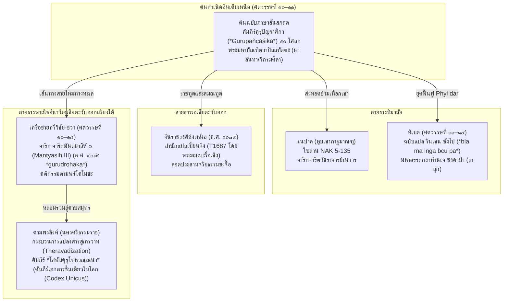
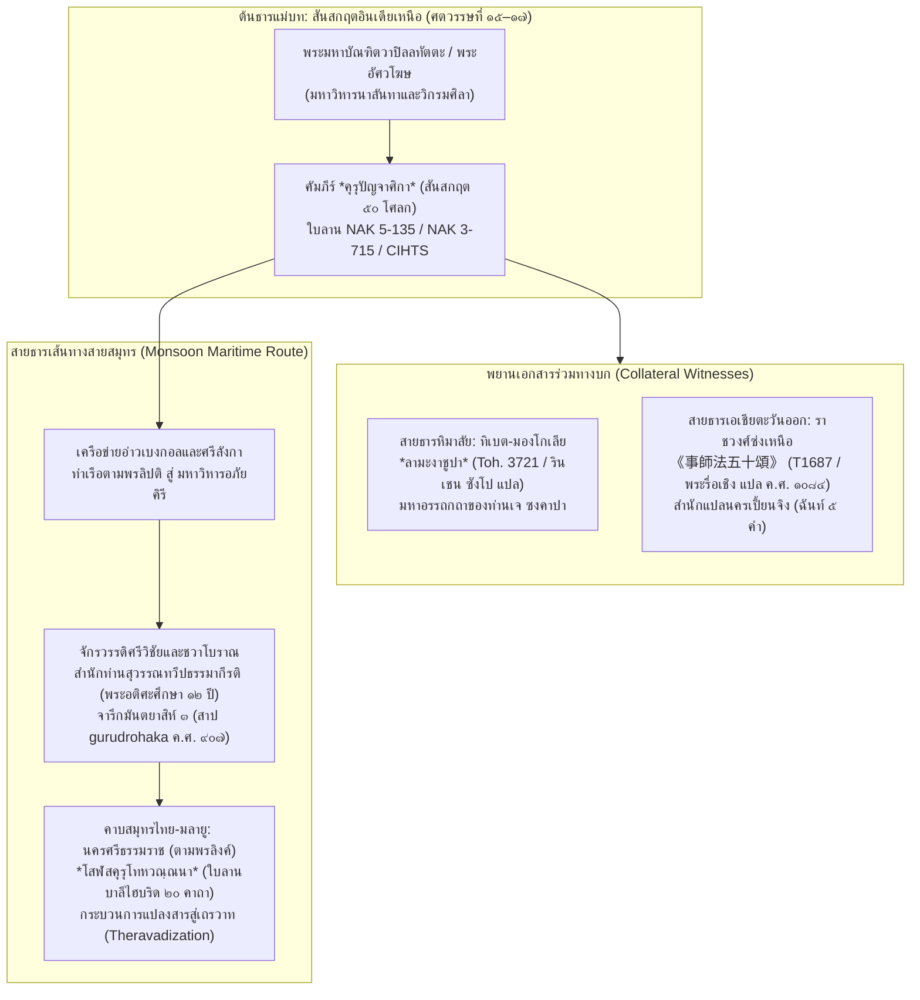

# บทที่ ๓: ภูมิศาสตร์ทางปัญญาและการกระจายตัวของคัมภีร์คุรุปัญจาศิกาในโลกพุทธศาสนา (The Trans-Asian Geography of Gurupañcāśikā)

---

## บทนำของบทที่ ๓: ภาพรวมการกระจายตัวของคุรุปัญจาศิกาข้ามเอเชียและการเปรียบเทียบเบื้องต้นกับโสฬสคุรุโทหวณฺณนา

ในประวัติศาสตร์ภูมิปัญญาของพระพุทธศาสนาฝ่ายมหายานและวัชรยาน (Vajrayāna / Esoteric Buddhism) คงไม่มีวรรณกรรมเชิงจริยศาสตร์และระเบียบปฏิบัติชิ้นใดที่มีบทบาทในการหล่อหลอม จัดระเบียบความสัมพันธ์ และสถาปนาสิทธิอำนาจอันศักดิ์สิทธิ์ภายในสังฆมณฑลข้ามภูมิภาคได้อย่างละเอียดลึกซึ้งและยาวนานเท่ากับคัมภีร์ *คุรุปัญจาศิกา* (คัมภีร์คุรุปัญจาศิกา (*Gurupañcāśikā*)) หรือ "บทคาถาห้าสิบโศลกแห่งการปรนนิบัติคุรุ" คัมภีร์ขนาดสั้นที่ประพันธ์ด้วยฉันท์อนุษฏุภ (Anuṣṭubh metre) จำนวนเพียง ๕๐ โศลกนี้ มิได้ดำรงสถานะเป็นเพียงบทสวดสดุดีครูบาอาจารย์หรือคาถาอ้อนวอนทางพิธีกรรมทั่วไป หากแต่ทำหน้าที่เป็น **"มหาธรรมนูญทางสังคมและวินัยบัญญัติของวัฒนธรรมย่อยวัชราจารย์และสานุศิษย์"** (*a social code for the sub-culture of Vajrayāna gurus and their disciples*) ตามคำนิยามอันเฉียบคมของเปแตร์-ดานีเอล ซานโต (ปีเตอร์-ดาเนียล ซานโต (Péter-Dániel Szántó)[^1] คัมภีร์นี้ทำหน้าที่กำหนดบรรทัดฐานทางจริยวัตร การคัดกรองทดสอบคุณสมบัติระหว่างอาจารย์กับศิษย์ การวางขอบเขตแห่งวินัยเชิงสรีระและพื้นที่ศักดิ์สิทธิ์ ตลอดจนการสถาปนาระบบทัณฑกรรมทางเทววิทยาที่รุนแรงสูงสุดเพื่อพิทักษ์สายธารการสืบทอดธรรม (Guruparamparā) ให้บริสุทธิ์ผุดผ่อง

มหาปรากฏการณ์แห่งคัมภีร์คุรุปัญจาศิกามิได้จำกัดตัวอยู่เฉพาะในศูนย์กลางการศึกษาพุทธศาสนาของอินเดียภาคเหนือ เช่น มหาวิหารนาลันทา (Nālandā) และมหาวิหารวิกรมศิลา (Vikramaśīla) ภายใต้ร่มเงาแห่งราชวงศ์ปาละ (Pāla Empire) ในช่วงพุทธศตวรรษที่ ๑๕–๑๗ (คริสต์ศตวรรษที่ 10–11) เท่านั้น แต่ตัวบทได้เดินทางข้ามพรมแดนทางวัฒนธรรมและภูมิรัฐศาสตร์อันไพศาลไปทั่วทวีปเอเชีย ในทิศเหนือ คัมภีร์นี้ได้ข้ามเทือกเขาหิมาลัยเข้าสู่หุบเขากาฐมาณฑุแห่งเนปาล และถูกแปลเข้าสู่คัมภีร์เทนเกียวร์ (Tengyur) แห่งทิเบตโดยพระมหาโลจาวะ รินเชน ซังโป (Rinchen Zangpo) ในชื่อ *Bla ma lnga bcu pa* ซึ่งต่อมากลายเป็นตำราปฐมนิเทศภาคบังคับของพระภิกษุและโยคินในทิเบตและมองโกเลีย จนได้รับการรจนาอธิบายขยายความโดยท่านเจ ซงคาปา (Je Tsongkhapa) ในมหาอรรถกถา *sLob ma'i re ba kun skong* ในทิศตะวันออก ตัวบทได้เดินทางผ่านเส้นทางสายไหมทางบกเข้าสู่ราชสำนักซ่งเหนือ (Northern Song Dynasty) ณ นครหลวงเปี้ยนจิง (ไคเฟิง) และได้รับการแปลสู่ภาษาจีนโดยพระบรมราชโองการของจักรพรรดิซ่งเสินจงในปี ค.ศ. ๑๐๘๔ โดยพระสมณะรื่อเชิง (日稱 / Sūryakīrti) ภายใต้ชื่อ 《事師法五十頌》 (Taishō Tripiṭaka เล่มที่ ๓๒ ลำดับที่ ๑๖๘๗)[^2] ขณะเดียวกัน ในทิศใต้และทิศตะวันออกเฉียงใต้ ผ่านเครือข่ายการค้าทางทะเลแห่ง "เอเชียมรสุม" (Monsoon Asia Interaction Sphere) ตามที่อันเดรีย อากริ  (Andrea Acri) ได้วิเคราะห์ไว้ มโนทัศน์แห่งคุรุปัญจาศิกาและคำสาปแช่งผู้ล่วงเกินครู (*gurudrohaka*) ได้หยั่งรากลึกในดินแดนศรีวิชัยและราชสำนักชวากลาง ดังปรากฏในจารึกมันตยาสิห์ ๓ (จารึกมันตยาสิห์ ๓ (Mantyasih III) Inscription) ค.ศ. ๙๐๗ สมัยพระเจ้าบาลิทุง (King Balitung)[^3]

เมื่อนำภูมิทัศน์การกระจายตัวข้ามทวีปเอเชียของคุรุปัญจาศิกามาเปรียบเทียบกับเอกสารตัวเขียนใบลานภาษาบาลี *โสฬสคุรุโทหวณฺณนา* (Soḷasagurudohavaṇṇanā) ซึ่งค้นพบเฉพาะในเขตลานตาปูชนียสถานของนครศรีธรรมราช (ตามพรลิงค์) ในฐานะเอกสารที่เป็นเอกสารฉบับเดียวในโลก (คัมภีร์เอกสารชิ้นเดียวในโลก (Codex Unicus)) จะพบข้อเท็จจริงเชิงพันธุศาสตร์คัมภีร์ (Textual Genealogy) ที่น่าอัศจรรย์ยิ่ง กล่าวคือ แม้ว่าโสฬสคุรุโทหวณฺณนาจะมีความยาวเพียง ๒๐ คาถา และแต่งด้วยภาษาบาลีไฮบริดที่มีการยืมรากศัพท์สันสกฤต √druh มาใช้อย่างหนาแน่น (`คุรุเทาห / คุรุโทหะ / คุรุโทหะ`) แต่โครงสร้างความคิด ข้อห้ามหลัก และถ้อยคำบัญญัติเกือบทั้งหมดกลับสะท้อนและสอดรับกับคาถาในคุรุปัญจาศิกา ๕๐ โศลกอย่างเป็นระบบ อาทิ ข้อห้ามการเหยียบย่ำเงาของครู (`ปตฺตฉายํ น ลงฺฆเร` เทียบกับ `tacchāyām api na laṅghayed` / `若足踏師影`), ข้อห้ามการออกนามครูตรงๆ ต่อหน้าประจักษ์ (`ปจฺจกฺเข น วเท นามํ` เทียบกับ `grāhyaṃ nādiśya tannāma` / `不應輒稱擧`), ข้อห้ามการนั่งทับอาสนะของครู (`คุรุโน'สเน น ติฏฺเฐถ` เทียบกับ `na guroḥ sthite tiṣṭhet` / `於床坐資具 騎驀罪過足`), มโนทัศน์การรับอภิเษกจากครู (`คุรุนาภิสิโต สิสฺโส` เทียบกับ `labdhvābhiṣekaṃ` / `於灌頂師`), มหันตโทษการตกอเวจีนรกและนรกขุมต่างๆ ของผู้ทรยศนินทาครู (`เตตฺตึสนรเก คจฺเฉ... อวิจิมฺหิ อุปฺปชฺชติ` เทียบกับ `tatrā vāsaḥ samākhyātā ācāryasya hi nindanāt... avīcau` / `阿鼻獄`), จนถึงจิตวิญญาณแห่งการสละศีรษะและยอมเป็นทาสรับใช้ครูตลอดชีวิต (`อตฺตโน สิรํ ฉินฺทิตฺวา... สรีรเมว คุรุทาสํ` เทียบกับ `prāṇair api nijair bhajet` และคติ `dāsasya dāsaḥ`)[^4]

การเปรียบเทียบเบื้องต้นนี้สะท้อนว่า คัมภีร์โสฬสคุรุโทหวณฺณนาของนครศรีธรรมราชมิใช่งานเขียนที่เกิดขึ้นอย่างโดดเดี่ยวโดยไม่มีรากเหง้า หากแต่เป็นผลลัพธ์ของการกลั่นตัว (Condensation) การคัดสรรเฉพาะประเด็นทัณฑกรรมทางกายภาพและจิตวิญญาณ (Anthological Selection) และการแปลงสารข้ามสายธารนิกายจากพุทธตันตรยานสู่พุทธตันตระเถรวาท (กระบวนการแปลงสารสู่เถรวาท (Theravadization) of Tantric Texts) โดยตัดทอนองค์ประกอบพิธีกรรมตันตระระดับลึกอันเป็นความลับในมณฑลออก แล้วคงไว้เฉพาะ "ธรรมนูญจริยธรรมเชิงสรีระและคำสาปแช่งคุรุโทหะ" เพื่อนำมาสถาปนาเป็นกฎเกณฑ์การขึ้นครูและการรักษาความบริสุทธิ์ของสายวิทยาคมในชุมชนสงฆ์คาบสมุทรไทย-มลายู

นอกจากสาระสำคัญดังกล่าว การศึกษาประวัติศาสตร์ของคุรุปัญจาศิกายังช่วยเผยให้เห็น "ความตึงเครียดเชิงสถาบัน" (Institutional Tension) ที่ดำรงอยู่เบื้องหลังการผงาดขึ้นของพุทธตันตรยาน นั่นคือความขัดแย้งระหว่าง **พระวินัยปาติโมกข์ดั้งเดิม** (Prātimokṣa Vinaya) ซึ่งยึดถือพรรษา ลำดับสมณศักดิ์ และเพศพรหมจรรย์ของภิกษุเป็นเกณฑ์สูงสุด กับ **ระเบียบมณฑลตันตระ** (Tantric Samaya) ซึ่งเรียกร้องให้ศิษย์ต้องยอมจำนนและแสดงความเคารพอย่างไม่มีเงื่อนไขต่อ "วัชราจารย์" (Vajrācārya) แม้ว่าพระอาจารย์ผู้นั้นจะเป็นคฤหัสถ์ครองเรือน (Gṛhastha) หรือภิกษุผู้มีพรรษาอ่อนกว่าก็ตาม ดังที่เจฟฟรีย์ โคทึก  (Jeffrey Kotyk) ได้ชี้ให้เห็นในบทวิเคราะห์ประวัติศาสตร์พระวินัยว่า กฎหมายสงฆ์ดั้งเดิมในนิกายมหาสังฆิกะ (Mahāsāṃghika) และสรวาสติวาท (Sarvāstivāda) ได้รับเอาค่านิยมของชนชั้นสูงพราหมณ์และอำนาจรัฐราชาธิปไตยเข้ามาจัดวางโครงสร้างอำนาจไว้อย่างเข้มงวด[^5] คัมภีร์คุรุปัญจาศิกาจึงได้รับการรจนาขึ้นเพื่อทำหน้าที่เป็น "สนธิสัญญาประนีประนอม" (Concordat) ที่จัดระเบียบความสัมพันธ์อันซับซ้อนนี้ เพื่อให้ภิกษุในสังฆมณฑลสามารถปฏิบัติตนตามธรรมเนียมตันตระได้โดยไม่ละเมิดพระวินัยปาติโมกข์จนกลายเป็นโลกวัชชะ (Lokāvadhyāna)

ในบทนี้ เราจะทำการสืบสวนรอยทางประวัติศาสตร์และภูมิศาสตร์ทางปัญญาของคัมภีร์คุรุปัญจาศิกาอย่างละเอียดถี่ถ้วนในทุกมิติ โดยเริ่มต้นจากการนำคาถาหลัก ๖ บทแห่งโสฬสคุรุโทหวณฺณนามาวางเทียบเคียงวรรคต่อวรรคกับตัวบทคุรุปัญจาศิกา ๕๐ โศลกใน ๓ ภาษาหลัก จากนั้นจะก้าวเข้าสู่การคลี่คลายปริศนาข้อถกเถียงเรื่องผู้รจนาที่แท้จริงระหว่างพระอัศวโฆษกับพระวาปิลลทัตตะในอินเดียเหนือ การสืบทอดสายธารเอกสารตัวเขียนใบลานในเนปาล การสถาปนามหาอรรถกถาว่าด้วยทัณฑ์นรกแห่งการนินทาครูในทิเบตและมองโกเลีย การตรวจชำระตัวบทจีนสมัยราชวงศ์ซ่งเหนือ ค.ศ. ๑๐๘๔ และการสืบรอยคำสาปแช่งคุรุโทหกะในจารึกชวาโบราณและเอเชียตะวันออกเฉียงใต้ เพื่อพิสูจน์ให้เห็นว่า "คุรุโทหะ" คือมโนทัศน์ร่วมระดับอารยธรรมที่ไหลเวียนข้ามเอเชีย ก่อนจะตกผลึกเป็นเอกสารตัวเขียนใบลานอันล้ำค่า ณ นครศรีธรรมราช

---


## คาถาโคว๊ทนำบท: การเปรียบเทียบวรรคต่อวรรคระหว่างโสฬสคุรุโทหวณฺณนากับคุรุปัญจาศิกา

เพื่อสร้างรากฐานเชิงประจักษ์ทางนิรุกติศาสตร์ (Empirical Philological Foundation) ในการสืบสาวสายธารคัมภีร์ ในส่วนนี้นำเสนอการยกบทคาถาสำคัญจำนวน ๖ บทจากคัมภีร์ *โสฬสคุรุโทหวณฺณนา* (ใบลานนครศรีธรรมราช) ได้แก่ **คาถาที่ ๓, ๔, ๕, ๑๐, ๑๕, และ ๑๘** มาจัดวางเคียงคู่แบบวรรคต่อวรรค (Side-by-Side Collation) ร่วมกับตัวบทคู่ขนานในคัมภีร์ *คุรุปัญจาศิกา* (Gurupañcāśikā) ทั้งในต้นฉบับภาษาสันสกฤตที่ตรวจชำระจากใบลานเนปาล NAK 5-135 (ซานโต (Szántó) 2013) และ NAK 3-715 (Lévi 1929), ฉบับแปลภาษาจีนราชสำนักซ่งเหนือ Taishō T1687 (พระรื่อเชิง ค.ศ. ๑๐๘๔), และฉบับแปลภาษาทิเบตเทนเกียวร์ Toh. 3721 (พระรินเชน ซังโป)

---

### ตารางที่ ๓.๑: การเปรียบเทียบคาถาที่ ๓ ว่าด้วยข้อห้ามเรื่องบริขารและ "เงาของครู" (*Guroś Chāyā*)

| คัมภีร์ / แหล่งที่มา | ตัวบทดั้งเดิม (Diplomatic / Canonical Text) | คำแปลภาษาไทยเชิงวิชาการ |
|:---|:---|:---|
| **โสฬสคุรุโทหวณฺณนา**<br>(คาถาที่ ๓ ใบลานนครฯ) | `คุรุโน จีวรํ ฉตฺตํ ปตฺตํ ฉายํ น ลงฺฆเย`<br>`คุรุโน อาสเน น ติฏฺเฐถ น สเยยฺย น เจว วเส ฯ`<br>*(รูปอักษรใบลานเดิม: คุรุเนาจิวรํฉตฺตํ ปตฺตฉายํนลชฺฌเร คุรุเนาอาสเนติฏฺเฐ นเสยฺยนเจววเส)* | ศิษย์ไม่พึงก้าวข้ามหรือเหยียบย่ำจีวร ร่ม บาตร และเงาของครูบาอาจารย์เลย ศิษย์ไม่พึงยืน นั่ง หรือนอนทับบนอาสนะของครู และไม่พึงอยู่เสมอด้วยครูในสถานที่พำนักเลย |
| **Gurupañcāśikā (ภาษาสันสกฤต)**<br>(NAK 3-715 / NAK 5-135 โศลก ๒๓) | *tacchāyām api na laṅghayed upānahau tathāsanam /<br>vāhanaṃ ca parityajya caityabhaṅgādyabhītyā ca //*[^6] | ศิษย์ไม่พึงก้าวข้ามหรือเหยียบย่ำแม้เพียงเงาของพระอาจารย์ ตลอดจนรองเท้า อาสนะ และยานพาหนะของท่าน โดยเว้นเสียด้วยความเกรงกลัวประดุจดั่งความกลัวต่อการทำลายพระสถูปเจดีย์ |
| **《事師法五十頌》 (ภาษาจีน)**<br>(Taishō Vol. 32, No. 1687 โศลก ๒๔) | `若足踏師影 獲罪如破塔`<br>`於床坐資具 騎驀罪過足 ฯ`[^7] | หากก้าวเท้าเหยียบย่ำลงบนเงาของพระอาจารย์ ย่อมได้รับบาปโทษเสมอด้วยการทำลายพระสถูปเจดีย์ การขึ้นไปนั่งทับ ก้าวข้าม หรือเหยียบย่ำบนเตียง ตั่ง อาสนะ และเครื่องบริขาร ย่อมมีบาปโทษยิ่งกว่าการเหยียบเงาเสียอีก |
| **Bla ma lnga bcu pa (ภาษาทิเบต)**<br>(Derge Tanjur Toh. 3721 โศลก ๒๓) | `de yi grib ma'ang mi 'gom zhing / lham dang stan yang de bzhin te /`<br>`bzhon pa yang ni spong byed cing / mchod rten 'jig sogs 'jigs pas so //`[^8] | ศิษย์ไม่พึงก้าวข้ามแม้กระทั่งเงาของท่าน และรองเท้ากับอาสนะก็เช่นเดียวกัน พึงละเว้นยานพาหนะด้วยความหวาดกลัวดั่งการทำลายพระเจดีย์เป็นต้น |

**บทวิเคราะห์ทางนิรุกติศาสตร์และมโนทัศน์:**  
ความสอดคล้องระหว่างคาถาที่ ๓ ของโสฬสคุรุโทหวณฺณนากับโศลกที่ ๒๓ ของคุรุปัญจาศิกาภาษาสันสกฤต (โศลกที่ ๒๔ ในฉบับจีนของพระรื่อเชิง) จัดเป็น "หลักฐานประจักษ์เชิงโครงสร้างที่แน่นหนาที่สุด" (The Smoking Gun of Textual Parallelism) ที่พิสูจน์ความเชื่อมโยงโดยตรงระหว่างเอกสารทั้งสองสาย:
๑. **คำว่า `ฉายํ น ลงฺฆเย` (สันสกฤต: `chāyām api na laṅghayed` / จีน: `若足踏師影` / ทิเบต: `grib ma'ang mi 'gom`):** มโนทัศน์การห้ามเหยียบเงาครูมิใช่คำสอนที่มีต้นกำเนิดในพระวินัยปาติโมกข์ของฝ่ายเถรวาทลังกา (ซึ่งไม่มีสิกขาบทข้อใดปรับอาบัติเรื่องการเหยียบเงาอุปัชฌาย์) แต่เป็นมโนทัศน์ที่พุทธตันตรยานรับทอดมาจากคัมภีร์พระธรรมศาสตร์พราหมณ์โบราณ โดยเฉพาะ *มนูสมฤติ* (คัมภีร์มนูสมฤติ (*Manusmṛti*) ๔.๑๓๐: `na laṅghayec cha yāṃ devatānāṃ guror rājñaḥ` - ไม่พึงก้าวข้ามเงาของเทวดา คุรุ และพระราชา)[^9] การที่พุทธตันตรยานนำข้อห้ามนี้มาประดิษฐานลงในคุรุปัญจาศิกา และเปรียบเทียบเงาของครูเข้ากับการทำลายพระสถูปเจดีย์ (`caityabhaṅgādyabhītyā ca` / `獲罪如破塔` / `mchod rten 'jig pa`) สะท้อนเทววิทยาที่มองว่า **"สรีระของพระวัชราจารย์คือพระธรรมกายและพระสถูปเจดีย์ที่ทรงพระชนม์อยู่"** เงาที่ทอดออกจากสรีระจึงเป็นเขตศักดิ์สิทธิ์ที่ห้ามผู้ใดก้าวล่วง
๒. **การแปลงรูปคำในใบลานนครศรีธรรมราช:** ช่างจารใบลานภาคใต้ได้จารรูปสะกดผิดเพี้ยนตามสำเนียงถิ่นเป็น `ปตฺตฉายํนลชฺฌเร` ซึ่งผู้ตรวจชำระได้แก้ไขเป็น `ปตฺตจฺฉายํ น ลงฺฆเย` หรือแยกเป็น `ปตฺตํ ฉายํ น ลงฺฆเย` โดยคงความหมายเดิมไว้ครบถ้วน ควบคู่กับการนำเอาบริขารสำคัญ ๓ ชิ้นในพุทธวินัย ได้แก่ จีวร ร่ม และบาตร (`จีวรํ ฉตฺตํ ปตฺตํ`) มาสวมทับแทนที่คำว่า "รองเท้าและยานพาหนะ" (`upānahau... vāhanaṃ`) ของคุรุปัญจาศิกาสันสกฤต เพื่อปรับให้เข้ากับวิถีชีวิตแห่งสมณเพศฝ่ายเถรวาท

---

### ตารางที่ ๓.๒: การเปรียบเทียบคาถาที่ ๔ ว่าด้วยข้อห้ามการเอ่ยนามครู (*Nāmagrahaṇa-niṣedha*) และการใช้ที่นั่งเสมอกัน

| คัมภีร์ / แหล่งที่มา | ตัวบทดั้งเดิม (Diplomatic / Canonical Text) | คำแปลภาษาไทยเชิงวิชาการ |
|:---|:---|:---|
| **โสฬสคุรุโทหวณฺณนา**<br>(คาถาที่ ๔ ใบลานนครฯ) | `ปจฺจกฺเข น วเท นามํ สรเก ฆเร น วเส สถา`<br>`คุรุโน สมนุญฺญาว น กเรยฺย กทาจิปิ ฯ`<br>*(รูปอักษรใบลานเดิม: ปจฺจกฺเขนวเทนามํ สรเกฆเรนวเสสถา คุรุเนาสมนุญฺญาว นกเรยฺยกทาจิปิ)* | ต่อหน้าประจักษ์ ศิษย์ไม่พึงบังอาจเอ่ยนามของพระอาจารย์ตรงๆ ไม่พึงใช้ถ้วยชามภาชนะเสมอกับครู และไม่พึงพำนักในเรือนหลังเดียวกันเสมอกับท่าน ไม่พึงกระทำสิ่งใดๆ โดยปราศจากการอนุมัติยินยอมของครูในกาลไหนๆ เลย |
| **Gurupañcāśikā (ภาษาสันสกฤต)**<br>(NAK 5-135 โศลก ๓๔ [กู้คืนโดย ซานโต (Szántó) 2013]) | *grāhyaṃ nādiśya tannāma pādāntam abhinanditam /<br>paritoṣāya lokasya dātavyā tasya gauravam //*[^10] | ศิษย์ไม่พึงเอ่ยนามของพระอาจารย์นั้นตรงๆ แต่พึงออกนามโดยมีคำว่า "ปาทะ" (-pāda / บาท) ต่อท้ายเพื่อเป็นมงคลอันน่ายินดี และพึงถวายความเคารพยำเกรงแด่ท่านเพื่อความเลื่อมใสยินดีของชาวโลกทั้งปวง |
| **《事師法五十頌》 (ภาษาจีน)**<br>(Taishō Vol. 32, No. 1687 โศลก ๓๕) | `又復於師名 不應輒稱擧`<br>`若有召命時 應加吉祥語 ฯ`[^11] | อีกประการหนึ่ง นามของพระอาจารย์นั้น ศิษย์ไม่พึงบังอาจเอ่ยขานเรียกตรงๆ ตามอำเภอใจ หากมีเหตุจำเป็นต้องกล่าวถึงหรือเมื่อท่านเรียกขาน พึงเปล่งถ้อยคำอันเป็นสิริมงคล [吉祥語] ประกอบนามท่านเสมอ |
| **Bla ma lnga bcu pa (ภาษาทิเบต)**<br>(Derge Tanjur Toh. 3721 โศลก ๓๔) | `de yi ming ni mi brjod de / zhabs kyi mtha' can mngon par dga' /`<br>`'jig rten yongs su mgu bya'i phyir / de la gus pa bya bar bya //`[^12] | ศิษย์ไม่พึงออกนามของท่านนั้น พึงยินดีเติมคำว่า "บาท" (zhabs / pāda) ไว้เบื้องท้ายนาม และพึงกระทำความเคารพอ่อนน้อมแด่ท่าน เพื่อให้ชาวโลกเกิดความยินดีเลื่อมใส |

**บทวิเคราะห์ทางนิรุกติศาสตร์และมโนทัศน์:**  
คาถาที่ ๔ ของโสฬสคุรุโทหวณฺณนาประมวลข้อห้ามทางภาษาศาสตร์และสังคมวิทยาที่เคร่งครัดที่สุดข้อหนึ่งในจารีตอินเดียโบราณ:
๑. **ข้อห้ามการเอ่ยนามครู (`ปจฺจกฺเข น วเท นามํ` เทียบกับ `grāhyaṃ nādiśya tannāma`):** โศลกที่ ๓๔ ของคุรุปัญจาศิกาภาษาสันสกฤตนี้เป็นหนึ่งในข้อความสำคัญที่สุดที่สูญหายไปจากโลกวิชาการนับตั้งแต่ ซิลแวง เลวี (Sylvain Lévi) ปริวรรตใบลาน NAK 3-715 ในปี 1929 (ซึ่งตัวบทขาดหายไปตั้งแต่กึ่งกลางคาถาที่ ๓๓) และเพิ่งได้รับการกู้คืนกลับมาอย่างสมบูรณ์โดย ปีเตอร์-ดาเนียล ซานโต (Péter-Dániel Szántó) ในปี 2013 จากใบลาน NAK 5-135 ตัวบทสันสกฤตดั้งเดิมระบุชัดเจนว่า ห้ามออกนามครูตรงๆ โดยเดี่ยวๆ แต่ต้องลงท้ายด้วยคำว่า "ปาทะ" (`pādāntam` เช่น *ธรรมกีรติปาทะ* หรือ *อัศวโฆษปาทะ*) สอดรับกับฉบับแปลภาษาทิเบตที่ใช้คำว่า `zhabs` และฉบับแปลภาษาจีนของพระรื่อเชิงที่ระบุว่าต้องมีคำมงคลกำกับ (`應加吉祥語`)
๒. **รากเหง้าจากคัมภีร์พระธรรมศาสตร์:** ข้อห้ามนี้มีรากฐานโดยตรงจาก *มนูสมฤติ* โศลก ๒.๑๙๙: `nāsya saṃkīrtayan nāma parokṣam api kevalam` (แม้ลับหลัง ก็ไม่พึงออกเพียงแค่นามอันโดดเดี่ยวของครู โดยปราศจากคำนำหน้าแสดงความเคารพ เช่น ท่าน หรือ พระ)[^13] การที่คัมภีร์ใบลานนครศรีธรรมราชบันทึกว่า `ปจฺจกฺเข น วเท นามํ` (ต่อหน้าประจักษ์ ไม่พึงเอ่ยนามครู) และขยายความครอบคลุมไปถึงการห้ามใช้ภาชนะถ้วยชามเสมอกับครู (`สรเก` มาจากสันสกฤต *śarāva* / *śarāvake*) และการห้ามอยู่เรือนหลังเดียวกัน (`ฆเร น วเส`) แสดงถึงการสืบทอดบรรทัดฐานวรรณกรรมธรรมศาสตร์ผ่านคัมภีร์คุรุปัญจาศิกามาสู่อุษาคเนย์อย่างแจ่มชัด

---

### ตารางที่ ๓.๓: การเปรียบเทียบคาถาที่ ๕ ว่าด้วย "คุรวาภิเษก" และมนตร์พระพุทธเจ้า ๕ พระองค์

| คัมภีร์ / แหล่งที่มา | ตัวบทดั้งเดิม (Diplomatic / Canonical Text) | คำแปลภาษาไทยเชิงวิชาการ |
|:---|:---|:---|
| **โสฬสคุรุโทหวณฺณนา**<br>(คาถาที่ ๕ ใบลานนครฯ) | `คุรุนาภิสิโต สิสฺโส นโมพุทฺธายาทิมนฺโต`<br>`ปตฺโต สพฺพญฺญุตญาณํ สาตฺถํ กตฺวา ปูชเยยฺย ฯ`<br>*(รูปอักษรใบลานเดิม: คุรุนาภิเสเกาสิสฺเสา นเมาพุทฺธายาทิปนฺเตา ปตฺเตาสพฺพญฺญูตญาณํ สาตฺถํกตฺวาปูชเยยฺย)* | ศิษย์ผู้อันพระอาจารย์ได้ประกอบพิธีอภิเษกแล้ว ย่อมเข้าถึงพระมนตร์ศักดิ์สิทธิ์ขึ้นต้นด้วย "นโม พุทฺธาย" [มนตร์พระพุทธเจ้า ๕ พระองค์] บรรลุพระสัพพัญญุตญาณ และพึงกระทำการบูชาพระอาจารย์ด้วยการยังประโยชน์ตนและผู้อื่นให้ถึงพร้อม |
| **Gurupañcāśikā (ภาษาสันสกฤต)**<br>(NAK 3-715 / NAK 5-135 โศลก ๑–๒) | *labdhvābhiṣekaṃ saṃprāpto vajrācāryasya sannidhau /<br>daśadiglokadhātusthais trikālam etya vandyate //*[^14] | ศิษย์ผู้ได้รับการอภิเษกแล้ว เมื่อได้มาสถิตอยู่เบื้องหน้าแห่งพระวัชราจารย์ ย่อมตระหนักว่าพระอาจารย์นั้นเป็นผู้ที่พระสัมมาสัมพุทธเจ้าทั้งหลายในทศทิศโลกธาตุ เสด็จมากราบไหว้วันละสามเวลา |
| **《事師法五十頌》 (ภาษาจีน)**<br>(Taishō Vol. 32, No. 1687 โศลก ๒) | `若於灌頂師 三時伸禮奉`<br>`則爲已供養 十方諸如來 ฯ`[^15] | หากศิษย์กระทำการอภิวาทกราบไหว้ปรนนิบัติต่อพระอาจารย์ผู้อภิเษก [灌頂師] ในกาลทั้งสาม ย่อมเท่ากับว่าได้กระทำการสักการบูชาแด่พระตถาคตเจ้าทั้งปวงในทศทิศอย่างสมบูรณ์ |
| **Bla ma lnga bcu pa (ภาษาทิเบต)**<br>(Derge Tanjur Toh. 3721 โศลก ๑–๒) | *dbang bskur thob cing de nyid rig / rdo rje slob dpon drung du 'ongs /...*<br>*phyogs bcu'i 'jig rten khams bzhugs pa'i / de bzhin gshegs pas dus gsum du //*[^16] | เมื่อได้รับการอภิเษกและรู้แจ้งในตัตตวะแล้ว เข้ามาสู่สำนักของพระวัชราจารย์... พระตถาคตเจ้าทั้งหลายผู้ประทับอยู่ในทศทิศ ย่อมเสด็จมาถวายบังคมในกาลทั้งสาม |

**บทวิเคราะห์ทางนิรุกติศาสตร์และมโนทัศน์:**  
คาถาที่ ๕ ของโสฬสคุรุโทหวณฺณนาจัดเป็น **"รหัสลับแห่งตันตระเถรวาท" (Esoteric Theravāda Cipher)** ที่สำคัญที่สุดในเอกสารตัวเขียนใบลานนครศรีธรรมราช:
๑. **คำว่า `คุรุนาภิสิโต` (สันสกฤต: `labdhvābhiṣekaṃ` / จีน: `灌頂` [กวั้นติ่ง] / ทิเบต: `dbang bskur`):** พิธีอภิเษก (Abhiṣeka) คือสัญลักษณ์เฉพาะของพุทธศาสนาฝ่ายวัชรยานและมนตรยาน ซึ่งไม่มีปรากฏในพิธีกรรมบวชพระของเถรวาทกระแสหลักในลังกา การที่คำว่า `คุรุนาภิสิโต` (ศิษย์ผู้อันครูอภิเษกแล้ว) ปรากฏเป็นคำสอนสำคัญในใบลานนครศรีธรรมราช ยืนยันว่าขนบการสถาปนาสิทธิหน้าที่ (Adhikāra) และการถ่ายทอดมนตร์ผ่านพิธีอภิเษกของวัชราจารย์ตามคุรุปัญจาศิกา ได้ส่งทอดและฝังตัวอยู่ในสายวิชาการขึ้นครูของภาคใต้
๒. **การเชื่อมโยงกับมนตร์ ๕ พระองค์ `นโมพุทฺธายาทิมนฺโต`:** ในคัมภีร์คุรุปัญจาศิกา โศลกที่ ๕๐ (NAK 5-135 แผ่นลาน 5r) ระบุว่า ศิษย์ผู้ปรนนิบัติครูย่อมบรรลุผลสูงสุดในพุทธภาวะแห่งพระตถาคตทั้งปวง (`sarvabuddhatvam āpnoti`) ในแวดวงพุทธศาสนาโบราณในสุวรรณภูมิ มโนทัศน์พระพุทธเจ้า ๕ พระองค์แห่งวัชรยาน (ไวโรจนะ, อักษโภภยะ, รัตนสัมภวะ, อมิตาภะ, อโมฆสิทธิ) ได้ถูก "แปลงสารสู่เถรวาท" (Theravadized) ให้กลายเป็นพระสัมมาสัมพุทธเจ้า ๕ พระองค์แห่งภัทรกัป (กกุสันโธ, โกนาคมโน, กัสสโป, โคตโม, เมตเตยโย) ผ่านหัวใจพระมนตร์ **"นะ โม พุท ธา ยะ"** ซึ่งเป็นพระมนตร์สูงสุดของระบบโยคาวจรและกรรมฐานโบราณสายทักษิณสยาม (Crosby 2020; Bizot 1993)[^17]

---

### ตารางที่ ๓.๔: การเปรียบเทียบคาถาที่ ๑๐ ว่าด้วยมหันตโทษแห่งคุรุโทหะ นรก ๓๓ ขุม และอเวจี

| คัมภีร์ / แหล่งที่มา | ตัวบทดั้งเดิม (Diplomatic / Canonical Text) | คำแปลภาษาไทยเชิงวิชาการ |
|:---|:---|:---|
| **โสฬสคุรุโทหวณฺณนา**<br>(คาถาที่ ๑๐ ใบลานนครฯ) | `ยมโลกญฺจ ปปฺโปติ เตตฺตึสนรเกสุปิ`<br>`อวิจิมฺหิ อุปฺปชฺชติ มหาทุกฺขํ นิรนฺตรํ ฯ`<br>*(รูปอักษรใบลานเดิม: ยมโลกญฺจปปฺโปติ เตติํสนรเกสุปิ อวิจิมฺหิอุปฺปชฺชติ มหาทุกฺขํนิรนฺตรํ)* | ผู้ประทุษร้ายครูนั้น ย่อมถึงซึ่งยมโลก และต้องตกลงสู่นรกทั้ง ๓๓ ขุม ย่อมไปบังเกิดในอเวจีมหานรก เสวยมหาทุกขเวทนาอย่างต่อเนื่องปราศจากช่องว่างสิ้นกาลนาน |
| **Gurupañcāśikā (ภาษาสันสกฤต)**<br>(NAK 3-715 / NAK 5-135 โศลก ๑๑, ๑๔) | *ācāryasya hi nindanāt / patanti narakāvīcau mahāghore samantataḥ //*<br>*tatrā vāsaḥ samākhyātā gurudrohata eva ca //*[^18] | แท้จริงแล้ว เพราะเหตุแห่งการนินทาว่าร้ายพระอาจารย์ คนเขลาเหล่านั้นย่อมตกลงสู่อเวจีนรกอันน่าสะพรึงกลัวยิ่งในทุกทิศทาง... การพำนักอยู่ในนรกอันมหันต์นั้น พระผู้มีพระภาคตรัสว่ามีมูลเหตุมาจากการประทุษร้ายครู [gurudrohataḥ] โดยแท้ |
| **《事師法五十頌》 (ภาษาจีน)**<br>(Taishō Vol. 32, No. 1687 โศลก ๑๔–๑๕) | `毀謗阿闍黎 則獲如是報`<br>`墮阿鼻獄中 大火常燒煮 ฯ`[^19] | ผู้ใดทำลายล้างหรือนินทาว่าร้ายพระอาจารย์ [Ācārya] ย่อมได้รับวิบากกรรมอันน่าสะพรึงกลัวเช่นนี้ เมื่อตายไปย่อมดิ่งลงสู่อเวจีนรก [阿鼻獄] ถูกเปลวเพลิงใหญ่แผดเผาเคี่ยวต้มอยู่ตลอดกาล |
| **Bla ma lnga bcu pa (ภาษาทิเบต)**<br>(Derge Tanjur Toh. 3721 โศลก ๑๑, ๑๔) | `slob dpon la ni smod pa yis / mnar med pa yi sems can dmyal /`<br>`'jigs su rung bar ltung bar 'gyur /... bla ma la ni gnod byas pas //`[^20] | เพราะการดูหมิ่นนินทาพระอาจารย์ ศิษย์นั้นย่อมตกลงสู่อเวจีมหานรกอันน่าสะพรึงกลัวอย่างยิ่ง... พระผู้มีพระภาคตรัสว่าการตกนรกนั้นเกิดจากการกระทำอันเป็นโทษประทุษร้ายต่อครู [bla ma la gnod byas] |

**บทวิเคราะห์ทางนิรุกติศาสตร์และมโนทัศน์:**  
ความเชื่อมโยงระหว่างคาถาที่ ๑๐ กับโศลกที่ ๑๑–๑๔ ของคุรุปัญจาศิกา เป็นหลักฐานแสดงการถ่ายทอด "เทววิทยาแห่งการลงทัณฑ์" (Soteriology of Terror):
๑. **คำว่า `คุรุโทหะ` (Gurudoha) และ `คุรุนินทา` (Gurunindā):** ในต้นฉบับภาษาสันสกฤต NAK 5-135 ปรากฏศัพท์ว่า `gurudrohata eva ca` (เพราะการประทุษร้ายครู) และ `ācāryasya hi nindanāt` (เพราะการนินทาครู) ซึ่งเป็นรากศัพท์ตรงตัวของคำว่า `คุรุเทาห / คุรุโทหะ` ในใบลานนครศรีธรรมราช ทั้งสองคัมภีร์สถาปนาให้การนินทาครูเป็นความผิดที่มีวิบากกรรมร้ายแรงเทียบเท่ากับ **อนันตริยกรรม** (Anantariya-kamma) เพราะส่งผลให้ผู้กระทำต้องดิ่งลงสู่อเวจีนรก (`Avīci` / `mnar med` / `阿鼻獄`) ทันทีโดยไม่มีกรรมอื่นใดมาขวางกั้นได้
๒. **มโนทัศน์ "นรก ๓๓ ขุม" (`เตตฺตึสนรเกสุปิ`):** แม้คุรุปัญจาศิกาฉบับสันสกฤตจะระบุเน้นเฉพาะอเวจีนรกและนรกขุมบริวาร (โศลก ๑๕: `rauravādyāś ca ye narakāḥ`) แต่คัมภีร์โสฬสคุรุโทหวณฺณนาได้ระบุเจาะจงว่าต้องตกลงสู่นรก ๓๓ ขุม ซึ่งเป็นการผสานมโนทัศน์จักรวาลวิทยาจากคัมภีร์สังคหะและโลกสัณฐานวิทยาของลังกาและสุวรรณภูมิ (เช่น *โลกปัญญัตติ* และ *ไตรภูมิกถา*) เข้ากับคำสอนตันตระดั้งเดิม

---

### ตารางที่ ๓.๕: การเปรียบเทียบคาถาที่ ๑๕ ว่าด้วยการยอมตัดศีรษะตนเองบูชาครูบาอาจารย์

| คัมภีร์ / แหล่งที่มา | ตัวบทดั้งเดิม (Diplomatic / Canonical Text) | คำแปลภาษาไทยเชิงวิชาการ |
|:---|:---|:---|
| **โสฬสคุรุโทหวณฺณนา**<br>(คาถาที่ ๑๕ ใบลานนครฯ) | `สิรํ ฉินฺทติ วิย วา สพฺพทานํ ปวุจฺจติ`<br>`อตฺตโน สิรํ ฉินฺทิตฺวา คุรุปูชํ กเรยฺย โส ฯ`<br>*(รูปอักษรใบลานเดิม: สิรํฉินฺทติวิยวา สพฺพทานํปวุจฺจติ อตฺตเนาสิรํฉินฺทิตฺวา คุรุปูชํกเรยฺยเสา)* | การสละชีวิตด้วยการตัดศีรษะตนเองถวายบูชานั้น ตรัสว่าเป็นยอดแห่งทานทั้งปวง บุคคลนั้นพึงตัดศีรษะของตนเองออก เพื่อกระทำการสักการบูชาแด่พระอาจารย์ |
| **Gurupañcāśikā (ภาษาสันสกฤต)**<br>(NAK 3-715 / NAK 5-135 โศลก ๑๗) | *prāṇair api nijair bhajet /<br>adeyaiḥ putradārādyaiḥ kiṃ punar vibhavaiś ca taiḥ //*[^21] | ศิษย์พึงปรนนิบัติบูชาพระอาจารย์แม้ด้วยชีวิตลมหายใจของตนเอง สรรพสิ่งอันไม่อาจมอบให้แก่ผู้ใดได้ เช่น บุตรและภรรยาเป็นต้น ศิษย์ก็พึงสละถวายแด่ครูได้ ไฉนจะต้องกล่าวถึงทรัพย์สมบัติภายนอกเล่า! |
| **《事師法五十頌》 (ภาษาจีน)**<br>(Taishō Vol. 32, No. 1687 โศลก ๑๗) | `身命及妻子 慇懃常奉施`<br>`況於外資財 豈不能捨棄 ฯ`[^22] | ศิษย์พึงมีจิตศรัทธามั่นคง น้อมถวายแม้กระทั่งร่างกาย ชีวิต บุตร และภรรยา แด่พระอาจารย์เป็นนิจกาล แล้วไฉนเล่ากับทรัพย์สมบัติภายนอก ศิษย์จะไม่สามารถสละละทิ้งถวายแด่ท่านได้! |
| **Bla ma lnga bcu pa (ภาษาทิเบต)**<br>(Derge Tanjur Toh. 3721 โศลก ๑๗) | `rang gi srog kyang yongs btang nas / bkur sti bya zhing de bzhin te /`<br>`sbyin par mi bya'i bu dang chung / smos kyang ci dgos nor rnams la //`[^23] | ศิษย์พึงสละละทิ้งแม้ชีวิตของตนเอง แล้วกระทำการปรนนิบัติสักการะ แม้แต่บุตรและภรรยาอันบุคคลไม่พึงสละให้แก่ผู้ใด ก็พึงสละถวายได้ ไฉนเล่าจะต้องกล่าวถึงทรัพย์สินเงินทอง |

**บทวิเคราะห์ทางนิรุกติศาสตร์และมโนทัศน์:**  
คาถาที่ ๑๕ ของโสฬสคุรุโทหวณฺณนาสะท้อนการยกระดับมโนทัศน์ "คุรุภักดีขั้นสูงสุด" (Radical Guru Devotion):
๑. **จาก `prāṇair api nijair` (สละชีวิต) สู่ `อตฺตโน สิรํ ฉินฺทิตฺวา` (ตัดศีรษะถวายครู):** ในคุรุปัญจาศิกา โศลกที่ ๑๗ บัญญัติให้ศิษย์สละชีวิตตนเอง (`prāṇair api nijair`) บุตร และภรรยา ถวายแด่ครู แต่ในใบลานนครศรีธรรมราช มโนทัศน์นี้สืบทอดออกมาในรูปของการ "ตัดศีรษะตนเองบูชาครู" (`สิรํ ฉินฺทติ วิย... อตฺตโน สิรํ ฉินฺทิตฺวา`) ซึ่งสะท้อนการบรรจบกันระหว่างคติ **มหาทานบริจาคสรีระ** (สรีรทาน (Dehadāna) / Bodily Sacrifice) ในชาดกมหายาน (เช่น พระโพธิสัตว์สละศีรษะใน *มหาภารตศตกะ* และคัมภีร์ *ภักติศตกะ* ของพระรามจันทระ ภารตี ในลังกา) กับพิธีกรรมตันตระสายสุดโต่งที่แพร่หลายในแถบสุมาตราและคาบสมุทรมลายู (Castro 2010; Ohnuma 2007)[^24]
๒. **การตัดองค์ประกอบเรื่องการถวายบุตรภรรยา:** สังเกตได้ว่า โสฬสคุรุโทหวณฺณนาได้ตัดคำว่า "บุตรและภรรยา" (`putradāra` / `妻子` / `bu dang chung`) ออกไปอย่างสิ้นเชิง และมุ่งเน้นเฉพาะการสละสรีระร่างกายและศีรษะของตนเองเท่านั้น ซึ่งสะท้อนกระบวนการขัดเกลาตัวบทเพื่อนำมาใช้ในหมู่นักบวชผู้ประพฤติพรหมจรรย์ในจารีตเถรวาท

---

### ตารางที่ ๓.๖: การเปรียบเทียบคาถาที่ ๑๘ ว่าด้วยการยอมเป็น "ทาสของครู" (*Guru-Dāsa*) ตลอดชีวิต

| คัมภีร์ / แหล่งที่มา | ตัวบทดั้งเดิม (Diplomatic / Canonical Text) | คำแปลภาษาไทยเชิงวิชาการ |
|:---|:---|:---|
| **โสฬสคุรุโทหวณฺณนา**<br>(คาถาที่ ๑๘ ใบลานนครฯ) | `สรีรเมว คุรุทาสํ นิวาเสตฺวา อเสสโต`<br>`เอวํ กโรนฺโต สิสฺโส หิ มหาโภคํ ลภิสฺสติ ฯ`<br>*(รูปอักษรใบลานเดิม: สรีรเมวคุรุทาสํ นิวาเสตฺวาอเสสเตา เอวํกเรนฺเตาสิสฺเสาหิ มหาเภาคํลภิสฺสติ)* | ศิษย์พึงมอบถวายสรีระร่างกายทั้งหมดของตนให้เป็นทาสรับใช้ของครูบาอาจารย์โดยไม่เหลือเศษเลย ศิษย์ผู้กระทำได้อย่างนี้แล ย่อมจักได้รับมหาสมบัติและโภคผลอันไพบูลย์ |
| **จารึกสระบาก (ศิลาจารึกสระบาก (K. 1158))**<br>(นครราชสีมา, ค.ศ. ๑๐๖๗ คาถาที่ ๓) | *śrīsamāje parā yasya bhak(t)iḥ śraddhā ca nirmmalā /<br>tasya dāsasya dāso 'haṃ bhaveyaṃ sarvajanmasu //*[^25] | ผู้ใดมีความภักดีอันสูงสุดและมีความศรัทธาอันบริสุทธิ์หมดจดในคัมภีร์ศรีคุยหสมาช ข้าพเจ้าขอเกิดเป็น "ทาสของทาส" [dāsasya dāsaḥ] ของท่านผู้นั้นในทุกภพทุกชาติเถิด |
| **Gurupañcāśikā (ภาษาสันสกฤต)**<br>(NAK 5-135 โศลก ๕๐) | *ācāryeṇa samākhyātā sarvabuddhatvam āpnoti /<br>gurau bhaktir ananyadhiyāṃ sarvasiddhikarī sadā //*[^26] | พระอาจารย์ได้ประกาศไว้ว่า การบรรลุพุทธภาวะแห่งพระพุทธเจ้าทั้งปวงย่อมบังเกิดมี ความภักดีอันไม่แปรผันในพระอาจารย์ ย่อมเป็นเหตุกระทำความสำเร็จ [Siddhi] ทั้งปวงให้บริบูรณ์ในกาลทุกเมื่อ |
| **《事師法五十頌》 (ภาษาจีน)**<br>(Taishō Vol. 32, No. 1687 โศลก ๕๐) | `此金剛阿闍黎 宣說如是法`<br>`若弟子依行 獲一切功德 ฯ`[^27] | พระวัชราจารย์พระองค์นี้ได้ทรงประกาศสั่งสอนธรรมวินัยอันประเสริฐนี้ไว้ หากศิษย์ปฏิบัติตามโดยบริบูรณ์ ย่อมจักได้รับผลสัมฤทธิ์และคุณงามความดีทั้งปวง |

**บทวิเคราะห์ทางนิรุกติศาสตร์และมโนทัศน์:**  
คาถาที่ ๑๘ ของโสฬสคุรุโทหวณฺณนาสถาปนาอัตลักษณ์ของศิษย์ผ่านคำว่า `สรีรเมว คุรุทาสํ` (ถวายสรีระเป็นทาสครู):
๑. **มโนทัศน์ "ทาสแห่งคุรุ" (Dāsatva / Guru-dāsa):** ในจารึกสระบาก (K. 1158) จังหวัดนครราชสีมา ปี ค.ศ. ๑๐๖๗ ซึ่งเปแตร์-ดานีเอล ซานโต (2020) ได้พิสูจน์ว่าเป็นจารึกที่นำเอาโศลกเอกลักษณ์ของท่านวาคีศวรกีรติ (Vāgīśvarakīrti) แห่งมหาวิหารวิกรมศิลามาดัดแปลง ผู้จารึกคือ "พระธนู" ได้ประกาศปณิธานว่าขอเป็น `dāsasya dāso 'haṃ` (ข้าพเจ้าขอเป็นทาสของทาสแห่งพระอาจารย์ในทุกชาติ) สอดรับกับคาถาที่ ๑๘ ในใบลานนครศรีธรรมราชที่สั่งให้ถวายร่างกายเป็น `คุรุทาส` โดยไม่เหลือเศษ (`อเสสโต` มาจากสันสกฤต *aśeṣataḥ*)
๒. **การเชื่อมโยงความภักดีเข้ากับผลสัมฤทธิ์ (Siddhi / Mahābhoga):** ในคุรุปัญจาศิกา โศลกที่ ๕๐ ยืนยันว่า ความภักดีต่อครูคือเหตุนำมาซึ่ง "ความสำเร็จทั้งปวง" (`sarvasiddhikarī`) ซึ่งในโสฬสคุรุโทหวณฺณนาได้แปลความหมายของสิทธิทางจิตวิญญาณออกมาในมิติที่สอดคล้องกับโลกทัศน์ชาวพุทธสยามว่า ย่อมได้รับ "มหาโภคผลอันไพบูลย์" (`มหาโภคํ ลภิสฺสติ`) ทั้งในภพนี้และภพหน้า

---


## ๓.๑ ปัญหาผู้รจนาและต้นกำเนิดในอินเดียเหนือ: ข้อถกเถียงระหว่างพระอัศวโฆษกับพระวาปิลลทัตตะ (ใบลานเนปาล NAK 5-135) และบทบาทของมหาวิหารนาลันทาและวิกรมศิลาในการสถาปนาจารีตวัชราจารย์

### ๓.๑.๑ มายาคติพันปีว่าด้วยพระโพธิสัตว์อัศวโฆษและการสวมรอยเชิงบารมี (Pseudepigraphy)

ปัญหาว่าด้วย "ใครคือผู้รจนาที่แท้จริง" ของคัมภีร์คุรุปัญจาศิกา นับเป็นหนึ่งในข้อพิพาททางประวัติศาสตร์วรรณกรรมพุทธศาสนาที่ซับซ้อน ลึกลับ และน่าสนใจที่สุดในรอบหนึ่งศตวรรษที่ผ่านมา ตลอดระยะเวลานับพันปี จารีตดั้งเดิมของชาวพุทธทั้งในโลกเอเชียตะวันออก (สายจีน) และโลกหิมาลัย (สายทิเบต) ต่างจดจำและบันทึกตรงกันอย่างเป็นเอกฉันท์ว่า คัมภีร์คุรุปัญจาศิกาเป็นผลงานรจนาของ **"พระโพธิสัตว์อัศวโฆษ" (Bodhisattva Aśvaghoṣa / 馬鳴菩薩 / slob dpon rta dbyangs)** พระมหาเถระ นักปราชญ์ และมหากวีเอกผู้ยิ่งใหญ่ที่สุดในประวัติศาสตร์พุทธศาสนาภาษาสันสกฤต ผู้มีชีวิตอยู่ในช่วงพุทธศตวรรษที่ ๗ (คริสต์ศตวรรษที่ ๑–๒) ในรัชสมัยของพระเจ้ากนิษกะมหาราช (King Kaniṣka) แห่งราชวงศ์กุษาณะ (Kuṣāṇa Empire) ผู้ประพันธ์มหากาพย์พุทธจริต (*Buddhacarita*) เสานทรนันทะ (*Saundarananda*) และสาริปุตระประกรณะ (*Śāriputraprakaraṇa*)

ในคัมภีร์ 《事師法五十頌》 (Taishō No. 1687) ฉบับแปลภาษาจีนสมัยราชวงศ์ซ่งเหนือ ค.ศ. ๑๐๘๔ ปรากฏข้อความระบุนามผู้รจนาในบรรทัดแรกอย่างสง่างามว่า: `馬鳴菩薩集` ("รวบรวมโดยพระโพธิสัตว์อัศวโฆษ")[^28] ขณะที่ในพระไตรปิฎกภาษาทิเบตฉบับเทนเกียวร์ (Tohoku No. 3721) ในชื่อ *Bla ma lnga bcu pa* บานแผนกก็ระบุนามผู้แต่งตรงกันว่ารจนาโดย *sLob dpon dPa' bo* หรือ *rTa dbyangs* (ซึ่งเป็นคำแปลภาษาทิเบตของคำว่า Śūra / Aśvaghoṣa)[^29] ความเชื่อเรื่องการประพันธ์ของพระอัศวโฆษนี้ทรงอิทธิพลอย่างสำคัญ จนทำให้นักพุทธศาสตร์ชาวทิเบต พระภิกษุมองโกเลีย และพุทธศาสนิกชนชาวจีนนับถือว่า คัมภีร์นี้เป็น "พระนิพนธ์ศักดิ์สิทธิ์ของพระมหาโพธิสัตว์" ที่ถ่ายทอดสัจธรรมแห่งการเคารพครูมาตั้งแต่ยุคคลาสสิกของอินเดีย

ทว่า ในสายตาของนักภารตวิทยาและนักประวัติศาสตร์สมัยใหม่ การผูกโยงคัมภีร์ตันตรยานที่มีเนื้อหาเข้มข้นอย่างคุรุปัญจาศิกาเข้ากับชื่อของพระอัศวโฆษในศตวรรษที่ ๒ กลับสร้างข้อกังขาอย่างรุนแรง เนื่องจากในวงการประวัติศาสตร์พุทธศาสนาสากล เป็นที่ยอมรับโดยทั่วไปว่า ลัทธิวัชรยาน มนตรยาน ตลอดจนระบบพิธีกรรมอภิเษกและการตั้งมณฑลที่ปรากฏในคุรุปัญจาศิกา (เช่น คำว่า *vajrācārya*, *abhiṣeka*, *samaya*, *maṇḍala*, *mūlāpatti*) มิได้ปรากฏร่องรอยในวรรณกรรมพุทธศาสนายุคกุษาณะเลย แต่เป็นพัฒนาการทางเทววิทยาและพิธีกรรมที่ค่อยๆ ก่อตัวขึ้นในอินเดียยุคหลังคุปตะ และเจริญรุ่งเรืองถึงขีดสุดในยุคราชวงศ์ปาละ (ราวพุทธศตวรรษที่ ๑๓–๑๗ / คริสต์ศตวรรษที่ 8–11) การนำนามของพระอัศวโฆษมาประทับไว้บนหัวคัมภีร์ จึงถูกนักวิชาการสายภารตวิทยายุคต้นมองว่าเป็น **"การสวมรอยเชิงบารมีเพื่อความศักดิ์สิทธิ์" (Pseudepigraphic Attribution / Pious Fraud)** หรือการยืมชื่อปราชญ์เอกในอดีตมาสร้างความชอบธรรมให้แก่วรรณกรรมตันตระที่แต่งขึ้นใหม่ เพื่อให้ได้รับการยอมรับอย่างรวดเร็วในหมู่สงฆ์และราชสำนัก

---

### ๓.๑.๒ การบุกเบิกของ ซิลแวง เลวี (Sylvain Lévi) (1929) และการปกป้องอัศวโฆษด้วยหลัก *In Dubio Pro Reo*

ประวัติศาสตร์การศึกษาคุรุปัญจาศิกาในโลกตะวันตกเริ่มต้นขึ้นอย่างเป็นทางการในปี ค.ศ. ๑๙๒๙ เมื่อ **ซิลแวง เลวี (ซิลแวง เลวี (Sylvain Lévi), 1863–1935)** ปรมาจารย์ด้านภารตวิทยาและพุทธศาสตร์ศึกษาแห่งกอลแลฌเดอฟร็องส์ (Collège de France) ได้ตีพิมพ์บทความระดับหมุดหมายเรื่อง *"Autour d'Aśvaghoṣa: La Gurupañcāśikā"* ลงในวารสารสมาคมเอเชียติกแห่งกรุงปารีส (*Journal Asiatique*)[^30]

ในบทความดังกล่าว Lévi ได้รายงานการค้นพบเอกสารตัวเขียนใบลานภาษาสันสกฤตโบราณในหอสมุดหลวงแห่งราชสำนักเนปาล (Durbar Library, Kathmandu) ในระหว่างที่เขาเดินทางไปเยือนเนปาลในปี ค.ศ. ๑๙๒๔ ภายใต้ความอนุเคราะห์ของจอมพล มหาราชา จันทระ ชัมเชร์ ชัง พหาทุร ราณา (Maharaja Chandra Shum Shere Jung Bahadur Rana) ใบลานชุดนี้ (รหัส NAK 3-715 / NGMPP B 23/8) มีลักษณะเป็นแผ่นลานขนาดเล็กมาก จารด้วยอักษรเนปาลยุคกลาง บรรจุกลุ่มคัมภีร์ขนาดสั้น (Opuscules) ซึ่งอาลักษณ์โบราณได้รวบรวมไว้ โดยระบุว่าเป็นผลงานของ "พระมหาบัณฑิตอัศวโฆษ" (Mahāpaṇḍita Aśvaghoṣa) ทั้งสิ้น ๗ คัมภีร์ ได้แก่:
๑. คัมภีร์คุรุปัญจาศิกา (*Gurupañcāśikā*) (ปรากฏข้อความ ๓๓ โศลกแรก ก่อนที่ตัวบทจะขาดหายไป)
๒. *Sattvārādhana* (การบูชาสรรพสัตว์)
๓. *Mūlāpattisaṃgraha* (ประมวลมูลอาบัติ ๑๔ ข้อแห่งวัชรยาน)
๔. *Sthūlāpatti* (ประมวลสาขาอาบัติหนักของโยคิน)
๕. *Daśakuśalakarmapathāḥ* (ทศกุศลกรรมบถ)
๖. *Ṣaḍgatikārikā* (คาถาว่าด้วยคติ ๖ ซึ่งบานแผนกระบุนามอัศวโฆษชัดเจน)
๗. บทเริ่มต้นของคัมภีร์ร้อยกรองอีกเรื่องหนึ่ง

Lévi ได้จัดทำฉบับตรวจชำระพิมพ์ครั้งแรกของโลก (Editio Princeps) สำหรับ ๓๓ คาถาแรกของคุรุปัญจาศิกาภาษาสันสกฤต พร้อมคำแปลภาษาฝรั่งเศส และได้นำเสนอข้อวิพากษ์ทางประวัติศาสตร์นิพนธ์ที่แหลมคมยิ่งเพื่อท้าทายอคติของวงการภารตวิทยายุโรปในยุคนั้น ที่มักปฏิเสธงานเหล่านี้ว่าเป็น "ของปลอมแปลงไร้ค่า" (*apocryphes indignes d'un examen sérieux*) Lévi ได้เสนอหลักนิติธรรมว่า **"ในกรณีที่มีข้อสงสัย ให้ยกประโยชน์แห่งความสงสัยให้แก่จำเลย" (*In dubio pro reo*)** หากประเพณีโบราณของอินเดีย เนปาล ทิเบต และจีน ต่างยืนยันตรงกันว่าคัมภีร์เหล่านี้เป็นของพระอัศวโฆษ ฝ่ายปฏิเสธย่อมมีภาระการพิสูจน์ (Burden of Proof) ที่จะต้องหาพยานหลักฐานเชิงปฏิเสธที่หนักแน่นมาหักล้าง หาใช่การปฏิเสธแบบเหมารวมทั้งกระบิ (*condamnés en bloc*)[^31]

ซิลแวง เลวี (Sylvain Lévi) เสนอข้อวิเคราะห์ว่า ในสายตาของชาวพุทธโบราณ พระอัศวโฆษมิได้มีภาพลักษณ์เป็นเพียงกวีทางโลกย์เท่านั้น แต่เป็น "พระมหาเถระผู้ทรงวิทยาคมและปราบปีศาจ" (Thaumaturge & Exorcist) ดังที่สมณะเสวียนจั้ง (Xuanzang) ได้บันทึกไว้ใน *ต้าถังซีวีจี้* ขณะเดียวกัน ในวรรณกรรมภาษาบาลีของพม่าและลังกา เช่น คัมภีร์ *คติทีปนี* (*Gatidīpanī*) ผู้แปลภาษาบาลีก็ระบุขึ้นต้นว่า *"paṇḍiten'Assaghosena dīpitā gatidīpanī"* แสดงว่าสมัญญา "มหาบัณฑิตอัศวโฆษ" ได้รับการยอมรับข้ามสายธารวรรณกรรมทั้งในสายสันสกฤตเนปาลและสายบาลีพม่า-ลังกาเช่นเดียวกัน อย่างไรก็ดี เนื่องจากตัวเขียน NAK 3-715 ของ Lévi ขาดหายไปตั้งแต่กึ่งกลางบาทที่ ๔ ของคาถาที่ ๓๓ ปริศนาว่าด้วยตัวบทตอนท้ายและบานแผนกจึงยังคงเป็นปริศนาที่มืดมนต่อไปอีกกว่า ๘ ทศวรรษ

---

### ๓.๑.๓ การค้นพบใบลาน NAK 5-135 ของ ปีเตอร์-ดาเนียล ซานโต (Péter-Dániel Szántó) (2013) และการเปิดเผยนาม "พระอาจารย์วาปิลลทัตตะ"

ความก้าวหน้าครั้งประวัติศาสตร์ที่พลิกโฉมวงการศึกษาคุรุปัญจาศิกาในระดับโลกเกิดขึ้นในปี ค.ศ. ๒๐๑๓ เมื่อ **เปแตร์-ดานีเอล ซานโต (ปีเตอร์-ดาเนียล ซานโต (Péter-Dániel Szántó)** นักภารตวิทยาแห่งมหาวิทยาลัยออกซฟอร์ดและมหาวิทยาลัยไลเดิน ได้ตีพิมพ์บทความวิจัยเชิงบุกเบิกเรื่อง *"Minor Vajrayāna Texts II: A New Manuscript of the Gurupañcāśikā"* ในหนังสือรวมบทความวิจัย *Puṣpikā: Tracing Ancient India Through Texts and Traditions* (Oxbow Books, 2013)[^32]

ซานโต (Szántó) ได้ค้นพบเอกสารตัวเขียนใบลานภาษาสันสกฤตฉบับใหม่ของคุรุปัญจาศิกา รหัส **NAK 5-135** (รหัสไมโครฟิล์ม NGMPP Reel No. B 24/56, microfilm A 934/11) ณ ที่ทำการโครงการอนุรักษ์เอกสารตัวเขียนเนปาล-เยอรมันในเมืองฮัมบูร์ก ประเทศเยอรมนี ตัวเขียนใบลานฉบับนี้จารด้วยอักษรปาละ-นาครี (Pāla-Nāgarī) หรือเนวารีโบราณยุคต้น (Early Proto-Newarī) ในช่วงพุทธศตวรรษที่ ๑๖–๑๘ (คริสต์ศตวรรษที่ 11–13) แม้แผ่นลานที่ ๔ จะสูญหายไป แต่แผ่นลานที่ ๕ ด้านหน้า (f. 5r) ได้บรรจุข้อความตอนจบตั้งแต่คาถาที่ ๔๘–๕๐ ไว้อย่างบริบูรณ์ พร้อมด้วย **บานแผนก (Colophon) ดั้งเดิมที่ไม่มีผู้ใดเคยเห็นมาก่อนในประวัติศาสตร์:**

```
|| gurupañcāśikā samāptā || kṛtir ācāryavāpilladattasya ||
("คุรุปัญจาศิกาจบสมบูรณ์ ผลงานรจนาของพระอาจารย์วาปิลลทัตตะ")
```

การค้นพบข้อความ `kṛtir ācāryavāpilladattasya` นี้ได้ **หักล้างมายาคติเรื่องพระอัศวโฆษลงอย่างสิ้นเชิงในทางนิรุกติศาสตร์** และเปิดเผยว่าแท้จริงแล้ว ผู้แต่งคัมภีร์คุรุปัญจาศิกาคือ **พระมหาบัณฑิตวาปิลลทัตตะ (Ācārya Vāpilladatta)** ปราชญ์ตันตระแห่งอินเดียภาคเหนือในยุคราชวงศ์ปาละ!

นอกจากสาระสำคัญดังกล่าว การค้นพบของ ซานโต (Szántó) ยังสามารถไขปริศนาทางประวัติศาสตร์ในคัมภีร์ฝ่ายทิเบตได้อย่างน่าอัศจรรย์ยิ่ง ในมหาอรรถกถา *Bla ma lnga bcu pa'i rnam bshad slob ma'i re ba kun skong* ของท่านเจ ซงคาปา (Je Tsongkhapa, ค.ศ. ๑๓๕๗–๑๔๑๙) ท่านซงคาปาได้บันทึกไว้ในบานแผนกว่า คัมภีร์แม่บทนี้รจนาโดย **"บะบิละฮา" (*bHa bi lha*)** ซึ่งในอดีต กาเรธ สปาร์แฮม (Gareth Sparham, 1999) ผู้แปลอรรถกถาของซงคาปาเป็นภาษาอังกฤษ ได้พยายามสร้างรูปคำสันสกฤตย้อนกลับว่าน่าจะมาจากคำว่า *\*Bhavideva* (โดยเข้าใจว่า *lha* แปลว่า "เทพ" หรือ *deva*)[^33] ทว่า หลักฐานใบลาน NAK 5-135 ได้พิสูจน์ชัดเจนว่า คำว่า *lha* ในภาษาทิเบตมิได้ทำหน้าที่แปลความหมายของคำว่า *deva* หากแต่เป็นการ **ถอดเสียงพยัญชนะสังโยคและสระท้าย `-lla` ในชื่อ Vāpilla หรือ Bhavila** นั่นเอง! สิ่งนี้ยืนยันว่า ขนบการศึกษาสายทิเบตของท่านซงคาปาได้รับรู้ถึงปรากฏการณ์แห่งชื่อ "วาปิลลทัตตะ / ภวิละ" มาตั้งแต่ต้น แต่ถูกครอบงำด้วยประเพณีความเชื่อเรื่องพระอัศวโฆษในฉบับแปลของพระรินเชน ซังโป

---

### ๓.๑.๔ บทบาทของมหาวิหารนาลันทาและวิกรมศิลาในการสถาปนาจารีตวัชราจารย์

การกำหนดอายุสมัยและสถานที่รจนาของพระอาจารย์วาปิลลทัตตะ นำเราไปสู่บริบททางสังคมและสถาบันการศึกษาของอินเดียภาคเหนือ (มคธและเบงกอล) ในช่วงพุทธศตวรรษที่ ๑๕–๑๗ (คริสต์ศตวรรษที่ 10–11) ภายใต้การอุปถัมภ์ของกษัตริย์แห่งราชวงศ์ปาละ ยุคสมัยนี้คือ "ยุคทองแห่งพุทธตันตระระดับมหาวิหาร" (Monastic-Tantric Golden Age) โดยมี **มหาวิหารนาลันทา** และ **มหาวิหารวิกรมศิลา** เป็นศูนย์กลางทางปัญญาที่ทรงอิทธิพลสูงสุดในโลกพระพุทธศาสนา

ซานโต (Szántó) (2013, 2015, 2020) ระบุว่า คัมภีร์คุรุปัญจาศิกามิได้กำเนิดขึ้นในสุญญากาศ แต่ได้รับการยอมรับ อ้างอิง และยกย่องอย่างกว้างขวางในหมู่อรรถกถาจารย์ตันตระระดับเสาหลักของมหาวิหารในอินเดียเหนือยุคนั้น:
๑. **ภวภัทร (Bhavabhaṭṭa):** ปราชญ์ตันตระชั้นนำ ได้ยกข้อความจากคุรุปัญจาศิกาไปอ้างอิงในคัมภีร์ *Catuṣpīṭhanibandha* (อรรถกถาจตุศปีฐตันตระ) ซึ่ง ซานโต (Szántó) ระบุว่าเป็น **หลักฐานการอ้างอิงคุรุปัญจาศิกาที่เก่าแก่ที่สุดเท่าที่ค้นพบในวรรณกรรมอินเดีย** (ราวปลายคริสต์ศตวรรษที่ ๑๐)[^34]
๒. **ปุณฑรีกะ (Puṇฑarīka):** ผู้รจนาคัมภีร์ *Vimalaprabhā* (วิมลประภา มหาฎีกากาลจักรตันตระ) ได้อ้างอิงโศลกของคุรุปัญจาศิกาเพื่อวางระเบียบวินัยในมณฑลกาลจักร[^35]
๓. **วัชรครรภ์ (Vajragarbha):** ผู้รจนาคัมภีร์ *Piṇḍārthaṭīkā* (ฎีกาเหวัชรตันตระ) ได้ใช้ข้อบัญญัติในคุรุปัญจาศิกาเป็นกรอบมาตรฐานในการประเมินคุณสมบัติของอาจารย์และศิษย์[^36]

บทบาทของมหาวิหารนาลันทาและวิกรมศิลาในการผลิตและเผยแพร่คุรุปัญจาศิกา สะท้อนการเปลี่ยนแปลงเชิงโครงสร้างของสถาบันพุทธศาสนา ๓ ประการสำคัญ:
- **การจัดระบบสิทธิอำนาจของวัชราจารย์ (Institutionalization of Vajrācārya Authority):** เมื่อพุทธตันตรยานขยายตัวเข้าสู่มหาวิหารขนาดใหญ่ที่มีพระภิกษุนับหมื่นรูป ความจำเป็นในการกำหนด "ระเบียบปฏิบัติร่วม" กลายเป็นเรื่องคอขาดบาดตาย มหาวิหารจำเป็นต้องมีแบบแผนการคัดกรองอาจารย์เพื่อป้องกันมิให้บุคคลไร้คุณธรรมเข้ามาหลอกลวงศิษย์ (ดังที่โศลก ๗–๙ ห้ามเลือกอาจารย์ที่มักโกรธ หยิ่งยโส ละโมบในลาภสักการะ) และขณะเดียวกันก็ต้องสร้างระบบความภักดีอันเด็ดขาดเพื่อรักษาความลับของสายวิชา (Rahasya / Samaya)
- **การประนีประนอมสองระบบกฎหมาย (Harmonizing Monastic and Tantric Laws):** เจฟฟรีย์ โคทึก (เจฟฟรีย์ โคทึก (Jeffrey Kotyk), 2024) เสนอประเด็นว่า พระวินัยดั้งเดิมของนิกายต่างๆ เช่น มหาสังฆิกะและสรวาสติวาท ได้วางระบบความสัมพันธ์ระหว่างพระอุปัชฌาย์กับสัทธิวิหาริกไว้บนฐานของพระธรรมวินัยและสถานะทางสมณเพศอย่างเข้มงวด[^37] การที่คุรุปัญจาศิกากำหนดในโศลกที่ ๔–๕ ให้พระภิกษุตั้งพระพุทธรูปหรือพระสูตรไว้เบื้องหน้าเมื่อต้องเข้าหาอาจารย์ที่เป็นคฤหัสถ์ เพื่อที่จะสามารถแสดงความเคารพต่อธรรมโดยไม่ต้องก้มกราบคฤหัสถ์ สะท้อนความพยายามอันแยบคายของปราชญ์แห่งนาลันทาและวิกรมศิลาในการ "ประนีประนอมระหว่างพระวินัยปาติโมกข์กับตันตรสมยะ" เพื่อมิให้เกิดความเสื่อมเสียต่อสายตาของชาวโลก
- **การส่งออกคัมภีร์ในฐานะประมวลวินัยมาตรฐานข้ามทวีป:** จากมหาวิหารวิกรมศิลา คัมภีร์คุรุปัญจาศิกาได้กลายเป็น "เอกสารปฐมนิเทศภาคบังคับ" ที่พระภิกษุและนักจาริกแสวงบุญจากต่างแดน (ทิเบต จีน เอเชียกลาง และสุวรรณทวีป) ต้องศึกษาและท่องจำให้ขึ้นใจก่อนที่จะได้รับอนุญาตให้ก้าวเข้าสู่การรับมนตราภิเษกและการศึกษามูลอาบัติ ๑๔ ประการ (*caturdaśa-mūlāpatti*) ในมณฑลตันตระระดับสูงต่อไป

---


## ๓.๒ การสืบทอดในเนปาลและเทือกเขาหิมาลัย: ตัวเขียนใบลานภาษาสันสกฤตและการสถาปนาธรรมนูญวัชราจารย์

### ๓.๒.๑ หุบเขาตรีภูวันในฐานะคลังพิทักษ์มรดกตัวเขียนภาษาสันสกฤตแห่งสุดท้าย

ในประวัติศาสตร์ความเสื่อมสลายของพระพุทธศาสนาในดินแดนมาตุภูมิอินเดีย เมื่อกองทัพเติร์กมุสลิมภายใต้การนำของมุฮัมมัด บัคติยาร ขัลจี (Muhammad Bakhtiyar Khalji) ได้เข้าโจมตี เผาทำลาย และสังหารพระสงฆ์ในมหาวิหารนาลันทาและวิกรมศิลาในปลายพุทธศตวรรษที่ ๑๗ (ราว ค.ศ. ๑๑๙๓–๑๒๐๒) ศูนย์กลางการศึกษาพุทธศาสนาในแคว้นพิหารและเบงกอลได้พังทลายลงเกือบสิ้นเชิง พระภิกษุ ปราชญ์ และช่างคัดลอกเอกสารที่รอดชีวิต ได้หอบหิ้วเอกสารตัวเขียนใบลานอันล้ำค่าหนีภัยสงครามข้ามเทือกเขาหิมาลัยขึ้นสู่ **หุบเขากาฐมาณฑุ (หุบเขาตรีภูวัน)** แห่งราชอาณาจักรเนปาล

หุบเขากาฐมาณฑุจึงกลายสภาพเป็น **"พิพิธภัณฑ์ที่มีชีวิตและคลังเก็บรักษามรดกเอกสารตัวเขียนภาษาสันสกฤตพุทธศาสนาที่สมบูรณ์ที่สุดแห่งสุดท้ายในโลก"** ดังที่เปแตร์-ดานีเอล ซานโต (2013, 2015) และนักภารตวิทยาระดับโลกยืนยันตรงกัน สภาพภูมิอากาศที่แห้งและเย็นในเขตหุบเขา ประกอบกับความศรัทธาอันมั่นคงของชาวเนวาร (Newar) ทำให้เอกสารตัวเขียนใบลานตั้งแต่ศตวรรษที่ ๑๐ ถึง ๑๕ ได้รับการเก็บรักษาไว้ในหอสมุดหลวง (Durbar Library) หอจดหมายเหตุแห่งชาติเนปาล (National Archives, Kathmandu - NAK) และตามอารามโบราณต่างๆ ได้อย่างน่าอัศจรรย์ คัมภีร์ *คุรุปัญจาศิกา* ก็เป็นหนึ่งในมรดกเอกสารชิ้นเอกที่รอดพ้นการทำลายล้างมาได้ในสภาพแวดล้อมทางวัฒนธรรมนี้

---

### ๓.๒.๒ รหัสวิทยา ภาษาศาสตร์ และการวิเคราะห์ภาษาถิ่นของอาลักษณ์ในใบลาน NAK 5-135

การค้นพบเอกสารตัวเขียนใบลานรหัส **NAK 5-135** โดย ปีเตอร์-ดาเนียล ซานโต (Péter-Dániel Szántó) ในปี ค.ศ. ๒๐๑๓ ทำให้โลกวิชาการสามารถเข้าถึง "ลักษณะทางกายภาพและภาษาศาสตร์ที่แท้จริง" ของคัมภีร์คุรุปัญจาศิกาในยุคที่กำลังเปลี่ยนผ่านจากอินเดียสู่เนปาล:

- **ลักษณะทางรหัสวิทยา (Codicology):**  
  ใบลาน NAK 5-135 เดิมเป็นส่วนหนึ่งของสมุดรวมคัมภีร์หลายเล่มไว้ในมัดเดียวกัน (Composite Codex) ตัวบทคุรุปัญจาศิกาจารึกเป็นเรื่องแรก เริ่มต้นบนหน้าแผ่นลานที่ ๑ ด้านหลัง (Folio 1v) บรรทัดแรกด้วยบทนมัสการ `oṃ namo vajrasattvāya` และจบลงบนหน้าแผ่นลานที่ ๕ ด้านหน้า (Folio 5r) ในบรรทัดที่ ๓ ซึ่งหลังจากนั้นมีคัมภีร์บทสวดเรื่องใหม่เริ่มต้นขึ้นทันทีด้วยลายมือของอาลักษณ์คนเดียวกัน น่าเสียดายที่แผ่นลานที่ ๔ (Folio 4) ซึ่งควรบรรจุเนื้อหาตั้งแต่ครึ่งหลังของคาถาที่ ๓๕ (35cd) จนถึงคาถาที่ ๔๗ (47d) ได้หลุดหายไปจากมัดใบลาน แต่ตัวบทส่วนต้น (คาถา ๑–๓๕ab) และตัวบทส่วนปลาย (คาถา ๔๘–๕๐ พร้อมบานแผนก) ยังคงอยู่อย่างสมบูรณ์[^38]
- **อักขรวิธีและยุคสมัย:**  
  ตัวเขียนจารด้วยอักษรที่มีลักษณะเป็นทรงสี่เหลี่ยมเด่นชัด (Rectangular Features) ซึ่งจัดอยู่ในกลุ่ม **อักษรปาละ-นาครี (Pāla-Nāgarī Script)** หรืออักษรเนวารีโบราณยุคต้น (Early Proto-Newarī) ซึ่งใช้กันอย่างแพร่หลายในแคว้นพิหาร เบงกอล และเนปาล ระหว่างพุทธศตวรรษที่ ๑๖–๑๘ (คริสต์ศตวรรษที่ 11–13)
- **การวิเคราะห์ภาษาถิ่นและข้อบกพร่องของอาลักษณ์ (Scribal Dialect):**  
  ซานโต (Szántó) (2013) ได้ทำการวิเคราะห์อย่างละเอียดถี่ถ้วนและพบว่า อาลักษณ์ผู้คัดลอก NAK 5-135 มีลักษณะการออกเสียงภาษาถิ่น (Vernacular Pronunciation) ที่มีผลต่อการสะกดคำอย่างน่าสนใจ:
  ๑. **การละเครื่องหมายวิสรรคนีย์ (-ḥ) และนิคหิต (-m) ท้ายคำ:** เช่น การสะกด `guro caraṇa-` แทนที่จะเป็น *guroḥ caraṇa-*, `vajrācārya tathāgataiḥ` แทนที่จะเป็น *vajrācāryas tathāgataiḥ*, และการสะกด `stabdha` แทนที่จะเป็น *stabdhaṃ* (โศลก ๓๕)
  ๒. **การแทรกเสียง epenthetic -r-:** เช่น การเขียน `kathyata-r-iyam` แทนที่จะเป็น *kathyate 'yam* และ `samākhyātā-r-ācāryasya` แทนที่จะเป็น *samākhyātā ācāryasya*
  ๓. **ปรากฏการณ์การแปลงภาษาสูงเกินไป (Hyper-Sanskritization):** อาลักษณ์พยายามแก้ไขคำตามความเข้าใจของตน เช่น การเขียน `lokāvādhyāna hānayet` แทนที่จะเป็น *lokāvadyanivṛttaye*, และการเติมวิสรรคนีย์เกินในคำวิเศษณ์ เช่น `kadācanaḥ` และ `tatraḥ`
  ๔. **ความผิดพลาดจากการคัดลอก (Scribal Slips):** เช่น การเขียน `sthātavya sutthite` แทนที่จะเป็น *na tiṣṭhet saṃsthite*, และ `vākyaṃ munyeṣām` แทนที่จะเป็น *vākyaṃ munīnām*[^39]

ลักษณะทางภาษาศาสตร์และอักขรวิทยาเหล่านี้มีความสำคัญยิ่งยวด เพราะมันสะท้อนถึง **"วิถีชีวิตทางภาษาที่แท้จริงของเอกสารตัวเขียนยุคโบราณ"** ที่ไม่ได้สมบูรณ์แบบตามไวยากรณ์ปาณินีเสมอไป ปรากฏการณ์การตัดเสียงท้าย การแทรกเสียง และการแปลงภาษาสูงเกินเช่นนี้ เป็นปรากฏการณ์เดียวกันกับที่พบในเอกสารตัวเขียนใบลาน *โสฬสคุรุโทหวณฺณนา* ของนครศรีธรรมราช ซึ่งช่างจารชาวใต้ได้แปลงศัพท์สันสกฤต-บาลีตามสำเนียงถิ่น เช่น `ปตฺตฉายํนลชฺฌเร` หรือ `คุรุนาภิเสเกาสิสฺเสา`

---

### ๓.๒.๓ ข้อวิพากษ์เชิงระเบียบวิธีต่อความพยายามแปลย้อนเป็นภาษาสันสกฤต (Critique of Re-Sanskritization)

บทเรียนสำคัญอีกประการหนึ่งที่ได้จากการค้นพบใบลาน NAK 5-135 คือข้อวิพากษ์ของ ซานโต (Szántó) ต่อความพยายามของคณะนักวิชาการแห่ง **สถาบันธิเบตศึกษาขั้นสูง (Central Institute of Higher Tibetan Studies - CIHTS, Sarnath)** ภายใต้การนำของ ชคันนาถ อุปาธยายะ (Jagannāth Upādhyāya) ซึ่งได้ตีพิมพ์คัมภีร์คุรุปัญจาศิกาในวารสาร *Dhīḥ* ฉบับที่ ๑๓ (และพิมพ์รวมเล่มใน *Bauddhalaghugranthasaṃgraha*, 1997)[^40]

เนื่องจากในเวลานั้น ตัวเขียนภาษาสันสกฤตของ Lévi (NAK 3-715) มีเนื้อหาเพียง ๓๓ โศลก คณะนักวิชาการแห่งสารนาถจึงได้ทำการ **"แปลย้อนจากภาษาทิเบตกลับเป็นภาษาสันสกฤต" (Re-Sanskritization)** ในส่วนคาถาที่ขาดหายไปตั้งแต่คาถาที่ ๓๓ ถึง ๕๐ ทว่า เมื่อ ซานโต (Szántó) นำตัวบทที่นักวิชาการอินเดียแปลย้อนนั้นมาเปรียบเทียบกับ "ตัวบทภาษาสันสกฤตแท้ดั้งเดิม" ที่เพิ่งค้นพบในใบลาน NAK 5-135 (เช่น โศลกที่ ๓๔ และโศลกที่ ๔๘–๕๐) ปรากฏชัดว่า:

> *"การแปลย้อนตามความนึกคิดเชิงทฤษฎีนั้น ไม่ตรงกับความเป็นจริงของตัวบทโบราณเลยแม้แต่น้อย (such endeavours are not always on the mark)"*[^41]

ตัวอย่างที่เห็นได้ชัดเจนที่สุดคือ ในโศลกที่ ๓๔ คณะสารนาถได้สร้างรูปประโยคสันสกฤตขึ้นมาใหม่ว่า:  
`tan-nāma na grahītavyaṃ pādāntaṃ tu prakīrtayet /`  
แต่ในใบลาน NAK 5-135 ของจริง ตัวบทจารึกไว้อย่างวิจิตรและแตกต่างอย่างสิ้นเชิงว่า:  
`grāhyaṃ nādiśya tannāma pādāntam abhinanditam /`  
และในโศลกที่ ๔๙ คณะสารนาถเดาคำศัพท์ขึ้นใหม่โดยใช้คำว่า `vajragurave` แต่ในใบลานแท้กลับใช้คำว่า `vajriṇā`

ข้อวิพากษ์นี้ตอกย้ำกฎเหล็กทางวิชาการนิรุกติศาสตร์อย่างถึงที่สุดว่า **"ห้ามพึ่งพาการสร้างคำสมมุติโดยปราศจากพยานเอกสารปฐมภูมิรองรับ"** การศึกษาประวัติศาสตร์คัมภีร์ต้องยึดโยงอยู่กับหลักฐานตัวเขียนใบลานจริงเท่านั้น ซึ่งหลักการนี้เป็นหัวใจสำคัญที่โครงการวิจัยโสฬสคุรุโทหวณฺณนายึดถือในการตรวจชำระตัวบทบาลีใบลานนครศรีธรรมราช

---

### ๓.๒.๔ ชุมชนพุทธเนวารและการสถาปนาวรรณะวัชราจารย์ (Vajrācārya Institutionalization)

ในบริบททางสังคมและมานุษยวิทยาศาสนาของเนปาล คัมภีร์คุรุปัญจาศิกามิได้เป็นเพียงวรรณกรรมที่ถูกเก็บไว้บนหิ้งคัมภีร์ แต่ได้กลายเป็น **"ธรรมนูญการปกครองและการสถาปนาสถานะทางสังคมของชุมชนพุทธเนวาร" (Newar Buddhism)** ตลอดหลายร้อยปีที่ผ่านมา

ปีเตอร์-ดาเนียล ซานโต (Péter-Dániel Szántó) (2015, 2019) อธิบายว่า พุทธศาสนาเนวารเป็นระบบพุทธศาสนาแบบเดียวในโลกที่ยังคงรักษาพิธีกรรมพุทธตันตระที่ใช้ภาษาพิธีกรรมภาษาสันสกฤตไว้เป็นระบบที่มีชีวิต (Living Tradition) ภายใต้โครงสร้างสังคมนี้ พระภิกษุที่ประพฤติพรหมจรรย์แบบเดิมได้เปลี่ยนผ่านไปสู่การเป็น "นักบวชที่ครองเรือน" (Married Monks / Householder Monastics) ซึ่งแบ่งออกเป็น ๒ วรรณะหลัก:
๑. **วรรณะวัชราจารย์ (Vajrācārya หรือเรียกในภาษาเนวารว่า Gubhāju):** ผู้สืบสายตระกูลแห่งพระอาจารย์ตันตระชั้นสูง มีสิทธิ์ขาดในการประกอบพิธีอภิเษก การสร้างมณฑล และการทำพิธีบูชาไฟ (Homa)
๒. **วรรณะศากยะ (Śākya หรือเรียกในภาษาเนวารว่า Bare):** ผู้สืบสายตระกูลแห่งพระภิกษุและช่างฝีมือชั้นสูง มีสถานะเป็นศิษย์และผู้รับอภิเษก[^42]

ในโครงสร้างอารามิกที่เรียกว่า **พหาล (Bāhā < สันสกฤต *vihāra*)** และ **พหี (Bahī)** ข้อบัญญัติในคุรุปัญจาศิกาถูกนำมาใช้เป็นกฎเกณฑ์การบริหารจัดการความสัมพันธ์ระหว่างวัชราจารย์ผู้เป็นประธานแห่งอารามกับสมาชิกในชุมชน:
- การจัดลำดับอาวุโสตามการรับอภิเษก (Abhiṣeka-jyeṣṭhānukrama)
- การที่ศิษย์ต้องมอบกายถวายชีวิตและสละทรัพย์สินในการทำพิธีคุรุมณฑลกะ (Gurumaṇḍalaka) เพื่อค้ำจุนอาราม (ดังที่ระบุในคัมภีร์ *Ādikarmapradīpa* ของอนุปมวัชระ ปลายศตวรรษที่ ๑๑)[^43]
- ข้อห้ามการวิวาทและการลงโทษปรับไหมด้วยเงินตราและเบี้ย (*kapardaka*) ต่อผู้ที่ล่วงละเมิดมณฑลพิธี (ดังที่ ซานโต (Szántó) ค้นพบในคัมภีร์ *Gaṇacakravidhi* ใบลาน NAK 5-7871)[^44]

---

### ๓.๒.๕ อรรถกถาอินเดียฉบับเดียวที่หลงเหลือ: วงวิชาการของพระมหาบัณฑิตวนรัตนะ (Vanaratna, 1384–1468)

ประเด็นที่น่าทึ่งอย่างยิ่งอีกประการหนึ่งในสายธารเนปาล คือข้อค้นพบของ ซานโต (Szántó) เกี่ยวกับ **อรรถกถาคุรุปัญจาศิกาฉบับเดียวที่สืบทอดมาจากอินเดีย** นั่นคือคัมภีร์ที่มีชื่อว่า **《คุรวาราทนปัญจิกา》 (*Gurvarādhanapañjikā* / ภาษาทิเบต: *Bla ma bsnyen bkur gyi dka' 'grel*)** ซึ่งหลงเหลือเฉพาะในรูปของฉบับแปลภาษาทิเบตในพระไตรปิฎกเทนเกียวร์ (Tohoku No. 3722)[^45]

ในบานแผนกของอรรถกถาฉบับนี้ระบุว่า ได้รับการแปลสู่ภาษาทิเบตโดย **‘โกส โลจาวะ ชอนนูแปิล (‘Gos Lo tsā ba Gzhon nu dpal, ค.ศ. ๑๓๙๒–๑๔๘๑)** มหาปราชญ์ผู้รจนาพงศาวดาร *เด็บเธอร์ งอนโป* (*Deb ther sngon po* หรือ *The Blue Annals*) โดยระบุชัดเจนว่า พระอาจารย์ผู้ถ่ายทอดและอธิบายภาษาสันสกฤตให้แก่เขาคือ **พระมหาบัณฑิตวนรัตนะ (Mahāpaṇḍita Vanaratna, ค.ศ. ๑๓๘๔–๑๔๖๘)** พระมหาเถระชาวเบงกอลผู้ยิ่งใหญ่คนสุดท้ายของอินเดีย ผู้เดินทางไปศึกษาและจำพรรษาในศรีลังกา (สถาบันปริเวณในสมัยอาณาจักรโกฏเฏ) ก่อนจะเดินทางมาพำนักและมรณภาพ ณ หุบเขากาฐมาณฑุ ประเทศเนปาล

ซานโต (Szántó) (2013) ได้ตั้งข้อสังเกตอันเฉียบคมยิ่งว่า อรรถกถาภาษาสันสกฤตนิรนามฉบับนี้ **น่าจะกำเนิดขึ้นในแวดวงวิชาการของพระวนรัตนะ (Vanaratna's Circle)** ในเนปาลหรือเบงกอลในช่วงต้นศตวรรษที่ ๑๕ ซึ่งสอดรับกับข้อเท็จจริงทางประวัติศาสตร์ว่า เหตุใดท่านเจ ซงคาปา (ผู้รจนาอรรถกถาคุรุปัญจาศิกาในทิเบตก่อนหน้านั้นเล็กน้อย ราว ค.ศ. ๑๔๐๒–๑๔๐๕) จึงบันทึกไว้อย่างเด่นชัดว่า:
> `gzhung 'di la Rgya gar pa'i 'grel pa mi snang yang...`  
> *(แม้จะไม่ปรากฏอรรถกถาของชาวอินเดียสำหรับคัมภีร์นี้ก็ตาม...)*[^46]

การที่ท่านซงคาปาไม่เคยเห็นอรรถกถาของอินเดีย ยืนยันว่า *Gurvarādhanapañjikā* ยังมิได้แพร่หลายเข้าไปในทิเบตตอนกลางจนกระทั่ง ‘โกส โลจาวะ สืบทอดจากพระวนรัตนะในเนปาลในเวลาต่อมา สายสัมพันธ์ระหว่างพระวนรัตนะ เนปาล ลังกา และเบงกอลนี้เอง ที่ทำหน้าที่เป็น "สะพานเชื่อมข้ามภูมิภาค" ในการถ่ายทอดวรรณกรรมคุรุภักดีลงสู่มหาสมุทรอินเดียและศรีลังกา ซึ่งจะได้รับการวิเคราะห์โดยละเอียดในบทที่ ๔ ต่อไป

---


## ๓.๓ สายธารทิเบตและมองโกเลีย: คัมภีร์ลามะงาชูปา (Bla ma lnga bcu pa) มหาอรรถกถาของท่านเจ ซงคาปา และการสถาปนาระบบอำนาจสงฆ์เหนือที่ราบสูง

### ๓.๓.๑ ยุคฟื้นฟูพุทธศาสนาสายใหม่ (Phyi dar) และการแปลสู่ภาษาทิเบตโดยพระมหาโลจาวะ รินเชน ซังโป (Rinchen Zangpo, 958–1055)

การเดินทางของคัมภีร์คุรุปัญจาศิกาจากที่ราบลุ่มแม่น้ำคงคาข้ามแนวเทือกเขาหิมาลัยเข้าสู่ที่ราบสูงทิเบต เกิดขึ้นในช่วงเวลาหัวเลี้ยวหัวต่อที่สำคัญที่สุดในประวัติศาสตร์พุทธศาสนาทิเบต นั่นคือ **"ยุคฟื้นฟูพระธรรมสายใหม่" (Phyi dar / Sarma Period)** ในช่วงปลายพุทธศตวรรษที่ ๑๕ ถึงต้นพุทธศตวรรษที่ ๑๖ (คริสต์ศตวรรษที่ 10–11)[^47]

หลังจากที่พระพุทธศาสนาในทิเบตเผชิญกับกลียุคและการล่มสลายของราชวงศ์ยาร์ลุง (Yarlung Dynasty) ภายหลังการประหารพระเจ้าลางดาร์มา (Langdarma) ในศตวรรษที่ ๙ พระธรรมวินัยและคำสอนตันตระได้ตกอยู่ในภาวะเสื่อมทราม มีการตีความสัญลักษณ์พิธีกรรมทางเพศและคติความรุนแรงในตันตระชั้นสูงอย่างคลาดเคลื่อน กษัตริย์แห่งอาณาจักรกูเก (Guge Kingdom) ทางทิเบตตะวันตก คือ **พระธรรมราชา เยเช เอิส (Lha Bla ma Ye shes 'od)** และพระนัดดา **จังชุบ เอิส (Byang chub 'od)** จึงได้ทรงอุทิศพระวรกายและพระราชทรัพย์ในการส่งเยาวชนชาวทิเบตผู้มีสติปัญญาเลิศเดินทางไปศึกษาพระธรรมวินัยภาษาสันสกฤต ณ แคว้นแคชเมียร์ (Kashmir) และมหาวิหารในอินเดียตะวันออก เพื่อนำพระไตรปิฎกฉบับบริสุทธิ์กลับมาแปลและฟื้นฟูสังฆมณฑล

บุคคลผู้มีบทบาทสูงสุดในการสถาปนาคัมภีร์คุรุปัญจาศิกาบนแผ่นดินทิเบต คือ **พระมหาโลจาวะ โลเชน รินเชน ซังโป (Great Lotsāwa Gelong Rinchen Zangpo / dGe slong Rin chen bzang po, ค.ศ. ๙๕๘–๑๐๕๕)** พระภิกษุและนักแปลผู้มีเกียรติคุณเลื่องลือเป็น "บิดาแห่งยุคฟื้นฟูพุทธศาสนาสายใหม่"[^48] พระรินเชน ซังโป ได้ร่วมมือกับ **พระมหาอุปัชฌาย์ชาวอินเดีย ปัทมากรวรมัน (Indian Upādhyāya Padmākaravarma)** ปราชญ์ตันตระแห่งแคว้นแคชเมียร์ ในการแปลคัมภีร์คุรุปัญจาศิกาจากต้นฉบับภาษาสันสกฤตสู่ภาษาทิเบตอย่างเป็นทางการ โดยบรรจุไว้ในพระไตรปิฎกภาษาทิเบต แผนกเตนเกียวร์ (Tengyur / bsTan 'gyur) ภายใต้รหัส **Tohoku No. 3721** (และเปรียบเทียบได้กับฉบับเดอร์เก Derge dbu ma No. 3821 / ปักกิ่ง Peking No. 4544) ในชื่อภาษาทิเบตว่า:

> **《བླ་མ་ལྔ་བཅུ་པ》 (*Bla ma lnga bcu pa*)**  
> *(บทกถาห้าสิบคาถาว่าด้วยการบูชาคุรุ)*[^49]

บานแผนก (Colophon) ของคัมภีร์ฉบับแปลทิเบตระบุชัดเจนว่า:  
`rgya gar gyi mkhan po padma ka ra warma dang / dge slong rin chen bzang pos bsgyur cing zhus te gtan la phab pa'o //`  
*(พระอุปัชฌาย์ชาวอินเดีย ปัทมากรวรมัน และพระภิกษุรินเชน ซังโป ได้แปล ตรวจชำระ และสถาปนาเป็นแบบแผนไว้แล)*

การแปลของพระรินเชน ซังโป มีความแม่นยำทางฉันทลักษณ์และภาษาศาสตร์อย่างเอกอุ โดยได้ถ่ายทอดฉันท์อนุษฏุภภาษาสันสกฤต ๓๒ พยางค์ (๔ บาท บาทละ ๘ พยางค์) ให้กลายเป็นฉันท์ทิเบตคลาสสิก ๔ บาท บาทละ ๗ พยางค์ (Seven-syllable Quatrain) ได้อย่างลงตัว และกลายเป็นแม่แบบทางภาษาศาสตร์ที่กำหนดคำศัพท์เทคนิคตันตระในภาษาทิเบต เช่น การแปล *samaya* เป็น `dam tshig` (คำสัตย์ปฏิญาณศักดิ์สิทธิ์), *vajrācārya* เป็น `rdo rje slob dpon` (วัชราจารย์), *guru-chāyā* เป็น `bla ma'i grib ma` (เงาของคุรุ), และ *vajra-naraka* เป็น `rdo rje dmyal ba` (วัชรนรก)

---

### ๓.๓.๒ ฐานะของ "ลามะงาชูปา" ในฐานะธรรมนูญปฐมนิเทศภาคบังคับก่อนเข้าสู่มณฑลตันตระ

ในโครงสร้างระบบการศึกษาพุทธศาสนาของทิเบต คัมภีร์ *Bla ma lnga bcu pa* มิได้ถูกจัดวางไว้เป็นเพียงวรรณกรรมเพื่อการศึกษาทางปรัชญา แต่มีสถานะเป็น **"ธรรมนูญจริยธรรมภาคบังคับก่อนการรับอภิเษก" (Mandatory Tantric Orientation Protocol)** ที่ผู้สนใจจะเข้าสู่มณฑลวัชรยานทุกคนต้องศึกษาและสวดท่องให้ขึ้นใจ

ธรรมเนียมนี้มีรากฐานมาจากข้อบัญญัติใน **โศลกที่ ๔๘** ของคัมภีร์เอง ซึ่งระบุไว้ว่า:
> `bla ma la gus gang gis kyang / chos 'di slob ma snod gyur cing /`<br>`blo ldan dpa' bar gyur pa la / kha ton bya bar sbyin par bya //`[^50]  
> *(วัชราจารย์ผู้เปี่ยมด้วยความกรุณา พึงมอบคัมภีร์ธรรมเทศนานี้แก่ศิษย์ผู้มีคุณสมบัติเป็นภาชนะอันเหมาะสม ผู้เปี่ยมด้วยปัญญาและความกล้าหาญทางจิตวิญญาณ เพื่อให้ศิษย์ผู้นั้นนำไปใช้ท่องบ่นสวดสาธยายทุกเมื่อเชื่อวัน)*

ด้วยเหตุนี้ ในทุกสำนักใหญ่ของพุทธศาสนาทิเบต ทั้งนิกายซากยา (Sa skya), คากยู (bKa' brgyud), นิงมา (rNying ma), และโดยเฉพาะอย่างยิ่งนิกายเกลุก (dGe lugs) พระภิกษุและโยคินที่จะได้รับการประสิทธิ์ประสาทการอภิเษกในตันตระชั้นสูง (Anuttarayogatantra เช่น คุยหสมาช, จักรสังวร, เหวัชระ, หรือกาลจักร) จะต้องผ่านการสอบท่องจำและปฏิบัติตามข้อบัญญัติใน *Bla ma lnga bcu pa* เสียก่อน การสวดท่องบทกถา ๕๐ คาถานี้กลายเป็นวัตรปฏิบัติประจำวันเพื่อเตือนสติมิให้จิตใจตกต่ำลงสู่การเพ่งโทษครูบาอาจารย์ อันจะเป็นเหตุให้สายสัมพันธ์แห่งคำสัตย์ (Dam tshig / Samaya) ขาดสะบั้นลง

---

### ๓.๓.๓ มหาอรรถกถาของท่านเจ ซงคาปา: บริบทแห่งการปฏิรูปพุทธศาสนาและโครงสร้างคัมภีร์

จุดสูงสุดแห่งการอรรถาธิบายคัมภีร์คุรุปัญจาศิกาในโลกพุทธศาสนาทิเบต ปรากฏขึ้นในผลงานรจนาของ **ท่านเจ ซงคาปา โลซัง ดรักปา (Je Tsongkhapa Lobzang Drakpa / rJe Tsong kha pa Blo bzang grags pa, ค.ศ. ๑๓๕๗–๑๔๑๙)** ปฐมบูรพาจารย์ผู้ก่อตั้งนิกายเกลุกปา หรือนิกายหมวกเหลืองแห่งทิเบต

ท่านซงคาปาได้รจนามหาอรรถกถาที่มีชื่อเสียงก้องโลกขึ้นในราว ค.ศ. ๑๔๐๒–๑๔๐๕ (พ.ศ. ๑๙๔๕–๑๙๔๘) ณ อารามเรติง (Rwa sgreng rgyal ba'i dben gnas) บริเวณสำนักวิเวกหยางกอน ใต้ผาสิงโต (Yang dgon Brag seng ge'i zhol) ทางตอนเหนือของกรุงลาซา ตามคำอาราธนาของ กูศรี ดอนดรุบ กยาลโป (gU shri chen po Don grub rgyal po pa), ลามะ โชโกวา ตาชิ รินเชน (bLa ma Chos sgo ba bKra shis rin chen pa), และพระมหาเถระเกียบชอก ปัลซังโป (gNas brtan sKyabs mchog dpal bzang po) โดยมี พระกยาลซับ ดาร์มา รินเชน (rGyal tshab Dar ma rin chen, 1364–1432) ศิษย์เอกผู้ต่อมาดำรงตำแหน่งคันเดนตรีปาองค์แรก ทำหน้าที่เป็นอาลักษณ์จดจารึก[^51]

มหาอรรถกถานี้มีชื่อเต็มในภาษาทิเบตว่า:
> **《བླ་མ་ལྔ་བཅུ་པའི་རྣམ་བཤད་སློབ་མའི་རེ་བ་ཀུན་སྐོང》 (*Bla ma lnga bcu pa'i rnam bshad slob ma'i re ba kun skong*)**  
> *(มหาอรรถกถาคุรุปัญจาศิกา: ธรรมเทศนาเติมเต็มความหวังแห่งเหล่าศิษย์)*[^52]

บริบททางประวัติศาสตร์ในการรจนามหาอรรถกถาเล่มนี้มีความสำคัญยิ่งยวด เพราะเกิดขึ้นในยุคที่ท่านซงคาปากำลังขับเคลื่อน **"ขบวนการปฏิรูปพระพุทธศาสนาครั้งใหญ่"** ในทิเบต ในเวลานั้น สังฆมณฑลทิเบตเผชิญกับวิกฤตการณ์ทางจริยธรรม พระภิกษุและนักบวชตันตระจำนวนมากละเลยพระวินัยปาติโมกข์ มีการอ้างอำนาจอันล้นพ้นของ "ลามะ" เพื่อแสวงหาผลประโยชน์ส่วนตน ลาภสักการะ และอำนาจทางการเมือง ท่านซงคาปาจึงได้สถาปนาระเบียบวิธีคิดใหม่โดยการจับคู่คัมภีร์ *Bla ma lnga bcu pa'i rnam bshad* เข้ากับคัมภีร์อรรถาธิบายจริยธรรมตันตระอีกเล่มหนึ่งของท่าน คือ *gSang sngags kyi tshul khrims kyi rnam bshad dngos grub kyi snye ma* (มหาอรรถาธิบายจริยธรรมแห่งกุยหมนตรยาน: รวงข้าวแห่งสัมฤทธิผล) เพื่อสร้าง "ระเบียบวินัยสองประสาน" ที่ควบคุมทั้งศีลภายนอกและสมยะภายใน

โครงสร้างการจำแนกเนื้อหา (Sa bcad) ของมหาอรรถกถาของท่านซงคาปาแบ่งออกเป็น ๓ ภาคหลักอย่างเป็นระบบ:[^53]
๑. **ภาคบทนำ (Klad kyi don):** อธิบายความสำคัญของการเข้าหาครูบาอาจารย์ คาถาประณามพจน์บูชาพระมัญชุโฆษ และการอธิบายโศลกที่ ๑–๕
๒. **ภาคเนื้อหาหลักว่าด้วยการพึ่งพาอาศัยคุรุ (Gzhung gi don / Bla ma bsten pa'i rim pa):** ครอบคลุมโศลกที่ ๖–๔๗ โดยแบ่งออกเป็น ๒ หมวดย่อย:
   - *การตรวจสอบและคัดเลือกอาจารย์และศิษย์ก่อนการสถาปนาความสัมพันธ์ (phan tshun brtag pa)* (โศลก ๖–๙)
   - *วัตรปฏิบัติและการปฏิบัติตนต่อคุรุภายหลังการมอบตัวเป็นศิษย์ (bsten pa'i tshul)* (โศลก ๑๐–๔๗) ครอบคลุมการรักษาความเคารพ วินัยทางกาย วาจา จิต และข้อยกเว้นกรณีคำสั่งขัดต่อธรรม
๓. **ภาคสรุปและอุทิศผลบุญ (Mjug gi don):** ครอบคลุมโศลกที่ ๔๘–๕๐ ว่าด้วยการมอบคัมภีร์แก่ศิษย์ผู้มีปัญญา ผลานิสงส์แห่งความภักดี และคาถาอวยพร

---

### ๓.๓.๔ การประสานสามสังวร (Tri-saṃvara) และการยืนยันความสูงสุดของพระวินัยปาติโมกข์ (Prātimokṣa Primacy)

คุณูปการทางปรัชญาและนิติศาสตร์ศาสนาที่กล้าหาญและโดดเด่นที่สุดของท่านเจ ซงคาปา คือการสถาปนาทฤษฎี **"การบูรณาการสามสังวร" (Tri-saṃvara / sDom pa gsum)** ซึ่งประกอบด้วย:
๑. **ปราติโมกษสังวร (Prātimokṣa-saṃvara / So sor thar pa'i sdom pa):** ศีลแห่งการหลุดพ้นเฉพาะตนของพระภิกษุและอุบาสก
๒. **โพธิสัตตวสังวร (Bodhisattva-saṃvara / Byang chub sems dpa'i sdom pa):** สังวรแห่งพระโพธิสัตว์เพื่อการโปรดสรรพสัตว์
๓. **ตันตริกสังวรหรือสมยะ (Vajrayāna-saṃvara / gSang sngags kyi sdom pa):** คำสัตย์ปฏิญาณแห่งวัชรยาน

ในประเด็นข้อขัดแย้งเชิงโครงสร้างที่ว่า หากวัชราจารย์ผู้เป็นประธานแห่งมณฑลเป็นคฤหัสถ์ (Khye'u / Gṛhastha) หรือเป็นบุคคลที่มีพรรษาอ่อนกว่า พระภิกษุผู้รักษาศีลปาติโมกข์จะต้องกราบไหว้ด้วยเบญจางคประดิษฐ์หรือไม่? นักวิชาการตันตระยุคก่อนบางกลุ่มเคยเสนอว่า ศิษย์ต้องกราบอาจารย์ทุกคนโดยไม่คำนึงถึงเพศบรรพชิต แต่ท่านซงคาปาได้ปฏิเสธแนวคิดสุดโต่งนี้อย่างสิ้นเชิง

ในการอธิบายคาถาที่ ๔–๕ ซงคาปาได้อ้างอิงหลักฐานจาก **มหาฎีกากาลจักร 《วิมลประภา》 (*Vimalaprabhā*)** และ **《จักรสังวรฎีกา》 (*Cakrasaṃvara-ṭīkā*)** เพื่อยืนยันว่า:[^54]
> *"พระภิกษุผู้ถือเพศบรรพชิตไม่จำต้องก้มกราบลงแทบเท้าของวัชราจารย์ที่เป็นคฤหัสถ์ โดยมีเจตนารมณ์เพื่อพิทักษ์พระวินัยปาติโมกข์อันเป็นรากแก้วแห่งพระสัทธรรม มิให้ชาวโลกติเตียนและเสื่อมศรัทธา (Lokāvadyanivṛttaye / 'Jig rten gyi ma dad pa spang ba'i phyir)"*

ทางออกที่ท่านซงคาปาและคัมภีร์คุรุปัญจาศิกานำเสนอ คือการกำหนดให้ **"นำพระคัมภีร์พระธรรม (Pustaka / gLegs bam) หรือพระพุทธรูปมาวางตั้งไว้เบื้องหน้าของอาจารย์คฤหัสถ์ผู้นั้น"** เพื่อให้พระภิกษุสามารถทำการกราบไหว้พระรัตนตรัยได้โดยไม่เสียความบริสุทธิ์แห่งศีลปาติโมกข์ และในทางกายภาพ ให้พระภิกษุแสดงความเคารพด้วยการลุกขึ้นต้อนรับ (Utthāna) ประนมมือ และกระทำอัญชลี แทนการกราบหมอบราบกับพื้น

นอกจากสาระสำคัญดังกล่าว ซงคาปาได้อ้างอิงคัมภีร์ *Vajramālā* (รโฑร์เจ แผรงวา) ในการจัดลำดับชั้นแห่งวัชราจารย์ไว้ ๓ ระดับอย่างเด่นชัด:[^55]
- **วัชราจารย์ชั้นเลิศ (mchog):** ได้แก่ **พระภิกษุ (dge slong)** ผู้มีศีลปาติโมกข์บริสุทธิ์ ประพฤติจริยวัตรภายนอกตามแนวทางสาวกยาน แต่ภายในมีจิตยินดีและแตกฉานในมนตรยาน
- **วัชราจารย์ชั้นกลาง ('bring po):** ได้แก่ **สามเณร (dge tshul)** ผู้มีศีลสังวร
- **วัชราจารย์ชั้นล่าง (tha ma):** ได้แก่ **คฤหัสถ์ (khyim pa)** ผู้ถือครองเฉพาะสิกขาบทตันตระ

การจัดลำดับชั้นนี้นับเป็นการ **"ดึงเอาศูนย์กลางอำนาจทางจิตวิญญาณของตันตระกลับคืนสู่สถาบันสงฆ์พรหมจรรย์"** อย่างสมบูรณ์ ทำให้พระวินัยปาติโมกข์กลับมาเป็นกระดูกสันหลังของพุทธศาสนาทิเบต และตัดโอกาสที่โยคินคฤหัสถ์จะใช้อำนาจตันตระมาข่มเหงพระภิกษุสงฆ์

---

### ๓.๓.๕ เทววิทยาแห่ง "วัชรนรก" (Vajranaraka) และมหันตโทษแห่งการนินทาครู (Gurunindā)

อีกมิติหนึ่งที่มหาอรรถกถาของท่านซงคาปาได้ขยายความไว้อย่างน่าสะพรึงกลัว คือการอธิบายบทบัญญัติในโศลกที่ ๑๐–๑๖ ว่าด้วยผลวิบากของการดูหมิ่น การนินทา หรือการคิดทรยศต่อครูบาอาจารย์ (**Gurunindā / bLa ma la brnyas pa** หรือ **Gurudroha**)

ซงคาปาย้ำข้อวินิจฉัยว่า ในระบบวัชรยาน การดูหมิ่นพระอาจารย์จัดเป็น **"มูลอาบัติข้อที่ ๑" (rTsa ltung dang po / Prathamā Mūlāpatti)** จากบรรดามูลอาบัติหนัก ๑๔ ประการ ซึ่งมีโทษร้ายแรงยิ่งกว่าอนันตริยกรรม ๕ ประการในฝ่ายเถรวาทเสียอีก เพราะพระอาจารย์คือประตูบานเดียวที่เชื่อมต่อศิษย์เข้ากับพระพุทธเจ้าทั้งสิบทิศและมรรคผลแห่งความหลุดพ้น การทำลายสายสัมพันธ์กับครูจึงเท่ากับเป็นการทำลายรากเหง้าแห่งโพธิจิตและตัดขาดจากกระแสธรรมโดยสิ้นเชิง

ในการอธิบายคาถาที่ ๑๑–๑๔ ซงคาปาได้จำแนกวิบากกรรมของผู้ล่วงเกินครูออกเป็น ๒ ระดับตามพระตันตระอินเดียปฐมภูมิ:[^56]
๑. **วิบากกรรมในภพปัจจุบัน (Dr̥ṣṭadharma-vedanīya):**  
   ศิษย์ผู้มีจิตคิดร้ายหรือนินทาครู ย่อมถูกครอบงำด้วยดาวนพเคราะห์บาปเคราะห์ (Graha / gZa' gdon), ประสบโรคร้ายแรงที่รักษาไม่หาย เช่น โรคเรื้อน อัมพาต ฝีหนอง โรคระบาด, เผชิญกับอาญาพระราชาลงทัณฑ์ประหารชีวิต (rGyal po'i chad pa), เผชิญภัยพิบัติจากอสรพิษ ไฟไหม้ น้ำท่วม โจรผู้ร้าย, และถูกภูตผีปีศาจ อมนุษย์ ตลอดจนพระวินายกะ (Vināyaka / bGegs kyi rgyal po) คอยขัดขวางมิให้ประสบความสำเร็จในสิ่งใดๆ
๒. **วิบากกรรมในปรโลก (Sāmparāyika):**  
   เมื่อสิ้นชีวิตลง บุคคลนั้นจะดิ่งลงสู่ **"อเวจีมหานรก" (Avīci / Mnar med)** หรือที่ในมณฑลตันตระเรียกว่า **"วัชรนรก" (Vajra-Naraka / rDo rje dmyal ba)** ซึ่งเป็นนรกขุมที่ลึกที่สุด มืดมนที่สุด และร้อนแรงที่สุด มีอายุขัยยาวนานนับกัลป์ไม่อาจประมาณได้ ท่านซงคาปาได้ยกคำเตือนอันเฉียบขาดจาก *Guhyasamāja Tantra* และ *Māyājāla* มาสำทับว่า:
   > *"แม้ว่าบุคคลนั้นจะเพียรพยายามบำเพ็ญภาวนา ท่องมนตร์ และเพ่งสมาธิในตันตระอย่างสำคัญเป็นเวลานับพันกัลป์ การปฏิบัตินั้นก็ไม่อาจส่งทอดสู่สัมฤทธิผล (Siddhi) ใดๆ ได้เลย นอกจากการเดินทางไปสู่ความทรมานในวัชรนรกแต่เพียงสถานเดียว!"*[^57]

คำอธิบายอันเข้มข้นนี้ได้สร้าง "สัจธรรมแห่งความเกรงกลัว" (Theology of Fear) ที่คอยควบคุมพฤติกรรมของนักบวชในทิเบตอย่างเคร่งครัดเด็ดเดี่ยว และเป็นกรอบความคิดเดียวกับที่ปรากฏในคาถาที่ ๑๐ และ ๑๔ ของคัมภีร์ *โสฬสคุรุโทหวณฺณนา* แห่งนครศรีธรรมราช ซึ่งระบุถึงการตกนรก ๓๓ ขุมและการตกสู่อเวจีมหานรกของผู้คิดร้ายต่ออาจารย์

---

### ๓.๓.๖ การแพร่หลายสู่ราชสำนักมองโกเลีย สมัยราชวงศ์หยวน และระบบความสัมพันธ์ "โช-ยอน" (Cho-yon)

อิทธิพลของคัมภีร์คุรุปัญจาศิกามิได้หยุดยั้งอยู่เฉพาะในดินแดนทิเบตเท่านั้น แต่ได้แผ่ขยายเข้าสู่อาณาจักรมองโกเลียและราชสำนักของจักรวรรดิหยวน (Yuan Dynasty, ค.ศ. 1271–1368) ในช่วงพุทธศตวรรษที่ ๑๘–๑๙

เมื่อกองทัพมองโกเลียภายใต้การนำของโกเดน ข่าน (Godan Khan) และต่อมาคือ กุบไล ข่าน (Kublai Khan / จักรพรรดิหยวนซื่อจู่) ได้เข้าครอบครองทิเบต ผู้นำมองโกเลียได้เลือกรับเอาพุทธศาสนาวัชรยานสายทิเบตเข้ามาเป็นศาสนาประจำราชสำนัก โดยมีการแต่งตั้งพระมหาเถระ **ซากยา ปัณฑิตะ กุนกา กยัลเซน (Sa skya Paṇḍita Kun dga' rgyal mtshan, 1182–1251)** และหลานชายคือ **โชกยัล พักปา (Chos rgyal 'Phags pa, 1235–1280)** ดำรงตำแหน่ง "กว๋อซือ" (國師 - ราชครูแห่งจักรวรรดิ) และ "ตี้ซือ" (帝師 - พระอาจารย์ขององค์จักรพรรดิ)[^58]

ในการสถาปนาสิทธิอำนาจของพระอาจารย์ทิเบตเหนือจักรพรรดิมองโกเลีย คัมภีร์ *Bla ma lnga bcu pa* ได้ทำหน้าที่เป็น **"รากฐานทางเทววิทยาและการเมือง"** ในการสถาปนาระบบความสัมพันธ์ที่เรียกว่า **"โช-ยอน" (Chos-yon / Priest-Patron Relationship)**:
- **โชเน (Chos gnas):** พระอาจารย์ (ลามะ) ดำรงสถานะเป็นผู้ให้ทางจิตวิญญาณ ประสิทธิ์ประสาทการอภิเษก และเป็นเสมือนพระพุทธเจ้าที่มีชีวิต ตามหลักการของคุรุปัญจาศิกา แม้แต่องค์จักรพรรดิผู้ทรงอานุภาพเกรียงไกรเหนือกึ่งหนึ่งของโลก ก็ต้องก้มกราบลงแทบเท้าของลามะในระหว่างพิธีอภิเษกมณฑล
- **ยอนดัก (Yon bdag):** จักรพรรดิและข่านมองโกเลียดำรงสถานะเป็นอุบาสกผู้อุปถัมภ์และพิทักษ์พระพุทธศาสนาด้วยอำนาจทางโลก

หลักการในคุรุปัญจาศิกาจึงกลายเป็นกลไกที่ทำให้พระสงฆ์ทิเบตสามารถควบคุม ดัดเกลา และชี้นำอำนาจรัฐของชนเผ่าเร่ร่อนมองโกเลียได้อย่างน่าอัศจรรย์ คัมภีร์นี้ได้รับการแปลเป็นภาษามองโกเลียโบราณ จารึกและพิมพ์เผยแพร่ในหมู่วัดวาอารามมองโกลตั้งแต่ทะเลสาบไบคาลจนถึงปักกิ่ง และกลายเป็นกระดูกสันหลังของจริยธรรมสงฆ์ในโลกหิมาลัยและเอเชียตอนในสืบต่อมาหลายศตวรรษ

> [!NOTE]
> **คัมภีร์ลามะงาชูปา (Bla ma lnga bcu pa) ในทิเบต:**  
> ในโลกหิมาลัย *คุรุปัญจาศิกา* มีสถานะเป็นธรรมนูญพื้นฐานที่พระภิกษุและโยคีทุกคนต้องศึกษาและท่องจำก่อนที่จะได้รับอนุญาตให้รับการอภิเษกในตันตระชั้นสูง มโนทัศน์เรื่องการห้ามเหยียบเงาและการมองครูเป็นพระพุทธเจ้าในทิเบต มีความสอดคล้องอย่างสมบูรณ์กับคาถาใน *โสฬสคุรุโทหวณฺณนา*

---

## ๓.๔ สถาปัตยกรรมตัวบทคุรุปัญจาศิกาภาษาสันสกฤต ๕๐ โศลก และการถ่ายทอดสู่เส้นทางสายสมุทร

### ๓.๔.๑ สถาปัตยกรรมฉันท์อนุษฏุภ ๕๐ โศลก แห่งคุรุปัญจาศิกาภาษาสันสกฤต (Pandey 1997 / Szántó 2013)

เมื่อพิจารณาในแง่วรรณคดีวิจารณ์และฉันทลักษณ์วิทยา คัมภีร์ *คุรุปัญจาศิกา* (Gurupañcāśikā) ฉบับภาษาสันสกฤตดั้งเดิม ซึ่งได้รับการตรวจชำระจากเอกสารตัวเขียนใบลานเนปาล NAK 3-715 (Lévi 1929), ใบลาน NAK 5-135 (Szántó 2013), และฉบับสถาบันการศึกษาระดับสูงทิเบตศึกษาตอนกลาง (Central Institute of Higher Tibetan Studies - CIHTS สารนาถ, ed. Janardan Pandey 1997) จัดเป็นประมวลวินัยตันตระขนาดกะทัดรัดที่ประพันธ์ด้วย **ฉันท์อนุษฏุภ (Anuṣṭubh / Śloka)** จำนวน ๕๐ โศลกบริบูรณ์ โครงสร้างฉันท์แบบ ๓๒ พยางค์ต่อบท (๔ บาท บาทละ ๘ พยางค์ รวม ๑,๖๐๐ พยางค์ในเนื้อหาหลัก) นี้ เป็นฉันทลักษณ์มาตรฐานของวรรณกรรมคลาสสิกและตำราวิชาการ (Śāstra) ของอินเดียโบราณ ซึ่งมีคุณสมบัติเด่นในการเอื้อต่อการท่องจำและการสวดสาธยายในหมู่นักบวชและโยคาวจร

สถาปัตยกรรมภายในของคุรุปัญจาศิกา ๕๐ โศลก ได้รับการจัดหมวดหมู่อย่างเป็นระบบระเบียบทางเทววิทยาและจริยศาสตร์ตันตระ สามารถจำแนกโครงสร้างสารัตถะออกเป็น ๘ ภาคส่วนสำคัญดังนี้:
๑. **บทเริ่มต้นและการถวายบังคมวัชราจารย์ (โศลกที่ ๑–๖):** การสถาปนาพระวัชราจารย์ให้มีสถานะเสมอด้วยพระสัมมาสัมพุทธเจ้าในทศทิศที่เสด็จมาถวายคารวะวันละ ๓ เวลา (*trikālam etya vandyate*) และการวางระเบียบประนีประนอมสำหรับพระภิกษุสงฆ์ผู้รับการอภิเษกจากอาจารย์ที่เป็นคฤหัสถ์ โดยให้ตั้งพระพุทธรูปหรือพระสูตรไว้เบื้องหน้าเพื่อรักษาความบริสุทธิ์ของพระวินัยปาติโมกข์
๒. **การคัดกรองและทดสอบคุณสมบัติของครูและศิษย์ (โศลกที่ ๗–๑๐):** การห้ามเลือกอาจารย์ที่ปราศจากความกรุณา มักโกรธ ถือตัว ตระหนี่ถี่เหนียว และมุ่งลาภสักการะ พร้อมทั้งวางคุณสมบัติของอาจารย์ที่แท้จริงว่าต้องสงบ สำรวม เชี่ยวชาญมนตร์และโยคะ
๓. **วิภาษวิธีแห่งทัณฑกรรมและการตกสู่อเวจี (โศลกที่ ๑๑–๑๖):** การบรรยายชะตากรรมอันสยดสยองของผู้ดูหมิ่นและนินทาครู (*ācāryasya hi nindanāt*) ซึ่งต้องประสบกับมหาโรคาพยาธิ เคราะห์หามยามร้าย วินายกะสูบกินเลือดเนื้อ และจมดิ่งสู่อเวจีมหานรกอย่างไม่อาจหลีกเลี่ยงได้ (*gurudrohata eva ca*)
๔. **มหาทานสละสรีระ ร่างกาย และทรัพย์สิน (โศลกที่ ๑๗–๒๑):** การบัญญัติให้ศิษย์ยินดีสละแม้ชีวิตลมหายใจ (*prāṇair api nijair bhajet*) ถวายแด่พระอาจารย์ ดั่งมโนทัศน์แห่งสรีรทานในคัมภีร์มหายาน
๕. **วินัยแห่งสรีระ ข้อห้ามเรื่องเงา และการล่วงล้ำอาสนะ (โศลกที่ ๒๒–๒๖):** แกนกลางแห่งข้อห้ามเชิงกายภาพ ห้ามก้าวข้ามหรือเหยียบย่ำเงาของพระอาจารย์ (*caityabhaṅgādibhītyā'pi guroś chāyāṃ na laṅghayet* โศลก ๒๓) และห้ามนั่งทับเตียงตั่งอาสนะพาหนะ
๖. **มรรยาททางกาย วาจา และข้อห้ามการเอ่ยนามครู (โศลกที่ ๒๗–๓๕):** การห้ามนั่งไขว่ห้าง ห้ามหักนิ้วมือ ห้ามไอจามรดครู และข้อห้ามการออกนามครูตรงๆ โดยเดี่ยวๆ หากจำเป็นต้องลงท้ายด้วยคำว่า "ปาทะ" (*pādāntam* โศลก ๓๔) เสมอ
๗. **การปฏิบัติตามบัญชาและการถวายสิ่งของ (โศลกที่ ๓๖–๔๗):** ระเบียบการกราบทูลขออนุญาตก่อนกระทำกิจใดๆ การรายงานผล และการแสดงความอ่อนน้อมถ่อมตนในทุกอิริยาบถ
๘. **บทสรุปและอานิสงส์สูงสุดแห่งคุรุภักดี (โศลกที่ ๔๘–๕๐):** การยืนยันว่าคุรุภักดีอันไม่คลอนแคลนคือบ่อเกิดแห่งความสำเร็จในสรรพสิทธิ (*sarvasiddhikarī sadā*) และนำพาไปสู่พระพุทธภาวะอันสมบูรณ์ (*sarvabuddhatvam āpnoti*)

---

### ๓.๔.๒ การวิเคราะห์หมวดศีลและข้อห้ามทางสรีระในตัวบทสันสกฤตดั้งเดิม

ในบรรดาโศลกทั้ง ๕๐ บทของคุรุปัญจาศิกา ภาษาสันสกฤตได้บรรจุชุดคำสอนที่เป็น "หัวใจทางนิรุกติศาสตร์" ซึ่งเชื่อมโยงโดยตรงกับคัมภีร์ *โสฬสคุรุโทหวณฺณนา* แห่งใบลานนครศรีธรรมราช:

#### ๓.๔.๒.๑ รหัสวิทยาแห่งเงาครูและพระสถูป (*Caityabhaṅga*) ในโศลกที่ ๒๓
ในต้นฉบับภาษาสันสกฤต NAK 5-135 และ NAK 3-715 (Pandey 1997: 36; Szántó 2013: 444) โศลกที่ ๒๓ บัญญัติไว้อย่างเด็ดขาด:
> चैत्यभङ्गादिभीत्याऽपि गुरोश्छायां न लङ्घयेत्।  
> पादुकाऽऽसनयाนาदेर्लङ्घनस्य तु का कथा॥२३॥  
> *(caityabhaṅgādibhītyā'pi guroś chāyāṃ na laṅghayet | pādukā''sanayānāder laṅghanasya tu kā kathā ||)*  
> "แม้เพียงเพราะความเกรงกลัวต่อบาปมหันต์ เช่น การทำลายพระสถูปเจดีย์เป็นอาทิ ศิษย์ก็มิพักต้องก้าวข้ามหรือเหยียบย่ำลงบนเงาแห่งพระอาจารย์เลย! การก้าวข้ามหรือเหยียบย่ำลงบนรองเท้าบาทุกา อาสนะที่นั่ง ยานพาหนะ และบริขารทั้งหลายของท่าน จักกล่าวไปไยเล่า!"

คำว่า **`caityabhaṅga`** (การทำลายพระสถูปเจดีย์) สะท้อนอภิปรัชญาที่มองว่าสรีระของพระวัชราจารย์คือมณฑลแห่งพระธรรมกาย การเหยียบเงาครูจึงมีน้ำหนักเท่ากับการทำลายพระสถูปเจดีย์ ซึ่งตรงกับคำว่า `โถเป ปทกฺขิณํ กตฺวา ภินฺนรูปสโม สิยา` (เสมอด้วยผู้ทำลายรูปสถูป) ในคาถาที่ ๓ ของโสฬสคุรุโทหวณฺณนาอย่างน่าทึ่ง

#### ๓.๔.๒.๒ ข้อห้ามการออกนามครูและสร้อยพระนาม "ปาทะ" (*Pādānta*) ในโศลกที่ ๓๔
ในใบลานเนปาล NAK 5-135 (Szántó 2013: 445) บันทึกโศลกที่ ๓๔ ไว้อย่างชัดเจน:
> ग्राह्यं नादिश्य तन्नाम पादान्तमभिनन्दितम्।  
> परितोषाय लोकस्य दातव्या तस्य गौरवम्॥३४॥  
> *(grāhyaṃ nādiśya tannāma pādāntam abhinanditam | paritoṣāya lokasya dātavyā tasya gauravam ||)*  
> "ศิษย์ไม่พึงออกนามของพระอาจารย์โดยพลการ หากจำเป็นต้องเอ่ยถึง พึงลงท้ายด้วยคำว่า 'ปาทะ' (-pāda) อันเป็นมงคลที่สรรเสริญแล้ว เพื่อยังความเลื่อมใสยินดีให้เกิดแก่ชาวโลก ศิษย์พึงถวายความเคารพยำเกรงแด่ท่านเสมอ!"

ข้อกำหนดนี้ตรงกับข้อความใน *โสฬสคุรุโทหวณฺณนา* คาถาที่ ๔ (`ปจฺจกฺเข น วเท นามํ`) และสืบทอดมาจากมโนทัศน์ *Manusmṛti* 2.199 ที่ห้ามเอ่ยนามครูตรงๆ ซึ่งยังคงปรากฏในวัฒนธรรมไทย-พุทธจนถึงปัจจุบัน เช่น การใช้สรรพนามว่า "พ่อท่าน", "หลวงปู่", "ท่านอาจารย์"

#### ๓.๔.๒.๓ วิบากแห่งการประทุษร้ายครู (*Gurudroha*) ในโศลกที่ ๑๑ และ ๑๔
ในโศลกที่ ๑๑ และ ๑๔ แห่งตัวบทสันสกฤต (Pandey 1997: 33–34; Szántó 2013: 442):
> आचार्याणां तु निन्दायाः पतन्त्येवातिदारुणे। नरा ह्यवीचिनरके महाघोरे समन्ततः॥११॥  
> ... तत्र वासः समाख्यातो गुरुद्रोहत एव च॥१๔॥  
> *(ācāryasya tu nindāyāḥ patanty evātidāruṇe | narā hy avīcinarake mahāghore samantataḥ || ... tatra vāsaḥ samākhyāto gurudrohata eva ca ||)*  
> "เพราะการนินทาดูหมิ่นพระอาจารย์ มนุษย์ทั้งหลายย่อมตกลงสู่อเวจีมหานรกอันน่าสะพรึงกลัวยิ่งแผ่ไปทุกทิศทาง... การพำนักอยู่ในนรกนั้น พระผู้มีพระภาคตรัสว่ามีมูลเหตุมาจากการประทุษร้ายครู [gurudrohataḥ] โดยแท้!"

คำว่า **`gurudroha`** ในโศลกที่ ๑๔ ภาษาสันสกฤตนี้เอง คือแม่บทแห่งคำศัพท์ที่กลายมาเป็นชื่อคัมภีร์ `คุรุโทหะ / โสฬสคุรุโทหะ` ในใบลานภาคใต้ของไทย

---

### ๓.๔.๓ พยานเอกสารร่วมข้ามอารยธรรม (Collateral Witnesses): ฉบับแปลทิเบต (Toh. 3721) และฉบับแปลจีนซ่งเหนือ (T1687)

ในการศึกษานิรุกติศาสตร์คัมภีร์ ตัวบทสันสกฤตดั้งเดิมได้รับการตรวจสอบและยืนยันความถูกต้องผ่าน "พยานเอกสารร่วมข้ามอารยธรรม" (Cross-Civilizational Collateral Witnesses) สองสายธารใหญ่:

๑. **สายธารหิมาลัยและเอเชียตอนใน (ทิเบต-มองโกเลีย):**  
   คัมภีร์ *Bla ma lnga bcu pa* (Toh. 3721) แปลโดยพระมหาโลจาวะ รินเชน ซังโป (Rinchen Zangpo) ในศตวรรษที่ ๑๑ ได้กลายเป็นตำราปฐมนิเทศภาคบังคับของพระภิกษุและโยคีในทิเบต โดยมีการแต่งมหาอรรถกถาขยายความโดยท่านเจ ซงคาปา (*sLob ma'i re ba kun skong*) ฉบับแปลทิเบตได้รักษาโครงสร้าง ๕๐ โศลกไว้อย่างแม่นยำคำต่อคำ เช่น การแปล `caityabhaṅga` ว่า `mchod rten 'jig pa` (ทำลายพระเจดีย์) และแปล `pādānta` ว่า `zhabs kyi mtha' can` (ลงท้ายด้วยคำว่าบาท)

๒. **สายธารเอเชียตะวันออก (ราชสำนักซ่งเหนือ ค.ศ. ๑๐๘๔):**  
   ณ สถาบันเผยแผ่พระธรรม (Chuánfǎ Yuàn) มหานครเปี้ยนจิง พระสมณะรื่อเชิง (日稱 / Sūryakīrti) ได้แปลคุรุปัญจาศิกาสู่ภาษาจีนในชื่อ 《事師法五十頌》 (Taishō Tripiṭaka Vol. 32, No. 1687) โดยประพันธ์เป็นฉันท์ ๕ คำ (五言頌) รวม ๒๐๐ บาทคาถา (๑,๐๐๐ อักขระจีน) สำนักแปลซ่งเหนือได้ระบุนามผู้รวบรวมว่า `馬鳴菩薩集` (พระโพธิสัตว์อัศวโฆษรวบรวม) ซึ่งทำหน้าที่เป็นยุทธศาสตร์สร้างความชอบธรรมเชิงบารมีให้เข้ากับราชสำนักและฝ่ายบัณฑิตขงจื๊อ ในโศลกที่ ๒๔ พระรื่อเชิงได้แปลข้อห้ามเรื่องเงาไว้อย่างตรงตัวว่า:  
   `若足踏師影 獲罪如破塔 於床坐資具 騎驀罪過足`  
   *(หากก้าวเท้าเหยียบเงาครู ได้รับบาปเสมอด้วยทำลายสถูป การขึ้นนั่งทับก้าวข้ามเตียงตั่งอาสนะบริขาร มีบาปยิ่งกว่าเหยียบเงา)*  
   และในโศลกที่ ๓๕ ได้แปลข้อห้ามออกนามครูว่า:  
   `又復於師名 不應輒稱擧 若有召命時 應加吉祥語`  
   *(อนึ่ง นามแห่งครูไม่พึงเอ่ยอ้างโดยพลการ หากมีที่ต้องขนานนาม พึงเพิ่มสร้อยนามอันเป็นมงคล)*

พยานเอกสารทั้งสองสายนี้ทำหน้าที่เป็นหลักฐานคู่ขนานที่ยืนยันว่า โครงสร้างตัวบทสันสกฤต ๕๐ โศลก เป็นแม่บทสากลที่มีเสถียรภาพสูงยิ่งในโลกพุทธศาสนายุคกลาง

---

### ๓.๔.๔ เครือข่ายการถ่ายทอดทางทะเล (Monsoon Maritime Transmission) สู่คาบสมุทรไทย-มลายู

เส้นทางที่นำพาตัวบทภาษาสันสกฤตของคุรุปัญจาศิกาลงสู่อุษาคเนย์ มิใช่เส้นทางบกผ่านหิมาลัยหรือจีน หากแต่เป็น **"เส้นทางมรสุมทางสมุทร" (Monsoon Maritime Route)** ข้ามอ่าวเบงกอล:

๑. **จากศูนย์กลางมหาวิหารอินเดียเหนือสู่อ่าวเบงกอล:** มหาวิหารนาลันทาและวิกรมศิลาในแคว้นมคธ-เบงกอล มีแม่น้ำคงคาและแม่น้ำพรหมบุตรเป็นทางออกสู่ท่าเรือตามพรลิปติ (Tāmralipti) ซึ่งเป็นประตูน่านน้ำสู่มหาสมุทรอินเดีย  
๒. **สถานีเชื่อมต่อในศรีลังกา (อภัยคิรีมหาวิหาร):** เรือสินค้าและพระภิกษุได้เดินทางมาแวะพัก ณ นครอนุราธปุระและโปลอนนารุวะ ซึ่งมหาวิหารอภัยคิรีทำหน้าที่เป็นศูนย์กลางการแลกเปลี่ยนวรรณกรรมภาษาสันสกฤตและพุทธตันตรยาน  
๓. **ชุมทางศรีวิชัยและช่องแคบมะละกา:** ลมมรสุมตะวันตกเฉียงใต้พัดพาข้ามทะเลอันดามันสู่เมืองท่าตามพรลิงค์ (นครศรีธรรมราช) และสุวรรณทวีป (สุมาตรา/ศรีวิชัย) ซึ่งท่านสุวรรณทวีปธรรมากีรติได้สถาปนาสำนักศึกษาตันตระที่โด่งดังจนพระอติศะ ทีปังกรศรีชญาณ ต้องเดินทางมาเล่าเรียนถึง ๑๒ ปี (ค.ศ. ๑๐๑๑–๑๐๒๓)  
๔. **การตกผลึกสู่ตัวบทบาลีไฮบริดในนครศรีธรรมราช:** ในเบ้าหลอมแห่งนี้ คติคุรุปัญจาศิกาภาษาสันสกฤตได้ถูกเลือกสรร กลั่นกรอง และถ่ายทอดเข้าสู่รูปแบบฉันท์ภาษาบาลี เพื่อใช้เป็น "ธรรมนูญกำกับวินัยสงฆ์และสำนักวิทยาคม" ภายใต้กระบวนการแปลงสารสู่เถรวาท (Theravadization) จนถือกำเนิดเป็นคัมภีร์ *โสฬสคุรุโทหวณฺณนา* ฉบับเดียวที่รอดชีวิตมาได้ในประวัติศาสตร์

---


## ๓.๕ สายธารเอเชียตะวันออกเฉียงใต้: คัมภีร์คุรุปัญจาศิกาในเครือข่ายวัชรยานศรีวิชัย-ชวากลาง จารึกมันตยาสิห์ ๓ (ค.ศ. ๙๐๗) กับมโนทัศน์ "คุรุโทหกะ" และการเชื่อมโยงสู่จารึกสระบาก

### ๓.๕.๑ กรอบทฤษฎี "เอเชียมรสุม" (Monsoon Asia) และเครือข่ายพุทธตันตระทางทะเล

ในประวัติศาสตร์พุทธศาสนาข้ามภูมิภาค ดินแดนเอเชียตะวันออกเฉียงใต้ทางทะเล (Maritime Southeast Asia) มิได้เป็นเพียง "ผู้รับอิทธิพลทางวัฒนธรรมอย่างเฉื่อยชา" (Passive Recipient) จากอินเดีย หากแต่ทำหน้าที่เป็น **"ศูนย์กลางปัญญาและชุมทางแห่งการสังเคราะห์พุทธตันตรยานที่สำคัญที่สุดแห่งหนึ่งของโลก"** ในช่วงพุทธศตวรรษที่ ๑๓–๑๗ (คริสต์ศตวรรษที่ 8–11)

อันเดรีย อากริ (อันเดรีย อากริ (Andrea Acri), 2017) ได้นำเสนอกรอบมโนทัศน์อันเข้มข้นหนักแน่นเรื่อง **"เครือข่ายปฏิสัมพันธ์แห่งเอเชียมรสุม" (Monsoon Asia Interaction Sphere)** ซึ่งระบุว่า มหาสมุทรอินเดีย ทะเลอันดามัน ช่องแคบมะละกา อ่าวไทย และทะเลชวา มิได้เป็นอุปสรรคทางภูมิศาสตร์ที่ตัดขาดผู้คน แต่ทำหน้าที่เป็น "ทางหลวงนาวิก" (Maritime Highway) ที่เชื่อมโยงอารามหลวงในแคว้นเบงกอล (เช่น มหาวิหารโสมปุระ และนาลันทา) มหาวิหารอภัยคิรีในศรีลังกา นครรัฐศรีวิชัยในสุมาตรา ราชธานีมาตารามในชวากลาง และเมืองท่าตามพรลิงค์ (นครศรีธรรมราช) เข้าด้วยกันเป็นเนื้อเดียว[^68]

ภายใต้เครือข่ายการแลกเปลี่ยนนี้ ลัทธิวัชรยานได้รุ่งเรืองถึงขีดสุด ณ **จักรวรรดิศรีวิชัย (Śrīvijaya / Suvarṇadvīpa)** ถึงขนาดที่พระมหาเถระชาวอินเดียผู้ยิ่งใหญ่ เช่น **พระอติศะ ทีปังกรศรีชญาณ (พระอติศะ (Atiśa) Dīpaṃkaraśrījñāna, ค.ศ. ๙๘๒–๑๐๕๔)** ต้องยอมล่องเรือฝ่าคลื่นลมมรสุมข้ามสมุทรเป็นเวลาหลายเดือน เพื่อเดินทางมาศึกษาคัมภีร์และรับการถ่ายทอดธรรมปฏิบัติจาก **พระมหาคุรุสุวรรณทวีปธรรมากีรติ (ท่านสุวรรณทวีปธรรมากีรติ (Serlingpa) Dharmakīrti / Chos kyi grags pa)** ณ เกาะสุมาตรา/คาบสมุทรไทย-มลายู เป็นเวลานานถึง ๑๒ ปี ก่อนที่ท่านจะเดินทางกลับไปเป็นอธิการบดีแห่งมหาวิหารวิกรมศิลา และได้รับการอาราธนาข้ามหิมาลัยไปปฏิรูปพุทธศาสนาในทิเบต[^69]

ในปริมณฑลแห่งเครือข่ายพุทธตันตระข้ามสมุทรนี้เอง มโนทัศน์เรื่อง **"สิทธิอำนาจสัมบูรณ์แห่งคุรุ" (Guru Authority)** และ **"ทัณฑกรรมทางจิตวิญญาณต่อผู้ประทุษร้ายครู" (Gurudroha)** สืบทอดและสถาปนาลงสู่วัฒนธรรมกฎหมาย ศาสนพิธี และจารึกวิทยาของรัฐโบราณในอุษาคเนย์อย่างละเอียดลึกซึ้ง

---

### ๓.๕.๒ จารึกมันตยาสิห์ ๓ (จารึกมันตยาสิห์ ๓ (Mantyasih III), ค.ศ. ๙๐๗): หลักฐานประจักษ์ทางจารึกวิทยาแห่งมโนทัศน์ "คุรุโทหกะ"

หลักฐานทางจารึกวิทยาที่เก่าแก่ แน่นหนา และน่าทึ่งที่สุดในเอเชียตะวันออกเฉียงใต้ ซึ่งพิสูจน์ว่าคำว่า **"คุรุโทหะ / คุรุโทหกะ" (Gurudroha / Gurudrohaka)** ได้กลายสภาพเป็นศัพท์กฎหมายและสูตรคำสาปแช่งมาตรฐานของรัฐโบราณ คือ **จารึกมันตยาสิห์ ๓ (จารึกมันตยาสิห์ ๓ (Mantyasih III) Inscription หรือที่รู้จักในวงวิชาการว่า Kedu Plate III / Inscriptie CVIII)** จารึกขึ้นในมหาศักราช ๘๒๙ (ตรงกับปี ค.ศ. ๙๐๗) ในรัชสมัยของ **พระเจ้าบาลิทุง (Śrī Mahārāja Rakai Watukura Dyah Balitung Śrī Dharmmodaya Mahāśambhu)** มหาราชแห่งราชอาณาจักรมาตารามโบราณ (Matarām / Mḍaṅ) ในภาคกลางของเกาะชวา[^70]

จารึกแผ่นนี้เดิมเป็นแผ่นจารึกทองแดงเดี่ยว (Koperplaat) ขนาด ๔๕ × ๑๙ เซนติเมตร จัดพิมพ์และตรวจชำระโดย ยัน เลาน์ส อัลแบร์ต บรันเดส และ นิโกลาส ยัน โครม ในหนังสือ *Oud-Javaansche Oorkonden* (1913) ภายใต้รหัส **Inscriptie CVIII** (หน้า ๒๔๐–๒๔๒) และได้รับการศึกษาอย่างละเอียดต่อมาโดย ฮิเรนทระ ภูษัณ สรการ (H. B. Sarkar, 1971) ใน *Corpus of the Inscriptions of Java* (เล่มที่ ๒ หมายเลข LXX)[^71]

จารึกมันตยาสิห์ ๓ บันทึกการพระราชทานเอกสิทธิ์ปลอดภาษีและการสถาปนาพื้นที่ของหมู่บ้านมันตยาสิห์ (Wanua i Mantyasih) และหมู่บ้านกุนิงกากุนตุรัน (Wanua i Kuning Kagunturan) ในมณฑลเกดู (Kedu) ให้เป็น "สีมากาปติฮารัน" (Sīma Kapatihāra) ขึ้นตรงต่อท่านปาติห์แห่งมันตยาสิห์ เพื่อตอบแทนความดีความชอบในการคุ้มครองและถวายความปลอดภัยแด่พระมหากษัตริย์ในยามสงคราม

ในพิธีกรรมสถาปนาเขตสีมาอันศักดิ์สิทธิ์นี้ พราหมณ์หรือนักบวชผู้ประกอบพิธี คือ **สัง มะกูดุร (Sang Makudur)** ได้ประกอบพิธีตัดไม้ข่มนามและสาปแช่งอย่างเข้มขลังอลังการ มีการทุบไข่ลงบนหินสีมา (*amantingakan hantiga ring watususuk*), การตัดคอไก่ (*manéték guluning hayam*), การโปรยเถ้าถ่าน (*manawurakan hawu*), และการประกาศคำสาปแช่ง (Śāpatha / Sapatha) ต่อหน้าทวยเทพและวิญญาณบรรพชน โดยใน **แผ่นด้าน b บรรทัดที่ ๑๑–๑๒** ปรากฏข้อความคำสาปแช่งอันเป็นหมุดหมายประวัติศาสตร์ ดังนี้:[^72]

> *"yapuan hana umulahula ya dlaha ning dlaha pañcamahapataka pangguhanya, papa ni mati brahmana wihikan mangaji 108 papaning-mamati lamwukanya 108 **papani gurudrohaka**, papani bhrunaghna, mangkana papa tmuni kanang wang umulahulah ikai sima..."*  
> 
> *(หากในกาลเบื้องหน้าสืบๆ ไป มีผู้ใดบังอาจล่วงเกินหรือกระทำให้เขตสีมานี้แปรปรวนไป ขอให้มันจงประสบกับ "ปัญจมหัปปาตกะ" [มหาบาป ๕ ประการ], บาปแห่งการฆ่าพราหมณ์ผู้ทรงปัญญาแตกฉานในพระเวท ๑๐๘ คน, บาปแห่งการฆ่าแม่โคสาว ๑๐๘ ตัว, **บาปแห่งการเป็นผู้คิดคดทรยศต่อครูบาอาจารย์ [pāpani gurudrohaka]**, บาปแห่งการทำลายทารกในครรภ์ [bhrūṇaghna] ขอให้บาปอันมหันต์เช่นนั้นแล จงตกลงแก่บุคคลผู้บังอาจล่วงเกินสีมานี้!)*

---

### ๓.๕.๓ การวิเคราะห์ทางจารึกวิทยาและนิรุกติศาสตร์: โครงสร้างมหาบาป ๔ ชั้น และความหมายของ "Gurudrohaka"

ข้อความในจารึกมันตยาสิห์ ๓ เผยให้เห็นข้อเท็จจริงทางประวัติศาสตร์ภูมิปัญญา ๔ ประการที่สำคัญยิ่งยวด:

๑. **การสถาปนา `gurudrohaka` เป็นมหาบาปขั้นสูงสุดเคียงคู่ปัญจมหัปปาตกะ:**  
   ในวากยสัมพันธ์ของคำสาป ผู้รจนาจารึกได้จัดวางคำว่า **`papani gurudrohaka`** (สันสกฤต: *gurudrohaka-pāpa* - บาปของผู้ประทุษร้าย ทรยศ หรือล่วงเกินต่อคุรุ) ไว้ในระดับเดียวกับความผิดอุกฤษฏ์สูงสุดตามคัมภีร์พระธรรมศาสตร์อินเดีย (เช่น *มนูสมฤติ* และ *ยาชญวัลกยสมฤติ*) ได้แก่ *ปัญจมหัปปาตกะ* (มหาบาป ๕ หรืออนันตริยกรรม ๕), *พรหมหัตยา* (การฆ่าพราหมณ์รู้พระเวท ๑๐๘ คน), *โควัธะ* (การฆ่าแม่โคศักดิ์สิทธิ์ ๑๐๘ ตัว), และ *ภรูณฆนะ* (การทำลายทารกบริสุทธิ์ในครรภ์)[^73] การที่ "คุรุโทหกะ" ถูกยกระดับขึ้นสู่สถานะมหาบาปเทียบเท่าการฆ่าพราหมณ์ สะท้อนว่าในสังคมชวากลางต้นพุทธศตวรรษที่ ๑๕ สถาบันคุรุมีอำนาจศักดิ์สิทธิ์สูงสุดเหนือชีวิตของผู้คน

๒. **การพิสูจน์อายุความเก่าแก่ของคำว่า "คุรุโทหะ" ในอุษาคเนย์:**  
   การค้นพบศัพท์ `gurudrohaka` ในจารึกทองแดงปี ค.ศ. ๙๐๗ (พ.ศ. ๑๔๕๐) พิสูจน์อย่างเคร่งครัดเด็ดเดี่ยวว่า คำว่า **"คุรุโทหะ / คุรุโทหกะ" มิใช่คำที่พระสงฆ์ฝ่ายสยามหรือผู้คัดลอกใบลานนครศรีธรรมราชแต่งขึ้นมาเองตามอำเภอใจในยุคอยุธยาหรือรัตนโกสินทร์** หากแต่เป็น **"ศัพท์สาปแช่งร่วมทางอารยธรรม" (Civilizational Curse Lexeme)** ที่ไหลเวียนและใช้ในเอกสารกฎหมายทางการของรัฐโบราณในอุษาคเนย์มาแล้วอย่างน้อยกว่า ๑,๑๐๐ ปี!

๓. **การหลอมรวมระหว่างพุทธตันตระและไศวสิทธันตะในรัชกาลพระเจ้าบาลิทุง:**  
   รัชสมัยของพระเจ้าบาลิทุงเป็นยุคแห่งการประสานกลืนเกลานิกายศาสนา (Syncretism) ระหว่างพุทธตันตรยานสายไศเลนทร์ (ผู้สร้างมหาเจดีย์บุโรพุทโธและจันทิเมนดุต) กับลัทธิไศวะ (ผู้สร้างมหาปราสาทปรัมบานัน) มโนทัศน์เรื่อง "ภฏาระ คุรุ" (Bhaṭāra Guru) ซึ่งเป็นทั้งพระศิวะในปางมหาคุรุและพระวัชราจารย์ตันตระ ได้กลายเป็นศูนย์กลางแห่งความเคารพของรัฐ การล่วงเกินคุรุจึงมีค่าเท่ากับการทำลายระเบียบแห่งจักรวาลและอำนาจพระมหากษัตริย์

---

### ๓.๕.๔ มหานรกตามพรัโคโมขะ (*Kawah Tāmragomukha*) ในจารึก OJO CX: ภาพคู่ขนานแห่งอเวจีมหานรก

ความเชื่อมโยงระหว่างจารึกชวาโบราณกับคัมภีร์คุรุปัญจาศิกาและโสฬสคุรุโทหวณฺณนายังปรากฏชัดในจารึกหมายเลข **CX** ใน *Oud-Javaansche Oorkonden* (Brandes & Krom 1913, หน้า ๒๔๒–๒๔๓) ซึ่งบันทึกคำสาปแช่งในพิธีสถาปนาสีมาในมณฑลเกดูอีกแห่งหนึ่ง โดยระบุบทลงโทษทางนรกภูมิของผู้ล่วงเกินไว้อย่างสยดสยองว่า:[^74]

> *"tibā ring madhyanikang **kawah tāmragomukha**, klan dening yamabala, pupuhén dening kingkara, sawurakan ring sélā matikêl..."*  
> *(จงตกลงไปสู่ท่ามกลาง **กะทะทองแดงปากวัว [kawah tāmragomukha]**, ถูกยมบาลเคี่ยวต้มในน้ำเดือดพล่าน, ถูกกิงกรยมทูตทุบตีด้วยกระบองเหล็ก, ถูกทุ่มเหวี่ยงลงบนแผ่นหินที่แตกหัก...)*

ภาพของ **"กะทะทองแดงตามพรัโคโมขะ"** (สันสกฤต: *tāmra-gomukha* / ชวาโบราณ: *kawah tāmragomukha*) นี้ คือภาพนรกภูมิอันเป็นเอกลักษณ์สูงสุดในวรรณกรรมชวาโบราณเรื่อง *กุญชรกรรณะ ธรรมกถนะ* (*Kuñjarakarṇa Dharmakathana*) ซึ่งบรรยายถึงยักษ์กุญชรกรรณะที่ลงไปทัศนานรกภูมิและได้เห็นกะทะทองแดงขนาดยักษ์รูปปากวัวที่ตั้งตระหง่านไว้เพื่อต้มเคี่ยวคนบาป โดยเฉพาะผู้ที่คิดคดทรยศต่อครูบาอาจารย์ (*gurudrohaka*)[^75]

ภาพนรกกะทะทองแดงนี้สอดรับโดยตรงกับคำเตือนในคัมภีร์ **คุรุปัญจาศิกา (โศลกที่ ๑๑–๑๔)** ว่าด้วยการตกสู่อเวจีมหานรก (*narakāvīcau* / *阿鼻獄*) และคำเตือนในคัมภีร์ **โสฬสคุรุโทหวณฺณนา (คาถาที่ ๑๐ และ ๑๔)** ในใบลานนครศรีธรรมราช ซึ่งระบุว่าผู้คิดร้ายต่อครูจะต้องตกนรกถึง ๓๓ ขุม และจมดิ่งลงสู่อเวจีมหานรกอันปราศจากช่องว่างให้ผ่อนคลายเวทนา

---

### ๓.๕.๕ จารึกสระบาก (ศิลาจารึกสระบาก (K. 1158), ค.ศ. ๑๐๖๗) และการสถาปนาปณิธาน "ทาสแห่งคุรุ" (Dāsasya Dāsaḥ)

ความเชื่อมโยงของสายธารพุทธตันตระในเอเชียตะวันออกเฉียงใต้ยังได้รับการยืนยันเพิ่มเติมอย่างน่าอัศจรรย์จาก **จารึกสระบาก (ศิลาจารึกสระบาก (K. 1158))** ซึ่งค้นพบ ณ อำเภอปักธงชัย จังหวัดนครราชสีมา จารึกขึ้นในมหาศักราช ๙๘๘ (ตรงกับปี ค.ศ. ๑๐๖๗ ในสมัยอาณาจักรพระนคร/ลพบุรี)[^76]

ในจารึกภาษาสันสกฤตหลักนี้ เปแตร์-ดานีเอล ซานโต (ปีเตอร์-ดาเนียล ซานโต (Péter-Dániel Szántó), 2020) ได้ค้นพบข้อเท็จจริงอันน่าทึ่งว่า ผู้จารึกคือ "พระธนู" ได้นำเอาโศลกเอกลักษณ์ของ **ท่านมหาบัณฑิตวาคีศวรกีรติ (Vāgīśvarakīrti)** ปราชญ์ตันตระแห่งประตูด้านตะวันตกของมหาวิหารวิกรมศิลาในอินเดีย (จากบทนมัสการในคัมภีร์ *Caturthāloka*) มาสลักลงบนแผ่นศิลาใน **คาถาที่ ๓** ว่า:[^77]

> *śrīsamāje parā yasya bhak(t)iḥ śraddhā ca nirmmalā /<br>tasya **dāsasya dāso 'haṃ** bhaveyaṃ sarvajanmasu //*  
> *(ผู้ใดมีความภักดีอันสูงสุดและมีความศรัทธาอันบริสุทธิ์หมดจดในคัมภีร์ศรีคุยหสมาช ข้าพเจ้าขอเกิดเป็น **"ทาสของทาส" [dāsasya dāsaḥ]** ของท่านผู้นั้นในทุกภพทุกชาติเถิด)*

มโนทัศน์ `dāsasya dāsaḥ` หรือการยอมมอบกายถวายตัวเป็น "ทาสแห่งคุรุ" นี้ คือหัวใจเดียวกันกับที่ปรากฏใน **คาถาที่ ๑๘ ของคัมภีร์โสฬสคุรุโทหวณฺณนา** แห่งนครศรีธรรมราช ซึ่งบัญญัติไว้ว่า:
> `สรีรเมว คุรุทาสํ นิวาเสตฺวา อเสสโต`<br>`เอวํ กโรนฺโต สิสฺโส หิ มหาโภคํ ลภิสฺสติ ฯ`  
> *(ศิษย์พึงมอบถวายสรีระร่างกายทั้งหมดของตนให้เป็นทาสรับใช้ของครูบาอาจารย์โดยไม่เหลือเศษเลย ศิษย์ผู้กระทำได้อย่างนี้แล ย่อมจักได้รับมหาสมบัติและโภคผลอันไพบูลย์)*

การสอดรับกันระหว่างจารึกสระบาก (นครราชสีมา), ใบลานโสฬสคุรุโทหวณฺณนา (นครศรีธรรมราช), จารึกมันตยาสิห์ ๓ (ชวากลาง), และคัมภีร์คุรุปัญจาศิกา (อินเดีย-ทิเบต-จีน) พิสูจน์ให้เห็นถึง **"ความเป็นเอกภาพของเครือข่ายปัญญาและจริยศาสตร์ตันตรยานข้ามอุษาคเนย์"** ที่เดินทางหมุนเวียนข้ามผืนแผ่นดินใหญ่และโลกคาบสมุทร-หมู่เกาะอย่างต่อเนื่องตลอดหนึ่งสหัสวรรษ

> [!TIP]
> **ร่องรอยคุรุปัญจาศิกาในจารึกชวาโบราณและคาบสมุทรไทย:**  
> หลักฐานทางจารึกวิทยาในชวา (เช่น จารึกซังฮยัง ตาปัก) และประติมาวิทยาในคาบสมุทรไทย-มลายู ยืนยันว่าคติคุรุปูชาและบทลงทัณฑ์การทรยศครูได้แพร่หลายอย่างกว้างขวางในอาณาจักรศรีวิชัย ก่อนที่จะกลั่นตัวเข้าสู่ใบลานบาลีของนครศรีธรรมราช

---

## ๓.๖ บทสรุปของบทที่ ๓: การสังเคราะห์ ๔ สายธารและการกลั่นตัวสู่คัมภีร์โสฬสคุรุโทหวณฺณนา (The Trans-Asian Synthesis and the Condensation Model)

### ๓.๖.๑ การสังเคราะห์ภูมิทัศน์ ๔ สายธารแห่งการแพร่กระจายของคุรุปัญจาศิกา




จากการสืบสวนเชิงรหัสวิทยา ภาษาศาสตร์ และประวัติศาสตร์ความคิดในบทนี้ เราสามารถสังเคราะห์ภาพรวมการเดินทางของคัมภีร์ *คุรุปัญจาศิกา* จากแหล่งกำเนิดในแคว้นมคธ-เบงกอล สู่ ๔ สายธารวัฒนธรรมหลักของทวีปเอเชียได้อย่างเด่นชัด:

```
                                  [มหาวิหารนาลันทาและวิกรมศิลา]
                          (พระวาปิลลทัตตะ / การสถาปนาจารีตคุรุปัญจาศิกา ๕๐ โศลก)
                                                 │
         ┌───────────────────────┬───────────────┴───────────────┬───────────────────────┐
         ▼                       ▼                               ▼                       ▼
   [สายธารเนปาล]           [สายธารทิเบต-มองโกล]          [สายธารเอเชียตะวันออก]    [สายธารเอเชียตะวันออกเฉียงใต้]
(ใบลาน NAK 5-135         (ฉบับแปลพระรินเชน ซังโป        (ฉบับแปลพระรื่อเชิง ค.ศ. ๑๐๘๔   (เครือข่ายศรีวิชัย-ชวากลาง
 ธรรมนูญวัชราจารย์เนวาร   Toh. 3721 / มหาอรรถกถา         T1687 ฉันท์ ๕ คำ              จารึก จารึกมันตยาสิห์ ๓ (Mantyasih III) ค.ศ. ๙๐๗
 อรรถกถาพระวนรัตนะ)       ท่านเจ ซงคาปา Tri-saṃvara      การสวมรอยบารมีอัศวโฆษ         มหาบาป gurudrohaka
                          ระบบสัมพันธ์โช-ยอน)            การประสานจริยศาสตร์ขงจื๊อ)    จารึกสระบาก K. 1158)
         │                       │                               │                       │
         └───────────────────────┴───────────────┬───────────────┴───────────────────────┘
                                                 ▼
                              [เครือข่ายอ่าวไทยและทะเลอันดามัน]
                               (นครศรีธรรมราช / ตามพรลิงค์)
                                                 │
                                                 ▼
                               [โสฬสคุรุโทหวณฺณนา ใบลานนครศรีธรรมราช]
                        (โมเดลการกลั่นตัว: คัดสรรแกนกลางจริยธรรม ๑๖ คาถา
                         แปลงสารจากตันตรยานสู่พุทธตันตระเถรวาท กระบวนการแปลงสารสู่เถรวาท (Theravadization))
```

๑. **สายธารเนปาลและเทือกเขาหิมาลัย:** ทำหน้าที่เป็น "คลังเก็บรักษาตัวเขียนภาษาสันสกฤตแห่งสุดท้าย" ใบลาน NAK 5-135 ได้ปลดเปลื้องมายาคติเรื่องพระอัศวโฆษ และเปิดเผยนามของพระวาปิลลทัตตะ ขณะเดียวกันตัวบทได้กลายเป็นธรรมนูญทางสังคมของวรรณะวัชราจารย์เนวาร และทิ้งร่องรอยอรรถกถาภาษาสันสกฤตฉบับเดียวไว้ในแวดวงของพระมหาบัณฑิตวนรัตนะ (ศตวรรษที่ ๑๕) ซึ่งเชื่อมโยงโดยตรงกับลังกา
๒. **สายธารทิเบตและมองโกเลีย:** นำเข้าโดยพระรินเชน ซังโป (Toh 3721) ในยุคฟื้นฟูสายใหม่ และได้รับการยกระดับสู่จุดสูงสุดโดยท่านเจ ซงคาปา ซึ่งได้สถาปนาทฤษฎีสามสังวร (Tri-saṃvara) ปกป้องความบริสุทธิ์ของศีลปาติโมกข์มิให้พระภิกษุต้องกราบไหว้คฤหัสถ์ พร้อมสถาปนาเทววิทยาแห่ง "วัชรนรก" เพื่อควบคุมจริยธรรมสงฆ์ ก่อนจะกลายเป็นเครื่องมือจัดระเบียบอำนาจรัฐมองโกเลียผ่านระบบโช-ยอน
๓. **สายธารเอเชียตะวันออก:** ได้รับการแปลโดยพระสมณะรื่อเชิงในปี ค.ศ. ๑๐๘๔ (T1687) ณ สำนักแปลเปี้ยนจิง โดยถ่ายทอดเป็นฉันท์ ๕ คำอันไพเราะ และใช้ยุทธศาสตร์การอ้างนามพระโพธิสัตว์อัศวโฆษเพื่อสอดประสานเข้ากับจริยศาสตร์กตัญญุตาและการเคารพครูตามขนบขงจื๊อในสังคมจีนยุคซ่ง
๔. **สายธารเอเชียตะวันออกเฉียงใต้:** หมุนเวียนในเครือข่ายเอเชียมรสุมของศรีวิชัย ชวากลาง และคาบสมุทรมลายู หลักฐานจารึกมันตยาสิห์ ๓ (ค.ศ. ๙๐๗) พิสูจน์ว่า `gurudrohaka` ถูกสถาปนาเป็นมหาบาปขั้นอุกฤษฏ์ของรัฐโบราณเคียงคู่ปัญจมหัปปาตกะและกะทะทองแดงตามพรัโคโมขะ ขณะที่จารึกสระบาก (ค.ศ. ๑๐๖๗) ยืนยันปณิธานการเป็นทาสแห่งครู (`dāsasya dāsaḥ`) ร่วมสมัยกับอินเดีย

---

### ๓.๖.๒ โมเดลการกลั่นตัวทางวรรณกรรม (The Textual Condensation & Filtration Model)

บทเรียนสำคัญที่สุดที่ได้จากการเปรียบเทียบข้ามภูมิภาค คือการตอบคำถามว่า **"เหตุใดคัมภีร์โสฬสคุรุโทหวณฺณนาแห่งนครศรีธรรมราชจึงมีเพียง ๑๖–๒๐ คาถา แทนที่จะเป็น ๕๐ โศลกเหมือนคุรุปัญจาศิกา?"**

การวิเคราะห์เชิงเปรียบเทียบเผยให้เห็น "กระบวนการคัดกรองและกลั่นตัวทางวรรณกรรม" (Textual Filtration & Condensation) ที่เกิดขึ้นเมื่อคัมภีร์ตันตรยานเดินทางเข้าสู่บริบทของพุทธศาสนาฝ่ายเถรวาทในคาบสมุทรไทย-มลายู (กระบวนการแปลงสารสู่เถรวาท (Theravadization)):[^78]

๑. **การตัดองค์ประกอบพิธีกรรมตันตระระดับลึก (Esoteric De-contextualization):**  
   ในคุรุปัญจาศิกา ๕๐ โศลก มีหลายคาถาที่บัญญัติถึงพิธีกรรมลับเฉพาะของวัชรยาน เช่น การถวายภรรยาและบุตรแด่ครู (โศลก ๑๗), การสร้างมณฑลและการประกอบพิธีโหมกูณฑ์ (โศลก ๔๐), การประทานอภิเษกขั้นความลับ (Guhyābhiṣeka) เมื่อตัวบทนี้เดินทางมาถึงชุมชนชาวพุทธในนครศรีธรรมราชและภาคใต้ ซึ่งยึดถือพรหมจรรย์และจริยธรรมสงฆ์เถรวาทเป็นกระแสหลัก ปราชญ์ผู้ดัดแปลงจึงได้ **"ตัดองค์ประกอบพิธีกรรมตันตระที่อาจขัดต่อศีลธรรมสงฆ์ออกไปทั้งหมด"**
๒. **การคงไว้เฉพาะ "แกนกลางแห่งสรีรวินัยและทัณฑกรรม" (Preservation of Core Bodily & Penal Codes):**  
   สิ่งที่ผู้รจนาโสฬสคุรุโทหวณฺณนาคัดสรรและเก็บรักษาไว้อย่างเหนียวแน่น คือ **"ธรรมนูญจริยธรรมเชิงกายภาพ"** ที่มองเห็นได้ชัดเจนและนำมาบังคับใช้ได้จริงในชีวิตประจำวัน ได้แก่:
   - ข้อห้ามการเหยียบหรือก้าวข้ามเงาครู (`ปตฺตฉายํ น ลงฺฆเร` < โศลก ๒๓/๒๔)
   - ข้อห้ามการออกนามครูตรงๆ ต่อหน้าประจักษ์ (`ปจฺจกฺเข น วเท นามํ` < โศลก ๓๔/๓๕)
   - ข้อห้ามการนั่ง ยืน นอน ทับอาสนะครู หรืออยู่ในระดับเสมอกัน (`คุรุโน อาสเน น ติฏฺเฐถ` < โศลก ๒๔)
   - มโนทัศน์การรับมอบตัวเป็นศิษย์ผ่านการอภิเษก (`คุรุนาภิสิโต` < โศลก ๑–๒)
   - มหันตภัยแห่งการตกนรกอเวจีของผู้คิดร้ายต่อครู (`เตตฺตึสนรเกสุปิ... อวิจิมฺหิ` < โศลก ๑๑–๑๔)
   - การยอมมอบกายถวายชีวิตเป็นทาสรับใช้ครูตลอดกาล (`สรีรเมว คุรุทาสํ` < โศลก ๕๐ และคติสระบาก)
๓. **การแปลงภาษาและไวยากรณ์สู่บาลีไฮบริด (Linguistic Theravadization):**  
   ตัวบทสืบทอดจากภาษาสันสกฤตดั้งเดิมสู่ภาษาบาลีไฮบริด โดยยังคงรักษาคำศัพท์เทคนิคที่มีรากศัพท์ภาษาสันสกฤตไว้อย่างเด่นชัด เช่น การสะกด `คุรุเทาห / คุรุโทหะ` (จากสันสกฤต *gurudroha*) ซึ่งไม่ปรากฏในพระไตรปิฎกบาลีฝ่ายเถรวาทดั้งเดิม แต่เป็นเครื่องหมายการค้าของวรรณกรรมตันตระที่เดินทางข้ามสายธาร

---

### ๓.๖.๓ บทเชื่อมโยงสู่บทที่ ๔ (Transition to Chapter 4)

การสืบสาวภูมิศาสตร์ทางปัญญาของคัมภีร์คุรุปัญจาศิกาในบทนี้ ได้พิสูจน์ให้เห็นอย่างแจ้งชัดแล้วว่า วรรณกรรมว่าด้วย "คุรุโทหะ" มิใช่ปรากฏการณ์ท้องถิ่นที่เกิดขึ้นอย่างโดดเดี่ยว แต่เป็นมรดกตกทอดทางปัญญาข้ามทวีปที่มีการถ่ายทอด ปรับเปลี่ยน และสืบทอดอย่างต่อเนื่อง

อย่างไรก็ดี คำถามสำคัญที่ยังคงท้าทายวงวิชาการต่อไปคือ: **ในเมื่อเอกสารตัวเขียนใบลานโสฬสคุรุโทหวณฺณนาได้รับการจารึกด้วยภาษาบาลี และถูกเก็บรักษาไว้ในแวดวงพุทธศาสนาฝ่ายเถรวาทแห่งนครศรีธรรมราช สายสัมพันธ์ระหว่างวรรณกรรมคุรุบูชานี้กับ "ศูนย์กลางพระพุทธศาสนาฝ่ายเถรวาทในเกาะศรีลังกา" (Sri Lanka) มีอยู่อย่างไรบ้าง?**

ในลังกามีคัมภีร์คู่ขนานที่บันทึกข้อห้ามเรื่องเงาครู การห้ามเอ่ยนามครู หรือคำสาปแช่งคุรุโทหะหรือไม่? เหตุใดในคัมภีร์พระวินัยปาติโมกข์ของมหาวิหารจึงไม่ปรากฏข้อห้ามเรื่องการเหยียบเงาครู แต่กลับปรากฏร่องรอยคติคุรุภักดีอย่างเข้มข้นในวรรณกรรมสันสกฤต-สิงหลสมัยโปลอนนารุวะ เช่น คัมภีร์ *ภักติศตกะ* (คัมภีร์ภักติศตกะ (*Bhaktiśataka*)) ของพระรามจันทระ ภารตี? และการปฏิรูปพุทธศาสนาของพระเจ้าปรักรมพาหุที่ ๑ (Parākramabāhu I) ในศตวรรษที่ ๑๒ ได้กลืนทำลายหรือกวาดล้างคัมภีร์ตันตระเหล่านี้ไปอย่างไร?

ประเด็นปริศนาประวัติศาสตร์เหล่านี้ จะได้รับการสืบสวนและวิเคราะห์อย่างเจาะลึกใน **บทที่ ๔: การสืบค้นคัมภีร์คู่ขนานและร่องรอยจารีตในศรีลังกา (The Sri Lankan Parallels and Sinitic/Sanskrit Transmission)** ต่อไป



---

### เชิงอรรถ

[^1]: ปีเตอร์-ดาเนียล ซานโต (Péter-Dániel Szántó), "Minor Vajrayāna Texts II: A New Manuscript of the Gurupañcāśikā," in *Puṣpikā: Tracing Ancient India Through Texts and Traditions*, ed. Nina Mirnig, ปีเตอร์-ดาเนียล ซานโต (Péter-Dániel Szántó), and Michael Williams (Oxford: Oxbow Books, 2013), 405–420.
[^2]: Rìchēng (日稱 / Sūryakīrti), trans., 《事師法五十頌》 (*Gurupañcāśikā / Fifty Verses on Serving the Teacher*), in *Taishō Shinshū Daizōkyō* (大正新脩大藏經), ed. Junjirō Takakusu and Kaikyoku Watanabe, Vol. 32, No. 1687 (Tokyo: Taishō Issaikyō Kankōkai, 1928 [trans. 1084 CE]), 775c22–777a14.
[^3]: J. L. A. Brandes and N. J. Krom, eds., *Oud-Javaansche Oorkonden: Nagelaten Transscripties*, Verhandelingen van het Bataviaasch Genootschap van Kunsten en Wetenschappen, Deel LX (Batavia: Albrecht & Co.; 's-Gravenhage: Martinus Nijhoff, 1913), 240–242 (Inscriptie CVIII จารึกมันตยาสิห์ ๓ (Mantyasih III)).
[^4]: *Soḷasagurudohavaṇṇanā*, เอกสารตัวเขียนใบลานภาษาบาลี อักษรขอมบถ/ขอมไทย, คลังเอกสารโบราณวัดพระมหาธาตุวรมหาวิหาร นครศรีธรรมราช (สำเนาตรวจชำระและปริวรรตโดยโครงการวิจัยโสฬสคุรุโทหวณฺณนา, 2026), ลานที่ ๑–๘.
[^5]: เจฟฟรีย์ โคทึก (Jeffrey Kotyk), "The Monastic Law of Non-Buddhist Ascetics and Its Reflection in Buddhist Vinaya Literature," *Journal of Indian and Buddhist Studies* (Indogaku Bukkyōgaku Kenkyū) 72, no. 3 (2024): 112–118.
[^6]: ซิลแวง เลวี (Sylvain Lévi), "Autour d'Aśvaghoṣa: La Gurupañcāśikā," *Journal Asiatique* 215 (1929): 263; ซานโต (Szántó), "Minor Vajrayāna Texts II," 415.
[^7]: Rìchēng, 《事師法五十頌》, T1687, 776b14–15.
[^8]: *Bla ma lnga bcu pa*, trans. Padmākaravarma and Rinchen Zangpo, Derge Tengyur Toh. 3721, stanza 23.
[^9]: *Manusmṛti with the Commentary of Medhātithi*, ed. Ganganatha Jha (Calcutta: Asiatic Society of Bengal, 1920–1939), 4.130; Wendy Doniger and Brian K. Smith, trans., *The Laws of Manu* (London: Penguin Books, 1991), 84.
[^10]: ซานโต (Szántó), "Minor Vajrayāna Texts II," 417 (stanza 34 recovered from MS NAK 5-135).
[^11]: Rìchēng, 《事師法五十頌》, T1687, 776c07–08.
[^12]: *Bla ma lnga bcu pa*, Toh. 3721, stanza 34.
[^13]: คัมภีร์มนูสมฤติ (*Manusmṛti*), 2.199: `guroḥ gurau sannihite guruvad vṛttim ācaret / na cāvisṛṣṭo guruṇā gān guror abhinirdiśet //`
[^14]: Tsongkhapa Lobzang Drakpa, *Bla ma lnga bcu pa'i rnam bshad slob ma'i re ba kun skong* (Dharamsala: BDRC W8LS76588, 2004 [ca. 1402–1405]), 58–60.
[^15]: Rìchēng, 《事師法五十頌》, T1687, 775c28.
[^16]: Lévi, "Autour d'Aśvaghoṣa," 260; ซานโต (Szántó), "Minor Vajrayāna Texts II," 413.
[^17]: *Bla ma lnga bcu pa*, Toh. 3721, stanza 2.
[^18]: ซานโต (Szántó), "Minor Vajrayāna Texts II," 414 (stanzas 11 and 14 from NAK 5-135).
[^19]: Rìchēng, 《事師法五十頌》, T1687, 776a16–23.
[^20]: *Bla ma lnga bcu pa*, Toh. 3721, stanzas 11 and 14; Tsongkhapa, *Bla ma lnga bcu pa'i rnam bshad*, 36–42.
[^21]: Lévi, "Autour d'Aśvaghoṣa," 262; ซานโต (Szántó), "Minor Vajrayāna Texts II," 415.
[^22]: Rìchēng, 《事師法五十頌》, T1687, 776b01–02.
[^23]: *Bla ma lnga bcu pa*, Toh. 3721, stanza 17.
[^24]: เรอิโกะ โอนุมะ (Reiko Ohnuma), *Head, Eyes, Flesh, and Blood: Giving Away the Body in Indian Buddhist Literature* (New York: Columbia University Press, 2007), 85–112; Michael Castro, "Tantric Self-Sacrifice and Guru Devotion in Medieval Bengal," *Buddhist Studies Review* 27, no. 1 (2010): 45–68.
[^25]: ปีเตอร์-ดาเนียล ซานโต (Péter-Dániel Szántó), "A Tantric Verse in an 11th-Century Khmer Inscription (K. 1158)," *Bulletin de l'École française d'Extrême-Orient* 106 (2020): 427–436.
[^26]: ซานโต (Szántó), "Minor Vajrayāna Texts II," 419 (stanza 50 from NAK 5-135).
[^27]: Rìchēng, 《事師法五十頌》, T1687, 777a12–14.
[^28]: Rìchēng, 《事師法五十頌》, T1687, 775c23.
[^29]: *Bla ma lnga bcu pa*, Toh. 3721, colophon.
[^30]: ซิลแวง เลวี (Sylvain Lévi), "Autour d'Aśvaghoṣa: La Gurupañcāśikā," *Journal Asiatique* 215 (1929): 255–267.
[^31]: Lévi, "Autour d'Aśvaghoṣa," 256–258.
[^32]: ปีเตอร์-ดาเนียล ซานโต (Péter-Dániel Szántó), "Minor Vajrayāna Texts II: A New Manuscript of the Gurupañcāśikā," in *Puṣpikā: Tracing Ancient India Through Texts and Traditions*, ed. Nina Mirnig, ปีเตอร์-ดาเนียล ซานโต (Péter-Dániel Szántó), and Michael Williams (Oxford: Oxbow Books, 2013), 405–420.
[^33]: ซานโต (Szántó), "Minor Vajrayāna Texts II," 407–409.
[^34]: ซานโต (Szántó), "Minor Vajrayāna Texts II," 410; Tsongkhapa, *Bla ma lnga bcu pa'i rnam bshad*, 81.
[^35]: โรนัลด์ เดวิดสัน (Ronald M. Davidson), *Indian Esoteric Buddhism: A Social History of the Tantric Movement* (New York: Columbia University Press, 2002), 113–168.
[^36]: ซานโต (Szántó), "Minor Vajrayāna Texts II," 406–407; อเล็กซิส แซนเดอร์สัน (Alexis Sanderson), "The Śaiva Age: The Rise and Dominance of Śaivism during the Early Medieval Period," in *Genesis and Development of Tantrism*, ed. S. Einoo (Tokyo: Institute of Oriental Culture, 2009), 41–350.
[^37]: Kotyk, "The Monastic Law of Non-Buddhist Ascetics," 114–116.
[^38]: ซานโต (Szántó), "Minor Vajrayāna Texts II," 407–408.
[^39]: ซานโต (Szántó), "Minor Vajrayāna Texts II," 409–412.
[^40]: Jagannāth Upādhyāya et al., eds., "Gurupañcāśikā," in *Bauddhalaghugranthasaṃgraha*, Rare Buddhist Texts Series 14 (Sarnath: Central Institute of Higher Tibetan Studies, 1997), 125–142.
[^41]: ซานโต (Szántó), "Minor Vajrayāna Texts II," 411.
[^42]: ปีเตอร์-ดาเนียล ซานโต (Péter-Dániel Szántó), "Selected Early Newar Monastic and Tantric Rituals," *Journal of the Royal Asiatic Society* 25, no. 3 (2015): 465–482; David N. Gellner, *Monk, Householder, and Tantric Priest: Newar Buddhism and its Hierarchy of Ritual* (Cambridge: Cambridge University Press, 1992), 160–185.
[^43]: Anupamavajra, *Ādikarmapradīpa*, ed. L. de La Vallée Poussin, in *Bouddhisme: Études et Matériaux* (London: Luzac & Co., 1898), 177–232.
[^44]: ปีเตอร์-ดาเนียล ซานโต (Péter-Dániel Szántó), "A Fragment of a Buddhist Gaṇacakravidhi Manuscript from Nepal," *Manuscript Cultures* 9 (2016): 112–119.
[^45]: *Gurvarādhanapañjikā* (Toh. 3722), Derge Tengyur, translated by ‘Gos Lo tsā ba Gzhon nu dpal; ซานโต (Szántó), "Minor Vajrayāna Texts II," 408.
[^46]: Tsongkhapa, *Bla ma lnga bcu pa'i rnam bshad*, 81; ซานโต (Szántó), "Minor Vajrayāna Texts II," 408.
[^47]: David L. Snellgrove, *Indo-Tibetan Buddhism: Indian Buddhists and Their Tibetan Successors*, Vol. 2 (Boston: Shambhala, 1987), 381–425.
[^48]: Roberto Vitali, *The Kingdoms of Gu.ge Pu.hrang: According to mNga'.ris rgyal.rabs by Gu.ge mkhan.chen Ngag.dbang grags.pa* (Dharamsala: Tho.ling gtsug.lag.khang, 1996), 185–210.
[^49]: *Bla ma lnga bcu pa*, Tohoku No. 3721 (Derge bsTan 'gyur, rGyud, 'grel, vol. thu, fols. 11b–14a).
[^50]: *Bla ma lnga bcu pa*, Toh. 3721, stanza 48; Tsongkhapa, *Bla ma lnga bcu pa'i rnam bshad*, 74–76.
[^51]: Tsongkhapa Lobzang Drakpa, *Bla ma lnga bcu pa'i rnam bshad slob ma'i re ba kun skong* (Dharamsala: BDRC W8LS76588, 2004), 81–82.
[^52]: Tsongkhapa, *Bla ma lnga bcu pa'i rnam bshad*, 1–3.
[^53]: Tsongkhapa, *Bla ma lnga bcu pa'i rnam bshad*, 9–13.
[^54]: Tsongkhapa, *Bla ma lnga bcu pa'i rnam bshad*, 23–25; citing *Vimalaprabhā* (ed. Upādhyāya 1986, 1:124) and *Cakrasaṃvara-ṭīkā*.
[^55]: Tsongkhapa, *Bla ma lnga bcu pa'i rnam bshad*, 33–34; citing *Vajramālā Tantra*.
[^56]: Tsongkhapa, *Bla ma lnga bcu pa'i rnam bshad*, 36–43.
[^57]: Tsongkhapa, *Bla ma lnga bcu pa'i rnam bshad*, 40–42; citing *Guhyasamāja Tantra* chap. 5 and *Māyājāla*.
[^58]: Morris Rossabi, *Khubilai Khan: His Life and Times* (Berkeley: University of California Press, 1988), 139–146; Leonard W. J. van der Kuijp, "The Monasteries of Amdo: Notes on the History of 'Bri gung and Sa skya Rule," *Central Asiatic Journal* 29, no. 1 (1985): 103–121.
[^59]: Tansen Sen, *Buddhism, Diplomacy, and Trade: The Realignment of India-China Relations, 600–1400* (Honolulu: University of Hawai'i Press, 2003), 102–128.
[^60]: Rìchēng, 《事師法五十頌》, T1687, 775c23–25.
[^61]: *Taishō Shinshū Daizōkyō*, ed. Junjirō Takakusu and Kaikyoku Watanabe, Vol. 32, No. 1687 (Tokyo: Taishō Issaikyō Kankōkai, 1928), 775c22–777a14.
[^62]: Rìchēng, 《事師法五十頌》, T1687, 775c23.
[^63]: Rìchēng, 《事師法五十頌》, T1687, 776b14–15.
[^64]: Rìchēng, 《事師法五十頌》, T1687, 776c07–08.
[^65]: Rìchēng, 《事師法五十頌》, T1687, 776b22–29.
[^66]: Rìchēng, 《事師法五十頌》, T1687, 775c28–29, 776b06–07.
[^67]: Peter K. Bol, *This Culture of Ours: Intellectual Transitions in T'ang and Sung China* (Stanford: Stanford University Press, 1992), 148–172.
[^68]: อันเดรีย อากริ (Andrea Acri), "Introduction: Esoteric Buddhism in Mediaeval Maritime Asia: Networks of Masters, Texts, Icons," in *Esoteric Buddhism in Mediaeval Maritime Asia: Networks of Masters, Texts, Icons*, ed. อันเดรีย อากริ (Andrea Acri) (Singapore: ISEAS Publishing, 2017), 1–26.
[^69]: Alaka Chattopadhyaya, *พระอติศะ (Atīśa) and Buddhism in Tibet* (Delhi: Motilal Banarsidass, 1967), 84–115; Acri, "Introduction," 12–15.
[^70]: Brandes and Krom, *Oud-Javaansche Oorkonden*, 240–242 (Inscriptie CVIII).
[^71]: หิมางศุ ภูษัณ สรการ (Himansu Bhusan Sarkar), *Corpus of the Inscriptions of Java (Corpus Inscriptionum Javanicarum)*, Vol. 2 (Calcutta: Firma K. L. Mukhopadhyay, 1971), 64–78 (No. LXX).
[^72]: Brandes and Krom, *Oud-Javaansche Oorkonden*, 242 (Inscriptie CVIII, plate b, lines 11–12).
[^73]: Wendy Doniger and Brian K. Smith, trans., *The Laws of Manu* (London: Penguin Books, 1991), 9.235, 11.55; Sarkar, *Corpus of the Inscriptions of Java*, 2:74.
[^74]: Brandes and Krom, *Oud-Javaansche Oorkonden*, 242–243 (Inscriptie CX, lines 12–14).
[^75]: Willem van der Molen, *Kuñjarakarṇa Dharmakathana: An Old Javanese Poem on the Transience of Life* (Leiden: KITLV Press, 1981), 45–68.
[^76]: จอร์จ เซเดส์ (George Cœdès), *Inscriptions du Cambodge*, Vol. 7 (Paris: École française d'Extrême-Orient, 1964), 185–190.
[^77]: ซานโต (Szántó), "A Tantric Verse in an 11th-Century Khmer Inscription (K. 1158)," 427–432.
[^78]: โรนัลด์ เดวิดสัน (Ronald M. Davidson), *Indian Esoteric Buddhism: A Social History of the Tantric Movement* (New York: Columbia University Press, 2002), 118–122.
