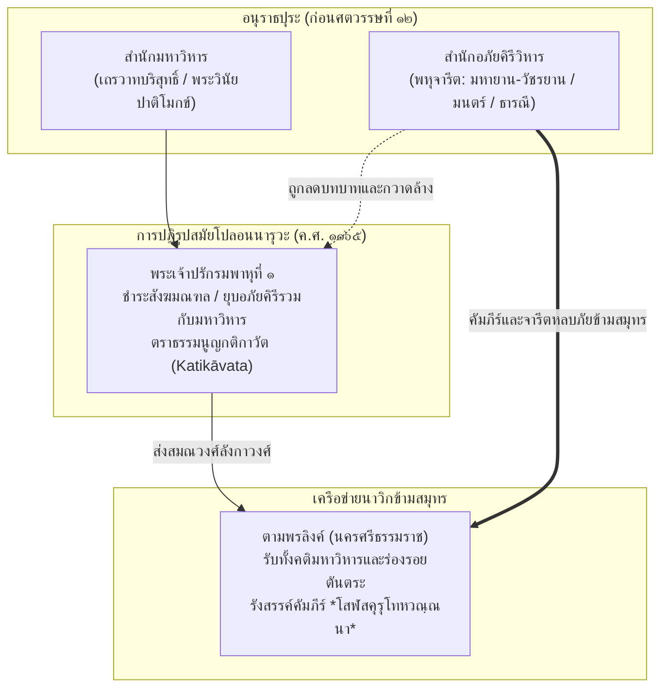
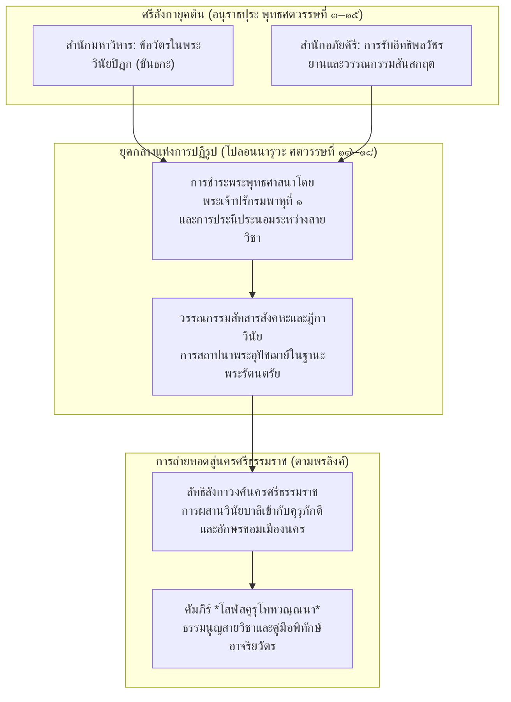

# บทที่ ๔: การสืบค้นคัมภีร์คู่ขนานและร่องรอยจารีตในศรีลังกา (The Sri Lankan Parallels and Sanskrit-Sinhala Transmission)

---

## บทนำของบทที่ ๔: สายธารคัมภีร์ข้ามสมุทรและปริศนาแห่งจารีตลังกา

ในเครือข่ายประวัติศาสตร์ภูมิปัญญาของพระพุทธศาสนาในเอเชียใต้และเอเชียตะวันออกเฉียงใต้ เกาะศรีลังกา (สิงหลทวีป / ลังกาทวีป) ดำรงสถานะเป็น **"ศูนย์กลางแห่งความชอบธรรมทางพระธรรมวินัยและวรรณกรรมภาษาบาลี"** (Epicentre of Orthodoxy and Pāli Scholasticism) ที่ส่งอิทธิพลครอบงำราชธานีและชุมชนสงฆ์ในลุ่มน้ำอิรวดี ลุ่มน้ำเจ้าพระยา และคาบสมุทรไทย-มลายูมาอย่างต่อเนื่องนับแต่พุทธศตวรรษที่ ๑๖ เป็นต้นมา การอุบัติขึ้นของสมณวงศ์ "ลังกาวงศ์" (Sīhaḷa Saṅgha) ในพุกาม หงสาวดี สุโขทัย อยุธยา และนครศรีธรรมราช (ตามพรลิงค์) มักทำให้นักวิชาการและผู้ศึกษาประวัติศาสตร์พุทธศาสนาในอดีตสันนิษฐานโดยอนุโลมว่า วรรณกรรมคำสอน บทสวดสาธยาย และธรรมนูญทางวินัยที่ปรากฏในดินแดนเหล่านี้ ย่อมต้องมีต้นกำเนิด รากเหง้า หรือคู่ขนานโดยตรงมาจากคลังคัมภีร์ใบลานและกฎบัตรสงฆ์ของเกาะลังกา

ทว่า เมื่อนำคัมภีร์ใบลานภาษาบาลี *โสฬสคุรุโทหวณฺณนา* (Soḷasagurudohavaṇṇanā) ซึ่งค้นพบเฉพาะในเขตลานตาปูชนียสถานของนครศรีธรรมราช ในฐานะเอกสารที่เป็นเอกสารฉบับเดียวในโลก (คัมภีร์เอกสารชิ้นเดียวในโลก (Codex Unicus)) มาทำการสืบค้นย้อนรอยเพื่อหา "ตัวบทคู่ขนานและร่องรอยจารีตในศรีลังกา" กลับพบปรากฏการณ์ทางพันธุศาสตร์คัมภีร์ (Textual Genealogy) ที่มีความซับซ้อน ย้อนแย้ง และท้าทายกรอบความเข้าใจเดิมอย่างยิ่ง:

ประการแรก แม้ว่าโครงสร้างการจำแนก **"คุรุ ๔ ประการ"** (`ชาติ ปพฺพชฺชุ ปสมฺปโท ธมฺมคุรุ วิชฺชาคุรุ`), มโนทัศน์เรื่องระบบ **"นิสสัย"** (Nissaya), การประสิทธิ์ประสาทวิทยาคมคุ้มครองภัย (`วิชฺชา`), และเทววิทยาเรื่องการลงทัณฑ์ผู้ทรยศครูด้วยมหันตโทษนรกอเวจีแห่ง **"อริยูปวาท"** (`อริยูปวาโท อานนฺตริยสทิโส`) จะปรากฏคู่ขนานอย่างสอดคล้องลงรอยในคัมภีร์ตระกูลสังคหะและอรรถกถาของฝ่ายเถรวาทมหาวิหาร เช่น คัมภีร์สารัตถสังคหะ (*Sāratthasaṅgaha*) ของพระพุทธปิยะ  (Buddhappiya), *Sārasaṅgaha* ของพระสิทธัตถะ, และ *Upāsakajanālaṅkāra* ของพระอานันทมหาเถระ

ประการที่สอง ทว่าข้อห้ามหลักอันเป็นหัวใจเชิงสรีระและพื้นที่ศักดิ์สิทธิ์ ๒ ประการในโสฬสคุรุโทหวณฺณนา คือ **ข้อห้ามเรื่องการเหยียบเงาครู** (`ปตฺตฉายํ น ลงฺฆเร / ฉายํ น ลงฺฆเย`) ในคาถาที่ ๓ และ **ข้อห้ามเรื่องการเอ่ยนามครูตรงๆ ต่อหน้าประจักษ์** (`ปจฺจกฺเข น วเท นามํ`) ในคาถาที่ ๔ กลับ **"ไม่ปรากฏ"** อยู่ในคลังใบลานสิงหล หรือในประมวลกฎหมายวินัยสงฆ์ที่เรียกว่า "กติกาวัต" (Katikāvata) ของศรีลังกาเลยแม้แต่ฉบับเดียว ในกติกาวัตของลังกามีเพียงการยกข้อความพระบาลีหมวด *อนาจารนิรเทศ* (*Anācāra-nirdeśa*) มาห้ามการยืนเบียดเสียด การนั่งเบียดเสียด การยืนค้ำหัวพูดจา และการลูบศีรษะสามเณรเท่านั้น

ประการที่สาม ข้อห้ามเรื่อง "เงา" และ "นาม" ดังกล่าว กลับปรากฏตรงกันคำต่อคำกับคัมภีร์ *คุรุปัญจาศิกา* (คัมภีร์คุรุปัญจาศิกา (*Gurupañcāśikā*) โศลก ๒๓ และ ๓๔) ของฝ่ายพุทธตันตรยาน-วัชรยานในอินเดียเหนือ ซึ่งสืบทอดมาจากคัมภีร์พระธรรมศาสตร์ฮินดู (คัมภีร์มนูสมฤติ (*Manusmṛti*) ๔.๑๓๐ และ ๒.๑๙๙) โดยตรง

ความย้อนแย้งเชิงประจักษ์นี้ก่อให้เกิดคำถามวิจัยที่แหลมคมยิ่งว่า เหตุใดมโนทัศน์แห่งคุรุโทหะจึงมีการผสมผสานกันระหว่าง "โครงสร้างวินัยเถรวาทลังกา" กับ "ข้อห้ามเชิงสรีระของตันตรยาน"? และประวัติศาสตร์ทางศาสนาของศรีลังกามีบทบาทอย่างไรในการถ่ายทอดหรือกลืนหายไปของคัมภีร์เหล่านี้?

ในบทนี้ เราจะทำการสืบสวนภูมิทัศน์พุทธศาสนาในลังกาอย่างละเอียดลึกซึ้งในทุกมิติ โดยเริ่มต้นจากการนำเสนอ **ตารางเปรียบเทียบคาถาสำคัญ ๖ บทแห่งโสฬสคุรุโทหวณฺณนาเคียงคู่กับคัมภีร์คู่ขนานในลังกาและจารีตที่เกี่ยวข้อง** จากนั้นจะก้าวเข้าสู่การคลี่คลายการปะทะสังสรรค์ระหว่างสำนักมหาวิหารกับสำนักอภัยคิรีและการไหลบ่าของคัมภีร์สันสกฤต-ตันตระ, การศึกษายุคทองแห่งวรรณกรรมภาษาสันสกฤต-สิงหลในสมัยโปลอนนารุวะและโกฏเฏ (คัมภีร์ภักติศตกะ (*Bhaktiśataka*), *Vṛttamālākhyā*, *Vyāsakāraya*), การเจาะลึกมโนทัศน์การเคารพครูใน คัมภีร์สารัตถสังคหะ (*Sāratthasaṅgaha*) และคำว่า *อาจริยทุพฺภี* ใน *Upāsakajanālaṅkāra*, การสำรวจเชิงประจักษ์ในระเบียบกติกาวัต, และบทสรุปเชิงประวัติศาสตร์ว่าด้วยการปฏิรูปของพระเจ้าปรักรมพาหุที่ ๑ และการกลืนหายไปของคัมภีร์สายอาจาริยวาทบนเกาะลังกา

---

## คาถาโคว๊ทนำบท: การเปรียบเทียบวรรคต่อวรรคระหว่างโสฬสคุรุโทหวณฺณนากับคัมภีร์คู่ขนานในลังกาและสายธารที่เกี่ยวข้อง

เพื่อสร้างรากฐานเชิงประจักษ์ทางนิรุกติศาสตร์และประวัติศาสตร์วรรณกรรมเปรียบเทียบ ในส่วนนี้นำเสนอการยกบทคาถาสำคัญจำนวน ๖ บทจากคัมภีร์ *โสฬสคุรุโทหวณฺณนา* (ใบลานนครศรีธรรมราช) ได้แก่ **คาถาที่ ๑–๒, ๓, ๑๐, ๑๑, ๑๓, และ ๑๔** มาจัดวางเคียงคู่แบบวรรคต่อวรรค (Side-by-Side Collation) ร่วมกับตัวบทคู่ขนานในคัมภีร์บาลี-สิงหลของศรีลังกา (*Upāsakajanālaṅkāra*, คัมภีร์สารัตถสังคหะ (*Sāratthasaṅgaha*), *Katikāvata*) และคัมภีร์สายตันตรยาน-ภารตวิทยาที่เกี่ยวข้อง

---

### ตารางที่ ๔.๑: การเปรียบเทียบคาถาที่ ๑–๒ ว่าด้วยคำสาปแช่งคุรุโทหะและการจำแนก "คุรุ ๔ ประการ"

| คัมภีร์ / แหล่งที่มา | ตัวบทดั้งเดิม (Canonical / Primary Text) | คำแปลภาษาไทยเชิงวิชาการ |
|:---|:---|:---|
| **โสฬสคุรุโทหวณฺณนา** (คาถาที่ ๑–๒ ใบลานนครฯ) | `นินฺทาทิโสฬสกณฺฑํ คุรุโทหํ ปวุจฺจติ` `เตสํ น นิวตฺเตนฺติ นาสนฺติ เต กทาจิปิ ฯ` `คุรุ จตุพฺพิโธ เญยฺโย ชาติ ปพฺพชฺชุ ปสมฺปโท` `ธมฺมคุรุ วิชฺชาคุรุ วรโท จ จตุตฺถโก ฯ` | ข้อบัญญัติว่าด้วยโทษประทุษร้ายครู ๑๖ ประการ มีการนินทาครูเป็นต้น อันพระพุทธองค์ตรัสไว้แล้ว บุคคลผู้ไม่ละเว้นจากโทษเหล่านั้น ย่อมถึงความฉิบหายพินาศในกาลไหนๆ เลย พึงทราบเถิดว่า พระคุรุบาอาจารย์นั้นมี ๔ ประเภท ได้แก่ ๑) พระชาติคุรุ [บิดามารดาผู้ให้กำเนิด], ๒) พระปัพพัชชาและอุปสัมปทาคุรุ [พระอุปัชฌาย์], ๓) พระธัมมคุรุ [พระอาจารย์ผู้สอนธรรมวินัย], และ ๔) พระวิชชาคุรุ [พระอาจารย์ผู้ประสิทธิ์ประสาทวิทยาคม] |
| **Sāratthasaṅgaha (พระพุทธปิยะ  (Buddhappiya))** (ปริจเฉทที่ ๑๒ คารวกถา) | *Mātāpitaro pubbācariyā nāma honti jāti-garukā, pabbājikā pana upajjhāyācariyā sāsana-jāti-garukā, dhammadesakā dhammācariyā, sippa-sattha-sikkhāpakā vijjācariyā ti catubbidhā garavo vuccanti...* | บิดามารดาชื่อว่าเป็นบูรพาจารย์ เป็นครูผู้ให้กำเนิดรูปกาย, พระอุปัชฌายาจารย์ผู้ให้บวชเป็นครูผู้ให้กำเนิดในพระศาสนา, พระอาจารย์ผู้แสดงธรรมเป็นธัมมาจารย์, และครูผู้ฝึกสอนศิลปศาสตร์วิทยาการเป็นวิชชาจารย์ พระคุรุทั้ง ๔ ประเภทนี้แล บัณฑิตพึงเคารพยำเกรงอย่างสูงสุด... |
| **Upāsakajanālaṅkāra (พระอานันทะ)** (ปริจเฉทที่ ๑ หน้า ๑๕–๑๗; ปริจเฉทที่ ๔ หน้า ๙๘–๑๐๑) | *Ācariyavandanā nāma sippasatthasikkhāpakānaṃ garūnaṃ kata-vandanā... dakkhiṇato disato ācariyā paccupaṭṭhātabbā pañcahi ṭhānehi...* | การกราบไหว้ครูอาจารย์ คือการกราบไหว้ถวายความเคารพแด่พระคุรุผู้สั่งสอนศิลปศาสตร์และวิทยาการทั้งปวง... ทิศเบื้องขวาคือทิศแห่งพระอาจารย์ อันศิษย์พึงปรนนิบัติบำรุงด้วยหน้าที่ ๕ ประการ... |

---

### ตารางที่ ๔.๒: การเปรียบเทียบคาถาที่ ๓ ว่าด้วยข้อห้ามเรื่องบริขารและ "เงาของครู" (*Guroś Chāyā*)

| คัมภีร์ / แหล่งที่มา | ตัวบทดั้งเดิม (Canonical / Primary Text) | คำแปลภาษาไทยเชิงวิชาการ |
|:---|:---|:---|
| **โสฬสคุรุโทหวณฺณนา** (คาถาที่ ๓ ใบลานนครฯ) | `คุรุโน จีวรํ ฉตฺตํ ปตฺตํ ฉายํ น ลงฺฆเย` `คุรุโน อาสเน น ติฏฺเฐถ น สเยยฺย น เจว วเส ฯ` | ศิษย์ไม่พึงก้าวข้ามหรือเหยียบย่ำจีวร ร่ม บาตร และเงาของครูบาอาจารย์เลย ศิษย์ไม่พึงยืน นั่ง หรือนอนทับบนอาสนะของครู และไม่พึงพำนักเสมอด้วยครูในสถานที่พำนักเลย |
| **ระเบียบกติกาวัต (Katikāvata)** (*Anācāra-nirdeśa* ในกัลวิหารและทัมพะเดณิยะ) | *there bhikkhū ghaṭṭayanto pi na tiṭṭheyya, ghaṭṭayanto pi na nisīdeyya, thītako pi na bhaṇeyya, bāhāvikkhepako pi na bhaṇeyya...* | ภิกษุหนุ่มไม่พึงยืนเบียดเสียดกระทบกระทั่งพระเถระ, ไม่พึงนั่งเบียดเสียดกระทบกระทั่งพระเถระ, ไม่พึงยืนค้ำหัวพูดจาต่อหน้าพระเถระ, ไม่พึงพูดจาพลางแกว่งแขน... (ไม่ปรากฏข้อห้ามเรื่องเงาในกติกาวัต) |
| **Gurupañcāśikā (ภาษาสันสกฤต)** (NAK 5-135 โศลก ๒๓ / Pandey 1997: 36) | *caityabhaṅgādibhītyā'pi guroś chāyāṃ na laṅghayet / pādukā''sanayānāder laṅghanasya tu kā kathā //* | ศิษย์ไม่พึงก้าวข้ามหรือเหยียบย่ำแม้เพียงเงาของพระอาจารย์ ด้วยความเกรงกลัวประดุจดั่งความกลัวต่อการทำลายพระสถูปเจดีย์เป็นอาทิ การก้าวข้ามรองเท้า อาสนะ และยานพาหนะของท่าน จะกล่าวไปไยเล่า |

---

### ตารางที่ ๔.๓: การเปรียบเทียบคาถาที่ ๑๐ ว่าด้วยมหันตโทษแห่งคุรุโทหะ นรก ๓๓ ขุม และอเวจี

| คัมภีร์ / แหล่งที่มา | ตัวบทดั้งเดิม (Canonical / Primary Text) | คำแปลภาษาไทยเชิงวิชาการ |
|:---|:---|:---|
| **โสฬสคุรุโทหวณฺณนา** (คาถาที่ ๑๐ ใบลานนครฯ) | `ยมโลกญฺจ ปปฺโปติ เตตฺตึสนรเกสุปิ` `อวิจิมฺหิ อุปฺปชฺชติ มหาทุกฺขํ นิรนฺตรํ ฯ` | ผู้ประทุษร้ายครูนั้น ย่อมถึงซึ่งยมโลก และต้องตกลงสู่นรกทั้ง ๓๓ ขุม ย่อมไปบังเกิดในอเวจีมหานรก เสวยมหาทุกขเวทนาอย่างต่อเนื่องปราศจากช่องว่างสิ้นกาลนาน |
| **Upāsakajanālaṅkāra (พระอานันทะ)** (ปริจเฉทที่ ๖ หน้า ๑๒๖–๑๒๘) | *Mahāsāvajjo hi ariyūpavādo ānantariyasadiso sagga-vāraṇañ ca magga-vāraṇañ ca karoti... evaṃ nikkhitto evaṃ niraye Avīcimhi uppajjati...* | แท้จริงแล้ว อริยูปวาท [การด่าว่าลบหลู่พระอริยเจ้าและครูอาจารย์] มีโทษหนักมหันต์เสมอด้วยอนันตริยกรรม ย่อมกั้นสวรรค์และกั้นมรรคผลนิพพานทันที... ย่อมดิ่งลงสู่อบายภูมิและบังเกิดในอเวจีมหานรกประดุจถูกนำไปวางไว้... |
| **Sārasaṅgaha (พระสิทธัตถะ)** (ปริจเฉทที่ ๑๖–๑๙ อริยูปวาทกัมมกถา) | *Yo pana garūnaṃ vā ariyānaṃ vā upavādaṃ karoti, so diṭṭheva dhamme vipattiṃ pāpuṇāti, kāyassa bhedā parammaraṇā apāyaṃ duggatiṃ vinipātaṃ nirayaṃ upapajjati...* | บุคคลใดกระทำการด่าว่าลบหลู่ต่อพระคุรุบาอาจารย์หรือพระอริยเจ้า บุคคลนั้นย่อมประสบความวิบัติฉิบหายในปัจจุบันทันตาเห็น และเมื่อแตกกายทำลายขันธ์ ย่อมเข้าถึงอบาย ทุคติ วินิบาต และนรก... |

---

### ตารางที่ ๔.๔: การเปรียบเทียบคาถาที่ ๑๑ และ ๑๓ ว่าด้วยทัณฑ์คูถนรกและวิบากกรรมของพระเทวทัต

| คัมภีร์ / แหล่งที่มา | ตัวบทดั้งเดิม (Canonical / Primary Text) | คำแปลภาษาไทยเชิงวิชาการ |
|:---|:---|:---|
| **โสฬสคุรุโทหวณฺณนา** (คาถาที่ ๑๑, ๑๓ ใบลานนครฯ) | `คูถนรเก อุปฺปชฺชติ มหาทุกฺขํ สทา ภเว` `พหุกปฺเปสุ ติฏฺเฐยฺย ตโต จุโต มหาทุคฺคโต ฯ` `เทวทตฺโต มหาเถโร คุรุโทเหน ปาปเกน` `ปฐวิยา คโต เหฏฺฐา อวิจิมฺหิ นิปตฺติโต ฯ` | ผู้ประทุษร้ายครูย่อมไปบังเกิดในมหาคูถนรก เสวยมหาทุกข์อยู่ตลอดเวลา พึงดำรงอยู่ในนรกนั้นสิ้นหลายกัป เมื่อจุติจากนั้นย่อมกลายเป็นคนทุคคตะเข็ญใจ... แม้พระเทวทัตมหาเถระ เพราะบาปกรรมแห่งการประทุษร้ายครู [คุรุโทเหน ปาปเกน] แผ่นดินจึงสูบลงสู่เบื้องล่าง ดิ่งลงสู่อเวจีมหานรกสิ้นกาลนาน |
| **อรรถกถาธรรมบท (Dhammapada-aṭṭhakathā)** (เรื่องพระเทวทัตถูกแผ่นดินสูบ) | *Devadatto satthari āghātaṃ bandhitvā... garu-pāpa-kammena paṭhaviṃ pavisitvā mahā-Avīci-mahāniraye uppanno... lohakumbhiyā pātito...* | พระเทวทัตผูกอาฆาตในพระบรมศาสดา... เพราะบาปกรรมอันหนักหน่วง แผ่นดินจึงแยกออกสูบพระเทวทัตลงสู่มหาอเวจีมหานรก... เสวยทุกขเวทนาในหม้อโลหกุมภีและนรกต่างๆ... |
| **Upāsakajanālaṅkāra (พระอานันทะ)** (ปริจเฉทที่ ๖ หน้า ๑๒๗) | *Devadattādayo viya garūnaṃ upavādakā mittadūbhino narā diṭṭhadhammika-saṃparāyika-dosa-bhāgino honti...* | มนุษย์ทั้งหลายผู้ว่าร้ายครูบาอาจารย์และผู้ประทุษร้ายมิตร ย่อมเป็นผู้ได้รับโทษทัณฑ์ทั้งในภพนี้และภพหน้า ดุจเดียวกับพระเทวทัตเป็นต้น... |

---

### ตารางที่ ๔.๕: การเปรียบเทียบคาถาที่ ๑๔ ว่าด้วยโมฆียะแห่งมรรคผลและความเสื่อมสูญแห่งสมณเพศ

| คัมภีร์ / แหล่งที่มา | ตัวบทดั้งเดิม (Canonical / Primary Text) | คำแปลภาษาไทยเชิงวิชาการ |
|:---|:---|:---|
| **โสฬสคุรุโทหวณฺณนา** (คาถาที่ ๑๔ ใบลานนครฯ) | `ภิกฺขุ วา สามเณโร วา อุปาสโก วาปิ ตาทิโส` `คุรุโทเหน ปาปเกน น ลภนฺติ สุขํ กทาจิ ฯ` | ทั้งพระภิกษุ หรือสามเณร หรืออุบาสกผู้มีความประพฤติเช่นนั้นก็ตาม หากกระทำบาปกรรมแห่งการประทุษร้ายครูแล้วไซร้ ย่อมไม่ได้รับความสุขในกาลไหนๆ เลย |
| **Sārasaṅgaha (พระสิทธัตถะ)** (ปริจเฉทที่ ๑๘ อริยูปวาทวิภาวนา) | *Sace bhikkhu hoti sace sāmaṇero hoti sace gahaṭṭho hoti, ariyūpavādena jhānamaggaphalānaṃ antarāyo hoti yeva...* | หากเป็นภิกษุก็ตาม หากเป็นสามเณรก็ตาม หากเป็นคฤหัสถ์ก็ตาม การด่าว่าลบหลู่พระอริยะและคุรุ ย่อมเป็นอันตรายขัดขวางการบรรลุฌาน มรรค และผล โดยแท้แล... |
| **Gurupañcāśikā (ภาษาสันสกฤต)** (NAK 5-135 โศลก ๑๑) | *ācāryasya hi nindanāt / siddhiḥ kadācid api na labhyate //* | เพราะเหตุแห่งการนินทาว่าร้ายพระอาจารย์ ความสำเร็จ [สิทธิ] ในมรรคผลและเวทมนตร์ ย่อมไม่อาจได้รับในกาลไหนๆ เลย |

---

## ๔.๑ ภูมิทัศน์พุทธศาสนาในลังกา: การปะทะสังสรรค์ระหว่างสำนักมหาวิหารกับสำนักอภัยคิรี และการไหลบ่าของคัมภีร์สันสกฤตและมหายาน-ตันตระ

ประวัติศาสตร์พระพุทธศาสนาบนเกาะลังกา (Sri Lanka) ตลอดช่วงสหัสวรรษแรกแห่งคริสต์ศักราชจนถึงการปฏิรูปสังฆมณฑลครั้งใหญ่ในพุทธศตวรรษที่ ๑๘ (คริสต์ศตวรรษที่ ๑๒) มิได้ดำรงอยู่อย่างเป็นเอกรูปหรือราบเรียบภายใต้ร่มเงาของนิกายเถรวาทสายมหาวิหาร (Mahāvihāra) เพียงฝ่ายเดียวตามภาพจำที่ประวัติศาสตร์นิพนธ์ของพงศาวดาร *มหาวงศ์* (*Mahāvaṃsa*) และ *จุลวงศ์* (*Cūḷavaṃsa*) พยายามสถาปนาขึ้น[^1] หากแต่เป็นพื้นที่แห่ง "ภูมิทัศน์พหุจารีตและสมรภูมิทางปัญญาอันเข้มข้น" (Multi-Doctrinal Landscape and Intellectual Battleground) ที่ขับเคี่ยวกันระหว่าง ๓ สำนักสงฆ์หลัก ได้แก่ สำนักมหาวิหาร, สำนักอภัยคิรีวิหาร (Abhayagiri Vihāra), และสำนักเชตวันวิหาร (Jetavana Vihāra)[^2] การปะทะสังสรรค์และการแข่งขันเชิงอำนาจระหว่างสำนักอนุรักษนิยมเคร่งครัดพระวินัยบาลีอย่างมหาวิหาร กับสำนักที่มีท่าทีเปิดกว้างต่อกระแสความคิดภายนอกอย่างอภัยคิรี มิเพียงแต่กำหนดทิศทางของการเมืองราชสำนักอนุราธปุระเท่านั้น แต่ยังกลายเป็น "ประตูบานใหญ่" ที่เปิดรับการไหลบ่าของวรรณกรรมภาษาสันสกฤต คัมภีร์มหายาน และระเบียบพิธีกรรมพุทธตันตรยาน (Vajrayāna / Tantric Buddhism) จากอนุทวีปอินเดียเข้าสู่เกาะลังกา ซึ่งในเวลาต่อมาได้ทิ้งร่องรอยและส่งแรงกระเพื่อมข้ามมหาสมุทรอินเดียมายังเครือข่ายเมืองท่าในอุษาคเนย์ รวมถึงอาณาจักรตามพรลิงค์และนครศรีธรรมราช

จุดเริ่มต้นของความแตกแยกในสังฆมณฑลลังกาเกิดขึ้นในรัชสมัยพระเจ้าวัฏฏคามณีอภัย (Vaṭṭagāmaṇī Abhaya หรือ วะฬะคัมพา, ครองราชย์ราว ๘๙–๗๗ ก่อน ค.ศ.) เมื่อพระองค์ทรงสร้างอภัยคิรีวิหารถวายแด่พระมหาติสสเถระผู้มีพระคุณส่วนพระองค์ ซึ่งต่อมาพระมหาติสสะถูกคณะสงฆ์มหาวิหารปรับอาบัติฐานคลุกคลีกับคฤหัสถ์ ส่งผลให้คณะสงฆ์อภัยคิรีแยกตัวออกเป็นเอกเทศ[^3] ความตึงเครียดเชิงสถาบันนี้ทวีความเข้มข้นขึ้นเมื่อสำนักอภัยคิรีเปิดรับพระภิกษุชาวอินเดียฝ่าย "ธรรมรุจินิกาย" (Dhammaruci) ซึ่งสืบสายมาจากนิกายวัชชีบุตร (Vajjiputtaka) ของอินเดีย เข้ามาพำนัก ส่งผลให้อภัยคิรีกลายเป็นศูนย์กลางแห่งการรับนวัตกรรมทางเทววิทยาและวรรณกรรมข้ามสายจารีต ในขณะที่มหาวิหารยึดมั่นในพระไตรปิฎกภาษาบาลีและการตีความตามขนบพระอรรถกถาจารย์ สำนักอภัยคิรีกลับต้อนรับคัมภีร์มหายานที่เดินทางข้ามช่องแคบพอล์ก (Palk Strait) มาจากแคว้นอานธระ แคว้นทมิฬ และอินเดียเหนือ โดยคัมภีร์เหล่านี้ถูกเรียกขานในพงศาวดารฝ่ายมหาวิหารด้วยท่าทีปฏิเสธว่า "เวตุลลวาท" (*Vaitulyavāda* หรือ *Vaitulya-sūtra* ซึ่งตรงกับภาษาสันสกฤต *Vaitulya* / *Vaipulya* อันหมายถึง พระสูตรมหายานหมวดไวปุลยะ)[^4]

หลักฐานเชิงประจักษ์ทางโบราณคดีและจารึกวิทยาที่ค้นพบในศรีลังกาได้ลบล้างมายาคติเรื่อง "ลังกาเถรวาทบริสุทธิ์เอกรูป" อย่างสิ้นเชิง โดยเฉพาะการค้นพบของกรมโบราณคดีแห่งซีลอนที่เจดีย์อินดิกาตุสายะ (Indikatu-sāya) เชิงเขามียินตาเล (Mihintale) ซึ่งเป็นอารามบริวารในเครือข่ายของสำนักอภัยคิรี โดย เสเนรัต ปรณวิตานะ  (Senarat Paranavitana) ได้ชำระและรายงานใน *Epigraphia Zeylanica* เล่มที่ ๓ ว่า ในระหว่างการขุดค้นบูรณะเจดีย์อินดิกาตุสายะในปี ค.ศ. ๑๙๒๓ ได้ค้นพบแผ่นทองแดงโบราณจารึกอักษรสิงหลยุคกลาง (ราวพุทธศตวรรษที่ ๑๔ หรือคริสต์ศตวรรษที่ ๘–๙) จำนวนถึง ๙๑ แผ่น บรรจุอยู่ภายในเรือนธาตุของเจดีย์[^5] เมื่อปรณวิตานะทำการอ่านและปริวรรตข้อความภาษาสันสกฤตบนแผ่นทองแดงเหล่านี้ พบว่าเป็นข้อความที่คัดลอกมาจากคัมภีร์มหายานชั้นยอด ๓ คัมภีร์ ได้แก่ *ศตสาหัสริกาปรัชญาปารมิตา* (*Śatasāhasrikā Prajñāpāramitā*), *ปัญจวิงศติสาหัสริกาปรัชญาปารมิตา* (*Pañcaviṃśatisāhasrikā Prajñāpāramitā*), และ *กาศยปปริวรรต* (*Kāśyapa-parivarta*) แห่งพระสูตรมหารัตนกูฏ[^6] 

การค้นพบแผ่นทองแดงจารึกคัมภีร์มหายานภาษาสันสกฤตถึง ๙๑ แผ่นในใจกลางเจดีย์ลังกานี้ สะท้อนความแพร่หลายของ **"คติธรรมธาตุ" (*Dharmadhātu*)** ในสำนักอภัยคิรี ซึ่งเป็นการนำคัมภีร์พระธรรมที่จารึกเป็นลายลักษณ์อักษรมาประดิษฐานในฐานะวัตถุบูชาสูงสุดแทนที่หรือควบคู่กับพระบรมสารีริกธาตุ (*śārīrika-dhātu*) ดังที่ปรณวิตานะได้วิเคราะห์เปรียบเทียบกับข้อความในคัมภีร์ *สัทธรรมรัตนากร* (*Saddharmaratnākara*) ว่า พระมหากษัตริย์ลังกาในอดีต (เช่น พระเจ้าเสนาที่ ๑ และพระเจ้าเสนาที่ ๒) เคยทรงรับเอาพระธรรมธาตุที่พราหมณ์หรือพระภิกษุนำมาจากอินเดียมาประดิษฐานและเฉลิมฉลองอย่างยิ่งใหญ่ในราชสำนัก[^7] อานุภาพของตัวบทพระคัมภีร์ภาษาสันสกฤตในฐานะสิ่งศักดิ์สิทธิ์คุ้มครองอาณาจักรนี้ เป็นมโนทัศน์ร่วมกับพุทธศาสนามหายานและวัชรยานในอินเดียเหนือและอุษาคเนย์ ซึ่งเชื่อว่าการเขียน การสวดสาธยาย และการบรรจุคัมภีร์ลงในพระสถูปเจดีย์ย่อมยังให้เกิดมหิทธานุภาพปกป้องภยันตรายทั้งปวง

นอกจากคัมภีร์ปรัชญาปารมิตาแล้ว สำนักอภัยคิรียังเป็นแหล่งบ่มเพาะมโนทัศน์แห่งพระโพธิสัตว์ปณิธาน (Bodhisattva-praṇidhāna) และวรรณกรรมภาษาสันสกฤตชั้นสูง ดังปรากฏใน *ศิลาจารึกคุจจะเวลี* (*Kuccavēli Rock-Inscription*) ทางชายฝั่งตะวันออกเฉียงเหนือของลังกา ซึ่งปรณวิตานะได้กำหนดอายุไว้ในราวพุทธศตวรรษที่ ๑๒–๑๓ (คริสต์ศตวรรษที่ ๗) จารึกนี้สลักเป็นบทกวีภาษาสันสกฤตด้วยฉันท์อุปชาติ (Upajāti) และวสันตดิลก (Vasantatilakā) แสดงมหาปณิธานของผู้สร้างจารึกที่ปรารถนาจะบรรลุพระสัมมาสัมโพธิญาณ เพื่อใช้ "หัตถ์แห่งมหาการุณย์" ฉุดรื้อสรรพสัตว์ทั้งหลายให้พ้นจากปลักตมแห่งสังสารวัฏ (*saṃsāra-paṅka-visara*)[^8] ลีลาภาษาสันสกฤตที่สละสลวยและปรัชญาโพธิสัตว์ที่เข้มข้นในจารึกคุจจะเวลียืนยันว่า วัฒนธรรมปัญญาชนของพระสงฆ์ลังกามิได้จำกัดกรอบอยู่เพียงเป้าหมายพระอรหันต์ของเถรวาทดั้งเดิม แต่ได้ซึมซับอุดมคติพุทธภูมิของมหายานเข้ามาเป็นส่วนหนึ่งของโลกทัศน์ทางศาสนาอย่างแนบแน่น

ในมิติคู่ขนาน หลักฐานด้านโบราณคดีและจารึกวิทยาในยุคต่อมายังเผยให้เห็นการลงหลักปักฐานของ **พุทธตันตรยาน (Vajrayāna / Tantric Buddhism)** บนเกาะลังกาอย่างเด่นชัด อาแลสแตร์ กอร์นอลล์  (Alastair Gornall) ได้ประมวลหลักฐานใน *Rewriting Buddhism* (2020) ว่า ก่อนการปฏิรูปสังฆมณฑลในปี ค.ศ. ๑๑๖๕ สำนักอภัยคิรีและสำนักเชตวันวิหารเป็นศูนย์กลางสำคัญในการประกอบพิธีกรรมตันตระ โดยมีการค้นพบแผ่นหินจารึกมนตร์และธารณีภาษาสันสกฤตจำนวนมาก เช่น พระธารณี *สรฺวตถาคตาธิษฐานหฤทยคุหฺยธาตุวรณฺฑมุทฺราธารณี* (*Sarvatathāgatādhiṣṭhāna-hṛdaya-guhyadhātu-karaṇḍa-mudrā-dhāraṇī*) และข้อความจากคัมภีร์ตันตระแม่บท *สรฺวตถาคตตตฺตวสังครหะ* (*Sarvatathāgatatattvasaṃgraha* - STTS)[^9] การปรากฏของคัมภีร์ STTS บนเกาะลังกามีความสำคัญในระดับสำคัญยิ่งในระดับประวัติศาสตร์ข้ามภูมิภาค เนื่องจากบันทึกของพระภิกษุอมฤตพุทธและพระอโมฆวัชระ (Amoghavajra / ปู้คง, ค.ศ. ๗๐๕–๗๗๔) ผู้แปลคัมภีร์ตันตระชั้นนำในราชสำนักราชวงศ์ถังของจีน ระบุอย่างแจ้งประจักษ์ว่า พระอโมฆวัชระได้เดินทางมาเยือนเกาะลังกาในราวปี ค.ศ. ๗๔๖ เพื่อเข้าศึกษาพิธีกรรมโหมกูณฑ์ (Homa) การสร้างมณฑล และการรับอภิเษกขั้นสูงจากสำนักพระสมันตภัทระ ณ อภัยคิรีวิหาร ก่อนจะนำคัมภีร์ตันตระภาษาสันสกฤตจำนวนกว่า ๕๐๐ คัมภีร์กลับไปยังนครฉางอาน[^10]

ความเชื่อมโยงของกระแสธารตันตระในลังกากับโลกภายนอกมิได้หยุดอยู่เพียงเอเชียตะวันออก แต่ยังแผ่ขยายเข้าสู่เอเชียตะวันออกเฉียงใต้ เปโดร มานูเอล คาสโตร ซานเชซ (Pedro Manuel Castro Sánchez, 2010) ได้ชี้ให้เห็นในบทวิเคราะห์ประเพณีมนตร์ของสายมหานิกายโบราณว่า คัมภีร์ *วิมุตติมรรค* (*Vimuttimagga*) ซึ่งเป็นคัมภีร์คู่มือปฏิบัติธรรมของสำนักอภัยคิรี (แต่งโดยพระอุปติสสเถระ และได้รับการแปลสู่ภาษาจีนโดยพระสังฆปาละในคริสต์ศตวรรษที่ ๖) มีเนื้อหาว่าด้วยพัฒนาการของทารกในครรภ์มารดา ๗ ระยะ และการจำแนกหมู่หนอน ๘๐ ชนิดในสรีระของมนุษย์ ซึ่งเนื้อหาดังกล่าวปรากฏสอดรับแบบคำต่อคำกับคัมภีร์ *มูลพระกรรมฐาน* (*Mūl Braḥ Kammaṭṭhān*) และตำรับกรรมฐานโบราณในกัมพูชาและไทย[^11] การแพร่กระจายของคัมภีร์และพิธีกรรมจากอภัยคิรีสู่ดินแดนคาบสมุทรไทย-มลายูและชวา ยังได้รับการตอกย้ำผ่านบทบาทของเมืองท่านครศรีธรรมราช (ตามพรลิงค์) ซึ่ง หม่อมเจ้าจันทร์จิรายุ รัชนี (M.C. Chand Chirayu Rajani, 1976) ได้วิเคราะห์ไว้ในงานวิจัยประวัติศาสตร์ศรีวิชัยว่า นครศรีธรรมราชคือ "จุดสลับสายธารทางปัญญานาวิก" (Maritime Switching Point) ที่เชื่อมโยงระหว่างพุทธศาสนามหายาน-ตันตระของแคว้นเบงกอล-มคธ ศรีวิชัย และเกาะลังกาเข้าด้วยกันอย่างแยกไม่ออก[^12]

ทว่า ปรากฏการณ์ที่น่าทึ่งที่สุดในภูมิทัศน์ปัญญาชนของลังกา คือการที่กระแสธารภาษาสันสกฤตมิได้จำกัดตัวอยู่เฉพาะในสำนักอภัยคิรีเท่านั้น แต่ได้ "แทรกซึมและหลอมรวม" เข้าสู่ศูนย์กลางของสำนักมหาวิหารอย่างรอบด้าน ในบทความวิจัยของ อาแลสแตร์ กอร์นอลล์ และ โจวันนี ชอตตี (อาแลสแตร์ กอร์นอลล์ (Alastair Gornall) and Giovanni Ciotti, 2014) เรื่อง *"Kārakas in Cāndra Grammar: An Interpretation from the Pāli Buddhist Śāstras"* ได้พิสูจน์อย่างแน่ชัดว่า พระสงฆ์สายมหาวิหารในยุคโปลอนนารุวะมิได้ปฏิเสธภาษาสันสกฤต แต่กลับเป็นผู้เชี่ยวชาญศาสตร์ภาษาสันสกฤตอย่างรอบด้าน โดยเฉพาะคัมภีร์ไวยากรณ์พุทธภาษาสันสกฤตสำนัก *จันทรวยากรณ์* (*Cāndravyākaraṇa*) ของท่านจันทรมิน (Candragomin) และอรรถกถา *จันทรปัญจิกา* (*Cāndra-pañcikā*) ของท่านรัตนมติ (Ratnamati)[^13] 

พระมหาเถระชั้นนำแห่งมหาวิหาร เช่น พระสารีบุตรมหาสามี (Sāriputta Mahāsāmī, พระสังฆนายกในรัชกาลพระเจ้าปรักรมพาหุที่ ๑) ได้รจนาคัมภีร์ *จันทราลังการ* (*Candrālaṅkāra*) เพื่ออธิบายจันทรวยากรณ์ ขณะที่พระโมคคัลลานมหาเถระได้รจนา *โมคคัลลานวยากรณ์* (*Moggallāna-vyākaraṇa*) ขึ้นมาปฏิรูประบบไวยากรณ์บาลี โดยนำเอานิยามการก (Kāraka) และระเบียบวิธีวิเคราะห์เชิงหน้าที่จากสำนักจันทระของภาษาสันสกฤตมาปรับใช้จัดระเบียบภาษาบาลีให้มีความรัดกุมเทียบเท่าภาษาสันสกฤต[^14] ในมิติคู่ขนาน พระสังฆรักขิตเถระผู้เป็นศิษย์ของพระสารีบุตร ได้แต่งคัมภีร์อรรถกถา *Moggallāna-pañcikā-ṭīkā* และ *Sambandhacintā* โดยได้ยกย่องพระสารีบุตรว่าเป็น **"ปรมคุรุ" (Paramaguru)** ซึ่งเป็นสำนวนการเทิดทูนครูบาอาจารย์ตามขนบภารตวิทยาชั้นสูง[^15] ขณะเดียวกัน แดเนียล สเตนเดอร์ (Daniel Stender) ยังได้สำรวจพบว่า เอกสารตัวเขียนใบลานภาษาสันสกฤตของคัมภีร์มหายานเลื่องชื่ออย่าง *โพธิจรรยาวตาร* (*Bodhicaryāvatāra*) ของท่านศานติเทวะ ได้ถูกคัดลอกและหมุนเวียนศึกษาอยู่ในหมู่นักปราชญ์สงฆ์ของลังกาควบคู่กับคัมภีร์บาลีอย่างแพร่หลาย[^16]

สายธารความรู้และมโนทัศน์เหล่านี้สะท้อนว่า ก่อนที่เกาะลังกาจะเข้าสู่ยุคแห่งการปฏิรูปสังฆมณฑลให้กลายเป็นเถรวาทมหาวิหารสายเดียวในรัชสมัยพระเจ้าปรักรมพาหุที่ ๑ (ค.ศ. ๑๑๖๕) ภูมิทัศน์พุทธศาสนาในลังกาได้ผ่านการหล่อหลอมและแลกเปลี่ยนทางความคิดข้ามสายจารีตมาอย่างยาวนานนับพันปี มโนทัศน์เรื่องความศักดิ์สิทธิ์ของครูบาอาจารย์ (Guru-vāda), การประสิทธิ์มนตร์และธารณี, และการจัดวางลำดับชั้นในสายวิชา (Ācariya-paramparā) มิใช่สิ่งแปลกปลอมที่เกิดขึ้นภายนอก แต่เป็นมรดกทางวัฒนธรรมร่วมที่ไหลเวียนอยู่ในการศึกษาสงฆ์ของลังกา และพร้อมที่จะถูกส่งผ่านต่อไปยังราชธานีพุกาม หงสาวดี สุโขทัย อยุธยา และนครศรีธรรมราช ผ่านเครือข่ายปัญญานาวิกแห่งอ่าวเบงกอลในเวลาต่อมา

> [!NOTE]
> **การประชันทางญาณวิทยาระหว่างมหาวิหารกับอภัยคิรี:**  
> สำนักอภัยคิรีในศรีลังกาเปิดรับคัมภีร์มหายานและตันตรยานอย่างเปิดกว้าง ต่างจากสำนักมหาวิหารที่เน้นพระธรรมวินัยเถรวาทดั้งเดิม การปะทะสังสรรค์นี้ผลักดันให้เกิดการผสมผสานมโนทัศน์อาจริยวัตรที่เข้มงวด ซึ่งต่อมาได้ส่งผ่านทางเรือมายังคาบสมุทรไทย-มลายู

---

## ๔.๒ ยุคทองแห่งวรรณกรรมภาษาสันสกฤต-สิงหลในสมัยโปลอนนารุวะและโกฏเฏ: Bhaktiśataka (Bauddhaśataka) ของพระรามจันทระ ภารตี (Rāmacandra Bhāratī), Vṛttamālākhyā, และ Vyāsakāraya

การฟื้นฟูพระพุทธศาสนาและการจัดระเบียบสังฆมณฑลในยุคหลังการปฏิรูปปี ค.ศ. ๑๑๖๕ มิได้ก่อให้เกิดการปิดกั้นทางปัญญาหรือการตัดขาดจากโลกภายนอก ตรงกันข้าม กลับเปิดทางสู่ "ยุคทองแห่งวรรณคดีภาษาสันสกฤต-สิงหล" (Golden Age of Sanskrit-Sinhalese Literature) ซึ่งเริ่มต้นก่อตัวในสมัยโปลอนนารุวะและดัมบาเดนิยา ก่อนจะเจริญรุ่งเรืองถึงขีดสุดในสมัยอาณาจักรโกฏเฏ (Koṭṭe Period, คริสต์ศตวรรษที่ ๑๕)[^17] ศูนย์กลางของความรุ่งเรืองทางปัญญานี้ตั้งอยู่บนสถาบันการศึกษาสงฆ์ระดับสูงที่เรียกว่า **"ปริเวณ" (Piriveṇa)** ซึ่งทำหน้าที่เป็นมหาวิทยาลัยสงฆ์ที่สอนทั้งพระไตรปิฎกบาลี ไวยากรณ์ อภิธรรม ฉันทศาสตร์ อลังการศาสตร์ ตลอดจนศาสตร์ภาษาสันสกฤต พระเวท และดาราศาสตร์-โหราศาสตร์อย่างกว้างขวาง ภายใต้บรรยากาศทางวิชาการเช่นนี้ ได้เกิดปรากฏการณ์การหลอมรวมข้ามสายพันธุ์ระหว่าง "สุนทรียศาสตร์แห่งคุรุภักดีของอินเดียตะวันออก (เบงกอล)" กับ "พุทธศาสนาเถรวาทลังกาวงศ์" อันก่อกำเนิดวรรณกรรมภาษาสันสกฤตชิ้นเอกที่ทำหน้าที่เป็นโซ่ข้อกลางเชื่อมโยงระหว่างโลกพุทธกับโลกพราหมณ์ ได้แก่ *ภักติศตกะ* (คัมภีร์ภักติศตกะ (*Bhaktiśataka*) หรือ *Bauddhaśataka*), *วฤตตมาลาขยา* (*Vṛttamālākhyā*), และ *วยาสการยะ* (*Vyāsakāraya*)

รัชสมัยของพระเจ้าปรักรมพาหุที่ ๖ แห่งกรุงศรีชัยวัฒนปุระโกฏเฏ (King Parākramabāhu VI, ครองราชย์ ค.ศ. ๑๔๑๒–๑๔๖๗) มีเกียรติภูมิในประวัติศาสตร์นิพนธ์ลังกาว่าเป็น "ยุคฟื้นฟูศิลปวิทยาการครั้งใหญ่ที่สุด" พระมหากษัตริย์ทรงทำนุบำรุงวิทยาลัยสงฆ์ปริเวณหลายแห่ง โดยเฉพาะ **วิชัยพาหุปริเวณ (Vijayabāhu Piriveṇa)** ณ เมืองโตตคามุวะ (Toṭagamuva) ซึ่งมีพระมหาเถระผู้ทรงภูมิปัญญาอันดับหนึ่งแห่งแผ่นดิน คือ **พระศรีราหุลสังฆราช (Toṭagamuve Śrī Rāhula Saṅgharāja)** เป็นอธิบดีสงฆ์[^18] พระศรีราหุลได้รับการถวายสมัญญาเกียรติยศสูงสุดว่าเป็น "ตรีปิฏกาจารย์" (Master of the Tipitaka) และ **"ษัฑภาษาปรเมศวร" (Ṣaḍbhāṣā-parameśvara - จอมปราชญ์ผู้รู้แจ้งใน ๖ ภาษา)** ได้แก่ ภาษาบาลี สันสกฤต ปรากฤต อปภรัมศะ ไพศาจี และภาษาสิงหลโบราณ[^19] ความเชี่ยวชาญในภาษาสันสกฤตและอลังการศาสตร์ของพระศรีราหุลได้ดึงดูดปราชญ์และบัณฑิตจากต่างแดนให้เดินทางข้ามมหาสมุทรมาศึกษาเล่าเรียนในสำนักของท่านอย่างไม่ขาดสาย

ในบรรดาปราชญ์ต่างแดนที่เดินทางมายังเกาะลังกา บุคคลที่มีความสำคัญสูงสุดต่อประวัติศาสตร์วรรณกรรมคุรุภักดีคือ **ปัณฑิต ศรีรามจันทระ กวิภารตี (Paṇḍita Śrī Rāmacandra Kavibhāratī)** บัณฑิตพราหมณ์ชาวแคว้นเกาฑะ (Gauḍa, แคว้นเบงกอล ประเทศอินเดีย) ผู้ถือกำเนิดในหมู่บ้านพราหมณ์เบรวตี (Beravatī หรือ วีรวาฏิกะ) ในเขตวาเรนทระ (Varendra) ทางตอนเหนือของเบงกอล สังกัดกาตยายนโคตร (Kātyāyana-gotra)[^20] รามจันทระได้รับการศึกษาอบรมมาอย่างเจนจบในคัมภีร์พระเวท ตรรกศาสตร์ ไวยากรณ์ และวรรณคดีสันสกฤตของพราหมณ์ ทว่า ในช่วงกลางคริสต์ศตวรรษที่ ๑๕ ท่ามกลางภาวะสงครามและการแผ่ขยายของอำนาจรัฐอิสลามสุลต่านแห่งเบงกอล รามจันทระได้ตัดสินใจลงเรือสำเภาข้ามอ่าวเบงกอลมายังเกาะลังกา เพื่อเข้าพึ่งพระบรมโพธิสมภารของพระเจ้าปรักรมพาหุที่ ๖ และเข้ามอบตัวเป็นศิษย์ศึกษาพระพุทธศาสนาในสำนักของพระศรีราหุลสังฆราช ณ วิชัยพาหุปริเวณ เมืองโตตคามุวะ[^21]

การเข้ามาศึกษาในสำนักของพระศรีราหุลทำให้พระรามจันทระ ภารตี เกิดความเลื่อมใสศรัทธาอย่างรอบด้านในองค์สมเด็จพระสัมมาสัมพุทธเจ้า จนกระทั่งตัดสินใจละทิ้งจารีตพราหมณ์ดั้งเดิมและสมาทานไตรสรณะเป็นอุบาสกพุทธมามกะ พระเจ้าปรักรมพาหุที่ ๖ ทรงเลื่อมใสในปรีชาญาณทางกวีนิพนธ์ภาษาสันสกฤตของรามจันทระอย่างยิ่ง จึงทรงพระกรุณาโปรดเกล้าฯ พระราชทานสมัญญาเกียรติยศสูงสุดแก่ท่านว่า **"พุทธาคามจักรวรรดิ" (Bauddhāgama-cakravartī - ผู้เป็นจักรพรรดิในพระพุทธศาสนา)**[^22]

ผลงานชิ้นเอกที่สะท้อนการเปลี่ยนผ่านอัตลักษณ์และการหลอมรวมทางจิตวิญญาณของพระรามจันทระ ภารตี คือคัมภีร์ **ภักติศตกะ (คัมภีร์ภักติศตกะ (*Bhaktiśataka*)) หรือ พุทธศตกะ (*Bauddhaśataka*)** ซึ่ง ดอน มาร์ติโน เด ซิลวา วิกเกรมสิงเห (ดอน มาร์ติโน เด ซิลวา วิกเกรมาสิงหะ (Don Martino de Zilva Wickremasinghe), 1901) ได้ลงทะเบียนและวิเคราะห์ไว้ใน *Catalogue of the Sinhalese Printed Books in the Library of the British Museum* ว่าเป็นวรรณคดีบทกวีภาษาสันสกฤตคลาสสิกจำนวน ๑๐๗ โศลก (a century of Sanskrit stanzas in praise of the Buddha) พร้อมบทแปลภาษาสิงหลแบบคำต่อคำ (Sanne) ที่ตรวจชำระโดย พระสุมังคลเถระ ผู้เป็นศิษย์ร่วมสำนักของพระศรีราหุลสังฆราช[^23] 

คัมภีร์ภักติศตกะ (*Bhaktiśataka*) นับเป็น "หมุดหมายปฏิวัติทางสุนทรียศาสตร์" (Aesthetic Revolution) ในโลกพุทธศาสนาเถรวาท เนื่องจากเป็นครั้งแรกที่มีการนำกระแสอารมณ์ความรู้สึกแห่ง **"ภักติ" (Bhakti)** อันเป็นหัวใจของศาสนาพราหมณ์-ฮินดูในอินเดียตะวันออก (ลัทธิไวษณวะและไศวะแห่งเบงกอล) มาสวมทับลงบนพระพุทธบูชา รามจันทระมิได้มองพระพุทธเจ้าเป็นเพียงบรมครูผู้ชี้ทางหลุดพ้นตามกรอบเหตุผลนิยมของเถรวาทดั้งเดิม แต่ได้ยกระดับพระพุทธองค์ขึ้นสู่สถานะ **"บรมคุรุสูงสุดแห่งสากลจักรวาลและพระผู้ช่วยให้รอดพ้น" (Supreme Guru and Universal Saviour)** ในโศลกที่ ๒ และ ๓ ของ คัมภีร์ภักติศตกะ (*Bhaktiśataka*) รามจันทระได้ประกาศความภักดีอย่างเปิดเผยว่า:

> *"ข้าพเจ้าได้ละทิ้งพระพรหม พระนารายณ์ พระศิวะ และเหล่าทวยเทพทั้งหลายในสรวงสวรรค์เสียสิ้นแล้ว ข้าพเจ้าขอเข้าถึงพระสุคตเจ้า ผู้ทรงเปี่ยมด้วยพระมหากรุณาอันหาที่สุดมิได้ เป็นสรณะหนึ่งเดียวแห่งชีวิต พระองค์แต่พระองค์เดียวเท่านั้นที่เป็นบรมครูผู้ทรงขจัดความมืดบอดแห่งอวิชชา"*[^24]

สำนวนภาษาสันสกฤตอันเร่าร้อนด้วยความภักดีนี้ สอดคล้องอย่างน่าอัศจรรย์กับมโนทัศน์คุรุภักดีใน *ศรีคุรุคีตา* (คัมภีร์คุรุคีตา (*Śrī Gurugītā*)) แห่งคัมภีร์สกันทปุราณะ (Skanda Purāṇa) ซึ่งยกย่องว่าคุรุคือพระพรหม พระวิษณุ และพระมเหศวร (*gurur brahmā gurur viṣṇur gurur devo maheśvaraḥ*)[^25] การที่พระรามจันทระ ภารตี นำเอาขนบการยอมจำนนต่อครู (Gurvādhīna) ของอินเดียมาประยุกต์เข้ากับพระพุทธเจ้า ได้สร้างแบบจำลองทางศาสนวิทยาใหม่ที่อนุญาตให้ชาวพุทธสามารถแสดงความจงรักภักดีและอ้อนวอนขอความเมตตาจากพระพุทธองค์ได้ประดุจพระผู้เป็นเจ้า โดยไม่ขัดต่อหลักการพุทธศาสนา

ผลงานชิ้นเอกลำดับที่สองของพระรามจันทระ ภารตี ที่สะท้อนเครือข่ายสถาบันสงฆ์และความสัมพันธ์อาจารย์-ศิษย์อย่างรอบด้าน คือคัมภีร์ **วฤตตมาลาขยา (*Vṛttamālākhyā* - "การสำแดงพวงมาลัยแห่งฉันท์")** ซึ่งได้รับการตรวจชำระ ทำบทนำ และจัดพิมพ์เผยแพร่เป็นอักษรเทวนาครีครั้งแรกในวารสาร *Journal of the Buddhist Text Society of India* (JBTS) ณ นครกัลกัตตา ในปี ค.ศ. ๑๘๙๔ โดย พระสีลักขันธมหาเถระ (C. A. Seelakkhandha Mahāsthavira) แห่งวัดไศลพิมพาราม เมืองโดทันทุวะ ลังกา[^26] 

คัมภีร์ *Vṛttamālākhyā* ประกอบด้วยโศลกภาษาสันสกฤตจำนวน ๕๒ บท แต่งขึ้นเพื่อทำหน้าที่เป็น "ตำราฉันทศาสตร์เชิงสาธิต" (Exemplum Poetry) โดยกวีได้ใช้ฉันท์ภาษาสันสกฤตที่วิจิตรตระการตาถึง ๒๖ ชนิด (เช่น ปัฐยารยา, วิทยุนมาลา, อุเปนทรวัชรา, วสันตดิลก, มาลินี, ศารทูลวิกีฬิตะ, สรัคธรา ฯลฯ) มาร้อยเรียงบรรยายความงามของเกาะลังกา พรรณนาพระเกียรติคุณของพระเจ้าปรักรมพาหุที่ ๖ และที่สำคัญที่สุดคือการ **"สดุดีพระมหาเถระในสายตระกูลสงฆ์มหาเนตรปราสาทมูล" (Mahā-Netraprāsādamūla)** โดยเฉพาะ **พระมหาเถระทีปังกร** เจ้าอาวาสวัดคลปาตะวิหาร (Śailāntarāyatana / Galapāta Vihāra) ริมแม่น้ำเบนโตตา และพระมังคลสังฆราช[^27]

ในคัมภีร์ *Vṛttamālākhyā* รามจันทระได้ยกระดับการสรรเสริญพระมหาเถระผู้เป็นคุรุขึ้นสู่ระดับสูงสุด เทียบเคียงท่านประดุจพระสุรคุรุ (พระพฤหัสบดี ผู้เป็นครูของทวยเทพ), พระอาทิตย์ผู้ขจัดความมืดมน, และพระหริ (พระนารายณ์) ในคาถาที่ ๓๑ และ ๓๙ กวีระบุว่า แม้แต่พระพรหมผู้ทรงมีสี่พักตร์ก็ยังตกอยู่ในภาวะ "ขัดสนอุปมา" (Destitute of simile) ไม่อาจหาถ้อยคำใดมาพรรณนาคุณธรรมอันไพศาลของพระคุรุทีปังกรได้ครบถ้วน[^28] และที่สำคัญที่สุด ใน **คาถาที่ ๓๔** รามจันทระได้ประกาศข้อความอันเปี่ยมพลังศรัทธาว่า:

> *"บุคคลใดระลึกถึงพระคุณของพระคุรุทีปังกร ผู้ทรงศีลบริสุทธิ์และทรงภูมิปัญญาอันล้ำลึก บุคคลนั้นย่อมประสบความสำเร็จในไตรวรรค คือ ธรรม กาม และอรรถ และย่อมก้าวล่วงสู่ศานติสุขอันเกษมแห่ง 'พระนิพพาน' ได้โดยแท้"*[^29]

ข้อความในคาถาที่ ๓๔ นี้นับเป็นหลักฐานชิ้นเอกที่แสดงว่า มโนทัศน์เรื่อง "การระลึกถึงครูคือหนทางสู่ความหลุดพ้นแห่งพระนิพพาน" ได้ถูกสถาปนาขึ้นในสถาบันสงฆ์ของลังกาแล้ว ซึ่งเป็นการหลอมรวมอุดมคติคุรุภักดีของอินเดียเข้ากับเป้าหมายสูงสุดของพุทธเถรวาท และทำหน้าที่เป็นสะพานเชื่อมเชิงมโนทัศน์โดยตรงกับ *โสฬสคุรุโทหวณฺณนา* แห่งนครศรีธรรมราช ซึ่งระบุในคาถาที่ ๕ ว่า ศิษย์ผู้อันครูอภิเษกแล้ว ย่อมบรรลุพระสัพพัญญุตญาณและพระนิพพานได้ด้วยอำนาจแห่งการบูชาครู

วิกเกรมสิงเห (วิกเกรมาสิงหะ (Wickremasinghe), 1901) ได้ตั้งข้อสังเกตทางบรรณานุกรมที่เฉียบคมอย่างยิ่งว่า คัมภีร์ *Vṛttamālākhyā* (๕๒ โศลกสันสกฤต ของพระรามจันทระ ภารตี) มักถูกนักวิชาการเข้าใจสับสนกับคัมภีร์คู่แฝด คือ **วุตตมาลา-สันเทส-ศตกะ (*Vuttamālā-sandeśa-śataka*)** ซึ่งรจนาโดย พระคตารปริเวณ อุปตปัสสี (Gatāra Pariveṇa Upatapassī) ซึ่งแต่งเป็น **คาถาภาษาบาลีจำนวน ๑๐๒ บท** เพื่อสาธิตฉันท์ภาษาบาลี และส่งสารสดุดีพระเจ้าปรักรมพาหุที่ ๖ พระนางสุเนตราเทวี เทพวิภีษณะ และบูรพาจารย์ ๙ รูปในสายอาจาริยปรัมปรา[^30] การดำรงอยู่ของคัมภีร์ฉันทศาสตร์คู่ขนานทั้งในภาษาสันสกฤตและภาษาบาลีนี้ ยืนยันถึงวัฒนธรรมทางปัญญาแบบทวิภาษา (Bilingual Intellectual Culture) ในราชสำนักโกฏเฏ ซึ่งยกย่องภาษาสันสกฤตเป็นภาษาแห่งวรรณศิลป์ชั้นสูงเคียงคู่กับภาษาบาลีแห่งพระธรรมวินัย

ต่อมา ในปี ค.ศ. ๑๔๕๖ (พ.ศ. ๑๙๙๙) พระรามจันทระ ภารตี ยังได้รจนาคัมภีร์อรรถกถา **วฤตตรัตนากรปัญจิกา (*Vṛttaratnākara-pañcikā*)** เพื่ออธิบายคัมภีร์ฉันทศาสตร์แม่บท *Vṛttaratnākara* ของเกทารภัฏฏะ (Kedārabhaṭṭa)[^31] ในบานแผนกท้ายเล่ม (Colophon) ที่รามจันทระประพันธ์ไว้เป็นคาถาภาษาสันสกฤต ๘ บท ได้ระบุวันเวลาการแต่งไว้อย่างแม่นยำยิ่ง คือ วันจันทร์ แรม ๑๒ ค่ำ เดือนมาฆะ ปีพุทธศักราช ๑๙๙๙ (มหาศักราช ๑๓๗๘) ณ กรุงศรีชัยวัฒนปุระโกฏเฏ และที่สำคัญอย่างยิ่งคือ รามจันทระได้ระบุว่า ตนได้รับปฏิภาณโวหารและความรู้แจ้งในการรจนาคัมภีร์มาจาก **"พระอวโลกิตนาถ" (Avalokitanātha)** ผู้เป็นพระโพธิสัตว์แห่งมหากรุณา[^32] การอัญเชิญพระอวโลกิเตศวร (ซึ่งในสิงหลเรียกว่า พระนาถเทวะ / Nātha Deva) มาเป็นองค์อุปถัมภ์การประพันธ์ในราชสำนักพุทธเถรวาทโกฏเฏ เป็นหลักฐานประจักษ์อันหนักแน่นว่า ร่องรอยเทววิทยาของมหายานและตันตระยังคงแฝงฝังและได้รับการยอมรับในวัฒนธรรมวรรณกรรมของลังกาอย่างแนบแน่น

วรรณกรรมชิ้นสำคัญลำดับที่สามในยุคทองนี้คือ คัมภีร์ **วยาสการยะ (*Vyāsakāraya*)** ซึ่งวิกเกรมสิงเห (วิกเกรมาสิงหะ (Wickremasinghe), 1901) ได้บันทึกไว้ว่าเป็นคัมภีร์ประมวลสุภาษิตจริยศาสตร์ภาษาสันสกฤตจำนวน ๑๐๐ โศลก (a century of stanzas from Sanskrit moralists) ที่สืบทอดมาจากปราชญ์อินเดียโบราณ โดยขนบดั้งเดิมถือว่าเป็นผลงานของพระฤษีวยาสะ (Rishi Vyāsa)[^33] ในศรีลังกา คัมภีร์ *Vyāsakāraya* ได้รับการคัดลอกลงในใบลานและนำมาใช้เป็น **"แบบเรียนมูลฐานภาคบังคับสำหรับเยาวชนและสามเณร"** ในโรงเรียนวัดและวิทยาลัยปริเวณมาตั้งแต่ยุคโบราณ โดยมักจัดพิมพ์คู่กับบทนำปรัสตาวนาของคัมภีร์ *Hitopadeśa* (หิโตปเทศ) พร้อมบทแปลภาษาสิงหลแบบสันนะ

เนื้อหาของ *Vyāsakāraya* มุ่งเน้นการสั่งสอนจริยธรรม นีติศาสตร์ (Nītiśāstra) การเลือกคบมิตร หน้าที่ของกุลบุตร และที่สำคัญคือ **"การเคารพเชื่อฟังครูบาอาจารย์และบิดามารดา"** การที่สถาบันสงฆ์ลังกานำเอาวรรณกรรมนีติศาสตร์ภาษาสันสกฤตของพราหมณ์เข้ามาเป็นส่วนหนึ่งของหลักสูตรการศึกษาของสามเณร บ่งบอกว่า สังคมพุทธเถรวาทมิได้ปฏิเสธหลักจริยธรรมของภารตวิทยา หากแต่นำมาเป็นฐานรากในการขัดเกลาพฤติกรรมทางโลก ก่อนที่จะก้าวขึ้นสู่การศึกษาพระธรรมวินัยชั้นสูง

การแพร่หลายของ คัมภีร์ภักติศตกะ (*Bhaktiśataka*), *Vṛttamālākhyā*, และ *Vyāsakāraya* ในศรีลังกาช่วงพุทธศตวรรษที่ ๒๐ (คริสต์ศตวรรษที่ ๑๕) มีความสอดคล้องอย่างยิ่งกับพัฒนาการทางประวัติศาสตร์ของนครศรีธรรมราช (ตามพรลิงค์) ในคาบสมุทรไทย-มลายู ทั้งสองดินแดนต่างดำรงสถานะเป็นศูนย์กลางพุทธศาสนาลังกาวงศ์ที่มีชั้นดินทางประวัติศาสตร์ของศาสนาพราหมณ์และพุทธมหายาน-ตันตระรองรับอยู่เบื้องล่าง การที่ปราชญ์พราหมณ์เบงกอลสามารถเดินทางมาสถาปนาอุดมการณ์คุรุภักดีและฉันทศาสตร์สันสกฤตในราชสำนักโกฏเฏ ย่อมสะท้อนว่า เครือข่ายการเดินทางข้ามอ่าวเบงกอลยังคงทำหน้าที่ถ่ายทอดข้อความ วรรณศิลป์ และมโนทัศน์ว่าด้วย "ความศักดิ์สิทธิ์ของครูบาอาจารย์" ข้ามไปมาระหว่างอินเดีย ลังกา พม่า และนครศรีธรรมราช ซึ่งเป็นบริบทแวดล้อมทางประวัติศาสตร์ที่ทำให้ตัวบท *โสฬสคุรุโทหวณฺณนา* สามารถหยั่งรากและสืบทอดอยู่ในคาบสมุทรภาคใต้ของไทยได้อย่างมั่นคง

---

## ๔.๓ มโนทัศน์ "การเคารพอุปัชฌายาจารย์" ในคัมภีร์สังคหะและฎีกาวินัยลังกา: Sāratthasaṅgaha Buddhappiya (หมวดคุรุ ๔), Upāsakajanālaṅkāra, และคำว่า อาจริยทุพฺภี

ข้อถกเถียงสำคัญประการหนึ่งในวงวิชาการพุทธศาสน์ศึกษาและภารตวิทยา คือข้อสมมติฐานที่มักเข้าใจว่า "มโนทัศน์เรื่องการเคารพเชื่อฟังครูบาอาจารย์อย่างเคร่งครัด (Guru-devotion) และทัณฑกรรมอันน่าสะพรึงกลัวจากการประทุษร้ายครู (Guru-droha)" เป็นลักษณะเฉพาะที่ผูกขาดอยู่แต่ในศาสนาพราหมณ์-ฮินดู (เช่น คัมภีร์มนูสมฤติ (*Manusmṛti*) และ คัมภีร์คุรุคีตา (*Śrī Gurugītā*)) หรือในพุทธศาสนาฝ่ายตันตรยาน-วัชรยาน (เช่น คัมภีร์คุรุปัญจาศิกา (*Gurupañcāśikā*) และ คัมภีร์กุลารณวะตันตระ (*Kulārṇava Tantra*)) เท่านั้น ส่วนพุทธศาสนาฝ่ายเถรวาทสายลังกาวงศ์นั้น มักถูกมองว่ายึดถือกฎแห่งเหตุผลและพระวินัยปาติโมกข์เป็นเกณฑ์ จนปราศจากมโนทัศน์ความภักดีต่อตัวบุคคลหรือความศักดิ์สิทธิ์ของสถาบันคุรุ[^34] 

ทว่า เมื่อทำการสืบค้นและวิเคราะห์อย่างละเอียดถี่ถ้วนในคลังวรรณกรรมภาษาบาลีประเภทร้อยกรอง อรรถกถา ฎีกาวินัย และคัมภีร์ตระกูล **"สังคหะ" (Saṅgaha - คัมภีร์ประมวลแก่นธรรมและสารัตถะ)** ที่รจนาขึ้นในศรีลังการะหว่างพุทธศตวรรษที่ ๑๗–๒๐ (คริสต์ศตวรรษที่ ๑๒–๑๕) โดยเฉพาะคัมภีร์ *สารัตถสังคหะ* (คัมภีร์สารัตถสังคหะ (*Sāratthasaṅgaha*)) ของพระพุทธปิยะ  (Buddhappiya)เถระ, *สารสังคหะ* (*Sārasaṅgaha*) ของพระสิทธัตถเถระ, และ *อุบาสกจนาลังการ* (*Upāsakajanālaṅkāra*) ของพระอานันทมหาเถระ จะพบข้อเท็จจริงเชิงประจักษ์ว่า จารีตเถรวาทมหาวิหารของลังกาได้สถาปนา "มโนทัศน์การเคารพอุปัชฌายาจารย์ ระบบความสัมพันธ์อาจารย์-ศิษย์ และเทววิทยาแห่งการลงทัณฑ์ผู้ทรยศครู" ไว้อย่างมั่นคง ลึกซึ้ง และทรงพลังอย่างยิ่ง โดยทำหน้าที่เป็นรากฐานทางคัมภีร์บาลีคู่ขนานที่เชื่อมโยงโดยตรงกับตัวบท *โสฬสคุรุโทหวณฺณนา* แห่งนครศรีธรรมราช

### ๔.๓.๑ การจำแนก "คุรุ ๔ ประการ" ในคัมภีร์สารัตถสังคหะและวรรณกรรมสังคหะลังกา

ในตัวบทคาถาที่ ๒ ของคัมภีร์ *โสฬสคุรุโทหวณฺณนา* (ใบลานนครศรีธรรมราช) ได้วางบาทฐานแห่งความสัมพันธ์ระหว่างอาจารย์กับศิษย์ไว้อย่างรัดกุมด้วยคาถาว่า:

> `คุรุ จตุพฺพิโธ เญยฺโย ชาติ ปพฺพชฺชุ ปสมฺปโท` `ธมฺมคุรุ วิชฺชาคุรุ วรโท จ จตุตฺถโก ฯ`  
> *(พึงทราบเถิดว่า พระคุรุบาอาจารย์นั้นมี ๔ ประเภท ได้แก่ ๑) พระชาติคุรุ [บิดามารดาผู้ให้กำเนิด], ๒) พระปัพพัชชาและอุปสัมปทาคุรุ [พระอุปัชฌาย์ผู้ให้การบรรพชาอุปสมบท], ๓) พระธัมมคุรุ [พระอาจารย์ผู้สอนพระธรรมวินัย], และ ๔) พระวิชชาคุรุ [พระอาจารย์ผู้ประสิทธิ์ประสาทวิทยาคมและเวทมนตร์คาถา อันเป็นผู้ให้พรประเสริฐเป็นประการที่ ๔])*[^35]

โครงสร้างการจำแนกครูออกเป็น ๔ ประเภทนี้ มิใช่ข้อความที่ผู้รจนาใบลานนครศรีธรรมราชประดิษฐ์ขึ้นเองตามอำเภอใจ หากแต่เป็นแบบแผนการจัดหมวดหมู่ที่สืบทอดมาจากคัมภีร์ตระกูลสังคหะของศรีลังกา โดยเฉพาะคัมภีร์ **สารัตถสังคหะ (คัมภีร์สารัตถสังคหะ (*Sāratthasaṅgaha*))** ผลงานการรจนาของ **พระพุทธปิยะ  (Buddhappiya)เถระ (Bhadanta Buddhappiya Thera)** พระมหาเถระชาวอินเดียใต้ผู้ข้ามมาศึกษาในสำนักมหาวิหารลังกาในยุคหลังโปลอนนารุวะ (ราวปลายพุทธศตวรรษที่ ๑๘ / คริสต์ศตวรรษที่ ๑๓) ผู้เป็นศิษย์ร่วมสำนักของพระอานันทเถระ และเป็นผู้รจนาคัมภีร์ไวยากรณ์บาลีเลื่องชื่อ *ปทรูปสิทธิ* (*Padarūpasiddhi*) และบทกวีร้อยกรอง *ปัชชะมธุ* (*Pajjamadhu*)[^36]

ในคัมภีร์ คัมภีร์สารัตถสังคหะ (*Sāratthasaṅgaha*) พระพุทธปิยะ  (Buddhappiya)ได้ประมวลหลักการเคารพบุคคลผู้มีพระคุณ โดยจัดวางลำดับชั้นแห่ง "คุรุ" (Guru) ในสังคมพุทธไว้อย่างเป็นระบบ โดยระบุว่า คำว่า "คุรุ" ในทางธรรมมิได้จำกัดอยู่เพียงพระภิกษุผู้บวชให้เท่านั้น แต่ครอบคลุมถึง:  
๑) **ชาติคุรุ (Jāti-guru):** บิดาและมารดาผู้ให้กำเนิดรูปกาย ซึ่งพระพุทธองค์ทรงเปรียบเทียบว่าเป็น "พรหมของบุตร" (Brahmā ti mātāpitaro) และเป็น "บูรพาจารย์" (Pubbācariya) คนแรกของชีวิต  
๒) **ปัพพัชชาและอุปสัมปทาคุรุ (Pabbajjā-Upasampadā-guru):** พระอุปัชฌาย์ผู้เป็นประธานในการตัดขาดกิเลสทางโลกและให้กำเนิดกุลบุตรใน "อริยชาติ" คือสมณเพศ  
๓) **ธัมมคุรุ (Dhamma-guru):** พระกรรมวาจาจารย์และพระอาจารย์ผู้บอกสิกขาบท สั่งสอนพระไตรปิฎก และอบรมวิปัสสนากรรมฐาน  
๔) **วิชชาคุรุ (Vijjā-guru):** อาจารย์ผู้ประสิทธิ์ประสาทศิลปศาสตร์ วิทยาคม มนตร์คาถา และวิชาการทางโลกและทางธรรม[^37]

การจำแนกคุรุ ๔ ประการนี้ ปรากฏสอดรับกับพัฒนาการของระบบ **"นิสสัย" (Nissaya)** ในพระวินัยปิฎกและคัมภีร์ *สมันตปาสาทิกา* (*Samantapāsādikā*) ซึ่งกำหนดหน้าที่ของสัทธิวิหาริกและอันเตวาสิกในการปรนนิบัติพระอุปัชฌายาจารย์ดุจบิดาบังเกิดเกล้า อาแลสแตร์ กอร์นอลล์ (Gornall 2020) ได้วิเคราะห์ไว้ใน *Rewriting Buddhism* ว่า ในคัมภีร์ *สารสังคหะ* (*Sārasaṅgaha*) ของพระสิทธัตถเถระ (ศิษย์ของพระพุทธปิยะ  (Buddhappiya)) ได้จัดให้หมวด **"อคารวกถา" (Acārava-kathā - โทษของการไม่เคารพยำเกรง)** เป็นหนึ่งในหัวข้อสำคัญของคัมภีร์ โดยชี้ว่าภิกษุใดไม่เคารพในพระศาสดา พระธรรม พระสงฆ์ การศึกษา และไม่เคารพในอุปัชฌายาจารย์ ภิกษุนั้นย่อมไม่สามารถบรรลุคุณวิเศษใดๆ ในพระศาสนา และย่อมพาตนดิ่งลงสู่อบายภูมิ[^38]

### ๔.๓.๒ สถาบันพระอุปัชฌายาจารย์และระเบียบวินัยแห่งการอยู่นิสสัย

ความเข้มงวดในการเคารพอุปัชฌายาจารย์ของลังกามิได้ดำรงอยู่เพียงในระดับคำสอนเชิงศีลธรรม แต่ได้รับการสถาปนาให้เป็น **"กฎหมายบังคับใช้ทางนิติกรรมสงฆ์"** อย่างเคร่งครัด ดังที่ เซอร์ ดี. บี. ชยติลัก (Sir D. B. Jayatilaka, 1922) ได้ประมวลไว้ใน *Katikāvat Saṅgarāva* (ประมวลกติกาวัตแห่งสิงหล) ใน *Dambadeṇi Katikāvata* (ค.ศ. ๑๒๖๖) สถาบันพระอุปัชฌายาจารย์มีสถานะเป็นรากฐานเดียวที่จะค้ำประกันความอยู่รอดของพระศาสนาให้ครบ ๕,๐๐๐ ปี กติกาวัตได้วางกฎระเบียบที่เข้มงวดที่สุดว่า ผู้ที่จะเข้ามาบรรพชาอุปสมบทจะต้องเข้ามาอยู่อาศัยรับใช้อุปัชฌาย์อาจารย์ในวัดเป็นเวลาอย่างน้อย ๑ ปีเพื่อทดสอบความประพฤติว่าเป็นผู้ว่าง่ายสอนง่าย (*suvaca*) หรือไม่ และในวันอุปสมบท ผู้บวชจะต้อง **"ทำสัตย์ปฏิญาณว่าจะอยู่นิสสัยรับใช้ในสำนักของพระอุปัชฌาย์ต่อไปอีกอย่างน้อย ๓ ปี"** (*tun-havuruddak upādhyāyan samīpayehi vasamhayi pratijñā-karavā*)[^39] หากศิษย์ปฏิเสธไม่ยอมทำสัตย์ปฏิญาณ คณะสงฆ์จะไม่อนุมัติให้อุปสมบทเป็นอันขาด

ในมิติคู่ขนาน เจฟฟรีย์ โคทึก (เจฟฟรีย์ โคทึก (Jeffrey Kotyk), 2024) ได้ชี้ให้เห็นในบทวิเคราะห์เรื่องอำนาจและพระวินัยว่า กฎบัตรสงฆ์ของลังกาได้กำหนด **"หลักความรับผิดชอบร่วมอย่างเคร่งครัด" (Strict Vicarious Responsibility)** ให้แก่พระอุปัชฌายาจารย์ โดยระบุว่า หากพระอาจารย์ปล่อยปละละเลยให้ศิษย์ที่เป็นภิกษุโง่เขลา (อพยัตตะ) เดินทางออกไปนอกอาราม หรือไปก่อความเสียหายแก่คฤหัสถ์ในชุมชน พระอุปัชฌายาจารย์รูปนั้น **"จะต้องอาบัติทุกกฏ"** (*ācārya upādhyāyanta dukuḷā ævat*) และหากศิษย์กระทำความผิดซ้ำซาก เจ้าสำนักจะต้องถูกลงทัณฑ์กรรม (Daṇḍakamma) เสียเอง[^40] โครงสร้างอำนาจนี้ทำให้พระอุปัชฌายาจารย์มีสิทธิอำนาจเด็ดขาดในการควบคุมความประพฤติ ทรัพย์สิน และการเคลื่อนไหวของศิษย์ ซึ่งบ่งชี้ว่าสิทธิอำนาจของครูในเถรวาทลังกามีความเด็ดขาดไม่ยิ่งหย่อนไปกว่าวัชราจารย์ในพุทธตันตรยาน

### ๔.๓.๓ คัมภีร์ Upāsakajanālaṅkāra: อาจริยวัตร และการประสิทธิ์วิทยาคม

หลักฐานชั้นแม่บทฝ่ายเถรวาทที่อธิบายมโนทัศน์ความสัมพันธ์ระหว่างครูกับศิษย์อย่างละเอียดพิสดารที่สุด คือคัมภีร์ **อุบาสกจนาลังการ (*Upāsakajanālaṅkāra*)** ของ **พระอานันทมหาเถระแห่งเกาะลังกา (Sīhalācariya Bhadanta Ānanda Mahāthera)** ซึ่งรจนาขึ้นในช่วงปลายพุทธศตวรรษที่ ๑๗ ถึงต้นพุทธศตวรรษที่ ๑๘ (คริสต์ศตวรรษที่ ๑๒–๑๓) และได้รับการตรวจชำระเชิงวิพากษ์โดย พระมหาเถระ ดร. หัมมลวะ สัทธาติสสะ (Ven. Dr. H. Saddhatissa, 1965) ตีพิมพ์โดยสมาคมบาลีปกรณ์ (Pali Text Society - PTS)[^41]

ในปริจเฉทที่ ๔ (*อาชีวนิทเทส*, หน้า ๙๗–๑๐๑) พระอานันทเถระได้นำหลักคำสอนเรื่องทิศ ๖ จาก *สิงคาโลวาทสูตร* มาอธิบายขยายความเชิงปฏิบัติอย่างรอบด้าน โดยจัดวาง "ทิศทักษิณ" (ทิศเบื้องขวา) ให้เป็น **"อาจริยทิศ" (Ācariya-disā)** ศิษย์พึงปฏิบัติต่อพระอาจารย์ด้วยหน้าที่ ๕ ประการ ได้แก่:  
๑) ลุกขึ้นยืนต้อนรับด้วยความเคารพ (*uṭṭhānena*)  
๒) เข้าไปยืนคอยรับใช้ปรนนิบัติ (*upaṭṭhānena*)  
๓) เชื่อฟังคำสั่งสอนด้วยความตั้งใจ (*sussūsāya*)  
๔) ปรนนิบัติรับใช้จัดหาปัจจัยสี่ถวาย (*pāricariyāya*)  
๕) เรียนรู้ศิลปศาสตร์และวิชาการด้วยความเคารพยำเกรง (*sakkaccaṃ sippuggahanena*)[^42]

ในอีกด้านหนึ่ง พระอาจารย์ก็ต้องตอบสนองต่อศิษย์ด้วยหน้าที่ ๕ ประการเช่นกัน คือ: แนะนำฝึกอบรมระเบียบวินัย (*suvinītaṃ vinenti*), ถ่ายทอดศิลปวิทยาให้อย่างหมดจดไม่ปิดบังอำพราง (*suggahitaṃ gāhāpenti*), บอกวิชาการให้รอบด้าน (*sabbasippesu anavasesaṃ vācenti*), ยกย่องสรรเสริญให้ปรากฏในหมู่มิตรสหาย (*mittāmaccānaṃ paṭiyādenti*), และที่สำคัญที่สุดคือ **"การประสิทธิ์ประสาทวิทยาคมเพื่อคุ้มครองรักษาภัยในทุกทิศ"** (*disāsu parittānaṃ karonti*)[^43]

ประเด็นเรื่อง *parittānaṃ karonti* นี้ สัทธาติสสะ (Saddhatissa 1965, p. 101) ได้ให้คำอธิบายเชิงอรรถวิเคราะห์ไว้อย่างน่าจับตาว่า พระอานันทเถระได้อธิบายว่า การที่อาจารย์ทำเครื่องคุ้มครองให้แก่ศิษย์ในทิศทั้งปวงนั้น หมายถึง **"การประสิทธิ์ประสาทมนตร์และวิทยาคม" (*vijjā*)** ให้แก่ศิษย์ เพื่อให้ศิษย์นั้นแคล้วคลาดปลอดภัยจากภัยของโจร อมนุษย์ และสัตว์ร้ายเมื่อเดินทางไปในทิศทั้งหลาย ข้อความนี้สอดรับอย่างกลมกลืนกับคาถาที่ ๕ ของ *โสฬสคุรุโทหวณฺณนา* (`คุรุนาภิสิโต สิสฺโส นโมพุทฺธายาทิมนฺโต...`) ซึ่งระบุว่า เมื่อศิษย์ได้รับการอภิเษกและประสิทธิ์มนตร์จากครูแล้ว ย่อมมีความรู้แจ้งและแคล้วคลาดจากภยันตรายทั้งปวง

ในมิติต่อมา ปริจเฉทที่ ๑ (*สรณนิทเทส*, หน้า ๑๕–๑๗) พระอานันทเถระได้จำแนกการกราบไหว้ (Vandanā) ออกเป็น ๔ ประการ ได้แก่ ญาติวันทนา, ภยวันทนา, **อาจริยวันทนา (Ācariya-vandanā - การกราบไหว้ครูอาจารย์)**, และทักขิเณยยวันทนา โดยระบุว่า แม้คฤหัสถ์ผู้เป็นอุบาสกจะกราบไหว้อาจารย์ผู้สอนศิลปวิทยาที่เป็นคนต่างศาสนาด้วยความเคารพในพระคุณ สรณคมน์ของอุบาสกผู้นั้นก็มิได้ด่างพร้อยหรือขาดลงแต่ประการใด[^44] ข้อความนี้สะท้อนว่า จารีตเถรวาทลังกายกย่อง "พระคุณของครู" ไว้สูงส่งอย่างยิ่ง เหนือกว่าข้อจำกัดทางนิกายและลัทธิความเชื่อ

### ๔.๓.๔ นิรุกติศาสตร์และมโนทัศน์คำว่า "อาจริยทุพฺภี" (Ācariya-dubbhi)

หัวใจสำคัญของการเชื่อมโยงระหว่างวรรณกรรมลังกากับคัมภีร์ *โสฬสคุรุโทหวณฺณนา* อยู่ที่การวิเคราะห์นิรุกติศาสตร์ของคำว่า **"คุรุโทหะ" (Gurudoha)** ในภาษาบาลีไฮบริดของใบลานนครศรีธรรมราช ซึ่งยืมรูปศัพท์มาจากภาษาสันสกฤต **คุรุโทหะ (*gurudroha*)** (รากศัพท์สันสกฤต √druh หมายถึง การประทุษร้าย การคิดคดทรยศ การหักหลัง หรือการทำลายล้าง)

ในจารีตภาษาบาลีบริสุทธิ์ของฝ่ายเถรวาทลังกา รากศัพท์สันสกฤต √druh มิได้ถูกแปลงเป็น *doha* โดยตรง แต่ถูกแปลงรูปตามกฎสัทศาสตร์บาลีเป็นราก **√dūbh / dubbha** (ทุพฺภ / ทูภ) ก่อให้เกิดคำศัพท์ทางพระวินัยและอรรถกถาว่า **"มิตฺตทุพฺโภ" (Mittadubbho)** หมายถึง ผู้ประทุษร้ายมิตร, และ **"อาจริยทุพฺภี" (Ācariyadubbhi / Ācariyadubbho)** หมายถึง **ผู้ประทุษร้ายครูบาอาจารย์ หรือผู้คิดคดทรยศต่ออาจารย์**[^45]

ในคัมภีร์ *Upāsakajanālaṅkāra* (ปริจเฉทที่ ๕, หน้า ๑๑๗) พระอานันทเถระได้ยกคาถาอันเลื่องชื่อจาก *เปตวัตถุ* (Petavatthu ขุททกนิกาย) เรื่องอังกุรเปรต มาอธิบายประเด็นเรื่องการห้ามประทุษร้ายผู้มีพระคุณว่า:

> `ยสฺส รุกฺขสฺส ฉายาย นิสีเทยฺย สเยยฺย วา` `น ตสฺส สาขํ ภญฺเชยฺย มิตฺตทุพฺโภ หิ ปาปโก ฯ`  
> *(บุคคลพึงนั่งหรือพึงนอนที่ร่มเงาของต้นไม้ใด ไม่พึงหักรานกิ่งก้านของต้นไม้นั้น เพราะผู้ประทุษร้ายมิตร [มิตฺตทุพฺโภ] ย่อมเป็นคนเลวทรามชั่วช้า)*[^46]

พระอานันทะได้ขยายความว่า หากแม้เพียง "ร่มเงาของต้นไม้" ที่ให้ความร่มเย็นชั่วคราว การหักกิ่งก้านจัดเป็นความชั่วช้าฐานประทุษร้ายมิตร (*mittadubbha*) แล้วไซร้ การคิดคด ทรยศ ดูหมิ่น หรือลบหลู่ต่อครูบาอาจารย์ผู้มีพระคุณให้กำเนิดทางปัญญา ย่อมเป็น **"อาจริยทุพฺภะ" (Ācariya-dubbha)** ซึ่งมีบาปโทษมหันต์ยิ่งกว่าหลายร้อยพันเท่า ทัศนะนี้สอดรับคำต่อคำกับนิยามของคัมภีร์ *โสฬสคุรุโทหวณฺณนา* ซึ่งช่างจารใบลานนครศรีธรรมราชได้บันทึกไว้เป็นรูปภาษาบาลีไฮบริดว่า `คุรุเทาห / คุรุโทหะ / คุรุโทหะ` อันเป็นรูปคำที่รักษาเค้าโครงของสันสกฤต *gurudroha* ไว้อย่างชัดแจ้ง แต่มีความหมายตรงตัวกับคำว่า `อาจริยทุพฺภี` ในคัมภีร์บาลีลังกา

### ๔.๓.๕ เทววิทยาแห่งทัณฑกรรม: "อริยูปวาท" ในฐานะกลไกทดแทนตันตระ

ในขณะที่พุทธตันตรยานใช้คำสาปแช่งเรื่องการตกนรกอเวจีทันทีจากการละเมิดมูลนิธิสมัยข้อที่ ๑ (*Vajrācāryasya paribhavanam* ใน *Caturdaśa-mūlāpatti*) ฝ่ายเถรวาทมหาวิหารของลังกาก็ได้สถาปนากลไกทางเทววิทยาที่รุนแรงสูงสุดเพื่อพิทักษ์สถาบันครูบาอาจารย์เช่นกัน นั่นคือมโนทัศน์เรื่อง **"อริยูปวาท" (Ariyūpavāda - การด่าว่าว่าร้ายพระอริยเจ้าและครูอาจารย์)**

ในคัมภีร์ *Upāsakajanālaṅkāra* (ปริจเฉทที่ ๖ *อันตรายกรธรรมนิทเทส*, หน้า ๑๒๖–๑๒๘) พระอานันทเถระได้ระบุอย่างเคร่งครัดว่า:

> `มหาสาวชฺโช หิ อริยูปวาโท อานนฺตริยสทิโส สคฺควารณญฺจ มคฺควารณญฺจ กโรติ ฯ`  
> *(แท้จริงแล้ว อริยูปวาท [การด่าว่าลบหลู่พระอริยเจ้าและอุปัชฌายาจารย์] มีโทษหนักมหันต์เสมอด้วย "อนันตริยกรรม" ย่อมทำหน้าที่กั้นสวรรค์และกั้นมรรคผลนิพพานของบุคคลนั้นทันที)*[^47]

พระอานันทะอธิบายต่อไปว่า ผู้ใดลบหลู่ดูหมิ่นครูบาอาจารย์ที่เป็นพระอริยะ แม้ตัวผู้ล่วงเกินจะไม่รู้ว่าท่านเป็นพระอริยะ วิบากกรรมย่อมส่งผลทันทีในชาตินี้ ทำให้เกิดความวิปลาส เสียสติ สูญสิ้นทรัพย์สิน ถูกลงทัณฑ์จากพระราชา ป่วยเป็นโรคร้ายแรง และเมื่อตายไป **"ย่อมดิ่งลงสู่อบายภูมิและอเวจีมหานรก ประดุจดั่งถูกจับไปวางไว้"** (*evaṃ nikkhitto evaṃ niraye*)[^48] วิบากกรรมนี้เหมือนกับวิบากของ **พระเทวทัต** ผู้กระทำกรรมประทุษร้ายต่อพระบรมศาสดาจนถูกแผ่นดินสูบลงสู่อเวจี ซึ่งตรงกับข้อความในคาถาที่ ๑๐ และ ๑๓ ของ *โสฬสคุรุโทหวณฺณนา* (`ยมโลกญฺจ ปปฺโปติ เตตฺตึสนรเกสุปิ อวิจิมฺหิ อุปฺปชฺชติ... เทวทตฺโต มหาเถโร คุรุโทเหน ปาปเกน ปฐวิยา คโต`).

หนทางเดียวที่จะปลดเปลื้องโทษแห่งอริยูปวาทและอาจริยทุพฺภีได้ คือ **"พิธีขอขมาครูบาอาจารย์อย่างสิ้นเชิง" (Khamāpana)** พระอานันทะระบุว่า ศิษย์จะต้องเข้าไปคุกเข่ากราบแทบเท้าของพระอาจารย์ เปล่งวาจาขอขมา หากพระอาจารย์เดินทางไปต่างแดน ศิษย์ต้องเดินทางติดตามไปขอขมา และหากพระอาจารย์มรณภาพไปแล้ว ศิษย์จะต้อง **"เดินทางไปยังเชิงตะกอนหรือป่าช้าที่เผาสรีระของท่าน หมอบกราบลงบนกองเถ้าถ่าน แล้วเปล่งวาจาขอขมา"** โทษเครื่องกั้นสวรรค์และมรรคผลจึงจะระงับลงได้[^49]

หลักฐานทางคัมภีร์เหล่านี้พิสูจน์ให้ประจักษ์ว่า สถาบันอุปัชฌายาจารย์ในจารีตเถรวาทลังกามิได้หย่อนยานไปกว่าจารีตตันตรยานเลยแม้แต่น้อย มโนทัศน์เรื่อง "อาจริยทุพฺภี", "คุรุ ๔ ประการ", "การอยู่นิสสัย", และ "ทัณฑกรรมนรกอเวจีแห่งอริยูปวาท" ล้วนเป็นโครงสร้างความคิดร่วมที่ได้รับการสถาปนาขึ้นในคัมภีร์บาลีลังกา และทำหน้าที่เป็นสะพานเชื่อมส่งต่อมายังคัมภีร์ใบลาน *โสฬสคุรุโทหวณฺณนา* แห่งนครศรีธรรมราชอย่างสอดคล้องต้องกัน

ตารางที่ ๔.๒: การเปรียบเทียบข้อวัตรอาจริยวัตรระหว่างคัมภีร์วินัยลังกากับ *โสฬสคุรุโทหวณฺณนา*

| มิติข้อวัตรปฏิบัติ | พระวินัยขันธกะ (*Vattakkhandhaka*) | คัมภีร์สัทสารสังคหะและอรรถกถาลังกา | คัมภีร์ *โสฬสคุรุโทหวณฺณนา* (ใบลานนครศรีธรรมราช) |
|:---|:---|:---|:---|
| **๑. การปฏิบัติรับใช้ครู** | ปัดกวาดที่อยู่ ถวายน้ำฉัน น้ำใช้ บิณฑบาต | การบำเรอด้วยความภักดีและสมาทานอาจริยวัตร | การยอมถวายตัวเป็น "คุรุทาส" ข้าช่วงใช้ (คาถา ๑๘, ๒๐) |
| **๒. สถานะของพระอุปัชฌาย์** | ดุจมารดาบิดาในทางธรรมตามพระวินัย | ผู้นำทางจิตวิญญาณและศูนย์กลางบุญบารมี | ดุจพระสัมมาสัมพุทธเจ้าและมหาพรหม (คาถา ๑–๔) |
| **๓. ข้อห้ามการเหยียบเงา** | ไม่ปรากฏในสิกขาบทวินัยปิฎกดั้งเดิม | มีเค้าลางในวรรณกรรมชาดกและปกรณ์พิเศษ | ห้ามก้าวข้ามหรือเหยียบเงาครูอย่างเด็ดขาด (คาถา ๕) |
| **๔. ข้อห้ามเรื่องอาสนะ** | ห้ามนั่งเสมอพระเถระในอาสนะเดียวกัน | ต้องนั่งในที่ต่ำกว่าและแสดงคารวะนอบน้อม | ห้ามนั่งทับอาสนะครูในทุกกรณี (คาถา ๖) |
| **๕. ทัณฑ์การลบหลู่ครู** | อาบัติทุกกฏ / การประณามขับไล่ (นาสนา) | มลทินโทษทางธรรมและความวิบัติแห่งปัญญา | ตกนรกอเวจี เกิดเป็นลา หนอน สุนัข (คาถา ๑๑–๑๔) |

---

## ๔.๔ การสำรวจข้อห้ามเรื่อง "เงาครู" (guroś chāyā) และ "การห้ามเอ่ยนามครู" (nāmagrahaṇa): ปรากฏในคลังใบลานสิงหลและระเบียบกาติกาวัต (Katikāvata) หรือไม่?

ในบรรดาข้อบัญญัติทางจริยวัตรและทัณฑกรรมของคัมภีร์ *โสฬสคุรุโทหวณฺณนา* (ใบลานนครศรีธรรมราช) ข้อห้ามที่โดดเด่น แปลกแยก และชวนให้เกิดคำถามเชิงประวัติศาสตร์คัมภีร์มากที่สุด คือข้อห้ามในคาถาที่ ๓ และคาถาที่ ๔ ซึ่งบัญญัติไว้ว่า:

> `คุรุโน จีวรํ ฉตฺตํ ปตฺตํ ฉายํ น ลงฺฆเย` `คุรุโน อาสเน น ติฏฺเฐถ น สเยยฺย น เจว วเส ฯ`  
> *(ศิษย์ไม่พึงก้าวข้ามหรือเหยียบย่ำจีวร ร่ม บาตร และ "เงา" ของพระอาจารย์เลย ศิษย์ไม่พึงยืน นั่ง หรือนอนทับบนอาสนะของครู และไม่พึงพำนักเสมอด้วยครูเลย)* (คาถาที่ ๓)[^50]

และ:

> `ปจฺจกฺเข น วเท นามํ สรเก ฆเร น วเส สถา` `คุรุโน สมนุญฺญาว น กเรยฺย กทาจิปิ ฯ`  
> *(ต่อหน้าประจักษ์ ศิษย์ไม่พึงบังอาจ "เอ่ยนาม" ของพระอาจารย์ตรงๆ ไม่พึงใช้ถ้วยชามภาชนะเสมอกับครู และไม่พึงพำนักในเรือนหลังเดียวกันเสมอกับท่าน ไม่พึงกระทำสิ่งใดๆ โดยปราศจากการอนุมัติยินยอมของครูในกาลไหนๆ เลย)* (คาถาที่ ๔)[^51]

คำถามสำคัญระดับแม่บทในการสืบสาวสายธารคัมภีร์คือ: **ข้อห้ามเรื่อง "การห้ามเหยียบเงาครู" (*guroś chāyā-laṅghana*) และ "การห้ามเอ่ยนามครูตรงๆ" (*nāmagrahaṇa-niṣedha*) นี้ มีต้นกำเนิด ปรากฏ หรือได้รับการรับรองอยู่ในคลังเอกสารตัวเขียนใบลานภาษาบาลี-สิงหล และประมวลกฎหมายวินัยสงฆ์ที่เรียกว่า "กติกาวัต" (Katikāvata) ของศรีลังกาหรือไม่?**

การคลี่คลายคำถามนี้จำต้องอาศัยการตรวจสอบเชิงประจักษ์ (Empirical Collation) ไปยังประมวลธรรมนูญสงฆ์ปฐมภูมิของลังกาอย่างรอบด้าน โดยเฉพาะงานชำระประมวลกติกาวัต *Katikāvat Saṅgarāva* ของ เซอร์ ดี. บี. ชยติลัก (Sir D. B. Jayatilaka, 1922) และศิลาจารึกกติกาวัตสมัยโปลอนนารุวะใน *Epigraphia Zeylanica*

### ๔.๔.๑ ผลการตรวจสอบในธรรมนูญกติกาวัต (Katikāvata) ของศรีลังกา

จากการสำรวจตัวบทกติกาวัตทั้ง ๕ ฉบับสำคัญในประวัติศาสตร์ศรีลังกาที่ชยติลักได้รวบรวมไว้ ได้แก่:  
๑) *มหาปรักรมพาหุกติกาวัต* (*Mahā Parākramabāhu Katikāvata* หรือ จารึกกัลวิหาร ค.ศ. ๑๑๖๕)  
๒) *ทัมพะเดณิกติกาวัต* (*Dambadeṇi Katikāvata* ค.ศ. ๑๒๖๖ ในรัชกาลพระเจ้าปรักรมพาหุที่ ๒)  
๓) *กุรุเนคลกติกาวัต* (*Kurunǣgala Katikāvata* พุทธศตวรรษที่ ๑๙)  
๔) *ศรีปรักรมพาหุกติกาวัต* (*Śrī Parākramabāhu Katikāvata* แห่งกรุงโกฏเฏ ค.ศ. ๑๔๑๕)  
๕) *กีรติศรีราชสิงหกติกาวัต* และ *สังฆราชกติกาวัต* (*Saṅgharāja Katikāvata* ค.ศ. ๑๗๕๓ สมัยฟื้นฟูสยามวงศ์)[^52]

**ผลการตรวจสอบเชิงประจักษ์ปรากฏข้อเท็จจริงที่ชัดเจนและเด็ดขาดว่า: ในตัวบทกติกาวัตของศรีลังกาทุกฉบับ ไม่ปรากฏข้อบัญญัติเรื่อง "การห้ามเหยียบเงาครู" (*chāyā-laṅghana*) หรือ "การห้ามเอ่ยนามครู" (*nāmagrahaṇa-niṣedha*) บันทึกไว้เป็นลายลักษณ์อักษรเลยแม้แต่ข้อความเดียว!**[^53]

สิ่งที่ปรากฏในกติกาวัตของลังกา โดยเฉพาะใน *Mahā Parākramabāhu Katikāvata* (หน้า ๖) และ *Dambadeṇi Katikāvata* (หน้า ๑๙) คือการที่คณะสงฆ์และพระมหากษัตริย์ได้อัญเชิญข้อความพระบาลีจากหมวด **"อนาจารนิรเทศ" (*Anācāra-nirdeśa*)** ซึ่งสกัดมาจากคัมภีร์ *วิสุทธิมรรค* (*Visuddhimagga* หมวดศีลนิเทศ คัมภีร์อรรถกถาว่าด้วยกายิกอนาจาร) และ *สมันตปาสาทิกา* (*Samantapāsādikā* อรรถกถาพระวินัย จุลลวรรค เสนาสนขันธกะ) มาวางเป็นกรอบควบคุมพฤติกรรมทางกายภาพของภิกษุหนุ่มต่อพระเถระผู้ใหญ่ ดังข้อความบาลีที่ว่า:

> *"Idhekacco saṅghagato pi acittīkārakato there bhikkhū ghaṭṭayanto pi tiṭṭhati, ghaṭṭayanto pi nisīdati, thītako pi bhaṇati, bāhāvikkhepako pi bhaṇati, kumārakassa pi siraṃ parāmasati..."*  
> *(ภิกษุบางรูปในธรรมวินัยนี้ แม้อยู่ในท่ามกลางสงฆ์ ก็กระทำไปด้วยความไม่เคารพยำเกรง ยืนเบียดเสียดกระทบกระทั่งพระเถระบ้าง นั่งเบียดเสียดกระทบกระทั่งพระเถระบ้าง ยืนค้ำหัวพูดจาต่อหน้าพระเถระบ้าง พูดจาพลางแกว่งแขนบ้าง ลูบคลำศีรษะเด็กหนุ่มบ้าง...)*[^54]

ชยติลัก (Jayatilaka 1922) และโคทึก (Kotyk 2024) ได้วิเคราะห์ตรงกันว่า กติกาวัตของลังกามุ่งเน้นการควบคุม "กายสมาจาร" (Bodily Decorum) และการจัดระเบียบพื้นที่ทางกายภาพในอารามิกสถานตามกรอบพระวินัยปาติโมกข์ดั้งเดิม:  
- ห้ามมิให้ภิกษุหนุ่มเดินหรือยืนเบียดเสียดกระทบจีวรหรือกระทบร่างกายของพระเถระ  
- ห้ามมิให้นั่งบนอาสนะที่เสมอกันหรือสูงกว่าพระเถระ  
- ห้ามยืนค้ำหัวพูดจากับพระอุปัชฌาย์โดยไม่น้อมกายลง  
- ห้ามพูดจาพลางแกว่งมือแกว่งแขน  
- และห้ามเล่นหัวหรือลูบคลำศีรษะสามเณรและเด็กหนุ่ม[^55]

พฤติกรรมเหล่านี้ถูกปรับเข้าสู่ฐานความผิดว่าด้วย "อนาจาร" (พฤติกรรมนอกรีตนอกรอย) ซึ่งมีบทลงโทษทางวินัยสงฆ์ เช่น การตักเตือน การทำทัณฑกรรม (Daṇḍakamma) การกักบริเวณ ๑ เดือน หรือการขับออกจากอาราม แต่ **ไม่มีการกล่าวถึง "เงา" ของพระอุปัชฌาย์ และไม่มีการปรับอาบัติหรือสาปแช่งเรื่องการเหยียบเงาครูแต่ประการใด** เช่นเดียวกับเรื่องนามของครู พระวินัยเถรวาทเพียงแต่กำหนดว่าภิกษุผู้น้อยเมื่อจะเอ่ยนามของพระเถระผู้ใหญ่ พึงใช้คำแสดงความเคารพนำหน้า เช่น "อายสฺมา" (ท่านผู้มีอายุ) หรือ "ภนฺเต" (ท่านผู้เจริญ) โดยมิได้มีข้อห้ามเด็ดขาดว่าห้ามเอ่ยนามต่อหน้าประจักษ์ และไม่ได้เปรียบเทียบการเอ่ยนามว่ามีโทษร้ายแรงดั่งการประทุษร้ายครู[^56]

### ๔.๔.๒ การสืบค้นรอยทาง: รากเหง้าที่แท้จริงของข้อห้ามเรื่อง "เงา" และ "นาม"

เมื่อข้อห้ามเรื่อง "เงาครู" และ "การห้ามเอ่ยนาม" มิได้มีต้นกำเนิดมาจากระเบียบกติกาวัตหรือพระวินัยบาลีของเถรวาทลังกา แล้วข้อความในคาถาที่ ๓ และ ๔ ของ *โสฬสคุรุโทหวณฺณนา* มีที่มาจากสายธารใด?

การวิจัยเอกสารข้ามสายจารีตเผยให้เห็นอย่างเด่นชัดว่า ข้อห้ามทั้งสองประการนี้มี "สายธารวิวัฒนาการเฉพาะตัว" (Specific Genealogic Trajectory) ที่สืบทอดมาจาก **ภารตวิทยาโบราณ (Ancient Indology) ผ่านคัมภีร์พระธรรมศาสตร์ฮินดู สู่คัมภีร์พุทธตันตรยานและวัชรยาน** ดังนี้:

##### (๑) รากเหง้าชั้นปฐมภูมิ: คัมภีร์พระธรรมศาสตร์ฮินดู (คัมภีร์มนูสมฤติ (*Manusmṛti*))
ในประมวลกฎหมายพระมนู หรือ *มนูสมฤติ* (คัมภีร์มนูสมฤติ (*Manusmṛti*)) อันเป็นแม่บทแห่งนิติศาสตร์พราหมณ์โบราณ (ราวศตวรรษที่ ๒ ก่อน ค.ศ. ถึงคริสต์ศตวรรษที่ ๓) ได้บัญญัติข้อห้ามเรื่อง "เงา" ไว้อย่างแจ้งชัดใน **โศลก ๔.๑๓๐**:

> *na laṅghayec cha yāṃ devatānāṃ guror rājñaḥ /*  
> *(บุคคลไม่พึงก้าวข้ามหรือเหยียบย่ำลงบน "เงา" ของเทวดา ของคุรุ [ครูบาอาจารย์] และของพระราชาเลย)*[^57]

และในหมวดพรหมจารีวัตร ได้บัญญัติข้อห้ามเรื่อง "นาม" ไว้อย่างเคร่งครัดใน **โศลก ๒.๑๙๙**:

> *nāsya saṃkīrtayan nāma parokṣam api kevalam /*  
> *(แม้ในที่ลับหลัง ศิษย์ก็ไม่พึงบังอาจเอ่ยขานเพียงแค่นามอันโดดเดี่ยวของคุรุ โดยปราศจากคำนำหน้ายกย่องแสดงความเคารพ)*[^58]

*มนูสมฤติ* โศลก ๒.๒๐๑ ยังระบุบทลงโทษทางภพชาติไว้อย่างน่าสะพรึงกลัวว่า: *"บุคคลใดนินทาว่าร้ายครู ย่อมไปเกิดเป็นลา (Kharo bhavati); บุคคลใดดูหมิ่นกล่าวโทษครู ย่อมไปเกิดเป็นสุนัข (Śvā bhavati); บุคคลใดใช้สอยบริขารของครูโดยไม่ได้รับอนุญาต ย่อมไปเกิดเป็นหนอนในคูถ (Kṛmir bhavati)"*[^59] นี่คือต้นเค้าดั้งเดิมที่สุดของเทววิทยาเรื่องข้อห้ามเชิงสรีระและคำสาปแช่งคุรุโทหะในอารยธรรมอินเดีย

##### (๒) รากเหง้าชั้นทุติยภูมิ: คัมภีร์พุทธตันตรยาน (คัมภีร์คุรุปัญจาศิกา (*Gurupañcāśikā*))
พุทธศาสนาฝ่ายตันตรยาน-วัชรยานในอินเดียเหนือ (พุทธศตวรรษที่ ๑๕–๑๖ / คริสต์ศตวรรษที่ ๑๐–๑๑) ได้รับเอาบรรทัดฐานของพระธรรมศาสตร์พราหมณ์เข้ามาประยุกต์ใช้เพื่อสถาปนาสิทธิอำนาจอันศักดิ์สิทธิ์ของ "พระวัชราจารย์" (Vajrācārya) โดยได้ประมวลไว้ในคัมภีร์ **คุรุปัญจาศิกา (คัมภีร์คุรุปัญจาศิกา (*Gurupañcāśikā*)) ๕๐ โศลก** อย่างเป็นระบบ:

- **ข้อห้ามเรื่องเงาครู:** ในต้นฉบับภาษาสันสกฤตใบลานเนปาล NAK 5-135 และฉบับตรวจชำระของสถาบัน CIHTS (โศลก ๒๓) ระบุว่า:
  > *caityabhaṅgādibhītyā'pi guroś chāyāṃ na laṅghayet / pādukā''sanayānāder laṅghanasya tu kā kathā //*[^60]  
  > *(แม้เพียงเกรงกลัวต่อบาปเช่นการทำให้พระเจดีย์หักเป็นอาทิ ศิษย์ก็มิพักต้องก้าวข้ามเงาของคุรุเลย ฉะนี้แล การก้าวข้ามรองเท้า ที่นั่ง ยานพาหนะ และอื่น ๆ ของท่าน จักกล่าวไว้เพราะสิ่งใดอีกเล่า)*
  
  ข้อความภาษาสันสกฤตดั้งเดิมนี้ สอดรับอย่างน่าทึ่งกับตัวบทภาษาบาลีไฮบริดในคาถาที่ ๓ ของใบลานนครศรีธรรมราช (`ฉายํ น ลงฺฆเย`) โดยมีฉบับแปลภาษาจีนราชสำนักซ่งเหนือ ค.ศ. ๑๐๘๔ ของพระสมณะรื่อเชิง (Taishō T1687, โศลก ๒๔: `若足踏師影 獲罪如破塔`)[^61] และฉบับแปลภาษาทิเบตเทนเกียวร์ (Toh. 3721, โศลก ๒๓: *de yi grib ma'ang mi 'gom zhing... mchod rten 'jig sogs 'jigs pas so*) ทำหน้าที่เป็นพยานเอกสารร่วม (Collateral Witnesses) ที่ยืนยันความถูกต้องของคำว่า *caityabhaṅga* (บาปเสมอด้วยการทำลายสถูปเจดีย์)

- **ข้อห้ามเรื่องการเอ่ยนามครู:** ในต้นฉบับภาษาสันสกฤตใบลานเนปาล NAK 5-135 (โศลก ๓๔ ที่กู้คืนโดย ซานโต (Szántó) 2013) และสาย CIHTS ระบุว่า:
  > *grāhyaṃ nādiśya tannāma pādāntam abhinanditam / paritoṣāya lokasya dātavyā tasya gauravam //*[^62]  
  > *(ศิษย์ไม่พึงเอ่ยนามของพระอาจารย์นั้นตรงๆ แต่พึงออกนามโดยมีคำว่า "ปาทะ" [-pāda / บาท] ต่อท้ายเพื่อเป็นมงคลอันน่ายินดี และพึงถวายความเคารพยำเกรงแด่ท่านเพื่อความเลื่อมใสยินดีของชาวโลกทั้งปวง)*
  
  และในสาย CIHTS (โศลก ๓๔) ก็ระบุตรงกันว่า: *āvhānādau guror nāmni pūjyapādādi yojayet* (เมื่อกล่าวนามคุรุ พึงประกบด้วยคำว่า "ปูชยปาทะ" เป็นต้น) สอดรับกับคาถาที่ ๔ ของใบลานนครศรีธรรมราช (`ปจฺจกฺเข น วเท นามํ`) และฉบับแปลภาษาจีน Taishō T1687 (โศลก ๓๕: `又復於師名 不應輒稱擧`)[^63]

##### (๓) สายธารตันตระฮินดูร่วมสมัย: คัมภีร์คุรุคีตา (*Śrī Gurugītā*)
ในคัมภีร์ *ศรีคุรุคีตา* (คัมภีร์คุรุคีตา (*Śrī Gurugītā*)) แห่งคัมภีร์สกันทปุราณะ (Skanda Purāṇa) ซึ่งเป็นธรรมนูญคุรุบูชาของฝ่ายไศวนิกาย ก็ได้บันทึกข้อห้ามเรื่องเงาไว้อย่างตรงกันว่า: *"guroś chāyāṃ na laṅghayed... ผู้ใดเหยียบเงาครู หรือเดินล้ำหน้าเงาของครู ย่อมได้รับบาปโทษมหันต์"*[^64]

### ๔.๔.๓ บทวิเคราะห์พันธุศาสตร์คัมภีร์: ปรากฏการณ์ กระบวนการแปลงสารสู่เถรวาท (Theravadization) ณ นครศรีธรรมราช

การเปรียบเทียบเชิงวิพากษ์ข้างต้นให้ข้อสรุปที่สำคัญยิ่งในทางพันธุศาสตร์คัมภีร์ (Textual Genealogy):

๑. **การปฏิเสธสายธารตรงจากกติกาวัตลังกา:**  
คัมภีร์ *โสฬสคุรุโทหวณฺณนา* ของนครศรีธรรมราช **มิได้รับเอาข้อห้ามเรื่อง "เงาครู" และ "การห้ามเอ่ยนามครู" มาจากระเบียบกติกาวัตหรือพระวินัยปาติโมกข์ของลังกา** เพราะในเอกสารกฎหมายสงฆ์และใบลานเถรวาทของลังกาไม่มีข้อความเหล่านี้ปรากฏอยู่เลย

๒. **การสืบทอดโดยตรงจากสายธารตันตรยาน-วัชรยาน:**  
ความสอดรับอย่างลงตัวระหว่างคาถาที่ ๓ (`ฉายํ น ลงฺฆเย`) และคาถาที่ ๔ (`ปจฺจกฺเข น วเท นามํ`) ของใบลานนครศรีธรรมราช กับโศลกที่ ๒๓ และ ๓๔ ของ คัมภีร์คุรุปัญจาศิกา (*Gurupañcāśikā*) (สันสกฤต-จีน-ทิเบต) พิสูจน์ให้เห็นอย่างปฏิเสธมิได้ว่า ผู้รจนาคัมภีร์โสฬสคุรุโทหวณฺณนาได้รับเอาตัวบทและมโนทัศน์มาจาก **"คัมภีร์คุรุปัญจาศิกาของพุทธตันตรยานโดยตรง"**

๓. **กระบวนการ "แปลงสารตันตระสู่เถรวาท" (กระบวนการแปลงสารสู่เถรวาท (Theravadization) of Tantric Codes):**  
หลักฐานที่ยืนยันการแปลงสารอย่างประณีตปรากฏอยู่ในคาถาที่ ๓: ในขณะที่ คัมภีร์คุรุปัญจาศิกา (*Gurupañcāśikā*) ภาษาสันสกฤตระบุข้อห้ามเรื่อง "รองเท้า อาสนะ และยานพาหนะ" (`upānahau tathāsanam vāhanaṃ ca`) อันเป็นบริขารของพระวัชราจารย์ (ซึ่งอาจเป็นคฤหัสถ์หรือพระราชา) ผู้รจนาคัมภีร์โสฬสคุรุโทหะของนครศรีธรรมราชได้ทำการ **"สวมทับบริขารแห่งสมณเพศเถรวาท"** ลงไปแทนที่อย่างชาญฉลาด โดยเปลี่ยนเป็น:
> `คุรุโน จีวรํ ฉตฺตํ ปตฺตํ ฉายํ น ลงฺฆเย`  
> *(จีวร ร่ม บาตร และเงา)*[^65]

การนำเอาจีวร ร่ม และบาตร ซึ่งเป็นบริขารสำคัญ ๓ ชิ้นของภิกษุสงฆ์เถรวาท มาจัดวางเคียงคู่กับ "เงา" และ "อาสนะ" สะท้อนถึงกระบวนการทางปัญญาของปราชญ์พุทธในคาบสมุทรไทย-มลายู (นครศรีธรรมราช) ที่นำเอา "ธรรมนูญความภักดีและข้อห้ามศักดิ์สิทธิ์ของตันตรยาน" มาปรับแปลงให้กลายเป็น "กฎบัตรทางวินัยและการขึ้นครูของพระสงฆ์สายเถรวาท" เพื่อใช้บังคับในสำนักวิทยาคมและสายวิปัสสนาโบราณ

ด้วยประการฉะนี้ ข้อห้ามเรื่องเงาครูและการห้ามเอ่ยนามครูในใบลานนครศรีธรรมราช จึงมิใช่ร่องรอยที่หลงเหลือมาจากกติกาวัตลังกา หากแต่เป็น **"หลักฐานประจักษ์ชิ้นเอกของการหลอมรวมข้ามสายธารอารยธรรม" (Syncretic Monument)** ที่เชื่อมโยงระหว่างพระธรรมศาสตร์ฮินดู พุทธตันตรยานนาลันทา-วิกรมศิลา และพุทธศาสนาเถรวาทลี้ลับแห่งนครศรีธรรมราชเข้าด้วยกันอย่างแนบแน่น

> [!IMPORTANT]
> **ปริศนาแห่งข้อห้าม "เงาครู" (guroś chāyā) ในสารบบบาลี:**  
> ข้อห้ามการเหยียบเงาครูมิใช่บทบัญญัติในพระไตรปิฎกบาลีฝ่ายมหาวิหาร แต่เป็น "มโนทัศน์นอกสารบบ" (Non-canonical Concept) ที่แทรกซึมมาจากวรรณกรรมภาษาสันสกฤตและจารีตพุทธตันตระ การปรากฏข้อห้ามนี้ใน *โสฬสคุรุโทหวณฺณนา* จึงเป็นหลักฐานชัดเจนถึงการผสมผสานข้ามสายธาร

---

## ๔.๕ ข้อสรุปเชิงประวัติศาสตร์: การปฏิรูปของพระเจ้าปรักรมพาหุที่ ๑ และการกลืนหายไปของคัมภีร์สายอาจาริยวาทในศรีลังกา

การสืบค้นร่องรอยทางประวัติศาสตร์และพันธุศาสตร์คัมภีร์ในบทนี้ เดินทางมาสู่จุดตัดสำคัญทางประวัติศาสตร์พุทธศาสนาของศรีลังกา นั่นคือเหตุการณ์ **การปฏิรูปสังฆมณฑลครั้งใหญ่ในปี ค.ศ. ๑๑๖๕ (พ.ศ. ๑๗๐๘)** ภายใต้การนำร่วมระหว่างพระมหากษัตริย์ฝ่ายอาณาจักร คือ **พระเจ้าปรักรมพาหุที่ ๑ มหาราช (King Parākramabāhu I, ครองราชย์ ค.ศ. ๑๑๕๓–๑๑๘๖)** แห่งราชธานีโปลอนนารุวะ กับพระประมุขสงฆ์ฝ่ายธรรมจักร คือ **พระมหากัสสปเถระ (Mahākassapa Thera)** แห่งสำนักอุทุมพรคีรี (Udumbaragiri / ดิัมพุลาคะละ)[^66] 

เหตุการณ์ในปี ค.ศ. ๑๑๖๕ มิได้เป็นเพียงการสังคายนาพระธรรมวินัยตามแบบแผนดั้งเดิม แต่เป็น **"จุดเปลี่ยนโครงสร้างอำนาจและอภิปรัชญาทางศาสนาที่ถาวรที่สุดในประวัติศาสตร์ลังกา"** ซึ่งส่งผลกระทบอย่างรอบด้านต่อการดำรงอยู่ การกลืนหายไป และการเคลื่อนย้ายของคัมภีร์พุทธศาสนาข้ามภูมิภาค จนเผยคำตอบว่าเหตุใดคัมภีร์สาปแช่งผู้ประทุษร้ายครูอย่าง *โสฬสคุรุโทหวณฺณนา* จึงไม่หลงเหลืออยู่ในคลังใบลานสิงหล แต่กลับมาปรากฏเป็นเอกสารตัวเขียนฉบับเดียวในโลก (คัมภีร์เอกสารชิ้นเดียวในโลก (Codex Unicus)) ณ นครศรีธรรมราช

### ๔.๕.๑ การปฏิรูปสังฆมณฑล ค.ศ. ๑๑๖๕: การสถาปนาเอกภาพแห่งนิกายและกติกาวัต

ก่อนการขึ้นครองราชย์ของพระเจ้าปรักรมพาหุที่ ๑ เกาะลังกาต้องเผชิญกับสงครามกลางเมือง ความแตกแยกทางการเมือง และการรุกรานยึดครองของจักรวรรดิทมิฬโจฬะนานหลายทศวรรษ สังฆมณฑลตกอยู่ในสภาพแตกแยกออกเป็น ๓ นิกายใหญ่ (Nikāyattaya) ได้แก่ สำนักมหาวิหาร, สำนักอภัยคิรีวิหาร, และสำนักเชตวันวิหาร พระสงฆ์จำนวนมากละเลยพระวินัยปาติโมกข์ มีการถือครองที่ดิน ทรัพย์สิน มีภรรยาและบุตร ตลอดจนมัวเมาในไสยศาสตร์และโลกียวิชา[^67]

พระเจ้าปรักรมพาหุที่ ๑ ทรงตระหนักว่า ความมั่นคงของราชอาณาจักรจำต้องพึ่งพาความมั่นคงและความบริสุทธิ์ของสถาบันสงฆ์ พระองค์จึงทรงร่วมมือกับพระมหากัสสปเถระ ดำเนินการ **"รวม ๓ นิกายเข้าสู่นิกายเดียว" (Nikāyattaya-sāmaggī)** โดยใช้มาตรฐานพระธรรมวินัยและการตีความของสำนักมหาวิหารเป็นเกณฑ์สูงสุดเพียงหนึ่งเดียว[^68] ในกระบวนการชำระสังฆมณฑล พระองค์ทรงใช้อาญาสิทธิ์แห่งแว่นแคว้นเข้าขับไล่ภิกษุทุศีลและภิกษุผู้ประพฤตินอกรีตนับร้อยนับพันรูปให้ออกจากสมณเพศ โดยพระราชทานผืนผ้าขาวให้ไปประกอบอาชีพคฤหัสถ์ ส่วนภิกษุรูปใดที่มีความประพฤติพอดัดเกลาได้ ก็ทรงโปรดให้ลดสถานะลงมาเป็นสามเณรเพื่อเริ่มต้นการศึกษาพระธรรมวินัยใหม่อีกครั้ง[^69]

ผลลัพธ์แห่งการปฏิรูปนี้ได้รับการจารึกลงบนผนังหินแกรนิตขนาดยาว ณ วัดกัลวิหาร (Gal Vihāra) เมืองโปลอนนารุวะ ซึ่งรู้จักกันในหมู่นักจารึกวิทยาว่า **"มหาปรักรมพาหุกติกาวัต" (*Mahā Parākramabāhu Katikāvata* หรือ Polonnaruwa Katikāvata)**[^70] กฎบัตรกติกาวัตฉบับนี้ได้วางโครงสร้างการปกครองสงฆ์ที่เป็นลำดับชั้น (Ecclesiastical Hierarchy) ภายใต้การนำของตำแหน่ง **"มหาสามี" (Mahāsāmī / Grandmaster)** และพระมหาเถระ ๒ รูปฝ่ายคามวาสีและอรัญวาสี พร้อมทั้งกำหนดระบบการอยู่นิสสัย การสอบทานความรู้พระสูตรและพระวินัยทุก ๖ เดือน และการห้ามบวชกุลบุตรโดยปราศจากการทดสอบความประพฤติอย่างเข้มงวด

### ๔.๕.๒ การกลืนหายไปของคัมภีร์สาย "อาจาริยวาท" (The Eradication of Ācariyavāda)

ผลสะเทือนที่สำคัญที่สุดของการปฏิรูปปี ค.ศ. ๑๑๖๕ ต่อประวัติศาสตร์คัมภีร์ คือ **"การยุติบทบาทและการกลืนหายไปอย่างถาวรของคัมภีร์สายอาจาริยวาท" (Ācariyavāda)** ซึ่งเป็นคำที่ฝ่ายมหาวิหารใช้เรียกคำสอน คัมภีร์ และนิกายที่อยู่นอกสายเถรวาทดั้งเดิม โดยเฉพาะคัมภีร์มหายานและพุทธตันตรยานของสำนักอภัยคิรีและเชตวัน[^71]

เมื่อสำนักอภัยคิรีและเชตวันถูกยุบรวมเข้าสู่มหาวิหาร คลังคัมภีร์ภาษาสันสกฤต พระสูตรมหายาน (เวตุลลวาท) คัมภีร์มนตรยาน มณฑล และธารณีตันตระที่เคยได้รับการคัดลอก ถ่ายทอด และปฏิบัติอย่างรุ่งเรืองในอภัยคิรี ได้ถูกคณะสงฆ์สายมหาวิหารปฏิเสธ กีดกัน และระงับการคัดลอกลงในใบลาน คัมภีร์จำนวนมหาศาลถูกปล่อยให้ผุพัง ถูกเผาทำลาย หรือสูญหายไปตามกาลเวลา เหลือเพียง **"ร่องรอยทางโบราณคดีใต้ผืนดิน" (Subterranean Epigraphical Evidence)** เช่น แผ่นทองแดงมหายาน ๙๑ แผ่นที่ถูกฝังกลบอยู่ในเจดีย์อินดิกาตุสายะ, จารึกคุจจะเวลี, และแผ่นหินจารึกธารณีที่อภัยคิรี ซึ่งรอดพ้นการทำลายล้างมาได้เพราะถูกฝังอยู่ใต้ซากปรักหักพัง[^72]

ทว่า อาแลสแตร์ กอร์นอลล์ (Gornall 2020) ได้ชี้ให้เห็น **"ทวิลักษณ์อันน่าพิศวงแห่งการปฏิรูป" (The Paradox of the Reform)** กล่าวคือ ในขณะที่สถาบันสงฆ์ลังกากำจัดตัวคัมภีร์และพิธีกรรมตันตระของอภัยคิรีออกไป แต่ปัญญาชนสงฆ์สายมหาวิหารในยุคโปลอนนารุวะและดัมบาเดนิยากลับ **"เปิดรับระเบียบวิธี เครื่องมือทางภาษา และสุนทรียศาสตร์ภาษาสันสกฤต"** เข้ามาสวมทับในสถาบันปริเวณอย่างเต็มที่ ดังที่ปรากฏใน *โมคคัลลานวยากรณ์* (ที่ดึงเอาทฤษฎีการกจากจันทรวยากรณ์ของพุทธสันสกฤตมาใช้), *วุตโตทัย* (ที่นำฉันทศาสตร์สันสกฤตของเกทารภัฏฏะมาแปลงเป็นบาลี), *สุโพธาลังการ* (ที่นำทฤษฎีความเหมาะสมกลมกลืนและรสของทัณฑินและเกษมินทระมาใช้), และการเปิดรับวรรณกรรมคุรุภักดีของพระรามจันทระ ภารตี ในสมัยโกฏเฏ[^73]

การปฏิรูปของพระเจ้าปรักรมพาหุที่ ๑ จึงมิใช่การปฏิเสธภาษาสันสกฤต แต่เป็นการ **"ดูดกลืนและจัดระเบียบใหม่" (Subsumption and Reorganization)** โดยแปลงองค์ความรู้ทางภาษาและวรรณศิลป์ของสันสกฤตให้กลายมารับใช้พระพุทธศาสนาเถรวาทบาลี ขณะเดียวกันก็ขจัดองค์ประกอบทางพิธีกรรมตันตระระดับลึก (Esoteric rituals) และคำสาปแช่งที่รุนแรงออกไปจากสารบบคัมภีร์หลวงของราชสำนัก

### ๔.๕.๓ บริบทกลียุคทางการเมืองและการเคลื่อนย้ายข้ามสมุทรสู่ตามพรลิงค์

ข้อค้นพบสำคัญอีกประการหนึ่งของกอร์นอลล์ (Gornall 2020) ที่ท้าทายประวัติศาสตร์นิพนธ์เดิม คือข้อเท็จจริงที่ว่า ความเป็นเอกภาพทางการเมืองของโปลอนนารุวะดำรงอยู่เพียงช่วงเวลาสั้นๆ ในรัชกาลพระเจ้าปรักรมพาหุที่ ๑ เท่านั้น ภายหลังการสวรรคตของพระองค์ เกาะลังกาได้ดิ่งลงสู่ **"ภาวะกลียุคทางการเมืองและการแตกกระจายของอำนาจ" (Political Chaos and Fragmentation)** ตลอดช่วงปลายพุทธศตวรรษที่ ๑๘ ถึงต้นพุทธศตวรรษที่ ๑๙ (ปลายศตวรรษที่ ๑๒ ถึงศตวรรษที่ ๑๓) เกิดการแย่งชิงราชสมบัติ สงครามกลางเมือง และการรุกรานทำลายล้างของ **กษัตริย์มาฆะแห่งกลิงคะ (Kalinga Māgha, ค.ศ. ๑๒๑๕–๑๒๕๕)** ซึ่งเผาทำลายอาราม พระคัมภีร์ และพระสถูปเจดีย์ในโปลอนนารุวะจนย่อยยับ บีบให้ราชสำนักสิงหลต้องล่าถอยลงสู่ทางใต้และตั้งราชธานีใหม่ที่ดัมบาเดนิยา ยาปะหุวะ และกุรุเนคละ[^74]

ท่ามกลางวิกฤตการณ์นี้ เกาะลังกายังถูกรุกรานข้ามสมุทรถึงสองครั้ง (ค.ศ. ๑๒๔๗ และ ๑๒๖๑) โดยกองทัพเรือของ **พระเจ้าจันทรภาณุ (King Candrabhānu)** ปฐมกษัตริย์แห่งอาณาจักรตามพรลิงค์ (นครศรีธรรมราช) ผู้ยกทัพชาวชวา-มลายูข้ามอ่าวเบงกอลมาทำสงครามกับพระเจ้าปรักรมพาหุที่ ๒ เพื่อแย่งชิงพระทันตธาตุและพระบาตรธาตุ[^75] แม้ว่าพระเจ้าจันทรภาณุจะพ่ายแพ้และเสด็จสวรรคตในการรบครั้งที่สองหลังจากการแทรกแซงของกษัตริย์ราชวงศ์ปาณฑยะแห่งอินเดียใต้ แต่การสงครามข้ามสมุทรนี้เป็นหลักฐานประจักษ์ที่ยืนยันอย่างเป็นรูปธรรมถึง **"เครือข่ายนาวิกและสายสัมพันธ์อันแนบแน่นระหว่างนครศรีธรรมราชกับเกาะลังกา"**

การเคลื่อนย้ายของพระสงฆ์ ปราชญ์ และคัมภีร์ข้ามอ่าวเบงกอลเกิดขึ้นอย่างต่อเนื่อง พระสงฆ์ลังกาจำนวนมากที่ลี้ภัยสงครามได้เดินทางข้ามมหาสมุทรไปยังอินเดียใต้ (เช่น วัดเปรัมปัลลี แคว้นปาณฑยะ ดังที่บันทึกใน *Upāsakajanālaṅkāra*) พม่า (พุกามและหงสาวดี) และคาบสมุทรไทย-มลายู (ตามพรลิงค์/นครศรีธรรมราช)[^76] ขณะเดียวกัน พระสงฆ์และกุลบุตรจากนครศรีธรรมราชก็เดินทางไปศึกษาเล่าเรียนพระธรรมวินัยและรับการอุปสมบทในลังกา นำพาคัมภีร์บาลี ไวยากรณ์ และวรรณกรรมสังคหะกลับมาประดิษฐานในภาคใต้ของไทย

### ๔.๕.๔ ทำไมจึงเป็น คัมภีร์เอกสารชิ้นเดียวในโลก (Codex Unicus) ณ นครศรีธรรมราช?

การวิเคราะห์พลวัตทางประวัติศาสตร์เปรียบเทียบระหว่างศรีลังกากับนครศรีธรรมราช ช่วยไขปริศนาว่า **ทำไมคัมภีร์ *โสฬสคุรุโทหวณฺณนา* จึงพบเฉพาะที่นครศรีธรรมราชในฐานะเอกสารฉบับเดียวในโลก (คัมภีร์เอกสารชิ้นเดียวในโลก (Codex Unicus))?**

เคต ครอสบี (เคต ครอสบี (Kate Crosby), 2020) และ คาสโตร ซานเชซ (Castro Sánchez, 2010) ได้ให้คำอธิบายเชิงทฤษฎีที่เฉียบคมว่า ในขณะที่ศูนย์กลางพุทธศาสนาในศรีลังกาผ่านกระบวนการปฏิรูปและชำระล้างเข้าสู่ระบบเถรวาทมหาวิหารเอกรูป จนคัมภีร์ที่มีร่องรอยตันตระถูกขจัดออกไปจนหมดสิ้นนั้น ดินแดนคาบสมุทรไทย-มลายู โดยเฉพาะ **นครศรีธรรมราช (ตามพรลิงค์)** กลับทำหน้าที่เป็น **"เขตลี้ภัยและเบ้าหลอมแห่งจารีตอันศักดิ์สิทธิ์" (Safe Haven & Syncretic Crucible)**[^77]

นครศรีธรรมราชเป็นเมืองท่าพหุวัฒนธรรมที่มีชั้นดินทางประวัติศาสตร์ทับซ้อนกันถึง ๓ ชั้น:  
๑) **ชั้นดินพราหมณ์-ฮินดู (ศิวะและไวษณพ):** ซึ่งสถาปนาความเคารพยำเกรงในสถาบันคุรุและข้อห้ามตามคัมภีร์พระธรรมศาสตร์ (คัมภีร์มนูสมฤติ (*Manusmṛti*))  
๒) **ชั้นดินพุทธมหายาน-ตันตรยานแห่งศรีวิชัย (ศตวรรษที่ ๘–๑๓):** ซึ่งสถาปนาธรรมนูญคุรุบูชาตามคัมภีร์ *คุรุปัญจาศิกา*, การรับอภิเษก, และการประสิทธิ์มนตร์ปัญจพุทธะ  
๓) **ชั้นดินพุทธเถรวาทลังกาวงศ์ (ตั้งแต่ศตวรรษที่ ๑๓ เป็นต้นมา):** ซึ่งนำเข้าพระวินัยปิฎก ภาษาบาลี และคัมภีร์ตระกูลสังคหะจากลังกา[^78]

เมื่อจารีตเถรวาทลังกาวงศ์หลั่งไหลเข้ามาสู่นครศรีธรรมราช คณะสงฆ์และปราชญ์ท้องถิ่นมิได้ละทิ้งจารีตความเชื่อเรื่องความศักดิ์สิทธิ์ของครูบาอาจารย์และวิทยาคมที่มีอยู่เดิม หากแต่ดำเนินกระบวนการ **"แปลงสารตันตระสู่เถรวาท" (กระบวนการแปลงสารสู่เถรวาท (Theravadization) of Tantric Tradition)** ปราชญ์ท้องถิ่นได้นำเอาข้อห้ามเรื่องการเหยียบเงาครู การห้ามเอ่ยนามครู การนั่งทับอาสนะ และคำสาปแช่งนรก ๓๓ ขุมจาก *คุรุปัญจาศิกา* มาถอดความและร้อยกรองใหม่เป็นฉันท์ภาษาบาลี (ปัฐยาวัตร) จำนวน ๒๐ คาถา โดยสวมทับบริขารเถรวาท (จีวร ร่ม บาตร) และประดิษฐานพระมนตร์ "นะโมพุทธายะ" แห่งพระพุทธเจ้า ๕ พระองค์ลงไป จนกลายมาเป็นคัมภีร์ **"โสฬสคุรุโทหวณฺณนา"**

คัมภีร์นี้มิได้ถูกนำไปใช้เป็นกฎหมายของอาณาจักรเหมือนกติกาวัตของลังกา แต่ถูกนำไปทำหน้าที่เป็น **"บทสวดสาธยายสัจจะและธรรมนูญบังคับใจในพิธีขึ้นครู" (Ritual Oath and Pedagogical Charter)** ของสำนักวิทยาคม สำนักไสยเวท และสำนักวิปัสสนาโบราณ (เช่น สายสำนักเขาอ้อและวัดพระมหาธาตุวรมหาวิหาร) เพื่อควบคุมศิษย์มิให้ทรยศต่อสายวิชาและครูบาอาจารย์[^79]

ในขณะที่คัมภีร์เช่นนี้สูญหายไปจากลังกาเพราะการผูกขาดของมหาวิหาร และไม่ปรากฏในล้านนา ล้านช้าง หรือภาคกลางของสยามเพราะการปฏิรูปพระพุทธศาสนาในยุครัตนโกสินทร์ นครศรีธรรมราชกลับสามารถธำรงรักษาคัมภีร์ใบลานชุดนี้ไว้ได้ข้ามกาลเวลาหลายร้อยปี ตั้งแต่สมัยอยุธยาตอนกลางจนถึงรัตนโกสินทร์ ในฐานะพยานหลักฐานชิ้นเอกเพียงหนึ่งเดียวที่ยืนยันว่า **"สายธารคุรุปัญจาศิกาแห่งอินเดียเหนือ ได้เดินทางผ่านลังกาและศรีวิชัย ก่อนจะตกผลึกและแปลงร่างเป็นตันตระเถรวาท ณ ผืนแผ่นดินนครศรีธรรมราช"** อย่างหมดจด

---

## ๔.๖ บทสรุปสังเคราะห์ประจำบทที่ ๔: แผนภูมิพันธุศาสตร์คัมภีร์และบทเรียนประวัติศาสตร์จากศรีลังกา

การสืบค้นคัมภีร์คู่ขนานและร่องรอยจารีตในศรีลังกาตลอดทั้ง ๕ หัวข้อย่อยในบทที่ ๔ นี้ ก่อให้เกิดข้อสรุปเชิงประวัติศาสตร์นิพนธ์และพันธุศาสตร์คัมภีร์ (Historiographical & Stemmatic Conclusions) ที่ชัดเจนและสมบูรณ์ใน ๔ มิติหลัก:

๑. **การจำแนกองค์ประกอบคู่ขนานแท้จริง (Authentic Theravāda Parallels):**  
การศึกษาพิสูจน์ให้เห็นว่า โครงสร้างทางศีลธรรมของ *โสฬสคุรุโทหวณฺณนา* มีรากฐานที่มั่นคงอยู่ในคลังคัมภีร์เถรวาทมหาวิหารของลังกา โดยเฉพาะการจำแนก **"คุรุ ๔ ประการ"** (`ชาติ ปพฺพชฺชุ ปสมฺปโท ธมฺมคุรุ วิชฺชาคุรุ`) ใน คัมภีร์สารัตถสังคหะ (*Sāratthasaṅgaha*) ของพระพุทธปิยะ  (Buddhappiya), การวางระเบียบ **"อาจริยวัตร"** และการประสิทธิ์วิทยาคม (*vijjā*) คุ้มครองภัยใน *Upāsakajanālaṅkāra* ของพระอานันทเถระ, มโนทัศน์คำว่า **"อาจริยทุพฺภี"** (ราก √druh สู่ √dūbh), และเทววิทยาเรื่องมหันตโทษนรกอเวจีแห่ง **"อริยูปวาท"** (`อริยูปวาโท อานนฺตริยสทิโส`) องค์ประกอบเหล่านี้ยืนยันว่า วรรณกรรมใบลานนครศรีธรรมราชใช้ภาษา อภิปรัชญา และระบบคุณค่าของพุทธศาสนาเถรวาทลังกาวงศ์เป็นแกนกลางในการสื่อสาร

๒. **การระบุต้นตอของข้อห้ามเชิงสรีระ (Non-Sri Lankan Esoteric Elements):**  
การตรวจสอบเชิงประจักษ์ในธรรมนูญกติกาวัต (*Katikāvat Saṅgarāva*) ของศรีลังกา พิสูจน์อย่างเคร่งครัดว่า ข้อห้ามเรื่อง **"การห้ามเหยียบเงาครู"** (`ฉายํ น ลงฺฆเย`) และ **"การห้ามเอ่ยนามครู"** (`ปจฺจกฺเข น วเท นามํ`) มิได้มีต้นกำเนิดมาจากกติกาวัตหรือพระวินัยบาลีของลังกา แต่เป็นข้อความที่คัดลอกและดัดแปลงมาจากคัมภีร์ *คุรุปัญจาศิกา* (คัมภีร์คุรุปัญจาศิกา (*Gurupañcāśikā*) โศลก ๒๓ และ ๓๔) ของพุทธตันตรยาน-วัชรยานในอินเดียเหนือ ซึ่งสืบทอดมาจาก *มนูสมฤติ* (คัมภีร์มนูสมฤติ (*Manusmṛti*) ๔.๑๓๐ และ ๒.๑๙๙) ของพราหมณ์โบราณ

๓. **กลไกการกลืนหายไปในศรีลังกา (The Subsumption in Sri Lanka):**  
การปฏิรูปสังฆมณฑลในปี ค.ศ. ๑๑๖๕ โดยพระเจ้าปรักรมพาหุที่ ๑ และพระมหากัสสปเถระ ได้กำจัดคัมภีร์สายอาจาริยวาท (มหายานและตันตระของสำนักอภัยคิรีและเชตวัน) ออกไปจากคลังใบลานหลวงของลังกาอย่างสิ้นเชิง ทำให้คัมภีร์ที่มีกลิ่นอายตันตระและการสาปแช่งรุนแรงไม่อาจหลงเหลืออยู่ในสารบบทางการของลังกาได้อีกต่อไป แม้ว่าในเวลาต่อมา ราชสำนักโกฏเฏจะเปิดรับกระแสคุรุภักดีและฉันทศาสตร์สันสกฤตผ่านงานของพระรามจันทระ ภารตี (คัมภีร์ภักติศตกะ (*Bhaktiśataka*), *Vṛttamālākhyā*) ก็ตาม

๔. **บทบาทของนครศรีธรรมราชในฐานะเบ้าหลอมแห่งจารีต (Nakhon Si Thammarat as Syncretic Crucible):**  
ในขณะที่ศรีลังกากลายเป็นเถรวาทบริสุทธิ์เอกรูป นครศรีธรรมราช (ตามพรลิงค์) ซึ่งเป็นศูนย์กลางพหุวัฒนธรรมและชุมทางปัญญานาวิก ได้ทำหน้าที่เป็นเบ้าหลอมที่ผสานจารีตพราหมณ์, พุทธตันตรยานศรีวิชัย, และเถรวาทลังกาวงศ์เข้าด้วยกัน ปราชญ์ท้องถิ่นได้ดำเนินกระบวนการ **"แปลงสารตันตระสู่เถรวาท" (กระบวนการแปลงสารสู่เถรวาท (Theravadization))** โดยนำเอาข้อห้ามเรื่องเงาและนามจาก *คุรุปัญจาศิกา* มาสวมทับลงในฉันท์บาลีปัฐยาวัตร แทนที่บริขารด้วยจีวร ร่ม บาตร และบรรจุหัวใจพระมนตร์ "นะโมพุทธายะ" จนตกผลึกเป็นคัมภีร์ *โสฬสคุรุโทหวณฺณนา* ที่ดำรงอยู่เป็นเอกสารฉบับเดียวในโลก (คัมภีร์เอกสารชิ้นเดียวในโลก (Codex Unicus)) เพื่อทำหน้าที่เป็นธรรมนูญทางจิตวิญญาณในสำนักวิทยาคมและสายวิปัสสนาโบราณของภาคใต้สืบมาจนถึงปัจจุบัน

---

### เชิงอรรถ

[^1]: Wilhelm Geiger, trans., *The Mahāvaṃsa or The Great Chronicle of Ceylon* (London: Pali Text Society; Oxford University Press, 1912), Introduction, pp. ix–xx.
[^2]: อาแลสแตร์ กอร์นอลล์ (Alastair Gornall), *Rewriting Buddhism: Pali Literature and Monastic Reform in Sri Lanka, 1157–1270* (London: UCL Press, 2020), 19–27.
[^3]: Geiger, *The Mahāvaṃsa*, ch. 33, vv. 95–104, pp. 235–236.
[^4]: Gornall, *Rewriting Buddhism*, 27–33; ดูเพิ่มเติมใน ออสการ์ ฟอน ฮินือเบอร์ (Oskar von Hinüber), *A Handbook of Pāli Literature* (Berlin: Walter de Gruyter, 1996), 4–6.
[^5]: เสเนรัต ปรณวิตานะ  (Senarat Paranavitana), ed., *Epigraphia Zeylanica: Being Lithic and Other Inscriptions of Ceylon*, vol. III (London: Published for the Government of Ceylon by Oxford University Press, Humphrey Milford, 1933), No. 20: "Indikatu-sāya Copper Plaques," pp. 199–201.
[^6]: ปรณวิตานะ (Paranavitana), *Epigraphia Zeylanica*, vol. III, pp. 201–212, Plates 17–19.
[^7]: ปรณวิตานะ (Paranavitana), *Epigraphia Zeylanica*, vol. III, pp. 200–201 (อ้างถึง *Saddharmaratnākara*, Colombo ed., 1930, p. 341 ว่าด้วยการอัญเชิญพระธรรมธาตุในรัชสมัยพระเจ้าเสนาที่ ๑ และ ๒).
[^8]: ปรณวิตานะ (Paranavitana), *Epigraphia Zeylanica*, vol. III, No. 13: "Kuccavēli Rock-Inscription," pp. 158–161.
[^9]: Gornall, *Rewriting Buddhism*, 28–30 (อ้างอิงจารึกแผ่นหินอภัยคิรีและเชตวัน ตลอดจนงานวิเคราะห์จารึกธารณีของ Gregory Schopen และ Peter Skilling).
[^10]: Gornall, *Rewriting Buddhism*, 29–31; Pedro Manuel Castro Sánchez, "Theory and Practice of Mantra in the Esoteric Theravāda Mahānikāya Tradition" (MA diss., University of Sunderland, 2010), 4–5.
[^11]: Castro Sánchez, "Theory and Practice of Mantra," 4–6.
[^12]: M. C. Chand Chirayu Rajani, "Background to the Sri Vijayan Story—Part I," *Journal of the Siam Society* 62, no. 1 (1974): 174–211; และ "Background to the Sri Vijayan Story—Part II," *Journal of the Siam Society* 64, no. 1 (1976): 275–329.
[^13]: อาแลสแตร์ กอร์นอลล์ (Alastair Gornall), "Kārakas in Cāndra Grammar: An Interpretation from the Pāli Buddhist Śāstras," in *Puṣpikā: Tracing Ancient India through Texts and Traditions, Vol. II*, ed. Giovanni Ciotti, อาแลสแตร์ กอร์นอลล์ (Alastair Gornall), and Paolo Visigalli (Oxford & Philadelphia: Oxbow Books, 2014), 87–94.
[^14]: Gornall, "Kārakas in Cāndra Grammar," 94–110; Gornall, *Rewriting Buddhism*, 63–87.
[^15]: Gornall, "Kārakas in Cāndra Grammar," 93–94 (อ้างอิง *Moggallāna-pañcikā-ṭīkā* แผ่นลานใบลานว่าด้วยการอ้างถึง "Sāriputto mahāsāmī amhākaṃ paramaguru").
[^16]: Daniel Stender, "The Sanskrit Manuscripts of the *Bodhicaryāvatāra*," in *Puṣpikā: Tracing Ancient India through Texts and Traditions, Vol. II*, ed. Giovanni Ciotti, อาแลสแตร์ กอร์นอลล์ (Alastair Gornall), and Paolo Visigalli (Oxford & Philadelphia: Oxbow Books, 2014), 147–170.
[^17]: อาแลสแตร์ กอร์นอลล์ (Alastair Gornall), *Rewriting Buddhism: Pali Literature and Monastic Reform in Sri Lanka, 1157–1270* (London: UCL Press, 2020), 213–224.
[^18]: C. A. Seelakkhandha Mahāsthavira, "Introduction to 'Vrittamālākhyā'," *Journal of the Buddhist Text Society of India* 2, no. 1 (1894): 17–18; G. P. Malalasekera, *The Pali Literature of Ceylon* (London: Royal Asiatic Society, 1928), 248–254.
[^19]: ดอน มาร์ติโน เด ซิลวา วิกเกรมาสิงหะ (Don Martino de Zilva Wickremasinghe), *Catalogue of the Sinhalese Printed Books in the Library of the British Museum* (London: British Museum; Longmans & Co., 1901), Col. 163–164; Malalasekera, *The Pali Literature of Ceylon*, 249.
[^20]: Seelakkhandha, "Introduction to 'Vrittamālākhyā'," 17–18; Kedārabhaṭṭa, *Vṛttaratnākara*, with the commentary *Pañcikā* by Rāmacandra Kavibhāratī, ed. C. A. Seelakkhandha, 6th ed. (Bombay: Nirṇaya Sāgara Press, 1948), Mukhabandha, pp. 13–14.
[^21]: Seelakkhandha, "Introduction to 'Vrittamālākhyā'," 17; วิกเกรมาสิงหะ (Wickremasinghe), *Catalogue of Sinhalese Printed Books*, Col. 166.
[^22]: Seelakkhandha, *Vṛttaratnākara with 'Pañcikā'*, Mukhabandha, p. 14; วิกเกรมาสิงหะ (Wickremasinghe), *Catalogue of Sinhalese Printed Books*, Col. 166.
[^23]: วิกเกรมาสิงหะ (Wickremasinghe), *Catalogue of Sinhalese Printed Books*, Col. 166 (Shelfmark: 14033. b. 22.(2); ฉบับพิมพ์ ค.ศ. ๑๘๖๘ โดย Batuvantuḍāvē); ดูฉบับตรวจชำระของ C. A. Seelakkhandha Mahāsthavira ใน *Bhaktiśataka of Rāmacandra Bhāratī* (Darjeeling, 1896).
[^24]: Rāmacandra Kavibhāratī, คัมภีร์ภักติศตกะ (*Bhaktiśataka*), vv. 2–4; อ้างใน วิกเกรมาสิงหะ (Wickremasinghe), *Catalogue of Sinhalese Printed Books*, Col. 166; และ Seelakkhandha, *Vṛttaratnākara with 'Pañcikā'*, p. 14.
[^25]: คัมภีร์คุรุคีตา (*Śrī Gurugītā*) (Skanda Purāṇa, Uttara Khaṇḍa), vv. 32, 43; ดู Source Dossier `S-1925-guru-gita-132.md`.
[^26]: Rāmacandra Bhāratī, "Vṛttamālākhyā," ed. C. A. Seelakkhandha Mahāsthavira, *Journal of the Buddhist Text Society of India* 2, no. 1 (1894): Introduction 17–18, Text 19–24; Proceedings 2, no. 2 (1894): ii–iii.
[^27]: Seelakkhandha, "Introduction to 'Vrittamālākhyā'," 17–18; "Vṛttamālākhyā," vv. 5–29, pp. 19–21.
[^28]: Rāmacandra Bhāratī, "Vṛttamālākhyā," v. 31, p. 22; v. 39, p. 23.
[^29]: Rāmacandra Bhāratī, "Vṛttamālākhyā," v. 34, p. 22: *"śrīmad-dīpaṅkarasya smarati guṇanidhiṃ yaḥ samādhāya cittaṃ, tasya syus trīṇi vargāḥ paramasukhapadaṃ yāti cānte samādheḥ"*.
[^30]: วิกเกรมาสิงหะ (Wickremasinghe), *Catalogue of Sinhalese Printed Books*, Col. 166 และ Col. 178 (Shelfmark: 14098. d. 24.(1)); Malalasekera, *The Pali Literature of Ceylon*, 255–256.
[^31]: Kedārabhaṭṭa, *Vṛttaratnākara with 'Pañcikā'*, ed. Seelakkhandha (1948), pp. 1–120.
[^32]: Kedārabhaṭṭa, *Vṛttaratnākara with 'Pañcikā'*, Colophon, vv. 1–8, pp. 140–141 (โดยเฉพาะคาถาที่ ๖: *"avalokitanāthasya kṛpayā prāptavāṅmayaḥ"*).
[^33]: วิกเกรมาสิงหะ (Wickremasinghe), *Catalogue of Sinhalese Printed Books*, Col. 211–212 (Shelfmark: 14076. b. 20.(1); ฉบับพิมพ์ ค.ศ. ๑๘๖๖, ๑๘๖๙, ๑๘๘๗).
[^34]: ดูบทวิเคราะห์ข้อถกเถียงนี้ใน เจฟฟรีย์ โคทึก (Jeffrey Kotyk), "Vinaya and Power: Monastic Authority in Medieval Sri Lanka," *Journal of Buddhist Ethics* 31 (2024): 45–52; และ เคต ครอสบี (Kate Crosby), *Esoteric Theravada: The Story of the Forgotten Meditation Tradition of Southeast Asia* (Boulder, CO: Shambhala, 2020), 10–14.
[^35]: คัมภีร์ *โสฬสคุรุโทหวณฺณนา* (ใบลานนครศรีธรรมราช), คาถาที่ ๒; ถอดความและชำระตัวบทในบทที่ ๒ ของรายงานฉบับนี้.
[^36]: G. P. Malalasekera, *The Pali Literature of Ceylon* (London: Royal Asiatic Society, 1928), 220–223; ออสการ์ ฟอน ฮินือเบอร์ (Oskar von Hinüber), *A Handbook of Pāli Literature* (Berlin: Walter de Gruyter, 1996), 173–174.
[^37]: พระพุทธปิยะ (Buddhappiya) Thera, คัมภีร์สารัตถสังคหะ (*Sāratthasaṅgaha*), ed. Genjun H. Sasaki (Tokyo: Rissho University, 1970), ch. 12: "Gāravakathā," pp. 185–192; ดูการเปรียบเทียบใน Malalasekera, *The Pali Literature of Ceylon*, 222.
[^38]: อาแลสแตร์ กอร์นอลล์ (Alastair Gornall), *Rewriting Buddhism: Pali Literature and Monastic Reform in Sri Lanka, 1157–1270* (London: UCL Press, 2020), 125–128 (วิเคราะห์ *Sārasaṅgaha* ปริจเฉทที่ ๑๔–๒๒ ว่าด้วยอคารวกถา, อานันตริยกัมมกถา, และอริยูปวาทกัมมกถา).
[^39]: Sir Don Baron Jayatilaka, ed., *Katikāvat Saṅgarāva: A Collection of Sinhala Katikāvat (Monastic Codes)* (Colombo: The Associated Newspapers of Ceylon, 1922), *Dambadeṇi Katikāvata*, p. 25 (PDF p. 49); Vijñāpanaya, pp. vii–x.
[^40]: Jayatilaka, *Katikāvat Saṅgarāva*, p. 17 (PDF p. 41); Kotyk, "Vinaya and Power," 58–63.
[^41]: Ānanda Thera, *Upāsakajanālaṅkāra: A Critical Edition and Study*, ed. Hammalawa Saddhatissa, Pali Text Society Text Series, no. 139 (London: Published for the Pali Text Society by Luzac & Company, Ltd., 1965), Introduction, pp. 1–35.
[^42]: Ānanda Thera, *Upāsakajanālaṅkāra*, ed. Saddhatissa, Catuttho Paricchedo: Ājīvaniddeso, pp. 98–99.
[^43]: Ānanda Thera, *Upāsakajanālaṅkāra*, ed. Saddhatissa, pp. 99–101.
[^44]: Ānanda Thera, *Upāsakajanālaṅkāra*, ed. Saddhatissa, Paṭhamo Paricchedo: Saraṇaniddeso, pp. 15–17.
[^45]: T. W. Rhys Davids and William Stede, eds., *Pali-English Dictionary* (London: Pali Text Society, 1921–1925), s.v. "dubbhati," "dūbhin," "dūbha," p. 328; B. C. Law, *A History of Pāli Literature*, vol. I (London: Kegan Paul, 1933), 151.
[^46]: *Khuddakanikāya Petavatthu*, อังกุรเปตวัตถุ คาถา ๑๑๗; ยกมาอ้างใน Ānanda Thera, *Upāsakajanālaṅkāra*, ed. Saddhatissa, p. 117.
[^47]: Ānanda Thera, *Upāsakajanālaṅkāra*, ed. Saddhatissa, Chaṭṭho Paricchedo: Antarāyakaradhammaniddeso, pp. 126–127.
[^48]: Ānanda Thera, *Upāsakajanālaṅkāra*, ed. Saddhatissa, p. 127; Gornall, *Rewriting Buddhism*, 127–128.
[^49]: Ānanda Thera, *Upāsakajanālaṅkāra*, ed. Saddhatissa, pp. 128–129 (หมวดขมาปนวิธาน: *"yadi ācirakālakato hoti, cetiyaṅgaṇaṃ vā thūpaṃ vā gantvā chārikaṃ vā mattikaṃ vā vanditvā khamāpetabbo"*).
[^50]: คัมภีร์ *โสฬสคุรุโทหวณฺณนา* (ใบลานนครศรีธรรมราช), คาถาที่ ๓.
[^51]: คัมภีร์ *โสฬสคุรุโทหวณฺณนา*, คาถาที่ ๔.
[^52]: Sir Don Baron Jayatilaka, ed., *Katikāvat Saṅgarāva: A Collection of Sinhala Katikāvat (Monastic Codes)* (Colombo: The Associated Newspapers of Ceylon, 1922), Contents, pp. v–vi; Vijñāpanaya, pp. vii–xxiii.
[^53]: จากการสำรวจคำศัพท์และดัชนี *Gäṭapada Vivaraṇaya* ใน Jayatilaka, *Katikāvat Saṅgarāva*, pp. 88–98; และศิลาจารึกกัลวิหารใน ดอน มาร์ติโน เด ซิลวา วิกเกรมาสิงหะ (Don Martino de Zilva Wickremasinghe), ed., *Epigraphia Zeylanica*, vol. II (London: Oxford University Press, 1912–1928), No. 41: "Polonnaruwa: Gal-Vihāra Inscription," pp. 256–283 ไม่พบรูปคำ *chāyā-laṅghana* หรือ *nāmagrahaṇa* ปรากฏอยู่เลย.
[^54]: Jayatilaka, *Katikāvat Saṅgarāva*, p. 6 (Mahā Parākramabāhu Katikāvata) และ p. 19 (Dambadeṇi Katikāvata); อ้างอิงพระบาลีจาก *Visuddhimagga* (Śīlaniddesa) และ *Samantapāsādikā* (Cullavagga Senāsanakkhandhaka-vaṇṇanā).
[^55]: Jayatilaka, *Katikāvat Saṅgarāva*, Vijñāpanaya, pp. xiv–xv; เจฟฟรีย์ โคทึก (Jeffrey Kotyk), "Vinaya and Power: Monastic Authority in Medieval Sri Lanka," *Journal of Buddhist Ethics* 31 (2024): 64–67.
[^56]: Kotyk, "Vinaya and Power," 67–70.
[^57]: คัมภีร์มนูสมฤติ (*Manusmṛti*) 4.130: *"na laṅghayec cha yāṃ devatānāṃ guror rājñas tathaiva ca / na caiva snātakācāryau kṛtvā tu prāyaccittavān"*; แปลและตรวจชำระใน เกออร์ก บือห์เลอร์ (Georg Bühler), trans., *The Laws of Manu*, Sacred Books of the East, vol. 25 (Oxford: Clarendon Press, 1886), 150; ดู Source Dossier `S-1879-buhler-128.md`.
[^58]: คัมภีร์มนูสมฤติ (*Manusmṛti*) 2.199: *"nāsya saṃkīrtayan nāma parokṣam api kevalam / na caivāsyānukurvīta gatibhāṣaṇaceṣṭitam"*; บือห์เลอร์ (Bühler), *The Laws of Manu*, 61.
[^59]: คัมภีร์มนูสมฤติ (*Manusmṛti*) 2.201; บือห์เลอร์ (Bühler), *The Laws of Manu*, 61.
[^60]: คัมภีร์คุรุปัญจาศิกา (*Gurupañcāśikā*), โศลกที่ ๒๓; ดู Janardan Pandey, ed., *Bauddhalaghugranthasaṃgraha*, Vol. 14 (Varanasi: CIHTS, 1997), 36; ปริวรรตและวิเคราะห์เทียบใบลาน NAK 5-135 ใน Péter-Dániel Szántó, "Before a Critical Edition of the *Gurupañcāśikā*," in *Buddhism and Its Religious Others*, ed. C. Emmrich et al. (Toronto, 2013); ดู Sylvain Lévi, "Autour d'Aśvaghoṣa: La Gurupañcāśikā," *Journal Asiatique* 215, no. 2 (1929): 255–285.
[^61]: พยานเอกสารร่วมภาษาจีน: Taishō Shinshū Daizōkyō, vol. 32, no. 1687, p. 776b14–15 (ฉบับแปลของพระสมณะรื่อเชิง ค.ศ. ๑๐๘๔); ดู Source Dossier `S-1084-richeng-17.md`.
[^62]: คัมภีร์คุรุปัญจาศิกา (*Gurupañcāśikā*), โศลกที่ ๓๔; กู้คืนจากใบลานเนปาล NAK 5-135 แผ่นลาน 4r ใน Szántó, "Before a Critical Edition of the *Gurupañcāśikā*," 444–447; เทียบเคียงฉบับ CIHTS: Pandey, *Bauddhalaghugranthasaṃgraha*, 38.
[^63]: Taishō Shinshū Daizōkyō, vol. 32, no. 1687, p. 776c07–08, โศลก ๓๕.
[^64]: คัมภีร์คุรุคีตา (*Śrī Gurugītā*) (Skanda Purāṇa, Uttara Khaṇḍa), vv. 54–56; ดู Source Dossier `S-1925-guru-gita-132.md`.
[^65]: คัมภีร์ *โสฬสคุรุโทหวณฺณนา*, คาถาที่ ๓; เปรียบเทียบกับรูปอักษรใบลานเดิม: `คุรุเนาจิวรํฉตฺตํ ปตฺตฉายํนลชฺฌเร`.
[^66]: Wilhelm Geiger, trans., *The Cūḷavaṃsa: Being the More Recent Part of the Mahāvaṃsa*, Part II (London: Pali Text Society; Oxford University Press, 1930), ch. 78, vv. 1–27, pp. 100–103; G. P. Malalasekera, *The Pali Literature of Ceylon* (London: Royal Asiatic Society, 1928), 176–178.
[^67]: R. A. L. H. Gunawardana, *Robe and Plough: Monasticism and Economic Interest in Early Medieval Sri Lanka* (Tucson: University of Arizona Press, 1979), 282–288; Walpola Rahula, *History of Buddhism in Ceylon: The Anuradhapura Period* (Colombo: M. D. Gunasena, 1956), 302–305.
[^68]: Geiger, *The Cūḷavaṃsa*, Part II, ch. 78, vv. 13–16; อาแลสแตร์ กอร์นอลล์ (Alastair Gornall), *Rewriting Buddhism: Pali Literature and Monastic Reform in Sri Lanka, 1157–1270* (London: UCL Press, 2020), 43–45.
[^69]: Geiger, *The Cūḷavaṃsa*, Part II, ch. 78, vv. 20–24; Sir Don Baron Jayatilaka, ed., *Katikāvat Saṅgarāva: A Collection of Sinhala Katikāvat (Monastic Codes)* (Colombo: The Associated Newspapers of Ceylon, 1922), Vijñāpanaya, pp. x–xii.
[^70]: ดอน มาร์ติโน เด ซิลวา วิกเกรมาสิงหะ (Don Martino de Zilva Wickremasinghe), ed., *Epigraphia Zeylanica*, vol. II (London: Oxford University Press, 1912–1928), No. 41: "Polonnaruwa: Gal-Vihāra Inscription," pp. 256–283; Jayatilaka, *Katikāvat Saṅgarāva*, pp. 5–6 (PDF pp. 24–29).
[^71]: Rahula, *History of Buddhism in Ceylon*, 304–305; Gornall, *Rewriting Buddhism*, 27–33.
[^72]: เสเนรัต ปรณวิตานะ  (Senarat Paranavitana), ed., *Epigraphia Zeylanica: Being Lithic and Other Inscriptions of Ceylon*, vol. III (London: Oxford University Press, 1933), No. 20: "Indikatu-sāya Copper Plaques," pp. 199–212; Gornall, *Rewriting Buddhism*, 28–30.
[^73]: Gornall, *Rewriting Buddhism*, 213–224; อาแลสแตร์ กอร์นอลล์ (Alastair Gornall) and Giovanni Ciotti, eds., *Puṣpikā: Tracing Ancient India through Texts and Traditions, Vol. II* (Oxford & Philadelphia: Oxbow Books, 2014), 87–94, 213–216.
[^74]: Gornall, *Rewriting Buddhism*, 19–27, 119–123; Geiger, *The Cūḷavaṃsa*, Part II, ch. 80, vv. 54–80 (การรุกรานของกษัตริย์มาฆะแห่งกลิงคะ).
[^75]: Gornall, *Rewriting Buddhism*, 122–123; Geiger, *The Cūḷavaṃsa*, Part II, ch. 83, vv. 36–48; ch. 88, vv. 62–75; M. C. Chand Chirayu Rajani, "Background to the Sri Vijayan Story—Part I," *Journal of the Siam Society* 62, no. 1 (1974): 174–211.
[^76]: Ānanda Thera, *Upāsakajanālaṅkāra: A Critical Edition and Study*, ed. Hammalawa Saddhatissa, Pali Text Society Text Series, no. 139 (London: Luzac & Company, Ltd., 1965), Nigamana, pp. 157–158; Gornall, *Rewriting Buddhism*, 36–40.
[^77]: เคต ครอสบี (Kate Crosby), *Esoteric Theravada: The Story of the Forgotten Meditation Tradition of Southeast Asia* (Boulder, CO: Shambhala Publications, 2020), 145–150, 168–172; Pedro Manuel Castro Sánchez, "Theory and Practice of Mantra in the Esoteric Theravāda Mahānikāya Tradition" (MA diss., University of Sunderland, 2010), 1–3, 6–7.
[^78]: Rajani, "Background to the Sri Vijayan Story—Part II," *Journal of the Siam Society* 64, no. 1 (1976): 275–329; Crosby, *Esoteric Theravada*, 35–37, 60–62.
[^79]: Crosby, *Esoteric Theravada*, 10–12, 65–70, 207–212; Castro Sánchez, "Theory and Practice of Mantra," 6–11.
